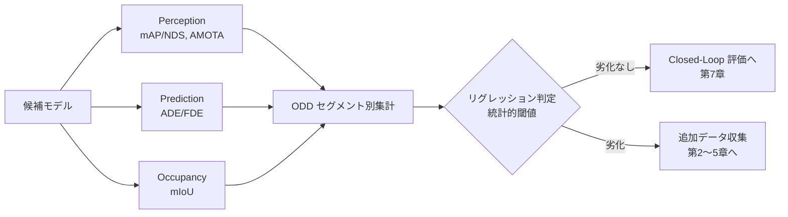

# 6.8 オフライン評価とリグレッションテスト（データセットレベル）

「止めるべき変更を確実に止める」評価基盤がなければ、自動化されたパイプラインは事故の自動配信装置になります。本節ではログやデータセット上でモデル性能を定量化するオフライン評価 (offline evaluation) と、劣化を機械的に検出するリグレッションテスト (regression test) を扱います [P6, P7, P13]。

ここで先に評価指標の用語を押さえます。**mAP (mean Average Precision)** は検出精度の代表指標、**NDS (nuScenes Detection Score)** は mAP に位置・速度・向きの精度を統合した nuScenes ベンチマーク独自の総合スコア、**AMOTA (Average Multi-Object Tracking Accuracy)** はリコール掃引平均で計算する追跡指標、**MOTP (Multi-Object Tracking Precision)** はマッチした対の位置誤差、**minADE / minFDE** は K 本の予測軌道のうち最良の Average / Final Displacement Error、**mIoU (mean Intersection over Union)** はクラス平均の交差重なり率、**ブートストラップ (bootstrap)** は復元抽出で統計量の分布を推定する手法を指します。

## オフライン評価の位置づけ

オフライン評価は、固定データセット上で出力品質を測ります。シミュレーションや実車試験に比べて高頻度・低コストで回せ、ODD セグメントを絞った評価が容易です。モデル変更やデータ更新による劣化も早期に検出できます。ただし、評価対象モデルの出力が次の入力に影響しないため、制御ループ内のフィードバック効果は捉えられません。そこで第 7 章の Closed-Loop シミュレーションと多段ゲートで併用します。

> この図のポイント：オフライン評価は単発のスコアではなく、ODD 別に分解して統計的に回帰を判定し、劣化セグメントを Closed-Loop でデータ収集に戻すフィードバックの起点です。

## nuScenes の mAP と NDS

nuScenes [P6](references#p6) の 3D 検出評価は、画像のような IoU (重なり率) ではなく **BEV (鳥瞰) 上の中心間距離** でマッチングする点が特徴です。距離しきい値 $d \in \{0.5, 1, 2, 4\}$ m ごとに AP (Average Precision) を計算し、10 クラス・4 しきい値で平均して mAP を得ます。これにより、小さな車両でも遠距離車両でも公平に評価できます。

$$
\mathrm{mAP} = \frac{1}{|\mathbb{C}|\,|\mathbb{D}|} \sum_{c \in \mathbb{C}} \sum_{d \in \mathbb{D}} \mathrm{AP}_{c,d}
$$

さらに nuScenes は、誤差の種類を表す 5 つの True Positive 指標 (mATE 位置、mASE スケール、mAOE 向き、mAVE 速度、mAAE 属性) を統合した **NDS (nuScenes Detection Score)** を主要指標とします。

$$
\mathrm{NDS} = \frac{1}{10}\Big[\,5\,\mathrm{mAP} + \sum_{\mathrm{mTP}\in\mathbb{TP}}\big(1 - \min(1, \mathrm{mTP})\big)\Big]
$$

NDS は mAP に 5 の重みを置きつつ、位置・速度・向きの誤差も評価に含めるため、検出の「当たり外れ」だけでなく**幾何的な正確さ**を反映します。

mAP/NDS は何を測るかをまとめると次のようになります。

- **AP の計算手順**：(1) 中心間距離でマッチングした検出群を信頼度スコアの降順に並べる、(2) 累積 TP / FP からリコールとプレシジョンを求める、(3) リコール 0〜1 を 101 点で等間隔サンプリングし、各点で「そのリコール以上の領域での最大プレシジョン」を取って平均する (nuScenes 流の 101 点補間)。
- **mAP の集約**：4 種類の距離しきい値 (0.5 / 1 / 2 / 4 m) と 10 クラスの全組み合わせで AP を求め、平均する。
- **NDS の合成**：5 つの TP 指標 (mATE / mASE / mAOE / mAVE / mAAE) を 0〜1 に正規化し、`1 - min(1, e)` の総和を mAP の 5 倍と足してから 10 で割る。重み配分から、mAP 改善が支配的だが幾何精度の劣化も全体スコアを下げる構造になっている。

距離マッチングのしきい値や TP 指標の正規化は公式 devkit に従うべきですが、ここでは NDS が「mAP × 幾何精度」の合成である点を押さえます。Closed-Loop では、mAP が同等でも mAVE (速度誤差) が悪化していれば予測・計画に波及するため、NDS の内訳まで見ます。

## トラッキング評価：AMOTA と MOTP

**MOT (Multi-Object Tracking、複数物体追跡)** では、検出が当たっているかだけでなく、同じ物体の **ID** が時間方向に一貫して維持されているかが問われます。古典的な MOTA は単一しきい値で計算しますが、nuScenes では recall を掃引して平均する **AMOTA (Average MOTA)** を用い、リコール × ID 維持のバランスを評価します。

$$
\mathrm{MOTA} = 1 - \frac{\sum_t (\mathrm{FN}_t + \mathrm{FP}_t + \mathrm{IDSW}_t)}{\sum_t \mathrm{GT}_t}, \qquad
\mathrm{AMOTA} = \frac{1}{n}\sum_{r \in \{1/n,\dots,1\}} \mathrm{MOTA}_r
$$

MOTP は位置精度（マッチした対の平均距離）を表します。指標の意味と算出手順をまとめると次のようになります。

- **MOTA の構成要素**：各時刻 $t$ で偽陰性 (FN)・偽陽性 (FP)・ID スイッチ (IDSW) を数え、その合計を GT 件数で割った値を 1 から引く。0 を下回り得るが、リグレッション判定では 0 に下クリップしてから集約することが多い。
- **AMOTA の集約**：単一しきい値ではなくリコールを刻んで MOTA を計算し、それらの平均を取る。これにより「リコールを犠牲にして見かけの MOTA を稼ぐ」運用を防ぎ、リコール×ID 維持のバランスを評価できる。
- **MOTP の意味**：マッチに成功した GT-予測対の距離 (m) を平均する。検出が当たっているときの「位置精度」に相当する。マッチが 1 件もないシーンは特異値として扱う必要がある。

AMOTA は ID switch (IDSW) を明示的に減点するため、フレーム単位では正しくてもトラック ID が頻繁に入れ替わるモデルを峻別できます。これは予測・計画が「同じ対象を追い続ける」前提に立つため、Closed-Loop の下流品質に直結します。

## 軌道予測評価：ADE と FDE

軌道予測は、モデルが出力した将来の点列と、正解の点列との距離で評価します。**ADE (Average Displacement Error)** は全時刻にわたる L2 距離の平均、**FDE (Final Displacement Error)** は終端時刻の L2 距離です。実際の運転では「歩行者が右に行くか左に行くか」のように、将来は本質的に多峰 (multi-modal) で確定しません。そのため $K$ 本の候補軌道を出して最良を採る **minADE$_K$ / minFDE$_K$** を用います。

$$
\mathrm{ADE} = \frac{1}{T}\sum_{t=1}^{T}\lVert \hat{\mathbf{p}}_t - \mathbf{p}_t \rVert_2, \qquad
\mathrm{minADE}_K = \min_{k \in K}\frac{1}{T}\sum_{t=1}^{T}\lVert \hat{\mathbf{p}}_t^{(k)} - \mathbf{p}_t \rVert_2
$$

ADE/FDE が何を測るかを整理すると、(1) 予測点列と GT 点列の各時刻ごとに L2 距離を求め、(2) その平均が ADE、終端 (時刻 $T$) の値が FDE になります。多モーダル予測 ($K$ 本の候補) の場合は、各候補について ADE を計算し、最小の ADE を出した候補の値を minADE$_K$ として採用、その候補に対応する FDE を併記する形が定番です。

minADE$_K$ は「正解に近い候補を 1 本でも出せたか」を測ります。ただし **Miss Rate (全候補が一定半径を外す割合)** と併用しないと、的外れな候補を多数出すモデルを見逃します。Closed-Loop では、介入の多かったシーンを評価セットに足し、レアな軌道での Miss Rate を重点監視します。

## Occupancy 評価：mIoU と幾何整合

Occupancy 予測 [P13, P14] は、ボクセル単位のセマンティック分類として **mIoU (mean Intersection over Union)** で評価します。

$$
\mathrm{IoU}_c = \frac{\mathrm{TP}_c}{\mathrm{TP}_c + \mathrm{FP}_c + \mathrm{FN}_c}, \qquad
\mathrm{mIoU} = \frac{1}{|\mathbb{C}|}\sum_{c} \mathrm{IoU}_c
$$

mIoU の算出手順は、(1) 予測ボクセル配列と GT ボクセル配列を同形状で揃え、無効ラベル (ignore=255 など) のマスクを GT から作る、(2) クラス $c$ ごとに「予測=c かつ GT=c かつ有効」の交差ボクセル数と「予測=c または GT=c (有効領域内)」の和集合ボクセル数を数え、`交差 / 和集合` で IoU を求める、(3) 和集合が 0 になるクラスは集計から除外する、(4) 残ったクラスの IoU を平均して mIoU とする、という流れです。

mIoU に加えて、表面の形状一致を測る Chamfer 距離や Fréchet 系の分布距離を補助に使うと、「クラスは合っているが形が崩れている」ケースを検出できます。自由空間 (free space) の FN は走行可能領域の誤認に直結するため、空間クラスは特に手厚く評価します。

## False Negative を重視した損失・指標設計

自動運転では、**誤検出 (False Positive、FP)** より **見落とし (False Negative、FN)** が安全に直結します。歩行者を「いない」と判断する誤りは、存在しない歩行者を検出する誤りより圧倒的に危険です。そこで FN を重く罰する損失と指標を設計します。

FN 重視の損失設計は、Focal Loss を土台に正例側の重みを増やす方針が扱いやすいです。具体的には、(1) ロジットからシグモイドで確率 $p$ を求め、(2) 通常の binary cross entropy を要素ごとに計算、(3) 正解が 1 のとき $p_t = p$、0 のとき $p_t = 1-p$ として $(1 - p_t)^\gamma$ を Focal の集中項として掛ける、(4) その上で正例 (targets=1) の損失だけを `fn_weight` 倍 (例：3.0) し、負例には通常の重みを掛ける、(5) 重み付き損失を平均する、という流れにします。$\alpha$ は 0.75 のように正例寄りに設定すると効果が出やすいです。

指標側では、recall を precision より重視する $F_\beta$ ($\beta>1$、例：$F_2$) を採用するか、安全上クリティカルなクラス (歩行者・自転車) の recall を独立に閾値管理します。距離レンジ別 (近・中・遠) に FN 率を分解し、近距離での見落としを最優先で監視します。

## リグレッション閾値の統計的決定

リグレッションテストでは、「baseline からどれだけの変動を **回帰 (劣化)** とみなすか」を統計的に決めます。固定マージン (例：「NDS −0.5pt 未満なら不合格」) だけだと、評価セットのサンプリング揺らぎを回帰と誤判定して暴発したり、逆に有意な劣化を見逃したりします。**ブートストラップ (bootstrap)** はデータから復元抽出を繰り返して統計量の分布を推定する手法で、これで指標の信頼区間を求めれば、有意な劣化のみを止められます。具体的な判定手順は次の通りです。

1. **シーン単位の対応差分を取る**：候補モデルと baseline モデルを同じ評価データセットで実行し、シーン (Drive・セグメント単位) ごとに指標値を出す。候補の値から baseline の値を引いた「シーン対応差分」を配列として保持する。
2. **ブートストラップで信頼区間を推定する**：差分配列を復元抽出 (bootstrap) で繰り返し (例：2000 回) リサンプリングし、各リサンプルの平均を計算。得られた平均値の経験分布から、両側 $\alpha=0.05$ なら 2.5 パーセンタイルと 97.5 パーセンタイルを取り、95% 信頼区間 [lo, hi] を得る。
3. **回帰判定の 2 条件**：(a) 信頼区間の上限 `hi` が 0 を下回る (= 有意に悪化)、(b) 平均劣化幅が実用上の最小幅 (例：NDS で 0.5pt = 0.005) を超える、の **両方** を満たす場合のみ回帰と判定する。
4. **結果の連動**：回帰と判定された候補は 6.7 節の自動ゲート (`auto-gate`) で機械的に Fail させ、デプロイ準備に進ませない。

この 2 条件併用により、評価セットのサンプリング揺らぎを誤って回帰と判定する暴発を防ぎつつ、実害が出るレベルの劣化は確実に止められます。

> **統計的に厳密に運用する場合の補強**：上の手順は percentile bootstrap (パーセンタイル法) で簡便ですが、次の補強が望ましい場面があります。(a) 連続シーンの **serial correlation (時系列相関)** が無視できない場合は **block bootstrap** (連続フレームをブロック単位でサンプリング)、(b) 標本平均が偏った推定値になる場合は **BCa (Bias-Corrected and accelerated) bootstrap**、(c) ODD セグメント別に多数の指標を同時判定する場合は **Bonferroni / Benjamini-Hochberg** などの多重比較補正を行うのが望ましいです。`min_drop` の値は「過去のリリースで実車インシデント増加と相関した最小差分」を社内データから決めるのが理想で、本書の 0.005 は一例です。

## ブートストラップ判定が「平均値の罠」を防ぐ仕組み

評価で最も陥りやすい落とし穴は「全体平均だけを見て合格判定する」運用です。NDS や mAP の平均値が baseline と同等以上に見えても、ODD セグメント別に分解すると夜間・雨天・遠距離など特定条件で深刻な悪化が起きていることが珍しくありません。安全クリティカルな見落としは特定条件に局在するため、平均値だけ見ると ODD セグメント別の悪化を見逃して、量産後にインシデントが増えてから気づくという最悪のパターンを踏みます。

これを防ぐには、評価セットを ODD セグメント別に分解し、各セグメントで最低 100 シーン (理想は 500 シーン) 以上を確保することが前提条件になります。シーン数が少ないと信頼区間が広すぎて、有意な劣化があっても統計的に検出できず、結果として何も止められない評価基盤になってしまいます。「100 シーン以上」という数字は、ブートストラップで信頼区間が実用的な幅に収まる経験則として理解しておくとよいです。

具体的な判定は、シーン単位の対応差分を 2000 回ブートストラップして 95% 信頼区間を計算し、「上限 hi が 0 を下回る」と「平均劣化が `min_drop` を超える」の両方を満たす場合のみ Fail とする二条件併用です。片方だけだと、サンプリング揺らぎを誤って Fail と判定する暴発か、実害のない微小劣化で過敏に止めるかのどちらかになります。`min_drop=0.005` (NDS で 0.5pt) は本書での一例で、本来は「過去のリリースで実車インシデント増加と相関した最小 NDS 差分」を社内データから決めるのが筋であり、その根拠を Git 管理下の `regression_thresholds.yaml` で版管理しておくと、しきい値そのものがレビュー可能になります。

連続フレームを多用する評価では時系列相関 (serial correlation) が無視できず、独立サンプルを仮定する素朴なブートストラップでは信頼区間が狭く出すぎて誤判定します。block bootstrap で連続フレームをブロック単位でサンプリングする補強が必要です。ODD セグメント別に多数の指標を同時判定する場合は、Bonferroni や Benjamini-Hochberg などの多重比較補正を入れないと、検定回数が増えるほど偽陽性が増えます。これらを運用の前提条件として文書化しないと、統計的に厳密な判定のつもりが実質「ゆるい判定」になっていることに気づけません。

判定結果は 6.7 節の `auto-gate` ステップに直結させ、Fail 時はデプロイへ進ませない構造にします。判定の根拠 (信頼区間・劣化幅・対象セグメント) を実験トラッキングのアーティファクトに保存し、人手承認ゲートで安全担当が必ず参照する運用にすることで、「自動判定が通ったから OK」ではなく「劣化があるとすればどのセグメントか」を組織として確認する規律が立ちます。

## ODD セグメント別評価とゴールデンデータセット

全体平均が改善していても、特定 ODD で悪化することは珍しくありません。第 2 章で定義した ODD（時間帯・天候・道路種別・交通状況）ごとに指標を分解し、セグメント別に回帰判定します。

| ODD セグメント | 主要指標 | 監視の勘所 |
|---|---|---|
| 夜間・雨天 | NDS, 歩行者 recall | 照度・反射で FN が増えやすい |
| 高速・遠距離 | mAP@4m, mAVE | 遠方小物体・速度推定の劣化 |
| 都市・交差点 | minADE/Miss Rate | 多エージェント予測の破綻 |
| 渋滞・低速 | Occupancy mIoU | 近接・遮蔽下の自由空間誤認 |

ゴールデンデータセット（典型シーン＋過去インシデント＋重要 ODD を含む固定セット）に対し、モデル更新のたびに同じ評価を回します。Closed-Loop では、フィールド（第 8 章）やシミュレーション（第 7 章）で観測された失敗が属する ODD セグメントを特定し、そのセグメントの評価セットとデータ収集を手厚くするフィードバックを回します。

## 本章のまとめ

第 6 章では、データ中心・Closed-Loop の中核である「学習」を、実務に耐える形で掘り下げました。実験管理とデータパイプライン (6.1〜6.2) で再現性とデータ供給スループットの基盤を整え、モデルアーキテクチャ (6.3〜6.4) で BEV・Occupancy・End-to-End・世界モデルの選択がデータ要件・人員規模・ASIL の組み合わせで自然に絞られる思考と学習テクニックの段階導入を論じ、分散学習 (6.5) で FSDP/ZeRO/Megatron による大規模化と ZeRO-1 → 2 → 3 の段階深掘り、軽量化 (6.6) で量子化・枝刈り・TensorRT による Drive Orin 254 TOPS 制約への適合、オーケストレーション (6.7) で Closed-Loop を自動かつ監査可能に回す DAG・トリガ・ガバナンス、そして本節 (6.8) で「平均値の罠」を回避するブートストラップ判定 (信頼区間上限 < 0 かつ平均劣化 > 0.005 の両条件) を整えました。これらは独立した技術ではなく、データ → 学習 → 評価 → 承認 → デプロイ → フィールド → データという 1 つのループを構成します。評価で見つかった劣化セグメントが、再びデータ収集とラベリングに戻る——この循環こそが本書の主題です。

## 次章への橋渡し

オフライン評価は強力ですが、「モデルが制御ループに入ったときの挙動」までは測れません。歩行者の飛び出しに対する回避が安全だったか、急ブレーキが快適性を損なわなかったか——これらは出力が次の入力を変える Closed-Loop でしか評価できません。次の第 7 章では、CARLA / AWSIM / NVIDIA DRIVE Sim などのシミュレータ、OpenSCENARIO / OpenDRIVE によるシナリオ記述、GAIA-1 や Gaussian Splatting による生成的シーン、TTC/PET などの安全指標、そして ISO 26262 / ISO 21448 (SOTIF) に沿った検証を扱い、オフライン評価を補完する Closed-Loop シミュレーションへと進みます [Sim1, Sim7, W1]。
