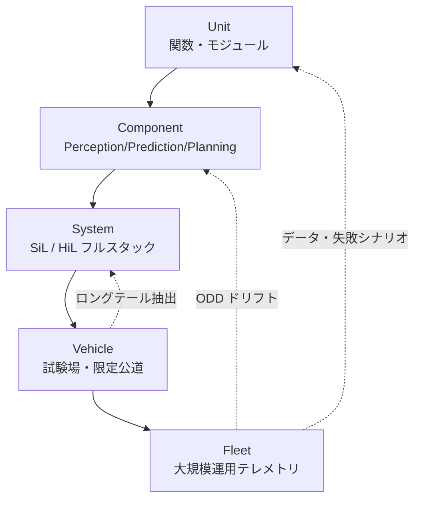
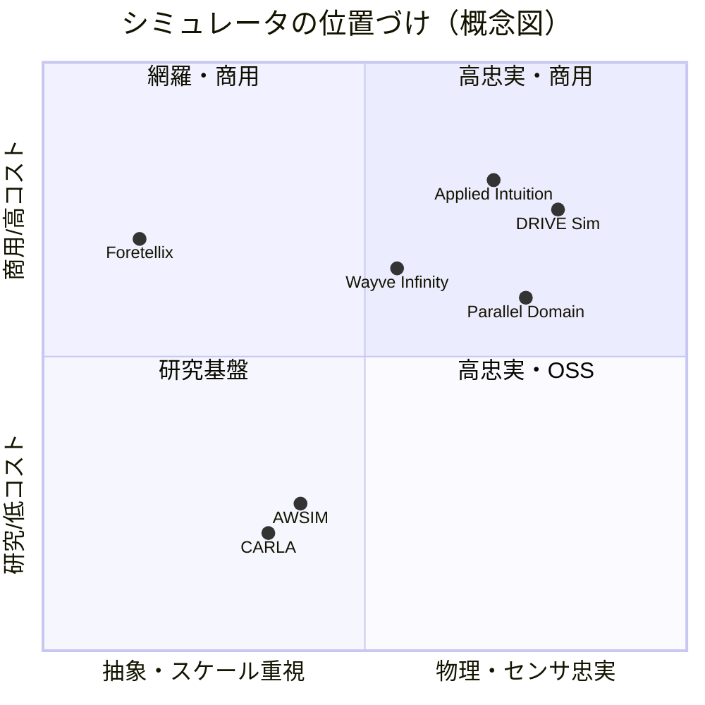

# 7.1 評価・シミュレーション・実車テストの関係

この節では、自動運転・ADAS 検証の三本柱を整理します。具体的には、オフライン評価 (offline evaluation)・シミュレーション (simulation)・実車テスト (real-road test) の役割分担です。Unit から Fleet までの評価階層、実車テストのリスクアセスメント、必要走行距離の統計設計、主要シミュレータの比較までを扱います。最終的には「どのレベルの評価結果を、どのデータサイクルへ戻すか」を設計できる状態を目指します。

## 評価レベルの階層構造と目的

自動運転スタックの評価は、検証対象の粒度に応じて 5 つのレベルに分かれます。下位レベルほど高速・低コストで反復でき、上位レベルほど現実忠実度が高くなります。一方で、上位レベルはコストとリスクも増大します。この非対称性こそが、Closed-Loop で「できるだけ下位レベルに検証を寄せる」動機になります。

> **図 7.1**：評価レベルの階層と Closed-Loop フィードバック。上位レベルで見つかった失敗は、下位レベルの高速ループへ「シナリオ」として落とし込み、再現・再学習・再評価する。この図のポイントは、検証が一方向に流れるのではなく Fleet から Unit へ戻る循環であることです。

| レベル | 主対象 | 代表手法 | 1 ケースのコスト感 | 確認したいこと |
|---|---|---|---|---|
| Unit | 関数・モジュール | pytest / GoogleTest | ミリ秒〜秒 | ロジックの正しさ |
| Component | Perception / Prediction / Planning | オフライン指標（mAP, ADE/FDE） | 秒〜分 | アルゴリズム性能 |
| System | フルスタック | SiL / HiL Closed-Loop | 分〜時間 | 統合時の動的挙動 |
| Vehicle | 実車 | 試験場・限定公道 | 時間〜日 | 実環境での最終確認 |
| Fleet | 量産・運用車両 | テレメトリ統計 | 継続運用 | 母集団全体の安全性 |

各レベルの結果は、最終的にデータエンジンへ戻され、「どの ODD セグメントでデータが不足しているか」「どの機能が失敗の主因か」「どのシナリオを追加収集・生成すべきか」という意思決定に使われます。

## オフライン評価と Closed-Loop 評価の違い

オフライン評価は、固定データセットに対してモデル出力を計算し、mAP / IoU / ADE / FDE / 成功率を集計する形式です。第 6 章で扱ったとおり、実験速度が速く、日々の開発で主役になります。ただし、システム全体の安全性・快適性は、オフライン指標だけでは説明できません。典型的には、次のような乖離が生じます。

- 検出 mAP（mean Average Precision、検出精度）は高いが、わずかな遅延やノイズで追従制御が発振する。
- 将来軌道の平均誤差 ADE（Average Displacement Error、各時刻の位置誤差の平均）は小さいが、稀に衝突に近い軌道を選択する。
- 各コンポーネントは仕様を満たすが、統合すると乗り心地（加加速度 jerk）が悪化する。

これらは、環境・他車・制御のフィードバックを含む Closed-Loop 評価でなければ観測できません。したがって役割を分けます。オフライン評価は「静的性能の高速比較とリグレッション（性能後退）検知」、Closed-Loop 評価（SiL / HiL / 実車）は「動的挙動の安全性・快適性・効率の測定」です。データ中心の視点では、オフラインで見つけた弱点をシナリオ DB（第 7.2 節）へ落とし込み、Closed-Loop へ流すループ設計が要になります。

両者を切り分ける際にもっとも陥りやすい失敗は、オフライン指標の改善を Closed-Loop の挙動改善と同一視してしまうことです。mAP が 1 pt 上がっても、検出のタイミングが数フレーム遅れれば下流の Planning は減速判断を誤り、jerk が悪化することがあります。逆に ADE が悪化してもモード平均化された軌道が無難な分だけ衝突回避には有利になる、という逆説も起こります。これは「オフライン指標は分布の周辺統計量、Closed-Loop 指標は経路積分量」という性質の違いから来るもので、両者の不一致こそが Closed-Loop 評価を独立に持つ意義です。実務では、オフライン合格・Closed-Loop 失敗のシナリオを「指標間ギャップの教科書」として扱い、なぜ両指標が乖離したかを後段の Perception/Prediction 改修に役立てる姿勢が重要です。リグレッションをオフラインで先に検知し、Closed-Loop へ昇格させるゲートを設けるのも、この経路積分性を持つ動的指標の評価コストが高いことの裏返しといえます。

## 実車テストのリスクアセスメントと ODD 限定

実車テスト・公道試験は最終検証ステージとして不可欠です。一方で、安全性・法令・社会受容性の観点から、範囲と頻度に厳しい制約があります。危険シナリオを意図的に多数発生させることは原則できず、大規模カバレッジを実車のみで達成するのは時間・コストともに非現実的です。実務では、公道試験の前に SAE J3018 [L8](references#l8)（プロトタイプ ADS 車両のオンロード試験ガイダンス）に沿って、リスクアセスメントを実施します。ODD（Operational Design Domain、運行設計領域。第 1 章）は、走行する道路種別・速度域・天候・時間帯などを定義し、その範囲外には進入しないようにします。

| 評価軸 | 内容 | 緩和策の例 |
|---|---|---|
| Severity（重大度） | 失敗時の被害規模 | セーフティドライバ、低速 ODD 限定 |
| Exposure（曝露） | 当該状況の発生頻度 | 試験場での先行検証、時間帯制限 |
| Controllability（制御性） | 人間が回避できるか | 二重冗長ブレーキ、テレオペ監視 |

実車テストは、3 つの役割を担います。第一に、シミュレーションでモデル化が難しい現象（路面の微小凹凸、センサ汚れ、人間の微細挙動）の確認です。第二に、フェイルセーフ・HMI（Human Machine Interface、運転者と車両の対話画面）を含む統合最終確認です。第三に、認証上必須の試験ケース実施です。実車で得たログとインシデントは最優先シナリオとしてシナリオ DB に登録し、第 4〜6 章のデータ選択・ラベリング・学習へフィードバックします。

ここで気をつけたいのは、実車テストの本質的な役割が「合否判定の場」ではなく「シミュレーションが取りこぼす現象の検出器」だという点です。J3018 [L8](references#l8) のリスクアセスメントが Severity / Exposure / Controllability の三軸を要求するのも、危険シナリオを意図的に多数発生させられないからこそ、限定 ODD で発生する稀な現象（路面摩擦の局所変化、センサ表面の汚染、群衆の予測困難な挙動）を逃さず捕捉する設計を要求しているためです。実車で 1 件観測されたインシデントは、それ単体ではレアイベントの統計を支えられません。そこで実務では、観測されたヒヤリハットを起点に、シミュ上で対向車速度・距離・天候・センサ汚れ条件をパラメトリックに振った数百〜数千のバリエーションへ展開し、Closed-Loop でロバスト性を統計的に確認する流れになります。実車を「点」、シミュを「分布」と捉え、点で見えた事実を分布の問いへ翻訳する作業こそが、実車テストとシミュを架橋する Closed-Loop の中心仕事です。

## Fleet レベルの統計的サンプル数設計

「何 km 走れば安全を主張できるか」という問いは、レアイベントの統計で定式化できます。RAND の試算 [R6](references#r6) は、人間ドライバの死亡事故率（約 10^-8/マイル）に対して、自動運転が同等以上であることを統計的有意（95% 信頼）に示すには、数億〜数千億マイルの無事故走行が必要になり得ると指摘しました。これは、実車のみでの検証が不可能であることの定量的根拠です。

ある事象の発生率 $\lambda$（件/km）を片側 95% 信頼で「観測ゼロ件から上限 $\lambda_{\max}$ 以下」と主張するには、ポアソン分布の上側信頼限界から必要走行距離 $D$ は次で見積もれます。

$$
D = \frac{-\ln(1 - \alpha)}{\lambda_{\max}} \quad (\alpha = 0.95 \Rightarrow D \approx \frac{2.996}{\lambda_{\max}})
$$

これが俗に言う「3 の法則 (rule of three)」です。$\alpha = 0.95$ で右辺が約 3 になることに由来する経験則になります。観測ゼロ件が前提の特殊ケースであり、数件以上の発生が観測される場合には使えません（その場合はポアソン分布の正確な信頼区間や χ² 法を用います）。例えば $\lambda_{\max} = 10^{-6}$ 件/km（100 万 km に 1 件未満）を主張したい場合、$D \approx 3 \times 10^{6}$ km が必要です。実車フリートで数百万 km を均一な ODD で蓄積するのは難しいため、Closed-Loop シミュレーションで分布を補完します。

代表的な発生率上限ごとの必要走行距離を上式から見積もります。$\lambda_{\max} = 10^{-5}$ 件/km なら約 30 万 km、$10^{-6}$ 件/km なら約 300 万 km、$10^{-7}$ 件/km なら約 3,000 万 km という規模感です。安全目標の発生率上限を 1 桁厳しくするたびに必要走行距離が 1 桁伸びるため、実車のみでの論証は急速に非現実的になります。

実務では、3 層で安全論証を構成します。第一に、Fleet で実走行距離あたりの介入率・ヒヤリハット率を継続観測します。第二に、不足する ODD セグメントをシミュレーション（第 7.3〜7.5 節）で埋めます。第三に、シナリオベースで「重要だが稀な状況」のカバレッジを別途定量化します（第 7.6 節）。新車両導入時には、限定 ODD で一定距離を走り切るバーンインテスト期間を設け、初期の ODD ドリフト（運用環境のずれ。第 8 章）を監視することが一般的です。

ここで重要なのは、rule of three が示す数億 km 級の必要走行距離を「実車で達成すべきノルマ」と捉えると判断を誤る点です。むしろ rule of three は「人間ドライバ並の安全性を実車だけで主張するのは原理的に不可能」と告げる**不可能性定理**として読むべきです。RAND の試算 [R6](references#r6) が桁違いの数字を出した意義はここにあります。$\lambda_{\max}$ を 1 桁厳しくすれば必要距離が 1 桁伸びるため、安全目標を厳しくするほど実車のみでは閉じなくなる、という非対称性が安全論証を多層化する論理的根拠になります。実車で測るのは「介入率・ヒヤリハット率の代理指標」と割り切り、本論証はシミュレーションとシナリオ DB の組み合わせで構成する、というのが Closed-Loop の前提です。限定 ODD ごとに $\lambda_{\max}$ と必要距離をテーブル化しておくと、ODD 拡大を提案する際にどの程度シミュ補完が必要かを定量に語れるようになり、社内の安全レビューが「定性議論」から「分布議論」へ移行します。

## シミュレータ生態系の比較

System / Vehicle レベルの Closed-Loop 評価を支えるシミュレータは、ここ数年で大きく多様化しました。オープンソースの研究基盤、商用のセンサ忠実度重視プラットフォーム、ニューラルレンダリング型まで、目的に応じて使い分けます。代表的なシミュレータの特徴を先に簡単に紹介します。CARLA（オープンソース、Unreal Engine ベース）と AWSIM（TIER IV 製、Unity ベース、Autoware 連携）が研究・社内反復の主役です。NVIDIA DRIVE Sim（Omniverse ベース、物理ベースレンダリング）、Applied Intuition（OEM 採用多数の商用統合プラットフォーム）、rFpro（光学忠実度の高いドライビングシム）はセンサ検証の中心です。Foretellix（Foretify、シナリオ網羅とカバレッジ駆動検証）と Wayve Infinity（世界モデル GAIA 系を Closed-Loop へ組み込んだ生成型シミュ）、Waymo Carcraft（公開情報から見える内製のフリート規模シミュ環境 [R1](references#r1)）は、それぞれ別の方向で大規模化を進めています。

次表は公開情報の範囲で主要シミュレータを整理したものです（各製品は継続的に進化するため、スナップショットとして参照してください）。

| シミュレータ | 提供 | 型 | センサ忠実度 | シナリオ標準 | 特徴 |
|---|---|---|---|---|---|
| **CARLA** [Sim1](references#sim1) | OSS (CVC) | ゲームエンジン (UE) | 中 | OpenSCENARIO/DRIVE | 研究デファクト、無償、拡張容易 |
| **AWSIM** [Sim2](references#sim2) | TIER IV (OSS) | Unity | 中 | Autoware 連携 | Autoware との統合検証 |
| **NVIDIA DRIVE Sim** [Sim3](references#sim3) | NVIDIA | Omniverse/RTX | 高（RTX 物理ベース） | OpenSCENARIO/USD | センサ忠実度・SDG 重視 |
| **Applied Intuition** [Sim4](references#sim4) | Applied Intuition | 商用統合 | 高 | OpenSCENARIO/独自 | OEM 採用多数、ツールチェーン |
| **Cognata** | Cognata | 商用 | 高 | OpenSCENARIO | 合成データ・SDG |
| **rFpro** | rFpro | ドライビングシム | 高（光学忠実） | OpenDRIVE | HiL・人間 in the loop |
| **Foretellix** [Sim5](references#sim5) | Foretellix | カバレッジ駆動 | 抽象 | OpenSCENARIO DSL (M-SDL) | シナリオ網羅・測定 (Foretify) |
| **Parallel Domain** | Parallel Domain | 合成データ | 高 | 独自/OpenSCENARIO | データ生成特化 (DGP) |
| **Wayve Infinity** [Sim6](references#sim6) | Wayve | 世界モデル (GAIA 系) | 学習ベース | 学習生成 | E2E・生成 Closed-Loop |
| **Waymo Carcraft** [R1](references#r1) | Waymo（非公開） | 内製 | 高 | 内製 | 公道 + 800M+ マイルのシミュ |

> **図 7.2**：シミュレータの概念的な位置づけ。横軸は忠実度、縦軸はコスト/商用度。この図のポイントは、単一の「最良シミュレータ」は存在せず、検証目的でレイヤを使い分けることです。Perception（知覚）検証には高忠実度型、Planning（計画）カバレッジには抽象・網羅型、という具合に役割分担します。実務では、CARLA を SiL 反復に、商用プラットフォームを認証前の高忠実度検証に、というハイブリッド構成が定着しつつあります。

シミュレータ選定で陥りがちな失敗は、忠実度の高い単一プラットフォームに統一すれば検証品質が上がる、と考えてしまうことです。物理ベースレンダリングを売りにする DRIVE Sim [Sim3](references#sim3) や rFpro はカメラ・LiDAR の光学的整合に強い一方、シナリオ網羅・パラメータ探索の効率では Foretellix [Sim5](references#sim5) のようなカバレッジ駆動型に劣ります。逆に Foretellix は抽象的なパラメータ空間を高速に展開できますが、Perception の暗所性能やセンサ汚れに対するロバスト性検証には粒度が粗すぎます。両者は補完関係にあり、片方を選ぶのではなく「Perception ロバスト性は高忠実度型、Planning カバレッジは抽象・網羅型、認証前最終確認は商用 RT 型」と用途別に割り当てるのが正しい設計判断です。さらに重要なのは、複数シミュレータをまたいで失敗を追跡できるよう、シナリオ ID とモデルバージョン ID を共通キーにしてメタデータ仕様を統一することです。これがないと、ある SiL で見つけた失敗を別の HiL で再現する際に「同じシナリオだったか」すら判定できなくなり、Closed-Loop が分断します。

## 評価結果のトレーサビリティとデータフロー

Closed-Loop の核心は、評価結果からデータ・シナリオへ遡れるトレーサビリティ (traceability、追跡可能性) です。「このシミュレーションシナリオで衝突したが、元はどの実車ログから生成したか」「この実車インシデントに類似するシナリオはシミュ上にどれだけあり、どのモデルバージョンで失敗しているか」。こうした問いに即答できる状態を目指します。そのために、評価パイプラインでは少なくとも次のメタデータを統一管理します。

- シナリオ ID（シナリオ DB 内で一意）
- シミュレーション構成 ID（センサ設定・物理モデル・SW バージョン）
- モデルバージョン ID（学習条件・データセットバージョンを含む）
- 評価ジョブ ID（実行日時・環境情報）

これらをキーに、シナリオ DB・ログストレージ・実験管理ツール・レポート生成（第 7.8 節）を結ぶことで、評価結果がどのデータに由来するかを追跡できます。

## Closed-Loop データエンジンへのフィードバック

本節を第 1〜6 章と結ぶと、評価・シミュレーション・実車テストの結果は次の流れでデータエンジンへ戻ります。

1. 評価結果から失敗シナリオ・性能ギャップを抽出する（第 7.2〜7.6 節）。
2. シナリオをキーに、対応する実車ログ・シミュログをデータレイクから取得する（第 3 章）。
3. 追加ラベリング・リラベリングを行い（第 5 章）、新データセットを設計する（第 4 章）。
4. 再学習し（第 6 章）、オフライン → Closed-Loop → 実車・Fleet のサイクルを再び回す。

このループを回し続けることで、「単発のテスト実施」から「評価結果を起点としたデータ中心・Closed-Loop 改善サイクル」へと組織文化をシフトさせます。

## 本節の振り返り

評価レベルの 5 階層（Unit / Component / System / Vehicle / Fleet）は、単なる検証粒度の分類ではなく「下位ほど高速・低コスト、上位ほど高忠実・高リスク」という非対称性を内包する構造でした。この非対称性こそが、Closed-Loop で「できるだけ下位レベルへ検証を寄せ、上位で見つけた失敗を下位の高速ループへ落とし込む」設計を要請します。オフライン評価と Closed-Loop 評価は対立するものではなく、前者が静的性能の高速比較、後者が動的挙動の安全性・快適性確認という役割分担を持ちます。実車テストは SAE J3018 [L8](references#l8) のリスクアセスメントを前提に ODD を限定して実施し、観測されたインシデントを点として捉え、シミュ上で分布へ翻訳する起点として機能します。Fleet レベルの安全論証は、RAND の試算 [R6](references#r6) が示すとおり実車だけでは数億 km 級の必要走行距離を満たせないため、シミュレーションでの分布補完とシナリオベースのカバレッジ定量化が不可欠です。主要シミュレータ（CARLA / AWSIM / DRIVE Sim / Applied Intuition / Foretellix / Parallel Domain / Wayve Infinity / Carcraft など）は単一最適解を持たず、目的別の階層的併用と統一メタデータによるトレーサビリティ確保が前提になります。

## 次節への橋渡し

次の 7.2 節では、Closed-Loop 評価の「単位」となるシナリオそのものを掘り下げます。ASAM OpenSCENARIO 1.x と 2.0 (M-SDL)、OpenDRIVE、OpenLABEL といった標準フォーマットの位置づけ、論理シナリオと具体シナリオの展開、シナリオ DB のスキーマ設計、そして TTC 分布に基づく難易度スコアリングまで、実装に踏み込んで解説します。
