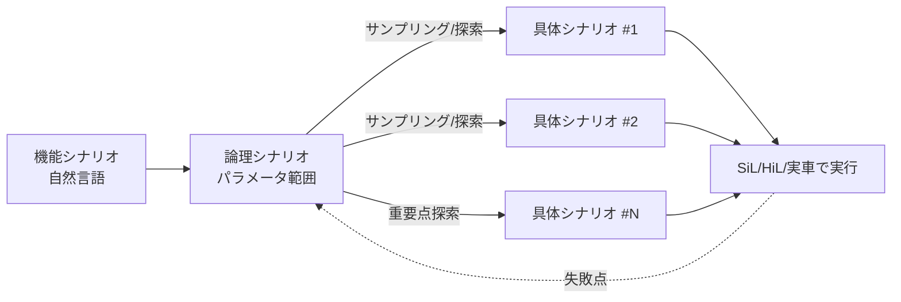
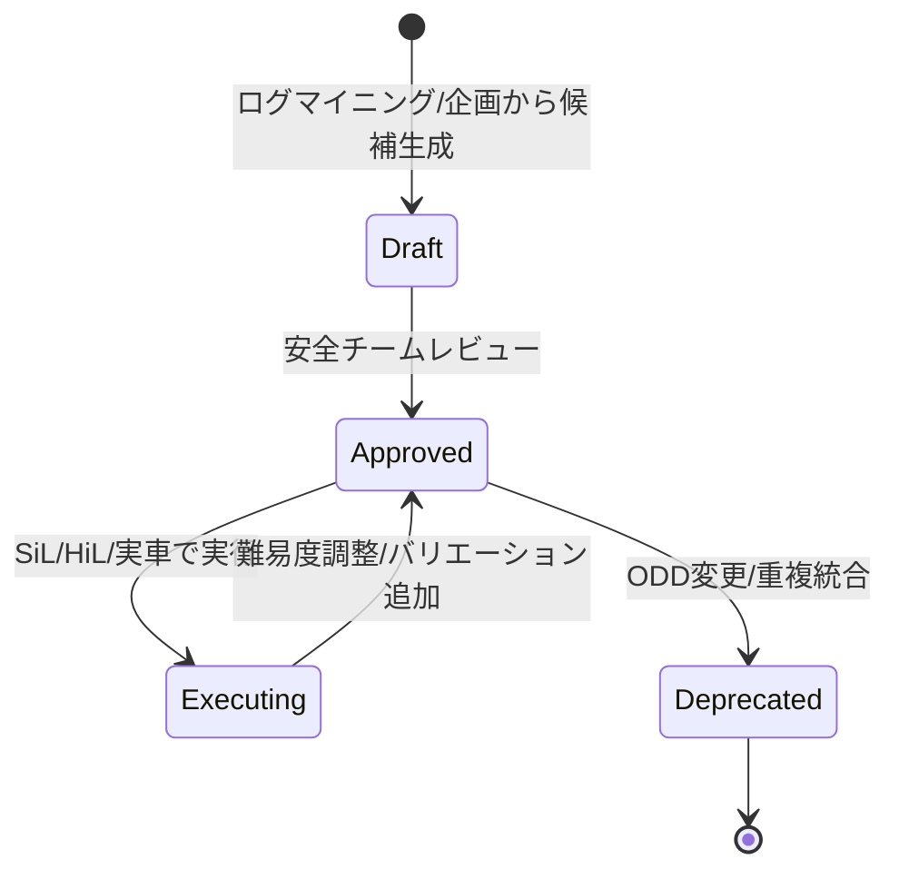

# 7.2 シナリオベーステストの考え方とシナリオ DB

この節では、Closed-Loop 評価の「単位」であるシナリオを掘り下げます。論理シナリオ (logical scenario) と具体シナリオ (concrete scenario) の階層、ASAM（Association for Standardization of Automation and Measuring Systems、自動車計測標準化団体）が定める OpenSCENARIO 1.x / 2.0 (M-SDL)・OpenDRIVE・OpenLABEL の役割分担、シナリオ DB のスキーマ設計、TTC（Time To Collision、衝突までの時間）分布に基づく難易度スコアリングを扱います。最終的には「シナリオを座標系としたテスト設計」を構築します。

## シナリオの 3 階層：機能・論理・具体

ドイツの PEGASUS プロジェクト [Sim10](references#sim10) は、自動運転の検証に必要なシナリオ枠組みを体系化した産学連携プロジェクトです。その整理に従い、シナリオは抽象度に応じて 3 階層で扱うのが標準になっています。

| 階層 | 記述 | パラメータ | 例 |
|---|---|---|---|
| **機能シナリオ** (functional) | 自然言語 | なし | 「合流車線から本線へ合流する」 |
| **論理シナリオ** (logical) | パラメータ範囲 | 区間 | 本線速度 80–120 km/h、合流ギャップ 10–40 m |
| **具体シナリオ** (concrete) | 確定値 | 点 | 本線 100 km/h、ギャップ 22 m、対向なし |

> **図 7.3**：シナリオの 3 階層と展開。論理シナリオから具体シナリオをサンプリングし、失敗点を論理シナリオへ戻して探索を集中する。この図のポイントは、テストが「全数列挙」ではなく、失敗境界に向けた適応的探索であることです。

ODD 全体を一様にカバーするのではなく、「ODD を代表する重要シナリオ群を厳選し、系統的にテストする」ことが目的です。従来の走行距離ベース評価（○○万 km 無事故）は、レアイベントを十分に主張できません（第 7.1 節、RAND [R6](references#r6)）。そのため、リスクの高いシナリオへテスト資源を集中するシナリオベーステストが必要になります。

ここで腑に落ちて欲しいのは、3 階層の本質が「抽象から具体への翻訳」ではなく「失敗境界に向けた適応的探索」だという点です。論理シナリオは本線速度 80–120 km/h、合流ギャップ 10–40 m といった連続パラメータ空間を定義し、その空間から具体シナリオを多数サンプリングして実行します。一様ランダムサンプリングは初期探索には有効ですが、衝突境界（成功と失敗の境目）が空間の一部に局在している場合、効率は急速に落ちます。そこで実務では、失敗した具体シナリオの近傍を密に再サンプリングし、衝突境界の幅を測る適応的探索が要になります。失敗境界が薄ければ脆性、厚ければロバスト、と判定する考え方です。サンプリング方法（ランダム／ラテン超方格／探索的）と乱数シードを必ずシナリオ実行レコードに残しておくと、失敗の再現と境界探索の収束判定が両立します。機能シナリオは安全担当が「何を守りたいか」の言葉で起票し、論理シナリオは検証エンジニアがパラメータ範囲で定義する、という役割分担を明文化することも、抽象度の階段を組織的に降りていくうえで効果があります。

## ASAM 標準の役割分担：OpenDRIVE / OpenSCENARIO / OpenLABEL

シナリオを機械可読に扱うには、標準フォーマットが必要です。ASAM の標準群は、静的な道路・動的な振る舞い・ラベルという軸で役割が分かれています。OpenDRIVE は道路ジオメトリ、OpenSCENARIO はシナリオ動作、OpenLABEL はアノテーションを扱います。

| 標準 | 対象 | 内容 |
|---|---|---|
| **OpenDRIVE** [Sim8](references#sim8) | 静的インフラ | 道路幾何、レーン、標識、信号機の配置 |
| **OpenSCENARIO 1.x（v1.2 相当）** [Sim7](references#sim7) | 動的シナリオ（XML） | 明示的なアクタ・イベント・トリガを XML で記述。`<ConditionGroup>` 内の複数 `<Condition>` は暗黙の AND |
| **OpenSCENARIO 2.0 / DSL (M-SDL)** [Sim7](references#sim7) | 動的シナリオ（DSL） | 宣言的・制約ベース。パラメータ空間を記述しソルバが展開（本書での DSL 記述は概念例で、正式構文は ASAM 仕様 [Sim7](references#sim7) 参照）|
| **OpenLABEL** [Sim9](references#sim9) | アノテーション | シーン・オブジェクトのラベル表現（シナリオ抽出に利用） |

### OpenSCENARIO 1.x（XML、命令的）

OpenSCENARIO 1.x は、「いつ・誰が・何をするか」を XML 木として明示的に書き下す命令的スタイルです。本線車の前方で先行車が急減速するカットインシナリオを記述する場合、次のような要素階層と属性を使います。

| 階層・要素 | 役割 | 主な属性・指定値 |
|---|---|---|
| `Storyboard` / `Story` / `Act` | シナリオ全体と物語単位の入れ物 | 名前、最大実行回数 |
| `ManeuverGroup` / `Maneuver` | 操作の集合（先行車の挙動など） | 対象エンティティ参照 |
| `Event` | 発生する一回の事象 | 優先度（`overwrite` 等） |
| `Action` → `LongitudinalAction` → `SpeedAction` | 縦方向の速度制御アクション | 目標速度（`AbsoluteTargetSpeed` 0 m/s）、変化形状（`linear`）、変化率（例：8 m/s² の減速） |
| `StartTrigger` → `ConditionGroup` → `Condition` | アクションを開始する条件 | エッジ種別（`rising`）、遅延 |
| `ByEntityCondition` → `TimeToCollisionCondition` | TTC を判定条件に使う | 値（例：2.0 s）、比較規則（`lessThan`）、`freespace` の有無 |

実装担当者へは「自車（Ego）と先行車（LeadVehicle）の TTC が 2.0 s を下回った瞬間に、先行車を 8 m/s² の一定減速で 0 m/s まで停止させる」という条件と挙動を、上記要素にマッピングして XML 化するよう依頼します。`ConditionGroup` 内の複数 `Condition` は、暗黙の AND 結合になる点に注意します。

### OpenSCENARIO 2.0 / M-SDL（DSL、宣言的）

OpenSCENARIO 2.0 は、M-SDL (Measurable Scenario Description Language、計測可能なシナリオ記述言語) を基礎とします。パラメータ空間と制約を宣言すると、ソルバ／サンプラが多数の具体シナリオを生成します。「論理シナリオ → 具体シナリオ」の自動展開に直結し、カバレッジ駆動検証（Foretellix Foretify [Sim5](references#sim5) など、シナリオ網羅性を測定しながらテストを進める方式）と親和します。例えば「カットインシナリオ」を宣言する場合、必要な要素は次のとおりです。

- 登場エンティティ：自車（ego: vehicle）と相手車（challenger: vehicle）。
- 道路条件：2 車線の高速道路（two_lane_highway）。
- 自車の挙動：80–120 km/h の範囲で直進する。
- 相手車の初期配置：自車の左隣車線、自車の前方 10–40 m。
- 探索したい変数：相手車が割り込んでくる瞬間の TTC を 0.8–2.5 s の範囲で振る。

これだけを宣言しておけば、ソルバが速度・距離・TTC の組合せを自動展開し、衝突境界に近い厳しいケースを優先サンプリングする具体シナリオ群を生成します。本書での DSL 記述は概念例で、正式構文は ASAM 仕様 [Sim7](references#sim7) を参照します。

命令的 1.x は、レビューしやすく既存ツールの対応が広い一方、表現が冗長です。宣言的 2.0 は、探索空間を簡潔に書け、ソルバで自動展開できますが、ツール対応はまだ発展途上です。実務では、社内向けに扱いやすい YAML 抽象記述を設け、OpenSCENARIO へコンパイルする二層構造を取ることが多いです。ただし、二層構造はコンパイルステップ自体が評価ジッターの源になり得ます。そのため、コンパイラのバージョンも他のアーティファクトと同じく config_hash に含めて再現性を担保します。

## シナリオ難易度スコアリング

すべてのシナリオを等しく扱うと、容易なケースに資源を浪費します。そこで、具体シナリオに難易度スコアを付け、難しいものを優先実行・優先カバレッジ対象にします。最短到達衝突時間（TTC、自車と前方対象が衝突するまでの予測時間）は、難易度の有力な代理指標です。シナリオ実行中の最小 TTC が小さいほど、難しく危険と見なせます。

代表的な合成難易度 $\text{Diff}$ は、最小 TTC・必要減速度・相互作用密度の重み付き和で定義できます。

$$
\text{Diff} = w_1 \cdot \left(1 - \frac{\min(\text{TTC}, T_0)}{T_0}\right) + w_2 \cdot \frac{a_{\text{req}}}{a_{\max}} + w_3 \cdot \rho_{\text{agent}}
$$

ここで $T_0$ は基準 TTC（例 4 s）、$a_{\text{req}}$ は衝突回避に必要な減速度、$a_{\max}$ は車両の最大減速度（例 8 m/s²）、$\rho_{\text{agent}}$ は周辺エージェント密度です。

実装に落とすときは、各シナリオ実行ログから「最小 TTC」「衝突回避に必要だった減速度」「周辺エージェント密度（0–1 に正規化）」の 3 値を取り出し、それぞれを 0–1 に正規化したうえで重み $w_1=0.5,\;w_2=0.3,\;w_3=0.2$ の線形和を取って $\text{Diff} \in [0,1]$ を求めます。重みは安全部門の方針に応じて調整します。最後に得られた値を以下のしきい値で離散ランクに振り分けます。

| 難易度スコア $\text{Diff}$ | ランク | 取り扱いの目安 |
|---|---|---|
| $\ge 0.8$ | S | 衝突境界に極めて近い最重要ケース |
| $\ge 0.6$ | A | リリース判断で必ず確認するケース |
| $\ge 0.4$ | B | 定期リグレッション対象 |
| それ未満 | C | 標準カバレッジで十分 |

例として、最小 TTC = 1.2 s、必要減速度 = 6.5 m/s²、エージェント密度 = 0.7 のシナリオは $\text{Diff} \approx 0.71$ となり、A ランクに分類されます。

このランク (S/A/B/C) をシナリオ DB に保存し、第 7.6 節のリスク加重カバレッジや第 7.8 節のレポートで活用します。

難易度スコアを単なるソート用キーと見なすと運用は続きません。重要なのは「すべてのシナリオを等価に扱うとテスト資源が容易ケースに浪費される」という有限資源前提の経済合理性です。最小 TTC が小さいほど、必要減速度が大きいほど、相互作用密度が高いほど、衝突境界に近く失敗の情報量が大きい。だからこそ S ランクは CI で全件実行、A はリリース前に必須、B は週次、C は月次、という頻度の階段を設けて、難しいシナリオに反復回数を集中させます。さらに重要な含意は、合成スコアが小さいシナリオばかり合格させても安全は語れない、という点です。S/A の合格率トレンドを週次で追い、悪化傾向が見えた瞬間にリリース候補から外す運用にすることで、「容易ケースの平均成功率」ではなく「困難ケースでの粘り」をリリース指標に据え直せます。これは第 7.6 節のリスク加重カバレッジと同じ哲学で、絶対数ではなく相対充足率で測る考え方の予兆になります。

## シナリオ DB のスキーマ設計

シナリオベーステストを本格運用するには、シナリオ DB が中核になります。出自（実ログ由来か合成か）・バージョン・状態・関連安全目標を、機械可読に持たせます。最低限のスキーマとして、4 つのテーブルに次の情報を持たせます。

| テーブル | 主な列 | 役割 |
|---|---|---|
| シナリオ本体 | シナリオ ID（主キー）、バージョン、状態（draft / approved / deprecated）、カテゴリ（merge / crossing / cut_in 等）、ODD セグメント（地域・道路種別・天候・時間帯を含む構造化属性）、関連安全目標 ID 群、難易度スコア、難易度ランク（S/A/B/C）、出自（real_log / synthetic / hybrid）、登録日時 | シナリオの一意識別とメタデータ集約 |
| アセット参照 | シナリオ ID、OpenSCENARIO ファイルパス（`.xosc`）、OpenDRIVE ファイルパス（`.xodr`）、地図参照 | 実体ファイルへのリンク |
| 来歴リンク | シナリオ ID、由来となった実車ログ ID、派生元シナリオ ID | 実ログとの対応・バリエーション系譜 |
| 実行メトリクス履歴 | シナリオ ID、モデルバージョン、実行回数、成功率、最小 TTC、検出欠陥数、評価日時 | モデル更新ごとの結果蓄積 |

DB エンジン（PostgreSQL など）への落とし込みにあたって、スキーマ設計担当に依頼すべき点は次のとおりです。状態列に CHECK 制約を入れて取りうる値を限定すること。ODD セグメントは将来の属性追加に備えて、JSON 型などの半構造化型で保持すること。シナリオ ID は外部キーとして、他テーブルから参照できるようにすること。

このスキーマにより、「どのシナリオがどの安全目標を検証しているか」「どの ODD セグメントを代表しているか」「実ログのどれに由来するか」を機械的に集計できます。第 7.6 節のカバレッジ設計、第 7.9 節のトレーサビリティと直結します。

## シナリオのライフサイクルと Closed-Loop

シナリオは一度作って終わりではなく、ライフサイクルを辿ります。重要なのは、ログマイニング結果（第 7.6 節）がそのままシナリオになるのではなく、人間のレビューと安全評価を経て確定する点です。

> **図 7.4**：シナリオのライフサイクル状態遷移。この図のポイントは、フリートからの新規危険パターンが自動でドラフト登録され、レビューを経て承認・実行・改廃される **半自動ループ** を構成することです。

Closed-Loop としては、(1) シナリオ DB のシナリオに SiL / HiL / 実車テストを定期実行、(2) 成功率・安全マージン・難易度をシナリオ単位で集計しダッシュボード化、(3) 成績の悪いシナリオへ追加収集・再ラベリング・モデル改良（第 4〜6 章）、(4) 改良版を同一シナリオセットで再評価、という流れになります。シナリオは単なるテストの自動化対象ではなく、データ中心・Closed-Loop の「座標系」として機能します。

## 本節の振り返り

シナリオは PEGASUS [Sim10](references#sim10) が示す機能・論理・具体の 3 階層で扱い、論理シナリオから具体シナリオへの適応的探索で失敗境界の幅を測るのが本筋です。ASAM 標準群は役割が直交しています。OpenDRIVE [Sim8](references#sim8) が静的インフラ、OpenSCENARIO 1.x/2.0 (M-SDL) [Sim7](references#sim7) が動的シナリオ、OpenLABEL [Sim9](references#sim9) がアノテーションを担うため、レビュー性重視の命令的 XML と探索性重視の宣言的 DSL を目的で使い分けることが要点になります。難易度スコアは、最小 TTC・必要減速度・エージェント密度の重み付け合成で 0–1 に正規化し、S/A/B/C のランクで実行頻度を階段化することで、有限なテスト資源を困難ケースへ集中させる経済合理性を実装に落とします。そしてシナリオ DB は、シナリオ ID・バージョン・状態・出自・難易度・実行メトリクスを保持する Closed-Loop の「座標系」であり、第 7.6 節のリスク加重カバレッジ、第 7.9 節のセーフティケースのトレーサビリティと一体運用される基盤になります。

## 次節への橋渡し

次の 7.3 節では、シナリオを満たす具体的なセンサデータを「生成」する技術へ進みます。GAIA-1 や DriveDreamer などの世界モデル、Block-NeRF・Street Gaussians・3DGS によるシーン再構成、LiDARGen による点群生成を比較し、Sim2Real / Real2Sim ギャップを FID・KL・Wasserstein 距離でどう定量化するかを解説します。
