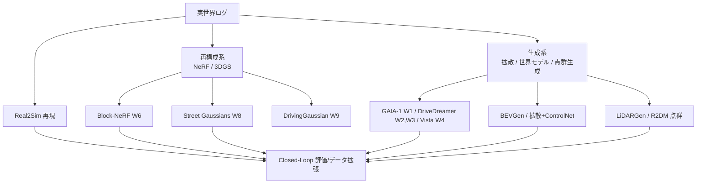
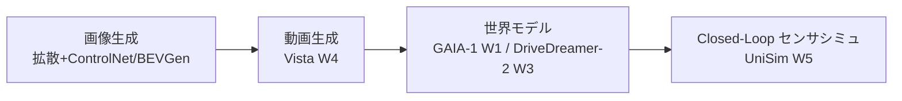
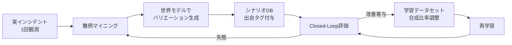

# 7.3 走行シーン生成と生成モデルの活用

この節では、Closed-Loop 評価とデータ拡張のための走行シーン生成を扱います。実世界ログ再現（Real2Sim、実車ログをシミュ上で忠実に再生する手法）から、世界モデル (world model)、NeRF（Neural Radiance Fields、ニューラルレンダリングによる 3D 復元）、3DGS（3D Gaussian Splatting、ガウシアン点群によるリアルタイム描画）、拡散モデル、点群生成までの系譜を比較します。Sim2Real / Real2Sim ギャップを FID・KL・Wasserstein 距離で定量化する方法と、ODD 別の合成比率設計も解説します。「どの分布を、どの生成手法で、どれだけ補完するか」を設計できる状態を目指します。

> **4.9 節との役割分担**：4.9 は学習用データセットへの合成データ配合（train/val split に何 % 混ぜるか、品質ゲート、出自タグ付け）を扱います。本節 7.3 は Closed-Loop 評価実行時の動的シーン生成（評価ループの中でシナリオ変異・センサモデル・世界モデルを回す方法）を扱います。実務では「4.9 で学習データを増やす → 7.3 で評価シナリオを増やす → 失敗パターンを 4.9 へ戻す」という Closed-Loop で双方が連動します。

## 生成シーンの 3 系統と Real2Sim

走行シーン生成は、3 系統に大別できます。第一は、実ログ忠実再現（Real2Sim）です。第二は、再構成系（NeRF / 3DGS）です。第三は、生成系（拡散・世界モデル・点群生成）です。最も基本的な Real2Sim は、車載センサログ・高精度マップ・キャリブレーションが揃えば動作します。軌跡と制御入力を再現し、センサモデル（カメラ投影・LiDAR レイトレーシング・Radar 散乱）で実ログ近似のセンサデータを再生成します。再現性は高い一方、「実ログに存在しないバリエーション」を作るのは苦手です。同じ合流地点でも他車の位置・速度・天候・交通量を変えたパターンを多数得るには、別手段が必要になります。

> **図 7.5**：走行シーン生成の系統図。実ログを起点に、再現・再構成・生成の 3 経路が Closed-Loop へ合流する。この図のポイントは、各経路が補完しあう関係にあることです。Real2Sim で再現性を、再構成系で視点拡張を、生成系で分布拡張を担います。

## 世界モデルと生成モデルの最新動向

生成系の中核は、世界モデル（自車・他車・環境のダイナミクスを学習し、動画・行動・テキストを条件に将来フレームを生成するモデル）です。代表モデルを比較します。番号は巻末参考文献に対応します。

| モデル | 提供/発表 | 入力 | 出力 | 技術 | データ中心の含意 |
|---|---|---|---|---|---|
| **GAIA-1** [W1](references#w1) | Wayve, 2023 | 動画+行動+テキスト | 連続フレーム | 自己回帰+拡散デコーダ | テキストでロングテール生成 |
| **DriveDreamer** [W2](references#w2) | 2023 | 行動+構造化条件 | 動画 | 拡散+HDMap/Box 条件 | 構造条件で制御可能生成 |
| **DriveDreamer-2** [W3](references#w3) | 2024 | LLM プロンプト | 多様動画 | LLM+拡散 | 自然言語で稀シナリオ |
| **Vista** [W4](references#w4) | 2024 | 動画+多変量制御 | 高忠実度動画 | 拡散 | 制御信号での予測 |
| **UniSim** [W5](references#w5) | Waabi, 2023 | 実走行ログ | 仮想センサ再生 | ニューラルレンダラ | Closed-Loop センサシミュ |
| **BEVGen** | [W11](references#w11) | BEV レイアウト | マルチビュー画像 | 自己回帰 Transformer | BEV 条件で整合画像 |
| **LiDARGen** | [W12](references#w12) | ノイズ/条件 | LiDAR 点群 | スコアベース拡散 | 点群分布の生成 |

> **図 7.6**：生成モデルの発展系譜。単フレーム画像 → 動画 → 行動条件付き世界モデル → Closed-Loop センサシミュレータへと、時間軸と制御可能性が拡張されてきました。この図のポイントは、最新の世界モデルが「行動を入力にとり将来を予測する」点です。第 7.4 節の SiL における環境ダイナミクス源になり得ます。

世界モデルは、Closed-Loop に二つの使い方で組み込まれます。第一に、テキストや行動プロンプトで、ロングテール（発生頻度は低いが重要な）シナリオを生成します。第二に、Closed-Loop でセンサシミュレーションを置き換えます（UniSim [W5](references#w5)）。

## NeRF / 3DGS によるシーン再構成

再構成系は、実走行映像から 3D シーンを復元し、新規視点・新規軌跡のレンダリングを可能にします。Real2Sim の弱点である「視点変更」を補完できる点が強みです。

| 手法 | 発表 | 特徴 | 用途 |
|---|---|---|---|
| **Block-NeRF** [W6](references#w6) | Waymo, 2022 | 街区規模を複数 NeRF に分割 | 大規模静的シーン再構成 |
| **3D Gaussian Splatting** [W7](references#w7) | 2023 | 明示的ガウシアン、リアルタイム描画 | 高速レンダリング基盤 |
| **Street Gaussians** [W8](references#w8) | 2024 | 動的物体を分離した 3DGS | 動的市街地シーン |
| **DrivingGaussian** [W9](references#w9) | 2024 | 合成ガウシアンで周辺動的シーン | サラウンドビュー再現 |
| **MARS** [W10](references#w10) | 2023 | インスタンス対応モジュラ | 評価向けシミュ |

NeRF 系は静的シーンの高忠実度復元に強く、3DGS 系はリアルタイム描画と動的物体の扱いで実用性が高いです。実務では、Block-NeRF [W6](references#w6) で街区規模の背景を構築し、Street Gaussians [W8](references#w8) / DrivingGaussian [W9](references#w9) で動的物体を合成する組み合わせが、Closed-Loop センサシミュレーションへの近道になります。

ここで考えるべき設計判断は、「静的背景」と「動的物体」を同じ表現に押し込めるべきか、それとも別系統で管理すべきか、という分離の問題です。Block-NeRF が街区を複数 NeRF に分割するのは、シーンの規模ではなく**学習資源の局所性**を理由としています。一方で街区背景は撮影時点の道路標識・看板・季節を固定するため、動的物体まで同じ表現に焼き込むと、対向車速度や歩行者位置を変える操作が極めて困難になります。Street Gaussians や DrivingGaussian が動的物体を分離する設計を採るのは、Real2Sim から「視点拡張」だけでなく「他車配置の変更」へ拡張するためで、最終的に OpenSCENARIO で動的物体の配置を記述し再構成背景上に挿入する二層構成へ収束します。さらに見落としてはならない論点が**新鮮度**です。再構成は撮影時点のスナップショットであり、道路工事・標識更新・季節変化に追従しません。半年以上経ったシーンを「現在の ODD の代表」として使い続けると、シミュは現実から静かに乖離していきます。再撮影サイクルを撮影日付メタデータで管理する運用は、データの賞味期限を制度化する作業です。

## Sim2Real / Real2Sim ギャップの定量化

生成・合成シーンを使う際の最大の論点は、実分布からどれだけ乖離しているかです。視覚的違い・センサ特性・挙動モデルの 3 側面で乖離が生じます。これを定量管理しないと、実世界で性能を悪化させるデータでモデルを訓練しかねません。代表的な分布距離指標を使います。

| 指標 | 対象 | 定義の要点 | 良い方向 |
|---|---|---|---|
| **FID** (Fréchet Inception Distance) | 画像 | 特徴空間でのガウシアン間 Fréchet 距離 | 小 |
| **KL ダイバージェンス** | 任意分布 | $D_{KL}(P\|Q)=\sum P\log(P/Q)$ | 小 |
| **Wasserstein 距離** | 任意分布 | 最適輸送コスト（EMD） | 小 |
| **Chamfer 距離 / EMD** | 点群（LiDAR）| 点間最近傍距離の和（Chamfer）または最適輸送（EMD）| 小 |
| **下流タスク mAP 差** | タスク横断 | 実データのみ学習 vs 合成混合学習での性能差 | 小 |

> FID（Fréchet Inception Distance、画像分布の類似度を測る指標）は ImageNet 系特徴を前提とするため、LiDAR 点群への直適用は不向きです。点群には Chamfer 距離（点間最近傍の和）や EMD（Earth Mover's Distance、分布間の最適輸送距離）、Radar には速度ヒストグラム間の Wasserstein 距離など、センサ種別ごとに代替指標を使い分けます。視覚指標だけでなく、下流タスク（Perception や Prediction）の mAP 差も併用します。ODD セグメント別に重み付けて、最終的な合否を判定するのが堅実です。

FID は次式で、実データ統計 $(\mu_r, \Sigma_r)$ と生成データ統計 $(\mu_g, \Sigma_g)$ から計算します。

$$
\text{FID} = \|\mu_r - \mu_g\|_2^2 + \mathrm{Tr}\!\left(\Sigma_r + \Sigma_g - 2(\Sigma_r \Sigma_g)^{1/2}\right)
$$

実装担当へ依頼する手順は次の通りです。画像 FID については、実データと生成データそれぞれを InceptionV3 等の特徴抽出器（pool3 出力）に通し、特徴ベクトル群から平均ベクトルと共分散行列を計算したうえで上式に代入し、行列平方根を含む項を数値計算（`scipy.linalg.sqrtm` 相当）で求めます。挙動分布のギャップ（相対速度・車間距離など）については、(1) 実データと合成データの値域を共通化したヒストグラム（例：50 ビン）を作る、(2) 0 確率を避けるための微小値 $\varepsilon$ を加えてから KL ダイバージェンス $D_{KL}(P\|Q)$ を計算する、(3) 同じサンプル列から Wasserstein 距離（1 次元の場合は累積分布関数の差の絶対値積分）を求める、という 3 ステップで両指標を算出します。出力は「FID」「KL」「Wasserstein」の 3 値をシナリオ DB のメタデータに登録します。

ギャップ指標は、単独でなく 3 種を併用します。第一に画像 FID、第二に物体距離・相対速度の Wasserstein、第三に Perception/Prediction の実 vs 合成性能差です。これらを継続観測し、合成データ投入で実世界性能が悪化する兆候があれば、生成分布や使用割合を見直します（第 8 章のデータドリフト検知と同型の手法）。

ギャップ管理で考えるべき本質的な点は、「単一指標で合成データの良し悪しを語れない」ことです。FID は画像の周辺統計量を測るため、見た目が自然でもセンサ特性（露出・歪み・ノイズ）の系統差を見逃します。Wasserstein は車間距離や相対速度の分布形状を捉えますが、上流の画像生成プロセスには無関係です。下流タスクの mAP 差は最終的な性能影響を測れる代わりに、原因が画像なのか挙動なのかを区別できません。だからこそ ODD セグメント別に 3 系統の指標を月次集計し、整合性を保ちながら相互補完で監視する設計が要になります。さらに重要なのは、ギャップ指標が一定値を超えた合成データを学習・評価から自動除外するゲートを設けることです。これがないと、生成モデルの劣化に気付かないまま分布が静かに偏っていき、ある日突然下流 mAP が悪化する事態を招きます。第 8 章のデータドリフト検知と同じ思想を、合成データ供給の上流側に置く位置付けになります。

## ODD 別の合成比率設計

合成データは「何でも増やせる魔法」ではありません。ODD ごとに最適な実:合成比率があります。実世界で豊富な状況は実データ中心に、稀だが高リスクな状況は合成を厚くするのが基本です。

| ODD セグメント | 実データ充足度 | 推奨合成比率（目安） | 主な生成手法 |
|---|---|---|---|
| 晴天・昼・直線高速 | 高 | 0–10% | 不要〜軽い拡張 |
| 雨天夜間・交差点 | 中 | 20–40% | 拡散+ControlNet / 世界モデル |
| 緊急車両・特殊車両 | 低 | 40–60% | BEVGen / 世界モデル |
| 飛び出し・極端カットイン | 極低 | 60–80% | 世界モデル + シナリオ展開 |

この比率は固定値ではなく、Closed-Loop で「合成投入後に実世界 Long-tail mAP（稀ケースでの検出精度）が改善したか」を見て継続調整します。生成シーンはシナリオ DB（第 7.2 節）へ、実ログ由来シナリオと同じく登録します。出自（合成/実/ハイブリッド）をメタデータに残し、レポートで区別集計します。

合成比率の設計で腑に落ちて欲しいのは、「合成は実データの代替ではなく、分布の戦略的補完」という位置付けです。晴天昼間のように実データが豊富な領域で合成比率を 60% に上げると、生成モデルの癖が全体分布を歪め、実世界性能を悪化させる典型的な失敗パターンに陥ります。逆に、緊急車両や極端カットインのように実頻度が極めて低い領域では、実データだけで Long-tail mAP を改善するのは年単位の収集を要するため、世界モデルでバリエーション展開した合成データに投資する価値が高くなります。コスト面でも、再構成系で済ませられる視点拡張に世界モデル生成を投入するのは GPU 資源の浪費で、生成手法は「再現性で足りるか／分布拡張が必要か」で先に切り分けるべきです。「同種の実インシデント 1 件 → 世界モデルで数千バリエーション」という効率指標は、合成投資の費用対効果を測る共通言語として機能します。実データが取れる領域はあえて合成しない、という判断は逆説的に聞こえますが、生成モデルの分布バイアスを混入させないためのデータ衛生でもあります。

## 生成シーンを Closed-Loop に組み込む

最後に、生成シーンをデータエンジンへ組み込むパターンを整理します。

> **図 7.7**：1 回しか観測されない危険シナリオを世界モデルで数千〜数万バリエーションに拡張し、Closed-Loop 評価と学習へ循環させる。この図のポイントは、合成が「実データの代替」ではなく「分布の戦略的補完」であることです。

## 本節の振り返り

走行シーン生成は Real2Sim・再構成系（NeRF/3DGS）・生成系（拡散/世界モデル/点群）の 3 系統に分かれ、それぞれが「再現性」「視点拡張」「分布拡張」という別々の役割で Closed-Loop に貢献する補完関係にあります。世界モデル（GAIA-1 [W1](references#w1)、DriveDreamer/-2 [W2,W3]、Vista [W4](references#w4)、UniSim [W5](references#w5)）はテキストや行動プロンプトでロングテールを生成し、Closed-Loop でセンサシミュレーションの代替にもなりえます。再構成系（Block-NeRF [W6](references#w6)、Street Gaussians [W8](references#w8)、DrivingGaussian [W9](references#w9)、MARS [W10](references#w10)）と画像／点群生成（BEVGen、LiDARGen）は、静的背景と動的物体を分離して扱うことで視点・配置の自由度を確保します。Sim2Real ギャップは FID・KL・Wasserstein・下流タスク mAP 差を ODD セグメント別に継続監視し、単一指標に依存しない多面評価で生成分布の劣化を捕捉する設計にします。ODD 別の実:合成比率は固定値ではなく、Long-tail 性能改善を見ながら継続調整する変数として扱い、合成は「代替」ではなく「分布の戦略的補完」と位置付けるのが Closed-Loop における生成系活用の中核です。

## 次節への橋渡し

次の 7.4 節では、生成・再構成したシーンを実際に「回す」Closed-Loop SiL アーキテクチャに踏み込みます。IDM / MOBIL によるトラフィックモデルの数式、センサモデルの精度仕様、gRPC / Protobuf によるモデル–シミュレータ間インターフェース、CARLA Python API での実装、そして同期/非同期実行のジッター許容値を扱います。
