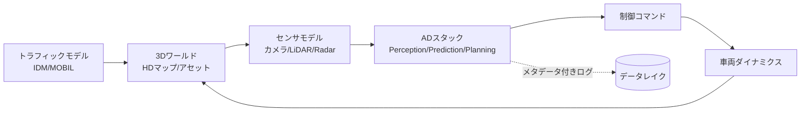

# 7.4 Closed-Loop SiL アーキテクチャ

この節では、Software-in-the-Loop（SiL、自動運転ソフトを実 ECU を使わず仮想環境で動かす評価形態）で Closed-Loop 評価を実行するアーキテクチャを設計します。センサ・物理・トラフィックの各シミュレーション、IDM / MOBIL によるトラフィックモデルの数式、センサモデルの精度仕様、gRPC / Protobuf や共有メモリによるモデル–シミュレータ間インターフェース、CARLA Python API での実装、同期/非同期実行のジッター許容値を扱います。「シミュレーション結果をデータエンジンへ戻す」設計を示します。

## SiL の位置づけと目的

SiL は、実 ECU（Electronic Control Unit、車載電子制御ユニット）や実車を用いず、自動運転ソフトウェアを仮想環境で実行する評価形態です。実 ECU を使う HiL（Hardware-in-the-Loop、第 7.7 節）よりタイミング精度では劣ります。一方で、柔軟性とスケーラビリティに優れます。SiL は 3 つの役割を担います。第一に、開発初期から高頻度に Closed-Loop 評価し、設計問題を早期検知することです。第二に、多数シナリオを並列実行してカバレッジを上げることです。第三に、危険シナリオや再現困難な条件（極端天候、センサ故障）を安全に検証することです。データ中心・Closed-Loop では、SiL は「データエンジンに密結合した高速 Closed-Loop 評価レイヤ」として機能します。

> **図 7.8**：Closed-Loop SiL のデータフロー。ワールド → センサ → スタック → 制御 → 車両 → ワールドの Closed-Loop に、IDM/MOBIL のトラフィックが介入する。この図のポイントは、各ステップのログにシナリオ ID やモデルバージョンを付与してデータレイクへストリーミングし、後段の解析・再学習に直結させることです。

## センサモデルと精度仕様

センサシミュレーション (sensor simulation) と物理シミュレーション (physics simulation) が、SiL の中核です。どこまで精密化するかは目的とコストのトレードオフです。Perception 検証に使う場合は、精度仕様を明示しておくべきです。

| センサ | モデル要素 | 推奨精度仕様（例） |
|---|---|---|
| カメラ | 投影・レンズ歪み・露出・ノイズ・ブラー | 再投影誤差 ±0.5 px、測光誤差 SNR 整合 |
| LiDAR | レイトレース距離・反射強度・ビームパターン | 距離 ±5 cm @10 m、点群欠損率 整合 |
| Radar | 速度分解能・マルチパス・クラッタ | 相対速度 ±0.1 m/s、距離 ±0.3 m |
| IMU/車速 | バイアス・ノイズ・遅延 | バイアス安定性・サンプル遅延 整合 |

Perception のロバスト性検証では、光学的に忠実なレンダリング（DRIVE Sim [Sim3](references#sim3) や rFpro のような物理ベース）を重視します。Planning の高レベル戦略検証では、センサを簡略化して計算資源をトラフィックモデルへ振り向けます。

センサモデルの整備で陥りがちな失敗は、「常に最高忠実度を目指す」という素朴な姿勢です。Perception のロバスト性検証では再投影誤差 ±0.5 px や距離 ±5 cm @10 m といった光学的整合が結果を左右するため物理ベースレンダリングが必須ですが、Planning の戦略カバレッジ検証では同じ計算資源をトラフィックモデルの多様化や並列実行へ振り向けた方が、はるかに多くのシナリオを回せます。シミュ構成をプロファイル化して目的別に切り替え、誤差仕様（再投影誤差、距離精度、点群欠損率）と「どの検証用途で使えるか」を社内文書として明示するのは、忠実度の選択を組織的に正当化するためです。さらに重要なのは、実車キャリブレーションをシミュ側センサモデルに反映する作業を CI に組み込むことで、HiL や仮想 ECU（第 7.7 節）で観測される量子化前後の出力差分が、センサモデル不整合に汚染されない状態を保つ点にあります。

## トラフィックモデル：IDM と MOBIL の数式

他車挙動の現実性は、Closed-Loop 評価の妥当性を左右します。縦方向追従には IDM（Intelligent Driver Model、知的ドライバモデル）[Sim12](references#sim12)、車線変更には MOBIL（Minimizing Overall Braking Induced by Lane changes、車線変更で生じる全体減速を最小化するモデル）を用いるのが標準です。

### IDM（縦方向追従）

IDM は車両 $\alpha$ の加速度を、現在速度 $v$、前車との間隔 $s$、相対速度 $\Delta v$ から決めます。

$$
\dot{v} = a\left[1 - \left(\frac{v}{v_0}\right)^{\delta} - \left(\frac{s^*(v,\Delta v)}{s}\right)^{2}\right]
$$

$$
s^*(v, \Delta v) = s_0 + \max\!\left(0,\; vT + \frac{v\,\Delta v}{2\sqrt{a\,b}}\right)
$$

ここで $v_0$ は希望速度、$T$ は希望車頭時間、$a$ は最大加速度、$b$ は快適減速度、$s_0$ は最小停止間隔、$\delta$ は加速指数（通常 4）です。

### MOBIL（車線変更）

MOBIL は、車線変更を 2 条件で判定します。第一に、自車と周辺車の加速度利得が、礼譲係数 $p$ で重み付けした閾値 $\Delta a_{\text{th}}$ を超えること。第二に、安全基準（後続車の減速度が $b_{\text{safe}}$ 以内）を満たすこと。両者が成立したときに、車線変更します。

$$
\underbrace{\tilde{a}_c - a_c}_{\text{自車利得}} + p\left(\underbrace{\tilde{a}_n - a_n}_{\text{新後続}} + \underbrace{\tilde{a}_o - a_o}_{\text{旧後続}}\right) > \Delta a_{\text{th}}, \quad \tilde{a}_n \ge -b_{\text{safe}}
$$

実装にあたっての指示は次のとおりです。IDM の場合は、車両ごとに毎ステップ「現在速度 $v$」「前車との車間 $s$」「前車との相対速度 $\Delta v = v_{\text{ego}} - v_{\text{lead}}$」を取得し、上式から $s^*$ を求めて $\dot{v}$ を出力します。パラメータの典型値は $v_0 \approx 33.3$ m/s、$T = 1.5$ s、$a = 1.5$ m/s²、$b = 2.0$ m/s²、$s_0 = 2.0$ m、$\delta = 4$ ですが、車種・ドライバ性格別に複数プロファイルを用意します。MOBIL の場合は、車線変更前後の自車・新後続車・旧後続車の加速度を IDM で予測し、2 条件を AND で評価して車線変更の可否を返します。第一の条件は、礼譲係数 $p$（典型 0.25）で重み付けた合計加速度利得が閾値 $\Delta a_{\text{th}}$（典型 0.2 m/s²）を上回ることです。第二の条件は、新後続車の予測加速度が安全減速度の上限 $-b_{\text{safe}}$（典型 -4.0 m/s²）を下回らないことです。

ルールベース（IDM/MOBIL）は、解釈性・安定性に優れる一方、人間らしさには限界があります。実ログから学習したポリシーモデル（第 7.3 節の生成系）と併用し、難シナリオでは学習ポリシーで「人間らしい無作法さ」を注入することが多いです。

ここで腑に落ちて欲しいのは、IDM と MOBIL が「人間ドライバを近似するモデル」ではなく「人間ドライバを物理的に整合させて近似するモデル」であるという点です。IDM は希望速度・希望車頭時間・最大加速度・快適減速度といった少数のパラメータで縦方向追従を表現し、衝突しないという制約を構造的に組み込みます。MOBIL は車線変更を「自車利得 + 礼譲係数 × 周辺車の利得」が閾値を超えるかで判定し、後続車を $-b_{\text{safe}}$ 以下に追い込まない安全条件を AND で課します。この構造は解釈性と安定性を保証する一方で、実際のドライバが見せる「不必要な加速」「割り込み直前の躊躇」「感情的な車間詰め」といった非合理挙動を表現できません。だからこそ単一プロファイルでは現実分布に届かず、$v_0$・$T$・$a$・$b$・$s_0$・$\delta$ を「保守的・標準・攻撃的」の 3 プロファイルで用意し、シナリオ難易度に応じて切り替える運用が必要になります。さらに、他車の一部（例：30%）を実ログから学習したポリシーモデルに置き換え、IDM/MOBIL では出ない「人間らしい無作法さ」を注入することで、現実分布との Wasserstein 距離を縮められます。乖離が月次トレンドで拡大したらパラメータを再校正する、というループを回すことで、トラフィックモデルそのものが Closed-Loop の構成要素として育っていきます。

## モデルとシミュレータのインターフェース設計

モデルとシミュレータの結合方式は、レイテンシ・柔軟性・再現性のトレードオフで選びます。代表的な方式は、同一プロセス関数呼び出し、共有メモリ、gRPC（Google 製の RPC フレームワーク）/ Protobuf（バイナリシリアライズ形式）、ZeroMQ（軽量メッセージキュー）、ROS 2 / DDS（車載ミドルウェア標準）です。

| 方式 | レイテンシ | 柔軟性 | 用途 |
|---|---|---|---|
| 同一プロセス関数呼び出し | 最小 | 低 | 高速反復、単一言語 |
| 共有メモリ | 極小 | 中 | 大容量センサデータの高速授受 |
| gRPC / Protobuf | 小〜中 | 高 | 言語混在、分散実行 |
| ZeroMQ | 小 | 中 | 軽量 pub/sub |
| ROS 2 / DDS | 中 | 高 | 車載ミドルウェア整合 |

評価用メタデータ（シナリオ ID、ラン ID、乱数シード、モデルバージョン、シミュレータ設定 ID）をメッセージに組み込むことが重要です。後段のレポート生成・失敗解析（第 7.8 節）が容易になります。gRPC/Protobuf でスキーマを定義する際にメッセージへ含めるべきフィールドを次表にまとめます。

| メッセージ | 必須フィールド | 役割 |
|---|---|---|
| センサフレーム（シミュ → AD スタック） | シナリオ ID、ラン ID、シミュレーション時刻 [s]、カメラ画像（圧縮 JPEG など）、LiDAR 点群（float32 xyzi の圧縮列）、モデルバージョン、乱数シード | スタックに渡す観測。トレーサビリティ用メタデータを必ず同梱する |
| 制御コマンド（AD スタック → シミュ） | シナリオ ID、シミュレーション時刻 [s]、スロットル [0,1]、ブレーキ [0,1]、ステア [-1,1]、プランナトレース ID | スタックの出力。後段で軌跡再現・原因解析に使う |
| サービス | `Step(SensorFrame) → ControlCommand` の RPC | 同期 1 ステップを 1 RPC で完結させる |

データ容量が大きい場合は共有メモリや圧縮ストリームの併用を検討し、メタデータ部分のみを gRPC で送る二段構成にすることもあります。

## 同期型・非同期型とジッター許容値

Closed-Loop の時刻同期には二方式あります。

- **同期型 (synchronous)**：シミュレータがマスタ（主導役）となり、各タイムステップでスタックに処理時間を割り当てます。決定論的で再現性が高く、評価・リグレッションに適します。
- **非同期型 (asynchronous)**：スタックが擬似リアルタイムで動作し、センサ/コマンドバッファ越しに結合します。実車のタイミングに近い挙動を再現できますが、ジッターが入ります。

リアルタイム制約の目安は次のとおりです。知覚〜計画の 1 サイクルを 10–100 Hz（周期 10–100 ms）で回し、非同期実行時のタイミングジッターは目標周期の ±10% 以内、フレームドロップ率は 0.1% 未満を許容基準とすることが多いです。例えば 100 Hz（10 ms 周期）なら、ジッター ±1 ms 以内を狙います。同期型で機能正しさを決定論的に検証し、非同期型でタイミング起因の不安定性を別途確認する、という二段構えが有効です。ASIL-D（ISO 26262 が定める安全度水準。A 緩 → D 厳）等の安全クリティカル機能では、上の汎用許容値（±10%）を ±5% へ引き上げ、より厳しいタイミング再現性を要求する運用が一般的です。

## CARLA による SiL 実装の要点

CARLA [Sim1](references#sim1) は同期モードを備え、SiL 反復の研究デファクト（事実上の標準）です。最小構成で Ego（自車）を生成し IDM 制御で回すときに、CARLA Python API（または等価なクライアント）に対して指示すべき項目を整理します。

| ステップ | 操作・設定 | 補足 |
|---|---|---|
| 1. クライアント接続 | サーバへ TCP 接続（既定 `localhost:2000`）、タイムアウト指定 | クラスタ実行時は接続プールを用意 |
| 2. 同期モードに切替 | ワールド設定で `synchronous_mode = true`、`fixed_delta_seconds` を周期に合わせる（例：0.05 s = 20 Hz） | 決定論的再現のために必須 |
| 3. Ego 車両のスポーン | ブループリント（例：`vehicle.tesla.model3`）と HD マップのスポーン地点を指定して生成 | シナリオ DB の初期姿勢に対応させる |
| 4. メインループ | 各ステップで「ワールドを 1 tick 進める → 自車速度・前車との車間・相対速度を取得 → IDM で目標加速度を計算 → スロットル/ブレーキへマッピングして適用」を繰り返す | 例として 10 秒分を 200 ステップで回す |
| 5. 終了処理 | 同期モードを解除しアクタを破棄 | 例外発生時にも必ず実行されるようにする |

加速度から制御コマンドへのマッピングは、単純化で十分動作します。目標加速度を最大加速度（例：3 m/s²）で割った値を 0–1 の範囲にクリップし、正の値はスロットル、負の値はブレーキへ割り当てます。詳細な縦方向制御を行う場合は、別途 PID やフィードフォワード補正を組み合わせます。

## 大量シナリオバッチ実行基盤

SiL の価値は、大量シナリオの並列実行で最大化します。典型構成は 3 要素から成ります。第一に、ジョブスケジューラ（優先度キュー・フェアシェア）です。シナリオ ID リストとモデルバージョンを受け取り、クラスタへ配分します。第二に、実行コンテナです。スタックとシミュレータを含み、環境差異を最小化してログをストリーミングします。第三に、結果集計です。シナリオ単位・ODD 単位で指標を集計し、第 7.8 節のレポート基盤へ渡します。第 6 章の学習パイプラインと同じワークフローエンジン上に置くと、モデル更新 → シミュ評価 → レポート → リリース判定までを「パイプライン as Code」で管理できます。

## シミュレーション結果をデータエンジンに戻す

SiL の結果は、次の流れでデータエンジンへ戻します。第一に、衝突・ニアミス・フェイルセーフ作動を自動検出し、シナリオ DB に紐付けます。失敗時のセンサログ・中間表現（BEV 特徴、世界モデル状態）をデータレイクへ保存します。第二に、失敗シナリオに類似する実車ログを検索して、第 4 章のデータ選択へ渡し、必要なら第 5 章で追加ラベリングを行います。第三に、改良版モデルを同一シナリオセットで再評価し、改善度と副作用（他シナリオでの性能低下）を確認します。Closed-Loop SiL は「評価のためのシミュレータ」ではなく「データ中心・Closed-Loop データエンジンの一部」です。

ここで設計判断として考えるべきは、失敗イベントの定義を人間レビューに委ねるか、ルールでコード化するかという問いです。衝突・ニアミス・フェイルセーフ作動の判定が属人的なままだと、レビュア間で基準がぶれて学習データへのフィードバックも揺らぎます。判定ルールをコード化してシナリオ実行ログに自動アノテーションを付けることで、失敗の定義そのものをバージョン管理対象にでき、後段のデータ選択や再学習に対する説明責任を果たせます。さらに、失敗イベントから類似実車ログを最近傍検索する仕組み（埋め込みベクトルベース）を整備すると、シミュで見つけた問題が現実のフリート分布のどこに存在するかを即座に把握でき、第 7.6 節のフリート↔シミュ双方向フィードバックが具体的な検索操作として実装可能になります。モデル更新時には、過去 6 ヶ月の S/A ランクシナリオを全件再実行して退行を週次レポートする運用にすると、リリース判断が「単発合格」ではなく「困難ケースでの粘り」を中心に据えられるようになり、第 7.2 節の難易度ランクと第 7.6 節のリスク加重カバレッジが SiL の実装と接続します。

## 本節の振り返り

SiL はデータエンジンに密結合した高速 Closed-Loop 評価レイヤとして、センサ・物理・トラフィックの 3 シミュレーションで構成されます。センサモデルは Perception 検証で再投影 ±0.5 px・距離 ±5 cm @10 m といった精度仕様が要求される一方、Planning カバレッジ検証では簡略化が望ましく、用途別プロファイルで切り替えます。トラフィックは IDM [Sim12](references#sim12) と MOBIL の数式に支えられたルールベースが解釈性と安定性を提供しますが、人間ドライバの非合理挙動を表現できないため、保守的・標準・攻撃的の 3 プロファイル併用と、学習ポリシーの混在配置（例：他車の 30%）が現実分布への接近に欠かせません。モデルとシミュレータのインターフェースは gRPC/Protobuf・共有メモリ・DDS から目的別に選び、シナリオ ID・モデルバージョン・乱数シードを評価メタデータとして必ず埋め込むことで、失敗の追跡とトレーサビリティを担保します。時刻同期は同期型で決定論的検証、非同期型でタイミング起因の不安定性確認を行い、ジッターは目標周期の ±10% 以内（ASIL-D では ±5%）を目安にする二段構えが堅実です。

## 次節への橋渡し

次の 7.5 節では、SiL の環境ダイナミクス源にもなる世界モデルそのものの評価へ進みます。ログリプレイによる検証、ADE/FDE/Collision/Social compliance、センサ誤差注入に対する感度分析、マルチエージェント相互作用指標、長期安定性、Planning との整合性スコアを、評価コードとともに解説します。
