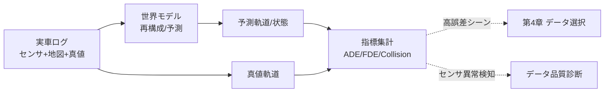

# 7.5 世界モデル評価・シーン再現性

この節では、世界モデル (world model) とシーン再構成の評価を扱います。ログリプレイ (log replay、実車ログを再生して評価する手法) による検証、ADE/FDE/Miss/Collision/Social compliance といった軌道指標、センサ誤差注入に対する感度分析、マルチエージェント相互作用指標、長期安定性、Planning との整合性スコアを解説します。「世界モデルをデータエンジンの中核として評価し、その劣化をデータ品質診断へ循環させる」方法を示します。

## 世界モデルの役割と評価の難しさ

世界モデルは、センサデータから環境状態を抽象化し将来を予測するモデルの総称です。3 つの役割を担います。第一に、マルチセンサを BEV（Bird's-Eye View、鳥瞰図表現）などの統一表現へ統合します。第二に、自車・他エージェントの将来軌道や地図・信号変化を予測します。第三に、シミュレータ／プランナへ環境ダイナミクスを供給します。第 7.3 節の生成系（GAIA-1 [W1](references#w1)、DriveDreamer-2 [W3](references#w3)、Vista [W4](references#w4)、UniSim [W5](references#w5)）や再構成系（Block-NeRF [W6](references#w6)、Street Gaussians [W8](references#w8)）はいずれも、世界モデルの一種または基盤技術です。単一タスクに限定されず、自己教師あり・マルチタスクで潜在構造を学ぶため、評価は従来の単一タスクモデルより複雑になります。

## ログリプレイによる世界モデル検証

評価の基本は、実車ログによるログリプレイです。手順は 3 ステップです。第一に、実車ログからセンサ・地図・真値（軌道・信号状態）を取り出します。第二に、センサと地図を世界モデルへ入力して再構成と将来予測を行います。第三に、真値と比較して位置・速度・クラス誤差を集計します。重要なのは「入力が現実世界と同一」であることです。つまり、センサノイズ・同期ズレ・ロングテール条件を含むようにします。評価は、短期予測（数ステップ先）の精度だけにとどめません。長期予測（数秒後）の挙動傾向、意図（右折／直進）の高レベル予測、センサ欠損区間でのロバスト性も見ます。

> **図 7.9**：ログリプレイ評価のデータフロー。世界モデルの予測を真値と突き合わせ、高誤差シーンをデータ選択へ、異常検知をデータ品質診断へ循環させる。この図のポイントは、世界モデルが Closed-Loop に二重貢献することです。「予測器」と「データ品質診断器」の両方の役割を持ちます。

ログリプレイ評価で考えるべきは、「入力が現実世界と同一」という前提が崩れたときの解釈不能性です。実車ログのセンサノイズ・同期ズレ・ロングテール条件をすべて保存したまま再生しないと、世界モデルの予測誤差が「モデルの弱さ」なのか「入力の劣化」なのかを切り分けられません。だからこそ、主要 ODD セグメント（高速・市街地・夜間など）ごとにリプレイ用ログを各 100 件以上ストックして毎月の評価バッチに固定する運用が、世界モデル更新の差分を意味のある形で観測する前提条件になります。CI に組み込んで ADE/FDE と Collision rate を自動集計し、誤差が大きいシーンを Top-K で抜き出して第 4 章のデータ選択キューへ自動投入する流れは、世界モデルを単なる予測器でなく「データ収集の優先順位を決める診断器」として運用する具体形です。リプレイ用ログを増やすほど世界モデルの統計的安定性は上がりますが、ログ自体の鮮度管理を怠ると ODD ドリフト（第 8 章）に追従できず、過去の世界に対して上手なモデルを作ってしまう逆説に陥ります。

## マルチエージェント・長期予測の評価指標

世界モデルは多数エージェントの相互作用を扱うため、単一エージェントの平均誤差だけでは不十分です。代表指標を整理します。

| 指標 | 定義 | 着目点 |
|---|---|---|
| **ADE** | 予測軌道と真値の各時刻位置誤差の平均 | 全体的な追従精度 |
| **FDE** | 最終時刻の位置誤差 | 長期予測のずれ |
| **Miss rate** | 真値が許容半径外になった割合 | テールの外し |
| **Collision rate** | 予測軌道同士/インフラとの衝突率 | 物理整合性 |
| **Social compliance** | 車線逸脱・信号無視・異常加速の割合 | 交通規範適合 |

ADE/FDE は予測軌道 $\hat{Y} \in \mathbb{R}^{T\times 2}$ と真値 $Y$ から次で計算します。

$$
\text{ADE} = \frac{1}{T}\sum_{t=1}^{T}\|\hat{y}_t - y_t\|_2, \qquad
\text{FDE} = \|\hat{y}_T - y_T\|_2
$$

実装担当への指示は次のとおりです。予測軌道と真値軌道は、いずれも各時刻の (x, y) 座標列として与えます。(1) 各時刻で 2 点間のユークリッド距離を求め、その平均を ADE、最終時刻の値を FDE として出力します。(2) マルチモーダル予測（$K$ 本の候補軌道）の場合は、各候補について ADE/FDE を求めたうえで、FDE が最小になる候補を「最良候補」として採用し、その ADE/FDE（best-of-$K$）を集計値とします。(3) 衝突率は、マルチエージェント軌道を入力にとります。各時刻ステップで全エージェントペアの距離を計算し、衝突半径（例：1.0 m）を下回ったケースを衝突発生として数え、総ステップ数で割って算出します。エージェント数が多い場合は、空間インデックスや近傍探索で計算量を抑えます。

マルチエージェントでは「他車同士の相互関係」も評価します。合流で本線車と合流車の予測軌道に一貫したギャップがあるか、歩行者の行動が車両減速と整合するか、といったペア・グループ単位の指標（相対距離・時間的余裕）を定義します。

## センサ誤差注入に対する感度分析

世界モデルの実運用ロバスト性を測るには、感度分析が有効です。入力に系統的な誤差を注入し、出力指標の劣化を観測します。キャリブレーションずれ・タイムスタンプずれ・点群欠損などを段階的に加え、ADE/Collision の劣化曲線を描きます。

実施手順は次のとおりです。(1) 元のテストバッチを基準（ノイズ 0）として ADE 等を計測する。(2) 注入したい誤差軸（例：ガウシアンノイズ標準偏差）を 0.01・0.02・0.05・0.1 など段階的に増やし、各レベルで入力に擾乱を加えたバッチを作る。(3) 各レベルで世界モデルに推論させ、評価関数（ADE、Collision rate など）の値を記録する。(4) ノイズレベルを横軸、評価指標を縦軸にした劣化曲線をシナリオ群ごとに描画し、急峻に劣化する誤差軸とシナリオの組み合わせを特定する。誤差注入は擾乱の種類（ガウシアン、ドロップアウト、時刻ずらし、回転バイアス）ごとに分けて行い、原因切り分けを容易にします。

| 注入誤差 | 例 | 観察すべき劣化 |
|---|---|---|
| 外部キャリブレーション | ±0.5° 回転 | 遠距離 ADE の急増 |
| タイムスタンプずれ | ±20 ms | 高速移動体の Collision rate 上昇 |
| 点群欠損 | 10% ランダム欠損 | 小物体 Miss rate 上昇 |
| 露出変動 | ±1 EV | 夜間/逆光での再構成劣化 |

劣化が急峻なセンサ・誤差種別は、弱点として第 2 章の収集要件や第 5 章のラベリング品質へフィードバックします。

## 長期安定性とシーン再現性

世界モデルをシミュレータ内で長時間実行すると、誤差が蓄積して非現実的な状態（車が地面を離れる、急激な速度変化）に発散することがあります。長期安定性は 2 観点で測ります。第一に、数秒〜数分の連続生成で物理破綻が起きないかです。第二に、生成軌道の分布が実世界分布から逸脱しないかです。再構成系（Block-NeRF [W6](references#w6)、Street Gaussians [W8](references#w8)、UniSim [W5](references#w5)）では「再現性」も重要です。同一初期状態から複数回実行して挙動が安定再現されるか、実ログとシミュの軌道分布がどれだけ一致するか（第 7.3 節の Wasserstein 距離）を測ります。多様性（条件付き生成で現実的範囲のバリエーションを持つか）と再現性はトレードオフになるため、両方を併記します。

| 観点 | 指標例 | 良い方向 |
|---|---|---|
| 再現性 | 複数試行の軌道分散、実 vs シミュ Wasserstein | 小 |
| 多様性 | 条件付き生成の予測エントロピー | 適度（過小も過大も不可） |
| 長期安定性 | 物理破綻発生率、$T$ 秒後の ADE 分布 | 破綻率小 |
| 安全マージン | 予測軌道と他者/インフラの最小距離 | 大 |

## Planning との整合性スコア

世界モデルが Planning と結合する場合、予測の偏りが問題になります。過度に楽観的だと衝突を見落とし、過度に悲観的だと過剰減速になります。Planning の出力が物理・快適性制約をどれだけ満たすかを、整合性スコアとして測ります。例えば、加速度制約充足率（$|a| \le 3\,\text{m/s}^2$ を満たすステップ割合）や、予測の楽観／悲観バイアス（予測 TTC と実 TTC の系統差）を ODD セグメント別に集計します。特定シナリオで楽観／悲観が偏在していれば、その分布を学習データへ補強します（第 4 章）。

## データ中心・Closed-Loop 観点での運用

世界モデルはデータエンジンの中核として、3 つの方向で運用します。第一に、データ選択です。予測誤差・衝突率が高いシナリオを自動検出し、第 4 章へ送ります。世界モデルを「データ品質診断器」として、センサ異常・キャリブレーションずれの検知にも使います。第二に、データ生成です。将来軌道・環境変化を生成して第 7.3 節の生成シーンと組み合わせ、安全マージンを侵す攻撃的シーンでロバスト性を検証します。第三に、継続学習です。フリートの新規ログで世界モデルを更新し、更新前後を同一シナリオセットで比較します。予測性能だけでなく、Closed-Loop 挙動・安全マージンの改善を確認します。

ここで設計判断として腑に落ちて欲しいのは、世界モデルを「予測器」と「データ品質診断器」の二役で位置付けると、ダッシュボードを分けざるを得なくなる、という点です。予測器としての ADE/FDE/Collision は、モデル性能を縦軸に時系列で並べたいのに対し、診断器としての異常検知率・キャリブレーションずれ検出件数は、データ品質を縦軸に ODD セグメント別に並べたい。両者を同じダッシュボードに混在させると、性能改善とデータ品質劣化が打ち消し合って意思決定が鈍ります。月次で世界モデルを再学習する運用を採るなら、更新前後で ADE/Collision/Planning 整合性の差分を必ず可視化し、楽観／悲観バイアスが大きい ODD セグメントは「次月のデータ収集計画における優先項目」として制度的に通知する流れを敷くのが堅実です。これは予測モデルの性能向上を、データ収集計画の優先順位という具体的アクションへ翻訳するメカニズムであり、Closed-Loop が組織の月次サイクルとして回り始める瞬間でもあります。

## 本節の振り返り

世界モデル評価はログリプレイを基本とし、ADE/FDE/Miss/Collision/Social compliance を best-of-K まで含めて測りますが、単一エージェントの平均誤差ではマルチエージェント相互作用や長期予測の偏りを捉えられないため、ペア・グループ単位の整合性指標を併用する設計になります。センサ誤差注入の感度分析は、入力擾乱に対する劣化曲線を描くことで「どのセンサ・どの誤差軸に弱いか」を分離可能にし、その急峻な劣化はそのまま第 2 章の収集要件・第 5 章のラベリング品質へのフィードバックになります。長期安定性・再現性・多様性・安全マージンは互いにトレードオフの関係にあり、Block-NeRF [W6](references#w6)・Street Gaussians [W8](references#w8)・UniSim [W5](references#w5) のような再構成系を多面評価する際は、いずれか一つに絞らず併記する姿勢が品質保証の前提です。Planning 整合性スコア（加速度制約充足率、楽観／悲観バイアス）は、予測の偏りが結合時の挙動にどう波及するかを ODD セグメント別に切り出します。最終的に、世界モデルは「予測器」かつ「データ品質診断器」として Closed-Loop に二重貢献し、その二役を別ダッシュボードで分離して運用することが評価結果の意思決定速度を決めます。

## 次節への橋渡し

次の 7.6 節では、ここまでのシナリオ・世界モデル評価を「どれだけ網羅できているか」を管理するカバレッジ設計へ進みます。PEGASUS のシナリオスペース、Safety Pool シナリオ DB、リスク加重カバレッジ式、カバレッジ意思決定木、そして GNN/Transformer によるシーン埋め込みクラスタリングを扱います。
