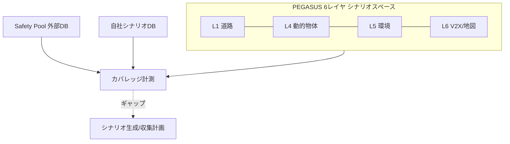
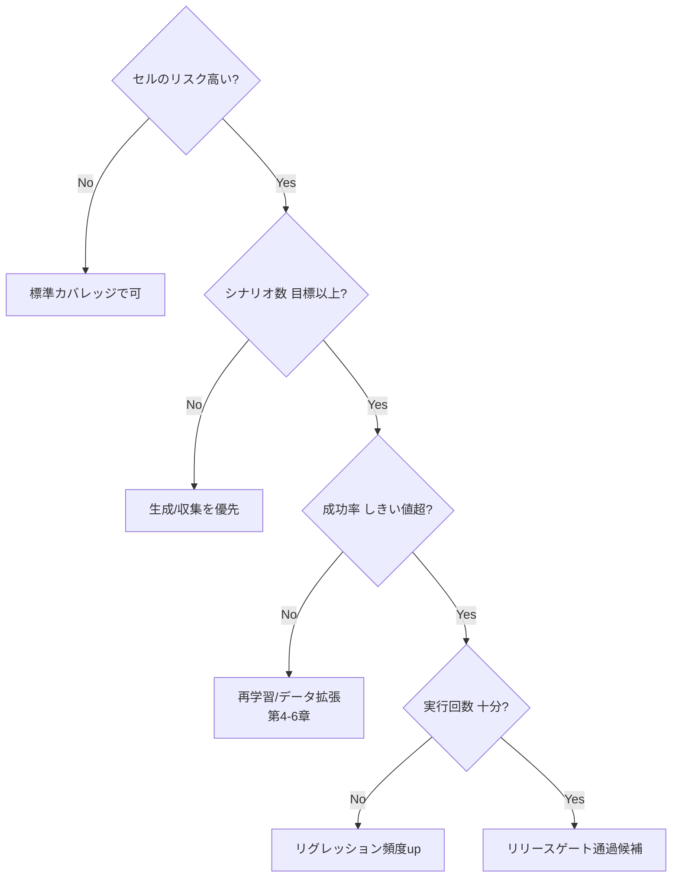

# 7.6 テストシナリオ管理とカバレッジ設計

この節では、シナリオ・世界モデル評価を「どれだけ網羅できているか」を管理するカバレッジ設計を扱います。PEGASUS のシナリオスペース概念、Safety Pool シナリオ DB、ODD × 機能のカバレッジ指標とリスク加重カバレッジ式、カバレッジ意思決定木、GNN/Transformer によるシーン埋め込みクラスタリング、フリート ↔ シミュの双方向フィードバックを整理します。「テストカバレッジのギャップを定量把握する」方法を構築します。

## PEGASUS シナリオスペースと Safety Pool

「どこまでテストすれば十分か」という問いに、体系的に答える枠組みがあります。ドイツの PEGASUS プロジェクト [Sim10](references#sim10) が提唱した 6 レイヤモデル（PEGASUS 6 layer model）です。シナリオを直交する 6 つの層に分解し、各層の組み合わせとしてシナリオスペース（テストの探索空間）を定義します。

| レイヤ | 内容 | 例 |
|---|---|---|
| L1 道路 | 幾何・レーン | 曲率、車線数、勾配 |
| L2 道路設備 | 標識・信号・標示 | 一時停止、速度規制 |
| L3 一時的変更 | 工事・規制 | 車線規制、迂回（CARLA は人手編集が前提、Applied Intuition / NVIDIA DRIVE Sim では工事配置 API が用意される）|
| L4 動的物体 | 他車・歩行者・自転車 | カットイン、横断 |
| L5 環境 | 天候・照明 | 雨夜、逆光 |
| L6 デジタル情報 | V2X・地図鮮度 | 信号情報、地図差分 |

Safety Pool [Sim11](references#sim11) は、こうしたシナリオを共有・取引できる業界規模のシナリオ DB です。数万件規模の検証済みシナリオを ODD タグ付きで提供します。自社シナリオ DB（第 7.2 節）と外部 Safety Pool を組み合わせ、自社未カバーの ODD を補完するのが実務的です。

> **図 7.10**：PEGASUS 6 レイヤで定義したシナリオスペースに対し、自社 DB と Safety Pool [Sim11](references#sim11) でカバレッジを計測する。この図のポイントは、カバレッジが「絶対的なシナリオ数」ではなく、直交する次元の組み合わせ空間の充足率として定義されることです。

## ODD × 機能のカバレッジ指標とリスク加重

カバレッジを定量化するには「どの軸でどの分布を目標とするか」を決めます。第 2 章の ODD 定義と整合させ、3 種のカバレッジを設計します。

- **シナリオ数ベース**：各 ODD セグメント × 機能カテゴリのセルごとに、登録シナリオ数を集計します。目標値（例：各セル 10 件以上）と比較します。
- **実行回数ベース**：各シナリオが最新モデルに対し何回実行されたかを追跡し、リグレッションの十分性を確認します。
- **リスク加重カバレッジ**：セルのリスクが高いほど、高カバレッジを要求します。

リスク加重カバレッジ $C_w$ は、セル $i$ のリスク $r_i$ と達成カバレッジ $c_i$（達成数／目標数、上限 1）から次で定義します。

$$
C_w = \frac{\sum_i r_i \cdot c_i}{\sum_i r_i}, \qquad
r_i = S_i \times E_i \times (1 - \text{Det}_i)
$$

ここで $S_i$ は重大度（Severity、被害規模）、$E_i$ は曝露頻度（Exposure、その状況の発生頻度）、$\text{Det}_i$ は検知性（Detectability、高いほどリスク減）です。$C_w$ は、高リスクセルの充足を重く評価します。式は ISO 26262-3 [L1](references#l1) の HARA（Hazard Analysis and Risk Assessment、ハザード解析）／FMEA（Failure Mode and Effects Analysis、故障モード影響解析）に準拠した RPN（Risk Priority Number、リスク優先数）型です。$S$・$E$・$\text{Det}$ の独立性が暗黙の前提になっています。実シナリオでは「重大度が高い場面は曝露も高い」など相関があります。運用では、機能安全担当者の専門家レビューと併用し、機械的に算出した $r_i$ を絶対視せずに優先度の出発点として使うのが安全です。

集計ツールの実装担当へ依頼する手順は次のとおりです。各セルに対して「重大度 $S_i$」「曝露 $E_i$」「検知性 $\text{Det}_i$」「達成シナリオ数」「目標シナリオ数」を入力データとして渡します。(1) セルごとに $r_i = S_i \times E_i \times (1 - \text{Det}_i)$ を計算する。(2) 達成カバレッジ $c_i = \min(\text{達成数}/\text{目標数},\;1)$ を計算する（目標数が 0 にならないようゼロ除算を防ぐ）。(3) 全セルにわたり $\sum r_i c_i$ と $\sum r_i$ を集計し、両者の比として $C_w$ を求める。例として $\{S=3, E=0.8, \text{Det}=0.2, \text{達成}=4, \text{目標}=10\}$ と $\{S=1, E=0.2, \text{Det}=0.7, \text{達成}=20, \text{目標}=10\}$ の 2 セルを評価します。前者が高リスクで充足不足のため、$C_w$ は中程度（高リスク側に重みが寄る）の値になります。

ここで腑に落ちて欲しいのは、リスク加重カバレッジの本質が「絶対数ではなく相対充足率で測ることの意義」にある、という点です。素朴なシナリオ数ベースのカバレッジは、低リスクなセルでシナリオを 100 件積み上げても高評価になり、高リスクなセルが 4/10 件で止まっていても「全体としては十分」と誤判断されかねません。$r_i = S \times E \times (1 - \text{Det})$ で重み付けすることで、高リスクセルでの不足を全体スコアに直接反映させ、「リスクの高い場所ほど目標達成率を厳しく問う」という ALARP の精神を数式に埋め込めます。これは ISO 26262-3 [L1](references#l1) の HARA/FMEA で用いられる RPN（Risk Priority Number）と同じ哲学で、独立性の仮定が暗黙であるため機能安全担当の専門家レビューと併用するのが堅実です。$S$・$E$・$\text{Det}$ を四半期ごとにレビューし、セル別 $r_i \cdot c_i$ をヒートマップで可視化することで「赤いセル」を最優先で潰す意思決定が回り始めます。$C_w \ge 0.85$ のような閾値をリリースゲートに組み込むと、カバレッジ管理が「主観的な十分性判断」から「リスク加重された相対充足率の閾値判定」へ移行し、安全レビューの議論軸が定量化されます。

## カバレッジ意思決定木

「不足セルにどう対処するか」は意思決定木で標準化できます。シナリオ数・実行回数・成功率・リスクの組み合わせで対応を分岐します。

> **図 7.11**：カバレッジ意思決定木。高リスクセルから順に、シナリオ不足→生成、性能不足→再学習、実行不足→頻度増、と対処を機械的に振り分ける。この図のポイントは、カバレッジ管理を「主観的な十分性判断」から「ルール化された意思決定」へ移すことです。

## ログマイニングとシーン埋め込みクラスタリング

シナリオを網羅的に手設計するのは困難なため、フリートログから継続抽出します。3 手法を組み合わせます。第一に、ルールベース抽出です。急制動・AEB（Autonomous Emergency Braking、自動緊急ブレーキ）作動・運転者介入をトリガに、時間区間を切り出します。第二に、クラスタリングです。各シーンを特徴量に埋め込み、クラスタの代表をシナリオ化します。第三に、アノマリ検知です。正常分布から外れたシーンを、未知シナリオ候補に上げます。

近年は、シーンを GNN（Graph Neural Network、グラフニューラルネット）／Transformer で埋め込む手法が有効です。エージェント・レーン・信号をノード、相互作用をエッジとするグラフを GNN でエンコードし、固定長ベクトルへ写像します。これにより「位置関係・速度プロファイル・相互作用構造」を考慮した距離関数でクラスタリングできます。単純な手特徴より、意味的に近いシーンがまとまります。

代表シナリオ候補の抽出手順は次のとおりです。(1) GNN／Transformer で各シーンを固定長ベクトルへ写像する（次元数はシーン数とのバランスで 64–512 程度）。(2) 得られた埋め込み集合に対し $k$-means などのクラスタリング（例：$k=50$、複数初期値で安定化）を適用し、シーンをグループ化する。(3) 各クラスタ内でクラスタ中心に最も近いシーンを 1 件選び、代表シナリオ候補として返す。クラスタ数 $k$ は ODD カバレッジの粒度に応じて調整し、クラスタ内シルエット係数や安全担当のレビュー結果を見ながら増減します。

抽出シーンはそのままシナリオにはせず、シナリオプランナー・安全チームのレビューを経て確定します（第 7.2 節のライフサイクル）。

## フリート ↔ シミュの双方向フィードバック

フリートデータとシミュレーションを橋渡しする際は、3 観点が重要です。(1) **再現性**：実車ログからシミュ上で再現可能な範囲を、マップ・キャリブレーション・センサモデルの整備状況に応じて明示します。(2) **一般化**：実ログのシーンを「記録通り」だけでなくパラメータ化し（対向車速度・距離・信号タイミング）、近傍シナリオ空間へ一般化します。(3) **双方向**：シミュで見つけた失敗シナリオに類似する実世界シーンをログ検索して、実頻度・影響度を評価します。逆に、実インシデントを端緒にシミュで条件を変えた多数シナリオを生成し、対策有効性を検証します。フィールド統計（実分布）と Closed-Loop 統計（シミュ分布）の乖離自体が、Sim2Real ギャップ（第 7.3 節）の重要な監視指標になります。

ここで判断軸として考えるべきは、「シミュとフリート、どちらに資源を寄せるか」を ODD の頻度とリスクで切り分ける経済合理性です。ODD が広く実頻度が高い領域（晴天昼の高速道路など）は、実フリートデータを優先することでシミュの分布バイアスを混入させずに済みますし、シミュは検証ロバスト性の確認役に回します。一方、ODD が稀で危険な領域（緊急車両の進入、極端な飛び出しなど）は、実車での収集が事実上不可能なためシミュ生成を優先し、実フリートは介入率・ヒヤリハット率の代理指標として参照する程度にとどめます。コスト面では、実車収集 1 回と同等シナリオのシミュ生成コストを比較し、再現可能性が高い領域はシミュへ寄せるのが定石ですが、世界モデルや再構成系の生成コストは決して小さくないため、第 7.3 節で論じた「再現性で足りるか／分布拡張が必要か」の切り分けと連動します。FID / Wasserstein / 下流 mAP 差を月次比較し、ギャップが大きい領域は再構成・センサキャリブレーションの再整備を優先する運用にすることで、Sim2Real ギャップそのものを継続改善の指標として組織化できます。

## 継続的カバレッジモニタリングと運用ルール

カバレッジを運用に組み込むルールは、リリース前条件・インシデント対応・ギャップ対応の 3 層で考えると整理しやすくなります。リリース前条件は、高リスク ODD セグメントでシナリオ数と実行回数が目標値以上、重要安全目標に紐づくシナリオは最新モデルの成功率がしきい値を超えていること、を満たすかを問います。インシデント対応は、現実の事象が発生したときに一定期間内に当該シーンからシナリオを登録し、同種シナリオとの重複や統合を自動検索する流れを敷くことで、シナリオ DB が経年劣化して陳腐化しないよう維持します。ギャップ対応は、不足セルに対してフリート走行計画とシーン生成の優先度を上げ、一定期間解消しなければ ODD 定義やサービス仕様そのものの見直しを検討する、というメタな判断にまで踏み込みます。これらをツールで自動チェックできる形にすることで、「なんとなく十分テストしたはず」という属人的判断から、「データに基づきカバレッジを管理している」という説明可能な状態へ移行できます。

## 本節の振り返り

PEGASUS [Sim10](references#sim10) の 6 レイヤモデルは、シナリオを道路・道路設備・一時的変更・動的物体・環境・デジタル情報の直交軸に分解することで「シナリオスペース」という探索空間を機械可読に定義します。Safety Pool [Sim11](references#sim11) のような外部 DB を併用することで自社未カバーの ODD を補完し、業界全体での失敗事例の蓄積を活用できます。カバレッジはシナリオ数・実行回数・リスク加重の 3 種で測りますが、もっとも重要なのは絶対数ではなく相対充足率を測るリスク加重カバレッジで、$r_i = S \times E \times (1-\text{Det})$ により高リスクセルの不足が全体スコアに直接効く設計が ALARP の精神を数式化します。カバレッジ意思決定木は、シナリオ不足→生成、性能不足→再学習、実行不足→頻度増、と対応をルール化することで主観的判断を排除します。GNN/Transformer のシーン埋め込みクラスタリングは、位置関係・速度プロファイル・相互作用構造を反映した距離関数で意味的に近いシーンを束ね、代表をレビュー経由でシナリオ化する半自動ループを支えます。最終的に、フリート↔シミュの双方向フィードバックと両統計の乖離監視こそが、Sim2Real ギャップを継続改善の対象にする Closed-Loop の核心です。

## 次節への橋渡し

次の 7.7 節では、コンパイル・量子化された本番バイナリを実 ECU 相当環境で検証する仮想 ECU・HiL へ進みます。Vector CANoe・dSPACE SCALEXIO・NI VeriStand の比較、INT8 量子化の許容 false negative 率、camera→ECU の遅延予算、ECU バージョン不一致時のフォールバック検証を扱います。
