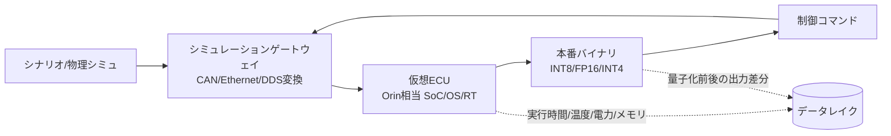

# 7.7 仮想 ECU を用いた HiL・コンパイル後評価

この節では、コンパイル・量子化された本番バイナリを、実 ECU 相当の環境で検証する手法を扱います。具体的には、仮想 ECU (virtual ECU、物理 ECU と同等の SoC・OS・ミドルウェアをクラウド上に再現したもの)・HiL（Hardware-in-the-Loop、実ハードウェアをループに組み込む評価形態）です。Vector CANoe・dSPACE SCALEXIO・NI VeriStand・Tesla Dojo の役割比較、INT8/INT4/FP16 量子化の許容基準、camera→ECU パイプラインの遅延予算、ECU バージョン不一致時のフォールバック、混在フリートの互換性検証を整理します。「本番バイナリの挙動を出荷前にデータドリブンに検証する」設計として示します。

## 仮想 ECU・HiL の位置づけと目的

第 7.4 節の SiL は、ソフトウェアを純粋な仮想環境で実行します。これに対し、HiL は実 ECU や実ハードウェアを評価ループへ組み込む形態です。さらに近年は、仮想 ECU を構築する手法が広がっています。クラウド上に物理 ECU と同一の SoC アーキテクチャ・OS・ランタイム・ミドルウェアを再現することで、HiL の柔軟性とスケーラビリティを両立させます。仮想 ECU・HiL の目的は 3 つです。第一に、コンパイル後バイナリ（量子化・演算融合・メモリ最適化済み）の精度・性能・リソース消費の確認です。第二に、ECU 間通信の遅延・バス負荷・フォールトインジェクション（fault injection、意図的な故障注入）を含むシナリオ検証です。第三に、物理 HiL ベンチや実車試験の前段フィルタとして、大量シナリオを安価に回すことです。

> **図 7.12**：クラウド仮想 ECU を用いた HiL ループ。シミュレータの出力を車載プロトコル（CAN、Ethernet、DDS）へ変換して仮想 ECU に流し込み、本番バイナリの実行時間・リソース・出力差分をデータレイクへストリーミングする。この図のポイントは、HiL を「合否判定の場」ではなく「コンパイル後の劣化要因を収集するデータ源」として扱う点です。

## HiL プラットフォーム比較：CANoe / SCALEXIO / VeriStand / Dojo

車載検証で標準的に使われるプラットフォームは、レイヤと得意領域が異なります。Closed-Loop 評価では、これらを単独でなく階層的に組み合わせます。簡単に紹介します。Vector CANoe は、CAN や Ethernet などのバス通信検証で長年デファクトの地位を保つツール群です。dSPACE SCALEXIO は、電源や I/O まで含めて決定論的に動かすフルビークル HiL のプラットフォームです。NI VeriStand は、PXI ベースのリアルタイム計測統合環境です。Tesla Dojo は、データセンタ規模で大量シナリオの SiL／リプレイを回す Tesla 内製の計算基盤です（リアルタイム保証はありません）。

| プラットフォーム | 主目的 | リアルタイム性 | スケーラビリティ | 典型用途 |
|---|---|---|---|---|
| Vector CANoe / CANoe4SW | バス通信シミュレーション・残余バステスト | 高（ns〜µs のバスタイミング） | 中（ベンチ単位） | CAN/CAN-FD/Ethernet の通信検証、SecOC、診断 |
| dSPACE SCALEXIO | フルビークル HiL・電源/I/O 含む実時間試験 | 最高（決定論的 RT、< 1 ms） | 低〜中（物理ラック） | ECU 込み実時間 HiL、センサ電気信号注入 |
| NI VeriStand | RT テスト実行環境・計測統合 | 高（PXI ベース RT） | 中 | センサモデル/プラント結合、HIL 計測 |
| Tesla Dojo | 大規模学習・大量 SiL/リプレイの計算基盤 | リアルタイム保証なし | 最高（データセンタ規模） | クラウド大量再生・学習・評価 |

CANoe は、バス挙動とプロトコルスタックの正しさ（SecOC（Secure Onboard Communication、車載セキュア通信プロトコル）のフレッシュネス値、CAN-FD のスケジューリング、診断応答）を検証する標準ツールです。CANoe4SW は仮想 ECU をクラウドで回す SiL/HiL に対応します。SCALEXIO は、電源・I/O・センサ電気信号まで含む決定論的フルビークル HiL を 1 ms 未満の RT で実行し、認証前の最終段に位置します。VeriStand は、PXI ベースのリアルタイム実行とプラントモデル結合、計測統合に強みがあります。Tesla Dojo は、リアルタイム保証のない大規模計算基盤です。データセンタ規模のリプレイ・SiL を担い、CANoe/SCALEXIO/VeriStand とは階層が異なる「上流の大量評価」を受け持ちます。実務では、ピラミッド構成を取ります。「Dojo 等のクラウドで大量 SiL → CANoe4SW で通信・仮想 ECU 検証 → SCALEXIO/VeriStand で物理 HiL の最終確認」です。

ここで考えるべき設計判断は、物理 HiL ベンチを増やす投資と仮想 ECU をクラウドで横方向に拡張する投資の経済性です。物理 HiL は決定論的な RT 実行ができる代わりに、ベンチ単位のスケールに頭打ちがあります。仮想 ECU はクラウドでスケールするものの、SoC・OS・ミドルウェア・コンパイラの再現が不完全だと物理 ECU との等価性が失われ、出荷直前ゲートとして機能しません。だからこそ、仮想 ECU で再現すべき要素を明示的にリスト化し、物理 ECU との同等性検証を CI に組み込んで「推論時間・メモリ・出力ビット差」を定常監視する運用が要になります。差分許容基準は固定値ではなく、SoC 世代やコンパイラ更新のたびに再校正される動的な数値として扱う、というのが Closed-Loop の発想です。SiL → 仮想 ECU → 物理 HiL のピラミッドへ稼働率をシフトさせる目標比率を持つことで、検証コストを構造的に下げつつ、最上位の物理 HiL を「認証前の最終確認」に集中投資できる体制が生まれます。

## コンパイル後バイナリの精度検証と量子化許容基準

車載 SoC（NVIDIA Drive Orin：254 TOPS、Drive Thor：1000+ TOPS など）では、学習時の FP32（32 bit 浮動小数点）モデルを TensorRT 等でコンパイルし、INT8（8 bit 整数）／INT4／FP16 へ量子化します。この過程で出力が変化するため、量子化前後の差分を定量管理します。重要なのは「平均精度の差」だけでなく「安全に効く誤りの増分」を基準化することです。

| 精度 | 想定用途 | 許容基準（例） | 主リスク |
|---|---|---|---|
| FP16 | 高精度が必要な知覚・予測 | mAP/NDS 低下 < 0.5 pt、見逃し増 ≈ 0% | ほぼ無劣化、メモリ削減小 |
| INT8 | 量産デフォルト | 安全関連クラスの false negative 増 < 0.1 pt、IoU 低下 < 1 pt | 小物体・遠方で見逃し増 |
| INT4 | 補助タスク・大規模モデル圧縮 | mIoU 低下 < 2 pt、安全関連は層別判定 | 安全クリティカル経路では原則非推奨。ただし Depthwise Separable など量子化耐性の高い層は層別 QAT で許容できる場合があり、層単位で品質確認のうえ判断 |

許容基準の中心に置くべきは「安全関連クラス（歩行者・自転車・停止車両）の false negative（見逃し）の増分」です。例えば、INT8 化で歩行者の見逃し率が +0.1 pt を超えたシナリオがあれば対処が必要です。そのシナリオ群を第 4 章のデータ選択へ戻し、量子化を意識した再学習（Quantization-Aware Training、量子化対応学習）や混合精度（安全経路のみ FP16 維持）で対処します。

量子化合否ゲートの判定ロジックは、次のように設計します。入力としてクラスごとの「FP32 モデルの false negative 率と mAP」「量子化後モデルの同指標」、および安全関連クラスの ID 集合を受け取ります。判定手順は、(1) 各クラスについて false negative 率の増分（量子化後 − FP32）を計算し、安全関連クラスでこの値が許容しきい値（例：+0.1 pt = 0.001）を超えたら不合格とする。(2) 各クラスについて mAP の低下量（FP32 − 量子化後）を計算し、しきい値（例：0.5 pt = 0.005）を超えたら不合格とする。(3) いずれかの不合格が 1 件でも発生したら全体としてゲート不通過とし、不合格リストに「クラス ID」「失敗種別（safety_fn_regression / map_regression）」「差分量」を残してレポートに添付する。安全関連と一般クラスでしきい値を分け、安全関連は厳しく設定するのが要点です。

ここで腑に落ちて欲しいのは、量子化の合否を「平均精度の差」ではなく「安全に効く誤りの増分」で測るべき、という非対称な評価設計です。INT8 化で全体 mAP が 0.3 pt しか落ちていなくても、その内訳が歩行者クラスでの false negative +0.5 pt に集中していれば、安全クリティカルな見逃しが急増したことを意味します。だからこそ安全関連クラスでは独立した厳しいしきい値（+0.1 pt）を設定し、合否ゲートを CI に組み込んで自動でリリース不可とする運用が必要です。INT4 が安全クリティカル経路で原則非推奨なのも同じ理屈で、Depthwise Separable のような量子化耐性の高い層に限って層別 QAT で許容する判断が、量子化感度の層別非対称性を活用する具体例になります。量子化で劣化したシナリオを「量子化リカバリ用」タグでデータ選択キューに戻す流れは、量子化ロバスト性を学習目標に組み込む Quantization-Aware Training を駆動するメカニズムでもあります。

## camera→ECU パイプラインの遅延予算

知覚〜制御の End-to-End 遅延 (latency) は、安全マージンに直結します。HiL では各段の遅延を分解計測し、予算 (latency budget、各段に許容する遅延の上限) を割り当てて超過を検知します。Drive Orin 級で 100 ms サイクル（10 Hz の知覚 + 高頻度の制御）を想定した予算例を示します。NVIDIA TensorRT 公開ベンチおよび一般的な BEV/Occupancy ネットの実測値から逆算した参考配分です。実プロジェクトでは、ECU 性能・モデル規模・ASIL 要件で配分を見直してください。

| 段 | 内容 | 予算 (ms) | 計測点 |
|---|---|---|---|
| センサ露光・読出し | カメラ露光〜MIPI 出力 | 15 | センサ→SoC 入力 |
| ISP・前処理 | デモザイク・リサイズ・正規化 | 8 | 前処理完了 |
| 推論 | BEV/Occupancy/E2E 本番バイナリ | 35 | 推論開始〜終了 |
| 後処理・融合 | NMS・トラッキング・センサフュージョン | 12 | 知覚出力 |
| 予測・計画 | Prediction + Planning | 20 | 計画出力 |
| 制御・アクチュエータ | 制御指令〜CAN 送出 | 10 | CAN 送出 |
| **合計** | camera→actuation | **100** | E2E |

各段にタイムスタンプを打ち、HiL ログから分位点（p50／p99／p99.9）を集計します。安全上は最悪値が重要なので、平均ではなく「p99.9 が予算内」を合否条件にします。例えば推論段の p99.9 が 35 ms を超えるシナリオ（夜間多物体など）があれば対処が必要です。入力解像度の動的調整・モデル分岐・優先度スケジューリングで対応します。

遅延予算チェックの実装手順は次のとおりです。入力として段ごとの遅延サンプル列（多数シナリオ・多数フレームから収集した ms 単位の数値配列）と段ごとの予算値を受け取ります。(1) 段ごとに p99.9 分位点を計算し、予算と比較して合否（OK/NG）を判定する。(2) 各段の p99.9 を合算した値を E2E p99.9 として E2E 予算と比較する（厳密には E2E 全体の p99.9 と段ごとの p99.9 合算は一致しないため、E2E ログを別途蓄えて直接 p99.9 を取るのが望ましい）。(3) 結果は段ごとの p99.9・予算・OK 判定と E2E のサマリを 1 つのレポート構造で返し、ダッシュボード（第 7.8 節）へ渡す。長時間ランで分位点が安定するのに必要なサンプル数（数万フレーム以上）も併せて記録します。

## 通信・故障シナリオとフォールトインジェクション

仮想 ECU・HiL では、バス・I/O・電源を制御できるため、実車で再現困難な故障を体系的に注入できます。代表例は 4 種類です。第一に、センサ ECU → メイン ECU のフレーム遅延・ドロップ・順序入替です。第二に、センサ値のフリーズ・異常スパイク・スタックです。第三に、ECU 再起動・一時通信断・電圧降下です。第四に、CAN-FD バス負荷飽和や SecOC フレッシュネス値の不整合です。これらに対し、安全監視・縮退制御・フェイルセーフ（第 7.9 節の MRM（Minimum Risk Maneuver、最小リスク操作）へ接続）が規定どおり作動するかを確認します。結果をシナリオ DB に紐付けて、「どの機能がどの故障に耐えるか」を体系化します。

## ECU バージョン不一致時のフォールバック検証

OTA（Over-The-Air、無線アップデート。第 8 章）で段階配信する以上、フリート内には複数のソフト／モデルバージョンが共存します。ECU 間でバージョンが不一致になった場合の挙動を、HiL で必ず検証します。検証の柱は 3 つです。第一に、バージョンネゴシエーションです。起動時に各 ECU がインターフェース契約バージョンを交換し、互換最小機能へ縮退します。第二に、不整合検出時の安全側フォールバックです。新機能を無効化し、検証済み旧モデルへロールバック、または MRM へ移行します。第三に、フォールバック自体の決定論性です。同条件で必ず同じ縮退状態へ入ることを保証します。

ECU 間のバージョン契約とフォールバック方針は、構成管理ファイル（YAML 等）として管理し、HiL での検証対象とします。最低限定義すべき項目は次のとおりです。

| 区分 | 項目 | 内容例 |
|---|---|---|
| インターフェース契約 | 各 ECU のスキーマ版とモデル版 | Perception ECU：`sensorframe.v3` / `bev-v12`、Planning ECU：`control.v2` / `planner-v8` |
| フォールバック方針 | スキーマ不整合時の挙動 | 互換最小機能へ縮退し通知 |
|  | モデル非互換時の挙動 | 直近検証済みモデル（例：`bev-v11`）へロールバック |
|  | ネゴシエーション失敗時の挙動 | 200 ms 以内に MRM へ移行 |
| 検証要件 | 決定論性 | 同条件で必ず同じ縮退状態に入る |
|  | フォールバック遅延上限 | 不整合検知から安全状態到達まで 200 ms 以内 |

HiL では、各セルを「正常 / スキーマ不整合 / モデル非互換 / ネゴシエーションタイムアウト」のテストケースとして繰り返し実行し、決定論性と遅延上限を統計的に確認します。

## 混在フリートの互換性検証（必須）

混在フリート (mixed fleet) では、新旧モデル・新旧 HD マップ・新旧センサキャリブレーションが任意に組み合わさります。互換性検証では、「想定される組み合わせ行列」を作り、各セルを HiL で評価します。検証必須項目は 3 つです。第一に、新モデル × 旧マップ、旧モデル × 新マップでの性能劣化が許容内かです。第二に、インターフェース契約（メッセージスキーマ・座標系・タイムスタンプ規約）の後方互換性です。第三に、段階配信中に同一車両内で新旧 ECU が混在しても安全目標を満たすかです。組み合わせは爆発するため、リスクの高いセル（安全関連 + 曝露頻度高）を優先する第 7.6 節のリスク加重カバレッジを流用します。

| 構成セル | モデル | HDマップ | 期待結果 | HiL 判定基準 |
|---|---|---|---|---|
| 基準 | v12 | 2026.05 | 合格 | 全指標基準内 |
| 段階配信中 | v12 | 2026.03(旧) | 縮退許容 | 安全関連 FN 増 < 0.1 pt |
| ロールバック | v11 | 2026.05 | 合格 | 旧モデル基準内 |
| 非互換 | v12 | 2025.11(古) | フォールバック | MRM 起動 or 機能無効 |

## Closed-Loop における仮想 ECU の位置づけ

仮想 ECU・HiL は、Closed-Loop データエンジンの「出荷直前ゲート兼データ源」として機能します。流れは 4 段階です。第一に、第 6 章で学習・評価したモデルをターゲット ECU 向けにコンパイル・量子化します。第二に、仮想 ECU で量子化精度・遅延予算・故障耐性・混在互換性を評価します。第三に、劣化が顕著なシナリオをシナリオ DB へ登録し、データ選択・ラベリング・再学習へフィードバックします。第四に、ECU 構成やリソース配分を見直して、第 8 章のデプロイ戦略へ反映します。これにより「オフラインでは良いが実 ECU では遅い／挙動が違う」というギャップを早期に検出し、データとモデルの両面から対策できます。

ここで考えるべき本質は、リリース判断を「単一指標の合格」ではなく「量子化合否・遅延予算 p99.9 合否・フォールトインジェクション結果・混在フリート行列合否」の複数軸の同時充足で語る姿勢です。量子化が通っても遅延 p99.9 が予算超過なら実車で挙動がぶれ、遅延が予算内でもフォールトインジェクションで MRM 起動が遅れれば認証要件を満たせず、いずれが通っても混在フリートの組み合わせで不整合が起きれば段階配信中の安全が破綻します。だからこそフォールバック方針を YAML として構成管理し、HiL の入力としてそのまま使える形にしておくと、運用上の方針変更が即座に検証へ反映され、暗黙の前提が静かに崩れる事故を防げます。混在フリート行列のセルごとに合否を色分け表示し、追加検証が必要なセルをチケット化する運用は、リスク加重カバレッジ（第 7.6 節）と同じ哲学を OTA 配信中の安全管理に持ち込んだ実装です。

## 本節の振り返り

仮想 ECU・HiL は本番バイナリの精度・遅延・故障耐性を出荷前に検証する場で、CANoe（通信検証）・SCALEXIO/VeriStand（物理 RT）・Dojo（大量クラウド評価）を階層的に組み合わせるピラミッド構成が経済合理性を持ちます。量子化許容基準は平均精度の差ではなく安全関連クラスの false negative 増分を中心に据え、INT8 を量産デフォルトとしつつ INT4 は安全クリティカル経路で原則非推奨、層単位 QAT で耐性の高い層に限定許容するのが妥当です。camera→ECU の遅延予算は段ごとに割り当て、平均ではなく p99.9 が予算内であることを合否条件にすることで最悪値を抑え、ASIL 要件に直接効く設計になります。ECU バージョン不一致時は決定論的フォールバックを HiL で繰り返し検証し、混在フリートは新旧モデル × 新旧マップの組み合わせ行列をリスク加重カバレッジで優先順位付けして評価します。これらは単独で合格を競うのではなく、複数軸の同時充足としてリリース判断に統合される、というのが Closed-Loop における仮想 ECU の位置付けです。

## 次節への橋渡し

次の 7.8 節では、これら HiL・SiL・実車テストの結果を組織的意思決定へつなぐレポート自動生成と可視化へ進みます。TTC/PET/THW の定義式、ISO 2631 に基づく加速度・jerk 基準、レポートテストの再現性ゲート、モデル間比較レポートテンプレート、リグレッション検知のしきい値を扱います。
