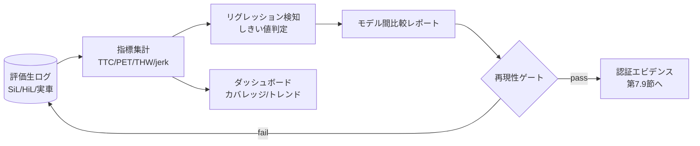

# 7.8 レポート自動生成と可視化

この節では、SiL・HiL・実車テストの結果を組織的意思決定へつなぐレポート自動生成 (automated reporting) と可視化を扱います。安全指標 TTC/PET/THW の定義式、ISO 2631 [L16](references#l16) に基づく加速度・jerk（加加速度、加速度の時間微分）の乗り心地基準、シナリオ × ODD 集計、ダッシュボードのパターン、レポート自体の再現性ゲート、モデル間比較レポートテンプレート、リグレッション検知のしきい値を扱います。「評価結果を再現可能なエビデンスとして組織に流通させる」仕組みとして整理します。

## なぜレポート自動生成が必要か

データ中心・Closed-Loop な開発では、数万シナリオ × 複数 ODD × 多数モデルバージョンの評価が継続的に発生します。これを人手で集計・整形するのは非現実的です。属人化と再現性喪失を招きます。レポート自動生成の目的は 3 点です。第一に、評価結果を一貫フォーマットで即時共有することです。第二に、リグレッション・性能劣化の早期検知です。第三に、安全レビュー・リリース会議の意思決定をデータドリブンにすることです。規制対応・安全認証（第 7.9 節）を見据えると、「どのモデルをどのシナリオセットで評価し、どの結果だったか」を長期保管・再現できることが必須要件になります。

> **図 7.13**：レポート生成パイプライン。生ログから指標を集計し、リグレッション検知と再現性ゲートを通したものだけがエビデンスへ昇格する。この図のポイントは、レポート生成自体をコード化・テスト可能にして「レポートも再現可能なアーティファクト」にすることです。

## 安全指標の定義式：TTC・PET・THW

レポートの中核は、安全マージン指標です。曖昧な日本語表現を避け、定義式で統一します。

**TTC (Time To Collision、衝突までの時間)**：自車と前方対象が現在の相対速度を保った場合に、衝突するまでの時間です。距離 $d$、相対接近速度 $\Delta v = v_{\text{ego}} - v_{\text{lead}}$（接近時のみ正）に対し、

$$
\text{TTC} = \frac{d}{\Delta v}, \quad (\Delta v > 0)
$$

$\Delta v \le 0$（離反）では衝突しないため、未定義（∞）とします。一般に TTC < 1.5 s を高リスク、< 0.5 s を切迫として扱います。

**PET (Post-Encroachment Time、相互通過時間)**：交差する 2 物体が、同一の競合点 (conflict point、交差地点) を通過する時刻差です。先行物体が競合点を抜けた時刻 $t_1^{\text{exit}}$ と後続物体が到達する時刻 $t_2^{\text{enter}}$ から、

$$
\text{PET} = t_2^{\text{enter}} - t_1^{\text{exit}}
$$

PET は、速度ベクトルが交差する交差点・合流で有効です。PET < 1.0 s を高リスクとします。

**THW (Time Headway、車頭時間)**：前車後端を自車前端が通過するまでの時間です。相対速度に依存せず、

$$
\text{THW} = \frac{d}{v_{\text{ego}}}
$$

THW < 1.0 s を車間過小として扱います。それぞれの指標は役割が分かれています。TTC は「衝突切迫度」、THW は「車間の余裕」、PET は「交差競合の余裕」を測ります。

集計ツールへの実装指示は次のとおりです。各時刻ごとに、(1) 自車速度・前車速度・車間距離から TTC を求める。ただし離反方向（$\Delta v \le 0$）や微小な相対速度では未定義として無限大を返し、危険判定対象から除外する。(2) 自車速度と車間から THW を求める。停車時はゼロ除算を避けるため未定義扱いにする。(3) 交差シナリオでは先行物体の競合点退出時刻と後続物体の競合点到達時刻の差から PET を求める。(4) シナリオごとに最小 TTC、最小 THW、最小 PET を集計し、`ttc_critical`（< 1.5 s）、`thw_low`（< 1.0 s）、`pet_critical`（< 1.0 s）のフラグを付してレポートに含める。フラグ立て基準は ODD ごとに調整可能なパラメータとして外部設定化します。

## 乗り心地指標：ISO 2631 に基づく加速度・jerk 基準

安全だけでなく、快適性も評価対象です。ISO 2631-1 [L16](references#l16)（全身振動評価の汎用枠組み）と、車両用途で乗用環境向けに具体化した ISO 2631-4 [L16](references#l16) を用います。自動運転では、縦・横加速度と jerk（加加速度、加速度の時間微分）を指標化します。実務でよく用いる基準は次のとおりです。

| 指標 | 定義 | 快適基準（例） | 限界基準（例） |
|---|---|---|---|
| 縦加速度 $a_x$ | 前後 G | \|$a_x$\| ≤ 1.5 m/s² | ≤ 3.0 m/s² |
| 横加速度 $a_y$ | 旋回 G | \|$a_y$\| ≤ 1.5 m/s² | ≤ 3.0 m/s² |
| jerk $j$ | $j = da/dt$ | \|$j$\| ≤ 1.0 m/s³ | ≤ 2.0 m/s³ |
| 加重 RMS 加速度 | ISO 2631 周波数加重後 RMS | < 0.315 m/s²（快適） | 0.8 m/s²（不快） |

jerk は、乗員の不快感・酔いに強く相関します。そのため、Planning の評価では加速度上限だけでなく jerk 上限の充足率を必ず集計します。

乗り心地指標の算出手順は次のとおりです。入力として時刻列 $t$、縦加速度列 $a_x$、横加速度列 $a_y$（等間隔サンプリング）を受け取り、(1) 縦加速度・横加速度の絶対値最大を求める、(2) 縦加速度の時間差分を時間刻みで割って jerk 列を作り、その絶対値最大を求める、(3) jerk が 1.0 m/s³ を超えるサンプルの割合を「jerk 違反率」として計算する、(4) 縦加速度最大が 1.5 m/s² 以下かつ jerk 最大が 1.0 m/s³ 以下なら快適とみなすフラグを返す、という流れです。ISO 2631 の周波数加重 RMS まで踏み込む場合は、別途 1/3 オクターブバンドフィルタによる前処理を行います。

## シナリオ単位・ODD セグメント単位の集計

生ログはシナリオ単位と ODD セグメント単位で集計します。シナリオ単位では実行回数・成功/失敗回数・失敗理由分類・TTC/PET/THW の最小値分布・jerk 違反率を、ODD セグメント単位（雨天夜間・都市高速・郊外一般道など）では条件別成功率・ヒヤリハット頻度・機能別性能（自動レーンチェンジ、右折など）を出します。これを第 7.6 節のカバレッジ指標と重ねると「テスト済みだが性能不足の領域」が俯瞰できます。

## ダッシュボードと可視化のパターン

代表的な可視化は 3 つです。第一に、カバレッジマトリクスです。ODD セグメント（行）× 機能カテゴリ（列）にカバレッジと成功率を色で表示し、赤いセルを即座に発見できるようにします。第二に、シナリオランキングです。失敗回数・改善度・実車インシデント関連度でランク付けし、各行から再生ツールへワンクリックで遷移できるようにします。第三に、時系列トレンドです。モデルバージョンごとの成功率・安全マージン・jerk 違反率の推移を描き、リリースとフィールド KPI を重ねて相関を見ます。多職種レビュー（経営・安全・運用）では、直感的な可視化が意思決定速度を左右します。

## レポートの再現性ゲート

「レポートも再現可能なアーティファクト（成果物）」にするため、生成パイプラインに再現性ゲートを設けます。ゲートでは 3 点を確認します。(1) 入力の固定：シナリオセットバージョン・モデルバージョン・乱数シード・シミュレータ設定 ID をレポートに埋め込みます。(2) 決定論性検証：同一入力で 2 回生成し、指標がビット一致または許容誤差内かを確認します。(3) 環境固定：コンテナイメージダイジェスト・依存ライブラリ版を記録します。これを通らないレポートは、エビデンスに昇格させません。

決定論性検証は、次のように実装します。同一入力で 2 回パイプラインを実行し、各指標の差分を計算して、許容誤差（例：$10^{-6}$）以下に収まっているかを確認します。差分が許容を超える指標があれば、「違反指標一覧」と「再現不可」のフラグをレポートに残します。原因（乱数固定漏れ、並列処理の非決定性、外部 API の揺らぎなど）を特定するまで、エビデンス昇格を保留します。

## モデル間比較レポートテンプレート

リリース判断の中核は、モデル間比較です。新旧（候補 vs 現行）を同一シナリオセットで評価し、改善・退行を両面で示すテンプレートを標準化します。テンプレートに最低限含めるセクションを次表に示します。

| セクション | 内容 |
|---|---|
| メタ情報 | ベースラインモデルと候補モデルの名前・コミットハッシュ、評価に使ったシナリオセットのバージョン、コンテナイメージのダイジェスト、乱数シード |
| サマリ指標 | 全体成功率、安全関連クラスの false negative 率、jerk 違反率などをベースライン・候補・差分の 3 列で並べる |
| 改善シナリオ群 | 候補が有意に改善した ODD セグメントを「セグメント名・成功率（改善前 → 改善後）」で列挙 |
| 退行シナリオ群 | 候補が退行したセグメントを同形式で列挙し、安全関連であれば `blocker: true` フラグを付与 |
| ゲート判定 | 再現性ゲートの可否、リリース推奨判定（go / hold / no-go） |

このテンプレートを YAML や JSON でスキーマ化し、レポート生成パイプラインで自動出力するようにします。退行シナリオが安全関連であれば、必ずブロッカーとしてマークします。リリース推奨判定を `hold` 以下に固定するルールも実装します。

ここで設計判断として腑に落ちて欲しいのは、「レポート生成パイプライン自体がコード化・テスト可能なアーティファクトでなければエビデンスにならない」という点です。レポートの中身が決定論的に再現できないなら、認証機関の監査でその数値を主張根拠として使えません。だからこそパイプラインを git 管理し、指標計算コードに単体テストを書き、「同一入力で 2 回生成して差分 < $10^{-6}$」を CI で検証し、再現不可のレポートを自動的にエビデンスから除外する流れを敷きます。さらに、経営・安全・運用という 3 役は意思決定の粒度が異なります。経営はリリース可否の総合判断、安全は退行シナリオの ASIL 別深掘り、運用は ODD セグメントごとの傾向把握、という具合に必要な指標と粒度がずれるため、表示するビューを切り替えるダッシュボード設計が意思決定速度を左右します。同一の生ログから複数ビューを同時生成する仕組みは、第 7.9 節のセーフティケースに証跡として束ねる際の前提条件にもなります。

## リグレッション検知のしきい値

退行検知は、固定しきい値と統計的しきい値を併用します。実務的な基準例を示します。

| 指標 | 退行検知しきい値 | 重大度 |
|---|---|---|
| 安全関連シナリオ成功率 | 低下 > 0.5 pt | ブロッカー |
| 全体成功率 | 低下 > 1.0 pt | 要審査 |
| 安全関連クラス FN 率 | 上昇 > 0.1 pt | ブロッカー |
| jerk 違反率 | 上昇 > 2.0 pt | 要審査 |
| 個別シナリオ | 既存合格→不合格に転落 | 要審査（新規回帰） |

成功率のような比率には、サンプル数の揺らぎを考慮します。二項比率の検定（または Wilson 信頼区間）を併用し、「真に退行か偶然か」を判定します。安全関連は誤って通すリスクが大きいため、保守的に固定しきい値（> 0.5 pt 低下）を優先します。

## Closed-Loop におけるレポートの役割

レポート自動生成は、Closed-Loop データエンジンの「フィードバック可視化層」です。流れは 5 段階です。第一に、SiL/HiL/実車から生ログ収集します。第二に、指標集計を行います。第三に、ダッシュボード・比較レポートを出力します。第四に、それに基づきデータ収集計画・ラベリング優先度・モデル改良・リリース判断を行います。第五に、新モデル／データ／シナリオが再び評価へ戻ります。このパイプライン自体を第 6 章の学習パイプライン同様にコード化・テスト可能にすることが、高速で安定した Closed-Loop の前提です。

## 本節の振り返り

安全指標 TTC/PET/THW と乗り心地指標（ISO 2631 [L16](references#l16) の加速度・jerk）は、曖昧な日本語表現を排して定義式で統一することが、組織横断の意思決定を「印象論」から「数式」へ移す前提でした。集計はシナリオ単位と ODD セグメント単位の二系統で行い、カバレッジマトリクスで赤いセルを発見し、ランキングで失敗回数の多いシナリオを再生ツールへ即遷移させ、時系列トレンドでモデルバージョン間の改善と退行を追う、という三層の可視化を組み合わせます。レポート自体が再現性ゲート（入力固定・決定論性検証・環境固定）を通ったときだけエビデンスに昇格する設計は、認証監査での説明責任に直結する重要な制度設計です。モデル間比較テンプレートはベースラインと候補の改善・退行を両面提示するスキーマとして標準化し、安全関連の退行は保守的な固定しきい値（成功率低下 > 0.5 pt、FN 増 > 0.1 pt）でブロッカー化します。これにより、Closed-Loop が生成し続ける大量の評価結果を、組織が消化可能な意思決定情報へ翻訳する仕組みが整います。

## 次節への橋渡し

次の 7.9 節では、これらレポートを Evidence として束ねるセーフティケース管理へ進みます。GSN による安全アーギュメント、ASIL 評価テンプレート、MRM 検証基準、SOTIF 残余リスク、認証パッケージ形式、ISO 26262/ISO 21448/UL 4600/UNECE R157 との対応を扱い、第 7 章を締めて第 8 章の実運用展開へつなぎます。
