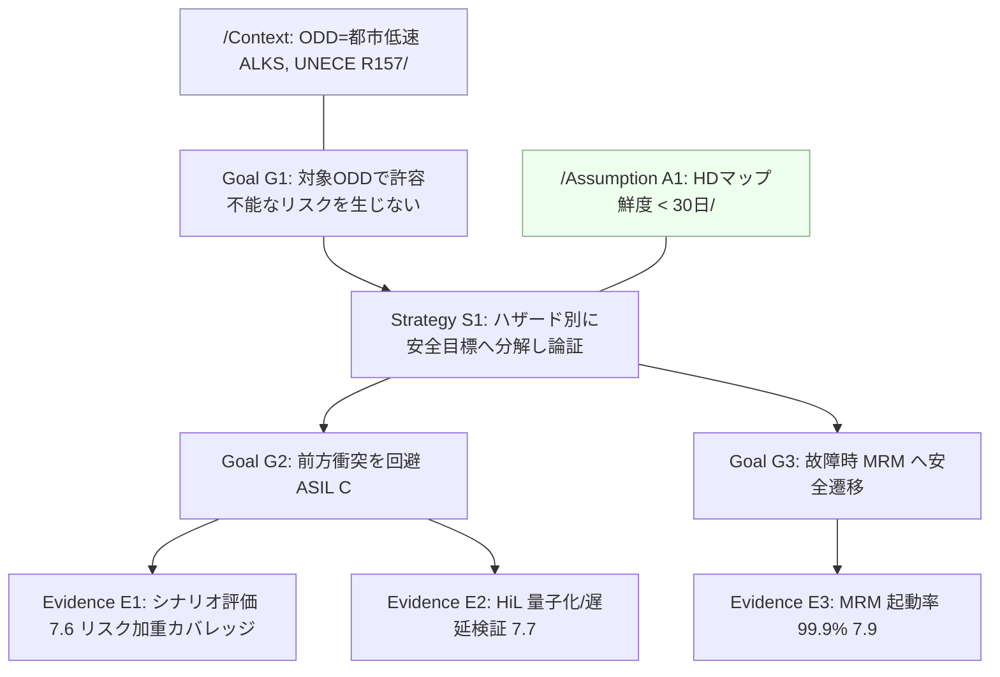
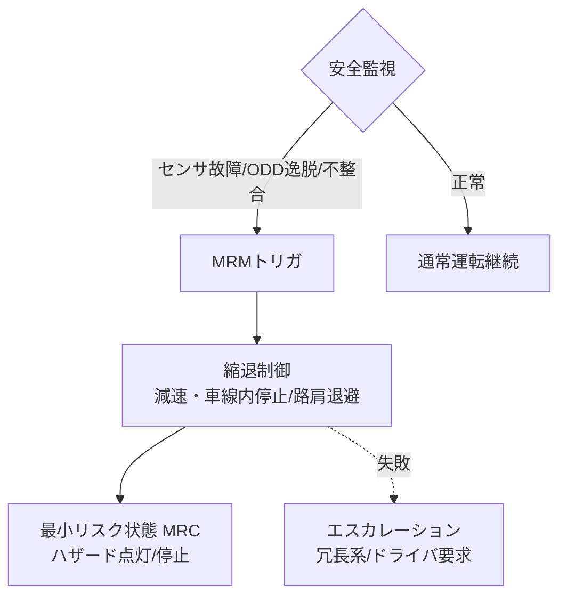

# 7.9 セーフティケース管理と ISO 26262 / SOTIF 準拠の証跡

この節では、評価結果を安全認証のエビデンスとして束ねる手法を扱います。具体的には、セーフティケース (safety case) 管理です。GSN（Goal Structuring Notation、安全論証を図式化する記法）による安全アーギュメント、ASIL（Automotive Safety Integrity Level、ISO 26262 が定める安全度水準で A 緩 → D 厳）評価テンプレート（Severity / Exposure / Controllability）、MRM（Minimum Risk Maneuver、最小リスク操作）の検証基準、SOTIF（Safety of the Intended Functionality、意図機能安全）の残余リスク基準、認証パッケージ形式、フリート初期の ODD ドリフト対応を扱います。これらを ISO 26262 [L1](references#l1)・ISO 21448 (SOTIF) [L2](references#l2)・UL 4600 [L5](references#l5)・UNECE R157 [L6](references#l6) と対応づけます。「評価データを安全アーギュメントの構成要素として運用する」考え方を示します。

> 本節は、法的または認証上の助言を提供するものではありません。条文の逐次解説も行いません。実際の認証・法令対応は、必ず安全・法務・認証の専門家および認証機関と相談のうえで判断してください。

## セーフティケースと GSN の基本

セーフティケースは「システムが安全要求を満たすことを示す主張・根拠・前提条件の体系」です。ISO 26262 [L1](references#l1)・ISO 21448 [L2](references#l2)・UL 4600 [L5](references#l5) はいずれも、安全性の論証（アシュアランスケース）を要求します。論証の表記には GSN（Goal Structuring Notation）[L15](references#l15) を用います。Goal（安全目標）、Strategy（分割・論証方針）、Evidence（テスト結果・解析）、Assumption（前提）、Context（適用範囲）の関係を図式化します。自動運転では、第 7.1〜7.8 節のシナリオベース・Closed-Loop 評価結果が Evidence の中核を成します。

> **図 7.14**：GSN による安全アーギュメントの骨格（教育目的の最小例）。最上位 Goal を Strategy でサブゴールへ分解し、各サブゴールを評価 Evidence が支える。Context と Assumption が適用範囲を限定する。この図のポイントは、Closed-Loop 評価で生成した指標（カバレッジ・MRM 起動率）が「どの Goal をどの強さで支えるか」を明示できることです。実プロジェクトでの GSN は、本図の構造を再帰的に展開し、Goal / Strategy / Evidence ノード合計が 100 以上になる規模が一般的です。本書ではテンプレートを示し、各サブツリーへの展開は社内安全担当・認証機関と協議して詳細化することを想定します。

ここで腑に落ちて欲しいのは、GSN が「形式図」ではなく「主張と根拠の双方向リンクを機械可読に管理する仕組み」だ、という点です。Goal は守りたい安全主張、Strategy はそれを分割する論証方針、Evidence はその主張を支える具体的な数値（カバレッジ充足率、MRM 起動率 99.9%、HiL 量子化ゲート結果など）です。これらを一枚の図にまとめるだけでは紙の上の関係図に過ぎませんが、各 Evidence ノードに「シナリオ ID」「実行レポート ID」「再現性ハッシュ」を紐付けることで、Goal から数値、数値から実行ログ、実行ログから生データへと監査時に即座に辿れる構造になります。安全担当・モデル開発・検証エンジニアの 3 役で四半期ごとに Goal を共有レビューする運用は、Closed-Loop が生成する評価結果を安全アーギュメントの構成要素として継続的に流し込むメカニズムでもあります。Goal/Strategy/Evidence ノードが 100 以上に膨らむ実プロジェクトでも、この双方向リンクが機械可読なら認証機関の問いに「どの主張がどの数値で支えられているか」を即答できます。

## ASIL 評価テンプレート（Severity / Exposure / Controllability）

ISO 26262 [L1](references#l1) は、危険事象のリスクを Severity（S、重大度）・Exposure（E、曝露頻度）・Controllability（C、人間が回避できるか）の組で評価し、ASIL（A〜D、QM）を割り当てます。S0–S3、E0–E4、C0–C3 の組み合わせで決まります。S3×E4×C3 が最も厳しい ASIL D（最厳格）です。QM（Quality Management、品質管理対象）は ASIL の対象外です。シナリオベース開発では、これをシナリオ単位で運用します。

| # | シナリオ | S | E | C | ASIL | 主たる安全目標 |
|---|---|---|---|---|---|---|
| 1 | 都市交差点 右折・対向直進車ギャップ小 | S3 | E3 | C2 | C | 衝突回避・縮退 |
| 2 | 高速 前方停止車両へ接近 | S3 | E3 | C3 | C | AEB 作動 |
| 3 | 高速 隣接車の急カットイン | S3 | E4 | C2 | D | 車間確保・回避 |
| 4 | 夜間 横断歩行者（低コントラスト） | S3 | E2 | C3 | B | 歩行者検知・減速 |
| 5 | 雨天 レーンマーキング不鮮明 | S2 | E4 | C2 | B | 車線維持・縮退 |
| 6 | 低速 駐車場 後退時の死角障害物 | S1 | E4 | C2 | A | 低速衝突回避 |
| 7 | センサ単一故障（カメラ汚れ） | S3 | E3 | C3 | C | 縮退・MRM |
| 8 | 高速 タイヤ落下物（静止小物体） | S3 | E2 | C3 | B | 検知・回避/減速 |

各行に対し、3 種の情報を Evidence として紐付けます。第一に、実装された検出・制御・フェイルセーフです。第二に、SiL/HiL/実車で確認した成功率・安全マージン（TTC/PET、第 7.8 節）です。第三に、残余リスクの受容可否です。

ASIL の機械的な割り当てを実装する場合は、ISO 26262-3 [L1](references#l1) の決定表に準拠した $(S, E, C)$ → ASIL のルックアップテーブルを用意します。シナリオごとに重大度・曝露・制御性を入力して、ASIL を返します。代表的な対応の抜粋を次表に示します。

| (S, E, C) | ASIL |
|---|---|
| (3, 4, 3) | D |
| (3, 4, 2) | C |
| (3, 3, 3) | C |
| (3, 3, 2) | B |
| (3, 2, 3) | B |
| (2, 4, 2) | B |
| (1, 4, 2) | A |
| (3, 3, 1) | A |
| 表外の軽微な組合せ | QM |

残余リスクの判定は、ASIL ごとの目標故障率（PMHF、Probabilistic Metric for random Hardware Failures、1 時間あたりのランダムハードウェア故障率）と観測故障率を比較するルールで実装します。目安は次のとおりです。ASIL D で $\le 10^{-8}$、ASIL C で $\le 10^{-7}$、ASIL B で $\le 10^{-7}$、ASIL A で $\le 10^{-6}$、QM では数値目標なしです。観測値がいずれかの目標を超えていれば、残余リスク不受容として再設計を要求します。ASIL D 相当のランダムハードウェア故障には、PMHF 目標 < $10^{-8}$ /h が典型的に対応づけられます [L1](references#l1)。

ここで考えるべき設計判断は、ASIL の決定表をどこまで機械的に運用するか、という線引きです。$(S, E, C)$ → ASIL のルックアップは、シナリオ DB と組み合わせれば 30〜100 件のシナリオに対し自動で ASIL を割り当てられます。しかし「都市交差点 右折・対向直進車ギャップ小」のような実シナリオでは、$S$・$E$・$C$ の独立性が必ずしも成り立たず、機械的算出をそのまま安全主張に使うと過信のリスクがあります。だからこそ、機能安全担当の専門家レビューで最終確定する運用ルールを書面化し、機械的 ASIL を「議論の出発点」と位置付けるのが妥当です。ASIL B 以上のシナリオを「リリース前の HiL 全件合格」というゲート条件に組み込むことで、ASIL 区分が単なる分類記号でなくリリース判断に直結する具体的閾値となります。さらに、各シナリオの ASIL に対応する PMHF 目標とフィールド観測故障率を並べて受容判定を行う運用は、ハードウェア由来のランダム故障に対する論証で標準化されたフレームを、シナリオベースのソフトウェア検証に持ち込む工夫でもあります。

## OpenSCENARIO による評価シナリオの記述

ASIL 評価対象シナリオは、ASAM OpenSCENARIO [Sim7](references#sim7) で機械可読に管理し、評価とトレーサビリティを結びます。例として「前方停止車両への接近」（テンプレート #2、ASIL-C）を OpenSCENARIO 1.x で表現する場合、ファイルに含めるべき要素は次のとおりです。

| 要素 | 内容 |
|---|---|
| ファイルヘッダ | OpenSCENARIO のリビジョン（例：1.2）、作成者、シナリオ説明 |
| エンティティ定義 | 自車（Ego）と先行車（LeadVehicle） |
| 物語構成 | `Storyboard` → `Story`（StoppedLead） → `Act`（Approach） → `ManeuverGroup` → `Maneuver`（LeadStops） |
| アクション | `LongitudinalAction` の `SpeedAction` で先行車を瞬時に停止（dynamics shape = step、dimension = time、value = 0、目標速度 = 0） |
| トリガ | `StartTrigger` の `TimeToCollisionCondition` を「自車側で TTC < 4.0 s に立ち上がった瞬間（rising edge）」に設定 |

シナリオ ID と ASIL ランクをファイルヘッダや別途のメタデータ（シナリオ DB の行）に紐付けます。これにより、シナリオファイルから安全目標・評価結果へ双方向で辿れるようになります。

## MRM（Minimum Risk Maneuver）の検証基準

UNECE R157 [L6](references#l6) が扱う ALKS（Automated Lane Keeping System、自動車線維持システム）をはじめ、ADS（Automated Driving System、自動運転システム）は故障・ODD 逸脱時に MRM を起動しなければなりません。MRM は、最小リスク状態 (Minimum Risk Condition、MRC) へ遷移する操作です。MRM の論証では「起動すべき時に確実に起動し、安全に停止する」ことを定量検証します。検証基準の例は 4 点です。第一に、MRM 起動率は 99.9% 以上です（起動条件を満たすテスト群で必須トリガが作動した割合）。第二に、起動レイテンシは検知〜MRM 開始まで 200 ms 未満です。第三に、停止までの縦・横挙動が、乗り心地限界（第 7.8 節）内です。第四に、誤起動率（不要な MRM）が許容内です。

> **図 7.15**：MRM トリガツリー。安全監視が異常を検知すると縮退制御を経て MRC へ至る。この図のポイントは、各遷移（トリガ→縮退→MRC）の成功率とレイテンシを HiL（第 7.7 節）で測り、99.9% の起動率を Evidence 化することです。

MRM の合否判定ロジックは、次のように実装します。HiL での試行ごとに 4 種を記録します。「本来トリガすべきか（should_trigger）」「実際にトリガしたか（triggered）」「検知から縮退開始までのレイテンシ（ms）」「縮退中の最大 jerk」です。判定の 4 つのチェックは次のとおりです。(1) 「トリガすべき」試行のうち実際に作動した割合（起動率）を計算し、99.9% 以上を合格条件とする。(2) 起動した試行で全件レイテンシが 200 ms 未満であることを確認する。(3) 起動した試行で全件最大 jerk が乗り心地限界（例：2.0 m/s³）以下であることを確認する。(4) 「トリガ不要」だったのに作動した試行（誤起動）の件数を集計し、許容上限を超えていないか確認する。これら 4 つのチェックを通過したシナリオ群のみ、Evidence として認証パッケージに含めます。

ここで腑に落ちて欲しいのは、MRM 起動率 99.9% という数字が「3 σ の信頼性主張」を機械的に成立させるための統計的閾値である、という点です。1,000 試行で起動成功 999 件以上を要求することは、「センサ故障・通信断・ODD 逸脱・自己診断 NG」のような起動条件をすべて網羅的に列挙し、それぞれ HiL で 1,000 試行以上実行することを暗黙の前提にします。誤起動率の管理を併設するのも重要で、起動率を上げるためにトリガ感度を高めすぎると不要な MRM が頻発し、結果として乗員と後続車に対する別種のリスクを生み出します。レイテンシ 200 ms 未満は人間の反応時間や後続車の制動距離と整合する数字で、超過すると安全側フォールバックが「遅いだけのフォールバック」になり論証が崩れます。縮退中の最大 jerk が 2.0 m/s³ を超えるなら、ISO 2631 の乗り心地限界（第 7.8 節）を破り、乗員傷害リスクが顕在化します。これら 4 指標をダッシュボードで常時可視化し、リリースゲートに組み込み、シナリオ別の縮退挙動を動画化して安全レビューに供する運用は、Evidence を「数値表」だけでなく「物語可能な証跡」として整える作業でもあります。

## SOTIF 残余リスクの基準

ISO 21448 (SOTIF) [L2](references#l2) は、故障ではなく「意図した機能の性能限界・誤使用」に起因するリスクを扱います。シナリオを 4 領域（既知安全・既知危険・未知安全・未知危険）に分類します。Area 3 (未知危険) を Closed-Loop の探索（第 7.6 節のログマイニング・カバレッジ拡張）で既知化し、Area 2 (既知危険) を設計改善で安全側へ移すことが目標です。Area 3 を完全に空にする（既知化を 100% 達成する）ことは、理論的に不可能です。そのため運用では「新規ハザード発見率が走行距離に対し逓減し、ALARP（As Low As Reasonably Practicable、合理的に実行可能な限り低減）水準で安定する」ことを論証します。残余リスクの受容基準は 3 点で論証します。第一に、既知危険シナリオの発生頻度 × 重大度が ALARP 水準であること。第二に、未知危険の縮小を示す「カバレッジの収束」（新規ハザード発見率が走行距離に対し逓減）です。第三に、フィールド統計（実車の介入・ニアミス率）が目標を下回ることです。

| SOTIF 領域 | 状態 | Closed-Loop での扱い |
|---|---|---|
| Area 1 既知安全 | 設計で担保 | リグレッションで維持確認 |
| Area 2 既知危険 | 要改善 | 再学習・制御修正で Area 1 へ |
| Area 3 未知危険 | 探索対象 | ログマイニング/生成で発見→既知化 |
| Area 4 未知安全 | 暗黙の余裕 | 探索により Area 1 として確証 |

ここで考えるべきは、Area 3（未知危険）を完全に空にすることが理論的に不可能だ、という前提から議論を組み立てる姿勢です。SOTIF が要求するのは Area 3 の消滅ではなく、「新規ハザード発見率が走行距離に対し逓減し ALARP 水準で安定すること」です。つまり「もう発見されない」ではなく「発見スピードが鈍化していく」ことを定量で示す論証になります。だからこそ、シナリオ DB に Area 1〜4 のタグを付けて月次で領域別件数推移をダッシュボード表示し、「新規ハザード発見率／走行距離」を月次で計算して収束カーブを描く運用が中心になります。Area 3 の発見数が一定期間ゼロでも安心せず、ログマイニングのアルゴリズム自体を変えて再探索することをルーチン化するのは、「探索が止まったから既知化が進んだ」のか「探索手法が枯れて発見できなくなった」のかを区別するためです。SOTIF の論証は静的な達成宣言ではなく、Closed-Loop の探索が継続的に Area 3 を Area 1 へ移し続けるダイナミクスそのものを Evidence として束ねる、という発想で運用します。

## 要件・テスト・結果のトレーサビリティ

セーフティケースの説得力は、「安全目標 → シナリオ → テスト結果 → データ」の双方向トレーサビリティに依存します。具体的には 3 点を明示します。(1) 各安全目標がどのシナリオ群で検証され、各シナリオがどの Goal を支えるか。(2) シナリオ ID ごとにどのモデル／ECU 構成でどの結果（TTC/PET/成功率）が出たか、失敗にどの是正処置を施したか。(3) シナリオがどの実車ログ・シミュ設定から生成され、データセットの各サンプルがどの ODD セグメントに属するか。これらは、第 3〜5 章のデータレイク・メタデータ、第 7.2〜7.6 節のシナリオ DB・カバレッジ管理と一体で運用します。

## 認証パッケージ形式

各モデルリリースごとに、再現と監査に必要なアーティファクトを 1 つの認証パッケージ（例：`model-v12-eval-pkg.tar.gz`）にまとめます。長期保存ストレージとメタデータカタログに登録します。パッケージに含めるべき書類・アーティファクトの標準構成を次表に示します。

| 区分 | 内容 |
|---|---|
| マニフェスト（manifest） | モデル名、コミットハッシュ、対象 ODD、対応する安全目標一覧、準拠規格（ISO 26262、ISO 21448、UL 4600、UNECE R157 など）、再現性可否フラグ |
| GSN 文書 | GSN 安全アーギュメント図と論証文書（Goal / Strategy / Evidence / Assumption / Context の対応関係） |
| ASIL 評価 | シナリオ別の S/E/C 値、ASIL 割り当て、残余リスク受容判定 |
| シナリオ定義 | OpenSCENARIO / OpenDRIVE ファイル群とそのバージョン |
| 評価結果 | シナリオ別の TTC / PET / THW / jerk 等の指標、カバレッジ集計 |
| HiL レポート | 量子化検証結果、遅延予算検証、MRM 起動率（99.9% など） |
| 再現性メタデータ | コンテナイメージのダイジェスト、乱数シード、依存ライブラリ版、シミュレータ設定 ID |
| トレーサビリティリンク | Goal ↔ シナリオ ↔ 結果 ↔ データの双方向リンク |

マニフェストには、各 Goal の ID・ASIL・対応する Evidence ファイルへの相対パス（例：成功率を示す JSON、HiL 遅延レポート、MRM レポート）を機械可読に列挙します。これにより、認証機関が監査時に各主張から証跡へ即座に辿れるようにします。

第 8 章のモデル・リリース管理と連携し、「どのリリースがどのセーフティケースに対応し、更新時にどの範囲を再評価すべきか」を機械的に判断できる状態にします。

## フリート初期の ODD ドリフト対応

新規 ODD・新地域へ初期展開する際は、ODD ドリフト (ODD drift) が起こります。これは、開発時の前提分布と実フリートの分布がずれる現象です。GSN の Assumption（例：HD マップ鮮度 < 30 日、想定天候分布）が破れると、安全論証の前提が崩れます。そのため、3 段階のループを回します。第一に、展開初期は保守的 ODD（速度・天候・時間帯を限定）から開始し、段階拡大します。第二に、第 8 章のドリフト検知（入力／ラベル／性能の 3 層）で前提逸脱を監視し、逸脱時は ODD を縮小して安全側へ移行します。第三に、収集データで未知危険（SOTIF Area 3）を既知化し、安全アーギュメントの Assumption と Evidence を更新します。これは、データ中心・Closed-Loop がそのまま安全論証の更新メカニズムになる例です。

## データ中心・Closed-Loop 開発と安全認証の関係

データ中心・Closed-Loop 開発は、頻繁な変更を伴います。一見すると、安定性を重んじる安全認証と緊張関係にあります。しかし、シナリオベーステスト・リスク加重カバレッジ・双方向トレーサビリティ・再現性ゲートが整っていれば問題ありません。「どの変更がどのリスクに影響し、どの範囲を再評価したか」を機械的に説明できるからです。すなわち、Closed-Loop の実践は安全認証と対立せず、むしろ安全アーギュメントの説得力とメンテナンス性を高める基盤になります。UL 4600 [L5](references#l5) が求める「主張への反証可能なエビデンス」と、Closed-Loop が継続生成する評価データは、構造的に相性が良いといえます。

ここに本書最大の主張があります。Closed-Loop は安全認証と対立せず、むしろ**エビデンスを継続供給する仕組み**として安全認証を支えるのです。GSN は Goal を Strategy で分解し Evidence で支える論証構造を提供しますが、Evidence の中身は静的な文書ではなく Closed-Loop が生成し続ける評価結果（リスク加重カバレッジ、MRM 起動率 99.9%、量子化合否、p99.9 遅延、ODD セグメント別成功率）そのものです。ASIL の決定表は $(S, E, C)$ から ASIL を割り当てる機械的ルールを提供しますが、シナリオ単位の運用に持ち込めば「どの ASIL のシナリオがどの程度の HiL 試行で支えられているか」を継続更新できます。SOTIF の Area 3 を Area 1 へ移すダイナミクス自体が、新規ハザード発見率の逓減という形で論証可能になります。MRM の 99.9% 起動率は、HiL での 1,000 試行を月次・四半期で繰り返し更新する運用の中で「現在の信頼性主張」として生き続けます。すなわち、シナリオ DB・データ選択・ラベリング・再学習・評価・レポート・セーフティケースを一つの双方向トレーサビリティで結ぶことで、安全アーギュメントは静的な紙の文書ではなく、データとともに更新される生きた論証へ変わります。GSN 図・ASIL 評価表・MRM 検証レポート・SOTIF 領域分布・認証パッケージ仕様の 5 点セットを社内テンプレートとして整備し、安全担当・モデル開発・検証・リリースの 4 役で月次のセーフティケース更新会議を持ち、ODD ドリフト検知が Assumption の破綻を検知したら自動でリリースを `hold` に切り替え、認証機関提出前には社内独立レビュー（IDS）で批判的に再検査する。これらの運用が連動したとき、Closed-Loop はエビデンス供給ラインとして安全認証を補強する基盤になります。

## 本章のまとめ

第 7 章では、データ中心・Closed-Loop におけるシミュレーションと評価の全体像を扱いました。7.1 で評価・シミュレーション・実車テストの 5 階層関係と、RAND 試算 [R6](references#r6) が示す実車のみでの安全論証の不可能性、そしてシナリオベース・シミュ補完への必然的な移行を整理しました。7.2 では論理／具体シナリオの 3 階層、ASAM OpenSCENARIO/OpenDRIVE/OpenLABEL [Sim7-9] の役割分担、難易度スコアによる S/A/B/C ランクとシナリオ DB の機械可読管理を扱いました。7.3 では生成モデル（GAIA-1 [W1](references#w1)・DriveDreamer [W2](references#w2)・Vista [W4](references#w4)・3DGS [W7](references#w7) 系）による走行シーン生成と、FID/KL/Wasserstein による Sim2Real ギャップの定量化を、再現性・視点拡張・分布拡張の 3 系統補完として位置付けました。7.4 では IDM [Sim12](references#sim12)/MOBIL を備えた Closed-Loop SiL アーキテクチャを、ルールベースと学習ポリシーの併用、3 プロファイル切替、gRPC/Protobuf ベースのインターフェース、同期型・非同期型の使い分けとともに設計しました。7.5 では世界モデル評価をログリプレイと感度分析、長期安定性、Planning 整合性で多面化し、予測器とデータ品質診断器の二役を担う構造を示しました。7.6 では PEGASUS [Sim10](references#sim10)/Safety Pool [Sim11](references#sim11) を背景にしたリスク加重カバレッジ設計が、絶対数ではなく相対充足率で測ることの ALARP 的意義を持つことを論じました。7.7 では仮想 ECU・HiL（CANoe/SCALEXIO/VeriStand/Dojo）による量子化・遅延 p99.9・故障・混在互換の同時検証を、複数軸の同時充足としてリリース判断に統合しました。7.8 では TTC/PET/THW・ISO 2631 [L16](references#l16) jerk 基準と再現性ゲート付きレポート自動生成によって、評価結果を「再現可能なエビデンス」として組織に流通させる仕組みを整えました。そして 7.9 では GSN・ASIL・MRM・SOTIF を統合したセーフティケースと認証パッケージ形式を、Closed-Loop が継続供給するエビデンスで支える構造として描きました。一貫する主題は、シミュレーションと評価を「合否判定の終点」ではなく「データエンジンへ失敗を戻す起点」として設計することです。評価で見つかった失敗が、シナリオ DB・データ選択・ラベリング・再学習を経て次のモデルへ反映され、その効果が再び評価される——この Closed-Loop が回り続ける限り、安全アーギュメントは静的な文書ではなく、データとともに更新される生きた論証になります。

## 次章への橋渡し

第 8 章では、ここまで検証したモデルを実フリートへ展開する実運用展開を扱います。Uptane [O1](references#o1) に準拠した OTA と UNECE R155 [O2](references#o2)/R156 [O3](references#o3) 整合、入力/ラベル/性能の 3 層ドリフト検知（KS 検定・Wasserstein・PSI・ADWIN）、Evidently 等による ML 監視、SPRT による A/B 早期停止、インシデント分析と MRC 運用、EU AI Act [L10](references#l10) や各国データ保護法への対応を解説します。本章で構築した評価・セーフティケースの仕組みは、第 8 章のドリフト対応と安全論証更新の土台として直接機能します。
