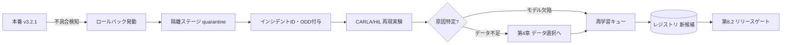

# 8.1 モデル管理とアーティファクト管理

この節では、学習済みモデル・バイナリ・キャリブレーション値をひとつの追跡可能な単位として扱う**モデルレジストリ (model registry)** と**アーティファクト管理 (artifact management)** を扱います。レジストリ製品の比較、MLflow による実装、SBOM とコード署名、隔離して再実験するワークフローまでを通し、「どのモデルがどのデータと評価結果に基づき、どの車両に載っているか」を機械的に復元できる状態を作ります。

なお、本節で扱う SBOM (Software Bill of Materials) は「ソフトウェアの部品表」を意味し、依存ライブラリの一覧と版数を機械可読な形式で記述したものです。CycloneDX や SPDX が代表的な仕様で、脆弱性公表時の影響範囲特定に使います。

## モデルとアーティファクトのスコープ定義

自動運転・ADAS では、単一のニューラルネットワークだけを「モデル」と呼ぶと管理が破綻します。実車にデプロイされる単位には、次の要素が同時に含まれます。

| 構成要素 | 具体例 | 変化の頻度 | 追跡上の注意 |
|---|---|---|---|
| 学習済みパラメータ | BEVFormer の重み (.pth) | 中（再学習ごと） | データセット ID と必ず紐付ける |
| 推論グラフ | ONNX / TensorRT Engine | 高（量子化条件で変わる） | ターゲット ECU・TRT バージョン依存 |
| 前後処理コード | 正規化・座標変換・NMS | 低 | Git コミット ID で固定 |
| キャリブレーション値 | 閾値・ゲイン・速度制限 | 中（ECU・地域別） | calibration data として別バージョン管理 |
| 外部依存データ | HD マップ、シーンプリオリティ表 | 低〜中 | ライセンス・鮮度を管理 |

「車両にデプロイされる単位」と「評価・実験で扱う単位」を明示的に決めることが出発点です。Closed-Loop の観点では、インシデント発生時に「どのモデルバージョン・どのデータセット・どの評価結果に基づくか」を正確に逆引きできる仕組みが、再学習計画の前提になります。ソフトウェア工学では、この紐付けの欠如が「隠れた技術的負債 (hidden technical debt)」の主因と指摘されています [S4](references#s4)。

ここで重要なのは、5 つの構成要素のうち「どれか 1 つを更新したら全体のバージョンを上げる」のか、「個別バージョンを束ねる上位バージョンを別に持つ」のかという設計判断です。前者は単純で監査しやすい一方、キャリブレーション値の閾値を 1 つ動かすだけでも全車両への再配信が必要になる、という運用負荷を生みます。後者は柔軟ですが、「v3.2.1 の重み + cal-2026.04 + preproc-7」のような組み合わせ爆発をどう抑えるかが課題で、リリース時に必ずひとつのマニフェストファイルへ固定する規律が要ります。本書の立場は後者寄りで、構成要素ごとのバージョン管理キーを保持しつつ、リリース時にマニフェストで束ねるという二層構造を推奨します。マニフェストが欠落したリリースは事後の追跡が極端に難しくなるため、CI 段階で「マニフェスト未生成ならビルドを失敗させる」という強制が必要です。

## モデルレジストリの製品比較

モデルレジストリ (model registry) は単なる「ファイル置き場」ではなく、**Closed-Loop データエンジンのハブ**として機能します。学習済みモデルの版数・ステージ（実験中・本番・退役）・メタデータをまとめて管理し、後段のデプロイや監査に必要な情報を一元提供する役割を持ちます。代表的な選択肢を比較します。

| 製品 | 形態 | 強み | 弱み | 自動運転での位置づけ |
|---|---|---|---|---|
| MLflow Model Registry [T11](references#t11) | OSS / セルフホスト | 軽量、API が素直、ステージ遷移 | 大規模スケールは要工夫 | 標準的な出発点 |
| Weights & Biases Registry [T12](references#t12) | SaaS 中心 | 実験追跡と一体、UI が強力 | コスト、オンプレ制約 | 研究寄りチーム |
| SageMaker Model Registry | AWS マネージド | IAM・パイプライン統合 | AWS ロックイン | クラウド統一環境 |
| Vertex AI Model Registry | GCP マネージド | BigQuery・Pipelines 統合 | GCP ロックイン | GCP 統一環境 |
| HuggingFace Hub | OSS / SaaS | OSS モデル流通、Git-LFS | 安全クリティカル運用機能は薄い | 事前学習モデルの取得元 |

ここで MLflow Model Registry [T11](references#t11) は OSS のレジストリで、Python から扱いやすい API と「Staging / Production / Archived」のステージ遷移機能を備えます。自動運転では、機密性とトレーサビリティ要件から **MLflow をセルフホストし、車載特有のメタデータ（ECU タイプ、署名状態、SBOM 参照）を拡張する**構成が現実的です。HuggingFace Hub は DINOv2 / SAM などの基盤モデルを取得する入口として併用し、取得時点の SHA（コンテンツのハッシュ値）を自社レジストリに固定します。

## モデルメタデータスキーマ

レジストリの価値は、名称ではなくメタデータの完全性で決まります。実装担当者には次の情報を最小スキーマとして必ず保持するよう依頼します。

- **基本識別**：モデルファミリ名（perception_bevformer など）、バージョン番号、ステージ（Staging / Production / Archived）、ソースコードの Git コミット ID。
- **横断リンク (links)**：学習データセット ID、検証データセット ID、実験追跡 (MLflow Run など) ID、前後処理バージョン、ラベルスキーマバージョン、リリースゲート結果 ID、シミュレーションスイート ID。これらが「鎖」を形成し、後からインシデント逆引きを可能にします。
- **アーティファクト参照 (artifacts)**：重み (.pth)、ターゲット ECU 別の推論エンジン (.plan)、SBOM (CycloneDX JSON)、署名ファイル (.sig) の置き場所 (S3 URI など)。
- **ターゲット情報 (target)**：対象 ECU、TensorRT バージョン、量子化精度 (INT8 / FP16)。
- **承認情報 (approvals)**：安全責任者 ID、承認タイムスタンプ。

これらのキー集合をスキーマレジストリ（Avro / Protobuf などスキーマ定義を一元管理する仕組み）で固定すると、後段の自動化が壊れにくくなります。とくに `links` ブロックがデータ・実験・ゲート・シミュレーションを横断する「鎖」を形成し、`artifacts` が署名前後の実体を指す点が重要です。

メタデータ設計でよく失敗するのは「最初は必須にしておきましょう」と決めたフィールドが、半年後にはオプション扱いになり、1 年後には誰も埋めなくなる、という緩慢な腐食です。これを防ぐには、レジストリ登録 API 自体に JSON Schema の検証を埋め込み、欠落があれば登録自体が拒否される構造を取る必要があります。いったん「あとで補えばいい」を許すと、本番リリースの 1 割にメタデータが欠ける状況がすぐに生まれ、その 1 割こそがインシデント時に逆引きできない致命的なリリースになります。`links` ブロックの「データセット ID・評価結果 ID・ゲート結果 ID・シミュレーションスイート ID」は、いずれか 1 つでも欠ければ Closed-Loop の鎖が断ち切れる急所であり、過去 6 ヶ月分の網羅性を月次で監査して、欠落リリースを Archived に移して再発行する運用規律が、後の監査対応の生死を分けます。

## MLflow による登録と検索の実装

MLflow を例にとると、学習ジョブとレジストリ運用は次の2点を最小要件として整えます。

1. **登録時**：学習ジョブの末尾で MLflow Run を開始し、データセット ID・ラベルスキーマ・Git コミットなどを必ずタグとして付与してから、評価指標 (例: nuScenes NDS、歩行者 AP) をログし、`register_model` でレジストリの該当モデル名（例: `perception_bevformer`）に新バージョンを登録する。
2. **逆引き時**：レジストリから Production ステージの最新バージョンを取得し、その Run のタグから `training_dataset_id` を読み出して、どのデータで学習されたかを特定する。

この逆引きが 1 行で済むことが重要です。インシデント管理システムからモデルバージョンを受け取り、学習データセットのカバレッジ（ODD セグメント分布。ODD は Operational Design Domain で「設計上の運用条件」、たとえば都市高速・郊外・夜間といったシステムが安全に動作する範囲）を照会し、不足セグメントへ第4章のデータ選択を発火する、という自動化の起点になります。

ここで強調したいのは、「逆引きが 1 行で済むかどうか」は単なる利便性ではなく、インシデント発生から 24 時間以内に対応方針を立てられるか否かを決める設計判断だということです。逆引きが手作業の SQL 結合で 1 時間かかる組織と、共通ライブラリの 1 関数で 1 秒で返る組織では、Sev1 リードタイム（第8.7節）の上限が桁違いに変わります。さらにレジストリのステージ遷移は、コードからの呼び出しに承認者 ID と理由文字列を必須化することで、後の規制報告で「なぜそのモデルが Production に上がったか」を説明できる一次資料に直結します。承認者の入力欄を空文字で通せる API は、監査の場で「実質的に承認プロセスが存在していない」と指摘される最大の弱点になります。レジストリと CMDB（第8.9節）の月次突き合わせは、退役忘れの孤立モデルが車両側で動き続けている事故を早期に検出するための保険であり、この差分が継続的にゼロであることが、組織として Closed-Loop が機能している最も素朴な指標になります。

## コード署名・SBOM・鍵管理

実車アーティファクトは安全性に加え、セキュリティと規制遵守（ISO/SAE 21434 [O7](references#o7)、UNECE R155 [O2](references#o2)）の対象です。

- **コード署名 (code signing)**：すべてのバイナリ・モデルに組織の秘密鍵で署名し、車両側は検証に失敗したイメージを一切受け付けません。鍵は HSM (Hardware Security Module、暗号鍵を格納し演算する専用ハードウェア) / TPM (Trusted Platform Module、PC や ECU に組み込まれる小型のセキュリティチップ) / Secure Enclave に格納し、**生成者と署名実行者を分離**します（第8.3節で詳述）。
- **SBOM**：依存の完全な一覧を **SPDX**（Linux Foundation 主導の SBOM 仕様）または **CycloneDX**（OWASP の SBOM 仕様）形式で生成し、`syft` 等のツールでビルド時に自動添付します。脆弱性が公表された際に「どのリリースが影響を受けるか」を即座に逆引きできます。
- **Uptane 連携**：署名済みアーティファクトのハッシュとメタデータは、第8.4節の Uptane [O1](references#o1)（自動車向け OTA セキュリティの標準仕様）における Image リポジトリのメタデータに取り込まれ、車両側で多層署名検証されます。レジストリの `signature` / `sbom` 参照が、そのまま OTA メタデータの入力になる設計が望ましいです。

CycloneDX SBOM には、フォーマット種別とスペックバージョン、当該リリースのコンポーネント名・バージョンに加え、依存ライブラリ（TensorRT などのバイナリ・ライブラリ）と外部データ資産（HD マップなど）の各々について、種別・名称・バージョン・ライセンス情報を列挙します。安全クリティカルなリリースでは、商用ライセンスやプロプライエタリ条件のものをすべて識別子付きで記録し、脆弱性公表時に逆引きできるようにします。

SBOM と HSM がなぜ「出荷前」に整備されていなければならないかを腑に落とすには、自分が監査を受ける側に立つ場面を想像するのが近道です。重大な脆弱性が公表され、出荷から 3 年経った車両に影響があるかどうかを 24 時間以内に当局へ報告する、という状況を考えます。SBOM がリリースごとに保管されていれば、当該ライブラリのバージョンを SQL ライクに検索するだけで影響台数が出ます。逆に SBOM がない、あるいは生成はしていたが保管されていないリリースが混在していれば、ビルドサーバの残骸を漁り、依存解決の再現を試み、最悪の場合「影響不明」と当局に回答することになります。これは事後対応で取り戻せる問題ではなく、出荷前にビルドジョブへ組み込んでおかなければ過去のリリースには遡及できません。HSM も同じ性質を持っており、CI ランナー上のファイルに鍵を置いた状態で本番運用を始めてしまうと、後から鍵を HSM に移しても「過去の鍵漏洩リスクは残ったまま」です。「出荷前に整備しないと事後対応で詰む」という時間非対称性こそ、SBOM と HSM の本質であり、ビルドジョブの末尾に `syft` を組み込み、署名鍵を HSM に集約し、鍵世代をメタデータに記録し、NVD との日次突き合わせを仕掛けるという一連の整備は、すべて「未来の自分が監査される瞬間」への投資として設計されます。

## ロールバック対象モデルの隔離と再実験ワークフロー

第8.8節のロールバックで退役したモデルは「削除」ではなく「隔離して再実験する資産」として扱います。ロールバックを発動するほどの不具合は、既存データセットでカバーできていなかったロングテール事象を示す貴重な信号だからです。

> **図 8.1**：退役モデルを quarantine ステージに移し、再現実験で原因を切り分け、データ選択・再学習へ還流する。ロールバックを「学習データ生成の瞬間」に変える流れがポイントです。

隔離ステージのモデルには `stage="Archived"` と `quarantine_reason` を必ず付与し、本番昇格 API から物理的に除外します。再現実験はクローズドコース（公道から隔離された専用試験コース）／シミュレータに限定し、実車では決して再有効化しません。

退役モデルを「危険だから封印」と捉えるか、「最も稀な事象を含む検証資産」と捉えるかで、組織の改善速度は大きく分岐します。本書の立場は後者で、隔離ステージから本番ステージへの直接遷移を API 側で物理的にブロックし、必ず再評価ゲート（第8.2節）を経由させる仕組みを置いたうえで、隔離モデルとトリガとなったシーン ID を結びつけて第7章のシナリオ DB に「再現用シナリオ」として登録します。これは単なる手順ではなく、「ロールバックという失敗イベントを学習データ生成の瞬間へ転換する」という Closed-Loop の中核思想を運用に落とし込んだ表現です。四半期ごとの隔離資産レビューでは、再現実験から得られた知見が回帰テストに反映されているか、同種の事象がリリースを跨いで再発していないかを確認します。レビューの場で「またこの種類のロールバックか」が口にされるのに対策が打たれていない状態は、Closed-Loop が形骸化し始めた最初の兆候として警戒すべきです。

## Closed-Loop データエンジンにおけるモデル管理の役割

第1章で示した7段階（収集→保存→選択→ラベリング→学習→シミュレーション→展開）のうち、レジストリは特に**5〜7を横断する骨格**です。

- **段階5**：学習ジョブの出力とメタデータを登録し、データセット由来を記録します。
- **段階6**：評価対象をレジストリから取得し、シミュレーション結果を `simulation_suite_id` でリンクします。
- **段階7**：デプロイ済みバージョンにオンライン指標・インシデントを紐付け、次のデータ選択へ戻します。

複数 ECU・複数コンポーネントの環境では、コンポーネント別レジストリを束ねる**システム構成 (system configuration)** エンティティを別途持ち、構成管理データベース (CMDB; Configuration Management Database。構成要素とその関係を一元管理するデータベース) と連携させます。「VIN（車台番号）X にはシステム構成 Y が載り、その perception は v3.2.1」という関係を機械的に復元できることが、第8.4節の VIN ベース配信と第8.9節の監査対応の前提になります。

## 本節の振り返り

本節の出発点は、「モデル」を単体のニューラルネットワークと捉えず、重み・推論グラフ・前後処理・キャリブレーション・外部データを束ねた単位として定義することでした。この単位がメタデータスキーマでデータ・実験・ゲート・シミュレーションを横断リンクできて初めて、インシデントからの逆引きが 1 行で済むという技術的な果実が得られます。レジストリ製品は MLflow をセルフホストする選択を軸に、車載特有のメタデータ（ECU・署名・SBOM）を拡張する形が現実的で、署名鍵は HSM に集約して生成者と署名実行者を分離し、SBOM とともに Uptane メタデータへ連携します。SBOM と HSM が出荷前に整備されていなければ事後対応で詰む、という時間非対称性は本節の中心的な気づきです。退役モデルを破棄せず隔離して再実験する運用は、ロールバックという失敗イベントを最も価値あるロングテール学習データ生成の瞬間に転換する仕組みであり、これが Closed-Loop の中核を支えます。

## 次節への橋渡し

レジストリが「どのモデルがどのデータに基づくか」を保証したら、次は「そのモデルをリリースしてよいか」を決める仕組みが必要です。次の8.2節では、リグレッションテストとリリースゲートを、ASIL 別の定量基準、Cohen's d とサンプルサイズ設計、SPRT による A/B 早期停止といった**統計的基礎**まで掘り下げて整理します。
