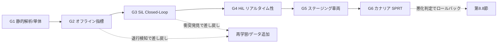

# 8.2 リグレッションテストとリリースゲート

この節では、モデル更新が既存機能を壊していないかを確認する**リグレッションテスト (regression test)** と、リリース可否を形式化する**リリースゲート (release gate)** を扱います。多段ゲートの設計、統計的基礎（検出力・サンプルサイズ・効果量）、ASIL 別の基準値、SiL/HiL の自動化、SPRT による A/B 早期停止までを組み込み、「モデル更新のたびに、どのデータで、何 % の確信を持って合否を決めるか」を定量化します。

ここで効果量とは「2 群の差の大きさを標準偏差で割って無次元化した値」、検出力 (statistical power) とは「実際に差があるとき検定がそれを正しく検出できる確率」を指します。Cohen's d はもっとも基本的な効果量指標で、平均差を標準偏差で割って算出します。

> **6.8 節との役割分担**：6.8 節は **モデル候補の基礎性能評価**（学習プロセスの中で「どのモデル候補が最良か」をオフラインのベンチマークで決める）を扱います。本節 8.2 は **本番配信前の安全ゲート**（Production 候補に対し、固定された Golden Set とシナリオ DB で「リリースしてよいか」を統計的に判定する）を扱います。両者のデータセットは原則別物（6.8 は実験用、8.2 はリリース判定用として厳格に管理）で、評価指標と閾値も独立に管理します。

## リグレッションテストの層構造

自動運転のリグレッション対象は API だけでなく、車両挙動と安全メトリクスに及びます。

| 層 | 対象 | 代表指標 | 主なツール |
|---|---|---|---|
| コード | 単体・統合・静的解析 | カバレッジ、警告数 | pytest, clang-tidy, Coverity |
| モデル | オフライン性能 | mAP, mIoU, ADE/FDE | nuScenes devkit, 自社評価 |
| システム | Closed-Loop 挙動 (SiL) | 衝突率、最小TTC、逸脱 | CARLA [Sim1](references#sim1), Autoware/Apollo |
| 実機 | リアルタイム性 (HiL) | レイテンシ、CPU/GPU 負荷 | dSPACE, Vector CANoe |

ここで SiL (Software-in-the-Loop) は「実 ECU を使わず PC 上にソフトウェアと仮想車両を載せて走らせる検証」、HiL (Hardware-in-the-Loop) は「実 ECU を使い、その入力に仮想センサ・仮想車両の信号を流し込んで走らせる検証」を指します。SiL は並列スケールしやすく、HiL はリアルタイム性とリソース制約を実機に近い条件で確認できる利点があります。
| フリート | 運用 KPI | 介入率、ヒヤリハット率 | テレメトリ基盤（第8.5節） |

リリースゲートはこれら複数層の結果を集約し、「どの条件を満たせばリリース可能か」を意思決定する点です。単に平均精度の上昇で判断せず、**安全関連クラスの退行ゼロ**と**特定 ODD セグメントの非劣化**を必ず含めます。Breck らの ML Test Score の考え方に沿い、テスト項目自体を継続的に増やす運用が望まれます [S4](references#s4)。

## 統計的基礎：効果量・検出力・サンプルサイズ

「mAP が 0.3 pt 上がった」という観測が偶然か実力かを区別するには、統計的検定が要ります。固定サンプルの A/B 比較では、効果量 (effect size) を **Cohen's d** で表します。

$$ d = \frac{\mu_{\text{new}} - \mu_{\text{base}}}{\sigma_{\text{pooled}}} $$

両側有意水準 $\alpha$、検出力 $1-\beta$ のもとで、群あたり必要サンプル数は近似的に次式で見積もれます。

$$ n \approx \frac{2\,(z_{1-\alpha/2} + z_{1-\beta})^2}{d^2} $$

例えば $\alpha=0.05$、$1-\beta=0.8$（$z$ はそれぞれ 1.96、0.84）で、小さな効果 $d=0.2$ を検出したいなら群あたり約 393 シーン、中程度 $d=0.5$ なら約 63 シーンが必要です。**安全関連の小さな退行ほど大きなサンプルが要る**ため、ゲート用データセットの規模設計は検出したい効果量から逆算します。

実装担当者には、上の式を使って指標（mAP、歩行者 AP、衝突率、最小 TTC など）ごとに必要サンプル数を別個に算出するよう依頼します。同じ $\alpha=0.05$, $1-\beta=0.8$ の前提でも、目安は $d=0.2 \to n \approx 393$、$d=0.5 \to n \approx 64$、$d=0.8 \to n \approx 25$ となります。**指標ごとに見積りは独立**に行い、ゲート用データセットの最終サイズは「最小サンプル数を要する指標」に合わせて確保します。サンプルサイズ表は半期ごとに見直し、効果量の事前分布（過去の改善幅）が変われば再計算します。

ここで腑に落としておきたいのは、$d=0.2$ という「小さな効果」が安全関連でなぜ重要か、という点です。歩行者検出の AP が 0.2 標準偏差ぶん劣化したとしても、フリート全体の事故件数換算では年間で数十件の増減につながり得ます。ところが $d=0.2$ を統計的に検出するには群あたり 393 シーンが必要で、$d=0.8$ なら 25 シーンで済むのとは桁が違います。「ゲート用データセットを 50 シーンに絞って高速に回そう」という現場の合理化判断は、この計算では「$d=0.5$ 以上の劣化しか検出できない」ことを意味し、安全関連で見逃したくない $d=0.2$ クラスの劣化を構造的に見えなくします。サンプルサイズ設計を「検出したい劣化幅から逆算する」という発想は、ゲート用データセットの規模を運用都合で削れない経済的・倫理的な根拠を与えます。指標ごとに見積りを独立に行うのも、たとえば mAP では $d=0.5$ で十分でも、歩行者 AP では $d=0.2$ を検出したい、というように指標の安全寄与が異なるからで、最も厳しい指標に合わせてゲート用データセットを確保しなければ、その指標の劣化を統計的に守る術がなくなります。半期ごとの再校正は、改善幅の事前分布が時間とともに小さくなる（既に大きな改善は出尽くし、残るのは細かい改善になる）傾向を取り込むためで、開発の成熟に応じて「より小さな効果を検出する設計」へと自然に移行する仕掛けでもあります。

## SPRT によるカナリア A/B の早期停止

固定サンプル検定は「事前に決めた n を集め終えるまで判定しない」方式です。一方、安全クリティカルなカナリア配信では、**悪化が早期に分かれば即停止**したいニーズが強くあります。ここで Wald の**逐次確率比検定 (Sequential Probability Ratio Test; SPRT)** が有効です [M10](references#m10)。

帰無仮説 $H_0$（新旧で介入率が同等）と対立仮説 $H_1$（新版が悪化）に対し、対数尤度比を逐次累積し、上側境界 $A=\log\frac{1-\beta}{\alpha}$ を超えたら「悪化」と判定して停止、下側境界 $B=\log\frac{\beta}{1-\alpha}$ を下回れば「非劣化」として継続承認します。

SPRT を運用する際は、機能の ASIL に応じて $\alpha$（誤って戻すリスク）と $\beta$（悪化を見逃すリスク）を事前に決め、配信判定システムに固定値として埋め込みます。代表的な設定の例を以下に示します。

| ASIL | $\alpha$ | $\beta$ | ねらい |
|---|---|---|---|
| QM / A | 0.05 | 0.2 | 早期判定優先、誤検知許容 |
| B / C | 0.02 | 0.1 | 安全側にやや保守的 |
| D | 0.01 | 0.1 | 悪化見逃しを最小化 |

許容率 $p_0$（旧版での介入率など）と悪化率 $p_1$（戻し判断したい劣化水準）も、過去フリートデータと安全目標から各指標ごとに別途見積もります。判定エンジンは、カナリア群の介入イベント（1=発生 / 0=なし）を時系列で受け取り、$\Lambda_n$ が $A$ を超えれば即時ロールバック判断、$B$ を下回れば次フェーズへ拡大、その間は観測継続、を返す状態として実装します。

SPRT は平均すると固定サンプル検定の半分程度のサンプルで結論に達することが知られ、走行距離あたりのリスク露出を抑えられます。第8.4節のフェーズドロールアウトと第8.8節のロールバック判定の中核として再登場します。

固定サンプル検定と SPRT の差は「いつ判定するか」の哲学の違いです。固定サンプル検定は「あらかじめ n を決め、n 件集まるまで判定しない」という設計で、研究や品質管理では公平性の観点から自然な発想ですが、安全クリティカルな配信では「悪化が早期にわかっても、決められた n まで観測を続けなければならない」という弊害が出ます。SPRT は「悪化なら早く止める、非劣化なら早く合格を出す、判断がつかない間だけ観測を続ける」という発想に転換することで、この弊害を解消します。「悪化を早期に止める」という SPRT の哲学が安全クリティカル配信に向くのは、配信判断が「事実が確定したから停止する」のではなく「観測で得た尤度が悪化側に十分に偏ったから停止する」というベイズ的な感覚に近づくからで、これは固定サンプル検定では原理的に得られない性質です。ASIL 別の $\alpha$・$\beta$ 表をポリシーファイルとして版管理し、機能 ID と紐付けたうえで、$p_0$（旧版での介入率）と $p_1$（戻し判断したい劣化水準）を過去フリートデータから機能ごとに見積もる、という設計の本質は、悪化判定の「速さ」と「確信度」を機能の安全度水準に応じて事前合意することにあります。判定時の $\Lambda_n$ とサンプル数を監査ログに残すのは、後の規制報告で「どの時点でどの確信度でロールバックを判断したか」を一意に説明するためであり、この記録が欠ければ SPRT の運用根拠そのものが空洞化します。

## ASIL 別ゲート基準とゲート設計

ゲート基準値は機能の安全度水準 (ASIL: Automotive Safety Integrity Level、ISO 26262 [L1](references#l1)) に応じて段階化します。ASIL は機能安全の重大度を A〜D の 4 段階で表したもので、A が最も低く D が最も高い水準を指し、「QM (Quality Management)」は ASIL の対象外（一般品質管理）を意味します。下表は考え方の一例で、実際の値は各組織の安全目標と HARA (Hazard Analysis and Risk Assessment、ハザード分析とリスク評価) に基づいて定めます（本書は法的・規格上の助言を行うものではありません）。

| 項目 | QM / ASIL-A | ASIL-B/C | ASIL-D |
|---|---|---|---|
| 全体 mAP 許容劣化 | -1.0 pt 以内 | -0.5 pt 以内 | 劣化なし（片側検定 $\alpha$=0.01） |
| 歩行者・二輪 AP | -0.5 pt 以内 | 劣化なし | 改善 or 同等を統計的に保証 |
| SiL 衝突率 | ベース同等 | ベース以下 | ゼロ（必須シナリオ全通過） |
| 統計的判定 | 点推定で可 | $\alpha$=0.05, power=0.8 | $\alpha$=0.01, power=0.9, SPRT併用 |
| 承認者 | 開発リード | + 安全担当 | + CCB（第8.9節） |

これらを「ポリシー as Code」（ゲート基準を YAML/JSON のような構造化ファイルとして版管理し、CI で機械的に評価する考え方）として CI に埋め込み、開発者がローカルでも同じチェックを事前実行できるようにします。

## 多段リリースゲートとゲート相互依存

> **図 8.2**：6段ゲートと差し戻し経路。下流ゲートは上流通過を前提とし、いずれの段でも失敗は再学習・データ追加へ環流する。ポイントは、ゲートが一方向の関門ではなく**双方向のフィードバックインターフェース**である点です。

各ゲートは独立に評価できる一方、相互依存があります。たとえば G2 のオフライン指標を緩めると G3 の SiL 衝突が増えやすいため、ゲート基準はセットで版管理し、「どのリリース時点でどのゲート定義が有効だったか」を後から再現できるようにします。

## SiL/HiL の自動化

SiL は CARLA や Autoware/Apollo を用い、シナリオスイートを並列実行します。HiL は実 ECU 上で署名済みバイナリを動かし、リアルタイム性とリソースを測ります。CI からの呼び出しは、次のような擬似フローで設計します。

- **SiL ゲート**：必須シナリオ群を並列実行し、各シナリオの結果として「衝突有無」と「最小 TTC」を収集する。集約後、衝突件数が 0 で、かつ全シナリオの最小 TTC が安全閾値（例: 1.5 秒）以上であれば合格とする。シナリオ単位の結果も保管し、失敗時の差分解析に使う。
- **HiL ゲート**：実 ECU 上で 10 分以上の実走実行を行い、「最大 CPU 使用率 70 % 未満」「期限超過フレーム数 0」「フォールトインジェクションに対し安全側挙動が観測されること」を判定基準にする。

これらの結果は第8.1節のメタデータ `release_gate_result_id` に紐付けて保存し、後から「どのリリースのどのゲートで何が通った・落ちたか」を完全に再現できるようにします。

ゲート定義と結果を Git 管理下に置く意義は、リリース時の「どのゲート定義で評価したか」を後から完全に再現できる点にあります。ゲート基準は時間とともに厳しく（あるいはまれに緩く）なるため、半年前のリリースを「いまの基準で振り返る」のではなく「当時の基準で何が通り、何が落ちたか」を確認できることが、規制対応や事故調査で決定的に重要です。合否判定スクリプトを共通化して ASIL 別ポリシーファイルから基準を引く構成にすると、開発者がローカルで CI と同じチェックを事前実行でき、ゲート手前で気づける退行が増えます。SiL ジョブの並列起動と失敗シナリオの差分可視化、HiL ジョブの実 ECU 上での 10 分以上連続実行と CPU・GPU 使用率の時系列ログ化は、いずれも「失敗時にどの瞬間の何が問題だったか」を再現可能な形で残すための投資であり、再現可能性のないゲートは時間が経つにつれて開発者の信頼を失い、形骸化します。

## ゲート用データセットとシナリオスイートの管理

ゲートの妥当性は評価データに依存します。ゲート用データセットは日常の学習データと分離し、次の性質を満たすよう運用します。

- 長期に安定（頻繁な総入れ替えを避け、指標推移を比較可能に保つ）
- ODD セグメント別バランス（都市高速・郊外・夜間・悪天候）
- 過去インシデント由来のロングテールを重点的に内包
- バージョンを厳密に管理し、過学習（ゲートへのフィット）を定期更新で抑制

第4・5章のデータ選択・ラベリングと連携し、「一定回数以上発生したインシデントクラスは次サイクルからゲートに追加」というルールを定義します。これが第8.6〜8.7節のフィードバックループの受け皿になります。

## Closed-Loop とリリースゲートの接続

1. 第8.5節のモニタリングと第8.6節のインシデント収集が新たなリスクパターンを検出。
2. それが第4章のデータ設計と第7章のシナリオに取り込まれ、ゲート用データセットとスイートが更新される。
3. 次回以降のリリースで更新ゲートに対し評価することで、同種問題の再発を防ぐ。

ゲート定義自体をコード化・版管理することで、インシデント時に「当時どのテストを通過し、何が未カバーだったか」を振り返り、ゲートを段階的に強化できます。

## 本節の振り返り

本節ではリグレッションをコード・モデル・システム・実機・フリートの 5 層で設計し、その結果をリリースゲートに集約することで、リリース可否を統計的に裏付けのある判断に落とす方法を扱いました。サンプルサイズ設計の核心は、Cohen's d で表した効果量と検出力からゲート用データセットの規模を逆算する発想で、$d=0.2$ の小さな劣化を検出するには群あたり約 393 シーンが必要、という事実は安全関連の小さな退行を取り逃がさないために重要です。SPRT は固定サンプル検定の半分程度のサンプルで結論に達し、悪化を早期に止めるという哲学が安全クリティカルな配信判断に向きます。ASIL 別に基準値・有意水準・承認者を段階化し、ポリシー as Code として CI に埋め込み、SiL/HiL の自動化結果とゲート定義をセットで版管理することで、ゲートが「一方向の関門」ではなく「再現可能な双方向のフィードバック界面」として機能するようになります。

## 次節への橋渡し

ゲートを通過した候補は、実車向けにビルド・署名・パッケージングされて初めて配信できます。次の8.3節では、クロスコンパイル戦略、HSM による鍵ローテーションと権限分離、A/B パーティション、GitHub Actions による「モデル取得→ビルド→署名→OTA」パイプライン、そして UNECE R155 CSMS の実装要件を扱います。
