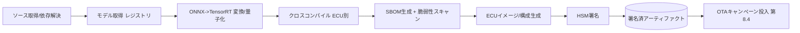
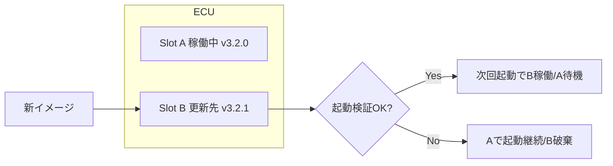

# 8.3 実車向け CI/CD パイプライン

この節では、実車向けの **CI/CD パイプライン**を扱います。ターゲット ECU 別のクロスコンパイル、コンテナ化と SBOM 自動生成、HSM による鍵ローテーションと権限分離、A/B パーティション（デュアルバンク）、GitHub Actions による「モデル取得→ビルド→署名→OTA」連携、そして UNECE R155 CSMS の実装要件までを、ソフトウェア変更と評価データの紐付けを保ったまま整理します。

CI/CD は Continuous Integration（継続的インテグレーション。コード変更を頻繁に統合してテストする運用）と Continuous Delivery / Deployment（継続的デリバリ／デプロイ。ビルド成果物を継続的にリリース可能な状態に保ち、必要なら自動配信する運用）の総称です。本節では、車両に対する自動配信は安全側のリスクが大きいため、最後の配信判断を必ず人手で行う「Continuous Delivery」を前提にします。

## 車載 CI/CD の固有性

クラウド向け CI/CD との差分は次の通りです。

- ハードウェア依存が強く、ターゲット ECU ごとにコンパイル・最適化条件が異なる。
- 更新が安全性・法規制に直結し、誤リリースが重大事故につながり得る。
- OTA 失敗時のリカバリが困難で、ロールバック前提の設計が必須（第8.4・8.8節）。
- 実車・HiL・SiL など物理リソースを伴うテストがパイプラインに組み込まれる。

このため Web 的な Continuous Deployment ではなく、「CI で自動テストを最大化しつつ最後に明示承認を挟む **Continuous Delivery**」として設計します。

## クロスコンパイル戦略

ターゲット実行環境ごとにツールチェーンとビルド条件が異なります。代表的な差分を整理します。

| ターゲット | OS/ランタイム | ツールチェーン | 主な制約 | 推論ランタイム |
|---|---|---|---|---|
| NVIDIA DriveOS / Orin | Linux ベース、QNX 併用 | aarch64-linux GCC + CUDA cross | TensorRT バージョン整合 | TensorRT [T8](references#t8) |
| AUTOSAR Adaptive | POSIX (Linux/QNX) | ara::com、ベンダ SDK | ARA API 準拠、決定性 | ONNX Runtime / 専用 |
| QNX Neutrino | RTOS | qcc / QNX SDP | 認証済みツールチェーン要 | ベンダ最適化 |
| ROS 2 (開発・検証) | Linux | colcon + ament | QoS 設定、実時間性は限定 | ONNX / torch |
| Mobileye EyeQ | 専用 | ベンダ専用コンパイラ | クローズド、対応演算子限定 | EyeQ SDK |

ここで主要な車載プラットフォームは次のように整理できます。NVIDIA DriveOS は同社製 SoC（Orin など）向けの Linux ベース OS で、QNX をハイパーバイザ上で併用します。AUTOSAR Adaptive は車載向けの標準ソフトウェアプラットフォームで、POSIX 互換 OS 上でサービス指向の通信（ara::com）を提供します。QNX Neutrino は組込み向けの商用 RTOS（リアルタイム OS）で、車載業界で広く採用されています。ROS 2 (Robot Operating System 2) は研究・開発寄りのミドルウェアで、量産車では一般に検証段階までの利用にとどまります。Buildroot や Yocto は組込み Linux のディストリビューションを構築するためのフレームワークで、必要な構成要素だけを最小化したイメージを作るときに使います。

実務では「開発・検証は ROS 2、量産は AUTOSAR Adaptive + DriveOS」のように二系統を併存させ、モデル変換（ONNX → TensorRT/INT8）を独立ステージに切り出すと、ビルド時間とキャッシュ効率を両立できます。クロスコンパイルの再現性は、ツールチェーンをコンテナイメージに固定し、そのイメージダイジェスト（コンテンツのハッシュ値）をアーティファクトメタデータ（第8.1節）に記録することで担保します。

## パイプライン全体ステージ

> **図 8.3**：モデル取得から OTA 投入までのステージ。署名は独立ステージとし、署名前後の実体を別管理する点がポイントです。

## SBOM 自動生成とコンテナイメージスキャン

ビルドステージの直後に **SBOM 自動生成**と脆弱性スキャンを組み込みます。具体的には、ビルド成果物ディレクトリから `syft` で CycloneDX 形式の SBOM (sbom.cdx.json) を生成し、続けて `grype` または `trivy` で既知脆弱性データベースと照合し、High 以上の検出があればパイプラインを失敗させる、という 2 ステップを CI ジョブに組み込みます。SBOM は ISO/SAE 21434 [O7](references#o7) が定めるサイバーセキュリティ管理と UNECE R155 [O2](references#o2) が要求する脆弱性監視に必要で、第8.1節のアーティファクトメタデータに `sbom` 参照として保存し、同じ SHA（ハッシュ値）を後段の OTA メタデータからも引けるようにします。

## HSM 署名・鍵ローテーション・権限分離

署名鍵は CI ランナーのファイルに置かず、**HSM (Hardware Security Module、暗号鍵を内部に保持し外部に取り出させない専用ハードウェア)** または KMS (Key Management Service、クラウド事業者が提供する鍵管理サービス) に格納し、ネットワーク越しの署名 API として呼び出します。重要な3原則は次の通りです。

| 原則 | 内容 | 実装例 |
|---|---|---|
| 権限分離 | アーティファクト生成者と署名実行者を分ける | CI は署名要求のみ、承認は別ロール |
| 鍵ローテーション | 署名鍵を定期更新し、旧鍵で署名した版も検証可能に保つ | 鍵バージョン管理＋鍵 ID をメタデータ記録 |
| 監査証跡 | 全署名要求を改ざん不能ログに記録 | 第8.9節の監査ログへ連携 |

鍵階層は Uptane [O1](references#o1) の 4 つのロール（Root / Targets / Snapshot / Timestamp）に対応させ、Root 鍵はオフラインの HSM、Targets 鍵はオンライン HSM で管理する分離が一般的です（4 つのロールの詳細は第8.4節で扱います）。Root 鍵のローテーションは慎重な手順（複数者承認、しきい値署名と呼ばれる「複数の鍵保有者のうち N 人以上の合意で初めて署名が成立する方式」）を要し、頻度を抑えます。

## A/B パーティション（デュアルバンク）

OTA 失敗時の確実な復帰のため、ECU に **A/B 2 つのパーティション**（ストレージ上に同じソフトウェアを格納できる 2 つの領域。「デュアルバンク」とも呼ぶ）を持たせます。

> **図 8.4**：非稼働スロットへ書き込み、起動検証成功時のみ切り替える。電源断が起きても必ず「完全な旧版」か「完全な新版」のいずれかになり、アトミック性を保ちます。

ブートローダは検証失敗時に旧スロットへ自動フォールバックし、一定回数失敗が続けば当該 VIN を OTA キャンペーンから除外して個別調査に回します（第8.8節）。

## HSM 署名フローの実装ステップ

GitHub Actions のような CI システムで「モデル取得 → ビルド → 署名 → OTA 投入」を一筆に連携する場合、ジョブ全体は手動承認付きのトリガ（リリース対象モデルバージョンを入力パラメータとする）として定義し、自社管理の GPU 付き self-hosted ランナー上で次の順に実行します。

1. **クレデンシャル取得**：CI ジョブには長期シークレットを置かず、OIDC（OpenID Connect、トークン形式で短命の認証情報を発行する標準）によって短命クレデンシャル（クラウド KMS / 社内 HSM 署名 API へのアクセス権）を取得する。
2. **モデル取得**：第8.1節のレジストリから指定バージョンの重み・推論エンジンを取得し、ハッシュをログに記録する。
3. **変換とクロスコンパイル**：ONNX → TensorRT の変換と、ターゲット ECU（例: aarch64 DriveOS）向けクロスコンパイルを行い、ツールチェーンのコンテナイメージダイジェストをメタデータに残す。
4. **SBOM 生成と脆弱性スキャン**：前項で述べたとおり、ビルド成果物に対し SBOM を生成し High 以上の脆弱性で失敗させる。
5. **HSM 署名**：ビルド成果物のハッシュを HSM/KMS の署名 API に送り、署名を受け取る。**鍵自体はランナーに降ろさない**。署名要求者と承認者を別ロールに分離する。
6. **OTA キャンペーン投入**：署名済みイメージと署名ファイルを OTA システムに登録し、最初は 1 % カナリアに限定して配信する。以降の拡大判断は第8.4節の SPRT 判定に委ねる。

このフローで CI 側に必要な権限は「OIDC ID トークン書き込み」と「リポジトリ読み取り」のみとし、署名鍵そのものへのアクセス権を持たせない設計が原則です。

なぜ「署名鍵を CI に降ろさない」ことがここまで強調されるかというと、CI ランナーは GitHub Actions のような共有基盤上で動き、ジョブログ・環境変数・キャッシュ経由で意図せず鍵が漏れる経路が無数に存在するからです。署名鍵が一度でも漏洩すれば、過去・現在・未来のすべてのリリースの完全性が疑わしくなり、影響範囲を画定するために全リリースの再署名と OTA 経由の再配信を強いられる、という「鍵漏洩は最大級の運用事故」という認識が前提になります。長期シークレットを廃止して OIDC 連携に置き換える理由も同じ系譜にあり、長期シークレットは「いつ漏れたか分からない」という時間軸の不確実性を抱える一方、OIDC で発行される短命クレデンシャルは数十分で失効し、漏洩の影響範囲を時間軸で物理的に制限します。署名要求者と承認者の分離は、内部不正への防御だけでなく、「ヒューマンエラーで署名してはいけないものに署名する」事故への構造的な対策でもあり、人事異動のたびに役割を見直さなければ、退職者の権限が残る・兼任が増えて分離が形骸化する、という腐食が進みます。鍵ローテーション手順の年次リハーサルは、緊急時に「ロテーション手順が文書には書かれているが誰も実行したことがない」という最悪のケースを避けるための消防訓練であり、復旧時間が計測できていない手順は実質的に使えない手順だ、という規律を組織に植え付けます。

## ツールチェーン固定で記録すべきメタデータ項目

クロスコンパイルの再現性を保証するため、各リリースに対して以下の項目をビルドメタデータとして記録し、第8.1節のアーティファクトメタデータと CMDB（第8.9節）から逆引きできるようにします。

| 項目 | 例 | 目的 |
|---|---|---|
| ツールチェーンコンテナのイメージダイジェスト | `sha256:abcd...` | バイナリ再現性の保証 |
| クロスコンパイラのバージョン | aarch64-linux GCC 11.4 | ABI 互換性確認 |
| 推論ランタイムのバージョン | TensorRT 8.6.1 | 量子化結果の再現 |
| 量子化条件 | INT8 / キャリブレーション集合 ID | 精度・速度の追跡 |
| ターゲット OS / カーネル | DriveOS X.Y / Linux 5.15 | 実機差し替え時の影響評価 |
| ビルド時のコミット SHA | git short SHA | 監査での起点 |
| OIDC アイデンティティ | ジョブ実行者・署名要求者 | 監査ログとの連携 |

## 車両バリエーションと構成爆発

車種・センサ構成・地域・グレードの組み合わせは容易に爆発します。全組み合わせのフルテストは非現実的なため、**リスクベースの優先化マトリクス**で絞ります。

| 軸 | 例 | テスト優先度の決め方 |
|---|---|---|
| 安全寄与 | AEB に関わる構成差 | 高（必ずフルテスト） |
| 普及台数 | 主力グレードのセンサ構成 | 高（露出が大きい） |
| 共通度 | 共有ミドルウェア | 代表構成でテスト＋影響分析 |
| 希少構成 | 限定地域の派生 | 解析的評価＋抜き取り |

VIN ベース配信（第8.4節）と連携し、「どの VIN にどの構成イメージが適用されるか」を構成テンプレートから自動生成します。

## UNECE R155 CSMS のパイプライン実装要件

UNECE R155 [O2](references#o2) が求める **CSMS (Cybersecurity Management System、サイバーセキュリティを車両ライフサイクル全体で運用するための管理システム)** は、CI/CD と直結します。本書は法的助言を行うものではありませんが、実装上は次の対応が要点です。

- **脆弱性監視**：SBOM をリリースごとに保存し、CVE（Common Vulnerabilities and Exposures、公開脆弱性データベース）公表時に影響リリースを逆引きできる。
- **完全性保証**：全アーティファクトに署名し、車両側で検証（Uptane 連携）。
- **変更追跡**：誰が・いつ・どの鍵で署名したかの監査証跡を保持（第8.9節）。
- **インシデント対応**：サイバーインシデント時に該当バージョンを即時無効化・差し替えできる経路（第8.8節）。

CSMS の本質は、サイバーインシデントが「いつ発生してもおかしくないもの」と認識し、発生時の対応速度を運用 KPI として可視化することにあります。CVE 公表から自社影響評価までの SLA を 24 時間以内などと定義する目的は、攻撃者と防御者の時間競争に勝つためで、SBOM が即時逆引きできる体制が出来ていなければそもそもこの SLA は守れません。R155 監査用バンドルをリリースごとに自動アーカイブしておくことで、規制当局からの照会に対しても「該当リリースのバンドルを開けば一次情報が揃っている」という状態を保てます。即時無効化と差し替え配信の四半期リハーサルは、緊急配信経路が「設計上は存在するが実行された実績がない」という危険な状態を防ぐためであり、リハーサル時の所要時間と検出された運用上の障害（鍵の更新漏れ、承認者の不在、配信網の制約など）を毎回記録して改善する循環を作ることで、本物のインシデント時に手順が機能する確信を組織として持てるようになります。

## データ中心・Closed-Loop との接続

各ビルド・デプロイジョブが `model_version` / `training_dataset_id` / `simulation_suite_id` をメタデータに記録し、配信結果（どの VIN にいつ配信したか）をテレメトリ基盤へ送ると、第8.5節のモニタリングと一気通貫でつながります。インシデント時に「どのリリースのどのモデル変更が原因か」「その変更はどのデータと評価に基づいたか」を即座に辿れ、再学習・ゲート強化へ環流できます。

## 本節の振り返り

本節では、ターゲット ECU 別のクロスコンパイル戦略をツールチェーンのイメージダイジェストで固定するという再現性の基礎から始め、SBOM 自動生成と脆弱性スキャンをビルド直後に組み込み、HSM による署名で権限分離・鍵ローテーション・監査証跡の三原則を守る、という車載 CI/CD の骨格を提示しました。署名鍵を CI ランナーに降ろさず、OIDC 短命クレデンシャルで「取得 → ビルド → 署名 → OTA」を連携する設計の本質は、長期シークレットや鍵の漏洩リスクを時間軸で物理的に制限することにあります。A/B パーティションは電源断・通信断のもとでも「完全な旧版か新版か」を保証する更新のアトミック性を担保し、起動検証で失敗したスロットへの自動フォールバックが運用上の最後の砦になります。これらは UNECE R155 CSMS が要求する脆弱性監視・完全性保証・変更追跡・インシデント対応に対応し、SBOM と HSM が「監査される自分」のための投資である、という第 8.1 節の認識を CI/CD のレイヤで具現化したものです。

## 次節への橋渡し

署名済みアーティファクトが揃ったら、次は「どの車両に、どの順序で、どれだけ安全に配るか」です。次の8.4節では、Uptane / Mender / SwUpdate / RAUC / Aktualizr といった OTA 標準、UNECE R156 SUMS、Tesla・GM・BMW・Toyota の公開事例、VIN セグメンテーション SQL、そして SPRT によるフェーズドロールアウトの自動判定を扱います。
