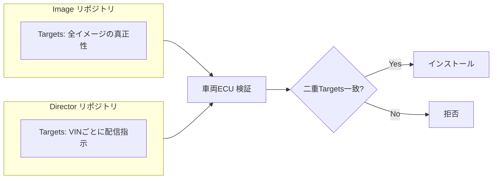

# 8.4 OTA での配信と VIN ベースのリリース管理

この節では、**OTA (over-the-air、無線通信を介したソフトウェア配信)** と、**VIN (Vehicle Identification Number、車台番号。各車両を一意に識別する 17 桁の番号)** をキーとしたリリース管理を扱います。Uptane を中心とした OTA 標準（Mender / SwUpdate / RAUC / Aktualizr）、UNECE R156 SUMS の実装要件、Tesla・GM・BMW・Toyota の公開事例、VIN セグメンテーションの SQL、そして SPRT によるフェーズドロールアウトの自動判定までを通し、「どのバージョンのモデルがどの車両に入っているか」を安全に制御します。

## OTA 更新の基本構造とリスク

一般的な OTA は、バックエンド（パッケージ保管・キャンペーン管理・VIN 適用管理）、通信インフラ（セルラー / Wi-Fi）、車両側アップデートクライアント（通知受信・ダウンロード・署名検証・インストール・ロールバック制御）から構成されます。フローは「キャンペーン定義 → 車両がパッケージ情報取得 → ダウンロードと署名・整合性検証 → 条件成立時にインストール → 自己診断、異常時はロールバック」です。安全クリティカルなコンポーネントを更新するため、署名検証と A/B パーティション（第8.3節）を前提に設計します。多くの地域で UNECE R156 [O3](references#o3) の対象となり、ログ保存やユーザ通知が定められます。本書は法的助言を提供しませんが、各地域の最新規制の確認が必須です。

## Uptane：OTA セキュリティの標準

Uptane [O1](references#o1) は車載 OTA セキュリティの事実上の標準で、TUF (The Update Framework、ソフトウェア更新の安全性を担保するための汎用フレームワーク) を車載向けに拡張したものです。中核は**4 つのロール（鍵の用途別の役割）と 2 つのリポジトリ**にあります。

| ロール | 役割 | 鍵管理 |
|---|---|---|
| Root | 他ロールの鍵を委任・失効する信頼の起点 | オフライン HSM、しきい値署名 |
| Targets | 配信イメージのハッシュ・サイズ・対象を署名 | オンライン／オフライン HSM |
| Snapshot | Targets メタデータ群の一貫性を保証 | オンライン HSM |
| Timestamp | 最新性を保証しリプレイ攻撃を防ぐ | オンライン HSM（短命） |

> **図 8.5**：Uptane の二重リポジトリ。Image が「イメージの真正性」を、Director が「どの VIN に何を入れるか」を独立に署名し、車両は両者の一致を要求します。これにより、サーバ片側が侵害されても不正イメージのインストールを防げます。ポイントは**責務分離による耐侵入性**です。

車両側は **Full Verification**（Root→Timestamp→Snapshot→Targets の連鎖検証と、二重 Targets 一致の確認）を行います。リソース制約の強いセカンダリ ECU は **Partial Verification**（Director Targets のみ検証）とし、計算能力のあるプライマリ ECU が代理検証する構成が一般的です。

Uptane の 5 ロール（Root / Targets / Snapshot / Timestamp + Director）を分けて運用する設計思想は、「ある鍵が侵害されても全車両が乗っ取られない」という Defense in Depth（多層防御）の発想に基づきます。たとえば Targets 鍵が漏洩しても、Director リポジトリの署名と一致しなければ車両はインストールを拒否し、Snapshot 鍵が漏れても古いメタデータと差し替えられないように Timestamp が最新性を保証し、Timestamp 鍵が漏れてもリプレイ攻撃の窓は短命鍵のローテーション周期に制限されます。Root 鍵が漏れた場合だけが致命的ですが、Root はオフライン HSM としきい値署名で守られ、複数者立ち会いの key signing ceremony でしか動かさない、という運用面の防御を加えることで、単一の鍵が突破された瞬間に全車両がアップデート経路を奪われる、という最悪シナリオを構造的に避けます。Timestamp 鍵を 1 日程度で自動ローテーションし、長期間有効な鍵を運用に残さないのも同じ発想で、「もし漏れていても影響時間を 1 日以内に限定する」という時間軸の防御を効かせます。セカンダリ ECU の Partial Verification 経路は計算能力の制約から検証が薄くなりがちで、侵入試験の対象に含めなければ「弱い輪」として攻撃の足場になりやすい、という構造的弱点を持ちます。Uptane の真価は「個別の鍵管理が完璧であること」を要求しないところにあり、現実には常にどこかで運用ミスが起きるという前提で、それでも全体としては安全側に倒れる、という設計の知恵を体現しています。

## OTA フレームワーク比較

Uptane は「セキュリティのプロトコル仕様」であり、実装は別途必要です。代表的な OSS 実装・更新クライアントを比較します。

| フレームワーク | 主眼 | 更新方式 | Uptane 準拠 | 備考 |
|---|---|---|---|---|
| Aktualizr [O8](references#o8) | Uptane リファレンス実装 | イメージ/パッケージ | ◎（公式リファレンス） | OTA Connect 系で採用 |
| Mender [O4](references#o4) | 組込 Linux 全体更新 | A/B イメージ | △（連携可） | 商用/OSS、運用 UI が充実 |
| SwUpdate [O5](references#o5) | 組込 Linux 更新 | イメージ/差分 | △（連携可） | 軽量、柔軟なハンドラ |
| RAUC [O6](references#o6) | 組込 Linux 更新 | A/B バンドル署名 | △（連携可） | D-Bus 統合、署名検証が堅牢 |

ここで各実装は次のような位置づけです。Aktualizr は Uptane の公式リファレンス実装で、メタデータ検証ロジックの教科書的な構成を備えます。Mender は組込み Linux 向けの A/B 更新を扱う商用／OSS のソリューションで、運用 UI が充実しています。SwUpdate は軽量で組込みデバイス全般に向く更新クライアントです。RAUC は D-Bus を介して他コンポーネントと連携する組込み Linux 用の更新ツールで、A/B バンドル署名の堅牢さが特徴です。

選定では「Uptane の署名検証を満たすか」「A/B パーティションに対応するか」「差分更新（delta）でデータ量を抑えられるか」を軸にします。量産では Aktualizr で Uptane を満たしつつ、RAUC/Mender でブートスロット管理を担う組み合わせが見られます。

## UNECE R156 SUMS の実装要件

UNECE R156 [O3](references#o3) が求める **SUMS (Software Update Management System、ソフトウェア更新管理システム。配信プロセスと記録を OEM 側で組織的に管理する仕組み)** は、OEM のプロセスとシステムの両面を要求します。実装上の要点を整理します（法的助言ではありません）。

| R156 要求領域 | OTA システムでの実装 |
|---|---|
| ソフトウェア識別 | RxSWIN（Regulation x Software Identification Number、規則別のソフトウェア識別子）／各 ECU バージョンを VIN 単位で台帳管理 |
| 更新の妥当性・完全性 | 署名検証（Uptane）、A/B、自己診断後の確定 |
| 対象車両の特定 | VIN セグメンテーションによる適用対象の厳密化 |
| 更新前提条件の確認 | 駐車中・バッテリ残量・互換性チェック |
| ユーザ通知・同意 | 安全関連更新の通知文言と記録 |
| ロールバック記録 | 失敗・復帰の改ざん不能ログ（第8.9節監査へ） |
| 構成の追跡性 | 更新前後の構成を再現可能に保存 |

R156 SUMS の要求は OEM のシステムだけでなくプロセスにまで及ぶ、という点が腑に落とすべき要点です。VIN ごとに搭載 ECU・ソフトウェアバージョン・RxSWIN を結ぶ台帳が CMDB に常設されていなければ、「ある VIN にいま入っているソフトウェアが何か」という当局からの一次的な質問にも答えられません。「更新前提条件不成立で配信を中断した件数」を監視するのは、配信成功率だけを KPI にすると「中断件数が多いのに気づかず、通信品質や電源条件のチューニングが進まない」という慢性的な問題を見落とすからです。ユーザ通知の文言・タイミングは地域ごとに法的要件が異なり、法務承認版を OTA システムから参照する構造にしておかないと、現場で「気を利かせた」一文を加えてしまい結果として規制違反になる、という事故が発生します。失敗・復帰イベントを第8.8節の監査ログ形式で集約することは、当局への報告ドラフトを自動生成する一次情報になり、規制対応コストを構造的に下げます。

## 業界の公開事例

公開資料の範囲で、各社の OTA アプローチを概観します（いずれも公開情報に基づく一般的な記述で、内部仕様には踏み込みません）。

- **Tesla**：早期から車両全体（インフォテインメントから FSD まで）を OTA 更新する運用を確立し、機能追加・改善を頻繁に配信していることが公開情報で知られます。フェーズド配信とテレメトリ収集を組み合わせる運用と説明されています [R2](references#r2)。
- **GM OnStar**：コネクテッドサービス基盤上で OTA とリモート診断を提供していることが公開情報で示されています。フリート規模のキャンペーン管理が特徴とされます。
- **BMW Connected Drive**：リモートソフトウェアアップグレードを通じて機能配信を行うことが公開情報で示されています。多市場・多車種への配信管理が論点になります。
- **Toyota T-Connect**：コネクテッド基盤を通じたソフトウェア更新・サービス提供が公開情報で示されています。地域別の規制・通信環境への適合が重視されます。

これらに共通するのは、「段階的配信」「テレメトリによる効果観測」「失敗時の復帰」を備える点で、本節で述べる枠組みと整合します。

## VIN ベースのセグメンテーション

「どの車両に配るか」は VIN をキーに、車種・地域・用途・センサ構成・バッテリ・天候などで絞り込みます。フリート管理 DB（フリート全体の運用情報を集約したデータベース）に対するフェーズドロールアウト対象抽出は、車両マスタとテレメトリを VIN で結合し、次の条件群で絞り込んだうえで、配信割合に応じてサンプリングする形で実装します。

| 区分 | 条件の例 | 目的 |
|---|---|---|
| 構成適合 | `sensor_config_id = 'cfg_orin_8cam'` | 対象 ECU/センサ構成のみに限定 |
| 地域 | `region IN ('JP-KANTO','JP-KANSAI')` | ODD と規制適合の確保 |
| 旧版限定 | `current_sw_version = 'v3.2.0'` | 既に新版に上がっている車両を除外 |
| バッテリ残量 | `avg_soc_pct >= 60` | OTA 中の電源切れリスクを抑える |
| 通信状態 | `last_seen > now() - interval '7 days'` | DL 失敗の頻発を避ける |
| オプトアウト | `ota_opt_out = false` | ユーザ意思の尊重 |

| サンプリング方式 | 実装上の要点 |
|---|---|
| 決定的ランダム抽出 | VIN の MD5 ハッシュ（メッセージダイジェスト・アルゴリズム 5。任意長の入力から固定長のハッシュを得る関数）で全体を順序づけ、上位 N % を選ぶことで再現性を確保する |
| フェーズ拡大の追加性 | 1 % → 5 % → 25 % → 100 % と拡げるとき、同じ並びの上位を取り続ければ既配信群を含み続けられる |
| 偏りの監視 | サンプリング後に地域・車種・年式の分布が母集団と乖離していないかを毎フェーズで確認する |

ODD を限定して有効化したい場合は、配信に加えて車両側で「都市高速・晴天昼間でのみ新モデルを有効化」するフィーチャーフラグ（条件付きで機能の有効・無効を切り替えるスイッチ）を併用します。VIN セグメンテーションの SQL を実装する際は、`ORDER BY md5(vin)` のような決定的並びと、フェーズごとの抽出上限件数（母集団数 × 配信割合）を別々のパラメータとして外部化し、ポリシーレビューの対象にします。

決定的ランダム抽出（VIN の MD5 順で上位 N % を取る）が重要なのは、フェーズ拡大が「既配信群を含み続ける」追加性を担保するためです。1 % → 5 % → 25 % → 100 % と拡げる際に、毎回ランダムにサンプリングし直す方式だと、ある VIN が 5 % 群には入っていたが 25 % 群では落ちている、という不連続が起き、その VIN の継続観測ができなくなります。フェーズごとに「目標 VIN 数 / 実配信 VIN 数 / 成功 VIN 数」を分けて記録するのも同じ発想で、配信失敗が体系的に偏った地域・車種で起きていないか、フィーチャーフラグの有効化が予定通りの ODD でしか発火していないか、を可視化できます。フィーチャーフラグの ON/OFF 履歴を VIN 単位で残しておかないと、第8.5節のオンライン効果分析で「同じバージョンが配信されていても、フィーチャーフラグの有効・無効で挙動が変わる群」を分離できず、改善効果の評価が混ざります。VIN セグメンテーションは「どの車に配るか」を決める入口に見えますが、本質は「実世界 A/B 評価の対照群と介入群を構造的に固定する」ことであり、ここでの設計が後段の効果分析の精度を決めます。

## フェーズドロールアウトと SPRT 自動判定

配信は 1 % → 5 % → 25 % → 100 % のように段階拡大し、各フェーズで安全指標（介入率・AEB 作動率）を旧版と比較します。第8.2節の SPRT を用い、「悪化の早期検出で停止、非劣化が確認できたら次フェーズへ自動拡大」を実装します。

判定エンジンは、カナリア群から介入イベントを時系列で受け取り、許容率 $p_0$ と悪化率 $p_1$ を仮説に対数尤度比 $\Lambda_n$ を逐次更新します。$\Lambda_n$ が上側境界 $A=\log\frac{1-\beta}{\alpha}$ を超えたら「悪化」と判定して即時停止し、ロールバック判断（第8.8節）へ送ります。下側境界 $B=\log\frac{\beta}{1-\alpha}$ を下回ったら「非劣化」と判定して次フェーズへ自動拡大、その間は観測継続とします。ASIL-D 機能では $\alpha=0.01$ と保守的にし、走行距離あたりのリスク露出を最小化します。フェーズ進行・停止・ロールバックの判定はすべて監査ログ（第8.9節）に記録します。

フェーズ拡大の閾値（1 / 5 / 25 / 100 %）と各フェーズの最低観測期間を機能ごとに事前合意しておくのは、悪化判定が出ない平穏な状況でも「拡大を急ぎたい現場の判断」が暴走しないようにするための制度設計です。SPRT は観測サンプルが集まれば判定するアルゴリズムですが、「拡大しても良い」ことと「すぐ拡大すべき」ことは別であり、最低観測期間は ODD の多様性（夜間・雨天・休日など）が一巡するだけの時間を確保するための保険です。SPRT のエッジケース、たとえば通信遅延でカナリア群のイベントが届かない、母集団が想定より少なくサンプル数が伸びない、といった状況でタイムアウト時にどう振る舞うかを事前に決めていないと、判定エンジンが「無言で観測継続」のまま全フェーズに展開される、という最悪のケースが起こり得ます。タイムアウト時は安全側に倒し、自動停止する設計が原則です。フェーズ拡大・停止判定をチャットツールへ自動通知することは、運用センターが「いま自動的に何が起きているか」を即座に把握する手段であり、判定理由（$\Lambda_n$、サンプル数、$p_0$、$p_1$）を監査ログに残すことは、後で規制当局や安全レビュー会から「なぜそのタイミングで拡大したか／停止したか」を問われたときの一次資料になります。SPRT の運用は「人間が決めた基準を機械が淡々と適用する」発想であり、その基準と適用過程の透明性が運用の信頼性を支えます。

## 失敗時のリカバリとロールバック

OTA は通信失敗・電源断・ストレージ障害に備える必要があります。プロトコルレベルでは、第8.3節の A/B パーティションによるアトミック更新と起動時整合性チェックで「完全な旧版か新版か」を保証します。さらに、

- 更新後一定時間内に重大エラー・異常ログを検知したら自動ロールバック。
- ロールバックが繰り返す VIN はキャンペーンから自動除外し、個別調査へ。

といったポリシーを仕様として明文化し、テスト・監査可能な形で残します（モデルレベルのロールバックは第8.8節）。

## Closed-Loop 観点での OTA 運用

OTA は「更新を配る仕組み」を超え、**実世界 A/B / カナリア評価を安全に行う実験基盤**です。シミュレーション・HiL で改善が確認されても実世界に不確実性が残るモデルを、限定 VIN・限定 ODD で配信し、第8.5節のモニタリングで旧版と比較します。指標改善なら対象拡大、問題なら第8.8節のロールバックと RCA へ進みます。「どの車両がどのバージョンを、どの ODD で、どれだけ運用したか」を定量把握できることが、Closed-Loop を閉じる前提です。

## 本節の振り返り

本節の中心は、Uptane が 4 ロール・2 リポジトリで責務を分離することにより、「ある鍵が侵害されても全車両が乗っ取られない」という Defense in Depth を構造的に成立させている、という設計思想でした。Image / Director の二重 Targets が一致して初めて車両がインストールを許可する仕組みは、サーバ片側の侵害に耐える典型例で、Aktualizr / Mender / SwUpdate / RAUC はこの仕様を A/B 対応・差分更新と組み合わせる実装上の選択肢です。R156 SUMS はソフトウェア識別・完全性・対象特定・通知・ロールバック記録を要求し、VIN ごとの台帳と監査ログの体系がそれに応えます。VIN セグメンテーションは MD5 ハッシュ順による決定的ランダム抽出で「既配信群を含み続ける」追加性を担保し、SPRT は悪化を早期に止め、非劣化確認時のみ次フェーズへ自動拡大します。OTA は単なる配信網ではなく、限定 VIN・限定 ODD で実世界 A/B を安全に行う実験基盤であり、ここでの規律が Closed-Loop の安全性を最終的に支えます。

## 次節への橋渡し

配信した後は「実世界で本当に良くなったか／劣化していないか」を継続観測する必要があります。次の8.5節では、入力分布・ラベル分布・性能の3層ドリフト検知、KS 検定・KL・Wasserstein・MMD・ADWIN・Page-Hinkley・PSI といった統計手法、Evidently / Arize / Fiddler / WhyLabs / Aporia などの ML 監視ツール、そしてリアルタイム/日次の監視アーキテクチャを扱います。
