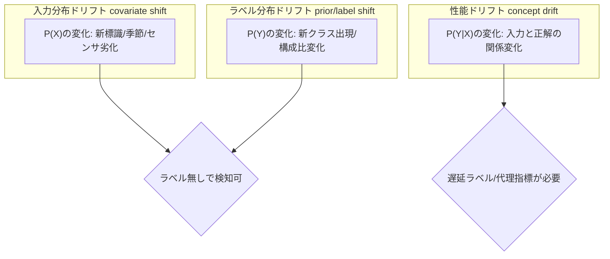
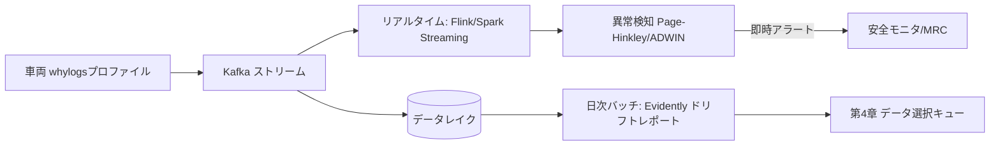

# 8.5 実運用モニタリングと異常検知

この節では、実運用モニタリング (online monitoring、デプロイ後の運用環境を継続観測する活動) と異常検知 (anomaly detection、平常状態から外れた挙動を検出する仕組み) を扱います。**入力分布・ラベル分布・性能の3層ドリフト**を明確に分離し、KS 検定・KL ダイバージェンス・Wasserstein 距離・MMD・ADWIN・Page-Hinkley・PSI といった統計手法を使い分けます。さらに Evidently / Arize / Fiddler / WhyLabs / Aporia などの ML 監視ツールとリアルタイム／日次アーキテクチャを組み合わせ、「運用中のシグナルを次の改善サイクルにどう渡すか」を定量化します。

> **4.2 節との役割分担**：4.2 節は **収集時点の品質ゲート**（取り込んだデータが学習に値するかを Great Expectations / Soda 等で関門通過させる）を扱います。本節 8.5 は **運用後の分布シフト監視**（季節変動、新規地域進出、センサ経年劣化、新クラス出現など、リリース後に環境が変化した兆候を捉える）を扱います。前者は ETL（Extract / Transform / Load。データを抽出・変換・格納する一連の処理）の入口、後者は配信後の出口にあたり、両方で同じ統計手法（KS / Wasserstein など）を使うこともありますが、参照分布と発火後アクションが異なります。

## モニタリングの3レイヤ

監視対象は次の3層に整理できます。これらを「どの ODD で、どのモデルバージョンが、どう振る舞ったか」をクロスで分析できる形で収集します。

| レイヤ | 監視対象 | 代表指標 |
|---|---|---|
| システム健全性 | ECU 負荷・温度・通信品質 | CPU/GPU 使用率、ストレージ残量、通信断率 |
| モデル挙動 | 推論レイテンシ・出力分布 | スコア分布、信頼度、モデル間不一致率 |
| 安全・運転品質 | 介入・AEB・乗り心地 | 介入率、AEB 作動率、jerk、最小 TTC |

## 3層ドリフトの分離

ドリフトを一括りにせず、原因と対処が異なる3層に分けることが重要です。

> **図 8.6**：3層ドリフト。入力・ラベル分布は教師ラベルなしで検知できる一方、性能ドリフト（concept drift）は遅延ラベルや代理指標を要します。ポイントは、層ごとに使う統計手法と対処（再キャリブレーション／再学習／クラス追加）が異なる点です。

- **入力分布ドリフト (covariate shift)**：$P(X)$ の変化。新しい標識デザイン、季節、センサ経年劣化など。特徴量分布の比較で検知します。
- **ラベル分布ドリフト (label/prior shift)**：$P(Y)$ の変化。電動キックボードの増加など新クラス・構成比変化。
- **性能ドリフト (concept drift)**：$P(Y \mid X)$ の変化。同じ入力に対する正解の関係が変わる。遅延ラベル（事後の人手確認で得られる正解）や代理指標で検知します [M1](references#m1)。**代理指標（モデル間不一致率・信頼度分布の歪み・ヒヤリハット率など）は早期警報には有用ですが、概念ドリフトを完全には捉えきれません**（不一致がなくとも両モデルが同じ方向にずれている可能性があるため）。最終確認は遅延ラベルでの直接評価が前提です。

3 層に分けて考える設計思想の核心は、「層ごとに使う統計手法・取得できる情報・対処方針が根本的に異なる」という点にあります。入力分布のドリフトは $P(X)$ の変化で、教師ラベルがなくても車両側の特徴量プロファイルだけで検知でき、KS 検定や Wasserstein 距離・PSI のような分布距離で測れます。ラベル分布のドリフトは $P(Y)$ の変化で、運用環境のクラス構成比が変わったことを意味し、PSI のようなビン化済み指標が有効です。性能ドリフトは $P(Y \mid X)$ の変化で、入力と正解の関係そのものが変わるため、ラベルを伴わない代理指標では原理的に検出しきれず、遅延ラベル（事後の人手確認）でしか確証が得られません。「ラベル不要で素早く検知できる層」と「ラベルが要るが本質的な層」を 1 つの監視ジョブに混ぜると、代理指標で警報が出ているのに遅延ラベルが追いついていない、あるいは遅延ラベルでは性能劣化が出ているのに代理指標は静か、という乖離を扱えなくなります。3 層を別ジョブで動かし、代理指標と遅延ラベルが乖離した場合だけを別系統のアラートに結ぶことで、「性能劣化を最も早く知らせる代理指標」と「最終確認を担う遅延ラベル」の役割分担が運用に落ちます。本書が層ごとに違う統計手法を当てるのは、単なる手法のカタログではなく、「ドリフトを検知してから対処を打つまでの時間軸」を層ごとに最適化するという設計思想の表れです。

## ドリフト検知手法の比較

手法は「単変量 vs 多変量」「分布距離 vs 逐次検知」で整理します。

| 手法 | 種別 | 適用 | 統計的根拠 | しきい値の目安 |
|---|---|---|---|---|
| KS 検定 | 単変量・分布 | 連続特徴量1次元 | 経験分布の最大差 [M8](references#m8) | p<0.05 |
| PSI | 単変量・分布 | ビン化特徴量 | 離散 KL の対称版 [M4](references#m4) | >0.1 注意, >0.25 重大 |
| KL ダイバージェンス | 単変量・分布 | 確率分布比較 | 情報量。非対称 | タスク依存 |
| Wasserstein 距離 | 単変量・分布 | 連続分布、外れ値頑健 | 最適輸送 [M9](references#m9) | 基準分布で校正 |
| MMD | 多変量・分布 | 高次元 embedding | カーネル平均差 [M7](references#m7) | permutation test |
| ADWIN | 逐次 | ストリーム平均変化 | 適応ウィンドウ [M2](references#m2) | δ（信頼度） |
| Page-Hinkley | 逐次 | 平均シフト早期検知 | CUSUM 系 [M3](references#m3) | λ（許容偏差） |

ここで主要手法は次の意味を持ちます。**KS 検定 (Kolmogorov-Smirnov 検定)** は 2 つの経験分布の累積分布関数の最大差から分布の同一性を検定します。**KL ダイバージェンス (Kullback-Leibler divergence)** は 2 つの確率分布の差を情報量として測る指標で、非対称な値を取ります。**Wasserstein 距離**は最適輸送（一方の分布を他方に「動かす」最小コスト）に基づく分布間距離で、外れ値に対して頑健です。**MMD (Maximum Mean Discrepancy)** はカーネルを用いた多変量分布の距離で、高次元の埋め込みベクトルに向きます。**ADWIN (ADaptive WINdowing)** はストリームデータの平均変化を適応ウィンドウで検出する手法、**Page-Hinkley** は平均シフトを CUSUM（累積和）系で早期検知する手法、**PSI (Population Stability Index)** はビン化したヒストグラム間の対称 KL に近い値で、運用 KPI のドリフト監視で広く使われます。

**使い分けの指針**：低次元の生特徴量は KS / PSI / Wasserstein、高次元の embedding は MMD（次元の呪いに強い）、性能指標のストリーム監視は ADWIN / Page-Hinkley、というのが実務的な対応づけです。「PSI > 0.1」のような閾値は元々クレジットリスク分野の経験則 [M4](references#m4) であり、自動運転では基準分布で再校正すべきです。

## ドリフト指標の選び方と発火閾値

ドリフト検知器は「何を測り、どの値で発火させるか」を指標ごとに明文化したうえで実装します。低次元の生特徴量（速度・操舵角・気温など）と高次元の埋め込み（画像/ LiDAR の特徴ベクトル）で使い分けるのが基本方針です。

| 指標 | 何を測るか | 発火条件の目安 | 適用対象 |
|---|---|---|---|
| KS 検定の p 値 | 経験分布の最大差が偶然生起する確率 | $p < 0.05$ | 1 次元連続特徴量 |
| Jensen-Shannon ダイバージェンス | ヒストグラム間の対称距離 (0〜1) | $\text{JS} > 0.1$ | 確率分布比較 |
| Wasserstein 距離 | 経験分布間の最適輸送コスト | 基準分布で校正した分位点超過 | 連続値、外れ値が多い指標 |
| PSI (Population Stability Index) | ビン化分布の対称 KL | $\text{PSI} > 0.1$ 注意 / $> 0.25$ 重大 | 離散化指標、運用 KPI |
| MMD (Maximum Mean Discrepancy) | 高次元での分布距離 (カーネル) | 並べ替え検定で $p < 0.05$ | 画像/ LiDAR の埋め込み |
| ADWIN | 適応ウィンドウでの平均変化 | 信頼度 $\delta$ を超える変化 | ストリームの平均シフト |
| Page-Hinkley | CUSUM ベースの早期検知 | 累積偏差が $\lambda$ を超過 | リアルタイム平均シフト |

実装時には、(1) 基準分布（ベースライン）と直近運用ウィンドウのデータを引数に取り、(2) 上記の指標値とドリフトフラグを返す検知関数を、指標ごとに別個のジョブとして用意します。低次元特徴量には KS と Wasserstein を組み合わせ、KS p 値が 0.05 未満または JS が 0.1 を超えればドリフトとフラグを立て、その値と一緒にダッシュボード／アラート系統へ送ります。閾値はクレジットリスク分野などの経験則 [M4](references#m4) をそのまま流用せず、運用前に基準分布で再校正します。

高次元の埋め込みには MMD を用い、`alibi-detect` [M6](references#m6) のような OSS の `MMDDrift` 検出器に対し並べ替え検定（permutation test）で有意性を判定します。Alibi Detect は KS / MMD / Chi-square / LSDD などをまとめて提供しており、実装の出発点として適しています。

ドリフト検知器の運用で最初につまずくのは「閾値の校正」と「参照分布の更新」です。PSI > 0.1 のような閾値はクレジットリスク分野の経験則が起源で、自動運転の特徴量分布にそのまま当てはまる保証はありません。基準分布を運用前に固定し、その分布で過去データを再評価して閾値を再校正しないと、検知器は「常に発火している」「全く発火しない」のいずれかに偏ります。参照分布の更新も慎重さが要り、四半期ごとに更新候補を作って安全レビューを通したうえで切り替える、という規律がないと、ドリフトを検知すべき時期に「参照分布をいつのまにか動かしてしまったから差が見えない」という事態が起きます。アラート発火時に指標値・閾値・参照分布バージョンを Slack メッセージへ自動添付するのも、受け手が「いつの基準で発火したのか」を即時確認できるようにするためで、これが欠けるとアラートが「見るたびに状況が違う、再現できない警告」になります。月次で「アラート件数 / 真因あり件数」を集計して precision を運用基準として可視化するのは、検知器の真の価値を測るためで、precision が低すぎる検知器は警報疲れを生み、本物の異常への反応速度を組織から奪います。

## ML 監視ツールの選定

ドリフト・性能監視に特化した OSS / SaaS ツールが揃っています。

| ツール | 形態 | 強み | 自動運転での位置づけ |
|---|---|---|---|
| Evidently [M5](references#m5) | OSS / SaaS | レポート豊富、表形式に強い | 日次バッチのドリフトレポート |
| Arize [M11](references#m11) | SaaS | 大規模トレース、根本原因分析 | フリート規模の性能監視 |
| Fiddler [M12](references#m12) | SaaS | 説明可能性 (XAI; Explainable AI、推論結果に根拠を付与する技術) 統合 | 監査・説明責任向け |

> SaaS 製品（Evidently Cloud / Arize / Fiddler / WhyLabs / Aporia）は機能・価格・API が四半期単位で改訂されます。導入時には **公式ドキュメントで最新仕様と価格を再確認** し、ベンダーロックインを避けるためコア検知ロジック自体は OSS（alibi-detect / Evidently OSS / scipy.stats）で実装し、SaaS は可視化・通知層に限定する設計が安全です。
| WhyLabs [M13](references#m13) | SaaS/OSS(whylogs) | プロファイル軽量、プライバシー配慮 | エッジ集約・低帯域 |
| Aporia [M14](references#m14) | SaaS | カスタム指標、アラート | カスタム安全指標監視 |

車載特有の制約（プライバシー、低帯域）から、車両側では whylogs（WhyLabs が提供する OSS の軽量プロファイル生成ライブラリ）のような**軽量プロファイル**（生データではなく統計量・ヒストグラムだけを集約した要約データ）を生成して送り、クラウドで Evidently / Arize に集約する二段構成が現実的です。

## モデルメトリクスとオンライン評価

教師ラベルがない運用環境では精度を直接測れないため、代理指標を設計します。

- **スコア・信頼度の統計**：クラス確率ヒストグラム、最大スコア分布、エントロピー。ベースラインと比較し信頼度低下や特定クラス急増を検知。
- **シャドウ／チャンピオン-チャレンジャー**：本番は 1 モデル（チャンピオン）で制御しつつ、別バージョン（チャレンジャー）も同じ入力で推論し、**モデル間不一致率**を監視。ラベルなしでも退行の兆候を捉えられます。
- **冗長系との整合**：Radar と Camera の不一致率、地図・V2X と認識結果の整合。

これらは第8.2節のリリースゲートを補完する「運用時ゲート」として機能し、「カナリア群で AEB 作動率がベースラインより有意に増加したら自動ロールバック」というルールに直結します。

スコア・信頼度の分布を「モデルバージョン × ODD セグメント単位」で集計するのは、平均値や全体の分布を見ているだけでは見えない退行を捉えるためです。たとえば全体 mAP は変わっていなくても、夜間雨天セグメントだけで信頼度が大きく低下している、という状況は ODD 別の集計でしか露呈しません。シャドウモデル（同じ入力をチャンピオンとチャレンジャーで並行推論し、不一致率を測る方式）が VIN 別の集計で「特定センサ構成だけで不一致が増えている」と示せば、モデル変更がセンサ構成依存の挙動を引き起こしていることがラベルなしで早期に分かります。冗長系（Radar / Camera / V2X）の不一致は、単一センサの故障や較正ずれを「他系統と比較する」ことで検出する古典的な発想で、安全モニタへ転送される入口になります。運用時ゲートの基準値をリリースゲート（第8.2節）と同じポリシーファイルから参照する設計は、「リリース前ゲートで認めた基準を、リリース後の実世界でも同じ基準で監視する」という一貫性を担保するためで、ゲート基準の二重管理が始まると「リリース前は通ったが運用時には別基準で止められた」「リリース時には厳しかったが運用時には緩い」という不整合が生まれ、安全論証が崩れます。

## リアルタイム vs 日次のアーキテクチャ

監視には粒度の異なる2系統を併用します。

> **図 8.7**：リアルタイム系（Kafka + Flink/Spark Streaming で即時の異常を捕捉）と日次バッチ系（Evidently で分布ドリフトを精査）の二層。安全に関わる瞬間的異常は前者、緩やかな分布変化は後者で扱うのがポイントです。

ここで Kafka は分散ストリーミングプラットフォームで、トピックと呼ばれる単位でメッセージを蓄積・配信します。Flink や Spark Streaming はストリームデータに対してウィンドウ集約・状態保持つきの処理を行うフレームワークで、低遅延の異常検知に向きます。

## 異常スコアの統合

複数の異常シグナル（速度逸脱、出力異常、センサ断、ドリフト）を1つの判断に束ねるには、重み付き統合やベイズ的融合を用います。実装の指針は次のとおりです。

- **入力**：各検知器が 0〜1 に正規化された個別スコアを出力する。検知器間で値域がそろっていない場合は、運用ベースラインから分位点正規化を行う。
- **重み付け**：安全寄与に応じた重みベクトルを用意し、合計が 1 になるよう正規化する。センサ断・衝突予測のような安全関連シグナルには高い重み、季節性ドリフトのような緩やかな指標には低い重みを置く。
- **統合式**：「重み付き平均」と「最大スコア」を $0.7 : 0.3$ 程度でブレンドする。重み付き平均だけだと致命的な単発信号が埋もれ、最大値だけだとノイズ単発で誤発火するため、両者の折衷で堅牢化する。
- **発火**：統合スコアが閾値を超えたら安全モニタへ通知し、閾値・重み・ブレンド比はすべてバージョン管理して監査ログから後追いできるようにする。

## 異常検知と安全モニタ・MRC

安全モニタ (safety monitor) はメインの自動運転スタックとは独立系統で動作し、車両ダイナミクスの異常（過大な jerk（加加速度。加速度の時間微分）、急なオフセット変化）、モデル出力異常（検出数の急変、全画面 unknown）、センサ・システム異常（信号途絶、ウォッチドッグ発火）を監視します。発火時には、警告 → L2 格下げ → 最小リスク状態 (Minimum Risk Condition; MRC、車両を安全側に置くための最終的な静的状態) への移行、という段階的対応を取ります。MRC への遷移条件は形式化し、第8.8節で MRM (Minimum Risk Maneuver、MRC へ至るまでの動作シーケンス) 検証として詳述します。これらの異常イベントはすべてテレメトリ化し、第8.6節のインシデント収集と統合します。

## Closed-Loop へのフィードバック

1. テレメトリ・ドリフト検知・異常検知が運用環境から継続的にシグナルを送信。
2. シグナルに基づき第4章のデータ選択・第5章のラベリングキューへ優先度付きサンプルを追加。
3. 第6章で再学習し、第7章・第8.2節で評価。
4. 第8.3〜8.4節の CI/CD・OTA で限定デプロイし、効果を再びモニタリングで観測。

このループにより、運用で新たに発生したリスクが時間差はあっても必ずデータとして開発に戻ります。実務ではこれらを監視ダッシュボード・インシデント管理・データブラウザで可視化し、共通の状況認識を持てるようにします。

## 本節の振り返り

本節の核心は、ドリフトを入力分布 $P(X)$・ラベル分布 $P(Y)$・性能 $P(Y \mid X)$ の 3 層に分け、各層に異なる統計手法を当てるという設計思想でした。低次元の生特徴量には KS / PSI / Wasserstein、高次元の埋め込みには MMD、ストリームの平均変化には ADWIN / Page-Hinkley を使い分け、PSI > 0.1 のような経験則の閾値は基準分布で必ず再校正します。性能ドリフトはラベルなしの代理指標では原理的に確証できず、遅延ラベルとの併用が前提です。車載側で whylogs の軽量プロファイルだけを送り、クラウドで Evidently / Arize に集約する二段構成は、プライバシーと低帯域の制約を満たしつつスケーラブルに監視するための現実解です。リアルタイム系（Kafka + Flink）で瞬間の異常を捕捉し、日次バッチ系（Evidently）で分布の緩やかな変化を精査する二層分担が、3 層ドリフトの設計思想を運用アーキテクチャに落とし込んだ姿です。

## 次節への橋渡し

モニタリングが異常やドリフトを検知したら、その背後にある具体的事象を「データとして回収」しなければなりません。次の8.6節では、自動トリガの ROC 最適化、California DMV Disengagement・SAE J3018・NTSB の分類体系、プライバシー方針、そして知識グラフによる RCA 自動化を扱います。
