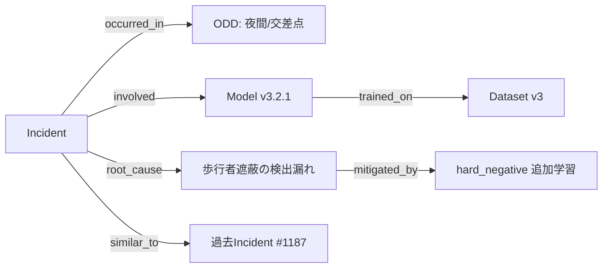

# 8.6 フィールドからのインシデント・ヒヤリハット収集

この節では、フィールドからのインシデント・ヒヤリハット収集を扱います。AEB 作動・急ブレーキ・ドライバ介入などの自動トリガを ROC / PR 曲線（後述）で最適化し、California DMV Disengagement Reports・SAE J3018・NTSB の分類体系に整合させ、プライバシー（GDPR の保持期間規定など）を守りつつ、知識グラフによる根本原因分析 (RCA; Root Cause Analysis) の自動化までを通して、「現場で起きた事象をデータとして回収する」仕組みを設計します。

ここで ROC 曲線 (Receiver Operating Characteristic) は閾値を変えたときの偽陽性率と真陽性率の軌跡、PR 曲線 (Precision-Recall) は precision と recall の軌跡を描くものです。閾値選択の根拠を示すのに使われ、不均衡データでは PR 曲線がより実用的とされます。

## インシデント・ヒヤリハットの定義と分類

- **インシデント (incident)**：実際に事故・接触・法規違反が発生した事象。
- **ヒヤリハット (near miss)**：事故には至らないが、安全マージンが大きく低下した、または乗員が不安を感じた事象。

自動運転・ADAS では、さらに以下の軸で分類します。これは第5章のラベルタクソノミの延長です。

| 軸 | 区分例 |
|---|---|
| 起因 | システム誤動作 / ドライバ誤操作 / 他者の異常行動 |
| ODD | 地域・道路種別・天候・時間帯 |
| 機能 | 車線維持・AEB・ACC・L3 自動運転 |
| 運転自動化レベル | SAE J3016 [L7](references#l7) の L0–L5 |

## 自動トリガの ROC/PR 最適化

トリガ設計の核心は「重要事象を取り逃さず (recall)、かつ無駄なアップロードを抑える (precision)」のバランスです。代表的トリガと定量閾値の出発点を示します。

| トリガ | 物理量 | 初期閾値の目安 | 調整方針 |
|---|---|---|---|
| AEB 作動 | 自動制動の有無 | 作動全件 | 全件保存 |
| 急減速 | 縦加速度 | < -4.0 m/s² | ROC で調整 |
| 急操舵 | 横加速度 | > 4.0 m/s² | ROC で調整 |
| ドライバ介入 | オーバーライド | 自動運転中の全件 | 全件保存 |
| システム異常 | DTC / 安全モニタ発火 | 発火全件 | 全件保存 |

連続量トリガ（減速度・横加速度）は閾値で recall/precision がトレードオフします。少数の「真にラベル付けすべき重大事象」を正例として、トリガ閾値を変えた際の ROC / PR 曲線を描き、運用コスト（ラベリング・帯域）の制約下で最適点を選びます。

具体的には、過去の走行ログから「最大減速度（または横加速度）の絶対値」をスコアとし、重大事象フラグを正例ラベルとして PR 曲線を引きます。次に「precision の許容下限」を運用上の制約（ラベリング能力・回線帯域）から決め、その下限を満たす範囲で recall が最大となる閾値を選び、減速度の運用閾値（負値）に変換します。トリガは当初やや多めに設定し、収集イベントを分析しながら半期ごとにチューニングします。「どのトリガが有用なデータをもたらすか」自体を継続的に分析するのが Closed-Loop の要点です。precision の許容下限はラベリング能力と安全クリティカリティ（安全への寄与度）から逆算するのが実務的です。

| ラベリング能力 / 重大度 | 推奨 precision 下限 | 備考 |
|---|---|---|
| 小（〜100 シーン/日）× ASIL-D | ≥ 0.7 | 取りこぼしを許さず precision を厳しく |
| 中（数百シーン/日）× ASIL-B/C | ≥ 0.5 | 標準 |
| 大（千シーン/日 + ML 分類）× QM | ≥ 0.3 | precision 緩めで recall を稼ぐ |

ROC / PR 曲線でトリガ閾値を最適化するという発想は、「センサ・通信・ストレージのリソース制約のもとで、最も学習価値の高い事象を逃さない」という運用上の最適化問題として理解するのが本質です。閾値を緩くすれば recall は上がりますが、収集件数が爆発してラベリングが追いつかず、本当に重要な事象が他の凡庸なログに埋もれます。逆に厳しくすれば precision は上がりますが、$d=0.5$ クラスの軽微な兆候を継続的に取りこぼし、ロングテール事象がデータ化されないまま増えます。precision の許容下限をラベリング能力と安全クリティカリティの 2 軸で決める発想は、「組織がいま処理できる量に閾値を合わせる」という極めて実務的な制約反映で、これが守られないと収集パイプラインが詰まり、ラベリング担当者が新規事象を扱えず、結果として Closed-Loop が機能停止します。閾値変更時の影響を SiL のログリプレイで事前検証する習慣は、「閾値を動かしたら収集量がどれだけ変わるか」を数字で議論できる組織と、「とりあえず動かしてみて 1 週間後に困る」組織を分ける重要な作業です。トリガ別に「収集件数 / RCA に有用だった件数」を月次集計するのは、トリガそのものの価値を継続的に測る姿勢で、有用率が低いトリガを段階的に廃止することで「ノイズばかり集めて重要なものを埋もれさせる」検知器の蓄積を避けます。AEB 作動やドライバ介入のような明確なイベントは、連続量トリガと違って precision/recall のトレードオフが存在しないため、閾値を持たず全件保存するのが原則です。

## 業界の分類・報告フレームワーク

自社の分類は、公開された業界フレームワークと相互変換できるようにしておくと、ベンチマークや規制報告で有利です（本書は法的助言を提供しません）。

| フレームワーク | 内容 | 活用 |
|---|---|---|
| California DMV Disengagement Reports [L9](references#l9) | 解除 (disengagement) の発生・原因・走行距離の年次開示。California DMV はカリフォルニア州車両管理局で、自動運転試験車の事業者に解除データを年次提出させる仕組みを持つ | 解除分類の語彙を社内タクソノミに対応づけ |
| SAE J3018 [L8](references#l8) | SAE が定めるプロトタイプ ADS（Automated Driving System、自動運転システム）路上試験の安全ガイダンス | 試験運用の安全手順・データ収集設計 |
| NTSB 事故調査 [M15](references#m15) | NTSB（National Transportation Safety Board、米国国家運輸安全委員会）による独立した重大事故調査と要因分析の手法 | RCA の体系（寄与要因の構造化）を参照 |
| NHTSA SGO 2021-01 [R5](references#r5) | NHTSA（National Highway Traffic Safety Administration、米国運輸省道路交通安全局）による Standing General Order。ADAS / ADS のクラッシュ報告命令 | 報告対象イベントの判定基準 |

特に DMV の「解除理由」分類は、ドライバ介入トリガのラベル語彙を設計する際の良い出発点になります。

## ドライバ・オペレータからのフィードバックチャネル

自動トリガでは捉えにくい「形式上は安全だが不快・不安」な挙動を拾うため、人由来チャネルを設けます。

- **車載 HMI**：自動運転解除直後に理由を選択（「挙動が不安」「自分で運転したい」等）、ボタン/音声で「ヒヤリハット報告」。
- **モバイルアプリ・運行管理画面**：ロボタクシー乗客やオペレータが構造化フィードバック（カテゴリ＋地点）を送信。
- **定期レビュー会**：テストドライバ・オペレータからログに現れにくい「肌感覚の問題」を収集。

これらは単なるメモで終わらせず、インシデント管理システムやデータカタログと連携し、該当ログやシーンに紐付けます。「特定交差点での挙動に不安」という報告は、第4.7節のシーン検索・第7章のシナリオ生成へ引き渡します。

## プライバシーとデータ保持

インシデントデータには車内外映像・位置・音声など個人データが含まれ得るため、収集設計とプライバシーは不可分です。

- **最小収集**：トリガ前後の必要区間のみ高解像度保存。常時全データ送信は避ける。
- **匿名化**：顔・ナンバープレートのマスキング（第2・3章）を収集パイプラインの早期段階で適用。
- **保持期間 (retention)**：GDPR [L14](references#l14)（EU 一般データ保護規則）・改正個人情報保護法 [L13](references#l13)・PIPL [L12](references#l12)（中国の個人情報保護法）に整合する保持・削除ポリシーを定義し、目的達成後は自動削除。デフォルト値の出発点として、EU (GDPR): 映像 12 ヶ月・テレメトリ 24 ヶ月、日本（改正個保法）: 原則 6 ヶ月・安全分析対象は 12 ヶ月、共通の保守値: 24 ヶ月（経年比較・訴訟対応）が一例です。最終決定は法務部門の承認を経て地域別の DAG (Directed Acyclic Graph、Airflow などのワークフローで処理を有向非巡回グラフとして定義したもの) で自動執行します。
- **アクセス制御**：RCA 担当のみ生データにアクセスでき、操作は監査ログに記録（第8.9節）。

プライバシーと収集設計が「不可分」である理由は、後付けの匿名化が原理的に難しいからです。顔やナンバープレートが映ったままの生データが一度どこかに保存されれば、それを後から完全に削除する保証は得にくく、複製・キャッシュ・派生データセットを通じて漏出するリスクが時間とともに積み上がります。マスキング処理を車両側パイプラインの早期段階に組み込み、抽出時には無加工データを残さない設計は、「無加工データが組織のどこかに静かに残っている」という最悪のケースを構造的に避けるための投資です。「データ種別 × 地域」のマトリクスで保持期間と削除トリガを表化し、法務承認版を運用システムから参照する形にしておけば、運用チームが各リージョンの法令に詳しくなくても、システムが自動的に正しい保持期間を適用します。生データへのアクセス申請・承認・利用ログを 1 つの台帳に集約することは、内部不正への抑止だけでなく、規制当局からの「誰がこのデータにアクセスしたのか」という照会に答える一次資料を整える作業でもあります。国境をまたぐデータ転送が発生する経路の年次棚卸しは、知らぬ間に新設された経路が越境転送規制に触れている、という事故を防ぐ点検作業で、越境転送の根拠（同意・契約条項）が記録されていない経路は即時停止すべき、という判断基準を組織に根付かせます。

## 事後解析と RCA プロセス

収集事象は優先度に応じて事後解析 (post-mortem) と RCA にかけます。

1. **トリアージ**：安全影響・再現性・頻度で優先度を決定。法規制上の報告義務を確認。
2. **事実関係の整理**：ログ（センサ・モデル出力・制御）を可視化し、ODD・構成・証言を集約。
3. **仮説立案・再現実験**：複数仮説を立て、第7.5節のログリプレイ・シミュレーションで再現を試みる。
4. **根本原因の特定**：5 Whys（問題に対し「なぜ」を 5 回繰り返して原因を掘り下げる手法）や Fault Tree Analysis (FTA、上位事象から下位原因へ論理木で展開する解析手法) で深掘り。モデル・データだけでなく要件・ラベルポリシー・運用手順も候補に含める。
5. **対策とフォローアップ**：データ収集・再ラベル・モデル改善・ルール改訂を整理し、効果追跡 KPI を定義。

## 知識グラフによる RCA 自動化

インシデントが蓄積すると、手作業の RCA はスケールしません。**知識グラフ (knowledge graph、エンティティをノード、関係をエッジとして表すグラフ構造のデータ)** で事象・ODD・モデルバージョン・寄与要因・対策を構造化し、類似事象や共通原因を自動抽出します。

> **図 8.8**：Neo4j 等で表現するインシデント知識グラフ。`similar_to` と `root_cause` の関係をたどることで、「同じ根本原因を持つ事象群」を一括で抽出し、再学習データの優先度付けに使えるのがポイントです。

ここで Neo4j はグラフデータベースの代表例で、Cypher と呼ばれる宣言的なクエリ言語でグラフを問い合わせます。Cypher の構文はパス（`(a)-[:rel]->(b)`）でノード間関係を直接表現できる点が SQL と異なります。

知識グラフのクエリを実装するときには、「同一根本原因 (RootCause) を共有しつつ、まだ対策 (Fix) が紐付いていないインシデント群」を一覧する集計を最初に用意します。グラフ DB に対して、Incident → RootCause の関係をたどり、そこから先に Fix への辺がないものを抽出して、原因ごとの件数とインシデント ID 一覧を件数の多い順に返す、という形です。

エッジの種類は「自動抽出 (auto)」と「人手確認済み (verified)」を必ず分け、運用上の信頼度を区別します。

| エッジ種別 | 生成元 | 信頼度 | 用途 |
|---|---|---|---|
| auto-derived | 同種ログパターン・ベクトル類似度 | 中 | 候補絞り込み・優先度付け |
| analyst-verified | RCA 担当の確認後付与 | 高 | 規制報告・恒久対策の根拠 |
| sim-reproduced | シミュレーションで再現が取れた | 高 | 再学習データセット選定 |

寄与要因の確率的な依存関係を扱う場合はベイジアンネットワーク（変数間の条件付き独立を有向非巡回グラフで表現する確率モデル）を併用し、「どの要因がどれだけ事象確率を上げるか」を定量化します。

知識グラフを RCA に使う最大の利点は、「見かけの個別事象が、実は同じ根本原因の別の現れだった」という気づきを構造的に得られる点にあります。たとえば「夜間の歩行者誤検出」と「逆光時の白い車両未検出」が一見別の事象に見えても、根本原因が「カメラのダイナミックレンジ不足」だと特定されていれば、グラフ上で同じ RootCause ノードに紐付き、対策の優先度を統合的に判断できます。自動抽出エッジ（auto）と人手確認エッジ（verified）を分けて管理する設計は、グラフの信頼度を区別するために決定的に重要で、規制報告には verified のみを使うという原則がないと、ベクトル類似度で機械的に張られた仮の関係が公式文書に流れ込み、後で誤りが判明して訂正報告を出す事態になりかねません。「同じ根本原因で対策未済のインシデント群」を返す定型クエリを週次で運用レビューに出すのは、対策が散発的に打たれているのか体系的に進んでいるのかを可視化するためで、件数が減らない RootCause ノードは「対策が実装されていない」「実装されたが効いていない」のいずれかであり、いずれにせよ追加調査の対象になります。知識グラフの更新ジョブを Airflow に乗せ、シーン抽出・ラベリングと連動させることで、新しいインシデントが発生してから対策候補が浮上するまでの時間が、人手依存の数日から数時間に短縮されます。

## Closed-Loop におけるインシデントデータの位置づけ

第1章の7段階のうち、インシデントデータは主に次の経路で活用されます。

- **第4章**：インシデント周辺データを難例・ロングテールとして抽出、類似検索で拡張。
- **第5章**：他車の意図・優先関係・違反有無などの詳細ラベルを付与し、ラベルポリシーを見直す契機に。
- **第6章**：難例として重み付け学習し、同種状況で安全側挙動を促す。
- **第7章**：抽出シナリオをシミュレーションスイートに追加し、回帰テストシナリオ化。

8章では、改善モデルが CI/CD・OTA で再びフィールドに展開され、新たなインシデントが収集される、というループを形成します。インシデント収集と RCA は、その入口にある最重要の情報源です。

## 本節の振り返り

本節では連続量トリガの閾値を ROC / PR 曲線で recall・precision と運用コストのバランスから最適化する考え方を中心に扱いました。precision の許容下限はラベリング能力と安全クリティカリティから逆算し、組織が処理できる量に閾値を合わせることで、収集パイプラインの詰まりとロングテール取りこぼしの両方を避けます。社内タクソノミは DMV Disengagement・SAE J3018・NTSB・NHTSA SGO の分類と相互変換できるよう設計し、規制報告とベンチマークでの整合性を確保します。プライバシーは最小収集・早期匿名化・地域別の保持期間・アクセス制御の四点で担保し、後付けの匿名化が原理的に難しいため、車両側パイプラインの早期段階でマスキングを完了させる必要があります。知識グラフで RCA を構造化し、同一根本原因を共有するインシデント群を自動抽出することで、対策が散発的な対症療法から体系的な原因対策へ転換します。インシデントデータは Closed-Loop における「現場の声」の入口であり、ここの粒度と質が後段すべての改善速度を決めます。

## 次節への橋渡し

インシデントを回収し原因を構造化したら、それを実際の再学習・再評価・再デプロイにつなぐ運用が必要です。次の8.7節では、Airflow DAG による自動化、優先度スコアの定式化、Grafana ダッシュボード、Kafka イベント駆動の Closed-Loop、そしてフィードバック遅延の許容度設計を扱います。
