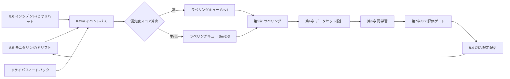
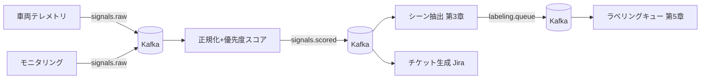

# 8.7 DataOps へのフィードバックサイクル

この節では、運用で得たシグナルを開発へ戻す **DataOps フィードバックサイクル** を扱います。インシデント・ドリフトから優先度スコアで対象を選び、Kafka によるイベント駆動で再ラベル・再学習・評価・再デプロイへ流す Airflow DAG、Sev レベル別の遅延許容、難例の重み付け（Weighted CE / Focal / Cost-Sensitive）、Grafana ダッシュボード（Grafana Labs が提供する OSS の可視化ツール）、そして組織横断のハンドオフ同期までを実装レベルで具体化し、「運用から開発へのデータの流れ」を測定可能なパイプラインにします。

DataOps はデータ中心のアジャイル運用思想で、データ収集・保存・カタログ・パイプライン・ラベリング・学習を横断するチーム・プロセス・ツール群の総称です。MLOps が学習・配信・運用の自動化に重点を置くのに対し、DataOps は「データそのものの品質と流通」に焦点を当てます。

## Closed-Loop データエンジンの全体像

本書が想定する Closed-Loop データエンジンは、収集（第2章）→ 保存（第3章）→ 選択・前処理（第4章）→ ラベリング（第5章）→ 学習（第6章）→ シミュレーション（第7章）→ 実世界展開（第8章）の7段階です。本節は **7 → 3〜6 の還流**、すなわち運用シグナルをデータとして取り込み、次の改善に結ぶ経路に焦点を当てます。

> **図 8.10**：運用シグナルを Kafka に集約し、優先度スコアでラベリングキューに振り分けてから学習・評価・再配信へ還す全体像。ポイントは、シグナルの入口を1本のイベントバスに統一し、**優先度づけを単一の関数に集約**することで、どの事象がいつデータ化されたかを完全に追跡できる点です。

## 運用シグナルからデータ候補へ

起点は、ドリフト検知・異常検知・インシデントトリガ・ドライバフィードバックです。これらを共通スキーマ（シグナル種別・ODD セグメント・ソフトウェア/モデルバージョン・発生頻度・安全影響）に正規化し、イベントバスへ流します。スキーマを統一しておくと、後段の優先度づけ・チケット自動生成・シーン抽出をすべて同じキーで結合できます。

| シグナル源 | 主な指標 | データ化の単位 | 連携先 |
|---|---|---|---|
| 性能ドリフト（第8.5節） | concept drift / 代理指標悪化 | ODD セグメント | 再学習対象クラス |
| 入力分布ドリフト | KS/MMD/PSI 逸脱 | 特徴量クラスタ | 収集・選択（第4章） |
| インシデント（第8.6節） | 介入・AEB・衝突 | シーン ID | ラベリング（第5章） |
| ドライバフィードバック | 主観評価・通報 | イベント ID | トリアージ会 |

## 優先度スコアによるトリアージ

すべてのシグナルを等価に扱うとキューが破綻します。**安全影響・発生頻度・影響車両数・新規性・修復容易性** を線形結合した優先度スコアで序列化します。

$$
\text{Priority} = w_s \cdot S_{\text{safety}} + w_f \cdot \log(1+f) + w_n \cdot N_{\text{fleet}} + w_v \cdot V_{\text{novelty}} - w_c \cdot C_{\text{cost}}
$$

ここで $S_{\text{safety}}$ は ISO 26262 [L1](references#l1) の ASIL を 0〜1 に正規化した安全影響、$f$ は単位距離あたり発生頻度、$N_{\text{fleet}}$ は影響車両割合、$V_{\text{novelty}}$ は既存データセットとの埋め込み距離で測る新規性、$C_{\text{cost}}$ はラベリング・再学習コストです。安全影響に最大の重みを置き、頻度は対数で逓減させて単発の重大事象を埋もれさせないようにします。

スコアから Sev レベルへの変換には、運用ベースラインを踏まえた境界値（例: スコア 0.75 以上で Sev1、0.45 以上で Sev2、それ以外を Sev3）を設定します。新規性 $V_{\text{novelty}}$ は第4章のベクトル検索で「既存データセットに似たシーンが少ないほど高い」値を返すように設計し、ロングテール事象を優先的にデータ化します。

重みは **本書の参考値として $w=(w_s, w_f, w_n, w_v, w_c) = (0.45, 0.20, 0.15, 0.15, 0.05)$** を提示しますが、組織ごとに次の手順で決定します。

1. 安全責任者と合意した安全方針から $w_s$ を最大重みに設定（典型 0.4〜0.5）。
2. ラベリング能力の上限から $w_f$ を逆算し、頻度上位イベントが処理可能件数を超えないようにする。
3. フリート規模分布から $w_n$ を選定し、影響台数の影響度を調整する。
4. `novelty` の定義（埋め込み距離 / 統計量距離など）を確定したうえで $w_v$ を決める。
5. 過去のラベリング・再学習コスト実績から $w_c$ を微調整する。

決まった重みは `priority_policy_v=N` のようにバージョン管理し、運用後のリードタイム・再発率の変化を A/B で評価しながら段階的に更新します。スコアから Sev への閾値もこのポリシーに含めます。

優先度スコアの設計で見落とされやすいのは、「優先度が高いと判定された案件をすべて処理できるとは限らない」という現実の制約です。優先度スコアの本質は、シグナルそのものの重要度を測ることに加えて、「組織のラベリング能力で吸収できる量から逆算して、上位だけを Sev1 として処理する」という資源配分の関数として働くことにあります。Sev 閾値を 0.75 / 0.45 と決める作業は、過去のシグナル分布に対して「Sev1 に何件、Sev2 に何件入るか」を試算し、ラベリングチームの月次処理能力（たとえば Sev1 用に確保できる 100 件 / 週など）と整合させる経済計算であり、ここを外すとラベリングキューが慢性的に滞留して全体が機能停止します。$V_{\text{novelty}}$ を埋め込み距離関数として共通ライブラリに置き、第 4 章の選択ロジックと共有するのは、運用シグナルの新規性判定と学習データ選択の新規性判定が同じ尺度で動くことを保証する設計で、これが分かれていると「データ選択では新規性が高いと判断されたシーンが、運用シグナル側では低いと判定される」という不整合が起きます。ポリシーバージョン更新のたびに過去 1 ヶ月のシグナルで再評価して Sev 分布の変化を可視化する作業は、「重みを変えたら何がどう変わったか」を一次データで議論する規律を生み、勘で重みを動かす属人運用を抑制します。優先度スコアの単一関数化は、「組織が何を優先的にデータ化するか」を一つの数式に集約する宣言であり、その数式の形と重みは経営層・安全責任者・運用責任者の合意の現れだ、というガバナンス的な意味を持ちます。

## Sev レベル別の遅延許容

優先度から決まる Sev レベルごとに、許容リードタイム（検知 → 改善配信）の SLA を定めます。これがフィードバックサイクルの設計目標になります。

| Sev | 典型事象 | データ化遅延 | 再学習〜評価 | 配信判断 | 目標総リードタイム |
|---|---|---|---|---|---|
| Sev1 | 安全クリティカル（衝突・重大誤検知） | 即時（< 1h） | 優先割込 24–48h | 安全責任者の即時レビュー | 4〜7 日（最短ルート時。即時暫定対策として ODD 縮退・機能停止を別ルートで先行）|
| Sev2 | 性能劣化・頻発ヒヤリハット | 当日バッチ | 週次スプリント | リリースレビュー会 | 1–2 週 |
| Sev3 | 緩やかな分布変化・軽微 | 週次バッチ | 定期再学習に同梱 | 通常ゲート | 数週〜1 ヶ月 |

Sev1 の現実的なリードタイムは「検知 → 優先度算出（数時間）→ ラベリング（1〜2 日）→ 再学習（1〜2 日）→ 評価（1 日）→ OTA 承認・配信（〜1 日）」を合計した 4〜7 日が目安で、これより短縮するには **暫定対策**（ODD 縮退・該当機能の一時停止・閾値の緊急引き締め）を別ルートで先行発動するのが運用の知恵です。Sev3 は定期再学習にまとめてコスト効率を優先する、というメリハリが要点です。

Sev1 リードタイム 4〜7 日という目安を「短い」と感じるか「長い」と感じるかは、組織の現状と読者の立場で分かれますが、重要なのは「これより短くするには別ルートが必要」という構造的な事実です。再学習・評価のサイクルを物理的に 1 日に圧縮するのは、データセット構築・GPU 確保・評価データセット適用の各段の制約から極めて難しく、「Sev1 だから明日までに新モデルを出す」を素朴に追求すると、評価が形骸化して新たな安全リスクを混入させる事故が起きます。本書が「暫定対策」を別ルートとして強調するのは、恒久対策（再学習）と並列に「ODD 縮退・機能停止・閾値引き締め」という即効性のある安全側操作を走らせることで、4〜7 日のリードタイムを「許容できる安全状態」のもとで確保する、という二段構えの発想です。Sev1 専用レーンの確保（ラベリング・再学習・評価・OTA の各段で平時のジョブと優先度を分離）は、平時のジョブが Sev1 ジョブをキューで待たせる事態を防ぐためで、平常運用と緊急運用を同じパイプラインで回そうとすると、必ずどこかが詰まります。再学習用 GPU 予約枠を Sev1 用に常時 10 % 確保するのは、緊急時に GPU を獲得するための調達交渉に時間を浪費しないための投資で、平時に GPU が遊んでいるように見えても、それは「いざというときに数時間で再学習を始められる」保険として機能します。インシデント発生から 24 時間以内に「暫定対策 / 恒久対策 / 状況不明」のいずれかを宣言する運用ルールは、判断を先送りにする組織文化を構造的に避ける仕掛けで、宣言が「状況不明」のままなら少なくとも暫定対策を発動する、という安全側のデフォルトを根付かせます。

## Kafka イベント駆動アーキテクチャ

シグナルの入口を Kafka トピックに統一し、各処理を独立コンシューマとして疎結合に保ちます。これにより、ラベリング・データセット・学習の各チームが互いの実装に依存せず、同じイベントを購読して動けます。

> **図 8.11**：`signals.raw` → スコアリング → `signals.scored` → `labeling.queue` とトピックを段階化したイベント駆動。各段が独立してスケール・再処理でき、障害時もオフセットから再開できるのがポイントです。

スコアリング・コンシューマの実装担当者には、Kafka の `signals.raw` トピックを購読し、各メッセージから `asil_norm` / `freq_per_1k_km` / `fleet_ratio` / `novelty` / `label_cost` を取り出して優先度スコアと Sev を付与し、結果を `signals.scored` トピックへ再投入する独立サービスを依頼します。コンシューマグループはスコアラごとに独立させ、再処理時はオフセットを巻き戻して同じイベントを別ポリシーバージョンで再評価できるようにしておきます。

## 再ラベル・再学習・評価の Airflow DAG

`signals.scored` から下流の再ラベル → データセット → 再学習 → 評価をオーケストレーションします。Airflow [T13 系] の DAG として定義し、各タスクの依存・SLA・リトライを宣言的に管理します。Closed-Loop 再学習 DAG の実装担当者には、次の構造で組み立てるよう依頼します。

| タスク | 役割 | 主要パラメータ |
|---|---|---|
| pull_scored_signals | `signals.scored` トピックから優先度しきい値以上のイベントを取得 | `min_priority = 0.45` |
| extract_scenes | 事象前後（例: 10 秒）のセンサ・ログを Spark で抽出 | `lookback_s = 10` |
| enqueue_labeling | Sev 別の SLA タイマー付きでラベリングキューに投入 | Sev1: 24h / Sev2: 168h / Sev3: 720h |
| build_dataset | データセットを再構築し、難例混入率を保証 | `hard_negative_ratio = 0.2` |
| retrain | Kubernetes Pod で再学習ジョブを起動 | GPU 数、ベース VS、学習ハイパーパラメータ |
| eval_gate | 第8.2節の評価ゲートにかけ、合否と統計指標を出力 | `suite = incident_scenarios` |
| notify_release_board | リリースレビュー会へ Slack 通知。最終配信は人手承認 | 通知先チャネル、テンプレート ID |

DAG 全体の `sla` は Sev1 を 48 時間以内に評価完了させる目標として設定し、再試行は 2 回まで許容します。スケジュールは「6 時間ごとに `signals.scored` を取り込む」など、シグナル生成頻度に合わせます。`enqueue_labeling` の Sev 別 SLA が前述の遅延許容を実装に落とした箇所で、`build_dataset` の難例混入率がインシデント由来サンプルの希釈を防ぐ要点です。安全クリティカルな最終配信判断（`notify_release_board` の先）は自動化せず人間のレビューに委ねます。

なお Airflow の DAG (Directed Acyclic Graph) はタスク間の依存関係を有向非巡回グラフとして宣言する仕組みで、各タスクのリトライ・タイムアウト・SLA を独立に設定できます。DataOps の自動化基盤として広く採用されています。

DAG の各タスクに `sla_miss_callback` を実装して SLA 違反を Slack へ自動通知する設計は、「SLA を守れていないことを誰も気づかない」状態を防ぐ最低限の仕掛けです。SLA は宣言しても守られていなければ意味がなく、違反のたびに通知して再発防止のレビューに繋げる循環がなければ、SLA は時間とともに事実上 0 件運用になります。`build_dataset` で難例混入率が 0.2 を下回ったら DAG を停止して人手レビューに切り替える例外経路は、「インシデント由来サンプルが定期再学習で希釈されて見えなくなる」というよくある失敗モードへの構造的な防御です。難例の比率が下がったまま再学習が進むと、改善の方向が「平凡なケースの精度を更に上げる」に偏り、ロングテール対応が後退します。再学習タスクで Spot インスタンスではなくオンデマンド GPU を使うのは、Spot の突然停止で再学習が中断・再起動を繰り返すと再現性が損なわれ、原因究明の対象になりにくい「ジョブごとの非決定性」が混入するためで、コスト最適化より再現性を優先する判断です。DAG の実行履歴の四半期棚卸しでは、所要時間が増加傾向にあるタスクや失敗率が上がっているタスクを継続的に特定し、ボトルネックを Closed-Loop の循環速度に直結する KPI として扱います。

## 難例の重み付け：Weighted CE / Focal / Cost-Sensitive

インシデント由来サンプルはデータセット全体では少数派のため、単純な再学習では希釈されます。**損失関数の重み付け** で難例・希少クラス・安全重大クラスを強調します。

| 手法 | ねらい | 重みの決め方 | 出典 |
|---|---|---|---|
| Weighted CE | クラス不均衡の補正 | 頻度の逆数 / 有効サンプル数 | [AL6](references#al6) |
| Focal Loss | 易しい多数例の寄与抑制 | $(1-p_t)^\gamma$ で難例強調 | [AL5](references#al5) |
| Cost-Sensitive | 安全影響の非対称性反映 | 誤りタイプ別コスト行列 | [L1](references#l1) と連携 |

実装担当者には、損失関数として「クラス別コスト重みを乗じた交差エントロピー」と「Focal Loss の易例抑制係数 $(1-p_t)^\gamma$」を組み合わせた **Focal × Cost-Sensitive** 損失を依頼します。具体的には、(1) クラスごとのコスト重み $\boldsymbol{w}$ を用意して交差エントロピーに乗じ、(2) 各サンプルでの正解クラス確率 $p_t$ を取り出し、(3) $\gamma$（典型 2.0）で易例の寄与を抑える、という三段で実装します。コスト行列は ISO 26262 [L1](references#l1) の ASIL を踏まえ、「歩行者の見落とし（false negative）」のような安全重大な誤りに大きな重みを置きます。重み付けの強さは検証セットでの過学習・他クラス劣化を監視しながら調整し、ゲート用データセットでの劣化が許容範囲を超えたら $\gamma$ とコスト行列の双方を見直します。

## Grafana ダッシュボードによる可視化

フィードバックサイクルが機能しているかを測るため、サイクル自体のメトリクスをダッシュボード化します。Grafana を使う場合、`Closed-Loop Feedback Health` というダッシュボードに次の 4 パネルを最低限設けるよう実装担当者に依頼します。

| パネル | 種別 | 内容 | 閾値・補助線 |
|---|---|---|---|
| Sev1 リードタイム | 単一値（p50 / p95） | 検知から評価完了までの時間 | 72 時間以上で赤 |
| ラベリングキューの滞留 | 時系列 | Sev 別の未処理件数 | Sev1 が 0 から増える時に警告 |
| インシデント再発率 | 時系列 | クラス別の 1,000 km あたり発生件数（7 日窓） | 上昇トレンドで警告 |
| 直近データセットの難例混入率 | 単一値 | hard-negative の比率 | 0.2 を下回ると警告 |

メトリクスは Prometheus（時系列メトリクス収集の OSS）／OpenTelemetry（メトリクス・ログ・トレースの収集仕様の標準）でエクスポートし、ヒストグラム量から p95 を `histogram_quantile` で算出するなど、Grafana 側のクエリは標準的な PromQL（Prometheus のクエリ言語）で書けます。追跡する主指標は、(1) Sev 別リードタイム（p50 / p95）、(2) ラベリングキューの滞留、(3) 同種インシデントの再発率推移、(4) 直近データセットの難例混入率、です。運用・DataOps・モデル開発・安全の各チームが同じ画面を見て状況認識をそろえることが目的です。

## 組織横断のハンドオフ同期メカニズム

技術パイプラインだけでは Closed-Loop は閉じません。運用 → DataOps → モデル開発 → 安全/QA の **ハンドオフ** を、状態機械とイベントで同期します。各チケットは状態（`triaged → labeling → dataset → training → eval → release`）を持ち、状態遷移時に Kafka イベントと Slack 通知を発火、受け手チームが SLA タイマー付きで引き継ぎます。

| 引き渡し境界 | 同期メカニズム | 完了の定義 (DoD) | SLA タイマー |
|---|---|---|---|
| 運用 → DataOps | `signals.scored` イベント | 優先度・Sev 確定、シーン ID 付与 | Sev に依存 |
| DataOps → モデル開発 | データセットバージョン凍結 | 難例比率・分割・リネージ記録 | 168h（Sev2） |
| モデル開発 → 安全/QA | 評価レポート + ゲート結果 | インシデント別指標を添付 | 48h |
| 安全/QA → 運用 | リリース承認イベント | 監査ログ起票（第8.9節） | 即時 |

二重管理（チーム別の独自台帳）を避けるため、状態と所有権は単一のチケットシステムに集約し、各チームのツール（ラベリング基盤・実験管理・OTA）からは API でこのチケットに書き戻します。これにより「いま誰のボールか」が常に一意に定まり、ハンドオフ漏れによるリードタイム悪化を防げます。

ハンドオフ同期の設計で本質的に重要なのは、「いま誰のボールか」が一意に定まる構造を作ることです。技術パイプラインがどれだけ自動化されていても、「ラベリングは終わったがデータセット凍結が始まらない」「評価は終わったが配信承認が出ない」という滞留が境界で発生すると、Sev1 リードタイムは簡単に倍以上に伸びます。チケットの状態遷移を有限状態機械として定義し、無効な遷移を API で拒否する設計は、「気を利かせたショートカット」が運用に紛れ込むのを防ぎ、各境界の Definition of Done（DoD）が必ず充足された状態でしか次の段に進めない、という規律を組織に課します。状態遷移時に Kafka イベントを発火して Slack 通知と SLA タイマーを連動させるのは、受け手チームが「自分のボールになった瞬間」を即座に認識する手段で、遷移してから受け手が気づくまでに半日かかる、という素朴な遅延を構造的に消します。月次のハンドオフリードタイム集計で滞留が多い境界が見えれば、それは技術的問題ではなく組織的問題（人員不足・ツール未整備・優先度の合意不全）であることが多く、組織側の介入によってのみ解決します。「Closed-Loop は技術設計と組織設計の重なりとしてしか動かない」という、本書全体を通底する主張がここに最も明確に表れます。

## 自動化レベルと人間の介在

自動化はレベル0（全手動）→ レベル1（データ抽出自動）→ レベル2（学習・評価ジョブ自動スケジュール）→ レベル3（ゲート通過時の限定 VIN への半自動 OTA）と段階化します。どこを目指すかは組織の成熟度・リスク許容度・規制環境で決まりますが、**安全目標やリリースゲートの変更は常に人間のレビューを伴う** ことを不変条件とします。データ抽出・キュー生成・難例混入は自動化余地が大きく、配信承認は人手、という線引きが現実的です。

## 本節の振り返り

本節では運用シグナルを共通スキーマで Kafka に集約し、安全影響・頻度・影響台数・新規性・コストの線形結合として定式化した優先度スコアで Sev に振り分ける、という DataOps フィードバックの骨格を提示しました。優先度スコアの本質は単なる重み付けではなく、「組織のラベリング能力で吸収できる量から逆算する」資源配分関数であり、Sev 閾値の調整は経営的な意思決定でもあります。Sev 別の遅延許容を SLA 化し、Sev1 の現実的なリードタイム 4〜7 日を前提に専用レーンや暫定対策の別ルートを整える運用は、再学習サイクルを物理的に圧縮しようとする無理を避けつつ安全側を担保する設計です。Airflow DAG の `sla_by_sev` と難例混入率の保証によりインシデント由来サンプルの希釈を防ぎ、Weighted CE・Focal Loss・Cost-Sensitive 損失の組み合わせが安全重大な誤りを学習に強調します。Grafana ダッシュボードでリードタイム・滞留・再発率を可視化し、単一チケットでハンドオフを同期する仕組みは、Closed-Loop が技術と組織の重なりとしてしか動かないという主張を運用に具体化したものです。

## 次節への橋渡し

フィードバックで改善した新モデルを配信しても、実世界では予期せぬ劣化が起こり得ます。次の8.8節では、ロールバックのトリガ設定表（指標 × 基準値 × 検定）、SPRT による早期停止、位置情報と時間を含む MRC 状態遷移、意思決定マトリクス、再試験パイプライン、そして監査ログ JSON を扱い、「失敗したときに安全側へ倒し、その経験をデータとして残す」仕組みを設計します。
