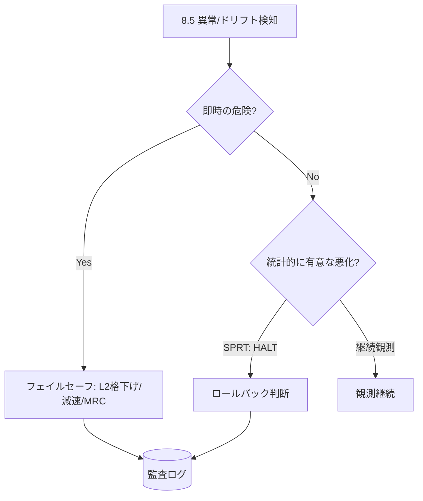
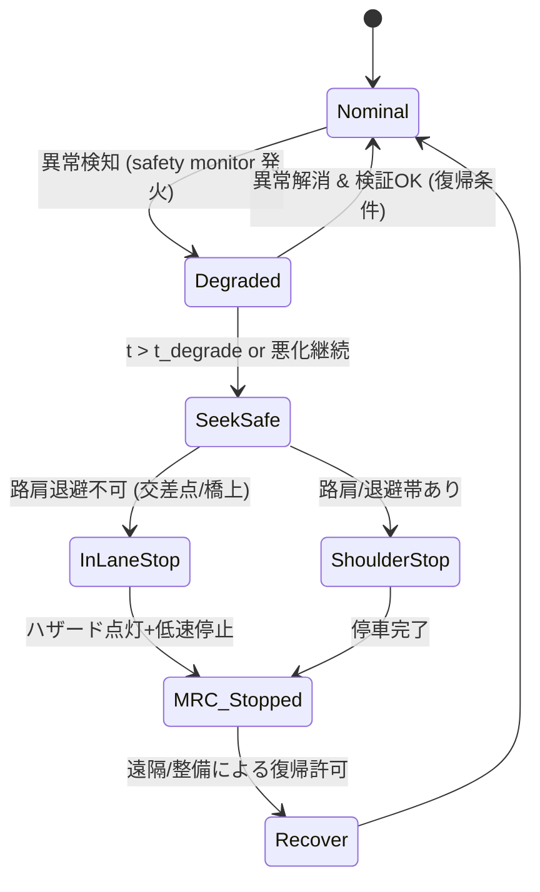
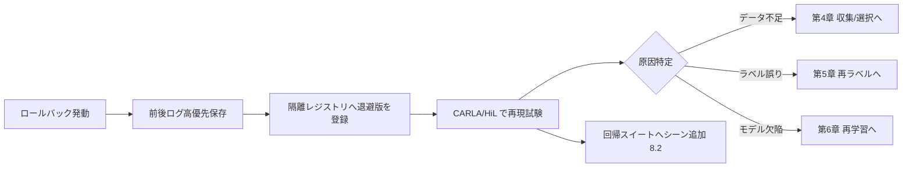

# 8.8 モデルロールバック・フェイルセーフ戦略

この節では、**モデルロールバック (rollback、問題のあるバージョンを既知の安定版に戻す運用)** と **フェイルセーフ (fail-safe、瞬間の異常に対し機能制限・停止で安全側へ倒す設計)** を扱います。ロールバックのトリガ設定表（指標 × 基準値 × 検定）、SPRT による A/B 早期停止、位置情報と時間を含む **最小リスク状態 (Minimum Risk Condition; MRC)** の状態遷移、意思決定マトリクス、ロールバック対象を隔離して評価する再試験パイプライン、そして改ざん不能な監査ログ JSON までを定量化します。これにより、「失敗したときに安全側へ倒し、その経験を最も価値あるデータとして残す」仕組みを設計します。

## ロールバックとフェイルセーフの分離

両者は時間軸が異なります。ロールバックは「問題のあるバージョンを既知の安定版へ戻す運用操作」で、主に OTA・CI/CD の層に属します。フェイルセーフは「いまこの瞬間の異常に対し機能制限・停止で安全側に移る設計思想」で、システムアーキテクチャ・安全設計の層に属します。

> **図 8.12**：検知後、即時の危険はフェイルセーフ（瞬間対応）、緩やかな統計的悪化は SPRT を介したロールバック（次出発までの対策）へ分岐させます。ポイントは、**時定数の異なる2系統を明確に分け**、どちらの経路を通ったかを必ず監査ログに残す点です。

## ロールバックのトリガ設定表

「大きく悪化したら戻す」では運用できません。指標ごとに基準値と判定に使う統計検定を明文化します。

| 監視指標 | 基準値（旧版比） | 検定/手法 | 観測窓 | 既定アクション |
|---|---|---|---|---|
| 介入率 (disengagement/1k km) | +10% 超で悪化 | SPRT（二項） | カナリア群逐次 | HALT → ロールバック判断 |
| AEB 作動率 | +15% 超 | SPRT（二項） | 逐次 | HALT |
| 重大インシデント（衝突等） | 1 件でも発生 | しきい値（即時） | 即時 | 即時グローバル退役 |
| 最小 TTC 分布 | p5 が 0.3s 以上短縮 | KS 検定 [M8](references#m8) | 日次 | エスカレーション |
| concept drift 代理指標 | PSI > 0.25 | PSI [M4](references#m4) | 日次 | 再学習トリガ（第8.7節） |
| クラッシュ/WDT 連続発火 | 連続 3 回 | 計数しきい値 | リアルタイム | 車両単位ロールバック |

安全クリティカルな事象（衝突）は検定を待たず即時退役、頻度系の劣化は SPRT で「早期に有意なら停止」とし、誤った全停止と見逃しの双方を抑えます。基準値は ODD セグメント別に校正します（夜間雨天は分散が大きいため緩めるなど）。

トリガ表の設計で腑に落とすべきは、「指標 × 基準値 × 検定」の三位一体を 1 行に固定する規律の意味です。指標だけを並べた監視は、基準値が変わるたびに過去の判定根拠が失われ、「いつから何を見ているか」が曖昧になります。基準値だけを並べると、検定方法が「平均比較なのか分布比較なのか」が不明で、再現できない判定が積み上がります。検定だけを並べると、何を入力して何を出力するかが揃わず、判定エンジンが指標ごとに別実装に分かれます。三位一体を 1 行に書く形式は、リリースごとに固定された判断基準を後から完全に再現できる構造を保証します。観測窓を ODD セグメント別に分けるのは、夜間雨天や高速道路のような分散が大きい条件で誤発火を防ぐためで、全 ODD を一律の窓で監視すると「分散の大きい条件のノイズが、分散の小さい条件の異常を埋もれさせる」という統計的な失敗を起こします。「即時退役 / 地域ロールバック / 車両単位ロールバック / 観測継続」の 4 アクションを API として実装する設計は、ロールバックの粒度をコードで明示することで、運用判断時に「どの粒度で戻すか」を迷わず選べるようにします。基準値の四半期見直しは、しきい値を厳しくする方向（運用の成熟）と緩める方向（誤発火が多すぎた反省）の双方の理由を CR に残すことで、安全側へ振り続ける規律と、運用負荷とのバランスを継続的に議論する文化を組織に根付かせます。

## SPRT による統計的ロールバック判定

A/B / カナリアでは、固定サンプル数を待たずに **逐次確率比検定 (Sequential Probability Ratio Test; SPRT)** [M10](references#m10) で「悪化なら早期停止、非劣化なら早期合格」を判定します。介入イベントを二項過程とみなし、対数尤度比を逐次更新します。

$$
\Lambda_n = \sum_{i=1}^{n} \log\frac{p_1^{x_i}(1-p_1)^{1-x_i}}{p_0^{x_i}(1-p_0)^{1-x_i}}, \quad
B=\log\frac{\beta}{1-\alpha} \le \Lambda_n \le \log\frac{1-\beta}{\alpha}=A
$$

$\Lambda_n \ge A$ で「悪化」と判定し停止（ロールバック判断へ）、$\Lambda_n \le B$ で「非劣化」と判定し合格、その間は観測継続です。

判定エンジンの実装担当者には、(1) 介入イベント列（1=発生 / 0=正常）と許容率 $p_0$・悪化率 $p_1$・$\alpha$・$\beta$ を入力に取り、(2) $\Lambda_n$ を逐次更新しつつ、上側境界 $A$ を超えた時点で `ROLLBACK` 判定（理由・サンプル数・$\Lambda_n$ を添える）、下側境界 $B$ を下回った時点で `ACCEPT`、いずれにも至らない場合は `CONTINUE` を返す、という状態機械として実装するよう依頼します。出力には常に判定時のサンプル数と $\Lambda_n$ を含め、後段の監査ログに記録します。

ASIL-D 機能では $\alpha=0.01$ と保守的に設定し、悪化を見逃すリスク（$\beta$）と早合点で戻すリスク（$\alpha$）のバランスを安全側に振ります。判定結果は配信割合の縮小・凍結（第8.4節）と連動させます。

## 段階的ロールバックのスコープ

ロールバックの範囲は事象の局所性に応じて選びます。OTA システムとモデルレジストリが VIN・地域・ODD と連携していれば、スコープを迷わず切り替えられます。

- **車両単位**：特定 VIN のみで発生（センサ個体差・故障）。当該車両だけ旧版へ。
- **地域/ODD 単位**：特定環境に集中（ある都市の夜間雨天）。該当セグメントを一括で旧版へ。
- **グローバル**：根本的欠陥・重大安全問題。全フリートから当該モデルを退役。

どのスコープで戻すかを事前ポリシー化し、トリガ設定表のアクション列に紐づけておくことで、インシデント時の判断遅延を防ぎます。

## MRC 状態遷移（位置情報 + 時間）

フェイルセーフの中核は MRC への安全な移行です。MRC は単一状態ではなく、**位置（走行コンテキスト）と経過時間** に依存する状態機械として形式化します。

> **図 8.13**：MRC 状態遷移。`Degraded` で一定時間 $t_{\text{degrade}}$ 内に回復しなければ `SeekSafe` に進み、位置コンテキスト（路肩の有無、交差点内か橋上か）で停止戦略を分岐します。ポイントは、**「いつ（時間）」と「どこで（位置）」の両方を遷移条件**に組み込み、交差点内停止のような危険を避けることです。

遷移条件の例：`Degraded → SeekSafe` は「異常継続 ≥ $t_{\text{degrade}}$（例 2s）または冗長系不一致率が閾値超過」。`SeekSafe → ShoulderStop` は「右後方クリア かつ 退避帯まで距離 < $d_{\max}$」。復帰条件（`Degraded → Nominal`）は「異常要因の消失をセンサ・ウォッチドッグで連続 N フレーム確認」とし、チャタリング（短時間に状態が振動する現象）を防ぎます。MRC は MRM (Minimum Risk Maneuver) として第7章のシミュレーション・HiL で網羅的に検証します。

MRC の状態機械を「位置と時間の両方を遷移条件にする」設計の核心は、「とにかく止まれば安全」ではないという認識にあります。交差点内停止は後続車との衝突リスクを生み、橋上停止は風や地震時のリスクを増やし、トンネル内停止は視認性低下を招きます。位置コンテキストを遷移条件に組み込まないと、MRM が「止まること」だけを目的化して、結果的により危険な状態を作り出します。状態遷移条件を構造化ファイル（YAML）で管理してコードと分離するのは、安全要件の変更が「コード修正＋再ビルド＋全テスト再実行」を伴わないようにし、現場で迅速に基準を調整できるようにするためで、ただし変更は必ず CR と安全レビューを経由させます。地図属性として「交差点・橋上・トンネル内」を `SeekSafe` 分岐に供給する仕組みは、地図と安全要件の連携を構造的に保証する設計で、地図更新が止まると MRM の安全性も劣化する、という責任の連鎖を可視化します。MRM 検証率の数値目標として 99.9 % のような水準を設定する場合、その意味は「MRM 発動 1000 回に 1 回しか失敗しない」という確率保証であり、これを満たすには第 7 章のシナリオ DB に網羅的な MRM 検証シナリオが登録され、リリースゲートの必須スイートとして毎回再実行される必要があります。復帰条件の `N` フレームをログから逆算してチャタリング実績と整合させる作業は、机上で決めた `N` が実際の運用で振動を抑えられているかを継続検証するもので、四半期に一度の見直しで「`N` を増やせば振動は減るが復帰が遅れる」「`N` を減らせば復帰は早いが振動が残る」というトレードオフを定量的に議論できる土台を作ります。

## ロールバック意思決定マトリクス

「誰が・どの権限で・どこまで戻すか」を事象の重大度と確信度で整理します。判断遅延も過剰反応も避けるためのエスカレーション指針です。

| 重大度＼確信度 | 高（統計有意/再現） | 低（単発/未確認） |
|---|---|---|
| 致命的（衝突・重大誤検知） | 安全責任者が即時グローバル退役 | 当直が地域ロールバック＋即時調査 |
| 重大（頻発ヒヤリハット） | リリースレビュー会が地域/ODD ロールバック | 配信凍結＋観測継続（SPRT） |
| 軽微（軽度劣化） | 次回定期で巻き戻し or 再学習 | 監視強化のみ |

致命的事象は確信度が低くても安全側（地域ロールバック）に倒し、確信度が高まり次第スコープを判断します。各セルの決定者は第8.9節の RACI と整合させます。

## リモート停止・緊急無効化

ロボタクシー等では運用センターからのリモート停止・機能無効化を備えることがあります。強力ゆえ、強固な認証・認可を通過した場合のみ許可し、全コマンドを監査ログに残します。リモート停止は「即時最大減速」ではなく MRC と整合させ、「可能な限り安全な場所まで移動して停止」を基本とします。これは日常運用ではなく、モニタリング（第8.5節）・インシデント収集（第8.6節）・ロールバックで対処できない最終手段の「安全バルブ」として限定的に使います。

## ロールバック対象の隔離と再試験パイプライン

戻したバージョンを「危険だから封印」するのではなく、**最も価値の高いロングテール事象を含む検証資産** として活用します。ロールバックを誘発したシーンは、回帰防止スイート（第8.2節）に恒久的に組み込みます。

> **図 8.14**：ロールバック対象を隔離レジストリに退避し、再現試験で原因を切り分けて該当章へ還す再試験パイプライン。ポイントは、退避版とトリガシーンを破棄せず**再現可能な状態で保管**し、原因種別に応じて Closed-Loop の正しい段へ戻すことです。

保存ログにはロールバック理由・関連インシデント ID・退避前後のバージョンをメタデータとして付与し、「どの種別の問題で戻したか」を後から横断分析できるようにします。

## 監査ログのスキーマ

ロールバック・フェイルセーフ・リモート停止のすべてを、改ざん不能（追記専用・署名付き）な監査ログに記録します。第8.9節の説明責任・トレーサビリティの一次データになります。1 件の監査ログには、最低でも以下の項目を構造化フィールドとして含めるよう実装担当者に依頼します。

| フィールド | 内容 | 例 |
|---|---|---|
| event_id | 一意なイベント ID | `rb-2026-0142` |
| type | 種別（rollback / failsafe / remote_stop など） | `rollback` |
| trigger.metric | 発火指標 | `disengagement_rate` |
| trigger.baseline / observed / unit | 旧版値・観測値・単位 | `0.82` / `1.05` / `per_1k_km` |
| trigger.test / alpha / beta | 使用検定とそのパラメータ | `SPRT` / `0.01` / `0.1` |
| trigger.decision / llr / samples | 判定結果・対数尤度比・観測数 | `ROLLBACK` / `4.71` / `213` |
| scope.level / region / odd / affected_vins | ロールバック範囲 | `region_odd` / `JP-KANTO` / `night_rain` / `1842` |
| versions.from / to | 退役版・復帰先版 | `model-v3.3.0` / `model-v3.2.0` |
| decision.matrix_cell / approver_role / approver_id / ts | 8.8 節マトリクスのセル、承認者ロール・ID・時刻 | `severe/high` / `release_review_board` / `U-anon-77` / ISO8601 |
| mrc.invoked | MRC 発動の有無と段階 | `false` または状態名 |
| linked.incident_ids / retest_pipeline / cr_id | 関連インシデント・再試験・変更要求 (CR) ID | 配列または ID |
| signature.alg / kid / value | 署名アルゴリズム・鍵 ID・署名値 | `ECDSA-P256` / `audit-hsm-1` / Base64 |

`signature` は HSM 鍵による署名で、`linked` がインシデント・再試験・変更要求（第8.9節 CR）への相互リンクを保証します。ログは追記専用ストレージ (WORM; Write Once Read Many、書き込みは一度きりで読み出しは何度でも可能なストレージ) に保存し、署名鍵の世代管理と紐付けて長期検証可能にします。これにより内部レビューや外部監査で経緯を一意に追跡できます。

監査ログに含めるべき項目を整理すると、発火条件（監視指標、観測値、基準値、観測窓、使用した検定とパラメータ、判定結果）、対象範囲（ロールバックスコープ、影響 VIN 数、退役版・復帰先版）、意思決定（意思決定マトリクスのセル、承認者ロールと ID、決裁時刻）、MRC・リモート操作の有無（発動有無と段階、リモート停止コマンド履歴）、関連リンク（インシデント・再試験・変更要求 ID）、完全性（署名アルゴリズム・鍵 ID・署名値、ログ世代の連番）の 6 領域を必ず網羅します。

監査ログを「書き込み一度・読み出し何度でも」の WORM ストレージに送り、しかも経路を二重化する設計は、監査ログ自体が改ざんや欠損の対象になる前提で組まれています。ロールバック判断や MRC 発動が起きた局面ほど、関係者には「記録を都合の良い形に整えたい」という誘惑が働きやすく、構造的に改ざん不能な経路でしか書き込めない仕組みが、組織の自浄能力を支えます。署名鍵の世代変更時に旧署名の検証手順を残すのも同じ系譜で、5 年後・10 年後に過去ログの真正性を再検証できなければ、長期保管している意味が失われます。監査ログから規制報告ドラフトを自動生成するテンプレートを地域別に整備する作業は、規制対応のたびに人手で文書を組み立てる時間を構造的に削減するもので、当局照会への応答速度を組織の運用 KPI にできる土台になります。スキーマを JSON Schema として版管理し書き込みパイプラインで検証を強制する設計は、ログの形式が時間とともに崩れる慢性的な腐食を防ぎ、後段の自動分析・自動報告を維持するための前提条件です。ロールバック・フェイルセーフは「失敗の証拠」を残す行為であり、その証拠の質が組織の説明責任能力をそのまま規定します。

## 本節の振り返り

本節の出発点はロールバック（次出発までの対策）とフェイルセーフ（瞬間の安全化）を時定数で分離する発想で、即時の危険にはフェイルセーフ、緩やかな統計的悪化には SPRT を介したロールバックという二系統の経路を明確にしました。トリガは「指標 × 基準値 × 検定」の三位一体で 1 行に固定し、衝突のような致命的事象は即時退役、頻度系の劣化は SPRT で早期停止します。SPRT は悪化の早期停止と非劣化の早期合格を両立する逐次検定で、ASIL-D 機能では $\alpha=0.01$ と保守的に設定して走行リスク露出を最小化します。MRC は位置と時間の両方を遷移条件に持つ状態機械として形式化し、交差点内・橋上・トンネル内のような停止が危険な位置区分を地図属性として供給することで、「とにかく止まれば安全」という誤った素朴さを避けます。ロールバック対象は隔離レジストリで再現試験して原因種別ごとに第 4・5・6 章へ還し、WORM ストレージ上の署名付き監査ログで全経緯を改ざん不能に追跡します。

## 次節への橋渡し

ロールバックやフェイルセーフの「誰が決めるか」「どう記録し報告するか」は、組織とプロセスの問題に直結します。次の8.9節では、RACI 行列テンプレート（決定 × 役割）、ASIL × リリースゲート基準の対応表、EU AI Act を含む地域規制サマリ、トレーサビリティツール選定、CMDB スキーマ、規制報告ワークフローを扱い、最後に本書全体のまとめと巻末への橋渡しを行います。
