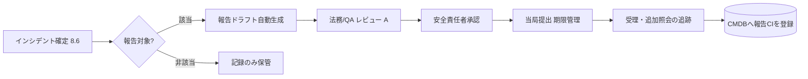

# 8.9 組織・プロセスとコンプライアンス

この節では、Closed-Loop を支える **組織・プロセスとコンプライアンス** を扱います。決定 × 役割の RACI 行列テンプレート、ASIL とリリースゲート基準の対応表、EU AI Act 対応、地域規制サマリ、トレーサビリティツール選定、構成管理データベース (CMDB; Configuration Management Database、構成要素とその関係を一元管理するデータベース) のスキーマ、規制報告ワークフローを整理し、最後に本書全体のまとめと巻末への橋渡しを行います。本書は法的アドバイスを提供するものではなく、各規格・法令の最新の原文と専門家の助言が必須である点を最初に明記します。

## 組織構造と RACI 行列

実世界展開には、モデル開発・DataOps / MLOps・プラットフォーム・運用・安全・セキュリティ・法務 / QA という多様なチームが関与します。決定の責任分担が曖昧だと、インシデント時に「誰が判断するか」が定まらず、ロールバック（第8.8節）が遅れます。決定種別 × 役割の **RACI**（Responsible: 実行責任者、Accountable: 説明責任者、Consulted: 相談を受ける者、Informed: 情報共有される者）をテンプレート化します。

| 決定 ＼ 役割 | モデル開発 | DataOps | 安全 | 運用 | 法務/QA |
|---|---|---|---|---|---|
| モデル変更の設計・実装 | R | C | C | I | I |
| データセット/ラベルポリシー変更 | C | R | C | I | C |
| リリースゲート基準の変更 | C | C | A | C | C |
| 本番フリートへの配信承認 | R | I | C | A | C |
| ロールバック発動（地域/グローバル） | C | I | A | R | I |
| 規制当局への報告 | I | I | C | C | A |

各決定の **A（説明責任者）は必ず 1 名**に定め、第8.8節の意思決定マトリクスのセルと整合させます。実務では「リリースゲート基準変更」のような分散合意が必要な決定もありますが、その場合も A は 1 名（典型的には安全責任者）に固定し、合意形成は CCB (Change Control Board、変更管理委員会。重要な変更を組織横断でレビュー・承認する会議体) や C 役の合議として明記して、最終的なサイン権限と責任は A に集約します。RACI は静的文書ではなく、新しい規制・組織変更に合わせて変更管理プロセス自体で更新します。

## 変更管理・レビュー・承認フロー

自動運転の変更管理 (change management) は、すべての変更を変更要求 (Change Request; CR、変更内容と影響評価をひとつの文書として承認・追跡する単位) に紐づけることが要点です。フローは、(1) CR 起票（目的・影響範囲・関連インシデント・リスク評価）、(2) 影響分析と計画、(3) 実装とレビュー（コード／モデル／データ）、(4) リグレッションテストとリリースゲート（第8.2節）、(5) CCB 判定、(6) 段階デプロイとフォローアップ、です。データ中心の観点では、**データセットバージョンとラベルポリシーバージョンも CR に含め**、「どのデータ変更がどのリリースに効いたか」を追跡可能にします。

## ASIL × リリースゲート基準の対応表

「規格名を並べる」だけでは運用できません。ISO 26262 [L1](references#l1) の **ASIL (Automotive Safety Integrity Level)** を、第8.2節のリリースゲート基準値に対応づけます（以下は設計指針の一例で、実プロジェクトは HARA に基づき自社で定義します）。

| ASIL | 代表機能 | オフライン指標ゲート | シナリオ網羅 | カナリア SPRT $\alpha$ | レビュー要件 |
|---|---|---|---|---|---|
| QM | 情報提示・快適系 | 回帰 ≤ 0 pt | 主要ODD | 0.05 | チーム内レビュー |
| A/B | 補助警報・軽度介入 | mAP 非劣化、誤報率上限 | 主要+夜間/雨天 | 0.05 | 安全 Consulted |
| C | 自動緊急ブレーキ等 | FN 率上限を厳格化 | ロングテール含む | 0.02 | 安全レビュー会 |
| D | 高速 ALKS・自動運転 | FN ≈ 0 目標、TTC 分布保証 | 網羅+インシデント由来 | 0.01 | CCB + 安全責任者承認 |

ASIL が上がるほどゲート基準と検定の保守性（$\alpha$ を小さく）を強め、シナリオ網羅をロングテール・インシデント由来まで拡張します。これにより第8.8節の SPRT パラメータと一貫した安全論証になります。

## 規制・標準の全体像

関連する規格・法令は、機能安全・SOTIF・サイバーセキュリティ・ソフトウェア更新・AI 規制の層に整理できます。

| 領域 | 規格/法令 | Closed-Loop への含意 |
|---|---|---|
| 機能安全 | ISO 26262 [L1](references#l1) | ASIL → ゲート基準、安全ライフサイクル |
| 意図機能の安全 | ISO 21448 SOTIF [L2](references#l2) | 「未知の未知」 → ロングテール収集（第4章） |
| サイバーセキュリティ | ISO/SAE 21434 [O7](references#o7), UNECE R155 [O2](references#o2) | OTA 署名・鍵管理（第8.4節） |
| ソフト更新 | UNECE R156 [O3](references#o3) | SUMS、配信記録・ロールバック記録 |
| 安全論証 | UL 4600 [L5](references#l5), GSN [L15](references#l15) | 監査可能な assurance case |
| AI 規制 | EU AI Act [L10](references#l10) | 高リスク AI の要求（次項） |

ここで SOTIF (Safety of the Intended Functionality) は ISO 21448 の英語呼称で、「意図した機能が想定外の状況で安全を損なわないこと」を扱う規格です。GSN (Goal Structuring Notation) は安全論証を「目標 → 戦略 → 証拠」のグラフで表す表記法で、UL 4600 などの assurance case 文書で広く使われます。

## EU AI Act への対応

EU AI Act（Regulation (EU) 2024/1689）[L10](references#l10) は AI を横断的にリスク分類する枠組みで、自動運転の安全関連 AI は高リスク (high-risk) に該当し得ます。条文逐次解説ではなく、Closed-Loop 運用への含意として整理します（法的助言ではありません）。

| AI Act の要求領域 | Closed-Loop での対応 | 関連節 |
|---|---|---|
| リスク管理システム | HARA・SOTIF とゲート設計の統合 | 第8.2節 |
| データガバナンス | データセット品質・代表性・バイアス管理 | 第3〜5章 |
| 技術文書・ログ保持 | 自動生成リリースノート・監査ログ | 第8.8節 |
| 透明性・記録 | モデル/データ/評価のトレーサビリティ | 本節 |
| 人間による監督 | 配信承認・ロールバック決定の人手関与 | 第8.7節 |
| 正確性・頑健性・サイバーセキュリティ | ドリフト監視・OTA セキュリティ | 第8.4〜8.5節 |

要点は、AI Act が求める「データガバナンス・記録保持・人間の監督」が、本書の Closed-Loop（データ品質管理・監査ログ・人手レビュー）と **構造的に整合する** ことです。ただし AI Act は ISO 26262 中心の安全設計と異なる軸（透明性・説明責任・バイアス監視・人間監督義務）を含むため、「構造的一致」は完全な代替ではありません。特に **(a) バイアス監視**（第5章のラベルバイアスと第8.5節のラベル分布ドリフトで補完）、**(b) 説明可能性 (XAI)**（本書では限定的に扱う）、**(c) "high-risk AI" の法的定義**（ASIL 分類とは別軸）の 3 点はギャップとして認識し、社内法務・外部弁護士と詳細を確認してください。既存規格（ISO 26262 / SOTIF / 21434）との重複を整理し、二重対応を避ける統合管理が現実的です。

## 地域規制サマリ

多市場展開では、地図・データ・走行に関する地域差を設計に織り込みます（公開情報に基づく概観であり、最新の原文確認が必須です）。

| 地域 | プライバシー/データ | 地図・データローカライゼーション等の論点 |
|---|---|---|
| EU | GDPR [L14](references#l14) / EU AI Act [L10](references#l10) | 越境転送制限、高リスク AI 要求 |
| 米国 | 州法（CCPA 等）、NHTSA SGO [R5](references#r5) | クラッシュ報告義務、州ごとの差 |
| 中国 | PIPL [L12](references#l12) | 地図測量資質、データの国内保存要件 |
| 日本 | 改正個人情報保護法 [L13](references#l13) | 越境提供の同意、JAMA ガイドライン [L11](references#l11) |
| 韓国 | PIPA | 地図反出規制等の論点 |

データローカライゼーションが課される地域では、第3章のストレージ階層・第2章のロギングポリシーをリージョン分割し、越境前に匿名化・選別する設計が要になります。

## トレーサビリティツールの選定

要件 → 設計 → 実装 → テスト → リリース → 運用データを一貫してリンクするツールを選定します。

| ツール | 強み | Closed-Loop での位置づけ |
|---|---|---|
| IBM DOORS / DOORS Next | 要件管理の定番、規格対応実績 | 安全要件 ↔ テストの追跡 |
| Siemens Polarion | ALM 統合、変更影響分析 | CR ↔ アーティファクト一元管理 |
| Jira + Xray/Zephyr | 軽量、開発フローと親和 | スプリント運用・チケット連携 |
| Codebeamer | 規格テンプレート充実 | ISO 26262 ライフサイクル |

選定軸は、(1) 規格テンプレートの有無、(2) データセット／モデルバージョンを成果物として扱えるか、(3) API で CMDB・実験管理・OTA と連携できるか、です。データ中心の運用では、コードだけでなく **データセット・ラベルポリシー・評価スイートも成果物**としてトレースできることが決定的です。OpenLineage（データの来歴を表すオープン仕様）と組み合わせ、データセット間の派生関係も同じ枠組みで記録すると、AI Act のデータガバナンス要件にも応えやすくなります。

## CMDB に持つべき項目と双方向トレース要件

構成要素（モデル・データセット・ソフト・ECU・OTA キャンペーン・規制成果物）とその関係を CMDB として一元管理します。インシデントから関連構成へ辿れることが、監査対応の生命線です。CMDB の最低限のスキーマ要素は次の 2 つに整理できます。

**構成アイテム（CI）テーブル**：1 行が 1 つの管理単位を表し、以下の属性を保持します。

| 属性 | 内容 | 例 |
|---|---|---|
| ci_id | 一意 ID。種別とバージョンを内包 | `model-v3.3.0`、`ds-2026w20`、`ota-camp-0142` |
| ci_type | 種別 | model / dataset / software / ecu / ota_campaign / doc |
| version | バージョン文字列 | `v3.3.0`、`2026.04` |
| asil | 該当機能の ASIL | QM / A / B / C / D |
| created_at | 登録時刻（タイムゾーン付き） | ISO8601 |
| metadata | 付帯情報（ハッシュ、SBOM 参照、署名鍵 ID、評価結果 ID 等） | JSON |

**関係 (ci_relation) テーブル**：CI 同士の有向関係を表し、親 CI・子 CI・関係種別の三つ組を主キーにします。関係種別は `trained_on`（モデル → データセット）、`deployed_via`（モデル → OTA キャンペーン）、`verified_by`（モデル → 評価スイート / 安全レビュー文書）、`derived_from`（派生関係）など、必要なものを定義しておきます。

**双方向トレース要件**：CMDB は「上から下」（モデルから関連データセットや評価スイートを引く）だけでなく、「下から上」（特定データセットを学習に使ったモデル一覧、特定 ECU に搭載されたソフトウェア一覧）の両方向のクエリを 1 ステップで返せることが要件です。実装担当者には、インシデント ID を起点として、関連モデル CI → 学習データセット → 評価スイート → OTA キャンペーン → 安全レビュー文書 までを一筆で辿るクエリと、その逆方向のクエリの両方をビュー（マテリアライズドビューでも可）として提供するよう依頼します。

`trained_on` / `deployed_via` / `verified_by` の 3 関係を最低限揃えれば、「あるインシデント → モデル → 学習データセット → 評価スイート → OTA キャンペーン → 安全レビュー文書」を一筆で辿れます。第8.8節の監査ログ `linked` フィールドは、この CMDB の `ci_id` を参照します。

## 規制報告ワークフロー

NHTSA SGO [R5](references#r5) のクラッシュ報告や各地域の届出など、規制報告は期限と書式が定められます。トリガから提出までを状態機械で運用し、第8.8節の監査ログを一次情報として自動集約します。

> **図 8.15**：インシデント確定から当局提出・追跡までの報告ワークフロー。ドラフトは監査ログと CMDB から自動生成し、法務 → 安全責任者の承認を経て提出、結果を構成アイテムとして登録します。ポイントは、**報告自体をトレーサブルな構成成果物**として残し、次の監査に備えることです。

## データ中心組織カルチャ

仕組みを支えるのは、インシデントを「個人のミス」でなく「システムとプロセス改善のためのデータ」として扱う **データ中心・Closed-Loop のカルチャ** です。データとログに基づいて議論し、安全への懸念を誰もが提起できる心理的安全性を確保し、ラベリング・評価・運用といった「裏方」にも十分な評価とリソースを割り当てます。本書が法的助言ではないことを改めて明記したうえで、規制対応もこのカルチャの上でこそ持続します。

## 技術設計と組織設計の不可分性（本書全体の締め）

本章を含めて本書を通じて繰り返し示してきたのは、Closed-Loop は技術アーキテクチャだけでも、組織プロセスだけでも閉じない、という構造的な事実です。RACI は「誰が決めるか」を明文化する組織設計の道具で、ASIL は「機能の安全度水準」を決める技術・規格上の分類で、CMDB は「構成要素と関係を機械的に追跡する」技術設計の中核ですが、この三者は実際の運用ではひとつの体系として絡み合います。RACI で説明責任者が 1 名に固定されていなければ、ASIL-D 機能のロールバック判断は会議の中で先送りされ、CMDB が「インシデントから学習データセットまでを一筆で辿れる」状態になっていなければ、その判断を支える一次情報が手に入りません。逆に CMDB がいかに精緻でも、RACI が曖昧なら情報は決定に変換されず、ASIL がいかに厳密でも、組織の決裁経路が滞れば技術的な安全要件は運用上の安全に落ちません。

本書が第 1 章から繰り返してきた「データ中心の Closed-Loop は技術と組織の重なりで初めて動く」という主張は、この第 8.9 節で最も具体的な姿を見せます。アーティファクト統合管理（第 8.1 節）はメタデータの規律という技術設計と、メタデータを必ず埋める運用文化という組織設計の重なりであり、ポリシー as Code（第 8.2 節）はゲート基準のコード化という技術と、基準を変更するときの承認プロセスという組織が表裏一体です。CI/CD の権限分離（第 8.3 節）は OIDC 短命クレデンシャルという技術と、署名要求者と承認者を分ける組織設計の組み合わせで、Uptane（第 8.4 節）は鍵階層という技術設計と、Root 鍵を動かす key signing ceremony という組織儀式の対です。3 層ドリフト監視（第 8.5 節）は統計手法の選定という技術と、参照分布の更新を承認する組織プロセスの両輪で、インシデント知識グラフ（第 8.6 節）はグラフ DB という技術と、auto / verified エッジを区別する人手レビュー組織の合作です。優先度スコア（第 8.7 節）は数式という技術設計と、重みを合意する経営・安全責任者の意思決定の重なりで、ロールバックと MRC（第 8.8 節）は状態機械という技術設計と、意思決定マトリクスという組織の権限地図の対応です。

「組織を動かすには技術設計と組織設計が分離不可能」という認識を欠いたまま、技術側だけで Closed-Loop を完成させようとすると、どこかで「最後は誰が判断するか」が決まらず止まります。逆に組織側だけで運用ルールを整えても、CMDB やレジストリのような技術基盤が情報の一次資料を提供できなければ、判断は印象論に堕します。本書が章ごとに技術と運用を交互に行き来してきたのは、両者が同時に整って初めて Closed-Loop が回る、という現実を反映しています。読者の現場で第 8 章の各要素を導入する際にも、技術側の実装と組織側の合意を別個のプロジェクトとして扱わず、ひとつの設計問題として進めることを強く推奨します。Closed-Loop が継続的に機能する組織は、技術と組織の対応関係を明文化し、片側だけが先行することを構造的に避けています。これが、データ中心の自動運転モデル開発を持続可能にする最後の前提条件です。

## 本節の振り返り

本節では決定 × 役割の RACI で説明責任者を 1 名に固定する組織設計から始め、ASIL をリリースゲート基準・SPRT パラメータに対応づけて安全論証を技術と組織の両面で一貫させる枠組みを示しました。EU AI Act の要求は本書の Closed-Loop（データガバナンス・記録保持・人手監督）と構造的に整合する一方、バイアス監視・説明可能性・"high-risk AI" の法的定義というギャップが残るため、ISO 26262 中心の安全設計だけでは満たせない領域があることを強調しました。CMDB と `ci_relation`（`trained_on / deployed_via / verified_by` など）の双方向トレースは、インシデントから関連モデル・データセット・評価スイート・OTA キャンペーン・規制成果物まで一筆で辿れる仕組みであり、規制報告を監査ログと CMDB から自動生成してトレーサブルな成果物として残すことで、当局照会への応答速度を組織の運用 KPI に変換できます。RACI・ASIL・CMDB の三者は技術設計と組織設計が分離不可能であることの最も具体的な姿です。

## 本章のまとめ

第8章では、Closed-Loop の最終段である実世界展開とフィードバックを通貫しました。モデル/アーティファクト管理と署名（8.1〜8.3）、Uptane と VIN ベースの OTA（8.4）、3層ドリフトと ML 監視（8.5）、インシデント収集と RCA（8.6）、優先度スコアと難例重み付けによる DataOps フィードバック（8.7）、SPRT と MRC を核としたロールバック・フェイルセーフ（8.8）、そして RACI・ASIL ゲート・EU AI Act・CMDB による組織とコンプライアンス（8.9）です。一貫する原則は、**運用で生まれたあらゆるシグナルを測定し、安全側の判断とともにデータとして開発へ還す** ことです。

## 巻末への橋渡し

第2章から第8章までで、収集・保存・選択・ラベリング・学習・シミュレーション・展開という Closed-Loop データエンジンの全周を一巡しました。本書が示したのは「モデルを一度作る」技術ではなく、「データを起点に改善し続ける」運用の設計です。本文中で参照した論文・規格・公開資料は、すべて巻末の参考文献（`manuscript/99_references/references.md`）に番号でまとめています。実装に踏み込む読者は、各節末の主要参考文献と巻末番号を突き合わせ、一次情報から検証を進めてください。本書は法的・規格上の助言を提供するものではないため、安全と法令に関わる判断は、必ず最新の原文と専門家の確認のもとで行うことを重ねて強調します。

## 本節の主な参考文献

ISO 26262 [L1](references#l1)、ISO 21448 SOTIF [L2](references#l2)、ISO/SAE 21434 [O7](references#o7)、UNECE R155 [O2](references#o2) / R156 [O3](references#o3)、UL 4600 [L5](references#l5)、GSN [L15](references#l15)、EU AI Act [L10](references#l10)、GDPR [L14](references#l14)、PIPL [L12](references#l12)、改正個人情報保護法 [L13](references#l13)、JAMA ガイドライン [L11](references#l11)、NHTSA SGO [R5](references#r5)。
