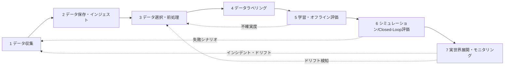
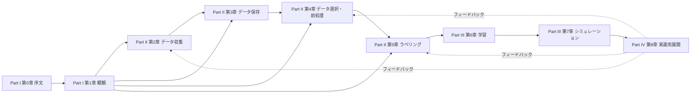
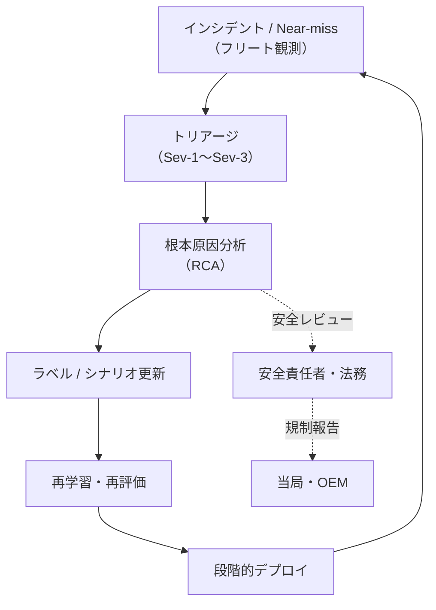

# 序文と本書の読み方

本章は、本書全体の地図にあたります。「データ中心 (data-centric)」と「Closed-Loop（閉ループ；実運用ログから学習・評価へ循環するワークフロー）」がなぜ今、自動運転モデル開発の中心命題なのかを最初に共有します。続いて本書のゴールと非ゴール、想定読者、章構成、安全文化、用語規則、フィードバック手段を整理します。読み終えたとき、読者が「自分はどこから読み、何を持ち帰ればよいか」を判断できる状態になることを目指します。

---

## 0.1 なぜ今「データ中心の Closed-Loop 自動運転モデル」なのか

### 自動運転スタックは性能上限に近づいている

自動運転分野では、2010 年代後半から、画像認識・センサフュージョン (sensor fusion; 複数センサの統合)・経路計画 (motion planning) の各タスクで、深層学習に基づくモデルが急速に普及してきました。BEV (Bird's-Eye View; 鳥瞰視点) 表現 [P2](references#p2)、Transformer ベースの時空間モデル、End-to-End Planning [P11, P12]、世界モデル (world model; 環境ダイナミクスを生成的に予測するモデル) [W1, W3] など、モデル側の革新は今も続いています。

しかしその一方で、公開ベンチマーク上の性能向上幅は明確に逓減しつつあります。たとえば nuScenes [P6](references#p6) のカメラのみ 3D 物体検出（camera-only track）では、2022 年の BEVFormer [P2](references#p2) が NDS（nuScenes Detection Score; 検出精度の総合指標）約 0.56 を達成しました。続いて 2023 年の StreamPETR [P19](references#p19) 系が 0.63〜0.65 に到達して以降、毎年の改善は 0.01〜0.02 ポイントの単位に縮小しています（同一モダリティ・同一トラック内の比較）。LiDAR を加えた融合系はさらに高い水準にありますが、いずれのトラックでも近年の年次改善幅は逓減傾向です。同様の傾向は Waymo Open Dataset [P7](references#p7)、Argoverse 2 [P8](references#p8)、BDD100K [P9](references#p9) でも観測されています。

こうした状況を整理したサーベイ [S1, S2] によれば、「閉じた社内スタックのアルゴリズム改善だけでは自動運転の性能上限を大きく引き上げることが難しい。ブレイクスルーには『データ』に関する技術革新が不可欠である」という認識が、産業界とアカデミアをまたいで共有されつつあります。すなわち、ネットワークを深く・大きくしたり、新しい損失関数を導入することではなく、**「どのようなデータを、どのようなループの中で集め・加工し・再利用するか」という設計そのもの** が、新しい競争領域です。

### ロングテールという厳然とした分布

自動運転システムが直面する環境は、本質的に強いロングテール (long-tail; 頻度は低いが種類は多い分布の裾) を持ちます。日中の晴れた高速道路のような頻出シーンと、吹雪の夜間に複雑な交差点で緊急車両が接近してくるような希少シーンでは、頻度も条件もまったく異なります。RAND Corporation のレポート [R6](references#r6) によれば、人間ドライバ並の死亡事故率（米国で約 1 億マイルあたり 1.09 件）を統計的有意に下回ることを示すには、フェイルセーフを含む実車走行で **数億マイルから数十億マイルの走行データ** が必要とされます。これだけの距離を実走行のみでカバーすることは現実的ではありません。ロングテールに対しては「集めて学ぶ」だけでなく、「合成して学ぶ」「再現して評価する」ことが避けられません。

また、商用フリート（量産車両群）では「今日のロングテール」が翌年には「よくあるシーン」になることもあります。新しい信号機のデザイン、マイクロモビリティの普及、新しい交通ルールなど、環境が変化するとともに、まれな事象の中身も入れ替わります。データ中心 (data-centric) 開発では、ロングテールを **固定リスト** として扱うのではなく、**継続的にアップデートされる動的な関心リスト** として扱います。

### Big Data System × Data Mining × Closed-Loop の三層

サーベイ [S2](references#s2) は、自動運転のデータ中心進化を「Big Data System」「Data Mining」「Closed-Loop Technologies」の 3 層で整理しています。本書の章構成もこの 3 層と緩やかに対応します。

- **Big Data System**：大規模フリートから流入するセンサログを保存・索引・検索するためのデータレイク (data lake; 構造化前のデータを大規模に保管する基盤)、分散ストレージ、メタデータ管理、ストリーム処理基盤など。本書では第3章で詳述します。
- **Data Mining**：そのインフラ上で、希少事象の探索、分布のカバレッジ分析、シーンクラスタリング、難例 (hard case; モデルが誤りやすいサンプル) の自動抽出を行う技術群。本書では第4章で扱います。
- **Closed-Loop Technologies**：実運用ログ → データマイニング → ラベリング → 再学習 → シミュレーション → 段階的ロールアウト → さらなるログ収集、というループを自動化または半自動化する技術群。本書では第5〜8章を貫く視点として扱います。

### 静的データセットからフリートスケール Closed-Loop へ

自動運転研究の初期、KITTI [D2](references#d2) や Cityscapes [D1](references#d1) や nuScenes [P6](references#p6) のような **静的データセット (static dataset)** が、モデル開発と評価の中心的な役割を果たしてきました。一度収集・公開されたデータを多くの研究者が共有し、その上でモデルを競うアプローチです。研究の比較可能性は高く、再現性の担保にも貢献しました。

しかし、商用フリートを前提とする現代の自動運転開発では、**フリートスケール Closed-Loop** が主流になっています。Waymo は公開資料 [R1](references#r1) で、800 万マイル超のシミュレーションと 700 万マイル超の公道走行を組み合わせて評価していると明らかにしました。Tesla は AI Day 2022 [D10](references#d10) で、複数走行ログを統合する Multi-Trip Reconstruction（複数回走行の統合再構成）による 3D オートラベリングと、誤検出シーンを再学習に投入する Closed-Loop パイプラインを公開しました。Mobileye も REM (Road Experience Management; 量産フリートからの匿名化テレメトリを地図と知覚に還元する仕組み) を長く運用しています [R4](references#r4)。

つまり、データセットは固定された静的資産ではなく、**時間とともに成長・変化する動的な資産** として扱うことが標準になりつつあります。新しい地域への展開、新センサ構成の導入、新機能のリリースに応じて、収集・ラベリング・学習・評価のポリシーも更新していきます。

### 本書を貫く視点

以上のような背景から、本書では「データ収集・保存・選択・ラベリング・学習・シミュレーション・実運用」という一連のプロセスを、**Closed-Loop データエンジン** として一体的に扱います。各ステージを単体で最適化するのではなく、ループ全体としての学習速度、安全性、説明可能性、運用効率をどう高めるかを議論します。これが本書のスタンスです。

> **図 0.1**：本書で扱う 7 段階 Closed-Loop データエンジン。直線的な「パイプライン」ではなく、各ステージから複数の経路で前段にフィードバックが戻る点が要諦です。本書では、この実線と点線をすべて議論の対象にします。

---

## 0.2 本書のゴールと非ゴール

### ゴール

本書の主なゴールは、読者が次の能力を身に付けることです。

- 自動運転モデル開発における **データ中心・Closed-Loop な改善サイクル** を、概念ではなく具体的なワークフローとして設計できるようになる。
- データ収集、アノテーション、学習、評価、シミュレーション、実運用、フィードバックの各段階に存在する課題と代表的なパターンを理解し、自分のプロジェクトの状況に合わせた改善策を検討できるようになる。
- モデルの性能指標だけでなく、データの質や分布、シーンカバレッジ、テストシナリオの網羅性といった **データ中心の指標** を用いて、チームやステークホルダーと議論できるようになる。
- 本文中の擬似コードや指標定義を出発点に、自組織のインフラやツールチェーンに適合する形で **Closed-Loop データエンジンのプロトタイプ** を構築できるようになる。

### 非ゴール（本書で扱わないこと）

| 領域 | 本書での扱い | 該当する補完文献 |
|---|---|---|
| 自動車工学全般（車両制御・パワートレイン・車体・UI/UX） | 必要箇所のみ参照 | 自動車工学便覧（自動車技術会） |
| ISO 26262 / SOTIF / UL 4600 の条文逐次解説 | 第7・8章で「データ・モデル観点で必要な範囲」のみ言及 | 規格本体 [L1, L2, L5] |
| チップ設計・OS カーネル最適化 | 第6章でモデル圧縮・推論最適化の観点のみ | NVIDIA / Mobileye の公式ドキュメント |
| 全領域共通の万能レシピ | 提示しない（代表的な選択肢とトレードオフを示す） | — |
| 法的アドバイス | 提示しない（地域別規制の **構造と読み方** のみ整理） | 各地域の法務専門家 |

> 本書は **Closed-Loop × データ中心** という視点から見た自動運転モデル開発の実務ガイドであり、すべての領域を網羅する百科事典ではありません。その分、データとフィードバックループに関する部分には、できる限り具体的・実務的な情報を集中させる方針を採ります。

---

## 0.3 想定読者と前提知識

### 想定読者

| 読者像 | 期待する持ち帰り | 主に重点を置く章 |
|---|---|---|
| 自動運転 / ADAS / モビリティの **ML エンジニア** | モデル設計と Closed-Loop の連携、最新アーキテクチャの位置づけ | 第1, 4〜7章 |
| **データエンジニア / SRE** | フリートスケールでのデータレイク・ストレージ・メタデータ管理、コスト最適化 | 第2, 3, 6.7, 8.3〜8.5章 |
| **アノテーション / ラベリングオペレーション** | ラベルポリシー、品質指標、オートラベリング、ベンダー管理 | 第5章 |
| **シミュレーション / 検証エンジニア** | シナリオ DB、Closed-Loop SiL、世界モデル評価、SOTIF 整合 | 第7章、第8.2節 |
| **テクニカルリード / プロダクトマネージャ** | 7 段階全体の俯瞰、組織・プロセス・規制対応 | 第1, 0.4, 8.9章 |
| **安全・コンプライアンス担当** | データガバナンス、UNECE R155/R156、EU AI Act、地域差 | 第2.8〜2.9, 3.8, 8.9章 |

### 前提知識

本書はおおむね次のレベルを前提とします。完全に未習の場合は、本書と並行して入門書を一冊読み通すことを推奨します。

- **Python** によるプログラミング経験。NumPy・PyTorch（または TensorFlow）の基本操作。
- **教師あり学習の基本**：データセット分割、損失関数、評価指標、過学習。
- **線形代数・確率統計の基礎**：ベクトル・行列演算、期待値・分散、基本的な確率分布。
- **自動運転の最低限の用語**：SAE J3016 [L7](references#l7) のオートメーションレベル、ODD（Operational Design Domain）、知覚 / 予測 / 計画 / 制御の役割分担。これらは 0.7 節（用語・略語・記号の約束）と巻末参考文献の用語集（`manuscript/99_references/references.md` の「M. 用語集」節）で簡単に整理しています。

なお、本書では BEV (Bird's-Eye View)・Occupancy・Foundation Model といった概念は **第1章で改めて導入** します。0.3 節時点で詳しい説明は不要ですが、これらの用語に強い違和感があるようなら、第1章を 1 度通読してから第2章以降に戻る読み方を勧めます。

---

## 0.4 本書全体の構成と読み進め方

### 全体構成

本書は、概念と全体像を扱う **Part I**、データ収集から実運用までの各フェーズを詳しく扱う **Part II〜IV** に分かれています。

> **図 0.2**：章間の主な依存関係。実線は順序的な前提関係、点線は Closed-Loop におけるフィードバック経路です。

### 7 段階 Closed-Loop データエンジンと章対応

| 段階 | 内容 | 章 |
|---|---|---|
| (I) | データ収集（ODD・フリート・センサ・トリガ） | 第2章 |
| (II) | データ保存・インジェスト（データレイク・メタデータ） | 第3章 |
| (III) | データ選択・前処理・データセット設計 | 第4章 |
| (IV) | データラベリング・オートラベリング | 第5章 |
| (V) | モデル学習・オフライン評価 | 第6章 |
| (VI) | シミュレーション / Closed-Loop 評価 | 第7章 |
| (VII) | 実世界展開・オンライン評価・フィードバック | 第8章 |

### ロール別の読み進めパス

| ロール | 推奨パス（◎ = 重点読了、○ = 参照、△ = 概要のみ） |
|---|---|
| ML エンジニア | 第0章○ → 第1章◎ → 第4章◎ → 第5章○ → 第6章◎ → 第7章◎ → 第8.5節○ |
| データエンジニア / SRE | 第0章○ → 第1.4節◎ → 第2章◎ → 第3章◎ → 第4章○ → 第6.7節○ → 第8.3〜8.5節◎ |
| アノテーション / ラベリング | 第0章○ → 第4章○ → 第5章◎ → 第6.8節○ |
| シミュレーション / 検証 | 第0章○ → 第1章○ → 第4.9節○ → 第7章◎ → 第8.2節◎ → 第8.6節○ |
| テックリード / PM | 第0章◎ → 第1章◎ → 第4章△ → 第8.9節◎ → 各章末まとめ |
| 安全・コンプライアンス | 第0.5〜0.6節◎ → 第2.8〜2.9節◎ → 第3.8節◎ → 第7.9節◎ → 第8.9節◎（0.5 節は実車適用免責、0.6 節は安全文化） |

### 学習時間の目安

| 章 | 想定読了時間 | 難易度 |
|---|---|---|
| 第0章 序文 | 約 40 分 | ★☆☆ |
| 第1章 概観 | 約 2 時間 | ★★☆ |
| 第2章 データ収集 | 約 3 時間 | ★★☆ |
| 第3章 データ保存 | 約 3 時間 | ★★★ |
| 第4章 データ選択・前処理 | 約 4 時間 | ★★★ |
| 第5章 ラベリング | 約 3 時間 | ★★☆ |
| 第6章 モデル学習 | 約 5 時間 | ★★★ |
| 第7章 シミュレーション | 約 4 時間 | ★★★ |
| 第8章 実運用展開 | 約 4 時間 | ★★★ |

---

## 0.5 実車適用に関する注意事項と免責

本書のデータパイプライン・モデル構成・評価方法は、あくまで一般的な技術情報と公開事例に基づくものであり、特定の国・地域の法令、規格、ガイドラインへの完全な適合を保証するものではありません。本書は **法律・規格・認証に関する専門的助言（legal advice）を提供するものではなく**、実際の運用にあたっては、必ず各組織の法務・安全・認証の専門家と相談してください。

特に次のチェックリストは、実装前後で読み返すことを強く推奨します。

| 観点 | 確認項目 |
|---|---|
| 規格適合 | ISO 26262 [L1](references#l1) の ASIL 分類、ISO 21448 [L2](references#l2) (SOTIF) の意図機能限界、UL 4600 [L5](references#l5) のセーフティケース |
| 法規制 | UNECE R155 / R156 [O2, O3]、SAE J3018 [L8](references#l8)、EU AI Act [L10](references#l10)、改正個人情報保護法 [L13](references#l13)、PIPL [L12](references#l12)、GDPR [L14](references#l14) |
| 検証 | 多層的な検証（オフライン指標 → SiL → HiL → クローズドコース → 公道）と段階的ロールアウト |
| データ品質 | ロングテールを多段で検証、合成データ依存度の透明化、再現性のあるデータセットバージョン |
| 組織 | 安全文化・責任分担・インシデント学習サイクル（0.6 節） |

データ中心アプローチは、適切に運用することで安全性向上に寄与しますが、不十分な検証や偏ったデータに基づく更新は、かえってリスクを増大させます。本書で紹介する指標・ワークフローは、その多層的な検証を設計しやすくするためのヒントを提供することを意図しています。

著者および関係者は、本書の内容をもとに構築されたシステムの利用・運用結果について、いかなる直接的・間接的な損害も保証しません。

---

## 0.6 フィールドでの安全文化と責任の所在

データ中心の開発では、「どのデータを集め、どのケースを学習・評価対象とし、どのような失敗事例をどの頻度でレビューするか」という意思決定そのものが、安全性に直接的な影響を与えます。技術的最適化のためのツールである前に、これらは **安全文化の表現** でもあります。

> **図 0.3**：インシデントから安全文化へつながる Closed-Loop。技術プロセスが組織の判断・責任のフローと連動していることが要点です。

各組織で次の問いに合意できている状態を目指します。

- どのような near-miss イベントが自動的にフラグされるべきか。そのしきい値や検出ロジックは誰が設計し、誰がレビューするのか。
- 危険度の高いシナリオの **トリアージ SLA**：Sev-1（重大、即時介入が必要だった）24 時間以内、Sev-2（潜在的に危険）7 日以内、Sev-3（情報共有レベル）30 日以内、など。
- 新しいモデルをロールアウトする際の **リリース判断者** と署名（最終責任）。
- 実運用中の問題発生時の **ロールバック / 機能制限手順** と、当局・ユーザへの説明責任。

これらの問いに対する答えは、第8.6〜8.9 節で具体的なテンプレートとして示します。

---

## 0.7 用語・略語・記号の約束

### 表記ルール

- 主要な技術用語は、初出時に **日本語 (English)** の形で併記します。例：センサフュージョン (sensor fusion)、Closed-Loop（閉ループ）、運用設計領域 (Operational Design Domain; ODD)。
- モデル名・アーキテクチャ名（BEV、Transformer、UniAD、GAIA-1 など）は原語で表記します。
- 略語は章内で初出時にフルスペル＋略語を併記し、以降は略語を用います。
- 表記ゆれを避けるため、本書では一貫して **「Closed-Loop」** と表記します（過去の節原稿で混在していた「閉ループ」「closed-loop」は本版で統一）。

### 引用形式

- 本文中の参考文献は `[P11](references#p11)`（論文）、`[L1](references#l1)`（法規格）、`[O2](references#o2)`（OTA 関連）など、巻末参考文献（`manuscript/99_references/references.md`）と一致するアルファベット＋番号で示します。
- 同一節内で複数を併記するときは `[P2, P11, P12]` のようにまとめます。
- 規格は条文番号まで指定する場合 `ISO 26262 [L1](references#l1) Part 6, §7` のように補足します。
- 公開ウェブ資料は URL を巻末側にのみ記載し、本文は番号引用に絞ります。

### 数式と図記号

- 数式は必要最小限とし、データ分布・フィードバックループ・統計的推定の **意味** を強調します。
- Mermaid の図記号は次の慣行に従います：四角＝処理／コンポーネント、丸＝状態、菱形＝判断、実線＝順方向の依存、点線＝フィードバック・通信。

---

## 0.8 オープンデータセット早見表

第二版で新設した節です。本書で頻繁に参照する公開データセットを、ODD・センサ・規模・ライセンスの観点で対比します。詳細は各章で参照してください。

| 名称 | 発表年 | 主な ODD | 主なセンサ | 規模 | ライセンス |
|---|---|---|---|---|---|
| KITTI [D2](references#d2) | 2012 | ドイツ・カールスルーエ近郊 | 2 cam, Velodyne HDL-64E, IMU/GPS | 約 22 シーン、6 h | 非商用研究 |
| Cityscapes [D1](references#d1) | 2016 | 50 都市（ドイツ・ヨーロッパ） | ステレオカメラ | 5,000 fine + 20,000 coarse | 学術利用 |
| BDD100K [P9](references#p9) | 2018 | 米国（多地域・時間帯・天候） | 単眼カメラ | 100k 動画 / 10 タスク | ライセンス契約 |
| nuScenes [P6](references#p6) | 2019 | ボストン・シンガポール | 6 cam, 1 LiDAR, 5 Radar | 1,000 シーン、20 s | CC BY-NC-SA 4.0 |
| Waymo Open Dataset [P7](references#p7) | 2019- | 米国（複数都市） | 5 cam, 5 LiDAR | 1,950 セグメント、20 s | カスタム（研究） |
| Lyft Level 5 [D4](references#d4) | 2019 | 米国カリフォルニア | LiDAR + cam | 16k シーン | 研究 |
| A2D2 [D3](references#d3) | 2020 | ドイツ（高速・市街地） | 6 cam, 5 LiDAR | 400k フレーム | CC BY-ND 4.0 |
| Argoverse 2 [P8](references#p8) | 2021 | 米国 6 都市 | 多モーダル / Motion / Map | 1,000 シーン (Sensor) | CC BY-NC-SA 4.0 |
| ONCE [P10](references#p10) | 2021 | 中国（一般道・夜間含む） | 7 cam, 1 LiDAR | 1M シーン | カスタム |
| Occ3D-nuScenes [P13](references#p13) | 2023 | 上記 nuScenes 拡張 | 占有グリッド GT | nuScenes 互換 | CC BY-NC-SA 4.0 |

> 本表はあくまで主要な参考点で、実プロジェクトでは社内データを中心に据え、各データセットを **学術ベンチマーク** または **不足セグメントの補完** として用いるのが一般的です。商用データやクラウドソーシングデータの扱いは第4.10 節（データガバナンス）で述べます。

---

## 0.9 謝辞・フィードバックの方法

本書の内容は、自動運転・ロボティクス・機械学習コミュニティにおける議論や公開事例、論文、カンファレンス発表から大きな影響を受けています。データ中心・Closed-Loop は特定企業のものではなく、コミュニティ全体で試行錯誤が続いているテーマです。

読者からのフィードバックは、本書自身を Closed-Loop で改善する貴重なシグナルです。次の窓口でお寄せいただけると幸いです。

- 本書サポートサイトの GitHub Issue（ラベル：`errata` / `proposal` / `case-study`）
- 改訂計画：誤植・小修正は **四半期に 1 度** のオンライン Errata で反映、内容追加・新節は **年 1 回の改訂版** にまとめる予定です。Issue の一次トリアージは著者が 7 日以内、優先度の高いセキュリティ・安全関連は 48 時間以内を目安に対応します。
- 内容そのものの提案には、可能なら関連する公開資料・論文番号を添えていただけると、本書側の調査時間を短縮できます。

---

## 本章の振り返り

序章は、本書をどう「使う」かを決めるための地図でした。ここでもう一度立ち止まって考えたいのは、**自動運転書籍を読む読者が陥りがちな最初の罠** です。多くの読者は「最新モデルアーキテクチャの章」から読み始めたくなります。しかし本書の主張は、自動運転の性能上限は最新モデルではなく、その **モデルを取り囲むデータ・評価・組織のループ全体** で決まる、というものです。したがって、ロール別パス（0.4 節）に従って読み進める順序自体が、読者の世界観を形づくります。データエンジニアが第6章のモデル学習を斜め読みすることや、ML エンジニアが第3章のデータレイク設計を「インフラの話」として飛ばすことは、本書の意図に照らせばどちらも望ましくありません。隣接領域への意識的な踏み込みが、Closed-Loop を回せるエンジニアに必要な姿勢です。

もう一つ強調したいのは、安全文化と責任分担（0.6 節）が **技術書の枠から外れた話題ではない** という点です。「どのデータをどの粒度で集め、どの失敗を学習対象とするか」という意思決定は、エンジニアリングの判断であると同時に倫理と責任の表明でもあります。Sev-1 が起きたとき誰が判断するか、ロールバックの権限は誰にあるかが事前に合意されていない組織では、データ中心 Closed-Loop はインシデント発生時に必ず止まります。本書を読みながら、この組織的合意の土台を社内で並行して整えていくことを強く勧めます。

### 次章で扱うこと

第1章では、本書全体の俯瞰として、自動運転スタックの3類型（モジュラー型 / BEV 統合型 / End-to-End 型）、世界モデル・Foundation Model のグローバルトレンド、DataOps / MLOps の全体アーキテクチャ、そして主要プレイヤー（Tesla / Waymo / Mobileye / Cruise / Zoox / 中国 OEM）の取り組みを比較しながら、本書で前提とする「Closed-Loop データエンジン」の輪郭を完全に描き切ります。
