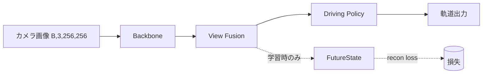

# アーキ図のコード同期（Mermaid/可視化）

## ひとことで言うと
モデルの構造を説明する図(どの部品がどの部品につながっているか)を、手描きの画像ではなく「コードから生成される図」にしようという設計運用の話です。図をコードに同期させれば、コードを変えたとき図も更新でき、図が古いまま放置されて実態とずれる問題(陳腐化)を防げます。図そのものをテキストで書く方式(diagram as code)と、ソースコードから構造を自動抽出する方式の2系統があります。

## 直感的な理解
機械学習モデルの設計は、論文や README に1枚のアーキテクチャ図 — 部品どうしのつながりを矢印で描いた図 — として載るのが普通です。この図は「全体がどう組み合わさっているか」を一目で伝える、極めて価値の高い資料です。文章を100行読むより、矢印1本のほうがデータの流れを早く伝えます。

ところが図には深刻な弱点があります。陳腐化です。図の多くは PowerPoint や draw.io で手描きされた PNG 画像として保存されます。コードは日々変わるのに、画像は誰かが手で描き直さない限り変わりません。結果として「README の図ではカメラ入力だけだが、実際のコードは LiDAR も使っている」といった食い違いが生まれ、新しく入った人が図を信じて混乱します。図はコードのコメントと同じで、メンテナンスされないと静かに嘘をつき始めます。

この問題の根は、図が「コードという真実」とは別の場所に、別の形式で、別の更新タイミングで存在することにあります。ならば図をコード側に寄せ、できれば図をコードから生成してしまえば、ずれようがない — これが「図をコードと同期させる」発想です。

## 基礎: 前提となる概念
- 陳腐化(documentation drift): ドキュメント(図・コメント・README)がコードの変化に追従できず、実態と乖離していく現象。ソフトウェア工学の古典的な悩みです。
- single source of truth(信頼できる唯一の情報源): 同じ情報を複数箇所に重複させず、1か所だけを「正」とする原則。図とコードが二重に存在すると必ずずれるので、どちらかを唯一の源にする。
- diagram as code(図をコードとして書く): 図を画像ではなくテキストの記述で表す方式。テキストなので git で差分管理でき、レビューでき、CI(変更のたびに自動チェックする仕組み)で検査できます。Mermaid や PlantUML が代表例。
- Mermaid: Markdown 中にテキストで図を書ける記法。`A --> B` と書くだけで「A から B へ矢印」が描けます。GitHub の Markdown レンダラが標準対応しているため、README に書いた図がそのまま描画されます。
- AST(Abstract Syntax Tree, 抽象構文木): プログラムのソースコードを「実行せずに」構文の木構造として表したもの。`import ast; tree = ast.parse(source)` のようにして、クラス定義・属性への代入・関数呼び出しの順序などを、コードを動かさずに取り出せます。
- 中間表現(IR, Intermediate Representation): 元のソースと最終的な図の間に置く、構造化された中間データ(典型的には JSON)。「何と何がつながっているか」を機械可読な形で持ち、そこから図をレンダリングします。

## 仕組みを詳しく
図をコードと同期させる実装は、おおむね「テキストで図を書く」方式と「コードから図を抽出する」方式に分かれ、両者を組み合わせることもあります。

### 方式A: テキストで図を書く(diagram as code)
Mermaid の最小例です。

`-->` が実線の矢印、`-.text.->` がラベル付きの点線矢印です。このテキストを git に置けば、図の変更も差分として残り、PR でレビューできます。利点は「人が意図を込めて描ける」こと。欠点は「コードが変わっても図のテキストは自動では変わらない」ので、結局は手で同期させる規律が要る点です。

### 方式B: コードから自動抽出する
こちらは原理的に図とコードがずれません。抽出には2系統あります。

1. 動的グラフ抽出(実行ベース): モデルを実際に動かし、テンソルが流れる演算グラフを記録する。PyTorch なら torch.fx でグラフを取る、torchview / torchinfo で層構成を可視化する、Netron で保存済みモデルを表示する、といった既存ツールがあります。長所は「実物の正確なグラフ」が取れること。短所は (a) モデルが動く状態(依存ライブラリ・入力データが揃っている)を要求すること、(b) 出てくるのが人間に読みやすい高レベルの設計図ではなく、無数の低レベル演算ノードの羅列になりがちなことです。研究用のモデルコードは依存不足やデータ未配置で「そのままでは動かない」ことが多く、動的抽出が使いにくい場面が珍しくありません。

2. 静的抽出(AST ベース): ソースを実行せずに AST で読み解く。`class XxxModel(nn.Module):` というクラス定義、`self.backbone = Backbone(...)` という部品の登録、`forward` の中の呼び出し順などを、コードを動かさずに取り出せます。実行不要なので、動かないコードからでも構造を取れるのが最大の利点です。短所は、AST では取れない「意味」がある点です。たとえば「この枝は `if self.training:` の中だけで実行される(学習時専用)」「複数テンソルが1つの融合ブロックに concat される」「このヘッドの出力は target と比較されて loss になる」といった関係は、構文だけからは判別しにくい。

### 方式Bの発展: AST + LLM の意味付け
近年は、AST が機械的に取った事実(クラス・部品・呼び出し順)と、ソース本文・設定情報を大規模言語モデル(LLM)に渡し、上記のような「人がコードを読んで初めて分かる意味」を補わせて中間表現(IR JSON)を生成させる手法が登場しています。生成された IR は plain JSON なので、タイトルやテンソル shape、矢印を手で微調整して再レンダリングできます。出力を依存ライブラリ不要の単一 HTML(SVG 埋め込み)にすれば、論文や README の隣にそのまま置けます。たとえば、左に入力(カメラ・自車運動・履歴)、中央にデータの流れ(backbone → fusion → policy)、右に出力と損失を並べ、自己教師ありの学習時専用の枝を「学習時のみ」という帯で囲って区別する、といった論文風の高レベル図が作れます。

なぜこの組み合わせなのか。AST だけでは「学習時専用の枝」を見落とし、動的抽出だけでは「低レベルすぎて読めない」。両者の弱点を、AST の正確さ + LLM の読解力で補い合うのが狙いです。

## 手法の系譜と主要論文
これは特定の1論文というより、ソフトウェア工学の「ドキュメントとコードの乖離」という古典問題と、その対策の系譜です。

- Literate Programming(Donald Knuth, 1984, The Computer Journal)。コードとドキュメントを1つのソースから生成し、両者がずれない世界を目指した先駆けです。「プログラムは人間に読ませる文章であり、付随的にコンピュータが実行する」という思想で、本トピックの精神的源流にあたります。

- "A Rational Design Process: How and Why to Fake It"(Parnas & Clements, 1986, IEEE TSE)。設計ドキュメントは実際の試行錯誤と乖離しがちだが、最終形を「あたかも合理的に設計したように」整えて維持すべきだと論じました。ドキュメントを生きた成果物として保つ必要性の議論につながります。

- Mermaid(オープンソース、2014年頃から)。Markdown 中にテキストで図を書ける記法。GitHub が標準でレンダリングするため一気に普及しました。提案理由は「画像はレビューも差分も取れないが、テキストの図なら取れる」こと。トレードオフは、複雑で細かいレイアウト調整は手描き画像ほど自由が利かない点です。

- PyTorch のグラフ可視化ツール群(Netron, torchview, torchinfo, torch.fx, TensorBoard の add_graph)。いずれも「実物のグラフを正確に出す」ことを提案します。トレードオフは、実行が必要で、かつ出力が人間に読みやすい高レベル設計図ではなく低レベル演算ノードの羅列になりがちな点です。AST + LLM 方式は、この弱点をソース読解で埋めようとする新しい流れです。

系譜を一言でまとめると、Knuth の文芸的プログラミングが「コードとドキュメントを1つの源から」という理想を示し、Mermaid が「図をテキストで差分管理する」実用解を広め、可視化ツール群が「実物から自動抽出する」道を開き、最近は「AST + LLM で動かないコードから高レベル図を作る」方向へ発展している、という流れです。

## 論文の実験結果(定量データ)
この分野は精度ベンチマークになじみにくいですが、関連する定量的知見はあります。

- ドキュメント乖離の実態調査(例: コメントとコードの不整合を調べた一連の実証研究)では、成熟したオープンソースプロジェクトでも一定割合のコメントが対応コードと不整合になっている、と報告されています。研究によって数値は幅がありますが、「ドキュメントは放置すると確実にずれる」ことは繰り返し観測されています。これが「自動同期」を志向する動機の数値的裏づけです。

- 図の自動生成・自動抽出ツールの評価は、主に「人手で描いた図とどれだけ一致するか(精度・再現率)」や「生成にかかる時間」で測られます。AST ベースの静的抽出は、クラス・部品・呼び出し関係といった構文的に明確な要素についてはほぼ100%の再現が可能な一方、「学習時専用の枝」「損失への接続」のような意味的な関係では取りこぼしが出る、という質的な評価が一般的です。LLM を併用するとこれらの意味的要素の捕捉率は上がるものの、誤った関係を生成する(ハルシネーション)リスクが残り、人手レビューが依然必要、という報告です。

指標の意味を補足します。精度(precision)は「生成した矢印のうち正しいものの割合」、再現率(recall)は「本来あるべき矢印のうち拾えたものの割合」で、いずれも高いほど良い。自動抽出系は構文的要素で高い再現率を出せても、意味的要素では取りこぼし(再現率低下)や誤生成(精度低下)が起きうる、というのがこの分野の定量的な現状理解です。

## メリット・トレードオフ・限界
メリット
- 図がコードと同期し、陳腐化しにくい。新規参加者が信頼して図を読める。
- テキスト(Mermaid や IR JSON)で差分管理・レビュー・CI 検査ができる。
- 静的抽出(AST ベース)はモデルを実行しないので、依存不足で動かない研究コードからでも図を作れる。
- IR を JSON で持てば、自動生成した図を人が後から微調整できる(自動と手動のいいとこ取り)。

トレードオフ・限界
- LLM による意味付けは誤ることがある(学習時専用の枝を見落とす、ありもしない接続を描く)。生成図のレビューは依然必要。
- 完全自動抽出は低レベルになりがちで、人が見たい高レベル設計図にするにはルール・LLM・手調整が要る。
- テキスト記法(Mermaid)は細かなレイアウト自由度で手描き画像に劣り、図が複雑になるほど可読性の調整が難しい。
- 「CI で図とコードの同期を強制する」運用を全面的に定着させるには規律と仕組みづくりのコストがかかり、提案段階に留まりやすい。
- どの抽象度で図を描くか(演算単位か、設計ブロック単位か)に唯一の正解がなく、目的ごとに作り分けが必要。

## 発展トピック・研究の最前線
- IR の標準化: モデル構造を表す中間表現(ONNX のグラフ、torch.fx の GraphModule など)を共通基盤とし、そこから複数の図を生成する流れ。
- LLM によるコード理解の高度化: コード専用 LLM がコールグラフや条件分岐をより正確に追えるようになり、意味的関係の自動抽出精度が上がりつつある。生成図の検証(自動チェック)を組み込む研究も進む。
- docs-as-code 運用: 図だけでなくドキュメント全体をコードと同じリポジトリ・同じレビュー・同じ CI に載せる文化。図の同期はその一部。
- 設計と実装の整合性検証: 図(意図)とコード(実装)を突き合わせ、乖離を自動検知するアーキテクチャ適合性検査(architecture conformance checking)の研究。図のコード同期はこの大きな問いの実践的な一歩です。

## さらに学ぶための関連トピック
- [Frozen Backbone 設計](https://zenn.dev/riita10069/books/driving-automation-foundation/viewer/0962_frozen-backbone-design)
- [kwargs転送によるモジュール疎結合](https://zenn.dev/riita10069/books/driving-automation-foundation/viewer/0973_kwargs-forwarding-design)
- [End-to-End運転パラダイム](https://zenn.dev/riita10069/books/driving-automation-foundation/viewer/1066_end-to-end-driving-paradigm)
- [BEVFormer（時空間BEVクエリ）](https://zenn.dev/riita10069/books/driving-automation-foundation/viewer/1056_bevformer-spatiotemporal)
- [Temporal Memory プラグイン](https://zenn.dev/riita10069/books/driving-automation-foundation/viewer/1020_temporal-memory-plugin)
