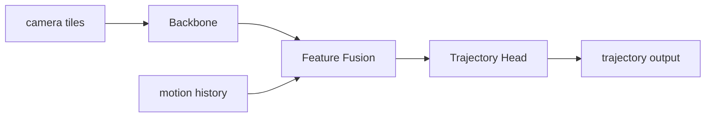

# アーキ図のドリフト問題

## ひとことで言うと

ソフトウェアの「構成図（アーキテクチャ図）」を画像ファイルとして作り、README やドキュメントに貼り付けると、コードが変わっても図は自動では変わりません。そのため時間が経つにつれ、図と実際の実装が少しずつズレていきます。この「だんだんズレていく」現象を、英語で drift（漂流、徐々にずれること）と呼びます。このノートは、なぜ図がドリフトするのか、どんな害があるのか、そしてどう抑えるのかを、前提知識ゼロの状態から研究・実務で通用するレベルまで段階的に説明します。

## 直感的な理解

身近な例で考えます。あなたが旅行ガイドブックを買ったとします。掲載されている地図は印刷された瞬間に「固定」され、その後に道路が新しくできても、お店が閉店しても、地図は古いまま残ります。読者は古い地図を信じて、すでに存在しない店を探しに行ってしまうかもしれません。

ソフトウェアのアーキテクチャ図もこれと同じです。図は「ある時点のシステムの姿」を切り取った写真であり、コードという「生きて変化し続ける本体」とは別の場所に存在します。本体だけが変わり、写真は撮り直されないので、両者は必然的にズレていきます。新しく入った開発者ほど図を信じてしまうため、ドリフトした図は「正しそうに見える嘘」として、初学者を真っ先に誤導します。

ここで重要なのは、これは「誰かがサボったから起きる例外的な事故」ではなく、「人手で2つのものを同期させ続ける仕組みは、放っておけば必ず壊れる」という構造的な必然だという点です。同期にかかる手間が大きいほど、忙しいときに省略され、ドリフトは加速します。だからこの問題は「気をつけよう」という精神論では解決せず、仕組み（差分が取れる形式）と運用（更新を必須にするレビュー）の二段構えで対処する必要があります。

## 基礎: 前提となる概念

いくつか用語を噛み砕いておきます。

- 「アーキテクチャ図（architecture diagram）」とは、システムが「どの部品（モジュール）からできていて、データがどこからどこへ流れるか」を箱と矢印で描いた絵のことです。これは「設計の全体像を一目で伝える地図」だと思ってください。新しく入った人が最初に見るのがこの図であることが多く、システムへの理解の入り口になります。

- 「ラスター画像（raster image）」とは、JPEG や PNG のように、色のついた点（ピクセル）を格子状に並べて絵を表現した画像形式です。これは「方眼紙の1マスごとに色を塗った絵」のようなもので、一度描き終えると中身は単なる色の数値の集まりになり、後から「この箱の名前だけ変える」という編集が事実上できません。作り直しになります。

- 「ベクター画像（vector image）」とは、SVG のように「点(100,50)から線を引け」「ここに円を描け」といった図形の命令で絵を表す形式です。こちらは命令の集まりなので、後から座標や文字を書き換えられ、拡大しても荒れません。

- 「diff（差分）」とは、変更の前後でどこが変わったかをコンピュータが計算して見せるものです。テキストファイルなら「3行目のこの単語がこう変わった」と行単位で分かりますが、ラスター画像のような数値の塊（バイナリ）では「中身が変わった」としか分からず、人間が変更内容を確認できません。これがレビュー（他人が変更を確認して承認する工程）を不可能にします。

- 「ground truth（正解、グラウンドトゥルース）」とは、何が正しいかの基準となる本物のことです。アーキ図の文脈では、図が一致すべき相手、つまり実際に動いているコードが ground truth です。図はその影にすぎず、影が本体に追従しなければ意味を失います。

- 「single source of truth（信頼できる唯一の出所、SSOT）」という概念も重要です。同じ情報が複数の場所（コードと図）に重複して存在すると、片方だけ更新されて矛盾します。重複を減らし、できれば情報源を一つに寄せることが、ドリフトの根本対策の思想的な背骨になります。

## 仕組みを詳しく

ドリフトがどう発生するかを、作業フローに分解して見ます。画像ベースの図を更新する典型的な流れは次のようになります。

```
コードを変更 (PR)  ──→  図は変わらない（手作業しない限り）
   │
   └─ 誰かが「図が古い」と気づいたら…
        1. 外部の作図ツール (draw.io / Figma など) を開く
        2. 図を描き直す
        3. PNG/JPEG として書き出す
        4. リポジトリに上書きコミット
        5. ドキュメントの  タグがそれを参照
```

このフローには「人が気づく」「人が手で直す」「別ツールを使う」という3つの弱い輪があります。確率の観点で考えると、各段階が独立に成功率 0.8 だとしても、全部そろう確率は 0.8 × 0.8 × 0.8 ≒ 0.5 まで落ちます。段階が増えるほど指数的に同期が失敗する、という単純な算術が、ドリフトの数量的な必然性を説明します。さらにラスター画像はバイナリなので、変更履歴を見ても「画像が差し替わった」としか分からず、レビュアーは「矢印が1本増えたのか、箱の名前が変わったのか」を判別できません。つまりラスター画像の図は、ドリフトしやすいだけでなく、ドリフトしているかどうかの確認すら困難です。

対策の核心は、図を「テキストで書ける図」に置き換えることです。代表的な手法が Mermaid（マーメイド）という記法で、絵を直接描く代わりに次のような文章を書くと、多くのドキュメント基盤（GitHub など）が自動的に図に描き起こしてくれます。

````markdown

````

このテキスト化が効く理由を before/after で並べます。

- before（ラスター画像）: 変更は「画像が差し替わった」としか見えない。誰かが外部ツールで手描きし直す必要があり、レビューでは中身を確認できない。気づく → 直す → 書き出す → コミットの全段階が手作業。
- after（テキスト記法）: 変更が `backbone[Backbone]` → `backbone[Swin Transformer backbone]` のような「文字の差分」として変更履歴に現れる。レビュアーは矢印1本の追加すら行単位で確認でき、図の更新を「コードと同じ仕組み」で管理できる。外部ツールも不要。

ただし、テキスト化だけでドリフトが消えるわけではありません。Mermaid にしても、変更のたびに「図も直したか」を人が確認しなければ、結局ズレは再発します。したがって有効な対策は次の2層をセットにしたものです。

1. 仕組み: 図をテキスト（差分が取れる形式）で書く。
2. 運用: 「アーキを変える変更では、同じ変更の中で図のソースも更新する」をレビュー必須項目として明文化する。

受け入れ基準を明快な一文にすると「図が現在のデータフローと一致していること」です。この基準を変更レビューのチェックリストに入れると、ドリフトが入り込む隙を構造的に減らせます。チェックリストは人間の注意力に頼る仕組みなので完璧ではありませんが、「差分が見える形式」と組み合わせることで初めて機能します。逆に言えば、差分が取れない形式にチェックリストを足しても、レビュアーは中身を確認できないので空回りします。

ここで踏み込んだ視点を一つ。テキスト化しても守れるのは「自動でレンダリングできる範囲」だけです。なぜその設計にしたのかという設計判断の理由（なぜこのモジュールを分けたのか、なぜこのデータがここを通るのか）は図には表れません。それは別途、文章として残す必要があります。図はあくまで「構造のスナップショット」であり、「意図の記録」ではないからです。アーキテクチャの世界ではこの「なぜ」を Architecture Decision Record（ADR、設計判断の記録）として別管理する慣習が広まっています。

## 手法の系譜と主要論文

この話題はアルゴリズムの研究ではなく、ソフトウェア工学の蓄積に属します。系譜を時系列で描きます。

- 「ドキュメントの腐敗（documentation rot / stale documentation）」という概念は古くから知られています。Andrew Hunt と David Thomas の "The Pragmatic Programmer"（1999）、Robert C. Martin の "Clean Code"（2008）は、コードと別管理されたドキュメントは必ず陳腐化すると繰り返し指摘しました。彼らの処方箋の核心は「ドキュメントをコードのできるだけ近くに置き、可能なら自動生成する（DRY: Don't Repeat Yourself を情報にも適用する）」ことです。動機は、人手の同期工程が増えるほど、忙しいときに省略され腐る確率が上がるから。効果はメンテ負荷の低下。トレードオフは「自動生成できる範囲しか守れない」点です。

- 「Diagrams as Code（コードとしての図）」という流れは、PlantUML（2009 年頃〜）、Mermaid（Knut Sveidqvist が 2014 年頃に開発開始）、Structurizr（Simon Brown）などのツール群として実用化されました。提案内容は「図をテキストの DSL（domain-specific language、特定目的の小さな記述言語）で書き、ビルドや表示の時点でレンダリングする」こと。なぜそうするかというと、テキストならバージョン管理・差分・レビューがコードと同じ仕組みに乗るからです。効果は変更の追跡性。トレードオフは、複雑で見栄えにこだわる図では表現力が足りず窮屈になる点で、これがより自由なレンダリング手法（[JSON/SVGベースのアーキ可視化ツール](https://zenn.dev/riita10069/books/driving-automation-foundation/viewer/1171_svg-json-architecture-visualizer)）を検討する動機になります。

- Simon Brown の "The C4 model"（2018 年頃から普及）は、図を Context（文脈）/ Container（実行単位）/ Component（部品）/ Code（コード）の4段階の詳細度に分ける枠組みです。動機は「1枚にすべてを詰め込むと、どこを直すべきか分からず腐りやすい」から、詳細度ごとに図を分割して管理する、というもの。効果は各図の責務が明確になりメンテしやすくなること。トレードオフは図の枚数が増える管理コストです。C4 の重要な洞察は「ズームレベルを分ける」ことで、地図アプリが国土全体と街路を別レイヤーで持つのと同じ発想です。

- 「アーキテクチャ適合性検査（architecture conformance checking）」の系譜。Reflexion Model（Murphy, Notkin, Sullivan, 1995, "Software Reflexion Models"）は、人が想定したアーキ（high-level model）と、実際のコードから抽出した依存関係を突き合わせ、想定との差（convergence / divergence / absence）を機械的に検出する古典です。これは「図と実装の一致をテストする」という発想の源流で、後の ArchUnit（Java で依存ルールを単体テストとして書くライブラリ）などに受け継がれました。

## 論文の実験結果（定量データ）

この領域は、機械学習のような数値ベンチマークが整備された分野ではないため、厳密な定量比較は少ないのが正直なところです。ただし関連する経験的・調査的データがいくつかあります。

ソフトウェアドキュメントの陳腐化に関する代表的な実証研究が、Emad Aghajani らの "Software Documentation Issues Unveiled"（ICSE 2019）です。GitHub、Stack Overflow、メーリングリストなどから 800 以上のドキュメント関連の問題報告を収集し、分類体系（taxonomy）を構築しました。報告された問題のうち、内容そのものに関する問題（completeness, correctness, up-to-dateness など）が大半を占め、その中でも「情報が最新でない・実装と食い違う（outdated / inconsistent）」という陳腐化が大きな割合を占めることを示しました。続編の "Software Documentation: The Practitioners' Perspective"（ICSE 2020）では、実務者調査でも「ドキュメントが古い」ことが最も頻繁に挙がる不満であると報告しています。これらは「ドリフトは例外ではなく、ドキュメント問題の主要な型である」という主張を経験データで裏付けるものです。

また、コードとドキュメントの同期度合いに着目した研究（コミット履歴を解析し、コード変更時にコメントやドキュメントが一緒に更新されたかを測るたぐいの研究、例: Fluri et al. のコメントとコードの共進化分析）では、コードが変わってもドキュメント／コメントが同時更新されない割合が高いことが繰り返し報告されています。直感的に言えば「コードを直した変更の多くで、関連ドキュメントは放置される」傾向です。この非対称性こそがドリフトの数量的な実体です。

定量データの読み方として重要なのは、ここで測りたいのは精度ではなく「同期率（co-update rate）」だという点です。同期率（コード変更時にドキュメントも更新された割合）が低いほどドリフトが速く進みます。テキスト化＋レビュー必須化という対策の狙いは、この同期率を引き上げることにあります。差分が見える形式にすればレビュアーが「図が更新されていない」ことに気づけるため、放置が減るわけです。アブレーション的に言えば、「差分の可視性」という一要素を抜く（＝バイナリ画像に戻す）と、レビュアーが食い違いに気づけなくなり、同期率は急落します。

## メリット・トレードオフ・限界

メリット:

- 図をテキスト化すると、変更が差分として見えるため、図と実装のズレが起きにくくなる。
- レビュー時に「図も直したか」を必須チェックにでき、同期率を構造的に上げられる。
- 外部の作図ツールが不要になり、ドキュメント更新の敷居が下がる。誰でも変更の一部として図を直せる。

トレードオフ・限界:

- Mermaid のようなテキスト記法は、見栄え・レイアウトの自由度が低く、凝った図は窮屈になる。これが [JSON/SVGベースのアーキ可視化ツール](https://zenn.dev/riita10069/books/driving-automation-foundation/viewer/1171_svg-json-architecture-visualizer) のような代替手法を検討する動機になる。
- テキスト化してもドリフトはゼロにならない。変更ごとに人が「図も更新したか」を確認する運用が無ければ再発する。仕組みと運用は必ずセットで考える。
- 図は構造のスナップショットであり、設計判断の理由（なぜそうしたか）は表せない。意図は別途文章（ADR など）で残す必要がある。
- どこまで詳細に描くかの設計判断（全体は粗く、要所は細かく、という粒度の使い分け）が常に残り、これは自動化できない人間の判断である。

研究上の未解決課題としては、「コードからアーキ図を自動抽出してドリフトをゼロにする」方向があります。静的解析で依存関係を抽出し図を生成する試みは古くからありますが、生成された図は往々にして詳細すぎて読めず、人間が伝えたい抽象度の図にならないという難しさが残っています。「正確さ（実装と一致）」と「読みやすい抽象度（人間が把握できる）」はしばしば対立し、両立は、いまだ完全には解けていません。

## 発展トピック・研究の最前線

ドリフトを根絶する方向として、ドキュメントとコードの整合性を継続的に検証する「リビングドキュメント（living documentation）」の考え方があります。テストの一種としてドキュメントの主張を実行可能にし、嘘になったら CI（継続的インテグレーション、変更のたびに自動で検査を走らせる仕組み）で落とすアプローチです。アーキ図についても、図に書かれた依存関係と実際のコードの依存関係を突き合わせて違反を検出する「アーキテクチャ適合性チェック」というツール群があり、ArchUnit や Structurizr のモデル検証などが実用化されています。これは「図と実装の一致」をテストとして自動検証する点で、ドリフト問題への最も根本的な対処に近いものです。実装と一致しない依存を書いた瞬間にビルドが赤くなれば、ドリフトはそもそも入り込めません。

近年は大規模言語モデルを使って、コード変更から図の更新案を自動生成したり、図と実装の食い違いを指摘させたりする試みも現れています。ただし生成物の正確性の検証が新たな課題になっており（モデルが存在しない依存を「ありそう」と捏造する hallucination のリスク）、人間のレビューを置き換えるには至っていません。当面は「機械が候補を出し、人間が承認する」という役割分担が現実解です。

## さらに学ぶための関連トピック

- [JSON/SVGベースのアーキ可視化ツール](https://zenn.dev/riita10069/books/driving-automation-foundation/viewer/1171_svg-json-architecture-visualizer)
- [L2D データセットの読み込み](https://zenn.dev/riita10069/books/driving-automation-foundation/viewer/0818_l2d-dataset-loading)
- [マップタイル上への軌道描画](https://zenn.dev/riita10069/books/driving-automation-foundation/viewer/1174_trajectory-rendering-map-tile)
