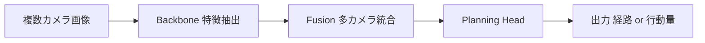

# Mermaidによるアーキ図のコード管理

## ひとことで言うと
システムの構造図(アーキテクチャ図)を、画像ファイル(jpg/png)として貼るのではなく、Markdown の中に「テキストで図を書く記法(Mermaid)」で記述する手法です。こうすると図がただのテキストとして扱えるので、ソースコードと一緒にバージョン管理でき、変更点が diff(差分)で見え、図がコードと食い違う(陳腐化する)のを構造的に防げます。「図をコードとして扱う(Diagrams as Code)」という考え方の実践です。

## 直感的な理解
あなたが料理のレシピ本を作っているとします。各レシピには「調理手順の図」が付いています。最初は手描きのイラストをスキャンして画像として貼りました。ところがレシピを改訂するたびに、誰かがイラストを描き直してスキャンし直さないと、図は古いままになります。3回改訂したら、図が示す手順と本文の手順が食い違い、読者を混乱させてしまいました。

もしこの図を「手順をテキストで箇条書きし、それを自動で図に変換する仕組み」で作っていたらどうでしょう。本文を直すついでに数行のテキストを直せば図も更新され、しかも「どの行を消してどの行を足したか」が一目でわかります。

ソフトウェアの設計図でもまったく同じことが起きます。アーキテクチャ図は普通、README などに画像として貼られますが、コードが進化すると図だけが取り残され、新しく加わった開発者を誤解させます。これを防ぐのが「図をテキスト(コード)として書き、コードと同じ場所で管理する」アプローチであり、その代表的なツールが Mermaid です。

## 基礎: 前提となる概念
このトピックを理解するために、いくつかの用語を押さえます。

バージョン管理(version control)と Git。Git は、ファイルの変更履歴を記録し、いつ・誰が・どこを変えたかを追跡できるツールです。ソフトウェア開発では標準的に使われます。「diff(差分)」とは、ある版と別の版の違いを行単位で表示する機能で、「この行を消して、この行を足した」と色付きで見せてくれます。

テキスト(text)とバイナリ(binary)。テキストファイルは人間が読める文字の列(プログラムのソースコードなど)で、Git は行単位で差分を取れます。バイナリファイルは0と1の塊(画像・音声・実行ファイルなど)で、Git は「中身が変わった」ことはわかっても「どこがどう変わったか」を行単位で示せません。画像は典型的なバイナリです。

Pull Request(プルリクエスト、PR)。変更を本体に取り込む前に「こう変えたい」と提案し、他のメンバーがレビュー(査読)する仕組みです。PR の画面では変更の diff が表示され、レビュアーはそれを見て承認や指摘をします。テキストの変更は diff に出ますが、画像の変更は diff に意味のある形では出ません。

Mermaid。テキストで図(フローチャート、シーケンス図、状態遷移図、クラス図、ER図、ガントチャートなど)を記述するための記法とその描画ライブラリです。重要なのは、GitHub・GitLab などの主要なプラットフォームが、追加のプラグインなしに Markdown 内の Mermaid をそのまま図として描画する(ネイティブレンダリング)点です。つまり読者は何もインストールせず、リポジトリのページを開くだけで最新の図を見られます。

Docs as Code / Diagrams as Code。ドキュメントや図を、画像や別管理の文書ではなく、ソースコードと同じくテキストで書き、同じリポジトリ・同じレビュー・同じ自動化の中で扱う開発文化です。近年のソフトウェア工学で広く採用されています。

## 仕組みを詳しく
Mermaid は、コードブロック(三連バッククォートで囲み、言語名に mermaid と書いた領域)の中に、ノード(箱)と矢印を文章で記述すると、それを図に変換します。最も基本的なフローチャートの例を示します。



これが GitHub 上では、箱が矢印でつながった横並びのフローチャートとして表示されます。記法の意味を分解します。

- `flowchart LR` の `LR` は Left-to-Right(左から右へ並べる)の指定です。`TD` なら Top-Down(上から下)になります。
- `A --> B` は「A から B へ向かう矢印」を表します。`-.->` なら点線矢印、`==>` なら太い矢印など、線の種類も変えられます。
- 角括弧 `["..."]` はノード(箱)のラベルです。`(...)` なら角丸、`{...}` ならひし形(分岐)など、形も指定できます。

before / after で違いを示します。

```
before(画像):  README に  と書き、別途バイナリ画像を管理。
               図を直すには描画ソフトを開き、編集し、再出力し、画像を差し替える。
               PR の diff には「画像が変わった」としか出ず、何が変わったか読めない。

after(Mermaid): README に上記のテキストブロックを直接書く。
               bb["Backbone 特徴抽出"] を bb["Backbone (Swin Transformer)"] に変えれば、
               PR の diff にその1行の変更がそのまま現れる。レビュアーが図の変更を査読できる。
```

運用上の核心は、図のテキストを「コードと同じ場所・同じ PR で更新する」ことです。具体的には、貢献者向けの注意書き(CONTRIBUTING ガイドや README)に「アーキテクチャを変更する PR では、対応する Mermaid 図も同じ PR で更新すること」と明記します。さらに踏み込むと、CI(継続的インテグレーション、PR ごとに自動でチェックを走らせる仕組み)で「Mermaid のソースが構文的に正しくレンダリングできるか」を検証することもできます。これにより「コードは変わったのに図は古いまま」というドリフト(drift、乖離)を、レビューや自動化の段階で止められます。

なぜこの設計が効くのか。理由は、図の正体を「バイナリ画像」から「テキスト」に変えることで、図がソフトウェア開発のあらゆる仕組み(バージョン管理・diff・レビュー・CI・検索)の恩恵を受けられるようになるからです。画像は開発フローの外側にある「添付物」でしたが、Mermaid 図は開発フローの内側にある「コードの一部」になります。

## 手法の系譜と主要論文
これは学術論文の手法ではなく、ソフトウェア開発・ドキュメント運用上のプラクティスです。系譜を概念の発展として描きます。

源流: Docs as Code。2010年代に、API ドキュメントや設計文書を Wiki や Word ではなくソースコードと同じリポジトリで管理する文化が広がりました。背景には、ドキュメントが実装から乖離して陳腐化する問題と、レビュー・自動化の恩恵を文書にも及ぼしたいという動機があります。

発展: Diagrams as Code。文章だけでなく図もテキストで書こう、という流れです。古くは Graphviz(DOT 言語、AT&T 研究所由来、1990年代〜。研究論文では Gansner と North による "An open graph visualization system and its applications to software engineering", Software: Practice and Experience, 2000 が知られる)が、ノードとエッジをテキストで定義し、力学モデルや階層レイアウトのアルゴリズムでグラフを自動配置するツールとして使われてきました。続いて PlantUML(2009年〜)が、UML(統一モデリング言語、ソフトウェア設計の標準的な図法)のシーケンス図・クラス図などをテキストで書けるツールとして普及しました。設計の抽象度を整理する枠組みとしては、Simon Brown が2010年代に提唱した C4 モデル(Context / Container / Component / Code の4階層で粒度を分ける考え方)があり、これも図をテキスト(構造化された記述)から生成するツール群(Structurizr など)を生みました。

現在: Mermaid。Mermaid.js は Knut Sveidqvist が2014年頃に開始した JavaScript 実装のライブラリで、Markdown と親和性が高く、何より GitHub・GitLab・Notion など主要プラットフォームがネイティブ描画する点で広く採用されています。GitHub は2022年2月に Markdown 内 Mermaid のネイティブレンダリングを公式サポートし、これが普及の決定的な後押しになりました。研究コミュニティや OSS プロジェクトでは、README やドキュメント内の図を Mermaid で書くことがデファクト(事実上の標準)になりつつあります。選定理由として典型的に挙げられるのは「追加プラグイン不要でリポジトリページにそのまま図が出る」「Markdown と同じファイルに同居できる」「学習コストが低い」点です。

ツールの使い分けの一般論。厳密な UML を大規模に書くなら PlantUML、複雑なグラフの自動レイアウト(数百ノードの依存グラフなど)なら Graphviz、抽象度の階層を意識した設計図なら C4/Structurizr、README やドキュメントに気軽に図を埋め込み GitHub でそのまま見せたいなら Mermaid、という棲み分けが研究コミュニティでは一般的です。エンドツーエンド自動運転のようにパイプライン構成(センサ → backbone → fusion → planning head)を素早く共有したい場面では、論文の Figure を画像で貼るのと別に、リポジトリ側に Mermaid で同等の図を置く運用が増えています。

## 論文の実験結果(定量データ)
学術論文ではないため、定量的な実験結果という形のデータはありません。代わりに、ソフトウェア工学の文脈で繰り返し観察される定性的な効果とトレードオフを、できるだけ具体的に整理します。

効果として一般に報告されるもの:

- 変更追跡性。図がテキストになることで、Git の diff で「どのノード・どの矢印を追加/削除したか」が行単位で読めるようになります。バイナリ画像では不可能だった粒度です。
- レビュー可能性。アーキテクチャを変える PR の中で、図の変更も同じ画面で査読できます。これにより「コード変更は承認したが図の更新を見落とした」という事故が減ります。
- 編集容易性。図を直すのに専用の描画ソフトや元データ(ソフト固有の編集ファイル)が不要になり、テキストエディタだけで誰でも直せます。元データの紛失で「もう誰も直せない図」が生まれる事態を避けられます。
- ドリフトの抑制。同じ PR・同じ場所で図とコードを更新する運用により、図とコードの乖離が構造的に起きにくくなります。

トレードオフとして一般に指摘されるもの:

- レイアウト制御の限界。Mermaid は自動レイアウトに大きく依存するため、ピクセル単位で配置を作り込みたい図(広報用の美しい概念図、写真的背景を持つ図、自由な手配置が必要な図)には不向きです。こうした図は従来の描画ツールの方が向きます。
- 大規模図の可読性。ノードや矢印が数十を超える巨大な図は、テキストソースが読みにくくなり、メンテナンスが大変になります。図を適切な粒度に分割する設計判断が必要です。
- 記法の学習。貢献者が Mermaid 記法をある程度覚える必要があります(ただし学習コストは低い部類)。
- レンダリング環境への依存。GitHub などがネイティブ描画する一方、別の表示環境(古いビューア、Mermaid 非対応のツール)では図が出ず生のテキストが見えることがあります。

## メリット・トレードオフ・限界
メリット(再整理):

- 図がテキストなので Git でバージョン管理でき、変更が diff で読める。
- コードと同じ PR で更新でき、レビューで図の陳腐化を止められる。
- 外部の描画ツールやバイナリ元データが不要で、誰でもエディタで直せる。
- GitHub などがネイティブ描画するので、読者は何もインストールせず最新図を見られる。
- 図とコードの乖離(ドリフト)を、運用と自動化の両面で構造的に減らせる。

トレードオフ・限界(再整理、研究・運用上の論点):

- 細かいレイアウト制御や装飾的・写真的な図には不向きで、配置は自動レイアウトに委ねる部分が大きい。
- 非常に大きく複雑な図はテキストが読みにくくなり、メンテが大変になる。図の分割設計が必要。
- 記法の習得と、レンダリング環境への依存という小さなコストが残る。
- ドリフト抑制は「同じ PR で図も直す」という運用規律と、できれば CI チェックに支えられて初めて効く。仕組みだけ導入して運用を伴わなければ、テキストの図でも古くなりうる。

## 発展トピック・研究の最前線
ドキュメントと図をコードとして扱う流れは、近年さらに自動化・生成の方向へ進んでいます。

第1に、コードからの図の自動生成です。ソースコードの構造(クラス依存関係、モジュール構成、API 呼び出しグラフ)を静的解析して Mermaid や PlantUML のテキストを自動出力する試みがあります。これが実現すれば、図が常にコードの真実を反映し、ドリフトが原理的に起きなくなります。課題は、自動生成した図が「人間にとって意味のある抽象度」になるとは限らないことです。コードの全クラスを描いた図は正確でも、理解の助けにはなりません。

第2に、CI でのレンダリング検証と図の自動更新です。PR ごとに Mermaid のレンダリングを走らせ、構文エラーや壊れた図を検出したり、図の画像版を自動生成して添付したりする運用が広がっています。

第3に、大規模言語モデル(LLM)による図の生成・更新支援です。コードや設計説明から Mermaid のテキストを生成したり、コード変更に追従して図のテキストを提案したりする使い方が現れています。これは「図とコードの同期」という長年の課題に対する新しいアプローチですが、生成された図の正確性の検証という新たな問題も伴います。

これらに共通する根底の問いは「設計の意図(なぜこの構造か)を、実装の進化に追従させながら、どう正確かつ理解しやすく保つか」であり、Mermaid によるテキスト図はその一つの実用的な答えに位置づけられます。

## さらに学ぶための関連トピック
- [アーキ図のドリフト問題](https://zenn.dev/riita10069/books/driving-automation-foundation/viewer/1160_architecture-diagram-drift)
- [BEV知覚 概論](https://zenn.dev/riita10069/books/driving-automation-foundation/viewer/0928_bev-perception-overview)
- [BEV融合を標準融合に統一](https://zenn.dev/riita10069/books/driving-automation-foundation/viewer/0926_bev-as-standard-fusion)
