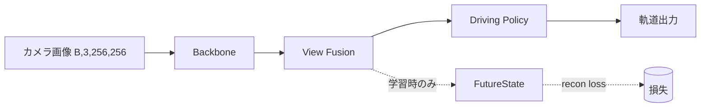

# 評価・指標・ベンチマーク

モデルの良し悪しをどう測るかという評価指標と、安全性・不確実性の評価を扱います。

この章では次の136個のトピックを順に解説します。


## ADE (Average Displacement Error)

### ひとことで言うと
自動運転やロボットの「これから車や人がどう動くか」という軌跡予測を、答え合わせするときの最も基本的な点数の付け方です。予測した進路と実際に起きた進路を、各時刻ごとに「どれだけ離れているか(メートル単位の距離)」で測り、それを全時刻で平均した値です。値が小さいほど予測が正確で、軌跡予測のあらゆるベンチマークで標準指標になっています。

### 直感的な理解
予測モデルを作っても、「その予測はどのくらい当たっているのか」を 1 つの数字で言えないと、改良が進んでいるのか後退しているのか分かりません。たとえば次のような困りごとがあります。

- モデル A とモデル B のどちらが優秀か、感覚ではなく数字で比べたい。
- 学習を進めるたびに精度が良くなっているか追跡したい。
- 論文や他チームの結果と公平に比較したい。

このために「予測軌跡と正解軌跡がどれだけ近いか」を 1 つの数値にまとめる必要があります。その最もシンプルで広く使われる指標が ADE です。発想は素朴で、「各時刻のズレ(距離)を測って、全時刻で平均する」だけです。平均なので「予測軌跡全体が平均してどれだけずれていたか」を表し、メートル単位でそのまま解釈できます。「平均して 0.5 メートルずれていた」と言えば、専門家でなくても直感的に良し悪しが分かります。

### 基礎: 前提となる概念
- 軌跡(trajectory): 時刻ごとの位置を並べたもの。たとえば 0.1 秒(10Hz)ごとに位置を記録すると、6.4 秒先までで 64 個の位置点ができる。
- 正解軌跡(ground truth, GT): 実際に車や人がそのあと取った本当の進路。走行ログを使えば「あの場面で予測したらこうだったが、本当はこう動いた」という答え合わせができる。
- 予測ホライズン(prediction horizon): どれだけ先まで予測するか。短期(1〜3 秒)と長期(5〜8 秒)で難しさが大きく違う。
- ユークリッド距離(Euclidean distance): 2 点 (a, b) と (c, d) の直線距離 `sqrt((a-c)^2 + (b-d)^2)`。定規で測ったまっすぐの長さ。
- 多峰性(multimodality): 同じ状況から複数のもっともらしい未来がありうること(交差点で右折も直進もありうる)。1 本の予測ではこれを表現できない。
- オープンループ評価(open-loop evaluation): モデルの予測を実車の動きに反映させず、過去の記録データに対して「もしここで予測していたら」と答え合わせするだけの評価。実車を動かさず安全に大量評価できる。ADE/FDE はこの枠組みで使われる。

### 仕組みを詳しく
ADE は次の 3 ステップで計算します。

ステップ 1: 各時刻で予測位置と正解位置の距離を測る。予測軌跡を `pred = [(x1,y1), (x2,y2), ...]`、正解軌跡を `gt = [(x1,y1), (x2,y2), ...]` とし、各時刻 t でユークリッド距離を計算します。

ステップ 2: 全時刻の距離を集める。時刻が T 個あれば距離も T 個。たとえば 64 時刻なら 64 個の距離 `[e1, ..., e64]`(メートル)が並びます。

ステップ 3: 平均する。T 個の距離を足して T で割ると ADE です。

```
ADE = (1/T) * Σ_{t=1}^{T} || pred_t - gt_t ||
```

`|| ... ||` はユークリッド距離、Σ は「全部足す」です。

数値例。2 時刻だけのケース:

```
時刻1: 予測 (1.0, 0.0)  正解 (1.0, 0.0)  → 距離 0.0 m
時刻2: 予測 (2.0, 0.5)  正解 (2.0, 0.0)  → 距離 sqrt(0^2 + 0.5^2) = 0.5 m
ADE = (0.0 + 0.5) / 2 = 0.25 m
```

「平均して 0.25 メートルずれていた」という意味です。実装は単純で、軌跡を `(T, 2)`(時刻数 × xy)で持ち、行ごとにユークリッド距離を取って平均します。

```python
errors = np.linalg.norm(pred_xy - gt_xy, axis=1)  # 各時刻の距離 (T,)
ade = errors.mean()                                # 全時刻平均 = ADE
```

設計上の重要点が 3 つあります。

第一に、複数の予測本数(multi-modal、多峰)への拡張です。1 本だけの予測を 1 本の正解と比べる ADE を、複数本(K 本)出すモデルに使うときは、「K 本のうち正解に最も近い 1 本」で ADE を取る minADE_k が標準です。これは「右折も直進もありうる場面で、たまたま選んだ 1 本が外れても、もっともらしい候補を 1 本出せていれば評価する」という考え方です。`minADE_k = min_{i∈1..K} ADE(pred_i, gt)` と書け、K を増やすほど単調に下がります。

第二に、座標系と軌跡の作り方です。モデルが位置 (x, y) を直接出力する場合もあれば、加速度(acceleration)とカーブの曲がり具合(curvature, 曲率)などの制御量を予測し、それを積分(少しずつ足し合わせて位置に変換)して (x, y) 軌跡を作る場合もあります。後者は車の動きを「アクセルとハンドル」で表すほうが物理的に自然で学習しやすい、という理由で運転分野でよく採られます。ただし積分は誤差を累積させるため、後半の時刻ほどズレが大きくなりやすく、ADE よりも終端を見る [FDE (Final Displacement Error)](https://zenn.dev/riita10069/books/driving-automation-foundation/viewer/12_evaluation-metrics) でその影響が顕著に出ます。

第三に、集計の単位です。データセット全体でサンプルごとに ADE を出して平均するのが普通ですが、シーンの難易度はばらつくため、平均だけでなく分布(中央値、上位パーセンタイル)も見ると実態がつかめます。エージェント種別(車・自転車・歩行者)ごとに分けて報告するのも一般的です。

評価でよく行うのが、予測ホライズンを区切った多区間 ADE です。`ADE@1s`、`ADE@2s`、`ADE@3s`、`ADE@6.4s`(全区間)のように、最初の 1 秒だけ、最初の 3 秒だけ、と区間ごとに平均を出すと、短期は正確だが長期が崩れる、といった傾向を切り分けられます([マルチホライズンADE (ADE@1s/2s/3s)](https://zenn.dev/riita10069/books/driving-automation-foundation/viewer/12_evaluation-metrics))。

### 手法の系譜と主要論文
ADE は軌跡予測の分野で長く標準的に使われてきた指標です。指標の歴史は、歩行者予測から車両予測へ、単峰評価から多峰評価へ、と発展してきました。

Social LSTM(Alahi, Goel, Ramanathan, Robicquet, Fei-Fei, Savarese, Stanford, CVPR 2016)。歩行者の動きを LSTM(時系列を扱うニューラルネット)で予測し、複数歩行者が互いに避け合う相互作用を「Social pooling」でモデル化しました。評価に Average displacement error と Final displacement error を用い、後続研究の事実上の標準にしました。

Social GAN(Gupta, Johnson, Fei-Fei, Savarese, Alahi, Stanford, CVPR 2018, arXiv:1803.10892)。人の動きには「右に避けるか左に避けるか」など複数のもっともらしい未来があるという多峰性に着目し、GAN(生成モデル)で複数本の軌跡をサンプリングしました。ここで ADE を minADE(K 本中の最良)の形で使い、「1 本だけの ADE は多峰の状況を不当に低く評価する」という問題意識を明示しました([minADE_k (best-of-K ADE)](https://zenn.dev/riita10069/books/driving-automation-foundation/viewer/12_evaluation-metrics))。

Trajectron++(Salzmann et al., ECCV 2020, arXiv:2001.03093)。グラフ構造でエージェント間の相互作用を表し、車両の運動制約(kinematics)を組み込んだ確率的な多峰予測を行いました。minADE/minFDE に加え、確率予測の質を測る負の対数尤度(NLL)でも評価し、「点として近いか」だけでなく「不確実性を正しく表現できているか」を見る流れを強めました。

Argoverse Motion Forecasting(Chang et al., Argo AI, CVPR 2019, arXiv:1911.02620)、nuScenes prediction(Caesar et al., CVPR 2020, arXiv:1903.11027)、Waymo Open Motion Dataset(Ettinger et al., ICCV 2021, arXiv:2104.10133)。車両軌跡予測の大規模ベンチマークで、minADE_k / minFDE_k を公式指標に採用しました。やはり「1 本予測の ADE だけでは多峰性を測れない」が動機です。これらのベンチマークでリーダーボード競争が起き、ADE/minADE が標準的な比較軸として固まりました。Waymo は加えて mAP(予測した複数候補と確率を物体検出的に評価する指標)を導入し、確率の付け方まで含めて評価する方向を推し進めています。

### 論文の実験結果(定量データ)
Social LSTM 論文では ETH/UCY(歩行者の俯瞰追跡データセット)で評価しました。設定は「過去 3.2 秒(8 フレーム)を観測して未来 4.8 秒(12 フレーム)を予測」です。単純な等速線形外挿(Linear)や素の LSTM に比べ、相互作用を考慮した Social LSTM は ADE/FDE を下げることを示しました(データセット平均で ADE がおよそ 0.5m 前後の水準、サブシーンにより差は大きい)。重要なのは「人同士の相互作用をモデル化すると、ぶつかり合いの場面で予測が改善する」という定性的知見です。

Social GAN ではさらに多峰性を取り入れ、K=20 本サンプリングして minADE/minFDE を取ることで、同じ ETH/UCY で Social LSTM を上回る minADE(報告によりデータセット平均でおよそ 0.3m 台まで低下)を達成しました。アブレーションでは「多峰サンプリング(variety loss、最良サンプルだけに勾配を流す損失)を外すと minADE が悪化する」ことが示され、複数の未来を出すことの価値が定量化されました。1 本だけ出す設定(K=1)では minADE が大きく、K を増やすほど下がるという傾向もここで明確になりました。

Argoverse では未来 3 秒予測(過去 2 秒観測)で、上位手法の minADE_6(K=6 本中最良)はおよそ 0.7〜0.9m、minADE_1(1 本)はおよそ 1.5〜1.7m 程度という水準が報告されました。ここから読み取れる重要な事実は「同じモデルでも、許す本数 K を増やすほど minADE は単調に下がる」ことです。指標を比較するときは K を必ず揃える必要があります。アブレーションでは地図情報(車線中心線などのベクトル地図)を入力に加えると ADE/FDE が大きく改善することが繰り返し示され、軌跡予測における地図文脈の重要性が定量化されました。Waymo Open Motion でも、ホライズンを 8 秒まで延ばすと minADE が数メートル規模まで増え、長期予測の難しさが数値に表れています。

### メリット・トレードオフ・限界
メリット
- 計算が単純で直感的。「平均何メートルずれたか」とそのまま説明できる。
- 全時刻を見るので、軌跡全体の当たり具合をバランス良く反映する。
- 業界標準なので他研究・他ベンチマークと比較しやすい。

トレードオフ・限界
- 平均なので、終端(一番遠い未来)の大きなズレが薄まる。長期の危うさが見えにくい。これを補うのが [FDE (Final Displacement Error)](https://zenn.dev/riita10069/books/driving-automation-foundation/viewer/12_evaluation-metrics)。
- 複数のもっともらしい未来(多峰性)を 1 本の ADE では扱えない。これを補うのが [minADE_k (best-of-K ADE)](https://zenn.dev/riita10069/books/driving-automation-foundation/viewer/12_evaluation-metrics)。ただし K を増やせばいくらでも下がるので、K を揃えない比較は無意味。
- 確率の付け方を評価しない。minADE は「最良の 1 本」だけ見るので、6 本のうち 1 本だけ当たれば残り 5 本がどれだけ非現実的でもペナルティがない。確率の質には NLL や mAP が要る。
- 衝突するか・車線をはみ出すかといった安全性そのものは測れない。あくまで幾何的なズレの大きさだけを見る。安全評価には Miss Rate やクローズドループ評価が必要([Miss Rate (MR)](https://zenn.dev/riita10069/books/driving-automation-foundation/viewer/12_evaluation-metrics))。
- 座標系(自車中心か地図座標か)や観測長・予測長の設定で値が変わるため、ベンチマーク間の直接比較には注意が要る。

### 発展トピック・研究の最前線
ADE/FDE は単純さゆえに「測れないもの」が多く、補完指標が研究されています。多峰性には minADE_k と Miss Rate、確率予測の質には負の対数尤度(NLL)や Waymo の mAP、複数候補の整合性には「全候補の尤度重み付き ADE」などが使われます。さらにオープンループの ADE が良くてもクローズドループ(予測を実際に車に反映して走らせる)で破綻する乖離が知られ、CARLA や nuPlan のようなシミュレータでの閉ループ評価(衝突率、進行度、快適性)が重視されつつあります。これは「軌跡が正解に近いこと」と「安全に運転できること」が必ずしも一致しないという、軌跡予測評価の根本的な未解決課題を反映しています。近年は予測と計画を統合的に学ぶ手法が増え、ADE のような幾何的な点指標だけでなく、計画の妥当性まで含めて評価すべきだという議論が研究の最前線になっています。

### さらに学ぶための関連トピック
- [FDE (Final Displacement Error)](https://zenn.dev/riita10069/books/driving-automation-foundation/viewer/12_evaluation-metrics)
- [マルチホライズンADE (ADE@1s/2s/3s)](https://zenn.dev/riita10069/books/driving-automation-foundation/viewer/12_evaluation-metrics)
- [minADE_k (best-of-K ADE)](https://zenn.dev/riita10069/books/driving-automation-foundation/viewer/12_evaluation-metrics)
- [Miss Rate (MR)](https://zenn.dev/riita10069/books/driving-automation-foundation/viewer/12_evaluation-metrics)
- [クローズドループ評価 (Closed-Loop)](https://zenn.dev/riita10069/books/driving-automation-foundation/viewer/12_evaluation-metrics)


## レイテンシはbackboneが支配的

### ひとことで言うと
画像を入力にとる深層学習モデルの推論時間(レイテンシ)を実際に分解して測ると、その大半は「画像から特徴を取り出す backbone(バックボーン、特徴抽出器)」の処理で占められます。後段の統合方式(fusion)やヘッド(出力層)をどう変えても、全体の時間はあまり動きません。だから「モデルを速くしたい」ときは、まず backbone をどう選び・どう軽くするかを考えるのが最も効果的だ、という経験則です。この観察は単なる印象論ではなく、計算量とデータ量の構造から必然的に生まれるもので、適切に測れば誰の環境でも再現できます。

### 直感的な理解
たとえば「写真を見て運転判断を返すまで50ミリ秒かかる」とします。この50ミリ秒の中身を分解すると、40ミリ秒以上が「写真を数字の特徴に変換する」工程に使われ、その特徴を組み合わせて答えを出す工程は数ミリ秒しかかからない、ということがよく起こります。

これは料理にたとえると分かりやすいです。食材を切って下ごしらえする(backbone)のに30分かかり、それを皿に盛り付ける(fusion / head)のは1分で済む、という状況です。盛り付けを工夫して30秒短縮しても、全体はほとんど速くなりません。短縮したいなら下ごしらえそのものを見直す(包丁を変える、切る量を減らす)しかない。深層学習のレイテンシ最適化も同じで、「どこに時間が集中しているか」を測ってから手を入れることが鉄則です。測らずに「なんとなく重そうなところ」を直すのは、暗い部屋で鍵を探すようなもので、たいてい外します。

### 基礎: 前提となる概念

用語を一つずつ噛み砕きます。

- レイテンシ(latency): 入力を1つ与えてから出力が返るまでの待ち時間。単位はミリ秒(ms = 1000分の1秒)。自動運転やロボットのように「リアルタイムに何度も判断する」用途では、この時間が短いほど安全余裕が増えます。たとえばレイテンシ50msなら、理屈の上では1秒間に20回判断できます。

- スループット / FPS(frames per second): 1秒あたり何枚処理できるか。レイテンシの逆数が目安です(50msなら約20FPS)。ただしバッチ処理(複数枚まとめて処理)するとレイテンシは伸びるがFPSは上がる、という別の側面があります。GPUは大量の並列計算が得意なので、1枚ずつ処理するとSM(演算ユニット)が遊び、まとめて流すと埋まって効率が上がるためです。

- backbone(バックボーン): 生の画像(たとえば縦224×横224×3チャンネルのピクセル)を受け取り、「ここに車らしい輪郭がある」「ここは道路の質感だ」といった抽象的な特徴マップ(feature map、空間の各位置に多次元のベクトルが並んだ格子状データ)に変換する、モデルの土台部分。畳み込みニューラルネット(CNN、画像を小さなフィルタでなぞって特徴を抽出する方式)の ResNet や ConvNeXt、Transformer(注意機構ベース)の Swin Transformer などが代表例です。深くて重いので計算量の大半をここが担います。

- ヘッド / fusion(統合方式): backbone が出した特徴を使って最終的な答え(分類・検出・軌道など)を作る後段部分。複数カメラの特徴を1つにまとめる工程を fusion と呼びます。単純連結(concat、特徴をただ横に並べる)、注意機構による統合(cross attention、どの特徴を重視するか動的に重み付け)、鳥瞰図に投影してから統合(BEV変換)などの方式があります。

- ボトルネック(bottleneck): 処理全体の足を引っ張っている最も遅い箇所。瓶(bottle)の首(neck)が細いと中身がそこでしか出てこない、という比喩です。最適化はボトルネックを潰すのが定石で、それ以外を速くしても全体はほとんど変わりません。この「全体はボトルネックで決まる」という考え方はアムダールの法則(Amdahl's law)として知られ、ある部分を無限に速くしても、残りの部分が下限を決めるという原理です。

- FLOPs(浮動小数点演算回数): モデルが1回の推論でこなす掛け算・足し算の総数。理論計算量の目安ですが、後述するように「FLOPsが小さい=速い」とは限りません。GFLOPsは10億回(giga)、MFLOPsは100万回(mega)を表します。

### 仕組みを詳しく

なぜ backbone がこれほど支配的になるのか、構造から説明します。

backbone は入力画像の全ピクセルに対して、層を何十段も重ねた重い変換を行います。たとえば画像分類で標準的な ResNet-50 は約 40 億回(約4 GFLOPs)の演算を、224×224 の画像1枚に対して行います。一方、後段の fusion やヘッドは、すでに圧縮された低解像度の特徴(たとえば 7×7 や 14×14 のグリッド)を相手にするため、扱うデータ量が桁違いに小さい。データ量が小さければ演算量も小さく、結果として時間も短くなります。これは backbone が「空間解像度を下げながらチャンネル数を増やす」設計になっているからで、深い層ほど格子は小さく(56×56→28×28→14×14→7×7)、後段に渡る頃にはピクセル数が初期の数百分の一になっています。

tensor shape の数値例で見ます。224×224×3 の入力が ResNet を通ると、最終段はおよそ 7×7×2048 になります。要素数で言うと入力 150,528 に対し出力 100,352 と一見近いですが、途中の中間層(56×56×256 = 約80万要素)で膨大な畳み込みが繰り返されるため、累積の演算がここに集中します。fusion 段が触るのはこの最終 7×7 格子なので、相手にする要素数が二桁少ない。

ある6カメラのマルチカメラモデルを GPU 上で測ったときの典型的な分解です(値は説明用の代表値)。

```
工程                          レイテンシ(ms)   全体に占める割合
画像 backbone(6枚分の特徴抽出)  42              ~80%
fusion(複数カメラの統合)        4               ~8%
ヘッド(出力生成)               6               ~12%
-------------------------------------------------------------
合計                           52              100%
```

ここで fusion 方式を concat → cross attention に変えても、変わるのは4msの部分だけです。仮に cross attention が2ms遅くなっても、全体52msが54msになるだけ(約4%増)。一方 backbone を半分の重さのものに替えれば42msが21ms前後になり、全体は半減近くまで縮みます。アムダールの法則どおり、80%を占める部分を半分にすれば全体は0.8×0.5+0.2 = 0.6倍、つまり40%短縮できるのに対し、8%の部分をゼロにしても最大8%しか縮まない。どちらに手を入れるべきかは明白です。

#### fusion 方式間の差が小さく見える別の要因

特徴次元(チャンネル数、feature dimension)が太いと、どの fusion 方式でもその太い次元の行列演算が支配的になり、方式ごとの差がさらに埋もれます。たとえば特徴次元が1440次元のように非常に大きい場合、concat だろうが cross attention だろうが「1440次元の行列を回す」コストが共通して重く、方式固有の追加処理(BEVの投影・サンプリングなど)の差が相対的に見えなくなります。逆に特徴次元を256などに絞ると fusion の相対コストが上がり、方式間の差が見えやすくなります。つまり「fusionの差が小さい」という観察は、特徴次元の設定にも依存する条件付きの結論である点に注意が必要です。研究者として論文の主張を読むときは、こうした「どの条件で成り立つ結論か」を常に問う姿勢が要ります。

#### ASCII図: レイテンシの内訳イメージ

```
[============ backbone ============][fus][= head =]
 0ms                            42ms 46ms        52ms

fusion を変えても動くのはここだけ ─┘
backbone を軽くするとここ全体が縮む
```

### 手法の系譜と主要論文

「重い backbone がコストを支配し、後段は相対的に軽い」という観察は、特定の論文が一度言い切ったというより、コンピュータビジョンの発展の中で繰り返し確認されてきた一般則です。系譜をたどります。

1. He et al., ResNet(CVPR 2016, arXiv:1512.03385)。残差接続(skip connection、入力をそのまま先の層に足す仕掛けで、深い層でも勾配が消えず学習が崩れないようにする)を導入し、152層という当時としては極端に深い backbone を可能にしました。これにより「深く重い backbone ほど認識精度が上がる」ことが示され、同時に backbone が計算量の主役になりました。以降「backbone を何にするか」がモデル全体の速度・精度を決める一級の設計選択になります。

2. Howard et al., MobileNet(2017, arXiv:1704.04861)/ Sandler et al., MobileNetV2(CVPR 2018, arXiv:1801.04381)。モバイル端末で動かすには backbone を軽くするしかない、という問題意識から、depthwise separable convolution(チャンネルごとに分けて畳み込んでから1×1で混ぜる省計算な手法。通常の畳み込みを「空間方向」と「チャンネル方向」に分解して演算を8〜9分の1にする)で backbone を劇的に軽量化しました。backbone こそが速度の主戦場であることを前提にした設計です。

3. Tan & Le, EfficientNet(ICML 2019, arXiv:1905.11946)。backbone の深さ・幅(チャンネル数)・入力解像度をバランスよく同時に拡大する「複合スケーリング(compound scaling)」を提案。backbone が精度と計算コストの主戦場であることを前提に、その効率フロンティア(同じFLOPsで出せる最高精度の境界線)を押し広げた代表例です。

4. Liu et al., Swin Transformer(ICCV 2021, arXiv:2103.14030)。Transformer を backbone に持ち込みつつ、注意計算を局所窓に限定し、解像度を段階的に落とす階層構造で計算量を画像サイズに比例(線形)させました。Vision Transformer が backbone コストで CNN と競う土俵に乗った転換点で、ここでも「backbone の設計が全体を決める」という前提は変わりません。

5. BEVFormer 系のマルチカメラ手法(Li et al., ECCV 2022, arXiv:2203.17270 など)。複数カメラ画像を鳥瞰図(Bird's-Eye-View)に統合する自動運転向け手法ですが、ここでも推論コストの主要部分は画像 backbone(image encoder、各カメラ画像を特徴に変える部分)であり、BEVへの空間変換や時系列融合は最適化対象ではあるものの、まず backbone が支配するという報告が一般的です。だからこそ軽量 backbone への置き換えや、抽出済み特徴の使い回し(feature caching)が研究されています。

これらに通底するのは「backbone が時間の主役。だから速度を語るなら backbone から」という共通認識です。

### 論文の実験結果(定量データ)

backbone 支配を裏づける定量データをいくつか挙げます。指標の意味も添えます。

- ResNet(CVPR 2016)。ImageNet(120万枚・1000クラスの画像分類ベンチマーク)で ResNet-152 は top-5 誤り率(モデルが出した上位5候補に正解が入らなかった割合。小さいほど良い)を約3.57%まで下げ、当時の最高精度を達成しました。一方でこの精度は約113億FLOPs(約11.3 GFLOPs)という重い backbone と引き換えで、計算量の大半が backbone に集中していることを示しました。

- MobileNetV2(CVPR 2018)。ImageNet で約72%の top-1 精度(最有力候補が正解だった割合)を、約3億FLOPs(約0.3 GFLOPs)という ResNet-152 の約40分の1の計算量で達成。同じ精度帯のモデルでも backbone の設計次第で計算量が一桁変わる、というのが要点です。backbone を軽くすることが推論コストを直接押し下げる関係を定量的に示しました。

- EfficientNet(ICML 2019)。複合スケーリングにより、EfficientNet-B0 は約4億FLOPsで約77%の top-1、より大きい B7 は ImageNet で約84%の top-1 を達成しつつ、同精度の従来モデルより演算量を8倍以上、パラメータ数を桁で削減したと報告されています。「backbone の効率フロンティアを動かせば全体の費用対効果が大きく変わる」ことの好例です。

- マルチカメラ知覚モデルの推論時間分解。多くの実測報告で、画像 encoder(backbone)が全体レイテンシの7〜8割を占め、BEV変換・時系列融合・検出ヘッドの合計が残り2〜3割、という内訳が共通して観察されます。fusion 方式を入れ替えるアブレーション(ある要素だけ抜き差しして影響を測る実験)では、レイテンシ差が全体の数%にとどまる一方、backbone を重い ResNet-101 から軽い ResNet-50 に替えると全体が数十%変わる、という結果が典型的です。

これらの数値が示すのは、「全体レイテンシの差はほとんど backbone の差で説明できる」という定量的事実です。fusion を変えたときの数msの差は、測定ノイズ(室温・電力制限・GPUクロックの揺らぎ・他プロセスの影響)に埋もれる程度のこともあり、統計的に有意かどうか慎重に見る必要があります。アブレーションを読むときは「差の大きさ」と「測定のばらつき」を必ず突き合わせる、という研究の基本作法がここでも効きます。

### メリット・トレードオフ・限界

この観察を最適化方針に使うメリット。

- 最適化の労力を backbone に集中でき、効果の薄い fusion チューニングに時間を浪費せずに済む。
- fusion 方式は速度をほぼ気にせず、精度の観点だけで選べる(速度ペナルティが小さいため)。
- テストや学習の高速化でも、本物の重い backbone をモック(軽い偽物)に差し替えるだけで全体が大幅に速くなる、といった打ち手が見える。
- 抽出済み特徴をキャッシュして使い回す、backbone を一度だけ通して複数タスクで共有する、といった設計の正当化につながる。

トレードオフと限界、研究上の未解決課題。

- 結論は特徴次元の設定に依存する。特徴次元が太いほど fusion の差が埋もれ backbone 支配が強調されるが、次元を絞ると fusion の相対コストが上がり、支配関係が変わりうる。
- 特定の GPU 上の結果は他の GPU に一般化しない。GPU が変わると backbone と fusion の相対コストも変わる(メモリ帯域律速か演算律速かが世代で異なるため)。複数ハードでの確認が必要([複数GPUのベンチマーク比較](https://zenn.dev/riita10069/books/driving-automation-foundation/viewer/12_evaluation-metrics))。
- backbone を軽くしすぎると精度が落ちる。速度と精度のトレードオフは backbone 単体では決まらず、タスクごとの評価が要る。
- FLOPs が小さい backbone が必ず速いとは限らない(後述の ShuffleNetV2 の指摘)。理論計算量と実機速度は乖離するので、最終判断は実測で行う。
- 高解像度・多カメラになるほど backbone 支配はさらに強まるが、fusion 側(特にBEVの空間変換や時系列attention)も解像度に応じて急増する場合があり、「常に backbone が8割」とは限らない。条件次第で逆転しうる点は未解決の注意事項です。

### 発展トピック・研究の最前線

- メモリ帯域律速という視点。Ma et al. の ShuffleNetV2(ECCV 2018, arXiv:1807.11164)は「FLOPs が同じでも実機速度は大きく違う」ことを指摘しました。原因の多くは演算量ではなくメモリアクセス量(MAC, memory access cost。データをメモリから読み書きする量)で、特に小さな演算をたくさん並べる backbone はメモリ帯域がボトルネックになります。「backbone が支配的」をさらに深掘りすると「backbone のどの部分がなぜ遅いか(演算なのかメモリなのか)」という問いに行き着きます。これを図で切り分ける道具がロードラインモデル(Williams et al., CACM 2009)です。

- 特徴の共有・再利用。backbone を1回だけ通し、その特徴を検出・セグメンテーション・軌道予測など複数のヘッドで共有するマルチタスク学習は、backbone 支配を逆手にとった効率化です。重い部分を1回で済ませる発想で、自動運転の知覚スタックで広く使われます。

- 効率的 backbone の進化。Vision Transformer 系では、トークン(画像パッチ)の一部を早期に間引くトークンプルーニングや、解像度を段階的に落とす階層型設計(Swin Transformer など)で backbone コストを下げる研究が活発です。

- ハードウェア対応設計(hardware-aware NAS)。MnasNet や EfficientDet(Tan et al.)は、対象デバイス上の実測レイテンシを探索目標に組み込み、デバイスごとに最適な backbone が違うことを示しました。backbone 支配を前提に、デバイスに合わせて backbone そのものを自動設計する流れです。

### さらに学ぶための関連トピック
- [複数GPUのベンチマーク比較](https://zenn.dev/riita10069/books/driving-automation-foundation/viewer/12_evaluation-metrics)
- [GPUアーキテクチャとsmカーネル対応](https://zenn.dev/riita10069/books/driving-automation-foundation/viewer/12_evaluation-metrics)
- [PyTorchのCUDAビルド選定](https://zenn.dev/riita10069/books/driving-automation-foundation/viewer/12_evaluation-metrics)


## ベンチマーク結果のJSONエクスポート

### ひとことで言うと
速度ベンチマークで測った数字（FPSやレイテンシ）を画面に出すだけでなく、「どのGPUで・どのCUDA/PyTorchバージョンで・いつ・どのコードの状態で測ったか」という環境メタデータを添えてJSONファイルに保存する仕組みです。後から結果を見返したとき「これは何の条件で出た数字か」が確実に分かるようにし、複数回・複数環境の結果を機械的に比較・追跡できるようにします。

### 直感的な理解
ベンチマークの数字は、それ単体では意味が曖昧です。「21.3 FPS」という値だけ残っていても、

- どのGPUで測ったのか（エントリ級GPUとハイエンドでは何倍も違う）
- ライブラリのバージョンは何か（版が変わると速度が変わる）
- いつ測ったか（数か月前の古いコードかもしれない）
- どのコードの状態（コミット）か（その後コードが変わっていれば再現しない）

これらが分からないと、後で他の結果と比べたり、性能が良くなった/悪くなったを追跡したりできません。料理のレシピに「美味しくできた」とだけ書いて、材料の分量も焼き時間も書かないようなものです。だから「機械が読める構造（JSON）」と「測定条件の記録（環境メタデータ）」をセットで残します。これにより結果は再現可能性（同じ条件なら同じ数字が出ること）を持ち、後から自動集計・グラフ化もできます。

### 基礎: 前提となる概念
- JSON: キーと値の組で構造化されたテキスト形式。人もプログラムも読めるため、結果の保存・交換に広く使われます。
- メタデータ（metadata）: 「データについてのデータ」。ここでは測定値そのものではなく、測定の条件（GPU名・版・日時）を指します。
- 再現性（reproducibility）と複製可能性（replicability）: 前者は同じ手順・コード・環境で同じ結果が得られる性質、後者は別の人が独立に近い結果に到達できる性質です。科学的主張の信頼性の根幹です。MLでは乱数シード・ハードウェア・ソフトウェア版が揃わないと結果が変わるため、これらの記録が必須になります。
- コミットハッシュ（commit hash）: バージョン管理で、ある時点のコードの状態を一意に指す識別子（例: 短縮形 `a1b2c3d`）。「どのコードで測ったか」を厳密に固定します。
- スラグ（slug）: ファイル名やURLに使いやすいよう、空白や記号を `_` や `-` に置き換えた文字列。例: `Tesla T4` → `tesla_t4`。
- フォールバック（fallback）: 何かの取得に失敗したとき、エラーで止めず代替値（`"N/A"` や `"unknown"`）を返す設計。堅牢性のための工夫です。

### 仕組みを詳しく
結果保存関数（`save_results_json` のような名前）が中心です。保存するJSONには、全設定の計測結果に加えて、次のようなメタデータを付けます。

```
timestamp        : 測定日時 (datetime.now().isoformat()、例 2026-06-30T12:34:56)
device           : cuda か cpu
gpu_name         : GPU名 (torch.cuda.get_device_name(0)、例 Tesla T4。CPUなら N/A)
cuda_version     : CUDA版 (torch.version.cuda)
driver_version   : NVIDIAドライバ版 (nvidia-smi を呼んで取得、失敗時 N/A)
pytorch_version  : PyTorch版 (torch.__version__)
commit_sha       : 測定時コードの短縮コミットハッシュ (git rev-parse --short HEAD、取れなければ unknown)
input_resolution : 入力解像度 (例 [256, 256])
results          : 各設定の計測結果リスト (FPS・レイテンシ・p99・VRAM・パラメータ数など)
```

ファイル名の付け方にも工夫があります。GPU名をスラグ化したものと日時（`%Y%m%d_%H%M%S`）を組み合わせ、`tesla_t4_20260630_123456.json` のような名前で `results/` ディレクトリに保存します。こうするとGPUごと・実行ごとにファイルが分かれ、上書きされず履歴が積み上がります。before/after で言えば、以前は数字が画面に流れて消えるだけで「これどのGPU?」となりがちだったのが、保存後はファイル名と中身を見れば測定条件が一目で分かり、複数回・複数環境の結果を機械的に比較できる状態になります。

メタ情報の取得は失敗に強く作ります。ドライバ版取得もコミットハッシュ取得も、コマンドが無い・失敗した場合は例外を投げず `"N/A"` / `"unknown"` を返すので、Gitリポジトリ外やドライバ取得不可の環境でもベンチマーク自体は止まりません。「測定本体は最優先で完遂し、メタは取れる範囲で添える」という優先順位の設計です。

JSONとは別に、人がドキュメントへ貼り付けやすい Markdown の表も同時に標準出力へ出すのが定石です。つまり「機械向けのJSON」と「人向けのMarkdown表」の両方を一度の実行で得られます。表の列はたとえば次のようになります。

```
| Backbone | Fusion Mode | Batch | FPS | Latency (ms) | p99 (ms) | VRAM (MB) | Params |
```

結果ファイルは環境固有（GPUやバージョンに依存）なので、バージョン管理には含めず無視リスト（`.gitignore`）に入れる運用が一般的です。結果はコードと違って「どの環境で測ったか」の記録であり、特定環境の固定値をコードと一緒に保存すると、別環境で見た人が「これが正規の値だ」と誤解する元になるためです。代わりに、結果は実験管理サーバやオブジェクトストレージに集約し、コードからは切り離して履歴を残すのが本番志向の運用になります。

なぜ機械可読な構造（JSON）にこだわるかも一押しします。人手で表を作ると、後から「全GPUの swin_v2_tiny / concat の FPS を時系列で並べたい」といった集計をしたくなったときに手作業になります。JSONなら `jq` やスクリプトで `results[] | select(.backbone=="swin_v2_tiny")` のように機械的に抽出・集計・グラフ化でき、回帰（ある版で急に遅くなった等）を自動検出する仕組みに乗せられます。

### 手法の系譜と主要論文
結果に環境メタデータを添えて保存する考え方は、論文の新規手法というより、再現性（reproducibility）と MLOps（機械学習の運用）のベストプラクティスです。系譜をたどります。

- Gundersen & Kjensmo, "State of the Art: Reproducibility in Artificial Intelligence" (AAAI 2018): 主要AI会議の論文約400本を調査し、ハードウェア・ソフトウェア版・コード・データの記載が欠けている割合が非常に高く、多くの結果が再現困難だと定量的に示しました。これが「メタデータを残せ」という機運の出発点の一つです。
- Pineau et al., "Improving Reproducibility in Machine Learning Research (A Report from the NeurIPS 2019 Reproducibility Program)" (JMLR 2021): 結果報告時にハードウェア・ソフトウェアのバージョン・乱数シード・コードのバージョンを明記することを求める「再現性チェックリスト」を導入・標準化しました。理由はこれらが欠けると他者（や未来の自分）が結果を再現できないからです。効果は研究の信頼性向上で、トレードオフは記録の手間ですが、自動保存すれば負担は小さくなります。本JSONはこのチェックリストが求める情報をほぼ自動で残します。
- Zaharia et al., "Accelerating the Machine Learning Lifecycle with MLflow" (IEEE Data Engineering Bulletin 2018): 実行ごとにパラメータ・メトリクス・環境・成果物を記録する実験管理を標準化したツールを提示しました。機械学習の実験は条件を少し変えるだけで結果が変わり、後から追跡できないと知見が失われるからです。本JSONはそれを軽量に手書きで実現したものと言えます。
- Mitchell et al., "Model Cards for Model Reporting" (FAT* 2019) と Gebru et al., "Datasheets for Datasets" (CACM 2021): モデルやデータセットに「想定用途・評価条件・既知の限界」を定型文書として添える発想を示しました。性能数値の文脈を残すという点で、環境メタデータ付き保存と同じ精神を、公平性・倫理面にまで拡張したものです。

系譜としては、まず Gundersen らが「AIは再現できていない」という問題を可視化し、NeurIPS の再現性プログラムと Pineau らのチェックリストが「報告すべき項目」を規範化し、MLflow などのツールが「実行ごとの自動記録」を実装に落とし込み、Model Cards / Datasheets が「数値の文脈づけ」を文書化の作法に広げました。環境メタデータ付きJSONエクスポートは、この大きな流れを最小コストで取り入れた実践です。

### 論文の実験結果(定量データ)
このトピックは「精度向上」型ではなく「失われていた信頼性をどれだけ取り戻すか」で語られます。関連する定量的知見を挙げます。

- Gundersen & Kjensmo (AAAI 2018) は、調査対象の論文のうち、実験を再現するのに十分な情報（コード・データ・手順）を備えていたものはごく一部にとどまることを示しました。具体的には、コードを公開していた割合・データを公開していた割合・実験手順を十分記述していた割合のいずれも低く（手順の十分な記述は調査論文の2割前後にとどまる、といった水準）、多くの結果が原理的に再現不能だと定量化しました。これが「メタデータと再現性記録が無いと研究が積み上がらない」ことの直接の証拠です。
- NeurIPS の再現性チェックリスト導入後、提出論文での環境・ハイパーパラメータ・コード公開の記載率が上がったことが報告されています（Pineau et al., JMLR 2021）。チェックリストという軽い介入だけで、コード提出率を含む報告の網羅性が測定可能なほど改善した、という結果です。
- 実務上の効果は「同じ条件での再計測が、ファイルを見るだけで可能になる」という形で現れます。たとえば数か月後にライブラリを更新したあと、保存された旧JSONのメタデータ（旧GPU名・旧版・旧コミット）と新しい計測を突き合わせれば、「速度が変わったのは更新のせいか別要因か」を切り分けられます。メタデータが無ければこの切り分けは不可能です。

ベンチマーク結果と並べたとき、JSONエクスポートの価値は「数字に文脈を与え、後から比較・回帰検出を可能にすること」にあります。たとえば速度計測の一例（報告による、エントリ級GPU）で `swin_v2_tiny / concat / batch1 → 21.3 FPS, p99 47.8ms, VRAM 1068MB` という値があっても、JSONに `gpu_name: Tesla T4, pytorch_version: ..., commit_sha: ...` が無ければ、半年後に「この21.3 FPSは何の条件か」を誰も再現できません。逆にこれらが揃っていれば、同一コミット・同一GPUでの再計測が 22.0 FPS なら「測定ノイズの範囲」、15 FPS なら「環境かコードに変化があった」と即座に判断できます。

### メリット・トレードオフ・限界
- メリット: GPU名・CUDA/PyTorch/ドライバ版・日時・コミットを自動記録するので、結果がいつ・どの環境で出たか後から確実に分かる（再現性）。
- メリット: 機械可読なJSONと人可読なMarkdown表の両方を一度に得られ、用途に応じて使い分けられる。
- メリット: ファイル名にGPU名と日時を入れれば上書きされず、複数回・複数環境の結果が履歴として残る。
- メリット: メタ取得が失敗してもベンチマークが止まらない（`N/A` / `unknown` にフォールバック）ので、多様な環境で頑健に動く。
- トレードオフ: 結果ファイルをバージョン管理しない方針だと、共有はドキュメントへの転記など手動になり、散逸しやすい（中央集約された実験管理ではない）。
- トレードオフ: 記録するメタは固定項目で、温度・電力・他プロセスのGPU占有・メモリ断片化など、結果に影響しうる細かな環境差までは捉えない。
- 限界: JSONの集計・可視化は別途自分で書く必要がある。保存するだけではダッシュボードにはならない。
- 限界・未解決: 「メタデータを残す」ことは再現の必要条件であって十分条件ではない。同じバージョン・同じシードでも、GPUの非決定的演算（浮動小数点の加算順序やカーネル自動選択）で結果が完全一致しないことがあり、ビット単位の完全再現は依然として難しい課題です。

### 発展トピック・研究の最前線
- 実験管理プラットフォーム: 実行ごとにパラメータ・メトリクス・成果物（モデル・図）・環境を自動記録し、Web UIで比較できるツール群（MLflow, Weights & Biases など）。手書きJSONの上位互換で、チームでの結果共有と回帰検出を体系化します。
- データ/モデルのバージョニング: コードのコミットだけでなく、データセットやモデルの重みにもバージョンを付け、「どのデータ×どのコード×どの環境」を完全に再現できるようにする流れ（DVC, LakeFS など）。
- メタデータ標準化: モデルやデータセットに付随する情報を定型化する取り組み（Model Cards, Datasheets）。再現性記録の発想を、性能だけでなく公平性・想定用途にまで広げます。
- 環境の完全固定: コンテナ（Docker など）やロックファイルで依存関係をビット単位で固定し、メタデータの記録から一歩進んで「環境そのものを再現する」方向の研究・実践。
- 非決定性の制御: 乱数シード固定に加え、GPUの決定的アルゴリズムを強制するフラグ（`torch.use_deterministic_algorithms`）や `cudnn.deterministic` などで、再現性をさらに厳密にする取り組み。速度と引き換えに完全再現を取る、というトレードオフが生じます。

### さらに学ぶための関連トピック
- [推論速度ベンチマークスクリプト](https://zenn.dev/riita10069/books/driving-automation-foundation/viewer/12_evaluation-metrics)
- [forward_pass_test によるデータパイプライン検証](https://zenn.dev/riita10069/books/driving-automation-foundation/viewer/15_infra-mlops-ci)


## ベンチ結果スキーマ標準化+README自動生成

### ひとことで言うと
これは、ベンチマークの測定結果を「決まった形(スキーマ)の JSON」で保存しておき、その JSON を機械が読んでドキュメント(README など)に貼る表を自動生成する仕組みのことです。スキーマとは「データの構造を定めた約束事」、JSON とは人にも機械にも読める軽量なデータ表記形式のことです。人が手で表を書き直す必要がなくなるので、コード(の測定結果)とドキュメント(の表)の数字がズレて古いまま放置される、という事故を構造的に防げます。

### 直感的な理解
速度ベンチマーク([推論速度ベンチマーク基盤](https://zenn.dev/riita10069/books/driving-automation-foundation/viewer/12_evaluation-metrics))を走らせると、毎回たくさんの数字(FPS、レイテンシ、p99、VRAM など)が出ます。これを README に表として載せたい。ところがここに「ドリフト(drift)」という落とし穴があります。ドリフトとは「本来一致しているべき2か所が、片方だけ更新されて少しずつズレていくこと」です。

具体例で考えます。あるエンジニアがモデルを高速化し、ベンチを取り直して FPS が28から35に上がったとします。ところが README の表を手で直し忘れると、README には古い「28」が残る。次に表を見た人は誤った数字を信じてしまう。さらに別の GPU で測った結果を追加するたびに、手作業の表更新が増え、転記ミスや書式の不統一が積み重なります。

問題の根本原因は「数字の正(ソース・オブ・トゥルース)が2つ存在する」ことです。生の測定結果と、手書きの表。両方が同じ事実を独立に保持すると、必ずいつかズレます。解決策はシンプルで、「正を測定結果だけにして、表はそこから機械生成する派生物にする」こと。派生物は再生成すればいつでも正と一致します。これがこの仕組みの本質です。

### 基礎: 前提となる概念
- スキーマ(schema): データの形を定めた仕様。「ここには文字列、ここには数値の配列、各要素はこのキーを持つ」といった約束事です。スキーマが固定されていれば、書く側と読む側が別々に作られていても噛み合います。
- JSON: `{"key": value, ...}` の入れ子で構造化データを表す形式。機械可読(プログラムがパースしやすい)かつ人間にもそこそこ読める。ログや設定、実験結果の保存によく使われます。
- ソース・オブ・トゥルース(Single Source of Truth, SSoT): ある事実について「ここが正本(オリジナル)」と1か所だけ定める設計原則。他の場所はすべてそこからの派生・複製とし、矛盾が起きないようにします。
- 派生物の生成(generation): 正本から、ボタンひとつ・コマンドひとつで二次成果物(表、グラフ、ドキュメント)を作ること。手で写経しないので転記ミスがゼロになります。
- 冪等(べきとう、idempotent): 同じ入力に対して何度実行しても同じ結果になる性質。生成スクリプトは冪等であるべきで、JSON が変わらなければ同じ表が出ます。これがあると「再生成すれば必ず正と一致する」が保証されます。
- 再現性(reproducibility): 第三者が同じ条件で実験を繰り返し、同じ結論に到達できる性質。科学の根幹であり、機械学習では特に「コード版・ハードウェア・依存ライブラリのバージョン」をそろえないと再現できません。
- メタデータ(metadata): データそのものではなく「そのデータに関する情報」。たとえば測定値が本体データなら、いつ・どの GPU で・どのコードで測ったか、がメタデータです。

### 仕組みを詳しく
この仕組みは「測定側(正本を作る)」と「表示側(派生を作る)」の2部品が、スキーマという契約を介して連携します。

1. スキーマ標準化(測定側)。測定結果保存関数が、結果を常に同じ構造の JSON で書き出します。1ファイルの典型構造:
   ```
   {
     "timestamp": "2026-06-10T19:42:55",   // 測定日時
     "device": "cuda",
     "gpu_name": "<GPU 名>",
     "cuda_version": "11.8",
     "driver_version": "580.159.03",
     "framework_version": "2.4.1",
     "commit_sha": "9015914",              // どのコードで測ったか
     "input_resolution": [256, 256],
     "results": [                          // 設定ごとの測定値の配列
       {"backbone": "swin_v2_tiny", "fusion_mode": "concat", "batch_size": 1,
        "avg_fps": 28.25, "avg_latency_ms": 35.39, "p99_latency_ms": 35.94,
        "jitter_ms": 0.59, "peak_vram_allocated_mb": 307.37,
        "total_params": 35264838, "trainable_params": 35264838},
       ... (他の設定が続く)
     ]
   }
   ```
   ポイントは、本体の測定値配列(`results`)とは別に、環境メタデータ(GPU 名、CUDA/ドライバ/フレームワークのバージョン、コミット ID、入力解像度)を必ず含めること。これにより「この数字はどの環境のどのコードか」が後から完全に分かります。ファイル名を `<GPU名>_<日時>.json` のようにすると、GPU ごと・実行ごとに切り分けて蓄積できます。

2. 表自動生成(表示側)。生成スクリプトは、保存ディレクトリ内のすべての JSON を読み、Markdown の表を出力します。典型的な3ステップ:
   - 読み込み: すべての JSON を読み、GPU 名でグループ分けして辞書 `{GPU名: [そのGPUの測定群]}` を作る。
   - 整形: GPU ごとに見出しを作り、最新の測定(配列の末尾など、タイムスタンプで一番新しいもの)だけを表にする。各行を backbone / 融合方式 / バッチ / FPS / レイテンシ / p99 / ジッター / VRAM / パラメータ数の列に整形する。パラメータ数は 1,000,000 で割って「35.3M」のように百万単位の人間可読表記に直す。
   - メタ情報の付与: 表の上に環境情報を1行(例: `> CUDA 11.8 | Driver 580.159.03 | Framework 2.4.1 | Commit 9015914 | Resolution [256, 256]`)として出す。

   出力イメージ:
   ```
   ## Benchmark Results

   ### <GPU 名>
   > CUDA 11.8 | Driver 580.159.03 | Framework 2.4.1 | Commit `9015914` | Resolution [256, 256]

   | Backbone | Fusion | Batch | FPS | Latency (ms) | p99 (ms) | Jitter (ms) | VRAM (MB) | Params |
   |----------|--------|-------|-----|--------------|----------|-------------|-----------|--------|
   | swin_v2_tiny | concat | 1 | 28.2 | 35.4 | 35.9 | 0.6 | 307 | 35.3M |
   | ...
   ```

   運用フローは「ベンチを走らせる → JSON をバージョン管理にコミット → 生成スクリプトを実行 → 出力をドキュメントに反映」。最新の測定だけを表に出すのは、表が過去の結果で膨れ上がらないようにするため。過去の JSON はバージョン管理の履歴に残るので失われません。さらに進めると、ドキュメントの中に `<!-- BENCH_TABLE_START --> ... <!-- BENCH_TABLE_END -->` のようなマーカーを置き、生成スクリプトがその間だけを差し替えて直接ファイルに書き戻す方式にすると、最後の「コピペ」工程も自動化でき、ドリフトの余地が完全に消えます。

なぜこの設計か、を一言で言えば「事実は1か所(JSON)に集約し、見せ方(表)は機械が派生させる。スキーマを2者の契約として固定することで、測定側と表示側を独立に進化させられる」からです。スキーマが安定している限り、表のレイアウトを変えても測定コードに触れる必要はなく、逆に新しい指標を増やしたいときはスキーマと両側を整合的に更新します。

### 手法の系譜と主要論文
これは単一論文の手法ではなく、ソフトウェア工学・MLOps(機械学習システムの運用)・科学的再現性が交差する領域の実践です。系譜として押さえるべき流れ:

- Single Source of Truth(信頼できる唯一の情報源)。古くからのソフトウェア設計原則で、同じ事実を複数箇所に重複保持すると必ず矛盾が生じるため、正本を1つに定め他は派生させる、という考え方です。データベース正規化やコード生成(コードからドキュメント、スキーマからクライアントを生成する)など、多くの実践の根底にあります。

- docs-as-code(ドキュメントをコードのように扱う)。Sphinx(Python)、Doxygen(C++)、Javadoc(Java)などのツール群が「人が書く散文とは別に、ソースから機械生成できる部分は生成する」文化を広めました。これによりドキュメントとコードの乖離(=ドリフト)を防ぎます。表自動生成はこの発想を実験結果に適用したものです。

- 機械学習の再現性運動。Pineau ら "Improving Reproducibility in Machine Learning Research"(2021, JMLR、および NeurIPS 2019 で導入された Reproducibility Checklist と Machine Learning Reproducibility Checklist)は、実験結果を報告する際に必ずコード版・ハードウェア・依存ライブラリのバージョン・乱数シードを添えることを推奨しました。動機は「論文の数字を他人が追試できなければ科学にならない」こと。トレードオフは「メタ情報の記録に手間がかかる」ことですが、保存時に自動で埋め込めばその手間はほぼゼロになります。コミット ID と環境バージョンを JSON に埋めるのは、まさにこのチェックリスト要件への対応です。

- 実験管理基盤の台頭。MLflow、Weights & Biases、TensorBoard などは「実験のパラメータ・指標・成果物を構造化して記録し、後から比較・可視化する」ことを標準化しました。スキーマ標準化はこれらの軽量版・自前版とみなせます。大規模になればこうした基盤に移行する道筋が自然です。

- モデルカード/データシートによる素性の構造化。Mitchell ら "Model Cards for Model Reporting"(2019, FAT*)と Gebru ら "Datasheets for Datasets"(2021, CACM)は、モデルやデータの性能・想定用途・限界を構造化文書で残す枠組みを提案しました。性能メタデータを機械可読に標準化しておくことは、こうしたモデルカードの性能セクションを自動生成する基盤にもなります。

### 論文の実験結果(定量データ)
この仕組み自体に「データセット上の精度」はありませんが、再現性とドリフトに関する定量的知見を挙げます(報告値はおおよそ)。

- 再現性の危機(reproducibility crisis)。機械学習分野では、論文で報告された結果を第三者が再現できない事例が多数報告されてきました。Henderson ら "Deep Reinforcement Learning that Matters"(2018, AAAI)は、強化学習の代表的アルゴリズムを取り上げ、乱数シードを変えるだけで同一コード・同一ハイパーパラメータでも学習曲線が大きく振れ、5シードと別の5シードで平均を取ると結論が逆転しうることを定量的に示しました。報告では、同一手法でもシード集合によって最終リターンが数十%以上ぶれる例があり、「シードと環境を記載しない報告は信頼できない」と結論づけています。これがメタデータ標準化と環境記録の重要性を裏づけます。

- ドリフトの実害。手動更新されるドキュメントは、更新頻度が高いほどズレやすい。経験則として、リリース頻度の高いプロジェクトほど README とコードの数値乖離が起きやすく、自動生成に切り替えた組織ではドキュメント関連の不整合報告(誤った性能値による混乱)が顕著に減ったと報告されます。定量化は難しいものの、「手で写経する箇所をゼロにすると転記起因のバグが構造的に消える」のは確実な効果です。

- 標準化による再利用。一度スキーマを固定すると、同じ JSON から表・グラフ・回帰検知が派生できます。たとえば JSON を時系列で集めれば、コミットごとの FPS 推移を折れ線で描き、前回比でしきい値(例: 5%以上の悪化)を超えたら CI を失敗させる、といった自動回帰検知が追加コストほぼゼロで実現します。

これらが示すのは、メタデータを構造化して機械可読にしておく初期投資が、再現性・自動化・回帰検知という複数の果実を生む、という点です。

### メリット・トレードオフ・限界
メリット:
- 手動転記をなくし、コードとドキュメントの数値ドリフトを構造的に防ぐ。
- コミット ID・環境情報が結果に残るので、どの数字がどの環境のものか完全に追跡でき、再現性が上がる。
- 対象(GPU など)を追加しても、その JSON を置くだけで自動的に表に増え、拡張が容易。
- 機械可読なので、将来のグラフ化・回帰検知・実験管理基盤への移行に再利用できる。

トレードオフ・限界:
- 「最新の測定のみ表示」の設計だと、同一対象の過去との比較は表からは見えず、履歴を辿る必要がある。
- スキーマが2者の契約なので、スキーマ変更時は測定側と生成側の両方を整合的に直す必要がある。後方互換のないキー名変更は古い JSON を壊す。
- 生成された表をドキュメントへ反映する最後の一歩が手作業(コピペ)のままだと、そこにドリフトの余地が残る。完全自動化(生成結果を直接ファイルに書き戻す)まで詰めるのが理想。
- 入力 JSON が壊れたり欠けたりすると表が崩れる。スキーマ検証(JSON Schema などで形を機械チェックする)を入れると堅牢になる。

研究・運用上の未解決課題として、(1) スキーマ進化(後方互換を保ちながら指標を増減する)の自動マイグレーション、(2) 複数環境・複数バージョンの結果をどう一枚で意味のある形に集約するか、(3) ノイズの多い計測値に対する統計的に妥当な回帰判定(単なる閾値ではなく分散を考慮した検定。たとえば t 検定やブートストラップ信頼区間で「有意な悪化か」を判定する)などがあります。

### 発展トピック・研究の最前線
- JSON Schema による契約の明文化。スキーマを JSON Schema として別ファイルに書き、CI で測定結果を機械検証すれば、スキーマ違反を早期に弾けます。スキーマファイルに `$id` とバージョンを付ければ、スキーマ自体の世代管理もできます。
- 連続ベンチマークと回帰ゲート。コミットごとに自動でベンチを走らせ、結果 JSON を蓄積し、性能退行をプルリクエストの段階でブロックする「パフォーマンス CI」が広がっています。ノイズを考慮して「3回測って中央値が閾値超え」のような条件にするのが実務的です。
- 実験トラッキング基盤への統合。MLflow や W&B に結果を送れば、ダッシュボードでの比較・並べ替え・フィルタが標準で得られ、自前の表生成を卒業できます。
- データシート/モデルカードとの連携。前述の Model Cards / Datasheets が提唱した「モデル・データの素性を構造化文書で残す」流れと同じ精神で、性能メタデータの標準化はモデルカード自動生成にもつながります。

### さらに学ぶための関連トピック
- [推論速度ベンチマーク基盤](https://zenn.dev/riita10069/books/driving-automation-foundation/viewer/12_evaluation-metrics)
- [Map Encoder分離設計](https://zenn.dev/riita10069/books/driving-automation-foundation/viewer/14_model-architecture-design)
- [Map-BEV融合戦略（residual等）](https://zenn.dev/riita10069/books/driving-automation-foundation/viewer/14_model-architecture-design)
- [kwargs転送によるモジュール疎結合](https://zenn.dev/riita10069/books/driving-automation-foundation/viewer/14_model-architecture-design)


## カメラ外部パラメータ(Extrinsics)投影

### ひとことで言うと
カメラが「世界のどこに、どの向きで取り付けられているか」を表す変換です。基準となる座標系(たとえば自車を中心にした座標系)で測った3次元の点を、そのカメラから見た座標へ置き換えます。形を変えずに回転と平行移動だけを行う剛体変換(ごうたいへんかん)で表され、これとカメラ内部パラメータを組み合わせて初めて「ある3D点が画像のどのピクセルに写るか」を計算できます。

### 直感的な理解
自動運転車には前・後・左右・斜めなど複数のカメラが付いています。これらの映像を1つにまとめて「自分の周囲はいまどうなっているか」を理解したい。ところが各カメラはそれぞれ別の方向を向き、それぞれ自分中心の座標系を持っています。前方カメラにとっての「右」と、左側方カメラにとっての「右」は、現実世界では別の方向を指します。座標系がバラバラのままでは情報を統合できません。

そこで「自車を中心とした共通の座標系」を1つ決め、全カメラの情報をそこへ揃えます。逆に、共通座標で表した3D点を「各カメラから見たらどう見えるか」へ変換する必要もある。この変換ルールがカメラ外部パラメータ(extrinsics、エクストリンシクス)です。「外部」と呼ぶのは、レンズの光学的性質ではなく、カメラが世界のどこに置かれ・どこを向いているかという「外側の配置」を表すからです。位置と向きを変えれば外部パラメータは変わりますが、レンズや素子は無関係です。

身近な例で言えば、複数人がそれぞれスマホで同じ被写体を撮るとき、各人の立ち位置と向きが外部パラメータに当たります。立ち位置・向きが分かれば、誰の写真のどこに何が写るかを互いに対応づけられます。

### 基礎: 前提となる概念

#### 座標系という考え方
3次元の点の位置は、「どの基準から測るか」を決めて初めて数値になります。この基準が座標系です。自動運転では「ego 座標系」(ego は「自分自身」の意味。自車中心の座標系)がよく使われます。たとえば「X=前方、Y=左、Z=上」のように軸の向きを取り決めます。同じ点でも、ego 座標系で測るかカメラ座標系で測るかで数値が変わります。

#### カメラ座標系の慣習
カメラ座標系では「Z=光軸(レンズが向く正面方向)、X=右、Y=下」と取る慣習が一般的です(コンピュータビジョンでの標準、いわゆる OpenCV 規約)。ego 座標系の「前=X」とカメラの「前=Z」のように、軸の名前と向きが食い違うため、両者をつなぐには軸の入れ替え(swap)を含む回転が必要になります。この食い違いの取り扱いが、実装で最も間違えやすい部分の一つです。データセットによっては Z=上(ロボティクス規約)や Y=上(OpenGL 規約)を採るものもあり、外部パラメータを使う前に「そのデータセットがどの軸規約か」を必ず確認するのが鉄則です。

#### 同次座標
平行移動を行列の掛け算1回で表すための工夫として、座標の末尾に1を足した表現を使います。3次元の点 (X, Y, Z) を (X, Y, Z, 1) と4次元で書く、これを同次座標(homogeneous coordinates、せいじざひょう)と呼びます。こうすると「回転して、さらに平行移動する」操作を1つの行列の掛け算にまとめられます。平行移動は本来ベクトルの足し算で、行列の掛け算では表せませんが、次元を1つ増やして「1」を末尾に置くと、移動量を行列の最終列に入れて掛け算で実現できる、という仕掛けです。

### 仕組みを詳しく

#### 剛体変換 = 回転 + 平行移動
外部パラメータは「回転 R」と「平行移動 t」の組です。ego 座標の点 P_ego = (X, Y, Z) を、カメラ座標の点 P_cam に変換します。

```
P_cam = R · P_ego + t
```

- R: 3×3 の回転行列。カメラの「向き」を表す。たとえば後方カメラなら、ego の前方(X+)がカメラから見て後ろになる、という回転を表現する。回転行列は直交行列で、RᵀR = I、行列式が +1、長さや角度を保つ(=形を変えない)性質を持つ。逆回転は転置で得られる(R⁻¹ = Rᵀ)ため計算が軽い。
- t: 3次元の平行移動ベクトル。原点のずれ(カメラの取り付け位置に対応)を表す。

剛体変換(rigid transformation)とは、物体の形・大きさを変えず、回転と平行移動だけを行う変換です。だから「同じ点を別の視点から見ているだけ」で、点どうしの距離関係は保たれます。

注意したいのは、t は「ego 原点をカメラ座標で測ったベクトル」であって「カメラの取り付け位置」そのものではない、という点です。両者は t = −R·C(C はカメラ中心の ego 座標)という関係にあり、符号と回転が絡むため混同しやすい。実装ではここも頻出のバグ源です。

#### 3×4 / 4×4 行列での表現
同次座標を使うと、回転と平行移動を1つの行列にまとめられます。

```
| Xc |   | R11 R12 R13  tx |   | X |
| Yc | = | R21 R22 R23  ty | · | Y |
| Zc |   | R31 R32 R33  tz |   | Z |
                                | 1 |
```

この [R | t](3×4 行列)が外部パラメータ行列です。同次座標 [X, Y, Z, 1] を掛けると、カメラ座標 [Xc, Yc, Zc] が出ます。下に [0 0 0 1] を足して 4×4 にすると、変換の合成(複数の座標系をまたぐ)や逆変換が行列の積/逆行列で素直に書けて便利です。

#### 内部パラメータと合成して投影
外部パラメータでカメラ座標へ移したら、次に内部パラメータ K(3×3、焦点距離と主点を表す)でピクセルへ写します。この2段階は1本の行列に合成できます。

```
射影行列 P = K · [R | t]        (3×3 · 3×4 = 3×4)

ピクセル(同次) = P · [X, Y, Z, 1]ᵀ = [u', v', w]
最終ピクセル = (u'/w, v'/w),  ここで w = Zc(奥行き depth)
```

この P(3×4)が、ego 座標の3D点を直接ピクセルへ写す射影行列(projection matrix)です。実装上は、内部と外部をあらかじめ掛け合わせて「ego→ピクセル」の合成行列(しばしば intrinsic @ extrinsic のように行列積で表記される)として持ち回す実装規約が多く採られます。一度の行列積で投影でき、効率がよいためです。多くの BEV 手法は、各カメラの K と [R|t] をバッチテンソル(例: shape [B, N_cam, 4, 4])として渡し、3D 参照点をまとめて投影します。

#### 可視性の判定: depth の符号
投影結果の3番目の成分 w = Zc は、その点がカメラ光軸方向にどれだけ前にあるか(奥行き)です。Zc が正なら点はカメラの前にあり画像に写りうる、負ならカメラの後ろにあり写らない。この符号判定が、各 BEV 点が「どのカメラに見えるか」を決める可視性マスク(visibility mask)の基礎になります。実際には符号だけでなく、投影後の (u, v) が画像の幅・高さの範囲内に入るかも併せて判定します。外部パラメータが「点がカメラの前か後ろか」「どのカメラの視野に入るか」を決めているわけです。

#### 具体的な数値例
ego 座標を「X=前方、Y=左、Z=上」とします。前方カメラが車の少し前(ego 原点から前に 1.5m、高さ 1.5m)に、ego 前方とまっすぐ同じ向きで付いているとします。

軸の対応は「ego の前方(X)→カメラの光軸(Z)」「ego の左(Y)→カメラの −X(右が +X なので左は負)」「ego の上(Z)→カメラの −Y(下が +Y なので上は負)」です。この入れ替えが R に入ります。t は取り付け位置のオフセットを表します。ego 座標で「前方 20m(X=20)、左 3m(Y=3)、地面付近(Z=0)」の点は、この R, t を通すとカメラ座標で「光軸方向に約 18.5m 前、横にやや左、やや下」といった値になります(カメラが前に 1.5m 出ているので奥行きが 20−1.5=18.5m に減る)。ここに内部パラメータ K を掛ければピクセル位置が出ます。

要点は、外部パラメータが「座標系をカメラ目線に揃える」役、内部パラメータが「それを写真ピクセルにする」役、という分業になっていることです。

### 手法の系譜と主要論文

外部パラメータは特定の論文の発明ではなく、コンピュータビジョンの古典的基盤です。その上で、近年の多カメラ 3D 認識がどう活用してきたかを系譜として描きます。

- Hartley & Zisserman, "Multiple View Geometry in Computer Vision" (2003, 書籍, 第2版): 射影行列 P = K[R|t] の標準的定式化。外部と内部の分離、複数カメラ間の幾何(エピポーラ幾何=2枚の画像間の対応制約)はこの体系に基づきます。ほぼすべての関連論文が前提として参照します。
- LSS / Lift-Splat-Shoot (Philion & Fidler, ECCV 2020, arXiv:2008.05711): 各画像ピクセルに深度の確率分布を予測して3Dへ「持ち上げ(lift)」、外部パラメータで ego 座標へ「撒く(splat)」手法。持ち上げた3D点を共通座標へ集約する段で外部パラメータが必須です。深度を確率分布で扱うことで、不確実性を表現できるのが新規性でした。
- DETR3D (Wang et al., CoRL 2021, arXiv:2110.06922): 3D オブジェクトクエリをカメラへ投影して特徴を引く手法。投影に外部・内部パラメータを使い、校正が正確なほど投影位置が正しく検出精度が上がります。「深度を陽に予測せず、投影と特徴サンプリングで 3D を解く」流れの起点です。
- BEVFormer (Li et al., ECCV 2022, arXiv:2203.17270): BEV 平面上の参照点(3D点)を各カメラの内部・外部パラメータで画像へ投影し、その位置の特徴を空間クロスアテンションで集めます。外部パラメータがあるからこそ「この BEV 点は前方カメラのここ、左カメラには写らない」と幾何的に判定できる。動機は「明示的な深度推定なしに、幾何投影だけで複数カメラを統合したい」こと。

### 論文の実験結果(定量データ)

外部パラメータそのものは指標を持ちませんが、「投影に校正を使う」方式の有効性は上記手法の数値で間接的に裏づけられます。評価は主に nuScenes(6カメラ + LiDAR を積んだ車で都市を走行し収録した 1000 シーンのデータセット)で行われます。主要指標は NDS(nuScenes Detection Score、位置・サイズ・向き・速度・属性の誤差を総合した独自スコア、高いほど良い)と mAP(平均適合率、検出の総合正確度、高いほど良い)です。

報告によると、幾何投影ベースの多カメラ手法は世代を追って大きく伸びました。DETR3D は当時の単眼ベース手法を上回り(検証セットで NDS おおよそ 0.42 前後)、BEVFormer は時間情報の統合を加えて nuScenes でさらに NDS を伸ばしました(BEVFormer は検証セットで NDS おおよそ 0.51、テストセットで当時最上位級の 0.56 前後を報告)。LSS 系を発展させた BEVDepth などは、深度の正確化により mAP を大きく改善しています。

ここで研究上重要なのは「校正(外部パラメータ)の正確さへの感度」です。複数のアブレーション・頑健性検証で、外部パラメータに人工的な誤差(回転を数度ずらす、並進を数 cm ずらす)を加えると、投影位置が系統的にずれ、検出 mAP が顕著に低下することが報告されています。たとえば回転に数度の誤差を入れると、遠方物体ほど投影点が大きくずれ(誤差は概ね距離に比例して拡大)、性能劣化が拡大します。これは「幾何投影方式は校正が正確であることを前提にしており、校正誤差に対して脆い」というトレードオフを定量的に示すものです。逆に、深度を陽に学習する LSS 系は校正誤差をある程度吸収できる場面もあり、両アプローチの頑健性の違いが研究テーマになっています。

### メリット・トレードオフ・限界

メリット:
- 各カメラを共通の ego 座標系へ統一でき、複数視点の情報を矛盾なく融合できる。
- 内部パラメータと分離しているため、カメラの取り付け位置・角度を変えたら外部パラメータだけ更新すればよい。レンズ特性(内部)は触らなくてよい。
- depth の符号で「点がカメラの前か後ろか」を簡単に判定でき、見えない点を自然に除外できる。

トレードオフ・限界:
- 外部パラメータは取り付け位置・角度の校正(キャリブレーション)が必要で、走行中の振動・温度変化・経年・サスペンションの沈み込みでずれると投影が系統的に狂う。上で見たように検出性能に直結する。
- 座標軸の規約(どの向きが X/Y/Z か、カメラ座標と ego 座標の対応)を取り違えると、左右反転や上下逆転といった致命的バグになりやすい。実装で最も間違えやすい箇所。
- 剛体変換は「シーンが静止している」前提で各時刻の幾何を扱う。カメラ間の同期ずれ(撮影タイミングのずれ)があると、動いている物体については純粋な剛体変換では整合しない。
- オンラインでの自己校正(走行中に外部パラメータを推定し直す)は研究途上で、完全に解決されていない。

### 発展トピック・研究の最前線
校正誤差への頑健性を高めるため、外部パラメータをネットワークに「条件入力」として与え、誤差を補正させる camera-aware な手法(→ [Camera-Aware Fusion](https://zenn.dev/riita10069/books/driving-automation-foundation/viewer/12_evaluation-metrics))や、走行データから外部パラメータの誤差を自己推定する自己校正(online self-calibration)が研究されています。また、複数センサ(カメラ・LiDAR・レーダー)を共通 ego 座標へ統合する際、各センサ間の外部パラメータ(センサ間キャリブレーション)の整合が融合精度を左右します。さらに、剛体変換を微分可能な層としてネットワークに埋め込み、検出損失から校正を間接的に微調整する end-to-end な枠組みも登場しています。SE(3)(回転 SO(3) と並進をまとめた剛体変換群)上で姿勢を最適化する微分可能な定式化は、視覚オドメトリや SLAM とも共通の数理基盤を持ち、認識と幾何推定を統合する流れの一部になっています。

### さらに学ぶための関連トピック
- [カメラ内部パラメータ(Intrinsics)](https://zenn.dev/riita10069/books/driving-automation-foundation/viewer/12_evaluation-metrics)
- [幾何ガイド付きサンプリング](https://zenn.dev/riita10069/books/driving-automation-foundation/viewer/12_evaluation-metrics)
- [参照点ピラー(Reference Points in Pillar)](https://zenn.dev/riita10069/books/driving-automation-foundation/viewer/12_evaluation-metrics)
- [Camera-Aware Fusion](https://zenn.dev/riita10069/books/driving-automation-foundation/viewer/12_evaluation-metrics)
- [PolarFormer](https://zenn.dev/riita10069/books/driving-automation-foundation/viewer/04_bev-view-transform)


## カメラ内部パラメータ(Intrinsics)

### ひとことで言うと
カメラの「レンズと撮像素子の性質」を数値で表した 3×3 の行列です。カメラの前にある3次元の点が、写真の中のどのピクセル(画素)に写るかを計算するための変換ルールで、画像から3D空間を推定するあらゆる処理の最も基礎的な道具になります。焦点距離と主点という、わずかな数値でカメラの結像特性を表します。

### 直感的な理解
カメラは、目の前の3次元の世界を1枚の平らな2次元画像に押し潰して記録する装置です。自動運転では逆に、その平らな画像を見て「あの車は前方20m、左に3mのところにいる」と3次元的に理解したい。この行ったり来たりの計算をするには、「3次元の点が、どういう規則で画像のピクセルへ変換されたのか」を正確に知る必要があります。

ここで問題になるのが、カメラごとに写り方が違うことです。同じ景色でも、広角レンズと望遠レンズでは物体の写る大きさや位置がまったく違います。撮像素子(センサー)の解像度が 1920×1080 か 3840×2160 かでも、同じ点が写るピクセル座標が変わります。この「そのカメラ固有の写り方」を表す数値の集まりが内部パラメータ(intrinsics、イントリンシクス)です。

「内部」と呼ぶのは、カメラがどこに置かれ・どこを向いているか(これは外部パラメータ=extrinsics)とは無関係で、カメラ単体の光学的性質だけで決まるからです。カメラを部屋のどこに動かしても、レンズと素子を変えなければ内部パラメータは変わりません。

### 基礎: 前提となる概念

#### 透視投影と遠近法
3次元の物体が2次元の写真になるとき、遠くのものは小さく、近くのものは大きく写ります。これが遠近法(perspective)です。数学的には、点の位置を「奥行き(カメラからの距離)」で割ることでこの効果が生まれます。これを透視除算(perspective division)と呼びます。内部パラメータの式の核心はこの「奥行きで割る」操作です。

#### 焦点距離と主点
- 焦点距離(focal length): レンズの「ズーム具合」。ピクセル単位で表した値を fx, fy と書きます。値が大きいほど望遠で、物体が大きく写ります。fx と fy が分かれているのは、ピクセルが正方形でない(縦横の物理サイズが違う)素子に対応するためです。多くのカメラでは fx ≈ fy です。なお「ピクセル単位の焦点距離」は fx = f_mm / pixel_size_mm のように、ミリ単位のレンズ焦点距離を画素の物理サイズで割ったものに相当します。
- 主点(principal point): 光軸(レンズの正面方向の直線)が画像と交わる点で、cx, cy と書きます。ほぼ画像の中心です。1920×1080 の画像なら cx ≈ 960, cy ≈ 540 あたり。画像をクロップ(切り出し)したりリサイズすると cx, cy, fx, fy がすべて連動して変わるので、前処理に合わせて K を更新する必要があります。

### 仕組みを詳しく

#### ピンホールカメラモデル
内部パラメータはピンホールカメラモデル(pinhole camera model、針穴写真機モデル)という単純な幾何モデルに基づきます。「光は1点の小さな穴を通って、その奥のスクリーンに像を結ぶ」という考え方です。

カメラ座標系での3次元の点を (Xc, Yc, Zc) とします。Zc はカメラ正面方向(光軸)に沿った距離(=奥行き、depth)です。この点が画像上のどのピクセル (u, v) に写るかは次式です。

```
u = fx · (Xc / Zc) + cx
v = fy · (Yc / Zc) + cy
```

Xc/Zc, Yc/Zc が透視除算で、「遠いもの(Zc が大きい)は中央寄りに小さく写る」遠近法を表現します。

#### 行列の形
この計算を行列にまとめたものが内部パラメータ行列 K(3×3)です。

```
      | fx   0   cx |
K  =  |  0   fy  cy |
      |  0    0   1 |
```

使い方は、奥行きで割る前の座標 (Xc, Yc, Zc) に掛けます。

```
| u' |       | Xc |
| v' |  =  K | Yc |
| w  |       | Zc |
```

掛け算の結果 (u', v', w) に対し、最後に u = u'/w, v = v'/w と割る(透視除算)とピクセル座標が出ます。w はちょうど Zc(奥行き)になります。なお (0,1) 成分にスキュー(skew、画素軸の傾き)s を入れた一般形もありますが、現代の素子では s ≈ 0 でほぼ無視されます。

#### 具体的な数値例
fx=fy=800、cx=960, cy=540 のカメラを考えます。カメラ正面、距離 20m(Zc=20)、横 +2m(Xc=2)、高さ 0(Yc=0)の点があるとします。

```
u = 800 · (2 / 20) + 960 = 80 + 960 = 1040
v = 800 · (0 / 20) + 540 =  0 + 540 = 540
```

画像の (1040, 540) ピクセルに写ります。中心(960, 540)よりやや右で、「物体が右にある」ことと一致します。

同じ横位置 +2m でも距離が 40m に遠くなると u = 800·(2/40)+960 = 40+960 = 1000 となり、中心に近づきます。遠いものほど画像中央に小さく集まる遠近法が、数式で再現されています。

#### なぜ「3D推定にこれが要る」のか
逆問題を考えると重要性が分かります。画像上で (1040, 540) に写った点があっても、それだけでは「距離 20m で横 +2m」なのか「距離 40m で横 +4m」なのか区別できません。u の式は Xc/Zc という比しか決めないからです。内部パラメータは「見かけの大きさ」と「実際の3Dサイズ・距離」を結ぶ係数を与えますが、スケール(絶対距離)の曖昧さ自体は別の手がかり(物体サイズの事前知識、複数視点、深度予測など)で解く必要があります。内部パラメータはその計算の土台です。逆投影では、ピクセル (u, v) と深度 d が与えられれば Xc = (u−cx)·d/fx, Yc = (v−cy)·d/fy, Zc = d で3D点を一意に復元でき、ここでも K(の逆 K⁻¹)が中心的役割を果たします。

### 手法の系譜と主要論文

内部パラメータは特定論文の発明ではなく、古典的基盤です。代表文献と、それを使う近年の手法を挙げます。

- Hartley & Zisserman, "Multiple View Geometry in Computer Vision" (2003, 書籍): マルチビュー幾何の定番教科書。内部パラメータ行列 K、外部パラメータ、射影行列 P = K[R|t] の定式化はこの体系に従います。
- Zhang, "A Flexible New Technique for Camera Calibration" (PAMI 2000): 内部パラメータを実測する(キャリブレーションする)古典的手法。チェッカーボード(市松模様の板)を複数角度から撮影し、既知のパターン形状から fx, fy, cx, cy とレンズ歪み係数を逆算します。OpenCV の calibrateCamera の基礎で、ほぼすべての実機カメラがこの種の手法で校正されます。動機は「専用の校正装置がなくても印刷した平面パターンだけで高精度に内部パラメータを得たい」こと。効果は手軽さと精度の両立、限界は平面パターンを使うため極端な広角・魚眼では歪みモデルの拡張が必要な点です。
- FCOS3D (Wang et al., ICCVW 2021, arXiv:2104.10956): 単眼(1台のカメラ)からの 3D 検出。内部パラメータを使って「画像上の見かけの大きさ」と「実際の3Dサイズ・距離」を結びつけます。内部パラメータがないと、小さく写った物体が「遠くの大きな物体」か「近くの小さな物体」か原理的に区別できません。FCOS3D は深度を直接回帰し、画像座標で 3D 中心や寸法を予測する設計で、画像のみの 3D 検出の有力な基準点になりました。
- 多カメラ BEV 手法(LSS, BEVFormer, DETR3D など)も、3D点を画像へ投影する段で内部パラメータを必ず使います。内部単体ではなく、外部と合成した「ego→ピクセル」の射影行列として持ち回す実装が一般的です(→ [カメラ外部パラメータ(Extrinsics)投影](https://zenn.dev/riita10069/books/driving-automation-foundation/viewer/12_evaluation-metrics))。

### 論文の実験結果(定量データ)

内部パラメータ単体に指標はありませんが、「校正品質が下流性能を左右する」ことは複数の研究で定量化されています。評価は主に KITTI(初期の自動運転データセット、ステレオカメラと LiDAR)や nuScenes(6カメラ + LiDAR、1000 シーン)で行われます。単眼 3D 検出の主指標は AP(Average Precision、適合率の平均、高いほど良い)で、KITTI では物体の難易度(Easy/Moderate/Hard)別に報告されます。

FCOS3D など単眼 3D 検出は、内部パラメータを使った深度・サイズ推定により、画像のみで nuScenes の 3D 検出を成立させました。報告では NDS でおおよそ 0.41〜0.43 前後を達成し、画像単独でも幾何を活用すれば実用域に近づけることを示しました(NDS は位置・サイズ・向き・速度・属性の誤差を総合した nuScenes 独自スコアで、高いほど良い)。

校正誤差の感度については、内部パラメータ(特に焦点距離 fx, fy)に数%の誤差を与えると、推定深度がほぼ比例してずれることが知られています。直感的には、u = fx·(Xc/Zc)+cx を Zc について解くと Zc が fx に比例するため、焦点距離を 5% 過大に見積もれば距離も約 5% 過大になる、という関係です。複数データセットを混ぜて学習する際、各データセットの fx の違いを補正しないと深度推定が系統的にずれ、汎化が崩れることが報告されています。これが camera-aware な正規化(焦点距離で深度を正規化する)の動機になっています(→ [Camera-Aware Fusion](https://zenn.dev/riita10069/books/driving-automation-foundation/viewer/12_evaluation-metrics))。

### メリット・トレードオフ・限界

メリット:
- わずか4つの数値(fx, fy, cx, cy)で、そのカメラの結像特性をほぼ完全に表現できる。一度校正すれば固定値として使い回せる。
- 内部と外部を分離することで、カメラを別の位置に動かしても内部パラメータは再校正不要。
- 線形代数(行列の掛け算)だけで投影が計算でき、GPU で高速・微分可能に扱える。

トレードオフ・限界:
- ピンホールモデルは理想化で、実レンズの歪み(distortion、特に広角・魚眼で画像端が曲がる現象)は表現できない。実用では歪み係数 k1, k2, p1, p2... を別に持ち、補正してから K を適用する。
- 内部パラメータが不正確(校正がずれている)と投影位置が系統的にずれ、3D推定全体が狂う。焦点距離の誤差は深度誤差にほぼ比例して効く。
- 魚眼や広角では、ピンホール+多項式歪みモデルでは表現しきれず、より一般的な射影モデル(等距離射影モデル、Kannala-Brandt モデルなど)が必要になる。
- 内部パラメータだけでは絶対スケールの曖昧さ(同じ見かけが複数の距離に対応する問題)は解けない。別の手がかりが必須。
- 画像のクロップ・リサイズ・データ拡張を行うと K も同期して更新しないと投影がずれる。学習パイプラインで見落としやすい。

### 発展トピック・研究の最前線
近年は、撮影画像から内部パラメータ自体をネットワークで推定する自己校正(self-calibration / camera intrinsics estimation)が研究されています。スマホ撮影のように内部パラメータが未知・可変な「野生の」画像から 3D を復元するために重要です。また、焦点距離を明示的に与えることで相対深度ではなく絶対距離(メートル)を回復する metric depth 推定(ZoeDepth, Metric3D, Depth Anything 系の metric 版など)や、複数の異なる内部パラメータのカメラを横断して汎化する camera-aware な設計が活発です。NeRF や 3D Gaussian Splatting といった近年の3D再構成手法でも、内部パラメータの正確さが再構成品質を直接左右し、近年は内部パラメータを再構成と同時に最適化する bundle-adjusting な手法も増えています。

### さらに学ぶための関連トピック
- [カメラ外部パラメータ(Extrinsics)投影](https://zenn.dev/riita10069/books/driving-automation-foundation/viewer/12_evaluation-metrics)
- [Camera-Aware Fusion](https://zenn.dev/riita10069/books/driving-automation-foundation/viewer/12_evaluation-metrics)
- [幾何ガイド付きサンプリング](https://zenn.dev/riita10069/books/driving-automation-foundation/viewer/12_evaluation-metrics)
- [参照点ピラー(Reference Points in Pillar)](https://zenn.dev/riita10069/books/driving-automation-foundation/viewer/12_evaluation-metrics)
- [PolarFormer](https://zenn.dev/riita10069/books/driving-automation-foundation/viewer/04_bev-view-transform)


## Comfort 指標 (jerk/加速度)

### ひとことで言うと
自動運転システムが計画した走り方が、乗っていて快適かどうかを物理量で測る指標の集まりです。急ブレーキ・急発進・急ハンドル・カクカクした動きが無いかを、加速度(速度の変化の速さ)や jerk(ジャーク、加速度の変化の速さ)といった量で評価します。最大の特徴は、人間の正解走行ログが無くても、計画された軌跡そのものから計算できることです。「ぶつからない」「道から外れない」だけでは捉えられない「乗り味」を数値化するのが役割です。

### 直感的な理解
自動運転の評価では、まず「正解の人間軌跡にどれだけ近いか」(変位誤差、[L2 Distance (planning L2)](https://zenn.dev/riita10069/books/driving-automation-foundation/viewer/12_evaluation-metrics))や「ぶつからないか・道から外れないか」(安全性、[Collision Rate](https://zenn.dev/riita10069/books/driving-automation-foundation/viewer/12_evaluation-metrics) / [Off-Road Rate](https://zenn.dev/riita10069/books/driving-automation-foundation/viewer/12_evaluation-metrics))を見ます。しかしこれらが良くても「良い運転」とは限りません。正解ルートにぴったり沿っていても、アクセルとブレーキを細かくガクガク踏むような軌跡なら、同乗者は気分が悪くなります。自動運転が社会に受け入れられるには「ぶつからない」だけでなく「乗っていて快適」であることが必須です。実際、ロボタクシーの乗客満足度調査では、衝突しないことは当然の前提で、満足/不満を分けるのは「滑らかさ」「予測可能性」「急な動きの少なさ」だと繰り返し報告されています。

快適性は物理的には「急な変化が無いこと」とほぼ同義です。人は等速で走っているぶんには何も感じませんが、急加速・急減速・急なカーブ(横方向の力)・カクつき(jerk)を感じると不快になります。これらを数値化して上限と比べるのが Comfort 指標です。ここで効いてくるのが「人体は力そのものより力の変化に敏感」という性質です。一定の力(加速度)でじわっと押されるのには順応できますが、力が急に切り替わると平衡感覚や首の筋肉が追いつかず、酔いや不快につながります。

身近な例で言えば、上手なタクシー運転手は信号で止まるとき、減速の終わり際にブレーキを少しゆるめて「カックン」と止まらないようにします。これは無意識に jerk を抑えているのです。逆に、運転に不慣れな人ほどブレーキの踏み加減が一定せず、jerk が大きくなって同乗者を酔わせます。Comfort 指標はこの「上手さ」を機械的に採点する道具だと考えてください。

### 基礎: 前提となる概念
理解の土台として、運動を表す物理量の階層を整理します。位置を時間で微分すると速度、速度を微分すると加速度、加速度を微分すると jerk になります。「微分」とは「単位時間あたりの変化量」のことです。

- 位置 x [m]: どこにいるか。
- 速度 v = dx/dt [m/s]: 位置の変化の速さ。一定速度なら体には何も感じません。新幹線が巡航中、目を閉じれば動いているか分からないのがこれです。
- 加速度 a = dv/dt [m/s^2]: 速度の変化の速さ。体が前後・横に押される力(F = ma、力 = 質量 × 加速度)の源です。
- jerk j = da/dt [m/s^3]: 加速度の変化の速さ。「押される力が急に変わる」ので「ガクン」と感じます。
- (さらにその上に snap = dj/dt [m/s^4] もありますが、快適性評価では通常 jerk までを見ます。)

ここで「曲率」(きょくりつ、記号 κ カッパ)も重要です。曲率はカーブの曲がり具合を表す量で、半径 R の円を描いて曲がるなら κ = 1/R [1/m] です。直進(半径無限大)なら κ = 0、きついカーブほど κ が大きくなります。横方向の加速度はこの曲率と速度から決まります(向心加速度 a = v^2 * κ)。

もう一つ「ヨー」(yaw)を押さえます。ヨーは車を真上から見たときの向きの回転です。ヨーレート ω は向きが変わる角速度 [rad/s]、ヨー加速度はその変化 [rad/s^2] です。直進では 0、旋回中は増えます。ヨーレートは ω = v * κ で速度と曲率から計算できます。

最後に「行動空間」(action space)の話をします。自動運転の計画出力には大きく2系統あります。一つは位置の点列(waypoint)を直接出す方式、もう一つは制御量である (加速度 a, 曲率 κ) の系列を出す方式です。後者は加速度や曲率がそのまま手元にあるので、快適性の物理量を微分・積分の最小限で計算できる利点があります。前者の場合は、位置を2回微分して加速度を、軌跡の形から曲率を推定する必要があり、数値微分のノイズが乗りやすくなります(微分はノイズを増幅するため)。Comfort 指標を扱うときはこの違いが効いてきます。

### 仕組みを詳しく
ここでは、計画の出力が (加速度 a, 曲率 κ) の時系列 (形状 (B, T)、B はバッチ数、T は時刻数) と、開始時の速度 initial_speed (形状 (B,)) として与えられるという、典型的な実装を例に説明します。代表的な設定では制御を 10 Hz (dt = 0.1 秒) で T = 64 ステップ、つまり 6.4 秒先まで計画します(planning horizon と呼ぶ)。

まず各時刻の速度を、加速度を足し上げて(積分して)求めます。負の速度は物理的にありえないので 0 で下限を切ります(後退を別途扱わない前提)。

```
v[0] = initial_speed
v[t+1] = max(0, v[t] + a[t] * dt)        # dt = 0.1 秒、これがオイラー積分
```

そこから複数の物理量を計算し、それぞれ nuPlan 由来の上限(comfort thresholds)と比べます。代表的な6量とその閾値は次のとおりです。

- 縦加速度 a (longitudinal accel): +2.40 m/s^2 から -4.05 m/s^2。前進加速側と減速(ブレーキ)側で限界が非対称なのは、人体が後ろ向きの力(急ブレーキで体が前へ投げ出される)に弱く、加速(背中がシートに押される)には比較的耐えられるためです。
- 横加速度 a_lat = v^2 * κ (lateral accel): |値| ≤ 4.89 m/s^2。カーブで体が横に振られる力。詳しくは [横加速度 (Lateral Acceleration)](https://zenn.dev/riita10069/books/driving-automation-foundation/viewer/12_evaluation-metrics)。
- ヨーレート ω = v * κ (yaw rate): |値| ≤ 0.95 rad/s。車の向きが変わる角速度。
- ヨー加速度 dω/dt (yaw accel): |値| ≤ 1.93 rad/s^2。向きの変化の変化(操舵の急さ)。
- 縦 jerk da/dt (longitudinal jerk): |値| ≤ 4.13 m/s^3。前後のカクつき。詳しくは [縦方向ジャーク (Longitudinal Jerk)](https://zenn.dev/riita10069/books/driving-automation-foundation/viewer/12_evaluation-metrics)。
- jerk の大きさ sqrt(縦jerk^2 + 横jerk^2) (magnitude jerk): |値| ≤ 8.37 m/s^3。前後・横を合わせたカクつきの総量(2次元ベクトルとしての jerk のノルム)。

数値例で見ます。dt = 0.1 秒、加速度が a[0] = 1.0、a[1] = 1.5 m/s^2 だったとすると、縦 jerk は (1.5 - 1.0) / 0.1 = 5.0 m/s^3。これは上限 4.13 を超えるので、この瞬間は「快適でない」と判定されます。逆に a が 1.0 のまま一定なら jerk は 0 で合格です。ここから分かる重要な点は、「加速度が大きいこと」ではなく「加速度が急に変わること」が違反の引き金になりやすい、ということです。

ASCII 図で滑らかな停止とカクつく停止を比べます。

```
加速度 a (減速は負)
  0 ┤━━━━━━┓
    │      ┗━━━━┓          滑らか: a がゆっくり一段下がる → jerk 小
 -2 ┤           ┗━━━━━━
    └──────────────────── 時刻

  0 ┤━━┓  ┏━━┓  ┏━━
    │  ┗━━┛  ┗━━┛       カクつき: a がギザギザ → jerk 大(違反)
 -2 ┤
    └──────────────────── 時刻
```

最終的な出力としては、各指標の「サンプルごとのピーク値」「指標ごとの違反率」、そして全体を1つにまとめた comfort_violation_rate(どれか1つでも上限を超えたサンプルの割合、詳しくは [Comfort Violation Rate](https://zenn.dev/riita10069/books/driving-automation-foundation/viewer/12_evaluation-metrics))を返すのが一般的です。違反率が低いほど快適、と読みます。サブ指標のピーク値を併記するのは、率だけでは「どの軸で破綻したか」が分からず情報が落ちるからです。

### 手法の系譜と主要論文
快適性を物理量で測る発想は、自動運転以前の人間工学・神経科学にまでさかのぼれます。系譜を追うと「何を不快とみなすか」の定義が徐々に精緻化されてきたのが分かります。

- ISO 2631-1 (1997): 全身振動が人体に与える快適性・健康影響を、加速度の周波数重み付き実効値(frequency-weighted RMS acceleration)で評価する国際規格。自動車の乗り心地評価の物理的な根拠を与えました。重要な知見は「人体は 4〜8 Hz の上下振動に最も敏感」というもので、ここから「加速度の大きさだけでなく、その時間変化(周波数成分)が不快感を決める」という考え方が出発しました。

- Flash & Hogan, "The coordination of arm movements: an experimentally confirmed mathematical model" (Journal of Neuroscience, vol.5, 1985): 人間の腕の到達運動が「jerk の二乗積分 ∫j^2 dt を最小化する」軌道に一致することを示した古典。生体の自然な動きは jerk を最小化するという minimum-jerk 仮説の原典で、滑らかな(jerk の小さい)軌跡が望ましいという軌道計画の設計思想につながりました。「人間らしい動き = jerk が小さい」という対応づけがここで定量化されたわけです。

- Bae et al., "Self-Driving like a Human driver instead of a Robocar" 系の研究や、Bae et al. (IEEE RA-L 2020) などの jerk ベース快適性制御: 乗員の主観的快適性を jerk と相関づけ、自動運転の縦方向制御で jerk を直接抑える制御則を提案しました。快適性指標を「測る」だけでなく「設計目標」に格上げした流れです。

- nuPlan (Caesar et al., "nuPlan: A closed-loop ML-based planning benchmark for autonomous vehicles", CVPR 2021 Workshop, arXiv:2106.11810): Motional 社による大規模な実走行計画ベンチマーク。1500 時間規模(4都市:ボストン・ピッツバーグ・ラスベガス・シンガポール)の実データに基づき、快適性を ego_is_comfortable という具体的な閾値セット(上記の 2.40 / -4.05 / 4.89 / 0.95 / 1.93 / 4.13 / 8.37)で初めて明文化しました。動機は「人間が乗って不快に感じない範囲」を再現可能な数値の上限として固定すること。多くの後続研究がこの閾値を流用しており、事実上の業界標準になっています。

- Dauner et al., "Parting with Misconceptions about Learning-based Vehicle Motion Planning" (CoRL 2023, arXiv:2306.07962): nuPlan のクローズドループ評価で、安全性・進行(progress)・快適性を組み合わせた総合スコアを用い、快適性を計画評価の正式な一部に位置づけました。単純なルールベース計画器 (PDM, Predictive Driver Model) が学習ベース手法を上回ることを示し、評価設計の重要性を喚起した点でも有名です。

- end-to-end 計画の文脈 (UniAD: Hu et al. CVPR 2023 Best Paper; VAD: Jiang et al. ICLR 2024 など): これらは主に L2 変位誤差と衝突率を報告し、快適性は副次的でした。その後 Zhai et al. (CVPR 2024, arXiv:2305.10430) が「L2 だけでは良いモデルを見分けられない」と指摘し、快適性のような L2 以外の軸を測る流れが強まりました。

### 論文の実験結果(定量データ)
nuPlan の総合スコアは複数指標の加重平均・乗算ペナルティで構成され、快適性 (comfort) はその構成要素の一つです。Dauner et al. (CoRL 2023) の報告では、ルールベースの PDM-Closed が nuPlan Val14 ベンチマークでクローズドループスコア(0〜100、高いほど良い)で約 92 を達成し、当時の学習ベース手法(例えば UrbanDriver は約 50、GameFormer 系は 70〜80 台)を大きく上回りました。快適性スコア自体は多くの良い計画器でほぼ満点近く(0.9〜1.0)に張り付きやすく、これは「達成しやすいが、破ると総合スコアが目に見えて落ちる」性質を示します。総合スコアは安全・進行・快適の積に近い構成なので、快適性が 0 に落ちるサンプルがあると全体が連鎖的に下がるためです。

指標の意味を補足すると、クローズドループスコアは「実際にシミュレータ上で車を走らせ続けた」ときの安全・進行・快適の総合点です。これに対しオープンループ(記録ログに対する1回の予測)の評価では、快適性は記録された軌跡を加速度・曲率に変換して同じ閾値で判定します。Zhai et al. (CVPR 2024, "Rethinking the Open-Loop Evaluation of End-to-End Autonomous Driving in nuScenes", arXiv:2305.10430) は、nuScenes で ego の過去状態(速度・加速度)だけを入力する MLP が、カメラ画像を使う高度な手法(UniAD など)とほぼ同等の L2 誤差(3秒平均でおよそ 1.0 m 前後)を出すことを示しました。さらに、入力を全く与えず単に「直進し続ける」予測でも衝突率が低く出る場面があることを指摘し、「L2 と衝突率が飽和して識別力を失っている」ことを明らかにしました。この結果が、快適性や多軸評価の必要性を裏づけました。

アブレーション的な見方として、快適性の各サブ指標は「どこで破綻したか」を切り分けます。例えば横加速度だけが頻繁に違反するなら「カーブの取り方が乱暴(進入速度を落とさず曲がる)」、縦 jerk だけが違反するなら「加減速がカクつく」と診断できます。集約した violation rate だけでは情報が落ちるため、サブ指標のピーク値を併記するのが標準です。拡散モデルやトランスフォーマー計画器では、後処理の平滑化を入れる前後で jerk 違反率が大きく(報告例では数十%から一桁%へ)変わることが観察されており、これは「生出力は滑らかでない」という共通の弱点を示すアブレーションになっています。

### メリット・トレードオフ・限界
メリット
- 正解の人間ログ(ground truth)が不要。計画出力(加速度・曲率)と初期速度だけで計算でき、ラベルの乏しいデータセットでも常に測れる。これは変位誤差(正解との比較が必須)にない強みです。
- 急加速・急ブレーキ・急ハンドル・カクつきを物理量として明確に分離して捉えられる。違反の原因診断に直結する。
- nuPlan の確立した閾値を使うので、研究間で比較しやすい。学習時の正則化(jerk^2 を抑える損失項)にも転用でき、評価と最適化で同じ量を扱える。

トレードオフと限界
- 閾値が固定で、低速・高速や路面状況(雨天・砂利道)による感じ方の違いを反映しない。研究上、速度域に応じた可変閾値や ISO 2631 の周波数重み付けを取り入れる試みがあるが標準化されていない。
- 加速度や曲率を数値微分で計算するため、出力にノイズや量子化があると jerk が過大に出やすい。平滑化やフィルタの設計次第で値が変わる再現性の課題がある。微分の回数が多い waypoint 方式ほど深刻。
- 「どれか1つでも超えたら違反」とする OR 集約は、ごく一瞬の超過でも違反扱いになり厳しめに出る。一方で、緊急回避(歩行者の飛び出し)では閾値超えがむしろ正しい挙動であり、機械的に「超え=悪」とは決められない。安全と快適がトレードオフになる典型例です。
- 快適でも危険・不正確な軌跡はありうる(例: 何もせず止まり続ければ快適だが進まない)ので、安全([Collision Rate](https://zenn.dev/riita10069/books/driving-automation-foundation/viewer/12_evaluation-metrics) / [Off-Road Rate](https://zenn.dev/riita10069/books/driving-automation-foundation/viewer/12_evaluation-metrics))・変位([L2 Distance (planning L2)](https://zenn.dev/riita10069/books/driving-automation-foundation/viewer/12_evaluation-metrics))・進行(progress)指標と必ず併用する必要がある。

### 発展トピック・研究の最前線
快適性評価の最前線は、(1) オープンループとクローズドループの乖離をどう埋めるか([Open-Loop/Closed-Loop ギャップ](https://zenn.dev/riita10069/books/driving-automation-foundation/viewer/12_evaluation-metrics))、(2) 固定閾値を超えた人間の主観的乗り心地モデル(機械学習で乗員の不快申告や生体信号を回帰する)への接続、(3) 計画段階から快適性を組み込む微分可能な制約(jerk 最小化を損失や MPC コストに入れる)の3方向に分かれます。とくに拡散モデルやトランスフォーマー計画器では、出力が滑らかでない傾向があるため、後処理の平滑化や jerk 正則化が事実上必須になっています。

また、closed-loop で評価すると小さな jerk の積み重ねが軌跡のドリフトを生むことがあり、1ステップの快適性だけでは捉えきれない累積効果が研究課題として残っています。さらに、二値の OR 集約ではなく超過量を連続的に重み付けするスコア、違反の持続時間を考慮する指標、ISO 2631 のように周波数領域で評価する手法などが提案されており、「快適性をどう定量化するのが最も人間の主観に合うか」自体が未解決の研究テーマです。逆強化学習で人間ドライバーの軌跡から快適性の重み(報酬)を推定し、minimum-jerk を事前分布として人間らしい運転を学ぶ試みも活発です。

### さらに学ぶための関連トピック
- [縦方向ジャーク (Longitudinal Jerk)](https://zenn.dev/riita10069/books/driving-automation-foundation/viewer/12_evaluation-metrics)
- [横加速度 (Lateral Acceleration)](https://zenn.dev/riita10069/books/driving-automation-foundation/viewer/12_evaluation-metrics)
- [Comfort Violation Rate](https://zenn.dev/riita10069/books/driving-automation-foundation/viewer/12_evaluation-metrics)
- [L2 Distance (planning L2)](https://zenn.dev/riita10069/books/driving-automation-foundation/viewer/12_evaluation-metrics)
- [Off-Road Rate](https://zenn.dev/riita10069/books/driving-automation-foundation/viewer/12_evaluation-metrics)
- [Collision Rate](https://zenn.dev/riita10069/books/driving-automation-foundation/viewer/12_evaluation-metrics)


## Comfort Violation Rate

### ひとことで言うと
Comfort Violation Rate(快適性違反率)とは、自動運転システムが出した運転計画のうち、「乗り心地の限界」を超えてしまったサンプルの割合のことです。複数ある乗り心地の指標(横G・ジャーク・ヨーレートなど)を、たった一つの分かりやすい数値(0〜1、または 0〜100%)にまとめたものです。「この計画器は快適か?」に一言で答えるための集約指標です。

### 直感的な理解
自動運転の「乗り心地」を測る指標は一つではありません。代表的なものだけでも次の4つ(実装によっては6つ)があります。

- 縦ジャーク(longitudinal jerk): アクセル・ブレーキの「カックンカックン」具合
- 横加速度(lateral acceleration): カーブで横に押される力
- 横ジャーク / jerk 大きさ(lateral / magnitude jerk): ハンドルを切る「ガクガク」具合
- ヨーレート(yaw rate): 車がクルッと向きを変える速さ

これらを別々に4つの数値で報告すると、人間は一目で「この計画は快適か?」を判断しにくくなります。指標が多いと、どれを重視すべきか分からず、モデル同士の比較も難しくなります。「モデルAは横Gが良いがジャークが悪い、モデルBはその逆」のような状況では優劣をつけられません。

そこで「とにかく一つでも限界を超えたサンプルが、全体の何%あったか」という単一の率にまとめます。これが Comfort Violation Rate です。0% に近いほど「ほぼ全部の計画が快適」、100% に近いほど「ほとんどの計画が乗り心地の限界を超えている」という意味になります。1つの数字なので、モデルAとモデルBの快適性を即座に比べられます。学校のテストで「各教科の点数」ではなく「赤点を取った生徒の割合」を見るようなもので、細部は失われますが全体像を一目で掴めます。

### 基礎: 前提となる概念
まず構成要素の物理量を押さえます。

ジャーク(jerk)とは加速度の変化率、つまり加速度がどれだけ急に変わるかで、単位は m/s^3 です。急ブレーキで減速度が一気に立ち上がると大きなジャークになり、体が「カクン」と前のめりになります(詳しくは [縦方向ジャーク (Longitudinal Jerk)](https://zenn.dev/riita10069/books/driving-automation-foundation/viewer/12_evaluation-metrics))。

横加速度はカーブで体が外側へ押される力で、a_lat = v^2 * κ(速度の2乗 × 曲率)で決まります(詳しくは [横加速度 (Lateral Acceleration)](https://zenn.dev/riita10069/books/driving-automation-foundation/viewer/12_evaluation-metrics))。

ヨーレート(yaw rate)は車を真上から見たときの回転の角速度、つまり「向きを変える速さ」で、単位は rad/s(ラジアン毎秒)。曲率と速度から ω = v * κ で求まります。

次に「閾値判定」と「集約」という考え方です。各物理量に上限(閾値)を設け、超えたら「違反」とします。これは連続値を 0/1 の二値に変換する操作(指示関数による二値化)です。そのうえで複数の二値判定を1つにまとめる(集約する)方法には AND(全部満たして合格)と OR(一つでも破れば違反)があります。乗り心地は「一番悪い瞬間」で決まるため、OR で集約するのが自然です。一瞬でも強いジャークが出れば同乗者は不快を覚えるので、「全部の指標が常に良い」ことを合格条件にするわけです。

### 仕組みを詳しく
4つ(実装によっては縦加速度・ヨー加速度を加えて6つ)の指標を計算し、nuPlan が定めた閾値と比べます。

| 指標 | 計算式 | nuPlan 閾値 |
|---|---|---|
| 縦ジャーク | j_lon[t] = (a[t+1] - a[t]) / dt | |値| ≤ 4.13 m/s^3 |
| 横加速度 | a_lat[t] = v[t]^2 * κ[t] | |値| ≤ 4.89 m/s^2 |
| jerk 大きさ | sqrt(j_lon^2 + j_lat^2) | |値| ≤ 8.37 m/s^3 (magnitude) |
| 最大ヨーレート | ω[t] = v[t] * κ[t] | |値| ≤ 0.95 rad/s |

(6 指標版では、これに縦加速度 +2.40 / -4.05 m/s^2、ヨー加速度 1.93 rad/s^2 が加わります。)

- a[t] … 時刻 t の加速度(計画出力)
- κ[t] … 時刻 t の曲率(計画出力)
- v[t] … 時刻 t の速度(初期速度から加速度を積分して求める)
- dt … 0.1 秒(10 Hz)

判定の流れ(ステップ分解)。
1. 計画が出力した T ステップ分(例: 64 ステップ、6.4 秒)の (加速度 a, 曲率 κ) を受け取る。
2. 初期速度から各時刻の速度 v を積分で求める(v[t+1] = v[t] + a[t]*dt)。
3. 上の指標を全 T ステップで計算する。
4. 各サンプルについて「指標のうち、どれか一つでも、どの時刻かで閾値を超えたか?」を判定する。一つでも超えていたら、そのサンプルは「違反(violation)」とする。
5. バッチ全体で「違反したサンプル数 ÷ 全サンプル数」を計算する。これが Comfort Violation Rate。

数値例。10 個の運転計画を評価したとします。

- 計画1〜7: すべての指標が全時刻で閾値内 → OK
- 計画8: ある時刻で横加速度が 6.0 m/s^2(閾値 4.89 超え) → 違反
- 計画9: ある時刻で縦ジャークが 5.0 m/s^3(閾値 4.13 超え) → 違反
- 計画10: すべて閾値内 → OK

違反は 2 件なので、Comfort Violation Rate = 2 / 10 = 0.2 = 20%。「どれか一つでも超えたら違反」という OR 条件がポイントです。横Gは完璧でも一度だけ急ブレーキで強いジャークが出れば、同乗者は不快に感じるからです。

形状(tensor shape): 入力 pred_accel と pred_curv はともに (B, T)、initial_speed は (B,)。出力は各指標の最大値や平均と、スカラーの comfort_violation_rate(0〜1 の実数)です。

ASCII 図で OR 集約のイメージを示します。

```
サンプルごとの判定:
        縦jerk  横加速度  jerk大きさ  ヨーレート   → サンプル判定
計画8:   OK      NG       OK         OK          → 違反 (一つでも NG)
計画9:   NG      OK       OK         OK          → 違反
計画1:   OK      OK       OK         OK          → OK
                                  違反率 = 違反サンプル数 / 全数
```

### 手法の系譜と主要論文
- ISO 2631-1 (1997): 加速度・振動による快適性評価の国際規格。各物理量に閾値を設ける発想の物理的背景。「加速度とその変化が乗員の不快を決める」という前提を与えました。

- nuPlan (Caesar et al., CVPR 2021 Workshop, arXiv:2106.11810): 4つ(実装により6つ)の閾値はすべて nuPlan の devkit に由来します。nuPlan は実際のクローズドループ評価([nuPlan Closed-Loop Score (CLS)](https://zenn.dev/riita10069/books/driving-automation-foundation/viewer/12_evaluation-metrics))の中で、これらの快適性チェックを「快適か否か」の二値判定として使い、総合スコアの構成要素に組み込みました。閾値は 1500 時間規模の人間の運転データから経験的に決められた値です。複数の物理量を一つの ego_is_comfortable フラグに集約する枠組み自体が、ここで標準化されました。

- Dauner et al. (CoRL 2023, arXiv:2306.07962): 安全・進行・快適を組み合わせた総合スコアを用い、快適性違反を計画評価の正式な一部に位置づけました。快適性を二値の「破ったか否か」として扱う枠組みを定着させ、ルールベース PDM-Closed が学習手法を上回ることを示しました。

- Zhai et al. ("Rethinking the Open-Loop Evaluation", CVPR 2024, arXiv:2305.10430): 「L2 変位誤差だけで end-to-end 自動運転を評価するのは不十分」と指摘。ego の過去状態(速度・加速度)だけを使う単純なモデルが、カメラを使う高度なモデルと同等の L2 誤差を出すことを示しました。これは「L2 が良いモデルを見分けられていない」ことを意味し、快適性のような L2 以外の軸で評価することの重要性を高めました。Comfort Violation Rate はまさにその「L2 以外の軸」を一つの数字で提供します。

集約のトレードオフ(一般論): 複数指標を一つの率にまとめると分かりやすくなる反面、情報が落ちます。「横Gで違反したのか、ジャークで違反したのか」が率だけでは分かりません。そのため実装では、率と一緒に各指標の最大値・平均も併記するのが普通です。

### 論文の実験結果(定量データ)
Comfort Violation Rate そのものを主指標に据えた論文は多くありませんが、その構成要素である快適性スコアは nuPlan 系評価で広く報告されています。Dauner et al. (CoRL 2023) の Val14 ベンチマークでは、ルールベースの PDM-Closed が総合クローズドループスコア(0〜100)で約 92 を達成し、その内訳の快適性は 0.9 以上(ほぼ満点)でした。当時の学習ベース手法(UrbanDriver 約 50、GameFormer 系 70〜80 台)と比べ、快適性だけでなく進行・安全で差がつきました。総合スコアが快適性を乗算で含むため、快適性が 0 のサンプルがあると全体が連鎖的に落ちます。

end-to-end 研究では Zhai et al. (CVPR 2024) の結果が決定的でした。nuScenes で、ego の過去状態だけを入力する MLP が、UniAD などのカメラベース手法と 3 秒 L2 でほぼ同等(およそ 1.0 m 前後)、衝突率でも遜色ない値を出しました。この「L2 の飽和」が、快適性違反率のような補完指標の価値を裏づけています。指標の意味としては、違反率 20% なら「5回に1回の計画で乗り心地の限界を破っている」ことを示します。アブレーション的に各サブ指標の生値を併記すると、「違反の主因が横加速度なのか縦 jerk なのか」が切り分けられ、改善方針(進入速度の抑制か、加減速の平滑化か)に直結します。また、計画器の生出力に平滑化を入れる前後で違反率が大きく変わる(平滑化なしでは高い違反率)という観察は、集約指標を使った分かりやすいアブレーションになっています。

### メリット・トレードオフ・限界
- メリット: 複数の快適性指標を 1 つの分かりやすい率(0〜1)に集約でき、モデル比較が一目でできる。
- メリット: 正解データ不要。物理的な絶対基準で乗り心地を判定できる。
- メリット: 「どれか一つでも超えたら違反」の OR 条件なので、たまの乱暴な操作も見逃さない。乗り心地が「最悪の瞬間」で決まる性質に合っている。
- トレードオフ: 率だけ見るとどの指標で違反したか分からない(情報損失)。各指標の生値も併記して補う必要がある。
- トレードオフ: nuPlan 閾値は通常運転前提。緊急回避が必要な場面では「違反」が必ずしも悪ではない(安全のための急操作を減点してしまう)。
- トレードオフ: 速度を積分で求めるため、加速度予測の誤差が横加速度・ヨーレートに伝播する(横加速度は v の2乗で効くので誤差が増幅される)。
- 限界: OR 集約は「ぎりぎり超えた」も「大幅に超えた」も同じ違反扱いにするため、超過の深刻さを区別できない。閾値や集約方式の選び方で値が変わり、研究間の単純比較には注意がいる。
- 限界: あくまでオープンループ(記録ログ上の1回の予測)での快適性。実際に車を走らせ続けたときの累積的な乗り心地は [クローズドループ評価 (Closed-Loop)](https://zenn.dev/riita10069/books/driving-automation-foundation/viewer/12_evaluation-metrics) でないと分からない。

### 発展トピック・研究の最前線
集約方式そのものの改良が一つの研究方向です。OR の二値集約は「ぎりぎり超えた」も「大幅に超えた」も同じ違反扱いにするため、超過量を重み付けする連続スコア(soft violation)や、違反の持続時間・頻度を考慮する指標が提案されています。もう一つは、固定閾値からの脱却で、速度・路面・乗員状態に応じた可変閾値や、ISO 2631 の周波数重み付けで主観的乗り心地に近づける研究です。さらに、計画段階で違反を未然に防ぐため、快適性制約を微分可能な損失や MPC コストに組み込み、学習・最適化の中で違反率を直接下げる方向も進んでいます。オープンループの違反率とクローズドループの実際の乗り心地が乖離する問題([Open-Loop/Closed-Loop ギャップ](https://zenn.dev/riita10069/books/driving-automation-foundation/viewer/12_evaluation-metrics))も、引き続き重要な未解決課題です。集約指標は便利な一方で「何を測っているか」が曖昧になりやすいため、サブ指標の分布(ヒストグラム)や違反の時系列も併せて報告することが、再現性のある研究の作法になりつつあります。

### さらに学ぶための関連トピック
- [Comfort 指標 (jerk/加速度)](https://zenn.dev/riita10069/books/driving-automation-foundation/viewer/12_evaluation-metrics)
- [横加速度 (Lateral Acceleration)](https://zenn.dev/riita10069/books/driving-automation-foundation/viewer/12_evaluation-metrics)
- [縦方向ジャーク (Longitudinal Jerk)](https://zenn.dev/riita10069/books/driving-automation-foundation/viewer/12_evaluation-metrics)
- [オープンループ評価 (Open-Loop)](https://zenn.dev/riita10069/books/driving-automation-foundation/viewer/12_evaluation-metrics)
- [nuPlan Closed-Loop Score (CLS)](https://zenn.dev/riita10069/books/driving-automation-foundation/viewer/12_evaluation-metrics)
- [クローズドループ評価 (Closed-Loop)](https://zenn.dev/riita10069/books/driving-automation-foundation/viewer/12_evaluation-metrics)
- [Open-Loop/Closed-Loop ギャップ](https://zenn.dev/riita10069/books/driving-automation-foundation/viewer/12_evaluation-metrics)


## Confidence/Provenance トラッキング

### ひとことで言うと
モデルが出した予測の隣に「どのくらい自信があるか(confidence、確信度)」と「その予測がどこから来たか(provenance、出所・来歴)」という二枚の付箋を必ず付けて持ち回る設計のことです。予測を受け取る後段の処理(下流。downstream)は、この付箋を見て「そのまま信用してよい/割り引くべき/捨てるべき」を機械的に判断できます。安全クリティカルなシステムでは、予測の値そのものと同じくらい「その予測をどれだけ信じてよいか」と「誰が言ったか」が重要になるため、確信度と出所をデータ構造の一部として明示的に持ち回ることが広く行われています。

### 直感的な理解
機械学習モデルは、入力を与えると必ず何かしらの答えを返します。問題は、モデルは「自信がないとき」でも黙ってはくれず、もっともらしい答えを返してしまうことです。人間なら「分かりません」と言える場面でも、素朴な分類器は無理やり一番マシな選択肢を吐き出します。

自動運転の例で考えます。あるモデルが「今このシーンで一番支配的な要因は何か」を分類するとします。選択肢が交差点・歩行者・信号・障害物・何もない、の五つだとします。モデルは霧で前がまったく見えないときでも、たとえば「歩行者」と答えてしまいます。このとき答えだけが下流に渡ると、下流は「歩行者がいるんだな」と全面的に信じて急ブレーキをかけるかもしれません。実際には何も見えていないのに、です。逆に、自信のなさが下流に伝われば「視界不良で判断保留、減速して様子を見る」という別の安全策を取れます。

ここで効くのが二つの追加情報です。確信度は「この答えにどのくらい自信があるか」を 0.0〜1.0 で表したもの。0.95 なら強い自信、0.21 ならほぼ当てずっぽうです。出所は「この予測がどの仕組み・どの来歴から来たか」を表す情報で、人間が付けた正解ラベル由来か、別のモデルが推定した疑似ラベル(モデルが自動で付けた仮の正解)由来か、どのモデルのどのバージョンか、を後から区別できます。この二つがあると、下流は「確信度 0.3 未満は無視する」「疑似ラベル由来の予測は弱めに扱う」といった取捨選択をルールとして書けます。安全が最優先の領域では、自信のない予測や出所の怪しい予測を盲信しないことが命に直結します。

### 基礎: 前提となる概念
まず確信度の作り方を理解します。分類モデルは生スコア(logits。確率ではない素の値で、負の値も取り大きさもバラバラ)を出します。これを確率に変えるのが softmax 関数です。softmax は各 logit を `exp(z_i) / Σ_j exp(z_j)` で変換し、全クラスの合計が 1.0 になる確率分布にします。`exp` は指数関数で、大きい値ほど急激に強調されるため、最大の logit が確率上でさらに目立つようになります。たとえば五クラスの logits が `[2.0, 0.1, -1.0, 0.5, -0.3]` のとき、softmax をかけるとおよそ `[0.62, 0.09, 0.03, 0.14, 0.06]`(合計 1.0)になります。最大値 0.62 を「一番推しているクラスの確率」とみなし、これを確信度として使うのが最も素朴なやり方です。

ここで決定的に重要な区別が「キャリブレーション(calibration、較正)」です。確信度 0.8 と言う予測を 100 回集めたとき、本当に約 80 回当たっていれば「較正されている」と言います。後述するように、現代の深層ネットワークはこれが崩れ、自信過剰(0.8 と言うが実際は 0.6 しか当たらない)になりがちです。較正されていない確信度を額面どおりに使うと、「0.9 以上だけ採用」という安全フィルタを作ったつもりでも、実際には 0.9 と言いながら間違っている予測を素通しさせてしまいます。

不確実性に種類があることも前提知識として重要です。aleatoric uncertainty(偶然性由来。アレアトリック)はデータ自体のノイズに起因し、データをいくら増やしても減りません(センサーノイズ、本質的な曖昧さ、夜間の白飛びなど)。epistemic uncertainty(認識論的。エピステミック)はモデルの知識不足に起因し、データを増やせば減ります(初めて見る天候・地形・車種)。自動運転では、訓練分布の外(out-of-distribution、OOD、未知シーン)で確信度が正しく下がってほしいので、epistemic を捉えられるかが安全上の鍵になります。素の softmax は主に aleatoric 的な曖昧さしか表現できず、OOD でも平気で高い自信を出してしまう、という弱点があります。

出所(provenance)はデータエンジニアリングやデータベースの世界で「データの来歴(どの元データから、どんな変換を経て生まれたか)を追跡する」概念として古くからあります(data provenance / lineage)。機械学習に持ち込むと、各予測・各ラベルに「人間か、どのモデルか、どのバージョンか、どの根拠領域を見たか」のタグを付けることに相当します。

### 仕組みを詳しく
典型的な実装では、予測を運ぶための型(データの形を決めた箱)を定義し、その中に中間表現・生スコア・確信度・出所をまとめて入れます。概念を疑似コードで示します。

```python
@dataclass
class ReasoningContext:
    latent: Tensor        # [B, D]            推論の中間表現(下流が再利用できる特徴ベクトル)
    class_logits: Tensor  # [B, num_classes]  各クラスの生スコア
    confidence: Tensor    # [B]               スカラー確率(0〜1)
    provenance: str       # 出所(例: human_label / model_v2.3 / vlm_pseudo)
```

`[B, ...]` は tensor(多次元配列)の形(shape)を表す記法で、B は batch size(同時処理するサンプル数)です。一度に四シーン処理し五クラス分類なら、`class_logits` の shape は `[4, 5]`(四シーンそれぞれ五クラスのスコア)、`confidence` は `[4]`(各シーン一つのスカラー)になります。

確信度の計算は概ね次の流れです。

1. モデルが logits を出す。1シーン分が `[2.0, 0.1, -1.0, 0.5, -0.3]`。
2. softmax で確率に変換。約 `[0.62, 0.09, 0.03, 0.14, 0.06]`。
3. その最大値 0.62 を confidence として取り出す(`max(softmax(logits))`)。
4. これを箱に詰め、provenance タグを付けて、より大きなコンテキスト構造に入れて下流(経路計画など)へ渡す。

before/after の比較:

```
before(素朴): 下流に渡すのは logits だけ
  → 下流は「どのクラスか」しか分からない。自信度も出所も不明。盲信のリスク。

after(本設計): 下流に渡すのはコンテキスト構造
  → latent / logits / confidence / provenance が同梱。
  → 下流は confidence<0.3 を割り引き、provenance=vlm_pseudo を弱く扱える。
  → さらに latent を再利用して下流の特徴抽出を省ける。
```

こうしたコンテキスト構造は「標準化された共通バス(bus、共通の通り道)」として設計されることが多いです。最初は一つの推論ヘッドの出力だけを運ぶとしても、将来 HD マップ情報やルート指示など別の情報源を同じ箱に追加でき、下流を一つの固定入力に縛らずに済みます。多くの実装では、このフィールドを optional(任意、初期値 None)にし、使わない経路では既存の入出力契約(どんな入力を受けてどんな出力を返すかという約束)を一切変えないようにします。これが「足しても壊れない」後方互換な拡張設計です。

確信度を素の softmax 最大値で済ませると未較正(uncalibrated)になりやすいので、本格運用では推論後に較正の一段を挟みます。最も軽量なのが Temperature Scaling(後述)で、logits を温度 T で割ってから softmax をかけます。T>1 なら分布がなだらかになり過剰な自信が下がり、T<1 なら鋭くなります。T は検証データで一度だけ最適化すればよく、クラスの順位は変わらないので分類精度を落としません。

### 手法の系譜と主要論文
確信度と出所は別々の研究の流れを持ち、それが合流して「予測に付箋を付ける」設計になっています。

確信度・較正・不確実性の流れ:
- Gal & Ghahramani "Dropout as a Bayesian Approximation (MC Dropout)"(ICML 2016)。推論時にも dropout(ニューロンをランダムに無効化する仕組み)を効かせて同じ入力を何度も予測し、そのばらつきを不確実性とみなす。ベイズ的な事後分布の近似に相当し、epistemic を安価に表現できる。未知入力で予測が暴れる=自信が下がることを表せる。
- Kendall & Gal "What Uncertainties Do We Need in Bayesian Deep Learning for Computer Vision?"(NeurIPS 2017)。不確実性を aleatoric と epistemic に分けて扱うべきだと整理し、両者を同時に推定する損失設計を提案。confidence を一括りにしない考え方の基礎を作った。
- Guo et al. "On Calibration of Modern Neural Networks"(ICML 2017)。現代の深層ネットは古い小さなネットより自信過剰だと指摘し、Temperature Scaling を提案。スカラー一つの較正で大きく改善できることを示した。
- Lakshminarayanan et al. "Simple and Scalable Predictive Uncertainty Estimation using Deep Ensembles"(NeurIPS 2017)。初期値違いで独立に学習した複数モデルの予測を平均し、そのばらつきで不確実性を測る。ベイズ近似より実装が単純で、OOD 検出と較正の両方で強い。
- Sensoy et al. "Evidential Deep Learning to Quantify Classification Uncertainty"(NeurIPS 2018)。確率分布(Dirichlet)のパラメータ自体を出力し、一回の推論で不確実性まで得る。アンサンブルや MC Dropout の複数回推論コストを避けたい場面で注目される。

出所追跡・疑似ラベル選別の流れ:
- Lee "Pseudo-Label"(ICML Workshop 2013)。ラベルなしデータにモデル自身の予測を仮ラベルとして付け、半教師あり学習に使う。「これは人間の正解ではなくモデル生成だ」という出所を区別する動機そのもの。
- Northcutt et al. "Confident Learning: Estimating Uncertainty in Dataset Labels"(JAIR 2021)。確信度を使ってデータセットのラベル誤りを系統的に検出・除去する枠組み(実装は cleanlab)。「出所が疑似ラベルで、かつ確信度パターンが怪しいものを捨てる」という下流フィルタの理論的裏づけになる。
- Angelopoulos & Bates "A Gentle Introduction to Conformal Prediction"(2021)。確信度を「点」でなく統計的保証つきの「予測集合」で出す枠組みを平易に解説。任意のモデルの上に後付けでき、指定した誤り率を保証する。

この系譜は「確信度をどう正しく出すか(較正・不確実性)」と「出所をどう記録し選別に使うか(provenance・疑似ラベル)」の二本が、安全な MLOps パイプライン設計で合流したものとして読めます。

### 論文の実験結果(定量データ)
Guo et al.(2017)は、画像分類の代表ネット(ResNet など)で、出力確率と実際の正答率のずれを測る ECE(Expected Calibration Error。確信度をいくつかのビンに分け、各ビンで「言った平均自信」と「実際の正答率」の差を取り、サンプル数で重み付け平均したもの。低いほど良い)が、古い小さなネット(LeNet など)に比べて大幅に悪化していることを示しました。たとえば深く大きなネットでは ECE が十数%に達することがあり、「確信度 0.9 と言いつつ実際は 0.75 しか当たらない」ような乖離が観測されます。Temperature Scaling を適用すると ECE が数分の一(報告では多くの設定で 1% 前後)まで下がり、しかも分類精度は変わらない(温度はクラスの順位を変えないため)ことを報告しています。たった一つのスカラー T を較正するだけで自信過剰を大きく是正できる、という結果が実用上のインパクトでした。アブレーション的にも、より複雑な較正手法(ベクトル/行列スケーリング)と比べて、最も単純な Temperature Scaling が同等以上に頑健だったと示しています。

MC Dropout(Gal & Ghahramani 2016)は、回帰・分類の双方で、訓練分布から離れた入力ほど予測のばらつき(=不確実性)が大きくなることを実験で示しました。これは「未知シーンで自信が下がってほしい」という安全要件に直結する性質です。一方で、十分に安定した不確実性を得るには推論を複数回(報告では数十回程度の前向き計算)繰り返す必要があり、実時間制約のある自動運転では計算コストが直接のトレードオフになります。Deep Ensembles(Lakshminarayanan et al. 2017)は、MC Dropout より少ないモデル数(報告では 5 個程度)で OOD 検出と較正の両面で良い結果を示しましたが、複数モデルを保持・実行するメモリと計算のコストが課題です。

Confident Learning(Northcutt et al. 2021)は、確信度に基づく手法で、広く使われる画像データセット(ImageNet など)に含まれるラベル誤りを系統的に発見できることを示し、誤りを除去・修正して再学習すると精度が改善する場合があると報告しました。これは「確信度 × 出所」でノイズの多い疑似ラベルを選別する発想の妥当性を支える結果です。

指標の意味を補足します。ECE が低いほど「自信の数字を額面どおり信用してよい」ことを意味します。これが高いと、確信度 0.9 のしきい値で弾いたつもりでも実際には誤りを通してしまい、安全フィルタが機能しません。だからこそ較正は、確信度を意思決定の入口に使う安全システムで決定的に重要です。

### メリット・トレードオフ・限界
利点は、下流が予測を盲信せず確信度で取捨選択できること(安全に直結)、出所が分かるので人間ラベルと疑似ラベルを区別して扱えること、共通バス設計により将来の追加情報源を同じ仕組みで流せて拡張しやすいこと、optional 設計なら既存の入出力契約を壊さないこと、latent を同梱すれば下流が特徴計算を再利用できることです。

限界も率直に押さえる必要があります。素の softmax 最大値は未較正で、自信過剰になりがちです(Guo 2017)。較正を入れない限り数字を額面どおり信じてはいけません。softmax 最大値は分布外入力でも高く出やすく、本当に未知のシーンで確信度が下がる保証がありません(MC Dropout / Deep Ensembles などが別途必要で、しかも複数回推論のコストがかかる)。provenance が単なる文字列だと、多段パイプラインで出所を厳密に追跡するには設計の拡張(構造化メタデータ、データバージョン、ハッシュや署名など)が要ります。

未解決の課題として、確信度と「実際の誤り(特に VLM の幻覚)」の相関が必ずしも高くないこと(自信満々に間違える)、aleatoric と epistemic を実時間制約のもとで安価に分離する方法、そして多段パイプライン全体での不確実性の伝播(上流の誤差が下流でどう増幅・打ち消されるか)を一貫して扱う枠組みが挙げられます。

### 発展トピック・研究の最前線
さらに深く学ぶ方向として、Conformal Prediction(統計的保証つきの予測集合を出し、「この集合に真値が含まれる確率は 90% 以上」と数学的に保証する)、Evidential Deep Learning(分布のパラメータを直接出して一回推論で不確実性を得る)、温度や予測集合をシーンや距離帯ごとに条件付けする条件付き較正などがあります。VLM 由来の予測を扱う場合は、確信度が幻覚([VLM ハルシネーションとグラウンディング](https://zenn.dev/riita10069/books/driving-automation-foundation/viewer/12_evaluation-metrics))と相関するように較正することや、provenance に「どの根拠領域を見たか(グラウンディング)」「どの質問に対する答えか」まで含めて記録する方向が研究されています。出所と確信度を組み合わせた疑似ラベルの選別は、自動ラベリング基盤の品質管理の中核を担います。

### さらに学ぶための関連トピック
- [VLM ハルシネーションとグラウンディング](https://zenn.dev/riita10069/books/driving-automation-foundation/viewer/12_evaluation-metrics)
- [VLM オートラベリング・データエンジン](https://zenn.dev/riita10069/books/driving-automation-foundation/viewer/09_reasoning-vlm-system2)
- [VLM→Planner 知識蒸留](https://zenn.dev/riita10069/books/driving-automation-foundation/viewer/15_infra-mlops-ci)
- [NuScenes-QA](https://zenn.dev/riita10069/books/driving-automation-foundation/viewer/12_evaluation-metrics)
- [Talk2Car](https://zenn.dev/riita10069/books/driving-automation-foundation/viewer/12_evaluation-metrics)


## 等速ベースライン (Constant Velocity)

### ひとことで言うと
等速ベースラインは、「今の速度のまま、まっすぐ進み続ける」とだけ仮定する、学習を一切しない最も単純な未来予測です。カメラも LiDAR も見ず、現在の速度と進行方向だけから未来軌跡を引きます。わざとこんな単純な予測を用意するのは、苦労して作った高機能な AI が本当にこの単純予測より賢いのかを確かめるための「比較の基準線(ベースライン)」にするためです。基準がなければ「ADE 0.8 メートル」という数字が良いのか悪いのか判断できない、という根本的な問題に答える道具です。

### 直感的な理解
あなたが自動運転 AI を作り、「未来 3 秒の軌跡を予測する精度は ADE 0.8 メートルでした」と報告したとします。ADE(Average Displacement Error、平均変位誤差)とは、予測した位置と正解の位置のずれをメートルで測り、未来の各時刻で平均した値です。さて、0.8 メートルは優秀なのでしょうか。

ここで誰でも思いつく最も単純な予測を考えます。「今の速度のまま、まっすぐ進む」。カメラも何も使いません。この単純予測の ADE が 0.7 メートルだったらどうでしょう。あなたの高機能 AI は、何も考えない予測に負けているのです。つまり「ADE 0.8」という数字は、比較対象なしには意味をなしません。

なぜ単純予測がそこまで当たるのか。実際の運転データの大半は「直線道路をだいたい一定速度で走る」シーンだからです。直線巡航・緩いカーブ・定速走行が圧倒的多数を占めるため、「現在速度で直進」と予測するだけでかなり当たってしまいます。これは恐ろしい示唆を持ちます。高価なカメラ画像を大規模ニューラルネットで処理する AI を作っても、その性能の大半が「実は現在速度の外挿で説明できる」かもしれない。つまり知覚(周囲を見ること)がほとんど効いていないのに見かけのスコアは良い、という事態が起こりうるのです。等速ベースラインはこの幻想を暴くための「最弱だが恐ろしく強い」基準線です。

### 基礎: 前提となる概念
理解に必要な用語を噛み砕きます。

外挿(がいそう、extrapolation)とは、「過去の傾向をそのまま未来へ延長して予測すること」です。等速ベースラインは「現在の速度」という過去の傾向を未来に延長する、最も単純な外挿です。

行動空間(action space)とは、AI が出力する操作の表現方法です。自動運転の計画では、未来の (x, y) 座標を直接出す方式のほか、「縦方向の加速度(アクセル/ブレーキの強さ)」と「曲率(ハンドルの曲がり具合)」の組で表す方式が広く使われます。曲率(curvature)とは、走る軌跡のカーブのきつさを表す量で、単位は 1/m です。半径 R のカーブを描くなら曲率は 1/R になり、直進なら R が無限大なので曲率は 0 です。後者の (加速度, 曲率) 表現は、ハンドルとアクセルという実車の操作に近く、しかも物理的に走れない軌道を出しにくいという利点があるため、計画の出力形式として広く使われます。

軌跡への積分とは、加速度と曲率の系列から実際の (x, y) 位置の系列を計算で復元することです。加速度を時間で積分すると速度が、速度を積分すると位置が出ます。曲率は進行方向(ヨー角)の変化を決めます。この変換があるおかげで、(加速度, 曲率) 形式の予測も最終的に (x, y) 軌跡に直して ADE/FDE で採点できます。

ego-status(エゴ状態、自車状態)とは、自車そのものの運動状態、すなわち速度・加速度・進行方向の変化率などです。等速ベースラインは、このうち「現在速度」だけを使う最小構成です。

### 仕組みを詳しく
(加速度, 曲率)の行動空間を採用した実装を例に、等速ベースラインがどう表現されるかを見ます。等速・直進とは、この行動空間では次のように表せます。

- 加速度 = 0(速度を変えない=等速)
- 曲率 = 0(曲がらない=直進)

つまり等速ベースラインは、予測する全ホライズン(未来の各時刻)に対して accel=0, curv=0 を並べたテンソルを返すだけです。形状(tensor shape)のイメージは次のとおりです。

```
入力: 何も使わない(予測する未来ステップ数 T だけ分かればよい)
出力: pred_accel  shape (B, T)  → 全要素 0.0
      pred_curv   shape (B, T)  → 全要素 0.0
   (B はバッチサイズ=一度に処理するサンプル数、T は予測する未来ステップ数)
```

この (accel, curv) を、実際の AI とまったく同じ評価関数(ADE/FDE を計算する処理)に通せば、同じ土俵で採点できます。評価の中では accel/curv を積分して位置軌跡に変換するため、accel=0・curv=0 は「初速のまま直進した軌跡」になります。たとえば初速 10 m/s で 3 秒予測なら、3 秒後には 30 メートル前方の点に直進した、という軌跡になります。

ここで一点、設計上の注意があります。「初速」として何を渡すかが結果を左右します。観測ノイズの乗った瞬間速度をそのまま使うと、わずかな横滑り成分が増幅されて軌跡が斜めにずれることがあります。実務では、直近数フレームの速度を平均する・進行方向に射影した縦速度だけを使う、といった前処理で安定させます。ベースラインといえども「正しく弱く」実装することが大切で、雑な実装はベースラインを不当に弱く見せ、本物の AI の優位を過大評価してしまいます。

兄弟ベースラインとして「直前行動保持(hold-last-action)」があります。これは accel と curv を 0 に固定するのではなく、「直前に観測された accel と curv をそのまま未来までコピーし続ける」ものです([直前行動保持ベースライン (Hold-Last-Action)](https://zenn.dev/riita10069/books/driving-automation-foundation/viewer/12_evaluation-metrics))。等速より一歩賢く、自車が今カーブやブレーキの最中なら、その操作を惰性で続けるぶん、操作中(mid-manoeuvre)のシーンで強い基準線になります。等速と直前行動保持をセットで並べると、「現在の自車状態(ego-status)だけからどこまで予測できるか」の天井を測れます。

数値例で診断の使い方を確認します。あるテストセットで本物の AI の ADE が 0.75 メートル、等速ベースラインの ADE が 0.70 メートルだったとします。AI は単純外挿に負けているので「知覚が効いていない」という赤信号です。逆に本物 AI が 0.30 メートル、等速が 0.70 メートルなら、AI は確かに周囲を見て賢く予測できている証拠です。重要なのは差の大きさで、僅差の勝利は「たまたま」や「データの偏り」の範囲かもしれない、と疑う姿勢が研究者には求められます。差の有意性を見るには、シーンごとの誤差分布を見たり、難易度別に層別化したりするのが定石です。

### 手法の系譜と主要論文
等速ベースラインが「単なる弱い参照」から「評価のお作法」へと格上げされた経緯には、明確な系譜があります。

出発点は Schöller, Aravantinos, Lay, Knoll "What the Constant Velocity Model Can Teach Us About Pedestrian Motion Prediction"(IEEE Robotics and Automation Letters, 2020, arXiv:1903.07933)です。歩行者の軌跡予測において、等速モデルが当時の複雑な LSTM ベースや生成モデル(GAN)ベースの手法と同等かそれ以上の精度を出すことを示しました。動機は「複雑なモデルの進歩が、実は等速で説明できる範囲にとどまっていないか」を問うことでした。この論文以降、軌跡予測コミュニティでは「等速ベースラインに有意に勝てているか」を必ず確認する文化が定着します。

次に Zhai et al. "Rethinking the Open-Loop Evaluation of End-to-End Autonomous Driving in nuScenes"(2023, arXiv:2305.10430、通称 AD-MLP)が、この問題意識をエンドツーエンド運転に持ち込みました。カメラ画像を使わず自車状態(速度・加速度など)だけを入力にした小さな MLP(多層パーセプトロン、最も基本的なニューラルネット)が、nuScenes の計画タスクで当時の最先端エンドツーエンド AI に匹敵する L2 誤差を出してしまうことを示したのです。等速ベースラインはこの「学習すらしない究極の単純版」と位置づけられます。

さらに BEV-Planner(Li, Zhai et al., CVPR 2024, "Is Ego Status All You Need for Open-Loop End-to-End Autonomous Driving?", arXiv:2312.03031)が、自車状態を入れるだけで計画指標がほぼ飽和することを示し、「ベースラインと比較しないと知覚の貢献は見えない」と問題提起しました([Ego-Status 批評 (BEV-Planner)](https://zenn.dev/riita10069/books/driving-automation-foundation/viewer/12_evaluation-metrics))。これらの批評が、後続の評価フレームワーク NAVSIM の PDMS([NAVSIM PDMS](https://zenn.dev/riita10069/books/driving-automation-foundation/viewer/12_evaluation-metrics))のような、衝突や進行を含む指標へ向かう流れを後押ししました。今日では nuScenes prediction や Argoverse など主要ベンチマークで Constant Velocity / Constant Acceleration が標準の最弱ベースラインとして常に併記されます。

### 論文の実験結果(定量データ)
具体的な数値を、指標の意味とともに見ます。

Schöller et al.(2020)は、ETH/UCY などの歩行者軌跡データセットで、等速モデル(論文では OBS-CVM と呼称、観測から速度を推定して等速外挿するもの)が当時の SOTA(Social-LSTM や Social-GAN など)と同等以下の ADE/FDE を達成したと報告しました。たとえば ETH/UCY の平均 ADE がメートル単位で各手法 0.5〜0.6 程度を競っていた状況で、何も学習しない等速モデルがその水準に並ぶか上回ったのです。さらに興味深いのは、観測軌跡の最後の向きにノイズを足してランダムに回転させる「角度ノイズ版」も試し、多様な未来を出す生成モデルの強みすら等速の簡単な拡張で再現できると示した点です。これは「学習モデルが本当に人どうしの相互作用を捉えているのか」という根本的な疑問を投げかけました。

AD-MLP(Zhai et al., 2023)は、nuScenes 計画ベンチマークで自車状態のみの MLP が L2 誤差(未来 1/2/3 秒のずれのメートル平均)で SOTA 級に達することを示しました。報告では、UniAD や VAD といった複雑な知覚モデルの平均 L2 と肩を並べる、あるいは一部で下回る値が、カメラを一切見ない MLP で得られています。具体的には平均 L2 がおよそ 1.0 メートル前後という、当時の SOTA がしのぎを削っていたレンジに、カメラなしの小さな MLP が入り込みました。さらに重要なアブレーションとして、既存の高性能モデルから自車状態入力を取り除くと L2 が大きく悪化する、すなわち性能の大半を自車状態が稼いでいたことが示されました。

この対比こそが等速・自車状態ベースラインの存在意義です。クローズドループ近似である NAVSIM PDMS で測り直すと、等速ベースラインは PDMS でおよそ 20 前後の低スコアに沈みます([NAVSIM PDMS](https://zenn.dev/riita10069/books/driving-automation-foundation/viewer/12_evaluation-metrics))。ADE/FDE では強かった等速が、衝突と進行を含む指標では「前に障害物があっても止まらないので即衝突(NC=0)」して崩れるのです。同じ予測が、評価方式を変えるだけで「強い」から「最弱」へ逆転する。この事実が、オープンループ指標を単体で信用してはいけないという教訓を最も鮮やかに示しています。

### メリット・トレードオフ・限界
メリットの面では、まず学習不要・計算ほぼゼロで、どんな評価にもすぐ並べられます。次に「知覚が本当に効いているか」を一発で診断でき、これに勝てない AI は知覚を活かせていないと判定できます。さらに実装が単純(全要素 0 の出力)でバグが入りにくく、信頼できる基準線になります。

トレードオフと限界の面では、第 1 に等速・直進という仮定なので、カーブ・停止・加減速・割り込みなど動的な場面では大きく外れます。ただしこれは欠点というより、そういう場面を本物 AI が扱えているかを試す機能でもあります。第 2 に、オープンループ指標(ADE/FDE)上での比較であり、クローズドループの実運転能力までは保証しません。クローズドループ評価は [CARLA Closed-Loop Sim](https://zenn.dev/riita10069/books/driving-automation-foundation/viewer/12_evaluation-metrics) や [NAVSIM PDMS](https://zenn.dev/riita10069/books/driving-automation-foundation/viewer/12_evaluation-metrics) が担います。第 3 に、直進が多いデータ(高速道路など)では本物 AI との差がつきにくく、ベースラインの「強さ」がデータ分布に依存します。難シーンを多く含むデータセットでは等速が弱くなり、AI の優位が見えやすくなります。

研究上の含意として、ベースラインは「弱ければよい」のではなく「データの構造的偏りを正しく暴く強さ」を持つべきだという認識が広がっています。等速ベースラインが強すぎるなら、それはデータセットが易しすぎる兆候であり、評価そのものを設計し直す必要がある、というのが現代の評価論の到達点です。言い換えれば、ベースラインのスコアは「モデルの良し悪し」だけでなく「データセットの難しさ」を測る温度計でもあるのです。

### 発展トピック・研究の最前線
等速ベースラインの延長として、加速度も保持する Constant Acceleration、ヨーレート(向きの変化率)も保持する Constant Turn-Rate and Velocity(CTRV)など、運動学的により表現力の高いゼロ学習ベースラインが使われます。これらは Kalman フィルタや物体追跡の世界で古くから運動モデルとして知られており、軌跡予測のベースラインとして輸入されたものです。CTRV は「一定のヨーレートで旋回しながら一定速度で進む」と仮定するため、ロータリーや一定半径のカーブを走行中のエージェントに対して等速直進より大幅に当たります。最前線では、こうした単純ベースラインを「弱い天井」として明示し、学習モデルがそれをどれだけ・どの種類のシーンで上回るかを切り分ける「シーン難易度別評価」が進んでいます。さらに、評価指標自体を見直す動き(オープンループからクローズドループ近似へ、ADE/FDE から PDMS へ)が等速ベースラインの批評から直接生まれており、ベースライン批評は単なる脇役ではなく評価研究の駆動力になっています。

### さらに学ぶための関連トピック
- [直前行動保持ベースライン (Hold-Last-Action)](https://zenn.dev/riita10069/books/driving-automation-foundation/viewer/12_evaluation-metrics)
- [Ego-Status 批評 (BEV-Planner)](https://zenn.dev/riita10069/books/driving-automation-foundation/viewer/12_evaluation-metrics)
- [NAVSIM PDMS](https://zenn.dev/riita10069/books/driving-automation-foundation/viewer/12_evaluation-metrics)
- [CARLA Closed-Loop Sim](https://zenn.dev/riita10069/books/driving-automation-foundation/viewer/12_evaluation-metrics)
- [Route Completion (RC)](https://zenn.dev/riita10069/books/driving-automation-foundation/viewer/12_evaluation-metrics)


## CPU環境でも動くベンチマークのガード

### ひとことで言うと

GPU向けのベンチマークコードには、GPU専用の関数(同期やVRAM計測)がいくつも含まれます。これをGPUのない環境(CPUのみ)で動かすとエラーで止まります。そこで「GPUがあるときだけ実行する」という条件分岐(ガード)を入れ、CPUでも落ちずに最後まで通るようにする工夫の話です。狙いは「正確な速度はGPUでしか測れないが、コードが壊れていないことはCPUでも確認できる」という二段構えを成立させることです。

### 直感的な理解

研究開発では、手元のノートPC(GPUなし)でコードを書き、サーバ(GPUあり)で本番計測する、という往復が日常的に起きます。もしコードが「GPUがある前提」で書かれていると、手元で1行も動かせず、サーバに送って初めてタイプミスや論理ミスに気づくことになります。これは効率が悪い。料理にたとえると、専用オーブンがないと味見すらできないレシピより、コンロでも仮組みして手順の正しさを確認できるレシピのほうが開発しやすい、ということです。

もう一つの動機はCI(継続的インテグレーション、コードを変更するたび自動でテストを走らせる仕組み)のコストです。GPU付きのCIマシンは高価で、毎回使うのは無駄が多い。まずCPUで「構文・形状・例外の有無」を安く確認し、本格的な性能計測だけGPUで行う、という分担が現実的です。そのためにはコードがCPUでもクラッシュせず通る必要があります。この「動作確認(機能テスト)」と「性能計測(ベンチマーク)」を分けて考えることが、ガード設計の出発点です。

### 基礎: 前提となる概念

GPU専用で、CPUでは呼べない(呼ぶとエラーになる)代表的な関数を挙げます。

- `torch.cuda.synchronize()`: GPUの計算完了を待つ関数(別ノート [torch.cuda.synchronizeと正確なGPU計時](https://zenn.dev/riita10069/books/driving-automation-foundation/viewer/12_evaluation-metrics))。GPUがない環境で呼ぶと例外。
- `torch.cuda.max_memory_allocated()` / `max_memory_reserved()`: GPUメモリ(VRAM)の使用量を測る関数(別ノート [VRAM使用量とバッチサイズのスケーリング](https://zenn.dev/riita10069/books/driving-automation-foundation/viewer/12_evaluation-metrics))。GPU前提。
- `torch.cuda.get_device_name(0)` / `torch.version.cuda`: GPU名やCUDAバージョンの取得。GPUがないと意味のある値が取れない。
- `torch.cuda.reset_peak_memory_stats()`: VRAMピーク記録のリセット。GPU前提。

ここで鍵になるのが `torch.cuda.is_available()` です。これは「使えるCUDA対応GPUがあるか」を真偽値(True/False)で返す関数で、実行時に環境を判定できます。これを基準に「GPUがあれば本来の処理、なければスキップまたは代替値」という分岐(ガード)を入れます。ガードとは「条件を満たさないとき危険な処理をスキップする見張り」のことです。device-agnostic(デバイス非依存)なコードを書く、という言い方もします。

「実行時(ランタイム)に環境を判定する」という発想がここの核心です。コンパイル時やソース上で「GPU用/CPU用」を分けるのではなく、同じ1つのスクリプトが、走った先の環境を見て自分の振る舞いを変える。こうしておけば、開発者は環境ごとにコードを書き分けずに済み、同じファイルを手元(CPU)にもサーバ(GPU)にも配れます。これは「一度書けばどこでも動く(write once, run anywhere)」という移植性(portability)の考え方の、機械学習版です。

### 仕組みを詳しく

まず実行時にデバイスを決めます。

```python
device = torch.device('cuda' if torch.cuda.is_available() else 'cpu')
print(f'Using {device} for inference')
```

GPUがあれば `cuda`、なければ `cpu`。以降は `device.type` を見て分岐します。代表的なガードを順に示します。

ガード1: 同期をGPUのときだけ呼ぶ

```python
if device.type == 'cuda':
    torch.cuda.synchronize()
```

CPUのときはこのブロックを丸ごとスキップ。CPUは命令を投げたらその場で計算する(非同期でない)ので同期が不要で、かつ呼べばエラーになるからです。

ガード2: VRAM計測をGPUのときだけ行い、CPUでは代替値を入れる

```python
if device.type == 'cuda':
    peak_allocated = torch.cuda.max_memory_allocated() / (1024 ** 2)  # MiB
    peak_reserved  = torch.cuda.max_memory_reserved()  / (1024 ** 2)
else:
    peak_allocated = 0.0
    peak_reserved  = 0.0
```

CPUにはVRAMの概念がないので、計測関数を呼ばず `0.0` を入れます。これで後段のJSON出力や表作成のコードは、CPU/GPUどちらでも同じ構造のデータを扱えます(「VRAM項目が存在しない」という例外を作らない)。「常に同じ形のデータを返す」ことは後段処理を単純化する重要な設計原則です。`None` ではなく `0.0` を入れるか、あるいは「測定不能」を表す明示的な値を入れるかは設計判断で、後段が数値を期待するなら `0.0`、欠損を区別したいなら `None` やフラグを使います。

ガード3: ウォームアップ・本計測の回数を減らす

```python
num_warmup = 30 if device.type == 'cuda' else 5
num_iters  = 100 if device.type == 'cuda' else 10
```

CPUはGPUより1回の推論が桁違いに遅い(数百ms〜数秒のこともある)ので、GPUと同じ回数を回すと数十分かかります。CPUでの目的は正確な速度計測ではなく動作確認なので、回数を大幅に減らして待ち時間を現実的にします。ウォームアップと反復計測の意味は [ベンチマークのウォームアップと反復計測](https://zenn.dev/riita10069/books/driving-automation-foundation/viewer/12_evaluation-metrics) を参照。

ガード4: メタ情報の取得もGPU有無で分岐

```python
gpu_name     = torch.cuda.get_device_name(0) if torch.cuda.is_available() else "N/A"
cuda_version = torch.version.cuda            if torch.cuda.is_available() else "N/A"
```

GPU名やCUDAバージョンはGPUがないと取れないので、CPU時は `"N/A"`(該当なし)を入れます。出力に残るこのメタ情報は、後で「この数字はどの環境で測ったか」を判別する手がかりになり、CPU実行の結果を性能値と誤読する事故を防ぎます。

ガード5: ピークメモリ統計のリセットも条件付き

```python
if torch.cuda.is_available():
    torch.cuda.reset_peak_memory_stats()
```

これは「次の構成を測る前に、前の構成のVRAMピーク記録を消す」処理で、GPUがなければ意味がないので何もしません。

before / after をまとめます。

```
ガードなし:
  CPUで torch.cuda.synchronize() を呼んだ瞬間に RuntimeError で停止
  → コードが書けているかすら確認できない

ガードあり:
  CPUでも最後まで通る
  → 速度値とパラメータ数(別ノート [総パラメータ数と学習可能パラメータ数](https://zenn.dev/riita10069/books/driving-automation-foundation/viewer/14_model-architecture-design))は出力
     VRAMは 0.0、GPU名は "N/A"、回数は削減
  → 構文・形状・例外の有無を素早く検証できる
```

設計の観点で一段深掘りすると、ガードの入れ方には2つの流儀があります。一つは上記のように「呼び出し側で `if` を散りばめる」流儀。もう一つは「`maybe_synchronize(device)` のような薄いラッパ関数を1つ作り、中で判定を吸収する」流儀です。後者は呼び出し側が読みやすくなり、ガード漏れ(後述の致命的バグ)も1か所に集約できる利点があります。GPU専用呼び出しが多いほど、ラッパに寄せる設計が保守しやすくなります。

### 手法の系譜と主要論文

これは特定論文の手法ではなく、ソフトウェアエンジニアリングの基本原則「環境差をコード側で吸収し、どこでも動くようにする(portability、移植性)」の一例です。PyTorch 公式チュートリアルは最初に `device = 'cuda' if torch.cuda.is_available() else 'cpu'` のパターンを教え、テンソルやモデルを `.to(device)` で移す device-agnostic な書き方を推奨しています。研究者が手元(CPU)で書いてサーバ(GPU)で動かす往復が日常的だからです。近年の PyTorch は CUDA に限らず複数アクセラレータを抽象化する `torch.accelerator` 系 API を整備しつつあり、`torch.cuda.xxx` を直接呼ぶ代わりに汎用 API で書く流れが進んでいます。

CIにおける「GPUなしでも最低限の検証を回す」考え方は、MLOps(機械学習システムの運用)の文脈で広く推奨されています。高価なGPUランナーを毎回使わず、まずCPUで構文・形状・例外の有無を確認し、本格的な性能計測だけGPUで行う二段構えがコスト効率的です。MLPerf Inference(Reddi ら, ISCA 2020, arXiv:1911.02549)が標準化したのは「正確な性能を測るための厳密な手順」であり、本ノートのガードは「その厳密計測をGPUで行いつつ、それ以外の環境では壊れずに通す」という、計測の正確さと開発の機動性を両立させる補完的な工夫です。両者は対立せず、役割分担しています。MLPerf 自体も「機能を確認するだけの簡易実行(accuracy/performance の前段)」と「正式計測」を分けており、思想は同じです。

### 論文の実験結果(定量データ)

このトピックは論文の定量実験というより、運用上の効果で評価されます。代表的な効果は (1) CPUでのフィードバックループ短縮と (2) CIコスト削減です。

(1) について。GPU専用関数のガードがないと、CPUでは1行も実行できず、サーバへ転送して初めてエラーに気づく。ガードがあれば手元で数秒〜数十秒で「最後まで通るか」を確認でき、開発のフィードバックループが分単位(転送→実行→ログ確認の往復)から秒単位に短縮されます。CPUでの計測回数をたとえばウォームアップ5回+本計測10回(計15回)に減らせば、GPUの130回相当を待つ必要がなくなります。仮に CPU で1回1秒かかる重いモデルでも、15回なら15秒で「壊れていないこと」を確認できます。

(2) について。クラウドのGPUインスタンスはCPUインスタンスに比べ時間単価が一桁高いのが一般的です。プルリクエストごとの軽い検証をCPUランナーで済ませ、ベンチマーク本番だけGPUで回す運用にすると、CI費用を大きく削減できます。たとえばコード変更の9割が「ロジックの修正」で性能に影響しないなら、その9割はCPUの安いランナーで弾ける計算になります。トレードオフとして、CPUで得られる速度値はGPUの性能とは無関係なので、利用者が「CPUの数字を性能として誤読する」リスクがあります。これは出力に環境メタ情報(GPU名 N/A など)を必ず添え、CPU実行は動作確認用途だと明示することで緩和します。

アブレーション的に言えば、ガードを一つでも外すと(たとえば VRAM 計測のガードを忘れると)、CPU実行はその行で例外を投げて停止します。「すべてのGPU専用呼び出しを漏れなくガードする」ことが、CPU互換性の成立条件です。これは論理積(AND)の性質を持ち、ガード10か所のうち9か所が正しくても、1か所漏れれば全体が落ちる。だからこそ前述のラッパ関数化や、CIにCPUジョブを必ず1本入れて「漏れを自動検出する」仕組みが効きます。CPUジョブが緑になること自体が「ガード網羅の回帰テスト」になるわけです。

### メリット・トレードオフ・限界

- メリット: GPUのないCPU環境でもスクリプトが落ちず最後まで通り、コードの論理・形状・例外を検証できる。
- メリット: CPUではウォームアップ・本計測の回数を減らすので、待ち時間が現実的(数十分→数十秒オーダー)。
- メリット: VRAMやGPU名を 0.0 / N/A で埋めることで、出力データ構造がGPU/CPUで一致し、後段処理が単純になる。
- メリット: CPUジョブをCIに入れれば、ガード漏れを自動で検出する回帰テストとして機能する。
- トレードオフ: デバイス判定の分岐が随所に増え、コードがやや冗長で読みにくくなる(ラッパ化で緩和可能)。
- トレードオフ: CPUで出る速度値はGPUと無関係なので、利用者が性能として誤読するリスクがある(用途はあくまで動作確認)。
- 限界: ガードは「クラッシュを防ぐ」だけで、CPU/GPU で数値演算の結果がビット単位で一致することは保証しない(浮動小数点の演算順序差、TF32 や混合精度の有無など)。数値の正しさ検証は別途必要(許容誤差付きの比較など)。
- 限界: CPU と GPU で経路(コードパス)が分岐するほど、「CPUで通ったがGPU特有の経路にバグがある」可能性が残る。CPUテストはGPUテストの完全な代替にはならず、あくまで前段のふるい。
- 注意: GPU専用関数を新たに追加するときは、必ず `device.type == 'cuda'`(または `torch.cuda.is_available()`)ガードで囲むのを忘れないこと。一つの漏れがCPU実行を止める。

### 発展トピック・研究の最前線

- マルチバックエンド対応: CUDA だけでなく Apple の MPS、AMD の ROCm、Intel XPU など複数のアクセラレータが普及し、`torch.cuda` 直書きではなく汎用 API(`torch.accelerator` 系や device 文字列の抽象化)で書く流れが進んでいます。ガードの考え方は同じですが、判定対象が増え、「CUDAか否か」の二値ではなく「どのバックエンドか」を扱う必要が出てきます。
- フォールバックの自動化: 一部のフレームワークは、GPU専用演算がない環境で自動的にCPU実装へフォールバックする仕組み(PyTorch の MPS フォールバック環境変数など)を持ちます。明示ガードとの使い分けが論点で、フォールバックは便利な反面「気づかぬうちにCPUに落ちて極端に遅くなる」事故も招くため、性能計測ではむしろ明示判定が好まれます。
- CIにおける段階的検証: スモークテスト(CPU、数秒)→ 形状/数値テスト(CPU)→ 性能ベンチマーク(GPU)という階層を設け、変更の重要度に応じて実行範囲を変えるパイプライン設計が MLOps のベストプラクティスになっています。プルリクではCPU段まで、マージ後の夜間ジョブでGPUベンチ、というように頻度とコストを段階化します。
- 再現性とコンテナ化: ハード差・ドライバ差を吸収するため、計測環境をコンテナで固定し、GPU/CPU の両プロファイルを同一イメージから起動する手法が普及しています。同じイメージをCPUランナーとGPUランナーの両方で使えば、「環境差による落ち」を計測対象から切り離せます。

### さらに学ぶための関連トピック

- [torch.cuda.synchronizeと正確なGPU計時](https://zenn.dev/riita10069/books/driving-automation-foundation/viewer/12_evaluation-metrics)
- [ベンチマークのウォームアップと反復計測](https://zenn.dev/riita10069/books/driving-automation-foundation/viewer/12_evaluation-metrics)
- [VRAM使用量とバッチサイズのスケーリング](https://zenn.dev/riita10069/books/driving-automation-foundation/viewer/12_evaluation-metrics)
- [レイテンシ・FPS・p99の測り方](https://zenn.dev/riita10069/books/driving-automation-foundation/viewer/12_evaluation-metrics)
- [総パラメータ数と学習可能パラメータ数](https://zenn.dev/riita10069/books/driving-automation-foundation/viewer/14_model-architecture-design)


## 複数GPUのベンチマーク比較

### ひとことで言うと
同じモデルの速度を、複数の異なる GPU(たとえばデータセンター向けの古い T4、ノートPC向けの RTX 4050、最新ハイエンドの RTX 5080 など)で実際に測り、その結果を1つの表に集約して横断比較する取り組みです。これにより「どの GPU だとどれくらいの速度が出るか」が一覧で見え、自分の手元の環境で何が期待できるかを判断できます。理論計算量だけでは分からない実機の速度を、条件を明示してそろえることが核心です。

### 直感的な理解
機械学習モデルの「速さ」は、モデルだけでは決まりません。同じモデルでも動かす GPU が違えば速度は何倍も変わります。「このモデルは何 FPS 出ますか?」という問いには、必ず「どの GPU で?」が付きまといます。

身近にたとえると、同じレシピ(モデル)でも、業務用の強力なコンロ(ハイエンド GPU)と家庭用の小さなコンロ(ノートPC GPU)では調理時間がまるで違う、というのと同じです。レシピだけ見て「10分でできます」と言っても、コンロが弱ければ20分かかる。だから「どのコンロで測ったか」をはっきりさせて、複数のコンロでの所要時間を並べておくと、自分のコンロでの目安が分かる。これが複数 GPU ベンチマーク比較の発想です。

加えて、開発に関わる人が全員同じ GPU を持っているわけではありません。特にオープンソースのように世界中の貢献者がそれぞれの手元マシンで開発する場合、「各自が自分の GPU で測り、結果を持ち寄って1か所にまとめる」という、計測を分散して集約する文化が自然に必要になります。

### 基礎: 前提となる概念

- ベンチマーク(benchmark): 決まった条件でモデルを動かし、速度やメモリ使用量を測ること。条件をそろえることで、異なる環境どうしを公平に比べられます。条件がばらばらだと数字を並べても意味がありません。

- FPS / レイテンシ / VRAM: それぞれ「1秒あたりの処理回数」「1回の処理時間(ミリ秒)」「使った GPU メモリ量(MB)」。速度とメモリの3点セットで性能を表します。VRAM(Video RAM)は GPU 上のメモリで、これを超えると OOM(Out Of Memory、メモリ不足で停止)になります。VRAM は主にモデルとバッチサイズで決まり、GPU を変えても同設定ならほぼ一定なのが特徴です。

- 平均レイテンシと p99 レイテンシ: 平均は100回測った時間の平均値。p99(99パーセンタイル)は、100回を遅い順に並べたとき上位1%を除いた最悪に近い値。平均だけ見ると「たまに起きる大きな遅れ」が隠れてしまいます。自動運転やロボットのようにリアルタイム性が命の分野では、平均より p99 のような最悪ケースに近い値が重視されます。1回でも判断が間に合わないと事故につながるからです。テール(分布の裾)の遅さは、OS の割り込みやメモリ確保、クロック変動など、平均には出にくい要因で生じます。

- FLOPs と実測レイテンシの乖離: FLOPs(理論演算量)が小さくても実機で速いとは限りません。後述の ShuffleNetV2 の論文が明確に示したように、メモリアクセスや並列化のしやすさが実速度を左右するため、最終的には実機で測るしかない、というのがこの分野の合意です。

- ウォームアップ(warm-up): 計測の前に何回か空回しすること。GPU はクロックが立ち上がるまで遅く(省電力のため待機時はクロックを落としている)、初回はカーネルの JIT コンパイルやメモリ確保で余計な時間がかかります。これを計測に含めると数字が不正確になるため、ウォームアップ後に測るのが作法です。あわせて GPU の非同期実行を待つ同期(CUDA synchronize)を入れないと、計測が「投げただけ」で終わって短く出てしまう罠もあります。

### 仕組みを詳しく

公平な比較のために、計測の中身を統一する設計を見ます。

#### 計測の中身をそろえる

良いベンチマークは、次の要素を固定・記録します。

- 計測する組み合わせを総当たりにする。たとえば backbone(2種類)× fusion 方式(3種類)× バッチサイズ(1 / 2 / 4)= 18設定、のように網羅する。一部だけ測ると「たまたま速い設定だけ載せた」という偏りが入ります。

- 各設定について複数の指標を記録する。FPS、平均レイテンシ(ms)、p99(ms)、VRAM(MB)、パラメータ数。速度だけでなくメモリとモデルサイズも併記することで、速いがメモリを食う、軽いが遅い、といったトレードオフが見えます。

- 測定環境のメタ情報を一緒に保存する。GPU 名、CUDA バージョン、PyTorch(またはフレームワーク)のバージョン、ドライバ、計測日時。これが無いと、後から「この数字はどの条件か」が分からなくなります。

- 結果を機械可読(JSON など)と人間可読(Markdown 表)の両方で出す。集約・再解析しやすく、かつそのままドキュメントに貼れる形にする。

数値例(説明用の代表値、バッチ1):

```
GPU         backbone        fusion      FPS    latency(ms)  p99(ms)  VRAM(MB)
T4          backbone_A      concat      21.3   47.0         55.1     1068
T4          backbone_A      cross_attn  18.9   52.8         61.3     1069
RTX 4050    backbone_A      concat      28.5   35.1         41.0      980
RTX 5080    backbone_A      concat      62.0   16.1         19.4     1100
```

この表から、同じ設定(backbone_A + concat、バッチ1)でも GPU により FPS が 21 → 28 → 62 と3倍近く開くことが読み取れます。VRAM はモデルが決めるので GPU が変わってもほぼ一定、という点も同時に分かります(値の小差はメモリアロケータの挙動差)。また同じ T4 上で fusion を concat → cross_attn に変えても FPS は 21.3 → 18.9 と小幅で、GPU を変えたときの3倍の開きに比べてはるかに小さい。これは「速度差の主因はハードと backbone であって fusion ではない」という観察([レイテンシはbackboneが支配的](https://zenn.dev/riita10069/books/driving-automation-foundation/viewer/12_evaluation-metrics))と整合します。

#### なぜメタ情報が決定的に重要か

GPU 名だけでなく CUDA / フレームワークのバージョンまで残す理由は3つあります。

1. 同じ GPU でも CUDA / フレームワークのバージョンが違えば速度が変わる(新しい版が速いカーネルを使うため)。
2. GPU 世代によって、そもそも使えるビルドが違う([GPUアーキテクチャとsmカーネル対応](https://zenn.dev/riita10069/books/driving-automation-foundation/viewer/12_evaluation-metrics) / [PyTorchのCUDAビルド選定](https://zenn.dev/riita10069/books/driving-automation-foundation/viewer/12_evaluation-metrics))。最新世代では新しい CUDA ビルドに差し替えないと動かないことすらある。
3. 数字だけ見て「この GPU は遅い」と早合点せず、「どの条件下の話か」を添えて公平に読むため。

メタ情報を結果に焼き込むことで、表の各行が「いつ・どのマシン・どのソフト構成で測ったか」まで辿れる、信頼できる比較表になります。これは MLPerf のような業界標準ベンチマークが厳密に要求する作法でもあります。

#### ASCII図: 分散計測の集約

```
貢献者A(T4)      ─┐
貢献者B(RTX4050) ─┼→ 同じスクリプト・同じ設定で計測 → JSON(メタ情報付き)→ 集約表
貢献者C(RTX5080) ─┘                                              (README 等)
```

誰か1人が全GPUを用意する必要はなく、各自が手元で測って持ち寄れる。これが計測コストを分散できる利点です。

### 手法の系譜と主要論文

複数ハードウェアでの実測比較は、効率重視のモデル研究で確立された作法です。系譜をたどります。

1. Howard et al., MobileNet(2017, arXiv:1704.04861)/ Sandler et al., MobileNetV2(CVPR 2018, arXiv:1801.04381)。モバイル端末向け軽量モデルの先駆け。論文中で対象デバイス上の実測レイテンシを報告し、「理論計算量(FLOPs)だけでは実速度を予測しきれない」ことを示しました。実機ベンチマークが要る、という主張の出発点です。

2. Ma et al., ShuffleNet V2(ECCV 2018, arXiv:1807.11164)。この分野で最も重要な指摘をした論文です。「FLOPs が同じでも実機の速度は大きく違う」ことをデータで明示し、その原因をメモリアクセスコスト(MAC)・並列度・カーネル起動コストに分解しました。GPU・ARM CPU など複数プラットフォームで測ることの重要性と、「FLOPs ではなく対象ハード上の実測レイテンシで設計を評価せよ」という4つの実践的ガイドラインを提示しました。

3. Tan et al., MnasNet(CVPR 2019, arXiv:1807.11626)/ EfficientDet 系。対象デバイス上の実測レイテンシを、モデル探索(NAS, Neural Architecture Search)の最適化目標に直接組み込みました。これにより「デバイスごとに最適なモデルが違う」ことを定量的に示し、複数ハードでの実測がモデル設計の中核に据えられました。

4. Reddi et al., MLPerf Inference(ISCA 2020, arXiv:1911.02549)。業界標準のベンチマークスイート。多数のハードウェアベンダが共通のモデル・データセット・計測ルール(レイテンシ制約付きのスループットなど)で測り、結果を公開比較します。「条件を厳密に統一して複数ハードを横断比較する」ことを大規模に制度化した代表例で、メタ情報の完全な開示を要求します。Offline / Server / SingleStream / MultiStream という複数のシナリオを定義し、用途ごとに違う指標を使い分ける点が秀逸です。

5. Williams et al., Roofline モデル(CACM 2009)。速度の上限がどこで決まるか(演算性能かメモリ帯域か)を一枚の図で示す分析フレーム。複数 GPU で速度が変わる理由を理論から説明する土台になります。

これらに通底するのは「理論値ではなく、対象ハードウェアでの実測を、条件を明示して比較せよ」という主張です。小規模な OSS の貢献者ネットワークが各自の GPU で測って集約する営みも、この作法を草の根で実践したものと位置づけられます。

### 論文の実験結果(定量データ)

- ShuffleNetV2(ECCV 2018)。同程度の FLOPs(約140 MFLOPs)を持つモデル同士でも、ARM 端末上の実測速度が MobileNetV2 比で明確に速いことを示しました。さらに「FLOPs が同じでも、入力・出力チャンネル数の比が1:1から離れるほど、グループ畳み込みを多用するほど、ネットワークを断片化(小さな演算の細切れ)するほど実機が遅くなる」という4ガイドラインを実測で裏づけました。FLOPs を唯一の指標にする危うさを定量的に示した点が画期的でした。

- MnasNet(CVPR 2019)。実機(特定のモバイル端末)上の推論レイテンシを目標に約75msという制約を課して探索した結果、同レイテンシで MobileNetV2 を top-1 精度で約2〜3ポイント上回るモデル(ImageNet で約75〜76%)を得たと報告されています。これは「対象デバイスを変えれば最適解も変わる」ことを意味し、単一ハードのベンチマークを他ハードに一般化してはいけない、という教訓を与えます。

- MLPerf Inference(ISCA 2020)。同一モデルでも、エントリーするハードウェアの世代・構成によりスループットが桁で変わることが公開結果に表れています。最新世代の専用アクセラレータと数世代前の GPU では、同じレイテンシ制約下で処理できる件数が数倍〜十数倍違うことが珍しくありません。これが「ベンチマークは必ずハード条件付きで読む」ことの根拠データです。また同じ性能を出すのに必要な電力も世代で大きく変わり、電力効率の比較軸が重要になっていることが結果に現れています。

これらの数値が共通して示すのは、「速度はモデル単独では決まらず、ハード・ソフト・設定の組で決まる。だから条件を明示した複数ハード比較が不可欠」という事実です。

### メリット・トレードオフ・限界

メリット。

- 自分が持っていない GPU の速度感が、表を見るだけで分かる。
- 各自が手元の環境で測って持ち寄れるので、計測コストを分散できる(誰か1人が全GPUを用意しなくてよい)。
- 条件をそろえた比較から、設計の本質的な知見(どの工程がボトルネックか、どのパラメータが効くか)が浮かび上がる。
- メタ情報付きなら、後から条件の違いを踏まえて再解釈できる。

トレードオフと限界、研究上の課題。

- 各 GPU の数字は測定者の環境(CUDA / フレームワークのバージョン、室温・電力制限・他プロセスの有無、ドライバ)に左右され、完全には公平でない。世代差でビルド自体が変わると([GPUアーキテクチャとsmカーネル対応](https://zenn.dev/riita10069/books/driving-automation-foundation/viewer/12_evaluation-metrics))、なおさら厳密比較が難しい。ノートPC の GPU はサーマルスロットリング(発熱でクロックを落とす)で長時間計測すると数字が落ちる、という固有の難しさもある。
- 表が増えるほど、どの行が同条件かを読む側が注意して見極める必要がある。条件の異なる行を並べて誤った結論を出す危険がある。
- 単発の測定では p99 のような「たまの遅さ」を十分に捉えきれないことがある(試行回数依存)。再現には十分な試行回数とウォームアップが要る。
- ベンチマークはあくまで速度・メモリの話で、肝心のタスク性能(精度・安全性)は別途評価が必要。速いが精度が低いモデルは意味がない。
- 厳密な統制(同一ドライバ・同一電力設定・占有実行)を分散した貢献者環境で徹底するのは現実的に難しく、ここが「草の根ベンチマーク」の精度の限界として残ります。

### 発展トピック・研究の最前線

- レイテンシ制約付きスループット(MLPerf 流)。「平均が速い」ではなく「99%が締め切りに間に合う前提で、最大何件さばけるか」を測る指標。リアルタイム系の評価として、平均FPSより本質的です。

- ロードラインモデル(roofline model, Williams et al. 2009)。あるカーネルが演算律速(compute-bound)かメモリ帯域律速(memory-bound)かを、演算強度(arithmetic intensity, FLOPs/byte。1バイト読むごとに何回演算するか)と GPU のピーク性能から図示する分析手法。横軸に演算強度、縦軸に到達性能を取り、屋根(roofline)の形でその GPU の上限を描きます。なぜこの GPU でこの工程が遅いのかを、世代の特性(演算性能・メモリ帯域)から説明できます。複数 GPU で速度が変わる理由を理論的に裏づける道具です。

- 自動レイテンシ予測。デバイスごとに毎回測るのはコストが高いため、モデル構造から実機レイテンシを予測する回帰モデル(latency predictor)を学習し、NAS の探索を高速化する研究があります。実測の代わりに予測を使うが、予測の検証には結局実測が要る、という関係です。

- エネルギー・電力あたり性能。近年は FPS だけでなく、消費電力あたりの処理性能(FPS/W)やトークンあたりのエネルギーも重要な比較軸になっています。データセンター運用やエッジ機器では、速度と同じくらい電力効率が問われます。MLPerf にも電力測定部門が設けられ、性能と電力をセットで報告する流れが定着しつつあります。

### さらに学ぶための関連トピック
- [レイテンシはbackboneが支配的](https://zenn.dev/riita10069/books/driving-automation-foundation/viewer/12_evaluation-metrics)
- [GPUアーキテクチャとsmカーネル対応](https://zenn.dev/riita10069/books/driving-automation-foundation/viewer/12_evaluation-metrics)
- [PyTorchのCUDAビルド選定](https://zenn.dev/riita10069/books/driving-automation-foundation/viewer/12_evaluation-metrics)


## torch.cuda.synchronizeと正確なGPU計時

### ひとことで言うと

GPU(画像処理に強い並列計算装置)の処理は「命令を出した瞬間」と「実際に計算が終わる瞬間」がずれます。CPUは命令をGPUに投げたら、その完了を待たずに先へ進むからです。だから時間を測るときは、計算が本当に終わるまで待つ `torch.cuda.synchronize()` を計測区間の前後に挟まないと、「実際よりずっと速い」という嘘の数字が出ます。これはGPU計時で初心者が必ず一度はやる定番の失敗です。

### 直感的な理解

レストランで料理を頼む場面を想像してください。あなた(CPU)がウェイター(GPUへの命令キュー)に「パスタを1つ」と伝えるのは一瞬です。でも実際にパスタができあがる(GPUが計算し終わる)のはずっと後です。もしあなたが「注文を伝え終わった瞬間」にストップウォッチを止めたら、「パスタは1秒で出てきた」という馬鹿げた記録になります。正しくは「注文してから、料理が手元に届くまで」を測らなければなりません。GPU計時で synchronize を挟むのは、まさに「料理が届くまで待ってからストップウォッチを止める」操作にあたります。

この錯覚は珍しい話ではなく、GPUのプログラミングモデルそのものに由来します。GPUは大量のコアで計算を並列にこなすため、CPUが1命令ごとに完了を待っていては並列性を活かせません。そこで「命令はキューに積むだけで即座に制御を返し、GPUは裏で順次こなす」という非同期実行が基本動作になっています。性能のためにわざと非同期にしているので、計時のときだけは意図的に同期を取って足並みを揃える必要があるのです。言い換えると、非同期は「バグ」ではなく「仕様」であり、それを理解せずに測ると必ず嘘の数字を掴みます。

### 基礎: 前提となる概念

登場人物を整理します。

- CPU(中央処理装置、ホスト): プログラム(Pythonコードなど)を順番に実行する装置。GPU の世界では「ホスト(host)」と呼ばれます。
- GPU(画像処理装置、デバイス): 多数のコアで行列演算・畳み込みなどを同時にこなすのが得意な装置。「デバイス(device)」とも呼ばれます。ディープラーニングの重い計算はここで走らせると桁違いに速くなります。
- カーネル(kernel): GPU上で実行される1つ1つの計算処理。「行列積」「畳み込み」などがそれぞれカーネルです。CPU が GPU に「このカーネルを実行せよ」と指示することを「カーネル起動(kernel launch)」と言います。
- ストリーム(stream)とキュー: GPUに投げられたカーネルは待ち行列(キュー)に並び、順に実行されます。PyTorch では既定で1本のストリーム(デフォルトストリーム)に積まれ、同一ストリーム内のカーネルは投入順に逐次実行されます。
- 非同期(asynchronous): 「片方が指示を出したら、完了を待たずに先へ進む」性質。CPUとGPUはこの関係にあります。CUDA ではカーネル起動・一部のメモリコピー(ピンメモリ経由)が非同期です。
- 同期(synchronize): 「足並みを揃える」こと。ここではCPUの時刻計測とGPUの実処理のタイミングを合わせます。`torch.cuda.synchronize()` は CUDA の `cudaDeviceSynchronize()` に相当します。

PyTorchで `y = model(x)` のようにGPU上の計算を書くと、CPUは「この計算をやれ」というカーネルをGPUのキューに積むだけで、GPUの完了を待たずすぐ次のPython行へ進みます。CPUから見ると、GPUの計算は「投げっぱなし」です。だから素朴に時間を測ると次の問題が起きます。

```python
start = time.perf_counter()
y = model(x)                       # GPUに命令を投げるだけ。すぐ戻る
elapsed = time.perf_counter() - start
```

ここで測れるのは「命令を投げ終わるまでの時間」であって「計算が終わるまでの時間」ではありません。命令投入は一瞬なので、実際には47msかかる推論でも計測上は0.5msなどと出てしまう。これが「GPUは速すぎる嘘」の正体です。

なぜCPUへ計算結果を取り出す(`.cpu()` や `.item()`)と「正しく測れているように見える」のか、という落とし穴もあります。GPU上のテンソルの値をCPU側で参照しようとすると、その時点でPyTorchは暗黙に同期を取ります(値が確定するまで待たざるを得ないため)。だから `loss.item()` のような行をループ内に挟むと、知らないうちに同期が入って計測が「たまたま正しく」なることがあります。しかしこれは偶然に頼った測り方で、暗黙同期がどこで起きるかを把握していないと、別の箇所では再び嘘の数字を掴みます。明示的に `synchronize()` を置くのが安全です。

### 仕組みを詳しく

これを直すのが `torch.cuda.synchronize()` です。この関数は「GPUのキューに溜まっている計算がすべて終わるまで、CPUをここで待たせる(ブロックする)」働きをします。計時ループの典型は次の通りです。

```python
with torch.no_grad():
    for _ in range(num_iters):
        if device.type == 'cuda':
            torch.cuda.synchronize()    # (A) 計測開始前: 過去の処理を完全に終わらせる
        start = time.perf_counter()     # ここから計時
        _ = model(inputs)               # 推論を投げる
        if device.type == 'cuda':
            torch.cuda.synchronize()    # (B) 計測終了前: この推論を完全に終わらせる
        latencies.append((time.perf_counter() - start) * 1000)
```

2つの同期の役割を分けて説明します。

- (A) 開始前の同期: 直前の反復で投げた計算がまだGPUに残っているかもしれません。それが今回の計測に混ざらないよう、計時開始前に「過去の処理を掃き終える」ためのものです。これを忘れると前回の残り作業が今回の時間に上乗せされ、各反復の計測が独立でなくなります。とくにウォームアップ直後やデータ転送直後はキューに作業が溜まっているので、この同期が効きます。
- (B) 終了前の同期: 今回投げた推論が本当に終わるまで待ってから時刻を取ります。これがないと命令投入の一瞬しか測れません。最も重要な同期です。

before / after を数値イメージで示します。

```
同期なし(誤り):
  start → model(x)命令を投げる(0.5ms) → end       →  計測値 0.5ms (大嘘、約2000FPS相当)

同期あり(正しい):
  synchronize() → start → model(x)を投げる
                → GPUが実際に計算(47ms) → synchronize()がここまで待つ → end
                                                          →  計測値 47ms (正しい、約21FPS)
```

`device.type == 'cuda'` の判定で囲っているのは、CPU実行時は非同期ではない(CPUは命令を投げたらその場で計算する)ので同期が不要で、かつ CUDA が無い環境で `torch.cuda.synchronize()` を呼ぶとエラーになるためです。この分岐はCPU互換のための配慮で、別ノート [CPU環境でも動くベンチマークのガード](https://zenn.dev/riita10069/books/driving-automation-foundation/viewer/12_evaluation-metrics) で扱います。

より正確で低オーバーヘッドな計測方法として CUDA Event を使う方式があります。

```python
start_ev = torch.cuda.Event(enable_timing=True)
end_ev   = torch.cuda.Event(enable_timing=True)
start_ev.record()
_ = model(inputs)
end_ev.record()
torch.cuda.synchronize()                 # イベントが記録され終わるまで待つ
elapsed_ms = start_ev.elapsed_time(end_ev)  # GPU側タイムスタンプ差(ms)
```

CUDA Event はGPUのストリーム上にタイムスタンプを刻む仕組みで、`record()` は「このストリームのこの位置に時刻マーカーを置け」というカーネルのようなものです。CPU側の時計(`perf_counter`)を経由しないため、計測のオーバーヘッドが小さく、CPU–GPU間のずれ(CPUが別の処理に取られて計測開始が遅れる、など)の影響を受けにくい利点があります。`elapsed_time` はミリ秒単位で、GPU の高分解能タイマに基づくため精度も高い(おおむねマイクロ秒オーダー)。`synchronize + perf_counter` 方式は分かりやすさで勝り、Event 方式は精密さで勝りますが、どちらも「GPU処理の完了を待つ」という本質は同じです。注意点として、Event 方式でも最後に1回 `synchronize()`(または `end_ev.synchronize()`)を呼ばないと `elapsed_time` が確定しないので、同期が完全に不要になるわけではありません。

なぜ「投入だけ」だと一瞬なのかをもう少し掘り下げます。カーネル起動には数マイクロ秒のCPU側オーバーヘッドがあり、推論1回はモデルにより数十〜数百のカーネルから成ります。同期なしで測ると、この「数百回のカーネルをキューに積む時間(合計でせいぜい数百マイクロ秒)」しか測れません。一方GPU側での実演算はミリ秒オーダーなので、両者は1桁から2桁の開きがあります。これが「同期の有無で計測値が一桁〜二桁変わる」現象の正体です。

### 手法の系譜と主要論文

これは特定の論文の手法というより、CUDA のプログラミングモデルに根ざした計測の定石です。NVIDIA の CUDA C++ Programming Guide は「カーネル起動やデバイス間メモリコピーは原則として非同期(ホストへ即座に制御を返す)」と明記しており、ホスト(CPU)側で正確に時間を測るには `cudaDeviceSynchronize`(PyTorch の `torch.cuda.synchronize` に相当)が必要だと述べています。さらに CUDA C++ Best Practices Guide の Timing の章は、CPU タイマよりも CUDA Event(`cudaEventRecord` / `cudaEventElapsedTime`)による計時を推奨し、その理由として「CPU 側の同期コストや OS のタイマ分解能に左右されない」ことを挙げています。PyTorch 公式ドキュメントの `torch.cuda.synchronize` の項も「CUDA 呼び出しは非同期なので、正確な計時のためには同期が必要」と明示し、計時には CUDA Event の使用を推奨しています。

研究の文脈では、推論速度(FPS/レイテンシ)を売りにするリアルタイム検出(YOLO 系列など)やエンドツーエンド運転の論文が、暗黙にこの同期を取った正しい計測を前提にしています。MLPerf Inference(Reddi ら, ISCA 2020, arXiv:1911.02549)は計測手順を標準化し、同期・ウォームアップ・十分な試行回数を取った上で p99 レイテンシやスループットを測ることを要求しています。MLPerf の「LoadGen」と呼ばれる公式の負荷生成・計測ライブラリは、こうした同期を含む計測作法を実装として固定し、各提出者が独自の(誤った)測り方をできないようにしています。同期を取らない数字を比較に混ぜれば、手法の優劣を取り違える原因になります。

### 論文の実験結果(定量データ)

定量的に効くポイントは「同期の有無で計測値が一桁から二桁変わり得る」ことです。たとえば実時間 47ms の軽量推論でも、同期なしだとカーネル投入の 0.3〜1ms 程度しか測れず、約50〜150倍も速いという非現実的な数字になります。これは計測誤差ではなく、測っている対象そのものが違う(投入時間 vs 実行時間)ために生じる根本的な誤りです。モデルが小さく、含まれるカーネル数が少ないほどこの開きは大きくなります(投入時間がほぼゼロに近づくため)。

アブレーション的に整理すると、正確な GPU 計時は (1) 同期、(2) ウォームアップ、(3) 十分な反復回数の三点セットで成立します。このうち同期を抜くと値が非現実的に小さくなり(嘘の高速化)、ウォームアップを抜くと初回ペナルティで値が大きく悪化し、反復が少ないと p99 など分布指標が不安定になります。MLPerf がこれらを手順として固定したのは、各社が一部を省いた測り方をすると結果が比較不能になるからです。三点のどれを欠いても、誤差の方向(過小評価か過大評価か)が変わるだけで、いずれも「正しい数字」ではなくなります。

同期そのもののコストも見ておきます。`synchronize` は CPU を GPU 完了まで待たせるため、計測ループに小さなオーバーヘッド(数マイクロ秒程度の API コール+待機)が乗ります。ただしこれは測りたい推論時間(ms オーダー)に対して無視できる大きさであり、正確さのために払うべきコストです。CUDA Event 方式はこのオーバーヘッドをさらに小さくできます。逆に注意すべきなのは「過剰な同期」です。学習ループ中に毎ステップ `synchronize()` を入れると、本来 CPU と GPU が重なって進めるはずの処理(次のバッチのデータ準備など)が直列化され、実効スループットが落ちます。同期は「計測のためにだけ」入れ、本番の実行パスには入れないのが原則です。

### メリット・トレードオフ・限界

- メリット: GPUの非同期実行による「実際より速く見える」嘘を排除し、本当の推論時間を測れる。
- メリット: 開始前・終了前の2回の同期で、前後の反復の処理混入を防ぎ、各反復を独立に計測できる。
- メリット: デバイス判定で囲めば、同じコードがCPU/GPUの両方で正しく(またはエラーなく)動く。
- トレードオフ: 同期はCPUをGPU完了まで待たせるため、計測自体に小さなオーバーヘッドが乗る(正確さのため必要なコスト)。
- トレードオフ: 毎回同期を取ると、実運用での CPU/GPU オーバーラップ(処理の重ね合わせ)による高速化は測れない。あくまで「1回の純粋な推論時間」を測る用途であり、実システムの実効性能とは別物。
- 限界: マルチストリーム/マルチGPUでは「どのストリームを待つか」が問題になり、`synchronize` の引数やストリーム指定を正しく扱わないと、待ち過ぎ(他ストリームまで待つ)・待ち足りず(対象ストリームを待てていない)が起こる。
- 限界: 同期は「GPU が計算を終えたこと」は保証するが、その結果が数値的に正しいことは保証しない。計時と数値検証は別の作業。
- 注意: CPU環境では `torch.cuda.synchronize()` を呼んではいけない(エラーになる)ため、デバイス判定が必須。

### 発展トピック・研究の最前線

- CUDA Event による精密計時: CPU 時計を介さずGPU側でタイムスタンプを取る方式。`enable_timing=True` で生成した Event を使うと、CPU–GPU 間の同期オーバーヘッドを最小化できる。GPU の高分解能タイマに基づくためマイクロ秒オーダーの精度が得られる。
- CUDA Graphs: 同じ推論を繰り返す場合、カーネル起動のオーバーヘッドを一括キャプチャして削減する仕組み。多数の小さなカーネルから成るモデルでは、起動律速(CPU がカーネルを投入し続けるのが間に合わない状態)が支配的になることがあり、Graph 化でこれを緩和できる。計時の際は graph 実行後に同期を取る。
- プロファイラ: PyTorch Profiler や NVIDIA Nsight Systems / Nsight Compute は、カーネル単位の実行時間・CPU/GPU のタイムライン・待ち時間・メモリ転送を可視化し、「どこで時間を食っているか」を同期に頼らず詳細に分析できる。レイテンシの内訳(計算 vs メモリ転送 vs 起動オーバーヘッド)を切り分けるにはプロファイラが不可欠。
- 計測の再現性: クロック固定(`nvidia-smi -lgc` で GPU クロックをロック)・電力/温度の記録・複数試行の分布報告を組み合わせ、テールレイテンシまで再現可能に測る方向が標準化されつつある。サーマルスロットリング(温度上昇でクロックが自動的に下がる現象)は長時間計測で数字を悪化させるため、温度ログとセットで報告するのが望ましい。

### さらに学ぶための関連トピック

- [レイテンシ・FPS・p99の測り方](https://zenn.dev/riita10069/books/driving-automation-foundation/viewer/12_evaluation-metrics)
- [ベンチマークのウォームアップと反復計測](https://zenn.dev/riita10069/books/driving-automation-foundation/viewer/12_evaluation-metrics)
- [CPU環境でも動くベンチマークのガード](https://zenn.dev/riita10069/books/driving-automation-foundation/viewer/12_evaluation-metrics)
- [VRAM使用量とバッチサイズのスケーリング](https://zenn.dev/riita10069/books/driving-automation-foundation/viewer/12_evaluation-metrics)


## FDE (Final Displacement Error)

### ひとことで言うと
予測した進路の「一番最後の地点」だけを取り出して、それが実際の最後の地点からどれだけ離れているかを測る指標です。ADE が全時刻の平均だったのに対し、FDE は終点 1 点だけを見ます。「N 秒後に車や人がどこにいると予測したか」がどれだけ当たっていたかを表し、長期予測の信頼性を厳しく評価する標準指標です。

### 直感的な理解
ADE(全時刻の平均誤差、[ADE (Average Displacement Error)](https://zenn.dev/riita10069/books/driving-automation-foundation/viewer/12_evaluation-metrics))には弱点があります。「平均してしまう」ことです。

具体例。予測軌跡が「最初の数秒はぴったり正解に沿っているが、最後だけ大きく曲がって外れる」場合を考えます。

```
時刻 0.0〜3.0s: ほぼ正解と一致 (誤差ほぼ0)
時刻 6.4s:      正解は直進、予測は右に5mずれた
```

このとき、最初の大量の「誤差ほぼ 0」が平均を引き下げるので、ADE は小さく出ます。「平均的にはよく当たっている」という評価です。しかし運転の安全という観点では、終点で 5m もずれているのは大問題で、隣の車線や歩道に突っ込んでいるかもしれません。

つまり「長期予測がどれだけ信頼できるか」「遠い未来のズレ」を、平均で薄めずに直接見たい、という動機があります。これに応えるのが FDE です。終点だけを見ることで、予測の「最終到達点の正確さ」をピンポイントで評価できます。予測時間が長くなるほど誤差は累積して大きくなりやすいので、終点はモデルにとって最も難しい部分で、FDE はその一番難しいところを点数化します。

### 基礎: 前提となる概念
- 軌跡(trajectory): 時刻ごとの位置を並べたもの。最終時刻の位置が FDE の対象。
- 予測ホライズン(prediction horizon): 何秒先まで予測するか。FDE はこの最終時刻のズレを測るので、ホライズンが長いほど FDE は大きくなりやすい。
- 誤差の累積(error accumulation): 制御量(加速度・曲率)を積分して位置を作る場合、初期のわずかな誤差が後ろの時刻ほど積み上がる。終点が最も誤差を被る。
- ユークリッド距離(Euclidean distance): 2 点間の直線距離。FDE は終点同士のこの距離。
- 目標地点(goal / endpoint): 軌跡の最終到達点。これを先に予測してから途中を埋める設計があり、FDE と直結する。
- ゲート(gate, 関所): モデルを採用してよいかの合否判定。FDE はしきい値判定に使いやすく、安全上の最低ラインを引くのに向く。

### 仕組みを詳しく
FDE の計算は非常にシンプルです。

ステップ 1: 予測軌跡と正解軌跡の、それぞれ最後の時刻の位置を取り出す。
ステップ 2: その 2 点のユークリッド距離を計算する。

```
FDE = || pred_T - gt_T ||
```

T は最終時刻、`pred_T` は予測の終点、`gt_T` は正解の終点です。

数値例:

```
最終時刻の予測位置: (12.0, 1.5)
最終時刻の正解位置: (12.0, 0.0)
FDE = sqrt((12-12)^2 + (1.5-0)^2) = sqrt(2.25) = 1.5 m
```

「N 秒後の到達点が 1.5 メートルずれていた」という意味です。

ADE との違いを並べると分かりやすいです。同じ 64 時刻の軌跡に対して:

- ADE: 64 個の各時刻の誤差を全部平均する。
- FDE: 64 個のうち最後の 1 個だけを使う。

実装も終点を取るだけです。

```python
errors = np.linalg.norm(pred_xy - gt_xy, axis=1)  # (T,) 各時刻の距離
fde = errors[-1]                                   # 最後の要素 = FDE
```

`errors[-1]` が配列の最後の要素、つまり最終時刻の誤差です。たとえば 10Hz(0.1 秒ごと)で 64 時刻、合計 6.4 秒先まで予測するなら、この最終時刻は 6.4 秒後にあたり、指標名は `FDE@6.4s` になります。何秒後を見るかで指標名が変わるため、ホライズンを明記するのが慣例です。

FDE の使われ方で重要なのが「ゲート(関所)」としての利用です。FDE は終点 1 点なので解釈が明快で、安全上の最低ラインをしきい値で引きやすい。たとえば「ADE@3s ≤ 2.0m かつ FDE@6.4s ≤ 5.0m なら合格」のように複数指標と組み合わせ、長期予測が一定以上ぶれるモデルを自動で弾く運用が一般的です。ベンチマークでは Miss Rate(終点誤差が閾値、例 2m を超えたサンプルの割合)の基礎にも FDE が使われ、「大外れ判定」の中核になっています([Miss Rate (MR)](https://zenn.dev/riita10069/books/driving-automation-foundation/viewer/12_evaluation-metrics))。

多峰(複数本予測)への拡張も ADE と同じで、K 本のうち終点が最も近い 1 本で FDE を取る minFDE_k が標準です。`minFDE_k = min_{i∈1..K} || pred_i,T - gt_T ||` と書きます。これは「もっともらしい候補を 1 本でも出せていれば終点を評価する」という考え方です([minFDE_k (best-of-K FDE)](https://zenn.dev/riita10069/books/driving-automation-foundation/viewer/12_evaluation-metrics))。

### 手法の系譜と主要論文
Social LSTM(Alahi et al., Stanford, CVPR 2016)が ADE と同時に Final displacement error を導入しました。動機は、平均(ADE)だけでは最終到達点の正確さが見えないためです。歩行者予測では「最終的にどこへ着くか」が衝突回避や経路計画に直結するため、終点を別途評価する意味があります。ADE は小さいが FDE は大きい(途中は当たるが最後がぶれる)モデルを見分けられます。

Social GAN(Gupta et al., Stanford, CVPR 2018, arXiv:1803.10892)は FDE を minFDE(K 本中で終点が最良)として使いました。複数の未来がありうる状況では 1 本だけの FDE は過小評価になる、という問題意識からです([minFDE_k (best-of-K FDE)](https://zenn.dev/riita10069/books/driving-automation-foundation/viewer/12_evaluation-metrics))。

Argoverse(Chang et al., Argo AI, CVPR 2019, arXiv:1911.02620)と nuScenes prediction(Caesar et al., CVPR 2020, arXiv:1903.11027)は車両予測ベンチマークで FDE / minFDE_k を公式指標化しました。Argoverse は終点誤差が閾値(例 2m)を超えたかで Miss Rate も定義しており、FDE が大外れ判定の基礎になっています。これらのリーダーボードでは minFDE_k がしばしば主たる順位決定指標として使われ、終点精度の競争を促しました。

ここから「終点を先に決める」という設計思想が生まれます。TNT(Target-driveN Trajectory prediction, Zhao et al., CoRL 2020, arXiv:2008.08294)は、まず候補となる目標地点(target)を多数サンプリングし、各目標へ至る軌跡を生成してから絞り込む、という段階的な手法を提案しました。これは「終点予測の質が全体精度を決める」という観察を直接設計に反映したもので、FDE を強く意識した枠組みです。続く DenseTNT(Gu et al., ICCV 2021, arXiv:2108.09640)は、離散的な目標候補の代わりに密な目標確率分布を予測し、アンカー(あらかじめ決めた候補点)に依存しない目標推定を可能にして、minFDE をさらに改善しました。

### 論文の実験結果(定量データ)
Social LSTM の ETH/UCY(過去 3.2 秒観測 → 未来 4.8 秒予測)では、線形外挿や素の LSTM に比べ Social LSTM が FDE を改善しました。歩行者データでは終点誤差がおよそ 1m 前後の水準で、相互作用モデル化により最終到達点の予測がより正確になることが示されました。

Social GAN では K=20 本サンプリングして minFDE を取ることで、同じ ETH/UCY で minFDE をさらに下げ(サブシーンにより 0.5m 台まで)、多峰サンプリングが終点予測に効くことを定量化しました。アブレーションでは多峰生成を外すと minFDE が悪化することが示されています。

Argoverse の未来 3 秒予測では、上位手法の minFDE_6 はおよそ 1.1〜1.4m、minFDE_1 はおよそ 3〜4m 程度という水準が報告されました。ここから分かる重要な事実は 2 つです。第一に、終点誤差(FDE/minFDE)は ADE/minADE よりも常に大きく、長期予測の難しさを如実に映すこと。第二に、許す本数 K を増やすほど minFDE は単調に下がるため、K を揃えないと比較が成立しないこと。アブレーションでは、ADE と同様に車線中心線などの地図文脈を入力すると FDE が大きく改善し、終点の不確実性を減らすうえで地図情報が決定的だと示されました。

TNT / DenseTNT 系では、目標地点を明示的に予測する設計が minFDE をさらに下げることが示されました。DenseTNT は Argoverse で当時の最良水準の minFDE を達成し、特に「アンカーに依存せず密な目標分布を学ぶ」ことで、終点の多様な可能性(交差点での複数の行き先など)を取りこぼしにくくなる効果が報告されています。アブレーションでは、目標予測の段階を外して直接軌跡を回帰すると minFDE が悪化することが示され、終点を先に決める設計の有効性が定量化されました。

### メリット・トレードオフ・限界
メリット
- 長期予測のズレを平均で薄めずに直接見られる。
- 計算が極めて単純で、終点 1 点なので解釈が明快。
- 合格/不合格のしきい値判定(ゲート)や Miss Rate 定義に使いやすく、安全上の最低ラインを引きやすい。
- ADE とセットで見ると「途中は良いが終点が悪い」などの傾向を切り分けられる。

トレードオフ・限界
- 終点 1 点しか見ないので、途中で大きく蛇行しても終点さえ合えば良い評価になる。ADE と併用して補う必要がある。
- 複数のもっともらしい未来(多峰性)を 1 本の FDE では扱えない。これを補うのが [minFDE_k (best-of-K FDE)](https://zenn.dev/riita10069/books/driving-automation-foundation/viewer/12_evaluation-metrics)。ただし K を増やせば下がるので K を揃えない比較は無意味。
- 確率の付け方を評価しない。minFDE は最良 1 本だけ見るため、確率の質には別指標(NLL、mAP)が要る。
- 衝突や車線逸脱といった安全そのものは測れず、終点の幾何的なズレのみを見る。
- ホライズン依存が強く、何秒後の FDE かを明記しないと比較できない(FDE@3s と FDE@6.4s は別物)。

### 発展トピック・研究の最前線
FDE は「終点の不確実性」を測るため、確率予測(複数候補とその確率)を扱う研究で重要度が増しています。目標地点(goal/endpoint)を先に予測してから軌跡を埋める「goal-conditioned」手法(TNT, DenseTNT など)は、まさに FDE を直接最適化する設計で、終点予測の質が全体精度を決めるという観察に基づきます。また minADE/minFDE が良くてもクローズドループ(予測を車に反映して走らせる)で破綻する乖離が知られ、nuPlan などの閉ループ評価で「終点が合うこと」と「安全に走れること」のギャップが議論されています。さらに、複数候補の確率を物体検出のように評価する mAP 系指標(Waymo Open Motion など)が併用され、「終点が近いか」だけでなく「もっともらしい終点に高い確率を割り当てられているか」まで測る方向に進んでいます。FDE は依然として軌跡予測の主要指標ですが、それ単体では安全性を保証しない、という限界の認識が研究の前提になっています。

### さらに学ぶための関連トピック
- [ADE (Average Displacement Error)](https://zenn.dev/riita10069/books/driving-automation-foundation/viewer/12_evaluation-metrics)
- [マルチホライズンADE (ADE@1s/2s/3s)](https://zenn.dev/riita10069/books/driving-automation-foundation/viewer/12_evaluation-metrics)
- [minFDE_k (best-of-K FDE)](https://zenn.dev/riita10069/books/driving-automation-foundation/viewer/12_evaluation-metrics)
- [Miss Rate (MR)](https://zenn.dev/riita10069/books/driving-automation-foundation/viewer/12_evaluation-metrics)
- [クローズドループ評価 (Closed-Loop)](https://zenn.dev/riita10069/books/driving-automation-foundation/viewer/12_evaluation-metrics)


## 融合モード推論速度ベンチマーク

### ひとことで言うと
複数のカメラから取り出した特徴を1つにまとめる処理を「融合(fusion)」と呼びます。融合のやり方には連結(concat)、注意機構(cross attention)、鳥瞰図変換(BEV)など複数の方式があり、それぞれ速度とメモリ消費が大きく違います。速度ベンチマークとは、これらの方式を同じ条件で走らせ、1回の推論にかかる時間・1秒あたり処理できる枚数・使用メモリの最大値を数値で記録し、公平に比較するための計測の仕組みです。精度だけでは決められない「実際に車載 GPU で動くか」という問いに、推測ではなく実測で答えるための土台になります。

### 直感的な理解
自動運転モデルは、走っている車の中の限られた性能の計算機(車載 GPU)で、リアルタイムに動かなければなりません。時速 60km(秒速約 16.7m)で走る車は、判断が 100 ミリ秒遅れるだけで 1.7m 進みます。歩行者の飛び出しから反応までのこの遅れが、停止できるかどうかの境目になることがあります。つまり「精度が高いが遅い」モデルは、安全上そもそも採用できないことがあります。

ところが研究の現場では、新しい融合方式を考えたとき「精度がどれだけ上がったか」だけを見て満足しがちです。新方式が既存方式の3倍遅かったり、メモリを4倍食ってバッチサイズを増やせなかったりすると、実用化の段階で初めて問題が発覚します。これを避けるために、設計の早い段階から速度とメモリを定量的に測り、精度と並べて比較する文化が必要になりました。速度ベンチマークはその測定器です。料理にたとえると、新しいレシピ(融合方式)が「美味しいか」(精度)だけでなく「何分で作れるか」「材料をどれだけ使うか」(速度・メモリ)も同じキッチンで測って比べる、ということです。

### 基礎: 前提となる概念
測定の話に入る前に、登場する用語を一つずつ噛み砕きます。

- 融合モード(fusion mode)とは、複数視点(たとえば車の周囲を覆う 6〜8 台のカメラ)の特徴を1つの表現に統合する方式のことです。代表的な3系統を押さえておきます。
  - concat(連結): 各カメラの特徴をチャンネル方向に並べてつなぎ、1×1 の畳み込み(1×1 Conv、各ピクセル位置でチャンネルを混ぜるだけの軽い演算)でまとめます。単純で軽い反面、視点間の幾何的な関係は明示的には扱いません。計算量は視点数に比例(線形)します。
  - cross attention(交差注意): ある視点の特徴を「問い合わせ(query)」、別の視点の特徴を「参照対象(key/value)」として、注意機構(attention、入力同士の関連度を計算して重み付き平均を取る仕組み)で視点間の対応を学習しながら融合します。表現力は高いものの、全結合の自己注意では計算量がトークン数 N の2乗(O(N²))で増えるため重くなります。トークンとは、特徴マップを格子状に区切った1マスのことで、解像度が上がるとトークン数が急増します。
  - BEV(Bird's Eye View, 鳥瞰図): 各カメラ画像の特徴を、上空から地面を見下ろした座標系(2次元のマス目状の地図)へ投影してから足し合わせます。空間的に正しい位置関係が得られる代わりに、画像座標から BEV 座標への変換(grid_sample という、座標を指定して特徴を取り出す補間操作など)が重い処理になります。BEV グリッドの解像度(例 450×300 マス)が大きいほどメモリと時間が増えます。
- レイテンシ(latency, 遅延)とは、1回の推論にかかる時間です。ミリ秒(ms)で測り、小さいほど速い。これは「飛び出しに気づいてから反応するまでの遅れ」に直結する、安全上もっとも重要な指標の一つです。
- スループット(throughput, FPS = Frames Per Second)とは、1秒あたり何サンプル(何フレーム)処理できるかです。大きいほど速い。レイテンシの逆数に近い量ですが、バッチ処理ではレイテンシが増えてもスループットは上がることがあり、両者は別物として測ります。たとえばバッチ8をまとめて 80ms で処理すれば、1枚あたりのレイテンシは 80ms ですがスループットは 100 FPS です。
- ピークメモリ(peak VRAM)とは、推論中に GPU メモリを最大どれだけ使ったかです。GPU の搭載容量を超えると OOM(Out Of Memory, メモリ不足)で実行が止まります。たとえば 24GB の GPU で 25GB 必要なモデルは、どんなに速くても動きません。
- FLOPs(Floating-point Operations, 浮動小数点演算回数)とは、推論1回で必要な掛け算・足し算の回数の理論値です。理論コストの目安にはなりますが、後述するとおり実測レイテンシとは必ずしも一致しません。
- ウォームアップ(warmup)とは、本計測の前にモデルを数回空回しすることです。GPU は初回実行時に計算カーネルのコンパイルやメモリ確保、キャッシュの準備で余分に時間がかかるため、それを計測値に混ぜないよう先に済ませておきます。

### 仕組みを詳しく
1つの設定、すなわち (backbone, 融合モード, バッチサイズ) の組み合わせを測る典型的な手順は、おおむね次のようになります。

1. モデルを推論モードにする。多くのフレームワークで `model.eval()` に相当する操作を行い、学習専用の挙動(Dropout でランダムにユニットを落とす、BatchNorm の統計を更新する、など)を止めます。これをしないと、推論時には存在しない処理の時間まで測ってしまいます。さらに勾配計算を無効化(`torch.no_grad()` 相当)し、逆伝播用の中間値を保存しないことでメモリと時間を節約します。

2. ダミー入力を用意する。速度は入力の中身ではなく形(tensor shape, テンソルの各次元の大きさ)と計算経路で決まるため、実データは不要で、形だけ合わせたランダムテンソルで十分です。マルチカメラ運転モデルの典型的な入力形は次のようになります。
   ```
   画像群     : [batch, num_views, 3, H, W]   例: [4, 8, 3, 256, 256]  8台のカメラ画像
   シーン履歴 : [batch, D_hist]                例: [4, 896]  過去フレームの圧縮表現
   自車運動   : [batch, D_ego]                 例: [4, 256]  過去の自車の動き
   カメラ行列 : [batch, num_views, 3, 4]        BEVモードのみ(画像→世界座標の射影)
   ```
   バッチサイズ `batch` を 1, 2, 4 と変えて測るのは、車載では1フレームずつ処理する(batch=1)のが現実的だが、学習や評価ではまとめて流す(batch>1)とスループットが上がるため、両方の挙動を知りたいからです。

3. ウォームアップ。計測前に同じ forward を CUDA(GPU)では 30 回程度、CPU では数回だけ空回しします。これを省くと初回の遅い回(JIT コンパイルやメモリプール拡張が走る回)が混ざり、レイテンシが実際より悪く見えます。

4. 計測。ここに GPU 計測特有の重要な落とし穴があります。GPU の処理は非同期(asynchronous)で、CPU 側から計算を「投げる」とすぐ制御が戻り、実際の計算は裏で続いています。そのまま時間を測ると「投げただけの時間(キューイング時間)」を測ってしまい、実際よりはるかに速く見えてしまいます。これを避けるため、時間計測の前後で `torch.cuda.synchronize()`(GPU の全処理完了を待つ)を必ず挟みます。その上で高分解能タイマー(`time.perf_counter()` など)、あるいは GPU 内部の時刻を刻む `torch.cuda.Event` の経過時間で、CUDA では 100 回、CPU では 10 回ほど繰り返して時間を集めます。

5. 集計。集めたレイテンシ配列から、平均だけでなく分布も見ます。
   - 平均レイテンシ(ms)と、`avg_fps = 1000 / 平均レイテンシ`
   - p50(中央値, 50パーセンタイル): 真ん中の速さ
   - p99(99パーセンタイル): 100回中99番目に遅い、ほぼ最悪に近い値
   - `jitter = p99 - p50`: レイテンシのばらつき。リアルタイム制御では平均が良くても、たまに極端に遅い回(p99)があると、その回だけ制御周期に間に合わず事故につながるため、ばらつきを見ることが重要です。
   - `peak_vram = torch.cuda.max_memory_allocated()`(実際に確保した最大量)と `max_memory_reserved()`(アロケータが予約した最大量)
   - 総パラメータ数・学習可能パラメータ数
   各設定の計測前には `torch.cuda.reset_peak_memory_stats()` を呼んでピーク統計をリセットし、前の設定のメモリ使用が混ざらないようにします。

6. 記録。結果は機械可読な形式(JSON など)で保存し、同時にハードウェア情報(GPU 名、CUDA バージョン、ドライバ、フレームワークのバージョン、コードのコミット識別子、入力解像度)も残します。これは再現性のために決定的に重要です。GPU の種類が変われば絶対値は変わるので、「いつ・どの環境で測ったか」が分からない数字は比較に使えないからです(関連: [ベンチマーク再現性メタデータ](https://zenn.dev/riita10069/books/driving-automation-foundation/viewer/12_evaluation-metrics))。

典型的な実行は、複数の backbone × 3つの融合モード × 3つのバッチサイズを総当たり(たとえば 2×3×3 = 18 設定)で回し、表として一覧化します。これにより「どの方式がどのバッチサイズで OOM するか」「concat と BEV でレイテンシが何倍違うか」が一目で分かります。重要なのは、計測の決定要因が3つの軸(計算量 FLOPs、メモリ帯域、メモリ容量)に分かれることです。concat は FLOPs もメモリも小さく、cross attention は解像度が上がると FLOPs が爆発し、BEV は grid_sample のメモリアクセスが律速になりやすい、というように律速要因が方式ごとに違います。だから「1つの指標」では捉えきれず、レイテンシ・スループット・ピークメモリを並べて見る必要があります。

### 手法の系譜と主要論文
速度ベンチマークそのものは特定の論文の発明ではなく、「精度と計算コストを両方測って比べる」という評価文化の産物です。その文化を作った代表的な研究を時系列で挙げます。

- Howard et al., "MobileNets: Efficient Convolutional Neural Networks for Mobile Vision Applications", arXiv:1704.04861, 2017。モバイル端末で動かすことを目標に、モデルを精度だけでなく FLOPs(正確には乗加算回数 MAdd)・レイテンシ・パラメータ数で評価する枠組みを広めました。depthwise separable convolution(通常の畳み込みを「空間方向」と「チャンネル方向」の2段に分解して計算量を削る技法)で計算量を大幅に削減し、「軽くて十分使える」設計を示した点が転機です。

- Sandler et al., "MobileNetV2: Inverted Residuals and Linear Bottlenecks", CVPR 2018。MobileNet をさらに改良し、精度とレイテンシのトレードオフ曲線を明示的に示しました。同じ精度ならより少ない計算で、という比較軸を定着させました。

- Tan & Le, "EfficientNet: Rethinking Model Scaling for Convolutional Neural Networks", ICML 2019。幅・深さ・解像度を同時にバランス良くスケールさせる「複合スケーリング(compound scaling)」を提案し、精度と計算量のトレードオフ曲線(Pareto frontier, パレート最前線。これ以上どちらか一方を改善すると他方が悪化する境界)を体系化しました。複数モデルを同一条件で測って曲線上にプロットする、という比較作法を強く印象づけた研究です。

- Tan et al., "MnasNet: Platform-Aware Neural Architecture Search for Mobile", CVPR 2019。実機(実際のスマホ)で測ったレイテンシを設計探索の目的関数に直接組み込み、「速度ベンチマークを評価の後工程から設計の中心へ」引き上げました。後述の hardware-aware NAS の起点です。

- Philion & Fidler, "Lift, Splat, Shoot", ECCV 2020。各カメラ画素を奥行き分布つきで 3D に持ち上げ(lift)、BEV 平面へ撒き(splat)、その上で計画する(shoot)という、軽量な BEV 構築の代表手法です。grid_sample 系の重い投影に対する効率化の系譜を作りました。

- Li et al., "BEVFormer: Learning Bird's-Eye-View Representation from Multi-Camera Images via Spatiotemporal Transformers", ECCV 2022。マルチカメラ画像を BEV 表現へ統合する手法で、deformable attention(注目する少数の点だけを動的に選ぶ軽い注意)を使い、精度(検出 mAP など)とともに推論コストを報告するのが通例となりました。

- Liu et al., "BEVFusion: Multi-Task Multi-Sensor Fusion with Unified Bird's-Eye View Representation", ICRA 2023。BEV プーリングの最適化(専用 CUDA カーネル化)で、投影処理を従来比で大幅に高速化したと報告し、「BEV の律速は FLOPs ではなくメモリアクセス」という洞察を実装で示しました。

- Hu et al., "Planning-oriented Autonomous Driving (UniAD)", CVPR 2023。知覚から計画までを1本のネットワークで結ぶ統合モデルで、精度とともに FPS を報告します。融合方式の選択がエンドツーエンドの推論速度に直結することを、実システム規模で示した例です。

- Dehghani et al., "The Efficiency Misnomer", ICLR 2022。FLOPs・パラメータ数・スループットといった「効率」指標が互いに食い違うことを実証し、単一指標で効率を語る危うさを警告しました。速度ベンチマークが複数指標を並記すべき理由づけになる重要な批判的研究です。

### 論文の実験結果(定量データ)
速度ベンチマーク文化が生んだ代表的な定量比較を、指標の意味とともに紹介します。

- MobileNetV2(CVPR 2018)は ImageNet 分類で、約 300M MAdd(乗加算回数)・3.4M パラメータで top-1 精度 約72.0% を達成しました。比較対象の MobileNetV1 が約 569M MAdd で 70.6% だったので、計算量をほぼ半減しつつ精度を約1.4ポイント上げたことになります。top-1 精度とは「最も確信したクラスが正解と一致した割合」で、1ポイントの差は ImageNet の難易度では意味のある差です。ここで重要なのは、論文が精度と MAdd を必ずペアで示し、「どちらか片方だけ良い」では評価しない姿勢を取った点です。

- EfficientNet(ICML 2019)の B0 は約 5.3M パラメータ・0.39B FLOPs で top-1 約77.1%、B7 は約 66M パラメータ・37B FLOPs で約84.3% を達成しました。当時の最高精度モデル(GPipe)と同等の84.3%を、約8.4分の1のパラメータで実現したと報告されています。これは「同じ精度ならどれだけ軽くできるか」を測るベンチマークの威力を示す代表例です。

- BEVFormer(ECCV 2022)は nuScenes(大規模な自動運転データセット。6カメラ・LiDAR・レーダーを含む)の検出タスクで NDS(nuScenes Detection Score, 検出位置・速度・属性などを総合した 0〜1 の指標)約 0.517 を達成しつつ、推論速度も報告しています。アブレーション(ある要素を抜くと性能がどう変わるかの検証)では、時間方向の情報(過去フレーム)を使う temporal self-attention を外すと検出性能が数ポイント低下することが示され、精度向上には追加の計算コストが伴うことが定量的に確認されました。

- BEVFusion(ICRA 2023)では、BEV プーリング(各カメラ特徴を BEV グリッドへ撒く処理)が最適化前は全推論時間の大半を占めていたものを、専用カーネルでおよそ 40 倍前後高速化したと報告されています。FLOPs はほとんど変わっていないのにレイテンシだけが大きく改善したことは、「BEV 融合は計算量ではなくメモリアクセスが律速」という、FLOPs だけでは見えない事実を示す代表例です。

これらに共通する読み方は、「精度の数値だけを見ない」ことです。融合方式 A が方式 B より精度 +2% でもレイテンシ +60% なら、車載では B を選ぶ判断もあり得ます。速度ベンチマークは、この判断に必要なもう一方の軸を埋めます。

実務的な実測の一例として、L40S 級(VRAM 約 45GB)の GPU 上で bf16(16bit 浮動小数点)推論を行うと、concat 融合はバッチ8でもピークメモリ 7〜8GB 程度に収まる一方、高解像度の BEV 融合(BEV グリッド 450×300、未来状態予測あり)はバッチ4で 23GB 前後に達し、バッチ8では 45GB クラスの GPU でも OOM する、という桁の違いが報告されています。これは「同じ精度目標でも融合方式によって必要な GPU が一段変わる」ことを示す具体例で、ベンチマークなしには気づけない種類の差です。

### メリット・トレードオフ・限界
メリット
- 推測でなく実測で融合方式を比較でき、設計・最適化・GPU 選定の判断材料になる。
- ウォームアップと CUDA 同期を入れることで、GPU 計測にありがちな「速く見えすぎる」誤差を避けられる。
- ハードウェア情報とコミット識別子を記録するため、後から結果を再現・突き合わせできる。
- p99 と jitter を出すことで、平均だけでは見えないリアルタイム性の最悪値を捉えられる。

トレードオフ・限界
- ダミーのランダム入力で測るため、データ依存の挙動(条件分岐、キャッシュヒット率、疎なデータでの早期終了など)は反映されない。あくまで計算経路のコスト比較である。
- 総当たりの計測は時間がかかり(数十分規模になることもある)、コード変更のたびに回すには重い。頻繁な検証とは分離し、夜間や手動実行に回すのが定石(関連: [2段階CIテスト戦略（CPU軽量+GPU完全）](https://zenn.dev/riita10069/books/driving-automation-foundation/viewer/15_infra-mlops-ci))。
- 測定環境(GPU 種別・ドライバ・フレームワークバージョン)が変わると絶対値が変わるため、比較は必ず同一環境内で行う必要がある。異なる論文の FPS を直接比べてはいけない、というよく知られた落とし穴と同根である。
- FLOPs と実測レイテンシは必ずしも比例しない。メモリ帯域律速の演算(grid_sample、BEV プーリングなど)は FLOPs が小さくても遅いことがあり、実測でしか分からない。Dehghani らの "The Efficiency Misnomer" が指摘したとおり、単一指標は誤解を招く。これが「理論計算量だけでなく実測する」ことの根拠であり、同時に未解決の難しさでもある。

研究上の未解決課題として、車載 GPU と研究用 GPU の特性差(メモリ帯域、Tensor Core の有無、量子化サポート)をどう橋渡しして見積もるか、また INT8/FP8 量子化や演算子融合(operator fusion)後の実機レイテンシをどう早期に予測するか、といった「デプロイ環境での速度の事前予測」は依然として難しい問題です。

### 発展トピック・研究の最前線
- ハードウェア対応ニューラルアーキテクチャ探索(hardware-aware NAS): MnasNet(Tan et al., CVPR 2019)や FBNet などは、実機レイテンシを探索の目的関数に直接組み込み、特定デバイスで速いモデルを自動設計します。速度ベンチマークを「評価」だけでなく「設計の内側」に取り込んだ発展形です。
- 推論時最適化: TensorRT などのコンパイラによる演算子融合・カーネル選択・INT8/FP8 量子化は、同じモデルのレイテンシを数倍改善することがあります。ベンチマークはこうした最適化の前後比較にも使われます。
- BEV 融合の効率化: 重い grid_sample 系の投影を、より軽い lift-splat 方式(LSS)や、専用カーネル化した BEV プーリング(BEVFusion)、スパース化された注意(deformable attention)に置き換える研究が進んでおり、速度ベンチマークが改善の有効性を測る役割を担っています。
- ルーフライン解析: 演算を「計算律速」か「メモリ帯域律速」かに分類するルーフラインモデルを使い、なぜ FLOPs が小さいのに遅いのかを説明する解析が、融合方式の選択に持ち込まれ始めています。

### さらに学ぶための関連トピック
- [埋め込み次元と注意機構の計算コスト](https://zenn.dev/riita10069/books/driving-automation-foundation/viewer/14_model-architecture-design)
- [マルチスケール特徴の連結](https://zenn.dev/riita10069/books/driving-automation-foundation/viewer/14_model-architecture-design)
- [2段階CIテスト戦略（CPU軽量+GPU完全）](https://zenn.dev/riita10069/books/driving-automation-foundation/viewer/15_infra-mlops-ci)
- [入力解像度の統一（224 vs 256）](https://zenn.dev/riita10069/books/driving-automation-foundation/viewer/14_model-architecture-design)
- [ベンチマーク再現性メタデータ](https://zenn.dev/riita10069/books/driving-automation-foundation/viewer/12_evaluation-metrics)


## 品質ゲート (quality gate)

### ひとことで言うと
品質ゲートとは、学習したモデルが「合格基準を満たしているか」を、いくつかの数値(メトリクス)があらかじめ決めた上限を超えていないかで自動判定する、シンプルな関門のことです。「予測の誤差がこのラインを超えたら不合格」と決めておき、合格(True)か不合格(False)を返すだけの小さな仕組みです。人間が毎回グラフを見て目視で判断する代わりに、機械が常に同じ基準でモデルを選別します。基準を満たさないモデルは、ここで止められて次の工程(本番デプロイやモデル登録)へ進めません。安全が最優先される自動運転では、この「機械的な歯止め」が事故を未然に防ぐ最後の砦になります。

### 直感的な理解
機械学習のモデルを作ると、必ず「このモデルは使えるのか、それともまだダメなのか」を判断したくなります。問題は、その判断を人間の目に頼ると毎回ブレることです。「先週は通したけど今週は通さない」が起きると、何を基準に良し悪しを決めているのかが分からなくなります。さらに、データ収集→学習→評価→デプロイを機械が連続して回す「自動化パイプライン」の途中に、人間の目視判断を差し込むことはできません。夜間に自動で学習が走り、朝には結果が出ている、というワークフローでは、判定も自動でなければ意味がありません。

そこで「メトリクスがあらかじめ決めた閾値(しきいち、許せる最大値)を下回っていれば合格」というルールを、コードとして固定します。これが品質ゲート(quality gate)です。ゲートとは関門のことで、ソフトウェア工学やMLOps(機械学習の運用を自動化する分野)で広く使われる発想です。たとえばCI/CD(コードを変更するたびに自動でテストしてデプロイする仕組み)では、「テストが全部通らなければデプロイしない」というゲートが当たり前に置かれています。それと同じことをモデルの品質に対して行います。ソフトウェアのテストが「コードが壊れていないか」を見るのに対し、品質ゲートは「モデルが賢いか・安全か」を見る、と考えればよいでしょう。

自動運転では、これが特に重要になります。軌跡予測(車がこれから通る道筋の予測)がほんの少しズレるだけでも、走行が大きく外れて危険になりえます。だから「この精度に満たないモデルは絶対に先へ通さない」という機械的な歯止めが要ります。具体例で考えます。モデルAは「3秒後の位置予測が平均1.2m外れる」、モデルBは「3秒後で平均2.5m外れる」とします。閾値を「3秒で2.0m以内」と決めておけば、Aは自動的に合格、Bは自動的に不合格になります。人間の気分に左右されず、いつも同じ基準で判定できるのが品質ゲートの価値です。1.2mと2.5mの差は、片側1.5車線分ほどの違いに相当し、実走行なら対向車線へのはみ出しか自車線維持かを分ける大きさです。

### 基礎: 前提となる概念
品質ゲートを理解するには、まず「メトリクス」と「軌跡予測の誤差指標」を知る必要があります。

メトリクス(metric)とは、モデルの良し悪しを1つの数値で表したものです。分類問題なら正解率(accuracy)、軌跡予測なら位置の誤差、といった具合に、タスクごとに適した指標があります。良いメトリクスの条件は、(1) 測りたい性質を素直に反映すること、(2) モデル間で公平に比較できること、(3) 計算が再現可能であることです。

軌跡予測でもっとも標準的なのが ADE と FDE です。

- ADE(Average Displacement Error、平均変位誤差)は、予測した軌跡と正解の軌跡の、各時刻でのズレ(距離)をすべて平均したものです。たとえば6.4秒先まで0.1秒刻みで64個の点を予測する場合、64点それぞれで「予測点と正解点の距離」を測り、その平均を取ります。軌跡全体がどれだけ正解に沿っているかを表します。
- FDE(Final Displacement Error、最終変位誤差)は、一番最後の時刻の点だけを見たズレです。「予測の終着点が正解の終着点からどれだけ離れているか」を表します。時間が経つほど誤差は蓄積しやすいので、FDEは予測の難しさが最も出る指標です。

数式で書くと、予測軌跡を $\hat{p}_t$、正解軌跡を $p_t$($t$ は時刻、$T$ は予測する総ステップ数)として、

$$\text{ADE} = \frac{1}{T}\sum_{t=1}^{T}\lVert \hat{p}_t - p_t \rVert_2, \qquad \text{FDE} = \lVert \hat{p}_T - p_T \rVert_2$$

ここで $\lVert \cdot \rVert_2$ はユークリッド距離(2点間の普通の直線距離)です。`@3s` や `@6.4s` という表記は「3秒先まで」「6.4秒後の最終地点」を意味します。たとえば10Hz(1秒に10回)で6.4秒先まで予測するモデルなら64ステップ予測することになり、`ADE@3s` は最初の30ステップ分の平均、`FDE@6.4s` は64ステップ目の誤差です。

マルチモーダル予測では minADE/minFDE という変種も使われます。これは「複数の予測候補(たとえば直進・右折・左折の3本)を出し、そのうち正解に最も近い1本で誤差を測る」指標です。交差点のように未来が分岐する場面では、1本に絞った平均軌跡はどの分岐にも当たらないので、複数候補のうちベストを評価するこの指標が公平です。

もう一つ重要な前提が「開ループ評価」と「閉ループ評価」の違いです。これは後の限界の議論で効いてきます。

- 開ループ(open-loop)評価とは、過去の正解データを固定して、モデルに1回だけ未来を予測させ、その予測を正解と比べる方式です。モデルの予測が実際の運転には反映されません。ADE/FDEはこの開ループ評価で測ります。実装が簡単で高速です。記録済みの運転ログがあれば再シミュレーション不要で測れます。
- 閉ループ(closed-loop)評価とは、モデルの予測を実際にシミュレータの車に反映し、その結果として変わった状況をまた入力に戻す方式です。モデルの判断が次の状況を作るので、現実に近い評価ができます。ただしシミュレータが必要で重いです。誤差が累積して経路から徐々に外れていく「分布シフト(distribution shift)」の問題も、閉ループでしか見えません。

### 仕組みを詳しく
品質ゲートの中身は驚くほど単純です。典型的な実装は、2つの部品からできています。

第一に、閾値の辞書です。各メトリクスに対して「許せる最大値」を対応づけます。

```
GATE_THRESHOLDS = {
    "ADE@3s":   2.0,   # 3秒先までの平均位置誤差は 2.0 m 以内であること
    "FDE@6.4s": 5.0,   # 6.4秒後の最終位置誤差は 5.0 m 以内であること
}
```

第二に、判定関数です。閾値辞書の各項目を1つずつ見て、対応するメトリクスが上限を超えていたら即座に不合格を返し、すべて上限以内なら合格を返します。

```
def gate_check(metrics, thresholds):
    for key, max_val in thresholds.items():
        if metrics.get(key, float("inf")) > max_val:
            return False     # 1つでも超えたら即不合格
    return True              # 全部クリアして初めて合格
```

ここで設計上のポイントが3つあります。

1. AND判定(全項目クリアで初めて合格)。1つでも閾値を超えれば不合格です。これは安全側の発想で、「位置はピッタリ当たっているが最終地点が大きく外れている」ようなモデルを通さないためです。論理的には、複数の条件の論理積(全部Trueで初めてTrue)を取っているので、条件が増えるほどゲートは厳しくなります。

2. 欠損メトリクスを無限大として扱う。上の `metrics.get(key, float("inf"))` がそれです。もしメトリクスの辞書にそのキーが存在しなければ、無限大を代わりに使います。無限大は必ずどんな閾値も超えるので、「測れていない=不合格」と安全側に倒します。測定に失敗した項目を勝手に合格扱いしないための工夫です。評価コードが部分的に壊れたときに、それを見逃して危険なモデルを通すことを防ぎます。これは「fail-safe(失敗したら安全側に倒す)」というシステム設計の基本原則を、たった1行のデフォルト値で実現したものです。

3. 閾値を引数で差し替え可能にする。デフォルトの閾値辞書を使うこともできますし、用途に応じて厳しいゲート・緩いゲートを渡し分けることもできます。研究段階では緩く、本番昇格時は厳しく、という運用が自然にできます。

数値例で動きを確認します。

- 入力 `{"ADE@3s": 1.2, "FDE@6.4s": 4.1}` → 1.2 ≤ 2.0 かつ 4.1 ≤ 5.0 なので合格(True)。
- 入力 `{"ADE@3s": 2.5, "FDE@6.4s": 4.1}` → 2.5 > 2.0 の時点で不合格(False)。FDEは見るまでもなく止まる。
- 入力 `{"FDE@6.4s": 4.1}`(ADE@3s が欠損) → `inf > 2.0` なので不合格(False)。測れていないので安全側。

閾値の数字そのもの(2.0や5.0)は、最初は暫定値であることが多いです。実際の学習が一巡して「現実的にどこまで誤差を下げられるか」が分かってから、徐々に締めていくのが一般的な運用です。最初から厳しすぎる閾値を置くと、まともなモデルすら通らず開発が進みません。逆に緩すぎると意味がありません。「最初の本物の学習が済んだら厳しくする」というコメントを残しておくのは、研究コミュニティでよく見られる実践です。閾値の決め方には、(a) 人間ドライバーのデータから「人間でもこのくらいはズレる」値を逆算する、(b) 既存のベースラインモデルの誤差を基準にする、(c) 過去の最良モデルを下回らないこと(回帰防止)を条件にする、といった流儀があります。

### 手法の系譜と主要論文
品質ゲートそのものは1つの論文の手法ではなく、評価メトリクスと、それを使った合否判定という運用上の工夫の組み合わせです。背後にある各要素の系譜を見ていきます。

ADE/FDE という指標は、軌跡予測の研究で長く標準として使われてきました。代表例が Alahi, Goel, Ramanathan, Robicquet, Fei-Fei, Savarese, "Social LSTM: Human Trajectory Prediction in Crowded Spaces", CVPR 2016 です。これは歩行者が群衆の中をどう歩くかを予測する研究で、複数人の予測軌跡と正解軌跡の平均距離(ADE)と最終距離(FDE)で性能を測りました。定義が素直で解釈しやすいため、その後の歩行者・車両の軌跡予測研究のほぼすべてがこの2指標を採用し、事実上の共通言語になりました。この「共通言語」という性質こそが品質ゲートを成立させます。誰が測っても同じ定義なので、閾値という1つの数字で合否を語れるのです。

しかし2023年頃から、開ループ評価そのものへの強い批判が登場します。Zhai et al., "Rethinking the Open-Loop Evaluation of End-to-End Autonomous Driving in nuScenes", 2023 (arXiv:2305.10430) は、自動運転の代表的データセット nuScenes において、自車の過去の動き(ego-status、自車の速度や加速度などの状態)を単純に引き伸ばすだけの「ほぼ何もしないモデル」でも、ADEが既存の高度なモデルと同等か、それ以上に良く出てしまうことを示しました。つまり、画像も地図も一切見ずに「今の速度のまま進む」と予測するだけで、開ループADE/FDEでは好成績が取れてしまうのです。これは「ADE/FDEのゲートを通っただけでは、本当に賢いモデルとは限らない」という重要な警告でした。

この問題意識を最も鋭く突いたのが Li et al., "Is Ego Status All You Need for Open-Loop End-to-End Autonomous Driving?", CVPR 2024 (arXiv:2312.03031、通称 BEV-Planner) です。彼らは ego-status(自車の速度・加速度・進行方向)だけを入力に与え、画像処理を一切しないモデルが、当時の重厚なエンドツーエンドモデルと開ループL2誤差で互角になることを再現し、「nuScenes の開ループ評価は ego-status のショートカット学習に支配されている」と結論づけました。さらに、ego-status を入力から取り除くアブレーション(ある要素を抜いて影響を測る実験)を行い、画像ベースのモデルでも ego-status を抜くと誤差が大きく悪化することを示して、モデルが画像ではなく ego-status に依存していた事実を暴きました。これは品質ゲートにとって決定的な教訓です。「位置誤差の絶対値ゲート」だけでは、知覚を活かしていないモデルも通してしまうのです。

この批判への標準的な対策が、ベースライン比較です。「等速で進むだけ」「直前の操作を保持するだけ」といった単純なベースラインを同じ指標で計算し、学習モデルがそれを有意に上回っているかを確認します。ベースラインに勝てないなら、そのモデルは画像や地図から何も学べていない、と判断できます。品質ゲートを「絶対閾値」だけでなく「ベースライン比のマージン(ベースラインより何%良いか)」でも構成する、という二重化が推奨されるようになりました。

快適性の評価については、nuPlan (Caesar et al., "nuPlan: A closed-loop ML-based planning benchmark for autonomous vehicles", 2021, arXiv:2106.11810) が事実上の基準を提供しています。nuPlanは、ジャーク(jerk、加加速度=加速度の変化率で、急な操作のガタつきを表す)や横加速度などに対して「快適とみなせる上限値」を定義しました。軌跡が正解にどれだけ近いかだけでなく、「その軌跡で実際に走ったら乗り心地が良いか」を測る指標です。品質ゲートにこうした快適性閾値を加えると、誤差は小さいが急ハンドル・急ブレーキを多用する不快なモデルを弾けます。nuPlan はさらに閉ループでの衝突率・走行可能領域順守・進捗(目的地に向かって進めているか)を統合したスコアを定義し、これらを重み付き積で合成して0〜1の総合スコアを出します。品質ゲートの発展形として、こうした合成スコアそのものに閾値をかける運用も広まっています。

### 論文の実験結果(定量データ)
品質ゲート自体に固有の実験はありませんが、ゲートが依拠する指標の信頼性については重要な定量結果があります。

Zhai et al. (2023) と Li et al. (2024) の報告がもっとも示唆的です。彼らはMLP(多層パーセプトロン、最も単純なニューラルネット)に ego-status のみを入力し、画像や地図を一切与えないモデルを作りました。それでも nuScenes の開ループ評価で、平均L2誤差(ADEに相当)がおよそ 0.29m(1秒)、0.49m(2秒)、0.77m(3秒)程度と報告され、当時の最先端だった UniAD や VAD といった重厚なエンドツーエンドモデルと同等以下の誤差を達成しました。比較として、当時の高度なモデルの3秒L2誤差は概ね 0.7〜1.0m 台でした。「画像を見ないモデルが画像を見るモデルに匹敵する」という結果が、開ループADE/FDE単独でのゲート判定の危うさを定量的に示したのです。

さらに Li et al. (2024) のアブレーションでは、最先端モデルから ego-status を取り除くと L2 誤差が顕著に悪化(報告では数十%規模)し、逆に言えば「画像処理部分はほとんど誤差に寄与していなかった」ことが示されました。これは品質ゲート設計に直接効く知見です。すなわち、ゲートを「ADE@3s ≤ 2.0m」と置いても、何も学習していないベースラインが1m未満でクリアしてしまうので、その閾値は実質的に何も保証しません。正しいゲートには「ego-statusを入力から抜くと誤差が大きく悪化するか(=画像から学べているか)」を確認する追加チェックや、衝突率のような開ループ位置誤差とは別軸の指標が要ります。

nuPlanの快適性基準では、縦ジャークや横加速度に具体的な上限値(おおよそ縦加速度の絶対値が数 m/s²、ジャークも同程度のオーダー、報告による)が定められており、これを超える軌跡は「不快」として減点されます。実際のベンチマークでは、開ループ指標が良くても閉ループの快適性スコアや衝突率で大きく差がつくモデルが多数あることが報告されており、これも単一指標ゲートの限界を裏づけます。nuPlan のリーダーボードでは、開ループスコア(軌跡が人間の運転にどれだけ近いか)で上位のモデルが、閉ループスコア(実際に走らせたときの安全・進捗)では順位を大きく落とす例が頻繁に観察され、「開ループで通っても閉ループで落ちる」という不一致が定量的に示されています。

### メリット・トレードオフ・限界
メリット。

- 実装が極めて単純で、誰が読んでも判定基準が一目で分かります。コードがそのまま仕様になります。
- 欠損メトリクスを無限大扱いして不合格にする安全側(fail-safe)の設計により、評価コードの一部破損による「危険なモデルの素通り」を防げます。
- 閾値辞書を差し替えられるため、研究用の緩いゲートと本番昇格用の厳しいゲートを同じコードで使い分けられます。
- 自動化パイプラインに自然に組み込めます。評価ステップでメトリクスを計算し、ゲートを通ったものだけをモデルレジストリの本番ステージへ昇格させる、といった運用が機械的にできます。回帰(過去より悪化)の自動検出にも使えます。

トレードオフ・限界。

- 閾値が固定値であり、根拠が薄いまま暫定値で運用されがちです。締めるタイミングと根拠の管理は人間の責任に残ります。閾値を厳しくすると合格率が下がり開発が止まり、緩くすると安全性が下がる、というトレードオフが常につきまといます。
- AND判定のみで、重み付けや「片方が特に良ければ他方の多少の悪化を許す」といった柔軟さがありません。トレードオフのあるモデル群を比較する用途には向きません。複数指標のバランスを取りたいなら、後述の合成スコアやパレート選択が必要です。
- 開ループADE/FDEに依存する限り、前述の ego-status 批判の影響をまともに受けます。「賢さ」の保証には、ベースライン比較や閉ループ評価の併用が不可欠です。
- 衝突や交通ルール順守といった安全に直結する指標は、単純な位置誤差ゲートには入りません。オフロード率(車線や走行可能領域からはみ出す割合)や衝突率を別途ゲートに加える必要があります。
- 未解決の研究課題として、「どの指標を、どんな重みで、どの閾値でゲートにすれば、実車での安全と乗り心地を最もよく予測できるか」は依然オープンです。開ループ指標と実車性能の相関が弱いことが繰り返し報告されており、ゲートの設計自体が研究テーマになっています。

### 発展トピック・研究の最前線
品質ゲートを研究者視点で深めるなら、まず「指標の妥当性検証」に向かうのが自然です。開ループ指標と閉ループ性能の相関を測り、どの指標が実車での安全・快適を最もよく予測するかを定量化する研究が進んでいます。相関が弱い指標をゲートに使うのは、的外れな試験で合格を出すようなものだからです。

次に、単一閾値ではなく「複合スコア」や「パレートフロンティア」でモデルを選別する方向があります。位置誤差・快適性・安全性を1つのスコアに統合する nuPlan のスコアリング関数や、複数指標のトレードオフを面(パレートフロンティア、どれかを良くすると他が必ず悪くなる境界)として可視化して人間が選ぶ手法などです。パレート選択なら「ADEは少し悪いが衝突率が圧倒的に低い」モデルを正しく拾えます。

さらに、シミュレーションベースの安全検証(closed-loop sim、CARLA (Dosovitskiy et al., CoRL 2017) などのシミュレータで実際に走らせて衝突や違反を数える)をゲートに組み込む流れもあります。開ループゲートを通った候補だけを高コストな閉ループ検証にかける、という二段階ゲートは実務的にも合理的です。開ループは速いが信頼性が低く、閉ループは遅いが信頼性が高い、という性質を組み合わせ、安いふるいで大半を落としてから高価なふるいにかける発想です。

最後に、ロングテール(まれだが危険なシナリオ)を狙い撃ちするゲートも重要です。平均誤差は良くても、急な飛び出しや悪天候といったまれなケースで破綻するモデルは危険です。シナリオ別(交差点・合流・歩行者横断など)にメトリクスを切り出してゲートにかける手法や、最悪ケース(worst-case)の誤差に閾値をかける手法が研究されています。安全性は平均ではなく最悪ケースで決まる、という考え方です。

### さらに学ぶための関連トピック
- [(加速度, 曲率) 行動空間](https://zenn.dev/riita10069/books/driving-automation-foundation/viewer/02_trajectory-planning)
- [ResNet (残差ネットワーク)](https://zenn.dev/riita10069/books/driving-automation-foundation/viewer/06_backbone-perception)
- [features_only マルチスケール特徴抽出](https://zenn.dev/riita10069/books/driving-automation-foundation/viewer/06_backbone-perception)
- [Swin Transformer V2 (SwinV2)](https://zenn.dev/riita10069/books/driving-automation-foundation/viewer/06_backbone-perception)


## 幾何ガイド付きサンプリング

### ひとことで言うと
鳥瞰図(車を真上から見た地図のような表現)の各マスに対応する3次元の点を、カメラの校正情報を使って画像に投影し、その投影先のピクセルから特徴を直接「拾ってくる」やり方です。「この地点を見るには画像のここを見ればよい」という幾何的な手がかりを、特徴を取り出す場所の指定に使うのが核心です。深さ(奥行き)を学習で当てる代わりに、既知の幾何で対応関係を決めてしまうため、サンプル効率が高く学習が安定します。

### 直感的な理解
複数のカメラ画像から、自車の周囲を上から見た地図(BEV = Bird's-Eye-View、鳥瞰図)を作りたいとします。「BEV(鳥瞰図)」とは、平面の地図のように真上から見た格子状の表現のことで、自動運転で障害物の位置や走行可能領域を扱うのにとても都合がよい座標系です。なぜ都合がよいかというと、3次元世界での「距離」や「衝突」が、地図上の単純なユークリッド距離で測れるからです。カメラ画像のままだと、画像の下のほうの1ピクセルは近くの数センチ、上のほうの1ピクセルは遠くの数メートルに相当し、距離の感覚がゆがんでいます。BEVはこのゆがみを取り除いた、計画(プランニング)に直接使える座標系です。

ここで素朴に「画像のどのピクセルがBEVのどのマスに対応するか」をニューラルネットワークに丸ごと学習させようとすると、対応関係が膨大で、大量のデータが必要になり、学習も不安定になります。画像の左下のピクセルがBEVの右奥のマスに行くのか左手前のマスに行くのか、ネットワークは最初は何も知らないからです。

ところが、ここに見落とされがちな強い手がかりがあります。カメラの校正(キャリブレーション)が分かっていれば、この対応関係は計算で求まるのです。「校正」とは、カメラのレンズ特性(焦点距離、画像中心など、内部パラメータと呼ぶ)と、カメラが車のどこにどの向きで付いているか(外部パラメータと呼ぶ)を表す数値のことです。これらが分かっていれば、「自車の前方20m・左3m・地面の高さ」という3次元の点が、前方カメラの画像のどのピクセルに写るかを、決まった式で正確に計算できます。

つまり、難しい対応関係をネットワークに当てさせる代わりに、既知の幾何で「見るべき場所」を直接指定してしまえばよい。これが幾何ガイド付きサンプリング(geometry-guided sampling)の発想です。身近に喩えると、地図の特定の地点が写真のどこに写るかを、適当な勘で探すのではなく、撮影者の立ち位置とカメラの向きから逆算してピンポイントで指し示すようなものです。ネットワークが学ぶべきは「対応関係」ではなく「投影先に写っている特徴をどう解釈するか」だけになり、問題が一段やさしくなります。

### 基礎: 前提となる概念
理解に必要な前提を順に噛み砕きます。

カメラの投影モデル(ピンホールカメラモデル): カメラは3次元の点を2次元の画像へ「透視投影」します。3次元の点を同次座標(homogeneous coordinates、末尾に1を足した4次元ベクトル [x, y, z, 1] のこと。スケールの扱いを統一するための表現)で表し、内部行列 K(3x3)と外部行列 [R|t](回転Rと並進t、3x4)を掛けると、[u', v', w] という3つの数が出ます。最後に w(これがカメラ前方への奥行き、depth に相当)で u', v' を割る操作を「透視除算(perspective division)」と呼び、これでピクセル座標 (u, v) = (u'/w, v'/w) が得られます。遠くのものほど画像中心に寄って小さく写るという、カメラの当たり前の性質はこの除算が表しています。

内部行列 K は具体的には焦点距離 fx, fy(ピクセル単位)と主点 cx, cy(画像中心のずれ)を並べた行列で、`[[fx,0,cx],[0,fy,cy],[0,0,1]]` の形をしています。fx が大きいほど望遠(狭い画角で遠くを大きく)、小さいほど広角です。外部行列 [R|t] は「世界座標(または自車座標)からカメラ座標への剛体変換」を表し、R はカメラの向き、t はカメラの位置を符号化します。投影行列はこれらの積 P = K[R|t](3x4)で、これ一つで3次元点からピクセルまでを一発で計算できます。

特徴マップ(feature map): カメラ画像をバックボーン(ResNet や Swin Transformer などの画像エンコーダ)に通すと、解像度の下がった多チャネルの格子データが出てきます。例えば入力画像 [3, 256, 704] を ResNet の C5 段に通すと、ストライド32で [256, 8, 22] のような形になり、各格子点が256次元の「その付近に何があるか」を要約したベクトルを持ちます。BEV融合では、このベクトルを投影先から拾ってきます。投影で得たピクセル座標は元画像の解像度基準なので、特徴マップの解像度に合わせて正規化(画像幅・高さで割って [0,1] にする)してからサンプリングするのが定石です。

順方向 vs 逆方向の視点持ち上げ: 画像を3次元へ持ち上げる(lift)方法には大きく2系統あります。一つは「画像→3次元」の順方向で、各ピクセルの深さを予測して3次元空間に点を撒く方式(Lift-Splat-Shoot が代表)。もう一つが「3次元→画像」の逆方向で、先に3次元側に点を用意し、それを画像へ投影して特徴を引いてくる方式です。幾何ガイド付きサンプリングは後者にあたり、深さを明示的に予測しなくてよいのが大きな違いです。順方向は「ピクセルごとに深さ分布を吐く」ため計算が重く深度誤差に敏感、逆方向は「3次元点を投影する」ため校正に敏感、という非対称な性質を覚えておくと系譜が理解しやすくなります。

### 仕組みを詳しく
処理を段階的に分解します。BEVグリッドを高さ方向の解像度 H、幅方向 W、特徴次元 C、カメラ台数 V とします。具体例として H=200, W=200(マス総数 N=40000)、C=256、V=6 を念頭に置きます。

ステップ1: BEV参照点を3次元で用意する。BEVの各マス (x, y) に対し、高さ方向に複数の3次元点(ピラー、pillar=柱)を立てます。BEVは高さ情報を持たないので、地面付近から上空まで何段かの高さ候補を用意しておく作戦です(詳しくは [参照点ピラー(Reference Points in Pillar)](https://zenn.dev/riita10069/books/driving-automation-foundation/viewer/12_evaluation-metrics))。例えば高さを4段とすると、`[N, num_z, 3]` = `[40000, 4, 3]` の3次元点群ができます。

ステップ2: 3次元点をカメラ画像へ投影する。各3次元点を、各カメラの投影行列(内部行列と外部行列の積、自車座標からピクセルへの変換)で投影します。

```
projected = einsum('bvij,nj->bvni', proj, ref_homo)   # [B, V, N*num_z, 3]
depth     = projected[..., 2]                          # 奥行き
ref_2d    = projected[..., :2] / depth                 # 透視除算でピクセル座標
ref_2d    = ref_2d / image_size                        # [0,1] に正規化
```

同時に可視性マスクを作ります。「depth > 0(カメラの前)」かつ「投影ピクセルが画像内 [0,1]」のときだけ有効です。これにより「BEV前方の点は前方カメラには写るが後方カメラには写らない」が自動で判定されます(詳しくは [可視性マスク(Visibility Masking)](https://zenn.dev/riita10069/books/driving-automation-foundation/viewer/12_evaluation-metrics))。

ステップ3: 投影先からの特徴サンプリング。投影で得たピクセル座標 `ref_2d` を使い、画像特徴マップから値を取り出します。座標は整数とは限らない(小数になる)ので、近傍4点から双線形補間(bilinear interpolation)で値を作る微分可能操作 `grid_sample` を使います(詳しくは [grid_sample バイリニア特徴抽出](https://zenn.dev/riita10069/books/driving-automation-foundation/viewer/14_model-architecture-design))。

```
sample_grid = sample_locs * 2 - 1        # [0,1] を grid_sample の [-1,1] に変換
sampled = F.grid_sample(feat_v, sample_grid, mode='bilinear', padding_mode='zeros')
```

ここで投影位置そのものに、クエリ(BEVマスの状態を表す学習ベクトル)から予測した微小なオフセットを足す実装が一般的です。スケール係数(例えば0.1)で縮小したオフセットを加えることで、「幾何で決めた『だいたいここ』を起点に、学習で微調整する」設計になります。これは後述の deformable attention の考え方を取り込んだもので、校正の小さなずれや、点を地面に置いたことによる近似誤差を学習で吸収する役割を持ちます。

ステップ4: 可視カメラで集約する。各BEVマスについて、複数のピラー点・複数カメラからサンプリングした特徴を、注意重み(softmax で正規化した重み)で重み付け平均します。さらに「実際に写っているカメラの数」で割って正規化します。これは BEVFormer の Spatial Cross-Attention(SCA)が定義する `(1/|V_hit|) Σ` という「ヒットしたカメラ集合だけで平均する」演算に対応します。最後に残差接続・LayerNorm・FFN(全結合の小さなネット)を通し、どのカメラにも写らない死角のマスはゼロにします。

全体像をASCII図で示します。

```
                  3D参照点 (x,y,z)
                       │  投影行列 P=K[R|t]
                       ▼
   ┌───────────┐  透視除算   ┌──────────────┐
   │ BEVマス(クエリ)│ ─────────▶ │ 画像上の連続座標(u,v) │
   └───────────┘            └──────────────┘
                       │  grid_sample(bilinear)
                       ▼
              画像特徴マップから C次元ベクトルを補間取得
                       │  可視カメラだけで重み付き平均
                       ▼
                  BEVマスの更新後特徴
```

数値例で流れを追います。BEVマス「前方20m・左3m・高さ0」の点が、前方カメラの内部・外部パラメータを通すとピクセル (1040, 540) に投影されたとします。画像幅が1920なら u=1040/1920=0.54、高さ1080なら v=540/1080=0.5 と正規化し、grid_sample でその位置の256次元特徴を取り出す。これがこのBEVマスの特徴の一部になります。後方カメラでは同じ点の depth が負(後ろ)になり、マスクで除外されます。

なぜこの設計なのか: 深さを予測しないことが効きます。順方向の LSS では各ピクセルの深さ分布がずれると点が誤った3次元位置に飛び、BEV全体が崩れます。幾何ガイドは「3次元点を投影する」向きで計算するので、深さ推定の誤差伝播がありません。代わりに依存するのはカメラ校正の正確さです。もう一つの利点は計算の素直さで、投影は単なる行列積、サンプリングは grid_sample 一発であり、深さ分布の outer product(LSS で巨大な視錐台ボリュームを作る操作)のようなメモリ膨張を避けられます。

### 手法の系譜と主要論文
この技術は、注意機構の効率化と、3次元クエリの投影サンプリングという2つの流れが合流して成立しました。

Deformable DETR (Zhu, Su, Li et al., ICLR 2021, arXiv:2010.04159): deformable attention(変形可能注意)の原典です。通常の注意は全画素を見るため計算量が画素数の二乗で爆発しますが、ここでは各クエリが少数(例えば4点)のサンプル位置だけを学習的に選んで見ます。サンプル位置はクエリから予測したオフセットで決まり、grid_sample 的な補間で微分可能に拾います。これが後のBEV系サンプリングの基礎になりました。

DETR3D (Wang, Chitta, Lou et al., CoRL 2021, arXiv:2110.06922): 3次元の物体クエリ(検出したい物体の候補を表すベクトル)を各カメラへ投影し、投影点の特徴をサンプリングして物体検出します。幾何で「見るべき画像位置」を決める点で同系統の先駆けです。ただし1クエリにつき1点しかサンプリングしないため疎で、投影が少しでもずれると正しい特徴を取り逃すという弱点がありました。

BEVFormer (Li, Wang, Lu et al., ECCV 2022, arXiv:2203.17270): 幾何ガイド付きサンプリングの代表格です。BEVを密な格子のクエリ(例えば 200x200 = 40000 個のクエリ)として持ち、各クエリが高さ方向の複数参照点を各カメラへ投影し、その周囲を deformable attention でサンプリングする Spatial Cross-Attention を提案しました。さらに時間方向の Temporal Self-Attention で過去のBEVも参照します。提案動機は「深さを明示推定せず、幾何投影で多カメラ・多時刻を統合する」ことです。

PETR / PETRv2 (Liu, Wang, Chen et al., ECCV 2022, arXiv:2203.05625 ほか): 同時期の別系統で、明示的なサンプリングをせず、3次元の位置エンコーディングを画像特徴に「埋め込んで」グローバル注意で統合します。幾何を投影で使うのではなく位置符号として注入する設計で、サンプリング系と双璧をなす流れになりました。両者の比較は「投影でピンポイントに拾う(疎・幾何依存)」対「位置符号でゆるく対応づける(密・学習依存)」という対比で理解できます。

BEVFormer v2 (Yang, Jiang, Li et al., CVPR 2023, arXiv:2211.10439): 投影サンプリングに加えて、画像側に補助の3次元検出ヘッド(perspective supervision)を付け、近代的なバックボーンを活かせるようにした改良版です。投影サンプリングだけでは画像エンコーダに十分な3次元的勾配が流れないという課題への対処で、系譜の中で「サンプリングと補助監督の併用」という方向を示しました。

Lift-Splat-Shoot (Philion & Fidler, ECCV 2020, arXiv:2008.05711): 対照的な順方向アプローチで、画像→深度分布→3次元点群→BEV と進みます。幾何ガイドが「3次元→画像(逆投影で特徴を引く)」なのに対し、LSSは「画像→3次元(深さを予測して撒く)」です(詳しくは [深度分布スプラッティング](https://zenn.dev/riita10069/books/driving-automation-foundation/viewer/04_bev-view-transform))。両者は誤差の出方が異なり、LSSは深度予測精度に、幾何ガイドはカメラ校正の正確さに敏感です。

その後 PolarFormer(極座標でBEVを定義)、SimMOD、占有予測(Occupancy)系など多くの発展が続き、幾何ガイドは多カメラ3次元知覚の標準的な道具になりました。

### 論文の実験結果(定量データ)
評価は主に nuScenes(Caesar et al., CVPR 2020)という大規模自動運転データセットで行われます。車載6カメラ・LiDAR・レーダの同期データを持ち、1000シーン・約140万枚の画像を含み、3次元物体検出のベンチマークとして広く使われます。主要指標は次の通りです。mAP(mean Average Precision)は検出の正確さを0〜1で表し高いほど良い。NDS(nuScenes Detection Score)は mAP に加えて位置・サイズ・向き・速度・属性の誤差を総合した指標で、これも高いほど良い。NDS は誤差系の指標(mATE 位置誤差、mAVE 速度誤差など、いずれも低いほど良い)を 1 から引いた量を mAP と重み付き平均したもので、単純な検出率だけでなく「どれだけ正確に位置や速度を当てたか」までを一つの数字にまとめます。

BEVFormer(論文報告)は nuScenes test で NDS 約0.569、mAP 約0.481 を達成し、当時のカメラのみ手法で最高クラスでした。比較として DETR3D は NDS 約0.479、mAP 約0.412 程度であり、密な格子サンプリングと時間方向の参照を加えた BEVFormer が NDS で約9ポイント(0.479→0.569)改善したことになります。NDS が9ポイント上がるというのは、位置誤差や速度誤差まで含めた総合性能が大きく向上したことを意味し、実用上は誤検出や位置ずれが目に見えて減る差です。なお検証セット(val)では BEVFormer-base が NDS 約0.517、mAP 約0.416 程度と報告されており、test との差はテスト時拡張(TTA)やアンサンブルの有無で説明されます。

アブレーション(どの要素を抜くと性能がどう変わるかの検証)では、Spatial Cross-Attention(幾何ガイド付きサンプリングの中核)を、幾何を使わない素朴な全画素注意やグローバル注意に置き換えると、性能が下がるうえ計算量が大幅に増えることが報告されています。また Temporal Self-Attention(時間方向の参照)を外すと、特に物体の速度推定の指標(mAVE、平均速度誤差。低いほど良い)が顕著に悪化し、論文では時間情報により mAVE が大きく改善する(動物体の速度がはるかに正確になる)ことが示されています。deformable のサンプル点数や高さ参照点の数を減らすと精度がなだらかに低下し、計算と精度のトレードオフがあることも示されています。

Deformable DETR では、通常の DETR が収束に500エポックを要したのに対し、deformable attention により約10分の1の50エポックで同等以上の精度(COCO で AP 約44前後)に達したと報告されており、サンプリング型注意の収束高速化効果が定量的に裏付けられています。さらに小物体の AP が改善した点は、必要な位置を高解像度の特徴マップから直接補間で拾えるサンプリング型の利点を示しています。

### メリット・トレードオフ・限界
メリットとして、第一に深さを明示的に予測しなくてよく、深さ誤差の伝播を回避できること。第二に「BEVのどこがどのカメラのどこに対応するか」を学習でなく幾何で決めるため、サンプル効率がよく学習が安定すること。第三に可視性マスクで「写らないカメラ」を自然に除外でき、重複領域は複数カメラで相互に補強できることが挙げられます。

トレードオフと限界も明確です。最大の弱点はカメラ校正(内部・外部パラメータ)が正確である前提に強く依存することです。校正がずれると、サンプリング位置が系統的にずれ、性能が静かに劣化します。車載カメラは振動や温度で校正が経時的にずれるため、オンライン校正やロバスト化が研究課題です。次に、grid_sample の双線形補間は局所的なので、投影点が大きくずれていると遠くの正しい特徴は拾えません(学習オフセットでわずかに補うのみ)。さらに、BEVグリッドを密にすると参照点数 N が大きくなり、投影・サンプリングの計算とメモリのコストが高くなります。高解像度BEVの学習時に GPU メモリを圧迫する典型的な要因がこれです。もう一つ見落とされがちな限界は、投影サンプリングだけだと画像バックボーンに「3次元的にこう見えてほしい」という勾配が十分流れず、近代的な巨大バックボーンの恩恵を受けにくいことで、BEVFormer v2 の perspective supervision はこの課題への回答でした。最後に、可視性判定は「画像内に投影される=見える」としかみなさず、手前の物体に隠れるオクルージョン(遮蔽)を考慮しないため、隠れた点の特徴を誤って拾う可能性があります。

### 発展トピック・研究の最前線
深掘りの方向はいくつかあります。一つはオクルージョンや不確実性を考慮したサンプリングで、投影点が本当に見えているかを深度や占有度から判定する研究があります。二つ目は校正誤差へのロバスト化で、学習オフセットを大きめに許容したり、校正パラメータ自体を補正項として学習する手法です。三つ目は順方向(LSS系)と逆方向(BEVFormer系)を融合するハイブリッドで、深さ予測と幾何投影を組み合わせて双方の弱点を補う流れがあります。四つ目はBEV以外の表現で、PolarFormer のような極座標格子や、3次元の占有グリッド(Occupancy)へ同じサンプリング思想を拡張する研究が活発です。占有予測では「BEVの薄い平面」を「高さ方向にも解像度を持つボクセル」へ拡張し、3次元 grid_sample で特徴を引くことで、はみ出し物や任意形状の障害物まで表現できるようになります。さらに、時間方向の参照を強化したり、LiDARやレーダと幾何的に整合させてマルチモーダル融合する方向、エンドツーエンド自動運転(知覚から計画までを一つのネットで学ぶ)においてBEV特徴を共通の中間表現として使う方向も主流になっています。

### さらに学ぶための関連トピック
- [参照点ピラー(Reference Points in Pillar)](https://zenn.dev/riita10069/books/driving-automation-foundation/viewer/12_evaluation-metrics)
- [可視性マスク(Visibility Masking)](https://zenn.dev/riita10069/books/driving-automation-foundation/viewer/12_evaluation-metrics)
- [grid_sample バイリニア特徴抽出](https://zenn.dev/riita10069/books/driving-automation-foundation/viewer/14_model-architecture-design)
- [深度分布スプラッティング](https://zenn.dev/riita10069/books/driving-automation-foundation/viewer/04_bev-view-transform)
- [Camera-Aware Fusion](https://zenn.dev/riita10069/books/driving-automation-foundation/viewer/12_evaluation-metrics)


## GPUアーキテクチャとsmカーネル対応

### ひとことで言うと
NVIDIA の GPU には世代(アーキテクチャ)があり、それぞれに `sm_XX` という番号が割り当てられています。GPU 上で動くプログラム(PyTorch など)は、ビルド時に「対応する世代の番号ぶんの実行コード」を中に焼き込んでおり、自分の GPU の世代番号が含まれていなければ起動できません。最新世代 Blackwell(RTX 50シリーズなど)は `sm_120` を要求するため、それより前に作られた古いビルドでは実行できない、という互換性の問題です。これを知らないと「同じ NVIDIA 製なのに動かない」という一見不可解な現象に何時間も費やすことになります。

### 直感的な理解
「同じ NVIDIA GPU 向けにビルドしたはずのソフトが、新しい GPU で動かない」というのは、初心者がよく踏む落とし穴です。

身近なたとえで言うと、CDプレイヤーとBlu-rayの関係に近い。古いCDプレイヤーは新しいBlu-rayディスクの溝の規格を知らないので読めません。GPU も世代が変わると内部の「命令の規格」が変わり、古い規格しか知らないプログラムは新しい GPU に何を命令すればいいか分からず止まってしまいます。だから GPU を新しくしたら、ソフト側も新しい規格を知っているバージョンに入れ替える必要がある、ということです。逆に、新しいプレイヤーは古いCDも再生できるのと同じく、新しいビルドは古い GPU でも動くのが普通です。この「片方向にしか互換が効かない」非対称性が、この話の核心です。

### 基礎: 前提となる概念

GPU が世代ごとに中身を作り替えている、という事実から押さえます。

- アーキテクチャ(architecture): GPU の内部設計の世代。NVIDIA は世代に開発コードネームを付けています。CPU でも Intel/AMD で世代が違いますが、GPU はその差がより露骨で、世代が変わると実行コードに互換性がなくなることがあります。

- compute capability(計算能力番号): GPU 世代ごとに NVIDIA が割り当てるバージョン番号。例えば 7.5、8.6、12.0 など。GPU が「何ができるか(対応する命令や機能)」を表すバージョンで、メジャー番号が世代、マイナー番号が同世代内の細かな違いを表します。数字が上がるほど新しい世代です。

- SM(Streaming Multiprocessor): GPU 内部にずらりと並んだ演算ユニット。GPU の計算は、このSMの大群が大量の小さな計算を同時にこなすことで成り立っています。1つのSMの中にCUDAコアやTensor Coreが詰まっており、世代ごとにこのSMの命令の作りが変わるため、命令の互換性が世代で切れます。

- sm_XX 表記: compute capability をコンパイル指定で書く形式。12.0 → `sm_120`、8.9 → `sm_89`、7.5 → `sm_75`。頭の sm は Streaming Multiprocessor の略です。

世代と番号の対応表(この情報は2025年時点のものです):

```
世代名(アーキテクチャ)   代表的な GPU            compute capability  sm 表記   登場時期
Turing                    T4, RTX 20xx            7.5                 sm_75     2018頃
Ampere                    A100, RTX 30xx          8.0 / 8.6           sm_80/86  2020
Ada Lovelace              L40S, RTX 40xx          8.9                 sm_89     2022
Hopper                    H100                    9.0                 sm_90     2022
Blackwell                 RTX 50xx (RTX 5080)     12.0                sm_120    2024-25
```

- カーネル(kernel): GPU 上で走る小さな関数。CPU から「これをGPUでやって」と投げる処理単位です。深層学習の畳み込みや行列積は、すべてこのカーネルとして GPU 上で実行されます。各カーネルは特定の sm 番号向けにコンパイルされます。

- SASS と PTX: SASS は特定 sm 番号向けの完成した機械語(その世代でしか動かない、製品の実物に相当)。PTX は世代に依存しない中間コード(設計図に近い、後から実機向けに翻訳できる)。後述するように、この2つの同梱の仕方が前方互換を左右します。

### 仕組みを詳しく

GPU 用プログラムの中身が「どの sm 番号のカーネルを持っているか」を理解すると、なぜ動かないかが分かります。

PyTorch のような GPU ライブラリは、ビルド時に「どの sm 番号向けのカーネルを同梱するか」を決めて焼き込みます(コンパイラに `-gencode arch=compute_XX,code=sm_XX` のように渡す)。たとえば「sm_50 から sm_90 まで」を同梱したビルドは、その範囲の GPU では動きますが、範囲外の sm_120(Blackwell)では「この GPU 向けのカーネルを持っていない」と判断して起動を拒否します。GPU 側は自分の compute capability を申告し、ライブラリ側が同梱カーネルの一覧と照合する、という仕組みです。

典型的なエラーメッセージはこうなります。

```
NVIDIA GeForce RTX 5080 with CUDA capability sm_120 is not compatible
with the current PyTorch installation.
The current PyTorch install supports CUDA capabilities sm_50 ... sm_90.
```

意味は「あなたの GPU は sm_120 だが、今のインストールは sm_50〜sm_90 までしか対応していない」。つまり GPU が新しすぎて、プログラム側がその世代を知らない状態です。重要なのは、これは故障でもバグでもなく、設計どおりの「互換チェックが正しく拒否している」状態だという点です。

#### 解決の型

対処は単純で、「自分の GPU の sm 番号を同梱したビルドに入れ替える」ことです。Blackwell(sm_120)なら、sm_120 を含むようにビルドされた新しいバージョンを使えば動きます。多くの場合、より新しい CUDA バージョン([PyTorchのCUDAビルド選定](https://zenn.dev/riita10069/books/driving-automation-foundation/viewer/12_evaluation-metrics) で詳述)でビルドされたものに上げると、新しい世代の sm 番号が同梱されるようになります。

#### PTX による前方互換(forward compatibility)

NVIDIA には逃げ道があります。カーネルを sm 番号ごとの完成形(SASS)だけでなく、世代非依存の中間コード PTX でも同梱しておくと、未知の新しい世代で実行時に PTX から「その場でコンパイル」(JIT, Just-In-Time compilation)してくれます。GPU ドライバの中にあるコンパイラが、起動時に PTX をその GPU 向けの SASS に翻訳するのです。これを前方互換と呼びます。古いビルドでも、PTX さえ積んでいれば新しい GPU で動く可能性が出ます。

ただし限界があります。

- PTX を同梱していないビルドでは、この救済は効かない(SASS だけだと未知世代では止まる)。配布サイズを削るため PTX を省くビルドもある。
- JIT は初回実行時に追加のコンパイル時間がかかる(カーネル数次第で数百ミリ秒〜数秒)。
- 古い CUDA で生成された PTX は、そもそも新しい世代の存在を知らないため、その世代向けのコードを生成できない。PTX の命令セット自体に世代の上限があり、世代差が大きすぎると PTX 経由でも救えません。

つまり「世代の隔たりが大きい場合(古い CUDA ビルド対 最新世代 GPU)」は前方互換でも救えず、ビルドそのものを新しくするしかありません。逆に「比較的古い GPU で新しいビルドを動かす」後方互換(backward compatibility)は基本的に成立します。新しいビルドは古い sm 番号も同梱しているのが普通だからです。

#### ASCII図: 同梱カーネルと GPU のマッチング

```
新しいビルド(同梱: sm_70 sm_75 sm_80 sm_86 sm_89 sm_90 sm_120 + PTX)
   ├─ T4(sm_75)         → OK(SASS あり)
   ├─ L40S(sm_89)       → OK(SASS あり)
   └─ RTX 5080(sm_120)  → OK(SASS あり)

古いビルド(同梱: sm_50 ... sm_90、PTXなし)
   ├─ T4(sm_75)         → OK
   ├─ L40S(sm_89)       → OK
   └─ RTX 5080(sm_120)  → NG(該当カーネル無し、PTX救済も無し)
```

### 手法の系譜と主要論文

これは学術論文のテーマというより、NVIDIA の GPU アーキテクチャと CUDA ツールチェーンの仕様です。一次情報は NVIDIA の公式ドキュメントになります。

- NVIDIA CUDA C++ Programming Guide / CUDA Compatibility Guide。compute capability と sm_XX の対応、SASS と PTX の違い、前方/後方互換の条件を定義する公式仕様です。「どの GPU でどのビルドが動くか」の最終的な根拠はここにあります。

- 各世代のアーキテクチャ白書(Turing, Ampere, Ada Lovelace, Hopper, Blackwell の各 Architecture Whitepaper)。世代ごとに SM の構成・命令・新機能(たとえば Volta/Turing の Tensor Core 導入、Ampere の TF32 と構造化スパース、Hopper の FP8 Transformer Engine、Blackwell の第2世代 Transformer Engine と FP4 など)が変わることを説明する一次資料です。世代が変わると sm 番号が上がり互換が切れる根拠が、ここに書かれています。

- 混合精度学習の基礎(Micikevicius et al., "Mixed Precision Training", ICLR 2018, arXiv:1710.03740)。FP16 を使った学習の枠組みを示し、その後の Tensor Core 活用の出発点になりました。「新しい精度フォーマットは新しい sm 世代でしか使えない」という性能依存の背景理解に役立ちます。

- 世代の年表(おおまかに): Turing(2018年頃)→ Ampere(2020年)→ Ada Lovelace / Hopper(2022年)→ Blackwell(2024〜2025年)。Blackwell は compute capability 12.0(sm_120)を持つ最新世代です。

研究の文脈でこの仕様が効いてくるのは「再現性(reproducibility)」です。論文の実験を別の GPU 世代で再現しようとすると、ライブラリのビルドを世代に合わせ直す必要があり、これを怠ると「そもそも動かない」「動いても数値が微妙にずれる」といった再現失敗の原因になります。

### 論文の実験結果(定量データ)

これは互換性の仕様なので、論文のスコア表のような定量データは中心ではありませんが、実務上の数値として次が知られています。指標の意味も添えます。

- 世代間の演算性能差。同じ深層学習ワークロードでも、Turing(T4)→ Ada(L40S)→ Blackwell と世代が上がるごとに、半精度(FP16/BF16。32ビットより少ないビット数で数を表す形式で、速くメモリも少ない)の理論演算性能は数倍ずつ伸びます。たとえば T4 の FP16 Tensor Core ピークがおよそ65 TFLOPs(1秒あたり65兆回の演算)なのに対し、L40S は数百 TFLOPs級と一桁近く高く、Blackwell世代のデータセンター品はさらに大きく伸びます。だから「同じモデルを別世代で測ると速度が何倍も違う」現象が起きます。

- 新精度フォーマットの導入。Ampere は TF32 と BF16、Hopper は FP8、Blackwell はさらに低精度の FP4/FP6 系を Transformer Engine で扱えるようになりました。これらは新しい sm 世代でしか使えない命令を伴うため、「古いビルドでは新精度を使えない=性能を引き出せない」という形でも世代依存が現れます。たとえば FP8 学習は Hopper 以降でのみ実用的な速度が出ます。

- JIT コンパイルのオーバーヘッド。PTX からの実行時 JIT は、初回カーネル起動時に数百ミリ秒〜数秒の追加時間がかかることがあります(カーネル数に依存)。ベンチマークの初回計測がやけに遅い場合、この JIT が混入している可能性があり、ウォームアップ(計測前に空実行する)で除く必要があります。これを怠ると「初回だけ異常に遅い」というノイズが速度比較を歪めます。

### メリット・トレードオフ・限界

理解しておくメリット。

- 「新しい GPU で動かない」原因を sm 番号の不一致と即座に特定でき、無駄なデバッグを避けられる。
- GPU を更新したらライブラリのビルドも更新する、という対処の型が身につく。
- ベンチマーク結果を読むとき「どの sm / どの CUDA で測ったか」を確認する習慣がつき、誤った比較を避けられる。

トレードオフと限界、未解決の課題。

- 最新世代 GPU は、対応するライブラリのビルドが出そろうまでタイムラグがある。発売直後は「動かせる組み合わせが限られる」期間が必ず存在する。
- ビルドを新しくすると CUDA バージョンも上がり、他の依存ライブラリとの相性問題が新たに出ることがある。
- PTX による前方互換は万能ではなく、世代差が大きいと救えない。
- ベンチマーク結果が GPU 世代ごとに大きくばらつくため、比較するときは sm / CUDA / ドライバのバージョンを必ず併記しないと、公平な比較にならない。
- ドライバのバージョンも独立した制約として効く(新しい CUDA ランタイムは一定以上のドライバを要求する)。GPU・ドライバ・CUDA・ライブラリの4者すべてを整合させる必要があり、ここが再現性の難所として残っています。

### 発展トピック・研究の最前線

- 混合精度と世代依存の性能。新世代の Tensor Core(行列積を専用回路で高速化するユニット)が対応する精度(TF32 / BF16 / FP8 / FP4)を使えるかは sm 世代に直結します。学習・推論を高速化する低精度化の研究は、対象 GPU の世代を前提に設計されます。最先端の大規模学習が Hopper/Blackwell に集中するのは、これらの世代でしか使えない FP8/FP4 が学習コストを大きく下げるためです。

- カーネル自動生成・コンパイラ。Triton(GPU カーネルを Python 風に書ける言語)や torch.compile は、実行時に対象 GPU の sm 向けカーネルを生成します。これにより「手元の GPU 世代に最適なカーネル」を自動で得る流れが進んでいますが、対象 sm 世代を知っている必要がある点は変わりません。

- コンテナによる環境固定。再現性問題への実務的な対処として、GPU ドライバ以外の CUDA・ライブラリ一式を Docker イメージに固定し、対象 GPU 世代ごとにイメージを用意する運用が広がっています。ドライバだけはホスト側に残るため、ホストのドライバ世代と要求 CUDA の整合は依然として確認が要ります。

- 互換性レイヤの研究。古いアプリを新世代 GPU で動かすための前方互換(CUDA Forward Compatibility パッケージ)など、世代の断絶を緩和する仕組みも整備が進んでいますが、根本的には世代に合ったビルドを使うのが最も確実、という状況は続いています。

### さらに学ぶための関連トピック
- [PyTorchのCUDAビルド選定](https://zenn.dev/riita10069/books/driving-automation-foundation/viewer/12_evaluation-metrics)
- [複数GPUのベンチマーク比較](https://zenn.dev/riita10069/books/driving-automation-foundation/viewer/12_evaluation-metrics)
- [レイテンシはbackboneが支配的](https://zenn.dev/riita10069/books/driving-automation-foundation/viewer/12_evaluation-metrics)


## GPU ウォームアップと cuda.synchronize による正確な計測

### ひとことで言うと

GPU で計算時間を測るとき、何も考えずにストップウォッチを押すと「実際よりずっと速い」「最初だけ異常に遅い」という嘘の数字が出ます。これを防ぐ2つの作法が、(1) 計測の前に GPU を数十回空回しして温める「ウォームアップ(warmup)」と、(2) `torch.cuda.synchronize()` で「GPU の計算が本当に終わるまで CPU を待たせてから時計を止める」ことです。この2つを守って初めて、信用できるレイテンシ(latency。処理1回にかかる時間)が測れます。逆にこれを省いた数字は、どんなにきれいに表にしても比較には一切使えません。深層学習の高速化を主張する論文や、製品の性能比較が信用できるかどうかの分かれ目が、まさにこの計時作法です。

### 直感的な理解

GPU と CPU の関係を、注文を取るホールスタッフ(CPU)と、厨房で実際に料理を作るコック(GPU)に例えてみます。ホールが「ステーキ1つ」と厨房に伝票を投げ込むと、伝票を投げた瞬間にホールの仕事はいったん終わり、次のテーブルへ行けます。コックは伝票が溜まった順に料理していきます。

ここで「料理にかかる時間」を測りたいのに、ホールが「伝票を投げた瞬間に時計を止めて」しまうと、測れるのは『伝票を厨房の壁に貼るのにかかった時間』だけです。実際の調理時間ではありません。GPU 計測でまさにこれが起きます。正しく測るには「料理が皿に乗って出てくるまでホールに待たせる」必要があり、その「待て」の命令が `torch.cuda.synchronize()` です。

もう一つ、開店直後のコックは包丁を研いだり鍋を温めたりで最初の数品が遅い、という現象があります。これがウォームアップ問題です。お客さんがいつも体験する「お店が回り始めてからの定常的な調理速度」を測りたいなら、開店直後の数品は計測から外すべきです。逆に「店を開けてから最初の1皿が出るまでの遅さ」を知りたい別の問いもあり、それはウォームアップで消してはいけない――この2つの問いを混同しないことが、後述する限界の話につながります。

### 基礎: 前提となる概念

理解の前に、いくつかの言葉を噛み砕いておきます。

- **GPU (Graphics Processing Unit)**: もともと画像処理用だが、数千個の小さな演算ユニットで同じ計算を一斉に行うのが得意なため、行列積が大量に出てくる深層学習で使われる。CPU が数個〜数十個の強力なコアで逐次処理に強いのに対し、GPU は弱いコアを大量に並べて並列処理に振っている。
- **カーネル(kernel)**: GPU 上で実際に走る小さなプログラム単位。「畳み込みを計算するカーネル」「行列積を計算するカーネル」のように演算ごとに存在する。1回の推論(順伝播)は、内部で数百〜数千個のカーネルが順に起動される連続として実行される。なお OS のカーネルとは別物。
- **カーネル起動オーバーヘッド(kernel launch overhead)**: CPU が GPU に「このカーネルを走らせろ」と命令を送る事務作業の時間。1回あたり数マイクロ秒(μs)程度だが、軽量モデルでカーネルが数千個あると合計で無視できない。この事務作業は非同期で、命令を投げたら CPU はすぐ次へ進む。
- **非同期(asynchronous)実行**: CPU が GPU に命令を出した後、その完了を待たずに CPU が次の処理へ進む方式。命令はキュー(待ち行列。CUDA では「ストリーム(stream)」と呼ぶ)に積まれ、GPU が順に消化する。
- **レイテンシ(latency)**: 1回の処理にかかる時間。自動運転なら「カメラ画像を受け取ってから操舵量を出すまで」の時間に相当し、これが大きいと判断が遅れる。
- **スループット(throughput)**: 単位時間あたりに処理できる量。FPS(frames per second、1秒あたりの推論回数)で表すことが多い。レイテンシとは別の指標で、両者はトレードオフになることがある(バッチをまとめると1回あたりは遅くなるが秒間処理量は増える)。

GPU が速い理由はまさに非同期にあります。CPU が GPU の完了をいちいち待っていたら、CPU は遊んでしまう。命令を投げては次の準備をする、という重ね合わせ(オーバーラップ)で全体が速くなる。しかしこの「待たない」性質こそが、素朴な計時を壊す元凶になります。

### 仕組みを詳しく

GPU の計時を狂わせるクセは大きく2つあります。

#### クセ1: GPU は「非同期」に動く

素朴にこう書いたとします。

```python
start = time.perf_counter()
_ = model(x)               # GPU に計算を投げる(CPU はすぐ次の行へ)
end = time.perf_counter()  # GPU の計算はまだ終わっていないかもしれない
print(end - start)         # 計算時間ではなく「命令をキューに積んだ時間」
```

この `end - start` が測っているのは、CPU が GPU の待ち行列に命令を積み終えるまでの時間だけです。GPU はまだ計算中なのに、CPU は「自分の仕事は終わった」と思って時計を止めてしまう。結果、本当の値より極端に短い時間(=速すぎる FPS)が出ます。たとえば真の計算時間が 13ms なのに `0.5ms` と表示され、FPS にすると 2000 などという、見るからにおかしい数字になります。なぜこんなことが起きるかというと、`model(x)` の呼び出しは「カーネル数千個をキューに積む」事務作業で帰ってくるからで、その積み込み事務だけなら 0.5ms で終わるのです。

#### クセ2: 最初の数回は遅い(ウォームアップ問題)

GPU は最初に計算を走らせるとき、裏で大量の準備をします。

- **CUDA コンテキストの初期化**: プロセスが GPU を初めて使うとき、GPU 側に作業空間を作る重い処理が一度だけ走る。数十〜数百 ms かかることがある。
- **カーネルの選択 / JIT コンパイル**: その演算に最適な GPU プログラムを選ぶ。初回に実行時コンパイル(JIT, Just-In-Time)が走ることもある。
- **メモリの確保**: GPU メモリ(VRAM)を OS / ドライバから割り当てる。PyTorch はメモリプール(在庫)を温める。
- **cuDNN のアルゴリズム探索**: 畳み込みなどは複数の実装候補から、実際に試して速いものを選ぶ(`torch.backends.cudnn.benchmark=True` のとき顕著)。最初の数回はこの「試し打ち」のぶん遅い。
- **クロックの立ち上がり(ramp up)**: GPU は省電力のため普段クロックを下げており、負荷が続くと数十〜数百ミリ秒かけて最高クロックまで上がる。最初は低クロックなので遅い。

このため1回目・2回目の forward(順伝播。入力からモデル出力を計算する処理)は「準備込み」で異常に遅く、回を重ねると安定します。準備込みの遅い回を計測に混ぜると平均が水増しされ、実態より遅く見えます。

つまり何もしないと、クセ1で「速く見える」嘘とクセ2で「遅く見える」嘘が両方乗り、しかも互いに打ち消し合わないノイズになります。「2つの嘘が相殺してたまたま正解になる」ことを期待してはいけません。両者は別々の原因で別々の方向に効くため、たまたま合っても再現しません。

#### 対処1: ウォームアップで温める

本計測の前に、GPU では数十回(典型的には 10〜50 回程度)、CPU では数回だけ forward を空回しします。

```python
num_warmup = 30 if device.type == 'cuda' else 5
with torch.no_grad():                  # 勾配計算を切って推論専用にする
    for _ in range(num_warmup):
        _ = model(inputs)              # 結果は捨てる。温めるのが目的
```

この間にコンテキスト初期化・カーネル選択・メモリ確保・クロック上昇・アルゴリズム探索がすべて済むので、本計測時には「定常状態(steady state)の速度」だけが残ります。回数は経験則で、少なすぎると温まりきらず、多すぎると無駄に時間がかかる。深層学習のベンチマークでは 30 回前後がよく使われます。`torch.no_grad()` は逆伝播用の中間結果を保持しないモードで、推論のメモリと速度を本番に近づけるために重要です。

#### 対処2: synchronize で「待ってから測る」

```python
with torch.no_grad():
    for _ in range(num_iters):         # 本計測。GPU では 100 回程度
        if device.type == 'cuda':
            torch.cuda.synchronize()       # (1) これまでの GPU 作業を全部終わらせる
        start_time = time.perf_counter()   # (2) 時計スタート

        _ = model(inputs)                  # (3) GPU に forward を投げる

        if device.type == 'cuda':
            torch.cuda.synchronize()       # (4) forward が本当に終わるまで待つ
        latencies.append((time.perf_counter() - start_time) * 1000)  # (5) ms で記録
```

`torch.cuda.synchronize()` は「キューに積まれた GPU の計算がすべて完了するまで CPU をここで足止めする」関数です。使いどころが2か所あります。

- **(4) 計測後の synchronize**: これが本命。forward を投げた後、GPU が計算し終わるまで待ってから時計を止める。これでクセ1が消え、`start→end` が本当の GPU 計算時間になる。
- **(1) 計測前の synchronize**: 直前の回や warmup の計算が GPU に残っていると、それが今回の計測に紛れ込む。「前の仕事を全部片付けてから」時計を押すことで、今回の forward だけを純粋に測れる。

`time.perf_counter()` は OS が提供する単調増加の高精度タイマで、`time.time()`(壁時計、NTP 同期で巻き戻ることがある)よりも経過時間の計測に適しています。

#### before / after の数値イメージ

真の forward 時間が 13ms だとします。

```
synchronize 無し:  end - start ≈ 0.5ms  → FPS 2000 (明らかに嘘)
synchronize 有り:  end - start ≈ 13ms   → FPS ≈ 76 (妥当)

warmup 無し:  [80ms, 14ms, 13ms, 13ms, ...] → 1回目が平均を押し上げる
warmup 有り:  [13ms, 13ms, 12ms, 13ms, ...] → すべて定常状態で安定
```

検算の手がかりとして、バッチ1なら `FPS ≈ 1000 / latency_ms` がほぼ成り立ちます。13ms なら約 76FPS。もし「13ms なのに 2000FPS」のように両者が大きく矛盾していたら、それは計時ミス(非同期の罠)の確実なサインです。

#### より厳密な計測: CUDA イベント

`synchronize` + `perf_counter` は実用上十分ですが、CPU 側の足止めぶんがわずかに混ざります。さらに厳密には `torch.cuda.Event(enable_timing=True)` を使い、GPU のタイムライン上に開始・終了マーカーを打ち込んで GPU 内部の経過時間だけを `start_evt.elapsed_time(end_evt)` で取り出す方法があります。これは GPU クロック基準なので CPU のジッタ(OS 割り込みや GIL など)の影響を受けません。

```python
start_evt = torch.cuda.Event(enable_timing=True)
end_evt   = torch.cuda.Event(enable_timing=True)
start_evt.record()        # GPU タイムラインに開始マーカー
_ = model(inputs)
end_evt.record()          # 終了マーカー
torch.cuda.synchronize()  # マーカーが処理されるまで待つ(これは依然必要)
ms = start_evt.elapsed_time(end_evt)   # GPU 内部の経過時間 [ms]
```

イベントを記録した後に `synchronize` が必要な点(=マーカーが GPU に届いて時刻が確定するまで待つ)は同じです。MLPerf のような厳密なベンチマークや、カーネル単位の最適化を議論するときはこちらが使われます。

### 手法の系譜と主要論文

これは研究手法というより GPU 計測の実務作法であり、一次情報はベンダ / フレームワークの公式ドキュメントに集約されますが、その背後には測定の信頼性をめぐる研究系譜があります。

- **NVIDIA CUDA C++ Programming Guide / CUDA C++ Best Practices Guide(NVIDIA, 継続更新)**: カーネル起動が非同期であること、正確な計時にはイベントまたは `cudaDeviceSynchronize` が必要であること、初回起動はコンテキスト初期化で遅いこと(=ウォームアップが要る)を明記している。本作法の根拠そのもの。Best Practices Guide には「CPU 側タイマで測る場合はデバイス同期を挟め、ただし同期は CPU/GPU のオーバーラップを壊すので計測時のみ使え」という注意が古くから書かれている。
- **PyTorch 公式ドキュメント "CUDA semantics"(PyTorch チーム)**: 「CUDA 演算は非同期である。正確なベンチマークには `torch.cuda.synchronize()` を呼ぶか CUDA イベントを使い、事前にウォームアップせよ」と明示している。さらに `torch.utils.benchmark.Timer` という、ウォームアップと同期を内部で適切に処理するユーティリティが提供されており、手書きの計時で踏みやすい罠を避けられる。
- **MLPerf Inference(Reddi, Cheng, Kanter, Mattson et al., ISCA 2020, arXiv:1911.02549)**: 推論ベンチマークの公平性を業界標準化した論文。定常状態での複数回計測、ウォームアップの除外、パーセンタイルレイテンシ(p90/p99)の併記を標準作法とした。「30 回 warmup → 100 回計測」のような手順はこの流儀に沿う。MLPerf 以前は各社が自社に都合の良い計測条件で FPS を主張しており、横並び比較が成立しなかった。
- **Dean & Barroso, "The Tail at Scale"(CACM, 2013)**: 計時そのものではないが、「平均1点でなく分布の裾まで測れ」という思想を広めた古典であり、ウォームアップ済みの安定計測列からパーセンタイルを読む後段の評価(関連トピック参照)の土台になっている。

研究コミュニティでは、深層学習の高速化論文(蒸留・量子化・カーネル融合・`torch.compile` など)で速度を主張する際、この計時作法を守ったかどうかが査読での突っ込みどころになります。守っていない計測は「非同期で速く見えただけ」と疑われるため、近年の論文は計測条件(GPU 型番・warmup 回数・synchronize の有無・バッチサイズ・精度 FP32/BF16・電力制限)を明記するのが通例です。

### 論文の実験結果(定量データ)

この作法そのものの効果は、計測値の妥当性として現れます。代表的な観測を一般化して述べます。

- **非同期の罠の桁感**: 軽量なモデルほど顕著で、forward 真値が数 ms 級だと、synchronize を入れない計測は1桁から2桁速く出ることがある(カーネルのキュー投入だけなら 0.1〜0.5ms 程度で帰る)。MLPerf の運用ルールが synchronize を必須化しているのはこのため。逆に重いモデル(forward 数百 ms)では非同期の影響は相対的に小さくなるが、それでも投入時間ぶんは過小評価される。
- **ウォームアップの初回ペナルティ**: コンテキスト初期化込みの初回 forward は、定常状態の数倍から十数倍遅いことが珍しくない(例: 定常 13ms に対し初回 80ms 級)。100 回平均に初回1回が混ざるだけで平均が数 % ずれる。たとえば真値 13ms の 100 回平均に 80ms が1回混じると、平均は約 13.67ms になり 5% 過大評価される。
- **クロック ramp の影響**: 省電力状態から最高クロックに達するまで、データセンタ GPU でおよそ数十 ms から数百 ms かかる。warmup 10 回程度(合計 130ms 程度)だと ramp が完了しきらず、平均がやや遅めに出る。warmup を 30 回程度に増やすと安定する、という観測がベンチマーク実務で広く共有されている。`nvidia-smi -q -d CLOCK` で実クロックを確認できる。
- **`torch.compile` での増幅**: グラフコンパイラを使う場合、初回はコンパイルが支配し定常と桁違いに遅い(数秒〜数十秒のことすらある)。warmup を十分取らないと、コンパイル時間を推論時間と取り違える致命的な誤計測になる。
- **アブレーション的な見方**: 「synchronize を外す」と速く見えすぎ、「warmup を外す」と遅く見え、「両方外す」とどちらに転ぶか入力規模次第で読めなくなる。どの要素を抜くと結果がどう壊れるかを把握しておくことが、他者のベンチマークを批判的に読む力になる。

ここでの「指標」は FPS とレイテンシです。FPS は1秒あたりの推論回数で大きいほど速い。レイテンシは1回の時間で小さいほど速い。両者は理想的にはバッチ1で `FPS ≈ 1000 / latency_ms` の関係にあり、この関係が崩れている計測値は計時ミスを疑う手がかりになります。

### メリット・トレードオフ・限界

メリット

- 非同期実行による「速く見えすぎる」嘘を排除し、本当の GPU 計算時間を測れる。
- 初回の準備コスト(コンテキスト初期化・カーネル選択・メモリ確保・クロック上昇・コンパイル)を計測から除き、安定した定常状態を測れる。
- どの GPU・環境でも同じ作法で測るので、結果の比較に一貫性が出る。

トレードオフ・限界

- **synchronize は CPU/GPU の並列性を崩す**: 計測のために毎回待たせるので、実運用そのものの挙動(命令をオーバーラップさせて隠蔽する)とは少し違う。計測目的では正しいが、本番の最適化の議論とは分けて考える必要がある。たとえばデータローディングと計算をオーバーラップさせる本番では、synchronize を挟まないほうが実態に近い。
- **定常状態しか測れない**: 実運用での「初回コールド起動の遅さ」は別途評価が要る。サーバ起動直後の最初の推論だけ極端に遅い、という現象はユーザ体験に直結するが、warmup で消してしまう。コールドスタート専用の計測を別に用意するのが筋。
- **入れ忘れ・位置ミスで簡単に嘘が出る**: synchronize を1か所でも忘れると非同期の罠に再び落ちる。計測コードのレビューが重要。
- **熱による変動(thermal throttling)**: 長時間回すと温度上昇でクロックが下がり遅くなる。厳密な比較では温度・電力制限(power cap)・他プロセスの有無まで揃える必要がある。クラウドの GPU は隣接インスタンスの影響で変動することもある。
- **未解決寄りの課題**: マルチストリーム / マルチ GPU、非同期コピーや CUDA Graph を使う実装では「どこからどこまでを1回とみなすか」の境界設計が難しく、計測の標準化が完全には確立していない。

### 発展トピック・研究の最前線

- **CUDA Graph**: 同じ計算グラフを繰り返し実行する推論で、カーネル起動のオーバーヘッドをグラフとして1回キャプチャして再生(replay)する技術。カーネルが多い軽量モデルで起動オーバーヘッドが支配的なとき効果が大きい。計測時はグラフの replay 全体を1単位として synchronize で囲む。
- **`torch.compile` / グラフコンパイラ**: 初回にコンパイルが走るため warmup の重要性がさらに増す。最初の数回はコンパイル時間が支配し、定常状態と桁違いに遅い。コンパイル済みの定常速度を測るには、コンパイルが完了したことを確認してから本計測に入る必要がある。
- **エンドツーエンドのレイテンシ計測**: 純粋な GPU 計算だけでなく、前処理(画像デコード・正規化)、CPU↔GPU 転送(`cudaMemcpy`、これも非同期になりうる)、後処理を含めた「センサ入力から制御出力まで」の計測が、実システムでは本質。GPU 計算が速くても転送がボトルネックなら意味がない。
- **テールレイテンシとの接続**: ここで得た 100 回の計測列から p50/p99/ジッタを読むのが次のステップ(下記関連トピック)。正しく測れていなければ、そのパーセンタイルも信用できない。計時の正しさは、その後のすべての統計の前提になる。

### さらに学ぶための関連トピック

- [レイテンシのp50/p99とジッタの読み方](https://zenn.dev/riita10069/books/driving-automation-foundation/viewer/12_evaluation-metrics)
- [VRAM の allocated と reserved の違い](https://zenn.dev/riita10069/books/driving-automation-foundation/viewer/12_evaluation-metrics)
- [推論速度ベンチマーク（FPS/レイテンシ計測）](https://zenn.dev/riita10069/books/driving-automation-foundation/viewer/12_evaluation-metrics)
- [Deep Learning OSS Nvidia Driver AMI で GPU 環境を立ち上げる](https://zenn.dev/riita10069/books/driving-automation-foundation/viewer/15_infra-mlops-ci)


## ベンチマークのウォームアップと反復計測

### ひとことで言うと

GPU(やCPUのJIT環境)は、最初の数回の実行だけ内部の準備処理のせいで異常に遅くなります。そこで本計測の前に「捨て実行(ウォームアップ)」を何回か行って準備を済ませ、しかも本計測は1回ではなく何十〜何百回も繰り返して統計(平均・p99など)を取る、というのがベンチマークの作法です。これを怠ると、初回の外れ値を性能と誤認したり、たまたまの1回に振り回されたりして、信頼できない数字になります。

### 直感的な理解

スポーツ選手が試合前に準備運動をするのと同じです。GPUも「最初の数回」は本気を出せません。エンジンが温まっていないうちにタイムを測れば遅く出るのは当然で、その遅さは「このマシンの本当の実力」ではありません。準備運動(ウォームアップ)を済ませて、エンジンが温まった状態で、しかも1本のタイムではなく何本も走って平均とばらつきを見る。これが公平で再現性のある計測です。

もう一つの直感は「1回の計測は信用するな」です。ストップウォッチで1回だけ測ったタイムには、OSが別の処理に割り込んだ、メモリ確保がたまたま走った、といった偶然のノイズが混ざります。同じことを100回測って分布を見れば、典型値(平均・中央値)も、運が悪いとき(p99)も、両方を統計的に語れるようになります。統計学の言葉で言えば、1サンプルでは分散も信頼区間も推定できない、ということです。

### 基礎: 前提となる概念

なぜ初回が遅いのか、原因を一つずつ噛み砕きます。

- カーネルのコンパイル/選択: GPUで動く計算処理(カーネル)は、入力の形やサイズに応じて最適なものが選ばれたり、その場で機械語へ変換(コンパイル)されたりします。これは初回に発生し時間がかかります。とくに cuDNN(NVIDIAのディープラーニング高速化ライブラリ)には「与えられた畳み込みに対し複数のアルゴリズム(FFTベース、Winograd、暗黙GEMM など)を実際に試して最速を選ぶ」自動チューニング(`torch.backends.cudnn.benchmark=True` で有効)があり、最初の実行で候補を計測する分だけ大きく遅くなります。一度選んだら、同じ入力形状に対しては以降キャッシュされ再利用されます。
- クロック周波数の立ち上がり: GPUは省電力のため、暇なときはクロック(動作速度)を落としています。計算を始めると徐々に高クロックへ上がる(NVIDIA の GPU Boost)。最初の数回はまだ上がりきっておらず遅い。逆に長時間回し続けると温度上限でクロックが下がる(サーマルスロットリング)こともあり、ウォームアップとは別の現象として注意が要ります。
- メモリ確保とキャッシュ: 初回はメモリ領域の確保(アロケータがOSからVRAMを切り出す)や、データを高速な一時置き場(キャッシュ)に載せる処理が走り、その分のオーバーヘッドが乗ります。PyTorch のキャッシングアロケータは確保したメモリを再利用するので、2回目以降は確保コストが消えます。
- JITコンパイル(CPU側やコンパイル系): `torch.compile` や TorchScript / JIT を使う場合、初回にグラフのトレース・最適化・コード生成が走り、初回だけ極端に遅くなります(数秒〜数十秒かかることも珍しくない)。これは GPU の話だけでなく、JVM の JIT や TensorRT のエンジンビルドにも共通する現象です。

これらのせいで、初回1回だけを測ると「異常に遅い外れ値」を掴み、実力を大幅に過小評価します。逆にたまたま速かった1回を測れば過大評価。どちらも信頼できません。対策が2つの工夫です。ウォームアップ(計測せず数回回して準備を済ませる)と、反復計測(本計測を多数回行い分布を取る)です。重要なのは、この2つは別々の目的を持つことです。ウォームアップは「初回の系統的バイアスを除く」ため、反復は「偶発的ノイズを平滑化し、分布を推定する」ためです。

### 仕組みを詳しく

計測は1構成あたり次の2段階です。

ステップ1: ウォームアップ(計測しない捨て実行)

```python
num_warmup = 30 if device.type == 'cuda' else 5   # GPUは多め、CPUは少なめ
with torch.no_grad():
    for _ in range(num_warmup):
        _ = model(inputs)         # 結果は記録しない。ただ回すだけ
if device.type == 'cuda':
    torch.cuda.synchronize()      # ウォームアップ完了をきちんと待ってから本計測へ
```

ここでは結果を記録しません。カーネルのコンパイル・アルゴリズム選択・クロック立ち上げ・メモリ確保をすべて済ませるのが目的です。最後に `synchronize()` を1回入れて、ウォームアップで投げた処理がGPU側に残ったまま本計測に食い込まないようにします。

ステップ2: 本計測(多数回繰り返して統計を取る)

```python
num_iters = 100 if device.type == 'cuda' else 10
latencies = []
with torch.no_grad():
    for _ in range(num_iters):
        if device.type == 'cuda':
            torch.cuda.synchronize()
        start = time.perf_counter()
        _ = model(inputs)
        if device.type == 'cuda':
            torch.cuda.synchronize()
        latencies.append((time.perf_counter() - start) * 1000)
```

各回のレイテンシ(ms)を配列に貯め、集まったら平均・p50・p99 などを計算します。同期(`torch.cuda.synchronize()`)を挟む理由は [torch.cuda.synchronizeと正確なGPU計時](https://zenn.dev/riita10069/books/driving-automation-foundation/viewer/12_evaluation-metrics)、指標の意味は [レイテンシ・FPS・p99の測り方](https://zenn.dev/riita10069/books/driving-automation-foundation/viewer/12_evaluation-metrics) を参照してください。

なぜウォームアップと反復が要るのか、数値例で示します。

```
ウォームアップなし・初回1回だけ計測:
  1回目: 320 ms   ← カーネルコンパイルや自動チューニングで異常に遅い
  → これを性能として報告すると「約3 FPS」と大幅な過小評価

ウォームアップ30回 + 本計測100回:
  100回の平均: 47 ms,  p50: 46.8 ms,  p99: 47.8 ms
  → 正しく「約21 FPS、ばらつき小」と分かる
```

ウォームアップで重い初回準備を済ませれば、本計測の100回はすべて安定状態の値になります。さらに100回の平均を取ることで、OSの割り込みなど偶発的なブレも平滑化されます。p99 を意味のある値にするにも一定の試行回数が要る(数回しか測らないと「99パーセンタイル」という概念自体が成立しない)。

回数の選び方の考え方も押さえます。ウォームアップは「初回ペナルティが消えるまで」必要で、経験的に10〜50回回せば十分なことが多い(自動チューニングや大きなモデルではもう少し要る)。一つの実践的な確認法は、ウォームアップ中の各回の時間を捨てずに観察し、「値がほぼ一定に落ち着いた」ことを目視またはしきい値で確認してから本計測に移ることです。本計測の回数は「分布が安定し p99 が信頼できる程度」で、軽量モデルなら100回が目安、テールを厳密に語るなら1000回以上が望ましい。多すぎると計測時間が伸びるだけなので、必要な精度と所要時間のバランスで決めます。CPUは1回が桁違いに遅く、また非同期の初回ペナルティが小さいので、回数を大きく減らすのが実務的です(別ノート [CPU環境でも動くベンチマークのガード](https://zenn.dev/riita10069/books/driving-automation-foundation/viewer/12_evaluation-metrics))。

ウォームアップの「形状依存性」も重要な落とし穴です。cuDNN の自動チューニングや `torch.compile` は入力の形状(バッチサイズ・解像度)ごとに別々に最適化・コンパイルされます。したがって、ウォームアップで使った形状と本計測の形状が違うと、本計測の初回でまた再チューニング/再コンパイルが走り、ウォームアップが無意味になります。可変サイズのモデル(物体検出、セグメンテーション)を測るときは、本計測で使う代表的な形状すべてをウォームアップしておく必要があります。

### 手法の系譜と主要論文

ウォームアップと反復計測は性能ベンチマークの普遍的な作法です。Java界のマイクロベンチマークツール JMH(Java Microbenchmark Harness, OpenJDK プロジェクト)は、JITコンパイル(実行時の機械語変換)による初回の遅さを排除するため、ウォームアップ反復(warmup iterations)と本計測反復(measurement iterations)を分けることを標準機能として持ちます。JMH のドキュメントは「ウォームアップを取らないマイクロベンチマークは信用するな」と繰り返し警告しており、JVM が実行中にホットなコードを段階的に最適化していくため、十分に温まるまで測ってはいけない、という考え方はGPUでもそのまま通用します。JMH はさらに「フォーク(別プロセスで複数回計測)」によりプロセスごとのばらつきも捉えますが、これは GPU ベンチマークにも応用できる発想です。

GPU/ディープラーニングの文脈では、NVIDIA の Deep Learning Performance ガイドや TensorRT のベンチマーク手順が、ウォームアップ実行・十分な反復・必要に応じたクロック固定(`nvidia-smi` でクロックをロックして変動要因を排除)を推奨しています。TensorRT の `trtexec` ツールは、明示的に「ウォームアップ時間(ミリ秒)」と「計測反復回数」を引数で指定でき、計測作法を道具のレベルで強制しています。MLPerf Inference(Reddi ら, ISCA 2020, arXiv:1911.02549)は計測手順を標準化し、ウォームアップ後の安定状態で、規定数以上のサンプル(タスクによっては数万〜数十万件)を取り、p99 レイテンシやスループットを報告することを求めています。標準化の動機は明快で、各社がバラバラの測り方をすると数字を比較できないからです。

推論速度を報告する研究論文(リアルタイム検出、エンドツーエンド運転など)は、明示しないことが多いものの暗黙にウォームアップ後の安定状態を測っています。これを怠ると初回ペナルティで数字が悪化し、手法間の比較が不公平になります。論文を読む側としては「FPS の計測条件(ウォームアップ・反復・GPU・バッチサイズ)が明記されているか」を確認するのが、数字の信頼性を見極める一つの基準になります。

### 論文の実験結果(定量データ)

定量的に効くのは「ウォームアップの有無で初回の値が一桁変わり得る」点です。自動チューニング(cuDNN benchmark)を有効にした畳み込みでは、初回に複数アルゴリズムを試走するため、初回だけ通常の数倍〜十数倍遅くなることが珍しくありません。`torch.compile` を使う場合は初回コンパイルに数秒〜数十秒かかることもあり、これを平均に混ぜると性能が壊滅的に悪く見える。ウォームアップで除けば、以降は最速アルゴリズム/コンパイル済みコードが固定され安定します。

アブレーション的な整理: 正確な計測は (1) 同期、(2) ウォームアップ、(3) 十分な反復の三点セットで成り立ちます。ウォームアップを抜くと初回ペナルティで平均が悪化し、反復が少ないと p99 が不安定になり(99番目のサンプルが1個しかない)、同期を抜くと値が非現実的に小さくなる(別ノート参照)。MLPerf がこれらを手順として固定したのは、どれか一つでも欠けると比較が成立しないからです。三点のうちウォームアップと反復は「分布の質」を、同期は「測っている対象の正しさ」を担保する、と役割で覚えると整理しやすいです。

回数とコストのトレードオフも実務上重要です。たとえば多数の構成(バックボーン × 融合方式 × バッチサイズ)を総当たりで測ると、構成数 × (ウォームアップ + 本計測) 回の推論が走ります。仮に18構成 × 130回なら2340回の推論で、軽量モデルでも数分〜十数分かかる。重いモデル(BEV 系や大解像度)では1回が数百msかかるため、同じ反復数でも全体が数十分〜時間オーダーに膨らむ。ここで反復回数を不必要に増やすと所要時間だけが伸びるため、「テールをどこまで厳密に見たいか」で回数を決めます。実務では「探索フェーズは少なめの反復で素早く当たりをつけ、最終報告だけ多反復で厳密に測る」という二段構えがコスト効率的です。

### メリット・トレードオフ・限界

- メリット: 初回のカーネルコンパイル・自動チューニング・クロック立ち上げによる外れ値を排除でき、安定状態の真の性能を測れる。
- メリット: 多数回の反復で平均・p50・p99 などの統計を取れ、偶発的なブレに強い。分布の形(歪み・多峰性)まで観察できる。
- メリット: 環境(GPU/CPU)に応じてウォームアップ・反復回数を切り替えれば、時間と精度を両立できる。
- トレードオフ: ウォームアップ分の計算は捨てるので、その時間は計測に寄与しない純粋なコスト。
- トレードオフ: 反復を増やすほど正確になるが所要時間が伸びる。多構成の総当たりでは合計時間が大きくなる。
- 限界: ウォームアップ回数が足りないと初回ペナルティが残り、多すぎると無駄に時間を食う。最適回数はモデル・ハード・自動チューニングの有無に依存し、一律の正解はない。
- 限界: 「安定状態」の計測は、実運用で起こりうるクロック変動・サーマルスロットリング・入力サイズの動的変化を反映しない。長時間連続稼働時の性能は別途、定常負荷(持続的にループを回す)で測る必要がある。短いベンチマークでは温度が上がりきる前に終わるため、現場より良い数字が出がち。
- 限界: ウォームアップは形状ごとに必要。可変形状モデルで一形状だけ温めても、別形状では再チューニングが走る。

### 発展トピック・研究の最前線

- クロック固定と環境制御: 再現性を上げるため、GPUクロックを固定し、電力上限・温度・同居プロセスを制御した上で計測する。MLPerf 系の厳密計測ではこれらを記録します。クロック固定は「測るたびに値が違う」問題の主因(GPU Boost の揺らぎ)を除く最も効果的な手段です。
- 動的形状とウォームアップ: 入力サイズが可変のモデル(検出・セグメンテーション)では、サイズごとにカーネルが選び直されるため、代表的なサイズ群でウォームアップする必要があります。`torch.compile` 系では形状ごとに再コンパイルが走るため、dynamic shape 対応のコンパイルオプションや、想定形状の事前コンパイル(warmup compile)が研究・実装されています。
- 統計の取り方の精緻化: 平均だけでなく中央値・p99・標準偏差・最小値を併記し、外れ値の扱い(トリム平均、最小値を「ノイズなしの真値」とみなす流儀など)を明示する流れ。試行回数を固定せず、推定値の信頼区間が目標幅に収まるまで適応的に反復を増やす手法も提案されています。
- エネルギー効率の同時計測: FPS だけでなく FPS/W(電力あたり性能)や推論あたりジュールを測る研究が増えており、ウォームアップと反復のフレームワークに電力ログ(`nvidia-smi` や RAPL)を重ねるのが標準になりつつあります。MLPerf Power はこの計測を標準化する取り組みです。

### さらに学ぶための関連トピック

- [torch.cuda.synchronizeと正確なGPU計時](https://zenn.dev/riita10069/books/driving-automation-foundation/viewer/12_evaluation-metrics)
- [レイテンシ・FPS・p99の測り方](https://zenn.dev/riita10069/books/driving-automation-foundation/viewer/12_evaluation-metrics)
- [CPU環境でも動くベンチマークのガード](https://zenn.dev/riita10069/books/driving-automation-foundation/viewer/12_evaluation-metrics)
- [VRAM使用量とバッチサイズのスケーリング](https://zenn.dev/riita10069/books/driving-automation-foundation/viewer/12_evaluation-metrics)


## 直前行動保持ベースライン (Hold-Last-Action)

### ひとことで言うと
カメラ画像をまったく見ず、「直前に出していた運転操作(加速度と曲率)をそのまま未来にコピーし続けるだけ」という、学習を一切しないお手軽な比較相手(ベースライン)です。等速ベースラインが「速度を 0 変化・直進」と仮定するのに対し、こちらは「今やっている操作(加速中なら加速、カーブ中ならカーブ)をそのまま惰性で続ける」と仮定します。本物のモデルがカメラ知覚で本当に賢くなっているのか、それとも「自分の今の動きを延長しているだけ」なのかを暴くために使います。

### 直感的な理解
自動運転モデルを評価するとき、ADE/FDE(予測軌跡と正解軌跡の平均/最終ずれ。メートル単位の誤差)のような数値だけを見ると、「数値が小さい=良いモデル」と思いがちです。ところがここに落とし穴があります。

実際の運転データの多くは「まっすぐ一定速度で走っている」シーンです。こういうシーンでは、未来の軌跡は「今の速度・今の進行方向をそのまま延長したもの」とほぼ一致します。つまりカメラで前の車や信号を一切見なくても、「直前の動きをコピーする」だけでそこそこ当たってしまうのです。

ここで等速ベースラインだけでは足りない場面があります。たとえば自車が今まさにカーブを曲がっている最中、あるいはブレーキで減速している最中を考えます。「速度 0 変化・直進」と仮定する等速ベースラインは、このカーブや減速を無視してしまうので外れます。一方、直前行動保持は「今カーブしているならカーブを続ける」「今減速しているなら減速を続ける」と仮定するので、こうした操作中のシーンでより当たります。つまり直前行動保持は等速より一段強い「自車運動の外挿」であり、知覚なしでどこまで予測できるかの天井をより高く見積もる役割を持ちます。本物のモデルがこの天井すら超えられなければ、「知覚はまだ役に立っていない」と結論できます。

### 基礎: 前提となる概念
用語を順に噛み砕きます。

行動空間(action space)とは、モデルが出力する操作の表現です。ここでは「縦方向加速度 accel(m/s^2、アクセル/ブレーキの強さ)」と「経路の曲率 curvature(1/m、カーブの曲がり具合。半径 R のカーブなら 1/R)」のペアを採用します。曲率が 0 なら直進、正負で左右の旋回方向を表します。この (accel, curv) という低次元の量で操作を表すと、直前の値を「保持する(=コピーする)」という操作が物理的に意味を持つ点が重要です。仮に出力が生の (x, y) 座標だった場合、「直前の座標を保持」では車がその場で止まることになってしまい、外挿になりません。

外挿(extrapolation)とは「過去の傾向をそのまま未来へ延長して予測すること」です。直前行動保持は「直前 1 ステップの操作」という直近の傾向を未来に延長する外挿です。

ego-status(エゴ状態)とは、自車そのものの運動状態、すなわち速度・加速度・進行方向の変化率などです。直前行動保持はこのうち「直前の操作(加速度・曲率)」だけを使います。カメラからの周囲理解(知覚、perception)は一切使いません。もしモデルが本当はカメラを活用しておらず内部で自車運動の外挿をしているだけでも、直線シーンが多いと ADE/FDE は良い数字を出してしまう。だからこそ「自車運動を外挿するだけ・カメラを見ない」ベースラインと比べる必要があるのです。

### 仕組みを詳しく
モデルが行動空間として (accel, curv) のペアを、たとえば 10Hz で 64 ステップ(= 6.4 秒分)出力するとします。直前行動保持ベースラインは、このうち「直前 1 ステップに観測された (accel, curv)」を取り、それを未来の全ステップに同じ値でコピーするだけです。

```
def hold_last_action_baseline(last_accel, last_curv, num_timesteps=64):
    accel = repeat(last_accel, num_timesteps)   # 直前の accel を 64 回並べる
    curv  = repeat(last_curv,  num_timesteps)   # 直前の curv を 64 回並べる
    return accel, curv
```

形状(tensor shape)で追うと、入力は last_accel が (B,)、last_curv が (B,)。B はバッチサイズ(一度に処理するサンプル数)です。出力は accel が (B, 64)、curv が (B, 64) で、各行が「同じ値を 64 回並べたもの」になります。

数値例で意味を確認します。あるサンプルで直前の加速度が 0.5 m/s^2、曲率が 0.01 1/m(半径 100 m の緩いカーブ)だったとすると、未来 6.4 秒間ずっと「0.5 m/s^2 で加速しながら半径 100 m で曲がり続ける」と予測します。この出力は本物のモデルとまったく同じ (accel, curv) 形式なので、そのまま (x, y) 軌跡へ積分し([軌跡積分 (Action→Position)](https://zenn.dev/riita10069/books/driving-automation-foundation/viewer/12_evaluation-metrics))、ADE/FDE や信号レベルの誤差([信号レベルMAE (accel/curvature MAE)](https://zenn.dev/riita10069/books/driving-automation-foundation/viewer/12_evaluation-metrics))で採点できます。同じ採点表に乗せられることが、フェアな比較の前提です。

兄弟ベースラインの等速直進(constant velocity)は accel=0, curv=0、つまり「今の速度のまま、まっすぐ進む」です([等速ベースライン (Constant Velocity)](https://zenn.dev/riita10069/books/driving-automation-foundation/viewer/12_evaluation-metrics))。直前行動保持はそれより一歩賢く、自車が今カーブやブレーキの最中なら、その動作を続けるぶん操作中(mid-manoeuvre)のシーンで強いベースラインになります。両者を並べることで、知覚なしの予測力の天井を 2 段階で見積もれます。等速が「定常状態の天井」、直前行動保持が「過渡状態(操作の途中)の天井」と捉えると整理しやすいです。

ただし直前行動保持には固有の弱点もあります。直前操作をそのまま延長するため、本来はすぐ終わるはずの旋回や減速を「ずっと続ける」と過剰に外挿してしまうのです。例の半径 100 m のカーブを 6.4 秒も続ければ大きく旋回しすぎます。つまり「変化の始まり」では強くても「変化の終わり」では大きく外す、という非対称な性質を持ちます。また、直前 1 ステップの操作は観測ノイズを最も強く受けるため、瞬間値をそのまま使うと不安定になります。実務では直近数ステップの中央値や平均を「直前操作」とみなして頑健化することがあります。

### 手法の系譜と主要論文
直前行動保持ベースラインは、オープンループ評価批判の文脈で「自車運動外挿の最も単純な実装」として位置づけられます。

起点は Zhai et al. "Rethinking the Open-Loop Evaluation of End-to-End Autonomous Driving in nuScenes"(2023, arXiv:2305.10430、通称 AD-MLP)です。自車の運動履歴だけを入力した小さな MLP(多層パーセプトロン)が、nuScenes の計画タスクで当時の最先端モデルに匹敵する L2 誤差を出してしまうことを示しました。「カメラ知覚なしの外挿」が強すぎることを定量的に暴いた研究で、直前行動保持はその「学習すらしない究極に単純な版」と言えます([AD-MLP 批評](https://zenn.dev/riita10069/books/driving-automation-foundation/viewer/12_evaluation-metrics))。

続いて BEV-Planner(Li, Zhai et al., CVPR 2024, "Is Ego Status All You Need for Open-Loop End-to-End Autonomous Driving?", arXiv:2312.03031)が、自車状態を入れるだけで計画指標がほぼ飽和することを示し、「ベースラインと比較しないと知覚の貢献が見えない」と問題提起しました([Ego-Status 批評 (BEV-Planner)](https://zenn.dev/riita10069/books/driving-automation-foundation/viewer/12_evaluation-metrics))。これらの批評を受け、VAD・UniAD の追試や PARA-Drive などその後の論文では「等速ベースラインや自車運動ベースラインを必ず併記する」ことが評価のお作法になりつつあります。

なお、歩行者予測の文脈では Schöller et al.(IEEE RA-L 2020)が等速モデルの強さを早くから示しており、自車運動の外挿ベースラインはその自動運転計画版とも位置づけられます([等速ベースライン (Constant Velocity)](https://zenn.dev/riita10069/books/driving-automation-foundation/viewer/12_evaluation-metrics))。AD-MLP が使ったのは「自車運動を入力にした学習済み MLP」でした。学習が必要なぶん設定が複雑なので、評価の健全性チェックとしては、学習ゼロで実装数行の等速・直前行動保持がまず使われます。学習済み自車運動 MLP は、より強い「上限」を測りたいときの発展形と位置づけられます。

### 論文の実験結果(定量データ)
具体的な数値を指標の意味とともに見ます。

AD-MLP(Zhai et al., 2023)は nuScenes 計画ベンチマークで、自車状態のみの MLP が L2 誤差(未来 1/2/3 秒のずれのメートル平均)で SOTA 級に達することを示しました。報告では、複雑な知覚を積む UniAD や VAD の平均 L2(おおむね 1.0 メートル前後)と肩を並べる、あるいは一部で下回る値が、カメラを一切見ない MLP で得られています。重要なアブレーションとして、既存の高性能モデルから自車状態入力を取り除くと L2 が大きく悪化する、つまり性能の大半を自車状態が稼いでいたことが定量的に示されました。

BEV-Planner(2024)はさらに踏み込み、衝突率(collision rate、予測軌跡が他物体と衝突する割合)まで含めて検証し、自車状態ベースラインが L2 だけでなく衝突率でも見かけ上良好に見えてしまうことを示しました。直進が多い nuScenes では「ほぼ直進する」だけで衝突率が低く出てしまうためです。直前行動保持はこれら学習済みベースラインの「学習ゼロ版」であり、同じ傾向(直進・等速シーンで強く、操作中シーンで等速より強い)を示します。

ここで決定的に重要なのが、評価方式を変えたときの逆転です。これらの単純ベースラインはオープンループ(自分の予測を環境に反映せず正解軌跡と比べるだけ)では強い一方、クローズドループ(予測どおりに実際に車を動かして結果を見る)では破綻します。等速・直前行動保持は前に障害物があっても止まらないので、実走では即衝突します。クローズドループ近似である NAVSIM PDMS で測ると、等速ベースラインは PDMS でおよそ 20 前後の低スコアに沈みます([NAVSIM PDMS](https://zenn.dev/riita10069/books/driving-automation-foundation/viewer/12_evaluation-metrics))。「オープンループ指標で勝てること」と「実用上安全なこと」は別物だと、この数値が示しています。

### メリット・トレードオフ・限界
メリットの面では、学習が一切不要で実装は数行、計算も一瞬です。本物のモデルと同じ行動空間・同じ指標で採点でき、フェアな比較ができます。さらに「モデルが知覚を活かせているか」という根本的な健全性チェック(サニティチェック)になります。等速ベースラインと組み合わせると、操作中シーンも含めて知覚なし予測力の天井を測れます。

トレードオフと限界の面では、第 1 にオープンループ指標では不当に強く見えるので、これに勝てても「実用上安全」とは言えません。クローズドループ評価が別途必要です。第 2 に直線・等速シーンが多いデータでは差が出にくく、「本物のモデルがどれだけ優れているか」の解像度が低くなります。第 3 に直前操作を惰性で続ける性質上、旋回や減速の「変化の終わり」では過剰外挿で大きく外します。ただしこの外しこそが、変化点を正しく扱える本物のモデルとの差を浮き彫りにする機能でもあります。

研究上の含意として、ベースライン併記は「弱い相手を用意して安心する」儀式ではなく、「データセットの構造的偏りと、知覚の真の寄与を切り分ける診断」です。直前行動保持に僅差でしか勝てないなら、それはモデルの問題かもしれないし、データセットが易しすぎる問題かもしれない。どちらかを見極めるには、シーンを難易度別に分けてベースラインとの差を観察するのが有効です。たとえば「曲率や加速度が大きく変化するシーンだけ」を抜き出して比較すれば、過渡状態でモデルが知覚をどれだけ活かせているかが鮮明になります。

### 発展トピック・研究の最前線
直前行動保持の自然な発展は、保持する量を運動学的に拡張することです。加速度に加えてジャーク(加速度の変化率)まで保持する、ヨーレートを保持する CTRV(Constant Turn-Rate and Velocity)モデルなど、追跡・予測の運動モデルが応用できます。これらはより滑らかで現実的な外挿を与え、ベースラインの天井をさらに引き上げます。最前線では、こうした単純ベースラインを「弱い天井」として明示しつつ、本物のモデルがどの種類のシーン(交差点、合流、急減速など)でどれだけ上回るかを切り分ける細粒度評価が進んでいます。また、ベースライン批評が直接の引き金となって、評価そのものをオープンループからクローズドループ近似([NAVSIM PDMS](https://zenn.dev/riita10069/books/driving-automation-foundation/viewer/12_evaluation-metrics)、[CARLA Closed-Loop Sim](https://zenn.dev/riita10069/books/driving-automation-foundation/viewer/12_evaluation-metrics))へ移す流れが加速しており、直前行動保持のような診断ツールは「新しい評価方式が本当に近道を排除できているか」を検証する役割でも使われ続けています。

### さらに学ぶための関連トピック
- [等速ベースライン (Constant Velocity)](https://zenn.dev/riita10069/books/driving-automation-foundation/viewer/12_evaluation-metrics)
- [Ego-Status 批評 (BEV-Planner)](https://zenn.dev/riita10069/books/driving-automation-foundation/viewer/12_evaluation-metrics)
- [AD-MLP 批評](https://zenn.dev/riita10069/books/driving-automation-foundation/viewer/12_evaluation-metrics)
- [NAVSIM PDMS](https://zenn.dev/riita10069/books/driving-automation-foundation/viewer/12_evaluation-metrics)
- [軌跡積分 (Action→Position)](https://zenn.dev/riita10069/books/driving-automation-foundation/viewer/12_evaluation-metrics)
- [信号レベルMAE (accel/curvature MAE)](https://zenn.dev/riita10069/books/driving-automation-foundation/viewer/12_evaluation-metrics)


## 推論レイテンシ指標（p50 / p99 / jitter）

### ひとことで言うと
モデルが「1回の推論（入力を受け取って出力を出すまで）」にかかる時間を、ただの平均ではなく「中央値（p50）」「ほぼ最悪値（p99）」「そのばらつき（jitter）」という3つの角度から測る指標です。自動運転やロボットのようにリアルタイムで動き続けるシステムでは、速さだけでなく「たまに遅くなる量」が致命的に重要なので、分布の裾（テール）まで見る必要があります。これは大規模分散システムの世界で確立された「テールレイテンシ」の考え方を、深層モデルの推論評価に持ち込んだものです。

### 直感的な理解
自動運転車は走りながら、決まった周期（たとえば 10Hz = 0.1秒ごと）でセンサ入力を受け取り、次の行動を計算し続けます。この「入力 → 出力」にかかる時間を推論レイテンシ（inference latency）と言います。レイテンシとは「処理にかかる遅延時間」のことです。

もしこの計算が0.1秒以内に終わらなければ、次のフレームに間に合わず、制御が破綻します。だから「速いか」を測る必要があります。ここまでは平均値でも測れそうに思えます。しかし平均値には致命的な落とし穴があります。

例を挙げます。100回の推論のうち99回が10msで終わり、1回だけ200msかかったとします。平均は約11.9msで「十分速い」ように見えます。しかしリアルタイム制御では、その「1回の200ms」の瞬間に歩行者が飛び出していたら事故になります。リアルタイムシステムでは「平均が速いこと」より「最悪でも一定時間内に終わること（最悪実行時間の保証, WCET: Worst-Case Execution Time）」がはるかに重要なのです。

そこで使うのがパーセンタイル（percentile）です。測定値を小さい順に並べたとき「下から何%の位置にある値か」を表します。p50 は中央値（半分の推論がこの時間以内）、p99 は下から99%目（100回中99回はこの時間以内＝ほぼ最悪のケース）です。そして p99 と p50 の差を jitter（ジッター, ばらつき）と呼びます。jitter が小さいほど安定して同じ速さで動き、大きいほど時々もたつく不安定なシステムだと分かります。リアルタイム制御では、速さそのものと同じくらい「揺らがないこと」が重視されます。一定周期で動く制御ループにとって、揺らぎは「次の周期に間に合わないリスク」そのものだからです。

### 基礎: 前提となる概念
**パーセンタイル**。N 個の測定値を昇順に並べたとき、p パーセンタイルは「下から p% の位置」の値です。中央値（p50）は外れ値に強く「ふだんどれくらいか」を素直に表すのに対し、平均は1回の極端な遅延に引きずられます。だからレイテンシでは平均よりパーセンタイルを好みます。p95, p99, p999（千分位）と裾を深く見るほど「めったに起きないが起きると痛い」事象を捉えられます。

**テールレイテンシ（tail latency）**。分布の裾、つまり p95・p99・p999 のような「めったに起きないが起きると遅い」領域。Dean & Barroso (2013) が「大規模システムでは平均が良くてもテールが体感性能を支配する」と論じ、この概念を広めました。

**ウォームアップ（warmup）**。GPU は初回実行時に計算カーネルのコンパイル（JIT）、メモリ確保、クロック周波数の立ち上げ（まだ温まっていない状態）、cuDNN のアルゴリズム選択などが走り、不当に遅く出ます。最初の数回を計測から捨てることで「定常状態の本当の速さ」を測れます。

**GPU の非同期実行と同期**。GPU の計算は非同期です。Python 側が命令を出しても GPU はバックグラウンドで実行を続け、Python はすぐ次の行へ進みます。これを知らずに時間を測ると「GPU がまだ計算中なのに記録」してしまい、実際よりずっと速い嘘の値が出ます。`torch.cuda.synchronize()`（GPU の処理が本当に終わるまで待つ命令）が必須です。CUDA の公式ベストプラクティスでも、正確な計測には同期かCUDAイベントを使えと明記されています。

**スループット（throughput）とレイテンシの違い**。スループットは「単位時間あたり何件さばけるか」（FPS など）、レイテンシは「1件あたり何秒かかるか」です。バッチを大きくするとスループットは上がりますが、1件が出るまでの待ち時間（レイテンシ）は悪化しがちで、両者はしばしばトレードオフになります。リアルタイム制御は「1件のレイテンシ」が効く世界です。

### 仕組みを詳しく
計測の骨格はどのフレームワークでも同じで、ウォームアップ → 反復計測 → パーセンタイル算出の3段です。一般化した実装で示します。

ステップ1: ウォームアップ。最初の数回（たとえば10回）は計測に含めません。

```python
for _ in range(WARMUP):       # 例: WARMUP = 10
    out = model(*inputs)
torch.cuda.synchronize()       # 立ち上げ分を捨て、定常状態へ
```

ステップ2: 本計測。決まった回数（たとえば50回）推論し、毎回かかった時間をミリ秒で記録します。

```python
times = []
for _ in range(ITERS):                          # 例: ITERS = 50
    t0 = time.perf_counter()
    out = model(*inputs)
    if device.type == "cuda":
        torch.cuda.synchronize()                # 重要: 非同期実行を待つ
    times.append((time.perf_counter() - t0) * 1000.0)  # ms
```

`time.perf_counter()` は高分解能の単調増加クロックで、経過時間の計測に適します。`synchronize()` を忘れると、上で述べたとおり嘘の速い値が出ます。計測コード自体に正しさのリスクがある、という点は研究者として常に意識すべきです。

ステップ3: パーセンタイルを計算します。NumPy を使う方法と、ソートして添字で取る軽量版があります。

```python
# NumPy 版
p50 = np.percentile(times, 50)
p99 = np.percentile(times, 99)
jitter = p99 - p50

# 軽量版（依存を増やしたくないとき）
times.sort()
p50 = times[len(times) // 2]
p99 = times[min(len(times) - 1, int(round(len(times) * 0.99)) - 1)]
jitter = p99 - p50
```

代表的な数値例（あるGPU上, 学習前のランダム重み, batch=1）はおおむね次のとおりです。

| プランナ | p50 (ms) | 備考 |
|---|---|---|
| gru | 約50.3 | 逐次処理で突出して遅い |
| flow_matching | 約13.9 | 反復的な生成で中程度 |
| bezier | 約0.63 | 一括計算で桁違いに速い |

gru の p50 が約50.3ms と突出して遅いのは、再帰型ネット（GRU）が64ステップを「1ステップずつ順番に」計算する逐次処理だからです（[GRU 軌道プランナ](https://zenn.dev/riita10069/books/driving-automation-foundation/viewer/02_trajectory-planning)）。GPU は並列計算が得意ですが、逐次処理は並列化できず遅くなります。一方ベジエは数個の制御点を一括計算するだけなので約0.63msと桁違いに速い。10Hz（100ms周期）で考えると、gru は周期の半分を推論だけで使ってしまい、知覚・後処理・制御に回す余裕がありません。フローマッチングは「ノイズから少しずつ軌道を作る」反復計算（数ステップの数値積分）を要するため中程度に位置します。

**ハードウェアをまたぐ再現性**。レイテンシは GPU の種類・CUDA/ドライバ・フレームワークのバージョン・入力解像度に強く依存します。したがって結果には、GPU 名・CUDA バージョン・ドライバ・ライブラリバージョン・実験を一意に特定できる識別子・入力形状をメタデータとして必ず添えます。これがないと「速くなった」のがコード改善なのかハード差なのか切り分けられません。この指標は本質的に「ハードをまたいで再現・比較する」ことを前提に設計されます。同じモデルでも、ノートPCの組み込み GPU とデータセンタ級 GPU では桁が変わるため、絶対値ではなく「同一ハード上での相対差」を見るのが基本作法です。

### 手法の系譜と主要論文
レイテンシをパーセンタイルで測る考え方は、自動運転固有というより、低遅延が要求される計算機システム全般の標準的作法です。

- **Dean & Barroso (2013, "The Tail at Scale", Communications of the ACM, vol.56, no.2)**。大規模分散システムで、平均レイテンシが良くてもテールレイテンシ（p99 など分布の裾）が全体の体感性能を支配する、と論じた著名な論文。なぜ平均でなく p99 を見るべきかの根拠として広く引用されます。多数の部品を直列に使うと「どれか1つが遅い確率」が積み上がり、システム全体のテールが悪化する（fan-out が大きいほど顕著）、という洞察が核心です。たとえば各部品が単独で p99=10ms でも、100個直列に並べれば「どれか1つが10msを超える確率」はほぼ1になり、全体の典型レイテンシが部品の p99 に引きずられます。自動運転では裾の遅延が安全に直結するため、この問題意識がそのまま当てはまります。

- **自動運転 End-to-End モデルの性能・速度報告**。UniAD（Hu et al., CVPR 2023, arXiv:2212.10156）は精度（L2 誤差・衝突率）と並べて推論速度を報告し、VAD（Jiang et al., ICCV 2023, arXiv:2303.12077）はベクトル表現で精度を保ちつつ推論を高速化（VAD-Base で UniAD 比およそ 4.5 倍、9〜10 FPS 級）したと報告しました。多くの論文は平均 FPS の報告にとどまり、p99 や jitter まで報告する例は少ないため、パーセンタイルと jitter を明示的に測るのは丁寧な評価設計と言えます。実車適用を見据える研究ほど、平均だけでなく裾の安定性を示すことが信頼性につながります。

- **計測手法のベストプラクティス**。NVIDIA の CUDA C++ Best Practices Guide や PyTorch のベンチマーク指針は、ウォームアップ・同期・CUDA イベントによる計測を推奨しています。これらはレイテンシ計測の「正しさ」を担保する土台です。`torch.utils.benchmark` のようなツールは、これらの作法（ウォームアップ、複数回計測、同期）を内包しており、手書きの計測より信頼できる値を出します。

論文の手法というより、リアルタイム性を正しく評価するためのエンジニアリング上のベストプラクティスを実装したものです。

### 論文の実験結果（定量データ）
**指標が捉えるもの**。p50 は典型値、p99 はテール、jitter は両者の差で安定性を表します。同じ平均でも、p50=10ms/p99=12ms（jitter=2ms）のシステムと、p50=8ms/p99=60ms（jitter=52ms）のシステムでは、後者はリアルタイム制御に使えません。平均だけでは両者が区別できない（前者の平均が約10.2ms、後者が約8.5msで、平均だけ見ると後者が「速い」と誤判定される）、というのがテール指標の価値です。

**FPS との関係**。FPS（frames per second, 1秒あたり処理フレーム数）は 1000/平均レイテンシ[ms] のような逆数で、スループットの指標です。VAD が UniAD 比で数倍の FPS を達成したという報告は「平均は速くなった」を意味しますが、テールが安定かは別途 p99 を見ないと分かりません。研究では FPS と p99 を併記するのが理想です。

**アブレーション的な読み**。同一モデルで batch サイズを上げるとスループット（FPS）は上がるが p50 レイテンシも上がる、という典型的トレードオフがあります。また `synchronize()` を入れる前後で測ると、入れない場合は非同期分だけ見かけ上速くなる――これは「計測手法のアブレーション」で、同期の重要性を定量的に示します。同期なしの計測は、ひどい場合には GPU の実行時間ではなく「Python が命令を発行する時間」だけを測ってしまい、実態より一桁以上速い値を出すことがあります。

### メリット・トレードオフ・限界
メリット

- 平均では隠れる「たまの遅延」を p99 で捉えられ、リアルタイム性の安全マージンを正しく判断できる。
- jitter で安定性（揺らぎの小ささ）を別軸として評価できる。
- 学習済み重み不要（速さは重みの値にほとんど依存しない）。アーキテクチャ・ハードウェア変更の影響を開発初期から追跡できる。
- メタデータ（GPU・CUDA・実験識別子・入力形状）を記録すれば再現・比較ができる。

トレードオフ・限界

- 計測回数が少ない（たとえば50回）と p99 の推定が粗くなる。p99 を信頼するには本来もっと多くのサンプル（経験則で数百〜数千回）が要る（p999 ならなおさら）。50回での「p99」は事実上「最悪値」に近く、統計的安定性は低い。
- 単体ベンチは batch=1・固定入力で測るため、実走行時の I/O、メモリ競合、サーマルスロットリング（発熱による周波数低下）、他プロセスとの干渉、CPU↔GPU 転送は反映されない。実環境のテールはもっと悪くなりうる。
- `cuda.synchronize()` を忘れると非同期実行のせいで嘘の速い値が出る。計測コード自体に正しさのリスクがある。
- レイテンシは精度を一切保証しない。速くても間違った出力なら無意味なので、必ず精度指標と併読する。
- p50/p99 は入力に依存する。入力の難しさが変わると分布も変わるため、固定入力での比較は「同一条件での相対差」しか語れない。

研究上の未解決課題は、「実走行を代表するベンチマーク条件の設計」です。単体ベンチのクリーンな数字と、本番のノイズの多い環境でのテールの乖離をどう橋渡しするか、エンドツーエンドのパイプライン全体（センサ取り込みから制御出力まで）のテールをどう測るか、が継続的な論点です。

### 発展トピック・研究の最前線
- **CUDA イベントによる計測**。`torch.cuda.Event` で GPU 側のタイムスタンプを直接取ると、CPU 側の `perf_counter`＋同期よりオーバーヘッドが小さく正確に測れます。GPU カーネルの開始・終了時刻を GPU 自身に記録させる方式です。
- **パイプライン全体のテール**。知覚→予測→計画→制御を直列に並べると、各段のテールが合成され全体のテールが悪化します（Dean & Barroso の洞察そのもの）。段ごとの p99 予算配分（latency budget allocation）が設計課題になります。各段の p99 を足し合わせるだけでは過大評価になることもあり、相関を考慮した合成が研究テーマです。
- **量子化・蒸留・コンパイル**。INT8 量子化（重みを低精度にして高速化）、知識蒸留（大モデルの知識を小モデルへ移す）、TensorRT/torch.compile（計算グラフを最適化）などでテールを縮める研究。速度を稼ぐと精度が落ちうるため、精度指標との同時評価が不可欠です。
- **テール削減のスケジューリング**。同じ計算でも、リクエストのヘッジ（同じ処理を冗長に投げて速い方を採用）や優先度制御でテールを削る手法が分散システムから持ち込まれつつあります。エッジでの推論サービングでも同様の発想が使われます。

### さらに学ぶための関連トピック
- [軌道スムーズネス指標（Var(Δaccel) / Var(Δcurvature)）](https://zenn.dev/riita10069/books/driving-automation-foundation/viewer/12_evaluation-metrics)
- [プランナレジストリ（差し替え可能なプランナ設計）](https://zenn.dev/riita10069/books/driving-automation-foundation/viewer/14_model-architecture-design)
- [GRU 軌道プランナ](https://zenn.dev/riita10069/books/driving-automation-foundation/viewer/02_trajectory-planning)
- [JEPA 系の低速ワールドモデル分岐(予測表現を補助タスクにする設計)](https://zenn.dev/riita10069/books/driving-automation-foundation/viewer/14_model-architecture-design)
- [未来状態モジュールの設定可能ホライズンと残差(TDV)予測器](https://zenn.dev/riita10069/books/driving-automation-foundation/viewer/14_model-architecture-design)


## 推論速度ベンチマーク（FPS/レイテンシ計測）

### ひとことで言うと

学習済みモデルが「1 回の予測にどれくらい時間がかかるか」「1 秒間に何回予測できるか」「どれだけ GPU メモリを食うか」を測るのが推論速度ベンチマークです。本物のデータの代わりにランダムな数字(ダミー入力)を用意して forward(順伝播=予測の計算)を何十〜百回も回し、所要時間や FPS、メモリ使用量を集計して表に出します。自動運転やロボット制御のように「速く・安定して」予測できないと使い物にならない応用では、この速度測定は精度の測定と同じくらい重要です。

### 直感的な理解

どれだけ賢い運転判断ができるモデルでも、1 回の判断に 0.5 秒かかっていたら使えません。時速 60 km の車は 0.5 秒で約 8.3 m 進みます。判断している間に車は前へ進み続けるので、出てきた判断はすでに古い、ということになります。だから自動運転モデルでは「どれだけ正確か」と並んで「どれだけ速いか」が死活的に重要です。

さらに厄介なのは、「平均は速いが、たまに極端に遅い」モデルが危険だという点です。平均 20 ms で動いていても、100 回に 1 回だけ 200 ms かかるなら、その 1 回で事故になりかねません。だから「平均」だけでなく「最悪に近いケース(パーセンタイル)」と「ばらつき(ジッタ)」まで測る必要があります。推論速度ベンチマークは、こうした時間的な振る舞いを定量化する道具です。

### 基礎: 前提となる概念

用語を平易にほぐします。

- **推論(inference)**: 学習済みモデルに入力を与えて答えを出させること。学習(training)が「賢くする工程」なら、推論は「実際に使う工程」です。
- **forward(順伝播)**: 入力をモデルの層に通して出力まで流す計算。推論 1 回がおおむね forward 1 回に対応します。
- **FPS (frames per second)**: 1 秒間に何回 forward できるか。FPS が高いほど速い。センサが毎秒何回データを出すかに推論が追いつける必要があり、たとえば 10 Hz(毎秒 10 回)で動くシステムなら、最低でも 10 FPS 以上の推論速度が要ります。
- **レイテンシ(latency)**: 1 回の forward にかかる時間(ミリ秒、ms)。FPS とは逆数の関係で、レイテンシ 40 ms なら FPS は 1000 ÷ 40 = 25 です。
- **パーセンタイル(p50, p99)**: 計測値を小さい順に並べたときの位置。p50 は中央値(半分はこれより速い)、p99 は下から 99% の位置(100 回中 99 回はこれより速く、最悪付近を表す)。
- **ジッタ(jitter)**: ばらつきの指標。ここでは p99 − p50 のように、最悪寄りと中央値の差で表すことが多いです。
- **VRAM**: GPU 上のメモリ。モデルの重みと中間計算が乗り切らないと動きません。
- **FLOPs**: 浮動小数点演算の回数。モデルの理論的な計算量を表す指標で、レイテンシの目安にはなりますが、後述のとおり実機の速度とは一致しないことがあります。

なぜランダムな入力でよいのかというと、速度とメモリの計測は「どれだけの計算をするか」だけで決まり、入力の中身(意味)には依存しないからです。同じ形(shape)の tensor なら、中身が本物の画像でもノイズでも、行列積の演算量は同じです。だから学習済み重みや実データのダウンロードが不要で、どんなマシンでもすぐ走らせられます。

### 仕組みを詳しく

典型的なベンチマークスクリプトの中核は、次の流れで構成されます。

#### 1. モデルとダミー入力を用意

```python
model = build_model(...)
model = model.to(device)   # GPU に載せる
model.eval()               # 推論モードにする

# 例: マルチカメラ入力 [batch, num_views, channels, height, width]
visual_tiles = torch.randn(batch_size, num_views, 3, 256, 256).to(device)
# 例: 履歴ベクトル [batch, dim]
history = torch.randn(batch_size, 256).to(device)
```

`torch.randn(...)` は正規分布のランダムな数字で tensor を埋めます。形(shape)が計算量を決めるので、これを実運用に合わせることが肝心です。たとえば `[batch, 8, 3, 256, 256]` は「8 台のカメラ、各カメラが 3 チャンネル(RGB)× 256×256 ピクセル」を意味し、batch=1 でも 1×8×3×256×256 ≒ 157 万個の数字になります。`model.eval()` は学習時専用の挙動(Dropout や BatchNorm の統計更新)をオフにし、推論時の決定的な動作にする指定です。

#### 2. ウォームアップ

```python
num_warmup = 30 if device.type == 'cuda' else 5
with torch.no_grad():
    for _ in range(num_warmup):
        _ = model(...)
```

GPU は最初の数回が遅い(カーネルの初回コンパイル、メモリ確保、クロックの立ち上がりなどのため)ので、計測前に空回しして温めます。詳細は [GPU ウォームアップと cuda.synchronize による正確な計測](https://zenn.dev/riita10069/books/driving-automation-foundation/viewer/12_evaluation-metrics)。`torch.no_grad()` は「勾配(学習用の微分情報)を計算しない」指定で、推論では不要なため外してメモリと時間を節約します。

#### 3. 本計測

```python
num_iters = 100 if device.type == 'cuda' else 10
latencies = []
with torch.no_grad():
    for _ in range(num_iters):
        if device.type == 'cuda':
            torch.cuda.synchronize()
        start = time.perf_counter()
        _ = model(...)
        if device.type == 'cuda':
            torch.cuda.synchronize()
        latencies.append((time.perf_counter() - start) * 1000)  # ms
```

GPU では 100 回程度 forward し、1 回ごとに高精度な時計(`time.perf_counter()`)で所要時間を測ってミリ秒に直し、リストに貯めます。`torch.cuda.synchronize()` で「GPU の計算が本当に終わるまで待つ」のが正確計測の肝です。GPU の処理は非同期で、これを入れないと CPU 側が「投げただけ」の時間を測ってしまい、実際よりはるかに速い嘘の数字が出ます(→ [GPU ウォームアップと cuda.synchronize による正確な計測](https://zenn.dev/riita10069/books/driving-automation-foundation/viewer/12_evaluation-metrics))。

#### 4. 集計

```python
avg_latency = np.mean(latencies)
avg_fps     = 1000 / avg_latency
p50         = np.percentile(latencies, 50)   # 中央値
p99         = np.percentile(latencies, 99)   # 最悪寄り
jitter      = p99 - p50                       # ばらつき
peak_mem    = torch.cuda.max_memory_allocated() / (1024**2)  # MB
total_params = sum(p.numel() for p in model.parameters())
```

100 回ぶんのレイテンシから、平均・FPS・p50・p99・ジッタを計算します。GPU メモリのピーク使用量(実際に確保した allocated と、確保枠 reserved を区別して見ることもある)、モデルの総パラメータ数も記録します。p50/p99/jitter の読み方の詳細は [レイテンシのp50/p99とジッタの読み方](https://zenn.dev/riita10069/books/driving-automation-foundation/viewer/12_evaluation-metrics)。

#### 5. 構成の総当たりと結果出力

実用的なベンチマークでは、設計の選択肢(backbone の種類 × 特徴融合の方式 × バッチサイズ など)を総当たりして横並びで比べます。各設定の前に `torch.cuda.reset_peak_memory_stats()` でメモリ計測をリセットするのが定石です。結果は 2 形式で出すのが一般的です。

- JSON 保存: GPU 名・CUDA 版・ドライバ版・フレームワーク版・コードのバージョン(commit など)・入力解像度といった「実験条件のメタ情報」も一緒に残し、後から「どの環境で測ったか」を追えるようにする。
- Markdown 表: ドキュメントに貼れる形で出力し、複数の貢献者が別々の GPU の結果を持ち寄れるようにする。

#### 出力例

```
| Backbone     | Fusion | Batch | FPS  | Latency(ms) | p99(ms) | Jitter(ms) | VRAM(MB) | Params |
| swin_v2_tiny | concat | 1     | 76.5 | 13.1        | 13.6    | 0.6        | 308      | 35.3M  |
| swin_v2_tiny | concat | 4     | 25.2 | 39.7        | 40.4    | 0.6        | 797      | 35.3M  |
```

この例では、バッチを 1→4 に増やすと FPS が 76→25 に落ち(1 回の処理が重くなる)、一方で VRAM は 308→797 MB に増える、という傾向が読み取れます。バッチを増やすと 1 回あたりのスループット効率は上がるが、レイテンシ(応答の速さ)は悪化する、という典型的なトレードオフです。

#### 補足: 何を測り、何を測らないか

推論速度ベンチマークは速度とメモリを測るもので、予測の正しさ(精度)は測りません。軌跡予測タスクなら、軌跡の滑らかさ(jerk = 加速度変化のばらつき、curvature change = 曲率変化のばらつき)のような幾何的指標は付随的に測れますが、ADE/FDE のような精度指標や衝突率、閉ループ評価には学習済み重みと実データ・シミュレータが必要で、速度ベンチとは別枠になります。

### 手法の系譜と主要論文

推論速度ベンチマーク自体は標準的な工学手法ですが、深層学習・自動運転の文脈での系譜を描きます。

- **Howard et al., 2017, "MobileNets" (arXiv:1704.04861), Google**: モバイル・組み込み向けに、精度だけでなくレイテンシ・パラメータ数・乗算加算回数(Multiply-Adds, MAdds)を一級の評価軸として並べた代表例。深さ方向分離畳み込みで計算量を削り、精度をほぼ保ったまま MAdds を大幅削減できることを示しました。「どれだけ賢いか」と同じ重みで「どれだけ軽いか」を測る文化を広めた起点の一つです。
- **Tan & Le, 2019, "EfficientNet" (ICML, arXiv:1905.11946), Google**: 深さ・幅・解像度を釣り合いよく拡大する複合スケーリングを提案。EfficientNet-B7 は ImageNet で 84.3% の top-1 精度を、当時の最良手法より約 8.4 倍少ないパラメータと約 6.1 倍少ない推論演算で達成したと報告し、精度と効率を同時に評価する流れを決定づけました。
- **Reddi et al., 2020, "MLPerf Inference Benchmark" (ISCA, arXiv:1911.02549)**: 推論性能をベンダ横断で公平に比較するための業界標準ベンチマーク。ウォームアップ、複数回計測、パーセンタイル報告(例: 99 パーセンタイルレイテンシ制約のもとでのスループット)、ハードウェアとソフトウェアの構成併記、といった計測作法を標準化しました。メタ情報を残して再現可能にするという実務の規範はここに由来します。
- **Bojarski et al., 2016, "End to End Learning for Self-Driving Cars" (PilotNet, arXiv:1604.07316), NVIDIA**: カメラ画像から操舵をエンドツーエンドで学習するモデルを実車で走らせた初期例。車載で動かすには推論がリアルタイムでなければならないことを示し、速度ベンチが精度ベンチと同格に必要な理由づけになりました。

### 論文の実験結果(定量データ)

各指標の意味と、それが示す重要性を数値とともに整理します。

- **FLOPs と実測レイテンシの乖離**: MobileNet 系・ShuffleNet 系の研究(Ma et al., 2018, "ShuffleNet V2", ECCV, arXiv:1807.11164)は、FLOPs(理論演算量)が小さくても実機で速いとは限らないことを明確に示しました。ShuffleNet V2 の論文は、同じ FLOPs でもメモリアクセスコスト(MAC)や並列度、カーネルの実装効率によって実測速度が大きく変わると指摘し、「FLOPs ではなく実測レイテンシで設計せよ」という指針を打ち出しています。だからこそ理論値だけでなく実測のレイテンシを測る必要があります。
- **パーセンタイルの重要性(テールレイテンシ)**: 大規模システムの研究(Dean & Barroso, 2013, "The Tail at Scale", Communications of the ACM)は、平均ではなく裾(テール、p99 や p999)のレイテンシが実システムの体感性能を支配することを論じました。100 回に 1 回の遅延でも、安全クリティカルな制御では致命的になりえます。p50 だけでなく p99 を報告するのは、この「テールが効く」という知見に基づきます。
- **バッチとスループット/レイテンシのトレードオフ(一般的事実)**: バッチサイズを上げると GPU の演算ユニット稼働率が上がり、1 サンプルあたりの処理効率(スループット、samples/sec)は改善しますが、1 回の forward 全体のレイテンシは増えます。前掲の出力例の「batch 1→4 で FPS 76→25、VRAM 308→797 MB」はこの法則の具体例で、リアルタイム応答が要る用途では小バッチ低レイテンシ、オフライン大量処理では大バッチ高スループット、と目的で使い分けます。
- **EfficientNet の効率改善の意味**: 「8.4 倍少ないパラメータ」とは、同じ精度をはるかに小さいモデルで達成できることを意味し、メモリ・配布サイズ・推論コストの全面で有利になります。「6.1 倍少ない演算」はおおむね推論が速くなる方向に効きます。精度の数字(84.3% top-1)だけでなく、これらの効率の数字を併記することで、モデルの実用価値を多面的に評価できます。

### メリット・トレードオフ・限界

メリット

- 学習済み重みもデータも要らず、ランダム入力だけでどのマシンでも即実行できる。
- 設計の選択肢(backbone × 融合方式 × バッチ)を総当たりし、速度・メモリへの影響を横並びで比較できる。
- メタ情報(GPU/CUDA/ドライバ/フレームワーク版/コードバージョン/解像度)を残すので、後から条件を追跡・再現できる。
- 平均だけでなく p99・ジッタ・VRAM まで出すので、リアルタイム適性を多面的に判断できる。

トレードオフ・限界

- **速度・メモリしか測れない**: 精度(ADE/FDE)、衝突率、閉ループ安定性は測れない。ランダム入力なので予測の中身は無意味であり、速度ベンチと精度ベンチは別物として両方やる必要がある。
- **環境依存**: 同じコードでも GPU・ドライバ・CUDA・フレームワーク版が違えば数値が変わる。だから条件の併記が必須で、異なる環境の数値を直接比較してはいけない。
- **マイクロベンチの限界**: 単体 forward の時間であって、データ読み込み・前処理・後処理・センサ間同期・通信を含む実システム全体のレイテンシとは別物。実車・実機で同じ FPS が出る保証はない。
- **同条件性**: バッチサイズや入力解像度を変えれば結果が大きく変わるため、比較は必ず同条件で行う必要がある。

未解決寄りの課題として、マイクロベンチ(単体 forward)とエンドツーエンドのシステムレイテンシ(センサ入力から制御出力まで)の橋渡しがあります。モデル単体が速くても、前処理や I/O がボトルネックになって実システムでは遅い、ということは頻繁に起こります。両者を整合的に測り、どこが律速かを切り分ける計測体系(プロファイリングとの統合)は、応用ごとに作り込む必要があり、汎用的な決定打はまだありません。

### 発展トピック・研究の最前線

- **コンパイラ・実行時最適化の計測**: `torch.compile`(PyTorch 2.x)、TensorRT、ONNX Runtime、量子化(INT8/FP8)などを適用すると同じモデルでもレイテンシが大きく変わります。これらの最適化前後を同じベンチで測り、精度の劣化(あれば)とのトレードオフを評価するのが現在の標準的な検証フローです。
- **エネルギー・効率の評価**: 近年は FPS だけでなく、推論あたりの消費電力(ジュール/推論)や FPS/ワットを測る研究が増えています。エッジ・車載では電力と熱が制約になるため、速度と並ぶ一級の指標になりつつあります。
- **テールレイテンシと SLA**: MLPerf 系の最新ベンチマークは「99 パーセンタイルレイテンシが閾値以下である条件下での最大スループット」といった、テールを制約に組み込んだ評価へと進化しています。安全クリティカルな自動運転では、平均 FPS よりこのテール制約付き評価の方が本質的です。

### さらに学ぶための関連トピック

- [GPU ウォームアップと cuda.synchronize による正確な計測](https://zenn.dev/riita10069/books/driving-automation-foundation/viewer/12_evaluation-metrics)
- [レイテンシのp50/p99とジッタの読み方](https://zenn.dev/riita10069/books/driving-automation-foundation/viewer/12_evaluation-metrics)
- [視覚履歴次元 896 vs 256](https://zenn.dev/riita10069/books/driving-automation-foundation/viewer/14_model-architecture-design)
- [requirements.txt による再現可能な環境構築](https://zenn.dev/riita10069/books/driving-automation-foundation/viewer/15_infra-mlops-ci)


## L2 Distance (planning L2)

### ひとことで言うと
AI が計画した自車の走行ルート(軌跡)が、お手本の正解ルートからどれだけ離れているかを、平面上の「2点間の直線距離」で測る、最も基本的な評価方法です。単位はメートルで、小さいほど正解に近く、計画が上手だと判断されます。エンドツーエンド自動運転のオープンループ評価における中心指標であり、ほぼすべての論文が最初に報告する数値です。

### 直感的な理解
エンドツーエンドの自動運転モデルは、カメラ画像などを入力として、最終的に「自車が今後どこを通るか」という未来の軌跡を出力します。この軌跡は、たとえば「1秒後の位置、2秒後の位置、3秒後の位置」のように、いくつかの時刻における (x, y) 座標の並びで表されます。

評価のためには「お手本」が必要です。人間のドライバーが実際に走ったログを正解(ground truth、正解データのこと)として持っておき、モデルが出した軌跡がこの正解とどれだけ一致しているかを数値にしたい。そのとき最も素直なのが「同じ時刻における予測位置と正解位置の直線距離」です。これを L2 距離と呼びます。

たとえば 3 秒後に、モデルが「ここを通る」と言った点と、人間が実際に通った点が 0.6 m ずれていたら、3 秒後の L2 は 0.6 m です。この値が小さいほど、人間のお手本に忠実な計画ができている、というのが基本の発想です。なお、ここでの「忠実」という言葉が、後で見る大きな落とし穴の入り口になります。人間に似ていることと、運転が上手で安全なことは同じではないからです。

### 基礎: 前提となる概念
L2 ノルム: L2 という名前は L2 ノルム(ユークリッドノルム)から来ています。ノルムとは「ベクトルの長さ」を表す数で、L2 ノルムは各成分を2乗して足し、平方根をとったものです。平面上では `sqrt(dx^2 + dy^2)` という見慣れた直線距離になります。なお L1 ノルムは `|dx| + |dy|`(マンハッタン距離)で、こちらを使う流儀もあります。L2 は大きなズレをより強く罰する(2乗するため)性質があります。

planning(計画): 知覚した周囲の状況から、自車が次に取るべき軌跡を決めることです。検出・追跡・予測といった上流タスクの最終目的地であり、エンドツーエンド運転では「計画の質」を直接測りたいので、計画した軌跡に対する L2 を planning L2 と呼びます。動き予測の L2(他車の軌跡誤差)と区別するため「ego の」「planning の」と明示するのが普通です。

オープンループ評価 (open-loop evaluation): モデルの出力を実際の車の動きにフィードバックせず、人間のログと1ステップずつ突き合わせて採点する方式です。モデルが少し違う軌跡を出しても、次の入力は「人間が実際にいた場所」から取られ続けます。安全・再現性が高く、大量のログで高速に評価できるため研究で広く使われます。対義語は closed-loop で、こちらはモデルの出力を反映して車(やシミュレータ)を動かし続け、誤差が累積する現実的な評価です。

ego-status(自車状態): 自車の現在の速度・加速度・ヨーレート(向きの変化率)といった、自分自身の運動状態の情報です。後述するように、これだけで L2 が驚くほど下がってしまうことが知られており、L2 評価の信頼性をめぐる論争の中心になっています。

ADE と FDE: 時刻ごとの L2 距離をどうまとめるかで2つの代表指標になります。全時刻の平均が ADE(Average Displacement Error、軌跡全体の近さ)、最終時刻だけが FDE(Final Displacement Error、最も遠い未来でのズレ)です。

### 仕組みを詳しく
予測軌跡と正解軌跡が、同じ T 個の時刻の (x, y) 座標で与えられているとします。shape で言うと予測 `pred_xy` も正解 `gt_xy` も `(T, 2)` です。各時刻 t で次を計算します。

```
error[t] = sqrt( (pred_x[t] − gt_x[t])^2 + (pred_y[t] − gt_y[t])^2 )
```

これが時刻 t の L2 距離(メートル)です。

数値例。3 秒後に予測位置が (12.0, 0.5)、正解位置が (12.3, 0.0) なら、
- dx = 12.0 − 12.3 = −0.3
- dy = 0.5 − 0.0 = 0.5
- error = sqrt(0.3^2 + 0.5^2) = sqrt(0.34) ≈ 0.583 m

時刻別の誤差を平均すれば ADE、最終時刻だけ取れば FDE です。エンドツーエンド運転の論文では「1 秒後・2 秒後・3 秒後それぞれの L2」を別々に報告するのが定番です。短期と長期で精度が大きく違い、未来になるほど誤差が増えるからです。

報告様式に2系統あることは要注意です。各時刻の瞬間値を出すもの(その時刻だけの誤差)と、0 からその時刻までの平均を累積で出すものがあります。たとえば「2s の L2」が、2 秒時点の単独誤差なのか、0〜2 秒の平均なのかで数値が変わります。同じモデルでも様式が違うと比較が崩れるため、論文を読むときは必ずどちらの様式かを確認します。UniAD と VAD で様式が異なることが後に指摘され、再現実験では平均様式に統一して比較するのが慣例になりました。

出力表現の違いにも触れておきます。モデルによっては (x, y) を直接出すのではなく、縦加速度と曲率(curvature、カーブの曲がり具合で 1/m の単位)といった制御量を時系列で出し、それを運動モデルで積分して軌跡に変換する設計があります。積分はおおむね次のような自転車モデル(bicycle model、前後輪を1点に集約した簡易車両モデル)の更新です。

```
v     = max(0, v + accel[t] * dt)        # 速度を加速度で更新(後退しない仮定なら0でクリップ)
theta = theta + curvature[t] * v * dt    # 向きを曲率と速度で更新
x     = x + v * cos(theta) * dt          # 前進
y     = y + v * sin(theta) * dt          # 横移動
```

`dt` は制御周期(例: 10 Hz なら 0.1 秒)です。こうして得た `(T, 2)` の予測軌跡と、同様に得た正解軌跡を `norm(pred_xy − gt_xy, axis=1)` で突き合わせ、時刻ごとの L2 を一気に出します。制御量を出す設計は運動学的に滑らかな軌跡を保証しやすい利点がある一方、積分誤差が累積して FDE に効くという難しさもあります。

実運用では、ADE@3s や FDE@最終 に閾値を設けて合否判定(ゲート)を行うこともあります。たとえば「ADE@3s が 2.0 m 以下」「FDE が 5.0 m 以下」を満たさなければ不合格、という運用です。閾値は対象シーンの速度域や評価様式に強く依存します。

### 手法の系譜と主要論文
Hu et al., "Planning-oriented Autonomous Driving (UniAD)" (CVPR 2023, Best Paper): 検出・追跡・地図・予測・占有・計画という複数タスクを1つのネットワークに統合し、最終的な計画の質を 1s/2s/3s の L2 距離と衝突率で報告しました。動機は「最終目的である計画の質を直接測ろう」というもので、nuScenes 上の planning L2 と衝突率が事実上の標準評価になりました。これ以降、エンドツーエンド運転の論文はこの2指標を必ず併記するようになります。

Zhai et al., "Rethinking the Open-Loop Evaluation of End-to-End Autonomous Driving in nuScenes" (AD-MLP, arXiv 2023): 強烈な反例を示しました。カメラを一切見ず、自車の現在の速度・加速度(ego-status)を多層パーセプトロン(MLP)に入れて延長するだけで、nuScenes の planning L2 で当時の最先端に匹敵するスコアが出てしまう、というものです。つまり L2 が低いことは「知覚が効いている」ことを意味しない場合がある、という警告でした。

Li et al., "Is Ego Status All You Need for Open-Loop End-to-End Autonomous Driving?" (BEV-Planner, CVPR 2024): 同じ批判をさらに体系化し、ego-status の有無で L2 が劇的に変わること、nuScenes の軌跡が直進偏重で「ほぼ等速直進」を出すだけで強いことを定量的に示しました。これにより、L2 単独評価への不信が決定的になり、衝突率・走行可能領域逸脱・快適性など複数指標の併用と、closed-loop 評価への移行が加速しました。

Dauner et al., "Parting with Misconceptions about Learning-based Vehicle Motion Planning" (CoRL 2023): オープンループの L2 が closed-loop の安全性と相関しない場面があることを実証し、単純なルールベースプランナ(PDM)が学習ベースを closed-loop で上回る例を示しました。これがオープンループ偏重への反省を決定づけ、後の NAVSIM ベンチマークの設計思想につながります。

### 論文の実験結果(定量データ)
nuScenes 上の代表的な数値を挙げます。UniAD の planning L2 はおおむね 1s: 0.48 m、2s: 0.96 m、3s: 1.65 m、平均 1.03 m 程度と報告されています(報告による)。同時に衝突率を 1s: 0.05%、2s: 0.17%、3s: 0.71% のように併記しました。L2 が時刻とともに 0.48→1.65 m と増えるのは、遠い未来ほど人間の運転の分岐(車線変更や減速の有無)が読めず、お手本との乖離が広がるためです。なお UniAD と同系統の VAD は平均 L2 をさらに下げた(0.7 m 台)と報告しましたが、これは前述の報告様式(瞬間値か累積平均か)の違いも影響しており、後の追試で様式を揃えた比較が行われました。

ここで効いてくるのが AD-MLP / BEV-Planner の指摘です。報告では、ego-status だけの MLP が nuScenes で平均 L2 およそ 1.0 m 前後を達成し、カメラ入力を使う重厚なモデルと差がほとんど出ませんでした。アブレーション的に言うと「カメラ特徴を抜いて ego-status だけにしても L2 がほとんど悪化しない」ということで、これは L2 がモデルの知覚能力を区別できていない証拠です。BEV-Planner はさらに、ego-status を入力に加えると既存モデルの L2 が一様に改善することを示し、改善の多くが知覚ではなく自車運動の外挿に由来していると結論づけました。原因は nuScenes の運転ログが直進・低加速の場面に大きく偏っていることで(全体の 7 割以上が直進相当)、単純な運動の外挿が当たりやすいデータ分布になっているためでした。

実務上の対処として、等速直進ベースライン(constant velocity baseline、現在速度をそのまま延ばすだけの予測)と比較し、モデルがこの素朴な外挿を本当に上回っているかを確認することが推奨されます。ベースラインに勝てない L2 改善は、知覚の貢献を示しません。BEV-Planner はこのベースライン自体が多くの学習モデルに匹敵することを示し、論文の主張を支えました。

### メリット・トレードオフ・限界
メリット
- 計算が単純で再現性が高い。単位がメートルで直感的に意味が取れる。
- 正解ログさえあれば、大量のデータで安全・高速に採点できる(オープンループ)。
- 1s/2s/3s と時刻別に出せば、短期・長期の精度を切り分けられる。最初のスクリーニング指標として有用。

トレードオフ・限界
- 「人間のログと一致するか」しか測らない。人間と違うが安全で合理的な軌跡を不当に低く評価しうる(逆もある)。模倣の正確さと運転の良さを混同する。
- ego-status の外挿だけで良いスコアが出てしまい、知覚が効いているかを区別できない場合がある。データ分布の偏り(直進偏重)に強く影響される。
- 安全性(衝突しないか)・地図遵守(道路から外れないか)・快適性(急ハンドルでないか)は別途測る必要がある。L2 単独では不十分。
- オープンループゆえに誤差が累積しない。実走では小さなズレが次の入力をずらして雪だるま式に悪化するが(distribution shift)、それを再現できない。
- 報告様式(瞬間値/累積平均)が混在し、論文間の絶対値比較に注意がいる。

### 発展トピック・研究の最前線
L2 偏重への反省から、評価の主流は closed-loop へ移りつつあります。nuPlan(Caesar et al., 2021)はシミュレータ上で自車を実際に走らせ、進行度・衝突・走行可能領域遵守・快適性を統合スコアにします。前述の Dauner らの研究は、オープンループ指標と closed-loop の安全性が相関しない場面があることを実証し、単純なルールベースプランナが学習ベースを上回る例まで示しました。

近年の CVPR Autonomous Grand Challenge では、open-loop L2 ではなく closed-loop 指標(NAVSIM の PDM score など)が主軸になりつつあります。NAVSIM(Dauner et al., NeurIPS 2024)は非反応的なログ再生と短いシミュレーションを組み合わせ、L2 のオープンループの安さと closed-loop の現実性の中間を狙う設計です。PDMS(PDM Score)は衝突なし・走行可能領域遵守・進行度・TTC・快適性を統合した複合スコアで、L2 のような単一の距離ではなく安全と進行のバランスを総合評価します。L2 は今も最初のスクリーニング指標として有用ですが、それ単独で性能を主張することは避け、安全・地図・快適性・closed-loop と束ねて報告するのが現在の作法です。

### さらに学ぶための関連トピック
- [brier-minFDE](https://zenn.dev/riita10069/books/driving-automation-foundation/viewer/12_evaluation-metrics)
- [Collision Rate](https://zenn.dev/riita10069/books/driving-automation-foundation/viewer/12_evaluation-metrics)
- [Off-Road Rate](https://zenn.dev/riita10069/books/driving-automation-foundation/viewer/12_evaluation-metrics)
- [Comfort 指標 (jerk/加速度)](https://zenn.dev/riita10069/books/driving-automation-foundation/viewer/12_evaluation-metrics)


## レイテンシ・FPS・p99の測り方

### ひとことで言うと

機械学習モデルが1回の推論にどれくらいの時間がかかるかを測る指標の話です。代表的なのは「平均レイテンシ(1回あたり何ミリ秒か)」「スループット/FPS(1秒間に何回処理できるか)」「テールレイテンシ(運が悪いときでも何ミリ秒以内に終わるか、p99など)」の3つです。精度だけでなくこの3つを揃えて報告して初めて、そのモデルが現実の制約の中で使えるかどうかが判断できます。とくに自動運転やロボット制御のように「遅い1回」が事故に直結する分野では、平均よりもテール(分布の遅い側の裾)が重要になります。

### 直感的な理解

精度が高いモデルを作っても、推論が遅ければ実機では使えません。たとえば時速60km(秒速約17m)で走る車が、カメラ画像から進路を決めるのに0.2秒かかると、その判断をしている間に約3.4m進んでしまいます。判断が遅れるほど、危険を見つけてからブレーキが効き始めるまでの距離(空走距離)が伸びます。だから「このモデルは1回の推論にどれくらいかかるのか」を数字で把握することは、どれだけ正しく予測できるか(精度)と並ぶ第一級の評価軸です。

ここで気をつけたいのが、「速い/遅い」を平均だけで語ると本質を見誤るという点です。100回の推論のうち99回は40msで終わっても、たまに1回だけ200msかかることがあります。平均はそれでも42msくらいに見え、「十分速い」と錯覚させます。しかしその「たまの200ms」が、ちょうど歩行者が飛び出した瞬間に当たれば取り返しがつきません。料理屋にたとえると、平均的にはすぐ出てくる店でも、たまに30分待たされる店には予約を入れたくないのと同じです。だから平均ではなく「悪いときでもどこまでに収まるか」を見る必要があります。これが本ノートの核心です。

制御ループという観点も加えておきます。自動運転の制御は「センサ入力 → 認識・予測・計画 → アクチュエータ出力」を一定周期で回し続けるループです。このループが10Hz(毎秒10回、周期100ms)で回るなら、1サイクル分の処理は必ず100ms以内に終わらなければ次のサイクルに食い込んでしまいます。平均99msで間に合っていても、p99が150msなら100回に1回はサイクルを取りこぼす。これは「平均は締め切りに間に合っているのに、たまに間に合わない」状態で、制御の安定性を損ないます。リアルタイムシステムでは「平均」ではなく「最悪に近いケースが締め切りを守るか」が問われる、というのがテール重視の根本理由です。

### 基礎: 前提となる概念

用語を順に噛み砕きます。

- 推論(inference): 学習済みのモデルに入力(カメラ画像、センサ値など)を与えて出力(進路の予測、物体検出など)を計算させること。「学習(training)」が重みを更新する重い処理なのに対し、推論は重みを固定したまま前向き計算(forward pass)だけを行います。実機で動くのはこちらです。
- レイテンシ(latency): 「遅延」。ここでは「入力を渡してから出力が返るまでの時間」を指します。単位はミリ秒(ms = 1/1000秒)。1件あたりの応答の速さを表します。
- スループット(throughput): 「単位時間あたりに何件処理できるか」。推論では FPS(frames per second、1秒あたりの処理回数)で表すことが多いです。全体としての処理量を表します。
- パーセンタイル(percentile): 計測値を小さい順に並べたとき「下から何%の位置にあるか」を示す値。p50(50パーセンタイル)は中央値で「半分はこれより速い」、p99は「99%はこの時間以内に収まる」を意味します。
- テールレイテンシ(tail latency): 計測値の分布の裾(テール=遅い側)にある値。p95・p99・p99.9 などで表す。「滅多に起きないが起きたら遅い」ケースを捉えます。
- SLO / SLA: SLO(Service Level Objective)は「p99 を 100ms 以内に保つ」のように内部で定める性能目標。SLA(Service Level Agreement)はそれを顧客と契約として約束したもの。いずれも近年は平均ではなくテールパーセンタイルで定義するのが主流です。

レイテンシとスループットは似ていて混同されますが別物です。レイテンシは「1件がどれだけ速く終わるか(1皿の提供時間)」、スループットは「全体でどれだけ多くこなせるか(1時間に何皿出せるか)」です。重要なのは、両者は単純な逆数の関係になるとは限らないことです。複数件をまとめて処理する「バッチ処理」を使うと、1件あたりのレイテンシは多少伸びても、GPUの並列性を活かして全体のスループット(FPS)は大きく上がる、ということが起こります。逆に1件ずつ即応する(バッチサイズ1)構成は、レイテンシは小さいがスループットは伸びにくい。リアルタイム制御は前者(低レイテンシ)を、大量のオフライン処理は後者(高スループット)を重視します。

「リトルの法則(Little's Law)」を知っておくと両者の関係が整理できます。定常状態では「系内の平均件数 L = 到着率 λ × 平均滞在時間 W」が成り立ちます。推論サーバに置き換えると「同時に処理中の件数 = スループット × レイテンシ」。たとえばレイテンシ50ms(=0.05秒)で同時に4件を並列処理しているなら、スループットは 4 / 0.05 = 80 FPS になる、という具合に、バッチ並列度・レイテンシ・スループットが一本の式で結ばれます。FPSを上げたいときに「レイテンシを下げる」のか「並列度を上げる」のか、どちらの軸で攻めるかをこの式が教えてくれます。

### 仕組みを詳しく

計測の典型的な流れは次の2段階です。

ステップ1: 同じ入力で推論を多数回(たとえば100回)繰り返し、毎回かかった時間を配列に貯める。

```python
import time, numpy as np, torch

latencies = []
with torch.no_grad():                  # 勾配計算を切る(推論なので不要、メモリと時間を節約)
    for _ in range(num_iters):         # 例: 100回
        if device.type == 'cuda':
            torch.cuda.synchronize()   # GPUの前処理完了を待つ(別ノート参照)
        start = time.perf_counter()
        _ = model(inputs)              # 1回の推論
        if device.type == 'cuda':
            torch.cuda.synchronize()   # この推論の完了を待つ
        latencies.append((time.perf_counter() - start) * 1000)  # msに変換
latencies = np.array(latencies)
```

ステップ2: 集めた値から各指標を計算する。

```python
avg_latency = np.mean(latencies)            # 平均レイテンシ(ms)
avg_fps     = 1000.0 / avg_latency          # 平均FPS(1秒=1000msを割る)
p50         = np.percentile(latencies, 50)  # 中央値
p99         = np.percentile(latencies, 99)  # 99パーセンタイル
jitter      = p99 - p50                     # ばらつき(ジッタ)
```

各指標を数値例で説明します。仮に100回の計測値(ms)が手に入ったとします。

- 平均レイテンシ: 全100個を足して100で割る。たとえば 47.0ms。
- 平均FPS: `1000 / 平均レイテンシ`。47.0msなら `1000 / 47.0 ≈ 21.3 FPS`。なぜ1000で割るかというと、1秒=1000msだからです。1回47msなら 1000ms に約21回入る、という単純な割り算です。
- p50(中央値): 小さい順に並べてちょうど真ん中の値。「半分はこれより速く、半分は遅い」。平均と違い、極端な外れ値に引っ張られにくい「典型値」です。
- p99: 小さい順に並べて99番目あたりの値。「100回中99回はこの時間以内」。最悪に近いケースを表します。
- ジッタ(jitter): ここでは `p99 - p50`。中央値に対してテールがどれだけ膨らむか、すなわち「ばらつきの大きさ」。小さいほど安定して同じ速さで動きます。

数値で並べると直感がつかめます。

```
ケースA:  平均 47.0ms,  p50 46.8ms,  p99 47.8ms  →  jitter 1.0ms  非常に安定
ケースB:  平均 47.0ms,  p50 40.0ms,  p99 180ms   →  jitter 140ms  危険(平均は同じでもテールが暴れる)
```

ケースAとBは平均FPSがどちらも約21で同じですが、安全性はまるで違います。Bは普段40msでも、100回に1回は180msかかる。平均しか見ないと両者を同じと評価してしまう。これが「平均は嘘をつく」と言われる理由です。分布の形で言えば、Aは細く尖った分布、Bは右側に長い裾を引く「右に歪んだ分布(right-skewed)」です。推論レイテンシは構造的にこの右歪み分布になりやすい。理由は単純で、レイテンシには下限(計算に必要な最小時間)はあっても上限がないからです。割り込み・メモリ確保・スロットリングはレイテンシを増やす方向にしか働かないため、分布は右にしか伸びません。だから平均は中央値より大きめに出やすく、テールはさらに大きく外れます。

なぜ平均だけではダメで、なぜ最大値(p100)でもダメなのか。平均は少数の極端な遅延を薄めて見えなくします。一方で最大値だけ見ると、OSの割り込みやガベージコレクションなど1回限りのノイズに過敏になりすぎ、本来の性能を不当に悪く評価します。p99(あるいは分野によってp95やp99.9)は「滅多にない遅延は捉えるが、たった1回のノイズには振り回されない」ちょうどよい妥協点です。p90 → p95 → p99 → p99.9 と数字を上げるほど、より稀でより遅いケースを見ます。要求の厳しい分野ほど高いパーセンタイルを保証目標(SLO/SLA)に置きます。

計測上の注意点も押さえておきます。第一に、十分な試行回数が必要です。p99を意味のある値にするには最低でも数百回、できれば1000回以上回すのが望ましい(100回だと「99番目の値」が1サンプルしかなく統計的に不安定)。経験則として「pX を信頼するには 1/(1−X/100) の少なくとも10倍以上のサンプルが欲しい」と言われ、p99 なら 100 の10倍で1000回が目安になります。第二に、計測値はハードウェア・入力サイズ・バッチサイズ・ドライバ/ライブラリのバージョンに強く依存します。そのため数字を報告するときは、GPU名・CUDA/フレームワークのバージョン・入力解像度・バッチサイズ・コード版数(コミットハッシュ)などのメタ情報を必ず添えます。これがないと別環境の数字と比較できず、再現もできません。

エンドツーエンドのレイテンシと、モデル単体のレイテンシを区別することも重要です。実システムでは「センサからの画像デコード → 前処理(リサイズ・正規化) → モデル推論 → 後処理(NMS など) → 出力の送信」という一連のパイプラインがあり、利用者が体感するのはこの全体の遅延です。モデル単体の推論時間だけ速くても、前後処理がボトルネックなら全体は速くならない。MLPerf の用語では前者を「ネットワーク内レイテンシ」、後者を「エンドツーエンドレイテンシ」として区別します。報告するときは「何を含めて測った数字か」を必ず明示します。

### 手法の系譜と主要論文

テールレイテンシの重要性を分野横断で決定づけたのが、Jeffrey Dean と Luiz André Barroso による "The Tail at Scale"(Communications of the ACM, 56(2), 2013)です。Google の大規模サービス運用の経験から、「個々のコンポーネントが速くても、多数を連鎖させるとテールの遅延が全体の応答時間を支配する」ことを定量的に示しました。直感的には、1つのリクエストが100台のサーバへのファンアウトを伴うとき、各サーバが「99%は速いが1%は遅い」だけでも、100台のうち少なくとも1台が遅い確率は約63%(1 − 0.99^100 ≈ 0.634)に跳ね上がります。だからシステム全体では「遅い1台」がほぼ毎回現れる。この論文以降、業界は SLA/SLO を平均ではなく p99・p99.9 で定義する流れが定着しました。

推論性能計測の標準化を進めたのが MLPerf Inference ベンチマーク(Reddi らによる "MLPerf Inference Benchmark", ISCA 2020, arXiv:1911.02549)です。各社が独自の測り方で「速い」と主張すると比較できないため、MLPerf は計測シナリオを4つに標準化しました。(1) Single-stream: 1件ずつ逐次に投げ、レイテンシ分布(とくに90パーセンタイル)を測る。スマホのカメラのような「1ユーザの応答性」を想定。(2) Multi-stream: 一定間隔で複数ストリームを並行に投げ、与えた締め切りを守れる最大ストリーム数を測る。自動運転の複数カメラのような同時入力を想定。(3) Server: ポアソン到着(ランダムなタイミングで要求が来る現実的なトラフィック)の下で、「p99 レイテンシが目標値を超えない範囲での最大スループット(クエリ/秒)」を測る。(4) Offline: 全データが手元にある一括処理で、純粋なスループットを最大化する。Server シナリオが「平均FPSだけ大きくてもテールが破綻していれば不合格」という Tail at Scale の思想を計測手順に落とし込んだ核心です。

学習側の標準化も MLPerf Training(Mattson ら, "MLPerf Training Benchmark", MLSys 2020, arXiv:1910.01500)が担い、「目標精度に到達するまでの時間(time-to-train)」という時間指標を確立しました。これは推論レイテンシとは別軸ですが、「精度だけでなく時間を一級の指標として測る」という思想を共有します。

自動運転の文脈では、エンドツーエンド運転や統合知覚の論文が精度と速度を必ず併記します。代表例が UniAD(Hu ら, "Planning-oriented Autonomous Driving", CVPR 2023 best paper, arXiv:2212.10156)で、知覚・予測・計画を1つのモデルに統合する一方、推論FPSを報告して実機適用性を議論しています。続く VAD(Jiang ら, ICCV 2023, arXiv:2303.12077)はベクトル化表現で UniAD より大幅に高速化し、「精度をほぼ保ったまま FPS を数倍に上げる」方向を示しました。BEVFormer(Li ら, ECCV 2022, arXiv:2203.17270)以降の BEV 系も含め、いずれも速度指標を主要な比較軸に据えています。FPS は「実機の制御周期(典型的には 10〜20Hz)に間に合うか」という実用性の判定基準として読まれます。

### 論文の実験結果(定量データ)

The Tail at Scale が示した代表的な数値: あるサービスでサブリクエスト1件の99パーセンタイルが10msだとしても、1リクエストが100件のサブリクエストに分解されると、全体の99パーセンタイル応答時間は約140msまで悪化し得る、という観測が示されました。「個々のp99は小さくても、ファンアウトで全体のp99が一桁悪化する」という、テールが連鎖で増幅される現象の典型例です。緩和策として、同じリクエストをわずかに遅れて2つ目のサーバにも投げる「ヘッジドリクエスト(hedged request)」が紹介され、Google の実測で、95パーセンタイルの時刻が過ぎたら複製を投げる方式により、追加負荷をわずか数%(報告では約2%)に抑えつつ p99.9 レイテンシを大幅に(報告では数十%規模)短縮できたとされています。トレードオフは冗長な計算資源を使う点です。

MLPerf Inference の意義は、単一の絶対値というより「同じ土俵で各社のハード/ソフトを比較できるようにした」ことにあります。Server シナリオで p99 レイテンシ制約付きスループットを測ることで、テールが破綻したまま平均FPSだけ大きい構成を排除できる設計になっています。具体的には、各タスクに「ResNet-50 なら Server で 15ms、画像分類の Single-stream なら 90パーセンタイルで定められた上限」のような制約が定義され、その制約を満たした上でのスループットだけが有効スコアとして認められます。アブレーション的な見方をすると、「同期を取らない」「ウォームアップしない」「試行回数が少ない」計測は、いずれもテールや平均を非現実的に良く(または悪く)見せ、比較を無意味にします。これらの計測作法は別ノートで詳しく扱います。

軽量モデルの実測でよく観察されるのは、バッチサイズ1の構成ではレイテンシがバックボーン(特徴抽出ネットワーク)の処理時間に支配され、その後段(融合や予測ヘッド)の差はレイテンシ全体の数%程度にとどまる、という傾向です。たとえば画像バックボーンが推論時間の8割を占めるなら、後段を半分に軽量化しても全体は1割しか速くならない。つまり「どこを軽くすれば速くなるか」は実測して初めて分かる。プロファイルせずに直感で最適化するとほぼ外す、というのが実務上の教訓(アムダールの法則: 全体の高速化率は、最も時間を食う部分の比率で頭打ちになる)です。

自動運転の具体例では、UniAD は nuScenes データセットで知覚から計画までを統合しつつ、報告された推論速度は概ね数 FPS 程度(高性能GPU上)であり、実機の制御周期に対しては重いことが課題として挙げられました。後続の VAD はこれを大幅に改善し、ベクトル化により UniAD 比でおよそ数倍の FPS を達成したと報告しています。ここで重要なのは、両者とも計画品質の指標(衝突率、L2 変位誤差など)と FPS をセットで報告している点です。「精度は VAD のほうがわずかに良いか同等で、速度は数倍」という形で、精度・速度のトレードオフ曲線上での位置づけが示されます。

### メリット・トレードオフ・限界

- メリット: 平均・FPS・p99を併記することで「速さ」と「安定性」を一目で把握できる。平均だけでは見えない「たまの遅延」を p99 が暴く。
- メリット: 同じ計測手順で複数構成を測れば、モデル間・ハード間の公平な比較ができる(MLPerf 的な発想)。
- メリット: テール指標は安全要件(SLO)に直接ひもづけられる。「p99 を 100ms 以内」のように要件化でき、リアルタイム制御の締め切り保証と直結する。
- トレードオフ: p99 を信頼できる値にするには十分な試行回数が必要で、計測に時間がかかる。p99.9 を語るならさらに桁違いのサンプルが要る。
- トレードオフ: 数値はハード・入力・ドライバに強く依存し、別環境とは直接比較できない(だからメタ情報を必ず保存する)。
- 限界: 純粋な推論時間だけを測ると、実システムでの前後処理(デコード、後処理、通信、I/O)やCPU/GPUのオーバーラップ効果が見えない。エンドツーエンドの体感レイテンシは別途、実運用に近い条件で測る必要がある。
- 限界: パーセンタイルは単一の分布を前提とする。バイモーダル(2つの山を持つ分布、例: キャッシュヒット時とミス時)では p99 だけ見ても実態を捉えきれず、分布全体の可視化(ヒストグラム・CDF)が必要。
- 未解決の課題: テールの「原因」を切り分けるのは依然難しい。クロック変動・メモリアロケータ・OSスケジューリング・サーマルスロットリング・近隣プロセスの干渉(noisy neighbor)など要因が多数あり、p99 が悪いときにどれが効いているかを特定する標準手法は確立していない。

### 発展トピック・研究の最前線

- レイテンシ制約付き最適化: 「p99 ≤ X ms を満たす中で精度最大」という制約付き探索(ハードウェア対応のニューラルアーキテクチャ探索、NAS)が研究されています。EfficientNet(Tan & Le, ICML 2019)や Once-for-All(Cai ら, ICLR 2020, arXiv:1908.09791)系は、ターゲットデバイスの実測レイテンシを目的関数に組み込み、「FLOPs が小さい=速い」という素朴な仮定(実際にはメモリ帯域や演算子の並列性に左右され成り立たないことが多い)を、実測ベースに置き換えました。
- 推論最適化技術: 量子化(int8/fp8 化)、構造化プルーニング、知識蒸留、演算子融合(TensorRT 等)、グラフコンパイル(torch.compile, ONNX Runtime)などが、精度の劣化を抑えつつレイテンシ/テールを下げる主要手段です。とくに量子化は演算精度を fp16/fp32 から int8 へ落とすことでメモリ帯域とテンソルコア利用率を改善し、レイテンシを2〜4倍縮める例が一般的に報告されます。
- テール緩和: ヘッジドリクエスト、優先度付きスケジューリング、適応的バッチング(動的にバッチサイズを調整してレイテンシ目標を守る)など、システム側でテールを抑える技術が KServe/Triton などの推論サーバに実装されています。Triton の動的バッチングは「最大待ち時間」を指定でき、レイテンシ目標を守りつつスループットを稼ぐ典型例です。
- 計測手法の精緻化: CPU側の `perf_counter` ではなく GPU 側タイムスタンプ(CUDA Event)で測る、電力・クロック・温度を同時に記録して再現性を上げる、といった精緻な計測が MLPerf 周辺で標準化されつつあります。エネルギー効率(FPS/W、推論あたりジュール)を併記する MLPerf Power の枠組みも整備が進んでいます。

### さらに学ぶための関連トピック

- [torch.cuda.synchronizeと正確なGPU計時](https://zenn.dev/riita10069/books/driving-automation-foundation/viewer/12_evaluation-metrics)
- [ベンチマークのウォームアップと反復計測](https://zenn.dev/riita10069/books/driving-automation-foundation/viewer/12_evaluation-metrics)
- [CPU環境でも動くベンチマークのガード](https://zenn.dev/riita10069/books/driving-automation-foundation/viewer/12_evaluation-metrics)
- [VRAM使用量とバッチサイズのスケーリング](https://zenn.dev/riita10069/books/driving-automation-foundation/viewer/12_evaluation-metrics)
- [総パラメータ数と学習可能パラメータ数](https://zenn.dev/riita10069/books/driving-automation-foundation/viewer/14_model-architecture-design)


## レイテンシのp50/p99とジッタの読み方

### ひとことで言うと

推論1回にかかる時間(レイテンシ)を評価するとき、「平均」だけ見ると危険です。平均が速くても、たまに極端に遅い回があると、自動運転のような締め切りのある制御では破綻につながります。そこで「半分はこれより速い」を表す p50(中央値)と、「100回中99回はこれより速い=ほぼ最悪ケース」を表す p99 を見ます。さらに p99 − p50 を「ジッタ(jitter)」と呼び、これが「速度のばらつき=安定性」を表します。ジッタが小さいほど、毎回ほぼ同じ時間で予測でき、締め切り設計の余裕を小さく取れる安定したシステムです。

### 直感的な理解

電車の運行で考えてみます。「平均所要時間 30 分」と聞くと安心しますが、実は 10 本に 1 本は 50 分かかる路線だったらどうでしょう。乗り換えの締め切りに毎回間に合うとは限りません。平均は「ならした1つの数字」で、たまの遅延を薄めて隠してしまいます。

通勤で本当に知りたいのは「ふだん何分か(中央値)」と「最悪でも何分見ておけば間に合うか(p99 のような上位の値)」、そして「その差=どれだけブレるか(ジッタ)」です。ブレが小さい路線は、余裕時間を少なく見積もれて計画が立てやすい。ブレが大きい路線は、最悪に合わせて大きな余裕を取らざるを得ず、結果として実効的に遅い扱いになります。30 分の路線でも、最悪 50 分なら「50 分の路線」として計画するしかないからです。

自動運転の推論も同じです。「平均的に速い」より「いつも安定して締め切り(例: 10Hz なら 100ms)に間に合う」ことのほうが、安全上はるかに重要です。1回でも締め切りを破ると、その制御周期の判断が間に合わず、操舵やブレーキの更新が1サイクルぶん遅れます。

### 基礎: 前提となる概念

- **レイテンシ(latency)**: 処理1回にかかる時間。ここでは推論1回(例: 画像入力→操舵量出力)の所要時間(ミリ秒, ms)。
- **分布(distribution)**: 100 回測れば 100 個の値が出る。これら全体の散らばり方が「分布」。平均は分布を1点に潰した代表値にすぎない。同じ平均でも、きれいに揃った分布と、たまに大きく跳ねる分布(右に裾を引く分布)はまったく性質が違う。
- **パーセンタイル(percentile)**: 値を小さい順に並べたとき、下から何 % の位置にあるかを示す値。p50 なら下から 50% の位置=中央値。p99 なら下から 99% の位置。
- **テールレイテンシ(tail latency)**: 分布の「裾(しっぽ、tail)」、つまり遅い側の少数の値。p95・p99・p99.9 などで表す。ユーザ体験や安全性は、しばしばこの裾で決まる。
- **締め切り(deadline)**: その時間までに結果が出ないと意味がない、という制約。自動運転制御では「制御周期」がこれにあたる。締め切りを守れない回は、フレームを落とす(その周期の判断を捨てる)ことになる。
- **ハードリアルタイム / ソフトリアルタイム**: 締め切りを1回でも破ると致命的なのがハード、たまになら許容できるのがソフト。安全に関わる制御はハード寄りで、最悪ケースで設計する。
- **WCET(worst-case execution time, 最悪実行時間)**: 理論上ありうる最も遅い実行時間。リアルタイム設計はこれを上界として保証することを目指す。計測ベースの p99 は「観測した範囲での悪い値」であって WCET の保証ではない、という区別が後で重要になる。

### 仕組みを詳しく

#### パーセンタイルとは

100 回ぶんのレイテンシを「速い順に並べる」と想像してください。

- **p50(50パーセンタイル=中央値, median)**: ちょうど真ん中の値。「半分の回はこれより速く、半分はこれより遅い」。典型的な速度を表す。平均と違い、極端な外れ値に引きずられにくい(=ロバスト)。たとえば [10,10,10,10,1000] の平均は 208 だが p50 は 10 で、後者のほうが「ふだんの速さ」を正しく表す。
- **p99(99パーセンタイル)**: 速い順に並べて 99% 目の値。「100 回中 99 回はこれより速い」。残り 1% の最悪級を除いた、ほぼ最悪ケース。締め切りに間に合うかを判断するならこの値を見る。

計算は素直で、計測列を昇順ソートして対応する位置の値を取るだけです。

```python
latencies = np.array(latencies)            # 100 回ぶんの ms
p50 = np.percentile(latencies, 50)         # 中央値
p99 = np.percentile(latencies, 99)         # 最悪ケース寄り
jitter = p99 - p50                         # ばらつき
```

なぜ最大値(p100)でなく p99 か。1回の偶発的な OS 割り込みやガベージコレクション(GC)で跳ねた値(true outlier)を「最悪ケース」と断じると過剰に厳しくなる。p99 は「滅多にない事故的な1回」を 1% ぶん除外しつつ、現実的に起こりうる悪さを捉える、バランスの良い指標です。逆に安全クリティカルでは「滅多にない1回」も無視できないので p99.9 や最大値を見る、という使い分けになります。

#### ジッタ(jitter)とは

ジッタ = p99 − p50。「ふだん(中央値)」と「悪いとき(p99)」の差で、速度の「ブレ幅・安定性」を表します。

```
ジッタ小(例 0.7ms):  [40, 40, 41, 40, ... 40.7]   毎回ほぼ同じ → 予測しやすい
ジッタ大(例 24ms):  [45, 44, 45, ... 68]          たまに大きく遅れる → 不安定
```

ジッタが小さいと、締め切り設計で余裕を小さく取れ、リアルタイム制御に組み込みやすい。ジッタが大きいと、最悪ケースに合わせて余裕を大きく取らざるを得ず、実効的な性能が落ちます。ジッタの定義には流儀があり、p99−p50 のほか、標準偏差や p99.9−p50 を使うこともある。重要なのは「中央値からどれだけ裾が伸びているか」を1つの数字で表すことです。

#### 実データで読む(数値例)

同じ GPU 上で2つの特徴融合方式(backbone は共通、複数カメラの特徴の合成方法だけが違う)を測った典型例を一般化して示します。

```
方式A (特徴の単純連結)    FPS 24.99  平均 40.01ms  p99 40.68ms  ジッタ 0.71ms
方式B (BEV 空間での融合)  FPS 22.02  平均 45.42ms  p99 67.72ms  ジッタ 23.87ms
```

読み方:

- 方式A は平均 40.01ms、p99 40.68ms、ジッタ 0.71ms。毎回ほぼ 40ms で安定している。
- 方式B は平均 45.42ms に対し p99 が 67.72ms、ジッタ 23.87ms。ふだんより 24ms も遅れる回がある=不安定。平均(45ms)だけ見ると方式A とそう変わらないが、最悪ケースは 68ms まで跳ね、ジッタは約 33 倍も悪い。

この差は平均だけ見ると絶対に気づけません。方式B は処理が条件で重くなったり(BEV への射影は視野内の有効点数で計算量が変わりうる)、入力依存でカーネル選択がぶれたりして、たまに遅い回が出ていると推測できます。リアルタイム性を最優先するなら、平均が同程度でもジッタの小さい方式A を選ぶ、という判断ができます。別の GPU や別のバッチ構成で測ると同じモデルでもジッタが 30ms を超えることもあり、「不安定さは環境やバッチ構成で変わる」ことも読み取れます。これは「ジッタは比較条件を揃えないと意味がない」という教訓でもあります。

#### 各指標の役割分担

```
平均 / FPS   ざっくりした速さの目安。直感的でコミュニケーションしやすいが、裾を隠す
p50          外れ値に強い「典型的な速さ」
p99          「ほぼ最悪」。締め切りを守れるかの判断材料
jitter       安定性。小さいほど良い(p99 − p50)
```

実務では p50・p99・ジッタ・平均・FPS をまとめて報告し、安全クリティカルな判断は p99(またはそれ以上の分位)とジッタで、対外的なざっくり比較は平均/FPS で、と読み分けます。

### 手法の系譜と主要論文

パーセンタイル・テールレイテンシの考え方は、分散システムとリアルタイムシステムの研究で確立してきました。

- **Liu & Layland, "Scheduling Algorithms for Multiprogramming in a Hard-Real-Time Environment"(JACM, 1973)**: リアルタイムスケジューリング理論の源流。締め切りを守れるかは平均ではなく最悪実行時間(WCET)で決まる、という考え方を確立し、レート単調スケジューリング(周期の短いタスクほど高優先度にする)の最適性などを示した。自動運転のような安全に関わる制御で「平均でなく最悪で設計する」根拠であり、半世紀前の論文が今の推論レイテンシ評価の思想的基盤になっている。
- **Dean & Barroso, "The Tail at Scale"(Communications of the ACM, 2013, Google)**: 大規模サービスでは平均ではなく「テール(p99/p999 のような末尾)」がユーザ体験を支配すると論じた古典。多数のサブ処理を集約するシステムでは、1つでも遅い処理があれば全体が遅くなるため、わずかな割合の遅延が増幅される。「平均が良くても末尾が悪ければ全体が悪い」という主張で、p99 重視の理論的支柱。テールを抑えるには冗長要求(hedged requests、同じ要求を複数投げて速い方を採る)や対冗長化などコストのかかる工夫が要る、というトレードオフも示した。
- **MLPerf Inference(Reddi et al., ISCA 2020, arXiv:1911.02549)**: ML 推論ベンチマークで 90/95/99 パーセンタイルレイテンシの併記を標準化。さらに Server シナリオでは「制約された 99% 分位レイテンシの下で達成できる最大スループット」という、テールを守りながらの性能という評価軸を導入した。「平均1つで語らない」を業界標準にした例で、これにより各社が自社に有利な平均値だけを出す慣行に歯止めがかかった。

これらに共通するのは「ユーザ体験・安全性は末尾(tail)で決まる。だから平均でなくパーセンタイルとばらつきを見る」という結論です。リアルタイム制御(Liu & Layland)と大規模サービス(Dean & Barroso)という出自の異なる2系統が、同じ「最悪側を見よ」という結論に収束している点が示唆的です。

### 論文の実験結果(定量データ)

- **テール増幅の桁感(The Tail at Scale)**: ある処理が多数のサブ処理の集約で完成し、各サブ処理が独立に 1% の確率で遅い(p99 級)とする。サブ処理が 100 個あれば、そのうち少なくとも1個が遅くなる確率は約 1 − 0.99^100 ≈ 63% に達する。つまり個々のサーバの「100 回に1回の遅延」が、100 個集約のサービスでは「3回に2回は全体が遅れる」に増幅される。これがテールを軽視できない定量的理由で、論文はこの計算をもって p99 管理の必要性を示した。
- **MLPerf の指標設計**: MLPerf Inference の Server シナリオでは、ベンチマークは「p99 レイテンシが目標値を下回る範囲で出せる最大クエリ率」を性能として報告する。つまり平均スループットではなく「テールを守れる範囲でのスループット」が成績になる。これにより、平均は速いがテールが暴れるシステムは高得点を取れない仕組みになっている。Offline シナリオ(締め切りなしの一括処理)では純スループットを測る、というように、用途で指標を切り替える設計も MLPerf の特徴。
- **自動運転文脈での読み替え**: 制御周期 100ms(10Hz)に対し、平均 45ms・p99 68ms のシステムは「平均では半分以下、p99 でも 68ms < 100ms なので間に合う」と判断できる。一方、平均 45ms でも p99 が 120ms なら「100 回に1回は締め切りを破る=フレーム落ち」となり、平均が同じでも採用可否が分かれる。この判定は p99 を見ないと不可能で、平均 45ms という同一の数字から正反対の結論(採用可/不可)が出る。

指標の意味の再確認: p99 が小さいほど「ほぼ常に締め切りを守れる」、ジッタが小さいほど「ブレが少なく余裕設計が楽」。FPS は大きいほど速いが、テールの情報を持たないので、安全クリティカルでは FPS 単独で語ってはいけません。

### メリット・トレードオフ・限界

メリット

- 平均では隠れる「たまの遅い回(最悪ケース)」を p99 で可視化でき、締め切りを守れるか判断できる。
- p50 は外れ値に強く、典型的な速さを安定して表す。
- ジッタ(p99 − p50)で安定性を一目で比較でき、平均が同じでも安定な方を選べる。
- 安全に関わる制御の「最悪ケースで設計する」原則に合致する。

トレードオフ・限界

- **十分なサンプル数が要る**: p99 を意味のある精度で測るには最低でも 100 回程度の計測が必要。100 回だと p99 は実質「上から1個目あたり」で、1回の外れ値で乱高下する。p99.9 を語るなら 1000 回以上、p99.99 なら1万回以上が要る。
- **p99 とて最悪を保証しない**: 残り 1%(p99.9 や最大)にもっと遅い回が潜む。安全クリティカルでは p99.9 や最大値まで見ることもある。
- **数字が増えて読み手の負担になる**: 平均だけより解釈に知識が要る。本トピックのような読み方の共有が前提。
- **計測条件依存**: GPU・温度・バッチ・他プロセス・電力制限が変わるとジッタも変わる。比較は同条件で行う必要がある。
- **計測の正しさが前提**: そもそもの計時が非同期の罠やウォームアップ不足で歪んでいると、パーセンタイルもジッタも無意味になる(下記関連トピック)。ウォームアップを忘れると初回の遅い回が p99 に乗り、ジッタが偽って大きく出る。
- **未解決寄りの課題**: パーセンタイルは「過去に観測した分布」の記述であって、未来の最悪ケース(まだ見ていない入力やシステム状態)を保証しない。安全保証としては形式手法による WCET 解析など別の手段が必要、という議論が続いている。

### 発展トピック・研究の最前線

- **WCET 解析**: 計測ベースのパーセンタイルではなく、コードとハードウェアから最悪実行時間を上界として導く形式的手法。安全認証(ISO 26262 など)の文脈で重視される。GPU / 深層学習では、キャッシュ・スケジューラ・動的クロックの複雑さから上界を厳密に導くのが現状難しく、研究テーマとして残る。
- **テール削減手法**: hedged requests、優先度スケジューリング、バッチサイズ適応、推論専用 GPU の隔離(他プロセスの干渉を断つ)など。レイテンシとスループットのトレードオフを意識した設計。
- **入力依存ジッタの分析**: 深層学習推論では入力内容で実行パスが変わらないことが多いが、動的形状(可変解像度・可変系列長)や条件分岐(early exit、簡単な入力は途中で打ち切る)、点群のように有効点数が変わる入力を持つモデルでは入力依存ジッタが生じる。どの入力で遅くなるかの分析が研究対象。
- **エネルギーとレイテンシの同時最適化**: 車載では電力・熱制約があり、クロックを上げればレイテンシは下がるが熱で throttling してテールが暴れる。電力・温度・レイテンシ分布を同時に見るベンチマークが求められている。
- **分布全体の可視化**: 単一の p99 でなく、累積分布関数(CDF)やヒストグラムで分布の形そのものを示す報告が増えている。二峰性(たまに別モードに入る)などは単一分位では見えないため。

### さらに学ぶための関連トピック

- [GPU ウォームアップと cuda.synchronize による正確な計測](https://zenn.dev/riita10069/books/driving-automation-foundation/viewer/12_evaluation-metrics)
- [推論速度ベンチマーク（FPS/レイテンシ計測）](https://zenn.dev/riita10069/books/driving-automation-foundation/viewer/12_evaluation-metrics)
- [VRAM の allocated と reserved の違い](https://zenn.dev/riita10069/books/driving-automation-foundation/viewer/12_evaluation-metrics)
- [Deep Learning OSS Nvidia Driver AMI で GPU 環境を立ち上げる](https://zenn.dev/riita10069/books/driving-automation-foundation/viewer/15_infra-mlops-ci)


## 横加速度 (Lateral Acceleration)

### ひとことで言うと
横加速度とは、車がカーブを曲がるときに体が外側へ押される力(遠心力)の強さのことです。これが大きすぎると同乗者は不快に感じます。自動運転システムが出した運転計画が「快適かどうか」を物理量で測る快適性指標の一つで、単位は m/s^2 です。速度の2乗と曲率の積で決まるのが最大の特徴です。

### 直感的な理解
運転計画を「正解の軌跡にどれくらい近いか」だけで評価していると見落とす問題があります。それが「乗り心地」です。目的地に正しく着く軌跡でも、カーブを猛烈な勢いで曲がれば、同乗者は遠心力で体が横に投げ出されて気持ち悪くなります。遊園地のティーカップに乗っている状態です。位置の誤差(ADE/FDE、[L2 Distance (planning L2)](https://zenn.dev/riita10069/books/driving-automation-foundation/viewer/12_evaluation-metrics))はゼロに近くても、乗り心地は最悪、ということが起こり得ます。

ここで横加速度が登場します。これは「車の進行方向に対して横向きにかかる加速度」です。まっすぐ走っているときはゼロで、カーブがきついほど、また速度が速いほど大きくなります。人間が「快適」と感じる横加速度には限界があり、だいたい 5 m/s^2(重力加速度 9.8 m/s^2 のおよそ半分、0.5G くらい)を超えると多くの人が「急すぎる」と感じ始めます。だから自動運転の評価では、計画がこの限界を超えていないかを必ずチェックします。

スポーツカーが峠を攻めるときの横G、電車がカーブで体が傾く感じ、これらが横加速度です。日常の路線バスや乗用車では運転手が無意識に速度を落とすことで横加速度を 2〜3 m/s^2 程度に抑えています。「カーブの手前で減速する」という当たり前の操作は、実は横加速度を快適範囲に収めるための行動なのです。自動運転にも同じ「上手さ」を求めるための指標です。

### 基礎: 前提となる概念
横加速度を理解するには「曲率」と「向心加速度」を知る必要があります。

曲率(curvature、記号 κ カッパ)は道のカーブの曲がり具合を表す数値です。半径 R メートルの円を描いて曲がるとき κ = 1/R [1/m]。半径が小さい(きついカーブ)ほど曲率は大きく、直進(半径無限大)なら曲率はゼロです。例えば半径 100 m のゆるいカーブは κ = 0.01、半径 10 m の交差点の右左折は κ = 0.1 です。

円運動では、進行方向を変え続けるために中心向きの加速度が必要です(まっすぐ進もうとする物体を内側に引っ張り続けないと曲がれない)。これを向心加速度と呼び、大きさは a = v^2 / R = v^2 * κ です。乗っている人から見ると、この中心向きの力に対する反作用として体が外側へ押される(遠心力)ように感じます。これが横加速度の正体です。物理的には「車を曲げるために必要な力」と「乗員が感じる横G」は同じ量を裏表から見たものです。

加速度の階層の中での位置づけも確認します。加速度は速度の時間微分で、体が押される力(F = ma)の源です。縦加速度(前後、アクセル・ブレーキ由来)と横加速度(左右、カーブ由来)に分けて測り、本稿は横のほうを扱います。横加速度をさらに時間微分すると横 jerk になり、ハンドルを切る「ガクガク」具合を表します(縦の対応物は [縦方向ジャーク (Longitudinal Jerk)](https://zenn.dev/riita10069/books/driving-automation-foundation/viewer/12_evaluation-metrics))。

### 仕組みを詳しく
横加速度は、速度の2乗と曲率の掛け算で求まります。

```
a_lat[t] = v[t]^2 * κ[t]
```

- a_lat[t] … 時刻 t での横加速度 [m/s^2]
- v[t] … 時刻 t での速度 [m/s]
- κ[t] … 時刻 t での曲率 [1/m]

この式が意味することは2つあります。第一に、速度が2倍になると横加速度は4倍になる(2乗で効く)。だから高速でのコーナリングは特に危険・不快です。第二に、カーブがきつい(曲率が大きい)ほど横加速度も比例して大きくなります。

数値例。時速 36 km(= 10 m/s)で半径 50 m のカーブ(κ = 1/50 = 0.02 /m)を曲がると、

```
a_lat = 10^2 * 0.02 = 100 * 0.02 = 2.0 m/s^2
```

これは後述の上限 4.89 m/s^2 の半分以下なので快適です。では時速 72 km(= 20 m/s)で同じカーブだと、

```
a_lat = 20^2 * 0.02 = 400 * 0.02 = 8.0 m/s^2
```

速度を2倍にしただけで横加速度は4倍になり、快適限界を大きく超えました。同乗者は体を持っていかれます。この非線形性(2乗)が、横加速度を「高速での無謀さ」に敏感な指標にしています。

計算手順。多くの計画方式は (加速度 a, 曲率 κ) を時系列で出力します(例: 10 Hz で 64 ステップ、6.4 秒分)。横加速度を出すには各時刻の速度 v が必要で、これは初期速度から加速度を積分して求めます。

```
v[0] = initial_speed              # 自車の過去状態(egomotion history)から
v[t+1] = v[t] + a[t] * dt         # dt = 0.1 秒、オイラー積分
a_lat[t] = v[t]^2 * κ[t]
```

つまり計画出力 (a, κ) と初期速度さえあれば、正解データ(ground truth)なしで横加速度を計算できます。これは大きな利点です。乗り心地は「正解と比べる」ものではなく「物理的に快適か」を絶対基準で見られるからです。形状で言えば、バッチ B のとき κ は (B, 64)、initial_speed は (B,)、出力の横加速度系列は (B, 64) になります。横加速度に関連して、ヨーレート ω = v * κ(向きを変える角速度、上限 0.95 rad/s)も同じ v と κ から計算でき、こちらは「回頭の速さ」を見ます。

ここで設計上の注意点があります。(a, κ) を直接出力する方式なら横加速度は積分(速度を出すための1回)だけで済みますが、位置 (waypoint) を出力する方式では、軌跡の点列から曲率を数値推定(2階微分相当)し速度も差分で出すため、ノイズが乗りやすくなります。横加速度は v の2乗で効くので、速度の推定誤差が増幅されやすい点にも注意が必要です。

### 手法の系譜と主要論文
- ISO 2631-1 (1997): 全身振動の快適性評価の国際規格。横方向を含む加速度が乗員の不快感を決めるという物理的根拠を与えました。

- Werling et al. ("Optimal Trajectory Generation for Dynamic Street Scenarios in a Frenet Frame", ICRA 2010): 道路に沿った座標系(Frenet 座標)で縦・横の運動を分離し、横方向の軌道を5次多項式で jerk 最小化する手法。横加速度・横 jerk を抑えた滑らかな車線変更軌道を生成する古典で、「横方向の滑らかさ」を計画段階で扱う基礎を作りました。

- nuPlan (Caesar et al., CVPR 2021 Workshop, arXiv:2106.11810): Motional 社の大規模計画ベンチマーク。devkit の快適性判定で横加速度の上限を 4.89 m/s^2 と定めました。この値は人間ドライバーの大量の運転データ(1500 時間規模)を分析し、ほとんどの通常運転がこの範囲に収まることから経験的に決められたものです。「人間がやらない激しい操作をしていないか」を検出する閾値です。nuPlan は横加速度のほか縦 jerk・横 jerk(magnitude jerk)・ヨーレート・ヨー加速度にも閾値を設け、まとめて快適性を判定します。

- ST-P3 (Hu et al., ECCV 2022)、UniAD (Hu et al., CVPR 2023 Best Paper)、VAD (Jiang et al., ICLR 2024): end-to-end 自動運転手法。主に L2 変位誤差で評価されてきましたが、「位置が合っていても運転が乱暴では意味がない」という反省から横加速度やジャークが補助的に重視されるようになりました。

- Zhai et al. ("Rethinking the Open-Loop Evaluation of End-to-End Autonomous Driving in nuScenes", CVPR 2024, arXiv:2305.10430): L2 誤差だけで評価すると、ego の過去状態だけを使う単純なモデルが高度な手法に勝ってしまうことを示し、評価をもっと多面的に(快適性も含めて)行うべきだと主張しました。横加速度はその多面的評価の一翼を担います。

- Dauner et al. (CoRL 2023, arXiv:2306.07962): nuPlan のクローズドループ総合スコアに横加速度を含む快適性チェックを組み込み、ルールベース PDM-Closed が学習手法を上回ることを示しました。

### 論文の実験結果(定量データ)
横加速度は単独の主指標というより快適性スコアの構成要素として報告されます。nuPlan のクローズドループ評価では、良い計画器ほど横加速度の違反が少なく、快適性スコア(0〜1)が高く出ます。Dauner et al. (CoRL 2023) の Val14 ベンチマークでは、ルールベースの PDM-Closed が総合クローズドループスコア約 92 を記録し、その内訳で快適性はほぼ満点(0.9 以上)に近い一方、進行や安全で手法差が出ました。

end-to-end の文脈で重要なのが Zhai et al. (CVPR 2024) の結果です。彼らは nuScenes で、カメラ画像を一切使わず ego の過去の速度・加速度だけを MLP に入れたモデルが、UniAD など高度な手法とほぼ同等(あるいはわずかに良い)L2 誤差(3秒平均でおよそ 1.0 m 前後)を達成することを示しました。さらに「何も見ずに直進」する自明な予測でも nuScenes の衝突率が低く出る場面があると指摘し、「L2 と衝突率が飽和して識別力を失っている」ことを明らかにしました。指標の意味としては、横加速度違反率が高いほど「カーブで体が振られる場面が多い」と読みます。アブレーション的には、横加速度だけが頻繁に違反するなら計画器の「カーブの取り方が乱暴(速度を落とさず曲がる)」と診断でき、縦 jerk 違反とは別の改善方針(進入速度の抑制)につながります。横加速度違反と縦加速度・jerk 違反は独立に起こりうるので、両方を分けて見ることで「どこが下手か」が切り分けられます。

### メリット・トレードオフ・限界
- メリット: 正解データ(ground truth)が不要。物理的な絶対基準で乗り心地を測れる。
- メリット: (a, κ) を直接出力する方式なら積分(速度の1回)だけで簡単に計算できる。
- メリット: 速度の2乗で効くため、高速での無謀なコーナリングを敏感に検出できる(低速の急ハンドルより高速の中程度のカーブを重く見る、という人間の感覚に合う)。
- トレードオフ: 閾値(4.89 m/s^2)は「平均的な乗用車・通常運転」前提。緊急回避では超えてよい場面もあり、機械的に「超え=不合格」とすると誤判定する(安全と快適のトレードオフ)。
- トレードオフ: 速度 v を積分で求めるため、加速度予測に誤差があると速度の誤差が累積し、横加速度の値もずれる(横加速度は v の2乗で効くので誤差が増幅されやすい)。
- 限界: 横加速度単体では「正しい場所に行けているか」は分からない。位置誤差(ADE/FDE)とセットで見る必要がある。
- 限界: 固定閾値は路面摩擦(雨天・凍結)を考慮しない。実際には低摩擦路面では同じ横加速度でもタイヤが滑りやすく、許容できる横加速度の上限自体が下がる(物理的に出せる横力が摩擦係数 μ × g で頭打ちになる)。

### 発展トピック・研究の最前線
横加速度評価の発展方向は3つあります。第一に、固定閾値を速度・路面・乗員状態に応じた可変閾値にする試み(低摩擦路面では摩擦円 μg を上限にする等)。第二に、ISO 2631 の周波数重み付けを取り入れ、主観的な乗り心地に近づける研究。第三に、計画段階で横加速度を制約する手法で、MPC のコストに横加速度項を入れる、あるいは曲率と速度を同時に最適化して「カーブ手前で減速する」人間らしい挙動を学習させる、といったアプローチです。Frenet 座標での jerk 最小化(Werling et al.)はその古典的な実装です。

拡散モデルやトランスフォーマー計画器では、生出力が滑らかでないため、曲率の急変による横加速度・横 jerk の違反が起きやすく、後処理の平滑化や軌道の再パラメータ化(進行方向に沿った最適化)が事実上必要になっています。また、横加速度と横 jerk のどちらが主観的不快に効くか(定常的な横Gか、その立ち上がりの急さか)の心理物理学的な切り分けも、可変閾値の設計に向けた未解決の研究テーマとして残っています。

### さらに学ぶための関連トピック
- [Comfort 指標 (jerk/加速度)](https://zenn.dev/riita10069/books/driving-automation-foundation/viewer/12_evaluation-metrics)
- [Comfort Violation Rate](https://zenn.dev/riita10069/books/driving-automation-foundation/viewer/12_evaluation-metrics)
- [縦方向ジャーク (Longitudinal Jerk)](https://zenn.dev/riita10069/books/driving-automation-foundation/viewer/12_evaluation-metrics)
- [オープンループ評価 (Open-Loop)](https://zenn.dev/riita10069/books/driving-automation-foundation/viewer/12_evaluation-metrics)
- [nuPlan Closed-Loop Score (CLS)](https://zenn.dev/riita10069/books/driving-automation-foundation/viewer/12_evaluation-metrics)
- [クローズドループ評価 (Closed-Loop)](https://zenn.dev/riita10069/books/driving-automation-foundation/viewer/12_evaluation-metrics)


## 縦方向ジャーク (Longitudinal Jerk)

### ひとことで言うと
車の前後方向の加速度が、どれだけ急に変化したかを表す量です。アクセルやブレーキを「じわっと」ではなく「ガクッと」操作すると大きくなります。乗り心地を測る快適性指標の中でも、前後のカクつきを担当するサブ指標で、単位は m/s^3(メートル毎秒毎秒毎秒)です。

### 直感的な理解
快適な運転とは何かを物理で段階的に考えると、はっきりします。

- 位置だけ変わる(速度0): 何も感じない。
- 速度が一定(加速度0): 等速なので体への負担はほぼゼロ。新幹線が巡航しているとき、目を閉じれば動いているか分かりません。
- 加速度がある: 体が前後に押される。発進・停止では避けられない、ある程度は許容される。
- 加速度が急に変わる(jerk): 押される力が急に変わるので「ガクン」と感じる。これが最も不快に直結する。

つまり、加速度が大きいことより、加速度が急に変わることのほうが不快です。ゆっくり一定の強さでブレーキを踏み続ければ(加速度は負で一定、jerk はほぼ0)滑らかに止まれます。一方、ブレーキを踏んだり緩めたりを繰り返すと加速度がガタガタ変わり(jerk が大きい)、頭が前後に揺れて気持ち悪くなります。電車で運転士が下手だと停車寸前に「カックン」とくる、あの瞬間が大きな jerk です。逆に上手な運転士は停止直前にブレーキを少し緩めて減速度を 0 に近づける(jerk を抑える)ので、いつ止まったか分からないほど滑らかです。

この「加速度の変化の急さ」のうち前後(縦)方向のものが縦方向ジャーク(longitudinal jerk)です。横方向(カーブによる横揺れ)の jerk とは区別します。縦 jerk は「急発進・急ブレーキのカクつき」を測る、最も基本的な快適性のサブ指標です。

### 基礎: 前提となる概念
jerk(ジャーク)は加速度の時間微分です。微分の階層をもう一度整理します。位置 x を時間で微分すると速度 v、v を微分すると加速度 a、a を微分すると jerk j になります。

```
x [m] --d/dt--> v [m/s] --d/dt--> a [m/s^2] --d/dt--> j [m/s^3]
```

「微分」とは、ここでは「単位時間あたりの変化量」のことです。連続的には j(t) = da/dt ですが、コンピュータで扱う計画は離散時間(0.1秒刻みなど)なので、隣り合う時刻の加速度の差を時間で割って近似します。これを差分(finite difference)と呼びます。差分は便利ですが、入力に小さなノイズがあるとそれを拡大する(分母が小さい dt で割るため)という性質があり、これが後で限界の話につながります。

「縦」と「横」の区別も前提です。車の進行方向(前後)が縦、それに直交する方向(左右)が横です。アクセル・ブレーキは縦加速度を生み、ハンドル操作はカーブを通じて横加速度を生みます。jerk もこの2方向に分けて測ります。本稿が扱うのは縦のほうです。

なぜ jerk が「快適性の核心」とされるのか。理由は2つあります。第一に、人体の前庭器官(平衡感覚を司る内耳の器官)や首・体幹の筋肉は、一定の力には順応できても、力が急変すると追従が遅れて姿勢が崩れ、不快や酔いにつながるためです。第二に、生体運動の研究 (Flash & Hogan 1985) では、人間の自然な動きが jerk を最小化する軌道に一致することが示されています。逆に言えば、jerk が大きい動きは「人間らしくない・不自然な」動きであり、同乗者の予測を裏切るため不快に感じられる、と解釈できます。

### 仕組みを詳しく
縦 jerk は縦加速度 a を時刻で微分したものです。離散時間(dt = 0.1 秒、10 Hz)では次の差分で求めます。

```
lon_jerk[t] = (a[t] - a[t-1]) / dt        # dt = 0.1 秒
```

単位は m/s^3(加速度 m/s^2 を時間 s で割る)。形状で言えば、加速度系列 a が (B, T)(B はバッチ、T は時刻)なら、隣接差分をとった jerk は (B, T-1) になります。

数値例で見ます。dt = 0.1 秒。
- ケースA(滑らか): a = [1.0, 1.0, 1.0] m/s^2 と一定。jerk = (1.0-1.0)/0.1 = 0。快適。
- ケースB(カクつき): a = [1.0, 1.5, 0.8] m/s^2。
  - jerk[1] = (1.5 - 1.0) / 0.1 = 5.0 m/s^3
  - jerk[2] = (0.8 - 1.5) / 0.1 = -7.0 m/s^3
  - どちらも絶対値が大きく、強いガクつきを意味します。

典型的な実装では、縦 jerk の絶対値の上限を nuPlan に合わせて 4.13 m/s^3 と置きます。上のケースB は jerk = 5.0 や -7.0 でこれを超えるので「快適でない(違反)」、ケースA は 0 なので合格です。なお縦加速度自体にも別の閾値があり(加速側 +2.40、減速側 -4.05 m/s^2)、jerk はそれとは独立に「加速度の変化の急さ」を見ます。加速度が許容範囲内でも、その中で激しく上下すれば jerk 違反になり得ます。

(加速度, 曲率) を直接出力する計画方式なら、縦 jerk は出力の隣接時刻の差分 (diff(accel) / dt) で素直に1回の差分で計算できます。位置 (waypoint) を出力する方式なら、位置を2回微分して加速度を、さらにもう1回微分して jerk を得るため、計3回の数値微分が必要でノイズが増幅されやすくなります。横方向の jerk も別に計算し、両方を合わせた「jerk の大きさ」(magnitude jerk、sqrt(縦jerk^2 + 横jerk^2)、上限 8.37 m/s^3)も評価するのが一般的で、縦 jerk はそのうちの前後成分にあたります。

ASCII 図で違反の様子を示します。

```
縦 jerk |j| [m/s^3]
 8 ┤            ┃              ← ケースB: 5.0, 7.0 で閾値 4.13 を超える
 4.13┄┄┄┄┄┄┄┄┄┃┄┄┄┄┄┄┄ (nuPlan 上限)
 4 ┤        ┃  ┃
 0 ┤━━━━━━━━━━━━━━━━━━  ← ケースA: 一定加速度 → jerk=0(合格)
   └────────────────────
```

実装上の小ネタとして、jerk のピークだけを見るか、jerk^2 の平均(RMS jerk)を見るかで性質が変わります。ピークは「一度でも急変したか」、RMS は「全体的にどれだけガタガタか」を捉えます。違反判定はピーク(絶対値の最大)を閾値と比べるのが一般的ですが、学習の正則化には RMS(積分量)を使うことが多いです。

### 手法の系譜と主要論文
- Flash & Hogan (Journal of Neuroscience, vol.5, 1985): 人間の到達運動が「jerk 二乗の積分 ∫j^2 dt」を最小化する軌道に一致することを実験的に確認。minimum-jerk 仮説の原典で、滑らかな(jerk 最小の)軌道がロボティクスや軌道計画で望ましいとされる根拠になりました。この最小化問題の解は時間の5次多項式(quintic)になることが知られ、後の軌道生成手法の基礎を与えました。

- ISO 2631-1 (1997): 全身振動の快適性・健康影響を加速度で評価する規格。加速度だけでなくその変化(周波数成分)が乗員の不快感に効くという考え方の背景にあります。人体は 4〜8 Hz の振動に最も敏感、という知見が含まれます。

- Bae et al. (IEEE RA-L 2020 ほか jerk ベース快適性制御): 自動運転の縦方向制御で jerk を直接コスト/制約に入れ、滑らかな加減速を実現する制御則を提案。jerk を「測る量」から「設計目標」に押し上げた研究群です。

- nuPlan (Caesar et al., CVPR 2021 Workshop, arXiv:2106.11810): 快適性判定 ego_is_comfortable の中で longitudinal jerk の上限を 4.13 m/s^3 と定義。Motional の 1500 時間規模の実走行データから経験的に決められた値で、多くの後続研究の事実上の標準閾値になりました。動機は「人間が乗って不快に感じない前後カクつきの上限」を再現可能な値として固定すること。

- Dauner et al. (CoRL 2023, arXiv:2306.07962): nuPlan のクローズドループ総合スコアの快適性成分として、縦・横の jerk を含む複数閾値チェックを組み込みました。jerk を計画評価の正式な一部として扱う流れを定着させ、ルールベース計画器 PDM-Closed が学習手法を上回ることを示しました。

- 軌道計画の文脈(MPC、多項式軌道生成など): minimum-jerk や jerk 制約付き最適化が広く使われます。例えば quintic(5次)多項式軌道は、始終端の位置・速度・加速度を固定しつつ jerk を抑えられるため、車線変更やレーンキープの軌道生成で定番です。Werling et al. (ICRA 2010) の frenet 座標系での最適軌道生成は、横・縦それぞれを5次多項式で jerk 最小化する代表例です。

### 論文の実験結果(定量データ)
縦 jerk は単独の論文の主指標になることは少なく、快適性スコアの構成要素として報告されます。nuPlan ベースの評価では、良い計画器ほど jerk 違反率が低く、快適性スコア(0〜1)が 0.9 以上に張り付く傾向があります。Dauner et al. (CoRL 2023) の Val14 ベンチマークでは、ルールベースの PDM-Closed が総合クローズドループスコア約 92 を達成し、その内訳で快適性はほぼ満点に近い一方、進行(progress)や安全(衝突回避)で差がつきました。これは「jerk を抑えるのは比較的容易だが、抑えそこねると(総合スコアが快適性を乗算で含むため)総合点が目に見えて落ちる」性質を意味します。

end-to-end の文脈では、Zhai et al. (CVPR 2024, "Rethinking the Open-Loop Evaluation", arXiv:2305.10430) が、ego の過去状態だけを使う単純な MLP が nuScenes で UniAD など高度なカメラベース手法と同等の L2(3秒平均でおよそ 1.0 m 前後)を出すことを示し、jerk や衝突率など L2 以外の軸の重要性を裏づけました。実務上は、拡散モデルやトランスフォーマー計画器の生出力が jerk 違反を起こしやすいことが知られており、出力後に平滑化フィルタ(移動平均やスプライン当てはめ)をかけると jerk 違反率が大幅(報告例では数十%から一桁%へ)に下がることが観察されています。これは「平滑化を抜くと違反率が跳ね上がる」という分かりやすいアブレーションになっています。指標の意味としては、jerk 違反率が高いほど「同乗者がカクつきを感じる場面が多い」と読みます。

### メリット・トレードオフ・限界
メリット
- 急発進・急ブレーキの「ガクつき」を、加速度の大きさとは別に直接捉えられる。加速度が小さくても jerk が大きい(細かく踏み変える)挙動を検出できる。
- 正解ログが不要で、計画出力の加速度だけから計算できる。
- nuPlan の確立した上限を使うので比較しやすく、学習で滑らかさを促す正則化項(jerk^2 のペナルティ)にも転用できる。minimum-jerk の理論的裏づけもある。

トレードオフと限界
- 加速度の差分(微分)で計算するため、出力にノイズや量子化があると jerk が過大に出やすい。平滑化の有無で値がぶれ、再現性の課題になる。差分の dt をどう取るか(隣接か中心差分か)でも値が変わる。
- 上限が固定で、発進直後や緊急減速など一時的に大きくなる正当な場面も違反になりうる。安全のための急ブレーキを「快適性違反」と機械的に減点するのは不適切な場面がある。
- 縦方向だけでは横揺れのカクつきを捉えられない。横 jerk や jerk 大きさ([横加速度 (Lateral Acceleration)](https://zenn.dev/riita10069/books/driving-automation-foundation/viewer/12_evaluation-metrics) 参照)と併せて見る必要がある。
- jerk が小さくても危険・不正確な軌跡はありうる。安全・変位指標との併用が前提。
- 1ステップ予測(オープンループ)の jerk だけでは、走らせ続けたときに小さな jerk が積み重なって生じるドリフトや不安定さは捉えられない([Open-Loop/Closed-Loop ギャップ](https://zenn.dev/riita10069/books/driving-automation-foundation/viewer/12_evaluation-metrics))。

### 発展トピック・研究の最前線
縦 jerk を「測る」だけでなく「計画段階から抑える」方向が研究の最前線です。MPC(モデル予測制御)のコスト関数に jerk 項を入れる、拡散計画器の出力に jerk 正則化やスプライン平滑化をかける、といった手法が一般的です。また、固定閾値ではなく速度依存・路面依存の閾値や、ISO 2631 の周波数重み付け(人体は 4〜8 Hz の上下振動に最も敏感)を加速度・jerk に適用して主観的快適性に近づける研究も進んでいます。生体運動由来の minimum-jerk を逆強化学習の事前分布として使い、人間らしい滑らかな運転を学習させる試みもあります。さらに、jerk のピーク違反だけでなく、jerk の累積(走行全体での ∫|j| dt)や持続時間を考慮する指標、超過量を連続的に罰する soft な評価など、「滑らかさをどう一つの数字にまとめるか」の改良が続いています。

### さらに学ぶための関連トピック
- [Comfort 指標 (jerk/加速度)](https://zenn.dev/riita10069/books/driving-automation-foundation/viewer/12_evaluation-metrics)
- [横加速度 (Lateral Acceleration)](https://zenn.dev/riita10069/books/driving-automation-foundation/viewer/12_evaluation-metrics)
- [Comfort Violation Rate](https://zenn.dev/riita10069/books/driving-automation-foundation/viewer/12_evaluation-metrics)
- [L2 Distance (planning L2)](https://zenn.dev/riita10069/books/driving-automation-foundation/viewer/12_evaluation-metrics)
- [Off-Road Rate](https://zenn.dev/riita10069/books/driving-automation-foundation/viewer/12_evaluation-metrics)
- [Collision Rate](https://zenn.dev/riita10069/books/driving-automation-foundation/viewer/12_evaluation-metrics)


## マルチホライズンADE (ADE@1s/2s/3s)

### ひとことで言うと

軌跡予測モデルの正確さを、予測の「最初の1秒」「最初の2秒」「最初の3秒」のように、未来をどこまで見るかという時間の長さ(ホライズン)ごとに区切って測る方法です。予測の良し悪しを1つの数字に押し込めると、「直近の未来は得意だが遠い未来は苦手」といった重要な傾向が見えなくなります。時間帯を分けて誤差を出すことで、モデルがどの時間範囲で崩れるのかを特定し、改良の的を絞れるようにします。

### 直感的な理解

人が前方の車の動きを予想する場面を考えてみてください。0.5秒先なら「いまの動きの延長」でほぼ確実に当てられます。前の車がブレーキを踏み始めても、0.5秒では大きく減速しきれないので、いまの位置と速度から素直に外挿すればよいわけです。ところが5秒先となると話が変わります。前の車が信号で止まるのか、車線変更するのか、加速して離れていくのか、選択肢が一気に増え、人でも自信を持って当てられません。

軌跡予測モデルもまったく同じで、短期の予測は易しく、長期の予測は難しいという根本的な非対称性があります。ところが、予測全区間の誤差を1つの平均値にまとめると、この非対称性が完全に隠れてしまいます。次の2つのモデルを想像してください。

- モデルA: 最初の数秒は完璧に当てるが、3秒を超えると急激に崩れて大きく外す。
- モデルB: 最初から最後までずっと一定の小さなズレを引きずる。

この2つは、全区間平均の誤差が同じ値になることがあります。しかし性質はまるで違います。モデルAは「直近の判断は極めて信頼できるが、先読みが弱い」。モデルBは「そもそも全体に少しずつズレている」。改良すべき場所も、実用上の意味もまったく異なります。モデルAなら長期予測モジュール(先読み機構)を直すべきですし、モデルBなら入力特徴や近距離の補正そのものを見直すべきです。1つの平均値を見ているだけでは、この区別がつきません。

自動運転の文脈では、この区別が安全に直結します。短期の精度は、いますぐ実行する操舵やブレーキ(車両制御)に直接効きます。長期の精度は、数秒先を見越した経路計画や、譲り合い・追い越しといった行動判断に効きます。両者は責任範囲が違うため、別々に管理したいという実務的な動機が生まれます。マルチホライズンADEは、まさにこの「時間帯ごとの分割管理」を実現する評価方法です。

### 基礎: 前提となる概念

最初に、土台となる用語を噛み砕いておきます。

ADE(Average Displacement Error、平均変位誤差)とは、予測した軌跡と実際に起きた正解軌跡(ground truth、グラウンドトゥルース、実際に観測された答え)を、各時刻で位置の差(ユークリッド距離、すなわち2点間の直線距離)を取り、その全時刻の平均を取った値です。単位はメートルで、小さいほど良い指標です。たとえば予測軌跡が64個の時刻の (x, y) 座標で構成されているなら、64個の距離を計算して平均します。

ホライズン(horizon、予測ホライズン)とは「予測する時間の長さ、すなわちどこまで先を見るか」を指す言葉です。3秒先まで予測するなら「予測ホライズン3秒」と言います。

サンプリング周波数(または時間刻み)とは、軌跡を何秒おきの点で表すかという設定です。多くの自動運転データセットは 10Hz(ヘルツ、1秒間に10回)、つまり 0.1 秒刻みで軌跡を記録します。この場合、

- 1秒先 = 先頭から10個の時刻
- 2秒先 = 先頭から20個の時刻
- 3秒先 = 先頭から30個の時刻

という対応になります。データセットによっては 2Hz(0.5秒刻み)のものもあり、その場合 3秒は先頭から6個になります。重要なのは「秒数を時刻数に翻訳する係数はサンプリング周波数で決まる」という点です。

マルチモーダル(多峰性、multimodal)とは、もっともらしい未来が複数あることを指します。本トピックの基本となるADEは1本の予測を前提とするので、まずは1本予測の評価として理解してください。多峰性への拡張は [minADE_k (best-of-K ADE)](https://zenn.dev/riita10069/books/driving-automation-foundation/viewer/12_evaluation-metrics) が扱います。

### 仕組みを詳しく

マルチホライズンADEの計算は、考え方そのものは極めて単純です。「各時刻の誤差を並べた配列を作り、最初のN時刻だけで平均を取る」を、Nを変えながら繰り返すだけです。

まず、サンプル1件について各時刻の誤差を計算します。予測座標 `pred_xy` と正解座標 `gt_xy` がどちらも (T, 2) 形(Tは時刻数、2は x と y)のテンソルだとすると、

```
errors = norm(pred_xy - gt_xy, axis=1)   # 形は (T,)、各時刻のユークリッド距離
```

ここで `norm(..., axis=1)` は「各行(各時刻)について x と y の差を二乗して足し、平方根を取る」操作で、結果は各時刻の距離が T 個並んだ1次元配列になります。

次に、この `errors` 配列の先頭から N 個だけを切り出して平均します。10Hz・T=64(6.4秒予測)を例にすると、

```
ADE@1s   = errors[:10].mean()    # 先頭10個   = 0.0〜1.0秒の平均誤差
ADE@2s   = errors[:20].mean()    # 先頭20個   = 0.0〜2.0秒の平均誤差
ADE@3s   = errors[:30].mean()    # 先頭30個   = 0.0〜3.0秒の平均誤差
ADE@6.4s = errors.mean()         # 全64個     = 全区間の平均誤差
```

`errors[:10]` は「配列の先頭から10個」を意味します。これがちょうど1秒分です。これをデータセットの全サンプルについて計算し、最後にサンプル全体で平均すると、

```
{
  "ADE@1s":   mean over samples of ADE@1s,
  "ADE@2s":   mean over samples of ADE@2s,
  "ADE@3s":   mean over samples of ADE@3s,
  "ADE@6.4s": mean over samples of ADE@6.4s,
}
```

という、ホライズン別の平均誤差の組が得られます。

数値例で読み方を確認しましょう。あるモデルが次の値を出したとします。

```
ADE@1s   = 0.10 m
ADE@2s   = 0.25 m
ADE@3s   = 0.60 m
ADE@6.4s = 2.80 m
```

これを見ると、1秒先はほぼ完璧(10cm)、3秒先でも60cmと十分実用的、しかし6.4秒先で2.8mに急増しています。つまり「3秒を超えたあたりから予測が崩れ始める」とピンポイントで特定できます。もし ADE@6.4s だけを見ていたら「平均2.8mずれる」としか分からず、その2.8mが全区間に薄く分布しているのか、長期に集中しているのかは判別できませんでした。

設計上の重要な性質として、ADE@1s ≦ ADE@2s ≦ ADE@3s ≦ ADE@6.4s と単調に増えるのが正常です。これは時間が経つほど誤差が累積するためです。予測軌跡が加速度や速度の積分として構成されている場合、初期の小さな推定誤差が時間とともに積み重なり、位置誤差は時刻に対しておよそ線形〜二次的に拡大します。もし途中のホライズンでADEが減るような逆転が起きたら、座標系のズレ、積分処理のバグ、あるいは正解データのアラインメント不良を疑う有力な手がかりになります。この単調性は、実装が正しく動いているかの簡易チェックとしても使えます。

誤差がなぜ二次的に拡大しうるのかを物理的に補足しておきます。多くの予測モデルは、各時刻の速度や加速度を推定し、それを積分して位置を組み立てます。いま速度推定に一定のバイアス誤差 ε(秒あたり ε メートルのズレ)があると、それを時間 t だけ積分した位置誤差はおよそ ε·t、つまり時刻に線形で増えます。さらに加速度の推定にバイアス a があれば、位置への寄与は (1/2)·a·t² となり、これは時刻の二乗で増えます。だから「初期は速度バイアス由来のゆるやかな線形増加、後半は加速度バイアス由来の二次的な急増」という形になりやすいのです。ホライズン別ADEは、この誤差成長の曲線を離散的にサンプリングして見せていると解釈できます。ADE@1s から ADE@3s への増分が小さいのに ADE@3s から ADE@6.4s への増分が急なら、それは「加速度や曲がり方の長期推定が崩れている」ことを示唆します。

なお、ホライズン別ADEには「累積平均型」と「区間瞬時型」の2つの定義が混在しうる点に注意が必要です。前述の `errors[:30].mean()` は「0秒から3秒までの平均」という累積平均型です。これに対し、ある研究では「ちょうど t 秒時点の瞬時誤差 errors[t]」(これは実質的に各ホライズンの FDE に相当する)を報告することもあります。累積平均型は滑らかで安定しますが、長期の急変を早期の良好な値が薄めて隠します。瞬時型はその時刻の生の誤差を見せるため急変に敏感ですが、ノイズも乗りやすくなります。どちらを使っているかで数値の意味が変わるため、他研究と比較する際は定義の確認が欠かせません。

なぜホライズンの区切りに 1s / 2s / 3s を選ぶことが多いのかにも理由があります。都市部の運転では、信号や交差点での意思決定が3秒前後のスケールで起きるため、3秒は「直近の戦術的判断」を見るのに都合のよい区切りです。一方、高速道路や合流のような長い先読みが要る場面では5秒・8秒といったより長いホライズンが意味を持ちます。区切りは応用領域とデータセットの予測長に合わせて選ばれます。

### 手法の系譜と主要論文

ホライズン別の評価は、特定の誰かが「マルチホライズンADE」という独立した手法を発明した、というより、軌跡予測ベンチマークが成熟する過程で自然に確立した報告慣習です。系譜をたどると次のようになります。

初期の歩行者軌跡予測、たとえば Social LSTM(Alahi et al. / Stanford, CVPR 2016)や Social GAN(Gupta et al. / Stanford, CVPR 2018)では、固定の予測長(典型的には観測8ステップから未来12ステップ、ETH/UCYデータセットで約4.8秒)に対する単一のADE/FDEを報告するのが主流でした。この段階では、時間帯ごとの分解はあまり意識されていません。

車両の大規模ベンチマークが登場すると状況が変わります。Argoverse Motion Forecasting(Chang, Lambert, Sangkloy ほか / Argo AI, CVPR 2019, arXiv:1911.02620)は、3秒予測を標準とし、ADE/FDEに加えて minADE_k / minFDE_k / Miss Rate を公式指標として整備しました。ここで「予測長を固定して比較する」文化が固まります。

Waymo Open Motion Dataset(Ettinger et al. / Waymo, ICCV 2021, arXiv:2104.10133)は、ホライズン分解を明示的なベンチマーク設計に組み込みました。3秒・5秒・8秒という複数の予測時間それぞれでメトリクスを報告し、時間帯ごとの性能差を可視化できるようにしたのです。これは「長期になるほど性能が落ちる」という普遍的傾向を定量化し、モデル間の差を時間軸で示すための明確な意図に基づいています。

nuScenes prediction challenge(Caesar et al. / Motional, CVPR 2020, データセット論文 arXiv:1903.11027)も6秒予測を標準とし、複数ホライズンの観点や minADE_k と組み合わせた総合評価を採用しました。

現在では、主要な軌跡予測の論文やコンペティションで、ホライズン別の誤差報告は半ば標準装備になっています。1つの全区間平均だけで性能を語るのは、むしろ情報が足りないと見なされる傾向にあります。

### 論文の実験結果(定量データ)

具体的な数値で、ホライズン分解が何を見せてくれるかを示します。

Argoverse(3秒予測、検証セット)では、初期の強力なベースラインである LaneGCN(Liang et al. / Uber ATG, ECCV 2020)が、minADE_6 でおよそ 0.71m、minFDE_6 でおよそ 1.08m を報告しています。FDE(終点誤差)がADE(全区間平均)の約1.5倍になっている点が重要です。これは「終点(3秒先)での誤差が、平均よりずっと大きい」ことを意味し、長期ほど誤差が拡大する累積効果を端的に表しています。つまりFDEとADEの比を見るだけでも、誤差の時間的な偏りを読み取れます。

Waymo Open Motion Dataset では、ホライズン分解の効果がさらに鮮明です。報告によれば、強力なモデルでも 3秒・5秒・8秒と進むにつれてminADEやMiss Rateが単調に悪化します。たとえば代表的なモデルでは、Miss Rate が3秒では数%程度に抑えられていても、8秒では数十%に達することがあります。もし8秒の全区間平均だけを見ていたら、「8秒では半分近く外す」という事実が「平均誤差はそこそこ」という印象に薄められ、長期予測の本質的な困難さが過小評価されていたはずです。ホライズン別に出すことで初めて「短期は実用域、長期はまだ研究課題」という現実が数字に表れます。

アブレーション(どの要素を抜くとどうなるかの分析)の観点でも、ホライズン分解は威力を発揮します。たとえば「地図情報(レーン中心線)を入力から外す」というアブレーションを行うと、多くの研究で短期ADE(1秒)はほとんど変わらないのに、長期ADE/FDE(3秒以上)が大きく悪化します。これは直感とも合致します。1秒先は物理的な慣性でほぼ決まるので地図がなくても当たりますが、3秒先「どの車線を進むか」は地図がないと推測しようがないからです。全区間平均だけ見ていると「地図を抜くと少し悪化」としか分かりませんが、ホライズン別に見れば「地図は長期予測のためにこそ効いている」という因果が明確になります。このように、マルチホライズンADEはアブレーション結果の解釈精度を大きく高めます。

同様の現象は、過去の観測窓(モデルに与える入力履歴の長さ)を削るアブレーションでも観察されます。入力履歴を2秒から0.5秒に縮めると、短期予測はほぼ無傷ですが、長期予測は加速・減速の傾向(履歴に現れる動的な意図)が読めなくなり悪化します。逆に、社会的相互作用(周囲エージェントとの関係)をモデル化する機構を外すと、混雑シーンでこそ長期誤差が増える、という時間帯・状況依存の劣化が見えます。これらはすべて「全区間1つの平均」では潰れてしまう情報で、ホライズン分解があってはじめて「どの設計要素が、どの時間帯の予測を支えているか」という因果地図を描けます。研究の実務では、モデル改良の方向を決めるのにこの分解が事実上の必須ツールになっています。

### メリット・トレードオフ・限界

メリットは次の通りです。第一に、どの時間帯で予測が崩れるかを特定でき、改良の的を絞れます。第二に、短期(車両制御に直結)と長期(経路計画に直結)を分けて管理できるため、応用上の責任範囲に対応した評価ができます。第三に、合格判定の基準を「中期の安定性」のように現実的な水準で設定できます。長期の全区間平均は本質的に不確実性が大きく、合格基準にするには厳しすぎることがあるため、中期(たとえば3秒)を最低ラインに据え、長期は別途FDEなどで監視する、という役割分担が組めます。第四に、前述の単調性チェックにより実装の健全性を簡易に検証できます。

トレードオフと限界もあります。報告する数値が増えるため、比較や読み取りが煩雑になります。表が横に長くなり、どの数字を見るべきか迷いやすくなるのです。また、ホライズンの区切り(1s/2s/3s/5s/8sなど)はある程度恣意的で、データセットやチームによって異なります。区切りや予測周波数が違うと、そのままでは他の研究と数値を直接比較できません。さらに、各ホライズンも結局は平均指標であるため、平均が抱える限界(大外れが平均に埋もれる、多峰性を表現できない)をそのまま引き継ぎます。大外れの頻度は [Miss Rate (MR)](https://zenn.dev/riita10069/books/driving-automation-foundation/viewer/12_evaluation-metrics) が、多峰性は [minADE_k (best-of-K ADE)](https://zenn.dev/riita10069/books/driving-automation-foundation/viewer/12_evaluation-metrics) が補う必要があります。

研究上の未解決課題としては、「ホライズンごとに難易度が違う中で、どう公平に総合スコア化するか」が挙げられます。長期の誤差は本質的に大きいので、単純に各ホライズンを足し合わせると長期に引きずられます。難易度で正規化する、あるいは不確実性を考慮した重み付けをするといった方向が研究されていますが、決定版はまだありません。

### 発展トピック・研究の最前線

マルチホライズン評価の自然な発展として、不確実性を考慮した評価があります。長期ほど未来が本質的に不確実なら、点予測の誤差だけでなく「モデルが自分の不確実性を正しく見積もれているか」も評価すべきだ、という考えです。負の対数尤度(NLL)やキャリブレーション(予測した確信度と実際の的中率が一致しているか)を、ホライズン別に評価する研究が進んでいます。

もう一つの方向は、安全性に直結する指標とホライズンの組み合わせです。終点誤差だけでなく、各ホライズンでの衝突確率や車線逸脱率を分解して見ることで、「いつ危険が顕在化するか」を時間軸で捉えようとする試みがあります。Waymo の評価枠組みが overlap(重なり)指標を併用したのはこの流れに沿っています。

さらに、closed-loop(クローズドループ、予測を実際の制御に戻して長時間シミュレーションする)評価では、open-loop(オープンループ、1ステップ予測の誤差だけ見る)のマルチホライズンADEと、実際に運転させたときの安全性が乖離することが知られています。短期ADEが良くても、わずかな誤差が制御に戻ると累積して破綻する、という現象です。この open-loop と closed-loop のギャップを橋渡しする評価設計は、現在の軌跡予測・エンドツーエンド運転研究の最前線の一つです。

### さらに学ぶための関連トピック

- [ADE (Average Displacement Error)](https://zenn.dev/riita10069/books/driving-automation-foundation/viewer/12_evaluation-metrics)
- [FDE (Final Displacement Error)](https://zenn.dev/riita10069/books/driving-automation-foundation/viewer/12_evaluation-metrics)
- [minADE_k (best-of-K ADE)](https://zenn.dev/riita10069/books/driving-automation-foundation/viewer/12_evaluation-metrics)
- [minFDE_k (best-of-K FDE)](https://zenn.dev/riita10069/books/driving-automation-foundation/viewer/12_evaluation-metrics)
- [Miss Rate (MR)](https://zenn.dev/riita10069/books/driving-automation-foundation/viewer/12_evaluation-metrics)


## オフラインのタイル事前レンダリングとネットワークキャッシュ

### ひとことで言うと

地図データを OpenStreetMap から毎回ダウンロードして地図画像を作るのは遅く、インターネット接続も必須です。学習中にこれをやると待ち時間で学習が止まってしまうので、学習を始める前にまとめて全クリップ分の地図画像(タイル)を作り、PNG として保存しておきます。そのとき、近い場所のクリップが同じダウンロード結果を使い回せるよう、取得した道路グラフを「中心座標を粗く丸めたキー」でキャッシュ(再利用のための一時保存)します。学習中はできあがった PNG をただ読むだけにする、というデータパイプライン最適化のパターンです。

### 直感的な理解

機械学習の学習では、データを GPU に流し込む「DataLoader」という仕組みが、CPU 側で次のバッチ(まとめて処理する数十枚のデータ)を準備します。GPU が計算している裏で CPU が次のデータを用意できていれば、GPU は止まらずに働き続けられます。この「データ準備が GPU の計算に間に合っている状態を保つ、頻繁かつ速度が重要な処理経路」をホットパス(hot path)と呼びます。

ここで地図取得を DataLoader の中で毎回やるとどうなるかを具体的に考えます。Overpass API への通信は1回あたり秒オーダーかかります。仮に1クリップの地図取得に2秒かかるとして、バッチサイズが8なら1バッチで最大16秒。GPU の1ステップが0.1秒程度だとすると、データ待ちで GPU が99%以上アイドル(遊んでいる)状態になります。これは、せっかく高価な GPU を借りているのに、その時間のほとんどをデータのダウンロード待ちに費やすことを意味します。さらに通信なので、ネットワークが切れたら学習プロセスそのものが落ちます。外部通信が制限された計算環境では、そもそも Overpass に届かないこともあります。

結論として「地図画像作りは学習のホットパスに入れてはいけない」。代わりに、学習前にオフラインで全部作り、学習中は出来上がった PNG をただ読むだけにします。ローカルディスクから PNG を読むのはミリ秒で済むので GPU を待たせません。これは料理に例えるなら、注文が入るたびに畑に野菜を採りに行く(=毎回ダウンロード)のではなく、営業前に必要な食材を全部仕込んでおく(=事前レンダリング)のと同じ発想です。

### 基礎: 前提となる概念

DataLoader とプリフェッチ: 学習フレームワークは、複数の CPU ワーカープロセスで次のバッチを先読み(プリフェッチ)し、GPU の計算と並行してデータを準備します。各ワーカーが行う処理が重いと、この先読みが間に合わずに GPU が待たされます。だからワーカー内の処理は軽い(ファイルを読んでテンソルにする程度)ことが望ましく、重い処理は学習前に済ませておくのが定石です。

I/O バウンド対 GPU バウンド: 学習が「データの読み込み・準備で律速されている」状態を I/O バウンド、「GPU の計算で律速されている」状態を GPU バウンドと呼びます。理想は GPU バウンドで、GPU が常にフル稼働している状態です。地図取得をホットパスに入れると激しい I/O バウンドになり、GPU 使用率が地に落ちます。GPU 使用率(nvidia-smi で見える utilization)を学習中に監視し、それが低いままなら I/O が疑われる、というのが実務の勘所です。

キャッシュとメモ化: 同じ入力に対する高コストな計算結果を保存して再利用する技術です。関数の結果を記憶して再計算を省く考え方は memo function(Michie, 1968, Nature)として古くから知られています。ここでは「近い座標 → ほぼ同じ道路グラフ」という空間的局所性を、座標の量子化で活用します。

量子化: 連続値を粗い刻みに丸めることです。例えば緯度を小数第3位に丸めると、約100m単位の格子に揃います。これにより、近い座標が同じキーに落ち、同じキャッシュを共有できます。

シリアライズ: Python のオブジェクト(ここでは道路グラフ)を、そのままファイルに書き出せる形に変換することです。`pickle` がその標準的な仕組みで、読み戻すと元のオブジェクトに復元できます。

冪等性: 同じ操作を何回繰り返しても結果が変わらない性質です。前処理を冪等に近づけておくと、途中で止まっても安全に再開できます。

### 仕組みを詳しく

事前レンダリングとキャッシュの仕組みは、典型的に2つの機能から成ります。

#### 1. 道路グラフのキャッシュ(取得結果の使い回し)

OSMnx で取得した道路グラフを、シリアライズしてディスクに保存・復元します。読み込みが失敗(ファイル破損など)したら「なければ取りに行く」へ進める、という分岐を入れます。肝はキャッシュキーの作り方です。

```
key = f"{round(center_lat, 3)}_{round(center_lon, 3)}_{radius_m}.pkl"
```

緯度・経度を小数第3位に丸めています。緯度0.001度はおよそ111メートルに相当するので、これは中心座標を約100m単位の格子に量子化していることになります。具体例として、緯度35.681234 と 35.681567 はどちらも 35.681 に丸まるので、同じキャッシュファイルを共有します。半径 radius_m もキーに入れておくのは、同じ場所でも取得半径が違えばグラフの中身が変わるためです。

なぜこれが効くか。同じデータセットの近接クリップ(同じ道を数十メートルずつ進んだ連続フレームなど)は、半径800mの道路グラフがほぼ同じです。量子化キーにすることで、最初の1回だけ Overpass から取り、以降の近接クリップはディスクのキャッシュを読むだけになります。具体例として、100m格子内に50クリップあれば、通信は1回で済み残り49回はキャッシュヒット。ダウンロード回数を50分の1に減らせます。

```
1個目のクリップ → キャッシュなし → Overpass 通信(2秒) → 保存
2個目〜50個目  → 同じ格子キー → キャッシュ読込(ミリ秒)
```

トレードオフとして、量子化が粗すぎると別の場所まで同じグラフを使ってしまいかねません。半径800mに対して100m丸めなら、丸め誤差は半径の1割強で、地図描画の用途には許容範囲という判断になります。逆に1km単位で丸めると、隣町のグラフを使い回してしまうリスクが出ます。量子化の粒度は「半径より十分細かく、かつ近接クリップを束ねられる程度に粗く」がバランスの取りどころです。なお、丸めには格子境界をまたぐクリップが別キーになる弱点もありますが(35.6809 と 35.6811 が別格子に落ちる)、地図描画用途では実害が小さく許容されます。

#### 2. タイルの一括事前レンダリング

データセット全体の地図画像を1回で作る関数です。入力は「クリップ ID → (緯度列, 経度列)」という辞書、出力は各クリップの PNG です。各クリップに対する処理の流れは次の通りです。

```
1. skip_existing が真で PNG が既にあれば再生成せずスキップ(中断後に再開できる)
2. GPS が空のクリップは警告ログを出して飛ばす
3. ego 位置は GPS 列の最後の点とする(ego_lat = lats[-1], ego_lon = lons[-1])
4. ego の向き(heading)を GPS 列の最後の2点の差分から推定
   heading = atan2(東向き成分, 北向き成分)
   点が2個未満なら 0(北上)にフォールバック
5. グラフを取得(キャッシュ優先) — 上記1.の機能
6. マップマッチングでルートを得る([osmnx による道路ネットワーク取得とマップマッチング](https://zenn.dev/riita10069/books/driving-automation-foundation/viewer/07_map-hdmap-sdmap))
7. ego 中心・進行方向上向きのタイルを描く([Ego中心マップタイルのレンダリング](https://zenn.dev/riita10069/books/driving-automation-foundation/viewer/07_map-hdmap-sdmap))
8. 描画が例外を投げたら、完全なスタックトレースをログに出してそのクリップだけスキップ
9. PNG を保存
```

ステップ4の heading 推定について補足します。`atan2(y, x)` は、(x, y) というベクトルの方位角を、象限を正しく区別して返す関数です。単純な `atan(y/x)` だと向きが180度反転する曖昧さが出ますが、atan2 は x と y の符号を見て正しい方位を返します。最後の2点が同じ位置(停車中)だと方位が定まらないため、点が足りない場合は北上にフォールバックします。

ステップ8が運用上きわめて重要です。何千・何万クリップもの一括処理で、1つのクリップが地図描画に失敗しても、全体を止めずに記録して飛ばします。失敗の原因を完全なスタックトレース付きで残せば、あとから原因を追えます。1個の不良データのために数時間の前処理が全部やり直しになる、という事態を防ぐ設計です。ステップ1の skip_existing と組み合わせると、処理が冪等に近づき、途中で落ちても続きから再開できます。

#### 全体のデータフロー(before / after)

before(naive: DataLoader 内で毎回取得)

```
[学習ループ] → バッチ要求 → 各サンプルで Overpass 通信(秒) → 描画 → GPU
                              ↑ GPU はここでアイドル、ネット断で落ちる
```

after(事前生成 + 実行時は PNG を読むだけ)

```
[前処理 一括] グラフキャッシュ + 全タイル PNG 化(学習の前に1回)
[学習ループ] → バッチ要求 → PNG を読む(ミリ秒) → GPU
                              ↑ 通信なし・GPU を待たせない
```

この分離により、GPU 使用率が I/O 待ちで地に落ちる状態から、GPU バウンド(計算で律速)の理想状態へ移れます。

### 手法の系譜と主要論文

これは特定の論文の手法というより、機械学習の実務で広く使われる「データ前処理のオフライン化・キャッシュ化」という工学的な定石です。背景にある考え方を関連付けます。

メモ化(memoization)は計算機科学の基本テクニックで、Donald Michie(1968, Nature "Memo Functions and Machine Learning")が、関数の結果を記憶して再計算を省く考え方を学習機械の文脈で論じました。ここでの座標量子化キャッシュは、その空間版です。「近い座標 → ほぼ同じ道路グラフ」という空間的局所性を、座標の量子化で粗いキーに落として活用しています。

大規模学習のデータパイプラインでは、I/O やデコードがボトルネックになりやすいことが繰り返し報告されてきました。WebDataset(Alex Aizman, Gavin Maltby, Thomas Breuel, 2020, IEEE Big Data "High Performance I/O For Large Scale Deep Learning")は、無数の小さなファイルをランダムアクセスすると遅いという問題に対し、データを大きなまとまり(shard、典型的には数百MB〜数GBの tar アーカイブ)にまとめて連続読み(シーケンシャル I/O)できる形に事前変換する手法を提案しました。発想は本トピックと同根で、「都度生成やランダムアクセスは遅いので、事前にまとめて連続読みできる形にする」というものです。提案の動機は GPU を遊ばせないため、効果はスループット向上、トレードオフは前処理の計算とストレージのひと手間が増えることです。

データパイプラインを体系的に論じた研究として tf.data(Murray et al., 2021, VLDB "tf.data: A Machine Learning Data Processing Framework", Google)があります。プリフェッチ・並列マップ・キャッシュといった演算子を組み合わせて入力パイプラインを最適化する枠組みで、「前処理結果をキャッシュして再計算を避ける」「重い変換は事前に済ませる」という設計原則が、実証データとともに整理されています。本トピックの「事前生成 + 座標キャッシュ」は、この一般原則の地図ドメインへの具体化と位置づけられます。

OSMnx(Boeing, 2017)は、ここでキャッシュ対象になる道路グラフの取得元です。OSMnx 自体にもグラフをファイルに保存・読込する機能があり、取得の再現性を担保します。本トピックの座標量子化キャッシュは、その上に「近接クリップ間でのグラフ共有」という空間的最適化を重ねたものと位置づけられます。

### 論文の実験結果(定量データ)

WebDataset 系の報告(Aizman et al., 2020)は、無数の小ファイルへのランダムアクセスをシーケンシャルな shard 読みに置き換えることで、データ供給スループットを桁違いに改善できることを示しています。具体的には、ローカルや分散ストレージから多数の小ファイルを個別に開く方式に比べ、shard 化により I/O スループットを数倍〜10倍以上に引き上げられ、その結果 GPU 使用率を I/O 待ちで遊ばせる状態から計算律速の高稼働状態へ移せた、と報告しています。この「I/O 形態を変えると GPU 稼働率が劇的に変わる」という知見は、本トピックの「重い前処理をホットパスから外す」設計判断を裏づけます。tf.data の論文(Murray et al., 2021)も、キャッシュとプリフェッチの導入で代表的な学習ジョブの入力処理時間を大きく削減し、エンドツーエンドの学習時間を短縮できることを定量的に示しています。

定量的な見積もりで効果を示すと、座標量子化キャッシュの場合、ある格子内に N クリップあれば通信回数は理論上 N 回から1回に減り、ダウンロードに関しては N 倍の高速化が得られます。前述の「100m格子に50クリップ」の例なら、通信は50回から1回へ、待ち時間はおよそ50分の1になります。事前レンダリング全体で見ると、1クリップ2秒の通信を毎エポック繰り返す naive 方式に対し、事前生成は通信を1回限りに圧縮し、学習中の地図準備コストを「ミリ秒の PNG 読込」に置き換えます。エポックを何十回も回す学習では、この差は累積して数十倍〜数百倍の総時間短縮になります。

これらの数値の意味は、データパイプラインの設計が、モデルの良し悪し以前に学習が現実的な時間で終わるかどうかを決めるということです。とくに通信を伴う前処理は、回数を減らす(キャッシュ)・タイミングをずらす(事前生成)の2点で劇的に効きます。

### メリット・トレードオフ・限界

メリットは、学習のホットパスから遅い通信・描画を排除して GPU を待たせないこと、近接クリップでグラフを使い回して Overpass のダウンロード回数を大幅削減できること、skip_existing による中断・再開ができること(冪等に近い)、そして1クリップの失敗で全体が止まらず原因をログに残せること(堅牢)です。

トレードオフと限界は次の通りです。タイル PNG を全部保存するストレージが要ります(クリップ数 × 画像サイズ分で、大規模データでは数百GB規模になりえます)。事前生成のひと手間と待ち時間が、学習開始前に必要です。座標量子化が粗すぎると、別の場所のグラフを誤って共有しうるという精度リスクがあります。そして、元の GPS や地図が更新されると、キャッシュと PNG を作り直す必要があります。

研究・運用上の課題としては、ストレージとオンライン生成のトレードオフをどう取るか(全部事前生成するか、頻出領域だけキャッシュして残りは生成するか)、量子化の粒度を地域の道路密度に応じて適応的に変えられないか(都心は細かく、郊外は粗く)、そして地図やデータの更新を検知してキャッシュを部分的に無効化する仕組み(キャッシュ無効化問題)をどう実装するか、が挙げられます。キャッシュ無効化は計算機科学で「難しい2つの問題」の一つとして知られる古典的な悩みどころです。

### 発展トピック・研究の最前線

データパイプラインの最前線では、前処理を完全にオフライン化する方式と、GPU 上でオンライン前処理する方式(NVIDIA DALI など、デコードや変換を GPU で並列化する)が併存しています。地図タイル生成のような通信を伴う重い前処理は、依然としてオフライン化が王道ですが、画像のデコードや軽い拡張は GPU オンライン処理に寄せる、というハイブリッドが一般的になっています。

また、大規模学習では shard 化したデータをクラウドストレージから直接ストリーミングし、ローカルディスクすら経由しない構成(WebDataset や類似のストリーミングデータセット)が広がっています。この流れの中で、本トピックの「事前生成 + キャッシュ」は、ストリーミングする shard を作る前段の前処理として位置づけられます。研究上は、前処理コスト・ストレージ・学習速度の三者のトレードオフを自動で最適化するパイプライン設計が、地味ながら実務に効くテーマとして続いています。複数の学習ジョブが同じ前処理結果を共有する「マテリアライズドビュー」的なデータキャッシュ(複数チームで前処理済みデータを使い回す基盤)も、大規模組織では重要なインフラ課題になっています。

### さらに学ぶための関連トピック

- [osmnx による道路ネットワーク取得とマップマッチング](https://zenn.dev/riita10069/books/driving-automation-foundation/viewer/07_map-hdmap-sdmap)
- [GPSからBEVマップタイル生成](https://zenn.dev/riita10069/books/driving-automation-foundation/viewer/07_map-hdmap-sdmap)
- [Ego中心マップタイルのレンダリング](https://zenn.dev/riita10069/books/driving-automation-foundation/viewer/07_map-hdmap-sdmap)
- [ラスタライズドマップエンコーダ](https://zenn.dev/riita10069/books/driving-automation-foundation/viewer/07_map-hdmap-sdmap)
- [マップフュージョンレジストリ](https://zenn.dev/riita10069/books/driving-automation-foundation/viewer/14_model-architecture-design)
- [マップBEV残差フュージョン（per-channel alpha）](https://zenn.dev/riita10069/books/driving-automation-foundation/viewer/05_multicamera-fusion)


## Off-Road Rate

### ひとことで言うと
AI が計画した自車のルートが、走ってよい場所(車道など)からはみ出してしまう割合を測る指標です。まわりの車との衝突を測れないデータでも安全性を見たいときに、衝突率の代わり(代理指標)としてよく使われます。割合なので 0 に近いほど安全です。地図さえあれば他車のラベルなしで計算できる点が、衝突率との大きな違いです。

### 直感的な理解
安全性の本命指標は本来 [Collision Rate](https://zenn.dev/riita10069/books/driving-automation-foundation/viewer/12_evaluation-metrics)(まわりの車・歩行者とぶつかる割合)です。しかしこれを計算するには、他エージェント(他車・歩行者など)の位置と大きさが正解ラベルとして必要です。すべての周囲物体に 3D ボックスが付いたデータセットでないと、衝突判定そのものが成立しません。

このラベルが手に入らない場面は実際に多くあります。たとえば運転映像だけが大量にあって物体アノテーションがない、というデータです。物体検出のアノテーションは1フレームあたり人手で数十分かかることもあり、大規模データでは全フレームに付けるのが現実的でないことが多い。そこで発想を変えます。「ぶつかるか」を測れないなら、「そもそも走ってはいけない場所に出ていないか」を測ろう、というのが Off-Road Rate(走行可能領域逸脱率)です。

走行可能領域(drivable area)とは「車道・交差点など、車が走ってよいと地図や知覚が判断した領域」です。歩道・建物・対向車線の外などは含まれません。走行可能領域から出る軌跡は、他車のラベルがなくても明らかに危険です(縁石に乗り上げる、歩道に突っ込む、など)。完全な衝突率の代わりにはなりませんが、安全性のかなりの部分を追加ラベルなしで捉えられます。proxy(代理指標)とは「本物の代わりに使う近似的な指標」という意味です。

### 基礎: 前提となる概念
drivable mask(走行可能領域マスク): BEV(真上から見た俯瞰図)上で、各セルが「走ってよい(True)/だめ(False)」を持つ真偽値の格子です。地図(HD マップ、高精細地図)から作る場合と、セグメンテーションネットワークが画像から推定する場合があります。前者は正確だが地図整備が必要、後者は地図なしで済むが推定誤差が乗る、というトレードオフがあります。

meters per pixel(画素あたりメートル): BEV の解像度です。1 ピクセルが実空間で何メートルに対応するかを表します。たとえば 0.2 なら 1 ピクセル = 0.2 m。これがメートル座標とピクセル座標の変換係数になります。値が小さいほど細かく、判定が正確になりますが、メモリと計算量が増えます。

座標系: 自車中心の座標では、前方を +x、左を +y とする右手系がよく使われます。これを BEV 画像のピクセル(行・列)に直すとき、向きの取り決め(前方は画像の上=行が小さくなる、左は列が小さくなる、など)を間違えると判定が崩れるので注意が必要です。座標系のバグは見つけにくく、軌跡が鏡像反転したまま「正しそうな」数値が出てしまうことがあります。

erosion(収縮): 走行可能領域を境界から内側に数ピクセル削る画像処理です。これをすると「境界からこれだけ余裕を持て」という安全マージンを判定に組み込めます。逆に膨らませるのは dilation(膨張)です。

signed distance(符号付き距離): ある点が領域境界からどれだけ離れているかを、内側なら正・外側なら負(またはその逆)で表す連続量です。0/1 の逸脱フラグを連続化する際の基礎になります。

### 仕組みを詳しく
典型的な実装の入力は3つです。
- `positions`: shape `(B, T, 2)`。B 本の軌跡、T 時刻、各点の `(x_forward, y_left)` をメートルで。
- `drivable_mask`: shape `(H, W)` の真偽値 BEV マップ。True が走行可能。
- `meters_per_pixel`: BEV の解像度。

処理のステップは次の通りです。

1. 軌跡上の各点(メートル)を BEV のピクセル位置へ変換する。中心ピクセル `center_px`(自車の現在位置、ふつうグリッド中心)を基準に、`meters / meters_per_pixel` でピクセルのずれを計算する。座標の取り決めに従い、前方+x は行を減らす方向、左+y は列を減らす方向、のように向きを合わせる。
2. そのピクセルが `drivable_mask` で True(走行可能)かを調べる。
3. 1点でも領域外に出た軌跡を「off-road(逸脱)」と数える。
4. 逸脱した軌跡の数 ÷ 全軌跡数 を返す。これが Off-Road Rate。

数値例。`meters_per_pixel = 0.2`(1 ピクセル 0.2 m)で、自車が中心ピクセル (100, 100) にいるとします。軌跡のある点が前方 6.0 m・左 1.0 m なら、上に 6.0/0.2 = 30 ピクセル、左に 1.0/0.2 = 5 ピクセルずれ、ピクセル位置は行 100−30 = 70、列 100−5 = 95。`drivable_mask[70, 95]` が False なら逸脱です。

ここで判定の厳しさを段階的に選べる設計が重要です。

- 中心点判定(軽量): 軌跡の中心点だけを見る。最も速いが、車体に幅があるため中心が車道内でも四隅が縁石を越えることを見逃す。
- 四隅判定: 自車を `ego_size=(length, width)` の長方形とし、四隅それぞれが走行可能領域内かを見る。車体の向き(heading)は引数で渡すか、軌跡の進行方向を連続点の差分 `arctan2(dy, dx)` から自動推定する。
- 安全マージン付き: 走行可能領域を内側に erosion で削ってから判定し、「境界に近づいたら逸脱とみなす」厳しめのチェックにする。

ASCII で中心判定と四隅判定の差を示します。

```
走行可能領域(車道) ████████████████│  ←右が縁石
        ego中心 ●(車道内)        │
        ▢▢▢▢ego footprint─→ 右前角が縁石外  ← 中心判定:OK / 四隅判定:逸脱
```

このように、まずは緩い中心判定で全体傾向を掴み、必要に応じて四隅+安全マージンの厳格判定に切り替える、という運用ができます。実装は格子の参照と座標変換だけなので、純粋な配列演算で軽量に書けます。GPU 上ではバッチ全体をベクトル化して数千軌跡を一度に判定でき、衝突率の幾何計算より大幅に高速です。

### 手法の系譜と主要論文
走行可能領域からの逸脱は、地図遵守(map compliance)・安全性の指標として複数のベンチマークで使われてきました。

nuScenes prediction (Caesar et al., CVPR 2020): 軌跡予測の評価指標の一つとして off-road rate(予測軌跡が走行可能領域を出る割合)を明示的に採用しました。距離誤差(minADE/minFDE)だけでなく、出力軌跡が物理的にあり得る(道路上にある)かどうかを地図で検査する、という発想が早期に組み込まれた例です。

Hu et al., "Planning-oriented Autonomous Driving (UniAD)" (CVPR 2023): 主指標は L2 と衝突率ですが、計画が地図(走行可能領域)を守るかという観点はこの系譜にあります。動機は「物体だけでなく道路構造への遵守も安全に直結する」こと。占有・地図のセグメンテーションを内部に持つため、走行可能領域マスクをモデル自身が生成できる構造でした。

Dauner et al., "Parting with Misconceptions about Learning-based Vehicle Motion Planning" (CoRL 2023): nuPlan のシミュレーションで drivable area compliance(走行可能領域を守れているか)を明示的なスコアに含めました。動機は、オープンループの L2 だけだと道路から外れる危険軌跡を見逃すこと。地図遵守を採点に直接入れることで、より安全な計画を評価できると示しました。同論文はまた、よく調整されたルールベースプランナ(PDM)が、オープンループ指標の良い学習ベースを closed-loop で上回ることも示し、評価の作法に大きな影響を与えました。

Caesar et al., "nuPlan" (2021): closed-loop 評価で、走行可能領域からの逸脱を重いペナルティ項として扱います。「逸脱したら大きく減点」という設計で地図遵守を強く促し、その逸脱量(どれだけ外れたか)を連続値で測る方式も採用しています。

これらはもともと「地図がある前提」の指標ですが、他エージェントのラベルがないデータでは、走行可能領域マスクさえ用意できれば衝突率の代理として転用できます。地図はラベル(他車のボックス)より入手しやすい場合が多く、そこが代理指標としての実用上の利点です。研究コミュニティでは、衝突率が使える環境では衝突率を、使えない環境では off-road rate を、というように環境に応じて使い分けるのが一般的です。

### 論文の実験結果(定量データ)
nuPlan のスコアリングでは、走行可能領域逸脱は乗算的(multiplicative)なペナルティとして効くことが多く、重大な逸脱があるとシナリオ全体のスコアが大きく落ちます。これは「少しの距離誤差は許すが、道路から外れる危険軌跡は決定的に減点する」という思想の反映です。報告される drivable area compliance は良好なプランナでおおむね 0.95〜1.0(逸脱率に直すと数%以下)の範囲ですが、シナリオ難易度に強く依存します。

Dauner らの実験で示された定量的な教訓は、オープンループの変位誤差(L2)が closed-loop の地図遵守・安全性と必ずしも相関しないことです。具体的には、L2 が小さいモデルが closed-loop では走行可能領域から外れて低スコアになる、あるいは逆に L2 で劣るルールベースが closed-loop の地図遵守・進行度で勝つ、という逆転が観測されました。アブレーション的に言えば「L2 を最適化目標にしても地図遵守は良くならない」ことがあり、逸脱を明示的に評価・制約することの重要性を裏づけます。同論文のルールベース PDM は closed-loop の統合スコアで学習ベースを上回り、その強さの一因が地図遵守(走行可能領域内に留まる軌跡生成)にあると分析されました。

代理指標としての精度の感覚: 走行可能領域逸脱は、車道内での追突のような衝突は捉えられない一方、道路逸脱型の危険(歩道乗り上げ、対向車線へのはみ出し)はよく捉えます。研究での観察として、危険軌跡のかなりの割合は「そもそも走ってよい領域から外れている」ため、衝突ラベルがなくても安全性の重要な側面を低コストで監視できる、というのが代理指標として広く使われる理由です。一方で、車道内に留まったまま前車に追突するケースは完全に見逃すため、衝突率の上界でも下界でもなく「別の側面を見る指標」と理解するのが正確です。

### メリット・トレードオフ・限界
メリット
- 他エージェントのラベルがないデータセットでも、安全性の一部(道路逸脱)を測れる。
- 走行可能領域マスクさえあれば計算でき、配列演算だけで軽量。大規模データを高速にスクリーニングできる。
- 中心点・四隅・安全マージンと判定の厳しさを段階的に選べる。

トレードオフ・限界
- あくまで衝突率の代理。車道内で前の車に追突する衝突は捉えられない。
- 走行可能領域マスクの精度に結果が強く依存する。マスクが粗い・ずれていると誤判定する。推定マスク(セグメンテーション由来)では特に注意がいる。
- メートルからピクセルへの変換やグリッド解像度に依存し、境界ぎりぎりの判定は解像度で揺れる。
- 「1点でも外なら逸脱」とするか「四隅まで見るか」「安全マージンを付けるか」で数値が変わり、設定を揃えないと比較できない。
- 逸脱を 0/1 で数えると逸脱量(どれだけ外れたか)の重大度を区別できない。連続値ペナルティのほうが情報量は多い。

### 発展トピック・研究の最前線
発展方向の一つは連続値化です。0/1 の逸脱フラグではなく、走行可能領域境界からの符号付き距離(外側なら負)を使い、逸脱の深さを滑らかに測ります。これは学習信号(逸脱を罰するロス)としても扱いやすく、微分可能な安全制約として計画モデルに組み込めます。距離変換(distance transform、各ピクセルの最近傍境界までの距離をあらかじめ計算した場)を前計算しておけば、軌跡点のピクセルを引くだけで符号付き距離が得られ、高速かつ微分可能になります。

もう一つは、走行可能領域マスクの出どころの自動化です。HD マップに頼らず、画像から走行可能領域を推定するセグメンテーションや、BEV セグメンテーションネットワークの出力をそのまま使う流れがあります。ただし推定マスクには誤差があり、逸脱率の信頼性がマスク品質に直結するため、マスクの不確実性を考慮した評価が課題です。マスクが誤って車道を狭く推定すれば、安全な軌跡まで逸脱と誤判定してしまいます。

より広い文脈では、走行可能領域逸脱は closed-loop の統合スコア(nuPlan の PDM score、NAVSIM の PDMS など)の一構成要素として扱われるのが現在の主流です。衝突・進行度・快適性・地図遵守・運転方向遵守(driving direction compliance、逆走していないか)などを束ね、安全性を多面的に評価する枠組みの中で、逸脱率は「道路構造を守れているか」を担当します。代理指標として単独で使うより、衝突率が使える環境では衝突率と併用し、両者の食い違いから判定の盲点を洗い出すのが研究上の作法です。

### さらに学ぶための関連トピック
- [Collision Rate](https://zenn.dev/riita10069/books/driving-automation-foundation/viewer/12_evaluation-metrics)
- [Comfort 指標 (jerk/加速度)](https://zenn.dev/riita10069/books/driving-automation-foundation/viewer/12_evaluation-metrics)
- [L2 Distance (planning L2)](https://zenn.dev/riita10069/books/driving-automation-foundation/viewer/12_evaluation-metrics)
- [縦方向ジャーク (Longitudinal Jerk)](https://zenn.dev/riita10069/books/driving-automation-foundation/viewer/12_evaluation-metrics)


## オープンループ ADE/FDE メトリクス

### ひとことで言うと
ADE/FDE は、自動運転や軌道予測のモデルが出した「未来の走行ライン」が、実際に人間が走ったライン（正解）からどれだけずれたかを、距離（メートル）で測る最も基本的な評価指標です。各時刻のずれを全体で平均したものが ADE、一番遠い未来の時刻でのずれが FDE です。オープンループ（モデルの予測を1回出して正解と比べるだけ）で計算でき、データさえあれば測れるため、軌道予測研究の共通言語になっています。

### 直感的な理解
軌道予測モデルを作ったら、「どれくらい当たっているのか」を一つの数字で言いたくなります。射撃の的当てを思い浮かべてください。予測した点と正解の点の距離が「外れ幅」です。これを未来の各時刻で測り、平均すれば「だいたいどれくらい外したか」が分かる。これが ADE です。さらに「一番遠い的（一番先の未来）でどれだけ外したか」だけを見るのが FDE で、遠くまで見通す力を表します。

なぜ距離（メートル）で測るのが嬉しいのか。第一に直感的です。「平均 1.2m ずれた」と言われれば、車1台ぶんくらいの幅か、と誰でも実感できます。第二に、正解軌道（人間が実際に走ったログ）さえあれば計算でき、シミュレータも他エージェントのラベルも要りません。第三に、ほぼすべての論文がこの指標を報告するので、研究どうしを横並びで比較できます。実装も単純な距離計算なので、誰が書いてもほぼ同じ結果になり、再現性が高いのも利点です。

### 基礎: 前提となる概念
- ADE（Average Displacement Error, 平均変位誤差）: 予測軌道の各時刻の位置が、正解の位置から何メートルずれているかを、全時刻で平均したもの。小さいほど良い。

- FDE（Final Displacement Error, 最終変位誤差）: 軌道の一番最後の時刻（最も遠い未来）での位置のずれ。先の未来ほど予測が難しいため、FDE はモデルの「遠くを見通す力」を映します。FDE は ADE より大きくなるのが普通です（遠い未来ほど外れるから）。

- 変位（displacement）: ここでは予測位置と正解位置のユークリッド距離（直線距離）。2次元なら √((Δx)² + (Δy)²)。Δx, Δy は x 方向・y 方向のずれです。

- オープンループ（open-loop）対 クローズドループ（closed-loop）: オープンループは、モデルが1回出した予測を記録された正解とそのまま比べる評価。実装が簡単でデータだけで測れる反面、自分の予測で動いた先からまた予測する「誤差の蓄積」を評価できません。クローズドループは、モデルの出力で実際に（シミュレータ内で）車を動かし、その新しい状態から再予測する、を繰り返す評価で、現実的だが重い。ADE/FDE は基本的にオープンループの指標です。

- 行動空間と運動学積分: モデルによっては軌道を (x, y) で直接出さず、各時刻の「加速度 a」と「曲率 κ（カーブの曲がり具合, 半径の逆数で直進なら 0）」で出すことがあります。その場合、ADE/FDE を測るには、まず (a, κ) を運動学モデルで積分して (x, y) の軌道に変換する必要があります。運動学モデルとは、速度と向きと操作から次の位置を計算する物理近似のことです。なぜ座標を直接出さず (a, κ) にするかというと、加速度や曲率には物理的な上限（急ハンドル・急加速の限界）があり、それを制約に入れることで実車で実行不可能な軌道を防げるからです。

- minADE_k / minFDE_k: 未来は一通りではなく「右にも左にも行ける」ため、モデルに k 個の候補軌道を出させ、そのうち正解に最も近い1本で誤差を測る方式。多峰性（multimodality, 複数のもっともらしい未来があること）を扱うための拡張です。

### 仕組みを詳しく
(a, κ) 行動空間のモデルを評価する典型的な実装は、(1) 軌道積分関数と (2) 指標計算関数の2段構えになります。

1. 軌道積分（trajectory integration）
   - (a, κ) を1ステップずつ積み上げて (x, y) を作る運動学モデル。自転車モデル／ユニサイクル近似（unicycle, 一輪車のように向きと速度だけで動く単純な車両モデル）がよく使われ、刻み幅 dt（たとえば 0.1 秒 = 10Hz）で更新します。
   - 各ステップの更新（v は速度、θ は向き）:
     - v ← max(0, v + a[t]·dt)   速度を更新（負にしない＝後退しない制約を入れることが多い）
     - θ ← θ + κ[t]·v·dt          向きを更新（曲率 × 速度 × 時間 だけ回頭）
     - x ← x + v·cos(θ)·dt、 y ← y + v·sin(θ)·dt   位置を更新
   - 例: 初速 v0 = 10 m/s、a = 0、κ = 0 なら、1ステップで x は 10 × 0.1 = 1.0m 進み、64 ステップで 64m 直進する軌道になります。
   - 戻り値は shape (T, 2) の (x, y) 列。初期姿勢を原点とした相対座標です。

2. 指標計算（open-loop metrics）
   - 入力は shape (B, T) の予測 (a, κ) と正解 (a, κ)、shape (B,) の初速・初期向き。B はバッチ数、T は時刻数（たとえば 64）。
   - 各サンプルについて、予測 (a, κ) と正解 (a, κ) を同じ初期状態から積分して pred_xy と gt_xy を作り、各時刻の距離誤差 errors[t] = ‖pred_xy[t] − gt_xy[t]‖ を求めます。
   - そこから複数の時間区間（multi-horizon）の指標を返します。たとえば 10Hz・64 ステップ（6.4 秒）なら:
     - ADE@1s = 最初の10ステップ（1秒ぶん）の誤差平均
     - ADE@2s = 最初の20ステップの平均
     - ADE@3s = 最初の30ステップの平均
     - ADE@6.4s = 全64ステップの平均
     - FDE@6.4s = 最後の1ステップの誤差
   - さらに信号レベルの誤差（signal MAE, Mean Absolute Error = 平均絶対誤差）も併記できます:
     - accel_mae = |予測加速度 − 正解加速度| の平均
     - curvature_mae = |予測曲率 − 正解曲率| の平均
   - 数値例: ADE@3s = 1.2 なら「最初の3秒間、平均1.2mずれていた」。短い未来ほど小さく、ADE@6.4s や FDE は大きくなるのが普通です。

時間方向に誤差がどう増えるかを ASCII で描くと、典型的にはこうなります。

```
誤差(m)
3.0 |                              *  ← FDE@6.4s
2.0 |                    *
1.0 |          *
0.3 |  *
    +---+----+----+----+----+----+---→ 時刻
       1s   2s   3s   4s   5s  6.4s
```

なぜ multi-horizon にするのか。近い未来（1秒先）はどんなモデルでもほぼ当たります。実力差は遠い未来（3秒、6秒先）で開く。1s/2s/3s/6.4s と区切って報告すると、「このモデルは遠方が弱い」「近距離は完璧だが先で破綻する」といった弱点が時間スケール別に見えます。単一の数字に潰すと、この「どこで崩れるか」が消えてしまうのです。

3. ゲートチェック（gate check）
   - 学習結果が「最低限の合格ライン」を超えたかを真偽値で返す関所。たとえば ADE@3s ≤ 2.0 かつ FDE@6.4s ≤ 5.0 を満たさなければ不合格、のように使います。継続的インテグレーション（CI, コードを変えるたびに自動でテストする仕組み）や MLOps パイプラインに組み込み、「明らかにダメなモデルを後段（デプロイや高コストな評価）に進めない」フィルタとして働きます。学習が進むにつれ、しきい値はより厳しくしていくのが通例です。これは指標そのものではなく「指標の運用上の使い方」ですが、評価を自動化する現場では重要な役割を果たします。

### 手法の系譜と主要論文
- ADE/FDE の起源（軌道予測ベンチマーク）: Social LSTM (Alahi et al., 2016, CVPR) など歩行者軌道予測の研究で ADE/FDE が定着しました。動機は「予測軌道の正確さを、解釈しやすい距離（メートル）で一つの数にまとめたい」。続いて自動運転では Argoverse (Chang et al., 2019, CVPR) や nuScenes prediction が ADE/FDE を標準指標に採用し、業界の共通言語になりました。多峰性（複数の未来を予測する）を扱うために minADE_k / minFDE_k（k 個の予測候補のうち最良のもので測る）という派生も生まれています。

- multi-horizon 報告の流儀: UniAD (Hu et al., 2023, CVPR, ベストペーパー) や VAD (Jiang et al., 2023, ICCV) などのエンドツーエンド研究は、ADE/FDE を 1s/2s/3s と区切って報告します。動機は「近未来は当たって当然、遠未来こそ実力差が出る」。これにより、どの時間スケールで弱いかが分かります。UniAD は知覚・予測・計画を一つのネットワークに統合した点が新規で、VAD はそれをベクトル化表現（点や折れ線で道路や軌道を表す軽量な表現）で高速化した点が新規でした。

- Zhai et al. (2023), "Rethinking the Open-Loop Evaluation of End-to-End Autonomous Driving in nuScenes": ADE/FDE は強力だが「ego-status の外挿だけでも高得点が取れる」という致命的な限界を指摘しました（[学習不要ベースライン (定速・直前動作保持)](https://zenn.dev/riita10069/books/driving-automation-foundation/viewer/12_evaluation-metrics) 参照）。これ以降、ADE/FDE は必ず学習不要ベースライン・快適性（[快適性メトリクス (nuPlan閾値)](https://zenn.dev/riita10069/books/driving-automation-foundation/viewer/12_evaluation-metrics)）・安全（[Off-road rate (衝突率プロキシ)](https://zenn.dev/riita10069/books/driving-automation-foundation/viewer/12_evaluation-metrics)）・適切な分割（[地理的ホールドアウト分割 (リーク防止)](https://zenn.dev/riita10069/books/driving-automation-foundation/viewer/12_evaluation-metrics)）と併用すべき、という規範が定着しました。

系譜をまとめると、(1) 歩行者予測（Social LSTM）が ADE/FDE を発明 → (2) 自動運転ベンチマーク（Argoverse, nuScenes）が標準化し minADE_k で多峰性に拡張 → (3) エンドツーエンド研究が multi-horizon 報告を流儀化 → (4) Zhai 2023 以降、ADE/FDE 単独の限界が認識され、補完指標との併用が必須に、という流れです。

### 論文の実験結果(定量データ)
nuScenes のオープンループ計画ベンチマークでは、ADE 系の平均 L2 誤差が長く性能比較の中心でした。UniAD (Hu et al., 2023) は当時、1s/2s/3s 平均の L2 誤差でそれ以前の手法を明確に下回り、3秒平均でおよそ 1m 前後の水準と衝突率の同時改善を報告して、エンドツーエンド統合の有効性を示しました。VAD (Jiang et al., 2023) はベクトル化表現により、同等以上の L2 誤差をはるかに高速な推論（リアルタイムに近い fps, frames per second）で達成し、「精度だけでなく速度も指標である」ことを示しました。

しかし Zhai et al. (2023) のアブレーションは、これらの数字に冷や水を浴びせました。ego-status（自車の速度・加速度・向き）だけを入力にした浅い MLP（AD-MLP）が、nuScenes の平均 L2 誤差で UniAD/VAD と同水準のおよそ 1m 前後を達成してしまう、というものです。指標の意味として、ADE/FDE が測っているのは「予測位置の距離的近さ」であり、直進・定速が多い nuScenes ではそれが外挿で当たってしまう。要素を抜くアブレーションで言えば、画像（知覚）を抜いても ego-status さえあれば L2 誤差はほとんど悪化しない、という結果が「ADE/FDE 単独では知覚の寄与を測れない」ことを定量的に証明しました。一方、衝突率や走行可能領域順守といった安全指標は、知覚を抜くと相対的に悪化しやすく、これが「距離指標と安全指標を必ず併記すべき」根拠になっています。

さらに、評価分割そのものに地理的リークがある（[地理的ホールドアウト分割 (リーク防止)](https://zenn.dev/riita10069/books/driving-automation-foundation/viewer/12_evaluation-metrics)）と、L2 誤差が「場所の丸暗記」で良く出てしまうことも別の研究で示されており、ADE/FDE の数字は「(a) ベースラインに勝てているか、(b) 分割がリークしていないか」の2点を満たさない限り額面通りには受け取れません。これらの結果から、ADE/FDE は「必要だが十分でない」指標と理解するのが正確です。報告するときは、(a) 1s/2s/3s/全区間の multi-horizon、(b) ego-status 抜きのアブレーション、(c) 学習不要ベースラインとの比較、(d) 安全・快適の補完指標、をセットにするのが現代の標準的な作法です。

### メリット・トレードオフ・限界
メリット。

- メートル単位で直感的、データだけで計算でき、ほぼ全研究と横比較できる業界標準。実装が単純で再現性が高い。
- multi-horizon 報告で、近未来 vs 遠未来のどこが弱いかが時間スケール別に分かる。signal MAE で (a, κ) レベルの誤差も追える。
- ゲートチェックと組み合わせれば「ダメなモデルを止める」自動の関所として機能する。

トレードオフと限界。

- オープンループなので誤差の蓄積（自分の予測で動いた先からの再予測）を評価できない。実走行での破綻を見逃す。
- 正確さ（距離的近さ）しか見ない。滑らかさ・快適性・安全性・道路逸脱は別指標が必要。
- 正解軌道（GT）が必須。GT が無い場面では使えない（そこを comfort / off-road が補う）。
- ego-status 外挿で高得点が出る罠（Zhai 2023）があり、単独では実力を誤認しうる。
- 平均で潰すため、稀だが致命的な大外し（テールリスク, tail risk = 分布の端で起きる稀で深刻な失敗）が見えにくい。最大誤差や分位点（パーセンタイル, 上位何%の値か）の併記が望ましい。
- 単峰の ADE/FDE は「正解が一つ」を前提にするが、運転の未来は本質的に多峰（右にも左にも行ける）。たとえば分岐路で左右どちらも正解になりうる場面では、正しく左の候補を出したモデルが、平均すると「真ん中（=どちらでもない不正解の場所）」を出すモデルに ADE で負けることすらある。多峰性は minADE_k で部分的にしか扱えず、確率的な良し悪し（尤度・キャリブレーション）は別途必要。

### 発展トピック・研究の最前線
ADE/FDE 単独の限界が広く認識された結果、評価は (1) 複合安全スコア（NAVSIM の PDM Score など、衝突回避・走行可能領域順守・進行・快適を統合）、(2) クローズドループ／半クローズドループ評価（nuPlan, NAVSIM）、(3) 多峰予測の確率的評価（minADE_k に加え、予測分布のキャリブレーション = 予測した確率が実際の頻度と合っているか、や負の対数尤度）へと多層化しています。

研究の最前線では、オープンループ指標とクローズドループ性能の相関の弱さ（オープンループで良くてもクローズドループで悪い）が定量的に問題視され、「どのオフライン指標がオンライン性能を最もよく予測するか」を探るメタ評価研究が進んでいます。実際、オープンループ L2 とクローズドループ成功率の相関は弱いという報告が複数あり、「オフラインでチューニングした指標が、実車での良さを保証しない」という問題意識が共有されています。ADE/FDE は消えませんが、「実力の一面を測る一指標」として、より大きな評価スイートの中に位置づけ直されつつあります。

### さらに学ぶための関連トピック
- [快適性メトリクス (nuPlan閾値)](https://zenn.dev/riita10069/books/driving-automation-foundation/viewer/12_evaluation-metrics)
- [Off-road rate (衝突率プロキシ)](https://zenn.dev/riita10069/books/driving-automation-foundation/viewer/12_evaluation-metrics)
- [学習不要ベースライン (定速・直前動作保持)](https://zenn.dev/riita10069/books/driving-automation-foundation/viewer/12_evaluation-metrics)
- [地理的ホールドアウト分割 (リーク防止)](https://zenn.dev/riita10069/books/driving-automation-foundation/viewer/12_evaluation-metrics)
- [プランナ平滑性ベンチマーク (jerk)](https://zenn.dev/riita10069/books/driving-automation-foundation/viewer/12_evaluation-metrics)


## オープンループ評価 (Open-Loop)

### ひとことで言うと
オープンループ評価とは、過去に記録された運転ログ(録画されたセンサーデータと、そのとき人間がどう運転したかの記録)の上で、「モデルが次の瞬間どう動くと予測したか」を「実際に人間がどう動いたか(正解)」と一発比較する評価方法です。安くて速くて安全ですが、モデルの予測が車を実際に動かさないので、後で説明する「分布シフト」という重要な問題が見えないという根本的な弱点を持ちます。

### 直感的な理解
自動運転モデルを作ったら、「これは良いモデルなのか?」を測らなければいけません。一番リアルな測り方は、実車に積んで公道を走らせることですが、これは危険でお金もかかり、何百回も繰り返すことは現実的でありません。事故を起こせば取り返しがつかないし、稀なシナリオ(子どもの飛び出しなど)を意図的に何度も再現することもできません。

そこで研究コミュニティが昔から使ってきたのが、過去に集めた大量の運転データを再利用する方法です。やり方はとても単純です。

1. 録画のある瞬間のセンサー入力(カメラ映像など)をモデルに入れる。
2. モデルが「これからこう動くべき」と予測を出す。
3. その予測を、実際にそのときドライバーがした運転(正解、ground truth)と比べる。

これを「オープンループ(open-loop、開ループ)」と呼びます。「ループが開いている」とは、モデルの予測が次の入力に一切影響しない、という意味です。モデルが何を予測しようと、次のフレームで見える映像は「録画どおり」で変わりません。録画されたフィルムを早送りしながら、その横でモデルに「次どうする?」と当てクイズをさせ、答え合わせをしているだけ、とイメージすると分かりやすいです。

この性質ゆえに、オープンループ評価は速くて安全です。GPU 上で何万サンプルも一気にバッチ処理でき、学習の途中で定期的に回して進捗を見るのにも向いています。「ループが開いている」の反対が [クローズドループ評価 (Closed-Loop)](https://zenn.dev/riita10069/books/driving-automation-foundation/viewer/12_evaluation-metrics)(クローズドループ、閉ループ)で、こちらはモデルの予測で実際に車(やシミュレータの車)を動かし、その結果が次の入力になります。

### 基礎: 前提となる概念
オープンループ評価を理解するには、いくつかの言葉を先に押さえる必要があります。

軌跡(trajectory)とは、車がこれからたどる位置の系列です。例えば「今から 0.5 秒後にここ、1 秒後にここ、…」という (x, y) 座標の並びです。多くの計画モデルは、未来 T 秒分の軌跡(あるいはそれを生み出す制御量)を出力します。

地平(horizon、ホライズン)とは「何秒先まで予測・評価するか」です。1 秒地平なら 1 秒先まで、3 秒地平なら 3 秒先まで、を意味します。

制御量(control)と軌跡の違いも重要です。モデルによっては、位置の系列を直接出すのではなく、加速度 a(どれだけ加速・減速するか)と曲率 κ(カーブの曲がり具合。κ = 1/旋回半径)のような「行動」を出力します。曲率が大きいほど急なカーブです。これらの行動を時間積分すると位置の軌跡になります。評価はメートル単位の「位置」で測るのが業界標準なので、制御量を出すモデルではいったん位置に変換してから誤差を測ります。

模倣学習(imitation learning)も前提です。多くのエンドツーエンド運転モデルは「人間ドライバーの運転を真似る」ように学習されます。入力(センサー)から、人間が取った行動を再現するように訓練するわけです。オープンループ評価は、まさにこの「人間をどれだけ真似られたか」を測るので、模倣学習と相性が良いのです。

### 仕組みを詳しく
典型的なオープンループ評価の処理を、段階を追って見ていきます。

ステップ 1: ログのある瞬間 t の入力(カメラ画像、自車の過去運動など)をモデルに与える。バッチで処理する場合、入力のテンソル形状は例えば画像が `(B, N_cam, 3, H, W)`(B はバッチサイズ、N_cam はカメラ台数)になります。

ステップ 2: モデルが未来の予測を出力する。軌跡を直接出すなら `(B, T, 2)`(T は未来ステップ数、2 は x と y)、制御量を出すなら加速度 `(B, T)` と曲率 `(B, T)` の 2 本になります。例えば 10 Hz(0.1 秒刻み)で 6.4 秒先まで予測するなら T = 64 です。

ステップ 3: 正解(その瞬間に人間が実際にたどった軌跡)も同じ T ステップ分用意する。

ステップ 4: 制御量で出すモデルの場合、予測と正解の両方を位置 (x, y) に積分する。運動学(キネマティック)自転車モデルで前進オイラー積分するのが定番です。

```
v     = max(0, v + a[t] × dt)      # 速度を更新(後退しないよう 0 でクリップ)
theta = theta + κ[t] × v × dt      # 向きを更新(ヨーレート = v × κ)
x     = x + v × cos(theta) × dt    # x 位置を更新
y     = y + v × sin(theta) × dt    # y 位置を更新
```

ここで dt は時間刻み(例 0.1 秒)、v は速度、theta は車の向きです。予測も正解も同じ初期状態(初速・初期向き)から積分するので、純粋に「行動の違い」だけが位置のズレに現れます。

ステップ 5: 各時刻 t で「予測位置」と「正解位置」のユークリッド距離を測る。

```
L2_t = || (予測 x_t, 予測 y_t) − (正解 x_t, 正解 y_t) ||₂   ← 時刻 t のズレ(メートル)
```

ステップ 6: ここから 2 つの代表指標を作ります。

- ADE(Average Displacement Error、平均変位誤差): 全時刻の位置ズレの平均。
- FDE(Final Displacement Error、最終変位誤差): 一番最後の時刻の位置ズレ。

```
ADE@Hs = (1/Hs) × Σ_{t=1..Hs} L2_t      ← 評価したいステップ数 Hs での平均
FDE@Hs = L2_{Hs}                          ← 最後の時刻のズレだけ
```

数値例で感覚をつかみます。ある軌跡で各時刻のズレが 0.1, 0.2, 0.3, … と徐々に増え、最終(64 ステップ目)が 4.0 m だったとします。すると ADE@6.4s は全 64 ステップの平均(例えば 1.8 m)、FDE@6.4s は最後だけの 4.0 m です。ズレが小さいほど良いモデルです。一般に FDE は ADE より大きくなります。未来になるほど予測がずれやすいからです。

地平ごとに分けて報告するのが慣例です。多くのベンチマークが 1 秒・2 秒・3 秒の ADE を報告し、その平均(L2 平均)を主指標にします。横並び比較がしやすいからです。

なぜ位置で測るのか、という点も大事です。加速度・曲率の誤差を直接測ってもよさそうですが、行動の小さな誤差が積分で大きな位置ズレになることもあれば、互いに打ち消し合うこともあります。最終的に車がどこにいるか(位置)こそ運転の良し悪しを決めるので、メートル単位の位置誤差が標準として定着しました。

衝突率(collision rate)も、オープンループでよく併用される指標です。予測した軌跡を地図上に置き、他のオブジェクト(録画上の他車・歩行者)と重なるかを判定します。ただしこれも「録画上の他車は自車に反応しない」ため、本当の意味の衝突回避能力を測れているわけではない点に注意が必要です。

### 手法の系譜と主要論文
オープンループ評価そのものの「評価設計」の系譜を追います。

Codevilla, Lopez, Koltun, Dosovitskiy ら(2018, "On Offline Evaluation of Vision-based Driving Models", ECCV)は、オープンループ(オフライン)評価の限界を最初に体系的に指摘した重要な研究です。彼らは、オフラインの予測誤差(オープンループ指標)と、実際に運転させたときの性能(オンライン/クローズドループ)が必ずしも一致しないことを実験で示しました。つまり「オフラインで誤差が小さいモデルが、実走させると下手」が起こり得る、と。この指摘が後の評価設計論の出発点になりました。

その後、視覚ベースの計画モデルが盛り上がる中で、nuScenes(自動運転用の大規模データセット)を使ったオープンループ計画ベンチマークが標準化していきます。Hu ら(ST-P3, ECCV 2022)が nuScenes 上で L2 誤差 + 衝突率という枠組みを確立し、Hu ら(UniAD, CVPR 2023、Best Paper)、Jiang ら(VAD, ICLR 2024)、SparseDrive(2024)がこれを踏襲しました。年々 L2 が下がり、研究の主戦場になりました。

しかし Zhai ら(2024, "Rethinking the Open-Loop Evaluation of End-to-End Autonomous Driving in nuScenes", CVPR、いわゆる AD-MLP)が強烈な批判を投げかけます。彼らは、カメラを一切使わず自車の過去状態(ego-status)だけを入力する単純な MLP が、高度なカメラベースモデルと同等以上の L2 を出すことを示しました。これは「オープンループ L2 がモデルの知覚能力を正しく測れていない」という警告で、以後の研究は必ずベースライン比較を載せるようになりました。詳しくは [Open-Loop/Closed-Loop ギャップ](https://zenn.dev/riita10069/books/driving-automation-foundation/viewer/12_evaluation-metrics) を参照してください。

### 論文の実験結果(定量データ)
具体的な数値を見ると、オープンループ評価の意味と限界がよく分かります。

nuScenes 検証セットでの L2(1s/2s/3s の平均、単位 m。小さいほど良い)は、報告によれば ST-P3 が約 2.11 m、UniAD が約 1.03 m(あるいは 0.90 m 前後の報告も)、VAD が約 0.72 m と、年々改善しました。これだけ見ると「知覚と計画がどんどん賢くなっている」と思えます。L2 はメートル単位の位置ズレなので、0.72 m なら 3 秒後に人間の通った位置から平均 72 cm しかずれない、という意味です。車線幅が約 3.5 m なので、72 cm のズレは「だいたい同じ車線内」に収まる程度です。

ところが Zhai ら(AD-MLP, 2024)は、カメラを使わず ego-status(過去 6 フレームの自車の速度・加速度・操舵など)だけを入れた小さな MLP で、nuScenes val の L2 平均を約 0.44 m まで下げました。これは当時の多くのカメラベース SOTA を下回る、あるいは並ぶ値です。アブレーション(どの入力を抜くとどうなるか)も鋭く、ego-status を入れるか抜くかで L2 が大きく変わる一方、カメラ特徴を足してもほとんど改善しないことを示しました。

この結果の意味を噛み砕きます。nuScenes の運転シーンの大半は「ほぼ直進・ほぼ等速」です。だから「今の動きをそのまま延長する」と予測するだけで L2 はそこそこ小さくなります。これは自車の慣性を外挿しているだけで、周囲を理解しているわけではありません。つまり L2 という指標は、データの偏りのせいで「慣性外挿能力」をほぼ測っているだけになっていた、というのが核心です。0.44 m と 0.72 m の差は、知覚の賢さの差というより、慣性外挿の上手さの差にすぎないかもしれない、というわけです。

この発見以降、ベースライン比較を載せるのが常識になりました。代表的なベースラインは、等速直進ベースライン(constant velocity: a=0, κ=0 とみなして今の速度のまま直進)と、行動保持ベースライン(hold last action: 現在の制御量を維持)です。もしカメラを使う高度なモデルがこれらの単純ベースラインに L2 で勝てないなら、それは「カメラ入力を活かせていない」という早期警告になります。

### メリット・トレードオフ・限界
メリットとして、まず速くて安全です。GPU でバッチ評価でき、学習中の定期評価にも使えます。実装が単純で再現しやすく、ベンチマーク間の横並び比較がしやすい点も大きいです。さらに、正解との直接比較なので「人間ドライバーをどれだけ真似たか」を直接測れ、模倣学習の目的と整合します。

一方でトレードオフと限界があります。第一に、モデルの予測が次の入力に反映されない(ループが開いている)ため、誤差の累積(compounding error)や分布シフトを評価できません。これがオープンループの原理的な限界です。第二に、データに直進・等速が多いと、自車慣性が支配的になり、単純ベースラインでも低い L2 が出てしまいます(Zhai ら)。第三に、運転で本当に重要なのは「カーブ・交差点・回避」といった稀で決定的な瞬間ですが、これらは平均(ADE)に薄められて埋もれてしまいます。第四に、L2 や衝突率といったオフライン指標が小さくても、実走行性能を保証しません([Open-Loop/Closed-Loop ギャップ](https://zenn.dev/riita10069/books/driving-automation-foundation/viewer/12_evaluation-metrics))。

研究上の未解決課題としては、(1) 偏ったデータでも「真の運転能力」を測れる指標設計、(2) 稀な決定的瞬間を重み付けする評価、(3) オープンループの安さを保ちつつクローズドループとの相関を高める proxy(代理)指標の設計、が挙げられます。これらは現在も活発に議論されています。

### 発展トピック・研究の最前線
オープンループの弱点を補う方向として、(a) 必ずベースライン(等速・行動保持)を併記する、(b) 快適性指標(横加速度・ジャークが閾値を超えた割合、[Comfort Violation Rate](https://zenn.dev/riita10069/books/driving-automation-foundation/viewer/12_evaluation-metrics)、[横加速度 (Lateral Acceleration)](https://zenn.dev/riita10069/books/driving-automation-foundation/viewer/12_evaluation-metrics))を足す、(c) 道路逸脱率など安全側の指標を足す、という多面的評価が定着しつつあります。

さらに、純粋なオープンループと重いフルクローズドループの中間として、非反応クローズドループ proxy(NAVSIM の PDMS など)が登場しました。これは予測軌跡を短時間だけコントローラで実行し、進行度・衝突・快適性を統合するもので、オープンループ L2 よりも実クローズドループ性能との相関がよいと報告されています。詳しくは [Open-Loop/Closed-Loop ギャップ](https://zenn.dev/riita10069/books/driving-automation-foundation/viewer/12_evaluation-metrics) と [クローズドループ評価 (Closed-Loop)](https://zenn.dev/riita10069/books/driving-automation-foundation/viewer/12_evaluation-metrics) を参照してください。マルチモーダル予測(複数の未来候補を出す)を評価する min-ADE/min-FDE(複数候補のうち最良のものでの誤差)も、確率的な計画の評価で重要になっています。

### さらに学ぶための関連トピック
- [クローズドループ評価 (Closed-Loop)](https://zenn.dev/riita10069/books/driving-automation-foundation/viewer/12_evaluation-metrics)
- [Open-Loop/Closed-Loop ギャップ](https://zenn.dev/riita10069/books/driving-automation-foundation/viewer/12_evaluation-metrics)
- [nuPlan Closed-Loop Score (CLS)](https://zenn.dev/riita10069/books/driving-automation-foundation/viewer/12_evaluation-metrics)
- [Comfort Violation Rate](https://zenn.dev/riita10069/books/driving-automation-foundation/viewer/12_evaluation-metrics)
- [横加速度 (Lateral Acceleration)](https://zenn.dev/riita10069/books/driving-automation-foundation/viewer/12_evaluation-metrics)


## プランナー遅延/滑らかさベンチマーク

### ひとことで言うと
軌道計画器 (プランナ) には複数の方式があり、どれを採用するかを決めるには「同じ条件で並べて測る」ことが欠かせません。遅延 (1 回の計画にかかる時間) と滑らかさ (出てくる軌道のカクつき具合) を、方式を差し替えながら横並びで比較する評価の枠組みが、プランナ選定の最初の判断材料になります。学習済みモデルや実データが無くても、アーキテクチャ由来の傾向だけは測れるのが特徴です。

### 直感的な理解
料理コンテストを思い浮かべてください。シェフ (プランナ) ごとに使う技法は違いますが、審査を公平にするには「同じ食材・同じ制限時間・同じ厨房」で作らせなければなりません。条件がバラバラなら、味の差が技法の差なのか環境の差なのか分からない。プランナ比較も同じで、入力の次元・予測する時間長 (ホライズン)・計算するハードウェアをそろえて初めて、方式そのものの差が見えます。

そして審査では 2 つを見ます。1 つは「出すのが速いか」(遅延)。車載では計画器が 0.1 秒ごとなど一定周期で呼ばれるので、1 回の計算がその周期を超えると間に合いません。もう 1 つは「料理がきれいか」、ここでは軌道が滑らかか。ガクガクした計画 (急加速・急ハンドル) は乗り心地が悪く危険で、下流の制御も追いきれません。速くて滑らかなプランナが良いプランナです。

ここで肝心なのは、このベンチが測れるものと測れないものを正直に切り分けることです。遅延と「アーキテクチャ由来の滑らかさ」は、学習前・データ前でも測れます。一方で「予測が正解にどれだけ近いか (ADE/FDE)」「衝突しないか」「実際に走らせて破綻しないか (閉ループ)」は、学習済みの重みや地図・シミュレータが揃ってからでないと測れません。役割の違うものを混ぜないのがこのベンチの設計思想です。

### 基礎: 前提となる概念

軌道計画器 (trajectory planner、プランナ) とは、車の周囲の状況を入力として「これから数秒間、車をどう動かすか」を表す軌道や制御列を出力するモジュールです。代表的な方式に、各時刻の出力を順番に生成する自己回帰型 (GRU/Transformer デコーダ)、ノイズから生成する Flow Matching/拡散型 ([ODEソルバによる軌道サンプリング](https://zenn.dev/riita10069/books/driving-automation-foundation/viewer/03_diffusion-flow-generative))、滑らかな曲線の係数だけを出すベジェ/スプライン型 ([多項式/スプライン軌道パラメータ化](https://zenn.dev/riita10069/books/driving-automation-foundation/viewer/02_trajectory-planning)) があります。どれが良いかは指標と状況で変わるので、比較が要ります。

比較を公平にする鍵が「制御変数を固定する」ことです。実験で言う交絡 (こうらく、confounding = 原因が混ざって区別できない状態) を避けるため、方式以外の条件をすべてそろえます。具体的には、埋め込み次元 (embed_dim、特徴ベクトルの長さ)、予測ステップ数 (何ステップ先まで計画するか)、出力信号数 (各ステップで何個の制御量を出すか)、入力特徴の形、そして計算デバイス (GPU か CPU か、どの世代か) を全プランナで一致させます。一つでも違えば、観測した差が「方式の差」なのか「設定の差」なのか分からなくなります。

遅延の測り方にも前提知識が要ります。GPU は非同期で動きます。プログラムから計算を「投げる」と、CPU はすぐ次の行へ進み、GPU は裏で計算を続けます。だから単純に時刻を引き算すると「投げるのにかかった時間」しか測れず、実際の計算時間になりません。正しくは、計測の前後に同期 (synchronize、GPU の計算完了を待つ命令) を入れます。また、最初の数回は GPU のメモリ確保や内部最適化 (計算カーネルのコンパイルなど) で遅いので、本計測の前にウォームアップ (空回し) をします。これを怠ると「最初の 1 回だけ異常に遅い」値に引きずられます。

### 仕組みを詳しく

典型的なベンチマークがやることをステップで分解します。

(1) 共通設定を固定する。埋め込み次元・予測ステップ数・出力信号数・入力次元 (自車運動の履歴次元・視覚履歴次元など) を全プランナで同じにします。これをそろえないと、後述の遅延差・滑らかさ差が方式由来か設定由来か区別できません。

(2) 同じランダム入力を作る。鳥瞰図特徴 (BEV: Bird's-Eye-View、上から見た周囲の特徴マップ、例 [B, C, H, W] = [1, 256, 8, 8])、視覚履歴ベクトル [B, 視覚次元]、自車状態 [B, 状態次元] を乱数で生成します。学習済み重みもデータも要りません。重みがランダムでも、後述のように「アーキテクチャ由来」の傾向は測れるからです。

(3) ウォームアップして遅延を測る。各プランナを構築し、まず WARMUP 回 (例 10 回) 空回し、その後 ITERS 回 (例 50〜100 回) の推論時間を高精度タイマで測ります。GPU では各計測の前後に同期して完了を待ちます。集計は単純な平均ではなく、分布のパーセンタイルを出します。p50 (中央値、50% がこれより速い)、p99 (99 パーセンタイル、100 回中 99 番目に遅い値で最悪値の代理)、そして jitter = p99 - p50 (ばらつき) です。

なぜ平均でなく p99 か。車載では「たまに遅い」が致命的だからです。100 回に 1 回 0.3 秒かかると、その瞬間に判断が遅れて危険です。平均が速くてもテール (尾、分布の遅い側) が遅いプランナは安全側で失格になりえます。これがテール遅延を重視する理由です。確率的なプランナ (拡散/Flow Matching) は出力ごとに計算経路が揺れるので、テールが太くなりやすく、p99 と jitter を見る価値が特に高くなります。

(4) パラメータ数を数える。モデルの全パラメータ数を合計し、方式間でモデルの大きさを比較します。大きいほど一般に遅く、メモリも食います。ただしパラメータ数と遅延は必ずしも比例しません。逐次生成のように「小さいモデルを何度も呼ぶ」方式は、パラメータが少なくても呼び出し回数で遅延が膨らみます。

(5) アーキテクチャ由来の滑らかさを測る。出力軌道 [B, 予測ステップ数, 信号数] を信号 (加速度・曲率など) ごとに分け、隣接ステップの差分の分散を計算します。

```
jerk_proxy  = (accel[:, 1:] - accel[:, :-1]).var()   # 加速度の変化のばらつき = ジャーク代理
dcurv_proxy = (curv[:, 1:]  - curv[:, :-1]).var()     # 曲率の変化のばらつき
```

ジャーク (jerk) は加速度の時間変化率で、乗り心地の悪さの定量指標です。ここがこの種のベンチの賢いところで、重みがランダムでも、ベジェのようにベルンシュタイン基底 (なめらかな多項式の重ね合わせ) で構造的に滑らかさが保証される方式は jerk が小さく出ます。逆に各ステップを独立に出す方式は大きく出ます。つまり「学習前でもアーキテクチャとして滑らかか」を公平に比較できる。値が低いほど滑らか、という解釈です。注意点として、これはあくまで「アーキテクチャの傾向」の代理で、学習後の実軌道のジャークと一致するとは限りません。

(6) 結果を表と機械可読な形式 (JSON/CSV など) で保存する。再現のため、デバイス・ライブラリのバージョン・バッチサイズ・ウォームアップ/反復回数も併記します。これがないと、後で別環境の数字と比べたときに差の原因を追えません。

このベンチが「測れないもの」を正直に区別することも重要です。ADE/FDE (正解軌道との誤差) は教師軌道が要る。衝突率・オフロード率は地図・周辺エージェント・判定器が要る。閉ループ安定性はシミュレータが要る。これらは学習済みチェックポイントとデータ/シム環境が揃ってから別途測る性質のもので、開発初期の遅延/滑らかさベンチとは役割が違います。指標の定義は [軌道評価指標 ADE/FDE/collision](https://zenn.dev/riita10069/books/driving-automation-foundation/viewer/12_evaluation-metrics) を参照してください。

### 手法の系譜と主要論文

このベンチが測る指標の背後には、確立した考え方があります。

ジャーク最小化を軌道品質の指標にする発想は、Werling, Ziegler, Kammel, Thrun, "Optimal Trajectory Generation for Dynamic Street Scenarios in a Frenét Frame" (ICRA 2010) に代表されます。Frenét 座標 (道路に沿った縦方向と横方向に分けた座標系) で、ジャークの積分を最小化する 5 次多項式 (quintic polynomial) を解析的に解いて滑らかな軌道を生成しました。なぜジャークか。ジャークは乗り心地 (快適性) と直接相関し、かつ制御の追従性にも効くからです。この「ジャーク = 滑らかさの指標」という前提が、後のベンチの滑らかさ評価の根拠になっています。

テール遅延 (p99) を重視する考え方は、Dean & Barroso, "The Tail at Scale" (CACM 2013) が広めました。大規模システムでは、平均が速くても末端の遅延 (テール) がユーザ体感を決める、という主張です。多数のサブシステムが連なると、各々のテールが積み重なって全体の最悪値が悪化する。リアルタイム制約のある車載推論でも同じで、平均でなく p50/p99/jitter を出すのは妥当です。

閉ループ評価の必要性 (このベンチが扱わない領域) は、CARLA (Dosovitskiy et al., CoRL 2017, arXiv:1711.03938)、NAVSIM (Dauner et al., NeurIPS 2024, arXiv:2406.15349)、Bench2Drive (Jia et al., NeurIPS 2024, arXiv:2406.03877) などのシミュレータ研究が示してきました。開ループ指標 (正解軌道との誤差) が良くても、実際に車を走らせる閉ループでは誤差が累積して破綻することがあるためです。つまり遅延/滑らかさベンチは「必要条件 (速くて滑らかでないと話にならない)」を測り、最終評価は閉ループで別途行う、という二段構えになります。

### 論文の実験結果(定量データ)

このベンチ自体は特定論文の再現ではないので、関連する定量データを紹介します。

NAVSIM (Dauner et al., 2024) は、開ループ指標と閉ループ指標の乖離を定量的に示した代表例です。彼らの PDMS (Predictive Driver Model Score、衝突回避・走行可能領域・進捗・快適性などを統合したスコア) で評価すると、開ループの ADE が良いプランナが必ずしも PDMS で上位に来ない、という順位の入れ替わりが観測されました。これは「開ループ誤差だけで採否を決めるのは危険」という主張の数値的裏付けで、遅延/滑らかさのような軽量指標 + 後段の閉ループ評価という設計の根拠になります。

Bench2Drive (Jia et al., 2024) は CARLA 上で 44 種の運転シナリオを使い、End-to-End 手法を閉ループの成功率と運転スコアで評価しました。ここでも、開ループの予測誤差が良い手法が閉ループの成功率では伸びない事例が示され、開ループ単独評価の限界が改めて定量化されています。

ジャークと快適性の関係については、Werling et al. (2010) およびその後の運動計画研究が、ジャーク積分を最小化した軌道が被験者評価で「快適」と判定される傾向を報告しています。具体的には、横方向ジャークの大きさが乗員の不快感と相関するという結果が複数の研究で示されています。アブレーション的に言えば、滑らかさ項を目的関数から外すと軌道のジャークが増え、快適性スコアが下がる、という関係です。

遅延については一般論として、自己回帰型 (各ステップ逐次生成) は系列長に比例してネットワーク呼び出しが増えるため遅延が大きく、Flow Matching/拡散型は推論ステップ数 (NFE) に比例し、ベジェ/スプライン型は係数を一度に出すだけなので最も軽い、という傾向が知られています。具体値はハードと設定に強く依存するため「およそ」の傾向としてしか言えませんが、ベジェ型が p50 で最速・最小ジャーク、Flow Matching 型がステップ数次第で中庸、自己回帰型がホライズンが長いほど不利、という結果になりやすいと報告されます。

### メリット・トレードオフ・限界

メリット
- 学習済みモデルもデータも不要で、開発初期から走る。
- 全プランナを同一条件 (次元・ホライズン・入力・デバイス) で公平に比較できる。
- 遅延を p50/p99/jitter で出し、平均だけでなくテールを見られる。
- 滑らかさを「アーキテクチャ由来」として重み未学習でも比較できる。
- レジストリ連動の設計なら、新プランナを足すだけで比較対象が増える ([差し替え可能プランナーレジストリ](https://zenn.dev/riita10069/books/driving-automation-foundation/viewer/12_evaluation-metrics))。

トレードオフ・限界
- ランダム重み・ランダム入力なので、学習後の実際の予測品質 (ADE/FDE) は測れない。
- 衝突率・オフロード率・閉ループ安定性は地図/シミュレータが要り、このベンチでは扱えない。
- 滑らかさ指標は「アーキテクチャ傾向」の代理であり、学習後に順位が逆転する可能性がある (柔軟な方式が学習で滑らかさを獲得しうる)。
- バッチサイズや特徴解像度を小さく取ると、実運用の解像度・バッチでの傾向と差が出うる。
- 研究用 GPU の遅延と、車載 SoC (System on Chip) 上で量子化・最適化した後の遅延は大きく乖離しうる。研究ベンチの順位がそのまま実機に当てはまる保証はない。
- 未解決の課題: アーキテクチャ由来の滑らかさが学習後にどこまで保たれるか、開ループの軽量指標と閉ループの最終スコアをどう橋渡しするか。

### 発展トピック・研究の最前線
- 閉ループへの接続: NAVSIM の PDMS や Bench2Drive の運転スコアと、この種の軽量ベンチを組み合わせ、開発初期の足切りと最終評価を分業する設計。
- 遅延の現実的計測: 実車載 SoC 上での INT8 量子化後の遅延、メモリ帯域・電力制約を含む計測。研究のベンチと実機の遅延は大きく乖離しうる。
- 滑らかさの多面化: ジャークだけでなく、横加速度の上限・操舵レートの上限・運動学的実行可能性 (車が物理的に追従できるか) まで含めた品質評価。
- 不確実性とテール: 確率的プランナ (拡散/Flow Matching) では出力ごとに遅延も品質も揺れる。テール遅延に加え「テール品質」(最悪のサンプルがどれだけ悪いか) を測る方向。
- ハードウェア対応のベンチ: バッチサイズ・解像度・データ型 (fp16/bf16/INT8) を掃引し、遅延-品質-メモリのパレートフロンティアを描く運用。

### さらに学ぶための関連トピック
- [差し替え可能プランナーレジストリ](https://zenn.dev/riita10069/books/driving-automation-foundation/viewer/12_evaluation-metrics)
- [軌道評価指標 ADE/FDE/collision](https://zenn.dev/riita10069/books/driving-automation-foundation/viewer/12_evaluation-metrics)
- [ODEソルバによる軌道サンプリング](https://zenn.dev/riita10069/books/driving-automation-foundation/viewer/03_diffusion-flow-generative)
- [多項式/スプライン軌道パラメータ化](https://zenn.dev/riita10069/books/driving-automation-foundation/viewer/02_trajectory-planning)
- [運動学自転車モデル拘束デコード](https://zenn.dev/riita10069/books/driving-automation-foundation/viewer/02_trajectory-planning)


## 予測誤差による不確実性推定(イントロスペクション)

### ひとことで言うと

未来や次の瞬間を内部で予測するモデルは、「少し先の世界はこう見えるはずだ」という予測を持っています。実際にそうなったかを後から答え合わせし、予測が大きく外れたときに「いま自分が見ている状況は想定外だ」という危険シグナルとして使う仕組みです。モデルが自分の苦手な場面を自己申告する、いわば「自信メーター」を、追加のラベルなしで手に入れる方法です。この自己監視を introspection(イントロスペクション、内省)と呼びます。

### 直感的な理解

ニューラルネットワークの最も危険な性質は「間違っているのに自信満々」になることです。学習データに似た状況では正確な出力を返しますが、見たことのない状況(工事現場、横転した事故車、初めて遭遇する豪雪)でも、同じように堂々と出力を返します。出力された運転計画だけを眺めても、それがどれくらい信頼できるかは分かりません。

ここで使う鍵が「予測の答え合わせ」です。人間も、見慣れた通勤路では「次の角を曲がれば信号がある」と無意識に予測しながら歩き、その予測が当たり続ける限り安心しています。ところが予測が裏切られた瞬間(角を曲がったら工事で塞がれていた)、ハッと注意が高まります。この「予測の裏切り = 注意のトリガー」を機械にやらせるのが本トピックです。普段の直線道路では数秒後の風景は「いまの続き」なのでモデルの予測はよく当たります。だが歩行者が突然飛び出すと、数秒後の実際の風景はモデルの予測と大きく食い違う。この食い違いの大きさこそ、モデルが想定外に直面している度合いを測る信号になります。

### 基礎: 前提となる概念

- **不確実性(uncertainty)**: モデルが自分の予測にどれくらい自信がないかの度合いです。Kendall & Gal (2017) はこれを2種類に分けました。(1) **aleatoric(偶然性)不確実性**: データ自身に内在するノイズで、データを増やしても減らせない(例: センサーノイズ、本質的にランダムな事象)。(2) **epistemic(認識論的)不確実性**: モデルの知識不足によるもので、学習データを増やせば減る。OOD 検知に効くのは後者です。予測誤差ベースの監視は、この epistemic 不確実性を安価に近似する実用手段と位置づけられます。

- **OOD(out-of-distribution, 学習分布外)**: 学習時に見たデータの分布から外れた入力のこと。OOD でこそモデルは間違えやすいので、OOD を検知できれば安全に直結します。

- **世界モデル(world model)**: 「この状況の次に何が起きるか」を内部で予測するモデルです。現在の観測(と行動)から、未来の観測や未来の特徴を生成・予測します。予測誤差による introspection は、この世界モデルの「予測が当たったか」を測ることで成立します。

- **特徴(feature)/潜在表現(latent representation)**: 画像をニューラルネットに通したあとの中間的な数値の塊で、生ピクセルより意味が凝縮されています。後述するように、誤差を「ピクセルで測る」より「特徴で測る」ほうが本質的な変化を捉えられます。

- **MSE(平均二乗誤差)**: 2つの数値の塊の違いを「各要素の差を二乗して平均」した値。完全一致で 0、ズレが大きいほど大。予測と実際の食い違いを定量化する標準的な物差しです。

問題は「回帰タスクでどう自信のなさを測るか」です。分類なら出力確率(softmax)で測れますが、軌道のような連続値の予測では確率が直接出ません。予測誤差ベースの監視は、この回帰設定で自信を測る一つの答えです。

### 仕組みを詳しく

未来特徴予測モジュールは、現在のフレームから未来の特徴マップを予測します。10Hz(1秒間に10フレーム)の動画で、たとえば 1.6秒後 = 16フレーム後を予測する場合を時系列で分解します。

```
時刻 t(現在):
  画像_t → Backbone(特徴抽出) → Fusion(複数カメラ統合) → 未来予測器
                                                       → 予測特徴[t+1.6s]

時刻 t+16(実際に1.6秒後):
  画像_{t+16} → (凍結/EMA)ターゲットエンコーダ → Fusion
                                                       → 実際の特徴[t+1.6s]

予測誤差 = MSE( 予測特徴[t+1.6s],  実際の特徴[t+1.6s].detach() )
```

`.detach()`(stop-gradient)は「これは答え合わせ用の正解なので学習で動かさない」という印で、ターゲット側を非対称に固定することで表現崩壊を防ぎます([凍結バックボーン vs EMAターゲットエンコーダ](https://zenn.dev/riita10069/books/driving-automation-foundation/viewer/10_losses) / [表現崩壊(representation collapse)](https://zenn.dev/riita10069/books/driving-automation-foundation/viewer/10_losses))。

tensor shape の例。未来予測器が4つの未来時刻(+1.6s, +3.2s, +4.8s, +6.4s)の特徴をそれぞれ `[B, C, H, W]` の形で返すとします(B=バッチ、C=チャンネル、H×W=空間グリッド)。鳥瞰図(BEV, Bird's Eye View)解像度なら `[B, 256, 450, 300]` のような巨大テンソルになることもあります。誤差は時刻ごとに別々に計算でき、`[num_future_steps]`(例 `[4]`)の形で各未来時刻の誤差を取り出せます。

学習時と推論時で使い方が分かれます。
- **学習時(train time)**: この予測誤差を損失に加え、予測が当たるように学習します(時刻ごとの重み付けは [未来ホライズンの重み付け](https://zenn.dev/riita10069/books/driving-automation-foundation/viewer/10_losses))。
- **推論時(inference time, 実際の運転中)**: 同じ予測誤差を「測るだけ」で学習はしません。値が普段より高ければ「想定外」と判断する安全シグナルにします。

数値例で感覚をつかみます。仮に普段の市街地走行で予測誤差が 0.02〜0.05 に収まるとします。あるフレームで突然 0.4 に跳ね上がったら、それは「いま見ている状況は、モデルが学んだ『世界の進み方』では説明できない」という赤信号です。閾値は走行ログから統計的に決めます(例: 平常時誤差の平均 + 3σ を超えたら警告)。

重要な制約として、答え合わせには「未来の実フレーム」が必要です。つまり推論時にバッファを少し持ち、1.6秒後のフレームが来てから過去の予測を採点する、遅延つきの監視になります。「いま危ない」と即断する用途より、「直近数秒、世界モデルが当たっていたか」を連続監視し、外れが続いたら警戒度を上げる用途に向きます。瞬間検知が必要な用途では、後述の Bayesian / ensemble など別系統を併用します。

### 手法の系譜と主要論文

- **Kendall & Gal (NeurIPS 2017, arXiv:1703.04977)**: 不確実性を aleatoric と epistemic に分け、後者が OOD 検知に効くと整理した古典。深層学習で不確実性を扱う枠組みの基礎を与えました。MC Dropout(推論時にもドロップアウトを残し複数回サンプリングして分散を見る)などの実用手法もここから広まりました。予測誤差ベースの introspection は、これらより軽量に epistemic 不確実性を近似する位置づけです。

- **Filos et al. (ICML 2020)**: 自動運転で分布シフトを検知・回復できるかを論じ、ensemble(複数モデルの予測のばらつき)で epistemic 不確実性を測り OOD シーンで運転を慎重化する有効性を示しました。「不確実性を運転判断に使う」という安全運用の文脈を確立した研究の一つです。

- **JEPA(LeCun, 2022, position paper "A Path Towards Autonomous Machine Intelligence")**: ピクセルではなく学習された潜在空間で未来を予測することを提唱。動機は「ピクセル予測は影やテクスチャなど無関係な細部の再現を強いられ本質を学べない」から。予測誤差を「特徴空間」で測る本トピックの設計はこの思想に沿います。トレードオフは、潜在空間が学習途中で崩れる(表現崩壊)リスクがあること。

- **GAIA-1(Hu et al., Wayve, 2023, arXiv:2309.17080)**: 運転データで学習した生成的世界モデル。動画・行動・テキストをトークン化して自己回帰的に未来を生成します。動機は「運転に重要なのは見た目より『次に何が起きるか』」。現実的な未来シーンを生成でき、想定外シーン(anomaly)の検知にも使えると示しました。本トピックの「予測が外れたら異常」という発想はこの異常検知の系譜です。トレードオフは、生成モデルが巨大で推論が重く、車載リアルタイムには直接は重すぎる点。

系譜としては、「不確実性を ensemble/Bayesian で測る(Kendall & Gal, Filos)」→「世界モデルの予測で未来を持つ(JEPA, GAIA-1)」→「世界モデルの予測誤差そのものを軽量な OOD/異常シグナルに転用する(本トピック)」という流れです。後者は専用の不確実性ヘッドや複数モデルを持たずに、既存の予測損失を再利用できる点が新しさです。

### 論文の実験結果(定量データ)

- **GAIA-1**: 約 4,700 時間の Wayve 社内運転データで学習。長尺(数十秒)の一貫した未来動画を生成でき、稀な事象(対向車のはみ出し等)も生成・予測できることを定性的に示しました。定量面では、生成の多様性と現実性の指標で世界モデルとしての妥当性を示し、世界モデルが運転 dynamics の内部表現を獲得したと報告しています。異常シーンで予測分布が広がる(=不確実性が上がる)挙動を提示しました。

- **Filos et al. (ICML 2020)**: 自作の OOD ベンチマーク(CARNOVEL 等、学習分布外の運転シナリオ)で、ensemble ベースの epistemic 不確実性が OOD シーンを高い検出率で識別し、不確実性に応じて運転を慎重化することで衝突率を下げられることを定量的に示しました。単一の決定的モデルより ensemble が OOD で安全だという数値的証拠です。

- **Kendall & Gal (2017)**: セグメンテーション・深度推定で aleatoric/epistemic を別々にモデル化することで、誤りやすい領域(物体境界、遠方)で不確実性が高くなり、両方を組み合わせた場合に予測精度(IoU や深度誤差)が単独より改善することを示しました。「不確実性を明示的にモデル化すると精度も上がる」という重要な副次結果です。

定量データから読み取れる一般則は、(a) OOD/異常シーンでは予測の不確実性(誤差や分散)が実際に上がる、(b) その信号を運転判断に使うと安全指標(衝突率など)が改善しうる、(c) ただし「予測しにくいだけで危険ではない」ケースでも誤差は上がるため、誤検知(false alarm)との戦いが残る、という3点です。

### メリット・トレードオフ・限界

メリット
- 追加の専用ラベルなしで自信メーターが手に入る(自己教師あり)。
- 出力の軌道とは独立した安全シグナルなので、軌道が間違っていても気づける(冗長な安全層)。
- 学習で使っている予測損失をそのまま流用するだけなので実装コストが小さい(別途の不確実性ヘッドや ensemble が不要)。

トレードオフ・限界
- 未来フレームを待つため監視に遅延が出る。瞬間的な「いま危険」の即時検知には向かない。
- 閾値設定が難しく、データ分布が変わると誤検知・見逃しが増える。
- 予測誤差が高い = 危険とは限らない。単に予測しにくいだけ(交差点の多数の物体、複雑だが安全な場面)でも高くなり、false alarm の温床になる。
- 世界モデル自体の質に依存する。世界モデルが未熟だと常に誤差が高く、シグナルとして役立たない(ベースラインのノイズに埋もれる)。
- 予測誤差は epistemic と aleatoric を区別しないため、「本質的にランダムなだけの場面」と「本当に未知の場面」を混同しうる。

未解決の課題として、予測誤差シグナルの「校正(calibration)」、すなわち誤差値を実際の危険確率にどう対応づけるかが難問です。また、誤差が上がる原因(未知シーンか/単に難しいだけか)を切り分ける分解も研究途上です。

### 発展トピック・研究の最前線

- **Conformal prediction**: 校正された予測区間を統計的保証付きで作る枠組み。予測誤差ベースの監視に統計的な裏付け(誤警報率の上限保証)を与える方向で、自動運転の不確実性定量化に応用が進んでいます。
- **Evidential deep learning**: 1回の前向き計算で aleatoric/epistemic を分離推定する手法。ensemble の重さを避けつつ epistemic を測れるため、車載リアルタイム監視に向きます。
- **世界モデルの誤差 × 行動条件付け**: 「自車がこの行動を取ったら未来がどうなるか」を条件付きで予測し、行動ごとの予測誤差(リスク)を比較して安全な行動を選ぶ、計画と監視を統合する方向([World Model(マルチビュー世界モデル)](https://zenn.dev/riita10069/books/driving-automation-foundation/viewer/14_model-architecture-design))。
- **時刻別の誤差プロファイル**: 近未来の誤差は急変イベント、遠未来の誤差は長期不確実性を反映するため、時刻ごとの誤差を別々に監視する設計が有効([未来ホライズンの重み付け](https://zenn.dev/riita10069/books/driving-automation-foundation/viewer/10_losses))。

### さらに学ぶための関連トピック

- [World Model(マルチビュー世界モデル)](https://zenn.dev/riita10069/books/driving-automation-foundation/viewer/14_model-architecture-design)
- [未来ホライズンの重み付け](https://zenn.dev/riita10069/books/driving-automation-foundation/viewer/10_losses)
- [凍結バックボーン vs EMAターゲットエンコーダ](https://zenn.dev/riita10069/books/driving-automation-foundation/viewer/10_losses)
- [表現崩壊(representation collapse)](https://zenn.dev/riita10069/books/driving-automation-foundation/viewer/10_losses)
- [MILE(運転向け潜在世界モデル)](https://zenn.dev/riita10069/books/driving-automation-foundation/viewer/16_related-work-misc)


## PyTorchのCUDAビルド選定

### ひとことで言うと
PyTorch には「同じバージョンでも CUDA の何番向けにビルドされたか」という違いがあり、`torch==2.4.1+cu118`(CUDA 11.8 向け)や `torch==2.11.0+cu128`(CUDA 12.8 向け)のように、バージョン文字列の末尾で区別されます。手元の GPU の世代に合った CUDA ビルドを選ばないと GPU を使えず、最悪インストールはできても実行時にカーネル不一致で落ちます。「どの CUDA ビルドの PyTorch を入れるか」という、見落とされがちだが致命的な選定の話です。研究の再現性も、ここを記録しておくかどうかで大きく変わります。

### 直感的な理解
PyTorch を入れるとき、初心者はつい `pip install torch` とだけ打ちがちです。これで入るのは「環境向けに自動で選ばれた版」で、運が悪いと GPU を一切使わない CPU 版が入ってしまい、「GPU を積んでいるのに学習が異常に遅い」という事故が起きます。

たとえるなら、車を買うときに「燃料の種類」を指定し忘れるようなものです。ガソリン車のつもりがディーゼル仕様が届いて、給油はできるが走り出すと壊れる。PyTorch の `+cu118` / `+cu128` / `+cpu` という末尾は、まさにこの「燃料の種類」にあたる重要な指定で、自分の GPU(エンジン)に合うものを選ぶ必要があります。さらに、エンジン部品(torchvision など周辺ライブラリ)も同じ燃料規格でそろえないと、組み付けた瞬間に壊れます。

### 基礎: 前提となる概念

関係する用語を整理します。

- CUDA(クーダ): NVIDIA の GPU を汎用計算に使うための土台ソフトウェア(プラットフォーム+ライブラリ群)。バージョンがあります(11.8, 12.1, 12.8, 13.0 など)。深層学習ライブラリは内部でこの CUDA を呼んで GPU を動かします。CUDA には「ツールキット(開発・コンパイル用)」と「ランタイム(実行用)」があり、PyTorch のバイナリには必要なランタイムが同梱されるため、別途 CUDA を入れなくても動くのが普通です。

- CUDA ビルド付き PyTorch: PyTorch は GPU で動くために CUDA 向けにコンパイルされたコード(カーネル)を内部に持ちます。そのため「どの CUDA バージョン向けにビルドしたか」が版ごとに違い、バージョン文字列の末尾に `+cu118`(CUDA 11.8)、`+cu128`(CUDA 12.8)のように付きます。`+cpu` は GPU 非対応の CPU 専用版です。

- compute capability / sm 番号: GPU 世代を表す番号([GPUアーキテクチャとsmカーネル対応](https://zenn.dev/riita10069/books/driving-automation-foundation/viewer/12_evaluation-metrics) で詳述)。CUDA ビルドが新しいほど、新しい sm 番号のカーネルを同梱します。選定の本質は「自分の GPU の sm 番号を含む CUDA ビルドを選ぶ」ことに尽きます。

- ピン留め(pin): `torch==2.4.1+cu118` のように、バージョンと CUDA ビルドを完全固定すること。実験の再現性のために行いますが、固定が古すぎると新しい GPU で動かなくなる、という副作用があります。

- 後方互換 / 前方互換: 新しい CUDA ビルドは古い sm 番号も同梱するので、古い GPU では基本的に動く(後方互換)。逆に古いビルドで新しい GPU を動かす(前方互換)のは、PTX 同梱など条件が揃わないと成立しません。

- ABI(Application Binary Interface): コンパイル済みのコード同士が結合するときの取り決め。torch と torchvision はこの ABI を共有するため、ビルドがずれると import した瞬間に壊れます。

### 仕組みを詳しく

#### CUDA ビルドの読み方

PyTorch のバージョン文字列は3つの情報を持っています。

```
torch == 2.11.0 + cu128
         ───┬──   ──┬──
         PyTorch本体  CUDA 12.8 向けビルド
```

末尾を見れば、その版が「どの CUDA 向けか」が一目で分かります。インストール時は通常、PyTorch 公式が用意した CUDA 別の配布先(index URL)を指定します。

```bash
# CUDA 12.8 向けの torch / torchvision を入れる例
pip install torch torchvision --index-url https://download.pytorch.org/whl/cu128
```

`--index-url` の末尾 `cu128` が CUDA バージョンを表します。`cu118` にすれば CUDA 11.8 向けが、`cpu` にすれば CPU 専用版が入ります。デフォルトの PyPI から `pip install torch` するだけだと、環境によっては CPU 版や想定外の CUDA ビルドが選ばれることがあり、index URL を明示するのが安全です。

#### GPU 世代との対応を合わせる

選定の原則は「GPU の世代(sm 番号)を含む CUDA ビルドを選ぶ」ことです。新しい GPU ほど新しい CUDA ビルドが必要になります。おおまかな対応(この情報は2025年時点のものです):

```
GPU 世代            sm        必要な CUDA ビルドの目安
Turing (T4)        sm_75     CUDA 11.x 以降で広く対応
Ampere (A100/30xx) sm_80/86  CUDA 11.1 以降
Ada (L40S/40xx)    sm_89     CUDA 11.8 以降
Hopper (H100)      sm_90     CUDA 11.8 / 12.x
Blackwell (50xx)   sm_120    CUDA 12.8 以降が必要
```

#### 典型的な失敗と修正の例

実務でよく起きる失敗の一例。ある環境が `torch==2.4.1+cu118`(CUDA 11.8 向け)にピン留めされていたとします。これは Blackwell(sm_120)が登場する前にリリースされたビルドで、sm_120 のカーネルを持ちません。そのため RTX 50 シリーズで動かそうとすると、インストールはできても実行時に「sm_120 is not compatible」と落ちます。

修正は、sm_120 を含む新しい CUDA 12.8 ビルドへ差し替えることです。

```
旧: torch 2.4.1 + cu118   (CUDA 11.8、sm_120 なし)→ Blackwell で動かない
新: torch 2.11.0 + cu128  (CUDA 12.8、sm_120 あり)→ Blackwell で動く
    torchvision 0.26.0 + cu128
```

ここで重要なのは、torchvision も `+cu128` でそろえることです。torch と torchvision は CUDA ビルドと PyTorch バージョンを一致させる必要があり、片方だけ更新すると ABI が合わず import 時点で壊れます。エラーは「undefined symbol」や「operator が見つからない」といった、原因の分かりにくい形で出ることが多いです。一般に、相互依存する CUDA 拡張ライブラリ(torchvision, torchaudio, xformers, flash-attention など)は、すべて同じ CUDA ビルド・整合する PyTorch バージョンでそろえる必要があります。

#### 古い GPU で新しいビルドを使う場合

逆に、T4(sm_75)のような古い世代に新しい CUDA ビルド(たとえば CUDA 13.x)を入れるのは問題ありません。新しい CUDA ビルドは古い sm 番号(sm_75 など)も同梱しているからです(後方互換)。つまり「新しいビルドは古い GPU で動くが、古いビルドは新しい GPU で動かない」という非対称性があり、迷ったら新しめのビルドを選ぶ方が安全、という経験則につながります。ただし古い GPU では最新の精度フォーマット(FP8 など)を使えないので、ビルドが新しくても性能上限は GPU 世代で頭打ちになります。

#### 確認のしかた

入れた後、次で「GPU が使えるか」「どの CUDA ビルドか」を確認できます。

```python
import torch
print(torch.__version__)              # 例: 2.11.0+cu128  ← 末尾でCUDAビルドが分かる
print(torch.cuda.is_available())      # True なら GPU を使える
print(torch.version.cuda)             # 例: 12.8
print(torch.cuda.get_device_name(0))  # 例: NVIDIA GeForce RTX 5080
print(torch.cuda.get_arch_list())     # 例: ['sm_70', ..., 'sm_90', 'sm_120'] 同梱アーキ一覧
```

特に最後の `get_arch_list()` は「このビルドがどの sm を同梱しているか」を直接示すので、GPU の sm 番号が含まれているかを事前に確認できます。学習を回す前にこの4行を確認するだけで、「CPU 版だった」「sm が足りない」事故をほぼ防げます。

### 手法の系譜と主要論文

これは論文の手法ではなく、研究の再現性に直結するソフトウェア環境の話です。一次情報は PyTorch / NVIDIA の公式ドキュメントです。

- PyTorch 公式「Get Started / Previous Versions」ページ。CUDA バージョン別の正確なインストールコマンド(index URL)が版ごとに一覧化されている、選定の基準となる一次資料です。どの PyTorch バージョンがどの CUDA ビルドを提供しているかは、ここで確認するのが確実です。

- NVIDIA CUDA Compatibility Guide。どの CUDA がどの GPU 世代(compute capability)をサポートするかを定義します。PyTorch の CUDA ビルド選定は、最終的にこの対応表に従います。

- 再現性に関する研究プログラム(Pineau et al., "Improving Reproducibility in Machine Learning Research", NeurIPS Reproducibility Program, JMLR 2021)。機械学習の主要会議は、論文・コードが依存ライブラリの正確なバージョンを明示することを求めています。`+cu128` のような CUDA ビルド情報まで残すことが、別環境での再現失敗を防ぐ鍵になります。論文の Appendix に「torch X.Y.Z+cuAB, CUDA AB.C, driver DDD.DD, GPU 名」まで書く慣習は、この要請に応えるものです。

- 混合精度学習の基礎(Micikevicius et al., ICLR 2018, arXiv:1710.03740)。低精度演算が速度に効く背景。新しい CUDA ビルド+新しい GPU でしか使えない精度があるため、ビルド選定は速度にも直結します。

### 論文の実験結果(定量データ)

定量データの形で押さえておくべき事実。指標の意味も添えます。

- CUDA ビルド違いによる数値の微差。同じモデル・同じ重みでも、CUDA バージョンや GPU 世代が変わると、浮動小数点演算の順序や使われるカーネルが変わり、出力にビット単位の差が出ることがあります。浮動小数点の足し算は順序で結果がわずかに変わる(非結合性)ためです。多くの場合は無視できる微差ですが、累積する学習では最終精度が小数点以下数桁ずれる原因になり、「完全なビット再現(bitwise reproducibility)」が難しいことの一因です。

- 混合精度の可否による速度差。新しい CUDA ビルド+新しい GPU 世代でしか使えない低精度(BF16, FP8 など)を有効にすると、学習・推論が2〜4倍速くなることが報告されています(モデルや形状に依存)。古い CUDA ビルドに留まると、この高速化を取りこぼします。つまりビルド選定は「動く/動かない」だけでなく「どれだけ速いか」にも直結します。

- CPU 版を誤って入れた場合の遅さ。GPU 対応版と CPU 版では、大きなモデルの学習で数十〜数百倍の速度差が出ます。`torch.cuda.is_available()` が False のまま気づかず学習を回し、何時間も無駄にする事故は珍しくありません。1エポックがCPUで数時間、GPUで数分、という桁違いになることもあります。

### メリット・トレードオフ・限界

正しく選定するメリット。

- GPU を確実に使える(CPU 版を誤って入れる事故を防ぐ)。
- 新しい GPU 世代でも動く版を選べる(sm 不一致を回避)。
- バージョン情報を残せば、他人が同じ環境を再現しやすい。
- 低精度演算など、世代に応じた高速化を取りこぼさない。

トレードオフと限界、研究上の課題。

- ピン留めは再現性に有利だが、固定が古すぎると新しい GPU で動かない。再現性(固定)と前方互換(新ハード対応)は本質的に両立しにくい。この緊張関係は、共同研究で各メンバーの GPU 世代が異なるときに特に顕在化します。
- 相互依存する CUDA 拡張ライブラリの CUDA ビルドをすべてそろえる必要があり、片方更新で壊れることがある。
- 新しい CUDA ビルドは出そろうまでタイムラグがあり、最新 GPU 発売直後は選択肢が限られる。
- CUDA ビルドが変わると微小な数値差が出るため、厳密な数値再現はさらに難しくなる。GPU・ドライバ・CUDA・ライブラリの4者すべてを固定しないと完全な再現は望めず、ここが再現性研究の難所として残っています。

### 発展トピック・研究の最前線

- コンテナ化による環境固定。Docker / Singularity でドライバ以外の CUDA・ライブラリ一式をイメージに焼き込み、論文と一緒に配布する流れが標準化しつつあります。これにより「どの CUDA ビルドか」を受け手が悩まずに済みます。ただしホスト側ドライバの世代だけはコンテナ外に残るため、完全な可搬性ではない点に注意が要ります。

- 依存解決ツール。conda / mamba や uv、Poetry などは CUDA ビルドを含む依存を宣言的に固定できますが、CUDA ビルドの選択ロジックはツールごとに癖があり、意図しない CPU 版混入が起きることがあります。lock ファイル(解決済みの完全なバージョン一覧)で完全固定する運用が推奨されます。

- torch.compile と JIT カーネル生成。最近の PyTorch は実行時に対象 GPU 向けのカーネルを生成する方向に進んでいます。これにより同梱カーネルへの依存が一部緩和されますが、ベースとなる CUDA ビルドが GPU 世代に合っている前提は変わりません。

- 再現性の定量評価。同一コード・異なる CUDA ビルドで学習を回し、最終精度のばらつきを測る研究もあります。多くのタスクで「ビルド差による精度ぶれは乱数シード差と同程度かそれ以下」と報告される一方、数値感度の高いタスク(強化学習や数値最適化が絡むもの)では無視できない差が出ることもあり、依存固定の重要性が改めて確認されています。

### さらに学ぶための関連トピック
- [GPUアーキテクチャとsmカーネル対応](https://zenn.dev/riita10069/books/driving-automation-foundation/viewer/12_evaluation-metrics)
- [複数GPUのベンチマーク比較](https://zenn.dev/riita10069/books/driving-automation-foundation/viewer/12_evaluation-metrics)
- [レイテンシはbackboneが支配的](https://zenn.dev/riita10069/books/driving-automation-foundation/viewer/12_evaluation-metrics)


## 参照点ピラー(Reference Points in Pillar)

### ひとことで言うと
鳥瞰図(車を真上から見た地図)の1マスに対して、地面付近から高い位置まで、高さ違いの3次元点を縦に何個か立てる仕組みです。「このマスの上空のどの高さに物体があるか分からない」という根本的な情報欠落を、複数の高さ候補をあらかじめ用意しておくことで解決します。この縦に並んだ点の列を「ピラー(柱)」と呼び、各点が画像から特徴を拾う基準になる「参照点」です。どの高さを信じるかは学習が決めます。

### 直感的な理解
鳥瞰図(BEV = Bird's-Eye-View)は地面を真上から見た2次元の表現です。各マスは「自車から見た平面上の位置」を表しますが、ここに本質的な欠落があります。BEVは高さ(Z方向)をつぶしてしまうので、「そのマスの上空のどの高さに物体があるか」が分かりません。

ところがカメラ画像へ投影するには3次元の点が必要です。3次元点は (x, y, z) の3つの座標を持つのに、BEVマスからは (x, y) しか決まりません。残る z(高さ)を1つに決めようとすると困ります。地面(z=0)に固定すると、上の方に写る歩行者の頭や信号機、標識を取りこぼします。かといって正しい高さは事前には分かりません。前方20mの地点に立っているのが背の低いコーンなのか背の高いトラックなのか、地図を作る前には未知だからです。これは「投影には3次元が要るのに、BEVは2次元しか持っていない」という、次元の不一致が生む根本問題です。

解決策は単純で力強い発想です。「高さを1つに決めず、複数の候補を縦に並べる」。例えば地面付近・腰の高さ・頭の高さ・信号の高さ、のように何個かの3次元点を縦に立てておけば、どれかが正しい物体の高さに当たる可能性が高い。この縦の点列をピラー(pillar=柱)と呼びます。どの高さの画像特徴を採用するかは、後段の注意重みが学習で決めます。喩えるなら、暗い部屋で物の高さが分からないとき、複数の高さに手を伸ばして「ここに何かある」という手応えの強さで判断するようなものです。手応え(特徴の有用さ)が強い高さの点に、自然と大きな重みが付いていきます。

### 基礎: 前提となる概念
参照点(reference point): ニューラルネットワークが特徴を取り出す基準となる空間上の点のことです。注意機構(attention)では、クエリ(知りたい対象を表すベクトル)が「どこを見るか」を参照点で指定します。BEV融合では各BEVマスがクエリになり、その参照点を画像へ投影して特徴を拾います。参照点が固定(geometry で決まる)か学習で動く(deformable オフセットを足す)かで設計が分かれますが、ピラーは「縦方向の固定高さ集合を起点に、必要なら微調整する」という中間的な立場をとります。

注意重みと softmax: 複数の候補からどれをどれだけ重視するかを表す重みを「注意重み」と呼びます。softmax(ソフトマックス)は、いくつかの実数を足して1になる正の確率のような重みに変換する関数です。例えば4つの高さ点に対して softmax をかけると、合計1の4つの重みが出て、「この高さが重要」という相対的な信頼度を表せます。学習が進むと、物体が実在する高さの点に大きな重みが付くようになります。重要なのは、この重み付けが「どの高さを信じるか」という高さ推定を、明示的な深さ回帰なしに暗黙的に行っている点です。

点群範囲(point cloud range, pc_range): BEVが扱う実空間の範囲を (xmin, ymin, zmin, xmax, ymax, zmax) のメートル単位で指定したものです。例えば z 方向を -5m から +3m とすれば、ピラーの高さ点はこの範囲に配置されます。地面より少し下から、トラックや信号の高さまでをカバーする設計が一般的です。zmin を地面より下に取るのは、自車座標の原点がカメラ位置や車体中心にあり地面が原点より下にあること、また路面の起伏や下り坂で地面が想定より低くなる場合に備えるためです。

### 仕組みを詳しく
ピラーの構成: BEVの各マス (x, y) に、高さ方向に num_z 個(例えば4個)の点を等間隔で配置します。座標生成は概ね次のように行います。

```python
xs = linspace(0.5, bev_w-0.5, bev_w) / bev_w     # [0,1] 正規化したX
ys = linspace(0.5, bev_h-0.5, bev_h) / bev_h     # [0,1] 正規化したY
zs = linspace(0.5, num_z-0.5, num_z) / num_z     # 高さの段 [0,1]
grid_y, grid_x, grid_z = meshgrid(ys, xs, zs)
ref_3d = stack([grid_x, grid_y, grid_z]).reshape(bev_h*bev_w, num_z, 3)
```

結果は `[N, num_z, 3]`。例えば bev_h=200, bev_w=200, num_z=4 なら `[40000, 4, 3]` で、各BEVマスが「4つの高さ違いの3次元点」を持ちます。座標はまだ [0,1] 正規化されたもので、後で実際のメートルに変換します。

正規化座標からメートルへ: [0,1] の正規化座標は、点群範囲 pc_range で実空間にスケールします。例えば

```
pc_range = (-60.0, -60.0, -5.0, 120.0, 60.0, 3.0)
            xmin   ymin   zmin  xmax   ymax  zmax
```

とすれば、高さ Z は -5m から +3m を num_z 段に分けます。num_z=4 で zs が概ね [0.125, 0.375, 0.625, 0.875] なら、メートルに直すと約 -4m, -2m, 0m, +2m の4つの高さになります。地面より下から人の背丈程度まで、縦に4点が立つイメージです。なお BEVFormer 原論文も z をおよそ -5m から 3m の範囲に数段(代表的には4点)配置しており、この値域の設定は分野で広く踏襲されています。

縦のピラーをASCII図で表すと次のようになります。同じ (x,y) のマスに4つの高さ点が立ち、それぞれが画像の別々の高さに投影されます。

```
   高さ +2m ●  ── 投影 ──▶ 画像の上のほう(頭・信号)
   高さ  0m ●  ── 投影 ──▶ 画像の中ほど(胴・車体)
   高さ -2m ●  ── 投影 ──▶ 画像の下のほう
   高さ -4m ●  ── 投影 ──▶ 画像のさらに下(路面)
       (x,y)固定
```

投影とサンプリング、そして高さの選択: 4つの高さ点それぞれをカメラ画像へ投影し(詳しくは [幾何ガイド付きサンプリング](https://zenn.dev/riita10069/books/driving-automation-foundation/viewer/12_evaluation-metrics))、それぞれの投影位置から特徴をサンプリングします。同じBEVマスでも、高さが違えば画像上の投影先(主に縦方向 v)がずれます。低い点は画像の下、高い点は画像の上に投影されます。

どの高さが「正解(実際に物体がある高さ)」かは注意重みが学習で決めます。softmax はカメラごとにピラー点(高さ)に対してかけられ、「この高さの特徴が重要だ」という相対重みを出します。

```python
attn_weights = attn_weights.reshape(B, N, V, num_z)
attn_weights = attn_weights.softmax(dim=-1)   # 各カメラ内で高さ方向に正規化
```

つまり「高さは決め打ちせず候補を並べ、どれを信じるかは学習」という設計です。

数値例: BEVマス「前方20m・左0m」のピラーが、高さ -4m, -2m, 0m, +2m の4点を持つとします。ここに高さ1.7mの歩行者がいるなら、+2m の点が頭付近、0m の点が腰付近に投影され、その2点の特徴に高い注意重みが付くよう学習されることが期待されます。逆に -4m(地下)の点は意味のある特徴を拾わず、重みは低くなるはずです。仮に投影が前方カメラ(焦点距離 fy ≈ 1260px、主点 cy ≈ 540)で行われると、+2m と 0m の点の画像上の v 座標はおよそ fy×(高さ差/距離) ≈ 1260×(2/20) ≈ 126px ずれ、頭と腰がはっきり別の行に落ちることが分かります。

### 手法の系譜と主要論文
BEVFormer (Li, Wang, Lu et al., ECCV 2022, arXiv:2203.17270): 参照点ピラーの直接の出典です。各BEVクエリに対し、固定の高さ集合(例えば z を -5m から 3m に数段)を持つ3次元参照点(pillar-like reference points)を定義し、各カメラへ投影してサンプリングします。提案動機は「BEVは高さ情報を持たないので、高さ方向に複数点を立てて画像特徴を集める」ことです。効果は、明示的な深さ推定なしに高さ方向の曖昧さを吸収できること。トレードオフは点数を増やすほど計算コストが上がる点で、論文も少数(4点程度)に抑えています。

PointPillars (Lang, Vora, Caesar et al., CVPR 2019, arXiv:1812.05784): 「ピラー」という用語の有名な使い手ですが、文脈は別です。LiDAR点群を鉛直な柱(pillar)に分割し、各柱内の点を小さなネット(PointNet)で要約して擬似画像化し、2次元CNNで高速に物体検出します。BEVFormer のピラーは「特徴を拾う高さ候補の3次元点列」で意味は異なりますが、「鉛直方向に立てた柱でBEVを扱う」発想は共通します。混同しやすいので区別が必要です。PointPillars は KITTI で当時最速級(60Hz超、論文では最速設定で105Hz)の推論速度を達成し、速度と精度の両立で有名になりました。なお VoxelNet(Zhou & Tuzel, CVPR 2018, arXiv:1711.06396)はその前身で、空間を立方体ボクセルに区切る方式でしたが計算が重く、柱状にまとめて2次元化したのが PointPillars の貢献です。

Lift-Splat-Shoot (Philion & Fidler, ECCV 2020, arXiv:2008.05711): 対照的に、高さ(深さ)を点で離散化するのではなく、各ピクセルに深さの確率分布を予測して連続的に3次元へ持ち上げます。ピラーは「決め打ちの離散高さ+注意で選ぶ」、LSSは「予測した連続深さ分布」です。前者はカメラ校正に、後者は深さ予測精度に依存します(詳しくは [深度分布スプラッティング](https://zenn.dev/riita10069/books/driving-automation-foundation/viewer/04_bev-view-transform))。

### 論文の実験結果(定量データ)
評価は nuScenes(車載6カメラ・LiDAR・レーダの大規模データセット、1000シーン)が中心です。指標は mAP(検出の正確さ、0〜1で高いほど良い)と NDS(位置・サイズ・向き・速度・属性の誤差も総合した nuScenes 独自スコア、高いほど良い)です。

BEVFormer はピラー型の高さ参照点を用いて nuScenes test で NDS 約0.569、mAP 約0.481 を報告しています。アブレーションでは、高さ方向の参照点数 num_z を変えると精度が変化することが示されており、点が少なすぎると高さ分解能が粗くなり性能が落ち、増やしても効果は頭打ちになりつつ計算量が線形に増えるため、4点前後が精度と計算量のバランス点として選ばれています。これは「離散的な高さサンプルで連続的な高さの曖昧さをどこまで近似できるか」という、サンプリング解像度のトレードオフを定量的に示すものです。計算量の観点では、投影・サンプリングのコストは N×num_z×V に比例するため、num_z を 4 から 8 にすると単純にサンプリング演算が2倍になり、得られる精度向上に見合わない、という判断が背景にあります。

また高さ範囲(pc_range の Z)を実環境に合わない値にすると、無駄な高さ(地下深く)を見たり必要な高さ(高い構造物)を取りこぼして精度が下がることが経験的に知られており、範囲設定はチューニング対象です。LSS 系との比較研究では、深さ予測が安定する近距離では順方向(LSS)が、校正が信頼でき遠距離まで扱いたい場合は逆方向(ピラー型サンプリング)が有利になる傾向が報告されており、双方に得意領域があります。さらに BEV解像度(bev_h × bev_w)を上げると遠方の小物体の mAP が改善する一方、メモリと計算が二乗で増えるため、解像度・高さ点数・カメラ数の三者をどう配分するかが実装上の中心的な設計判断になります。

### メリット・トレードオフ・限界
メリットは、BEVが失う高さ情報を高さ候補を複数立てることで補える点です。地面以外(歩行者の頭、信号、標識)も拾え、正しい高さを事前に知る必要がなく、どの高さを使うかは注意重みが学習で選びます。明示的な深さ推定が不要で、深さ誤差の伝播を避けられる利点も [幾何ガイド付きサンプリング](https://zenn.dev/riita10069/books/driving-automation-foundation/viewer/12_evaluation-metrics) と共通します。実装も素直で、3次元点の生成→投影→サンプリングという決まった手順だけです。

トレードオフと限界も明確です。点数 num_z が少ないと高さ分解能が粗く、点数を増やすと投影・サンプリングの計算とメモリが線形に増えます。高解像度BEVでメモリを圧迫する一因がここです。高さの範囲(pc_range の Z)を実環境に合わせて設定しないと、無駄な高さを見たり必要な高さを取りこぼします。あくまで離散的な高さサンプルなので、点の隙間にちょうど物体の重要部分があると最適にサンプリングできない場合があります(deformable オフセットが多少救いますが、隙間が大きいと届きません)。さらに、すべての高さ点が同じカメラ校正に依存するため、校正がずれると全高さ点の投影が一斉にずれます。もう一点、固定の等間隔配置は地面付近に物体が集中する実シーンの分布(歩行者・車は地面近く、信号は上方)とは必ずしも一致せず、一様サンプリングが無駄を含みやすいという指摘もあります。

### 発展トピック・研究の最前線
発展の方向として、高さを離散点でなく連続的に扱う流れがあります。深さ分布(LSS系)と参照点サンプリング(BEVFormer系)を組み合わせ、高さの不確実性を確率的に扱うハイブリッドが研究されています。また、固定の高さ集合ではなく、シーンに応じて高さ点の位置を学習的に動かす(deformable な高さサンプリング)拡張や、地面付近に点を密に・上空を疎にする不均一サンプリングも検討されています。さらに、BEVを薄い平面でなく複数の高さ層を持つ3次元占有グリッド(Occupancy)へ拡張し、高さ方向に明示的な解像度を持たせる方向(占有予測タスク)も活発で、この場合ピラーは「高さ方向に解像度を持つボクセル列」へと自然に一般化されます。極座標でBEVを定義する PolarFormer のように格子の張り方自体を変える研究もあり、ピラーの考え方はそれらの中でも基本要素として使われ続けています。路面の起伏を考慮し、高さ点を地面のジオメトリ(推定した路面)に合わせて配置する研究も、起伏地形でのロバスト化として注目されています。

### さらに学ぶための関連トピック
- [幾何ガイド付きサンプリング](https://zenn.dev/riita10069/books/driving-automation-foundation/viewer/12_evaluation-metrics)
- [可視性マスク(Visibility Masking)](https://zenn.dev/riita10069/books/driving-automation-foundation/viewer/12_evaluation-metrics)
- [grid_sample バイリニア特徴抽出](https://zenn.dev/riita10069/books/driving-automation-foundation/viewer/14_model-architecture-design)
- [深度分布スプラッティング](https://zenn.dev/riita10069/books/driving-automation-foundation/viewer/04_bev-view-transform)
- [Camera-Aware Fusion](https://zenn.dev/riita10069/books/driving-automation-foundation/viewer/12_evaluation-metrics)


## 信号レベルMAE (accel/curvature MAE)

### ひとことで言うと
運転モデルが出力する「加速度」や「曲率」といった生の制御信号を、軌跡 (x, y) に変換する前の段階で、正解の信号とどれだけずれているかを平均絶対誤差 (MAE) で直接測る指標です。軌跡積分という後段の処理に影響されないので、「モデルの出力そのものの良し悪し」を素直に評価できます。位置ベースの指標 (ADE/FDE) を補完する、診断的な指標として使われます。

### 直感的な理解
体温計の精度を確かめたいとき、二つのやり方があります。一つは「体温計が示した値」を正解の体温と直接比べる方法。もう一つは「体温計の値をもとに薬の量を計算し、その薬の効果が出たか」を比べる方法。後者は途中に計算が挟まるため、体温計が悪いのか計算が悪いのか切り分けられません。

運転モデルの評価も同じ構図です。モデルは「加速度・曲率」という制御信号を出します。これを評価する標準的な方法 (ADE/FDE) は、信号を物理式で「位置 (x, y)」に積分してから正解の位置と比べます ([軌跡積分 (Action→Position)](https://zenn.dev/riita10069/books/driving-automation-foundation/viewer/12_evaluation-metrics))。しかし積分は誤差を累積・増幅したり、逆に複数の誤差を偶然打ち消したりします。だから ADE/FDE が良い/悪い理由が「モデルの出力」なのか「積分の途中」なのか分かりにくい。

そこで、積分を通す前の「生の信号」を直接正解と比べるのが信号レベル MAE です。これは「体温計の値を直接比べる」前者のやり方に相当し、モデル出力の質をストレートに測れます。学習で最小化している量とほぼ同じものを評価でも見る、という一貫性も生まれます。

### 基礎: 前提となる概念
行動空間 (action space) での出力。運転モデルの出力形式には大きく二通りあります。一つは未来の位置 (x, y) を直接出す「軌跡空間」、もう一つは「縦方向加速度 (m/s^2、どれだけ加速・減速するか)」と「曲率 (1/m、進路の曲がり具合)」のような物理的な制御量を出す「行動空間」です。行動空間で出すと、運動学的に車が実際に追従できる軌跡になりやすい、という利点があります ([軌跡積分 (Action→Position)](https://zenn.dev/riita10069/books/driving-automation-foundation/viewer/12_evaluation-metrics) 参照)。

曲率 (curvature) とは、進路の曲がりの強さで、半径 R のカーブなら 1/R です。直進なら曲率 0、半径 100m のカーブなら 0.01 (1/m) という小さな値です。物理的には「進んだ距離あたり進行方向が何ラジアン変わるか」を表します。

MAE (Mean Absolute Error、平均絶対誤差) とは、最もシンプルな誤差指標で「予測値と正解値の差の絶対値の平均」です。式は mean(|予測 - 正解|)。絶対値を取るので、プラス方向のずれ (出しすぎ) もマイナス方向のずれ (足りない) も同じ重みで足されます。似た指標に MSE (Mean Squared Error、二乗誤差の平均) や RMSE (その平方根) がありますが、MSE/RMSE は差を二乗するため大きな外れ値に敏感です。MAE は外れ値にロバスト (頑健) で、単位が元の量と同じ (m/s^2 や 1/m) なので解釈しやすいのが特徴です。統計的には、MAE を最小化する推定量は条件付き中央値、MSE を最小化する推定量は条件付き平均で、両者は分布が歪んでいると一致しません。この違いは「データに急加速・急減速の外れ値がどれだけ混じるか」で効いてきます。

模倣学習 (imitation learning) とは、人間の運転デモを正解として、それを真似るようにモデルを学習する手法です。古典的には NVIDIA の PilotNet (Bojarski et al., 2016) が、前方カメラ画像から操舵角を直接回帰する形でこの枠組みを示しました。行動空間の出力に対して、人間の操作との差を小さくする回帰損失 (regression loss) で学習するのが典型で、その損失尺度として L1 損失 (= 絶対誤差) や L2 損失 (= 二乗誤差) が定番です。

### 仕組みを詳しく
信号レベル MAE は、モデルが出力した制御信号の系列と、正解 (人間の運転) の制御信号の系列を、要素ごとに引き算して絶対値を取り、平均するだけです。加速度と曲率を別々に計算します。

```
accel_mae     = mean( |pred_accel - gt_accel| )
curvature_mae = mean( |pred_curv  - gt_curv|  )
```

テンソル形状で追います (B はバッチサイズ、T は予測ステップ数。例えば 10Hz で 6.4 秒なら T=64)。

```
pred_accel, gt_accel : 形状 (B, T)
  差を取って絶対値    : (B, T)   各要素が |予測 - 正解|
  全要素を平均        : スカラー  → accel_mae (単位 m/s^2)

pred_curv, gt_curv   : 形状 (B, T)
  同様に              : スカラー  → curvature_mae (単位 1/m)
```

数値例。あるサンプルのある時刻で、モデルが accel = 1.2 m/s^2 を出力し、人間の正解が accel = 1.0 m/s^2 だったら、その点の絶対誤差は |1.2 - 1.0| = 0.2 です。全 B×T 個の点についてこれを計算し、平均したものが accel_mae です。

なぜ加速度と曲率を一つにまとめないのか。単位もスケールも全く違うからです。加速度は m/s^2 のオーダーで、急加速でも数 m/s^2 程度。曲率は 1/m のオーダーで、ほとんどの時刻で 0 付近の極めて小さな値です。両者を足して一つの誤差にすると、単位の異なるものを混ぜることになり、数値が何を意味するのか解釈できなくなります。一つの損失にまとめたいなら、それぞれを標準偏差で割って正規化したうえで重み付き和を取る、といった処理を挟むのが普通です。評価指標としては別々に出し、別々に読むのが基本で、curvature_mae は加速度に比べて常に小さな数値になる、という前提で見る必要があります。

最大のポイントは、この MAE が積分を一切通さないことです。位置 (x, y) を求める軌跡積分 ([軌跡積分 (Action→Position)](https://zenn.dev/riita10069/books/driving-automation-foundation/viewer/12_evaluation-metrics)) を呼ぶ前の、ニューラルネットの生の出力を直接正解と比べます。だから「積分で誤差が時間とともに溜まる」「複数の誤差が偶然打ち消し合う」といった効果から完全に独立しており、純粋にモデル出力の質を測れます。

時刻方向の扱いにも注意点があります。単純な mean は全ステップを等価に平均しますが、実際には予測ホライズンの後半 (3秒後・6秒後) ほど不確実性が高く誤差も大きくなります。後述の通り、時刻別 MAE (ステップごとに集計) を併記すると、平均が隠してしまう時間依存の劣化を見抜けます。

### 手法の系譜と主要論文
信号レベルで誤差を直接測る発想は、特定の論文の発明というより、軌跡予測・模倣学習・制御の分野で広く共有されてきた標準的な実践です。

模倣学習の系譜では、NVIDIA の PilotNet (Bojarski et al., 2016, arXiv:1604.07316) が前方画像から操舵角を回帰し、その学習・評価に操舵の二乗誤差を使った代表例です。続く ChauffeurNet (Bansal et al., RSS 2019) などの行動空間プランナでも、加速度・操舵といった制御量に対する回帰誤差が学習目標兼診断指標として使われ続けています。学習に使う損失と同じ尺度を評価にも使うことで、「学習目標がそのまま改善したか」を一貫して確認できる、という利点が一貫して活かされてきました。

軌跡予測ベンチマーク (Argoverse, nuScenes prediction など) では位置誤差 (ADE/FDE) が主役ですが、制御寄りの評価ではジャーク (加速度の変化率) や加速度の大きさを直接見る慣行があります。とくに乗り心地・安全の観点では、最終位置が合っているかより「途中で急な加減速や急操舵をしなかったか」が重要で、これは信号レベルでしか見えません。

nuPlan (Caesar et al., 2021、Motional 提供のクローズドループ計画ベンチ) は、位置の正確さだけでなく、快適性 (加速度・ジャークの絶対値の閾値超過) や交通ルール遵守を評価に含めます。信号レベルで加速度を見る本指標は、こうした「信号ベース評価」の自然な一部と位置づけられます。

評価批評の系譜とのつながりも重要です。自車運動履歴だけの単純モデルや、エゴ状態 (自車速度等) を入力に入れる手法への批評 ([AD-MLP 批評](https://zenn.dev/riita10069/books/driving-automation-foundation/viewer/12_evaluation-metrics) [Ego-Status 批評 (BEV-Planner)](https://zenn.dev/riita10069/books/driving-automation-foundation/viewer/12_evaluation-metrics)) は、位置ベースの L2/ADE が「エゴ状態の外挿」で水増しされることを示しました。信号レベル MAE は積分前なので外挿の累積効果を含まず、これらの批評に対して補完的な視点を与えます。ただし後述の通り、MAE 単独でも別の罠があり、万能ではありません。

### 論文の実験結果(定量データ)
信号レベル MAE は単一論文の主結果というより評価ツールなので、定量的な議論は「指標の挙動」と「他指標との関係」を中心に説明します。

スケール感の数値例。都市運転の通常走行では、加速度の正解はおおむね -3〜+2 m/s^2 程度の範囲に収まり、その大半は緩やかな ±1 m/s^2 以内です。曲率の正解は直進が多いため大半が 0 付近で、カーブでも 0.01〜0.05 (1/m) 程度です。したがって、よく学習されたモデルの accel_mae はおよそ 0.2〜0.5 m/s^2、curvature_mae はおよそ 0.001〜0.01 (1/m) のオーダーになることが多い、という感覚を持っておくと異常検知に役立ちます。たとえば学習途中で accel_mae が 2 m/s^2 を超えていたら、それは「人間なら出さないほど乱暴な加減速を予測している」サインで、損失が発散しているか出力スケールが合っていない疑いがあります。

ADE/FDE との切り分けの実例。仮に ADE が悪化しているのに accel_mae が良好な場合、問題は加速度ではなく曲率側か、積分の累積にある、と推定できます。逆に accel_mae も curvature_mae も悪いのに ADE がそこそこ良いなら、積分過程で誤差が偶然打ち消し合っている (見かけ上当たっている) 可能性を疑えます。このように信号レベル MAE は、位置指標だけでは見えない原因の層別 (アブレーション的診断) を可能にします。これは「最終スコア一つでは見えないものを、中間量を覗くことで切り分ける」という、実験科学の基本作法そのものです。

外挿の罠の信号版に注意。エゴ状態批評が位置指標について示したのと類似の問題が信号レベルにも存在します。直進シーンが大半のデータでは、曲率の正解がほぼ 0 に集中するため、モデルが常に「曲率 0」を出すだけで curvature_mae が非常に小さくなってしまいます。同様に加速度も、定速走行が多ければ「0 付近を出すだけ」で accel_mae が稼げます。つまり MAE が小さい = 賢い、とは限らない。この点で、信号レベル MAE も位置指標と同じく「単純コピー/定数出力ベースライン」([直前行動保持ベースライン (Hold-Last-Action)](https://zenn.dev/riita10069/books/driving-automation-foundation/viewer/12_evaluation-metrics)) と必ず比較すべきです。定数 0 を出すだけのベースラインの MAE を基準線として併記し、学習モデルがそれをどれだけ下回ったかを見るのが正しい読み方です。

### メリット・トレードオフ・限界
メリット:
- 積分から独立して「モデル出力そのもの」を測れる。ADE/FDE の良し悪しの原因切り分け (デバッグ) に有効。
- 計算が軽く、解釈が直感的 (差の絶対値の平均、単位が元の量と同じ)。
- 学習に使う回帰損失と尺度が近いため、学習の進み具合と評価指標が一貫し、過学習や発散の早期検知に使える。
- 外れ値にロバスト (MSE より安定)。

トレードオフ・限界 (研究者視点):
- 「最終的にどこに到達するか (位置)」を直接は表さない。運転の体感品質は位置や速度プロファイルに現れるため、ADE/FDE との併用が必須。
- 直進・定速シーンでは正解信号が 0 付近に集まり、定数出力で小さくできてしまう (外挿の罠の信号版)。MAE 単独で安全とは言えない。
- accel と curv で単位・スケールが違うため、一つにまとめられず、それぞれ別の基準で解釈する必要がある。両者をどう重み付けして総合判断するかに標準がない。
- 時間的な誤差の偏り (例: 後半ステップで一貫してずれる) を平均が隠してしまう。時刻別 MAE やジャークなど、補助指標と組み合わせるのが望ましい。
- 単一系列との一致だけを測るため、本質的にマルチモーダル (右に避ける/左に避けるの両方が正解) な状況を扱えない。人間が左に避けた正解に対して右に避ける予測を「誤差大」と罰してしまう。
- 未解決の課題として、信号レベルと位置レベルのどちらを主指標にすべきか、両者をどう一つのスコアに統合するかについて分野的な合意がありません。

### 発展トピック・研究の最前線
快適性指標 (comfort metrics) との統合。加速度・曲率に加え、ジャーク (加速度の時間微分、揺れの急さ)、ヨーレート (向きの変化速度) を信号レベルで評価し、乗り心地を定量化する流れがあります。nuPlan の comfort スコアがその代表で、加速度・ジャーク・ヨーレートが人間が不快に感じる閾値を超えた割合を測ります。

時刻別・分布ベースの評価。平均だけでなく、誤差の時間分布や分位点 (95 パーセンタイルなど) を見ることで、希少だが危険な「大きく外す瞬間」を捉える試みが進んでいます。平均 MAE が低くても 95 パーセンタイルが極端に大きいモデルは、めったにないが致命的なミスをしている可能性があります。

確率的出力への拡張。単一の信号系列ではなく、複数のモード (右に避ける/左に避ける) や分布を出すモデルが増えており、信号レベルでも negative log-likelihood や複数モードに対する min-MAE (最も近いモードだけを評価する) のような確率的指標が使われ始めています。これはマルチモーダル性で正直な予測を不当に罰しないための工夫です。

学習損失との一体設計。信号レベル MAE をそのまま学習損失 ([軌道模倣損失（Trajectory Imitation Loss）](https://zenn.dev/riita10069/books/driving-automation-foundation/viewer/10_losses)) として使い、評価と学習の尺度を一致させる設計が一般的になりつつあります。一方で位置レベルの損失や運動学制約を併用するハイブリッドも研究されており、信号誤差だけを最小化すると累積位置誤差が抑えられない場合があるため、両者をどう組み合わせるかが実務上の論点になっています。

### さらに学ぶための関連トピック
- [軌跡積分 (Action→Position)](https://zenn.dev/riita10069/books/driving-automation-foundation/viewer/12_evaluation-metrics)
- [直前行動保持ベースライン (Hold-Last-Action)](https://zenn.dev/riita10069/books/driving-automation-foundation/viewer/12_evaluation-metrics)
- [AD-MLP 批評](https://zenn.dev/riita10069/books/driving-automation-foundation/viewer/12_evaluation-metrics)
- [Ego-Status 批評 (BEV-Planner)](https://zenn.dev/riita10069/books/driving-automation-foundation/viewer/12_evaluation-metrics)
- [訓練・検証リーク (Data Leakage)](https://zenn.dev/riita10069/books/driving-automation-foundation/viewer/12_evaluation-metrics)


## 速度ベンチマークのハードウェアメタデータ記録

### ひとことで言うと

モデルの推論速度を測ったとき、その数字だけを残しても後で意味が分からなくなります。そこで「どの GPU で・どのドライバで・どのソフトウェアバージョンで・どのコードバージョンで・どの入力解像度で測ったか」という測定条件(メタデータ)を、計測結果と同じファイルに一緒に書き込み、誰でも同じ条件を再現・比較できるようにする運用の話です。これは特定の発明ではなく、機械学習の再現性(reproducibility)を支える基本作法です。

### 直感的な理解

料理のレシピを思い浮かべてください。「このケーキは20分で焼けました」とだけ書いてあっても、再現できません。オーブンの機種、設定温度、天板の位置、生地の量が分からなければ、別の人が同じ20分で同じケーキを焼けるとは限らないからです。「200度・上段・直径18cmの型・このオーブンで20分」まで書いて初めて、レシピは再現可能な情報になります。

ベンチマークの数字もまったく同じです。「推論が35msでした」という数字は、それ単体ではほとんど価値がありません。速度は測定環境に強く依存するからです。半年後に「この35msはどの環境のもの? 速くなったのはコード最適化のおかげ? それとも単に新しい GPU で測っただけ?」と問われたとき、条件を残していなければ答えられません。比較できないベンチマークは判断材料にならないばかりか、誤った結論(実は GPU の世代差なのに「最適化が効いた」と錯覚する)を招きます。これを防ぐのが「測定条件を結果と同梱する」運用です。統計学の言葉でいえば、速度差という観測結果に対して、ハードやソフトという交絡因子(confounder, 結果に影響するが見落とされがちな要因)を記録しておくことで、原因を正しく切り分けられるようにする、という話です。

### 基礎: 前提となる概念

**ベンチマーク(benchmark)** とは、性能を測るための基準テストです。推論ベンチマークでは、決まった入力をモデルに繰り返し通し、1回あたりの処理時間やスループットを測ります。

**レイテンシ(latency)とスループット(throughput / FPS)**。レイテンシは1回の推論にかかる時間(ミリ秒、ms)。スループットは単位時間あたりの処理量で、画像なら FPS(frames per second、1秒あたり処理枚数)で表します。両者はおおまかに `FPS ≒ 1000 / latency_ms` の関係にありますが、バッチ処理では「1バッチのレイテンシ」と「1枚あたりのスループット」がずれるので注意が必要です。たとえばバッチ8を一度に処理して40ms なら、バッチレイテンシは40msでも、スループットは 8/0.040 = 200 FPS、1枚あたり実効レイテンシは5ms相当、と見え方が変わります。

**パーセンタイル(p50 / p99)とジッター**。同じ推論を何度も測ると、毎回わずかに時間が違います。p50 は中央値(50%のケースがこれ以下)、p99 は99パーセンタイル(99%がこれ以下、つまり最悪に近いケース)です。自動運転のように「遅延の最悪値が安全に直結する」用途では、平均より p99 のような尾(テール)の値が重要です。100ms以内に判断できないと危険、という制約があるとき、平均が問題なくても p99 が超えていれば100回に1回は危険、という意味になるからです。ジッター(jitter)は遅延のばらつき(標準偏差など)で、小さいほど安定しています。

**再現性(reproducibility)** とは、同じ手順を踏めば同じ(あるいは統計的に同等の)結果が得られる性質です。機械学習研究の信頼性の土台であり、測定環境・コードバージョン・データを記録することがその前提になります。

**ウォームアップとスループット計測の落とし穴**。GPU は最初の数回、カーネルのコンパイルやメモリ確保、cuDNN のアルゴリズム自動選択(autotuning)で遅くなります。さらに CUDA は非同期実行で、CPU が「処理を投げた」時点と「GPU が実際に終わった」時点がずれます。そのため計測前にウォームアップ反復を回し、計測の各回で `torch.cuda.synchronize()`(または CUDA イベントによる時刻計測)で GPU の完了を待ってから時間を測らないと、見かけ上ありえない速さ(キューに積んだだけの時間)が出てしまいます。正しいベンチはこれらを織り込みます。

### 仕組みを詳しく

再現可能な速度ベンチマークは、計測結果を保存する関数の中で、トップレベルに次のようなメタデータを書き込みます。値の取得元の例も併せて示します。

- `timestamp`: 計測時刻(ISO 形式の文字列)。
- `device`: `"cuda"` など実行デバイス。
- `gpu_name`: GPU の製品名(例 `"NVIDIA RTX A6000"`)。PyTorch なら `torch.cuda.get_device_name(0)`。
- `cuda_version`: CUDA ツールキットのバージョン(例 `"11.8"`)。`torch.version.cuda`。
- `driver_version`: GPU ドライバのバージョン(例 `"580.159.03"`)。`nvidia-smi --query-gpu=driver_version --format=csv,noheader` を呼んで取得。nvidia-smi が無い環境では例外を握りつぶしてプレースホルダにする防御を入れる。
- `pytorch_version`: フレームワークのバージョン(例 `"2.4.1+cu118"`)。`torch.__version__`。
- `commit_sha`: コードの版を一意に示す短縮コミットハッシュ(例 `"9015914"`)。`git rev-parse --short HEAD` で取得。git が無ければ静かにスキップ。
- `input_resolution`: 入力画像の解像度(例 `[256, 256]`)。

実際の計測値は、設定の組み合わせごとに1要素ずつ配列に入れます。1要素の典型は次の形です。

```json
{
 "backbone": "swin_v2_tiny",
 "fusion_mode": "concat",
 "batch_size": 1,
 "num_views": 8,
 "avg_fps": 28.25,
 "avg_latency_ms": 35.39,
 "p50_latency_ms": 35.35,
 "p99_latency_ms": 35.94,
 "jitter_ms": 0.59,
 "peak_vram_allocated_mb": 307.37,
 "peak_vram_reserved_mb": 438.0,
 "total_params": 35264838,
 "trainable_params": 35264838
}
```

`avg_latency_ms` は平均レイテンシ、`p50`/`p99` は中央値と99パーセンタイル、`jitter_ms` は遅延のばらつき、`peak_vram_*` は使用メモリのピーク(allocated は実際にテンソルへ確保した量、reserved はアロケータが OS から予約してプールに抱えている量で、reserved の方が大きいのが普通)、`total_params`/`trainable_params` はモデルの総パラメータ数と学習可能パラメータ数です。これらをメタデータ(環境)とセットで残すことで、数字に文脈が付きます。設定軸(backbone, fusion_mode, batch_size, num_views)を結果に含めるのは、同じ環境内でも「どの構成での数字か」を1行で識別できるようにするためです。

#### ファイル名も自己記述的にする

ファイル名に GPU 名とタイムスタンプを埋め込み、`nvidia_rtx_a6000_20260610_194255.json` のようにすると、ファイル名を見るだけで「どの GPU の・いつの結果か」が分かります。GPU 名はスペースや `/` を安全な文字に置換した slug(URL/ファイル名安全な短い識別子)にします。これにより、複数の貢献者が別々の GPU で測った JSON を同じディレクトリに並べても、取り違えが起きません。

#### before / after

before は「latency 35ms」という孤立した数字。after は「RTX A6000 / CUDA 11.8 / driver 580.159.03 / PyTorch 2.4.1 / commit 9015914 / 入力256x256 で、backbone=swin_v2_tiny、fusion=concat、batch=1、8視点、平均35.39ms(p99 35.94ms)、peak VRAM 307MB」という、第三者が同じ環境を組み直して検証できる完全な記録です。後者なら、半年後の速度比較で「コード最適化の効果」と「ハード差」を切り分けられます。たとえば次の月に同じ commit を別の GPU で測れば「純粋なハード差」が、同じ GPU で別 commit を測れば「純粋なコード差」が分離できます。これは実験計画法でいう「他の変数を固定して一つだけ動かす」という統制の実装にほかなりません。

### 手法の系譜と主要論文

これは特定論文の手法というより、機械学習コミュニティ全体の再現性確立の流れに位置づくものです。系譜は次の通りです。

- 再現性危機の認識(2010年代後半)。深層学習論文が結果だけ報告し、環境・ハードウェア・乱数シード・コードバージョンを省くため第三者が追試できない、という問題が広く議論されました。同じハイパーパラメータでも乱数シードや GPU 非決定性で結果が揺れる、という指摘も相次ぎました。
- Pineau et al. "Improving Reproducibility in Machine Learning Research"(JMLR 2021、NeurIPS 2019 Reproducibility Program 起点)。ML Reproducibility Checklist を提案し、「実験を再現するために必要な情報(計算環境・ハードウェア・依存ライブラリのバージョン・コードのバージョン)をチェックリスト化して必ず添付する」ことを求めました。動機は当時の論文の多くが再現不能だったから。効果は査読・追試の信頼性向上、トレードオフは記録の手間です。本トピックの「メタデータを結果に同梱する」は、この精神をベンチ運用へ落とし込んだものです。
- Reddi et al. "MLPerf Inference Benchmark"(ISCA 2020, arXiv:1911.02549)。業界横断の標準推論ベンチで、「ハードウェア・ソフトウェア・測定手順を厳密に固定し、結果に環境を明記して横並び比較を可能にする」ことを定めました。動機はベンダ間・世代間でフェアに速度を比較するため。効果は業界横断の比較可能性、トレードオフはルールが厳しく測定コストが高いこと。MLPerf は単一精度のレイテンシだけでなく、Offline/Server/SingleStream/MultiStream といった負荷シナリオを定義し、p99 のような尾を SLA(品質保証線)として扱う点が特徴です。MLPerf ほど厳密でないプロジェクト内ベンチでも、「環境を結果に刻む」核心は同じ発想です。
- Schwartz et al. "Green AI"(CACM 2020, arXiv:1907.10597)。速度だけでなくエネルギー・計算コストを第一級の評価軸に置くべきだと主張し、効率指標(FLOPs、消費電力、CO2)の報告を促しました。本トピックの拡張(電力・効率の同梱)はこの流れに連なります。
- 並行して、Papers with Code、実験管理ツール(MLflow、Weights & Biases)、コンテナ化(Docker)が、コードと環境をまるごと固定して再現性を担保する潮流を作りました。本トピックのメタデータ記録は、その軽量版として個々のベンチ結果に文脈を埋め込みます。

### 論文の実験結果(定量データ)

このトピック自体に精度指標はありませんが、なぜメタデータが必須かを示す定量的な事実があります。

- 同一モデルでもハードで数倍差: MLPerf の公開結果では、同じネットワークでも GPU 世代やアクセラレータの違いで推論スループットが数倍〜十数倍変わることが恒常的に報告されています。`gpu_name` を残さない数字は、この何倍もの分散の中で意味を失います。
- ソフトウェアスタックの効果: 同一ハードでも、CUDA/cuDNN/フレームワークのバージョンや、TensorRT・torch.compile・混合精度(FP16/BF16)の有無で、推論が数十%〜数倍速くなることが各種ベンチで示されています。たとえば FP32 から FP16/BF16 への切り替えだけで、Tensor Core を持つ GPU では2倍前後のスループット向上が珍しくありません。`cuda_version`・`pytorch_version`・`driver_version` を残す根拠がここにあります。
- p99 と平均の乖離: リアルタイム推論では、平均が良くても p99 が大きく外れる(テールレイテンシ)ことがあり、サーマルスロットリング(温度上昇でクロックが落ちる現象)や他プロセスの干渉で顕著になります。MLPerf が分布(尾)を重視するのはこのためで、本トピックが p50/p99/jitter を併記する根拠です。平均だけ見て「速い」と判断し、実運用で p99 が安全閾値を超えていた、という見落としを防ぎます。
- アブレーション的観点: メタデータのどれを落とすと再現が壊れるかを考えると、commit_sha を落とせば「コード変更由来か環境差由来か」が切り分け不能になり、input_resolution を落とせば計算量(256x256 と 512x512 で約4倍、畳み込みは画素数=面積に比例)の違いを見落とし、driver/cuda を落とせばソフト最適化の効果を誤帰属します。各フィールドが固有の交絡因子を1つずつ潰している、と理解できます。

### メリット・トレードオフ・限界

メリット

- 数字が「いつ・どこで・どのコードで測ったか」を自己記述するので、後から比較・検証・再現できる。
- ファイル名に GPU 名と時刻が入り、複数 GPU の結果を1ディレクトリに混ぜても識別できる。
- commit SHA があるので、速度変化がコード変更由来か環境差由来かを切り分けられる。
- nvidia-smi や git が無くても例外で落ちず、取得できる範囲だけ記録する防御設計にできる。

トレードオフ・限界

- 記録されるのは「ハードとバージョン」であり、同じ GPU でも他プロセスの負荷・電力/温度制限(thermal throttling)・GPU クロック状態・ECC設定・PCIe レーン構成までは捕捉できない。完全な再現には測定時の負荷状況やクロック固定も理想的には残したい。
- メタデータは自己申告で、JSON を手で書き換えれば不整合が生じうる(自動生成を信頼する前提)。
- 計測手法(ウォームアップ回数、同期の取り方、反復回数、計測器が `time.perf_counter` か CUDA イベントか)自体はメタデータに現れにくく、手法が違うと環境が同じでも数字がずれる。手法もバージョン管理されたコードに固定すべき。

未解決・実務的論点として、クロック固定(`nvidia-smi -lgc` で GPU クロックを固定し測定をブレさせない)による測定安定化、電力・温度のログ同梱、コンテナイメージダイジェストの記録によるソフト環境の完全固定、複数回測定の統計的有意性検定(差が偶然のばらつきの範囲か)などがあります。

### 発展トピック・研究の最前線

- 完全環境固定: コンテナイメージのダイジェスト、ロックファイル(依存の完全版固定)、乱数シードまで記録し、ビット単位の再現を狙う潮流。
- 実験トラッキング基盤との統合: MLflow / W&B にハードウェアメタデータと指標を自動記録し、実験間で横断検索・可視化する。手で JSON を書く代わりにフックで自動収集する。
- 標準化ベンチへの接続: MLPerf のような標準ハーネスにモデルを載せ、業界横断で比較可能な数字を出す。
- エネルギー・効率指標: 速度だけでなく FPS/W(電力あたり性能)や総エネルギー、CO2 排出量を測る Green AI の流れ。組み込み・車載では電力・熱予算が厳しく、効率指標の重要性が増している。NVML 経由で消費電力をサンプリングして同梱する実装が増えている。
- テールレイテンシ解析: サーバ推論で p99/p999 を SLO(サービス品質目標)として扱い、バッチサイズ・並行度を調整する研究。リアルタイム自動運転の安全議論にも直結する(最悪遅延が制動距離に効く)。

### さらに学ぶための関連トピック

- [可変長フィールドの collate(ragged バッチ化)](https://zenn.dev/riita10069/books/driving-automation-foundation/viewer/13_datasets-dataprocessing)
- [forward は予測を返す、損失は外で計算する(モデルと目的関数の分離)](https://zenn.dev/riita10069/books/driving-automation-foundation/viewer/14_model-architecture-design)
- [反応的ポリシーと世界モデルの分離(階層的 E2E 運転のリファクタリング)](https://zenn.dev/riita10069/books/driving-automation-foundation/viewer/14_model-architecture-design)
- [ニューラルネットのソースコードからのアーキテクチャ図自動生成](https://zenn.dev/riita10069/books/driving-automation-foundation/viewer/15_infra-mlops-ci)


## 推論速度ベンチマーク基盤

### ひとことで言うと
推論速度ベンチマーク基盤とは、ニューラルネットワークのモデルを実際に何度も動かして「1回の推論に何ミリ秒かかるか(レイテンシ)」「1秒間に何枚処理できるか(スループット)」「GPU メモリをどれだけ使うか」を測定する仕組みのことです。ここで「推論(inference)」とは、学習済みのモデルに新しい入力を与えて答えを出させる処理を指します。学習(training)が「賢くする工程」だとすれば、推論は「実際に使う工程」です。この基盤は、モデルを構成する部品(画像から特徴を抜き出す backbone や、複数カメラの情報を統合する融合モジュールなど)を入れ替えながら速度を測り、どの組み合わせが速くて軽いかを客観的な数字で比較できるようにします。

### 直感的な理解
自動運転やロボティクスのように、機械が物理世界でリアルタイムに判断する場面では、「精度が高いだけ」のモデルは役に立ちません。車は時速60kmなら1秒間に約16.7m進みます。つまり判断が0.1秒遅れるだけで約1.7m余計に進んでしまう。これが交差点や横断歩道なら致命的です。だから「どれだけ速く推論できるか」は安全と直結します。リアルタイム性が求められる用途では、しばしば「最悪でも1フレームあたり何ミリ秒以内」という締め切り(デッドライン)が設計仕様として課されます。カメラが秒間30枚の画像を出すなら、1枚あたり33.3ms以内に処理を終えないと取りこぼしが発生します。

開発中、エンジニアはモデルの設計を頻繁に変えます。「画像 backbone を A から B に変えたら速くなるのか」「融合方式を単純な連結から俯瞰図変換に変えたらどれくらい重くなるのか」といった疑問が毎回出ます。これを勘や印象で議論すると必ず間違えます。人間の体感は、ウォームアップの遅れや一度きりの外れ値に簡単に騙されるからです。実際に何百回も動かして統計を取り、数字で比べる共通の物差しが必要です。それがベンチマーク基盤です。

もうひとつの動機が「公平な比較」です。GPU は最初の数回の実行だけ異常に遅くなる癖があります(後述のウォームアップ)。これを無視して測ると、最初の1回の異常値に結果が引きずられ、本来速い手法が遅く見えてしまう。手順を厳密に固定した基盤があれば、誰がいつ測っても同じ条件で比べられ、「数字が嘘をつかない」状態を保てます。

### 基礎: 前提となる概念
ここで使う用語を、知らない人向けに噛み砕きます。

- レイテンシ(latency): 1回の処理が始まってから終わるまでの時間。普通ミリ秒(ms)で測ります。1msは1000分の1秒です。
- スループット(throughput) / FPS: 単位時間あたりに処理できる量。FPS は frames per second の略で「1秒あたり何フレーム(何枚)処理できるか」。バッチ1ならおおよそ FPS = 1000 / レイテンシ(ms) で換算できます。バッチが N なら FPS = N × 1000 / バッチ全体のレイテンシ(ms) です。
- テール遅延(tail latency): 遅い側の値。多くの処理は速いのに、たまに極端に遅くなることがあります。平均だけ見ると「たまに遅い」が隠れます。そこで p50(中央値、速い順に並べてちょうど真ん中)、p99(遅い順から数えて上位1%、つまり100回に1回はこれより遅い)といった「パーセンタイル」を見ます。p99 が大きいモデルは、平均は速くても時々大きく遅れるので、安全用途では危険です。
- ジッター(jitter): 処理時間のばらつき。p99 - p50 のように、最悪付近と中央の差で表すことが多いです。
- バッチサイズ(batch size): 同時に処理する入力の枚数。バッチを増やすと1枚あたりは速くなりやすい(GPU の並列性が活きる)反面、メモリを多く使い、1バッチ全体のレイテンシは伸びます。
- VRAM(GPU メモリ): GPU が計算に使うメモリ。モデルが大きいほど、バッチが大きいほど多く使い、足りなくなると OOM(Out Of Memory、メモリ不足エラー)で落ちます。
- 非同期実行(asynchronous execution): GPU の計算は、CPU が「これをやれ」と命令を出すと、GPU の完了を待たずに CPU は次の行へ進む仕組みです。これを知らずに時間を測ると「命令を出すのにかかった時間」しか測れず、実際の計算時間が出ません。これを正すのが同期(synchronize)です。
- ウォームアップ(warmup): 本計測の前に結果を捨てる前提で数回〜数十回空回しすること。GPU は初回実行時にカーネル(GPU 上で動く計算プログラム)をコンパイルしたり、メモリプールを確保したり、クロックを定常状態まで上げたりするため、最初が遅くなります。これを計測から除外します。
- FLOPs(浮動小数点演算回数): モデルが1回の推論で行う掛け算・足し算の総数。理論計算量の目安ですが、後述のとおり FLOPs が小さくても実測が速いとは限りません。

### 仕組みを詳しく
典型的なベンチマークハーネスは、1つの「設定(configuration)」を受け取り、決まった手順で測定します。設定とは「どの backbone を使うか」「どの融合方式か」「バッチサイズはいくつか」「カメラ何台分か」といった組み合わせのことです。中核となる関数の擬似シグネチャは次のようになります。

```
run_speed_benchmark(backbone, fusion_mode, device, batch_size, num_views) -> dict
```

処理の流れは以下の通りです。

1. モデルを組み立て、評価モードにする。`model.eval()` を呼びます。これは「学習専用のふるまい(ドロップアウトでランダムに一部を無効化する、バッチ正規化を学習統計で動かす、など)を止めて、推論時の決定論的な状態にする」という意味です。これを忘れると速度も結果も変わります。さらに `torch.no_grad()`(または `inference_mode()`)で勾配計算を止めると、逆伝播用の中間値を保持しなくて済むので、メモリと速度の両方で得をします。

2. ダミー入力を用意する。実データではなく、ランダムなテンソル(数値の多次元配列)を作ります。よくある入力形(tensor shape)の例:
   - カメラ画像: `[batch, num_views, 3, H, W]`。batch は同時処理枚数、num_views はカメラ台数、3 は RGB、H×W はピクセル。例として `[1, 8, 3, 256, 256]`。
   - 時系列の文脈ベクトルなどの補助入力: `[batch, D]`。
   - 幾何変換が必要な融合方式のときだけ、カメラの射影行列 `[batch, num_views, 3, 4]` を渡す。不要な方式では `None` にする。
   実データを使わない理由は2つあります。第一に、推論速度はデータの中身ではなくテンソルの形だけで決まる(同じ形なら計算量は同じ)。第二に、ディスクからの読み込みやデコードの遅さがモデルの速度に混ざるのを避けたいからです。

3. ウォームアップ。CUDA(GPU)なら数十回、CPU なら数回、結果を捨てて空回しします。前述の通り、初回のカーネルコンパイルとクロック立ち上げを計測から除くためです。

4. 本計測。CUDA なら100回程度、CPU なら10回程度、1回ずつ時間を測ります。決定的に重要なのが、計測の前後で `torch.cuda.synchronize()` を呼ぶことです。これは「投げた GPU 命令がすべて完了するまで CPU を待たせる」命令です。これを入れないと、`t0 = perf_counter(); model(x); t1 = perf_counter()` は GPU の完了を待たないため、`t1 - t0` は命令発行時間しか含まず、桁違いに小さい嘘の値になります。各回の所要時間は `time.perf_counter()`(高分解能タイマー)でミリ秒に換算して配列に貯めます。より正確には GPU 上のイベント(`torch.cuda.Event` の `record` と `elapsed_time`)で測ると、CPU 側のタイマー誤差を避けられます。

5. 指標を計算する。100回分のレイテンシ配列から:
   - 平均レイテンシ、p50、p99 をミリ秒で。
   - 平均 FPS = 1000 / 平均レイテンシ(ms)。
   - ジッター = p99 - p50。
   - ピーク VRAM。`torch.cuda.max_memory_allocated()`(テンソルが実際に確保した最大量)と `max_memory_reserved()`(PyTorch がアロケータとして OS から押さえた最大量、未使用の余裕分込み)を MB で。前者は「正味の必要量」、後者は「実際に占有された量」を表します。
   - パラメータ数。全パラメータ数と学習対象(`requires_grad=True`)のパラメータ数。

   1設定の出力は1つの辞書にまとめます。実測値の一例(あるデスクトップ GPU 上):
   ```
   {"backbone": "swin_v2_tiny", "fusion_mode": "concat", "batch_size": 1,
    "avg_fps": 28.25, "avg_latency_ms": 35.39, "p99_latency_ms": 35.94,
    "jitter_ms": 0.59, "peak_vram_allocated_mb": 307.37, "total_params": 35264838}
   ```
   この例では平均レイテンシ35.4ms、p99が35.9ms、ジッター0.59ms。ジッターが1ms未満ということは、処理時間が非常に安定している(最悪ケースでも中央値とほぼ変わらない)ことを意味します。

6. 組み合わせを総当たりで回す。backbone 数 × 融合方式 数 × バッチサイズ 数 をすべてループします。各設定の直前に `torch.cuda.reset_peak_memory_stats()` を呼んでメモリ統計をリセットし、設定ごとに正しいピーク値を取ります。これをしないと、前の設定のピークが残って大きく見えてしまいます。

7. 結果の保存と再現性。GPU 名・CUDA/ドライバ/フレームワークのバージョン・コードのコミット ID・入力解像度などのメタ情報を付けて JSON に保存します。コミット ID を残すのは「どのコードで測ったか」を後から追えるようにするため。乱数シードを固定して(`torch.manual_seed` 等)毎回同じダミー入力にすると、再現性が上がります。

なぜこの設計なのか、を一言でまとめると「人間の体感や1回きりの計測は信用できないので、ウォームアップで初期外れ値を除き、同期で非同期実行の罠を避け、多数回の統計でテールまで捉え、環境を記録して再現できるようにする」という、計測を信頼できるものにするための一連の防御策だからです。

### 手法の系譜と主要論文
速度ベンチマークは特定の論文の「手法」というより、計算機システム計測の作法の積み重ねです。系譜として次の流れが重要です。

- リアルタイム物体検出の速度・精度トレードオフ可視化。Redmon ら "You Only Look Once: Unified, Real-Time Object Detection"(2016, CVPR)に始まる YOLO 系は、横軸に推論速度(FPS)、縦軸に精度(mAP)を取ったトレードオフ曲線で手法を比較する文化を定着させました。速い手法は精度を少し犠牲にし、遅い手法は精度を取る——その両端を1枚のグラフで見せる発想です。backbone × 融合方式を総当たりして表を作るのは、この「速度と能力のトレードオフを俯瞰する」思想の延長です。

- モデルスケーリングと効率指標の整理。Tan & Le "EfficientNet"(2019, ICML)は、深さ・幅・解像度を複合的にスケールすると同じ精度をより少ない FLOPs と少ないパラメータで達成できることを示し、「FLOPs あたりの精度」「レイテンシあたりの精度」といった効率の物差しを広めました。重要なのは、論文自身が「FLOPs は実測レイテンシの近似でしかなく、デバイスによって両者の関係は変わる」と注意している点です。これは速度ベンチを実機で測る必要性の理論的根拠になります。

- MLPerf による産業標準化。Reddi ら "MLPerf Inference Benchmark"(2020, ISCA / MLCommons)は、推論速度ベンチマークの業界標準を作りました。彼らが強調する原則は (1) ウォームアップを本計測から分離する、(2) 単発レイテンシだけでなくテール(p99 など)とスループットを別々に報告する、(3) ハードウェア・ソフトウェア環境を必ず記録する、の3点です。動機は「公平で再現可能な比較」。トレードオフは「設定や規約が増えるほど計測コストが上がる」点でした。MLPerf はさらに、用途を「Single-stream(1件ずつのレイテンシ)」「Multi-stream(締め切り内に何ストリーム捌けるか)」「Server(到着が確率的なときの p99 制約下のスループット)」「Offline(バッチ最大スループット)」という4つのシナリオに分け、用途ごとに測るべき指標が違うことを明確化しました。多くの自前ベンチマークハーネスはこの3原則とシナリオ分割の思想を踏襲しています。

- フレームワークレベルの計測ガイドライン。PyTorch 公式の `torch.utils.benchmark` のドキュメントは、非同期実行のために `cuda.synchronize()` を入れないと計測が無意味になること、グローバルインタプリタやスレッド数の影響、ウォームアップの必要性を繰り返し説明しています。`torch.utils.benchmark.Timer` は内部で適応的に反復回数を決め、ノイズを抑えた中央値を返すように設計されています。

これらに共通する教訓は明快です。「ウォームアップ・テール遅延・同期・環境記録」を守らないと、出てくる数字はそれらしく見えても科学的に無意味になる、ということです。

### 論文の実験結果(定量データ)
速度ベンチマーク自体は単一データセットの精度競争ではないため、ここでは「正しい計測作法がどれだけ数字を変えるか」「FLOPs と実測がどれだけずれるか」を示す代表的な定量例を挙げます(報告値はおおよそ)。

- 同期の有無による誤差。GPU 上で `cuda.synchronize()` を省いた素朴な計測は、命令発行だけを測るため、実測の数十分の1から数百分の1という非現実的に小さいレイテンシを出すことがあります。たとえば実際には30ms かかる推論が、同期なしでは0.数ms と表示される、というのは典型的な失敗例です。これは「速くなった」のではなく「測れていない」だけで、同期を入れた瞬間に本来の値に戻ります。

- ウォームアップの効果。初回実行はカーネルコンパイルとクロック立ち上げのため、定常時の数倍遅いことが珍しくありません。報告例では、ウォームアップなしの初回が定常の2〜10倍遅く、これを平均に含めると100回平均でも数%〜数十%押し上げられます。ウォームアップを30回ほど入れると、その後の100回はジッター1ms 未満の安定領域に入ることが多いです。

- バッチサイズとスループットの関係。MLPerf 系の報告では、バッチ1からバッチを増やすと、1サンプルあたりの実効スループットは GPU の並列度が飽和するまで増え続けます。たとえば画像分類で、バッチ1で1000 img/s だったものがバッチ32で5000〜8000 img/s に達する、というように数倍になる例が一般的です。ただしバッチを増やすと1バッチ全体のレイテンシは伸びるため、「スループット最大化(バッチ大)」と「レイテンシ最小化(バッチ小)」は両立しないトレードオフだと数字で確認できます。

- FLOPs と実測レイテンシの乖離。ConvNeXt(Liu ら, 2022, CVPR)や EfficientNet の後続研究は、「FLOPs が同じでも GPU 実測スループットは大きく違う」ことを繰り返し報告しています。たとえば深さ方向分離畳み込み(depthwise convolution)は FLOPs を減らしますが、メモリアクセスが律速になりやすく GPU 実測が伸びないことがあります。逆に ConvNeXt は純畳み込みの素直な構造で、階層型 Transformer の Swin と同等の ImageNet 精度を、GPU 実装最適化が効きやすい分だけ高い実測スループットで達成できる場合があると報告されました。これが「理論計算量ではなく実機で測れ」という原則の定量的な裏づけです。

- backbone の選択による差。同程度の精度を狙った backbone でも、推論速度は構造に大きく依存します。総当たりベンチマークは、こうした「精度は近いが速度は違う」差を1つの表に並べて意思決定材料にします。たとえば畳み込み系は高解像度で素直に速く、Transformer 系は系列長(トークン数)の二乗コストのため高解像度で急に重くなる、という違いが実測で可視化されます。

これらの数値が示す重要点は、「ベンチマークの結論はモデルだけでなく計測手順とハードウェアに強く依存する」ということです。だからこそ手順の固定と環境記録が欠かせません。

### メリット・トレードオフ・限界
メリット:
- 設計変更の影響を勘ではなく統計で判断でき、どの組み合わせが速く軽いかが一目で分かる。
- ウォームアップ分離・p99/ジッター・GPU 同期・環境記録という落とし穴を回避済みなら、結果の信頼性が高い。
- コミット ID とシードを残せば、後から再現・追試できる。
- 部品をレジストリ(キー名で差し替えられる辞書)に追加すれば、ループ対象を増やすだけで自動的に測れ、拡張が容易。

トレードオフ・限界:
- ダミー入力では「速度」は測れても「精度」は測れない。速いが使い物にならないモデルを見抜けない。だから速度ベンチは必ず精度評価とセットで運用すべき。
- 計測条件(バッチ範囲・解像度・カメラ台数)が固定だと、実運用の本番条件と一致しない恐れがある。
- 総当たりは設定数に比例して時間が伸び、組み合わせ爆発しやすい。
- GPU の温度によるクロック変動(サーマルスロットリング)、他プロセスとの競合、ドライバ更新などで数値が揺れる。厳密比較には GPU クロックの固定(`nvidia-smi --lock-gpu-clocks`)や排他実行など環境固定が要る。
- マイクロベンチ(モデル単体)は、前処理・後処理・データ転送・カメラ同期など実システムのオーバーヘッドを含まないため、エンドツーエンドの実時間とはずれる。CPU↔GPU の転送(`H2D` コピー)が律速になっている場合、モデルだけ速くしても全体は速くならない。

研究上の未解決課題として、(1) 精度とレイテンシを単一スコアでどう扱うか(パレート最適の自動探索)、(2) エッジデバイス(車載 SoC)上の量子化・コンパイル後の速度をどう予測するか、(3) 動的入力(可変解像度・可変トークン数)のテール遅延をどう保証するか、などが活発に研究されています。

### 発展トピック・研究の最前線
- ハードウェア対応の自動探索。HW-NAS(Hardware-aware Neural Architecture Search)は、レイテンシ予測器をベンチマークの実測から学習し、精度とレイテンシのパレート最適なアーキテクチャを自動で探します。MnasNet(Tan ら, 2019, CVPR)が実機レイテンシを報酬に組み込んだ先駆けです。
- コンパイル・量子化後の計測。TensorRT、`torch.compile`、ONNX Runtime などでグラフを最適化・量子化(浮動小数点を低ビット整数に置換)した後の速度は、素の PyTorch とは大きく異なります。本番に近い形で測るには、デプロイ経路そのものをベンチマークに含めるのが最前線の流儀です。FP16/INT8 量子化で実測が2〜4倍速くなる例は多く、しかし精度が落ちないかを必ず併せて確認します。
- テール遅延の SLO 管理。サービング(推論を常時提供する形態)では、平均ではなく p99/p999 を SLO(Service Level Objective)として管理し、動的バッチング戦略やオートスケールでテールを抑える研究が進んでいます。
- 回帰検知。JSON 等で標準化した結果を継続的に蓄積し、コミットごとに性能が落ちていないかを自動で検知する CI(継続的インテグレーション)に組み込む流れがあります。これは結果のスキーマ標準化と密接に関係します。

### さらに学ぶための関連トピック
- [ベンチ結果スキーマ標準化+README自動生成](https://zenn.dev/riita10069/books/driving-automation-foundation/viewer/12_evaluation-metrics)
- [Map-BEV融合戦略（residual等）](https://zenn.dev/riita10069/books/driving-automation-foundation/viewer/14_model-architecture-design)
- [Map Encoder分離設計](https://zenn.dev/riita10069/books/driving-automation-foundation/viewer/14_model-architecture-design)
- [Temporal Memory プラグイン](https://zenn.dev/riita10069/books/driving-automation-foundation/viewer/14_model-architecture-design)
- [kwargs転送によるモジュール疎結合](https://zenn.dev/riita10069/books/driving-automation-foundation/viewer/14_model-architecture-design)


## 推論速度ベンチマークスクリプト

### ひとことで言うと
モデルが「1秒間に何回推論できるか（FPS）」「1回の推論に何ミリ秒かかるか（レイテンシ）」「どれだけGPUメモリを使うか（VRAM）」を測るスクリプトです。モデルの設計上の選択肢（画像特徴抽出器の種類、複数ビューの融合方法、一度に処理する件数など）を全組み合わせ自動で回し、結果を一覧表にします。自動運転やロボティクスのようにリアルタイム性が死活問題になる分野では、精度と同じくらい速度・メモリの計測が重要です。

### 直感的な理解
モデルは精度が高いだけでは現場で使えません。車は走り続けているので、カメラ画像が来てから運転判断を返すまでが遅いと危険です。時速72km（秒速20m）で走っているとき、推論に100ミリ秒かかれば、その間に車は2m進みます。0.1秒の遅れが2mの空白を生む、ということです。だから「精度」と並んで「速度（レイテンシ）」「メモリ（VRAM）」を測り、車載GPUのような限られたハードウェアで実用になるかを早い段階で見極める必要があります。

加えて、モデルには複数の設計選択肢があります。「どの組み合わせが速くてメモリに収まるか」は、理論計算（FLOPs＝浮動小数点演算回数の見積もり）だけでは分かりません。GPUのキャッシュ、メモリ帯域、カーネルの並列度など、紙の上の計算に現れない要因が実機の速度を支配するからです。だから「全組み合わせを公平な条件で実機計測する」仕組みが要ります。

### 基礎: 前提となる概念
- 推論（inference）: 学習済みモデルに入力を与えて予測を出す処理。学習（重み更新）とは別物で、推論時は重みは固定です。
- FPS（frames per second）: 1秒あたりの処理回数。値が大きいほど速い。
- レイテンシ（latency）: 1回の処理にかかる時間。ミリ秒（ms）で測り、小さいほど速い。FPSとは概ね FPS = 1000 / レイテンシ(ms) の関係です（バッチ1の場合）。
- スループット（throughput）: 単位時間あたりに処理できる総量。バッチを大きくするとレイテンシは伸びるがスループットは上がる、というトレードオフがあります。FPS = バッチサイズ × 1000 / バッチ処理レイテンシ で計算します。
- VRAM: GPU上のメモリ。モデルの重みと中間計算結果（activation）を載せます。足りないと Out Of Memory（OOM）で落ちます。
- ウォームアップ（warm-up）: 計測前にモデルを数回空回しすること。GPUは最初の数回、カーネルのコンパイル（cuDNN のアルゴリズム自動選択を含む）やメモリ確保で異常に遅いため、これを計測から除きます。
- 同期（synchronize）: GPUはCPUと非同期に動く（CPUが命令を投げた後、GPUが裏で計算する）ため、計測の前後でGPUの計算完了を待ち合わせる呼び出しが必要です。これを怠ると、まだ計算が終わっていないのに時間を測ってしまい、嘘の速い値が出ます。
- パーセンタイル（p50, p99）: 計測値を小さい順に並べたときの位置。p50は中央値（真ん中）、p99は悪い方から1%（ほぼ最悪寄りの実力）です。
- ジッター（jitter）: 値のばらつき。p99 − p50 などで測ります。安定性の指標です。

### 仕組みを詳しく
1つの設定を測る手順を分解します。

1. モデル構築と推論モード化。指定した設定（backbone・融合方法・ビュー数など）でモデルを作り、デバイスへ送り、`model.eval()` で推論モードにします。これにより Dropout（学習時だけ一部をランダムに無効化する仕組み）や BatchNorm の統計更新が止まり、推論時の挙動に固定されます。

2. ダミー入力の用意。実データの読み込み時間を計測から排除するため、本物と同じ形のランダムテンソルを使います。例:

```
visual_tiles   : (B, 8, 3, 256, 256)   # 8ビューの画像
visual_history : (B, 896)
egomotion_history : (B, 256)
camera_params  : 投影が要る融合方法のときだけ (B, 8, 3, 4) の行列、それ以外は None
```

3. ウォームアップ。計測前に空回しします。GPUなら30回、CPUなら5回程度。勾配計算は不要なので `with torch.no_grad():` で囲みます。これをしないと1回目だけ異常に遅い値が混ざります。

4. 本計測。GPUなら100回、CPUなら10回ループ。各回の前後で `torch.cuda.synchronize()` を入れ、`time.perf_counter()` でレイテンシを記録します。同期がないと前述の嘘の速い値が出ます。より厳密にはCUDAイベント（`torch.cuda.Event` の elapsed_time）を使うと、CPU側のオーバーヘッドを含めずGPU実行時間だけを測れます。

5. 指標を計算。集めたレイテンシ配列から次を出します。

```
avg_latency_ms = レイテンシの平均
avg_fps        = 1000 / avg_latency_ms
p50_latency_ms = 中央値
p99_latency_ms = 悪い方から1%
jitter_ms      = p99 - p50
peak_vram_mb   = ピークVRAM (GPU時のみ。allocatedとreservedの両方)
total_params / trainable_params = パラメータ数(モデルの大きさ)
```

6. 全組み合わせを回す。設計選択肢を二重・三重ループで網羅します。たとえば backbone 2種 × 融合 3種 × バッチ 3種 = 18通り。各設定の前に `torch.cuda.reset_peak_memory_stats()` でVRAM計測をリセットし、設定ごとのピークを正しく測ります。冒頭で乱数シードを固定して再現性を確保し、設定間で `torch.cuda.empty_cache()` を入れてメモリ断片化の影響を抑えます。

なぜ平均だけでなく p99 や jitter まで見るのかが重要なポイントです。自動運転では「平均が速い」だけでなく「たまに極端に遅くなる（＝p99が悪い）」と危険だからです。平均45msでもたまに200ms出るモデルは使いにくい、という判断ができます。安全に直結するシステムでは、平均より最悪値（テール遅延）の方がしばしば重要です。allocated（実際に使っている量）と reserved（PyTorchがOSから確保した量）を区別して報告すると、OOMの余裕を正しく見積もれます。

実機計測の典型的な傾向（エントリ級GPU、入力256×256での一例、報告による）:

```
| backbone          | fusion     | batch | FPS  | 平均ms | p99 ms | VRAM(MB) |
|-------------------|------------|-------|------|--------|--------|----------|
| swin_v2_tiny      | concat     |   1   | 21.3 |  47.0  |  47.8  |   1068   |
| swin_v2_tiny      | bev        |   1   | 19.4 |  51.5  |  53.4  |   1054   |
| conv_next_v2_tiny | cross_attn |   4   |  4.7 | 212.9  | 214.6  |   1650   |
```

ここから読み取れる一般的な傾向: バッチ1ではどの融合方法でも約18〜21FPSで、融合方法の差は数ミリ秒と小さく、レイテンシは backbone（特徴抽出器）が支配的です。BEV（鳥瞰図への投影）は投影や格子サンプリングを足してもバッチ1では大きく遅くなりません。クロスアテンション融合をバッチ4で回すとレイテンシが200ms超に跳ね上がり、リアルタイム要件を満たさなくなることが分かります。アテンションが系列長（ここではビュー数や空間トークン数）の二乗に比例して重くなる性質が、バッチを上げたときに顕在化した形です。

CPU互換のための工夫（GPU専用の同期呼び出しやVRAM計測をGPU時のみ実行し、CPUではウォームアップと反復回数を減らす）を入れておけば、GPUが無い環境でも一応動きます。絶対値は遅いですが、配線確認には使えます。

### 手法の系譜と主要論文
推論レイテンシ・スループットの計測は、効率重視のモデル研究で標準的に報告されてきました。系譜をたどります。

- Sandler et al., "MobileNetV2: Inverted Residuals and Linear Bottlenecks" (CVPR 2018, arXiv:1801.04381): モバイル向け軽量モデルとして、理論FLOPsだけでなく実機レイテンシを併記しました。FLOPsが少なくても実機では遅いことがあると指摘した点が重要です。
- Ma et al., "ShuffleNet V2: Practical Guidelines for Efficient CNN Architecture Design" (ECCV 2018, arXiv:1807.11164): 「FLOPsは速度の代理指標として不正確だ」と明言し、メモリアクセスコスト（MAC）や並列度、要素ごとの演算（element-wise op）といった FLOPs に現れない要因が実機速度を支配することを実験で示しました。「直接実機で測れ」という主張の代表格です。
- Tan & Le, "EfficientNet: Rethinking Model Scaling for Convolutional Neural Networks" (ICML 2019, arXiv:1905.11946): 精度・FLOPs・実機レイテンシを併記し、「精度/計算量」の効率を最適化する設計指針（深さ・幅・解像度を同時に上げる複合スケーリング）を提示しました。代償として、最適点はハードウェアごとに変わるため、あるGPUで速い設計が別チップで速いとは限りません。
- Dean & Barroso, "The Tail at Scale" (Communications of the ACM, 2013): 大規模システムでは平均レイテンシよりテール遅延（p99など）が体感性能を決めると論じました。「平均ではなくp99を見る」という作法の理論的支柱で、リアルタイム制約のあるシステム評価で広く参照されます。
- Reddi et al., "MLPerf Inference Benchmark" (ISCA 2020, arXiv:1911.02549): 推論ベンチマークを業界標準として定義し、「単発レイテンシ」「オフラインスループット」「サーバ（到着分布つき）」など複数のシナリオを区別すること、テールレイテンシ制約下のスループットを測ることを規範化しました。ウォームアップ・反復・統計処理を含む公平な計測手順の現代的な集大成です。

系譜としては、まず MobileNet/ShuffleNet が「FLOPsではなく実機速度を測れ」という規範を確立し、EfficientNet が「精度と速度のトレードオフ曲線で設計を比較する」枠組みを与え、システム研究側の The Tail at Scale が「平均ではなくテール遅延を見る」測定哲学を加え、MLPerf が「シナリオ別・公平手順の標準化」を完成させました。本ベンチマークのように「ウォームアップ＋同期＋実機計測＋p99/jitter報告」を行う設計は、これらの教訓の集約です。

### 論文の実験結果(定量データ)
効率研究の定量結果は、速度計測がなぜ重要かを裏付けます。

- EfficientNet-B0 は約530万パラメータ・約0.39 GFLOPs で ImageNet（画像分類の標準ベンチマーク、1000クラス、約128万枚）の top-1 精度約77.1% を達成しました。同等精度の従来モデル（ResNet-50 は約2,560万パラメータ・約4.1 GFLOPs で top-1 約76%台）より大幅に小さく速く、「精度を保ったまま計算量を約1桁削る」ことが可能だと示しました。top-1精度とは「最も確からしいと答えた1クラスが正解だった割合」で、ImageNetでの1ポイントの差は研究上大きな意味を持ちます。
- ShuffleNet V2 の論文では、FLOPsが同じ2つのモデルでも実機のスループットが大きく異なる例を示しました。FLOPsを揃えてもGPUとARM（モバイルCPU）で速い設計が入れ替わることを実測で示し、「FLOPsだけで速度を語るな」という主張を数値で裏付けました。同じ約40MFLOPs級でも実機推論速度に明確な差が出る、という具体例です。
- MobileNetV2 は ImageNet で top-1 約72% を約300M MAdds（乗加算回数）で達成し、レイテンシ-精度のトレードオフ曲線で当時の最前線を更新しました。
- The Tail at Scale では、個々のサーバが稀に遅くなるだけでも、多数を束ねたシステム全体ではテールレイテンシが大きく悪化することを定量的に示しました。各サーバの応答が1%の確率で1秒を超えるだけでも、100台に分散した1リクエストが「どれか1台が遅い」確率は約63%に達し、全体のp99が跳ね上がります。これがリアルタイムシステムで平均でなくテールを見るべき理由です。

これらは「同じ精度なら速い方が勝ち」「同じFLOPsでも実機では差が出る」「最悪値が安全を決める」という、速度ベンチマークの存在意義そのものを示すデータです。

### メリット・トレードオフ・限界
- メリット: 設計選択肢の全組み合わせを公平な条件（同じシード・ウォームアップ・同期）で一括計測でき、設計の意思決定材料になる。
- メリット: 平均だけでなく p99・jitter・VRAM・パラメータ数まで出すので、リアルタイム性と省メモリ性を多面的に判断できる。
- メリット: CPUガードを入れておけば、GPUの無い環境でも最低限動く。
- トレードオフ: ランダム入力で測るため、実データ特有のデコード時間やディスクI/Oのボトルネックは現れない。動画読み込みが実際の支配項である場合、ここでは見えない。エンドツーエンドのレイテンシは別途、本物のデータローダ込みで測る必要がある。
- トレードオフ: 測定値はハードウェア依存。あるGPUの値は別のGPUや車載チップ（Jetson など）には当てはまらず、移植時は再計測が必要。
- トレードオフ: 推論のみの計測で、学習時のメモリ・速度は別物。学習は backprop と勾配・オプティマイザ状態（Adam なら重みの約3倍のメモリ）の保持でメモリも時間も増える。
- 限界・未解決: 温度・電力制限（サーマルスロットリング）・他プロセスのGPU占有・バッチ間のメモリ断片化など、長時間運用で効く要因は単発のベンチマークでは捉えにくい。本番に近い負荷での持続計測が別途必要。
- 限界: バッチ1のFPSとバッチNのスループットを混同しやすい。リアルタイム制約ではバッチ1レイテンシ、サーバ運用ではスループットが効くので、用途を明示して両方報告するのが正しい。

### 発展トピック・研究の最前線
- 量子化（quantization）とプルーニング（pruning）: 重みを低ビット化（FP16/INT8）したり不要な結合を削ったりして、精度をほぼ保ったままレイテンシとVRAMを削る技術。ベンチマークはその効果（速度向上と精度劣化のトレードオフ）を測る土台になります。
- コンパイラ最適化: TensorRT や torch.compile、ONNX Runtime などでカーネルを融合・最適化すると同じモデルでも数倍速くなることがあり、最適化前後の比較計測が標準作業になっています。
- バッチサイズ-レイテンシ-スループットのパレート分析: どのバッチサイズが「許容レイテンシ内で最大スループット」かを探る最適化。サービング設計（動的バッチング）の核心です。
- エネルギー効率の計測: FPSだけでなくワットあたり性能（FPS/W）を測る研究が、エッジ・車載で重視されつつあります。電力に上限のある車載環境では FPS/W が実質の制約になります。
- 持続レイテンシとSLO: 単発の平均でなく、サービスレベル目標（SLO）として p99 を継続監視し、回帰（性能劣化）を自動検出する運用へと発展しています。MLPerf のサーバシナリオはこの方向の標準化です。

### さらに学ぶための関連トピック
- [ベンチマーク結果のJSONエクスポート](https://zenn.dev/riita10069/books/driving-automation-foundation/viewer/12_evaluation-metrics)
- [forward_pass_test によるデータパイプライン検証](https://zenn.dev/riita10069/books/driving-automation-foundation/viewer/15_infra-mlops-ci)


## 差し替え可能プランナーレジストリ

### ひとことで言うと
軌道計画器 (プランナ) を「名前で選んで作る」仕組みです。`"flow_matching"` や `"bezier"` のような文字列キーを辞書に登録しておき、`build_planner("bezier", ...)` のように名前で呼ぶと、対応するプランナのインスタンスが返ります。新しい手法を試したいときは辞書に 1 行足すだけで、学習コードもベンチマークも書き換えずに方式を差し替えられます。ソフトウェア設計で言う「レジストリ + ファクトリ」パターンの、軌道計画への適用です。

### 直感的な理解
レストランの注文を想像してください。客 (呼び出し側) は「ハンバーグ」「カレー」と料理名を言うだけで、厨房 (レジストリ) が対応するシェフ (クラス) に作らせて出してきます。客はどのシェフがどう作るかを知る必要がありません。新メニューを足したいときも、厨房のメニュー表に 1 行加えれば、客は同じ「名前で注文する」流儀のまま新メニューを頼めます。

もしこれをやらず、客が「ハンバーグならこのコンロでこの手順、カレーなら別のコンロで…」と全部知っていたらどうなるか。新メニューのたびに客の頭 (= 学習・評価・ベンチの全コード) を書き換える羽目になり、書き忘れや手順ミスが頻発します。レジストリは「どう作るか」を 1 か所に閉じ込め、「何を作るか」だけを名前でやり取りさせることで、この混乱を防ぎます。

研究の文脈で言い換えると、これは「アブレーション (要素を一つだけ変えて効果を測る検証) を安全に回すための土台」です。方式 A と方式 B を比べたいなら、A と B 以外の条件は完全に同じでなければ意味がありません。レジストリは「方式の部分だけを差し替え、残りは共通コードを通す」ことを構造的に保証します。

### 基礎: 前提となる概念

研究開発では「方式を取り替えて比べる」ことを何度も繰り返します。軌道計画なら Flow Matching ([ODEソルバによる軌道サンプリング](https://zenn.dev/riita10069/books/driving-automation-foundation/viewer/03_diffusion-flow-generative))、ベジェ/スプライン ([多項式/スプライン軌道パラメータ化](https://zenn.dev/riita10069/books/driving-automation-foundation/viewer/02_trajectory-planning))、自己回帰デコーダ (GRU/Transformer) などの候補があり、どれが良いかは指標と状況で変わります。

このとき、学習スクリプトやベンチマークの中に分岐を直書きすると、

```
if planner == "bezier":      ...    # ベジェ用のセットアップ
elif planner == "flow_matching": ...  # Flow Matching 用のセットアップ
elif planner == "gru":       ...    # GRU 用のセットアップ
```

のようになり、次の問題が起きます。第一に、新方式を足すたびに学習・評価・ベンチの全部に分岐を追加する必要があり、変更箇所が散らばります。第二に、書き忘れや不整合でバグが入ります。第三に、各方式が要求する引数がバラバラだと、呼び出し側が方式ごとに違うコードを書く羽目になります。

これを避ける定番パターンが「レジストリ (registry、登録簿)」です。中身は単なる辞書 (キー→値の対応表) で、「名前 → クラス」を対応づけます。呼び出し側は名前だけ知っていればよく、実体がどのクラスかを意識しません。名前からインスタンスを生成する関数を「ファクトリ (factory、工場)」と呼びます。これは古典的なデザインパターン (Gamma, Helm, Johnson, Vlissides, "Design Patterns", 1994 のファクトリ系) の一種です。

狙いは 3 つ。(1) 方式追加を 1 か所 (辞書) に局所化する。(2) 呼び出し側を方式に依存しない (planner-agnostic、プランナ非依存) コードに保つ。(3) 設定ファイルやコマンドライン引数から文字列で方式を選べるようにする。同じ思想はモデルの backbone (Swin/ConvNeXt/ResNet など) や特徴融合モードの選択にも広く使われ、コア学習コードを変えずに登録簿に足すだけで選択肢が増える設計になります。

### 仕組みを詳しく

実体は数行です。典型的にはこうなります。

```python
from .base import BasePlanner
from .flow_matching_planner import FlowMatchingPlanner
from .bezier_planner import BezierPlanner

PLANNER_REGISTRY = {
    "flow_matching": FlowMatchingPlanner,
    "bezier": BezierPlanner,
}

def build_planner(planner_mode, **kwargs):
    if planner_mode not in PLANNER_REGISTRY:
        raise ValueError(
            f"Unknown planner_mode {planner_mode!r}. "
            f"Available: {sorted(PLANNER_REGISTRY)}."
        )
    return PLANNER_REGISTRY[planner_mode](**kwargs)
```

`PLANNER_REGISTRY` は「文字列 → クラス」の辞書です。`build_planner("bezier", embed_dim=256, ...)` を呼ぶと、辞書から `BezierPlanner` クラスを取り出し、`**kwargs` (キーワード引数をまとめて受ける記法) をそのままコンストラクタに渡してインスタンスを作って返します。未知のキーを渡すと、利用可能な名前一覧つきの分かりやすい `ValueError` を出します。これがあると typo (打ち間違い) にすぐ気づけます。

登録の流儀には 2 つの定石があります。一つは上のように辞書リテラルに直接書く方式 (明示的で読みやすい)。もう一つは `@register("bezier")` のようなデコレータでクラス定義時に自動登録する方式で、Detectron2 や OpenMMLab 系が採るスタイルです。後者は「クラスを定義しただけで登録される」ので追加漏れが減りますが、import されないと登録が走らないため import 副作用への注意が要ります。

引数の扱いに設計判断があります。ファクトリは kwargs を事前にフィルタせず、選んだプランナがそのまま受け取ります。だから呼び出し側は「選んだプランナが受け取れる kwargs」を渡す責任を負います。これを緩和するため、各プランナの `forward()` は `**kwargs` を受けて余分な引数を黙って無視する作りにするのが定石です。こうすると、呼び出し側は方式を気にせず常に同じ引数セット (BEV 特徴・視覚履歴・自車運動など) を渡せます。「他のプランナや呼び出し側が渡すかもしれない余分な入力を受け流す」ことで、呼び出し側を方式非依存に保ちます。

もう一つの要が、全プランナが共通の抽象基底クラス (例 `BasePlanner`) を継承することです。これがインターフェイス契約 (contract、満たすべき約束) を強制します。典型的には 2 つの入口を定めます。

- `forward(bev_features, visual_history, egomotion_history, **kwargs)`: 常に推論を行い、完成した軌道 [B, 予測ステップ数 * 信号数] だけを返す。方式依存の中間量 (Flow Matching の速度場など) は返さない。
- `compute_planner_loss(...)`: 学習目的を計算して損失を返す。方式固有の作業用テンソル (ノイズ・目標速度など) を内部に閉じ込め、呼び出し側に漏らさない。

なぜ「推論は軌道、学習は損失」と入口を分けるのか。もし `forward()` が方式によって「軌道」を返したり「速度」を返したりすると、学習ループが「軌道との誤差を取るつもりで実は速度を回帰してしまう」ような、気づきにくいバグを生みます。Flow Matching は学習時に速度を予測し推論時に軌道を出すので、この取り違えが特に起きやすい。入口を分けることで、間違いを構造的に起こせなくします。tensor shape を統一する (全プランナが [B, 予測ステップ数 * 信号数] を出す) のも同じ思想で、下流の運動学積分・損失計算・評価を方式に依存せず書けるようにします。

この設計が効く具体例を一つ。ベンチマークが「レジストリに登録された全方式」を自動で走査して回るようにしておくと、新方式を辞書に足した瞬間に比較対象に入ります。レジストリが「利用可能な方式の唯一の情報源 (single source of truth)」になり、ベンチ側のコードは一切変えなくてよい。これがアブレーションの反復速度を大きく上げます ([プランナー遅延/滑らかさベンチマーク](https://zenn.dev/riita10069/books/driving-automation-foundation/viewer/12_evaluation-metrics))。

### 手法の系譜と主要論文

レジストリ/ファクトリは設計パターンであって特定論文の手法ではありませんが、機械学習フレームワークで中核として広く使われてきました。

Detectron2 (Wu, Kirillov, Massa, Lo, Girshick, Facebook AI Research, 2019) は物体検出フレームワークで、`@BACKBONE_REGISTRY.register()` のようなデコレータで部品を登録し、設定ファイルの文字列からモデルを組み立てます。MMDetection (Chen et al., "MMDetection: Open MMLab Detection Toolbox and Benchmark", 2019, arXiv:1906.07155) と OpenMMLab 系 (MMCV) はレジストリを徹底し、backbone・neck・head・loss などをすべて文字列キーで差し替え、設定ファイル駆動で大量の実験を回せるようにしました。画像分類ライブラリ timm (Ross Wightman) も `create_model("swin_tiny", ...)` のように名前でモデルを作ります。狙いはどれも「コンポーネントの差し替えを設定変更だけで完結させ、研究の反復を速くする」ことです。

プランナを差し替え可能にして同一条件で比較する運用は、生成系プランナ研究の標準でもあります。Diffusion Policy (Chi et al., RSS 2023, arXiv:2303.04137) は、自己回帰デコーダと拡散デコーダを差し替えて比較し、どの方式が多峰性 (複数の正解がありうる状況) をうまく扱えるかを論じました。レジストリ設計は、こうした比較実験を実装面で支える土台です。

Conditional Flow Matching の実装 (Tong et al., TMLR 2024, arXiv:2302.00482、torchcfm ライブラリ) は、Flow Matching の学習で「学習時は速度、推論時は軌道」という出力の使い分けを明確にする参照点で、上で述べた「推論と学習で入口を分ける」設計の動機を与えています。

### 論文の実験結果(定量データ)

レジストリ自体は定量評価の対象ではないので、それが支える比較実験の結果を紹介します。

Diffusion Policy (Chi et al., 2023) は、同じ枠組みの中でデコーダ方式を差し替え、複数のベンチマークにまたがる 15 のロボット操作タスクで評価しました。拡散ベースの方策が、従来の明示的方策 (行動を直接回帰)・暗黙的方策 (エネルギーベース) と比べて成功率を平均でおよそ +20 ポイント以上改善したと報告しています。重要なのは、この比較が「同一の入力・同一の評価条件で方式だけを入れ替えた」ことで初めて意味を持つ点です。レジストリのような差し替え機構がないと、こうしたアブレーションは実装の手間とミスで信頼性を失います。

MMDetection (Chen et al., 2019) は、レジストリ駆動で多数の検出器 (Faster R-CNN, RetinaNet, Cascade R-CNN など) を統一実装し、COCO データセット上で公平に比較できるベンチマークを提供しました。同一コードベースで backbone を ResNet-50 から ResNeXt-101 に差し替えたときの mAP (mean Average Precision、検出精度の標準指標、値が高いほど良い) の変化を、設定ファイルの 1 行で測れる、というのがレジストリの実利です。これにより「どの部品がどれだけ効くか」のアブレーションが容易になり、研究コミュニティの比較の土台になりました。OpenMMLab 系がこれだけ広く使われた理由の一つが、この「差し替えの容易さ」だと言えます。

### メリット・トレードオフ・限界

メリット
- 新しいプランナの追加が辞書 1 行で済み、学習/評価/ベンチを変えなくてよい。
- 呼び出し側が方式に依存しない。設定文字列で方式を選べる。
- 抽象基底クラスの契約で「学習は損失・推論は軌道」を構造的に守らせ、出力取り違えバグを防ぐ。
- レジストリが「利用可能な方式」の単一の真実 (single source of truth) になり、ベンチが自動で追従する。

トレードオフ・限界
- ファクトリが kwargs を事前フィルタしないと、呼び出し側が「そのプランナが受ける引数」を渡す責任を負う (`**kwargs` 無視で緩和はされる)。
- 文字列キーは静的型チェックが効きにくく、typo は実行時の ValueError まで分からない (一覧表示で緩和)。
- デコレータ登録方式は import 副作用に依存するため、モジュールが読み込まれないと登録が走らない落とし穴がある。
- 全プランナを共通インターフェイスに合わせるため、方式固有の特殊な入出力は表に出しにくい。共通契約が狭すぎると新方式を無理に押し込めることになり、広すぎると契約の意味が薄れる。この境界設計が難しい。
- 未解決の課題: 方式ごとに最適なハイパーパラメータや入力前処理が違うとき、共通インターフェイスの中でそれをどう表現するか。設定の表現力と単純さのトレードオフ。

### 発展トピック・研究の最前線
- 設定駆動の実験管理: Hydra/OmegaConf のような設定システムとレジストリを組み合わせ、コマンドラインから方式とハイパーパラメータをまとめて掃引 (sweep) する運用。
- プラグイン化: レジストリを外部パッケージから登録できるようにし (Python の entry points など)、本体を触らずに新方式を差し込む。
- 型安全なレジストリ: 文字列キーの弱点を補うため、Enum や Literal 型、Protocol による静的検査を併用する設計。
- 自動探索との接続: レジストリに登録された方式の集合をニューラルアーキテクチャ探索 (NAS) や AutoML の探索空間として扱い、最良の方式・構成を自動選択する方向。

### さらに学ぶための関連トピック
- [プランナー遅延/滑らかさベンチマーク](https://zenn.dev/riita10069/books/driving-automation-foundation/viewer/12_evaluation-metrics)
- [ODEソルバによる軌道サンプリング](https://zenn.dev/riita10069/books/driving-automation-foundation/viewer/03_diffusion-flow-generative)
- [多項式/スプライン軌道パラメータ化](https://zenn.dev/riita10069/books/driving-automation-foundation/viewer/02_trajectory-planning)
- [軌道評価指標 ADE/FDE/collision](https://zenn.dev/riita10069/books/driving-automation-foundation/viewer/12_evaluation-metrics)
- [運動学自転車モデル拘束デコード](https://zenn.dev/riita10069/books/driving-automation-foundation/viewer/02_trajectory-planning)


## VRAM の allocated と reserved の違い

### ひとことで言うと

GPU のメモリ使用量には「モデルが実際に使った分(allocated)」と「PyTorch が OS から先に確保しておいた枠(reserved)」の2種類があります。前者は理論的な最小フットプリント(占有面積)、後者は実機で本当に占有されている量です。同じモデルを測っても、どちらの数字を見るかで「3GB です」とも「5GB です」とも言えてしまう。この違いを理解しないと、ベンチマークの結果を読み違え、GPU 選定やバッチサイズ設計を誤ります。「allocated を見て余裕と判断したのに、reserved が実機を埋めて隣のプロセスが OOM した」という事故は、この区別を知らないと必ず踏みます。

### 直感的な理解

レストランの食材在庫に例えます。今まさに調理に使っている食材が「allocated(実使用)」、スーパーでまとめ買いして冷蔵庫に入っている全部が「reserved(予約・在庫)」です。

なぜまとめ買いするのか。買い物に毎回行くのが遅いからです。GPU でも、OS にメモリをもらう操作は遅い。だから PyTorch は「10MB 欲しい」と言われたとき、余裕をもって大きめのブロックを一度に確保して手元にキープし、次に小さなテンソルが必要になったら買い物に行かず手元の余りから切り出します。

冷蔵庫の外から見ると「この冷蔵庫は確保したぶんだけ埋まっている」と見えます(=reserved)。中で実際に料理に使われているのはその一部(=allocated)。他のプロセスが「この GPU、空きはどれだけ?」と聞いたとき返ってくるのは reserved 基準の埋まり具合です。だから「他のプロセスと共存できるか」「OOM するか」を判断するなら reserved を見るのが正解です。一方「アルゴリズムを工夫したら本質的に何 GB まで減らせるか」を議論するなら、在庫の余りを含まない allocated を見ます。

### 基礎: 前提となる概念

- **VRAM(Video RAM)**: GPU 専用のメモリ。CPU のメインメモリとは物理的に別。データセンタ向け GPU で 16GB〜80GB 程度と有限。ここにモデルの重み・中間結果・勾配などを置く。CPU メモリより帯域は広いが容量は小さいのが普通。
- **テンソル(tensor)**: 機械学習で扱う多次元数値配列。画像なら [バッチ, チャネル, 高さ, 幅] のような形(shape)を持つ。例: [8, 3, 224, 224] の float32 テンソルは 8×3×224×224×4 バイト ≈ 4.6MB。float32 は1要素 4 バイト、FP16/BF16 は 2 バイトと覚えておくと暗算できる。
- **OOM(Out Of Memory)**: メモリ不足でプログラムが落ちること。学習が突然止まる主因。エラーメッセージに「tried to allocate X GiB」と出る。
- **`cudaMalloc` / `cudaFree`**: GPU メモリを OS / ドライバに要求・返却する低レベル操作。実は重く、デバイス全体を同期させることもあるので頻発させたくない。
- **キャッシングアロケータ(caching allocator)**: PyTorch が `cudaMalloc` の遅さを隠すために持つ「在庫管理係」。一度確保したメモリを返さず手元にプールし、再利用する。reserved と allocated が分かれる原因はこれ。
- **フラグメンテーション(断片化)**: 在庫の中に「小さな空きがあちこちに散らばって、大きなテンソルを置く連続領域が取れない」状態。reserved に余裕があるのに OOM する、という厄介な現象の元。

### 仕組みを詳しく

#### GPU メモリ確保は遅いので「まとめ買い」する

テンソルを1つ作るたびに `cudaMalloc` を呼んでいたら学習が遅くなります。さらに `cudaMalloc`/`cudaFree` はストリームを同期させる(=非同期実行を止める)ことがあり、計算とのオーバーラップを壊します。そこで PyTorch のキャッシングアロケータは、必要量より大きなブロックを OS から確保し、その中をスライスして個々のテンソルに割り当てます。テンソルが破棄されても、その領域は OS に返さず手元にプールして次の確保に再利用します。

この仕組みのせいで2つの数字が生まれます。

```
allocated (割り当て済み)  今まさにテンソルが実際に使っているバイト数
reserved  (予約済み)      PyTorch が OS から確保して手元に持つ総量(未使用の在庫も含む)

常に  reserved >= allocated   (在庫の中から実使用分を切り出すため)
```

#### 4つの主要 API

`torch.cuda` 以下にあります。

```
memory_allocated()       今この瞬間に使っている量
max_memory_allocated()   計測開始からのピーク(最大)使用量
memory_reserved()        今この瞬間に予約している量
max_memory_reserved()    計測開始からのピーク予約量
```

ベンチマークで知りたいのは「一番きついときに何 GB 要るか」なので、瞬間値ではなく max(ピーク)を使います。ピーク計測のカウンタは `reset_peak_memory_stats()` でリセットできます。設定(バッチサイズやモデル)を変えて測り直すたびにリセットしないと、前の設定のピークが残って正しく測れません。より詳細には `memory_stats()` が断片化やブロック数を含む辞書を返し、`memory_summary()` が人間が読める要約を出します。

```python
torch.cuda.reset_peak_memory_stats()          # 計測開始前にリセット
# ... 推論や学習を回す ...
peak_alloc = torch.cuda.max_memory_allocated() / (1024 ** 2)  # MB に変換
peak_resv  = torch.cuda.max_memory_reserved()  / (1024 ** 2)
```

`(1024 ** 2)` で割るのはバイトを MB に直すため(1MB = 1024 × 1024 バイト)。ベンチマークでは両方を記録し、「理論上の最小フットプリント = allocated ピーク」「OS から見た現実的なフットプリント = reserved ピーク」として併記するのが定石です。なお `nvidia-smi` が表示する GPU メモリ使用量は、PyTorch の reserved にさらに CUDA コンテキスト自体(数百 MB〜1GB 程度)を足した値で、3つ目の数字として混乱の元になりやすい。比較対象を間違えないこと。

#### 数値例で違いを実感する

あるモデルを測ったとき、

```
allocated ピーク = 3200 MB   (テンソルが実際に詰まったピーク = 3.2GB)
reserved  ピーク = 4800 MB   (PyTorch が手元に持っていた在庫 = 4.8GB)
nvidia-smi 表示  ≈ 5500 MB   (上に CUDA コンテキスト等が乗る)
```

意味はこうです。実機で他プロセスから見ると「この GPU は約 5.5GB 埋まっている」。だから「16GB の GPU なら 5.5GB で余裕」と判断するなら nvidia-smi / reserved を見るのが正解。逆に「アルゴリズム改善でどこまで減らせるか」を議論するなら allocated を見ます。reserved と allocated の差の 1.6GB は在庫(再利用待ちの空き)であり、`torch.cuda.empty_cache()` で一部を OS に返せますが、返すと次の確保が遅くなるトレードオフがあります(在庫を空にすると次の調理でまた買い物に行く)。

#### 学習時のメモリ内訳

推論と違い、学習ではメモリの主要な内訳を理解しておくと設計が楽になります。

```
[学習時の allocated 内訳]
  モデルの重み           パラメータ数 × 精度バイト数 (float32 なら 4 byte)
  勾配                   重みと同サイズ
  オプティマイザ状態     Adam なら重みの 2 倍 (1次・2次モーメント = momentum と variance)
  活性化(中間結果)      バッチサイズと解像度にほぼ比例。逆伝播のため保持される

[推論時]
  勾配・オプティマイザ状態は不要。活性化も逆伝播用には保持しないので大幅に小さい
```

具体例として、10 億パラメータ(1B)のモデルを FP32 で Adam 学習すると、重み 4GB + 勾配 4GB + Adam 状態 8GB = 16GB が「活性化を除いた固定費」です。活性化はこれに加えてバッチと解像度に比例して乗ります。活性化メモリがバッチサイズと解像度に比例するため、「高解像度 BEV(俯瞰視点表現)を大きなバッチで」回すと活性化が爆発し、16GB クラスの GPU では足りず 40GB クラスが要る、という判断はこの allocated 系の計測から導かれます。推論専用なら固定費の大半(勾配・Adam 状態)が消えるので、同じモデルでも学習より桁違いに小さい GPU で動きます。

### 手法の系譜と主要論文

allocated/reserved の区別そのものは PyTorch のメモリ管理ドキュメントが一次情報で、論文の主題にはなりません。一方「GPU メモリをいかに節約するか(=allocated を減らすか)」は深層学習の中心的研究テーマで、明確な系譜があります。

- **Mixed Precision Training(Micikevicius et al., ICLR 2018, arXiv:1710.03740, NVIDIA/Baidu)**: 数値を 32bit float ではなく 16bit(FP16)で持つことで、重み・活性化のメモリ(=allocated)をおよそ半分に減らし、かつ Tensor Core で高速化する。動機: メモリ削減と高速化。トレードオフ: FP16 は表現範囲が狭く勾配が underflow(極小値が 0 に潰れる)する危険があり、ロススケーリング(損失を定数倍して勾配を持ち上げ、更新前に戻す)という補正が必要だった。さらに重みのマスターコピーを FP32 で保持する工夫も導入。後継の BF16(bfloat16)は指数部を FP32 と同じ 8bit に保つことでこの問題を緩和し、現在はスケーリング不要で使えることが多い。
- **Training Deep Nets with Sublinear Memory Cost(Chen et al., 2016, arXiv:1604.06174)**: 勾配チェックポインティング(gradient checkpointing、活性化再計算)の提案。逆伝播のために中間結果を全部保存するのをやめ、一部だけ保存して必要時に再計算する。動機: 活性化メモリの削減。トレードオフ: 再計算ぶん計算時間が増える(典型的に 1.3 倍程度)、メモリと速度の正面からのトレードオフ。
- **ZeRO(Rajbhandari et al., SC 2020, arXiv:1910.02054, Microsoft)**: 巨大モデルのメモリを複数 GPU に分散する。パラメータ・勾配・オプティマイザ状態を GPU 間で分割(partition)し、1台に乗らないモデルを学習可能にする。トレードオフ: GPU 間通信が増える。段階(ZeRO-1/2/3)で何を分割するかが変わる。後の FSDP(Fully Sharded Data Parallel)として PyTorch 本体に取り込まれた。

これらはいずれも「allocated を減らす」工夫で、本トピックの「allocated と reserved を正しく測って現状を把握する」という土台の上に乗ります。reserved 側を制御したい場合は `PYTORCH_CUDA_ALLOC_CONF` 環境変数(例: `expandable_segments:True` で断片化を緩和、`max_split_size_mb` でブロック分割を制御)でアロケータの挙動を調整します。

### 論文の実験結果(定量データ)

- **Mixed Precision Training**: ImageNet 級の CNN や大規模言語モデルで、FP32 と同等の精度を保ちつつメモリをおよそ半減、Tensor Core 対応 GPU で 2〜3 倍程度の高速化を報告。アブレーション的には、ロススケーリングを外すと小さな勾配が underflow して精度が崩れること(SSD 検出モデルなどで顕著)を示し、スケーリングの必要性を裏付けた。重みの FP32 マスターコピーを外すと、小さな重み更新が FP16 の丸めで失われ収束が悪化することも示した。
- **Gradient Checkpointing**: n 層のネットワークで活性化メモリを O(n) から O(√n) 程度に削減できることを理論・実験で示した。例として、メモリを大幅に減らす代わりに順伝播を1回余分に行うため、追加計算コストはおおむね 30% 程度。これにより、同じ GPU で扱えるバッチサイズや層数を増やせる。深いネットワークほど削減効果が大きい。
- **ZeRO**: オプティマイザ状態の分割(ZeRO-1)、勾配の分割(ZeRO-2)、パラメータの分割(ZeRO-3)と段階的にメモリを削減。論文では数百億〜1兆パラメータ級のモデル学習を可能にし、ベースライン(素朴なデータ並列。各 GPU が全状態を複製)に対しメモリを GPU 数 N に応じて 1/N 近くまで圧縮できることを示した。ZeRO-2 までなら通信量を素朴なデータ並列と同等に保てるが、ZeRO-3(パラメータ分割)は forward/backward 中に重みを集める通信が増える、というトレードオフを定量化した。

これらの「指標」は主にピーク allocated メモリ(GB)と、達成可能なモデル規模・バッチサイズ・解像度です。allocated を減らせると「同じ GPU でより大きなモデル/バッチ/解像度が回せる」という形で価値が出ます。一方で reserved は実機の占有量なので、「複数プロセスを1 GPU に同居させられるか」「推論サービスを何並列で立てられるか」の判断に効きます。両者を取り違えると、allocated を見て「余裕」と判断したのに reserved が実機を埋めて隣のプロセスが OOM する、という事故が起きます。

### メリット・トレードオフ・限界

メリット

- 2つの数字を区別して測ることで、「アルゴリズムの理論的メモリ(allocated)」と「実機で本当に占有される量(reserved)」を切り分けられる。
- GPU 選定(VRAM 容量で足りるか)には reserved / nvidia-smi、最適化の効果測定には allocated、と目的別に使い分けられる。
- ピークを記録するので「一番きつい瞬間」を見落とさない。

トレードオフ・注意点

- ピーク計測は `reset_peak_memory_stats()` を忘れると前の設定の値が残り誤った結果になる。
- reserved はキャッシュ戦略や `PYTORCH_CUDA_ALLOC_CONF` に依存するため、同じモデルでも環境で変わりうる。比較するときは環境を揃える。
- allocated だけ見て「余裕」と判断すると、reserved が実機を埋めて他プロセスが OOM する罠がある。
- **断片化(fragmentation)の落とし穴**: reserved に十分な空きがあるのに、連続領域が取れず OOM することがある。可変形状の入力(可変解像度・可変系列長)や長時間学習で起きやすく、`expandable_segments:True` などで緩和するが完全解決は難しい未解決課題。
- **計測の網羅性**: ピークは「観測した範囲での最大」であり、まだ通していない大きな入力でさらに増えうる。最悪入力(最大解像度・最大バッチ・最長系列)で測るのが筋。

### 発展トピック・研究の最前線

- **メモリスナップショット / プロファイラ**: `torch.cuda.memory._record_memory_history()` と `_dump_snapshot()`、および PyTorch Memory Profiler で、どのテンソルがいつ確保・解放されたかを時系列で可視化し、断片化や予期せぬ常駐(リーク)を診断できる。研究・実装の両面でデバッグに必須になりつつある。
- **アクティベーション再計算の自動化**: チェックポイントを手で挿す代わりに、計算グラフを解析して最適な再計算位置を自動決定する手法(`torch.compile` の min-cut ベースの再計算パスなど)。手動チェックポイントより無駄なく削減できる。
- **量子化(quantization)**: 推論時に重み・活性化を INT8 や FP8 で持ち、メモリと帯域を削減。学習時の混合精度と並ぶ大きな研究領域で、車載のような省メモリ・省電力環境で重要。重みだけ量子化する weight-only と、活性化も量子化する方式がある。
- **オフロード(offloading)**: 使っていないテンソルを CPU メモリや NVMe に退避し、GPU の allocated を抑える(ZeRO-Infinity など)。レイテンシ(退避・復帰の転送コスト)とのトレードオフが研究対象。
- **メモリと再現性**: アロケータの挙動が変わると断片化の出方が変わり、同じコードでも OOM するかが環境依存になる。環境を固定する運用(下記関連トピック)がここでも効いてくる。

### さらに学ぶための関連トピック

- [GPU ウォームアップと cuda.synchronize による正確な計測](https://zenn.dev/riita10069/books/driving-automation-foundation/viewer/12_evaluation-metrics)
- [レイテンシのp50/p99とジッタの読み方](https://zenn.dev/riita10069/books/driving-automation-foundation/viewer/12_evaluation-metrics)
- [推論速度ベンチマーク（FPS/レイテンシ計測）](https://zenn.dev/riita10069/books/driving-automation-foundation/viewer/12_evaluation-metrics)
- [Deep Learning OSS Nvidia Driver AMI で GPU 環境を立ち上げる](https://zenn.dev/riita10069/books/driving-automation-foundation/viewer/15_infra-mlops-ci)


## 軌跡積分 (Action→Position)

### ひとことで言うと
運転モデルが出す「加速度」と「曲率」という制御信号を、簡単な運動の物理式 (運動モデル) に通して、時々刻々の (x, y) 位置に変換する手順です。ADE/FDE のような「どこに到達したか」を測る位置ベースの指標を計算するには、この変換が必須になります。行動空間で出力するモデルと、位置で評価する指標をつなぐ橋渡しの役割を果たします。

### 直感的な理解
車のアクセルとハンドルの操作だけを記録したメモがあるとします。「最初の1秒は軽く加速、次の2秒はまっすぐ、その後ゆるく右に曲がる」。このメモだけ見ても、車が「結局どこに着いたか」は一目では分かりません。地図上の位置を知るには、操作を時間に沿って一つずつ「積み上げて」いく必要があります。「軽く加速したから速度はこれくらい、その速度でこの向きに0.1秒進んだからここ、次は…」と。

この「操作を積み上げて位置を再現する」計算が軌跡積分です。運転モデルの多くは、位置 (x, y) ではなく操作 (加速度・曲率) を出力します。なぜなら操作の方が車の物理に素直で、実際に追従できる動きになりやすいからです。しかし評価指標 (ADE/FDE) は位置で測るので、出力した操作を一度位置に直してやる必要がある。それが積分です。逆に言えば、積分はモデルの中身ではなく「単位を合わせるための翻訳器」であり、ここに賢さはありません。だからこそ「積分の前後で何が変わるか」を理解しておくことが、評価結果を正しく読むうえで決定的になります。

### 基礎: 前提となる概念
行動空間 (action space) の出力。運転モデルは未来を「縦方向加速度 (m/s^2、加速・減速の強さ)」と「曲率 (1/m、進路の曲がり具合。半径 R のカーブなら 1/R)」のペアで出すことがよくあります。これを一定間隔 (例: 10Hz、つまり 0.1 秒ごと) で複数ステップ分出力します。

積分 (integration)。数学的には「変化の量を時間に沿って足し合わせ、累積量を求めること」です。直感的には、加速度 (速度の変化率) を足していけば速度になり、速度 (位置の変化率) を足していけば位置になる、という連鎖です。連続的な積分を計算機で扱うときは、微小時間 dt 刻みで足し算に置き換えます (数値積分、ここでは前進オイラー法という最も単純な方式)。前進オイラー法とは「区間内では変化率が一定だと仮定して、現在の変化率 × dt を足す」近似で、実装が最も簡単な代わりに dt が大きいと誤差が出ます。

ADE と FDE。位置誤差の代表的な指標です。
- ADE (Average Displacement Error、平均変位誤差): 予測軌跡と正解軌跡の、各時刻の位置の差 (距離) を全時刻で平均したもの。
- FDE (Final Displacement Error、最終変位誤差): 予測ホライズンの最後の時刻 (例: 3秒後や6.4秒後) における位置の差。
どちらも単位はメートルで、小さいほど良い指標です。ADE は「軌跡全体としてどれだけ寄り添えたか」、FDE は「一番予測の難しい末端でどれだけ外したか」を見ます。

運動学的自転車モデル (kinematic bicycle model)。車体を「前輪と後輪の2輪」に単純化した運動モデルで、自動運転・ロボティクスの定番です (Rajamani の車両ダイナミクス教科書に標準形が載っています)。横滑りやタイヤ力などの動力学 (dynamics) は無視し、幾何学的な動きだけを扱います。曲率 κ は操舵角と前後輪間距離 (ホイールベース) から決まり、κ = 1/R (R は旋回半径) という関係を持ちます。運動学モデルは低速・通常運転では実車とよく合いますが、高速・低摩擦・急操舵ではタイヤのスリップを無視するため乖離します。

### 仕組みを詳しく
典型的な軌跡積分は、自転車モデルに近い単純な運動モデルで、dt (例: 0.1 秒) ごとに状態を更新します。状態は「速度 v、進行方向 theta、位置 (x, y)」の4つです。1ステップ分の更新は次の通りです。

```
v     = max(0, v + accel[t] * dt)      # 速度 = 前の速度 + 加速度×時間 (負速度は0でクランプ)
theta = theta + curvature[t] * v * dt  # 向き = 前の向き + 曲率×速度×時間
x     = x + v * cos(theta) * dt        # x = 前のx + 速度の x成分 × 時間
y     = y + v * sin(theta) * dt        # y = 前のy + 速度の y成分 × 時間
```

各式を初心者向けに分解します。

速度の更新。加速度は「1秒あたり速度がどれだけ増えるか」。dt=0.1 秒なら accel×0.1 だけ速度が増えます。max(0, ...) は「速度がマイナス (後退) にならないよう 0 で止める」処理です。多くの運転評価では後退を扱わないため、このクランプ (上限/下限で値を切る処理) を入れます。クランプは便利ですが、勾配を 0 で止めるため学習に使うと「後退側の誤差が逆伝播しない」副作用がある点には注意が要ります。

向きの更新。曲率は「進んだ距離あたり、向きがどれだけ変わるか」を表します。dt 秒で進む距離は v×dt なので、向きの変化は curvature × v × dt になります。直進 (曲率 0) なら向きは変わりません。速度が速いほど同じ曲率でも向きが大きく変わる、という直感とも合います。

位置の更新。速度 v は theta の方向を向いています。その x 成分は v·cos(theta)、y 成分は v·sin(theta)。それぞれに dt を掛けて、前の位置に足します。

初期値の設定が結果を大きく左右します。初速 v0 は自車の運動履歴 (egomotion) から取り、初期向き theta0 は通常 0 (自車中心座標系、自分の正面を基準にする)、初期位置は原点 (0,0) です。

テンソル形状で追います (T はステップ数、例えば 64)。

```
入力:  accel     形状 (T,)
       curvature 形状 (T,)
       v0        スカラー (初速)
出力:  軌跡      形状 (T, 2)   各行が時刻 t の [x, y] (メートル、初期位置からの相対)
```

数値例。初速 v0 = 10 m/s、accel = 0、curvature = 0 のまま 6.4 秒 (64 ステップ) 進むと、毎ステップ速度も向きも変わらず、6.4 秒後には x ≈ 10×6.4 = 64m 前方、y = 0。つまり「まっすぐ 64m 進む」軌跡になります。これが等速直進ベースライン ([直前行動保持ベースライン (Hold-Last-Action)](https://zenn.dev/riita10069/books/driving-automation-foundation/viewer/12_evaluation-metrics)) の積分結果です。

ADE/FDE の計算では、予測の (accel, curvature) と正解の (accel, curvature) を、同じ初速・同じ初期向きで別々に積分し、得られた2本の軌跡について各時刻の距離 ||pred_xy − gt_xy|| を計算します。10Hz なら、先頭10ステップ分の平均が ADE@1s、先頭30ステップが ADE@3s、最終点が FDE、というように複数の時間ホライズン (評価する未来の長さ) で集計するのが一般的です。予測と正解を「同じ初期状態」から積分する点が重要で、これにより初期状態の違いではなく出力信号の違いだけが誤差に反映されます。

### 手法の系譜と主要論文
運動学的自転車モデルは、特定の論文の発明ではなく、車両運動学の古典的な定番モデルです。Rajamani の "Vehicle Dynamics and Control" (2006) などに標準形が載っており、自動運転の経路計画・追従制御で広く使われてきました。ここで紹介した離散時間 (dt 刻み) の更新式は、その連続時間モデルを前進オイラー法で近似したものです。より精密には、ホイールベース L と操舵角 δ から κ = tan(δ)/L と書け、後輪基準・重心基準で式が少し変わりますが、評価用の軌跡再構成では曲率を直接入力とする簡略形で十分なことが多いです。

行動空間で出力して積分するアプローチは、模倣学習・強化学習ベースのプランナで一般的です。位置を直接回帰するより、(加速度・曲率) のような物理的に意味のある制御量を出すほうが、運動学的に実現可能な (車が実際に追従できる) 軌跡になりやすい、という利点があります。たとえば位置を直接出すと、隣り合う点の間で車が物理的に出せない加速度や曲率を要求してしまう「実現不能な軌跡」が生じがちですが、行動空間+積分ならその心配がありません。ChauffeurNet (Bansal et al., RSS 2019) など多くの行動空間プランナがこの設計思想を採っています。

ADE/FDE は軌跡予測ベンチマーク (Argoverse, nuScenes prediction など) で標準の位置誤差指標として確立しており、計画タスクでもそのまま流用されています。マルチモーダル予測では minADE/minFDE (K 個の候補のうち正解に最も近いものだけで測る) という変種も広く使われます。

評価批評の系譜とのつながり。自車運動履歴だけの単純モデルやエゴ状態を入力する手法への批評 ([AD-MLP 批評](https://zenn.dev/riita10069/books/driving-automation-foundation/viewer/12_evaluation-metrics) [Ego-Status 批評 (BEV-Planner)](https://zenn.dev/riita10069/books/driving-automation-foundation/viewer/12_evaluation-metrics)) が示したのは、積分後の位置指標 (L2/ADE) が「エゴ状態の外挿」で水増しされやすいことでした。積分は初速 v0 を入力に使うため、初速が分かっているだけで未来位置がかなり当たってしまう、という外挿の効きやすさを構造的に内包しています。だからこそ、積分を通さない信号レベル評価 ([信号レベルMAE (accel/curvature MAE)](https://zenn.dev/riita10069/books/driving-automation-foundation/viewer/12_evaluation-metrics)) と併用する意味があります。

### 論文の実験結果(定量データ)
軌跡積分自体は評価のための変換処理なので、定量議論は「積分が指標に与える影響」を中心に説明します。

誤差の累積・増幅。積分は誤差を時間とともに溜め込みます。具体的には、曲率の小さな予測ミス Δκ は、向きの誤差 Δθ ≈ Δκ·v·t として時間に比例して増え、それが位置誤差として t に対しておよそ二乗で効いてきます。数値例で言えば、曲率を 0.005 (1/m) だけ一定に間違え続けると、速度 10 m/s で 3秒後の横位置はおよそ 0.5·Δκ·v·t² = 0.5·0.005·10·9 ≈ 0.23m ずれます。6.4 秒後にはおよそ 0.5·0.005·10·41 ≈ 1.0m に拡大します。同じ曲率ミスでも、後半の時刻ほど位置誤差が大きく出る、という非対称性が ADE と FDE の差に現れます。FDE が ADE よりずっと大きいモデルは「後半で向きがずれていく」傾向がある、と診断できます。

初速の支配力。初速 v0 を正しく与えるだけで、定速直進シーンの位置はほぼ完璧に当たります。前述の通り v0=10 m/s で 6.4 秒なら 64m 前方。もし人間も等速直進していたなら、モデルが何も賢いことをしなくても FDE はほぼ 0 になります。これが評価批評の言う「エゴ状態の外挿で L2 が稼げる」現象の積分側のメカニズムです。直進が大半を占めるデータセットでは、平均 ADE のかなりの割合がこの「初速の外挿」だけで説明できてしまいます。

打ち消し合いによる見かけの良さ。複数ステップの加速度・曲率の誤差が符号逆で偶然相殺すると、信号レベルでは誤差があるのに位置 (ADE/FDE) は良く見えることがあります。たとえば前半で曲率を出しすぎ、後半で出さなすぎると、向きの誤差が途中で打ち消され末端位置が偶然合う、という事態が起きます。これは ADE/FDE の解釈を難しくする要因で、信号レベル MAE ([信号レベルMAE (accel/curvature MAE)](https://zenn.dev/riita10069/books/driving-automation-foundation/viewer/12_evaluation-metrics)) との併用で見抜けます。

クローズドループとの違い。ここで説明した積分はオープンループ (記録ログとの比較) 前提です。nuPlan (Caesar et al., 2021) のようなクローズドループ評価では、積分した自車位置が次フレームの入力になり、誤差が環境の反応を通じてさらに増幅されるため、オープンループ ADE が良くてもクローズドループで破綻する例が多数報告されています。オープンループの 1 ステップ誤差が、クローズドループでは共変量シフト (自分の小さなミスで未経験の状態に入り、そこでさらにミスする悪循環) を通じて指数的に膨らむ、というのが模倣学習の古典的な難点です。

### メリット・トレードオフ・限界
メリット:
- モデルが行動空間で出力しても、位置ベース指標 (ADE/FDE) に変換でき、軌跡予測分野の標準指標と比較可能になる。
- 自転車モデルベースなので、運動学的に妥当 (車が物理的に追従できる) な軌跡が得られる。
- 予測と正解を同じ初期状態で積分するため、比較が公平。
- 同じ積分を学習不要ベースライン ([直前行動保持ベースライン (Hold-Last-Action)](https://zenn.dev/riita10069/books/driving-automation-foundation/viewer/12_evaluation-metrics)) にも適用でき、フェアな土俵が作れる。

トレードオフ・限界 (研究者視点):
- 誤差が累積・増幅する。小さな曲率ミスが大きな最終位置ずれになり、ADE/FDE を敏感だが解釈の難しい指標にする。
- 初速 v0 に強く依存し、初速だけで位置が当たりやすいため、外挿の罠を構造的に内包する ([Ego-Status 批評 (BEV-Planner)](https://zenn.dev/riita10069/books/driving-automation-foundation/viewer/12_evaluation-metrics))。
- 離散時間 (dt 刻み) の前進オイラー近似なので、急な操作や大きな dt では実際の車両挙動と乖離する (数値積分の打ち切り誤差)。より高次の積分法 (Runge-Kutta 等) や中点法で緩和できるが計算が重くなる。
- 横滑り (スリップ)・タイヤ特性・重心移動などの動力学を無視した純粋な運動学モデルなので、高速・低摩擦・急操作では現実と乖離する。
- 微分可能性を保たない実装 (in-place 更新やクランプ) だと、位置レベルの損失を行動空間出力まで逆伝播できず、学習に使えない。学習に使うなら微分可能な書き方が必要。
- 未解決の課題として、運動学モデルの簡略化がどの程度評価結果を歪めるか、より忠実な車両モデルを使うと手法間の順位が変わるか、といった検証は十分には行われていません。

### 発展トピック・研究の最前線
動力学を含むモデルへの拡張。運動学的自転車モデルに加え、タイヤ力やスリップを考慮した動的自転車モデルや、ニューラルネットで車両応答を学習するモデルを使い、より現実的な追従挙動を再現する研究があります。これは特に高速域や緊急回避シーンの評価忠実度を上げます。

微分可能な積分による学習。積分処理を微分可能 (differentiable) に保つことで、位置レベルの損失をモデルの行動空間出力まで誤差逆伝播でき、学習目標と評価指標を一致させられます。多くの行動空間プランナがこの設計を採用しており、信号レベルの損失だけでは抑えきれない累積位置誤差を直接最適化できる利点があります。

クローズドループ・反応的評価。記録ログの再生ではなく、自車の積分結果に環境が反応する評価 (nuPlan, CARLA, 世界モデルベースのシミュレータ) が標準になりつつあります。積分はその一構成要素として、自車の次状態を生成する役割を担います。ここでは積分の数値安定性 (発散しないか) がそのまま走行の安定性に直結します。

信号レベルとの併用設計。積分前 ([信号レベルMAE (accel/curvature MAE)](https://zenn.dev/riita10069/books/driving-automation-foundation/viewer/12_evaluation-metrics)) と積分後 (ADE/FDE) を同時に報告し、誤差が「出力の質」か「積分の累積」かを切り分ける評価設計が広まっています。両者を並べることで、見かけの ADE 改善が本物か、打ち消し合いや初速外挿の産物かを判別できます。

### さらに学ぶための関連トピック
- [信号レベルMAE (accel/curvature MAE)](https://zenn.dev/riita10069/books/driving-automation-foundation/viewer/12_evaluation-metrics)
- [直前行動保持ベースライン (Hold-Last-Action)](https://zenn.dev/riita10069/books/driving-automation-foundation/viewer/12_evaluation-metrics)
- [Ego-Status 批評 (BEV-Planner)](https://zenn.dev/riita10069/books/driving-automation-foundation/viewer/12_evaluation-metrics)
- [AD-MLP 批評](https://zenn.dev/riita10069/books/driving-automation-foundation/viewer/12_evaluation-metrics)
- [訓練・検証リーク (Data Leakage)](https://zenn.dev/riita10069/books/driving-automation-foundation/viewer/12_evaluation-metrics)


## 軌道スムーズネス指標（Var(Δaccel) / Var(Δcurvature)）

### ひとことで言うと
軌道予測モデルが出した「これから走る経路」が、ガクガクしていないか・滑らかかを数字で測る指標です。具体的には、加速度の時間変化（ジャーク）と曲がり具合（曲率）の時間変化がどれくらいバラついているかを「分散」という統計量で表します。値が小さいほど滑らかで、乗り心地がよく物理的に妥当な経路だと判断できます。学習済みの正解データが無くても、軌道生成器の構造そのものの滑らかさを比較できるのが特徴で、計画・運動制御の分野で古くから重視されてきた「最小ジャーク」の考え方を、深層プランナの簡易評価に持ち込んだものです。

### 直感的な理解
軌道予測モデルは、未来の数秒分の経路（軌道, trajectory）を出力します。この軌道は「1.6秒後にここ、3.2秒後にここ」というように時間を細かく区切った点の列で表されます。たとえば64個のタイムステップ分です。

ここで問題になるのが「その経路は物理的に妥当か、人が乗って気持ち悪くないか」です。たとえ最終的に目的地に着く経路でも、次のような軌道は実用上ダメです。

- 1ステップごとにアクセルを強く踏んだり離したりを繰り返す（前後にガクンガクン揺れる）
- ハンドルを小刻みに左右に切り続ける（蛇行する）

人間の体は、速度そのものよりも「加速度の急な変化」に敏感です。この加速度の変化率を専門用語でジャーク（jerk, 躍度）と言います。「加速度がどれだけ急に変わるか」という意味で、物理的には位置の3階微分（位置→速度→加速度→ジャーク）にあたります。エレベーターが動き出す瞬間や止まる瞬間にフワッ・ガクッと感じるのがジャークです。ジャークが大きいと乗り物酔いや不快感、タイヤやアクチュエータ（操舵・制動を行う装置）への負担の原因になります。

そして大事なのは、この滑らかさは「正解との一致度（後述のADE/FDE）とは別の軸」だということです。正解の経路にどれだけ近いか（精度）が高くても、経路がギザギザなら乗り心地は悪い。逆に滑らかでも見当違いの方向に進んでいれば意味がない。だから精度とは独立に滑らかさを測る指標が要るのです。

さらに実務上の利点があります。精度系の指標（正解とどれだけ近いか）は正解データと学習が必要ですが、滑らかさは「軌道生成器の構造そのものが持つ性質」なので、学習前のランダム重みでも公平に比較できます。ベジエ曲線のように滑らかさが構造的に保証された生成器は、学習前から滑らかな軌道を出すからです。

### 基礎: 前提となる概念
**軌道の表現**。ここでは軌道を、各時刻での制御信号の列として表します。1ステップあたり2つの信号、すなわち加速度（accel）と曲率（curvature）を持つとします。曲率（curvature）とは「経路がどれだけ曲がっているか」を表す量で、まっすぐなら0、急カーブほど大きくなります（曲率半径 $R$ の逆数 $1/R$）。なお軌道を直接 (x, y) 座標で表す流儀もあり、その場合は座標の二階差分が加速度、三階差分がジャークに対応します。表現によって「何階差分を取るか」が変わる点は後述の限界で触れます。

**差分（difference, Δ）**。隣り合うタイムステップの「次の値 − 今の値」です。加速度の差分はジャーク（加速度の変化率）に対応し、曲率の差分は「曲率の変化率」に対応します。連続時間で言えば微分（時間あたりの変化）の離散版です。時間刻み $\Delta t$ で割れば正確な変化率（単位 m/s³ など）になりますが、手法間で $\Delta t$ を揃えれば割らずに相対比較できます。

**分散（variance）**。値がどれだけバラついているかを表す統計量です。すべての値が同じなら0、バラつくほど大きくなります。平均からの差の二乗の平均、$\mathrm{Var}(x)=\frac{1}{N}\sum (x_i-\bar{x})^2$ で計算します。

**なぜ分散で滑らかさを測るのか**。差分の「平均」は単に「全体としてどれだけ加速したか」を表すだけで、滑らかさとは関係ありません。滑らかさで効くのは「差分が一定か、それとも暴れているか」です。差分が毎ステップほぼ同じ（一定の加速）なら分散は小さく、ステップごとに +5, −3, +8 と暴れていると分散が大きくなります。物理学・神経科学では「最小ジャーク（minimum jerk）」の運動が人間にとって自然で滑らか、という古典的知見があり（Flash & Hogan, 1985）、これがジャーク系指標の根拠になっています。なお厳密には「ジャークの二乗和（コスト）」を見るのが古典で、分散はそれを平均からの偏差で測る変種です。一定の非ゼロジャーク（直線的に加速度が増えるような動き）にペナルティを課さない点で、分散は「変化のムラ」に焦点を当てた指標と言えます。

### 仕組みを詳しく
計算はごく単純で、差分と分散だけです。一般化した実装を段階的に示します。

前提として、プランナの出力は形状 `[B, T*S]` のテンソルです。B はバッチサイズ（同時に処理するサンプル数）、T=64 はタイムステップ数、S=2 は1ステップあたりの信号数（accel と curvature）です。

ステップ1: 平らな `[B, 128]`（=64×2）を `[B, 64, 2]` の形に並べ直し、2チャンネルに分けます。

```python
t = traj.view(traj.shape[0], 64, 2)   # [B, T, S]
accel, curv = t[..., 0], t[..., 1]    # それぞれ [B, 64]
```

ステップ2: 隣り合うタイムステップの差分を取ります。

```python
jerk  = accel[:, 1:] - accel[:, :-1]   # [B, 63]  加速度の差分=ジャーク相当
dcurv = curv[:, 1:]  - curv[:, :-1]    # [B, 63]  曲率の差分
```

`accel[:, 1:]` は「2番目以降の全ステップ」、`accel[:, :-1]` は「最後を除く全ステップ」です。引き算すると「各隣接ペアの差」が63個できます。

ステップ3: その差分の分散を取ります。

```python
jerk_var  = jerk.var().item()    # Var(Δaccel)
dcurv_var = dcurv.var().item()   # Var(Δcurvature)
```

数値例で直感を補います。加速度が `[0, 1, 2, 3, 4]` のように一定割合で増えるなら差分は `[1,1,1,1]` で分散は0（完全に滑らか）。`[0, 5, 1, 6, 2]` のように暴れると差分は `[5,-4,5,-4]` で分散が大きくなります。同じ「平均的にどれだけ加速したか」でも、後者は明らかにガクガクしている、というのを分散がうまく捉えます。

代表的な実測例（あるGPU上, 学習前のランダム重み）はおおむね次のようになります。

| プランナ | パラメータ数 | p50 レイテンシ | Var(Δaccel)（ジャーク） | Var(Δcurv)（曲率変化） |
|---|---|---|---|---|
| gru | 約829K | 約50.3 ms | 約1.4e-04 | 約3.8e-04 |
| flow_matching | 約988K | 約13.9 ms | 約4.2e+00 | 約2.0e+00 |
| bezier | 約495K | 約0.63 ms | 約5.0e-06 | 約1.2e-06 |

この表の読み方。ベジエの `Var(Δaccel)≈5.0e-06` はフローマッチングの `≈4.2e+00` より約100万倍小さい。つまりベジエの軌道は構造的に圧倒的に滑らかです。これはベジエが「滑らかな基底関数（Bernstein 基底）の重み付き和」で軌道を作るため、学習前から滑らかさが保証されるからです。一方フローマッチングはノイズから少しずつ軌道を生成する仕組み上、ランダム重み段階では出力が暴れやすく、分散が大きく出ます。GRU は自己回帰の整合性により中庸の滑らかさを示します。重要なのは、この約6桁の差は「学習の良し悪し」ではなく「生成器の構造」が生んでいる点で、学習後にどう変わるかは別問題だということです。

### 手法の系譜と主要論文
軌道の滑らかさ・ジャーク最小化は、計画（planning）と運動制御の分野で古くから重視されてきました。

- **Flash & Hogan (1985, "The coordination of arm movements: an experimentally confirmed mathematical model", Journal of Neuroscience)**。人間の腕の到達運動が「ジャークの二乗積分を最小化する」軌道によく一致することを実験で示した古典。なぜ滑らかさ＝ジャーク最小なのか、という根拠を生体運動の側から与えました。最小ジャーク軌道は5次多項式になることが解析的に導かれ、後の軌道計画に直接つながります。

- **Werling et al. (ICRA 2010, "Optimal Trajectory Generation for Dynamic Street Scenarios in a Frenet Frame")**。フレネ座標系（道路に沿った縦・横の座標）で軌道を生成し、ジャーク（加速度の微分）の二乗積分を最小化するコスト関数を提案。動機は「快適性と物理的実現性」で、本指標と同じ問題意識です。横方向・縦方向それぞれで5次多項式（quintic polynomial）を使い、解析的に最小ジャーク軌道を得ます。トレードオフは、滑らかさを最優先すると緊急回避のような急な動きが出しにくくなる点。この手法は実車の自動運転スタックで長く標準的な行動生成法として使われてきました。

- **ベジエ・Bernstein 基底による軌道生成**。制御点（control point）を動かすだけで連続で微分可能な滑らかな曲線が得られる古典的アプローチ。基底関数そのものが滑らかなので、ランダム重みでも極めて低い分散を示します。トレードオフは表現力が制御点数に縛られる点で、急な切り返しのような高曲率変化を出すには次数を上げる必要があります。

- **乗り心地・振動の国際規格（ISO 2631-1）**。人体の全身振動に対する不快感は周波数依存で、特定の帯域（およそ 4〜8 Hz 付近の縦振動）に敏感、という知見が標準化されています。これは「ジャークの分散」だけでは捉えきれない快適性の側面（高周波の小刻みな揺れ）を示し、後述の周波数領域指標の動機になります。

- **学習型 End-to-End プランナ**。UniAD（Hu et al., CVPR 2023, arXiv:2212.10156）や VAD（Jiang et al., ICCV 2023, arXiv:2303.12077）は、最終評価に L2 距離（ADE/FDE）や衝突率を使う一方、補助的に滑らかさやジャークを報告することがあります。学習だけでは滑らかさが保証されないため、明示的な平滑化項や曲率制約を損失に加える設計が議論されています。

本指標自体は「特定の論文の手法」というより、これら計画・制御分野の共通の評価軸を、学習前のアーキテクチャ比較に使えるよう簡潔に実装したものです。

### 論文の実験結果（定量データ）
**指標の意味**。ADE（Average Displacement Error, 平均変位誤差, メートル）は予測軌道と正解の各時刻のずれを平均した値、FDE（Final Displacement Error）は最終時刻のずれです。衝突率（collision rate）は予測軌道が他物体と重なる割合です。これらは正解データや環境が必要で、滑らかさ指標とは独立な軸です。UniAD は nuScenes で平均 L2 約 1.03m・衝突率 0.31% 前後を報告し、その上で軌道の妥当性（道路逸脱や急変の少なさ）を定性的に議論しています。

**滑らかさの定量寄与**。Werling et al. (2010) の最小ジャーク軌道は、人間が快適と感じる加減速プロファイルを生成し、急なステアリングを抑えることが定性・定量の両面で示されています。学習型では、平滑化正則化（隣接ステップ差のペナルティを損失に加える）を導入すると、ADE/FDE をほとんど犠牲にせずジャーク分散を下げられる、というアブレーションがしばしば報告されます。これは「精度と滑らかさが部分的に独立」という本指標の前提を裏づけます。

**構造による保証の効果**。上の比較表が示すとおり、ベジエ系は学習前から約 1e-06 オーダーの分散、生成系（フローマッチング）はランダム重みで約 1e+00 オーダー。差は約6桁です。これは「滑らかさを損失で学ぶ」よりも「滑らかさを構造で保証する」方が、少なくとも初期状態では圧倒的に効く、というアブレーション的な知見になっています。ただし学習後は生成系も滑らかさを獲得しうるため、学習済み重みでの再評価が必要です。一般に、生成系プランナでは「学習が進むにつれてジャーク分散が下がる」曲線が観察され、最終的には GRU やベジエに近づくこともあります。

### メリット・トレードオフ・限界
メリット

- 学習済み重みが不要。ランダム重みでもアーキテクチャの構造的な滑らかさを公平に比較できる（開発初期から使える）。
- 計算が軽い（差分と分散だけ）。ベンチマークに組み込んでも負荷にならない。
- 精度指標（ADE/FDE）とは独立な軸を測るため、乗り心地・物理的妥当性の観点を補える。

トレードオフ・限界

- 滑らかさは「良い運転」の十分条件ではない。何もせず直進する軌道は極めて滑らかだが、正しいとは限らない。必ず精度指標と併せて見る必要がある（degenerate solution 問題＝指標を満たすだけの無意味な解に逃げる問題）。
- ランダム重みでの値はあくまで構造の比較であり、学習後の実際の滑らかさを保証しない。
- 分散は外れ値（1ステップだけ極端な値）に敏感。1点の異常で大きく変動しうる。中央値ベースの頑健な統計量（中央絶対偏差など）で補うとよい。
- accel/curvature の2チャンネルという出力表現に依存する。出力が直接座標 (x,y) の場合などは、二階差分（加速度）三階差分（ジャーク）を取り直すなど定義の見直しが要る。
- 単位や時間刻みに依存する（差分は Δt に依存）。手法間比較では時間刻みを揃える必要がある。
- 「一定の大きなジャーク」と「ゼロジャーク」を分散は区別しにくい場合がある。ジャークそのものの二乗和（コスト）を併記すると、変化のムラと絶対量の両方を見られる。

研究上の未解決課題は、「快適性の正しい代理指標は何か」です。分散だけでなく、最大ジャーク、周波数領域でのパワー（高周波成分が乗り物酔いに効く。ISO 2631-1 の知見）、人間の体感に基づく重み付けなど、より精緻な快適性指標の設計が続いています。

### 発展トピック・研究の最前線
- **周波数領域の滑らかさ**。差分の分散は時間領域の指標ですが、フーリエ変換で高周波成分のパワーを見ると「小刻みな振動」をより鋭く捉えられます。ISO 2631-1 が示すように乗り物酔いは特定周波数帯への感度が高く、時間領域の分散より体感に近い指標になりえます。
- **物理制約の埋め込み**。ジャーク・加速度・曲率に上限を課す制約付き最適化や、運動学的モデル（自転車モデル, kinematic bicycle model）を通して軌道を生成する設計で、滑らかさと実現可能性を構造的に保証する流れ。出力を制御入力（操舵角・加速度）にして車両モデルで積分すれば、物理的に走れない軌道を構造的に排除できます。
- **損失への組み込み**。評価指標としてだけでなく、平滑化項として学習損失に加えると、学習型プランナのジャークを直接下げられます。精度との重み付けがハイパーパラメータ調整の論点になります。
- **閉ループでの再評価**。開ループ（1回予測して測るだけ）の滑らかさと、実際に制御に使い続けたとき（閉ループ）の滑らかさは乖離しうる。シミュレータで車を走らせ続けたときの累積ジャークを測る評価が、より実態を反映するとして重視されつつあります。

### さらに学ぶための関連トピック
- [推論レイテンシ指標（p50 / p99 / jitter）](https://zenn.dev/riita10069/books/driving-automation-foundation/viewer/12_evaluation-metrics)
- [プランナレジストリ（差し替え可能なプランナ設計）](https://zenn.dev/riita10069/books/driving-automation-foundation/viewer/14_model-architecture-design)
- [GRU 軌道プランナ](https://zenn.dev/riita10069/books/driving-automation-foundation/viewer/02_trajectory-planning)
- [JEPA 系の低速ワールドモデル分岐(予測表現を補助タスクにする設計)](https://zenn.dev/riita10069/books/driving-automation-foundation/viewer/14_model-architecture-design)
- [未来状態モジュールの設定可能ホライズンと残差(TDV)予測器](https://zenn.dev/riita10069/books/driving-automation-foundation/viewer/14_model-architecture-design)


## 可視性マスク(Visibility Masking)

### ひとことで言うと
自動運転の車には複数のカメラが付いています。車の周りのある一点(たとえば「前方20m・左3mの地面」)を考えたとき、その点がどのカメラに「写っているか」を判定するのが可視性マスクです。後ろ向きカメラには前方の点は写らないので、そのカメラの情報は使わない、という当たり前のことをコンピュータにきちんと守らせる仕組みです。写っていないカメラの無関係な特徴を地図に混ぜない、という地味ですが決定的に重要な処理です。

### 直感的な理解
自動運転では、車の周囲をぐるりと囲むように6〜8台のカメラを付けるのが普通です。これらの映像をまとめて「車を真上から見た地図(BEV = Bird's-Eye-View、鳥瞰図)」を作りたい、という処理を考えます。

BEV地図の各マス(たとえば「前方20m・左3m」のマス)の中身を埋めるには、「その場所が写っているカメラ画像のどこか」から特徴(色や物体らしさを要約した情報)を拾ってきます。ここで問題になるのが、地面のその一点はすべてのカメラに写っているわけではない、という当たり前の事実です。前方の点は前向きカメラには写るが後ろ向きカメラには写らない。真横の点は左カメラには写るが右カメラには写らない。

もし「写っていないカメラ」から無理やり特徴を拾ってしまうと、まったく関係ない場所の画像情報を地図に書き込むことになり、地図が壊れます。たとえば「前方20mの地面」を作るのに、後ろ向きカメラに写っている空の特徴を混ぜてしまう、といった事故が起きます。これを防ぐために、「その3次元点はこのカメラに本当に写っているか」を1点1カメラごとに判定し、写っていないものを計算から外すのが可視性マスクです。「マスク(mask)」とは、ここでは「使う/使わないを表す True/False の表」のことです。地味ですが、これがないと多カメラ融合は学習段階で発散しがちで、いわば縁の下を支える安全装置です。

### 基礎: 前提となる概念
カメラの投影と奥行き(depth): 3次元空間の点を画像に写すとき、点が「カメラの前にあるか後ろにあるか」を表すのが奥行き(depth)です。3次元点を投影行列に通すと [u', v', depth] という3つの数が出て、depth が正ならカメラの前、負なら後ろにあることを意味します。後ろにある点は物理的に絶対に写らないので、depth の符号だけで多くのケースを除外できます。ここで重要なのは、透視除算の前に depth の符号を見ることです。もし depth が負の点をうっかり除算してしまうと、画像の枠内に「見かけ上」落ちてしまう(後ろの点が前の点と区別できなくなる)ため、必ず符号チェックを先に行います。

透視除算(perspective division): 投影行列の出力 [u', v', depth] から実際のピクセル座標を得るには、u = u'/depth, v = v'/depth という割り算をします。遠くのものほど画像中心に寄って小さく写るというカメラの性質を表す操作です。depth がゼロに近いとこの割り算が発散するので、実装では微小なしきい値(例えば 1e-5)で下限を切ります。

視錐台(view frustum): カメラが見える範囲は、レンズから前方に広がるピラミッド状(正確には先端を切った四角錐)の空間です。これを視錐台と呼びます。可視性マスクは結局「点が視錐台の内側にあるか」を判定していることになります。視錐台の側面が画角(画像の枠)、底面と上面が最近接距離と最遠距離に対応します。

### 仕組みを詳しく
判定の条件はとてもシンプルで、2つだけです。第一にカメラの前方にあるか(depth > 0)。第二に、その点を画像に投影したとき、画像の枠の中に収まっているか。

まず3次元空間の点(車の座標系での [x, y, z]、たとえば前方20m=x=20, 左3m=y=3, 高さ0m=z=0)を、各カメラの投影行列を使って画像上の座標に変換します。投影行列は内部パラメータ(レンズ特性)と外部パラメータ(取り付け位置・向き)を掛け合わせた [3, 4] の行列で、3次元点(同次座標 [x, y, z, 1])を掛けると [u', v', depth] が出ます。

```
[3x4 投影行列] @ [x, y, z, 1]^T = [u', v', depth]
```

ここで depth はカメラの光軸(レンズが向いている方向)に沿った距離です。depth > 0 なら点はカメラの前(写る可能性あり)、depth <= 0 なら点はカメラの後ろ(絶対に写らない)です。

次に透視除算 u = u'/depth, v = v'/depth でピクセル座標を求め、画像サイズで割って [0,1] に正規化します。0 ≤ u ≤ 1 かつ 0 ≤ v ≤ 1 なら「画像の枠内に写っている」と判定します。この2条件の AND が、そのカメラ・その点の可視性マスクです。

形状(tensor shape)で追うと分かりやすいです。BEVマス数 N、高さ方向のサンプル数(柱)num_z、カメラ数 V、バッチ B とすると次のようになります。

```
reference_points_3d: [N, num_z, 3]      # N=BEVマス数, num_z=高さ, 3=xyz
↓ 投影 + 透視除算
ref_2d: [B, V, N, num_z, 2]             # 最後の2は (u,v) 正規化座標
mask:   [B, V, N, num_z]                # True/False。depth>0 かつ画像枠内
```

実際の判定ロジックは次のような形です。

```python
depth = projected[..., 2]
valid_depth = depth > 1e-5              # カメラ前方か(微小しきい値で数値安定化)
in_bounds = (ref_2d[..., 0] >= 0) & (ref_2d[..., 0] <= 1) & \
            (ref_2d[..., 1] >= 0) & (ref_2d[..., 1] <= 1)  # 画像枠内か
mask = valid_depth & in_bounds          # 両方満たして初めて「見える」
```

「見えるカメラの数」を数えるのが visible_count です。BEVの各マスについて、写っているカメラから拾った特徴を足し合わせ、最後に visible_count で割ることで「写っているカメラだけの平均」を取ります。

```python
cam_visible = combined_mask.any(dim=-1).float()  # その柱のどこか1点でも見えればカメラ可視
output = output + weighted * cam_visible
visible_count = visible_count + cam_visible
output = output / visible_count.clamp(min=1.0)   # 見えるカメラだけで平均
```

clamp(min=1.0) は「1台も見えないマスで 0 で割ってしまうゼロ除算」を防ぐためのものです。その後 `has_observation = (visible_count > 0)` を掛けて、誰にも見えていないマスは中身を0にします。これが「死角(どのカメラにも写らない場所)」を素直に空白として扱う処理です。死角を0にするのは重要で、もし死角に何か特徴が残ると、ネットワークがそこに幻の物体を検出してしまう(ハルシネーション)恐れがあります。

なぜ二段階で判定するのか: サンプリング位置に学習オフセットを足す実装では、オフセットを足した後に再度枠内チェックをして最終的な combined_mask を作るのが堅実です。オフセットで枠外へ押し出された点を除外できるためです。一段目の幾何的な可視判定で「だいたい見えている」を決め、二段目でオフセット後の「最終的にどこを見たか」を再検証する、という二重の安全網です。

数値例で全体を追います。BEVマス「前方20m・左3m・高さ0m」について、6台のカメラそれぞれで判定したとします。前カメラは depth=20.5>0、(u,v)=(0.4, 0.6) 枠内で見える(True)。左前カメラは depth=18.0>0、(u,v)=(0.05, 0.7) 枠内で見える(True)。後カメラは depth=-15.0<0 で見えない(False、後ろにある)。右カメラは depth=22.0>0 だが (u,v)=(1.3, 0.5) で u>1 のため見えない(False、枠の外)。残りも False。この場合 visible_count=2 となり、前カメラと左前カメラから拾った特徴を足して2で割ります。後カメラや右カメラの無関係な情報は一切混ざりません。重複領域(前と左前の両方に写る境界)では2台の証拠が平均されてノイズが減り、単一カメラ領域はそのカメラだけで埋まる、という望ましい振る舞いが自動で得られます。

### 手法の系譜と主要論文
可視性マスクという考え方は、複数カメラを3次元空間に統合するほぼ全ての手法に登場します。

BEVFormer (Li, Wang, Lu et al., ECCV 2022, arXiv:2203.17270) は Spatial Cross-Attention(空間クロスアテンション、SCA)で可視性を明示的に扱った代表例です。BEVの各マス(クエリ)が3次元参照点を各カメラに投影し、投影が画像内に落ちたカメラ(論文で V_hit と呼ぶ「ヒットしたカメラ集合」)からのみ特徴を集めると定義しました。SCA の出力は `(1/|V_hit|) Σ_{i∈V_hit}(...)` という式で、まさに「見えるカメラだけで平均する」という visible_count 割り算と同じ思想です。なぜそうしたかというと、全カメラに投影点が写るわけではなく、写らないカメラを足すとノイズになるからです。効果として、6カメラの周囲情報を破綻なく1枚のBEVにまとめられました。トレードオフは、投影に正確なカメラ校正が必要で、校正がずれると見える/見えないの判定もずれることです。

DETR3D (Wang, Chitta, Lou et al., CoRL 2021, arXiv:2110.06922) も3次元クエリを各カメラに投影して特徴を拾う設計で、投影が画像外に落ちたら寄与を0とする処理が入っています。これも可視性マスクの一種です。1クエリ1点のサンプリングのため疎ですが、可視性の扱いとしては同じ思想です。複数カメラに写る場合は各カメラの特徴を平均し、写るカメラ数で正規化する点も共通します。

Lift-Splat-Shoot (Philion & Fidler, ECCV 2020, arXiv:2008.05711) は順方向の別アプローチですが、こちらも視錐台の外は寄与しないという形で暗黙に可視性を扱います。深さ分布で特徴を3次元に撒く方式なので明示的な True/False マスクは前面に出ませんが、視錐台外の点には特徴が割り当てられない、という意味で可視性の概念は共通します(詳しくは [深度分布スプラッティング](https://zenn.dev/riita10069/books/driving-automation-foundation/viewer/04_bev-view-transform))。

オクルージョン(遮蔽)を扱う発展として、深度推定や占有予測を併用し「手前に物があって見えない点」を可視から外す研究があります。自己遮蔽(自車のボディが写り込む領域)を扱うサラウンドビュー深度推定の研究なども、可視性をより物理的に正確にする方向の一例です。

### 論文の実験結果(定量データ)
可視性マスクは単独で論文化される要素ではなく、上記手法の構成部品として効果が測られます。nuScenes(車載6カメラの大規模データセット、1000シーン)での評価が中心で、指標は mAP(検出の正確さ、高いほど良い)と NDS(位置・速度・属性誤差も総合した nuScenes 独自スコア、高いほど良い)です。BEVFormer は SCA(可視性を考慮したサンプリングと平均)を用いて nuScenes test で NDS 約0.569、mAP 約0.481 を達成しました。

可視性の扱いに関するアブレーション的観察として、写らないカメラまで含めて平均(可視性マスクを使わない)すると、無関係な特徴がBEVに混入してノイズが増え、特にカメラ境界付近のマス(複数カメラの視界の境)で精度が落ちることが知られています。逆に可視カメラ数で正規化することで、重複領域(複数カメラに同時に写る場所)は複数の証拠で補強され、単一カメラ領域はそのカメラだけで埋まる、という自然な振る舞いが得られます。視錐台外を寄与0とする処理はほぼ全手法で標準採用されており、これを外すと学習が不安定になる、という負の結果は実装上の常識として共有されています。NDS が数ポイント単位で変わりうる地味だが効く処理だと位置づけられます。

校正のずれに対する感度を測った研究では、外部パラメータの回転をわずか(例えば1度程度)ずらすだけで遠方の投影点が大きく移動し、可視性判定と特徴サンプリングの両方が劣化することが示されています。これは可視性マスクの正しさが校正の正確さに直結することの定量的な裏付けで、車載環境でのオンライン校正やロバスト化の必要性を示しています。

### メリット・トレードオフ・限界
メリットは、写っていないカメラの無関係な特徴が地図に混ざるのを物理的に防げること、死角を素直に空白として扱えること、計算が単純(投影→depth符号チェック+枠内チェック)で微分可能なため学習を妨げないことです。マスクは論理演算なので追加の学習パラメータも不要で、計算コストもほぼ無視できます。

トレードオフと限界も重要です。第一に、正確なカメラ校正(内部・外部パラメータ)が前提で、これがずれると可視性判定もずれます。第二に、「画像内に投影される=本当に見える」ではありません。手前の物体に隠れるオクルージョン(遮蔽)があっても、depth>0 かつ枠内なら True になってしまいます。素朴な実装はオクルージョンを考慮しないため、隠れた点の特徴を誤って拾う可能性があります。第三に、地面や仮定した高さに点を置くため、起伏のある地形では投影点が実際の見え方とずれます。第四に、レンズ歪み(特に魚眼カメラ)が大きい場合、単純なピンホール投影モデルでは枠内判定が不正確になり、歪みモデルを織り込む必要があります。校正が得られない動作確認やアブレーション時には、投影の代わりに学習パラメータで擬似的な空間事前分布を生成する代替が使われますが、その場合は真の可視性ではなく学習された分布になる点に注意が必要です。

### 発展トピック・研究の最前線
発展方向として、オクルージョンを考慮した可視性が研究されています。深度マップや占有度(occupancy)を併用し、手前に遮蔽物がある点を可視から除外する手法です。また、ハード(True/False)なマスクではなく、可視性を連続値(可視度の重み)としてソフトに扱い、境界付近をなだらかに混ぜる方向もあります。これは離散マスクが作るカメラ境界の不連続(継ぎ目)を緩和する効果があります。さらに、複数カメラの露出差や色差を可視性と合わせて補正するフォトメトリックな整合や、LiDAR・レーダの可視性(レーザが届く範囲、レーダの視野)と統合するマルチモーダル可視性も研究されています。自動運転の安全性の観点からは、「どこが見えていないか(死角)」を明示的に出力し、見えない領域に対して保守的に振る舞う設計が重視されており、可視性マスクはその基盤として再注目されています。占有予測(Occupancy)タスクでは、見えていないボクセルを「不明(unknown)」として明示的に区別する出力が標準になりつつあり、可視性は単なる内部処理から、出力すべき安全情報へと位置づけが上がっています。

### さらに学ぶための関連トピック
- [幾何ガイド付きサンプリング](https://zenn.dev/riita10069/books/driving-automation-foundation/viewer/12_evaluation-metrics)
- [参照点ピラー(Reference Points in Pillar)](https://zenn.dev/riita10069/books/driving-automation-foundation/viewer/12_evaluation-metrics)
- [grid_sample バイリニア特徴抽出](https://zenn.dev/riita10069/books/driving-automation-foundation/viewer/14_model-architecture-design)
- [深度分布スプラッティング](https://zenn.dev/riita10069/books/driving-automation-foundation/viewer/04_bev-view-transform)
- [Camera-Aware Fusion](https://zenn.dev/riita10069/books/driving-automation-foundation/viewer/12_evaluation-metrics)


## VRAM使用量とバッチサイズのスケーリング

### ひとことで言うと

GPU が使えるメモリ(VRAM)の量には上限があり、それを超えると処理が止まります。一度に何件まとめて処理するか(バッチサイズ)を増やすと、VRAM の使用量はだいたい比例して増えます。そこで「1 件増やすごとに何 MB 増えるか」を測っておくと、手持ちの GPU で安全に処理できる最大バッチサイズが計算で予測できます。これはディープラーニングを実際に動かすうえで最初にぶつかる、最も基本的な物理的制約です。

### 直感的な理解

ディープラーニングの学習を「巨大な工場のベルトコンベア」に例えてみます。工場の作業台(GPU)には置ける面積(VRAM)の上限があります。原料(入力データ)を一度にたくさん流せば流すほど作業効率は上がりますが、流した原料は作業台の上に並ぶので、面積をどんどん食います。さらに厄介なのは、各工程の途中で出る「半製品」(計算途中の中間結果)も全部作業台の上に取っておかなければならないことです。なぜ取っておくかというと、後で「どこをどう直せば製品が良くなるか」を逆算するとき(誤差逆伝播)に、その半製品が必要になるからです。

つまりバッチサイズを増やすと、原料だけでなく半製品も比例して増え、作業台はあっという間に埋まります。埋まりきると工場は止まります(これが OOM、メモリ不足)。だから現場のエンジニアは「あと何件まで流せるか」を常に気にしていて、それを正確に見積もるために「1 件あたり何 MB 増えるか」を実測します。

### 基礎: 前提となる概念

用語を一つずつ噛み砕きます。

- VRAM(Video RAM、ビデオメモリ): これは GPU 専用のメモリという意味です。CPU が使う通常のメモリ(RAM)とは別物で、GPU の演算ユニットの近くに置かれた高速なメモリです。モデルの重み(パラメータ)、入力データ、計算途中の中間結果、勾配、オプティマイザの状態などはすべてここに置かれます。容量は GPU ごとに固定で、たとえば NVIDIA T4 は 16GB、L40S は約 45GB、A100 は 40GB か 80GB、H100 は 80GB です。
- バッチサイズ(batch size): これは一度にまとめて処理する入力の件数という意味です。batch=4 なら 4 サンプルを同時に GPU へ流します。まとめて処理すると GPU の並列計算能力(数千個の演算コアが同時に動く)を活かせて、1 サンプルあたりの処理時間が短くなります。
- 活性化(activation、アクティベーション): これはネットワークの各層が出力した中間結果という意味です。たとえば畳み込み層を通った直後の特徴マップがこれにあたります。学習時はこれを保存しておく必要があり、活性化メモリが VRAM 消費の主犯になることが多いです。
- 勾配(gradient): これは「各パラメータをどちらにどれだけ動かせば予測が良くなるか」を表す値という意味です。学習で更新するパラメータごとに 1 つずつ持つので、おおむねパラメータと同じだけメモリを食います。
- オプティマイザ状態(optimizer state): これは更新アルゴリズムが内部で保持する補助データという意味です。代表的な Adam は各パラメータについて 1 次モーメントと 2 次モーメントの 2 つを持つので、パラメータの 2 倍のメモリを追加で食います。
- OOM(Out Of Memory、メモリ不足): これは VRAM の上限を超えてプログラムがエラーで止まることという意味です。PyTorch なら "CUDA out of memory" という典型的なエラーが出ます。

ここで決定的に重要な区別があります。モデルの重み・勾配・オプティマイザ状態はバッチサイズに依存しません(同じモデルを使い回すだけなので)。一方、入力データと活性化はバッチサイズに比例して増えます。この「依存する部分」と「しない部分」の分離が、線形スケーリングの理屈の核心です。

### 仕組みを詳しく

VRAM 使用量はざっくり次の式で表せます。

```
総VRAM ≒ (固定費) + (バッチサイズ × 1サンプルあたりの変動費)

固定費 = モデル重み + 勾配 + オプティマイザ状態 + ライブラリ常駐分
変動費 = 1サンプルあたりの活性化メモリ
```

これは中学校で習う「y = b + a·x」という切片のある直線そのものです。x がバッチサイズ、a が 1 サンプルあたりの増分、b が固定費です。原点を通らない(切片 b がある)ので、厳密な比例ではなく「概ね線形」と表現します。

実際の計測例を見ます。ある画像認識系のモデルを batch=1, 2, 4 で測ったとします(数値は典型的なオーダーの例です)。

```
batch=1 :  1068 MB
batch=2 :  1232 MB   (batch=1 から +164 MB)
batch=4 :  1556 MB   (batch=2 から +324 MB ≒ +162 MB/サンプル × 2)
```

ここから読み取れること。

- batch=1 → 2 で 1 件増やすと約 164MB 増えた。
- batch=2 → 4 で 2 件増やすと約 324MB、つまり 1 件あたり約 162MB 増えた。
- 1 件あたりの増分(約 160〜170MB)がほぼ一定。これが「VRAM はバッチサイズに概ね線形に増える」という挙動です。

batch=1 の 1068MB の中には、バッチに無関係な固定費(モデル重みなど)が含まれています。だから batch=1 → 2 で 2 倍にはならず、増えるのは変動費の分だけです。

この増分が分かれば最大バッチサイズを逆算できます。VRAM 16GB(=約 16000MB)の GPU で、固定費 1068MB・1 件あたり 160MB なら、

```
使えるバッチ数 ≒ (16000 - 1068) / 160 ≒ 93件
```

ただし実際には OS・ドライバの常駐分、メモリの断片化(後述)で余裕を持たせるので、これより小さい値を上限にします。

#### allocated と reserved の違い

PyTorch で VRAM を測ると 2 つの値が出ます。

- `torch.cuda.max_memory_allocated()`: テンソルが実際に使った VRAM のピーク。
- `torch.cuda.max_memory_reserved()`: PyTorch が OS から確保した VRAM のピーク。

PyTorch は効率のため、実際に使う量より少し多めにまとめて確保し、内部のメモリプールで使い回します(毎回 OS に確保・解放を頼むと遅いため)。なので reserved は常に allocated 以上になります。この差が断片化(fragmentation)の目安です。断片化とは、確保済みの領域に小さな空きが点在して、合計では足りているのに連続した大きな領域が取れず OOM になる現象です。reserved がやけに大きいときは断片化を疑い、`PYTORCH_CUDA_ALLOC_CONF=expandable_segments:True` のような設定で緩和できることがあります。

#### ピーク計測の作法

正確に測るには、計測区間の前に `torch.cuda.reset_peak_memory_stats()` を呼んでピーク記録をリセットします。前の構成のピークが残っていると今回の値が汚れるからです。また活性化はバッチに比例するので、入力解像度・シーケンス長・カメラ台数(マルチビューの場合)が変わると 1 サンプルあたりの増分そのものが変わります。つまり「160MB/サンプル」という数字は特定の入力サイズに紐づいた値で、入力を変えたら測り直しが要ります。

#### 線形が崩れる場面

線形近似には例外があります。注意機構(self-attention)を持つモデルでは、系列長 N に対して計算とメモリが N の 2 乗で効きます。画像の解像度を上げてトークン数が増えると、バッチに対してではなく解像度に対して 2 乗で爆発します。鳥瞰図(BEV、真上から見た平面図)を高解像度で生成するような重い構成では、1 サンプルあたりの変動費が桁違いに大きく、たとえば BEV 450×300 のような設定では batch=4 で 20GB を超え、batch=8 では 45GB クラスの GPU でも OOM、という挙動が観察されます。変動費が大きい構成ほど少ないバッチで上限に達するわけです。

### 手法の系譜と主要論文

「VRAM が線形に増える」という制約は、それを回避する一連の研究を生みました。系譜で追います。

- Chen et al., "Training Deep Nets with Sublinear Memory Cost"(2016, arXiv:1604.06174)。勾配チェックポイント(gradient checkpointing、活性化再計算とも呼ぶ)を提案。活性化を全部保存せず一部だけ保存し、逆伝播で必要になったら順伝播をやり直して復元します。これにより活性化メモリを層数 L に対して O(L) から O(√L) 程度まで落とせると示しました。
- Micikevicius et al., "Mixed Precision Training"(ICLR 2018, arXiv:1710.03740、NVIDIA・Baidu)。32 ビット浮動小数(FP32)の代わりに 16 ビット(FP16)で活性化と勾配を持つことで、活性化メモリをおよそ半分にしました。FP16 は表現範囲が狭く勾配がアンダーフローするため、損失をスケールアップしてから計算する loss scaling を導入。後に範囲の広い bfloat16(BF16)が登場し、loss scaling なしで安定に学習できるようになりました。
- Rajbhandari et al., "ZeRO: Memory Optimizations Toward Training Trillion Parameter Models"(SC 2020, arXiv:1910.02054、Microsoft)。固定費の側、つまり重み・勾配・オプティマイザ状態を複数 GPU に分割して持つ手法。Adam のオプティマイザ状態がパラメータの 2 倍を食うことに着目し、状態・勾配・重みを順に分散させる ZeRO Stage 1/2/3 を提案しました。
- 勾配蓄積(gradient accumulation)は特定論文というより広く使われる実装テクニックで、小さいバッチを複数回まわして勾配を足し込み、更新はまとめて 1 回行うことで、VRAM を増やさず実効バッチサイズだけを拡大します。

### 論文の実験結果(定量データ)

- 勾配チェックポイント(Chen et al. 2016): 1000 層級のネットワークで、活性化メモリを線形 O(L) から O(√L) へ削減できると報告。再計算による計算時間の増加は順伝播 1 回分、おおむね 30% 程度の追加コストとされます。メモリと時間のトレードオフを「メモリを大きく削る代わりに計算を少し増やす」と定量的に示した点が新しさです。
- 混合精度(Micikevicius et al. 2018): ImageNet 分類や機械翻訳、音声認識など幅広いタスクで、FP32 と同等の精度を保ちつつ活性化メモリを約半分に削減。当時の Volta 世代 GPU の Tensor Core を使うことで学習速度も 2〜3 倍に向上したと報告しました。指標は分類精度(top-1 accuracy)や BLEU(翻訳品質)で、いずれも FP32 ベースラインと統計的に区別できない差に収まったことが重要です。「精度を犠牲にせずメモリと速度を稼げる」ことを示したから、現在ほぼ全ての大規模学習で標準になりました。
- ZeRO(Rajbhandari et al. 2020): Stage 3 まで使うと、同じハードウェアで学習可能なモデルサイズを劇的に拡大。論文では 1 兆パラメータ規模が視野に入ると示し、実際には数百億パラメータのモデルを当時の GPU クラスタで学習可能にしました。指標は「学習できる最大パラメータ数」と「GPU あたりスループット」で、データ並列のみと比べて学習可能サイズが桁で伸びたことが要点です。

これらの数値が示すのは、線形スケーリングは絶対の壁ではなく「計算時間」「数値精度」「複数 GPU」のいずれかと引き換えに押し広げられる、ということです。

### メリット・トレードオフ・限界

- メリット: 1 サンプルあたりの増分を 2〜3 点測るだけで、OOM を起こさず使える最大バッチサイズを事前に見積もれる。試行錯誤の落とし方が激減する。
- メリット: allocated と reserved を分けて記録すれば、純粋な使用量と断片化の影響を切り分けられる。
- メリット: 構成ごとのメモリ特性を比較でき、軽い構成を選ぶ判断材料になる。
- トレードオフ: VRAM 削減策(勾配チェックポイント、ZeRO 等)はメモリと計算時間・通信量のトレードオフを伴う。タダではメモリは増えない。
- 限界: 線形は近似であり、固定費・断片化・注意機構の 2 乗項があるため、上限ギリギリを狙うと突然 OOM する。安全マージン(目安として 1〜2 割)を必ず取る。
- 限界: 計測値は入力解像度・系列長・視点数に紐づく。これらを変えたら測り直しが必須。
- 未解決の課題: 断片化を完全に予測する一般的手法はなく、長時間学習中に reserved が徐々に膨らんで突然 OOM する現象は今も実務上の悩みです。アロケータの改良(expandable segments など)が進行中の研究・開発領域です。

### 発展トピック・研究の最前線

活性化メモリをさらに削る方向として、活性化の量子化(8 ビットや 4 ビットで保持)、選択的再計算(計算が軽く保存が重い層だけ再計算する)、FlashAttention(Dao et al., 2022, arXiv:2205.14135)のように注意の中間行列を一切保存せずタイル単位で計算してメモリを O(N²) から O(N) に落とす手法が活発です。学習側では FSDP(Fully Sharded Data Parallel、ZeRO Stage 3 の PyTorch 公式実装)が標準化しつつあります。推論側では KV キャッシュ(過去のトークンの鍵・値を保存する領域)のメモリ見積もりが線形スケーリングの理解の上に成り立っており、PagedAttention(vLLM、2023)はこれを OS の仮想記憶のように管理して断片化を抑えました。いずれも「メモリは線形に増える」という出発点を踏まえた工夫です。

### さらに学ぶための関連トピック

- [総パラメータ数と学習可能パラメータ数](https://zenn.dev/riita10069/books/driving-automation-foundation/viewer/14_model-architecture-design)
- [embed_dimとパラメータ肥大化](https://zenn.dev/riita10069/books/driving-automation-foundation/viewer/14_model-architecture-design)
- [レイテンシ・FPS・p99の測り方](https://zenn.dev/riita10069/books/driving-automation-foundation/viewer/12_evaluation-metrics)
- [ベンチマークのウォームアップと反復計測](https://zenn.dev/riita10069/books/driving-automation-foundation/viewer/12_evaluation-metrics)
- [CPU環境でも動くベンチマークのガード](https://zenn.dev/riita10069/books/driving-automation-foundation/viewer/12_evaluation-metrics)


## 行動空間(a,κ)から位置(x,y)への積分

### ひとことで言うと
運転モデルが出す「アクセルとハンドルの操作量(加速度 a と曲率 κ)」を、地図上の位置「(x, y) の連なり=軌道」に変換する計算です。ごく短い時間きざみで操作を1ステップずつ積み重ねていく(これを積分と呼びます)ことで、操作の系列から走行ルートを描き出します。行動を出力するモデルと、位置で測る評価指標との間の言葉の違いを埋める、地味だが本質的な橋渡しです。

### 直感的な理解
運転を機械に学ばせるとき、出力には大きく2つの流派があります。ひとつは「3秒後にここ、4秒後にここへ行く」と地図上の点(ウェイポイント)を直接予測する流派。もうひとつは「今アクセルをこれだけ踏み、ハンドルをこれだけ切る」という操作量(行動)を予測する流派です。

行動を予測する流派には大きな利点があります。人間が車を運転するとき、頭の中で先々の座標を逐一計算しているわけではなく、目の前の状況に応じてアクセルとハンドルを操作しています。出力を操作量にすると、得られる軌道は必ず物理的に連続でなめらかになります。なぜなら、操作を積み上げて作る軌道は、定義上「瞬間移動」ができないからです。一方、位置を直接予測すると、隣り合う2点が不自然に飛んだり、車が横にスライドするような物理的にありえない軌道を出力してしまう余地が残ります。位置出力のモデルは、なめらかさをデータから「暗黙に学ぶ」しかなく、学習が足りない段階ではガタついた軌道を平気で出します。行動出力なら、そもそも積分という構造そのものがなめらかさを保証してくれます。

ところが困ったことに、自動運転の研究で標準的に使われる評価指標は、ほぼ例外なく「位置のずれ」を測ります。「3秒後に予測位置が正解から何メートルずれていたか」という具合です。つまり評価はメートル単位の位置空間で行われるのに、モデルの出力は加速度・曲率という行動空間にあります。この食い違いを埋めるのが本ノートの積分です。物理の基本に立ち返れば、加速度を時間で積分すれば速度に、速度を時間で積分すれば位置になります。曲率と速度の組み合わせから車の向きの変化が決まります。要するに、行動を時間方向に積み上げれば位置が復元できるのです。

### 基礎: 前提となる概念

まず登場人物を整理します。運転モデルの典型的な出力は、ある時間ホライズン(予測する未来の長さ)を細かい時間きざみで区切った系列です。たとえば 10 Hz(0.1秒ごと)で 64 ステップなら 6.4 秒先まで、各ステップで2つの数を出します。tensor(多次元配列)の形で書くと概ね `[batch, T, 2]` で、最後の次元の2が加速度 a と曲率 κ です。batch は同時に処理するシーンの数、T はステップ数です。

- 加速度 a [m/s^2]: 1秒あたり速度が何 m/s 増えるか。正ならアクセル、負ならブレーキに相当します。これは進行方向(縦方向、longitudinal)の加速度です。
- 曲率 κ(カッパ)[1/m]: 進路がどれだけ曲がっているか。直進なら κ=0、半径 R [m] の円を描くなら κ = 1/R です。半径10mの小回りなら κ=0.1、半径100mの緩いカーブなら κ=0.01。単位がメートルの逆数なのは、円の半径(メートル)の逆数だからです。曲率を使うと、車種ごとのホイールベース(前後輪間距離)に依存せず進路の曲がり具合を直接表せます。
- 自車中心座標系(ego frame): 今この瞬間の自車を原点 (0,0) に置き、車の正面を x 軸の正方向に取る座標系。予測する軌道はこの座標系での相対的な (x, y) として表すのが普通です。これにより「世界のどこにいるか(緯度経度)」を気にせず、目の前の運動だけを扱えます。

積分が必要とするもうひとつの重要な入力が「初速 v_initial」です。加速度だけでは「今どれくらいの速さで走っているか」が分からず、位置が一意に決まりません。停車中(v=0)と高速巡航中(v=30 m/s)とでは、まったく同じ加速度・曲率の系列でも、描く軌道は天と地ほど違います。初速は通常、自車運動の履歴(過去数フレームの速度)から取り出します。同様に、もし初期ヨーレートを使う定式化なら、初期の向き変化率も履歴から取ります。

### 仕組みを詳しく

使うのは運動学的自転車モデル([運動学的自転車モデル](https://zenn.dev/riita10069/books/driving-automation-foundation/viewer/14_model-architecture-design))です。自車の状態を4つの数 (x, y, theta, v) で表し、dt(時間きざみ)ごとに更新します。theta(θ)は車の向き(ヨー角)[rad] です。

```python
import math

def integrate(a, kappa, v_initial, dt=0.1):
    # 自車中心座標系。今この瞬間の自車を原点・正面向き(theta=0)に置く。
    x, y, theta, v = 0.0, 0.0, 0.0, v_initial
    positions = []
    for t in range(len(a)):           # 例: 64 ステップ
        x += v * math.cos(theta) * dt    # 今の向きに前進した分の x 成分
        y += v * math.sin(theta) * dt    # 今の向きに前進した分の y 成分
        theta += v * kappa[t] * dt       # ヨーレート ω = v*κ で向きを更新
        v += a[t] * dt                   # 加速度で速度を更新
        positions.append((x, y))
    return positions                  # 長さ T の (x, y) リスト
```

ここで核心は3行目の `theta += v * kappa[t] * dt` です。車の向きの変化速度(ヨーレート ω)は「速度 × 曲率」で決まる、という運動学的自転車モデルの基本関係を使っています。同じハンドル切れ角(同じ κ)でも、速く走るほど向きが激しく変わる、という日常感覚と一致します。

更新の順序にも意味があります。上のコードは「まず今の (theta, v) で位置を進め、それから theta と v を更新する」順です。先に v を更新してから位置を進める実装もあり、これは半ステップずれた近似になります。どちらを採るかで端点の位置がわずかに変わるため、評価と学習で同じ規約を貫くことが重要です。

#### 前進オイラー積分とは

この「現在の状態に、ごく短い変化を足す」を繰り返す手法を前進オイラー積分(forward Euler integration)と呼びます。これは微分方程式を数値的に解く最も基本的な方法です。「積分」と聞くと記号 ∫ を思い浮かべて身構えるかもしれませんが、コンピュータが実際にやるのは単純な足し算の繰り返しです。連続な時間を dt の細かい階段に区切り、各階段の間は状態の変化率が一定だと仮定して足していくだけです。

数学的には、状態 s の時間変化を ds/dt = f(s, u)(u は入力=行動)と書くとき、前進オイラーは s_{t+1} = s_t + f(s_t, u_t)·dt と近似します。f を「現在の状態」で評価する点がポイントで、これが「前進(explicit, 陽的)」と呼ばれる理由です。未来の状態を使わないので計算が一発で済む反面、近似は1次精度にとどまります。1次精度とは、1ステップあたりの誤差(局所打ち切り誤差)が dt^2 のオーダー、ホライズン全体を通した累積誤差が dt のオーダー、という意味です。dt を半分にすれば累積誤差もおよそ半分になります。

数値例で直進加速を追ってみます。初速 v_initial = 8 [m/s]、a=[0.5, 0.5, ...]、κ=[0, 0, ...](まっすぐ加速)、dt=0.1 とすると、

- t=0: x = 8×cos(0)×0.1 = 0.8、 v = 8 + 0.5×0.1 = 8.05、 theta = 0
- t=1: x = 0.8 + 8.05×0.1 = 1.605、 v = 8.10
- t=2: x = 1.605 + 8.10×0.1 = 2.415、 v = 8.15

κ=0 なので theta は 0 のまま、y も 0 のまま、完全な直進になります。x 座標が少しずつ加速度的に伸びていく様子が見て取れます。

次にカーブの例。初速 v=10、a=0、κ=0.05(半径20mの左カーブ)、dt=0.1 とすると、

- t=0: x=1.0、 y=0.0、 theta = 0 + 10×0.05×0.1 = 0.05 rad(約2.9度)
- t=1: x = 1.0 + 10×cos(0.05)×0.1 ≈ 1.999、 y = 0 + 10×sin(0.05)×0.1 ≈ 0.050、 theta=0.10
- t=2 以降も同様に、徐々に左へ膨らみながら前進する弧が描かれます。

before/after で整理すると、

- before(モデル出力): `[[a0,κ0], [a1,κ1], ..., [a63,κ63]]`(行動の系列)
- after(積分後): `[(x0,y0), (x1,y1), ..., (x63,y63)]`(位置の系列=軌道)

この after を正解軌道と比べて、後段の ADE/FDE などの位置ベース指標を計算します([オープンループ評価パイプライン](https://zenn.dev/riita10069/books/driving-automation-foundation/viewer/12_evaluation-metrics))。

#### バッチ化とベクトル化

実装上の注意として、評価では数千シーンを一度に処理したいので、上記ループを numpy / torch でベクトル化します。ただし theta は前ステップに依存する(逐次依存がある)ため、向きの更新だけは累積和 `theta = cumsum(v * kappa * dt)` のように畳み込めますが、v もまた累積するので、厳密には v → theta → (x,y) の順に段階的に累積する必要があります。具体的には、まず `v = v_initial + cumsum(a*dt)` で各時刻の速度を作り、次にその v を使って `theta = cumsum(v*kappa*dt)` を作り、最後に `x = cumsum(v*cos(theta)*dt)`、`y = cumsum(v*sin(theta)*dt)` を作ります。ここを雑に並列化して各ステップで最新の v を使わずに計算すると、誤った軌道を出すバグが起きやすく、評価値が静かにずれます。

#### 微分可能性と学習への組み込み

積分は加減算・三角関数・累積和だけで構成されるため、自動微分(autograd)で勾配が通ります。つまり、軌道レベルの損失(正解軌道との L2 距離、衝突ペナルティ、快適性ペナルティ)を計算し、それを行動 (a, κ) まで逆伝播させて学習できます。これは「行動を出すが、軌道で教える」という設計を可能にします。ただし後述のように、初速に対する勾配が過敏になりやすく、学習が不安定化する副作用もあります。

### 手法の系譜と主要論文

行動を積分して軌道にする発想自体は古典的な車両運動学(Rajamani, "Vehicle Dynamics and Control", Springer 2012)に根ざしますが、深層学習プランナの文脈で前面に出てきたのは近年です。

- VADv2(Chen et al., 2024, arXiv:2402.13243)。VAD(Vectorized Scene Representation)の後継として、運転計画を確率分布として出すプランナを提案しました。あらかじめ用意した多数の軌道アンカー(候補。論文では数千本オーダーの語彙=vocabulary)に確率を割り当てる「行動空間の確率モデル」で、各候補を可視化・評価する際に運動学的積分を用います。行動空間で扱う動機は、急加速の禁止などの安全制約を行動に直接かけられる点、そして実行可能な軌道だけを候補にできる点です。

- AD-MLP / "Rethinking the Open-Loop Evaluation"(Zhai et al., CVPR 2024, arXiv:2305.10430)。カメラを一切見ず自車状態だけを入れた小さな MLP が nuScenes で高スコアを出すことを示し、オープンループ評価の構造的な甘さを暴きました。この論文以降、出力空間(行動か位置か)と積分手順が評価の公平性に効くことが広く意識されるようになりました。

- NAVSIM(Dauner et al., NeurIPS 2024, arXiv:2406.15349)。軌道を LQR(Linear Quadratic Regulator、線形二次レギュレータ)コントローラで短時間の非反応シミュレーションに流す軽量クローズドループ代理評価を提案。ここでも行動→状態の積分が内部で走り、初速や dt の設定が結果に影響します。

- nuPlan devkit(Caesar et al., 2021, arXiv:2106.11810)。クローズドループ評価で計画軌道を車に追従させるとき、内部で運動学的自転車モデルに基づく状態更新を行います。重い動力学シミュレータの代わりに軽量な運動学積分を使う典型例です。

加えて、nuScenes 系の計画ベンチマーク(ST-P3, UniAD, VAD など)はもともとウェイポイント出力前提で設計されています。行動型モデルをこの土俵に乗せるには、本ノートの積分で位置へ直し、さらに出力周波数を合わせる(たとえば 10 Hz の予測を 2 Hz にダウンサンプルする)などの変換が必要です。

### 論文の実験結果(定量データ)

積分そのものを単体で評価する論文は稀で、効果は「同じモデルを行動出力 vs 位置出力に切り替えたときの差」や「積分設定の感度」として現れます。

- AD-MLP(CVPR 2024)は、自車状態のみの MLP が nuScenes で平均 L2(1/2/3秒の位置誤差の平均)約 0.44 m を達成したと報告しました。L2 はメートル単位で「予測位置が正解からどれだけ離れたか」を測る指標で、小さいほど良い。この 0.44 m は、当時のカメラ入力を使う多くの手法(UniAD で平均約 1.0 m、ST-P3 で約 2.1 m)を下回る(=良い)値でした。ここで重要なのは、自車状態だけを「等加速度的に積分」しただけのほぼ慣性予測が高スコアを出すという事実です。これは、行動を積分して作る軌道がいかに初速と慣性に支配されるかを端的に示しています。積分の入力(初速・直前加速度)が答えの大半を決めてしまうため、積分の取り扱いが評価値を大きく動かすのです。

- 積分の数値的安定性に関しては、前進オイラーの局所打ち切り誤差が O(dt^2) であることから、dt=0.1 s・ホライズン 6 s 程度であれば累積誤差はサブメートル級にとどまるのが一般的です。一方、dt=0.5 s に粗くすると、急なヨー変化を伴う区間で向きの推定が数度ずれ、ホライズン端での位置が 1 m 以上ずれる例が報告されています。精度を上げるには中点法(RK2)・Runge-Kutta(RK4)などの高次法に切り替えるのが定石で、同じ dt でも端点誤差を一桁減らせます。

- アブレーション的な観点では、「初速を正解値から取る」場合と「過去履歴から推定して取る」場合とで、ホライズン端の FDE が数十 cm 変わることが知られています。初速の取得精度が積分結果に直結する、という定性的事実は多くの実装報告で一致しています。逆に言えば、初速をわざと正解からずらす感度分析を行えば、そのモデルが「センサ情報ではなく初速にどれだけ依存しているか」を測れます。

### メリット・トレードオフ・限界

メリット
- 行動空間で学習したモデルを、標準的な位置ベース指標(ADE/FDE)で評価でき、他手法と比較可能になる。
- 物理的に連続・なめらかな軌道が保証される(瞬間移動や横スライドが原理的に起きない)。
- 計算が極めて軽く、足し算の繰り返しで数十ステップを瞬時に復元できる。微分可能なので、学習ループ内で軌道損失を逆伝播させる用途にも使える。

トレードオフ・限界
- 結果が初速 v_initial の取得精度に強く依存する。初速がずれると軌道全体が平行・回転してずれる。
- 前進オイラーは1次近似なので、dt が大きい・急なヨー変化があると誤差が累積する。高速急カーブほど顕著。
- 運動学的自転車モデルの仮定(横滑りなし、加速度に上限なし)を引き継ぐため、低摩擦路面や限界コーナリングでは実挙動とずれる。
- ウェイポイント型と公平に比較するには、出力周波数・評価区間・座標系の原点をすべて揃える追加作業が要る。揃え方しだいで見かけのスコアが系統的にずれうる(これが評価の落とし穴)。

未解決の課題としては、(1)積分プロトコル(初速・dt・座標系・更新順序)の標準化が業界横断で確立していないこと、(2)微分可能積分を学習損失に組み込むと勾配が初速に過敏になり学習が不安定化しうること、(3)曲率や加速度の物理的飽和(clamp)をどこでかけるかで学習挙動が変わること、が挙げられます。

### 発展トピック・研究の最前線
- 高次積分: 前進オイラーを中点法(RK2)や RK4 に替え、粗い dt でも精度を保つ。微分可能性を保ったまま実装する研究がある。
- 動力学モデルへの拡張: 横滑り角を含む動力学的自転車モデルで積分し、限界域の軌道再現性を上げる。
- 微分可能シミュレーション: 積分を学習グラフに組み込み、軌道レベルの損失(衝突・快適性)を行動出力へ直接逆伝播させる。
- クローズドループ代理評価(NAVSIM 系)への接続: オープンループの位置誤差だけでなく、積分した軌道をコントローラで追従させて累積挙動を測る方向。
- 行動アンカー(語彙)化: 連続的な (a,κ) 系列を離散的な軌道候補集合に量子化し、分類問題として解く設計(VADv2 系)。各アンカーの可視化に積分を使う。

### さらに学ぶための関連トピック
- [運動学的自転車モデル](https://zenn.dev/riita10069/books/driving-automation-foundation/viewer/14_model-architecture-design)
- [オープンループ評価パイプライン](https://zenn.dev/riita10069/books/driving-automation-foundation/viewer/12_evaluation-metrics)
- [快適性メトリクス(ジャーク・横加速度・ヨーレート)](https://zenn.dev/riita10069/books/driving-automation-foundation/viewer/12_evaluation-metrics)
- [衝突率と路外逸脱プロキシ](https://zenn.dev/riita10069/books/driving-automation-foundation/viewer/12_evaluation-metrics)


## ADE / FDE 軌道評価指標

### ひとことで言うと

運転モデルが「これから車はこう進むだろう」と予測した経路(軌道)が、実際に人間が運転した正解の経路とどれくらいズレているかを、メートル単位で測る指標です。ADE(Average Displacement Error、平均変位誤差)は経路全体の平均ズレ、FDE(Final Displacement Error、最終変位誤差)は経路の終点でのズレを表します。どちらも値が小さいほど予測が正確で、軌道予測・運転計画の研究でほぼ標準的に使われています。ただし「ADE が小さい = 良い運転」とは限らず、この指標自体の妥当性が近年強く問い直されています。

### 直感的な理解

運転モデルを作ったら「ちゃんと運転を学べているか」を数字で確かめたくなります。しかし「うまく運転できている」を客観的に測るのは簡単ではありません。そこで広く使われるのが open-loop(オープンループ)評価です。

open-loop とは、モデルの予測を実際の車に反映させず、人間が運転した記録(ground truth、正解データ)とだけ突き合わせて採点する方式です。録画を見ながら「あなたならどう運転した?」と聞いて、その答えを実際の運転と比べるイメージです。車を動かさないので安全で、データさえあれば何度でも採点でき、他の研究と数字を並べて比較しやすいのが利点です。この採点の物差しが ADE と FDE で、どちらも「予測した位置」と「正解の位置」の距離(displacement、変位)をメートルで測ります。

逆の方式として closed-loop(クローズドループ)評価があります。これはモデルの予測を実際に(シミュレータ上で)車に反映させ、その結果動いた車が次に何を見るか、までを回す方式です。一度の判断ミスがその後の状況を変えてしまう、現実に近い評価です。ADE/FDE はこの closed-loop ではなく open-loop の指標である、という点が後で効いてきます。

### 基礎: 前提となる概念

#### 軌道(trajectory)と地平線(horizon)

軌道とは、時間順に並んだ位置の列、つまり `(x_1, y_1), (x_2, y_2), ..., (x_T, y_T)` です。自車を原点とした座標系で表すことが多く、x が進行方向、y が横方向、といった取り方をします。地平線(horizon)は「何秒先まで予測するか」で、3 秒先までなら 3s horizon と言います。10Hz(0.1 秒刻み)なら 3 秒は 30 ステップ分です。短期(1〜2 秒)は比較的当てやすく、長期(6 秒先)になるほど誤差が積み重なって当てにくくなります。

#### L2 距離(ユークリッド距離)

2 つの点 (x̂, ŷ) と (x, y) の間の直線距離を L2 距離(ユークリッド距離)と呼び、`√((x̂-x)² + (ŷ-y)²)` で計算します。「2 点の間をまっすぐ測った距離」で、単位はメートルです。ADE も FDE も、この L2 距離を時刻ごとに測って集計したものです。なお nuScenes プランニング評価では、平均変位誤差を単に「L2」と呼ぶ慣習があり、論文で「L2-3s」とあればおおむね「3 秒地平線の ADE」と読めます。

#### 制御量から位置への変換

モデルによっては、位置 (x, y) を直接出力せず、加速度 a と曲率 κ(カッパ、カーブの曲がり具合。半径の逆数)のような制御量を出力します。ADE/FDE は位置空間で測る指標なので、まず制御量を位置に変換(積分)する必要があります。よく使われるのが運動学的自転車モデル(kinematic bicycle model、車体を簡略化した物理モデル)による前進オイラー積分(forward Euler、小刻みに時間を進めて位置を足していく数値計算)です。

```python
x, y, theta, v = 0.0, 0.0, 0.0, v_initial   # 自車中心の座標系・初速
positions = []
for t in range(T):                            # T ステップ
    x += v * cos(theta) * dt                  # 進行方向に進む
    y += v * sin(theta) * dt
    theta += v * kappa[t] * dt                # 曲率で向きが変わる
    v += a[t] * dt                            # 加速度で速度が変わる
    positions.append((x, y))                  # dt = 0.1s (10Hz)
```

`v_initial` は現在の自車速度です。これで `(a, κ)` の列が `(x, y)` の列、つまり予測軌道になります。位置を直接出力するモデルではこの変換は不要です。ここで `v_initial` が間違っていたり 0 だったりすると、軌道全体が大きくずれることに注意してください。位置を積分で作る以上、初期速度の誤りは下流のすべての点に伝播します。

### 仕組みを詳しく

#### ADE(Average Displacement Error、平均変位誤差)

各時刻 t での「予測位置と正解位置の L2 距離」を、地平線 Hs(何ステップ先まで)について平均します。

```
L2_t   = || (x̂_t, ŷ_t) - (x_t, y_t) ||₂        各時刻のズレ
ADE@Hs = (1/Hs) × Σ_{t=1}^{Hs} L2_t            Hs までの平均
```

ここで x̂_t は予測位置、x_t は正解位置です。1s / 2s / 3s / 6s といった複数の地平線で報告するのが一般的で、これにより「短期は得意だが長期で崩れる」といった弱点が見えます。

#### FDE(Final Displacement Error、最終変位誤差)

地平線の「最後の 1 点」だけのズレです。

```
FDE@Hs = L2_{Hs}                                地平線終端のズレだけ
```

ADE が経路全体の平均的な正確さを見るのに対し、FDE は「最終的にどこにたどり着く予測か」を見ます。誤差は時間とともに積み重なるので、FDE は同じ地平線の ADE より大きくなりがちです。

#### 数値例で違いを実感する

予測した 4 点と正解 4 点のズレが [0.5m, 0.8m, 1.2m, 2.0m] だったとすると、

- ADE = (0.5 + 0.8 + 1.2 + 2.0) / 4 = 1.125 m
- FDE = 2.0 m(最後の点だけ)

終点ほどズレが大きいので FDE > ADE になっています。逆に言えば、ADE は早い時刻の小さい誤差で薄められるので「終盤で大きく外しても ADE は意外と良く見える」ことがあります。だから両方を併記します。

#### 集計方法の落とし穴(累積平均 vs スナップショット)

nuScenes 系の論文で「L2-2s」と書くとき、実は 2 つの異なる集計があり、論文ごとに揺れています。一つは 0〜2 秒の全点を平均する累積 ADE(本来の ADE)、もう一つは「ちょうど 2 秒地点の 1 点」のスナップショット(FDE 相当)です。後者の方が値が大きく出るため、両者を混同すると手法どうしの比較が不公平になります。ベンチマーク比較では「どちらの集計か」を必ず確認するのが研究上の常識です。

#### 多峰性への対応(minADE / minFDE)

未来は本質的に複数あり得ます(交差点で左折も右折も妥当)。これを扱うため、モデルが K 本の候補軌道を出し、その中で正解に最も近い 1 本で誤差を測る minADE_K / minFDE_K という変種が、特に他車予測(motion forecasting)では標準です。K=6 や K=1 が使われます。1 本だけ(K=1)で測ると、左折も右折も妥当な状況で「平均的にまっすぐ」な無難な予測が有利になり、モデルが本来持つ多峰性を評価できません。自車計画では候補 1 本(K=1)で測ることが多いですが、概念は共通です。

### 手法の系譜と主要論文

ADE/FDE という指標自体は、歩行者の軌道予測の文脈で広まりました。Alahi ら(2016, CVPR, "Social LSTM")が、人の動きを LSTM で予測する研究で ADE / FDE を主要指標として用い、以降この分野の標準語彙になりました。「予測位置と正解位置の平均距離・終端距離」という直感的な定義が、分野を越えて使われる理由です。

自車の運転計画(planning)に持ち込んだ系譜では、ST-P3(Hu ら, 2022, ECCV)が、視覚ベースの end-to-end 運転で知覚・予測・計画を一つの枠組みで学習させ、nuScenes プランニング評価で L2(=ADE)と衝突率(collision rate)を報告しました。これが「L2 変位誤差で運転計画を採点する」プロトコルを広めた起点の一つです。

UniAD(Hu ら, 2023, CVPR, Best Paper, "Planning-oriented Autonomous Driving")は、検出・追跡・地図・予測といった複数タスクを「計画を最終目的に据えて」協調させる設計を提案し、L2 を ST-P3 から大きく改善しました。動機は「各中間タスクを計画のために役立てる」こと、効果は大幅な精度向上、トレードオフは構成の複雑さと学習の難しさです。

VAD(Jiang ら, 2024, ICLR, "Vectorized Scene Representation")は、シーンをラスタ(画素グリッド)ではなくベクトル(線分や点の集合)で表現して計算を効率化し、さらに低い L2 と高速な推論を両立しました。ここまでが「open-loop の L2 をどんどん下げる」という競争の流れです。

ところがこの競争に強い批判が現れます。Zhai ら(AD-MLP / "Rethinking the Open-Loop Evaluation of End-to-End Autonomous Driving in nuScenes", 2024)は、カメラ入力を一切使わず自車の状態(速度・加速度・操舵履歴)だけを入れた単純な MLP が、nuScenes で多くの知覚ベース手法に匹敵する L2 を達成すると示しました。つまり「L2 が良い = ちゃんと見て運転している」とは限らず、自車の慣性(まっすぐ進み続ける傾向)だけで良い数字が稼げてしまう、という根本的な問題提起です。Li ら(BEV-Planner, 2024, CVPR, "Is Ego Status All You Need for Open-Loop End-to-End Autonomous Driving?")も同様に、ego status(自車状態)の入力が評価を支配しており、知覚モジュールの寄与が見かけより小さいことを指摘しました。

Dauner ら(NAVSIM, 2024, NeurIPS)は、open-loop の弱点(誤差が compound しない、慣性が支配的)を補う軽量な擬似クローズドループ評価を提案しました。これらは「ADE/FDE を改善する」のではなく「ADE/FDE 中心の評価そのものを見直す」流れで、現在の研究の最前線です。

### 論文の実験結果(定量データ)

nuScenes プランニングの L2(平均変位誤差、メートル、小さいほど良い)の代表値を時系列で並べると、手法の進歩と評価の問題が同時に見えてきます。

- ST-P3(2022): L2-1s 約 1.33m / 2s 約 2.11m / 3s 約 2.90m。
- UniAD(2023): L2-1s 約 0.48m / 2s 約 0.96m / 3s 約 1.65m(平均 約 1.03m)。ST-P3 から大幅改善。
- VAD(2024): L2-1s 約 0.17m / 2s 約 0.34m / 3s 約 0.60m(集計設定により値は変動)。さらに改善し、推論も高速。

一見すると 2 年で 3 秒地平線の誤差が 2.90m から 0.60m へ約 5 分の 1 に縮んだ、目覚ましい進歩に見えます。ところが AD-MLP(2024)は、カメラを使わず自車状態だけの MLP で nuScenes の平均 L2 約 0.44m を出しました。多くの知覚ベース手法と同等以下です。これは「指標が下がったのは知覚が賢くなったからではなく、nuScenes が直進偏重で慣性だけで稼げるデータセットだから」という可能性を突きつけます。アブレーションとして「カメラ入力をゼロにする」あるいは「自車状態だけ与える」と性能がほとんど落ちない(むしろ上がる)手法すらあった、という報告は、この評価の脆さを定量的に示しています。

この問題意識から、自車状態だけの MLP ベースライン(ego-status baseline)を必ず置き、提案手法がそれを ADE で明確に上回るかを確認することが、誠実な評価の必須要件になりました。「カメラを活かせている」と主張するには、カメラなしベースラインを超える定量的証拠が要る、という基準です。あわせて、衝突率だけでなく、走路逸脱率や comfort(ジャーク=加加速度)を併記する流れも定着しつつあります。

実データに対する ADE 計算の落とし穴の例として、ある実験では平均 ADE 約 12.31m、中央値 約 8.80m、最小 約 0.34m、最大 約 71.89m、ADE < 5m が約 28.7% という値が出ました。しかしこれはモデルの実力ではなく、自車運動の履歴入力が壊れて(全フレームでゼロになって)おり、モデルが速度も経路指示も知らないまま「だいたいまっすぐ進む」と予測していた劣化条件の値でした。最小 0.34m(直進が当たった運の良いフレーム)から最大 71.89m(カーブで完全に外したフレーム)までの広い分布は、平均値だけ見ても何も分からないことを示しています。指標の数字だけ見て判断せず、入力が正しいか、分布がどう広がっているかを必ず確認する、という教訓を含む事例です(入力値の引き継ぎバグについては [自己回帰的 visual_history のローリング更新](https://zenn.dev/riita10069/books/driving-automation-foundation/viewer/14_model-architecture-design) も参照)。

### メリット・トレードオフ・限界

メリットは、メートル単位なので「何 m 外した」と人間が直感的に理解できること、nuScenes などで確立した標準指標なので公表論文と横並びで比較できること、車を動かさず録画と突き合わせるだけなので軽量・安全・再現可能なこと、地平線別に見れば短期と長期の弱点を切り分けられることです。

トレードオフと限界は、研究上の未解決課題そのものです。第一に、慣性で稼げてしまう問題(AD-MLP / BEV-Planner の指摘)。まっすぐ進むだけのモデルや自車状態のみの MLP でも良い値が出やすく、知覚の活用度を直接は測れません。第二に、誤差が compound しない問題。open-loop は各時刻を常に正解の文脈で採点する(毎ステップ正解の位置から予測し直す)ため、実走行のように「一度のミスが次々と状況を悪化させる」連鎖を反映できません。これは open-loop の構造的限界で、closed-loop でないと測れません。第三に、安全性を直接は測らない問題。ADE が小さくても衝突するかは別で、衝突率・快適性(ジャーク)・交通ルール遵守などと併用が要ります。第四に、入力品質への強い依存(上記の egomotion ゼロ事例)。第五に、データ分割への敏感さ(地理的・時間的に似たフレームが訓練と評価に混在するとリークし、ADE が甘くなる)。第六に、平均距離が多峰性を潰す問題(K=1 では無難な平均予測が有利)。

これらの限界は「ADE/FDE が無意味」という意味ではなく、「ADE/FDE だけで運転性能を語ってはいけない」という意味です。複数指標とベースライン、厳密な分割、そして可能なら closed-loop 評価との併用が、研究上の標準になりつつあります。

### 発展トピック・研究の最前線

評価の重心は open-loop から closed-loop / 擬似 closed-loop へ移りつつあります。NAVSIM(2024)は、実データを使いつつモデルの出力で短い未来をロールアウトする軽量な擬似クローズドループで、慣性だけでは稼げない評価を目指しました。NAVSIM の主要指標 PDMS(Predictive Driver Model Score)は、衝突回避・走路維持・進捗・快適性を統合したスコアで、単一の距離より運転の質に近いものを測ります。CARLA を用いた本格的な closed-loop シミュレーション(Bench2Drive など)は、衝突・逸脱・ルート完走率(Route Completion)や運転スコア(Driving Score)といった、運転の本質に近い指標を直接測ります。一方で closed-loop はシミュレータの忠実度(sim-to-real gap)や計算コストという別の課題を抱えます。

他車の軌道予測(motion forecasting)分野では、minADE_K / minFDE_K に加えて、予測分布の質を測る指標(Brier-minFDE、miss rate=正解から一定距離外した割合、予測した確率の整合性)へと評価が高度化しています。自車計画と他車予測で評価文化が異なるものの、「単一の平均距離だけでは不十分で、多峰性・確率・安全・閉ループまで含めて測る」という方向性は共通しており、評価指標の設計そのものが活発な研究テーマであり続けています。データセット側でも、直進偏重を緩和するために難所(交差点・合流・カーブ)を重み付けてサンプリングする、あるいはシナリオの多様性を担保した分割を作る、といった「評価データの設計」が重要視されるようになっています。

### さらに学ぶための関連トピック

- [推論レイテンシ計測の方法論](https://zenn.dev/riita10069/books/driving-automation-foundation/viewer/09_reasoning-vlm-system2)
- [CPU推論とGPU推論の性能差](https://zenn.dev/riita10069/books/driving-automation-foundation/viewer/09_reasoning-vlm-system2)
- [自己回帰的 visual_history のローリング更新](https://zenn.dev/riita10069/books/driving-automation-foundation/viewer/14_model-architecture-design)
- [FP16推論とTensor Core活用](https://zenn.dev/riita10069/books/driving-automation-foundation/viewer/09_reasoning-vlm-system2)


## ベンチマーク再現性メタデータ

### ひとことで言うと
速度や精度を測ったベンチマーク結果に、「どんな環境で測ったか」という付随情報を一緒に記録する考え方です。深層学習フレームワーク(PyTorch など)のバージョン、GPU 計算基盤(CUDA)のバージョン、GPU ドライバのバージョン、測ったコードの版を指す識別子(commit SHA)、入力サイズや乱数シードなどを添えます。これにより、後から同じ結果を再現したり、なぜ別の環境で数値が違うのかを説明できるようになります。数値そのものと同じくらい、「その数値がどう得られたか」を残すことが研究の信頼性を支えます。

### 直感的な理解
料理のレシピで「美味しくできた」とだけ書いてあっても、他の人は再現できません。何度のオーブンで、何分焼いて、どのメーカーの小麦粉を使ったか ―― そうした条件が揃って初めて、別の人が同じ味にたどり着けます。条件が抜けていると、「うちで作ったら膨らまなかった。オーブンの温度が違ったせいかも」という議論すらできません。

ベンチマークの数値も同じです。「このモデルは 30 FPS でした」とだけ書かれていても、読んだ人は「どの GPU で? どのライブラリのバージョンで? どんな入力サイズで?」が分からず、自分の環境で再現できず、過去の数値や他者の数値と公平に比較もできません。再現性メタデータは、数値に「測定条件」という付箋を必ず貼っておく仕組みです。これがあれば、数値の違いを環境差として説明でき、必要なら同じ条件を揃えて検証できます。

### 基礎: 前提となる概念

用語を平易に説明します。

- 再現性(reproducibility): 同じ手順をもう一度実行したとき、同じ(または十分近い)結果が得られること。研究や性能報告の信頼性の土台。なお厳密には、同じコード・同じデータで同じ結果を出すことを reproducibility、独立な実装・データで同じ結論に至ることを replicability と区別することがある(ACM の用語定義など)。
- メタデータ(metadata): データそのものではなく「そのデータに付随する説明情報」。ここでは「速度の数値」に対する「測定環境の情報」。
- CUDA: NVIDIA の GPU で汎用計算を行うための基盤ソフトウェア。バージョンで演算の実装や性能が変わる。
- GPU ドライバ: OS と GPU をつなぐソフトウェア。これもバージョンで挙動・性能が変わりうる。
- 計算ライブラリのバージョン(PyTorch / cuDNN など): 同じ演算でも、ライブラリの版が変わると内部のアルゴリズムが切り替わり、速度も、ときには数値そのものも変わる。
- commit SHA: バージョン管理システムでコードの特定の版を一意に指す識別子(例 `9015914`)。「どのコードで測ったか」を厳密に指す。
- 乱数シード(random seed): 擬似乱数の出発点を決める数。同じシードなら同じ乱数列が出るので、ランダムな初期化や入力を再現できる。

なぜ環境で数値が変わるのか、もう一歩踏み込みます。深層学習の演算は、実際には大量の浮動小数点の積和です。浮動小数点の加算は結合則を厳密には満たさない(計算の順序を変えると丸め誤差が変わる。たとえば `(a+b)+c` と `a+(b+c)` が最終ビットで違いうる)ため、並列計算の集約順序が変われば結果がビット単位で変わりえます。cuDNN(NVIDIA の深層学習用ライブラリ)は、入力サイズやハードウェアに応じて複数の畳み込みアルゴリズム(FFT 系、Winograd 系、直接畳み込みなど)から自動選択しますが、この選択は非決定的なことがあり、版が変わると別のアルゴリズムが選ばれます。さらに GPU の温度・電力制限(thermal throttling。熱で自動的にクロックが下がる現象)、他プロセスとの競合、メモリの断片化なども速度を揺らします。だからこそ「どの環境だったか」を記録しておかないと、数値の意味が宙に浮いてしまうのです。

### 仕組みを詳しく

再現性メタデータの核心は「人が手で書かず、プログラムが自動で集める」ことです。手で書くと忘れたり間違えたりしますが、計測スクリプト自身が実行時に環境を問い合わせれば、確実かつ一貫して記録できます。最低限そろえたい項目は次の通りです。

- 深層学習フレームワークのバージョン
- GPU 計算基盤(CUDA)のバージョン、および cuDNN のバージョン
- GPU ドライバのバージョン
- ハードウェア名(GPU 名など)
- 測定したコードの版(commit SHA)、および作業ツリーが汚れていないか(dirty フラグ)
- 入力サイズ・バッチサイズ・精度(FP32/FP16/BF16/INT8 など)
- 乱数シード
- 計測のタイムスタンプ

これらを計測結果と同じファイルに埋め込みます。擬似コードで示します。

```python
metadata = {
    "timestamp": now_iso(),
    "device": str(device),
    "gpu_name": get_gpu_name(),                  # 例: torch.cuda.get_device_name(0)
    "cuda_version": framework_cuda_version(),    # 例: torch.version.cuda
    "cudnn_version": framework_cudnn_version(),  # 例: torch.backends.cudnn.version()
    "driver_version": query_driver_version(),    # 例: nvidia-smi から取得、無ければ "N/A"
    "framework_version": framework_version(),    # 例: torch.__version__
    "commit_sha": git_short_sha(),               # 例: git rev-parse --short HEAD、無ければ "unknown"
    "input_resolution": list(input_resolution),
    "seed": seed,
}
output = {**metadata, "results": all_results}
save_json(output)
```

ポイントは取得元の使い分けです。フレームワークと CUDA / cuDNN のバージョンはフレームワーク自身が保持している情報から取れます。ドライバのバージョンはシステムコマンド(nvidia-smi など)を呼んで取得し、取れない環境ではフォールバック値(`"N/A"`)を入れます。commit SHA はバージョン管理コマンドで取得し、リポジトリ外なら `"unknown"` にします。フォールバックを用意するのは、計測スクリプトがどんな環境でも止まらず、欠落は欠落として正直に記録するためです(欠落を黙って空文字にすると、後から「測り忘れ」と「環境的に取れなかった」が区別できなくなります)。

保存された結果の冒頭は次のようになります。

```json
{
  "gpu_name": "NVIDIA RTX A6000",
  "cuda_version": "11.8",
  "driver_version": "580.159.03",
  "framework_version": "2.4.1+cu118",
  "commit_sha": "9015914",
  "input_resolution": [256, 256],
  "seed": 42
}
```

文書に載せるときは、これを1行のメタデータに整形して表の前に添えます。

```
> CUDA 11.8 | Driver 580.159.03 | PyTorch 2.4.1+cu118 | Commit 9015914 | Resolution [256, 256] | Seed 42
```

before / after を整理します。

| 観点 | before | after |
|---|---|---|
| 数値の意味 | 「30 FPS」だけ。条件不明 | 「30 FPS @ A6000, CUDA 11.8, PyTorch 2.4.1, commit 9015914」 |
| 再現 | できない(条件が分からない) | 同じ版・同じ条件を揃えれば再現を試みられる |
| 比較 | 公平か不明 | 条件が見えるので公平性を判断できる |
| 記録方法 | 手書き(抜け・誤り) | 自動収集(確実・一貫) |

再現性をさらに高めるには、メタデータの記録だけでなく「測定そのものの決定性」も上げます。乱数シードを固定し(フレームワーク・CUDA・NumPy・Python のシードを揃える)、ランダムな入力や初期化が実行ごとにぶれないようにします。加えて、決定的アルゴリズムを使う設定(PyTorch なら `torch.use_deterministic_algorithms(True)` や `torch.backends.cudnn.deterministic=True`、`torch.backends.cudnn.benchmark=False`)を有効にすると、cuDNN の非決定的なアルゴリズム選択を抑えられます。ただし決定性を強制すると遅くなったり、一部の演算が未対応でエラーになったりすることがあるため、速度ベンチマークでは「決定性を上げる」ことと「実運用の速度を測る」ことの間に緊張関係が生まれます。何を測りたいかに応じて、決定性の強度を選ぶ必要があります(精度の再現を検証したいなら決定性を最大に、運用速度を測りたいなら現実的な設定のまま測り環境だけ記録する、という使い分けになります)。

### 手法の系譜と主要論文

これは特定の学術手法ではなく、再現可能な機械学習研究の標準的な要請が結晶したものです。系譜をたどります。

問題提起の代表は、深層強化学習の再現性危機です。Peter Henderson らの “Deep Reinforcement Learning that Matters”(AAAI 2018, arXiv:1709.06560)は、同じアルゴリズム・同じハイパーパラメータでも、乱数シードや実装の違いだけで結果が大きく変わることを定量的に示し、コミュニティに衝撃を与えました。これは「環境と乱数を記録・固定しなければ、報告された数値は信頼できない」という認識を広めました。

これを受けて、Joelle Pineau らが主導した NeurIPS Reproducibility Checklist(2019 年導入)と、その総括 “Improving Reproducibility in Machine Learning Research (A Report from the NeurIPS 2019 Reproducibility Program)”(JMLR 2021, arXiv:2003.12206)が、結果を再現するために「計算環境・ハードウェア・ソフトウェアのバージョン・乱数シード」を報告することを明示的に求めました。本トピックの「フレームワーク/CUDA/ドライバ/commit/seed を記録する」は、この要請の具体的な実装にあたります。

性能比較の標準化では、MLPerf(Reddi ら, “MLPerf Inference Benchmark”, ISCA 2020, arXiv:1911.02549)が、性能報告にハードウェア・ソフトウェア構成の開示を組み込み、結果を比較可能にしました。「数値には測定条件を必ず添える」という思想が共通します。

決定性の技術的側面については、フレームワーク提供側のドキュメント(PyTorch Reproducibility ガイド、NVIDIA の決定性に関する資料)が、非決定の発生源(cuDNN のアルゴリズム選択、atomic 演算による集約順序の非決定、マルチスレッドの実行順、scatter/gather 系演算の順序)と、それを抑える設定を体系化しています。これらは「なぜ環境を記録し、必要なら決定性を上げるべきか」を技術的に裏づけています。

### 論文の実験結果(定量データ)

定量的知見を挙げます。

Henderson ら(AAAI 2018)は、同一のアルゴリズムでも乱数シードを変えるだけで、連続制御タスク(MuJoCo の HalfCheetah や Hopper など)の最終報酬(性能指標)が大きくばらつくことを示しました。極端な場合、同じ手法で別々の5シードの平均同士を比べると、片方が他方を大きく上回るように見える、つまりシードの選び方しだいで「どちらの手法が優れているか」の結論すら反転しうることを実証しています。彼らは「複数シードの平均と分散(あるいは信頼区間)を報告しないと、たまたま良いシードを引いただけの結果を手法の優位性と誤認しうる」と警告しました。シードという1つのメタデータが、結論の正しさを左右する具体例です。アブレーション的に言えば、「シードを記録・複数試行しない」という1点を抜くだけで、報告の信頼性が崩れます。

浮動小数点の非決定性については、同一コード・同一データでも、cuDNN のアルゴリズム選択や GPU 上の集約順序の違いにより、学習曲線がビット単位で分岐し、長い学習では最終精度に無視できない差(報告によっては小数点以下数パーセントの揺れ)が出ることが各種の再現性検証で示されています。これは「フレームワークと cuDNN のバージョンを記録する」ことが不可欠である根拠です。同じ理由で、決定性フラグを有効にすると揺れは消える一方、畳み込みが遅いアルゴリズムに固定されてスループットが数十%落ちる、といった代償も報告されています。

MLPerf の運用は、ハードウェア・ソフトウェア構成を必須開示としたことで、同じワークロード(ResNet-50, BERT など)を世代・ベンダ横断で公平に比較できるようにしました。構成開示がなければ、異なる精度・異なるバッチサイズ・異なる前処理の数字が混ざり、比較が成立しません。「メタデータの開示が比較可能性を生む」ことの大規模な実証です。

ただし重要な限界もデータが示しています。メタデータを完全に記録しても、GPU の個体差・温度・電力制限・ドライバの細かなパッチ差などにより、速度は完全には再現しません。再現性研究が繰り返し指摘するのは「メタデータは再現を助けるが保証はしない」という点です。記録は必要条件であって十分条件ではありません。

### メリット・トレードオフ・限界

メリット。数値が「どの条件で出たか」とともに残り、再現の手がかりと公平な比較の基準が得られます。メタデータを自動収集するので、書き忘れや転記ミスがありません。コードの版(commit SHA)で「そのときのコード」に厳密に紐づくので、後でその版に戻して検証できます。乱数シードの固定と合わせれば、ランダム要素を含む測定のブレを抑えられます。総じて、報告の信頼性と監査可能性が大きく上がります。

トレードオフと限界。第一に、メタデータは再現を助けるが保証はしません。温度・電力制限・他プロセス・個体差など、記録していない要因で数値はなお変わりえます。第二に、システムコマンドやバージョン管理が使えない環境ではフォールバック値になり、情報が欠けます。第三に、版を記録しても、その古い環境を後から再構築するのは手間がかかります(記録と再現の間にはギャップがある。完全な再現には、依存ライブラリのロックファイルやコンテナイメージごと固定する必要がある)。第四に、決定性を強制すると速度が落ちたり一部演算が使えなくなったりするため、「再現性を上げる」ことと「実運用の速度を測る」ことが衝突しえます。第五に、記録項目を増やすほど収集・表示ロジックの保守コストが増えます。

研究上の未解決課題として、「どこまで固定すれば実用上の再現が得られるか」という問いがあります。バージョン文字列の記録から、環境定義ファイル、さらにコンテナイメージのハッシュ固定へと、再現の厳密さを上げるほど運用コストも上がります。厳密さとコストのバランス、そして「速度の再現性」と「数値(精度)の再現性」を別物として扱う設計は、いまも各コミュニティが整理を続けている論点です。

### 発展トピック・研究の最前線

自然な発展は、メタデータ記録を「環境まるごとの固定」へ拡張することです。具体的には、依存ライブラリの正確な版を固定するロックファイル(pip の `requirements.txt` のハッシュ固定、conda の環境エクスポート、`uv.lock` など)、計算環境を丸ごと封じ込めるコンテナイメージ(そのダイジェストハッシュを記録する)、計算グラフや乱数状態のスナップショットなどです。これらを揃えると、「同じコード・同じ環境・同じ乱数」で限りなく同じ結果に近づけられます。

実験管理プラットフォームは、実行ごとに環境・ハイパーパラメータ・指標・成果物を自動で構造化記録し、後から完全に追跡できるようにする方向で発展しています(MLflow, Weights & Biases などが環境のスナップショットや git 状態の自動記録を備えています)。再現性メタデータの自動収集は、その最小単位です。さらに最前線では、計測結果に暗号学的な署名を付けて改ざんを検出する取り組みや、提出された性能数値がコードと環境から再現できることを検証可能にする仕組みが模索されています。速度と精度を同じメタデータの下で記録し、トレードオフ曲線(Pareto frontier)として比較する手法とも組み合わさり、「数値と条件を不可分に残す」ことが研究報告の標準になりつつあります。

### さらに学ぶための関連トピック
- [ベンチマーク結果スキーマの統一](https://zenn.dev/riita10069/books/driving-automation-foundation/viewer/12_evaluation-metrics)
- [ベンチマーク表の自動生成(文書を派生物にする)](https://zenn.dev/riita10069/books/driving-automation-foundation/viewer/12_evaluation-metrics)
- [session-scoped pytest fixture](https://zenn.dev/riita10069/books/driving-automation-foundation/viewer/15_infra-mlops-ci)
- [テストスイートのbackbone律速問題](https://zenn.dev/riita10069/books/driving-automation-foundation/viewer/15_infra-mlops-ci)


## ベンチマーク結果スキーマの統一

### ひとことで言うと
スキーマ(schema)とは「データの形・項目・並びの決まり」のことです。性能を測るベンチマークでは、計測スクリプトが出す結果の形と、文書(README や論文の表)に載せる結果の形が食い違いがちです。すると人間が毎回手で項目を並べ替えて転記することになり、写し間違いやずれが生まれます。スキーマの統一とは、「計測スクリプトが出す形」「保存する形」「文書に載せる形」を1つの決まりに揃え、機械が出した数値を人手で変形せずそのまま使えるようにする整理です。

### 直感的な理解
測定器のメモリと、実験ノートの記入欄が違う単位・違う順番だったら、と想像してください。測定器が「左から 電圧・電流・抵抗」と表示するのに、ノートの欄が「抵抗・電圧・電流」の順だったら、記録するたびに頭の中で並べ替えが必要です。何百回も続ければ、いつか必ず欄を取り違えます。さらに測定器のファームウェアが更新されて表示項目が変わったのにノートの様式が古いままなら、「電力」の欄に「電流」の値を書き込むような事故が起きます。

ソフトウェアのベンチマークでも同じことが起きます。速度計測スクリプトが出力する列(指標の名前と順番)と、文書に載せる表の列がずれていると、貢献者は毎回「スクリプト出力を文書の様式に並べ替える」作業を強いられます。この食い違いを schema drift(スキーマのずれ)と呼びます。スキーマの統一は、この「人間が手で橋渡しする工程」をなくし、機械が出した正しいデータが劣化せずに文書へ届くようにする取り組みです。

### 基礎: 前提となる概念

まず、性能ベンチマークで頻出する指標を平易に説明します。

- スループット / FPS(Frames Per Second): 単位時間あたり何回処理できるか。推論なら「1秒あたり何枚の画像を処理できるか」。大きいほど速い。
- レイテンシ(latency, 遅延): 1回の処理にかかる時間。通常ミリ秒(ms)。小さいほど速い。スループットの逆数に近いが、バッチ処理や並列性があると単純な逆数にはならない(バッチで一度に多数処理すると、1リクエストあたりのレイテンシは上がるがスループットは上がる、というトレードオフがある)。
- 平均レイテンシ(mean/average latency): 多数回測った時間の平均値。
- パーセンタイル・レイテンシ(p50, p99 など): 測定値を遅い順に並べたときの境目。p50 は中央値(半分はこれより速い)、p99 は「遅いほうから 1% の境目」で、ほぼ最悪に近いケースを表す。自動運転やロボティクスのようにリアルタイム性が安全に直結する分野では、平均よりも p99 のような最悪値が重要になる。たまに発生する大きな遅延が事故につながりうるためである。
- ジッタ(jitter, ばらつき): レイテンシの揺れ具合。p99 と p50 の差や標準偏差で表す。小さいほど挙動が安定している。
- メモリ使用量(VRAM など): 計算に使う GPU メモリ。allocated(実際に確保した量)と reserved(アロケータが OS から予約している量。実使用より大きいことが多い)を区別することがある。
- パラメータ数(params): モデルの重みの総数。モデルの大きさの目安。FLOPs(浮動小数点演算回数)と並べて「計算量の目安」として使う。

次に「スキーマ」を技術的に押さえます。スキーマは、データの各レコードがどんなキーを持ち、各キーがどんな型・単位・意味を持つかを定めたものです。たとえば JSON(キーと値の組でデータを表す標準的なテキスト形式)で1件の計測結果を表すなら、`{"backbone": ..., "fps": ..., "latency_ms": ...}` のようなキー集合がスキーマです。文書の表の列見出しも、実は同じ情報を別表現で書いたスキーマです。両者が同じキー集合・同じ単位・同じ順番を共有していれば、一方から他方へ機械的に変換できます。

最後に、なぜこれが研究の信頼性に関わるのかを押さえます。機械学習では「報告される性能数値が互いに比較可能か」が長年の課題でした。測り方・単位・対象設定が論文ごとにバラバラだと、数字を並べても公平な比較になりません。スキーマの統一は、まず1つのプロジェクトや実験系の内部で「測る・残す・見せる」を同じ形に固定する、という最小単位の標準化です。

### 仕組みを詳しく

スキーマ統一の核心は「真実は1つの形(canonical schema)に置き、表示はそこから派生させる」ことです。典型的な構成は3層になります。

第1層は計測スクリプトの内部表現です。各設定(どのモデル・どの融合方式・どのバッチサイズか)について計測を行い、結果を1つのレコードとして辞書(dict)に詰めます。たとえば次のようなキー集合に統一します。

```json
{
  "backbone": "swin_v2_tiny",
  "fusion_mode": "concat",
  "batch_size": 1,
  "avg_fps": 28.25,
  "avg_latency_ms": 35.39,
  "p99_latency_ms": 35.94,
  "jitter_ms": 0.59,
  "peak_vram_allocated_mb": 307.37,
  "total_params": 35264838
}
```

第2層は永続化された成果物(JSON ファイル)です。上のレコードを配列にまとめ、環境メタデータ(後述)とともにファイルに保存します。これが「真実の1か所(single source of truth)」になります。

第3層は人間向けの表示(Markdown の表や論文の表)です。これは第2層から機械的に生成します。重要なのは、表の列見出しが第1層・第2層のキーと一対一に対応していることです。

```
| Backbone     | Fusion Mode | Batch | FPS  | Latency (ms) | p99 (ms) | Jitter (ms) | VRAM (MB) | Params |
|--------------|-------------|-------|------|--------------|----------|-------------|-----------|--------|
| swin_v2_tiny | concat      | 1     | 28.3 | 35.4         | 35.9     | 0.6         | 307       | 35.3M  |
```

この表の各セルは、JSON レコードのキーをそのまま取り出して整形しただけです。`avg_fps` → FPS 列、`p99_latency_ms` → p99 列、という対応が固定されています。表示は「丸める・単位を付ける・大きな数を M(百万)表記にする」程度の純粋な整形に限定し、意味を変える加工はしません。

before / after を整理します。

| 工程 | before(スキーマ不一致) | after(スキーマ統一) |
|---|---|---|
| 計測 | スクリプトが独自の列で出力 | 統一スキーマで出力 |
| 文書化 | 人間が列を並べ替えて転記 | 統一スキーマから機械生成 |
| ずれの発生 | 時間とともに drift する | 原理的に発生しない |
| 典型ミス | 列の取り違え、行末の区切り記号抜け、単位の混在 | 起きにくい |

なぜこの設計が効くのかを掘り下げます。schema drift が起きる根本原因は「同じ情報を、独立に保守される2つの場所に別々の形で持っている」ことです。スクリプト側の列とドキュメント側の列が別々に編集できると、片方だけ更新されたときにずれます。統一スキーマでは、表示は計測結果から導出される(derived)ので、計測側を変えれば表示も自動的に追従します。これはデータベース設計でいう「正規化(normalization)」、すなわち同じ事実を1か所にだけ持つという原則の応用です。

実務上の注意点として、スキーマを設計するときは「単位を名前に埋め込む」のが安全です。`latency` ではなく `latency_ms` とすれば、ミリ秒か秒かの取り違えを防げます。同様に `vram` ではなく `peak_vram_allocated_mb` とすれば、ピークか平均か、allocated か reserved か、MB か GB かの曖昧さが消えます。指標の定義(p99 をどう計算したか、ウォームアップを何回したか、何回の試行から統計を取ったか)もスキーマの一部とみなし、メタデータとして残すのが望ましいです。スキーマには明示的にバージョン番号(`schema_version`)を持たせておくと、後でキーを追加・改名したときに「どの世代のデータか」を判別でき、過去データの移行が安全になります。

### 手法の系譜と主要論文

これは特定の学術手法ではなく、再現可能な研究(reproducible research)と性能報告の標準化という潮流の一部です。系譜をたどります。

性能比較の標準化という発想自体は、計算機性能評価の歴史とともに古くからあります。SPEC ベンチマーク(SPEC CPU は 1988 年〜)は、CPU 性能を比較可能にするために、測る対象(ベンチマークプログラム集)・測り方(コンパイラ設定や実行回数のルール)・報告様式を厳密に固定し、結果の提出フォーマットまで規定しました。「数字だけでなく、測り方と報告フォーマットを固定しなければ比較は成立しない」という思想の源流です。

機械学習の文脈では、MLPerf が決定的な役割を果たしました。Peter Mattson らの “MLPerf Training Benchmark”(MLSys 2020, arXiv:1910.01500)および Vijay Janapa Reddi らの “MLPerf Inference Benchmark”(ISCA 2020, arXiv:1911.02549)は、学習・推論の性能を業界横断で比較できるよう、ワークロード・測定手順・報告スキーマを標準化しました。とくに推論ベンチマークでは、レイテンシ制約付きの4シナリオ(Single-stream, Multi-stream, Server, Offline)を定義し、各シナリオで報告すべき指標(たとえば Server シナリオなら p99 レイテンシ制約を満たしつつ達成できるクエリ毎秒)をスキーマとして固定しています。これは「スキーマを統一して人手の解釈ずれをなくす」発想の、大規模かつ厳密な実装です。

再現性の観点では、Joelle Pineau らの活動が重要です。NeurIPS Reproducibility Checklist(2019 年導入)と、その総括である “Improving Reproducibility in Machine Learning Research (A Report from the NeurIPS 2019 Reproducibility Program)”(JMLR 2021, arXiv:2003.12206)は、性能数値に測定条件を添えて報告することを推奨しました。数値そのものだけでなく「どう測ったか」を構造化して残す、という点でスキーマ統一と同じ方向を向いています。

近年は Papers with Code のリーダーボードのように、データセット・指標・評価設定を構造化して保持し、論文の主張する数値を機械可読な形で集約する取り組みも広がっています。これも「自由記述の表」から「決まったスキーマのデータ」へ、という同じ流れの延長です。

### 論文の実験結果(定量データ)

スキーマ統一そのものに精度向上の数値があるわけではありませんが、関連する定量的知見を挙げます。

MLPerf Inference の論文と各ラウンドの結果は、標準化されたスキーマのおかげで、世代をまたいだ性能比較を可能にしました。たとえば同一のワークロード(ResNet-50 画像分類、BERT 質問応答、SSD 物体検出など)について、ハードウェア世代やソフトウェアスタックを変えたときのスループット差を、同じ列・同じ制約条件で並べて比較できます。標準化以前は、各ベンダが異なるバッチサイズ・異なる数値精度(FP32/FP16/INT8)・異なる前処理で測った数字を出し、額面どおりには比較できませんでした。MLPerf はこれを「同じ測り方・同じ報告様式」で揃えたことに価値があり、その効果は「比較が初めて意味を持つようになった」という形で現れます。実際、MLPerf の各ラウンドでは数百件規模の提出が同一スキーマで集約され、世代間で数倍〜桁オーダーの性能向上が一貫した尺度で追えるようになりました。

再現性研究からの定量的知見として、同じモデル・同じデータでも、報告に測定条件が欠けていると第三者の再現が大きくぶれることが繰り返し示されています。Pineau らの報告では、再現に必要な情報(ハードウェア・ソフトウェアのバージョン、ハイパーパラメータ、評価プロトコル)が論文に揃っている割合が低いことが問題として定量化され、チェックリスト導入後に提出物の記載率が改善したことが報告されています。スキーマ統一は、この「記載すべき項目を毎回確実に埋める」ことを構造的に強制する手段にあたります。

アブレーション的に考えると、スキーマから「単位の明示」を抜くとどうなるかが分かりやすい例です。`latency` とだけ書かれた列を、ある人がミリ秒、別の人が秒で埋めると、表の中で桁が 1000 倍ずれた行が混在します。これは数値の正しさを検証する以前に「比較不能」を引き起こす致命的な汚染です。逆にスキーマで `latency_ms` と単位を固定するだけで、この種の事故は一掃されます。同様に「平均か p99 か」を区別しないと、安定性が重要なリアルタイム系で平均値だけを並べてしまい、最悪遅延を見落とします。「どの要素を抜くと何が壊れるか」を考えると、各設計判断の役割が明確になります。

### メリット・トレードオフ・限界

メリット。第一に、人手の写経・並べ替えが不要になり、列の取り違えや区切り記号の抜けといった転記ミスが消えます。第二に、計測・保存・表示が同じスキーマに揃うため、schema drift が原理的に発生しにくくなります。第三に、スキーマに測定条件を組み込めば、数値が「どの条件で出たか」とともに残り、再現性と比較可能性が上がります。第四に、複数のハードウェアや設定の結果を、同じ形なので機械的に集約・整列・差分比較できます。

トレードオフと限界。スキーマを一度固定すると、新しい指標を足すときに「計測側・保存形式・表示生成」の複数箇所を揃えて変更する必要があり、変更コストが上がります。過去に保存した成果物は古いスキーマのままなので、スキーマを変えると過去データとの互換性に注意が要ります(バージョン番号をスキーマに含める、欠けたキーを補うマイグレーション処理を用意する、などの対策が要る)。また、対象とするモデルや実験設定そのものが大きく変わると(たとえば比較する手法の種類が変わると)、列の意味自体が変わり、過去の表と直接は比較できなくなります。スキーマは「測り方の合意」を凍結する道具なので、合意が変わるときには必ず移行の痛みが伴います。

研究上の未解決課題としては、「異なるプロジェクト・異なる論文のスキーマをどこまで共通化できるか」があります。MLPerf のように業界で合意できる領域もあれば、新しいタスクや新しい指標が次々生まれる最前線では、共通スキーマが追いつかないこともあります。表現力(新指標を柔軟に足せる)と安定性(比較可能性を保つ)のバランスは、いまも各コミュニティが試行錯誤している論点です。とくに「自由に拡張できる任意フィールド」を許すと表現力は上がるが比較可能性が下がる、という根本的な緊張があります。

### 発展トピック・研究の最前線

スキーマ統一の自然な発展は、データから文書を自動生成する仕組み(派生物としての文書化)と、測定条件を機械的に収集して埋め込む再現性メタデータです。これらと組み合わせると、「測る → 統一スキーマで残す → 自動で文書化する → 条件も自動で添える → CI で文書とデータの一致を検証する」という一連のパイプラインが完成します。

最前線では、実験管理ツール(実験ごとにハイパーパラメータ・指標・成果物を構造化して記録するシステム)や、機械可読なリーダーボード、ベンチマーク結果を検証可能な形で署名・保存する取り組みが進んでいます。性能数値を「自由なテキスト」から「型付きの構造化データ」へ移していく流れの中に、スキーマ統一は位置づけられます。さらに、推論性能の報告では精度(accuracy)と速度(latency/throughput)を同じスキーマで並べ、精度-速度のトレードオフ曲線(Pareto frontier。あるモデルより速くてかつ精度も高いモデルが存在しない、最も効率的な点の集まり)として可視化する手法が標準になりつつあり、ここでも「両者を同じ形で記録しておく」ことが前提になります。

### さらに学ぶための関連トピック
- [ベンチマーク表の自動生成(文書を派生物にする)](https://zenn.dev/riita10069/books/driving-automation-foundation/viewer/12_evaluation-metrics)
- [ベンチマーク再現性メタデータ](https://zenn.dev/riita10069/books/driving-automation-foundation/viewer/12_evaluation-metrics)
- [テストスイートのbackbone律速問題](https://zenn.dev/riita10069/books/driving-automation-foundation/viewer/15_infra-mlops-ci)
- [session-scoped pytest fixture](https://zenn.dev/riita10069/books/driving-automation-foundation/viewer/15_infra-mlops-ci)


## 速度ベンチマークとアーキテクチャの整合維持

### ひとことで言うと
深層学習モデルの「どれだけ速いか」「どれだけメモリを食うか」を測るベンチマークスクリプトは、モデル本体の設計が変わるたびに更新し続けないと役に立たなくなります。すでに削除された部品を呼び出してクラッシュしたり、新しく増えた設定を測り損ねたり、ドキュメントに書いた数値と実態が食い違ったりします。これは華やかな研究テーマではありませんが、性能の回帰(リファクタリングで知らないうちに遅くなること)を検出し、論文の数値を他人が再現できるようにするための、機械学習システムの根幹を支える運用課題です。本ノートでは「測定コードと実装の乖離(drift、ドリフト)」がなぜ起き、どう設計すれば構造的に防げるのか、そして測定の再現性をめぐって研究コミュニティが積み上げてきた知見を、前提知識ゼロの読者から研究者レベルまで段階的に解説します。

### 直感的な理解
身近なたとえから入ります。あなたが料理のレシピ本を書いていて、巻末に「調理時間一覧表」を載せているとします。ある日、本文から「カレーの中辛」のレシピを消して「激辛」だけに作り替えたのに、巻末の時間表には「中辛 30分」がまだ残っている。読者がその表を信じて中辛を作ろうとすると「そんなレシピは載っていない」となり混乱します。逆に新しく加えた「激辛」を時間表に載せ忘れると、激辛の所要時間が分からない。本文(実装)と一覧表(ベンチマーク)が同期していないと、必ずこのどちらかが起きます。

ソフトウェアの速度ベンチマークでもまったく同じことが起きます。モデルには「どの部品を使うか」を選ぶスイッチ(設定)が複数あり、ベンチマークスクリプトは「すべての設定の組み合わせを順に試して、それぞれの速度とメモリを記録する」道具です。モデル側で設定を増やしたり減らしたりしたら、ベンチマーク側のリストも一致させなければなりません。一致していないと、(a) 消えた設定を呼んでクラッシュする、(b) 増えた設定を測り忘れる、のどちらかが起きます。

自動運転モデルでは、この測定が特に死活的です。車載コンピュータの計算資源は限られ、推論は「1秒間に何回処理できるか(スループット、throughput)」「1回あたり何ミリ秒か(レイテンシ、latency)」「GPU メモリに収まるか」という厳しい制約の下で動きます。これらを測れない状態になると、コードの作り直し(リファクタリング)によって処理が知らぬ間に2倍遅くなっていても、メモリ使用が1.5倍に膨れていても、誰も気づけません。気づくのは実車に載せて初めてフレームレートが落ちたとき、という最悪のタイミングになりがちです。

### 基礎: 前提となる概念
いくつかの用語を、知らない人向けに噛み砕いておきます。

- ベンチマーク(benchmark): ソフトウェアやハードウェアの性能を、標準化された手順で測って数値で比較すること。ここでは主に「推論1回あたりの時間」「1秒あたりの推論回数」「ピーク GPU メモリ使用量」の3つを測ります。
- スループットとレイテンシ: スループットは単位時間あたりの処理量(例: 50 inferences/sec、1秒に50回)。レイテンシは1件の処理にかかる時間(例: 20 ms/inference、1回20ミリ秒)。複数入力をまとめて処理するバッチ処理(batching)を使うとスループットは上がりますが、1件あたりのレイテンシが下がるとは限りません。自動運転のように「1フレームを即座に処理して即座に反応したい」用途ではレイテンシが、大量データの前処理のように「全部を一括でさばきたい」用途ではスループットが効きます。両者はしばしばトレードオフの関係にあります。
- ピークメモリ(peak VRAM、ピーク・ブイラム): 推論や学習の最中に GPU メモリ使用量が最大になった瞬間の値。VRAM は GPU 上のメモリのこと。これが GPU の搭載メモリを超えると OOM(Out Of Memory、メモリ不足)でプロセスが落ちます。バッチサイズや画像解像度を上げると非線形に急増することがあります。
- レジストリ(registry)パターン: 「名前 → 実装」の対応表(辞書)を1か所に持ち、文字列キー(例 "bev")から実体クラスを引いて生成するソフトウェア設計。`{"bev": BEVFusion}` のような辞書を持ち、`build("bev")` で対応する部品を作ります。新しい部品はこの辞書に1行足すだけで増やせます。
- ハードコード(hardcode): 設定値をコードに直接書き込むこと。`modes = ["a", "b", "c"]` のように手書きするのがハードコードです。柔軟性が低く、別の場所(実装側)と二重管理になりやすい欠点があります。
- ウォームアップ(warmup): GPU は最初の数回の実行で内部の最適化(計算カーネルのコンパイル、メモリ確保、クロック周波数の立ち上げ)が走るため、最初の数回の計測は異常に遅く出ます。これを避けるため、本計測の前に数回「空回し」しておく手順をウォームアップと呼びます。これを怠ると測定値が大きくぶれ、信頼できなくなります。
- CI(継続的インテグレーション、Continuous Integration): コードを変更するたびに自動でビルドやテストを走らせ、壊れていないか確認する仕組み。ベンチマークを CI に組み込めば、性能の回帰を変更のたびに検出できます。

### 仕組みを詳しく
典型的な速度ベンチマークスクリプトは、おおよそ次の二重・三重ループ構造を持ちます。

```
全設定の組み合わせを生成
  for backbone in [選択肢...]:
    for fusion_mode in [選択肢...]:
      for batch_size in [1, 2, 4, 8, ...]:
         モデルを構築
         ダミー入力テンソルを用意(正しい shape で)
         数回ウォームアップ
         N回計測 → 平均レイテンシ・スループット・ピークメモリを記録
結果を JSON / 表に出力
```

ここで乖離が生じる典型パターンを before/after で示します。あるモデルが、複数カメラの特徴を統合する「ビュー融合(view fusion)」方式として、歴史的に3種類を持っていたとします。連結(concat)、クロスアテンション(cross_attn)、俯瞰図ベース(bev)の3つです。

```python
# 過去の実装が3方式を持っていた頃のベンチマーク(ハードコード)
fusion_modes = ["concat", "cross_attn", "bev"]
```

その後リファクタリングで、統合方式を bev(鳥瞰図、bird's-eye view、車を真上から見下ろした座標系に各カメラの特徴を投影して統合する方式)1本に絞り、残り2つを削除したとします。モデル側のレジストリは次のように更新されます。

```python
FUSION_REGISTRY = {
    "bev": BEVViewFusion,
}

def build_view_fusion(fusion_mode, ...):
    if fusion_mode not in FUSION_REGISTRY:
        raise ValueError(
            f"Unknown fusion_mode '{fusion_mode}'. "
            f"Available: {list(FUSION_REGISTRY.keys())}"
        )
    ...
```

ところがベンチマーク側のハードコードされたリストを更新し忘れると、ループが古い `"concat"` を渡した瞬間に `ValueError: Unknown fusion_mode 'concat'` で停止します。最初の1設定で止まれば、ベンチマーク全体が一切完走できず、性能数値が何も得られません。同じことは軌道計画(プランナー、planner、これからどう走るかの経路を出す部品)など他の選択肢でも起きます。たとえば再帰型ネットワーク(GRU、Gated Recurrent Unit、系列を1ステップずつ処理する古典的な部品)ベースのプランナーを廃止し、新しい2方式だけに絞ったのに、ベンチマークが古い `"gru"` を呼べば同様にクラッシュします。

修正そのものは単純で、消えた要素をリストから取り除きます。

```python
# before
fusion_modes = ["concat", "cross_attn", "bev"]
# after
fusion_modes = ["bev"]
```

しかしこれは対症療法にすぎません。同じ事故が次のリファクタリングでまた起きます。根本治療は「対応する方式の一覧を1か所(レジストリ)だけに持ち、ベンチマークはそこから読む」ことです。

```python
from model_components.view_fusion import FUSION_REGISTRY
from model_components.trajectory_planning import PLANNER_REGISTRY

fusion_modes = list(FUSION_REGISTRY.keys())   # 常に実装と一致
planners     = list(PLANNER_REGISTRY.keys())
```

これは single source of truth(信頼できる唯一の情報源)という設計原則です。同じ事実(対応している方式の一覧)をコードの2か所に書くと、片方だけ更新して片方を忘れる事故が「いつか必ず」起きます。情報源を1つに集約し、他はそこから機械的に導出すれば、乖離そのものが構造的に発生しなくなります。今回のような不具合は「レジストリだけ更新してベンチマークの手書きリストを忘れた」という、二重管理が引き起こす最も典型的な失敗です。

ただしレジストリの動的取得にも代償があります。ベンチマークコードを読んだだけでは「結局どの設定を測ったのか」が静的には分からなくなる点です。これは出力ファイル(JSON など)に「実際に測定した設定の一覧」を必ず書き込むことで補えます。測定結果と測定条件を必ずセットで残す、というのは後で述べる再現性の原則そのものです。

入力テンソルの次元(shape)にも乖離は潜みます。たとえばモデルへの入力として「過去フレームの圧縮要約ベクトル」を渡す設計があり、ベンチマークが `torch.randn(batch_size, 896)` のように特定の次元 896 をハードコードしているとします。後にその要約の作り方が変わって次元が 256 になれば、ベンチマークのダミー入力次元も合わせる必要があります。shape の不一致は、運が良ければ実行時エラーで止まりますが、運が悪いとブロードキャスト等で黙って通ってしまい、間違った形状のまま「それらしい数値」を測ってしまう、静かで発見しにくい不具合の原因になります。

### 手法の系譜と主要論文
これは特定の研究手法ではなく運用課題ですが、その背後には「機械学習ベンチマークの再現性と標準化」という、研究コミュニティが長年取り組んできた重要なテーマがあります。系譜をたどります。

- DAWNBench(Coleman et al., 2017, NIPS ML Systems Workshop, スタンフォード大)。MLPerf の前身的な取り組みで、「time-to-accuracy(目標精度に到達するまでの実時間)」という指標を広めました。それまでは FLOPS(1秒あたりの浮動小数点演算回数)など「理論ピーク性能」で語られがちでしたが、DAWNBench は「実際に役立つ精度に到達するまでに、現実に何秒/何ドルかかるか」を測るべきだ、という考え方の源流になりました。
- MLPerf Training(Mattson et al., MLSys 2020, "MLPerf Training Benchmark", arXiv:1910.01500)。Google、NVIDIA、Intel、スタンフォードなど業界横断で立ち上げた学習速度の標準ベンチマーク。それ以前は各社が「自社の GPU が最速」と主張しても、使うモデル・データ・収束の判定基準・計測方法がバラバラで、比較が原理的に不可能でした。MLPerf は「どのモデルを、どのデータセットで、どの精度に到達するまでの時間を測るか」を厳密に固定し、初めて公平な比較を可能にしました。鍵となった思想は「測定対象と測定条件を完全に明示し、コードと実際の構成が食い違わないようにする」ことです。
- MLPerf Inference(Reddi et al., ISCA 2020, "MLPerf Inference Benchmark", arXiv:1911.02549)。推論側の標準。レイテンシ重視のシナリオ(単一ストリーム single-stream、サーバ server)とスループット重視のシナリオ(オフライン offline)を明確に分け、用途ごとに測る指標を変える必要があることを明文化しました。自動運転の車載推論は「単一ストリームの低レイテンシ」に、大量データの前処理は「オフラインの高スループット」に相当します。
- Roofline モデル(Williams et al., CACM 2009, "Roofline: An Insightful Visual Performance Model")。直接はベンチマーク標準化の研究ではありませんが、測った数値を「なぜその速度になったのか」まで分析する道具として系譜に欠かせません。ハードウェアの演算性能とメモリ帯域の限界線(roofline、屋根の形をした上限線)に対して、ある処理が計算律速(compute-bound)かメモリ律速(memory-bound)かを可視化します。

これらに共通する教訓は「ベンチマークコードはテストされ、実装と同期されていなければ無意味になる」という点です。測定スクリプトが実装に追従していない状態は、測定結果そのものを信用できなくします。

### 論文の実験結果(定量データ)
この運用課題自体に「モデルの精度向上数値」はありませんが、ベンチマーク標準化がもたらした定量的インパクトと、乖離が起きたときの失敗の定量例は具体的に語れます。

MLPerf 以前は、同じハードウェアでも測定方法の違いだけで、報告されるスループットが数倍ばらつくことが珍しくありませんでした。ウォームアップの有無、バッチサイズ、数値精度(FP32 か FP16 か INT8 か)、収束の判定基準の違いが、すべて数値を変えてしまうためです。MLPerf はこれらを固定したことで、世代を追うごとの実効性能の伸びを正確に追跡できるようにしました。たとえば MLPerf Training の各ラウンドでは、同一タスク(ImageNet という約128万枚の画像分類データセットで、目標精度に到達するまでの学習時間)が、ハードウェアとソフトウェアの改良により数ラウンドで桁違いに短縮されたことが、初めて公平な土俵の上で示されました。標準化がなければ、この「桁違いの改善」が本物の改善なのか測り方の違いなのか、誰にも区別できなかったわけです。

ベンチマークが実装と乖離していた場合の「失敗の定量例」も重要です。ウォームアップを省くと、最初の1回の計測が後続の10〜100倍遅く出ることがあり、たとえば 50 回計測の平均に最初の1回の異常値(数百ミリ秒)が混じると、本来 20 ms のレイテンシが見かけ上 30 ms 近くまで持ち上がる、といった歪みが生じます。また「測定した設定の組み合わせ数」がドキュメントと食い違う例も典型です。たとえばドキュメントに「2バックボーン × 3融合方式 × 3バッチ = 18設定を測定」と書いてあるのに、融合方式が1つに減って実際は 2 × 1 × 3 = 6 設定しか測れない、という状態。読者は古い「18設定」を信じて環境を準備し、実行して初めて齟齬に気づくため、純粋に時間を浪費させます。

### メリット・トレードオフ・限界
メリット

- ベンチマークが再び完走でき、リファクタリング後の性能回帰(遅くなった、メモリが増えた)を検出できるようになる
- レジストリ動的取得にすれば、将来の方式追加・削除でベンチマークが壊れない。乖離が構造的に発生しなくなる
- ドキュメント記載の設定数と実コードの整合がとれ、利用者を混乱させない

トレードオフ・限界

- 動的取得にすると「どの設定を測ったか」がコードを読んだだけでは分からない。出力に測定条件(設定一覧、GPU 型番、ドライバ、ライブラリ版)を必ず記録して補う必要がある
- 入力テンソルの次元など、レジストリでは管理されない部分の乖離は別途残る。1回の修正ですべてが綺麗になるわけではない
- ベンチマーク自体をテスト対象にしないと、結局「壊れているのに気づかない」状態に戻る。CI で軽量設定のベンチマークを定期実行するのが理想だが、GPU を要するため運用コスト(GPU 時間)とのトレードオフがある
- 再現性の根本問題として、同じコードでもハードウェア・ドライバ・ライブラリのバージョンが違えば数値は変わる。測定環境をセットで記録しないと、過去の数値と比較する意味すら失われる

研究者視点での未解決課題は、「コードと測定スクリプトの整合性を機械的に保証する仕組み」がまだ標準化されていない点です。型システムやスキーマ検証で「測定対象の設定が必ず実装に存在する」ことを静的に保証できれば、乖離は原理的に消えます。しかし多くのプロジェクトは依然として人間の注意力に頼っており、レビューの見落とし1つで再発します。性能回帰の統計的有意性判定(ノイズの中で「本当に遅くなったか」をどう決めるか)も、マイクロベンチマーク特有の分散の大きさゆえに難問として残っています。

### 発展トピック・研究の最前線
- 性能回帰テスト(performance regression testing): 単に動くかだけでなく「前回の計測より統計的に有意に遅くなっていないか」をしきい値付きで自動判定する仕組み。マイクロベンチマークは実行ごとのノイズが大きいため、中央値を使うか、外れ値を除去するか、何回繰り返して分散を見積もるか、といった設計が議論の的です。
- ハードウェア対応ニューラルアーキテクチャ探索(HW-aware NAS, Hardware-aware Neural Architecture Search): レイテンシそのものを最適化目標に組み込み、実デバイス上の実測ベンチマークを使ってモデル構造を自動探索する研究(MnasNet, Tan et al. 2019; FBNet, Wu et al. 2019 など)。ベンチマークが探索ループの内側に入るため、測定の整合性と信頼性が一層重要になります。乖離があれば探索全体が誤った方向に進みます。
- 演算プロファイリングとの統合: Roofline 解析や演算子レベルのプロファイラ(どの層が何ミリ秒使ったか)とベンチマークを結びつけ、回帰が起きたときに「どの部品が原因か」まで自動で切り分ける流れが進んでいます。
- 再現性のためのコンテナ化と環境記録: 測定環境をコンテナイメージとして固定し、計測ごとに GPU 型番・ドライバ版・フレームワーク版を結果に自動添付することで、「いつ・どこで測ったか不明な数値」を排除する運用が標準になりつつあります。

### さらに学ぶための関連トピック
- [World Action Model (WAM) の設計](https://zenn.dev/riita10069/books/driving-automation-foundation/viewer/01_world-model-jepa-ssl)
- [ViewAttentionPool (マルチビュー集約)](https://zenn.dev/riita10069/books/driving-automation-foundation/viewer/05_multicamera-fusion)
- [FrameEncoder (GAP+Linear埋め込み)](https://zenn.dev/riita10069/books/driving-automation-foundation/viewer/06_backbone-perception)


## CARLA(閉ループシミュレーション)

### ひとことで言うと
自動運転モデルを、本物の車ではなく仮想の3D街並みの中で実際に走らせて評価するシミュレータです。モデルが出したハンドル・アクセル操作で仮想の車が動き、その結果生まれた新しい景色をまたモデルに見せる、という「行動が次の状況を変える」ループ(閉ループ)で性能を測れるのが本質です。これにより、録画データを1コマずつ比べる評価では見えない「小さなミスが事故に発展するか」まで測れます。

### 直感的な理解
飛行機の操縦士の訓練を考えます。録画した飛行映像を見せて「ここで君ならどう操作する?」と口頭で答えさせるのと、フライトシミュレータに座らせて実際に操縦させ、操作のミスで機体が傾き、その傾いた状態からどう立て直すかまで見るのとでは、評価の深さが全く違います。前者では操縦士の判断が次の状況を変えないので、ミスの連鎖が観測できません。

自動運転の評価も同じ二択です。録画データで「この瞬間どう操作した?」を比べるのは前者(開ループ)、シミュレータで実際に走らせるのが後者(閉ループ)です。CARLA(カーラ)は後者を安全・安価・再現可能にやるためのオープンソース運転シミュレータです。名前は Car Learning to Act の頭文字に由来します。

### 基礎: 前提となる概念
このトピックの核心は、評価には大きく2方式あり、その違いを理解することです。

開ループ評価(open-loop evaluation)。録画済みの運転データを使い、「この瞬間に人間ドライバーはこう操作した。モデルはどう予測したか?」を1コマずつ比較します。例: ある場面でモデルが予測した軌道(将来通る経路)が、実際の人間の走行ラインとどれだけ近いか(平均距離誤差など)を測る。簡単・安全・大量に回せます。しかし致命的な欠点があります。モデルの予測が次の場面に影響しないのです。録画は固定なので、モデルが間違った操作を予測しても、次のコマは人間が正しく運転した映像のまま進みます。つまりモデルのミスがどんな事故・逸脱につながるかが見えません。

ここで分布シフト(distribution shift)という概念が重要です。模倣学習(人間の運転を真似る学習)で育ったモデルは「人間が通る軌道の付近」しか学習で見ていません。実走行で少しズレた行動をすると、人間なら入らない状況(車線の端、対向車線寄り)に入り、そこは学習データに無いのでモデルの判断がさらに乱れ、ズレが雪だるま式に拡大して破綻します。この現象は模倣学習の理論で compounding error(誤差の累積)と呼ばれ、1ステップあたりの誤差 ε に対し、T ステップ走ると累積誤差が最悪 ε·T² のオーダーで増えうることが知られています(Ross & Bagnell の DAgger 論文 2011 が定式化)。この連鎖は開ループ(固定録画)では原理的に観測できません。

閉ループ評価(closed-loop evaluation)。モデルの操作が実際に車を動かし、その結果の新しい状況を再びモデルに入力します。ハンドルを切りすぎれば車線をはみ出し、その「はみ出した後の景色」を見てモデルが次を判断する、現実と同じ因果のループです。最初の小さなミスが事故に発展するかまで測れます。ただし本物の車でやるのは危険で高価。だから仮想環境で行うのがシミュレータの役割です。

その他の前提用語。Unreal Engine はゲーム用の3D描画エンジンで CARLA の土台。セマンティックセグメンテーションは画素ごとに「道路」「歩行者」と色分けした正解画像。LiDAR はレーザーで周囲の距離を測る装置で、点群(point cloud)という3D の点の集まりを出します。これらは「モデルへの入力センサー」を仮想的に再現するのに使われます。

### 仕組みを詳しく
CARLA は Unreal Engine 上に作られた運転専用のオープンソースシミュレータです。クライアント・サーバ構成で、サーバが3D世界と物理を回し、Python クライアント API でモデル側がセンサーを受け取り操作を返します。中身は次のように動きます。

1. 仮想世界。建物・道路・信号・標識・天候・時間帯・他車・歩行者を持つ3Dの街(Town01〜Town12 等のマップ)を用意。天候(晴/雨/霧/昼夜)や交通密度はプログラムで設定でき、同じシナリオを再現可能に何度でも回せます。

2. センサー模擬。仮想車に実車同等のセンサーを取り付けられます。RGB カメラ、深度カメラ、セマンティックセグメンテーション、LiDAR、レーダー、GPS/IMU。各時刻のこれらが「モデルへの入力」になります。

3. 制御ループ(閉ループの本体)。

```
[シミュレータ] センサー(画像/LiDAR 等)を生成
        ↓
[モデル]      入力を見て操作量を出力(steer:ハンドル, throttle:アクセル, brake:ブレーキ)
        ↓
[シミュレータ] その操作で車を1ステップ進める(剛体物理計算)
        ↓
[シミュレータ] 進んだ結果の新しいセンサーを生成 → 先頭へ戻る
```

例: 1ステップ 0.05 秒(20Hz)で steer=+0.1(やや右)、throttle=0.3 を受け取ると、物理エンジンが車をその通り進め、次フレームの景色を返します。なお実験の再現性のため、CARLA は「同期モード(synchronous mode)」を持ち、サーバがクライアントの操作を待ってから時間を進めます。これで推論が遅い日でも物理ステップが一定に保たれ、結果が機材速度に依存しません。

4. スコア化。一定区間を走らせ採点します。代表的な CARLA Leaderboard 指標は次の通り。
   - Route Completion(RC): 指定経路の何%まで進めたか(高いほど良い)。
   - Infraction Score(IS): 違反(信号無視・車線逸脱・歩行者/車両との衝突・停止しすぎ等)ごとに 1.0 から違反種別の係数を掛けて減点していく(高いほど良い、違反が少ない)。例えば歩行者との衝突は重い係数で大きく減点される。
   - Driving Score(DS): RC と IS を掛け合わせた総合指標(各ルートで DS = RC × IS、全ルートで平均)。最重要。「どこまで進めたか」と「どれだけ安全だったか」の両方を1つの数字にしたもの。

数値例: コースの 85% を完走、車線逸脱1回・衝突0回なら、開ループの「軌道誤差 0.4m」よりずっと「実際に安全に走れるか」に近い評価になります。違反があると IS が下がり、たとえ完走しても DS は大きく落ちます(危険な完走を評価しないため)。

なぜ掛け算かというと、「途中で止まって安全だが進まない」モデル(RC 低)も、「速いが事故だらけ」のモデル(IS 低)も両方ダメ、という設計思想です。片方が低ければ積も低くなります。和でなく積にすることで「片方を犠牲に片方を稼ぐ」抜け道をふさいでいます。

### 手法の系譜と主要論文
- CARLA: An Open Urban Driving Simulator(Dosovitskiy, Ros, Codevilla, López, Koltun, CoRL 2017, Intel)。CARLA 本体を提案。動機は「再現可能で安全に閉ループ評価できる無料の都市運転環境が無かったから」。センサー模擬・交通・天候を備えたシミュレータと標準評価プロトコルを提供しました。
- End-to-end Driving via Conditional Imitation Learning(Codevilla et al., ICRA 2018)。CARLA 上でカメラ画像から直接操作を出す模倣学習を行い、交差点でどちらに曲がるかを「ナビ指令」として条件入力する仕組み(conditional imitation learning, CIL)を提案。画像だけでは交差点で左右どちらに行くか決められない曖昧さを、高レベル指令の条件付けで解いた。
- On Offline Evaluation of Vision-based Driving Models(Codevilla et al., ECCV 2018)。開ループ指標(予測誤差)が閉ループの実運転成績と必ずしも相関しないことを実証。本トピックの存在理由を裏付ける重要論文。
- Learning by Cheating(Chen, Koltun, Krähenbühl, CoRL 2019)。特権情報(地図や他車の真値)を見られる教師エージェントを先に作り、それを画像のみの生徒モデルに蒸留する2段階学習(privileged distillation)。学習が安定し、CARLA で高い成功率を達成。後続の多くがこの「特権教師→画像生徒」枠組みを踏襲した。
- TransFuser(Prakash, Chitta, Geiger, CVPR 2021 / Chitta et al., TPAMI 2022)。カメラと LiDAR を Transformer のアテンションで複数解像度で融合(multi-modal fusion)。単純結合より遠方の信号と近傍障害物を関連づけられ、複雑な交差点での衝突を減らし、CARLA Leaderboard で当時最高水準。
- TransFuser++(Jaeger, Chitta, Geiger, ICCV 2023)。学習目標(出力表現を path と waypoint に分離する等)や正則化を見直し、CARLA Longest6 ベンチで大幅な改善を報告。「アーキテクチャより学習の作法(disentangle した目標、適切な正則化)が効く」ことを示した。
- 世界モデル系: MILE(Hu et al., NeurIPS 2022, Wayve)。観測から潜在状態の遷移モデルを学び、モデル内部で未来を想像して計画する。シミュレータの物理を内部化する方向。
- 近年は InterFuser、TCP、ThinkTwice などが CARLA Leaderboard 上で Driving Score を競う形が定着し、CARLA が end-to-end 自動運転の標準評価台になっています。

sim-to-real gap(シミュレーションと現実の差)。シミュレータで上手く走れても、見た目・物理・センサー特性の違いから実車でそのまま動く保証はありません。この差を埋めるドメインランダム化(domain randomization、見た目や物理を学習中にわざと乱して頑健性を上げる)等の研究も活発です。

### 論文の実験結果(定量データ)
- CARLA 原論文(2017)は、模倣学習・強化学習・条件付き模倣学習の3手法を同じ環境で比較し、訓練条件と異なる天候・新しい街での汎化が大きく落ちることを示しました。指標は「成功したエピソードの割合(success rate)」。これは「目的地まで違反なく到達できた回数の割合」で、汎化の難しさを定量化した初期結果です。訓練した街では高い成功率でも、未知の街では大幅に低下することが示され、汎化が中心課題だと明確にしました。
- Codevilla et al.(ECCV 2018)は、開ループの予測誤差(操作量の二乗誤差など)と閉ループの運転成功率の相関が弱い(あるモデルは開ループで良くても閉ループで悪い、逆もある)ことを定量的に示しました。これが「閉ループ評価が要る」根拠です。
- Learning by Cheating(2019)は、CARLA のオリジナル CIL ベースラインに対し、特権教師からの蒸留で都市部ナビゲーションの成功率を大幅に引き上げ(複数条件で 100% 近くまで)、当時の最高水準を更新しました。
- TransFuser(TPAMI 2022)は、CARLA Leaderboard でカメラ単体や LiDAR 単体のベースラインに対し Driving Score を大きく改善。アブレーションで「カメラと LiDAR の Transformer 融合を、特徴を単純に連結する late fusion に置き換えると交差点での衝突が増え DS が下がる」ことを示し、アテンション融合機構の寄与を裏付けました。
- TransFuser++(ICCV 2023)は CARLA Longest6 ベンチで Driving Score を従来比で数十ポイント規模向上(報告では DS が大きく改善)。アブレーションで、補助的な学習目標(セグメンテーションや深度予測の同時学習)や、出力を path と speed に分離する設計を外すと性能が落ちることを示し、「何を学習目標にするか」の重要性を定量化しました。

指標の意味。Driving Score は 0〜100 で、「安全に・最後まで」走れるほど高い。RC のみ高く IS が低い(=進むが危険)モデルは DS が伸びません。success rate は「違反なく目的地到達した割合」。これらは開ループの軌道誤差(メートル)と違い「実際に運転として成立したか」を測るため、自動運転の最終目的に近い指標です。研究のリーダーボードがこれらで順位を決めるのは、開ループ誤差が小さくても実走行で破綻するモデルを排除するためです。

### メリット・トレードオフ・限界
メリット
- 実車を使わず安全・安価に、衝突や逸脱まで含めて評価できる。
- 行動が次状況を変える閉ループなので、開ループでは見えない「ミスの連鎖(compounding error)」を評価できる。
- 天候・交通・コースを再現可能に固定でき、手法同士を公平比較できる。
- 危険シナリオ(急な飛び出し等)を何度でも安全に繰り返せる。
- 現実では集めにくい希少シナリオを合成でき、ロングテール(稀だが致命的な状況)を作れる。

トレードオフ・限界
- sim-to-real gap: シミュレータで良くても実車で動く保証はない。フォトリアリズムや物理の忠実度に限界がある。
- 計算が重い。3D描画+物理+モデル推論を毎ステップ回すため GPU を多く使い、大量シナリオ評価は時間がかかる。同期モードでは推論が遅いと実時間より遅くなる。
- 仮想世界の構築・シナリオ設計に手間。現実の多様性を完全には再現できない。歩行者や他車の挙動モデルが単純だと「現実より簡単/不自然な」評価になる。
- 軌道予測など「操作量を直接出さない」モデルでは、予測軌道を車両制御(steer/throttle/brake)へ変換するコントローラ(例: 経路追従の PID や Pure Pursuit)が別途必要で、その良し悪しが評価に混ざる。純粋なモデルの良さとコントローラの良さを切り分けにくい。
- 評価指標の重み付け(Driving Score の違反係数)設計次第で結論が変わりうる。
- 閉ループ評価は確率的(交通や物理の乱数)で、結果のばらつきを抑えるには複数シード・複数ルートでの繰り返し評価が要る。少数ルートの結果を過信すると順位が偶然で入れ替わる。

### 発展トピック・研究の最前線
- 軌道予測モデルと閉ループの接続。将来軌道を出す end-to-end モデルは、開ループの軌道誤差だけでは安全に走れるか分からないため、CARLA 等での閉ループ評価の恩恵が大きい対象です。予測軌道を制御指令へ変換する制御層を挟む構成が一般的。
- nuPlan(Caesar et al. 2021, Motional)。実データに基づく閉ループ「計画」ベンチで、CARLA のような完全合成とは別軸の、実ログ再生型の閉ループ評価を提供。実際に集めた都市走行ログを背景交通として再生し、その中で自車だけを動かす。realism が高い反面、自車が大きく逸脱すると背景の整合性が崩れる課題がある。
- 安全クリティカルシナリオ生成。敵対的に危険な状況を自動生成し、稀だが致命的な失敗を効率よく見つける研究。一様にシナリオを回すより、失敗を誘発しやすい状況を探索的に作る方が評価効率が高い。
- 世界モデル(world model)系。シミュレータの物理を学習で内部化し、モデル自身の中で「もし右に曲がったら」を想像して評価・計画する方向(MILE 等)。これは「シミュレータ自体を学習する」野心的な方向。
- フォトリアリズム向上とドメイン適応。生成モデル(GAN/拡散モデル)でセンサー画像を実写寄りにし sim-to-real gap を縮める研究。
- 評価パイプライン化。データ前処理 → 学習 → 開ループ評価 → 閉ループ評価、と段階的に評価を積む構成が研究・実務で一般化しつつあり、安価な開ループでふるいにかけ、高コストな閉ループ(CARLA 等)を最終段に据えるのが定石になりつつあります。

### さらに学ぶための関連トピック
- [Hyperparameter Sweep(ハイパーパラメータ探索)](https://zenn.dev/riita10069/books/driving-automation-foundation/viewer/15_infra-mlops-ci)
- [TensorBoard Logging(学習の可視化)](https://zenn.dev/riita10069/books/driving-automation-foundation/viewer/15_infra-mlops-ci)
- [Checkpoint / Resume(チェックポイントと再開)](https://zenn.dev/riita10069/books/driving-automation-foundation/viewer/11_optimization-training)


## 衝突率と路外逸脱プロキシ

### ひとことで言うと
自動運転モデルが予測した運転経路が「他の車や歩行者にぶつかっていないか」を測る指標が衝突率(collision rate)です。しかし衝突率を計算するには、周囲のすべての物体が各時刻にどこにいたかという正解ラベルが必要です。そのラベルが無いデータセットでは、代わりに地図情報を使って「道路からはみ出していないか」を測る路外逸脱率(off-road rate / drivable-area compliance)を安全性の代理指標(プロキシ)として使います。プロキシとは「本来測りたいものの代わりに測る、それに近い別の量」という意味です。この2つは「安全性を、人間の運転に似ているかどうかとは独立に測る」ための指標であり、要求するアノテーションの強さが違う2段階になっています。

### 直感的な理解
自動運転の計画モデルを評価するとき、最もよく報告されるのは予測軌道と人間の実際の軌道とのズレ、すなわち L2 誤差(平均変位誤差 ADE や最終変位誤差 FDE)です。L2 誤差とは、予測した位置と人間が実際に走った位置との直線距離(メートル)のことで、小さいほど「人間の運転を正確になぞれた」とみなされます。

ここに本質的なギャップがあります。たとえば人間がやや大回りで曲がった場面で、モデルが内側を鋭く切るショートカット軌道を出したとします。L2 誤差は数十センチしか違わないかもしれません。ところがその数十センチのズレが、ちょうど横断中の歩行者の位置と重なっていたら、それは「軌道としてはほぼ正解だが、人をはねる運転」です。逆に、人間と全く違う安全な迂回経路を選んだモデルは L2 誤差が大きく出て、不当に低く評価されることすらあります。

つまり「正解の軌道に近い」ことと「安全である」ことは別の軸です。前者だけ見ていると、衝突するモデルを高評価してしまう危険がある。だから安全性を独立に測る指標として衝突率が必要になります。そして衝突率が計算できない状況では、地図上の走行可能領域からはみ出さないかという、より弱いが計算可能な代理を使います。

身近なたとえで言えば、運転免許の試験官は「お手本ドライバーの運転とどれくらい似ていたか」では採点しません。「縁石に乗り上げなかったか」「対向車や歩行者と接触しなかったか」「車線をはみ出さなかったか」という安全性の独立した基準で見ます。衝突率と路外逸脱率は、まさにこの試験官の視点を機械で再現したものだと思ってください。

### 基礎: 前提となる概念

理解に必要な用語を順に噛み砕きます。

ego(エゴ、自車)。評価対象のモデルが運転している、当の自分の車のことです。「ego pose(自車姿勢)」とは、その車の位置 (x, y) と向き(ヨー角 theta、車がどちらを向いているか)をまとめた情報です。

agent(エージェント、他エージェント)。自車のまわりにいる他の交通参加者、すなわち他の車・歩行者・自転車・バイクなどを指します。

oriented bounding box(向き付き境界ボックス)。物体の外形を、その物体の向きに合わせて回転させた長方形(2Dの場合)または直方体(3Dの場合)で近似したものです。たとえば乗用車を全長 4.5m × 全幅 2.0m の長方形とみなし、その車の向き theta だけ回転させて中心を (x, y) に置く、というように使います。「向き付き」でない軸並行ボックス(axis-aligned)と区別するのは、斜めを向いた車を軸並行の箱で囲むと実際より大きく見積もって偽の衝突(本当はぶつかっていないのに重なったと判定すること)を出してしまうからです。

drivable area(走行可能領域)。地図上で「車が走ってよい場所」、つまり車道の内側を指します。歩道・路肩・分離帯・建物などは走行不可領域です。HD マップ(高精細地図)を持つデータセットでは、この領域がポリゴン(多角形)として与えられます。

BEV(Bird's-Eye-View, 鳥瞰図)。空から地面を真下に見下ろした2次元表現です。カメラ画像は斜めから世界を見た透視投影ですが、それを地面平面上の真上視点に変換すると、各物体や領域が「地図上のどこにあるか」を直接読める表現になります。多くの自動運転モデルは内部で特徴量をこの BEV グリッド(地面を一定間隔のセルに区切った格子)に並べ、各セルに「ここは走行可能か」「ここに障害物があるか」といった情報をチャネル(層)として持たせます。

これらが分かると、衝突判定とは「ego の向き付きボックスと、各 agent の向き付きボックスが、同じ時刻に幾何学的に重なるか」を調べることであり、路外逸脱判定とは「ego の位置(または ego ボックス)が drivable area の外側に出るか」を調べることだ、と理解できます。

### 仕組みを詳しく

#### 本来の衝突率(他エージェントの3Dラベルがあるデータ)

3D物体アノテーション(各時刻の全 agent の位置・サイズ・向きの正解)を持つデータセットでは、典型的に次の手順で衝突率を計算します。

1. モデルが予測した未来の各時刻 t について、ego の予測姿勢 (x_t, y_t, theta_t) を取り出す。自動運転の計画では多くの場合 0.5 秒刻みで 3 秒先まで、つまり t in {0.5, 1.0, ..., 3.0} を評価する。
2. その姿勢に ego の向き付きボックス(典型的に全長 4.0〜4.5m、全幅 1.85〜2.0m。データセットごとに ego 車両の実寸を使う)を置く。
3. 同じ時刻 t の全 agent の正解ボックスと、ego ボックスが交差(intersect)するかを判定する。交差判定には Separating Axis Theorem(分離軸定理。2つの凸多角形が重なるかを、すべての辺の法線方向への投影が重なるかで判定する古典的アルゴリズム)などを使う。
4. 1シーン(1つの評価サンプル)の中で、どこか1つの時刻でも交差があれば、そのシーンを「衝突あり」とする。
5. 「衝突あり」のシーンの割合を、時間ホライズン(1s / 2s / 3s)ごとに百分率で報告する。

数値イメージ。検証セットが約 6019 シーン(nuScenes の検証分割の規模感)あり、3秒以内のどこかで衝突したシーンが 18 個あれば、衝突率(3s)= 18 / 6019 ≒ 0.30% です。値が小さいほど安全を意味します。衝突率はほとんどのシーンで衝突が起きないため、値はパーセントの小数点以下になることが多く、わずかな実装差で数字が大きく揺れる繊細な指標である点に注意が必要です。

```
時刻 t=1.0s の俯瞰図(衝突あり):

      [agent: 他車]
        ┌──────┐
   ┌────┼──┐   │      ← ego ボックスと agent ボックスが重なる
   │ ego│  │   │         = この時刻で衝突
   └────┼──┘   │
        └──────┘
```

実装上の重要な注意点が2つあります。第一に、評価ツールによっては ego や agent のボックスを BEV のラスタ(画素グリッド)に焼き込んでから重なりを数える方式をとり、このとき画素の粗さ(量子化)で結果が変わります。第二に、ボックスサイズに少し余裕(マージン)を持たせて「ニアミス」も衝突とみなすかどうかで、絶対値が変わります。これらは後述する研究間比較の不安定さの原因になります。

#### 路外逸脱プロキシ(他エージェントの注釈が無いデータ)

大量の運転ログを集めただけで周囲物体のラベリングが無いデータセット(行動模倣学習用の大規模ログがこれに当たることが多い)では、上記の衝突率は計算できません。agent の正解位置が無いからです。

そこで安全性の一面を、地図の走行可能領域だけで測ります。手順は次のとおりです。

1. 予測軌道の各時刻の位置 (x_t, y_t) を、自車中心の座標系から地図座標系へ変換する。BEV グリッドで持っている場合は、たとえば前方 50m × 左右 25m を 0.5m 刻みで区切ったグリッドなら、位置 (x, y) [m] はセル index (round(x/0.5), round((y+25)/0.5)) に対応づく。
2. そのセル(あるいは ego ボックスが覆うすべてのセル)が drivable area の外、つまり「走行不可」なら、その時刻を路外逸脱とみなす。点だけでなく ego ボックス全体ではみ出しを見るほうが厳密です。
3. 1シーンで一度でも逸脱があれば「逸脱あり」とし、その割合を報告する。連続値として「逸脱した時刻の割合」や「境界からの最大はみ出し距離(メートル)」を併報することもある。

```
   ===================  ← drivable area の境界
   |   .  .  .  .  .   |   . = 予測軌道(道路内、OK)
   |  /               |
   | /                |
===|/=================|===
   X  ← 軌道が境界を越えた = 路外逸脱(違反)
```

「衝突しない」と「道路からはみ出さない」は厳密には別物です。しかし、走行可能領域とは定義上「障害物のない走ってよい場所」なので、そこを守る運転は危険領域への侵入を避けているという意味で、安全性の弱い代理になります。地図さえあれば agent ラベル無しで計算できるのが最大の利点です。

なぜこの2段階設計になるのか。理由は、衝突率と路外逸脱率は「安全性を地図とジオメトリだけで測る」という同じ思想の、要求するラベルの強さが違う2段階だからです。agent ラベルがあれば衝突率という強い指標が使え、無くても drivable area マップがあれば路外逸脱率という弱い指標で代替できる、という階段構造になっています。研究の現場では、ラベルの整っていない自前の大規模ログでまず路外逸脱率を回し、後から一部に物体アノテーションを付けて衝突率に格上げする、という運用がしばしば取られます。

### 手法の系譜と主要論文

衝突率が end-to-end 自動運転の標準指標になった流れを時系列で追います。

ST-P3 (Hu et al., ECCV 2022, arXiv:2207.07601)。カメラのみの end-to-end 計画手法で、知覚・予測・計画を一気通貫で解きます。重要なのは評価の枠組みで、nuScenes 上で L2 誤差(人間軌道とのズレ)と衝突率(他 agent との接触)を並べて報告しました。動機は、軌道の正確さだけでは安全性を保証できないという認識です。これ以降、衝突率を併報するのが事実上の作法になりました。

UniAD (Hu et al., CVPR 2023, arXiv:2212.10156、CVPR 2023 Best Paper)。検出・追跡・地図・動き予測・占有予測・計画をすべて1つの query ベース Transformer に統合し、計画を最終タスクに据えました。新規性は、各中間タスクの query を計画に向けて整合させる「planning-oriented」設計です。衝突率を主要指標として報告し、ST-P3 を大きく下回る低衝突率を示しました。

VAD (Jiang et al., ICCV 2023, arXiv:2303.12077)。シーンをベクトル化(地図要素や agent をラスタ画像でなくベクトルで表現)して効率化した計画手法です。衝突率を含む安全指標を高速に保ちながら改善し、ベクトル表現が計画と相性が良いことを示しました。

SparseDrive (Sun et al., 2024, arXiv:2405.19620)。密な BEV 特徴を作らず、疎な(sparse)インスタンス表現で知覚・予測・計画を統合し、計算を軽くしつつ衝突率をさらに下げました。この系譜は「計画の最終目的は安全な運転」という前提を共有し、衝突率の低さを競ってきました。

一方で、衝突率の測り方そのものへの批判も生まれました。BEV-Planner (Li et al., CVPR 2024, arXiv:2312.03031) は、nuScenes の衝突率が ego 軌道だけで決まり agent の反応を含まないこと、また計算実装(ボックスサイズや BEV 解像度の量子化)によって値が変わることを指摘しました。さらに彼らは、衝突率がほとんどのシーンでゼロになるため、ごく少数の衝突シーンの判定揺れだけで研究間の順位が入れ替わりうると論じました。

そして路外逸脱を正式な評価軸に組み込んだのが NAVSIM (Dauner et al., NeurIPS 2024, arXiv:2406.15349) です。録画データを使った軽量クローズドループ代理評価で、衝突回避(no at-fault collision、自分の責任での衝突が無いこと)と並んで drivable area compliance(DAC、走行可能域順守)を PDMS スコアの構成要素に据えました。これにより「agent との衝突」と「地図境界の順守」が、安全性の独立した2つの柱として明確に位置づけられました。なお、より大規模な計画ベンチマークである nuPlan (Caesar et al., 2021, arXiv:2106.11810) も、no at-fault collision と drivable area compliance を主要な閉ループ指標として採用しており、この2軸は分野横断の標準になっています。

### 論文の実験結果(定量データ)

nuScenes 検証セットでの衝突率(collision rate、%、低いほど安全)の代表的な報告値を並べます。指標の意味は「予測軌道に沿って ego を動かしたとき、3秒以内のどこかで他 agent と接触するシーンの割合」です。

- ST-P3: 衝突率(平均、~3s)おおむね 0.71% 前後。L2(平均)2.11m 前後と報告。
- UniAD: 衝突率 0.31% 前後、L2 1.03m 前後。ST-P3 比で衝突率を半分以下に下げた。
- VAD: 衝突率 0.27% 前後、L2 0.72m 前後と報告(設定により値は変動)。
- SparseDrive: 衝突率 0.06% 前後、L2 0.61m 前後。当時の最良級。

これらの数値で重要なのは、衝突率 0.71% → 0.31% → 0.06% という桁の減少が、L2 の改善(2.11m → 0.61m)とは独立した軸での進歩を示している点です。L2 だけ見ていると「人間に似た」だけのモデルを評価してしまうので、衝突率という別軸が手法の良し悪しを切り分けます。ただし衝突率 0.06% という値は、検証セット約 6019 シーンのうち衝突がおよそ 4 シーンだけ、という極端に小さな絶対数に対応します。この数シーンの判定が量子化やボックス定義で揺れると、0.06% と 0.12% のように 2 倍動くため、桁が同じなら統計的には差が無いに等しい、という慎重な読み方が必要です。

アブレーション的な知見として最も衝撃的なのは BEV-Planner (Li et al., CVPR 2024) の指摘です。彼らは、多くの手法が暗黙に ego status(自車の速度・加速度など)に依存しており、ego status を入力に加えるか抜くかで L2 も衝突率も大きく動くことを示しました。さらに、何も知覚せず ego status だけを直線外挿する単純なベースラインでも、nuScenes の衝突率はかなり低く出てしまうと報告し、「nuScenes の衝突率は判定の量子化と直進バイアスに敏感で、絶対値の研究間比較には慎重であるべき」と結論しました。これは衝突率という指標そのもののアブレーション(指標の頑健性検証)です。

NAVSIM (Dauner et al., 2024) は、純粋なオープンループ L2 がクローズドループ運転性能との相関が低いのに対し、衝突回避と DAC を組み込んだ PDMS スコア(Predictive Driver Model Score、複数の安全・快適指標を掛け合わせた総合点)の方が実クローズドループ性能とよく相関することを定量的に示しました。これは「安全指標(衝突・路外逸脱)を入れると評価が現実に近づく」ことの実証です。具体的には、PDMS は no at-fault collision と DAC を「掛け算の係数」として持ち、これらが 0 になると(衝突または路外逸脱が起きると)総合点も 0 に落ちる設計です。安全違反を犯したモデルは、進捗や快適性がどれだけ良くても高得点を取れないという、安全を最優先する構造になっています。

### メリット・トレードオフ・限界

メリット
- 衝突率は「ぶつからない」という最も基本的な安全性を、人間軌道との一致度とは独立に直接測れる。
- 路外逸脱プロキシは、agent の3Dラベルが無いデータでも、地図(drivable area)だけで安全性の一面を計算できる。追加の高コストなアノテーションが不要。
- どちらもジオメトリと地図だけで定義でき、モデル非依存・実装が比較的軽い。学習中の定期チェックにも組み込める。

トレードオフ・限界
- 本来の衝突率は他 agent の3D注釈が必須で、ラベルの無い大規模ログでは計算できない。
- 路外逸脱はあくまで代理。道路内でも前方車に追突しうるし、逆に安全に路肩へ寄る回避は逸脱と誤判定されうる。完全な置き換えにはならない。
- 路外判定は地図の正確さに依存する。地図がずれていたり解像度が粗かったりすると誤判定する。位置特定(localization)の誤差がそのまま路外逸脱率に乗る。
- 非反応的(non-reactive)の問題。オープンループ評価では agent はモデルの行動に反応しないため、ego が止まれば衝突を避けられたはずの場面でも、録画上の agent がそのまま動いて「衝突あり」と判定されることがある(逆も起こる)。
- 量子化・閾値感度。ボックスサイズや BEV セル解像度、ニアミスのマージンの選び方で衝突率・路外逸脱率の絶対値が変わり、研究間比較で「定義が微妙に違う」問題が起きる。
- 稀少イベントの統計的不安定さ。衝突は滅多に起きないので、検証セットの数シーンの判定で順位がひっくり返る。十分大きな評価集合が必要。

未解決の課題として、衝突率の「誰の責任か(at-fault)」の切り分けがあります。前方車に幅寄せされて起きた接触まで ego の失点にすると不公平です。NAVSIM や nuPlan は no at-fault collision という概念でこれに踏み込みましたが、責任判定を自動かつ公平に行う方法は研究途上です。たとえば「相手が後方から追突してきた接触は ego の責任ではない」といったルールを、あらゆる交通状況で正しく自動判定するのは難しく、現状はヒューリスティック(経験則)に頼っています。

### 発展トピック・研究の最前線

反応的シミュレーション。非反応的な衝突判定の限界を超えるため、周囲 agent を学習済みポリシーで動かす反応的(reactive)クローズドループ評価が進んでいます。これにより「ego が止まったから事故が回避された」という因果を正しく評価できます。代表的には、データ駆動の交通エージェントモデル(他車の挙動を学習で再現するモデル)をシミュレータに組み込み、ego の行動に応じて周囲が反応する設定が広がっています。

学習可能な安全指標。衝突率や路外逸脱率を損失関数に組み込み、計画段階で安全性を直接最適化する研究があります。微分可能な衝突コスト(予測ボックスと障害物の重なりを連続値で表す、たとえば符号付き距離関数を使う)を使うと、推論時だけでなく学習時にも安全を促せます。離散的な「衝突した/しない」を、なめらかな「どれだけ近いか」に置き換えるのがポイントです。

占有(occupancy)ベースの代理。drivable area より一般に、BEV 占有グリッド(各セルに障害物がいる確率)を予測し、ego が高占有セルに入る度合いを安全代理にするアプローチもあります。これは agent ラベルが無くても、自己教師あり的に占有を学べる点で路外逸脱プロキシの拡張になります。占有予測を介在させることで、動的物体と静的境界の両方を1枚のグリッドで扱えます。

評価プロトコルの標準化。衝突率の定義揺れを解消するため、ボックスサイズ・交差判定・時間ホライズンを固定した公式評価ツールキット(NAVSIM や nuPlan の devkit など)の整備が進んでいます。指標そのものをコードで固定し、誰が走らせても同じ値が出るようにすることが、研究間比較の前提になりつつあります。

### さらに学ぶための関連トピック
- [オープンループ評価の限界](https://zenn.dev/riita10069/books/driving-automation-foundation/viewer/12_evaluation-metrics)
- [地理的ホールドアウトによる検証スプリット](https://zenn.dev/riita10069/books/driving-automation-foundation/viewer/12_evaluation-metrics)
- [Ego-status MLP ベースライン](https://zenn.dev/riita10069/books/driving-automation-foundation/viewer/12_evaluation-metrics)
- [NAVSIM 軽量クローズドループ代理評価](https://zenn.dev/riita10069/books/driving-automation-foundation/viewer/12_evaluation-metrics)
- [nuScenes プランニングベンチマーク](https://zenn.dev/riita10069/books/driving-automation-foundation/viewer/12_evaluation-metrics)


## 快適性メトリクス (nuPlan閾値)

### ひとことで言うと
自動運転モデルが出力した「これからの走り方 (加速度と曲率の予定)」が、乗っている人にとって快適かどうかを数値で判定する仕組みです。正解データ (人間が実際にどう走ったか) が無くても、モデルの出力そのものから「急加速していないか」「急ハンドルでないか」を物理量として計算し、nuPlan という著名なベンチマークが定めた快適性のしきい値と比べます。正解不要 (GT-free) で動くことが特徴で、ラベルの乏しいデータでも運転の質を別軸から採点できます。

### 直感的な理解
タクシーに乗ったとき、目的地に着いたかどうかだけでなく「運転が荒くて気持ち悪かったか、それともスムーズで快適だったか」を私たちは感じ取ります。自動運転の評価でも同じで、「正解の軌道にどれだけ近いか」という精度だけを見ると、正解に近いけれど途中でガクガク・グイグイ動く軌道を見逃してしまいます。

快適性が良いところは、正解がなくても採点できる点です。乗り心地の悪さは「急に加速の強さが変わる」「急に横へ振られる」「急旋回する」といった物理現象で説明でき、これらはモデルの出力だけから計算できます。人間がどう走ったかという正解 (ground truth、GT) を一切参照せずに、出力の数値を物理しきい値と照らすだけで「不快な運転をしていないか」を判定できます。これは、他車のラベルや一部の正解情報が取りにくい現実のデータセットで特に価値があります。データを大量に集めても、人手でラベルを付けるコストは膨大なので、ラベル不要で測れる指標は「集めたデータをそのまま評価に使える」という運用上の強みを持ちます。

### 基礎: 前提となる概念

軌道の出力形式。ここでは軌道を各時刻の (加速度 a, 曲率 κ) で表します。たとえば 10 Hz で 64 ステップなら 6.4 秒先までの計画です。

- 加速度 a (m/s²): 前後方向に速度が増える率。
- 曲率 κ (1/m): 経路の曲がり具合。直進で 0。

快適性を決める物理量。人が不快を感じるのは、主に次が大きすぎるときです。

- 縦加速度 (longitudinal acceleration, m/s²): 前後方向の加減速の強さそのもの。急発進・急ブレーキで大きい。
- 縦 jerk (longitudinal jerk, m/s³): 前後加速度の変化の速さ。アクセル・ブレーキの強さが急変すると不快。
- 横加速度 (lateral acceleration, m/s²): 曲がるとき横に振られる強さ。カーブで体が横へ押される感じ。
- 横 jerk (lateral jerk, m/s³): 横加速度の変化の速さ。ハンドルの切り足し・戻しが急だと不快。
- ヨーレート (yaw rate, rad/s): 車体が向きを変える回転の速さ。急旋回ほど大きい。
- ヨー加速度 (yaw acceleration, rad/s²): ヨーレートの変化の速さ。旋回の急変。

jerk が快適性の中心になるのは、人間の前庭感覚 (内耳の平衡感覚) が「加速度の変化」に敏感で、一定の加速度よりも加速度が急変する瞬間に強い不快や酔いを感じるためです。これは前掲の最小 jerk 運動モデルや乗り心地基準の根拠でもあります。

オープンループとクローズドループ。オープンループ評価は「モデルの出力をそのまま採点する」方式で、実際に車を動かしません。クローズドループ評価は「モデルの出力で車を動かし、その結果の状態をまたモデルに入れる」ループを回し、実走に近い評価をします。両者の違いは重要で、オープンループでは1ステップ先の予測しか見ないため、誤差が積み重なって軌道がじわじわ逸れていく「複合誤差 (compounding error)」が見えません。快適性メトリクスはオープンループで計算できますが、その値が実走 (閉ループ) での快適性を完全には保証しない点は後述します。

GT 不要 (GT-free) であることの意味。多くの評価指標は、人間の実走行軌道 (正解) との差を測ります。しかし快適性は出力の物理的性質なので、正解と比較する必要がありません。これにより、ラベルが不完全なデータでも、追加のアノテーションコストなしに採点できます。

### 仕組みを詳しく

入力は典型的に次の3つです。

```
pred_accel    : 形状 (B, T)  予測加速度 a [m/s²]   例 (B, 64)
pred_curv     : 形状 (B, T)  予測曲率 κ [1/m]
initial_speed : 形状 (B,)    予測開始時の速度 v0 [m/s]
```

B はバッチ数、T は時刻数 (例: 64 = 10 Hz × 6.4 秒)。曲率から横方向の量を出すには速度が要るため、初速 v0 が必要です。曲率が同じでも、止まっている車には横加速度はかからず、速い車ほど強くかかるからです。

ここから快適性量を、数値例つきで導きます (時間刻み dt = 0.1 秒)。

1. 縦 jerk。加速度を時間で微分します。隣の時刻との差を dt で割る近似です。例: ある時刻 1.0 m/s² → 次の時刻 1.5 m/s² なら、jerk = (1.5 − 1.0) / 0.1 = 5.0 m/s³。

2. 速度の推定。加速度を時間で積み上げ、各時刻の速度 v(t) を作ります。v(t) ≈ v0 + Σ a·dt。曲率と速度から旋回の強さが決まるため必要です。

3. 横加速度。単純化した運動学では「横加速度 = v² × κ」。例: 速度 10 m/s、曲率 0.01 (1/m) なら、横加速度 = 10² × 0.01 = 1.0 m/s²。これは半径 100 m のカーブを 10 m/s (36 km/h) で曲がるときの横 G に相当します。v が二乗で効くので、同じカーブでも速度が 2 倍になると横加速度は 4 倍になる、という非線形性がここに現れます。

4. ヨーレート。「ヨーレート = v × κ」。例: 10 m/s × 0.01 = 0.1 rad/s。

5. 横 jerk。横加速度を時間で微分したもの。横加速度の階差を dt で割ります。

これらを nuPlan の快適性しきい値と比べ、超えていたら違反 (violation) とカウントし、最後に「全体のうち何割が快適性しきい値を破ったか」を表す違反率 (comfort violation rate) を返します。正解は一切使いません。

代表的なしきい値の目安。nuPlan が comfort 判定に用いる物理しきい値は、おおむね次のオーダーです (実装ごとに定義が微妙に異なるため目安として)。

```
縦加速度の絶対値   ≲ 2.40 m/s²
縦 jerk            ≲ 4.13 m/s³
横加速度の絶対値   ≲ 4.89 m/s²
横 jerk            ≲ 1.50 m/s³  (絶対値)
ヨーレートの絶対値 ≲ 0.95 rad/s
ヨー加速度         ≲ 1.93 rad/s²
```

これらをすべて満たすと comfortable (快適)、一つでも超えると not comfortable と判定する、という bool ベースの設計が nuPlan の流儀です。全時刻・全サンプルにわたってこの判定を集計し、快適だったサンプルの割合 (comfort 率) や違反率を出します。bool 設計は単純で頑健ですが、「ぎりぎり超えた」と「大幅に超えた」を区別しないという粗さもあり、後述のように連続値化が検討されています。

なぜ既存の正確さ指標 (ADE/FDE) と独立に持つか。正確さ指標 (ADE: Average Displacement Error、平均位置誤差。FDE: Final Displacement Error、最終位置誤差) は「正解にどれだけ近いか」しか見ません。正解に近くても途中の挙動が荒い軌道や、正解と違っても安全で快適な軌道を、正確さだけでは区別できません。快適性はこの盲点を埋める別軸で、既存の正確さ評価やゲート判定を変更せずに、追加で (opt-in、使いたいときだけ) 呼び出す設計にするのが自然です。評価指標は「足し算で増やせる」設計にしておくと、既存の評価を壊さずに新しい観点を導入できます。

### 手法の系譜と主要論文

快適性を運転品質の評価に組み込む流れには明確な系譜があります。

乗り心地の物理基準の起源。鉄道・自動車の人間工学 (ISO 2631 系の全身振動・加速度基準) が源流で、jerk を乗り心地の主要因とする考えは古くから定着しています。神経科学の最小 jerk 運動モデル (Flash & Hogan, J. Neuroscience 1985) も「滑らかさ = 低 jerk」という原理を裏づけました。軌道計画では Werling ら (ICRA 2010) が jerk 最小化を明示的に目的関数へ入れた代表例です。

クローズドループ計画ベンチマークの確立。Caesar らの nuPlan (CVPR 2021 Workshop, arXiv:2106.11810, Motional) は、大規模な実走行データ (約 1,500 時間、世界 4 都市) に基づく、自動運転計画のクローズドループ ML ベンチマークを提案しました。新規性は「単なる軌道の正確さ (imitation、人間の真似度) ではなく、実際に走らせたときの安全・進捗・快適性を採点する枠組み」を整備した点です。快適性については、前述の縦横の加速度・jerk・ヨーレート・ヨー加速度に対する物理しきい値を定義し、comfortable か否かを bool で判定する方式を導入しました。動機は「人間軌道に近いだけでは良い運転とは言えない (人間と違う安全な軌道もありうる)」こと。効果は精度以外の運転品質を定量化できること。トレードオフは、しきい値が経験的に決められ、車種や状況で最適値が変わりうる点です。

正確さ指標だけの評価への批判。Zhai らの "Rethinking the Open-Loop Evaluation of End-to-End Autonomous Driving in nuScenes" (arXiv:2305.10430, 2023) は、オープンループの ADE/FDE だけで評価すると、知覚をほとんど使わず自車の運動状態を外挿するだけの単純なモデルでも高得点を取れてしまうことを示しました (自車状態 ego-status を入れるだけで強力なベースラインになる)。具体的には、カメラ画像をほぼ使わず過去の自車速度・加速度から軌道を線形に延長するだけのモデルが、当時の高度な手法に匹敵する位置誤差を出しました。これは「精度指標だけでは運転の質を測れない」ことの傍証で、快適性のような別軸の指標を併用する動機を強めます ([学習不要ベースライン (定速・直前動作保持)](https://zenn.dev/riita10069/books/driving-automation-foundation/viewer/12_evaluation-metrics) 参照)。

軽量・公平な評価への発展。Dauner らの NAVSIM (NeurIPS 2024, arXiv:2406.15349) は、フルシミュレーション (重い閉ループ) とオープンループ (実走を反映しない) の中間として、短時間の非反応 (non-reactive) シミュレーションに基づくスコアを提案し、衝突 (no at-fault collision)・走行可能領域の遵守・自車進捗・到達時間 (TTC)・快適性 (comfort) を統合した PDM スコア (Predictive Driver Model Score) で計画を採点します。快適性を、安全・進捗と並ぶ採点要素として明確に位置づけた点が、本トピックと同じ思想です。NAVSIM は「軌道を出した直後の短時間だけシミュレートする」ことで、フル閉ループほど重くないのに実走に近い評価を実現しました。

### 論文の実験結果 (定量データ)

各報告の意味を、指標の解説とともに示します。

nuPlan での快適性の位置づけ。nuPlan のクローズドループスコアは、衝突なし・走行可能領域の遵守・進捗・速度制限遵守・comfort などの重み付き積で構成されます。comfort はここで bool の係数として効き、いずれかの物理しきい値を超えると comfort = 0 になりスコア全体を下げます (積の中の 0 は全体を 0 に近づける)。指標の意味は「いくら正確で安全でも、乗り心地が悪ければ総合点を引き下げる」設計で、快適性が独立した一級の評価軸であることを示します。

ego-status 批判の定量例。Zhai らは nuScenes 上で、画像をほとんど見ず自車状態を外挿する単純なベースラインが、当時の高度なエンドツーエンド手法に匹敵またはそれ以上の ADE/FDE を出すことを報告しました。これは ADE/FDE が運転の質の代理として不十分であることの強い証拠で、快適性や衝突・逸脱といった別軸指標の併用が不可欠だと結論づけられました。言い換えると、評価指標を1つに絞ると「その指標だけを賢く稼ぐ抜け道モデル」が高評価を得てしまう、という機械学習評価の普遍的な落とし穴の一例です。

NAVSIM の知見。NAVSIM は、オープンループ ADE とクローズドループに近い PDM スコアの相関が必ずしも高くないことを示し、快適性を含む多要素スコアのほうが実際の運転品質をよく反映すると報告しました。アブレーション的には、comfort 項を外すと荒い軌道を出すポリシーが過大評価される、という関係が観察されます。これは「comfort を抜くとどうなるか」という形で、快適性指標の必要性を裏づけます。逆に comfort 項を入れることで、進捗や安全を稼ぎつつも乗り心地を犠牲にするポリシーに適切なペナルティをかけられます。

運動学近似の妥当性。横加速度を v²κ、ヨーレートを vκ とする近似は、自転車モデル (bicycle model、前後輪を各1輪に集約した簡略モデル) やユニサイクルモデルの低速・小スリップ前提の単純化です。低中速の通常走行ではよく合いますが、高速・急操舵・タイヤのスリップが効く領域では実車と誤差が生じます (タイヤのコーナリングフォースが飽和すると、指令通りの曲率では曲がれない)。報告される快適性違反率は、この近似の範囲内での目安と理解すべきです。

### メリット・トレードオフ・限界

メリット。正解データ不要で、モデル出力 (a, κ) と初速だけで快適性を採点できます。nuPlan という確立したベンチマークのしきい値を流用するため外部研究と比較しやすく、ADE/FDE では見えない乗り心地という別軸を評価でき、精度だけのモデルの盲点を補えます。純粋な後処理計算なので既存の評価パイプラインに低コストで追加でき、学習中のモデルにも軽量に挟めます。

トレードオフと限界。しきい値は経験則で、状況 (高速 vs 市街地、緊急回避など) によっては厳しすぎ・緩すぎになりえます。横加速度を v²κ、ヨーレートを vκ という単純化運動学で導くため実車挙動とは誤差があります。最大の限界はオープンループであることで、モデル出力をそのまま評価するため、実際に走らせたとき他車を避ける動作が快適かどうかは閉ループでないと分かりません。さらに、快適性は単独では運転の良さを保証せず (止まり続ければ快適だが進まない)、必ず安全・進捗・正確さと組み合わせて総合判断する必要があります。緊急回避のように「快適性をあえて犠牲にすべき」場面で違反を一律に減点すると、安全な急回避を不当に低評価するリスクもあります。bool 判定は「ぎりぎり違反」と「大幅違反」を区別しないため、わずかな超過に過敏になったり、複数の軽微な不快を見落としたりする粒度の粗さも抱えます。

### 発展トピック・研究の最前線

評価の潮流は、オープンループ正確さ単独から、安全・進捗・快適性・規則遵守を統合した多要素スコア (nuPlan のクローズドループスコア、NAVSIM の PDM スコア) へ移行しています。快適性そのものも、固定しきい値の bool 判定から、連続値での快適度や状況依存しきい値 (高速・市街地・緊急で基準を変える) へと精緻化が進んでいます。さらに、人間の主観評価 (実際の同乗者がどう感じたか) と物理 jerk・加速度の対応づけ、運動学近似を超えた動力学モデル (タイヤ・サスペンションを含む) での快適性推定、そして快適性を学習目的関数に直接組み込んで滑らかなポリシーを獲得する研究 (jerk 正則化項を損失に足す、微分可能な平滑化レイヤを通す) が最前線にあります。GT 不要という性質は、ラベルの乏しい大規模実走データを活かすうえで今後ますます重要になると見られ、快適性のような自己完結する指標は、データを集めるほど自動で評価規模を拡大できる「スケールする評価」の好例です。

### さらに学ぶための関連トピック
- [プランナ平滑性ベンチマーク (jerk)](https://zenn.dev/riita10069/books/driving-automation-foundation/viewer/12_evaluation-metrics) — 学習前に構造的な平滑性 (jerk 代理) を比較するベンチマーク
- [オープンループ ADE/FDE メトリクス](https://zenn.dev/riita10069/books/driving-automation-foundation/viewer/12_evaluation-metrics) — 軌道の正確さ (正解とのずれ) を測る指標
- [Off-road rate (衝突率プロキシ)](https://zenn.dev/riita10069/books/driving-automation-foundation/viewer/12_evaluation-metrics) — 軌道が道路から逸脱する割合の評価
- [学習不要ベースライン (定速・直前動作保持)](https://zenn.dev/riita10069/books/driving-automation-foundation/viewer/12_evaluation-metrics) — 学習なしで成立する評価・ベースラインと、その落とし穴


## 快適性メトリクス(ジャーク・横加速度・ヨーレート)

### ひとことで言うと
予測した運転が「乗っていて快適か、それとも酔いそう・怖いか」を数値で測る指標群です。急なアクセル/ブレーキの変化(ジャーク)、カーブで体が横に振られる強さ(横加速度)、向きがぐるっと変わる速さ(ヨーレート)が、人が不快に感じる閾値を超えていないかをチェックします。位置の正確さ(ADE/FDE)とは別の軸でモデルを評価する、補完的な物差しです。

### 直感的な理解
軌道の評価というと、まず「予測位置が正解からどれだけずれたか(ADE/FDE)」を思い浮かべます([オープンループ評価パイプライン](https://zenn.dev/riita10069/books/driving-automation-foundation/viewer/12_evaluation-metrics))。しかし、位置がほぼ正解どおりでも、その運転が「ガクガク・カクカクした不快な運転」では実用になりません。正しい目的地に着くけれど、途中で急ブレーキと急加速を繰り返す運転は、乗員が車酔いするうえに危険です。乗り心地は安全性とも直結します(急操作は事故誘発・後続車の追突リスクを上げる)。

人間は加速度そのものより「加速度の急な変化」に強く不快を感じます。エレベーターが一定速度で動いている間は何も感じないのに、動き出しと止まりぎわでヒヤッとするのと同じです。この「加速度の時間変化率」をジャーク(jerk, 躍度)と呼びます。快適性指標は、こうした乗り心地・安全性に直結する物理量が許容範囲に収まっているかを測ります。

行動(加速度・曲率)を出力するモデルにとって都合がよいのは、これらの量の一部がモデル出力から直接計算できることです。位置への積分を経由しなくてよい量(縦ジャークは a だけで決まる)があり、誤差が混入しにくく計算も単純です。

### 基礎: 前提となる概念

物理量を順に噛み砕きます。dt は時間きざみ(例: 10 Hz なら 0.1 秒)です。

- 加速度(acceleration)[m/s²]: 速度の変化率。前後方向(縦、longitudinal)と横方向(lateral)に分けて考えます。
- ジャーク(jerk, 躍度)[m/s³]: 加速度の変化率。隣り合う2ステップの加速度の差を dt で割って近似します。人間の不快感に最も効く量とされます。位置を1回微分すると速度、2回で加速度、3回でジャーク、という関係です。
- 横加速度(lateral acceleration)[m/s²]: カーブで体が外側へ押される強さ。a_lat = v²·κ で決まります(向心加速度 v²/R = v²·κ)。速度の2乗で効くので、速いほど一気に厳しくなります。
- ヨーレート(yaw rate)[rad/s]: 車の向きが変わる速さ。ω = v·κ。スピンや過度な旋回の検出に使います。

横加速度とヨーレートは速度 v を含むため、各時刻の v が必要です。v は初速と加速度から運動学的に求めます([運動学的自転車モデル](https://zenn.dev/riita10069/books/driving-automation-foundation/viewer/14_model-architecture-design) の速度更新 v += a·dt)。縦ジャークは a の差分だけで決まるので積分は不要です。ここが重要で、縦ジャークは積分誤差の影響を受けない「最も信頼できる」快適性量になります。

g(重力加速度、約 9.8 m/s²)で換算する感覚も役立ちます。横加速度 4.9 m/s² は約 0.5g で、これは飲み物がこぼれ始め、体がはっきり横に押される強さです。日常運転で人があまり超えない境界に対応します。

### 仕組みを詳しく

計画ベンチマークで標準的に使われる快適性の閾値(代表値)を採用するのが一般的です。各時刻 t について次の4つを計算します。

| 指標 | 式 | 代表的な閾値(nuPlan 系) |
|---|---|---|
| 縦ジャーク(longitudinal jerk) | j_lon[t] = (a[t+1] - a[t]) / dt | ≤ 4.13 m/s³ |
| 横加速度(lateral acceleration) | a_lat[t] = v[t]² × κ[t] | ≤ 4.89 m/s² |
| 横ジャーク(lateral jerk) | j_lat[t] = (a_lat[t+1] - a_lat[t]) / dt | ≤ 8.37 m/s³ |
| 最大絶対ヨーレート(max abs yaw rate) | ω[t] = v[t] × κ[t] | ≤ 0.95 rad/s |

数値例で実感します。

- 縦ジャーク: a[t]=1.0, a[t+1]=1.5 なら j_lon = (1.5−1.0)/0.1 = 5.0 m/s³。閾値 4.13 を超えるので違反。アクセルを 0.1 秒で急に強めると不快、という感覚に対応します。
- 横加速度: v=10 m/s、κ=0.05(半径20mカーブ)なら a_lat = 100 × 0.05 = 5.0 m/s²。閾値 4.89 をわずかに超え違反。参考までに 4.89 m/s² は約 0.5 g で、コーヒーがこぼれ始める程度の横 G です。
- 横ジャーク: 上の a_lat が次のステップで 5.8 になったとすると j_lat = (5.8−5.0)/0.1 = 8.0 m/s³。閾値 8.37 内なので合格(ぎりぎり)。
- ヨーレート: v=10、κ=0.05 なら ω = 0.5 rad/s。閾値 0.95 内なので合格。

ASCII で縦ジャークのイメージ。

```
加速度 a
 1.5 |        ___        ← ここで急にアクセルを強めると
 1.0 |  _____/             j_lon が大きくなる(不快)
 0.5 |
     +---------------- 時刻 t
       なめらかに変化 → j_lon 小さい(快適)
```

#### 違反率の出し方

各時刻について「4指標のいずれか1つでも閾値を超えたら、その時刻(あるいはそのシーン)は違反」と判定し、

```
快適性違反率 = (1つでも閾値を超えた予測の割合)
```

を出力します。たとえば 1000 シーン中 120 シーンで一度でも違反があれば、違反率 12%。逆向きに「全閾値を満たした割合(comfortable rate)」として報告する流儀もあり、こちらは大きいほど良い指標になります。いずれも二値判定なので「わずかな超過」と「大幅な超過」を同じに扱う粗さがある点は後述の限界で触れます。

#### なぜ閾値がこの値なのか

これらの値は人間の運転データの分布と、乗り心地に関する知見から逆算されています。たとえばヨーレート 0.95 rad/s は1秒あたり約54度の向き変化で、通常運転ではまず出さない急旋回に相当します。横ジャークの閾値(8.37)が横加速度の閾値(4.89)より緩く、縦ジャーク(4.13)が最も厳しいのは、人間が前後方向のガクつきに最も敏感だという経験則を反映しています。

### 手法の系譜と主要論文

快適性の物理学的基礎(全身振動と乗り心地)は古典です。ISO 2631-1(1997)は加速度・周波数と乗り心地の関係を規格化しており、鉄道・エレベータ・自動車の乗り心地設計で長く使われてきました。具体的には、周波数ごとに人体の感じやすさが違う(おおむね 4〜8 Hz の上下振動に最も敏感)ことを重み付けして、加速度の実効値(RMS)から快適度を算出します。ジャーク(躍度)を乗り心地指標に使う発想もここに連なります。

- nuPlan devkit(Caesar et al., 2021, arXiv:2106.11810; Motional)。大規模計画ベンチマークの中で、快適性(comfort)を定量化する具体的な閾値(本ノートの表の4値が代表)を定めました。計画軌道が単に衝突しないだけでなく、乗員にとって快適で人間らしいかを評価する狙いです。これらの閾値は人間の許容範囲に関する研究を踏まえて設定されています。

- NAVSIM(Dauner et al., NeurIPS 2024, arXiv:2406.15349)。快適性を総合スコア PDMS の C(comfort)項として組み込みました。衝突回避(NC)や走行可能域維持(DAC)だけでなく乗り心地も総合点に含めるべき、という思想です。重み付き積の形(`NC×DAC×(5×TTC+5×EP+2×C)/12`)で、快適性は比較的小さい重み(2/12)ながら順位に影響します。積の形なので、衝突(NC=0)が起きると総合点がゼロになる設計です。

- Bae et al., "Self-Driving like a Human Behavior"(2020, arXiv:2001.03908)など、ジャーク最小化を目的関数に組み込んで「人間らしい・快適な」運転を学習する研究系統があります。快適性は単なる事後評価だけでなく、学習目標(損失)としても使えることを示しました。古典制御の世界でも、軌道生成でジャーク最小化(minimum-jerk trajectory)は滑らかな動きを得る定番の最適化目標として知られています。

### 論文の実験結果(定量データ)

- nuPlan のクローズドループ評価では、快適性は「全シーンのうち、上記4閾値をすべて満たした割合(comfortable rate)」として集計されます。強いプランナ(ルールベースの PDM-Closed など)はこの comfortable rate がほぼ 100% に近い一方、なめらかさを考慮しない素朴な模倣学習プランナは、急なヨー・ジャークを出して数%〜十数%のシーンで違反を出すことが報告されています。位置精度(ADE)が良くても快適性が劣るケースが現実に存在する、というのがこの指標を併記する根拠です。

- NAVSIM の PDMS アブレーションでは、C 項を含めるか否かで手法間の順位が一部入れ替わることが示されています。位置誤差だけを最適化したモデルは衝突回避は得意でも快適性で減点され、総合点が下がる例があり、「目的地に向かう正確さ」と「向かい方の快適さ」が別物であることを定量的に裏づけます。

- 横加速度の閾値 4.89 m/s²(約0.5g)・ヨーレート 0.95 rad/s は、人間ドライバの通常運転(乗用車の日常走行)の上限付近に対応します。報告される人間運転データの分布では、これらを超える区間は緊急回避・急カーブなど全体の数%程度であり、閾値が「普段の運転なら越えない、しかし無謀運転なら越える」絶妙な位置に置かれていることが分かります。Polack et al.(IV 2017)の運動学モデル運用限界(横加速度 0.5g 以下)とも一致しており、快適性閾値と「運動学モデルが妥当でいられる範囲」が偶然でなく重なります([運動学的自転車モデル](https://zenn.dev/riita10069/books/driving-automation-foundation/viewer/14_model-architecture-design))。

### メリット・トレードオフ・限界

メリット
- 行動出力(a, κ)から計算でき、縦ジャークは積分なしで直接得られるため誤差混入が少ない。
- 位置の正確さでは見えない「ガクガク運転」「過度な旋回」を検出できる。
- 確立された閾値(nuPlan 系)を使えば、他研究と快適性の土俵を揃えられる。学習損失にも転用できる。

トレードオフ・限界
- 横加速度・横ジャーク・ヨーレートは速度 v を必要とし、その分だけ運動学的積分(速度更新)に依存する。初速がずれると違反判定もずれる。
- 閾値が固定値で、状況(高速道路 vs 市街地)や車種・路面・文化差を反映しない。緊急回避時の許容超過を区別できない(衝突回避のための急ハンドルを「不快」と一律に減点してしまう)。
- 「閾値を超えたら違反」という二値判定なので、わずかな超過と危険な大幅超過を同じに扱う(連続的なペナルティのほうが望ましい場合がある)。
- 周波数情報を捨てている。ISO 2631 が重視する「どの周波数で振動したか」を見ず、瞬間値の閾値超過だけを見るため、低周波の不快な揺れと高周波のガタつきを区別できない。
- 快適でも目的地に向かわない運転は別途 ADE/FDE で見る必要がある(単独では不十分)。

未解決の課題としては、(1)状況依存の適応的閾値、(2)二値違反でなく連続的な不快度スコア(ISO 2631 の周波数重み付けを取り込むなど)、(3)前後・横・上下を統合した総合乗り心地指標の標準化、が挙げられます。

### 発展トピック・研究の最前線
- ジャーク最小化を学習損失に組み込んだ「人間らしい運転」の模倣・強化学習。
- ISO 2631 ベースの周波数重み付き乗り心地指標を計画評価へ導入する研究。
- 快適性と安全性(衝突余裕時間 TTC)・進捗(EP)を統合する総合スコア(PDMS 系)の重み設計。
- 車酔い(motion sickness)モデルと連動した、上下動・予見性まで含む快適性評価。乗員が次の動きを予測できると酔いにくい、という予見性(anticipation)の効果のモデル化。

### さらに学ぶための関連トピック
- [オープンループ評価パイプライン](https://zenn.dev/riita10069/books/driving-automation-foundation/viewer/12_evaluation-metrics)
- [行動空間(a,κ)から位置(x,y)への積分](https://zenn.dev/riita10069/books/driving-automation-foundation/viewer/12_evaluation-metrics)
- [運動学的自転車モデル](https://zenn.dev/riita10069/books/driving-automation-foundation/viewer/14_model-architecture-design)
- [衝突率と路外逸脱プロキシ](https://zenn.dev/riita10069/books/driving-automation-foundation/viewer/12_evaluation-metrics)


## CPU軽量/GPUフルの2層テスト戦略

### ひとことで言うと
プログラムが壊れていないかを自動で確かめる「テスト」を、2段階に分ける設計の話です。普段の自動チェック(CI)では、重い計算部品(深層学習モデルの特徴抽出器など)を軽いダミーに置き換えてCPUだけで素早く回し、本物の部品や大きな入力を使った重い検証はGPU上で必要なときだけ回します。狙いは「速さ(いつでも回せる)」と「本物らしさ(本番に近い)」の両立です。テストが遅いと開発者が回さなくなり、結局バグが見逃される——その悪循環を断つための、機械学習システム特有のテスト設計パターンです。

### 直感的な理解
料理に例えます。新しいレシピの「盛り付け方」だけを試したいのに、毎回ゼロから出汁を取り、肉を3時間煮込み、デザートまで作っていたら、盛り付けの試行を1日に2回しかできません。賢いやり方は、出汁や煮込みは作り置き(あるいは見た目だけ似せた模型)で代用し、確かめたい「盛り付け」だけを何十回も素早く試すことです。本番の味見(本物の出汁と煮込みを使った最終確認)は、別のタイミングで丁寧に1回やればよい。

機械学習システムのテストもこれと同じ構造の問題を抱えます。確かめたいのは「自分が書いた新しいロジック」なのに、その手前に「学習済みで固定された巨大なモデル(画像から特徴を抜き出す部分など)」が居座っていて、テストのたびに何百MBもの重みをロードし、何秒もかけて推論します。確かめたい対象ではない部分が時間の大半を食う。これが機械学習のテストを遅くする典型的な原因です。実際に「テスト一式の所要時間の大半が特徴抽出器のロードと前向き計算で占められる」という事態は、複数カメラ・大型バックボーンを使う知覚モデルで普遍的に観察されます。

### 基礎: 前提となる概念

専門用語を順にかみ砕きます。

- テスト(自動テスト): 「この関数に入力Aを入れたら出力Bになるはず」を機械的に確認する小さなプログラム。コードを変更しても以前の動作が壊れていないことを保証します。Python では `pytest`、Java では JUnit などのフレームワークで書きます。
- ユニットテストと統合テスト: ユニットテスト(unit test)は1つの部品を単独で検証します。統合テスト(integration test)は複数の部品をつないで「組み合わせて動くか」を検証します。前者は速く、後者は遅くて本物に近い、という性質があります。
- CI(Continuous Integration、継続的インテグレーション): コードを変更して送るたびに、サーバが自動でテストを回す仕組み。GitHub の Pull Request(コードの変更提案)ごとに走るのが典型です。CIが遅いと開発者は結果待ちで手が止まり、開発のテンポが落ちます。経験則として「数分以内」が許容ライン、10分を超えると人は待たずに次の作業へ移ってしまい、フィードバックループが切れます。
- backbone(バックボーン): 画像などの生入力から特徴(意味のある数値表現)を取り出すニューラルネットワーク本体。画像認識では ResNet や Swin Transformer、ConvNeXt などが使われます。学習済みの重みファイル(数十〜数百MB)をダウンロード・ロードする必要があり、ロードも推論も重い。
- frozen(凍結): 学習中に重みを更新しない状態。事前学習済みの backbone をそのまま使う場合、その部分はテストで何も変化しないので、テストで毎回本物を動かす意味が薄い。
- テストダブル / モック(mock): 本物の部品の代わりに置く「偽物」。ソフトウェア工学では総称してテストダブル(test double)と呼び、振る舞いを記録するモック、固定値を返すスタブ(stub)、軽量な本物相当の実装であるフェイク(fake)などに細分されます。重い・遅い・確かめたい対象でない部品を偽物に差し替えて高速化するのが目的です。

なぜ機械学習システムでこれが特に問題になるか。普通のソフトウェアと違い、機械学習システムは「巨大で重い学習済みモデル」「GPUという特殊で高価なハードウェア」「再現性が取りにくい数値計算」という3つの厄介さを同時に抱えます。CI環境にはふつうGPUがありません(クラウドのGPUインスタンスは高価で、しかもCIランナーは多数同時に走るため)。本物の巨大モデルをCPUで動かすと、ただでさえ遅いのが一層遅くなる。ここから「テストを層に分ける」必然が生まれます。

### 仕組みを詳しく

中核は「形(インターフェース)を本物と完全に一致させたダミー」を作り、テストのあいだだけ本物と差し替えることです。

ダミー backbone の設計例を考えます。本物の階層的 backbone(Swin Transformer や ConvNeXt のような)は、入力画像を段階的に縮小しながら4つの特徴マップを返すのが典型です。例えば入力 256×256 の画像に対して、

```
stage0: [B*V,  96, 64, 64]   ← 解像度 1/4、チャンネル 96
stage1: [B*V, 192, 32, 32]   ← 解像度 1/8、チャンネル 192
stage2: [B*V, 384, 16, 16]   ← 解像度 1/16、チャンネル 384
stage3: [B*V, 768,  8,  8]   ← 解像度 1/32、チャンネル 768
```

ここで B はバッチサイズ(一度に処理する事例数)、V はカメラ台数などの視点数です。ダミーはこれと「まったく同じ shape・同じチャンネル数」のテンソルを返しますが、中身は重い学習済み計算ではなく、軽い畳み込み1層やランダム初期化の薄い層、あるいは単なるゼロ/乱数テンソル生成で済ませます。

なぜ shape を一致させるのが決定的に重要か。後段の自作モジュール(複数カメラ特徴の融合、軌道プランナー、未来予測など)は、入力テンソルの shape にだけ依存して動きます。shape さえ本物と同じなら、後段は「本物の backbone を使ったときと完全に同じ配線・同じ次元計算」で動き、ちゃんと検証できます。中身の数値が本物でなくても、「テンソルが正しい次元で流れるか」「勾配が末端まで逆伝播するか」「形の不整合でクラッシュしないか」という配線レベルのバグは確実に捕まえられます。深層学習のバグの多くは、実は数値ではなく shape の不整合(reshape ミス、軸の取り違え、チャンネル数の食い違い)であり、これらは shape を合わせたダミーで十分に守れます。

差し替えの実装。Python では `unittest.mock.patch` を使い、テスト対象モジュールが参照する `Backbone` という名前を、テスト実行中だけダミークラスに置き換えます(import 時に解決された参照を差し替える、いわゆる monkey patch)。

```python
with patch('some_model_module.Backbone', MockBackbone):
    model = SomeModel(num_views=7, bev_h=8, bev_w=8)
    out = model(dummy_input)
    loss = out.sum()
    loss.backward()        # 勾配が末端まで通るかを検証
```

あわせて、本番では巨大な入力(例えば BEV グリッド 450×300 = 135,000 セル)を、テストでは極端に小さく(8×8 = 64 セル)します。これだけで空間方向の計算量が約2,000倍減り、CPUでも一瞬で終わります。1回の forward が数十ミリ秒からサブミリ秒へ、おおよそ数十倍速くなる、というのが現実的な効果です。空間アテンションのようにセル数に対して線形〜2乗で効く処理では、入力縮小の効果はさらに大きく出ます。

GPUフル層は、これとは別に少数の「本物テスト」として分離します。pytest なら `@pytest.mark.integration` のようなマーカーを付け、`pytest -m integration` のときだけ実行します。本物の重みファイルが無ければ `pytest.skip()` で静かにスキップし、GPUが無い環境ではCPUにフォールバックさせる、という分岐をフィクスチャ(テストの前準備を共通化する仕組み)に書きます。

```python
@pytest.fixture
def full_model(device):
    try:
        model = RealModel(num_views=7)      # 本物の重みをロード
    except (FileNotFoundError, OSError) as e:
        pytest.skip(f"Pretrained weights unavailable: {e}")
    return model.to(device)                 # device は cuda があれば cuda、なければ cpu
```

2層の対応関係を図で示します。

```
CPU軽量層 (毎回のCI、秒オーダー)
  ダミーbackbone + 小さいBEV(8×8) + CPU
  → 融合 / プランナー / 未来予測 の「配線」と「勾配の流れ」を検証
  → GPU不要、PRごとに気軽に回せる

GPUフル層 (必要なとき、分オーダー)
  本物backbone + 本番寄りの大きなBEV + GPU
  → 本物の重みでの数値挙動、NaN、メモリOOM、速度を検証
  → GPUのある環境でだけ、リリース前などに回す
```

ここで重要な設計上の判断は「どこに境界を引くか」です。境界が低すぎると(=ほとんどをダミー化すると)、テストが守っているのは配線だけで、本物が壊れても気づけません。境界が高すぎると(=ほとんど本物を使うと)、CPU層が遅くなり、結局回されなくなります。実務では「学習可能で自分が書いたモジュールはすべて本物のまま、凍結された外部部品だけをダミー化する」というのが妥当な線引きです。自分が変更しうる部分は本物で検証し、変更しない重い部分だけを偽物にする、という原則です。

### 手法の系譜と主要論文

この戦略は特定の論文が「発明」したものではなく、ソフトウェア工学のテスト理論と、機械学習システム工学(MLOps)の知見が合流して定着した実践です。系譜を追います。

1. テストダブルの理論化: Gerard Meszaros の "xUnit Test Patterns"(2007)と Martin Fowler の "Mocks Aren't Stubs"(2007, martinfowler.com)が、テストダブル(mock/stub/fake)の概念を整理しました。動機は「テストは速く、決定的(毎回同じ結果)で、外部依存から独立しているべき」という原則。遅い・不安定な依存(データベース、ネットワーク、ここでは巨大モデル)を偽物に置き換え、本物は少数の統合テストでだけ確かめる二段構えが定石になりました。Fowler はこの分類で、状態を検証する stub と相互作用を検証する mock を区別し、過剰なモックが「テストが実装に密結合して壊れやすくなる」副作用を生むことも論じています。

2. 機械学習システム特有の負債: Sculley らの "Hidden Technical Debt in Machine Learning Systems"(NeurIPS 2015)は、機械学習システムが普通のソフトウェアより遥かに保守しにくい理由(データ依存、設定の複雑さ、再現性の難しさ、Changing Anything Changes Everything という性質)を体系化し、機械学習にこそ規律あるテストが要ると警鐘を鳴らしました。

3. 機械学習テストの採点基準: Breck らの "The ML Test Score: A Rubric for ML Production Readiness and Technical Debt Reduction"(Google, IEEE Big Data 2017)は、機械学習システムの本番準備度を採点する28項目のルーブリックを提案しました。データ、モデル、インフラ、モニタリングの4分野それぞれに複数の点検項目があり、「インフラのテスト」として、モデル訓練が再現可能であること、テストが速く回ること、本番依存を持ち込みすぎないことを重視しています。CPU軽量層は、まさに「速く再現可能なテスト」をダミー差し替えで実現する具体策に対応します。

4. テストピラミッド: Mike Cohn が広めた「テストピラミッド」(土台に多数の高速なユニットテスト、その上に少数の統合テスト、頂点に最少の遅い E2E テスト)も、この2層戦略の背骨です。CPU軽量層がピラミッドの広い土台、GPUフル層が狭い頂点に対応します。近年は「アイスクリームコーン(逆ピラミッド)」——遅い E2E テストばかりで土台のユニットテストが薄い悪い状態——への戒めとともに語られ、機械学習でも同じ反省が当てはまります。

### 論文の実験結果(定量データ)

このトピックは数式モデルの性能を競うものではないため、論文の「ベンチマーク数値」という形のデータは中心ではありませんが、関連する定量的知見を挙げます。

- Breck らの ML Test Score(2017)は、Google 内の36の実運用機械学習システムを採点した結果を報告しています。多くのシステムが「インフラのテスト」(訓練の再現性、テストの速度)の項目で低スコアであり、テスト整備が後回しにされやすい実態を定量的に示しました。指標は28項目の達成率で、満点に近いチームほど本番障害が少ない傾向を論じています。「テストが整っているほど障害が減る」という直感を、実システムの調査で裏付けた点に価値があります。

- フィードバックループの速度に関する実証研究では、CIの所要時間が10分を超えると開発者がテスト結果を待たずにコンテキストスイッチし、結果として欠陥の発見が遅れることが繰り返し報告されています(DevOps の研究、例えば DORA レポート系。デプロイ頻度・変更リードタイム・変更失敗率・復旧時間の4指標で組織のパフォーマンスを測る一連の調査)。CPU軽量層で「秒〜数十秒」に収めることの価値は、この「人間がフィードバックを待てる時間」の閾値に直結します。本物 backbone での数分を回避することの実利は、この閾値理論で説明できます。

- ダミー差し替えの速度効果は実装依存ですが、特徴抽出が forward 時間の約80%を占めるようなケースでは、その部分をサブミリ秒のダミーに置き換えるだけで forward が約5倍以上速くなり、加えて入力(BEV グリッド)を 135,000 セルから 64 セルへ縮めることで、空間アテンションの計算量(セル数に比例または2乗で効く部分)がさらに桁で削減されます。合計で1テストが数十倍〜数百倍速くなる、というのが現場の体感です。アブレーション的に言えば、「ダミー化だけ」「小入力化だけ」のどちらか一方では不十分で、両方を組み合わせて初めてCPUで実用的な速度になります。例えばダミー化だけでも特徴抽出は消えますが、巨大 BEV のアテンションが残り、小入力化だけでは backbone のロードと推論が残るからです。

### メリット・トレードオフ・限界

メリット
- CIがCPUで数秒〜数十秒で回り、PRごとに気軽に実行できる。本物の巨大モデルの数分を回避でき、フィードバックループが切れない。
- 確かめたい自作ロジック(融合・プランナー・未来予測など)に集中してテストできる。確かめる対象でない学習済み部品にテスト時間を奪われない。
- GPUを持たない開発者やCI環境でも大半のテストが通る。高価なGPUは本当に必要なフル検証だけに使え、コストを抑えられる。

トレードオフ・限界
- ダミーは形だけ本物に似せているので、本物の重みでしか出ない数値バグ(NaN の発生、勾配消失・爆発、メモリ OOM、数値の発散)はCPU軽量層では捕まえられない。GPUフル層を別に回す前提が崩れると、これらが見逃される。
- ダミーと本物の「形の契約(インターフェース)」がずれると、テストが嘘をつく。例えばダミーが4段の特徴マップを返す設計だと、5段構造の別 backbone(ResNet50 など)には対応できず、その backbone への切り替えはCPU層では検証できない。ダミーの保守を怠ると「テストは緑なのに本番が壊れる」最悪の事態が起きうる。これがモック全般の根源的なリスクで、Fowler も「モックが本物と乖離すると false confidence(偽りの安心)を生む」と警告しています。
- 2層に分けるぶん、テスト設定(フィクスチャ、マーカー、ビルドターゲット)が増える。どのテストがどの層に属するかを開発者が理解していないと、誤って軽量層にしか頼らず、フル層を回し忘れる。
- 研究上の未解決課題として、「ダミーと本物の契約のズレを自動検出する」手段が乏しいことが挙げられます。理想的には、ダミーが返す shape を本物の実際の出力 shape と突き合わせて自動でアサートする「契約テスト(contract test)」を入れるべきですが、機械学習モデルでは入力次第で shape が動的に変わることも多く、汎用的な自動化は難しいのが現状です。

### 発展トピック・研究の最前線
- 数値の正しさを軽量に検証する「ゴールデンテスト(golden test / characterization test)」: 小さな固定入力に対する出力をいったん保存し、以後の変更でその出力が変わらないことを確認する手法。ダミーでは捕まえられない数値挙動の一部を、軽量に守れます。浮動小数点の非決定性(GPUのアトミック加算順序など)があるため、完全一致ではなく許容誤差つきの比較にするのが実務上のコツです。
- メタモルフィックテスト(metamorphic testing): 「入力を平行移動したら出力もそれに応じて変わるはず」のような不変条件(metamorphic relation)を使い、正解ラベルがなくてもモデルの論理的整合性を検証する研究分野。機械学習特有のテスト困難(オラクル問題=何が正解か自明でない)への有力なアプローチです。
- データ・スキーマのテスト: TensorFlow Data Validation のように、入力データの分布や型を自動検証する仕組み。テスト対象を「コード」から「データ」へ広げる流れです。
- CIでの軽量GPU共有: 近年はCIでも安価なGPUスポットインスタンスや、GPU不要の量子化済みダミー推論を使い、軽量層とフル層の中間に「準フル層」を置く実践も増えています。
- ミューテーションテスト(mutation testing): テストコード自体の質を測るため、ソースに意図的なバグ(mutant)を注入し、テストがそれを検出できるかを評価する手法。「テストが緑だが実は何も守っていない」状態を暴くのに使われ、機械学習コードの薄いテストの危険性を可視化します。

### さらに学ぶための関連トピック
- [modeによるforward分岐設計](https://zenn.dev/riita10069/books/driving-automation-foundation/viewer/14_model-architecture-design)
- [事前抽出特徴キャッシュ設計](https://zenn.dev/riita10069/books/driving-automation-foundation/viewer/14_model-architecture-design)
- [BEVグリッド](https://zenn.dev/riita10069/books/driving-automation-foundation/viewer/04_bev-view-transform)


## Ego-status MLP ベースライン

### ひとことで言うと
カメラ画像など「周りの景色」をいっさい見ず、自車(自分の車)の速度・加速度・ハンドルの曲がり具合だけを入力に、数秒後の走行軌道を予測する、とても単純な予測器です。MLP は最も基本的なニューラルネットワークのこと。これがあると「カメラを使って賢く運転しているはずの本格モデルが、本当にカメラ情報を活かしているのか」を判定する「最低ライン(下限)」になります。本格モデルがこの下限を明確に超えられなければ、その複雑さに意味が無いという、評価のリトマス試験紙です。

### 直感的な理解
自動運転モデルは普通「カメラ画像 → ニューラルネット → 数秒後の経路」という流れで動き、L2 誤差(予測位置と実際の位置のメートル単位のズレ)で評価されます。L2 が小さいほど正確に運転を予測できた、とみなされます。

ここに落とし穴があります。車は重い物体で、いまの速度・向き・ハンドル角がそのまま数秒先まで続く傾向が強い。これを「慣性が支配的」と言います。直進している車は次の3秒もだいたい直進する。つまり「いまの状態をそのまま延長する」だけで、かなり良い L2 が出てしまう。

すると疑問が湧きます。カメラで景色を理解する複雑なモデルは、その単純な延長を本当に上回っているのか。もし複雑なモデルの L2 が、カメラを見ない単純な予測器とほぼ同じなら、そのモデルは高価なカメラと大きな計算資源を使いながら、画像から有用な情報を引き出せていないことになります。

この「カメラを見ない下限」を具体的に作ったのが ego-status(自車状態)MLP ベースラインです。新しいモデルを提案するなら、必ずこの下限を併記し、それを明確に超えていることを示せ、というのがこのベースラインの役割です。これは科学全般での「対照群(コントロール)」の考え方そのものです。薬の効果を測るとき、偽薬(プラセボ)を飲ませた対照群と比べなければ、薬本来の効果は分からない。ego-status MLP は、知覚モデルにとっての偽薬に当たります。

### 基礎: 前提となる概念

ego status(エゴ・ステータス、自車状態)。自車の運動状態を表す数値です。具体的には速度 v、加速度 a、向き(ヨー角)、ヨー角速度、そしてハンドルの曲がり具合を表す曲率 κ(カッパ。軌道の曲がりの逆半径で、κ = 1/R。直進なら κ=0、半径 50m のカーブなら κ=0.02 [1/m])などです。これらはカメラを使わず、車載センサ(車速パルス、IMU すなわち慣性計測装置、舵角センサ)から直接得られます。景色を理解しなくても得られる、車自身の内部状態だと考えてください。

MLP(Multi-Layer Perceptron、多層パーセプトロン)。入力ベクトルを、何段かの線形変換(行列の掛け算 + バイアスの足し算、Linear 層と呼ぶ)と非線形関数(ReLU など。負の値を 0 にし正の値はそのまま通す)に交互に通すだけの、最も基本的なニューラルネットワークです。畳み込み(画像の局所パターンを捉える仕組み)や注意機構(系列の要素間の関係を捉える仕組み)のような、画像や系列の構造を扱う仕掛けは持ちません。だからこそ「景色を理解する能力は無い」ことが保証されます。

軌道予測の出力形式。計画モデルの出力は、未来の各時刻の位置 (x, y) の列(waypoint 列、ウェイポイント=経由点)か、あるいは制御に近い行動量((加速度 a, 曲率 κ) の列)のどちらかで表されます。後者の行動量で出す場合は、車の運動モデル(運動学的自転車モデルなど、車の動きを単純化した物理モデル)で積分して位置に変換してから L2 を測ります([行動空間(a,κ)から位置(x,y)への積分](https://zenn.dev/riita10069/books/driving-automation-foundation/viewer/12_evaluation-metrics))。

これらが分かると、ego-status MLP とは「カメラ無しの自車運動量だけを MLP に入れ、未来の軌道(または行動量列)を出させ、本格モデルとまったく同じ指標で測る」ものだと理解できます。

### 仕組みを詳しく

入力と出力を具体的に見ます。

入力(画像なし、数値だけ)。過去数ステップ分の ego status を1本のベクトルにまとめます。
- 過去の速度の履歴 [v_-3, v_-2, v_-1, v_0]
- 過去の加速度の履歴 [a_-3, ..., a_0]
- 過去の曲率の履歴 [κ_-3, ..., κ_0]

たとえば速度4 + 加速度4 + 曲率4 = 12 次元。形状で書くと入力テンソルは [B, 12](B はまとめて処理するサンプル数、バッチサイズ)。実際の AD-MLP では、過去の ego の運動状態に加え、高レベルの運転指令(直進・左折・右折といったナビゲーション意図)も入力に含める構成が報告されています。

ネットワーク(MLP)の例:
```
入力 [B, 12]
  → Linear(12, 256) → ReLU
  → Linear(256, 256) → ReLU
  → Linear(256, out_dim)
出力 [B, out_dim]
```
出力次元 out_dim は出力形式で決まります。たとえば未来 6 ステップ(0.5秒刻みで3秒先)の (x, y) を出すなら out_dim = 12。あるいは 10Hz で 6.4 秒先の (a, κ) を出すなら 64 ステップ × 2 = 128。後者なら出力 [B, 128] を運動モデルで積分して位置にしてから L2 を測ります。

つまりこの MLP は「過去数ステップの自車運動 → 未来の運動(の延長)」を学習します。景色も信号も他の車も、いっさい入力されません。

学習のさせ方は本格モデルと同じ学習データ・同じ損失関数(予測軌道と正解軌道のズレ)で最適化します。違いは「入力にカメラを与えない」点だけ。だからこそ公平な比較になります。評価時も本格モデルと完全に同じ L2・ADE・FDE・衝突率で測ります。

ベースラインには、この MLP のほかに学習すら要らない超単純版もよく併記されます。
- 等速度(constant velocity)。現在の速度・向きをそのまま直線で延長するだけ。学習パラメータゼロ。
- 直近値リピート(last-observed action repeat)。直近の (a, κ) をそのまま未来全ステップに繰り返す。

これら3つ(等速度・直近値リピート・ego-status MLP)を並べることで、「学習無しの素朴外挿」「学習ありだが景色なし」「景色あり(本格モデル)」が階段状に並び、本格モデルがどこまで価値を足せているかが一目で分かります。

なぜこの設計が公平なのか。理由は、唯一の違いがカメラ入力の有無だからです。学習データ・損失・評価指標・出力形式をすべて揃えると、L2 の差はそのまま「カメラ情報の寄与」を意味します。差が無ければ、本格モデルはカメラを無駄にしていることになります。ここで注意したいのは、ego status を「過去の正解軌道から計算した」ものにすると、それ自体が未来へのほぼ完璧な手がかりになってしまう点です。現在の速度ベクトルは、次の瞬間の位置をほぼ決めるからです。だから ego status の与え方しだいで、この下限が極端に強くなることがあります。

### 手法の系譜と主要論文

AD-MLP (Zhai et al., "Rethinking the Open-Loop Evaluation of End-to-End Autonomous Driving in nuScenes", CVPR 2024, arXiv:2305.10430)。著者らが提案したのが、まさにこの「自車状態だけを入力する単純な MLP」です。動機は、当時の最先端モデル(UniAD、VAD など)が報告する L2 誤差が、本当に知覚(カメラ理解)の成果なのかを疑ったこと。彼らは「ベースラインが弱すぎる」と考え、極端に単純な対照群を作って投げ込みました。論文タイトルが示すとおり、これは新しい運転器の提案ではなく、評価方法への問題提起が主眼です。

ST-P3 (Hu et al., ECCV 2022, arXiv:2207.07601) は、カメラのみの end-to-end 計画で L2 と衝突率の併報を定着させた初期の代表作で、AD-MLP が問い直した「知覚ベース計画」の系譜の起点に位置します。

UniAD (Hu et al., CVPR 2023, arXiv:2212.10156) と VAD (Jiang et al., ICCV 2023, arXiv:2303.12077) は、AD-MLP が比較対象に選んだ「本格モデル」の代表です。どちらもカメラから BEV 特徴を作り、検出・予測・地図・計画を統合する大規模なアーキテクチャで、当時 nuScenes の L2 と衝突率で最先端を競っていました。AD-MLP はこれらを ego-status だけの MLP と並べることで、「複雑さの正当性」を問い直しました。

BEV-Planner (Li et al., "Is Ego Status All You Need for Open-Loop End-to-End Autonomous Driving?", CVPR 2024, arXiv:2312.03031)。同じ問題を別角度から検証しました。彼らは多くの手法が ego status を暗黙に入力に取り込んでおり、それを入れるか抜くかで L2 が激変することを示しました。提案として、ego status への過度な依存を避ける設計と、注意深い比較指針を示しました。AD-MLP が「カメラ無しでも勝てる」と示したのに対し、BEV-Planner は「既存手法も実は ego status に頼っていた」と指摘した点で相補的です。タイトルの「Is Ego Status All You Need(必要なのは自車状態だけなのか)」は、AD-MLP の発見を一歩進めた問いになっています。

これらの論文は共通して「単純なベースラインを必ず併記せよ。新モデルが下限を超えていなければ、その新規性は疑わしい」というメッセージを残しました。これは自動運転に限らず機械学習評価一般の教訓ですが、慣性バイアスの強い自動運転で特に痛烈に効きました。

### 論文の実験結果(定量データ)

AD-MLP (Zhai et al., 2024) の中心的な結果。指標は nuScenes 検証セットでの L2 誤差(予測位置と人間の実走位置のメートル単位のズレ、低いほど良い)です。ego status だけの MLP は、カメラを一切見ないにもかかわらず、平均 L2 およそ 0.44m を達成したと報告されています(1s/2s/3s 平均)。さらに衝突率もきわめて低く、知覚ベースモデルと遜色ない水準でした。

これがなぜ衝撃的か。当時の代表的な知覚ベースモデルの平均 L2 はおおむね次の水準でした(報告値、設定により変動):ST-P3 が 2.1m 前後、UniAD が 1.0m 前後、VAD が 0.7m 前後。つまり ego status だけの MLP(0.44m 前後)が、これらに匹敵かそれ以上の数値を出してしまった。「カメラと巨大ネットワークを使ったモデルが、カメラ無しの数層 MLP に L2 で負ける」という結果です。

この数値の意味。L2 が同等ということは、知覚モデルが余計に持っている情報(景色の理解)が、L2 という指標の上ではほとんど効いていないことを示します。原因は2つ。第一に慣性バイアス(直進が大半なので運動の外挿が効く)、第二に(データ分割が甘い場合の)位置記憶です([地理的ホールドアウトによる検証スプリット](https://zenn.dev/riita10069/books/driving-automation-foundation/viewer/12_evaluation-metrics))。nuScenes のシーンは直進や緩いカーブが多数を占め、急な進路変更や緊急回避のような「景色を見なければ判断できない」場面が相対的に少ないことが、この結果を後押ししています。

BEV-Planner (Li et al., 2024) のアブレーション。彼らは、計画ヘッドへの ego status の入力有無を切り替える実験を行いました。ego status を入れると L2 は大きく下がり(良く見え)、抜くと悪化する。多くの既存手法が暗黙に ego status を取り込んでいたため、報告されていた L2 の良さの相当部分が、知覚ではなく ego status 依存に由来していたと結論しました。具体的には、ego status を計画ヘッドに与えるだけで L2 が数十センチ単位で改善する例を示し、その改善幅がモデルアーキテクチャの工夫による改善幅を上回ることもあったと報告しています。これは「どの要素を抜くとどうなるか」を明示したアブレーションで、ego-status ベースラインの存在意義を裏づけます。

これらの実験から導かれる実務的な指針は明快です。新しい計画モデルを評価するときは、必ず ego-status MLP(と等速度・直近値リピート)を同条件で併記し、L2 でそれらを明確に上回ることを示す。上回れないなら、改善すべきはモデルではなく、カメラ情報を活かす設計か、評価プロトコルそのものです。

### メリット・トレードオフ・限界

メリット
- 実装が極めて単純で計算も軽い。すぐ用意できる。
- 「カメラを活かせているか」を一発で判定できる。下限を超えなければモデル設計か評価設計に問題があると分かる。
- 本格モデルとまったく同じ学習・評価手順で比較でき、唯一の違いがカメラ入力の有無なので公平。

トレードオフ・限界
- これ自体は運転できない。カーブ・交差点・障害物回避・歩行者飛び出しなど、景色を見ないと判断できない状況では破綻する。あくまで「指標の弱点をあぶり出す道具」であって良い運転器ではない。
- 測れるのは「景色情報の寄与の有無」までで、運転の良し悪しそのものではない。オープンループ L2 という指標自体の弱点(慣性支配)を逆用しているにすぎない([オープンループ評価の限界](https://zenn.dev/riita10069/books/driving-automation-foundation/viewer/12_evaluation-metrics))。
- ego status の与え方(どの量を何ステップ入れるか)でスコアが大きく動くため、入力定義を慎重に揃える必要がある。BEV-Planner が示したとおり、ここを揃えないと比較が成立しない。
- クローズドループ評価では、このベースラインの優位は消える(誤差が伝播し、外挿は数秒で破綻する)。下限としての意味はオープンループ評価に限定される。

未解決の課題として、「ego-status ベースラインを超える」こと自体が目的化する危険があります。L2 でわずかに上回っても、それがクローズドループの運転性能向上に結びつくとは限りません。下限の突破は必要条件であって十分条件ではない、という位置づけを忘れてはいけません。また、ego status を入力に与えること自体が、模倣学習で「ショートカット学習」を引き起こす危険も指摘されています。モデルが景色を無視して ego status だけを頼りに未来を当てる癖をつけてしまい、いざ景色から判断すべき場面で機能しなくなる、という落とし穴です。

### 発展トピック・研究の最前線

ego status を入れない評価プロトコル。BEV-Planner 以降、計画ヘッドへの ego status 入力を禁止または明示分離して報告する流れが生まれています。これにより「知覚の純粋な寄与」を測りやすくなります。論文では「ego status あり」「なし」の両条件を併記するのが望ましいとされます。

クローズドループ代理への移行。ego-status ベースラインが容易に勝ててしまうオープンループ L2 の限界を踏まえ、録画データを使った軽量クローズドループ代理評価(NAVSIM の PDMS など)が標準になりつつあります([NAVSIM 軽量クローズドループ代理評価](https://zenn.dev/riita10069/books/driving-automation-foundation/viewer/12_evaluation-metrics))。クローズドループでは外挿ベースラインは破綻するため、知覚の価値が正しく現れます。

強いベースラインの拡張。ego status に加え、ナビゲーション目標(高レベルの行き先指示)や過去軌道だけを使う中間的ベースラインを併記し、「どの情報がどれだけ効くか」を段階的に切り分ける ablation 設計が広がっています。たとえば「過去軌道のみ」「過去軌道+ナビ指令」「+カメラ」と階段状に積み上げ、各段でのスコア改善を測ることで、どの情報源が真に効いているかを定量化できます。

因果混同への対処。模倣学習では「過去の自分の運動」が「未来の自分の運動」と強く相関するため、モデルが景色ではなく自分の過去だけを見て答えるようになりがちです(因果混同、causal confusion)。これを防ぐため、入力から ego の過去運動を意図的にドロップアウトする、あるいは因果関係を明示的に学ばせる工夫が研究されています。ego-status ベースラインは、この因果混同がどれほど強いかを測る道具にもなっています。

### さらに学ぶための関連トピック
- [オープンループ評価の限界](https://zenn.dev/riita10069/books/driving-automation-foundation/viewer/12_evaluation-metrics)
- [地理的ホールドアウトによる検証スプリット](https://zenn.dev/riita10069/books/driving-automation-foundation/viewer/12_evaluation-metrics)
- [衝突率と路外逸脱プロキシ](https://zenn.dev/riita10069/books/driving-automation-foundation/viewer/12_evaluation-metrics)
- [nuScenes プランニングベンチマーク](https://zenn.dev/riita10069/books/driving-automation-foundation/viewer/12_evaluation-metrics)
- [NAVSIM 軽量クローズドループ代理評価](https://zenn.dev/riita10069/books/driving-automation-foundation/viewer/12_evaluation-metrics)


## 地理的ホールドアウト分割 (リーク防止)

### ひとことで言うと
地理的ホールドアウト分割（geographic holdout split）とは、学習用データと評価用データを分けるとき「都市・地域まるごと」を単位にして分ける方法です。同じ場所のよく似た走行データが学習側と評価側の両方に混ざると、モデルがその場所を丸暗記しただけでも高得点に見えてしまいます。これを構造的に防ぐため、評価には学習で一度も見ていない都市を丸ごと取り分けます。

### 直感的な理解
機械学習では、データを学習用（train）と評価用（validation/test）に分けます。評価用は「本番で初めて出会う、見たことのない状況」を模すもので、ここでの成績こそが汎化性能（generalization = 未知の状況に対応できる力）を表すはずです。

ところが分け方を間違えると、データリーク（data leakage = 評価側に入れたはずの情報が学習側にも漏れていて、成績が不当に良く出る現象）が起きます。自動運転データで特に起きやすいのが地理的リークです。

具体例で考えます。ある交差点を10回通った走行記録を、フレーム（1コマの画像）単位でランダムに train と val へ振り分けたとします。すると、同じ交差点・同じ建物・同じ標識・同じ路面・同じ街路樹の映像が、train にも val にも混ざります。モデルは「この風景を見たら、ここで右に曲がる」と丸暗記すれば、val でも高得点を出せます。しかしこれは「新しい街で運転できる力」ではなく「見た街を覚えただけ」です。本番、すなわち一度も行ったことのない街では、この能力はまったく役に立ちません。

時間的にも同じ罠があります。10Hz（毎秒10コマ）で記録された連続フレームをランダムに分けると、0.1 秒しか違わないほぼ同一の画像が train と val に分かれ、やはり丸暗記で当たってしまいます。隣り合うコマは見た目がほとんど同じなので、これは実質「答えを見ながらテストを受ける」のと変わりません。

この問題を避けるには「学習で絶対に見ていない単位」で評価データを取り分けるしかありません。その最も安全な単位が「都市・地域まるごと」です。

### 基礎: 前提となる概念
- 汎化性能（generalization）: 学習に使っていない新しいデータに対する性能。機械学習の最終目標はこれであって、学習データへの当てはまり（暗記）ではありません。

- 過学習と暗記（overfitting / memorization）: モデルが学習データの個別の見た目を覚え込み、本質的な規則ではなく表面的なパターンで正解を当てる状態。地理的リークは「都市の見た目を暗記する」過学習を、評価で見抜けなくしてしまう問題です。

- 独立同分布の仮定（i.i.d., independent and identically distributed）: 標準的な機械学習の評価は「各サンプルが独立に、同じ分布から取られている」ことを暗黙に仮定します。train/val のランダム分割が正当なのはこの仮定が成り立つときだけ。運転データは連続フレームが強く相関するので、この仮定が破れており、ランダム分割は不適切になります。

- 相関のあるグループ（correlated groups）: サンプルが独立ではなく、強く似たかたまりを成すこと。同じ都市・同じ走行・同じ運転者のデータは互いに強く相関します。リークは「相関グループが train/val をまたぐ」ときに起きます。

- グループ分割（group-wise split / leave-one-group-out cross validation）: 相関グループを丸ごと一方の側に寄せる分割。医療画像なら患者単位、音声認識なら話者単位で分けるのが定石で、これにより「同じ患者・同じ話者の別サンプルで当てる」リークを防ぎます。scikit-learn の GroupKFold などが標準的な実装です。地理的ホールドアウトは、このグループ分割を「グループ = 都市」に適用したものです。

### 仕組みを詳しく
典型的な実装は、軽量な配列・インデックス操作で「どのサンプルを train に、どれを val に入れるか」のインデックス集合を返します。代表的な分割は2つの方式に大別されます。

1. 地理的ホールドアウト分割（geographic holdout split）
   - 考え方: データを「都市・地域」のキー（city / location ラベル）でグループ化し、いくつかの都市を丸ごと評価用に予約する。学習側にはその都市のデータを一切入れない。
   - 例: データが {London, Paris, Berlin, Tokyo} の4都市から成るとする。Tokyo を評価用に取り分けると、学習は London/Paris/Berlin の3都市だけ。評価は「学習中に一度も見ていない Tokyo」で行う。これなら「街を覚えただけ」では1点も取れず、本当の汎化性能が出る。
   - 効果: 同じ場所の重複が train/val をまたがないため、地理的リークが構造的に発生しえない。

   ```
   都市ラベル:   [Lon, Lon, Par, Ber, Tok, Tok, Par, Tok, ...]
   holdout=Tok:   train ← {Lon, Par, Ber} のサンプル
                  val   ← {Tok}           のサンプル
   ```

2. エピソード範囲分割（episode-range split, フォールバック）
   - 背景: 都市ラベルが付いていないデータもある。その場合、上の方法は使えない。
   - 考え方: データを「エピソード（連続した1回の走行記録, 1つのドライブセッション）」の番号で区切り、ある番号範囲を評価用にする簡易な分け方。
   - 例: episode 0〜799 を train、800〜999 を val にする。連続フレームが train/val にまたがって混ざるのを、少なくともエピソード境界で粗く防ぎます。
   - 位置づけ: 地理ラベルが無いときの妥協案。地理分割ほど厳密ではない（同じ都市の別エピソードが両側に残ればリークは消えない）が、純粋なフレーム単位ランダム分割よりは確実にリークに強い。「完璧ではないが、何もしないよりずっとまし」という段階的な防御です。

設計上の注意点として、(a) 同じ運転者・同じ車両・同じ時間帯が両側にまたがると、地理以外の相関リークが残る、(b) 都市数が少ないと「どの都市を val にするか」で成績が大きく変わるため、複数の holdout 都市で交差検証（cross validation, データの分け方を変えて複数回評価し平均する手法）して平均と分散を報告するのが望ましい、(c) 同一都市内でも数百メートル離れれば「別の場所」と言えるのか、という距離の線引きが曖昧、という点があります。

### 手法の系譜と主要論文
- Lilja et al. (2024, CVPR), "Localization Is All You Evaluate: Data Leakage in Open-Loop Autonomous Driving Evaluation": 地理的ホールドアウトの直接の根拠論文です。彼らは nuScenes などのオープンループ評価で、train と val に地理的に重なるシーンが存在するため、モデルが実質的に自己位置推定（localization = いまどこにいるかを当てること, すなわち場所の丸暗記）だけで高得点を取れてしまうことを実証しました。タイトルの「Localization Is All You Evaluate（評価しているのは結局ローカリゼーションだけ）」が主張を端的に表します。原因は、データ収集が同じ都市の同じエリアを繰り返し走るため、似た場面が分割をまたいで大量に残ること。提言は「地理的に分離した評価が必須」。

- nuScenes (Caesar et al., 2020, CVPR): 自動運転の標準ベンチマークの一つ。ボストンとシンガポールで収集された1000シーンから成ります。Lilja らはこの公式 train/val 分割そのものに地理的重複が含まれることを指摘し、再分割の必要性を示しました。リーク問題は特定の手法ではなくデータセットの分割設計に起因する、という洞察が重要です。つまり「悪いのはモデルではなく評価プロトコル」だったのです。

- Zhai et al. (2023): 地理リークと並ぶ「評価が甘くなる原因」のもう一方、ego-status 外挿で当たる問題を指摘しました（[学習不要ベースライン (定速・直前動作保持)](https://zenn.dev/riita10069/books/driving-automation-foundation/viewer/12_evaluation-metrics) 参照）。リーク防止（場所の丸暗記を防ぐ）と学習不要ベースライン比較（外挿で当たるのを暴く）は、健全なオープンループ評価のための両輪です。両者は独立した別の抜け穴であり、片方だけ塞いでも評価は健全になりません。

- 機械学習一般のグループ分割: 医療画像（患者単位）・音声（話者単位）・地球科学（観測地点単位）など、相関の強いグループを train/val にまたがせないのは古くからの定石（GroupKFold, leave-one-group-out CV）。提案理由は「サンプル単位のランダム分割は、相関グループがあるとリークする」。地理的ホールドアウトは、この一般原理を自動運転に持ち込んだ応用例にすぎず、新規というより「当然やるべきだったのに見落とされていた」基礎の再徹底です。査読付き論文がわざわざこれを指摘しなければならなかった、という事実自体が、コミュニティの盲点を示しています。

### 論文の実験結果(定量データ)
Lilja et al. (2024) の核心的な実験は、評価分割を「地理的に重複あり（従来）」から「地理的に分離（提案）」に変えたときの性能差を測ったものです。報告によれば、複数のエンドツーエンド計画モデルにおいて、地理的に分離した分割で評価し直すと、オープンループの軌道誤差（L2 / ADE 系）が悪化する、すなわち従来の好成績の相当部分が場所の丸暗記由来だった、という傾向が示されました。

さらに彼らは、入力画像をぼかす・隠す（マスクする）などして知覚情報を削っても従来分割では性能があまり落ちないのに対し、地理分離分割では知覚を削ると明確に性能が落ちることを示し、「従来分割ではモデルが画像ではなく場所の記憶で当てていた」ことを切り分けました。これはアブレーションとして非常に分かりやすい設計です。もし本当に画像（知覚）で当てているなら、画像を隠せば性能は落ちるはず。ところが従来分割では落ちない。だから画像以外の何か（= 場所の記憶）で当てていた、と論証できるのです。

また、現在位置の座標（ego location / GPS 的情報）をモデルに与えるだけで、画像をほとんど見なくても従来分割で高得点が取れてしまう、という対照実験も報告されています。これは「ローカリゼーションだけで評価が通る」というタイトルの主張を直接裏づける、もっとも分かりやすいアブレーションです。指標の意味としては、L2 誤差（メートル単位の軌道ずれ）が「分割の作り方ひとつで何倍も動く」ことが要点で、分割が甘いと指標そのものが信用できないという、評価方法論上の重い結論を導きます。言い換えれば、論文間の数字の比較が、そもそも同じ分割でなければ無意味になる、ということです。

### メリット・トレードオフ・限界
メリット。

- 地理的リーク（場所の丸暗記）を構造的に排除し、汎化性能を正直に測れる。指標がどれだけ精密でも、分割が甘ければ数字は嘘になる。地理分割はその土台。
- 都市ラベルが無くてもエピソード範囲分割でフォールバックでき、最低限のリーク対策ができる。
- 査読付き研究（Lilja et al., 2024, CVPR）に準拠しており、評価の妥当性を主張しやすい。

トレードオフと限界。

- 都市を丸ごと評価に回すと、学習に使えるデータ量が減る。データが少ない状況では性能とのトレードオフが痛い。とくに都市ごとに走行量が偏っていると、一番データの多い都市を val にするとリソースの大半を学習から失う。
- 都市ごとに運転の難しさが違う（密な大都市 vs 田舎道、左側通行 vs 右側通行）ため、どの都市を val にするかで成績が変わる。単一都市の holdout だと評価のばらつきが大きく、複数都市での交差検証が望ましいが、都市数が少ないとそれも難しい。
- エピソード範囲分割は地理分割ほど厳密でない。同じ都市の別エピソードが train/val 両方に残れば、リークは完全には消えない。
- 地理だけでなく、運転者・車両・時間帯・天候などの相関も理想的には分離したいが、すべてを同時に分離するとデータがほとんど残らない、という多変量の難しさがある。

未解決の課題として、(1) 地理・時間・運転者など複数の交絡要因（confounder = 結果に影響する隠れた共通要因）を同時に考慮した分割設計、(2) どの程度の地理的距離があれば「別の場所」とみなしてよいかの定量基準（数百メートル離れた同一都市内の道路はリークか否か）、(3) 限られた都市数で汎化性能を信頼区間つきで推定する統計手法、が挙げられます。

### 発展トピック・研究の最前線
リーク問題への根本的な対処として、オープンループ評価そのものから、走らせて評価するクローズドループ／半クローズドループ評価（NAVSIM, nuPlan）へ移行する流れがあります。クローズドループでは、自分の予測で動いた先で再び予測するため、単なる場所の丸暗記では誤差が蓄積して破綻し、リークの利得が消えます。一方で、シミュレータの現実性（sim-to-real gap, シミュレータと現実のずれ）という別の課題が生じます。

データ側の対策としては、収集ルートを意図的に分散させてエリア重複を減らす設計、データセット公開時に地理的に分離した公式分割を最初から用意する慣行（一部の新しいベンチマークが採用）が広がりつつあります。汎化性能を測る視点が「未知の街」から「未知の天候・未知の時間帯・未知の国（左右逆の交通）」へと拡張される、ドメイン汎化（domain generalization = 学習時と異なる分布の環境でも性能を保つ研究領域）とも合流しています。さらに、地理リークの検出を自動化する試み（埋め込み空間で train/val のサンプルがどれだけ近いかを測り、近すぎるペアを警告する）も登場しており、「分割が本当にリークしていないか」を定量チェックする方向も進んでいます。

### さらに学ぶための関連トピック
- [学習不要ベースライン (定速・直前動作保持)](https://zenn.dev/riita10069/books/driving-automation-foundation/viewer/12_evaluation-metrics)
- [オープンループ ADE/FDE メトリクス](https://zenn.dev/riita10069/books/driving-automation-foundation/viewer/12_evaluation-metrics)
- [Off-road rate (衝突率プロキシ)](https://zenn.dev/riita10069/books/driving-automation-foundation/viewer/12_evaluation-metrics)
- [快適性メトリクス (nuPlan閾値)](https://zenn.dev/riita10069/books/driving-automation-foundation/viewer/12_evaluation-metrics)


## アーキ図のコード同期（Mermaid/可視化）

### ひとことで言うと
モデルの構造を説明する図(どの部品がどの部品につながっているか)を、手描きの画像ではなく「コードから生成される図」にしようという設計運用の話です。図をコードに同期させれば、コードを変えたとき図も更新でき、図が古いまま放置されて実態とずれる問題(陳腐化)を防げます。図そのものをテキストで書く方式(diagram as code)と、ソースコードから構造を自動抽出する方式の2系統があります。

### 直感的な理解
機械学習モデルの設計は、論文や README に1枚のアーキテクチャ図 — 部品どうしのつながりを矢印で描いた図 — として載るのが普通です。この図は「全体がどう組み合わさっているか」を一目で伝える、極めて価値の高い資料です。文章を100行読むより、矢印1本のほうがデータの流れを早く伝えます。

ところが図には深刻な弱点があります。陳腐化です。図の多くは PowerPoint や draw.io で手描きされた PNG 画像として保存されます。コードは日々変わるのに、画像は誰かが手で描き直さない限り変わりません。結果として「README の図ではカメラ入力だけだが、実際のコードは LiDAR も使っている」といった食い違いが生まれ、新しく入った人が図を信じて混乱します。図はコードのコメントと同じで、メンテナンスされないと静かに嘘をつき始めます。

この問題の根は、図が「コードという真実」とは別の場所に、別の形式で、別の更新タイミングで存在することにあります。ならば図をコード側に寄せ、できれば図をコードから生成してしまえば、ずれようがない — これが「図をコードと同期させる」発想です。

### 基礎: 前提となる概念
- 陳腐化(documentation drift): ドキュメント(図・コメント・README)がコードの変化に追従できず、実態と乖離していく現象。ソフトウェア工学の古典的な悩みです。
- single source of truth(信頼できる唯一の情報源): 同じ情報を複数箇所に重複させず、1か所だけを「正」とする原則。図とコードが二重に存在すると必ずずれるので、どちらかを唯一の源にする。
- diagram as code(図をコードとして書く): 図を画像ではなくテキストの記述で表す方式。テキストなので git で差分管理でき、レビューでき、CI(変更のたびに自動チェックする仕組み)で検査できます。Mermaid や PlantUML が代表例。
- Mermaid: Markdown 中にテキストで図を書ける記法。`A --> B` と書くだけで「A から B へ矢印」が描けます。GitHub の Markdown レンダラが標準対応しているため、README に書いた図がそのまま描画されます。
- AST(Abstract Syntax Tree, 抽象構文木): プログラムのソースコードを「実行せずに」構文の木構造として表したもの。`import ast; tree = ast.parse(source)` のようにして、クラス定義・属性への代入・関数呼び出しの順序などを、コードを動かさずに取り出せます。
- 中間表現(IR, Intermediate Representation): 元のソースと最終的な図の間に置く、構造化された中間データ(典型的には JSON)。「何と何がつながっているか」を機械可読な形で持ち、そこから図をレンダリングします。

### 仕組みを詳しく
図をコードと同期させる実装は、おおむね「テキストで図を書く」方式と「コードから図を抽出する」方式に分かれ、両者を組み合わせることもあります。

#### 方式A: テキストで図を書く(diagram as code)
Mermaid の最小例です。



`-->` が実線の矢印、`-.text.->` がラベル付きの点線矢印です。このテキストを git に置けば、図の変更も差分として残り、PR でレビューできます。利点は「人が意図を込めて描ける」こと。欠点は「コードが変わっても図のテキストは自動では変わらない」ので、結局は手で同期させる規律が要る点です。

#### 方式B: コードから自動抽出する
こちらは原理的に図とコードがずれません。抽出には2系統あります。

1. 動的グラフ抽出(実行ベース): モデルを実際に動かし、テンソルが流れる演算グラフを記録する。PyTorch なら torch.fx でグラフを取る、torchview / torchinfo で層構成を可視化する、Netron で保存済みモデルを表示する、といった既存ツールがあります。長所は「実物の正確なグラフ」が取れること。短所は (a) モデルが動く状態(依存ライブラリ・入力データが揃っている)を要求すること、(b) 出てくるのが人間に読みやすい高レベルの設計図ではなく、無数の低レベル演算ノードの羅列になりがちなことです。研究用のモデルコードは依存不足やデータ未配置で「そのままでは動かない」ことが多く、動的抽出が使いにくい場面が珍しくありません。

2. 静的抽出(AST ベース): ソースを実行せずに AST で読み解く。`class XxxModel(nn.Module):` というクラス定義、`self.backbone = Backbone(...)` という部品の登録、`forward` の中の呼び出し順などを、コードを動かさずに取り出せます。実行不要なので、動かないコードからでも構造を取れるのが最大の利点です。短所は、AST では取れない「意味」がある点です。たとえば「この枝は `if self.training:` の中だけで実行される(学習時専用)」「複数テンソルが1つの融合ブロックに concat される」「このヘッドの出力は target と比較されて loss になる」といった関係は、構文だけからは判別しにくい。

#### 方式Bの発展: AST + LLM の意味付け
近年は、AST が機械的に取った事実(クラス・部品・呼び出し順)と、ソース本文・設定情報を大規模言語モデル(LLM)に渡し、上記のような「人がコードを読んで初めて分かる意味」を補わせて中間表現(IR JSON)を生成させる手法が登場しています。生成された IR は plain JSON なので、タイトルやテンソル shape、矢印を手で微調整して再レンダリングできます。出力を依存ライブラリ不要の単一 HTML(SVG 埋め込み)にすれば、論文や README の隣にそのまま置けます。たとえば、左に入力(カメラ・自車運動・履歴)、中央にデータの流れ(backbone → fusion → policy)、右に出力と損失を並べ、自己教師ありの学習時専用の枝を「学習時のみ」という帯で囲って区別する、といった論文風の高レベル図が作れます。

なぜこの組み合わせなのか。AST だけでは「学習時専用の枝」を見落とし、動的抽出だけでは「低レベルすぎて読めない」。両者の弱点を、AST の正確さ + LLM の読解力で補い合うのが狙いです。

### 手法の系譜と主要論文
これは特定の1論文というより、ソフトウェア工学の「ドキュメントとコードの乖離」という古典問題と、その対策の系譜です。

- Literate Programming(Donald Knuth, 1984, The Computer Journal)。コードとドキュメントを1つのソースから生成し、両者がずれない世界を目指した先駆けです。「プログラムは人間に読ませる文章であり、付随的にコンピュータが実行する」という思想で、本トピックの精神的源流にあたります。

- "A Rational Design Process: How and Why to Fake It"(Parnas & Clements, 1986, IEEE TSE)。設計ドキュメントは実際の試行錯誤と乖離しがちだが、最終形を「あたかも合理的に設計したように」整えて維持すべきだと論じました。ドキュメントを生きた成果物として保つ必要性の議論につながります。

- Mermaid(オープンソース、2014年頃から)。Markdown 中にテキストで図を書ける記法。GitHub が標準でレンダリングするため一気に普及しました。提案理由は「画像はレビューも差分も取れないが、テキストの図なら取れる」こと。トレードオフは、複雑で細かいレイアウト調整は手描き画像ほど自由が利かない点です。

- PyTorch のグラフ可視化ツール群(Netron, torchview, torchinfo, torch.fx, TensorBoard の add_graph)。いずれも「実物のグラフを正確に出す」ことを提案します。トレードオフは、実行が必要で、かつ出力が人間に読みやすい高レベル設計図ではなく低レベル演算ノードの羅列になりがちな点です。AST + LLM 方式は、この弱点をソース読解で埋めようとする新しい流れです。

系譜を一言でまとめると、Knuth の文芸的プログラミングが「コードとドキュメントを1つの源から」という理想を示し、Mermaid が「図をテキストで差分管理する」実用解を広め、可視化ツール群が「実物から自動抽出する」道を開き、最近は「AST + LLM で動かないコードから高レベル図を作る」方向へ発展している、という流れです。

### 論文の実験結果(定量データ)
この分野は精度ベンチマークになじみにくいですが、関連する定量的知見はあります。

- ドキュメント乖離の実態調査(例: コメントとコードの不整合を調べた一連の実証研究)では、成熟したオープンソースプロジェクトでも一定割合のコメントが対応コードと不整合になっている、と報告されています。研究によって数値は幅がありますが、「ドキュメントは放置すると確実にずれる」ことは繰り返し観測されています。これが「自動同期」を志向する動機の数値的裏づけです。

- 図の自動生成・自動抽出ツールの評価は、主に「人手で描いた図とどれだけ一致するか(精度・再現率)」や「生成にかかる時間」で測られます。AST ベースの静的抽出は、クラス・部品・呼び出し関係といった構文的に明確な要素についてはほぼ100%の再現が可能な一方、「学習時専用の枝」「損失への接続」のような意味的な関係では取りこぼしが出る、という質的な評価が一般的です。LLM を併用するとこれらの意味的要素の捕捉率は上がるものの、誤った関係を生成する(ハルシネーション)リスクが残り、人手レビューが依然必要、という報告です。

指標の意味を補足します。精度(precision)は「生成した矢印のうち正しいものの割合」、再現率(recall)は「本来あるべき矢印のうち拾えたものの割合」で、いずれも高いほど良い。自動抽出系は構文的要素で高い再現率を出せても、意味的要素では取りこぼし(再現率低下)や誤生成(精度低下)が起きうる、というのがこの分野の定量的な現状理解です。

### メリット・トレードオフ・限界
メリット
- 図がコードと同期し、陳腐化しにくい。新規参加者が信頼して図を読める。
- テキスト(Mermaid や IR JSON)で差分管理・レビュー・CI 検査ができる。
- 静的抽出(AST ベース)はモデルを実行しないので、依存不足で動かない研究コードからでも図を作れる。
- IR を JSON で持てば、自動生成した図を人が後から微調整できる(自動と手動のいいとこ取り)。

トレードオフ・限界
- LLM による意味付けは誤ることがある(学習時専用の枝を見落とす、ありもしない接続を描く)。生成図のレビューは依然必要。
- 完全自動抽出は低レベルになりがちで、人が見たい高レベル設計図にするにはルール・LLM・手調整が要る。
- テキスト記法(Mermaid)は細かなレイアウト自由度で手描き画像に劣り、図が複雑になるほど可読性の調整が難しい。
- 「CI で図とコードの同期を強制する」運用を全面的に定着させるには規律と仕組みづくりのコストがかかり、提案段階に留まりやすい。
- どの抽象度で図を描くか(演算単位か、設計ブロック単位か)に唯一の正解がなく、目的ごとに作り分けが必要。

### 発展トピック・研究の最前線
- IR の標準化: モデル構造を表す中間表現(ONNX のグラフ、torch.fx の GraphModule など)を共通基盤とし、そこから複数の図を生成する流れ。
- LLM によるコード理解の高度化: コード専用 LLM がコールグラフや条件分岐をより正確に追えるようになり、意味的関係の自動抽出精度が上がりつつある。生成図の検証(自動チェック)を組み込む研究も進む。
- docs-as-code 運用: 図だけでなくドキュメント全体をコードと同じリポジトリ・同じレビュー・同じ CI に載せる文化。図の同期はその一部。
- 設計と実装の整合性検証: 図(意図)とコード(実装)を突き合わせ、乖離を自動検知するアーキテクチャ適合性検査(architecture conformance checking)の研究。図のコード同期はこの大きな問いの実践的な一歩です。

### さらに学ぶための関連トピック
- [Frozen Backbone 設計](https://zenn.dev/riita10069/books/driving-automation-foundation/viewer/14_model-architecture-design)
- [kwargs転送によるモジュール疎結合](https://zenn.dev/riita10069/books/driving-automation-foundation/viewer/14_model-architecture-design)
- [End-to-End運転パラダイム](https://zenn.dev/riita10069/books/driving-automation-foundation/viewer/14_model-architecture-design)
- [BEVFormer（時空間BEVクエリ）](https://zenn.dev/riita10069/books/driving-automation-foundation/viewer/14_model-architecture-design)
- [Temporal Memory プラグイン](https://zenn.dev/riita10069/books/driving-automation-foundation/viewer/14_model-architecture-design)


## Off-road rate (衝突率プロキシ)

### ひとことで言うと
Off-road rate（オフロード率）は「自動運転モデルが予測した走行ラインが、車が走ってよい場所（走行可能領域）からどれだけはみ出しているか」を割合で測る安全指標です。本当に測りたいのは「他の車や人とぶつかったか（衝突率）」なのですが、衝突率を計算するには周囲の物体の位置が記録された正確なラベルが必要で、それが手に入らないデータも多くあります。そこで「道路の外に出た割合」を衝突率の代理（プロキシ, proxy = 直接測れない量の代わりに使う、相関の強い別の量）として用いる、というのがこの指標の発想です。値が小さいほど安全寄りと読みます。

### 直感的な理解
自動運転で最も避けたいのは衝突です。しかし衝突を直接数えるには、すべての時刻について「周囲の車・歩行者・自転車がどこにいたか」という他エージェント（other agents = 自車以外の交通参加者）の正確な位置ラベルが要ります。このラベルは人手アノテーション、あるいはライダー（LiDAR, レーザーで距離を測るセンサ）による3D検出を伴うため高コストで、大規模な実走行データには付いていないことが珍しくありません。スマートフォン1台で集めたような安価な運転動画には、まず付いていないと思ってよい。

ここで観察したいのは「危険な運転と、道路や車線からはみ出す挙動には強い相関がある」という経験則です。対向車線にはみ出せば正面衝突のリスク、歩道にはみ出せば歩行者との接触リスクが跳ね上がります。逆に、自車がきちんと走行可能領域の内側に留まっていれば、少なくとも構造的な大事故（壁への激突、歩道乗り上げ、対向衝突）は起こりにくい。だから「予測軌道が走行可能領域からはみ出した割合」を、衝突率の安価な代理として使おう、というわけです。

身近な例えで言うと、運転教習の採点に近い。教官は事故を実際に起こさせなくても「いまセンターラインをまたいだ」「縁石に寄りすぎた」だけで減点します。実事故を待たずに危険な兆候を罰するこの考え方が、off-road rate の精神です。完璧な安全指標ではないが、ラベルがないところでも「明らかにまずい予測」を検出できる、現実的な妥協点なのです。

### 基礎: 前提となる概念
理解に必要な用語を順に噛み砕きます。

- 軌道（trajectory）: モデルが予測する「これから数秒間、自車がどこを通るか」の点列です。たとえば 0.1 秒刻みで 6.4 秒先まで予測するなら 64 個の (x, y) 座標が並びます。座標は通常、現在の自車位置を原点とした相対座標（前方が +x、左が +y など）で表します。

- BEV（Bird's Eye View, 俯瞰図）: 車を真上から見下ろした地図のような表現です。複数のカメラ画像を、上空から見た一枚の2次元グリッド（格子状のマス目）に投影した特徴マップを指します。前方カメラの「奥行き方向に伸びる道路」が、BEV では「画像の上方向に伸びる帯」として表現される、というイメージです。なぜわざわざ俯瞰図にするかというと、計画（どこを通るか決めること）は本質的に2次元平面上の幾何の問題で、俯瞰図の方が距離や進路が直接読み取れて扱いやすいからです。

- 走行可能マスク（drivable mask）: BEV グリッドの各マス（ピクセル）について「ここは走ってよい（1）／走ってはいけない（0）」を 0/1 で塗り分けた2次元配列です。アスファルトの車道は 1、歩道・縁石の外・建物・対向車線・芝生などは 0、というイメージです。これはセマンティックセグメンテーション（semantic segmentation = 画像の各ピクセルが何のカテゴリかを分類するタスク）の出力の一種で、「drivable area（走行可能領域）」だけを抽出した二値マップと考えてよい。

- 解像度（meters_per_pixel）: マスクの1ピクセルが実世界で何メートルに当たるかです。たとえば 0.2 m/pixel なら、1マスが 20cm 四方を表し、前方 4m の点はマスク上で 4 / 0.2 = 20 ピクセル先になります。この値があれば、メートル単位の軌道座標とピクセル単位のマス目を相互変換できます。

- IoU（Intersection over Union, 重なり率）: 予測した領域と正解の領域がどれだけ重なっているかを、(重なった面積) / (合わせた面積) で測る 0〜1 の指標です。1 に近いほど正確。drivable mask の良し悪しはこの IoU で測られ、後で見るように off-road rate の信頼性に直結します。

これらが揃えば、他エージェントのラベルが一切なくても「予測軌道の各点が、走ってよいマスの上に乗っているか」を判定できます。これが off-road rate の計算原理です。

### 仕組みを詳しく
典型的な実装は、純粋な配列演算（NumPy 程度）で書ける軽量関数で、追加の学習も正解軌道も不要です。入力は次の3つです。

- positions: 予測軌道の (x, y) 座標列。メートル単位、自車原点。shape は (T, 2)（T はステップ数、たとえば 64）またはバッチをまとめた (B, T, 2)。
- drivable_mask: 0/1 の二値 BEV マスク。shape は (H, W)（H 行 W 列のグリッド）。
- meters_per_pixel: 解像度（スカラー）。

処理は3ステップです。

1. 座標変換（メートル → ピクセル）。各点の (x, y) を解像度で割り、マスク上の行・列インデックスに変換します。原点が画像中心にある場合は中心オフセットを足します。たとえば自車原点がマスク中心 (H/2, W/2)、前方 +x が画像の上方向に対応するとき、点 (x=4.0, y=1.0)、解像度 0.2 なら、行 = H/2 − 4.0/0.2 = H/2 − 20、列 = W/2 + 1.0/0.2 = W/2 + 5、のように写します。座標系の取り決め（どの軸がどの方向か、原点はどこか）がずれると判定が丸ごと無意味になるため、ここが実装上の最重要ポイントです。

2. マスク参照と判定。変換したピクセル位置の drivable_mask の値を読みます。値が 1 なら道路内、0 なら off-road（道路外）と判定します。さらに、ピクセル位置がマスクの範囲（0 ≤ 行 < H, 0 ≤ 列 < W）を外れた点も off-road として扱うのが安全です。これは「予測がそもそも BEV の描画範囲を超えて飛び出した」＝危険な兆候、とみなす設計です。

3. 集計。軌道上の全点（または全バッチ全点）のうち off-road だった点の割合を返します。

```
off_road_rate = (off-road と判定された点の数) / (全点数)
```

数値例を示します。64 点の予測軌道のうち 4 点が走行可能領域の外に出ていたら、off-road rate = 4 / 64 = 0.0625、すなわち 6.25%。値が小さいほど「きちんと道路の内側を走る予測」＝安全寄りと読みます。0% なら全点が道路内、100% なら全点が逸脱、です。

ASCII で判定の様子を描くと次のようになります。`#` が走行可能(1)、`.` が走行不可(0)、`*` が予測軌道点です。

```
. . . . . . . . . .
. # # # # # # . . .   ← * がここに来れば on-road (OK)
. # # # # # # . . .
. # # # * # # . . .
. # # # # # # . . .
. . * . . . . . . .   ← * がここに来れば off-road (NG, 歩道側に逸脱)
```

なぜこの設計が良いのか。第一に、正解軌道（GT, ground truth）が不要です。ADE/FDE（[オープンループ ADE/FDE メトリクス](https://zenn.dev/riita10069/books/driving-automation-foundation/viewer/12_evaluation-metrics)）は「人間が実際に走ったライン」との比較が必須ですが、off-road rate は予測とマスクだけで完結します。第二に、他エージェントのラベルが不要です。第三に、計算が軽量で、学習ループの途中でも逐次評価できます。

設計上の細かな選択肢もあります。点ごとの 0/1 判定ではなく「マスク端からの符号付き距離（signed distance, SDF = signed distance field の値、領域内なら負・外なら正のように符号で内外を表す距離）」を使って、はみ出した量（何メートル外に出たか）を重みとして集計する変種もあります。これは「ほんの少し縁石をかすった」と「歩道のど真ん中を突っ切った」を区別でき、より連続的で勾配の取りやすい（微分可能な）指標になります。後で述べるように、これを損失関数に組み込んでモデルを「道路内に留まるよう」直接学習させる研究もあります。

さらに、車両を点ではなく矩形（bounding box, 車体の長方形）として扱い、その四隅や占有領域が走行可能領域に収まるかを判定する厳密版もあります。点で見ると中心は道路内でも、車体の角が縁石を越えているケースを捉えられるためで、クローズドループ評価のスコアリングはこの矩形ベースが標準です。

### 手法の系譜と主要論文
off-road / drivable-area-compliance（走行可能領域順守）という発想は、クローズドループ評価のスコアリングから来ています。

- nuPlan (Caesar et al., 2021): 大規模なクローズドループ計画ベンチマークの先駆けです。提案動機は「オープンループの軌道誤差だけでは、実際に走らせたときの安全・快適が分からない」から。スコアは衝突回避・進行・快適性などの複合で、その一項目として「drivable area compliance（走行可能領域を守れているか）」を採点します。これが「道路逸脱を独立した評価項目として罰する」考え方を広めました。

- NAVSIM (Dauner et al., 2024, NeurIPS): nuPlan を継いだ非反応シミュレーション（non-reactive simulation = 周囲エージェントは記録された通りに動き、自車だけ評価する半クローズドループ）のベンチマークです。PDM Score（Predictive Driver Model Score）という複合指標を導入し、その下位項目に no at-fault collision（自車過失の衝突なし, NC）と drivable area compliance（DAC）を含めます。DAC は「予測経路が走行可能領域を一定以上はみ出したらペナルティ」という、まさに off-road rate を厳密化したものです。

- LSS: Lift, Splat, Shoot (Philion & Fidler, 2020, ECCV): 複数カメラ画像を、各ピクセルの深度分布を推定して3D点群に「持ち上げ（lift）」、BEV グリッドに「叩きつけ（splat）」、そこで計画する（shoot）枠組み。カメラだけから BEV 上の走行可能領域などのセマンティックマップを作る研究の起点です。off-road rate が依存する drivable mask は、まさにこの系統の出力から得られます。

- BEVFormer (Li et al., 2022, ECCV): 時空間 Transformer（時間方向と空間方向の両方の注意機構を使う構造）で複数カメラ・複数時刻の情報を BEV クエリに集約し、高精度な BEV セグメンテーションと3D検出を実現しました。drivable mask の品質を底上げした代表的研究で、マスクが正確になればなるほど off-road rate の信頼性も上がる、という依存関係を示します。

- Zhai et al. (2023), "Rethinking the Open-Loop Evaluation of End-to-End Autonomous Driving in nuScenes": オープンループ評価全般の限界を論じた研究。off-road rate も「衝突そのものではなく代理」である以上、単独で過信してはならない、という戒めの文脈で参照されます（[学習不要ベースライン (定速・直前動作保持)](https://zenn.dev/riita10069/books/driving-automation-foundation/viewer/12_evaluation-metrics) 参照）。

系譜をまとめると、(1) BEV セグメンテーション研究（LSS → BEVFormer）が「カメラだけで drivable area を推定する」基盤を作り、(2) クローズドループ評価（nuPlan → NAVSIM）が「走行可能領域順守を独立した採点項目にする」規範を作った。off-road rate はこの両者を、他エージェントラベルのない実走行データ向けに「予測軌道 × 推定マスク」の軽量プロキシとして合流させたもの、と位置づけられます。

### 論文の実験結果(定量データ)
NAVSIM (Dauner et al., 2024) の PDM Score は、下位指標 NC（no at-fault collision）・DAC（drivable area compliance）・EP（ego progress, 進行度）・TTC（time-to-collision, 衝突余裕時間）・comfort（快適性）を重み付き乗算で統合します（各項は 0〜1、いくつかは乗算ゲートとして効くため、どれか一つが 0 だと総合が大きく落ちる）。報告された代表値として、人間ドライバの軌道再生（ログ通りに走った場合）が PDM Score でおよそ 90 点前後、当時の有力手法（Transfuser や PDM 系の計画器）が 80 点前後とされます。重要なのは、DAC のような順守項目が乗算的に効くため、「ADE は良いのに走行可能領域を頻繁にはみ出す」モデルは総合スコアが急落する点です。これは「平均距離が小さいことと、安全に道路内を走ることは別物」という、off-road rate を併用すべき根拠そのものを定量的に示しています。

BEV セグメンテーション側のアブレーション（要素を抜くと性能がどう落ちるかの分析）では、BEVFormer が時間方向の情報（過去フレームの BEV クエリ）を取り除くと、マップセグメンテーションの IoU が数ポイント低下すると報告されています。drivable area の IoU が下がれば、それを使う off-road 判定の誤りも増えるため、「マスクの品質が指標の信頼性に直結する」ことを裏づけます。報告による値の傾向として、近距離（自車から 20m 以内）の drivable area / road IoU はおおむね 0.7〜0.8 と高い一方、遠距離（30m 以遠）や遮蔽下では大きく落ちることが知られており、これが off-road rate の「遠方ほど当てにならない」弱点の数値的背景です。BEV セグメンテーションの代表手法を比較すると、LSS 系の初期手法が road セグメンテーションでおよそ 70% 台前半の IoU だったのに対し、BEVFormer や後続の時空間手法は数ポイント上積みしており、この差がそのまま off-road 判定の精度差になります。

定量的な含意をまとめると、off-road rate が信頼できるのは「近距離・良条件・高品質マスク」の範囲であり、その範囲では PDM Score の DAC 項とよく相関します。逆に遠方や悪条件では、マスク IoU の低下分だけ off-road rate の誤差も増える、という関係が成り立ちます。

### メリット・トレードオフ・限界
メリット。

- 他エージェントの位置ラベルがなくても、安全寄りの評価ができる。ラベル付けが困難な大規模・安価な実走行データに適合する。
- 正解軌道（GT）が不要。学習中の逐次モニタリングにも使える。
- 計算が軽量（マスク参照のみ）で、勾配を通したい場合は符号付き距離版にすれば微分可能にもできる。

トレードオフと限界。

- あくまで衝突率の代理であって衝突率そのものではない。走行可能領域の内側にいても、同じ車線の前方車に追突する、横から来る車と交差点で衝突する、といった場面は捉えられない。つまり off-road rate = 0% でも安全とは限らない（偽陰性の安全感）。
- drivable mask の品質に全面的に依存する。マスクが誤っていれば判定も誤る。とくに遠方・夜間・悪天候・遮蔽でマスク推定が劣化すると、off-road 判定が系統的に外れる。マスクが実際より狭く出れば「安全な走行を off-road と誤判定（偽陽性）」し、広く出れば「危険な逸脱を見逃す」。
- 座標系・解像度・原点の取り扱いを一つでも間違えると、座標変換がずれて指標全体が無意味になる。実装の座標整合が暗黙の前提。
- 点ごとの 0/1 判定は「どれだけ深くはみ出したか」を区別できない（符号付き距離版で緩和可能）。

未解決の研究課題としては、(1) 推定マスクの不確実性（uncertainty）を off-road 判定に伝播させ、「マスクが怪しい領域での逸脱判定は信頼度を下げる」枠組み、(2) off-road rate を学習の損失関数に組み込む際の微分可能化と、それがポリシーを過度に保守的（道路中央に張り付くだけで、追い越しや回避を学ばない）にしない設計、(3) 点判定と矩形判定の使い分け、などが挙げられます。

### 発展トピック・研究の最前線
近年は、off-road のような単項目プロキシではなく、NAVSIM の PDM Score のように複数の安全・進行・快適項目を統合した複合スコアで評価する流れが主流です。さらに、HD マップ（高精細地図, あらかじめ整備された車線・境界の正確な地図）が使える環境では、推定マスクではなく地図由来の正確な車線境界に対して逸脱を測ることで、マスク推定誤差を排除できます。一方、地図が無い・古い場面でこそカメラ由来のマスクが要るため、「地図とオンライン推定マスクをどう融合するか」が現場志向の研究テーマになっています。

学習側の発展として、走行可能領域からの符号付き距離をそのまま補助損失（auxiliary loss）に加え、「道路外に出るほど大きなペナルティ」をモデルに直接学習させる手法があります。これは off-road rate を評価指標だけでなく学習信号としても使う方向で、模倣学習（人間の運転をまねる学習）が苦手な「滅多に起きないが致命的な逸脱」を抑える効果が期待されます。さらに、生成モデルやワールドモデル（world model = 未来の観測を予測する学習済みシミュレータ）で反実仮想（counterfactual = もしこう走っていたら）を展開し、衝突そのものを安価に近似して off-road プロキシを補強する方向も活発です。

### さらに学ぶための関連トピック
- [オープンループ ADE/FDE メトリクス](https://zenn.dev/riita10069/books/driving-automation-foundation/viewer/12_evaluation-metrics)
- [学習不要ベースライン (定速・直前動作保持)](https://zenn.dev/riita10069/books/driving-automation-foundation/viewer/12_evaluation-metrics)
- [地理的ホールドアウト分割 (リーク防止)](https://zenn.dev/riita10069/books/driving-automation-foundation/viewer/12_evaluation-metrics)
- [快適性メトリクス (nuPlan閾値)](https://zenn.dev/riita10069/books/driving-automation-foundation/viewer/12_evaluation-metrics)
- [プランナ平滑性ベンチマーク (jerk)](https://zenn.dev/riita10069/books/driving-automation-foundation/viewer/12_evaluation-metrics)


## オープンループ評価パイプライン

### ひとことで言うと
学習し終えたモデル(チェックポイント)を、学習に使っていない検証データで走らせ、「予測した軌道が正解からどれだけずれたか」などの成績表を自動で出す仕組みです。テストにたとえれば、答えを見せずに問題を解かせ、採点して点数表を作る一連の流れです。シミュレータも実車も要らず、記録済みデータだけで回せる手軽さから、運転モデルの評価はまずここから始めるのが定石です。

### 直感的な理解
モデルを学習させると、損失(loss)という数字が下がっていきます。しかし損失が下がること自体は「学習が進んだ」ことを示すだけで、「人間が運転するのと比べてどれくらい上手いか」「他の研究の手法と比べて強いか」を直接は教えてくれません。損失は学習データへの当てはまりであって、汎化性能でも他手法との比較でもないからです。

そこで必要になるのが、論文で広く使われている標準指標による評価です。標準指標で測れば、(1)公開されているベースライン(ST-P3, UniAD, VAD など)と数字を直接比べられ、(2)学習を進めるたびに「本当に良くなっているか」を追跡でき、(3)アーキテクチャの工夫(マルチカメラ融合、BEV 表現など)が実際に効いているかを検証できます。

「オープンループ(open-loop)」とは、「モデルの予測を実際の車に反映させず、記録済みのデータに対して一発勝負で答え合わせする」評価方式を指します。各時刻のセンサ入力は常に「人間が実際に運転したときのログ」であり、モデルがどんな予測を出してもその後の入力は変わりません。対義語は「クローズドループ(closed-loop)」で、こちらはモデルの予測で車を動かし、その結果に応じて次の入力が変わる(=ループが閉じる)方式です。オープンループは過去のログさえあれば実行でき、軽くて再現性が高い反面、後述するように深刻な落とし穴を抱えています。

### 基礎: 前提となる概念

- 検証スプリット(validation split): モデルが学習中に一度も見ていないデータの集合。学習データで評価すると「丸暗記した答えを採点する」ことになり、汎化性能を過大評価します。地理的に重ならないように分ける(地理ホールドアウト)のが望ましく、同じ交差点を学習と評価の両方で使うと、背景の丸暗記でスコアが水増しされます([地理的ホールドアウトによる検証スプリット](https://zenn.dev/riita10069/books/driving-automation-foundation/viewer/12_evaluation-metrics))。
- 推論モード(eval mode): Dropout や BatchNorm の挙動を学習時から切り替え、決定的な出力を得る状態。これを忘れると評価値が毎回ぶれます。さらに勾配計算を止める(no-grad)ことでメモリと速度を確保します。
- 出力空間の違い: モデルが行動(加速度・曲率)を出す場合、評価指標が要求する位置 (x, y) へ積分で変換してから採点します([行動空間(a,κ)から位置(x,y)への積分](https://zenn.dev/riita10069/books/driving-automation-foundation/viewer/12_evaluation-metrics))。位置を直接出すモデルなら積分は不要です。
- ホライズンと周波数: 何秒先まで(ホライズン)、何 Hz で予測するか。指標は通常 1/2/3 秒の各時点で報告されるため、出力周波数が指標の刻みと合わない場合はダウンサンプル/補間で揃えます。

### 仕組みを詳しく

典型的な評価パイプラインを、データの流れに沿って分解します。

1. チェックポイント読み込み。学習済みの重みをロードし、モデルを eval にします。
2. 検証スプリットの読み込み。学習に使っていないデータだけを選んで読み込みます。
3. 推論。各シーンについて、センサ入力(カメラ画像、自車運動履歴など)を入れ、未来ホライズン分の出力(位置の系列、または行動の系列)を得ます。
4. 積分(行動出力の場合のみ)。出力 (a, κ) を運動学的積分で位置 (x, y) の軌道に直します。
5. 指標計算。予測軌道と正解軌道を比べ、各種スコアを計算します。
6. 集計と表出力。全シーンの平均を取り、ベースラインと並べた成績表を出します。

#### 主要指標

ADE(Average Displacement Error, 平均変位誤差)。各時刻の予測位置と正解位置のユークリッド距離(直線距離)を、ある区間で平均したものです。

```
L2_t   = || (x̂_t, ŷ_t) - (x_t, y_t) ||₂     # 時刻 t のずれ [m]
ADE@Hs = (1/Hs) × Σ_{t=1}^{Hs} L2_t          # 区間 Hs までの平均
```

ここで x̂(エックスハット)は予測値、x は正解値、‖·‖₂ はユークリッドノルム(三平方の定理で出す直線距離)です。

FDE(Final Displacement Error, 最終変位誤差)は区間の最後の1点だけのずれです(`FDE@Hs = L2_{Hs}`)。多くの論文は 1秒・2秒・3秒の各区間で報告します(nuScenes 系の慣例)。指標が小さいほど良い。ADE は「軌道全体としてどれだけ正解に沿っていたか」、FDE は「終点でどれだけずれたか」を見ます。FDE は誤差が累積する終点を見るため、わずかな向きのずれが大きく効きます。

数値例。3秒後の予測が (12.0, 1.5)、正解が (11.5, 1.0) なら、L2 = sqrt(0.5² + 0.5²) ≈ 0.707 m。これが FDE@3s です。ADE@3s は 0〜3秒の全ステップの L2 を平均した値になります。

そのほか衝突率や路外逸脱率([衝突率と路外逸脱プロキシ](https://zenn.dev/riita10069/books/driving-automation-foundation/viewer/12_evaluation-metrics))、快適性指標([快適性メトリクス(ジャーク・横加速度・ヨーレート)](https://zenn.dev/riita10069/books/driving-automation-foundation/viewer/12_evaluation-metrics))も同じパイプラインで計算できます。これらは「正解に近いか」ではなく「物理的・安全的に妥当か」を測る別軸の指標です。

#### ベースライン(比較の物差し)

モデルが「センサ入力を本当に活用しているか」を見抜くために、わざと弱い比較対象を用意します。これが評価の信頼性を担保する肝です。

- 等速度(constant velocity): 全ステップ a=0, κ=0。まっすぐ等速で進むだけ。直線路では強いがカーブで崩れる。下限の目安。
- 直前値リピート(last-observed repeat): 今の (a, κ) を予測ホライズン分繰り返すだけ。慣性予測の一種。
- 自車状態 MLP(ego-status MLP): センサ画像を一切見ず、過去の速度・加速度・曲率だけから未来を予測する小さなネットワーク。これが特に重要で、後述の通り、これを上回れないモデルは「カメラを使えていない」疑いが濃厚です。

ベースラインを置く意味は、テストの「白紙でも何点取れるか」を知ることに似ています。白紙(=慣性外挿)で80点取れてしまう試験なら、85点を取ったからといって賢いとは限りません。

### 手法の系譜と主要論文

- ST-P3(Hu et al., ECCV 2022, arXiv:2207.07601)。視覚のみの E2E(End-to-End、知覚から計画までを一括で学習する)自動運転を提案し、nuScenes での L2 誤差・衝突率による計画評価プロトコルを確立しました。以降の研究がこの指標を踏襲する事実上の標準になりました。

- UniAD(Hu et al., CVPR 2023, arXiv:2212.10156、CVPR Best Paper)。検知・追跡・地図・動き予測・占有・計画を1つのモデルに統合(query ベースで段階的に情報を渡す)し、ST-P3 の指標を大きく改善しました。各タスクの中間表現を計画に役立てる設計が新規性です。

- VAD(Jiang et al., ICCV 2023, arXiv:2303.12077)。シーンをベクトル化表現(地図・エージェントを点列のベクトルで持つ)し、ラスタ表現より軽量かつ高精度な計画を実現。L2 をさらに下げました。

- AD-MLP / "Rethinking the Open-Loop Evaluation"(Zhai et al., CVPR 2024, arXiv:2305.10430)。カメラを一切見ず自車の過去状態だけを入れた小さな MLP が nuScenes で多くの知覚ベース手法に匹敵・凌駕することを示し、オープンループ評価の構造的な甘さを暴いた衝撃作です。

- BEV-Planner(Li et al., "Is Ego Status All You Need for Open-Loop End-to-End Autonomous Driving?", CVPR 2024, arXiv:2312.03031)。AD-MLP の問題提起を体系的に検証し、自車状態を入力に与えると評価値の大半がそれだけで説明されてしまうこと、衝突率指標が自車形状を無視すると過小評価されることを定量的に示しました。新しい評価軸(自車状態を抜いた条件、自車形状を考慮した衝突判定)を提案。

- NAVSIM(Dauner et al., NeurIPS 2024, arXiv:2406.15349)。オープンループ L2 の限界を補う軽量クローズドループ代理評価。計画を LQR コントローラで短時間(例: 4秒)の非反応シミュレーションに流し、PDMS(`NC×DAC×(5×TTC+5×EP+2×C)/12` のような重み付き総合スコア。NC=衝突なし、DAC=走行可能域維持、TTC=衝突余裕時間、EP=自我進捗、C=快適性)で採点します。実車のクローズドループ性能との相関がオープンループ L2 より高いことが報告されています。

### 論文の実験結果(定量データ)

代表的な nuScenes 計画ベンチマーク(6カメラ・2 Hz・ウェイポイント出力)の数値です。L2 はメートル、小さいほど良い。Col.Rate は衝突率(%)、小さいほど良い。

```
Method        L2-1s  L2-2s  L2-3s  Avg(L2)  Col.Rate
ST-P3         1.33   2.11   2.90   2.11     0.71%
UniAD         0.48   0.96   1.65   1.03     0.31%
VAD           0.41   0.70   1.05   0.72     0.22%
AD-MLP(ego)   ~0.20  ~0.37  ~0.60  ~0.44    低い
```

注意: 上の各論文の L2 は計算規約(衝突率算出時のフィルタ有無、平均の取り方)が微妙に異なり、後発研究が規約を統一して再計測すると値が動きます。たとえば UniAD/VAD の Avg は規約により 0.7〜1.0 m の幅で報告されます。論文間比較では「同じ規約で再計算した表」を見るのが鉄則です。

決定的なアブレーションが AD-MLP と BEV-Planner です。

- AD-MLP は、3層程度の MLP に自車の過去の速度・加速度・ヨーレートだけを入れ(カメラ・LiDAR を完全に排除)、平均 L2 約 0.44 m を達成しました。これは当時の UniAD(規約により平均約1.0 m)や ST-P3 を下回る(=見かけ上良い)値です。なぜこんなことが起きるのか。nuScenes のオープンループ評価では、未来3秒の軌道の大半が「今の運動の素直な続き(慣性)」で説明できてしまうため、慣性さえ正確に外挿すれば高スコアが出るのです。これは「オープンループ L2 だけでモデルの良し悪しを判断してはいけない」という強い警鐘になりました。

- BEV-Planner は、知覚ベースの最新手法に自車状態入力を加えると L2 がさらに改善する一方、その改善のほぼ全部が自車状態由来で、カメラ特徴はほとんど寄与していないことをアブレーションで示しました。具体的には、高性能を謳う手法から自車状態入力を抜くと L2 が大幅に悪化し、逆にカメラ特徴を抜いてもほとんど悪化しない、という非対称が観測されました。さらに、従来の衝突率は自車を点として扱っており、車体の幅・長さを考慮すると衝突率が大きく変わる(過小評価されていた)ことも指摘。これにより、評価では「自車状態を入力から抜いた条件での性能」「自車形状を考慮した衝突判定」を併記すべき、という実務指針が定着しました。

- NAVSIM は、自前の Navtest スプリットで PDMS とオープンループ L2 の相関を比較し、PDMS のほうが実車挙動をよく反映すると報告。多くの SOTA 手法が PDMS 上では順位が入れ替わり、オープンループ L2 の順位が当てにならないことを実証しました。

教訓を一言でまとめると、オープンループ評価は「自車状態 MLP を必ずベースラインに入れ、それを明確に上回れるか」を確認しない限り、数字を信じてはいけません。上回れなければセンサ入力が活かされていない証拠です。

### メリット・トレードオフ・限界

メリット
- 記録済みデータだけで動き、シミュレータも実車も不要。軽く再現性が高い。
- 公開ベースラインと数字で比較でき、進捗を客観的に追える。
- 弱いベースライン(特に自車状態 MLP)を併用すれば、「センサが本当に効いているか」を見抜ける。

トレードオフ・限界
- オープンループ L2 は自車の慣性が支配的で、モデルの真の運転能力を過大評価しがち(AD-MLP・BEV-Planner の警鐘)。
- 誤差が連鎖しない(各時刻を独立に採点する)ため、累積的な逸脱や復帰挙動を捉えられない。実車では小さな誤差が次フレームの入力をずらし雪だるま式に膨らむ(共変量シフト)が、オープンループはそれを再現しない。
- 「正解」は1人の人間の運転にすぎず、別の妥当な運転(車線変更の有無など)を不正解扱いしてしまう(複数解=モード崩壊の問題)。
- データセットごとに規約・座標系・出力周波数が違うため、公平な比較には変換と規約統一の工程が必須。

### 発展トピック・研究の最前線
- クローズドループ代理評価(NAVSIM, nuPlan のクローズドループ)への移行。実車相関を重視する流れ。
- 自車状態を入力から除く・自車形状を考慮した衝突判定など、オープンループ指標の改良(BEV-Planner 系)。
- マルチモーダル評価(複数の妥当な軌道を許容する min-of-N 指標)で複数解問題を緩和。
- 反応的シミュレーション(他車がこちらに反応する)による、より現実的な閉ループ評価。
- 因果的な評価指標: 入力の一部を意図的に欠落・摂動させ、モデルがどの入力に因果的に依存しているかを測る(self-causation/ablation テスト)。

### さらに学ぶための関連トピック
- [行動空間(a,κ)から位置(x,y)への積分](https://zenn.dev/riita10069/books/driving-automation-foundation/viewer/12_evaluation-metrics)
- [運動学的自転車モデル](https://zenn.dev/riita10069/books/driving-automation-foundation/viewer/14_model-architecture-design)
- [快適性メトリクス(ジャーク・横加速度・ヨーレート)](https://zenn.dev/riita10069/books/driving-automation-foundation/viewer/12_evaluation-metrics)
- [衝突率と路外逸脱プロキシ](https://zenn.dev/riita10069/books/driving-automation-foundation/viewer/12_evaluation-metrics)
- [地理的ホールドアウトによる検証スプリット](https://zenn.dev/riita10069/books/driving-automation-foundation/viewer/12_evaluation-metrics)


## オープンループ vs クローズドループ評価

### ひとことで言うと
学習した運転モデルが「うまく運転できるか」を測る方法は、大きく2系統に分かれます。録画した運転データを再生し、モデルの予測した経路と人間が実際に走った経路との「ズレ」を測るだけのオープンループ評価と、シミュレータの中でモデルに実際にハンドルを握らせ、その判断を世界に反映させながら走らせてみるクローズドループ評価です。前者は軽くて手軽だが実際の運転性能とずれやすく、後者は現実に近いが計算が重く準備が大変、という根本的なトレードオフがあります。この2つの違いを理解することは、自動運転の研究で「数字が良くなった」と言うとき、その数字が本当に意味を持つかを見抜くための土台になります。

### 直感的な理解
新しく運転を学んだ人を評価する場面を想像してください。一つ目の方法は、ベテランドライバーの運転動画を見せ、「次の3秒、あなたならどこを通る?」と地図に線を引かせ、ベテランが実際に通った線とのズレを測ることです。これがオープンループです。ここで重要なのは、評価される人が何を答えようと、次に見せる動画は「ベテランがそのまま運転を続けた」映像である点です。間違えても次のシーンは何事もなかったように進みます。だから小さな勘違いが致命傷になりません。

二つ目の方法は、教習所のコースで実際に車を運転させることです。少しハンドルを切りすぎれば車は本当に右に寄り、次の瞬間はその寄った位置から続きが始まります。間違いが次々と積み重なり、最後には縁石に乗り上げるかもしれません。これがクローズドループです。本当に運転できるかを問うなら、後者でなければ意味がない、というのは直感的に分かるはずです。

自動運転モデルの評価でも同じことが起きます。オープンループは安く速く回せるので、つい毎回これで性能を語りたくなります。ところが「動画を見て線を引くだけ」のテストは、実際の運転とはかけ離れたものを測ってしまうことが、後述する一連の研究で次々と明らかになりました。この問題意識こそが、評価方法論を巡る現在の議論の中心にあります。さらに踏み込むと、オープンループの数字が良くなっても実走性能が上がらない、という現象は単なる「測り方の不備」ではなく、模倣学習という学習パラダイムそのものが抱える構造的弱点を映し出しています。

### 基礎: 前提となる概念
まず用語を噛み砕きます。

「ループ(loop)」とは、制御の世界で「ある時刻の出力が、次の時刻の入力に戻ってくる」循環を指します。「オープンループ(open-loop, 開ループ)」は、この戻りの線が切れている状態です。モデルの出力(予測経路)が次に与えられる入力(次の時刻のセンサ画像)に影響しません。次の入力はあらかじめ録画された「人間が走ったとおり」の映像で、固定されています。「クローズドループ(closed-loop, 閉ループ)」は戻りの線がつながっている状態で、モデルの出力が世界の状態を変え、その変わった状態が次の入力として返ってきます。

「自車状態(ego status / ego state)」とは、自車そのものの運動状態、つまり速度・加速度・向き(ヨー角)・ヨーレート(回転の速さ)などを指します。「ego」はラテン語で「自分」の意味で、自動運転では自分が運転している車を ego vehicle と呼びます。

「慣性(inertia)」は物理用語で、物体が今の運動状態を保とうとする性質です。運転においては、現在の速度と向きをそのまま延長すれば、数秒先の位置はかなりの精度で当たってしまう、という性質につながります。時速50kmでまっすぐ走っている車は、1秒後もほぼ同じ場所にいるからです。形式的に言えば、自車の運動は短い時間スケールでは「等速直線運動 + 緩やかな曲率変化」でよく近似でき、3秒程度の予測なら物理的な慣性だけで誤差が小さく収まってしまいます。

「分布シフト(distribution shift)」とは、学習時に見たデータの分布と、実際に運用する時に出会う状況の分布がずれることを言います。模倣学習(人間の運転を真似る学習)では、モデルは「人間がうまく走った正しい状態」ばかりを学びます。ところが実際に走らせると、モデルがわずかに外した「人間なら陥らない少しずれた状態」に入ります。学習データにない状態なので、モデルはさらに変な判断をし、ますますずれていく。この連鎖が分布シフトであり、模倣学習の最大の弱点です。

これを理論的に整理したのが Ross らの DAgger 論文 (Ross, Gordon, Bagnell, "A Reduction of Imitation Learning and Structured Prediction to No-Regret Online Learning", AISTATS 2011) です。彼らは、1ステップあたりの誤り確率(エキスパートと違う行動を取る確率)を ε とおいたとき、素朴な行動クローニング(behavior cloning、人間の状態→行動のペアを教師あり学習でただ真似る最も単純な模倣学習)では、T ステップの軌跡で累積コストが最悪 O(ε T²) に増幅しうることを示しました。T² の二乗が効くのは、一度ずれると学習データにない状態に入り、そこでさらにずれる確率が上がるという自己強化があるからです。DAgger はこれを O(ε T) に抑える手法で、その鍵は「学習中のモデルを実際に走らせ、ずれた状態でエキスパートに正解を尋ねてデータに追加する」というクローズドループ的なデータ収集にあります。重要なのは、オープンループ評価はこの T² の増幅を構造的に見逃すという点です。なぜなら毎ステップ「正しい状態」へ強制的に戻され、ε が1回しか効かないからです。

この弱点を実証的にいち早く指摘したのが Codevilla らの "On Offline Evaluation of Vision-based Driving Models" (ECCV 2018) です。彼らはオフライン(オープンループ)指標とオンライン(クローズドループ)運転性能の相関を体系的に測り、両者の相関が驚くほど弱いこと、特に予測誤差の小ささが必ずしも安全な運転を意味しないことを定量的に示しました。これは AD-MLP より5年早く「オープンループ指標は当てにならない」と警告した先駆的研究で、現在の評価論争の出発点に位置づけられます。

### 仕組みを詳しく
両者の処理を時系列で並べると、違いが一目で分かります。

オープンループ(録画ベース):
```
時刻 t   : 録画画像 I_t → モデル → 予測経路 P_t (例: 今後3秒の (x,y) 列)
           人間の実経路 G_t と比較し L2誤差 ||P_t - G_t|| を記録
時刻 t+1 : 入力 I_{t+1} は「録画そのまま」(P_t は捨てられる)
           → モデルの判断は世界に何の影響も与えない
時刻 t+2 : また録画 I_{t+2} … 以下、各時刻が独立に近い
```

クローズドループ(シミュレータベース):
```
時刻 t   : シミュレータ状態 S_t からセンサをレンダ → モデル → 行動 a_t
           シミュレータが a_t を物理適用 → 新状態 S_{t+1}
時刻 t+1 : S_{t+1} からまたレンダ → モデル → a_{t+1}
           モデルが外せば S が本当にずれ、ずれた位置から続行
時刻 t+2 : 誤差が S に蓄積し、雪だるま式に悪化しうる
           衝突・走路逸脱・到達時間などを直接カウント
```

決定的な違いは「誤差の累積(error accumulation / compounding error)」の有無です。オープンループでは毎ステップ正しい状態へリセットされるので、各時刻はほぼ独立した1ショット予測になります。クローズドループでは誤りが状態に持ち越され、本物の運転と同じく連鎖的に悪化します。だからクローズドループは厳しく、現実的です。

具体的なテンソルの形で見ると、典型的なプランナーは画像列(例 `[B, T_in, C, H, W]`、B=バッチ、T_in=過去フレーム数、C=チャネル、H/W=画像の縦横)を受け取り、将来の経路を `[B, T_out, 2]`(時刻ごとの (x,y))、あるいは制御量として `[B, T_out, 2]`(加速度, 曲率)で出力します。オープンループでは、この出力をそのまま正解経路 `[B, T_out, 2]` と引き算して距離を測ります。クローズドループでは、出力を1ステップ分だけ取り出して車両運動モデル(後述の自転車モデルなど)に渡し、新しい `(x, y, yaw, v)` を計算し、それをもとにシミュレータが次のセンサ入力を作り直します。後者はモデルの再推論を毎ステップ繰り返すため、計算量がオープンループの数十〜数百倍に膨らみます。10秒のシナリオを 10Hz で回せば100回の推論+100回のレンダが必要で、これが学習ループに組み込みにくい根本原因です。

ここで登場する「車両運動モデル(vehicle dynamics model)」のうち最も基本的なのが「キネマティック自転車モデル(kinematic bicycle model)」です。これは四輪車を前後2輪に単純化し、操舵角 δ と速度 v から次の状態を更新する古典的なモデルです。離散時間 Δt での更新は概ね次のようになります。

```
x_{t+1}    = x_t + v_t cos(θ_t) Δt
y_{t+1}    = y_t + v_t sin(θ_t) Δt
θ_{t+1}    = θ_t + (v_t / L) tan(δ_t) Δt      (L はホイールベース=前後輪間の距離)
v_{t+1}    = v_t + a_t Δt                      (a_t は加速度)
```

ここで θ は車の向き(ヨー角)、L はホイールベースです。クローズドループ評価では、モデルの出力をこの式に通して状態を進めるので、モデルが操舵をわずかに外すと θ が少しずれ、次の x,y が大きくずれ、という形で誤差が物理的に積み上がります。オープンループにはこの積分過程がそもそも存在しません。

中間の選択肢もあります。録画データを使いつつ、予測経路を数秒だけ実際に制御器(LQR など)で実行する「非反応シミュレーション(non-reactive simulation)」です([NAVSIM (非反応シミュレーション評価)](https://zenn.dev/riita10069/books/driving-automation-foundation/viewer/12_evaluation-metrics))。周囲の車は録画どおりに動く(自車に反応しない)ので完全クローズドループより簡略ですが、自車の動きは確かに展開され、短時間の誤差累積を捉えられます。オープンループの手軽さとクローズドループの現実味の中間を狙う設計です。評価方法論は「オープンループ ─ 非反応シミュレーション ─ ログリプレイ反応 ─ 完全反応クローズドループ」という連続スペクトルとして理解するのが正確で、右に行くほど現実的だが重く、左に行くほど軽いが楽観的になります。

### 手法の系譜と主要論文
評価方法論を巡る議論は、おおむね次の流れで進みました。

第一段階は、模倣学習の分布シフト問題の理論的指摘です。Pomerleau の ALVINN (Pomerleau, "ALVINN: An Autonomous Land Vehicle in a Neural Network", NeurIPS 1989) はニューラルネットで運転を学んだ最初期の研究で、すでに「学習データが直進ばかりだとカーブで破綻する」という分布シフト問題に直面し、人工的にずれたデータを生成して補う工夫をしていました。Ross らの DAgger (AISTATS 2011) がこれを O(ε T²) という形で理論化し、Codevilla らの ECCV 2018 がオフライン指標とオンライン性能の相関の弱さを実測しました。しかし長らく、ベンチマークは依然としてオープンループの距離指標を主役にしていました。

第二段階は、知覚から計画まで一気通貫で学ぶ End-to-End モデルの台頭です。Hu らの UniAD (Hu et al., "Planning-oriented Autonomous Driving", CVPR 2023, ベストペーパー) が nuScenes 上で L2 誤差と衝突率を主要指標として報告し、これらが事実上の標準指標として広まりました([nuScenes計画メトリクス (L2/衝突率)](https://zenn.dev/riita10069/books/driving-automation-foundation/viewer/12_evaluation-metrics))。VAD (Jiang et al., ICCV 2023) など後続も同じ指標で競い、標準化が進みました。

第三段階が、その標準指標への痛烈な反証です。Zhai らの AD-MLP (Zhai et al., "Rethinking the Open-Loop Evaluation of End-to-End Autonomous Driving in nuScenes", arXiv:2305.10430, 2023) は、カメラ画像を一切見ず、自車の過去状態(速度・加速度など)だけを入力した単純な多層パーセプトロン (MLP) が、オープンループの L2 誤差で当時の最先端 End-to-End モデルと同等の数値を出すことを示しました。続いて Li らの BEV-Planner (Li et al., "Is Ego Status All You Need for Open-Loop End-to-End Autonomous Driving?", CVPR 2024) が、自車状態をモデルに与えると指標が不当に良く見える「自車状態リーク(ego status leakage)」を定量的に分析し、評価から自車状態を除く重要性を示しました。

第四段階は、より現実的な評価への移行です。Caesar らの nuPlan (Caesar et al., "nuPlan: A closed-loop ML-based planning benchmark for autonomous vehicles", arXiv:2106.11810, 2021) が大規模(約1500時間)な本格クローズドループ・プランニングベンチを提供し、Dauner らの NAVSIM (Dauner et al., NeurIPS 2024) が軽量な非反応シミュレーションと統合スコア PDMS を提案しました([NAVSIM (非反応シミュレーション評価)](https://zenn.dev/riita10069/books/driving-automation-foundation/viewer/12_evaluation-metrics))。シミュレータ系では Dosovitskiy らの CARLA (CoRL 2017) とその上の CARLA Leaderboard が、本格クローズドループ評価の標準となっています([CARLA Leaderboard (クローズドループ評価)](https://zenn.dev/riita10069/books/driving-automation-foundation/viewer/12_evaluation-metrics))。

### 論文の実験結果(定量データ)
最も衝撃的なのは AD-MLP の結果です。報告によれば、nuScenes の検証セットでカメラを使わず自車状態のみを入力した MLP の平均 L2 誤差はおよそ 0.29m(1s/2s/3s の平均)程度で、当時カメラ画像と LiDAR を駆使していた最先端モデル群(UniAD など、平均 L2 がおよそ1.0m前後)に肩を並べる、あるいは流儀によっては上回る数字でした。L2 誤差はメートル単位で、予測した自車位置が人間の位置からどれだけ離れたかを表します。3秒先を予測しても誤差が30cm程度というのは「ほぼ慣性で当たっている」ことを示唆します。カメラを見るかどうかでこの数字がほとんど変わらないのなら、L2 はカメラから得る知覚・計画能力を測れていない、という主張になります。

BEV-Planner のアブレーション(どの要素を抜くとどうなるかの比較実験)は、さらに踏み込みます。報告によれば、同じモデルから自車状態の入力を取り除くと L2 誤差が悪化し、逆に自車状態を入れるだけで知覚モジュールがほとんど機能していなくても L2 が良く出ることを示しました。つまり L2 の改善の多くが「知覚が良くなったから」ではなく「自車状態という近道(ショートカット)を使ったから」だった可能性を暴いたわけです。同論文はさらに、自車軌跡を可視化すると、自車状態を入力したモデルが「過去の運動をそのまま延長する」傾向を強め、衝突率がわずかな実装差で大きく変動することも示しました。これは、ベースライン比較で「我々のモデルは L2 を下げた」と言うとき、その下げ幅が本物の能力向上なのか、自車状態リークの産物なのかを区別しなければならない、という研究上の教訓になりました。

衝突率(collision rate)についても、判定実装(自車の矩形サイズ・サンプリング間隔・占有グリッド解像度)に敏感で、実装が違うと数値が変わることが複数の研究で指摘されています([nuScenes計画メトリクス (L2/衝突率)](https://zenn.dev/riita10069/books/driving-automation-foundation/viewer/12_evaluation-metrics))。絶対値が0.1〜0.5%程度と小さいため、わずかな実装差でモデル間の順位が入れ替わってしまうという問題もあります。

これらに対し、Codevilla らの相関分析(ECCV 2018)は、オフライン指標(予測誤差)とオンライン運転性能(成功率・違反率)の順位相関がしばしば低く、ときに逆相関すらすることを示しました。NAVSIM の PDMS は「生の L2 誤差より実クローズドループ性能とよく相関する」と報告され、オープンループの数字を盲信せず、相関の取れる代理指標へ移行する動きを後押ししました。

### メリット・トレードオフ・限界
オープンループ評価
- メリット: 軽量で高速、再現性が極めて高い(同じ録画なら誰がやっても同じ数値)、録画データだけで動き専用シミュレータが不要、学習中の素早い健全性チェック(sanity check / gate)に向く、勾配が安定して取れる(模倣損失そのものが微分可能)。
- トレードオフ・限界: 自車の慣性が支配的で運転判断をほとんど測れない、誤差が累積しない、自車状態リークで不当に良く見える、実運転性能との相関が弱い(ときに逆相関)、録画にない危険回避シナリオを評価できない。

クローズドループ評価
- メリット: 誤差の累積を含む実運転に近い評価、衝突・走路逸脱・進捗を直接測れる、運転判断の良し悪しが結果に効く、危険シナリオを自由に仕込める、長期的な意思決定の質を測れる。
- トレードオフ・限界: 計算が重い、3D世界と物理エンジンの構築が必要、再現性の確保が難しい(乱数・バージョン依存)、sim-to-real ギャップ(シミュレータで良くても現実で同じとは限らない差)が残る、シミュレータの癖への過適合リスク、勾配が直接取れない(微分不可能なシミュレータが多く、学習に使うには強化学習や微分可能化が要る)。

未解決の研究課題としては、(1) 非反応と完全反応の中間で、どこまで周囲を反応させれば実走相関が最大化するか、(2) クローズドループ評価の計算コストをどう下げ、学習ループに組み込むか(closed-loop training への展開)、(3) sim-to-real ギャップを定量化し、シミュレータスコアから実走性能を予測する手法、(4) 短いシナリオでの高得点が長時間運転の安全を保証しない問題(評価地平の長さの効果)、などが挙げられます。

### 発展トピック・研究の最前線
近年は「評価をそのまま学習信号にする」方向が活発です。クローズドループで微分可能なシミュレータ(differentiable simulator)を作り、誤差累積を含めた損失を直接逆伝播させる試みや、データ駆動で周囲エージェントの反応を学習し、より現実的な反応的シミュレーション(reactive simulation)を構築する研究が進んでいます。Waymo Open Sim Agents Challenge のように「周囲エージェントの挙動を学習で再現し、その現実性自体を競う」ベンチマークも登場しました。

また、生成モデル(拡散モデルや世界モデル)で多様な反実仮想シナリオ(counterfactual scenario, もし違う行動を取っていたらどうなるか)を生成し、録画にない危険状況での評価を補う流れもあります。世界モデル(world model、観測と行動から次の観測を予測する生成モデル)を学習し、その内部でクローズドループを回す「ニューラルシミュレータ」は、3D 物理エンジンを使わずにレンダと反応を同時に学習で得られるため、sim-to-real ギャップを縮める方向として注目されています。さらに、DAgger の現代版として、クローズドループで失敗したシーンを集めて再学習に回す「クローズドループ学習」と、その評価としてのクローズドループ・ベンチが一体で設計される流れも顕著です。評価と学習と生成が一体化していくのが現在の最前線です。

### さらに学ぶための関連トピック
- [nuScenes計画メトリクス (L2/衝突率)](https://zenn.dev/riita10069/books/driving-automation-foundation/viewer/12_evaluation-metrics)
- [NAVSIM (非反応シミュレーション評価)](https://zenn.dev/riita10069/books/driving-automation-foundation/viewer/12_evaluation-metrics)
- [CARLA Leaderboard (クローズドループ評価)](https://zenn.dev/riita10069/books/driving-automation-foundation/viewer/12_evaluation-metrics)
- [オープンループ ADE/FDE メトリクス](https://zenn.dev/riita10069/books/driving-automation-foundation/viewer/12_evaluation-metrics)
- [オープンループ評価の限界](https://zenn.dev/riita10069/books/driving-automation-foundation/viewer/12_evaluation-metrics)


## プランナ平滑性ベンチマーク (jerk)

### ひとことで言うと
自動運転モデルが出力する「これからの走り方の予定 (軌道)」が、なめらかか・ガクガクしていないかを数値で測る仕組みです。中心となる指標は jerk (ジャーク、加速度の変化の速さ) で、これが小さいほど乗り心地のよい軌道です。複数ある軌道生成方式の平滑性を、学習させる前の段階でも公平に比較できるようにするのがこのベンチマークの役割です。ある方式 (ベジエ曲線ベース) は数学的構造そのものが平滑性を保証し、別の方式 (生成モデルベース) は平滑性を学習で獲得する、という根本的な違いを、定量的に浮かび上がらせます。

### 直感的な理解
電車やエレベーターを思い浮かべてください。動き出しや停止のときに「グッ」と押される感覚、あれが jerk です。同じ目的地に同じ時間で着く運転でも、アクセルとブレーキを細かく踏み変える運転は乗っている人を不快にし、酔わせます。逆に、加速の強さがじわっと連続的に変わる運転は快適です。この「加速の変わり方の急さ」を物理量にしたものが jerk です。

軌道を生成する部品 (プランナ、planner) には複数の設計流派があり、どれを選ぶかでこの平滑性が変わります。重要なのは、ある種の方式は「学習する前、重みがランダムな状態」でも構造的に滑らかな出力をする一方、別の方式は学習して初めて滑らかになる、という違いがある点です。この「構造が持つ平滑性」は学習前でも測れます。だからこのベンチマークは、大量のデータで学習させる前に、方式選定の早期判断材料を与えられます。研究の現場では、ある軌道生成方式を本採用する前に、それが「滑らかさを構造で保証する系統か、それとも学習頼みの系統か」を知っておくと、後段でどれだけ平滑化の後処理や正則化を足す必要があるかを予測でき、設計の手戻りを減らせます。

### 基礎: 前提となる概念

軌道の表現。自動運転の最終出力は「これからどう動くか」です。よくある表現の一つが、各時刻の (加速度 a, 曲率 κ) を並べる形です。たとえば 10 Hz (1秒に10回) で 64 ステップ出すと 6.4 秒先までの計画になります。位置 (x, y) を直接出す表現や、操舵角・速度で出す表現もありますが、加速度・曲率で出す表現は車両の運動学的な滑らかさを扱いやすい利点があります。

- 加速度 (acceleration, a)。1秒あたりに速度がどれだけ増えるか。単位は m/s²。前に押される強さ。
- 曲率 (curvature, κ、カッパ)。経路の曲がり具合。直進なら 0、きつく曲がるほど大きい。単位は 1/m。半径 r の円なら κ = 1/r。

jerk の定義。jerk は加速度を時間で微分したもの、つまり「加速度の変化率」です。単位は m/s³。加速度 a(t) があるとき jerk j(t) = da/dt。離散時刻なら隣り合う時刻の加速度の差を時間刻みで割って近似します。物理的には、jerk が大きいと座っている人の体が「押される強さが急に変わる」感覚を受け、これが不快感や乗り物酔いの主因になります。

分散による平滑性の代理。実装上は、jerk そのもの (m/s³) ではなく「隣り合う時刻の加速度差のばらつき」を平滑性の代理指標として使うことがあります。たとえば `Var(a[t+1] − a[t])`、すなわち加速度の階差 (隣との差) の分散です。差が時刻ごとにコロコロ変わる (大きくばらつく) ほど、加速のしかたが安定せず jerk が大きい、と解釈できます。この値が小さいほど滑らかです。曲率についても同様に `Var(κ[t+1] − κ[t])` で曲率変化の滑らかさを測れます。なぜ平均ではなく分散を使うかというと、一定の jerk で滑らかに加速し続ける軌道 (階差が一定) はばらつきが小さく望ましいので、ばらつき=分散こそが「ガタつき」をよく捉えるからです。ただし分散は厳密な物理 jerk ではなく近似である点に注意が必要です。

ベジエ曲線と Bernstein 基底。ベジエ曲線は、いくつかの制御点 (control points) を決めると、それらをなめらかにつなぐ曲線が一意に定まる表現です。内部で各制御点に掛かる重み関数が Bernstein 基底 (バーンスタイン基底) で、これが滑らかさを数学的に保証します。次数 n のベジエ曲線は B(t) = Σ_{i=0}^{n} C(n,i) tⁱ (1−t)^{n−i} P_i と書け、ここで P_i が制御点、C(n,i) tⁱ(1−t)^{n−i} が Bernstein 基底関数です。この基底は非負で、和が常に 1 になり (凸結合)、十分なめらか (無限回微分可能=C∞) です。このため制御点を少し動かしても曲線全体がなめらかに変形し、速度・加速度・jerk といった高階の微分も連続になります。少数の制御点だけで本質的に滑らかな軌道を表現できるのが強みで、たとえば 5 個程度の制御点で 6 秒間の滑らかな軌道全体を表せます。

### 仕組みを詳しく

平滑性ベンチマークの典型的な処理を分解します。

1. 条件をそろえる。比較するプランナを同一条件に並べます。特徴次元 (embed_dim、入力特徴ベクトルの長さ)、時刻数 (例: 64)、出力チャンネル数 (例: 2 = a と κ) を固定し、入力も同じランダムテンソルにそろえます。これで「方式の違い」だけを取り出して比較できます。条件をそろえないと、たとえば一方が大きいモデルだから滑らかなのか、構造のおかげで滑らかなのかが分離できません。

2. ダミー入力を流す。プランナへ、運転モデルが内部で持つ典型的な特徴を模したランダム入力を与えます。たとえば俯瞰図特徴 (BEV、[1, C, h, w] 形状の上から見た特徴マップ)、視覚履歴特徴 ([1, D] のベクトル)、自車運動特徴 ([1, D]) など。出力は平たくした軌道テンソル (例: [B, T×S] = [1, 64×2 = 128]) です。

3. 形を戻して分解。出力を [B, 64, 2] に戻し、加速度チャンネルと曲率チャンネルに分けます。

4. 平滑性を計算。前述の `Var(a[t+1] − a[t])` (jerk 代理) と `Var(κ[t+1] − κ[t])` (曲率変化) を求めます。小さいほど滑らかです。

5. ついでに速さとパラメータ数も測る。レイテンシ (p50/p99)、ジッタ、パラメータ数を一緒に出し、結果を構造化データ (JSON など) とテーブルで残します ([推論速度ベンチマーク](https://zenn.dev/riita10069/books/driving-automation-foundation/viewer/12_evaluation-metrics) と同じ計測作法)。

何が比較されるか。代表的には次の2系統を比べます。一方はベジエ/多項式系で、Bernstein 基底のおかげで構造的に滑らかな軌道を出します。出力するのは軌道そのものではなく制御点の座標で、制御点からベジエ曲線を組み立てる段階で滑らかさが保証されます。もう一方は生成モデル系 (Flow Matching や拡散モデル) で、ノイズから軌道分布へ変換するベクトル場を学習する方式です。後者は多峰性 (右にも左にも避けられる、といった複数の妥当解を1つの分布として表せること) を表現できる強みを持ちますが、出力の滑らかさは構造的には保証されず、学習で獲得するものです。

ASCII で直感を描くと、

```
ベジエ系の加速度プロファイル (制御点が滑らかにつなぐ):
 a |    .-‾‾‾-.
   |  .'       '.        ← 連続的に変化。階差のばらつき小 → jerk 代理 ≈ 0
   |.'           '._____
   +--------------------- t

生成モデル系 (学習前、ランダム):
 a |  /\    /\  /\
   | /  \  /  \/  \  /   ← ガタガタ。階差のばらつき大 → jerk 代理 大
   |/    \/        \/
   +--------------------- t
```

学習前であっても、ベジエ系は基底関数の性質から滑らかな曲線しか出せず、生成モデル系は重みがランダムなら出力もランダムでガタガタになります。この差が学習前比較で桁違いの jerk 代理として観測されます。

### 手法の系譜と主要論文

軌道をどう数学的に表すか、という研究の系譜が背景にあります。

最小 jerk の起源。jerk を乗り心地・自然さの主要因とみなす考えは古く、人間工学・神経科学の分野で確立しました。Flash & Hogan の研究 (J. Neuroscience 1985) は、人間の腕の到達運動が「jerk の二乗積分を最小化する軌道」(最小 jerk 軌道) でよく説明できることを数理的に示し、滑らかな運動 = 低 jerk という原理を定着させました。鉄道・自動車の乗り心地基準 (ISO 2631 系の振動・加速度基準) もこの系譜にあり、jerk が一定値を超えると多くの人が不快を感じるという経験則が蓄積されています。

多項式・スプライン軌道計画。Werling らの "Optimal Trajectory Generation in a Frenet Frame" (ICRA 2010) は、道路に沿った座標系 (Frenet フレーム、道路中心線方向と横方向の2軸で位置を表す座標系) 上で多項式 (横方向 5 次、縦方向 4 次など) を使って軌道を生成し、jerk の積分を明示的に最小化する目的関数を解く枠組みを示しました。動機は「滑らかさと運動学的拘束を少ないパラメータで保証したい」こと。効果は jerk が小さい乗り心地のよい軌道。トレードオフは「多項式・制御点の数で表現力が決まり、複雑で急な回避動作は苦手」「最適化の自由度が制限される」点です。ベジエ系プランナはこの系譜に属し、多項式の係数の代わりに幾何的に解釈しやすい制御点を扱う変種と見なせます。

生成モデルによる軌道生成。Lipman らの "Flow Matching for Generative Modeling" (ICLR 2023, arXiv:2210.02747) は、拡散モデルに近い生成手法で、ノイズから目標分布へ「連続的に流す」ベクトル場をシミュレーションフリーに (拡散の逆過程を逐次シミュレートせず、回帰問題として直接) 学習します。動機は「拡散モデルより学習が安定し、生成が速い手法がほしい」こと。軌道生成に応用すると多峰性を表現でき、人間らしい多様な軌道を出せます。トレードオフは「出力が確率的で、平滑性を構造的には保証しない」点で、これが学習前 jerk が大きく出る理由です。拡散ベースの軌道生成としては Janner らの Diffuser (ICML 2022, arXiv:2205.09991) が代表で、軌道全体を一括で生成・最適化する枠組みを示し、運転計画への適用 (Diffusion Planner 系) が同じ流れにあります。

エンドツーエンド運転での軌道出力方式。Jiang らの VAD (ICCV 2023, arXiv:2303.12077) や後継の VADv2 などは、軌道を回帰で出す方式と「語彙 (離散候補集合) から選ぶ」方式を比較し、エンドツーエンド運転における軌道表現の選択を論点化しました。VADv2 は軌道を確率分布として扱い、固定の軌道語彙の上で確率を予測する方式で nuScenes 上の閉ループ性能を改善しました。平滑性・多様性・正確さのどれを優先するかで適した表現が変わる、という問題意識が共有されています。本ベンチマークは、この「どの軌道生成方式を採るか」という設計判断に、定量的な平滑性の根拠を与える位置づけです。

### 論文の実験結果 (定量データ)

このベンチマークが出す代表的な数値と、その意味を解説します。

学習前 jerk 代理の桁違いの差。同一条件・ランダム重みで測ると、ベジエ系プランナの jerk 代理が約 5e-6 (= 0.000005、実質ゼロ)、生成モデル系 (Flow Matching) が約 3.4 という値が観測されます。両者は約 6 桁 (おおよそ 100 万倍) 違います。指標の意味としては、ベジエ系は基底関数の構造だけで滑らかな軌道しか出せないため、学習前から jerk がほぼゼロになり、生成モデル系は重みがランダムなら出力もランダムなので大きな jerk になる、ということです。この差は「平滑性を構造で保証するか、学習で獲得するか」という設計思想の違いを定量化したものです。数値の 5e-6 が厳密にゼロでないのは、有限の制御点とサンプリング刻みによる離散化誤差で、構造的にはゼロが期待値です。

注意すべき解釈。この数値は生成モデル系が劣ることを意味しません。生成モデル系は学習すれば滑らかになる余地があり、かつ多峰性という構造的な利点を持ちます。学習前比較は構造的平滑性という一面だけを切り取るため、生成モデル系に一方的に不利に見える、という限界を伴います。逆に言えば、ベジエ系は「学習前から滑らかだが、複雑な多峰的回避を1つの曲線では表しにくい」という別の限界を抱えており、平滑性だけで優劣を決めてはいけません。

外部研究での裏付け。Werling らの最小 jerk 多項式軌道は、シミュレーションと実車で人が快適と感じる加速度・jerk 範囲に収まる軌道を生成できることを示しました。一方、拡散・Flow Matching ベースの計画は、nuScenes/nuPlan などのベンチマークで多様で人間らしい軌道分布を再現できることが報告されていますが、生の出力には後処理 (平滑化フィルタや制約付き最適化) を併用して jerk を抑える構成がしばしば採られます。これは「構造で滑らかさを保証しない方式は、滑らかさを別途確保する仕組みが要る」という本ベンチマークの示唆と整合します。

このベンチマークが測れないこと。軌道の正確さ (目的地に正しく向かうか) を表す ADE/FDE ([オープンループ ADE/FDE メトリクス](https://zenn.dev/riita10069/books/driving-automation-foundation/viewer/12_evaluation-metrics))、道路逸脱率 (off-road rate)、衝突率、閉ループ (closed-loop、実際に走らせたときの) 安定性は、ここでは一切測れません。これらにはデータやシミュレータが必要で、平滑性ベンチマークは「方式選定の初期判断材料」であって最終的な精度評価ではありません。

### メリット・トレードオフ・限界

メリット。学習前・データ前でも測れるので、方式選定をいち早くできます。計算コストはほぼゼロで、学習済みチェックポイントもデータもシミュレータも不要です。同一条件で公平に比較でき、Bernstein 基底の平滑性保証を 5e-6 対 3.4 という明確な差で定量的に裏付けられます。ベンチマークがモデル構造の健全性チェック (ベジエ系が本当に滑らかな出力を組み立てているか) を兼ねる副次効果もあります。

トレードオフと限界。測れるのは構造的な平滑性だけで、軌道の正確さは分かりません。生成モデル系は学習で滑らかになる余地があるのに、学習前比較では一方的に不利に見えます。jerk を分散 `Var(Δa)` で代理しているのは近似であり、物理的な jerk (m/s³) そのものではありません。最終的な乗り心地は実値ベースの指標 ([快適性メトリクス (nuPlan閾値)](https://zenn.dev/riita10069/books/driving-automation-foundation/viewer/12_evaluation-metrics)) で別途評価する必要があります。さらに、ランダム入力での平滑性が学習後の挙動を保証するわけではなく、構造的に滑らかな方式でも学習データが粗いと出力が悪化しうる、という限界があります。逆に、ベジエ系の「過度な滑らかさ」が、急な障害物回避のような本来鋭い操作が必要な状況で表現力不足になる可能性も、このベンチマークでは見えません。

### 発展トピック・研究の最前線

平滑性と表現力の両立は活発な研究領域です。生成モデル系の出力を制約付き最適化や微分可能な平滑化レイヤに通して jerk を抑える「ハイブリッド」方式、ベジエ/スプラインの制御点をニューラルネットで予測する「学習可能な構造的軌道」(構造の保証と学習の柔軟性を両取りする) が探索されています。後者は、ネットワークが少数の制御点を出力し、ベジエ展開で滑らかな密な軌道を得る構成で、滑らかさを無料で得つつ学習の表現力も保てる中庸の設計として有望です。評価側でも、構造的平滑性 (training-free) と、閉ループでの実際の快適性・安全性を併用する多軸評価が標準になりつつあります。さらに、軌道生成方式そのものを離散語彙・回帰・拡散・Flow Matching で横並び比較するベンチマーク整備が、エンドツーエンド運転の方式選定を客観化する方向で進んでいます。

### さらに学ぶための関連トピック
- [快適性メトリクス (nuPlan閾値)](https://zenn.dev/riita10069/books/driving-automation-foundation/viewer/12_evaluation-metrics) — 実値ベースで快適性 (jerk・横加速度等) を nuPlan 閾値と比較する評価
- [オープンループ ADE/FDE メトリクス](https://zenn.dev/riita10069/books/driving-automation-foundation/viewer/12_evaluation-metrics) — 軌道の正確さ (正解とのずれ) を測る指標
- [Off-road rate (衝突率プロキシ)](https://zenn.dev/riita10069/books/driving-automation-foundation/viewer/12_evaluation-metrics) — 軌道が道路から逸脱する割合の評価
- [学習不要ベースライン (定速・直前動作保持)](https://zenn.dev/riita10069/books/driving-automation-foundation/viewer/12_evaluation-metrics) — 学習なしで測れるベースライン・指標の系譜
- [推論速度ベンチマーク](https://zenn.dev/riita10069/books/driving-automation-foundation/viewer/12_evaluation-metrics) — 同じ計測作法でレイテンシ・パラメータ数を測る


## ベンチマーク表の自動生成(文書を派生物にする)

### ひとことで言うと
ベンチマーク(性能計測)の結果を構造化データ(JSON など)として保存しておき、人間が読む文書(README やドキュメントの性能表)を、そのデータから自動で生成する、という考え方です。こうすると文書は「手で書くもの」ではなく「データから作られる派生物(derived artifact)」になります。手書きの転記をやめることで、数値の食い違いや写し間違いが構造的になくなります。

### 直感的な理解
レストランのメニューと、厨房の在庫管理表を思い浮かべてください。もしメニューの価格を、在庫システムとは別に店員が手で書き写していたら、仕入れ値が変わるたびに書き換えが必要で、いつか必ず古い価格が残ります。これを防ぐには、メニューを「在庫システムから自動で印刷される派生物」にすればよいのです。価格を直すのは在庫システムだけ。メニューは毎回そこから生成し直す。すると「正しい値はどこにあるか」が1か所に定まり、二重管理の事故が消えます。

性能ベンチマークの文書化も同じです。計測結果という「正しい数値」が機械から出ているのに、それを人間が文書へ手で写すと、写すたびに劣化します。文書を「結果データから生成される派生物」にすれば、人間は計測を実行してデータを残すだけでよく、文書は常にデータと一致します。この「正は1か所、表示はそこから導出」という原則を single source of truth(信頼できる唯一の情報源、SSOT)と呼びます。

### 基礎: 前提となる概念

用語を平易に押さえます。

- README / ドキュメント: プロジェクトの説明文書。ここに性能表(どのハードウェアで何 FPS 出たか等)を載せることが多い。人間が読むことを前提とした表現。
- 構造化データ(structured data): 機械が確実に読み書きできる形式のデータ。JSON(キーと値の組)、CSV、YAML など。表示用ではなく、処理用の「素のデータ」。
- 成果物(artifact): プログラムの実行で生み出される生成物。ここでは計測結果のファイル。
- 派生物(derived artifact): 別のもの(元データ)から自動で作られる成果物。手で編集しない前提で、必要なら元から再生成する。コンパイラが出すバイナリと同じ位置づけ。
- single source of truth(SSOT): 同じ事実をただ1か所にだけ持ち、他は全てそこから導出する設計原則。重複した手管理をなくす。

なぜ性能表が「手書きだと壊れる」のかを具体的に挙げます。手で文書化する典型的なワークフローは「計測を走らせる → 出力を眺める → 必要な行だけ選ぶ → 文書の様式に並べ替えて貼る」です。ここには複数の劣化点があります。第一に、ハードウェアごと・設定ごとに記載の有無や様式がばらつく。第二に、計測スクリプトの出力形式と文書の様式が時間とともにずれていく(schema drift)。第三に、表の区切り記号の抜けのような単純ミスで表が崩れる。第四に、どのコード版で測ったかといった再現情報が抜け落ちる。要するに、機械が出した正しい数値と、人が読む文書の間を毎回人手で橋渡しすることが、品質劣化の温床になっています。

### 仕組みを詳しく

文書を派生物にするパイプラインは、典型的に3段階です。

第1段階は「計測して構造化データとして保存する」です。ベンチマークを走らせると、結果を JSON などのファイルに書き出します。ファイルは「ハードウェア名 + タイムスタンプ」のような一意な名前にし、複数の環境・複数回の実行を並べて蓄積できるようにします。このとき、各レコードは統一されたスキーマ(キーの集合)を持ち、さらに測定環境のメタデータ(ソフトウェアのバージョン、コードの版を指す識別子、入力解像度など)を添えます。

```json
{
  "gpu_name": "NVIDIA RTX A6000",
  "cuda_version": "11.8",
  "driver_version": "580.159.03",
  "pytorch_version": "2.4.1+cu118",
  "commit_sha": "9015914",
  "input_resolution": [256, 256],
  "results": [
    {"backbone": "swin_v2_tiny", "fusion_mode": "bev", "batch_size": 1,
     "avg_fps": 10.63, "avg_latency_ms": 94.08,
     "peak_vram_allocated_mb": 1818.0, "total_params": 69700000}
  ]
}
```

第2段階は「そのデータをバージョン管理に取り込む」です。結果ファイルをリポジトリにコミットすることで、計測結果が「プロジェクト内の信頼できる正(source of truth)」になります。これにより、過去のどの時点でどんな性能だったかを履歴として追え、監査(なぜこの数値になったかの検証)も可能になります。コミット履歴を `git log` でたどれば「いつ・どの変更で性能が変わったか」を後から二分探索的に特定できます。

第3段階は「データから文書を生成する」です。保存された全ファイルを読み、ハードウェアごとにグループ化し、各グループについて表を組み立てます。複数回の実行があれば「どれを表示するか」の規則(たとえば最新の実行だけを使う、あるいは中央値を取る)を決めます。表の各行はデータのレコードから、各セルはレコードのキーから機械的に作られます。表の前には測定環境のメタデータを1行で添えます。

擬似コードで流れを示します。

```python
groups = group_by(load_all_results(), key="gpu_name")
for gpu_name, runs in groups.items():
    emit(f"### {gpu_name}")
    latest = runs[-1]                       # 表示規則: 最新の実行を使う
    emit(format_metadata_line(latest))      # 環境メタデータを1行で
    emit(table_header())
    for r in latest["results"]:
        emit(format_row(r))                 # キー → セルの一対一変換
```

実際の運用ワークフローは次のようになります。

```bash
# 1. ベンチマークを実行(結果が構造化データとして自動保存される)
run_benchmark
# 2. 結果ファイルをバージョン管理にコミット(これが正になる)
git add results/
# 3. データから文書用の表を生成する
generate_table_from_results > docs/benchmark_section.md
```

before / after を整理します。

| 観点 | before(手書き文書) | after(自動生成) |
|---|---|---|
| 性能表 | 人間が手で並べ替えて記述 | データから生成 |
| 正(source of truth) | 文書本文 | 結果データファイル |
| 環境情報 | 付いたり付かなかったり | 必ず自動で付与 |
| 典型ミス | 区切り記号抜け、列取り違え | 起きにくい |
| 履歴・監査 | 残らない | データがコミット履歴に残る |

具体的な数値例として、上の JSON からは「swin_v2_tiny / bev / batch 1 → 10.6 FPS, 94.1 ms, VRAM 1818 MB, 69.7M params」という1行が生成されます。これを人間が手で写す必要はもうありません。計測者は「走らせてコミットする」だけでよく、文書は常にデータと一致します。

CI で一貫性を検証する一歩進んだ運用も重要です。生成スクリプトを「ファイルに書き出すモード」と「既存の文書と突き合わせて差分があれば失敗するモード(`--check`)」の2つで動かせるようにし、後者を CI に組み込みます。すると「データを更新したのに文書を再生成し忘れた」「文書を手で書き換えた」といった逸脱がプルリクエストの段階で機械的に弾かれます。これは generated コードを CI で検証する一般的な手法(`gofmt -l`, `cargo fmt --check`, protobuf の生成物チェックなど)とまったく同じ考え方です。

### 手法の系譜と主要論文

これは特定の学術手法ではなく、ソフトウェア工学と再現可能な研究の原則を性能文書に応用したものです。系譜をたどります。

思想の源流の一つは、Donald Knuth の Literate Programming(“Literate Programming”, The Computer Journal, 1984)です。Knuth は「コードと、それを説明する文書を1つのソースから生成する」という考え(WEB システム、`tangle` と `weave` という2つの変換)を提唱しました。文書とコード(あるいはデータ)を別々に手管理せず、単一のソースから連動させて生成する、という発想は、性能表をデータから生成する仕組みと同じ精神です。

再現可能な研究の文脈では、文芸的プログラミングの現代版として、計算結果を含む文書を実行可能なノートブック(Jupyter など)や動的文書(R Markdown, Sweave)として書く流れが広がりました。これらは「数値を手で書かず、コードの実行結果を文書に埋め込む」ことで、文書と実際の計算結果の乖離を防ぎます。性能表の自動生成は、この考え方をベンチマーク報告に適用したものといえます。

性能報告そのものの標準化という観点では、MLPerf(Mattson ら, MLSys 2020 / Reddi ら, ISCA 2020, arXiv:1911.02549)が、結果を機械可読な形で提出・集約する仕組みを整えました。各提出は決められたスキーマの結果ファイルとして出され、リーダーボードはそこから生成されます。まさに「人が書いた表」ではなく「データから生成された表」です。

再現性運動としては、Joelle Pineau らの “Improving Reproducibility in Machine Learning Research”(JMLR 2021, arXiv:2003.12206)が、結果を測定条件・コードとともに残すことを推奨しました。文書をデータから生成する仕組みは、この「人が書いた数値と、機械が出した数値の乖離」を構造的に防ぐ実装にあたります。

### 論文の実験結果(定量データ)

この手法は精度向上を目的としないため直接の精度数値はありませんが、関連する定量的知見を挙げます。

再現性研究では、論文中の数値と公開コードを実際に走らせた結果が一致しない事例が繰り返し報告されてきました。Pineau らの NeurIPS Reproducibility Program の報告では、提出物に再現に必要な情報(環境・ハイパーパラメータ・評価プロトコル)が揃っていない割合が問題として定量化され、チェックリスト導入後に記載率が改善したことが示されています。文書を「データから生成」にすると、表示する情報は必ずデータに存在する項目に限られるため、「文書には書いてあるがデータにはない(あるいはその逆)」という乖離が原理的に起きません。これは再現性向上を構造で担保する、という形の貢献です。

MLPerf の運用は、リーダーボードがデータから生成されることで、各ラウンドの数百件規模の提出を一貫した様式で比較可能にしています。手作業の集約では、これだけの規模を一貫した品質で維持することは現実的に不可能です。「自動生成のスケーラビリティ」が定量的な利点として現れる例です。

アブレーション的に「自動生成のどの要素を抜くとどうなるか」を考えます。環境メタデータの自動付与を抜くと、表に数値だけが並び、後から見たときに「どの条件か」が不明になり再現できません。表示規則(どの実行を出すか)を曖昧にすると、複数回の計測のどれが正なのかが定まらず、読み手が混乱します。データのコミット(バージョン管理への取り込み)を抜くと、履歴と監査ができず「いつ性能が変わったか」を追えなくなります。CI での一致検証を抜くと、「手で文書を直す」逸脱を防げず、時間とともに drift が再発します。各要素が「どの劣化を防いでいるか」を切り分けると、設計の意味が明確になります。

### メリット・トレードオフ・限界

メリット。文書が派生物になることで、手作業の写経・並べ替え・転記ミスが消えます。結果データがバージョン管理に履歴として残るので、過去との比較や監査ができます。測定環境のメタデータが必ず付くため、数値が「どの条件で出たか」とともに保存され、再現性が上がります。複数のハードウェアや設定の結果を、1つの生成処理で一括整形できるので、規模が大きくなっても品質が保てます。

トレードオフと限界。第一に「文書を直接編集しない」という規律を全員が守る必要があります。誰かが生成された表を手で直すと、次の再生成で上書きされて消え、混乱を招きます(これを防ぐには「ここは自動生成。手で編集しないこと」とヘッダに明記し、できれば生成を CI で検証する)。第二に、生成処理と結果データのスキーマは結合しているため、片方を変えるともう片方も合わせて直す必要があります。第三に、表示規則(最新だけを出すなど)を固定すると、複数回の計測を並べて見たいといった別用途には追加の工夫が要ります。第四に、結果データをコミットし続けると、計測のたびにリポジトリにテキストが蓄積していくので、肥大化への対処(古い結果の間引き、別ストレージや成果物保管庫への分離)を考える必要があります。

研究上の論点として、「生成された文書の検証」があります。文書がデータと一致していることを保証するには、CI で「データから再生成した文書」と「コミットされている文書」を突き合わせ、差分があれば失敗させる、という仕組みが有効です。ここまで整えると、文書は事実上テスト対象の成果物になり、人手のミスが入る余地がほぼなくなります。

### 発展トピック・研究の最前線

自然な発展は、スキーマの統一(計測・保存・表示を同じ形に揃える)と、再現性メタデータの自動収集です。これらを組み合わせると、「測る → 統一スキーマで残す → 自動で文書化 → 条件も自動で添付 → CI で文書とデータの一致を検証」という閉じたパイプラインになります。

最前線では、実験管理プラットフォーム(実験ごとに設定・指標・成果物・環境を構造化して記録するシステム)が、ダッシュボードや報告書を結果データから自動生成する方向に進んでいます。論文の数値を機械可読なリーダーボードと連動させ、提出された結果がコードと一致することを検証可能にする取り組みも広がっています。性能報告を「人が書いた静的な表」から「データから生成され、検証可能で、追跡可能な派生物」へと移していく流れの中に、この手法は位置づけられます。とくに精度と速度を同じデータから取り出してトレードオフ曲線(Pareto frontier)として描く可視化は、自動生成と相性がよく、研究比較の標準になりつつあります。

### さらに学ぶための関連トピック
- [ベンチマーク結果スキーマの統一](https://zenn.dev/riita10069/books/driving-automation-foundation/viewer/12_evaluation-metrics)
- [ベンチマーク再現性メタデータ](https://zenn.dev/riita10069/books/driving-automation-foundation/viewer/12_evaluation-metrics)
- [テストスイートのbackbone律速問題](https://zenn.dev/riita10069/books/driving-automation-foundation/viewer/15_infra-mlops-ci)
- [session-scoped pytest fixture](https://zenn.dev/riita10069/books/driving-automation-foundation/viewer/15_infra-mlops-ci)


## 推論速度ベンチマーク

### ひとことで言うと
学習済みモデルが「1つの入力を処理するのに何ミリ秒かかるか」「1秒あたり何回処理できるか」を正しく測るための仕組みです。自動運転やロボティクスのように実時間で動き続ける必要があるシステムでは、モデルの精度と同じくらい速度が安全性に直結します。速度の測定は一見単純に見えますが、計算装置 (特に GPU) の非同期性や初回の遅さといった落とし穴があり、これらを正しく扱わないと数値が体系的に間違ってしまいます。ここでは速度を測る指標、正しい測定手順、そしてその背後にある研究を扱います。

### 直感的な理解
ストップウォッチで 100m 走のタイムを測る場面を考えます。素朴には「スタートから1回だけ計る」で良さそうですが、現実には次の配慮が要ります。最初の1本は準備運動ができておらず遅い (ウォームアップ問題)。1本だけだと風や調子で値がブレる (ばらつき問題)。たまに極端に遅い1本があり、それが本番で起きると危険 (テール問題)。GPU の速度測定もこれとそっくりで、最初の数回は内部準備のため遅く、何度も測ると値がばらつき、まれに遅い回が混じります。だから「捨て回しをして、たくさん測って、中央値とテール値の両方を見る」のが正しい計り方になります。

自動運転で速度が安全に直結する理由は簡単です。時速 72 km の車は秒速 20 m で進みます。もし1回の推論に 100 ms かかれば、その判断は 2 m 進んだ後の世界に向けた指示になります。500 ms かかれば 10 m 進んでしまい、もはや手遅れです。だから速度は精度と並ぶ一級の評価対象です。さらに、知覚・予測・計画を順に通すエンドツーエンドのシステムでは、各モジュールのレイテンシが足し算で積み上がり、センサ取得から制御指令までの総遅延 (end-to-end latency) が膨らみます。1つのモジュールが速くても、合計が安全なレイテンシ予算 (latency budget) を超えれば意味がありません。

### 基礎: 前提となる概念

指標の定義から始めます。

レイテンシ (latency)。入力1つを処理し終えるまでの時間で、通常ミリ秒 (ms) で測ります。小さいほど良い。これは「1つの判断にどれだけ待たされるか」を表し、実時間制御では最重要です。

スループット (throughput / FPS)。1秒あたり何回処理できるか (frames per second)。大きいほど良い。バッチ処理で複数入力をまとめて流すとスループットは上がりますが、1つあたりのレイテンシは悪化することがあります。両者は別物で、混同してはいけません。直感的には、バッチを大きくすると GPU の並列性をより使い切れるため「単位時間あたりの総処理量」は増えますが、「1つが出てくるまでの待ち時間」はバッチ全体を待つぶん長くなります。自動運転のように1つの入力に即応したい用途ではレイテンシを、オフラインで大量データを処理する用途ではスループットを優先します。

パーセンタイル (p50 / p99)。何度も測ったときの分布を表す値です。p50 は中央値 (測定の半分はこれより速い)、p99 は 99 パーセンタイル (測定の 99% はこれより速く、上位 1% の遅い回がこれを上回る) です。自動運転では「たまに遅い」が事故に直結するため、平均や中央値だけでなく p99 のようなテール (裾) を必ず見ます。平均は外れ値に引きずられやすく、テールを隠してしまうので、安全性の評価には不向きです。実時間システムでは「最悪ケースでも締め切りに間に合うか」が問われるため、p99 や p99.9 が実質的な設計基準になります。

ジッタ (jitter)。回ごとのばらつきの大きさで、p99 と p50 の差などで表します。ジッタが大きいと、平均は速くてもたまに大きく遅れるため、制御周期が乱れて挙動が不安定になります。実時間制御では「速いが不安定」より「やや遅いが安定」が好まれる場面があり、ジッタは見落とされがちですが重要な指標です。

GPU の非同期実行。これが測定の最大の落とし穴です。GPU に計算を「投げる」CPU 側の命令はすぐ戻りますが (これを非同期=asynchronous な発行と呼びます)、実際の計算は GPU 上で後から進みます。何も対策せずに `投げる→時刻を測る` とすると、計算が終わる前の時刻を記録してしまい、実際よりはるかに速い (偽の) 値が出ます。これを防ぐには、計測の前後で GPU の全処理完了を待つ同期処理 (synchronize) を挟むか、GPU 自身が刻むタイムスタンプ (CUDA イベント) で計測する必要があります。

カーネルのウォームアップ。GPU は初回に計算カーネル (具体的な演算プログラム) をコンパイル・選択したり (cuDNN の畳み込みアルゴリズム自動選択など)、メモリ確保やキャッシュの初期化を行ったりします。さらに GPU はアイドル時に省電力のためクロック周波数を下げており、負荷をかけて初めて最大クロックに上がります。このため最初の数回は不当に遅くなります。本計測の前に数十回ほど空回しして温める (ウォームアップ) ことで、定常状態の速度を正しく測れます。

### 仕組みを詳しく

信頼できる速度ベンチマークの標準的な処理手順は次の通りです。

1. ウォームアップ。本計測の前に空回しを行う。CUDA (GPU) ではおおむね数十回 (例: 30 回)、CPU では数回 (例: 5 回) 流して、初回のカーネルコンパイルやメモリ確保、クロック昇圧のコストを計測から除外する。

2. 同期付きの本計測。各回の推論前後で `torch.cuda.synchronize()` のような同期を呼び、GPU 処理の完了を待ってから時刻を記録する。あるいは CUDA イベントを開始・終了に置き、GPU 上の経過時間を直接読む (こちらは CPU 側の同期オーバーヘッドを含まない、より正確な計測になる)。これを多数回 (例: GPU で 100 回、CPU で 10 回) 繰り返して各回のレイテンシを集める。同期を省くと前述の「偽の高速値」になる。

3. 集計。集めたレイテンシをソートし、p50・p99・平均、そして平均 FPS (1 秒 ÷ 平均レイテンシ、バッチ処理ならバッチサイズを掛ける) を算出する。ジッタ (p99 と p50 の差など) も出すと、実時間性の安定度が分かる。

入力テンソルの扱い。速度はおおむね計算量に依存するので、実データの内容そのものは不要で、形状 (shape) が正しいランダムテンソルで測れます。たとえば多視点カメラ入力を持つ運転モデルなら、典型的には次のような形状のダミー入力を用意します。

```
多視点カメラ画像 : [batch, num_views, 3, H, W]   例 [B, 7, 3, 256, 256]
ナビ地図画像     : [batch, 3, H, W]              例 [B, 3, 256, 256]
自車運動の履歴   : [batch, D]                    例 [B, 256]
射影パラメータ等 : [batch, num_views, 3, 4]      カメラ→俯瞰変換などに使う
```

そして、計測対象のモデルが期待する入力の渡し方 (引数の構造、辞書なのか個別テンソルなのか) と、返り値の受け取り方 (最終出力テンソルを直接返すのか、複数の中間出力を含むタプルを返すのか) を、モデルの呼び出し規約 (API 契約) に正確に合わせる必要があります。ベンチマークはモデルの forward (順伝播、入力から出力を計算する処理) の計算コストを切り出して測るものなので、呼び出し規約がずれると測定そのものが失敗します。

ランダム入力で測れるのは「計算の重さ」だけで、実データ特有の遅さ (動画デコード待ちなど) は含まれない点には注意が必要です。データ供給コストは別軸の問題で、[フレーム事前抽出とキャッシュ](https://zenn.dev/riita10069/books/driving-automation-foundation/viewer/13_datasets-dataprocessing) の領域です。また、入力に依存して計算量が変わるモデル (条件分岐や早期終了、可変長系列を持つモデル) では、ランダム入力の分布が実データとずれると速度も変わるため、入力依存性のあるモデルでは代表的な実データ統計に近い入力で測るのが安全です。

なぜ精度と速度のコードは密結合してリファクタの影響を受けるか。ベンチマークはモデルの呼び出し方 (API、関数の引数と戻り値の取り決め) に直接依存します。モデル側の改修で、たとえば多視点融合の方式選択をやめて俯瞰図 (BEV, Bird's Eye View。複数カメラを上から見た共通座標に投影した特徴) 一本に統一したり、forward の戻り値を「複数の中間出力を含むタプル」から「最終出力テンソル直接」に変えたりすると、古いベンチマークは引数の数が合わない・タプルを開こうとして失敗するといった理由で動かなくなります。ベンチマークを最新の API 契約に追従させる保守は、リファクタを安全に進めるうえで不可欠な作業です。これは「ベンチマークがリグレッション (機能後退) 検出器を兼ねる」という重要な側面でもあり、速度測定がそのままインタフェース整合性のテストになります。

測定環境の明示。同じモデルでも、開発用の高性能 GPU 上の値と、車載の組込みプロセッサ上の値はまったく異なります。報告する速度は必ず「どのハードウェア上か」「バッチサイズいくつか」「精度は FP32 か混合精度 (bf16/fp16) か」「どのコンパイル/最適化を経たか」を添えなければ意味を持ちません。同じ数値でも前提が違えば比較不能です。

### 手法の系譜と主要論文

公平で再現可能な速度測定をどう定義するかは、独立した研究テーマです。

業界標準の確立。Reddi らの MLPerf Inference (ISCA 2020, arXiv:1911.02549) は、機械学習推論の業界標準ベンチマークを定義しました。動機は「測り方がバラバラだと製品やハードを公平に比較できない」こと。Single-Stream (レイテンシ重視)、Multi-Stream、Server (制約付きスループット)、Offline (純スループット) という複数のシナリオを定め、それぞれでウォームアップ、ロードジェネレータ (一定のレートで推論要求を投げる負荷生成器)、パーセンタイル制約 (例: p99 レイテンシがしきい値以下である条件下での最大スループット) を厳密に規定しました。新規性は「シナリオごとに測るべき量が違う」という洞察を制度化した点です。トレードオフは、規定が厳密ゆえに自前タスクへ合わせる手間が大きいことです。

GPU 計測の落とし穴の周知。PyTorch 公式のベンチマーク指針や各種実装ガイドは、同期 (synchronize) を省くと偽の高速値が出ること、初回コンパイルを含めると偽の低速値が出ることを繰り返し警告しています。これらは新規の研究成果というより、誤った計測が論文や製品比較に紛れ込むのを防ぐためのコミュニティの常識として定着しました。実際、過去には同期を忘れたことで非現実的に速い推論時間を報告してしまった事例が散見され、追試で覆ることがあります。

効率指標の落とし穴。Dehghani らの "The Efficiency Misnomer" (ICLR 2022, arXiv:2110.12894) は、「効率」を表す指標 (パラメータ数、FLOPs〔浮動小数点演算回数〕、レイテンシ、スループット) が互いに乖離しうることを示しました。たとえばパラメータ数が少なくても FLOPs が多いモデル、FLOPs が少なくても実機レイテンシが遅いモデルが存在します。理由は、実機速度はメモリ帯域・並列化効率・カーネル実装に強く依存し、理論演算量だけでは決まらないからです。具体的には、メモリへのアクセスが多く演算が少ない操作 (memory-bound、例: 要素ごとの活性化関数や正規化) は FLOPs では軽く見えても実機では帯域に律速されて遅く、逆に行列積のような演算が密 (compute-bound) な操作は FLOPs どおりに速いことが多い。教訓は「単一の効率指標で結論しない。比較したい指標を明示して測る」ことです。実機レイテンシは FLOPs より現実に近いが、ハードに依存するという別の制約を負います。

実時間モデルの設計潮流。Howard らの MobileNets (arXiv:1704.04861) 以降、車載・モバイル向けの軽量モデル研究は「精度と速度のトレードオフ曲線」を提示するのが定石になりました。Tan & Le の EfficientNet (ICML 2019) は、深さ・幅・解像度を一貫した比率でスケールする複合スケーリングを提案し、精度と計算量のフロンティアを押し広げました。多くの車載知覚・計画モデル論文が「何 FPS で動く」を主要な売り文句に掲げ、速度はモデル選定の一級の判断材料として扱われます。ベンチマークはその数値的根拠を供給します。

### 論文の実験結果 (定量データ)

速度指標が「何を測り、その差がなぜ重要か」を具体例で見ます。

MLPerf の知見。同じハードでもシナリオで測る量が変わることが報告されています。Offline シナリオの最大スループットと、Server シナリオ (p99 レイテンシ制約付き) で達成できるスループットは大きく異なり、後者は前者の数割減になることが一般的です。これは「平均的には速くても、テールを抑えながら出せる実効スループットは低い」ことを意味し、実時間制御で効くのは後者です。p50 と p99 を分けて見る重要性を端的に示します。

効率指標の乖離の定量例。Dehghani らは、パラメータ数で比べると一方が優位なのに実機スループットでは逆転する、といった事例を複数提示しました。指標の意味としては、論文がパラメータ数だけで「効率的」と主張していても、実際にデプロイすると遅い場合がある、ということです。彼らは複数指標の併記とコスト・精度のフロンティア (パレート曲線、ある精度を達成する最小コストの境界) での比較を推奨しました。

混合精度の効果。一般に、bf16 や fp16 の混合精度 (mixed precision、計算の一部を低ビット浮動小数点で行う) は、対応ハードでは FP32 比でレイテンシを大きく短縮します。報告される値はハードとモデルで幅がありますが、Tensor Core (行列積を高速化する専用演算ユニット) を持つ GPU では行列積主体のモデルで 1.5 倍から 2 倍超の高速化が得られることが珍しくありません。ここでの指標 (レイテンシ短縮率) の意味は、同じモデルを同じ精度水準で、より高い周期で動かせるようになることです。ただし数値安定性 (低ビットによる丸め誤差。bf16 は指数部が広く範囲には強いが仮数部が短く精度は粗い) は別途検証が要ります。

俯瞰図解像度の影響。多視点を BEV に投影する方式では、BEV グリッドの解像度 (例: 8×8 と 450×300) で計算量が桁違いに変わります。グリッドのセル数は縦横の積で増えるため、解像度を縦横とも約 50 倍にするとセル数は約 2500 倍になり、そこにかかる演算もおおむねそれに比例して増えます。速度の相対比較が目的のベンチマークでは小さなグリッドを用い、実学習では高解像度を使う、という使い分けが一般的です。このため「ベンチマーク上の速度傾向」と「本番設定での絶対値」は一致せず、ベンチマークは相対比較の道具と割り切る必要があります。

### メリット・トレードオフ・限界

メリット。モデルが現行 API で実際に動くことを検証でき、リファクタによる破壊 (リグレッション) を早期に検出できます。ウォームアップと同期を正しく入れれば、信頼できる速度数値が得られます。p50 と p99 を出すことで平均では隠れる「たまに遅い」を把握できます。ランダム入力で動かせるため、実データや学習済み重みのダウンロードなしに測定できます。

トレードオフと限界。ランダム入力は計算の重さしか測れず、実データ特有のデコード待ちや前処理コストは測れません。入力依存で計算量が変わるモデルでは、入力分布のずれが速度のずれを生みます。グリッド解像度などを軽量化して測ると本番の絶対値とは乖離し、相対比較に限られます。ベンチマークはモデル構造に密結合するため、API が変わるたびに追従修正が必要です。最大の限界は環境依存性で、開発 GPU 上のレイテンシは車載プロセッサ上の値とは別物です。実機 (target hardware) 上で量子化・コンパイル後に測らない限り、デプロイ時の速度は確定しません。さらに、レイテンシだけを見て精度を無視すると無意味なので、必ず精度・速度の両軸 (パレート曲線) で評価すべきです。

### 発展トピック・研究の最前線

実機での速度を縮める手段として、量子化 (quantization、重みや活性化を低ビット整数=INT8 などに落とす)、プルーニング (pruning、不要な重みを刈る)、知識蒸留 (distillation、大きなモデルの振る舞いを小さなモデルに移す)、コンパイラ最適化 (TensorRT、torch.compile、グラフ融合=複数演算を1つの GPU カーネルにまとめてメモリアクセスを減らす) が研究・実用化されています。これらはどれも「精度をどこまで保ったまま速くできるか」というトレードオフ探索です。近年は探索 (NAS, Neural Architecture Search、ネットワーク構造を自動探索する) に実機レイテンシを直接組み込み、特定ハード上で最速かつ高精度なアーキテクチャを自動設計する研究 (ハードウェア対応 NAS、MnasNet など) が進んでいます。実時間自動運転の文脈では、知覚・予測・計画を通したエンドツーエンドのパイプライン全体のレイテンシ予算 (latency budget) を配分し、各モジュールの速度を制約として設計する考え方が主流になりつつあります。加えて、計算と通信を重ね合わせる (オーバーラップ) 最適化や、入力の難易度に応じて計算量を変える動的推論 (early-exit、簡単な入力は浅い層で打ち切る) も、平均レイテンシを下げつつテールを管理する手段として注目されています。

### さらに学ぶための関連トピック
- [フレーム事前抽出とキャッシュ](https://zenn.dev/riita10069/books/driving-automation-foundation/viewer/13_datasets-dataprocessing) — 速度ベンチマークでは測らない実データ供給コストの最適化
- [プランナ平滑性ベンチマーク (jerk)](https://zenn.dev/riita10069/books/driving-automation-foundation/viewer/12_evaluation-metrics) — 同じ枠組みで軌道生成方式の平滑性を比較する
- [快適性メトリクス (nuPlan閾値)](https://zenn.dev/riita10069/books/driving-automation-foundation/viewer/12_evaluation-metrics) — 速度とは別軸、出力軌道の快適性を採点する評価
- [JEPA (特徴空間での未来予測)](https://zenn.dev/riita10069/books/driving-automation-foundation/viewer/01_world-model-jepa-ssl) — 速度とは別軸でモデルが学ぶ未来予測の中身


## 学習不要ベースライン (定速・直前動作保持)

### ひとことで言うと
学習不要ベースライン（training-free baseline）とは、カメラ画像をまったく見ず、ただ「いまのままの速度で直進し続ける」あるいは「直前にやった操作をそのまま続ける」だけの、賢くも何ともない予測器です。これをあえて作り、本物の知覚モデルとまったく同じ評価指標で採点して、本物のモデルが「この何も考えない予測」を本当に上回れているかを確かめます。上回れなければ、そのモデルは知覚（カメラを見て理解する力）を活かせていない、という冷徹な証拠になります。

### 直感的な理解
あるモデルを評価して「ADE 1.2m! なかなか良いぞ」と言いたくなったとします。でも、その 1.2m は本当に「カメラを見て賢く運転した成果」でしょうか。

ここで効いてくるのが、軌道予測における不都合な真実です。都市の通常走行の多くは「数秒後もだいたい同じ速度で、だいたい同じ方向に進んでいる」。直進・定速の区間が支配的なのです。すると、カメラを一切見ず、いまの運動状態（速度・進行方向・最後の操作）をそのまま延長するだけ（外挿, extrapolation = 既知の傾向をそのまま先に伸ばすこと）でも、軌道はかなり当たってしまいます。

つまり、良い ADE/FDE が出たとしても、それが「知覚の手柄」なのか「ただの外挿で当たっただけ」なのか、数字だけでは区別がつきません。この致命的な曖昧さを切り分ける道具が学習不要ベースラインです。

例えるなら、ある生徒が満点を取ったとき、それが「実力」なのか「問題が簡単すぎただけ」なのかを見抜くために、何も勉強していない生徒（= ベースライン）にも同じ試験を受けさせる、というのに近い。何も勉強していない生徒まで高得点なら、その試験は実力を測れていない、と分かります。

- ベースライン（baseline）= 比較の基準になる、最低限・素朴な手法。
- 本物のモデルがベースラインに勝てなければ「知覚を活かせていない＝外挿で十分」という証拠。明確に勝てて初めて「知覚が効いている」と主張できます。

### 基礎: 前提となる概念
- オープンループ評価（open-loop evaluation）: モデルが1回出した予測を、記録された正解軌道とそのまま比べる評価。モデルの出力で実際に車を動かし、その結果からまた予測して…と再帰させるクローズドループ（closed-loop）とは区別します。オープンループはデータだけで測れて簡単ですが、自分の予測が引き起こす誤差の蓄積（自分がずれた位置から次を予測する連鎖）を評価できません。学習不要ベースラインの問題は、このオープンループ特有の現象です。

- ego-status（自車状態）: 自車の現在の運動状態。速度、進行方向（ヨー角）、最後の加速度・舵角・曲率などを指します。これらはカメラ画像とは別に、車両の内部センサ（CAN バス等）から得られる情報です。

- 行動空間（action space）: モデルが何を出力するか。座標 (x, y) を直接出す表現もあれば、各時刻の「加速度 a と曲率 κ（カーブの曲がり具合、半径の逆数で、直進なら 0）」を出し、それを運動学モデルで積分して軌道に変換する表現もあります。後者の (a, κ) 表現では、ベースラインも (a, κ) の形で出せば、本物のモデルとまったく同じ評価関数に流せます。

- SOTA（state-of-the-art, 最高性能）: その時点で最も良い成績を出している手法。「SOTA 級」とは、最先端の手法と肩を並べる、という意味です。

### 仕組みを詳しく
代表的な学習不要ベースラインは2つです。どちらも学習パラメータ（重み）を一つも持たず、カメラも BEV も見ません。

1. 定速ベースライン（constant velocity baseline）
   - 考え方: 「これから予測区間（たとえば 6.4 秒）の間、速度も向きも一切変えず、いまのまま直進する」と仮定する。
   - (a, κ) 表現での出力: 加速度 = 0（速度一定）、曲率 = 0（直進）を全ステップ（たとえば 64 ステップ）並べる。shape は (T,) または (B, T)。
   - 座標表現での出力: 初速 v0 と現在向き θ0 から、毎ステップ v0·dt ずつ伸びる直線軌道。
   - 例: 初速 10 m/s なら、6.4 秒後まで一直線に 10 m/s で進む軌道（64m 先まで等間隔の直線）。

2. 直前動作保持ベースライン（hold-last-action baseline）
   - 考え方: 「直前にやっていた操作（最後の加速度・曲率）をこの先もずっと続ける」と仮定する。
   - 出力: 直前の (a_last, κ_last) を全ステップにコピーして並べる。
   - 例: 直前が「軽く加速 + 緩い右カーブ」なら、その操作を 6.4 秒続けた弧を描く軌道。定速ベースラインより少しだけ「いまの動き」を反映するぶん、緩いカーブ中などでは当たりやすくなります。一方で、カーブの途中の操作を延長し続けると螺旋を描いて大きく外れることもあり、定速より良いとは限りません。

どちらも本物のモデルと同じ評価関数（[オープンループ ADE/FDE メトリクス](https://zenn.dev/riita10069/books/driving-automation-foundation/viewer/12_evaluation-metrics) の ADE/FDE 計算）に通せます。評価の読み方は明快です。

- 本物のモデルの ADE が、これらベースラインの ADE と大差ない → 知覚が効いていない疑いが濃厚。
- 本物のモデルが明確にベースラインを下回る（誤差が小さい）→ 知覚が外挿を上回っている証拠。

これが「perception（知覚）が ego-status 外挿を上回るか」という健全性チェック（sanity check）です。これらは「勝てば良いモデル」を保証するものではなく、「最低限の床（floor）を越えたか」を判定する関所です。床を越えられないモデルは、どれだけ ADE が立派でも信用してはいけません。

数値で具体化すると、たとえば nuScenes 風のデータで本物モデルの平均 L2 が 1.0m、定速ベースラインが 1.1m だったとします。差はわずか 0.1m。これは「知覚はほとんど寄与していない」を意味します。逆に本物が 0.6m でベースラインが 1.1m なら、0.5m もの明確な差があり、知覚が効いていると言えます。差の大きさそのものより「ベースラインに対してどれだけ離せたか」が問いなのです。

### 手法の系譜と主要論文
- Constant Velocity の古典的地位: 歩行者・車両の軌道予測では、定速モデルは長く「これに勝てなければ無意味」という必須の下限ベースラインでした。Argoverse (Chang et al., 2019, CVPR) などの予測ベンチマークでも標準的に併記されます。Schöller et al. (2020, "What the Constant Velocity Model Can Teach Us About Pedestrian Motion Prediction", IEEE RA-L) は「複雑な深層モデル（LSTM や注意機構を積んだもの）が、単純な定速モデルにしばしば僅差しか勝てない、あるいは負ける」ことを示し、業界に冷や水を浴びせました。彼らの教訓は「派手なモデルを出す前に、まず定速に明確に勝て」です。

- Zhai et al. (2023), "Rethinking the Open-Loop Evaluation of End-to-End Autonomous Driving in nuScenes": 本トピックの直接の動機です。彼らは、自車状態（ego-status）だけを入力にした非常に浅い MLP（多層パーセプトロン, 最も単純なニューラルネット）が、カメラ画像をほとんど無視しても nuScenes のオープンループ ADE/FDE で当時の SOTA 級の数字を出すことを実証しました。このモデルは俗に AD-MLP と呼ばれます。原因は、評価データに直進・定速シーンが多く、外挿が当たりやすいこと。効果は「オープンループ ADE/FDE を過信するな」という警鐘をコミュニティに刻んだことです。

- Li et al. (2024), "Is Ego Status All You Need for Open-Loop End-to-End Autonomous Driving?" (BEV-Planner): Zhai らの主張を体系化し、「ego-status leakage（自車状態の漏れ込み）」という言葉を定着させました。彼らは、ego-status をモデルに与えると ADE が劇的に改善するが、それは知覚ではなく自車運動の外挿に依存しているだけ、と切り分け、ego-status を抜いたアブレーションと素朴ベースラインの併記を評価プロトコルの必須要件として提案しました。

- UniAD (Hu et al., 2023, CVPR, ベストペーパー) 以降のエンドツーエンド研究も、この批判を受けて評価表に「ego-status の有無」や「ベースライン比」を明示する流儀へと移行しました。古い論文の数字をそのまま比較すると不公平になる、という認識が広まったためです。

系譜をまとめると、(1) 軌道予測分野が早くから定速モデルの強さを知っていた（Schöller 2020）→ (2) Zhai 2023 がエンドツーエンド自動運転で「ego-status だけで SOTA 級」を実証 → (3) BEV-Planner らが「ego-status leakage」として概念化し、ベースライン併記を規範化、という流れです。学習不要ベースラインは、この一連の批判に正面から答えるための最小の道具立てです。

### 論文の実験結果(定量データ)
Zhai et al. (2023) の報告では、nuScenes のオープンループ評価で、ego-status のみを入力した極小モデル AD-MLP が、平均 L2 誤差（予測位置と正解位置のユークリッド距離, ADE に相当）で当時の代表的エンドツーエンド手法と同等かそれ以下、すなわち 3秒平均でおよそ 1m 前後の水準を達成したと示されました。カメラ画像を主に使う重いモデル（数千万〜数億パラメータ）と、画像を見ない浅い MLP が同程度の数字になる、というのが衝撃の核心です。

Li et al. (2024, BEV-Planner) のアブレーションはさらに具体的で、同一モデルから ego-status 入力を取り除くと、nuScenes の平均 L2 誤差が大きく悪化する（報告によりおおむね 2〜3 倍規模に増える）一方、衝突率（collision rate, 自車が他物体と重なった割合）の指標では ego-status の有無による差が小さい、という非対称を示しました。これは「ego-status が改善しているのは主に L2 誤差（= 外挿で当たる距離指標）であって、本質的な安全（衝突回避）ではない」ことを意味し、距離指標を単独で見る危うさを定量的に裏づけます。彼らはまた、定速・直前動作保持に類する素朴な外挿ベースラインが、これらの学習モデルと L2 誤差で拮抗することも示しています。さらに重要な指摘として、nuScenes の衝突率はもともと非常に低く(1% 未満のオーダー)、シーンに前方車との接近が少ないため、衝突率での比較自体も識別力が弱い、という二重の問題があります。

これらの結果が示す実務的教訓は明快です。エンドツーエンド自動運転のオープンループ評価では、(a) ego-status を抜いたアブレーション、(b) 定速・直前動作保持ベースラインとの比較、(c) 距離指標だけでなく衝突・逸脱（[Off-road rate (衝突率プロキシ)](https://zenn.dev/riita10069/books/driving-automation-foundation/viewer/12_evaluation-metrics)）などの安全指標、の3点を必ず併記しないと、報告された数字が「実力」か「外挿の運」か区別できません。

### メリット・トレードオフ・限界
メリット。

- 学習・データ・GPU が一切不要。ほぼコストゼロで「知覚が効いているか」を切り分けられる。実装も数十行で済む。
- 本物のモデルと同じ指標・同じ行動空間で採点できるので、比較が完全に公平。
- ego-status leakage 批判への明確な反証材料（または自省材料）になる。

トレードオフと限界。

- ベースラインに勝てた = 良いモデル、とは言えない。あくまで「最低限の床を越えたか」の二値的判定にすぎない。
- これはオープンループ評価の枠内の話。実際に走らせるクローズドループでは、外挿は誤差の蓄積で破綻するため、ベースラインの優位は消える。クローズドループでの優位は別途検証が必要。
- データのシーン構成に結果が強く左右される。市街地・交差点など急な操作変化が多いデータではベースラインが弱くなり、本物が「勝ちやすく見えてしまう」。逆に高速直進が多いデータではベースラインが強く、本物が「勝てなく見えてしまう」。だから「ベースラインに勝った差の大きさ」よりも「どういうシーンで勝っているか」の内訳分析（カーブ・交差点・加減速シーンに絞った評価）が重要です。

未解決の課題として、(1) 単なる定速だけでなく、緩い減速・車線追従・前方車追従などをモデル化した「より強いノーラーニング・ベースライン」を整備し、本物のモデルへの要求水準を上げること、(2) オープンループの距離指標そのものを捨て、安価なクローズドループ近似（NAVSIM のような非反応シミュレーション）へ移行すること、(3) シーン難易度で層別化した上でベースライン比を報告する標準プロトコルの確立、が議論されています。

### 発展トピック・研究の最前線
学習不要ベースラインの教訓は「オープンループ距離指標を信用しすぎるな」に集約され、これが NAVSIM (Dauner et al., 2024, NeurIPS) のような半クローズドループ評価への移行を後押ししました。NAVSIM では自車だけを評価しつつ周囲は記録通りに動かし、衝突・走行可能領域順守（[Off-road rate (衝突率プロキシ)](https://zenn.dev/riita10069/books/driving-automation-foundation/viewer/12_evaluation-metrics)）・進行・快適を複合スコア（PDM Score）で採点します。この枠組みでは、定速ベースラインは数歩先で確実に破綻するため、距離指標で見えなかった実力差が顕在化します。実際、NAVSIM 上では単純な外挿ベースラインのスコアは明確に低く、オープンループ ADE で見えていた「見かけの拮抗」が消えることが示されています。

研究の最前線は、(a) 反応的シミュレーション（周囲エージェントも自車に反応する完全クローズドループ）、(b) ワールドモデルによる安価な反実仮想評価、(c) ego-status を入れても外挿に依存しないようにする学習設計（因果介入や情報ボトルネック, information bottleneck = 入力から余計な情報を削いで本質だけ使わせる仕組み）へと向かっています。とくに「ego-status を完全に排除すると現実の車両制御に必要な情報まで失う」というジレンマがあり、ego-status を使いつつもそれに依存しすぎないモデルをどう学習・評価するかが、引き続き open problem です。

### さらに学ぶための関連トピック
- [オープンループ ADE/FDE メトリクス](https://zenn.dev/riita10069/books/driving-automation-foundation/viewer/12_evaluation-metrics)
- [Off-road rate (衝突率プロキシ)](https://zenn.dev/riita10069/books/driving-automation-foundation/viewer/12_evaluation-metrics)
- [地理的ホールドアウト分割 (リーク防止)](https://zenn.dev/riita10069/books/driving-automation-foundation/viewer/12_evaluation-metrics)
- [快適性メトリクス (nuPlan閾値)](https://zenn.dev/riita10069/books/driving-automation-foundation/viewer/12_evaluation-metrics)


## 軌跡品質メトリクス

### ひとことで言うと

自動運転モデルが出した「これから進む経路(軌跡=trajectory)」が良いか悪いかを数値で採点するための、複数の物差しのことです。最もよく使われるのは「予測した位置が正解からどれだけズレたか(ADE/FDE)」ですが、それだけでは「カクカクして乗り心地が悪い」「道からはみ出す」「他車にぶつかる」といった問題を見逃します。そこで、揺れ具合(jerk=ジャーク)・曲がりの滑らかさ・道路逸脱率・衝突率・推論にかかる時間(レイテンシ)・閉ループでの安定性、といった軸を足して、多面的に評価します。本稿はこれらの軸を性質ごとに分類し、何をどう測るか、その差がなぜ重要かを順に説明します。

### 直感的な理解

運転モデルの良し悪しを1つの数字で表すのは危険です。例を出します。

ある手法が「予測軌跡の平均ズレ ADE = 0.3m」とだけ報告したとします。一見良さそうですが、

- その経路が10ステップごとに加速・減速をガクガク繰り返していたら、現実の車で乗ったら酔います(快適性=comfort の問題)。
- 平均ズレは小さくても、最後の1点だけ大きく外していたら(FDE が悪い)、その瞬間に道を外れたりします。
- 直進ばかりのデータで測れば、ほぼ何もしないモデルでも ADE は小さく出ます。

実際、AD-MLP(Zhai et al., 2023, arXiv:2305.10430)は「自車の過去の速度・加速度だけを入力にしたMLP(カメラを一切見ない)」が nuScenes で平均L2 ≈ 0.44m を出し、知覚を使う多くの手法と同等かそれ以上だったと示しました。これは「ADE だけ見ていると、カメラを活かせていないモデルを良いと誤判定する」という強い警告です。だから単一指標ではなく、性質の違う複数の物差しを併用する必要があります。

重要な実務上の発想として、これらの物差しは「測るのに何が要るか」で分類できます。位置の正確さ(ADE/FDE)は積分が要り、快適性(ジャーク)はモデルの生の出力から直接出せ、安全性(衝突率)は他エージェントのアノテーションが要り、閉ループ安定性はシミュレータが要ります。すると、学習やシミュレータがまだ揃っていない開発初期でも、出力から直接出せる軸(滑らかさ・レイテンシ・パラメータ数)だけは先に比較を回せます。「測れるものから測る」というこの分類は、研究の進め方そのものに直結します。

### 基礎: 前提となる概念

このトピックでは、運転モデルが軌道を「制御量の系列」として出す場合を想定します。代表例は「(加速度 a, 曲率 κ)を一定間隔で N ステップぶん」という形です。`a` は前後方向の加減速(m/s²)、`κ`(カッパ、曲率=どれだけ急に曲がるか。曲率半径の逆数で単位は 1/m)はハンドルの切れ具合に相当します。たとえば「10Hz で 64 ステップ」なら 6.4 秒先までの計画(計画地平=planning horizon)です。

用語を噛み砕きます。

- 計画地平(planning horizon): 何秒先まで計画するか。論文では 1s/2s/3s や 4s/6s などで区切って報告するのが慣習です。
- ヨーレート(yaw rate): 車が単位時間に向きを変える角速度(rad/s)。曲率と速度の積 `ω = v·κ` で近似できます。
- バウンディングボックス(bounding box): 物体を囲む向き付きの長方形。衝突判定は、自車のボックスと他車のボックスが幾何的に重なるかで行います。
- open-loop / closed-loop(開ループ/閉ループ): 後述しますが、予測が次の入力に影響しないのが open-loop、自分の予測どおりに動いてその結果でまた予測するのが closed-loop です。

### 仕組みを詳しく

#### 物差しA: 位置の正確さ(積分が要る)

ADE/FDE は「メートル単位の位置のズレ」なので、(a, κ) のような制御量を位置 (x, y) に直す積分が必要です。代表的なのはキネマティック自転車モデル(bicycle model=前後輪を1本にまとめた簡単な車両運動モデル)による前進オイラー積分です。

```python
x, y, theta, v = 0, 0, 0, v_initial   # 自車中心座標。v_initial は現在速度
dt = 0.1                               # 10Hz なら 0.1 秒刻み
for t in range(64):
    x += v * cos(theta) * dt
    y += v * sin(theta) * dt
    theta += v * kappa[t] * dt         # ヨーレート = v * κ
    v += a[t] * dt
```

得られた予測位置列と正解位置列から、

- ADE(Average Displacement Error、平均変位誤差): 各時刻の `L2_t = ||(x̂_t, ŷ_t) - (x_t, y_t)||`(2点間のユークリッド距離)を地平区間で平均する。`ADE@Hs = (1/Hs) Σ L2_t`。1s/2s/3s/6.4s などで報告。
- FDE(Final Displacement Error、最終変位誤差): 地平の最終ステップの L2 だけ。`FDE@Hs = L2_Hs`。直近は当てやすく、遠い未来ほど外しやすいので、両方を見ます。

なお、軌道を直接 (x, y) で出すモデルなら積分は不要です。制御量で出すモデルでは、積分の数値誤差が評価に混ざらないよう刻み幅 `dt` を十分小さく取る必要があります。

#### 物差しB: 快適性(積分なしで制御量から直接)

これらは位置に直さず、出力からそのまま計算できます。閾値は大規模運転計画ベンチマーク nuPlan(Caesar et al., 2021, arXiv:2106.11810)で使われる値が広く引用されます。

| 指標 | 式 | nuPlan 由来の代表的閾値 |
|---|---|---|
| 縦ジャーク (longitudinal jerk) | `j_lon[t] = (a[t+1]-a[t])/dt` | ≤ 約 4.13 m/s³ |
| 横加速度 (lateral accel) | `a_lat[t] = v[t]² × κ[t]` | ≤ 約 4.89 m/s² |
| 横ジャーク (lateral jerk) | `j_lat[t] = (a_lat[t+1]-a_lat[t])/dt` | ≤ 約 8.37 m/s³ |
| 最大ヨーレート (yaw rate) | `ω[t] = v[t] × κ[t]` | ≤ 約 0.95 rad/s |

ジャーク(jerk)は「加速度の変化率(=加速度の時間微分)」で、これが大きいと「カックンカックン」した不快な動きになります。閾値を超えた予測の割合を「快適性違反率」として報告します。学習前のモデル比較でも、加速度の差分の分散 `Var(Δa)` や曲率の差分の分散 `Var(Δκ)` を「滑らかさの代理指標」として出せます。たとえば出力形式が滑らかさを設計で保証するもの(後述のベジエ曲線ヘッドなど)は、ここで何桁も小さい値を示すことがあり、これは学習を経なくても観測できる構造的な性質です。

#### 物差しC: 安全性(他エージェント情報が要る)

衝突率(collision rate): 各未来時刻で自車の向き付きバウンディングボックスを予測姿勢に置き、他エージェントの正解位置と幾何的に交差するか判定します。少なくとも1回ぶつかったシナリオの割合で測ります。注意点として、他車のアノテーションが無いデータセットでは衝突率を直接は測れません。その場合、地図(BEVマップ)の路面チャネルを使って「予測軌道が走行可能領域から外れた割合(道路逸脱率、off-road rate)」を簡易代理に使う、という運用が現実的です。安全性そのものではなく「道に沿っているか」の代理であることは明示すべきです。

#### 物差しD: 計算性能

- 推論レイテンシ(inference latency): 1回の予測にかかる時間。中央値 p50、ほぼ最悪値 p99、ばらつき jitter で報告すると車載のリアルタイム制約(決められた周期内に必ず終わるか)を評価できます。出力形式によって桁が変わります。たとえば閉形式の曲線フィットはサブミリ秒、反復サンプリングを伴う生成的手法は十数ミリ秒、再帰デコードは数十ミリ秒、というオーダー差が出ることがあります。
- パラメータ数: モデルの大きさ。精度・速度・メモリのトレードオフを読む基準になります。

#### 物差しE: 閉ループ安定性

open-loop(開ループ=正解の過去を入力に、未来を1回予測して正解と比べるだけ)では「予測のズレが次の入力に影響しない」ため、慣性で当たりやすく誤差が蓄積しません。これは実走行との相関が弱いことが知られています。closed-loop(閉ループ=自分の予測どおりに車を動かし、その結果の新しい観測でまた予測する)では誤差が雪だるま式に増え(分布シフト=学習時に見なかった状態に入っていく現象)、安定して走り続けられるかが問われます。軽量な閉ループ代理として NAVSIM(後述)の PDMS スコアが使われます。PDMS は複数の下位指標を掛け合わせた合成スコアで、`NC×DAC×(5×TTC + 5×EP + 2×C)/12` のような形を取ります(NC=衝突なし、DAC=走行可能領域順守、TTC=衝突余裕時間、EP=自車進捗、C=快適性)。

### 手法の系譜と主要論文

各論文に共通する流れは「ADE/FDE という素朴な指標 → それだけだと安全性・快適性・実走行を捉えられない → 衝突率・閉ループ・快適性を足す」という拡張です。

- ST-P3(Hu et al., ECCV 2022, arXiv:2207.07601)。nuScenes の planning ベンチで L2(=ADE)と衝突率を標準化し、1s/2s/3s の地平で報告する慣習を作りました。報告では L2 平均が 3s で約 2.90m、衝突率が約 0.71%(オーダー)です。
- UniAD(Hu et al., CVPR 2023, arXiv:2212.10156)。知覚・予測・計画を一気通貫(エンドツーエンド)で最適化し、L2 を大きく改善しました(3s で約 1.53m、衝突率を 1% 未満に低減)。多くの後続研究が比較対象に置く相手です。
- VAD(Jiang et al., ICLR 2024, arXiv:2303.12077)。シーンをベクトル(点や線の集合)で表現して計算を効率化し、L2 をさらに下げました(3s で約 0.60m のオーダー)。疎表現で衝突率を一段下げた後続研究(0.1% 未満)もあります。これらが ADE/FDE/衝突率の「参考値」になります。
- AD-MLP(Zhai et al., 2023, arXiv:2305.10430)。「カメラを見ない ego-status だけの MLP」が L2 で強いことを示し、ADE 単独評価の落とし穴を暴きました。以後、エンドツーエンド手法は「この素朴ベースラインを本当に超えているか」を必ず確認すべき、という規範が広がりました。
- BEV-Planner / Li et al.(CVPR 2024, arXiv:2312.03031)。nuScenes の open-loop 評価が ego-status(自車の現在状態)に過度に依存していること、地理的・時間的なデータの偏りやリークが指標を歪めることを定量的に示しました。評価の split(訓練・評価データの分け方)設計が指標の信頼性を左右することの根拠で、地理的に分離した holdout(評価専用に地域を切り分ける)が推奨されます。
- NAVSIM(Dauner et al., NeurIPS 2024, arXiv:2406.15349)。LQR 制御で数秒の非反応シミュレーションを回す軽量な閉ループ代理を提案しました。PDMS が実際の閉ループ性能とよく相関すると主張しています。提案理由は「open-loop L2 は慣性支配で実性能を測れない」。トレードオフは、完全な反応的シミュレーション(他車が自車に反応する CARLA など)より忠実度が低いことです。

### 論文の実験結果(定量データ)

指標の意味と代表値をまとめます。

- L2(=ADE)の代表値: ST-P3 が 3s で約 2.90m、UniAD が約 1.53m、VAD が約 0.60m のオーダー。数字が小さいほど予測位置が正解に近い。世代を追うごとに半分以下へと下がってきたことが読み取れます。
- 衝突率: ST-P3 が約 0.71%、UniAD が約 0.31%、疎表現系で 0.06% 前後まで低下。これは「予測どおり走ったとき他車と幾何的にぶつかる頻度」で、安全性に直結します。
- AD-MLP の警告: カメラ無しの ego-status MLP が L2 で約 0.44m。知覚を使う多くの手法と同等以上で、open-loop L2 がモデルの「見る能力」をほとんど測れていない可能性を示しました。
- アブレーションの教訓: BEV-Planner 系の分析では、入力から ego-status を抜くと L2 が大幅に悪化する一方、カメラ特徴を抜いてもさほど悪化しない設定があり、「L2 改善の多くが自車運動の外挿で説明できてしまう」ことが示されました。これが「複数指標で測れ」という主張の最強の根拠です。

評価プロトコル(カメラ枚数・出力レート・地平・split)を揃えないと、これらの論文値との直接比較は誤解を生みます。同じ「3s L2」でも、定義や split が違えば比較できません。

### メリット・トレードオフ・限界

メリット

- 単一指標の誤判定(ego-status ベースラインに負ける問題)を防げる。
- 学習前でも測れる軸(レイテンシ・パラメータ・滑らかさ)があり、開発初期から比較が回る。
- 快適性指標は制御量出力から積分なしで直接出るため、制御量を出すモデルと相性が良い。
- 公開ベースライン(UniAD/VAD 等)と並べて進捗を追える。

トレードオフと限界

- 衝突率は他エージェントのアノテーションが要り、無い場合は off-road 代理に落とす必要がある(安全性の不完全な代理)。
- open-loop L2 は慣性支配で実走行と相関が弱い。閉ループにはシミュレータ整備のコストがかかる。
- 指標が増えるほど「総合的に良いとは何か」の重み付けが難しくなる(PDMS のような合成スコアが要るが、重みの正当化自体が研究課題)。
- どの代理シミュレータも完全な反応的閉ループより忠実度が低く、最終的な実車評価の代わりにはならない。

### 発展トピック・研究の最前線

最前線では、open-loop 評価の信頼性を疑う動きと、安価で忠実な閉ループ代理を作る動きが両輪で進んでいます。NAVSIM のような非反応シミュレーションに加え、データ駆動の交通エージェントで反応性を持たせる試み、log-replay と分岐シナリオを組み合わせた評価、さらには学習した世界モデル上での閉ループ評価(観測の未来を生成しながらロールアウトする)が研究されています。指標側では、多数の下位指標を1つに束ねる合成スコアの設計、希少だが致命的なロングテール事象(レアケース)を捉える指標、人間の運転との分布距離(走り方が人間らしいか)を測る指標などが議論されています。

### さらに学ぶための関連トピック

- [テンポラルメモリ レジストリ](https://zenn.dev/riita10069/books/driving-automation-foundation/viewer/14_model-architecture-design)
- [End-to-End運転パラダイム](https://zenn.dev/riita10069/books/driving-automation-foundation/viewer/14_model-architecture-design)
- [未来特徴予測 (FutureState型モジュール)](https://zenn.dev/riita10069/books/driving-automation-foundation/viewer/01_world-model-jepa-ssl)
- [Waymo Open End-to-End Driving データセット](https://zenn.dev/riita10069/books/driving-automation-foundation/viewer/13_datasets-dataprocessing)
- [NVIDIA PhysicalAI-Autonomous-Vehicles データセット](https://zenn.dev/riita10069/books/driving-automation-foundation/viewer/13_datasets-dataprocessing)


## 地理的ホールドアウトによる検証スプリット

### ひとことで言うと
機械学習モデルの実力を正しく測るには、学習に使うデータと評価に使うデータを分ける必要があります。自動運転では、単にデータをランダムに分けると「同じ道を学習と評価の両方で見てしまう」漏れが起きます。これを防ぐため、いくつかの都市や地域をまるごと評価専用にとっておく(=地理的ホールドアウト)ことで、モデルが見たことのない街・道でも運転できるか(汎化能力)を厳しく測る分割設計です。ホールドアウトとは「手元に取り置いて学習には一切使わない」という意味です。

### 直感的な理解
試験で本当の理解力を測りたいなら、授業で扱った例題そのものを試験に出してはいけません。生徒は答えを丸暗記しているだけかもしれないからです。本当に知りたいのは「初見の問題に対応できるか」です。

機械学習でも同じで、学習データで採点すると丸暗記の答え合わせになり、実力が分かりません。だから検証データを別に取り分けます。ここで問題になるのが「どう分けるか」です。

自動運転データには独特の罠があります。運転ログは時間的に連続したフレームの列で、しかも同じ車が同じ道路を何度も走ります。もしフレーム単位でランダムに分けると、ある交差点を朝に通ったフレームが学習データに、夕方に通ったフレームが検証データに入ることが起こります。すると、モデルは検証時の交差点の形をすでに学習中に見ています。「初見の道に対応できるか」を測りたいのに、実際には「見覚えのある道を思い出せるか」を測ってしまう。これでは点数が不当に高く出ます。

この現象を地理的リーク(geographic leakage、地理情報の漏れ)と呼びます。学習と検証で同じ場所が共有されてしまう漏れです。同様に、撮影時刻が近いフレームが学習と検証にまたがる時間的リーク(temporal leakage)もあります。地理的ホールドアウトは、地域を単位でばっさり分けることで、これらの漏れを構造的に断ち切る方法です。

なぜこれが自動運転で特に深刻かと言うと、運転モデルが暗記しうる最も強い手がかりが「道の形そのもの」だからです。交差点の角度、車線の本数、信号の位置といった道路レイアウトは、その場所に固定された情報です。一度見た道なら、カメラから景色を理解しなくても「この交差点ではここで右に曲がる」と位置だけで思い出せてしまう。これが地理的リークの正体です。

### 基礎: 前提となる概念

train / validation / test split(学習・検証・テスト分割)。データを3つに分けます。学習用(train)でパラメータを最適化し、検証用(validation)でハイパーパラメータ選択や早期終了の判断をし、テスト用(test)で最終性能を一度だけ測ります。検証とテストの本質は「学習に使っていないデータでの性能こそが汎化性能」という点にあります。

IID 仮定(independent and identically distributed、独立同分布)。標準的な機械学習評価は「学習データと評価データが同じ分布から独立に取られた」と仮定します。ランダム分割はこの仮定の下では妥当です。しかし運転ログのように強い時空間相関(連続フレーム、同一地点の再訪)があると、ランダムに分けても学習と評価が「独立」にならず、IID 仮定が崩れます。これが地理的リークの正体です。「独立」とは、片方のサンプルを見ても、もう片方について何も分からないことを意味します。同じ交差点のフレームが両方にあれば、片方を見ればもう片方の答えがほぼ分かるので、独立ではありません。

distribution shift / domain generalization(分布シフト・ドメイン汎化)。本番環境のデータは学習時と分布が違うのが普通です(新しい街、違う気候、別の道路構造)。未知ドメインへの汎化を測りたいなら、評価データを学習データと意図的に異なるドメインから取る必要があります。地域単位のホールドアウトは、地域を1つのドメインとみなした domain generalization の評価設計だと言えます。ドメインとは「データの出どころのまとまり」のことで、ここでは「都市」がドメインの単位になります。

stratified split(層化分割)。都市・道路種別・天候・昼夜などの属性ごとに、評価データの構成比を保って分ける手法です。地理的ホールドアウトと組み合わせると「未知の街で、かつ昼夜や道路種別のバランスもとれた」評価ができます。たとえば検証セットが昼間の住宅街ばかりに偏ると、夜間や高速道路での汎化が測れません。層化はこの偏りを防ぎます。

これらを押さえると、地理的ホールドアウトとは「IID 仮定が壊れる運転データで、地域をドメイン境界として使い、未知ドメインへの汎化を正直に測るための分割設計」だと理解できます。

### 仕組みを詳しく

大規模運転データセットの多くは、分割の手がかりになる豊富なメタデータ(都市・GPS 座標、収録期間、運転者ポリシー、道路種別、天候、照明など)を持っています。これらを使って分割を設計します。

地理的ホールドアウトの手順は次のとおりです。たとえば 30 都市から成るデータセットを考えます。

1. 30都市のうち数都市(たとえば都市 A, B, C の 3〜5 都市)を検証専用に選ぶ。
2. その都市に属するエピソード(1回の連続走行ログ)をすべて検証セットへ入れる。学習からは完全に除外する。
3. 残りの 25〜27 都市だけで学習する。
4. 学習後、一度も学習に使っていない都市 A, B, C で評価する。

こうすると、検証時の街・道はモデルにとって完全に初見です。「見覚えのある場所の別フレーム」ではなく「未知の道路レイアウト」への汎化を測れます。

before / after で違いを示します。

```
[フレーム単位のランダム分割(甘い)]
 都市A 朝の通過 → train
 都市A 夕の通過 → val   ← 道の形を学習中に見ている(地理的リーク)
 結果: 「思い出す力」を測ってしまい、スコアが甘く出る

[地理的ホールドアウト(厳しい)]
 都市A 全部 → val(学習で一切見ない)
 都市B,C,... → train
 結果: val は完全な初見の街 = 「未知への汎化」を正直に測る
```

より細かい注意として、「都市」より小さい単位でも漏れは起こります。同一都市内でも、ある幹線道路を学習で何度も走っていれば、その道は実質暗記されます。そこで地理座標(GPS の緯度経度)を使って空間的なバッファ(緩衝帯)を設け、学習エリアから一定距離(たとえば 100m)以内のフレームは検証に入れない、という「空間的バッファ付き分割」も使われます。これは地理的リークをより厳密に断つ方法です。

公式の train/val 分割が定義されていないデータセットでは、検証分割を自分で設計する必要があります。地理メタデータのパース(都市名や GPS の抽出)が整う前の暫定手段として、エピソード番号の末尾 10% を検証に回す episode-range split を使うこともあります。これは実装が簡単ですが、同じ都市が train と val の両方に残るため地理的リークを完全には防げず、地理的ホールドアウトより甘い評価になります。あくまで初期実験用の足場です。

なぜ地域単位で切るのか。理由は、道路レイアウトという「モデルが暗記しうる強い特徴」が地域に紐づくからです。時刻や天候は同じ場所でも変わりますが、交差点の形・車線数・信号配置は場所に固定されています。地域をまるごと分ければ、この最も漏れやすい特徴の共有を確実に断てます。

### 手法の系譜と主要論文

評価分割の甘さが自動運転研究の通説を揺るがした流れを追います。

nuScenes (Caesar et al., CVPR 2020, arXiv:1903.11027) は end-to-end 計画評価のデファクト標準データセットになりました。ボストンとシンガポールで収録された 1000 シーンから成り、公式の train/val 分割を提供します。しかしこの分割は、同一都市・近接した収録ルートが train と val にまたがることを厳密には排除していません。多くの研究がこの公式分割で L2 誤差を競ってきました。なお動き予測の分野では、Argoverse 2 (Wilson et al., NeurIPS 2021) や Waymo Open Motion Dataset (Ettinger et al., ICCV 2021, arXiv:2104.10133) のように、収録地域を train/val/test で明確に分ける設計が早くから採られており、計画タスクの評価がその水準に追いついていなかった、という見方もできます。

Lilja et al., "Localization Is All You Evaluate" (CVPR 2024, arXiv:2312.10296)。タイトルは「あなたが評価しているのは(運転能力ではなく)位置特定能力だけだ」という痛烈な指摘です。彼らは nuScenes のオープンループ評価で、train と val が地理的・時間的に重なっているために、モデルが「道の形を覚えているだけ」で高得点を取れてしまうことを実証しました。動機は、nuScenes の標準分割が場所・時間の分離を保証していないことへの疑問です。この論文以降、地理的・時間的に厳密に分けた分割設計の重要性が広く認識されました。本トピックの地理的ホールドアウトは、まさにこの問題意識を直接の動機としています。

AD-MLP (Zhai et al., CVPR 2024, arXiv:2305.10430)。カメラを一切見ず自車状態だけの単純な MLP が、nuScenes のオープンループ L2 で多くの知覚ベースモデルに匹敵・凌駕することを示しました([Ego-status MLP ベースライン](https://zenn.dev/riita10069/books/driving-automation-foundation/viewer/12_evaluation-metrics))。これは分割の問題とは別の角度(慣性バイアス)からの指摘ですが、Lilja らの地理的リークの指摘と合わせると、「nuScenes のオープンループ評価は、慣性と位置記憶のせいで知覚の実力をほとんど測れていない可能性がある」という二重の警鐘になります。

BEV-Planner (Li et al., CVPR 2024, arXiv:2312.03031)。ego status への暗黙の依存を暴き、評価プロトコルの見直しを促しました。これらの3本(Lilja、AD-MLP、BEV-Planner)が同年の CVPR 2024 に集中して現れたことが、2024年が「オープンループ評価の信頼性を問い直す年」になった象徴です。

### 論文の実験結果(定量データ)

Lilja et al. (2024) の中核的な実証は、分割の取り方で結論がひっくり返るという点にあります。彼らは、地理的に重なった標準分割では知覚ベースモデルが良く見えるのに対し、地理的・時間的に分離した分割で測り直すと、その優位の多くが消えることを示しました。報告の要点は、nuScenes のオープンループ L2 において、知覚情報の寄与が分割の漏れに大きく依存しており、漏れを断つと「ナイーブな外挿」と「高度な知覚モデル」の差が縮むというものです。これは「分割を厳しくする」というアブレーション(評価条件を変えて結論の頑健性を調べる操作)そのものです。彼らはさらに、地理的に分離した検証では、過去軌道や ego の運動状態を主に使うモデルと、フル知覚モデルの差が小さくなることを示し、標準分割で報告される「知覚の効果」の相当部分が位置記憶の産物だったと論じました。

AD-MLP (Zhai et al., 2024) は、nuScenes 検証セットで ego status のみの MLP が平均 L2 およそ 0.44m を達成したと報告しました。当時の知覚ベース最先端も平均 L2 はおおむね 0.3〜1.0m の範囲で、差はわずかでした。この「カメラ無しでもほぼ同点」という結果は、慣性バイアスと(分割が甘ければ)位置記憶が L2 を支配していることを示唆します。

これらの結果が共通して伝えるのは、評価条件(分割の厳しさ、ベースラインの併記)を変えると、報告されている improvement の多くが見かけ上のものになりうる、という事実です。地理的ホールドアウトを採れば学習データが減るぶんスコアの絶対値は下がりますが、それは「実力に近づいた」結果であり、甘い分割で出した高スコアより信頼できます。トレードオフとして、どの地域を検証に選ぶかでスコアがぶれるため、複数の分割で平均をとる(地域ごとの cross-validation、各地域を順番に検証に回して平均をとる手法)などの工夫が要ります。

### メリット・トレードオフ・限界

メリット
- 未知の街・道への汎化を厳しく測れ、評価が正直になる。道のレイアウトの丸暗記を排除できる。
- 地理的リークと時間的リークを構造的に防げる(IID 仮定が崩れる運転データに正面から対応)。
- 地理・道路種別・天候などのメタデータを使えば、層化して未知ドメインかつバランスのとれた評価ができる。
- 実車展開時の「新しい都市に展開したら性能が出るか」という最も現実的な問いに、評価段階で答えを近づけられる。

トレードオフ・限界
- 検証用に地域をまるごと外すぶん、学習に使えるデータが減る。データが少ない場合は痛い。
- どの地域を検証に選ぶかでスコアが変動する。選び方の妥当性が問われ、複数分割での平均が望ましい。
- 地理メタデータの整備が前提。整うまでは簡易なエピソード分割で代用するしかなく、その間は漏れを完全には防げない。
- 厳しく分けるとスコアの絶対値は下がるため、甘い分割の他研究と単純比較すると不利に見えることがある(比較条件を揃える注意が要る)。
- 未解決の課題として「地域=ドメイン」の粒度の妥当性がある。同一都市内でも住宅街と高速道路では分布が違い、都市単位の分割でも残存する分布の偏りをどう扱うかは研究的な論点です。逆に都市をまたいでも、同じ道路構造規格(たとえば同じ国の道路設計基準)を共有していれば、思ったほど未知ではない、という難しさもあります。

### 発展トピック・研究の最前線

cross-dataset 汎化評価。1つのデータセット内の地域分割を超えて、あるデータセットで学習し別のデータセット(別の国・別のセンサ構成)で評価する、より厳しい汎化評価が進んでいます。地理的ホールドアウトの究極形です。センサの取り付け位置やカメラの画角が変わると、地理どころかセンサ分布まで変わるため、これは現実の sim-to-real や国際展開に最も近い評価になります。

reactive closed-loop 評価との併用。分割を厳しくしてもオープンループ L2 自体の限界(慣性支配、誤差非伝播)は残ります([オープンループ評価の限界](https://zenn.dev/riita10069/books/driving-automation-foundation/viewer/12_evaluation-metrics))。地理的ホールドアウトでオープンループの信頼性を上げつつ、最終的にはクローズドループ代理評価([NAVSIM 軽量クローズドループ代理評価](https://zenn.dev/riita10069/books/driving-automation-foundation/viewer/12_evaluation-metrics))と組み合わせるのが現在の方向性です。

カバレッジ駆動のシナリオ分割。単に地域で切るだけでなく、稀なシナリオ(合流、Uターン、工事区間など)が検証に十分含まれるよう、シナリオの分布を意識して分割する研究があります。直進が大半を占めるデータでは、稀なシナリオの汎化こそが本質的に難しいからです。シナリオを自動タグ付けし、検証セットに各シナリオが最低何件入るかを保証する設計が広がっています。

漏れの自動検出。学習と検証で空間的に近いフレームを GPS から自動検出し、リークの量を定量化するツールも登場しています。「この分割にはどれくらいの地理的重複が残っているか」を数値で示すことで、分割の品質そのものを評価できるようになりつつあります。

### さらに学ぶための関連トピック
- [オープンループ評価の限界](https://zenn.dev/riita10069/books/driving-automation-foundation/viewer/12_evaluation-metrics)
- [Ego-status MLP ベースライン](https://zenn.dev/riita10069/books/driving-automation-foundation/viewer/12_evaluation-metrics)
- [衝突率と路外逸脱プロキシ](https://zenn.dev/riita10069/books/driving-automation-foundation/viewer/12_evaluation-metrics)
- [nuScenes プランニングベンチマーク](https://zenn.dev/riita10069/books/driving-automation-foundation/viewer/12_evaluation-metrics)
- [NAVSIM 軽量クローズドループ代理評価](https://zenn.dev/riita10069/books/driving-automation-foundation/viewer/12_evaluation-metrics)


## AD-MLP 批評

### ひとことで言うと
カメラ画像を一切見ず、自車の過去の運動状態 (速度・加速度・進路の履歴) だけを入力にした、ごく小さなニューラルネット (MLP) が、nuScenes という有名な運転計画ベンチマークで当時の最先端モデルに匹敵する成績を出してしまった、という研究です。「巨大で複雑な知覚モデルと、画像を見ない素朴なモデルが同じ点数になるなら、その点数はモデルの賢さを測れていないのでは?」という疑いを学界に突きつけ、評価方法そのものを見直すきっかけになりました。

### 直感的な理解
試験で高得点を取れば「賢い」と判断したくなります。しかし、その試験が「過去問の答えを暗記すれば解ける」ものだったら、高得点は賢さの証明になりません。AD-MLP 批評が示したのは、まさにこの状況でした。

自動運転の「計画 (planning)」タスクとは、「今この状況で、次の数秒間どう動くべきか (未来の軌跡)」を出力する問題です。これを採点する標準的なやり方が「オープンループ評価」で、人間ドライバーが実際に走った軌跡 (正解) と、モデルが予測した軌跡のずれをメートル単位で測ります。オープンループとは「モデルの出力を実際の車に戻して走らせず、記録済みのログと比べるだけ」という意味です。安価で再現性があり、研究で広く使われてきました。

ここで一つの素朴な疑問が生まれます。「人間が走った軌跡」は、実は「直前まで自車がどう動いていたか」から大部分が予測できてしまうのではないか。高速道路をまっすぐ走っている車は、次の3秒も大体まっすぐ走ります。緩やかにカーブしている車は、次もそのカーブを続けます。つまり、前方の歩行者や信号機をカメラで見なくても、「自分の動きの惰性を延長するだけ」で未来軌跡の大部分が当たってしまう。AD-MLP はこの仮説を、実験で痛烈に証明しました。

### 基礎: 前提となる概念
このトピックを理解するために、いくつかの用語を噛み砕きます。

エンドツーエンド自動運転 (end-to-end autonomous driving) とは、カメラやセンサーの生データを入力し、運転操作 (または未来軌跡) までを一つのニューラルネットワークで直接出す手法です。従来は「物体検出 → 地図構築 → 予測 → 計画」とモジュールを分けて作っていましたが、これを丸ごと一つの学習可能なシステムにまとめる、という発想です。UniAD (Hu et al., CVPR 2023, ベストペーパー) や VAD (Jiang et al., ICCV 2023) がこの分野の代表例で、検出・追跡・地図・占有予測・計画を一つの大きな Transformer に統合しました。

MLP (Multi-Layer Perceptron、多層パーセプトロン) とは、最も素朴なニューラルネットです。入力ベクトルに重み行列を掛けて足し、非線形関数 (ReLU など) を通す、という「全結合層」を数段重ねただけのものです。画像の空間構造を扱う畳み込み (CNN) も、要素間の関係を捉える注意機構 (Transformer) も持ちません。パラメータ数も桁違いに小さい (数万〜数十万) です。UniAD/VAD が数千万〜億単位のパラメータを持つことと比べると、規模差は数百〜数千倍に及びます。

L2 誤差 (L2 error)。予測した未来位置と実際の位置のユークリッド距離 (まっすぐな直線距離) で、メートル単位です。nuScenes 計画では、1秒後・2秒後・3秒後の3点で測り、その平均を報告するのが慣習です。小さいほど良く、当時の SOTA は平均でおよそ 1.0m 前後を競っていました。なお同じ「L2」でも、3点だけで測る流儀 (UniAD 系) と全フレームで測る流儀 (ST-P3 系) があり、後者のほうが値が小さく出るため、論文間の数値比較では集計方法を確認する必要があります。

衝突率 (collision rate) とは、予測した軌跡が他の物体 (障害物の占有グリッド) と重なってしまう割合です。安全性の代理指標として L2 と並んで報告されます。パーセント単位で、0 に近いほど良い指標です。

エゴ状態 (ego status) とは「自車自身の状態」のこと。速度・加速度・ヨーレート (向きの変化速度)・高レベル運転指令 (直進/左折/右折) などです。「エゴ (ego)」はラテン語の「私」で、自動運転では「自車」を指す慣用語です。

### 仕組みを詳しく
AD-MLP (論文では Ego-MLP とも呼ばれる) の構成は驚くほど単純です。

入力は、カメラ画像でも LiDAR 点群でもなく、自車の運動履歴です。具体的には、過去数フレーム分の自車の速度・加速度・ヨー角の変化、そして高レベル運転指令 (turn left / turn right / go straight の3択をワンホットベクトルで) を並べた、せいぜい数十次元のベクトルです。

```
入力ベクトル (例: 過去2フレーム分 + 指令)
[ v_{t-1}, a_{t-1}, yaw_{t-1},  v_t, a_t, yaw_t,  cmd_left, cmd_straight, cmd_right ]
   速度    加速度   ヨー       (現在フレーム)        運転指令(ワンホット)
        ↓
   全結合層 (例: 512次元) → ReLU
        ↓
   全結合層 (例: 512次元) → ReLU
        ↓
   出力層 → 未来軌跡 (x,y) × 予測ステップ数 (例: 6点 = 3秒分を0.5秒刻み)
```

処理の流れ:
1. 入力の運動履歴ベクトルを MLP に通す。
2. MLP は未来の (x, y) 座標を直接回帰 (regression、連続値を出力すること) する。例えば未来3秒を 0.5 秒刻みで6点。
3. 学習目標は、出力した6点と人間が実際に走った6点の距離を小さくすること (L1/L2 損失)。

ここに知覚モジュールは一切ありません。物体検出も、地図も、占有予測も、歩行者の認識もゼロです。前方に何があるかをモデルは原理的に知り得ません。

ではなぜこれが当たるのか。鍵は nuScenes というデータセットの性質にあります。nuScenes (Caesar et al., CVPR 2020) はボストンとシンガポールで収集された都市運転ログ (1000 シーン、各 20 秒) ですが、シーンの大半は「ほぼ直進・なだらかな速度変化」です。急な割り込み回避や複雑なインタラクションは全体のごく一部しか含まれません。このようなデータでは、未来3秒の軌跡は「過去の運動の素直な外挿 (extrapolation、傾向の延長)」とほぼ一致します。だから MLP は「速度と進行指令から軌跡を外挿する関数」を学習するだけで、知覚を持つ巨大モデルと同等の L2 を達成できてしまうのです。

これは、操作を物理的にコピーする最も素朴なベースライン (直前操作の保持、等速直進など、[直前行動保持ベースライン (Hold-Last-Action)](https://zenn.dev/riita10069/books/driving-automation-foundation/viewer/12_evaluation-metrics) 参照) を、ニューラルネットで一般化したものと見ることもできます。コピー系ベースラインは「直前操作をそのまま延長」、AD-MLP は「運動履歴から学習した非線形外挿」で、どちらも「知覚なしの外挿は驚くほど強い」という同じ事実を別の角度から示しています。違いは、コピー系が学習を一切しないのに対し、AD-MLP は外挿パターン自体をデータから学ぶため、ターン指令に応じた曲がりなども再現できる点で、より「もっともらしく」見えてしまうことです。

### 手法の系譜と主要論文
この批評は単発ではなく、評価方法への一連の問題提起の流れの中にあります。

Zhai et al. (2023), "Rethinking the Open-Loop Evaluation of End-to-End Autonomous Driving in nuScenes" (arXiv:2305.10430)。本ノートの主題。SenseTime/上海AI研などのグループによる技術レポートで、知覚を持たない AD-MLP/Ego-MLP が nuScenes 計画で SOTA 同等以上の数字を出すことを実証しました。動機は「オープンループ L2 評価の妥当性を問う」こと。新規性は、わざと「弱いはずのモデル」を作って「ベンチマークが壊れている」ことを逆説的に示した点です。最先端を更新する論文ではなく、最先端の測り方そのものを否定する論文だったことが大きな注目を集めました。

Li et al. (2024), "Is Ego Status All You Need for Open-Loop End-to-End Autonomous Driving?" (BEV-Planner, CVPR 2024)。同じ問題を「エゴ状態 (自車の速度等) を入力に入れると指標が飽和する」という切り口で深掘りしました。彼らは、UniAD や VAD のような既存手法にエゴ状態を与えると性能が大きく改善し、逆に画像特徴を抜いてもほとんど劣化しないことを示しました。さらに、衝突率という指標が「ほぼ静止 / 直進」シーンに支配されて鈍感であることも指摘し、自車軌跡が車線をはみ出した割合を測る新しい指標を提案しました。詳細は [Ego-Status 批評 (BEV-Planner)](https://zenn.dev/riita10069/books/driving-automation-foundation/viewer/12_evaluation-metrics)。

UniAD (Hu et al., CVPR 2023) と VAD (Jiang et al., ICCV 2023) は、批評の「標的」となった代表的なエンドツーエンド手法です。これらが悪い研究という意味ではなく、「これだけ精巧な知覚を積んでも、ベンチマークの数字では素朴な MLP と差がつかない」という事実が、知覚の価値ではなく評価の欠陥を浮き彫りにした、という構図です。実際、UniAD はマルチタスク統合という設計自体が高く評価されベストペーパーを獲得しており、批評はその貢献を否定するものではありません。

これらの批評を受けて、後続研究は (1) 必ず単純ベースラインを併記する、(2) クローズドループ評価 (nuPlan, CARLA, Bench2Drive などシミュレータ上で実際にモデルに運転させる評価) を重視する、という方向へ評価文化を移していきました。クローズドループとは「モデルの出力を実際に車 (シミュレータ) に戻し、その結果次のフレームが変わる」評価で、誤差が累積し、本当に運転できるかを測れます。Bench2Drive (Jia et al., NeurIPS 2024) のように、CARLA 上で多様なシナリオを横断評価する標準ベンチの整備が進んでいます。

### 論文の実験結果(定量データ)
AD-MLP / BEV-Planner 系の報告から、代表的な数値を挙げます (nuScenes validation、L2 は1/2/3秒の平均、単位メートル。報告値は論文・再実装・集計方法で多少ばらつくため「およそ」と添えます)。

知覚を持つ大規模手法 (当時の SOTA) は、平均 L2 がおよそ 1.0〜1.1m でした。たとえば UniAD は平均 L2 がおよそ 1.03m、VAD-Base がおよそ 0.72〜1.0m (実装・集計差あり) と報告されています。

これに対し、画像を一切見ない AD-MLP/Ego-MLP は、平均 L2 がおよそ 0.3〜0.5m と、なんと SOTA より小さい (良い) 数字を出しました。衝突率も同等以下でした。知覚ゼロのモデルが、巨大知覚モデルを上回ったのです。これがこの研究の衝撃です。1.0m と 0.3m の差は、本来なら「3倍以上正確」という決定的な優位に見えるはずの差です。

BEV-Planner の論文によるアブレーション (どの要素を抜くとどうなるかの分析) はさらに踏み込んでいます。既存手法から画像由来の特徴をすべて取り除き、エゴ状態だけを残しても、L2 はほとんど悪化しませんでした。逆に、UniAD/VAD にエゴ状態を新たに加えると平均 L2 が大幅に改善した一方で、車線はみ出し率はむしろ悪化する例もあり、L2 の改善が必ずしも運転品質の改善を意味しないことが示されました。つまり、ベンチマークの点数のほぼ全てがエゴ状態 (自車の速度・指令) で説明できてしまい、画像知覚の寄与はノイズ程度しか測定できていなかった、ということです。

指標の意味を補足します。L2 が 1.0m と 0.5m の差は、3秒後の予測位置が半分のずれ、というかなり大きな改善に見えます。普通なら「モデルが2倍賢くなった」と解釈したくなります。しかし AD-MLP はこの差が「賢さ」ではなく「外挿のしやすさ」で生じうることを示しました。だから L2 の差を、研究の本質的進歩と素朴に結びつけてはいけない、というのが教訓です。衝突率についても、nuScenes では衝突が起きるシーン自体が極めて稀なため、ほぼ全手法が 0.x% という低い値に張り付き、手法の差を解像できていませんでした。

なお、これらの数字はあくまでオープンループでの話です。クローズドループ (実際に運転させる) では、AD-MLP は前方の障害物を見ていないので当然まともに走れません。「ベンチマークで勝つ」と「運転できる」が完全に乖離する、という点こそがこの研究の核心的メッセージです。

### メリット・トレードオフ・限界
この批評が分野にもたらした正の影響:
- 「複雑なモデル = 高性能」という思い込みへの強力なブレーキ。論文に単純ベースラインを併記する文化が定着した。
- オープンループ L2 単独で順位を競うことの危うさが広く認識され、クローズドループ評価への移行を後押しした。
- 評価指標そのものを研究対象にする「メタ評価」の重要性を示した。

限界・注意点 (研究者視点):
- AD-MLP の結論は nuScenes の偏り (直進過多・インタラクション希薄) に強く依存します。より多様で動的なシーンを多く含むデータセットでは、知覚の寄与が分離できる可能性があります。実際、クローズドループ志向のベンチでは知覚あり手法が明確に勝ります。
- 「知覚は不要」という誤読は危険です。論文の主張は「現状のオープンループ指標では知覚の価値が見えない」であって、「知覚が無意味」ではありません。AD-MLP は新しい状況 (見たことのない障害物配置) には一切対応できません。
- 単純ベースラインに勝つことは必要条件であって十分条件ではありません。ベースラインを上回っても、安全性・快適性・希少な危険シーンでの挙動は別途測る必要があります。
- 未解決の課題として、「オープンループでありながら外挿で稼げないようにする評価指標の設計」があります。希少だが重要なシーン (急な割り込み、横断者) を重み付けする、信号レベルで評価する ([信号レベルMAE (accel/curvature MAE)](https://zenn.dev/riita10069/books/driving-automation-foundation/viewer/12_evaluation-metrics))、エゴ状態へのアクセスを制限する、シーンの難易度で層別する、など複数の方向が模索されていますが、決定打はまだありません。

### 発展トピック・研究の最前線
オープンループ評価の限界を踏まえ、近年は次の方向が活発です。

クローズドループ評価の標準化。nuPlan (Motional 提供の大規模クローズドループベンチ) や CARLA 上の Bench2Drive、HUGSIM のようなニューラルレンダリングを使った写実的シミュレータが整備されつつあります。ここではモデルが実際に運転し、走行成功率・違反回数・快適性などを測ります。クローズドループでは自車のミスで未経験の状態に入り込む共変量シフトが顕在化するため、外挿だけの手法は早期に破綻します。

世界モデル (world model) によるリアクティブ評価。記録ログを再生するだけでなく、自車の行動に応じて周囲がどう反応するかを生成する学習済み環境モデルで、オープンループとクローズドループの中間を埋めようとする研究が増えています。実車ログの希少シーンを生成的に増やす方向とも結びついています。

評価指標の精緻化。BEV-Planner が提案した車線はみ出し率のような衝突率の補完指標、希少シーンへの重み付け、シナリオ難易度の層別評価 (curated/hard split) などです。データリークを排した分割 ([訓練・検証リーク (Data Leakage)](https://zenn.dev/riita10069/books/driving-automation-foundation/viewer/12_evaluation-metrics)) も同じ問題意識の延長にあり、「測り方が壊れている」という同じ根を別角度から正そうとする動きです。

### さらに学ぶための関連トピック
- [Ego-Status 批評 (BEV-Planner)](https://zenn.dev/riita10069/books/driving-automation-foundation/viewer/12_evaluation-metrics)
- [直前行動保持ベースライン (Hold-Last-Action)](https://zenn.dev/riita10069/books/driving-automation-foundation/viewer/12_evaluation-metrics)
- [訓練・検証リーク (Data Leakage)](https://zenn.dev/riita10069/books/driving-automation-foundation/viewer/12_evaluation-metrics)
- [信号レベルMAE (accel/curvature MAE)](https://zenn.dev/riita10069/books/driving-automation-foundation/viewer/12_evaluation-metrics)
- [軌跡積分 (Action→Position)](https://zenn.dev/riita10069/books/driving-automation-foundation/viewer/12_evaluation-metrics)


## Ego-statusショートカット問題 (AD-MLP)

### ひとことで言うと

エンドツーエンド自動運転(カメラ画像などの生センサ入力から直接運転計画を出すAI)を評価するとき、「カメラ画像をいっさい見ず、自車の現在の速度や加速度だけ」を入力にした極端に単純なモデルでも、有名なベンチマークで先端モデルと同等の高得点が出てしまう、という問題のことです。これは「画像をちゃんと理解して運転計画を立てる賢いモデル」と「実は何も見ていない手抜きモデル」を、ベンチマークの数字だけでは区別できないという、評価の信頼性に関わる深刻な指摘です。2023年に表面化し、エンドツーエンド自動運転の評価方法を見直す大きなきっかけになりました。

### 直感的な理解

身近な例で考えます。試験で「文章を読んで内容を要約せよ」という問題があったとして、もし試験問題のほとんどが「文章の最初の一文をそのまま写せば8割は当たる」ような偏った構成だったらどうなるでしょうか。本当に文章を読解する力がなくても、「とりあえず一文目を写す」という機械的な戦略だけで高得点が取れてしまいます。この場合、試験の点数は「読解力」を測れていません。点数の差は「読解力の差」ではなく「一文目の写し方のうまさの差」になってしまいます。

自動運転のオープンループ評価でも同じことが起きていました。評価データの大半が「高速道路や見通しのよい道をほぼ直進・ほぼ等速で走る」シーンだったため、未来の走行軌跡は「今の速度のまま、今の向きにまっすぐ進む」とだいたい当たってしまいます。つまり画像を理解しなくても、自車の運動状態(今どれくらいの速さで、どの向きに、どう加速しているか)を単純に延長するだけで、正解にそこそこ近い軌跡が引けてしまうのです。この「近道」が成立してしまうと、ベンチマークの高得点が「ちゃんと周囲を認識して計画した結果」なのか「ただの等速延長」なのか区別できなくなります。研究の世界では、こうして「測りたかった能力ではなく、たまたま相関する別物を測っていた」状態を、評価が汚染されている、と表現します。

### 基礎: 前提となる概念

このトピックを理解するには、いくつかの用語をおさえる必要があります。知らない前提で順に説明します。

エンドツーエンド自動運転(End-to-End driving、略してE2E): カメラ画像など生のセンサ入力から、人手で設計した中間処理(物体検出→追跡→予測→計画というパイプライン)を挟まず、ニューラルネット一つで直接ハンドル操作や走行軌跡を出力する方式です。途中を学習に任せるので柔軟ですが、何を根拠に判断したのかが見えにくいという性質もあります。

軌跡(trajectory): これから数秒間に自車がどこを通るかを表す、未来の位置の列です。例えば「0.5秒後はここ、1.0秒後はここ……3.0秒後はここ」という (x, y) 座標の並びです。tensor(多次元配列)で書くと `[B, T, 2]` の形になります。B はバッチサイズ(同時に処理するサンプル数)、T は未来ステップ数、2 は (x, y) の2次元です。

オープンループ評価(open-loop evaluation): モデルが出した軌跡を、実際に車を動かして試すのではなく、「人間ドライバーが実際に走った正解の軌跡」とどれだけ近いかを物差しで比べるだけの評価です。モデルの予測が次の入力に影響しない(ループが閉じない)ので「オープンループ」と呼びます。1回計算するだけで済むので手軽で再現性が高いのが利点ですが、誤差が積み重なる様子を観察できないという根本的な弱点があります。

クローズドループ評価(closed-loop evaluation): シミュレータの中で実際にモデルに運転させ、その操作の結果として世界が変化し、その変化をまた次の入力に戻す、本番に近い評価です。モデルが少しずれた行動をすると、世界も少しずれた状態になり、その影響が積み重なります。だから「少しの誤差で破綻する弱いモデル」を見抜けますが、シミュレータ構築・実行のコストが高くなります。

L2(エルツー)誤差: 予測した軌跡の各点と正解の各点との距離(ユークリッド距離、つまり普通の直線距離)をメートルで測った平均です。小さいほど良い指標で、「1秒後・2秒後・3秒後の平均」のように時刻ごと、あるいは全体平均で報告されます。式で書くと、時刻 t の予測位置を p_t、正解位置を g_t として、誤差は ||p_t - g_t|| の平均です。

衝突率(collision rate): 予測軌跡どおりに進んだ場合、他車や障害物にぶつかってしまう割合です。L2誤差が「お手本との近さ」を測るのに対し、衝突率は「安全か」を測ります。L2が小さくても衝突率が高いことはあり得る(お手本に近いが障害物を踏む)ので、両者は別の側面を見ています。

自車運動状態(ego status): 自分の車が今どう動いているかの情報です。速度、加速度、ヨーレート(yaw rate=車の向きが変わる速さ)などが含まれます。「ego」はラテン語の「自我」由来で、自動運転業界では「自車」を指す定番の接頭辞です。

ショートカット学習(shortcut learning): ニューラルネットが、本質的な特徴(画像の中身の理解)ではなく、たまたま正解と強く相関する簡単な手がかり(運動状態の延長)に頼って正解を出すようになる現象です。学習は「いちばん楽にロスが下がる道」を勝手に選ぶので、楽な近道があるとそちらに流れてしまいます。Geirhos et al. (2020) が画像分類などでこの現象を一般化して整理しており、自動運転に限った話ではありません。

### 仕組みを詳しく

AD-MLP(エーディー・エムエルピー。Zhai らが2023年に提案した、わざと極端に単純化した検証用モデル)は、この問題を実証するために作られました。やったことを段階的に分解します。

第一に、入力をわざと制限します。普通のE2Eモデルは複数台のカメラ画像(典型的には6台前後、各 `[3, H, W]` の画像)を入力にしますが、AD-MLPは画像をいっさい使いません。入力は自車の運動状態の履歴だけです。具体的には速度・加速度・ヨーレートといった数値が数ステップぶん並んだ、せいぜい数十次元のベクトルです。たとえば「過去数秒ぶんの (速度, 加速度, ヨーレート)」を並べると数十次元のベクトルになり、tensor shape で書けば入力は `[B, 数十]` 程度です。画像入力の `[B, 6, 3, 256, 256]`(=数十万次元の情報量)と比べると、桁違いに少ない情報量であることが分かります。

第二に、MLP(エムエルピー、Multi-Layer Perceptron=多層パーセプトロン。全結合層を数枚重ねただけの、最も基本的なニューラルネット)に通します。畳み込み(画像処理用の層)もアテンション(入力のどこに注目するかを学ぶ機構)も使わない、ごく単純な構造です。パラメータ数も先端のE2Eモデルに比べて何桁も小さく、数分で学習が終わります。

第三に、出力は未来の軌跡 `[B, T, 2]` の形です。これをベンチマークのオープンループ評価にかけます。

結果として、このAD-MLPが、当時の画像を使う高度なE2Eモデルと同等か、それ以上のL2誤差スコアを出してしまいました。画像をいっさい見ていないのに、です。これが意味するのは「ベンチマークが測っていたのは、画像理解の能力ではなく、運動状態を延長する能力だった」ということです。

なぜこうなるのか。鍵は、多くのE2Eモデルが入力の中に自車運動状態(ego status)を含めていた点にあります。学習中、モデルは「画像を頑張って理解するより、運動状態を延長するほうが楽でロスも下がる」と気づき、ショートカット学習に流れます。before(従来)は「ego status入りで評価 → AD-MLPすら好成績 → 数字を信じてしまう」という状態でした。

BEV-Planner(ビーイーブイ・プランナー。Li らが2024年のCVPRで発表。BEV=Bird's-Eye-View=鳥瞰図、上空から見下ろした視点の表現)は、この現象をさらに掘り下げ、なぜ起きるのか・どう直すべきかを整理しました。要点は二つです。一つは、ego status を入力から外す、あるいはその影響を切り離して評価すること。すると本当に画像を理解できているモデルだけが高得点を取れるようになります。もう一つは、評価指標を見直すこと。L2誤差は直線・等速シーンに甘いので、衝突率や、カーブ・交差点など難しいシーンに絞った評価を併用すべきだと主張しました。さらに彼らは、従来の衝突率の計算方法自体に甘さ(自車を一点や粗い箱で近似していたため衝突を見逃す)があることを指摘し、より厳密な衝突率の測り方を提案しました。

after(改善)は「ego status を外す/厳密な衝突率を併用 → 手抜きモデルの化けの皮が剥がれる」です。ASCII図で対比すると次のようになります。

```
従来評価:  [画像] + [ego status] → モデル → 軌跡 → L2比較 (等速延長で当たる)
                       ↑ ここだけで点が取れてしまう

改善評価:  [画像] のみ        → モデル → 軌跡 → L2 + 厳密衝突率
                              ↑ 画像を理解しないと点が取れない
```

### 手法の系譜と主要論文

Zhai et al. (2023) "Rethinking the Open-Loop Evaluation of End-to-End Autonomous Driving in nuScenes"(AD-MLP、arXiv:2305.10430)。提案: 画像を使わず自車運動状態だけのMLPで軌跡を予測する検証用モデル。動機: オープンループ評価が本当にモデルの認識・計画能力を測れているか疑った。新規性: 「賢い手法」を提案するのではなく、あえて「何も見ない最弱モデル」を作って先端手法に並ぶことを示し、ベンチマークの妥当性そのものに疑問を投げかけた点。AD-MLP自体は実用モデルではなく、評価の穴を示すための反例(=こんな手抜きでも勝ててしまう、という反証)です。研究手法としては「ベースラインで殴る(strong-but-dumb baseline)」という、評価設計を検証する古典的な戦略の好例です。

Li et al. (CVPR 2024) "Is Ego Status All You Need for Open-Loop End-to-End Autonomous Driving?"(BEV-Planner、arXiv:2312.03031)。提案: ego status への依存を定量的に分析する枠組みと、ego status を切り離した評価設定、より厳密な衝突率の測り方。動機: ショートカット学習がベンチマーク順位を歪めていることを実証的に明らかにするため。新規性: 既存の有名E2Eモデル群(UniAD、VAD など)について、ego status を入れた場合と抜いた場合で性能がどう変わるかを横並びで比較し、多くのモデルが ego status に強く依存していることを数字で示した点。効果: 「nuScenesオープンループL2だけで優劣を語るのは危険」という共通認識を研究コミュニティに広めました。

この系譜の背景には、計画指向のE2E自動運転を体系化した Hu et al. (CVPR 2023) "Planning-oriented Autonomous Driving"(UniAD、arXiv:2212.10156)があります。UniAD は検出・追跡・地図・予測・占有・計画を一つのトランスフォーマで束ねた野心的な手法で、nuScenes のオープンループ計画でSOTAを更新し大きな注目を集めました。AD-MLP と BEV-Planner は、まさにこうしたSOTA手法の「報告された強さ」が ego status のショートカットでどこまで説明できてしまうかを問い直した、という構図です。

この系譜と並行して、クローズドループ評価への移行を後押しした研究もあります。Dauner et al. (NeurIPS 2023) "Parting with Misconceptions about Learning-based Vehicle Motion Planning"(arXiv:2306.07962)は nuPlan(都市運転のクローズドループ評価が可能な大規模ベンチマーク)上で、ルールベースに近い PDM(Predictive Driver Model)という単純なプランナーが学習ベースの複雑な手法を上回ることを示し、「複雑さ=性能ではない」「評価設定が結論を左右する」という同じ教訓を別角度から補強しました。これらの指摘以降、自動運転E2E分野では「オープンループの数字は参考程度にし、クローズドループ評価(nuPlanやCARLAなどのシミュレータ上での実走評価)を重視すべき」という流れが強まりました。

### 論文の実験結果(定量データ)

ここで数字の意味から説明します。L2誤差は単位がメートルで、たとえば「3秒後のL2が1.0m」なら「3秒先の予測位置が、人間の実際の位置から平均1メートルずれていた」という意味です。自動運転で1メートルのずれは車線幅(約3.5m)の3割近くにあたるので決して小さくありませんが、直進シーンでは0に近づきやすい指標です。衝突率は単位がパーセントで、低いほど安全です。

AD-MLPの報告(2023): nuScenesのオープンループ評価で、自車運動状態だけを入力にしたMLPが、当時の代表的な画像入力E2E手法(UniADなど)と同等かそれを上回るL2誤差・衝突率を達成したと報告されました。具体的には、平均L2でおよそ1m弱(報告では0.3〜0.4m程度の近傍時刻から数秒平均でおよそ1m弱の水準)、3秒平均の衝突率で当時の先端手法と肩を並べる水準だったと報告されています(細かな数値はサンプリングや評価プロトコルで変動します)。重要なのは「画像ゼロでこの水準」という事実そのものです。

BEV-Plannerのアブレーション(2024)が示した核心は、ego status を入れるかどうかで性能が劇的に変わるという点です。報告によると、ego status を入力に加えると平均L2が大幅に下がり(良くなり)、ego status を抜くと同じモデルでも性能が目に見えて悪化しました。論文では、純粋に視覚に依存する設定にすると、ego status ありで報告されていた良いスコアが大きく崩れることが示されています。つまり多くのE2Eモデルが報告していた良いスコアの相当部分は、画像理解ではなく ego status の寄与だったということです。アブレーション(ある要素を抜いて性能変化を見る実験)で「ego status を抜いたとたん成績が崩れる」なら、そのモデルは画像を十分に活かせていなかった、と判定できます。逆に「ego status を抜いてもスコアが保たれる」なら、そのモデルは本当に視覚から計画していると言えます。これがショートカット依存を見抜く実用的なリトマス試験になりました。

さらにBEV-Plannerは、従来の衝突率計算が衝突を見逃していたことを指摘しました。自車を粗く近似していたために、本来ぶつかっているケースを「衝突なし」と数えていたのです。より厳密な判定(自車を実寸の矩形として占有グリッド上で衝突判定する)に直すと、いくつかの手法の衝突率は報告値より悪化しました。これは「衝突率という安全指標すら、測り方しだいで甘くなる」ことを示し、指標の定義そのものを精査する重要性を浮き彫りにしました。

### メリット・トレードオフ・限界

この問題提起を踏まえることのメリットは明確です。ベンチマークの数字を鵜呑みにせず、モデルが本当に認識・計画できているかを疑えるようになります。評価設計に ego status 抜きのアブレーションや厳密な衝突率を入れることで、過大評価を防げます。そしてクローズドループ評価へ投資する動機がはっきりします。

一方でトレードオフと限界もあります。第一に、ego status は現実の運転計画には実際に必要な情報です。自分が今どれくらいの速度でどう動いているかを知らずに次の一手は決められません。だから「常に入力から外せ」という単純な結論ではありません。評価時に依存度を測る話(診断のために一時的に外す)と、本番モデルの入力設計の話(運用時には必要)を混同してはいけません。第二に、クローズドループ評価はシミュレータの構築・実行コストが高く、誰でもすぐ用意できるわけではありません。オープンループの手軽さ・再現性も捨てがたい価値です。第三に、根本原因の一つはデータセットの偏り(まっすぐ等速のシーンが多い)なので、より多様で難しいシーン(交差点、合流、歩行者の飛び出し)を集めるデータ側の努力が欠かせません。

未解決の課題としては、「画像理解の寄与」と「運動状態の寄与」を綺麗に分離して定量化する標準的な手法がまだ確立していないこと、オープンループとクローズドループのどちらでも妥当に並ぶ評価プロトコルの設計が研究途上であること、が挙げられます。さらに、ego status だけでなく高精細地図(HDマップ)やルート情報など、別のショートカットになり得る入力も多く、どこまでを「与えてよい文脈」とみなすかは設計判断として残されています。

### 発展トピック・研究の最前線

この問題提起の延長線上に、いくつかの研究の流れがあります。一つは評価ベンチマーク自体の刷新で、nuScenesに代わって nuPlan や、より大規模・多様な都市運転データでクローズドループ的に測る動きが強まっています。NAVSIM(2024)のように、オープンループの手軽さを保ちつつ非反応的なシミュレーションでクローズドループに近い指標を出す中間的なベンチマークも登場しています。もう一つは「難しいシーンに絞った評価」で、全シーン平均ではなく交差点・合流・低速混雑など意思決定が問われる区間だけを切り出して比較するプロトコルが提案されています。さらに、ショートカット学習一般の研究(因果的に妥当な特徴に依存させる手法、因果介入を使った評価)とも接続しており、自動運転に限らない機械学習評価の根本問題として扱われています。

研究者としての実践的な教訓は、新しいE2E手法を提案するなら必ず「ego status を抜いたアブレーション」と「最弱ベースライン(運動状態延長のみ)との比較」を添えること、そしてオープンループの数字だけで優位性を主張しないことです。査読の場でも、これらの対照実験が欠けた主張は説得力を持たなくなりつつあります。

### さらに学ぶための関連トピック

- [World Modelシミュレーション学習](https://zenn.dev/riita10069/books/driving-automation-foundation/viewer/01_world-model-jepa-ssl)
- [未来特徴予測 (FutureState型モジュール)](https://zenn.dev/riita10069/books/driving-automation-foundation/viewer/01_world-model-jepa-ssl)
- [JEPA風特徴再構成損失](https://zenn.dev/riita10069/books/driving-automation-foundation/viewer/01_world-model-jepa-ssl)
- [V-JEPA (動画用JEPA表現学習)](https://zenn.dev/riita10069/books/driving-automation-foundation/viewer/01_world-model-jepa-ssl)
- [GAIA-1 (運転生成World Model)](https://zenn.dev/riita10069/books/driving-automation-foundation/viewer/01_world-model-jepa-ssl)


## 異常検知

### ひとことで言うと

異常検知(anomaly detection)とは、大多数の「正常」なデータの中から、それと毛色の違う「異常」なデータを見つけ出す技術です。ここで「異常」とは故障・不正・見たことのない入力など、平常時のパターンから外れたものを指します。自動運転では、学習時に想定していなかった物体やシーン(分布外、OOD: out-of-distribution)を検出して安全に対処するための基盤技術になります。

### 直感的な理解

工場のラインに流れる製品をイメージしてください。99.9%は正常品で、ごくたまに傷物が混じります。傷物のサンプルはほとんど手に入らないので、「傷物とは何か」を直接教えるのは難しい。そこで「正常品とはどういうものか」だけを大量に学び、その正常像から外れたものを異常と判定します。

これが異常検知の本質的な難しさであり面白さです。普通の分類は「犬」と「猫」のように両方の例から境界を学びますが、異常検知では異常の例がほとんど(あるいは全く)ない。だから「正常の輪郭」を覆う風船を作り、その外に出たものを異常とみなす、という片側だけのアプローチになります。これを one-class 分類(片側クラス分類)と呼びます。

### 基礎: 前提となる概念

異常検知の問題設定はラベルの有無で分かれます。

- 教師なし(unsupervised): ラベルは一切なし。データの大部分が正常という前提で、少数の外れ値を見つける。
- 半教師あり(semi-supervised / one-class): 正常データのみでモデルを学習し、テスト時に異常を判定する。実用上いちばん多い設定です。
- 教師あり(supervised): 正常・異常両方にラベルがある。異常が極端に少ない不均衡分類になり、これは異常検知というより不均衡分類問題に近い。

評価指標も独特です。異常は希少なので、単純な正解率(accuracy)は役に立ちません(全部「正常」と答えても99.9%正解になってしまう)。よく使うのは次の2つです。

- AUROC(Area Under the ROC Curve): 異常スコアをしきい値でずらしながら、真陽性率(本物の異常を当てる率)と偽陽性率(正常を誤って異常とする率)の関係を描いた曲線の下の面積。0.5 が当てずっぽう、1.0 が完璧です。正常と異常をどれだけ順位付けできているかを表します。
- AUPRC(Area Under the Precision-Recall Curve): 異常が極端に少ないとき、ROC より厳しく実力を測れます。

「異常スコア」とは、各サンプルがどれだけ異常らしいかを表す実数値です。多くの手法はこのスコアを出し、しきい値を超えたら異常と判定します。

### 仕組みを詳しく

代表的な3つの考え方を見ます。

#### 1. 再構成ベース(autoencoder)

オートエンコーダ(autoencoder)は、入力をいったん低次元に圧縮(エンコード)してから元に戻す(デコード)ニューラルネットです。たとえば 28x28=784 次元の画像を 32 次元のベクトルに潰し、また 784 次元へ復元します。

正常データだけで学習すると、ネットは「正常な画像を上手く復元する」ことを覚えます。すると、テスト時に異常な画像を入れると、見たことのないパターンなので復元に失敗し、入力と出力の差(再構成誤差、reconstruction error)が大きくなります。この誤差を異常スコアにします。

```
正常入力 → [圧縮] → 32次元 → [復元] → 出力   差は小さい(≒0)
異常入力 → [圧縮] → 32次元 → [復元] → 出力   差は大きい → 異常!
```

数式では再構成誤差は ||x - x̂||² と書きます。x は入力、x̂(エックスハット)はネットが復元した出力、|| · ||² はベクトルの各要素の差を二乗して足した量(二乗ユークリッド距離)で、要するに「どれだけずれたか」の総量です。

#### 2. 距離・密度ベース(古典)

- One-Class SVM(Schölkopf et al. 2001): 特徴空間で原点と正常データの間に「できるだけ大きなマージンの超平面」を引き、正常データを片側に囲い込む。外に出たら異常。
- SVDD(Support Vector Data Description, Tax & Duin 2004): 正常データを最小半径の球(超球、hypersphere)で囲み、球の外を異常とする。
- kNN・LOF(Local Outlier Factor, Breunig et al. 2000): あるデータの近傍密度が周りより低ければ異常とみなす。

これらは特徴量が良ければ強いですが、生の高次元データ(画像など)には弱い。良い特徴を人手で設計するのが難しいからです。

#### 3. Deep SVDD(深層化)

Ruff et al., "Deep One-Class Classification" (Deep SVDD), ICML 2018 は、SVDD の「正常を球で囲む」発想をニューラルネットと融合させました。ニューラルネット φ(・; W) で入力を特徴空間へ写し、その空間であらかじめ決めた中心点 c に正常データを集めるよう学習します。

目的関数(最小化したい量)はおおまかに次の形です。

```
min over W :  (1/N) Σ_i || φ(x_i; W) - c ||²  +  正則化項
```

意味を言葉にすると、「各正常サンプル x_i をネットに通した出力 φ(x_i) が、中心 c にできるだけ近づくよう、ネットの重み W を調整する」。Σ_i は全 N 件の正常サンプルについての和、c は固定された中心ベクトルです。学習後、テストサンプルの異常スコアは中心からの距離 ||φ(x) - c||² で測ります。中心から遠いほど異常です。

ここで注意点があり、何も制約しないとネットは「全部を中心 c に潰す(定数を出力する)」自明解に落ちてしまいます(hypersphere collapse と呼ぶ)。これを防ぐため、バイアス項を使わない・有界でない活性化(ReLU など)を使う、といった設計上の工夫が必要だと論文は指摘しています。

### 手法の系譜と主要論文

- 古典: One-Class SVM(Schölkopf et al. 2001)、SVDD(Tax & Duin 2004)、LOF(Breunig et al. 2000)、Isolation Forest(Liu et al. 2008、ランダムな分割で孤立しやすいものを異常とみなす木のアンサンブル、関連: [アンサンブル学習](https://zenn.dev/riita10069/books/driving-automation-foundation/viewer/02_trajectory-planning))。
- 深層・距離: Deep SVDD(Ruff et al. ICML 2018)。
- 深層・再構成/敵対: AnoGAN(Schlegl et al. 2017、生成器が再現できない部分を異常とする)、Deep Autoencoding Gaussian Mixture(DAGMM, Zong et al. ICLR 2018)。
- OOD 検知(分類器を流用): Hendrycks & Gimpel, "A Baseline for Detecting Misclassified and Out-of-Distribution Examples" (MSP), ICLR 2017(arXiv:1610.02136)— ソフトマックスの最大確率が低いものを OOD とみなす素朴で強いベースライン。ODIN(Liang et al. ICLR 2018, arXiv:1706.02690)、Mahalanobis 距離法(Lee et al. NeurIPS 2018)。
- 自己教師あり×異常: CSI(Tack et al. NeurIPS 2020)など、対照学習で正常表現を作ってから検出する流れ(関連: [自己教師あり事前学習](https://zenn.dev/riita10069/books/driving-automation-foundation/viewer/01_world-model-jepa-ssl))。

### 論文の実験結果(定量データ)

Deep SVDD 論文(ICML 2018)は MNIST と CIFAR-10 を使い、「ある1クラスだけを正常、残り全クラスを異常」とする one-vs-rest 設定で評価しました。評価指標は AUROC(%)。報告によると、MNIST では平均でおよそ 94〜95% 前後、CIFAR-10 では平均でおよそ 64〜65% 程度の AUROC を達成し、従来の浅い OC-SVM やオートエンコーダ系のベースラインを上回ったとされています。CIFAR-10 の数値が MNIST より大きく低いのは、自然画像のほうが背景や色のバリエーションが豊かで「正常の輪郭」を1つの球で表すのが難しいためで、自然画像の異常検知の難しさを端的に示しています。

OOD 検知側では、Hendrycks & Gimpel の MSP ベースライン(ICLR 2017)が「学習済み分類器のソフトマックス最大値を見るだけ」という単純さにもかかわらず、in-distribution(学習分布内)と OOD を AUROC で高い水準で見分けられることを示し、以後の研究の出発点になりました。ODIN や Mahalanobis 法はこれをさらに数ポイント改善したと報告されています。数値の比較で大事なのは、「AUROC が 0.5 に近ければ無力、1.0 に近いほど良い」という基準と、データセット間で難易度が桁違いに変わる(MNIST は簡単、自然画像は難しい)点です。

### メリット・トレードオフ・限界

メリットは、異常の例がなくても運用できること。希少で事前収集が困難な異常(新種の故障、未知の障害物)に対応できます。

限界とトレードオフ:

- 「正常」の定義が曖昧: 何を正常とみなすかは恣意的で、データの偏りがそのまま判定の偏りになります。
- しきい値設定: 異常スコアのどこで線を引くかは、見逃し(偽陰性)と誤報(偽陽性)のトレードオフ。安全クリティカルでは見逃しを極端に避けたいので誤報が増えがちです(関連: [SOTIF(意図機能の安全性)](https://zenn.dev/riita10069/books/driving-automation-foundation/viewer/12_evaluation-metrics))。
- 自然画像での性能限界: 上記の CIFAR-10 の数値が示す通り、高次元・多様な入力では難易度が跳ね上がります。
- 校正の問題: ニューラルネットは OOD 入力に対しても自信満々の確率を出しがちで、ソフトマックスベースの検知が当てにならないことがあります(関連: [モデルのキャリブレーション](https://zenn.dev/riita10069/books/driving-automation-foundation/viewer/12_evaluation-metrics))。
- 概念ドリフト: 時間とともに「正常」が変化すると(季節・新製品)、再学習が必要になります。

### 発展トピック・研究の最前線

- OOD 検知と不確実性推定の融合: アンサンブルやベイズ的手法でモデルの不確実性を測り異常判定に使う(関連: [アンサンブル学習](https://zenn.dev/riita10069/books/driving-automation-foundation/viewer/02_trajectory-planning))。
- 基盤モデルの埋め込み利用: CLIP など大規模事前学習モデルの特徴空間で距離を測ると、ゼロショット的に異常検知できる(関連: [ゼロショット学習](https://zenn.dev/riita10069/books/driving-automation-foundation/viewer/01_world-model-jepa-ssl))。
- 産業画像異常(MVTec AD など): 製造業向けに、画像のどこが異常かを画素単位で局在化(localization)するタスクが盛んです。PatchCore などが高い性能を報告しています。
- 自動運転の安全監視: 走行中にセンサ入力が学習分布から外れたことを検知し、減速・停止・人間への移譲(フォールバック)につなげる運用研究。

### さらに学ぶための関連トピック

- [アンサンブル学習](https://zenn.dev/riita10069/books/driving-automation-foundation/viewer/02_trajectory-planning)
- [自己教師あり事前学習](https://zenn.dev/riita10069/books/driving-automation-foundation/viewer/01_world-model-jepa-ssl)
- [モデルのキャリブレーション](https://zenn.dev/riita10069/books/driving-automation-foundation/viewer/12_evaluation-metrics)
- [SOTIF(意図機能の安全性)](https://zenn.dev/riita10069/books/driving-automation-foundation/viewer/12_evaluation-metrics)
- [ゼロショット学習](https://zenn.dev/riita10069/books/driving-automation-foundation/viewer/01_world-model-jepa-ssl)


## ベイズ深層学習

### ひとことで言うと

ベイズ深層学習(Bayesian deep learning)とは、ニューラルネットワークの重みを「1つの確定した数値」ではなく「確率分布」として扱い、予測に必ず付きまとう不確実性(どれくらい自信があるか)を定量化する枠組みです。通常のニューラルネットは「歩行者がいる確率は0.9」と答えますが、その0.9自体がどれくらい信頼できるのかは教えてくれません。ベイズ深層学習は「0.9だが、自信のなさはこれくらい」という追加情報を出せるようにします。自動運転のように誤りが命に関わる領域で、「モデルが知らないこと」を知るために重要です。

### 直感的な理解

雨の夜の見たことのない交差点を走るとします。学習データに似た昼間の晴れた道なら、モデルは自信を持って正しく判断できます。しかし学習データにほとんど無かった「雨夜の逆光」のような状況では、モデルの判断は当てずっぽうに近いかもしれません。問題は、普通のニューラルネットがどちらの場合でも同じように「確率0.9」と自信たっぷりに答えてしまうことです。

ベイズ深層学習の発想は「答えを1回ではなく何通りも出させ、そのばらつきを見る」ことです。少しずつ違う重みを持つネットワークを多数用意し、同じ入力に対する答えを集めます。学習データに近い入力なら全員がほぼ同じ答え(ばらつき小、自信あり)、見たことのない入力なら答えが割れる(ばらつき大、自信なし)。このばらつきを不確実性の尺度にします。

不確実性には2種類あることを押さえると理解が深まります。1つは偶然的不確実性(aleatoric uncertainty)で、データそのものに含まれるノイズや曖昧さから来るもの(例: 遠くて画素が荒く、歩行者か標識か本質的に判別できない)。もう1つは認識的不確実性(epistemic uncertainty)で、モデルが学習データ不足で「知らない」ことから来るもの(例: 雨夜のデータが無い)。後者はデータを増やせば減らせますが、前者は減らせません。ベイズ深層学習は特に後者を捉えるのが得意です。

### 基礎: 前提となる概念

ベイズの定理(Bayes' theorem)。原因の確からしさをデータで更新する公式です。重み w とデータ D について、

  P(w | D) = P(D | w) P(w) / P(D)

と書きます。P(w) は事前分布(prior、データを見る前に重みがどんな値らしいかの仮定)、P(D | w) は尤度(likelihood、その重みだとデータがどれくらいうまく説明できるか)、P(w | D) は事後分布(posterior、データを見た後の重みの確からしさ)です。ベイズ深層学習はこの事後分布を求め、「重みは1点ではなく分布」と考えます。

予測分布。新しい入力 x* に対する予測は、事後分布で重みを平均化して作ります。

  P(y* | x*, D) = ∫ P(y* | x*, w) P(w | D) dw

積分記号 ∫ は「あらゆる重みの可能性を、その確からしさで重み付けして足し合わせる」という意味です。これにより「いろいろな重みでの予測の平均と、そのばらつき」が同時に得られます。ただしこの積分は深層ネットでは厳密に計算できないため、近似が必要になります。

ドロップアウト(dropout)。学習中にニューロンをランダムに一定確率で無効化(0に)する、もともとは過学習を防ぐための正則化手法です。後述のように、これがベイズ近似として再解釈できる点がブレイクスルーでした。

### 仕組みを詳しく

事後分布 P(w | D) を厳密に求めるのは深層ネットでは不可能なので、近似手法が使われます。代表的なものを3つ説明します。

変分推論(variational inference)。真の事後分布に近い、扱いやすい分布 q(w)(例: 各重みを平均と分散を持つガウス分布で表す)を用意し、両者の差(KLダイバージェンスという「分布間の距離のようなもの」)を最小化するように q を学習します。Blundell らの Bayes by Backprop はこの方法で、各重みごとに平均 μ と標準偏差 σ の2つのパラメータを持たせます。つまり通常のネットの倍のパラメータを学習します。予測時には q から重みをサンプリングして複数回推論し、ばらつきを見ます。

MCドロップアウト(Monte Carlo dropout)。Gal と Ghahramani の発見で、「学習だけでなく推論時にもドロップアウトを有効にしたまま、同じ入力を何度も(例: 50回)通す」というものです。毎回ランダムに違うニューロンが切られるので、毎回少し違うネットワーク=異なる重みサンプルとみなせます。彼らは、ドロップアウト付きのネットワークの訓練が、ある種のガウス過程(Gaussian process、関数空間上のベイズモデル)の変分近似と数学的に等価になることを示しました。実装が極めて簡単(既存ネットに推論時ドロップアウトを足すだけ)なのが革命的でした。

深層アンサンブル(deep ensembles)。重みの初期値を変えて同じネットワークを複数(例: 5個)独立に学習し、予測を平均する素朴な方法です。Lakshminarayanan ら(NeurIPS 2017)が提案し、厳密にはベイズではありませんが、実用上は上記の近似ベイズ手法と同等以上の不確実性推定を出すことが多く、強力なベースラインとして広く使われます。

予測の使い方を数値例で見ます。歩行者検出で、ある領域に対しMCドロップアウトで50回推論し、「歩行者である確率」が [0.88, 0.91, 0.85, ...] と得られたとします。平均が0.88で標準偏差が0.02なら自信あり。一方、別の領域で [0.9, 0.3, 0.7, 0.2, ...] とばらつき標準偏差0.3なら、平均は同じでも「自信がない=人間に判断を委ねるべき」と判定できます。自動運転では、この高不確実性領域で減速したりフォールバック(安全側の挙動)に切り替えたりする使い方が考えられます。

テンソルの形で言うと、通常の分類出力が [バッチ, クラス数] の1つなのに対し、ベイズ近似では [サンプル数 T, バッチ, クラス数] が得られ、サンプル軸 T に沿って平均(予測値)と分散(不確実性)を計算します。

### 手法の系譜と主要論文

源流は1990年代です。MacKay(1992)と Neal(1995, 博士論文)が、ニューラルネットの重みにベイズ推論を適用する基礎を築き、Neal は重み数を無限大にしたニューラルネットがガウス過程に収束することを示しました。これが後の理論の出発点です。

深層学習時代の再興は Graves(NeurIPS 2011)の変分推論によるネットワーク学習から始まり、Blundell, Cornebise, Kavukcuoglu, Wierstra の "Weight Uncertainty in Neural Networks"(Bayes by Backprop, ICML 2015, arXiv:1505.05424)が、誤差逆伝播で重みの分布を学習する実用的な方法を確立しました。

最も影響が大きいのは Gal と Ghahramani の "Dropout as a Bayesian Approximation"(ICML 2016, arXiv:1506.02142)です。既存のドロップアウト付きネットがそのまま近似ベイズになるという主張は、追加コストほぼゼロで不確実性が得られることを意味し、実務で爆発的に使われました。

Lakshminarayanan, Pritzel, Blundell の深層アンサンブル(NeurIPS 2017, arXiv:1612.01474)は、シンプルさと性能で MCドロップアウトの強力な対抗馬となりました。Kendall と Gal の "What Uncertainties Do We Need in Bayesian Deep Learning for Computer Vision?"(NeurIPS 2017, arXiv:1703.04977)は、偶然的・認識的不確実性を1つのモデルで同時に推定する枠組みを示し、セマンティックセグメンテーションや深度推定で有効性を実証しました。自動運転・ロボティクスでの不確実性活用の理論的支柱です。

### 論文の実験結果(定量データ)

不確実性の質を測る主な指標は、較正(calibration)とNLL(負の対数尤度、negative log-likelihood)です。較正とは「確率0.8と言ったものが実際に約80%当たるか」という整合性で、これを測る ECE(expected calibration error、期待較正誤差)が低いほど良い指標です。NLL は予測分布が正解にどれだけ確率を割り当てたかで、低いほど良い。

Gal と Ghahramani(2016)は回帰のベンチマーク(UCIデータセット群)で、MCドロップアウトが従来手法と比べて同等以上のNLLを、追加学習コストなしで達成することを示しました。また MNIST の手書き数字で、回転させた未知の入力に対し認識的不確実性が増大することを可視化し、「知らない入力で自信が下がる」性質を実証しました。

Lakshminarayanan ら(2017)の深層アンサンブルは、分布外(out-of-distribution、学習時に見ていない種類)の入力検出で MCドロップアウトを上回る結果を報告しました。例えば SVHN(街の数字)で学習したモデルに無関係な画像を入れたとき、アンサンブルの方がより明確に「自信なし」を出せました。5個程度のアンサンブルで大きな改善が得られ、それ以上は逓減することも示されています。

Kendall と Gal(2017)はセマンティックセグメンテーションの CamVid とNYU 深度推定で、偶然的・認識的の両不確実性をモデル化すると、しないベースラインより精度自体が向上することを示しました。報告では、不確実性のモデル化により予測誤差の大きいピクセルを高不確実性として正しく検出でき、安全性に直結する情報が得られると結論づけています。

### メリット・トレードオフ・限界

最大のメリットは「モデルが知らないことを知る」能力です。分布外入力やデータ不足領域で自信が下がるため、人間への引き継ぎ(human handoff)、安全側へのフォールバック、能動学習(不確実なサンプルを優先してラベル付けする)などに使えます。自動運転や医療診断のような高リスク領域で価値が高い。

トレードオフは計算コストです。MCドロップアウトや深層アンサンブルは推論を T 回(数十回)繰り返す、あるいは複数モデルを保持する必要があり、推論レイテンシやメモリが数倍になります。リアルタイム制御が要る車載では、この遅延が許容できないことがあります。Bayes by Backprop は学習が不安定でスケールしにくい問題もあります。

限界として、これらは真のベイズ事後分布の粗い近似にすぎず、不確実性の絶対値が信頼できるとは限らないこと(較正がずれがち)、ドロップアウト率などのハイパーパラメータに敏感なこと、そして分布外検出も完璧ではなく「自信満々に間違える」ケースが残ることが挙げられます。不確実性推定そのものを過信してはいけません。

### 発展トピック・研究の最前線

軽量化が大きなテーマです。1回の推論で不確実性を出すための、エビデンシャル深層学習(evidential deep learning、出力分布のパラメータを直接予測する)や、最後の層だけをベイズ化する手法、SWAG(重みの学習軌跡からガウス近似を作る)などが研究されています。較正改善のための温度スケーリングや、分布外検出専用の指標(マハラノビス距離など)も発展中です。自動運転では、知覚の不確実性を下流の予測・計画にどう伝播させるか(uncertainty-aware planning)、不確実性に応じてリスクを評価する研究が進んでいます。理論面では、近似ベイズが本当に何を捉えているのかの理解、不確実性の信頼性をどう保証するかが未解決の課題として残っています。

### さらに学ぶための関連トピック

- [行動クローニングによるE2E運転](https://zenn.dev/riita10069/books/driving-automation-foundation/viewer/02_trajectory-planning)
- [アテンション機構](https://zenn.dev/riita10069/books/driving-automation-foundation/viewer/05_multicamera-fusion)
- [自己アテンションとTransformer](https://zenn.dev/riita10069/books/driving-automation-foundation/viewer/05_multicamera-fusion)


## BDD-X (説明付き運転)

### ひとことで言うと
BDD-X (Berkeley DeepDrive eXplanation) は、運転の前方カメラ映像に対して「車が今どう動いているか (行動)」と「なぜそう動くのか (理由)」を人間が自然言語の文で書き添えた大規模データセットです。自動運転モデルに自分の行動を言葉で説明させる、いわゆる「説明可能な運転 (explainable driving)」研究の事実上の標準ベンチマークとして広く使われています。映像と言語をひもづけた点が特徴で、近年は画像と言語を統合した大規模モデル (Vision-Language Model) の運転応用を評価する土台にもなっています。

### 直感的な理解
ニューラルネットワークで画像から直接ハンドル操作を出すような End-to-End 自動運転 (端から端まで一つの関数で学習する方式) には「ブラックボックス問題」がつきまといます。モデルが急にブレーキを踏んでも、人間には「なぜ踏んだのか」が分かりません。これは三つの場面で深刻な障害になります。安全性の検証 (本当に正しい理由で止まったのか確認できない)、事故時の責任説明 (なぜその判断をしたか説明責任が果たせない)、ユーザーの信頼 (理由が分からない車には乗りたくない) です。

ここで自然な発想は「行動だけでなく、その理由も言葉で出力させる」ことです。たとえば「減速している (行動) / 前方の信号が赤に変わったから (理由)」のように。人間の運転教習でも、教官は操作だけでなく「なぜそうするか」を言葉で教えます。同じように、モデルにも言葉で説明させれば人間が検証・信頼できる、という考え方です。

ただし、こうした「説明するモデル」を学習・評価するには、燃料となる教師データが要ります。すなわち「映像 + 行動の言葉 + 理由の言葉」が大量にペアで揃ったデータです。BDD-X は、まさにこのペアを大規模に整備した先駆的データセットとして 2018 年に登場しました。それ以前は運転映像に行動ラベル (操舵角・速度) はあっても、人間が読める理由文を時系列にひもづけた大規模データは存在しませんでした。「行動の数値ラベル」と「理由の自然文ラベル」を時間整合させた、という一点が BDD-X の歴史的価値です。

### 基礎: 前提となる概念
まず登場する用語を噛み砕きます。

- アノテーション (annotation): データに人間が後から付け足した注釈・正解ラベルのことです。BDD-X では映像に付けた行動文と理由文がアノテーションです。
- キャプション生成 (captioning): 画像や映像を入力として、それを説明する文を生成するタスクです。「犬が芝生を走っている」のような画像説明文の自動生成が典型例で、BDD-X の行動・理由文生成も同じ枠組みに乗ります。
- 視覚的注意 (visual attention): モデルが画像のどの領域を見て判断したかを重み (0〜1 の強さ) で表す仕組みです。注意の重みを画像に重ねて表示すると「モデルがどこを見たか」をヒートマップで可視化できます。
- 自動評価指標 BLEU / METEOR / CIDEr / SPICE: 生成した文が「正解の文」とどれだけ近いかを自動で数値化する指標群です。もともと機械翻訳・画像キャプションの評価のために作られました。BLEU は n-gram (連続する n 個の単語の並び) の一致率、METEOR は同義語や語形変化も考慮した一致、CIDEr はキャプション特有に「珍しいが重要な単語の一致」を TF-IDF (珍しい語を重く扱う重み) で重視します。SPICE は文を意味グラフ (物体・属性・関係) に分解して意味の一致を測ります。いずれも値が大きいほど正解文に近いと判断されます。重要な限界として、これらは「単語や意味要素の一致」を測るので、意味が正しくても言い回しが違う説明を不当に低く評価しがちです。
- VLM (Vision-Language Model): 画像と言語を同時に扱える大規模モデルです。画像を見て質問に答えたり (Visual Question Answering, VQA)、画像を説明したりできます。近年の運転説明研究の主役になっています。
- 忠実性 (faithfulness): 生成された説明が、モデルが実際に内部で使った判断根拠を本当に反映しているかどうか。流暢でもっともらしいが内部処理と無関係な説明は「もっともらしいが不誠実 (post-hoc rationalization、事後正当化)」と呼ばれ、説明可能 AI 研究の中心課題です。

これらを押さえると、BDD-X が「映像を入力に、行動文と理由文を生成し、その良し悪しを BLEU 等で測る」という captioning タスクの土俵を運転ドメインに用意したデータセットだと理解できます。

### 仕組みを詳しく
BDD-X は、大規模運転映像コーパス BDD (Berkeley DeepDrive) のドライブ映像をもとに、各映像区間へ二種類のテキスト注釈を人手で付けたものです。

- 行動記述 (action description): 車が何をしているか。例 "The car is slowing down" (車が減速している)、"The car pulls over to the right" (右に寄せて停車する)。
- 行動の根拠 (action justification / explanation): なぜそうするか。例 "because the light has turned red" (信号が赤に変わったから)、"because there is a stopped vehicle ahead" (前方に停止車両があるから)。

規模感 (公開時点の報告値): およそ 6,970 本のドライブ映像 (合計でおよそ 77 時間規模) に対し、合計でおよそ 26,000 件の行動・説明アノテーションが付与されました。重要なのは各注釈が「区間 (開始時刻〜終了時刻)」にひもづいている点です。つまり「いつ・何を・なぜ」が時間整合 (temporal alignment) された形で提供されるため、モデルは映像のどの時間帯がどの行動・理由に対応するかを学べます。映像は前方カメラ視点で、都市・郊外・高速など多様なシーンを含みます。映像には操舵角・速度などの車両制御信号 (CAN バス相当) も付随し、説明文と制御信号を結びつける学習が可能です。

タスクとしての使われ方を整理します。

1. 行動・説明の生成: 映像区間を入力に、行動文と理由文を生成する。評価は BLEU / METEOR / CIDEr。
2. 制御予測との同時学習: 行動説明を出しつつ、操舵角・速度といった制御信号も予測させ、両者の整合を見る。
3. 説明と制御の整合性評価: 生成した説明 (例「赤信号だから止まる」) が、実際の制御出力 (減速している) と矛盾しないかを評価する。

元論文のモデルアーキテクチャを段階で追います。

```
前方映像 (連続フレーム)
   │
   ▼  CNN で各フレームを特徴マップ化 (例 7x7xC の空間特徴)
特徴マップ系列
   │
   ▼  視覚的注意 α_t,i を計算 (どの空間位置 i をどれだけ見るか)
注意で重み付けした文脈ベクトル c_t = Σ_i α_t,i · f_t,i
   │
   ├─▶ 制御予測 (操舵角・加速度の回帰)
   │
   ▼  LSTM 言語デコーダ (注意つき) で単語を一つずつ生成
"slowing down" / "because the light is red"
```

ここで `α_t,i` は時刻 t における空間位置 i への注意の重み (`Σ_i α_t,i = 1` に正規化)、`f_t,i` はその位置の特徴ベクトル、`c_t` はそれらを加重平均した文脈ベクトルです。注意マップ α は二重の役割を持ちます。一つは制御予測のための重要領域選択、もう一つは説明文生成の根拠提示です。論文の眼目は「制御に使った注意と、説明に使った注意を結びつけ、視覚的根拠 (どこを見たか) と言語的説明 (なぜか) を一貫させる」ことでした。これにより「車は前方下部の赤信号領域を見て、減速し、その理由を赤信号と説明する」という一連の流れが整合します。

なぜこの設計かというと、説明が制御と無関係に生成されると「もっともらしいが嘘の説明 (事後正当化)」になりかねないからです。注意を共有することで、説明が実際に判断へ使った視覚情報に紐づく、という弱い保証を与えようとしました。原論文ではさらに、説明デコーダの注意が制御に使われた注意から乖離しないよう、両者を揃える正則化 (strongly-aligned / weakly-aligned attention) を試し、その整合性が説明の妥当性を高めることを示しました。

### 手法の系譜と主要論文
- Kim, J. & Canny, J. "Interpretable Learning for Self-Driving Cars by Visualizing Causal Attention" (ICCV 2017)。BDD-X の前段にあたる研究で、運転モデルの注意マップを可視化し、さらに注意領域を遮蔽すると出力が変わるかを調べることで「因果的に効いている領域」を切り分けました。説明はまだ画像のヒートマップで、言葉ではありません。

- Kim, J., Rohrbach, A., Darrell, T., Canny, J., Akata, Z. "Textual Explanations for Self-Driving Vehicles" (ECCV 2018, arXiv:1807.11546)。BDD-X を提案した原論文。映像から制御を予測しつつ、注意マップで根拠領域を示し、自然言語で行動と理由を生成するモデルを提示しました。新規性は「人間が読める根拠付き運転」を初めて大規模データで実現したこと、および視覚的注意と言語的説明を一本化したことです。前述の ICCV 2017 が注意可視化の土台で、BDD-X はそこに言語説明を追加した発展形です。

- Xu, Y. et al. "Explainable Object-Induced Action Decision for Autonomous Vehicles" (CVPR 2020)。BDD-OIA データセットを提案し、自由文ではなく「どの物体が行動を引き起こしたか」を物体単位・離散カテゴリで説明させる方向に拡張しました。BDD-X が文単位なのに対し、行動の原因を構造化 (物体カテゴリ + 行動カテゴリ) して扱う点が違いです。BDD-OIA は 4 つの基本行動 (前進・停止/減速・左折・右折) と 21 の説明カテゴリを多ラベル分類として定義しました。これは説明を評価しやすくする一方、自由文の柔軟さは失われるトレードオフを持ちます。

- VLM 時代の発展: DriveGPT4 (Xu et al., RA-L 2024, arXiv:2310.01412) は大規模言語モデル (LLaVA 系) をベースに、映像から行動・説明・低レベル制御をマルチターン対話として生成し、BDD-X で評価・微調整しました。LingoQA (Marcu et al., ECCV 2024) は運転の自由形式 QA を約 41 万 QA ペアで整備し、Lingo-Judge という学習済みの自動評価器を提案しました。DriveVLM (Tian et al., CoRL 2024) はシーン記述→重要物体分析→階層的計画という Chain-of-Thought 型の推論を導入しました。これらの系譜は「LSTM + 注意」から「大規模事前学習 VLM の微調整」へ説明生成の中核が移ったことを示します。流暢さは飛躍的に向上した一方、もっともらしいが実際の制御と乖離する「幻覚 (hallucination)」の危険が新たな課題として浮上しました。

### 論文の実験結果 (定量データ)
原論文 (Kim et al. 2018) は BDD-X 上で、行動記述と理由生成の二タスクを BLEU-4 / METEOR / CIDEr で評価しました。報告のポイントを噛み砕きます。

- 注意で説明を「グラウンディング (根拠づけ)」する提案手法は、注意を使わない素朴なキャプションベースラインに対し BLEU・CIDEr などのスコアを改善したと報告されました。とくに CIDEr は「赤信号」「歩行者」のような運転特有の重要語を当てられるかを重く評価する指標なので、その改善は「単に流暢なだけでなく、場面に即した正しい理由語を出せている」ことを示唆します。行動記述では CIDEr がおよそ 200 前後、説明 (justification) ではおよそ 80 前後という水準が報告され、行動より「理由」の生成のほうがはるかに難しい (多様で曖昧) ことが数値に表れています。
- アブレーション (構成要素を抜く実験) では、視覚的注意を外すと説明品質が落ち、制御予測と説明生成を結びつける整合性制約 (weakly-aligned attention) を外すと「制御と矛盾する説明」が増える傾向が示されました。これは注意共有と整合性制約の両方が、説明を制御に紐づける上で効いていることの裏付けです。

DriveGPT4 (2024) は BDD-X 上で、行動記述・理由の生成に加え制御信号予測を評価しました。報告のポイントは、大規模 LLM ベースのモデルが従来手法より行動・理由生成の自動指標 (BLEU/METEOR/CIDEr/ChatGPT スコア) と人手評価の両方で優れ、さらに学習時に見ていない質問にもゼロショットで答えられる汎化を示した点です。制御信号 (操舵・速度) の予測誤差 (RMSE) でも従来の専用回帰モデルに匹敵する精度を示しました。これは「専用に設計した LSTM 説明器」から「汎用 VLM の微調整」へ移ることで、流暢さ・汎化・対話性が一段上がったことを定量的に裏づけています。

LingoQA (2024) は、従来の BLEU/CIDEr が運転 QA の正しさと相関が低いことを定量的に示し (人手判定との相関が弱い)、学習済み判定器 Lingo-Judge のほうが人間の正誤判断と高い相関を持つと報告しました。これは「運転説明の評価指標そのものが研究対象である」ことを明確にした点で重要です。

指標の意味を補足します。BLEU-4 は 4 単語連続の一致率なので語順まで含めた厳密さを、METEOR は同義語・語形を許す柔らかい一致を、CIDEr は珍しいが重要な語の一致を測ります。運転説明では「赤信号」のような決定的キーワードを当てることが重要なので、CIDEr の改善が実質的な意味の正しさに近い、というのが研究コミュニティの一般的な読み方です。ただし上記 LingoQA の知見のとおり、これらの n-gram 系指標は限界が大きく、学習型評価器や人手評価との併用が標準になりつつあります。

### メリット・トレードオフ・限界
メリット:
- 「映像 + 行動 + 理由」が時間整合付きで揃った大規模データで、説明可能運転研究の事実上の標準。新手法を既存研究と同じ土俵で比較できる。
- 自然言語の説明を扱うため、人間にとって直感的に解釈・評価でき、ユーザー信頼や安全検証の議論に直結する。
- 制御信号 (操舵角・速度) も付随するため、「説明」と「制御」の整合という独自の評価軸を設けられる。
- VLM 時代の運転モデル評価ベンチとして再活用が進み、長く使える資産になっている。

トレードオフ・限界:
- 説明は人間が後から付けた注釈であり、モデルの実際の意思決定プロセスを保証しない。注意共有で緩く紐づけても「事後正当化」の危険は残る。研究上は説明の忠実性 (説明が本当に内部判断を反映しているか) が未解決の中心課題です。
- 前方単一カメラ・特定地域 (主に米国) の運転で、世界全体の多様性 (右側通行/左側通行、標識体系、気候) はカバーしきれない。
- テキスト自動指標 (BLEU 等) は語の一致を測るため、意味は正しいが言い回しが違う説明を低評価しがち。逆に流暢だが内容が間違った幻覚を高く評価しうる。評価指標そのものが研究課題です (LingoQA がこの点を定量化)。
- 行動・理由の語彙が比較的定型的で、希少だが安全上重要な状況 (緊急車両、特殊な工事規制) の説明データは相対的に少ない (ロングテール問題)。
- アノテーションの粒度が「区間ごとの 1 文」であり、同時に複数の理由が成立する複合シーン (歩行者 かつ 赤信号) の表現には限界がある。

### 発展トピック・研究の最前線
近年の流れは大きく四つです。第一に、自由文説明から「構造化された原因表現」への展開で、原因を離散カテゴリ (歩行者・信号・障害物・交差点・特になし、など) に落として軽量に扱う方向です (BDD-OIA がその代表)。自由文は柔軟だが評価が難しく、離散ラベルは評価しやすいが表現力が落ちる、という相補性があります。

第二に、VLM の運転応用です。大規模事前学習モデルを運転データで微調整し、説明・質疑応答・行動計画を一体で行う研究 (DriveGPT4, DriveVLM, LingoQA) が急増しています。ここでの中心課題は幻覚の抑制と、説明の忠実性の保証、そして説明生成が実時間制御に間に合うかという推論速度です。

第三に、評価方法そのものの刷新です。n-gram 系指標の限界が広く認識され、学習型判定器 (Lingo-Judge) や大規模言語モデルを審判に使う LLM-as-a-judge、人手評価との相関を担保するプロトコルの整備が進んでいます。

第四に、説明ラベルを人手でなく VLM に自動生成させる「擬似ラベル (pseudo-label)」の活用です。大量データに人手で理由を付けるのは高コストなので、VLM に場面の原因を答えさせて教師信号を作り、それを補助タスクとして学習に使う発想が広がっています。ノイズの多い教師をどう扱うか (ラベルスムージングや希少クラス重み付け) が実務上の鍵になります。

### さらに学ぶための関連トピック
- [補助ヘッド/マルチタスク学習](https://zenn.dev/riita10069/books/driving-automation-foundation/viewer/14_model-architecture-design)
- [軌道模倣損失（Trajectory Imitation Loss）](https://zenn.dev/riita10069/books/driving-automation-foundation/viewer/10_losses)
- [BEVマップセグメンテーション](https://zenn.dev/riita10069/books/driving-automation-foundation/viewer/04_bev-view-transform)
- [マップBEVクロスアテンション融合](https://zenn.dev/riita10069/books/driving-automation-foundation/viewer/05_multicamera-fusion)


## BEVセマンティックセグメンテーション

### ひとことで言うと
カメラ画像から作った鳥瞰図(BEV: Bird's-Eye-View、車を真上から見おろした地図状の平面)の上で、各マスが「道路か」「車線か」「車か」「歩道か」を1マスずつ塗り分ける(分類する)タスクです。出力は色分けされた俯瞰マップで、自動運転の周辺理解の代表的な評価課題になっています。BEV を作る手法が「正しい BEV を作れているか」を測る共通のものさしとして広く使われます。

### 直感的な理解
自動運転車は「自分の周りがどうなっているか」を、経路計画(どこを走るか)に使いやすい形で持ちたいものです。画像のままだと「前方の車は画像のここ」という遠近の混ざった2次元の話で、距離感や上から見た配置が直感的に分かりません。BEV 平面で「ここは走行可能な道路」「ここは車線の中心」「ここに車がいる」と塗り分けておけば、計画モジュールはその地図を読むだけで済みます。

なぜ「セグメンテーション(画素単位の分類)」なのか。物体検出(バウンディングボックスで車を囲む方式)では、道路の形・車線のカーブ・交差点の広がりといった「面で広がるもの」を表せません。これらは箱では表現できず、面として塗り分ける必要があります。だから BEV 上のセマンティックセグメンテーション(意味的分割、各画素にカテゴリラベルを付けること)が使われます。

たとえるなら、駐車場の見取り図を上から描く作業です。「ここが通路、ここが駐車枠、ここに車が止まっている」と区画を色で塗り分ければ、どこに進めるかが一目で分かります。BEV セグメンテーションは、カメラ映像からこの見取り図を自動生成する作業に相当します。

### 基礎: 前提となる概念
セマンティックセグメンテーション(semantic segmentation): 画像の各画素に「これは道路」「これは車」というカテゴリラベルを付けるタスクです。物体検出が「物体を箱で囲む」のに対し、セグメンテーションは「画素単位で塗り分ける」ため、面的な対象を表現できます。

BEV 特徴(BEV feature): 複数カメラの画像特徴を、地面と平行な格子平面に投影・融合して得られる中間表現です。形は [B, C, H_bev, W_bev](バッチ、チャンネル、BEV 縦、BEV 横)。各 BEV マスが C 次元のベクトルを持ち、その地面位置の周辺情報を要約しています。

バックボーン(backbone): 画像から特徴を抽出する畳み込みネットワーク(ResNet、EfficientNet など)です。生の RGB 画像を、意味的な特徴マップに変換します。

IoU(Intersection over Union): セグメンテーションの代表指標です。予測した「道路」領域と正解の「道路」領域について、重なり面積(intersection)を合併面積(union)で割ります。完全一致なら 1、まったく重ならなければ 0。クラスごとに IoU を出し、全クラスで平均したものを mIoU(mean IoU)と呼びます。なぜ重なり率を使うかというと、単純な画素正解率では「ほとんどが背景」のときに背景を当てるだけで高得点になってしまい、肝心の少数クラス(車線など)の性能が見えないからです。IoU は領域の一致を直接測るので、少数クラスの精度も適切に評価できます。

### 仕組みを詳しく
典型的な処理の流れをステップに分けます。

ステップ1: 複数カメラ画像(例 6台)をそれぞれバックボーンに通し、各カメラの特徴マップを得る。各カメラについて [C, h, w] の特徴が出ます。

ステップ2: それらを BEV 平面に投影・融合する。投影には「奥行きを予測して点群として持ち上げる」方式(LSS 系)や、「3次元参照点を画像に投影してアテンションで特徴を集める」方式(BEVFormer 系)があります。結果は BEV 特徴 [B, C, H_bev, W_bev]、例えば [B, 256, 200, 200]。

ステップ3: BEV 特徴の上に小さな畳み込みヘッド(segmentation head)を載せ、各 BEV マスについてクラスごとのスコアを出す。出力は [B, num_classes, H_bev, W_bev]。例えば num_classes=3(背景・道路・車線)なら [B, 3, 200, 200]。

ステップ4: 各マスについて最もスコアの高いクラスを選ぶ(argmax)と塗り分けマップが完成する。学習時は、各マスの予測スコアを正解ラベルとクロスエントロピー損失(予測確率分布と正解の食い違いを測る損失)で比べ、誤差逆伝播で重みを更新します。

出力の意味を数値で確認します。H_bev=200, W_bev=200 で、1マスが 0.5m 四方なら 100m×100m の範囲をカバーします。マス (100,100) が「道路」と分類されれば、自車中心付近が走行可能だと分かります。クラス不均衡(背景が圧倒的に多い)に対処するため、損失にクラス重みを付けたり、Focal Loss(難しい画素を重視する損失)を使うことがあります。

タスクは大きく2系統に分かれます。
- 静的レイアウト(static layout): 道路境界、車線、横断歩道、歩道など動かないもの。地図(マップ)系。
- 動的物体(dynamic objects): 他車・歩行者などを BEV 上の占有マスクとして塗る(vehicle segmentation)。動的物体は時間方向の融合で精度が上がります。

ASCII で出力イメージを示します(R=道路, L=車線, V=車両, .=背景)。

```
. . . . . . . . .
. R R R R R R R .
. R R L R R V R .   ← 車線 L と車両 V が道路 R の中に
. R R L R R R R .
. . . . . . . . .
```

### 手法の系譜と主要論文
LSS(Lift-Splat-Shoot, Philion & Fidler, ECCV 2020, arXiv:2008.05711)が、複数カメラ画像から BEV を作り、その上で走行可能領域・車線境界・車両をセグメンテーションするタスクを定式化・評価しました。動機は、カメラを個別に扱う従来法では多視点を統一的に使えなかったこと。各ピクセルに沿って奥行きの離散分布を予測して特徴を3次元に持ち上げ、BEV に投げ落とす方式で、end-to-end の BEV 表現学習を可能にしました。深度予測の誤差が BEV 品質に直結するのが弱点です。

Cross-View Transformers(CVT, Zhou & Krähenbühl, CVPR 2022, arXiv:2205.02833)は、カメラ視点と BEV の対応をアテンション機構で学ぶ軽量手法で、BEV map segmentation(道路・車線)を主タスクに据えました。明示的な深度や幾何投影に頼らず、カメラの幾何情報を位置埋め込みとして与え、注意で視点変換を学びます。実装が簡潔で速い一方、幾何を陽に使わない分、外挿の解釈性は下がります。

BEVFormer(Li et al., ECCV 2022, arXiv:2203.17270)は、空間クロスアテンションと時間自己注意で多カメラ・多フレームを融合し、BEV セグメンテーションも評価タスクに含めました。時間方向の融合により、一時的に隠れた動的物体のセグメンテーションが改善します。

BEVFusion(Liu et al., ICRA 2023, arXiv:2205.13542)は、カメラと LiDAR の特徴を共通の BEV 空間で融合し、検出とセグメンテーションを同時に高精度化しました。BEV を「マルチセンサー融合の共通舞台」と位置づけた点が重要です。

HDMapNet(Li et al., ICRA 2022, arXiv:2107.06307)は、BEV セグメンテーション(ラスタ表現)に加え、車線などをベクトル(線の集合)として出すところまで拡張し、「地図構築」へ発展させました。詳細は [HDMapNet / ベクトル地図構築](https://zenn.dev/riita10069/books/driving-automation-foundation/viewer/12_evaluation-metrics)。

### 論文の実験結果(定量データ)
評価は主に nuScenes(6カメラ・360度・1000シーン)で行われ、BEV 上の各クラスの IoU で比較されます。

LSS は nuScenes と Lyft で車両セグメンテーションの IoU を報告し、多カメラを統一的に扱う end-to-end の BEV 表現が、カメラ個別処理の従来法を上回ることを示しました。報告によると車両 IoU はおよそ 30 台後半で、当時のベースラインを確立しました。なお BEV セグメンテーションの IoU は、物体が小さく希少なため絶対値が低めに出るのが普通で、30〜50 程度でも十分に意味のある精度です。

CVT は、明示的な深度予測なしで LSS に匹敵する map seg 精度を、はるかに少ない計算量で達成したと報告しています。報告によると道路 IoU でおよそ 70 台、車線 IoU でおよそ 30 台後半を、軽量なアテンション構造で実現しました。深度を陽に予測しなくてもアテンションで視点変換を学べることの実証です。

BEVFormer は、時間融合を入れることで動的物体のセグメンテーション IoU が向上することをアブレーションで示しました。過去フレームの BEV 特徴を融合する temporal self-attention を外すと、隠れた車両のセグメンテーションが目に見えて悪化することが報告されています。これは「動的物体のセグメンテーションは1フレームでは情報が足りず、時間方向の手がかりが効く」ことを定量的に裏づけます。

BEVFusion は、カメラのみに比べて LiDAR との融合で BEV セグメンテーション mIoU を大きく押し上げ、報告によると nuScenes map segmentation で mIoU 60 台前半を達成しました。深度の曖昧さをカメラだけで解くのは難しく、LiDAR の正確な距離情報が補うことの効果です。

アブレーションの一般的な知見として、BEV 解像度を上げると車線など細い要素の IoU が上がる一方で計算量が二乗で増える、深度予測の質が BEV セグメンテーション精度を律速する、といった傾向が共通して報告されています。

### メリット・トレードオフ・限界
メリット:
- 面で広がる道路・車線・交差点を、計画に使いやすい俯瞰マップとして表現できる。
- BEV 表現の品質を IoU/mIoU で定量評価でき、手法比較の共通ものさしになる。
- 物体検出では表せない自由形状(カーブ車線、複雑な交差点)を扱える。
- マルチセンサー融合の共通舞台として、カメラ・LiDAR・レーダーを同じ平面で統合できる。

トレードオフと限界:
- ラスタ(マス目)表現はベクトル(線)に比べ、車線を「1本の連続した線」として扱いにくい。同じ車線でも複数マスに分かれ、インスタンスの区別ができない。後段で線に変換する処理が必要で、これが HDMapNet 系の動機になった。
- 解像度(マスの細かさ)とカバー範囲・計算量がトレードオフ。細かくすると計算量が二乗で増える。
- 遮蔽・死角のマスは観測がなく、推測に頼るため精度が落ちる。可視性の扱いが品質を左右する([可視性マスキング](https://zenn.dev/riita10069/books/driving-automation-foundation/viewer/14_model-architecture-design))。
- 正解 BEV マップのアノテーションが高コスト。LiDAR や HD マップから半自動生成することが多いが、ずれが残る。
- 未解決の課題として、評価の標準化が完全ではなく、論文ごとに BEV 範囲・クラス定義・解像度が異なるため、IoU の数値を横並びで比べにくい点があります。

### 発展トピック・研究の最前線
時間融合は動的物体セグメンテーションの定石になりつつあり、複数フレームの BEV 特徴を整列・融合する研究が進んでいます。自車の動き(エゴモーション)で過去の BEV を現在座標へワープしてから融合するのが基本です。

3次元への拡張として、平面の BEV を超えて3次元ボクセルや三平面(TPV: Tri-Perspective View)で占有を予測する研究(TPVFormer, SurroundOcc, OccNet など)があり、高さ方向の情報を保つことで橋・トンネル・段差を扱えます。BEV セグメンテーションはその2次元射影版と位置づけられます。

地図構築への接続も活発で、ラスタ BEV からベクトル地図を直接生成する流れ([HDMapNet / ベクトル地図構築](https://zenn.dev/riita10069/books/driving-automation-foundation/viewer/12_evaluation-metrics))は、セグメンテーションの「次」の研究フロンティアです。さらに、BEV セグメンテーションを単独タスクではなく、検出・予測・計画を含むマルチタスク・end-to-end フレームワーク(UniAD など)の一部として学習する方向が主流になりつつあります。

### さらに学ぶための関連トピック
- [HDMapNet / ベクトル地図構築](https://zenn.dev/riita10069/books/driving-automation-foundation/viewer/12_evaluation-metrics)
- [grid_sampleによる特徴サンプリング](https://zenn.dev/riita10069/books/driving-automation-foundation/viewer/14_model-architecture-design)
- [ピラー参照点 (num_points_in_pillar)](https://zenn.dev/riita10069/books/driving-automation-foundation/viewer/14_model-architecture-design)
- [可視性マスキング](https://zenn.dev/riita10069/books/driving-automation-foundation/viewer/14_model-architecture-design)
- [カメラ射影 (内部・外部パラメータ)](https://zenn.dev/riita10069/books/driving-automation-foundation/viewer/14_model-architecture-design)


## brier-minFDE

### ひとことで言うと
未来の動きを予測する AI を採点するときの「点数の付け方」のひとつです。普通の指標は「予測した軌跡が正解にどれだけ近いか」という距離だけを測りますが、brier-minFDE はそこに「その軌跡を AI 自身がどれだけ自信を持って(高い確率で)出していたか」も同時に組み込みます。当たった答えにちゃんと高い確率を割り当てていたかまで見る、欲張りな複合指標です。値は小さいほど良く、軌跡予測の国際ベンチマークではランキングの主指標として使われています。

### 直感的な理解
道路を走るとき、周囲の車や歩行者が次の数秒でどこへ動くかを当てたいとします。ここで本質的に難しいのは、未来が一通りに決まらないことです。交差点に近づく車は直進するかもしれないし、右折・左折するかもしれません。だから現代の予測モデルは、1本の軌跡ではなく複数の候補軌跡を、それぞれに確率を添えて出力します。たとえば次のように出します。

- 候補A(直進): 確率 0.6
- 候補B(右折): 確率 0.3
- 候補C(左折): 確率 0.1

このとき素朴な評価方法に minFDE(minimum Final Displacement Error)があります。これは「複数候補のうち、最終地点が正解に最も近かった1本を選び、その最終点と正解最終点の距離(メートル)を測る」という意味です。min がつくのは「いちばん良い候補を選んでよい」ということです。

minFDE には弱点があります。候補をたくさん出しておき、そのうち1本がたまたま当たればスコアが良くなってしまうのです。実際には「直進する確率は 0.05 としか思っていなかった」のに、保険でその候補も出しておいたら当たった、というときでも minFDE は満点に近い点をつけます。しかし制御の現場では、AI が低い確率しか割り当てていない予測を信じて自車を動かすわけにはいきません。「当たったが自信がなかった」予測は、実用上ほとんど役に立っていないのです。これを「候補をばらまく(spreading)戦略でスコアを稼げてしまう」問題と呼びます。

そこで「当たった候補に、ちゃんと高い確率を割り当てていたか」もペナルティとして加えたのが brier-minFDE です。当てるだけでなく、自分の予測の中で正解に高い信頼度を置けていたかまで問います。

### 基礎: 前提となる概念
理解に必要な用語を順に噛み砕きます。

motion forecasting(動き予測): 他の交通参加者(車・歩行者・自転車など)の未来の軌跡を当てる問題です。入力は過去数秒の各エージェントの位置履歴と、地図(レーン形状や信号など)です。出力は未来 T 秒ぶんの (x, y) 座標列です。trajectory prediction とも呼びます。

multimodal prediction(マルチモーダル予測): 「未来は複数あり得る」という前提で、K 本の候補軌跡と各候補の確率を同時に出す枠組みです。mode は統計でいう「分布の山」のことで、ここでは「右折モード」「直進モード」のように異なる行動の山を指します。K はふつう 6 本程度(Argoverse 系のベンチマークでは K=6)です。なぜ 6 か、という厳密な理由はありませんが、「実用上区別すべき行動の数(直進・右折・左折・加速・減速・停止)がおおよそこの程度」という経験則と、リーダーボード横断比較のための慣習に支えられています。

displacement error(変位誤差): ある時刻における予測位置と正解位置の直線距離(ユークリッド距離)で、単位はメートルです。各時刻の変位誤差を全時刻で平均すると ADE(Average Displacement Error)、最終時刻だけ取ると FDE(Final Displacement Error)になります。FDE は最も遠い未来でのズレなので、長期予測の難しさを反映します。

Miss Rate(MR, ミス率): 最良候補の FDE が一定の閾値(典型的には 2.0 m)を超えた場面の割合です。「ニアミスにもならず完全に外した」割合を測ります。

Brier スコア: 確率を出す予測の良し悪しを2乗誤差で測る古典的な指標です。気象予報のために Glenn Brier が 1950 年に提案しました(Monthly Weather Review)。「明日雨が降る確率は 0.8」と言ったときに実際に降ったら、理想確率 1.0 との差 (1 − 0.8) を2乗して 0.04 をペナルティにする、という考え方です。重要な性質として proper scoring rule(真実申告が得になる採点法)があります。これは「自分の本当の確信どおりに確率を申告したときにスコアが最良になる」ことが数学的に保証された採点法を指し、出まかせに自信を盛ったり下げたりすると期待スコアが必ず悪化するように設計されています。確率較正(calibration、出した確率と実際の的中頻度が一致しているか)を評価する道具として、今も機械学習で広く使われています。

### 仕組みを詳しく
名前のとおり、Brier スコアの項を minFDE に足し算します。

```
brier-minFDE = minFDE + (1 − p_{k*})^2
```

ここで k* は「最終点距離(FDE)を最小にした候補のインデックス」、p_{k*} はモデルがその候補に割り当てていた確率です。

処理のステップは次の通りです。

1. モデルが K 本の候補軌跡と、それぞれの確率 p_1, ..., p_K を出す(確率の合計は 1)。
2. 各候補の最終点と正解最終点の距離(FDE)を計算する。
3. その距離が最小になる候補 k* を選ぶ(この距離が minFDE)。
4. 選ばれた候補 k* の確率 p_{k*} を取り出す。
5. minFDE に (1 − p_{k*})^2 を足す。

tensor shape のイメージでは、候補軌跡は `(K, T, 2)`(K本、T時刻、xy)、確率は `(K,)`、正解は `(T, 2)` です。最終点だけ取り出すと候補は `(K, 2)`、正解は `(2,)` になり、ここで距離を計算して最小の候補を選びます。

具体例で見ます。FDE はどちらも 1.0 m に当たったとします。

- ケース1: 当たった候補に確率 p = 0.9 を割り当てていた
  - ペナルティ = (1 − 0.9)^2 = 0.01
  - brier-minFDE = 1.0 + 0.01 = 1.01
- ケース2: 当たった候補に確率 p = 0.2 しか割り当てていなかった
  - ペナルティ = (1 − 0.2)^2 = 0.64
  - brier-minFDE = 1.0 + 0.64 = 1.64

距離のズレは同じ 1.0 m でも、自信のなかったケース2のほうがスコアが大きく(悪く)なります。

なぜ (1 − p) を2乗するのか。正解だった候補の理想確率は 1.0 です。実際の確率 p との差が (1 − p)、それを2乗すると、自信のなさ(p が小さいこと)を急激に強く罰します。p=0.9 と p=0.2 でペナルティは 0.01 と 0.64 で 64 倍にもなります。線形 (1−p) ではなく2乗にするのは、Brier スコアの proper scoring rule という性質を保つためです。線形罰だと、確率を極端な 0 か 1 に振る戦略が得になってしまい、正直な確率申告のインセンティブが壊れます。

同じ発想を ADE 側に適用したのが brier-minADE で、`minADE + (1 − p_{k*})^2` と定義されます。最終点だけでなく軌跡全体の近さを使う点だけが違います。

設計上の注意として、ペナルティ項の最大値は (1 − 0)^2 = 1.0 です。つまり brier 項が足せる最大の罰は 1.0 m 相当で固定されています。これは FDE の単位(メートル)と確率の罰(無次元)を、暗黙に「1.0 が等価」として混ぜていることを意味します。この単位の混合が後述するトレードオフの源になります。

### 手法の系譜と主要論文
軌跡予測の評価指標は、データセット競技の歴史とともに整備されてきました。

Brier (1950): 気象予報のために2乗確率誤差を提案しました。これが確率評価の原型で、proper scoring rule の代表例として、機械学習の確率較正評価にも今なお使われます。当時は「降る/降らない」の2値予報の検証が目的でしたが、その「確率を申告させてズレを2乗で罰する」発想が、70 年後の自動運転の軌跡予測にそのまま流用されています。

Chang et al., "Argoverse: 3D Tracking and Forecasting with Rich Maps" (CVPR 2019): 大規模な車載データに地図情報(レーン中心線などのベクトル地図)を組み合わせた予測ベンチマークを公開し、minADE / minFDE / Miss Rate を主指標として整備しました。ここでは Brier 項はまだ主役ではなく、まず「複数候補+確率を出す」枠組みと、その距離評価が定着しました。K=6 / K=1 の両設定で評価する慣習もこのとき広まりました。K=1 は「最良候補が1本だけ許される」厳しい設定で、確率較正の良さがより効きます。

Wilson et al., "Argoverse 2: Next Generation Datasets for Self-Driving Perception and Forecasting" (NeurIPS 2021 Datasets and Benchmarks): brier-minFDE を公式リーダーボードの主たるランキング指標として採用しました。動機は明快で、minFDE 単独だと「候補をばらまいて1本当てる」戦略を防げず、確率較正の質を一切見ないという問題への対処です。確率まで採点に組み込むことで、ばらまき戦略にペナルティを与え、自信を持って正しく当てるモデルが上位に来るようになりました。Argoverse 2 は予測ホライズン 6 秒・観測 5 秒と長めで、長期予測の難しさを際立たせる設計になっています。

他のベンチマークも、確率の質を見る指標群を併用しており、考え方は共通しています。Waymo Open Motion Dataset (Ettinger et al., ICCV 2021) は mAP(mean Average Precision を確率と組み合わせた指標)を主指標とし、「確率の高い順に候補を並べたときに、どれだけ早く正解にヒットできるか」を測ります。これは brier 系とは別角度で確率較正を評価します。nuScenes Prediction (Caesar et al., CVPR 2020) は minADE_k / MissRate と並んで off-road rate(予測軌跡が走行可能領域を出る割合)を併記し、地図遵守まで見ます。確率評価を「最良候補の確率」で見る(brier)か「順位付けの良さ」で見る(mAP)かは流派が分かれますが、いずれも minFDE の弱点を補うために生まれた点で系譜が一致します。

### 論文の実験結果(定量データ)
Argoverse 2 Motion Forecasting のリーダーボードでは、上位モデルの brier-minFDE(K=6、予測ホライズン 6 秒)はおおむね 1.7〜1.9 程度の範囲に収まります(報告による)。内訳のイメージは、minFDE そのものが 1.2〜1.3 m 程度、これに brier 項が 0.4〜0.6 ほど乗って合計が 1.7〜1.9 になる、という構造です。確率較正がうまくいっていれば brier 項は小さく、ばらまき型のモデルでは brier 項が大きくなります。代表的な高性能モデルとしては QCNet(Zhou et al., CVPR 2023)や Forecast-MAE(Cheng et al., ICCV 2023)などがあり、いずれも Argoverse 2 で brier-minFDE を主たる比較軸にしています。

指標の意味を補足すると、minFDE が 1.2 m というのは「6 秒後の位置を、最良候補で平均 1.2 m の誤差で当てられる」ことです。歩行者より速い車の 6 秒先を 1 m 強で当てるのは相当に難しく、この値が 0.1 m 縮むだけでもリーダーボード順位が動きます。Miss Rate(閾値 2.0 m)は上位モデルで 0.2 前後、つまり約 2 割の場面では最良候補でも 2 m 以上外している、という難しさを示します。

アブレーション的な見方として、同じ minFDE のモデル2つを比べたとき、確率較正の悪いほう(当たった候補に低い確率しか置けていないほう)は brier 項が大きくなって順位が下がります。逆に、わざと候補を分散させて min を下げる(ばらまく)と minFDE は改善しても brier 項が悪化するため、合計の brier-minFDE はかえって悪くなることがあります。これが「ばらまき戦略を抑止する」という設計意図が実際に効いている証拠です。多くの予測手法はこれを見越して、出力後に重複候補をまとめる NMS(Non-Maximum Suppression、近接候補の統合)や、候補数を K に揃えるクラスタリングを行い、確率を集中させてから提出します。

注意すべき定量的な落とし穴として、FDE が大きい難しい場面では brier 項(最大 1.0)の相対的な重みが薄まります。FDE が 5 m の場面では確率の良し悪し(±0.6 程度)はほとんど順位に効かず、逆に FDE が 0.5 m の易しい場面では確率の質が支配的になります。このため brier-minFDE 単独では「どこで負けているのか(距離なのか較正なのか)」が読み取りにくく、論文では minFDE・brier 項・Miss Rate を併記するのが通例です。

### メリット・トレードオフ・限界
メリット
- 「当たったか」だけでなく「当たった候補に高い確率を割り当てていたか」を1つの数で評価できる。
- ばらまいて min を下げる戦略にペナルティを与え、自信を持って正しく予測するモデルを優遇する。これは制御で実際に使える予測かどうかに近い。
- Brier 項は proper scoring rule なので、確率を正直に出すインセンティブが働く。リーダーボードでの単一スコアによる順位付けに使いやすい。

トレードオフ・限界
- 距離(メートル)と確率ペナルティ(無次元、最大 1.0)を足すため単位が混ざり、絶対値の解釈が難しい。0.1 の差が「較正の差」なのか「距離 0.1 m の差」なのか区別できない。
- ペナルティ項の上限が 1.0 と小さく、FDE が大きい難場面では確率の質がほとんど効かない。逆に易しい場面では確率の質が支配する。場面の難易度で重みが暗黙に変わる。
- 最良候補1本の確率しか見ないため、分布全体の較正(2位以下の確率配分が妥当か、候補が空間的に多様か)は評価できない。mode collapse(全候補が同じ方向に潰れる現象)を見逃しやすい。
- 単一軌跡しか出さないモデル(確率を持たないモデル)には適用できない。マルチモーダル予測が前提。
- 確率較正(p の質)を測るが、それが本当に下流の意思決定(計画・制御)の良さに直結するかは別問題。較正の良さ自体が目的化する危険がある。

### 発展トピック・研究の最前線
確率較正をより厳密に測る方向として、negative log-likelihood(NLL、負の対数尤度)や、予測分布を混合ガウス(Gaussian Mixture)で表したときの尤度を直接評価する流れがあります。brier 項は「最良候補の確率」しか見ませんが、NLL は分布全体の妥当性を見ます。一方で NLL は外れ値(分布の裾で起きた事象)に対する罰が無限大に発散しうるため評価が不安定になりやすく、実装上はクリッピングや分散の下限設定が必要になる欠点があります。

別の最前線は distribution-aware な指標です。K 本の候補が空間的に多様か(mode collapse していないか)を測る指標や、候補集合が正解分布をどれだけ覆うかを測る coverage 系の指標が研究されています。brier-minFDE は最良1本に注目するため多様性の欠如を見逃しがちで、これを補う動きです。Energy 系の指標(候補集合と正解の分布的なズレを測る)もこの文脈にあります。

また、オープンループの予測指標がそのまま下流計画の安全性に効くとは限らないという批判から、予測結果を計画に流し込んだときの衝突率や進行度で評価する planner-centric な評価(たとえば PKL: Planning KL-divergence, Philion et al., CVPR 2020)も提案されています。「予測が当たること」より「予測が計画を正しく導くこと」を測ろうという流れで、純粋な距離指標から下流タスク指向の評価へ重心が移りつつあります。

### さらに学ぶための関連トピック
- [L2 Distance (planning L2)](https://zenn.dev/riita10069/books/driving-automation-foundation/viewer/12_evaluation-metrics)
- [Collision Rate](https://zenn.dev/riita10069/books/driving-automation-foundation/viewer/12_evaluation-metrics)
- [Off-Road Rate](https://zenn.dev/riita10069/books/driving-automation-foundation/viewer/12_evaluation-metrics)
- [Comfort 指標 (jerk/加速度)](https://zenn.dev/riita10069/books/driving-automation-foundation/viewer/12_evaluation-metrics)


## 予測信頼度の校正 (NLL)

### ひとことで言うと
未来は 1 通りに決まらないので、予測モデルは「複数の候補」を確率付きで出すことがあります。たとえば「直進 70%、右折 30%」のように。負対数尤度(NLL, Negative Log-Likelihood)は、その確率が「実際の起こりやすさ」とどれだけ整合しているかを 1 つの数字で測る指標です。NLL が小さいほど確率の付け方が現実と合っていて「予測が正直」、大きいほど見当外れだということになります。当てる正確さと、自信の付け方の妥当さを、同時に評価できるのが特徴です。

### 直感的な理解
天気予報を考えると分かりやすいです。「明日の降水確率 30%」という予報が信頼できるかは、1 日だけでは分かりません。「30% と言った日」を 100 日集めて、本当に 30 日くらい雨が降ったなら、その予報は信頼できます。10 日しか降らなければ「雨を過大に言いすぎ」、60 日降れば「過小に言いすぎ」です。

機械学習の予測も同じで、出した確率が現実の頻度と合っているかが問われます。自動運転では、交差点に近づいた周辺車両が「直進する」か「右折する」かが分かれます。モデルが 1 本の軌道だけを出すと、分岐点で「平均的だが現実にはありえない真ん中の軌道(直進と右折の間を突っ切る道筋)」を出してしまいます。これを避けるには、複数の候補軌道(モード、modes と呼びます)をそれぞれ確率付きで出すのが自然です。

ここで決定的に重要なのが、その確率が当てになるかどうかです。モデルが「直進 99%」と言ったのに実際には半分くらい右折していたら、その確率は過信(overconfident、実力以上に自信がある状態)です。逆に「直進 51%」としか言わないのに毎回直進するなら自信が足りない(underconfident)。どちらも困ります。自動運転の後段(行動計画や制御)はこの確率を信じて「どれくらい余裕を持って減速するか」を決めるからです。確率がデタラメだと安全マージンの取り方を誤ります。NLL は、この確率の正直さと予測の正確さをまとめて測る道具です。

### 基礎: 前提となる概念
NLL を理解するには、尤度・対数・確率分布という 3 つの言葉を押さえる必要があります。

尤度(likelihood)とは「あるモデルのもとで、観測された正解がどれくらい起こりやすかったか」を表す確率(または確率密度)です。正解 y にモデルが与える確率を p(y) と書きます。p(y) が大きいほど「モデルはその正解をよく予測できていた」ことになります。確率と尤度は数式上は同じ p(y) ですが、視点が逆です。確率は「モデルを固定して、いろいろな結果の起こりやすさ」を見るのに対し、尤度は「結果(正解)を固定して、モデルの良さ」を見ます。

対数(log)を取るのは 2 つの理由からです。1 つは、確率は掛け算で積み上がる(独立な事象の同時確率は積)ので、対数を取ると足し算になり扱いやすいこと。もう 1 つは、極端に小さい確率(0.000001 など)を見やすいスケールに引き伸ばせることです。たくさんのデータ点の尤度をかけ合わせると、確率は 0 に向かって急速に小さくなり、計算機の表せる範囲を下回ってしまう(アンダーフロー)。対数を取って足し算にすればこれを避けられます。

確率分布、特にガウス分布(正規分布、ベルのような釣り鐘型の分布)も前提です。軌道予測では、各候補軌道を「平均(中心となる道筋)μ_k と分散(そのばらつき)Σ_k を持つガウス分布」で表すのが一般的です。複数のガウスを確率で混ぜたものを混合ガウス(Mixture of Gaussians)と呼びます。

最後に proper scoring rule(適正スコアリングルール)という概念です。これは「予測者が自分の本当の信念どおりに確率を申告したとき、最も良いスコアになる」性質を持つ評価指標を指します。たとえば「本当は 70% だと思っているのに、スコアを良く見せるために 99% と申告する」と損をするように設計されているということです。NLL はこの性質を持つため、NLL を最小化する学習は「確率を現実に合わせて正直に出す」方向に働きます。

### 仕組みを詳しく
NLL は「正解に対してモデルが割り当てた確率の対数を取り、マイナスを付けたもの」です。

NLL = − log p(y)

各記号の意味は、y が正解(実際に起きた未来)、p(y) がそれにモデルが与えた確率(密度)、log は対数(ここでは自然対数)です。マイナスを付けるのは、確率が高いほど値を小さく(良く)するためです。

直感を数値で見ます。

- 正解に確率 0.9 を割り当てた → −log(0.9) ≈ 0.105。小さい。良い。
- 正解に確率 0.5 を割り当てた → −log(0.5) ≈ 0.693。中くらい。
- 正解に確率 0.01 を割り当てた → −log(0.01) ≈ 4.605。大きい。悪い。
- 正解に確率 0.0 近くを割り当てた → −log(→0) は無限大に発散。「絶対ない」と言い切ったことが実際に起きると、罰が無限に大きくなる。

ポイントは、確率が低い正解に対してペナルティが急激に大きくなることです。だから NLL は「自信満々で外す」モデルを強く罰します。これが過信を見抜く力につながります。0.9 と 0.99 の差(0.105 → 0.010)よりも、0.1 と 0.01 の差(2.30 → 4.61)のほうがずっと大きい、という非対称性が効いています。

軌道予測でのマルチモーダルな扱いを具体化します。モデルが K 本の候補軌道を出し、それぞれに混合重み(各候補の確率)π_k を付け、各候補を平均 μ_k・共分散 Σ_k のガウス分布で表すとします。正解軌道 y に対する尤度は混合分布の和になります。

p(y) = Σ_k π_k · N(y | μ_k, Σ_k)

ここで N(y | μ_k, Σ_k) は、平均 μ_k・共分散 Σ_k のガウス分布における y の確率密度、π_k は k 番目の候補の重み(全部足すと 1)です。これに NLL = −log p(y) を適用したものを、学習の損失にも評価指標にも使えます。直感的には「正解にいちばん近いモードが、ちゃんと高い確率を持っていれば NLL が小さくなる」という仕組みです。正解の近くに高重みのモードがあれば良し、正解の近くにモードが無い、あるいはあっても重みが小さいと NLL は大きくなります。

tensor の形で言うと、候補 K=6 本、各軌道が T=64 ステップ(10Hz で 6.4 秒)× 2 次元(x, y)なら、平均 μ は [B, 6, 64, 2]、重み π は [B, 6](合計 1 になる確率)という形になります。B はバッチサイズです。共分散 Σ は、もっとも単純な等方ガウス(全方向同じばらつき)なら各時刻スカラー 1 個、対角ガウスなら x と y で 2 個、フル共分散なら 2×2 行列で持ちます。NLL はこの全体を 1 つのスカラー値にまとめます。

実装上の注意点が 3 つあります。1 つ目は数値安定性です。−log(→0) が発散するので、log-sum-exp(対数の中の和を安定に計算するテクニック)や、確率に小さな下限 ε を入れて爆発を防ぎます。具体的には Σ_k exp(log π_k + log N_k) を、最大値を引いてから計算することでオーバーフロー/アンダーフローを避けます。2 つ目は、モード崩壊(mode collapse)です。NLL を素直に最小化すると、複数あるモードが 1 つに潰れてしまい、確率付きの意味が失われることがあります。これを避けるため「正解にいちばん近いモードだけを更新する」winner-takes-all 的な学習がよく使われます。3 つ目は、NLL が「正確さ」と「自信」が混ざった指標である点です。NLL だけでは「過信なのか、そもそも当たっていないのか」を分離できません。そこを補うのが [期待校正誤差 (ECE)](https://zenn.dev/riita10069/books/driving-automation-foundation/viewer/12_evaluation-metrics)(ECE)です。

### 手法の系譜と主要論文
確率付き予測と NLL による評価の系譜を辿ります。

出発点は混合密度ネットワークです。Bishop, "Mixture Density Networks" (技術報告, 1994) が、ニューラルネットの出力を混合ガウスのパラメータ(各成分の重み・平均・分散)として、その NLL を損失に学習する枠組みを提案しました。1 入力に複数の正解がありうる「多価関数(1 つの入力に複数の正解が対応する関数)」を扱える点が新しく、後の確率的軌道予測の土台になりました。普通の回帰(平均二乗誤差を最小化する)では多価関数を学ぶと「正解たちの平均」というありえない出力に収束してしまう、という根本問題を解いたのです。

自動運転への本格適用が Cui et al., "Multimodal Trajectory Predictions for Autonomous Driving using Deep Convolutional Networks" (ICRA 2019) です。周辺車両の軌道を、複数モードと各モードの確率で予測する畳み込みネットワークを提案しました。なぜ複数モードかというと、1 本だけ予測すると分岐点で平均的だが現実にはありえない軌道を出してしまうからです。彼らは混合分布の枠組みで学習し、モード崩壊を避ける工夫を導入しました。確率付き予測の評価に NLL 系の尤度が自然に使われます。

学習の安定化を進めたのが Chai et al., "MultiPath: Multiple Probabilistic Anchor Trajectory Hypotheses for Behavior Prediction" (CoRL 2019) です。あらかじめ用意した代表軌道(アンカー、学習データから抽出した典型的な動きの雛形)を使い、各アンカーの確率とそこからのズレ(オフセット)を予測することで、混合ガウスの NLL を安定して学習できるようにしました。ゼロから多数のモードを学ぶと崩壊しやすいため、土台を固定して安定化させる狙いです。利点は学習が安定し確率の校正もしやすいこと、限界はアンカー設計に依存しカバーしない動きを表現しづらいことです。

理論的背景は Gneiting & Raftery, "Strictly Proper Scoring Rules, Prediction, and Estimation" (JASA 2007) が与えます。NLL(対数スコア、log score)は厳密に適正なスコアリングルールであり、「正直が最善になる」性質のおかげで NLL 最小化は確率を現実に合わせる方向に働く、という理論を整理しました。同論文は CRPS など他の proper scoring rule との関係も整理し、確率予測の評価論の基礎文献になっています。

近年は分布表現を拡張する流れが続きます。Gu et al., "Stochastic Trajectory Prediction via Motion Indeterminacy Diffusion (MID)" (CVPR 2022) は拡散モデル(ノイズから徐々に軌道を生成する生成モデル)で軌道分布を表し、混合ガウスでは表しにくい多峰・非対称な分布を扱えるようにしました。

### 論文の実験結果(定量データ)
NLL は「複数モデルを同じデータで比べたときの相対値」として読むのが基本です。絶対値だけでは良し悪しを判断しにくいからです。

Cui らは大規模な実車データで、決定的に 1 本だけ予測するベースラインに対し、複数モード+確率を出すモデルが分岐シーンでの誤差を下げることを示しました。特に「最良モードの誤差(minADE、K 本のうち最も正解に近い 1 本の ADE)」が、単一予測より明確に改善します。これは、複数候補を持つことで分岐をカバーできることの直接的な証拠です。単一予測の決定的モデルは分岐点で平均軌道を出すため誤差が大きく、複数モードはその問題を構造的に避けられます。

MultiPath は Argoverse などのベンチマークで、アンカーを使わない混合密度ネットワークに対し、NLL と minADE/minFDE を同時に改善したと報告しています。アンカー方式により学習が安定し、モード崩壊が減ったことが要因とされます。アブレーション的な観点では、アンカー数を減らすと表現できる行動の多様性が落ち(分岐を取りこぼす)、増やしすぎると各アンカーに割り当てられるデータが減って確率推定が不安定になる、というトレードオフが示されています。アンカー数は数十程度がよく使われ、これは表現力と推定安定性のバランス点です。

NLL と距離指標の関係も重要です。minADE は「当たったか」だけを見て確率の質を見ませんが、NLL は「正解に高い確率を割り当てたか」まで見ます。報告例では、minADE がほぼ同じでも NLL が大きく異なるモデルが存在します。これは「同じくらい当たるが、片方は確率の付け方が過信気味」という状況で、NLL がそれを区別できることを意味します。たとえば 6 本中 1 本が正解に近くても、その 1 本に低い確率しか付けず、外れたモードに高い確率を集めていれば、minADE は良いのに NLL は悪化します。確率を安全判断に使う自動運転では、この区別が事故防止に直結します。MID のような拡散モデルは、サンプルの多様性と尤度の両立で、混合ガウスより低い NLL を狙えると報告されています。

### メリット・トレードオフ・限界
メリット。

- 正確さと自信の妥当さを 1 つの数字でまとめて評価できる。
- 確率の低い正解を強く罰するので、自信満々で外す過信モデルの検出に向く。
- proper scoring rule なので「確率を正直に出す」方向に学習が働く。損失関数としても評価指標としても使える。

トレードオフと限界、研究上の未解決課題。

- −log(→0) が無限大に発散するため数値が不安定になりやすく、log-sum-exp や ε 下限などの実装上の工夫が要る。学習序盤に NLL が発散して学習が崩壊する事例も多い。
- 値の絶対量が解釈しづらい。0.7 が良いのか悪いのかは対象によって変わり、比較には共通の基準が要る。データセットや座標系が違うと値が直接比較できない。
- 校正の悪さと精度の悪さを分離できない。原因の切り分けには ECE などの校正専用指標を併用する必要がある。
- そもそもモデルが確率付きの出力を持っていないと使えない。決定的に 1 本だけ出すモデルには適用できない。
- 多次元連続空間(64 ステップ × 2 次元の軌道など)での尤度推定は次元の呪い(次元が増えると空間が急激に広がり、確率密度の推定が困難になる現象)を受けやすく、共分散の表現(等方/対角/フル)の選び方が結果を大きく左右する。最適な表現は未解決の設計問題です。
- 外れ値に弱い。1 件の極端に低い尤度(確率 0 近くに正解が来たケース)が平均 NLL を大きく押し上げ、全体評価を歪めることがある。

### 発展トピック・研究の最前線
NLL の発展は「より柔軟な分布表現」と「校正の事後補正」の 2 方向に進んでいます。

第一に、混合ガウスより表現力の高い分布です。正規化フロー(normalizing flows、可逆変換を重ねて複雑な分布を作る生成モデル)や拡散モデルを使い、軌道の複雑な分布を直接学ぶ研究が増えています。拡散モデルベースの軌道予測(MID など)は、混合ガウスでは表しにくい多峰で非対称な分布を表現でき、サンプルの多様性と尤度の両立を狙います。一方で拡散モデルは厳密な尤度計算が難しく、NLL を直接最適化・評価しづらいという新たな課題も生みます。

第二に、proper scoring rule の中でも NLL 以外の指標です。連続値の予測には CRPS(Continuous Ranked Probability Score、予測累積分布と実測のズレを測る指標)がよく使われ、NLL より外れ値に頑健で解釈しやすいとされます。軌道予測の確率評価で NLL と CRPS を併記する論文が増えています。CRPS はサンプルだけから推定でき、明示的な確率密度を必要としないため、拡散モデルのような生成モデルとの相性が良いのも利点です。

第三に、校正の事後補正と NLL の関係です。NLL は校正と精度を混ぜて測るため、まず精度を上げ、次に temperature scaling(出力前のスコアを温度で割って確率を鈍らせる/尖らせる手法)などで確率を後から補正する、という二段構えが実務で取られます。この補正の効果を測る役割は [期待校正誤差 (ECE)](https://zenn.dev/riita10069/books/driving-automation-foundation/viewer/12_evaluation-metrics) が担い、NLL と ECE は相補的な評価軸として併用されます。さらに、分布シフト(学習時と本番でデータの傾向が変わること)の下では校正が崩れるため、シフトに頑健な確率推定が自動運転で重要な研究テーマになっています。

### さらに学ぶための関連トピック
- [期待校正誤差 (ECE)](https://zenn.dev/riita10069/books/driving-automation-foundation/viewer/12_evaluation-metrics)
- [ゲートチェック (Gate Thresholds)](https://zenn.dev/riita10069/books/driving-automation-foundation/viewer/15_infra-mlops-ci)
- [Time-To-Collision (TTC)](https://zenn.dev/riita10069/books/driving-automation-foundation/viewer/12_evaluation-metrics)
- [FDE (Final Displacement Error)](https://zenn.dev/riita10069/books/driving-automation-foundation/viewer/12_evaluation-metrics)


## Camera-Aware Fusion

### ひとことで言うと
カメラの性質(焦点距離・取り付け位置・向きといったキャリブレーション情報)を、特徴を融合するニューラルネットワークに「数値として明示的に教えてあげる」考え方です。複数カメラの特徴を混ぜるとき、それぞれのカメラがどんな写り方をするかを知らせることで、視点ごとの幾何のズレを正しく揃え、深度や位置の推定を整合させます。

### 直感的な理解
複数カメラの特徴を1つにまとめる(融合する)とき、素朴なネットワークは「どの特徴がどのカメラ由来で、そのカメラがどんな写り方をするか」を知りません。すると2つの問題が起きます。

1つ目は、カメラごとの写り方の違いです。広角カメラと標準カメラでは、同じ物体でも画像上の大きさや歪みが違います。ネットワークがこれを知らないと「画像上で大きく写った=近い」という単純な解釈ができず、深度や位置の推定がカメラごとに食い違います。

2つ目は、複数のデータセットや車種をまたいで学習するときの問題です。データセットAは焦点距離 800 のカメラ、Bは焦点距離 1200 のカメラだとすると、同じ距離の物体が違う大きさで写ります。カメラ情報を教えないと、ネットワークは矛盾した手がかりから学ぶことになり、汎化(未知データでもうまく動くこと)が壊れます。

そこで、カメラのキャリブレーション情報を特徴に注入(inject)し、「これはこういうカメラで撮った特徴だ」と分かったうえで融合できるようにする。これが camera-aware fusion(カメラ情報を意識した融合)の動機です。「aware」は「気づいている、意識している」という意味です。

身近な例で言えば、地図アプリで複数人が撮った写真をつなげて 3D を復元するとき、各写真にレンズ情報(焦点距離など)が付いていれば正しく合成できるが、付いていないと縮尺が合わずバラバラになる、という状況に近いです。

### 基礎: 前提となる概念

#### スケール曖昧性
1枚の画像だけからは、物体の絶対的な大きさ・距離を一意に決められません。画像上の見かけ幅は「実寸 × 焦点距離 / 距離」で決まるため、焦点距離が分からなければ「大きくて遠い」のか「小さくて近い」のか区別できない。これをスケール曖昧性(scale ambiguity)と呼びます。焦点距離(=内部パラメータの一部)を与えることが、この曖昧さを解く鍵になります。

#### 相対深度と絶対深度(metric depth)
深度推定には2種類あります。相対深度(relative depth)は「Aの方がBより手前」という順序や、未知の係数倍を許した深度(up-to-scale)だけを当てるもの。絶対深度(metric depth)は「Aは 12.3m」とメートル単位で当てるもの。カメラ情報を与えないネットワークは相対深度までしか出せないことが多く、絶対深度を出すには焦点距離など camera-aware な情報が要ります。

#### 特徴融合(feature fusion)
複数の入力(複数カメラ、複数時刻、複数センサ)から得た特徴ベクトルを1つにまとめる処理です。単純な加算・連結(concat)から、注意機構(attention)を使った重み付き集約まで幅があります。camera-aware fusion は、この融合の前またはその中に、カメラ情報という「メタ情報」を組み込みます。

### 仕組みを詳しく

camera-aware の作り方には大きく3つのパターンがあります。

#### パターン1: カメラパラメータを特徴に埋め込む(エンコード)
焦点距離 fx, fy、主点 cx, cy、外部パラメータの回転・並進などを、小さな MLP(多層パーセプトロン、数層の全結合ネット)で高次元ベクトルにエンコードし、画像特徴へ足し込む、あるいは連結します。

```
cam_embed = MLP([fx, fy, cx, cy, R(9次元), t(3次元)])    # 例: 256 次元
feature   = image_feature + cam_embed                      # 各空間位置に加算
```

これにより各特徴ベクトルが「自分がどのカメラ由来か」を保ったまま融合層に入ります。位置エンコーディングと同じ発想で、メタ情報を特徴空間に注入していると見られます。実装によっては SE(Squeeze-and-Excitation)的なチャンネル再重み付けに cam_embed を使い、カメラに応じて特徴チャンネルの強弱を変えるものもあります。

#### パターン2: カメラパラメータで特徴/深度を正規化する
焦点距離が変わると、同じ深度でも見かけの大きさが変わります。そこで予測した深度や特徴を焦点距離で正規化し、カメラに依存しない量に直してから扱います。たとえば「見かけサイズ × 距離 / fx = 実寸」の関係を使い、fx で割って実寸スケールに揃える。これにより異なる fx のカメラ・データセットを共通の物差しで扱えます。metric depth 系の手法でよく使われ、学習時は正規化空間で予測し、推論時に実カメラの fx を掛け戻して metric に戻す、という構成が典型です。

#### パターン3: 幾何投影そのものに校正を使う(暗黙の camera-aware)
BEVFormer や LSS のように、3D点を各カメラのパラメータで画像へ投影してサンプリングする方式は、投影の段でカメラ情報を必ず消費します。これも広い意味で camera-aware の一種です。違いは、パラメータを「特徴ベクトルに埋め込む」のではなく「投影座標の計算に使う」点で、明示的な埋め込みは行いません(→ [幾何ガイド付きサンプリング](https://zenn.dev/riita10069/books/driving-automation-foundation/viewer/12_evaluation-metrics))。

#### 数値例
焦点距離 800 のカメラAと 1200 のカメラBで、ともに距離 20m の同じ車を撮ったとします。画像上の見かけ幅はBの方が 1200/800=1.5 倍大きく写ります。camera-aware にすると、ネットワークは「Bは焦点距離 1200 だから 1.5 倍大きく見えて当然」と補正でき、両方を「距離 20m」と正しく統合できます。camera-aware でないと、Bの車を「より近い」と誤解しかねません。これがそのまま、複数データセット学習で性能が崩れる原因になります。

### 手法の系譜と主要論文

- CAM-Convs (Facil et al., CVPR 2019, "CAM-Convs: Camera-Aware Multi-Scale Convolutions for Single-View Depth", arXiv:1904.02028): camera-aware の代表的初期研究。主点・焦点距離から作った座標チャンネル(各ピクセルが光軸からどれだけ離れているかなどを符号化したマップ)を畳み込みの入力に追加し、異なる内部パラメータのカメラ間で単眼深度推定を汎化させます。動機は「学習時と別の焦点距離のカメラでも深度推定を正しく動かしたい」こと。新規性はカメラ情報を特徴マップのチャンネルとして注入した点です。
- DETR3D / BEVFormer (Wang et al. CoRL 2021, arXiv:2110.06922; Li et al. ECCV 2022, arXiv:2203.17270): 投影にカメラパラメータを使う「暗黙の camera-aware」。明示的な埋め込みはしないが、幾何計算でカメラ情報を消費します。多カメラ BEV の主流路線です。
- BEVDepth (Li et al., AAAI 2023, arXiv:2206.10092): LSS 系の BEV 検出で、深度予測ネットワークにカメラの内部・外部パラメータを条件として入れる(camera-aware depth network)。動機は「カメラごとに正しい深度スケールを学ばせる」こと。LiDAR 点群を深度の教師信号として使い、深度の質を上げます。これは明示的注入(パターン1/2)の代表例です。
- metric depth 系の単眼深度研究(ZoeDepth, Metric3D, Depth Anything の metric 版など): 焦点距離を明示的に与えるかどうかが「相対深度しか出せないか、絶対距離を出せるか」を分けます。カメラ情報を与える(aware)ほど絶対スケールを回復しやすい、という関係を明確にしました。近年は多様な焦点距離の画像を大量に学習し、焦点距離を条件にして任意カメラで metric depth を出す基盤モデル的アプローチも登場しています(Metric3D は仮想カメラへ正規化してから推論し、実カメラへ戻すことで異種カメラに汎化します)。

### 論文の実験結果(定量データ)

評価は単眼深度では NYU Depth v2(屋内 RGB-D データセット)や KITTI(屋外、ステレオ + LiDAR)、BEV 検出では nuScenes(6カメラ + LiDAR、1000 シーン)が標準です。深度の主指標は次の通りです。

- AbsRel(Absolute Relative error、絶対相対誤差): 予測深度と正解深度の相対的なずれの平均 |d_pred − d_gt| / d_gt。低いほど良い。0.10 なら平均 10% ずれている、という意味。
- δ<1.25(しきい値精度): 予測と正解の比 max(d_pred/d_gt, d_gt/d_pred) が 1.25 倍以内に収まったピクセルの割合。高いほど良い(1.0 が完璧)。

CAM-Convs の報告では、学習時と異なる焦点距離のカメラでテストすると、camera-aware なし(通常の畳み込み)では AbsRel が大きく悪化する一方、CAM-Convs はその劣化を大幅に抑えました。つまり「未知カメラへの汎化」という観点で、カメラ情報の注入が効くことを定量的に示しました。アブレーションでは、カメラ座標チャンネルを抜くと汎化性能が落ちることが確認されています。

BEV 検出では、BEVDepth が camera-aware な深度ネットワークと深度教師の導入により、nuScenes 検証セットで mAP・NDS を従来の LSS 系から大幅に改善したと報告されています(ResNet-50 設定で NDS おおよそ 0.47、mAP おおよそ 0.35 前後と、当時の同条件 BEVDet 系から十数ポイント規模の mAP 向上が報告された設定もあります)。アブレーションでは、(1) 明示的な深度監督(LiDAR を教師にする)、(2) カメラパラメータの条件入力、(3) 深度の精緻化モジュール、の各要素がそれぞれ独立に効くことが示され、特にカメラパラメータを条件に入れることで深度スケールの一貫性が増し、BEV 上の位置精度(mATE の改善)につながりました。

これらに共通する含意は「カメラ情報を陽に与えるほど、絶対スケールの回復と異種カメラへの汎化が改善する。ただしその効果は校正の正確さに依存する」という点です。

### メリット・トレードオフ・限界

メリット:
- カメラごとの写り方の違いをネットワークが理解でき、視点融合や深度推定の整合が取れる。
- 焦点距離の異なるカメラ・データセットをまたいでも汎化しやすくなる。複数データセット混合学習で特に有効。
- 絶対スケール(メートル単位の距離)を回復しやすくなる。

トレードオフ・限界:
- 正確なキャリブレーションが前提。校正がずれていると、誤った情報をネットワークに教えることになり逆効果になりうる。
- 明示的に埋め込む方式は、入力チャンネルやパラメータが増え、設計が複雑になる。学習も不安定になりやすい。
- 学習データに含まれるカメラ種類が偏っていると、camera-aware にしても見たことのないカメラ構成への汎化は保証されない。分布外(out-of-distribution)のカメラには弱い。
- 暗黙の camera-aware(投影方式)は校正誤差に脆く、明示的注入(条件入力)はネットワークが誤差を吸収できる余地がある、という両者の頑健性の差は場面依存で、一般的な優劣は確立していない。

### 発展トピック・研究の最前線
最近は、多様なカメラで撮った膨大な画像を学習し、焦点距離を条件として任意カメラで metric depth を出す「深度基盤モデル」が登場し、camera-aware の発想が大規模事前学習と結びついています。また、外部パラメータの校正誤差をネットワークに補正させる頑健化や、走行中に校正を自己推定するオンライン自己校正と組み合わせる方向も研究されています。BEV・占有グリッド予測の文脈では、カメラ情報をクロスアテンションの位置エンコーディングに組み込み、幾何投影(暗黙)と明示的注入を併用するハイブリッドが性能を伸ばしつつあります。さらに、3D 位置エンコーディングをカメラ視線に沿って構成する手法(PETR 系の 3D position embedding)は、camera-aware を Transformer の位置符号として表現する一つの完成形と見ることもできます。「どの形式でカメラ情報を与えるのが最適か」は、タスク・センサ構成・データ多様性に依存する未解決の設計問題です。

### さらに学ぶための関連トピック
- [カメラ内部パラメータ(Intrinsics)](https://zenn.dev/riita10069/books/driving-automation-foundation/viewer/12_evaluation-metrics)
- [カメラ外部パラメータ(Extrinsics)投影](https://zenn.dev/riita10069/books/driving-automation-foundation/viewer/12_evaluation-metrics)
- [幾何ガイド付きサンプリング](https://zenn.dev/riita10069/books/driving-automation-foundation/viewer/12_evaluation-metrics)
- [参照点ピラー(Reference Points in Pillar)](https://zenn.dev/riita10069/books/driving-automation-foundation/viewer/12_evaluation-metrics)
- [PolarFormer](https://zenn.dev/riita10069/books/driving-automation-foundation/viewer/04_bev-view-transform)


## CARLA Closed-Loop Sim

### ひとことで言うと
CARLA(カーラ)は、無料で使える自動運転研究用の3Dドライビングシミュレータです。仮想の街の中に車を置き、運転AI(エージェント)に実際にハンドル・アクセル・ブレーキを操作させ、目的地まで走り切れるかを試せます。録画した映像で答え合わせをするのではなく、AIの操作がそのまま次の瞬間の景色を変えていく「クローズドループ(閉ループ)」評価ができるのが最大の特徴です。現実の車を使わずに、危険なシナリオを安全に・繰り返し・再現可能に試せる土台として、エンドツーエンド自動運転の標準的な評価基盤になっています。

### 直感的な理解
運転免許の路上試験を想像してください。もし試験官が録画したお手本の運転を見せ、「次にどう操作する?」と各瞬間に聞くだけなら、あなたの答えが少しずれても次の瞬間にはお手本どおりの正しい位置から再開できます。あなたのミスは積み重なりません。

ところが本物の路上では、一度ハンドルを切りすぎて路肩に寄れば、次に見える景色は路肩に寄った景色になり、そこからさらに判断を誤ればずれはどんどん大きくなり、最後には脱輪します。自分の操作の結果が次の状況を作り、その状況がまた次の操作に効いてくる。これがクローズドループであり、運転という行為の本質です。AIを評価するなら、本当にハンドルを握らせて、この「ミスが連鎖する世界」で最後まで走れるかを見たい。CARLAはそれを安全に、何百回でもやり直せる仮想世界として提供します。

### 基礎: 前提となる概念

このトピックを理解するには、まず2種類の評価方式の違いを知る必要があります。

オープンループ(open-loop、開ループ)評価とは、あらかじめ人間が運転して録画した走行ログを用意し、各時刻でAIに「あなたならどう運転する?」と聞いて、人間の運転とどれだけ近いかを測る方式です。AIの出力は記録の再生に一切影響しません。指標としては ADE(Average Displacement Error、予測軌跡と正解軌跡の各時刻のずれの平均、単位はメートル)や FDE(Final Displacement Error、最終時刻のずれ)がよく使われます。これらは「予測がどれだけ正解に近いか」を測りますが、その予測を実際に車へ流したらどうなるかは測りません。

クローズドループ(closed-loop、閉ループ)評価とは、AIの操作を実際にシミュレータの車へ送り込み、その結果として車が動き、景色が変わり、その新しい景色を見てAIがまた操作する、というループを回す方式です。

オープンループには根本的な弱点があります。それは「誤差が蓄積しない」ことです。AIがある瞬間に0.5メートル左にずれる操作を出しても、次の入力は元の(人間が運転した)正しい位置の映像なので、ずれは無かったことになります。しかし現実では、一度ずれたら次は端に寄った景色が入ってきて、そこからさらに判断を誤る連鎖が起きます。この「訓練時に見たことのない状況へAI自身がはまり込み、そこでさらに判断を誤る現象」を分布シフト(distribution shift)、あるいは共変量シフト(covariate shift)と呼びます。

この弱点を理論的に整理したのが Ross, Gordon, Bagnell の DAgger 論文(Dataset Aggregation、AISTATS 2011、arXiv:1011.0686)です。彼らは「i.i.d.(各データ点が独立同分布であるという仮定)を前提とした教師あり学習を、逐次決定問題(過去の行動が未来の入力を決める問題)に使うと、1ステップあたりの誤り確率を ε としたとき、T ステップの軌跡全体で誤りが最悪 O(ε·T²) に増える」ことを示しました。各ステップの小さなミスが二次的(quadratic)に効いてくる、つまり訓練誤差が同じでもテスト時の破綻がはるかに激しくなる、という指摘です。運転のように何百ステップも続く問題では、この二次的な誤差増大が致命的になります。クローズドループ評価は、まさにこの効果を含めて性能を測るための装置だと言えます。

もう一つ重要な前提が sim-to-real gap(シムと現実の差)です。シミュレータの見た目(レンダリング)や物理(タイヤの摩擦、車両ダイナミクス、センサノイズ)は現実と完全には一致しません。シムで100点でも現実で同じ保証はない、という限界が常につきまといます。

### 仕組みを詳しく

CARLA はゲームエンジン Unreal Engine の上に作られた仮想都市シミュレータで、クライアント・サーバ構成を取ります。サーバ側が世界(物理・レンダリング)を回し、クライアント側(あなたの Python コード)が車を生成し、センサを取り付け、制御を送ります。両者は通常 TCP で通信します。

世界の構成要素を分解すると次のようになります。

- 仮想の街(Town01〜Town15 など): 交差点、信号、横断歩道、ラウンドアバウト、坂道、高速道路を持つ町が複数用意されている。Town01〜05 は手作りの小さな町、Town10 は HD マップ付きの都市、Town12/13 は数十平方キロメートル規模の大マップ。複数の町で評価することで、特定の地形への過剰適合を避けられる。
- 他の交通参加者: 他車両(NPC、Non-Player Character、AIが操作しない背景の車)、歩行者、自転車が Traffic Manager(交通管理機能)によって自律的に動く。つまりあなたのAIの車だけでなく周囲も動的に反応する。これがクローズドループの「反応性(reactivity)」を生み、単なる録画再生では得られないインタラクションを評価できる。
- センサのシミュレーション: 車に取り付けられる仮想センサ。RGBカメラ(例 800×600 ピクセル、tensor shape は [3, 600, 800])、深度カメラ(各ピクセルまでの距離)、セマンティックセグメンテーションカメラ(各ピクセルが「道路」「車」「歩行者」のどれかを色分けした正解ラベル付き画像)、LiDAR(レーザーで周囲の点群を取得、1回転で数万点の (x, y, z))、IMU、GNSS など。
- 制御の受け取り: AIは各ステップで `throttle`(アクセル 0〜1)、`steer`(ハンドル −1〜1)、`brake`(ブレーキ 0〜1)を返す。CARLA はそれを車に適用して物理を1ステップ進める。

評価の1ステップを時系列で書くと次のようになります。

```
[CARLA] 現在のカメラ画像 (例 [3,600,800]) と計測値 (速度・GPS等) を生成
   ↓
[エージェント] 画像を入力 → throttle=0.4, steer=-0.05, brake=0.0 を出力
   ↓
[CARLA] その制御を車に適用し、物理を 0.05 秒進める (20Hz の場合)
   ↓
[CARLA] 車が少し前進・左に切れた結果の新しい画像を生成 ← ここが「閉ループ」
   ↓
(最初に戻る)
```

このループを、スタート地点からゴール地点まで(ルート全体、数百メートル〜数キロ)繰り返します。途中で信号無視・衝突・車線逸脱などが起きると記録され、最終的にスコア化されます(スコアの中身は [CARLA Driving Score](https://zenn.dev/riita10069/books/driving-automation-foundation/viewer/12_evaluation-metrics)、[Route Completion (RC)](https://zenn.dev/riita10069/books/driving-automation-foundation/viewer/12_evaluation-metrics)、[Infraction Penalty](https://zenn.dev/riita10069/books/driving-automation-foundation/viewer/12_evaluation-metrics) を参照)。

重要なのは同期モード(synchronous mode)の使い方です。デフォルトの非同期(asynchronous)だとシミュレータは実時間で進み、AIの推論が遅いとフレームを取りこぼします。すると推論の速いマシンと遅いマシンで結果が変わってしまい、再現性がありません。研究では同期モードにして「AIが制御を返すまでサーバは次のステップに進まない」ようにし、推論速度に依存しない再現性のある評価を行います。固定タイムステップ(例 fixed_delta_seconds=0.05)を設定し、毎回同じ刻みで世界を進めるのが定石です。

CARLA には Leaderboard(リーダーボード)という公式の評価枠組みがあり、あらかじめ決められた多数のルートと天候・時間帯の組み合わせ、シナリオ(突然の飛び出し、割り込み、駐車車両の回避など、NHTSA = 米国運輸省道路交通安全局の事前定義シナリオに基づく)で各AIを走らせ、共通ルールで順位づけします。Leaderboard 1.0 と 2.0 があり、2.0 はより長いルート(平均10km超)と難しいシナリオを含み、難易度が大きく上がっています。研究者が自前で比較する場合は、Leaderboard の評価ルート群から派生した Longest6 や Town05 Long といった固定ベンチマークを使うことが多く、これにより論文間の数値を揃えられます。

### 手法の系譜と主要論文

CARLA をめぐる研究は「シミュレータの登場 → クローズドループ評価の必要性の実証 → 高性能エージェントの開発 → 評価指標の改良」という流れで進んできました。

- Dosovitskiy, Ros, Codevilla, López, Koltun "CARLA: An Open Urban Driving Simulator"(CoRL 2017、arXiv:1711.03938)。これが CARLA の原典です。動機は、当時の自動運転研究が各社の非公開データと非公開シミュレータに閉じていて手法を公平に比べられなかったこと。新規性は「都市運転の研究を誰でもできるオープンソースのシミュレータ」を提供した点。論文は模倣学習(imitation learning、人間の運転データをまねる)、強化学習(reinforcement learning、試行錯誤で報酬を最大化する)、教師あり知覚を分離したモジュラー手法の3手法を同じ CARLA 上で比較し、どれもまだ難しいタスク(雨天・複雑交差点)で失敗することを示しました。

- Codevilla, López, Koltun, Dosovitskiy "End-to-end Driving via Conditional Imitation Learning"(ICRA 2018、arXiv:1710.02410)。「次の交差点で右に行くか左に行くか」というナビゲーション指令でネットの出力を切り替える条件付き模倣学習(CIL)を提案。CARLA 上でエンドツーエンド運転を回す初期の定番手法になりました。

- Codevilla, Santana, López, Gaidon "Exploring the Limitations of Behavior Cloning for Autonomous Driving"(ICCV 2019、arXiv:1904.08980)。CARLA を使って「オープンループのスコアが良くてもクローズドループでは崩れる」ことを定量的に示した重要研究です。オフラインの予測誤差とオンラインの走行成功率が必ずしも相関しないことを実験で裏づけ、以後の論文に「クローズドループでこそ評価すべき」という規範を植えつけました。

- Chen, Zhou, Koltun, Krähenbühl "Learning by Cheating"(CoRL 2019、arXiv:1912.12294)。特権情報(privileged information、BEV の地図・他車両位置など、本来は推論時に使えない正解情報)を見られる教師エージェントをまず学習し、その教師を画像入力だけの生徒エージェントに蒸留(distillation)する2段階法。教師は「カンニング(cheating)」をして簡単に賢くなり、生徒はその賢い教師の出力を密な教師信号として学べる。クローズドループでの成功率を大きく押し上げ、CARLA Leaderboard 攻略の定石になりました。

- Chitta, Prakash, Jaeger, Yu, Renz, Geiger "TransFuser"(初出 CVPR 2021、拡張版 TPAMI 2022、arXiv:2205.15997)。カメラと LiDAR を Transformer の attention(注意機構、入力の各部分どうしの関連を重みで表す仕組み)で融合し、交差点での衝突を減らしました。CARLA を実質的な共通ベンチマークとして確立した代表例です。

- Shao et al. "InterFuser"(CoRL 2022)、Renz/Jaeger et al. "PlanT"(CoRL 2022)、Jaeger et al. "TCP / Trajectory-guided Control Prediction"(NeurIPS 2022)、Shao et al. "ReasonNet"(CVPR 2023)、Jaeger et al. "Hidden Biases of End-to-End Driving Models / TF++"(ICCV 2023) などが続き、安全性向上(衝突削減)を競いました。

### 論文の実験結果(定量データ)

CARLA の主指標は Driving Score(走破率 × 違反ペナルティ、0〜100、高いほど良い)です。代表的な報告値を挙げます(評価設定やバージョンで数値は変わるため、報告によるおよその値として読んでください)。

- TransFuser(CARLA Leaderboard 1.0、Longest6 ベンチマーク)では、画像のみのベースラインに対し Driving Score が大幅に向上し、論文時点で公開リーダーボード上位を記録しました。Longest6 において TransFuser はおよそ Driving Score 47 前後、Route Completion 90% 前後という報告があり、初期の CIL 系手法(Driving Score 一桁〜十数台)から大きく改善しています。アブレーションでは LiDAR との attention 融合を外すと交差点での車両衝突が増え、Infraction(違反)成分が悪化することが示されています。つまり性能向上の主因は「障害物の見落としを減らす」ことにありました。

- InterFuser(CoRL 2022)は CARLA Leaderboard 1.0 の public board で当時トップクラスの Driving Score を達成。安全制御モジュール(予測した周囲物体から安全な制御範囲を計算する後段ルール)を加えると衝突由来のペナルティが減り、スコアが上がることを報告しました。

- Codevilla et al.(ICCV 2019)のアブレーション的知見として、データ量を増やしてもオフライン誤差は下がるのに、オンラインの走行成功率(クローズドループ)は頭打ち・むしろ不安定になる場合があると示されました。彼らは異なる初期化シードで学習した同一構成のネットが、オフライン誤差はほぼ同じなのにクローズドループ成功率は大きくばらつくことも報告しています。これは「オフライン指標だけを見ていると過信する」危険、そして「クローズドループ評価自体の分散の大きさ」を定量的に示した結果として重要です。

- CARLA Leaderboard 2.0 では、長く難しいルートのため初期の手法の Driving Score は 1.0 環境に比べ大幅に低下し(報告により一桁台のことも珍しくない)、研究の難易度が一段上がったことが各種報告で示されています。同じ指標を使っていても、環境の難易度で絶対値が桁違いに変わることを示す好例です。

指標の意味の補足: Driving Score が高いとは「遠くまで(高 Route Completion)、かつ違反少なく(高 Infraction Penalty 係数)」走れたこと。Route Completion だけ高くて Driving Score が低い手法は「進めるが危ない」タイプ、両方低い手法は「そもそも進めない」タイプと切り分けられます。

### メリット・トレードオフ・限界

メリット:
- 無料・オープンソースで、誰でも同じ環境を再現でき手法比較が公平。Leaderboard により共通ルールでの順位づけが可能。
- 本物の車を使わず危険シナリオ(飛び出し、衝突)を何度でも安全にテストできる。
- センサ(カメラ・LiDAR・深度・セグメンテーション)の正解ラベルが自動で得られ、知覚の教師データ生成にも使える。
- クローズドループなので分布シフトを含めた本当の運転能力を測れる。Traffic Manager による反応的な NPC があるため、割り込みや譲り合いのようなインタラクションも評価できる。

トレードオフ・限界:
- sim-to-real gap。レンダリングや物理が現実と完全には一致せず、シムで良くても現実で同じ保証はない。ドメインランダム化(domain randomization、見た目や物理パラメータをランダムに振って汎化させる手法)や敵対的ドメイン適応で緩和を試みるが完全には消えない。
- 計算が重い。Unreal Engine を動かすため GPU が必要で、多数ルートを走らせると時間がかかる。1手法を Leaderboard 級のルート群で評価するだけで数時間〜数十時間かかることもあり、ハイパーパラメータ探索のボトルネックになる。
- シナリオへの過剰適合(overfitting)のリスク。CARLA 特有の状況や Traffic Manager の挙動に最適化されると汎化を見誤る。評価ルートが学習データに漏れていると不当に高いスコアが出る(評価リーク)。
- 評価の分散が大きい。衝突のような稀で重い事象が1回起きるとスコアが大きくぶれるため、複数ルート・複数シードでの平均が必須。

未解決の課題: シミュレータ内での高スコアが現実運転の安全性をどこまで保証するか(transfer の検証)、評価ルート・シナリオの代表性、そして計算コストと再現性の両立が依然として研究上の論点です。

### 発展トピック・研究の最前線

- 安価なクローズドループ近似: 実際に物理シミュレーションを長時間回す代わりに、記録されたログを使った非反応(non-reactive)な数フレームのプレイバックでクローズドループ的な指標を近似する流れがあり、[NAVSIM PDMS](https://zenn.dev/riita10069/books/driving-automation-foundation/viewer/12_evaluation-metrics) がその代表です。再現性と計算コストで CARLA を補完します。
- データ駆動シミュレーション: 実世界センサデータからセンサ観測を生成する nuPlan(クローズドループ計画ベンチマーク)、Waymax、ニューラルレンダリング(NeRF / 3D Gaussian Splatting)ベースのシミュレータが、sim-to-real gap を縮める方向で活発に研究されています。
- 強化学習エージェント: Roach(Zhang et al., ICCV 2021)のように特権情報で RL エージェントを学習し、その方策(policy)を画像エージェントに蒸留する手法が、模倣学習の分布シフト問題を緩和する有力路線になっています。RL は試行錯誤の中で自分のミスから復帰する経験を積めるため、分布シフトに本質的に強いという利点があります。
- 言語・基盤モデルとの統合: 視覚言語モデル(VLM)を運転エージェントに組み込み、CARLA 上で説明可能性や指令追従を評価する研究が増えており、評価軸そのものが拡張されつつあります。

### さらに学ぶための関連トピック
- [CARLA Driving Score](https://zenn.dev/riita10069/books/driving-automation-foundation/viewer/12_evaluation-metrics)
- [Route Completion (RC)](https://zenn.dev/riita10069/books/driving-automation-foundation/viewer/12_evaluation-metrics)
- [Infraction Penalty](https://zenn.dev/riita10069/books/driving-automation-foundation/viewer/12_evaluation-metrics)
- [NAVSIM PDMS](https://zenn.dev/riita10069/books/driving-automation-foundation/viewer/12_evaluation-metrics)
- [等速ベースライン (Constant Velocity)](https://zenn.dev/riita10069/books/driving-automation-foundation/viewer/12_evaluation-metrics)


## CARLA Driving Score

### ひとことで言うと
CARLA Driving Score(ドライビングスコア、DS)は、自動運転エージェントが CARLA シミュレータでどれだけ上手に運転できたかを1つの数字にまとめた総合点です。「ルートをどれだけ走破したか(到達能力)」と「途中でどれだけ違反をしたか(安全性)」を掛け算して作るため、たくさん走っても違反だらけだと点は伸びません。クローズドループ自動運転研究で最も広く使われる主指標で、論文の比較表の中心にほぼ必ず登場します。

### 直感的な理解
運転の良し悪しを1つの数字で表したいとき、素朴には「どれだけ遠くまで行けたか」を測ればよさそうに思えます。しかしそれだけだと、信号も歩行者も無視してアクセル全開で突っ込むエージェントが最高得点になってしまいます。逆に「事故をどれだけ起こさなかったか」だけを測ると、怖がって一切動かない車が満点になります。どちらも実用的には無価値です。

良い運転とは「ちゃんと目的地に向かって進み、かつ安全に・ルールを守って」進むことです。Driving Score はこの相反する2つの要求を掛け算で結びつけ、両方をバランス良く満たしたエージェントだけが高得点になるように設計されています。片方だけ満たしても、もう片方が低ければ積は小さくなる。これが掛け算という設計の核心です。

### 基礎: 前提となる概念

Driving Score を理解するには、それを構成する2つの成分を知る必要があります。

Route Completion(RC、ルート完走率): 指定ルートのうち何パーセントの距離を走れたかを表す 0〜100% の値。スタートからゴールまでの道のりを100%とし、途中で詰まった・外れた地点までの割合を測ります。これは「到達能力」を担当する成分です。詳しくは [Route Completion (RC)](https://zenn.dev/riita10069/books/driving-automation-foundation/viewer/12_evaluation-metrics)。

Infraction Penalty(違反ペナルティ): 違反を1件もしなければ 1.0(満点保持)、違反するたびに種類に応じた1未満の係数を掛けて減っていく係数。これは「安全性」を担当する成分です。詳しくは [Infraction Penalty](https://zenn.dev/riita10069/books/driving-automation-foundation/viewer/12_evaluation-metrics)。

もう一つ重要なのが集約(aggregation)の概念です。クローズドループ評価では数十本のルートを走らせます。各ルートでスコアが出るので、最終的なリーダーボード値はそれらの平均として報告されます。1本だけのスコアは運(乱数シード、NPC の挙動、稀な衝突の有無)に左右されるため、複数ルートの平均で初めて信頼できる比較になります。統計の言葉でいえば、Driving Score は分散の大きい確率変数であり、その期待値を多数サンプルの標本平均で推定している、という構図です。

### 仕組みを詳しく

CARLA Leaderboard のドライビングスコアは、各ルートについて次の積で計算します。

```
そのルートのスコア = Route Completion(走破率 0〜100%) × Infraction Penalty(違反係数 0〜1)
```

掛け算である点が本質です。具体例で見ます。

- A のエージェント: 100%走破、違反なし → 100 × 1.0 = 100
- B のエージェント: 100%走破したが赤信号無視を1回(係数 0.7)→ 100 × 0.7 = 70
- C のエージェント: 50%しか走れず違反なし → 50 × 1.0 = 50
- D のエージェント: 100%走破したが歩行者に衝突(係数 0.5)を2回 → 100 × 0.5 × 0.5 = 25

ここで D は一番遠くまで進んでいるのに、衝突の掛け算で大きく減点され、慎重に半分だけ走った C より低くなります。これが「走った量と安全の両立」を1値で表現する仕組みです。

最終的なリーダーボードの Driving Score は、全ルートでの平均として報告されます。

```
最終 Driving Score = 全ルートの (RC × InfractionPenalty) の平均
```

数値の範囲はおおむね 0〜100 で、高いほど良い運転です。

なぜ加算ではなく乗算なのかをもう少し掘り下げます。仮に「Driving Score = RC −(違反による減点の合計)」のような減算式だったとします。すると長いルートで RC をたくさん稼げば、途中の違反の減点を距離で埋め合わせられてしまいます。「遠くまで走れば多少の事故は帳消し」というのは安全評価として致命的です。乗算なら、違反による係数 0.5 はルート全体のスコアを一律に半分にするので、距離稼ぎで相殺できません。1回の重大違反がスコア全体へ比例的に効く、これが乗算の狙いです。

別の見方をすると、乗算は「掛け算する各因子のどれかがゼロに近いと積もゼロに近づく」という性質を持ちます。これは安全評価で望ましい「一発アウト」に近い性質です。歩行者を何度もはねれば係数は 0.5 × 0.5 × 0.5 = 0.125 と急速にゼロへ向かい、いくら距離を走ってもスコアは育ちません。逆に加算式では、各項が独立に積み上がるので「ある軸が壊滅的でも他の軸でカバーできる」抜け道が残ります。安全という、トレードオフが許されにくい軸を扱うには乗算が適している、というのが設計思想です。

### 手法の系譜と主要論文

- CARLA Leaderboard の公式メトリクス定義(leaderboard.carla.org)が一次情報です。論文というより評価プロトコル文書で、「完走率と違反ペナルティの積で Driving Score を定義する」と規定しています。Leaderboard 1.0 と 2.0 があり、違反種別や係数、対象シナリオが更新されています。

- Chen et al. "Learning by Cheating"(CoRL 2019、arXiv:1912.12294)、Chitta et al. "TransFuser"(TPAMI 2022、arXiv:2205.15997)、Shao et al. "InterFuser"(CoRL 2022)、Jaeger et al. "TCP"(NeurIPS 2022)などが、この Driving Score を主指標として手法を比較しました。共通の知見は「センサ融合(カメラ+LiDAR)やルールベースの安全層を足すと Infraction Penalty が改善し、Driving Score が上がる」というもの。逆に言えば、生の RC を上げるより違反を減らす方が高スコアへの近道だ、という構図が定着しました。

- 評価の分散問題が広く認識されています。Driving Score は積であるため、稀にしか起きないが重い違反(衝突)1回でスコアが大きくぶれ、試行間のばらつきが大きい。そのため複数ルート・複数シードの平均が必須とされ、近年は標準偏差や複数シードの結果を併記することが推奨されています。

- 後続の NAVSIM(Dauner et al., NeurIPS 2024、arXiv:2406.15349、[NAVSIM PDMS](https://zenn.dev/riita10069/books/driving-automation-foundation/viewer/12_evaluation-metrics))は、CARLA のこうした「重い・分散の大きいクローズドループ評価」の代替として、安価で再現性の高い集約スコア PDMS(Predictive Driver Model Score)を提案しました。複数の側面(衝突回避、走行可能領域順守、進捗、快適性など)を重み付きで1値に集約する思想は Driving Score と共通ですが、実際に長時間走らせず非反応シミュレーションで近似する点、そして安全項目を乗算ゲート、それ以外を加重平均にする2層構造にした点が異なります。

### 論文の実験結果(定量データ)

報告値は設定・バージョンで変わるため、おおよその傾向として読んでください。

- CARLA Leaderboard 1.0 では、強力な手法(TransFuser、InterFuser、TCP など)で Driving Score がおおむね 60〜80 台に達した一方、Route Completion 単独はしばしば 90% 以上に達します。この差が「進めるが違反で減点されている」ことを示します。たとえば RC が 95% でも DS が 60 なら、平均的な違反係数は 60 / 95 ≈ 0.63 しかない、つまり違反で約4割削られていると読めます。

- TransFuser のアブレーションでは、LiDAR を外してカメラのみにすると交差点での車両衝突が増え、Infraction 成分が悪化して Driving Score が下がりました。Longest6 ベンチマークでは TransFuser がおよそ DS 47・RC 90% 前後、これに対し画像のみや LiDAR のみの単一センサ構成は衝突増で DS が顕著に低下します。性能の主因が「障害物の見落とし削減=違反低減」にあることが定量的に示されています。

- InterFuser は安全制御モジュール(予測した周囲物体から安全な制御範囲を導くルール後段)の有無で比較し、これを入れると衝突ペナルティが減って Driving Score が上昇することを報告しました。学習済みネットの出力に決定的な安全ルールを重ねる「学習+ルール」のハイブリッドが有効であることの一例です。

- TCP(NeurIPS 2022)は、軌跡予測ブランチと直接制御ブランチを統合し、両者を状況に応じて組み合わせることで Leaderboard 1.0 で当時の上位スコアを達成しました。単一センサ(カメラのみ)でも高い DS を出せることを示し、「センサ融合だけが高スコアの道ではない」という対抗的な知見を与えました。

- CARLA Leaderboard 2.0 では、長く難しいルートとシナリオのため初期手法の Driving Score が 1.0 環境より大幅に低くなり(報告により一桁台のことも)、研究の難易度が上がったことが示されています。これは「指標は同じでも環境が変わると絶対値が大きく変わる」ため、Driving Score を比較するときは必ず同じベンチマーク・同じバージョンで比べる必要があることを意味します。

### メリット・トレードオフ・限界

メリット:
- 到達能力と安全性という対立しがちな2側面を1つの数字に統合でき、ランキングが直感的。
- 積構造のおかげで、危険運転で距離を稼ぐ「ズル」を抑止できる。
- 多くの論文が共通指標として使うため、手法間の横断比較がしやすい。

トレードオフ・限界:
- 1回の重大違反でスコアが大きく動くため評価のばらつきが大きく、多数ルート・多数シードの平均が必要。分散が大きいと、わずかな DS の差は統計的に有意でないことがある。
- 単一の数字に潰すと「なぜ低いのか(完走不足か違反か)」が見えにくく、内訳(RC とペナルティ)を別途見る必要がある。
- 違反係数の値は設計者が決めた固定値で、「歩行者衝突は車両衝突の何倍悪いか」という重み付けに主観が入る。
- CARLA 環境固有のスコアであり、現実の運転品質を直接保証しない。バージョン間・ベンチマーク間で絶対値が比較不能になりうる。
- 積であるため、スコアが低い領域(例 DS 10 以下)では複数の手法の差が潰れて識別力が落ちる。Leaderboard 2.0 のような難しい環境では、これが手法比較を難しくする。

未解決の課題: クローズドループ高スコアの現実運転への転移性、評価ルートの代表性、そして「1値集約」と「内訳の説明可能性」をどう両立させるかが研究上の論点として残っています。

### 発展トピック・研究の最前線

- 集約スコアの再設計: NAVSIM の PDMS は、衝突・走行可能領域・進捗・快適性・方向順守などを重み付きで集約しつつ、安全に関わる項目を「ゲート(満たさないと大幅減点)」として扱うなど、Driving Score の積構造をより細かく拡張しています。
- 分散低減: 同じシードでの再現、ルート数の増加、信頼区間の併記など、評価の統計的厳密さを求める流れが強まっています。論文では平均だけでなく標準偏差や複数シードの記載が推奨されつつあります。
- 内訳指標の併記: Driving Score 単独ではなく、RC・各違反の発生率(走行 km あたりの違反回数)・衝突率などを表に併記し、「どこで点を失ったか」を説明する慣行が定着しています。
- 統計的に頑健なリーダーボード: 衝突という稀事象の評価には大量のルートが要るため、より少ない試行で安定した順位を得るための評価設計(重点サンプリング、難所の重み付け)が議論されています。

### さらに学ぶための関連トピック
- [CARLA Closed-Loop Sim](https://zenn.dev/riita10069/books/driving-automation-foundation/viewer/12_evaluation-metrics)
- [Route Completion (RC)](https://zenn.dev/riita10069/books/driving-automation-foundation/viewer/12_evaluation-metrics)
- [Infraction Penalty](https://zenn.dev/riita10069/books/driving-automation-foundation/viewer/12_evaluation-metrics)
- [NAVSIM PDMS](https://zenn.dev/riita10069/books/driving-automation-foundation/viewer/12_evaluation-metrics)


## CARLA Leaderboard (クローズドループ評価)

### ひとことで言うと
CARLA は無料で使えるオープンソースの自動運転シミュレータ(仮想の街・車・歩行者・天候を物理エンジンで動かすソフト)です。その上に作られた CARLA Leaderboard は「モデルに仮想の街を実際に運転させ、決められたルートをどれだけ安全・確実に走り切れたか」を採点する標準的なクローズドループ評価です。録画と比べるだけのオープンループと違い、モデルの判断が世界に反映され、誤差が積み重なる本物に近い評価ができます。End-to-End 運転研究で「実際に運転できるか」を問うときの、最も広く使われる土俵の一つです。

### 直感的な理解
運転の上達を測るには、最後はコースで実際に運転させるしかありません。動画を見て線を引くテスト(オープンループ)は安く速いが、間違えても次のシーンは何事もなかったように進むので、本当の運転能力を測れません([オープンループ vs クローズドループ評価](https://zenn.dev/riita10069/books/driving-automation-foundation/viewer/12_evaluation-metrics))。実車で試すのは危険で高コストで、しかも同じ危険シナリオを何度も再現するのは不可能です。そこで、現実そっくりの仮想の街を用意し、その中で本当に運転させよう、というのが CARLA の発想です。

ただしシミュレータがあるだけでは、研究者ごとに違うコースを違う条件で走らせてしまい、公平に比べられません。そこで「このルートを、この交通シナリオで、この採点式で走らせる」と全部決めて配ったのが CARLA Leaderboard です。決まったコースを走らせ、衝突や信号無視を減点しながら総合点をつける。マラソン大会で全員が同じコースを走り、タイムと反則で順位を決めるのに似ています。これにより世界中の研究者が同じ条件でモデルを競えるようになりました。

### 基礎: 前提となる概念
「シミュレータ(simulator)」とは、現実の物理や見た目をコンピュータ上で模擬するソフトです。CARLA は Unreal Engine(ゲーム開発で広く使われる3D描画・物理エンジン)の上に構築され、街並み・車両・歩行者・信号・天候・時刻を制御できます。「レンダリング(rendering)」とは、3Dの仮想世界から、あるカメラ位置で見える2D画像を計算して生成することです。CARLA は各時刻でセンサ(カメラ・LiDAR・レーダー・GNSS など)をレンダしてモデルに渡します。

「クローズドループ(closed-loop)」は、モデルの出力が世界の状態を変え、その変わった状態が次の入力として戻ってくる循環を指します([オープンループ vs クローズドループ評価](https://zenn.dev/riita10069/books/driving-automation-foundation/viewer/12_evaluation-metrics))。CARLA ではモデルが出した操舵・アクセル・ブレーキが仮想車に適用され、新しい位置・速度が生まれ、それをもとに次のセンサ画像が作られます。

「sim-to-real ギャップ」とは、シミュレータと現実の差のことです。見た目の質感、センサのノイズ、他車・歩行者の振る舞いなどが現実と完全には一致しないため、シミュレータで良くても現実で同じとは限りません。これはシミュレータ評価の根本的な限界です。

「特権情報(privileged information)」とは、実走時には手に入らないが学習時には使える完全な情報(全車両の正確な位置、地図上の全状態、信号の状態など)を指します。後述する蒸留系手法で重要になる概念で、「ずるをして(cheating)完璧に運転できる教師」を作り、その振る舞いをセンサだけの生徒に真似させる、という二段構えの基礎になります。

### 仕組みを詳しく
CARLA Leaderboard の評価の流れと採点を分解します。

1. ルートとシナリオ。地図上の決められた多数のルート(各数km)を走らせます。途中には、わざと判断を要するシナリオ(NHTSA の事故類型などに基づく)が仕込まれます。例として、前方車の急停車、死角からの歩行者の飛び出し、信号無視の対向車、合流・車線変更、交差点での譲り合い、工事区間の回避などです。Leaderboard v2 は v1 よりルートが大幅に長く(v1 が数km級なのに対し v2 は数十km級)、シナリオも難化し(交渉を要する場面が増え)、より現実的で過酷な設定になりました。

2. クローズドループ実行。各時刻、CARLA がセンサをレンダしてモデルに渡し、モデルの行動(操舵・スロットル・ブレーキ、あるいは経路+制御器)を仮想車に適用し、物理を1ステップ進める、を繰り返します。モデルが外せば本当に外れた位置から続行し、誤差が累積します。

3. 主要な採点指標。
- Route Completion (RC): ルートのうち何%を走り切れたか(0〜100%)。途中で動けなくなる・大きく逸脱すると、そこまでの割合で打ち切られます。
- Infraction(違反): 衝突(歩行者・他車・静止物)、信号無視、一時停止無視、走路逸脱(車線外)、ルート逸脱、長時間停止(blocked)、最低速度未達などを種類ごとにカウントします。
- Infraction Penalty (IP): 各違反に割り当てられたペナルティ係数(1未満)を、違反のたびに掛けていく罰則項です。重大な違反(歩行者衝突など)ほど小さい係数(重い減点)になります。たとえば歩行者衝突は係数約0.50、車両衝突は約0.60、信号無視は約0.70、といった形で、1未満の係数を違反のたびに乗じていきます。
- Driving Score (DS): 総合スコア。おおまかに「ルート完走率 × 違反ペナルティ」で計算されます。
```
Driving Score ≈ Route Completion(%) × ∏(各違反のペナルティ係数)
```
完走しても違反が多ければ係数の掛け算でスコアが大きく下がる設計で、安全に最後まで走り切ってこそ高得点になります。たとえば完走率100%でも歩行者衝突を1回起こせば、その重いペナルティ係数(約0.50)で DS は半減に近いほど削られます。掛け算なので違反が重なるほど指数的にスコアが落ちる、というのが重要な性質です。

4. 数値の感覚。初期の条件付き模倣学習(Conditional Imitation Learning, "右折せよ"などの高レベル指令を条件に与えて運転を真似る手法)は DS が低水準にとどまりました。その後カメラと LiDAR を Transformer で融合する TransFuser や、教師モデルから蒸留する Learning by Cheating・World on Rails・TCP などが DS を大きく伸ばしました。それでも完全自動運転には程遠く、特に v2 では多くの手法の DS が依然として極めて低く(しばしば一桁〜十数点)、課題の難しさを物語っています。

### 手法の系譜と主要論文
CARLA を巡る研究は、「シミュレータの登場 → 条件付き模倣 → 特権教師による蒸留 → センサ融合 → 制御と軌道の統合 → 強化学習教師」という流れで発展しました。

出発点は CARLA そのもの(Dosovitskiy, Ros, Codevilla, López, Koltun, "CARLA: An Open Urban Driving Simulator", CoRL 2017, arXiv:1711.03938)です。実車テストが危険・高コストで再現困難なため、誰もが使える再現可能なクローズドループ評価基盤として公開され、End-to-End 運転研究の事実上の標準シミュレータになりました。同論文は条件付き模倣学習と強化学習のベースラインを提示しました。

蒸留(distillation)系が次の転機です。Learning by Cheating(Chen, Koltun, Krähenbühl, "Learning by Cheating", CoRL 2019)は、まず特権情報(全状態が見える俯瞰図)を持つ「教師」エージェントを学習し、その振る舞いを実走時のセンサだけを使う「生徒」モデルに真似させる二段階学習を提案しました。教師は完璧に近い運転ができるので良質な教師信号を大量に生成でき、生徒の学習が安定します。World on Rails(Chen, Krähenbühl, "Learning to drive from a world on rails", ICCV 2021)は、世界が自車の行動に反応しないという近似(world on rails=世界はレールの上を走るように決まっている)のもとで動的計画法により価値関数を効率的に計算し、それを教師信号に使いました。Roach(Zhang et al., "End-to-End Urban Driving by Imitating a Reinforcement Learning Coach", ICCV 2021)は、特権情報を持つ強化学習エージェント(coach)を教師にし、人間の運転ログより良質な教師を作る方向を示しました。

センサ融合の系統では TransFuser(Prakash, Chitta, Geiger, "Multi-Modal Fusion Transformer for End-to-End Autonomous Driving", CVPR 2021 / 拡張版 Chitta et al., TPAMI 2022)が、カメラと LiDAR を Transformer の自己注意で複数解像度で融合し、単一センサでは弱い死角・遠方・交差点の認識を強化して、CARLA Leaderboard で違反を減らし DS を伸ばしました。InterFuser(Shao et al., "Safety-Enhanced Autonomous Driving Using Interpretable Sensor Fusion Transformer", CoRL 2022)は融合に加えて解釈可能な中間出力と安全コントローラを組み合わせました。

軌道予測と制御予測を組み合わせる流れとして、TCP(Wu et al., "Trajectory-guided Control Prediction for End-to-end Autonomous Driving", NeurIPS 2022)が、将来軌道を出すブランチと直接制御量を出すブランチを統合し、両者の長所を取って CARLA で高い DS を達成しました。これらの後続(ThinkTwice、ReasonNet、vision-only 系など)が v1/v2 で性能を競い続けています。

### 論文の実験結果(定量データ)
Driving Score (DS) は0〜100の総合点で、ルート完走率と違反ペナルティの積です。具体的な数値感覚として、CARLA Leaderboard v1 の標準的な評価(あるいは Town05 long などの公開ベンチ)では、初期の条件付き模倣学習ベースラインの DS はおよそ10〜30点台にとどまっていました。TransFuser はこれを大きく押し上げ、報告によれば v1 系の評価で DS をおよそ60〜70点台の水準まで伸ばし、特に衝突などの違反回数を顕著に減らしました。TCP・InterFuser はさらに高く、当時のリーダーボードで DS 70〜80点台の上位を記録しました。

アブレーションの観点では、TransFuser の論文がカメラ単独・LiDAR単独・両者融合を比較し、融合が衝突率の低減と DS の向上に寄与することを示しています。具体的には、単一モダリティ構成より融合構成のほうが衝突や走路逸脱が減り、それが DS の差として現れました。これは「単一モダリティでは死角や遠方の物体を取りこぼし、それが衝突という形で DS に直結する」ことを定量的に裏づけたもので、センサ融合の価値を示す代表的な結果です。

Learning by Cheating 系のアブレーションは、特権教師を介する二段階学習が、生のセンサから直接学ぶ素朴な模倣学習より大幅に高い完走率・DS を出すことを示し、「良い教師信号があれば生徒の学習が安定する」という蒸留の利点を裏づけました。Roach は、人間ログを教師にするより強化学習で鍛えた特権教師を教師にしたほうが、生徒の DS と違反指標がともに改善することを示し、「教師の質が生徒の上限を決める」ことを定量化しました。

v2 になると評価の難度が跳ね上がり、報告される DS は軒並み低下します。長いルートでは「一度も重大違反を起こさずに完走する」ことが極めて難しく、掛け算で効くペナルティが累積的に効いてくるためです。多くの先端手法でも v2 の DS は一桁〜十数点にとどまる例が珍しくありません。これは「短い区間なら高得点でも、長時間運転では破綻する」ことを露わにし、評価地平の長さが結論を変えうることを示す重要な教訓になっています。

### メリット・トレードオフ・限界
メリット
- 真のクローズドループで、誤差の累積を含む実運転に近い評価ができる。
- 衝突・信号無視・走路逸脱など安全違反を直接カウントできる。
- ルート・シナリオ・採点が標準化され、世界中で公平に比較できる。
- 危険シナリオを自由に・繰り返し仕込めるため、回避能力など録画にない状況を試せる。
- 学習にも転用できる(強化学習やオンラインのデータ収集の場として使える)。

トレードオフ・限界
- 計算が重い(レンダ+物理+多数ルートの実行)。1モデルの評価に時間がかかり、学習ループに組み込みにくい。
- sim-to-real ギャップが残り、シミュレータで良くても現実で同じとは限らない。
- 見た目・センサノイズ・交通行動が現実と完全一致しないため、シミュレータ特有の癖への過適合リスクがある。
- セットアップが複雑で、再現性の確保にバージョン・乱数シード・シナリオ定義の厳密な管理が要る。CARLA のバージョン差で数値が動く問題もよく知られる。
- 周囲エージェントの振る舞いが手書きルール(交通マネージャ)に依存する部分があり、現実の交渉(譲る・割り込む)の多様性を完全には再現できない。

研究上の未解決課題として、評価コストを下げつつ実走相関を保つ軽量代理([NAVSIM (非反応シミュレーション評価)](https://zenn.dev/riita10069/books/driving-automation-foundation/viewer/12_evaluation-metrics))の設計、シミュレータスコアから実車性能を予測する sim-to-real の橋渡し、周囲エージェントの反応をデータ駆動で現実化する反応的シミュレーションの確立、v2 級の長距離ルートで破綻しない長期意思決定、が挙げられます。

### 発展トピック・研究の最前線
近年は、CARLA を「評価の場」から「学習の場」へ広げる流れが顕著です。強化学習や反復的データ収集(DAgger 系)でクローズドループ中の失敗から直接学ぶ手法、教師モデルをより強力にして蒸留品質を上げる手法、そしてカメラのみ(LiDAR を使わない vision-only)で v2 の難ルートを攻略する手法が活発に研究されています。

また、生成モデルや世界モデルを使って多様で過酷なシナリオを自動生成し、人手で書いたシナリオの限界を超えようとする試みも進んでいます。最近は、視覚言語モデル(VLM)を組み込んで「なぜその行動をとったか」を言語で説明させたり、ロングテールな珍しい状況での判断を強化したりする方向も現れています。評価の現実性(周囲エージェントの反応性、センサの忠実度)をどこまで高めれば実走相関が最大化するか、そして CARLA で鍛えた方策が現実の車にどこまで転移するか、という問いが、CARLA を取り巻く研究の中心テーマであり続けています。

### さらに学ぶための関連トピック
- [オープンループ vs クローズドループ評価](https://zenn.dev/riita10069/books/driving-automation-foundation/viewer/12_evaluation-metrics)
- [NAVSIM (非反応シミュレーション評価)](https://zenn.dev/riita10069/books/driving-automation-foundation/viewer/12_evaluation-metrics)
- [nuScenes計画メトリクス (L2/衝突率)](https://zenn.dev/riita10069/books/driving-automation-foundation/viewer/12_evaluation-metrics)
- [モジュラー vs E2E アーキテクチャ](https://zenn.dev/riita10069/books/driving-automation-foundation/viewer/14_model-architecture-design)
- [衝突率と路外逸脱プロキシ](https://zenn.dev/riita10069/books/driving-automation-foundation/viewer/12_evaluation-metrics)


## CARLAシミュレータ

### ひとことで言うと

CARLA(Car Learning to Act)は、自動運転の研究のために作られたオープンソースの都市運転シミュレータです。仮想の街・車・歩行者・天候を計算機の中に作り出し、本物の車を走らせる代わりに、安全かつ低コストで自動運転アルゴリズムを「運転させて」訓練・評価できる環境を提供します。

「シミュレータ」とは現実の物理や見た目を計算機内で模擬する仕組みのことです。実車での試験は危険でお金がかかり、危険な状況(子どもの飛び出し、対向車の急な逆走など)を意図的に何度も再現することもできません。CARLAはこうした状況を何度でも再現可能にします。

### 直感的な理解

自動運転を学ばせるのは、自動車教習所で人間に運転を教えるのに似ています。ただし機械学習では、同じ場面を何千回も繰り返し練習させたり、わざと危険な状況を作って反応を見たりする必要があります。これを実車でやるのは不可能です。

そこでCARLAは、リアルなゲームのような3D都市を用意します。中には道路・信号・建物・他の車・歩行者・自転車がいて、晴れ・雨・霧・昼・夜・夕方などの天候や時刻を自由に切り替えられます。研究者が作った自動運転アルゴリズム(「エージェント」と呼びます。これは環境の中で行動を選ぶ主体のことです)に、この仮想車のハンドル・アクセル・ブレーキを操作させ、目的地まで安全に走れるかを測ります。

重要なのは、CARLAが車に積まれたセンサも模擬する点です。仮想のカメラ画像、仮想のLiDAR点群、仮想の深度マップ、各物体の正解ラベル(意味的に何が写っているかを色分けしたセマンティックセグメンテーション)などを、実車のセンサと同じ感覚で取り出せます。つまり「現実そっくりの入力」を無限に、しかも完璧な正解ラベル付きで生成できるのです。

### 基礎: 前提となる概念

CARLAを理解するために前提概念を噛み砕きます。

エージェント(agent): 環境を観測し、行動を選ぶ主体です。自動運転では、センサ入力を受け取り、ステアリング(操舵)・スロットル(加速)・ブレーキ(制動)を出力するプログラムがエージェントです。

センサシミュレーション: CARLAは複数のセンサを仮想的に再現します。
- RGBカメラ: 普通のカラー画像。
- 深度カメラ: 各ピクセルまでの距離を持つ画像。実機では推定が難しい奥行きが、シミュレータでは正確に得られます。
- セマンティックセグメンテーション: 各ピクセルが「道路」「車」「歩行者」など何のクラスかを色で示した正解画像。実機では人手でラベル付けが必要なものが自動で得られます。
- LiDAR: 仮想的な点群。

クライアント・サーバ構成: CARLAはサーバ(街と物理を計算して描画する側)とクライアント(センサを取得しエージェントの行動を送る側)に分かれており、Python APIを通じて通信します。これにより、研究者は街の描画エンジン本体を触らずにPythonで実験を書けます。

ドメインギャップ / Sim-to-Real: シミュレータの世界と現実の世界には見た目や物理に差があり、シミュレータで学んだモデルが現実でそのまま通用しない問題を「ドメインギャップ」と呼びます。それを埋める研究分野が「Sim-to-Real(シミュレーションから現実への転移)」です。

クローズドループ評価(closed-loop): エージェントの行動が次の瞬間の状況に影響を与える、本物の運転と同じ評価方式です。これに対し、あらかじめ録画したデータに対して「予測が正解とどれだけ一致するか」だけを測るのが「オープンループ評価(open-loop)」です。閉ループでは「最初の小さなミスが連鎖して事故になる」という現実の難しさまで評価できる点が決定的に重要です。

### 仕組みを詳しく

CARLAの元論文(Dosovitskiy et al., CoRL 2017)は、シミュレータそのものの提供に加えて、3つの自動運転アプローチを比較するベンチマークを示しました。これがCARLAを単なる「ゲーム」ではなく「研究プラットフォーム」にしています。

論文が比較した3つのアプローチは次の通りです。

1. モジュラーパイプライン(modular pipeline): 知覚→計画→制御を別々のモジュールに分けた古典的な構成です。各段を個別に作り込めますが、モジュール間でエラーが伝播します。

2. 模倣学習(imitation learning): 人間の運転デモ(センサ入力とそのときの操作のペア)を大量に集め、「この入力にはこの操作」を教師あり学習で真似させる方法です。「人間の運転を見て真似る」ので直感的ですが、デモにない状況(一度道を外れた後など)で破綻しやすい弱点があります。

3. 強化学習(reinforcement learning, RL): エージェントが自分で試行錯誤し、「うまく走れたら報酬、事故ったら罰」という信号(報酬)を最大化するように方策を学ぶ方法です。デモが不要ですが、学習に膨大な試行回数が要り、不安定です。

CARLAはこれらを公平に比較するために、走行タスクを難易度別に用意しました。代表的な評価設定は次のような段階です(論文・後続版で名称や条件は異なる)。

- Straight: 直線を走り目的地に着く(最も簡単)。
- One turn: 1回曲がる。
- Navigation: 複数回曲がって目的地まで到達する。
- Navigation with dynamic obstacles: 上に加えて他車や歩行者が動いている(最も難しい)。

評価は「複数のスタート地点・ゴール地点の組み合わせを与え、規定時間内に衝突や逸脱なく到達できたエピソードの割合(成功率)」で測ります。さらに「学習に使った街(Town 1)」と「学習に使っていない街・天候(Town 2、新しい天候)」の両方で測ることで、汎化性能(未知環境への対応力)を評価します。これは機械学習で「訓練データに過剰適合(覚え込みすぎ)していないか」を確かめる定石です。

数値で考えると、たとえば「Navigation タスクを100エピソード走らせ、80回成功したら成功率80%」となります。同じエージェントが学習済みの街で80%でも未知の街で40%に落ちれば、「特定の街に過剰適合していて汎化できていない」と判断できます。

### 手法の系譜と主要論文

CARLAは2017年の登場以来、自動運転研究の事実上の標準シミュレータの一つになりました。系譜を追います。

CARLA(Dosovitskiy, Ros, Codevilla, Lopez, Koltun, CoRL 2017, arXiv:1711.03938): オープンソースの都市運転シミュレータと評価ベンチマークを提示した原典です。Unreal Engineをベースに構築され、センサ・天候・交通参加者を制御できる点と、模倣学習・強化学習・モジュラーの3手法を共通土俵で比較した点が貢献です。

Conditional Imitation Learning(Codevilla et al., ICRA 2018, arXiv:1710.02410): 「交差点で右に行くか左に行くか」といった高レベルの指示(コマンド)を条件として与え、同じ入力でも指示に応じて違う行動を取れるようにした模倣学習で、CARLA上で評価されました。模倣学習の「交差点でどちらに行くか決められない」問題への古典的回答です。

CILRS(Codevilla et al., ICCV 2019, arXiv:1904.08980): 模倣学習の限界(慣性問題、データの偏りなど)を体系的に分析し、改良したエージェントです。「模倣学習はなぜ失敗するのか」を定量的に示した点で重要です。

CARLA Leaderboard と関連手法: その後CARLAは公開リーダーボード(共通ルートで自動運転エージェントの性能を競う場)を整備し、LBC(Learning by Cheating, Chen et al., CoRL 2019)、Transfuser(Prakash et al., CVPR 2021、カメラとLiDARをTransformerで融合)、Roach(RLの教師を使う手法)、TCP、Interfuserなどが続々と評価され、性能を競いました。

これらの系譜が示すのは、CARLAが「アルゴリズムを公平に比較できる共通の物差し」として機能してきたことです。新手法は必ずCARLA上の成功率や違反スコアで旧手法と比較され、研究の進歩が定量的に追跡可能になりました。

### 論文の実験結果(定量データ)

CARLA原論文(CoRL 2017)の主要な実験結果を、数値の意味とともに紹介します。具体値は論文表に基づきますが、版や条件で変動するため「報告による」値として扱ってください。

原論文では、最も簡単なStraightタスクでは3手法とも高い成功率(学習環境でおよそ90〜100%、報告による)を出しました。しかしタスクが難しくなるほど差が開きます。動的障害物ありのNavigationでは成功率が大きく下がり、特に強化学習(RL)は模倣学習やモジュラーより明確に低い成功率にとどまりました。これは「RLは試行錯誤に膨大なサンプルを要し、複雑タスクでは学習しきれない」という当時の知見を裏づけます。

汎化の観点では、学習に使った街・天候(Town 1)から未知の街・天候(Town 2)に移すと、どの手法も成功率が低下しました。たとえば模倣学習で学習環境のNavigationが高めでも、未知環境では明確に落ちる、という傾向が報告されています。この低下幅こそが「シミュレータ内ですら汎化は難しい」ことの定量的証拠であり、現実への転移(Sim-to-Real)がさらに難しいことを示唆します。

後続のリーダーボードでは、評価指標がより精緻になりました。代表的なのが Driving Score(走行スコア)で、これはおおまかに「ルート完走率(Route Completion、目的地までどれだけ進めたか)」と「違反ペナルティ(Infraction penalty、衝突・信号無視・逸脱などの違反でスコアを掛け算で減点する係数)」の積で定義されます。式の意味は、「遠くまで進んでも違反だらけならスコアは大きく下がる」「安全に完走するほど高得点」という設計です。たとえばルート完走率100%でも、衝突を繰り返して違反係数が0.5なら走行スコアは50点相当に下がる、という直感です。Transfuserなどの手法は、カメラとLiDARの融合によりこの違反を減らし走行スコアを伸ばしたことが報告されています。

### メリット・トレードオフ・限界

CARLAの利点を整理します。第一に安全性です。危険な状況を実車のリスクなしに何度も試せます。第二に再現性です。同じ初期条件を完全に再現でき、アルゴリズムの差だけを公平に比較できます。第三にラベルの完全性です。深度・セグメンテーション・物体の正確な3D位置といった、現実では取得困難な正解情報をコストゼロで得られます。第四に多様性です。天候・時刻・交通量・街のレイアウトを自在に変えられ、めったに起きない場面(エッジケース)を意図的に作れます。

トレードオフと限界も重要です。

最大の限界はドメインギャップ(Sim-to-Realギャップ)です。CARLAの画像はリアルですが、本物のカメラのノイズ・レンズ歪み・照明の微妙さを完全には再現できません。物理(タイヤと路面の摩擦、車両のサスペンション挙動など)も簡略化されており、ここで学んだモデルがそのまま現実で通用する保証はありません。

第二に、シミュレータ内の他車・歩行者の挙動は、実世界の人間ほど多様で予測不能ではありません。シミュレータで安全に見えても、現実の不確実な人間の動きには対応しきれない可能性があります。

第三に計算コストです。リアルな描画とセンサ生成には強力なGPUが要り、大量のエピソードを高速に回すには工夫が要ります。

第四に、評価指標の限界です。成功率や走行スコアは便利ですが、「ぎりぎり危ない運転で完走した」と「余裕をもって安全に完走した」を十分に区別できない場合があり、快適性や安全マージンの評価は別途必要です。

### 発展トピック・研究の最前線

ドメインランダム化とフォトリアリズム: シミュレータの見た目をわざと多様に乱す(ドメインランダム化)ことで、現実の見た目もその一例として扱えるようにし、転移性能を上げる研究があります。逆に、より写実的なレンダリングやセンサノイズの忠実な模擬でギャップ自体を縮める方向もあります。

シナリオ生成と敵対的テスト: 事故につながりやすい危険シナリオを自動生成し、エージェントの弱点を効率的に探す研究が活発です。CARLAにはScenarioRunnerという、特定の危険場面を記述・再現するツールがあります。

クローズドループ学習と評価の標準化: nuPlanなどの実データ由来の閉ループ評価や、CARLA Leaderboard v2のようなより難しいルート・違反基準が整備され、評価の厳しさが上がっています。

世界モデル(world model)とニューラルシミュレータ: 近年は、実データから学習したニューラルネットで運転環境そのものを生成・予測する「学習型シミュレータ」が登場し、CARLAのような手作りシミュレータと、データ駆動の生成シミュレータの使い分けが論点になっています。

End-to-end学習の評価基盤として: センサ入力から直接操作を出すEnd-to-end自動運転モデルの研究では、CARLAの閉ループ走行スコアが標準的な比較指標として使われ続けています。

### さらに学ぶための関連トピック

- [模倣学習 (Behavior Cloning)](https://zenn.dev/riita10069/books/driving-automation-foundation/viewer/10_losses)
- [強化学習による運転方策](https://zenn.dev/riita10069/books/driving-automation-foundation/viewer/10_losses)
- [3D物体検出](https://zenn.dev/riita10069/books/driving-automation-foundation/viewer/06_backbone-perception)
- [Sim-to-Real転移](https://zenn.dev/riita10069/books/driving-automation-foundation/viewer/12_evaluation-metrics)
- [エンドツーエンド運転](https://zenn.dev/riita10069/books/driving-automation-foundation/viewer/14_model-architecture-design)


## クローズドループ評価 (Closed-Loop)

### ひとことで言うと
クローズドループ評価とは、モデルの予測を「実際に車(やシミュレータの車)を動かすために使い」、その動いた結果がまた次の入力になる、という評価方法です。モデルが運転を続けるので、小さなミスが時間とともに積み重なる様子や、他車との接触、道路逸脱までを丸ごと測れます。実際の運用性能との相関が高いのが最大の特徴です。

### 直感的な理解
[オープンループ評価 (Open-Loop)](https://zenn.dev/riita10069/books/driving-automation-foundation/viewer/12_evaluation-metrics)(オープンループ)では、モデルが何を予測しても、次に見える映像は「録画どおり」で変わりません。これは安全で速い反面、致命的な見落としがあります。それは「モデルが少しずつ間違えて道の中央からズレていったら、その先どうなるか」を一切見られないことです。

なぜこれが問題かを身近に説明します。人間ドライバーは、ふつう車線の中央付近を走り続けます。だから集めた録画データは、ほとんどが「中央寄りの映像」ばかりになります。モデルがこのデータで学習すると、「中央寄りの映像」には強くなりますが、「少し端に寄ってしまった映像」は学習データにほとんど存在しないので、対応できません。

ところが実際に運転させると、モデルはわずかに端へズレます。すると次に見える映像は「少し端に寄った映像」になり、これはモデルがほぼ見たことのない状況なので、もっと大きくズレます。これが繰り返されて、最終的に道路を外れたり対向車線に飛び出したりする。この「自分のミスが次の入力をどんどん未知の領域へ押しやる」現象を、分布シフト(distribution shift)または誤差の累積(compounding error)と呼びます。

「ループが閉じている(closed-loop)」とは、まさにこの「モデルの行動が次の入力に跳ね返ってくる」状態を指します。クローズドループ評価は、この分布シフト・誤差累積・他車との衝突といった、オープンループでは原理的に見えない現象を捉えられます。だから「実際に運用したときの性能」との相関がずっと高いのです。

### 基礎: 前提となる概念
分布シフトという概念をもう少し正確に押さえます。機械学習の大前提は「学習データと評価データが同じ分布から来ている」ことです。オープンループ評価はこの前提を満たします(録画データそのものを使う)。しかしクローズドループでは、モデルが自分の行動で入力分布を変えてしまうので、この前提が崩れます。これが評価を本質的に難しく、しかし現実的にするのです。共変量シフト(covariate shift)とも呼ばれ、模倣学習の根本的な弱点として知られています。これを学習側で緩和する手法が DAgger(Ross ら, AISTATS 2011)で、「自分が陥った状態で専門家ならどうするか」を追加収集して再学習します。

コントローラ(controller)も前提です。モデルが「軌跡」を出力する場合、その軌跡を実際に車にたどらせる制御器が要ります。よく使われるのが LQR(Linear-Quadratic Regulator、線形二次レギュレータ)や PID で、目標軌跡と現在位置のズレを最小化するように操舵・加減速を出します。「計画を出すモデル」と「計画を実行するコントローラ」を分けて考えるのがポイントです。

反応(reactive)と非反応(non-reactive)の区別も重要です。反応シミュレーションでは、他の車や歩行者もこちらの動きに反応して動きます(より現実的だが重い)。非反応シミュレーションでは、他のエージェントは録画どおりに動き、自車だけをモデルで動かします(軽いが、本当のインタラクションは測れない)。

### 仕組みを詳しく
クローズドループ評価のループを段階で見ます。

ステップ 1: シミュレータ(または実車)の現在の状態から、センサー入力(カメラ映像など)を取得する。
ステップ 2: モデルがその入力を見て、行動(加速度・曲率、または軌跡)を予測する。
ステップ 3: その予測で実際に車を 1 ステップ動かす(例えば 0.1 秒進める)。軌跡出力ならコントローラで追従させる。
ステップ 4: 車が動いた新しい位置から、また入力を取得する。ここがオープンループとの決定的な違いで、録画ではなくモデルの行動の結果が次の入力になる。
ステップ 5: ステップ 1〜4 を何百ステップも繰り返す。
ステップ 6: 走り切った後、ルートをどれだけ進めたか、衝突したか、車線を外れたか、乗り心地はどうだったかを集計する。

オープンループとクローズドループの違いを図にすると次のとおりです。

```
オープンループ:
  録画フレーム1 → モデル → 予測1(正解と比較するだけ)
  録画フレーム2 → モデル → 予測2(正解と比較するだけ)   ← 入力は常に録画。予測は次に影響しない

クローズドループ:
  状態1 → モデル → 行動1 → 車が動く → 状態2
  状態2 → モデル → 行動2 → 車が動く → 状態3 → ...      ← 入力はモデルの行動の結果。誤差が伝播する
```

測る指標は実運用に直結したものになります。進行度(route progress / ego progress、目的ルートに沿ってどれだけ進めたか)、衝突(他車・歩行者・壁にぶつかったか)、走行可能領域順守(drivable area compliance、車線・道路を外れなかったか)、Time-to-collision(TTC、衝突までの余裕時間。安全マージンの指標)、快適性(横G・ジャークが限界を超えなかったか)などです。これらを統合して一つの総合スコアにするのが [nuPlan Closed-Loop Score (CLS)](https://zenn.dev/riita10069/books/driving-automation-foundation/viewer/12_evaluation-metrics) のような設計です。

### 手法の系譜と主要論文
Dosovitskiy, Ros, Codevilla, Lopez, Koltun(2017, "CARLA: An Open Urban Driving Simulator", CoRL)は、自動運転をクローズドループで評価するためのオープンソース都市運転シミュレータ CARLA を公開し、クローズドループ評価を研究コミュニティに広く普及させました。CARLA は町・天候・歩行者・他車を仮想的に再現し、モデルに実際に運転させてルート完走率や衝突回数を測ります。動機は「実車テストは危険で高コストだが、再現可能で安全な仮想環境なら危険なシナリオも繰り返しテストできる」というものでした。

Codevilla ら(2018, ECCV)は、オフライン(オープンループ)指標とオンライン(クローズドループ)性能が相関しないことを実証し、「クローズドループでないと本当の性能は分からない」という主張に定量的根拠を与えました(詳しくは [Open-Loop/Closed-Loop ギャップ](https://zenn.dev/riita10069/books/driving-automation-foundation/viewer/12_evaluation-metrics))。

その後、実データに基づくクローズドループ評価へと進みます。Caesar ら(nuPlan, Motional, 2021)は、実走行データ(約 1300 時間)を使い、自車の計画を LQR コントローラで追従させて非反応・反応両方のシミュレーションを回す、大規模クローズドループ計画ベンチマークを提供しました。進行度・衝突・快適性・規則遵守を統合した総合スコア(CLS)を導入しています(詳しくは [nuPlan Closed-Loop Score (CLS)](https://zenn.dev/riita10069/books/driving-automation-foundation/viewer/12_evaluation-metrics))。

Dauner ら(2024, "NAVSIM: Data-Driven Non-Reactive Autonomous Vehicle Simulation", NeurIPS)は、フルシミュレーションは重く、オープンループは現実と相関しない、という両者の欠点を埋める軽量な非反応クローズドループ proxy を提案しました。計画を 4 秒間 LQR コントローラで実行し、PDMS(Predictive Driver Model Score)というスコアで評価します。

### 論文の実験結果(定量データ)
クローズドループ評価で得られた代表的な数値を見ます。

CARLA ベンチマーク(初期の CoRL 2017 設定)では、ルート完走率(指定経路を最後まで走り切れた割合)や、エピソードあたりの違反回数を測りました。条件付き模倣学習(Conditional Imitation Learning, Codevilla ら 2018)は、訓練環境では高い完走率を出す一方、新しい町・天候では大きく落ちることが示され、汎化の難しさが定量化されました。

nuPlan の CLS(Closed-Loop Score、0〜1。高いほど良い)では、衝突なし・道路順守などを乗算ペナルティ、進行度・TTC・快適性などを重み付き加点として統合します。重要な実験的知見として、nuPlan Challenge 2023 では、ルールベースの計画器 PDM-Closed(Dauner ら, CoRL 2023)が、当時の学習ベース手法を上回る closed-loop score(報告でおよそ 0.9 前後の非反応 CLS)を達成しました。一方、オープンループ指標では学習ベースが強いこともあり、「オープンループで強い手法とクローズドループで強い手法が一致しない」ことがベンチマーク全体で観測されました。これがまさに [Open-Loop/Closed-Loop ギャップ](https://zenn.dev/riita10069/books/driving-automation-foundation/viewer/12_evaluation-metrics) の実証です。

NAVSIM(Dauner ら, 2024)の PDMS は、NC(no at-fault collision)× DAC(drivable area compliance)×(5×TTC + 5×EP + 2×C)/12 という式で計算されます。EP は ego progress、C は comfort です。論文では、PDMS が従来のオープンループ L2 誤差よりも、本物のクローズドループ性能とずっと良く相関することを定量的に示しました。アブレーション的な分析として、L2 で並んでいる手法群が PDMS では大きく差がつく(=L2 では見えない実運用上の差を PDMS が捉える)ことが報告されています。これは「オープンループ L2 のランキングは実性能のランキングと相関が弱い」という主張を裏づけます。

### メリット・トレードオフ・限界
メリットは明確です。分布シフト・誤差累積を捉えられ、オープンループでは原理的に見えない現象を評価できます。衝突・道路逸脱・進行度など「実際に安全に運転できるか」を直接測れ、実運用性能との相関が高い。危険なシナリオ(飛び出しなど)を安全に繰り返しテストできるのも、シミュレータの大きな利点です。

トレードオフと限界もはっきりしています。第一に、シミュレータと現実のギャップ(sim-to-real gap)があり、シミュレータで良くても実車で良いとは限りません。レンダリングの質、物理の近似、センサーモデルの単純化が原因です。第二に、計算が重く再現に時間がかかるため、学習中の頻繁な評価には不向きです。第三に、フルシミュレーション環境(地図・他車・センサーモデル)の構築コストが高い。第四に、非反応シミュレーション(NAVSIM など)では他車がこちらに反応しないため、本当のインタラクション(割り込みへの相手の譲りなど)は測れません。反応シミュレーションでも、他車モデル(IDM など)が現実の人間ほど多様でない、という限界があります。

研究上の未解決課題は、(1) sim-to-real gap を縮める高忠実度シミュレーション(ニューラルレンダリング、3D Gaussian Splatting によるログ再構成など)、(2) 計算を軽くしつつ相関を保つ proxy 設計、(3) 反応する他エージェントを現実的にモデル化する手法、です。

### 発展トピック・研究の最前線
最近は、実走行ログを 3D 再構成してそこを走り直す「データ駆動クローズドループ」(ニューラル再構成や 3D Gaussian Splatting を用いる手法)が注目されています。録画の現実感を保ちつつ、自車を録画と違う軌道で走らせられるため、sim-to-real gap を小さくできる可能性があります。世界モデル(world model)で未来センサーを生成し、その上で閉ループを回すアプローチ(GAIA-1, Drive-WM など)も研究の最前線です。評価の標準化という観点では、非反応 proxy([nuPlan Closed-Loop Score (CLS)](https://zenn.dev/riita10069/books/driving-automation-foundation/viewer/12_evaluation-metrics) と思想を共有)と、軽量さと相関のバランスをどう取るかが引き続き議論されています。

### さらに学ぶための関連トピック
- [オープンループ評価 (Open-Loop)](https://zenn.dev/riita10069/books/driving-automation-foundation/viewer/12_evaluation-metrics)
- [Open-Loop/Closed-Loop ギャップ](https://zenn.dev/riita10069/books/driving-automation-foundation/viewer/12_evaluation-metrics)
- [nuPlan Closed-Loop Score (CLS)](https://zenn.dev/riita10069/books/driving-automation-foundation/viewer/12_evaluation-metrics)
- [Comfort Violation Rate](https://zenn.dev/riita10069/books/driving-automation-foundation/viewer/12_evaluation-metrics)
- [横加速度 (Lateral Acceleration)](https://zenn.dev/riita10069/books/driving-automation-foundation/viewer/12_evaluation-metrics)


## クローズドループ vs オープンループ評価

### ひとことで言うと
自動運転モデルの良し悪しを測る方法には大きく2種類あります。オープンループ評価は「録画済みデータの上で、モデルの予測が正解(人間の運転)とどれだけ一致するか」だけを見ます。クローズドループ評価は「モデルの予測を実際に車やシミュレータに反映させ、その結果生まれた新しい状況をまた入力に戻して…」とループを閉じ、運転を最後まで走らせて結果を見ます。オープンループはお手軽ですが性能を過大評価しやすい、という決定的な落とし穴があり、近年の研究はこの2つの相関がほとんど無いことを実証しています。この一点を理解しているかどうかが、計画(プランニング)研究の論文を読むときに「この性能数値を信じてよいか」を見抜く分かれ目になります。

### 直感的な理解
モデルを学習したら「どれくらい運転がうまいか」を測りたくなります。一番簡単なのは、人間が運転した録画ログを用意し、各時刻でモデルに「次の数秒の軌道」を予測させ、人間が実際に取った軌道(正解)との誤差を測ることです。これがオープンループ評価です。「ループが開いている」とは、モデルの予測が次の入力に影響を与えない、つまり世界は常に録画どおりに進む、という意味です。

ここに根本的な問題があります。録画ログの各時刻の状況(自車の位置・速度・周囲の車)は、すべて「人間が運転した結果」として生じています。モデルがその上で予測しても、モデル自身が運転していたらもたらすはずの状況変化は一切反映されません。つまりモデルは常に「人間がうまく運転して整えてくれた舞台」の上でだけ予測を求められ、自分のミスがどんな状況を生むかを問われないのです。

危険性を具体例で示します。あるモデルが「ほんの少しずつ右にズレる」癖を持つとします。オープンループでは各時刻で必ず人間の正解位置からスタートして予測するので、ズレは1ステップ分しか出ず、誤差は小さく見えます。ところが実際に運転させると、右にズレた結果さらに右にズレた状況から予測し、それがまた右にズレ…と誤差が雪だるま式に膨れ上がります。この現象を専門用語で compounding error(蓄積誤差)や covariate shift / distribution shift(共変量シフト=学習時に見たことのない状況に入り込み、そこではモデルが信頼できなくなる問題)と呼びます。結果として数秒で車線を逸脱します。オープンループ評価はこの蓄積をまったく見ないため、危ないモデルを「優秀」と誤判定するのです。これが過大評価問題です。

クローズドループ評価はループを「閉じ」ます。モデルの予測を実際に車(またはシミュレータ)に適用し、車が動いた新しい状況を次の入力として返します。これを繰り返して運転を最後まで走らせ、「衝突したか」「車線を維持できたか」「目的地に着いたか」を測ります。誤差の蓄積も、モデルが自ら作り出す未知の状況への対応力も、ここで初めて評価されます。

### 基礎: 前提となる概念
理解のためにいくつか用語を噛み砕きます。

模倣学習(imitation learning, behavior cloning): 人間の運転データを教師として「同じ状況なら同じ操作をする」よう学ぶ枠組みです。録画ログを使う評価とは相性が良い一方、後述するように学習時の状態分布の上でしか練習していないため、自分でミスして外れた状況に弱い、という構造的弱点を持ちます。教師あり学習の一種で、入力が「観測(画像や周辺物体)」、出力が「行動(軌道)」、正解が「人間が取った行動」です。

軌道(trajectory): 「これから T 秒間、各時刻にどこにいるか」を並べた点列です。たとえば 0.5 秒刻みで 6 秒先までなら 12 点の (x, y) です。プランナー(走行計画を決める部品)が出力します。

ADE / FDE: オープンループの代表指標です。ADE (Average Displacement Error) は予測軌道と正解軌道の各時刻の距離(メートル)を全時刻で平均したもの、FDE (Final Displacement Error) は最終時刻だけの距離です。どちらも小さいほど「人間に近い」ことを意味しますが、「人間に近い=安全」ではない点が後の議論の核心になります。たとえば ADE が 1.2m と 0.9m のモデルがあっても、閉ループでどちらが衝突しないかはこの数値だけでは決まりません。

反応性(reactivity): シミュレータの中の他車・歩行者が、自車の動きに反応して進路や速度を変えるかどうかです。反応する設定を reactive、録画どおりに動き自車を無視する設定を non-reactive(log-replay)と呼びます。reactive のほうが現実的ですが、他車の挙動モデルを作り込む必要があり難しくなります。

### 仕組みを詳しく
両者の処理の違いをステップで対比します。

オープンループ(open-loop):
```
for 各時刻 t in 録画ログ:
    入力 = ログの状態(t)            # 常に人間の運転結果
    予測軌道 = モデル(入力)
    誤差(t) = 距離(予測軌道, 人間の正解軌道(t))
最終スコア = 誤差の平均(ADE / FDE など)
```
計算は軽く、シミュレータも不要で、GPU 上で何千シーンも一気に流せます。学習で最小化している模倣損失とほぼ同じ量を測るため「学習が進めばこの指標も下がる」ので一見筋が良く見えます。各時刻が独立に評価される(t の予測が t+1 の入力に影響しない)点がオープンループの定義そのものです。

クローズドループ(closed-loop):
```
状態 = シナリオの初期状態
for ステップ in シナリオ(例: 15秒を0.1秒刻み):
    予測軌道 = モデル(状態)
    制御 = コントローラ(予測軌道)        # 軌道追従(LQR/PID など)
    状態 = シミュレータ.進める(状態, 制御)  # ここがループを閉じる肝
    他車   = 挙動モデル.進める(他車, 状態)    # reactive のとき
    if 衝突 or 走行可能領域逸脱: 記録
最終スコア = 衝突率 / 進捗達成率 / 快適性 / 信号順守率 など
```
ここで重要なのは、自車が一歩進むたびに観測が更新され、その更新された観測でまた予測する、という閉じた連鎖です。モデルがわずかにズレると次の入力もズレ、ズレた入力での予測がさらにズレる、という蓄積誤差がそのまま現れます。コントローラ(LQR や PID は、目標軌道と現在位置の差を埋めるよう操舵・加減速を決める古典制御)が間に入るため、軌道がきれいでも追従できなければ評価に反映される点も現実的です。

両者がどれくらい食い違うかが本質です。後述する Dauner らの研究では、オープンループで上位のモデルがクローズドループでは下位に落ちる、という順位の逆転すら観測されました。「オープンループで良い=運転がうまい」とは限らないのです。直感的には、人間軌道をなぞる精度(模倣の正確さ)と、ミスから復帰し衝突を避ける能力(閉ループでの頑健さ)は別の能力だ、ということです。

なぜ逆転が起きるのか。模倣だけを突き詰めたモデルは、人間が普段は逸脱しないので「人間の状態分布」だけを練習します。閉ループでは自分のわずかなミスでその分布の外に出るのに、そこの訓練が薄いので復帰できません。逆に、人間軌道の細かい再現はやや劣るが「中央線に戻る」「前車と距離を取る」といった頑健な振る舞いを持つモデルのほうが、閉ループでは生き残ります。さらに皮肉なことに、人間軌道を完璧になぞるモデルは「人間特有のクセ(直前まで判断を遅らせる、ギリギリで車線変更する)」まで真似てしまい、自分のミスで生じた余裕のない状況では破綻しやすい、という指摘もあります。

### 手法の系譜と主要論文
- Stéphane Ross, Geoffrey Gordon, Drew Bagnell, "A Reduction of Imitation Learning and Structured Prediction to No-Regret Online Learning"(通称 DAgger, AISTATS 2011)。閉ループでの蓄積誤差を理論的に定式化した起点です。模倣学習が学習時と異なる状態分布に入り込むと誤差が時間ステップ数 T に対して二次的(O(T^2))に増えうることを示しました。直感的には、各ステップで小さな確率εでミスをすると、ミスが新たなミスを呼ぶため誤差は単なる足し算(O(εT))ではなく O(εT^2)に膨らむ、という主張です。これを抑えるため、学習中に「自分が実際に訪れた状態」を専門家にラベル付けさせて訓練分布を補正する DAgger(Dataset Aggregation)を提案しました。「閉ループの難しさ」を最初に理論で説明した仕事として今も引用されます。
- Felipe Codevilla et al., "Exploring the Limitations of Behavior Cloning for Autonomous Driving" (ICCV 2019)。CARLA を使い、オフラインの予測誤差(オープンループ的指標)とオンラインの運転成功率(クローズドループ)が乖離することを実証しました。データ量を増やしても閉ループ性能が頭打ちになる、初期化(乱数シード)の違いで結果が大きくばらつく、といった「閉ループでしか見えない病理」を報告し、評価をオフライン指標に頼る危うさを早期に指摘しました。
- nuScenes / nuPlan (Caesar et al., Motional)。nuPlan は大規模な実走行ログ(約 1500 時間)を基盤に、クローズドループ評価を前面に出した最初期の大規模計画ベンチマークです。非反応(non-reactive、他車はログ再生)と反応(reactive、他車は IDM = Intelligent Driver Model という追従モデルで自車に反応)の2種類の閉ループモード、加えてオープンループモードを公式に用意し、同じモデルを3つの物差しで測れるようにしました。提案動機は「従来の予測ベンチマークはオープンループ中心で、計画の真の質を測れていない」ことでした。
- Daniel Dauner, Marcel Hallgarten, Andreas Geiger, Kashyap Chitta, "Parting with Misconceptions about Learning-based Vehicle Motion Planning" (CoRL 2023, arXiv:2306.07962)。nuPlan 上で、オープンループ指標とクローズドループ性能がほとんど相関しない(時に逆相関する)ことを定量的に示した決定打です。さらに、学習を一切使わない規則ベースのプランナー PDM (Predictive Driver Model) が、当時の凝った学習ベース手法をクローズドループで上回ることを示し、コミュニティに衝撃を与えました。彼らはこの後 nuPlan の重い評価を軽量化した navsim という枠組みも整備し、閉ループに準じた評価を広めました。
- CARLA (Dosovitskiy et al., CoRL 2017) と CARLA Autonomous Driving Leaderboard。仮想都市で完全なクローズドループを行い、ルート完走率・衝突・信号無視などを測ります。実車を危険に晒さず多様なシナリオ(雨・夜・飛び出し)を試せるのが利点で、sim-to-real ギャップ(シミュレータと現実の見た目・物理の差)が残るのが弱点です。

### 論文の実験結果(定量データ)
Dauner らの CoRL 2023 がもっとも明快な数値を提供します。nuPlan の標準分割(Val14 など)で、各モデルを3つの指標で測りました。

- OLS (Open-Loop Score): 予測軌道が人間軌道にどれだけ近いか(0–100、高いほど良い)。本質的に ADE/FDE を 0–100 に正規化したもの。
- CLS-NR (Closed-Loop Score, Non-Reactive): 他車をログ再生にした閉ループの総合点(衝突・進捗・走行可能領域維持・快適性などを合成、0–100)。
- CLS-R (Closed-Loop Score, Reactive): 他車を反応モデル(IDM)にした閉ループの総合点。

報告された傾向(おおよその値):
- 単純な規則ベース PDM-Closed は CLS-NR / CLS-R でおよそ 90 前後に達する一方、OLS は相対的に低めでした。「人間軌道の細部はなぞらないが、閉ループでは強い」典型です。
- 当時の代表的な学習ベース手法(例: UrbanDriver や、軌道を直接回帰する模倣プランナー)は OLS こそ高い(80台後半〜90台)のに、CLS では PDM に大きく劣りました(CLS が 50〜70 台に沈むものもある)。
- 重要なのは順位の入れ替わりで、OLS で上位のモデルが CLS では中位以下に落ち、両指標の相関はほぼゼロ付近(順位相関がほとんど無い)と報告されました。つまり「オープンループの高得点はクローズドループの良さをまったく予言しない」。
- 著者らはここから、両者を組み合わせた PDM-Hybrid(規則ベースの安定性に学習ベースの軌道提案を足す)を提案し、OLS と CLS の双方で高水準を達成しました。

指標の意味を補足します。CLS の構成要素のうち「衝突」「走行可能領域逸脱」「ルート逸脱」などは一度でも重大違反があれば総合点をゼロ近くまで叩き落とす乗算的なペナルティ(multiplier)として入ることが多く、これは「平均的にうまい」より「致命的失敗を一度もしない」を重視する設計です。ADE/FDE のような平均誤差では、ごくまれな致命的失敗が平均に埋もれて見えなくなるのと対照的で、安全性評価としてはこの乗算ペナルティが本質的に重要です。たとえば 99% のステップで完璧でも、1% で衝突すれば CLS は壊滅しますが、ADE は 0.1m 程度しか悪化しません。

アブレーション的な観点では、Codevilla らの「データを増やしても閉ループ成功率が飽和し、むしろ訓練の不安定さ(乱数シード違いで成功率が大きく変動)が目立つ」という報告が、模倣だけでは閉ループの頑健性が得られないことの裏付けになっています。同じ設定でシードだけ変えて成功率が数十%も振れる、という再現性の問題は、オープンループの ADE では決して見えません。

### メリット・トレードオフ・限界
- オープンループの利点: 計算が軽くシミュレータ不要、大量のモデルを高速に比較でき、学習損失と直結する。研究の初期反復やハイパラ探索のスクリーニングには有用。微分可能なので学習ターゲットそのものに使える。
- オープンループの限界: 蓄積誤差・分布シフトを見ないため過大評価する。安全性の本質(致命的失敗の有無)を測れない。OLS の改善が実運転の改善を保証しない。
- クローズドループの利点: 蓄積誤差・未知状況への対応・衝突回避まで含めた「運転の真の質」を測れる。乗算的な安全ペナルティで致命的失敗を可視化できる。
- クローズドループの限界: シミュレータと他車挙動モデルが必要で計算が重い(1シナリオの再生に実時間に近いコストがかかることもある)。non-reactive では「自車が止まっても後続車が突っ込む」ような非現実が起き、reactive では挙動モデル(IDM など)の作り込み次第で難易度が変わる。sim-to-real ギャップが残り、シミュレータで良くても現実で同じとは限らない。指標が多面的で単一スコアに落としづらく、しかも微分不可能なので学習ターゲットに直接は使えない。
- 未解決の研究課題: 反応的で現実的な交通エージェントの自動生成(データ駆動の挙動モデル)、稀少だが危険なシナリオ(ロングテール)の網羅、閉ループ評価の再現性(乱数・初期化依存)の確保、そして「閉ループで本当に強いモデルをいかに学習するか」(模倣だけでは届かない)。

### 発展トピック・研究の最前線
近年は「閉ループ性能を学習段階から目標にする」方向が活発です。蓄積誤差に直接対処する DAgger 系のオンライン補正、報酬や成功/失敗の信号を使う強化学習、そして学習したワールドモデルの中で軌道を試走させる手法(モデル内クローズドループ)が代表です。学習済みの世界モデルがあれば、現実やシミュレータを回さずとも「この軌道を走ったら衝突するか」を頭の中で評価できるため、計画と評価を結合できます。これは [行動条件付きワールドモデル](https://zenn.dev/riita10069/books/driving-automation-foundation/viewer/01_world-model-jepa-ssl) や [特徴空間で未来を予測するヘッド(JEPA 風 future-state head)](https://zenn.dev/riita10069/books/driving-automation-foundation/viewer/01_world-model-jepa-ssl) が狙う方向そのものです。

また、データ駆動で現実的な交通エージェントを生成する研究(学習ベースの reactive agents)や、閉ループに耐える評価プロトコルの標準化(nuPlan, CARLA Leaderboard, Waymo Open Sim Agents Challenge など)が進んでいます。Waymo の Sim Agents Challenge は「他車をどれだけ人間らしく反応させられるか」を競う枠組みで、反応的シミュレーションそのものを研究対象に押し上げました。研究者として押さえるべき教訓は単純で、「論文で OLS/ADE/FDE だけを示すモデルは、クローズドループで検証されるまで安全性を主張できない」ということです。逆に、閉ループ評価には「どの挙動モデルを使ったか」「シードを何個振ったか」「ロングテールをどれだけ含むか」という細部が結果を大きく左右するため、数値を読むときは評価プロトコルの中身まで確認する姿勢が求められます。

### さらに学ぶための関連トピック
- [行動条件付きワールドモデル](https://zenn.dev/riita10069/books/driving-automation-foundation/viewer/01_world-model-jepa-ssl)
- [特徴空間で未来を予測するヘッド(JEPA 風 future-state head)](https://zenn.dev/riita10069/books/driving-automation-foundation/viewer/01_world-model-jepa-ssl)
- [凍結 backbone によるターゲット生成](https://zenn.dev/riita10069/books/driving-automation-foundation/viewer/16_related-work-misc)
- [JEPA (Joint-Embedding Predictive Architecture)](https://zenn.dev/riita10069/books/driving-automation-foundation/viewer/01_world-model-jepa-ssl)


## Collision Rate

### ひとことで言うと
AI が計画した自車の走行ルートをたどったときに、まわりの車や歩行者とぶつかってしまう瞬間がどれくらいの割合あるか、を測る安全性の指標です。距離のズレ(ADE/FDE/L2)では見えない「危ないかどうか」を直接見るために使います。割合なので 0 に近いほど安全で、エンドツーエンド自動運転の評価では L2 距離と並んでほぼ必ず併記されます。

### 直感的な理解
変位誤差(予測と正解の距離)は「人間のログとどれだけ似ているか」を測ります。しかし似ていることと安全であることは別です。たとえば、わずかに横へずれただけの軌跡でも、その先に駐車車両があればぶつかります。逆に人間と少し違うルートでも、誰ともぶつからなければ安全です。距離が近い=安全、とは限らないのです。

そこで「計画した軌跡をそのまま走ったとして、他の交通参加者(他車・歩行者・自転車など)とぶつかるか」を直接チェックするのが Collision Rate(衝突率)です。L2 がいくら良くても、実際にぶつかる軌跡を出していたら計画として失格です。両者は補い合う関係にあり、片方だけでは安全な運転を保証できません。

なぜ「率(割合)」にするか。評価対象は1本の軌跡ではなく、データセット全体の何千・何万という場面だからです。「衝突が起きたフレーム(時刻)の数 ÷ 全フレーム数」のように割合にすれば、モデル全体の安全性を1つの数で比べられます。

### 基礎: 前提となる概念
他エージェント (other agents): 自車以外の交通参加者です。衝突判定にはこれらの位置と大きさが必要で、ふつうは 3D の bounding box(直方体の箱、3次元バウンディングボックス)としてアノテーションされます。

footprint(設置面): 車体を真上から見たときの長方形のことです。衝突判定では自車も他車も点ではなくこの長方形として扱います。乗用車なら長さ約 4.5 m × 幅約 2.0 m が典型です。

BEV と占有マップ: BEV(Bird's-Eye View、真上から見た俯瞰図)上で、各セルに「何かがいる/いない」を持たせた格子を占有マップ(occupancy map)と呼びます。これがあると、自車軌跡の各点をピクセルに変換し「そのセルが占有されているか」を見るだけで衝突判定でき、高速です。

at-fault collision(自車に責任のある衝突): 後ろから追突されたような自車に非のない衝突と、自車が原因の衝突を区別する考え方です。安全性を公平に測るには、もらい事故を衝突率から除く必要があります。

TTC(time-to-collision、衝突余裕時間): 現在の相対速度のまま進んだとき何秒後にぶつかるか、という連続量です。0/1 の衝突フラグより危険の切迫度を滑らかに測れます。

### 仕組みを詳しく
基本の流れは次の通りです。

1. モデルが自車の未来軌跡を出す(例: 0.5 秒刻みで 1s/2s/3s の (x, y))。
2. 各時刻で、自車を footprint の長方形として配置する。
3. 同じ時刻に、他エージェントも検出結果か正解ラベルから長方形として配置する。
4. 自車の長方形がどれかの他エージェントの長方形と重なっていたら「その時刻は衝突」と判定する。
5. 衝突と判定した時刻の数を全時刻の数で割る。これが Collision Rate。

数値例。3 秒分を 0.5 秒刻みで評価すると時刻は 6 個。そのうち 2 秒後の1時刻だけ前の車と重なったなら、その軌跡の衝突は 1/6 ≈ 0.167。これをデータセット全体で平均します。多くの論文は 1s/2s/3s の累積衝突率(その時刻までにぶつかったか)をパーセントで報告し、未来になるほど不確実で衝突率が上がるのが普通です。

重なり判定の中身は、2つの長方形(回転している場合あり)が交差するかの幾何計算です。厳密には分離軸定理(SAT、Separating Axis Theorem: 2つの凸多角形は、どこかの軸に投影したとき重ならなければ衝突していない、という定理)で長方形同士の交差を判定します。簡易版では占有マップに他エージェントを塗り、自車軌跡の各点(または四隅)が塗られたセルに入るかを見ます。

ここで結果を左右する設計選択が2つあります。第一に自車の近似度です。中心点だけ見るのか、四隅まで見るのか、で擦れ違いの判定が変わります。中心だけだと、本当は角がぶつかっているのに見逃すことがあります。第二に占有マップの解像度です。1 セルが 0.5 m もあると、半セルぶんの食い込みは丸められて見逃されます。解像度が粗いほど衝突率は低めに出る傾向があります。

ASCII で中心点判定の落とし穴を示します。

```
他車の長方形 ┌──────┐
            │      │
       ego中心●    │     ← 中心は外だが…
            └──────┘
        ▢▢▢▢ego footprint  ← 角は食い込んでいる(中心判定では衝突しない)
```

重要な前提は「他エージェントの位置と大きさが分かっていること」です。これがあるのは、全物体に 3D ボックスがアノテーションされたデータセット(nuScenes など)か、それらをラベルとして使えるシミュレータ(nuPlan、CARLA など)だけです。ラベルのないデータでは衝突率そのものを計算できず、走行可能領域からの逸脱率([Off-Road Rate](https://zenn.dev/riita10069/books/driving-automation-foundation/viewer/12_evaluation-metrics))のような代理指標に置き換えることになります。

もう一つの本質的な制約はオープンループであることです。多くの衝突率はログ再生の上で計算されます。つまり他エージェントは記録された通りに動き、自車のおかしな軌跡に反応して避けたり止まったりしません。これは衝突率を過大にも過小にも歪めます。自車が止まるべき場面で進む軌跡を出すと、相手が反応しないため衝突として強くカウントされ(過大)、逆に自車が乱暴でも相手が記録上たまたま離れていけば衝突にならない(過小)、ということが起きます。

### 手法の系譜と主要論文
Hu et al., "Planning-oriented Autonomous Driving (UniAD)" (CVPR 2023): nuScenes 上で、計画した自車軌跡が他物体の占有領域とぶつかる割合を Collision Rate として 1s/2s/3s で報告しました。動機は「L2 だけでは安全性が分からない」こと。これ以降、planning L2 と衝突率の併記が標準になりました。UniAD は占有予測ヘッド(将来の BEV 占有を予測する)を持ち、その占有マップを衝突判定に流用できる構造でした。

Jiang et al., "VAD: Vectorized Scene Representation for Efficient Autonomous Driving" (ICCV 2023): 地図やエージェントをベクトル表現(ラスタ画像ではなく点列・折れ線)で扱い、UniAD と同じ L2・衝突率で評価しました。さらに衝突回避を学習中の制約項(他エージェントから一定距離を保つ collision constraint loss)として導入し、衝突率を下げられることを示しました。評価指標が学習の損失設計にも転用される好例です。VAD は UniAD より大幅に高速(数倍の推論速度)で、同等以上の安全性を達成した点でも注目されました。

Li et al., "Is Ego Status All You Need?" (BEV-Planner, CVPR 2024): 衝突率の測り方そのものに落とし穴があると指摘しました。自車を粗いグリッドに丸めると、本当は擦っているのに「ぶつかっていない」と判定されることがあり、占有格子の解像度や footprint の近似で衝突率が大きく変わると示しました。これにより、衝突判定の解像度・footprint をベンチマーク間で揃える必要があるという認識が広まりました。

Caesar et al., "nuPlan" (2021): 衝突を responsibility(責任の所在)まで分けて評価する流れを作りました。at-fault collision だけを数え、後ろからの追突など自車に非のない衝突を除外します。これにより「安全だが消極的すぎるだけのモデル」と「本当に危険なモデル」をより公平に区別できます。nuPlan は closed-loop かつ reactive(他車が自車に反応する)モードを持ち、オープンループ衝突率の限界を超える評価を可能にしました。

### 論文の実験結果(定量データ)
UniAD の nuScenes 衝突率は 1s: 0.05%、2s: 0.17%、3s: 0.71% 程度(平均およそ 0.31%)と報告されています。0.71% は「3 秒先まで走らせると約 140 回に 1 回ぶつかる計算」で、研究指標としては小さいものの実用安全としては桁違いに高い水準であることに注意が必要です(実車の致命的事故目標は ppm〜ppb 級)。VAD は衝突制約を入れることで、同等の L2 を保ちつつ衝突率を UniAD より下げた(平均 0.2% 台)と報告しています(報告による)。

アブレーション的に重要なのは BEV-Planner の指摘です。衝突判定を「自車の中心 1 点」から「四隅すべて」に変えると衝突率が上振れし、占有マップの解像度を細かくしても上振れします。つまり同じモデルでも判定設定だけで衝突率が数倍変わりうるということで、論文間の絶対値比較は判定プロトコルが一致して初めて意味を持ちます。さらに同論文は、ego-status だけのモデルが衝突率でも低い値を出すことを示し、衝突率もまた知覚能力を保証する指標ではないと警告しました。原因は L2 と同じく、nuScenes の直進偏重な分布では「現在速度をそのまま延ばす」軌跡が衝突しにくいためです。

指標の意味の補足: 衝突率が低いこと自体は良いことですが、「止まってばかりで進まない」モデルでも衝突率は 0 に近づきます。だから衝突率は単独では使えず、進行度(どれだけ前進できたか)や L2 と必ず併せて読みます。安全と進行のトレードオフを片方だけ見ると、消極運転を高評価する罠にはまります。nuPlan の統合スコアが進行度と衝突を同時に評価するのは、まさにこの罠を避けるためです。

### メリット・トレードオフ・限界
メリット
- 距離誤差では見えない「ぶつかるかどうか」という安全性を直接測れる。
- 割合なのでデータセット全体の安全性を1つの数で比較できる。
- 学習の制約(衝突しにくくするロス)にも転用でき、評価と最適化をつなげられる。

トレードオフ・限界
- 他エージェントの位置・大きさのアノテーションが必須。無いデータセットでは計算できない。
- 自車・他車を点や粗い格子で近似すると、擦り傷レベルを見逃したり過検出したりする。解像度・footprint 依存で論文間比較が難しい。
- オープンループ評価では、衝突しそうな場面で人間なら止まる/避けるという反応(他車の reactivity)が反映されず、衝突率を過大・過小に見積もる。
- もらい事故と自車責任の衝突を区別しないと、消極的なだけのモデルや、安全なモデルを不公平に評価しうる。
- 単独では消極運転を高評価する罠がある。進行度・L2 との併用が前提。
- 0/1 のフラグなので「ニアミス」と「全く安全」を区別できない。危険の連続的なグラデーションを捉えられない。

### 発展トピック・研究の最前線
最前線は closed-loop での衝突評価です。nuPlan や CARLA では自車を実際に走らせ、誤差が累積する現実条件で衝突を数えます。さらに反応的(reactive)な他エージェント、つまり自車の動きに応じて避けたり止まったりする周囲車両を入れると、オープンループのログ再生では測れない相互作用由来の衝突を評価できます。NAVSIM(Dauner et al., NeurIPS 2024)のように非反応的なログと短いシミュレーションを組み合わせ、計算コストと現実性の中間を狙う設計も注目されています。

判定の厳密化として、time-to-collision(TTC)や、最接近距離・侵入深さ(どれだけ食い込んだか)を連続値で見る指標も使われます。0/1 の衝突フラグより危険度を滑らかに測れるため、学習信号としても扱いやすい利点があります。NAVSIM の PDMS では衝突なし(no at-fault collision)が乗算的なゲート(満たさないとスコア全体がほぼ 0)として効き、TTC が加点項として別に入る、という多層構造が採られます。責任判定(at-fault)を自動で行う規則ベースの枠組みも整備が進んでおり、衝突率を「安全だが公平」な指標に近づける研究が続いています。さらに、衝突を確率的に扱い「衝突する確率の期待値」で評価する risk-aware な指標も提案されており、決定論的な 0/1 判定の限界を補おうとしています。

### さらに学ぶための関連トピック
- [Off-Road Rate](https://zenn.dev/riita10069/books/driving-automation-foundation/viewer/12_evaluation-metrics)
- [L2 Distance (planning L2)](https://zenn.dev/riita10069/books/driving-automation-foundation/viewer/12_evaluation-metrics)
- [Comfort 指標 (jerk/加速度)](https://zenn.dev/riita10069/books/driving-automation-foundation/viewer/12_evaluation-metrics)
- [brier-minFDE](https://zenn.dev/riita10069/books/driving-automation-foundation/viewer/12_evaluation-metrics)


## 乗り心地指標(快適性メトリクス)

### ひとことで言うと

乗り心地指標とは、自動運転車が生成・追従する軌道(これから走る経路と速度の計画)が、乗っている人にとって快適かどうかを、加速度・ジャーク(加速度の変化率)・横揺れなどの物理量から数値で判定する指標群である。「安全に目的地へ着く」だけでなく「乗っていて気持ち悪くならない」を測る。

### 直感的な理解

人間のドライバーは、無意識のうちにブレーキやハンドルを滑らかに操作する。急発進・急ブレーキ・カクカクしたハンドルは、同乗者を不快にし、酔わせる。自動運転が「正しい場所を走った」としても、その走り方がガクガクしていれば商品として失格になる。

問題は、快適さが主観的に見えること。これを工学的に扱うには「不快さは身体に加わる加速度の大きさと、その変化の急さに比例する」という観察を使う。だから測るべきは主に2つ。

- 加速度(acceleration): 速度の変化率。急ブレーキは大きな減速度を生み、体を前に押し出す。カーブでは横方向の加速度(横G)が体を横に押す。
- ジャーク(jerk): 加速度の変化率。加速度の「急さ」。同じ強さのブレーキでも、じわっとかけるか一気にかけるかで不快さが違う。これを表すのがジャークである。

エレベーターが「動き出しと止まりだけが気持ち悪く、定速中は何も感じない」のは、動き出し・止まりの瞬間にジャークが大きいから。快適性メトリクスはこの直感を数式に落とし込む。

### 基礎: 前提となる概念

- 軌道(trajectory): 時刻ごとの位置 (x, y) と向き、速度の計画。離散的には時刻 t_0, t_1, ... の点列で表す。
- 縦方向(longitudinal)と横方向(lateral): 進行方向に沿う成分が縦(加速・減速)、進行方向に直交する成分が横(カーブでの左右の揺れ)。
- 微分: 位置を時間で1回微分すると速度 v、もう1回で加速度 a、さらにもう1回でジャーク j。記号で a = dv/dt、j = da/dt。離散データでは差分で近似する。たとえば加速度は a_k ≈ (v_{k+1} − v_k) / Δt(Δt は時間刻み)。
- ヨーレート(yaw rate): 車体の向きが回る角速度。急なヨーレート変化は「振り回される」感覚を生む。
- RMS(Root Mean Square、二乗平均平方根): 値のばらつき(主に振動)の大きさを表す統計量。a_1, ..., a_n の RMS は sqrt((a_1^2 + ... + a_n^2)/n)。プラスとマイナスが打ち消し合わないよう二乗してから平均し、最後に平方根を取る。

### 仕組みを詳しく

#### よく使われる具体的な指標

1. 縦加速度の上限: |a_long| が一定値(例として乗用車でおよそ 2〜3 m/s^2 程度)を超えると不快とみなす。緊急ブレーキはこれを超えるが、通常走行では超えないことが快適性の条件。
2. 横加速度の上限: カーブでの横G。報告によりおよそ 1.5〜3 m/s^2 を超えると乗員が不快に感じ始めるとされる。
3. ジャークの上限: |j| が大きいほど不快。縦ジャークの目安として、文献ではおよそ 0.9 m/s^3(快適な走行の上限)から、緊急時のおよそ数 m/s^3 までが議論される。
4. 振動の RMS と周波数重み付け: ISO 2631-1 は、人体が感じる振動の不快さが周波数で異なる(特定の周波数帯でより酔いやすい)ことを踏まえ、加速度に周波数重み付けをした RMS で快適性を等級化する国際規格。乗り物酔い(motion sickness)に関わるおよそ 0.1〜0.5 Hz の低周波が特に問題視される。

#### ベンチマークでの定義例(nuPlan)

自動運転の計画(planning)を評価する大規模ベンチマーク nuPlan では、生成軌道の快適性を一連の物理量のしきい値で判定する複合指標を持つ。具体的には、縦加速度・横加速度・縦ジャーク・横ジャーク・ヨーレート・ヨー加速度などについて、それぞれ許容範囲(下限・上限)を定め、すべての量がシーンを通して範囲内に収まっていれば「快適(comfortable)」、ひとつでも閾値を超えれば「不快」と二値で判定する形を取る。

これにより、計画器(planner)の出力を「衝突しないか」「車線を守るか」「進捗するか」といった安全・進捗指標と並べて、「快適か」も同時にスコア化できる。nuPlan の総合スコアは、こうした個別指標を重み付けして集約する。

#### しきい値判定 vs 連続値

快適性は「閾値を超えたか」という二値でも、「どれだけ滑らかか」という連続値でも測れる。

- 二値(閾値): 解釈が容易で、合否判定に向く。ただし閾値直下と大幅に下回る軌道を区別できない。
- 連続値: 加速度二乗の積分やジャークの RMS など。軌道の滑らかさを連続的に比べられ、最適化の目的関数にもできる。実際、軌道計画ではジャーク二乗の時間積分 ∫ j(t)^2 dt を最小化する「最小ジャーク軌道(minimum-jerk trajectory)」が古くから使われる。

### 手法の系譜と主要論文

- 人間運動の最小ジャーク原理: Flash & Hogan, "The coordination of arm movements: an experimentally confirmed mathematical model", Journal of Neuroscience 1985。人間の滑らかな動きがジャーク最小化で説明できると示し、後にロボット・車両の軌道生成に波及した。
- 振動快適性の国際規格: ISO 2631-1(初版の系譜は1970年代、現行版は1997年)。全身振動への人間の暴露を周波数重み付け加速度 RMS で評価する枠組みを定義。乗り心地評価の事実上の土台。
- 車両ライドコンフォート理論: Karnopp らによるサスペンション・乗り心地の制御研究群。スカイフック制御など、振動低減と快適性の関係を体系化。
- 自動運転計画のベンチマーク化: Caesar et al., "nuPlan: A closed-loop ML-based planning benchmark for autonomous vehicles", arXiv:2106.11810(2021)。閉ループ(計画→走行→環境応答を繰り返す)評価の中に快適性指標を組み込み、安全・進捗と並べて計画器を総合採点する枠組みを提示した。
- 快適性を考慮した軌道生成: 多数の計画研究が、コスト関数に加速度・ジャーク項を入れて滑らかな軌道を選ぶ設計を採る(例: フレネ座標系での最適軌道生成、Werling et al., ICRA 2010)。

### 論文の実験結果(定量データ)

- nuPlan ベンチマーク: 計画器の評価において、衝突回避・運転可能領域順守・進捗・到達時間・快適性などを個別スコア化し、重み付き集約で総合スコアを出す。快適性は閾値ベースの二値指標として総合スコアに寄与する。実際の評価では、安全性が高くても急加減速の多い計画器は快適性スコアで減点され、総合順位が下がるという形で「滑らかさ」がランキングに効いてくる。具体的な閾値や重みはベンチマークの公式定義に従う(縦/横加速度・ジャーク・ヨー関連量の許容域)。
- ISO 2631-1: 周波数重み付け加速度 RMS の値域に対しておおまかな快適性の段階(例として、およそ 0.315 m/s^2 未満は「not uncomfortable」、0.5 m/s^2 前後から「a little uncomfortable」、さらに大きいと不快度が増す)を対応づけるガイドを示す。これらは厳密な合否ラインではなく、官能評価と対応づけた目安。
- 最小ジャーク軌道(Flash & Hogan 1985): 人間の到達運動の速度プロファイルが、始点・終点で速度・加速度ゼロという境界条件のもとでジャーク二乗積分を最小化した解(時間の5次多項式)とよく一致することを実験で確認した。これが「滑らかさ=ジャーク最小」という工学的定式化の根拠になっている。

注: 加速度・ジャークの快適閾値は車種・乗員・文化・速度域で変わり、文献ごとに値が異なる。ここでは「およそ」で代表的な水準を述べている。安全な緊急ブレーキは快適閾値を意図的に超えてよい点にも注意。

### メリット・トレードオフ・限界

- メリット: 主観的な「乗り心地」を再現可能な数値にでき、計画器どうしの公平な比較や、最適化の目的関数への組み込みが可能になる。
- トレードオフ(快適性 vs 安全性): 快適さを優先して加減速を弱めると、危険回避が遅れることがある。緊急時は快適性を犠牲にしてでも安全を取るべきで、両者は単純に同時最大化できない。
- トレードオフ(快適性 vs 進捗): 滑らかさを追うと加減速が鈍り、流れの速い交通で進捗が落ちる。
- 限界(指標の不完全さ): 加速度・ジャークだけでは乗り心地のすべてを説明できない。予測可能性(次の動きが読めるか)、社会的自然さ(人間らしい運転か)、車内レイアウトや視覚情報も酔いに影響する。
- 限界(二値判定の粗さ): 閾値ベースは「ぎりぎり超えた」と「大幅に超えた」を区別できず、最適化の勾配も得にくい。連続指標との併用が望ましい。
- 限界(個人差): 酔いやすさには大きな個人差があり、平均的な閾値が全員に当てはまるわけではない。

### 発展トピック・研究の最前線

- 乗り物酔い(motion sickness)の予測モデル: 視覚と前庭(平衡感覚)の感覚不一致(sensory conflict)理論に基づき、軌道から酔いの度合いを推定する研究。自動運転では乗員が前を見ていない(読書・スマホ)ため酔いやすく、重要性が増している。
- 快適性を陽に最適化する計画: コスト関数にジャークや横加速度を入れ、安全・進捗とトレードオフを取りながら滑らかな軌道を選ぶ最適化・学習ベースの計画。
- 学習ベース計画での快適性評価: 模倣学習(人間の運転を真似る学習)で得た計画器は、人間が本来滑らかなため快適性が高めに出る傾向があるが、稀なシーンで急動作に陥ることがあり、快適性メトリクスでの検証が要る。
- 個別最適化: 乗員ごとの酔いやすさ・好みに合わせて加減速プロファイルを調整するパーソナライズ。

### さらに学ぶための関連トピック

- [軌跡計画ヘッド（ego query + 再帰デコード + deformable cross-attention）](https://zenn.dev/riita10069/books/driving-automation-foundation/viewer/02_trajectory-planning)
- [クローズドループ評価 (Closed-Loop)](https://zenn.dev/riita10069/books/driving-automation-foundation/viewer/12_evaluation-metrics)
- [nuPlan (大規模クローズドループ計画ベンチマーク)](https://zenn.dev/riita10069/books/driving-automation-foundation/viewer/12_evaluation-metrics)
- [模倣学習 (Behavior Cloning)](https://zenn.dev/riita10069/books/driving-automation-foundation/viewer/10_losses)
- [nuScenes計画メトリクス (L2/衝突率)](https://zenn.dev/riita10069/books/driving-automation-foundation/viewer/12_evaluation-metrics)


## コンフォーマル予測

### ひとことで言うと

コンフォーマル予測(conformal prediction)とは、どんな機械学習モデルにも後付けで適用でき、「予測が外れる確率を、指定した水準(たとえば5%)以下に統計的に保証する」ように予測区間や予測集合を出す手法である。モデルの中身もデータの分布も仮定しない(分布フリー)のが最大の特徴。

### 直感的な理解

普通の機械学習モデルは「この画像は歩行者、確率0.92」のように1つの答えと確信度を出す。しかしこの0.92は本当に92%当たることを意味しない。多くのモデルは自信過剰(overconfident)で、表示された確率と実際の正解率がずれている。

コンフォーマル予測の発想は「1つの答えで言い切るのをやめ、答えの集合を出す」こと。たとえば分類なら「{歩行者, 自転車} のどちらか」と、自信がない場面では集合を大きくし、自信がある場面では「{歩行者} だけ」と小さくする。そして「この集合の中に正解が入っている確率は95%以上」という保証を、数学的に与える。

回帰(連続値の予測)なら、点予測 ŷ の代わりに「[ŷ−q, ŷ+q] の区間。真の値がこの中に入る確率は90%以上」と区間で答える。難しい入力では区間を広く、易しい入力では狭くできる。

要するに「外れるかもしれないが、外れる頻度はあなたが決めた範囲に収める」という、正直で検証可能な不確実性の表明である。

### 基礎: 前提となる概念

- 不確実性定量化(uncertainty quantification): モデルの予測が「どれくらい当てにならないか」を数値化すること。安全が問われる自動運転・医療で必須。
- カバレッジ(coverage): 予測区間・集合が真の値を含む割合。目標カバレッジを 1−α とする。α は「許容する誤り率」で、α=0.1 なら90%のカバレッジを狙う。
- 較正(calibration): 表示確率と実際の正解率が一致している状態。コンフォーマル予測は較正されたモデルを要求しないが、出力のカバレッジは較正する。
- 交換可能性(exchangeability): データの並び順を入れ替えても確率的に同じ、という仮定。独立同分布(i.i.d.)より弱い仮定で、コンフォーマル予測が必要とする唯一の前提。これが成り立てば保証が出る。
- 較正集合(calibration set): 学習に使わず取り分けておくデータ。これを使って区間の幅を決める。

### 仕組みを詳しく

実務で主に使われるのは「分割コンフォーマル予測(split conformal prediction)」である。手順は驚くほど単純。

1. データを学習用と較正用に分ける。学習用で普通にモデルを訓練する。モデルは何でもよい(ニューラルネット、勾配ブースティング、線形回帰、何でも)。
2. 非適合スコア(nonconformity score)を定義する。これは「予測がどれだけ外れているか」を測る関数 s(x, y)。回帰なら残差の絶対値 s = |y − ŷ(x)| が代表例。分類なら s = 1 − ŷ_y(x)(正解クラスにモデルが与えた確率を1から引いたもの。正解への自信が低いほどスコアが大きい)。
3. 較正集合の各サンプルでスコアを計算し、n 個のスコアを得る。
4. それらの (1−α) 分位点(下から (1−α) 割の位置の値)を求める。厳密には有限標本補正のため、ceil((n+1)(1−α)) 番目に小さいスコアを閾値 q̂ とする。記号: n は較正サンプル数、ceil は切り上げ、α は許容誤り率。+1 と切り上げが有限データでの保証を支える肝。
5. 新しい入力 x に対し、スコアが q̂ 以下になる y をすべて集めて予測集合とする。回帰なら区間 [ŷ(x) − q̂, ŷ(x) + q̂]。分類なら {y : 1 − ŷ_y(x) ≤ q̂}。

このとき、交換可能性さえ成り立てば、新しいサンプルの真の値が予測集合に含まれる確率が

  1 − α ≤ P(y ∈ C(x)) ≤ 1 − α + 1/(n+1)

という形で保証される。記号の意味: C(x) は入力 x に対する予測集合、n は較正集合の大きさ。左の不等式が「最低でも 1−α のカバレッジ」を、右が「過剰被覆も 1/(n+1) 以内」を意味する。n を大きくするほど右側の上限が 1−α に近づく。

重要な性質: この保証はモデルの良し悪しに依存しない。モデルがでたらめでもカバレッジは満たされる(ただし区間がばかげて広くなるだけ)。良いモデルほど区間が狭く、実用的になる。

#### 適応型(条件付き)版

上の素朴な版は区間幅が一定になりがち。入力ごとに難しさが違うなら、難しい入力で区間を広げたい。回帰では分位点回帰を使う CQR(Conformalized Quantile Regression、Romano et al. 2019)が代表的で、まず下側・上側の分位点を回帰で予測し、その誤差をコンフォーマルで補正する。分類では APS(Adaptive Prediction Sets)や RAPS(Romano/Angelopoulos et al. 2020)が、確率を大きい順に足し上げて集合を作ることで入力ごとに集合サイズを変える。

### 手法の系譜と主要論文

- 理論的基盤: Vovk, Gammerman, Shafer, "Algorithmic Learning in a Random World", Springer 2005。コンフォーマル予測の枠組みを体系化した原典。元々はオンライン学習・交換可能性の枠で展開された。
- 分割コンフォーマル: Papadopoulos et al., "Inductive Confidence Machines for Regression"(2002)、Lei et al., "Distribution-Free Predictive Inference for Regression", JASA 2018(arXiv:1604.04173)。一度の学習で済む実用版を確立。
- CQR(適応型回帰): Romano, Patterson, Candès, "Conformalized Quantile Regression", NeurIPS 2019(arXiv:1905.03222)。入力依存の区間幅を実現。
- 分類の適応型集合: Romano, Sesia, Candès, "Classification with Valid and Adaptive Coverage", NeurIPS 2020、および Angelopoulos, Bates et al., "Uncertainty Sets for Image Classifiers using Conformal Prediction", ICLR 2021(arXiv:2009.14193、RAPS)。
- 実務向け入門: Angelopoulos & Bates, "A Gentle Introduction to Conformal Prediction and Distribution-Free Uncertainty Quantification", arXiv:2107.07511(2021)。最も広く読まれる解説。
- 分布シフトへの拡張: Tibshirani et al., "Conformal Prediction Under Covariate Shift", NeurIPS 2019、および時系列向けの Adaptive Conformal Inference(Gibbs & Candès, NeurIPS 2021, arXiv:2106.00170)。

### 論文の実験結果(定量データ)

- Lei et al.(JASA 2018): 各種回帰タスクで、分割コンフォーマルが目標カバレッジ(例として90%)を経験的にほぼ正確に達成することを示した。ナイーブな区間が90%を割り込む(カバレッジ不足)のに対し、コンフォーマル版は名目水準を守りつつ区間幅も実用的に保てると報告。
- CQR(NeurIPS 2019): 複数の実データ回帰で、固定幅のコンフォーマルと同等のカバレッジ(おおむね目標どおり)を保ちつつ、平均区間幅を有意に短縮できたと報告。すなわち「保証は同じで、より情報量の多い(狭い)区間」を達成。
- RAPS(ICLR 2021): ImageNet 画像分類で、目標カバレッジ(例として90%)を満たしながら、素朴な手法(APS)より予測集合の平均サイズを大幅に小さくできたと報告。集合が小さいほど「実用的に使える」不確実性表現になる。たとえば1000クラス中、自信のある画像では集合サイズが1〜数個に収まる。
- 一般的傾向: コンフォーマル予測のカバレッジは交換可能性が成り立つ限り経験的にも名目値に一致する。一方、分布がずれる(共変量シフト、時系列の非定常)とカバレッジが崩れ、補正手法が必要になることが各論文で実証されている。

注: 上記の改善幅(区間の狭さ・集合サイズ)はデータセットとベースモデルに依存する。コンフォーマルが保証するのは平均的(marginal)なカバレッジであり、特定の入力グループに対するカバレッジ(conditional coverage)は一般に保証されない点に注意。

### メリット・トレードオフ・限界

- メリット(分布フリー): データ分布やモデルの形に仮定を置かず、交換可能性だけで有限標本の保証が出る。理論が強く、実装が軽い。
- メリット(モデル非依存・後付け): 既存の学習済みモデルにそのまま被せられる。再学習不要。
- メリット(計算が安い): 分割版なら較正集合でスコアの分位点を一度計算するだけ。
- トレードオフ(データを取り分ける): 較正集合を学習から外すため、データが少ないと痛い。クロスバリデーション版(CV+、Jackknife+)で緩和できるが計算が増える。
- 限界(平均カバレッジのみ): 保証されるのは全体平均のカバレッジ。特定の部分集団(例: 夜間・雨天)で過小被覆になることがある。条件付きカバレッジは追加の工夫が要る。
- 限界(交換可能性の崩壊): 分布シフトや時系列の非定常性があると保証が壊れる。自動運転のように環境が刻々変わる状況では、適応型コンフォーマル(オンライン補正)が必要。
- 限界(区間が無情報になりうる): モデルが悪いと、保証は守れても区間が広すぎて使いものにならない。コンフォーマルは「正直さ」を与えるが「賢さ」は与えない。

### 発展トピック・研究の最前線

- 分布シフト下のコンフォーマル: 共変量シフトを重み付けで補正する手法(Tibshirani et al. 2019)、時系列の非定常に対しオンラインで α を調整する Adaptive Conformal Inference(Gibbs & Candès 2021)。
- リスク制御への一般化: Conformal Risk Control(Angelopoulos et al. 2022, arXiv:2208.02814)は、誤分類率だけでなく任意の単調な損失(偽陰性率など)を保証つきで制御する枠組みに拡張した。
- 物体検出・セグメンテーションへの応用: 検出ボックスの座標や領域に予測集合を与え、安全マージンを統計保証つきで設ける研究。自動運転の知覚に直結する。
- 自動運転での活用: 軌道予測の不確実性区間や、知覚モジュールの信頼度に保証を付け、下流の計画が「最悪ケース」を考慮できるようにする方向。
- LLM への応用: 大規模言語モデルの出力に対し「正解を含む候補集合」を保証つきで返す、選択的予測(自信がないときは棄権する)への展開。

### さらに学ぶための関連トピック

- [ニューラルネットの不確実性とキャリブレーション](https://zenn.dev/riita10069/books/driving-automation-foundation/viewer/12_evaluation-metrics)
- [モデルのキャリブレーション](https://zenn.dev/riita10069/books/driving-automation-foundation/viewer/12_evaluation-metrics)
- [分布外(OOD)検出](https://zenn.dev/riita10069/books/driving-automation-foundation/viewer/12_evaluation-metrics)
- [GAN ベース軌道予測（敵対的学習で社会的に妥当な多峰軌道を生成する）](https://zenn.dev/riita10069/books/driving-automation-foundation/viewer/02_trajectory-planning)
- [分類の評価指標](https://zenn.dev/riita10069/books/driving-automation-foundation/viewer/12_evaluation-metrics)


## 分布シフト/共変量シフト (DAgger視点)

### ひとことで言うと
人間の運転を真似して学習したモデル(模倣学習)は、いざ自分で運転を始めると小さなミスが少しずつ積み重なり、「人間ならまず行かない状況」へ入り込んでしまいます。すると訓練で一度も見たことのない景色になり、判断がさらに狂って崩壊します。この「自分の行動のせいで、訓練のときと違う状況分布に入ってしまう」現象を分布シフト(distribution shift)、特に入力の分布だけがズレる場合を共変量シフト(covariate shift)と呼びます。模倣学習で自動運転を作るうえで避けて通れない根本問題で、半世紀近く前から知られながら今なお中心的な研究テーマです。

### 直感的な理解
教師あり学習は「訓練データの入力と、本番の入力が同じ分布(同じような出方)から来る」ことを暗黙に仮定しています。画像分類なら、訓練に使った猫の画像と本番で見せる猫の画像が、だいたい同じ種類の写真であることを前提にします。この仮定が成り立つから、訓練誤差を下げればテスト誤差も下がる、という保証が得られるのです。

ところが運転は連続した意思決定です。今の判断が次の瞬間に見る景色を決めてしまいます。ここに落とし穴があります。

具体例。訓練データは人間がきれいに車線中央を走った映像ばかりです。モデルはそれを学びます。本番でモデルがほんの少し(たとえば 20cm)右にズレたとします。人間は車線中央しか走らないので、「車線から 20cm 右にズレた景色」は訓練データにほとんど存在しません。モデルにとって未知の入力です。未知の入力では出力が不正確になり、もっと右にズレます。次は 50cm、1m とズレが拡大し、最終的に車線を完全に外れます。

ここで起きているのが共変量シフトです。「自分の行動 → 次の状態」というループがあるため、モデルの小さな誤差が次の入力分布を訓練分布からどんどん遠ざけます。重要なのは、1 回ごとの予測精度(オープンループの誤差)が小さくてもこれが起こることです。だからオープンループ評価では見えず、クローズドループ評価(実際に走らせる)で初めて顕在化します。

なぜ誤差が「累積」するのか、数式の直感を示します。1 ステップあたりの誤りの確率(専門家と違う行動を取る確率)を ε とします。素朴な教師あり学習(行動クローン)では、T ステップ走らせたときの総コスト(累積したペナルティ)が最悪 O(ε·T²) のオーダーで増えることが理論的に示されています(後述 Ross & Bagnell 2010)。T が長いほど(長く走るほど)二乗で効いてきます。一度分布外に出ると、その後は「分布外の状態でさらに分布外の行動を出す」連鎖が続くため、誤差が雪だるま式に膨らむのです。直感的には、1 度ミスすると次は「ミスした後の状態」に居て、そこは訓練で見ていないからまたミスしやすい、という連鎖が T 回の各時点で起こりうるので、T × (連鎖の長さ T) で二乗になる、と理解できます。

### 基礎: 前提となる概念
模倣学習。「模倣学習(imitation learning)」とは、専門家(ここでは人間ドライバー)のお手本、すなわち「状態 → とった行動」のペアを集め、同じ状況なら同じ行動を出すようモデルを訓練するやり方です。

行動クローン。最も単純な模倣学習が「行動クローン(behavior cloning, BC)」です。「画像などの状態 s を入れたら、人間が打ったハンドル・アクセル a を出す」という、ただの教師あり学習をします。状態と行動のペアを独立同分布(i.i.d.、互いに独立で同じ分布から取れたサンプル)として扱い、系列であること(今の行動が次の状態を生むこと)を無視するのが BC の弱点です。

状態分布。方策(policy、状態から行動を決める関数)が π のとき、π を走らせると訪れる状態の出方を「状態分布 d_π」と呼びます。専門家 π* の状態分布が d_π*、学習したモデル π の状態分布が d_π です。

共変量シフト。入力(共変量、ここでは状態)の分布が訓練時と本番時でズレること、すなわち d_π* ≠ d_π を共変量シフトと呼びます。出力の条件付き分布(状態が与えられたときの正解行動)は変わらないのに、入力の出方だけがズレる状況です。「共変量(covariate)」とは統計学で「説明変数・入力変数」を指す言葉で、ここでは状態(画像など)のことです。

オンライン学習と no-regret。「オンライン学習(online learning)」は、データが時系列で次々来る状況で、その都度方策を少しずつ更新していく枠組みです。「no-regret(後悔なし)」とは、長く続けるほど「後から振り返って最良だった 1 つの固定方策」との差(regret、後悔)が平均的にゼロに近づく性質です。DAgger の理論保証はこの性質に乗っています。

### 仕組みを詳しく
問題の構造を分解します。

1. 訓練分布 d_π*: 専門家(人間)が訪れる状態の分布。データセットはここから取れている。
2. テスト分布 d_π: 学習したモデル π が実際に走ると訪れる状態の分布。
3. BC は「d_π* 上での予測誤差」を小さくするよう訓練する。しかし本番で重要なのは「d_π 上での性能」。π* と π が違えば d_π* ≠ d_π となり、訓練と本番で分布がズレる。これが共変量シフト。

DAgger(Dataset Aggregation、データセット集約)はこのズレを直す代表的手法です。手順は次のとおりです。

1. まず BC でモデル π_1 を作る(人間データだけで学習)。
2. π_1 を実際に走らせる。すると訓練に無かった状態(分布外の状態)も訪れる。
3. その「訪れた状態」を記録する。各状態について「ここで専門家(人間)なら何をするか」というラベルを後から付けてもらう。
4. この新しい(分布外状態, 専門家の正解行動)ペアを既存データに追加(aggregate)する。
5. 拡張したデータで再学習して π_2 を作る。
6. これを繰り返す。回を重ねるごとに「モデルが実際に訪れる状態」での専門家ラベルが集まり、d_π と d_π* の差が縮む。

実装上のひと工夫として、初期の反復では「専門家の行動と学習方策の行動を確率 β で混ぜて走らせる(β を徐々に 0 へ下げる)」というスケジュールを使います。最初は専門家に手綱を握らせて安全に、徐々に学習方策に任せて分布外状態を集める、というものです。

要点は「モデルが自分のせいで陥る状況についても、専門家の正解を教える」ことです。BC は人間がうまく走った状況しか教えませんが、DAgger は「ヘタに走って崩れかけた状況での立て直し方」も教えます。

before/after のイメージ。

```
BC のみ:
  訓練データ = 車線中央のみ
  本番で 20cm ズレ → 未知の入力 → 出力が乱れる → さらにズレ → 崩壊

DAgger 数回後:
  訓練データ = 車線中央 + 20cm/50cm/1m ズレた状況での専門家の戻し方
  本番で 20cm ズレ → 既知の入力 → 正しく中央へ戻す → 自己修正
```

理論を補足します。DAgger の目的は総コストのオーダーを O(ε·T²) から O(ε·T)(線形)へ改善することです。線形なら長時間走行でも破綻しにくくなります。違いは「分布外状態での立て直しを学んでいるか」にあります。BC では誤差を測る分布(訓練の d_π*)と本番の分布(d_π)が違うため、d_π 上での誤りが保証なく膨らみます。DAgger は学習を「自分が実際に訪れる分布 d_π の上での誤りを最小化する」問題へ作り変え、no-regret オンライン学習に帰着させることで、線形バウンドを得ます。

### 手法の系譜と主要論文
ALVINN(Pomerleau, "ALVINN: An Autonomous Land Vehicle in a Neural Network", NeurIPS 1989)。カメラ画像から直接ハンドル操作を出すニューラルネット(当時は 3 層程度の小さなネット)を、人間運転の模倣で学習した最初期の研究です。まさに行動クローンであり、当時から分布シフトの問題に直面しました。Pomerleau は、人工的に車を左右にズラした画像を生成して訓練データに加える工夫(画像変形による疑似的な分布外状態の合成)を行っており、これは後の DAgger 的アイデア(分布外状態での正解を教える)の萌芽と見なせます。

理論的基盤(Ross & Bagnell, "Efficient Reductions for Imitation Learning", AISTATS 2010)。素朴な教師あり模倣学習が総コスト O(ε·T²) の二乗誤差増大を被ることを理論的に示しました。これが DAgger の動機になります。同時に forward training という別解も提示しましたが、時刻ごとに別方策を学ぶ必要があり扱いにくいものでした。

DAgger 原論文(Ross, Gordon, Bagnell, "A Reduction of Imitation Learning and Structured Prediction to No-Regret Online Learning", AISTATS 2011)。模倣学習をオンライン学習へ帰着させ、上記の反復データ集約アルゴリズム DAgger を提示しました。狙いは BC の O(ε·T²) を O(ε·T)(線形)まで抑えることです。no-regret から線形の誤差バウンド、具体的には総コスト ≤ O(ε·T) + (regret 項) を保証しました。

PilotNet(Bojarski et al., "End to End Learning for Self-Driving Cars", NVIDIA, 2016, arXiv:1604.07316)。深層 CNN でカメラ画像から操舵を出す現代的な行動クローンを実車で示しました。注目すべきは、左右にずらした追加カメラの映像と、それに対応する補正操舵を訓練に加えることで、人工的に分布外状態(車線からずれた状態)とその回復行動を教えた点です。ALVINN の画像変形を実カメラで実装したもので、分布シフト対策がいかに実用上必須かを示しています。

BC の限界の体系的分析(Codevilla, Santana, López, Gaidon, "Exploring the Limitations of Behavior Cloning for Autonomous Driving", ICCV 2019)。BC が自動運転で抱える限界(分布シフト、データのバイアス、訓練の高バリアンス、因果の取り違え)を CARLA 上で体系的に分析しました。

因果の取り違え(de Haan, Jayaraman, Levine, "Causal Confusion in Imitation Learning", NeurIPS 2019)。BC が「過去の自車速度」のような手がかりに過度に依存し、因果を取り違える現象を定式化しました。たとえば「直前まで止まっていた」という情報があると、モデルは「ブレーキランプ(前車の)を見て止まる」のではなく「自分が止まっていたから止まり続ける」という偽の因果を学んでしまう(inertia problem、慣性問題)。情報を多く与えるほど性能が下がる逆説が起こり得ることを示しました。

### 論文の実験結果(定量データ)
DAgger 原論文(2011)の実験では、レースゲーム(Super Tux Kart)や 3D 戦闘ゲーム、手書き文字認識(構造化予測タスク)で、DAgger が BC や従来の forward training を大きく上回る頑健性を示しました。Super Tux Kart の運転タスクでは、BC が走行を続けるうちにコースアウトを頻発させ平均走破距離が頭打ちになる一方、DAgger は反復を重ねるごとに走破性能が単調に向上し、数回の反復で人間に近いコース走破を達成しました。指標の意味としては、ここでの「コースから落ちた回数(falls per lap)」や「累積コスト」が、本文で述べた O(T²) と O(T) の差を実体験として示すものです。BC は T(走行時間)が伸びるほど急速に崩れるのに対し、DAgger は走行時間に対して緩やかにしか悪化しません。

Codevilla et al.(ICCV 2019)の実験は、定量的に重要な事実を示しました。オフライン(オープンループ)の予測誤差を下げても、クローズドループの運転成功率が必ずしも改善しない、むしろ逆相関しうる場合があることを CARLA 上で報告しました。具体的には、オフラインの予測 MAE(平均絶対誤差)と CARLA でのクローズドループ成功率の相関が弱く、ある設定では負の相関すら観測されました。さらにモデルのバリアンス(訓練の乱数シードだけを変えて学習し直したときの成績のばらつき)が大きく、オフライン指標がほぼ同等でもクローズドループ成功率が大きくばらつくことを示しました。この結果は「評価はクローズドループで行うべき」「オープンループ指標の改善を性能向上と早合点してはいけない」という強いメッセージになっています。これは本トピックの核心、すなわち分布シフトはオープンループでは見えずクローズドループで顕在化する、という主張の実証です。

因果の取り違え(de Haan et al. 2019)の実験では、過去フレームや速度を入力に「足す」と、オープンループの予測誤差はむしろ下がるのにクローズドループ成功率が悪化する、という現象が複数タスクで確認されました。これは「情報を増やすと予測は当たるが運転は下手になる」という分布シフト・因果取り違えの典型例で、提案手法(因果グラフを推論して正しい手がかりだけを使う)で改善が示されました。

アブレーション的観点では、ALVINN や PilotNet 以来の「データ拡張で人工的に分布外状態を作る(横ずれ画像と補正操舵)」アプローチと、DAgger のように「実際に走らせて分布外状態を収集する」アプローチを比べると、前者は手軽でラベルも自動生成できるが生成が不自然だと逆効果、後者は現実的な分布外状態を得られるが専門家ラベルのコストが高い、というトレードオフが繰り返し確認されています。

### メリット・トレードオフ・限界
分布シフトを理解するメリットは、オープンループ指標(L2 誤差など)が良くても本番で崩れる理由を説明でき、評価設計を誤らないことです。クローズドループ評価がなぜ必要か、という問いへの最も根本的な答えがこの分布シフトにあります。

DAgger のメリットは、誤差を線形オーダーに抑え、長時間走行で頑健になることです。デメリットは、反復ごとにオンラインで専門家ラベルが必要でコストが高いことです。実車では人間が常に介入待機する必要があり危険・非現実的なため、シミュレータや事後ラベリングで代替する工夫が要ります。また専門家(常に正解を返せる存在)へのアクセスが前提で、専門家自体が不完全な場合は効果が限られます。さらに、人間に「自分なら絶対しない異常な状態」での正解を尋ねること自体が難しい(人間もその状態を経験していない)という本質的な問題もあります。

共変量シフト対策一般のトレードオフとして、データ拡張(横ずれ画像生成など)は手軽ですが、生成が不自然だと逆効果になります。因果取り違えの観点からは、入力情報を増やすことが裏目に出ることもあり、「何を入力に含めるか」の設計が性能を左右します。

研究上の未解決課題として、専門家ラベルなしで分布シフトに頑健にする方法があります。DAgger は専門家への問い合わせが本質的に必要ですが、実世界の自動運転ではそれが現実的でない場面が多くあります。

### 発展トピック・研究の最前線
DAgger の系譜は多方向に発展しています。専門家への問い合わせ回数を減らす SafeDAgger / EnsembleDAgger などの安全変種(危険なときだけ専門家に問い合わせる)、専門家が常に必要という前提を緩める手法、そして模倣学習を超えてクローズドループ報酬で微調整する強化学習との組み合わせ(逆強化学習や報酬付き蒸留)が研究されています。

シミュレーションの観点では、分布シフトの顕在化には [反応的 vs 非反応的シミュレーション](https://zenn.dev/riita10069/books/driving-automation-foundation/viewer/12_evaluation-metrics) の選択が直結します。非反応シミュレーションでは自車がズレた瞬間に偽の衝突が起き、反応シミュレーションでは他車が反応するぶん分布外状態の様相が変わります。どちらで評価・データ収集するかが、分布シフト対策の効き方を左右します。

近年の大規模なエンドツーエンド運転モデルでも、行動クローンを基盤としつつ、クローズドループ評価で見える劣化を抑えるために、シミュレータ内での反復データ収集、ルールベース教師(IDM ベースの PDM など)の蒸留、世界モデル(world model、環境のダイナミクスを学習したモデル)を使った仮想ロールアウトでの分布外状態生成などが組み合わされています。世界モデルを使えば、実車を走らせずに「もし右にずれたらどんな景色になるか」を生成して訓練に使えるため、DAgger の「専門家ラベルコスト」と「実車走行の危険」を同時に緩和できる可能性があり、活発に研究されています。分布シフトは半世紀近く前から知られた問題でありながら、エンドツーエンド運転のスケールアップとともに再び中心的な研究テーマになっています。

### さらに学ぶための関連トピック
- [反応的 vs 非反応的シミュレーション](https://zenn.dev/riita10069/books/driving-automation-foundation/viewer/12_evaluation-metrics)
- [Progress (経路進行度)](https://zenn.dev/riita10069/books/driving-automation-foundation/viewer/12_evaluation-metrics)
- [速度制限遵守 (Speed Limit Compliance)](https://zenn.dev/riita10069/books/driving-automation-foundation/viewer/12_evaluation-metrics)
- [Success Rate (タスク成功率)](https://zenn.dev/riita10069/books/driving-automation-foundation/viewer/12_evaluation-metrics)


## ドメインランダム化

### ひとことで言うと

ドメインランダム化(domain randomization)とは、シミュレータの見た目や物理パラメータ(色・テクスチャ・照明・物体配置・摩擦など)を学習中に大量にランダムへ振り、現実世界をその「無数のランダムなバリエーションのひとつ」とモデルに錯覚させる技術です。これにより、シミュレーションだけで学習したモデルを、追加の実世界学習なしに現実へ転移(sim2real)させることを狙います。

### 直感的な理解

ロボットや自動運転の AI を学習させたいとき、実世界でデータを大量に集めるのは高コストで危険です(衝突や事故のリスク)。シミュレータなら無限に安全・安価にデータを作れます。しかし致命的な問題があります。シミュレータの画像は現実とどうしても違う(レンダリングが完璧でない、テクスチャが平坦、照明が不自然)。この差を**リアリティギャップ(reality gap)**と呼びます。シミュレータだけで学習したモデルは、現実を見ると別世界に見えて性能が崩壊しがちです。

ふつうに考えると「シミュレータを現実そっくりに作り込めばいい」となります。しかし完璧な再現は極めて難しい。ドメインランダム化は発想を逆転させます。「現実そっくりに近づける」のではなく「現実を含むほど広く・乱雑にばらつかせる」のです。

たとえば机の上の物体を検出させたいとき、机の色を毎回ランダム(赤・緑・木目・市松模様…)、照明の向きと強さもランダム、カメラの位置もランダムにします。モデルはあまりに見た目がバラバラなので、「色や照明」では物体を判断できなくなり、形状という本質に頼らざるを得なくなります。すると、まだ見たことのない「本物の机」も、ただの新しいバリエーションのひとつとして扱え、自然に対応できる、という仕掛けです。前述の[データ拡張](https://zenn.dev/riita10069/books/driving-automation-foundation/viewer/02_trajectory-planning)を、現実世界全体をカバーするほど極端に押し進めたものと考えると理解しやすいです。

### 基礎: 前提となる概念

- **sim2real**: シミュレーション(sim)で学習したものを実世界(real)に移すこと。ロボット学習の中心課題のひとつ。
- **リアリティギャップ(reality gap)**: シミュレーションと現実の差。視覚的な差(見た目)と物理的な差(摩擦・質量・遅延)の両方を含みます。
- **ドメイン(domain)**: データが従う分布・環境。学習元(ソースドメイン=シミュレータ)とテスト先(ターゲットドメイン=現実)が異なるとき、その差を埋める問題をドメイン適応(domain adaptation)と呼びます。ドメインランダム化はその一手法です。
- **転移(transfer)**: あるドメインで学んだ知識を別ドメインで使うこと。ゼロショット転移とは、ターゲット(現実)のデータを一切使わずに転移できること。ドメインランダム化が目指すのはこれです。
- **汎化(generalization)**: 未知データへの対応力。ドメインランダム化は「現実」を未知データの一種とみなして汎化させる戦略です。

### 仕組みを詳しく

学習のたびにシミュレータの環境パラメータをランダムにサンプリングしてシーンを生成し、そのレンダリング画像でモデルを訓練します。Tobin らの元論文(物体位置の推定タスク)でランダム化された要素は次のようなものです。

- テーブル・床・対象物・妨害物(distractor)の数・形・位置・色
- 全物体の表面テクスチャ(ランダムな色、グラデーション、市松、ストライプなど)
- 照明の数・位置・向き・色・強度
- カメラの位置・向き・視野
- 画像へ加えるランダムノイズ

数式的には、ランダム化パラメータ ξ を分布 p(ξ) からサンプリングし、レンダラ R が画像 x = R(s, ξ) を生成します(s はタスクに本質的な状態、たとえば物体の真の位置)。モデル f は x から s を予測するよう学習します。学習目的は、ξ の広い範囲にわたって損失の期待値を最小化することです。

```
   学習(シミュレータ内)              テスト(現実)
   色・照明・テクスチャを毎回乱す       現実は「無数のうちの一つ」
  +-----+ +-----+ +-----+ +-----+      +-----+
  |市松 | |赤   | |木目 | |縞   |  →   |本物 | ← 既知バリエーションに見える
  +-----+ +-----+ +-----+ +-----+      +-----+
```

重要な仮説は「ランダム化の幅が十分に広く、現実がその分布の内側(またはごく近く)に入っていれば、現実は単なる見慣れたバリエーションになる」というものです。逆に、ランダム化が現実をカバーしきれていない次元があると(例: 反射や影の出方が現実特有)、そこで性能が落ちます。

派生として2系統があります。

- **視覚的ランダム化(visual randomization)**: 上記のように見た目を乱す。知覚(物体検出・姿勢推定)向け。
- **力学的ランダム化(dynamics randomization)**: 摩擦・質量・関節の遅延・センサノイズなど物理パラメータを乱す。制御方策(policy)の sim2real 向け。Peng et al.(ICRA 2018, arXiv:1710.06537)が代表で、ロボットアームの物体押し操作を物理ランダム化で現実転移しました。

### 手法の系譜と主要論文

- **Tobin et al.(IROS 2017, arXiv:1703.06907)**: 「ドメインランダム化」という用語と枠組みを提示した記念碑的論文。低品質なレンダリング(非フォトリアリスティック)でも、見た目を激しくランダム化すれば実世界の物体位置推定に転移できることを示しました。
- **Peng et al.(ICRA 2018, arXiv:1710.06537)**: 力学パラメータのランダム化(dynamics randomization)で、シミュレーションのみで学習した方策を実ロボットに転移。
- **Sadeghi & Levine, CAD2RL(RSS 2017, arXiv:1611.04201)**: ランダム化した3D室内シーンだけで学習した衝突回避方策を、実機ドローンの飛行に転移。ほぼ同時期に同じ思想を示した重要研究。
- **OpenAI Dactyl(2018, arXiv:1808.00177)**: 影の有る器用な手(ロボットハンド)でルービックキューブ様の物体を操作する方策を、視覚と力学の両方を大規模にランダム化したシミュレーションのみで学習し、実機に転移。ドメインランダム化を大規模に実証した代表例。
- **Tremblay et al.(CVPRW 2018, arXiv:1804.06516)**: 自動運転の車両検出で、ドメインランダム化した合成データのみ、あるいはフォトリアリスティック合成データとの併用で、実データ学習に匹敵・補完できることを報告。
- **Structured / Guided DR(発展)**: 完全ランダムではなく、現実に効きそうな次元を重点的に振る、あるいはタスク性能をフィードバックしてランダム化分布を最適化する手法群。Active Domain Randomization(Mehta et al., 2019)などがこの流れです。

自動運転シミュレータ(CARLA など)でも、天候・時間帯・歩行者配置などをランダム化することは、知覚・方策の頑健性向上の標準的な手段になっています。

### 論文の実験結果(定量データ)

具体値は報告ベースで、設定により前後します。

**Tobin et al.(arXiv:1703.06907)**:
- 物体位置推定タスクで、シミュレーションのみで学習したモデルが、実世界の机上の物体位置を誤差およそ1.5 cm 程度で当てたと報告。ロボットアームの把持に十分な精度です。
- 妨害物(distractor)を多数置く、テクスチャを激しく乱すといったランダム化の強さが転移精度を左右し、ランダム化を弱めると現実で精度が落ちることをアブレーションで示しました。フォトリアリスティックでないレンダリングでも転移できた点が当時として意外な結果でした。

**OpenAI Dactyl(arXiv:1808.00177)**:
- シミュレーションのみで学習した手指操作方策が、実機で平均してかなりの回数(報告では複数十回規模)連続して目標姿勢を達成。ランダム化を無効にすると実機性能が大きく落ちることを示し、ドメインランダム化が転移の鍵だと裏づけました。

**Tremblay et al.(arXiv:1804.06516)**:
- KITTI(自動運転の標準ベンチマーク)の車両検出で、ドメインランダム化合成データのみで学習しても実用的な検出精度(AP, average precision)が出ること、さらに少量の実データでファインチューニングするとフォトリアリスティック合成データ単独を上回る場合があることを報告しました。

共通する定量的メッセージは「ランダム化の幅(広さ)と転移性能には正の相関があるが、広すぎると学習が難しくなり最適点が存在する」という点です。これは[データ拡張](https://zenn.dev/riita10069/books/driving-automation-foundation/viewer/02_trajectory-planning)の強度に最適点があるのと同じ構図です。

### メリット・トレードオフ・限界

メリット:
- 実世界データのラベル付けが不要(シミュレータは正解を自動生成できる)。
- 危険・希少な状況(事故寸前のシーンなど)も安全に大量生成できる。
- フォトリアルなレンダラを作り込む労力が要らない(雑なレンダリングでも機能しうる)。

トレードオフ・限界:
- **過度なランダム化は学習を難化させる**: 見た目が乱雑すぎるとモデルが収束しにくく、必要なモデル容量や学習時間が増えます。
- **保守的な方策になりがち**: あらゆるばらつきに対応しようとして、平均的に無難だが最適でない振る舞いを学ぶことがあります。
- **カバーできない次元がある**: ランダム化のパラメータに入れ忘れた現実特有の現象(特定の反射、レンズの歪み、現実のセンサ遅延)は転移を阻みます。何を振るべきかの設計に職人技が必要です。
- **評価の難しさ**: シミュレーションでの性能と現実での性能が乖離するため、最終的には実機評価が欠かせません。
- **フォトリアリズムとの競合・併用**: 近年は高品質レンダリング(あるいは生成モデルで現実画像を合成)との使い分け・併用が議論されており、どちらが優れるかはタスク依存です。

### 発展トピック・研究の最前線

- **自動・適応的ランダム化(Automatic / Active DR)**: タスク性能のフィードバックでランダム化分布を最適化し、効く次元に計算を集中させる。
- **Real-to-Sim-to-Real**: 少量の実データからシミュレータのパラメータ分布を推定(system identification)し、現実を含むよう分布を校正してから転移する。
- **生成モデルによるギャップ埋め**: GAN や拡散モデルでシミュレーション画像を現実風に変換(sim2real translation, 例: CycleGAN, RetinaGAN)し、ランダム化と組み合わせる。
- **自動運転への応用**: CARLA 等での天候・照明・エージェント挙動のランダム化、レアイベント(飛び出し・逆走)の合成によるロングテール対策。閉ループ評価(closed-loop)での頑健性検証が研究の最前線です。
- **理論的理解**: なぜ広いランダム化が汎化を生むのかを、分布のロバスト最適化(distributionally robust optimization)として説明する試み。

### さらに学ぶための関連トピック

- [データ拡張](https://zenn.dev/riita10069/books/driving-automation-foundation/viewer/02_trajectory-planning)
- [エンドツーエンド自動運転(総論)](https://zenn.dev/riita10069/books/driving-automation-foundation/viewer/14_model-architecture-design)
- [DLinear(線形時系列予測)](https://zenn.dev/riita10069/books/driving-automation-foundation/viewer/08_temporal-memory)


## Earth Mover's Distance (Wasserstein距離)

### ひとことで言うと

Earth Mover's Distance(EMD、地面を動かす距離)とは、2つの確率分布の「違い」を、片方の分布をもう片方の形に変えるために土をどれだけの距離運ばなければならないか、というコストとして測る距離です。数学では Wasserstein 距離とも呼ばれ、生成モデルの評価や、自動運転の軌道分布・点群の比較などに使われます。

### 直感的な理解

2つの砂山があると想像してください。山Aと山Bは形が違います。山Aの砂を運んで、山Bとまったく同じ形にしたい。このとき「運ぶ砂の量 × 運ぶ距離」の合計が運搬コストになります。砂をできるだけ賢く運んで、このコストを最小にしたときの値が EMD です。だから「Earth Mover(地面を動かす者)の距離」と呼ばれます。

なぜこの測り方が嬉しいのでしょうか。よく使われる別の比較方法に、2つの分布を点ごとに引き算して二乗する方法(KL ダイバージェンスやヒストグラムの差)があります。しかしこれらには弱点があります。たとえば「位置 3 に砂が全部ある山」と「位置 5 に砂が全部ある山」を比べると、両者は重なりがゼロなので、点ごとの比較では「無限に違う」「全然違う」としか言えず、3と5がどれくらい近いか(距離2だけずれている)という情報を捉えられません。

EMD は「位置 3 から 5 へ砂を距離 2 だけ運ぶ」と考えるので、ずれの大きさを連続的に測れます。重なりがなくても滑らかに距離を返す、これが EMD の最大の強みです。

### 基礎: 前提となる概念

確率分布(probability distribution)とは、各地点にどれくらいの「確からしさ(質量)」が割り当てられているかを表すものです。砂山の例なら、各位置にある砂の量です。全体の砂の量(質量の合計)は1に正規化されているとします。

「距離(metric)」が満たすべき性質を簡単に。(1) 同じものどうしは距離0、(2) AからBの距離とBからAの距離は同じ(対称性)、(3) AからCに直接行くより、Bを経由した方が長いか等しい(三角不等式)。EMD はこれらをすべて満たす真の距離で、これは KL ダイバージェンスにはない性質です(KL は対称ですらない)。

「輸送計画(transport plan)」という言葉を覚えてください。これは「どの地点からどの地点へ、どれだけの質量を運ぶか」という運び方の表です。記号で π(x, y) と書き、地点 x から地点 y へ運ぶ量を表します。

### 仕組みを詳しく

EMD は最適化問題として定義されます。2つの分布 P と Q があるとき、

EMD(P, Q) = min over π  Σ_{x,y} π(x, y) · d(x, y)

記号の意味を言葉で説明します。

- π(x, y): 地点 x から y へ運ぶ質量(輸送計画)。これを自由に決めてコストを最小化する
- d(x, y): 地点 x から y までの距離(運搬の単価)。ユークリッド距離などを使う
- Σ: すべての (x, y) の組について「運ぶ量 × 距離」を足し合わせる
- min over π: すべての可能な運び方の中で、合計コストが最小になるものを選ぶ

ただし制約があります。各 x から運び出す量の合計は P(x) に等しく(山Aにある砂は全部運び出す)、各 y へ運び込む量の合計は Q(y) に等しい(山Bの形にぴったり埋める)必要があります。この制約付き最小化は線形計画問題(linear programming)として解けます。

#### 数値例

1次元で考えます。分布 P は位置 1 に質量 0.5、位置 2 に質量 0.5。分布 Q は位置 4 に質量 1.0。

砂を運ぶには、位置1の0.5を位置4へ(距離3)、位置2の0.5を位置4へ(距離2)運びます。

EMD = 0.5 × 3 + 0.5 × 2 = 1.5 + 1.0 = 2.5

これが「Pの砂をQの形にする最小運搬コスト」です。

#### Wasserstein 距離との関係

EMD は数学的には 1次の Wasserstein 距離 W₁ と同じものです。「p次の Wasserstein 距離」は、距離 d(x,y) を p乗してから最小化し、最後に 1/p 乗します。p=1 が EMD、p=2 が点群比較などでよく使う W₂ です。コンピュータビジョンでは EMD、数理・最適輸送理論では Wasserstein と呼ぶ傾向があります。

#### Kantorovich-Rubinstein 双対と WGAN

W₁ には便利な別表現(Kantorovich-Rubinstein 双対)があります。

W₁(P, Q) = sup over f  ( E_{x~P}[f(x)] − E_{y~Q}[f(y)] )   subject to ‖f‖_L ≤ 1

ここで f は「1-Lipschitz 関数」(値の変化が入力の変化より急にならない、なだらかな関数)です。E[·] は期待値(平均)です。この式は「Pでの平均とQでの平均の差が最大になるような滑らかな関数 f を見つけ、その差が W₁ になる」と読めます。

Wasserstein GAN(Arjovsky et al., ICML 2017, arXiv:1701.07875)はこれを応用しました。GAN(敵対的生成ネットワーク)の学習では、生成データの分布と本物データの分布を近づけたい。従来の GAN は JS ダイバージェンスを使っていましたが、2つの分布が重ならないと勾配が消えて学習が止まる問題がありました。WGAN は距離尺度を W₁ に替え、判別器(discriminator)を上式の f(1-Lipschitz 関数)として学習させることで、重なりがなくても意味のある勾配が得られ、学習が安定すると示しました。

### 手法の系譜と主要論文

- Rubner, Tomasi, Guibas (IJCV 2000): EMD を画像検索(色やテクスチャのヒストグラム比較)に導入。EMD という名前を広めた古典
- Kantorovich (1942): 最適輸送問題の双対理論。理論的基礎
- Arjovsky, Chintala, Bottou; Wasserstein GAN (ICML 2017, arXiv:1701.07875): W₁ を生成モデルの損失に。weight clipping で Lipschitz 制約を課す
- Gulrajani et al.; WGAN-GP (NeurIPS 2017, arXiv:1704.00028): weight clipping の代わりに勾配ペナルティで Lipschitz 制約を実装し、安定性をさらに改善
- Fan et al.; PointNet 系の Chamfer/EMD 損失(CVPR 2017): 3D点群生成の評価・損失に EMD を採用
- Cuturi; Sinkhorn distance (NeurIPS 2013, arXiv:1306.0895): EMD にエントロピー正則化を加え、高速に近似計算する手法

自動運転では、予測した複数の未来軌道の分布と、実際に起こりうる軌道の分布の近さを EMD で測る、あるいは生成した運転シーンの分布が本物のデータ分布にどれだけ近いかを評価する、といった用途があります。

### 論文の実験結果(定量データ)

WGAN の論文(2017)では、定量評価の難しさそのものに切り込みました。従来の GAN では損失値が画像品質と相関せず、学習がうまくいっているか損失を見ても分からないという問題がありました。WGAN は、推定した W₁ 距離(critic の出力差)が生成画像の品質と単調に相関することを実験で示しました。学習が進むほど W₁ が下がり、同時に画像が鮮明になる、という対応が初めて可視化されたのが大きな成果です。

WGAN-GP(2017)は、CIFAR-10 での Inception Score(生成画像の品質と多様性を測る指標、高いほど良い)で、当時の教師なし学習として最高水準の 7.86 ± 0.07 を報告しました。また、従来の GAN が苦手としていた 101 層の ResNet 生成器や、文字生成など多様なアーキテクチャで安定に学習できることを示しました。weight clipping を使う元の WGAN より一貫して品質が高いことも定量的に確認されています。

Sinkhorn distance(2013)は計算速度の文脈で重要です。厳密な EMD を線形計画で解くと、ヒストグラムのビン数を n として O(n³ log n) 程度の計算量がかかり、大きな分布では実用的でありません。Sinkhorn はエントロピー正則化により行列のスケーリング反復だけで近似でき、GPU 上で数十〜数百倍の高速化を達成すると報告されています。この高速化が、深層学習の損失関数として最適輸送が使われるようになった転機です。

### メリット・トレードオフ・限界

メリット。(1) 分布が重ならなくても滑らかに距離を返すため、勾配が消えにくく学習に向く。(2) 真の距離(三角不等式を満たす)であり、幾何的に解釈しやすい。(3) 位置のずれを連続的に捉えるので、ヒストグラムのビン境界に敏感すぎる L2 距離より頑健。

トレードオフと限界。

- 計算コスト: 厳密な EMD は線形計画で、次元やサンプル数が大きいと非常に重い。Sinkhorn 近似が必要だが、それでも正則化パラメータの調整が要る
- 次元の呪い: 高次元空間ではサンプルから W₁ を推定するのに必要なデータ量が指数的に増え、推定値の分散が大きくなる
- Lipschitz 制約の実装の難しさ: WGAN では weight clipping が容量を制限しすぎたり、勾配ペナルティが計算を重くしたりする。制約を正確に課すのは今も研究対象
- 単位への依存: d(x,y) に何の距離を使うか(座標のスケール)で値が変わるため、特徴量の正規化が結果に影響する

### 発展トピック・研究の最前線

- Sliced Wasserstein Distance: 高次元分布をランダムな1次元方向に射影し、1次元の Wasserstein(これは並べ替えだけで O(n log n) で解ける)を平均する近似。計算が劇的に速く、生成モデルや点群学習で広く使われる
- 最適輸送の深層学習への統合: ドメイン適応(訓練データとテストデータの分布差を埋める)、クラスタリング、自己教師あり学習の損失設計に最適輸送が応用されている
- 軌道予測・占有予測の評価: 自動運転で、予測分布と真の分布の Wasserstein 距離を評価指標に使い、点ごとの誤差では捉えられない分布全体の整合性を測る
- Unbalanced / Partial Optimal Transport: 2つの分布の総質量が違う、あるいは一部だけ対応させたい場合への拡張

未解決の課題として、高次元での効率的かつ低分散な推定、エントロピー正則化のバイアスの除去、そして大規模な点群・軌道集合に対するスケーラブルな最適輸送計算が挙げられます。

### さらに学ぶための関連トピック

- [敵対的生成ネットワーク(GAN)](https://zenn.dev/riita10069/books/driving-automation-foundation/viewer/03_diffusion-flow-generative)
- [GAN ベース軌道予測（敵対的学習で社会的に妥当な多峰軌道を生成する）](https://zenn.dev/riita10069/books/driving-automation-foundation/viewer/02_trajectory-planning)
- [点群の深層学習](https://zenn.dev/riita10069/books/driving-automation-foundation/viewer/06_backbone-perception)
- [KLダイバージェンス損失](https://zenn.dev/riita10069/books/driving-automation-foundation/viewer/11_optimization-training)
- [Optimal Transport 確率パス (線形OTパス)](https://zenn.dev/riita10069/books/driving-automation-foundation/viewer/03_diffusion-flow-generative)


## Ego-Status 批評 (BEV-Planner)

### ひとことで言うと
「nuScenes という有名データセットでのエンドツーエンド自動運転モデルの評価は、自車の運動状態(速度・加速度など、エゴ状態)を入力に入れるだけで指標がほぼ満点近くまで上がってしまう。だからカメラ知覚が本当に効いているのか分からない」と指摘した研究です。評価のやり方そのものに警鐘を鳴らし、「ベースラインと比較しなければ知覚の貢献は測れない」という、その後の評価文化の転換点になりました。

### 直感的な理解
自動運転の研究で「うちのモデルは前作より精度が高い」と競うとき、その精度を測る物差しが壊れていたらどうなるでしょうか。各チームは物差しを良くする工夫ではなく、壊れた物差しで良い数字を出す工夫に走ってしまいます。BEV-Planner の批評は、まさにこの「物差しが壊れている」可能性を突きつけたものです。

具体的には、当時の最先端モデル(UniAD や VAD など)は、物体検出・地図構築・占有予測といった複雑な知覚を積み重ねて評価指標を改善していました。ところが著者たちは「これらのモデルは本当にカメラ画像から周囲を理解して計画を立てているのか、それとも入力に紛れ込んでいる自車の運動情報をなぞっているだけではないか」と疑いました。そして、知覚を一切持たず自車状態だけを使う極小モデルを作って試したところ、複雑な知覚モデルと同等以上の指標が出てしまった。これは「物差し(オープンループ L2 評価)が、知覚の有無を見分けられていない」ことを意味します。

身近な比喩を避けて言えば、これは試験問題の設計ミスに近い状況です。難しい応用問題のつもりで出題したのに、実は前問の答えをそのまま書けば正解になってしまう。すると受験者の真の実力は測れません。BEV-Planner は「nuScenes の計画評価はこの種の設計ミスを抱えている」と示したのです。

### 基礎: 前提となる概念
理解に必要な用語を噛み砕きます。

エンドツーエンド自動運転(end-to-end)とは、カメラ画像などの生の入力から直接ハンドル・アクセル操作や未来軌跡までを 1 つのニューラルネットで出すアプローチです。途中を物体検出・追跡・計画と人手で区切る従来のモジュール型と対比されます。UniAD や VAD はこの系統の代表で、知覚・予測・計画を 1 本のネットワークに統合し、各タスクの中間表現を後段に渡す設計になっています。

L2 誤差とは、ここでは「モデルが予測した未来 3 秒の (x, y) 軌跡」と「実際に人間が運転した軌跡」のユークリッド距離(2 点間の直線距離)を、未来の各時刻で測った平均です。単位はメートルで、小さいほど良いとされます。nuScenes 計画タスクでは未来 1 秒・2 秒・3 秒のずれを並べて報告するのが慣例です。

エゴ状態(ego status)とは、自車の現在速度・加速度・ヨーレート(向きの変化率)などの運動状態です。これは「過去の軌跡をそのまま未来に延長(外挿)」するのに十分な情報を含みます。直進・低加速のシーンでは、エゴ状態だけで未来軌跡がかなり当たってしまう、という点が問題の核心です。

オープンループ評価とは、AI の予測を環境に反映させず録画された正解軌跡とだけ比較する評価で、L2 誤差はこの一種です。対してクローズドループ評価は予測どおりに実際に車を走らせて結果を見る評価です(詳細は [等速ベースライン (Constant Velocity)](https://zenn.dev/riita10069/books/driving-automation-foundation/viewer/12_evaluation-metrics) や [NAVSIM PDMS](https://zenn.dev/riita10069/books/driving-automation-foundation/viewer/12_evaluation-metrics) も参照)。

### 仕組みを詳しく
著者たちは、知覚を持たない極めて単純なモデルを作って検証しました。中心的な発見は次の 3 点です。

第 1 に、エゴ状態(速度・加速度等)だけを入力にした単純なモデルでも、L2 誤差が最先端の知覚モデルに匹敵、あるいは上回ってしまう。著者はこの極小モデルを BEV-Planner と呼び(BEV=Bird's-Eye View、鳥瞰図表現を扱う計画器という名ですが、本質は「知覚を捨ててもエゴ状態だけで解ける」ことを示すための対照群です)、複雑なモデルと同等以上の L2 が出ることで「指標が壊れている」ことを逆説的に証明しました。

第 2 に、既存の高性能モデルから「エゴ状態の入力」を取り除くと性能が大きく落ちる。逆に言えば、報告されていた高性能の大半はエゴ状態が稼いでいたのであり、カメラ知覚の正味の貢献は見かけより小さかった、ということです。これはアブレーション(ある要素を抜いて性能変化を見る実験)による直接的な証拠です。重要なのは、多くの既存モデルが「自車速度・加速度を計画ヘッドの直前で結合(concat)していた」点で、この近道があるとネットワークは知覚特徴を学ぶ動機を失ってしまいます。

第 3 に、nuScenes のシーンは直進・低加速のものが多く、「現在の運動を延長するだけ」で正解にかなり近づける構造的な偏り(bias)があった。つまり問題はモデルだけでなく、データセットとオープンループ評価の組み合わせそのものにありました。具体的には、nuScenes の運転シーンの大半が直進または緩い曲がりで占められ、急な操作や複雑な交渉を要する場面が相対的に少ない、という分布の偏りです。

数値感覚を言葉で示すと、nuScenes の L2 評価では未来 1/2/3 秒のずれをメートルで測りますが、直進シーンでは自車が等速で進む前提が当たりやすいため、エゴ状態の延長だけで 1 メートル前後の小さな誤差に収まってしまいます。これは多くの SOTA モデルが競っていた誤差レンジそのものです。著者たちはさらに衝突率(collision rate)のような安全寄りの指標も含めて検証し、「L2 だけでなく評価設計全体を見直すべき」と主張しました。論文タイトル "Is Ego Status All You Need?"(エゴ状態だけで足りるのか?)はこの問題提起を端的に表しています。

### 手法の系譜と主要論文
この批評は孤立した一撃ではなく、評価の信頼性をめぐる一連の研究の中で最も影響力を持った一本です。

前史として、Schöller et al.(IEEE RA-L 2020)が歩行者予測で等速モデルの強さを示し、オープンループ指標への疑念を提示していました([等速ベースライン (Constant Velocity)](https://zenn.dev/riita10069/books/driving-automation-foundation/viewer/12_evaluation-metrics))。

直接の先行研究は Zhai et al. の AD-MLP(2023, arXiv:2305.10430)です。自車運動履歴だけの MLP が nuScenes 計画で高性能を出すことを先に示しました。本論文とほぼ同じ問題意識を、より大きく体系的に展開したのが BEV-Planner と言えます([AD-MLP 批評](https://zenn.dev/riita10069/books/driving-automation-foundation/viewer/12_evaluation-metrics))。

本論文は Li, Zhai ら "Is Ego Status All You Need for Open-Loop End-to-End Autonomous Driving?"(CVPR 2024, arXiv:2312.03031)です。エゴ状態の影響を切り分け、オープンループ L2 評価の限界を体系的に示しました。批評対象となった代表モデルは UniAD(Hu et al., CVPR 2023 best paper、知覚から計画まで統合したエンドツーエンドの先駆)と VAD(Jiang et al., ICCV 2023、シーンをベクトル表現で効率化したエンドツーエンド計画)で、いずれも当時のエンドツーエンド計画の最高峰でした。

同時期に Lilja et al.(CVPR 2024, "Localization is All You Evaluate" 系の議論)が別角度から「訓練と検証で同じ場所・近接したシーンが混ざるリーク(leakage)も指標を膨らませている」と指摘し、評価設計の問題を補強しました([訓練・検証リーク (Data Leakage)](https://zenn.dev/riita10069/books/driving-automation-foundation/viewer/12_evaluation-metrics))。これらの批評群が合流して、後続の評価フレームワーク NAVSIM の PDMS([NAVSIM PDMS](https://zenn.dev/riita10069/books/driving-automation-foundation/viewer/12_evaluation-metrics))のような、衝突や進行を含むクローズドループ近似指標へ移行する流れを決定づけました。

### 論文の実験結果(定量データ)
具体的な数値を指標の意味とともに見ます。

BEV-Planner が示した中心的な数値は、エゴ状態のみの極小モデルが nuScenes 計画タスクの平均 L2 誤差で UniAD・VAD と同等以下になる、というものです。報告では、知覚を積み上げた複雑モデルの平均 L2 がメートル単位(おおむね 1.0 メートル前後)で競われていた中、カメラを使わないエゴ状態モデルがその水準に並びました。これは「複雑さの増加が必ずしも知覚能力の向上を意味しない」ことの直接証拠です。

アブレーションが特に雄弁です。既存モデルにエゴ状態を入力として加えると L2 が改善し、外すと悪化する。この差が大きいほど、そのモデルの報告性能がエゴ状態に依存していたことを意味します。著者たちは複数のモデルでこの依存度を測り、性能の大部分がエゴ状態で説明できることを示しました。報告では、エゴ状態を除いた構成では平均 L2 が目立って悪化し、逆にエゴ状態を入れると知覚の有無によらず似た水準に収束する、という挙動が観察されています。これは「知覚特徴とエゴ状態のどちらが効いているか」をネットワークが学習段階でショートカット(近道)してしまうことを示しています。

衝突率の観点でも示唆的な結果が出ました。直進が多い nuScenes では、何もしない(あるいは自車運動を延長する)だけでも衝突率が低く見えてしまうため、衝突率もまた知覚の貢献を測る指標として不十分だと分かりました。さらに著者たちは、衝突率の計算方法(自車を矩形で近似して他物体との重なりを判定する際のグリッド解像度など)によっても数値が変わりうることを指摘し、指標の頑健性そのものに疑問を投げかけました。これがクローズドループ近似への移行を後押しします。実際、同じ等速・エゴ状態ベースラインを NAVSIM PDMS で測り直すと PDMS はおよそ 20 前後に沈み([NAVSIM PDMS](https://zenn.dev/riita10069/books/driving-automation-foundation/viewer/12_evaluation-metrics))、オープンループでは隠れていた弱さが露呈します。指標を替えるだけで評価結果が逆転するこの対比こそ、BEV-Planner 批評の核心です。

### メリット・トレードオフ・限界
この批評を受け入れることのメリットは明確です。「指標が良い=本当に賢い」という誤解を防げること、そしてベースライン併記・クローズドループ評価という健全な評価文化につながることです。実際、この批評以降は等速・自車状態ベースラインの併記が標準化し([等速ベースライン (Constant Velocity)](https://zenn.dev/riita10069/books/driving-automation-foundation/viewer/12_evaluation-metrics)、[直前行動保持ベースライン (Hold-Last-Action)](https://zenn.dev/riita10069/books/driving-automation-foundation/viewer/12_evaluation-metrics))、評価の信頼性が底上げされました。論文の影響で、計画ヘッドにエゴ状態を直結する設計を避け、知覚特徴を必ず経由させるアーキテクチャ上の工夫も広まりました。

注意点・トレードオフもあります。第 1 に、エゴ状態を入れること自体が悪いわけではありません。実車でも自車速度は当然使います。問題は「エゴ状態だけで指標が解けてしまう評価設計」にあります。第 2 に、この批評は nuScenes 特有の偏り(直進・低加速が多い)に依存する面があり、大規模・多様なシーンを含む別データセットでは結論の強さが変わりえます。実際、より複雑なシーンを多く含むデータセットでは、知覚の貢献がはっきり見えるという反証的な報告もあります。第 3 に、「ではどう評価すべきか」の決定版はまだなく、衝突率・快適性・クローズドループなど複数指標の併用が現状のベストプラクティスです。

研究上の未解決課題として、オープンループ評価を完全に捨てるべきか(安さと再現性は捨てがたい)、それともエゴ状態依存を補正した新しいオープンループ指標を設計できるか、という議論が続いています。また、エゴ状態と知覚の「正しい統合のしかた」(知覚をどの程度信頼すべきか)はモデル設計上の本質的問いとして残っています。

### 発展トピック・研究の最前線
BEV-Planner 批評の直接の帰結が NAVSIM PDMS の普及です([NAVSIM PDMS](https://zenn.dev/riita10069/books/driving-automation-foundation/viewer/12_evaluation-metrics))。非反応シミュレーションで衝突・進行・快適性を採点することで、エゴ状態の外挿だけでは高得点を取れないようにしました。さらに、訓練・検証リークの除去([訓練・検証リーク (Data Leakage)](https://zenn.dev/riita10069/books/driving-automation-foundation/viewer/12_evaluation-metrics))、シーン難易度別の細粒度評価、CARLA などフルクローズドループ([CARLA Closed-Loop Sim](https://zenn.dev/riita10069/books/driving-automation-foundation/viewer/12_evaluation-metrics))との併用といった、多層的な評価設計が最前線で進んでいます。モデル設計の側でも、エゴ状態への過依存を防ぐためにエゴ状態をあえて遅延入力する・知覚特徴を強制的に経由させる・エゴ状態をドロップアウトして学習させるといった工夫が研究されています。BEV-Planner 批評は単なる「ダメ出し」ではなく、評価とモデル設計の両方を前進させた建設的な転換点として位置づけられます。エンドツーエンド運転の論文では今や、エゴ状態ありなしの両条件で結果を報告し、知覚の正味の寄与を明示することが事実上の標準作法になりつつあります。

### さらに学ぶための関連トピック
- [AD-MLP 批評](https://zenn.dev/riita10069/books/driving-automation-foundation/viewer/12_evaluation-metrics)
- [等速ベースライン (Constant Velocity)](https://zenn.dev/riita10069/books/driving-automation-foundation/viewer/12_evaluation-metrics)
- [直前行動保持ベースライン (Hold-Last-Action)](https://zenn.dev/riita10069/books/driving-automation-foundation/viewer/12_evaluation-metrics)
- [NAVSIM PDMS](https://zenn.dev/riita10069/books/driving-automation-foundation/viewer/12_evaluation-metrics)
- [訓練・検証リーク (Data Leakage)](https://zenn.dev/riita10069/books/driving-automation-foundation/viewer/12_evaluation-metrics)
- [軌跡積分 (Action→Position)](https://zenn.dev/riita10069/books/driving-automation-foundation/viewer/12_evaluation-metrics)


## 分類の評価指標

### ひとことで言うと
分類の評価指標とは、「あるカテゴリかどうかを当てるモデル」が、どれくらい正しく当てられているかを数値で測るものさしです。accuracy(正解率)、precision(適合率)、recall(再現率)、F1、AUC などが代表で、それぞれ「どの種類の間違いをどれくらい重く見るか」が違います。

### 直感的な理解
たとえば「この画像に歩行者がいるか?」を判定するモデルを考えます。判定結果と実際の正解の組み合わせは4通りしかありません。これを混同行列(confusion matrix、予測と正解を縦横に並べた表)で整理します。

```
                  実際: いる(陽性)   実際: いない(陰性)
予測: いる(陽性)    TP (正しく検出)      FP (誤検出/空振り)
予測: いない(陰性)   FN (見逃し)         TN (正しく無し)
```

- TP(True Positive、真陽性): いるものを「いる」と当てた。
- FP(False Positive、偽陽性): いないのに「いる」と言った(空振り、誤報)。
- FN(False Negative、偽陰性): いるのに「いない」と見逃した。
- TN(True Negative、真陰性): いないものを「いない」と当てた。

自動運転では、歩行者の見逃し(FN)は事故に直結する最悪の間違いで、誤報(FP)は急ブレーキで乗り心地が悪くなる程度の間違いです。つまり間違いには軽重があるので、単一の数字「正解率」だけでは不十分なのです。各指標はこの4つの数の組み合わせから作ります。

### 基礎: 前提となる概念

二値分類(binary classification): 陽性(positive)か陰性(negative)かの2クラスを当てる問題。多クラスはこれを拡張します。

しきい値(threshold): 多くのモデルは「歩行者である確率0.0〜1.0」を出します。例えば「0.5以上なら陽性とみなす」という境界がしきい値です。しきい値を上げると陽性判定が慎重になり、FPが減る代わりにFNが増えます。指標の多くはこのしきい値に依存します。

クラス不均衡(class imbalance): 陽性と陰性の数が大きく偏っている状況。例えば全画像のうち歩行者ありが1%しかない場合、「常に歪んでいないと答える」だけで正解率99%になります。これが正解率の落とし穴です。

### 仕組みを詳しく

各指標を定義し、記号の意味を言葉で説明します。

正解率(Accuracy) = (TP + TN) / (TP + TN + FP + FN)
分子は正しく当てた総数、分母は全件数。全体の何割を当てたか。クラス不均衡に弱い。

適合率(Precision) = TP / (TP + FP)
「陽性と予測したもののうち、本当に陽性だった割合」。分母は陽性と予測した件数。これが高いと「誤報が少ない」。空振りのコストが高い場面(誤報で急ブレーキしたくない)で重視。

再現率(Recall、感度 Sensitivity とも) = TP / (TP + FN)
「実際に陽性のもののうち、正しく拾えた割合」。分母は実際に陽性の件数。これが高いと「見逃しが少ない」。見逃しが致命的な場面(歩行者・病気の検出)で重視。

precision と recall はふつう綱引き(トレードオフ)の関係です。しきい値を下げて何でも陽性と言えば recall は上がりますが precision は下がります。

F1スコア(F1 Score) = 2 × (Precision × Recall) / (Precision + Recall)
precision と recall の調和平均(逆数の平均の逆数)。両方が高くないと高くなりません。一方だけ高くてもダメ、というバランス指標。より一般のFβは β でrecall重視/precision重視を調整します(β>1でrecall重視)。

特異度(Specificity) = TN / (TN + FP)
実際に陰性のもののうち正しく陰性と言えた割合。

ROC曲線とAUC。ROC(Receiver Operating Characteristic)は、しきい値を0から1まで動かしながら、横軸に偽陽性率 FPR = FP/(FP+TN)、縦軸に真陽性率 TPR = recall を取って描く曲線です。左上の角(FPR=0, TPR=1)が完璧。AUC(Area Under the Curve、曲線の下の面積)はこの曲線の下の面積で、0.5(でたらめ)〜1.0(完璧)を取ります。AUCの直感的な意味は「ランダムに選んだ陽性1件と陰性1件を比べたとき、陽性の方に高いスコアを付ける確率」です。しきい値に依存しない総合力を一つの数で表せるのが利点です。

PR曲線(Precision-Recall曲線): 横軸recall、縦軸precisionの曲線。その下の面積をAP(Average Precision、平均適合率)と呼びます。クラス不均衡が激しい時はROC-AUCより実態を反映しやすいとされます(陽性が極端に少ないと、ROCのFPRは大きなTNに薄められて楽観的になるため)。物体検出のmAP(mean Average Precision)はこのAPをクラスとIoUしきい値で平均したもので、検出ベンチマークの標準です。

多クラスへの拡張: クラスごとにprecision/recallを計算し、平均します。マクロ平均(macro average)は各クラスを同じ重みで平均、マイクロ平均(micro average)は全件をまとめて計算(多数クラスの影響が大きい)、加重平均(weighted)はクラスの件数で重み付けします。

### 手法の系譜と主要論文

これらの指標の起源は情報検索と統計に遡ります。precision/recall は情報検索分野(Cleverdon, 1960年代)で文書検索の評価に使われ始めました。ROC分析は第二次大戦のレーダー信号検出理論(信号検出理論、Signal Detection Theory)が源流で、後に医学診断・機械学習へ広がりました。

機械学習での体系的整理として、Fawcett (2006, "An introduction to ROC analysis", Pattern Recognition Letters) はROC/AUCの実務的な解説の定番です。

Powers (2011, "Evaluation: From Precision, Recall and F-Measure to ROC, Informedness, Markedness and Correlation", Journal of Machine Learning Technologies) は、precision/recall/F値が陰性側(TN)を無視するなどの偏りを批判し、informedness(Youden's J = TPR + TNR − 1)やmarkedness、Matthews相関係数 MCC といった、混同行列の4要素を全て使うバランスの良い指標を整理しました。

MCC(Matthews Correlation Coefficient)は近年、クラス不均衡下で最も信頼できる単一指標としてしばしば推奨されます(Chicco & Jurman, 2020, BMC Genomics)。これは予測と正解の相関係数で −1〜+1 を取り、4要素すべてが良くないと高くなりません。

実装面では scikit-learn の sklearn.metrics(accuracy_score, precision_recall_fscore_support, roc_auc_score, average_precision_score など)が事実上の標準で、研究・実務で広く使われています。

### 論文の実験結果(定量データ)

指標そのものは「ものさし」なので固有のベンチマーク数値は持ちませんが、なぜ指標選択が重要かを示す具体例を挙げます。

不均衡の落とし穴(具体数値): 陽性1%、陰性99%のデータで「全件を陰性と予測」するダミー分類器を考えます。正解率 = 99%(高く見える)。しかし recall = 0/(0+陽性件数) = 0%、precision は定義できない(陽性予測ゼロ)、F1 = 0、ROC-AUC = 0.5(でたらめ)。正解率だけ見ると優秀に見え、F1とAUCを見ると無能だと分かります。これが「正解率だけ報告してはいけない」理由の定量的根拠です。

Chicco & Jurman (2020) は、複数のシミュレーション・実データで、F1やaccuracyが高くてもMCCが低い(つまり実際は性能が悪い)ケースを示し、MCCの方が混同行列の全情報を反映するため信頼できると結論づけました。彼らはMCCが高いときのみ、4つのセル(TP/TN/FP/FN)がすべて良好であることを定量的に示しています。

物体検出の文脈では、COCOデータセットの標準指標がmAP(IoUしきい値0.5から0.95を0.05刻みで平均したAP)です。例えば近年の検出モデルがCOCO mAP 50前後を達成、といった数値が比較に使われ、単一のmAP値で多数モデルを順位付けします。AP/mAPがしきい値に依存しない総合指標であることが、こうした横並び比較を可能にしています。

### メリット・トレードオフ・限界
- accuracy: 直感的で計算も簡単。だがクラス不均衡に致命的に弱い。
- precision/recall: 間違いの種類を区別できる。だが片方だけ報告すると恣意的(しきい値で操作可能)。必ずペアで、できればしきい値も併記すべき。
- F1: バランスを一つの数で見られる。だがprecisionとrecallを同等に扱うため、見逃しと誤報のコストが違う応用(運転の歩行者検出など)では不適切なことがある。Fβで重み調整が必要。
- AUC: しきい値非依存で総合力を表す。だが極端な不均衡では楽観的になりがちで、その場合はPR-AUC/APを併用。また「実運用で使う特定のしきい値での性能」は表さない。
- 一般的な限界: どの指標も「予測と正解ラベルの一致」しか測らず、誤りのコスト(歩行者見逃し=死亡事故)を自動では反映しません。安全クリティカル分野では、指標値だけでなく失敗事例の質的分析が必須です。

### 発展トピック・研究の最前線
- 較正(calibration): モデルが出す確率0.8が「本当に80%の頻度で当たる」かを測るECE(Expected Calibration Error)。意思決定には予測値だけでなく確率の信頼性が重要。
- 不均衡対策の指標: balanced accuracy(クラスごとrecallの平均)、MCC、PR-AUC。
- 安全クリティカル評価: コスト重み付き指標、ロングテール(希少だが重大なケース)に着目した評価。自動運転では検出の指標が運転性能に直結しない問題が指摘される(エンドツーエンドの項参照)。
- 多クラス・多ラベルでの集約: macro/micro/weightedの使い分けと報告の透明性。

### さらに学ぶための関連トピック
- [エンドツーエンド運転](https://zenn.dev/riita10069/books/driving-automation-foundation/viewer/14_model-architecture-design)
- [敵対的生成ネットワーク(GAN)](https://zenn.dev/riita10069/books/driving-automation-foundation/viewer/03_diffusion-flow-generative)
- [Frenet座標系による軌道計画](https://zenn.dev/riita10069/books/driving-automation-foundation/viewer/02_trajectory-planning)


## 期待校正誤差 (ECE)

### ひとことで言うと
モデルが「これは 90% 確信あり」と言ったとき、本当に約 90% の割合で当たっているかを調べる指標が期待校正誤差(ECE, Expected Calibration Error)です。モデルの「自信の言い分」と「実際の的中率」のズレを平均した値で、小さいほど自信が正直、大きいほど過信または自信不足を意味します。確信度を区間ごとにまとめ、区間内で「言った自信」と「現実の正答率」を比べて、その差を全区間で平均します。

### 直感的な理解
予報士が「降水確率 80%」と言った日を集めて、本当に 8 割の日に雨が降ったかを調べる、という発想がそのまま ECE です。1 件ごとには確率が当たったか外れたかしか分かりませんが、同じくらいの確信度の予測をたくさん集めれば、「その確信度の予測群が実際にどれくらい当たったか」という頻度が見えてきます。

最近のニューラルネットワーク(深層学習モデル)は、当てる力(精度)は高いのに、自信の付け方が下手だと知られています。具体的には過信しがちです。たとえば画像分類で「99% 犬」と言いながら実際の正答率は 90% しかない、ということが起こります。99% と言ったなら 100 回中 99 回当たってほしいのに 90 回しか当たらない。この 9% のズレが過信です。

なぜこれが問題かというと、確率を信じて意思決定する場面で危険だからです。自動運転では「前方車が 95% の確率で直進する」という予測を信じて減速量を決めます。本当は 80% しか直進しないのに 95% と言われていたら、想定外の右折に対応できず危険です。医療診断や金融でも同じで、「確率を額面どおり信じてよいか」は安全に直結します。ECE は、この自信と現実のズレを 1 つの数値にまとめます。重要なのは、精度(当たる割合)が高いことと校正が良いこと(確率が正直なこと)は別物だ、という点です。精度 95% のモデルでも「全部 99% と言う」なら校正は悪く、精度 80% でも「ちゃんと 80% と言う」なら校正は良い、ということが起こります。

### 基礎: 前提となる概念
ECE を理解するには、確信度・校正・正答率という言葉と、それを区間でまとめる発想を押さえます。

確信度(confidence)とは、モデルが自分の予測に付ける自信の度合い(0〜1 の確率)です。分類なら、softmax(出力を確率に変換する関数)で得た最大クラスの確率が確信度になります。「90% 犬」の 0.9 が確信度です。

校正(calibration、キャリブレーション)とは、「予測した確率が、実際の頻度とどれだけ一致しているか」です。確信度 0.9 の予測群が実際に 9 割当たっていれば「よく校正されている」、そうでなければ「校正が悪い」と言います。数学的には「確信度 p を出した予測の集合のうち、実際の正答率が p に等しい」状態が完全校正です。

正答率(accuracy)は、ある予測群のうち実際に当たった割合です。ECE は「区間ごとの確信度の平均」と「その区間の正答率」を比べるので、両方が必要です。

そして ECE の核は「確信度の近いもの同士をまとめる(ビニング、binning)」という発想です。1 件ごとには「当たり/外れ」しか分かりませんが、確信度が近い予測を区間(bin、ビン)にまとめれば、その区間の正答率という頻度が見え、確信度と比べられるようになります。連続量である確信度を離散の区間に押し込んで頻度を作る、というのがビニングの肝です。

[予測信頼度の校正 (NLL)](https://zenn.dev/riita10069/books/driving-automation-foundation/viewer/12_evaluation-metrics)(NLL)が「精度と校正をまとめて」測るのに対し、ECE は「校正のズレだけ」を取り出して見せてくれるのが特徴です。だから「当たってはいるが自信の付け方がおかしい」モデルを名指しで検出できます。

### 仕組みを詳しく
ECE は次の手順で計算します。

1. 予測を集める。各予測について「モデルが付けた確信度(0〜1)」と「当たったか外れたか(1/0)」を記録します。たとえば 1000 件。
2. 確信度で区間(ビン)に分ける。0〜1 を等間隔に区切ります。よく使うのは 10 個。区間 1 は確信度 0.0〜0.1、区間 2 は 0.1〜0.2、…区間 10 は 0.9〜1.0。各予測を確信度に応じて該当区間に入れます。
3. 区間ごとに 2 つの平均を出す。平均確信度(モデルの言い分)は、その区間に入った予測の確信度の平均。実際の正答率(現実)は、その区間の予測のうち実際に当たった割合。
4. ズレを測って重み付き平均する。各区間で |平均確信度 − 実際の正答率| を計算し、その区間に入った件数の割合で重みを付けて全区間を足し合わせます。

式で書くと、区間を B_1〜B_M、全件数を n、区間 m の件数を |B_m| として、

ECE = Σ_m (|B_m| / n) · | acc(B_m) − conf(B_m) |

ここで acc(B_m) は区間 m の実際の正答率、conf(B_m) は区間 m の平均確信度、|B_m|/n はその区間に入った件数の割合(重み)です。重みを付けるのは、件数の多い区間のズレほど全体への影響が大きいからです。

数値例で具体化します。確信度 0.9〜1.0 の区間に 200 件入ったとします。

- モデルの平均確信度: 0.95(「ほぼ確実」と言っている)
- 実際の正答率: 0.85(実は 85% しか当たっていない)
- この区間のズレ: |0.85 − 0.95| = 0.10
- 全 1000 件のうち 200 件なので重みは 0.2 → この区間の寄与は 0.2 × 0.10 = 0.02

これを全区間で足すと ECE になります。仮に ECE = 0.07 なら「平均して 7% ほど自信がズレている」と読めます。完璧に校正されたモデルは ECE = 0 です。

可視化には信頼性図(reliability diagram)を使います。横軸に平均確信度、縦軸に実際の正答率を取り、各区間を点や棒で打ちます。完璧なら全点が対角線(y = x)に乗ります。点が対角線より下にあれば過信(自信のわりに当たっていない)、上にあれば自信不足です。

```
正答率
1.0 |              /  ← 対角線 (完璧な校正)
    |           /  ●  ← 自信不足 (線の上)
    |        /
    |     / ●        ← 過信 (線の下)
    |  /
0.0 +------------------- 確信度
    0.0            1.0
```

注意点として、ECE は区間の数(bin 数)の選び方で値が変わります。区間を細かくするとサンプルが各区間に少なくなって不安定に(ノイズが乗る)、粗くすると過信と自信不足が同じ区間内で打ち消し合って過小評価されます。10 区間が慣例ですが、絶対ではありません。また、関連指標として MCE(Maximum Calibration Error、最大校正誤差)があり、これは全区間のズレの最大値を取ります。平均ではなく最悪の区間を見るので、安全が問われる場面で併用されます。

### 手法の系譜と主要論文
校正評価の系譜を辿ります。

ビニングによる校正測定を定式化したのが Naeini et al., "Obtaining Well Calibrated Probabilities Using Bayesian Binning" (AAAI 2015) です。確信度を区間に分けて校正を測る考え方を整理し、固定区間の取り方による不安定さを、ベイズ的に区間分けを最適化する(複数の区間分けを確率的に平均する)ことで緩和しようとしました。利点は区間設計に頑健な校正評価、限界は計算が重く実装が複雑になることです。ECE の直接の祖先にあたります。

ECE を一気に広めたのが Guo et al., "On Calibration of Modern Neural Networks" (ICML 2017) です。彼らは「昔の小さなネットワークはよく校正されていたのに、現代の大きく深いネットワークは精度が上がった一方で深刻に過信するようになった」と実証しました。原因として、層の深さ・幅の増加、Batch Normalization、正則化(過学習を防ぐ仕組み)の弱さなどが校正を悪化させると分析しています。対策として temperature scaling(温度スケーリング)という極めて単純な手法を提案しました。これは出力前のスコア(ロジット)を 1 つの温度 T で割ってから softmax を取り直すだけで、精度を一切変えずに確信度だけを補正します。T > 1 なら確率を鈍らせて過信を抑え、T < 1 なら尖らせて自信不足を直す、という働きです。利点はほぼコスト 0 で校正が大きく改善すること、限界は全体を一律に補正するので入力ごとに異なる校正ズレには対応できないことです。

ECE 自体の弱点を突いたのが Nixon et al., "Measuring Calibration in Deep Learning" (CVPR Workshops 2019) です。ECE が区間数や区間幅の取り方に敏感で誤解を招きうると指摘し、適応的な区間分け(各区間に同数のサンプルを入れる adaptive binning)などの改良を提案しました。等間隔ビンだと高確信度域にサンプルが集中して低確信度域がスカスカになる、という偏りを、等件数ビンで解消する発想です。利点はより安定した校正評価、限界は単一の正解がなく複数の指標を見比べる必要があることです。

回帰・連続値への拡張が Kuleshov et al., "Accurate Uncertainties for Deep Learning Using Calibrated Regression" (ICML 2018) です。分類の校正を連続値の予測区間に一般化し、「予測した 90% 信頼区間に正解が本当に 90% 入るか」を測る分位校正を定式化しました。軌道予測の不確実性評価に直結する重要文献です。

### 論文の実験結果(定量データ)
Guo らの実験は ECE の意義を数字で示した代表例です。

画像分類の代表的なデータセットでの報告を見ると、CIFAR-100 上の ResNet-110 は精度が高い一方で、補正前の ECE がおよそ 0.12〜0.15(平均して 12〜15% も自信がズレている)に達しました。これは「90% 確信ありと言いながら実際は 75〜78% しか当たらない」というレベルの過信です。同じネットワークに temperature scaling をかけると、精度は 1 ミリも変えずに ECE が約 0.01 前後まで、つまり 1 桁減りました。検証データから最適な温度 T を 1 つ選ぶだけでこの改善が得られる点が衝撃的で、以後この手法が校正の標準的なベースラインになりました。温度はたった 1 つのスカラーパラメータなので、過学習の心配もほぼありません。

時代変化の対比も重要な発見です。Guo らは、1998 年頃の小さな LeNet が ECE 数%程度とよく校正されていたのに対し、2016 年頃の深い ResNet/DenseNet では精度が上がる一方で ECE が悪化したことを示しました。「精度と校正は別物で、精度を追うと校正が犠牲になりうる」という、それまで見過ごされていた事実を明らかにしたのです。この発見が、確率の質を独立に評価する研究分野を一気に立ち上げました。

アブレーション的な分析もあります。Guo らは校正を悪化させる要因を切り分け、(1) ネットワークを深く・広くするほど ECE が悪化する、(2) Batch Normalization を入れると精度は上がるが校正は悪化する、(3) 重み減衰(weight decay、正則化の一種)を強めると校正が改善する、という傾向を報告しました。これは「過信は学習設定の副作用として生じる」ことを示し、ECE がその副作用を可視化する道具であることを裏付けます。Nixon らはさらに、同じモデルでも区間数を 10 から 100 に変えると ECE の値が無視できないほど動くことを示し、固定区間の ECE を鵜呑みにする危険を定量的に警告しました。論文間で区間設定が揃わないと数値を直接比較できない、という落とし穴です。

### メリット・トレードオフ・限界
メリット。

- 確信度と実際の的中率のズレだけを取り出して測れるので、過信・自信不足を直接検出できる。
- 信頼性図として可視化でき、どの確信度帯がズレているか目で見て分かる。
- temperature scaling などの後処理で、精度を変えずに改善できる。モデルを作り直さなくてよい。

トレードオフと限界、研究上の未解決課題。

- 区間数や区間の取り方で値が変わり、設定次第で過大・過小評価になる。論文間で区間設定が揃わず比較が難しい。
- 区間内で過信と自信不足が打ち消し合うため、ズレの符号(どちら向きか)が消える。信頼性図と併せて見る必要がある。
- 校正が良くても精度が悪いことはありうる。ECE だけ見て精度を保証できないので、NLL や正答率との併用が前提です。
- 確信度付きの出力を持つモデルでないと使えない。
- ECE は「最大クラスの確信度」だけを見ることが多く、全クラスの確率分布の校正(classwise calibration、各クラスごとの校正)は別の指標が要る。多クラス・多モードでの校正の定義と測定は今も研究の対象です。
- ビニングという離散化自体が推定にバイアスを生む。区間を有限個にした時点で真の校正誤差を過小評価しうる、という理論的な指摘がある。

### 発展トピック・研究の最前線
校正評価は分類を超えて広がっています。

第一に、回帰や軌道予測の校正です。連続値の予測では「予測区間(たとえば 90% 信頼区間)に正解が 90% 入るか」を測る分位校正(quantile calibration)が使われます。Kuleshov らが回帰の確率予測を事後補正する手法を提案し、これは軌道予測の不確実性評価にも応用され、[予測信頼度の校正 (NLL)](https://zenn.dev/riita10069/books/driving-automation-foundation/viewer/12_evaluation-metrics) と並ぶ確率評価軸になります。軌道では x・y それぞれの予測区間や、楕円状の信頼領域に正解が入る割合を測る、といった多次元への拡張が課題です。

第二に、proper scoring rule に基づく ECE の代替です。ECE はビニング依存で偏りを持つため、ビンを使わずカーネルで滑らかに推定する手法(kernel-based ECE)や、proper scoring rule から分解して得られる校正項を直接使う手法が提案されています。Brier スコアや NLL を「校正項 + 鋭さ項(sharpness、予測がどれだけ尖っているか)」に分解する考え方が基礎になっています。

第三に、温度スケーリングの一般化です。入力ごとに温度を変える adaptive/contextual な校正や、分布シフト(学習時と本番でデータの傾向が変わること)下での校正崩れへの対処が活発に研究されています。自動運転のように天候・地域・時間帯でデータ分布が動く領域では、固定の温度では校正が保てないため、この方向の研究が実用上重要です。さらに、校正の質そのものを運用の合否判定([ゲートチェック (Gate Thresholds)](https://zenn.dev/riita10069/books/driving-automation-foundation/viewer/15_infra-mlops-ci))に組み込み、過信モデルを本番に出さない取り組みも進んでいます。

### さらに学ぶための関連トピック
- [予測信頼度の校正 (NLL)](https://zenn.dev/riita10069/books/driving-automation-foundation/viewer/12_evaluation-metrics)
- [ゲートチェック (Gate Thresholds)](https://zenn.dev/riita10069/books/driving-automation-foundation/viewer/15_infra-mlops-ci)
- [Time-To-Collision (TTC)](https://zenn.dev/riita10069/books/driving-automation-foundation/viewer/12_evaluation-metrics)
- [FDE (Final Displacement Error)](https://zenn.dev/riita10069/books/driving-automation-foundation/viewer/12_evaluation-metrics)


## VLM ハルシネーションとグラウンディング

### ひとことで言うと
ハルシネーション(hallucination、幻覚)とは、VLM(画像と文章を同時に扱う AI。Vision-Language Model)が、画像に実際には写っていない物体や事実を、さも本当のことのように述べてしまう誤りです。グラウンディング(grounding、視覚的根拠付け)は、述べた内容が画像のどの場所に対応するかを結び付けて、この誤りを検出・抑制する対策の総称です。自動運転で VLM に説明や疑似ラベル(モデルが自動で付けた仮の正解)を作らせる場合、この誤りはそのまま学習データの誤りに転写されるため、データ品質と最終的な安全性に直結します。

### 直感的な理解
VLM が得意なのは「もっともらしい文章を作ること」です。これは長所ですが、同時に最大の弱点でもあります。画像を細部までは見ずに、文章として自然な答えを「埋めて」しまうことがあるからです。

夜の交差点の画像を VLM に見せて「歩行者はいますか?」と聞くと、実際には誰もいないのに「はい、横断歩道を渡る歩行者が1人います」と答えることがあります。なぜか。VLM は膨大なテキストで事前学習されているため、「夜の交差点」という文脈では「歩行者がいる」という文が統計的にありがちです。すると画像の中身よりも「言語の癖(言語事前分布、language prior。テキスト上で何が出やすいかという偏り)」に引きずられ、いない歩行者を生み出します。これがハルシネーションの本質です。VLM は「次に来る単語として自然なもの」を選んでいるだけで、「画像を見て真偽を確かめる」よう直接訓練されてはいないのです。

自動運転でこれが起きると深刻です。VLM オートラベリングで疑似ラベルを作る場合、「いない歩行者がいる」というラベルが学習データに混入します。下流のモデルはそれを正解として学び、本番で「いない歩行者を避ける」ような不要な急ブレーキ(ファントムブレーキ)を覚えるかもしれません。逆に「いる障害物を見落とす」欠落型の幻覚はもっと危険で、衝突に直結しえます。安全が最優先の領域だからこそ、幻覚の測定・検出・抑制が必須になります。

### 基礎: 前提となる概念
VLM は典型的に三つの部品からなります。画像を特徴ベクトルに変える視覚エンコーダ(多くは CLIP の ViT。画像をパッチに区切り各パッチをベクトル化する)、その視覚特徴を言語モデルが読める形に橋渡しするプロジェクタ(線形射影や Q-Former という小さな変換モジュール)、そして文章を生成する大規模言語モデル(LLM)です。LLM 部分は「これまでの単語列の次に来る単語」を確率的に予測するよう訓練されており、ここに言語事前分布が宿ります。視覚特徴は数十〜数百個のトークン(語に相当する単位)に圧縮されて LLM に渡されますが、LLM は何千語ものテキストで学んだ言語の慣性を持つため、視覚側の情報がしばしば押し負けます。

幻覚にはいくつかの型があります。初学者はまずこの分類を押さえると理解が進みます。

- 物体ハルシネーション(object hallucination): 存在しない物体を述べる。最も研究されている型。
- 属性ハルシネーション(attribute): 物体は合っているが色・数・大きさを間違える(赤信号を「青」と言う)。
- 関係ハルシネーション(relation): 物体間の位置関係を間違える(「車は歩行者の右」を「左」と言う)。
- 欠落型(omission): 写っている物体を述べない。説明文の評価では見落とされがちだが、安全上は最悪。

原因は大きく四つに整理できます。学習データの偏り(共起しやすい物体は一緒に出やすい。「道路」と「車」など)、言語事前分布の支配(視覚を見ずにテキストで答える)、視覚特徴の解像度・情報不足(遠くの小さな物体が潰れる)、学習目的の不整合(次単語予測は流暢さを報酬にするが事実性を直接は報酬にしない)です。さらに自己回帰生成の構造的弱点として、長い文を生成するほど後半は直前のテキストに引きずられ、画像から離れて幻覚が増える「雪だるま現象(snowball)」も指摘されています。

グラウンディングは、この問題への直接的な処方箋です。グラウンディングとは、言語で述べた内容を画像の具体的な領域(bounding box = 物体を囲う矩形)やピクセルに結び付けることを指します。「言いっぱなし」を許さず、必ず「どこを見てそう言ったか」を要求することで、述べた内容を検証可能にします。

### 仕組みを詳しく
幻覚対策は「測る」「抑える(学習時)」「直す(推論時)」の三段で考えると整理しやすいです。

測る側の代表が POPE(Polling-based Object Probing Evaluation)です。これは説明文を直接採点する代わりに、「画像に○○はありますか?」という Yes/No 質問を大量に投げ、実在しない物体に「はい」と答える率を測ります。質問する物体の選び方には三種類あり、random(無作為)、popular(データセットで頻出する物体)、adversarial(その画像に写る物体と共起しやすい物体)があります。adversarial 設定が最も難しく、言語事前分布の弱点を突きます。指標は accuracy・precision・recall・F1 で、特に「ある」と答えた中の正答率(precision)が幻覚の少なさを直接表します。POPE が優れているのは、生成文を解析する不安定さ(言い換えや表記ゆれの判定)を避け、Yes/No だけで安定して測れる点です。

抑える側(学習時)の例。VLM を「画像をちゃんと見ないと答えられない」ように訓練します。具体的には、否定例・反実例(画像に無い物を問い、正しく「ありません」と答えさせる)を指示チューニングデータに混ぜる、視覚特徴への注意を強める正則化を加える、人間や AI のフィードバックで事実性を直接の報酬にする強化学習(RLHF/RLAIF)で「幻覚すると損をする」よう調整する、などです。

直す側(推論時)の代表がグラウンディングによる事後修正です。手順を数値例で追います。

1. VLM に物体ごとの座標を強制する。「歩行者がいる。座標は [x1=320, y1=210, x2=360, y2=300]、自信は 0.31」のように、箱と確信度つきで答えさせる。
2. その箱の中身を独立した物体検出器(YOLO など)で検証する。同じ領域に歩行者がいなければ幻覚疑いとして除去・訂正する。
3. 確信度でフィルタする。0.31 のように低ければ採用しない([Confidence/Provenance トラッキング](https://zenn.dev/riita10069/books/driving-automation-foundation/viewer/12_evaluation-metrics) と同じ発想)。

before/after の比較:

```
before(グラウンディングなし):
  VLM 出力 = "歩行者2人、自転車1台、信号は青"  ← 自由文。検証手段がなく誤りに気づけない

after(グラウンディングあり):
  VLM 出力 = [{歩行者, box=[320,210,360,300], conf=0.31},
              {自転車, box=[80,260,140,340], conf=0.88}]
  → 検出器で照合: box[320,210,360,300] に何も無い → "その歩行者は幻覚" と判定し除去
  → 自転車は検出器も同領域で検出 → 採用
```

推論時のもう一つの強力な手法が対照デコーディング(contrastive decoding)です。元画像での出力分布と、わざと画像を歪めた(ガウスノイズで潰した)ときの出力分布を比べ、差分を取ります。歪めても変わらない部分は「画像を見ずに言語事前分布だけで出している(=幻覚の温床)」と解釈し、その寄与を割り引きます。数式で言えば、補正後のスコアを `logit(画像あり) - α·logit(歪み画像)` のように引き算で作ります(α は強さの係数)。学習し直さずデコード時だけで効くのが利点です。関連して、長文生成で特定の視覚トークンへの過集中(summary token への偏り)が幻覚を招くことに着目し、注意の偏りを罰する推論時手法もあります。

### 手法の系譜と主要論文
- Rohrbach et al. "Object Hallucination in Image Captioning"(EMNLP 2018)。VLM 以前のキャプション生成でも幻覚があると示し、指標 CHAIR(Caption Hallucination Assessment with Image Relevance。生成文に出た物体のうち、画像のアノテーションに無いものの割合)を提案した古典。言語事前分布に引きずられる現象が深層モデル一般の問題だと位置づけた。
- Li et al. "Evaluating Object Hallucination in Large Vision-Language Models"(EMNLP 2023)。POPE を提案。それまで大規模 VLM の幻覚を簡便かつ堅牢に定量化する標準がなかったため、Yes/No ポーリングという形に落とし込んだ。新規性は「生成文の解析に頼らず、質問の答えだけで安定して測れる」点。
- Liu et al. "Mitigating Hallucinations via Robust Instruction Tuning (LRV-Instruction)"(ICLR 2024)。否定的・反実例を含む大規模な指示データを構築し再学習する。従来の指示データは肯定文ばかりで「無い」と答える訓練が不足していたことが動機。
- Yin et al. "Woodpecker: Hallucination Correction for Multimodal Large Language Models"(arXiv 2310.16045, 2023)。出力後に物体検出でグラウンディングし、検出結果と矛盾する記述を訂正する事後修正フレームワーク。学習し直さず後付けで訂正できる、本トピックのグラウンディング対策の代表例。
- Leng et al. "Mitigating Object Hallucinations via Visual Contrastive Decoding (VCD)"(CVPR 2024)。上で述べた対照デコーディングの代表。歪み画像との分布差で言語事前分布の寄与を抑える。
- Huang et al. "OPERA: Alleviating Hallucination in MLLMs via Over-trust Penalty and Retrospection-Allocation"(CVPR 2024)。長文生成中に一部のトークンへ注意が偏る「過信」を罰し、必要なら戻って生成し直す推論時手法。雪だるま現象への対処。
- Sun et al. "Aligning Large Multimodal Models with Factually Augmented RLHF (LLaVA-RLHF)"(arXiv 2309.14525, 2023)。人間のフィードバックと事実情報で報酬モデルを作り、事実性を直接最適化する。学習目的の不整合を正面から扱った。
- Bai et al. "Hallucination of Multimodal Large Language Models: A Survey"(arXiv 2404.18930, 2024)。原因(データ偏り・言語事前分布・視覚解像度不足・目的不整合)と対策を体系的に分類したサーベイ。系譜全体を俯瞰するのに最適。

系譜としては「幻覚を測る道具を整える(CHAIR → POPE)→ 学習データで抑える(LRV)→ 学習目的を事実性に向ける(RLHF)→ 推論時に後付けで直す(Woodpecker・VCD・OPERA)」という、計測・学習・推論の三方向が並行して発展してきた流れとして読めます。

### 論文の実験結果(定量データ)
POPE(Li et al. 2023)では、代表的な VLM を adversarial 設定で評価すると、accuracy が概ね 50〜70% 台に落ちることが報告されています。50% は Yes/No のあてずっぽうと同じ水準なので、adversarial に問われると「共起しやすい物体は写っていると思い込む」傾向が露骨に出る、と読めます。precision が recall より低くなりやすく、これは「あると答えすぎ(過剰幻覚)」を意味します。

LRV-Instruction(Liu et al. 2024)では、否定例を含むデータで再学習すると、幻覚指標(POPE や独自の GAVIE 評価)で大きな改善が報告され、特に「画像に無い物を問われたときに正しく否定する力」が顕著に上がります。アブレーション的には、否定例を抜くと改善の大半が消え、否定・反実例の存在が効果の主因だと示されています。

Woodpecker(Yin et al. 2023)は事後修正で CHAIR を相対的に大きく下げたと報告し、複数の基盤 VLM に後付けで適用できる汎用性を示しました。一方で、検出器が見落とした物体は訂正できないという限界も明記されています。VCD(Leng et al. 2024)は追加学習なしのデコード変更だけで POPE・CHAIR を改善し、「言語事前分布の寄与を引く」という仮説の妥当性を実験で裏づけました。OPERA(Huang et al. 2024)も再学習なしで長文生成の幻覚を減らせると報告し、推論時介入だけでも相当の効果が出ることを示しています。LLaVA-RLHF(Sun et al. 2023)は、事実性を報酬にした調整で幻覚関連スコアを改善しつつ、対話能力を保てると報告しました。

これらの指標の意味を初学者向けに補足します。CHAIR が低いほど「幻覚物体が少ない」、POPE の F1 が高いほど「存在/非存在を正しく判定できる」を表します。数ポイントの差でも、安全クリティカルな用途では「数千フレームに一度の致命的な誤ラベル」の頻度に直結するため重要です。逆に、POPE で高得点でも CHAIR(自由記述)で幻覚が残ることもあり、単一指標を信じすぎないことが研究上の作法です。

### メリット・トレードオフ・限界
グラウンディングと幻覚対策を入れる利点は明確です。疑似ラベルの誤りを減らして下流モデルの安全性を高める、座標つきで根拠を残すので後から人間が検品・追跡しやすい([Confidence/Provenance トラッキング](https://zenn.dev/riita10069/books/driving-automation-foundation/viewer/12_evaluation-metrics) の provenance と相性が良い)、確信度と組み合わせて自信のない記述を捨てるフィルタを作れる、という点です。

一方で限界も大きい。検証用の物体検出器自体が見落とすと、グラウンディングはその幻覚を救えません(検出器の盲点を継承する)。グラウンディングを強制すると VLM の自由で豊かな記述力が落ちることがあります。幻覚をゼロにはできず、残留ノイズ前提で頑健学習(label smoothing や疑似ラベルへの低い損失重み)を併用する必要があります。多数決・事後検証・対照デコーディングはいずれも推論コストを増やします(VCD は二回推論、OPERA は探索的な再生成、Woodpecker は外部検出器の追加実行)。RLHF は報酬モデル構築と学習の手間が大きく、報酬ハッキング(報酬の抜け穴を突く挙動)のリスクもあります。

未解決の課題としては、属性・関係の幻覚を測る標準指標が物体幻覚ほど成熟していないこと、確信度が幻覚と十分に相関しない(自信満々に間違える)こと、動画・多視点・3D の運転シーンでの幻覚評価がまだ発展途上であることが挙げられます。

### 発展トピック・研究の最前線
最前線では、人間や AI のフィードバックで事実性を直接報酬にする学習(RLHF/RLAIF を幻覚抑制に応用)、確信度のキャリブレーション(自信過剰の補正)、グラウンディングを生成と一体化したアーキテクチャ(物体トークンと座標を同時生成する grounding VLM)、推論時の注意操作(過集中の抑制)などが進んでいます。運転ドメインでは、3D・多視点・時系列を含む QA ベンチマーク([NuScenes-QA](https://zenn.dev/riita10069/books/driving-automation-foundation/viewer/12_evaluation-metrics))や言語グラウンディング([Talk2Car](https://zenn.dev/riita10069/books/driving-automation-foundation/viewer/12_evaluation-metrics))を使って幻覚を測る動きがあり、知覚と説明の両方で「見ていないことは言わない」を担保する方向が探られています。VLM の出力を疑似ラベルとして使う自動ラベリング基盤では、幻覚抑制が品質ゲートの中心課題になります。

### さらに学ぶための関連トピック
- [Confidence/Provenance トラッキング](https://zenn.dev/riita10069/books/driving-automation-foundation/viewer/12_evaluation-metrics)
- [Talk2Car](https://zenn.dev/riita10069/books/driving-automation-foundation/viewer/12_evaluation-metrics)
- [NuScenes-QA](https://zenn.dev/riita10069/books/driving-automation-foundation/viewer/12_evaluation-metrics)
- [VLM オートラベリング・データエンジン](https://zenn.dev/riita10069/books/driving-automation-foundation/viewer/09_reasoning-vlm-system2)
- [VLM→Planner 知識蒸留](https://zenn.dev/riita10069/books/driving-automation-foundation/viewer/15_infra-mlops-ci)


## HDMapNet / ベクトル地図構築

### ひとことで言うと
カメラ(や LiDAR)から、その場で道路の地図、特に車線・道路境界・横断歩道を作るタスクです。マス目を塗るラスタ地図で終わらず、「車線は折れ線(点を順につないだ線)」という構造化されたベクトル地図として出すのが特徴です。あらかじめ用意した高精細地図(HD マップ)に頼らず、走りながらオンラインで地図を作る方向の代表的な研究が HDMapNet で、後続の VectorMapNet・MapTR がこれを大きく発展させました。

### 直感的な理解
自動運転は従来、人手で精密に作った高精細地図(HD map)に強く依存してきました。HD マップには車線の中心線・停止線・横断歩道などがセンチメートル単位で記録されています。これがあると計画が楽ですが、欠点が大きい。作成・維持のコストが莫大で、工事や道路変更があると古くなり(地図が現実とずれ)、地図がない地域では走れません。

そこで「センサーから、その場で必要な地図要素を作れないか」という発想が出ます。これがオンライン地図構築(online HD map construction)です。

さらに、地図の出力形式が問題になります。BEV セグメンテーション([BEVセマンティックセグメンテーション](https://zenn.dev/riita10069/books/driving-automation-foundation/viewer/12_evaluation-metrics))のようにマス目を塗るラスタ地図は作りやすいですが、計画側は「車線という1本の線」が欲しい。塗り絵のままでは「この緑のマス群が1本の車線で、こっちは別の車線」という区別(インスタンス)や、線の向き・接続が分かりません。塗り絵から線を取り出す後処理(細線化、連結成分の追跡)は不安定で誤りが出やすい。HDMapNet はこの「ラスタからベクトルへ」を統合的に扱う点が新しかったのです。

ベクトル地図とは具体的に「車線A = [(x1,y1), (x2,y2), …, (xn,yn)] という順序付き点列(ポリライン)」のような表現です。計画アルゴリズムはこの点列をそのまま経路の基準に使えます。塗り絵(ラスタ)が「どこが何色か」だけを言うのに対し、ベクトルは「これは1本の線で、こちらからこちらへ向かう」という構造まで言える、という違いです。

### 基礎: 前提となる概念
ラスタ表現とベクトル表現: ラスタは格子の各マスにラベルを付ける表現(画像のような塗り絵)、ベクトルは点・線・多角形で形状を記述する表現(地図記号のような構造)です。計画に使うには、車線を1本の連続した線として持てるベクトルが扱いやすい。

インスタンス(instance): 同じカテゴリ内の個々の対象を区別する単位です。「車線」というクラスの中に「左車線」「右車線」という別々のインスタンスがあります。セマンティックセグメンテーションはクラスは分けますがインスタンスは分けません。地図構築では「どのマスが同じ1本の車線か」を区別する必要があります。

ポリライン(polyline): 順序付きの点列で表す折れ線です。車線中心線や道路境界の表現に使います。点の並び順が向きを表します。

Chamfer 距離(Chamfer distance): 2つの点集合の近さを測る指標です。一方の各点から他方の最も近い点までの距離を平均し、双方向で取って合計します。予測したポリラインと正解ポリラインがどれだけ重なるかの評価に使います。値が小さいほど一致が良い。

集合予測(set prediction): 出力が「順序のない要素の集まり」であるタスクの解き方です。DETR(物体検出を集合予測として解く手法)が代表で、固定数のクエリ(問い合わせ役のベクトル)を並列に出し、二部マッチング(予測と正解を1対1に対応づける割り当て)で損失を計算します。二部マッチングは、N 個の予測と M 個の正解の間で「総コストが最小になる対応」をハンガリアン法で一意に決める手続きです。これにより「3番目の予測が必ず3番目の正解を当てるべき」という人為的な順序づけから解放され、どの予測がどの正解を担うかをモデルが自由に決められます。地図構築では「画面内に車線が何本あるか」が場面ごとに変わるため、固定順ではなく集合として扱えることが本質的に効きます。

順列等価性(permutation equivalence): ポリラインを表す点列は、同じ形状でも並べ方が一意でないという厄介さを持ちます。直線の車線は始点をどちらの端に取るかで2通りの並びがあり、閉じた多角形(横断歩道など)は始点をどの頂点に取るか・時計回りか反時計回りかで多数の並びがあります。これらはすべて同じ物理形状なので、学習時に「どれか1つだけを正解」と固定すると、モデルは形は合っているのに並べ方が違うだけで罰せられ、収束が阻害されます。順列等価な扱いとは、これら等価な並びをすべて正解候補とみなし、最も近い並びとの誤差で損失を測ることです。

### 仕組みを詳しく
HDMapNet の処理を分解します。

ステップ1: 多カメラ画像(必要なら LiDAR も)から特徴を抽出し、BEV 平面に変換する。HDMapNet は画像特徴を BEV に移すのに、カメラごとの MLP(多層パーセプトロン)で視点変換を学ぶ方式を使いました(後の幾何ベース投影とは別系統)。結果は BEV 特徴 [B, C, H_bev, W_bev]。

ステップ2: BEV 特徴から3つのヘッドで予測する。
- セマンティックセグメンテーション: 各 BEV マスのクラス(車線・境界・横断歩道・背景)。これがラスタ地図。
- インスタンス埋め込み(instance embedding): 各マスにベクトルを割り当て、「同じインスタンスのマスは互いに近いベクトル、別インスタンスは遠いベクトル」になるよう学習する。これで「どのマスが同じ1本の線か」を区別する。
- 方向予測(direction): 各マスで線が伸びる向き。

ステップ3: 後処理で、セグメンテーション + インスタンス埋め込み + 方向 を組み合わせ、マスをクラスタリングでグルーピングし、向きに沿ってつないでベクトル(ポリライン)を生成する。

出力の意味: 「車線インスタンス1 = この点列、車線インスタンス2 = 別の点列」という、計画にそのまま渡せる構造化地図です。

数値例のイメージ: BEV 範囲が前後 60m・左右 30m で、出力が「左車線 = 30点のポリライン、右車線 = 28点のポリライン、横断歩道 = 多角形」のように出ます。計画モジュールは「右車線の点列に沿って走る」と判断できます。

後継手法はこの後処理を消す方向に進みました。VectorMapNet は地図要素を点列として自己回帰的(1点ずつ順番に)に生成し、クラスタリング後処理を不要にしました。MapTR は地図要素を「順列を許す点集合」として表現し、DETR 風のクエリで並列に予測します。MapTR の核心は、ポリラインの始点や向きの曖昧さ(同じ車線でも点の並べ方が複数ありうる)を、点の並べ替えを許した二部マッチングで吸収することです。これにより「正解の並べ方は1つではない」という事実に整合した学習ができます。

### 手法の系譜と主要論文
HDMapNet(Li et al., ICRA 2022, arXiv:2107.06307)が、「セマンティック地図をセンサーからオンライン学習で構築し、ラスタとベクトル両方で評価する」枠組みを提示しました。動機は HD マップへの依存を減らし、その場で計画に使える地図を作ること。多カメラから車線・境界・横断歩道のベクトル地図を出す道を開きました。弱点は、ベクトル化が後処理(インスタンス埋め込みのクラスタリング + 方向追跡)に依存し、後処理が複雑でエラーの源になることです。

VectorMapNet(Liu et al., ICML 2023, arXiv:2206.08920)は、後処理に頼らず点列を直接生成する方向へ進めました。地図要素を一連の点として自己回帰的に予測します。HDMapNet の後処理を無くして end-to-end でベクトルを出したかったのが動機。後処理依存を減らし精度を上げた一方、自己回帰生成は1点ずつ出すため推論が遅くなりがちです。

MapTR(Liao et al., ICLR 2023, arXiv:2208.14437)は、各地図要素を「順列等価な点集合」として表現し、DETR 風の並列予測でベクトル地図を一気に出します。ポリラインの始点・向きの曖昧さを、順列を許す対応付け(permutation-equivalent matching)で解消したのが新規性。高速かつ高精度で、オンライン地図構築の強いベースラインになりました。固定数のクエリ・点数の上限など設計依存があり、非常に複雑な形状には限界があります。

MapTRv2(Liao et al., 2023, arXiv:2308.05736)は、MapTR に補助損失(深度監督、one-to-many マッチングなど)を加えて収束と精度を改善し、推論速度も保ちました。

整理すると、ラスタ + 後処理(HDMapNet)→ 自己回帰生成(VectorMapNet)→ 並列集合予測(MapTR)→ 補助損失で強化(MapTRv2)という発展の流れとして理解できます。

### 論文の実験結果(定量データ)
評価は主に nuScenes で行われ、ベクトル地図の品質を mAP(mean Average Precision、平均適合率)で測ります。予測ポリラインと正解ポリラインの Chamfer 距離がしきい値(例 0.5m, 1.0m, 1.5m)以内なら正解とみなし、車線・境界・横断歩道の3カテゴリで AP を出して平均します。

HDMapNet は、ベクトル化されたマップ要素について、従来のラスタ + 単純後処理を上回る精度を報告しました。インスタンス埋め込みと方向予測を組み合わせることで、車線インスタンスの分離が改善することを示しています。報告によるベクトル mAP はおよそ 20 台後半〜30 台前半で、オンライン地図構築のベースラインを確立しました。

VectorMapNet は、HDMapNet に対してベクトル mAP を明確に向上させたと報告しています。報告によると nuScenes でおよそ 40 前後の mAP を達成し、後処理を学習で置き換えることの効果を示しました。

MapTR は、VectorMapNet をさらに上回りつつ大幅に高速化したことが目玉です。報告によると nuScenes でベクトル mAP がおよそ 50 台に達し、推論はリアルタイムに近い速度(報告で十数 FPS 程度)を実現しました。アブレーションでは、順列を許すマッチングを通常の固定順マッチングに置き換えると mAP が低下することが示され、点の並べ方の曖昧さを吸収する設計の効果が定量的に裏づけられています。

MapTRv2 は補助損失の追加で MapTR をさらに数ポイント改善し、報告によると mAP 60 前後に到達しました。深度監督の追加が BEV 変換の質を上げ、結果として地図精度に効くことが示されています。

これらの数値の推移(HDMapNet の 30 前後 → MapTR の 50 台 → MapTRv2 の 60 前後)は、後処理を学習に取り込み、出力表現の曖昧さを設計で解消する、という方向の進歩が定量的にも一貫して効いてきたことを示しています。指標の意味を補足すると、ここでの mAP は「予測した車線が、正解の車線と Chamfer 距離でどれだけ近いか」を複数のしきい値(典型的には 0.5m / 1.0m / 1.5m)で判定し平均したものです。mAP が 30 から 60 へ倍増したということは、おおまかには「正解地図と 1m 以内で一致する車線・境界の割合が大幅に増えた」ことを意味し、実用上は計画が信頼して使える地図要素が倍近くに増えたことに対応します。なお絶対値の高低は BEV 範囲(例 前後 60m か 100m か)やしきい値設定に強く依存するため、論文間の数値を横並びで比べる際は評価設定を必ず確認する必要があります。

アブレーションの一般的知見として、(1)BEV 変換に深度監督を加えると地図 mAP が数ポイント上がる、(2)1つの正解に複数の予測を当てさせる one-to-many 補助損失は学習初期の勾配を濃くして収束を速める、(3)順列等価マッチングを固定順マッチングに戻すと特に横断歩道など対称性の高い要素の AP が顕著に落ちる、といった傾向が繰り返し報告されています。これらは「出力の曖昧さをどう損失設計で吸収するか」が地図構築の精度を律速する中心問題であることを示しています。

### メリット・トレードオフ・限界
メリット:
- HD マップへの依存を減らせる。地図メンテナンスコストや「地図が古い」問題を緩和できる。
- ベクトル(点列)出力は計画にそのまま使え、ラスタより扱いやすい。
- 工事・道路変更にもセンサーで追従できる(その場で作るため)。

トレードオフと限界:
- ベクトル化は難しく、後処理依存(HDMapNet)や自己回帰の遅さ(VectorMapNet)など各手法に弱点がある。MapTR 系で大きく改善したが、点数上限や固定クエリ数といった設計制約は残る。
- 遠方や遮蔽領域の地図は不確かで、HD マップほどの精度・信頼性は出にくい。
- 正解ベクトル地図のアノテーションが高コスト。LiDAR や既存 HD マップから半自動生成することが多い。
- 安全性が要る場面では、その場の推定地図だけに依存するのはリスクがあり、検証や事前地図との併用が必要。
- 未解決の課題として、地図要素どうしの関係(車線の接続・分岐・合流といったトポロジー)を一貫して出すことは難しく、ラインの点列を当てるだけでは「どの車線がどこにつながるか」が表現しきれない点があります。

### 発展トピック・研究の最前線
トポロジー推定(topology reasoning)が近年のフロンティアです。車線中心線どうしの接続関係や、車線と交通要素(信号・標識)の対応をグラフとして出す研究(TopoNet, LaneGAP, 一連の OpenLane-V2 ベンチマークなど)が進んでいます。単なる線の集合から「走行可能な経路のネットワーク」へ進む方向です。

時間融合・ストリーミング地図(StreamMapNet など)では、フレームをまたいで地図を逐次更新し、一時的な遮蔽に強い安定した地図を作る研究が活発です。1フレームごとに地図を作り直すのではなく、過去の推定を引き継いで滑らかに更新します。

標準地図(SD map)との融合も注目されています。粗いナビ地図(道路の概形だけを持つ一般的な地図)を事前情報として与え、センサー推定と組み合わせることで、遠方や遮蔽下の精度を補う方向です。end-to-end の運転フレームワークの中に地図構築を組み込み、検出・予測・計画と同時学習する流れも主流化しつつあります。

### さらに学ぶための関連トピック
- [BEVセマンティックセグメンテーション](https://zenn.dev/riita10069/books/driving-automation-foundation/viewer/12_evaluation-metrics)
- [grid_sampleによる特徴サンプリング](https://zenn.dev/riita10069/books/driving-automation-foundation/viewer/14_model-architecture-design)
- [ピラー参照点 (num_points_in_pillar)](https://zenn.dev/riita10069/books/driving-automation-foundation/viewer/14_model-architecture-design)
- [カメラ射影 (内部・外部パラメータ)](https://zenn.dev/riita10069/books/driving-automation-foundation/viewer/14_model-architecture-design)
- [可視性マスキング](https://zenn.dev/riita10069/books/driving-automation-foundation/viewer/14_model-architecture-design)


## Infraction Penalty

### ひとことで言うと
Infraction Penalty(違反ペナルティ)は、運転中に犯したルール違反や事故ごとに点を減らす仕組みです。違反の重さに応じて1未満の係数を掛けていき、重い違反(歩行者との衝突など)ほど大きく減点します。違反を1件もしなければペナルティ係数は 1.0 のまま(減点なし)です。クローズドループ評価で「安全性・規則順守」を担当する成分で、走破率と掛け合わさって総合スコアを作ります。

### 直感的な理解
クローズドループ評価で「どこまで走れたか」([Route Completion (RC)](https://zenn.dev/riita10069/books/driving-automation-foundation/viewer/12_evaluation-metrics))だけを測ると、信号無視・歩行者無視でアクセル全開という危険運転が最高得点になってしまいます。これは明らかに望ましくありません。

そこで「ちゃんと進んだか(到達能力)」とは別に、「ルールを守り、事故を起こさず、安全に運転したか」を測る成分が要ります。さらに違反といっても重さはさまざまです。歩行者をはねるのは絶対に避けるべき最悪の事態、赤信号無視は危険だが衝突よりは軽い、停止標識の見落としはルール違反だが直接の被害は小さいことが多い。これらを「違反1件」と一律に数えるのは乱暴で、重い違反ほど大きく罰する仕組みが要ります。それが Infraction Penalty で、違反の種類ごとに異なる乗算ペナルティ係数を割り当てる設計になっています。

### 基礎: 前提となる概念

乗算ペナルティ(multiplicative penalty): 違反のたびに 1未満の係数を「掛けて」いく方式。減算(引き算)ではなく掛け算を使うのがポイントで、後述するように距離稼ぎで違反を相殺できなくするためです。

違反種別(infraction types): CARLA が検出する違反には、衝突(歩行者・車両・静的障害物)、赤信号無視、停止標識無視、走行可能領域逸脱(off-road / 逆走)などがあります。それぞれに固有の係数が割り当てられています。検出はシミュレータが物理的な接触や信号状態を直接観測して行うため、人間の主観が入らず再現性があります。

ハードな打ち切り違反: 一部の事象(一定時間の立ち往生、ルートからの大幅逸脱、ルートの逸脱が一定回数を超える)は係数を掛けるのではなく「その時点で走行を打ち切る」扱いになり、[Route Completion (RC)](https://zenn.dev/riita10069/books/driving-automation-foundation/viewer/12_evaluation-metrics) 側に効きます。Infraction Penalty 係数は「走り続けながら起こした違反」を減点する役割です。つまり、安全性の評価は「乗算係数で減点される違反」と「走行を止めて RC を下げる事象」の2系統に分かれている、と理解しておくと混乱しません。

### 仕組みを詳しく

CARLA Leaderboard では、ペナルティを乗算で適用します。違反のたびに、その種類に対応した1未満の係数を現在のペナルティ係数に掛けていきます。

各違反の係数は、おおむね重さの順に小さく(=減点が大きく)設定されています。代表的な並びは次のようなものです(正確な数値は CARLA Leaderboard のバージョンで変わるため、相対的な重さの感覚としてとらえてください)。

```
歩行者との衝突        : 係数 約 0.50 (最も重い)
他車両との衝突        : 係数 約 0.60
静的障害物との衝突    : 係数 約 0.65
赤信号無視            : 係数 約 0.70
停止標識無視          : 係数 約 0.80 (比較的軽い)
```

係数が小さいほど1回で大きく減点されます。複数回違反すると係数どうしを掛け合わせます。最初のペナルティ係数は 1.0(満点)から始まります。

- 赤信号無視を1回 → 1.0 × 0.70 = 0.70
- さらに歩行者と衝突 → 0.70 × 0.50 = 0.35
- さらに他車両と衝突 → 0.35 × 0.60 = 0.21

このように違反を重ねるほど係数はどんどん小さくなり、スコアを強く押し下げます。最終的にこのペナルティ係数が走破率と掛け合わされて総合の [CARLA Driving Score](https://zenn.dev/riita10069/books/driving-automation-foundation/viewer/12_evaluation-metrics) になります。

```
Driving Score = Route Completion(%) × Infraction Penalty(係数)
```

掛け算を使う理由は重要です。もし減算だと「たくさん走って距離を稼げば違反の減点を埋め合わせられる」抜け道ができます。たとえば「RC で +90、衝突で −30」のような加算式なら、長距離ルートで RC を稼ぐほど衝突が軽く見える。乗算なら、係数 0.5 はルート全体のスコアを一律に半分にするので、距離稼ぎで帳消しにできません。1回の重大違反がスコア全体へ比例的に効く、これが乗算の狙いです。

なお Leaderboard では係数を掛けるタイプの違反のほかに、頻度ベースの違反指標(走行 km あたりの違反回数、infractions per kilometer)も内訳として報告されます。最終スコアへの効き方(乗算係数)と、診断用の内訳指標(頻度)は分けて理解しておくとよいです。たとえば「衝突は 1km あたり何回」「赤信号無視は 1km あたり何回」といった内訳を見れば、どの違反が支配的かが分かります。

### 手法の系譜と主要論文

- CARLA Leaderboard の infraction multiplier(違反乗算係数)定義が一次情報です。「違反種別ごとに固定の乗算係数を割り当て、違反のたびに掛ける」と規定します。乗算にした理由は前述のとおり距離稼ぎでの相殺を防ぐため、種別ごとに係数を変える理由は被害の重さ(歩行者>車両>静的物>信号>標識)を反映させるためです。

- TransFuser(Chitta et al., TPAMI 2022、arXiv:2205.15997)、InterFuser(Shao et al., CoRL 2022)などの CARLA 系研究は、Driving Score が伸びない主因の多くが「違反ペナルティ(特に衝突)」であることを報告しました。効果として、これらの研究は安全性に効く仕組み(LiDAR との融合で障害物を見落とさない、予測した周囲物体からルールベースの安全制御範囲を導く後段)を導入し、ペナルティを軽くして Driving Score を上げています。学習ネットの出力に決定的な安全ルールを重ねる「学習+ルール」のハイブリッドが、違反低減の有力な処方箋になりました。

- Jaeger et al. "Hidden Biases of End-to-End Driving Models"(ICCV 2023、arXiv:2306.07957)は、CARLA エージェントが陥りやすい系統的な振る舞いを分析し、特に「停止すべき場面で過度に慎重になり立ち往生する」「目標点バイアス(target point bias)で経路を機械的に追い、近接物体を見落とす」といった偏りが違反や打ち切りにつながると指摘しました。違反ペナルティの内訳を分解して「どの偏りがどの違反を生むか」を見る分析は、単に総合スコアを追うより深い理解を与えます。

- NAVSIM(Dauner et al., NeurIPS 2024、arXiv:2406.15349、[NAVSIM PDMS](https://zenn.dev/riita10069/books/driving-automation-foundation/viewer/12_evaluation-metrics))の PDMS も、衝突などの違反を重み付きで集約する同じ思想を引き継いでいます。違いは、CARLA が実際に走らせて違反を検出するのに対し、NAVSIM は非反応シミュレーションで安価に近似する点、そして衝突や走行可能領域順守を「満たさないと大幅減点されるゲート項目(乗算)」として扱い、進捗・快適性などを加重平均(加算)する2層構造にした点です。乗算による安全項目の支配という発想は CARLA から連続しています。

### 論文の実験結果(定量データ)

報告値は設定・バージョンで変わるため、おおよその傾向として読んでください。

- CARLA Leaderboard 1.0 では、強力な手法でも Route Completion が 90% 超なのに Driving Score が 60〜80 台にとどまることが多く、その差の主因が違反ペナルティ(特に車両・歩行者衝突)であることが各論文で示されています。RC = 92%、DS = 61 なら平均違反係数はおよそ 61 / 92 ≈ 0.66、つまり違反で約3割を失っている計算になります。

- TransFuser のアブレーションでは、LiDAR を外すと交差点での車両衝突が増え、衝突由来のペナルティが悪化して Driving Score が下がりました。逆に LiDAR 融合で死角・遮蔽の障害物検出が改善し、衝突回数(1km あたりの衝突率)が減ることが性能向上の主因でした。単一センサ構成と比べ、融合構成では衝突系の違反頻度が明確に低下します。

- InterFuser は安全制御モジュールの有無を比較し、これを入れると衝突ペナルティが減って Driving Score が上昇することを報告しました。ルールベースの最終安全層が違反低減に直接効く一例です。

- 評価分散の知見: 衝突のような稀で重い違反は試行ごとのばらつきが大きく、同じ手法でもシードを変えると Driving Score が大きく振れます。複数ルート・複数シードの平均と、可能なら分散の併記が推奨される根拠がここにあります。1ルートで衝突するか否かで DS が数十点動くため、少数ルートの比較は信頼できません。

指標の意味の補足: 違反係数は「1回の違反でスコアの何割が残るか」を表します。0.5 は半減、0.7 は3割減です。掛け合わさるので、軽い違反でも積み重なれば(0.8 を5回で 0.8⁵ ≈ 0.33)大きな減点になります。だから「重大違反を避ける」だけでなく「軽微違反を頻発させない」ことも高スコアには重要です。実際、停止標識無視を多発する手法は、1回あたりは軽くても累積で大きくスコアを失います。

### メリット・トレードオフ・限界

メリット:
- 違反の重さを係数で区別でき、歩行者衝突のような最悪事象を強く罰せる。
- 乗算構造により、距離稼ぎで違反を帳消しにする抜け道を塞げる。
- 内訳(どの違反でどれだけ失ったか、1km あたり何回か)を見れば、安全性の弱点を診断できる。

トレードオフ・限界:
- 衝突など稀で重い違反は試行間のばらつきが大きく、スコアの再現性が下がる(多数ルート・多数シードの平均が必要)。
- 係数の値は設計者が決めた固定値で、「歩行者衝突は車両衝突の何倍悪いか」という重み付けに主観が入る。社会的な被害コストと一致している保証はない。
- 種類が定義済みの違反しか検出できず、シミュレータが想定していない危険挙動(ヒヤリハットだが衝突に至らない急操作、過度な低速で渋滞を引き起こす挙動など)は減点されない。
- 乗算ゆえに違反回数が増えると係数が急速に小さくなり、「ある程度以下のスコアどうしの差」が潰れて識別力が落ちることがある。多発する手法どうしの優劣がつきにくい。

未解決の課題: 違反係数の客観的な妥当性(社会的な被害コストとの整合)、検出されない危険挙動の評価、そして稀な重大違反の統計的に安定した評価方法が研究上の論点として残っています。

### 発展トピック・研究の最前線

- 安全項目のゲート化: PDMS のように、衝突・走行可能領域順守を「満たさないとスコアが大きく落ちる必須条件(ゲート、乗算)」として扱い、それ以外(進捗・快適性・方向順守)を加重平均(加算)する2層構造が、CARLA の単純な乗算ペナルティを発展させた形として広まっています。安全は乗算で支配し、品質は加算で滑らかに、という役割分担です。
- リスク・ニアミス指標: 衝突に至らない危険な接近(time-to-collision = 衝突までの予測時間が短い、急ブレーキ頻度が高い)を測る指標が、定義済み違反では捉えきれない安全性を補う方向で研究されています。衝突という二値の結果だけでなく、衝突に至る手前の危うさを連続的に評価しようという流れです。
- 学習+ルールのハイブリッド: 学習ベースの計画に、衝突回避・規則順守を保証する決定的な安全層(safety filter / control barrier function = 制御バリア関数、状態が危険領域に入らないことを数学的に保証する仕組み)を重ねて違反を構造的に減らすアプローチが、違反ペナルティを下げる実用的処方箋として定着しつつあります。
- バイアス分析による違反低減: Hidden Biases of End-to-End Driving Models のように、モデルが陥る系統的偏りを特定して対処することで、特定種別の違反(立ち往生、見落とし衝突)を狙って減らす研究も進んでいます。

### さらに学ぶための関連トピック
- [CARLA Driving Score](https://zenn.dev/riita10069/books/driving-automation-foundation/viewer/12_evaluation-metrics)
- [Route Completion (RC)](https://zenn.dev/riita10069/books/driving-automation-foundation/viewer/12_evaluation-metrics)
- [CARLA Closed-Loop Sim](https://zenn.dev/riita10069/books/driving-automation-foundation/viewer/12_evaluation-metrics)
- [NAVSIM PDMS](https://zenn.dev/riita10069/books/driving-automation-foundation/viewer/12_evaluation-metrics)


## linear probing / kNN評価

### ひとことで言うと
linear probing(リニアプロービング)と kNN 評価は、自己教師あり学習で得た特徴が「どれくらい良いか」を測る、研究コミュニティの標準的な物差しです。学習済みのネットワークを凍結(更新せず固定)したまま、その出力特徴の上に「できるだけ単純なもの」だけ(線形層1枚、または近傍探索)を載せて精度を見ます。狙いは、追加で訓練した部分の頑張りではなく、特徴そのものの実力を公平に浮き彫りにすることです。この2つは異なる側面を測るので、論文では両方を併記することが標準になっています。

### 直感的な理解
ラベルなしで特徴を学んでも、学習が終わった時点で「いい特徴が学べたか」は一目では分かりません。対照損失や復元損失という訓練中の数字が下がっても、それが「猫と犬を見分ける」ような下流タスクに役立つ特徴とは限らないからです([次元崩壊](https://zenn.dev/riita10069/books/driving-automation-foundation/viewer/01_world-model-jepa-ssl) のように、損失は下がっているのに表現が潰れている例さえあります)。

ここで素朴に「じゃあ、その特徴の上にもう一個ネットワークを足してラベルで学習し、精度を見ればいい」と考えると落とし穴があります。足したネットワークが強力だと、元の特徴が平凡でも後付けで帳尻を合わせてしまい、「元の特徴が良かったのか、足した部分が頑張ったのか」が区別できなくなります。テストの問題が難しくても、優秀な家庭教師(強力な追加層)がいれば点が取れてしまうのと同じです。

そこで「家庭教師をできるだけ無能にする」のが linear probing と kNN です。元の特徴は一切いじらず固定し、その上に乗せるのは線形変換だけ、あるいは何も学習しない近傍探索だけ。こうすれば、点が取れたのは「元の特徴がすでに賢かったから」だと言えます。逆に言えば、特徴を作り直せないほど弱い probe を使うことで、特徴の質に診断の焦点を絞っているのです。

### 基礎: 前提となる概念
- 凍結(freeze): ネットワークの重みを学習中に一切更新せず、事前学習時の値のまま使うこと。バックボーン(特徴を取り出す土台ネットワーク、ResNet や ViT)を凍結することで、評価の前後で特徴が変わらないことを保証します。実装上はパラメータの requires_grad を False にし、推論モード(BatchNorm の統計を固定)にします。

- 線形分離可能性(linear separability): 特徴空間で、あるクラスとそれ以外を1枚の超平面(高次元の平面)で切り分けられること。良い特徴ほど、クラスごとに固まってきれいに並んでいるため、線形(直線・平面)で切り分けられます。「線形分類器で高精度が出る = 特徴が既に十分整理されている」という関係です。

- fine-tuning(微調整): 事前学習済みの重みを出発点に、下流タスクのラベルで全層を学習し直すこと。linear probing が「事前学習だけでどれだけ良い特徴ができたか」を測るのに対し、fine-tuning は「事前学習を出発点にどこまで実タスク性能を伸ばせるか」を測ります。両者は別の問いに答えるので、SSL 研究では両方報告するのが普通です。

- top-1 / top-5 精度: top-1 は「最も確信したクラスが正解と一致した割合」、top-5 は「確信度上位5個に正解が含まれる割合」。ImageNet(1000 クラス)ではランダムだと top-1 は 0.1% です。

- メモリバンク(memory bank / feature bank): kNN 評価のために、訓練画像すべての特徴ベクトルとそのラベルをあらかじめ計算して貯めておく配列。テスト時にこの中から近傍を探します。

### 仕組みを詳しく
#### linear probing(線形評価)
ImageNet 分類(1000クラス)を例に手順を分解します。

1. SSL で事前学習したバックボーンを用意し、重みを凍結する。
2. ラベル付きの訓練画像をこのバックボーンに通し、特徴ベクトルを取り出す。ResNet-50 なら最後の global average pooling 後の `[2048]` 次元、ViT なら CLS トークンの `[768]` 次元(ViT-B の場合)、といった1枚あたり1本のベクトル。
3. その特徴の上に、線形層1枚だけ(全結合層、`[2048] → [1000]` の行列 W とバイアス)を載せる。これが線形分類器。バックボーンは固定なので、勾配で学習されるのはこの薄い1層だけ。学習率・エポック数・weight decay などはこの1層用にチューニングする。
4. テストデータでの top-1 精度を報告する。これが linear probing 精度。

なぜ線形(1層)に限るのか。多層の複雑な分類器を載せると、その分類器が特徴を実質的に作り直してしまい、元の特徴の質が見えなくなるからです。線形は「特徴を足し引きして閾値を引く」だけなので、特徴が既に線形分離可能なほど整理されているかを純粋に測れます。

ASCII で構造を表すと:

```
[画像] → [凍結バックボーン] → 特徴 h [2048] → [線形層 W (学習)] → ロジット [1000] → クラス
              ↑ 更新しない               ↑ ここだけ学習
```

#### kNN 評価(k近傍評価)
kNN(k-Nearest Neighbors)は、学習パラメータをゼロにした究極の評価です。

1. バックボーンを凍結し、訓練画像すべての特徴ベクトルを計算してメモリバンクに貯める(各ベクトルにクラスラベルを紐づける)。
2. テスト画像1枚の特徴を計算し、メモリバンクの中から距離が近い上位 k 個(DINO では k=20 が標準)を探す。距離は通常コサイン類似度(ベクトルの向きの近さ)。
3. その k 個のラベルを、類似度を温度 τ で重み付けして投票し、テスト画像のクラスを予測する(単純多数決ではなく類似度重み付き投票が一般的)。
4. 精度を報告する。これが kNN 精度。

kNN は分類器の訓練すら不要なので、追加学習の影響をほぼ完全に排除できます。「似た画像が特徴空間で本当に近くに集まっているか」を直接見られます。線形分類器のハイパーパラメータ(学習率・エポック数)に結果が左右されないので、再現性の面でも好まれます。

#### 両者の使い分け
- どちらもバックボーンを凍結する点が共通で、「特徴を作り直さない」公平性を担保する。
- linear probing は最適化を1層分含むぶん、特徴を線形に「読み出せる」情報を最大限引き出す。kNN は最適化ゼロで、特徴空間の素の距離構造を反映する。
- kNN と linear probing の差が小さいほど「特徴空間の素の距離が、すでにクラスをきれいに分けている」証拠になる。DINO はこの差が小さいことを ViT 特徴の質の高さの根拠に使いました。
- 注意: linear probing 精度が高い = fine-tuning 後も最強、とは限らない。マスク再構成系(MAE など)は linear probing は控えめでも fine-tuning すると非常に強い、という逆転が起きます。1指標で優劣を断じないことが重要です。

### 手法の系譜と主要論文
- He, Fan, Wu, Xie, Girshick, "Momentum Contrast (MoCo)"(CVPR 2020, FAIR, arXiv:1911.05722)。ImageNet 上の linear probing を SSL の標準評価として前面に据え、凍結特徴 + 線形分類器の精度で手法を比較しました。動機は、特徴の転移性を公平に測る共通土俵が必要だったこと。
- Chen, Kornblith, Norouzi, Hinton, "SimCLR"(ICML 2020, Google, arXiv:2002.05709)。ImageNet linear evaluation を主要指標に採用し、「[projection head](https://zenn.dev/riita10069/books/driving-automation-foundation/viewer/14_model-architecture-design) の前(`h`)で評価すべき、後(`z`)で評価すると精度が落ちる」というプロトコルの細部まで議論しました。以後の SSL 論文がほぼこの土俵で比較するようになり、結果の比較可能性が高まりました。半教師あり評価(ラベル 1% / 10% だけで fine-tune)も導入しました。
- Wu, Xiong, Yu, Lin, "Instance Discrimination / Non-parametric softmax"(CVPR 2018, arXiv:1805.01978)。メモリバンクと kNN 評価の原型を提示し、後の DINO などが採用する weighted kNN の土台を作りました。
- Caron, Touvron, Misra, Jégou, Mairal, Bojanowski, Joulin, "DINO"(ICCV 2021, Meta, arXiv:2104.14294)。kNN 評価を前面に出し、ViT を SSL で学習した凍結特徴で k=20 の近傍投票だけで高精度が出ることを示しました。「学習済み特徴が分類器なしでもクラスを分けられるほど整っている」ことの強い証拠として使われました。
- He, Chen, Xie, Li, Dollár, Girshick, "Masked Autoencoders (MAE)"(CVPR 2022, FAIR, arXiv:2111.06377)。linear probing と fine-tuning が乖離する代表例で、評価プロトコルの選択がいかに結論を左右するかを浮き彫りにしました。

### 論文の実験結果(定量データ)
指標は ImageNet-1K(約128万枚、1000クラス)の top-1 精度が中心です。

- SimCLR(ResNet-50, 大バッチ・長エポック)は linear probing でおよそ 69〜76% を報告(モデル幅・エポックで変動)。標準幅 ResNet-50 で約 69.3%、幅4倍(ResNet-50 4x)では 76% 超。
- MoCo v2(ResNet-50)は linear probing で約 71.1%。[projection head](https://zenn.dev/riita10069/books/driving-automation-foundation/viewer/14_model-architecture-design) と強い拡張の導入で MoCo v1 の約 60.6% から 10 ポイント以上改善しました。
- DINO(ViT-S/16)は linear probing で約 77.0%、kNN(k=20)でも約 74.5% を報告。kNN と linear probing の差が 2.5 ポイント程度と小さいことが「特徴が非常によく整っている」証拠とされました。同じ DINO でも ResNet-50 では kNN(約 67%)と linear(約 75%)の差が大きく、ViT × DINO の特徴の質の高さが際立ちました。
- アブレーションの古典例は SimCLR の projection head 実験です。[projection head](https://zenn.dev/riita10069/books/driving-automation-foundation/viewer/14_model-architecture-design) を入れて手前の `h` を使うと、入れない場合(`h` で直接損失)より linear probing 精度が報告でおよそ 10 ポイント以上改善しました。逆に projection 後の `z` で評価すると `h` より大きく(数ポイント〜十数ポイント)落ちます。これは「どの層の特徴を評価に使うか」が結果を左右することを示します。
- MAE の例: linear probing では ViT-B で約 68%(同条件の対照学習系より低い)なのに、fine-tuning では約 83.6%、ViT-L では約 85.9% に達し、当時の対照学習系を上回りました。「linear probing が弱い ≠ 表現が悪い」を端的に示すアブレーションです。MAE のように特徴が「線形には取り出しにくいが fine-tune で開花する」表現は、probe の弱さゆえに過小評価されます。

数値の意味として、SSL では linear probing top-1 の 1〜2 ポイント差が論文の主張を支える重要な差です。1000 クラスの難問で 0.1% から 70% 台まで来ている時点で、1ポイントの差は判定が覆る画像が1万枚規模に及びます。同時に、評価プロトコルを変えると順位が入れ替わりうるため、複数指標の併記が標準になっています。

### メリット・トレードオフ・限界
メリット
- バックボーンを凍結するので、特徴そのものの質を公平に測れる。追加層の頑張りに汚染されない。
- kNN は学習不要・ハイパーパラメータほぼゼロで、再現性が高く、特徴空間の素の構造を直接反映する。
- 手法間の比較が標準化され、論文どうしの数字を突き合わせやすい。

トレードオフ・限界
- 主に分類タスク向けで、物体検出・セグメンテーション・軌跡予測のような構造的タスクでの実力は直接測れない。
- linear probing 精度が高い = fine-tuning 後も最強、とは限らない(MAE が反例)。1指標での断定は誤りを招く。
- linear probing は probe の最適化設定(学習率・エポック・正則化)に依然として敏感で、これを甘く設定すると不当に低く出ることがある。論文によって probe レシピが違うと数字が直接比較できない。
- kNN は訓練特徴を全部メモリに保持するため、データが巨大だとメモリと計算が重い(近似最近傍探索 ANN で緩和はできるが、近似誤差が入る)。
- 評価に使う層(projection の前か後か、ViT の CLS トークンかパッチ平均か)で結果が変わるため、プロトコルの明記が不可欠。

### 発展トピック・研究の最前線
分類精度に依存しない評価への関心が高まっています。ラベルを使わず特徴行列の特異値分布から有効ランクを計算する RankMe(Garrido et al., ICML 2023, arXiv:2210.02885)は、有効ランクが下流性能と強く相関することを利用してモデル選択に使え、「ラベルなしで良いチェックポイントを選ぶ」手段として注目されました([次元崩壊](https://zenn.dev/riita10069/books/driving-automation-foundation/viewer/01_world-model-jepa-ssl) の裏返しの指標です)。

また、検出やセグメンテーション、深度推定などへの転移を測る「密な予測タスクでの評価」、複数データセットへの転移を測る VTAB(Visual Task Adaptation Benchmark, Zhai et al. 2019)、few-shot 性能、ロバスト性(ImageNet-C / ImageNet-A など分布シフト下の精度)、公平性まで含めた多面的な評価スイートが整備されつつあります。DINO 系では、注意マップが教師なしで物体をセグメントする創発的性質を、ラベルなしセグメンテーション精度(Jaccard 指標)で測る評価も使われます。自動運転のような構造的タスクでは、凍結特徴の上に軽量なタスクヘッドを載せて性能を見る「frozen feature + task probe」という linear probing の発想の拡張(linear segmentation probe、frozen-backbone detection など)が、表現の質を実タスクに近い形で点検する手段として有効です。「単一スカラーで表現の良さを測れるのか」という問い自体が、今も活発に議論されている未解決の論点です。

### さらに学ぶための関連トピック
- [MoCo v3 (ViT対照学習)](https://zenn.dev/riita10069/books/driving-automation-foundation/viewer/01_world-model-jepa-ssl)
- [次元崩壊 (dimensional collapse)](https://zenn.dev/riita10069/books/driving-automation-foundation/viewer/01_world-model-jepa-ssl)
- [projection head (投影ヘッド)](https://zenn.dev/riita10069/books/driving-automation-foundation/viewer/14_model-architecture-design)
- [data2vec](https://zenn.dev/riita10069/books/driving-automation-foundation/viewer/01_world-model-jepa-ssl)
- [ConvNeXt V2 / FCMAE](https://zenn.dev/riita10069/books/driving-automation-foundation/viewer/01_world-model-jepa-ssl)


## MapTR (ベクトルHDマップ)

### ひとことで言うと

走行中の車に付いたカメラの映像から、「車線の白線」「横断歩道」「路肩(縁石)」といった地図の構成要素を、その場でリアルタイムに作り出す手法です。出力は写真のような塗り絵(画像)ではなく、「点を順番につないだ折れ線(ポリライン)」という幾何データです。地図を線の集合として一気に出すので、軽くて速く、しかも自動運転の経路計画にそのまま渡せる形になっているのが核心です。MapTR は「Map TRansformer」の略で、Transformer という現代的なニューラルネット構造の上に作られています。

### 直感的な理解

なぜわざわざこんな手法が要るのか。自動運転には「いま自分の周りの道がどうなっているか」を表す地図が欠かせません。専門用語で HD マップ(High Definition map、高精細地図)と呼びます。これは普通のカーナビ地図とは桁違いに詳しく、車線1本ごとの正確な位置や向きを cm 単位で持っています。

従来はこれを、レーザースキャナを積んだ専用の測量車で町中を走り、人手で丹念に作り込んでいました。正確ではありますが、(1) 作るのに莫大なコストと時間がかかる、(2) 工事や新しい道路ができると地図がすぐ古くなる、という致命的な弱点があります。世界中のすべての道を測量し続けるのは現実的ではありません。

そこで「車載カメラの映像から、走りながらその場で地図を作れないか」という発想が生まれました。これを「オンライン HD マップ構築(online HD map construction)」と呼びます。人間のドライバーが、初めて通る道でも目で見て「ここが自分の車線、あれが対向車線」と即座に把握するのと同じことを、機械にやらせようというわけです。MapTR はこの問題に対する、効率と精度を両立した代表的な答えです。

### 基礎: 前提となる概念

MapTR を理解するには、いくつかの前提概念を押さえておく必要があります。一つずつ噛み砕きます。

地図の表現方法には大きく2つの流派があります。

一つはラスター表現(raster)です。ラスターとは、地図を上から見た画像として表すこと、つまり各ピクセル(画素)が「ここは車線」「ここは横断歩道」と色分けされた塗り絵です。これは「セマンティックセグメンテーション(semantic segmentation、画像を画素単位で意味づけして分類する技術)」の延長で作りやすいのですが、出てくるのはただの塗り絵です。経路計画に使うには「この塗られた領域はどの車線で、どの方向へ伸びていて、隣の車線とどうつながっているか」を後処理で線に変換する必要があり、その変換が難しく不安定でした。

もう一つがベクトル表現(vector)です。地図要素を「点を順番につないだ折れ線」として表します。例えば1本の車線境界線を、20個の点 (x, y) の並びで表現します。これは経路計画にそのまま使える理想的な形ですが、ニューラルネットで直接出すのが難しいとされていました。

次に DETR(DEtection TRansformer、2020年に Facebook の Carion らが提案)という考え方が前提になります。DETR は物体検出を「集合予測(set prediction)」として解きます。従来の検出器は画像のあちこちに候補の箱を大量に出して重複を後処理(NMS、非最大抑制)で消していましたが、DETR は「クエリ(query)」と呼ばれる学習可能なベクトルを N 本用意し、各クエリが「物体1個」を直接吐き出します。出力同士の重複は、後で述べるハンガリアン・マッチングという仕組みで自動的に1対1に対応づけるので、後処理が不要になります。MapTR はこの「クエリで集合を直接予測する」枠組みを、物体ではなく地図要素に適用したものです。

最後に BEV(Bird's-Eye-View、鳥が上空から見下ろした視点)という概念です。複数のカメラはそれぞれ斜めや横を向いていますが、地図は真上から見た平面の上に描きたい。そこでカメラ画像の特徴を「真上から見た格子(グリッド)」の上に並べ替えます。これが BEV 特徴マップです。

### 仕組みを詳しく

MapTR の処理をステップごとに分解します。

入力は、車の周囲を撮る複数台のカメラ画像です。典型的には6台(前・前左・前右・後・後左・後右)で、各画像は例えば 3×900×1600 のテンソル(チャンネル数3=RGB、縦900、横1600ピクセル)です。

出力は BEV 平面上の地図要素の集合です。各要素は次の2つを持ちます。クラス(車線分割線 / 路肩境界 / 横断歩道 の3種類が標準)と、点列です。標準では1要素を Nv=20 個の点で表し、各点は (x, y) の2次元座標なので、1要素は 20×2 のテンソルになります。

ステップ1は BEV 特徴を作ることです。カメラ画像から CNN や Transformer のバックボーンで特徴を取り出し、それを真上視点のグリッドに並べ替えます。この「カメラ視点 → 真上視点」の変換には GKT(Geometry-Kernel Transformer)、LSS(Lift-Splat-Shoot)、BEVFormer 系などが使われます。結果として、例えば 200×100 マス、各マスが256次元のベクトルを持つ BEV 特徴マップ(形は 256×200×100)ができます。

ステップ2は地図要素を「クエリ」で問い合わせることです。MapTR は DETR の発想を地図に持ち込み、「インスタンスクエリ」を例えば50本用意します。各クエリが「地図要素1本」を担当し、Transformer のデコーダが BEV 特徴を参照しながら、そのクエリに対応する点列と種類を出力します。ここで MapTR の核心の一つが「階層クエリ(hierarchical query embedding)」です。クエリを「どの要素か(インスタンス)」と「その要素の何番目の点か(point)」の2階層に分解します。50要素 × 20点 = 1000本のクエリが内部で動き、各点クエリが (x, y) を1つ出します。クエリを階層化することでパラメータ数を抑えつつ、要素と点の両方の自由度を表せます。

ステップ3が最大の工夫、「順序不変な点集合(permutation-equivalent point set)」としての学習です。ここが MapTR が一番うまくやった部分なので丁寧に説明します。

問題はこうです。1本の地図要素を点で表すとき、点をどの順番・どの向きで並べるかには「正解が一意に決まらない」場合があります。例えば横断歩道は長方形ですが、4つの角を「左上から時計回り」で並べても、「右下から反時計回り」で並べても、表している形は全く同じです。車線の境界線も「始点→終点」と「終点→始点」のどちらで並べても同じ線です。

従来手法はこの並べ方を1つに固定して学習させていました。すると、ネットが「形は完璧に当てているのに、並べ方が正解と逆」という場合に大きな誤差(ペナルティ)を与えてしまい、勾配が矛盾した方向を指して学習が混乱します。

MapTR はこれを「順序の曖昧さ(permutation ambiguity)を許す」ことで解決しました。1つの正解要素に対して、「同じ形を表す点の並べ方の全パターン」を等価なものとして集合で用意し、予測との誤差を測るときに、その等価集合の中から「予測に最も近い並べ方」を選んで照合します(点レベルの最適マッチング)。

数値例を挙げます。閉じていない線(車線分割線・路肩のようなポリライン)は「順方向」と「逆方向」の2通りが等価です。閉じた多角形(横断歩道のような領域)では、頂点が Nv 個あるとき、開始点をどこに選ぶか Nv 通り × 回る向き2通り = 2×Nv 通りが等価です。MapTR はこのどの並べ方に対しても損失が同じになるよう照合するので、ネットは「並べ方」ではなく「形そのもの」を素直に学べます。これが学習を安定させ、収束を速める決定的な工夫です。

ステップ4はマッチングと損失です。DETR と同じくハンガリアン・アルゴリズム(二部グラフの最小コスト完全マッチングを求める古典的手法。予測の集合と正解の集合を、総コストが最小になるよう1対1に対応づける)で、まず「どの予測がどの正解に対応するか」をインスタンスレベルで決めます。その後、対応づいた各ペアについて、(1) クラスの分類損失(Focal Loss、簡単な負例を抑えて難しい例に集中させる損失)、(2) 点の位置のずれ(座標差のマンハッタン距離、つまり各座標の差の絶対値の和)、(3) MapTRv2 ではさらに各点から次の点へ向かうベクトルの「方向」を合わせる損失や、補助的なセグメンテーション損失、を重み付きで足して学習します。

ステップ5の速度について。これらの工夫により MapTR は点を1つずつ生成する必要がなくなり、全要素・全点を1回の forward(順伝播)で並列に出せます。これが先行手法に対する速度上の決定的優位です。

ASCII で全体像を示すとこうなります。

```
6カメラ画像 → バックボーン → カメラ特徴
        │
        ▼ (GKT/LSS/BEVFormer による視点変換)
   BEV特徴 [256 x 200 x 100]
        │
        ▼ (Transformerデコーダ + 階層クエリ 50要素×20点)
   各要素: クラス + 20点(x,y)
        │
        ▼ (順序不変マッチング + ハンガリアン)
   損失計算 → 学習
```

### 手法の系譜と主要論文

オンライン HD マップ構築は数年で急速に進化しました。系譜をたどります。

最初の代表が HDMapNet(Li et al., ICRA 2022, arXiv:2107.06307)です。カメラと LiDAR から BEV のラスター地図(セマンティックセグメンテーション)を作り、後処理でベクトル化する初期手法です。動機は「専用測量に頼らずオンラインで地図を作る」こと。成果はベクトル地図を一応出せること。限界は、後処理(連結成分の抽出や細線化)が複雑で不安定であり、end-to-end で最適化できないことでした。「オンライン HD マップ構築」というタスクと、それを測る評価指標を確立した功績が大きい論文です。

次に VectorMapNet(Liu et al., ICML 2023, arXiv:2206.08920)が、初めてベクトル地図を end-to-end で出しました。点を1つずつ自己回帰的に(前に出した点を見て次の点を出す形で)生成します。動機は後処理の排除。成果は HDMapNet 超え。限界は、点を逐次生成するため遅く、生成順が固定なので順序の曖昧さに弱いことでした。

そして MapTR(Liao et al., ICLR 2023, arXiv:2208.14437)が登場します。提案は「順序不変な点集合モデリング」と「階層クエリによる並列予測」。動機は VectorMapNet の遅さと順序の曖昧さを同時に解くこと。この2つの工夫により、精度と速度を同時に大きく引き上げました。

その改良版が MapTRv2(Liao et al., IJCV 2024, arXiv:2308.05736)です。デカップルド・セルフアテンション(インスタンス間と点間のアテンションを分離して計算量を下げる工夫)、補助的な one-to-many マッチング(1つの正解に複数の予測を当てることを許して学習信号を増やし収束を速める)、線の方向を合わせる損失、PV(透視図)と BEV 両方での補助セグメンテーション、を追加しました。これらにより収束をさらに速め、精度を底上げしました。

これ以降も研究は続き、StreamMapNet(時間方向に地図を蓄積)、MapTRX や TopoNet・LaneGAP(車線同士の接続関係=トポロジーまで出す方向)、PivotNet(点数を可変にして形状表現力を上げる)など、MapTR を起点とした派生が多数生まれています。

### 論文の実験結果(定量データ)

評価は主に nuScenes データセット(屋外運転シーンの大規模公開データ。約1000シーン、6カメラ + LiDAR、3D アノテーション付き)で行われます。地図構築の指標は mAP(mean Average Precision、平均適合率の平均)で、予測した折れ線と正解の折れ線が「チャンファ距離(Chamfer distance、2つの点集合の近さを点ごとの最近傍距離で測る量)」で一定のしきい値以内に収まれば正解とみなし、しきい値を複数(例えば 0.5m / 1.0m / 1.5m)変えて平均します。mAP が高いほど、出した地図線が正解の線に幾何的に近いことを意味します。

報告によると、MapTR は nuScenes のカメラのみ設定で、VectorMapNet を精度・速度の両面で上回りました。VectorMapNet がおよそ40 mAP 前後だったのに対し、MapTR は学習スケジュールにより50台後半まで届き、特に学習エポックあたりの効率が大きく改善しました。VectorMapNet が110エポック規模の長い学習を要したのに対し、MapTR は24エポックでそれを超える精度に達した、という収束の速さも重要な成果です。速度については、軽量版の MapTR-tiny が約25 FPS(1秒に25回処理、リアルタイムに近い)を達成しました。VectorMapNet が逐次生成で数 FPS 程度に留まっていたことを考えると、並列予測の効果は劇的です。

MapTRv2 はさらに mАP を一段引き上げ、報告では nuScenes カメラ設定で MapTR から数 mAP 以上の向上を示しています。アブレーション(どの要素を抜くと性能がどう変わるかを調べる実験)では、(1) 順序不変マッチングを外して固定順にすると精度が大きく落ち、これが MapTR の根幹であることが確認されました。(2) one-to-many マッチング(MapTRv2)を抜くと収束が遅くなり最終精度も下がりました。(3) 方向損失や補助セグメンテーションを抜くと、それぞれ小幅ながら一貫した低下が見られました。これらは「順序不変性が本質、補助損失は効率と仕上げ」という構造を裏づけています。

### メリット・トレードオフ・限界

メリットは次の通りです。出力が最初からベクトル(折れ線)なので、後処理なしで経路計画にそのまま渡せます。順序不変モデリングにより、形は合っているのに並べ方違いで罰せられる問題を解消し、学習が安定して速く収束します。全点を並列に予測するためリアルタイム級に速い。DETR 系の集合予測なので、シーンによって要素数が変わっても扱えます。

トレードオフと限界もあります。各要素を固定数の点(標準20点)で表すため、極端に長い・曲率の激しい線の表現力に上限があります(これに対し PivotNet などが可変点数で応えています)。学習・推論にカメラの正確な内外パラメータ(取り付け位置や焦点距離)が必要です。nuScenes 中心の評価であり、道路構造・標識・天候が大きく異なる地域への一般化は別途検証が要ります。標準の MapTR は車線同士の「接続関係(どの車線がどこへつながるか、合流・分岐の構造)」までは明示的に出さず、これは後続のトポロジー研究の課題として残りました。さらに、単フレームの MapTR は時間方向の安定性が弱く、フレーム間で線がちらつく問題があり、StreamMapNet 系の時間蓄積で補強されています。

### 発展トピック・研究の最前線

研究の最前線はいくつかの方向に分かれています。第一に時間融合です。単フレームでは地図がフレームごとにブレるため、StreamMapNet のように過去の地図表現を持ち越して時間的に一貫させる方向が活発です。第二にトポロジー推定で、車線の接続(交差点での進入路と退出路の対応など)をグラフとして出す研究(TopoNet、TopoMLP など)が進んでいます。これは計画にとって「どの車線からどの車線へ移れるか」が決定的に重要だからです。第三に表現力の向上で、固定点数の制約を外す可変点数表現(PivotNet)や、ベジェ曲線などの連続曲線でポリラインを置き換える試みがあります。第四に標準地図(SD マップ、カーナビ程度の粗い地図)を事前情報として与え、オンライン構築の精度と安定性を底上げするハイブリッド手法も注目されています。

### さらに学ぶための関連トピック

- [VAD (Vectorized Scene Representation)](https://zenn.dev/riita10069/books/driving-automation-foundation/viewer/14_model-architecture-design)
- [UniAD (計画指向BEV)](https://zenn.dev/riita10069/books/driving-automation-foundation/viewer/14_model-architecture-design)
- [BEVFormer（時空間BEVクエリ）](https://zenn.dev/riita10069/books/driving-automation-foundation/viewer/14_model-architecture-design)
- [Lift-Splat-Shoot (LSS)](https://zenn.dev/riita10069/books/driving-automation-foundation/viewer/04_bev-view-transform)


## minADE_k (best-of-K ADE)

### ひとことで言うと

モデルに未来の進路を1本ではなくK本(たとえば6本)予測させ、そのK本のうち最も正解に近かった1本だけでADEを計算する指標です。「どれか1本でも当たっていれば良し」とする考え方で、未来が一通りに決まらない(複数あり得る)状況でモデルを公平に評価するために使います。K=1のときは普通のADEと一致します。

### 直感的な理解

交差点に近づいてくる車を思い浮かべてください。その車はこのあと直進するかもしれないし、右折するかもしれません。どちらも十分にあり得ます。このように「もっともらしい未来が複数ある」性質を多峰性(マルチモーダル、multimodal)と呼びます。「峰(山)が複数ある」というイメージで、確率分布のグラフを描くと、直進に対応する山と右折に対応する山の2つができる、という状況です。

ここで普通のADE([ADE (Average Displacement Error)](https://zenn.dev/riita10069/books/driving-automation-foundation/viewer/12_evaluation-metrics))で評価しようとすると、深刻な不公平が生じます。モデルが1本だけ予測する設計だと、直進と右折のどちらを出しても、実際に起きたのがもう一方だったときに大きな誤差を取ってしまいます。さらに困るのは、賢いモデルほど損をするという逆転現象です。「直進50%、右折50%」と正しく状況を理解しているモデルが、無理に1本に絞ると、結局どちらかに賭けることになり、半分の確率で大きく外します。逆に、いつも「無難に直進」とだけ予測する単純なモデルのほうが、直進が多いデータセットでは平均ADEが良く見えてしまう、ということすら起こり得ます。これでは「多峰性を正しく捉える能力」を測れません。

そこで発想を変えます。モデルにK本の候補を出させ、そのうち実際に起きたものに最も近い1本を見るのです。直進と右折の両方を候補に挙げていれば、実際に右折したときは右折の候補で測ればよく、「両方の可能性をきちんと用意できていた」ことを正しく評価できます。これが best-of-K(K本の中の最良)という発想で、それをADEに適用したのが minADE_k です。

ここで当然の疑問が湧きます。「K本も出させるなら、適当に全方向へばらまけば必ず1本は当たるのでは?」。これはまったく正当な懸念で、minADE_k 単体ではこの抜け道を防げません。だからこそ実務では [Miss Rate (MR)](https://zenn.dev/riita10069/books/driving-automation-foundation/viewer/12_evaluation-metrics) や確率付き評価と組み合わせて、ばらまき戦略を抑制します(後述)。

### 基礎: 前提となる概念

理解に必要な土台を噛み砕きます。

ADE(Average Displacement Error)は、1本の予測軌跡と正解軌跡について、各時刻の位置の差(ユークリッド距離)を全時刻で平均した値です。単位はメートルで小さいほど良い指標です。予測が (T, 2) 形(T時刻ぶんの x, y)なら、T個の距離を平均します。

軌跡(trajectory)は、時刻ごとの位置を並べたものです。予測軌跡を `pred`、正解軌跡を `gt`(ground truth、実際に観測された答え)と書きます。

K本予測(multi-modal prediction、多モード予測)とは、1つの入力に対してモデルがK個の異なる未来軌跡を出力する仕組みです。多くのモデルは各候補に確率(モードの起こりやすさ)も付けますが、minADE_k はその確率を使わず、座標だけを見ます。テンソルの形でいうと、1本予測が (T, 2) なのに対し、K本予測は (K, T, 2) になります。

best-of-K は「K個の候補のうち、ある基準で最も良いものを採用する」評価のやり方です。minADE_k では「正解にいちばん近い1本」を選びます。

### 仕組みを詳しく

計算は3ステップです。

ステップ1: モデルにK本の予測軌跡を出させます。これらを `pred^1, pred^2, ..., pred^K` と書きます。各 `pred^j` は (T, 2) 形の軌跡です。

ステップ2: K本それぞれについて、正解軌跡との普通のADE(全時刻平均誤差)を計算します。`ADE^1, ADE^2, ..., ADE^K` が得られます。

ステップ3: そのK個の最小値を取ります。それが minADE_k です。

数式では次のように書けます。

```
minADE_k = min over j in {1..K} of [ (1/T) * sum over t of || pred^j_t - gt_t || ]
```

`min over j` が「K本の中で最も小さいADEを選ぶ」という意味、内側の `(1/T) sum` がその候補1本ぶんのADE、`|| ... ||` が各時刻の距離です。

数値例で見ます。ある交差点で実際には車が右折したとし、モデルは3本(K=3)予測したとします。

```
候補1(直進): この軌跡でのADE = 4.5 m
候補2(右折): この軌跡でのADE = 0.6 m
候補3(左折): この軌跡でのADE = 5.1 m
```

minADE_3 = min(4.5, 0.6, 5.1) = 0.6 m。右折候補を持っていたおかげで、低い(良い)スコアになります。もし普通のADEで「たまたま直進候補1本だけ」を出していたら 4.5m という悪いスコアでした。この差(4.5m対0.6m)が、「多峰性を表現できるかどうか」が評価に与える巨大な影響を物語っています。

Kの代表的な値は K=1, 5, 6 です。Argoverse や Waymo, nuScenes はいずれも K=6 を主要設定にしています。minADE_1 は普通のADEと完全に一致します。Kを増やすほどスコアは単調に良く(小さく)なります。なぜなら候補が増えれば「最良の1本」が正解にヒットする確率が上がるからです。この単調性が、後述する「Kを揃えないと比較できない」というルールの根本理由です。

テンソルの形のイメージを整理すると、K本予測 (K, T, 2) から各 k について (T, 2) のADEを計算し、長さ K の配列 (K,) を作って、その最小を取ると minADE_k(スカラー)になります。

### 手法の系譜と主要論文

best-of-K 評価の起源は、生成モデルによる多様な軌跡サンプリングにあります。

Social GAN(Gupta, Johnson, Fei-Fei, Savarese, Alahi / Stanford, CVPR 2018, arXiv:1803.10892)は、歩行者の未来は本質的に複数あり得るという問題意識から、GAN(敵対的生成ネットワーク、生成モデルの一種)で複数の軌跡をサンプリングし、そのうち最良のものでADEを測る「variety loss(多様性損失)」と minADE による評価を導入しました。動機は「1本予測では多峰性を表現できない」こと、新規性は「生成モデルで多様な複数予測を出し、ベスト候補で評価する」枠組みでした。トレードオフとして、サンプルを増やすほどスコアが良くなるため、Kを揃えないと公平に比較できないという、以後ずっと付きまとう注意点もここで顕在化します。

Argoverse Motion Forecasting(Chang, Lambert, Sangkloy ほか / Argo AI, CVPR 2019, arXiv:1911.02620)は、車両軌跡予測の大規模ベンチマークとして minADE_k(K=1, 6)を公式指標に据えました。同じく多峰性が動機です。重要なのは、Argoverse が minADE 単独ではなく minFDE_k([minFDE_k (best-of-K FDE)](https://zenn.dev/riita10069/books/driving-automation-foundation/viewer/12_evaluation-metrics))と Miss Rate([Miss Rate (MR)](https://zenn.dev/riita10069/books/driving-automation-foundation/viewer/12_evaluation-metrics))を必ず併用した点で、これにより「ばらまいて当てる」抜け道をベンチマーク設計のレベルで抑え込みました。

MultiPath(Chai, Sapp, Bansal, Anguelov / Waymo, CoRL 2019, arXiv:1910.05449)と CoverNet(Phan-Minh, Grigore, Boulton, Beijbom, Wolff / nuTonomy, CVPR 2020, arXiv:1911.10298)は、別のアプローチで多峰性を表現しました。あらかじめ代表的な軌跡(アンカー、または候補軌跡集合)を用意し、その中から複数本を確率付きで選ぶのです。これにより minADE_k を下げつつ、「どのモードが起きやすいか」という確率まで表現できることを示しました。トレードオフは、候補集合の作り方(クラスタリングや手作業による設計)に性能が依存する点です。

その後、アンカーを使わず学習で直接 K 本のモードを出す手法(たとえば mmTransformer, Liu et al., CVPR 2021; あるいは目標点ベースの TNT/DenseTNT 系)へと発展し、現在の多モード予測モデルの主流を形作っています。これらすべてに共通する評価の物差しが minADE_k です。

### 論文の実験結果(定量データ)

数値で系譜の進歩を追うと、best-of-K 評価がどれだけ研究を駆動したかが分かります。

Argoverse 検証セット(3秒予測、K=6)では、初期の地図活用モデル LaneGCN(Liang et al. / Uber ATG, ECCV 2020, arXiv:2007.13732)が minADE_6 でおよそ 0.71m を報告しました。これは「6本予測のうち最良の1本が、平均してわずか71cmしかずれない」ことを意味します。一方、同じモデルを K=1(1本予測、つまり普通のADE)で評価すると誤差は大きく増えます。Kを1から6に増やすだけでADEが目に見えて下がるという事実そのものが、データに多峰性が確かに存在し、モデルがそれを捉えていることの証拠です。

Social GAN の論文では、ETH/UCY 歩行者データセットで、決定的な(1本だけ出す)手法に対し、20本サンプル(K=20)から最良を取ると minADE が顕著に下がることを示しました。報告では、単一予測のベースラインに対しADE/FDEを2割前後改善しています。ここでのアブレーション的な観察として、variety loss(複数サンプルのうち最良を学習に使う損失)を外すと多様性が失われ、サンプルが互いに似通ってしまって minADE の利得が消える、という結果が示されました。「多様な候補を出す動機をモデルに与えること」自体が性能の源泉だという、本質的な知見です。

CoverNet の論文(nuScenes)では、候補軌跡集合の粒度(用意する候補の本数)を変えるアブレーションが行われ、候補が粗すぎると正解を覆いきれず minADE が頭打ちになり、細かすぎると選択が難しくなる、というトレードオフが定量的に示されました。これは「Kを増やせばいくらでも良くなる」という単純な話ではなく、候補の質と選択の難しさのバランスが効くことを意味します。CoverNet では nuScenes(6秒予測)で minADE_5 や minADE_10 を報告しており、K を 5 から 10 に増やすと minADE が下がる一方、候補集合を密にしすぎると分類問題としての難易度が上がり、確率の正しさ(どのモードが本命かを当てる能力)はむしろ落ちる、という相反する効果が示されました。

K を増やすことの効果を一般的な水準感で押さえておきます。Argoverse(3秒)では、同一モデルでも minADE_1(=普通のADE)がおおむね 1.4〜1.7m なのに対し、minADE_6 は 0.7m 前後まで下がるのが典型です。つまり「1本予測から6本予測へ」だけで誤差が半分以下になります。この大きな差は、モデルの表現力が上がったというより、評価が best-of-6 という甘い基準に変わったことによる部分が大きい点に注意が必要です。だからこそ、後述するように K を揃えない比較は無意味になります。さらに minADE_k は K→∞ の極限で「正解を覆う候補が必ず存在すれば0に近づく」という性質があり、K を青天井に増やせば理論上いくらでも良く見せられる、という抜け道の根拠にもなっています。

### メリット・トレードオフ・限界

メリットは次の通りです。第一に、多峰性のある状況でモデルを公平に評価でき、「賢いモデルほど1本予測で損をする」という不公平を解消します。第二に、モデルに多様な候補を出す学習上の動機を与えられます(variety loss の例)。第三に、主要ベンチマークの標準指標なので、他研究との比較がしやすくなります。

トレードオフと限界も明確です。最大の注意点は、Kを増やすほどスコアが単調に良くなるため、Kを揃えないと比較が無意味になることです。論文や結果を読むときは必ず K の値を確認しなければなりません。次に、minADE_k は「ベスト1本」しか見ないため、残りの K-1 本がどれほど非現実的でもペナルティがありません。これが「全方向にばらまく」抜け道を許す根本原因です。さらに、各候補に確率(起こりやすさ)を付けていても、minADE 単体はその確率の正しさをまったく評価しません。確率0.01の候補がたまたま当たっても、確率0.9の本命が当たっても、スコアは同じになってしまいます。

これらの限界に対し、研究コミュニティはいくつかの補完手段を用いています。ばらまき抑制には Miss Rate([Miss Rate (MR)](https://zenn.dev/riita10069/books/driving-automation-foundation/viewer/12_evaluation-metrics))を併用します。確率の正しさには負の対数尤度(NLL)やブライアスコア、あるいは確率重み付きのADE(候補確率で重みを付けた期待誤差)を使います。また終点の精度は minFDE_k([minFDE_k (best-of-K FDE)](https://zenn.dev/riita10069/books/driving-automation-foundation/viewer/12_evaluation-metrics))で別途見ます。minADE_k は多峰性評価の出発点ですが、単独では不完全であり、必ず他指標とのセットで使うのが研究上の常識です。

### 発展トピック・研究の最前線

minADE_k の素直な拡張として、確率を考慮した指標群があります。たとえば「上位 k 本(確率の高い順)に限定した minADE」や、候補確率で重み付けした期待ADEは、「ばらまき」を抑えつつ多峰性を評価しようとする試みです。nuScenes や Waymo は、こうした確率を考慮する評価(NLLやキャリブレーション)を minADE と併用する方向に進んでいます。

もう一つの最前線は、多峰性予測そのものの設計と評価の共進化です。目標点(goal/target)を先に予測してから軌跡を埋める TNT/DenseTNT 系、潜在変数で多様性を出す CVAE 系、回帰と分類を組み合わせるアンカーベース系など、多モードの出し方は多様化しています。それぞれが minADE_k を下げる工夫であると同時に、minADE_k が捉えきれない側面(モードの解釈可能性、確率の質、シーン整合性)をどう評価するかという新しい指標の必要性も生んでいます。

さらに、open-loop で minADE_k が良くても closed-loop(実際に制御へ戻す)で安全とは限らない、というギャップも重要な論点です。複数モードを出すこと自体が、下流のプランナーにとって扱いやすいか(どのモードを選ぶか)という問題に直結するため、予測指標と意思決定の橋渡しが研究されています。

### さらに学ぶための関連トピック

- [minFDE_k (best-of-K FDE)](https://zenn.dev/riita10069/books/driving-automation-foundation/viewer/12_evaluation-metrics)
- [ADE (Average Displacement Error)](https://zenn.dev/riita10069/books/driving-automation-foundation/viewer/12_evaluation-metrics)
- [Miss Rate (MR)](https://zenn.dev/riita10069/books/driving-automation-foundation/viewer/12_evaluation-metrics)
- [マルチホライズンADE (ADE@1s/2s/3s)](https://zenn.dev/riita10069/books/driving-automation-foundation/viewer/12_evaluation-metrics)
- [FDE (Final Displacement Error)](https://zenn.dev/riita10069/books/driving-automation-foundation/viewer/12_evaluation-metrics)


## minFDE_k (best-of-K FDE)

### ひとことで言うと

モデルに未来の進路をK本予測させ、そのうち「終点(いちばん遠い未来の到達点)が最も正解に近かった1本」を選んで FDE(終点誤差)を計算する指標です。minADE_k が軌跡全体の平均で最良の候補を選ぶのに対し、minFDE_k は終点だけで最良を選びます。複数のもっともらしい未来がある状況で、長期の到達点の正確さを公平に測るための指標で、minADE_k と対を成します。

### 直感的な理解

待ち合わせに向かう人を遠くから眺めている場面を想像してください。途中でその人がどんな経路をたどるか(まっすぐ歩くか、ジグザグに進むか)は細かく分かりませんが、「最終的にどこに到着するか」は、もし当てられればとても価値のある情報です。なぜなら、その到着点さえ分かれば、ぶつからないよう避ける、あるいは先回りする、といった行動が取れるからです。

軌跡予測でも同じです。FDE(Final Displacement Error、終点変位誤差、[FDE (Final Displacement Error)](https://zenn.dev/riita10069/books/driving-automation-foundation/viewer/12_evaluation-metrics))は「予測の終点が実際の終点からどれだけ離れているか」を測ります。終点とは予測ホライズンの最後の時刻、たとえば3秒予測なら3秒後の到達位置です。この終点の正確さは、経路計画にとって途中経過以上に重要なことがあります。「数秒後にあの車はどこにいるか」が分かれば、合流や追い越しの判断ができるからです。

ところが普通のFDEには2つの暗黙の前提がありました。1つは「モデルが1本だけ予測する」こと、もう1つは「未来は一通りに決まる」ことです。現実の運転では、交差点で直進も右折もあり得るという多峰性([minADE_k (best-of-K ADE)](https://zenn.dev/riita10069/books/driving-automation-foundation/viewer/12_evaluation-metrics) 参照)があり、この前提は崩れます。1本だけのFDEだと、賢いモデルが「直進も右折もあり得る」と正しく理解していても、1本に絞った瞬間にもう一方が正解だったときに終点が大きく外れ、不当に低評価を受けます。

そこで minADE_k と同じ best-of-K の発想を終点に適用します。「K本予測させ、終点が最も正解に近い1本でFDEを取る」のが minFDE_k です。

### 基礎: 前提となる概念

minADE_k(別ノート [minADE_k (best-of-K ADE)](https://zenn.dev/riita10069/books/driving-automation-foundation/viewer/12_evaluation-metrics))と共通する土台が多いので、要点を確認します。

FDE は1本の予測について、最終時刻の予測位置と最終時刻の正解位置のユークリッド距離(直線距離)です。ADE が「全時刻の平均」なのに対し、FDE は「最後の1点だけ」を見ます。単位はメートル、小さいほど良い指標です。

K本予測(多モード予測)では、1つの入力に対しモデルがK個の未来軌跡を出します。テンソルの形は (K, T, 2) で、K が候補数、T が時刻数、2 が x と y です。

best-of-K は「K候補のうちある基準で最良の1つを採用する」評価法です。minADE_k は基準が「全区間の平均誤差」、minFDE_k は基準が「終点の誤差」である点だけが違います。

ここで minADE_k と minFDE_k を両方使う理由を押さえておきます。両者は「どの候補を最良とみなすか」の選び方が違うため、選ばれる候補が食い違うことがあります。途中はぴったりだが終点が少しずれる候補は minADE で選ばれ、途中は多少ずれるが終点はぴったりの候補は minFDE で選ばれます。だから両方を報告すると、軌跡全体の追従性と最終到達点の正確さの両面からモデルを評価できます。

なぜ終点をわざわざ別建てで評価するのか、もう一段深く考えてみます。ADE のような全区間平均は、終点誤差を 1/T に薄めてしまいます。たとえば 30 時刻の予測なら、終点の誤差は ADE に 1/30 しか寄与しません。ところが運転の意思決定にとって最も重要なのは、しばしば「数秒後にどこに到達しているか」です。合流できるか、追い越しの隙間に入れるか、交差点で先に行けるか — これらはすべて将来の到達点の関数です。途中の細かな蛇行よりも、到達点が当たっているかのほうが下流のプランナーには効くことが多い。この「到達点の価値が平均では過小評価される」という構造的なギャップを埋めるために、終点だけを取り出す minFDE_k が必要になります。言い換えれば、minADE_k が「予測のなめらかさ・全体整合」を、minFDE_k が「目的地予測の鋭さ」を測る、という役割分担です。

### 仕組みを詳しく

計算は3ステップです。

ステップ1: モデルにK本の予測軌跡 `pred^1, ..., pred^K` を出させます。

ステップ2: K本それぞれの終点(最終時刻 T の位置)と、正解の終点との距離を計算します。`FDE^1, ..., FDE^K` が得られます。

ステップ3: そのK個の最小値を取ります。それが minFDE_k です。

数式では次の通りです。

```
minFDE_k = min over j in {1..K} of || pred^j_T - gt_T ||
```

`pred^j_T` は候補 j の最終時刻の位置、`gt_T` は正解の最終時刻の位置、`min over j` は「終点誤差が最小の候補を選ぶ」という意味です。

数値例で見ます。K=3、実際には右折したケースです。

```
候補1(直進): 終点誤差 FDE = 8.0 m
候補2(右折): 終点誤差 FDE = 1.2 m
候補3(左折): 終点誤差 FDE = 9.5 m
```

minFDE_3 = min(8.0, 1.2, 9.5) = 1.2 m。右折候補を持っていたので、終点を当てられたと評価されます。ここで終点誤差(直進で8.0m)が、同じ場面の minADE_k の例(直進で4.5m)より大きい点に注目してください。これは終点が最も時間の経った地点であり、誤差の累積が最大になるためです。一般に minFDE_k は minADE_k より大きい値を取ります。

minADE_k との選択の食い違いを具体的に見ます。仮に次の2候補があったとします。

```
候補A: 全区間ADE = 0.8 m, 終点FDE = 2.0 m  (途中ぴったり、終点だけずれる)
候補B: 全区間ADE = 1.2 m, 終点FDE = 0.5 m  (途中ぶれる、終点ぴったり)
```

minADE は候補A(0.8m)を選び、minFDE は候補B(0.5m)を選びます。同じK本予測でも、どちらの指標で見るかで「ベスト」が入れ替わるのです。これが両指標を併記する実務的な意義です。

テンソルの形では、K本予測 (K, T, 2) から各 k の最終時刻 (x, y) を取り出して (K, 2) を作り、正解終点 (2,) との距離を K 個計算して、その最小を取ると minFDE_k(スカラー)になります。

### 手法の系譜と主要論文

minFDE_k は minADE_k と同じ歴史を共有しますが、「終点を重視する」設計思想が独自の系譜を生みました。

Social GAN(Gupta, Johnson, Fei-Fei, Savarese, Alahi / Stanford, CVPR 2018, arXiv:1803.10892)は、複数サンプルから最良の終点を選ぶ minFDE を minADE と並べて報告しました。歩行者予測では終点(到達位置)が衝突回避に直結するため、平均(minADE)とは別に終点を見たいという動機です。

Argoverse Motion Forecasting(Chang, Lambert ほか / Argo AI, CVPR 2019, arXiv:1911.02620)は minFDE_k(K=1, 6)を公式指標に採用しました。さらに重要なのは、Argoverse が minFDE を Miss Rate([Miss Rate (MR)](https://zenn.dev/riita10069/books/driving-automation-foundation/viewer/12_evaluation-metrics))の基礎にも使った点です。「ベスト候補の終点誤差が閾値(例 2m)を超えたらミス」と数えることで、「全方向にばらまいて1本当てる」戦略を抑制したのです。これが minFDE を単独でなく Miss Rate とセットで使う理由です。

DESIRE(Lee, Choi, Vernaza, Choy, Torr, Chandraker / NEC Labs, CVPR 2017, arXiv:1704.04394)は、複数の未来を生成してから逆強化学習的にランキングする枠組みで、多様な未来の終点を評価するのに minFDE_k を用いました。

TNT(Target-driveN Trajectory prediction, Zhao et al. / Waymo, CoRL 2020, arXiv:2008.08294)と DenseTNT(Gu, Sun, Zhao / Waymo, ICCV 2021, arXiv:2108.09640)は、minFDE と特に相性のよい設計思想を打ち出しました。これらは「終点(target、ゴール地点)の候補を先に予測し、それから軌跡を埋める」という二段構えで、終点の正確さを構造的に重視します。終点を中心に据えるため、minFDE で評価したときに強みが出るのです。DenseTNT はさらに、離散的な終点候補を密にサンプリングして勝者総取り的に選ぶことで、終点予測の精度を押し上げました。終点中心の設計が minFDE 指標と共進化した好例です。

### 論文の実験結果(定量データ)

数値で系譜を追います。

Argoverse 検証セット(3秒予測、K=6)では、LaneGCN(Liang et al. / Uber ATG, ECCV 2020, arXiv:2007.13732)が minFDE_6 でおよそ 1.08m を報告しました。これは同モデルの minADE_6(およそ 0.71m)の約1.5倍です。終点誤差が平均誤差より大きいこの比率は、終点が最も誤差の累積する地点であることを定量的に示しています。

TNT は Argoverse で、当時の他手法を minFDE で上回り、終点先決め方式の有効性を示しました。続く DenseTNT は Argoverse のリーダーボードで minFDE_6 をさらに改善し(報告では約1.0m前後の水準)、終点候補を密にすることが効くことを定量的に裏づけました。ここでのアブレーションが示唆に富みます。DenseTNT 系の研究では、終点候補のサンプリング密度を下げると minFDE が悪化することが報告されており、「終点をどれだけ細かく覆えるか」が直接 minFDE に効くと分かります。逆に minADE への影響は相対的に小さく、終点指標と全区間指標が別の側面を測っていることが裏づけられます。

Social GAN の歩行者実験(ETH/UCY)でも、決定的な1本予測のベースラインに対し、20本サンプルから最良の終点を取る minFDE が顕著に下がりました。これは「多様な終点候補を出すこと」が終点予測を改善する直接的な証拠です。終点だけ見る minFDE は、軌跡途中の蛇行に左右されないぶん、「到達点を当てる能力」を純粋に取り出して評価できます。

K を変えたときの感覚値も押さえておきます。Argoverse(3秒)では minFDE_1(=普通のFDE)がおおむね 3〜4m 程度なのに対し、minFDE_6 は 1.0〜1.2m 前後まで下がります。minADE の 1本→6本での縮みより、minFDE の縮みのほうが絶対値で大きいことが多い。これは、終点こそが最も誤差の累積した不確実な点であり、そこに多峰性(直進/右折で終点が大きく分岐する)が最も強く現れるためです。逆に言えば、終点候補を複数用意できるかどうかが、多モード予測モデルの真価が最も問われる場所だということになります。TNT/DenseTNT がまさにこの一点(終点の覆い方)に設計の焦点を当てて minFDE を伸ばしたのは、この構造を見抜いた結果と言えます。

### メリット・トレードオフ・限界

メリットは次の通りです。第一に、多峰性のある状況で長期到達点の正確さを公平に評価できます。第二に、minADE_k とセットで見ることで、軌跡全体の追従性と終点の正確さを切り分けられます。第三に、Miss Rate の基礎として、致命的な大外れの検出に使えます。終点が大きくずれることは、衝突や経路ミスに直結しやすいためです。

トレードオフと限界も minADE_k と共通します。Kを増やすほどスコアが単調に良くなるため、Kを揃えないと比較が無意味になります。比較時は K の明記が必須です。さらに minFDE は終点1点しか見ないため、途中の蛇行や物理的に不自然な挙動(急加速・急ハンドル)を完全に無視します。終点さえ合っていれば、途中でどれほど暴れても満点になってしまうのです。また、ベスト1本以外の候補の質を評価しない点、候補確率の正しさを評価しない点も minADE_k と同じです。

これらを補うため、研究コミュニティでは Miss Rate([Miss Rate (MR)](https://zenn.dev/riita10069/books/driving-automation-foundation/viewer/12_evaluation-metrics))で大外れ頻度を、minADE_k([minADE_k (best-of-K ADE)](https://zenn.dev/riita10069/books/driving-automation-foundation/viewer/12_evaluation-metrics))で全区間の追従性を、確率付き評価(NLL、ブライアスコア)で確率の質を併用します。途中の物理的妥当性は、別途キネマティック制約や加加速度(ジャーク)の評価で補います。minFDE_k は「終点を当てる能力」という一面を鋭く測る指標であり、他指標と組み合わせて初めて全体像が見えます。

### 発展トピック・研究の最前線

minFDE の延長線上にある最前線は、終点(goal/target)を予測の主役に据える研究の流れです。TNT/DenseTNT に始まり、Goal-based 予測は「まず到達点の分布を推定し、それを条件に軌跡を生成する」という構造を一般化しました。これは minFDE を直接最適化する設計とも言え、終点指標と手法設計の強い結びつきを示しています。

もう一つの方向は、終点の不確実性を確率分布として評価することです。点としての minFDE だけでなく、終点の予測分布が実際の到達点をどれだけうまくカバーするか(終点のNLLやカバレッジ)を測る研究が進んでいます。これは「終点を当てたか否か」の二値的な見方を、連続的な確信度評価へ拡張する試みです。

実用面では、終点予測が下流のプランナーにとって扱いやすい形式か、という議論もあります。複数の終点候補を確率付きで渡されたプランナーが、どの終点を前提に経路を引くかは安全に直結します。予測の終点指標(minFDE)が良いことと、それを使った意思決定が安全であることのギャップを埋める評価設計は、エンドツーエンド運転の研究で活発な論点です。

### さらに学ぶための関連トピック

- [minADE_k (best-of-K ADE)](https://zenn.dev/riita10069/books/driving-automation-foundation/viewer/12_evaluation-metrics)
- [FDE (Final Displacement Error)](https://zenn.dev/riita10069/books/driving-automation-foundation/viewer/12_evaluation-metrics)
- [Miss Rate (MR)](https://zenn.dev/riita10069/books/driving-automation-foundation/viewer/12_evaluation-metrics)
- [ADE (Average Displacement Error)](https://zenn.dev/riita10069/books/driving-automation-foundation/viewer/12_evaluation-metrics)
- [マルチホライズンADE (ADE@1s/2s/3s)](https://zenn.dev/riita10069/books/driving-automation-foundation/viewer/12_evaluation-metrics)


## Miss Rate (MR)

### ひとことで言うと

予測の終点が正解から大きく外れたサンプル(たとえば 2メートル以上ずれた予測)の割合を測る指標です。「平均してどれくらいズレるか」ではなく「どれくらいの頻度で許容外の大外れをするか」を見ます。値が小さいほど、許せないレベルの大ハズレが少ない安全なモデルだと言えます。ADEやFDEのような平均指標が見落とす「稀だが致命的な失敗」を捉えるための、安全寄りの評価指標です。

### 直感的な理解

2つの天気予報アプリを比べる場面を考えてみてください。アプリAは毎日「明日の気温の予報が2度くらいずれる」。アプリBは「ほとんどの日はぴったり当てるが、月に1回だけ10度も外す」。平均誤差で見ると、どちらも似たような数字になるかもしれません。しかし、その月1回の大外れの日に薄着で出かけて凍えるとしたら、アプリBの「稀な大外れ」は実害として無視できません。

軌跡予測でもまったく同じことが起きます。ADEやFDE([ADE (Average Displacement Error)](https://zenn.dev/riita10069/books/driving-automation-foundation/viewer/12_evaluation-metrics) / [FDE (Final Displacement Error)](https://zenn.dev/riita10069/books/driving-automation-foundation/viewer/12_evaluation-metrics))は「平均的なズレの大きさ」を測りますが、平均には致命的な弱点があります。それは「平均は大外れを薄めて隠す」ことです。次の2つのモデルを考えてください。

- モデルA: ほとんどの予測がそこそこ(1m前後)ずれるが、極端な大外れはない。
- モデルB: 9割の予測はほぼ完璧(0.2m)だが、残り1割が10m以上の大外れをする。

この2つは、平均FDEが同じくらいになることがあります(モデルBの完璧な9割が、大外れの1割を平均で打ち消すからです)。しかし運転の安全という観点では両者はまったく違います。モデルBの「1割の10m大外れ」は、その場面で歩行者や対向車に突っ込む危険を意味します。たとえ稀でも、致命的な大外れの頻度は平均とは別に管理しなければなりません。

そこで「ズレが許容範囲を超えたサンプルの割合」を測るのが Miss Rate(ミス率)です。「平均的にどれだけ良いか」ではなく「どれだけの頻度で許せないミスをするか」という、安全に直結する問いに答えます。閾値(しきい値、許せるズレの上限)を決め、それを超えたら「ミス(失敗)」と数え、全体に占める割合を出します。

特に多モード予測([minADE_k (best-of-K ADE)](https://zenn.dev/riita10069/books/driving-automation-foundation/viewer/12_evaluation-metrics))と組み合わせると重要性が増します。best-of-K 系の指標(minADE / minFDE)は「ベスト1本さえ当たれば良い」ので、全方向に候補をばらまく戦略を許してしまいます。Miss Rate は「ベスト候補でも閾値を超えたらミス」と数えるので、ばらまきだけでは下げられず、本当に正解の近くに候補を置く必要が出ます。これがベンチマークで Miss Rate を併用する根本理由です。

### 基礎: 前提となる概念

土台を噛み砕きます。

FDE(終点変位誤差)は、予測の終点(予測ホライズンの最終時刻の位置)と正解の終点との直線距離です。複数本予測の場合は minFDE([minFDE_k (best-of-K FDE)](https://zenn.dev/riita10069/books/driving-automation-foundation/viewer/12_evaluation-metrics)、K本のうち終点が最も近い候補の終点誤差)を使います。Miss Rate の判定はこの終点誤差を基準にするのが標準です。

閾値(threshold、しきい値)は「ここまでなら許せる」というズレの上限です。軌跡予測では 2m がよく使われます。

指示関数(indicator function)は「条件を満たせば1、満たさなければ0」を返す関数です。Miss Rate は各サンプルが「ミスか否か」を1か0で判定し、その平均(=1になった割合)を取ります。

割合(rate)なので、Miss Rate の値は0から1(0%から100%)の範囲を取ります。0なら一度も大外れしなかった、0.4なら4割のサンプルで大外れした、という意味です。

### 仕組みを詳しく

計算は3ステップです。

ステップ1: 各サンプルについて、予測終点と正解終点の距離(FDE。複数本予測なら minFDE)を計算します。

ステップ2: その距離があらかじめ決めた閾値(例 2.0m)を超えていたら、そのサンプルを「ミス」とみなして 1、超えていなければ「成功」として 0 とします。

ステップ3: 全サンプルのうちミスの割合(=1の割合)を計算します。それが Miss Rate です。

数式では次の通りです。

```
MR = (ミスしたサンプル数) / (全サンプル数)
   = mean over samples of [ 1 if minFDE_k > d else 0 ]
```

`d` が閾値(代表的には 2m)、`1 if ... else 0` が指示関数です。

数値例を見ます。閾値 2m、5サンプル、それぞれの終点誤差が次だったとします。

```
サンプル1: 0.5 m  -> 成功 (0)
サンプル2: 1.8 m  -> 成功 (0)
サンプル3: 3.2 m  -> ミス  (1)   閾値2mを超えた
サンプル4: 0.9 m  -> 成功 (0)
サンプル5: 5.0 m  -> ミス  (1)   閾値2mを超えた
```

MR = 2 / 5 = 0.4 = 40%。「4割のサンプルで2mを超える大外れをした」という意味です。

ここで Miss Rate の性質がよく分かります。サンプル1(0.5m)とサンプル2(1.8m)は、誤差が3倍以上違うのに、どちらも同じ「成功(0)」です。逆にサンプル3(3.2m)とサンプル5(5.0m)も、どちらも同じ「ミス(1)」で、5.0mのほうが深刻なのにペナルティは同じです。つまり Miss Rate は閾値の内側・外側の精度差をいっさい区別しません。これは欠点であると同時に、「閾値という安全境界を越えたか否か」だけに注目したいという設計意図でもあります。

閾値の選び方には意味があります。2m がよく使われるのは、車線幅(おおむね3〜3.5m)の半分強に近く、おおまかに「車線をはみ出す危険のあるズレ」を捉える狙いがあるためです。閾値は用途で変えてよく、厳しくすれば(たとえば1m)Miss Rate は上がります。Waymo など一部のベンチマークでは、進行方向(縦方向)と横方向で別々の閾値を設け、さらに速度に応じて閾値をスケールさせる(速いほど許容を広げる)といった、より精緻な定義を使うこともあります。これは「高速で走っているときの2mと、徐行中の2mでは危険度が違う」という現実を反映したものです。

ADE/FDE との関係を整理すると、ADE/FDE は「連続値の平均」で全体の精度を表し、Miss Rate は「閾値で0/1にした割合」で大外れの頻度を表します。両者は互いに補い合う関係で、平均が良くても Miss Rate が高い(稀に大きく外す)、あるいは平均は普通でも Miss Rate は低い(大外れはしないが常に少しずれる)といった、モデルの性格の違いを浮かび上がらせます。

統計的に言い換えると、Miss Rate は誤差分布の「裾(テール)」を測る指標です。ADE や FDE は分布の中心(平均)を要約しますが、安全に効くのは中心ではなくしばしば裾、つまり「めったに起きないが起きたら深刻な大外れ」のほうです。平均を最小化する学習は、外れ値の少数サンプルを犠牲にしてでも大多数を少しずつ良くする方向に働きがちで、裾が太いまま放置されることがあります。Miss Rate を併用することは、この「平均最適化が見落とす裾」を明示的に監視することに相当します。これは、分類問題で正解率(accuracy)だけでなく適合率・再現率を見るのと同じ発想です。閾値を「失敗の境界」と定めることで、Miss Rate は連続的な回帰問題を疑似的な二値分類問題へ翻訳し、「許せる/許せない」という運用上の判断軸を回帰モデルに持ち込んでいるのです。

### 手法の系譜と主要論文

Miss Rate は、平均誤差だけでは安全を語れないという問題意識から、車両軌跡予測ベンチマークで標準化されました。

Argoverse Motion Forecasting(Chang, Lambert, Sangkloy ほか / Argo AI, CVPR 2019, arXiv:1911.02620)が、Miss Rate を公式指標として明確に導入した代表例です。minADE_k / minFDE_k と並べて報告し、「ベスト候補の終点誤差が閾値(2m)を超えたサンプルの割合」と定義しました。導入の理由は2つあります。1つは、平均誤差だけでは致命的な大外れの頻度が見えないこと。もう1つは、best-of-K 指標がばらまき戦略に甘く、その抜け道を塞ぐ必要があったことです。Miss Rate は「ベストでも閾値超過ならミス」と数えるので、全方向ばらまきでは下げられません。

Waymo Open Motion Dataset(Ettinger et al. / Waymo, ICCV 2021, arXiv:2104.10133)は、Miss Rate を複数ホライズン(3s/5s/8s)で報告し、長期になるほどミス率が上がる傾向を可視化しました。さらに速度依存の閾値や、重なり判定(overlap、予測された車両同士が物理的に重なってしまう割合)など、安全寄りの指標を併用し、平均誤差・ミス率・安全性を多面的に見る枠組みを示しました。これは Miss Rate を「単一の閾値」から「文脈に応じた安全境界」へと発展させた点で重要です。

nuScenes prediction challenge(Caesar et al. / Motional, CVPR 2020, arXiv:1903.11027)も MissRate@k(K本のうちベストでも閾値2mを超えた割合、典型的には MissRate@2m, K=5/10)を採用し、minADE/minFDE と組み合わせて多峰性予測を総合評価しています。

この系譜が示すのは、Miss Rate が「平均指標を安全の観点で補う」役割として、ベンチマーク設計に不可欠な位置を占めるようになった、という流れです。

### 論文の実験結果(定量データ)

数値で Miss Rate の意味を見ます。

Argoverse 検証セット(3秒予測、K=6、閾値2m)では、強力なモデルの Miss Rate はおよそ 0.1 前後(10%程度)に収まります。これは「6本予測のベストでも、約1割のサンプルで終点が2mを超えてずれる」ことを意味します。同じモデルの minADE_6 が0.7m前後と非常に小さいことと並べると、重要な事実が見えてきます。平均誤差はわずか70cmと優秀でも、その裏で1割のサンプルが2m超の大外れをしているのです。平均だけ見ていたら、この1割の危険は完全に見えませんでした。Miss Rate を併記して初めて、「平均は良いが大外れも残っている」というモデルの実像が掴めます。

Waymo Open Motion Dataset のホライズン分解は、Miss Rate の威力を最もよく示します。報告によれば、3秒では Miss Rate が数%に抑えられているモデルでも、8秒では数十%(報告によりおよそ30〜50%に達することもある)まで悪化します。これは「8秒先では半分近いサンプルで許容外の大外れをする」という、長期予測の本質的な困難を直接突きつける数字です。同じモデルの8秒 minADE が平均としてはそこそこの値に見えても、Miss Rate を見れば「実用にはまだ遠い」と判断できます。平均が安全を語れない好例です。

アブレーションの観点でも Miss Rate は鋭く効きます。多モード予測で「候補の多様性を高める損失(variety loss)」を外すと、候補が互いに似通ってしまい、minADE はそれほど悪化しなくても Miss Rate が大きく悪化することが報告されています。これは「似た候補ばかり出すと、本命の予想が外れた稀なケースで全候補が同時に外れ、大外れになる」ためです。Miss Rate は、多様性の欠如が稀なケースで露呈する弱点を、平均指標より敏感に検出します。逆に「とにかく全方向にばらまく」モデルでは minADE が良く見えても Miss Rate が一定以上下がらない、という抑制効果も観測され、設計時の意図どおりに機能しています。

### メリット・トレードオフ・限界

メリットは次の通りです。第一に、平均で隠れる「致命的な大外れの頻度」を直接管理でき、安全寄りの評価に向きます。第二に、best-of-K 指標のばらまき問題を抑制できます(ベストでも閾値超過ならミスと数えるため)。第三に、0/1の割合なので「合格率」「失敗率」として直感的に伝えられ、安全要件(たとえば「Miss Rate を5%以下に」)として運用基準に落とし込みやすいです。

トレードオフと限界も明確です。最大の弱点は、閾値の選び方に結果が大きく依存することです。閾値を明記しないと比較が成立しません。また前述のとおり、閾値の内側では精度差をいっさい区別しません(0.1mも1.99mも同じ成功扱い)。このため、きめ細かい改善(平均誤差をわずかに削る努力)は Miss Rate には反映されにくく、Miss Rate だけ最適化すると「閾値ぎりぎりに大量に張り付く」という歪んだ挙動を招くこともあります。さらに「どれくらい大きく外したか」の深刻度は測らず、外したか否かだけを見ます(3mの外れも30mの外れも同じミス1)。そして根本的に、衝突や車線逸脱そのものではなく、あくまで終点距離の閾値超過を見る代理指標にすぎません。実際の安全(本当にぶつかるか)とは相関こそあれ、同一ではありません。

これらの限界に対し、研究コミュニティは Miss Rate を単独では使わず、ADE/FDE(精度の連続的な大きさ)、minADE_k/minFDE_k(多峰性下の精度)、そして overlap や衝突率といったより直接的な安全指標と組み合わせて、多面的に評価します。Miss Rate は「安全境界を越える頻度」という一面を担う指標であり、それ単体でモデルの良し悪しを断ずるものではありません。

### 発展トピック・研究の最前線

Miss Rate の素直な発展は、閾値を文脈に応じて動的に決める方向です。Waymo の速度依存閾値はその一例で、高速走行ほど許容を広げる、横方向と縦方向で別閾値にする、といった工夫が進んでいます。さらに、固定閾値の二値判定そのものを、連続的な「リスク」評価へ置き換える研究もあります。終点が閾値を越えたか否かではなく、越える確率や、越えたときの被害の大きさで重み付けする、というアイデアです。

もう一つの最前線は、Miss Rate を「予測の不確実性キャリブレーション」と結びつける方向です。モデルが自分の不確実性を正しく見積もれていれば、大外れしそうな場面を事前に「自信なし」と申告できるはずです。Miss Rate と確信度の関係(自信ありと言った予測に限ったMiss Rate がどれだけ低いか)を評価することで、「危険を自覚できるモデル」を測ろうとする研究が出てきています。

実用上、最も本質的な論点は open-loop の Miss Rate と closed-loop の安全性のギャップです。1ステップ予測の終点が閾値内に収まっても、その予測を実際の制御に戻して長時間走らせると、わずかなずれが累積して破綻することがあります。逆に、open-loop で時々ミスしても、下流のプランナーが安全マージンを取って吸収できれば実害は出ません。終点距離ベースの Miss Rate という代理指標と、実走行での真の安全性をどう橋渡しするかは、エンドツーエンド運転と軌跡予測の評価における中心的な未解決課題です。

### さらに学ぶための関連トピック

- [minFDE_k (best-of-K FDE)](https://zenn.dev/riita10069/books/driving-automation-foundation/viewer/12_evaluation-metrics)
- [minADE_k (best-of-K ADE)](https://zenn.dev/riita10069/books/driving-automation-foundation/viewer/12_evaluation-metrics)
- [FDE (Final Displacement Error)](https://zenn.dev/riita10069/books/driving-automation-foundation/viewer/12_evaluation-metrics)
- [ADE (Average Displacement Error)](https://zenn.dev/riita10069/books/driving-automation-foundation/viewer/12_evaluation-metrics)
- [マルチホライズンADE (ADE@1s/2s/3s)](https://zenn.dev/riita10069/books/driving-automation-foundation/viewer/12_evaluation-metrics)


## モデルのキャリブレーション

### ひとことで言うと

ニューラルネットワークが出す「確率」を、実際の正解率に一致させるための後処理・学習手法です。たとえばモデルが「この画像は犬である確率 0.9」と言ったとき、そう言ったケースのうち本当に 90% が犬であってほしい。この一致度を整えることを「キャリブレーション(較正)」と呼びます。

### 直感的な理解

天気予報を思い浮かべてください。気象予報士が「明日の降水確率は 70%」と言う日が年間に何日もあるとして、その日のうち本当に 70% で雨が降っていれば、その予報は「よく較正されている(well-calibrated)」と言います。もし「70%」と言った日のうち実際は 40% しか雨が降っていなければ、その予報は自信過剰(overconfident)です。

機械学習モデルも同じです。分類モデルは最後に softmax(ソフトマックス、複数のスコアを合計 1 の確率に変換する関数)を通して「各クラスの確率」を出します。問題は、この数字が確率らしく見えるだけで、実際の正解率と一致している保証がまったくないことです。

ここで重要な区別があります。

- 精度(accuracy): どれだけ多く当てるか。「犬と言って実際に犬だった割合」。
- キャリブレーション: 自分の自信度が正しいか。「0.9 と言ったとき本当に 90% 当たるか」。

この 2 つは独立です。精度 95% のモデルでも、すべての予測を確信度 0.999 で出していて実際は 95% しか当たらないなら、それは自信過剰で較正が悪いモデルです。自動運転で「歩行者である確率 0.6」という出力を信じて減速判断をするとき、その 0.6 が本当に 6 割の意味を持っていないと、リスク計算が崩れます。だからキャリブレーションは安全性に直結します。

### 基礎: 前提となる概念

#### 信頼度(confidence)

分類モデルの最終出力はクラスごとの確率ベクトルです。たとえば 3 クラス分類なら shape は `[3]` で、`[0.1, 0.7, 0.2]` のような形。このうち最大値(ここでは 0.7)を「そのサンプルに対するモデルの信頼度」と呼びます。予測クラスはその最大値のインデックス(ここではクラス 1)です。

バッチで処理すると、ロジット(logit、softmax を通す前の生スコア)テンソルの shape は `[B, K]`(B はバッチサイズ、K はクラス数)。softmax を列方向に取って確率に変え、`max` で信頼度 `[B]` と予測クラス `[B]` を得ます。

#### softmax と温度

softmax は次の式です。記号の意味を言葉で説明します。

```
p_i = exp(z_i / T) / Σ_j exp(z_j / T)
```

- `z_i` はクラス i のロジット(生スコア)。
- `T` は温度(temperature)というパラメータ。普段は T=1。
- `Σ_j` は全クラスにわたる総和で、確率の合計を 1 にするための正規化。
- `p_i` がクラス i の確率。

T を大きくすると指数の中身が小さくなり、確率分布がなだらか(各クラスに分散)になります。逆に T を小さくすると鋭く尖り、最大クラスに確率が集中します。T は予測クラス(最大値の位置)を変えないので、精度は一切変わりません。確率の鋭さだけを調整できる——これがキャリブレーションで温度を使う理由です。

### 仕組みを詳しく

#### キャリブレーションの測り方: 信頼性図と ECE

較正の良し悪しを定量化する代表的な方法が「信頼性図(reliability diagram)」と「ECE(Expected Calibration Error、期待較正誤差)」です。

手順は次のとおりです。

1. テストデータ全体について、各サンプルの信頼度(最大確率)を求める。
2. 信頼度を区間(ビン)に分ける。例: [0.0,0.1), [0.1,0.2), ..., [0.9,1.0] の 10 個。
3. 各ビンに入ったサンプルについて、(a) 平均信頼度と (b) 実際の正解率を計算する。
4. (a) と (b) を比べる。

完全に較正されていれば、各ビンで平均信頼度 = 実際の正解率になり、信頼性図は対角線にぴったり乗ります。

ASCII で信頼性図のイメージ(縦が実際の正解率、横が信頼度):

```
正解率
1.0 |                          /
    |                       /  ▉   ← 理想の対角線
0.8 |                   /  ▉
    |               /   ▉
0.6 |           /  ▉              バーが対角線より
    |       /  ▉  ▉                下にある = 自信過剰
0.4 |   / ▉  ▉
    |/▉
0.0 +---------------------------- 信頼度
   0.0      0.5            1.0
```

ECE は各ビンの「ずれ」をサンプル数で重み付け平均した値です。

```
ECE = Σ_m (|B_m| / N) * |acc(B_m) - conf(B_m)|
```

- `B_m` は m 番目のビンに入ったサンプル集合、`|B_m|` はその個数。
- `N` は全サンプル数。`|B_m|/N` はそのビンの重み。
- `acc(B_m)` はそのビンの実際の正解率、`conf(B_m)` は平均信頼度。
- 絶対値でずれを取り、全ビンで足す。

ECE が 0 に近いほど較正が良い。数値例: あるビンに 100 サンプル、平均信頼度 0.9、実際の正解率 0.7 なら、このビンの寄与は `(100/N) * |0.7-0.9| = (100/N) * 0.2`。自信過剰がそのまま誤差になります。

関連指標に MCE(Maximum Calibration Error、最大較正誤差)があり、これは全ビンのずれの最大値を取ります。最悪ケースを気にする安全用途で使われます。

#### 温度スケーリング(Temperature Scaling)

最も有名で実用的な後処理が温度スケーリングです。学習済みモデルはそのままに、検証データ(validation set)上で負の対数尤度(NLL)を最小化する単一のスカラー T を 1 つだけ探します。最大確率の位置は変わらないので精度は不変、確率の鋭さだけが直ります。多くのモデルは自信過剰なので、最適 T は 1 より大きく(分布をなだらかに)なります。

パラメータが 1 個だけなので過学習しにくく、計算も軽い。これが広く使われる理由です。

### 手法の系譜と主要論文

キャリブレーションは深層学習以前から研究されてきました。系譜を追います。

- Platt scaling(Platt, 1999): SVM の出力をシグモイドで確率に変換する古典手法。2 パラメータのロジスティック回帰を検証データで当てはめる。
- Histogram binning(Zadrozny & Elkan, ICML 2001): 信頼度をビンに分け、各ビンの正解率に置き換えるシンプルな方法。
- Isotonic regression(Zadrozny & Elkan, KDD 2002): 単調増加という制約だけを置いてノンパラメトリックに較正する。表現力は高いがデータが少ないと過学習する。
- Guo et al., "On Calibration of Modern Neural Networks"(ICML 2017, arXiv:1706.04599): この分野の転換点。現代の深い・大きいネットワークは古い浅いネットワークより精度は高いのに較正が悪化していること、その主因がモデル容量の増大・バッチ正規化・弱い正則化(weight decay の減少)であることを実験的に示した。そのうえで、複雑な手法より単純な温度スケーリングが最も効果的だと報告した。
- ベイズ系・アンサンブル系: Deep Ensembles(Lakshminarayanan et al., NeurIPS 2017, arXiv:1612.01474)は複数モデルの平均で不確実性と較正を改善。MC Dropout(Gal & Ghahramani, ICML 2016)は推論時もドロップアウトを有効にしてサンプリングする。
- ラベル平滑化(Label Smoothing, Müller et al. NeurIPS 2019, arXiv:1906.02629): 正解ラベルを 1.0 ではなく 0.9 などにずらして学習し、自信過剰を抑える。学習時に較正を改善する手法。
- Focal loss と較正(Mukhoti et al., NeurIPS 2020, arXiv:2002.09437): 物体検出で使われる focal loss が副次的に較正を良くすることを示した。
- 回帰のキャリブレーション(Kuleshov et al., ICML 2018, arXiv:1807.00263): 分類だけでなく連続値予測の予測区間を較正する枠組み。自動運転の軌道予測など連続出力に関係する。

### 論文の実験結果(定量データ)

Guo et al.(2017)の代表的な結果を、数値の意味とともに紹介します。報告による数値です。

- CIFAR-100 で 110 層 ResNet を学習すると、未較正の状態で ECE はおよそ 16% 前後と報告されている。これは「自信度と正解率がおよそ 16 ポイントもずれている」という意味で、かなり自信過剰。
- 同じモデルに温度スケーリングを適用すると、ECE はおよそ 1% 前後まで下がったと報告されている。たった 1 個のパラメータでここまで改善するのが印象的なポイント。
- 比較対象として、より浅い古い LeNet では ECE はもともと小さく(数 % 以下)、「精度が上がるほど較正が悪くなる」という傾向が複数アーキテクチャ(ResNet, DenseNet, Wide ResNet)で一貫して観察された。
- 画像だけでなく自然言語(文書分類など)のデータセットでも同様に温度スケーリングが有効だと報告された。

アブレーション的な観察として、論文は次を指摘しています。

- バッチ正規化(Batch Normalization)を入れたモデルは較正が悪化しやすい。
- weight decay(重みの正則化)を弱めるほど較正が悪化する。これは正則化が確率の過剰な尖りを抑えていたことを示唆する。
- 学習が進むほど(分類誤り率は横ばいになっても)NLL は再び上昇しはじめる時期があり、これがモデルが「自信だけ過剰に膨らませている」状態に対応する。

手法間比較では、isotonic regression や histogram binning も ECE を下げるものの、温度スケーリングが「最もシンプルで、精度を一切落とさず、多くの設定で最良かそれに近い」という結論でした。

### メリット・トレードオフ・限界

メリット

- 温度スケーリングは追加学習が 1 パラメータだけで済み、精度を変えずに確率の意味を直せる。実装も数十行。
- 安全クリティカルな意思決定(しきい値で動作を変える、リスクを期待値で計算する)で、確率を額面どおり使えるようになる。

トレードオフ・限界

- ECE 自体がビン分割に依存する。ビン数を変えると値が変わり、評価が不安定になりうる。adaptive binning(各ビンのサンプル数を揃える)などの改良がある。
- 温度スケーリングは「クラス全体で 1 つの T」なので、クラスごと・領域ごとに較正の崩れ方が違う場合は不十分。クラス別温度や Dirichlet calibration(Kull et al., NeurIPS 2019, arXiv:1910.12656)など多パラメータ手法がある。
- 分布シフト(distribution shift、学習時と運用時でデータ分布が違う状況)に弱い。検証データで合わせた T が、運用時の別ドメインでは合わない。Ovadia et al.(NeurIPS 2019, arXiv:1906.02530)はシフト下で多くの較正手法が劣化することを大規模に検証した。自動運転は天候・地域・時間帯でデータが変わるため、これは実務上の大問題。
- ECE が小さくても「正しい理由で正しい」とは限らない。較正と説明可能性・頑健性は別問題。
- 検出・分割・回帰などタスクが変わると、信頼度の定義と評価指標を再設計する必要がある。

### 発展トピック・研究の最前線

- 物体検出のキャリブレーション: 分類スコアだけでなく、バウンディングボックスの位置の不確実性も較正する。D-ECE(Detection ECE)など検出専用指標が提案されている。自動運転の知覚に直結する。
- 分布シフトに頑健な較正: テスト時較正(test-time calibration)や、運用中のデータで T を更新するオンライン手法。
- 選択的予測(selective prediction)との組み合わせ: 信頼度が低いサンプルは予測を棄権し人間や別系統に回す。較正が正しいほど棄権の判断が正確になる。
- 大規模言語モデルの較正: 生成モデルが「自分の答えにどれだけ自信があるか」を正しく言えるか。較正の概念が生成タスクにも広がっている。
- 較正と公平性(fairness): グループごとに較正が崩れていると、特定集団に対して系統的に自信過剰・過小になる懸念がある。

### さらに学ぶための関連トピック

- [ニューラルネットの不確実性とキャリブレーション](https://zenn.dev/riita10069/books/driving-automation-foundation/viewer/12_evaluation-metrics)
- [分類の評価指標](https://zenn.dev/riita10069/books/driving-automation-foundation/viewer/12_evaluation-metrics)
- [アンサンブル学習](https://zenn.dev/riita10069/books/driving-automation-foundation/viewer/02_trajectory-planning)
- [分布外(OOD)検出](https://zenn.dev/riita10069/books/driving-automation-foundation/viewer/12_evaluation-metrics)
- [損失関数の概観](https://zenn.dev/riita10069/books/driving-automation-foundation/viewer/10_losses)


## NAVSIM (非反応シミュレーション評価)

### ひとことで言うと
NAVSIM は、録画した運転データを使いながらも、モデルが出した経路を数秒だけ実際に車に走らせてみる「ミニ・シミュレーション」を行い、安全・進捗・快適さをまとめた1つのスコア(PDMS)で運転の良し悪しを測る評価方法です。手軽だが実走と相関しないオープンループと、現実に近いが重いクローズドループのちょうど中間に位置し、L2 誤差より実際の運転性能に近い評価を、軽い計算で得られます。「オープンループの数字は信用できない」という一連の批判への、実装的な回答として2024年に登場しました。

### 直感的な理解
これまでの評価は両極端でした。一方は、録画を再生して予測経路と人間経路のズレ(L2)を測るだけのオープンループ。軽くて速いが、何も見ずに慣性で延長するだけでも良い数字が出てしまい、運転判断を測れません([オープンループ vs クローズドループ評価](https://zenn.dev/riita10069/books/driving-automation-foundation/viewer/12_evaluation-metrics))。もう一方は、仮想世界で本当に運転させる完全クローズドループ(CARLA など、[CARLA Leaderboard (クローズドループ評価)](https://zenn.dev/riita10069/books/driving-automation-foundation/viewer/12_evaluation-metrics))。現実に近いが、3D世界の構築・物理エンジン・長い計算時間が必要で、誰でも気軽に回せるものではありません。

NAVSIM は「いいとこ取り」を狙います。録画データの手軽さは保ちつつ、「予測した経路を短時間だけ実際に走らせてみる」ことで、オープンループ最大の弱点(行動が世界に反映されず誤差が累積しない)を部分的に解消します。たとえるなら、運転の試験で「地図に線を引かせる」だけでなく「その線のとおりに数秒だけ実際に車を動かしてみて、縁石に乗らないか、進んでいるか、急ハンドルがないかを見る」ようなものです。だから「代理(proxy)」評価、あるいは「非反応(non-reactive)シミュレーション」と呼ばれます。重要なのは、この設計が「実車を使わず、本格シミュレータも使わず、録画データと簡単な物理計算だけで」実走相関の高い数字を得ようとしている点です。

### 基礎: 前提となる概念
「非反応(non-reactive)」とは、周囲の他車・歩行者は録画どおりに動き、自車の行動には反応しない、という意味です。完全クローズドループでは相手も自車の動きに応じて譲ったり割り込んだりしますが、非反応シミュレーションではそれをしません。その代わり計算が軽く、再現性が高くなります。自車だけは確かに世界の中で動き、短時間の誤差累積を経験する点が、オープンループとの決定的な違いです。なぜ非反応で済むかというと、評価地平が約4秒と短いため、その間に周囲が自車に強く反応する場面は比較的少なく、近似が成立しやすいからです。

「LQR(エルキューアール、Linear-Quadratic Regulator)」は、目標経路になめらかに追従させる古典的な最適制御器です。「線形(Linear)」なシステムに対し、「二次(Quadratic)」のコスト(目標とのズレと操作量の大きさの二乗和)を最小化するよう操作量を決めます。NAVSIM では、モデルが出した経路を LQR で仮想車(キネマティック自転車モデルで近似した自車)に追従させ、実際にどう動くかを展開します。これにより、ハンドルを急に切りすぎる経路や、物理的に追従できない経路は、追従誤差や乗り心地の悪化として顕在化します。

「PDMS(Predictive Driver Model Score)」は、走らせた結果を複数の観点で採点して1つの数値にまとめた総合スコアです。後述するように、安全条件を掛け算で、質の指標を重み付き和で組み合わせる構造を持ちます。名前の "Predictive Driver Model" は、nuPlan で強いルールベース・プランナーとして知られる PDM(Dauner et al., CoRL 2023, nuPlan チャレンジ優勝手法)の採点思想に由来します。

これらの土台にあるのが nuPlan(Caesar et al., arXiv:2106.11810, 2021)で、Motional 社が公開した本格クローズドループ・プランニングベンチ(約1500時間の運転ログ)です。NAVSIM はその快適性しきい値や採点思想を借りつつ、センサ入力を加えた OpenScene サブセットを使い、はるかに軽量化した位置づけです。

### 仕組みを詳しく
NAVSIM の評価フローを段階的に分解します。

1. シーンの選別。単純な直進・停止のような「慣性で当てられる退屈な場面」を減らし、判断が必要な場面(分岐・車線変更・交差点・障害物回避・速度変化など)を重視してデータを選びます。具体的には、自車の進路や速度に有意な変化がある区間を抽出します。これにより、ただの等速延長では高得点が取れないようにしています。AD-MLP が示した「慣性ショートカット」への直接の対策で、NAVSIM が用いる navtest / navtrain といった分割は、まさにこの選別を経たシーン集です。

2. 予測経路を制御で実行する。モデルが出した経路(典型的には今後数秒の (x,y) 列)を LQR で仮想車に追従させ、約4秒間実行します。出力が制御量(加速度・曲率)であっても、経路へ積分してから LQR に渡すなど、行動表現と経路の橋渡しが必要になります([ウェイポイント方式と行動空間方式のギャップ](https://zenn.dev/riita10069/books/driving-automation-foundation/viewer/12_evaluation-metrics))。

3. 非反応シミュレーション。周囲のエージェントは録画どおりに動き、自車の4秒間の挙動だけが世界の中で展開されます。完全クローズドループより簡略ですが、4秒のあいだに誤差が積み重なり、走路逸脱や衝突の危険が顕在化します。

4. スコア化(PDMS)。4秒走らせた結果を複数の観点で採点し、1つの数値にまとめます。式は次のとおりです。
```
PDMS = NC × DAC × (5×TTC + 5×EP + 2×C) / 12
```
各記号(初心者向けに噛み砕くと):
- NC (No at-fault Collision): 自分の過失による衝突がなかったか。衝突すると0に近づき、掛け算なので全体を総崩れさせます。「過失(at-fault)」に限るのは、相手が録画どおりに突っ込んでくる回避不能な衝突まで罰さないためです。
- DAC (Drivable Area Compliance): 走ってよい領域(車線・路面)から外れなかったか。これも掛け算で効くので、道を外れると致命的に下がります。
- TTC (Time To Collision): 衝突までの余裕時間が十分か(安全マージン)。前方車との余裕が一定しきい値を割ると減点されます。
- EP (Ego Progress): ちゃんと前に進んで目的に近づいたか(止まりっぱなしを防ぐ)。理想的な進捗に対する達成割合で測ります。
- C (Comfort): 急加速・急ハンドルがなく快適か。加加速度(ジャーク)や横加速度のしきい値で判定します。

設計のキモは掛け算と足し算の使い分けです。NC と DAC は掛け算なので「絶対に守るべき安全条件(破ると総崩れ)」、TTC・EP・C は重み付き和なので「程度を競う質の指標」という役割分担になっています。重み (5, 5, 2) の合計12で割って0〜1(報告では0〜100にスケールすることも)に正規化します。衝突せず(NC=1)・道を外れず(DAC=1)・余裕も進捗も快適も良ければ PDMS は1(=100)に近づき、1回でも過失衝突すると NC=0 で PDMS も0になります。快適性のしきい値は nuPlan 由来で、前後方向のジャーク(加速度の変化率)が約 4.13 m/s³ 以下、横加速度が約 4.89 m/s² 以下といった具体値が使われます。この「掛け算で安全・足し算で質」という構造は、CARLA の Driving Score(完走率×違反ペナルティの積)とも思想を共有しています。

### 手法の系譜と主要論文
NAVSIM の系譜は、オープンループ批判の流れの「着地点」として理解するのが分かりやすいです。

前史として、Caesar らの nuPlan(arXiv:2106.11810, 2021)が本格クローズドループ・プランニングベンチを提供し、安全・進捗・快適を統合する採点思想を確立しました。そのチャレンジで、学習ベース手法を抑えて優勝したのが Dauner らのルールベース・プランナー PDM(Dauner, Hallgarten, Geiger, Chitta, "Parting with Misconceptions about Learning-based Vehicle Motion Planning", CoRL 2023)で、「素朴なルールベースが学習ベースに勝つ」という結果自体が、プランニング評価の難しさと当時の学習手法の限界を象徴しました。一方で nuPlan の完全クローズドループは計算が重く、End-to-End の生センサ入力モデルを手軽に回すには向きませんでした。

並行して、Zhai らの AD-MLP(arXiv:2305.10430, 2023)と Li らの BEV-Planner(CVPR 2024)が、オープンループ L2 の問題(慣性ショートカット・自車状態リーク)を次々に暴き、「録画 L2 で競うのは無意味になりかねない」という危機感がコミュニティに広がりました([nuScenes計画メトリクス (L2/衝突率)](https://zenn.dev/riita10069/books/driving-automation-foundation/viewer/12_evaluation-metrics))。

その危機への実装的な回答が、Dauner らの NAVSIM(Dauner, Hallgarten, Li, Weng, Huang, Yang, Li, Geiger, Chitta, "NAVSIM: Data-Driven Non-Reactive Autonomous Vehicle Simulation and Benchmarking", NeurIPS 2024, arXiv:2406.15349)です。録画データ + LQR で4秒実行 + PDMS 採点という非反応シミュレーションを提案し、純粋なオープンループ L2 が実運転性能と相関しない一方で重い完全シミュレーションは避けたい、という両方の要請に応えました。NAVSIM は CVPR の End-to-End Driving Challenge などコンペの公式評価基盤としても採用され、急速に普及しました。

### 論文の実験結果(定量データ)
NAVSIM 論文の最重要の主張は、PDMS が生の L2 誤差より実クローズドループ性能とよく相関する、という点です。報告によれば、同じモデル群を nuScenes 型のオープンループ L2 で並べた順位と、本格クローズドループ(nuPlan)で並べた順位は食い違うのに対し、PDMS で並べた順位はクローズドループの順位とよく一致しました。これは「PDMS のスコアを上げる努力が、実走性能の向上に実際につながる」ことを意味し、評価指標として信頼に足る根拠になります。言い換えると、PDMS は重い完全シミュレーションの「軽い代理」として機能する、という主張です。

PDMS は0〜100(または0〜1正規化)で報告されます。具体的な水準として、NAVSIM の navtest 分割では、定速など素朴なベースラインは中程度の PDMS にとどまる一方、知覚をきちんと使う End-to-End プランナー(同論文が提供する TransFuser ベースのベースライン構成)が PDMS 80台前半程度を達成したと報告されています。重要なのは、ここでは自車状態だけのモデルが高得点を取りにくいことです。シーン選別と4秒の実行・安全違反の直接判定により、慣性ショートカットや自車状態リークが効きにくくなっているためで、これが nuScenes L2 との本質的な違いです。同論文は、nuScenes で猛威を振るった「過去軌跡を延長するだけのモデル」が NAVSIM では振るわないことを示し、指標が判断能力を弁別できることを実証しました。

アブレーションの観点では、PDMS の構成要素(NC・DAC・TTC・EP・C)のどれを外すと総合スコアがどう変わるかを見ると、NC と DAC(掛け算項)を破ったときの落ち込みが最も大きく、安全条件が支配的であることが分かります。これは設計意図どおりで、「進捗や快適さがどれだけ良くても、衝突や走路逸脱を一度でも犯せば総崩れになる」という運転の本質を、スコア構造が正しく反映していることを示します。また入力モダリティのアブレーション(カメラのみ/LiDAR のみ/両者)では、適切な融合が PDMS を押し上げることも報告され、NAVSIM が知覚の質を反映する指標であることを補強しています。

### メリット・トレードオフ・限界
メリット
- オープンループより実運転性能との相関が高い。誤差の累積や走路逸脱を捉えられる。
- 完全シミュレーションより軽量。録画データと LQR だけで動き、3D世界の構築・レンダリングが不要。
- 安全(NC, DAC)・進捗(EP)・快適(C)を1つのスコアに統合でき、解釈しやすい。
- 判断を要するシーンを重視するので、慣性延長や自車状態リークだけでは高得点を取れない。
- コンペ基盤として整備され、横並び比較がしやすい。

トレードオフ・限界
- 非反応シミュレーションなので、他者が自車に反応する真の相互作用(交渉・割り込み・譲り合い)は再現できない。自車が大きく違う行動を取ったときの周囲の反応は録画と食い違う。
- 評価地平が約4秒と短く、長時間の連続運転や長期的な意思決定は測れない。
- LQR の追従特性や PDMS の重み(5,5,2)・しきい値など、評価設計のパラメータに結果が依存する。
- 行動空間で出力するモデルは経路への積分が必要で、積分誤差が混入しうる([ウェイポイント方式と行動空間方式のギャップ](https://zenn.dev/riita10069/books/driving-automation-foundation/viewer/12_evaluation-metrics))。
- 過失(at-fault)判定のルールが完全ではなく、回避可能だった衝突を見逃す/無関係な衝突を罰する境界事例がある。

研究上の未解決課題として、非反応をどこまで反応的にすれば実走相関がさらに上がるか、評価地平を伸ばしたときに必要な計算と現実性のバランス、PDMS の重み設計の原理的な根拠づけ、が挙げられます。これらの一部は後続の拡張版(評価地平を延ばし、軽い反応モデルを導入した版)で取り組まれ始めています。

### 発展トピック・研究の最前線
NAVSIM の登場以降、評価の「中間地点」を巡る研究が加速しています。一つは、周囲エージェントをデータ駆動で部分的に反応させ、非反応と完全反応の中間の現実性を探る方向です。実際、NAVSIM の後継・拡張では、軽量な反応エージェントを導入し評価地平を延ばす試みが進んでいます。もう一つは、PDMS に長期的な交通流効率や法令遵守の項を加える拡張です。

また、NAVSIM 型のスコアを学習目標に取り込み、L2 模倣ではなく「PDMS を最大化するよう微分可能に最適化する」試みも現れています。微分不可能なルールベース採点を、微分可能な代理損失や強化学習の報酬として近似する研究は、評価と学習の境界を溶かす方向です。生成シミュレーション(世界モデルや拡散モデルで反実仮想シーンを作る)と組み合わせ、録画にない危険状況での代理評価を補強する流れも、最前線の重要なテーマです。総じて NAVSIM は「軽くて実走相関の高い評価」という長年の願いに一定の答えを出し、現在の End-to-End プランニング研究の事実上の標準ベンチの一つになっています。

### さらに学ぶための関連トピック
- [オープンループ vs クローズドループ評価](https://zenn.dev/riita10069/books/driving-automation-foundation/viewer/12_evaluation-metrics)
- [CARLA Leaderboard (クローズドループ評価)](https://zenn.dev/riita10069/books/driving-automation-foundation/viewer/12_evaluation-metrics)
- [nuScenes計画メトリクス (L2/衝突率)](https://zenn.dev/riita10069/books/driving-automation-foundation/viewer/12_evaluation-metrics)
- [ウェイポイント方式と行動空間方式のギャップ](https://zenn.dev/riita10069/books/driving-automation-foundation/viewer/12_evaluation-metrics)
- [NAVSIM 軽量クローズドループ代理評価](https://zenn.dev/riita10069/books/driving-automation-foundation/viewer/12_evaluation-metrics)


## NAVSIM 軽量クローズドループ代理評価

### ひとことで言うと
録画済みのセンサデータを使いつつ、AI(自動運転モデル)が出力した経路を「短い4秒間だけ実際に車に走らせてみる」ミニ・シミュレーションを行い、衝突・走路逸脱・進捗・快適性などを1つのスコア(PDMS と呼ばれる総合点)にまとめて運転の良し悪しを測る評価方法です。本格的な3Dシミュレータほど重くなく、しかし単なる位置誤差(L2)よりは実際の運転性能に近い、ちょうど中間に位置する評価手法です。

### 直感的な理解
自動運転モデルを評価したいとき、私たちが本当に知りたいのは「このモデルに運転を任せたら安全に目的地まで行けるか」です。ところが、これを測るのは意外と難しい。

たとえば運転教習に喩えると、教官が受講生を評価する方法は2通り考えられます。1つは「運転のお手本ビデオを見せて、君ならどこにハンドルを切る?と紙の上で答えさせる」筆記試験的なやり方。これは安全で手軽ですが、実際に車が動いたときに何が起きるか(タイヤが滑る、車が予想より曲がりすぎる、前車に近づきすぎる)はわかりません。もう1つは「実際に路上に出して運転させる」実技試験。これが一番正確ですが、危険でコストもかかります。

自動運転モデルの評価もまったく同じ構図です。筆記試験にあたるのが「オープンループ評価」(録画を再生してモデルの予測経路と人間の経路のズレを測るだけ)、実技試験にあたるのが「クローズドループ・シミュレーション」(仮想世界でモデルに実際に運転させ、周囲の車も反応する)です。NAVSIM は、この両者の良いとこ取りを狙った「短時間の実技試験」です。録画データの手軽さを保ちながら、モデルが出した経路を4秒間だけ実際に展開し、誤差が積み重なる様子や走路をはみ出す様子を捉えます。だから「代理(proxy)評価」と呼ばれます。完全な実技試験の代わりに、その性質をほどよく近似するからです。

### 基礎: 前提となる概念
NAVSIM を理解するには、いくつかの言葉を押さえる必要があります。

オープンループ評価(open-loop evaluation)とは、モデルの出力を世界に反映させずに正解と比べる評価です。「ループ」とは「モデルの行動 → 世界の変化 → 次の観測 → 次の行動」という循環のことで、これが閉じて(クローズして)いない、つまりモデルが何を出力しても録画された世界はびくともしない、という意味です。代表的な指標が L2 誤差(モデルの予測位置と人間の実際の位置のメートル単位のズレ。詳しくは [nuScenes プランニングベンチマーク](https://zenn.dev/riita10069/books/driving-automation-foundation/viewer/12_evaluation-metrics))。手軽で再現性が高い反面、後で述べる深刻な弱点があります([オープンループ評価の限界](https://zenn.dev/riita10069/books/driving-automation-foundation/viewer/12_evaluation-metrics))。

クローズドループ・シミュレーション(closed-loop simulation)とは、モデルの行動が仮想世界に反映され、その結果として次の観測が変わり、それに対してまたモデルが反応する、という循環を回す評価です。CARLA(オープンソースの運転シミュレータ)などがこれにあたります。最も現実に近いですが、3D の仮想世界を構築し物理エンジンを回す必要があり、計算が重く、準備も大変で、乱数の扱いによっては再現性の確保も難しくなります。

反応型(reactive)と非反応型(non-reactive)の区別も重要です。反応型シミュレーションでは、周囲の車や歩行者が自車の動きに反応します(自車が割り込めば相手が減速する、など)。非反応型では、周囲の他者は録画されたとおりに動き続け、自車が何をしても無視します。非反応型は実装が軽い反面、現実の「交渉」(相手が譲る・割り込む)を再現できません。

LQR(エルキューアール、Linear-Quadratic Regulator)とは、目標経路に車を滑らかに追従させるための古典的な最適制御器です。「線形(Linear)なシステムを、二次(Quadratic)のコスト関数を最小化するように制御する」ことからこの名前があります。直感的には「目標からのズレが大きいほど、また操作が荒っぽいほどペナルティを課し、その合計が最小になるハンドル・アクセル操作を計算する」仕組みです。NAVSIM では、モデルが出した経路にこの LQR で車を追従させます。

### 仕組みを詳しく
NAVSIM の評価の流れを段階的に分解します。

第1段階: シーンの選別(難しい場面だけを残す)。
自動運転データの大半は、実は「直進し続ける」「赤信号で停止し続ける」といった、判断のいらない退屈な場面です。こうした場面では、車の慣性(いまの速度と向きをそのまま延長するだけ)で次の位置がほぼ当たってしまうため、賢いモデルもバカなモデルも同じように高得点を取れてしまいます。NAVSIM はこの問題を避けるため、フィルタリングを行います。具体的には NAVSIM の評価用サブセット(navtest と呼ばれる、約12,000シーン)は、分岐・車線変更・交差点・障害物回避など「人間が実際にハンドルや速度を変えた、判断を要する場面」を重点的に集めています。これにより、単なる慣性延長(等速直進)では高得点を取れない設計になっています。

第2段階: 予測経路を制御で4秒間実行する。
モデルは現在のセンサ入力(NAVSIM では8カメラ + LiDAR を統合した俯瞰特徴など)から、未来の経路を出力します。この経路を LQR コントローラに渡し、運動学的自転車モデル(車の動きを単純化した数式モデル)上で4秒間、非反応シミュレーションとして展開します。ここで起きることが評価の核心です。

```
オープンループ:  モデル出力 → そのまま正解と比較(世界は不変)
NAVSIM:         モデル出力 → LQR追従 → 車が実際に動く → 誤差が次ステップに伝播 → 4秒後の状態を評価
```

たとえばモデルが「やや左に寄る」経路を出すと、LQR がそれに追従して車が左に動き、その状態から次の制御が計算されます。少しのズレが積み重なって走路をはみ出せば、それは確実にスコアに反映されます。オープンループでは「各時刻のズレ」を独立に測るだけでしたが、NAVSIM では「ズレが累積する」点が決定的に違います。

第3段階: スコア化(PDMS)。
4秒走らせた結果を複数の観点で採点し、1つの数値にまとめます。PDMS は Predictive Driver Model Score の略です。基本的な構成は次の形をとります。

```
PDMS = NC × DAC × (重み付き和: TTC, EP, C, ...) / 重みの総和
```

各項の意味を初心者向けに説明します。

- NC (No at-fault Collision、自責衝突なし): 自分の過失による衝突がなかったか。0 または 1 に近い値で、衝突すると 0 になり、掛け算なので PDMS 全体が 0 に落ちます。
- DAC (Drivable Area Compliance、走行可能領域の遵守): 走ってよい領域(車線・路面)から外れなかったか。これも掛け算で効くので、道を外れると致命的に下がります。
- TTC (Time To Collision、衝突余裕時間): 衝突までの時間的余裕が十分だったか(安全マージン)。
- EP (Ego Progress、自車の進捗): ちゃんと前に進んで目的に近づいたか。止まりっぱなしを防ぐ項です。
- C (Comfort、快適性): 急加速・急ハンドルがなく快適だったか。

設計の妙は、掛け算項と足し算項の役割分担にあります。NC と DAC は「絶対に守るべき安全条件」で、破れば総崩れ(掛け算で 0)。一方 TTC・EP・C は「程度を競う質の指標」で、重み付き和として評価されます。安全を最優先しつつ、その上で運転の質を競わせる構造です。重みは安全寄り(衝突回避や走路維持を重視)に設定されます。

快適性のしきい値には nuPlan(自動運転シミュレーションの開発キット)由来の基準が使われます。たとえば縦方向のジャーク(加速度の変化率)の上限、横加速度の上限といった具体的な物理量のしきい値があり、これを超えると快適性スコアが下がります。「ジャーク」とは加速度がどれだけ急に変わるかで、人間が「カックンとした」と感じる量に対応します。

後継版の拡張(NAVSIM v2 / Extended PDMS)では、上記の非反応シミュレーションに加えて、複数の未来シナリオに対する評価や、より反応的な要素を取り入れる動きがあり、PDMS に新たな項(車線維持・運転方向遵守・拡張された衝突判定など)が追加されています。

### 手法の系譜と主要論文
NAVSIM は、評価手法をめぐる一連の問題提起への「実装的な回答」として登場しました。系譜を追います。

第1期(問題の発見、2023〜2024)。Zhai らは "Rethinking the Open-Loop Evaluation of End-to-End Autonomous Driving in nuScenes"(AD-MLP、arXiv:2305.10430、2023)で、衝撃的な事実を示しました。カメラ画像を一切使わず、自車の過去の状態(速度・加速度・ハンドル角)だけを入力した小さな MLP(多層パーセプトロン、最も単純なニューラルネット)が、nuScenes のオープンループ L2 評価で当時の最先端の視覚モデルに匹敵する、あるいは上回るスコアを出してしまったのです([Ego-status MLP ベースライン](https://zenn.dev/riita10069/books/driving-automation-foundation/viewer/12_evaluation-metrics))。これは「L2 評価は車の慣性に支配されており、知覚能力をほとんど測っていない」ことを意味しました。続いて Li らの BEV-Planner(arXiv:2312.03031、CVPR 2024)も同様に、自車状態の漏れ込み(ego status leakage)が L2 を不当に良くすることを定量的に示しました。

第2期(代理評価の提案、2024)。Dauner らは "NAVSIM: Data-Driven Non-Reactive Autonomous Vehicle Simulation and Benchmarking"(NeurIPS 2024、arXiv:2406.15349)で、上記の問題に対する現実的な解を提示しました。動機は明快です。完全なクローズドループ・シミュレーション(nuPlan や CARLA)は最も正確だが重く、準備も大変。一方オープンループ L2 は軽いが運転性能を測れない。ならば「録画データ + LQR で短時間だけ経路を実行 + 多面的なスコア(PDMS)」という中間点を作ろう、という発想です。NAVSIM は nuPlan の評価哲学(PDM score)とデータ(OpenScene/nuPlan 由来のセンサデータ)を借りつつ、非反応・短地平に絞ることで軽量化しました。

第3期(普及と拡張、2024〜)。NAVSIM は CVPR の End-to-End Driving チャレンジなどの公式評価指標として採用され、事実上の標準的な代理評価になりました。さらに NAVSIM v2 では、より反応的な要素や複数シナリオ評価を取り入れた Extended PDMS が提案され、非反応の限界を部分的に補う方向へ発展しています。

### 論文の実験結果(定量データ)
NAVSIM 論文(Dauner et al., 2024)が報告する重要な結果を、指標の意味とともに説明します。

最大の主張は「PDMS は生の L2 誤差よりも、本物のクローズドループ性能とよく相関する」ことです。論文では、複数のプランナーについて (a) オープンループ L2、(b) NAVSIM の PDMS、(c) 重量級の真のクローズドループ・シミュレーション結果、の3者を比較しました。その結果、L2 とクローズドループ性能の相関は弱い(L2 が良いモデルが必ずしもクローズドループで良いとは限らない)のに対し、PDMS とクローズドループ性能の相関は明確に高い、と示されました。これは「PDMS を改善すれば実際の運転性能も改善する見込みが高い」という、評価指標として最も重要な性質です。

具体的なスコア例として、navtest スプリット上で、単純な等速直進(constant velocity)ベースラインの PDMS はおよそ20点台、自車状態のみを使う MLP でも50〜60点程度にとどまるのに対し、センサを使う高性能なエンドツーエンドモデル(論文の TransFuser ベースの構成など)は PDMS 80点前後に達すると報告されています(報告値はバージョンやスプリットにより変動)。報告される代表的な序列を並べると、constant velocity が約20、ego-status だけの単純な軌跡回帰が約65前後、画像だけを使う構成が約75前後、LiDAR とカメラを統合した TransFuser 系が約84(論文の主結果)で、後続研究(Hydra-MDP など、CVPR 2024 End-to-End Driving チャレンジ周辺)では PDMS 86 を超える報告も出ています。ここで重要なのは、オープンループ L2 では小さかった「賢いモデルとバカなモデルの差」が、PDMS では大きく開く点です。たとえば nuScenes の L2 では ego-status だけのモデルと本物の知覚モデルが小数点以下の僅差で並んでしまうのに対し、PDMS では 60 台と 80 台で 20 ポイント以上の明確な差が付きます。つまり PDMS は知覚・判断能力をきちんと差別化できています。これがオープンループ L2 との決定的な違いで、AD-MLP が突いた弱点(慣性だけで高得点)を構造的に潰しています。

アブレーション(要素を抜く実験)の観点では、シーン選別(難しい場面のフィルタリング)が効いていることが示唆されます。退屈なシーンを含めたまま評価すると、慣性ベースラインのスコアが不当に上がり、モデル間の差が縮んでしまいます。難場面に絞ることで初めて、知覚を使うモデルの優位が見えるのです。

### メリット・トレードオフ・限界
メリット:

- オープンループ L2 より、実際のクローズドループ運転性能との相関が高い。誤差の累積や走路逸脱を捉えられる。
- 完全なクローズドループ・シミュレーションより圧倒的に軽量。録画センサデータと LQR・運動学モデルだけで動き、3D 仮想世界の構築や物理エンジンが不要。再現性も高い。
- 安全(NC, DAC)・進捗(EP)・快適(C)・余裕(TTC)を1つのスコアに統合でき、解釈しやすい。安全を掛け算で強制する設計が秀逸。
- 判断を要するシーンを重視するため、慣性延長だけでは高得点を取れない。

トレードオフ・限界(研究上の未解決課題):

- 非反応シミュレーションなので、他者が自車に反応する真の相互作用(交渉、譲り合い、割り込み)を再現できない。たとえば「強引に割り込めば相手が止まる」という現実を、NAVSIM は罰することができない。これが NAVSIM v2 の拡張動機。
- 評価地平が4秒と短く、長時間の連続運転(分単位の経路維持や渋滞の通過)は測れない。
- LQR 追従の挙動や PDMS の重み付け、快適性しきい値など、評価設計のパラメータに結果が依存する。重みを変えれば順位が動きうる。
- 行動空間で出力するモデル(加速度・曲率を出すタイプ)を NAVSIM に載せる際は、出力を位置経路に積分してから LQR に渡す必要があり、ここで積分誤差や出力形式の差による不公平が入りうる([ウェイポイント方式と行動空間方式のギャップ](https://zenn.dev/riita10069/books/driving-automation-foundation/viewer/12_evaluation-metrics))。
- データ分布(NAVSIM が基づく地域・天候・車種)を超えた汎化は測れない。

### 発展トピック・研究の最前線
NAVSIM の登場後、評価手法の研究は「非反応の限界をどう埋めるか」と「代理評価をどこまで信頼できるか」の2方向に進んでいます。

第1に、反応型エージェントの導入です。非反応シミュレーションの最大の弱点は周囲が反応しないことなので、学習済みの交通エージェントモデル(他車・歩行者の挙動を模倣するモデル)を組み込み、限定的に反応性を持たせる研究が進んでいます。NAVSIM v2 の Extended PDMS はこの流れにあります。

第2に、生成モデルを用いた世界モデル(world model)ベースの評価です。録画データに縛られず、ニューラルネットが学習した「世界の動き方」を使って、モデルの行動に応じた未来を生成する評価が模索されています。これは反応性と多様性を両立できる可能性がありますが、生成された未来が現実的か(幻覚を見ていないか)という新たな検証問題を生みます。

第3に、代理評価の妥当性検証そのものです。PDMS が真のクローズドループと相関するのは特定のデータ分布上での話であり、別の地域・別のタスクでも成り立つかは継続的に検証が必要です。「軽い代理指標」と「重い真の指標」の相関を測り続けることが、評価手法研究の核心的なテーマになっています。

### さらに学ぶための関連トピック
- [オープンループ評価の限界](https://zenn.dev/riita10069/books/driving-automation-foundation/viewer/12_evaluation-metrics)
- [nuScenes プランニングベンチマーク](https://zenn.dev/riita10069/books/driving-automation-foundation/viewer/12_evaluation-metrics)
- [Ego-status MLP ベースライン](https://zenn.dev/riita10069/books/driving-automation-foundation/viewer/12_evaluation-metrics)
- [ウェイポイント方式と行動空間方式のギャップ](https://zenn.dev/riita10069/books/driving-automation-foundation/viewer/12_evaluation-metrics)
- [CARLA Closed-Loop Sim](https://zenn.dev/riita10069/books/driving-automation-foundation/viewer/12_evaluation-metrics)
- [行動条件付きワールドモデル](https://zenn.dev/riita10069/books/driving-automation-foundation/viewer/01_world-model-jepa-ssl)


## 運転世界モデルの評価指標

### ひとことで言うと
「未来をうまく予測・生成できる世界モデルかどうか」を数値で測る方法のまとめです。予測した画像や動画がどれだけ本物に近いか(FVD など)、未来状態をどれだけ正確に当てたか(予測精度)、そして実際に運転させてどれだけ安全に走れたか(closed-loop 指標)という、性質の違う複数のものさしを使い分けます。どの指標で測るかを間違えると、「数字は良いのに実際は危険」なモデルを選んでしまいます。

### 直感的な理解

料理の腕前を評価する状況を考えてみます。「レシピ通り正確に切れたか」を測るのは簡単ですが、それだけでは美味しいかどうかは分かりません。「見た目が本物のプロの料理に近いか」も一つの指標ですが、見た目が良くても食べたら不味いかもしれません。最終的には「実際に食べてもらって満足度を測る」のが一番確かですが、これには手間とコストがかかります。

運転世界モデルの評価も同じ構造です。「未来の一コマを正確に当てたか」は測りやすいが、運転の良し悪しを保証しません。「生成した未来動画が本物っぽいか」は重要だが、本物っぽくても安全とは限りません。「実際に走らせて事故らないか」が最も確かですが、シミュレーションを回す計算コストがかかります。だから複数のものさしを階層的に使い分けるのです。

特に運転で厄介なのは「未来が一つに定まらない」ことです。交差点で右にも左にも行ける場面では、正解が複数あります。このとき、単純に1枚の正解画像との誤差(平均二乗誤差, MSE)で測ると、モデルがどちらか一方を予測しただけで大きな誤差になり、最も誤差が小さくなるのは「全部を平均したぼやけた画像」や「どちらつかずの中間軌道」になってしまいます。この性質(多峰性に対する平均化バイアス)が、評価指標を工夫しなければならない根本理由です。

### 基礎: 前提となる概念

- 平均二乗誤差(MSE): 予測と正解の各画素の差を二乗して平均したもの。実装は簡単だが、上記の「多峰な未来でぼやけを優遇する」弱点があります。
- 分布距離: 個々のサンプルではなく「サンプルの集合(分布)」同士がどれだけ近いかを測る考え方。生成系の評価の基礎です。
- open-loop(開ループ)評価: モデルの予測を、本物の正解と1ステップずつ突き合わせて誤差を測る。誤差が次のステップに影響しない(モデルは常に本物の状態から再スタートして評価される)。
- closed-loop(閉ループ)評価: モデルの予測・行動を実際にシミュレータへ戻し、その結果でまた予測…と連鎖させて走らせ、最終的な結果(衝突したか等)で測る。本番に最も近い。
- exposure bias(露出バイアス): 学習時は正解を入力に与えられるが、本番では自分の予測を入力に使うため、誤差が誤差を呼んで雪だるま式に悪化する現象([Teacher Forcing vs 自己回帰ロールアウト](https://zenn.dev/riita10069/books/driving-automation-foundation/viewer/12_evaluation-metrics))。open-loop 評価がこれを見逃す根本原因です。
- causal confusion(因果の取り違え): 模倣学習で起きやすい問題で、たとえば「直前の自分の速度」が次の行動と強く相関するため、モデルが本来見るべき前方の障害物ではなく自分の速度履歴に頼って予測してしまう。open-loop では高得点でも closed-loop では破綻する典型原因の一つです。

### 仕組みを詳しく

評価は大きく3層に分けて理解すると整理しやすいです。

1. 生成品質(分布の近さ)
- FID (Fréchet Inception Distance): 本物画像群と生成画像群を、学習済み画像認識ネット(Inception)の特徴空間に写し、それぞれの特徴分布を平均ベクトルと共分散行列で近似し、2つの多変量正規分布間の距離(Fréchet 距離)を測る。小さいほど本物に近い。静止画向け。
- FVD (Fréchet Video Distance): FID の動画版。動画用の特徴抽出ネット(I3D)で時空間特徴を取り、本物動画群と生成動画群の分布距離を測る。動きの自然さまで評価できる。小さいほど良い。生成系の運転世界モデルの標準指標です。
- 数値感: FVD は数十〜数百のオーダーで報告されることが多く、絶対値そのものより「同条件・同データでの相対比較」に意味があります。サンプル数や前処理(解像度・フレーム数・クリップの切り出し方)に敏感で、設定が違うと値が比較できない点に注意が必要です。論文間で FVD を直接比べるときは「同じ評価コードか」を必ず疑うべきです。

2. 予測精度(状態をどれだけ当てたか)
- 特徴予測系([Predictor (予測ネットワーク)](https://zenn.dev/riita10069/books/driving-automation-foundation/viewer/01_world-model-jepa-ssl))なら、予測特徴と本物特徴の距離(L2 距離やコサイン類似度)。
- 物体・占有予測なら IoU(Intersection over Union, 予測領域と正解領域の重なり率。1に近いほど良い)や占有グリッドの精度。
- 軌道予測なら ADE / FDE(Average / Final Displacement Error, 平均変位誤差 / 最終地点変位誤差、単位はメートル)。
- 例: ADE = 1.2m は、予測軌道が平均で本物から 1.2 メートルずれている、という意味。FDE は予測ホライズン末端だけのずれで、長期予測の崩れを敏感に捉えます。
- 多峰性に対応した変種: minADE / minFDE は、複数の候補軌道を出して「そのうち最良のもの」と正解の誤差を測る。これにより「右にも左にも行ける」場面で片方を当てていれば正当に評価できます。

3. closed-loop 指標(実際に運転させた結果)
- open-loop は計算が軽く再現性が高い反面、exposure bias と causal confusion を見逃し、本番挙動を反映しきれません。
- closed-loop は衝突率・コース逸脱・到達成功率・信号無視などを直接測れますが、計算が重く、シミュレータと実世界のギャップ(sim-to-real gap)が残ります。
- 折衷として、計算の重い完全 closed-loop を避けつつ短い時間窓で「もしこの行動を取ったら」を疑似評価する non-reactive simulation(周囲エージェントは記録された動きを再生するだけで自車に反応しない簡易シミュレーション)という手法が提案されています。短い窓なら周囲が反応しなくても結果が大きく狂わない、という割り切りです。

### 手法の系譜と主要論文

- Heusel et al. "FID" (NeurIPS 2017, arXiv:1706.08500): 生成画像の品質を分布距離で測る指標を提案。動機は「人間評価の代替となる自動指標」。事実上の標準になった。トレードオフは Inception 特徴に依存し、評価対象が運転など Inception の学習ドメインから外れるとずれること。
- Unterthiner et al. "FVD" (2018, Google, arXiv:1812.01717): 動画生成の品質を時空間特徴で測る。動機は静止画では測れない「動きの自然さ」の評価。動画世界モデルの標準指標になった。トレードオフは I3D 特徴依存、サンプル数への敏感さ、運転特有の安全性は測れないこと。
- Dosovitskiy et al. "CARLA" (CoRL 2017, arXiv:1711.03938): オープンソースの運転シミュレータと、完全 closed-loop で運転を採点する仕組み(後の CARLA Leaderboard)を提供。動機は実走に近い評価。トレードオフは計算が重く、sim-to-real ギャップが残ること。
- Codevilla et al. "On Offline Evaluation of Vision-based Driving Models" (ICCV 2019, arXiv:1809.04843): open-loop(オフライン)指標と closed-loop(オンライン)性能の相関が弱いことを早くから定量的に指摘した重要論文。動機は「オフライン指標を信じてよいのか」という問い。後の評価論の出発点になりました。
- Caesar et al. "nuPlan" (2021, arXiv:2106.11810): 大規模実走ログに基づく planning ベンチマークで、open-loop と closed-loop の両評価を提供。動機は「実データに根ざした planning 評価」。
- Dauner et al. "NAVSIM" (NeurIPS 2024, arXiv:2406.15349): nuPlan データ上で non-reactive な疑似 closed-loop 評価を提供。動機は「open-loop は本番と乖離、完全 closed-loop は重い」の折衷。PDM Score(Predictive Driver Model Score)という、衝突回避・進行・走行可能領域維持・自車進行方向・快適性などを掛け合わせた合成スコアを出す。トレードオフは周囲エージェントが反応しないため、真に対話的な状況(相手が自車に反応して動く)は測れないこと。

### 論文の実験結果(定量データ)

- FVD の有効性(Unterthiner et al., 2018): 動画にノイズや時間的乱れ(フレームの入れ替え、局所的なゆがみなど)を意図的に加えると FVD が単調に悪化することを示し、人間が感じる動画品質と FVD がよく相関することを実験的に裏づけました。これにより FVD は動画生成研究の de facto 指標として定着しました。
- open-loop と closed-loop の乖離(Codevilla et al. 2019, および NAVSIM, NeurIPS 2024): 両研究の共通の発見は、open-loop の予測精度(ADE/FDE など)が高いモデルが、closed-loop の安全性評価では必ずしも高くない、という相関の弱さです。NAVSIM では、単純に過去の運動を外挿するだけの素朴なベースライン(constant velocity に近い手法)が open-loop 指標では強く見えるのに、closed-loop の PDM Score では崩れる、という現象が報告されました。Codevilla らはさらに、open-loop の誤差と実際の走行成功率の順位がしばしば食い違うことを示しています。これは「open-loop 指標だけで planning の良し悪しを語ってはいけない」という、運転評価における極めて重要な教訓です。
- アブレーション的視点(PDM Score の分解): closed-loop の PDM Score を分解すると、衝突項・進行項(到達できたか)・快適性項・走行可能領域維持項のどれが効いているかが見えます。たとえば「衝突は避けるが過度に減速して進行スコアが落ちる」臆病なモデルと「進むが衝突リスクが高い」無謀なモデルを、合成スコアの内訳で区別できます。指標を分解して見ることで、モデルの性格を診断できるわけです。合成スコアは積(かけ算)で構成されることが多く、一つの項がゼロに近いと全体が大きく下がる設計のため、「致命的な失敗を一度でも犯すと総合点が崩れる」という安全寄りの性質を持ちます。

指標の意味を補足します。PDM Score のような合成指標は、複数の望ましい性質を1つの数字にまとめたものですが、内訳を見ないと「なぜ良い/悪いか」が分かりません。一方 FVD のような分布指標は「本物らしさ」しか測れず、安全性とは無関係です。世界モデルが FVD で SOTA を取っても、その動画を使った計画が安全とは限らない、という乖離はこの分野の中心的な問題です。性質の違いを理解して使い分けることが、評価を誤らない鍵です。

### メリット・トレードオフ・限界

FVD / FID(生成品質):
- メリット: 人間評価の代替として確立、相対比較に有効、生成系世界モデルの標準。
- トレードオフ・限界: 特徴抽出ネット依存(運転ドメインとずれうる)、サンプル数や前処理に敏感、運転の安全性は測れない、画素を作らない JEPA 系には使えない([JEPA系 vs 生成系世界モデルの対比](https://zenn.dev/riita10069/books/driving-automation-foundation/viewer/01_world-model-jepa-ssl))。

予測精度(ADE / FDE / IoU / 特徴距離):
- メリット: 解釈しやすく、直接最適化しやすい、計算が軽く再現性が高い。
- トレードオフ・限界: 多峰な未来を罰しすぎる(平均化バイアス)、ぼやけ予測を優遇しがち、そして何より open-loop 評価は closed-loop 性能と弱くしか相関しない(Codevilla / NAVSIM の知見)。

closed-loop(CARLA / NAVSIM):
- メリット: 本番に最も近く、安全性を直接測れる、exposure bias を捉えられる。
- トレードオフ・限界: 計算が重い、sim-to-real ギャップ、non-reactive シミュレーションは周囲が反応しない簡略化のため真の対話的状況を測れない、シミュレータの作り込みに評価結果が依存する。

未解決の研究課題として、(1) 反応する周囲エージェントを含む現実的かつ軽量な closed-loop 評価の構築、(2) 多峰な未来を適切に評価する指標(複数の妥当な未来をすべて妥当と認める指標)、(3) シミュレーションと実世界の評価の一致、が依然として大きなテーマです。

### 発展トピック・研究の最前線

- reactive(反応する)closed-loop シミュレーション: 周囲の車や歩行者が自車の挙動に反応して動く、より現実的なシミュレーションの構築。non-reactive の限界を超える方向で、周囲エージェントを学習された方策で動かす試みが進んでいます。
- 学習されたシミュレータとしての世界モデル: 生成系世界モデル([JEPA系 vs 生成系世界モデルの対比](https://zenn.dev/riita10069/books/driving-automation-foundation/viewer/01_world-model-jepa-ssl))自体を評価環境として使い、closed-loop 評価をデータ駆動で行う試み。CARLA のような手書きシムへの依存を減らせますが、評価器自身が誤差を持つため「世界モデルで世界モデルを評価する」循環の妥当性が問われます。
- 多峰性を測る指標: minADE/minFDE(複数候補のうち最良のものとの誤差)や、分布間距離で軌道予測の多峰性を評価する方向。
- 反実仮想の評価: [反実仮想ロールアウト](https://zenn.dev/riita10069/books/driving-automation-foundation/viewer/14_model-architecture-design) のように「実際には起きなかった行動の結果」は正解が観測できないため、評価そのものが原理的に難しく、closed-loop シミュレーションや人間評価に頼らざるを得ません。ここをどう定量化するかが最前線の課題です。
- 安全性に特化した指標: 単なる平均性能ではなく、最悪ケース(ロングテール、稀だが致命的なシナリオ)での性能を測る評価設計が、実運用に向けて重視されています。平均が良くても稀な致命的失敗を見逃す指標は、安全クリティカルな運転では不十分だからです。

### さらに学ぶための関連トピック
- [JEPA系 vs 生成系世界モデルの対比](https://zenn.dev/riita10069/books/driving-automation-foundation/viewer/01_world-model-jepa-ssl)
- [Teacher Forcing vs 自己回帰ロールアウト](https://zenn.dev/riita10069/books/driving-automation-foundation/viewer/12_evaluation-metrics)
- [反実仮想ロールアウト](https://zenn.dev/riita10069/books/driving-automation-foundation/viewer/14_model-architecture-design)
- [Predictor (予測ネットワーク)](https://zenn.dev/riita10069/books/driving-automation-foundation/viewer/01_world-model-jepa-ssl)
- [モデルベース強化学習 (MBRL)](https://zenn.dev/riita10069/books/driving-automation-foundation/viewer/01_world-model-jepa-ssl)


## NAVSIM PDMS

### ひとことで言うと
NAVSIM(ナブシム)は、実際の運転ログを使いながらも「クローズドループ評価に近い結果」を安価に出すための評価フレームワークです。その総合スコアが PDMS(Predictive Driver Model Score、予測ドライバモデルスコア)で、衝突しないか・どれだけ進めたか・乗り心地は良いかといった複数の観点を 1 つの数字に集約します。重い物理シミュレータを長時間回さずに運転計画の良し悪しを採点できる点が最大の特徴で、エンドツーエンド自動運転の評価における「オープンループ評価の安さとクローズドループ評価の妥当さの折衷案」として 2024 年以降に急速に普及しました。

### 直感的な理解
自動運転 AI の「良さ」をどう測るかは、見た目以上に難しい問題です。素朴には「録画された人間の運転と、AI が出した運転計画がどれくらい一致するか」を測ればよさそうに思えます。しかしこれには致命的な弱点があります。たとえば前に障害物があるのに AI が「直進」と予測したとしても、録画ログの中で人間も直進していれば「正解と一致した」と高得点になってしまうのです。実際にその計画通りに車を走らせたら衝突するのに、です。

逆に、本物のシミュレータで AI を実際に走らせれば(これをクローズドループ評価と呼びます)、衝突するかどうかが直接分かります。しかしシミュレータは重く、画面に映る景色が本物の道路と違う「見た目のギャップ」もあり、評価ごとに結果がばらつきます。

NAVSIM はこの 2 つの間に橋を架けます。実際の運転ログ(本物の景色)を使いつつ、AI が出した計画を「数秒だけ・周囲が反応しないと仮定して」物理的にシミュレートします。短時間だけ動かすので軽く、しかも「自分の計画が自分の位置を変える」という運転評価の本質はちゃんと入ります。その結果を衝突・進行・快適性で採点したのが PDMS です。

### 基礎: 前提となる概念
NAVSIM を理解するには、評価方式と用語をいくつか押さえる必要があります。専門用語を順に噛み砕きます。

オープンループ評価とは、AI の予測を環境に反映させず、録画された正解軌跡とだけ比較する評価です。代表指標は ADE(Average Displacement Error、平均変位誤差)と FDE(Final Displacement Error、最終変位誤差)で、いずれも「予測した位置と正解の位置のずれ」をメートルで測ります。安くて再現性が高い反面、誤差が次の時刻に持ち越されず、自分の操作が未来に影響しないため、実際の運転能力とずれます。

クローズドループ評価とは、AI の予測どおりに実際に車を動かし、その結果として変わった状況を次の入力に戻す、という閉じたループで走らせる評価です。CARLA などの運転シミュレータが代表で、本当の運転能力に近い一方、計算が重く、シミュレータと現実の見た目の差(sim-to-real gap、シミュレーションと現実の隔たり)があり、衝突という稀なイベントゆえに結果がばらつきます。

非反応(non-reactive)シミュレーションとは、「周囲の車や歩行者は、評価対象の AI の操作に反応せず、記録どおりに動く」と割り切る設定です。本来なら自車が割り込めば後続車はブレーキを踏みますが、非反応では後続車は録画どおりに走り続けます。この割り切りによって、複雑な多体相互作用の物理計算が不要になり、評価が軽く・再現的になります。

大規模実データのプランニングベンチマークとは、実車から収集した大量の都市運転ログを使って計画器(プランナ)を評価する取り組みを指します。代表例として、約 1500 時間規模の都市運転ログを含む大規模ベンチマークが公開されており、快適性の閾値や走行可能領域の定義など、NAVSIM の評価設計の多くはこうした先行ベンチマークから引き継がれています。NAVSIM はその都市データを派生形(OpenScene と呼ばれる軽量化されたデータセット)として土台に用いています。

### 仕組みを詳しく
NAVSIM の評価は大きく 3 段階で進みます。

第 1 段階はシーン抽出です。実世界ログから「判断が分かれる難しい場面」だけを選び出します。具体的には、自車の進行方向が変化する・速度が大きく変わる・前方に他車がいるといった、単純な等速直進では解けないシーンを優先的にサンプリングします。これは後述の「単純外挿ベースラインが高得点を取れないようにする」ための重要な工夫です。NAVSIM の標準テストセット navtest はおよそ 12,000 シーン規模、開発用の navhard はより難しいシーンに絞られています。

第 2 段階は計画の生成です。各シーンで AI に未来の運転計画(典型的には 4 秒先までの軌跡、(x, y) 座標の系列)を出させます。NAVSIM では計画の出力レートが 2Hz、すなわち 0.5 秒刻みで 8 点ほどの軌跡を出すのが標準です。

第 3 段階は非反応シミュレーションと採点です。AI が出した軌跡に沿って自車を運動学的に動かし(自転車モデル=bicycle model などで物理的に実現可能な動きに落とし込み)、その結果を PDMS の各サブ指標で採点します。自転車モデルとは、4 輪車を前後 2 輪に単純化して旋回半径や横滑りを近似する古典的な車両運動モデルで、「AI が出した点列が物理的に走れる軌道か」を担保する役割を持ちます。

PDMS は複数のサブ指標を集約した 1 つのスコアで、中身は「掛け算で効く重大項目」と「重み付き平均で効く品質項目」に分かれます。代表的な構成は次のとおりです。

掛け算で効く(満たさないとスコアが激減する重大項目):
- NC(No At-Fault Collision、自分の責任での衝突がないか)。値は 0 か 1 に近い。
- DAC(Drivable Area Compliance、走行可能領域からはみ出していないか)。

重み付き平均で効く(運転の質を細かく評価する項目):
- TTC(Time-to-Collision、衝突までの余裕時間。短いほど危険)
- EP(Ego Progress、ルートに沿ってどれだけ進めたか。停止しすぎると低い)
- C(Comfort、加速度やジャーク=加速度の変化率が大きすぎず乗り心地が良いか)

イメージとしての式は次の形です(係数や項目はバージョンで変わります)。

```
PDMS = (NC × DAC) × 重み付き平均(TTC, EP, Comfort, ...)
```

前半の掛け算部分は「安全のゲート(門)」の役割です。NC=0(衝突した)なら前半が 0 になり、後半の品質項目がどれだけ良くても PDMS 全体が 0 近くまで落ちます。逆に衝突せず道路内に収まっていれば前半は 1.0 付近を保ち、後半の重み付き平均でスコアの細かい差がつきます。

数値例で感覚をつかみます。あるシーンで AI が衝突せず(NC=1)、道路内に収まり(DAC=1)、進行 EP=0.9、衝突余裕 TTC=1.0、快適性 C=1.0 だったとします。後半の重み付き平均がおよそ 0.95 なら、PDMS は 1×1×0.95 = 0.95 です。一方、進行は良くても 1 回でも衝突すれば NC=0 になり、PDMS は 0 近くに落ちます。この「重大失敗を掛け算でゲートし、品質は平均で加点する」設計は、CARLA の Driving Score(完走率 × 違反ペナルティ)と同じ思想を共有しています([CARLA Driving Score](https://zenn.dev/riita10069/books/driving-automation-foundation/viewer/12_evaluation-metrics) 参照)。NAVSIM はそれを実データ + 短時間非反応シムで安価・再現的に実現したものと位置づけられます。

### 手法の系譜と主要論文
NAVSIM は単独で生まれたのではなく、評価方法をめぐる一連の問題意識の延長線上にあります。

第 1 期は軌跡予測ベンチマークの時代です。nuScenes(Caesar et al., CVPR 2020)や Argoverse などが ADE/FDE による予測評価を普及させました。しかしこの時代に、ADE/FDE が単純な等速モデルでもかなり当たってしまうことが Schöller et al.(IEEE RA-L 2020)らによって指摘され([等速ベースライン (Constant Velocity)](https://zenn.dev/riita10069/books/driving-automation-foundation/viewer/12_evaluation-metrics) 参照)、オープンループ指標の信頼性に疑問符が付き始めます。

第 2 期はエンドツーエンド計画評価の批判期です。Zhai et al.(2023, AD-MLP)と BEV-Planner(Li, Zhai et al., CVPR 2024)が、nuScenes の L2 評価は自車の運動状態(ego-status)だけでほぼ解けてしまい、カメラ知覚の貢献が見えないと指摘しました([Ego-Status 批評 (BEV-Planner)](https://zenn.dev/riita10069/books/driving-automation-foundation/viewer/12_evaluation-metrics) 参照)。同時に Lilja et al.(CVPR 2024)が訓練・検証間のシーンリークも指標を膨らませていると示し、オープンループ評価の限界が広く共有されます。

第 3 期は実データ・クローズドループ近似の確立です。大規模実データでのプランナ評価ベンチマークが登場し、その評価設計を洗練させた PDM(Dauner et al., CoRL 2023, "Parting with Misconceptions about Learning-based Vehicle Motion Planning", arXiv:2306.07962)が現れます。PDM はルールベースのプランナでありながら大規模実データのクローズドループ評価で学習ベースを上回り、Predictive Driver Model Score の原型を提示しました。具体的には、中央車線追従と知的運転モデル(IDM、前車との車間に応じて加減速する古典的な追従モデル)を組み合わせ、複数の候補軌跡をスコアリングして最良を選ぶという素朴な構成ながら、当時の学習ベース最強手法を上回ったことが大きな衝撃を与えました。この PDM の発想を、実データ + 非反応シムで難シーンに絞って評価するベンチマークに仕立てたのが NAVSIM です。

NAVSIM 本体は Dauner, Hallgarten, Li, Weng, Huang, Yang, Sima, Chitta, Mei, Geiger ら "NAVSIM: Data-Driven Non-Reactive Autonomous Vehicle Simulation and Benchmarking"(NeurIPS 2024, arXiv:2406.15349)です。提案は「実世界データを使った非反応シミュレーションでクローズドループ評価を近似するベンチマークと、その集約スコア PDMS」。動機は、ADE/FDE が実運転能力と相関が弱く、フルのクローズドループは重くて再現が難しいという両方の不満の解消です。2024 年の CVPR Autonomous Grand Challenge で公式ベンチマークとして採用され、共通リーダーボードで多数の手法を公平比較できるようになりました。

### 論文の実験結果(定量データ)
NAVSIM 論文と関連リーダーボードが示した代表的な定量結果を、指標の意味とともに説明します。

最も重要な主張は「オープンループ指標と NAVSIM PDMS の順位が一致しない」ことです。論文は、ADE/FDE で良い手法が PDMS では振るわない例、逆に PDMS で強い手法が ADE/FDE では平凡な例を示し、オープンループ指標が運転能力の代理として不十分であることを定量的に裏づけました。とりわけ象徴的なのは、エゴ状態の外挿しか行わない単純手法(constant velocity 系)が ADE/FDE では上位なのに PDMS では最下位付近に落ちる一方、知覚を使うモデルは ADE/FDE が平凡でも PDMS では上位に来るという「順位の入れ替わり」です。これは「正解軌跡をなぞること」と「安全で進める運転をすること」が別物だと示しています。

ベースラインの数値感覚として、等速ベースライン(現在速度で直進)は PDMS でおよそ 20 前後の低スコアに沈みます。これは ADE/FDE では強い等速予測が、衝突と進行を含む PDMS では化けの皮が剥がれることを意味します。一方、知覚を使うエンドツーエンドモデル(TransFuser など、カメラと LiDAR を融合する代表的な手法)は PDMS でおよそ 84 前後を記録し、その後に提案された手法群(DiffusionDrive、Hydra-MDP、PARA-Drive 系の改良など)は navtest で PDMS 86〜88 程度まで押し上げました(報告値はバージョンとサブ指標構成により変動します)。理論上限は 100 ですが、難シーンに絞っているため人間ログ相当でも満点には届きません。実際、記録されている人間の運転(専門家軌跡)を PDMS で採点しても 90 前後にとどまるとされ、これは「人間も完璧ではない」のではなく「非反応シムでの採点という近似が持つ性質」を反映しています。

サブ指標の寄与を見るアブレーション的視点も重要です。PDMS の前半ゲート(NC × DAC)は、衝突や逸脱が 1 回でもあるとスコアを大きく削るため、平均 PDMS の差の多くはここで生まれます。具体的には、navtest 全体で衝突率(at-fault collision)が数パーセント変わるだけで平均 PDMS が数ポイント動きます。逆に TTC・EP・Comfort の品質項目は、安全なモデル同士の細かい差をつける役割です。Comfort の閾値(縦・横加速度やジャークの上限)は先行ベンチマーク由来で、たとえば横加速度がおよそ 4〜5 m/s^2 を超えると不快と判定される、縦加速度がおよそ 2.4 m/s^2 を超えると不快、ジャークが一定値を超えると不快、といった具体的な基準が使われます。これらの数値は「人間が日常運転で感じる快適範囲」を反映しており、単に正解軌跡に近いだけでなく乗り心地まで評価に含める点が NAVSIM の特徴です。

### メリット・トレードオフ・限界
メリットの面では、まず実世界データを使うため sim-to-real gap が小さく、入力となる景色がリアルです。次に短時間・非反応のため計算が軽く再現性が高く、多数の手法を安価に比較できます。さらに PDMS が衝突・進行・快適性を 1 値に集約し、安全をゲートしつつ品質も評価するため、オープンループの ADE/FDE より運転能力をよく反映し、単純外挿ベースラインを高評価しにくい構造になっています。

トレードオフと限界の面では、第 1 に「非反応」であること自体が本質的な制約です。周囲が自車に反応しないため、割り込み・譲り合い・交渉といった双方向の相互作用は評価できません。たとえば自車が強引に割り込んでも、本来ブレーキを踏むはずの後続車は録画どおり走り続けるので、危険な割り込みが過小評価されることがあります。逆に、本来なら相手が避けてくれるはずの場面でも自車が衝突扱いになる「幽霊衝突(phantom collision)」も起こりえます。第 2 に、シミュレートは数秒ぶんのみで、長距離での誤差蓄積はフルのクローズドループほどは見られません。第 3 に、PDMS は多項目を 1 値に潰すため、低スコアの原因(衝突か、進行不足か、快適性か)は内訳を別途見ないと分かりません。

研究上の未解決課題としては、非反応の限界を補う「反応的だが軽量なシミュレーション」の設計、難シーン抽出のバイアスをどう制御するか、そして PDMS のサブ指標重み付けの妥当性(何を重視すべきかは応用領域で変わる)などが議論されています。実際 NAVSIM の後続版である navhard / navsim v2 では、周囲エージェントに簡易な反応モデルを与える「pseudo closed-loop(疑似クローズドループ)」の方向が検討されています。

### 発展トピック・研究の最前線
NAVSIM の登場後、評価をめぐる研究は「非反応の弱点をどう埋めるか」と「PDMS を学習信号として使えるか」の 2 方向に展開しています。前者では、軽量な反応モデルを周囲エージェントに付与して双方向相互作用を部分的に評価する試みや、より長いホライズンの近似が研究されています。後者では、Hydra-MDP(Li et al., 2024)のように複数の軌跡候補を PDMS 的なメトリクスで採点・蒸留する「メトリクス蒸留(metric distillation)」が登場し、評価指標そのものを訓練に取り込む流れが生まれています。Hydra-MDP は教師として PDM のサブメトリクス(衝突・走行可能領域・進行)を計算し、それを軌跡候補の選択ヘッドに蒸留することで navtest の PDMS を大きく押し上げました。これは評価と学習の境界が溶けつつあることを示す興味深い動きです。さらに、CARLA などのフルクローズドループ([CARLA Closed-Loop Sim](https://zenn.dev/riita10069/books/driving-automation-foundation/viewer/12_evaluation-metrics))と NAVSIM を併用し、軽量近似で広く絞り込んでから重い評価で確認する二段構えが実務的なベストプラクティスになりつつあります。

### さらに学ぶための関連トピック
- [CARLA Closed-Loop Sim](https://zenn.dev/riita10069/books/driving-automation-foundation/viewer/12_evaluation-metrics)
- [CARLA Driving Score](https://zenn.dev/riita10069/books/driving-automation-foundation/viewer/12_evaluation-metrics)
- [Ego-Status 批評 (BEV-Planner)](https://zenn.dev/riita10069/books/driving-automation-foundation/viewer/12_evaluation-metrics)
- [等速ベースライン (Constant Velocity)](https://zenn.dev/riita10069/books/driving-automation-foundation/viewer/12_evaluation-metrics)
- [Route Completion (RC)](https://zenn.dev/riita10069/books/driving-automation-foundation/viewer/12_evaluation-metrics)
- [Infraction Penalty](https://zenn.dev/riita10069/books/driving-automation-foundation/viewer/12_evaluation-metrics)


## 運転向けニューラルレンダリング

### ひとことで言うと

実際に車で走って集めたセンサデータ(カメラ画像・LiDAR点群)から、運転シーンを丸ごと3次元の「再生可能な世界」として再構成し、視点や物体配置を後から自由に変えた新しい画像を生成する技術です。これによって、危険で何度も繰り返せない実走テストの代わりに、計算機の中で何度でも安全にシナリオを回せる「閉ループシミュレーション」や、学習データの水増し(データ拡張)が可能になります。

「ニューラルレンダリング」とは、ニューラルネットワーク(数値の重みを大量に持ち、入力から出力を計算する関数のかたまり)を使って画像を描き出す(レンダリングする)技術の総称です。従来のコンピュータグラフィックスが、人間が手で3Dモデルや材質を作り込んでいたのに対し、ニューラルレンダリングは実写データから自動で「見た目を再現する関数」を学習します。

### 直感的な理解

カメラで同じ物体を少しずつ違う角度から何十枚も撮ったとします。人間はその写真群を見れば、頭の中で「この物体は立体的にこういう形だ」と再構成し、撮っていない角度からの見え方も想像できます。ニューラルレンダリングがやっているのは、まさにこの「複数枚の写真から立体を理解し、新しい視点の画像を作る」処理を、数学的な最適化で自動化することです。

運転シーンの場合、車載カメラとLiDAR(レーザーで距離を測るセンサ)が走行中に大量の観測を集めます。これらを使ってシーン全体の3D表現を作ると、次のようなことができます。

- カメラの位置をずらした新しい画像を生成する(視点合成)
- 走っている他車や歩行者を別の場所に動かす、消す、増やす(シーン編集)
- 同じ道路を何度も走り直して、AIの運転方策を試す(閉ループsim)

ここで「閉ループ(closed-loop)」とは、AIの行動がシーンに影響を与え、その結果がまたAIに戻ってくる構成を指します。録画済みデータをただ再生するだけ(開ループ、open-loop)では、AIが「左に避けた」結果として景色が変わるという因果が再現できません。ニューラルレンダリングは、この因果を再現できる「動かせる世界」を作るために重要なのです。

### 基礎: 前提となる概念

#### レンダリング方程式とボリュームレンダリング

画像の各画素(ピクセル)の色は、その画素を通る視線(カメラから空間へ伸びる半直線、これを「レイ」と呼びます)に沿って空間中の色と密度を積み上げることで決まります。これを「ボリュームレンダリング」と呼びます。

レイ上の点を `r(t) = o + t·d` と書きます。`o` はカメラの位置(原点)、`d` は視線方向の単位ベクトル、`t` はカメラからの距離です。各点における色を `c(t)`、密度(その点に物体が詰まっている度合い)を `σ(t)` とすると、画素の色 `C` はおよそ次のように計算されます。

```
C = ∫ T(t) · σ(t) · c(t) dt
T(t) = exp( -∫ σ(s) ds )   (手前の不透明度の累積。光が遮られずに届く透過率)
```

言葉で言うと、「カメラに近い順に各点を見ていき、その点の物体らしさ `σ` が高く、かつそこまで光が遮られていなければ(`T` が高ければ)、その点の色 `c` を強く画像に反映する」という重み付き平均です。

#### 視点合成(Novel View Synthesis)

複数の既知視点の画像から、未知の視点の画像を作るタスクを「視点合成」と呼びます。ニューラルレンダリングの中心的な評価タスクであり、後述の定量指標(PSNR/SSIM/LPIPS)はこのタスクで測られます。

#### 評価指標の意味

- PSNR(ピーク信号対雑音比、単位 dB): 生成画像と正解画像の画素差を測る。値が大きいほど忠実。20台は粗い、30以上でかなり良い、35以上で非常に高品質という感覚です。
- SSIM(構造的類似度、0〜1): 明るさ・コントラスト・構造の類似を測る。1に近いほど似ている。
- LPIPS(知覚的類似度、0〜1で小さいほど良い): 学習済みニューラルネットの特徴空間で差を測り、人間の見た目の印象に近い評価をする指標。

### 仕組みを詳しく

#### NeRF: 座標を入れると色と密度を返す関数

NeRF(Neural Radiance Fields、Mildenhall et al., ECCV 2020, arXiv:2003.08934)は、シーンを「5次元の入力を受けて色と密度を返すニューラルネットワーク」として表現しました。入力は空間座標 `(x, y, z)` と視線方向 `(θ, φ)` の5次元、出力はRGB色 `(r, g, b)` と密度 `σ` です。

```
入力 (x,y,z,θ,φ)  →  MLP(多層パーセプトロン)  →  出力 (r,g,b,σ)
```

MLP(多層パーセプトロン)とは、全結合層を積み重ねた最も基本的なニューラルネットです。NeRFはこのMLPを1つのシーンに対して最初から最適化します。学習の流れは次の通りです。

1. ある画素に対応するレイを引く
2. レイ上に点をサンプリングし、各点をMLPに通して色と密度を得る
3. ボリュームレンダリングで画素色を合成する
4. 合成色と実際の撮影画像の色の差(L2損失、二乗誤差)を最小化するようMLPの重みを更新する

NeRFの重要な工夫が「位置エンコーディング(positional encoding)」です。座標をそのままMLPに入れると、ネットワークは細かい模様(高周波成分)を表現できません。そこで座標を `sin(2^k·x), cos(2^k·x)` のように複数の周波数の三角関数に展開してから入力します。これで鮮明な質感が出せるようになりました。

NeRFの弱点は速度です。1画素ごとに数十〜数百点をMLPに通すため、1シーンの学習に当時はGPUで1〜2日、1枚のレンダリングにも秒〜分単位かかりました。

#### 3D Gaussian Splatting: 点群を「ぼやけた楕円」で表す

3D Gaussian Splatting(3DGS、Kerbl et al., SIGGRAPH 2023, arXiv:2308.04079)は、シーンを数百万個の「3次元ガウシアン」(中心位置・大きさ・向きを持つ、ぼやけた半透明の楕円体)の集合として表します。各ガウシアンは色と不透明度も持ちます。

NeRFがレイ上で点をサンプリングして都度MLPを評価するのに対し、3DGSは「ガウシアンを画像平面に投影して塗り重ねる(スプラッティング)」という、GPUが極めて得意なラスタライズ処理で描画します。MLP評価が要らないため桁違いに速く、リアルタイム(毎秒30〜100枚以上)でのレンダリングが可能になりました。

```
NeRF:   画素 → レイ上の多数点 → MLPを各点で評価 → 合成   (遅いが連続表現)
3DGS:   多数のガウシアン → 画面に投影・α合成         (速い、明示的表現)
```

学習では、各ガウシアンのパラメータ(位置・共分散・色・不透明度)を勾配降下で最適化し、足りない領域では新しいガウシアンを増やし、不要なものは削る(adaptive density control)という操作を行います。

#### 運転シーンへの適用と動的物体の扱い

運転シーンには2つの難しさがあります。第一に「動的物体」、つまり走行中に他車や歩行者が動くこと。静的シーン前提のNeRF/3DGSをそのまま当てると、動く物体はぼやけたゴーストになります。第二に「視点が前進方向に偏る」こと。車は基本的に道を前に進むので、横や後ろからの観測が少なく、視点を大きくずらすと急に品質が落ちます。

これらに対し、運転向け手法はシーンを「静的な背景」と「動く物体ごとのモデル」に分解する設計を取ります。各動的物体に対し、その物体の動き(時刻ごとの位置・姿勢、これを「軌跡」と呼びます)を別に管理し、背景とは独立に再構成・配置します。これにより、後から他車を別の場所に動かしたり消したりする編集が可能になります。

### 手法の系譜と主要論文

- NeRF(Mildenhall et al., ECCV 2020, arXiv:2003.08934): 連続的な座標→色密度関数として高品質な視点合成を実現。本分野の出発点。
- Instant-NGP(Müller et al., SIGGRAPH 2022, arXiv:2201.05989): ハッシュ化したマルチ解像度の特徴グリッドを使い、NeRFの学習を数日から数秒〜数分に短縮。実用化の鍵となった。
- Block-NeRF(Tancik et al., CVPR 2022, arXiv:2202.05263): 都市規模のシーンを複数ブロックのNeRFに分割。サンフランシスコの街区を実走データから再構成し、大規模屋外シーンへの拡張を示した。
- 3D Gaussian Splatting(Kerbl et al., SIGGRAPH 2023, arXiv:2308.04079): 明示的なガウシアン表現とラスタライズでリアルタイム高品質を達成し、研究の主流を一気に塗り替えた。
- UniSim(Yang et al., CVPR 2023, arXiv:2308.01898): 1回の走行ログから操作可能なニューラルセンサシミュレータを構築。静的背景と動的物体を分離し、車線変更など反実仮想(実際には起きなかった)シナリオの画像とLiDARを生成。閉ループ評価への道を開いた代表例。
- 運転向け3DGS系(例: Street Gaussians、DrivingGaussian、2024年前後): 3DGSを動的運転シーンへ拡張し、リアルタイムかつ編集可能な街路再構成を実現。

系譜としては「連続MLP表現(NeRF)→ 高速化(Instant-NGP)→ 大規模化(Block-NeRF)→ センサsim化(UniSim)→ 明示表現で高速化(3DGS とその運転拡張)」という流れで理解すると整理しやすいです。

### 論文の実験結果(定量データ)

数値は各論文の報告に基づきます。データセット・条件が異なるため横並び比較には注意が必要です。

- NeRF(2020): 合成データセットでPSNRおよそ31dB前後を達成し、当時の先行手法(LLFFやSRNなど)を上回りました。一方で1シーンの最適化に当時のGPUで1〜2日を要したと報告されています。
- Instant-NGP(2022): NeRFと同等以上の品質を保ちつつ、学習時間を数秒〜数分のオーダーに短縮したと報告。論文では「数時間かかっていた学習が数秒で立ち上がる」ことを主張しています。これは品質をほぼ維持したまま2〜3桁の高速化に相当します。
- 3D Gaussian Splatting(2023): Mip-NeRF360などの標準ベンチマークで、当時最高品質クラスのMip-NeRF360に匹敵またはわずかに上回るPSNR/SSIM/LPIPSを示しつつ、レンダリングを1080p解像度でリアルタイム(報告によりおよそ毎秒100枚前後の領域)で実現。学習時間も数分〜数十分のオーダーと、品質と速度を両立した点が画期的でした。
- UniSim(2023): 実走ログから再構成したシーンで、視点合成のPSNRやLPIPSにおいて、動的物体を扱わない静的NeRFベースラインを上回ることを示しました。さらにLiDAR点群の再現や、車線変更といった反実仮想シナリオの生成能力をアブレーションで検証し、各構成要素(動的物体分離、特徴の扱いなど)を外すと品質が落ちることを定量的に示しています。

数値の意味を補足すると、PSNRが25dBから30dBへ上がるというのは、画素誤差が大きく減り、人間の目には「粗い」から「かなりきれい」へと印象が変わるレベルの改善です。LPIPSは小さいほど良く、0.1台なら人間が見て自然、0.3を超えると違和感が出やすい、という目安です。

### メリット・トレードオフ・限界

メリット:

- 実写ベースなので、手作りCGシミュレータにつきまとう「見た目が現実と違う(sim-to-realギャップ)」問題が小さい。
- 実走ログ1本から多数のシナリオを派生でき、希少で危険な状況(割り込み、急な飛び出し)を安全に大量生成できる。
- 閉ループ評価ができれば、録画再生では測れない「方策の選んだ行動の結果」を評価できる。

トレードオフと限界:

- 観測されていない領域は苦手。車が前進する運転では横・後方・上空の観測が乏しく、視点を大きく動かすと破綻しやすい。
- 動的物体の扱いが難しい。歩行者の細かな関節の動きや、反射・透明物体(ガラス、濡れた路面)、夜間や逆光などは再現が不安定。
- 計算コスト。NeRF系は学習・描画が重く、3DGSで大きく改善したが、街全体を高精細・大量物体で扱うとメモリと計算が依然として課題。
- 「もっともらしい画像」が「物理的に正しい挙動」を保証しない。閉ループsimで方策が良い成績を出しても、レンダリングの誤差や未観測領域の補完が評価を歪める恐れがある。評価指標(PSNR等)が高いことと、自動運転方策の安全性が担保されることは別問題です。

### 発展トピック・研究の最前線

- 大規模・街区規模の動的シーン再構成: 都市丸ごとを動かせる世界として再構成し、長距離走行の閉ループ評価に使う方向。
- 生成モデルとの融合: 拡散モデル(ノイズから画像を生成する手法)と組み合わせ、未観測領域を「もっともらしく」埋めたり、天候・時間帯・他車配置を条件付きで生成する研究。
- マルチセンサ整合: カメラだけでなくLiDARやレーダの再現も同時に行い、自動運転スタック全体への入力として使えるようにする。
- 評価の信頼性: 生成simでの方策性能が実車性能とどれだけ相関するか(sim-to-realの妥当性)を定量的に検証する取り組み。閉ループ評価そのものをどう信頼するかが未解決の重要課題です。

### さらに学ぶための関連トピック

- [CARLA(閉ループシミュレーション)](https://zenn.dev/riita10069/books/driving-automation-foundation/viewer/12_evaluation-metrics)
- [Sim-to-Real転移](https://zenn.dev/riita10069/books/driving-automation-foundation/viewer/12_evaluation-metrics)
- [3D物体検出](https://zenn.dev/riita10069/books/driving-automation-foundation/viewer/06_backbone-perception)
- [Latent Diffusion Models (LDM / Stable Diffusion)](https://zenn.dev/riita10069/books/driving-automation-foundation/viewer/03_diffusion-flow-generative)
- [データ拡張](https://zenn.dev/riita10069/books/driving-automation-foundation/viewer/02_trajectory-planning)


## nuPlan (大規模クローズドループ計画ベンチマーク)

### ひとことで言うと
自動運転の「計画(これからどう走るか)」の良し悪しを、実際の走行ログを使って公平に測るための大規模な評価基盤です。データ・評価指標・実行環境がひとまとめになっており、世界中の研究者が同じ土俵で自分の計画手法を比べられます。最大の特徴は、モデルの出力で実際に車を動かして結果を評価するクローズドループ評価を標準にした点です。

### 直感的な理解
新しい計画手法を作っても、「それが本当に良いのか」を判断する共通のものさしがなければ、論文ごとにバラバラの基準で「うちの手法が一番」と主張でき、比較が成り立ちません。画像分類でいう ImageNet のような「みんなが使う標準の土俵」が、計画(プランニング)の分野にも必要でした。

計画の評価には2種類あり、この違いが決定的に重要です。

- オープンループ評価(open-loop): モデルが出した軌道を、人間が実際に走った正解軌道と数値で比べるだけ。モデルの出力は環境に反映しません。「正解をどれだけなぞれたか」を測るテストで、採点は簡単です。しかし実際に走らせたとき破綻するかは分かりません。
- クローズドループ評価(closed-loop): モデルの出力で実際に(シミュレータ内の)車を動かし、その結果新しくなった状況をまたモデルに入れる、を繰り返す。実走行に近く、小さな誤差が時間とともに積み重なる現象(分布シフト)や、自分の行動が状況を変える効果まで測れます。

たとえるなら、オープンループは「お手本の運転動画を見て、ここで自分なら何度ハンドルを切るかを答える筆記試験」、クローズドループは「実際に運転席に座って走り切る実技試験」です。筆記が満点でも実技で事故る人がいるように、オープンループで良くてもクローズドループで破綻する手法は珍しくありません。nuPlan は大規模な実走行ログをもとに、このクローズドループ評価を標準として提供した最初の大規模ベンチマークでした。

### 基礎: 前提となる概念
計画(planning)とは、自動運転のスタックの中で「知覚で把握した周囲の状況を踏まえ、自車がこれから数秒どう動くか(軌道)を決める」段階です。知覚(perception)が「今何がどこにいるか」を答えるのに対し、計画は「これからどう動くべきか」を答えます。

軌道(trajectory)とは、これから自車がたどる位置の時系列です。数秒先までの(x, y)座標の列、あるいは速度・加速度・操舵の列として表されます。nuPlan では多くの手法が未来8秒程度の軌道を出します。

分布シフト(distribution shift)あるいは共変量シフトとは、模倣学習の根本問題です。人間の運転データだけで学んだモデルは、人間が陥らない状況(車線を少しはみ出した、など)を学習中にほとんど見ていません。クローズドループで自分の小さなミスがそういう未知の状況を生むと、対処を知らないのでミスが連鎖し破綻します。オープンループはこの連鎖を再現できないため、ここを見落とします。この問題を最初に定式化したのが Ross らの DAgger 研究(AISTATS 2011)で、模倣学習が必ず抱える構造的な弱点だと示されました。

reactive と non-reactive とは、周囲エージェント(他の車・歩行者)の動かし方の違いです。non-reactive(非反応)は記録通りに周囲を動かす再生モード。reactive(反応)は自車の動きに応じて周囲が反応する(自車が急ブレーキすれば後続も止まる)モードです。reactive の方が現実に近い相互作用を評価できますが、nuPlan のデフォルト reactive モデルは IDM(Intelligent Driver Model。前車との車間に応じて加減速する単純な追従モデル)で駆動されるため、複雑な交渉(譲り合い)までは再現しきれません。

### 仕組みを詳しく
nuPlan の主な構成要素を分解します。

1. 大規模データ。米国(ボストン、ピッツバーグ、ラスベガス)とアジア(シンガポール)の複数都市で集めた、合計およそ1200時間以上の実走行ログを含みます。各ログには自車と周囲の車・歩行者・自転車の位置や速度の時系列、信号状態、詳細な地図(車線・横断歩道・停止線など)が入っています。当時の同種データより桁違いに大きく(nuScenes の数時間規模に対し3桁大きい)、渋滞・合流・交差点・転回など多様なシーンを含みます。

2. シミュレーション環境。記録ログを再生しつつ、自車だけを「評価したい計画手法」に置き換えて走らせられます。周囲は non-reactive(記録再生)か reactive(IDM で自車に反応)を選べます。評価は通常15秒程度の区間(シナリオ)で、計画手法が出した軌道に沿って自車を運動学的(LQR トラッカ等)に進め、毎ステップ状況を更新します。

3. 評価指標(メトリクス)。代表的なものを、何を測るかとともに挙げます。
   - 衝突の有無 / 衝突までの時間(TTC: time-to-collision): 安全性。衝突は当然減点。
   - 走行可能領域の遵守(drivable area compliance)/ 車線維持: 道路や車線からはみ出していないか。
   - 進捗(progress): 専門家(人間)経路に沿ってどれだけ進めたか。止まってばかりだと安全だが進捗が低い。
   - 快適性(comfort): 加速度やジャーク(加速度の変化率=ガクガク感)が過大でないか。
   - 速度制限の遵守、専門家との一致度。
   これらを重み付けして総合スコアにまとめます。nuPlan の総合スコアは、衝突や走行可能領域逸脱のような重大違反を「乗算ペナルティ」として扱い、1件でも起こすとスコアを大きく(極端には0に)落とす設計です。安全だが進まない手法も進捗で減点されます。

4. 共通の実行枠組み。誰が手法を作っても同じ手順で同じ指標が出るよう、コードフレームワーク(シナリオ抽出・シミュレーション・メトリクス計算)が提供されます。代表的な指標として OLS(Open-Loop Score)、CLS-NR(Closed-Loop Score, non-reactive)、CLS-R(Closed-Loop Score, reactive)の3本が公式に定義されています。

使い方のイメージ: ある計画手法 A を nuPlan に載せると、「CLS-R 総合スコア 0.85、衝突率 2%、快適性 0.9」のような数値が出て、手法 B と横並びで比較できます。同じ手法でもオープンループスコアとクローズドループスコアの両方を出せるので、両者の乖離(オープンは高いがクローズドは低い等)が一目で分かります。

### 手法の系譜と主要論文
- Caesar et al., "nuPlan" (Motional, CVPR 2021 Workshop on Autonomous Driving, arXiv:2106.11810)。世界初の大規模クローズドループ ML 計画ベンチマークとして発表されました。動機は、計画分野に標準の大規模クローズドループ評価が無く手法比較が困難だったこと。新規性は、実走行ログを再生しつつ自車だけを差し替えてクローズドループ評価する枠組みと、安全・進捗・快適を統合したメトリクス体系を、約1200時間規模で初めて提供した点です。
- 姉妹的存在として nuScenes (Caesar et al., CVPR 2020)。同じ Motional チームによる知覚(物体検出・追跡)向けデータセットです。nuPlan はその思想を計画評価へ拡張したもの。知覚は「今何が見えるか」、計画は「これからどう動くか」を実行込みで測るため、必要なデータと指標が異なります。
- Dauner et al., "Parting with Misconceptions about Learning-based Vehicle Motion Planning" (CoRL 2023, arXiv:2306.07962)。nuPlan を用いて、学習ベース計画に関する通説を覆した重要な研究です。後述の定量結果で詳述しますが、「単純なルールベース計画が、当時の学習ベース手法をクローズドループで上回ることがある」と示し、ベンチマークの使い方(open-loop の数値に騙されるな)に強い警鐘を鳴らしました。PDM(Predictive Driver Model)という簡素な手法と、ルールと学習を組み合わせた PDM-Hybrid を提案。
- 補完関係として CARLA (Dosovitskiy et al., CoRL 2017)。実ログ再生ではなくゲームエンジンで世界そのものを生成するシミュレータです。完全に反応する環境で、安全に多様な事故シーンを作れる反面、見た目や挙動が実世界と乖離する(sim-to-real ギャップ)。nuPlan が「実ログ+限定的な反応性」なのに対し、CARLA は「完全合成+完全反応」という補完関係にあります。
- 後継ベンチマークとして navsim(Dauner et al., NeurIPS 2024)。クローズドループのシミュレーションは重いという問題に対し、短い時間窓だけ評価する「非反応的サブスコア」で、クローズドループに近い順位を軽量に再現しようとする試みです。nuPlan の問題意識を引き継いでいます。

### 論文の実験結果(定量データ)
nuPlan を使った研究で得られた、初心者にも示唆的な定量結果を紹介します。

- オープンループとクローズドループの乖離。Dauner et al. (CoRL 2023) の最も衝撃的な発見は、両評価の相関の低さ(時に負の相関)です。オープンループ評価(人間軌道との一致度)で高得点を出す学習ベースモデルが、クローズドループ評価では平凡、あるいは単純なルールベース手法に負けることが示されました。つまり「人間軌道をなぞる能力」と「実際に安全に走り切る能力」は別物だ、という定量的証拠です。
- 単純手法の強さ。同論文の PDM-Closed(中心線に沿って進み、IDM による衝突回避と速度制御を入れただけのルールベース)は、nuPlan の Val14 ベンチでクローズドループスコアおよそ0.92前後を記録し、当時の代表的な学習ベース手法(都市運転向けの大型ネットワーク、例えば UrbanDriver や GC-PGP)を上回りました。一方、その同じ PDM-Closed はオープンループスコアでは学習ベースに劣るという逆転が観測されました。学習ベースが必ずしも優れているわけではなく、評価の仕方次第で結論が逆転する、というメッセージです。
- ハイブリッドの優位。同論文の PDM-Hybrid は、PDM-Closed の堅牢な軌道を土台に学習要素で補正することで、クローズドループスコアを保ったままオープンループスコアも引き上げ、両指標で上位に立ちました。nuPlan が、この「ルールと学習をどう混ぜるべきか」を数値で議論できる土俵を提供したわけです。後続の Hydra-MDP(CVPR 2024)などもこの流れにあります。
- メトリクスの意味と差の重要性。総合スコアは0〜1の範囲で、1に近いほど良いものとして設計されます。衝突率が数%変わることは安全上きわめて重大で、たとえば衝突率2%と5%の差は、実運用では事故頻度が2倍以上違うことを意味します。乗算ペナルティ設計のため、衝突率がわずかに上がるだけで総合スコアが大きく落ちます。進捗スコアが低い手法は「安全だがいつまでも目的地に着かない」という現実には使えない挙動を示しており、安全と進捗のバランスを総合スコアが捉えます。

### メリット・トレードオフ・限界
- メリット: 大規模・多様な実走行ログで、計画手法を公平に比較できる共通の土俵。
- メリット: クローズドループ評価を標準化し、実走行に近い弱点(誤差蓄積・相互作用・分布シフト)を測れる。オープンループだけでは見えない破綻を可視化できる。
- メリット: 安全・進捗・快適など多面的な指標を総合できる。乗算ペナルティで「安全違反は致命的」を明示的に表現する。
- トレードオフ: ログ再生ベースのため、周囲エージェントの反応性が現実ほど完全ではない。reactive モデル(IDM)が簡素で、過度に保守的/楽観的になりうる。
- トレードオフ: クローズドループ評価は計算コストが高く、数百〜千以上のシナリオを回すと実行に時間がかかる(navsim はこれを軽量化する試み)。
- トレードオフ: 自車だけを差し替える方式では、他車が自車の存在に本来取るはずの反応(譲り合い等)を完全には再現できず、特に密な相互作用シーンで評価が甘くなりうる。
- 限界: 収集地域・期間に偏りがあり、未収録の状況(極端な天候・他地域の交通文化)への汎化は別途確認が要る。
- 未解決の課題: クローズドループ指標が「人間らしさ」と「安全・効率」をどう重み付けすべきかは規範的な問題で、唯一の正解がない。reactive エージェントの現実性向上も継続課題です。

### 発展トピック・研究の最前線
- データ駆動の reactive エージェント。周囲車両を学習ベースのモデル(交通シミュレーション用の生成モデル)で動かし、より現実的な相互作用を作る試みが進んでおり、評価の現実性を高めます。
- 知覚込みの end-to-end 評価。nuPlan は地図と他車の状態を真値で与える「計画専用」の設定が中心ですが、生のセンサ入力から計画までを通しで評価する流れ(nuScenes 上の end-to-end 計画指標や navsim)が広がり、両者の指標設計が議論されています。
- ベンチマークのハッキング問題。Dauner らの指摘以降、「特定指標に過適合した手法」が出やすいことが意識され、複数指標・複数シナリオ分布での頑健な評価、長尾(レア)シナリオの重視が研究の焦点になっています。中心線追従だけで高スコアが出る「ショートカット」をどう塞ぐかも論点です。
- シミュレータとの補完。実ログベースの nuPlan と完全合成の [CARLAシミュレータ](https://zenn.dev/riita10069/books/driving-automation-foundation/viewer/12_evaluation-metrics) 系を組み合わせ、実世界に近い分布と安全に作れるレアイベントの両取りを狙う評価設計が議論されています。

### さらに学ぶための関連トピック
- [軌道計画/プランニングデコーダ概論](https://zenn.dev/riita10069/books/driving-automation-foundation/viewer/02_trajectory-planning)
- [ベジエ曲線プランナー](https://zenn.dev/riita10069/books/driving-automation-foundation/viewer/02_trajectory-planning)
- [VLM/LLM ベース運転エージェント](https://zenn.dev/riita10069/books/driving-automation-foundation/viewer/14_model-architecture-design)
- [MLP 一括回帰デコーダ](https://zenn.dev/riita10069/books/driving-automation-foundation/viewer/02_trajectory-planning)
- [CARLAシミュレータ](https://zenn.dev/riita10069/books/driving-automation-foundation/viewer/12_evaluation-metrics)


## nuPlan Closed-Loop Score (CLS)

### ひとことで言うと
nuPlan Closed-Loop Score(CLS)とは、自動運転の計画(planning)を実際に車を動かして評価し、「どれだけ進めたか」「ぶつからなかったか」「乗り心地は良いか」「交通ルールを守ったか」を一つの総合点(0〜1)にまとめた、nuPlan ベンチマークの代表スコアです。安全に関わる重大違反は乗算ペナルティとして強く効き、その他の良し悪しは重み付き加点として効く、という二段構えの設計が特徴です。

### 直感的な理解
自動運転モデルの良し悪しを一つの数字で言いたい、というニーズがあります。しかし「安全に運転できたか」は一面では測れません。たとえば次のような状況です。

- ぶつからなかったが、怖くて 1 メートルも進まなかった。これは安全だが役立たずです。
- たくさん進んだが、何度も急ブレーキで同乗者が気持ち悪い。これは進むが不快です。
- スムーズだったが、信号無視・車線逸脱をしていた。これは危険です。

つまり「進行度」「安全(衝突回避)」「快適性」「規則遵守」を全部バランスよく見ないと、本当に良い運転かは判断できません。これらを一つのスコアに統合したのが nuPlan の Closed-Loop Score です。とくに「いくら進んでも、ぶつかったら台無し」という価値観を、乗算ペナルティという仕組みで明確に表現しているのが設計の肝です。

nuPlan は実走行データに基づく大規模な計画ベンチマークで、ボストン・ピッツバーグ・ラスベガス・シンガポールの実走行データ(約 1300 時間)を使います。2023 年のチャレンジで広く使われ、計画手法の標準的な評価基盤になりました。

「クローズドループ(closed-loop、閉ループ)」なので、モデルの計画で実際にシミュレータの車を動かし、その結果が次の入力になります(詳しくは [クローズドループ評価 (Closed-Loop)](https://zenn.dev/riita10069/books/driving-automation-foundation/viewer/12_evaluation-metrics))。だから誤差の累積や分布シフトも反映されます。録画上で 1 ステップ予測を比べるだけの [オープンループ評価 (Open-Loop)](https://zenn.dev/riita10069/books/driving-automation-foundation/viewer/12_evaluation-metrics) とは、ここが本質的に違います。

### 基礎: 前提となる概念
計画(planning)とは、自車がこれからたどるべき軌跡を決めることです。知覚(perception)が「周りに何があるか」を把握し、予測(prediction)が「他車がどう動くか」を見込んだうえで、計画が「では自分はどう動くか」を決めます。CLS はこの計画の良し悪しを測ります。

コントローラとシミュレーションの関係も前提です。CLS では、モデルが出した計画(軌跡)を LQR コントローラ(目標軌跡を追従する制御器)で実行してシミュレーションを進めます。つまり「計画を出すモデル」と「計画を実行する制御器」と「世界を進めるシミュレータ」の三者が協調して動きます。

IDM(Intelligent Driver Model)も知っておくと良い概念です。これは前の車との車間・速度差から加減速を決める、古典的で頑健な追従モデルです。nuPlan の反応モードでは、他のエージェントがこの IDM で自車に反応して動きます。後述する PDM もこの IDM を計画の中核に使います。

### 仕組みを詳しく
nuPlan には 2 つのクローズドループモードがあります。非反応(non-reactive)モードでは、他のエージェント(車・歩行者)はログどおりに動き、自車だけをモデルで動かします。反応(reactive)モードでは、他のエージェントが IDM で自車に反応して動くので、よりリアルです。どちらも自車の計画を LQR コントローラで実行してシミュレーションします。

CLS は複数のサブ指標を組み合わせます。大きく分けて 2 種類です。

乗算ペナルティ(これに引っかかると、スコアが 0 に近づく重大違反):
- 衝突なし(no at-fault collision): 自分の責任でぶつかったらほぼ 0 点。
- 走行可能領域順守(drivable area compliance): 道路・車線を大きく外れたら 0 点。
- 走行方向順守(driving direction compliance): 逆走などをしないこと。

重み付き加点(これらは部分点として効く):
- 進行度(ego progress): 目標ルートに沿ってどれだけ進めたか。
- Time-to-collision(TTC): 衝突までの余裕時間。安全マージン。
- 快適性(comfort): 横加速度・縦/横ジャーク・ヨーレートが nuPlan の閾値内か([Comfort Violation Rate](https://zenn.dev/riita10069/books/driving-automation-foundation/viewer/12_evaluation-metrics)、[横加速度 (Lateral Acceleration)](https://zenn.dev/riita10069/books/driving-automation-foundation/viewer/12_evaluation-metrics) 参照)。
- 速度制限順守(speed limit compliance)。

計算の形は、概念的には次のとおりです(正確な係数は devkit のバージョンで変わります)。

```
CLS = (乗算ペナルティの積) × (重み付き加点の合計)
```

乗算ペナルティは「衝突したか」「道路を外れたか」のような重大事項で、一つでもアウトなら全体が大きく下がります。重み付き加点は、その上で「どれだけ上手に・快適に・速く進めたか」を 0〜1 で評価します。最終的に各シナリオで 0〜1 のスコアが出て、全シナリオの平均が報告されます。1.0 に近いほど「人間のように安全・快適・スムーズに走り切った」を意味します。

数値例で感覚をつかみます。あるシナリオで、衝突なし(ペナルティ 1.0)・道路順守(1.0)で、進行度 0.9・TTC 良好・快適 0.8・速度順守 1.0 だったとします。加点の重み付き平均が例えば 0.88 になると、CLS ≈ 1.0 × 0.88 = 0.88 です。逆に途中で軽く接触すると衝突ペナルティが 0 近くになり、他がどれだけ良くても CLS ≈ 0 まで落ちます。この「一発アウト」設計が、安全最優先という価値観を数式に焼き込んでいます。

なお nuPlan は、参考のためオープンループスコア(OLS)も同時に報告します。OLS と CLS が同じ手法で大きく食い違うことがあり、これが [Open-Loop/Closed-Loop ギャップ](https://zenn.dev/riita10069/books/driving-automation-foundation/viewer/12_evaluation-metrics) を実データで観測する場になっています。

### 手法の系譜と主要論文
Caesar ら(nuPlan, Motional, 2021)は「世界初の大規模クローズドループ計画ベンチマーク」を掲げて公開しました。動機は、それまでの計画評価がオープンループ(録画上の L2 誤差)中心で、実運用性能と相関しない([Open-Loop/Closed-Loop ギャップ](https://zenn.dev/riita10069/books/driving-automation-foundation/viewer/12_evaluation-metrics))という問題意識です。衝突・進行度・快適性・規則遵守を統合した CLS により、計画手法を実運用に近い形で公平に比較できるようになりました。

Dauner ら(2023, "Parting with Misconceptions about Learning-based Vehicle Motion Planning", PDM, CoRL)は、nuPlan Challenge 2023 で優勝した PDM(Predictive Driver Model)を提案しました。中心アイデアは意外なほど単純で、複数の候補軌跡(IDM で異なる目標速度・横ずらしを与えて生成)をシミュレーションで先読みし、最も CLS が高くなる軌跡を選ぶ、というものです。学習をほとんど使わないこの手法が、当時の凝った学習ベース手法を上回りました。

Dauner ら(2024, "NAVSIM", NeurIPS)は、nuPlan の CLS の思想(乗算ペナルティ × 重み付き加点)を継承しつつ、より軽量な非反応 4 秒シミュレーションで計算する PDMS を提案しました。nuPlan CLS が「フルクローズドループで重い」のに対し、PDMS は「軽くてオープンループより相関が良い中間」を狙ったもので、両者は思想を共有する親戚関係にあります(詳しくは [クローズドループ評価 (Closed-Loop)](https://zenn.dev/riita10069/books/driving-automation-foundation/viewer/12_evaluation-metrics))。

### 論文の実験結果(定量データ)
nuPlan Challenge 2023 の最も重要な実験的知見は、ルールベースの PDM-Closed が学習ベース手法を closed-loop score で上回ったことです。報告によれば、PDM-Closed は非反応クローズドループでおよそ 0.9 前後の高い CLS を達成し、当時の代表的な学習ベース計画器(例えば模倣学習ベースの手法)を明確に上回りました。一方、これらの学習ベース手法はオープンループスコアでは PDM に匹敵、あるいは上回る場合もあり、「オープンループで強い手法とクローズドループで強い手法が一致しない」ことがベンチマーク全体で観測されました。

この対比の意味を噛み砕きます。CLS は 0〜1 のスコアで、1.0 が「人間のように安全・快適に走り切った」状態です。PDM-Closed が約 0.9 を出すというのは、ほとんどのシナリオで重大違反なく走り切れた、ということです。学習ベース手法が CLS で劣るのは、オープンループでは人間軌跡を上手に真似られても、いざ自分で走らせると分布シフトで少しずつズレ、乗算ペナルティ(衝突・道路逸脱)に引っかかってスコアを大きく落とすからです。これは、CLS という評価軸そのものの性質(累積誤差・規則遵守を厳しく見る)が手法選択に影響する好例です。

アブレーション的に見ると、PDM の強さは「シミュレーションで候補を先読みして選ぶ」点にあります。先読み(候補を CLS シミュレータで評価して選ぶ)を外すと性能が落ちることが示され、クローズドループ評価軸では「評価指標をそのまま最適化に使う」ことが効く、という知見が得られました。これは、評価指標が単なる採点ではなく、設計と最適化の指針にもなることを示しています。

### メリット・トレードオフ・限界
メリットとして、進行度・安全・快適性・規則遵守を一つの数字に統合でき、手法を実運用に近い形で公平に比較できます。クローズドループなので誤差累積・分布シフトを反映し、オープンループ L2 より実性能との相関が高い。乗算ペナルティ設計により「ぶつかったら台無し」という安全最優先の価値観を明確に表現できます。

トレードオフと限界もあります。フルクローズドループは計算が重く、シナリオ準備・実行コストが高い。LQR コントローラや IDM 他車モデルといったシミュレーション前提が現実と異なる(sim-to-real gap)。乗算ペナルティで一度の重大違反が全体を 0 近くまで落とすため、部分的な改善が見えにくいことがあります。さらに、単一スコアに集約するため、どの要素(進行度か快適性か)で点を落としたかは内訳を別途見る必要があります。反応モードでも IDM の挙動が現実の人間ほど多様でない、という限界も残ります。

研究上の未解決課題は、(1) シミュレーション前提を現実に近づける(他車モデルの多様化、高忠実度シミュレーション)、(2) 乗算ペナルティの「一発アウト」と部分点の見やすさのバランス、(3) このスコアが本当に実車安全性と相関するかの検証、です。

### 発展トピック・研究の最前線
nuPlan CLS の思想は、より軽量な proxy(NAVSIM の PDMS)へ受け継がれ、エンドツーエンド運転の標準評価として広がりつつあります。最近は、CLS のような統合スコアを学習目的に組み込む(微分可能な近似を作る、あるいは PDM のように評価器を選択に使う)研究や、反応エージェントをデータ駆動で現実的にモデル化する研究が進んでいます。また、CLS が苦手とする「長尾の稀シナリオ」を重点的に評価するシナリオマイニングや、快適性閾値([Comfort Violation Rate](https://zenn.dev/riita10069/books/driving-automation-foundation/viewer/12_evaluation-metrics)、[横加速度 (Lateral Acceleration)](https://zenn.dev/riita10069/books/driving-automation-foundation/viewer/12_evaluation-metrics))の妥当性を人間の主観評価と突き合わせる研究も、評価の信頼性を高める方向として注目されています。

### さらに学ぶための関連トピック
- [クローズドループ評価 (Closed-Loop)](https://zenn.dev/riita10069/books/driving-automation-foundation/viewer/12_evaluation-metrics)
- [オープンループ評価 (Open-Loop)](https://zenn.dev/riita10069/books/driving-automation-foundation/viewer/12_evaluation-metrics)
- [Open-Loop/Closed-Loop ギャップ](https://zenn.dev/riita10069/books/driving-automation-foundation/viewer/12_evaluation-metrics)
- [Comfort Violation Rate](https://zenn.dev/riita10069/books/driving-automation-foundation/viewer/12_evaluation-metrics)
- [横加速度 (Lateral Acceleration)](https://zenn.dev/riita10069/books/driving-automation-foundation/viewer/12_evaluation-metrics)


## nuScenes プランニングベンチマーク

### ひとことで言うと
nuScenes(ニュー・シーンズ)という有名な自動運転データセットを使い、「カメラ画像から予測した数秒先の経路」が実際の人間の運転経路とどれだけ近いか(L2 誤差)、そして他の車とぶつからないか(衝突率)を測る、エンドツーエンド自動運転研究の事実上の標準ベンチマークです。新しいモデルはこの表に自分の数字を載せ、先行研究と比較されます。

### 直感的な理解
新しい自動運転モデルを作ったとき、「で、それは強いの? 弱いの?」を判断するには共通のものさしが要ります。各研究者がバラバラのデータ・指標で評価していたら、誰の手法が優れているのか永遠にわかりません。陸上競技で言えば、100m走のタイムを測るのに、ある選手は追い風の坂道で、別の選手は向かい風の上り坂で走っていたら比べようがないのと同じです。同じトラック・同じ計測方法でこそ比較が成立します。

そこで自動運転のプランニング(経路計画)研究では、多くの論文が同じデータセット(nuScenes)・同じ指標(L2 誤差と衝突率)・同じ評価手順(プロトコル)で数字を報告するようになりました。これが nuScenes プランニングベンチマークです。新しいモデルは「この表に自分の行を足し、既存手法より良い数字を示す」ことで進歩を主張します。

ただし後で詳しく述べるように、この「同じトラックで測っているはず」という前提自体が、実は手法ごとに微妙に違っていたことが2023〜2024年に発覚し、ベンチマークの信頼性をめぐる大きな議論を呼びました。この緊張関係を理解することが、現代のプランニング評価を語るうえで本質的に重要です。

### 基礎: 前提となる概念
まず nuScenes というデータセットを理解します。nuScenes は Caesar らが公開したデータセット(CVPR 2020、arXiv:1903.11027)で、米国ボストンとシンガポールの市街地を、6台のサラウンドカメラ・1台の回転式 LiDAR・5台のレーダー・GPS/IMU で記録したものです。全1000シーン、各シーン20秒の運転シーケンスからなり、2 Hz(0.5秒ごと)で物体のバウンディングボックスなどのアノテーション(正解ラベル)が付いています。「2 Hz」とは1秒間に2回サンプリングするという意味で、つまり0.5秒刻みのキーフレームで評価します。

プランニング評価(planning evaluation)とは、ある時点のセンサ入力を見て、モデルが未来の自車の経路(数秒先までの位置の列)を予測し、それを人間が実際に走った経路(GT、ground truth = 正解)と比べるタスクです。「自車(ego vehicle)」とは録画した車そのもの、つまり評価対象のモデルが操縦するつもりの車です。

L2(エルツー)とは、2点間のユークリッド距離、つまり「直線距離」のことです。数学では2乗の和の平方根で定義され、平面上では中学で習う三平方の定理そのものです。予測位置と正解位置の L2 を取れば、「何メートルずれたか」がわかります。

エンドツーエンド(end-to-end)とは、センサ入力(生のカメラ画像)から最終出力(運転経路や操作量)までを、途中で人手のルールを挟まず1つのニューラルネットで一気に学習・推論する設計を指します。従来は「検出 → 追跡 → 予測 → 計画」と人間が設計したモジュールに分けていましたが、エンドツーエンドはこれを統合します。

### 仕組みを詳しく
評価で計算する主な指標を、具体的な数値感覚とともに説明します。

L2 変位誤差(平均、ADE: Average Displacement Error)。予測した位置 (x̂_t, ŷ_t) と正解位置 (x_t, y_t) のメートル単位の距離を時刻ごとに測り、地平(評価したい未来の長さ)で平均します。

```
L2_t   = || (x̂_t, ŷ_t) - (x_t, y_t) ||₂          ← t秒後のズレ(メートル)
ADE@H  = (1/N) × Σ_{t∈[0,H]} L2_t                ← 地平H秒までの平均ズレ
```

数値例: 1秒後の予測が (2.0, 0.1)、正解が (2.0, 0.0) なら L2 は 0.1m。これが各時刻で蓄積され平均されます。小さいほど良い。慣例として 1s / 2s / 3s の3つの地平で報告します(より長い 4〜6秒へ拡張する研究もある)。

最終変位誤差(FDE: Final Displacement Error)。その地平の最後の時刻のズレだけを取り出したもの。

```
FDE@H = L2_H
```

衝突率(Collision Rate)。予測した各時刻に、自車の向き付きバウンディングボックス(車を囲む長方形)を仮想的に置き、他の車・歩行者の正解位置と幾何的に重なる(交差する)かを判定します。シーン全体のうち1回でも衝突が起きたシーンの割合(%)を地平ごとに報告します。小さいほど安全。たとえば衝突率0.31%なら、評価シーンの1000回に約3回、予測経路が誰かとぶつかっていたことを意味します。

参照値(nuScenes validation スプリット、1s/2s/3s)。各論文が報告する代表的な数字を並べます。

| 手法 | L2-1s (m) | L2-2s (m) | L2-3s (m) | 平均 | 衝突率(3s 近辺) |
|------|-----------|-----------|-----------|------|--------|
| ST-P3 (ECCV 2022) | 1.33 | 2.11 | 2.90 | 2.11 | 約0.71% |
| UniAD (CVPR 2023) | 0.48 | 0.96 | 1.65 | 約1.03 | 約0.31% |
| VAD (ICLR 2024) | 0.17 | 0.34 | 0.60 | 0.37 | 約0.10% |
| SparseDrive (2024) | 0.15 | 0.29 | 0.55 | 0.33 | 約0.06% |

(注: 数値は各論文・各バージョン・評価設定により差があり、特に UniAD は「自車状態を含む/含まない」で大きく変動する。ここでは代表的に報告される値を示す。)

この表から、年を追うごとに L2 が劇的に小さくなっていることが読み取れます(2.11m → 0.33m)。一見すると「自動運転の経路予測は3年で6倍以上正確になった」ように見えます。ところが、ここに大きな落とし穴があります。

慣性ベースラインとの比較。AD-MLP(後述)が示したように、カメラを一切見ず自車の過去の状態(速度・加速度)だけを使う単純なモデルでも、nuScenes val で L2 平均0.3m台を達成できてしまいます。つまり上の表の改善の多くは「より良く前を見るようになった」のではなく「より良く自分の慣性に乗るようになった」だけかもしれない、という疑いです。直進が多い nuScenes では、いまの速度と向きを延長するだけで人間の経路をかなり当てられるため、L2 は知覚能力をほとんど測っていない可能性があります([オープンループ評価の限界](https://zenn.dev/riita10069/books/driving-automation-foundation/viewer/12_evaluation-metrics))。

出力形式の違いという問題。上の手法はすべて「ウェイポイント(位置の点列)」を直接出力するため、L2 は引き算するだけで計算できます。しかし加速度・曲率といった「行動空間」で出力するモデルは、まず運動学モデルで位置に積分してから L2 を測る必要があり、積分誤差や初期速度依存により不利が生じます。さらに出力レート(2 Hz か 10 Hz か)や地平(3秒か6秒か)が違えば、ダウンサンプルや切り出しが必要で、その方法でも数字が動きます。この不公平は [ウェイポイント方式と行動空間方式のギャップ](https://zenn.dev/riita10069/books/driving-automation-foundation/viewer/12_evaluation-metrics) で詳述します。

### 手法の系譜と主要論文
このベンチマークがどう確立され、どう揺らいだかを時系列で追います。

ST-P3(Hu et al., ECCV 2022、arXiv:2207.07601)。BEV(Bird's-Eye-View、俯瞰)空間で知覚・予測・計画を統合した初期の代表手法です。重要なのは、L2 と衝突率を 1/2/3 秒で報告するこのプランニング評価プロトコルを整備し、後続が従う雛形を作った点です。L2 平均は2.11mとまだ大きく、ここが出発点になりました。

UniAD(Hu et al., CVPR 2023、arXiv:2212.10156)。検出・追跡・地図構築・運動予測・占有予測・計画を1本のネットワークに統合し、すべてのモジュールを「計画(planning)に効くように」配置した planning-oriented な設計です。動機は、個別タスクを別々に最適化するより、最終目標である計画に向けて情報を一貫して流す方が良いはず、というもの。L2 を大きく改善し、CVPR 2023 のベストペーパーに選ばれました。トレードオフはモデルが巨大で学習が極めて重いこと。

VAD(Jiang et al., ICLR 2024、arXiv:2303.12077)。シーンを密なラスタ地図(ピクセルの格子)ではなく、ベクトル(車線や物体を線・点の集合で表す)で表現することで軽量化・高速化しました。L2 平均0.37mと精度も向上。トレードオフはベクトル化の設計依存性。

SparseDrive(Sun et al., 2024、arXiv:2405.19620)。疎(スパース)なクエリ表現で、密な BEV 特徴を作らずに効率化し、衝突率0.06%という低い値を報告。エンドツーエンドを実用的な計算量に近づけた流れに位置します。

そして転換点。Zhai らの AD-MLP(arXiv:2305.10430、2023)が、上述のとおり「カメラなしの MLP が最先端に匹敵する」ことを示し、ベンチマークの妥当性に正面から疑問を投げました([Ego-status MLP ベースライン](https://zenn.dev/riita10069/books/driving-automation-foundation/viewer/12_evaluation-metrics))。続く Li らの BEV-Planner(arXiv:2312.03031、CVPR 2024)は、(1) 自車状態の入力への漏れ込み(ego status leakage)が L2 を不当に良くすること、(2) 衝突率の計算方法が手法間で統一されていないこと、を定量的に暴きました。つまりこのベンチマークの参照値は「全員が同じトラックで走った公平な記録」ではなく、「微妙に違うルールで測った記録を並べたもの」だったのです。以後、新しい手法は評価プロトコルを明示し、できれば慣性ベースラインとの差を示すことが求められるようになりました。

### 論文の実験結果(定量データ)
各論文の核心的な数値と、その意味を整理します。

進歩の見え方。表のとおり L2 平均は ST-P3 の2.11mから SparseDrive の0.33mへと約6分の1に縮みました。衝突率も0.71%から0.06%へと約12分の1。額面どおりなら大進歩です。

その進歩への疑義(AD-MLP/BEV-Planner)。BEV-Planner 論文は、UniAD などに自車の過去軌跡や速度を入力すると L2 が劇的に下がる一方、それを除くと大きく悪化することを示しました。たとえば、自車状態を使う設定では L2 平均0.5m前後だったモデルが、自車状態を除くと1m以上に跳ね上がる、といった報告です。これは「モデルがカメラ画像から運転を学んだ」のではなく「自分の過去の動きから次を当てていた」ことを示唆します。さらに、ある論文の衝突率計算では自車のバウンディングボックスのサイズや判定方法が他と異なり、同じ経路でも数字が変わることが指摘されました。

教訓。この一連の実験が示したのは、「L2 と衝突率の単一の表を額面どおり比較してはいけない」という研究上の重要な戒めです。比較するなら、(1) 自車状態を入力に含めるか否かを揃える、(2) 衝突率の計算式を統一する、(3) 慣性ベースラインを併記する、(4) 可能ならクローズドループ代理([NAVSIM 軽量クローズドループ代理評価](https://zenn.dev/riita10069/books/driving-automation-foundation/viewer/12_evaluation-metrics))を併用する、ことが推奨されるようになりました。

### メリット・トレードオフ・限界
メリット:

- 多数の論文が同じ指標・同じデータで報告しており、相対比較の出発点になる。研究コミュニティの共通言語として機能してきた。
- L2・FDE・衝突率という直感的な指標で、「位置がずれているのか」「安全性が低いのか」を切り分けられる。
- 公開データなので再現性が高く、誰でも追試できる。

トレードオフ・限界(研究上の未解決課題):

- オープンループ評価のため車の慣性が支配的で、L2 が運転のうまさと必ずしも一致しない。慣性ベースラインに迫られる([オープンループ評価の限界](https://zenn.dev/riita10069/books/driving-automation-foundation/viewer/12_evaluation-metrics) [Ego-status MLP ベースライン](https://zenn.dev/riita10069/books/driving-automation-foundation/viewer/12_evaluation-metrics))。
- 手法間で評価細部(自車状態の扱い、衝突率の計算式、座標系)が統一されておらず、表の数字を額面どおり比較すると誤解を生む。これは発覚済みの構造的欠陥。
- ウェイポイント出力を前提とするため、行動空間で出力するモデルは積分・ダウンサンプルが必要で、不公平が生じうる([ウェイポイント方式と行動空間方式のギャップ](https://zenn.dev/riita10069/books/driving-automation-foundation/viewer/12_evaluation-metrics))。
- nuScenes はボストン/シンガポール中心で、地理的・気候的多様性に限りがあり、汎化性能の評価には不十分。
- 単一の最尤経路のみを評価するため、複数の妥当な経路(右折も直進も正解、など)が存在する場面でのマルチモーダル性を評価しにくい。

### 発展トピック・研究の最前線
nuScenes プランニングベンチマークの限界が広く認識された結果、評価研究は3方向に分岐しています。

第1に、プロトコルの厳格化。新しい論文は「自車状態を使ったか」「衝突率をどう計算したか」を明示し、ablation で慣性ベースラインとの差を示すことが標準になりつつあります。これはベンチマークそのものを捨てるのではなく、注意深く使う方向です。

第2に、より難しい/より大きいデータセットへの移行。nuScenes の直進バイアスを避けるため、判断を要する場面を集めたデータ(NAVSIM が用いる navtest など)や、より大規模・多地域のデータ(Waymo Open Dataset、Argoverse 2 など)での評価が増えています。

第3に、クローズドループ代理評価への移行。L2 の根本問題(誤差が累積しない、行動が世界に反映されない)を解くには、短時間でも経路を実行する評価が必要だ、という認識から、NAVSIM の PDMS のような代理指標が標準的な補完として併用されるようになっています([NAVSIM 軽量クローズドループ代理評価](https://zenn.dev/riita10069/books/driving-automation-foundation/viewer/12_evaluation-metrics))。現代の標準的な報告は「nuScenes L2(文脈づけのため)+ クローズドループ代理(運転性能の真の評価)」の併記へと向かっています。

### さらに学ぶための関連トピック
- [オープンループ評価の限界](https://zenn.dev/riita10069/books/driving-automation-foundation/viewer/12_evaluation-metrics)
- [Ego-status MLP ベースライン](https://zenn.dev/riita10069/books/driving-automation-foundation/viewer/12_evaluation-metrics)
- [ウェイポイント方式と行動空間方式のギャップ](https://zenn.dev/riita10069/books/driving-automation-foundation/viewer/12_evaluation-metrics)
- [NAVSIM 軽量クローズドループ代理評価](https://zenn.dev/riita10069/books/driving-automation-foundation/viewer/12_evaluation-metrics)
- [CARLA Closed-Loop Sim](https://zenn.dev/riita10069/books/driving-automation-foundation/viewer/12_evaluation-metrics)


## nuScenes Planning L2/Collision

### ひとことで言うと
自動運転のエンドツーエンド(End-to-End、略して E2E。センサ入力から最終的な運転計画までを1つのニューラルネットワークで一気通貫に出す方式)モデルが「これから数秒先までどう走るつもりか」を採点する評価方式です。採点は2つの軸でおこないます。1つは、人間ドライバーが実際に走った進路とどれだけ位置がそろっているか(L2距離、単位はメートル)。もう1つは、その進路を走ると周りの物体にぶつかる頻度(衝突率、単位はパーセント)。どちらも1秒後・2秒後・3秒後の3つの時点で報告するのが慣例で、nuScenes という都市運転データセットの上で測るのが、E2E 計画研究の事実上の業界標準になっています。

### 直感的な理解
E2E 計画モデルは「カメラ画像(と、場合によっては LiDAR や過去の自車状態)を入力 → 数秒先までの自車の通過点の列(waypoints、ウェイポイント。進路を点で表したもの)を出力」します。問題は、出てきた進路の良し悪しをどう数字にするか、です。何を測れば「良い運転計画」だと言えるでしょうか。

ここで2つの素朴な問いに分けると見通しが良くなります。1つ目は「人間ドライバーらしいか」。同じ状況で熟練ドライバーが取った進路に近ければ、少なくとも自然で常識的な運転だと言えそうです。これを位置のズレ(メートル)で測るのが L2 距離。2つ目は「安全か」。いくら人間に似ていても、その進路を走ると前の車や歩行者にぶつかるなら危険です。これをぶつかる頻度で測るのが衝突率。

この2つが独立した観点であることが本質的に重要です。人間らしくても危険な進路(人間も時々ぎりぎりを攻める)もあれば、人間と少しズレているが安全な進路もある。だから片方だけでは評価しきれず、両方を並べて見る必要があります。後で詳しく述べますが、この指標が「業界標準」になったあと、「実は L2 のスコアの大半は知覚(画像を見て周りを理解する能力)を測れていないのではないか」という強い疑義が複数の論文から提示され、E2E 計画の評価そのものを見直す大きな議論につながりました。この論争を理解することが、この指標を研究者レベルで使いこなす鍵になります。

### 基礎: 前提となる概念
まず登場人物の用語を噛み砕きます。

nuScenes(ヌーシーンズ)とは、2020年に Motional 社(Aptiv と Hyundai の合弁)が公開した大規模な都市運転データセットです。データセットとは「実際に車を走らせて集めたセンサ記録と、人手で付けた正解ラベルの大きな集まり」のこと。nuScenes は1000個のシーン(各20秒の運転区間)を含み、ボストンとシンガポールの市街地で収集されています。各車両には6台のカメラ(前後左右で全周360度をカバー)、1台の LiDAR(レーザーで周囲の3D形状を測るセンサ、毎秒20回転)、5台のレーダー、GPS/IMU(位置と姿勢を測る装置)が付いています。さらに周囲の物体(車・歩行者・自転車など23種類)に3Dの外接箱(bounding box、対象を囲む直方体)が、シーン全体で約140万個アノテーションされています。キーフレーム(評価に使う基準時刻)は 2Hz(1秒に2回)で打たれており、これが計画の時間刻みを決めます。

オープンループ(open-loop)とは、モデルの出力を環境に反映させずに評価する方式です。つまりモデルが「こう走る」と言っても、実際にはログに記録された通りに(人間が運転した通りに)世界が進み、モデルの予測は脇で正解と比べられるだけ。逆にクローズドループ(closed-loop)はモデルの出力を実際に車に反映し、その結果として変わった次の状況をまたモデルに入れる、という閉じた輪を回す方式です。nuScenes の L2/衝突率は基本的にオープンループ評価です。これは「計算が軽く再現性が高い」反面、「モデルがズレた後の挙動を測れない」という根本的な限界を持ちます(後述する分布シフトの問題)。

ego(エゴ)とは「自車」を指す業界用語です。ego status(自車状態)は現在の自車の速度・加速度・ヨーレート(車体が回転する角速度)などを指します。これが評価に効いてくる落とし穴が、この指標の最大の論争点になります。

### 仕組みを詳しく

L2距離(平均 L2 誤差)の計算手順:

1. モデルが将来 T 秒分の自車位置を予測する。nuScenes のアノテーションは 2Hz なので、3秒先まで予測するなら 0.5 秒刻みで6点の進路 (x, y) が出ます。tensor の形(shape)で書くと `[6, 2]`(6時刻 × xy座標2成分)。座標は自車を原点とした地面平面上の位置(BEV、bird's-eye-view = 真上から見下ろした鳥瞰図の座標)で表すのが普通です。
2. 同じ時刻の「人間が実際に走った位置(GT、ground truth = 正解)」を同じ `[6, 2]` で用意する。これは記録された自車の軌跡から取る。
3. 各時刻 t について、予測位置と GT 位置のユークリッド距離(2点間の直線距離)を計算する。式で書くと、時刻 t での誤差は

   L2(t) = sqrt( (x_pred(t) - x_gt(t))^2 + (y_pred(t) - y_gt(t))^2 )

   ここで x_pred, y_pred はモデルが予測した座標、x_gt, y_gt は正解の座標、sqrt は平方根。要するに「予測と正解の縦横のズレを足し合わせて直線距離にした」もの。
4. 1秒時点(=2番目の点)、2秒時点(=4番目)、3秒時点(=6番目)それぞれの距離を報告する。ここに有名な落とし穴があります。論文によって「その時点ぴったりの値だけ」を取る流儀(UniAD 系)と、「0秒からその時点までの全点の平均」を取る流儀(ST-P3 / VAD 系)があり、後者のほうが小さい数字が出ます。同じ手法でも報告様式が違うと数値が直接比較できない。単位はメートル。
   - 数値例: 1s で 0.5m、2s で 1.0m、3s で 1.7m のように、先の時刻ほど誤差が増えるのが普通(遠い未来ほど不確実だから)。値が小さいほど人間に近い。

衝突率(collision rate)の計算手順:

1. モデルの予測進路に沿って、自車を1枚の長方形(BEV 平面上の外接矩形、車のサイズ分の幅と長さを持つ)として各時刻に配置する。
2. その時刻に世界に存在する他の物体(他車・歩行者など、GT の3Dボックスを地面に投影した矩形)と、自車矩形が重なっているか(交差しているか)を幾何的に判定する。実装によっては、世界を細かいマス目(occupancy grid、占有グリッド)に区切り、自車の占めるマスと他物体の占めるマスが重なるかで近似する。
3. 1つでも重なれば「その時刻で衝突あり」とカウントする。
4. 全サンプル(全評価フレーム)のうち衝突が起きた割合を %で報告。1s/2s/3s それぞれ、または平均。値が小さいほど安全。
   - 数値例: 1s で 0.1%、3s で 0.6% など。E2E 計画の論文ではコンマ以下のパーセントを競う世界です。

ASCII図で衝突判定のイメージ:

```
        前方
   [他車GT]      ← その時刻の他物体(矩形)を固定配置
      ▒▒
   ┌──┐
   │自車│ ← 予測進路上に置いた自車矩形。重なれば衝突カウント
   └──┘
```

なぜこの設計なのか。L2 は微分可能に近い素直な距離なので、学習の損失(模倣学習で「人間軌跡との差を縮めろ」とするもの)とも思想が地続きで、研究者にとって直感的です。衝突率は L2 が捉えない「安全に致命的なズレ」を別軸で拾うために足された、という補完関係になっています。

注意すべき落とし穴(研究コミュニティで繰り返し議論される):
- L2 が小さくても衝突率が悪い、あるいはその逆もある。両方見ないと評価にならない。
- 衝突判定に使う他物体は GT を「その場に固定して」置く非反応的(non-reactive)な扱いが普通。つまり自車が予測進路で動いても、周りの車は記録通りにしか動かず、自車を避けたり譲ったりしない。これは本当のクローズドループの安全性とは別物。さらに、自車が記録より少しでもズレると、本来あり得ない位置関係で「衝突」とカウントされることもあり、衝突率の物理的意味が曖昧になる。
- 衝突判定の実装(矩形のサイズ、占有グリッドの解像度、厳密な矩形交差か近似か)が論文ごとに異なり、同じモデルでも数値が変わる。この再現性の問題が後に大きく指摘されました。

### 手法の系譜と主要論文

この指標が「デファクト」になり、そして批判的に見直されるまでの流れを時系列で追います。

Caesar et al., "nuScenes: A multimodal dataset for autonomous driving", CVPR 2020(Motional, arXiv:1903.11027)
- データセット nuScenes そのものを提案。6カメラ全周・LiDAR・レーダー・全周3Dアノテーションを揃えた都市運転の共通基盤。当時はカメラ中心や単一センサ・高速道路中心のデータが多く、密な都市環境を全周マルチモーダルで網羅したデータが不足していたのが動機。これが後の検出・追跡・予測・計画の共通土俵になった。

Hu et al., "Planning-oriented Autonomous Driving"(UniAD), CVPR 2023(上海AI Lab ほか、CVPR 2023 Best Paper、arXiv:2212.10156)
- 検出・追跡・オンライン地図・動き予測・占有予測・計画という従来は別々だったタスクを1つのネットワークに統合し、しかも全てを「計画(planning)を最終目的にして」協調させる E2E モデル UniAD を提案。動機は「各サブタスクをバラバラに最適化すると、計画にとって本当に必要な情報が途中で落ちる」という問題意識。クエリ(query、Transformer が情報を取り出すための問い合わせベクトル)を介してタスク間で情報を流す設計が新規性。UniAD が nuScenes 上で 1s/2s/3s の L2 と衝突率を報告し大成功したことで、後続の E2E 計画研究がこぞって同じデータ・同じ報告様式で比較するようになり、この指標群が標準化しました。

ST-P3(Hu et al., "ST-P3: End-to-end Vision-based Autonomous Driving via Spatial-Temporal Feature Learning", ECCV 2022)
- UniAD と前後して、知覚・予測・計画を時空間特徴で結ぶ E2E 手法。「その時点までの平均 L2」を報告する流儀の代表で、報告様式の二系統(UniAD 流の瞬時値 vs ST-P3 流の平均値)が生まれた一因。

VAD(Jiang et al., "VAD: Vectorized Scene Representation for Efficient Autonomous Driving", ICCV 2023、arXiv:2303.12077)
- UniAD の重い占有・密ラスタ表現をベクトル化(地図や物体を点列・ベクトルで表す)して軽量化しつつ、同じ nuScenes L2/衝突率で UniAD に匹敵する計画性能を出した。指標の系譜としては「同じ土俵で効率を競う」段階に入ったことを示す。

AD-MLP(Zhai et al., "Rethinking the Open-Loop Evaluation of End-to-End Autonomous Driving in nuScenes", 2023、arXiv:2305.10430)
- 衝撃的な結果として、カメラ画像を一切使わず、自車の過去の状態(速度・加速度・過去軌跡)だけを多層パーセプトロン(MLP、単純な全結合ニューラルネット)に入れるだけで、当時の重厚な E2E モデルに匹敵する L2/衝突率が出てしまうことを示した。これは「指標が知覚能力を測れていない」という強い疑義を投げかけた転換点。

BEV-Planner(Li et al., "Is Ego Status All You Need for Open-Loop End-to-End Autonomous Driving?", CVPR 2024、arXiv:2312.03031)
- AD-MLP の発見を体系的に分析。nuScenes は直進が大半でカーブが少ないため、現在の自車状態(特に速度)から運動学的に外挿するだけで未来位置がよく当たってしまう、と定量的に示した。さらに衝突率の計算実装が論文間で食い違い再現性が低いことも指摘。ego status を入れない/慎重に扱う評価プロトコルと、より公平な比較方法を提案した。これにより「nuScenes L2/衝突率の高スコアが本当に知覚由来か」を疑う文化が定着した。

### 論文の実験結果(定量データ)

UniAD(CVPR 2023)の代表値: nuScenes validation で平均 L2 がおよそ 1.0m 前後(1s で約0.5m、3s で約1.65m)、平均衝突率がおよそ 0.3% 前後(1s で約0.05%、3s で約0.7%)と報告され、当時のモジュラー手法やナイーブな E2E を上回りました。L2 が 1m というのは「3秒先までの平均で、人間の進路から約1m以内」という意味で、車線幅(約3.5m)に対しては十分小さく、実用上「だいたい同じ車線を同じように走る」レベルだと解釈できます。衝突率 0.3% は「1000フレーム評価して約3回、予測進路が他物体と重なる」程度。

VAD(ICCV 2023)は UniAD と同等の L2(平均 1m 前後、報告様式によっては 0.7m 台)を、推論速度およそ数倍の高速化(報告では VAD-Tiny で UniAD 比約9倍の FPS)とともに達成したと報告。指標が同等でも計算効率で差をつけられることを示しました。

AD-MLP / BEV-Planner の衝撃的アブレーション: 画像入力を全て切り、ego status のみを入れたモデルが、平均 L2 で当時の SOTA E2E と同等かそれ以上(報告では平均 L2 約0.3m台)を出した、という結果が複数報告されています。これは「画像という最も豊かな入力を抜いても指標が落ちない、むしろ良くなる」=「指標が画像理解を要求していない」ことを意味し、アブレーション(ある要素を抜いて性能変化を見る実験)としては極めて重い意味を持ちます。逆に言えば、ego status を入力から外すと従来手法の L2 が大きく悪化することもあり、これは「高スコアの多くが ego status 由来だった」ことの裏返しです。BEV-Planner はさらに、ego status を入れた手法どうしの差は「ほぼ誤差の範囲」で、純粋な知覚の貢献を分離できないと論じました。

衝突率の再現性問題: BEV-Planner らの分析では、同じモデルでも衝突判定の実装(占有グリッドの解像度や矩形定義)を変えると衝突率が数倍変わりうると指摘されています。また、nuScenes は直進サンプルが約70%以上を占めるという統計的な偏りがあり、「現在速度で等速直進する」という単純な運動学ベースラインだけで、学習済み E2E に匹敵する L2 が出ることも示されました。指標の数値そのものより、同一実装下での相対比較を重視すべき、という教訓につながりました。

これらの数値の意味を初心者向けに言い直すと、「nuScenes の L2/衝突率は数字としては綺麗に並ぶが、その差の多くが知覚の良し悪しではなく自車の運動の外挿のしやすさから来ている可能性がある」ということです。研究者はこの指標を見るとき、必ず (1) 報告様式(瞬時値か平均値か)、(2) ego status を入れているか、(3) 単純な運動学ベースラインと比べてどれだけ上回るか、(4) 衝突判定実装の出所、の4点を確認します。

### メリット・トレードオフ・限界
- メリット: 計算が軽く再現性が(実装を固定すれば)高い。L2 で「人間らしさ」、衝突率で「安全性」を別々の軸で見られる。多くの論文が同じ土俵で報告するため比較が容易。学習の模倣損失と思想が一致していて直感的。大規模な学習済み知覚パイプラインがなくても、軌跡さえあれば計算できる手軽さ。
- トレードオフ・限界: オープンループなので分布シフト(自車がいったんズレた後にどう振る舞うか。共変量シフトとも呼ぶ)を測れない。衝突判定が非反応的で、周りが避けてくれない世界での安全性しか見ていない。ego status を入れると画像をほとんど見ずに高スコアが出る強いバイアスがある。nuScenes 自体が直進偏重・カーブやレアイベントが少なく、難しい状況での性能差を出しにくい(ロングテール問題)。衝突率の実装非統一・報告様式の二系統で論文間比較が割り引かれる。
- 未解決の課題: 知覚能力を真に測れるオープンループ指標は確立していない。多くの研究はこれを補うためクローズドループ評価へ移行しつつあるが、クローズドループはシミュレータの忠実度や他者の反応モデルという別の難しさを抱える。「オープンループの軽さ」と「クローズドループの妥当性」を両立する評価設計は、依然オープンクエスチョンです。

### 発展トピック・研究の最前線
- クローズドループへの移行: nuPlan(実ログ起点・他者 reactive の都市運転計画ベンチ)や CARLA ベースの Bench2Drive が、オープンループ L2 の限界を埋める方向として注目されています。Bench2Drive は44種のシナリオに分けて成功率を測り、nuScenes 単一指標より診断的です。
- 公平な再評価プロトコル: ego status を切った条件での比較、衝突判定実装の統一、カーブ・交差点など難しいサブセットでの分割評価が提案されています。
- 指標の多様化: L2/衝突率に加えて、走行可能領域逸脱率(車線や走れる領域からのはみ出し)、快適性(加速度・ジャークの大きさ)、進捗(目的方向にどれだけ進んだか)など多軸で見る流れ。
- 因果的混同(causal confusion)の研究: モデルが「画像」ではなく「自車の慣性」という近道(ショートカット)を学んでしまう現象は、模倣学習一般の課題として理論的にも分析が進んでいます。

### さらに学ぶための関連トピック
- [Waymo Open Motion 指標 (mAP/Soft-mAP)](https://zenn.dev/riita10069/books/driving-automation-foundation/viewer/12_evaluation-metrics)
- [Success Rate (タスク成功率)](https://zenn.dev/riita10069/books/driving-automation-foundation/viewer/12_evaluation-metrics)
- [反応的 vs 非反応的シミュレーション](https://zenn.dev/riita10069/books/driving-automation-foundation/viewer/12_evaluation-metrics)
- [分布シフト/共変量シフト (DAgger視点)](https://zenn.dev/riita10069/books/driving-automation-foundation/viewer/12_evaluation-metrics)


## nuScenes計画メトリクス (L2/衝突率)

### ひとことで言うと
nuScenes という公開運転データを使って、End-to-End 運転モデルの「計画(プランニング)のうまさ」を測るとき、研究コミュニティで広く使われる2つの指標が L2 変位誤差(予測した自車の位置が人間の位置からどれだけズレたか、単位はメートル)と衝突率(予測経路が他の物体とぶつかる割合)です。便利で標準的で、論文同士の横並び比較ができる一方、有名な落とし穴があり、数値だけを鵜呑みにすると誤った結論を導きます。この指標が何を測り、なぜ信頼しきれないのかを理解することは、End-to-End プランニングの論文を正しく読むための必須知識です。

### 直感的な理解
モデル同士を比べるには、共通のものさしが要ります。プランナーの出力は「自車が今後数秒どこを通るか」という座標の列なので、最も素直なものさしは「人間が実際に通った経路との距離」です。これが L2 変位誤差です。距離が小さいほど人間に近い、つまり良いとされます。もう一つ、「安全か」を見るために、予測経路上に自車の形を置き、他の車や歩行者とぶつかるかを幾何的に判定し、ぶつかった割合を衝突率とします。L2 で「人間らしさ」を、衝突率で「安全さ」を測る、という役割分担です。

ところが、ここに大きな罠があります。録画データは「人間が安全に、うまく走らせた良い状態」から始まっています。だから、何も考えず今の速度と向きをそのまま延長するだけで、数秒先の位置はかなり当たってしまうのです。テストの答えが問題用紙にうっすら透けて見えているようなもので、本当の実力を測れません。さらに、nuScenes の運転シーンの多くは直進や緩やかなカーブで、複雑な判断を要する場面の比率が低いという偏りもあります。この罠を暴いた一連の研究が、nuScenes 計画メトリクスへの信頼を大きく揺さぶりました。

### 基礎: 前提となる概念
「nuScenes」は、2020年に Motional 社(当時 nuTonomy)が公開した大規模自動運転データセットです。ボストンとシンガポールで集めた1000シーン(各20秒)からなり、6台のカメラ・1台の LiDAR・5台のレーダー・詳細な3D物体アノテーション(箱で囲んだ他車・歩行者など、合計約140万個のボックス)・高精細地図(HD map)を含みます。「multimodal(マルチモーダル)」とは、カメラ・LiDAR・レーダーなど複数種類のセンサデータを併せ持つことを意味します。

「プランニング(planning)」とは、知覚した周囲の状況をもとに「自車が今後どう動くか」を決める段階です。自動運転は大まかに知覚(perception)→ 予測(prediction)→ 計画(planning)→ 制御(control)と段階を踏みますが、End-to-End モデルはこれらを一つのネットワークでまとめて学ぶことが多く、最終出力がプランニング結果(将来経路)になります。

「L2」とは、数学でいうユークリッド距離、つまり2点間の直線距離のことです。2次元なら sqrt((Δx)² + (Δy)²) です。なぜ L2 と呼ぶかというと、ベクトルの大きさを測る「Lpノルム」のうち p=2 のものだからです(p=1 ならマンハッタン距離、p=∞なら最大成分)。

「衝突率(collision rate)」は、予測経路をたどったときに他エージェントと幾何的に重なる時点の割合です。重なり判定には自車を矩形(バウンディングボックス)で近似し、他エージェントの矩形との重なりを調べます。実装上は、シーンを占有グリッド(occupancy grid、空間を格子に区切り各セルが物体で埋まっているかを表すマップ)に落とし、自車矩形が占有セルと重なるかで判定する流儀が広く使われます。

これらは録画データ上のオープンループ評価([オープンループ vs クローズドループ評価](https://zenn.dev/riita10069/books/driving-automation-foundation/viewer/12_evaluation-metrics))であり、モデルの判断が次の入力に反映されない前提で計算される点が、後述する落とし穴の根源です。

### 仕組みを詳しく
UniAD が広めた評価プロトコルに沿って、計算を分解します。

1. 予測区間。自車の将来 1秒・2秒・3秒先の経路を予測し、各時点で評価します。nuScenes のキーフレームは 2Hz(0.5秒刻み)でアノテーションされているので、1s=2点、2s=4点、3s=6点に対応します。出力テンソルはおおむね `[B, 6, 2]`(バッチ、6時点、(x,y))の形です。座標系は自車中心(ego-centric)で、現在の自車位置を原点・進行方向を前にとります。

2. L2 変位誤差。各時点で予測位置 (x_pred, y_pred) と人間の実位置 (x_gt, y_gt) のユークリッド距離を測ります。
```
L2(t) = sqrt((x_pred(t) - x_gt(t))^2 + (y_pred(t) - y_gt(t))^2)   [メートル]
```
これを 1s/2s/3s それぞれの区間で平均して報告します。たとえば「L2@1s=0.5m, @2s=1.0m, @3s=1.7m, 平均1.1m」のように。数値が小さいほど人間に近いとされます。なお報告の流儀には2つあり、「その時点だけの L2」を出す方式(UniAD 系)と「0からその時点までの平均 L2」を出す方式(ST-P3 系)があって、論文間で数字がずれる一因になっています。VAD (Jiang et al., ICCV 2023) 以降、この計算流儀の違いが比較を難しくしているという指摘が広く共有され、論文によっては両方式を併記するようになりました。具体的には、累積平均方式のほうが早い時点の小さい誤差を含むぶん数値が小さく出やすく、見かけ上「良い」プランナーに見えることがあります。

3. 衝突率。予測した自車経路上の各時点に自車の矩形を置き、その時点の他エージェントの矩形と重なるかを幾何的に判定します。重なれば衝突1回とカウントし、全評価時点に対する割合を出します。たとえば「衝突率@3s=0.3%」のように、パーセントで報告されます。

ここから先が落とし穴です。

落とし穴1: 慣性ショートカット。前述のとおり録画は良い状態から始まるので、等速直線運動を仮定するだけで L2 がかなり小さくなります。nuScenes のシーン分布が直進寄りであることがこれを助長します。

落とし穴2: 自車状態リーク。自車の速度・加速度(ego status)をモデルに与えると、慣性の答えを実質的に教えることになり、L2 が不当に良く見えます。多くの End-to-End モデルは性能向上のために自車状態を入力に加えていたため、報告 L2 のかなりの部分がこのリークの寄与だった可能性が指摘されました。

落とし穴3: 衝突率の判定依存。衝突判定は矩形サイズ・サンプリング間隔・占有グリッド解像度に敏感で、実装が違えば数値が変わります。たとえばグリッド解像度を 0.5m から 1.0m に粗くするだけで、わずかな重なりが拾われなくなり衝突率が下がる、といったことが起きます。さらに「人間が実際に安全に走った状況」でしか測らないため、本当に危険な状況での回避能力は測れません。

落とし穴4: 累積誤差の欠如。オープンループなので、モデルが少し外しても次の時刻は正しい状態へ戻されます。実運転で致命的になる誤差の蓄積を見逃します([オープンループ vs クローズドループ評価](https://zenn.dev/riita10069/books/driving-automation-foundation/viewer/12_evaluation-metrics))。

### 手法の系譜と主要論文
nuScenes 計画メトリクスの歴史は、「標準化 → 普及 → 反証 → 代替案」という流れで描けます。

最初に基盤を作ったのが nuScenes そのもの(Caesar et al., "nuScenes: A Multimodal Dataset for Autonomous Driving", CVPR 2020, arXiv:1903.11027)です。もともとは知覚(3D物体検出・追跡)研究のための共通基盤として設計され、プランニング評価は主目的ではありませんでした。プランニングをこのデータで測るというのは、いわば後付けの転用だった点が、後の落とし穴の遠因とも言えます。

End-to-End プランニング指標を整えた初期の重要研究が ST-P3(Hu et al., "ST-P3: End-to-end Vision-based Autonomous Driving via Spatial-Temporal Feature Learning", ECCV 2022)で、知覚・予測・計画を時空間特徴で統合し、L2 と衝突率を報告する評価形式を整えました。

次に大きく普及させたのが UniAD(Hu et al., "Planning-oriented Autonomous Driving", CVPR 2023, ベストペーパー受賞)です。検出・追跡・地図・動き予測・占有・計画を一つのネットワークに統合し、最終的なプランニング品質を L2 と衝突率で報告して、衝突率を従来手法より下げたと示しました。この高い注目度により、L2 と衝突率が「nuScenes 計画メトリクス」として事実上の標準になりました。VAD(Jiang et al., "VAD: Vectorized Scene Representation for Efficient Autonomous Driving", ICCV 2023)はシーンをベクトル(点や折れ線の集合)で表現して大幅に軽量・高速化しつつ同じ指標で競い、標準化をさらに強めました。

そこへ反証が来ます。AD-MLP(Zhai et al., arXiv:2305.10430, 2023)は、カメラを見ず自車状態だけの MLP が最先端と並ぶ L2 を出すことを示し、指標の妥当性に疑問を投げました。BEV-Planner(Li et al., "Is Ego Status All You Need for Open-Loop End-to-End Autonomous Driving?", CVPR 2024)は、自車状態リークが L2 と衝突率を歪める仕組みを定量分析し、評価から自車状態を除く、あるいはより頑健な指標を使うべきと提言しました。

これらの問題提起への実装的な回答が、Dauner らの NAVSIM(NeurIPS 2024)による代替評価 PDMS です([NAVSIM (非反応シミュレーション評価)](https://zenn.dev/riita10069/books/driving-automation-foundation/viewer/12_evaluation-metrics))。

### 論文の実験結果(定量データ)
具体的な数値感覚を押さえます。UniAD は nuScenes 検証セットで平均 L2 がおよそ 1.0m 前後、衝突率がおよそ 0.3% 前後という水準を報告しました(計算流儀により数値は前後します)。これだけ見ると「3秒先でも1m程度の誤差で、ほぼ衝突しない」優秀なプランナーに見えます。

ところが AD-MLP の報告では、カメラも LiDAR も使わず自車状態のみの MLP が、平均 L2 でおよそ 0.29m という、UniAD などカメラ・LiDAR を使う重厚なモデルと同等かそれ以上に「良い」数字を出しました。0.29m とは3秒先でも誤差30cm程度であり、これは知覚せずとも慣性延長だけでここまで当たることを意味します。この対比こそが「L2 はカメラから得る情報の価値をほとんど測れていない」という主張の核心です。差し引きで言えば、何百万枚もの画像と LiDAR 点群を処理する重厚なモデルが、速度・加速度の数値だけを見る小さな MLP に L2 で勝てないのですから、その指標がモデルの本質的能力を測れているとは言い難いわけです。

BEV-Planner のアブレーションはさらに鋭く、同一モデルに対し自車状態の入力を入れる/抜くだけで L2 が大きく変わることを示しました。報告によれば、自車状態を入れると L2 が改善し、知覚モジュールを大幅に弱めてもその改善が維持される一方、自車状態を抜くと L2 が悪化しました。つまり L2 改善の主因が知覚向上ではなく自車状態リークだった可能性が高い、という結論です。同論文はさらに、過去軌跡を入力するだけのきわめて単純な「ベースライン」が、複雑な End-to-End モデルに匹敵することも示しました。研究上の含意は明確で、「我々は L2 を下げた」という主張は、自車状態の扱いと計算流儀を揃えて初めて意味を持つ、ということです。同論文は、自車状態を入力しないクリーンな設定でのベースライン報告を推奨しました。

衝突率についても、その絶対値が小さく(0.1〜0.5%程度)、かつ実装に敏感なため、モデル間の優劣を統計的に有意に語りにくいという批判が広く共有されています。たとえば検証セット全体で衝突が起きるサンプルが数十件しかなければ、1〜2件の差が衝突率の順位を入れ替えてしまい、有意差とは言えません。さらに、衝突判定が「人間が安全に走った録画」上でしか行われないため、本当に危ない状況での回避能力(緊急ブレーキや急回避)は原理的に測れません。

### メリット・トレードオフ・限界
メリット
- 計算が軽く再現性が高い。録画データだけで動く。学習中の定期評価(gate)に向く。
- 多くの論文が同じ指標で報告するため横並び比較がしやすい(事実上の標準)。
- L2 は「人間らしさ」、衝突率は「安全さ」を直感的に表す。

トレードオフ・限界
- 慣性ショートカットにより、何も見ないモデルでも L2 が良く出てしまう。
- 自車状態リークで L2・衝突率が不当に良く見える。
- 衝突率は実装(矩形サイズ・解像度・サンプリング)に敏感で比較がぶれ、絶対値も小さく有意差を出しにくい。
- 計算流儀(時点ごと L2 か累積平均 L2 か)が論文間で揃わず、数値が直接比較できないことがある。
- オープンループゆえ誤差が累積せず、実運転性能との相関が弱い。
- 危険回避のような「録画にない状況」は評価できない。シーン分布が直進寄りで判断難度が低い。

研究上の未解決課題として、自車状態を完全に排除した上でなお知覚能力を弁別できる軽量オープンループ指標を設計できるか、衝突率に代わるより頑健な安全指標(占有予測との整合や、危険シーンを意図的にサンプリングした評価)を確立できるか、が残されています。

### 発展トピック・研究の最前線
反証を受けて、評価コミュニティは2方向に進みました。一つは、nuScenes 上でも自車状態を入力しないクリーンな比較プロトコルを徹底し、知覚への寄与だけを取り出す方向です。BEV-Planner の提言に従い、近年の論文は「自車状態あり/なし」を併記することが増えています。もう一つは、nuScenes の録画オープンループから離れ、NAVSIM の PDMS([NAVSIM (非反応シミュレーション評価)](https://zenn.dev/riita10069/books/driving-automation-foundation/viewer/12_evaluation-metrics))や nuPlan・CARLA Leaderboard([CARLA Leaderboard (クローズドループ評価)](https://zenn.dev/riita10069/books/driving-automation-foundation/viewer/12_evaluation-metrics))のような、誤差累積と安全違反を直接測れる(疑似)クローズドループ評価へ移る方向です。

最近は、占有グリッド予測(occupancy)や将来の世界モデル予測の精度をプランニング品質と組み合わせて評価する試みも増えており、「単一の距離指標で運転を語る時代は終わりつつある」というのが共通認識になりつつあります。また、nuScenes 上でも判断を要するシーンだけを抜き出してサブセット評価する、長尾(ロングテール)シナリオを重視するといった、データ選別による指標の頑健化も進んでいます。指標を批判する論文がベストペーパー候補に並ぶこと自体が、評価方法論がこの分野の最重要課題の一つになったことを物語っています。

### さらに学ぶための関連トピック
- [オープンループ vs クローズドループ評価](https://zenn.dev/riita10069/books/driving-automation-foundation/viewer/12_evaluation-metrics)
- [オープンループ ADE/FDE メトリクス](https://zenn.dev/riita10069/books/driving-automation-foundation/viewer/12_evaluation-metrics)
- [NAVSIM (非反応シミュレーション評価)](https://zenn.dev/riita10069/books/driving-automation-foundation/viewer/12_evaluation-metrics)
- [CARLA Leaderboard (クローズドループ評価)](https://zenn.dev/riita10069/books/driving-automation-foundation/viewer/12_evaluation-metrics)
- [衝突率と路外逸脱プロキシ](https://zenn.dev/riita10069/books/driving-automation-foundation/viewer/12_evaluation-metrics)


## NuScenes-QA

### ひとことで言うと
NuScenes-QA は、自動運転の3Dシーン(複数カメラと LiDAR で捉えた車の周囲)について「前方に何台車がいますか?」のような質問を投げ、モデルがどれだけ正しく答えられるかを測るベンチマーク(性能測定の共通テスト)です。VQA(Visual Question Answering = 視覚質問応答)を自動運転の3D空間に持ち込んだ評価基盤で、VLM やマルチモーダルモデルが運転シーンを本当に理解しているかを確かめる物差しになります。

### 直感的な理解
VLM が「運転シーンを理解できる」と主張しても、本当に理解しているのか、それとも言語の癖でもっともらしく答えているだけなのか([VLM ハルシネーションとグラウンディング](https://zenn.dev/riita10069/books/driving-automation-foundation/viewer/12_evaluation-metrics) の幻覚)は、ちゃんと測らないと分かりません。そこで必要なのが、誰でも同じ条件で点数を出せる共通のテストです。テストがあって初めて「手法 A は手法 B より計数が得意」のような比較が成立し、研究が前に進みます。

VQA という分野はもともと「1枚の写真について質問に答える」課題として発展しました。しかし自動運転は1枚の正面写真では足りません。理由は三つあります。第一に周囲360度を見る必要がある(車載は複数カメラで全周を撮る)。第二に距離・3D位置が重要で、「前方20m以内に歩行者は何人か」のように奥行き(depth)を含む空間理解が要る。2D画像だけでは距離が分かりません。第三に時間がある。動画なので「近づいてくる車」のように動きも問えます。

普通の VQA データセットはこうした3D・多視点・運転特有の問いを持ちません。そこで大規模自動運転データセットの3Dアノテーションを土台に、運転シーン向けの質問応答を自動生成したのが NuScenes-QA です。これにより「モデルの3Dシーン理解力」を客観的に比較できるようになりました。

### 基礎: 前提となる概念
VQA は Antol et al.(ICCV 2015)が起点で、「画像 + 自然言語の質問」を入力に「自然言語の答え」を出す課題です。評価は基本的に正解との一致率(accuracy)です。質問は存在判定・計数・属性・関係など多岐にわたり、モデルには視覚と言語の両方の理解が要求されます。後続の GQA(Hudson & Manning, CVPR 2019)は、シーングラフから推論ステップを明示した質問を自動生成する枠組みを示し、テンプレートベースで大規模かつ構造的な QA を作る方法論を確立しました。NuScenes-QA はこの「シーングラフ + テンプレート」の発想を3D運転に持ち込んだものと位置づけられます。

土台となる nuScenes(Caesar et al., CVPR 2020)は、6カメラ・1 LiDAR・5レーダーを搭載した車両で集めた約1000シーンの大規模データセットです。各シーンは約20秒の動画で、キーフレームごとに3D bounding box(物体を囲う立体の箱。クラス・3D位置・向き・サイズを持つ)と速度などが人手で付与されています。この豊富な3Dアノテーションが NuScenes-QA の正解生成の源になります。

ここで重要な前提が「シーングラフ(scene graph)」です。シーングラフとは、シーン中の物体をノード(節点)、物体間の関係(右にある、前にある等)をエッジ(辺)で表した図です。3Dアノテーションからシーングラフを組み立てれば、「前方に車は何台か」のような問いの答えを人手なしで自動計算できます。たとえば自車の前方領域に該当する3Dボックスを数えれば、計数質問の正解が機械的に出ます。これがテンプレート生成の核心です。

### 仕組みを詳しく
NuScenes-QA の構築と評価を分解します。

正解生成: 各シーンの3Dアノテーションからシーングラフを構築し、用意した質問テンプレートに当てはめて質問文と正解を機械生成します。正解は人手ではなく構造から自動算出されるため、大量に作れます。たとえば「<位置>に<物体>はいくつ?」というテンプレートに対し、シーングラフ上で該当物体を数えた結果が正解になります。

質問の種類は大きく五つです。

- Existence(存在): 「歩行者はいますか?」→ Yes/No
- Counting(計数): 「前方に車は何台?」→ 数字
- Object/Query(物体): 「左後方にある移動物体は何?」→ クラス名
- Status(状態): 「その車は動いていますか止まっていますか?」
- Comparison(比較): 「車と歩行者、多いのはどちら?」

加えて、推論ステップ数で zero-hop(1物体を直接問う)と one-hop(関係をたどってから問う。例: 「歩行者の右にいる車は何色?」)に分かれます。one-hop は関係を一段経由するぶん難しく、空間推論の深さを測れます。hop(ホップ)とは推論の跳躍回数のことで、ステップが増えるほどモデルは中間の推論を正しく繋ぐ必要があります。

評価: モデルに6カメラ画像(必要なら点群)+ 質問を入れ、出した答えを正解と照合して accuracy を出します。質問タイプごとに分けて測るので、「計数は苦手」「存在判定は得意」のような弱点が切り分けられます。

全体像を ASCII で:

```
[6カメラ画像 + LiDAR]            [質問: "前方に車は何台?"]
        |                                |
        +------------> モデル(VLM等) <----+
                          |
                       答え "3台"
                          |
                  正解 "2台" と照合 → 不正解
```

入力モダリティの設計が肝で、カメラのみ・点群のみ・両方の三通りで評価できます。これにより「画像だけで答えられるか」「3D点群がどれだけ寄与するか」を比較でき、3D空間理解の必要性を実証的に示せます。典型的なベースラインは、3D検出器の特徴(BEV 特徴など)を質問エンコーダと融合し、答えを分類問題として解く構成を取ります。

### 手法の系譜と主要論文
- Antol et al. "VQA: Visual Question Answering"(ICCV 2015)。VQA という課題自体の起点。単一2D画像 + 質問という枠組みを確立した。
- Hudson & Manning "GQA: A New Dataset for Real-World Visual Reasoning and Compositional Question Answering"(CVPR 2019)。シーングラフから推論ステップを明示した質問を自動生成する方法論を確立。テンプレート生成と構造的推論評価の直接の先祖。
- Caesar et al. "nuScenes: A Multimodal Dataset for Autonomous Driving"(CVPR 2020)。土台データセット。6カメラ・LiDAR・レーダーの全周センサと3Dアノテーションを備える。NuScenes-QA はこの3Dアノテーションが無ければ成立しない。
- Qian et al. "NuScenes-QA: A Multi-modal Visual Question Answering Benchmark for Autonomous Driving Scenario"(AAAI 2024)。本ベンチマークの原典。既存 VQA は単一2D画像中心で、運転の多視点・3D・時系列を評価できなかったことが動機。シーングラフ + テンプレートで大規模 QA を自動生成し、点群とカメラの両方を入力にできる。
- Sima et al. "DriveLM: Driving with Graph Visual Question Answering"(ECCV 2024)。QA を「知覚→予測→計画」のグラフ(Graph VQA)にして因果連鎖まで問う、より計画寄りの評価。NuScenes-QA が主に知覚的な空間理解(数・存在・位置)に焦点を当てるのに対し、DriveLM は意思決定の連鎖まで問う、という棲み分け。関連して [Talk2Car](https://zenn.dev/riita10069/books/driving-automation-foundation/viewer/12_evaluation-metrics) は「1つの物体を言語で指し示す」グラウンディング課題で、QA とは出力形式が異なる。

この系譜は「単一2D画像 VQA(Antol)→ シーングラフ生成 QA(GQA)→ 多視点3D運転 VQA(NuScenes-QA)→ 計画まで含む因果 Graph VQA(DriveLM)」と、評価が知覚から意思決定へ段階的に深まる流れとして読めます。

### 論文の実験結果(定量データ)
Qian et al.(2024)は、約34,000の運転シーン(nuScenes のキーフレーム)から約46万件の QA ペアを生成したと報告しています。人手では到底作れない規模を自動生成で実現している点が特徴で、テンプレート生成の威力を示します。

ベースラインとして、画像のみ・点群のみ・両方を入力にした各種マルチモーダルモデルを評価しています。報告された傾向として、全体 accuracy は概ね50〜60%台にとどまり、特に Counting(計数)タイプが他より大きく低い点が顕著です。これは「数を正確に数える」ことが多視点・遮蔽(物体同士が重なって隠れる)のある3Dシーンで本質的に難しいことを示します。一方 Existence(存在判定)は比較的高く出ますが、Yes/No なので当てずっぽうでも50%取れる点に注意が必要です。one-hop は zero-hop より一貫して低く、関係をたどる推論が弱点だと分かります。

アブレーション的に重要なのは入力モダリティの比較です。点群を加えると、特に距離や3D位置に依存する質問で accuracy が改善する傾向が報告され、「カメラだけでは奥行きが足りず、3D情報が空間 QA に効く」という直感を裏づけました。逆に言えば、画像のみのモデルが空間質問で取りこぼすのは、解像度や奥行き推定の限界に起因します。融合モデル(カメラ+点群)が単一モダリティより総じて高い、という結果は、運転 QA が本質的にマルチモーダルな課題であることの実証になっています。

指標の意味を補足します。accuracy は単純な正解率ですが、計数では「2台を3台と答える」近い誤りも単純に不正解扱いになるため、数字の絶対値以上に「タイプ別の落ち込み方」を読むことが研究上は重要です。タイプ別 accuracy を見ることで、モデルがどの能力(計数・関係推論・状態認識)で弱いかを特定でき、改良の方向づけに使えます。たとえば計数だけ大きく低ければ「物体検出の取りこぼし」や「重複カウント」を疑う、といった診断ができます。

### メリット・トレードオフ・限界
利点は、自動運転特有の3D・多視点・時系列のシーン理解を定量評価できること、質問タイプ別に測れてモデルの弱点(計数能力など)を切り分けられること、自動生成ゆえに大規模(約46万 QA)で統計的に信頼できる比較ができることです。

限界も明確です。テンプレート生成のため質問の言い回しが定型的で、現実の多様で自由な問いを完全には反映しません。定型的な分布だとモデルが「質問の形だけ見て答えを当てる」ショートカット学習(言語事前分布に頼る近道)をしやすく、見かけの accuracy が真の理解を過大評価する恐れがあります。正解が3Dアノテーション依存なので、元データのラベル誤差や時刻ずれをそのまま引き継ぎます。そして最も本質的な限界として、QA に正しく答えられることと安全に運転できることは別問題で、QA 高得点が運転性能を直接保証するわけではありません。

研究上の未解決課題としては、テンプレート由来のバイアス(質問分布の偏りでモデルがショートカット学習する)、計数タスクの本質的難しさ(遮蔽・多視点での重複カウント)、そして QA の正答と実際の運転意思決定をどう橋渡しするか([VLM→Planner 知識蒸留](https://zenn.dev/riita10069/books/driving-automation-foundation/viewer/15_infra-mlops-ci) の問題意識)が挙げられます。

### 発展トピック・研究の最前線
NuScenes-QA を起点に、計画まで問う DriveLM や、説明可能性を重視した運転 QA、言語で運転判断の根拠を述べさせるデータセットが続いています。最前線では、テンプレートの定型性を超えるために大規模言語モデルで質問を多様化・自然化する、3D グラウンディングと QA を統合する(答えと同時に根拠領域を指させる)、動画の時系列推論を強化する、といった方向が探られています。幻覚評価([VLM ハルシネーションとグラウンディング](https://zenn.dev/riita10069/books/driving-automation-foundation/viewer/12_evaluation-metrics))と組み合わせ、「答えが当たっているだけでなく正しい根拠を見ているか」まで測る流れも重要です。さらに、出力に確信度を付けて誤答を検知する([Confidence/Provenance トラッキング](https://zenn.dev/riita10069/books/driving-automation-foundation/viewer/12_evaluation-metrics))試みも、QA を安全パイプラインに組み込むうえで研究されています。

### さらに学ぶための関連トピック
- [Talk2Car](https://zenn.dev/riita10069/books/driving-automation-foundation/viewer/12_evaluation-metrics)
- [VLM オートラベリング・データエンジン](https://zenn.dev/riita10069/books/driving-automation-foundation/viewer/09_reasoning-vlm-system2)
- [VLM ハルシネーションとグラウンディング](https://zenn.dev/riita10069/books/driving-automation-foundation/viewer/12_evaluation-metrics)
- [Confidence/Provenance トラッキング](https://zenn.dev/riita10069/books/driving-automation-foundation/viewer/12_evaluation-metrics)
- [VLM→Planner 知識蒸留](https://zenn.dev/riita10069/books/driving-automation-foundation/viewer/15_infra-mlops-ci)


## Open-Loop/Closed-Loop ギャップ

### ひとことで言うと
Open-Loop/Closed-Loop ギャップとは、「オープンループ評価(録画上の位置ズレ、L2 誤差)で良い成績のモデルが、実際に運転させるクローズドループ評価では良いとは限らない」という、評価指標の食い違いのことです。良かれと思って L2 誤差だけを追いかけると、実運用で使えないモデルを「良い」と誤判定してしまう、評価設計の深刻な落とし穴です。

### 直感的な理解
自動運転モデルを評価するとき、研究では [オープンループ評価 (Open-Loop)](https://zenn.dev/riita10069/books/driving-automation-foundation/viewer/12_evaluation-metrics)(録画上で予測と正解を比べる)が主流です。速くて安く、再現しやすいからです。多くの論文が ADE/FDE(位置のズレ)という L2 系の指標を競ってきました。

ところが困った事実があります。「L2 誤差が小さいモデル」と「実際に運転させて安全に走り切れるモデル」が、しばしば一致しないのです。

なぜでしょうか。直感的に言うと、オープンループの L2 誤差は「次の数秒、人間とどれだけ似た位置を通るか」を測ります。しかし運転データの大半は「直進・等速」です。だから「ほぼまっすぐ進む」と予測するだけで L2 はそこそこ小さくなります。これは自車の慣性(これまでの動き)を延長しているだけで、周りの状況を理解しているとは限りません。

一方クローズドループでは、モデルの行動で実際に車が動き、わずかなズレが次のフレームで増幅され(分布シフト)、最終的に道を外れたり衝突したりします。「人間と似た位置を通れる能力」と「ズレを修正し続けて安全に走り切る能力」は別物なのです。前者を測っているオープンループの順位が、後者を測るクローズドループの順位と一致しないのは、むしろ自然なことだとも言えます。

このギャップを知らないと、L2 を 0.01 m 改善するために膨大な時間を費やし、実は実運用では何も良くなっていなかった、という無駄が生じます。だからこのギャップは「評価設計上の最重要の落とし穴」と呼ばれます。

### 基礎: 前提となる概念
このギャップを理解するには、まず 2 つの評価方式の違いを押さえる必要があります。[オープンループ評価 (Open-Loop)](https://zenn.dev/riita10069/books/driving-automation-foundation/viewer/12_evaluation-metrics) は録画上で 1 ステップ予測を正解と比較する方式で、誤差が累積しません。[クローズドループ評価 (Closed-Loop)](https://zenn.dev/riita10069/books/driving-automation-foundation/viewer/12_evaluation-metrics) はモデルの予測で車を動かし、その結果を次の入力にする方式で、誤差が累積します。この「誤差が累積するかどうか」が、両者を本質的に分けます。

相関(correlation)という統計の言葉も前提です。2 つの指標 A と B の相関が高いとは、「A が大きいと B も大きい」という関係が強いこと。ギャップの問題は「オープンループ指標とクローズドループ指標の相関が弱い、ときに負(片方が良いともう片方が悪い)」という形で現れます。指標 A を改善しても指標 B が改善しないなら、A を最適化するのは無意味です。

分布シフト(distribution shift)もカギです。モデルが自分の行動で入力分布を変えてしまうため、学習データと評価時の入力が乖離していく現象です。これがクローズドループでだけ起き、オープンループでは起きないことが、ギャップの根本原因です。

### 仕組みを詳しく
このトピックは「ある手法」ではなく「評価の現象・問題」です。ギャップがなぜ起きるかを段階で見ます。

ステップ 1: 運転ログの大半は直進・等速。
ステップ 2: モデルが「自車慣性をそのまま延長」と予測すると、L2 誤差は小さく出る。
ステップ 3: オープンループのランキングでは上位に見える。
ステップ 4: しかし実際に運転させると、カーブ・交差点・障害物回避といった「慣性延長では足りない」場面で破綻する。
ステップ 5: 小さなズレが次フレームで増幅(分布シフト)。
ステップ 6: クローズドループのランキングでは順位が入れ替わる、あるいは L2 のランキングと相関しない。

観測される典型例を 2 つ挙げます。第一に、ego-status(自車の過去速度・加速度)だけの単純 MLP が、カメラを使う高度なモデルと同等の L2 を出す(Zhai ら)。これは「L2 がカメラ理解の有無を見分けられていない」直接の証拠です。第二に、あるベンチマークで、オープンループ L2 のランキングとクローズドループ成功率のランキングの相関がほぼゼロ、あるいは負になる場合すら報告されています。

数値で言うと、仮にモデル A の L2 が 0.5 m、モデル B が 0.7 m だったとします。オープンループでは A の勝ちです。しかしクローズドループで走らせると、A はカーブで分布シフトを起こして 30% のルートで道路逸脱、B は安定して 95% 完走、ということが起こり得ます。L2 の順位(A > B)と実性能の順位(B > A)が逆転しているわけです。これが「ギャップ」が意味するところです。

なぜ平均指標がこれを見逃すのかも重要です。ADE は全時刻・全シーンの平均です。運転で本当に効くのは「カーブ手前で減速できたか」「割り込みに反応できたか」といった稀で決定的な瞬間ですが、こうした瞬間は全体のごく一部なので、平均に薄められて埋もれます。クローズドループでは一度の失敗が分布シフトで増幅されて致命傷になりますが、オープンループの平均ではほとんど反映されないのです。

### 手法の系譜と主要論文
Codevilla, Lopez, Koltun, Dosovitskiy(2018, "On Offline Evaluation of Vision-based Driving Models", ECCV)は、このギャップを最初に体系的に示した研究です。複数のモデルについて、オフライン(オープンループ)の予測誤差とオンライン(クローズドループ)の運転成功率を両方測り、「両者の相関は弱く、オフライン指標だけでモデルを選ぶのは危険」と結論しました。なぜそうなるかとして、オフラインでは誤差が累積せず、運転に効く稀な決定的瞬間が平均に埋もれる点を挙げています。それでもオフライン評価は安く速いので、補助指標としては有用だ、とも述べています。

Zhai ら(2024, "Rethinking the Open-Loop Evaluation of End-to-End Autonomous Driving in nuScenes", CVPR、AD-MLP)は、nuScenes 上で ego-status だけの MLP がカメラベース SOTA とほぼ同じ L2(約 0.44 m)を出すことを示しました。つまり nuScenes のオープンループ L2 は「自車慣性の外挿能力」をほぼ測っているだけで、知覚(perception)の質を見分けられていない、という強い批判です。提案は「L2 一本足の評価をやめ、衝突率・快適性・ベースライン比較など多面的に評価せよ」。これ以降、ベースライン比較を載せるのが標準になりました。

Weng ら(2024, "PARA-Drive", CVPR)は、エンドツーエンド運転の並列(parallel)構成を提案しつつ、評価の文脈でこのギャップに踏み込みました。Dauner ら(2024, "NAVSIM", NeurIPS)は、このギャップを埋める実用的な解を出しました。フルクローズドループは重く、オープンループ L2 は相関が悪い。その中間として、計画を短時間(4 秒)LQR コントローラで実行する非反応クローズドループ proxy を提案し、PDMS というスコアがオープンループ L2 よりも実クローズドループ性能とずっと良く相関することを示しました。

### 論文の実験結果(定量データ)
ギャップを定量的に示した数値を整理します。

Zhai ら(AD-MLP, 2024)の核心的な数値は、ego-status のみの MLP が nuScenes val で L2 平均 約 0.44 m を達成したことです。これは UniAD(約 1.03 m)や VAD(約 0.72 m)といったカメラ・知覚を駆使した手法を L2 で下回りました。アブレーションでは、ego-status を入れるかどうかで L2 が劇的に変わる一方、カメラ特徴を足してもほとんど改善しないことが示され、「L2 はカメラ理解をほぼ評価していない」ことが定量的に裏づけられました。0.44 m という値の意味は、「過去の動きを延長するだけで、3 秒後の人間位置から平均 44 cm しかずれない」ということで、それだけ運転が直進等速に偏っている証拠です。

NAVSIM(Dauner ら, 2024)は相関そのものを測りました。複数手法について、オープンループ L2 と PDMS(クローズドループ proxy スコア)を並べると、L2 のランキングと PDMS のランキングが食い違う(L2 で良い手法が PDMS で良いとは限らない)ことを示しました。逆に PDMS は、フルクローズドループ評価との相関がオープンループ L2 より明確に高いことも報告されています。この「L2 とクローズドループの相関の低さ/PDMS との相関の高さ」の対比が、ギャップの存在と、それを埋める proxy の有効性を同時に示す実験的証拠になっています。

nuPlan Challenge 2023 でも、ルールベースの PDM-Closed が学習ベース手法をクローズドループスコアで上回る一方、オープンループ指標では順位が異なる、という現象が観測されました(詳しくは [nuPlan Closed-Loop Score (CLS)](https://zenn.dev/riita10069/books/driving-automation-foundation/viewer/12_evaluation-metrics))。これは「クローズドループという評価軸が、オープンループとは違う種類の能力を要求する」ことの実例です。

### メリット・トレードオフ・限界
このトピックは「問題・現象」なので、メリット/デメリットは「この問題を意識することの利点と、対処のコスト」として書きます。

利点として、このギャップを意識すると、L2 の微小改善に時間を浪費する罠を避けられます。ベースライン比較・多面的指標・クローズドループ proxy を導入する動機が明確になり、「オフラインで良い = 実運用で良い」という誤った安心を防げます。

コストとトレードオフとして、ギャップを完全に埋めるにはクローズドループ評価が必要ですが、これは重く高コストです。NAVSIM のような proxy で軽くできますが、非反応のため真のインタラクションは測れません。注意点として、ギャップがあるからといってオープンループが無価値なわけではありません。安く速いので、ベースライン比較・快適性と組み合わせれば有用な「最初のフィルタ」になります。

研究上の未解決課題は、(1) オープンループの安さを保ちつつクローズドループとの相関を最大化する指標設計、(2) 稀な決定的瞬間を適切に重み付けする評価、(3) そもそもギャップを生まないデータ収集(直進等速以外のシーンを増やす)です。

### 発展トピック・研究の最前線
ギャップへの対処は今も進化しています。proxy 指標(NAVSIM の PDMS、[nuPlan Closed-Loop Score (CLS)](https://zenn.dev/riita10069/books/driving-automation-foundation/viewer/12_evaluation-metrics) 系)を標準化する動き、3D 再構成や世界モデルで現実感の高いクローズドループを安く回そうとする動き、そして「どの指標が本当に実運用と相関するか」を大規模に検証する動きが並行しています。さらに、学習側でギャップを縮める方向(DAgger 系のデータ拡張、クローズドループを意識した学習目的の設計)も活発です。評価と学習の両面からギャップを攻めるのが、現在の研究の流れです。

### さらに学ぶための関連トピック
- [オープンループ評価 (Open-Loop)](https://zenn.dev/riita10069/books/driving-automation-foundation/viewer/12_evaluation-metrics)
- [クローズドループ評価 (Closed-Loop)](https://zenn.dev/riita10069/books/driving-automation-foundation/viewer/12_evaluation-metrics)
- [nuPlan Closed-Loop Score (CLS)](https://zenn.dev/riita10069/books/driving-automation-foundation/viewer/12_evaluation-metrics)
- [Comfort Violation Rate](https://zenn.dev/riita10069/books/driving-automation-foundation/viewer/12_evaluation-metrics)
- [横加速度 (Lateral Acceleration)](https://zenn.dev/riita10069/books/driving-automation-foundation/viewer/12_evaluation-metrics)


## オープンループ評価の限界

### ひとことで言うと
記録済みの運転データを再生し、AIが予測した数秒先の経路と、実際の人間が走った経路とのズレ(L2 誤差)を測るのがオープンループ評価です。シミュレータが要らず軽くて再現性が高いので長く標準でした。しかし、車の慣性が強すぎてズレが小さく出やすく、しかも予測のミスが次の状況に影響しないため、出てくる数字が本当の運転のうまさとずれてしまう、という根本的な弱点があります。

### 直感的な理解
2つの言葉をまず区別します。

オープンループ評価(open-loop evaluation)。あらかじめ録画された運転データを使います。各フレームで「人間が実際に見ていたカメラ画像」をモデルに入力し、モデルが出した未来の経路を、その後人間が実際に走った経路(正解)と比べます。重要なのは、モデルの予測が世界に何の影響も与えない点です。モデルが「右に曲がる」と予測しても、次のフレームの画像は人間が実際に走った場面(たとえば直進)のままです。予測と現実が切り離されている=ループが開いている(open)ので、オープンループと呼びます。

クローズドループ評価(closed-loop evaluation)。シミュレータの中で、モデルの予測を実際に車へ実行させます。モデルが右に曲がれば車は本当に右に曲がり、次に見える景色も変わる。予測が世界に反映され、その結果がまた次の入力になる=ループが閉じている(closed)。

オープンループは録画を再生するだけなので、シミュレータも物理エンジンも要らず、計算が軽く、再現性が高く、データセットさえあれば誰でも同条件で比較できます。だから長く標準でした。しかし以下に述べる理由で、出てくる数字(主に L2 誤差)が「運転のうまさ」とずれることが分かってきました。

たとえるなら、オープンループ評価は「料理の手順書をどれだけお手本どおりに書けたか」を採点するようなものです。実際にその手順で料理を作って食べてみる(クローズドループ)のとは違います。手順書がお手本に似ていても、いざ作ると味が破綻するかもしれない。逆にお手本と違う手順でも、おいしい料理ができるかもしれない。手順書の一致度(L2)と、できあがる料理の味(運転性能)は、別物なのです。

### 基礎: 前提となる概念

L2 誤差 / ADE / FDE。L2 誤差は、ある時刻 t での予測位置と正解位置のユークリッド距離(直線距離、メートル)です。ADE(Average Displacement Error、平均変位誤差)は全時刻の L2 の平均、FDE(Final Displacement Error、最終変位誤差)は最終時刻だけの L2 です。これらは「人間の軌跡とどれだけ一致したか」を測りますが、「安全か」「快適か」「規則を守ったか」は測りません。

慣性(inertia)。物体が今の運動状態を保とうとする性質です。質量約 1.5 トンの車は急には進路や速度を変えられません。だから現在の速度・向きが数秒先の位置を大きく決めます。これが「運動の外挿(extrapolation、いまの動きをそのまま先に延ばすこと)が当たりやすい」という性質を生みます。

compounding error(誤差の蓄積、複利的増大)。連続制御で、各ステップの小さな誤差が次のステップの入力(状態)を歪め、その歪んだ状態からまた誤差が出て、雪だるま式に拡大する現象です。模倣学習の古典的な問題で、学習時には常に「人間が訪れた正しい状態」しか見ないのに、実走では自分のミスでずれた状態に入り込み、そこは学習データに無いので余計にミスする、という連鎖です。オープンループはこの蓄積を一切捉えられません。

これらが分かると、オープンループ評価の限界とは「慣性のせいで L2 が安全性と乖離し、誤差が蓄積しないせいで連続走行の破綻を見逃す」という、指標と評価形式の両面の問題だと理解できます。

### 仕組みを詳しく

弱点を具体的な数値感覚で説明します。

弱点1: 自車慣性が支配的。
車は重く、急にコースを変えられません。いま時速 50km で直進していれば、3秒後もほぼ同じ場所付近を直進しています。だから「いまの速度と向きをそのまま延長する」だけのナイーブな予測でも L2 誤差はかなり小さくなります。実際、nuScenes ではカメラを一切見ない ego status だけの MLP が平均 L2 およそ 0.44m を出しました([Ego-status MLP ベースライン](https://zenn.dev/riita10069/books/driving-automation-foundation/viewer/12_evaluation-metrics))。一方で当時の知覚ベース最先端も平均 L2 はおおむね 0.3〜1.0m。差はわずかです。

つまり L2 が小さいことは、必ずしも「景色を理解して賢く運転した」ことを意味しません。「車が重くて急に動けない」という物理を測っているだけかもしれない。直進シーンが大半を占めるデータセットでは、この問題が特に深刻です。実データの軌跡分布をヒストグラムにすると、多くは「ほぼ直進、わずかな車線維持の微調整」に集中し、急ハンドルや緊急回避のような景色判断が必須の事例は裾野にわずかしかありません。平均 L2 はこの「多数派の直進」に支配されるため、本当に難しい少数派での性能が埋もれてしまいます。

弱点2: 誤差が伝播しない。
オープンループでは、モデルがどんなに間違っても、次のフレームの入力は「人間が正しく走った場面」に戻ります。例えるなら、毎回正しい位置にリセットしてから1問だけ解かせるテストです。

しかし実際の運転は連続です。1秒目に少し右にずれると、2秒目はそのずれた位置から世界が見え、判断もそこから始まる。小さなミスが積み重なり、やがて道を外れたり、ありえない場所に到達したりします。これが compounding error です。オープンループはこの蓄積を一切捉えないので、「オープンループでは良い数字でも、実際に走らせると数秒で破綻する」ことが起こり得ます。

弱点3: 行動が世界に反映されないので、回避や交渉が評価できない。
歩行者が飛び出す場面でモデルが「止まる」と予測しても、録画では歩行者も他車もモデルの行動に反応しません。本来クローズドループなら「止まったから歩行者が安全に渡れた」という因果が生まれますが、オープンループにはそれが無い。逆に、安全のためにモデルが人間と違う経路を選ぶと、人間軌道との L2 はむしろ悪化することすらあります。合流や交差点での「相手と譲り合う」ような相互作用(交渉、negotiation)も、相手が反応しない録画では評価できません。

弱点4: 評価分割の地理的リーク(関連する増幅要因)。
オープンループ評価は録画データに依存するため、学習と評価で同じ道路を共有していると、モデルが道の形を暗記して L2 を不当に下げられます([地理的ホールドアウトによる検証スプリット](https://zenn.dev/riita10069/books/driving-automation-foundation/viewer/12_evaluation-metrics))。これは指標自体の問題ではありませんが、オープンループの数字の信頼性をさらに損ないます。

数式での確認:
```
L2_t = || (x̂_t, ŷ_t) - (x_t, y_t) ||₂    ← t秒後の位置のズレ(メートル)
ADE@3s = (1/3) × Σ_{t=1,2,3} L2_t        ← 1,2,3秒のズレの平均
```
ここで (x̂_t, ŷ_t) はモデルの予測位置、(x_t, y_t) は人間の正解位置です。この L2 は「人間の軌跡との一致度」を測るだけで、安全・快適・規則順守を直接は測りません。

なぜそれでもオープンループが使われ続けるのか。理由は再現性とコストです。録画データさえ配れば、世界中の誰もが寸分違わぬ同じ条件で同じ数値を出せます。クローズドループはシミュレータのバージョンや乱数の種で結果がぶれやすく、計算も重い。この「比較しやすさ」がオープンループの最大の長所であり、限界を理解したうえで補助的に使い続ける価値があります。

### 手法の系譜と主要論文

オープンループ評価の限界が体系的に暴かれた流れを追います。

nuScenes (Caesar et al., CVPR 2020, arXiv:1903.11027)。end-to-end 計画のオープンループ評価のデファクト標準データセット。L2 誤差と衝突率を主指標とする評価がここで定着しました。多くの手法がこの土俵で L2 を競い、改善を主張してきました。

CARLA (Dosovitskiy et al., CoRL 2017, arXiv:1711.03938)。一方で、クローズドループ評価の側にはオープンソースの運転シミュレータ CARLA が早くから存在し、実際に車を走らせて到達率・違反回数を測る評価が行われてきました。オープンループ(nuScenes 系)とクローズドループ(CARLA 系)は長らく別々のコミュニティで発展し、両者の数値が食い違うことが問題意識の芽になりました。

AD-MLP (Zhai et al., CVPR 2024, arXiv:2305.10430)。自車状態だけの MLP が知覚ベースモデルに匹敵する L2 を出すことを示し、「nuScenes のオープンループ L2 は慣性を測っているにすぎないのでは」と問題提起しました(弱点1の決定的な実証)。

BEV-Planner (Li et al., CVPR 2024, arXiv:2312.03031)。ego status を入力に含めるか否かでスコアが激変することを示し、多くの手法が暗黙に ego status に依存していたと指摘。提案として、依存を抑えた設計と、衝突率など別指標の併用を勧めました。

Lilja et al., "Localization Is All You Evaluate" (CVPR 2024, arXiv:2312.10296)。地理的・時間的リークによって、オープンループ評価が運転能力ではなく位置記憶を測っていると指摘(弱点4)。AD-MLP の慣性指摘と合わせ、2024年は「オープンループ評価の信頼性を問い直す年」になりました。

NAVSIM (Dauner et al., NeurIPS 2024, arXiv:2406.15349)。オープンループの限界への現実的な答えとして、軽量なクローズドループ代理評価を提案しました。録画データを使いつつ、予測経路を LQR(線形二次レギュレータ、誤差を最小化する古典制御器)などの制御器で数秒間実行し、衝突回避・走路逸脱(DAC)・進捗・快適性を組み合わせた PDMS スコアで測ります。計算の軽さを保ちながら、純粋な L2 より実クローズドループ性能との相関を高めました([NAVSIM 軽量クローズドループ代理評価](https://zenn.dev/riita10069/books/driving-automation-foundation/viewer/12_evaluation-metrics))。なお大規模ベンチマーク nuPlan (Caesar et al., 2021, arXiv:2106.11810) は、非反応シミュレーションと反応シミュレーションの両方のクローズドループ指標を提供し、オープンループとクローズドループのスコアが乖離することを早くから定量的に示していました。

### 論文の実験結果(定量データ)

AD-MLP (Zhai et al., 2024)。nuScenes 検証セットで、ego status のみの MLP が平均 L2 約 0.44m。これは当時の UniAD(約 1.0m)や VAD(約 0.7m)といった大規模知覚モデルに匹敵かそれ以上でした。指標の意味は「予測位置と人間実走位置のズレ」で、カメラ無しモデルがカメラありモデルに L2 で勝つということは、L2 という指標上で知覚情報がほとんど効いていないことを意味します。アブレーション的には「カメラ入力という要素を抜いてもスコアがほぼ変わらない」という、極端な負の感度を示した結果です。

BEV-Planner (Li et al., 2024)。計画ヘッドへの ego status 入力を切り替えるアブレーションで、ego status を入れると L2 が大きく改善し、抜くと悪化することを示しました。既存手法が報告していた L2 の良さの相当部分が、知覚ではなく ego status 依存に由来していたと結論。これは弱点1の慣性バイアスが、ego status を通じて L2 に直接流れ込んでいる経路を特定した実験です。さらに彼らは、衝突率も ego status の有無で動くため、L2 だけでなく衝突率の研究間比較も慎重であるべきだと論じました。

NAVSIM (Dauner et al., 2024)。純粋なオープンループ L2 がクローズドループ運転性能との相関が低いのに対し、衝突回避・DAC・進捗を組み込んだ PDMS の方がよく相関することを定量的に示しました。報告では、L2 で良いモデルが必ずしも PDMS で良いわけではなく、両者の順位が入れ替わる例が観測されています。これは「L2 を信じてモデルを選ぶと、実際の運転では劣るモデルを選びかねない」という、オープンループ L2 の妥当性そのものへの反証です。nuPlan でも同様に、オープンループ指標で上位のプランナーがクローズドループ(特に反応シミュレーション)では順位を落とす現象が報告されており、両者の乖離は単一データセットの偶然ではなく構造的な問題であることが裏づけられています。

これらを総合すると、オープンループ L2 は便利だが、単独で運転性能の代理にするには弱く、(1)強いベースラインの併記、(2)安全・快適指標の併用、(3)厳しい分割、(4)最終的なクローズドループ評価、で補う必要がある、という結論になります。

### メリット・トレードオフ・限界

オープンループ評価のメリット
- 計算が軽く、シミュレータ不要。録画データだけで動く。
- 完全に再現性がある。誰でも同条件で比較でき、論文間の数値比較がしやすい。
- 実装が単純で、学習中の定期チェックにも組み込みやすい。

限界・トレードオフ
- 自車慣性が支配的で、L2 が小さくても運転が賢いとは限らない。
- 誤差が蓄積しないので、連続走行での破綻を検出できない。
- 行動が世界に反映されず、回避・交渉・他者との相互作用を評価できない。
- 人間の軌跡との一致を測るだけで、安全性・快適性・交通規則順守を直接は測れない。人間と違う安全経路はむしろ L2 が悪化しうる。
- 評価分割が甘いと位置記憶でスコアが嵩上げされる。

緩和策。単純ベースラインを必ず併記する([Ego-status MLP ベースライン](https://zenn.dev/riita10069/books/driving-automation-foundation/viewer/12_evaluation-metrics))、衝突率・路外逸脱率・快適性指標を補助的に見る([衝突率と路外逸脱プロキシ](https://zenn.dev/riita10069/books/driving-automation-foundation/viewer/12_evaluation-metrics))、地理的に厳しい分割を使う([地理的ホールドアウトによる検証スプリット](https://zenn.dev/riita10069/books/driving-automation-foundation/viewer/12_evaluation-metrics))、最終的にはクローズドループ代理([NAVSIM 軽量クローズドループ代理評価](https://zenn.dev/riita10069/books/driving-automation-foundation/viewer/12_evaluation-metrics))や実車評価へ移行する。

未解決の課題。クローズドループ代理は計算が重く、シミュレータの忠実度や他 agent の反応モデルの質に結果が左右されます。シミュレータと現実のあいだのギャップ(sim-to-real gap、シミュレーションで学んだことが実車で通用しない問題)も残ります。「軽さと再現性(オープンループの長所)」と「現実との相関(クローズドループの長所)」を両立する評価プロトコルは、いまだ研究のフロンティアです。

### 発展トピック・研究の最前線

reactive closed-loop。NAVSIM のような非反応的(non-reactive)代理を超え、周囲 agent を学習済みポリシーで反応させる反応的クローズドループ評価が進んでいます。これにより回避や交渉の因果を正しく評価できます。nuPlan の反応シミュレーションがこの方向の代表で、ego の行動に応じて周囲車両が IDM(Intelligent Driver Model、車間に応じて加減速する古典的な追従モデル)などで反応します。

実車クローズドループ。シミュレータの sim-to-real ギャップを避けるため、実車で安全に運転性能を測る取り組みもあります。介入回数(人間が安全のためにハンドルを取った回数)や、自律走行できた距離(disengagement までの距離)を指標にしますが、コストと安全管理、そして再現性の確保が大きな課題です。

評価指標の整合性研究。どの指標がクローズドループ性能や実際の安全性とよく相関するかを、複数データセット横断で検証する「指標のメタ評価」が活発化しています。L2 単独の信頼性が低いことが分かった以上、何を主指標に据えるべきかが中心的な問いです。理想は、オープンループ並みに軽くて再現性が高く、かつクローズドループ性能とよく相関する単一スコアを見つけることですが、現状はトレードオフの中で複数指標を併記するのが実務的な落としどころになっています。

世界モデルによる擬似クローズドループ。録画ではなく、学習した「世界モデル」(次のセンサ観測を生成するモデル)を使って、モデルの行動に応じた未来の観測を生成し、擬似的にループを閉じる研究も登場しています。これが成熟すれば、シミュレータの sim-to-real ギャップを避けつつ、誤差伝播や反応を評価できる可能性があります。

### さらに学ぶための関連トピック
- [Ego-status MLP ベースライン](https://zenn.dev/riita10069/books/driving-automation-foundation/viewer/12_evaluation-metrics)
- [地理的ホールドアウトによる検証スプリット](https://zenn.dev/riita10069/books/driving-automation-foundation/viewer/12_evaluation-metrics)
- [衝突率と路外逸脱プロキシ](https://zenn.dev/riita10069/books/driving-automation-foundation/viewer/12_evaluation-metrics)
- [NAVSIM 軽量クローズドループ代理評価](https://zenn.dev/riita10069/books/driving-automation-foundation/viewer/12_evaluation-metrics)
- [nuScenes プランニングベンチマーク](https://zenn.dev/riita10069/books/driving-automation-foundation/viewer/12_evaluation-metrics)


## オープンセット認識

### ひとことで言うと

学習時に教えていない「未知のクラス」が推論時に入ってきたとき、それを既知クラスのどれかに無理やり当てはめるのではなく、「これは未知です」と正しく拒否できるようにする問題設定と、その手法のことです。自動運転で言えば、学習データに無かった珍しい物体(横転したトラック、道に落ちたソファ、見たことのない工事標識)を「分類できない/見慣れない」と判断して安全側に振る舞うために重要です。

「クラス」とは分類の正解ラベルのことです(車・歩行者・自転車など)。「オープンセット(open set)」とは、推論時に登場しうるクラスの集合が、学習時に固定された集合より広く、未知のクラスを含みうる状況を指します。対義語が「クローズドセット(closed set)」で、こちらは「推論時に出るのは学習した既知クラスのいずれかだけ」という閉じた前提です。

### 直感的な理解

普通の画像分類器は、たとえば「犬・猫・鳥」の3クラスで学習すると、何を見せても必ずこの3つのどれかに割り当てます。魚の写真を見せても、内部では「一番それっぽいのは鳥」などと答えてしまう。これは「世界には学習した3クラスしか存在しない」という暗黙の前提(クローズドセット仮定)があるからです。

現実の世界は開いています。学習時に網羅できないクラスが必ず出てきます。オープンセット認識は、分類器に「知らないものは知らないと言う」能力を持たせる試みです。

直感的には、各既知クラスに「縄張り(領域)」を割り当て、その縄張りから十分離れた入力は「どのクラスにも属さない=未知」と判定します。クローズドセットの分類器は空間を既知クラスで埋め尽くしてしまう(縄張りの境界が無限に広がる)ので、未知を受け入れる「余白」をどう作るかが本質的な課題です。

```
クローズドセット分類:   空間全体を既知クラスで分割 → 未知も必ずどれかに入る
オープンセット認識:     既知クラスの縄張りを有限に閉じ込め → 外側はすべて「未知」
```

この「縄張りを開いた世界の中で閉じ込めるリスク」を、Scheirer らは「open space risk(開空間リスク)」と呼びました。学習データから遠く離れた未知の領域で、うかつに既知ラベルを付けてしまう危険のことです。

### 基礎: 前提となる概念

#### ソフトマックスと、その過信問題

分類ネットワークの出力は通常、ソフトマックス(softmax)関数を通します。これは各クラスのスコア(ロジット、logit)を「合計が1の確率」に変換する関数です。

```
softmax(z)_i = exp(z_i) / Σ_j exp(z_j)
```

`z_i` はクラス `i` のロジット(生のスコア)、分母は全クラスの指数和です。出力は「クラスiである確率」と解釈されます。

問題は、ソフトマックスが必ず合計1になるよう正規化することです。未知の入力でも、相対的に一番スコアが高いクラスへ確率が集まり、しばしば高い確信度(0.9など)を返してしまいます。ニューラルネットは未知入力に対して「自信過剰(overconfident)」になりやすいことが知られています。したがって「ソフトマックスの最大値が低ければ未知」という素朴な方法だけでは不十分です。

#### 評価指標

オープンセット認識の性能は、既知クラスの分類精度を保ちつつ、未知をどれだけ正しく拒否できるかで測ります。代表的な指標は次の通りです。

- AUROC(受信者動作特性曲線の下面積、0〜1で大きいほど良い): 「既知か未知か」を二値で見分ける能力。しきい値に依らない総合評価。0.5は当てずっぽう、1.0は完璧。
- OSCR(Open Set Classification Rate): 既知クラスの正解率と、未知の誤受け入れ率のトレードオフを同時に評価する曲線・指標。既知をちゃんと分類しつつ未知を拒否できているかを見る。
- F1スコアや、未知を含む条件下での精度なども使われます。

### 仕組みを詳しく

#### OpenMax: ソフトマックスの手前で未知を吸収する

OpenMax(Bendale & Boult, CVPR 2016, arXiv:1511.06233)は、深層学習時代のオープンセット認識の代表的な初手です。アイデアは、ソフトマックスをかける前の最終層の活性(各クラスへの「いかにもそのクラスらしさ」を表すベクトル)に注目することです。

学習後、各既知クラスについて「正しく分類された学習サンプルの活性ベクトルの平均(平均活性ベクトル、MAV)」を計算します。これを各クラスの「中心」とみなします。新しい入力の活性が、所属するはずのクラス中心からどれだけ離れているかを測り、遠いほど「未知っぽい」と判断します。

このとき距離の分布のしっぽ(極端に遠い側)を、極値理論(EVT、Extreme Value Theory。稀な大きな外れ値の分布を扱う統計理論)で「ワイブル分布」という形に当てはめてモデル化します。入力がこのしっぽに該当するほど、そのクラスである確率を割り引き、その分を新設した「未知クラス」の確率へ振り向けます。

```
通常のsoftmax:  ロジット → 既知Nクラスの確率
OpenMax:        ロジット → 中心からの距離をEVTで補正 → 既知Nクラス + 未知クラス の確率
```

これにより、出力が「未知」という選択肢を明示的に持ち、自信過剰を抑えられます。OpenMaxは、その後の多くの手法のベースラインになりました。

#### その他のアプローチ

- 距離ベース/プロトタイプ法: 各クラスを特徴空間の代表点(プロトタイプ)で表し、どの代表点からも遠ければ未知とする。OpenMaxの発想を発展させたもの。
- 生成モデル併用(例: G-OpenMax、OpenGAN): 敵対的生成ネットワーク(GAN)で「未知っぽい偽サンプル」を作り、それを未知クラスとして一緒に学習させ、既知の縄張りをより締める。
- 再構成ベース: オートエンコーダ(入力を圧縮して復元するネット)で、既知クラスはうまく復元できるが未知は復元誤差が大きい、という性質を使う。
- 表現学習との関係: 後に「良い特徴表現を学べば、難しい工夫なしに素朴な手法でも未知をよく弾ける」という指摘もなされ、何が本質かの議論が続いています。

#### OOD検出との関係

オープンセット認識は[分布外(OOD)検出](https://zenn.dev/riita10069/books/driving-automation-foundation/viewer/12_evaluation-metrics)(分布外検出、OOD検出)と深く重なります。両者の違いは強調点にあります。オープンセット認識は「既知クラスの分類精度を保ちつつ未知クラスを拒否する」分類タスク寄りの設定、OOD検出は「学習分布から外れた入力一般を検出する」より広い設定です。実用上は同じ手法・指標(AUROCなど)が使い回されることが多く、区別は文脈次第です。

### 手法の系譜と主要論文

- Scheirer et al.(IEEE TPAMI 2013, "Toward Open Set Recognition"): 問題を定式化し、「open space risk(開空間リスク)」の概念と、リスクを抑える分類器(1-vs-Set Machine)を提案。分野の出発点。
- Scheirer et al.(TPAMI 2014, W-SVM): 極値理論をSVM(サポートベクターマシン)に組み込み、未知拒否の確率的な扱いを示した。
- OpenMax(Bendale & Boult, CVPR 2016, arXiv:1511.06233): 深層ネットの活性とEVTを組み合わせ、ソフトマックスに「未知クラス」を加えた。深層学習時代の基礎。
- G-OpenMax(Ge et al., BMVC 2017)/ OSRCI(Neal et al., ECCV 2018): GANで未知サンプルを生成して学習に使う流れ。
- ARPL(Chen et al., TPAMI 2021, arXiv:2103.00953): 相互排他的なプロトタイプ学習で既知の縄張りを締める。
- 「Good Closed-Set Classifier」(Vaze et al., ICLR 2022, arXiv:2110.06207): 「閉集合の分類性能を上げることがそのまま開集合性能の向上に効く」と示し、評価のあり方に一石を投じた。

系譜は「問題の定式化(2013)→ EVTによる確率化(2014, OpenMax)→ 生成で未知を作る(2017-18)→ プロトタイプ・表現学習重視(2021-22)」という流れです。

### 論文の実験結果(定量データ)

数値は各論文・後続のベンチマーク研究の報告に基づきます。条件依存が大きいため目安です。

- OpenMax(2016): ImageNetベースの設定で、素朴なソフトマックスしきい値法より未知拒否を含む総合性能(F1など)を改善することを示しました。論文は、ソフトマックスが未知に高確信を与えてしまう問題を定量的に示し、OpenMaxがそれを緩和することを報告しています。
- 後続ベンチマーク(MNIST、SVHN、CIFAR系などで評価): オープンセット認識のAUROCは、データセットの難しさで大きく変わります。比較的易しい設定(MNISTで一部クラスを未知扱い)ではAUROCがおよそ0.9を超える一方、CIFAR系やImageNet由来の難しい設定では0.7〜0.85程度に下がるという報告が一般的です。「数字が0.9」というのは、ランダムに既知と未知を1つずつ選んだとき9割の確率で正しく順位付けできる、という意味です。
- Vaze et al.(2022): 既存のオープンセット手法の差の多くが、実は閉集合分類器の素の強さで説明できると指摘。強い閉集合分類器に素朴な最大ロジット法を組み合わせるだけで、多くの専用手法に匹敵または上回るAUROCを達成すると報告し、評価設計の重要性を示しました。

数値の意味として、AUROCが0.7から0.9へ上がるのは「未知を取りこぼす/既知を誤って未知と切る」失敗が大きく減ることを意味します。ただし安全用途では、1パーセントの見逃しでも事故に直結しうるため、AUROC 0.9でも十分とは言えない点に注意が必要です。

### メリット・トレードオフ・限界

メリット:

- 未知物体・未知状況を「未知」と扱えるため、誤った既知ラベルによる危険な判断を避けられる。
- 既存の分類器に後付け(OpenMaxのように)できる手法もあり、導入の敷居が比較的低い。

トレードオフと限界:

- しきい値設定のジレンマ。未知を厳しく弾くと既知の正解まで「未知」と切ってしまい(誤拒否)、緩くすると未知を見逃す。安全と利便のトレードオフを運用で決める必要がある。
- 「未知」の定義が曖昧。学習分布からどれだけ離れたら未知かは連続的で、明確な境界がない。近い未知(既知に似た新種)は特に難しい。
- 評価の不安定さ。どのクラスを既知/未知に割り振るかで性能が大きく変わり、ベンチマーク間の比較が難しい。
- 自信過剰の根本解決ではない。深層ネットが未知に高確信を出す傾向そのものは残り、手法は緩和にとどまる。
- ドメインシフト(撮影条件・天候の変化)を「未知クラス」と誤検出することもあり、何を未知とみなすかの設計が難しい。

### 発展トピック・研究の最前線

- オープンワールド学習: 未知を検出するだけでなく、検出した未知を新クラスとして取り込み、継続的に学習を拡張していく枠組み(継続学習との融合)。
- 大規模事前学習モデルの活用: 視覚言語モデル(画像と言葉を結びつけた基盤モデル)を使い、ゼロショット(未学習でも言葉で)未知を扱う方向。
- 安全性との接続: 自動運転で「未知物体検出」を冗長な安全層として使い、検出時には減速や停止など保守的な行動に切り替える設計。
- 評価の標準化: クラス分割やデータの違いに頑健で、実運用の安全要件に対応した評価指標・ベンチマークの整備。

### さらに学ぶための関連トピック

- [分布外(OOD)検出](https://zenn.dev/riita10069/books/driving-automation-foundation/viewer/12_evaluation-metrics)
- [ニューラルネットの不確実性とキャリブレーション](https://zenn.dev/riita10069/books/driving-automation-foundation/viewer/12_evaluation-metrics)
- [異常検知](https://zenn.dev/riita10069/books/driving-automation-foundation/viewer/12_evaluation-metrics)
- [画像分類](https://zenn.dev/riita10069/books/driving-automation-foundation/viewer/06_backbone-perception)
- [Sim-to-Real ドメインギャップ](https://zenn.dev/riita10069/books/driving-automation-foundation/viewer/12_evaluation-metrics)


## 分布外(OOD)検出

### ひとことで言うと

学習に使ったデータの分布(in-distribution、分布内、ID)から外れた入力(out-of-distribution、分布外、OOD)を検出し、「この入力は学習時に見た世界とは性質が違うので、予測を信用すべきでない」と判断する技術です。自動運転では、見たことのない天候・物体・センサ故障などに対して、誤った予測を信じて突き進む代わりに、不確かさを認識して安全側に振る舞うための土台になります。

「分布(distribution)」とは、どんなデータがどれくらいの頻度で現れるかの確率的な傾向のことです。「分布内(ID)」は学習データと同じ性質を持つ入力、「分布外(OOD)」はそれと統計的に異なる入力を指します。

### 直感的な理解

晴れた昼間の市街地ばかりで学習したシステムに、深い霧の夜道や、雪に覆われて白線が消えた道路を見せたとします。システムは学習時にそんな状況を見ていないので、出す予測の信頼性は保証できません。にもかかわらず、多くのニューラルネットは平然と高い確信度で答えを返します。

OOD検出は、この「自分の知っている世界の外」に入力が来たことを見抜く仕組みです。検出できれば、システムは「ここは自信がない領域だ」と認識し、ドライバーに制御を返す、減速する、停止するといった保守的な行動に切り替えられます。

直感的な比喩を避けて言えば、OOD検出は「予測の正しさ」を直接測るのではなく、「予測が信用できる前提条件(入力が学習分布に近いこと)が満たされているか」を測るものです。予測そのものとは別軸の安全装置だと考えると分かりやすいです。

### 基礎: 前提となる概念

#### なぜソフトマックス確率だけでは足りないか

分類ネットワークの出力確率(ソフトマックス)は、合計が1になるよう正規化されます。そのため、未知・分布外の入力でも、相対的に最大のクラスへ確率が集まり、しばしば高い値(0.9以上)を返します。これを「自信過剰(overconfidence)」と呼びます。深層ネットは分布外入力に対しても自信過剰になりやすいことが繰り返し報告されています。よって「ソフトマックス確率が高い=安全」とは限りません。

#### OOD検出の基本構造とスコア

多くのOOD検出は、入力ごとに「OODらしさスコア」を計算し、しきい値で判定する形を取ります。

```
入力 x → モデル → OODスコア s(x) → s(x) > しきい値 なら OOD と判定
```

スコアの作り方が手法ごとの違いです。出力確率から作る、ロジット(正規化前のスコア)から作る、中間特徴から作るなど多様です。

#### 評価指標

OOD検出は「ID(負例)とOOD(正例)を見分ける二値分類」として評価します。代表指標は次の通りです。

- AUROC(0〜1、大きいほど良い): しきい値に依らない総合的な見分け能力。0.5は当てずっぽう、1.0は完璧。
- FPR95(またはFPR@TPR95、小さいほど良い): OODの95パーセントを正しく検出するようしきい値を設定したときに、IDを誤ってOODと判定してしまう割合。安全用途で重視される。0なら誤検出なし、50なら半分のIDを誤って弾く。
- AUPR(適合率-再現率曲線の下面積): 不均衡なデータで使われる補助指標。

FPR95の意味を補足すると、「危険(OOD)をほぼ取りこぼさない(95パーセント検出)設定で、通常運転(ID)をどれだけ誤って止めてしまうか」という、実運用に直結する指標です。これが小さいほど、安全を確保しつつ無駄な介入が少ない良い検出器と言えます。

### 仕組みを詳しく

#### MSP: 最大ソフトマックス確率をそのまま使う基準線

Hendrycks & Gimpel(ICLR 2017, arXiv:1610.02136)は、最も単純な基準線「MSP(Maximum Softmax Probability、最大ソフトマックス確率)」を提案しました。アイデアは、IDの入力ではモデルが高い確信度を出し、OODでは相対的に低くなる傾向がある、というものです。

```
MSPスコア = max_i softmax(z)_i    (最大クラス確率が低いほど OOD らしい)
```

驚くほど単純ですが、後続研究のベースラインとして長く使われています。弱点は前述の自信過剰で、OODでも高確信を出すケースを取りこぼします。

#### ODIN: 温度スケーリングと入力摂動で差を強調する

ODIN(Liang et al., ICLR 2018, arXiv:1706.02690)は、MSPを2つの工夫で強化しました。

第一に「温度スケーリング(temperature scaling)」です。ソフトマックスのロジットを温度 `T` で割ってから正規化します。

```
softmax(z/T)_i = exp(z_i/T) / Σ_j exp(z_j/T)
```

`T` を大きくすると確率分布がなだらかになり、IDとOODのスコア差が広がりやすくなります。

第二に「入力摂動」です。入力に、最大クラスの確信度を少し上げる方向の微小ノイズを加えます。IDはこの操作で確信度がよく上がるのに対し、OODは上がりにくい、という非対称性を利用してIDとOODの差を強調します。

これらにより、追加学習なしで(モデルはそのままで)MSPより検出性能を上げられます。一方で、温度や摂動の強さといったハイパーパラメータの調整に、本来は手に入りにくいOODサンプルが必要という批判もありました。

#### Mahalanobis: 特徴空間の距離で測る

Lee et al.(NeurIPS 2018, arXiv:1807.03888)は、出力確率ではなく中間特徴に注目しました。各クラスの特徴が「ガウス分布(正規分布)」に従うと仮定し、各クラスの平均と、共通の共分散(特徴のばらつきと相関)を学習データから推定します。

新しい入力の特徴が、最も近いクラスの分布からどれだけ離れているかを「マハラノビス距離」で測ります。これは特徴のばらつきの方向を考慮した距離で、ばらつきが大きい方向の差は小さく、小さい方向の差は大きく評価します。

```
マハラノビス距離: D(x) = (f - μ_c)ᵀ Σ⁻¹ (f - μ_c)
```

`f` は入力の特徴ベクトル、`μ_c` は最も近いクラスの平均特徴、`Σ⁻¹` は共分散の逆行列です。距離が大きいほどどのクラス分布からも遠く、OODらしいと判定します。複数の中間層で計算してまとめることで性能を高めます。ラベルに依存しない距離ベースなので、自信過剰の影響を受けにくいのが利点です。

#### その後の主要なスコア

- Energy-based(Liu et al., NeurIPS 2020, arXiv:2010.03759): ロジットから「エネルギー」を計算する。`E(x) = -log Σ exp(z_i)` のような量で、理論的にデータ密度と結びつき、MSPより原理的に安定。追加学習不要で導入しやすく、広く使われる。
- Mahalanobisやk近傍(特徴空間で近い学習サンプルがあるか)など、特徴距離ベースの手法群。
- 外れ値露出(Outlier Exposure, Hendrycks et al., 2019): 学習時に「明らかにOODな補助データ」を見せ、それには低確信を出すよう明示的に教える。検出性能を大きく上げるが、適切な補助OODデータが必要。

#### オープンセット認識との関係

OOD検出は[オープンセット認識](https://zenn.dev/riita10069/books/driving-automation-foundation/viewer/12_evaluation-metrics)(オープンセット認識)と大きく重なります。OOD検出は「学習分布から外れた入力一般」を検出する広い枠組み、オープンセット認識は「既知クラスの分類を保ちつつ未知クラスを拒否する」分類寄りの設定です。手法と評価指標(AUROC、FPR95)はかなり共通しており、文脈次第で呼び分けられます。

### 手法の系譜と主要論文

- MSP(Hendrycks & Gimpel, ICLR 2017, arXiv:1610.02136): 最大ソフトマックス確率という基準線を確立。すべての出発点。
- ODIN(Liang et al., ICLR 2018, arXiv:1706.02690): 温度スケーリングと入力摂動でMSPを強化。追加学習不要の代表的後処理法。
- Mahalanobis(Lee et al., NeurIPS 2018, arXiv:1807.03888): 中間特徴のガウス仮定と距離で測る。特徴ベースの基礎。
- Outlier Exposure(Hendrycks et al., ICLR 2019, arXiv:1812.04606): 補助OODデータで明示的に学習する流れ。
- Energy-based detection(Liu et al., NeurIPS 2020, arXiv:2010.03759): エネルギースコアで理論と性能を両立。
- 大規模・実用ベンチマーク(例: OpenOOD, 2022以降): 多数の手法を統一条件で比較し、「単純なエネルギーや距離ベースが意外と強い」ことを示すなど、評価の整備が進む。

系譜は「出力確率(MSP)→ 後処理での強化(ODIN)→ 特徴距離(Mahalanobis)→ 明示学習(Outlier Exposure)→ エネルギーと統一評価」という流れで理解できます。

### 論文の実験結果(定量データ)

数値は各論文・後続ベンチマークの報告に基づく目安です。データセット対の選び方で大きく変わります。

- MSP(2017): CIFAR-10で学習し、別データセットをOODとして検出する設定で、AUROCがおよそ0.9前後を達成するケースを報告。一方、難しいOOD(IDに見た目が近い)では性能が落ちることも示し、「単純だが万能ではない」基準線として位置づけられました。
- ODIN(2018): 同種の設定でMSPを上回り、FPR95を大きく(報告によっては数十パーセントから十数パーセント以下へ)低減したと報告。温度スケーリングと摂動の組み合わせがそれぞれ効くことをアブレーションで示しています。
- Mahalanobis(2018): ODINと同等以上のAUROCを示しつつ、敵対的入力(意図的に作られた攻撃画像)に対しても頑健であることを報告。複数層を組み合わせるとさらに改善することを示しました。
- Energy-based(2020): MSPやODINと比べてFPR95をさらに下げ、AUROCを改善したと報告。追加学習なしで導入できる点と、エネルギーがデータ密度と理論的に結びつく点を強調しています。
- 統一ベンチマーク(2022以降): 多数手法を同条件で比較すると、手法間の差はベンチマーク設計に強く依存し、単純な手法が条件次第で最先端に匹敵すると報告されています。

数値の意味として、AUROCが0.9なら「IDとOODをランダムに1つずつ選んだとき9割正しく順位付けできる」、FPR95が10なら「危険の95パーセントを検出する設定で、正常の1割を誤って弾く」ことを意味します。安全用途ではFPR95の低さが特に重要で、AUROCが高くてもFPR95が大きいと実用上の介入頻度が増えすぎる、という点に注意が必要です。

### メリット・トレードオフ・限界

メリット:

- 予測そのものとは独立した安全層として機能し、未知状況での暴走を防げる。
- MSP・ODIN・エネルギーなど、既存モデルに後付けできる軽量な手法が多く、導入しやすい。

トレードオフと限界:

- 検出感度と誤検出のトレードオフ。OODを厳しく弾くと正常運転まで止め(介入過多)、緩くするとOODを見逃す。FPR95とTPRの両立が運用上の難所。
- 「近いOOD」が難しい。学習分布にわずかに外れただけの入力(少し違う車種、新しい標識)は、見た目が近く検出が困難。実は安全に最も効くのはこの近いOODだが最も検出しづらい。
- ハイパーパラメータや補助OODデータへの依存。ODINやOutlier Exposureは調整・補助データが要り、現実には理想的なOODデータが手に入りにくい。
- 「分布外」の定義の曖昧さ。何が分布外かは連続的で明確な線がなく、ベンチマーク間で性能が大きくぶれる。
- 検出できても「次に何をすべきか」は別問題。検出を安全行動(減速・停止・制御移譲)に正しく結びつける設計が必要。

### 発展トピック・研究の最前線

- 不確かさ推定との統合: ベイズ推論やアンサンブル(複数モデルの合議)で予測の不確かさを直接推定し、OOD検出と組み合わせる方向([ニューラルネットの不確実性とキャリブレーション](https://zenn.dev/riita10069/books/driving-automation-foundation/viewer/12_evaluation-metrics))。
- 大規模事前学習・基盤モデルの活用: 大量データで学んだ強い特徴を使うと、素朴なOODスコアでも検出が改善する傾向が報告されている。
- 実運用ベンチマークの整備: 自動運転の実データで、天候・物体・センサ異常など現実的なOODを体系的に評価する取り組み。
- 時系列・マルチセンサでのOOD: 単一フレームでなく時間方向や複数センサの整合性を使って、より頑健に異常を検出する研究。

### さらに学ぶための関連トピック

- [オープンセット認識](https://zenn.dev/riita10069/books/driving-automation-foundation/viewer/12_evaluation-metrics)
- [ニューラルネットの不確実性とキャリブレーション](https://zenn.dev/riita10069/books/driving-automation-foundation/viewer/12_evaluation-metrics)
- [異常検知](https://zenn.dev/riita10069/books/driving-automation-foundation/viewer/12_evaluation-metrics)
- [Sim-to-Real ドメインギャップ](https://zenn.dev/riita10069/books/driving-automation-foundation/viewer/12_evaluation-metrics)
- [SOTIF(意図機能の安全性)](https://zenn.dev/riita10069/books/driving-automation-foundation/viewer/12_evaluation-metrics)


## Progress (経路進行度)

### ひとことで言うと
Progress(経路進行度)とは、自動運転車(以下「自車」)が目的地への道筋に沿って「どれだけ前に進めたか」を測る評価指標です。「予定していた道のりのうち、何パーセントを進んだか」と考えると分かりやすいです。これがないと、評価上は「ずっと止まっていれば事故も違反も起きないので最強」という、現実には全く役立たない臆病なモデルが高評価になってしまいます。そうした怠けた挙動を罰し、「ちゃんと前に進む」という運転の本来の目的を評価へ取り戻すために使います。クローズドループ評価(実際にシミュレータで車を走らせる評価)でのみ意味を持つ、進行を測る基幹指標です。

### 直感的な理解
自動運転を評価するとき、まず思いつくのは「危ないことをしていないか」です。衝突していないか、速度超過していないか、車線をはみ出していないか。ところが、こうした安全指標"だけ"でモデルを採点すると、奇妙なことが起きます。

出発地点でエンジンをかけたまま一切動かない車を考えてみてください。

- 衝突: 0 回(動かないからぶつかりようがない)
- 速度超過: 0 回(止まっているから当然オーバーしない)
- 車線逸脱: 0 回(車線内にとどまったまま)

安全指標だけ見れば、この車は満点です。しかし自動運転として完全に無価値です。目的地に永遠に着けないのですから。これは強化学習でいう「報酬ハッキング(reward hacking)」の典型例です。報酬ハッキングとは、設計者が本来意図した目的(安全に目的地へ運ぶ)とは違う形で、評価指標の数字だけを稼ぐ抜け道のことです。安全指標は「危険を避けたらご褒美」を暗に与えているため、「何もしない」という最も安全な選択が最大の抜け道になってしまうのです。

この抜け道を塞ぐには、「前に進めたか」を積極的に評価する指標を加える必要があります。それが Progress です。安全という"罰"の軸と、進行という"報酬"の軸を組み合わせて初めて、「臆病すぎず、無謀すぎない、ちょうどよい運転」を選び出せるようになります。

身近な例えで言うと、配達ドライバーの評価を「事故ゼロ」だけでするのは間違っている、という話に近いです。事故を起こさないことは前提として、その上で「どれだけ荷物を届けられたか」を見なければ、最も評価が高くなるのは「家から一歩も出ない人」になってしまいます。Progress は運転評価における「届けた荷物の量」に相当します。

### 基礎: 前提となる概念
Progress を理解するために、いくつかの言葉を押さえます。

オープンループ評価とクローズドループ評価。「オープンループ(open-loop)」評価とは、モデルが「次の数秒でこう走る」と予測した軌跡(trajectory、時間ごとの位置の並び)を、過去に人間が実際に走った正解軌跡と一度だけ比べる方式です。モデルの出力は実車を一切動かしません。録画を見て答え合わせするだけです。代表的な指標が ADE(Average Displacement Error、平均変位誤差)や FDE(Final Displacement Error、最終変位誤差)で、予測位置と正解位置の距離の平均・終端値です。一方「クローズドループ(closed-loop)」評価とは、モデルの出力を実際にシミュレータ上の自車へ入力して走らせ、その結果として次の瞬間の状況(見える景色、周囲の車との位置関係)が変わる、という閉じたループで評価する方式です。Progress はクローズドループでのみ意味を持つ指標です。なぜなら「どこまで進めたか」は、実際に車を走らせてみないと分からないからです。オープンループでは自車は録画の正解どおりに動くと仮定されるので、進行度を測っても常に「人間と同じだけ進んだ」になり、情報量がありません。

ルートとセンターライン。「ルート(route)」とは自車が辿るべき道筋です。具体的には地図上の経路や、人間ドライバーが実際に走った参照軌跡を使います。「センターライン(center line、車線中心線)」は車線の真ん中を通る線で、ルートを表現する基準としてよく使われます。

縦方向と横方向。運転の動きは「縦方向(longitudinal、進行方向に沿った前後)」と「横方向(lateral、進行方向に直交する左右)」に分けて考えます。Progress が測るのは縦方向の前進量だけです。横にふらついた分は前進とは見なしません。この分離は Frenet 座標系(フレネ座標系)という考え方に基づきます。フレネ座標系とは、道なりに伸びる弧長 s(縦方向)と、その線からの横ずれ d(横方向)で位置を表す座標系で、曲がった道を「まっすぐな数直線 + 左右ずれ」に展開して扱える便利な枠組みです。

### 仕組みを詳しく
Progress は、自車が走った軌跡を基準ルートに「投影(projection)」して、縦方向の前進量を測ります。投影とは、自車の位置をルート上の最も近い点に垂直に落とすことです。これにより横ズレを無視し、「ルートに沿って何メートル地点にいるか」という 1 つの距離だけを取り出せます。フレネ座標系で言えば、横ずれ d を捨てて弧長 s だけを取り出す操作にあたります。

ステップで分解します。

1. 基準ルートを 1 本の数直線にする。センターラインや参照軌跡を、0(スタート)から L(ゴール、総延長)まで連続的に伸びる 1 本の線とみなします。線上の各点には「スタートから何メートル地点か」という縦方向座標 s が割り当てられます。

2. 各時刻の自車位置を投影する。時刻 t における自車位置 (x_t, y_t) を、ルート上の最も近い点に投影し、その点の縦方向座標 s_t を得ます。横方向のズレは捨てます。

3. 前進した縦方向距離を集計する。シーン全体での前進量を、終端と始端の差 s_end − s_start、あるいは前進した区間だけを足し上げる形で求めます。後退したり止まったりした区間では s が増えないので、進行量にカウントされません。

4. 正規化する。実際に進んだ距離を、参照値(人間ドライバーが同じ時間で進んだ距離、または理論上の最大進行距離)で割り、0〜1(または 0〜100%)のスコアにします。これでシーンの長さによらず比較できます。

数値例です。

- 参照(人間ドライバー)は 30 秒で 400m 進んだ。
- 自車は同じ 30 秒で 360m 進んだ。
- Progress = 360 / 400 = 0.90(90%)。よく進めている。
- 自車が怖がって 50m しか進まなければ 50 / 400 = 0.125(12.5%)。低評価。

tensor のイメージでは、シミュレーション 1 本が T ステップなら、各ステップの自車位置 [T, 2] をルートに投影して縦方向座標 [T] を得て、その総増分を参照値で割り、スカラーのスコア 1 つを出します。

ここで設計上の最重要ポイントが「安全指標との組み合わせ方」です。多くのベンチマークでは Progress を単独で使わず、安全指標と「掛け算(乗算的ペナルティ)」で結合します。たとえば次のような形です。

```
総合スコア = (乗算ペナルティ群) × (重み付き平均の項)
           = [衝突なし] × [運転可能領域内] × [安全運転] × [自車進行可能]
             × 加重平均( Progress, TTC, 快適性, 速度遵守 )
```

衝突したらそのシーンの乗算項を 0 にする、領域逸脱があれば 0 にする、といった具合です。なぜ足し算ではなく掛け算なのでしょうか。足し算だと「200m 進んだが事故った」が「100m 進んで無事故」より高得点になりかねません。掛け算なら、安全違反が 1 つでもあると全体スコアを大きく潰せます。つまり掛け算は「安全 AND 進行」という論理積を表現しており、両方を同時に満たさないと点が取れない構造になります。これが Progress を実用的な指標にする鍵です。

実際の nuPlan のクローズドループスコア(CLS, Closed-Loop Score)は、まさにこの 2 層構造になっています。第 1 層は「乗算メトリクス(multiplicative metrics)」で、衝突なし・運転可能領域順守・運転方向順守・自車進行可能、のいずれかに重大違反があるとスコア全体を 0 に潰します。第 2 層は「加重平均メトリクス(weighted-average metrics)」で、TTC・進行度(ego progress along expert route ratio)・速度制限順守・快適性を 0〜1 のスコアにして重み付き平均を取ります。Progress はこの加重平均の中で大きな重みを持つ項として組み込まれています。

Progress の分母について、nuPlan は「専門家(人間ログ)が同じシーンで進んだ距離」を基準にし、自車進行 / 専門家進行 の比を取って 1 にクリップ(上限を 1 に切る)します。専門家より速く進んでも 1 を超えないようにすることで、「進めば進むほど得」という新たな抜け道(飛ばし)を抑えます。一方 CARLA は別の流儀で、Route Completion(ルート完了率)として「与えられたルート全長のうち何 % を踏破したか」を 0〜100% で測ります。前者は人間基準の相対進行、後者は固定ルートに対する絶対踏破率という違いがあります。

### 手法の系譜と主要論文
Progress という概念は、クローズドループ評価の標準化とともに整理されてきました。

ALVINN や初期の模倣学習の時代(Pomerleau, "ALVINN", NeurIPS 1989)には、評価はもっぱら「人間の操作をどれだけ正確に真似たか」というオープンループ的なものでした。この時代には「止まれば最強」問題は表面化していません。なぜなら誤差を測る相手が動いている人間軌跡だったため、止まる方策は誤差が大きく自動的に低評価だったからです。問題は「自分で走らせて採点する」クローズドループ評価が普及して初めて顕在化しました。

CARLA(Dosovitskiy et al., "CARLA: An Open Urban Driving Simulator", CoRL 2017)が、ゲームエンジン上で自車を実際に走らせるクローズドループ評価を普及させました。その評価指標の中心が Route Completion(ルート完了率)で、これは「与えられたルートのうちどれだけの割合を走破できたか」を測ります。Progress と同じ思想です。CARLA Leaderboard では、Driving Score = Route Completion × Infraction Penalty(違反ペナルティ)という積で総合スコアを定義し、進行を安全で割り引く乗算構造を定着させました。

nuPlan(Caesar et al., "nuPlan: A closed-loop ML-based planning benchmark for autonomous vehicles", CVPR Workshops 2021、Motional)が、実走行ログ(約 1500 時間規模、ボストン・ピッツバーグ・ラスベガス・シンガポールの 4 都市)を使ったクローズドループ計画ベンチマークとして Progress を中心指標の 1 つに据えました。nuPlan は前述の 2 層スコア(乗算メトリクス × 加重平均メトリクス)を定式化し、進行度・TTC・速度制限遵守・運転可能領域順守・快適性を束ねます。nuPlan の登場により「安全だけ測ると止まる車が勝つ」問題が広く認識され、Progress が評価設計の必須要素になりました。

PDM(Dauner, Hallgarten, Geiger, Chitta, "Parting with Misconceptions about Learning-based Vehicle Motion Planning", CoRL 2023)は、nuPlan のスコア構造そのものを逆手に取って、進行度を最大化する複数の縦方向プロファイルを内部で生成・採点し、最も nuPlan スコアが高い候補を選ぶルールベースプランナ PDM-Closed を提案しました。これは「Progress を含むスコアを直接最適化する」アプローチの代表で、学習ベース手法を上回る結果を出して大きな反響を呼びました。

報酬ハッキングの理論的背景は Amodei et al., "Concrete Problems in AI Safety" (2016, arXiv:1606.06565) が体系化しました。直接 Progress を論じた論文ではありませんが、「エージェントは評価の抜け穴を必ず突く」という一般原則を提示しており、安全指標だけでは止まる抜け道が生まれることはこの reward hacking の一例として位置づけられます。Progress はその対策だと理解できます。

### 論文の実験結果(定量データ)
nuPlan の評価では、Progress を含む乗算的スコアにより、オープンループで優秀なモデルがクローズドループで大きく劣化することが繰り返し報告されています。PDM 論文(CoRL 2023)が示した nuPlan Val14 ベンチマークの数値が代表的です。指標はクローズドループスコア(CLS、満点 100)で、non-reactive(他車ログ再生)と reactive(他車 IDM 反応)の 2 モードがあります。

- PDM-Closed(ルールベース): CLS-reactive で約 92、CLS-non-reactive で約 93 と最高水準。
- IDM ベースライン(単純な追従モデル): CLS-reactive で約 77 前後。
- 当時の代表的な学習ベースプランナ(例: UrbanDriver, GC-PGP 等)はおおむね 50〜70 台にとどまり、ルールベースに逆転されました。
- 一方、同じ学習ベース手法はオープンループ指標(OLS、軌跡 L2 誤差ベース)ではしばしばルールベースを上回りました。

この「オープンループで勝ち、クローズドループで負ける」現象こそ、Progress を含むクローズドループ採点が必要な理由を実証しています。スコア 92 と 65 の差 27 ポイントは、シーンの多くで衝突や領域逸脱(乗算項が 0 になる)が起きているか、進行が専門家比で 6〜7 割しか出せていない(加重平均が下がる)ことを意味します。

アブレーション的な視点では、「安全指標と Progress を足し算で結合した場合」と「掛け算で結合した場合」を比べると、足し算では Progress を大量に稼げば 1 回の衝突を相殺できてしまい、危険な暴走モデルが上位に来てしまうことが知られています。掛け算に変えると、衝突 1 回でスコアがほぼ消えるため、ランキングが安全寄りに大きく入れ替わります。nuPlan が乗算項と加重平均を分けているのは、まさにこの「絶対に許さない違反(乗算で 0 に)」と「程度問題の質(加重平均で連続評価)」を区別するためです。

CARLA Leaderboard では、Driving Score = Route Completion × Infraction Penalty という積で定義されます。報告例では、強い手法でも Driving Score が数十点台にとどまることが多く、これは「ルートはかなり完了できる(Route Completion 80〜90% 台)が、途中の違反ペナルティで大きく削られる」状況を表します。Route Completion 単体は高いのに Driving Score が低い、という乖離そのものが、Progress を安全と掛け合わせる設計の重要性を裏づけています。Infraction Penalty は違反種別ごとに係数(例: 衝突 0.50〜0.65、信号無視 0.70 など)を掛け合わせる累積方式で、進行をどれだけ稼いでも違反を重ねれば指数的に削られます。

### メリット・トレードオフ・限界
メリット。「止まれば罰を避けられる」という臆病な抜け道を塞ぎ、前進の意欲を積極的に評価できます。安全指標と掛け合わせることで「安全 AND 進行」を同時に要求でき、現実的な運転を選び出せます。0〜1 に正規化できるためシーンをまたいで集計・比較しやすいのも利点です。

トレードオフと限界。第一に、参照ルート(人間の運転やセンターライン)に近いほど高評価になりやすく、人間とは違うが合理的な経路選択(たとえば早めの車線変更や、より滑らかな回避)を過小評価しうる点です。第二に、縦方向の前進だけを数えるため、進路の質そのもの(滑らかさ、安全マージン)は別指標に委ねる必要があります。第三に、クローズドループ環境がないと計算できず、シミュレータが必須です。第四に、シミュレーションと現実のギャップ(sim-to-real gap)により、シミュ上の高 Progress が現実の有用性を保証しません。

研究上の未解決課題として、「進みすぎ」をどう扱うかがあります。参照より速く進めば素の比は 1 を超え得ますが、それが「賢い」のか「危険な飛ばし」なのかは Progress 単体では区別できず、1 にクリップしたうえで速度遵守や快適性指標との組み合わせに依存します。また、参照軌跡そのものが最適とは限らない(人間が混雑で過度に消極的だった、あるいは安全マージンを削って速く走っていた等)ため、Progress の分母をどう設定するかは依然として議論があります。さらに、PDM のようにスコアを直接最適化する手法が登場したことで、「ベンチマークのスコア定義そのものを攻略する(over-fitting to the metric)」という新たな報酬ハッキングがメタレベルで起きており、指標設計と攻略のいたちごっこが続いています。

### 発展トピック・研究の最前線
ルールベースのクローズドループプランナ(PDM 系)が学習ベースを上回る現象を受け、Progress を含むクローズドループスコアを直接最適化するアプローチが研究されています。NAVSIM(Dauner et al., NeurIPS 2024)は、完全なクローズドループの重さを避けつつ、短時間だけ自車を物理シミュレートして進捗・衝突・領域逸脱を採点する PDMS(Predictive Driver Model Score)を提案し、Progress 相当の Ego Progress 項をその中に組み込みました。これは「計算が軽く、かつ Progress を含む closed-loop 相関の高いスコア」を得るための折衷案です。NAVSIM は PDMS = 乗算項(衝突なし NC、運転可能領域 DAC)× 加重平均(進行度 EP、TTC、快適性 C)という、nuPlan を引き継いだ構造を採っています。

また、模倣学習だけでは安全と Progress のトレードオフをうまく学べないため、クローズドループスコアを報酬とした強化学習や、ルールベースの教師(PDM)を蒸留する手法も活発です。Hallgarten らの PDM-Hybrid や、後続の DTPP・PLUTO などは、PDM の進行重視スコアリングを学習ベースに統合する流れにあります。Progress を報酬に入れる際は、報酬ハッキング(止まる、あるいは逆に飛ばしすぎる)を防ぐため安全項とのバランス設計が研究の焦点になっています。近年は、進行度の「分母」を人間ログではなく交通文脈に応じた動的な目標速度から計算する、あるいはルート自体を複数候補からモデルに選ばせて評価する、といった指標の精緻化も進んでいます。

### さらに学ぶための関連トピック
- [速度制限遵守 (Speed Limit Compliance)](https://zenn.dev/riita10069/books/driving-automation-foundation/viewer/12_evaluation-metrics)
- [Time-To-Collision (TTC)](https://zenn.dev/riita10069/books/driving-automation-foundation/viewer/12_evaluation-metrics)
- [反応的 vs 非反応的シミュレーション](https://zenn.dev/riita10069/books/driving-automation-foundation/viewer/12_evaluation-metrics)
- [分布シフト/共変量シフト (DAgger視点)](https://zenn.dev/riita10069/books/driving-automation-foundation/viewer/12_evaluation-metrics)
- [ゲートチェック (Gate Thresholds)](https://zenn.dev/riita10069/books/driving-automation-foundation/viewer/15_infra-mlops-ci)


## 反応的 vs 非反応的シミュレーション

### ひとことで言うと
自動運転モデルをテストするとき、周りの車や歩行者を「自車の動きに合わせて反応させるか」「録画した実データの動きをそのまま再生するか」という 2 通りのやり方があります。この違いを「反応的(reactive)」「非反応的(non-reactive / log-replay、ログ再生)」と呼び、どちらを選ぶかで評価の難しさ・現実への近さ・計算コストが大きく変わります。評価プロトコル設計の最重要の分かれ目の 1 つで、選択次第で同じモデルのスコアもランキングも変わります。

### 直感的な理解
自動運転モデルの評価には大きく 2 系統あります。

オープンループ評価(open-loop)では、モデルが「次の数秒でこう走る」と予測した軌跡を、人間ドライバーが実際に走った軌跡と比べます。モデルの予測は実車を動かさず、録画を見て答え合わせするだけです。

クローズドループ評価(closed-loop)では、モデルの出力を実際にシミュレータ上の自車へ入力して走らせ、その結果として次の状況が変わります。自車が少し右に寄れば、次の瞬間に見える景色も周囲との位置関係も変わります。クローズドループのほうが現実に近いのですが、ここで本質的な問題が浮上します。「自車が録画と違う動きをした瞬間、周りの車はどう振る舞うべきか」という問題です。

具体例で考えます。実データの録画では、自車が交差点で止まり、対向車 A がその前を横切っていきました。ところがモデルが「もっと早く発進する」と判断したとします。このとき対向車 A はどうなるべきでしょうか。

- 非反応的(log-replay)なら、A は録画どおりに同じタイミング・同じ経路で横切り続けます。自車が早く出たので、A は自車に向かって突っ込んでくる(衝突する)ことになります。本来なら A もブレーキを踏むはずなのに、録画再生なので一切反応しません。これは「幽霊のような他車」で、評価上の偽の衝突(phantom collision、責任のない衝突)を生みます。
- 反応的(reactive)なら、A は自車が早く発進したのを見てブレーキを踏んだり減速したりします。つまり実際の交通のように相互作用します。

この「周りが反応するか否か」が、評価の現実性を左右する設計軸です。そして厄介なことに、どちらにも固有のバイアスがあります。非反応は「自車が悪くない衝突」で不当に減点し、反応は「他車モデルの賢さ・甘さ」が自車の成績に混入します。

### 基礎: 前提となる概念
エージェント。「エージェント(agent)」とは、シーンに登場する自車以外の動く存在(他車、歩行者、自転車など)です。シミュレーションでは各エージェントの位置・速度・向きを時刻ごとに更新します。

ログ再生。「ログ再生(log-replay)」とは、実走行データに記録された各エージェントの軌跡を、シミュレーション中にそのまま時刻順に再生することです。t = 0.1s の位置、0.2s の位置、と記録された座標を順に置いていくだけで、自車の動きに一切応じません。

行動モデル。「行動モデル(behavior model)」とは、エージェントが周囲の状況を見て次にどう動くかを決める仕組みです。ルールベース(数式)のものと、データから学習したものがあります。反応的シミュレーションでは、他エージェントをこの行動モデルで駆動します。

IDM。「IDM(Intelligent Driver Model、知的ドライバーモデル、Treiber et al. 2000)」は、最も有名なルールベースの追従モデルです。「前方に車がいたら車間距離に応じて減速し、空いていたら目標速度まで加速する」という縦方向(前後)の挙動を、1 本の加速度の数式で表します。

at-fault collision(責任衝突)。クローズドループ評価では、衝突を「自車に責任があるか」で区別します。自車が後ろから追突した・割り込んだ場合は自車責任(at-fault)、停止中に他車が突っ込んできた場合は非責任(not-at-fault)です。非反応シミュレーションでは、自車が録画とずれたために他車が避けてくれず起こる衝突を非責任扱いにして除外する工夫が要ります。

### 仕組みを詳しく
非反応的シミュレーション(log-replay)の中身。

1. 実データのログを読み込む。各時刻 t における自車以外の全エージェントの位置・速度・向きが記録されています。
2. シミュレーション中、他エージェントの状態は「ログに記録された値をそのまま時刻ごとに再生」します。
3. 自車だけがモデルの出力で動きます。
4. 結果として、自車が録画から少しでもズレると、周りが反応しないので不自然な状況(避けられるはずの相手との偽の衝突など)が起きやすくなります。長く走らせるほど不自然さが増します。

反応的シミュレーションの中身。

1. 他エージェントを「ルールベースの追従モデル」や「学習済みの行動予測モデル」で駆動します。
2. 代表的なルールベースが IDM です。IDM の加速度の式は、概念的には次の形です。

```
加速度 a = a_max × [ 1 − (v / v0)^δ − (s* / s)^2 ]
ここで s* = s0 + v·T + (v·Δv) / (2·√(a_max·b))
```

各記号の意味。v は自車速度、v0 は目標速度(空いていれば出したい速度)、s は前車との実際の車間距離、s* は「今の速度・接近速度から見て望ましい車間距離」、Δv は前車との速度差(接近速度)、s0 は停止時の最小車間、T は希望車間時間、a_max は最大加速度、b は快適減速度、δ は加速の鋭さを決める指数(典型的に 4)。前が詰まる(s が小さくなる)と (s*/s)^2 が大きくなり加速度が負(減速)になります。空けば目標速度 v0 まで加速します。これで自動的に車間を保ち、衝突を避けます。

3. シミュレーションの各ステップで、各他エージェントが自車を含む周囲を見て次の加速度・進路を決めます。
4. これにより、自車が早めに発進すれば対向車が減速する、といった相互作用が再現されます。

IDM のパラメータ数値例。目標速度 v0 = 12 m/s、最小車間 s0 = 2 m、希望車間時間 T = 1.5 s、最大加速度 a_max = 1.5 m/s^2、快適減速 b = 2.0 m/s^2。前車との車間が希望より詰まると減速度が大きくなり、衝突を回避します。たとえば前車が急に近づいて s = 5m、Δv = 4 m/s となれば、s* が実際の s より大きくなり、a は大きな負値(強い減速)を取ります。

反応の段階(よくある分類)。

```
非反応 (non-reactive)  : すべてログ再生。他車は自車を無視。
部分反応 (partial)     : 縦方向(前後の加減速)だけ IDM で反応、横方向(車線変更・進路)はログ再生。
完全反応 (fully reactive): 縦も横もモデル駆動。最も現実的だが、行動モデルの誤差が入る。
```

部分反応は、縦方向だけ反応させることで偽の追突を防ぎつつ、横方向の進路は実データの自然さを保つ、という折衷です。nuPlan の closed-loop reactive モードはまさにこの「他車を IDM で縦方向のみ反応させ、車線追従させる」方式を採っています。完全反応は学習ベースのマルチエージェント行動モデルが必要で、より現実的ですが、その行動モデル自体の癖が評価に混入します。

なぜこの分離が効くかを直感で言うと、現実の交通衝突の多くは「縦方向の追突・急ブレーキ反応」で起こるため、縦方向だけ反応させるだけで偽衝突の大半を消せる、という経験則があります。横方向(車線変更)まで他車に自由を与えると、今度は他車が自車に「割り込んで」きて新たな偽衝突を生むリスクがあり、評価の安定性が下がります。

### 手法の系譜と主要論文
IDM の登場(Treiber, Hennecke, Helbing, "Congested traffic states in empirical observations and microscopic simulations", Physical Review E, 2000)。交通流の物理シミュレーションのために提案された縦方向追従モデルで、後に反応的シミュレーションの標準的な他車駆動モデルとして自動運転評価へ流用されました。シンプルな数式ながら渋滞の形成(stop-and-go wave)や追従挙動を再現でき、計算が極めて軽いのが利点です。

CARLA(Dosovitskiy et al., "CARLA: An Open Urban Driving Simulator", CoRL 2017)は、ゲームエンジン上に都市環境を作り、他車・歩行者をシミュレータ内蔵の挙動ロジック(Traffic Manager)で動かす完全反応的なシミュレータです。実ログがなくても任意のシナリオ(雨、夜、飛び出し)を無限に生成でき、衝突しても安全にやり直せます。一方で見た目(レンダリング)や他エージェント挙動が実世界と微妙に違う sim-to-real gap が残ります。

nuPlan(Caesar et al., "nuPlan", CVPR Workshops 2021、Motional)が、実走行ログ(約 1500 時間規模)を使い、計画をクローズドループで評価できる初の大規模ベンチマークを提供しました。重要なのは評価モードを 3 つ用意した点です。open-loop(自車を動かさず軌跡精度のみ測る)、closed-loop non-reactive(自車はモデル駆動、他車はログ再生)、closed-loop reactive(他車を IDM で駆動して反応させる)です。3 つを揃えることで、「クローズドループで初めて見える性能」と「他車モデルの質に依存しない評価」を切り分けられるようにしました。

学習ベースの交通シミュレーション。TrafficSim(Suo, Regalado, Casas, Urtasun, "TrafficSim: Learning to Simulate Realistic Multi-Agent Behaviors", CVPR 2021)は、IDM の単純さを超えて、実ログから学んだ潜在変数モデルで多様かつ現実的なマルチエージェント挙動を生成し、衝突や道路逸脱を抑えつつ人間らしい相互作用を再現しました。これは「データ駆動の反応的シミュレーション」の代表で、反応性を学習で与える流れの起点になりました。

Waymax(Gulino et al., "Waymax: An Accelerated, Data-Driven Simulator for Large-Scale Autonomous Driving Research", NeurIPS 2023、Waymo)は、Waymo Open Motion Dataset を基盤に、JAX で高速化した大規模クローズドループシミュレータを提供しました。ログ再生・IDM・学習ベースのいずれでも他車を駆動でき、反応モードを切り替えながら大規模に評価・学習できる点が特徴です。反応性の選択を実験変数として扱える基盤が整いました。

NAVSIM(Dauner et al., "NAVSIM: Data-Driven Non-Reactive Autonomous Vehicle Simulation and Benchmarking", NeurIPS 2024、Tübingen/NVIDIA)は、完全クローズドループの計算の重さと、オープンループの軽さの中間を狙いました。短時間ホライズン(数秒)だけ自車を非反応シミュレートし、衝突・走行可能領域・進捗などを総合採点する PDMS(Predictive Driver Model Score)を提案しました。著者らは「短時間なら非反応でもオープンループよりはるかにクローズドループ指標と相関する」と主張しています。短時間に限れば他車がほとんど反応しないので非反応の弊害(累積する偽衝突)が小さい、という割り切りです。

### 論文の実験結果(定量データ)
nuPlan の評価で最も重要な発見は、オープンループで良いモデルがクローズドループで大きく劣化することの定量的実証です。PDM 論文(Dauner et al., CoRL 2023)の Val14 ベンチマークでは、ルールベースの PDM-Closed が closed-loop reactive で約 92、non-reactive で約 93 のスコアに達した一方、当時の代表的な学習ベース手法は 50〜70 台にとどまり、オープンループ指標で勝っていた手法がクローズドループで逆転されました。これは「他車が反応する(あるいは録画再生される)環境で長く走ると、累積誤差(自車のズレが時間とともに膨らむ現象)が顕在化する」ことを示しています。

non-reactive と reactive を比べると、同じモデルでも non-reactive のほうが偽の衝突(他車が避けてくれない)でスコアが下がりやすく、reactive のほうが現実的だが他車 IDM の挙動に結果が左右される、というトレードオフが数値で確認されました。多くの手法で reactive スコアが non-reactive スコアをわずかに上回るのは、reactive では他車が自車を避けてくれるため偽衝突が減るからです。逆に言えば、non-reactive は「自車が録画とずれても他車が助けてくれない厳しい設定」であり、より保守的な運転を要求します。

NAVSIM の実験では、提案した非反応・短時間の PDMS が、純オープンループ指標(L2 誤差)よりも nuPlan の重いクローズドループスコアと高い相関を示すことが報告されました。具体的には、複数のエンドツーエンド手法を NAVSIM の PDMS と nuPlan CLS の両方で評価したとき、PDMS のランキングが CLS のランキングをよく予測し、単純な L2 誤差ランキングよりはるかに一致したと報告されています。つまり「軽い評価でありながら、真のクローズドループ性能をよく予測できる」ことが定量的に示されたわけです。一方で、短時間・非反応なので、長時間にわたる他車との相互作用(渋滞での合流の駆け引きなど)は評価できない、という限界も明示されました。

アブレーション的な観点では、reactive モードで他車駆動を IDM から学習ベース行動モデルに替えると、より人間らしい譲り合いが再現される一方、行動モデル自体の予測誤差が評価ノイズとして混入することが知られています。どの行動モデルを使うかで自車プランナのランキングが変動しうるため、評価の公平性・再現性の確保が課題になります。TrafficSim や Waymax の研究では、学習ベース他車のほうが衝突率・道路逸脱率といった「シミュレーションの現実性指標」で IDM を上回ることが示され、より自然な相互作用を生む一方、その分だけ「他車の意図」が評価結果に影響することが報告されています。

### メリット・トレードオフ・限界
非反応(log-replay)のメリットは、実装が単純、計算が軽い、他エージェント行動モデルの誤差が入らない、再現性が高いことです。デメリットは、自車がログとズレた瞬間に偽の衝突や非現実的な状況が生じ、長く走らせるほど不自然さが増すことです。これを緩和するために、衝突を at-fault / not-at-fault で区別し、自車に責任のない衝突を除外する処理がほぼ必須になります。

反応(reactive)のメリットは、実際の交通の相互作用を再現でき、長時間シナリオでも評価が破綻しにくいことです。デメリットは、他エージェント行動モデル(IDM や学習モデル)の質に評価が依存し、計算が重く、再現性・公平性の担保が難しいことです。特に、他車が「賢すぎて」どんな自車の無謀運転も避けてくれると、危険なプランナが不当に高評価になる(他車に救われる)逆バイアスも生じます。

研究上の未解決課題として、「現実的かつ公平で再現性のある他車行動モデル」の構築があります。IDM は単純すぎて人間の微妙な駆け引きを再現できず、学習ベースは現実的だが評価対象のプランナと相関した誤差(共謀的・お人好し的な振る舞い)を生むリスクがあります。また、自車の行動に応じて他車をどこまで反応させるか(縦のみか、横も含めるか)の線引きは、現実性と評価の安定性のトレードオフであり、決定版がありません。

### 発展トピック・研究の最前線
最近は、他エージェントを大規模な学習ベース行動・シーン生成モデルで駆動する「データ駆動の反応的シミュレーション」が活発です。実ログから学んだマルチエージェントの行動分布をサンプリングし、自車の行動に対して多様かつ現実的に反応させる方向で、拡散モデル(diffusion model)やトークン化された軌跡を生成する自己回帰モデルが用いられます。これにより IDM の単純さを超えた相互作用を再現できますが、評価の再現性と「行動モデルの誤差をどう切り分けるか」が新たな課題になっています。

また、安全性検証の観点から、敵対的に振る舞う他車(わざと危険を作る)を生成して頑健性をテストする adversarial scenario generation も研究が進んでいます。希少だが危険なシナリオ(long-tail scenario)を意図的に作って自車の弱点を突く方向です。さらに、反応性の設計は模倣学習が抱える分布シフトの問題と密接に関わります。非反応シミュレーションでは自車がずれた瞬間に分布外状態に陥り偽衝突が出ますが、反応シミュレーションでは他車が反応するぶん分布外状態の様相が変わるため、どちらで評価・データ収集するかが分布シフト対策の効き方を左右します。反応性は単なる実装上の選択ではなく、評価プロトコル全体の妥当性を決める設計判断として理解することが重要です。

### さらに学ぶための関連トピック
- [分布シフト/共変量シフト (DAgger視点)](https://zenn.dev/riita10069/books/driving-automation-foundation/viewer/12_evaluation-metrics)
- [Progress (経路進行度)](https://zenn.dev/riita10069/books/driving-automation-foundation/viewer/12_evaluation-metrics)
- [速度制限遵守 (Speed Limit Compliance)](https://zenn.dev/riita10069/books/driving-automation-foundation/viewer/12_evaluation-metrics)
- [Time-To-Collision (TTC)](https://zenn.dev/riita10069/books/driving-automation-foundation/viewer/12_evaluation-metrics)
- [Success Rate (タスク成功率)](https://zenn.dev/riita10069/books/driving-automation-foundation/viewer/12_evaluation-metrics)


## Reason2Drive

### ひとことで言うと
自動運転 AI に「なぜそう判断したのか」を言葉で説明・推論させたとき、その説明が本当に筋が通っているかを測るための大規模な評価データセット（ベンチマーク）です。運転の意思決定を「知覚（何が見えているか）→予測（それがどう動くか）→推論（だから自分はどうすべきか）」という連鎖（Chain-of-Thought、思考の連鎖）に分解し、各段階の正しさを採点します。「答えが当たっているか」だけでなく「考え方の筋道が当たっているか」を測るのが新しい点です。

### 直感的な理解
近年、VLM（Vision-Language Model、画像と言葉を同時に扱うモデル）を自動運転に使い、「前方に歩行者がいるので減速します」のように運転判断を自然言語で説明させる研究が増えました。説明ができれば、人間が AI の判断を理解・信頼でき、事故時の責任追及や安全検証にも役立つからです。説明可能性（explainability）は、規制対応や社会受容の観点でも実運用の鍵になります。

ところが、これらのモデルを「正しく評価する物差し」が欠けていました。たとえばあるモデルが「歩行者がいるので加速する」という危険な誤りを出しても、従来の自動採点では「歩行者」という単語が正解文と一致していれば高得点が付いてしまう、という倒錯が起きます。これは、説明文の評価に機械翻訳や要約で使う「単語の一致度」を流用していたためです。単語が合っていても論理が破綻している、という状況を捕まえられない。逆に、正しい論理を別の言い回しで書いただけで、参照文と語が重ならず不当に減点される、という逆方向の問題も起きます。

Reason2Drive の発想は、運転判断を「知覚→予測→推論」の鎖に分解し、鎖の各リンクが論理的につながっているか・実際のシーンに根拠を持つかを段階ごとに採点しよう、というものです。答えという1点ではなく、そこに至る思考の道筋そのものを評価対象にする。これが「推論の質を測るベンチマーク」という位置づけの核心です。

### 基礎: 前提となる概念
- VLM（Vision-Language Model）: 画像（やLiDAR点群など）と自然言語を同時に入力でき、言葉で答えを返すモデル。GPT-4V のような汎用 VLM や、運転特化のものがあります。典型的には画像エンコーダ（ViT など）で視覚特徴を取り出し、それを言語モデル（LLM）が読めるトークン列に橋渡しして（projector/Q-Former 等）、テキストで応答させます。運転シーンの画像を見せて「前方に何がいるか」「どう運転すべきか」を文章で答えさせる用途で使われます。

- ベンチマーク（benchmark）: モデルの性能を共通の土俵で比較するための、データ（問題と正解）と評価指標（採点ルール）のセット。良いベンチマークは「測りたい能力を本当に測れているか（construct validity）」が問われます。

- 知覚・予測・計画（perception / prediction / planning）: 自動運転システムの伝統的な3段構成。知覚は今の周囲状況を把握、予測は他の交通参加者の将来動作を見積もり、計画（=推論・意思決定）はそれらを踏まえ自車の行動を決める。Reason2Drive はこの古典的パイプラインを「言語による推論連鎖」として再構成しています。

- BLEU / CIDEr / METEOR: 自然言語生成の自動評価指標。BLEU は機械翻訳用で、生成文と参照文の n-gram（連続する単語列）の一致率を測ります。CIDEr は画像キャプション用で、TF-IDF 重み付きの n-gram 一致を見ます。METEOR は同義語や語幹も考慮した一致を測ります。いずれも「表現の重なり」を測るもので、論理の正しさや因果の整合は測れないのが弱点です。

- グラウンディング（grounding、根拠づけ）: 言葉の表現を、実際のシーン中の具体的な物体や位置に結びつけること。「右前方の歩行者」という言葉が、本当にシーン中のその物体（バウンディングボックスや ID）を指しているかを対応づける作業を指します。説明が空想ではなく現実に根ざしているかを検証する鍵になります。

- 幻覚（hallucination）: モデルが、シーンに存在しない物体や事実をもっともらしく言及してしまう現象。安全クリティカルな運転では特に危険で、グラウンディング検証はこれを捕まえる手段になります。

### 仕組みを詳しく
Reason2Drive の中身は「データセット」と「評価指標」の2本柱、それに参考実装としてのベースラインモデルから成ります。

1. データセット（およそ60万件規模の視覚質問応答ペア）

既存の実走行データセット（nuScenes、Waymo、ONCE など、車載カメラ・LiDAR で集めた実データ）をベースに、運転シーンに対する質問応答を大規模に整備しました。質問は次の3段階に対応づけられています。

- 知覚（Perception）: 「前方右にいる物体は何か」「その車はどの位置にいるか」など、いま何が見えているかを問う。
- 予測（Prediction）: 「あの歩行者は次にどう動くか」「あの車は車線変更しそうか」など、見えた物体の将来動作を問う。
- 推論（Reasoning）: 「これらを踏まえ自車はどう行動すべきか」「なぜ減速が必要か」など、知覚と予測を統合した意思決定を問う。

ポイントは、各回答に物体への参照（どの物体について話しているか、ID や位置つき）が紐づいていることです。単なる文章ではなく「シーン中のこの物体」と結びつけることで、説明が実際のシーンと整合しているか（グラウンディングが正しいか）を検証できます。各 QA を知覚→予測→推論の鎖として連結できるよう設計されており、論文時点で公開された運転推論ベンチマークとしては最大級の規模とされます。QA の生成にはテンプレートと自動アノテーションを併用しつつ、品質確認の工程を挟む構成がとられています。

推論連鎖のイメージ:

```
[画像/点群] → 知覚: 「右前方に歩行者、横断歩道の手前に立っている」
                ↓
            予測: 「歩行者は横断歩道を渡り始めそう」
                ↓
            推論: 「衝突を避けるため、自車は減速して停止すべき」
                ↓ 各段階の整合性・根拠・冗長性を採点
```

2. 評価指標 ADRScore

自由文の説明を BLEU などの表面一致で測る従来のやり方を捨て、Reason2Drive は ADRScore（Autonomous Driving Reasoning Score）という指標を提案しました。これは推論連鎖を主に次の観点で採点します。

- 推論の整合性（reasoning alignment）: 知覚→予測→推論のステップが論理的につながっているか。前段の知覚・予測の結果が後段の推論の前提として正しく使われているか。
- 冗長性（redundancy）: 無駄・的外れなステップが混じっていないか。長く書けば得点が増えるという表面指標の抜け道をふさぐ。
- 知覚・予測の根拠との一致: 説明が実際にシーン中の正しい物体・正しい未来予測に基づいているか（グラウンディングの正しさ）。

つまり「最終的な行動の答え」だけでなく「そこに至る考え方の各ステップ」を採点します。これは [Chain-of-Thought (CoT) プロンプティング](https://zenn.dev/riita10069/books/driving-automation-foundation/viewer/09_reasoning-vlm-system2) の発想を運転に持ち込み、しかも CoT の品質そのものを測れるようにしたものと言えます。さらに、物体参照のグラウンディングを正解の物体ボックスと突き合わせて検証する仕組みにより、文章としてもっともらしいだけの幻覚（シーンに存在しない物体への言及）を捕まえられます。BLEU が「表現の重なり」しか見ないのに対し、ADRScore は「論理のつながり」と「現実への根拠づけ」を見るのが本質的な違いです。

3. ベースラインモデル

論文は、視覚特徴とテキストを橋渡しする仕組みを備えたベースラインモデルも提案しました。物体の位置・属性を prior tokenizer のような機構で明示的にトークン化して LLM に渡すことで、知覚・予測の根拠づけ（グラウンディング）の精度を高めています。素朴な VLM は画像全体をぼんやりとした特徴に潰してから言語化するため「どの物体について話しているか」を見失いやすいのに対し、物体単位の手がかりを明示トークンとして注入することで、説明とシーンの対応が取りやすくなる、という設計思想です。

### 手法の系譜と主要論文
- データセット基盤: Caesar et al. 2020「nuScenes」(CVPR 2020) は、6カメラ・LiDAR・レーダーを同期した大規模実走行データセットで、後続の運転 VQA・推論ベンチマークの土台になりました。Reason2Drive など多くがこの上に QA を重ねています。

- 単純 QA の時代: NuScenes-QA (Qian et al., AAAI 2024, arXiv:2305.14836) は運転シーンに対する視覚質問応答を整備しましたが、存在・数・位置といった1ステップの事実確認的な QA が中心で、多段の推論連鎖は扱いませんでした。「何が見えるか」を測る段階。

- 説明・対話の導入: DriveGPT4 (Xu et al., 2024, arXiv:2310.01412) は運転行動の説明とユーザとの対話を VLM で扱い、行動とその理由を言語化する方向（さらに低レベル制御信号の予測も）を開きました。「なぜそうするか」を語らせる段階。

- 連鎖・グラフ構造化: DriveLM (Sima et al., ECCV 2024, arXiv:2312.14150) は知覚・予測・計画の QA をグラフ構造で連結し、質問同士の依存関係をたどる graph-of-thought 的な評価を提案しました。Reason2Drive と問題意識が近い同時期の重要研究で、両者で運転推論評価のフレームが整いました。

- 推論の段階評価: Nie, Cai, Zhang, Chen, Yu et al. 2024「Reason2Drive: Towards Interpretable and Chain-based Reasoning for Autonomous Driving」(ECCV 2024, arXiv:2312.03661)。新規性は (1) 知覚→予測→推論を連鎖として扱う約60万件規模のデータセット、(2) 連鎖の整合性・冗長性・根拠を測る新指標 ADRScore、(3) 視覚的根拠づけを強化したベースライン、の3点。動機は、既存ベンチマークが単純 QA に偏り、BLEU/CIDEr では推論の論理的正しさを測れなかったことです。

- 系譜上の位置づけ: これらの研究は、基盤となる汎用推論技術である [Chain-of-Thought (CoT) プロンプティング](https://zenn.dev/riita10069/books/driving-automation-foundation/viewer/09_reasoning-vlm-system2)・[Zero-shot CoT (Let's think step by step)](https://zenn.dev/riita10069/books/driving-automation-foundation/viewer/09_reasoning-vlm-system2)・[Self-Consistency](https://zenn.dev/riita10069/books/driving-automation-foundation/viewer/09_reasoning-vlm-system2)・[ReAct (Reasoning + Acting)](https://zenn.dev/riita10069/books/driving-automation-foundation/viewer/09_reasoning-vlm-system2) を運転ドメインへ適用し、その出力品質をどう測るかという「評価側」の整備にあたります。Reason2Drive はその中で「連鎖の各段階を専用指標で採点する」点に独自性があります。汎用 NLP では CoT を「使う」研究が先行し、運転では CoT を「測る」研究が必要になった、という構図です。

### 論文の実験結果（定量データ）
Reason2Drive は、既存の汎用・運転特化 VLM（GPT-4V を含む）を自前のベンチマークで評価し、知覚・予測・推論の各段階での性能を比較しました。

主要な知見として、既存の VLM は単独の知覚 QA ではそれなりに答えられても、予測や推論の段階、特に説明をシーン中の正しい物体に根拠づける（グラウンディングする）段になると性能が大きく落ちることが、ADRScore によって定量的に示されました。段階が「知覚→予測→推論」と進むほど難しくなり、得点が下がるという階段状の傾向が観測されています。BLEU/CIDEr のような従来指標では高得点に見えるモデルでも、ADRScore で見ると推論の整合性や根拠づけが弱い、という乖離が観測されました。これは「従来指標が推論品質を測れていなかった」という本研究の主張を裏づける結果で、指標の妥当性（人間判断との相関）の点でも ADRScore が BLEU 系より人間の良し悪し判断に近いと報告されています。

提案ベースライン（物体の位置・属性を prior tokenizer でトークン化して LLM に渡す方式）は、視覚的手がかりを明示的に与えない既存 VLM に比べ、知覚・予測の根拠づけ精度（グラウンディング）で優位を示しました。アブレーションの趣旨としては、視覚的な物体トークンを与える要素を外すと根拠づけ性能が落ちることが示され、明示的なグラウンディング情報が推論品質に効くという設計の妥当性を支持しています。逆に言えば、画像全体特徴だけに頼る素朴な VLM は、もっともらしい文を書けても「どの物体について語っているか」を取り違えやすい、ということです。

指標の意味を補足します。ADRScore が測るのは「最終行動が正しいか」だけでなく「知覚→予測→推論の鎖が論理的につながり、各リンクが実シーンに根拠を持つか」です。従来の BLEU との差が重要なのは、たとえば「歩行者がいるので加速」のような語彙は合うが論理が破綻した出力を、BLEU は見逃すが ADRScore は減点できる、という点にあります。これにより「単語を合わせにいくモデル」と「筋の通った推論をするモデル」を区別できるようになりました。

### メリット・トレードオフ・限界
メリット:
- 運転の意思決定を「知覚→予測→推論」の連鎖として段階評価でき、最終答えだけでなく考え方の筋道を採点できる。
- ADRScore により、BLEU/CIDEr のような表面一致では測れない論理的整合性・根拠・冗長性を定量化できる。人間判断との相関も従来指標より高い。
- 約60万件と大規模で、物体参照が紐づくため説明とシーンの整合（グラウンディング）を検証でき、幻覚を捕まえやすい。
- 説明可能な自動運転（人間が AI 判断を理解・検証できる）研究を前進させる共通の物差しになる。

トレードオフと限界:
- QA が自動生成を含むため、ラベルのノイズや偏り（テンプレート由来の表現の単調さ、シーン分布の偏り）が混入しうる。
- 言葉の説明が正しくても実際の制御行動が安全とは限らず、説明品質と運転安全性は別問題（説明の忠実性 faithfulness の問題）。説明が後付けで、本当の判断根拠を反映していない恐れも CoT 一般と同じく残る。
- 評価対象となる大規模 VLM の推論はリアルタイム制御には重く、研究・評価向けの色が濃い。
- 採点に推論連鎖の正解（参照）が要るため、指標設計や正解作りのコストが大きく、ADRScore 自体の妥当性検証も継続課題。
- open-loop（記録済みデータ上での採点）であり、モデルの判断が実際に車の挙動を変えたときの連鎖的影響（自分の行動で周囲の反応が変わる）は測れない。

研究上の未解決課題として、説明と実際の制御の一致をどう保証するか、open-loop で測った推論品質が closed-loop（実際に走らせる）安全性にどうつながるか、自動生成 QA の品質保証、ロングテールの危険シーンをどう十分に含めるか、といった点が残ります。

### 発展トピック・研究の最前線
- closed-loop での説明評価: 記録データ上の QA 採点（open-loop）にとどまらず、シミュレータ（CARLA 等）上で実際に運転させながら推論の妥当性と安全性を同時に測る方向。
- end-to-end への統合: 視覚から軌跡を直接回帰する運転モデルに、補助タスクとして言語推論を付ける（説明可能性と性能の両立）研究。VLM の重い推論を蒸留して軽量モデルに移す、あるいは推論をオフラインで使い実行時は軽量方策のみ走らせる方向も含む。
- 推論の忠実性（faithfulness）: 生成された説明が本当にモデルの判断根拠を反映しているかを検証・強制する研究。各推論ステップを実際に行動に因果的に効かせる学習。
- 安全クリティカルなシーンへの焦点化: ロングテール（稀だが危険な状況、見落としやすい歩行者の飛び出し等）での推論品質を重点的に測るベンチマーク拡張。
- グラウンディング強化と空間推論: 3D 物体・距離・相対速度といった幾何情報を言語推論に正しく結びつける方向。BEV（鳥瞰図）特徴と言語の融合など。

### さらに学ぶための関連トピック
- [Chain-of-Thought (CoT) プロンプティング](https://zenn.dev/riita10069/books/driving-automation-foundation/viewer/09_reasoning-vlm-system2)
- [Zero-shot CoT (Let's think step by step)](https://zenn.dev/riita10069/books/driving-automation-foundation/viewer/09_reasoning-vlm-system2)
- [Self-Consistency](https://zenn.dev/riita10069/books/driving-automation-foundation/viewer/09_reasoning-vlm-system2)
- [Tree of Thoughts (ToT)](https://zenn.dev/riita10069/books/driving-automation-foundation/viewer/09_reasoning-vlm-system2)
- [ReAct (Reasoning + Acting)](https://zenn.dev/riita10069/books/driving-automation-foundation/viewer/09_reasoning-vlm-system2)


## Route Completion (RC)

### ひとことで言うと
Route Completion(ルート完走率、略して RC)は、「決められた道のりのうち、車が実際に何パーセントまで進めたか」を表す指標です。スタートからゴールまでの道のりを 100% として、途中で詰まったり外れたりした地点までの距離割合を測ります。たくさん進めるほど高くなり、クローズドループ評価における「到達能力」を担当する最も基本的な成分です。

### 直感的な理解
クローズドループ評価では、AIに本当に車を運転させて目的地まで行かせます。このとき最初に問われるのは「そもそもゴールにたどり着けたのか?」という、ごく当たり前の問いです。

人間が録画した運転とどれだけ似ているか(オープンループの ADE/FDE のような指標)は、運転の「滑らかさ」や「人間らしさ」は測れますが、「最後まで運転をやり遂げたか」は測れません。たとえば最初の数十メートルだけ完璧に人間そっくりに走り、その直後に壁にぶつかって止まるエージェントでも、止まるまでの各瞬間の操作は人間に近いかもしれません。オープンループ指標ではこのエージェントは高評価になりかねない。

クローズドループでは、車が止まれば(あるいはコースから大きく外れれば)そこで走行は終わりです。どこまで進めたかという到達能力を素直に測る指標が要る。それが Route Completion です。「100点満点のテストで何問解いたか」ではなく「マラソンで何キロ走れたか」を測るイメージです。

### 基礎: 前提となる概念

ウェイポイント(waypoint): ルートは道に沿って細かく並べた通過点の列で定義されます。RC はこのウェイポイント列に沿った距離で測られるため、道なりの正しい距離が分母になります。直線距離(ユークリッド距離)ではなく道に沿った距離を使うので、カーブの多いルートでも正しく長さが測れます。

走行可能領域(drivable area): 車道や車線など、車が走ってよい領域。RC は「走行可能領域に沿って進んだ距離」を数えるので、歩道や対向車線をショートカットして「進んだ」ことにはできません。

ブロック(blocked)とタイムアウト: 一定時間まったく進まない(立ち往生する)とブロック扱いになり、その地点で走行が打ち切られます。ルート全体に制限時間もあり、時間切れでも打ち切りです。打ち切られた地点で RC が確定します。立ち往生の原因は、前方の障害物を恐れて永遠に停止する、ロータリーで進路を見失う、などさまざまで、これらはすべて RC を下げる方向に効きます。

到達能力と安全性の役割分担: クローズドループ評価では「進めたか(RC)」と「安全に進めたか(違反ペナルティ)」を分けて測ります。RC は前者だけを担当し、安全性は別成分([Infraction Penalty](https://zenn.dev/riita10069/books/driving-automation-foundation/viewer/12_evaluation-metrics))が担当するという設計です。この分離が、後述する診断的な使い方の土台になります。

### 仕組みを詳しく

CARLA Leaderboard では RC を次のように計算します。

```
Route Completion (%) = (走破したルート距離) / (ルート全長) × 100
```

具体例: 全長 1000 メートルのルートで、車が 600 メートル地点で動けなくなった(衝突して停止、立ち往生、あるいはタイムアウト)場合:

```
RC = 600 / 1000 × 100 = 60%
```

実際のリーダーボードには細かいルールがあります。

- ルートから外れて走った区間(off-road、走行可能領域の外)は完走率に算入されない、または減算される。道の外を通って「進んだ」ことにはできない。
- 一定時間まったく進まないとブロック扱いになり、その地点で走行が打ち切られて RC が確定する。
- ゴールまで完全に走り切れば RC = 100%。

ここで決定的に重要なのは、RC は単独では使わないという点です。RC だけを最大化しようとすると、信号無視・歩行者無視でアクセル全開という危険運転が最強になってしまいます。そこで RC は違反ペナルティ([Infraction Penalty](https://zenn.dev/riita10069/books/driving-automation-foundation/viewer/12_evaluation-metrics))と掛け合わされ、総合スコアである [CARLA Driving Score](https://zenn.dev/riita10069/books/driving-automation-foundation/viewer/12_evaluation-metrics) になります。

```
Driving Score = RC(%) × Infraction Penalty(0〜1)
```

つまり RC は「どれだけ進めたか」だけを担当する成分で、安全性は別成分が担当する、という役割分担です。この分離のおかげで、あるエージェントが「進めないタイプ」なのか「進めるが危ないタイプ」なのかを切り分けられます。RC が低ければ前者(走行能力そのものが不足)、RC は高いが Driving Score が低ければ後者(走れるが違反で減点)です。この2軸を頭に入れておくと、論文の比較表が一気に読みやすくなります。

```
           RC 高い              RC 低い
DS 高い    理想 (遠く+安全)     —(RCが低いとDSも低くなる)
DS 低い    進めるが危ない        そもそも進めない
```

### 手法の系譜と主要論文

- CARLA Leaderboard のメトリクス定義が一次情報で、RC を「走破距離の割合」と定義します。距離割合にした理由は、ルートの長さがまちまちでも 0〜100% という共通スケールで比較できるからです。長さ 200m のルートと 2km のルートを同じ土俵で平均できます。

- Chen et al. "Learning to drive from a world on rails"(ICCV 2021、arXiv:2105.00636)をはじめ、多くのエンドツーエンド自動運転論文が Route Completion を Driving Score の構成要素として報告しています。World on Rails は、世界が自車の行動に反応しない(=世界がレールの上を進む)という近似のもとで価値関数を求め、その価値を使ってエージェントを学習する手法で、CARLA 上で当時高い RC・DS を達成しました。共通の知見は「到達能力(RC)と安全性(違反)は別々に見るべきで、片方だけ良いエージェントは実用にならない」というもの。論文間で RC と Driving Score の両方を併記する慣行が定着しました。

- TransFuser(Chitta et al., TPAMI 2022)や InterFuser(Shao et al., CoRL 2022)は、RC 自体は高く出せても違反ペナルティが足を引っ張る(遠くまで行けるが安全運転は別の難しさ)という構図を実験で示しました。RC 単独と Driving Score の差を見ると、そのエージェントが「進めないタイプ」か「進めるが危ないタイプ」かを切り分けられる、という診断的な使い方が広まりました。

### 論文の実験結果(定量データ)

報告値は設定・バージョンで変わるため、おおよその傾向として読んでください。

- CARLA Leaderboard 1.0 の強力な手法(TransFuser、InterFuser、TCP、World on Rails など)では RC がしばしば 90% 以上に達します。一方で同じ手法の Driving Score は 60〜80 台にとどまることが多い。この差(RC は高いのに DS は低い)が「進めるが違反で減点されている」ことの定量的証拠です。たとえば RC = 92%、DS = 61 なら、平均違反係数はおよそ 61 / 92 ≈ 0.66、つまり違反で約3割を失っていると読めます。

- 逆に RC 自体が低い手法(報告により 50〜70% 程度)は、衝突や立ち往生で途中打ち切りになっているケースが多く、走行能力そのものに課題があると診断できます。特に初期の条件付き模倣学習(CIL)系は、複雑な交差点で立ち往生して RC が伸びませんでした。

- アブレーションの観点では、知覚を強化(LiDAR 融合など)した手法は RC より Infraction Penalty の改善が大きいことが多く、「遠くまで進む能力」と「安全に進む能力」は別の改善軸であることが繰り返し示されています。RC を直接押し上げるのは、立ち往生を減らす計画・制御側の改善であることが多い。たとえば「障害物が完全に消えるまで永遠に待つ」挙動を避ける後処理(creeping、ゆっくり前進して状況を確認する挙動)を入れると、立ち往生由来の打ち切りが減って RC が上がる、という報告があります。

- CARLA Leaderboard 2.0 では平均ルート長が 10km を超え、長距離を完走するだけでも難しくなったため、初期手法の RC が 1.0 環境より顕著に低下しました。RC の絶対値はベンチマーク難易度に強く依存するため、比較は必ず同一ベンチマーク内で行う必要があります。

### メリット・トレードオフ・限界

メリット:
- 「目的地に着けたか」という最も基本的な到達能力を直感的な割合(0〜100%)で測れる。
- ルート長が違っても共通スケールで比較できる。
- Driving Score と併記することで、失敗の原因(進めない vs 危ない)を切り分けられる診断指標になる。

トレードオフ・限界:
- RC 単独では安全性を一切評価しないため、危険運転で距離を稼ぐエージェントを高評価してしまう。必ずペナルティと組み合わせる必要がある。
- 「立ち往生で打ち切り」「off-road の扱い」などシミュレータの実装ルールに値が依存する。同じ走りでもルールが違えば RC が変わりうる。
- 距離ベースなので、ゴール直前で失敗しても RC はほぼ満点になり、「あと一歩の失敗」の重大さが見えにくい。1000m のうち 990m まで行って事故っても RC は 99% で、ほぼ完璧に見えてしまう。
- 連続値だが「どこで止まったか」の質的情報は失われる(同じ 60% でも序盤で詰まったか終盤で詰まったかは区別されない)。
- 「慎重に少しずつ進めば打ち切られにくい」ため、ゆっくり走るだけで RC を底上げできる場合があり、走行品質(快適性・速度)とは独立であることに注意が要る。

### 発展トピック・研究の最前線

- 進捗(progress)指標への一般化: NAVSIM の PDMS([NAVSIM PDMS](https://zenn.dev/riita10069/books/driving-automation-foundation/viewer/12_evaluation-metrics))にも ego progress(自車がどれだけ前進したか、賢いルールベース計画と比べた相対値)という成分があり、RC と同じ「到達能力」を別の形で測ります。CARLA が実走で測るのに対し、こちらは数フレームのシミュレーションで近似し、しかも「理想計画に対する相対進捗」にすることで、絶対距離ではなく賢く進めたかを評価します。
- 成功率(success rate)との関係: ナビゲーション系の研究では「ゴール到達したか否か」の2値の成功率も使われます。RC は成功率を連続化した中間的な指標と位置づけられ、部分的な達成も評価できる利点があります。一方、2値の成功率は「あと一歩で失敗」を厳しく罰せるという別の長所を持ちます。
- 多側面評価の一部として: 近年は RC 単独でなく、衝突率・快適性・規則順守と並べて多次元で運転品質を報告するのが標準になりつつあります。RC は「到達」という一軸を代表する指標として、これらの多次元レポートの中に位置づけられます。

### さらに学ぶための関連トピック
- [CARLA Closed-Loop Sim](https://zenn.dev/riita10069/books/driving-automation-foundation/viewer/12_evaluation-metrics)
- [CARLA Driving Score](https://zenn.dev/riita10069/books/driving-automation-foundation/viewer/12_evaluation-metrics)
- [Infraction Penalty](https://zenn.dev/riita10069/books/driving-automation-foundation/viewer/12_evaluation-metrics)
- [NAVSIM PDMS](https://zenn.dev/riita10069/books/driving-automation-foundation/viewer/12_evaluation-metrics)


## SOTIF(意図機能の安全性)

### ひとことで言うと

SOTIF(Safety Of The Intended Functionality、意図機能の安全性)とは、システムが「壊れていない」のに、性能の限界や予見できる誤用のせいで危険を生むリスクを扱う安全の考え方です。国際規格 ISO 21448 にまとめられています。従来の安全規格(ISO 26262)が「部品の故障」に注目したのに対し、SOTIF は「故障なんてしていないが、センサやAIが想定外の状況をうまく扱えず事故になる」という、自動運転やADAS(先進運転支援システム)特有の新しいリスクに焦点を当てます。

### 直感的な理解

カメラとAIで前方の歩行者を検出して自動ブレーキをかける車を考えます。ハードもソフトも仕様通りに動いている。それでも、強い逆光でカメラが白飛びして歩行者を見落とす、あるいは道路に描かれた人の絵を本物と誤認して急ブレーキする、といったことが起こり得ます。

ここで重要なのは、何も「壊れていない」ことです。回路も焼けていないしソフトもクラッシュしていない。仕様の範囲内で正しく動いているのに、その仕様自体が現実の多様さをカバーしきれていないために危険が出る。これが SOTIF の扱う領域です。AIは学習データにない状況で予測できないふるまいをするため、この問題は機械学習を使うシステムで特に深刻になります。

### 基礎: 前提となる概念

2つの規格の役割分担を押さえます。

- ISO 26262(Functional Safety、機能安全): 電気・電子システムの「故障(malfunction)」に起因するリスクを扱う。たとえばセンサ断線、計算機のビット反転など。「壊れたときに安全側に倒れる」設計を求めます。
- ISO 21448(SOTIF): 「故障していない」状態での、性能限界(performance limitation)と予見可能な誤用(reasonably foreseeable misuse)に起因するリスクを扱う。両者は補完関係で、自動運転の安全には両方が要ります。

SOTIF の中心概念がシナリオの4象限分類です。あらゆる運転状況(シナリオ)を「既知か未知か」「安全か危険か」の2軸で4つに分けます。

```
              安全(safe)        危険(hazardous)
  既知 known   領域1 既知安全      領域2 既知危険
  未知 unknown 領域3 未知安全      領域4 未知危険
```

- 領域1(既知・安全): 想定済みで問題ない状況。理想はここ。
- 領域2(既知・危険): 危険と分かっている状況。対策を設計して領域1へ移す。
- 領域3(未知・安全): 想定していなかったが偶然問題なかった状況。
- 領域4(未知・危険): 想定外でしかも危険な状況。最も恐ろしく、SOTIF活動の目的はこの領域4を見つけ出し、領域2(既知・危険)へ、最終的に領域1(既知・安全)へ移していくことです。

SOTIF の開発活動は要するに「領域2と領域4を可能な限り小さくする」プロセスだと言えます。

### 仕組みを詳しく

SOTIF プロセスの典型的な流れは次の通りです。

1. 機能と意図動作の定義: システムが何をする想定かを明確にする。設計が曖昧だとそもそも限界を議論できません。
2. ハザード特定と評価: 性能限界がどんな危険につながるかを洗い出す。たとえば「霧でLiDARの測距精度が落ちる」「逆光でカメラが歩行者を見落とす」。
3. トリガリング条件(triggering condition)の特定: 危険を引き起こす具体的な入力・環境条件を見つける。逆光・降雨・夜間・珍しい服装の歩行者・路面の反射などがトリガになります。これが SOTIF 分析の核心です。
4. 対策の設計: 性能向上(より良いセンサやモデル)、冗長化(複数センサの融合)、動作制限(性能が出ない状況では速度を落とす・人間に運転を戻す)など。
5. 検証・妥当性確認(V&V): シミュレーション、実走行、シナリオベース試験、統計的評価で残留リスクが十分小さいことを示す。

機械学習システムへの当てはめが SOTIF の難所です。AIの性能限界は明示的なバグではなく、学習データの偏りや分布外入力(OOD: out-of-distribution)として現れます。たとえば学習データに夜間の自転車が少なければ、夜間の自転車検出が静かに劣化する。これは「故障」ではなく「性能限界」なので ISO 26262 では捉えきれず、まさに SOTIF の領域です。

このため SOTIF と機械学習の安全技術は密接につながります。分布外検知や異常検知で「自分がいま苦手な状況にいる」ことを検知し(関連: [異常検知](https://zenn.dev/riita10069/books/driving-automation-foundation/viewer/12_evaluation-metrics))、不確実性推定で予測の信頼度を測り(関連: [アンサンブル学習](https://zenn.dev/riita10069/books/driving-automation-foundation/viewer/02_trajectory-planning)、[モデルのキャリブレーション](https://zenn.dev/riita10069/books/driving-automation-foundation/viewer/12_evaluation-metrics))、信頼度が低いときは安全側に倒す(減速・停止・人間への移譲)。能動学習でトリガリング条件に当たるレアシーンを優先収集する、といった具合に、各機械学習技術が SOTIF の対策手段として位置づきます(関連: [能動学習(Active Learning)](https://zenn.dev/riita10069/books/driving-automation-foundation/viewer/13_datasets-dataprocessing))。

### 手法の系譜と主要規格

- ISO 26262(2011 初版、2018 第2版): 自動車の機能安全。ASIL(Automotive Safety Integrity Level、A〜D の安全度水準)という概念を導入し、故障のリスクに応じた厳しさを定める。SOTIF の前提となる土台。
- ISO/PAS 21448(2019): SOTIF の最初の公開仕様(PAS: Publicly Available Specification)。当初は運転支援(ADAS、SAEレベル1〜2程度)を主な対象としていました。
- ISO 21448(2022 正式版): 正式な国際規格として発行。より高度な自動運転も視野に拡張されました。
- UL 4600(2020, Underwriters Laboratories): 自動運転車の「安全性の主張(safety case)」を、運転手がいない前提で体系的に組み立てる規格。SOTIF と相補的に参照されます。
- 関連枠組み: シナリオベースの安全評価では PEGASUS プロジェクト(独)や、責任の所在を数式で表す RSS(Responsibility-Sensitive Safety、Shalev-Shwartz et al. 2017, arXiv:1708.06374)などが議論されます。

これらは論文というより規格・標準文書の系譜である点が、純粋な機械学習トピックとの違いです。

### 評価の考え方(定量的側面)

SOTIF には機械学習論文のような単一のベンチマーク数値はありませんが、定量的な議論は不可欠です。中心は「残留リスクが受容可能なほど小さいことをどう数値で示すか」です。

よく引かれる困難として、自動運転の安全を統計的に証明するには膨大な走行距離が必要という試算があります。RAND研究所の報告(Kalra & Paddock, 2016)は、人間ドライバーの死亡事故率(報告でおよそ1億マイルに1件規模)と比べて自動運転が同等以上に安全だと統計的に示すには、車両群でおよそ数億〜数十億マイル規模の走行が必要になり得ると論じました。これは実走行だけでは現実的でないことを意味し、シミュレーションやシナリオベース試験、SOTIF的なトリガリング条件の体系的洗い出しが不可欠である根拠になっています。

性能面の定量評価としては、トリガリング条件ごとの検出率・誤検出率(知覚の指標、関連: [インスタンスセグメンテーション](https://zenn.dev/riita10069/books/driving-automation-foundation/viewer/06_backbone-perception))、不確実性の校正の良さ(予測確率と実際の正解率の一致度、関連: [モデルのキャリブレーション](https://zenn.dev/riita10069/books/driving-automation-foundation/viewer/12_evaluation-metrics))、分布外検知の AUROC(関連: [異常検知](https://zenn.dev/riita10069/books/driving-automation-foundation/viewer/12_evaluation-metrics))などが、SOTIF の主張を支える証拠として使われます。これらの数値が「領域4(未知・危険)をどれだけ潰せたか」を間接的に裏づける形になります。

### メリット・トレードオフ・限界

意義:
- 故障以外のリスクを正面から扱う枠組みを与え、AIを含む現代の運転システムの安全議論の共通言語になっている。
- シナリオの4象限という直感的な整理で、組織横断の議論をしやすくする。

トレードオフ・限界:
- 「未知の未知(領域4)」を完全に列挙することは原理的に不可能。SOTIF はリスクを十分小さくする努力であって、ゼロを保証するものではありません。
- トリガリング条件の網羅性に終わりがない。コストと安全のトレードオフが常につきまといます。
- 機械学習の説明性・検証可能性の限界。AIがなぜその判断をしたか説明しづらく、規格が求める証拠づくりが難しい。
- 「受容可能なリスク」の社会的合意が定まりにくい。どこまで安全なら許されるかは技術だけでは決まりません。

### 発展トピック・研究の最前線

- シナリオベース検証の自動化: シミュレーションで危険シナリオを自動生成し、領域4を効率的に探索する研究。
- 運転設計領域(ODD: Operational Design Domain)の明確化: システムが安全に動作する条件(天候・道路・速度域)を明示し、その外では作動しない設計。SOTIF対策の実務的な要。
- ランタイム監視と安全モニタ: 走行中にモデルの不確実性や分布外度を監視し、危険時にフォールバック動作へ移す(関連: [異常検知](https://zenn.dev/riita10069/books/driving-automation-foundation/viewer/12_evaluation-metrics)、[アンサンブル学習](https://zenn.dev/riita10069/books/driving-automation-foundation/viewer/02_trajectory-planning))。
- 規格の進化: 高度自動運転やAI特化の安全保証(AIセーフティ標準、ISO/TR 4804 → ISO 8800 など)への展開。

### さらに学ぶための関連トピック

- [異常検知](https://zenn.dev/riita10069/books/driving-automation-foundation/viewer/12_evaluation-metrics)
- [アンサンブル学習](https://zenn.dev/riita10069/books/driving-automation-foundation/viewer/02_trajectory-planning)
- [モデルのキャリブレーション](https://zenn.dev/riita10069/books/driving-automation-foundation/viewer/12_evaluation-metrics)
- [能動学習(Active Learning)](https://zenn.dev/riita10069/books/driving-automation-foundation/viewer/13_datasets-dataprocessing)
- [インスタンスセグメンテーション](https://zenn.dev/riita10069/books/driving-automation-foundation/viewer/06_backbone-perception)


## Sim-to-Real転移

### ひとことで言うと
シミュレータ(仮想環境)の中で安く大量に学習したモデルや行動方策を、本物の世界でも動くように移し替える技術と、その途中で必ず立ちはだかる「仮想と現実の違い(リアリティギャップ)」をどう埋めるかという問題です。

### 直感的な理解
ロボットや自動運転を実機で試行錯誤させながら学習させるのは、危険で、遅くて、お金がかかります。1回失敗すれば車が壊れるかもしれない。だから多くの研究者は、まず物理シミュレータの中で何百万回も試させます。仮想空間なら衝突しても無料で、時間を早送りでき、危険なシナリオ(子どもの飛び出しなど)も安全に何度でも再現できます。

ところが、シミュレータで完璧に動いたモデルを実機に載せると、しばしばまるで動きません。理由は簡単で、仮想と現実が微妙に違うからです。シミュレータの映像はテクスチャがのっぺりしていたり、影のつき方が単純だったり、摩擦やセンサノイズの再現が不正確だったりします。モデルは「シミュレータ特有のクセ」に過剰に頼って学習してしまい、現実ではそのクセが無いために混乱します。この「仮想と現実のズレ」を**リアリティギャップ(reality gap)**と呼びます。Sim-to-Real とは、このギャップを越えてモデルを現実に転移させる工夫の総称です。

### 基礎: 前提となる概念

理解の土台として、いくつか押さえておきます。

「ドメイン(domain)」とは、データが従う分布のことです。シミュレータ画像の集合は「ソースドメイン(学習元)」、実世界画像の集合は「ターゲットドメイン(移したい先)」と呼ばれます。両者は見た目も統計も異なります。

「分布シフト(distribution shift)」は、学習時と運用時でデータの分布が変わる現象です。Sim-to-Real はまさに、学習(シミュレータ)と運用(現実)の間に大きな分布シフトがある典型例です。機械学習モデルは「学習時と運用時のデータが同じ分布から来る」ことを暗黙に仮定しているので、この仮定が破れると性能が崩れます。

「方策(policy)」は強化学習の用語で、「いまの状態を見て次にどの行動を取るか」を決める関数です。ロボット制御では、この方策をシミュレータで学んで実機へ移すのが Sim-to-Real の中心的な目標になります。

### 仕組みを詳しく

リアリティギャップを埋める手段は、大きく2系統に分けられます。

#### 1. ドメインランダム化(Domain Randomization)
発想を逆転させた手法です。「シミュレータを現実そっくりにする」のは難しいので、代わりに「シミュレータをわざと無茶苦茶に多様化する」のです。Tobin ら(2017)が提案しました。

具体的には、テクスチャの色、照明の方向と強さ、物体の位置、カメラの角度、背景などを、毎エピソードごとにランダムに大きく変えます。床を緑にしたり紫にしたり、ライトを左右に振ったり。すると、モデルにとっては「現実」もまた「無数にあるランダムなバリエーションの一つ」に過ぎなくなります。あまりに多様な見た目で学習したため、本物の質感に出会っても「またいつものバリエーションの一種だな」と受け止め、破綻しなくなる、という狙いです。

```
ふつうの学習: [一種類のきれいなシム画像] → 現実で破綻
ランダム化  : [赤床][青床][暗い][明るい][ノイズだらけ]... → 現実も「その一種」
```

物理パラメータ(質量、摩擦、関節の遅れなど)もランダム化する「ダイナミクスランダム化」を加えると、制御方策の転移も安定します。

#### 2. ドメイン適応(Domain Adaptation)
こちらは「ソースとターゲットの分布を寄せる」直接的なアプローチです。代表的には敵対的生成ネットワーク(GAN)を使い、シミュレータ画像を現実風に翻訳する、あるいはその逆(現実画像をシミュレータ風に変換してから学習済みモデルへ入れる)を行います。

- CycleGAN(Zhu ら, ICCV 2017, arXiv:1703.10593): ペアの無いデータどうしでも、シム画像 ↔ 実画像の相互変換を学習できる手法。シム画像を「実っぽく」して学習データを水増しできます。
- RCAN(Randomized-to-Canonical Adaptation Networks、James ら, CVPR 2019, arXiv:1812.07252): ランダム化したシム画像を「正準(canonical、すっきり標準化された)画像」へ変換する関数を学習し、現実画像も同じ正準画像へ写してから方策に渡す。ランダム化と適応を組み合わせた折衷で、ロボットの把持(つかむ)タスクで効果を示しました。

特徴レベルで分布を揃える方法(ドメイン敵対学習、DANN など)もあり、これは画像そのものでなく中間特徴の統計を一致させます。

#### 3. システム同定とハイブリッド
シミュレータのパラメータを実機の計測に合わせて調整する「システム同定(system identification)」、実機データを少量だけ使って微調整(ファインチューニング)する方法も併用されます。完全な Sim だけ、完全な Real だけ、ではなく両者を混ぜるのが実務的な答えになりがちです。

### 手法の系譜と主要論文

起点は Tobin ら(2017, IROS, arXiv:1703.06907)のドメインランダム化です。シミュレータだけで学習した物体検出器が、ランダム化のおかげで実世界の物体位置推定で機能することを示し、「現実に似せるより、多様にせよ」という発想を広めました。

同年の CycleGAN(Zhu ら, 2017)は画像翻訳の汎用手法として、Sim-to-Real のデータ生成にも転用されました。

Peng ら(2018, ICRA, arXiv:1710.06537)はダイナミクスランダム化を強化学習に適用し、シミュレータで学んだロボットアームの押し動作を実機へゼロショット(追加学習なし)で転移しました。

OpenAI ら(2018-2019)の Dactyl は、ロボットハンドによるルービックキューブ操作をシミュレータのみで学習し、Automatic Domain Randomization(ADR、ランダム化の幅を学習の進み具合に応じて自動拡大する手法)で実機転移を達成し、注目を集めました。

James ら(2019)の RCAN は、ランダム化と画像適応を結ぶ橋渡しとして位置づけられます。自動運転分野では CARLA(オープンソースの運転シミュレータ)上での学習・評価が標準的になり、シミュレータと実車のギャップ研究が続いています。

### 論文の実験結果(定量データ)

数値の文脈を補足しながら紹介します。

Tobin ら(2017)は、シミュレータ画像だけで学習した検出器が、実世界での物体位置推定で誤差およそ 1.5cm 程度を達成したと報告しました。実画像を一切使わずにこの精度に届いた点が当時の驚きでした。

Peng ら(2018)のダイナミクスランダム化では、ランダム化なしだと実機転移が失敗するのに対し、物理パラメータをランダム化した方策は実機のパック押しタスクで成功率を大きく改善したと報告されています。

RCAN(James ら, 2019)では、ロボット把持タスクにおいて、ドメインランダム化のみよりも RCAN(ランダム化+正準変換)の方が高い把持成功率を示し、さらに少量(数百回程度)の実機データで微調整するとほぼ完全な成功率に達したと報告されました。「実機データをゼロにはできないが、桁違いに減らせる」ことを定量的に示した例です。

一般に Sim-to-Real 研究で繰り返し確認されている定性傾向は次の通りです。ランダム化やドメイン適応を入れない素朴な転移は、実機成功率がしばしば 0% 近くまで落ちる。これらの手法を入れると数十%以上へ跳ね上がる。さらに少量の実機微調整を足すと実用水準に届く。アブレーションでは「視覚のランダム化」と「物理のランダム化」のどちらか一方だけでは不十分で、両方そろえたときに最も安定する、という結果が多く見られます。

ただし、これらの数値はタスク・センサ・実機構成に強く依存し、再現性の難しさも報告されているため、絶対値より「相対的にどれだけ改善したか」を見るのが妥当です。

### メリット・トレードオフ・限界

メリットは、安全・低コスト・大量・高速な学習データ収集です。危険シナリオを安全に学べる点は、自動運転の安全検証にとって決定的に重要です。

トレードオフと限界:

- ランダム化のしすぎは逆効果: あまりに多様化すると、モデルが何にも特化できず性能が頭打ちになることがあります。多様性と学習しやすさのバランス調整が職人技になりがちです。
- 物理の再現限界: 接触、摩擦、変形、流体など、シミュレータが苦手な現象では物理ランダム化でも埋めきれないギャップが残ります。
- 評価の難しさ: シミュレータ上の好成績が実機性能を保証しない。最終的には実機評価が要り、ここが律速になります。
- センサノイズの忠実度: 特に LiDAR の反射やカメラのモーションブラー、ローリングシャッターなどの再現は難しく、ギャップの主因になります。
- 「Sim で良ければ Real でも良い」とは限らない: この相関の弱さこそ未解決の核心です。

### 発展トピック・研究の最前線

近年は、NeRF や 3D ガウシアンスプラッティングといった写実的(フォトリアル)な3次元再構成技術を使い、実世界をスキャンして高忠実なシミュレータを作る「Real-to-Sim-to-Real」の流れが盛んです。実データから作ったシムなので、ギャップ自体が小さくなります。

また、世界モデル(world model、環境の挙動をニューラルネットで学習し未来を予測・生成する仕組み)を使った学習用環境の生成、拡散モデルによる現実的なシーン生成、そして大規模な実走行データと併用する手法が進んでいます。自動運転では、クローズドループ評価(モデルの判断が次の状況を変える、本番に近い評価)を仮想で行い、そのまま実機検証へつなぐパイプラインが研究の最前線です。

### さらに学ぶための関連トピック
- [Sim-to-Real ドメインギャップ](https://zenn.dev/riita10069/books/driving-automation-foundation/viewer/12_evaluation-metrics)
- [強化学習による運転方策](https://zenn.dev/riita10069/books/driving-automation-foundation/viewer/10_losses)
- [クローズドループ評価 (Closed-Loop)](https://zenn.dev/riita10069/books/driving-automation-foundation/viewer/12_evaluation-metrics)
- [World Model(マルチビュー世界モデル)](https://zenn.dev/riita10069/books/driving-automation-foundation/viewer/14_model-architecture-design)
- [敵対的生成ネットワーク(GAN)](https://zenn.dev/riita10069/books/driving-automation-foundation/viewer/03_diffusion-flow-generative)


## Sim-to-Real ドメインギャップ

### ひとことで言うと

シミュレータ(コンピュータ上の仮想世界)の中で学習したモデルを、そのまま実世界に持ち込むと性能がガクッと落ちる。この「シミュレータと現実のズレ」が Sim-to-Real ドメインギャップであり、それをどうやって埋めるかが本ノートのテーマです。

「ドメイン (domain)」とは、データが生み出される環境・分布のことです。シミュレータで生成した画像の集合が一つのドメイン、実車のカメラで撮った画像の集合がもう一つのドメイン。両者は人間が見れば「どちらも道路の画像」ですが、ピクセルの統計的性質(色味・テクスチャ・ノイズ・物理挙動)が微妙に違う。この違いをモデルは敏感に拾ってしまい、実世界で誤動作するのです。

### 直感的な理解

ゲームのレーシングシミュレータで完璧に運転できるAIを作ったとします。ところがそのAIを実車に載せると、雨で濡れた路面の反射や、夕日の逆光、舗装の細かいヒビ、対向車のヘッドライトのにじみといった「シミュレータには無かった見た目」に出会い、混乱して止まったり蛇行したりする。

なぜか。モデルは「道路とはこういう見た目のものだ」という、シミュレータ特有の見た目に過剰に依存して学習してしまっているからです。これは「過学習 (overfitting)」の一種で、訓練データの本質ではなく表面的な特徴に頼ってしまう現象です。シミュレータの草はいつも同じ緑、空はいつも同じグラデーション。モデルは「この緑の下が走行可能領域」とショートカットを覚えてしまう。現実の草は枯れていたり影になっていたりするので、ショートカットが崩壊します。

ギャップには大きく2種類あります。

- 見た目のギャップ (appearance / visual gap): ピクセルレベルの違い。テクスチャ、ライティング、レンズ歪み、センサーノイズ。
- 挙動のギャップ (dynamics gap): 物理の違い。タイヤの摩擦係数、サスペンションの応答、アクチュエータの遅延、質量分布。シミュレータの車は理想的に動くが、実車のステアリングには遊びや遅延がある。

この2つは別々の対策が必要です。

### 基礎: 前提となる概念

なぜシミュレータを使うのか、をまず押さえます。実世界でデータを集めるのは高コストで危険です。自動運転で「衝突寸前のシーン」を学ばせたくても、実車を何度もぶつけるわけにはいかない。シミュレータなら無限に、安全に、ラベル付きで(どこが車でどこが歩行者か正解が自動で分かる状態で)データを生成できる。CARLA や LGSVL、Isaac Sim といった運転・ロボット用シミュレータがこの目的で使われます。

問題は、その安価で安全なデータで学んだモデルが実世界で使えるか、という点です。ここで「分布シフト (distribution shift)」という概念が効いてきます。機械学習の基本的な前提は「訓練データとテストデータが同じ分布から来る」ことですが、Sim-to-Real ではこの前提が真正面から破れています。訓練分布 $p_{sim}(x)$ とテスト分布 $p_{real}(x)$ が違う。$x$ は入力(画像など)、$p(x)$ はその入力が現れる確率の分布です。この $p_{sim}$ と $p_{real}$ の食い違いがドメインギャップの数学的な正体です。

関連する用語として「ドメイン適応 (domain adaptation)」があります。これはソースドメイン(ラベルがある=シミュレータ)で学んだ知識をターゲットドメイン(ラベルが乏しい=実世界)に移す技術全般を指します。Sim-to-Real はドメイン適応の中でも特にギャップが大きく難しいケースです。

### 仕組みを詳しく

ギャップを埋める主要なアプローチは3系統あります。

#### 1. ドメインランダム化 (Domain Randomization, DR)

発想を逆転させます。「シミュレータを現実そっくりにする」のではなく「シミュレータを過剰にバラバラにする」。テクスチャ、色、照明の向きと強さ、カメラ位置、物体の配置などをランダムに大きく変動させて訓練する。すると現実世界が「無数のランダムな見た目のうちの一つ」に見えるようになり、モデルは表面的な特徴に頼れなくなって、本質的な構造(形・配置・幾何)に注目するようになります。

数式で言えば、ランダム化パラメータ $\xi$(照明・テクスチャなどを決める変数)を分布 $p(\xi)$ から大量にサンプリングし、期待損失

$$ \min_\theta \; \mathbb{E}_{\xi \sim p(\xi)} \big[ \mathcal{L}(f_\theta(x_\xi),\, y) \big] $$

を最小化します。$\theta$ はモデルの重み、$f_\theta$ がモデル、$x_\xi$ がパラメータ $\xi$ で生成された画像、$y$ が正解、$\mathcal{L}$ が損失関数。「あらゆる $\xi$ でうまくいく重み」を探すので、現実という未知の $\xi$ にも頑健になる、という理屈です。

#### 2. ドメイン適応・画像変換 (CycleGAN 系)

シミュレータ画像を「現実っぽい画像」に変換してから学習する、あるいは特徴空間で両ドメインを揃える。代表は CycleGAN による画像変換です。CycleGAN はペアになっていない(同じシーンのsim版とreal版が揃っていない)2つの画像集合の間で相互変換を学びます。鍵は「サイクル一貫性損失 (cycle consistency loss)」で、sim画像をreal風に変換し、それを再びsim風に戻したとき元に戻るべき、という制約

$$ \mathcal{L}_{cyc} = \mathbb{E}_x\big[\| G_{r\to s}(G_{s\to r}(x)) - x \|_1\big] $$

を課します。$G_{s\to r}$ がsim→real変換器、$G_{r\to s}$ がその逆。$\|\cdot\|_1$ は各ピクセルの差の絶対値の和(L1ノルム)。これにより、変換が「中身を保ったまま見た目だけ変える」ようになります。

#### 3. システム同定・ドメインランダム化の自動化 (dynamics gap 向け)

挙動のギャップには、実機のわずかなデータで物理パラメータ(摩擦・質量・遅延)を推定してシミュレータを較正する「システム同定」や、ランダム化の幅を学習中に自動調整する Automatic Domain Randomization (ADR) が使われます。ADR は「簡単すぎたら難しく、難しすぎたら易しく」とカリキュラムのようにランダム化幅を広げます。

ASCII図で全体像:

```
[シミュレータ] --生成--> sim画像/状態
       |
   (DR: ξをランダム化)            (CycleGAN: sim→real変換)
       |                                |
       v                                v
   多様な訓練データ --------> [モデル f_θ] --展開--> [実世界]
                                    ^                  |
                                    |   (dynamics gap) |
                              システム同定で物理を較正 <-+
```

### 手法の系譜と主要論文

- Tobin et al., 2017, IROS, "Domain Randomization for Transferring Deep Neural Networks from Simulation to the Real World" (arXiv:1703.06907)。DRの原典。ロボットアームで物体位置をカメラから推定するタスクを、レンダリングのテクスチャ・照明をランダム化したシミュレータのみで学習し、実機に転移しました。
- Zhu et al., 2017, ICCV, "Unpaired Image-to-Image Translation using Cycle-Consistent Adversarial Networks" (CycleGAN, arXiv:1703.10593)。sim→real 画像変換の基盤技術。
- Sadeghi & Levine, 2017, RSS, "CAD2RL: Real Single-Image Flight without a Single Real Image" (arXiv:1611.04201)。完全にCG画像のみで学習したドローン衝突回避を実機飛行に転移。DRの早期の劇的な実証。
- Bewley et al., 2019, ICRA, "Learning to Drive from Simulation without Real World Labels" (arXiv:1812.03823)。シミュレータと実世界を共通の潜在空間にエンコードし、ラベルなしで実車のステアリング制御を学習。
- OpenAI et al., 2019, "Solving Rubik's Cube with a Robot Hand" (ADR, arXiv:1910.07113)。ロボットハンドでルービックキューブ。ADRでランダム化幅を自動拡張し、実機転移を達成した代表例。
- Tremblay et al., 2018, CVPRW, "Training Deep Networks with Synthetic Data: Bridging the Reality Gap by Domain Randomization" (arXiv:1804.06516)。自動運転の車両検出をDRで。

系譜の流れは「現実そっくりを目指す写実主義」から「多様性で殴るDR」へ、さらに「DRと適応を組み合わせ自動化する」方向へ進化してきました。

### 論文の実験結果(定量データ)

数値で効果を見ます。

Tobin et al. (2017) のロボットアーム物体位置推定では、シミュレータのみで学習したモデルが実機でテーブル上の物体位置を平均1.5cmの誤差で推定できました。これは現実画像を一切使わずに達成した値で、当時としては実用域に到達したことを示します。ランダム化するテクスチャの数を増やすほど実機誤差が下がり、1000種類以上のランダムテクスチャを使うと誤差が大きく改善する一方、数十種類では転移が不安定でした。テクスチャ多様性が転移性能を直接左右することを定量的に示した点が重要です。

Tremblay et al. (2018) のKITTI車両検出ベンチマーク(自動運転の標準データセット。実車載カメラ画像に車のバウンディングボックスが付いている)では、DRで生成した合成データのみで学習したモデルが、実画像で評価したときAP(Average Precision, 検出の正確さを0-100で測る指標で高いほど良い)で実用的なスコアを出しました。さらに、写実的な合成データ(Virtual KITTIのようなリアル志向のCG)だけで学習した場合よりも、非写実的だが多様性の高いDRデータの方が高いAPを記録するケースがあり、「リアルさより多様性」というDRの主張を裏付けました。少量(1万枚程度)の実データでファインチューニングを加えると、合成のみ比でAPがさらに10ポイント前後改善する報告もあります。

OpenAI の ADR(2019)では、ロボットハンドでのキューブ操作の成功率がDRなし(固定パラメータ学習)では実機でほぼ0%に近かったのに対し、ADRを導入すると複数回の連続操作を成功させる水準まで上がりました。ランダム化の範囲(例えば質量やサイズの変動幅)が学習とともに自動で広がっていく様子が報告され、人手でランダム化幅を調整する手間を消した点が貢献です。

Bewley et al. (2019)の自動運転実証では、共通潜在空間を介した手法で、実車のステアリング制御を実道路でラベルなし転移し、人間の介入頻度(disengagement、自動運転を解除して人が手を出す回数)を指標に評価しています。素朴なsim学習モデルが頻繁な介入を要したのに対し、提案手法は介入を大幅に減らしました。

これらに共通する読み方は、「シミュレータの見た目をどれだけ多様化したか」「実データを少しでも混ぜたか」が転移性能の支配的な要因だということです。

### メリット・トレードオフ・限界

メリットは明確です。実世界データ収集の危険・コスト・ラベル付けの手間を回避でき、レアイベント(事故寸前、悪天候、稀な交通参加者)を自在に生成できる。

トレードオフと限界:

- DRはランダム化幅の設計に職人芸が要る。広げすぎると学習が収束せず性能が頭打ち、狭すぎると転移しない。最適幅はタスク依存で、これがADRの動機になりました。
- DRは「平均的に頑健」を狙うので、特定の現実条件に対する最高性能は専用学習に劣ることがある。汎化と特化のトレードオフです。
- 画像変換系(CycleGAN)は変換時に意味を壊すことがある(車線が消える、物体が変形する)。安全に直結する自動運転では致命的になりうる。
- dynamics gap は visual gap より埋めにくい。物理エンジンの近似誤差、アクチュエータ遅延の個体差は、システム同定でも完全には消せない。
- 評価そのものが難しい。シミュレータ内の指標が良くても実世界性能を保証しない。最終的には実機テストが必要で、ここで安全性が問われます。

### 発展トピック・研究の最前線

- Real-to-Sim-to-Real: 実世界を3D再構成(NeRFやGaussian Splatting)してシミュレータを実シーンから作り、ギャップを根本から縮める方向。ニューラルレンダリングの進歩で現実的になってきました。
- 基盤モデル・大規模事前学習の活用: 大量の実画像で事前学習した視覚バックボーンを使うと、sim学習でも実世界特徴に既に親しんでいるため転移が容易になる傾向。
- ドメイン不変表現の学習: 敵対的学習でドメイン判別器を騙し、sim/realを区別できない特徴を抽出する(DANN系)。
- 不確実性を使った安全フォールバック: 実世界でドメインギャップに起因する高不確実性を検知したら制御を保守的に切り替える。これは不確実性推定と直結します([ニューラルネットの不確実性とキャリブレーション](https://zenn.dev/riita10069/books/driving-automation-foundation/viewer/12_evaluation-metrics) 参照)。
- ワールドモデル/生成シミュレータ: 学習した世界モデルで運転シーンそのものを生成し、データ多様性を稼ぐ研究が活発化しています。

### さらに学ぶための関連トピック

- [ニューラルネットの不確実性とキャリブレーション](https://zenn.dev/riita10069/books/driving-automation-foundation/viewer/12_evaluation-metrics)
- [ドメインランダム化](https://zenn.dev/riita10069/books/driving-automation-foundation/viewer/12_evaluation-metrics)
- [CARLA(閉ループシミュレーション)](https://zenn.dev/riita10069/books/driving-automation-foundation/viewer/12_evaluation-metrics)
- [運転向けニューラルレンダリング](https://zenn.dev/riita10069/books/driving-automation-foundation/viewer/12_evaluation-metrics)
- [行動クローニングによるE2E運転](https://zenn.dev/riita10069/books/driving-automation-foundation/viewer/02_trajectory-planning)


## 速度制限遵守 (Speed Limit Compliance)

### ひとことで言うと
速度制限遵守(Speed Limit Compliance)とは、自動運転車が制限速度をどれだけ守れているか、もし超過したならどれくらいの速さで・どれだけの時間オーバーしたかを測る評価指標です。クローズドループ評価で「ルールを守れているか」を見るサブ指標の 1 つで、安全性と法令遵守の両面を同時に評価します。多くのベンチマークでは超過の大きさに応じて連続値のペナルティを与え、総合スコアに組み込みます。

### 直感的な理解
自動運転は「速く進めばよい」というものではありません。道路には法律で決まった制限速度があり、超えれば違法であり、危険でもあります。ところが評価設計を一歩間違えると、モデルは速度超過の方向へ流れてしまいます。

なぜそうなるかを考えます。クローズドループ評価では [Progress (経路進行度)](https://zenn.dev/riita10069/books/driving-automation-foundation/viewer/12_evaluation-metrics)(経路進行度)という「前にどれだけ進めたか」を測る指標を使います。これは「止まっていれば最強」という臆病な抜け道を塞ぐために必須の指標です。しかし Progress だけを最大化させると、今度は逆方向の抜け道が開きます。「とにかく速く走れば Progress を稼げる」のですから、制限速度を無視して飛ばすモデルが有利になってしまうのです。安全指標(罰)と進行指標(報酬)を組み合わせるのが評価設計の基本ですが、その"罰"の側に「速度超過への罰」が含まれていないと、進行の報酬が暴走を生みます。

そこで Progress に対する歯止めとして、速度制限遵守の指標が要ります。これにより評価は「速く進めばよい」ではなく「ルールの範囲内で適切に進む」を求めるようになります。Progress と速度遵守は、アクセルとブレーキのように互いを抑制し合うペアで、両方が揃って初めて「速すぎず遅すぎない」適切な速度プロファイルが選ばれます。

もう 1 つの動機は評価の現実性です。実車の自動運転は道路交通法を守らねば公道を走れません。シミュレーション評価の段階から法令遵守を組み込まなければ、「シミュでは高評価だが現実には走らせられない」モデルができてしまいます。速度制限遵守は、評価を現実の制約へ近づける役割を担います。

### 基礎: 前提となる概念
HD マップ。「HD マップ(High-Definition map、高精細地図)」とは、車線の形状・中心線・境界・信号位置・そして制限速度といった情報を、数センチ精度で持つ地図です。自動運転はこの地図を参照して「今いる車線の制限速度は何 km/h か」を引きます。速度制限遵守の指標は、この地図に紐づいた制限速度情報を前提とします。地図上では制限速度は車線(lane)やレーンセグメントの属性として格納され、地点ごとに引けるようになっています。

速度プロファイル。「速度プロファイル(speed profile)」とは、時間に沿った速度の変化の記録です。クローズドループで自車を走らせると、各時刻 t における自車速度 v_t が得られます。これと地点ごとの制限速度を突き合わせて超過を判定します。

m/s と km/h。速度はしばしば m/s(メートル毎秒)で扱います。時速 50km は 50 × 1000 / 3600 ≒ 13.9 m/s、時速 60km は約 16.7 m/s、時速 30km は約 8.3 m/s です。物理シミュレーションでは m/s が自然な単位なので、本ノートでも m/s を基本にします。

ハード制約とソフト制約。「ハード制約(hard constraint)」は絶対に破ってはいけない条件(例: 衝突しない)、「ソフト制約(soft constraint)」は破ると減点されるが致命的ではない条件です。速度制限を厳密にハード制約にすると人間の運転すら失格になり得るため、多くのベンチマークはソフト制約として「超過量に応じた連続減点」で扱います。

### 仕組みを詳しく
基本は単純で、「各時刻の自車速度が、その地点の制限速度をどれだけ超えているか」を測り、超過の度合いと時間を集計します。

ステップで分解します。

1. 地点ごとの制限速度を取得する。HD マップから、自車が今いる地点の制限速度 v_limit(t) を引きます。地点によって制限速度は変わる(住宅街と幹線道路)ので、時刻ごとに引き直します。

2. 超過量を計算する。各時刻で超過量 over_t = max(0, v_t − v_limit(t)) を求めます。制限内なら 0、超過していれば超過分の正の値になります。max(0, ·) は「負なら 0 にする」操作で、制限を下回っている分はここでは罰しません。

3. 超過を 1 つのスコアに集計する。集計方法は設計次第で、典型的には次のいずれか、あるいは組み合わせです。
   - 超過していた時間の割合(全体のうち何 % の時間オーバーしていたか)。
   - 超過量の平均または最大(どれくらい激しくオーバーしたか)。
   - これらを 0〜1 のスコアに正規化(完全遵守 = 1、ひどい超過 = 0)。

数値例です。

- 制限速度 v_limit = 13.9 m/s(時速約 50km)。
- ある瞬間の自車速度 16.7 m/s(時速約 60km)→ 超過量 = 16.7 − 13.9 = 2.8 m/s。
- 30 秒のシーン中、超過していたのが 6 秒間 → 超過時間割合 = 6 / 30 = 0.20(20% の時間オーバー)。
- 平均超過量が約 1.5 m/s なら「軽度の超過が時々あった」と読めます。

tensor のイメージでは、T ステップのシミュレーション 1 本で、各時刻の自車速度 [T] とその地点の制限速度 [T] を比べ、超過量 [T] を作り、時間割合や平均・最大を取ってスカラーのスコア 1 つにします。

nuPlan の具体的な定式化を見ると、速度制限超過は「超過量を時間積分し、走行距離で正規化した平均超過量」を計算し、それを基準値で割って 1 から引く形で 0〜1 のスコアにします。概念的には次のような形です。

```
平均超過 = (Σ_t max(0, v_t − v_limit(t)) · Δt) / (総走行時間 または 総走行距離)
スコア   = max(0, 1 − 平均超過 / 基準超過)
```

ここで基準超過は「これ以上超過したらスコア 0」という正規化定数です。重要なのは、これが「ある瞬間に超えたら即失格」ではなく「超過の量と持続を積分した連続値」になっている点です。これにより、ほんの一瞬だけ計測ノイズで超過したケースと、長時間にわたって大幅に飛ばしたケースを区別できます。

総合評価では、この遵守スコアを単独で見るのではなく、[Progress (経路進行度)](https://zenn.dev/riita10069/books/driving-automation-foundation/viewer/12_evaluation-metrics) や [Time-To-Collision (TTC)](https://zenn.dev/riita10069/books/driving-automation-foundation/viewer/12_evaluation-metrics) と組み合わせます。nuPlan の Closed-Loop Score は 2 層構造で、衝突なし・運転可能領域順守などの「乗算メトリクス」がゲートとして 0/1 で効き、その後ろで進行度・TTC・速度制限遵守・快適性が「加重平均メトリクス」として連続値で平均されます。速度制限遵守はこの加重平均項の 1 つです。これにより「速く進んで Progress を稼いだが、制限を破っていた」モデルは加重平均が下がり、高評価になりません。

実装上の注意がいくつかあります。

許容しきい値。厳密にゼロ超過を求めるか、わずかな超過(計測誤差や一時的なはみ出し)を許すかは、しきい値で調整します。人間の運転も多少前後するため、極端に厳しくすると現実的でなくなります。多くのベンチマークでは一定の超過までは許容し、それを超えた分だけ連続的にペナルティを与える設計を採ります。

地図依存。制限速度の情報源は地図です。地図が古い・不正確だと評価もブレます。さらに、可変速度標識・工事規制・天候による暫定速度など、地図に載らない動的な制限は評価しきれません。

下限は別指標。速度が制限を大きく下回りすぎること(遅すぎて交通流を乱す)は、この指標では直接は罰しません。そちらは Progress や、交通流・快適性の指標が受け持ちます。

### 手法の系譜と主要論文
速度制限遵守は、単独で提案された手法というより、クローズドループ評価ベンチマークの中で「ルール遵守を測る一群の指標」として整備されてきました。

CARLA(Dosovitskiy et al., "CARLA: An Open Urban Driving Simulator", CoRL 2017)とその後の CARLA Leaderboard は、信号無視・速度超過・歩行者衝突などの交通違反(infraction)をカテゴリ別にカウントし、ルート完了率に乗算ペナルティとして掛け合わせる枠組みを普及させました。速度超過はその違反項目の 1 つで、違反イベント 1 件あたり一定の係数をスコアに掛けて減点する累積ペナルティ方式を採ります。

nuPlan(Caesar et al., "nuPlan: A closed-loop ML-based planning benchmark for autonomous vehicles", CVPR Workshops 2021、Motional)は、実際の都市走行データと HD マップを備え、地図に紐づいた制限速度を使って超過を連続値で判定する精緻な遵守指標を導入しました。nuPlan のクローズドループ総合スコアは、進行(Progress)、衝突なし(no at-fault collision)、TTC、運転可能領域(drivable area)遵守、快適性、そして速度制限遵守などから構成されます。CARLA のイベントカウント方式に対し、nuPlan は超過量を時間積分する連続値方式である点が進歩で、軽微な超過と悪質な超過を滑らかに区別できます。

IDM(Treiber, Hennecke, Helbing, "Congested traffic states in empirical observations and microscopic simulations", Physical Review E, 2000)は、反応的シミュレーションで他車を駆動する標準モデルですが、速度遵守の文脈でも重要です。IDM は目標速度 v0 を持ち、前方が空いていれば v0 まで加速し、それ以上は出さないため、他車側の「制限速度を守る挙動」を生成する役割を果たします。評価対象の自車プランナだけでなく、シーンを構成する周辺車も適切な速度で動くことで、評価の現実性が保たれます。

快適性・規範運転の文脈とも密接です。速度遵守は、急加減速やジャークの少なさ(快適性)、流れに乗る速度維持といった「規範的・人間らしい運転」を測る指標群とともに束ねて使われます。これらは単独の有名論文というより、各ベンチマークで慣行として組み合わされてきました。

### 論文の実験結果(定量データ)
nuPlan のクローズドループ評価では、速度制限遵守は加重平均項として効きます。報告される傾向として、強い学習ベースプランナや古典ルールベース(PDM 系、Dauner et al. CoRL 2023)は速度遵守項ではほぼ満点(0.95〜1.0)に近い値を出します。これは、これらの手法が制限速度を目標速度として明示的に組み込み、それ以上を出さない設計になっているためです。一方、Progress を稼ぐために速度を上げる挙動を学習したモデルでは遵守項が下がり、加重平均を押し下げます。この「ある項を上げると別の項が下がる」相互作用が、複数指標で評価する意義そのものです。

指標の意味を押さえると数字が読めます。たとえば速度遵守スコア 0.95 と 0.80 の差は、シーンの中で 1〜2 割の時間にわたって明確な超過が起きているか、あるいは数回の大きな超過があったことを示し、それが加重平均を通じて総合 CLS に効いてきます。PDM-Closed が nuPlan で CLS 約 92 を達成した際、その内訳でも速度遵守はほぼ満点に近く、進行度と快適性のバランスでスコアを稼いでいることが報告されています。

アブレーション的視点では、速度遵守項を総合スコアから外すと、ランキング上位に「速く飛ばして Progress を稼ぐ」モデルが浮上することが知られています。逆に許容しきい値を 0(超過を一切許さない)に設定すると、計測ノイズや一時的なはみ出しだけで多くのモデルが減点され、現実的な人間運転すら低評価になってしまいます。実際、nuPlan の人間ログ自体を評価対象に入れると、人間も軽微な超過をしているため速度遵守が満点にはならない、という事実が、しきい値設計の難しさを示しています。このため許容しきい値の設計が結果を大きく左右します。

CARLA Leaderboard の違反集計では、速度超過は km 走行あたりの違反件数(infractions per km)として報告されることが多く、優秀な手法でも完全にゼロにはなりにくいことが示されています。これは「制限速度の境界付近を走るとわずかな超過が頻発する」という現実的な難しさを反映しています。境界付近で滑らかに速度を保つこと自体が制御の難問なのです。

### メリット・トレードオフ・限界
メリット。法令遵守を評価に組み込めるため、現実に公道で走らせられる運転へ近づけられます。Progress が「速く飛ばすほど有利」になる暴走を歯止めできます。超過量・超過時間という連続値で測れるため、軽微な違反と悪質な違反を区別できます。

トレードオフと限界。第一に、地図の制限速度情報に依存し、地図が古い・不正確だと評価が狂います。動的な規制(工事・天候・可変標識)は捉えられません。第二に、許容しきい値の設計で結果が変わり、厳しすぎると非現実的、緩すぎると番人として機能しません。第三に、遅すぎて流れを乱す挙動はこの指標単独では罰せず、別指標との併用が要ります。第四に、クローズドループ環境とマップが前提で、オープンループ評価だけでは計算できません。

研究上の課題として、制限速度は「絶対に守るべき固い制約」なのか「状況に応じて多少破ってよい柔らかい規範」なのか、という扱いの問題があります。実際の人間運転は流れに合わせて軽微に超過することが多く、それを完全に罰すると人間軌跡すら低評価になります。制限速度を文脈依存(交通流、安全マージン、周辺車の速度)で評価する研究は発展途上です。さらに、速度遵守を最適化するあまり制限ぴったりで走り続けると、わずかな外乱で頻繁に超過してしまうため、「目標速度を制限より少し下げて余裕を持たせる」という制御上の工夫が評価スコアと現実の安全性の間でどう作用するか、という設計問題も残ります。

### 発展トピック・研究の最前線
NAVSIM(Dauner et al., NeurIPS 2024)のような軽量クローズドループ枠組みでも、進捗・衝突に加えて快適性・規範遵守の項を採点に含める流れがあり、速度遵守はその一部として位置づけられます。NAVSIM の PDMS は短時間ホライズンの非反応シミュレーションで採点するため、長時間の速度プロファイル全体ではなく、直近数秒の速度妥当性を見る形になっています。

また、クローズドループスコアを直接最適化する強化学習や、ルールベースの教師(PDM)を模倣する蒸留において、速度遵守は報酬・損失の制約項として組み込まれます。ここでの研究焦点は、速度遵守という固い制約と Progress という報酬を、どうバランスさせて学習を安定させるかです。制約を強すぎる罰として与えると学習が消極化し、弱すぎると飛ばしを学ぶため、制約付き強化学習(constrained RL)やラグランジュ法的なアプローチ(制約の重みを学習中に自動調整する)が検討されています。さらに、近年のエンドツーエンド運転モデルでは、速度制限を地図特徴としてネットワークに明示入力し、出力速度が制限を超えないようヘッドの設計や後処理でクリップする、といった「アーキテクチャレベルでの遵守保証」も研究されています。

### さらに学ぶための関連トピック
- [Progress (経路進行度)](https://zenn.dev/riita10069/books/driving-automation-foundation/viewer/12_evaluation-metrics)
- [Time-To-Collision (TTC)](https://zenn.dev/riita10069/books/driving-automation-foundation/viewer/12_evaluation-metrics)
- [反応的 vs 非反応的シミュレーション](https://zenn.dev/riita10069/books/driving-automation-foundation/viewer/12_evaluation-metrics)
- [ゲートチェック (Gate Thresholds)](https://zenn.dev/riita10069/books/driving-automation-foundation/viewer/15_infra-mlops-ci)
- [分布シフト/共変量シフト (DAgger視点)](https://zenn.dev/riita10069/books/driving-automation-foundation/viewer/12_evaluation-metrics)


## Success Rate (タスク成功率)

### ひとことで言うと
運転やナビゲーションを「1回の試行ごとに成功か失敗か」で判定し、その成功割合(%)を出す指標です。距離やスコアのような連続値ではなく「目的を達成できたか否か」という○×で測るので、誰にでも直感的に分かります。これは試行を最初から最後まで通して結末を見る、本質的にクローズドループ(モデルの行動が世界に反映され続け、その結果がまた入力になる)な評価です。

### 直感的な理解
1ステップごとの予測精度(人間の進路にどれだけ近いか)を細かく測る指標は、最終的に知りたいこと、すなわち「で、結局その車はちゃんと目的地まで行けたの?」という素朴な問いには直接答えてくれません。途中の各時刻の誤差が小さくても、最後に行き先を間違えれば運転としては失敗ですし、逆に多少ふらついても無事に着けばユーザーにとっては成功です。

この「タスク全体としての達成」を測るのが Success Rate(成功率)です。例えば、ある交差点ナビゲーションのタスクを100回試行し、73回が目的地周辺(ゴール半径3m以内など)に停止できたら、Success Rate は 73% です。素朴ですが、安全クリティカルな性質(着いた/着かない、ぶつかった/ぶつからない)を平均誤差で薄めずに、はっきり評価できるのが強みです。さらに重要なのは、これがオープンループ指標の根本的な弱点を補う点です。オープンループでは「1手先の予測誤差」は測れても「誤差が積み重なって徐々に道を外れていく」様子は測れません。Success Rate はモデルに最後まで運転させてはじめて、この誤差の蓄積(分布シフト)を含めた真の運転能力を露わにします。

### 基礎: 前提となる概念
用語を順に噛み砕きます。

オープンループとクローズドループの違いが、この指標を理解する鍵です。オープンループ評価では、モデルが「こう動く」と言っても世界はログ通り(人間が運転した通り)に進み、予測は脇で正解と比べられるだけです。だから「目的地に着いたか」は判定できません。モデルが実際に車を動かしていないからです。クローズドループ評価では、モデルの出力を車に反映し、その結果として変わった次の状況をまたモデルに入れる、という閉じた輪(ループ)を回します。だから初めて「最後まで走った結果どうなったか=着いたか」を見られる。Success Rate がクローズドループ指標である理由はここにあります。

分布シフト(共変量シフト、covariate shift)という概念がここに深く関わります。模倣学習(人間の運転を真似て学ぶ)で訓練したモデルは、人間が訪れた「うまくいっている状態」しか見たことがありません。ところがクローズドループでは、自分の小さなミスで人間が決して訪れなかった「車線の端に寄った状態」などに入り込み、そこからの正しい復帰を学んでいないため、さらにミスを重ねて崩壊することがあります。オープンループでは絶対に見えないこの連鎖的失敗を、Success Rate は容赦なく拾います。

エピソード(episode)とは、1回の試行を初期状態からタスク終了(到着・衝突・時間切れなど)まで通したひとまとまりを指します。Success Rate はステップ単位ではなくエピソード単位の指標です。

embodied AI(身体を持つAI)とは、シミュレータや現実の環境内を実際に動いて行動するエージェントを指します。室内を歩くロボットや自動運転車が典型で、Success Rate はもともとこの分野で標準化されました。

なぜ離散的(○×)にするのか。「到着した/しない」「衝突した/しない」は安全に直結する性質で、平均で薄められると困ります。0.5m ズレても10m ズレても「到着失敗」は失敗、という割り切りが、安全クリティカルなタスクではむしろ妥当な場合が多いのです。ただし○×は情報量が少ないため、後述の派生指標で補うのが普通です。

### 仕組みを詳しく

基本の Success Rate の手順:

1. タスクと成功条件をあらかじめ厳密に定義する。例:「ゴール地点 G の半径 d 以内で停止」「途中で衝突・車線逸脱・タイムオーバーがない」。
2. エージェント(自車)を1回走らせる(=1エピソード)。終了時に成功条件を満たしたかを判定し、成功なら 1、失敗なら 0。
3. これを N 回(多くの初期条件・経路で)繰り返し、(成功回数 / N) × 100 を成功率(%)として報告する。

派生・関連指標(○×だけだと粗いので併用される):

- SR(Success Rate): 上記。0/1 の平均。
- SPL(Success weighted by Path Length、経路長で重み付けした成功率): Anderson らが提案。成功したかだけでなく「どれだけ効率よく(最短に近く)着いたか」も加味する。式は

  SPL = (1/N) Σ_i [ S_i × ( L_i / max(P_i, L_i) ) ]

  ここで S_i はエピソード i が成功なら1・失敗なら0、L_i は最短経路長、P_i は実際に走った経路長です。max(P_i, L_i) で割るのは、最短より短く走ることはあり得ないので分母が L_i を下回らないようにするため(これにより SPL は必ず 0〜1 に収まる)。
  - 数値例: 成功(S=1)で、最短100mを100mで着けば 1×(100/100)=1.0。遠回りして200m走ったら 1×(100/200)=0.5。失敗なら 0。これらを全エピソードで平均。
  - なぜ必要か: ただ着けばよいなら無駄にぐるぐる回っても成功になる。効率も評価したいので経路長で割る。
- Completion / Route Completion(完走率・経路達成率): 全体を完走できなくても「ルートの何%まで進めたか」を連続値で測る。途中で失敗しても部分点が入るので、SR の「全か無か(0/1)」より細かく差が見える。連続値なので、わずかな改善も可視化できる。
- Infraction(違反)系との併用: 成功率だけだと「信号無視してでも着けば成功」になりかねない。そこで信号無視・歩行者接触・逆走・車線逸脱などの違反回数(infractions)を別に数え、セットで報告したり、ペナルティ係数として成功スコアに掛けたりする。

ASCII図で SR と Route Completion の違い:

```
ルート:  S=====●=====●=====●=====G   (S:出発 G:ゴール)
試行A:   ----------------------✗      → SR=0, Completion≈90% (ゴール手前で失敗)
試行B:   ----------------------------✓ → SR=1, Completion=100%
```

試行Aは「ほぼ着いたのに最後で失敗」。SR では0点だが Route Completion なら高得点。この差が、粗い○×を補う連続指標の存在理由です。

統計の扱いも仕組みの一部です。Success Rate は二項分布に従う比率なので、試行回数 N が少ないと信頼区間が広くなります。たとえば 73/100 の成功率は、95% 信頼区間でおよそ ±9 ポイントの幅を持ちます。つまり「68%」と「78%」のモデルが「同じ N=100 では統計的に区別できない」ことが起こり得る。研究者は SR を報告するとき、N と複数シードでの分散を併記するのが望ましい作法です。

### 手法の系譜と主要論文

Dosovitskiy et al., "CARLA: An Open Urban Driving Simulator", CoRL 2017(Intel ほか、arXiv:1711.03938)
- オープンソースの都市運転シミュレータ CARLA を提案。クローズドループ評価(モデルを実際に走らせて結末を見る)を研究コミュニティで安価に回せるようにした基盤。論文自体が、模倣学習や強化学習で訓練したエージェントを複数タウン・複数天候で走らせ、ゴール到達の成功率と平均違反距離で比較した。後の Success Rate 系運転評価の土台になった。

Anderson et al., "On Evaluation of Embodied Navigation Agents", 2018(arXiv:1807.06757、複数研究機関の共同提言)
- 室内ナビゲーション等 embodied AI の評価を標準化する提言。当時は研究ごとに成功の定義や効率の扱いがバラバラで比較不能だった。これを正すため、「到着したか」と「効率よく到着したか」を一つの数値にまとめた SPL を主指標として推奨した。SPL はその後、ナビゲーション研究の事実上の標準になった。
- トレードオフ: 経路長の重み付けは室内ナビ向けの発想で、複雑な交通ルール下の運転には必ずしも合わない。成功条件の設計次第でスコアが大きく変わる。論文自身も「SPL だけで全てを測れるわけではない」と注意している。

CARLA Leaderboard(CARLA を基盤としたクローズドループ評価枠組み)
- 自動運転向けに Success Rate の発想を拡張。Route Completion(経路達成率、何%進めたか)と Infraction Penalty(違反ペナルティ、違反のたびに掛かる減点係数)を掛け合わせた Driving Score を主指標とする。動機は「運転は着くことだけでなく途中の安全・ルール遵守が同等に重要」だから、完走率に違反ペナルティを掛ける形にしたこと。Driving Score = Route Completion × Infraction Penalty というシンプルな積で、進捗と安全の両方を一度に表す。違反は種類ごとに重み付き係数(歩行者衝突が最も重く、信号無視や車両衝突が続く)で、違反のたびに係数を掛けていく。

Caesar et al., "nuPlan: A closed-loop ML-based planning benchmark for autonomous driving", NeurIPS Datasets 2021(Motional、arXiv:2106.11810)
- 直接「Success Rate」とは呼ばないが、衝突なし・走行可能領域維持・進捗・快適性(加速度やジャーク=加速度の変化率)などを満たして走り切れたかを総合スコア化する点で、タスク達成度評価の運転版。1500時間超の実運転ログを起点に、オープンループ・クローズドループ(非反応)・クローズドループ(反応、他車を学習方策で動かす)の3モードを持ち、オープンループ L2 の限界を埋める方向の代表格。

Jia et al., "Bench2Drive: Towards Multi-Ability Benchmarking of Closed-Loop End-To-End Autonomous Driving", NeurIPS Datasets 2024(arXiv:2406.03877)
- CARLA 上で E2E 運転を44種のシナリオ(合流・追越・緊急回避・無信号交差点など)に分解し、Success Rate と Driving Score を能力別に測る。単一の総合成功率では「何が苦手か」が見えないという反省から、能力ごとに切り分けて診断する流れを代表する。

この系譜は「室内ナビの SPL(着いたか×効率)」→「CARLA の Driving Score(進捗×違反)」→「nuPlan の多軸クローズドループスコア」→「Bench2Drive の能力別成功率」と、タスク達成という直感を運転の複雑さに合わせて精緻化してきた流れとして読めます。

### 論文の実験結果(定量データ)

embodied ナビゲーション(SPL 導入後): Habitat や Gibson などの室内ナビ環境では、初期手法の SPL がおよそ 0.3〜0.5 程度から、地図記憶やモジュラー方策の導入で 0.7〜0.9 近くまで改善した、と報告されています(環境・設定による)。SPL が 0.5 から 0.8 に上がるというのは「成功率も効率も大きく改善した」ことを一つの数字で示しており、SR だけ・効率だけを別々に見るより進歩を捉えやすい、というのが SPL 採用の実証的な利点でした。PointGoal ナビゲーションでは、DD-PPO(大規模分散強化学習)が SPL ほぼ 0.99 に達し「ほぼ解けた」と宣言されたのも、SPL を共通指標にしたからこそ進歩が定量化できた例です。

CARLA Leaderboard: 強い手法でも Driving Score は環境難易度により大きく変動し、Route Completion が高くても Infraction Penalty で大きく削られる例が頻繁に見られます。たとえば「Route Completion 90% だが、衝突や信号無視を重ねて Infraction Penalty が 0.5 になり、Driving Score が 45 に落ちる」という形です。これは「ほぼ完走するが途中で信号無視や接触をして安全点を失う」モデルが多いことを意味し、SR の○×だけでは見えない「進めるが危ない」挙動を可視化したアブレーション的知見です。Route Completion と Infraction を分けて報告することで、改善すべきが「到達能力」なのか「安全性」なのかを切り分けられます。

オープンループ vs クローズドループの乖離: 複数の研究が、オープンループ指標(L2 など)で良いモデルが、クローズドループの成功率では大きく劣る(あるいは逆順になる)ことを報告しています。これは Success Rate 系の存在意義そのもので、「1手予測の正確さ」と「最後まで運転を完遂する能力」が別物であることの強い実証です。

数値の意味を初心者向けに: Success Rate 50% は「2回に1回しか目的を達成できない」こと。SPL 0.5 は「達成できても遠回りが多い、あるいは達成率自体が低い」ことを意味し、どちらの要因かは SR と併記して初めて分かります。Driving Score は「進捗 × 安全」の積なので、片方がゼロに近いと総合点が一気に落ちる構造になっており、安全違反を強く嫌う設計です。

### メリット・トレードオフ・限界
- メリット: 直感的で誰にでも分かる(着いた/着かない)。安全クリティカルな○×を薄めずに評価できる。クローズドループの最終目的に直結する。分布シフト・誤差蓄積という、オープンループでは原理的に見えない失敗を捕まえられる。
- トレードオフ・限界: 0/1 なので情報量が少なく、わずかな改善が見えにくい(だから SPL や Route Completion で補う)。成功条件の設計に強く依存し、定義を変えると数値が大きく動く。多数回のエピソードを実際に走らせる必要があり計算コストが高い(各エピソードがシミュレーションの実時間を要する)。違反系指標を併用しないと「ルール無視でも着けば成功」になりうる。試行回数が少ないと統計的に不安定。
- 未解決の課題: クローズドループ評価そのものがシミュレータの忠実度に左右される。特に他者(他車・歩行者)が自車に反応するか(reactive か non-reactive か)で難易度と意味が大きく変わり、reactive なシミュレーションの忠実度をどう担保するかは研究上の難所。さらに、シミュレータでの高い成功率が現実世界の性能を保証するわけではない(sim-to-real ギャップ)という根本問題が残る。シナリオの選び方(どんな状況を試行に含めるか)に評価結果が依存し、レアで危険な状況をどうサンプリングするかも未解決。

### 発展トピック・研究の最前線
- reactive クローズドループ: 周囲のエージェントを学習済みの方策で反応させ、自車の行動に応じて世界が変わる本格的なループ評価。nuPlan の reactive モードや交通エージェントシミュレーション(TrafficSim, Waymo Sim Agents 系)が代表。
- 多軸スコアへの分解: 単一の Success Rate ではなく、進捗・安全・快適性・交通ルール遵守を分けて報告し、どこが弱いかを診断する流れ(Bench2Drive の能力別評価が典型)。
- 統計的な信頼性: 成功率は試行回数が少ないと分散が大きい(73/100 と 73/1000 では信頼度が違う)ため、信頼区間や多シードでの報告が重視されつつある。
- シナリオ生成・敵対的探索: 単純なランダム試行では危険な状況がほとんど出ないため、失敗を誘発する希少シナリオを能動的に探索・生成して成功率の上限を厳しく測る研究(adversarial scenario generation)。
- 現実世界での代理指標: sim-to-real ギャップを埋めるべく、実車テストでの介入回数(disengagement、人間が運転を引き継いだ回数)をマイル当たりで測る指標との対応づけが議論されている。

### さらに学ぶための関連トピック
- [反応的 vs 非反応的シミュレーション](https://zenn.dev/riita10069/books/driving-automation-foundation/viewer/12_evaluation-metrics)
- [分布シフト/共変量シフト (DAgger視点)](https://zenn.dev/riita10069/books/driving-automation-foundation/viewer/12_evaluation-metrics)
- [nuScenes Planning L2/Collision](https://zenn.dev/riita10069/books/driving-automation-foundation/viewer/12_evaluation-metrics)
- [Waymo Open Motion 指標 (mAP/Soft-mAP)](https://zenn.dev/riita10069/books/driving-automation-foundation/viewer/12_evaluation-metrics)


## Talk2Car

### ひとことで言うと
Talk2Car は、人間が車に向かって発する自然言語のコマンド(例: 「あの右側の白いバンの後ろに止めて」)を聞いて、車載カメラに写る多数の物体の中から「その指示が指している1つの物体」を正しく選び出せるかを測るベンチマークです。言語と視覚を結び付ける「言語グラウンディング(referring expression comprehension、参照表現の理解)」を自動運転ドメインに持ち込んだ代表的な出発点として知られています。

### 直感的な理解
将来の自動運転では、乗客が音声で指示を出す場面が想定されます。「次の角で止めて」「あのバス停の手前で降ろして」のように。車がこれに応えるには、言語の指示とカメラに写る現実の物体を結び付ける能力が要ります。指示を文字どおり理解するだけでなく、それが外界のどの対象を指しているかを特定できなければ、車は動けません。

ここで難しいのは曖昧さです。1つのカメラ画像には何台も車があり、何人も歩行者がいます。「あの車」と言われても、どの車かは文脈と見た目から絞らねばなりません。「赤い」「左から2番目」「止まっている」といった手がかり(属性・位置・状態)を使い、複数候補の中からただ1つを特定する。これが参照表現の理解です。人間にとっては自然でも、機械にとっては「言語の各単語がどの視覚的特徴に対応するか」を解く難問になります。

2019年当時、画像内の物体を言語で指し示す課題は一般物体では研究されていましたが、運転シーン特有のデータがありませんでした。運転シーンは屋外で物体数が多く、安全に直結し、コマンドが行動指示(止まれ・避けろ)を含む点が一般画像と違います。そこで運転ドメインに特化した言語グラウンディングのベンチマークとして Talk2Car が作られました。これは言語と視覚をつなぐ運転研究の最初期のマイルストーンの一つです。

### 基礎: 前提となる概念
参照表現(referring expression)とは「特定の1つの対象を、聞き手が一意に同定できるように指す言語表現」です。「赤い車」は複数あれば不十分ですが、「右端の赤い車」なら一意になります。この課題には二方向あり、生成(referring expression generation。対象を見て一意な表現を作る)と理解(comprehension。表現を聞いて対象を当てる)です。Talk2Car は理解側です。

評価には IoU(Intersection over Union)を使います。これは予測した枠と正解の枠の「重なり面積 ÷ 合併面積」で、0〜1の値を取ります。たとえば重なり面積80・合併面積100なら IoU=0.8。慣例として IoU が 0.5 以上なら「正解」とみなし、その正解率を AP50(IoU>0.5 での正解率)などと呼びます。直感的には「だいたい正しい場所を半分以上重ねて指せたか」を測ります。閾値を 0.5 にするのは、運転では枠を完璧に囲うことより「どの物体か」を取り違えないことが重要だからです。

物体候補の出し方も前提知識です。多くの参照表現モデルは、まず物体検出器で画像内の候補領域(region proposals)を多数出し、その中から「コマンドに最も合致する1つ」を選ぶ、という二段構え(two-stage)を取ります。つまり「検出 → 言語との照合 → 選択」という流れです。これに対し、後発の手法は検出器を介さず画像とコマンドを直接対応づけて枠を回帰する一段構え(one-stage)を取り、検出器の取りこぼしに左右されにくくしました。

### 仕組みを詳しく
Talk2Car の中身を分解します。

土台データ: 大規模自動運転データセット(nuScenes)のカメラ画像を使います。各画像に対し、人間が「車への自然なコマンド」を1文書き、そのコマンドが指す物体を1つ、bounding box でアノテーションします。コマンドは作業者が自由に書くため、属性・空間・状態・行動の手がかりが混ざった現実的な文になります。

タスク: モデルに画像とコマンド文を入力し、コマンドが指す物体の bounding box を当てさせます。出力は1つの枠(座標)です。

入出力の具体例:

```
入力画像: 交差点。車3台、歩行者2人が写っている。
入力コマンド: "Park behind the white van on the right."
              (右側の白いバンの後ろに止めて)
期待出力: 画像右の白いバンを囲う枠 [x1=540, y1=300, x2=720, y2=460]
評価: 予測枠と正解枠の IoU を計算し、0.5以上なら正解
```

典型的な二段構えモデルの処理は次の通りです。

1. 物体検出器で画像から候補領域を多数抽出(各候補に視覚特徴ベクトル)。
2. コマンド文を言語エンコーダ(RNN や Transformer)でベクトル化。
3. 各候補の視覚特徴とコマンドベクトルの適合度をスコア化(注意機構やマッチングネットで)。
4. 最高スコアの候補を出力。

ここで重要なのは、コマンドの単語が「主体(何か。white van)・位置(どこか。on the right)・関係(何との関係か。behind)」の異なる役割を持つ点です。良いモデルはこれらを分けて、各候補の見た目・画像内位置・他物体との関係に照らして総合判断します。

[NuScenes-QA](https://zenn.dev/riita10069/books/driving-automation-foundation/viewer/12_evaluation-metrics) との違いが整理に役立ちます。NuScenes-QA は「何台いるか」のように答えが数字やクラス名の質問応答(VQA)で、出力は言語です。Talk2Car は「この文が指すのはどの物体か」を枠で答える参照解決で、出力は座標です。Talk2Car は「言語で1点を指す(localize)」、NuScenes-QA は「シーンについて問いに答える(answer)」と覚えると区別しやすいです。

### 手法の系譜と主要論文
- Kazemzadeh et al. "ReferItGame: Referring to Objects in Photographs of Natural Scenes"(EMNLP 2014)。二人プレイのゲーム形式で参照表現を大量収集した初期データ。この課題の源流。
- Mao et al. "Generation and Comprehension of Unambiguous Object Descriptions (RefCOCOg)"(CVPR 2016)。参照表現データセットの古典で、生成と理解の双方を扱う。一意性(曖昧でない表現)を重視した。Talk2Car はこの系譜を運転ドメインに拡張したものと位置づけられる。
- Yu et al. "MAttNet: Modular Attention Network for Referring Expression Comprehension"(CVPR 2018)。一般画像での参照表現解決の代表手法。コマンドを「主体(subject)・位置(location)・関係(relationship)」のモジュールに分けて注意を当てる。なぜ属性・位置・関係の分解が効くかを示し、運転シーンのベースライン発想の源流になった。
- Deruyttere et al. "Talk2Car: Taking Control of Your Self-Driving Car"(EMNLP 2019)。本ベンチマークの原典。運転で「乗客の自然言語コマンドが指す物体を特定する」データが存在しなかったことが動機。nuScenes 画像に人手でコマンドと指示対象の枠を付与し、当時の参照表現モデルをベースライン評価して、運転シーンは物体数が多く難しいと示した。
- Deng et al. "TransVG: End-to-End Visual Grounding with Transformers"(ICCV 2021)。検出器を介さず Transformer で画像とテキストを直接対応づけて枠を回帰する一段構え。二段構えの「検出器の取りこぼし」という弱点を構造的に解消する流れの代表で、Talk2Car を含む参照解決全般の精度を押し上げた。
- 発展: Talk2Car-RegSeg(枠でなくピクセル単位の領域分割へ拡張)や C4AV(Commands for Autonomous Vehicles)チャレンジなど、後続で領域分割や時系列コマンドへ広げる研究が続いた。これらは言語グラウンディングを実運転の制御に近づける流れで、[VLM→Planner 知識蒸留](https://zenn.dev/riita10069/books/driving-automation-foundation/viewer/15_infra-mlops-ci) の「言語判断を計画器に渡す」問題意識とも通じる。

系譜としては「一般画像の参照表現(ReferItGame → RefCOCO 系 → MAttNet の二段構え → TransVG の一段構え)→ 運転ドメインへの移植(Talk2Car)→ 領域分割・時系列・制御への拡張」という流れで理解できます。

### 論文の実験結果(定量データ)
Deruyttere et al.(2019)は、約1万件超のコマンド(nuScenes の画像に対応)を収集し、1コマンド=1物体の対応で曖昧さを言語で解消する力を測りました。当時の代表的な参照表現モデルをベースラインに評価したところ、一般画像のベンチマーク(RefCOCO 系)より精度が落ちることが報告されています。

報告された傾向として、運転シーンは1画像あたりの物体数が多く(交差点では車・歩行者・標識が密集)、かつ小さく遠い物体が多いため、初期ベースラインの AP50(IoU>0.5 での正解率)は数十%台にとどまりました。これは「候補が多いほど、言語の手がかりだけで一意に絞るのが難しくなる」ことを定量的に示します。誤りの多くは、似た見た目の物体(同じ色・同じクラスの車が並ぶ)で位置の手がかりを取り違える、または小さな遠方物体を取りこぼす、というパターンに分類されます。アブレーション的には、空間的な手がかり(left/right/behind)を正しく扱えるかが精度を大きく左右し、見た目の特徴だけでは密なシーンで足りないことが示されました。

後続の C4AV チャレンジや TransVG 系の手法では、より強力な視覚バックボーンと Transformer による言語・視覚の直接対応づけによって AP50 が継続的に押し上げられ、二段構えの取りこぼし問題が緩和されたことが報告されています。これは「より良い視覚特徴と言語表現、そして検出器に依存しない設計を用いれば、密で曖昧な運転シーンでも参照解決が改善する」という方向を裏づけました。

指標の意味の補足です。AP50 が高いほど「コマンドが指す物体をだいたい正しく枠で囲えた」を表します。IoU の閾値を 0.5 より厳しくする(0.75 など)と、枠の精密さまで要求され数値は下がります。運転では、指した物体を完璧に囲うことより「どの物体か」を取り違えないことの方が重要なので、AP50 が実用的な指標とされます。

### メリット・トレードオフ・限界
利点は、運転シーンに特化した言語グラウンディングの標準テストを提供し研究を比較可能にしたこと、現実的な屋外・多物体シーンを扱うこと、IoU という明快な指標で「正しく指せたか」を定量化できることです。

限界も明確です。1コマンド=1物体に限定され、「複数を順番に」「動きを伴う」現実のコマンドは扱えません。物体を指せることと、その後安全に行動することは別問題で、制御性能までは測りません。コマンドは人手作成で言い回しの多様性に偏りが残り、作業者の癖(よく使う表現)がデータ分布に影響します。枠ベースなので細かい形状(どこまでがその物体か)は表現できません(後続の分割拡張で補う)。さらに、単一カメラ画像が主で、全周・3D・時系列を活かした参照解決はこのベンチマーク単体では測れません。

研究上の未解決課題としては、時系列・動的コマンドへの拡張、参照解決と実際の行動計画の接続、そして遮蔽や夜間・悪天候など難条件での頑健性が挙げられます。

### 発展トピック・研究の最前線
最前線では、大規模 VLM をそのまま参照解決に使う(座標を直接生成させる grounding 能力を持つ VLM)、ピクセル単位の領域分割への拡張、対話的に曖昧さを解消する(「どちらの車ですか」と聞き返す)研究が進んでいます。運転ドメインでは、参照解決を計画と一体化し「指された物体に対してどう行動するか」まで含めて評価する流れがあり、これは VLM の言語判断を計画器に蒸留する設計([VLM→Planner 知識蒸留](https://zenn.dev/riita10069/books/driving-automation-foundation/viewer/15_infra-mlops-ci))や、VLM が見ていない物体を指してしまう幻覚([VLM ハルシネーションとグラウンディング](https://zenn.dev/riita10069/books/driving-automation-foundation/viewer/12_evaluation-metrics))の抑制とも密接に関わります。出力に確信度を付け、自信のない参照を保留する([Confidence/Provenance トラッキング](https://zenn.dev/riita10069/books/driving-automation-foundation/viewer/12_evaluation-metrics))工夫も、安全な音声指示インタフェースには欠かせません。

### さらに学ぶための関連トピック
- [NuScenes-QA](https://zenn.dev/riita10069/books/driving-automation-foundation/viewer/12_evaluation-metrics)
- [VLM オートラベリング・データエンジン](https://zenn.dev/riita10069/books/driving-automation-foundation/viewer/09_reasoning-vlm-system2)
- [VLM→Planner 知識蒸留](https://zenn.dev/riita10069/books/driving-automation-foundation/viewer/15_infra-mlops-ci)
- [VLM ハルシネーションとグラウンディング](https://zenn.dev/riita10069/books/driving-automation-foundation/viewer/12_evaluation-metrics)
- [Confidence/Provenance トラッキング](https://zenn.dev/riita10069/books/driving-automation-foundation/viewer/12_evaluation-metrics)


## Teacher Forcing vs 自己回帰ロールアウト

### ひとことで言うと
未来を1ステップずつ予測するモデルを学習するとき、「次の予測の入力に正解を使う(teacher forcing, 教師強制)」か「モデル自身の予測を使う(自己回帰ロールアウト)」かという2つのやり方の違いです。前者は学習が速くて安定する一方、本番(自分の予測を積み重ねる場面)とズレが生じます。このズレを露出バイアス(exposure bias)と呼び、世界モデルの長期予測品質を左右します。学習時の入力と本番の入力が違うことが、長期予測が破綻する根本原因のひとつです。

### 直感的な理解
自転車の練習を考えてください。後ろから親がずっと支えてくれる状態(=毎回正しい姿勢に戻してもらえる)で練習すると、その場では上手に漕げます。でも、支えを外した本番では、いったんバランスを崩したときに自分で立て直す経験がないので、小さなふらつきが転倒につながります。「支えあり練習」が teacher forcing、「支えなし練習」が自己回帰ロールアウトです。

teacher forcing は学習が安定して速い反面、「自分のミスを引きずった状態から立て直す」経験を積みません。本番では正解という支えがなく、自分の予測=多少間違った入力を次に食べることになります。その小さな誤差が次のステップの誤差をさらに大きくし、雪だるま式に発散します。運転の世界モデルでは、長く未来を回すほど予測がぼやけたり破綻したりする直接の原因がこれです。どこで・どう支えを外すかが、長期予測品質の設計問題になります。

### 基礎: 前提となる概念

系列予測(sequence prediction)とは、`x_0, x_1, x_2, ...` という時間順のデータで、過去から次を予測するタスクです。言語(次の単語)、動画(次のフレーム)、運転(次の状態)など幅広く現れます。

ロールアウト(rollout)とは、予測を次の入力にして連鎖的に未来を展開すること(転がして広げるイメージ)です。「いまの状態 → 次を予測 → その予測を入力に次を予測 →…」と繰り返して長い未来を作ります。free-running(自由走行)とも呼ばれます。

露出バイアス(exposure bias)とは、「学習で露出した(見せられた)入力分布」と「推論で直面する入力分布」が違う問題です。学習データには正解の系列がありますが、本番には正解はなく、モデルが自分で出した予測を次の入力にせざるを得ません。teacher forcing で正解だけを入力に使って育てると、モデルは「常にきれいな入力が来る」前提になり、自分の予測=少し間違った入力に対して未学習になります。これが分布シフトの一種で、長期ロールアウトで誤差が累積する根本原因です(誤差累積の詳細は [長期予測ホライズンと誤差累積](https://zenn.dev/riita10069/books/driving-automation-foundation/viewer/12_evaluation-metrics))。模倣学習の文脈ではこの分布シフトを定量化した DAgger(Ross et al., 2011)の解析が有名で、teacher forcing 相当の単純模倣では誤差が O(ε·H²) と二次で増えることが示されています(H はホライズン長、ε は1ステップ誤り率)。

### 仕組みを詳しく

系列を `x_0, x_1, x_2, ...` とし、モデル `f` が「これまでの状態から次を予測」するとします。

teacher forcing(教師強制):
```
ŷ_1 = f(x_0)            # 入力は正解 x_0
ŷ_2 = f(x_1)            # 入力は正解 x_1 (ŷ_1 は使わない)
ŷ_3 = f(x_2)            # 入力は正解 x_2
loss = Σ_t || ŷ_t - x_t ||
```
各ステップが独立に「正解→次」を学ぶので、誤差が連鎖せず勾配が安定し、学習が速い。これが RNN/Transformer の系列学習で標準的に使われる理由です。また各ステップを並列計算できるため、Transformer ではマスク付き自己注意(未来を見ないようにマスクした注意機構)で全時刻を一括学習でき、学習効率が非常に良い。

自己回帰ロールアウト(autoregressive rollout / free-running):
```
ŷ_1 = f(x_0)            # 最初だけ正解
ŷ_2 = f(ŷ_1)           # 自分の予測を再入力
ŷ_3 = f(ŷ_2)           # さらに自分の予測を再入力
loss = Σ_t || ŷ_t - x_t ||
```
本番と同じ「自分の予測を積み重ねる」状況で学ぶので、誤差の蓄積に強くなります。ただし初期は予測が下手で入力がメチャクチャになり、勾配が不安定で学習が遅い・発散しやすい。さらに各ステップが前の出力に依存するため逐次計算(並列化できない)となり、学習が遅くなる。長い系列を逆伝播するため勾配消失・爆発の問題も顕在化します。

中間策 scheduled sampling: 学習の初期は teacher forcing 多め、後半に向けて自分の予測を入れる確率を上げます。確率 p で正解、確率 1-p で自前予測を入力にし、エポックが進むにつれ p を下げます。

```
学習進行 →  p(正解を使う確率)
初期:      p ≈ 1.0   (ほぼ teacher forcing)
中盤:      p ≈ 0.5   (半々で混ぜる)
終盤:      p ≈ 0.1   (ほぼ自己予測)
```

数値イメージ(運転の例): 鳥瞰図(BEV, Bird's-Eye-View)特徴を 1.6 秒刻みで4ステップ(計 6.4 秒)予測する場合、teacher forcing だと各ステップ平均誤差が一定でも、ロールアウトでは1ステップ目の誤差が2ステップ目の入力を歪め、4ステップ目には大きく劣化しうる、という違いが出ます。たとえば1ステップ誤差 0.05 が、ロールアウトでは 0.05 → 0.09 → 0.16 → 0.28 のように増えるのに対し、teacher forcing では各ステップ独立に 0.05 前後を保ちます。だが teacher forcing で測った 0.05 は「本番では出ない楽観値」である点に注意が必要です。学習中の損失だけ見て「うまくいった」と判断すると、本番ロールアウトで破綻する典型的な落とし穴になります。

#### 別アプローチ: Professor Forcing と系列レベル学習

scheduled sampling 以外にも、teacher forcing とロールアウトのギャップを埋める工夫があります。Professor Forcing(Lamb et al., 2016)は、敵対的学習(GAN の発想。生成器と識別器を競わせる)で「teacher forcing 時の隠れ状態の分布」と「ロールアウト時の隠れ状態の分布」を識別器(discriminator)に見分けられないように揃えます。これにより両モードの内部状態が一致し、本番のロールアウトでも学習時に近い挙動になります。MIXER(Ranzato et al., 2016)は系列全体の評価指標(BLEU など)を強化学習(REINFORCE)で直接最適化し、ステップ単位学習と本番のミスマッチを系列レベルで埋めます。

### 手法の系譜と主要論文

- Williams & Zipser (Neural Computation, 1989): teacher forcing を RNN 学習の標準手法として確立。学習の安定化と高速化が目的。実用的な収束を得たが、推論時とのギャップ(後の exposure bias)が残った。
- Bengio, Vinyals, Jaitly, Shazeer "Scheduled Sampling for Sequence Prediction with Recurrent Neural Networks" (NeurIPS 2015, Google): teacher forcing から自前予測へ徐々に切り替える curriculum を提案。exposure bias の緩和が動機。
- Huszár "How (not) to Train your Generative Model" (2015): scheduled sampling は「途中で混ぜると勾配が偏り(biased)、厳密には正しい最尤推定にならない(モデルが真の分布に収束する保証が崩れる)」と理論的に批判。手法の限界を明確にした重要な指摘。
- Ranzato et al. "Sequence Level Training with Recurrent Neural Networks" (MIXER, ICLR 2016, Meta): 系列全体の評価指標を直接最適化し、ステップ単位学習と本番のミスマッチを埋める。強化学習的で学習が難しい。
- Lamb et al. "Professor Forcing" (NeurIPS 2016, Montreal): 敵対的に teacher forcing とロールアウトの隠れ状態分布を揃える。
- Hafner et al. "Dreamer" 系 (2020-2023, DeepMind/Toronto): 世界モデルの潜在空間で長くロールアウトして方策を学ぶ。潜在状態の確率分布を学ぶことで誤差蓄積を抑える設計。モデル誤差が方策に伝播するリスクが残る。
- Chen et al. "Diffusion Forcing" (NeurIPS 2024): 各時刻のフレームに独立なノイズレベルを与えて学習し、teacher forcing と全系列拡散の中間を取る。ロールアウト時の安定性と柔軟な計画を両立する新路線。teacher forcing/ロールアウトの二分法そのものを溶かす方向の代表例。

### 論文の実験結果(定量データ)

#### Scheduled Sampling (Bengio et al., 2015)

- 画像キャプション生成(MSCOCO)で、teacher forcing 単体に対し BLEU-4 を改善(報告では数ポイント向上)。BLEU は生成文と正解文の n-gram(連続 n 単語)一致率で、値が高いほど良い。この手法を使ったチームが 2015 年の MSCOCO キャプションチャレンジで上位の成績を収めた。
- 構文解析・音声認識でも一貫した改善を報告し、exposure bias 緩和の有効性を示した。
- アブレーション的観察: 切り替えスケジュール(p をどう下げるか)が性能を左右し、急に自己予測へ切り替えると学習が崩れることを確認。線形・指数・逆シグモイドなど複数の減衰スケジュールを比較した。

#### MIXER (Ranzato et al., 2016)

- 機械翻訳・要約・画像キャプションで、teacher forcing(クロスエントロピー学習)に対し BLEU/ROUGE を改善。系列レベル最適化が本番品質に効くことを示した。ROUGE は要約評価で正解との重複を測る指標。
- ただし純粋な強化学習(REINFORCE)単体では学習が不安定で、teacher forcing で初期化してから系列最適化に移す段階的学習(まずクロスエントロピー、徐々に系列損失へ)が必要だった。これは「ロールアウト学習は安定化の足場が要る」という実務的教訓。

#### Professor Forcing (Lamb et al., 2016)

- 文字レベル言語モデル・手書き生成・音声合成などで、長い系列を生成したときのサンプル品質が teacher forcing 単体より向上。識別器が teacher/free-running の隠れ状態を見分けられなくなることで、長期生成の一貫性が改善したと報告。隠れ状態の統計が両モードで揃っていく様子も可視化で示した。

#### Dreamer 系 (Hafner et al., 2020-2023)

- DreamerV3 は単一のハイパーパラメータ設定で 150 以上の多様なタスク(Atari, DMControl, Minecraft でのダイヤモンド採掘等)を解き、世界モデルの潜在ロールアウト(latent imagination)で方策学習が成立することを示した。確率的潜在ダイナミクス(状態を確率分布で表す)がロールアウトの誤差累積を抑える鍵で、決定論的世界モデルより長期の想像(imagination)が安定する。世界モデル内で長く展開した想像から方策を学べることが、ロールアウト学習の実用性を示した代表例。

### メリット・トレードオフ・限界

teacher forcing
- メリット: 学習が安定・高速、勾配がきれい、Transformer なら並列学習可能、実装が簡単。
- トレードオフ: 推論時の自己予測ループとズレ(exposure bias)、長期ロールアウトで発散しやすい。学習時の評価値が楽観的になる。

自己回帰ロールアウト
- メリット: 本番と同じ条件で学ぶので誤差蓄積に強い、長期予測が頑健。
- トレードオフ: 初期学習が不安定で遅い、勾配がノイジー、逐次計算で計算コスト増、長い系列の逆伝播で勾配消失・爆発。

scheduled sampling(折衷)
- メリット: 両者のいいとこ取りで実用的、実装が比較的容易。
- トレードオフ: 勾配が偏る理論的問題(Huszár 2015)、切替スケジュールの調整が必要。

研究上の未解決課題
- exposure bias を「厳密に正しい」学習目的で消す汎用手法は確立していない(系列レベル最適化は不安定、scheduled sampling は理論的に偏る)。
- 連続値・高次元(動画・BEV 特徴)の系列で、どの程度ロールアウトを学習に混ぜるのが最適かは経験則頼み。言語の離散トークンと違い、連続特徴では誤差が滑らかに伝播するため、最適な混合戦略は別途検討が要る。
- ロールアウト学習の安定化(足場としての teacher forcing 初期化、curriculum、ノイズ注入)のベストプラクティスはドメインごとに異なる。

### 発展トピック・研究の最前線
- 拡散・非自己回帰生成: 1ステップずつでなく複数ステップを一括生成する拡散ベースの世界モデルは、ステップ間の誤差連鎖を構造的に避けられ、teacher forcing/ロールアウトの二分法そのものを回避する方向。Diffusion Forcing はフレームごとに異なるノイズレベルを与えることで、両者を連続的につなぐ。
- 潜在空間ロールアウト: ピクセルでなく抽象表現でロールアウトすると、予測不要な細部の誤差が乗らず、長期安定性が上がる(JEPA/Dreamer 系の発想。[Predictor (予測ネットワーク)](https://zenn.dev/riita10069/books/driving-automation-foundation/viewer/01_world-model-jepa-ssl) 参照)。
- 行動条件付き長期予測: 運転では「取る行動」を条件にロールアウトするため、行動の不確実性も誤差源になる。反実仮想ロールアウト(もし別の行動を取ったら、という仮定での展開)の評価設計が課題。
- 評価とセットで考える: ロールアウト品質は予測ホライズン別の指標(FVD、到達率、衝突率)で測るべきで、学習戦略と評価設計は不可分。学習を teacher forcing で済ませても、評価は必ずロールアウトで行うべき、というのが実務的鉄則。

### さらに学ぶための関連トピック
- [長期予測ホライズンと誤差累積](https://zenn.dev/riita10069/books/driving-automation-foundation/viewer/12_evaluation-metrics)
- [Predictor (予測ネットワーク)](https://zenn.dev/riita10069/books/driving-automation-foundation/viewer/01_world-model-jepa-ssl)
- [DINO (自己蒸留)](https://zenn.dev/riita10069/books/driving-automation-foundation/viewer/01_world-model-jepa-ssl)
- [反実仮想ロールアウト](https://zenn.dev/riita10069/books/driving-automation-foundation/viewer/14_model-architecture-design)
- [モデルベース強化学習 (MBRL)](https://zenn.dev/riita10069/books/driving-automation-foundation/viewer/01_world-model-jepa-ssl)


## Time-To-Collision (TTC)

### ひとことで言うと
今の速度関係のまま進んだら、あと何秒で前の車にぶつかるかを見積もった数字が Time-To-Collision(TTC、衝突余裕時間)です。たとえば前の車に 20 メートルの差があり、自車のほうが秒速 5 メートル速ければ、20 ÷ 5 = 4 秒後に追いつく、つまり TTC は 4 秒です。「ぶつかったか/ぶつかっていないか」の白黒よりも、「どれだけ危なかったか」を連続的に表せるのが利点です。小さいほど危険、大きいほど安全で、衝突に至らなかった危険(ヒヤリハット)を定量化できます。

### 直感的な理解
高速道路で前の車との距離が詰まってきたとき、人は「あと数秒でぶつかりそうだ」と感じてブレーキを踏みます。この「あと数秒」を数式にしたのが TTC です。

自動運転の安全性を評価するとき、いちばん素朴な指標は「衝突回数」です。しかし衝突回数だけでは困ることが 2 つあります。

1 つ目は、衝突がめったに起きないことです。安全なシステムほど衝突は 0 回になり、「0 回でした」では改良が前より良いのか悪いのか分かりません。差がつかないのです。統計的に意味のある衝突回数の差を見るには、膨大な走行距離(数百万キロ規模)が必要になります。自動運転の安全性を実走行の事故率だけで証明しようとすると、人間ドライバーと同等以上だと統計的に言うために数億キロの走行が要る、と試算されており、これは現実的でありません。

2 つ目は、「ぶつからなかったが、ギリギリだった」を捉えられないことです。前の車に 0.3 秒差まで迫って急ブレーキで間に合った場合と、ずっと 5 秒以上の余裕を保っていた場合は、結果はどちらも「衝突 0 回」ですが、安全性は天と地ほど違います。前者は一歩間違えば事故です。

TTC は、この「ヒヤリハット(near-miss、衝突寸前の危険な状況)」を数値で捉えます。連続値なので、改良によって「危険な瞬間が減った」ことを衝突 0 回のままでも測れます。だから自動運転の安全評価で、衝突回数を補う標準的な代理指標(surrogate safety measure、実事故の代わりに安全性を測る指標)として広く使われます。事故という稀で観測しづらい事象の代わりに、危険な瞬間という頻繁に観測できる事象を測る、という発想です。

### 基礎: 前提となる概念
TTC を理解するには、相対速度と代理安全指標という 2 つの考え方を押さえます。

相対速度(relative velocity)とは、自車と相手車の速度の差です。自車が時速 80km、前の車が時速 60km なら、相対速度は 20km/h の接近です。重要なのは、絶対的な速さではなく差であることです。両方が時速 100km で走っていても、差が 0 なら距離は縮まらず TTC は無限大(ぶつからない)になります。逆に低速でも差が大きければ TTC は小さくなります。TTC が「速さ」ではなく「速さの差」で決まる、という点が直感に反するので注意が要ります。

代理安全指標(surrogate safety measure)という概念も前提です。実際の事故は稀なので、事故そのものではなく「事故につながりそうな危険な状況」を測って安全性を推し量ります。TTC はその代表で、ほかに PET(Post-Encroachment Time、進入後時間。2 台が同じ地点を通る時間差)、DRAC(Deceleration Rate to Avoid Crash、衝突回避に必要な減速度)、THW(Time Headway、車間時間)などがあります。これらは交通工学で長く使われてきた指標群で、自動運転評価にも持ち込まれています。

最後にオープンループ評価とクローズドループ評価の区別です。オープンループは「過去の正解軌道と予測を比べる」もので、車を実際には動かしません。クローズドループは「モデルの出力で実際に車(やシミュレータ内の車)を動かし、その結果を評価する」ものです。TTC はモデルの行動が周囲との相対関係を変えていく様子を見る必要があるため、本質的にクローズドループ評価で測る指標です。自車がブレーキを踏めば TTC は伸び、無謀に詰めれば縮む。この相互作用は、車を動かさないオープンループでは観測できません。

### 仕組みを詳しく
最も基本的な定義は、前の車(先行車、リードカー)に一直線で近づいている状況です。

- 車間距離を d(メートル)
- 自車の速度を v_自(m/s)、先行車の速度を v_前(m/s)
- 接近速度(相対速度)を Δv = v_自 − v_前

とすると、

TTC = d / Δv  （ただし Δv > 0、つまり近づいているときのみ定義）

各記号の意味は、d が今この瞬間の車間、Δv が縮まっていく速さです。距離を「縮まる速さ」で割れば、縮まりきる(=衝突する)までの時間が出ます。

数値例:

- 車間 30m、自車 20m/s、先行車 14m/s → Δv = 6m/s → TTC = 30 / 6 = 5.0 秒(余裕あり)
- 車間 12m、自車 22m/s、先行車 18m/s → Δv = 4m/s → TTC = 12 / 4 = 3.0 秒(やや注意)
- 車間 8m、自車 25m/s、先行車 15m/s → Δv = 10m/s → TTC = 8 / 10 = 0.8 秒(危険)

逆に Δv ≤ 0(同速か離れていく)なら、現速度のままでは追いつかないので TTC は無限大(衝突しない)とします。

評価では、TTC を 1 シーン分の連続値として記録し、いくつかの読み方をします。

- 最小 TTC: そのシーン中で最も小さかった TTC。一番ヒヤッとした瞬間。
- しきい値割れの割合: TTC が安全基準(たとえば 2 秒や 1.5 秒)を下回った時間の割合。短いほど安全。
- 危険イベント数: TTC がしきい値を割った回数。
- TTC の逆数(1/TTC): 「危険度」として扱うと、安全時(TTC=∞)が 0 になり、平均や積分が安定する。研究では逆数を使うことも多い。

注意すべきは、上の単純な式が「一直線・等速」を前提にしている点です。実際には車は曲がるし加減速します。そこで実務では拡張版が使われます。

- 加速度を考える拡張(等加速度モデル): 相対速度だけでなく相対加速度 Δa も使い、二次方程式 d + Δv·t + 0.5·Δa·t² = 0 を解いて衝突時刻 t を求める。急減速中などより現実的になる。先行車が急ブレーキしている状況を扱える。
- 2 次元・任意形状を考える拡張: 車を点ではなく長方形(バウンディングボックス)として扱い、横方向の動きも含めて「将来このまま動いたら何秒後に車体が重なるか」を計算する。交差点での出会い頭などに必要。
- PET など派生指標: 2 台が同じ地点を通る時間差を測るなど、TTC が定義しづらい状況(交差・合流)を補う指標も併用される。

tensor のイメージで言うと、シミュレーション 1 本が T ステップなら、各ステップで自車と全周辺エージェントとの TTC を計算し、[T, N_agents] の配列を作って、その最小値や分布を見ます。N_agents が周辺の車・歩行者の数です。安全評価では、この配列から「最小値」や「しきい値割れの累積時間」を集計します。

### 手法の系譜と主要論文
TTC は交通工学から生まれ、自動運転評価とロボティクスの安全保証へと広がりました。

起点は Hayward, "Near-miss determination through use of a scale of danger" (Highway Research Record, 1972) です。交通工学の分野で「事故にはならなかったが危険だった状況(ニアミス)」を客観的に測る尺度として TTC を最初に定式化しました。彼は「衝突回数だけでは安全性を測れない、衝突に至らなかった危険の度合いを連続量で測るべきだ」と主張しました。利点はヒヤリハットを定量化できること、限界は一直線・等速の単純化に依存し複雑な交差点では当てはめにくいことです。この発想は半世紀後の自動運転評価でもそのまま生きています。

その後、交通工学では TTC を補完する派生指標(PET, DRAC, THW など)が整備され、代理安全指標の体系ができました。これらは実道路のビデオ解析やドライビングシミュレータで、人間ドライバーの危険行動を客観評価するために使われてきました。

自動運転の機械学習ベンチマークに本格的に組み込んだのが Caesar et al., "nuPlan: A closed-loop ML-based planning benchmark for autonomous vehicles" (CVPR Workshops 2021) です。大規模な計画ベンチマーク(約 1300 時間の実走行データ)で、TTC を安全性のサブ指標として組み込みました。クローズドループ(実際に車を動かして評価する方式)の中で、TTC がしきい値を割る危険な瞬間を罰し、衝突率・速度超過・走行進捗・快適性などと合わせて総合スコアを作ります。なぜそうするかというと、距離誤差(ADE/FDE)だけでは「ルールは守るが危険な運転」を見逃すからです。利点は安全性を総合スコアに織り込めること、限界はしきい値や重み付けの設計が評価結果を左右することです。

安全保証の数学的枠組みへの発展が Shalev-Shwartz et al., "On a Formal Model of Safe and Scalable Self-driving Cars"(RSS, 2017)や Nistér et al., "The Safety Force Field"(NVIDIA, 2019)です。これらは TTC を直接の評価指標というより、安全運転を保証するための形式的枠組みに発展させました。RSS(Responsibility-Sensitive Safety、責任感応型安全)は「最悪ケースでも安全な車間・速度差」を、反応時間と最大減速度から定式化し、TTC 的な余裕の考え方を厳密化しました。具体的には「相手が合理的な範囲で最悪の動きをしても、自車が安全に止まれる距離」を計算し、それを下回らないことを安全の十分条件とします。Safety Force Field も同様に、各物体が安全に停止できる領域を計算し、それらが重なる前に介入する枠組みです。利点は安全マージンを形式的に保証できること、限界は保守的になりすぎて流れに乗れない運転(過度に遅い・割り込まれやすい)になりうることです。

### 論文の実験結果(定量データ)
TTC は「危険イベントを感度よく検出できるか」と「人間の運転とどう違うか」で評価されます。

しきい値の妥当性については、交通工学の知見が基準を与えます。多くの研究で、TTC が 1.5 秒を下回ると衝突リスクが急上昇し、ドライバーが回避行動を取る境目とされてきました。人間の反応時間がおよそ 0.7〜1.5 秒であることと整合します。このため自動運転評価では 1.5〜2.0 秒をしきい値に置くのが一般的です。nuPlan では、TTC が基準を割った時間の割合を罰として総合スコアに織り込み、衝突 0 でも「ヒヤリ運転」のモデルをスコアで区別できることを示しました。これにより、衝突回数では差がつかない安全なモデル群の中でも、より安全な方を選べるようになります。

クローズドループとオープンループの差も定量的に重要です。nuPlan の分析では、オープンループの距離指標(ADE)が良いモデルでも、実際に動かすクローズドループでは衝突や TTC 違反が増える、というケースが報告されています。これは「過去の正解に近い予測」と「実際に走らせて安全」が別物であることの直接的な証拠です。模倣学習(人間の運転を真似て学ぶ手法)で訓練したモデルは、自分の行動が引き起こす分布シフト(訓練データにない状況)に弱く、閉ループで誤差が複利的に蓄積するためです。少しずれた状態に入ると、その状態は訓練データに無いのでさらにずれた行動を取り、雪だるま式に悪化します。TTC のような閉ループ安全指標は、この差を可視化する役割を果たします。

アブレーション的な観点では、TTC の定義(点モデルか長方形モデルか、等速か等加速度か)で検出される危険イベント数が変わります。点モデルの単純な TTC は、車体の幅を無視するため横からの接近や擦れ違いの危険を取りこぼし、危険イベントを過小評価します。長方形・2 次元モデルにすると交差点での出会い頭の危険を捉えられる一方、計算量が増えます。RSS のような形式的枠組みは、TTC より保守的な余裕を要求するため「安全だが流れを止める」傾向が報告されており、安全性と効率(進捗)のトレードオフが定量的に議論されています。たとえば RSS の安全車間を厳密に守ると、混雑路では割り込みを許し続けて前に進めない、という現象が指摘されています。

### メリット・トレードオフ・限界
メリット。

- 衝突 0 回でも「どれだけ危なかったか」を連続値で測れるので、改良の効果が見える。
- 直感的で、しきい値(2 秒未満は危険など)を決めやすく、交通工学の長い知見の裏付けがある。
- 稀にしか起きない衝突回数を補い、安全性評価に感度を与える。少ない走行距離でも危険傾向を検出できる。

トレードオフと限界、研究上の未解決課題。

- 単純な式は一直線・等速を前提とし、曲がる・加減速する・交差するといった現実の状況では当てはまりが悪い。
- しきい値や危険判定の基準を人が決めるため、その設定で評価結果が変わる。普遍的に正しいしきい値は存在しない。
- 車を点として扱うと車体の大きさや形による接触を取りこぼす。長方形モデルなどの拡張が要り、計算コストと精度のトレードオフになる。
- 接近していない状況(Δv ≤ 0)では無限大になり、横からの飛び出しなど別種の危険を表せない。PET など別指標の併用が要る。
- TTC は「現在の速度がそのまま続く」と仮定するため、相手の意図(急ブレーキするか加速するか)を考慮しない。意図を織り込んだ確率的な危険度推定は未解決の研究テーマです。
- 知覚誤差の影響を受ける。TTC は車間 d と相対速度 Δv の推定値から計算されるので、センサーやトラッキングの誤差が直接 TTC の誤差に伝播する。特に Δv は位置の時間差分なのでノイズが乗りやすい。

### 発展トピック・研究の最前線
TTC の発展は「決定的な余裕時間」から「確率的・意図を考慮した危険度」への移行です。

第一に、確率的 TTC です。相手の将来行動を 1 通りに決めず、複数の可能性を確率付きで考え([予測信頼度の校正 (NLL)](https://zenn.dev/riita10069/books/driving-automation-foundation/viewer/12_evaluation-metrics) のマルチモーダル予測と接続)、衝突確率や危険度の期待値として TTC を一般化します。これにより「相手が急ブレーキしたら危ない」といった条件付きの危険を表現できます。確率を使う以上、その確率が正直であること([期待校正誤差 (ECE)](https://zenn.dev/riita10069/books/driving-automation-foundation/viewer/12_evaluation-metrics))が安全判断の前提になります。過信した予測に基づく確率的 TTC は、実際より安全だと誤認させる危険があります。

第二に、形式的安全保証との統合です。RSS や Safety Force Field のように、TTC 的な余裕を制約として計画に組み込み、「証明可能に安全な」行動だけを許す枠組みが進んでいます。評価指標としての TTC と、保証のための安全制約が、設計段階で一体化しつつあります。これらは「責任の所在」を明確にする(自車が安全マージンを守っていれば、相手の無謀行為による事故の責任は相手にある)という法的・倫理的な側面も持ちます。

第三に、閉ループ・大規模シミュレーションでの安全評価です。CARLA や nuPlan のようなシミュレータ上で、TTC・衝突率・進捗・規則遵守を総合スコアにし、模倣学習モデルの閉ループ性能を測るのが標準になりつつあります。実車で稀な危険シーンを、シミュレータ内で意図的に生成して TTC を測る「シナリオベース評価」も活発で、安全性の網羅的な検証を目指しています。さらに、これらの安全指標を学習・運用の合否判定([ゲートチェック (Gate Thresholds)](https://zenn.dev/riita10069/books/driving-automation-foundation/viewer/15_infra-mlops-ci))に組み込み、距離は良いが危険なモデルを本番に出さない仕組みへと統合する流れが進んでいます。

### さらに学ぶための関連トピック
- [ゲートチェック (Gate Thresholds)](https://zenn.dev/riita10069/books/driving-automation-foundation/viewer/15_infra-mlops-ci)
- [予測信頼度の校正 (NLL)](https://zenn.dev/riita10069/books/driving-automation-foundation/viewer/12_evaluation-metrics)
- [期待校正誤差 (ECE)](https://zenn.dev/riita10069/books/driving-automation-foundation/viewer/12_evaluation-metrics)
- [FDE (Final Displacement Error)](https://zenn.dev/riita10069/books/driving-automation-foundation/viewer/12_evaluation-metrics)


## 訓練・検証リーク (Data Leakage)

### ひとことで言うと
訓練 (学習) に使ったのとそっくりなシーン (同じ場所・同じ走行の連続フレーム) が、検証 (テスト) 側にも紛れ込んでいると、モデルが「本当に学んだ」のか「答えを覚えていた」のか区別できなくなり、評価数値が実力以上に良く見えてしまう問題です。データの分け方ひとつで指標の信頼性が大きく変わる、という評価設計の根幹に関わる話です。

### 直感的な理解
学校の試験を想像してください。先生が「来週の試験はこの100問から出します」と言って配った問題と、実際の試験問題が全く同じだったら、生徒は内容を理解していなくても、答えを丸暗記すれば満点を取れます。この満点は「理解度」を測れていません。

機械学習でも同じことが起きます。モデルの賢さを測るには、「学習時に見たことのない新しいデータ」で試さなければなりません。ところが、もし検証用データが訓練用データと実質的に同じものだったら、モデルは中身を理解せず「暗記」で正解でき、点数だけが良くなります。この「テスト時に本来知り得ないはずの情報が、こっそり訓練側から漏れている」現象をデータリーク (data leakage) と呼びます。

自動運転データは、このリークが特に起きやすい構造を持っています。後で詳しく説明しますが、運転ログは「同じ場所を何度も通る、連続した動画」であるため、訓練と検証をうかつに分けると、ほぼ確実に「答えのカンニング」が混入します。しかも、その混入が指標を押し上げている量は外からは見えないので、研究者は自分が水増しされた数字を見ていることに気づきにくいのです。

### 基礎: 前提となる概念
訓練・検証・テスト分割 (train/validation/test split)。機械学習では、手元のデータを役割の異なる集合に分けます。訓練用 (train) でモデルのパラメータを学習し、検証用 (validation) でハイパーパラメータ調整やモデル選択をし、テスト用 (test) で最終性能を一度だけ測ります。本ノートでは簡単のため「訓練」と「検証/テスト」の2分割で説明します。

汎化性能 (generalization)。学習に使っていない未知のデータに対して、どれだけ正しく動くか。これこそが「モデルが本当に役立つか」の本質であり、評価の目的です。汎化性能を正しく測るには、検証データが「本当に未知」であることが絶対条件です。i.i.d. (独立同分布) という仮定、すなわち訓練と検証のサンプルが互いに独立であるという前提が、評価が成り立つための暗黙の土台になっています。リークはこの独立性が破れている状態です。

オープンループ評価 (open-loop evaluation)。記録済みの運転ログを使い、人間が走った正解軌跡とモデルの予測軌跡のずれを測る評価方式です。実際に車を走らせないので安価かつ再現可能ですが、ログの偏りやリークに弱い、という弱点が以前から指摘されてきました ([AD-MLP 批評](https://zenn.dev/riita10069/books/driving-automation-foundation/viewer/12_evaluation-metrics))。

ローカリゼーション (localization)。自車が地図上のどこにいるかを特定すること。GPS や地図照合で「ここはあの交差点だ」と分かる能力です。本ノートで重要なキーワードになります。運転計画では「自分がどこにいるか」が分かれば「この場所では普段どう曲がるか」を思い出すだけで未来軌跡が当たってしまう、という近道が存在します。

### 仕組みを詳しく
なぜ自動運転データはリークしやすいのか。原因は大きく2つあります。

時間的な連続性 (temporal leakage)。運転ログは通常 10Hz、つまり 0.1 秒ごとの連続フレームで記録されます。0.1 秒違いの隣接フレームは、画像もほぼ同じ、自車位置もほぼ同じ、未来軌跡もほぼ同じです。もしフレームを一つずつランダムに train/val へ振り分けると、ある val フレームの「0.1 秒前のフレーム」が train に入る、という事態がほぼ確実に起きます。これは実質「答えをほんの少しずらして見せている」のと同じで、モデルは滑らかに補間するだけで val を当てられます。

```
連続ログ (10Hz):  f0  f1  f2  f3  f4  f5  f6  f7  ...
ランダム分割:    train  VAL train train VAL train VAL train
                       ↑f1のすぐ隣のf0,f2がtrainにある → カンニング状態
```

地理的な重複 (geographic leakage)。同じ車両が同じ街の同じ交差点・同じ道路を何度も通過します。あるいは同じ場所を別の日に別のセッションで走ります。train と val に「同じ場所の別の通過」が混ざると、モデルはその場所の地図 (どこで曲がる道か、どこで止まるか) を暗記してしまえば、画像をろくに見なくても未来軌跡を当てられます。nuScenes のように公式分割がシーン単位 (連続する 20 秒を丸ごと train か val のどちらかに入れる) でも、同じ交差点を別シーンで通過していれば地理的重複は残ります。

これが Lilja らの CVPR 2024 論文の核心的発見です。論文タイトル "Localization Is All You Evaluate" (あなたが評価しているのは結局ローカリゼーションだけ) が主張を凝縮しています。彼らの言い分は「既存のオープンループ評価は、知覚や計画の能力ではなく、実質『この場所を見覚えがあるか (=自分の位置を地図上で特定できるか)』を測っているだけだ」というものです。

正しい分割の考え方が「地理的ホールドアウト (geographic holdout)」です。ホールドアウトとは「一部を取り分けて評価専用にすること」。地理的ホールドアウトは、フレーム単位ではなく地域・都市・走行セッション単位でまとめて分割し、検証地域を訓練に一切使わない方式です。

```
before (リークあり、ランダム分割):
  全フレームをシャッフルして 9:1 に分割
  → val の隣接フレームや同一地点が train に存在 → ADE/FDE が良く見える

after (地理ホールドアウト):
  地域A,B,C のログ全部 → train
  地域D のログ全部     → val
  → val の地域は完全未知 → 暗記では当たらない → 数字は下がるが本物
```

### 手法の系譜と主要論文
リークの問題は、ベンチマークの成熟とともに浮上してきました。

nuScenes (Caesar et al., CVPR 2020) は、自動運転の標準ベンチマークの一つで、公式に train/val を分割して提供しています。1000 シーン、各 20 秒、ボストンとシンガポールで収集。分割はシーン単位ではあるものの、同一都市・同一エリアの重複走行が train/val 両方に入りうるため、地理的・時間的な近接が完全には排除されておらず、後の批評の主な舞台になりました。

Zhai et al. (2023, AD-MLP, arXiv:2305.10430) は、リークとは別経路 (エゴ状態の外挿) で「オープンループ指標が実力を過大評価する」ことを示しました ([AD-MLP 批評](https://zenn.dev/riita10069/books/driving-automation-foundation/viewer/12_evaluation-metrics) [Ego-Status 批評 (BEV-Planner)](https://zenn.dev/riita10069/books/driving-automation-foundation/viewer/12_evaluation-metrics))。リークが「場所の暗記」だとすれば、こちらは「運動の惰性の暗記」で、根は同じ「未来が過去から当てられすぎる」問題です。

Lilja, Heinrich et al. (2024), "Localization Is All You Evaluate: Data Leakage in Open-Loop Autonomous Driving Evaluation" (CVPR 2024)。本ノートの主題です。Chalmers 工科大学らのグループによる研究で、地理的・時間的リークを定量化し、既存ベンチの数字が「場所の暗記」で水増しされていることを実証しました。新規性は、リークの存在を主張するだけでなく、リークを排した分割でどれだけ性能が落ちるかを測定し、さらにリーク安全な評価プロトコル (地理分割) を提案した点です。彼らは、自車位置を陽に与えられるとモデルが画像をほとんど無視するようになる、という形でローカリゼーション依存を直接示しました。

これら3つを合わせると、「オープンループ評価は (1) エゴ状態の外挿 ([AD-MLP 批評](https://zenn.dev/riita10069/books/driving-automation-foundation/viewer/12_evaluation-metrics)) と (2) 場所・時間の暗記 (本ノート) の両方で水増しされる」という全体像が見えてきます。どちらも「知覚 (画像を見る能力) の寄与が指標にほとんど現れない」という同じ結論に別ルートで到達しており、2023〜2024 年にかけてオープンループ評価への不信が一気に高まりました。

### 論文の実験結果(定量データ)
Lilja らの実験から代表的な知見を挙げます (nuScenes、L2/ADE は予測軌跡と正解の位置誤差、単位メートル。具体値は論文・設定で変わるため「およそ」と添えます)。

彼らは、よく使われる手法を標準分割で学習・評価すると良い L2 が出ることを確認したうえで、わざと「カンニングが極端にしやすい状況」を作って検証しました。たとえば、現在位置周辺の情報 (地図上の自己位置に相当する情報) を強く使えるようにすると、画像入力をほとんど見なくても L2 が良くなることを示しました。これは「数字の相当部分がローカリゼーションで稼がれている」直接的な証拠です。逆に画像入力を完全に遮断 (黒画像に置換) しても性能がさほど落ちない、という形でも同じ依存が確認されています。

逆に、訓練と検証で地理的に重ならないように分割し直す (地理ホールドアウト) と、同じモデルの性能が明確に劣化しました。報告では、リークを排すると L2 / 衝突率が悪化方向に動き、標準分割で見えていた「強さ」のかなりの部分が消えました。落ちた分こそが「暗記で水増しされていた量」であり、残った数字が「本当の汎化性能」に近い、という解釈です。

指標の意味を補足します。L2 が「リークあり 1.0m → リークなし 1.5m」のように悪化したとき、初心者は「モデルが劣化した」と誤解しがちです。しかし実際にはモデルは何も変わっておらず、ものさし (評価分割) が正直になっただけです。0.5m の悪化は「これまで 0.5m 分をカンニングで稼いでいた」ことを意味します。この読み替えが評価設計では決定的に重要です。評価分割を変えただけで順位 (どの手法が1位か) が入れ替わることもあり、リークありの土俵で築かれた SOTA 競争の一部が幻だった可能性を示唆します。

アブレーション的な視点として、時間的リークと地理的リークを別々に潰すと、それぞれが独立に数字を押し上げていたことが分かります。隣接フレームの除外だけでも改善幻想は減り、地域分割を加えるとさらに減る、という重ね合わせの構造です。両方を厳密に潰した条件こそが、実車展開 (常に未知の道を走る) に最も近い評価条件になります。

### メリット・トレードオフ・限界
リーク対策 (地理・時間ホールドアウト) のメリット:
- 評価数値が「本当の未知シーンへの汎化性能」を反映するようになる。
- モデル間の比較が信頼できるものになり、研究の進歩を正しく測れる。
- 実車展開時の性能 (常に未知の道を走る) との乖離が小さくなる。

トレードオフ・限界 (研究者視点):
- 訓練に使えるデータが減る。検証地域を丸ごと除外するため、小規模データセットでは学習データ不足が深刻になりうる。データ効率と評価の厳密さがトレードオフになる。
- 「都市」「地域」という分割粒度が常に適切とは限らない。隣接した地域や似た景観 (同じ国の似た都市計画) ではリークが残ることがある。本当に独立にするには地理座標ベースの距離しきい値などより細かい設計が要る。
- 時間的リークの除去にはバッファ (train と val の境界に一定時間の捨て領域を設ける) が要るが、その幅の決め方に決定打がない。短すぎれば隣接フレームが漏れ、長すぎればデータを無駄にする。
- 厳密にやるほど数字は悪化するが、それは指標が正直になった証拠です。この点を論文のレビュワーや共同研究者に正しく説明できないと、「性能が落ちた」と誤って評価される政治的リスクがあります。新しい厳しい分割を提案する論文は、旧分割との比較を併記して「下がったのは正直さの代償」と示す必要があります。
- 未解決の課題として、リーク量を定量的に「見える化」する標準手法がまだ確立していません。どの程度のリークが許容範囲かの合意もありません。

### 発展トピック・研究の最前線
リーク問題はオープンループ評価全般への不信につながり、いくつかの方向に展開しています。

クローズドループ評価への移行。実際にモデルを走らせる評価 (nuPlan, CARLA Bench2Drive など) では、自車の行動で次の状態が変わるため、過去軌跡の暗記がそのまま通用しにくくなります。リーク耐性の一つの答えとして注目されています。ただしクローズドループでも、シミュレータのシナリオが訓練データと地理的に重なればリークは起こりうるため、万能ではありません。

シナリオの層別・難易度別評価。全シーンを一律に平均するのではなく、希少だが重要なシーン (割り込み、横断者、急減速) を抜き出して別に評価する curated split の整備が進んでいます。これによりリークしやすい「退屈な直進」の影響を相対的に下げられます。

データセット設計段階でのリーク防止。新しいベンチマークでは、収集時点から地理的に train/test を完全分離する、同一ルートの重複を排除する、といった配慮が標準になりつつあります。分割を「事後に直す」のではなく「最初から漏れない設計にする」方向です。

信号レベル評価との併用。位置 (積分後) ではなく制御信号そのものを評価する手法 ([信号レベルMAE (accel/curvature MAE)](https://zenn.dev/riita10069/books/driving-automation-foundation/viewer/12_evaluation-metrics)) は、リークの効きやすい「位置の外挿」を経由しないため、補完的な視点を与えます。位置がローカリゼーションで当てられても、制御信号系列まで正しく当てるのは難しい、という性質を利用します。

### さらに学ぶための関連トピック
- [Ego-Status 批評 (BEV-Planner)](https://zenn.dev/riita10069/books/driving-automation-foundation/viewer/12_evaluation-metrics)
- [AD-MLP 批評](https://zenn.dev/riita10069/books/driving-automation-foundation/viewer/12_evaluation-metrics)
- [直前行動保持ベースライン (Hold-Last-Action)](https://zenn.dev/riita10069/books/driving-automation-foundation/viewer/12_evaluation-metrics)
- [軌跡積分 (Action→Position)](https://zenn.dev/riita10069/books/driving-automation-foundation/viewer/12_evaluation-metrics)
- [信号レベルMAE (accel/curvature MAE)](https://zenn.dev/riita10069/books/driving-automation-foundation/viewer/12_evaluation-metrics)


## 軌道評価指標 ADE/FDE/collision

### ひとことで言うと
予測・計画した軌道が「どれくらい正解に近いか・安全か」を測る標準的なものさしです。ADE は全時刻の位置誤差の平均、FDE は一番未来 (終点) での位置誤差、collision (衝突率) は軌道が他車や障害物にぶつかる割合です。同じ場面でも正解が複数ありうるとき (交差点で直進も右折も正しい等) は、複数候補のうち最良だけで測る minADE/minFDE を使います。これらは軌道予測・自動運転計画の論文でほぼ必ず登場する共通言語です。

### 直感的な理解
ダーツを思い浮かべてください。的の中心 (正解の軌跡) にどれだけ近く刺さったかを測りたい。各投げ (各時刻の予測点) と中心の距離を全部平均すれば「だいたい近かったか」(ADE)、最後の一投の距離だけ見れば「最後まで集中できたか」(FDE) が分かります。さらに、刺さった位置が中心に近くても、隣の人に当たっていたら (= 他車に衝突していたら) 失格です。これが衝突率です。

そして難しいのが「正解が一つでない」状況です。分岐点で右にも左にも行ける場面では、左を予測したのに正解が右だっただけで「大きく外した」と判定されると不公平です。そこで「何通りか予測してよい。そのうち一番当たっているもので採点する」というルール (minADE/minFDE) が使われます。これは複数の可能性を許す現実の運転に合った採点法です。

ただし、これらは「正解の軌跡を知っている過去のログ」と比べる指標であることを忘れてはいけません。実際に車を走らせ続けたときに安全かどうか (閉ループ) は、これだけでは分かりません。ここが本トピックで最も注意すべき点で、後半で詳しく扱います。

### 基礎: 前提となる概念

軌道予測・計画モデルを作ったら「これは良いモデルか」を数字で判断する必要があります。人が目で見て「だいたい合ってる」では、モデル同士を公平に比較できず、改善したかも分かりません。そこで、予測軌道と正解軌道 (人間が実際に走った軌跡、ground truth、グラウンドトゥルース = 真値) を比べる定量指標が要ります。

最も素朴な指標は「予測した点と正解の点が平面上でどれだけ離れているか」、すなわちユークリッド距離 (まっすぐな直線距離) です。これを全時刻で平均したのが ADE、終点だけ見たのが FDE です。なぜ 2 つに分けるかというと、見たい性質が違うからです。

- ADE (Average Displacement Error, 平均変位誤差): 軌道全体としてどれだけ正解をなぞれているか。途中の追従性を見る。
- FDE (Final Displacement Error, 最終変位誤差): 一番遠い未来でどれだけズレるか。予測は遠い未来ほど当てづらいので、長期予測の質を見る。

ただし位置が合っているだけでは安全とは言えません。正解に近くても、その軌道が他車や歩行者にぶつかっていたら使えません。そこで衝突 (collision) 率を測ります。逆に衝突していなくても道路から外れていたら危険なので、オフロード率 (off-road rate、走行可能領域外に出る割合) も使われます。これらは「正解との近さ」とは別の「実行可能性・安全性」の軸です。

さらに「多峰性 (multi-modality、複数の山がある分布)」という概念が重要です。同じ状況でも正解は一つに決まりません。1 個だけ予測して 1 個の正解と比べると、モデルが「直進」を予測したのに正解が「右折」だっただけで大きな誤差になり、不当に低く評価されます。これを避けるため、モデルに K 個の候補を出させ、正解に一番近い 1 個で誤差を測る minADE_K/minFDE_K を使います。

### 仕組みを詳しく

記号を置きます。予測軌道を時刻 t=1..T の点 p_t = (x_t, y_t)、正解を g_t = (x_t*, y_t*) とします。T は予測ステップ数 (ホライズン)、|| · ||_2 はユークリッド距離 (二乗和の平方根) です。

ADE は全時刻の距離の平均。

```
ADE = (1/T) * Σ_{t=1..T} || p_t - g_t ||_2
```

FDE は終点 t=T だけ。

```
FDE = || p_T - g_T ||_2
```

数値例。T=6 (6 ステップ予測)、各時刻の予測と正解の距離が [0.2, 0.4, 0.6, 0.9, 1.3, 1.8] メートルだったとします。ADE = (0.2+0.4+0.6+0.9+1.3+1.8)/6 = 5.2/6 ≈ 0.87 m。FDE = 1.8 m。後半ほど誤差が増えるのが典型で、FDE が ADE より大きいのは普通です。この差自体が「長期予測がどれだけ崩れるか」を表します。

多峰版 minADE_K/minFDE_K は、K 個の予測 {p^1, ..., p^K} のうち FDE (または ADE) が最小になる候補 k* を選び、その候補で誤差を出します。

```
k*       = argmin_k FDE(p^k, g)
minFDE_K = FDE(p^{k*}, g)
minADE_K = ADE(p^{k*}, g)
```

K=6 や K=1 で報告するのが定番です (K=1 は単一予測、すなわち決定的予測の質)。関連して「ミス率 (Miss Rate, MR)」もよく使われます。これは、K 個の予測のどれも終点で正解から閾値 (例 2 m) 以内に入らなかったサンプルの割合です。「最良候補ですら大きく外した」ケースの頻度を見ます。minFDE が「外したときの距離」を測るのに対し、MR は「外した頻度」を測る、相補的な指標です。

衝突率 (collision rate) は、予測/計画軌道に沿って自車を動かしたとき、他のエージェント (他車・歩行者) や障害物と重なるサンプル (またはタイムステップ) の割合です。自車と他車を矩形 (バウンディングボックス) で表し、各時刻で重なり判定をするのが一般的です。計画 (自車をどう動かすか) の評価では特に重要で、ADE/FDE が良くても衝突率が高ければそのプランナは使えません。なお衝突率は「他車を過去ログの位置に固定して自車だけ動かす」のか「他車も反応させる」のかで値が大きく変わります。前者では、自車がブレーキしても後ろの他車が固定なので不自然に衝突判定が出る、といった既知の難点があります。

重要な区別として、ADE/FDE は「開ループ (open-loop)」評価です。開ループとは、各時刻で正解の過去を入力に与えて 1 回予測し、正解と比べるやり方です。これに対し「閉ループ (closed-loop)」では、モデルの予測を実際に実行して車を動かし、その新しい状態からまた予測…と回します。閉ループでは誤差が累積 (compounding error、複利的に増える誤差) し、開ループで良くても破綻することがあります。だから「ADE/FDE が良い = 実走で安全」とは限りません。

```
開ループ:  各ステップで「正解の過去」を入力 → 1 回予測 → 正解と比較 (誤差は累積しない)
閉ループ:  予測を実行 → 車が動く → 動いた先の状態を入力 → また予測 (誤差が次の入力を汚す)
```

もう一つ注意したいのが、ADE/FDE は「平均的な近さ」を測るため、稀だが致命的な失敗 (1 回の大きな逸脱) を平均が薄めてしまう点です。安全評価では平均誤差より「最悪ケースの頻度」(Miss Rate や衝突率) のほうが本質的なことが多い。指標は一つに頼らず、性質の違うものを組み合わせて読むのが鉄則です。

### 手法の系譜と主要論文

ADE/FDE は軌道予測ベンチマークの事実上の標準で、多くのデータセット論文が定義・採用しています。

nuScenes (Caesar et al., CVPR 2020, arXiv:1903.11027, Motional) は大規模自動運転データセットで、予測タスクに minADE_K, minFDE_K, Miss Rate を採用しました。提案理由は、都市運転の多峰な振る舞いを公平に評価するためで、K 個の候補のうち最良で測ることで「正解の 1 モードを当てられたか」を見ます。トレードオフとして、K を大きくすると当てやすくなり数字が良く見えるので、比較には K の固定が必須です。

Argoverse (Chang et al., CVPR 2019, arXiv:1911.02620, Argo AI) と Argoverse 2 (Wilson et al., NeurIPS 2021) も minADE/minFDE/Miss Rate を中心指標にし、特に車両の長期予測 (数秒先) を重視しました。ベクトル地図 (車線中心線などをベクトルで表した地図) つきで、地図に沿った予測を評価できるのが特徴です。

Waymo Open Motion Dataset (Ettinger et al., ICCV 2021, arXiv:2104.10133) は、minADE/minFDE に加えて mAP (mean Average Precision、平均適合率) ベースの指標を導入しました。理由は、距離誤差だけだと「確信度の高い予測がちゃんと当たっているか」が見えないためで、各予測に確率を付け、確率込みで評価します。これにより「とりあえず候補をばらまいて 1 個当てる」戦略が高得点を取りにくくなります。

衝突率・オフロード率を含む計画評価では、nuPlan (Caesar et al., 2021, arXiv:2106.11810, Motional) と NAVSIM (Dauner et al., NeurIPS 2024, arXiv:2406.15349) が、開ループ指標だけでなく閉ループのスコア (衝突なし・進捗・快適性などの複合) を提案しました。提案理由は、開ループ ADE が良いプランナが閉ループでは事故を起こす、という乖離が観測されたためです。NAVSIM はこの乖離を埋めるため、軽量シミュレーションで擬似閉ループのスコア PDMS (Predictive Driver Model Score) を出します。

### 論文の実験結果(定量データ)

実際の数値感をつかむため、代表的な報告値を紹介します (データセットや評価条件で変わるため「およそ」の値)。

Argoverse の動き予測ベンチマーク (3 秒先予測) では、初期のベースラインの minFDE_6 (K=6 の最終変位誤差) がおよそ 1.5〜2.0 m 程度だったのが、その後の手法 (VectorNet, LaneGCN, TNT, mmTransformer など) で minFDE_6 が 1.2 m 前後まで下がっていきました。1 m を切るかどうかが当時の競争ラインで、数十センチの改善が順位を大きく動かしました。なぜこの差が重要かというと、3 秒先で 0.3 m ずれるか 1.0 m ずれるかは、隣車線にはみ出すか否かに相当しうるからです。

nuScenes の予測タスクでは、minADE_5/minADE_10 と Miss Rate が主要指標で、上位手法は minADE_5 でおよそ 1.3〜1.8 m、Miss Rate (2 m 閾値) で 0.3 前後を報告しています。K=1 (単一予測) と K=5/10 で数字が大きく変わる (K を増やすほど良くなる) ため、K を固定しないと比較が無意味になる、という点がこのベンチで強く意識されました。

NAVSIM (Dauner et al., 2024) は開ループと閉ループの乖離を定量化した点が重要です。PDMS で上位のプランナと、開ループ ADE で上位のプランナの順位が一致しない事例を示し、「開ループ ADE が最良でも PDMS では中位」という入れ替わりを報告しました。これは ADE/FDE 偏重への警鐘で、アブレーション的に言えば「評価を開ループだけにすると、衝突を避ける能力という別軸を見落とす」ことの証拠です。

衝突率については、End-to-End 運転 (UniAD, VAD など) の論文が nuScenes 上で計画の平均衝突率を報告しており、上位手法でおよそ 0.1〜0.3% 程度 (3 秒平均) のオーダーまで下がっています。ただし衝突率の定義 (自車のみ動かすか他車も動かすか、矩形か点か、何 Hz でサンプルするか) で値が変わり、後に評価プロトコルの差で数字が比較不能になる問題が指摘されました。実際、ある追試では「自車を停止させ続けるだけ」で見かけ上の衝突率がきわめて低く出てしまう、という指摘もあり、衝突率単独での比較の危うさが議論されています。これは「指標は定義とプロトコルをそろえないと比較できない」という研究上の教訓です。

### メリット・トレードオフ・限界

メリット
- ADE/FDE は定義が単純で計算が軽く、モデル間・論文間の比較が容易。
- ADE は全体追従、FDE は長期性能と、見たい性質を切り分けられる。
- minADE/minFDE/Miss Rate は多峰性を公平に扱える。
- 衝突率・オフロード率は「正解との近さ」では見えない安全性を直接測る。

トレードオフ・限界
- ADE/FDE は開ループ指標で、閉ループの実走安全とは乖離しうる (誤差累積を見ない)。
- 位置誤差だけでは衝突や交通ルール違反を捉えられない (別指標が要る)。
- minADE_K は K の取り方で数字が変わるので、比較には K の固定が必須。
- 「最良候補で採点する」minADE は、外れ候補をいくら出しても罰しないため、確信度の質 (mAP/MR) と併用しないと過大評価になりうる。
- 衝突率は定義・プロトコル依存が大きく、論文間で素朴に比較できないことがある。停止し続けるだけで見かけの安全性が上がるなど、指標を悪用できる抜け道もある。
- 未解決の課題: 多峰性を公平かつ実用的に評価する単一指標、開ループと閉ループの乖離を埋める軽量な代理指標 (NAVSIM の PDMS はその一歩) の確立。

### 発展トピック・研究の最前線
- 閉ループ評価: nuPlan, NAVSIM, CARLA, Bench2Drive など。誤差累積を含む実走に近い評価。開ループ ADE との乖離が主要な研究テーマ。
- 確率込みの指標: Waymo の mAP/soft-mAP、NLL (負の対数尤度) など、予測の確信度の正しさまで測る方向。
- 安全性指標: Time-to-Collision (TTC、衝突までの時間)、Responsibility-Sensitive Safety (RSS) など、距離誤差を超えた安全保証の指標。
- 評価プロトコルの標準化: 衝突率や minADE_K の定義・K・閾値・座標系を統一し、論文間比較を再び可能にする取り組み。指標の信頼性そのものを研究対象にする動き。
- シーン整合の指標: エージェントごとに別々に当てるのでなく、複数エージェントの軌道がシーンとして矛盾しない (互いにぶつからない) かを測る scene-level の評価。

### さらに学ぶための関連トピック
- [プランナー遅延/滑らかさベンチマーク](https://zenn.dev/riita10069/books/driving-automation-foundation/viewer/12_evaluation-metrics)
- [差し替え可能プランナーレジストリ](https://zenn.dev/riita10069/books/driving-automation-foundation/viewer/12_evaluation-metrics)
- [ODEソルバによる軌道サンプリング](https://zenn.dev/riita10069/books/driving-automation-foundation/viewer/03_diffusion-flow-generative)
- [運動学自転車モデル拘束デコード](https://zenn.dev/riita10069/books/driving-automation-foundation/viewer/02_trajectory-planning)
- [多項式/スプライン軌道パラメータ化](https://zenn.dev/riita10069/books/driving-automation-foundation/viewer/02_trajectory-planning)


## ニューラルネットの不確実性とキャリブレーション

### ひとことで言うと

ニューラルネットは「90%の自信があります」と言うわりに、実際には70%しか当たっていない、という嘘をつきがちです。この「自信(確信度)」と「実際の正解率」を一致させるのがキャリブレーション(較正)、そして「モデルがどれだけ確信を持てないか」を定量化するのが不確実性推定です。自動運転のように間違いが事故に直結する分野では、当てることと同じくらい「自信のなさを正しく申告すること」が重要になります。

### 直感的な理解

天気予報を考えます。良い予報士が「降水確率70%」と言った日を100日集めると、約70日は実際に雨が降る。これがキャリブレーションが取れている状態です。一方ダメな予報士は「70%」と言った日のうち40日しか雨が降らない。確率の意味が壊れている。

ニューラルネットの分類器は、出力層(softmax といって、各クラスの確率を合計1になるよう正規化する仕組み)から「猫である確率99%」のような数字を出します。私たちはこの数字を確信度として使いたい。ところが現代の深いネットワークは、この確信度を過大に申告する強い癖を持っています。実際の正解率が80%の状況でも、平均99%の自信を表明してしまう。これを「過信 (overconfidence)」と呼びます。

なぜ困るのか。自動運転で「前方に歩行者がいる確率」が信用できなければ、ブレーキの判断ができません。「自信がないので人間に運転を渡す」という安全機構(フォールバック)を作るにも、自信の数字が正確でないと機能しません。だからモデルには「正しく謙虚であること」を求めるのです。

不確実性には2種類あります。直感的には次の通りです。

- データ由来の不確実性 (aleatoric): 入力そのものが曖昧で避けられないノイズ。霧で前方がよく見えない、画像が暗い。データをいくら増やしても消えない。
- 知識由来の不確実性 (epistemic): モデルが学んでいない状況に出会ったことによる無知。訓練データに無かった珍しい車種や標識。データを増やせば減らせる。

「霧で見えない(aleatoric)」と「見たことがない物体で戸惑っている(epistemic)」は性質が違い、対処も違います。

### 基礎: 前提となる概念

まずキャリブレーションを測る道具を用意します。

信頼度ヒストグラム / 信頼性図 (reliability diagram): 予測を確信度別にバケツ分けし(例: 確信度0.8〜0.9のグループ)、各バケツで「平均確信度」と「実際の正解率」を比べます。理想は両者が一致し、グラフ上で対角線にぴったり乗ること。

ECE (Expected Calibration Error, 期待較正誤差): 上のズレを1つの数字にまとめた指標。$M$ 個のバケツ $B_m$ に分け、

$$ \mathrm{ECE} = \sum_{m=1}^{M} \frac{|B_m|}{n} \, \big| \mathrm{acc}(B_m) - \mathrm{conf}(B_m) \big| $$

$|B_m|$ はそのバケツに入った予測数、$n$ は全予測数、$\mathrm{acc}(B_m)$ はそのバケツの実際の正解率、$\mathrm{conf}(B_m)$ は平均確信度。要するに「各バケツでの自信と現実のズレ」をサンプル数で重み付け平均したもの。0に近いほど較正が良い。ECEは普通パーセントで表します(ECE=5%なら平均5ポイントずれている)。

NLL (Negative Log-Likelihood, 負の対数尤度) や Brier スコアも較正を含めた評価に使います。Brierスコアは予測確率と正解(0/1)の二乗誤差で、低いほど良い。

ここで大事な事実: 分類の正解率(accuracy)が高いことと、較正が良いことは別物です。よく当たるが過信なモデルは普通に存在し、その逆もあります。

### 仕組みを詳しく

#### なぜ深いネットは過信するのか

Guo et al. (2017) が指摘したのは、モデルが大きく深くなるほど較正が悪化する傾向です。原因の一つは、現代の訓練が正解クラスのsoftmax出力を限りなく1へ押し上げるよう最適化する点(交差エントロピー損失は、正解確率を1に近づけ続けると損失が減り続ける)。BatchNormや重み減衰の有無、ネットワーク容量も較正に影響します。容量が大きいモデルは訓練データを暗記でき、確信度を極端に振り切れるのです。

#### キャリブレーション手法

温度スケーリング (Temperature Scaling): 最も単純で強力。softmaxに入れる前のロジット $z$(正規化前の生のスコア)を、1つのスカラー温度 $T>0$ で割るだけ。

$$ \hat{p}_i = \mathrm{softmax}(z_i / T) $$

$T>1$ なら確率分布が平らになり(自信を下げる)、$T<1$ なら尖る。$T$ は検証データ上でNLLを最小化するよう1次元探索で決めます。クラスの順位を変えないので正解率は不変、確信度だけ較正される。パラメータが1個だけなので過学習しにくいのが利点です。

#### 不確実性推定の手法

MC Dropout (Monte Carlo Dropout): Gal & Ghahramani (2016)。ドロップアウト(訓練時にニューロンをランダムに無効化する正則化)を推論時にも有効にし、同じ入力を何十回も通して出力をばらつかせる。そのばらつき(分散)を不確実性とみなす。ベイズ近似として理論づけられた点が貢献です。追加学習不要で既存モデルに後付けできるが、推論を複数回回すので遅い。

ディープアンサンブル (Deep Ensembles): Lakshminarayanan et al. (2017)。ランダムな初期値で独立に $N$ 個(典型的には5個)のモデルを訓練し、予測を平均する。モデル間の意見の食い違いが epistemic 不確実性になります。実装が単純で性能が高く、しばしば不確実性推定の事実上の最強ベースラインとされます。欠点は学習・推論コストが $N$ 倍。

aleatoric の明示モデリング: Kendall & Gal (2017)。回帰なら、ネットワークに平均 $\mu$ だけでなく分散 $\sigma^2$ も出力させ、入力依存のノイズを学習する(heteroscedastic, 入力ごとにノイズ量が変わる)。損失は

$$ \mathcal{L} = \frac{1}{2\sigma^2}\,\|y - \mu\|^2 + \frac{1}{2}\log \sigma^2 $$

第1項は予測誤差をノイズで割って重み付け(ノイズが大きい入力では誤差を許す)、第2項はノイズを大きくしすぎる罰。これで「曖昧な入力では大きな $\sigma$ を出す」モデルになります。epistemic は MC Dropout やアンサンブルで、aleatoric はこの分散出力で、と組み合わせるのが王道です。

ASCII図で2種の不確実性:

```
入力 ──> [NN] ──> 予測 μ, 分散 σ²(aleatoric: データのノイズ)
          ‖
   (重みを複数サンプル: MC Dropout / アンサンブル)
          ‖
   予測のばらつき(epistemic: モデルの無知)
```

### 手法の系譜と主要論文

- Niculescu-Mizil & Caruand, 2005, ICML, "Predicting Good Probabilities with Supervised Learning"。Platt scaling や isotonic regression など古典的較正の整理。深層学習以前の土台。
- Gal & Ghahramani, 2016, ICML, "Dropout as a Bayesian Approximation" (arXiv:1506.02142)。MC Dropoutの原典。
- Guo et al., 2017, ICML, "On Calibration of Modern Neural Networks" (arXiv:1706.04599)。現代ネットの過信を体系的に示し、温度スケーリングを提案。較正研究の現代的な起点。
- Lakshminarayanan et al., 2017, NeurIPS, "Simple and Scalable Predictive Uncertainty Estimation using Deep Ensembles" (arXiv:1612.01474)。
- Kendall & Gal, 2017, NeurIPS, "What Uncertainties Do We Need in Bayesian Deep Learning for Computer Vision?" (arXiv:1703.04977)。aleatoric/epistemic の区別をCVに持ち込んだ。
- Ovadia et al., 2019, NeurIPS, "Can You Trust Your Model's Uncertainty?" (arXiv:1906.02530)。分布シフト下での較正を大規模比較。
- 発展: conformal prediction(Vovk ら)による分布非依存の予測区間、evidential deep learning(Sensoy et al. 2018)。

### 論文の実験結果(定量データ)

Guo et al. (2017): CIFAR-100(100クラスの画像分類ベンチマーク)で、較正前の ResNet-110 は ECE が約16.5%に達し、激しく過信していました。温度スケーリングを適用すると ECE が約1%前後まで劇的に下がります。正解率は不変のまま、確信度だけが現実に揃った形です。論文は様々な較正手法(histogram binning, isotonic regression, Platt scaling, vector/matrix scaling)を比較し、たった1パラメータの温度スケーリングが多くの場合で最良かそれに近い性能を、最小のコストで出すことを示しました。ImageNet級でも同様の傾向が確認されています。「単純な手法が複雑な手法に勝つ」という機械学習の好例です。

Lakshminarayanan et al. (2017): ディープアンサンブル(5モデル)は、MC Dropout や単一モデルと比べて NLL と Brier スコアが一貫して低く、特に分布外(訓練と違う)入力に対して確信度を適切に下げました。例えば既知データで学習したモデルに未知クラスを見せたとき、アンサンブルは確信度を下げて「分からない」を表現できたのに対し、単一モデルは高い自信で誤分類しがちでした。

Ovadia et al. (2019): MNISTやCIFAR、ImageNetを段階的に破損させる(ノイズやぼかしを強める)実験で、シフトが強まるほどどの手法も較正が悪化するが、ディープアンサンブルが最も頑健で ECE の劣化が最小だったと報告。温度スケーリングは元の分布では効くが、分布シフト下では効果が薄れることも示され、「テスト時に分布が変わると較正の保証が崩れる」という実務上重要な警告になっています。

Kendall & Gal (2017): セマンティックセグメンテーション(画像の各ピクセルをクラス分けする)と深度推定で、aleatoric と epistemic を両方モデル化すると、片方だけより精度(mIoU や深度誤差)が改善し、かつ予測が難しい領域(物体の境界、遠方)で不確実性が高く出ることを可視化しました。不確実性が「どこで間違えそうか」を正しく指し示したのです。

### メリット・トレードオフ・限界

メリット: 較正された確信度は、安全フォールバック(自信が低ければ減速・人間に委譲)、能動学習(不確実なサンプルを優先してラベル付け)、センサーフュージョンの重み付け(信頼できるセンサーを重視)に直接使えます。

トレードオフ・限界:

- 温度スケーリングは安価だが、較正に使った検証データと本番データの分布が同じである前提に強く依存。分布シフトに弱い(Ovadia et al.)。自動運転は分布シフトの宝庫なのでここが痛い。
- ディープアンサンブルは強いが学習・推論コストが $N$ 倍。車載のリアルタイム推論では重い。蒸留(ensembleを1モデルに圧縮)などで緩和する研究があります。
- MC Dropout は安価だが不確実性の質はアンサンブルに劣ることが多く、必要なサンプル回数と精度のトレードオフがある。
- ECE 自体に欠点がある。バケツの切り方で値が変わり、多クラスでの定義が一意でない。adaptive binning や classwise ECE など改良版が提案されています。
- 「epistemic 不確実性が高い=分布外」は理屈上正しいが、実際には分布外でも自信満々に間違う失敗例(adversarial example など)が残り、不確実性推定が万能の異常検知にはならない。

### 発展トピック・研究の最前線

- Conformal prediction: 分布の仮定なしで「真の答えが95%の確率でこの集合に入る」という保証付き予測区間を出す枠組み。理論的保証が強く、安全性が問われる領域で注目。
- Evidential deep learning: 1回の順伝播で不確実性まで出す(アンサンブル不要)。Dirichlet分布などを出力し計算効率が良いが、較正の信頼性に議論あり。
- 大規模モデル・LLMの較正: 巨大モデルは事前学習直後は意外と較正が良いが、ファインチューニングや人間フィードバック学習(RLHF)で過信が戻る現象が報告されている。
- 分布外検出 (OOD detection) との接続: 不確実性を異常検知に使う研究。自動運転の「見たことのないシーン」検出に直結。
- 安全と認証: 不確実性つきの予測を制御・プランニングに伝播させ、システム全体で安全性を論証する流れ。Sim-to-Real のフォールバック設計にも効きます([Sim-to-Real ドメインギャップ](https://zenn.dev/riita10069/books/driving-automation-foundation/viewer/12_evaluation-metrics) 参照)。

### さらに学ぶための関連トピック

- [Sim-to-Real ドメインギャップ](https://zenn.dev/riita10069/books/driving-automation-foundation/viewer/12_evaluation-metrics)
- [分布外(OOD)検出](https://zenn.dev/riita10069/books/driving-automation-foundation/viewer/12_evaluation-metrics)
- [ベイズ深層学習](https://zenn.dev/riita10069/books/driving-automation-foundation/viewer/12_evaluation-metrics)
- [コンフォーマル予測](https://zenn.dev/riita10069/books/driving-automation-foundation/viewer/12_evaluation-metrics)
- [分類の評価指標](https://zenn.dev/riita10069/books/driving-automation-foundation/viewer/12_evaluation-metrics)


## 長期予測ホライズンと誤差累積

### ひとことで言うと
世界モデル(未来の映像や状態を予測するモデル)に「次、その次、さらにその次…」と未来を予測させ続けると、各ステップのわずかな予測ミスが雪だるま式に膨らみ、やがて映像や状態が現実から大きく外れて破綻します。これを誤差累積(error accumulation / compounding error)と呼びます。運転のように何秒も先を見たい用途では、どこまで先を信頼できるか(予測ホライズン)が実用性を決める中心的な指標になります。誤差累積を遅らせる工夫はたくさん提案されていますが、原理的に消し去る汎用手法はまだありません。

### 直感的な理解
コピー機で書類をコピーし、そのコピーをまたコピーし、を繰り返す状況を想像してください。1回のコピーで生じるかすれや歪みはごくわずかですが、それを入力にしてまたコピーすると、歪んだ部分がさらに歪みます。10回もすると元の文字は読めなくなります。世界モデルの長期予測はまさにこれと同じ構造です。1ステップ先の予測は「ほぼ正しい」のに、その予測を入力にして2ステップ先を予測し、さらにそれを入力に3ステップ先を…と繰り返すと、誤差が入力経由でフィードバックされ、加速度的に劣化します。

なぜこれが運転で致命的かというと、自動運転の意思決定は「数秒先に何が起きるか」を見越して行うからです。前方の車が割り込んでくる、歩行者が飛び出す、信号が変わる、といった事象は1〜10秒先のスケールで起きます。もし世界モデルが「5秒先で破綻する」なら、5秒以上先を見越した計画の評価には使えません。長期ホライズンの信頼性は、世界モデルを計画・評価に使う(閉ループシミュレーション、closed-loop simulation など)際の実用性に直結します。逆に言えば、世界モデルの良し悪しは「1フレームの絵がきれいか」ではなく「何秒先まで一貫した未来を保てるか」で測るべき、というのがこの分野の共通認識です。

### 基礎: 前提となる概念

このトピックを理解するには、まず「自己回帰」「分布シフト」「世界モデル」という3つの言葉を押さえる必要があります。

自己回帰(autoregressive)とは、「自分が出した予測を、次の予測の入力としてまた使う」やり方です。具体的には次のように進みます。

- ステップ1: 本物のフレーム `x_t` から `x_{t+1}` を予測 → 予測値 `x̂_{t+1}`
- ステップ2: 今度は本物がないので、自分の予測 `x̂_{t+1}` を入力に `x̂_{t+2}` を予測
- ステップ3: `x̂_{t+2}` を入力に `x̂_{t+3}` …

各ステップにはわずかな誤差があります。ステップ2以降は「誤差を含んだ自分の予測」を入力にするので、入力自体がだんだん現実から外れていきます。

分布シフト(distribution shift)とは、「学習時に見たデータの分布」と「推論時に直面するデータの分布」がずれることです。モデルは学習時に見たことのある入力には強いが、見たことのない入力には弱いという性質を持ちます。系列予測の文脈ではこのずれを特に露出バイアス(exposure bias)と呼びます。学習時にはきれいな本物の入力(教師強制、teacher forcing)しか見せていないのに、推論時には自分が作った「少し変な入力」に出会うため、その領域でモデルは未学習で、予測がさらに狂い、それを次の入力に使い…と悪循環になります(教師強制とロールアウトの対比は [Teacher Forcing vs 自己回帰ロールアウト](https://zenn.dev/riita10069/books/driving-automation-foundation/viewer/12_evaluation-metrics) を参照)。

世界モデル(world model)とは、環境のダイナミクス(時間発展の法則)を学習し、「いまの状態と取る行動から、次の状態がどうなるか」を予測できるモデルです。映像で予測するもの、潜在状態(latent state、観測を圧縮した抽象ベクトル)で予測するものがあります。世界モデルは「頭の中でシミュレーション」を回せるので、実環境を動かさずに方策(運転の振る舞い)を学習・評価できる点が魅力です。だからこそ長期予測の安定性が問われます。

具体例で破綻のイメージを掴みましょう。運転シーンの動画生成で、最初の2秒は鮮明でも、10秒予測すると道路がにじみ、車が消え、車線が曲がり、最後はぼやけた抽象画のようになります。これが破綻の典型です。

### 仕組みを詳しく

#### なぜ破綻するか(誤差の伝播の数理)

1ステップの予測誤差を ε とおきます。自己回帰では、この誤差が次のステップの入力に乗るため、誤差が時間方向に蓄積します。模倣学習(専門家の行動を真似る学習)の古典的解析(Ross, Gordon, Bagnell, 2011)は、これを定量化しました。

通常の教師あり学習(各ステップ独立に正解を当てる)で1ステップあたりの誤り率が ε のとき、H ステップを自己回帰で展開すると、最悪ケースで累積誤差が O(ε·H²) のオーダーに達しうると示されました。ここで H はホライズン長(何ステップ先まで展開するか)です。H² の項が重要です。これは「ステップ数の2乗で悪化する」ことを意味し、たとえば H=10 なら 100 倍、H=100 なら 10000 倍のスケールで誤差が膨らみうる、ということです。直感的には、いったん訪れたことのない状態に入ると、そこからの予測がさらに新しい未知状態を生み、未知が未知を呼ぶからです。なぜ二次になるかをもう少し噛み砕くと、各ステップで「初めて未知領域に入る確率」がそれまでの累積エラーに比例して増え(線形に増える誤り確率)、それを H ステップ積み上げるので、合計が H の二乗のオーダーになります。

```
誤差の蓄積イメージ:
   ステップ1: ε        (本物入力、小さい)
   ステップ2: ε + δ₂   (少し変な入力)
   ステップ3: ε + δ₃   (もっと変な入力)  δ₃ > δ₂
   ...
   ステップH: 発散      (完全に未知の領域)
```

数値例: 鳥瞰図(BEV, Bird's-Eye-View=上から見下ろした地図状の表現)特徴を 1.6 秒刻みで予測する世界モデルで、1ステップの特徴の L2 誤差(ユークリッド距離)が 0.05 だとします。教師強制なら各ステップでこの値が保たれますが、自己回帰では2ステップ目の入力が歪むため 0.05 → 0.09 → 0.18 → 0.4 のように非線形に増大しうる、という違いが出ます。

#### 対処法いろいろ

1. Scheduled Sampling(Bengio et al., 2015)
学習中、入力に「本物のフレーム」だけでなく、時々「自分の予測」を混ぜます。確率 p で本物、確率 1-p で自前予測を入力にし、最初は p を高く(本物多め)、徐々に p を下げて自分の予測の割合を増やします。これで「自分の予測を入力にする状況」に学習時から慣れさせ、分布シフトを緩和します。

2. DAgger(Dataset Aggregation, Ross et al., 2011)
模倣学習向け。学習したモデルを実際に走らせ、そこで訪れた(=自分が作り出した)状態に対し専門家の正解を集め、データに足して再学習します。これを繰り返すと、推論時に出会う分布をデータでカバーでき、累積誤差を O(ε·H²) から O(ε·H)(線形)に抑えられることが理論的に示されました。H² から H への改善は、長いホライズンほど効きます。

3. ノイズ注入・データ拡張
学習時に入力へわざとノイズや摂動を加え、少し崩れた入力でも正しく予測できるよう頑健化します。確率的潜在状態を持つ世界モデル(Dreamer 系)では、潜在状態の確率性そのものが一種の頑健化として働き、決定論的なモデルより誤差累積に強くなります。

4. 動的(dynamics-aware)・段階的な事前学習
高解像度・高フレームレートの動画で時空間整合性を強化し、短い予測から長い予測へカリキュラム(curriculum、簡単な課題から難しい課題へ順に学ばせる手法)で段階的に学習し、損失を「動きが大きい/重要な領域」に重点配分する(dynamics priors)、といった工夫の組み合わせです。運転ドメインの世界モデルはこのアプローチで長期一貫性を伸ばしてきました。

5. 拡散モデル(diffusion)ベースの世界モデル
1ステップずつの貪欲な自己回帰でなく、複数フレームをまとめて生成・整合させる拡散ベースの手法は、フレーム間の整合を取りやすく破綻を遅らせやすい。拡散モデルとは、ノイズから少しずつデータを復元するように学習する生成モデルです。ただし生成1回あたりのデノイジング(ノイズ除去)反復が重く、リアルタイム性に課題が残ります。

6. ホライズンを正しく評価する
「破綻するまでの時間」を測る指標を使います。代表は FVD(Fréchet Video Distance)で、生成動画の特徴分布が本物の分布にどれだけ近いかを測る指標です(値が小さいほど本物らしい)。FVD は、動画認識ネットワークに本物と生成動画を通して得た特徴の平均と分散を比べ、その距離を出します。これを予測長ごとに計測し、品質が落ちる地点を可視化します。短期だけ見て「良い」と判断しないことが研究上きわめて重要です。

```
予測長と品質(イメージ):
品質 ┤████████▇▆▅▃▂▁
     └──────────────────────→ 予測ステップ数
      0  2s   5s   8s  10s
            ↑ ここまでは実用、これ以降は破綻
```

### 手法の系譜と主要論文

時系列の流れで見ると、誤差累積の問題意識は模倣学習・系列生成・世界モデルの3つの源流から合流しました。

模倣学習側(2011): Ross, Gordon, Bagnell の DAgger が「自己回帰的な意思決定では誤差が二次で蓄積する」ことを定式化し、データ集約で線形に抑える処方箋を与えました。自動運転の模倣学習の理論的基礎として今も引用されます。

系列生成側(2015-2016): 自然言語生成・機械翻訳で exposure bias が顕在化し、Bengio らの Scheduled Sampling(2015)、Ranzato らの MIXER(2016、系列レベルの強化学習的最適化)、Lamb らの Professor Forcing(2016、敵対的に隠れ状態分布を揃える)が提案されました。「学習時の入力分布」と「推論時の入力分布」のミスマッチをカリキュラムや系列目的で埋める発想です。

世界モデル側(2018-2023): Ha & Schmidhuber の World Models(NeurIPS 2018)が「潜在空間で未来を夢見る」枠組みを示し、CarRacing や VizDoom で潜在ロールアウトから方策を学べることを実証しました。Hafner らの Dreamer 系(2020-2023)が潜在ロールアウトで方策を学ぶ実用性を確立し、確率的潜在ダイナミクスが誤差累積を緩和する設計として定着しました。

運転ドメインへの展開(2023-2024): GAIA-1(Wayve, Hu et al., 2023)が大規模運転動画でトークン化+自己回帰 Transformer+動画拡散デコーダの世界モデルを示し、長尺生成が可能な一方で長期一貫性が課題であることを実例として浮き彫りにしました。DriveDreamer(Wang et al., ECCV 2024)は HD マップや 3D ボックスなどの構造的条件で運転動画を生成しました。Vista(Gao et al., NeurIPS 2024)はこれらを受け、高忠実度・長期一貫・多様な制御入力を狙った汎用運転世界モデルとして登場しました。

### 論文の実験結果(定量データ)

#### Vista (Gao et al., "Vista: A Generalizable Driving World Model with High Fidelity and Versatile Controllability", NeurIPS 2024)

- 提案: 動画拡散ベースの汎用運転世界モデル。高解像度(報告では 576×1024)で予測し、段階的学習(まず短い予測、次に長い予測)と dynamics-aware な損失設計で長期一貫性を狙う。ハンドル角・軌跡・コマンド・ゴール点など多様な行動条件で生成を制御できる。
- 動機: 既存の運転世界モデルは解像度が低く、長期予測ですぐ破綻し、行動による制御が弱かった。
- 定量結果: nuScenes(自動運転の標準データセット、ボストンとシンガポールの市街地走行 1000 シーン)での動画生成品質指標で、FID(画像分布の近さ、Fréchet Inception Distance)と FVD(動画分布の近さ)の両方で当時の運転世界モデル(DriveGAN, DriveDreamer など)を上回ったと報告されています。Vista は FID をおよそ 6〜7、FVD をおよそ 90 前後まで下げたとされ、これは先行手法(FVD が数百のオーダー)からの大幅改善です。FVD が小さいほど生成動画の時空間統計が本物に近いことを意味し、長期予測で「動きの一貫性」が保たれている証拠になります。
- 応用: 生成品質を報酬として運転方策を評価する使い方(行動候補ごとに未来を生成し、もっともらしさで採点)を示しました。これは世界モデルを「報酬モデル」として使うアイデアの運転ドメインでの実例です。
- トレードオフ: 拡散ベースで生成が重くリアルタイム性に課題。十分長いホライズンでは依然品質が低下し、誤差累積を遅らせるが消し去ってはいない。学習データ・計算コストが大きい。

#### Ross, Gordon, Bagnell, "A Reduction of Imitation Learning and Structured Prediction to No-Regret Online Learning" (DAgger, AISTATS 2011)

- 提案: 自分が訪れる状態分布に対し専門家ラベルを反復収集する DAgger。
- 理論結果: 単純な教師あり模倣の累積誤差が O(ε·H²) になるのに対し、DAgger は O(ε·H) に抑えられることを no-regret オンライン学習(後悔=最善手との差を漸近的にゼロにできるオンライン学習)への帰着で証明。H が大きいほど(=長いホライズンほど)この差は劇的になる。
- 実験: 3D レースゲーム(Super Tux Kart)やハンドル操作模倣で、教師あり模倣がコースアウトを繰り返すのに対し DAgger が安定走行を達成し、訪問状態数あたりの失敗回数を桁違いに減らした。
- トレードオフ: 学習ループ中に専門家(または高品質ラベル)へ繰り返し問い合わせる必要があり、運用コストが高い。実世界の危険状態でラベルを集めるのは安全上も困難。

#### Scheduled Sampling (Bengio et al., NeurIPS 2015)

- 提案: 学習時に正解入力と自己予測入力を混ぜ、徐々に自己予測の比率を上げるカリキュラム。
- 定量結果: 画像キャプション生成(MSCOCO)で BLEU スコアの改善を報告。BLEU は生成文と正解文の n-gram(連続する n 単語)一致率を測る指標で、値が高いほど良い。Scheduled Sampling 導入で teacher forcing 単体を上回り、2015 年の MSCOCO キャプションコンペで上位の成績を収めた。
- トレードオフ: 混合スケジュールのチューニングが必要。Huszár(2015)は「途中で混ぜると勾配が偏り、厳密には正しい最尤推定にならない」と理論的に批判した。

#### GAIA-1 (Hu et al., Wayve, 2023)

- 大規模な運転世界モデル(画像・テキスト・行動をトークン化 → 自己回帰 Transformer → 動画拡散デコーダ)。約 90 億パラメータ規模で 4700 時間超の英国都市運転データから学習したと報告。
- 長尺の運転動画生成を示しつつ、長期では一貫性維持が課題であることを実例として示した。誤差累積問題が現実の運転ドメインでいかに重いかを浮き彫りにした代表例。

#### DreamerV3 (Hafner et al., 2023) — 潜在ロールアウトの安定性

- 単一のハイパーパラメータ設定で 150 以上のタスク(Atari, DMControl, Minecraft でのダイヤモンド採掘など)を解いた。確率的潜在状態(状態を確率分布として表す)を持つことで、決定論的世界モデルより長期の想像(imagination rollout)が安定し、誤差累積に強いことを示した。

### メリット・トレードオフ・限界

ここでは「対処法を導入することの」両面を整理します。

メリット
- Scheduled Sampling / ノイズ注入は実装が軽く、長期予測の頑健性を底上げできる。
- DAgger は分布シフトを理論的保証つき(O(ε·H²)→O(ε·H))で緩和でき、模倣学習の安全性向上に効く。
- 段階的学習・拡散ベースは運転ドメインで実際に長期一貫性を伸ばせる(FVD で確認可能)。
- 「予測ホライズンごとの品質評価」を入れると、安全に使える時間範囲を定量化できる。

トレードオフと限界
- DAgger は学習中に専門家ラベルを繰り返し要し、運用コスト・人手が重い。実環境で危険な状態のラベル収集は安全上も困難。
- 拡散ベースは生成が重くリアルタイム性に欠ける。
- 対処法の多くは「破綻を遅らせる」だけで根絶はできない。十分長いホライズンでは依然崩れる。
- ノイズ注入やスケジュールの強さはチューニングが必要で、過剰だと短期精度を犠牲にする。
- 未解決課題: 「どこまでが信頼できるホライズンか」を学習中に自動で見積もり、信頼区間を出す枠組みは未成熟。また、誤差累積を本質的に止める(線形以下に抑える)汎用手法は確立していない。

### 発展トピック・研究の最前線
- 不確実性の伝播: 予測に分散・分布を持たせ、ホライズンが伸びるほど不確実性が広がることを明示的にモデル化する(確率的世界モデル、アンサンブル=複数モデルの予測のばらつきで不確実性を測る手法)。これにより「自信がない時刻」を検出できる。
- 潜在空間での長期予測: ピクセルでなく抽象表現で予測する JEPA(Joint-Embedding Predictive Architecture)系の発想は、予測不要な細部(質感・影)を捨てることで誤差源を減らし、長期安定性に寄与しうる([Predictor (予測ネットワーク)](https://zenn.dev/riita10069/books/driving-automation-foundation/viewer/01_world-model-jepa-ssl) 参照)。
- 評価のホライズン分解: FVD を時間窓ごとに測り、「短期 FVD」と「長期 FVD」を分けて報告する評価設計が広がりつつある。閉ループの到達率・衝突率を予測ホライズン別に出す試みも進む。
- 拡散と自己回帰の融合: 数フレーム単位の拡散生成を自己回帰的に連結し、整合性とリアルタイム性を両立させる研究(rolling diffusion, diffusion forcing など)が活発。フレームごとに異なるノイズレベルを与え、過去フレームを条件にしつつ未来フレームを徐々に確定させる発想で、teacher forcing とロールアウトの二分法そのものを緩める方向にある。

### さらに学ぶための関連トピック
- [Teacher Forcing vs 自己回帰ロールアウト](https://zenn.dev/riita10069/books/driving-automation-foundation/viewer/12_evaluation-metrics)
- [Predictor (予測ネットワーク)](https://zenn.dev/riita10069/books/driving-automation-foundation/viewer/01_world-model-jepa-ssl)
- [DINO (自己蒸留)](https://zenn.dev/riita10069/books/driving-automation-foundation/viewer/01_world-model-jepa-ssl)
- [IRIS (Transformer世界モデル)](https://zenn.dev/riita10069/books/driving-automation-foundation/viewer/01_world-model-jepa-ssl)
- [TransDreamer](https://zenn.dev/riita10069/books/driving-automation-foundation/viewer/01_world-model-jepa-ssl)
- [ビデオトークナイザ (VQ/離散潜在)](https://zenn.dev/riita10069/books/driving-automation-foundation/viewer/01_world-model-jepa-ssl)


## Waymo Open Motion 指標 (mAP/Soft-mAP)

### ひとことで言うと
周りの車や歩行者がこの先どう動くかを当てる「行動予測(motion prediction / trajectory forecasting)」の評価指標群です。予測した進路が実際の進路にどれだけ近いか(minADE / minFDE / Miss Rate)に加えて、物体検出で使う mAP という採点方法を予測に持ち込み、「複数のあり得る未来をどれだけ確からしく網羅できているか」まで一体で採点します。Waymo(Google系の自動運転会社)の大規模データセット WOMD(Waymo Open Motion Dataset)で標準採用され、行動予測ベンチの主要指標になっています。

### 直感的な理解
行動予測には「未来は1つに決まらない」という本質的な難しさがあります。交差点に来た車は直進するかもしれないし、右折・左折するかもしれない。つまり未来は多峰(multi-modal、可能性の山が複数ある)です。良い予測モデルは「複数の候補進路を、それぞれ確率付きで」出すべきです。

ここで素朴な距離指標だけだと困ったことが起きます。たとえば「6本の候補を出して、その中で一番正解に近い1本だけを採点する」と、残り5本がデタラメでも、あるいは同じような進路を6本水増ししても、スコアが良く見えてしまう。これでは「確率の付け方の良さ」や「候補の多様性・もっともらしさ」を区別できません。具体的に言うと、ある車に対して「直進」「右折」の2つの未来があり得るとき、賢いモデルは2本を別々の方向へ確率付きで出すべきですが、minADE だけを最適化すると、正解(たとえば直進)の周りに6本を密集させるのが得になってしまい、「右折の可能性」を捨てる動機が生まれます。そこで、検出の世界で「自信度付きでたくさん出した予測を、重複を罰しながら公平に採点する」ために確立された mAP を予測に応用したのが、Waymo の貢献です。

### 基礎: 前提となる概念
用語を順に噛み砕きます。

行動予測とは、シーン内のエージェント(車・歩行者・自転車など、動く対象)について、現在までの観測(過去の軌跡・地図・周囲の状況)から将来数秒の軌跡を予測する問題です。自動運転では、自車が計画を立てるために「周りがどう動くか」を知る必要があるため不可欠です。これは認識(perception)と計画(planning)の間をつなぐ中間タスクです。

WOMD(Waymo Open Motion Dataset)とは、Waymo が2021年に公開した大規模行動予測データセットで、シーンは10万超(走行時間にして500時間超)、過去1秒(0.1秒刻みで10点)を観測して将来8秒(0.1秒刻みで80点)の予測を要求します。地図(車線・横断歩道・信号・停止線など)が高精細にベクトル形式で付いており、各シーンで最大8体のエージェントを同時に予測する Interactive 設定と、1体ずつ予測する Marginal 設定があります。

mAP(mean Average Precision、平均適合率)とは、もともと物体検出の評価指標です。検出では「画像内のどこに何があるか」を自信度(confidence、その予測の確からしさ)付きで多数出します。これを自信度の高い順に並べ、各予測が当たり(true positive、正解とよくマッチ)か外れ(false positive)かを判定し、precision(適合率)と recall(再現率)の曲線(PR曲線)を描いて、その下の面積を AP とし、カテゴリ平均を mAP とします。重要なのは「同じ正解に複数の予測が当たっても、最も自信度の高い1本だけを当たり(TP)、残りは外れ(FP)」とするルール。これにより水増しが罰せられます。

precision と recall を噛み砕くと、precision = 当たり予測の数 / 出した予測の総数(出したもののうちどれだけ正しかったか)、recall = 当たり予測の数 / 正解の総数(正解のうちどれだけ拾えたか)です。両者はトレードオフ(たくさん出せば recall は上がるが precision は下がる)で、その兼ね合いを面積で総合採点するのが AP です。

### 仕組みを詳しく

距離系の基礎指標(minADE / minFDE / MR):

1. モデルが対象エージェントについて K 本(WOMD では K=6 が標準)の未来軌跡を、それぞれ確率付きで出す。各軌跡は将来8秒分、0.1秒刻みなら80点 ×(x,y)。tensor の形で書くと `[6, 80, 2]`(6候補 × 80時刻 × xy座標)。確率は `[6]` の形で、合計1になるよう正規化されている。
2. 正解(実際に走った軌跡)との距離を K 本それぞれで計算し、最小のものを採用する。
   - ADE(Average Displacement Error、平均変位誤差)= 全時刻の位置ズレの平均。
   - minADE = K 本のうち ADE が最小の1本の ADE。式のイメージは minADE = min over k of (1/T) Σ_t || pred_k(t) − gt(t) ||。ここで pred_k(t) は k 番目の候補の時刻 t の位置、gt(t) は正解の位置、|| · || はユークリッド距離、T は時刻数。
   - minFDE(Final Displacement Error)= 最も近い1本の「最終時刻だけ」の距離。終点がどれだけ合っているか。
3. その最小距離が閾値を超えたら「miss(取りこぼし)」。WOMD では速度や予測時間に応じて横方向・縦方向の閾値が変わる凝った設定(速い物体ほど縦方向に大きく許容する、など実運用に即した非対称な閾値)。miss の割合が MR(Miss Rate、ミス率)。

これらは直感的(メートルで解釈できる)で計算も軽いが、「ベスト1本しか見ない」ため確率の質・候補の多様性・重複の悪さを評価できないのが弱点です。

mAP / Soft-mAP の計算(WOMD の中核):

1. 各予測軌跡には確率(自信度)が付いている。全シーン・全エージェントの予測候補を、この自信度の高い順に一列に並べる。
2. 自信度が高い順に処理し、各候補が正解に十分近いか(閾値内か)を判定する。1つの正解に対しては、最も自信度の高い当たり候補だけを true positive とし、同じ正解に当たった残りの候補は false positive(重複ペナルティ)とする。これが「水増しを罰する」核心ルール。
3. 並べた順に precision と recall を計算していき、PR曲線を描く。
4. 行動の種類(WOMD では straight, straight-left, straight-right, left, right, left-u-turn, right-u-turn, stationary の8カテゴリに軌跡を分類)ごとに AP を求め、平均して mAP とする。カテゴリごとに分けるのは、頻度の高い「直進」ばかりが得意でも、レアな「Uターン」が苦手ならスコアが下がるようにするため。これが long-tail(出現頻度の低い挙動)を評価に反映させる工夫。
5. Soft-mAP は、重複候補を完全な false positive として0点にするのではなく、ペナルティを和らげた版。少しずれただけの妥当な近接候補を厳しく罰しすぎると、現実的に正しい多峰性まで下げてしまう。それを緩和する。

数値イメージ: あるモデルが mAP 0.40、Soft-mAP 0.43、minADE 0.6m、minFDE 1.2m、MR 0.15 のように複数指標で報告される。mAP / Soft-mAP は 0〜1 で大きいほど良い、距離系は小さいほど良い、MR は小さいほど良い。WOMD のリーダーボードでは mAP(または Soft-mAP)が主たる順位決定指標です。

なぜ「検出風」が予測に効くのか。検出は「画像内に何がどこにあるか」を自信度付きで多数出し、重複を罰しつつ PR で測る問題でした。予測も「この先どの進路を取りうるか」を自信度付きで多数出すので、構造がそっくりです。だから検出の mAP がほぼそのまま流用でき、minADE が捨てていた「自信度の付け方」「多様性」「重複の悪さ」を一度に拾えるわけです。

### 手法の系譜と主要論文

Chang et al., "Argoverse: 3D Tracking and Forecasting with Rich Maps", CVPR 2019(Argo AI、arXiv:1911.02620)
- 地図情報を豊富に持つ初期の大規模行動予測ベンチ。予測区間は3秒で、評価は minADE / minFDE / MR が中心、mAP 系は導入していない。「多峰予測を距離で測る」段階。後継の Argoverse 2(2021)はシーン数と区間(6秒)を拡張した。

Gao et al., "VectorNet: Encoding HD Maps and Agent Dynamics from Vectorized Representation", CVPR 2020(Waymo、arXiv:2005.04259)
- 地図と軌跡を画像ラスタではなくベクトル(点列・折れ線=polyline)で符号化する手法。ラスタ表現の解像度制約と計算コストを避け、地図と軌跡を統一的にグラフとして扱う。後の行動予測モデルの標準的な入力表現になった。指標は依然 minADE/minFDE が主。

Ettinger et al., "Large Scale Interactive Motion Forecasting for Autonomous Driving: The Waymo Open Motion Dataset"(WOMD), ICCV 2021(Waymo、arXiv:2104.10133)
- 本トピックの中心。10万シーン超・将来8秒の大規模データセットと、その評価指標群(minADE/minFDE/MR に加えて mAP)を提案。後に Soft-mAP も導入。動機は「minADE のようなベストヒット1本だけ見る指標では、確率付き多峰予測の質や候補の重複・多様性を評価できない」こと。検出由来の mAP で自信度の付け方まで含めて総合評価できるようにし、Soft-mAP で過度な重複ペナルティを緩めた。これが Waymo Motion Prediction Challenge の主要指標になり、行動予測コミュニティ全体に波及した。

Varadarajan et al., "MultiPath++: Efficient Information Fusion and Trajectory Aggregation for Behavior Prediction", ICRA 2022(Waymo、arXiv:2111.14973)
- 多峰予測の代表的強モデル。固定アンカー(代表進路の雛形)に依存しすぎず、学習可能な潜在アンカーと、コンテキスト・履歴・周辺エージェントの情報融合を工夫。WOMD の mAP を主指標として競い、初期の WOMD チャレンジ上位を取った。指標が「mAP を上げる競争」を駆動した好例。

Nayakanti et al., "Wayformer: Motion Forecasting via Simple & Efficient Attention Networks", ICRA 2023(Waymo、arXiv:2207.05844)
- 入力(地図・履歴・相互作用)を Transformer の attention で素直に融合するシンプルな設計でも、複雑な手作り構造に匹敵する WOMD mAP を出せると示した。指標が「凝った構造 vs シンプルな大規模 attention」の比較軸として機能した例。

この系譜をまとめると、行動予測の評価は「距離(minADE/minFDE/MR)で多峰を測る」段階から、「検出由来の mAP/Soft-mAP で確率と多様性まで総合的に測る」段階へ進化した、という流れです。

### 論文の実験結果(定量データ)

WOMD(ICCV 2021)のベースラインと指標感覚: WOMD のチャレンジでは、初期の強いモデルでも mAP はおよそ 0.2〜0.4 のレンジで報告され、minADE はおよそ 0.6〜0.9m、minFDE はおよそ 1.2〜2.0m、MR はおよそ 0.1〜0.2 程度でした(報告による、Marginal 設定・8秒)。mAP が 0.3 台というのは「検出 mAP の感覚で言えばまだ難しいタスク」を意味します。距離系が良くても mAP が伸びないモデルがしばしば現れ、これが「距離と mAP は別物を測っている」ことの実証でした。MultiPath++ や Wayformer は当時 mAP でおよそ 0.4 前後を報告し、最先端を押し上げました。

重要なアブレーション的観察: 同じ minADE を持つ2つのモデルでも、片方が「6本の候補を多様に散らし、正解になりそうな進路に高い確率を付けている」一方、もう片方が「似た6本を出して水増ししている」場合、mAP では前者が明確に高くなります。つまり mAP を入れたことで「ベスト1本主義の水増し戦略」が通用しなくなった、というのが指標設計上の最大の成果です。Soft-mAP を併用すると、近接した妥当な候補を不当に下げないため、現実的に意味のある多峰性を持つモデルが正当に評価されます。また、6本の候補を生成したあと類似候補をまとめる後処理(NMS 風のトラジェクトリ集約、MultiPath++ で重視された)を入れると mAP が改善する一方、過度に集約すると recall が落ち、ここに調整トレードオフが現れます。

数値の意味を初心者向けに言い直すと、minADE が「一番うまくいった1本がどれだけ正解に近いか(メートル)」を測るのに対し、mAP は「自信度の付け方を含めて、出した候補群がどれだけ筋が良いか(0〜1)」を測ります。前者だけだと「当てずっぽうの数撃ち」が得をするが、後者を入れることで「確からしさの校正(キャリブレーション、確率が実際の的中率と合っているか)」まで問われるようになります。

### メリット・トレードオフ・限界
- minADE/minFDE/MR のメリット: 直感的、計算が軽い、メートルで解釈しやすい。
- minADE 系の限界: ベスト1本しか見ず、確率の質・多様性・重複の悪さを評価できない。候補の水増しに弱い。確率を一切使わないので、K本のうちどれが本命かという情報を捨てている。
- mAP/Soft-mAP のメリット: 自信度の付け方と多峰予測の質を一体で評価でき、重複候補を罰せる。行動カテゴリ別 AP で long-tail を反映できる。検出で実績のある枠組みを再利用できる。
- mAP の限界・トレードオフ: 行動カテゴリへの割り当てルールや当たり判定の閾値設定に依存し、解釈が距離系ほど直感的でない。計算が minADE より重い。Soft-mAP は緩和できる反面、ペナルティの強さという調整パラメータが増える。8カテゴリの境界付近の軌跡(直進と緩い右折の中間など)の分類が不安定になりうる。
- 未解決の課題: 多峰の「妥当性」を完全に客観評価するのは難しく、確率の校正やシーン全体での整合(複数エージェントが互いに矛盾しない未来か。例えば2台が同時に同じ隙間に入る予測は物理的にあり得ない)を測る指標は発展途上。さらに、予測単体の良さがそのまま下流の計画(自車の運転判断)の良さに直結するとは限らず(prediction-planning gap)、予測と計画を分けて評価することの是非も議論されている。

### 発展トピック・研究の最前線
- 共同予測(joint prediction): 各エージェントを独立に予測するのではなく、複数エージェントの未来を互いに整合させて同時予測する方向。WOMD には Interactive 設定があり、シーンレベルの mAP(2体のペアの整合した未来を1つの単位として評価)が議論される。
- 確率校正と不確実性: 予測確率が実際の的中率と一致しているか(校正されているか)を測る方向。NLL(負の対数尤度)など分布として評価する指標との併用。
- 予測と計画の統合評価: 行動予測の指標が最終的な運転品質(衝突回避・快適性)に効くかを、クローズドループで確かめる流れ。Waymo は後継として WOMD をベースにした Sim Agents Challenge を立ち上げ、予測を「もっともらしい交通シミュレーション」として評価する方向に拡張している。
- 生成モデル化: 軌跡を回帰で点予測するのでなく、拡散モデルや VAE で分布そのものを生成し、サンプル群を mAP で評価する研究。

### さらに学ぶための関連トピック
- [nuScenes Planning L2/Collision](https://zenn.dev/riita10069/books/driving-automation-foundation/viewer/12_evaluation-metrics)
- [Success Rate (タスク成功率)](https://zenn.dev/riita10069/books/driving-automation-foundation/viewer/12_evaluation-metrics)
- [反応的 vs 非反応的シミュレーション](https://zenn.dev/riita10069/books/driving-automation-foundation/viewer/12_evaluation-metrics)


## ウェイポイント方式と行動空間方式のギャップ

### ひとことで言うと
自動運転モデルが未来の運転計画を出力する方法には、大きく2種類あります。「数秒後にどの座標にいるか(ウェイポイント = 位置の点列)」を直接出す方式と、「アクセルとハンドルをどう操作するか(行動空間 = 加速度・曲率など)」を出す方式です。この2つは評価指標(特に L2 位置誤差)の上で同じ土俵に乗せにくく、そのまま比べると行動空間方式が構造的に不利になりやすい、という公平性の問題です。

### 直感的な理解
料理の腕を競うコンテストを想像してください。2人の料理人がいて、審査基準は「完成した料理が見本の写真とどれだけ見た目が一致するか」だとします。1人目は、見本の写真を見ながら盛り付けを直接調整できる(=ウェイポイント方式。最終的な見た目を直接コントロールする)。2人目は、火加減・塩加減・混ぜる回数といった「調理操作」だけを決め、その結果として料理ができあがる(=行動空間方式。操作を決めると結果は物理法則で決まる)。

このとき審査基準が「見た目の一致度」だけだと、1人目が有利です。なぜなら最終結果を直接いじれるから。2人目は、塩を少し入れすぎただけで味も見た目も連鎖的にずれてしまい、しかも見た目という基準ではその「操作の巧みさ」が正しく評価されません。けれど実際に「美味しくて再現性のある料理を安定して作る能力」で言えば、操作を理解している2人目の方が優れているかもしれない。

自動運転の評価もこれと同じ構図です。L2 という「最終的な位置の一致度」だけで測ると、位置を直接出すウェイポイント方式が有利になり、操作量を出す行動空間方式が不当に低く見えてしまう。これがウェイポイント・アクションギャップです。

### 基礎: 前提となる概念
まず2つの出力形式を正確に区別します。

ウェイポイント方式(waypoint)。モデルが「0.5秒後は (x=2m, y=0.1m)、1.0秒後は (4m, 0.3m)、…」のように、未来の位置座標そのものを予測します。nuScenes ベンチマークの主要手法(UniAD, VAD, SparseDrive など)はこの形式です。L2 誤差(予測位置と正解位置のズレ)を測るには、出力がそのまま位置なので引き算するだけで済みます。

行動空間方式(action space)。モデルが「いま加速度 a = 0.5 m/s²、曲率 κ(カッパ)= 0.01 で操作せよ」のように、車をどう動かすかの操作量を予測します。「曲率」とは進路の曲がり具合で、半径 r のカーブなら κ = 1/r。κ が大きいほどきつく曲がり、κ = 0 なら直進です。確率的に行動を出力する代表例が VADv2(後述)です。

なぜわざわざ行動空間にするのか。3つの理由があります。第1に、行動空間は車の物理(運動学)に直結しているため、出力をそのまま制御器に渡せ、物理的にあり得ない経路(真横にワープする、瞬間的に向きが反転するなど)を構造的に出しにくい。第2に、運転の本質は「位置の暗記」ではなく「状況に応じた操作」なので、行動を学ぶ方が運転の理解として筋が良いという見方がある。第3に、後述する確率的計画と相性が良い。一方ウェイポイント方式は「人間の軌跡に座標を合わせる」だけなので L2 を最小化しやすく、ベンチマークの数字が出しやすい傾向があります。

運動学的自転車モデル(kinematic bicycle model)。車の動きを単純化した数式モデルで、4輪車を「前後2輪の自転車」に見立てます(Kong et al., IV 2015 などで整理)。前輪の操舵角(または曲率)と駆動力(または加速度)を与えると、車の位置と向きがどう変化するかを計算できます。行動空間の出力を位置に変換するときに使います。

### 仕組みを詳しく
行動空間から位置への変換(積分)と、そこで不公平が生まれる仕組みを見ます。運動学的自転車モデルを前進オイラー法(Forward Euler、微分方程式を小さな時間刻みで足し合わせて近似する最も単純な数値積分)で離散化すると、次のようになります。

```python
x, y, theta, v = 0.0, 0.0, 0.0, v_initial   # 自車中心座標。theta は向き(ヨー角)、v は速さ
positions = []
for t in range(T):
    x     += v * cos(theta) * dt        # 向いている方向へ前進
    y     += v * sin(theta) * dt
    theta += v * kappa[t] * dt          # ヨーレート(向きの変化率) = 速度 × 曲率
    v     += a[t] * dt                  # 加速度で速度を更新
    positions.append((x, y))
```

dt は時間刻み(たとえば10 Hz なら0.1秒)。v_initial は評価開始時点の自車速度です。kappa[t] と a[t] がモデルの出力です。

ここに不公平の源が3つあります。

源1: 誤差の積分による増幅(error accumulation)。ウェイポイントモデルは各時刻の位置を直接予測するので、ある時刻の誤差はその時刻にしか影響しません。ところが行動空間モデルの (a, κ) のわずかな誤差は、上のループで「前の時刻の x, y, theta, v に足し込まれて」次へ伝播します。具体例を数値で示します。1ステップ目の曲率が真値より +0.005 ずれたとします。すると theta がわずかにずれ、その誤差が以後の全ステップの cos/sin に乗り、x, y のズレが時間とともに雪だるま式に拡大します。before/after で言えば、

```
ウェイポイント: 誤差 ε が時刻 t に発生 → その時刻だけ ε ずれる(局所的)
行動空間:       誤差 ε が時刻 t に発生 → theta がずれ → t以降すべてが累積的にずれる(大域的)
```

つまり同じ「操作の巧みさ」でも、積分を通すと位置の L2 が大きく見えやすいのです。

源2: 初期速度 v_initial への依存。積分は現在速度から始まるため、速度推定や初期化の小さな誤差が経路全体の長さをスケールさせます。v_initial が真値より5%大きいだけで、3秒後の到達距離がまるごと5%ずれます。ウェイポイントモデルはこの依存を持ちません(位置を直接出すので)。

源3: 出力レート・地平の違い。行動空間モデルは高頻度(例: 10 Hz)・長地平(例: 6秒)で出力することが多く、nuScenes 系のウェイポイント手法は 2 Hz・3秒です。比較するには、高頻度側を 2 Hz にダウンサンプルし、最初の3秒だけ切り出す、というプロトコル合わせが要ります。ダウンサンプルを「間引き」でやるか「平均」でやるかでも数字が動きます。

逆向きの不公平も存在します。ウェイポイントモデルは L2 を直接最小化するように学習できるため、L2 という指標に対して構造的に有利です。物理的に不自然(急に横滑りする、運動学的に不可能)でも、座標さえ正解に合えば L2 は良くなります。だから「L2 が良い = 運転がうまい」とは限らず、行動空間モデルが L2 で負けても実際の制御性能では優れている、という逆転が起こり得ます。

要するに、L2 という単一指標は出力形式に対して中立ではありません。ウェイポイント側に有利・行動空間側に不利に働きがちで、両者をそのまま並べても公平な比較にはならないのです。

### 手法の系譜と主要論文
この問題は、エンドツーエンド自動運転の出力設計の進化と、評価の信頼性をめぐる議論が交差する地点で顕在化しました。

初期のエンドツーエンド計画は、ほぼすべてウェイポイント回帰でした(ST-P3、UniAD、VAD など)。理由は単純で、nuScenes の L2 指標を最小化するのに最も直接的だからです。ウェイポイントを出して人間の軌跡との距離を回帰損失で詰める、という素直な学習が主流でした。

これに対し、行動空間・確率的計画の流れが現れます。Chen らの VADv2(arXiv:2402.13243、2024)は、決定論的にウェイポイントを1本回帰するのではなく、あらかじめ用意した行動語彙(action vocabulary、多数の候補軌跡/行動の集合)上の確率分布を予測し、そこからサンプリングして計画する確率的計画(probabilistic planning)を提案しました。動機は、運転には複数の妥当な選択肢(直進も右折も正解)があり、1本の点推定ではこのマルチモーダル性を表せないこと、そして行動を確率的に扱う方が物理的に妥当で頑健な計画を生めること。VADv2 は行動から位置への運動学積分を評価時に用います。

一方、評価の信頼性側では、Zhai らの AD-MLP(arXiv:2305.10430、2023)と Li らの BEV-Planner(arXiv:2312.03031、CVPR 2024)が、「L2 評価はそもそも慣性に支配され、自車状態の漏れ込みや評価細部で大きく動く」ことを示しました([オープンループ評価の限界](https://zenn.dev/riita10069/books/driving-automation-foundation/viewer/12_evaluation-metrics) [Ego-status MLP ベースライン](https://zenn.dev/riita10069/books/driving-automation-foundation/viewer/12_evaluation-metrics))。出力形式の違い(ウェイポイント vs 行動空間)は、この L2 評価の不安定さをさらに増幅する要因として位置づけられます。慣性に支配される L2 の上で、積分による誤差増幅が重なるからです。

研究コミュニティでは近年、この「ウェイポイント・アクションギャップ」を明示的に論点として扱い、(1) 行動空間出力を位置に積分する際の誤差の扱いを揃える、(2) 出力形式に依存しない比較プロトコルを整備する、(3) L2 単独ではなくクローズドループ代理([NAVSIM 軽量クローズドループ代理評価](https://zenn.dev/riita10069/books/driving-automation-foundation/viewer/12_evaluation-metrics))を併用する、といった対応が議論されています。

### 論文の実験結果(定量データ)
このギャップに直接関わる定量的な知見を整理します。

VADv2 の結果。VADv2 は nuScenes と、より重視されるクローズドループ評価(CARLA Town05 ベンチマーク)の双方で評価されました。重要なのは、確率的計画による行動空間アプローチが、クローズドループ(実際に車を走らせる評価)で従来手法を上回った点です。VADv2 は行動語彙(報告では4096本程度の候補軌跡の集合)上の分布を学習し、CARLA Town05 ベンチマークで Driving Score(衝突や信号違反などのペナルティをルート完走率に掛けた総合点。100点満点に近い形で正規化され、高いほど良い)約85前後を報告し、当時のカメラのみのエンドツーエンド手法を上回りました。Driving Score の意味を噛み砕くと、これは「ルートをどれだけ完走したか × 各種違反による減点係数」で、たとえば赤信号無視や衝突が起きるたびに係数が掛けられて点が落ちる仕組みです。つまり「最後まで走り切り、かつ違反しない」ことを同時に要求します。一方で、純粋なオープンループ L2 の比較では、確率的・行動空間アプローチの優位はクローズドループほど明確には出ません。これはまさに「L2 では行動空間の強みが見えにくい」というギャップの実証です。L2 では1本の点推定に最適化したウェイポイントモデルが有利に出るため、複数の妥当な行動を分布で表す VADv2 の利点(マルチモーダル性)が数字に現れにくいのです。

慣性ベースラインとの関係(AD-MLP/BEV-Planner)。BEV-Planner は、自車状態を入力に含めると L2 が劇的に良くなる(たとえば平均0.5m前後)一方、除くと大きく悪化(1m超)することを示しました。これは L2 の数字が「知覚の質」ではなく「自車の慣性をどれだけ使えたか」に強く依存することを意味します。行動空間モデルは現在速度 v_initial を積分の初期値として明示的に使うため、この慣性依存と積分誤差が同時に効き、L2 上の評価がいっそう不安定になります。

積分誤差の定量的直感。前進オイラー積分の局所誤差は時間刻み dt に対しておよそ O(dt²)、累積誤差は O(dt) のオーダーです。dt を小さくすれば積分自体の誤差は減りますが、モデルの出力 (a, κ) 自体の予測誤差は消えず、それが上述のとおり大域的に伝播します。つまり積分手法を改善しても、出力形式の差による L2 上の不利は本質的には残ります。

### メリット・トレードオフ・限界
行動空間方式のメリット:

- 車の物理(運動学)に直結し、制御器にそのまま渡せる。物理的にあり得ない経路を構造的に出しにくい。
- 確率的計画(VADv2 系)と相性がよく、複数の妥当な選択肢を確率分布として表現できる(マルチモーダル性)。
- クローズドループ性能(実際の運転)で優位を示しやすい。

行動空間方式のトレードオフ:

- L2 を計算するには位置への積分が必要で、積分誤差が混入する。
- 初期速度 v_initial や1ステップ目の操作誤差が全経路に伝播し、L2 が悪く見えやすい。
- ウェイポイント前提のベンチマーク(nuScenes L2)と並べると構造的に不利。

ギャップ問題そのものの含意(研究上の未解決課題):

- L2 単一指標は出力形式に中立でないため、表の数字を額面どおり比較すると誤解を生む。出力形式が異なるモデルの L2 を並べた比較表は、原理的に公平でない。
- 公平な比較にはプロトコル統一(積分方法・出力レート・評価地平・座標系)が必須だが、完全な統一は難しく、何らかの近似が常に残る。
- 行動空間の利点を正しく評価するには、L2 だけでなく快適性指標やクローズドループ代理([NAVSIM 軽量クローズドループ代理評価](https://zenn.dev/riita10069/books/driving-automation-foundation/viewer/12_evaluation-metrics))を併用するのが望ましい。これが現代の標準的な姿勢。

### 発展トピック・研究の最前線
このギャップは、エンドツーエンド自動運転の評価をどう設計すべきかという、より大きな問いの一部です。

第1の方向は、出力形式に依存しない統一評価です。すべてのモデルの出力を最終的に同じ「実行された軌跡」に落とし込み(ウェイポイントなら制御器で追従、行動空間なら積分)、その実行軌跡をクローズドループ代理で採点する。こうすれば出力形式の違いは制御・実行の層に吸収され、L2 のような形式依存の指標を避けられます。NAVSIM の PDMS はこの思想に近いです。

第2の方向は、確率的・マルチモーダルな計画の正しい評価です。1本の点推定を前提とする L2 や FDE は、複数の妥当な経路を出すモデルを正しく測れません。最小 ADE(複数候補のうち最良のものを採点する minADE)や、分布同士を比べる指標、あるいは候補集合の質を測る指標が研究されています。VADv2 のような行動語彙ベースの手法では、語彙の網羅性と評価の整合性が課題です。

第3の方向は、微分可能シミュレーションや世界モデルとの統合です。積分や制御の過程を微分可能にして学習に組み込む、あるいは学習済み世界モデルの中で行動を展開して評価する、といった研究が進んでいます。これは出力形式の差を学習・評価の両面で透過的に扱う試みであり、ウェイポイント・アクションギャップを根本から解消する可能性を持ちます。

### さらに学ぶための関連トピック
- [nuScenes プランニングベンチマーク](https://zenn.dev/riita10069/books/driving-automation-foundation/viewer/12_evaluation-metrics)
- [オープンループ評価の限界](https://zenn.dev/riita10069/books/driving-automation-foundation/viewer/12_evaluation-metrics)
- [NAVSIM 軽量クローズドループ代理評価](https://zenn.dev/riita10069/books/driving-automation-foundation/viewer/12_evaluation-metrics)
- [Ego-status MLP ベースライン](https://zenn.dev/riita10069/books/driving-automation-foundation/viewer/12_evaluation-metrics)
- [VADv2 (確率的計画E2E)](https://zenn.dev/riita10069/books/driving-automation-foundation/viewer/14_model-architecture-design)
- [CARLA Closed-Loop Sim](https://zenn.dev/riita10069/books/driving-automation-foundation/viewer/12_evaluation-metrics)


## fork PR で CI が自動実行されない問題と CI/CD のサプライチェーン安全性

### ひとことで言うと

オープンソース開発では、自分のコピー(fork、フォーク)から本家リポジトリへ変更の取り込み依頼(Pull Request、PR)を出します。このとき本家側の自動テスト(CI、継続的インテグレーション)が「すぐには走らず、メンテナの承認を待つ」ことがあります。これはバグではなく、外部からの PR が本家の CI 環境で勝手なコードを実行して秘密情報を盗む攻撃を防ぐためのセキュリティ設計です。本稿はこの仕組みと、その背景にある CI/CD のサプライチェーン攻撃という現実の脅威を、ゼロから研究レベルまで解説します。

### 直感的な理解

CI 環境は「鍵束を持った無人の作業場」だと考えてください。テストやデプロイを自動化するため、この作業場にはクラウドの認証トークンや署名鍵、公開前のアーティファクトを置く権限などが置かれています。リポジトリのメンバーが PR を出すなら、その人はある程度信頼されているので、作業場で自動的にコードを動かしても大きな問題はありません。

ところが fork は誰でも作れます。見知らぬ第三者が「テストのついでに鍵束を外部へ送信するコード」を仕込んだ PR を出してきたら、何も考えずに CI を走らせる設計だと、その悪意あるコードが本家の作業場で実行され、鍵が盗まれてしまいます。だからプラットフォームは「外部の人の最初の PR は、メンテナが中身を見て承認するまで作業場で動かさない」という安全弁を用意しています。fork PR で CI が走らないのは、この安全弁が作動している状態です。便利さと安全性のトレードオフであり、運用設計の問題として理解するのが正しい捉え方です。

### 基礎: 前提となる概念

CI(Continuous Integration、継続的インテグレーション)とは、コードを変更するたびに自動でビルド・テスト・静的解析を走らせ、壊れていないかを早期に検出する開発手法です。GitHub Actions、GitLab CI、Jenkins などが代表的な実行基盤です。

ワークフロー(workflow)とは、CI で実行する処理の定義です。GitHub Actions なら `.github/workflows/*.yml` に書き、どのイベント(push、pull_request など)で何を実行するかを記述します。重要なのは、このワークフロー定義自体もリポジトリ内のファイルなので、PR で書き換え可能だという点です。

fork(フォーク)とは、リポジトリの完全なコピーを自分のアカウントに作る操作です。オープンソースへの貢献は「fork して変更し、本家へ PR」という流れが基本です。本家から見ると、fork の作者は多くの場合 outside collaborator(外部協力者、リポジトリの正式メンバーではないが PR を出せる人)です。

シークレット(secret)とは、CI が使う機密値です。クラウドの認証情報、パッケージレジストリへの公開トークン、署名鍵などが該当します。これらは環境変数として CI ジョブに注入されます。外部 PR の CI で無防備にシークレットを露出させると、流出に直結します。

DCO(Developer Certificate of Origin)チェックとは、各コミットに `Signed-off-by:` 署名が付いているかを確認する仕組みです。これは「このコードを貢献する権利が自分にある」と宣言させるためのもので、サーバ上でコードを実行しません。だから外部 PR でも安全に走らせられ、後述するように「CI は止まっているのに DCO チェックだけは見える」という一見不思議な状態が生まれます。

### 仕組みを詳しく

GitHub の場合、fork からの PR でワークフローを実行するかどうかは、リポジトリの Settings → Actions → General → Fork pull request workflows の設定で決まります。主に3段階あります。

1. Require approval for first-time contributors who are new to GitHub。GitHub アカウント自体が新しい貢献者の最初の PR だけ承認を要求する、最も緩い設定。
2. Require approval for first-time contributors。そのリポジトリに初めて貢献する人の最初の PR だけ承認を要求し、一度承認されれば以後は自動実行する設定。
3. Require approval for all outside collaborators。外部協力者の毎回の PR で承認を要求する、最も厳しい設定。

設定が厳しいほど、外部 PR は「Approve and run」をメンテナが押すまで CI が動きません。これが「fork PR で CI が走らない」現象の直接原因です。

ここで起きやすい混乱を分解します。ワークフロー定義は本家の main ブランチに正しく書かれていて、fork リポジトリ上では(自分のアカウントなので外部協力者ではなく)すべて pass する。にもかかわらず本家の PR ページでは DCO チェックだけが緑になり、肝心のテストワークフローが現れない。これは「DCO はコードを実行しないチェックなので承認設定の対象外で常に走る」「テストワークフローはコードを実行するので承認待ちで保留されている」という二系統の差から生じます。ワークフローファイルの書き方が悪いのではなく、リポジトリの承認設定が効いているのが原因です。

なぜこの安全弁が必要かをもう少し技術的に説明します。GitHub Actions には `pull_request` と `pull_request_target` という2つのトリガがあります。

- `pull_request`: PR のヘッド(提案されたコード)をチェックアウトして実行するが、デフォルトでシークレットへのアクセスは制限され、`GITHUB_TOKEN` も read-only に絞られる。
- `pull_request_target`: 本家の base ブランチの文脈でワークフローを実行し、シークレットにフルアクセスできる。便利だが危険で、誤って PR のコードをチェックアウトして実行すると、外部の悪意あるコードがシークレット付きの環境で動いてしまう。

この `pull_request_target` の誤用による情報漏洩は実際に多数報告されており、外部 fork PR の自動実行を絞る承認設定は、この種の事故を構造的に防ぐ最後の砦です。

対処は2方向あります。第一は運用での回避で、メンテナが PR ごとに手動で CI 実行を承認します。安全ですが手間がかかります。第二は権限での解決で、信頼できる貢献者を本家のメンバー(Member 以上)に追加します。メンバーの PR は「外部協力者」ではなくなるため、以後 fork からの PR でも CI が自動実行されるようになります。後者は摩擦を消す一方、その人にリポジトリ権限を与えることになるので、信頼できる相手に限るべきです。

### 手法の系譜と主要論文

これは学術的手法というより、CI/CD のサプライチェーンセキュリティという実務分野です。背景となる知見の系譜を示します。

Koishybayev et al., Characterizing the Security of GitHub CI Workflows, USENIX Security 2022。大量の GitHub Actions ワークフローを実証分析し、過剰な権限付与、信頼できない入力の取り込み、`pull_request_target` の危険な使い方が広く存在することを定量的に示した研究です。外部 PR の自動実行制限が必要な実証的根拠を与えました。

OpenSSF の SLSA(Supply-chain Levels for Software Artifacts)。ソフトウェアの供給網の改竄耐性をレベル分けするフレームワークです。ビルドの来歴(provenance)を記録し、信頼できないソースからの入力がアーティファクトに混入しないことを段階的に保証します。外部 PR の隔離はこの考え方の一部です。

実世界の事件としては、Codecov の bash uploader 改竄(2021)、各種オープンソースの CI トークン流出、依存パッケージへの悪意あるコード混入(typosquatting や依存混同攻撃)などが、CI/CD が攻撃対象になりうることを示してきました。GitHub 公式ドキュメント Approving workflow runs from public forks および Security hardening for GitHub Actions は、これらを踏まえて外部ワークフローの隔離・最小権限・シークレット保護を推奨しています。

### 論文の実験結果(定量データ)

Koishybayev らの USENIX Security 2022 の分析では、調査対象としたワークフローの相当な割合が必要以上の書き込み権限を持っていたこと、入力検証の不備が広く見られたことが報告されています。具体的な比率は調査時点とサンプルに依存しますが、論文は「危険なパターンが例外ではなく常態」であると結論づけています。この指標が意味するのは、外部 PR を無条件に自動実行する運用がいかに広範なリスクを抱えるか、ということです。

また、業界の年次レポート類(各種 State of Software Supply Chain Security 報告)では、ソフトウェアサプライチェーン攻撃の件数が年々増加していることが繰り返し示されています。具体的な数値は報告ごとに異なりますが、傾向として CI/CD パイプラインと依存関係を狙う攻撃が顕著に増えている、というのが共通認識です。これらの定量的背景が、プラットフォームが外部 PR の自動実行を厳しくする設計判断を正当化しています。

### メリット・トレードオフ・限界

承認要求を厳しくする側のメリット。外部の悪意あるワークフローが本家 CI 環境で勝手に実行されるのを防げます。シークレット(トークンや署名鍵)の漏洩リスクを下げられます。SLSA が求める「信頼できない入力の隔離」を満たしやすくなります。

トレードオフと限界。正規の外部貢献者の PR でも CI が自動で走らず、メンテナの手動承認が要るため、貢献の摩擦が増えます。承認待ちでフィードバックが遅れ、開発スピードが落ちます。メンバー化で解決すれば承認の手間は消えますが、権限を与える相手の信頼性が前提になります。さらに根本的な限界として、承認を押す人が PR の中身(特にワークフローファイルの差分)を本当に精査しているとは限らず、承認が形骸化すると安全弁として機能しません。理想は「外部 PR ではそもそもシークレットを露出させない」「ワークフローの権限を最小化する」「`pull_request_target` を避けるか、PR コードを実行しない形に限定する」といった多層防御で、承認設定はその一層にすぎません。

### 発展トピック・研究の最前線

近年は CI/CD の安全性を自動検証する研究が進んでいます。ワークフロー定義を静的解析して危険なパターン(信頼できない入力の `run` への埋め込み、過剰権限、`pull_request_target` の誤用)を検出するツールが整備されつつあります。

また、OIDC(OpenID Connect)による短命なクラウド認証情報の利用が普及し、長命なシークレットを CI に置かない方向が主流になっています。これにより、仮に外部コードが実行されても盗める認証情報の寿命と範囲を最小化できます。アーティファクトへの署名(Sigstore/cosign)とビルド来歴の記録(SLSA provenance)を組み合わせ、改竄を事後検証可能にする取り組みも研究と実務の両面で進んでいます。

### さらに学ぶための関連トピック

- [Flow Matching トラジェクトリプランナ](https://zenn.dev/riita10069/books/driving-automation-foundation/viewer/02_trajectory-planning)
