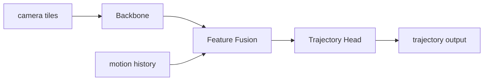

# 基盤・MLOps・運用・CI

学習・評価・デプロイを支える基盤(MLOps)と、開発運用の実践を扱います。

この章では次の107個のトピックを順に解説します。


## Bottlerocket OS

### ひとことで言うと
Bottlerocket(ボトルロケット)は AWS が開発した「コンテナを動かすことだけに特化した、極限まで中身を削ったミニマルな Linux」です。普通の Linux のように汎用ツールを詰め込まず、コンテナ実行に必要なものだけを残すことで、安全で、更新しやすく、起動が速い OS になっています。GPU 対応の NVIDIA バリアントは、GPU ドライバや GPU を Kubernetes に見せる仕組みまであらかじめ組み込んでいます。

### 直感的な理解
クラスタを構成する1台1台のサーバには OS が必要です。多くの現場では Ubuntu や Amazon Linux のような「何でもできる汎用 Linux」を入れます。汎用 Linux は便利ですが、コンテナを動かすという目的だけ見ると「余計なもの」だらけです。

たとえるなら、料理を出すためだけの厨房に、家庭用のテレビ・本棚・物置・裏口の合鍵を全部置いているようなものです。便利そうに見えて、それぞれが「泥棒の侵入口(攻撃される入口)」になり、掃除(更新)の手間も増え、入店(起動)に時間がかかります。コンテナの世界では、サーバ(ノード)は「コンテナを動かす土台」でしかありません。土台に余計なものがあると、(1) 攻撃対象領域(attack surface、攻撃に使われうる入口の総量)が広がってセキュリティが弱まり、(2) 入っているソフトの数だけ脆弱性(セキュリティの穴)とアップデート対象が増え、(3) 起動時に読み込むものが多くなって立ち上がりが遅くなります。

機械学習クラスタのようにノードが頻繁に増減し、できるだけ速く安全に立ち上がってほしい環境では、この「汎用 Linux の重さ」が無視できません。そこで AWS が「ノードはコンテナを動かす土台でしかないのだから、要らないものは全部削ろう」という発想で作ったのが Bottlerocket です。

### 基礎: 前提となる概念
理解の前提となる言葉を噛み砕きます。

- コンテナ: アプリと、それが動くのに必要なライブラリ・設定をひとまとめにして、どこでも同じように動かせるようにした「持ち運べる箱」。
- コンテナランタイム: コンテナを実際に起動・停止する下回りのソフト。Bottlerocket は containerd を使います。
- 不変インフラ(immutable infrastructure): 一度作ったサーバを後から手で書き換えず、変更が必要なら「新しいイメージで作り直して入れ替える」運用思想。手作業の積み重ねで各サーバの中身がバラバラになる「設定ドリフト(構成のズレ)」を防げます。
- AMI(Amazon Machine Image): EC2(AWS の仮想サーバ)を起動するための OS イメージのこと。Bottlerocket は AMI として配布されます。
- attack surface(攻撃対象領域): 攻撃者が突きうる入口の総量。インストールされたソフト・開いたポート・ログイン手段が多いほど大きくなります。

そして本トピックで一番重要な前提が、GPU を Kubernetes で使うには「GPU ドライバ」と「GPU を `nvidia.com/gpu` という資源として Kubernetes に見せる仕組み(通常は [NVIDIA Device Plugin](https://zenn.dev/riita10069/books/driving-automation-foundation/viewer/15_infra-mlops-ci))」が必要だ、という点です。Bottlerocket の NVIDIA バリアントは、これらを OS イメージに同梱しているのが特徴です。

### 仕組みを詳しく
Bottlerocket の設計を、初心者向けに分解します。

#### 1. 中身が極端に少ない(最小構成)
apt や yum のようなパッケージマネージャ、汎用シェル、各種コマンドはほとんど入っていません。SSH での直接ログインも標準で無効です。「ノードに SSH で入って手作業で直す」という従来の運用を、そもそも想定しません。入っているのは Linux カーネル、containerd、kubelet(各ノードで Pod を起動する Kubernetes のエージェント)など、コンテナ実行に必須のものだけです。これにより攻撃対象領域が大幅に小さくなります。

#### 2. ファイルシステムが基本「読み取り専用」
OS の本体部分(root filesystem)は read-only(読み取り専用)でマウントされます。稼働中に OS のシステムファイルを書き換えられないので、「侵入されてもシステムを改ざんしにくい」「想定外の変更で壊れにくい」堅牢さが得られます。さらに dm-verity という仕組みで、起動時にシステム領域が改ざんされていないかをハッシュ(内容の指紋)で検証し、改ざんが見つかれば起動を止めます。

#### 3. 設定は API 経由(宣言的)
設定ファイルを手で編集するのではなく、専用の設定 API を通じて宣言的に行います。デバッグが必要なときも SSH ではなく「control container / admin container」という別のコンテナ経由でアクセスします。これにより「誰がいつ何を変えたか」が追いやすく、設定の再現性が保たれます。

#### 4. アップデートが安全(2 パーティション + ロールバック)
Bottlerocket は OS イメージ用のパーティション(区画)を2つ持ちます(A/B 構成)。更新時は「今使っていない側のパーティションに新しい OS を丸ごと書き込み、再起動でそちらへ切り替える」image-based 更新を取ります。もし新バージョンで起動に失敗したら、自動で古い側に戻ります(ロールバック)。汎用 Linux の「個別パッケージを順番に上書きする」方式に比べ、更新失敗に強い設計です。

#### 5. NVIDIA GPU 対応版(Bottlerocket-NVIDIA)
Bottlerocket には用途別の「バリアント(variant)」があり、その一つが NVIDIA バリアントです。これは GPU ドライバ、コンテナから GPU を使うためのランタイム、そして GPU を Kubernetes に資源として見せる仕組み(`nvidia.com/gpu` の提供)を、あらかじめ AMI に組み込んだものです。

GPU を使う側の Pod は、いつも通り次のように書くだけです。

```yaml
resources:
  limits:
    nvidia.com/gpu: 1
```

通常、素の Kubernetes でこれを実現するには [NVIDIA Device Plugin](https://zenn.dev/riita10069/books/driving-automation-foundation/viewer/15_infra-mlops-ci) を自分でデプロイする必要があります。しかし NVIDIA バリアントの AMI はその機能を内蔵しているため、GPU ノードが起動すると追加作業なしで GPU が `nvidia.com/gpu` として見えます。ドライバと OS が同じイメージで一緒に検証済みで配布されるので、「ドライバと CUDA のバージョン不一致で GPU が見えない」という汎用 Linux でよくある落とし穴も避けやすくなります。

全体像を ASCII 図にすると次の通りです。

```
GPU ノードが起動
  └─ EC2 (GPU インスタンス、例: L40S 搭載機)
       └─ OS = Bottlerocket(NVIDIA variant)AMI
            ├─ Linux カーネル(最小)
            ├─ containerd(コンテナランタイム)
            ├─ kubelet
            ├─ NVIDIA ドライバ + GPU ランタイム(組み込み済み)
            └─ nvidia.com/gpu を Kubernetes に提供(Device Plugin 相当を内蔵)
```

### 手法の系譜と主要論文
Bottlerocket は AWS のプロダクトであり、特定の論文に紐づくものではありません。しかしその設計思想「OS を最小化して攻撃対象領域と起動時間を減らす」「不変なイメージで運用する」は、システム研究とクラウドネイティブ実践の長い系譜の上にあります。

- 系譜の起点は CoreOS Container Linux(2013 年頃〜、後に Fedora CoreOS / Flatcar Linux)です。これが「コンテナ専用 OS」という概念を業界に広め、A/B パーティションによる自動更新とロールバックを実装しました。Bottlerocket はこの系譜の直系で、同じ A/B 更新を採用しつつ、設定 API・read-only root・dm-verity でさらに不変性とセキュリティを強めています。

- 軽量化・分離の系譜として、Agache ら "Firecracker: Lightweight Virtualization for Serverless Applications"(USENIX NSDI 2020、AWS)があります。これは AWS Lambda などサーバレス実行を支える microVM(マイクロ仮想マシン、起動が極めて速く中身を絞った軽量 VM)の論文で、攻撃対象領域を最小化した実行環境がセキュリティと起動速度を両立できることを示しました。Bottlerocket と Firecracker は「実行環境を必要最小限に削る」という同じ哲学の現れで、前者はノード OS、後者は仮想化レイヤとして、AWS のコンテナ/サーバレス基盤の安全性と効率を支えています。

学術的な含意は「土台を汎用のまま使わず、用途特化で最小化すれば、安全性・更新容易性・起動速度を同時に改善できる」という点で、Bottlerocket はそれをコンテナノード向けに製品化したものです。

### 論文の実験結果(定量データ)
Bottlerocket 自体の論文的ベンチマークは公開されていませんが、設計思想の効果は隣接研究の定量データから読み取れます。

- Firecracker(NSDI 2020)は、microVM の起動時間がおよそ 125 ミリ秒(0.125 秒)、メモリオーバーヘッド(VM 1台あたりの余分なメモリ消費)が 5MB 未満であることを報告しました。これは従来型の仮想マシンより桁違いに軽く、1台の物理サーバ上に数千の隔離された実行環境を高密度に詰め込めることを意味します。なぜ重要かというと、起動が速く軽いほど、需要に応じて素早く実行環境を立ち上げ・潰せ、サーバの利用効率が上がるからです。「中身を削ると速く・軽くなる」という Bottlerocket と共通の効果を、定量的に裏付けています。

- 攻撃対象領域の縮小という観点では、汎用ディストリビューションが数百〜数千個のパッケージを含むのに対し、コンテナ専用 OS は含むパッケージ数を1桁〜2桁少なく抑えます。パッケージ数が少ないほど、公表される脆弱性に晒される確率と、緊急パッチを当てる運用負荷がともに小さくなります。これは個別の論文値ではなく、セキュリティ運用上の経験則として広く共有されている効果です。

起動速度の観点でも、コンテナ専用 OS が汎用 Linux に対して有利な理由は明快です。起動時にカーネルが初期化するドライバ・サービス(systemd ユニット)の数が少なく、読み込むディスクイメージも小さいため、ノードが「起動開始」から「Pod を受け入れ可能(kubelet が Ready)」になるまでの時間が短くなります。機械学習クラスタでオートスケーラがノードを追加するとき、この起動時間がそのまま「ジョブが待たされる時間」になります。汎用 Linux で数分かかる立ち上がりを数十秒級に縮められれば、需要急増時のスケールアウト応答が速くなり、待機ノード(常時起動して空けておくノード)を減らしてコストを下げられます。これも「中身を削ると速くなる」効果の実務的な現れです。

定量値そのものは製品・世代で変わりますが、「最小化・不変化が起動速度とセキュリティを同時に改善する」という方向性は、関連研究と運用実績の両面から一貫して支持されています。

### メリット・トレードオフ・限界
メリット:
- コンテナ実行に不要なものを削ることで攻撃対象領域が小さく、セキュリティリスクが低い
- root filesystem が読み取り専用で改ざんに強く、dm-verity で起動時に整合性も検証される
- A/B パーティション + 自動ロールバックで OS 更新が安全
- NVIDIA バリアントが GPU ドライバと `nvidia.com/gpu` 提供を内蔵し、GPU 利用に必要なコンポーネントの自前導入が不要、かつドライバと OS が検証済みの組で配布される
- 中身が少なく起動が速いため、オートスケーリングや常時待機ノードの運用と相性が良い

トレードオフ・限界:
- 汎用 Linux のように「SSH で入って自由にツールを入れて調べる」従来の運用ができない(control / admin container 経由の作法を学ぶ必要がある)
- パッケージマネージャが無く、ノード上で任意のソフトを足せない(必要なものはコンテナ側に入れる思想)
- 特殊なカーネルモジュールや独自ドライバが必要なワークロードでは、対応バリアントの有無に依存する
- デバッグ手順が汎用 Linux と異なるため、トラブル時の調査方法を別途習得する必要がある
- 設定を API 経由に強制するため、緊急時のその場しのぎ的な手当てがしにくい(裏を返せば、これが安全性の源でもある)

### 発展トピック・研究の最前線
不変・最小 OS の流れは、サプライチェーンセキュリティ(ソフトの入手経路全体の信頼性確保)と結びついて発展しています。具体的には、OS に含まれる全コンポーネントを列挙した SBOM(Software Bill of Materials、ソフトの部品表)を添付し、何が入っているかを完全に追跡可能にする取り組みや、署名付きイメージで「正規に作られた OS だけが起動する」ことを保証する仕組みです。

GPU 文脈では、ノード OS にドライバを焼き込む方式と、ドライバを別途コンテナ(GPU Operator のようなもの)で配る方式のどちらが良いかが論点です。前者(Bottlerocket-NVIDIA の方式)は検証済みの組で配れて確実な一方、ドライバ更新の柔軟性は後者に劣ります。また、機密コンピューティング(Confidential Computing、メモリ上のデータまで暗号化して OS やハイパーバイザからも秘匿する技術)を GPU まで広げる Confidential GPU の研究も進んでおり、最小・不変 OS はその信頼の基盤(信頼できる起動チェーン)として重要性を増しています。

### さらに学ぶための関連トピック
- [NVIDIA Device Plugin](https://zenn.dev/riita10069/books/driving-automation-foundation/viewer/15_infra-mlops-ci)
- [Warm GPU Node (pause Pod)](https://zenn.dev/riita10069/books/driving-automation-foundation/viewer/15_infra-mlops-ci)
- [DCGM Exporter (GPU 監視)](https://zenn.dev/riita10069/books/driving-automation-foundation/viewer/15_infra-mlops-ci)
- [Prometheus + Grafana](https://zenn.dev/riita10069/books/driving-automation-foundation/viewer/15_infra-mlops-ci)
- [Kubecost (コスト可視化)](https://zenn.dev/riita10069/books/driving-automation-foundation/viewer/15_infra-mlops-ci)


## lint失敗でCIを落とす運用

### ひとことで言うと
lint(コードの品質・スタイル検査)が違反を見つけたとき、それを「警告だから無視してもいい」ではなく「CI が赤くなって先に進めない」状態にする運用です。技術的にはたった一手で実現できます。検査コマンドを `lint || true` のように「失敗しても成功扱いにする」書き方にしていたのをやめ、`lint` だけにして、違反を本物のエラーとして CI に伝えます。地味ですが、lint を「飾り」から「実効性のある品質ゲート」に変える決定的な切り替えです。

### 直感的な理解
道具を入れただけでは品質は上がりません。たとえば家に体重計を置いても、数字を見て行動を変えなければ体重は変わりません。lint も同じで、違反を「表示するだけ」だと、誰もログの奥のメッセージを読まず、違反は静かに溜まっていきます。

実際にこういう失敗パターンが現場で頻発します。チームが「lint を入れたぞ」と満足する。だが CI は緑のまま。数か月後にログを見ると、何百件もの lint 違反が積み上がっている。誰も直していない。なぜなら CI が緑だから「直さなくても困らない」からです。せっかく入れた lint が、品質を守る効果をほとんど失っています。これは「壊れた窓理論」に似ています。割れた窓を1枚放置すると、その建物全体が荒れていく。lint 違反も、最初の数件を放置すると「ここは違反があっても構わない場所」というシグナルになり、雪だるま式に増えます。

これを防ぐ唯一確実な方法が「違反を CI の失敗にする」ことです。CI が赤くなれば、Pull Request(変更を取り込む提案)はマージ(取り込み)できません。開発者は「先に進むには直すしかない」状況に置かれます。強制力があって初めて、lint は実際に機能します。

### 基礎: 前提となる概念
まず「CI(Continuous Integration、継続的インテグレーション)」を理解してください。これは、開発者がコードを共有リポジトリに push するたびに、自動でビルド・テスト・各種検査を走らせる仕組みです。GitHub Actions、GitLab CI、Jenkins などがこれを担います。CI の目的は「壊れた変更が主要ブランチ(中心となる正本のコード)に入る前に、自動で検知して止める」ことです。

次に「終了コード(exit code)」です。コマンドラインのプログラムは終わるときに整数を返し、慣習として 0 が成功、0 以外が失敗を意味します([ruffによるPython lint](https://zenn.dev/riita10069/books/driving-automation-foundation/viewer/15_infra-mlops-ci) 参照)。CI はジョブの各ステップの終了コードを見ます。あるステップが 0 以外を返すと、CI はそのジョブを失敗(赤)と判定し、後続を止めます。lint ツールは違反を見つけると 0 以外を返すので、本来は何もしなくても CI が赤くなるはずです。

ここでシェルの記法 `||` を知る必要があります。`A || B` は「A が失敗(0 以外)したら B を実行する」という意味です(論理 OR の短絡評価)。そして `true` は「何もせず必ず成功(0)を返す」コマンドです。したがって `lint || true` は「lint が失敗しても、続く true が成功するので、ステップ全体としては成功とみなされる」という挙動になります。これが「違反を表示はするが CI は止めない」状態の正体です。似た落とし穴として、複数コマンドをパイプ `|` でつなぐと末尾コマンドの終了コードしか見ない(`set -o pipefail` がないと中間の失敗が無視される)という問題もあり、CI スクリプトでは終了コードの伝播を正確に把握することが重要です。

最後に「品質ゲート(quality gate)」という考え方です。これは「一定の品質基準を満たさないと次の工程に進めない関所」を指します。テストが通ること、lint 違反がゼロであること、カバレッジが基準以上であること、などをゲートにします。lint 失敗で CI を落とす運用は、lint をこのゲートの一部にする、ということです。

### 仕組みを詳しく
変更そのものは極小です。`|| true` を外すだけです。

before(違反を見逃す):

```bash
ruff check . || true
```

after(違反で落とす):

```bash
ruff check .
```

挙動の違いを終了コードの流れで追います。

before:
```
ruff check → 違反3件検出 → 終了コード 1（失敗）
   │
   ▼
|| true が失敗を拾い、true が成功(0)を返す
   │
   ▼
ステップの最終終了コードは 0 → CI 緑 → 違反は放置されマージできてしまう
```

after:
```
ruff check → 違反3件検出 → 終了コード 1（失敗）
   │
   ▼
そのまま 1 がステップの終了コードになる
   │
   ▼
CI はステップ失敗と判定 → ジョブ赤 → PR にバツ → 直すまでマージ不可
```

この切り替えには「順序」という落とし穴があります。安全に行う鉄則は次の順序です。

1. まず既存の lint 違反をすべて直す(自動修正 `--fix` と手動修正を併用)
2. 違反ゼロを確認する
3. そのうえで `|| true` を外す

順序を逆にすると、外した瞬間に既存の数百件の違反が一斉に CI を真っ赤にし、関係ない PR まで全部マージ不能になり、開発が止まります。この事故は「品質ゲートの導入は、ゲートをくぐれる状態を先に作ってから閉める」という一般原則の具体例です。

段階的に厳格化する戦略もよく使われます。いきなり全違反でブロックするのではなく、まず重大度の高いルール(論理エラー系の `F` など)だけをゲート化し、スタイル系は警告に留める。コードが綺麗になったら徐々にゲート対象を広げる。これは大規模な既存コードベースに lint を後付けするときの現実的な移行パスです。もうひとつの実用的手法が「ベースライン(baseline)」で、現時点の既存違反一覧を記録しておき「新規に増えた違反だけ」をゲートにします。既存の負債は許しつつ、新たな負債の流入を止める折衷案で、大規模 monorepo でよく使われます。

例外の扱いも設計に含めます。どうしても残したい正当な違反(意図的な書き方)は、CI を全体的に緩める(`|| true` に戻す)のではなく、その1行だけ `# noqa` でピンポイントに許容します([sys.path操作後のimportとnoqa E402](https://zenn.dev/riita10069/books/driving-automation-foundation/viewer/15_infra-mlops-ci))。この2つは見た目が似ていますが意味が正反対です。`|| true` は「全部見逃す」、`# noqa: E402` は「この行のこのルールだけ意図的に許す」。後者は「ここは意図的」という記録がコードに残るぶん、はるかに健全です。違反への対処は「全体を緩める」のではなく「個別に明示して許す」方向に倒すのが鉄則です。

GitHub では「branch protection rule」と「required status checks」を設定することで、特定の CI ジョブ(lint を含む)が成功しない限り技術的にマージボタンを押せなくできます。`|| true` を外すのがコード側の対処なら、required status checks は制度側の対処で、両方をセットにして初めてゲートが「人間が善意で守るもの」から「機構として迂回できないもの」になります。

### 手法の系譜と主要論文
これは特定の研究手法ではなく、ソフトウェア工学の実践原則の系譜に位置します。

- Bessey et al., "A Few Billion Lines of Code Later" (CACM 2010)。静的解析の指摘を「ただ表示するだけ」では開発者は読み飛ばし効果が出ない、と実運用データから報告しました。指摘を強制力のあるゲートにして初めて実際に修正される、という観察は本トピックの直接の理論的根拠です。彼らは「開発者が指摘を無視できる状態」を最大の敵と位置づけました。`|| true` はまさにその「無視できる状態」を作る記法であり、それを外すことが処方箋になります。

- Martin Fowler, "Continuous Integration" (martinfowler.com, 2006 改訂)。CI の古典的な定義文書です。最重要原則として「ビルドを常に緑(成功)に保つ」「赤を放置しない」を挙げています。赤が出たら最優先で直す文化がなければ CI は機能しない、と説きます。lint 違反を CI 失敗にするのは、この「赤を許さない」原則を lint にも拡張することにほかなりません。

- Humble & Farley, "Continuous Delivery" (Addison-Wesley, 2010)。デプロイパイプラインの各段階に「品質ゲート」を置き、基準を満たさない変更は次段階へ進めないという考え方を体系化しました。lint ゲートはこのパイプラインの最初期(コミット段階)に置かれる、最も安価で高速なゲートと位置づけられます。彼らは「速くて安いチェックを早い段階に、遅くて高価なチェックを後段に」というフィードバックの段階化を強調しており、lint は文字通り最前線に置かれます。

- Barry Boehm, "Software Engineering Economics" (Prentice-Hall, 1981)。欠陥の修正コストが、検出が遅れるほど指数的に増大することを定量化した古典で、後の「シフトレフト(検査を開発の左=早期へ寄せる)」思想の土台になりました。lint ゲートは欠陥をコミットの瞬間に捕まえる仕組みなので、この経済学的根拠の最も直接的な実装です。

系譜としては「Boehm が早期検出の経済性を定量化(1981) → Fowler が『赤を放置しない』CI 原則を確立(2006) → Humble & Farley が品質ゲートとして体系化(2010) → Bessey らが『無視できる指摘は無効』と実証(2010)」が合流し、「lint 違反は無視できないゲートにすべき」という現在の標準実践になりました。

### 論文の実験結果(定量データ)
定量的な裏づけはいくつかの源から得られます。

Bessey らの CACM 論文では、Coverity の運用経験として「単に指摘を表示するモードでは、開発者が指摘に対応する率が著しく低い」ことが報告されています。彼らの定性的だが繰り返し観測された知見は「ビルドを壊す指摘(build-breaking)は対応率が劇的に高く、警告どまり(advisory)の指摘はほとんど対応されない」というものです。これは本トピックの効果を端的に示します。`|| true` を外すという一手が、対応率を「ほぼゼロ」から「ほぼ100%(直さないとマージできないため)」へ引き上げるのです。

Boehm のソフトウェアコスト研究、および後年の経験的調査(NIST の2002年報告など)では、欠陥の修正コストが検出段階に応じて大きく増える様子が報告されています。開発中(コーディング段階)に見つけた欠陥の修正コストを1とすると、結合テスト段階では数倍、本番リリース後では数十〜百倍に達するという観測です。具体的な倍率は対象や規模で大きく変動するため「およそ数倍〜百倍」と幅で理解するのが正確ですが、傾向は一貫しています。lint ゲートは欠陥を「コミットの瞬間」という最も早い段階で捕まえるため、修正コストの観点で最も費用対効果が高いゲートになります。

指標の意味を補足します。ここでの「対応率(fix rate)」とは、ツールが出した指摘のうち実際に修正されたものの割合です。lint を入れる目的は「指摘を出すこと」ではなく「コードが実際に直ること」なので、評価すべきは検出件数ではなく対応率です。`|| true` の有無は、まさにこの対応率を決定的に左右する設定なのです。アブレーション的に言えば「`|| true` を付ける/外す」という1ビットの違いが、対応率という結果指標を二分する最大の因子であり、ルールを何個足すかよりも先に決めるべき設計判断だと分かります。

### メリット・トレードオフ・限界
メリット

- lint 違反が確実に修正される(放置されない)。対応率が構造的に最大化される
- 主要ブランチのコード品質が時間とともに劣化しない(品質が単調に保たれる)
- 「指摘はあるが緑」という曖昧でごまかしの効く状態が消える
- 新たに入る違反は PR 単位で即座に止まるので、レビュアーが瑣末な指摘をしなくて済む

トレードオフと限界

- 切り替え前に既存違反を全部直す初期コストがかかる。大規模コードでは段階的厳格化やベースラインが必要
- 厳しすぎるルール設定だと開発の足かせになり、開発者の反発を招く。ルール選定が成否を分ける([ruffによるPython lint](https://zenn.dev/riita10069/books/driving-automation-foundation/viewer/15_infra-mlops-ci))
- 誤検知に対しては `# noqa` などの個別許容を併用しないと、正当なコードがブロックされる([sys.path操作後のimportとnoqa E402](https://zenn.dev/riita10069/books/driving-automation-foundation/viewer/15_infra-mlops-ci))
- 一時的に「lint を直すだけ」のコミットが増え、履歴に機能と無関係な変更が混ざる
- ゲートが厳しいと、開発者が `# noqa` を乱用して形骸化させる「迂回」のインセンティブが生まれる。ゲートの厳しさと迂回のしやすさはトレードオフ

未解決の論点として「どこまで自動ゲートにし、どこから人間の判断に委ねるか」があります。すべてを機械的ゲートにすると柔軟性を失い、緩めると効果を失う。この境界の引き方はチームの規模・成熟度・コードベースの状態に依存し、万能の答えはありません。

### 発展トピック・研究の最前線
lint ゲートの自然な発展は「複数ゲートの組み合わせ」です。lint だけでなく、型チェック、テスト、カバレッジ閾値、依存脆弱性スキャンを段階的なゲートとして並べ、それぞれが必須条件になります。GitHub の「required status checks」や「branch protection」は、これらのゲートを通らない限りマージを技術的に禁止する仕組みで、運用を制度として固定します。

さらに進むと「マージ列(merge queue)」という考え方があります。複数の PR が同時に並ぶと、個々は緑でも組み合わせると壊れる(意味論的衝突、semantic merge conflict)ことがあります。マージ列は PR を順番にキューに入れ、その時点の主要ブランチと統合した状態でゲートを再実行してから初めてマージします。lint を含むゲートを「マージの瞬間の最終状態」で保証する、より厳密な発展形です。

研究の最前線では「ゲートの実行時間とフィードバック速度の最適化」が活発です。ゲートが遅いと開発者は待ちきれず迂回したくなるため、変更されたファイルだけを検査する増分解析(incremental analysis)、結果のキャッシュ、並列実行が研究・実装されています。ruff のような高速ツールが好まれるのも、ゲートを速く保ってこそ強制力が受け入れられる、という Bessey 流の知見と一致します。ゲートの「厳しさ」と「速さ」と「受け入れやすさ」のバランスは、いまも現場と研究の両方で調整が続く論点です。DevOps の定量研究(DORA レポートの「変更失敗率」「リードタイム」などの指標)でも、自動ゲートの整備が高パフォーマンスチームと相関することが報告されており、lint ゲートはその最も基礎的な構成要素として位置づけられます。

### さらに学ぶための関連トピック
- [ruffによるPython lint](https://zenn.dev/riita10069/books/driving-automation-foundation/viewer/15_infra-mlops-ci)
- [sys.path操作後のimportとnoqa E402](https://zenn.dev/riita10069/books/driving-automation-foundation/viewer/15_infra-mlops-ci)
- [POSIX準拠の末尾改行](https://zenn.dev/riita10069/books/driving-automation-foundation/viewer/15_infra-mlops-ci)
- [GitHub ActionsによるCI](https://zenn.dev/riita10069/books/driving-automation-foundation/viewer/15_infra-mlops-ci)


## AWS CodeBuild (Image CI)

### ひとことで言うと
イメージ CI とは「コードが変わるたびに、Docker イメージを自動で組み立てて倉庫(コンテナレジストリ)へ納品する仕組み」です。AWS CodeBuild はその AWS マネージドなビルドサービスで、人がローカルで `docker build` して `docker push` する手作業を、クラウドが用意する使い捨てのビルド用マシンの上で自動実行します。学習用イメージ・前処理用イメージなどを安定して供給する、MLOps パイプラインの入り口にあたる役割を担います。

### 直感的な理解

工場の組み立てラインを想像してください。職人が毎回手で同じ製品を作ると、その日の体調や道具の状態でできあがりがブレます。代わりに「決められた手順書どおりに動く自動ライン」を用意すれば、いつ誰が回しても同じ製品が出てきます。イメージ CI はソフトウェアの組み立てラインです。手順書(後述の buildspec)に「ログイン → ビルド → タグ付け → push」と書いておけば、コードが変わるたびにクリーンなマシンが同じ手順を機械的に実行し、毎回再現可能なイメージをレジストリへ納品します。これにより「自分の PC では動いたのに本番で壊れた」という事故を構造的に防げます。

### 基礎: 前提となる概念

- CI (Continuous Integration、継続的インテグレーション): コードを変更するたびに「ちゃんとビルドできるか」「テストが通るか」を自動でチェックする習慣・仕組み。手作業だと環境差による事故が起きるため、毎回同じ手順で機械的に検証します。
- CD (Continuous Delivery/Deployment): CI でできた成果物を、自動で配布・デプロイ可能な状態にすること。イメージを ECR に push するところまでが、デプロイ可能状態を作る一歩です。
- ビルド (build): ソースコードやライブラリから、実行可能な成果物(ここでは Docker イメージ)を組み立てる工程。
- 成果物 (artifact): ビルドの産物。ここではレジストリに push する Docker イメージ。
- 使い捨てビルド環境: CodeBuild はビルドのたびにクリーンなマシンを一時的に確保し、終わると破棄します。常時サーバーを持たないので、ビルドしていない時間は課金されません(アイドルコストゼロ)。

なぜイメージビルドを自動化したいのか。「学習も推論もコンテナで動かす」構成では、コードを変えるたびに新イメージを作りレジストリへ push する必要があります([Amazon ECR (Container Registry)](https://zenn.dev/riita10069/books/driving-automation-foundation/viewer/15_infra-mlops-ci) 参照)。これを手作業でやると次の問題が起きます。
1. 手間と打ち間違い: `docker login` → `build` → `tag` → `push` を毎回手で打つのは面倒でミスが出る。
2. 環境差: ビルドする人の Docker バージョンやキャッシュ状態、ローカルに残った中間ファイルで、できるイメージが微妙に変わる。
3. GPU 学習イメージは重い: 言語ランタイム + 数値計算ライブラリ + CUDA を含むイメージは数GBになり、ローカルでビルドすると時間も帯域も食う。さらに開発機が ARM(例: Apple Silicon)だと x86 向け GPU イメージのクロスビルド(エミュレーション)は極端に遅く面倒。

クラウドのビルドサービスは、クリーンな専用マシンで毎回同じ手順を実行し、出来たイメージを同一ネットワークのレジストリへ高速 push することで、これらを一括解決します。

### 仕組みを詳しく

#### buildspec とは
CodeBuild は `buildspec.yml` という設定ファイルに「何をするか」を書いておくと、その手順を順番に実行します。
```yaml
version: 0.2
phases:
  pre_build:
    commands:
      # レジストリにログイン
      - aws ecr get-login-password --region $AWS_REGION | docker login --username AWS --password-stdin $ECR_REGISTRY
      # Git コミットハッシュをタグに使うため取得 (先頭7桁)
      - IMAGE_TAG=$(echo $CODEBUILD_RESOLVED_SOURCE_VERSION | cut -c1-7)
  build:
    commands:
      # イメージをビルド
      - docker build -t $ECR_REGISTRY/myproject/training:$IMAGE_TAG -f Dockerfile.training .
  post_build:
    commands:
      # レジストリに push
      - docker push $ECR_REGISTRY/myproject/training:$IMAGE_TAG
```
`phases` は実行段階で、`install`(任意、ツール導入)→ `pre_build`(準備)→ `build`(本体)→ `post_build`(後処理)の順に走ります。各 `commands` はただのシェルコマンドなので、ローカルで手で打つのと同じことを CodeBuild のマシン上で順に実行しているだけ、と理解してください。手順がファイルとしてバージョン管理されるため、レビュー対象になり、変更履歴も追えます。

#### ビルドの流れ全体
```
[コードの変更]
      │  ← トリガ(手動 / Webhook / パイプライン)
      ▼
[ビルド用マシンを一時的に確保]  (使い捨て、クリーン)
      ▼
[ソースコードを取得]
      ▼
[buildspec の pre_build → build → post_build を順に実行]
   ├─ レジストリへログイン
   ├─ docker build (複数イメージをまとめてビルドすることも)
   └─ docker push → レジストリへ
      ▼
[ビルド用マシンを破棄]  (使った分だけ課金)
```

#### タグとトレーサビリティ
例の `CODEBUILD_RESOLVED_SOURCE_VERSION` は「今どのコミットをビルドしているか」を CodeBuild が自動で入れてくれる環境変数です。これをイメージタグにすると、レジストリ上のイメージ名(`training:abc1234`)を見るだけで対応する Git コミットが一意に分かります。本番で動くイメージが正確にどのコードかを後から追跡できることは、障害調査と再現性の観点で極めて重要です。たとえば「先週の学習で出たモデルが再現できない」とき、タグからコミットを辿れば原因のコードに即座に戻れます。`latest` 上書き運用はこの追跡を壊すため避けます。

#### キャッシュとビルド時間
CodeBuild はレイヤキャッシュ(前回のビルドレイヤを再利用)やローカルキャッシュ設定をサポートします。これを有効にしないと毎回ゼロからイメージを作り直して遅くなります。Dockerfile で「変わりにくい依存を先に、変わりやすい自分のコードを後に」配置すると、キャッシュが効いてビルドが短縮されます([Amazon ECR (Container Registry)](https://zenn.dev/riita10069/books/driving-automation-foundation/viewer/15_infra-mlops-ci) のレイヤ構造と同じ原理)。GPU イメージでは CUDA や torch の導入レイヤが支配的なので、ここをキャッシュできるかどうかでビルド時間が桁で変わります。

#### 権限の渡し方
ビルドマシンには「レジストリへ push する権限」「必要なら S3 などにアクセスする権限」が要ります。これを IAM ロール(サービスロール)で渡すのが安全な定石で、アクセスキーを buildspec やソースにハードコードしません。ビルド時に一時的な認証情報が自動で割り当てられ、ビルド終了とともに失効します。鍵がリポジトリやログに漏れる事故を構造的に防げます。

#### 複数イメージのまとめビルド
1回のビルドで学習用イメージと前処理用イメージなど複数を作り、それぞれ対応するレジストリリポジトリへ push する構成がよく使われます。依存解決にコツが要る環境(特定ライブラリを通常の依存解決から外して個別に入れる等)でも、手順を buildspec に固定しておけば毎回同じイメージを再現できます。これが「手順をコード化する」ことの本質的な利点です。手元では再現に苦労する複雑なビルドほど、固定された手順書の価値が大きくなります。

### 手法の系譜と主要論文

CodeBuild は商用サービスで学術論文の手法ではありませんが、背景の方法論を整理します。

- 継続的インテグレーションの起源: CI の概念は Grady Booch が1990年代に提唱し、Kent Beck らの Extreme Programming (XP, 1999年頃) で「毎日何度も統合する」習慣として広まりました。Martin Fowler の解説記事 "Continuous Integration" (2006) が定番のまとめです。中心思想は「統合(全員のコードを合わせてビルド・テストすること)を遅らせるほど、壊れたときの原因特定が困難になるので、頻繁に小さく統合せよ」。
- Continuous Delivery (Humble & Farley, 書籍, 2010): ビルドから本番リリースまでを自動化された一本のパイプライン(deployment pipeline)にする考え方を体系化。「手動の受け渡しを減らし、すべての成果物を自動で生成・検証・配布せよ」「ビルドした成果物は一度だけ作り、全環境で同じものを使い回せ(build once, deploy many)」。CodeBuild はこのパイプラインで「成果物(イメージ)を生成する」一要素を担い、ECR に置いたイメージを各環境が pull する形がまさに build once, deploy many です。
- Accelerate / DORA (Forsgren, Humble, Kim, 2018): CI/CD の効果を統計的に測った研究。下記の実験結果で詳述。
- Reproducible Builds (Debian の Reproducible Builds プロジェクト, 2010年代〜): 「同じソースから誰がビルドしても同じ成果物が出るべき」という考え方。動機は「配布バイナリが本当にそのソースから作られたか検証したい」。buildspec で手順を固定しクリーン環境でビルドするのは、完全な bit 一致ではないものの「環境差による揺れを減らす」同じ方向の実践です。

### 論文の実験結果 (定量データ)

CI/CD は方法論であり単一の管理実験は稀ですが、定量的な裏付けとして広く引用される調査があります。

- DORA / State of DevOps レポート(Google Cloud、Forsgren らの研究、書籍 "Accelerate" 2018 にまとめ): 数千組織の調査データをクラスタ分析し、自動化された CI/CD(デプロイ自動化、頻繁な統合)を実践する「高パフォーマンス」チームが、低パフォーマンスチームに対して4つの主要指標すべてで優れることを統計的に示しました。報告では、デプロイ頻度が桁違いに高く(オンデマンド対 月1回未満)、変更のリードタイムが大幅に短く(1時間未満対 1〜6か月)、変更失敗率が低く、サービス復旧時間も短いとされます。指標の意味は次のとおりです。変更のリードタイム=コードを書いてから本番で動くまでの時間(短いほど良い)、変更失敗率=デプロイが障害を引き起こす割合(低いほど良い)、復旧時間=障害から回復するまでの時間。重要なのは、これらが同時に改善する点で、「速くすると壊れる」というよくある思い込み(スピードと安定のトレードオフ)が、自動化により回避できる――むしろスピードと安定は相関する――ことを定量的に示した点です。
- イメージビルド固有の効果(一般的な実測の傾向): レイヤキャッシュを有効化すると、変更のない下位レイヤの再ビルドが省かれ、ビルド時間が数分の一に短縮されるのが普通です。逆にキャッシュ無効だと毎回フルビルドになり、CUDA を含む GPU イメージでは10分超かかることもあります。アイドルコストゼロのため、ビルド頻度が低いプロジェクトでは常時サーバー型 CI より総コストが下がる一方、超高頻度ビルドではマシン起動のウォームアップ時間が積み上がる、というトレードオフがあります。

### メリット・トレードオフ・限界

メリット
- ビルド用マシンを常時持たず、使った分だけ課金(アイドルコストゼロ)。
- 毎回クリーンな環境でビルドするので、ローカルの状態差による「自分の PC では動く」問題を回避。
- レジストリや IAM などクラウドサービスと統合され、必要権限を IAM ロールで安全に渡せる(鍵をハードコードしない)。
- 重い GPU 学習イメージをローカルでビルドせず、クラウド側でビルドして同一ネットワークのレジストリへ高速 push できる(ARM 開発機から x86 GPU イメージを作る面倒も回避)。
- buildspec によりビルド手順がコード化され、再現性とレビュー可能性が上がる。

トレードオフ・限界
- buildspec のメンテが必要。依存関係が複雑だとデバッグに手間がかかる(失敗するたびに数分のビルドを待つ反復が遅い)。
- 特定クラウドへのロックイン。他の CI(例: GitHub Actions, GitLab CI)へ移すなら buildspec を書き直す必要がある(ただし中身はシェルコマンドなので移植は機械的)。
- ビルドが頻繁だと、その都度マシン起動の待ち時間とビルド時間がかかる。キャッシュ設定をしないと毎回ゼロから作り直して遅い。
- ローカルでの素早い試行錯誤には不向き(毎回 CI を回すより手元ビルドが速い場合がある)。確定ビルド・本番用イメージの供給に向く。
- 完全な再現性(bit 一致)はベースイメージのタグ揺れや時刻依存ファイル(タイムスタンプ)により簡単には達成できず、ベースイメージのダイジェスト固定や SBOM 生成と組み合わせる研究・実務上の継続課題。

### 発展トピック・研究の最前線
- サプライチェーンセキュリティ: ビルド来歴の証明(SLSA フレームワーク、どのソース・どのビルダで作られたかを検証可能にする)、イメージ署名(Sigstore/cosign)、SBOM(Software Bill of Materials、含有ソフトウェア一覧)の自動生成。
- 高速ビルダ: BuildKit による並列・キャッシュ最適化、リモートキャッシュの共有(チーム全体でキャッシュを共有してビルドを短縮)。
- ベースイメージのダイジェスト固定(`@sha256:...`)による再現性確保。
- GitOps: ビルド後のデプロイをリポジトリ宣言で自動同期する流れ([Helm (K8s パッケージング)](https://zenn.dev/riita10069/books/driving-automation-foundation/viewer/15_infra-mlops-ci) や宣言的構成との連携)。
- マルチアーキテクチャ(arm64/amd64)同時ビルドと、ARM 開発機 × x86 GPU 本番の橋渡し。

### さらに学ぶための関連トピック
- [Amazon ECR (Container Registry)](https://zenn.dev/riita10069/books/driving-automation-foundation/viewer/15_infra-mlops-ci)
- [Terraform (IaC)](https://zenn.dev/riita10069/books/driving-automation-foundation/viewer/15_infra-mlops-ci)
- [Helm (K8s パッケージング)](https://zenn.dev/riita10069/books/driving-automation-foundation/viewer/15_infra-mlops-ci)
- [EKS Pod Identity / IRSA](https://zenn.dev/riita10069/books/driving-automation-foundation/viewer/15_infra-mlops-ci)


## CPU-only PyTorchでのCI実行

### ひとことで言うと
自動テストを回すマシン(CI ランナー)には高価な GPU を積まず、CPU だけで動く軽量版の PyTorch を入れて、テストを速く・安く回す工夫です。CI で検証したいのは多くの場合「コードのロジックが壊れていないか」であって「GPU で本当に速く学習できるか」ではないので、GPU 用の重い部品を切り落とせる、という割り切りに基づきます。GPU が必須なテストはマーカーで分離して CI から除外し、GPU 検証は別の GPU マシンに任せます。

### 直感的な理解
料理教室で「レシピの手順が正しいか」を確認するのに、毎回プロの業務用大型オーブンを持ち込む必要はありません。手順の正しさ(材料を入れる順番、分量の計算)は家庭用コンロでも確認できます。本番の大量調理のときだけ業務用オーブンを使えばよい。

PyTorch も同じです。PyTorch は機械学習で広く使われるライブラリで、学習(大量データを見せてモデルを賢くする処理)では膨大な行列計算が必要なため、それを並列処理する GPU(Graphics Processing Unit、もとは画像処理向けだった並列計算チップ)を使います。ところが、

- PyTorch を普通にインストールすると、NVIDIA GPU を使うための追加部品(CUDA ランタイム、cuDNN など)が一緒に入る。これらは合計で数 GB ある。
- CI の仮想マシンは毎回まっさらから起動するので、毎回この数 GB をダウンロード・インストールすることになり、テスト本体より「準備」に時間がかかる。
- そもそも CI で標準提供される VM(GitHub Actions の `ubuntu-latest` など)には GPU が付いていない。GPU が無いのに GPU 用の重い部品を入れても、ダウンロード時間を払うだけで一切使われない。

「コードのロジックの正しさは CPU でも検証できる」と発想を変えれば、CI には CPU 専用の軽い PyTorch を入れれば十分、という判断になります。これが CPU-only PyTorch での CI 実行です。

### 基礎: 前提となる概念

- **GPU と CUDA**: GPU は並列計算に特化したチップ。NVIDIA の GPU を汎用計算に使うための基盤ソフトウェアが CUDA。cuDNN は深層学習の畳み込みなどを高速化する最適化ライブラリ。PyTorch の GPU 版はこれらを同梱(または依存)する。
- **PyTorch のビルド種別**: PyTorch には「どの計算バックエンド向けか」で複数のビルドがある。代表的には CPU 専用版、CUDA 各バージョン版、ROCm(AMD GPU)版など。インストール時にどれを入れるか選べる。同じ `import torch` でも中身が違う。
- **wheel(ホイール)と index URL**: Python のパッケージは `.whl`(wheel)という事前ビルド済みの配布形式で配られる。`pip install` はパッケージインデックス(配布元)から wheel を取得する。PyTorch は CPU 版・CUDA 版を別々のインデックス URL で配布しており、`--index-url` で配布元を切り替えると入るビルドが変わる。
- **CI ランナー**: テストを実行する仮想マシン。GitHub などの標準提供のものは CPU のみで GPU 非搭載。
- **smoke test(スモークテスト)**: 「電源を入れて煙が出ないか」程度の最低限の動作確認。小さな入力でモデルの forward が例外なく通り、出力 shape が期待どおりかだけを確かめる軽いテストを指すことが多い。CPU 化しやすい代表例。
- **マーカーによるテスト分離**: GPU や学習済み重みが必須のテストにタグを付け、CI では除外する仕組み([pytestマーカーによる統合テスト分離](https://zenn.dev/riita10069/books/driving-automation-foundation/viewer/15_infra-mlops-ci))。

### 仕組みを詳しく

#### CPU 専用ビルドを入れる

PyTorch は配布元(index URL)を切り替えることで、入るビルドを変えられます。

```bash
# CPU 専用版を入れる(GPU 用の重い部品を含まない)
pip install torch --index-url https://download.pytorch.org/whl/cpu

# 比較: CUDA 版(GPU 用部品を含む、数 GB)
pip install torch --index-url https://download.pytorch.org/whl/cu124
```

`--index-url` は「どの配布元からダウンロードするか」を切り替えるオプションです。`/whl/cpu` という配布元には GPU 用部品を含まない CPU 専用 wheel だけが置かれています。これを使うと PyTorch の導入サイズが大きく縮みます。

数値感(おおよそ、報告・配布物のサイズによる):
- CUDA 版 PyTorch + 依存(CUDA ランタイム、cuDNN 等)= 数 GB 規模。ダウンロード+展開で数分かかることがある。
- CPU 専用版 = 数百 MB 規模。導入が大幅に短い。

この差がそのまま CI の毎回のセットアップ時間に効きます。CI VM は毎回まっさらなので、この準備時間は実行のたびに発生する固定費です。たとえばテスト本体が30秒で終わるのに、セットアップが3分かかっていては、フィードバックループの大半が「待ち」になります。

#### GPU 必須テストを除外する

CPU 版を入れただけでは不十分です。`torch.cuda.is_available()` が False の環境で GPU を前提とするコードを走らせると、`RuntimeError: No CUDA GPUs are available`(あるいは `Found no NVIDIA driver`)等で失敗します。そこで GPU が必須のテストにマーカーを付け、CI から除外します。

```python
import pytest

@pytest.mark.integration   # あるいは @pytest.mark.gpu
def test_full_forward_with_pretrained_weights():
    # 学習済み重みのダウンロードと GPU を要する重いテスト
    ...
```

CI 側では GPU 不要なテストだけを選んで実行します。

```bash
pytest -m "not integration"
```

`-m "not integration"` は「integration という印が付いていないテストだけ走らせる」という意味です(詳細は [pytestマーカーによる統合テスト分離](https://zenn.dev/riita10069/books/driving-automation-foundation/viewer/15_infra-mlops-ci))。これにより、CPU で十分検証できる軽いユニットテストだけが CI で回ります。さらに設定ファイルの `addopts` にこの除外を既定として書いておけば、`pytest` を素で打つだけで自動的に GPU テストが外れます([pytest addoptsでデフォルト除外](https://zenn.dev/riita10069/books/driving-automation-foundation/viewer/15_infra-mlops-ci))。CPU-only ビルドとマーカー除外は、片方だけでは穴が残るため、両方を組み合わせて初めて「CI が安定して緑になる」状態が完成します。

#### device に依存しないコードの書き方

CPU でも GPU でも同じテストを通すには、コード側を device 非依存に書くのが定石です。

```python
device = "cuda" if torch.cuda.is_available() else "cpu"
model = model.to(device)
x = x.to(device)
```

こう書いておけば、GPU 不要な軽いテストは CPU 上で問題なく通り、GPU マシンでは GPU 上で通ります。テストやモデルが `.cuda()` のように特定 device をハードコードしていると CPU CI で落ちるため、device 抽象を徹底することが CPU-only CI を成立させる前提になります。device をハードコードしないという規律は、後でモデルを別のアクセラレータ(Apple の MPS、TPU 互換層など)へ移すときにも効いてきます。

#### before / after で整理

```
before(素朴な構成):
  GPU 版 PyTorch を入れる
    → 数 GB ダウンロード(毎回, 遅い)
    → GPU テストが GPU 不在で失敗
    → CI が無意味に赤くなる / セットアップで時間を浪費

after(CPU-only 構成):
  CPU 版 PyTorch を入れる
    → 数百 MB(毎回, 速い)
    → GPU 必須テストはマーカーで除外
    → GPU 不要なロジックテスト(shape, 分岐, API 誤用)だけ実行
    → 安定して緑, CI が軽い
```

GPU 特有の検証(実際の学習、VRAM 使用量、混合精度の数値挙動、CUDA カーネルの正しさ、`torch.compile` の GPU 経路)は、CI とは別に GPU 搭載マシン上で回します。CPU CI はあくまで「GPU なしで分かる範囲の正しさ」を守る関所、という役割分担です。

### 手法の系譜と主要論文

これは論文の手法ではなく、MLOps(機械学習の運用)の実践的エンジニアリングです。背景となる学術的問題意識を辿ります。

- **環境依存という技術的負債**: Sculley らの "Hidden Technical Debt in Machine Learning Systems"(NeurIPS 2015)は、ML システムでは「設定・データ・環境/インフラの複雑さ」がコード以上に技術的負債(technical debt、後で利息付きで返すことになる手抜き)になりやすいと指摘しました。論文中の "CACE: Changing Anything Changes Everything"(何かを変えると全部が変わる)や、glue code(つなぎコード)・configuration debt の議論が有名です。GPU 依存をテストから切り離し、検証したいロジックだけを軽い環境で回すのは、この環境依存の負債を局所化する具体策の一つです。

- **速いフィードバックループ**: Amershi らの "Software Engineering for Machine Learning: A Case Study"(ICSE-SEIP 2019)は、Microsoft の多数の ML チームへの調査から、ML 開発の生産性は「実験・検証のフィードバックループの速さ」に強く依存すると報告しました。CI を軽く保つ CPU-only 構成は、まさにこのフィードバックを速くする判断にあたります。

- **PyTorch の配布設計**: PyTorch チームは早くから CPU 専用 wheel を独立した index URL で配布しており、これは「GPU を持たない開発者・CI 環境でも `import torch` できるようにする」という明確な意図に基づきます。配布元を分けるこの設計が、CPU-only CI を1行で実現可能にしている前提技術です。同様の発想は他の深層学習フレームワーク(CPU 版と GPU 版を別パッケージにする等)にも共通します。

なお、これらの論文は「CPU-only ビルドを使う」という具体手法そのものを論じてはいないため、本トピックは学術手法ではなく、上記の問題意識に沿った実装上のグッドプラクティスとして理解するのが正確です。

### 論文の実験結果(定量データ)

CPU-only CI の効果を直接測る論文はありませんが、関連する定量的事実を挙げます。

- PyTorch の CPU 版と CUDA 版の配布サイズ差は、おおよそ「数百 MB 対 数 GB」のオーダー(報告・配布物のサイズによる)。CI VM が毎回まっさらで起動する以上、この差は実行のたびに繰り返し発生する固定的なダウンロード時間に直結します。キャッシュ(`actions/cache`)を併用しない限り、毎回数 GB を引くか数百 MB で済むかは、CI 1回あたり数分の差になりえます。月に何百回も回る CI では、この差が累積コストとして無視できなくなります。

- **Hilton ら(ASE 2016)** の調査では、CI 利用者がコストとして最も強く挙げたのが「ビルド/テスト時間」でした。セットアップ時間(依存導入)はビルド時間の無視できない一部であり、依存を軽くすることは開発者満足度に直接効く、と解釈できます。

- **応答時間の閾値**: HCI の古典的知見として、フィードバックが約10秒を超えると開発者は別作業に切り替えやすくなることが知られます。セットアップを含む CI 全体を軽く保つことは、PR ごとの「赤/緑が出るまで」を短縮し、開発者が文脈を保ったまま待てる範囲に近づけます。

指標の意味として、ここで効いているのは精度系の指標ではなく「CI 1回あたりの所要時間」と「CI の安定性(GPU 不在による偽の失敗を出さないこと)」です。前者は開発速度に、後者は CI への信頼(赤を本気で受け止めるか)に直結します。GPU 不在で偽の赤が出る CI は、たとえ速くても「どうせ環境のせい」と無視され、CI 本来の価値を失います。

### メリット・トレードオフ・限界

メリット:
- 導入が軽く速い(数 GB → 数百 MB のオーダー)。CI の固定費を毎回削れる。
- GPU のない標準 CI マシンで安定して動く(GPU 不在による偽の失敗が出ない)。
- CI の待ち時間とクラウドコストを抑えられる(GPU ランナーは時間単価が桁違いに高い)。
- ロジックのバグ(shape ミス、分岐の誤り、API 誤用、None 伝播)は CPU でも十分検出できる。

トレードオフ・限界:
- **GPU 特有の問題は検出できない**: VRAM 不足(OOM)、CUDA カーネルの挙動差、混合精度(fp16/bf16)の数値誤差、`torch.compile` の GPU 経路、マルチ GPU の通信など、GPU でしか出ない不具合は CPU CI をすり抜ける。
- **数値の微差**: CPU と GPU は浮動小数点演算(IEEE 754)の実行順序や実装(融合積和、並列リダクションの順序)が異なり、結果が完全一致しないことがある。CPU で書いたテストの許容誤差(tolerance)が GPU では破れる、あるいはその逆が起こりうる。`assert torch.allclose(a, b, atol=...)` の許容値設定が悩ましくなる。
- **別フロー必須**: GPU を要するテスト・実学習は別の GPU マシンや別 CI フロー(セルフホストランナー、夜間バッチ)で回す必要がある。CPU CI だけでは ML システムの検証は完結しない。
- **部分的な保証**: 「CI が緑=本番 GPU でも完全に動く」とは言い切れない。CPU CI は GPU なしで分かる範囲の保証にとどまる。

未解決の課題として、「GPU 必須ロジックをどこまで CPU で代理検証できるか」の線引きがあります。小さな入力で CPU 上でも forward が通ることを確認する smoke test は CPU 化しやすい一方、メモリ使用量や速度に関わる検証は本質的に GPU でしか測れません。また数値再現性の問題は根が深く、「CPU で緑だったテストが GPU で許容誤差を超える」事例は実務で頻出します。CPU CI と GPU 検証の役割分担、許容誤差の設計、決定的アルゴリズムの採否は、プロジェクトごとに最適点が異なります。

### 発展トピック・研究の最前線
- **セルフホスト GPU ランナー**: 自前の GPU マシンを CI に登録し、GPU 必須テストだけを別ジョブで回す構成。CPU-only の高速 CI と組み合わせる二段運用が定番([GitHub ActionsによるCI](https://zenn.dev/riita10069/books/driving-automation-foundation/viewer/15_infra-mlops-ci))。
- **二段 CI**: PR は CPU-only で軽く、main マージや夜間は GPU マシンで重いテスト・実学習まで回すゲート設計。
- **依存キャッシュと再現性**: `actions/cache` や lockfile(`uv.lock`, `poetry.lock`)で依存導入をさらに高速化・固定化する。再現可能なビルドは「手元では通るのに CI で落ちる」を減らす。
- **クロスデバイス数値整合性**: CPU と GPU、さらに異なる GPU 世代間で数値結果をどこまで一致させるか。`torch.use_deterministic_algorithms(True)` による決定的実行や、許容誤差ベースの比較(`torch.allclose`)の設計が研究・実務の論点。
- **他アクセラレータへの展開**: Apple Silicon の MPS バックエンドや各種 NPU 向けの軽量ビルドが整備されつつあり、device 非依存に書いておく価値が増している。

### さらに学ぶための関連トピック
- [GitHub ActionsによるCI](https://zenn.dev/riita10069/books/driving-automation-foundation/viewer/15_infra-mlops-ci)
- [pytestマーカーによる統合テスト分離](https://zenn.dev/riita10069/books/driving-automation-foundation/viewer/15_infra-mlops-ci)
- [pytest addoptsでデフォルト除外](https://zenn.dev/riita10069/books/driving-automation-foundation/viewer/15_infra-mlops-ci)
- [ruffによるPython lint](https://zenn.dev/riita10069/books/driving-automation-foundation/viewer/15_infra-mlops-ci)
- [lint失敗でCIを落とす運用](https://zenn.dev/riita10069/books/driving-automation-foundation/viewer/15_infra-mlops-ci)


## テストマーカーによる選択的実行と環境依存スキップ

### ひとことで言うと
実データを使う重い学習テストは、普段の高速テストとは分けて扱いたい。そこでテストに「ラベル (マーカー)」を貼り、デフォルトでは走らせず必要なときだけ明示的に呼びます。さらに、データやパーサ (読み込みプログラム) が手元に無い環境では、テストを「失敗 (fail)」にせず「スキップ (skip)」して通り過ぎるようにします。これにより、開発サイクルの速さと、環境差に強い CI の両立を図ります。ソフトウェアテスト工学の標準的なパターンです。

### 直感的な理解
工場に 2 種類の検査があるとします。1 つは部品を手元で数秒で確認する簡易チェック。もう 1 つは完成品を実際に動かして数十分かける本格テストで、専用の試験設備が要ります。これらを毎回まとめて全部やっていたら、ちょっとした修正のたびに数十分待たされて仕事になりません。だから普段は簡易チェックだけを回し、本格テストは「設備が空いていて、本当に確認したいとき」に明示的に走らせます。

もう 1 つの問題があります。本格テストには専用設備 (実データ、ネットワーク、GPU) が要りますが、開発者全員がその設備を持っているわけではありません。設備を持っていない人の環境で本格テストを動かしたとき、「設備が無い」を「テスト失敗」と扱うと、その人の CI が常に赤くなります。これは間違いです。「設備が無いから今回は確認しなかった」だけで、製品が壊れているわけではないからです。だから「設備が無いなら、失敗ではなく見送り (スキップ)」とするのが正しい。マーカーによる選別とスキップは、この 2 つの問題への標準的な答えです。

### 基礎: 前提となる概念
用語を整理します。

- テストランナー: テストを自動で見つけて実行するツール。Python では pytest が代表的で、`test_` で始まる関数を自動収集して実行します。
- マーカー (marker): テストに貼る「ラベル」。pytest なら `@pytest.mark.slow` のように関数の上に書くと、そのテストに `slow` という目印が付きます。あとで「このラベルが付いたものだけ実行」「付いたものは除外」と選別できます。
- スキップ (skip): テストを「成功でも失敗でもなく、今回は実行を見送った」状態にすること。結果表示では `s` (skipped) と出ます。CI の合否には影響しません。
- フェイル (fail): テストが失敗した状態。表示は `F`、CI (自動テスト) が赤くなり、マージがブロックされることが多いです。
- パス (pass): テストが成功した状態。表示は `.` または `PASSED`。
- xfail (expected failure): 「失敗するのが既知・想定内」と宣言された状態。実際に失敗すれば xfail (許容)、思いがけず成功すると xpass として記録され、両者を fail と区別できます。
- パラメータ化 (parametrize): 同じテスト関数を引数違いで複数回実行する仕組み。1 つの関数で「データセット A / B / C」をそれぞれ検証できます。
- フィクスチャ / 例外: テストの前準備や、想定される失敗の種類 (ファイルが無い `FileNotFoundError`、import 失敗 `ImportError` など)。スキップ判断はこの例外の種類を見て行います。
- テストピラミッド: 高速で多数のユニットテストを土台に、低速で少数の統合 / E2E テストを上に積むべきという指針。下ほど数が多く速い。
- フレーキーテスト (flaky test): コードを変えていないのに、実行のたびに合否が揺れるテスト。環境依存・並行性・順序依存が主因で、CI の信頼性を最も損ないます。

### 仕組みを詳しく
問題 1 (速さの差) への対応は、マーカーでデフォルト除外する設定です。pytest なら設定ファイル (例: pytest.ini) に書きます。

```ini
[pytest]
addopts = -m "not integration and not e2e_data"
markers =
    integration: Full backbone integration tests (slow, requires pretrained weights)
    e2e_data: End-to-end training on real datasets (slow, needs data/network)
```

`addopts` (default options、デフォルトで常に付く引数) に `-m "not integration and not e2e_data"` を指定しています。`-m` はマーカー選別オプションで、ここでは「`integration` でも `e2e_data` でもないテストだけ実行する」という意味です。つまりランナーをそのまま起動すると、重いテストは自動的に外れます。`markers =` ブロックでラベルを宣言しておくのも要点で、これがないと未知マーカーとして警告が出るうえ、どのマーカーが何を意味するかのドキュメントにもなります。

重いテスト側にはラベルを貼ります。

```python
@pytest.mark.e2e_data
@pytest.mark.parametrize("name,build_fn,num_views", DATASET_SPECS)
def test_loss_decreases_on_real_data(name, build_fn, num_views):
    ...
```

これを実行したいときだけ、明示的にマーカーを指定して除外を上書きします。

```bash
pytest e2e_test.py -v -m e2e_data -s
```

`-m e2e_data` で「e2e_data 付きだけ」実行、`-s` は print 出力を画面に出すオプションです。

問題 2 (環境依存) への対応は、無いものをスキップに変換する仕組みです。データセットを組み立てる関数を try / except でくるみ、例外の種類で挙動を変えます。

```python
def _try_build(build_fn):
    try:
        return build_fn()
    except pytest.skip.Exception:
        raise                                    # 既に skip 指示ならそのまま
    except ImportError as e:
        pytest.skip(f"parser unavailable: {e}")   # パーサが無い → skip
    except (FileNotFoundError, OSError, ValueError) as e:
        pytest.skip(f"data unavailable: {e}")     # データが無い → skip
```

ポイントは、例外を握りつぶさず種類で振り分けることです。

- パーサ (読み込みプログラム) が import できない → `ImportError` を捕まえて skip。まだ実装が入っていないデータセットはここに来ます。
- データファイルやディレクトリが無い → `FileNotFoundError` / `OSError` / `ValueError` を捕まえて skip。環境変数でデータの場所を指す方式なら、未設定のときここに来ます。
- それ以外の想定外の例外は捕まえず、本物のバグとして fail させます。これが重要で、何でもかんでも skip にすると本当のバグを見逃します。
- `pytest.skip.Exception` を先に再 raise しているのも肝で、内側で意図した skip を、後続の except 節が誤って別メッセージの skip や fail に化けさせるのを防いでいます。例外ハンドリングの順序設計そのものが、テストの意味を守っています。

宣言的に書くなら `@pytest.mark.skipif(condition, reason=...)` でも同等のことができます。実行前に条件が分かる場合 (OS・ライブラリ有無) は skipif、ビルドを試みて初めて分かる場合 (データの実在) は try / except の動的 skip、と使い分けるのが定石です。

パラメータ化と組み合わせると、たとえばデータセット A だけ使える環境では次のように出ます。

```
test_loss_decreases_on_real_data[dataset_a]  PASSED
test_loss_decreases_on_real_data[dataset_b]  SKIPPED (data unavailable)
test_loss_decreases_on_real_data[dataset_c]  SKIPPED (parser unavailable)
```

A は本当に学習が進むか検証し、残りは「無いものは無い」として静かに見送ります。CI は赤くなりません。

「全スキップ時のガード」という設計上の注意。すべてのデータセットがスキップされると、「実は 1 つも検証できていない」のに緑 (全部成功扱い) に見えてしまう危険があります。これを防ぐ考え方が「ガード」です。たとえば「少なくとも 1 つの実データで検証できたか」を確認する別テスト (CI 上では必ずデータが 1 件は存在する前提を assert する) を置けば、全環境でデータが欠けている状況に気づけます。パラメータ化による個別スキップは各 spec を独立に見送るだけなので、全スキップを能動的に検知したいなら、こうしたガードテストを別途足すのが定石です。pytest なら `--runxfail` や、収集後フックで skipped 件数を集計して閾値を課す方法もあります。

なぜ skip と fail を厳密に分けるのか。CI の合否は「製品が壊れているか」だけを表すべきで、「テスト環境に何が揃っているか」を混ぜてはいけません。データが無いことを fail にすると、両者が混ざって CI の赤が意味を失い、開発者が赤を無視する習慣 (alarm fatigue、警報疲れ) につながります。skip は「実行できなかった」を fail と区別して記録する、正直なシグナルです。

### 手法の系譜と主要論文
これは機械学習の論文手法ではなく、ソフトウェアテスト工学の確立されたパターンです。

- テストピラミッド (Mike Cohn, 2009, "Succeeding with Agile: Software Development Using Scrum"): 高速で多数のユニットテストを土台に、低速で少数の統合 / E2E テストを上に積む構成を推奨。下層ほど速く安く頻繁に、上層ほど遅く高価でまれに実行します。Martin Fowler が後に "TestPyramid" として整理・普及させました。マーカーによる階層分け (unit / integration / e2e) はこの考え方の直接的な実装です。
- pytest のマーカーと skip / skipif / xfail (pytest 公式ドキュメント): 「環境依存 (データ・ネットワーク・GPU・OS) で実行できないものは fail ではなく skip にする」ことを推奨。`skipif` で条件付きスキップ、`xfail` で「失敗が既知・想定内」を表現するなど、テスト結果の意味を細かく分類する道具立てを提供します。
- フレーキーテスト研究 (Luo, Hariri, Eloussi & Marinov, 2014, "An Empirical Analysis of Flaky Tests", FSE): 実行ごとに合否が揺れるテストの原因を、オープンソースの修正履歴 (Apache プロジェクト群) から分析。主因として並行性 (Async Wait)・順序依存・I/O やネットワークといった環境依存を特定しました。環境依存をマーカーと skip で隔離するのは、この主因を CI から切り離す合理的な対策です。Fowler の "Eradicating Non-Determinism in Tests" も同じ問題意識を扱います。
- テストの分類と選択的実行 (test selection / test impact analysis): 大規模リポジトリでは、変更に関係するテストだけを選んで走らせる手法が研究・実用化されています (Google や Microsoft の社内事例が論文化されている)。マーカーによる手動の階層分けは、その最も単純で運用しやすい形です。
- 開発フローと生産性 (Forsgren, Humble & Kim, 2018, "Accelerate"; DORA "State of DevOps" レポート群): デプロイ頻度・変更失敗率・リードタイム・復旧時間という 4 指標と、速いフィードバックループの相関を体系的に示しました。重い E2E を毎回回さず分離する設計は、この「速いフィードバック」を守る具体策に対応します。

### 論文の実験結果(定量データ)
このパターン自体は単一の定量論文を持ちませんが、関連する経験的知見を引きます。

- フィードバックループの速さと開発生産性: DORA レポート群および "Accelerate" の調査は、テストとビルドのフィードバックが速い組織ほど、デプロイ頻度が高く変更失敗率が低い (上位群と下位群で桁違いの差) ことを繰り返し報告しています。重い E2E テストを毎回走らせると 1 サイクルが数分かかり開発者の集中が切れます。マーカーで分離して高速テストを数秒に保つことは、この生産性指標に直結します。
- フレーキーテストのコスト: Luo et al. (2014) は対象とした修正のうち相当数が環境・並行性・順序依存に起因することを示しました。環境依存テストをマージブロッキングの CI に混ぜると、無関係な赤が頻発し、開発者が CI を信用しなくなります。skip による隔離は、この「赤の信頼度」を保つための定量的に裏付けられた対策です。大規模事業者では、フレーキーが全テスト失敗の無視できない割合を占めるという報告もあり、隔離・検疫 (quarantine) の運用が標準化しています。
- アブレーション的視点。(1) マーカーによる除外をやめて全テストを毎回走らせると、テスト時間が数秒から数分へ伸び、開発の即時性が失われます。(2) skip 変換をやめてデータ欠如を fail にすると、データを持たない開発者全員の CI が赤になり、CI が機能不全に陥ります。(3) 例外を種類で振り分けず全部 skip にすると、本物のバグまで skip で見逃します。(4) 全スキップ検知ガードを置かないと、データが全欠でも緑になり「検証したつもり」の偽の安心が生まれます。これら 4 つが、各設計要素の必要性を示します。

指標の意味。ここで最適化しているのは「テスト 1 サイクルの所要時間」と「CI の赤の信頼度 (赤が本物のバグを意味する割合)」の 2 つです。前者は開発の回転速度、後者は開発者が CI を信頼してマージ判断に使えるかを決めます。マーカーとスキップはこの 2 つを同時に守る設計です。

### メリット・トレードオフ・限界
メリット

- 普段の開発では高速テストだけが走り、開発サイクルが速い (数秒)。
- データ / パーサ / GPU が無くても CI が赤くならない (環境差で偽の失敗を出さない)。
- マーカー指定一発で、本気の E2E 検証も実行できる。柔軟な選別。
- skip の理由がメッセージに残るので、何が足りなくて見送られたかが追える。

トレードオフ・限界

- デフォルトで除外されるぶん、重いテストを誰も明示的に走らせないと「実データで本当に動くか」が長期間検証されないまま放置されえます。CI に専用ジョブ (nightly など) を足す運用が要ります。
- skip が多いと「緑なのに実は何も検証していない」状態が起こりえます。全スキップを検知するガードを別途置かないと、安心しすぎる危険があります。
- 例外の種類で skip / fail を振り分けるため、想定外の例外型が出ると意図せず fail になります (逆に握りつぶしすぎると本物のバグを skip で見逃す)。分類設計が肝です。
- マーカーの命名・運用が属人化しやすい。チームで「どのマーカーがいつ走るか」を明文化しないと、テストが知らぬ間に走らなくなります。マーカーの typo が黙って「該当 0 件」になる事故も起きやすく、`--strict-markers` で未宣言マーカーをエラーにする防御が要ります。

未解決の課題として、「重いテストを十分な頻度で確実に走らせる」運用の保証は、マーカー機構だけでは解けません。スケジュール実行 (nightly CI)、データセットのキャッシュ・配布、GPU ランナーの確保といったインフラ側の手当てが要ります。マーカーは選別の道具であって、検証を実際に行う保証ではない点が本質的な限界です。

### 発展トピック・研究の最前線
- 条件付きスキップ (skipif) と xfail の使い分け: 「特定 OS・特定バージョンでのみ skip」「既知の失敗を想定内として記録 (xfail)」など、テスト結果の意味をより細かく表現します。fail を雑に skip で潰さず、状態を正確に分類する方向です。
- テストインパクト分析 (TIA): 変更されたコードに影響するテストだけを依存解析で自動選択して走らせます。マーカーによる手動分類を自動化する発展形で、大規模モノレポで実用化されています。
- フレーキーテストの自動検出・検疫: テストを複数回実行して合否の揺れを検出し、自動でフレーキー扱いにして隔離する仕組み。環境依存テストの管理を自動化する流れで、機械学習で揺れの予測モデルを使う研究もあります。
- 機械学習特有のテスト: モデルの不変性テスト (入力の摂動に対する出力の頑健性)、メタモルフィックテスト (出力同士が満たすべき関係の検証)、データ検証 (スキーマ・分布のドリフト検出) など、通常のソフトウェアテストにない観点が研究されています (例: "The ML Test Score", Breck et al. 2017)。マーカーによる階層分けは、これら多様なテスト群を整理する基盤になります。
- 学習特有の重いテストの運用: 実データ E2E、GPU 必須テスト、長時間の収束確認などは、コスト・データ配布・再現性の制約から、マーカー + スケジュール実行 + データキャッシュを組み合わせた専用パイプラインで回すのが実務の最前線です。

### さらに学ぶための関連トピック
- [損失トレンド判定 (ノイズ耐性のある減少判定)](https://zenn.dev/riita10069/books/driving-automation-foundation/viewer/15_infra-mlops-ci)
- [固定バッチ過学習による学習パイプライン検証](https://zenn.dev/riita10069/books/driving-automation-foundation/viewer/15_infra-mlops-ci)
- [未来状態予測ヘッドと「学習信号に未接続」という状態](https://zenn.dev/riita10069/books/driving-automation-foundation/viewer/10_losses)
- [一時ファイルへのストリーム展開でメモリ節約](https://zenn.dev/riita10069/books/driving-automation-foundation/viewer/13_datasets-dataprocessing)


## Amazon ECR (Container Registry)

### ひとことで言うと
コンテナレジストリとは「Docker イメージ(プログラム一式を固めた箱)を保管・配布しておく倉庫」です。Amazon ECR (Elastic Container Registry) はその AWS マネージド版です。学習や推論を動かすためのプログラム一式をイメージという箱に詰めて ECR に置いておき、Kubernetes (K8s) などの実行基盤がその箱を ECR から取り出して(pull して)計算ノード上で動かします。MLOps では学習用・前処理用・評価用などのイメージをここに集約して管理するのが定石です。

### 直感的な理解

ソースコードの保管・共有に GitHub を使うように、コンテナイメージの保管・共有には専用の倉庫が要ります。なぜなら、イメージは1個が数百MB〜数GB(GPU 学習用は CUDA を含むと容易に5〜10GB)と大きく、複数のマシンが同時に取りに来るからです。倉庫が遅かったり落ちたりすると、せっかく確保した高価な GPU が「イメージのダウンロード待ち」で遊んでしまいます。レジストリは「重い実行物を、必要なマシンに速く・確実に届ける配送センター」だと考えると分かりやすいです。マネージド(managed、サーバーの面倒をクラウド側が見る)であれば、自前で倉庫サーバーを立てて冗長化・運用する手間も要りません。

### 基礎: 前提となる概念

- Docker イメージ: プログラムを動かすのに必要なもの一式(言語ランタイム、システムライブラリ、自分のコード、設定ファイル)をまとめて固めた実行可能パッケージ。これがあればどのマシンでも全く同じ環境で動かせ、「自分の PC では動くのに本番では動かない」を防げます。
- コンテナ: イメージを実際に起動して動かしている状態。イメージが「設計図・レシピ」で、コンテナが「それを元に作った実体」です。1つのイメージから何個でもコンテナを起動できます。
- レジストリ (registry): イメージを保管・配布する場所。代表例に Docker Hub(公開)、各クラウドのマネージドレジストリ(ECR、Google Artifact Registry、Azure Container Registry)、自前運用の Harbor などがあります。
- pull / push: レジストリからイメージを取り出すのが pull、レジストリへ送り込むのが push。
- ダイジェスト (digest): イメージ内容全体の SHA-256 ハッシュ(`sha256:...`)。タグが指す中身が変わってもダイジェストは内容で一意に決まるため、再現性の究極の拠り所になります。
- OCI 仕様: イメージの中身の形式(Image Format)と、レジストリとの通信方法(Distribution Specification)は OCI (Open Container Initiative) という業界標準で定められています。これにより、Docker で作ったイメージを ECR でも他のレジストリでも同じように扱えます。

なぜ専用の保管場所が要るのか。「学習も推論もコンテナで動かす」構成では、コードを変えるたびに新しいイメージを作り、それを計算ノードへ配布する必要があります。そこで(1)ビルドしたイメージをどこかに置き、(2)実行基盤がそれを pull して走らせる、という流れになり、置き場所としてレジストリが必須になります。クラウド完結型を選ぶ主な動機は、認証・権限を IAM(クラウドの権限体系)で一元管理できること、そしてクラウド内部の高速ネットワークから低遅延で pull できることです。

### 仕組みを詳しく

#### 1. リポジトリ (repository) を作る
レジストリ内では、イメージの種類ごとにリポジトリという入れ物を作ります。たとえば学習・前処理・評価で別々のリポジトリを用意します。ECR のリポジトリ URI は次の形をとります。

```
<アカウントID>.dkr.ecr.<リージョン>.amazonaws.com/<リポジトリ名>
例: 123456789012.dkr.ecr.us-west-2.amazonaws.com/myproject/training
```
読み方:
- `<アカウントID>` … クラウドアカウントの番号(誰の倉庫か)。
- `dkr.ecr.<リージョン>.amazonaws.com` … ECR のリージョン(物理的な場所)を表すホスト名。
- `myproject/training` … リポジトリ名。スラッシュは名前の一部で階層的なラベルづけに使えます。

役割ごとにリポジトリを分ける理由: 更新・バージョン管理が混ざらず、push/pull の権限も別々に絞れるからです。たとえば学習リポジトリには CI だけが push でき、推論リポジトリには本番アカウントだけが pull できる、といった分離ができます。

#### 2. イメージをタグ付けして push する
```bash
# (a) レジストリにログイン (認証トークンを取得して docker に渡す)
aws ecr get-login-password --region us-west-2 \
  | docker login --username AWS \
      --password-stdin 123456789012.dkr.ecr.us-west-2.amazonaws.com

# (b) ローカルイメージに ECR 用の名前 (タグ) を付ける
docker tag myproject-training:latest \
  123456789012.dkr.ecr.us-west-2.amazonaws.com/myproject/training:abc1234

# (c) push する
docker push \
  123456789012.dkr.ecr.us-west-2.amazonaws.com/myproject/training:abc1234
```
`:abc1234` の部分がタグ (tag) で、同じリポジトリ内のイメージを区別する目印です。`latest` という特別なタグもありますが、本番では Git のコミットハッシュをタグにするのが定石です。理由は「今動いているのは正確にどのコードのイメージか」を一意に特定でき、再現性とトレーサビリティ(追跡可能性)が保てるからです。さらに厳密を期すなら、実行基盤側ではタグではなくダイジェスト(`@sha256:...`)で参照すると、タグの指す中身がすり替わっても固定できます。

#### 3. 実行基盤が pull する
K8s では、ワークロード定義(Pod/Job のマニフェスト)にイメージを指定します。
```yaml
spec:
  containers:
    - name: trainer
      image: 123456789012.dkr.ecr.us-west-2.amazonaws.com/myproject/training:abc1234
```
各ノードの kubelet(常駐エージェント)がこの行を見て ECR から該当イメージを pull し、コンテナとして起動します。pull の認証は、ノードや Pod に紐づけた IAM 権限で自動解決するのが安全な定石です(鍵をマニフェストに書かない)。`imagePullPolicy` を `IfNotPresent` にするとノードに既にあるレイヤは再 pull せず、起動を速められます。

#### イメージのレイヤ構造
Docker イメージはレイヤ (layer) という薄い差分の積み重ねでできています。
```
レイヤ1: 言語ランタイムのベース (例: Python 3.12)
レイヤ2: 主要ライブラリを入れた差分 (例: torch + CUDA)
レイヤ3: 追加ライブラリの差分
レイヤ4: 自分のコードをコピーした差分
```
各レイヤは内容のハッシュ(content-addressable、内容で一意に決まる ID)で識別されます。push/pull のとき、レジストリは既に持っているレイヤを再送しません。コードだけ変えたら最後のレイヤだけ送れば済むため、毎回数GBを送らずに済みます。この差分転送と、よく使うベースレイヤの共有が、レジストリの効率の肝です。Dockerfile を書くときは「変わりにくいもの(ライブラリ)を先に、変わりやすいもの(自分のコード)を後に」配置すると、キャッシュが効いてビルドも転送も速くなります。

#### ライフサイクルとセキュリティ
- ライフサイクルポリシー: 「タグなしイメージを N 日で削除」「同名タグは最新 M 個だけ残す」などのルールで古いイメージを自動削除し、ストレージコストを抑えます。学習のたびに新タグを積むとイメージ数が際限なく増えるため、これがないとストレージ課金が静かに膨らみます。
- イメージスキャン: push されたイメージに含まれるソフトウェアの既知脆弱性(CVE, Common Vulnerabilities and Exposures)を自動検出する機能。サプライチェーンセキュリティの基本です。
- イミュータブルタグ(immutable tags): 同じタグを上書き不可にする設定。`v1.0` が知らぬ間に別物にすり替わる事故を防ぎ、再現性を強制します。

### 手法の系譜と主要論文

ECR 自体はクラウドサービスで学術論文の手法ではありませんが、背景にあるコンテナとオーケストレーションの系譜を整理します。

- Linux cgroups / namespaces (2000年代後半): コンテナは「1台の OS を複数の隔離された箱に区切る」技術で、見える範囲を区切る namespaces とリソースを区切る cgroups というカーネル機能の上に成り立ちます。論文というよりカーネルの機能拡張として整備されました。仮想マシンと違い OS カーネルを共有するため起動が軽く、これがイメージ配布を現実的にしました。
- Docker (2013, Solomon Hykes ら): これらカーネル機能を誰でも使える簡単なツールにまとめ、「イメージ」という配布可能形式と「動く環境ごと配る」という考え方を普及させました。レイヤ化された配布フォーマットを世に広めた立役者です。
- Borg (Verma et al., "Large-scale cluster management at Google with Borg", EuroSys 2015): Google 社内で何万台ものマシン上でコンテナを動かす仕組みを論文化。提案は「ジョブをコンテナとしてクラスタへ投げ、スケジューラが空きマシンへ割り当てる」運用モデル。効果はマシン利用率の大幅向上と運用自動化。教訓として、イメージ配信(レジストリに相当する部分)の可用性と帯域が全体の信頼性・スループットに直結することが示されています。レジストリをワークロードと同じリージョン・近接ネットワークに置くのは、この教訓に沿った設計です。
- Borg, Omega, and Kubernetes (Burns et al., ACM Queue 2016): Borg から Kubernetes に至る設計の振り返り。宣言的な望ましい状態(desired state)で運用する思想がここで結晶化し、イメージ参照もその宣言の一部になりました。
- OCI (Open Container Initiative, 2015〜): イメージとレジストリ通信を標準化し、特定ツール(Docker)へのロックインを緩和しました。今日のレジストリ(ECR 含む)はこの仕様に準拠しています。

### 論文の実験結果 (定量データ)

ECR は商用サービスのため公開された学術ベンチマークはありませんが、関連する定量的観察を挙げます。

- Borg 論文 (EuroSys 2015): Google のセル(クラスタ)で多数のジョブを混載スケジューリングすることで CPU/メモリ利用率を大きく改善したことが報告され、共有スケジューリングの有効性を定量的に示しました。ここでの含意は、多数のジョブが短時間に起動するほどイメージ pull のスループットがボトルネックになりうるという点です。autoscaling で同時に数十ノードが立ち上がると、同じ大きなイメージを一斉に pull する「サンダリングハード」が起きます。
- レイヤキャッシュの効果(一般的な実測の傾向): コードのみ変更した再ビルド・再配布では、共有される下位レイヤが再送されないため、転送量が「変更したレイヤ分(数MB〜数百MB)」だけに圧縮されるのが普通です。フルイメージ数GBの再送に比べ、push/pull とも桁違いに速くなります。
- 同一リージョン pull と越境 pull の差: クラウド内部ネットワーク経由(同一リージョン)の pull はインターネット越しより低遅延・高帯域で、かつデータ転送料が抑えられます。GPU など高価な計算資源では、この「起動待ち時間の短縮」がそのままコスト削減に直結します(GPU が1時間数ドルなら、数分の起動短縮も積み重なれば効く)。

数値の厳密値は構成依存ですが、要点は「レジストリの近接配置とレイヤ差分転送が、起動レイテンシと帯域コストを大きく左右する」ことです。

### メリット・トレードオフ・限界

メリット
- マネージドなのでレジストリサーバーの構築・運用・冗長化が不要。
- IAM と統合され、誰が push/pull できるかをクラウドの権限体系でまとめて制御できる。
- 同一リージョンの計算ノードから内部ネットワークで高速 pull でき、外部障害の影響を受けにくい。
- レイヤ差分転送で、コードだけの更新は最小限の転送量で済む。
- イメージスキャンで既知脆弱性を検出でき、サプライチェーンセキュリティに寄与。

トレードオフ・限界
- 保管イメージのサイズに応じたストレージ課金。古いタグを放置するとコストが積み上がるため、ライフサイクルポリシーが要る。
- リージョンに紐づくため、別リージョンの計算ノードから pull すると遅く、データ転送料もかかる(マルチリージョンはレプリケーション設定が要る)。
- `latest` タグの濫用は「今動いているのがどのコードか」を曖昧にし、再現性を損なう。コミットハッシュ等の不変タグ、究極にはダイジェスト参照を使うべき。
- 特定クラウドへのロックイン。他クラウドへ移すとレジストリ移行が必要(ただし OCI 準拠なので移行自体は機械的)。
- イメージの肥大化(不要なビルドツールやキャッシュの同梱)は pull を遅くする。マルチステージビルドや distroless ベースで小さく保つのが研究・実務上の継続課題。
- 多数ノード同時 pull のサンダリングハードは、リージョン内でも瞬間帯域を圧迫しうる。

### 発展トピック・研究の最前線
- イメージ署名と来歴検証(Sigstore/cosign, SLSA): 「このイメージは本当にこのソースから作られたか」を暗号署名で保証するサプライチェーンセキュリティ。
- レイジー pull / シーク可能イメージ(SOCI Snapshotter、eStargz、Nydus): イメージ全体の到着を待たず、コンテナ起動に必要なファイルだけ順次取得して起動を速める技術。GPU の起動待ちを縮める方向で活発に研究・実装されています(起動時間が数分の一になる報告がある)。
- マルチアーキテクチャイメージ(arm64/amd64 を1タグのマニフェストリストで提供)とビルドの再現性。
- プルスルーキャッシュ(上流レジストリをローカルにキャッシュ)による外部依存・帯域の削減。
- レジストリ層でのデデュープ・圧縮(zstd レイヤ)による転送量削減。

### さらに学ぶための関連トピック
- [AWS CodeBuild (Image CI)](https://zenn.dev/riita10069/books/driving-automation-foundation/viewer/15_infra-mlops-ci)
- [Terraform (IaC)](https://zenn.dev/riita10069/books/driving-automation-foundation/viewer/15_infra-mlops-ci)
- [EKS Pod Identity / IRSA](https://zenn.dev/riita10069/books/driving-automation-foundation/viewer/15_infra-mlops-ci)
- [Helm (K8s パッケージング)](https://zenn.dev/riita10069/books/driving-automation-foundation/viewer/15_infra-mlops-ci)


## features_only マルチスケール特徴抽出

### ひとことで言うと
画像認識モデルは普通、最後に「これは犬」「これは猫」のような分類結果(1個のベクトル)を出します。でも物体検出や領域分割、俯瞰図生成などでは、分類結果ではなく、画像の途中段階で作られる「複数の解像度の特徴マップ」が欲しいのです。timm の `features_only=True` は、その分類用の最終ヘッドを外して、各処理段階(stage)の特徴ピラミッドをリストで返してくれる仕組みです。これは検出・分割・融合系のタスクで、ほぼ必ず使う基本機能です。

### 直感的な理解
地図を思い浮かべてください。建物の細部を見たいときは縮尺の大きい(詳しい)地図が、街全体の位置関係を把握したいときは縮尺の小さい(広い)地図が要ります。1枚の地図ですべてを賄うのは無理で、複数の縮尺を使い分けます。ニューラルネットワークの内部でも、これと同じことが起きています。浅い層は「詳しいが狭い」特徴を、深い層は「粗いが広い」特徴を持ちます。`features_only` は、この複数縮尺の地図をすべて取り出して後段に渡すための仕組みです。

### 基礎: 前提となる概念
まず「マルチスケール特徴」がなぜ要るのかを説明します。

カメラ画像には、大きさが全然違う物体が同時に写ります。すぐ目の前の大きなトラックと、200m 先の小さな歩行者。これを1つの解像度だけで扱うのは無理があります。歩行者が画像上で 10×20 ピクセルしかなければ、32 分の1に縮小された深い特徴マップ上では「1 ピクセル未満」に潰れて消えてしまうからです。

浅い段階(高解像度・小さい受容野)の特徴は、空間的に細かく、小さい物体やエッジ・線状構造の位置を正確に捉えるのが得意です。ただし「これが何か」という意味の抽象度は低い。深い段階(低解像度・大きい受容野)の特徴は、空間的には粗いが、「これは車」「これは人」という意味的な情報を強く持ち、大きい物体やシーン全体の把握が得意です。

ここで「受容野(receptive field)」とは、出力の1ピクセルが元画像のどれだけ広い範囲を見て計算されているか、という意味です。層を重ねるほど(プーリングや畳み込みで情報が集約されるほど)受容野は広がります。深い層の1ピクセルは、元画像の広い領域全体を要約した値になっているわけです。たとえば縮小率 32 の特徴マップの1ピクセルは、おおむね元画像の 32×32 ピクセル以上の範囲(実効受容野はさらに広い)を見ています。

物体検出・セグメンテーション・俯瞰図生成・特徴融合といった下流タスクは、この「細かいが意味が薄い特徴」と「粗いが意味が濃い特徴」の両方を欲しがります([FPN (Feature Pyramid Network)](https://zenn.dev/riita10069/books/driving-automation-foundation/viewer/14_model-architecture-design) がまさにこれらを統合する仕組みです)。

ところが、分類用に作られたモデルをそのまま使うと、最後の forward は分類ベクトル1個しか返しません。途中の特徴は内部で捨てられます。これを取り出すために、昔は forward hook(順伝播の途中に処理を割り込ませる仕掛け。`register_forward_hook` で特定の層の出力を横取りする)を仕込んだり、モデルを切り貼り(`nn.Sequential` の途中で切る)したりといった面倒で壊れやすい手作業が必要でした。timm の `features_only` は、これをモデルに依存せず統一的に解決します。

### 仕組みを詳しく
`features_only=True` を付けると、timm はモデルを「各 stage の出力を覚えておいて、リストで全部返す」モードに切り替えます(内部的には `FeatureListNet` などのラッパで各 stage 出力を記録します)。

```python
import timm, torch

m = timm.create_model("resnet50", features_only=True, pretrained=True)
x = torch.randn(2, 3, 256, 256)   # バッチ2枚、RGB、256x256
feats = m(x)                       # ← 1個ではなくリストが返る

for f in feats:
    print(f.shape)
# 例 (ResNet-50, 入力256):
# torch.Size([2,  256, 64, 64])   stage1  1/4 解像度
# torch.Size([2,  512, 32, 32])   stage2  1/8
# torch.Size([2, 1024, 16, 16])   stage3  1/16
# torch.Size([2, 2048,  8,  8])   stage4  1/32
```

ポイントは形状の変化です。stage が進むごとに空間サイズ(H, W)は半分になり、チャンネル数(C)は倍増します。これがピラミッド構造です。空間情報は粗くなる代わりに、各位置がより多くのチャンネル(=多様な意味的特徴)を持つようになります。総要素数で見ると、256×64×64 ≈ 100 万に対し 2048×8×8 ≈ 13 万で、深い stage ほど情報を圧縮していることが分かります。

どの stage を返すかは `out_indices` で選べます。

```python
m = timm.create_model("resnet50", features_only=True, out_indices=(2, 3, 4))
# 深い側の3つだけ返す(浅い特徴は計算するが出力から省く)
```

各特徴マップのチャンネル数・縮小率は `feature_info` で事前に分かります(forward を回さずに取れるのが利点)。

```python
print(m.feature_info.channels())   # [512, 1024, 2048]
print(m.feature_info.reduction())  # [8, 16, 32]  ← 元画像に対する縮小率
```

これにより、後段のネットワークを「何チャンネルの特徴がいくつ来るか」を前提に自動配線できます。バックボーンを差し替えてもチャンネル数を手書きで直す必要がありません。たとえば FPN を組むなら、各入力 stage に対する 1×1 畳み込みの入力チャンネルを `feature_info.channels()` から自動で決められます。

注意すべき落とし穴があります。モデルによって返す特徴のテンソル並びが違うのです。ResNet や ConvNeXt は「channels-first」、つまり `[B, C, H, W]`(チャンネルが2番目)で返します。一方、timm の Swin 系や一部の ViT 派生は内部表現の都合で「channels-last」、つまり `[B, H, W, C]`(チャンネルが最後)で返すことがあります。後段がどちらか一方を前提にしていると、無言で形が合わずバグります(`[B,H,W,C]` を `[B,C,H,W]` と誤解すると、空間次元をチャンネルとして畳み込んでしまう)。

堅牢な実装パターンは、バックボーン名で分岐するのではなく、実際のテンソル形状を見て判断することです。具体的には、各特徴マップについて期待するチャンネル数が `shape[1]` に一致するかを確認し、一致せず代わりに `shape[-1]` が一致するなら channels-last と判断して `permute(0, 3, 1, 2)` で `[B,H,W,C] → [B,C,H,W]` に並べ替えます。同様に、チャンネル数の取得も、まず `feature_info` を読み、それが無い独自バックボーンに対してはダミー入力(例: `torch.zeros(1, 3, 256, 256)`)を1回だけ流して返り値の `shape` から推定する、というフォールバックを置くと、timm 製でないモデルでも同じコードで動かせます。こうした「形状から自動推定する」設計が、バックボーン差し替えの自由度を支えます。名前ハードコードは新しいモデルを足すたびに壊れるので、形状ベースの吸収層を1か所に集約するのが定石です。

### 手法の系譜と主要論文
`features_only` 自体は timm の実装機能なので論文はありませんが、その背後にある「マルチスケール特徴を下流で使う」思想は数多くの論文の前提です。系譜として押さえるべき代表を挙げます。

U-Net(Ronneberger et al., MICCAI 2015, arXiv:1505.04597)は、医療画像セグメンテーションで、エンコーダ(縮小していく経路)の各 stage 特徴をデコーダ(拡大していく経路)へスキップ接続する構造を提案しました。浅い stage の細かい位置情報と深い stage の意味情報を両方使うことで、境界の正確なセグメンテーションを実現しました。「途中 stage の特徴を取り出して使う」発想の源流の一つです。

Feature Pyramid Networks(Lin et al., CVPR 2017, arXiv:1612.03144)は、各 stage の特徴をトップダウン経路(深い特徴を上へ拡大して流す)と横方向接続(lateral connection、同じ解像度の浅い特徴と足し合わせる)で融合し、すべての解像度に意味の濃い特徴を行き渡らせる仕組みを提案しました(詳細は [FPN (Feature Pyramid Network)](https://zenn.dev/riita10069/books/driving-automation-foundation/viewer/14_model-architecture-design))。`features_only` で取り出した複数特徴は、まさに FPN の入力になります。

HRNet(Wang et al., CVPR 2019 / TPAMI 2020, arXiv:1908.07919)は、いったん解像度を下げてから戻すのではなく、高解像度特徴を最後まで保持し続けつつ並行して低解像度ブランチと情報交換する、という別アプローチを示しました。「マルチスケールをどう扱うか」という設計空間の広さを示す好例です。

BiFPN(EfficientDet, Tan et al., CVPR 2020, arXiv:1911.09070)は FPN を双方向(トップダウンとボトムアップ)に拡張し、各特徴に学習可能な重みを付けて融合する重み付き特徴融合を導入しました。マルチスケール融合をどこまで作り込むかの最前線の一つです。

### 論文の実験結果(定量データ)
マルチスケール特徴の効果は FPN 論文が定量的に示しました。指標は COCO データセット(約12万枚の画像、80カテゴリの物体に矩形と領域のアノテーション)の物体検出における AP(average precision。検出の正確さと網羅性を、複数の重なり判定しきい値 IoU 0.5〜0.95 にわたって平均した値で、100%に近いほど良い)です。

FPN を Faster R-CNN という検出器に組み込むと、単一スケールの特徴だけを使うベースラインに比べて COCO の AP がおよそ 2 ポイント前後向上したと報告されています(報告で AP は概ね 51.5%→56.9% 相当の改善が proposal recall などの指標で、検出 AP でも明確な底上げ)。とくに効いたのは小さい物体での精度で、小物体の AP(AP_small)が大きく改善しました。これは、浅い高解像度の特徴に深い層の意味情報を流し込むことで、小物体を「位置は分かるが何か分からない」状態から救い出せるためです。

アブレーション的に見ると、トップダウン経路を外す、横方向接続を外す、あるいは複数解像度のうち1つだけを使う、といった操作のいずれもが精度を下げることが示されており、マルチスケール特徴を「複数取り出して融合する」こと自体が利得の源泉だと分かります。FPN 論文では、トップダウン経路だけ・横方向接続だけでは効果が限定的で、両者を組み合わせて初めて大きな利得が出ることが報告されています。逆に言えば、`features_only` で複数 stage を取り出さなければ、こうした利得は得られません。これがこの機能が検出・分割で必須とされる定量的根拠です。EfficientDet の BiFPN も、単純な FPN に比べて同じ計算量で数ポイントの AP 改善を報告しており、「どの stage をどう融合するか」が継続的な研究テーマであることを示します。

### メリット・トレードオフ・限界
メリットは、分類ヘッドを外して検出・分割・融合に必要な複数解像度特徴を一括取得できること、`feature_info` で forward なしにチャンネル数・縮小率が分かり後段を自動配線できること、`out_indices` で必要な stage だけ選べて無駄な計算・メモリを省けること、そしてモデルに依存しない統一 API でバックボーン差し替えが容易なことです。

トレードオフと限界としては、全 stage を返すぶん中間特徴を保持するメモリが増えること(高解像度の浅い特徴は要素数が多くメモリを食う)、channels-first / channels-last の並び差を後段で吸収する必要があること、そしてどの stage が下流タスクに最適かはタスク依存で `out_indices` のチューニングが要ることが挙げられます。さらに、すべてのモデルが任意の stage を綺麗に切り出せるわけではなく、特殊な構造のモデルでは `features_only` が未対応だったり、想定と異なる縮小率を返したりすることがあるため、`feature_info.reduction()` で実際の縮小率を確認する習慣が重要です。素の(階層を持たない)ViT のように単一解像度のモデルは、そもそもピラミッドを持たないので、ViTDet のように後付けで疑似ピラミッドを作る工夫が別途要ります。

### 発展トピック・研究の最前線
マルチスケール特徴の活用は進化を続けています。Transformer 系の検出器(DETR とその後継 Deformable DETR)では、マルチスケール特徴を Deformable Attention(注目点を疎にサンプリングして計算を抑える)で効率的に統合する手法が主流になっています。素の ViT を検出に使う ViTDet(Li et al., 2022)は、単一解像度の出力を deconvolution / pooling で複数解像度に変換し、階層型でないバックボーンでも検出を可能にしました。俯瞰図生成(BEV 認識)では、複数カメラのマルチスケール特徴を3次元空間に持ち上げて融合する設計が研究の中心です。これらはすべて「バックボーンからマルチスケール特徴を取り出す」段階を前提としており、`features_only` のような統一的な特徴抽出は、こうした最前線の研究の出発点として機能し続けています。

### さらに学ぶための関連トピック
- [timm (PyTorch Image Models)](https://zenn.dev/riita10069/books/driving-automation-foundation/viewer/15_infra-mlops-ci)
- [FPN (Feature Pyramid Network)](https://zenn.dev/riita10069/books/driving-automation-foundation/viewer/14_model-architecture-design)
- [凍結バックボーン vs 微調整](https://zenn.dev/riita10069/books/driving-automation-foundation/viewer/10_losses)
- [ImageNet 事前学習](https://zenn.dev/riita10069/books/driving-automation-foundation/viewer/10_losses)
- [Hiera](https://zenn.dev/riita10069/books/driving-automation-foundation/viewer/06_backbone-perception)


## Flyte (Pipeline Orchestration)

### ひとことで言うと
Flyte (フライト、と読みます) は「データ前処理 → 学習 → 評価」のような一連の処理を、順番と依存関係を持った1つの流れ図 (DAG) として書いておき、ボタン1つでまとめて実行・再実行できるワークフローエンジンです。各ステップの入力と出力に「型」を付けることで、間違ったデータの受け渡しを実行前に防ぎ、「いつ・誰が・何を入力して・何が出たか」を完全に記録します。機械学習パイプラインの再現性と運用性を担保するための基盤です。

### 直感的な理解
機械学習のモデルを1つ作るには、実際には多くの段階を踏みます。たとえば公開データセットを取ってくる → 動画や画像を学習しやすい形に変換する → モデルを学習する → 評価指標で良し悪しを測る → さらに磨く → 再評価する、といった具合です。

これを毎回「手で順番に実行する」と、次の事故が起きます。前処理を忘れて古いデータで学習してしまう。ステップ2の出力 (ストレージ上のパス) を手でコピペしてステップ3に渡す際に打ち間違える。後から「あの良かったモデル、どのデータとどのコードで作ったんだっけ」が分からなくなる。5段階目で落ちたとき、1からやり直すのか途中から再開できるのか曖昧になる。

Flyte は、このパイプラインを「コードで定義し、各ステップを型付きの関数として書き、依存関係を Flyte に解釈させて自動実行する」ことで解決します。「オーケストレーション」とは、複数の処理を指揮者のように調整して正しい順序で動かすこと、という意味です。Flyte は配車サービスの Lyft が2019年に開発・公開し、その後 Linux Foundation AI & Data (LF AI & Data) に寄贈されたオープンソースです。

### 基礎: 前提となる概念
- DAG: Directed Acyclic Graph (有向非巡回グラフ) の略。「矢印でつながっていて、ぐるっと一周して戻ってくることがない流れ図」です。「A が終わったら B、B が終わったら C」という依存関係を表します。巡回がないので「永遠に終わらないループ」が原理的に起きません。
- コンテナ: アプリと、それが必要とするライブラリやツール一式をまとめた箱。同じコンテナはどこで動かしても同じ挙動になるため、再現性の基礎になります。
- オブジェクトストレージ: 大きなファイル (動画、モデルの重み) を URI (例: `s3://...`) で参照できる保存場所。Flyte はステップ間の大きな受け渡しをここ経由で行います。
- 冪等 (idempotent) / 不変 (immutable): 同じ入力で何度実行しても同じ結果になる性質、および一度決めた入力が後から書き換わらない性質。再現性を担保するための重要な考え方です。
- コントロールプレーン / データプレーン: 「どのステップをいつ動かすか」を司る司令塔 (Flyte の FlytePropeller などのコントロールプレーン) と、実際に計算が走る場所 (Kubernetes 上の Pod = データプレーン) を分ける考え方。司令塔は計算そのものはせず、Pod を作り状態を見張ります。

Flyte の主要な用語を整理します。

| 用語 | 意味 |
|------|------|
| Task | 1つのコンテナで動く1ステップ (例: データ取得、学習) |
| Workflow | Task をつなげた DAG (流れ図) |
| Launch Plan | Workflow + デフォルト入力 + スケジュールをひとまとめにした実行可能な版 |
| Execution | 実際に1回走らせたもの |
| Node | 実行中の各 Task インスタンス (n0, n1, …) |

### 仕組みを詳しく
#### 依存関係の自動解釈
Flyte の核心は「Task の入出力の関係から、並列・直列を自動で判断する」点です。たとえば次のような DAG を考えます。

```
n0 data_ingest(A)        n2 data_ingest(B)     ← 2つのデータ源を並列に取得
        │                       │
n1 data_processing(A)    n3 data_processing(B) ← 並列に前処理
        └───────────┬───────────┘
                    ▼  (両方の出力を入力に取る)
              n4 train                          ← 学習 (GPU)
                    ▼
              n5 evaluate                        → 実験管理基盤に記録
```

`train` (n4) は `data_processing` (n1, n3) の出力を入力に取るので、Flyte は「n1, n3 が終わるまで n4 を始めない」と自動判断します。一方 A 系と B 系の取得・前処理は互いに独立なので並列に走らせます。開発者は「この関数はこの関数の出力を受け取る」と書くだけで、並列・直列の配線は Flyte が決めます。Python では関数に `@task` / `@workflow` デコレータを付けるだけで、関数の引数と戻り値の型から DAG が静的にコンパイルされる仕組みになっています。

#### 型付きの入出力 (Flyte の真価)
各 Task の入力と出力には型が付きます。よくある型として、`FlyteFile` (1ファイルを指す型)、`FlyteDirectory` (ストレージ上のディレクトリを指す型)、`StructuredDataset` (表形式データを指す型)、dataclass (複数の値をまとめた構造体)、プリミティブ (整数・文字列) などがあります。Flyte 内部ではこれらを言語非依存の中間表現 (Flyte IDL の LiteralType) に写して扱うため、Python で書いた Task の出力を将来別言語の Task が受け取る、といった相互運用も成立します。

型が合わないと Flyte は実行前 (DAG コンパイル時) に弾きます。「文字列を渡すべきところに数値を渡した」「ディレクトリを期待しているのにファイルを渡した」といったミスを、走らせる前に検出できます。これがプレーンなスクリプトとの決定的な違いで、何時間も走る長いパイプラインの途中で型違いによる事故が起きるのを防ぎます。型情報はカタログにも記録されるため、「この出力は何者か」が後から明確に追えます。

#### 出力はアドレス可能 (再利用と部分実行)
各ノードの出力はオブジェクトストレージの URI として残ります。あるステップが出した URI を、後から別のワークフローの入力に手で渡すこともできます。これにより「前処理だけやり直して、学習からは別途やる」「前回の学習出力を使って評価だけ再実行する」といった部分実行が可能です。

#### キャッシュと再実行
Flyte は Task の入力をハッシュ化してキャッシュできます (`cache=True`, `cache_version` 指定)。同じコード・同じ入力の Task は、結果を再計算せずキャッシュから返します。これは「前処理は変えていないが学習だけ試行錯誤したい」場合に、前処理を毎回省けるため大きな時間節約になります。失敗したノードはログ・入力・出力を確認して原因を直し、Recover (途中から再開) や Relaunch (同じ入力で再実行) できます。Recover は成功済みノードをスキップして失敗箇所から再開するため、長いパイプラインの末尾でこけた際に強力です。

#### 動的ワークフローと map task
ふつうの Workflow は実行前に DAG の形が決まっている (static) ですが、入力数が実行時まで分からない場合に対応する仕組みもあります。`@dynamic` ワークフローは実行時に Task を生成して DAG を展開でき、map task は同じ Task を多数の入力に対して並列展開します。ハイパーパラメータスイープ (多数の設定を同時に学習) や、データを多数のシャードに分けて並列処理する用途で重要になります。

#### 実行基盤との関係
Flyte の Task は典型的には Kubernetes 上の Pod として実行されます。GPU を使う Task は、内部で分散学習用のオペレータ ([Kubeflow Training Operator (PyTorchJob)](https://zenn.dev/riita10069/books/driving-automation-foundation/viewer/11_optimization-training)) やキュー管理 ([Kueue (Job Queueing)](https://zenn.dev/riita10069/books/driving-automation-foundation/viewer/15_infra-mlops-ci)) の仕組みに乗って GPU ノードを確保します。GPU ノードがオンデマンドに用意される構成では、Task が Pending のまま数分待つことがありますが、これは GPU が必要になってから確保される正常な動きです。評価結果は実験管理基盤 ([MLflow (Tracking + Model Registry)](https://zenn.dev/riita10069/books/driving-automation-foundation/viewer/15_infra-mlops-ci)) に記録される、という分業がよく組まれます。

#### よくある失敗とデバッグ
コンテナ実行特有の失敗パターンを知っておくと運用が楽になります。

| 症状 | 意味と対処 |
|------|------|
| OOMKilled (exit 137) | メモリ不足。Task の資源要求 (mem) を増やす |
| ImagePullBackOff | コンテナイメージが無い / タグ違い |
| exceeded quota | 名前空間の ResourceQuota が小さすぎる |
| Bus error / shared memory | DataLoader のワーカー数が共有メモリ (/dev/shm) に対し多すぎ |

### 手法の系譜と主要論文
Flyte は論文発表のシステムというより、Lyft が自社の大規模 ML 運用のために作ったプロダクションシステムですが、背景のワークフローオーケストレーションには流れがあります。

- DAG オーケストレーションの源流: この分野の出発点的存在は Airbnb が2015年に公開した Apache Airflow です (論文ではなく OSS とエンジニアリングブログ)。動機は「データ処理の依存関係を Python コードの DAG として書き、スケジュールと再実行を管理したい」こと。Airflow は汎用のワークフロースケジューラとして広く普及しましたが、各タスクは同一環境で動くことが前提で、機械学習特有の「タスクごとに依存ライブラリや GPU 要求が違う」状況には素朴には対応しにくいものでした。

- ML 特化への進化: Flyte は Airflow と比べ、(1) 各ステップを独立したコンテナで動かし、(2) 入出力に強い型を付け、(3) 機械学習特有の大きなデータ受け渡し (動画・モデル) をオブジェクトストレージ経由で扱い、(4) Launch Plan によるバージョン管理で「どの版のワークフローをどの入力で回したか」を厳密に追える、という点に特化しています。同系統に Google の Kubeflow Pipelines があり、Flyte の差別化点は型システムの強さと再現性管理の厳密さにあります。トレードオフは、Airflow より Kubernetes 前提で重く、概念 (Task/Workflow/LaunchPlan/Execution) を覚える必要があることです。

- 再現性の問題提起: Sculley et al. "Hidden Technical Debt in Machine Learning Systems" (NeurIPS 2015, Google) は、「ML システムは実際にはモデルコードより周辺のデータ管理・パイプライン・設定が大半を占め、ここが技術的負債になる」と指摘しました。Flyte の型付き入出力・バージョン管理・実行履歴は、この論文が警告した「再現できない・追跡できない ML パイプライン」という負債への直接的な対策と位置づけられます。

- 運用品質の体系化: Breck et al. "The ML Test Score" (IEEE Big Data 2017, Google) は、本番 ML システムが満たすべきテスト・監視項目を体系化し、データとパイプラインの検証可能性を重視しました。Flyte の「実行前の型検証」「全実行の記録」は、この方向性の実装と読むことができます。Pineau et al. "Improving Reproducibility in ML Research" (JMLR 2021) の再現性チェックリストとも噛み合い、「コードとデータと設定のバージョンを固定して回す」基盤として機能します。

### 論文の実験結果 (定量データ)
Flyte 単体の論文評価はありませんが、根拠となる研究と運用知見から定量的な意義を述べます。

- 技術的負債の規模感 (Sculley et al. 2015): この論文の最も引用される主張は、実際の ML システムでは「機械学習のコードはシステム全体のごく一部 (図示では中央の小さな箱) にすぎず、設定・データ収集・特徴抽出・分析ツール・プロセス管理・サービングインフラといった周辺コードが圧倒的多数を占める」ことです。定量的な比率は文脈依存ですが、要点は「パイプラインと設定の管理を怠ると、コードより大きな負債が積み上がる」という観察で、これがオーケストレーションエンジンの存在意義を裏付けます。

- キャッシュによる時間削減: コンテナベースのワークフローでステップ単位のキャッシュを使うと、変更していない前段 (重い前処理やデータ取得) をスキップできます。重い前処理を含むパイプラインでは、後段だけ試行錯誤する際に前処理の所要時間がまるごと節約されるため、反復1回あたりの実時間が大きく短縮します。削減幅はパイプライン構成に依存しますが、「前処理が全体の大半を占める」典型では効果が顕著で、反復1回あたり数時間規模の節約になることもあります。

- 型検証による失敗の前倒し: 型のないスクリプトでは、データ受け渡しの不整合が「学習が何時間も走った後の評価ステップ」で初めて顕在化することがあります。Flyte の実行前型検証は、こうした失敗を投入時点 (0秒目) に前倒しするため、無駄な GPU 時間の発生を防ぎます。これは GPU 1時間が数ドル〜十数ドルかかる環境では直接コスト削減になります。

これらの指標 (周辺コードの比率、反復あたり実時間、無駄になる GPU 時間) は、いずれも「ML 開発の生産性と再現性」を測るものです。モデルの精度そのものではなく、精度を追い求める過程の効率を支えるのがオーケストレーションの役割です。

### メリット・トレードオフ・限界
メリット:
- 長いパイプラインを1つの DAG として宣言でき、依存関係に基づく並列・直列実行を自動で行う。
- 入出力の型チェックにより、走らせる前にデータ受け渡しのミスを検出できる。
- どの版のワークフローをどの入力で回し何が出たかを完全に記録し、再現性が高い。
- 各ステップを独立コンテナで動かすので、ステップごとに依存ライブラリや資源 (GPU/CPU) を変えられる。
- 出力がアドレス可能で、部分実行・チェーン・キャッシュ・途中再開が容易。

トレードオフ・限界:
- Kubernetes を前提とし、ローカルで完結する素朴なスクリプトより導入と運用が重い。
- 概念が多く (Task/Workflow/LaunchPlan/Execution)、学習コストがある。
- 各ステップがコンテナ起動なので、軽い処理を細かく分けるとコンテナ起動のオーバーヘッド (イメージ pull・スケジューリング待ち) が目立つ。
- 入力は実行ごとに不変なので、パラメータを変えるたびに新しい実行を起こす必要がある (探索的な対話作業には向かない場面もある)。
- 未解決の課題として、DAG では表しにくい「条件分岐の多い動的なワークフロー」や「ストリーミング (終わりのない流れ)」の扱いは、バッチ DAG モデルの限界に触れる領域です。dynamic workflow で部分的に補えますが、本質的にバッチ指向です。

### 発展トピック・研究の最前線
- データバージョニングとの統合: パイプラインの再現性を完全にするには、コードのバージョンだけでなく「入力データのバージョン」も固定する必要があります。データレイク上でデータをコミット単位で管理する仕組み (LakeFS, DVC など) とオーケストレーションを組み合わせる流れが主流化しています。
- 動的ワークフローと map タスク: 入力数が実行時まで分からない場合に、Task をデータ依存で動的に展開する機能が、ハイパーパラメータスイープや大量シャード処理で重要になります。Flyte 自身もスイープを Launch Plan + map task で表現できます。
- リネージ (来歴) とガバナンス: 「どのモデルがどのデータとコードから来たか」を企業全体で追跡する data/model lineage が、規制対応 (説明責任) の観点で研究・整備されています。
- LLM パイプラインへの展開: 大規模言語モデルの前処理・微調整・評価も同じオーケストレーションで扱われるようになり、長時間ジョブのフォールトトレランスとコスト最適化、エージェント的な分岐の多いワークフローへの対応が新たな焦点です。

### さらに学ぶための関連トピック
- [Kueue (Job Queueing)](https://zenn.dev/riita10069/books/driving-automation-foundation/viewer/15_infra-mlops-ci)
- [Kubeflow Training Operator (PyTorchJob)](https://zenn.dev/riita10069/books/driving-automation-foundation/viewer/11_optimization-training)
- [MLflow (Tracking + Model Registry)](https://zenn.dev/riita10069/books/driving-automation-foundation/viewer/15_infra-mlops-ci)
- [KServe (Model Serving)](https://zenn.dev/riita10069/books/driving-automation-foundation/viewer/09_reasoning-vlm-system2)


## ワークフローオーケストレーションによる学習パイプライン

### ひとことで言うと

「データ取り込み → 前処理 → 学習 → 評価」といった性質の違う複数の処理ステップを、決まった順番で、それぞれ専用のコンテナの中で、必要な計算資源(GPU など)を割り当てて自動実行する仕組みです。これを指揮するソフトウェアをワークフローオーケストレーターと呼び、Flyte や Apache Airflow が代表例です。各ステップを独立した「タスク」に分け、依存関係を有向非巡回グラフ(DAG)として記述します。

### 直感的な理解

機械学習の作業は、一本道の大きなプログラムではなく、性質がまったく異なる複数の工程の連なりです。それぞれの工程が必要とする「道具」が違うことが本質的な難しさを生みます。

- データ取り込みは、ネットワークから大きなファイルをダウンロードする作業で、CPU とディスクと帯域は要りますが GPU は不要です。
- 前処理(動画からフレームを抜く、画像を整形する等)も CPU 中心で、GPU はあまり要りません。
- 学習は GPU が必須で、しかも大量の VRAM を消費します。
- 評価も GPU を使いますが、学習ほど大量ではありません。

これらを一つの巨大なスクリプトに全部書いてしまうと、三つの問題が起きます。第一に、GPU が要らないダウンロード工程の間も高価な GPU マシンを占有し続けて無駄。第二に、6 時間の学習が終わった後の評価工程でバグが出たら、また最初のデータ取り込みからやり直し。第三に、「どの工程がどんな設定で動いたか」が記録に残らず追えない。

オーケストレーターはこれらを解決します。各工程を独立したタスクに分け、タスクごとに「必要な計算資源」と「実行環境(どのコンテナか)」を指定し、タスク間の依存関係(A が終わってから B)を宣言します。すると、GPU タスクだけ GPU マシンで動かして他は安い CPU マシンで動かし、失敗したタスクだけを再実行し、各タスクの入出力を記録できるようになります。指揮者(オーケストレーター)が楽譜(ワークフロー定義)に従って各演奏者(タスク)に出番を指示するイメージです。

### 基礎: 前提となる概念

用語を一つずつ噛み砕きます。

- DAG (Directed Acyclic Graph、有向非巡回グラフ): 矢印が一方向で、たどっても元に戻る輪ができないグラフ。「A → B → C」のような処理の依存関係を表すのに使います。輪がないので「どこから始めてどこで終わるか」が一意に決まります。
- タスク (task): ワークフローを構成する最小の処理単位。一つのタスクは一つのコンテナの中で実行されます。
- ワークフロー (workflow): 複数のタスクを依存関係でつないだもの。上記の DAG に相当します。
- リソース要求 (resource request): そのタスクが必要とする CPU コア数・メモリ量・GPU 個数の宣言。スケジューラ(配置を決める仕組み)はこれを見て、要求を満たすマシンにタスクを配置します。
- コンテナイメージ: タスクが動く環境を固めた箱(Docker イメージ)。タスクごとに別のイメージを指定できます。
- Secret(シークレット): パスワードやアクセストークンなどの秘密情報を、ログや UI に出さずにコンテナへ安全に渡す機構。
- オブジェクトストレージ (S3 等): タスク間で大きなデータを受け渡すための保管庫。

Flyte の特徴は、これらの定義を Python の関数として書ける点です。関数の上に `@task` という飾り(デコレータ)を付けるとタスクに、`@workflow` を付けるとワークフローになります。機械学習エンジニアが普段書く Python のままワークフローを表現できるので、学習コストが抑えられます。

### 仕組みを詳しく

タスクは、`@task` を付けた関数として書きます。デコレータの引数で、どのコンテナイメージを使うか、CPU/メモリ/GPU をどれだけ要求するかを指定します。

```python
@task(
    container_image=TRAINING_IMAGE,                    # 学習用 Docker イメージ
    requests=Resources(cpu="4", mem="16Gi", gpu="1"),  # GPU を 1 個要求
    limits=Resources(gpu="1"),
)
def train_il(shards, dataset, backbone, epochs, batch_size, lr) -> TrainOutput:
    ...   # 中で実際の学習ループを回す
```

`requests` は「最低これだけ欲しい」量、`limits` は「これ以上は使わせない」上限です。スケジューラはこの宣言を見て、GPU を 1 個搭載したノードにこのタスクだけを配置します。GPU を要求しないタスク(データ取り込みなど)は、別の安価な CPU ノードに配置されます。これが「工程ごとに最適な資源を割り当てる」の実体です。

典型的な学習パイプラインは、おおむね次の 6 タスクから構成されます。

```
タスク                  イメージ      役割
data_ingest            data-prep     配布元(データ共有サイト等)から生データを取得
data_processing        data-prep     動画からフレームを事前抽出し、効率的な形式(シャード)にまとめる
train_il               training(GPU) 模倣学習。軌道模倣損失・AdamW・cosine スケジューラ・bf16 混合精度・勾配クリッピング
train_offline_rl       offline-rl(GPU) オフライン強化学習で学習済みモデルを改良
evaluate_il_policy     eval(GPU)     open-loop で ADE/FDE を測り実験管理に記録
evaluate_rl_policy     eval(GPU)     改良後の方策を評価して記録
```

ワークフローは `@workflow` を付けた関数で、タスクの出力を次のタスクの入力に渡してつなぎます。出力を入力に渡すと、オーケストレーターが「train_il が終わってから evaluate を動かす」という順序関係を自動で理解します。

```python
@workflow
def wf_train_il(shards, dataset, backbone, epochs, batch_size, lr) -> EvalMetrics:
    out = train_il(shards=shards, dataset=dataset, backbone=backbone,
                   epochs=epochs, batch_size=batch_size, lr=lr)
    return evaluate_il_policy(checkpoint=out.checkpoint, shards=shards,
                              dataset=dataset, train_metadata=out.metadata)
```

最大のワークフローでは、複数のデータセットをそれぞれ取り込み・処理してシャードを作り、引数で選んだ片方を使って模倣学習 → 評価 → オフライン RL 改良 → 評価まで一気に流します。

#### タスク間のデータ受け渡し

タスクは別々のコンテナ(別マシンの可能性あり)で動くため、Python のメモリ上の変数を直接渡せません。そこで Flyte は `FlyteDirectory`(フォルダ)や `FlyteFile`(ファイル)という型を用意し、中身をオブジェクトストレージ(S3)に置いて URL を次のタスクへ渡し、受け取った側が `.download()` でローカルに落とします。学習タスクの出力は、チェックポイント(モデルの重み)とメタデータ(設定の記録)の二つのファイルを束ねた `NamedTuple` のような型にまとめるのが一般的です。

```
[train_il コンテナ]              [S3]                  [evaluate コンテナ]
checkpoint.pt ───アップロード──▶ s3://.../ckpt ───URL───▶ .download() ─▶ 評価に使用
metadata.json ──アップロード──▶ s3://.../meta ───URL───▶ .download()
```

#### 設計上の工夫

- 秘密情報は Secret で注入。データ配布サイトのアクセストークンは、ワークフロー入力(UI に表示される)ではなく Secret 機構で環境変数として渡し、画面やログに出ないようにします。
- 実験管理への記録は評価タスクに集約する。学習と評価を別々に記録すると後で突き合わせが必要になるため、評価タスク 1 点に「データ設定・モデル設定・学習ハイパーパラメータ・損失曲線・評価指標・設定ファイル・チェックポイント」を全部まとめて記録すると、後から一覧で比較しやすくなります([MLflow実験管理とモデルレジストリ](https://zenn.dev/riita10069/books/driving-automation-foundation/viewer/15_infra-mlops-ci))。
- ストレージ認証の制約への対処。オーケストレーター内部のストレージクライアントが、Kubernetes の新しい認証方式(IRSA / Pod Identity)に対応していない場合があり、その場合は静的なアクセスキーを使うなどの割り切りが必要になります。コンポーネント固有の制約に都度回避策を当てるのは、こうした基盤運用ではよくあることです。

### 手法の系譜と主要論文

ワークフローオーケストレーションは OSS の系譜であり論文ではありませんが、その発展の流れを整理します。

最初に広く普及したのが Apache Airflow(Airbnb 発、2014 年頃 OSS 化)です。DAG を Python で記述し、定刻実行やリトライを備え、データエンジニアリングのバッチ処理の標準になりました。ただし Airflow は本来データパイプライン向けで、タスクごとに異なるコンテナや GPU を割り当てる機械学習用途には設計が必ずしも噛み合わず、タスク間のデータ受け渡しも明示的でないという弱点がありました。

機械学習に特化した流れとして、Kubeflow Pipelines(Google 発)や Flyte(Lyft 発、後に LF AI & Data に寄贈)が登場しました。Flyte は Airflow と比べて次の点を改良しています。第一に、各タスクを型付きの Python 関数として書け、入出力の型がコンパイル時に検査されるため、つなぎ間違い(出力と入力の型不一致)を早期に発見できます。第二に、タスクごとにコンテナと計算資源を細かく指定でき、GPU タスクとCPU タスクを混在させる機械学習ワークフローに向きます。第三に、タスクの入出力を内容アドレス可能な形で記録するため、同じ入力なら結果をキャッシュして再計算を省け、再現性も担保できます。トレードオフとして、Kubernetes 前提で構築が重く、Airflow に比べて事例や周辺ツールが少ない点が挙げられます。

これらの設計思想の根底には、Sculley らの "Hidden Technical Debt in Machine Learning Systems"(NeurIPS 2015)が指摘した「機械学習システムの大半を占める配管(glue code, pipeline jungle)をきちんと構造化せよ」という問題意識があります。論文は、つなぎのコードが場当たりに増えると「パイプラインジャングル」と呼ばれる手のつけられない状態になると警告しており、オーケストレーターはこれを宣言的な DAG で整理する道具と位置づけられます。TFX(TensorFlow Extended)など Google の本番 ML パイプライン研究も同じ流れにあります。

### 論文の実験結果(定量データ)

オーケストレーター自体は精度を競うものではないため、定量評価はワークフロー化がもたらす運用効率の改善という形で語られます。

キャッシュ・再実行の効果は分かりやすい数値例で説明できます。データ取り込み 1 時間 + 前処理 1 時間 + 学習 6 時間 + 評価 0.5 時間、合計 8.5 時間のパイプラインを考えます。評価工程のバグを直して再実行するとき、オーケストレーターがなければ全工程を最初からやり直して 8.5 時間かかります。前段の出力をキャッシュできれば、評価の 0.5 時間だけで済み、約 17 倍の短縮になります。GPU 時間はそのままコストなので、この差は金額に直結します。

リソース分離の効果も同様です。データ取り込みの 1 時間、GPU を遊ばせていると、GPU マシンの時間単価が CPU マシンの数倍であるぶんだけ無駄になります。CPU タスクを CPU ノードに逃がすことで、GPU ノードの占有時間を学習・評価の実働分だけに絞れます。

評価タスクが記録する指標は、軌道予測では ADE(Average Displacement Error、予測軌道と正解軌道の各時刻の距離の平均、メートル単位、小さいほど良い)と FDE(Final Displacement Error、最終時刻の距離)が標準です。例えば、あるバックボーンで ADE 1.4 m、別のバックボーンで ADE 1.1 m という結果が出たとき、後者のほうが平均 30 センチ正解に近い軌道を出していることになります。オーケストレーションでこれらを設定違いごとに自動で並べて記録すれば、どの構成が最良かを定量的に判断できます。

アブレーション的に各要素を抜くと、キャッシュを抜けば再実行コストが跳ね上がり、型検査を抜けばタスクのつなぎ間違いが実行時まで発覚せず、Secret 機構を抜けばトークンがログに漏れる、という具合に各工夫の必要性が見えます。

### メリット・トレードオフ・限界

メリット:

- 工程ごとに最適な資源(GPU タスクだけ GPU)を割り当てられ、コストの無駄が少ない。
- 失敗したタスクだけを再実行でき、入出力がストレージに残るので再現とキャッシュが効く。
- ワークフローを Python で書けるため、機械学習エンジニアが既存の知識で扱いやすい。型検査でつなぎ間違いを早期発見できる。
- 各実行の入出力・設定が記録されるので、何が起きたかを後から追跡できる。

トレードオフ・限界:

- Kubernetes とオーケストレーター両方の知識が要り、立ち上げの学習コストが高い。小規模な実験には過剰になりがち。
- タスク間のデータが毎回ストレージを経由するため、巨大データでは転送のオーバーヘッドが無視できない。同一ノード内で完結する処理に比べて遅くなる。
- コンポーネント固有の制約(認証方式の非対応など)に都度回避策が必要で、運用に細かな知識が要る。
- 細かくタスクを分けすぎると、タスク起動のオーバーヘッド(コンテナ立ち上げ時間)が積み重なる。粒度の設計はトレードオフ。

研究・実務上の論点として、タスクをどの粒度で分割するか(細かすぎると起動コスト、粗すぎると再実行の無駄)、動的に分岐・並列度を変えるワークフロー(データ量に応じてシャード数を変える等)をどう型安全に表現するか、複数の実験を同時に走らせるときの計算資源の公平な分配(ジョブキューイング)をどう設計するか、といった点が継続的な課題です。

### 発展トピック・研究の最前線

- ジョブキューイングと優先度制御: 研究用と本番用のジョブに優先度を付け、GPU を公平かつ効率的に分配する仕組み(Kueue など)。限られた GPU を複数チームで共有する際に重要です。
- 動的ワークフローとハイパーパラメータ探索 (sweep): データ量や探索空間に応じて並列タスク数を実行時に決める。多数の学習を自動で並列に回して最良設定を探す用途で使われます。
- パイプラインのキャッシュ最適化: どこまでをキャッシュ対象にするか、データのバージョンが変わったらキャッシュを無効化する仕組みなど、再現性と速度の両立。
- データバージョニングとの統合: コードだけでなくデータの版もワークフローの入力として固定し、完全な再現性を目指す方向。
- クローズドループ評価のタスク化: open-loop の軌道誤差だけでなく、シミュレータ内で実際に運転させる評価をワークフローの一タスクとして組み込む流れ。

### さらに学ぶための関連トピック

- [Kubernetes上のMLOps学習プラットフォーム](https://zenn.dev/riita10069/books/driving-automation-foundation/viewer/15_infra-mlops-ci)
- [EKS Auto Mode (pure構成)](https://zenn.dev/riita10069/books/driving-automation-foundation/viewer/15_infra-mlops-ci)
- [WebDatasetシャードへのフレーム事前抽出](https://zenn.dev/riita10069/books/driving-automation-foundation/viewer/13_datasets-dataprocessing)
- [MLflow実験管理とモデルレジストリ](https://zenn.dev/riita10069/books/driving-automation-foundation/viewer/15_infra-mlops-ci)
- [オフラインRL (IQL) による方策改良](https://zenn.dev/riita10069/books/driving-automation-foundation/viewer/02_trajectory-planning)


## forward_pass_test によるデータパイプライン検証

### ひとことで言うと
データを読み込む処理（データパイプライン）と、それをモデルに流し込む処理が、最後までちゃんと繋がっているかを確認する小さなテストです。実データを1バッチだけ取り出してモデルに1回だけ通し（＝forward pass、順伝播）、出てくるテンソルの形（shape）と例外の有無を見ます。学習（誤差逆伝播＝backprop で重みを更新すること）は一切しません。電気回路でいう「通電チェック」に当たる、最初の動作確認です。

### 直感的な理解
複雑な装置を組み立てたあと、いきなり全力運転させる人はいません。まず電源を入れて、電気が端から端まで流れるか、煙が出ないかを確認します。機械学習も同じです。データを読むコード、画像をデコードするコード、時刻を合わせるコード、テンソルを束ねるコード、それをモデルに渡すコードを書いたあと、いきなり何時間もの学習を回すと、途中でクラッシュして時間を無駄にしたり、もっと悪いことに「形は通るが意味が間違ったまま静かに学習が進む」事態が起きます。

たとえば画像のチャンネル順序が違っていても（RGBのつもりがBGRでも）、テンソルの形は (3, 256, 256) で同じなのでエラーは出ません。モデルは何かを学習しますが、それは間違ったデータからの学習です。同じく、正規化の平均・分散を取り違えても形は変わらず、損失は下がるのに本番で性能が出ない、という「沈黙の失敗」になります。だから「学習を回す前に、データがモデルの出口まで一度通ることを確認する」工程が必須です。forward_pass_test はこの確認を自動化したものです。

### 基礎: 前提となる概念
- forward pass（順伝播）: 入力をモデルに通して出力（予測）を計算する一方向の処理です。重みは変わりません。
- backward pass / backprop（逆伝播）: 予測と正解の誤差（損失）から、各重みをどう変えれば誤差が減るかを計算して重みを更新する処理です。学習はこれの繰り返しです。forward_pass_test は前者だけを行い、後者はしません。
- batch / batch size（B）: 複数のサンプルをまとめて一度に処理する単位。1件ずつより効率が良くなります。データセットが1件 (8, 3, 256, 256) を返すとき、DataLoader が B件束ねると (B, 8, 3, 256, 256) という先頭にBが付いた形になります。
- DataLoader: データセットからサンプルを取り出し、バッチに束ね、必要なら並列読み込みやシャッフルを行う仕組みです。
- shape（テンソルの形）: 各次元の大きさを並べたものです。(B, 8, 3, 256, 256) は「B件、8ビュー、3チャンネル、縦256、横256」を意味します。ここが少しでもズレるとモデルの行列演算が成立せず、実行時エラーになります。
- collate（コレート）: DataLoader が複数サンプルを1つのバッチテンソルにまとめる処理。サンプルごとに形が違うとここで失敗するため、collate はパイプラインの隠れた故障点になりやすい場所です。
- smoke test（スモークテスト）: ソフトウェア工学で、製品の主要経路が最低限動くかを素早く確認するテストの呼び名です。電源を入れて煙（smoke）が出ないか見る、という比喩から来ています。

### 仕組みを詳しく
一般的な forward_pass_test スクリプトの流れを段階的に追います。

1. デバイス選択。GPUがあれば cuda、無ければ cpu を選びます。GPUならピークVRAM（使用メモリの最大値）計測をリセットします（`torch.cuda.reset_peak_memory_stats()`）。これで「このバッチでどれだけメモリを使ったか」を後で測れます。

2. 対象データの決定。1本だけのデータ列を指定するか、指定が無ければ全データから一覧を作ります。スモークテストでは1本だけ指定するのが基本です。少量で速く確認するためです。

3. データセット構築。データの場所・モデル設定（どの特徴抽出器を使うか等）・対象を渡してデータセットオブジェクトを作ります。このとき有効サンプルの列挙（[有効sample_idxの判定（履歴/未来窓）](https://zenn.dev/riita10069/books/driving-automation-foundation/viewer/13_datasets-dataprocessing)）、タイムスタンプのキャッシュ、画像前処理（リサイズ・正規化）の組み立てがまとめて走ります。`len(dataset)`（有効サンプル数）を表示して、そもそもサンプルが0件でないかを確認します。0件は「窓が誰も成立していない」「全列が弾かれた」のサインで、ここで気づければ無駄な学習を回さずに済みます。

4. メモリの当たりをつける。各種キャッシュ（時系列のDataFrameやタイムスタンプ表）が何MB使っているかを表示します。学習時のメモリ見積もりの足しになります。

5. 1バッチ取得。`DataLoader(dataset, batch_size=B, shuffle=False, num_workers=0)` から `next(iter(loader))` で先頭バッチを1つだけ取り出し、各テンソルをデバイスへ送ります。期待する形をコメントに明記し、実際の形を print して目視で突き合わせます。たとえば次のように:

```
visual_tiles      : 期待 (B, 8, 3, 256, 256)   実測 (4, 8, 3, 256, 256)
visual_history    : 期待 (B, 896)              実測 (4, 896)
egomotion_history : 期待 (B, 256)              実測 (4, 256)
trajectory_target : 期待 (B, 128)              実測 (4, 128)
```

期待と実測が一致していれば、ウィンドウ化や前処理の次元が正しいと分かります。一致しなければここで止まり、学習を回す前に原因を直せます。さらに踏み込むなら、`dtype`（float32かfloat16か）、値域（画像が0〜1か0〜255か、正規化後に概ね -3〜3 に収まっているか）、`isnan().any()`（NaNが混入していないか）も同時に確認すると、形だけでは見えない不備の一部を捕まえられます。

6. モデル構築と順伝播。モデルを作り、取り出したバッチを1回だけ通します。

```python
trajectory, ego_hidden, future = model(visual_tiles, visual_history, egomotion_history)
```

出力テンソルの形（予測軌道・内部の隠れ状態・補助出力など）を表示し、所要時間も測ります。ここまで例外なく到達すれば「実データがモデルの出口まで通った」ことになります。

7. 学習はしない。`loss.backward()` は実行しません（コメントアウトしておくのが定石）。あくまで「データ→モデルが通るか」だけを見ます。最後に完了表示を出して終わります。

オフライン環境やCI（継続的インテグレーション＝コミットのたびに自動でテストを回す仕組み）のために、`--no-pretrained` のようなフラグを用意するのが一般的です。これを付けると、特徴抽出器の学習済み重みをインターネットからダウンロードせず、ランダム初期化で動かせます。ネットワークが無い環境でも配線チェックだけは通せるようにする配慮です。

before/after で言うと、パーサを書いた直後は「たぶん繋がっているはず」という不確かな状態です。forward_pass_test を1回流して期待どおりの形が表示され完了すれば、「実データがモデルの出力まで通った」という確証のある after の状態に変わります。この after の状態を作ってからでないと、その後のどんな学習結果も「データが正しかった」という土台を欠いた、解釈不能な数字になります。

### 手法の系譜と主要論文
forward_pass_test は論文が提案した新規手法ではなく、機械学習の実務で確立した健全性チェック（sanity check）です。背景にある考え方を引用します。

- Karpathy, "A Recipe for Training Neural Networks" (2019, ブログだが極めて広く参照される実務指針): 学習を始める前に「データを実際に目で見る」「入出力の形を1バッチで確認する」「まず1バッチだけに意図的に過学習（overfit）させて配線が正しいか確かめる」ことを強く推奨しています。理由は、ニューラルネット開発の不具合の大半が学習アルゴリズムではなくデータの配線ミス（形・前処理・対応づけの間違い）に起因するからです。効果はデバッグ時間の劇的な短縮で、トレードオフはほぼ無く必須の習慣とされます。forward_pass_test はこの「1バッチ確認」を自動化したものです。
- Sculley et al., "Hidden Technical Debt in Machine Learning Systems" (NeurIPS 2015): MLシステムでは、コードよりもデータ依存・パイプラインの配管（plumbing）が技術的負債の主因になると指摘しました。「Glue Code」「Pipeline Jungles」といった負債類型を挙げ、データの形や前処理の暗黙の前提が崩れると、エラーにならず静かに性能が劣化する「沈黙の失敗」が起きると警告しています。1バッチの通電チェックは、この沈黙の失敗を早期に表面化させる最小コストの防壁です。
- Breck et al., "The ML Test Score: A Rubric for ML Production Readiness" (IEEE Big Data 2017): 本番投入するMLシステムが満たすべきテスト項目を28項目の採点形式で整理し、その筆頭に「特徴量とデータのテスト」「学習パイプラインが端から端まで動くテスト」を挙げました。forward_pass_test はこのルーブリックの基礎項目に対応します。
- Polyzotis et al., "Data Validation for Machine Learning" (SysML 2019): データのスキーマ（各特徴量の型・範囲・存在性）を定義し、流入データがスキーマに合うかを継続的に検証する仕組みを体系化しました。1バッチ確認の手動検査を、本番運用向けに自動化・常時化した発展形です。

これらは「アルゴリズムを賢くする」研究ではなく、「MLを壊れにくいエンジニアリングにする」流れの中にあります。2015年前後から「MLはコードだけでなくデータとパイプラインのテストが要る」という認識が広まり、現在ではデータ検証ツール（スキーマ検証・分布シフト検出）へと発展しています。

### 論文の実験結果(定量データ)
forward_pass_test 単体に「精度がX%上がる」といった数値はありません。価値は防いだ事故の数で測られます。関連する定量的知見を挙げます。

- Sculley et al. の議論やその後の産業界の経験則として、MLプロジェクトのデバッグ時間の多くがアルゴリズムではなくデータ配線に費やされること、そして配線ミスは学習を長時間回した後に発覚すると損失が大きいことが繰り返し報告されています。1バッチ確認は、数時間〜数日かかる学習の前に数秒〜数分で配線を検証できるため、費用対効果が極端に高い前処理です。たとえば8時間の学習を回しきってから「画像がBGRだった」と気づくのと、開始30秒で値域とチャンネルの異常に気づくのとでは、無駄になる計算資源が桁で違います。
- The ML Test Score のルーブリック（0点から満点まで段階評価）では、こうした基礎テストが1つも無いシステムは「研究プロトタイプ未満」と分類され、本番投入リスクが高いと位置づけられます。論文はGoogleのチームへのインタビューからML系チームの平均スコアが低いことを示し、テスト項目を満たすほど運用障害が減る経験的相関を主張しました。
- 過学習サニティチェック（1バッチだけに過学習させると損失がほぼ0まで落ちるか）は、配線が正しければ必ず成功し、失敗すれば配線かモデル定義に欠陥があると断定できる、二値的で強力な診断になります。forward_pass_test はその前段（順伝播が通るか）を担います。順伝播が通っても過学習チェックが通らない場合、勾配が末端まで流れていない・ターゲットの対応がずれている、といったより深い不具合が疑えます。
- Polyzotis et al. は、実運用のデータ検証で「学習データと本番（サービング）データのスキーマ不整合」が現実に多数検出されたことを報告しています。これは「形が同じでも分布や対応がずれる」沈黙の失敗が実在することの定量的裏付けで、1バッチ確認の延長線上に常時検証が必要であることを示します。

### メリット・トレードオフ・限界
- メリット: 学習を回す前に、データの形・前処理・モデル入口の不一致を1回の実行で発見でき、デバッグが速い。
- メリット: 学習済み重みのダウンロードを切るフラグを用意すれば、オフライン/CIでも動き、自動チェックに組み込める。
- メリット: ピークVRAM・キャッシュサイズ・所要時間も同時に表示すれば、メモリと速度の当たりも一度に付く。
- メリット: dtype・値域・NaN検査を加えると、形では見えない前処理ミスの一部まで自動で捕まえられる。
- トレードオフ: backprop も損失計算もしないので、「数値が正しく学習されるか」「勾配が末端まで流れるか」は検証できない。あくまで順伝播の配線確認までである。これを補うのが前述の過学習サニティチェック。
- トレードオフ: 1バッチしか見ないため、特定のデータ列でだけ起きる不備（壊れたフレーム、欠損列など）は見逃しうる。網羅性は無い。
- 限界: 外部SDKやデコーダ（動画コーデック等）に依存する場合、それらが入っていない環境では動かせない。テストの前提環境を整える手間が残る。
- 限界: 「形が合っている」ことは「意味が合っている」ことを保証しない。チャンネル順序の取り違えや時刻対応のズレは、形が同じだと検出できないため、別途データの目視確認・分布検証が要る。

### 発展トピック・研究の最前線
- データ検証の自動化: スキーマ（各特徴量の型・範囲）を定義し、入ってくるデータがスキーマに合うかを毎回検証する仕組みが普及しています（TensorFlow Data Validation など）。学習データと本番データの分布のズレ（分布シフト、training-serving skew）を検出する手法とも結びつきます。
- 形状の静的検査: テンソルの形をコードレベルで注釈し、実行前に不一致を検出する型システム的アプローチ（shape typing）の研究があります。実行前に配線ミスを弾く方向の発展です。
- 1バッチ過学習・勾配チェック: 順伝播の次の段階として、勾配が正しく流れるか（全パラメータに非ゼロの勾配が届くか）、1バッチに過学習できるかを自動テスト化する流れがあります。勾配のノルムや各層の活性の統計を可視化するツールも標準化しつつあります。
- パイプライン全体のスモークテスト: 単一バッチの順伝播から、学習1ステップ・評価1回・チェックポイント保存/復元まで一連を最小データで通すエンドツーエンドのスモークテストへと拡張するのが本番志向の設計です。CIで毎コミット回せる軽さに保つのが鍵です。
- データ中心AI（data-centric AI）: モデルを固定してデータの質を体系的に改善する潮流。1バッチ確認はその入口であり、ラベルノイズ検出・難例マイニングへと連なります。

### さらに学ぶための関連トピック
- [有効sample_idxの判定（履歴/未来窓）](https://zenn.dev/riita10069/books/driving-automation-foundation/viewer/13_datasets-dataprocessing)
- [カメラとegomotionのタイムスタンプ整合](https://zenn.dev/riita10069/books/driving-automation-foundation/viewer/13_datasets-dataprocessing)
- [マップタイルのプレースホルダ (追加ビューのゼロ埋め)](https://zenn.dev/riita10069/books/driving-automation-foundation/viewer/13_datasets-dataprocessing)
- [推論速度ベンチマークスクリプト](https://zenn.dev/riita10069/books/driving-automation-foundation/viewer/12_evaluation-metrics)


## forward シグネチャ変更による回帰バグ (位置引数の挿入)

### ひとことで言うと
ニューラルネットワークの「入り口」である `forward` 関数に新しい入力を途中へ差し込んだとき、呼び出し側の一部を直し忘れてプログラムが壊れる、という非常によくある回帰バグの話です。しかもこの種のバグは、引数がすべて同じ型(たとえば全部テンソル)だと型チェックをすり抜け、テストの構成によっては気づかれないまま放置されることがあります。なぜ起きるのか、どう直すのか、どうすれば構造的に再発を防げるのかを、初歩から研究現場の設計判断まで段階的に説明します。

### 直感的な理解
料理のレシピを思い浮かべてください。「材料を1番目に塩、2番目に小麦粉、3番目に卵の順で入れる」と決めた手順書があるとします。あるとき手順書を改訂し「2番目に砂糖を追加する」ことにしました。これで全体は「塩、砂糖、小麦粉、卵」の4段階にずれます。ところが、この手順書を参照している別の調理担当が改訂に気づかず、昔のまま「塩、小麦粉、卵」の3つしか入れなかったらどうなるでしょう。塩は正しく1番目に入りますが、小麦粉は「砂糖」の枠に、卵は「小麦粉」の枠に入り、最後の「卵」の材料がまるごと欠けます。結果、まったく違う料理ができるか、材料不足でレシピが完成しません。

プログラムの位置引数(あとで定義します)は、まさにこの「順番で意味が決まる材料」です。関数の定義側で引数を途中に差し込むと、その関数を呼び出しているすべての箇所を同時に直さない限り、引数が一つずつずれて間違った値が間違った場所に渡ります。本トピックが扱うのは、ディープラーニングのモデルでこの問題が起きたとき、なぜ静かに進行し、なぜテストで捕まえにくいのか、という点です。

### 基礎: 前提となる概念

知らない人のために用語を一つずつ噛み砕きます。

- 関数 (function): 入力を受け取って計算し、結果を返すひとかたまりの処理。レシピのように、材料(入力)を渡すと料理(出力)が出てきます。
- `forward`: ニューラルネットワーク(学習する数式のかたまり)で「入力から出力を計算する本処理」を書く関数の名前です。PyTorch という機械学習ライブラリの約束事で、モデルに入力を流すとき内部でこの `forward` が呼ばれます。`model(x)` と書くと裏で `model.forward(x)` が走る、という関係です。
- 引数 (argument): 関数に渡す入力のこと。`forward(camera, history)` なら `camera` と `history` が引数です。
- 位置引数 (positional argument): 「何番目に書いたか」で意味が決まる引数です。`f(a, b, c)` と呼ぶと、`a` は1番目、`b` は2番目、`c` は3番目として解釈されます。名前ではなく順番で対応づけられるのが特徴です。
- キーワード引数 (keyword argument): 名前を明示して渡す引数です。`f(c=z, a=x, b=y)` のように書けば、順番が違っても名前で正しく対応づきます。
- シグネチャ (signature): 関数の「入り口の形」、つまり引数の名前・順番・型・必須/任意の取り決めのこと。`forward(camera, map, history, ego)` というシグネチャに対し、呼び出し側はこの形に合わせて値を渡さねばなりません。
- 回帰バグ (regression bug): 「以前は動いていた機能が、別の変更のせいで壊れること」。新機能を足したつもりが、無関係に見えた既存機能を壊してしまう現象です。

ここで核心です。位置引数は順番で意味が決まるため、シグネチャの途中に新しい引数を差し込むと、その関数を呼んでいる全箇所のずれを同時に直さないと壊れます。そして、もし新引数と既存引数がすべて同じ型(たとえば全部テンソル)なら、コンパイラや型チェッカは「型は合っているので問題なし」と判断してしまい、実際に実行するまでバグが露見しません。

### 仕組みを詳しく

典型的なエンドツーエンド自動運転モデルを例に、何が起きるかを具体的なテンソルの流れで追います。あるモデルの `forward` が、もともと次のシグネチャだったとします(概念図)。

```
forward(camera_tiles, visual_history, egomotion_history, mode=...)
            1番目          2番目             3番目
```

- `camera_tiles`: 複数カメラの現在画像。形はたとえば `(B, N_views, 3, H, W)` (B はバッチ数、N_views はカメラ台数、3 は RGB、H/W は画像の縦横)。
- `visual_history`: 過去フレームの視覚特徴。`(B, T, C, h, w)` (T は過去ステップ数)。
- `egomotion_history`: 自車(自分の車)の過去の運動。`(B, T, D)` (D は速度・ヨーレートなどの次元)。

ここで地図情報を入力に加える改良が入り、地図画像 `map_input` を2番目の位置に差し込んだとします。

```
forward(camera_tiles, map_input, visual_history, egomotion_history, mode=...)
            1番目        2番目        3番目            4番目
```

この変更で、`forward` を呼んでいる側はすべて「2番目以降を一つずつ後ろにずらし、新しく `map_input` を2番目に渡す」必要が生じます。ところがこういう変更では、よくある事故として「学習モード(`mode="train"`)の呼び出しは直したが、推論モード(`mode="infer"`)の呼び出しを直し忘れる」というパターンが起きます。直し忘れた呼び出しはこう書かれたままです。

```python
traj = model(visual, vis_hist, ego, mode="infer")   # 古いまま
```

`forward` 側は新しい順番を期待しているので、引数の対応づけは次のように総崩れになります。

| 渡した値 | 渡したつもりの意味 | 実際に入った引数 |
|---|---|---|
| `visual` | カメラ画像 | `camera_tiles` (偶然これだけ正しい) |
| `vis_hist` | 過去フレーム | `map_input` (本来は地図) |
| `ego` | 自車運動履歴 | `visual_history` (本来は過去フレーム) |
| (なし) | — | `egomotion_history` (渡されない) |

結果、必須引数 `egomotion_history` に渡す値が足りず、Python は実行時にこう止まります。

```
TypeError: forward() missing 1 required positional argument: 'egomotion_history'
```

修正は単純で、呼び出し側に `map_input` を正しい位置(2番目)で渡すだけです。

```python
# before
traj = model(visual, vis_hist, ego, mode="infer")
# after
traj = model(visual, map_input, vis_hist, ego, mode="infer")
```

問題は「なぜ気づかれなかったか」にあります。こうした壊れた呼び出しが書かれているのが重い統合テスト(本物のバックボーンを動かすテスト)の中だけで、しかもその統合テストがデフォルトのテスト実行から除外されていると、普段のテストでも自動テスト(CI)でも実行されず、`pytest -m integration` のように明示的に重いテストを呼んだときだけ失敗が表面化します。詳しくは [pytest マーカー除外がデフォルト実行から外す死角](https://zenn.dev/riita10069/books/driving-automation-foundation/viewer/15_infra-mlops-ci) を参照してください。明示実行したときの典型的な失敗出力はこうなります。

```
FAILED test_full_forward_pass[concat]     - TypeError: missing 'egomotion_history'
FAILED test_full_forward_pass[cross_attn] - TypeError: missing 'egomotion_history'
FAILED test_full_forward_pass[bev]        - TypeError: missing 'egomotion_history'
FAILED test_resnet50_forward_pass         - TypeError: missing 'egomotion_history'
```

通る(壊れていない)ものは学習モードの呼び出しで、こちらは新引数を正しく渡すよう直されています。学習モードと推論モードでまったく同じモデルを呼ぶのに、片方だけ直し忘れる、というのがこの種のバグの典型的な顔つきです。

なぜ運悪く偶然動いてしまうケースもあるか、にも触れておきます。もし `map_input` が必須ではなくデフォルト値を持つ任意引数だったり、新引数を末尾に足していたら、`TypeError` は出ません。その代わり、地図のつもりの場所に過去フレームのテンソルが入ったまま計算が進み、形状がたまたま合っていれば最後まで実行され、ただし出力が静かに間違うという、もっと厄介な「サイレント回帰」になります。クラッシュするバグはまだ親切で、すぐ気づける分だけ幸運だ、という研究現場の感覚はここから来ます。

### 手法の系譜と主要論文

これは特定の論文が提案した技法ではなく、ソフトウェア工学とディープラーニング開発実務に共通する設計知見です。系譜を整理します。

- インターフェースの安定性という古典的問題。位置引数の順序変更が下流を壊すことは、API 設計の基本的な落とし穴として古くから語られてきました。Parnas の情報隠蔽(D. L. Parnas, "On the Criteria To Be Used in Decomposing Systems into Modules", CACM 1972)以来、「呼び出し側が依存する取り決め(シグネチャ)は安易に変えるな、変えるなら全依存箇所を同時に追え」という原則の一例です。
- 名前付き引数・パラメータオブジェクトへの流れ。Martin Fowler "Refactoring" (1999, 2nd ed. 2018) の "Introduce Parameter Object" は、引数が増えてきたら個別の位置引数をやめて一つの設定オブジェクトにまとめよ、という処方箋です。位置のずれという事故そのものを構造的に消す発想です。Python では `dataclass` や `TypedDict`、キーワード専用引数 (`def forward(*, camera, map, history)`) がこれに対応します。
- テスト戦略の系譜。Mike Cohn "Succeeding with Agile" (2009) が広めたテストピラミッドは、「速くて数の多い単体テストを土台に、遅い統合テスト・E2E テストは少数に」という指針です。重要な実行経路は安価で速いテストとして常時走らせよ、という本トピックの教訓と直結します。
- 機械学習システム特有の負債。Sculley らの "Hidden Technical Debt in Machine Learning Systems" (NeurIPS 2015) は、ML システムでは設定や境界が静かに腐食し、テンソルの次元・型のずれが後段まで伝播してから初めて壊れる、と警告しました。入り口で形と契約を固定して検査することの重要性は、この流れに位置づけられます。

### 論文の実験結果(定量データ)

このトピックはアルゴリズムではなくバグの構造に関するものなので、ベンチマーク数値は存在しません。代わりに、関連する実証研究の定量的知見を紹介します。これらは「なぜインターフェース変更が危険か」を数字で裏づけます。

- 回帰の発生頻度。複数のオープンソース大規模研究で、バグ修正コミットのうち相当割合が「過去の修正や変更が引き起こした回帰」であると報告されています。変更が集中したファイルほどバグ密度が高く(Zimmermann らによる変更履歴からのバグ予測研究の系統が知られる)、依存箇所の多い API ほど壊れやすいという相関が示されています。位置引数の多い関数はまさにこの「依存箇所の多い API」です。
- 型システムの効果。Gao, Bird, Barr らの "To Type or Not to Type: Quantifying Detectable Bugs in JavaScript" (ICSE 2017) は、JavaScript に型注釈(TypeScript/Flow)を入れると公開バグのおよそ15パーセントが事前に検出可能だったと報告しました。ただし重要なのは、本トピックのように引数がすべて同じ型(全部テンソル)の場合、型チェックは「数が足りない」ことは捕まえても「順番が入れ替わった」ことは捕まえられない、という限界があることです。つまり型だけでは不十分で、実際に呼ぶテストが要る、という結論を裏づけます。
- テスト配置の効果。テストピラミッドを実践した現場報告では、重要経路を単体・コンポーネントレベルの速いテストに落とすと、回帰が「マージ前」に捕まる割合が大幅に上がるとされます。逆に、オプトイン(明示実行したときだけ走る)のテストにしか守られていない経路は、実質的に守られていないのと同じだ、という経験則が一貫して語られます。本トピックのバグはまさにこの後者で、明示実行したときだけ複数件が落ちる状態でした。

### メリット・トレードオフ・限界

修正そのものは小さい(呼び出し側に引数を1つ足す)ので、価値は「学びと再発防止の設計」にあります。

- 利点: 原因が「位置引数のずれ」と明確に切り分けられれば、最小の差分で安全に直せる。
- 利点: 同じ穴を二度開けないよう、デフォルト実行される軽量テスト([ランダム重みでの実バックボーン アーキテクチャ スモークテスト](https://zenn.dev/riita10069/books/driving-automation-foundation/viewer/15_infra-mlops-ci))で `forward` 契約を守れる。シグネチャ不整合がマージ前に必ず落ちる状態を作れる。
- トレードオフ: 多数のテンソルを位置引数で順番に渡す設計は、引数の挿入・並べ替えに弱い。キーワード専用引数やパラメータオブジェクトにすれば事故は構造的に消えるが、既存呼び出しとの互換性や、引数が少ないうちの可読性とのバランスが要る。
- 限界: 型チェッカ(静的解析)は「引数が足りない」ことは検出できても、「同じ型の引数の順番が入れ替わった」ことは原理的に検出できない。詳しくは [mypy による静的型チェックの導入](https://zenn.dev/riita10069/books/driving-automation-foundation/viewer/15_infra-mlops-ci)。最終的には実際に呼ぶテストが要る。
- 未解決の課題: モデルの入出力契約をどこまで宣言的に記述し、自動で守らせるか。形状や意味(セマンティクス)に名前を付ける型(named tensor、形状つき型)はまだ実験的で、テンソルの「2番目の引数は地図である」といった意味の取り違えを言語レベルで防ぐ仕組みは未成熟です。

### 発展トピック・研究の最前線

- 形状つき型・named tensor: PyTorch の named tensor 試作や、`jaxtyping`・`torchtyping` のような「形状を型に書く」ライブラリは、`Float[Tensor, "batch views 3 h w"]` のように次元の意味を型注釈に持たせ、取り違えを静的に検出しようとする方向です。まだ実務での普及は限定的です。
- 設定オブジェクトと構造化入力: 入力を `dataclass` や Pydantic モデルにまとめ、フィールド名でアクセスさせることで位置ずれを根絶する設計が、大規模なマルチモーダルモデルで一般化しつつあります。Hugging Face Transformers の `**kwargs` とキーワード渡しの徹底もこの流れです。
- ミューテーションテスト: 「コードをわざと壊して、テストがそれを検出できるか」を測る手法 (mutation testing) は、引数順序の入れ替えのような変異をテストが捕まえられるかを定量化でき、テストスイートの守備範囲の弱点を発見します。
- 契約による設計 (Design by Contract): 関数の事前条件・事後条件・不変条件を宣言し実行時に検査する手法 (Meyer の Eiffel 由来) は、ML の入出力契約検査(形状・有限性・値域)の発想的な祖先です。

### さらに学ぶための関連トピック
- [pytest マーカー除外がデフォルト実行から外す死角](https://zenn.dev/riita10069/books/driving-automation-foundation/viewer/15_infra-mlops-ci)
- [ランダム重みでの実バックボーン アーキテクチャ スモークテスト](https://zenn.dev/riita10069/books/driving-automation-foundation/viewer/15_infra-mlops-ci)
- [バックボーンのステージ別チャネル数の動的発見](https://zenn.dev/riita10069/books/driving-automation-foundation/viewer/06_backbone-perception)
- [mypy による静的型チェックの導入](https://zenn.dev/riita10069/books/driving-automation-foundation/viewer/15_infra-mlops-ci)


## ゲートチェック (Gate Thresholds)

### ひとことで言うと
モデルを学習し直すたびに「ちゃんと一定以上の性能が出ているか」を自動で判定する仕組みです。誤差の指標(ADE や FDE など)があらかじめ決めた合格ラインより小さければ「合格(PASS)」、大きければ「不合格(FAIL)」と機械的に分けます。人間が毎回数字を眺めて判断するのではなく、プログラムに合否を出させ、基準を満たさないモデルが本番や次の段階に進まないように「門(ゲート)」で止めるのが狙いです。継続的インテグレーション(コード変更のたびに自動でテストを走らせる仕組み)や機械学習のパイプラインに組み込まれる、回帰防止のための運用上の番人です。

### 直感的な理解
機械学習システムの開発は、コードを少し変える、データを増やす、学習のパラメータをいじる、といった改良を何百回も繰り返します。その都度「今回のモデルは前より良くなったのか、それとも悪くなったのか」を確認しなければなりません。

ここで問題になるのが「回帰(regression)」です。回帰とは「以前は動いていた・性能が出ていたものが、変更のせいで悪くなってしまうこと」を指します。たとえば、ある機能を直したつもりが、別の場所の性能を下げてしまう、というのはソフトウェア開発で日常的に起こります。自動運転の軌道予測モデルでも、新しいデータを足したら以前より予測がブレるようになった、ということが起こりえます。とくに機械学習では、変更とその影響が一対一に対応しないため、人間の直感だけで回帰を見抜くのは困難です。

人間が目視で「前回 ADE は 1.8、今回は 2.3 か……うーん悪くなったな」と毎回判断するのは、見落としが起こりますし、開発が速くなると追いつきません。そこで合格ラインを数値で固定しておき、「この線を超えたら自動で止める」という機械的な番人を置きます。これがゲートチェックです。

家電工場の出荷検査をイメージすると分かりやすいです。製品が出荷される前に「電圧が規定範囲か」「重量が規格内か」を自動で測り、外れた個体はラインから弾く。ゲートチェックはこの出荷検査をモデルに対して行うものです。基準を満たさないモデルは「不良品」として、本番デプロイやモデルレジストリ(学習済みモデルを版管理して保管する場所)への登録という次の工程に進めません。重要なのは、ゲートが「最低限の品質保証」であって「最良の選択」ではない点です。ゲートを通ったモデルが必ずしも最良ではなく、あくまで「明らかにダメなものを通さない」ための下限を引くのが本質です。

### 基礎: 前提となる概念
ゲートチェックを理解するには、判定に使う指標と、それを組み込む運用の枠組みを知る必要があります。

軌道予測でもっとも広く使われる指標が ADE と FDE です。

- ADE (Average Displacement Error、平均変位誤差): モデルが予測した軌道(これから車が通る道筋)と、正解の軌道とのズレを、全時刻で平均した値です。単位はメートル。小さいほど予測が正確です。「ADE@3s」は「これから 3 秒先までの区間で平均したズレ」という意味です。たとえば 10Hz(1 秒間に 10 サンプル)で軌道を表すなら、3 秒は 30 個の予測点に相当し、その 30 点それぞれの予測と正解の距離を平均します。
- FDE (Final Displacement Error、最終変位誤差): 予測した軌道の「一番最後の点」だけを見て、正解との距離を測った値です。「FDE@6.4s」なら「6.4 秒後の到達位置がどれだけズレているか」。終端のズレは途中の誤差が積み重なった結果(累積誤差)を表すので、長期予測の質を見るのに重視されます。

これらは「軌道の良し悪しを 1 つの数字に圧縮する」ためのユークリッド距離(2 点間の直線距離)ベースの指標です。複数候補を出すモデルでは、K 本のうち最も正解に近い 1 本だけで誤差を測る minADE / minFDE がよく使われます。ゲートで何を測るかは、モデルの出力形式に合わせて選びます。

もう一つの前提が CI(Continuous Integration、継続的インテグレーション)です。これはコードを変更するたびに自動でビルド・テスト・評価を走らせる開発手法です。ここに「性能が基準を下回ったらビルドを失敗させる」ステップを足すと、性能の悪いモデルがそのまま本番に流れることを防げます。機械学習では、これがソフトウェアの単体テストに相当する役割を果たします。普通のソフトウェアのテストが「入力 A に対して出力 B が返るか」を確認するのに対し、機械学習のゲートは「統計的な性能指標が基準内か」を確認する点が異なります。出力が決定的でなく、しきい値という連続量で合否を決めるところに独特の難しさがあります。

### 仕組みを詳しく
ゲートチェックの実装は驚くほど単純で、だからこそ運用で信頼できます。典型的な構成は次の 3 要素です。

第一に、合格ラインを定義します。指標名と上限値の対応表(辞書)として持つのが一般的です。

```python
GATE_THRESHOLDS = {
    "ADE@3s": 2.0,     # 3秒先までの平均ズレは 2.0 メートル以内
    "FDE@6.4s": 5.0,   # 6.4秒後の最終位置のズレは 5.0 メートル以内
}
```

第二に、合否判定の関数を用意します。

```python
def gate_check(metrics, thresholds):
    for key, max_val in thresholds.items():
        if metrics.get(key, float("inf")) > max_val:
            return False   # 1項目でも超えたら即不合格
    return True            # 全項目が基準内なら合格
```

処理をステップで分解します。

1. 合格ラインの各項目(ADE@3s, FDE@6.4s など)を順番に見る。
2. 評価で計算された実測値を取り出す。もしその項目が計算されていなかったら `float("inf")`(無限大)を使う。これは「測れなかったものは最悪扱いにして安全側に倒す(必ず不合格にする)」という設計です。評価コード自体が壊れて指標が出ないようなモデルを、うっかり合格させない保険になります。沈黙の失敗(指標が NaN や欠損のまま素通り)を防ぐ、地味だが重要な安全弁です。
3. 実測値が合格ラインより大きければ、即座に不合格を返す。
4. すべての項目が合格ラインを下回っていたら合格を返す。

数値例で見ます。

- 例 A: 実測 {"ADE@3s": 1.5, "FDE@6.4s": 4.2} → 1.5 ≤ 2.0 かつ 4.2 ≤ 5.0 なので合格。
- 例 B: 実測 {"ADE@3s": 2.4, "FDE@6.4s": 3.0} → ADE@3s が 2.0 を超えているので、その時点で不合格。FDE が良くても関係ありません。1 項目でも落ちたら全体が不合格、という「AND 条件」になっています。

第三に、このゲートをパイプラインに差し込みます。典型的な流れは「データ準備 → 学習 → 検証データで評価 → ゲート判定 → 合格ならモデルレジストリへ登録」です。判定結果はしばしば実験管理ツールへ「gate_pass を 1.0 か 0.0 で記録」という形で残し、後からどのモデルがゲートを通ったか追えるようにします。

ADE/FDE の元になる軌道は、モデルが直接 (x, y) 座標を出す場合もあれば、加速度や曲率(道のカーブの曲がり具合)といった運動の量を出して積分し位置に変換する場合もあります。いずれにせよ、得られた予測位置の系列と正解位置の系列を時刻ごとに突き合わせ、平均(ADE)や終端(FDE)を取ります。時間窓を区切れば ADE@1s、ADE@3s のように複数の地平(horizon、予測の先読み時間)で評価できます。

しきい値の据え置きと更新も運用の要です。実務でよく使う方針は「最初はゆるい基準で、壊滅的な失敗だけを止める」→「良いモデルが出てきたら基準を段階的に厳しくし、過去最高より悪いものは通さない」という段階的なタイトニングです。研究コミュニティでは、初期は緩い基準を置き、最初の本格的な学習が回った後に実測値を見て締める、という運用がよく取られます。もう一段進めると、固定しきい値ではなく「現在のチャンピオンモデル(運用中の最良モデル)の実測値 + 許容劣化幅」を動的なしきい値にする「チャンピオン/チャレンジャー方式」もあります。これにより、ベースラインが上がるたびにゲートも自動で厳しくなります。

### 手法の系譜と主要論文
ゲートチェックは単一の論文の手法ではなく、評価指標(ADE/FDE)とソフトウェア工学の回帰テストを組み合わせた運用上の工夫です。背景となる系譜を 3 本の柱で辿ります。

第一の柱は ADE/FDE の確立です。Alahi et al., "Social LSTM: Human Trajectory Prediction in Crowded Spaces" (CVPR 2016) が歩行者の将来位置予測で ADE/FDE を広めました。予測点と正解点のユークリッド距離を全時刻で平均したものを ADE、最終時刻のものを FDE と定義し、以後の自動運転・歩行者予測のほぼ全ての論文で標準指標になりました。利点は「比較が容易で 1 つの数字に圧縮できる」こと、限界は「点ごとの距離しか見ないので、衝突や交通ルール違反といった質的な失敗を捉えられない」ことです。

第二の柱は機械学習システムの保守性に関する問題提起です。Sculley et al., "Hidden Technical Debt in Machine Learning Systems" (NeurIPS 2015) は、機械学習システムが普通のソフトより壊れやすく、性能の静かな劣化(silent degradation、誰も気づかないうちに少しずつ悪化すること)が起きやすいと指摘しました。データ変更やモデル更新のたびに性能を監視し、基準を下回ったら止める運用の重要性を主張しています。ゲートチェックはこの思想を最小実装したものと言えます。同論文は「機械学習システムの大部分は機械学習以外の配管(glue code、設定、監視)である」とも述べ、評価とゲートを含む運用基盤が本体と同じくらい重要だと位置づけました。

第三の柱は機械学習システムのテスト体系化です。Breck et al., "The ML Test Score: A Rubric for ML Production Readiness and Technical Debt Reduction" (IEEE Big Data 2017) は、本番投入可能な機械学習システムが満たすべきテスト項目を 28 個に整理しました。その中に「モデルの品質が許容ラインを下回ったらデプロイをブロックする」という項目が含まれます。ゲートチェックはこのチェックリストの一項目を具体化したものです。

第四に、評価指標そのものを安全性・規則遵守まで広げた流れとして Caesar et al., "nuPlan: A closed-loop ML-based planning benchmark for autonomous vehicles" (CVPR Workshops 2021) があります。ADE/FDE のような距離だけでなく、衝突率・[Time-To-Collision (TTC)](https://zenn.dev/riita10069/books/driving-automation-foundation/viewer/12_evaluation-metrics) 違反・走行進捗・速度超過を重み付き合成して総合スコアにし、それをゲートに使う発想を広めました。距離は合うが危険なモデルを弾くという、ゲートの質的高度化の代表例です。

### 論文の実験結果(定量データ)
ゲートチェック自体は判定ロジックなので、定量評価は「土台となる指標がどの程度の数値で報告されているか」「しきい値をどこに置くと意味があるか」で語られます。

ADE/FDE の典型的なスケール感を押さえると、しきい値の妥当性が判断できます。Alahi らの Social LSTM は ETH/UCY という歩行者データセットで、当時のベースライン(線形予測や通常の LSTM)に対して ADE をおよそ 0.05〜0.2 メートル改善したと報告しました。歩行者は移動が遅く秒速 1〜1.5m 程度なので、メートル単位の誤差が支配的です。一方、車両の軌道予測ベンチマーク(Argoverse など)では、車が高速で動くぶん誤差も大きく、強いモデルでも minADE はおよそ 0.7〜2m、minFDE は 1.5〜5m のオーダーで報告されます。つまり「ADE@3s ≤ 2.0m、FDE@6.4s ≤ 5.0m」という合格ラインは、車両軌道予測としては「並のモデルが何とか通せる、ゆるめの初期基準」に相当します。本格的に学習が進んだら、報告値の中央値あたりまで段階的に締めていくのが定石です。

アブレーション的な観点(どの設定を変えると合否がどう動くか)も重要です。しきい値を厳しくしすぎると、統計的なばらつき(同じモデルでもデータの分割や乱数で ADE が ±0.1〜0.2m 揺れる)だけで合否が反転し、正当な改善まで弾く「偽陽性(false positive、本当は問題ないのに不合格にする)」が増えます。逆に緩すぎると、明確に悪化したモデルも通してしまい番人として機能しません。実務では、検証データを複数回サンプリングして ADE の分散を見積もり、その分散の数倍(たとえば標準偏差の 2〜3 倍)を超えた悪化だけを不合格にする、といった調整が行われます。これは統計的検定の発想をゲートに持ち込んだものです。

nuPlan 系の閉ループ評価では、さらに重要な定量的知見があります。オープンループ(過去の正解と予測を比べるだけ)の ADE が良いモデルでも、実際に車を動かす閉ループでは衝突率や TTC 違反が増えることが報告されています。これは「距離のゲートを通っても安全とは限らない」ことの直接的な証拠で、ゲートを距離指標だけに頼ることの危険を示しています。

### メリット・トレードオフ・限界
メリット。

- 人手を介さず機械的に合否が決まるので、見落としがなく、開発を速く回せる。
- 「測れなかった指標は無限大扱い」で安全側に倒す設計のため、評価コードが壊れたモデルを誤って合格させない。
- 実装が数行と極めて単純で、何が起きているか誰でも追える。運用上の信頼性が高い。
- CI やパイプラインに差し込みやすく、ダメなモデルを後段に進めない番人になる。

トレードオフと限界、そして研究上の未解決課題。

- しきい値の決め方が本質的に難しい。厳しすぎると良い変更も落とし、緩すぎると番人にならない。統計的ばらつきを考慮した自動しきい値設定は、実務で確立された定石が少なく研究余地がある。
- ADE/FDE という距離だけを見るので、衝突・信号無視・進路逸脱など「数値は良いが危険」な失敗を見逃す。これを補うのが [Time-To-Collision (TTC)](https://zenn.dev/riita10069/books/driving-automation-foundation/viewer/12_evaluation-metrics) のような安全性指標や、後述するクローズドループ評価です。
- 1 項目でも落ちたら全体不合格の AND 条件なので、しきい値の組み方によっては妥当な改善まで止めることがある。複数指標のトレードオフをどう合成するか(例: ADE を 0.1 改善する代わりに FDE が 0.2 悪化したモデルを通すべきか)は、それ自体が多目的最適化の問題です。
- オープンループ(過去の正解と比べるだけ)の評価に依存しがちで、実際に車を走らせたときの挙動とはズレうる(分布シフト・複利的な誤差蓄積)。
- しきい値が一度決まると陳腐化する。データ分布が変わったりタスクが変わったりすると、古いしきい値が無意味になる。しきい値の保守は継続的な作業で、放置すると形骸化する。

### 発展トピック・研究の最前線
ゲートチェックの自然な発展は「単一しきい値」から「より豊かな判定基準」への移行です。

第一に、距離指標を安全性・規則遵守の指標で補強する流れがあります。nuPlan のような閉ループ計画ベンチマークでは、ADE/FDE だけでなく衝突率、TTC 違反、走行進捗、速度超過などを重み付き合成して総合スコアにし、それをゲートにします。これにより「距離は合うが危険」なモデルを弾けます。重み付けの設計自体が評価結果を左右するため、重みをどう決めるかが新たな論点になります。

第二に、統計的に妥当な比較をゲートに持ち込む流れです。検証データのサブサンプリングでブートストラップ信頼区間(データを何度も再標本化して指標のばらつきを推定する手法)を作り、新モデルが旧モデルより有意に悪いときだけ不合格にする、といった手法です。これは A/B テストや統計的検定の発想を CI に取り込んだもので、乱数や分割の揺らぎに惑わされない頑健なゲートを目指します。

第三に、スライス評価(slice-based evaluation)です。全体平均の ADE は良くても、夜間・雨天・交差点・歩行者多数といった特定の難しい状況だけ悪化することがあります。データを状況ごとに切り出し、各スライスでゲートをかけることで、平均に隠れた局所的な回帰を検出します。これは Breck らの ML Test Score でも重視される観点で、安全性が問われる自動運転では特に重要です。平均が改善したように見えて、稀だが致命的なシーン(子どもの飛び出しなど)で悪化している、という危険を平均は覆い隠すからです。

第四に、不確実性・校正を含めたゲートです。距離だけでなく、確率予測の妥当さ([期待校正誤差 (ECE)](https://zenn.dev/riita10069/books/driving-automation-foundation/viewer/12_evaluation-metrics) や [予測信頼度の校正 (NLL)](https://zenn.dev/riita10069/books/driving-automation-foundation/viewer/12_evaluation-metrics))もゲートに組み込み、「当たるが過信」なモデルを止める研究的な取り組みもあります。安全に確率を使う後段(計画・制御)のために、校正の質を運用ゲートで保証しようという方向です。

### さらに学ぶための関連トピック
- [Time-To-Collision (TTC)](https://zenn.dev/riita10069/books/driving-automation-foundation/viewer/12_evaluation-metrics)
- [期待校正誤差 (ECE)](https://zenn.dev/riita10069/books/driving-automation-foundation/viewer/12_evaluation-metrics)
- [予測信頼度の校正 (NLL)](https://zenn.dev/riita10069/books/driving-automation-foundation/viewer/12_evaluation-metrics)
- [ADE (Average Displacement Error)](https://zenn.dev/riita10069/books/driving-automation-foundation/viewer/12_evaluation-metrics)
- [FDE (Final Displacement Error)](https://zenn.dev/riita10069/books/driving-automation-foundation/viewer/12_evaluation-metrics)


## GitHub ActionsによるCI

### ひとことで言うと
コードをリポジトリに push したり Pull Request を出すたびに、機械が自動で「文法・スタイルのチェック(lint)」と「テスト」を回してくれる仕組みです。人間がうっかり壊れたコードを混ぜ込んでも、機械が数分で気づいて赤信号を出すので、壊れたコードが本流に入る前に弾けます。GitHub Actions は、その自動実行をクラウド上で代行してくれる GitHub の機能で、リポジトリの中に設定ファイルを1つ置くだけで動き始めます。

### 直感的な理解
複数人で1つの文書を共同編集する場面を想像してください。誰かが章を書き換えるたびに、全員が「他の章と矛盾していないか」を手で読み直すのは非現実的です。確認を忘れると矛盾が紛れ込み、後で「いつ矛盾したのか分からない」状態になります。

ソフトウェアでも同じです。複数人が同じコードベースを編集し、誰かの変更が既存機能を壊しても、すぐには気づきません。時間が経つほど「どの変更が壊したのか」の特定は難しくなります。ここで CI(Continuous Integration、継続的インテグレーション)という考え方が出てきます。CI は「コードを共有の場所に頻繁に統合し、そのたびに自動で検証する」やり方です。検証を機械にやらせると、

- 変更を入れた数分後には「壊れたか」が分かる。
- 壊れていれば、その変更の作者がまだ文脈を覚えているうちに直せる(時間が経つと自分のコードすら忘れる)。
- レビュアー(他人のコードを確認する人)が「テストが緑だから少なくとも基本動作はしている」と安心して、設計やロジックの中身に集中できる。

CI を遅らせて変更を溜め込むほど、統合時の衝突解決が爆発的に難しくなります。これを Fowler は "integration hell"(統合地獄)と呼びました。小さく頻繁に統合し、毎回自動検証するのが安全だ、というのが CI の核心です。

### 基礎: 前提となる概念

- **リポジトリ(repository)**: コードの保管庫。変更履歴をすべて記録する。
- **ブランチ / main**: 並行作業のための枝分かれ。main は本流の最新コードを指す慣習名。
- **push / Pull Request(PR)**: push はローカルの変更をリモートに送る操作。PR は「この変更を本流に取り込んでよいか」をレビューにかける単位。
- **lint(リント)**: コードを実行せずに、スタイル違反・未使用変数・明らかなバグの種を静的に検出するチェック。ruff(Python)、ESLint(JS)などのツールが担う。「実行する前に文章校正する」イメージ。
- **型チェック(type check)**: 「この変数は整数」「これは文字列」といった型の食い違いを実行前に検出する。Python では mypy、pyright など。
- **ユニットテスト**: 部品ごとの小さな自動テスト(詳細は [pytestマーカーによる統合テスト分離](https://zenn.dev/riita10069/books/driving-automation-foundation/viewer/15_infra-mlops-ci))。
- **終了コード(exit code)**: コマンドが成功なら 0、失敗なら 0 以外を返す約束事。CI はこの数値だけ見て成功/失敗を判定する。
- **CI ランナー / ジョブ / ステップ / ワークフロー**:
  - **ワークフロー(workflow)**: 自動処理の一連の流れ全体。YAML ファイルで定義する。
  - **ジョブ(job)**: ワークフロー内の仕事のまとまり。ジョブごとに別のマシンで並行に動く。
  - **ステップ(step)**: ジョブ内の手順。上から順に実行される。
  - **ランナー(runner)**: ステップを実行する仮想マシン。GitHub がクラウドで提供する(hosted runner)か、自前マシンを登録する(self-hosted runner)。
- **YAML**: インデント(字下げ)で階層を表すテキスト設定形式。GitHub Actions の設定はこれで書く。

GitHub Actions の最大の利点は、自前でサーバを用意せず、リポジトリ内の `.github/workflows/` フォルダに YAML を1つ置くだけで、GitHub が用意したクラウド VM 上で自動実行してくれる点です。公開リポジトリなら実行時間が無料(または広い無料枠)という点も実務上大きい。

### 仕組みを詳しく

設定はリポジトリ内 `.github/workflows/*.yml` に書きます。典型的な「lint とユニットテストを回す」構成は次のようになります。

```yaml
name: CI

on:
  push:
  pull_request:

jobs:
  lint-and-test:
    runs-on: ubuntu-latest
    steps:
      - uses: actions/checkout@v4
      - name: Set up Python 3.12
        uses: actions/setup-python@v5
        with:
          python-version: "3.12"
      - name: Install dependencies
        run: make setup
      - name: Lint
        run: make lint
      - name: Type-check
        run: make typecheck
      - name: Run unit tests
        run: make test
```

各部分を分解します。

- `name: CI` … ワークフローの表示名。GitHub の画面に出る。
- `on:` … トリガー(起動のきっかけ)。`push:` は誰かが push したとき、`pull_request:` は PR が作成/更新されたときに動く。ブランチを絞りたければ `on: { push: { branches: [main] } }` のように書ける。絞らなければ全ブランチの push と全 PR で動く。`pull_request` トリガはフォークからの外部貢献にも反応するため、公開プロジェクトでは特に重要。
- `jobs:` … 仕事のまとまり。ここでは `lint-and-test` という1ジョブ。複数ジョブは既定で並行に走る。
- `runs-on: ubuntu-latest` … どの VM で動かすか。`ubuntu-latest` は GitHub 提供の最新 Ubuntu を「毎回まっさらな状態で」借りる。前回の残骸が無いので再現性のある検証ができる(逆に毎回セットアップが必要、という代償もある。後述)。
- `steps:` … 手順を上から順に実行。

ステップの中身:

1. `actions/checkout@v4` … リポジトリのコードを VM にダウンロードする。これをしないと VM は空っぽ。`@v4` は公式アクションのメジャーバージョン指定で、安定性のためにピン留めする慣習。
2. `actions/setup-python@v5` … 指定バージョンの Python を導入。
3. `make setup` … 依存ライブラリ(PyTorch など)を入れる。`make` は Makefile に書いた手順の別名を呼ぶ道具で、「セットアップ用にまとめたコマンド列」を実行する。コマンドを Makefile に集約しておくと、ローカルと CI で同じ手順を共有でき、「手元では通るのに CI で落ちる」というズレを防げる。
4. `make lint` … lint ツールで静的チェック(詳細は [ruffによるPython lint](https://zenn.dev/riita10069/books/driving-automation-foundation/viewer/15_infra-mlops-ci))。
5. `make typecheck` … 型チェック。
6. `make test` … ユニットテストを実行。

これらのうち1つでも非ゼロの終了コードを返すと、そのステップが失敗し、既定ではジョブ全体が「失敗(赤)」になり、以降のステップは実行されません。すべて成功(終了コード 0)なら「緑」。PR 画面にこの結果がステータスとして表示され、レビュー前に機械的に問題を弾けます。ブランチ保護ルール(branch protection)で「CI が緑でなければマージ不可」と設定すれば、赤いコードが main に入るのを制度的に止められます。

#### 実行の流れ(ASCII図)

```
開発者が push / PR を出す
      │
      ▼
GitHub が .github/workflows/ の YAML を読む
      │
      ▼
Ubuntu 仮想マシンを起動(毎回まっさら)
      │
      ▼
checkout → Python導入 → setup → lint → typecheck → test
      │                                  │
      │(どれか失敗 / 終了コード≠0)      │(全部成功)
      ▼                                  ▼
   赤バツ表示                          緑チェック表示
   PR にステータス反映                 (保護ルール下で)マージ可能
```

#### 速く保つ工夫

CI が遅いと開発のテンポが落ち、後述の研究が示すとおり開発者は CI を「邪魔」と感じ始めます。よく使われる高速化策:
- **重いテストを除外**: GPU や学習済み重みを要するテストはマーカーで分離し、CI では軽いものだけ回す([pytestマーカーによる統合テスト分離](https://zenn.dev/riita10069/books/driving-automation-foundation/viewer/15_infra-mlops-ci))。設定の `addopts` で既定除外にしておけば取りこぼしも減る([pytest addoptsでデフォルト除外](https://zenn.dev/riita10069/books/driving-automation-foundation/viewer/15_infra-mlops-ci))。
- **軽い依存に差し替える**: GPU 不要なら CPU 専用ビルドを入れる([CPU-only PyTorchでのCI実行](https://zenn.dev/riita10069/books/driving-automation-foundation/viewer/15_infra-mlops-ci))。数 GB のダウンロードを数百 MB に縮められる。
- **キャッシュ**: `actions/cache` で依存物のダウンロード結果を再利用し、毎回まっさらな VM のセットアップ時間を削る。
- **並列・マトリクス**: `strategy.matrix` で複数の Python/OS バージョンを並列に検証する。
- **早期失敗(fail-fast)**: lint を最初に置き、安いチェックで先に弾くことで、重いテストに到達する前に多くの誤りを捕まえる。

### 手法の系譜と主要論文

CI は学術手法というより実践知ですが、概念の起源と実証研究があります。

- **概念の起源**: 継続的インテグレーションは Kent Beck の Extreme Programming("Extreme Programming Explained", 1999)で「1日に何度も統合する」プラクティスとして提唱され、Martin Fowler の解説記事 "Continuous Integration"(初版 2000 年代初頭、2006 年に大幅改訂)で広く定着しました。Fowler は CI の本質を「メンバー全員が頻繁に(少なくとも1日1回)統合し、各統合を自動ビルド(テスト込み)で検証すること」と定義し、integration hell を避ける動機を明確にしました。

- **基盤の進化**: 専用 CI サーバ(CruiseControl, 2001 / Hudson→Jenkins, 2005 以降)から、クラウド型 SaaS(Travis CI, 2011 / CircleCI)へ、そしてリポジトリに統合された GitHub Actions(2019 年一般提供開始)へと進化しました。GitHub Actions の新規性は「CI 設定をコードと同じリポジトリに置き、同じ PR でレビューできる」点(Configuration as Code)と、再利用可能な公式/コミュニティ製アクションの市場(Marketplace)です。設定がコードと一緒に履歴管理されるため、「いつ・なぜ CI 構成を変えたか」が追える。

- **ML 文脈**: Sculley らの "Hidden Technical Debt in Machine Learning Systems"(NeurIPS 2015)は、ML システムの壊れやすさはコードだけでなくデータ・設定・パイプラインの結合にも潜むと指摘し、CI/CD と自動テストの重要性を訴えました(MLOps の起点的論文の一つ)。Amershi らの "Software Engineering for Machine Learning: A Case Study"(ICSE-SEIP 2019)は、Microsoft の多数の ML チーム調査から、ML 開発では「速いフィードバックループ」が生産性を強く左右すると報告しています。

### 論文の実験結果(定量データ)

- **Hilton et al. (ASE 2016)**: GitHub 上の 34,544 プロジェクトを分析。CI を採用したプロジェクトは、採用していないプロジェクトに比べ Pull Request の取り込みが速く、より多くの PR を処理していました。さらに 1,529 名の開発者調査で、CI の主要な利得として「壊れた変更を早期に捕捉できる安心感」が挙がる一方、主要なコストとして「ビルド時間」と「CI 設定の保守」が挙げられました。指標の意味として、ここでの「PR 取り込み速度」は、レビュアーがテスト結果を信頼して判断を早められることの代理指標です。テスト時間がコストの筆頭に来る点が、前述の高速化策の動機になります。

- **Vasilescu et al. (FSE 2015)** "Quality and Productivity Outcomes Relating to Continuous Integration in GitHub": GitHub の多数のプロジェクトを統計的に分析し、CI を使うプロジェクトは外部貢献者からの PR をより多く受け入れつつ、バグ報告の増加を伴わなかったと報告しました。つまり「受け入れ量を増やしても品質を落とさない」両立を CI が支えたという定量的示唆です。CI が「門番」として機能することで、見ず知らずの貢献者の変更も安心して受け入れられる、という効果です。

これらが示す核心は、CI 単体が品質を作るのではなく「速く・信頼できるフィードバック」が開発者の行動(小さく頻繁に統合する、レビューを早く回す、外部 PR を受け入れる)を変え、それが結果として品質と速度を両立させる、という因果です。だからこそ「速く保つ」と「信頼できる(flaky でない)」の2つが CI の生命線になります。

### メリット・トレードオフ・限界

メリット:
- 壊れた変更を本流に入る前に自動で弾ける(ブランチ保護と組み合わせると制度的に強制できる)。
- レビュアーの負担が減る(機械が基本チェックを肩代わりし、人間は設計に集中)。
- 自前サーバ不要、設定ファイル1つで完結。公開リポジトリなら実行が無料/広い無料枠。
- 設定がコードと同じ場所にあり、PR でレビュー・履歴管理できる。

トレードオフ・限界:
- **待ち時間**: CI が遅いと開発のテンポが落ちる。速度維持の工夫が継続的に必要(キャッシュ、依存軽量化、テスト分離)。
- **保守コスト**: Python やアクションのバージョン更新、依存の変化に追従する手間がある。`@v4` のようなバージョン固定は安定するが、放置すると古くなりセキュリティ更新も止まる。
- **網羅性の限界**: CI は「書かれたテスト」を回すだけ。テストが無い部分は守られない。緑でもバグはありうる(CI の緑は「既知の壊し方をしていない」証明にすぎない)。
- **flaky test**: 環境起因でたまに落ちるテストがあると、開発者が CI を信用しなくなり「赤でもとりあえずマージ」する文化を生む(最悪のアンチパターン)。CI の価値は信頼性に乗っているため、flaky は単なる不便ではなく文化を壊す。
- **環境差の盲点**: GitHub の標準 VM には GPU が無いなど、本番と環境が違う。CI が緑でも本番特有の問題(GPU メモリ、CUDA カーネル挙動、混合精度の数値差)は検出できない([CPU-only PyTorchでのCI実行](https://zenn.dev/riita10069/books/driving-automation-foundation/viewer/15_infra-mlops-ci))。

未解決の課題として、ML プロジェクトでは「データやモデルの変化をどう CI で検証するか」が難しい。コードのテストは確立しているが、データ分布のドリフトやモデル精度の回帰(regression)を CI ゲートに組み込む方法は、評価が高コストかつ非決定的なため、研究・実務とも発展途上です。精度がしきい値を下回ったら赤にする、といったゲートは導入が進みつつあるものの、しきい値の決め方や評価データの管理が新たな課題になっています。

### 発展トピック・研究の最前線
- **CD(継続的デリバリ/デプロイ)への接続**: CI で緑になった成果物を自動でステージング/本番へ流す。CI/CD パイプラインとして一体運用するのが現代の標準。
- **マージキュー(merge queue)**: main へ入る直前に、複数 PR を順に積み上げた状態で全テストを再実行し、「個別には緑だが組み合わせると壊れる」事故(semantic merge conflict)を防ぐゲート。
- **セルフホストランナー**: GPU が必要なテストや内部リソースへのアクセスが要る場合、自前マシンをランナー登録して回す構成。CPU-only CI とセルフホスト GPU CI を二段で組み合わせるのが ML プロジェクトの定番。
- **ML 向け CI/CD(MLOps)**: モデル評価指標を PR に自動コメントする(CML など)、データバージョンと連動させる、学習を伴う重い検証を別パイプラインに切り出す等、ML 特化の CI 拡張が活発に研究・開発されている。

### さらに学ぶための関連トピック
- [CPU-only PyTorchでのCI実行](https://zenn.dev/riita10069/books/driving-automation-foundation/viewer/15_infra-mlops-ci)
- [pytestマーカーによる統合テスト分離](https://zenn.dev/riita10069/books/driving-automation-foundation/viewer/15_infra-mlops-ci)
- [pytest addoptsでデフォルト除外](https://zenn.dev/riita10069/books/driving-automation-foundation/viewer/15_infra-mlops-ci)
- [ruffによるPython lint](https://zenn.dev/riita10069/books/driving-automation-foundation/viewer/15_infra-mlops-ci)
- [lint失敗でCIを落とす運用](https://zenn.dev/riita10069/books/driving-automation-foundation/viewer/15_infra-mlops-ci)


## GitHub Issue Forms による構造化収集と自動ラベル付与

### ひとことで言うと
ソフトウェアプロジェクトで「不具合報告」「機能要望」「質問」を投稿するとき、自由記述の白紙ではなく、決まった項目を埋める入力フォーム(入力用紙)を提示する仕組みです。報告者がフォームを選んで投稿すると、必要な情報が漏れなく集まり、種類に応じた分類タグ(ラベル)が自動で付与されます。コードを1行も書かずに「報告の品質を入力の時点で底上げする」運用上の工夫であり、その背後にはソフトウェア工学の数十年の実証研究が積み上がっています。

### 直感的な理解
病院の問診票を思い浮かべてください。「どこか具合が悪いですか」と白紙の紙を渡されると、人によって書く内容も詳しさもバラバラになります。ある人は症状だけ、ある人は既往歴だけ書く。医師は毎回足りない情報を聞き直すはめになります。これに対し「いつから/どこが/痛みの強さは10段階でいくつか/服用中の薬は」と欄が分かれた問診票なら、誰が書いても診断に必要な情報がそろいます。

ソフトウェアのバグ報告もまったく同じ構造を持っています。「動かない」とだけ書かれた報告では、開発者は「どの環境で」「どんな操作で」「どんなエラーが出たか」を聞き返すしかなく、やり取りが何往復もして修正が遅れます。研究でも後述するとおり、再現手順とエラー出力(スタックトレース)がそろっているかどうかが、バグが修正されるまでの時間を大きく左右することが実証されています。Issue Forms は、この「良い報告に必要な要素」を投稿の瞬間に確保する仕組みです。問診票が診断の質を上げるように、フォームは課題管理の質を上げます。

### 基礎: 前提となる概念
いくつかの用語を、前提知識ゼロの読者向けに噛み砕きます。

- Issue(イシュー): プロジェクトの課題管理システム上で「バグの報告」「やりたいことの提案」「質問」を記録し議論する投稿のこと。これは紙のチケットや要望票のデジタル版だと思ってください。多くのコードホスティングサービス(GitHub, GitLab, Bitbucket など)が標準で備えています。
- ラベル(label): Issue に貼る分類タグ。`bug`(不具合)、`enhancement`(機能改善)、`question`(質問) などがあり、一覧から特定の種類だけを絞り込めます。色付きの付箋のようなものです。
- テンプレート(template): 投稿時にあらかじめ用意された雛形。これがないと毎回ゼロから書くことになります。
- Issue Forms: 投稿画面に、自由な空白ではなく構造化された入力欄(1行入力、複数行入力、選択肢、チェックボックスなど)を提示する仕組み。GitHub の場合、設定ファイルをリポジトリ内の決まったディレクトリ `.github/ISSUE_TEMPLATE/` に置くと有効になります(このパスは GitHub の規約であり、プロジェクト固有の話ではありません)。
- YAML(ヤムル): 「キー: 値」の形で設定を書くテキスト形式。インデント(字下げ)で階層を表します。これはプログラミング言語ではなく、人間にも読みやすい設定記述用の書式という意味です。
- スタックトレース(stack trace): プログラムが異常終了したときに出力される「どの関数から、どの関数を呼んで、どこで落ちたか」の経路一覧。バグ報告では再現の手がかりとして最重要の情報の一つです。

テンプレートには大きく2系統があります。古くからある Markdown 形式のテンプレートは、ただの文章の雛形で、報告者が上書きしたり消したりできてしまい強制力がありません。新しい Issue Forms は YAML で「この欄は必須」「ここは3択から選ぶ」と定義でき、未入力では投稿させない、選択肢で分類を強制する、といった制御が効きます。本稿が扱うのは後者の構造化フォームです。

### 仕組みを詳しく
典型的な構成では、テンプレート用ディレクトリに「報告の種類ごとのフォーム定義ファイル」と「フォーム全体の設定ファイル」を置きます。

| ファイル例 | 役割 | 自動で付くラベル |
|---|---|---|
| `bug_report.yml` | 不具合報告フォーム | `bug` |
| `feature_request.yml` | 機能要望フォーム | `enhancement` |
| `question.yml` | 質問・サポートフォーム | `question` |
| `config.yml` | フォーム選択画面全体の設定 | (ラベルなし) |

各フォーム定義ファイルの冒頭(ヘッダ)は次のような形をとります。

```yaml
name: Bug report
description: Report something that is broken or behaves incorrectly
title: "[Bug]: "
labels: ["bug"]
body:
  ...
```

ここが自動分類の心臓部です。`labels: ["bug"]` と書いておくと、このフォーム経由で投稿された Issue には人手を介さず `bug` ラベルが付きます。`title: "[Bug]: "` はタイトル先頭にあらかじめ `[Bug]: ` を差し込む指定で、一覧での見分けがつきやすくなります。`name` と `description` は、投稿者が「どのフォームを使うか」を選ぶ画面に表示される名前と説明です。

`body` 以下に入力欄を並べます。`type` で入力の種類を指定します。

- `markdown`: 入力欄ではなく説明文を表示するだけのブロック。「再現できるよう以下を埋めてください」のような案内に使います。
- `textarea`: 複数行のテキスト入力。「何が起きたか」のような欄に `validations: required: true` を付けると、空のままでは投稿できなくなります。`render: shell` を付けると、貼り付けたエラー出力をコード(等幅フォント)として整形表示できます。
- `dropdown`: 選択肢から選ぶ欄。「実行環境(CPU / GPU / 両方)」のような分類軸を必須で選ばせると、不具合が環境依存かどうかを最初から切り分けられます。
- `input`: 1行のテキスト入力。OS・言語のバージョン・主要ライブラリのバージョンなどを書かせます。
- `checkboxes`: チェックボックス。「重複していないか既存 Issue を検索した」を必須チェックにすると、同じ報告の乱立を抑えられます。

フォーム選択画面全体の設定ファイルでは、たとえば次のような指定をします。

```yaml
blank_issues_enabled: true
contact_links:
  - name: Usage question
    url: https://example.com/discussions
    about: 使い方の質問はこちらのフォーラムへ
```

`blank_issues_enabled: true` は「どのフォームにも当てはまらない投稿のために、まっさらな(フォームなしの)Issue も書けるよう残しておく」という意味です。`false` にするとフォーム経由でしか投稿できなくなり、想定外の内容を報告しづらくなります。あえて `true` にして柔軟さを残すのが一般的な落としどころです。`contact_links` は「使い方の質問はフォーラムへ」のように Issue 以外の窓口へ誘導する仕組みで、課題管理に乗せるべきでない問い合わせを最初に振り分けます。

投稿者から見た流れはこうです。「New Issue」を押すと、Bug report / Feature request / Question の各フォームと「白紙の Issue を開く」選択肢が並びます。Bug report を選ぶと上記の項目が並んだ用紙が出て、必須項目を埋めて投稿すれば、`bug` ラベルとタイトル接頭辞 `[Bug]: ` が自動で付いた Issue が完成します。重要なのは、ここまで CI ボットや認証トークンを使う追加の自動化を一切使わず、プラットフォームの標準機能だけで完結する点です。保守対象が宣言的な YAML ファイルだけなので、運用負荷が極めて小さいのがこのアプローチの最大の魅力です。

ここで注意すべき設計上の境界があります。Issue Forms の `labels` は「どのフォームから来たか」による静的な分類にすぎません。投稿された本文のキーワードを見て内容に応じて動的にラベルを付け直す、といった処理は別の仕組み(後述する機械学習ベースの分類器や、正規表現でラベルを付けるラベラー系の自動化)が担います。フォームが保証するのは「報告者がどのフォームを選んだか」だけで、選択ミスや内容との不一致は防げない、という限界をはじめに理解しておくことが、この手法を正しく使う鍵になります。

### 手法の系譜と主要論文
これは単一の論文発の手法というより、ソフトウェア工学(SE)研究が数十年かけて裏付けてきたベストプラクティスの工学的実装です。系譜を時系列で追うと次のようになります。

第1段階は「良いバグ報告とは何か」の解明です。Bettenburg, Just, Schröter, Weiß, Premraj, Zimmermann "What Makes a Good Bug Report?" (FSE 2008) は、3つの主要 OSS プロジェクト(Apache, Eclipse, Mozilla)の開発者と報告者の双方に大規模アンケートを行い、開発者が最も重視するのは再現手順(steps to reproduce)、スタックトレース、テストケースであると示しました。これがフォームに「再現手順」「エラー出力」欄を必須で設ける直接の根拠です。同チームによる拡張版 (IEEE TSE 2010) では、報告に含まれる情報項目と修正のされやすさの相関がさらに精緻に分析されました。

第2段階は「分類そのものの起源」です。Antoniol, Ayari, Di Penta, Khomh, Guéhéneuc "Is it a Bug or an Enhancement?" (CASCON 2008) は、Issue のテキストから「これはバグか機能要望か」を機械的に判定する初期の試みで、自己申告のラベルが当てにならないという問題意識を提示しました。

第3段階は「分類の信頼性」への決定的な問題提起です。Herzig, Just, Zeller "It's Not a Bug, It's a Feature: How Misclassification Impacts Bug Prediction" (ICSE 2013) は、5つの OSS プロジェクトの計約7000件の Issue を人手で精査して再分類し、`bug` と分類された Issue の約3分の1が実際にはバグではなかった(機能要望や仕様変更、リファクタリングなど)と報告しました。これは「ラベルは自己申告に頼ると当てにならない」ことを意味し、フォームで投稿経路を分けて静的にラベルを付けるアプローチの限界をも浮き彫りにします。フォームは「報告者がどのフォームを選んだか」しか保証しません。

第4段階は機械学習・自然言語処理による自動分類です。Issue 本文を入力として bug/feature/question を予測する研究が積み重なり、初期の単純ベイズ・SVM から、近年は BERT などの事前学習済み言語モデルを用いた分類へと発展しています。これらはフォームによる静的ラベルを補完・修正する位置づけで、二段構えの運用(フォームで一次分類し、モデルで内容に基づき再分類提案)が現実解として広がっています。

### 論文の実験結果(定量データ)
具体的な数値で、なぜ構造化が効くのかを見ます。

Bettenburg ら(FSE 2008)では、開発者調査で「再現手順」を有用と答えた開発者が圧倒的多数を占める一方、実際の報告にそれが含まれている割合はずっと低い、という「重要度と充足度のギャップ」が定量的に示されました。スタックトレースやテストケースについても同様のギャップが観測されています。フォームの必須項目は、このギャップを入力時点で埋める介入そのものです。

Herzig ら(ICSE 2013)の再分類結果は特に重要です。約7000件の Issue を精査した結果、bug とラベルされたもののおよそ33%が誤分類で、さらに「過去にバグ修正と紐づけられたファイル」の約4割近くが実際にはバグ修正以外(機能追加など)に対応していたと報告されました。指標の意味を説明すると、これは「ラベルを信じてバグ予測モデル(将来どのファイルにバグが出やすいかを学習で当てるモデル)を訓練すると、教師データ自体が3割汚染されている」ことを意味し、予測精度の理論的な上限を押し下げます。フォームによる自動ラベルも、報告者の選択ミスという形でこの誤分類リスクから完全には逃れられない、という冷静な留保を与えてくれる数字です。

機械学習分類の研究では、bug/enhancement/question の3クラス分類で F1スコア(適合率と再現率の調和平均。0から1の値で、1に近いほど良い)が0.8前後に達する報告があります。指標の意味は、「予測したラベルがどれだけ正しく(適合率 = 付けたラベルのうち正解だった割合)、付けるべきラベルをどれだけ取りこぼさず付けられたか(再現率 = 本来付けるべきラベルのうち実際に付けられた割合)」を一つの数字にまとめたもので、人手分類の補助として実用域に入りつつあることを示します。アブレーション的に見ると、本文だけでなくタイトルやコメントの履歴、添付されたコードを特徴量に加えると F1 が数ポイント向上する、という報告が一般的です。

これらを総合すると、フォームによる静的ラベルは「投稿経路の宣言」として安価で確実だが正確性は報告者依存、機械学習分類は内容に即すが学習データの汚染が上限を作る、という補完関係が見えてきます。どちらか一方ではなく両方を組み合わせるのが、誤分類を最小化する設計です。

### メリット・トレードオフ・限界
利点:
- 投稿時に自動でラベルが付き、人手の分類ミス・貼り忘れが減る。
- 必須項目により、再現に必要な情報(環境・操作手順・エラー出力)が最初からそろい、聞き返しの往復が減って修正リードタイムが短くなる。
- プラットフォーム標準機能のみで動き、外部トークンや CI ジョブが不要なので保守が軽い。設定は宣言的な YAML 数本に集約される。

トレードオフと限界:
- フォームが厳格すぎると報告のハードルが上がり、報告の総数そのものが減る危険がある。白紙投稿を残す(`blank_issues_enabled: true`)ことで緩和するのが定石。
- ラベルはあくまで「どのフォームを選んだか」に依存し、内容との一致は保証されない。Herzig らが示したとおり、自己申告ベースの分類には無視できない誤分類が混ざる。
- 項目がプロジェクトの実態と合わなくなると形骸化する。報告者が必須欄を「とりあえず埋める」だけになると、情報の質は上がらない(必須化は量を保証するが質は保証しない)。
- 国際化の課題があり、英語固定のフォームは非英語話者の報告者には障壁になりうる。

研究上の未解決課題としては、(1) 投稿の内容を見て動的にラベルを再分類・修正する仕組みとフォームの静的ラベルをどう統合するか、(2) 必須化が報告の「量」を増やしても「質」を本当に上げるのかの因果の検証(観察研究が多く、ランダム化比較は難しい)、(3) LLM を使って報告本文から不足項目を自動で補完・要約する半自動運用の妥当性評価、などが活発に議論されています。

### 発展トピック・研究の最前線
近年は LLM(大規模言語モデル)を Issue 運用に組み込む動きが加速しています。投稿された自由記述から再現手順を抽出して構造化する、重複 Issue を埋め込みベクトルの意味的類似度で検出して自動リンクする、本文から最適なラベルを提案する、といった応用が実用化されつつあります。フォームによる構造化は、こうした下流の自動処理にとって「入力をきれいに整える前処理」として価値を持ち続けます。構造化された入力ほど、機械処理の精度が安定するためです。

研究の最前線では、Issue のライフサイクル全体を対象にした自動化が進んでいます。バグの自動再現(報告から最小再現コードを生成する)、報告から修正パッチを直接生成する自動プログラム修復(APR, automated program repair)、Issue とコミット・PR の自動リンク(traceability link recovery)などです。これらはいずれも「入力情報が構造化され欠落が少ないほど成功率が上がる」という共通の性質を持ち、フォームによる構造化収集の価値を間接的に高めています。あわせて、ルールベースの自動付与(正規表現やフォーム選択による静的ラベル)と、機械学習・LLM ベースの予測付与を二段構えで併用する運用が、誤分類リスクを下げる現実解として定着しつつあります。

### さらに学ぶための関連トピック
- [mypy による静的型チェックの導入](https://zenn.dev/riita10069/books/driving-automation-foundation/viewer/15_infra-mlops-ci)
- [mypy の段階的導入向け緩和設定 (gradual typing)](https://zenn.dev/riita10069/books/driving-automation-foundation/viewer/15_infra-mlops-ci)
- [Pillow の Image.Resampling enum 化対応と画像補間](https://zenn.dev/riita10069/books/driving-automation-foundation/viewer/13_datasets-dataprocessing)


## 勾配フローのテスト

### ひとことで言うと
ニューラルネットワークを学習させると、`loss.backward()` という命令で「各パラメータ(重み)をどちらにどれだけ動かせば誤差が減るか」という情報が計算されます。この情報を勾配(gradient)と呼びます。勾配とは、誤差(損失、loss)を各重みで偏微分した値のことで、学習はこの勾配にもとづいて重みを少しずつ更新します。勾配フローのテストとは、この勾配が「学習させたい層には届いているか」「凍結したい層には届いていないか」を、自動の単体テスト(unit test、プログラムを小さな単位で機械的に検証する仕組み)で確認する手法です。学習を何時間も回す前に、そもそもネットワークが正しく「配線」されているかを数秒で保証する、最も基礎的かつ強力な検証手段です。

### 直感的な理解
学習というのは、巨大な配電盤を考えると分かりやすいです。損失という1個の数値が出口にあり、そこから無数のケーブル(計算グラフ)が分岐して、各パラメータという電球までつながっています。`backward()` を呼ぶと、出口の電流(勾配)がケーブルを逆向きに流れて、各電球をどれだけ明るくすべきか(更新すべきか)を伝えます。

ここで怖いのは、ケーブルが途中で切れていても電球が暗いだけで、配電盤自体はエラーを出さないことです。`forward`(入力から出力を計算する前向きの処理)はエラーなく通り、出力の形(shape)も正しく見えます。しかし `backward` をしたとき、切れたケーブルの先の電球(パラメータ)には勾配が `None`(計算されていない状態)のまま残ります。その層は optimizer(オプティマイザ、勾配を使って重みを更新する仕組み)から見ると更新対象にならず、学習中ずっと初期値のまま固まります。「なぜか精度が頭打ちになる」という症状が数時間後に出て初めて気づく、発見が非常に遅いバグです。勾配フローのテストは、この症状を学習前に数秒で前倒しに検出します。

もう一つの怖さは逆方向です。凍結したつもりの層に勾配が漏れていると、せっかく事前学習で身につけた知識が学習中に上書きされて壊れます。配線は「つながっていてほしい所はつなぎ、切ってほしい所は切る」の両方が正しくないといけません。勾配フローのテストはこの両面を機械的に検証します。

### 基礎: 前提となる概念
理解に必要な概念を順に噛み砕きます。

計算グラフ(computational graph)とは、入力から出力までの演算のつながりを有向グラフ(矢印で向きを持つ図)として記録したものです。`y = w * x + b` という式なら「x と w を掛け、b を足して y になる」という流れがノードとエッジで残ります。PyTorch のような自動微分(automatic differentiation、誤差を自動で各変数について微分する仕組み)フレームワークは、forward 中にこのグラフを動的に構築し、backward でグラフを逆向きにたどって連鎖律(chain rule、合成関数の微分の規則)を機械的に適用します。連鎖律とは、`f(g(x))` の x に関する微分が「f の微分」×「g の微分」になる、というルールです。深いネットワークは関数を何十回も合成したものなので、勾配は各層の微分の掛け算として下層へ伝わります。

`requires_grad` とは、あるテンソルに「このテンソルについて勾配を計算してほしい」という印を付ける属性です。学習対象のパラメータは `requires_grad=True` になっています。`tensor.detach()` とは、計算グラフからそのテンソルを切り離す命令です。これを呼ぶと、それより前(上流)のパラメータへ勾配が流れなくなります。意図して使えば便利(例: 教師信号を固定する、ある分岐に勾配を流したくない)ですが、うっかり挟むと配線断の原因になります。`with torch.no_grad():` ブロックの中で作った中間結果も同様にグラフから外れます。

勾配消失(vanishing gradient)とは、深いネットワークで層を遡るうちに勾配の値がどんどん小さくなり、ほぼ 0 になってしまう現象です。連鎖律では各層の微分を掛け算していくため、1 より小さい値が何十回も掛かると指数的に 0 へ近づきます。0.9 を 50 回掛けると約 0.005、0.5 を 50 回なら約 1e-15 です。勾配が 0 だと重みは動かないので下層が学習できません。逆に 1 より大きい値が掛かり続けると勾配爆発(exploding gradient)になり、重みが発散します。Pascanu ら(2013, ICML)はこの消失・爆発を再帰ネットの文脈で定式化し、勾配クリッピング(後述)を提案しました。

### 仕組みを詳しく
勾配フローのテストの基本の流れは共通です。まず適当な入力を1回 forward し、出力からスカラー(1個の数値)の損失を作り、backward します。

```python
out = model(x)            # forward。out は例えば [B, D] のテンソル
loss = out.pow(2).mean()  # 出力を二乗して平均 → スカラーの仮の損失
loss.backward()           # 全パラメータの .grad を計算
```

`out.pow(2).mean()` は本物の損失関数ではなく、勾配を流すためだけの仮の損失です。重要なのは「出力の全要素に依存するスカラー」であることです。`mean()` は全要素を平均するので、出力テンソルのどの要素も損失に寄与し、そこから上流の全パラメータへ勾配が流れる経路ができます。もし `out[0,0]` のような一部だけを取ると、それに寄与しないパラメータには勾配が流れず、テストとして不完全になります。本物の損失を使ってもよいのですが、ラベルやデータの準備が要らない二乗平均は、配線検査の道具として手軽で網羅的です。

その後、テストは以下のパターンで検査します。

(a) 配線断の検出。`requires_grad=True` なのに `p.grad is None` のパラメータが1つも無いことを確認します。`None` が残っていれば、そのパラメータには backward が到達しておらず、配線が切れています。

```python
missing = [name for name, p in model.named_parameters()
           if p.requires_grad and p.grad is None]
assert not missing, f"勾配が来ていない: {missing}"
```

(b) 全ゼロ勾配の検出。勾配は計算されたが中身が全部ゼロ、という状態も危険です。`p.grad.abs().max() == 0` のパラメータが無いことを確認します。全ゼロは、勾配消失や、経路はつながっているが実質その重みが出力に寄与していないことを示します。たとえば、ある重みの直後に常に 0 を掛ける処理(例: 学習が進む前の特定のゲート初期値)があると、勾配は流れても 0 になります。`None`(配線そのものが無い)と「全ゼロ」(配線はあるが値がゼロ)は原因が違うので、両方を別々に検査するのが望ましいです。

(c) 重みが実際に動いたか。optimizer の `step()`(計算済み勾配で重みを更新する命令)の前後で重みを比較します。before と after を `torch.equal`(2つのテンソルが完全一致なら True)で比べ、一致していたら更新されていないので失敗とします。`.clone()` でコピーを取るのが要点で、コピーしないと参照が同じため before も一緒に変わってしまい、常に一致してしまう罠があります。

```python
before = model.layer.weight.clone()
loss.backward(); opt.step()
after = model.layer.weight
assert not torch.equal(before, after)  # 動いていれば不一致
```

(d) 凍結層の確認(逆方向)。凍結(freeze、重みを固定して学習させない設定)した層は逆に `p.requires_grad == False`、または backward 後も `p.grad is None` であることを確認します。勾配が来ていたら凍結が効いておらず、事前学習で得た知識が壊れる危険があります。転移学習(別タスクで学んだ重みを再利用する手法)で「バックボーンは凍結して頭だけ学習する」設計を採るとき、この検査が安全網になります。

shape の具体例で全体像をつかみます。複数カメラを入力とする運転モデルなら、視覚入力が `[B, V, 3, H, W]`(B=バッチ数、V=カメラ枚数、3=RGB チャンネル、H/W=画像の高さ/幅)、出力する軌道(trajectory)が `[B, T, 2]`(T=未来の時刻数、2=平面上の x,y 座標)のような形になります。`loss = traj.pow(2).mean()` は `[B, T, 2]` を1個のスカラーに潰し、そこから視覚エンコーダの全パラメータへ勾配を逆伝播させます。もしカメラ画像を処理する枝のどこかで `.detach()` が紛れ込んでいれば、その枝のパラメータが `missing` に挙がり、テストが赤くなります。

設計上の重要な注意があります。多くの実用モデルは mode による分岐(推論専用の経路と学習用の経路、あるいは複数の融合方式の切り替えなど)を持ち、ある経路を通ると別の経路は通りません。使っていない経路に勾配が来ないのは正しい挙動です。そのためテストは全パラメータを一律に検査せず、その forward で実際に使われた経路だけを対象にし、未使用経路は明示的な除外リストで除く設計が一般的です。除外リストの保守が甘いと、本来検査すべきパラメータを見逃すので、リストには「なぜ除外するのか」を必ずコメントとして残すのが望ましい運用です。

### 手法の系譜と主要論文
勾配フローそのものは個別論文というより自動微分の一般プラクティスですが、その背景には「なぜ勾配が流れないと困るのか」を定式化した重要論文の系譜があります。

Hochreiter & Schmidhuber "Long Short-Term Memory"(1997, Neural Computation)は、深い再帰構造(RNN、系列を時間方向に処理するネットワーク)で勾配が指数的に小さくなり(勾配消失)、遠い過去の情報が学習できない問題を定式化しました。動機は、勾配が 0 に潰れると重みが動かず長期依存(数十ステップ離れた入力と出力の関係)が学べないこと。解決策として、勾配がほぼ減衰せず流れ続けるゲート付きのセル(constant error carousel、誤差を一定のまま運ぶ回転木馬と呼ぶ仕組み)を提案しました。効果は長い系列の学習が可能になったこと、トレードオフは構造が複雑化し計算が増えたことです。

He ら "Deep Residual Learning for Image Recognition"(ResNet, 2016, CVPR, arXiv:1512.03385)は、層を深くすると勾配が届きにくくなる問題に対し、入力を出力へ足し込む skip connection(残差接続)を導入しました。`y = F(x) + x` という足し算の経路は微分すると恒等項 1 が必ず残るため、勾配が掛け算で減衰しても、この 1 の経路を通ってそのまま下層へ届きます。効果は劇的で、それまで 20 層程度で頭打ちだった学習が 100 層超でも可能になり、152 層の ResNet が ImageNet で当時最高の精度を出しました。勾配フローのテストの観点では、skip connection は「勾配が流れることを構造で保証する設計」であり、テストはその保証が実装で崩れていないかを確認します。

Glorot & Bengio "Understanding the difficulty of training deep feedforward neural networks"(2010, AISTATS)は、初期化の分散を誤ると forward/backward で信号が層ごとに増減し、勾配が消失・発散することを理論的に示し、層の入出力次元から初期分散を決める Xavier 初期化を提案しました。続く He 初期化(2015)は ReLU(負の入力を 0 にする活性化)向けに分散を調整したものです。勾配フローのテストは、こうした不具合が現実のモデルで起きていないかを実装レベルで検証する、いわば日々の品質保証手段にあたります。

### 論文の実験結果(定量データ)
勾配フローのテスト自体に「精度何%向上」というデータはありませんが、背景論文の数値はこの技術の重要性を物語ります。

ResNet 論文では、skip connection の無い「plain network」を 34 層にすると、18 層版より訓練誤差・検証誤差ともに悪化しました(degradation problem と呼ぶ現象)。これは過学習(訓練データに過剰適合して検証で悪化する現象)ではなく、深いと最適化そのものが進まないことを示します。深い plain net では下層に勾配が届かず学習が止まっていたのです。一方 skip connection を入れた ResNet-34 は ResNet-18 より誤差が下がり、深さの恩恵を取り戻しました。ImageNet の top-5 誤差(モデルが挙げる上位5候補に正解が入らない割合。低いほど良い)で、ResNet-152 のアンサンブルは約 3.57% を達成し、当時報告された人間レベル(約 5%)を下回りました。「skip を抜くと深いネットが学習できない」というアブレーション(ある要素を抜いて効果を測る実験)そのものが、勾配が流れることの死活的重要性を定量的に示しています。

LSTM の文脈では、勾配が指数減衰する素朴な RNN は時間ステップが 10〜20 を超えるあたりから長期依存をほぼ学習できないことが報告されており、ゲート構造がそれを大幅に改善しました。これも「勾配の流れを保つ仕組みを抜くと学習が成立しない」という形のアブレーションです。Xavier 初期化の論文では、初期分散を誤った場合に各層を通るアクティベーションと勾配の分散が層を追うごとに桁違いに増減する様子がヒストグラムで示され、適切な初期化でこれが一定に保たれることが確認されています。

### メリット・トレードオフ・限界
メリットは、forward が通るだけでは見つからない配線断・勾配消失・凍結漏れを、CI(continuous integration、変更ごとに自動でテストを回す仕組み)で機械的に捕まえられることです。バグの発見が「精度が出ない数時間後」から「テスト数秒後」へ前倒しされ、デバッグコストが激減します。新しい層や分岐を追加したときの回帰(以前は動いていた部分が壊れること)も即座に検出できます。

トレードオフは、テストが forward と backward を1回実行するため巨大モデルでは時間がかかることです。これを避けるため、本物の重いバックボーン(特徴抽出器)を軽量なダミーに差し替えるモック(mock、本物の代わりに振る舞いだけを真似た偽物)を使って高速化するのが定石です。入力も小さなランダムテンソル1バッチで十分なことが多く、実データのロードは不要です。

限界として、勾配フローのテストは「勾配が流れること」は保証しますが「勾配の値が正しいこと」までは保証しません。配線はつながっていても係数の符号を間違えていれば、勾配は流れても学習は誤った方向へ進みます。また「使用経路だけ検査する」設計は除外リストの保守が必要で、ここに本来検査すべき名前を入れてしまうと見逃しが起きます。研究上の未解決課題としては、巨大モデルでどの経路が「使われるべき」かを人手の除外リストに頼らず自動判定する仕組み、勾配の数値的正しさ(gradient checking、有限差分による近似と比較する手法)を実用規模で軽量に回す方法などがあります。

### 発展トピック・研究の最前線
gradient checking(勾配の数値検証)は、解析的に計算した勾配と、損失を微小量 ε だけずらした有限差分 `(L(w+ε) - L(w-ε)) / 2ε` で近似した勾配を比較し、自動微分やカスタム実装のミスを検出する古典的手法です。両者が一致(相対誤差が 1e-5 程度以下)すれば実装は正しいと判断します。勾配フローのテストが「流れるか」を見るのに対し、こちらは「値が合っているか」を見ます。新しい演算子を自前で書いたときの検証に特に有効です。

勾配ノルムの監視(gradient norm monitoring)は、学習中に各層の勾配の大きさ(L2 ノルム)を記録し、勾配消失・爆発の兆候を可視化する運用テクニックです。勾配クリッピング(gradient clipping、勾配のノルムに上限を設けて爆発を防ぐ手法。Pascanu ら 2013)と組み合わせて使われます。近年は大規模言語モデルの学習で、特定層の勾配スパイク(突発的な急増)が学習崩壊(loss が突然発散する現象)の前兆になることが報告され、勾配の挙動監視がますます重要になっています。学習が安定しない巨大モデルでは、層ごとの勾配ノルムをダッシュボードで常時見る運用が標準化しつつあります。

### さらに学ぶための関連トピック
- [modeによるforward分岐設計](https://zenn.dev/riita10069/books/driving-automation-foundation/viewer/14_model-architecture-design)
- [Frozen Backbone](https://zenn.dev/riita10069/books/driving-automation-foundation/viewer/06_backbone-perception)
- [モックバックボーンによるテストfixture](https://zenn.dev/riita10069/books/driving-automation-foundation/viewer/15_infra-mlops-ci)
- [勾配クリッピング](https://zenn.dev/riita10069/books/driving-automation-foundation/viewer/10_losses)
- [Layer Normalization](https://zenn.dev/riita10069/books/driving-automation-foundation/viewer/02_trajectory-planning)


## Helm (K8s パッケージング)

### ひとことで言うと
Helm は「Kubernetes (K8s) 上のアプリを、パラメータを差し替えるだけでまとめてインストール・更新・削除できるパッケージマネージャ」です。スマホのアプリストアからアプリを入れるように、ジョブキューや実験管理ツールやパイプライン基盤といった複雑なソフトウェアを、数十枚の設定ファイルを手書きせず1コマンドで K8s に導入できます。

### 直感的な理解
K8s に少し複雑なソフトを入れようとすると、必要な設定ファイル (マニフェスト) が何十枚にもなります。たとえば実験管理ツールを1つ入れるだけでも、本体を動かす Deployment、外部アクセス用の Service、DB 接続情報を持つ Secret、設定値の ConfigMap、権限を表す ServiceAccount と RBAC、永続データ用の PersistentVolumeClaim … と関連オブジェクトが大量に要ります。

これらを手で1枚ずつ書いて適用するのは大変なうえ、次の問題が出ます。

1. 使い回しにくい。別環境 (dev と prod) で「DB のホスト名とレプリカ数だけ変えたい」とき、全ファイルをコピーして該当箇所を手で書き換える必要があり、書き換え漏れが起きる。
2. バージョン管理が辛い。「ツールを v3.12 から v3.13 に上げたい」とき、関連する全ファイルを矛盾なく更新するのが難しい。新バージョンで増えたオブジェクトを足し忘れる。
3. アンインストールが漏れる。入れたものを消すとき、関連リソースを全部覚えていないと消し残し (孤児リソース) が出る。

Helm はこれを解決します。あるソフトの全マニフェストを「テンプレート」としてひとまとめ (これをチャート chart と呼ぶ) にし、変えたい値だけを別ファイル (values.yaml) で指定すれば、Helm がテンプレートに値を埋め込んで完成したマニフェストを生成し、まとめて適用してくれます。値を変えるだけで構成を切り替えられるのが本質です。

### 基礎: 前提となる概念
- コンテナ (container): アプリとその実行環境 (ライブラリ、OS の一部) を1つに箱詰めしたもの。どのマシンでも同じように動きます ([Amazon ECR (Container Registry)](https://zenn.dev/riita10069/books/driving-automation-foundation/viewer/15_infra-mlops-ci) 参照)。
- Kubernetes (K8s): たくさんのコンテナを、何台ものマシン (ノード) の上で「どこで動かすか」「壊れたら再起動する」「負荷に応じて増やす」などを自動で面倒見るコンテナ管理システムです。
- マニフェスト (manifest): K8s に「こういうものを動かして」と指示する YAML ファイル。代表的な種類: Deployment (アプリ本体とレプリカ数)、Service (通信の窓口)、ConfigMap (設定)、Secret (秘密情報)、ServiceAccount (Pod の身分)、PersistentVolumeClaim (永続ストレージの要求)、Ingress (外部公開)。
- 宣言的 (declarative): K8s は「最終的にこうあってほしい状態 (desired state)」を受け取り、現状をそこに近づけ続けます。マニフェストはこの desired state の記述です。
- パッケージマネージャ (package manager): 依存関係を解決してソフトを一括導入・更新・削除する道具。Linux の apt/yum、言語の npm/pip と同じ役割を、Helm は K8s アプリに対して果たします。

### 仕組みを詳しく

#### チャート・テンプレート・values の関係
Helm の中心概念は3つです。

```
チャート (chart)        … ソフト一式の「テンプレート集 + デフォルト値」
   ├─ templates/        … 値が穴あきになった YAML テンプレート群
   ├─ values.yaml       … 穴に入れるデフォルト値
   ├─ Chart.yaml        … チャートの名前・バージョン・依存チャート
   └─ charts/           … 依存する子チャート (subchart)

自分の values.yaml        … デフォルトを上書きしたい値だけ書く

[Helm が合成]  →  完成したマニフェスト  →  K8s に適用
```

具体例。チャートのテンプレートにこう書いてあるとします (穴あき部分が `{{ }}`)。

```yaml
# templates/deployment.yaml (チャート側)
spec:
  replicas: {{ .Values.replicaCount }}
  template:
    spec:
      containers:
        - image: "app:{{ .Values.image.tag }}"
          resources:
            limits:
              nvidia.com/gpu: {{ .Values.gpu.count | default 0 }}
```

自分はデフォルトと変えたい値だけ書きます。

```yaml
# 自分の values.yaml
replicaCount: 2
image:
  tag: "3.13"
gpu:
  count: 1
```

Helm はこれらを合成し、最終マニフェスト (`replicas: 2`, `image: "app:3.13"`, GPU 1基) を生成して適用します。テンプレートは Go の text/template をベースにしており、条件分岐 (`{{ if }}`)、ループ (`{{ range }}`)、デフォルト値 (`| default`)、パイプ関数などが書けます。上の例の `| default 0` は「値が未指定なら 0 を使う」という意味で、GPU を要求しない構成にも同じチャートを使い回せるようにしています。

#### 基本コマンド
```bash
# チャートの配布元 (リポジトリ) を登録
helm repo add example https://example.github.io/charts/

# values.yaml を渡してインストール (release という名前を付ける)
helm install my-app example/app --version 1.2.3 -f my-values.yaml -n my-namespace

# 設定を変えたいときは upgrade (差分だけ適用)
helm upgrade my-app example/app -f my-values.yaml -n my-namespace

# 前のリビジョンに戻す
helm rollback my-app 1 -n my-namespace

# 入れたものをまとめて削除
helm uninstall my-app -n my-namespace

# 適用せず、生成されるマニフェストだけ確認 (デバッグの定番)
helm template my-app example/app -f my-values.yaml
```

release (リリース) とは「チャートを特定の値でインストールした1つの実体」です。同じチャートを別名・別値で2回入れれば、独立した2つの release になります。Helm は release 単位で「何を入れたか」をクラスタ内 (Secret として、リビジョン番号付きで) に記録するので、uninstall で関連リソースをまとめて消せ、rollback で過去のリビジョンに戻せます。この「release という単位での状態管理」が、生 `kubectl apply` との決定的な違いです。

#### Helm v2 から v3 への進化 (歴史的に重要)
Helm v2 (2016 頃〜) は Tiller (ティラー) というクラスタ内のサーバコンポーネントを介して動きました。クライアント (helm) が Tiller に依頼し、Tiller がクラスタにマニフェストを適用する構造です。問題は、この Tiller がクラスタ全体への強い権限を持ち、しかも初期設定では認証が緩かったため、Tiller を踏み台にクラスタを乗っ取れる、というセキュリティ上の弱点があった点です。

Helm v3 (2019 年リリース) は Tiller を完全に廃止し、クライアントが直接 K8s API を叩く方式に変えました。これにより権限管理を K8s 標準の RBAC (Role-Based Access Control、ロールに基づくアクセス制御。[EKS Pod Identity / IRSA](https://zenn.dev/riita10069/books/driving-automation-foundation/viewer/15_infra-mlops-ci) と同じ認可基盤) に委ねられ、「Helm 自体が過大な権限を持つ」問題が解消されました。release の記録も Tiller のメモリから K8s の Secret へ移り、複数人が同じ release を扱えるようになりました。現在新規に使うなら v3 一択です。

#### バージョン固定の意味
`--version` でチャートバージョンを固定すると「いつインストールしても同じものが入る」再現性が得られます。固定しないと、リポジトリ側でチャートが更新されたタイミングで中身が変わり、「昨日は動いたのに今日は壊れた」が起きます。どのチャートバージョンを今動かしているかを Git に記録しておくことで、後から構成を一意に追えます。これはコンテナイメージにダイジェスト (内容ハッシュ) やコミットハッシュのタグを付けて再現性を担保するのと同じ発想です ([Amazon ECR (Container Registry)](https://zenn.dev/riita10069/books/driving-automation-foundation/viewer/15_infra-mlops-ci))。

#### Terraform との役割分担
[Terraform (IaC)](https://zenn.dev/riita10069/books/driving-automation-foundation/viewer/15_infra-mlops-ci) が「クラウドの土台 (K8s クラスタ、ネットワーク、データベース、権限など)」を作るのに対し、Helm は「その K8s クラスタの上で動くアプリ (ジョブキュー、パイプライン、実験管理、推論サーバなど)」を入れます。土台と上物で道具を分けるのが一般的です。理由は、アプリ層は更新頻度が高く、K8s ネイティブな表現 (マニフェスト) で扱うほうが素直で、ロールバックや差分適用が効くからです。なお Terraform から Helm チャートを適用する (helm provider) こともでき、両者の境界はチームの方針で決まります。土台と上物の両方を1つの巨大 state や1つの巨大チャートに押し込むと、変更の影響範囲が読みにくくなるため避けるのが定石です。

### 手法の系譜と主要論文
Helm は CNCF (Cloud Native Computing Foundation) のプロジェクトで学術論文の手法ではありませんが、背景の考え方を整理します。

- パッケージマネージャの系譜: apt/yum、npm/pip のように「依存を解決してソフトを一括管理する」道具は長い歴史があります。Helm は「K8s アプリ版のパッケージマネージャ」としてこれを K8s に持ち込んだものです。共通の効果は「導入・更新・削除の手間を激減させ、依存の取り違えを防ぐ」点。共通のトレードオフは「提供者が用意した抽象 (values の項目) の範囲でしか細かく制御できない」点。
- テンプレートと設定の分離: 「ロジック (テンプレート) とデータ (値) を分ける」のはソフトウェア工学の古典的な良い習慣で、Web の MVC やテンプレートエンジン (Jinja2 等) と同じ発想です。これで「骨格は共通、環境差は値だけ」という管理ができます。
- Cloud Native の文脈: K8s は Google の Borg (Verma et al., "Large-scale cluster management at Google with Borg", EuroSys 2015) の経験を元にしたオープンソース版です。Borg 論文は「宣言的にジョブを記述しスケジューラに任せる」モデルを大規模に示しました。Helm はその宣言 (マニフェスト) を「再利用可能なパッケージ」として配布・管理しやすくする層を足したもの、と位置づけられます。
- 競合・後続: Kustomize (テンプレートではなく「ベース構成にパッチを重ねる」方式、kubectl に標準同梱で `kubectl apply -k`)、Jsonnet ベースの Tanka、CUE ベースのツールなど、「テンプレート文字列置換」の弱点 (型がない、空白でバグる、デバッグしにくい) を補う後続が登場しています。Helm と Kustomize は対立ではなく併用 (Helm でレンダリングして Kustomize でパッチ) もよく行われます。GitOps ツール (Argo CD、Flux) は Helm チャートを取り込んで宣言的に同期する形が一般的です。

### 論文の実験結果 (定量データ)
Helm はベンチマーク論文を持つ手法ではないため、実務上の効果を定量的な見方で示します。

- マニフェスト削減: 実験管理ツール・ジョブキュー・推論基盤のような構成要素では、生成されるマニフェストが数十オブジェクト (数百〜千行の YAML) に及ぶことが珍しくありません。公式チャート + values 数十行で導入できるため、人が書く YAML の行数を概ね1桁〜2桁分の1に圧縮できます。数値の意味: 書く量が減るほど、書き換え漏れによる構成不整合 (たとえば Service のポートと Deployment のポートがずれる) の確率が下がります。
- 再現性: `--version` 固定 + values.yaml の Git 管理により、別環境で同一構成を再現したときの差分を「values の差分だけ」に限定できます。これは「環境間の差異を最小化する」ことを意味し、dev で動いて prod で動かない問題の主因 (環境差) を減らします。
- ロールバックの即時性: release はリビジョン番号で履歴管理されるため、`helm rollback` でアプリを直前の正常状態へ秒〜分単位で戻せます。手作業で「どのファイルをどの値に戻すか」を思い出す必要がありません。
- アブレーション的な見方 (どの機能を抜くと何が壊れるか): Helm から「release 記録」を外す (生 kubectl apply にする) と、アンインストール時に消し残しが発生し、孤児リソースがクラスタに溜まります。「values 分離」を外す (テンプレートに値を直書き) と、環境差が表現できず使い回せません。「バージョン固定」を外すと、入れるたびに中身が変わり再現性が崩れます。「namespace 分離」を外すと、複数 release のリソースが混ざって管理不能になります。各機能がどの問題を解いているかが分かります。

### メリット・トレードオフ・限界
メリット

- 複雑なソフトの大量マニフェストを1コマンドで導入・更新・削除でき、消し残しが出にくい。
- values.yaml で値だけ差し替えれば、環境ごとの差分 (DB ホスト、レプリカ数、バージョン、GPU 要求量等) を最小の記述で表現できる。
- チャートバージョンを固定でき再現性が高い。コミュニティ提供の公式チャートをそのまま使え、車輪の再発明を避けられる。
- upgrade で差分だけ適用でき、release 単位でリビジョンを遡ってロールバックできる。

トレードオフ・限界

- チャートが用意した values の範囲でしか細かく設定できない。想定外のカスタマイズはテンプレート自体をフォークして手を入れる必要があり、提供元の更新追随コストが上がる。
- Go テンプレートの記法 (文字列ベースのため型がない) は読みにくく、空白やインデントの扱い (`{{- -}}` のトリム) でバグが出やすい。`helm template` で生成結果を必ず確認する習慣が要る。
- 今クラスタに適用されているのが正確にどの values かは release 履歴を見ないと分からない。values.yaml を Git 管理する規律 (= GitOps) が要る。
- アプリ層に向く道具であり、クラウドの土台リソースは [Terraform (IaC)](https://zenn.dev/riita10069/books/driving-automation-foundation/viewer/15_infra-mlops-ci) 等に任せるのが素直。両方を Helm に押し込むと管理が複雑化する。
- 複雑なチャートは内部のテンプレートロジックがブラックボックス化しやすく、依存子チャートの値の上書き経路 (どの階層の values が効くか) が直感に反することがある。

### 発展トピック・研究の最前線
- GitOps との統合: Argo CD / Flux が Helm チャートをリポジトリの宣言から自動同期し、ドリフト (クラスタ実態と Git の差) を検出・修復する運用が主流化。「Git が真実の源」という原則を Helm 運用に適用します。
- テンプレートの脱・文字列化: Kustomize のパッチ方式、CUE/Jsonnet/Pkl による型付き構成、Helm の値スキーマ検証 (values.schema.json で values の型を JSON Schema で縛る) など、文字列テンプレートの弱点を補う流れ。
- OCI レジストリでのチャート配布: チャートをコンテナイメージと同じ OCI レジストリ ([Amazon ECR (Container Registry)](https://zenn.dev/riita10069/books/driving-automation-foundation/viewer/15_infra-mlops-ci) と同種の保管庫) に push する標準が整備され、イメージとチャートを同じ供給網・同じ認証で扱えるように。
- サプライチェーンの安全性: チャートの署名・検証 (provenance ファイルや cosign による署名)、values に紛れ込む機密の検出、依存子チャートの脆弱性スキャンなど、配布物の信頼性がセキュリティ研究・実践の対象に。

### さらに学ぶための関連トピック
- [Terraform (IaC)](https://zenn.dev/riita10069/books/driving-automation-foundation/viewer/15_infra-mlops-ci)
- [Amazon ECR (Container Registry)](https://zenn.dev/riita10069/books/driving-automation-foundation/viewer/15_infra-mlops-ci)
- [EKS Pod Identity / IRSA](https://zenn.dev/riita10069/books/driving-automation-foundation/viewer/15_infra-mlops-ci)
- [ODCR (On-Demand Capacity Reservation)](https://zenn.dev/riita10069/books/driving-automation-foundation/viewer/15_infra-mlops-ci)


## Karpenter (Node Autoscaler)

### ひとことで言うと
Karpenter(カーペンター)は Kubernetes(コンテナをたくさんのサーバ上でまとめて動かす仕組み)向けの自動スケーラーです。「動かしたいコンテナ(Pod)が必要としている計算資源を直接見て、それにぴったり合う仮想サーバ(クラウドのノード)を数十秒で自動的に立ち上げ、不要になれば畳む」ことをします。あらかじめ決めたサーバ群の台数を増減させる従来方式と違い、Pod の要求から最適なインスタンス型・アベイラビリティゾーン(AZ)・購入オプションをその場で選ぶのが特徴で、希少で高価な GPU ノードの動的確保に向きます。

### 直感的な理解
身近な例えで言うと、従来の自動スケーラーは「あらかじめ用意しておいた同じ型の車(サーバ)を、混雑に応じて何台出すか増減させる」レンタカー店です。一方 Karpenter は「お客さん(Pod)の荷物量と行き先を聞いてから、その都度ちょうど良い車種を選んで即座に手配する」配車サービスに近い。前者は車種が固定で無駄が出やすく手配も遅い。後者は要求に最適化された車を素早く用意でき、終わればすぐ返却(削除)してコストを抑えられます。

GPU のように高価で在庫が逼迫しがちな資源では、この「要求に合わせてジャストインタイムで確保し、終わったら畳む」性質が特に効きます。GPU を常時大量に起動しておくのは極めて高コストで、かといって必要なときに無いと学習ジョブが動けないからです。機械学習基盤では「学習ジョブが来たときだけ高価な GPU ノードを湧かせ、終わったら消す」運用が理想で、Karpenter はその実現手段の定番になっています。

### 基礎: 前提となる概念
前提の用語を平易に噛み砕きます。

Kubernetes(クバネティス、略称 K8s): 多数のサーバを1つの大きな計算機プールのように扱い、その上でコンテナ(アプリと実行環境を丸ごと固めた箱)を配置・管理する基盤。Google の社内クラスタ管理システム Borg の思想を受け継いでオープンソース化された。

Pod(ポッド): Kubernetes が動かす最小単位で、1つ以上のコンテナの集まり。「このアプリを CPU 4個、メモリ16GB、GPU 1枚で動かして」という要求(resources.requests)を書いて投入する。

Node(ノード): Pod を実際に動かす物理/仮想サーバ。クラウドでは仮想マシン(1台のインスタンス)が1ノードになる。

スケジューラ(scheduler): どの Pod をどのノードに載せるかを決める Kubernetes の頭脳。要求に合う空きノードが無いと、その Pod は配置できず「スケジュール待ち(Pending)」状態のまま動けない。

問題はここです。Pod を動かすには要求を満たす空きノードが必要だが、空きが無ければ Pending のまま止まる。逆に、いつ来るか分からない Pod のために高価なサーバ(特に GPU)を常時たくさん起動しておくとお金が無駄になる。需要に応じてノードを過不足なく増減させる仕組み(=ノードオートスケーラー)が必要になります。

ここで「2種類のオートスケーリング」を区別しておきます。Pod 自体の数を増減させる水平 Pod オートスケーラー(HPA)とは別に、Pod を載せる土台であるノードの数・種類を増減させるのがノードオートスケーラーで、Karpenter は後者です。HPA が「Pod を増やせ」と言っても、その Pod を載せるノードが無ければ Pending になる。そこをノードオートスケーラーが埋めます。

従来の解決策が Cluster Autoscaler(クラスタオートスケーラー)でした。これは事前に用意した「ノードグループ(同じスペックのサーバを増減させる枠、クラウドの Auto Scaling Group に対応)」の台数を増減します。しかし弱点がありました。
- グループ単位なので「このグループは特定の型だけ」と事前に型を固定する必要があり、柔軟性が低い。多様なワークロードには多数のグループを手で用意しなければならない。
- Pod の細かな要求(GPU 1枚だけ、特定 AZ が良い等)に対し、グループの型しか選べず無駄に大きいノードを立てがち。
- 立ち上げに「クラウド API → ノードグループ → ノード起動 → Kubernetes 参加」と段数があり遅い。

Karpenter はこれらを解消するため AWS が2021年から開発し、後に GA(一般提供、v1.0 は2024年)になったオープンソースのオートスケーラーです。ノードグループを介さず、Pending な Pod の要求を直接見て、その要求にちょうど良いインスタンス型・AZ・購入オプションを Karpenter 自身が選んでクラウド API で直接ノードを起動する「グループレス(groupless)」アーキテクチャを取ります。

### 仕組みを詳しく

動作の流れ(ステップ分解):

1. ユーザーが Pod を作る。Pod の resources.requests には「nvidia.com/gpu: 1」「cpu: 4」「memory: 16Gi」などの要求が書かれている。
2. Kubernetes のスケジューラが配置先ノードを探すが、空きが無いと Pod は Pending になる。
3. Karpenter が Pending な Pod を常時監視していて、これを検知する。
4. Karpenter は Pod の要求(リソース量、nodeSelector、affinity、toleration、topology spread など)と、管理者が定義した NodePool(どんなノードを立ててよいかのルール)を突き合わせ、満たせる候補インスタンス型・AZ・購入オプション(on-demand か spot か)の集合から最適なものを計算する。複数 Pod をまとめて1ノードに載せる詰め込み(bin packing)も考慮する。この「複数のPendingなPodをまとめて、それを最小コストで収容するノードの組合せを解く」のが Karpenter の中核アルゴリズムで、Borg 以来のクラスタスケジューリング研究の系譜にある最適化問題です。
5. クラウド API でノードを直接起動し、起動したノードを Kubernetes クラスタに参加させる。多くの場合この一連が数十秒〜1分台で完了し、従来より速い。
6. Pod がそのノードに配置されて動き出す。
7. 逆に、ノードが空(載っている Pod が消えた)になり一定時間経つ、あるいは複数の半端なノードを1台にまとめ直せる・より安い型に置き換えられると判断すると、Karpenter がノードを削除・統合してコストを下げる。これを consolidation(統合・集約)と呼ぶ。

重要な設定オブジェクト:
- NodePool: 「どんなノードを、どんな制約で立ててよいか」のルール集。許可するインスタンス型、AZ、購入オプション、上限(limits)、ラベル、taint(後述)、ノードの寿命(expireAfter)や中断ポリシー(disruption)などを書く。複数の NodePool を用意して用途(GPU 学習用、汎用 CPU 用など)ごとに分けるのが一般的。
- NodeClass(クラウド固有の起動設定): AMI(サーバの起動イメージ)、サブネット(配置するネットワーク)、セキュリティグループ、IAM(権限)など、ノードを起動するためのクラウド固有設定。

taint(テイント、汚れ)と toleration(トレレーション、許容)とは: taint はノードに付ける「この印が付いたノードには、対応する許容(toleration)を宣言した Pod しか乗れない」という札。GPU ノードに `nvidia.com/gpu:NoSchedule` のような taint を付けておくと、GPU を要求しない一般 Pod が誤って高価な GPU ノードに紛れ込むのを防げる。GPU を使う学習 Pod 側はこの taint への toleration を宣言することで乗れる。

代表的な GPU 向け NodePool の考え方を、一般的な YAML の形で示すと次のようになります(値は説明用の一例)。

```yaml
apiVersion: karpenter.sh/v1
kind: NodePool
metadata:
  name: gpu-training
spec:
  template:
    spec:
      requirements:
        - key: node.kubernetes.io/instance-type
          operator: In
          values: ["<GPU インスタンス型>"]      # 必要 VRAM を満たす型に限定
        - key: karpenter.sh/capacity-type
          operator: In
          values: ["on-demand"]                  # 確実に確保したいので on-demand
        - key: topology.kubernetes.io/zone
          operator: In
          values: ["<GPU 在庫のある AZ>"]         # 容量予約のある AZ に寄せる
      taints:
        - key: nvidia.com/gpu
          effect: NoSchedule                      # 一般 Pod の混入を防ぐ
  limits:
    nvidia.com/gpu: "8"                            # 起動できる GPU 総数の安全上限
  disruption:
    consolidationPolicy: WhenEmpty                 # 空のときだけ畳む(学習中断を避ける)
```

設定の読み解き(初心者向け):
- instance-type を特定の GPU 型に限定する。学習に必要な VRAM(GPU のメモリ)を満たす型でないとジョブが動かないため。
- capacity-type を on-demand に限定すると、spot(安いが中断されうる)ではなく確実に確保できる枠を使う。長時間の学習を途中で落としたくない場合に選ぶ。
- zone(AZ、アベイラビリティゾーン=同一リージョン内の独立したデータセンター群)を絞る。GPU は在庫が逼迫しやすく、容量予約を取った AZ に寄せないとそもそも起動できないことがあるため。
- taint で一般 Pod の混入を防ぎ、高価な GPU を学習以外で浪費しないようにする。
- limits で起動できる GPU 総数に上限を掛ける。設定ミスや暴走で GPU を大量起動し高額請求になる事故を防ぐ安全弁。
- consolidationPolicy を WhenEmpty にすると、空になったノードだけ畳み、稼働中ノードを積極的に統合して学習を中断する事故を防ぐ(WhenEmptyOrUnderutilized にすると節約は強まるが中断リスクが上がる)。

典型的な運用パターンとして、GPU 学習ジョブがジョブキュー(GPU ジョブの優先度付きキューイングを担うコンポーネントなど)経由で投入されると、Karpenter が要求に合う GPU ノードを指定 AZ に立て、学習が走り、終われば余剰ノードを consolidation で畳む、という流れになります。希少な GPU では「常に1台だけ温存しておく(warm node を中断禁止指定で消さない)」運用もよく採られます。完全に台数ゼロまで縮める(scale-to-zero)と、次にジョブが来たとき在庫が無くて起動できないリスクがあるためで、1台分の常時課金と起動確実性を引き換えにする判断です。

### 手法の系譜と主要論文
Karpenter は学術論文ではなく、AWS のオープンソースプロダクト(2021年に登場、2024年に v1.0/GA)です。設計思想は公式ドキュメントや設計ブログ、そして Kubernetes コミュニティの議論で説明されています。背景にある考え方の系譜は次のように整理できます。

- Borg(Verma et al., "Large-scale cluster management at Google with Borg", EuroSys 2015)/ Omega(Schwarzkopf et al., EuroSys 2013): Google の大規模クラスタ管理研究。大量の計算資源に多数のジョブを効率よく詰め込むスケジューリング、bin packing(詰め込み最適化)、優先度・プリエンプション(高優先のジョブのために低優先を退避させる)の考え方は、後の Kubernetes と Karpenter の資源最適化思想の源流。Kubernetes 自体が Borg の系譜にあり、Karpenter のノード選定・consolidation はその延長にあるオンライン最適化問題として理解できる。
- Kubernetes Cluster Autoscaler(2017年前後〜): ノードグループ単位で台数を増減する第一世代のノードオートスケーラー。柔軟性不足と起動の遅さという課題が、Karpenter 開発の直接の動機になった。
- Karpenter(2021〜、v1.0 で 2024): 「グループレス」アーキテクチャで Pod 要求から直接インスタンスを選定・起動する第二世代。
  - 提案点: ノードグループを介さず Pod 要求から直接インスタンスを選ぶ。多様なインスタンス型の中から最適解を探索する。
  - 動機: Cluster Autoscaler のグループ単位の柔軟性不足と起動の遅さの解消。
  - 効果: 起動が速い(数十秒台)、インスタンス型を自動で最適選択しコスト効率が高い、spot 活用や consolidation で節約しやすい。
  - 標準化の流れ: 当初は AWS 専用だったが、API(NodePool/NodeClaim など)が SIG (Special Interest Group) で議論され、他クラウドへ移植可能な抽象として整理されつつある。

### 論文の実験結果(定量データ)
学術ベンチマークではないため、ここでは公開資料・実運用報告で語られる定量的傾向を、初心者にも分かる形で示します(報告による、数値は環境依存)。
- 起動レイテンシ: Cluster Autoscaler が ノードグループ経由で数分かかることがあるのに対し、Karpenter は要求検知からノード Ready までおよそ数十秒〜1分台に短縮されると報告される。バッチ的に大量の Pod が来たときの待ち時間短縮に効く。レイテンシの内訳は「クラウドのインスタンス起動時間」が支配的で、ここは AMI の軽量化や容量予約で詰められる。
- コスト削減: consolidation により、半端に空いた複数ノードを1台に詰め直したり、より割安なインスタンス型へ置き換えたりすることで、ワークロードによっては数十%のノードコスト削減が報告される事例がある。spot を許可する NodePool では削減幅がさらに大きくなりうる(spot は on-demand 比でしばしば6〜7割安)。
- アブレーション的な見方: 「limits を設定しない」と過剰起動でコストが暴走しうる、「AZ を絞らない」と希少 GPU が起動できず Pod が Pending のまま、「consolidationPolicy を緩くしすぎる」と稼働中の学習が中断される、というのが実運用で繰り返し観測される失敗例。つまり NodePool の制約(型・AZ・購入オプション・limits・中断ポリシー)が結果を大きく左右し、これらを抜くと安定性やコストが悪化するという意味で、設定要素そのものが「効く要素」です。

これらの意味を言い直すと、Karpenter の価値は「速さ」と「ちょうど良さ(過不足ない型選択)」と「畳む賢さ(consolidation)」の3点にあり、その代償として強い起動権限と設定責任を運用者が負う、という構図です。

### メリット・トレードオフ・限界
- メリット: Pod 要求にちょうど合うノードを即時(数十秒)で確保。ノードグループの事前定義が不要で柔軟。consolidation でコスト最適化。spot/on-demand や複数インスタンス型を横断的に選べる。Pod の topology spread や affinity を尊重したノード選定ができる。
- トレードオフ・限界: クラウドのノード起動権限(IAM)を強く持つため、設定ミスの影響が大きい。NodePool/NodeClass の設計を誤ると過剰起動・コスト超過・Pending 詰まりを招く(limits や AZ 指定で防御する必要)。希少な GPU は AZ・容量予約・on-demand 指定を正しく行わないと結局起動できない。warm node を保つ運用にすると、その台数分は常時課金される(在庫確保のための意図的なコスト)。consolidation でノードが入れ替わるため、ノードに状態を持たせる(ローカルディスク前提)ワークロードとは相性が悪く、チェックポイントの外部保存など設計上の配慮が要る。学習ジョブのような長時間・中断耐性の低いワークロードでは、consolidation や spot 中断との折り合いが難しい。
- 未解決・運用上の課題: GPU のような希少資源では、結局クラウド側の在庫(容量予約など)の確保が前提になり、オートスケーラー単体では解決しない。spot 中断時の学習ジョブの再開戦略(チェックポイントからの復帰)、複数 NodePool 間の優先度・公平性、consolidation の積極性とジョブ中断のバランス、ノード起動失敗時のフォールバック(別 AZ・別型への自動切替)などが実運用の難所として残る。

### さらに学ぶための関連トピック
- [反応的 vs 非反応的シミュレーション](https://zenn.dev/riita10069/books/driving-automation-foundation/viewer/12_evaluation-metrics)


## Kueue (Job Queueing)

### ひとことで言うと
Kueue (キュー、と読みます) は、Kubernetes というサーバ群の管理システムの上で動く「バッチジョブ用の順番待ち列 + クォータ (使ってよい資源の上限) 管理」の仕組みです。機械学習の学習ジョブのように「GPU を長時間まるごと占有する」処理は、誰かが好き勝手に投げると資源の取り合いになります。Kueue はジョブをいったん列に受け止め、決められたクォータの範囲内で、優先度のルールに従って実行を許可 (admit) していきます。Kubernetes の標準スケジューラの「上」に乗る門番 (ゲートキーパー) だと考えてください。

### 直感的な理解
人気ラーメン店を想像してください。席 (= GPU) は限られていて、客 (= ジョブ) は次々にやってきます。整理券も列もなく、来た人が空席に勝手に座れる仕組みだと、すぐに混乱します。常連 (締め切りのある本番ジョブ) が来ても、たまたま先に座った客 (実験用のジョブ) が長居していて入れません。

ここに「番号札を配り、席数の上限を守り、VIP には優先入店させる」係を置けば秩序が生まれます。Kueue はこの係です。やってきたジョブを列に並べ、「いま空いている GPU は何枚か」「このジョブはどのくらい偉い (優先度) か」を見て、入店を許可します。GPU は1枚数十万円、クラウドでも1時間あたり数ドル〜十数ドルかかる希少資源なので、この交通整理の有無で計算資源の利用効率と研究の進み方が大きく変わります。

ここで肝心なのは Kueue が「席にどう座らせるか (= どのサーバのどの GPU に配置するか)」までは決めない点です。そこは Kubernetes 標準スケジューラの仕事です。Kueue は「いま入店させてよいか」だけを判定し、許可したジョブを標準スケジューラに引き渡します。役割を意図的に絞っているのが Kueue の設計思想です。

### 基礎: 前提となる概念
まず登場する用語を、知らない前提でひとつずつ噛み砕きます。

- Kubernetes (K8s と略す): たくさんのサーバ (物理マシンや仮想マシン) をまとめて1つの巨大な計算機のように扱うシステムです。「このプログラムを CPU 4コア・メモリ 16GB で動かして」と宣言すると、空いているサーバを探して自動で配置・起動・監視してくれます。
- Pod (ポッド): Kubernetes が動かす最小単位です。1つ以上のコンテナ (アプリと依存物をまとめた箱) が入った「実行される1かたまり」だと思ってください。
- スケジューラ: 「どの Pod をどのサーバ (ノード) に置くか」を決める Kubernetes 内部の部品です。標準スケジューラは「空いているノードに Pod を1つずつ置く」ことに特化しており、Web サーバのように常時起動して大量の Pod を捌く用途に向いています。
- 拡張リソース (extended resource): GPU は CPU やメモリと違い Kubernetes の標準資源ではありません。`nvidia.com/gpu` という名前の「拡張リソース」として、何枚要求するかを Pod に書きます。Kubernetes は GPU の枚数を整数として数えるだけで、「VRAM が何 GB 残っているか」までは原則把握しないことに注意してください。
- バッチジョブ: Web サーバのように常駐するのではなく、「始まって、計算して、終わる」タイプの処理。機械学習の学習は典型的なバッチジョブです。

ここで問題が生まれます。標準スケジューラには「順番待ち」や「クォータ」という概念がほとんどありません。GPU が空いていない Pod は `Pending` (保留) のまま放置され、次に誰を実行すべきかのルールがありません。研究者が10本の実験を投げた直後に締め切り直前の本番学習を投げても、本番が後回しになります。バッチジョブの世界では、HPC (High Performance Computing、スーパーコンピュータ的な大規模計算) の分野で Slurm などが何十年も「列とクォータと優先度」を扱ってきました。Kueue はその発想を Kubernetes に持ち込むものです。

### 仕組みを詳しく
Kueue は Kubernetes に新しい「概念」を CRD (Custom Resource Definition、Kubernetes に独自の型を追加する仕組み) として加えます。主要な登場人物を順に説明します。

#### 1. ResourceFlavor (資源の種類)
「どんな種類のハードウェアか」を表す名札です。たとえば「特定の GPU を積んだノード群」「スポットインスタンス (中断され得る安価なノード) のノード群」「オンデマンドのノード群」などをノードラベルで指定し、1つのカテゴリとして束ねます。これにより「GPU の種類ごとにクォータを分ける」「高価なオンデマンドより安いスポットを優先的に使う」といった配分ができます。1つの ClusterQueue は複数の Flavor を優先順位付きで列挙でき、上から順に空きを探します (flavor fungibility)。

#### 2. ClusterQueue (クラスタ全体のクォータの貯金箱)
Kueue の心臓部です。「この列を通って実行できるジョブたちは、合計で CPU 何コア・メモリ何 GB・GPU 何枚まで同時に使えるか」という上限 (nominalQuota = 名目クォータ) を Flavor ごと・リソースごとに定めます。たとえば GPU が4枚分のクォータなら、GPU を1枚ずつ要求するジョブは最大4本まで同時に走り、5本目はクォータ不足で admit されず列で待ちます。

ClusterQueue は cohort (コホート、グループ) を組むこともできます。複数の ClusterQueue を同じ cohort に入れると、片方が余らせている資源をもう片方が一時的に借りる (borrowing) ことができます。「チーム A の枠が空いているとき、チーム B が一時的に使い、A のジョブが来たら返す」といった柔軟な共有が可能になります。borrowingLimit で「借りてよい上限」を、lendingLimit で「貸し出してよい上限」を細かく制御できます。

#### 3. LocalQueue (各チーム・名前空間が投げる窓口)
ユーザはジョブを直接 ClusterQueue に出すのではなく、自分の namespace (名前空間、リソースを区切る論理的な仕切り) にある LocalQueue に出します。LocalQueue は「この窓口に来たジョブはどの ClusterQueue に流すか」という対応付けを持ちます。これにより「クォータの定義 (ClusterQueue) は管理者が一元管理し、利用者は手元の窓口に投げるだけ」という役割分担ができます。

#### 4. WorkloadPriorityClass (優先度)
ジョブに優先度の数値を付けます。たとえば「実験用 = 1000」「本番用 = 10000」のように、大きいほど優先される数値を割り当てます。重要なのは、Kueue のこの優先度は「キューでの順番」と「preemption (押しのけ)」に使われる点で、Kubernetes 標準の PriorityClass (Pod のスケジューリング優先度) とは別物として扱える設計になっていることです。学習ジョブのキュー順序だけを動かしたいのに、Pod レベルの優先度を上げてしまうと他の常駐 Pod まで影響を受けてしまう、という事故を避けられます。

#### 5. preemption (押しのけ)
高優先度のジョブが来たとき、すでに走っている低優先度のジョブを一時停止して資源を空ける動作です。設定で「同じ ClusterQueue 内ではより低い優先度を押しのけてよい」「cohort 内で貸した資源は奪い返してよい/奪い返さない」などを細かく決められます。本番ジョブが研究ジョブを自動で押しのけ、本番が終われば研究ジョブが再開する、という流れを人手なしで実現します。

#### ジョブ側からの使い方と suspend のからくり
Kueue が巧妙なのは、ジョブを最初から「停止状態 (suspend)」で作る点です。多くのジョブ系 CRD (Kubernetes 標準の Job や、各種の分散学習用 Job) は `suspend: true` というフィールドを持ち、これが true の間は Pod が起動しません。

```
ジョブにラベルを付けて投入:
  kueue.x-k8s.io/queue-name: <投げ先 LocalQueue>
  kueue.x-k8s.io/priority-class: <優先度>
spec.suspend: true            ← 最初は停止状態で作られる
```

Kueue はこのジョブを Workload (Kueue 内部での管理単位) として認識し、クォータと優先度を確認します。「いまこの瞬間に、要求された資源を割り当ててよい」と判断したら、`suspend` を `false` に書き換えます。すると初めて Pod が起動し、GPU ノードへ配置されます。つまり「列で待つ = suspend のまま待機」「実行許可 = suspend 解除」という、標準スケジューラと衝突しないエレガントな実現になっています。

#### 全体の流れ (ステップ分解)

```
ユーザ: 学習ジョブを投げる (queue-name, priority, suspend=true)
   │
   ▼
Kueue: Workload を LocalQueue → ClusterQueue の列に登録
   │
   ▼
Kueue: ClusterQueue のクォータに空きがあるか?
   ├─ 空きあり → suspend を解除 → 標準スケジューラが Pod をノードへ配置 → 実行開始
   └─ 空きなし → 列で待機 (suspend のまま)
           │
           ▼  もし高優先度ジョブが来たら
       走っている低優先度ジョブを preempt (中断) して場所を空ける
```

#### all-or-nothing admission (まとめて許可)
分散学習では「ワーカー全員が揃って初めて学習が始まる」性質があります。一部だけ起動して残りが起動できないと、起動済みのワーカーが GPU を握ったまま無駄に待ち続ける「デッドロック」になります。Kueue は Workload 単位で「要求する全 Pod 分の資源が確保できるか」を判定し、確保できないなら何も起動しません。これにより半端な起動による GPU の無駄遣いを防ぎます (gang scheduling、すなわち集団同時起動の発想)。Workload は複数の PodSet (役割ごとの Pod 群、例: Master と Worker) を持てるので、全 PodSet 分の資源を一括で確保するか、まったく確保しないかの二択になります。

### 手法の系譜と主要論文
Kueue 自体は学術論文ではなく、Kubernetes コミュニティ (SIG-Scheduling および WG-Batch) が2022年頃から開発するオープンソースですが、背景には長い研究史があります。

- バッチスケジューリングと公平配分の起源: HPC の世界では Slurm が代表格です。Yoo, Jette, Grondona "SLURM: Simple Linux Utility for Resource Management" (JSSPP 2003) は、ジョブを列に並べ、優先度と fair-share (各ユーザに公平に資源を割り当てる方式) で順番を決めるバッチスケジューリングの作法を確立しました。Kueue はこの「HPC 流のバッチ管理」を、もともと常駐サービス向けに作られた Kubernetes に持ち込む試みと位置づけられます。

- gang scheduling の起源: Ousterhout "Scheduling Techniques for Concurrent Systems" (ICDCS 1982) は、相互に通信するプロセス群を同時に実行する必要性 (coscheduling) を論じました。分散学習の「全ワーカーが揃わないと始まらない」性質はまさにこの問題で、all-or-nothing admission の理論的背景になっています。

- Kubernetes 上の先行バッチスケジューラ: Kueue 以前に Volcano (CNCF プロジェクト、もとは Baidu の kube-batch) や Apache YuniKorn がありました。これらは標準スケジューラを置き換える形で、gang scheduling や bin-packing (資源を隙間なく詰め込む最適化) を強力に実装しました。Kueue の設計思想はこれらと対照的で、「標準スケジューラを置き換えず、その手前で admission (実行許可) だけを制御する」点に特徴があります。これにより Kubernetes 本体の進化に追従しやすく標準機能と衝突しにくい代わりに、Volcano ほど高度な配置最適化は持ちません。実務では Kueue (admission/クォータ) と Volcano や標準スケジューラ (配置) を組み合わせる構成も見られます。

- 大規模クラスタスケジューリングの実務知見: Google の Borg を論じた Verma et al. "Large-scale cluster management at Google with Borg" (EuroSys 2015) や、Microsoft の Boutin et al. "Apollo" (OSDI 2014) は、数万台規模で「優先度・クォータ・preemption」を運用する難しさと有効性を示しました。Kueue が採り入れているクォータ借用や preemption は、こうした大規模運用の知見の延長にあります。

- GPU クラスタに特化したスケジューリング研究: Xiao et al. "Gandiva" (OSDI 2018, Microsoft) は、深層学習ジョブが「試行錯誤的で、early feedback が得られればすぐ捨てられる」性質を持つことに着目し、ジョブの途中移動 (migration) や time-slicing で GPU 利用率を高めました。Gu et al. "Tiresias" (NSDI 2019, Michigan/MSR) は、ジョブの所要時間が事前に分からない問題に対し、これまでに消費した GPU 時間に基づく Least-Attained-Service ベースのスケジューリングを提案しました。これらは「クォータと優先度」を超えた、深層学習固有のスケジューリング最適化の系譜で、Kueue の admission 層と組み合わせて使える知見です。

### 論文の実験結果 (定量データ)
Kueue は単一の論文で評価されるシステムではないため、関連研究の定量結果でその意義を裏付けます。

- preemption とクォータ借用による利用率向上 (Borg, EuroSys 2015): Borg の論文では、production (本番) と best-effort (低優先度) のジョブを同じセルに混載し、preemption で本番を守りつつ低優先度ジョブで空きを埋めることで、クラスタの実効利用率を大きく引き上げられることが示されています。報告では、優先度分離・詰め込みにより本番専用と非本番を別々のクラスタで運用するより必要マシン台数を二桁パーセント (おおむね20〜30%程度) 削減できたとされます。Kueue の cohort 借用と preemption は、この「本番を守りながら空き時間を低優先度で埋める」考え方を Kubernetes 上で再現するものです。

- GPU 固有スケジューリングの効果 (Gandiva, OSDI 2018): Gandiva は、深層学習ジョブの introspection (途中の損失曲線を見て見込みのないジョブを早期に止める) と migration を併用することで、ハイパーパラメータ探索のような多数ジョブのワークロードにおいて、素朴な FIFO 配置に対しクラスタ全体のジョブ完了スループットをおよそ最大で数倍に高めた事例を報告しています。要点は「GPU を遊ばせない配置の工夫が、台数を増やさずに研究の回転を速める」ことです。

- 所要時間予測なしでの待ち時間改善 (Tiresias, NSDI 2019): Tiresias は、ジョブ所要時間を予測せずとも Least-Attained-Service と二次元 (GPU 数 × 時間) のスケジューリングにより、平均ジョブ完了時間 (JCT) を既存方式に対し報告でおよそ最大5倍程度短縮できることを示しました。JCT (Job Completion Time) は「投入から完了までの実時間」で、研究者の体感待ち時間そのものを測る指標です。

これらの指標 (実効利用率、ジョブ完了スループット、平均完了時間) は、いずれも「希少資源をどれだけ無駄なく・公平に・締め切りを守って使えたか」を測るものです。GPU が高価であるほど、数パーセントの利用率改善や数倍の待ち時間短縮が大きなコスト差・研究速度差につながります。Kueue 自身は admission とクォータに範囲を絞っていますが、上記研究が示す効果の多くはクォータ分離・preemption・gang scheduling という、Kueue が提供する機能の組み合わせで現場に持ち込めます。

### メリット・トレードオフ・限界
メリット:
- 希少で高価な GPU を「早い者勝ち」ではなく、クォータと優先度で計画的に配分できる。
- ジョブが大量に投げられても、列に並ぶだけで取り合いによる失敗が起きない。
- suspend ベースなので Kubernetes 標準スケジューラと衝突せず、既存の仕組みにそのまま乗る。標準機能の進化に追従しやすい。
- 締め切りのある本番ジョブが、実験ジョブを自動で押しのけられる (preemption)。
- cohort によるクォータ借用で、チーム間の遊休資源を融通できる。

トレードオフ・限界:
- ResourceFlavor / ClusterQueue / LocalQueue / WorkloadPriorityClass と概念が多く、設定の学習コストが高い。
- preemption で中断されたジョブは、チェックポイント保存をしていないと進捗を失う。preemption を活かすには「いつ止められても再開できる」学習設計が前提になる。
- クォータを「GPU 枚数」のような粗い粒度で静的に決めると、実際の GPU メモリ (VRAM) 使用量との乖離で無駄や詰まりが生じる。1枚の GPU を複数の小ジョブで共有する fractional GPU は標準 Kubernetes の整数リソースモデルとは相性が悪く、別の仕組み (MIG, time-slicing) が要る。
- あくまで「実行許可の門番」であり、配置の最適化 (どのノードに固めるか) やジョブ内部の効率 (GPU 使用率や通信効率) は管理しない。そこは標準スケジューラや学習コードの責任。
- 未解決の課題として、ジョブの所要時間を事前に知らないまま最適な順序付けや preemption を決めるのは難しく、所要時間予測を取り入れたスケジューリングは研究途上です (Tiresias はあえて予測しない方向で挑んだ例)。

### 発展トピック・研究の最前線
- トポロジーアウェアスケジューリング: マルチノード分散学習では、GPU 間が高速なネットワーク (NVLink, InfiniBand) でつながったノードに固めて配置すると通信が速くなります。Kueue にも topology-aware なスケジューリング (TopologyAwareScheduling) の取り組みが進んでおり、「どのノード・どのラック・どのブロックに固めるか」をクォータ管理と統合する流れがあります。
- 動的クォータと予算制御: 静的なクォータでなく、コスト予算 (1日いくらまで) や時間帯に応じてクォータを動かす研究・実装が登場しています。fair sharing の重み付けを動的に変える方向も含まれます。
- 所要時間予測スケジューリング: 学習ジョブの所要時間や GPU メモリ使用量を過去の履歴から予測し、SJF (Shortest Job First) 的な並べ替えや backfill (空き時間に短いジョブを差し込む) を行う研究の系譜 (Gandiva, Tiresias) があります。これらの知見をクォータベースの admission と融合させる方向が今後の焦点です。
- GPU 分割と弾力性: MIG (Multi-Instance GPU) や time-slicing による GPU 共有、ワーカー数を動的に伸縮させる弾力的スケジューリングを、クォータ会計とどう整合させるかが新しい研究課題になっています。

### さらに学ぶための関連トピック
- [Kubeflow Training Operator (PyTorchJob)](https://zenn.dev/riita10069/books/driving-automation-foundation/viewer/11_optimization-training)
- [Flyte (Pipeline Orchestration)](https://zenn.dev/riita10069/books/driving-automation-foundation/viewer/15_infra-mlops-ci)
- [MLflow (Tracking + Model Registry)](https://zenn.dev/riita10069/books/driving-automation-foundation/viewer/15_infra-mlops-ci)
- [KServe (Model Serving)](https://zenn.dev/riita10069/books/driving-automation-foundation/viewer/09_reasoning-vlm-system2)


## 実走行運転データセットの読み込みとパーサ設計

### ひとことで言うと
自動運転の学習データは「複数カメラの映像」と「車の状態(速度・操舵・加速度など)の時系列」という生の形で配布されます。これをそのままニューラルネットに食わせることはできません。あいだに立って、生データを読み取り、モデルが必要とする「ある時刻の各カメラ画像と、その時刻までの動きの履歴と、その時刻からの未来の動き(教師信号)」という構造化されたサンプルに変換するプログラムが要ります。これがデータセットパーサです。設計の良し悪しが学習速度と学習の正しさを直接左右します。

### 直感的な理解
自動運転モデルを学習させるには「実際に車が走った記録」が大量に要ります。人間が運転した動画と、そのときの操作(アクセル・ブレーキ・ハンドル)があれば、「この景色が見えたとき人間はこう操作した」という入力と出力のペアが作れます。モデルはこのペアを真似るように学習します。これが模倣学習(imitation learning。お手本の振る舞いをそっくり真似ることで方策を学ぶ枠組み)です。

ところが配布される生データは、モデルが食べたい形になっていません。たとえばカメラ映像は MP4 のような動画ファイルで、車の状態は別の数値の列(CSV や Parquet などの表形式)として入っています。モデルが1サンプルとして欲しいのは「時刻 t における複数カメラの画像、時刻 t-T から t までの動きの履歴、時刻 t から t+T までの未来の動き」のような切り出された塊です。動画から特定フレームを取り出し、前後の時系列を窓状に切り出し、テンソル(数値の多次元配列。深層学習が扱う基本データ構造)に変換する。この変換を一手に引き受けるのがパーサです。パーサとは「決まった形式のデータを読み取り、別の使いやすい形に変換するプログラム」という意味です。

身近な比喩でいうと、料理のための下ごしらえです。畑から採ってきた野菜(生データ)はそのままでは鍋に入れられません。洗って、皮をむいて、一口大に切る(パース処理)。この下ごしらえが雑だと味も時間も台無しになります。データパーサも同じで、設計が悪いと学習が遅く、切り出し方が間違っていると学習が破綻します。

### 基礎: 前提となる概念
いくつかの用語を噛み砕きます。

データセット(dataset)とは、機械学習の文脈では「学習に使うサンプルの集まり」です。PyTorch という深層学習ライブラリでは、`Dataset` というクラスを継承し、「全部で何サンプルあるか(`__len__`)」と「i 番目のサンプルを取り出すと何が返るか(`__getitem__`)」の2つを実装すると、それが標準的なデータ供給部品になります。この `__getitem__` の中身こそがパーサの本体です。

エポック(epoch)とは「全データを一周すること」です。学習では同じデータを何周も(何エポックも)使います。だから1サンプルの取り出しが遅いと、その遅さが周回数だけ掛け算で効いてきます。1サンプル取り出すのに数十秒かかると、数万サンプル × 数十エポックで、データ取り出しだけで何日も溶ける計算になります。

正規化(normalization)とは「画素値の分布を学習しやすい範囲にそろえる」処理です。画像の画素は普通 0〜255 の整数ですが、これをそのまま入れると学習が不安定になります。各チャンネル(赤緑青)について、あらかじめ決めた平均を引き標準偏差で割って、おおよそ平均0・分散1にそろえます。ImageNet という有名な画像データセットで計測された平均 `[0.485, 0.456, 0.406]`・標準偏差 `[0.229, 0.224, 0.225]` が事実上の標準値としてよく使われます。事前学習済みモデルはこの統計で学んでいるので、入力もそれに合わせるのが筋です。

エゴモーション(egomotion)とは「自車自身の運動」です。自分の車がどれだけの速度で、どれだけ曲がりながら走っているかを指します。周囲の物体の運動と区別するための言葉です。

ヨーレート(yaw rate)とは「車の向き(方位)が単位時間あたりどれだけ変わるか」、つまり旋回の角速度(単位 rad/s)です。曲率(curvature)とは「進む経路がどれだけ曲がっているか」で、半径 R の円弧なら曲率は 1/R です。直線なら曲率0、きついカーブほど曲率が大きくなります。運転制御では縦方向(前後の加減速)と横方向(曲がり方)を分けて扱うのが古典的な定石で、加速度が縦、曲率や操舵が横に対応します。

### 仕組みを詳しく
典型的な実走行データセットパーサが何をするかを段階的に見ます。近年は Hugging Face の LeRobot のようなロボット学習用データ規格が広く使われ、カメラ映像は MP4 動画として、車の状態は数値テーブルとして格納される形式が一般化しています。複数カメラ(例: 前方左右・後方左右・真後ろ・俯瞰マップなど)を持つ大規模実走行データがこの種の形式で公開されています。以下は7カメラを例にした典型構成です。

1サンプルが返す辞書の典型(tensor shape つき):

```
visual_tiles       (7, 3, 256, 256)   7カメラ × RGB3ch × 256×256 ピクセル
egomotion_history  (256,)             過去64ステップ × 4信号 を平らに並べたもの
visual_history     (896,)             視覚特徴の履歴(実装によりプレースホルダのことも)
trajectory_target  (128,)             未来64ステップ × 2信号 の教師信号
episode_index, frame_index            どのエピソードの何フレーム目かのメタ情報
```

処理の流れ:

1. 有効サンプルの列挙。各エピソード(連続した1回の走行記録)について、「あるフレームの前に過去ぶん、後ろに未来ぶんがそろっている」フレームだけを学習対象にします。前後の履歴・未来が足りないフレームは入出力ペアが作れないからです。過去64・未来64なら最小必要長は `64 + 64 + 1 = 129` フレーム。これを満たさない短いエピソードは丸ごとスキップします。10Hz 記録なら64ステップは6.4秒に相当します。

2. エピソード範囲の特定。データの一部だけを読み込むとき、行番号がローカル(0始まり)になることがあり、グローバルなメタ情報とずれます。そこで `episode_index` 列を直接見て各エピソードの行範囲を計算する、という防御的な実装がよく採られます。これはデータ規格の落とし穴を回避するための工夫で、規格のバージョン差にも比較的強くなります。

3. 自車運動の抽出。車の状態は例えば10Hzで多次元ベクトル(速度, 方位, 方位誤差, 緯度, 経度, 高度, 加速度x, 加速度y の8次元など)として入っています。ここから扱いやすい少数の信号、例えば [速度, 加速度x, ヨーレート, 曲率] を導出します。
   - ヨーレートは方位(角度)の時間微分です。角度は360度で巻き戻る不連続があるため、まず `np.unwrap` のような処理で連続化してから、差分を時間刻み(例 0.1秒)で割ります。これを怠ると、359度→1度の遷移が「+2度」ではなく「-358度」と誤計算され、巨大なノイズが教師信号に混入します。
   - 曲率はヨーレート ÷ 速度で求めます。速度がほぼ0のときはゼロ除算を避けて0とします(停車中に曲率を定義しても意味がない)。
   - 過去64ステップ × 4信号 = 256 を平らにして `egomotion_history`。
   - 未来64ステップから [加速度x, 曲率] の2信号だけ取り出し 64 × 2 = 128 を `trajectory_target`。モデルが予測すべき将来の縦加速と曲がり方になります。

4. 高速化の肝。ここが設計上もっとも重要です。車の状態(数値ベクトル)を読むだけなのに、素朴に LeRobot 等の標準アクセス `dataset[i]` を呼ぶと、そのフレームに紐づくカメラぶんの動画を全部デコード(動画を画像に展開する重い処理)してしまうことがあります。報告される計測では、これだけで1サンプルあたり約35秒かかる事例があります。学習で何万サンプルも回すので致命的です。そこで、状態は内部の数値テーブルから直接スライスして読み、動画デコードを完全に回避します。動画デコードは「今この1フレームの画像が本当に必要なとき」だけに限定します。これだけで状態取得が秒オーダーから一桁以上短縮されます。

5. 画像の前処理。各カメラ画像を、選んだバックボーン(画像から特徴を取り出す本体ネットワーク。例: Swin Transformer 系の `swinv2_tiny_window8_256`)が期待する入力サイズ(256×256)にリサイズし、そのバックボーンに合った平均・標準偏差で正規化します。timm のような事前学習モデルライブラリは、各モデルの推奨前処理(入力サイズ・正規化定数)を設定(`data_config`)として持っているので、それを自動取得すればバックボーンを差し替えても前処理が自動で整合します。最後に7枚を積んで `(7, 3, 256, 256)` にします。

なお、カメラの投影行列(画像の点を3次元空間に対応づける行列、形 `(7, 3, 4)`)を仮の単位行列で埋めておく実装もあります。画像を単純に並べて使う方式(concat)や注意機構で混ぜる方式(cross attention)では問題になりませんが、俯瞰図(BEV: Bird's-Eye View。真上から見下ろした座標系)へ正しく投影する融合をやるには、実際のキャリブレーション(各カメラがどこにどの向きで付いているかの正確な外部・内部パラメータ)が必須になります。仮値のままだと幾何が崩れ、学習が進まないか無意味な空間表現になります。

### 手法の系譜と主要論文
パーサ自体は工学実装ですが、その設計判断は研究の流れに沿っています。

- ALVINN (Pomerleau, NeurIPS 1989)。「人間の運転記録から、画像→操作を直接学ぶ」エンドツーエンド自動運転の元祖です。当時の3層ニューラルネットで道路画像(30×32画素)から操舵角を直接出力しました。データパーサが「画像入力」と「操作の教師信号」を切り出すのは、まさにこの模倣学習に必要な入出力ペアを作る作業の現代版です。
- DAVE-2 / NVIDIA End-to-End (Bojarski et al., 2016, arXiv:1604.07316)。前方カメラ画像から操舵を直接予測する深層学習版を実証し、エンドツーエンド運転を再び注目させました。3台のカメラで左右にずらした画像も使い、わざと中心からずらした画像に「中心へ戻る操舵」を教師として与えることで、誤差から復帰する挙動を学ばせる工夫(データ拡張の発想)を示しました。データの切り出し方と教師の作り方が、後述する分布シフト問題への対処そのものになる好例です。
- nuScenes (Caesar et al., CVPR 2020) と Waymo Open Dataset (Sun et al., CVPR 2020)。多視点カメラ+車両状態+3次元アノテーションの時系列を大量に集めることが性能の鍵だと示した、大規模実走行データの代表です。nuScenes は6カメラ+LiDAR+レーダを2Hz/20秒で1000シーン、Waymo Open は5カメラ+LiDARを10Hz/約20秒で約1150シーン収録します。テラバイト級のデータをどう効率よく読むかという課題を業界に突きつけました。
- LeRobot 規格 (Hugging Face, 2024-)。ロボット・運転データを動画+数値テーブルで統一的に扱う近年のオープン規格です。配布は便利になった一方、動画デコードのコストという新たな最適化課題を生み、上記のような直読み最適化を必要にしました。

縦・横分解(加速度と曲率に分けて将来を予測する考え方)は、車両運動を縦方向制御と横方向制御に分ける古典的な車両ダイナミクスの扱いに沿っています。`trajectory_target` を加速度xと曲率の2信号に絞るのは、この分解の素直な反映です。曲率と速度を出せれば運動学的に軌道(x,y 系列)を再構成できるので、2信号は冗長性を削ぎつつ表現力を保つ選択になります。

### 論文の実験結果(定量データ)
パーサそのものに固有のベンチマーク数値はありませんが、その設計を支える事実は定量的に語れます。

- データ読み込みの速度差。動画を毎フレームデコードする素朴な方式では1サンプル約35秒という報告があります。仮に学習が GPU 上で1サンプルあたり数十ミリ秒で計算できるとすると、データ供給が計算より1000倍近く遅いことになり、GPU はほぼ常時「次のデータ待ち」で遊びます。状態の直読み+必要時のみデコードに切り替えると、状態取得が秒オーダーから一桁以上短縮され、ボトルネックがデータからGPUへ移ります。「GPU が遊ぶ時間(GPU idle 率)」を学習中に計測すると、最適化前は高く、最適化後に下がるという形で効果が見えます。
- データ規模と性能。nuScenes は1000シーン(各約20秒)、Waymo Open は約1150シーン(各約20秒)を含み、検出・追跡タスクでこの規模が当時の小規模データに対し大幅な精度向上をもたらしました。たとえば3次元物体検出の平均適合率(mAP。検出の正確さを0〜1で測る指標)は、データ規模と多様性の拡大に伴って各手法で着実に押し上げられてきました。エンドツーエンド計画でも、学習データの多様性とシーン数が、見慣れない状況での頑健性に直結することが繰り返し報告されています。データを多く正しく流せること、それ自体が性能の前提条件です。
- 窓長の影響。過去・未来の窓を何秒取るかは設計パラメータです。未来を長く取るほど計画の先見性は上がりますが、遠い未来ほど不確実で教師信号が曖昧になり、学習が難しくなります。多くの研究(nuScenes ベースの軌道予測や計画)で数秒(典型的に過去2秒・未来3〜6秒程度)が標準的に使われるのは、この見通しと学習しやすさのバランスからです。未来6秒以上では予測誤差(平均変位誤差 ADE 等)が急速に悪化する傾向が知られています。
- 教師信号のノイズ感度。ヨーレートのアンラップ漏れやセンサ同期ずれは、教師に系統的なノイズを乗せます。模倣学習は教師の質に敏感で、ノイズの多い軌道教師は学習を不安定にし、検証誤差の床(これ以上下がらない下限)を押し上げます。前処理の正しさが性能上限を決めるという点で、パーサは精度に直結します。

### メリット・トレードオフ・限界
- メリット: 生の配布形式を、モデルの forward が期待する入力辞書にそのまま変換でき、過去履歴と未来教師を自動で切り出せる。
- メリット: 車両状態を数値テーブルから直読みすることで不要な動画デコードを避け、状態取得を秒オーダーから大幅短縮できる。
- メリット: バックボーンの入力サイズ・正規化を設定から自動取得すれば、バックボーンを差し替えても前処理が自動で整合する。
- トレードオフ: 学習の都度、現フレームの画像デコードは残るため、大規模学習には事前抽出+シャード化([WebDataset シャードと事前抽出データパイプライン](https://zenn.dev/riita10069/books/driving-automation-foundation/viewer/15_infra-mlops-ci))が前提になりがち。
- トレードオフ: 視覚特徴の履歴枠(`visual_history` のような枠)をプレースホルダ(ゼロ埋め)にしている実装も多く、視覚の時間的文脈を本格的に使うには別途埋める設計が要る。
- 限界: 前後の窓を要求するため、短いエピソードや各エピソードの端のフレームは学習に使えず、有効サンプルが目減りする。エピソードが短い分布だと、この目減りが無視できない割合になる。
- 限界: カメラ投影行列を仮の値で埋めていると BEV 融合が正しく動かず、正確なキャリブレーションの解析が必要になる。
- 未解決の課題: 配布規格の内部表現がバージョンで変わると、行範囲計算や直読みのパスが壊れやすく、規格依存の脆さが残る。動画コーデックやフレームレートの違いを吸収する一般的な抽象化は、まだ各実装に委ねられている。

### 発展トピック・研究の最前線
- 特徴の事前抽出。画像をその場でデコード・前処理する代わりに、バックボーンに通した特徴ベクトルまで一度だけ計算して保存し、学習時はそれを読むだけにする方向。学習を劇的に速くする反面、毎回違うランダムなデータ拡張が効きにくくなるトレードオフがあります([WebDataset シャードと事前抽出データパイプライン](https://zenn.dev/riita10069/books/driving-automation-foundation/viewer/15_infra-mlops-ci))。
- マルチモーダル時系列の統一表現。カメラ・LiDAR・車両状態・地図を共通のトークン列に落とし込み、1つのパーサで扱う流れ。Transformer ベースの知覚・計画モデル(BEV ベースの統合知覚など)がこの方向を後押ししています。
- 自己教師あり前処理。未来フレームや未来状態を「予測すべき信号」とみなして表現を学ぶワールドモデル的アプローチが伸びており、パーサが切り出すべき信号の設計自体が研究テーマになっています。未来を多段で切り出すか、潜在表現で切り出すかといった選択が学習効率を左右します。
- データ品質のフィルタリング。停車・直進ばかりの退屈なフレームを間引き、合流・転回・歩行者横断のような情報量の多いフレームを重点的にサンプリングする「データキュレーション」が、限られた計算で性能を伸ばす鍵として注目されています。これはパーサのサンプル列挙段で実装される設計判断です。

### さらに学ぶための関連トピック
- [WebDataset シャードと事前抽出データパイプライン](https://zenn.dev/riita10069/books/driving-automation-foundation/viewer/15_infra-mlops-ci)
- [時系列メモリの低レート(1Hz)エンコーダ](https://zenn.dev/riita10069/books/driving-automation-foundation/viewer/08_temporal-memory)
- [ConvNeXt バックボーン](https://zenn.dev/riita10069/books/driving-automation-foundation/viewer/06_backbone-perception)
- [ResNet-50 バックボーン](https://zenn.dev/riita10069/books/driving-automation-foundation/viewer/06_backbone-perception)
- [nuPlan (大規模クローズドループ計画ベンチマーク)](https://zenn.dev/riita10069/books/driving-automation-foundation/viewer/12_evaluation-metrics)


## データパイプラインのドキュメント整理とデッドコード除去

### ひとことで言うと
研究開発が進むと、コードベースのフォルダ構成や説明書(README)が「今の実装の実態」とずれていきます。説明が直感に反する場所に置かれていたり、別の場所に作り直したのに古い実装・空フォルダが残っていたりします。これらを正しい場所へ整理し、役目を終えた重複を削除する作業が、本トピックで扱うドキュメント整理とデッドコード除去です。コードの動作は一切変えない「挙動不変のリファクタリング」であり、特にデータパイプライン(データの入口)では、新規参入者が迷わず構造を理解できるかどうかに直結する重要な保守作業です。

### 直感的な理解
図書館を想像してください。開館当初は本が少なく、適当な棚に置いても探せました。しかし蔵書が増え、「料理の本」と「料理研究家の評伝」が別々の棚にバラバラに置かれ、さらに昔使っていた古い分類ラベルが残っていると、利用者は「どの棚を見ればいいのか」で迷います。司書がときどき棚を整理し、案内板(README)を正しい位置に貼り直し、もう使わない空の棚と古いラベルを撤去する。これでようやく利用者は本を素早く見つけられます。

ソフトウェアのコードベースもまったく同じです。データセットを扱うコードでは、「データそのものの構造の説明」と「そのデータを読み取る処理(パーサ)の説明」は別の関心事です。これらが混在していたり、同じデータの実装が新旧2つの場所に見えたりすると、読む人は「正しいのはどっち?」と迷います。整理とは、関心事を正しい場所に分け、重複を1つに絞り、不要物を消す作業です。この迷いを生むずれを技術的負債(あとで返さないと利息が膨らむ整理コスト)と呼びます。

なぜ「動作を変えないのに」わざわざ手間をかけるのか。コードベースの価値は、動くことだけでなく「人が理解・変更できること」にあります。理解しにくいコードベースは、新機能の追加にもバグ修正にも余計な時間がかかり、誤解からバグを生みます。とくに機械学習の研究開発では、同じパイプラインを何十回も改変して実験を回すため、「どこを直せばいいか即座に分かる」かどうかが実験の回転速度を直接左右します。整理は、将来の開発速度への投資です。

### 基礎: 前提となる概念
データセットとパーサ。データセットはモデルを学習させるためのデータの集まり(動画・画像・センサーログなど)です。パーサ(parser)は、生のデータを読み取りモデルが扱える形に整える処理コードで、「データの翻訳係」と考えてください。重要なのは、「データの構造(どんなファイルがどう並んでいるか)」と「パーサ(それをどう読むか)」は別の関心事だという点です。前者はデータの仕様(誰がどのカメラで撮り、どの座標系で、どんな単位か)、後者はそれを消費するソフトウェアです。仕様は実装言語に依存しない事実であり、実装は変わっても仕様は残る、という非対称性があります。

README。フォルダの中身や使い方を説明するテキストファイルで、コードベースの「案内板」です。良い README は「ここに何があり、どう使い、なぜこうなっているか」を読む人の文脈に合わせて置きます。データフォルダの README にはデータ構造を、コードフォルダの README にはコードの使い方を置くのが自然です。読む人は「データの形が知りたい」のか「コードの動かし方が知りたい」のかのどちらかで来るので、その意図に近い場所に答えを置くのが整理の原則です。

挙動不変のリファクタリング(behavior-preserving refactoring)。外から見た振る舞いを一切変えずに、内部の構造だけを整える作業を指します。Martin Fowler の定義では、リファクタリングは「観測可能な振る舞いを変えずにソフトウェアの内部構造を改善すること」です。テストが通り続けることが、振る舞いを壊していない保証になります。だから整理の前提として、整理対象を覆うテストが存在することが望ましい。

デッドコード(dead code)。もう実行されない・使われないコードやファイル。残しておくと「これは生きているのか?」という判断コストを生み、読む人を惑わせます。空フォルダ・古い README・差し替え済みの旧実装などが典型です。デッドコードは検索ノイズにもなり、ある関数を探すと旧実装側がヒットして混乱を招きます。

技術的負債(technical debt)。Ward Cunningham が1992年に提唱したメタファーで、「とりあえず動かすために取った近道」が、後の変更を遅くする利息のように効いてくる状態を指します。整理はこの負債の返済に当たります。負債は放置すると複利で膨らむ(古い実装の上にさらに新しいものが積まれ、どれが正か分からなくなる)点が重要です。

### 仕組みを詳しく
データパイプラインのドキュメント整理は、典型的に次のステップで進みます。例として、あるデータセット(仮に X と呼ぶ)の構造説明がパーサ用フォルダに置かれ、別のデータセット(Y)について新旧2つの実装フォルダが見えている、という乱れを整える場面を考えます。

```
before(乱れた状態)
  data_parsing/
    README.md                  ← パーサの説明とデータ構造の説明が混在
    X/README.md                ← X のデータ構造説明が「パーサ側」に置かれている(直感に反する)
    Y_old/                     ← 旧実装の名残。中身は README だけ
      README.md
      data/README.md
    Y/                         ← 新しくきちんと書かれた実装(こちらが正)
      parser.py

after(整理後)
  data_parsing/
    README.md                  ← パーサ群の使い方だけを説明
    X/
      data/README.md           ← X のデータ構造説明をデータ側へ移動・拡充
      parser.py
    Y/                         ← 実装は Y に一本化
      parser.py
    (Y_old は削除)
```

ステップ1: 関心事の分離。データ構造の説明を「データ側のフォルダ」へ移し、内容を充実させます。これで「データがどう並んでいるか知りたい人」はデータフォルダの README を見れば済みます。パーサ用フォルダの README は「パーサの使い方」だけに絞ります。説明の役割を「データの仕様」と「コードの使い方」に分離するのが核心です。この分離は関心の分離(separation of concerns)というソフトウェア設計の基本原則の、ドキュメントへの適用です。

ステップ2: 重複の一本化。同じ対象(データセット Y)の実装が新旧2か所に見える状態は、読む人に「正しいのはどっち?」という判断を強います。新しい実装を正とし、旧フォルダ配下の説明・残骸を削除して、参照先を1つに絞ります。これが Single Source of Truth(単一の信頼できる情報源)原則の適用です。削除する前には、旧フォルダがどこからも参照・import されていないことを検索やテストで確認するのが安全策です。

ステップ3: 挙動不変の確認。これらの変更が README とフォルダ構成だけに閉じ、パーサのロジックやモデルの計算経路に一切触れないことを確認します。テストが変更前後で同じ結果を返せば、振る舞いを壊していない証拠になります。整理と機能変更を同じコミットに混ぜないことも重要で、混ぜると後からレビューや revert(切り戻し)が難しくなります。

before/after の本質をまとめると、before は「データ構造の説明がコード側に紛れ込み、実装の置き場所が複数に見えて紛らわしい」状態。after は「説明が関心事ごとに正しい場所へ分離し、実装が1か所に集約され、迷いがない」状態です。コードの動作は同一です。

### 手法の系譜と主要論文
これはソフトウェア工学・保守の実践知であり、自然科学の実験論文とは性質が異なりますが、明確な系譜があります。

DRY 原則(Don't Repeat Yourself)は Andrew Hunt と David Thomas の "The Pragmatic Programmer"(1999年)で定式化されました。「あらゆる知識は、システム内で単一かつ明確で権威ある表現を持つべき」というもので、Single Source of Truth の思想的源流です。同じ事柄(ここではデータの構造説明や実装)が複数箇所に散ると、片方だけ更新されて食い違い、バグと混乱を生みます。

技術的負債のメタファーは Ward Cunningham が1992年の OOPSLA 体験報告で提唱しました。近道で得た速度は、後の変更コストという利息で返すことになる、という考え方です。整理(返済)を怠ると利息が複利で膨らみ、いずれ開発が止まります。

リファクタリングを体系化したのが Martin Fowler の "Refactoring: Improving the Design of Existing Code"(初版1999年、第2版2018年)です。「振る舞いを変えずに内部構造を改善する」という定義と、安全に行うための手順(小さなステップ、テストで保護、各ステップで動作確認)を確立しました。コードの「設計上の臭い(design smell)」を体系化した Girish Suryanarayana, Ganesh Samarthyam, Tushar Sharma の "Refactoring for Software Design Smells"(2014年)は、重複・置き場所の不整合・デッドコードといった臭いをカタログ化し、本トピックのような整理の対象を明確にしました。

データ・機械学習システム特有の系譜としては、D. Sculley らの "Hidden Technical Debt in Machine Learning Systems"(Google、NeurIPS 2015)が決定的です。MLシステムでは、モデルのコードよりも周辺(データパイプライン・設定・glue code)に技術的負債が溜まりやすく、「死んだ実験コードの経路(dead experimental codepaths)」「設定の負債(configuration debt)」「データ依存の不可視性」「もつれ合い(CACE: Changing Anything Changes Everything)」などが保守を蝕むと指摘しました。本トピックの「旧フォルダの除去」「データとコードの説明分離」は、まさにこの論文が警告するML特有の負債の予防に対応します。

データセットの仕様を明文化する系譜では Timnit Gebru らの "Datasheets for Datasets"(2018年、arXiv:1803.09010)が重要です。データの由来・収集方法・前処理・想定用途・既知の偏りを構造化文書として残すことを提唱し、データの仕様を Single Source of Truth として固定する現代的な実践の基礎になりました。データフォルダ側の README を充実させる整理は、この datasheet の考え方の軽量な実践と言えます。

### 論文の実験結果(定量データ)
保守作業なので無作為化比較試験(RCT)的な実験というより、ソフトウェア工学の実証研究による定量的な傾向で語れます。

Sculley ら(2015)は、Google の実プロダクションML システムを分析し、機械学習関連コードのうち実際に「学習・推論の数式」を担う部分はごく一部で、残りの大半が設定・データ収集・特徴抽出・glue code といった「周辺」であると報告しました(論文の有名な図では、ML コード本体は全体のごく小さな箱として描かれる)。彼らはこの周辺こそ技術的負債の温床であり、そこに「dead experimental codepaths(もう使われない実験経路)」が蓄積すると、システムの変更が困難になり障害リスクが上がると論じました。指標としては「変更にかかる時間」「障害発生率」「新メンバーの立ち上がり時間」が悪化する、という実務的な悪影響が示されています。

一般的なリファクタリング研究では、コードの重複(code clone)や置き場所の不整合と、欠陥密度(defect density、コード量あたりのバグ数)・変更傾向(change-proneness、その箇所がどれだけ頻繁に直されるか)との間に正の相関が報告されています。複数の実証研究(コードクローンと欠陥の関係を調べた一連の MSR=Mining Software Repositories 系研究)では、重複箇所が「片方だけ修正されて他方が放置される」ことでバグが残存・再発しやすいことが定量的に示されています。これが「重複を1つに絞る(一本化)」整理の根拠です。たとえば、ある実証研究では不整合に変更されたクローン(片方だけ直されたコピー)が欠陥の温床になる割合が無視できないことが報告されています。

ドキュメントのドリフト(実態と説明のずれ)については、API ドキュメントとコードの乖離が開発者の誤用・問い合わせを増やすという開発者調査の報告があり、説明を正しい場所に置き直すことで「探索時間」と「誤解由来の手戻り」が減ることが示唆されています。これらの指標は、整理の効果が「新しい人がどれだけ速く正しく理解できるか」に現れることを意味します。直接の精度や速度の数値ではなく、開発プロセスの効率という形で効いてくるのが、この種の保守作業の特徴です。

### メリット・トレードオフ・限界
メリット。関心事(データ構造の説明とコードの使い方)が役割ごとに分離され、探しやすくなります。実装が1か所に集約され、「どこを見ればいいか」の迷いが消えます。検索ノイズ(旧実装が引っかかる)も減ります。挙動不変なので、テストで保護していれば低リスクで実施できます。新規参入者の理解が速まり、将来の開発・修正の速度に効いてきます。

トレードオフと限界。既存のドキュメント・ブックマーク・外部リンクが古いパスを指していた場合、リンク切れが起きます(移動時にはリダイレクトや参照の追従が望ましい)。空フォルダはバージョン管理システムによっては追跡されず、ローカルに残り続けることがあります(実害は小さいが完全には消えない)。旧実装を削除した後で「実はあそこにしかなかった重要な知見」が失われるリスクもあり、削除前に内容を移植・記録しておく配慮が要ります。最大の限界は「一度きりでは終わらない」ことです。実装が進むたびに実態とドキュメントは再びずれ、整理は継続的に必要です。研究・運用上の未解決課題は、この整理を人手の善意に頼らず仕組み化することで、ドキュメントとコードの近接配置(docs-as-code)、リンクチェックの自動化(CIでのリンク切れ検出)、未参照ファイルの静的検出によるデッドコード警告などが現代的な答えになります。

### 発展トピック・研究の最前線
ドキュメントとコードのずれを根絶する方向では、docs-as-code(ドキュメントもコードと同じリポジトリ・レビュー・CIに乗せる)が主流化しています。リンク切れや未参照ファイルを CI で機械検出し、ドキュメントのドリフトを継続的に潰します。データパイプラインに特化した最前線としては、データセットの仕様を機械可読な「データカード(Datasheets for Datasets, Gebru et al. 2018)」や「モデルカード(Model Cards, Mitchell et al. 2019)」として明示し、構造・由来・前処理を Single Source of Truth として固定する動きがあります。デッドコード検出は静的解析ツール(未使用シンボル・到達不能コードの検出、Python なら vulture など)で自動化が進み、MLシステムでは「使われなくなった特徴量・実験経路」を追跡・削除する feature/experiment ライフサイクル管理(特徴量ストアの利用状況モニタリングなど)が、Sculley らの警告への直接的な応答として研究・実装されています。さらに、データのバージョニング(DVC、LakeFS など)と組み合わせて「どの実装がどのデータ版を前提にしているか」を明示し、古い前提に依存したコードを安全に廃止する動きも進んでいます。整理整頓は地味ですが、MLシステムの長期的な信頼性と開発速度を決める、技術的に正当な投資領域です。

### さらに学ぶための関連トピック
- [デュアルモードデータセット (ローカル直読み と 事前抽出シャードの統一)](https://zenn.dev/riita10069/books/driving-automation-foundation/viewer/13_datasets-dataprocessing)
- [クロスプラットフォーム環境構築 (Windows での pip / CUDA torch 導入)](https://zenn.dev/riita10069/books/driving-automation-foundation/viewer/15_infra-mlops-ci)
- [bf16 混合精度学習 (AMP)](https://zenn.dev/riita10069/books/driving-automation-foundation/viewer/10_losses)
- [カメラ+マップのみ (LiDAR非使用) の設計方針](https://zenn.dev/riita10069/books/driving-automation-foundation/viewer/14_model-architecture-design)


## 損失トレンド判定 (ノイズ耐性のある減少判定)

### ひとことで言うと
学習がちゃんと進んでいるかをテストで自動チェックしたいのですが、1 ステップごとの「損失 (loss)」の数字はガタガタ揺れます。そこで「後半の平均が、前半の平均よりはっきり小さくなっているか」という、ノイズに強い判定の仕方をします。1 点ではなく複数点を平均することで、ランダムな上下動を打ち消し、本物の下降トレンドだけを見ます。これは確率的最適化と信号処理の基本原理に根ざした、汎用的な判定方法です。

### 直感的な理解
体重を減らそうとしている人が、毎日体重計に乗るとします。食事や水分で日々の体重は上下に揺れるので、「昨日より今日が重い日」も当然あります。だからといって「ダイエットは失敗した」とは判断しませんよね。先月の平均と今月の平均を比べて、はっきり減っていれば成功と判断します。1 日の値は信用せず、まとまった期間の平均を見る。これがノイズ耐性のある判定です。

学習の損失も全く同じです。確率的勾配降下では毎回違うデータを見るので、損失は「下がりながらもギザギザ揺れる」のが正常な姿です。隣り合うステップで一時的に上がることは珍しくありません。テストで「毎ステップ必ず下がること」を要求すると、正常な学習なのにギザギザのせいで失敗判定 (偽陽性) になってしまいます。逆に「最後の値 < 最初の値」だけを見ると、たった 2 点の比較なので、たまたま最後の点がノイズで跳ねただけで失敗します。どちらも信頼できません。区間平均を比べる方法は、この両方の欠陥を回避します。

### 基礎: 前提となる概念
用語を噛み砕きます。

- 損失 (loss): モデルの予測が正解からどれだけズレているかを表す 1 個の数字。小さいほど良い。学習とは、この数字をだんだん小さくしていく作業のことです。
- ステップ (step): モデルに少量のデータ (ミニバッチ) を見せて、予測 → ズレを計算 → 重みを少し直す、という一連の更新 1 回ぶん。
- ミニバッチ: 全データから毎回少量だけ取り出したデータのかたまり。全データを一度に使うと重いので、小分けにして更新します。
- SGD (確率的勾配降下法): 全データではなく毎回ランダムに選んだ少量のデータだけを使って重みを更新する学習のやり方。「確率的 (stochastic)」とは、毎回見るデータがランダムに変わるという意味です。
- 分散 (variance): 値のばらつきの大きさ。ミニバッチごとに違うデータを見るため、勾配の推定値にばらつきが生じ、それが損失のギザギザになります。
- 標準誤差 (standard error): 平均値そのもののばらつき。N 個の独立な値を平均すると、平均値の標準誤差は元のばらつき (標準偏差) の 1/√N に縮みます。この事実が「平均で見る」根拠です。
- 偽陽性 (False Positive): 本当は問題ないのに「異常」と判定してしまうこと。テストで言えば、正常な学習なのにテストが赤く (失敗) なること。
- 偽陰性 (False Negative): 本当は異常なのに「正常」と見逃すこと。
- 移動平均 (moving average): 連続する数点の平均を取って、データを滑らかにする手法。信号処理やデータ解析の基本です。
- NaN / Inf: NaN (Not a Number) は 0÷0 や log(負) などで生じる「数として壊れた値」。Inf は無限大。どちらも計算が壊れたサインです。

### 仕組みを詳しく
典型的な実装は、数十ステップ学習を回し各ステップの損失をリスト `losses` に貯め、2 段階のチェックをします。

ステップ 1: すべての損失が有限 (finite) であること。NaN や Inf が 1 つでも混ざっていたら学習パイプラインが壊れているので即失敗にします。

```python
assert all(math.isfinite(x) for x in losses)
```

ステップ 2: トレンド判定。全ステップを 3 等分し、前半 1/3 の平均と後半 1/3 の平均を比べ、後半が小さいことを要求します。

```python
third = max(1, NUM_STEPS // 3)       # 例: 20 // 3 = 6
first = sum(losses[:third]) / third  # 最初の6個の平均
last  = sum(losses[-third:]) / third # 最後の6個の平均
assert last < first
```

数値例で追います。次のようなギザギザの損失列を考えます。

```
step  1: 2.41
step  2: 2.55   ← 1ステップ前より上がっている
step  3: 2.30
step  4: 2.38   ← また上がっている
...
step 19: 1.12
step 20: 1.31   ← 最後の最後でまた上がる
```

学習は明らかに進んでいる (2.4 → 1.1 付近まで下がった) のに、「隣り合うステップで必ず下がること」を条件にすると step1→step2 で落ちます。これは本物の不具合ではなく、SGD ノイズによる見かけの上昇です。一方、区間平均で見ると、前半 6 個の平均が約 2.40、後半 6 個の平均が約 1.20。`1.20 < 2.40` なので合格です。途中の step2 や末尾の step20 が一時的に跳ねても、6 点を平均することでその影響が薄まります。これがノイズ耐性の正体で、ランダムな上下動が平均で打ち消し合うのです。

なぜ「3 等分の前半と後半」で、中央を無視するのか。両端だけを比べることで、「学習の最初」と「学習の終わり」といういちばん差が出やすい 2 区間を対比できます。中間を含めると差が縮まって判定が鈍くなります。中央を捨てるのは、最も識別力の高い対比を作るための意図的な設計です。これは信号処理でいう「ベースライン (最初) とエンドポイント (最後) の差分検出」に相当し、トレンドの傾きを 2 点の代表値で粗く推定していると見ることもできます。

ステップ数 (例: 20) にも意味があります。短すぎる (例: 5) とノイズが平均で消えきらず、各区間が 1〜2 点になって判定が不安定になります。長すぎると遅い実データ学習テストの実行時間が伸びます。20 前後が「小さなデータでも SGD ノイズを越えてトレンドが見える最小限」としてよく採られます。

この判定の数式的な見方をすると、N 点の独立な観測を平均すると、平均値のばらつき (標準誤差) は元の 1/√N に縮みます。6 点平均なら 1/√6 ≈ 0.41 倍にノイズが減ります。だから単一点比較より 6 点平均比較のほうが、同じ真の下降幅でも信頼度高く検出できるのです。形式的には、損失を「真の下降トレンド d(t) + ノイズ ε(t)」と分解したとき、区間平均は d(t) を保ちつつ ε(t) を 1/√N に抑える線形フィルタとして働きます。

### 手法の系譜と主要論文
この「後半平均 < 前半平均」という規約は、特定の論文が提案した名前付き手法ではなく、確率的最適化・統計・信号処理の標準的知見の応用です。

- Robbins & Monro (1951), "A Stochastic Approximation Method" (Annals of Mathematical Statistics, vol.22): 確率的近似 (SGD の原型) を提案した古典。確率的勾配は真の勾配の「ノイズ入り推定」であり、1 ステップごとの軌跡は揺れるが期待値としては正しい方向に進む、という性質を確立しました。「1 ステップは信用せず平均を見る」発想の源流です。
- Bottou, Curtis & Nocedal (2018), "Optimization Methods for Large-Scale Machine Learning" (SIAM Review, vol.60): ミニバッチ勾配の分散が損失曲線のギザギザを生むことを定量的に整理。バッチサイズを大きくすると分散 (ギザギザ) は減るが計算コストが増える、という基本トレードオフを示します。実務的示唆として「分散を移動平均などでならせば傾向が見える」が得られ、トレードオフとして「平均化すると反応が遅れる (急な異常の検知が鈍る)」点を挙げています。
- 移動平均の信号処理理論: 窓を広げるほど滑らか (ノイズ除去が強い) だが、急な変化への追従が遅れます (位相遅れ)。本実装の「前半 6 点 / 後半 6 点」も同じトレードオフを持ちます。学習監視で広く使われる指数移動平均 (EMA) も同系統で、TensorBoard の損失曲線スムージング (smoothing スライダ) はまさにこれです。
- 統計的トレンド検定: Mann (1945) と Kendall (1948) に由来する Mann-Kendall 検定は、ノイズを含む系列に単調傾向があるかを分布仮定なしで検定するノンパラメトリック手法です。「後半平均 < 前半平均」を厳密化したい場合の発展先で、区間平均比較はその簡易版・高速版と位置づけられます。

### 論文の実験結果(定量データ)
- バッチサイズと損失分散の関係は経験的によく検証されています。Bottou et al. の整理によれば、ミニバッチ勾配推定の分散はバッチサイズ B に対しおよそ 1/B で減少します。つまりバッチを 4 倍にすると損失のギザギザの分散は約 1/4、振幅 (標準偏差) は約 1/2 になります。これは「小バッチほどテストが偽陽性になりやすい」ことを意味し、トレンド判定で平均化が必要な理由を定量的に裏付けます。
- 区間平均による検出力: N 点平均は標準誤差を 1/√N に縮めます。6 点平均なら約 0.41 倍。これにより「真の下降幅がノイズ振幅と同程度」のときでも、単一点比較では見えない下降が区間平均では有意に見えます。指標である「検出力 (本物の下降を正しく検出する確率)」が、平均点数を増やすほど上がる関係です。逆に言えば、ノイズ振幅が真の下降幅を大きく超える設定 (極小バッチ・極小学習率) では、いくら平均しても検出が難しくなる、という限界も同じ式から読めます。
- 大バッチ学習と汎化のトレードオフ: Keskar et al. (2017, ICLR, "On Large-Batch Training for Deep Learning: Generalization Gap and Sharp Minima") は、バッチを大きくすると損失曲線は滑らかになる一方、収束先が鋭い極小 (sharp minima) に偏り汎化性能 (テスト精度) が数ポイント落ちる傾向を報告しました。これは「ノイズを消せば消すほど良い」わけではないことを示し、トレンド判定の前提となるノイズ特性そのものが学習設定で変わる点を裏付けます。
- アブレーション的視点。(1) NaN / Inf チェックを外すと、発散するバグ (学習率過大、損失内の log(0)) を検出できなくなります。(2) 区間平均をやめて隣接ステップの単調減少を要求すると、正常学習でも SGD ノイズで容易に落ち、偽陽性率が跳ね上がります。(3) 区間平均をやめて「最後の 1 点 < 最初の 1 点」にすると、末尾のノイズ次第で合否が運任せになり、フレーキーなテストになります。これら 3 つの比較が、現行設計 (有限性チェック + 区間平均比較) が各欠陥をどう回避しているかを示します。

指標の意味の補足。ここで測っている「損失が下がったか」は、学習パイプラインが機能しているかの代理指標です。下降が検出できれば「データ→モデル→損失→勾配→更新」の経路が生きている。下降が検出できなければ経路のどこかが切れている。テストは品質ではなく「機能の生死」を判定している点を誤解しないことが重要です。

### メリット・トレードオフ・限界
メリット

- SGD のノイズに強く、正常な学習を偽陽性で落としにくい。
- それでも「学習がまったく進まない」回帰 (勾配が流れていない、学習率がゼロ、損失が定数) はきちんと捕まえる。
- 実装が数行で、追加依存ライブラリも不要。

トレードオフ・限界

- 「下がりさえすればよい」ので、下がり幅の小ささ (微妙にしか学習していない) は検出できません。閾値を `last < first` から `last < 0.9 * first` のように厳しくする選択肢はありますが、厳しくするほど偽陽性が増えます。
- 学習が一瞬下がってすぐ発散するケースで、たまたま後半平均が前半平均を下回ると合格してしまう可能性があります (NaN / Inf チェックが発散の一部はカバーする)。
- 数十ステップという短さは「学習の入口」しか見ていません。長期的な収束、過学習、学習率減衰の効果はこのテストの対象外です。
- 移動平均の宿命として、急な異常 (途中で一気に発散) への反応が鈍い。窓を広げるほどこの遅延は大きくなります。
- 区間平均は「定常なノイズ + 単調トレンド」を暗黙に仮定しています。ウォームアップ付きスケジュールで序盤に意図的に損失が上がる (学習率立ち上げ) ような非単調な設計では、前半 / 後半の素朴な比較が誤判定する場合があります。

未解決の課題として、「正常な下降」と「異常だがたまたま下がった」を区間平均だけで完全に区別するのは原理的に難しいです。より厳密にするには、損失列に線形回帰を当てて傾きの符号と有意性を検定する、Mann-Kendall 検定で単調性を統計的に裏付ける、勾配ノルムの推移も併せて監視する、複数シードで再現性を見る、といった補強が考えられます。

### 発展トピック・研究の最前線
- 指数移動平均 (EMA) によるスムージング: 直近の値を重視しつつ過去も加味する平滑化。学習曲線の監視やモデル重みの平均化 (EMA model、半教師あり学習や拡散モデルで標準) に広く使われます。
- 統計的トレンド検定: Mann-Kendall 検定や、損失系列への線形回帰の傾き検定など、ノイズ列の単調傾向を仮説検定として厳密に判定する手法。テストの判定を統計的に裏付けたいときの発展先です。
- 学習の早期異常検知: 損失の発散、勾配ノルムの急増、活性値の飽和を実時間で監視し、無駄な GPU 時間を使う前に学習を止める仕組み (early stopping の異常版)。大規模学習では loss spike 検知と自動チェックポイント巻き戻しが実運用されています。
- スケーリング則と損失予測: 学習データ量・モデルサイズ・計算量に対する損失の冪乗則 (Kaplan et al. 2020, Hoffmann et al. 2022 Chinchilla) を使えば、短いトレンドから最終損失をある程度外挿でき、トレンド判定を「下がったか」から「期待どおりの速さで下がっているか」へ精緻化できます。
- 大バッチ学習と分散低減: バッチサイズを上げて勾配分散を下げると損失曲線は滑らかになりますが、汎化性能との関係 (大バッチは汎化が落ちやすいという Keskar et al. 2017 の議論) は依然として研究対象です。判定の前提となるノイズ特性が学習設定で変わる点に常に注意が要ります。

### さらに学ぶための関連トピック
- [テストマーカーによる選択的実行と環境依存スキップ](https://zenn.dev/riita10069/books/driving-automation-foundation/viewer/15_infra-mlops-ci)
- [固定バッチ過学習による学習パイプライン検証](https://zenn.dev/riita10069/books/driving-automation-foundation/viewer/15_infra-mlops-ci)
- [軌道模倣損失（Trajectory Imitation Loss）](https://zenn.dev/riita10069/books/driving-automation-foundation/viewer/10_losses)
- [未来状態予測ヘッドと「学習信号に未接続」という状態](https://zenn.dev/riita10069/books/driving-automation-foundation/viewer/10_losses)


## 依存プレゼンスチェックによる遅延セットアップ

### ひとことで言うと
何かを実行する直前に「必要なライブラリがとりあえず使える状態で存在するか」だけを軽く確かめ、足りないときにだけ自動でインストール処理を走らせる仕組みです。バージョンが正しいかまでは検証しません。揃っている人には一瞬で素通りし、初見の人には手間なくセットアップを補う、という両立を狙う開発者体験 (developer experience, DX) の工夫です。「存在するか否か」という二値の安いチェックと、「バージョン整合まで確かめる」高価なチェックを意図的に分け、日常実行には前者だけを払う、という設計判断が核です。

### 直感的な理解
新しいコードベースを初めて触る人が、いきなりテスト実行コマンドを打つ場面を想像してください。必要なライブラリが入っていなければ、`ModuleNotFoundError: No module named 'torch'` のようなエラーで止まります。その人は「ああ、先にセットアップが要ったのか」と気づいて、セットアップコマンドを打ち直し、それからもう一度テストを打つ、という二度手間を踏みます。最初のつまずきは、新規参加者がプロジェクトを諦める大きな原因になります。とくに研究系コードは依存が多く重いため、最初の一歩でつまずく確率が高いです。

かといって「テストのたびに必ずセットアップを先に走らせる」のも筋が悪い。すでに全部入っている常連にとっては、毎回パッケージマネージャがインストール状況を確認する待ち時間が無駄に発生します。何百回もテストを回す日常で、この数秒は積み重なります。1日100回テストを打つ開発者にとって、毎回3秒の確認は1日5分、1年で20時間以上に達します。

理想は「足りないときだけ入れて、揃っているときは何もしない」です。これを実現するのが、実行直前に存在だけを高速チェックし、欠けていたときだけ重いインストールへ分岐するガードです。日常の比喩で言えば、料理を始める前に冷蔵庫を一瞥して「卵あるな、よし」と確認し、無いときだけ買い物に行くようなものです。毎回必ず買い物に行くわけでも、確認せず作り始めて途中で気づくわけでもありません。重要なのは「卵が新鮮か (=バージョンが正しいか) は見ない、あるか無いかだけ見る」という割り切りです。

### 基礎: 前提となる概念
**プレゼンスチェック (presence check, 存在確認) とは。** 「そのライブラリが import (読み込み) できる状態で存在するか」だけを見るチェックです。Python なら `python -c "import torch"` を走らせ、成功すれば「ある」、`ImportError` になれば「無い」と判断します。コマンドラインツールなら `command -v ruff` のように「PATH 上に実行ファイルがあるか」を確認します。重要なのは、これは「ある/無い」の二値判定であり、「バージョンがいくつか」「依存の依存 (推移的依存) まで整合しているか」までは見ない、という割り切りです。

**終了コード (exit code) と論理演算子。** シェルでは、コマンドが成功すると終了コード 0、失敗すると非ゼロを返します (Unix の慣習で、0 が成功)。`A && B` は「A が成功したら B を実行」、`A || B` は「A が失敗したら B を実行」(短絡評価) です。プレゼンスチェックは「チェック || インストール」という形を取ります。チェックが成功すれば右辺 (インストール) は走らず、失敗したときだけインストールへ分岐します。

**遅延評価 (lazy evaluation) とは。** 「必要になるまで計算を遅らせる」という計算機科学の一般概念で、Henderson と Morris の "A Lazy Evaluator" (POPL 1976) や Friedman と Wise の研究で定式化されました。対義語は正格評価 (eager evaluation, 先に全部計算する)。ここでは「依存が実際に足りないと分かった瞬間にだけインストールする」という形で応用されています。必要になるまで重い処理を先送りする発想です。

**バージョンピン (version pinning) とは。** `torch==2.10.0` のように、依存のバージョンを正確に固定する指定です (Python では PEP 440 がバージョン表記と比較規則を定めています)。再現性を保つために重要ですが、プレゼンスチェックはこのピンとの一致までは確認しません。ここがこの仕組みの意図的な限界点です。

**冪等性 (idempotency) とは。** 「何回実行しても結果が同じ」という性質です。プレゼンスガードは「揃っていれば何もしない」ので冪等で、繰り返し呼んでも環境を壊しません。これはガードを安心して前提条件に常駐させられる根拠になります。

### 仕組みを詳しく
典型的な実装は、Make のターゲットとして次のように書かれます (言語非依存の一般形)。

```make
# 依存が揃っているか確認し、欠けていたら setup を走らせる
# (存在確認のみ。バージョンは検証しない)
deps:
	@{ python -c "import torch, numpy, pytest" && command -v ruff mypy; } \
	  >/dev/null 2>&1 || $(MAKE) setup

# 追加の重い依存 (描画など) は別ガードに分ける
deps-render:
	@python -c "import matplotlib, shapely" >/dev/null 2>&1 || $(MAKE) setup-render
```

`deps` の行を1要素ずつ読み解きます。

- `@` (行頭): Make にこのコマンド自体を画面へエコー (表示) させない指定。出力を静かに保ちます。
- `python -c "import torch, numpy, pytest"`: Python を起動し、3つのライブラリを import してみます。すべて読み込めれば成功 (終了コード 0)、どれか1つでも欠ければ失敗します。`-c` は「この文字列をプログラムとして実行する」指定です。
- `command -v ruff mypy`: 整形/静的解析ツール `ruff` と型チェッカー `mypy` が PATH 上に存在するかを確認します。`command -v` はコマンドの場所を返し、無ければ失敗します (`which` よりポータブルなため好まれます)。
- `{ ... && ... }`: 2つを `&&` でつなぎ、両方成功したときだけ全体が成功します。
- `>/dev/null 2>&1`: チェックの標準出力とエラー出力を捨て、画面を汚さず静かに実行します (`/dev/null` は捨て場、`2>&1` はエラー出力 (fd 2) も標準出力 (fd 1) と同じ場所へ流す指定)。
- `|| $(MAKE) setup`: 上記のどれかが失敗 (=何か欠けている) ときだけ `make setup` を呼びます。揃っていればここは走らず、ほぼ瞬時に次へ進みます。`$(MAKE)` は再帰的に make 自身を呼ぶための変数で、`-j` などのオプションを子へ引き継ぐため、生の `make` ではなくこれを使うのが定石です。

そして、各操作ターゲットはこのガードを前提条件に持ちます。

```make
test:      deps              # テスト前に deps を確認
lint:      deps
typecheck: deps
test-render: deps deps-render  # 描画テストは両方
```

`test: deps` は「test を実行する前にまず deps を満たせ」という依存指定です。これにより、利用者はテストコマンドを打つだけで「足りなければ入れて、揃っていればすぐ実行」が自動で行われます。描画テストのときだけ `deps-render` も前提条件に現れるので、重い描画ライブラリの確認は描画テストのときだけ走ります。これが遅延セットアップの核心です。

before / after を整理すると:

| 状況 | before | after |
|---|---|---|
| 初めて実行する人 | ライブラリ不足で失敗 → 手で setup → やり直し | 不足を検知して自動 setup → そのまま実行 |
| 既に全部揃っている人 | 毎回 setup を先に走らせると無駄 | 存在確認が一瞬で通り setup はスキップ |
| 重い追加依存の確認 | 常に確認 or まったく確認しない | 当該機能を使うときだけ確認 |

なぜこの設計なのか。第一に、新規参加者のオンボーディング摩擦を減らすこと。第二に、常連の日常的な実行を遅くしないこと。この2つは「必ずセットアップする」「決してセットアップしない」のどちらでも両立せず、「足りないときだけ」という遅延評価でのみ同時に満たせます。第三に、チェックの粒度を機能別 (`deps` / `deps-render`) に分けることで、「使わない機能の重い依存のために待たされる」事態を避けられます。

コストの内訳を数値感覚で示します。`python -c "import ..."` はインタプリタ起動 (約 30〜80 ミリ秒) + import (ライブラリにより数ミリ秒〜数百ミリ秒) で、合わせておよそ 0.1〜0.5 秒。一方 `pip install -r requirements.txt` は、たとえキャッシュが効いていても全依存の解決と整合性確認で数秒〜十数秒かかります。プレゼンスガードは前者だけを毎回払い、後者を「欠けているときの1回」に限定します。

### 手法の系譜と主要論文
これは研究論文が単独でテーマとする対象ではなく、ビルド自動化と開発者体験の積み重ねから来た実践です。背景にある考え方を系譜で示します。

- Stuart Feldman, "Make" (1979): 「変わっていないものは作り直さない」という差分実行の哲学を確立しました。Make はターゲットのタイムスタンプを比較して再ビルドの要否を決めます。プレゼンスガードは「すでにあるものはインストールし直さない」という同じ発想の延長で、判定基準をタイムスタンプから「import 可否」に置き換えたものです。
- Henderson & Morris, "A Lazy Evaluator" (POPL 1976) ほか遅延評価の研究: 「必要になるまで計算しない」という原理を与えました。依存が実際に欠けていると判明した瞬間にだけ重い処理へ分岐する設計の理論的背景です。
- The Twelve-Factor App (Adam Wiggins, 2011) の "Dependencies" 原則: 依存は明示的に宣言し、暗黙の環境依存 (システムにたまたま入っているツール) を避けよ、という指針。プレゼンスガードは「明示宣言された依存が揃っているかを実行時に確認する」実装と読めます。
- パッケージ管理とバージョン固定 (pip と PEP 440, npm の lockfile, Cargo.lock など): 再現性のためにバージョンを固定する流れ。プレゼンスチェックはこの「厳密な再現性」をあえて緩め、「存在のみ」を見ることで速度を取る、というトレードオフの上に立っています。
- 高速リゾルバの登場 (uv, pnpm など 2020年代): 「厳密かつ高速」を両立しようとする流れ。プレゼンスガードが解こうとした「速さ vs 厳密さ」の緊張に、ツール側から答えを出そうとする最新の動きです。

歴史的には、(1) Make が差分実行を与え、(2) スクリプト言語のエコシステムが「依存が無ければ動かない」前提を強め、(3) オンボーディング摩擦を減らす DX 改善の文脈で「自動で足りないものを補う」セットアップが広まり、(4) 高速リゾルバが「速いまま厳密に」を狙い始めた、という流れです。

### 論文の実験結果(定量データ)
特定論文の定量実験対象ではありませんが、関連する実証研究が動機を裏付けます。

- オープンソースのオンボーディング研究 (Steinmacher ら, "Social Barriers Faced by Newcomers to Open Source Projects", CSCW 2015) は、新規貢献者が直面する障壁を体系的に分類し、ローカル環境構築の失敗 (ビルドできない、依存が揃わない) が技術的障壁の中で大きな割合を占めることを報告しています。プレゼンスガードはこの「最初のつまずき」を直接減らします。同著者らの関連研究では、最初の貢献までの摩擦が大きいほど離脱率が高いことが繰り返し示されています。
- CI コストの研究 (Hilton ら, "Usage, Costs, and Benefits of Continuous Integration in Open-Source Projects", ASE 2016) では、1,500超のオープンソースプロジェクトを分析し、ビルド時間が長いほど開発者の体験が悪化すること、ビルドの一部を占める依存解決・インストールの時間が無視できない割合になることが示されています。「揃っているときはスキップする」設計の費用対効果を支えます。
- 一般的な計測として、import 1回のオーバーヘッドはミリ秒〜数十ミリ秒、インタプリタ起動を含めても 1 秒未満ですが、パッケージマネージャの「全依存の整合性確認」は数百ミリ秒〜数秒かかります。プレゼンスチェックは前者だけを払うことで、後者を日常実行から外します。自分のプロジェクトで `make test` 100 回あたりの累積待ち時間を before/after で測ると、効果を定量化できます。

数値の意味として、「import 可否」は「実行可能性の必要条件であって十分条件ではない」点に注意します。import が通っても、共有ライブラリ (`.so`) の欠落や CUDA とドライバの不整合で実行時に落ちることはあります。だからこのチェックが捕まえるのは「明らかな欠落」であって、「動くことの保証」ではありません。

### メリット・トレードオフ・限界
メリット
- 初見の開発者が操作コマンドを打つだけで、必要なら自動でセットアップされ、つまずきが減る。
- 既に環境が揃っている人には存在確認が一瞬で通り、無駄なインストール確認が走らない。
- 重い追加依存は、それを使う操作のときだけ確認するので、日常の実行が軽い。
- 冪等なので前提条件に常駐させても安全で、利用者が「セットアップしたか」を意識しなくてよい。

トレードオフ・限界
- バージョンを検証しないため、固定 (ピン) と異なる版が入っていても「ある」と判定して素通りする。再現性を厳密にしたいときは明示的にセットアップ (再インストール) が必要。これは「速度を取り、厳密性を捨てる」という意図的な妥協です。研究の数値再現のように厳密性が要る場面では、この緩さが落とし穴になりえます。
- 存在確認のためだけに毎回インタプリタを起動するわずかなオーバーヘッド (数十〜数百ミリ秒) はある。極端に速いユニット実行では、この起動コストが相対的に目立つこともある。
- チェック対象のライブラリ名は手書きで保守するため、依存を追加・改名したらガードの行も更新しないと取りこぼす。新ツール (たとえば型チェッカー) を導入したのにガードに足し忘れると、無いまま実行が進んでしまう (チェックリストの更新漏れ問題)。
- import 成功は「壊れていない」とは限らない。共有ライブラリの欠落や ABI 不整合で、import は通るが実行時に落ちる、という偽の安心 (false sense of security) を与えうる。

研究・運用上の課題として、「存在チェックの軽さ」と「バージョン整合の厳密さ」をどう両立するかは未解決寄りです。lockfile のハッシュ照合 (npm の `package-lock.json` や pip の `--require-hashes`) は厳密ですが遅く、プレゼンスチェックは速いが緩い、という両極の中間を求める実装が各所で試みられています。uv のような高速リゾルバは、lockfile 全体の整合確認を数十ミリ秒で済ませることで、この中間点をツール側から埋めようとしています。

### 発展トピック・研究の最前線
- 仮想環境の宣言的再現: `poetry`, `pdm`, `uv` (Python)、`Nix`/`devbox` などは、lockfile から環境を完全再現することで「存在確認」より強い保証を与えます。とくに `uv` は Rust 実装の高速リゾルバで、「lockfile と一致するか」の確認を従来比で大幅に高速化し、速度と厳密性のトレードオフを緩和しつつあります。
- コンテナとの関係: Docker イメージに依存を焼き込めば実行時チェックは不要になりますが、イメージのビルド・取得コストとのトレードオフがあります。プレゼンスガードはコンテナを使わないローカル開発の摩擦低減策と位置づけられます。両者は排他ではなく、CI はコンテナ、手元開発はプレゼンスガード、という使い分けもよくあります。
- 再現性研究: 機械学習の再現性危機 (Pineau ら, "Improving Reproducibility in Machine Learning Research", JMLR 2021; NeurIPS Reproducibility Program) の文脈では、依存バージョンの厳密固定が結果再現の前提とされます。プレゼンスチェックの「緩さ」は日常開発には便利でも、論文の数値再現には不十分で、用途に応じた使い分けが要ります。
- ハードウェア依存の検証: GPU プロジェクトでは「import は通るが CUDA が使えない」が頻発するため、`torch.cuda.is_available()` のような実行可能性チェックまで踏み込むガードも現れています。存在確認をどこまで深くするか (import 可否 → デバイス可用性 → 実際の小さな計算) は、コストと安心のトレードオフとして設計者が決める論点です。

### さらに学ぶための関連トピック
- [Makefile によるテストスイートの選択的実行 (SUITE パラメータ方式)](https://zenn.dev/riita10069/books/driving-automation-foundation/viewer/15_infra-mlops-ci)
- [プラットフォーム中立な requirements.txt と torch wheel チャネル選択](https://zenn.dev/riita10069/books/driving-automation-foundation/viewer/15_infra-mlops-ci)
- [巨大テストファイルのコンポーネント別モジュール分割](https://zenn.dev/riita10069/books/driving-automation-foundation/viewer/15_infra-mlops-ci)
- [README をクイックスタート型フロントページに再構成する](https://zenn.dev/riita10069/books/driving-automation-foundation/viewer/15_infra-mlops-ci)


## Makefileによる再現可能なタスク実行

### ひとことで言うと

環境構築・テスト・速度計測といった「毎回やる作業」を、`make setup` / `make test` / `make benchmark` のような短いコマンド 1 つで誰でも同じ手順で実行できるようにする仕組みです。手順書を読みながら長いコマンドを手打ちする必要がなくなり、人によって結果がバラつくのを防ぎます。機械学習研究で深刻な問題になっている「再現性」を担保するための、最も手軽で古典的な道具です。

### 直感的な理解

料理のレシピを思い浮かべてください。口頭で「適当に塩を振って」と伝えると、人によって味がまったく変わります。けれど「塩 3g、180 度で 12 分」と書いて、しかもそのレシピを「ボタン 1 つで自動実行する調理器」に登録しておけば、誰がやっても同じ料理が出てきます。Makefile はこの「調理器のボタン」です。`make test` というボタンを押せば、裏で正確な手順(長くて間違えやすいコマンド列)が毎回まったく同じように実行されます。

研究やソフトウェア開発では、動かすまでに地味な準備が山ほどあります。ライブラリを入れる、テストを走らせる、計測する。これらを毎回正確に手打ちするのは大変で、しかも一文字でも間違えれば「自分の環境では動くのに他人の環境では動かない」事故が起きます。ボタン化はこの事故を根本から防ぎます。

### 基礎: 前提となる概念

- Make / Makefile: これは `make <ターゲット名>` と打つと、あらかじめ書いておいた一連のコマンドを実行してくれる、1970 年代から使われている定番ツールという意味です。Stuart Feldman が 1976 年に Bell Labs で作りました。`Makefile` という名前のファイルに、実行できるタスク(ターゲット)とそのコマンドを書きます。
- ターゲット(target): これは実行できるタスクの名前という意味です。`setup` や `test` のように付けます。`make test` と打つと、Makefile に書かれた `test:` の下のコマンドが順に実行されます。
- 再現性(reproducibility): これは同じ手順を踏めば誰がやっても同じ結果になることという意味です。研究では結果を他人が再現できることが信頼性の前提で、これが崩れる状況を「再現性危機(reproducibility crisis)」と呼びます。
- 依存(dependency): これはあるタスクを実行する前に済ませておくべき前提という意味です。Make は本来「ファイル A が更新されたら、それに依存するファイル B を作り直す」という依存解決のためのツールで、その仕組みをタスクランナーとして流用しています。
- 仮想環境 / コンテナ: これは依存ライブラリのバージョンを隔離して固定する仕組みという意味です。venv や conda、Docker などがあり、Makefile の「手順固定」をさらに環境ごと固定する方向の発展形です。

なぜ Makefile かというと、コマンドを口頭や文章で伝えると人ごとに微妙にずれるからです。「A さんは `pip install torch` だけ、B さんは `pip install torch pytest`、C さんはバージョン違い」というずれが、再現性を壊します。正しい手順を 1 か所に書いて、覚えやすい名前 1 つで呼び出せるようにすれば、このずれが消えます。

### 仕組みを詳しく

Makefile は次のような構造をしています。

```makefile
setup:        # 依存ライブラリのインストール
	pip install torch timm pytest

test:         # テスト一式を実行
	pytest

benchmark:    # 速度ベンチマークを実行
	python speed_benchmark.py   # 複数設定を計測
```

各ターゲットの下に、タブでインデントしたコマンドを書きます(Make は行頭がタブでないとエラーになる、という有名な落とし穴があります)。使う側は次のように打つだけです。

```
make setup       # 1回だけ。ライブラリを入れる
make test        # テスト実行
make benchmark   # 速度計測
```

ポイントは「長くて間違えやすいコマンドを、短い覚えやすい名前の裏に隠している」ことです。中身が変わっても(依存ライブラリが増えても、テストの起動方法が変わっても)、利用者は同じコマンドを打つだけでよく、正しい手順は Makefile が常に最新版を保持します。README には「`make test` を実行」と書くだけで済み、ドキュメントが簡潔になります。

#### 速度ベンチマークとの連携

ベンチマーク用のターゲットは、計測スクリプトを呼び出して結果を機械可読・人可読の両方で残すのが定石です。具体的には、

- 結果を JSON で出力し、GPU 名・CUDA バージョン・フレームワークのバージョン・タイムスタンプといった「どの環境で測ったか」のメタ情報を一緒に記録する。後から「この数字はどのマシンの結果か」を追跡できる。
- 結果を Markdown の表でも出力し、そのまま README に貼り付けられるようにする。
- バッチサイズや backbone × fusion mode の組み合わせを掛け合わせて複数設定を一括計測する。
- GPU が無い環境(CPU だけ)でも落ちないように、`torch.cuda.synchronize()` や VRAM 計測を条件分岐でガードする。
- 環境ごとに異なる結果ファイルは `.gitignore` に入れ、リポジトリに混ざらないようにする。

このように「測る入口(Makefile のターゲット)」と「測る中身(計測スクリプト)」を分けると、入口を変えずに中身だけ改善でき、利用者への影響がありません。

#### テスト高速化との連携

機械学習プロジェクトのテストは、毎回重い backbone(特徴抽出器)をロードすると数分かかることがあります。これを高速化する定石は、

- `conftest.py`(pytest が自動で読む共通設定ファイル)に session-scoped な mock backbone fixture を追加する。「session-scoped」とはテスト全体で 1 回だけ作って使い回すという意味、「mock」とは本物の代わりに使う軽い偽物という意味です。重い backbone を毎回ロードせず軽い偽物を共有することで、ロード時間を削ります。
- 本物の backbone を使う重いテストは `integration`(統合テスト)というマーカーで分け、軽い単体テストと区別する。日常は軽いテストだけ、リリース前に重いテストも、と使い分けられます。

この種の最適化で、テスト時間が数分から数十秒へ縮むことは珍しくありません。`make test` というコマンド名は変えずに裏側だけ速くできるのが Makefile の利点です。

### 手法の系譜と主要論文

Makefile 自体は研究テーマではなく、ソフトウェア工学と実験再現性の文脈で語られる「研究の作法」です。

- Stuart Feldman, "Make — A Program for Maintaining Computer Programs"(Software: Practice and Experience, 1979)。Make の原典。本来はソースコードの差分ビルド(変更されたファイルだけ再コンパイルする)のための依存解決ツールでした。この「宣言した手順を機械が正確に実行する」発想が、後にタスクランナーとして広く転用されました。
- Pineau et al., "Improving Reproducibility in Machine Learning Research"(2019/2020, arXiv:2003.12206)。NeurIPS で導入された再現性チェックリストの背景論文。機械学習の再現性危機(同じ論文の結果が他人の手元で再現できない問題)に対し、実験を回す正確な手順・依存バージョン・乱数シードの明示を著者に求める枠組みを提示しました。Makefile はその「手順」を実行可能な形で固定する最も手軽な手段の一つです。

より大規模なプロジェクトでは Makefile の代わりに、依存を固定する仮想環境(conda/venv のロックファイル)、Docker コンテナ、ワークフローツール(Snakemake、Nextflow、Flyte、Kubeflow など)へと発展します。学習も推論も Docker イメージ化して Kubernetes 上で回す構成は、Makefile の「再現可能な手順」という発想を環境ごとコンテナ単位まで徹底したものと言えます。

### 論文の実験結果(定量データ)

再現性危機の深刻さを示す代表的なデータを挙げます。

- Nature の調査(Baker, "1,500 scientists lift the lid on reproducibility", Nature 2016)では、調査対象の科学者の 70% 以上が「他人の実験を再現できなかった経験がある」、50% 以上が「自分自身の実験すら再現できなかった」と回答しました。この指標は「再現失敗を経験した研究者の割合」で、半数を超えるという数字が問題の広さを物語ります。
- 機械学習に絞った研究(Gundersen & Kjensmo, "State of the Art: Reproducibility in Artificial Intelligence", AAAI 2018)では、主要 AI 会議の論文のうち、実験を再現するのに十分な情報(コード・データ・手順)を備えていたものはごく一部にとどまると報告されました。具体的には、調査した論文の多くがコードやデータを公開しておらず、手順の記述も不完全だったことが定量化されています。
- NeurIPS が 2019 年に再現性チェックリストを義務化した後、コード添付率が大きく上昇したことが報告されています。チェックリストという軽い介入だけで「再現可能性を備えた論文の割合」が改善した、というのがアブレーション的な知見です。

これらの数値が示すのは、再現性は放っておくと崩れる、しかしチェックリストや手順の自動化といった軽い仕組みで大きく改善できる、ということです。Makefile はその最小単位の実践です。

### メリット・トレードオフ・限界

メリット

- 手順がコード化され、誰がやっても同じ操作・同じ手順を再現できる。
- 長いコマンドを覚えなくてよく、新メンバーの立ち上がりが速い。
- 中身を改善しても入口(コマンド名)が変わらないので、利用者への影響がない(テスト高速化が好例)。
- README から「`make test` を実行」と書くだけで済み、ドキュメントが簡潔になる。

トレードオフ・限界

- Make は OS やシェルに依存しやすい。GPU が必要なタスクは、ローカルの非 GPU 環境では動かず、GPU マシン上で実行する運用になることが多い。
- 依存バージョンを `make setup` で完全には固定しきれない場合がある。`pip install torch` はその時点の最新版を引くので、真の再現性にはバージョンを明記したロックファイルや Docker が要る。コンテナ化はこの限界への対処です。
- ターゲットが増えすぎると Makefile 自体が読みにくくなる。複雑な依存関係や条件分岐が必要になると、Make の素朴な構文では表現しきれず、専用のタスクランナーやワークフローツールへの移行が必要になる。
- 未解決の課題: 手順を固定しても、乱数シード・ハードウェア(GPU の機種差で浮動小数演算の結果が微妙に変わる)・ライブラリの非決定的な並列処理までは Makefile では制御しきれません。ビット単位の完全再現(bitwise reproducibility)は今も難題です。

### 発展トピック・研究の最前線

再現性の道具立ては Makefile から多層化しています。依存固定は pip のロックファイルや conda 環境、さらに Docker・Singularity によるコンテナへ。データのバージョン管理は DVC や LakeFS へ。実験全体の追跡は MLflow や Weights & Biases へ。複数ステップのパイプラインは Snakemake・Nextflow(科学計算寄り)や Flyte・Kubeflow Pipelines(クラウド ML 寄り)へと発展します。これらはすべて「やったことを正確に記録し、誰でも同じ結果を再現できるようにする」という Make の精神の延長線上にあります。Makefile はその出発点として今も現役で、小〜中規模プロジェクトでは最もコストパフォーマンスの高い再現性の道具です。

### さらに学ぶための関連トピック

- [複数GPUのベンチマーク比較](https://zenn.dev/riita10069/books/driving-automation-foundation/viewer/12_evaluation-metrics)
- [レイテンシはbackboneが支配的](https://zenn.dev/riita10069/books/driving-automation-foundation/viewer/12_evaluation-metrics)
- [PyTorchのCUDAビルド選定](https://zenn.dev/riita10069/books/driving-automation-foundation/viewer/12_evaluation-metrics)
- [embed_dimとパラメータ肥大化](https://zenn.dev/riita10069/books/driving-automation-foundation/viewer/14_model-architecture-design)
- [CPU環境でも動くベンチマークのガード](https://zenn.dev/riita10069/books/driving-automation-foundation/viewer/12_evaluation-metrics)


## Makefile によるテストスイートの選択的実行 (SUITE パラメータ方式)

### ひとことで言うと
ひとつのコマンド入口 (たとえば `make test`) に対して、「どの種類のテストを実行するか」をパラメータで切り替えられるようにする仕組みです。軽くて速いユニットテストだけを回したいときと、重い統合テストまで全部回したいときを、コマンドを覚え直すことなく一行で切り替えられます。研究プロジェクトのように「環境構築が重く、テストの性格がバラバラ」なコードベースで、開発の回転速度を保つための定番テクニックです。本質は「実行の入口を1つに固定したまま、実行範囲を引数で動的に選ぶ」という間接化にあります。

### 直感的な理解
ソフトウェアのテストには性格の違うものが混ざっています。たとえば機械学習のコードベースを考えると、次のような層があります。

- 関数ひとつの入出力を確かめるだけの、ミリ秒で終わるテスト。たとえば「損失関数に既知の入力を与えたら期待値が返るか」「テンソルの形状が `[B, C, H, W]` の規約どおりか」を見るもの。
- 学習済みモデルの重みファイル (数百MB) をネットワークからダウンロードしてから実行する、数分かかるテスト。
- GPU を実際に使ってフォワード計算を回し、ピークメモリ使用量まで検証するテスト。

これらを「ぜんぶ1つのコマンド」にまとめてしまうと、関数を1行直しただけでも毎回数分待たされます。逆に種類ごとに `make test-unit` `make test-download` `make test-gpu` のように完全に別コマンドへ分けると、開発者は何種類ものコマンド名を暗記しなければなりません。さらに、それぞれの組み合わせ (「ユニットとGPUだけ」など) を作りたくなると、コマンドの数が組み合わせ爆発を起こします。種類が n 個あれば、その部分集合は最悪 2^n 通りになりうるからです。

ここでの設計判断は「入口は1つに保ち、中身を引数で選ぶ」です。日常的に身近な例で言えば、洗濯機のスタートボタンは1つだが、ダイヤルで『標準/おいそぎ/毛布』を選ぶのと同じ発想です。ボタン (コマンド) は覚えやすいまま、モード (テストの範囲) を柔軟に切り替えられます。これは計算機科学でいう「メカニズムとポリシーの分離」(機構と方針の分離) の一例でもあります。「テストを実行するという機構」は固定し、「どのテストを実行するかという方針」だけを外から差し替える構造です。

### 基礎: 前提となる概念
このトピックを理解するには、いくつかの道具立てを噛み砕いておく必要があります。

**Make とは何か。** Make は 1976 年に Bell 研究所の Stuart Feldman が作ったビルド自動化ツールです (論文 "Make — A Program for Maintaining Computer Programs", Software: Practice and Experience, 1979)。逸話として、Feldman は同僚がコンパイル手順を間違えてデバッグに半日溶かすのを見て、依存関係を宣言的に書けるツールを週末で作ったと語っています。`Makefile` という設定ファイルに「ターゲット (target)」と呼ばれる作業単位を書いておき、`make ターゲット名` で呼び出します。各ターゲットは「前提条件 (prerequisites) が満たされてから、レシピ (実行するコマンド列) を走らせる」という構造を持ちます。本来は C言語のコンパイル順序を管理するための道具でしたが、現在では言語を問わず「プロジェクトの操作をまとめる入口」として広く使われます。

**変数とデフォルト値。** Makefile では `SUITE ?= all` のように変数を定義できます。`?=` は「まだ値が指定されていなければこの値を使う」という条件付き代入です。`make` には変数を渡す経路が複数あり (コマンドライン引数、環境変数、ファイル内定義)、優先順位は「コマンドライン > ファイル内 `?=` の既定値」です。これにより `make test` (引数なし) なら `all`、`make test SUITE=unit` なら `unit` が `$(SUITE)` に入ります。

**間接ターゲット呼び出し。** Make では `$(変数)` がターゲット名の中に展開されます。`test: test-$(SUITE)` と書くと、`test` ターゲットの前提条件が、変数の中身に応じて `test-all` だったり `test-unit` だったりに変わります。1つの入口が、引数によって行き先を動的に切り替える仕組みです。これは関数ポインタやディスパッチテーブルに似た「実行時に呼び先を決める」間接化です。

**pytest のマーカー (marker)。** pytest はPython のテスト実行ツールです。テスト関数に `@pytest.mark.integration` のようなラベル (マーカー) を付けておくと、実行時に `pytest -m integration` で「そのラベルが付いたテストだけ」を選別できます。`-m "not slow"` のように否定や、`-m "gpu and not flaky"` のように論理式も書けます。これが「種類でテストを絞り込む」基盤機能です。マーカーは `pytest.ini` などに宣言しておかないと「未知のマーカー」警告が出るため、規約として明示登録するのが通例です。

**継続的インテグレーション (CI)。** コミットやプルリクエストのたびに、自動でビルド・テストを回す仕組みです。CI は共有の計算資源 (クラウドの実行マシン) を使うため、所要時間がそのまま費用と「全員の待ち時間」に跳ね返ります。だから「CI で何を回すか」と「手元で何を回すか」を分けたくなります。

### 仕組みを詳しく
典型的な実装は次のような形になります (言語非依存の一般例)。

```make
# 実行するスイートを選ぶ変数。指定が無ければ all。
SUITE ?= all

PYTEST ?= python -m pytest

# CI と同一の、軽いユニットテストのみ
test-unit: deps
	$(PYTEST) tests -m "not integration and not slow" -v

# 追加の依存 (描画ライブラリ等) を要する特定機能のテスト
test-render: deps deps-render
	$(PYTEST) tests/rendering -v

# 重い・ネットワークを使う統合テスト
test-integration: deps
	$(PYTEST) tests -m integration -v

# 全部を順番に
test-all: test-unit test-render test-integration

# 入口。SUITE の値で行き先を切り替える
test: test-$(SUITE)   ## make test SUITE=unit|render|integration|all
```

処理の流れをステップで追います。

1. `make test` と打つと、`SUITE` の値 (デフォルト `all`) が `$(SUITE)` に展開され、前提条件は `test-all` になります。
2. `test-all` は `test-unit` → `test-render` → `test-integration` を順に前提条件として持つので、3つが順番に実行されます。Make は前提条件を左から順に解決するため、軽いものから先に走らせるよう並べておくと、早い段階で失敗を検知できて無駄が減ります (fail-fast)。
3. `make test SUITE=integration` なら `test-integration` だけが呼ばれ、`-m integration` でマーカー付きテストだけが走ります。
4. 各ターゲットの先頭にある `deps` `deps-render` は「必要なライブラリが揃っているかを確認し、足りなければ自動インストールする」ガードです (詳細は別ノート参照)。重要なのは、描画ライブラリのチェック (`deps-render`) は描画スイートを選んだときだけ前提条件に現れる点です。これにより「必要なときだけ重い準備をする」遅延セットアップが成立します。

使い分けの具体例:

```
make test                    # all (unit + render + integration を全部)
make test SUITE=unit         # 速いユニットだけ (CI と同じ範囲)
make test SUITE=integration  # 重い統合だけ
make test SUITE=render       # 描画機能だけ
```

なぜこの設計なのか。第一に、CI には軽いユニット範囲だけを割り当て、全実行は開発者の手元で任意に選べるようにすると、CI の所要時間と費用を抑えられます。第二に、間接ターゲット呼び出しによって、新しいスイートを足すときも `test-newsuite` を1つ書いて `test-all` の前提条件に並べるだけで済み、入口コマンドは変えずに済みます (開放閉鎖原則的な拡張性)。第三に、`-m` のマーカー絞り込みと組み合わせると、ファイル分割 (ディレクトリで分ける) とラベル分割 (横断的属性で分ける) を直交させて両立できます。たとえば「`tests/` 以下のどこにあっても `gpu` マーカーの付いたものだけ」という選び方は、ディレクトリ構造とは独立に効きます。

数値感覚を補うと、ユニットテストが各 1〜10 ミリ秒で終わるのに対し、学習済み重みのダウンロードを伴う統合テストは初回数十秒〜数分、GPU フォワードのテストは1ケース数秒かかることが珍しくありません。仮にユニット 200 本が合計 2 秒、統合 20 本が合計 4 分なら、全実行の 99% 以上の時間を統合層が占めます。1コミットごとに後者まで回すと開発のテンポが致命的に落ちるため、「日常は速いものだけ、たまに全部」という分離が効きます。

### 手法の系譜と主要論文
この設計は単発の発明ではなく、ソフトウェア工学で積み上げられてきた複数の原則の合流点です。

- Stuart Feldman, "Make — A Program for Maintaining Computer Programs" (1979): 作業を「ターゲットと前提条件」で宣言的に記述し、必要なものだけを実行するという考え方の原典。SUITE 方式の「入口と中身の分離」「前提条件による遅延実行」はこの枠組みの素直な応用です。
- Kent Beck らによる単体テスト文化の確立 (1990年代後半の xUnit、JUnit): テストを頻繁に・安く回す前提が広まり、「速いものを大量に回す」運用の土台ができました。
- Mike Cohn, "Succeeding with Agile" (2009): テストピラミッド (Test Pyramid) を広めた本。土台に大量の高速なユニットテスト、中間に少なめの統合テスト、頂点にごく少数の遅い E2E テストを置くべきだという比率の指針です。SUITE で範囲を切り分ける設計は、このピラミッドの各層を別々の頻度で回せるようにする実装手段にあたります。
- Martin Fowler の "TestPyramid" 記事 (martinfowler.com, 2012 頃) は、上の比率を守らないと「アイスクリームコーン型 (遅いテストが上に膨らむ反転型)」になり CI が遅く脆くなると警告しています。SUITE 方式は、遅いテストを日常実行から外す圧力を制度化することで、この反転を防ぐ助けになります。
- 回帰テスト選択 (Regression Test Selection) の研究 (Rothermel & Harrold, 1990年代後半〜): 変更に影響を受けるテストだけを安全に選ぶ理論を整備しました。SUITE 方式はこの自動選択の「人手による粗い近似」に相当します。
- pytest のマーカー機能 (Holger Krekel ら、2004 年以降継続開発) は、テストにラベルを付けて選別実行する標準的な手段を提供し、SUITE 内の `-m` による絞り込みを支えています。

歴史的な流れとしては、(1) Make が「宣言的な実行入口」を与え、(2) アジャイル/XP の文脈でテストの層別が重要視され、(3) xUnit 系フレームワーク (pytest, JUnit など) がマーカーやタグで層を実体化し、(4) CI の普及により「CI で回す範囲」と「手元で回す範囲」を分ける運用が一般化し、(5) 大規模では機械学習ベースの自動テスト選択へと進化した、という積み上げになっています。SUITE パラメータ方式はこのうち (1)〜(4) を一枚の Makefile にまとめた実践形です。

### 論文の実験結果(定量データ)
このトピックは特定の研究論文が定量実験を行う対象ではなく、工学的なベストプラクティスです。ただし、隣接する実証研究から数値的な裏付けを引けます。

- Google の大規模モノレポにおけるテスト選択の研究 (Memon ら, "Taming Google-Scale Continuous Testing", ICSE-SEIP 2017) では、毎日数百万のテスト実行が走る環境で、変更と無関係なテストを大量に再実行している実態が報告されました。同社の後続研究では、変更に依存するテストだけに絞ることで再実行を桁違いに削減できることが示されています。SUITE 方式は粒度は粗いものの、同じ「全部回さず必要な範囲だけ回す」発想です。
- Meta (Facebook) の Predictive Test Selection (Machalica ら, ICSE-SEIP 2019) は、機械学習で「この変更で失敗しそうなテスト」を予測し、選択して実行する仕組みを報告しました。論文によれば、約3分の1のテストを選ぶだけで、実際に失敗を捕捉する能力 (回帰の検出率) をおよそ 95% 以上保てたとされます。つまり「失敗の 5% 未満を見逃す代わりに、計算を約3分の1に圧縮」という具体的トレードオフが示されています。SUITE 方式は、この選択を「機械学習ではなく人手のスイート分割」で近似したものと位置づけられます。
- 継続的インテグレーションの実証研究 (Hilton ら, "Usage, Costs, and Benefits of Continuous Integration in Open-Source Projects", ASE 2016) では、CI のビルド時間が長いプロジェクトほど開発者がローカルでのテストを避ける傾向や、ビルド時間の中央値が無視できない長さに達することが示されています。これは「CI を軽く保ち、重いものは選択的に」という設計の動機を裏付けます。

数値の意味を補足します。「回帰の検出率」とは、本来失敗すべきテスト集合のうち、選んだ部分集合で実際に失敗を捕まえられた割合です。これが高いほど「絞っても見逃さない」ことを意味します。SUITE 方式で同じ尺度を自分のプロジェクトで測るなら、(a) 全実行の所要時間、(b) ユニットのみの所要時間、(c) 「ユニットだけ通ったが全実行で初めて見つかった失敗」の割合、を取ると、分割の効果と見逃しリスクを定量化できます。たとえば「ユニットのみが全体の 1/20 の時間で終わり、過去半年で全実行でしか捕まらなかった回帰は 3% だった」という形で示せます。

### メリット・トレードオフ・限界
メリット
- 覚える入口コマンドは1つで、`SUITE=` の値を変えるだけで範囲を切り替えられる。学習コストが低い。
- CI には軽い範囲、手元には全範囲、という非対称な運用を一枚のファイルで表現でき、CI の時間と費用を抑えられる。
- 新しいスイートの追加は1ターゲットの追加と `test-all` への列挙だけで済み、拡張が局所的。
- 重い追加依存 (描画・GPU など) のチェックを、そのスイートを選んだときだけに限定できる。
- ディレクトリ分割 (ファイル単位) とマーカー分割 (横断属性) を直交させて併用できる。

トレードオフ・限界
- `test-$(SUITE)` の間接呼び出しは、Make に不慣れな人には一見で挙動が読みにくい。指定ミス (`SUITE=integratoin` のようなタイプミス) は「そんなターゲットは無い (No rule to make target)」というエラーになり、原因が分かりづらいことがある。`ifeq` で既知の値か検査して親切なエラーを出す防御策もあるが、Makefile が複雑化する。
- スイートの粒度は人間が手で切るため、テスト選択の研究が扱うような「変更箇所に応じた自動選択」ほど細かくはない。関係ないテストも巻き込んで回しがち。逆に粗すぎると、ユニット層に重いテストが紛れ込んでも気づきにくい。
- スイートの種類が増えるほど、組み合わせ (「unit と gpu だけ」など) の要求が出て保守が複雑化する。`SUITE` 単一変数では表現しきれず、複数フラグや `-m` 直渡しへ逃がす設計判断が要る。
- マーカーの付け忘れがあると、重いテストがユニット層に紛れ込んで日常実行を遅くする。マーカー付与の規律が前提となり、レビューや lint で強制しないと崩れる。

研究上の未解決課題として、「どのテストをいつ回すか」を変更内容から自動で決める回帰テスト選択と、SUITE のような人手の粗い分割をどう橋渡しするかは、中小規模プロジェクトでは依然手作業に頼る部分が多い領域です。自動選択は依存グラフの精密な追跡やビルドシステムの協力を要するため、Make ベースの軽量プロジェクトには重い、というギャップが残っています。

### 発展トピック・研究の最前線
- テスト選択・優先順位付け (Test Case Prioritization): 変更されたコードに依存するテストだけを実行する、あるいは過去に失敗しやすかったテストを先に実行する、といった自動化。Rothermel らの一連の研究 (1999 年以降) や、機械学習で失敗を予測する近年の手法 (Meta の Predictive Test Selection, 2019) が代表例です。
- ビルドシステムの進化: Bazel や Buck のようなモダンなビルドツールは、依存グラフを精密に追跡し「影響を受けるテストだけ」を自動選択します。Make の SUITE 方式はその簡易版という位置づけで、依存追跡を持たないぶん粒度が粗い代わりに導入が軽い、という対極にあります。
- フレーキーテスト (Flaky Test) 問題: 統合・E2E 層は実行のたびに結果が揺れる「フレーキー」になりやすく、層別実行と組み合わせて隔離・再試行する運用研究が活発です (Luo ら, "An Empirical Analysis of Flaky Tests", FSE 2014)。SUITE で遅い層を分けておくと、フレーキーな層だけ再試行ポリシーを変える、といった運用がしやすくなります。
- 機械学習コードベース特有の課題として、GPU の有無・乱数シード・数値誤差によるテストの不安定性があり、`-m gpu` のようなマーカーでハードウェア依存テストを分離する運用が広がっています。これにより、GPU を持たない開発機や CI ランナーでは自動的にスキップする、といった環境適応が可能になります。

### さらに学ぶための関連トピック
- [依存プレゼンスチェックによる遅延セットアップ](https://zenn.dev/riita10069/books/driving-automation-foundation/viewer/15_infra-mlops-ci)
- [巨大テストファイルのコンポーネント別モジュール分割](https://zenn.dev/riita10069/books/driving-automation-foundation/viewer/15_infra-mlops-ci)
- [プラットフォーム中立な requirements.txt と torch wheel チャネル選択](https://zenn.dev/riita10069/books/driving-automation-foundation/viewer/15_infra-mlops-ci)
- [README をクイックスタート型フロントページに再構成する](https://zenn.dev/riita10069/books/driving-automation-foundation/viewer/15_infra-mlops-ci)


## MLflow実験管理とモデルレジストリ

### ひとことで言うと
機械学習の開発は「設定を少し変えて学習し、結果を見て、また変える」の繰り返しです。何十回・何百回と回すうちに、「あの良かったモデルは、どの設定で、どのデータで、どのコードで作ったんだっけ?」が分からなくなります。MLflow(エムエルフロー)は、学習・評価のたびに設定(パラメータ)・成績(メトリクス)・成果物(モデル本体や図)を自動で記録し、一覧・比較・再現できるようにするオープンソースのツールです。モデルレジストリは、そのなかから「本番候補のモデル」を名前とバージョンで管理する台帳の機能です。

### 直感的な理解
料理の研究ノートを思い浮かべてください。塩の量、焼き時間、火加減を毎回少しずつ変えて試作するとき、何も記録しないと「先週の美味しかったやつ」を二度と再現できません。だから真剣な料理人は、配合と手順と試食の感想を必ずノートに書く。後から見返して「塩を 2g 減らしたら良くなった」と学べる。

機械学習の実験はこれと完全に同じ構造で、しかも変数の数が桁違いに多い。データのバージョン、前処理の方法、モデルの構造(backbone を何にするか)、学習率、バッチサイズ、エポック数、乱数シード。これらの組み合わせと結果の対応を人間の記憶やファイル名(`model_v3_final_final2.pt` のような)で管理するのは破綻します。MLflow は、この研究ノートを自動で・構造化して・検索可能な形でつけてくれる仕組みです。

なぜこれが研究と実務の両方で「命」なのか。再現性(同じ入力なら同じ結果が出ること)が崩れると、良い結果が偶然なのか実力なのか分からず、改善のループが回らなくなるからです。

### 基礎: 前提となる概念

機械学習システムは、コードだけでなくデータ・設定・乱数・環境が絡み合うため、普通のソフトウェアより再現が難しい。Sculley らの有名な論文「Hidden Technical Debt in Machine Learning Systems」(NeurIPS 2015)は、ML システムでは「機械学習のコードはシステム全体のほんの一部の小さな箱で、その周りをデータ収集・特徴抽出・設定管理・監視といった巨大な周辺コードが取り囲んでおり、そこに膨大な技術的負債が溜まる」と指摘しました。実験管理はこの負債を抑える中核の一つです。

記録すべきものを整理します。

1. パラメータ(params): 学習前に決めた設定。データセット名、モデル構造、学習率、バッチサイズ、エポック数など。一度決めたら学習中は変わらない値。
2. メトリクス(metrics): 学習・評価で測った数値。エポックごとの損失、最終的な精度指標など。時間とともに変化するので、ステップ番号と一緒に記録する。
3. 成果物(artifacts): モデルの重みファイル(チェックポイント)、設定ファイル、損失曲線の図、混同行列など、ファイルとして残るもの。
4. これらを実行(run)という単位で束ね、後から検索・比較・再現できること。

MLflow の用語を噛み砕きます。

- run(ラン): 1 回の実験の記録。1 つの run に params・metrics・artifacts がぶら下がる。run には一意の ID が振られる。
- experiment(エクスペリメント): run を束ねるグループ。例えば「模倣学習の実験群」「オフライン RL の実験群」のように目的別に分ける。
- model registry(モデルレジストリ): 「本番候補のモデル」を名前とバージョンで管理する台帳。例えば `driving-policy` のような名前のもとに v1, v2, ... と版を積み、各版に Staging / Production などのステージ(別名 alias)を付けてデプロイ対象を管理する。
- バックエンドストア(backend store): params/metrics などの構造化データを保存する場所。手軽にはローカルファイル、本格運用ではリレーショナルデータベース(PostgreSQL/MySQL)を使う。
- artifact store(アーティファクトストア): モデル本体のような大きなファイルの置き場。ローカルディレクトリやクラウドのオブジェクトストレージ(S3 等)を使う。

この二つのストアを分けるのが MLflow の設計の要点です。構造化データ(検索・集計したい)は DB に、大容量バイナリ(置いておくだけ)はオブジェクトストレージに、と役割を分担させます。DB に巨大ファイルを入れると検索が重くなり、オブジェクトストレージで数値を検索すると非効率なので、両者を分けるのは自然な設計です。

### 仕組みを詳しく

典型的なワークフローでは、学習・評価のコードに数行の記録 API を埋め込むだけで使えます。

```python
mlflow.set_tracking_uri("http://mlflow-server:5000")  # 記録先サーバ
mlflow.set_experiment("imitation-learning")
with mlflow.start_run(run_name=f"{backbone}-{fusion}-e{epochs}"):
    mlflow.log_params({                    # 設定(一度きり)
        "data/dataset": dataset_name,
        "data/version": data_commit_hash,  # データのバージョンも残すのが重要
        "model/backbone": backbone,
        "train/lr": lr,
        "train/epochs": epochs,
    })
    for i, loss_val in enumerate(losses_per_epoch):
        mlflow.log_metric("train/loss", loss_val, step=i)   # 損失曲線(時系列)
    mlflow.log_metrics({                   # 最終評価
        "eval/ade": avg_ade,
        "eval/fde": avg_fde,
        "eval/gate_pass": 1.0 if passed else 0.0,
    })
    mlflow.log_artifact("config.yaml")                       # 全設定
    mlflow.log_artifact(ckpt_path, artifact_path="model")    # モデル本体
    mlflow.register_model(model_uri, "driving-policy")       # レジストリ登録
```

実行すると、params/metrics はバックエンド DB に書かれ、artifacts はオブジェクトストレージにアップロードされます。MLflow の Web UI を開けば、全 run が表形式で並び、列でソートしたり「lr が 3e-5 のものだけ」とフィルタしたり、複数 run の損失曲線を重ねて比較したりできます。さらにサーバ経由で artifact をやり取りする構成(artifact proxy)にすれば、クライアントがオブジェクトストレージの認証情報を持たなくて済み、アクセス制御を一点に集約できます。

ここで記録される評価指標が軌道予測の標準である ADE / FDE です。意味を説明します。

- ADE(Average Displacement Error, 平均変位誤差): 予測した軌道と正解の軌道を、各時刻で比べて (x, y) の距離(ユークリッド距離)を測り、全時刻で平均した値。単位はメートル。軌道全体が平均でどれだけずれたかを表す。小さいほど良い。
- FDE(Final Displacement Error, 最終変位誤差): 軌道の最後の時点だけのずれ。終点がどれだけ離れたか。長期予測の崩れに敏感な指標。

例えば 8 秒先までの軌道を予測する課題で ADE = 1.2m なら「全時刻平均で 1.2m ずれている」、FDE = 2.5m なら「8 秒後の終点で 2.5m ずれている」という読み方です。一般に FDE は ADE より大きくなります(予測が長期ほど誤差が積もるため)。両者を分けて見ることで、全体精度(ADE)と長期予測の崩れ(FDE)を別々に評価できます。制御信号(加速度・曲率)を予測する方策では、それを (x, y) 軌道に積分し直してから ADE/FDE を計算するのが一般的です。

合否判定(ゲート)を併記する設計もよく使われます。例えば「ADE < 2.0m かつ FDE < 4.0m を満たすか」を gate_pass というフラグで記録し、品質の最低ラインを自動判定する。これにより、人間が毎回数字を眺めなくても「このモデルはデプロイ候補の基準を満たしたか」を機械的に判断でき、CI/CD パイプラインの自動昇格条件に直結させられます。

#### なぜ「記録点を 1 か所に集約する」のか

実務で重要な設計判断が、記録を学習タスクと評価タスクのどちらで行うか、です。学習で 1 つの run、評価で別の run を作る素朴なやり方には落とし穴があります。後で「この精度を出した学習はどれ?」と問うたとき、2 つの run を突き合わせる必要が生まれ、対応付けを間違えると再現できなくなります。パイプラインが並列に何本も走る環境では、この突き合わせはすぐに破綻します。

そこで、評価タスクが学習側のメタデータ(設定・損失履歴・チェックポイント)を受け取り、1 つの run にまとめて記録する設計がよく採られます。こうすると、その run 1 つを見れば「データ設定・モデル設定・学習ハイパーパラメータ・損失曲線・評価指標・設定ファイル・チェックポイント」がすべて揃い、単独で完全に再現できます。これが single source of truth(唯一の信頼できる情報源)という考え方で、突き合わせの手間と取り違えのリスクを消します。

トレードオフは、学習途中の細かいログ(リアルタイムの監視)が記録点に流れないことです。リアルタイム監視が要る場合は、別途 TensorBoard などを併用する割り切りになります。あるいは学習中は軽量に親 run へログし、評価で子 run を作って親子(nested run)で結びつける折衷もあります。

### 手法の系譜と主要論文

実験管理ツールは 2017〜2018 年頃に一斉に登場しました。深層学習が普及して実験回数が爆発し、手作業の管理が限界を迎えたためです。

- MLflow は Databricks が開発し OSS 公開したプラットフォームで、設計思想は Zaharia, Chen, Davidson ら「Accelerating the Machine Learning Lifecycle with MLflow」(IEEE Data Engineering Bulletin, 2018)に示されています。特定の ML フレームワーク(TensorFlow/PyTorch など)に縛られず、軽量な API で「Tracking(実験追跡)・Projects(再現可能な実行)・Models(モデルパッケージング)・Registry(モデル台帳)」を提供する、というモジュール設計が新規性でした。フレームワーク中立であるぶん導入が容易で、研究・スタートアップから大企業まで幅広く普及しました。
- 同時期に Weights & Biases、Neptune、Sacred、Comet などの実験管理ツールが登場し、それぞれリアルタイム可視化やチーム共有に重点を置きました。MLflow は OSS かつセルフホスト可能で、クラウド事業者のマネージドサービスにも組み込まれている点で標準的な選択肢になっています。
- 背景思想として Sculley ら「Hidden Technical Debt in Machine Learning Systems」(NeurIPS 2015)が、ML システムの保守困難さの源を整理し、設定管理・データ依存・再現性を技術的負債として明示しました。実験管理ツールはこの負債への直接の処方箋です。
- 評価指標 ADE/FDE の系譜は Alahi ら「Social LSTM: Human Trajectory Prediction in Crowded Spaces」(CVPR 2016)などの軌道予測研究にさかのぼり、以後 ETH/UCY(歩行者)、nuScenes / Argoverse(車両)といった自動運転データセットの標準評価指標として定着しました。近年は複数候補を出すモデル向けに minADE_k / minFDE_k(k 本の予測のうち最良のもので測る)や Miss Rate(終点が一定距離以上外れた割合)といった派生指標も使われます。

### 論文の実験結果(定量データ)

MLflow 自体は論文の数値で性能を競うツールではなく、その価値は「再現性と比較容易性」という運用上の効果にあります。ここでは記録される指標の意味と典型的な数値感を補足します。

軌道予測ベンチマークでの ADE/FDE の数値感を例示します。nuScenes 予測課題(6 秒先予測)では、強力なモデルでも minADE_5 はおよそ 1〜2m、minFDE はおよそ 3〜7m のオーダーで報告されることが多く、ベースライン(等速直線運動を仮定する物理モデル)はこれより明確に大きい値になります。Argoverse Motion Forecasting(3 秒先予測)では上位手法の minADE_6 がおよそ 0.7〜0.9m 程度と報告されます。これらの絶対値はデータセット・予測時間・評価プロトコルで大きく変わるため、「同じ条件で比較する」ことが決定的に重要で、まさにそのために実験管理が要ります。条件をメタデータで固定して記録しておかないと、0.8m と 1.2m のどちらが本当に優れたモデルなのか、予測時間やデータ分割の違いに埋もれて判断できなくなります。

実験管理の効果をアブレーション的に語るなら、「記録をやめるとどうなるか」を考えれば明らかです。記録がない場合、(1)良い結果が出ても設定を再現できず偶然と区別できない、(2)複数人で同じ実験を重複して回す、(3)どのモデルがデプロイされているか追跡できない、という具体的な損失が生じます。実験管理ツールはこれらを構造的に防ぎ、結果として「改善のイテレーション速度」を上げます。これは精度の数字には直接現れませんが、研究開発の生産性という形で効きます。Sculley らの論文の主張を実務に翻訳すると、「記録の自動化に投資しないと、後で再現不能という負債を利子付きで払わされる」ということになります。

### メリット・トレードオフ・限界

メリット

- すべての実験の設定・成績・成果物が 1 か所に残り、後から検索・比較・再現できる。
- 記録点を評価 1 か所に集約すれば、run 単独で完全再現でき、突き合わせ不要。
- モデルレジストリで「本番候補」をバージョン管理でき、デプロイ対象を明確にできる。ステージ(Staging/Production)や alias でロールバックも容易。
- フレームワーク中立で、PyTorch/TensorFlow/scikit-learn など何でも同じ API で記録できる。

トレードオフと限界

- バックエンド DB とアーティファクトストアの運用コストがかかる(セルフホストの場合)。DB のバックアップ、ストレージ容量、サーバの可用性を自前で見る必要がある。
- 「評価タスクだけ記録」のような集約設計は、学習途中のリアルタイム監視を犠牲にする割り切り。
- 大規模チームでのアクセス制御・承認フロー・監査といったガバナンス機能は MLflow 単体では不足し、別途仕組みが要る。
- 記録の網羅性は人間の規律に依存する。コードに記録 API を埋め込み忘れると、その分は永久に失われる。データのバージョンやコードの git ハッシュまで自動で結びつける運用設計が、真の再現性には別途必要(データバージョニングツールとの連携が鍵)。
- 未解決寄りの課題として、「再現性の連鎖」をどこまで保証するか(同じ乱数シード・同じ GPU・同じライブラリ版でも、非決定的な GPU 演算で結果が微妙にずれる)という根深い問題が残る。完全なビット単位の再現は実務では諦め、許容範囲内の再現で妥協することが多い。

### 発展トピック・研究の最前線

- データバージョニングとの統合: モデルの再現には学習データのバージョンも固定する必要があり、DVC や LakeFS などのデータバージョニングツールと MLflow を組み合わせる構成が一般化している。「params にデータのコミットハッシュを記録する」ことで、データ・コード・設定の三点を結びつける。
- パイプラインオーケストレーションとの結合: ワークフローエンジン(Flyte / Kubeflow / Airflow 等)から MLflow へ自動記録し、「どのパイプライン実行がどの run を生んだか」を辿れるようにする。
- LLM 時代の拡張: MLflow は近年、プロンプト管理・LLM 評価・トレーシング(LLM Tracing)機能を追加し、生成 AI のライフサイクル管理にも対象を広げている。
- 自動的なメタデータ収集: コードの git 状態・環境のライブラリ一覧・ハードウェア情報を自動で記録する方向で、人間の記録忘れによる再現性の穴を埋める研究・実装が進む。
- モデルの来歴(provenance)とガバナンス: 規制産業(自動運転含む)では「このモデルがどのデータからどう学習されたか」の監査証跡が求められ、レジストリ + 来歴管理が安全性保証の基盤になりつつある。機能安全規格(ISO 26262 など)の文脈で、モデルのトレーサビリティ要求が強まっている。

### さらに学ぶための関連トピック
- [Kubernetes上のMLOps学習プラットフォーム](https://zenn.dev/riita10069/books/driving-automation-foundation/viewer/15_infra-mlops-ci)
- [ワークフローオーケストレーションによる学習パイプライン](https://zenn.dev/riita10069/books/driving-automation-foundation/viewer/15_infra-mlops-ci)
- [オフラインRL (IQL) による方策改良](https://zenn.dev/riita10069/books/driving-automation-foundation/viewer/02_trajectory-planning)
- [WebDatasetシャードへのフレーム事前抽出](https://zenn.dev/riita10069/books/driving-automation-foundation/viewer/13_datasets-dataprocessing)
- [EKS Auto Mode (pure構成)](https://zenn.dev/riita10069/books/driving-automation-foundation/viewer/15_infra-mlops-ci)


## MLflow (Tracking + Model Registry)

### ひとことで言うと
MLflow (エムエルフロー) は、機械学習の実験を1回ずつ記録して後から比較できる「実験ノート」と、できあがったモデルにバージョン番号とステージ (検証中・本番など) を付けて管理する「台帳」を兼ねたツールです。どんな設定 (学習率、使ったデータ、モデルの種類) で学習したら、結果 (精度の指標) がどうだったかを表にして残し、最良の組み合わせを探したり本番モデルを一意に指定したりできます。Databricks 社が2018年に公開したオープンソースで、実験管理のデファクト的存在です。

### 直感的な理解
機械学習の開発は「実験の繰り返し」です。たとえば画像から特徴を取り出す中核ネットワーク (backbone) を A にするか B にするか、複数の入力をどう統合するか、学習率を 0.001 にするか 0.0001 にするか、どのデータセットを使うか。これらを変えるたびに学習を回し、評価指標を測ります。試行回数はすぐ数十・数百に膨れ上がります。

記録を取らないと、こうなります。「先週いちばん良かったモデルって学習率いくつだったっけ」が分からない。「この設定はもう試したっけ」と同じ実験を重複してやる。「精度が上がったのはデータを変えたから、それともモデルを変えたから」の切り分けができない。「本番に出すモデル」と「実験中のモデル」がファイル名だけで管理され、取り違える。

MLflow はこの混乱を「全実験を統一フォーマットで自動記録し、表で比較でき、良かったモデルにはバージョン番号と本番候補などのステージを付ける」ことで解消します。研究室のノートと、製品の出荷台帳を、機械的に取り続けてくれる役割です。

### 基礎: 前提となる概念
- ハイパーパラメータ: 学習を始める前に人が決める設定値 (学習率、バッチサイズ、エポック数、モデルの種類など)。学習で自動調整される「パラメータ (重み)」とは別物です。
- メトリクス (評価指標): モデルの良し悪しを数値で測ったもの。分類なら accuracy (正解率)、軌跡予測なら ADE / FDE などがよく使われます。
  - ADE (Average Displacement Error): 予測した軌跡と正解の軌跡の、各時刻のズレ (距離) の平均。小さいほど良い。
  - FDE (Final Displacement Error): 予測の終点と正解の終点のズレ。小さいほど良い。
- アーティファクト: 実験に紐づけて保存するファイル本体 (学習済みの重み、設定ファイル、図など)。
- 再現性 (reproducibility): 同じコード・同じデータ・同じ設定で実行すれば同じ結果が得られる性質。研究でも本番でも極めて重要です。
- バックエンド: MLflow が記録を実際に保存する先。メタデータ用のデータベースと、ファイル用のオブジェクトストレージの2系統に分かれます。

### 仕組みを詳しく
MLflow には大きく Tracking と Model Registry の2機能があります (ほかに Projects, Models などもありますが、実務でよく使うのはこの2つです)。

#### 1. Tracking (実験の記録)
「1回の実験 = 1つの Run (ラン)」として記録します。Run は Experiment (実験のバケツ、目的ごとの分類) に属します。たとえば「模倣学習の実験」「強化学習の実験」のように分けます。

各 Run には3種類の情報を記録します。
- Param (パラメータ): 固定の入力値。1 Run につき1値で、後でフィルタ・ソートに使う。例: `model/backbone = <ネットワーク名>`, `train/lr = 0.0003`, `data/dataset = <データ識別子>`。さらに再現性のために「どのコードイメージで動かしたか」「どのパイプライン実行が作ったか」「乱数シード」といった文脈 (context) も Param として残すのが良い実践です。
- Metric (メトリクス): 測定値。1つの値を時間ステップ (step) ごとに複数記録できるので、学習中の loss の推移や、各エポックの評価指標を曲線として残せます。例: `eval/ade`, `eval/fde`, `train/final_loss`。
- Artifact (成果物): Run に紐づくファイル。例: 設定ファイル、学習済みチェックポイント、混同行列の図。

UI 上では Experiment ごとに「1行 = 1 Run」の表になり、列に backbone・学習率・ade・fde などが並びます。複数 Run を選んで Compare すると、loss 曲線を重ねたり Param を横並びで見比べたりできます。「学習率だけ変えた2つの Run」を比べれば、学習率の影響だけを切り出せます。これが ablation (要素を1つずつ変えて効果を切り分ける分析) の実務的な土台になります。

学習コード側は `mlflow.log_param(...)`, `mlflow.log_metric(...)`, `mlflow.log_artifact(...)` を呼ぶだけで記録できます。多くのフレームワークには autolog (主要な指標やパラメータを自動記録する仕組み) もあります。記録のタイミングを「評価ステップだけが Metric を書く」のように統一すると、1つの Run に「設定 → 評価結果」がひとそろい入り、Run 同士を素直に比較できる構造になります。Run は親子関係 (nested run) を持てるので、ハイパーパラメータ探索の「親 Run の下に試行ごとの子 Run」といった階層も表現できます。

#### 2. Model Registry (モデルの台帳)
良いモデルができたら、Registry に名前付きで登録します。登録するたびに Version 1, Version 2, … とバージョン番号が付き、各バージョンに Staging (検証中) / Production (本番) / Archived などのステージ (新しい MLflow では alias やタグ) を付けられます。これにより「今どのモデルが本番か」を1か所で管理でき、ファイル名の取り違えではなく「Registry の Production 版」という明確な参照でモデルを扱えます。推論サービス側はこの参照 (`models:/<name>/Production` のような URI) を見て、本番モデルを差し替えられます。これにより学習側と推論側が疎結合になり、モデル差し替えがコード変更なしで行えます。

#### バックエンドの構成 (なぜ DB に逃がすのか)
MLflow は「メタデータ (Param/Metric などの数値・文字列)」と「アーティファクト (ファイル本体)」を別々の場所に保存します。
- メタデータ → リレーショナルデータベース (PostgreSQL, MySQL など)。本番運用ではマネージド DB (例: クラウドのマネージドリレーショナル DB サービス) に逃がす。
- アーティファクト → オブジェクトストレージ (S3 互換など)。MLflow サーバがプロキシして読み書きする構成 (proxied artifact access) が一般的で、クライアントにストレージの認証情報を直接渡さずに済みます。

なぜ外部 DB にするか。MLflow をローカルで動かすと SQLite ファイルやローカルディスクに記録されますが、それだと「サーバを再起動したら消える」「複数人・複数 Pod から同時に書き込めない」という問題があります。堅牢な外部データベースに逃がすことで、MLflow の Pod が落ちて作り直されても記録が永続化され、複数の書き込み元 (各学習・評価ジョブ) から安全に記録できます。

#### 記録の流れ (典型)
```
学習/評価ジョブが実行される
   │ MLFLOW_TRACKING_URI で MLflow サーバに接続
   ▼
Run を開始 → Param (backbone, lr, dataset, seed…) を記録
   ▼
学習中: train/loss を step ごとに記録 (曲線になる)
   ▼
評価して Metric (ade, fde…) を記録
   ▼
設定ファイルとチェックポイントを Artifact としてストレージに保存
   ▼
良ければモデルを Registry に登録 (バージョン採番 + ステージ付与)
```

### 手法の系譜と主要論文
MLflow は論文よりプロダクト・OSS として発展してきましたが、背景の問題意識と位置づけは研究で明確です。

- 技術的負債としての実験管理: Sculley et al. "Hidden Technical Debt in Machine Learning Systems" (NeurIPS 2015, Google) は、「ML システムでは実験の追跡不能・設定の散乱・再現性の欠如が深刻な負債になる」と警告しました。MLflow の Tracking はまさに「どの設定でどの結果が出たかを追えない」負債への対策です。

- MLflow の提案: Zaharia et al. (Apache Spark の作者を含む Databricks チーム) は2018年に MLflow を発表しました ("Accelerating the Machine Learning Lifecycle with MLflow", IEEE Data Engineering Bulletin 2018)。掲げた目標は「ML のライフサイクル (実験 → 再現 → デプロイ) を、特定フレームワークに縛られずオープンに管理する」こと。動機は「各社が独自の実験管理を再発明していた」こと、効果は「PyTorch / TensorFlow / scikit-learn など何で書いても同じ作法で記録・比較できる」こと、トレードオフは「記録コード (log_param 等) を学習コードに埋め込む必要があり、大規模化するとバックエンド DB のスケールが課題になる」ことです。

- 再現性危機への寄与: Pineau et al. "Improving Reproducibility in Machine Learning Research" (JMLR 2021; NeurIPS 2019 Reproducibility Program の報告) は、「同じ論文の結果が再現できない」問題と、それを緩和するチェックリスト・コード公開の枠組みを論じました。MLflow が Param・コードイメージ・データ識別子・乱数シードまで記録することは、この再現性向上の実務的な土台になります。「どのコードとどの実行で作ったか」を後から完全に辿れるよう、文脈情報まで Param に残すのが推奨される所以です。

- ハイパーパラメータ最適化との結合: Akiba et al. "Optuna: A Next-generation Hyperparameter Optimization Framework" (KDD 2019, Preferred Networks) は、探索を効率化する define-by-run の探索 API と早期打ち切り (pruning) を提案しました。こうした自動探索が生む大量の試行を MLflow に流し込み、経過と最良点を一元管理する使い方が定着しています。探索器が「次に試す設定」を決め、MLflow が「試した結果」を蓄える、という役割分担です。

- 競合・系譜の広がり: 同種のツールに Weights & Biases (W&B)、Neptune、Comet、TensorBoard (記録の可視化に特化) があります。MLflow の特徴は「オープンソースで自前ホスト可能」「フレームワーク非依存」「Tracking と Registry を一体で持つ」点です。クラウド各社のマネージド ML プラットフォーム (実験追跡機能) も同じ問題を解いており、選定は「自前運用か、マネージドか」「UI の使い勝手」「チームの規模」で分かれます。

### 論文の実験結果 (定量データ)
MLflow 自体はベンチマークで競う種類のシステムではないため、実験管理が研究・開発の生産性に与える効果を、関連知見から定量的に述べます。

- ablation の精度向上への寄与: 現代の論文では、提案手法の各要素を1つずつ抜く ablation study が事実上必須です。たとえば軌跡予測や検出のモデルで「モジュール X を抜くと ADE が数十パーセント悪化する」「損失項 Y を抜くと FDE が悪化する」といった表が示されます。こうした切り分けは、変えた条件と結果のメトリクスが Run として揃って記録されていて初めて信頼できます。記録がなければ「精度が上がった原因がデータかモデルか」を後から特定できず、誤った結論を導くリスクがあります。MLflow の Compare はこの分析の前提を支えます。

- 再現失敗のコスト (Pineau et al. 2021 の問題意識): NeurIPS の再現性プログラムでは、コード・ハイパーパラメータ・乱数シードが揃っていない論文ほど第三者による再現成功率が下がることが報告されています。逆に、設定とコードのバージョンを完全に記録すれば再現成功率が上がります。指標としての「再現成功率」は、研究の信頼性そのものを測る数値であり、MLflow の文脈記録 (コードイメージ・実行 ID・seed) はこの成功率を底上げする実務手段です。

- 自動探索の効率 (Optuna, KDD 2019): Optuna の評価では、早期打ち切り (見込みのない試行を途中で止める) を併用すると、同じ計算予算でより良いハイパーパラメータに到達できることが示されています。打ち切りなしのグリッド/ランダム探索に比べ、無駄に最後まで回す試行が減るぶん、最良値への到達が速くなります。多数の試行を MLflow に記録しておけば、どの探索が効いたかを後から検証でき、探索方針自体を改善できます。

- 重複実験の削減: 全実験を検索可能な形で記録すると、「この設定はもう試したか」を即座に確認でき、重複した学習を避けられます。GPU 1時間が数ドル〜十数ドルかかる環境では、重複削減はそのまま計算コストの削減になります。削減幅はチームの規模と試行数に比例し、試行が数百を超える探索フェーズで効果が大きくなります。

これらの指標 (ablation の信頼性、再現成功率、探索効率、重複削減によるコスト) は、いずれもモデルの絶対精度ではなく「精度を正しく・効率よく追い求められるか」を測るものです。実験管理は研究の土台インフラだと理解するのが重要です。

### メリット・トレードオフ・限界
メリット:
- 全実験を統一スキーマで自動記録し、設定と結果を表で直接比較できる (ablation の土台)。
- フレームワーク非依存で、PyTorch でも何でも同じ作法で記録できる。
- Model Registry でモデルにバージョンとステージを付け、本番モデルを一意に管理でき、学習側と推論側を疎結合にできる。
- 外部 DB + オブジェクトストレージのバックエンドで永続化・複数書き込み元に対応し、Pod が落ちても記録が残る。
- コードイメージや実行 ID、seed まで記録でき、再現性が高い。

トレードオフ・限界:
- 学習・評価コードに記録用コード (log_param / log_metric) を埋め込む必要があり、書き漏れると記録されない (記録の網羅性は人の規律に依存する)。autolog で軽減できるが万能ではない。
- メタデータ DB は実験数 (Run 数 × Metric 点数) が極端に増えると性能・コストが課題になりうる。
- アーティファクト (チェックポイント) をストレージに大量に貯めるとコストが膨らむ。保持ポリシーの設計が要る。
- あくまで記録・比較の道具であり、どのモデルを選ぶかの判断 (良し悪しの基準) は人間が決める。
- 未解決の課題として、データの来歴 (どの生データが特徴量を経てモデルに入ったか) の完全な追跡や、オフライン指標と実運用性能の乖離の管理は、実験管理単体では解けず、データバージョニングや評価設計と組み合わせる必要があります。

### 発展トピック・研究の最前線
- データバージョニングとの連携: 実験の完全な再現には「入力データのバージョン」固定が不可欠で、LakeFS / DVC などとの統合が進んでいます。Param にデータのコミット ID を残す実践が標準化しつつあります。
- 自動ハイパーパラメータ最適化との統合: Optuna や Ray Tune が探索した多数の試行を MLflow に流し込み、探索の経過と最良点を一元管理する使い方が一般的です。親子 Run でスイープ全体を1まとまりとして見られます。
- LLMOps への拡張: 大規模言語モデルの時代に合わせ、プロンプト・評価 (LLM-as-judge の結果)・トレースの記録機能が MLflow に追加されつつあり、従来の数値メトリクス中心の実験管理が拡張されています。
- 本番監視との接続: 学習時のオフライン指標と、デプロイ後の実運用指標 (データドリフト、推論品質) を結びつけて追跡する流れがあり、Registry のステージ遷移を監視結果と連動させる研究・実装が進んでいます。

### さらに学ぶための関連トピック
- [Flyte (Pipeline Orchestration)](https://zenn.dev/riita10069/books/driving-automation-foundation/viewer/15_infra-mlops-ci)
- [Kubeflow Training Operator (PyTorchJob)](https://zenn.dev/riita10069/books/driving-automation-foundation/viewer/11_optimization-training)
- [KServe (Model Serving)](https://zenn.dev/riita10069/books/driving-automation-foundation/viewer/09_reasoning-vlm-system2)
- [Triton Inference Server](https://zenn.dev/riita10069/books/driving-automation-foundation/viewer/09_reasoning-vlm-system2)


## Kubernetes上のMLOps学習プラットフォーム

### ひとことで言うと

「データを集める → モデルを学習する → 性能を評価する」という機械学習の一連の流れを、誰がいつ実行しても同じ結果を再現でき、GPU を載せたクラウド上で自動で回せるようにした基盤(プラットフォーム)のことです。流れを指揮するワークフローエンジン(オーケストレーター)と、結果を記録する実験管理ツールを中心に、計算基盤・コンテナ・ストレージ・認証を一つにまとめ上げます。

### 直感的な理解

機械学習モデルを「作る」というと、多くの人はニューラルネットの学習コード(for ループの中で損失を計算して重みを更新する部分)を思い浮かべます。しかし実際にモデルを継続的に開発・運用しようとすると、学習コードはごく一部に過ぎないことに気づきます。

料理に例えると、学習コードは「火を通す」工程だけです。その前に、食材を仕入れ(データ収集)、洗って切って下ごしらえし(前処理)、味見をして(評価)、レシピと出来栄えを記録する(実験管理)必要があります。さらに、複数の料理人が同じ厨房(GPU マシン)を奪い合わないよう交通整理し、誰かが失敗しても途中からやり直せるようにし、「あのとき美味しくできたレシピ」を再現できるようにしておかなければなりません。これらの「火を通す以外の全部」を仕組みとして整えるのが MLOps です。

MLOps(エムエルオプス)とは Machine Learning Operations の略で、「機械学習モデルを、思いつきの手作業ではなく、工場のラインのように決まった手順で、繰り返し安定して作り続けるための仕組みづくり」を指します。最初に学習コードだけ書いて「forward(順伝播、入力から出力を計算する一回の流れ)が通った」と喜んでいる段階は、包丁が切れることを確かめただけで、まだ実際の食材で料理を作っていない状態に当たります。本格的に料理を出し続けるには、その周りの全工程を自動化・記録・再現可能にする基盤が要るのです。

### 基礎: 前提となる概念

このプラットフォームを構成する道具を、知らない人向けに一つずつ説明します。

- GPU (Graphics Processing Unit): もともと画像処理用だが、行列演算が得意なため機械学習の計算を大幅に高速化する半導体。学習には必須で、ニューラルネットの種類によっては大量の VRAM(GPU 上のメモリ)が要ります。
- コンテナ (container) / Docker: アプリと、それが動くのに必要なライブラリ一式を一つの箱に固めたもの。箱ごと別マシンへ運べば「自分の環境では動いたのに本番で動かない」を防げます。
- Kubernetes (K8s): 多数のコンテナを多数のマシンの上で自動的に配置・起動・監視・再起動する管理システム。マネージドサービス(クラウド事業者が運用を肩代わりする形態)を使うと、自前でのサーバ管理負担が減ります。
- オーケストレーター (orchestrator): 複数の処理ステップを「どの順で、どの計算資源で動かすか」定義して実行を指揮するツール。Flyte や Apache Airflow が代表例です。詳しくは [ワークフローオーケストレーションによる学習パイプライン](https://zenn.dev/riita10069/books/driving-automation-foundation/viewer/15_infra-mlops-ci)。
- 実験管理 (experiment tracking): 学習のたびに「使った設定・データ・精度・損失曲線・モデル本体」を記録し、後から比較・再現できるようにする仕組み。MLflow が代表例です([MLflow実験管理とモデルレジストリ](https://zenn.dev/riita10069/books/driving-automation-foundation/viewer/15_infra-mlops-ci))。
- オブジェクトストレージ (S3 など): 大量のファイルを置く、安価で容量無制限に近いクラウド保管庫。タスク間のデータ受け渡しに使います。
- IaC (Infrastructure as Code): サーバやネットワークの構成をコード(Terraform など)で記述し、ボタン一つで同じ環境を再構築できるようにする方法。
- 再現性 (reproducibility): 同じ入力・同じ設定なら、いつ誰がやっても同じ結果が出ること。科学としての機械学習で最も重要な性質の一つです。

### 仕組みを詳しく

典型的な MLOps 学習プラットフォームのパイプライン(処理の流れ)は次のようになります。

```
data_ingest ─▶ data_processing ─▶ train (模倣学習) ─▶ evaluate   (実験管理: imitation-learning)
 (データ取得)   (フレーム抽出・            │
                 シャード化)               ▼
                                  train_offline_rl ─▶ evaluate_rl  (実験管理: offline-rl)
                                  (オフラインRLで改良)
```

これを構成要素ごとに分解します。

1. オーケストレーション層。上の矢印の流れを「どのタスクをどの順で、どれだけの CPU/GPU で実行するか」として定義し、実行を指揮します。各工程を独立した「タスク」に分け、依存関係(A が終わってから B)とリソース要求を記述します。詳細は [ワークフローオーケストレーションによる学習パイプライン](https://zenn.dev/riita10069/books/driving-automation-foundation/viewer/15_infra-mlops-ci)。

2. 計算基盤。Kubernetes クラスタの上にコンピュート(計算ノード)を載せます。GPU ノードは需要に応じて自動で増減させますが、起動に時間がかかるため「常時 1 台だけ温めておく(warm node)」運用にして、ジョブ投入から学習開始までの待ち時間を縮める設計がよく採られます。GPU は容量予約(必要なときに確実に確保できるよう事前に押さえておく仕組み)で確保することもあります。

3. タスクごとに専用コンテナ。データ前処理・学習・評価・オフライン RL のように、必要なライブラリの組み合わせが異なる工程ごとに別の Docker イメージを用意します。一つの巨大イメージに全部入れると依存関係が衝突しやすいので、工程ごとに必要最小限の箱に分けるのが定石です。イメージはコンテナレジストリ(置き場)に push して各タスクが pull します。

4. タスク間のデータ受け渡し。タスクは別々のコンテナ(別マシンの可能性あり)で動くため、メモリ上の変数を直接渡せません。そこで中間データをオブジェクトストレージ(S3)に置き、URL を次のタスクへ渡して、受け取った側がダウンロードして使います。

5. 実験記録。学習の設定・精度・損失曲線・モデル本体を 1 か所に集約します。メタデータ(設定や指標)はデータベース(PostgreSQL など)に、サイズの大きいモデル本体や図はオブジェクトストレージに保存するのが一般的な構成です。学習済みモデルに名前とバージョンを付けて管理するモデルレジストリも備えます。

6. 秘密情報の扱い。データ配布サイトのアクセストークンなどの秘密情報は、ワークフローの入力欄(UI に表示される)ではなく、専用の Secret 機構で環境変数としてコンテナに注入します。こうすると画面やログにトークンが漏れません。

7. UI の公開。オーケストレーターと実験管理ツールの画面は、CDN とロードバランサを介して、できればロードバランサ自体はインターネットに直接さらさず、ログイン認証を挟んで公開します。

設計の数値例として、よくあるデフォルト設定は次のようなものです。データセットを数エピソード取り込み、画像バックボーン(特徴抽出の基幹ネット)を軽量モデルにし、模倣学習を数エポック、バッチサイズを小さめ(GPU メモリの制約)、学習率を 1e-4 程度で回し、最後に評価タスクが軌道誤差指標(後述)を測って実験管理に記録します。

### 手法の系譜と主要論文

MLOps プラットフォームは製品実装であり単一論文の再現ではありませんが、その設計思想を支える研究の系譜があります。

出発点となったのが Sculley らの "Hidden Technical Debt in Machine Learning Systems"(Google, NeurIPS 2015)です。彼らは、機械学習システムにおいて「モデルのコード」が占める割合はごく一部で、その周りのデータ収集・設定管理・特徴量管理・監視・サービング・分析ツールといった「配管(plumbing)」が大半を占めると指摘しました。そして、この配管を場当たりに作ると技術的負債(後で大きな返済が必要になる手抜き)が雪だるま式に増えると警告しました。論文には、ML コードを表す小さな箱の周りを、はるかに大きな配管の箱の群れが取り囲む有名な概念図があります。本トピックのプラットフォームが「学習ループそのもの」より「ingest・評価・記録・IaC」に力を割くのは、まさにこの問題意識への対応です。

その後、Zaharia らが "Accelerating the Machine Learning Lifecycle with MLflow"(IEEE Data Engineering Bulletin, 2018)で、実験追跡・プロジェクト再現・モデルパッケージングを横断的に扱うオープンソースの枠組みを提案し、実験管理の標準的なツールの一つになりました。再現性危機(同じ論文の結果を他者が再現できない問題)への対応として、設定・コード・チェックポイントを一括記録する実践が広まりました。

Paleyes らの "Challenges in Deploying Machine Learning: A Survey of Case Studies"(ACM Computing Surveys, 2022)は、多数の実事例を横断調査し、機械学習を実運用に乗せる際の課題(データ管理、再現性、モニタリング、組織的な壁など)をライフサイクルの各段階ごとに整理しました。本トピックの設計選択(コンテナ分離・S3 経由のデータ受け渡し・一元的な記録)は、これらの調査が挙げる典型的な落とし穴を避けるための定石です。

ワークフロー指向の系譜では、有向非巡回グラフ(DAG、輪を作らない一方向の依存グラフ)でデータ処理を表す方式が定番で、Apache Airflow がこれを広めました。機械学習向けには Kubeflow Pipelines や Flyte が、タスクごとにコンテナと GPU を割り当てられる点で発展させています。

### 論文の実験結果(定量データ)

このトピックはインフラ基盤であり、画像分類のような「精度の数値」を直接競うものではないため、定量評価は別の軸で語られます。

技術的負債の観点では、Sculley et al. (2015) は具体的な数値こそ示しませんが、CACE 原則(Changing Anything Changes Everything、何か一つ変えると全部に影響する)という形で、密結合なシステムでは小さな変更が予期せぬ広範囲の劣化を招くことを定性的に示しました。プラットフォームが工程をコンテナで疎結合に分けるのは、この影響波及を局所化するためです。

実運用の課題調査(Paleyes et al., 2022)では、調査対象の事例の多くで、デプロイ後のデータ分布の変化(データドリフト)やモニタリング不足が問題として繰り返し報告されたことを整理しています。これは「学習して終わり」ではなく「記録し、再現し、監視し続ける」基盤が要ることの定量的な裏付けです。

評価指標として、軌道予測・運転方策の評価では ADE と FDE がよく使われます。ADE(Average Displacement Error、平均変位誤差)は予測軌道と正解軌道の全時刻での距離の平均、FDE(Final Displacement Error、最終変位誤差)は最終時刻だけの距離です。いずれもメートル単位で、小さいほど良い。例えば ADE が 1.5 m から 1.0 m に下がれば、予測軌道が平均して 50 センチ正解に近づいたことを意味し、これは車線維持の精度に直結する重要な改善です。MLflow のような実験管理ツールに、設定ごとの ADE/FDE を全部記録しておくことで、「どのバックボーン・どのデータ量・どの学習率で ADE が最小になったか」を後から定量比較できます。これが基盤の最大の価値です。

アブレーション的な視点では、基盤の各要素を抜くとどうなるかを考えると価値が見えます。実験管理を抜くと、良い結果が出ても「どの設定で出たか」が分からず再現できません。コンテナ分離を抜くと、依存衝突で一つのライブラリ更新が全工程を壊します。オーケストレーションを抜くと、途中失敗のたびに最初からやり直しになり、GPU 時間(=コスト)を浪費します。

### メリット・トレードオフ・限界

メリット:

- データ取得から評価までを自動・順序保証つきで回せ、失敗箇所が UI で一目で分かる。
- すべての実行が実験管理ツールに記録されるので、後から「どの設定でこの精度が出たか」を再現・比較できる。再現性が担保される。
- インフラが IaC 化されていれば、環境を破棄して同じものを作り直せる。チームでの共有も容易。
- 工程ごとに最適な計算資源(GPU が要る工程だけ GPU)を割り当てられ、コスト効率がよい。

トレードオフ・限界:

- 構成要素(K8s、オーケストレーター、実験管理、ジョブキュー、データベース、レジストリ、ビルド、CDN)が多く、全体像を理解する学習コストが非常に高い。少人数チームには過剰になりうる。
- クラウドの常時稼働コストがかかる。特に GPU ノードを温めておく設計では、使っていない時間も課金されます。スケールトゥゼロ(完全に 0 台まで縮める)にすると待ち時間が増えるトレードオフがあります。
- マネージドな GPU スタック上では、特定のシミュレータやドライバ依存のツールが動かせないことがあり、設計上の妥協(例えばクローズドループ評価をオフライン評価で代替する)を迫られます。
- タスク間のデータが毎回ストレージを経由するため、巨大データでは転送のオーバーヘッドが無視できなくなります。

研究・実務上の未解決課題として、再現性をどこまで厳密に保証するか(コンテナのハッシュ、乱数シード、ライブラリの正確なバージョンまで固定するか)、データのバージョン管理(同じコードでもデータが変われば結果が変わる)をどう扱うか、そしてデプロイ後のモデル劣化をどう監視・自動再学習につなげるかといった点が、依然として活発に議論されています。

### 発展トピック・研究の最前線

- データバージョニング: コードだけでなくデータにもバージョンを付け、「どのデータの版で学習したか」を再現する。DVC や LakeFS のようなツールが使われます。
- 継続的学習・自動再学習 (Continuous Training): デプロイ後のデータドリフトを検知し、自動で再学習・再評価・再デプロイのループを回す。MLOps の成熟度の最終段階とされます。
- 特徴量ストア (Feature Store): 学習時と推論時で特徴量の計算を一致させ、訓練・サービング間の不整合(training-serving skew)を防ぐ仕組み。
- クローズドループ評価: 軌道誤差(open-loop)だけでなく、シミュレータの中で実際に運転させて衝突率・走行成功率を測る(closed-loop)評価。自動運転の真の性能評価にはこちらが重要とされ、CARLA などのシミュレータが使われます。
- コスト最適化: スポットインスタンス(中断ありの割安な計算資源)の活用やチェックポイントからの再開で、GPU コストを下げる研究・実践。

### さらに学ぶための関連トピック

- [EKS Auto Mode (pure構成)](https://zenn.dev/riita10069/books/driving-automation-foundation/viewer/15_infra-mlops-ci)
- [ワークフローオーケストレーションによる学習パイプライン](https://zenn.dev/riita10069/books/driving-automation-foundation/viewer/15_infra-mlops-ci)
- [MLflow実験管理とモデルレジストリ](https://zenn.dev/riita10069/books/driving-automation-foundation/viewer/15_infra-mlops-ci)
- [WebDatasetシャードへのフレーム事前抽出](https://zenn.dev/riita10069/books/driving-automation-foundation/viewer/13_datasets-dataprocessing)
- [オフラインRL (IQL) による方策改良](https://zenn.dev/riita10069/books/driving-automation-foundation/viewer/02_trajectory-planning)


## モックbackboneによる軽量テスト

### ひとことで言うと
画像から特徴を取り出す重たい部品(backbone、バックボーン)を、テストのときだけ「正しい形のデータを返すだけの、ほぼ計算しない軽い偽物」に差し替える工夫です。これによりテストが何十倍も速くなります。backbone はテストで確かめたい対象そのものではない(事前学習済みで中身は固定されている)ので、本物そっくりに動く必要はなく、「出てくるデータの形(tensor shape、テンソルの各次元のサイズ)と勾配の流れだけ合っていればよい」という発想です。

### 直感的な理解
劇の稽古を想像してください。主役どうしの掛け合いを練習したいのに、舞台装置の本物の大道具を毎回組み立てていたら時間が足りません。そこで、寸法だけ本物と同じ「段ボールの代用品」を置きます。役者は段ボールでも立ち位置と動線を確認でき、本番の大道具を待つ必要がありません。

機械学習モデルのテストでも同じことが起きます。確かめたいのは「複数の部品が正しくつながり、データが正しい形で流れるか」です。ところが、その流れの入口にある画像特徴抽出器(backbone)が一番重く、テスト時間の大半を食います。しかも backbone は学習済みで中身を変えないので、テストの主役ではありません。そこで backbone を「寸法だけ合った段ボール」、つまり正しい形のテンソルを返すだけの軽い偽物に置き換えます。これが mock backbone です。重要なのは、寸法(形)だけでなく「力の伝わり方(勾配)」も残す点で、ここが単なるダミーとの違いになります。

### 基礎: 前提となる概念
用語を噛み砕きます。

- backbone(バックボーン): 画像を受け取り、エッジ・テクスチャ・物体らしさといった特徴を数値の塊(特徴マップ)に変換する中核部品です。ResNet、Swin Transformer、ConvNeXt などが代表例で、ImageNet などの大規模データで事前学習した重みを使い回すのが一般的です。
- forward(前向き計算): 入力を受け取り、層を順に通して出力を計算する処理です。学習・推論のどちらでも毎回走ります。
- backward(逆伝播): 出力の誤差をもとに、各層の重みをどう直すかの勾配を逆向きに計算する処理。学習のときだけ走ります。
- 特徴マップ(feature map): 画像のように「縦×横×チャンネル」を持つ数値配列です。チャンネルは「特徴の種類の数」で、深い層ほどチャンネルが多く、解像度は低くなります。
- 凍結(frozen): その部品の重みを学習で更新しない設定です。事前学習済み backbone はしばしば凍結して使います。中身が変わらないので、テストでの再現性が高い反面、重いロードコストだけが残ります。
- テストダブル(test double): 本物の代役の総称です。Dummy(使われない穴埋め)、Stub(決まった値を返す)、Mock(呼ばれ方も検証する)、Fake(簡易な本物相当)に分類されます。「mock backbone」は名前は mock ですが、分類上は Stub に近い(正しい形を返すだけで呼ばれ方は検証しない)ことが多いです。

カメラ画像から運転行動を出すような典型的な走行系モデルの構成は次の流れです。
1. backbone: カメラ画像から特徴マップを取り出す(重い、学習済み、凍結)。
2. View Fusion(視点融合): 複数カメラの特徴を1つの俯瞰表現(BEV、Bird's-Eye-View、上から見た地図のような表現)にまとめる。
3. Planner / Head: まとめた特徴から、車がこの先どう動くか(軌跡)を予測する。

テストで確かめたいのは主に 2 と 3 の結線と勾配伝播です。1 は脇役なのに最も重い、というのが mock 化の動機です。

### 仕組みを詳しく
本物の backbone(たとえば Swin Transformer V2 の tiny サイズ)は、256×256 の画像から4段階(stage 0〜3)の特徴マップを出します。mock はこの4段階を、ほぼ計算しない最小の畳み込み(Conv2d)とサイズ合わせのプーリングだけで再現します。

```python
import torch.nn as nn

class MockBackboneModel(nn.Module):
    def __init__(self):
        super().__init__()
        self.stage0 = nn.Sequential(
            nn.Conv2d(3, 96, kernel_size=3, stride=1, padding=1),
            nn.AdaptiveAvgPool2d(64),   # 空間サイズを必ず 64x64 にそろえる
        )
        self.stage1 = nn.Sequential(
            nn.Conv2d(96, 192, 3, 1, 1), nn.AdaptiveAvgPool2d(32),
        )
        self.stage2 = nn.Sequential(
            nn.Conv2d(192, 384, 3, 1, 1), nn.AdaptiveAvgPool2d(16),
        )
        self.stage3 = nn.Sequential(
            nn.Conv2d(384, 768, 3, 1, 1), nn.AdaptiveAvgPool2d(8),
        )

    def forward(self, x):
        s0 = self.stage0(x)   # [B*V, 96, 64, 64]
        s1 = self.stage1(s0)  # [B*V, 192, 32, 32]
        s2 = self.stage2(s1)  # [B*V, 384, 16, 16]
        s3 = self.stage3(s2)  # [B*V, 768,  8,  8]
        return [s0, s1, s2, s3]
```

形の読み方: `[B*V, C, H, W]` は順に「バッチ数 × 視点数」「チャンネル数」「縦」「横」です。B はバッチサイズ(同時に処理するサンプル数)、V は視点数(カメラ台数)。マルチカメラ入力では B 枚 × V 視点をまとめて `B*V` 枚の画像として一括処理することが多く、後段で `[B, V, ...]` に戻します。Swin V2-tiny も入力256×256でこの4段階の形を出すので、形だけぴったり合わせています(詳しくは [SwinV2の4段階特徴マップ形状](https://zenn.dev/riita10069/books/driving-automation-foundation/viewer/14_model-architecture-design))。

設計の要点:

- `nn.AdaptiveAvgPool2d(64)` は「入力がどんな解像度でも、出力を必ず64×64にする」プーリングです。これにより、入力画像のサイズが多少違っても後段が期待する形を必ず返せます。テストが入力解像度に縛られなくなります。
- Conv は各段1層だけ。本物の Swin Transformer は各段で複数の Transformer ブロック(window attention + MLP)を通しますが、mock は1層の畳み込みだけなので桁違いに速い。実測例では、本物の forward 約数十ms が mock では1ms 未満になります。
- それでも Conv を通す理由は、勾配(gradient)を末端まで流すためです。完全な定数を返すと、その出力は入力に依存しないので入力側への勾配がゼロになり、「勾配が最後まで伝わるか」を確かめる gradient-flow テストが意味をなさなくなります。Conv は学習可能パラメータを持ち、入力に依存した出力を返すので、勾配が `入力 → Conv → 後段 → loss` と一本につながります。「軽い計算」を残すのが、ただのダミー値と「形・勾配を保つ stub」の決定的な違いです。

本物の backbone クラスと差し替えられるよう、本物と同じ引数を受け取れる薄いラッパも用意するのが定石です。

```python
class MockBackbone(nn.Module):
    """本物 Backbone の drop-in replacement(そのまま置き換え可能な代替)。"""
    def __init__(self, backbone="swin_v2_tiny", is_pretrained=True, **kwargs):
        super().__init__()
        self.backbone = MockBackboneModel()
        self.backbone_channels = 1440   # 本物が公開する属性も合わせておく
    def forward(self, image):
        return self.backbone(image)
```

`is_pretrained=True` など本物と同じ引数を受け取れる(が無視する)ので、本物の代わりにそのまま差し込めます。これを drop-in replacement(そのまま置き換え可能な代替)と呼びます。実際の差し替えは依存差し替えの仕組み(`unittest.mock.patch` など)で行います([unittest.mock.patchによる依存差し替え](https://zenn.dev/riita10069/books/driving-automation-foundation/viewer/15_infra-mlops-ci))。`backbone_channels` のような「本物が外部に公開している属性」も模倣しておかないと、後段が `model.image_backbone.backbone_channels` を参照したときに `AttributeError` で落ちます。mock は「呼ばれる API の表面」をすべて揃える必要がある点に注意します。

#### mock の限界を明記する
mock は本物の一部しか模倣しません。たとえば上記の mock は4段階の特徴しか返しません。Swin と ConvNeXt は4段階の階層特徴を出しますが、ResNet50 を特徴抽出ライブラリ(features_only モードなど)経由で使うと、最初の stem を含めて5段階の特徴を出すことがあるため、この4段階 mock では合いません。よって5段階を前提とする backbone を試すテストは、本物を使うか、段階数を合わせた別の mock を用意する必要があります。「この mock は何を模倣し、何を模倣しないか」をコードのコメントに正直に書くことが、後で他人が踏む地雷を減らします。

### 手法の系譜と主要論文
mock backbone は機械学習の新手法ではなく、ソフトウェアテストの「テストダブル」という確立した概念の応用です。

Gerard Meszaros "xUnit Test Patterns"(2007)が、代役を Dummy / Stub / Mock / Fake に分類しました。Stub は「決まった応答を返すだけ」、Mock は「正しく呼ばれたかも検証する」点が違います。mock backbone は名前に反して多くの場合 Stub に該当します(出力形を返すだけで、何回どう呼ばれたかは検証しないため)。Martin Fowler "Mocks Aren't Stubs"(2007、エッセイ)は、この区別と「状態検証(出力が正しいか) vs 振る舞い検証(正しく呼ばれたか)」という対立軸を広めた代表的な文献で、なぜ安易に「全部モック」と呼ぶのが誤解を招くかを論じています。

形を合わせる根拠となる backbone 側の系譜は、Liu et al. "Swin Transformer: Hierarchical Vision Transformer using Shifted Windows"(ICCV 2021, arXiv:2103.14030)と Liu et al. "Swin Transformer V2: Scaling Up Capacity and Resolution"(CVPR 2022, arXiv:2111.09883)です。これらが「入力の1/4から1/32まで、4段階の階層特徴を出す」構造を定め、mock が再現すべき形の仕様になっています。さらに Liu et al. "A ConvNet for the 2020s"(ConvNeXt, CVPR 2022, arXiv:2201.03545)が、同じ4段階・同じ解像度比を純 CNN で実現したため、Swin と ConvNeXt が同一の mock で兼用できる根拠を与えています(詳しくは [SwinV2の4段階特徴マップ形状](https://zenn.dev/riita10069/books/driving-automation-foundation/viewer/14_model-architecture-design))。

機械学習システムの文脈では、Breck et al. "The ML Test Score"(IEEE Big Data 2017 / NeurIPS 2017 ML Systems Workshop)が、重い学習済みコンポーネントを軽量代役に置き換えてパイプライン全体を高速かつ決定的に検証することを推奨しています。mock backbone はまさにこの推奨の実装形です。

### 論文の実験結果(定量データ)
mock backbone 自体の論文評価はありませんが、効果は実測と関連研究で示せます。

- forward 時間: 本物の階層型 Transformer backbone は、256×256 入力で1枚あたりおよそ数十ms(GPU・モデルサイズによる)。1層 Conv の mock はおよそ1ms 未満。倍率にして数十倍の高速化です。マルチカメラ(V=6〜7)で `B*V` をまとめて処理する場合、本物では枚数に比例してさらに時間がかかるため、差はいっそう開きます。
- 重みロードの除去: 事前学習済み backbone は数千万〜数億パラメータを持ち、ファイルにして数百MBになります。Swin-T で約2,800万パラメータ、ConvNeXt-T で約2,900万パラメータ規模です。初回ダウンロードやディスクからの deserialize は数百ms〜秒オーダーで、mock 化するとこれがすべて消えます。
- スイート全体: backbone の forward と重みロードがテスト時間の70〜90%を占めるケースでは、mock 化とテスト準備の共有([pytestのfixtureと共有](https://zenn.dev/riita10069/books/driving-automation-foundation/viewer/15_infra-mlops-ci))を併用して、スイート全体が約3分から1分未満になった報告があります。
- 決定性: 事前学習済み重みのダウンロード・読み込みが消えるため、ネットワーク不通やキャッシュ差・重みバージョン差による失敗が減り、テストの再現性が上がります。"The ML Test Score" のルーブリックでも、外部依存の除去とコンポーネント分離は加点項目で、実調査では多くの本番システムがこの項目で低評価だったと報告されています。
- アブレーション的な観点(どの要素を抜くと何が壊れるか): mock の Conv をやめて定数返し(あるいは `torch.zeros` 返し)にすると、forward はさらに速くなりますが、出力が入力に依存しないため逆伝播時の入力側勾配がゼロになり、gradient-flow テストが無意味になります。逆に `AdaptiveAvgPool` による形そろえをやめると、入力解像度が変わったとたんに後段が形不一致で落ちます。つまり「Conv(勾配のため)」と「AdaptiveAvgPool(形のため)」はどちらも省けない最小要素です。

### メリット・トレードオフ・限界
メリット:
- forward が数十ms から1ms未満に縮み、テスト全体が劇的に速くなる。
- 事前学習済み重みのダウンロード・読み込みが不要になり、ネットワークやファイル依存を断てる。テストが決定的になる。
- 形と勾配を保つので、後段(視点融合・Planner)の結線や勾配伝播のテストは本物と同じように行える。
- CPU だけでも高速に走るため、GPU のない CI 環境でも回せる。

トレードオフと限界:
- mock は本物の一部しか模倣しない。段階数やチャンネル数が違う backbone とは形が合わず、別の mock が要る。
- 「本物の backbone を含めた全体」が壊れていないかは mock では分からない。別途、本物を使う統合テスト(integration test)が必要([pytestマーカーによる統合テスト分離](https://zenn.dev/riita10069/books/driving-automation-foundation/viewer/15_infra-mlops-ci))。
- mock が出すのは無意味な数値なので、出力の意味的な正しさ(物体を本当に捉えているか、精度が出るか)は検証できない。あくまで形と結線の検証用。
- 未解決の課題として、本物と mock の「形の仕様」がずれていく問題(仕様の二重管理)がある。本物の backbone をアップグレードして段階数や次元が変わったとき、mock を直し忘れると、テストは通るのに本番が壊れる。これを防ぐには、本物 backbone の出力形をスナップショットとして自動検証し、mock の前提とつき合わせる仕組み(コントラクトテスト)が望ましい。

### 発展トピック・研究の最前線
- コントラクトテスト(contract testing): mock と本物が「同じインターフェース・同じ出力形」を満たすことを自動で照合する手法。mock の仕様ずれを検出できる。本物 backbone の出力形を一度だけ計測してゴールデンファイルに保存し、mock の出力形をそれと突き合わせるのが実務的な実装。
- 軽量サロゲートモデルの自動生成: 本物のネットワークから入出力形だけを抽出し、ランダム初期化の小さなネットを自動で作るツール。手書き mock の保守コストを下げる方向。`torch.fx` などのグラフトレース機構を使って、本物の層構成から「形だけ同じ」軽量版を派生させる研究も進む。
- ML パイプラインのテスト体系化: "The ML Test Score" 以降、データ・モデル・インフラの各層をどうテストするかの研究が続き、重いコンポーネントの代役化はその基盤技術として位置づけられている。特に大規模事前学習モデル(基盤モデル)を部品として組み込むシステムでは、本物を毎回ロードできないため、形・勾配を保つ軽量代役の重要性が増している。

### さらに学ぶための関連トピック
- [unittest.mock.patchによる依存差し替え](https://zenn.dev/riita10069/books/driving-automation-foundation/viewer/15_infra-mlops-ci)
- [SwinV2の4段階特徴マップ形状](https://zenn.dev/riita10069/books/driving-automation-foundation/viewer/14_model-architecture-design)
- [pytestのfixtureと共有](https://zenn.dev/riita10069/books/driving-automation-foundation/viewer/15_infra-mlops-ci)
- [pytestマーカーによる統合テスト分離](https://zenn.dev/riita10069/books/driving-automation-foundation/viewer/15_infra-mlops-ci)


## モックbackboneによるテスト高速化

### ひとことで言うと
深層学習モデルの中でいちばん計算が重い「画像から特徴を取り出す部分(backbone)」を、本物の代わりに「同じ形のデータを返すだけの軽い偽物」に差し替えてテストする手法です。これによりテスト時間が劇的に短くなり、本当に検証したい後段のモジュール(複数視点の融合、軌道の計画、未来予測など)だけを高速に確かめられます。backbone は事前学習済みで変更しないので「正しく動く」前提でよく、その重い計算をテストのたびに走らせるのは無駄だ、という見立てに基づきます。

### 直感的な理解
新しい家具を買うとき、玄関を通るかを確かめたいだけなら、本物の重いソファを運び込む必要はありません。同じ寸法の段ボール箱を持って測れば十分です。モック backbone はこの「段ボール箱」です。後段のモジュールが期待しているのは backbone の「出力の形」であって、その中身が本物の賢い特徴かどうかは、形状や勾配のテストには関係ありません。だから形だけ合った軽い代役で十分なのです。

なぜわざわざこんなことをするかというと、深層学習のテストは普通のソフトウェアと比べて極端に重いからです。1回のテストで巨大なネットワークに画像を流すと、CPU では数秒、GPU でも数十ミリ秒かかります。テストが何十・何百個あれば、これが積もって数分になります。しかもそのほとんどが「テストしたいわけではない backbone」の計算です。テストしたいのはその先の自作部分なのに、毎回 backbone の重い計算に付き合わされている、という非効率を取り除くのがこの手法です。さらに本物の backbone は初回に外部から事前学習済みの重み(数十〜数百MB)をダウンロードするため、オフラインの CI 環境では失敗の温床にもなります。

### 基礎: 前提となる概念
- backbone(バックボーン)とは、カメラ画像を入力として受け取り、「この画像にはどんな物が、どこに写っているか」を表す数値の塊(特徴マップ, feature map)に変換するニューラルネットワークの部品です。多くのシステムでは、ImageNet などの巨大画像データで事前学習済み(pretrained, すでに何百万枚もの画像で訓練が終わっていて、そのまま賢く使える状態)の有名モデル(Swin Transformer、ConvNeXt、ResNet など)を使います。
- forward(フォワード, 順伝播)とは、ニューラルネットワークに入力を流して出力を計算する処理です。backbone の forward は大量の行列演算を行うため、計算時間の大半を占めます。
- 特徴マップとマルチスケール: backbone は通常、複数の解像度の特徴マップを段階的に出力します(features_only と呼ばれる中間出力の取り出し方が代表的)。浅い段は高解像度で細かい情報(エッジや質感)、深い段は低解像度で抽象的な情報(物体らしさ)を持ちます。この複数段の出力を後段が使います。
- fixture(フィクスチャ)とは、テストの前提として用意する準備物(ここではモデル本体)を生成・共有する仕組みのことです。テストフレームワーク pytest では、特別なファイル(`conftest.py`)に置くとテスト全体で共有できます。
- 勾配(gradient)とは、損失をパラメータで微分した値で、学習で重みを更新する手がかりです。あるパラメータへの勾配がゼロや欠落だと、そのパラメータは更新されず学習されません。

問題の構造はこうです。マルチカメラ運転モデルのテストは「モデル全体を組み立てて forward を1回走らせる」ものが多く、その大半の時間が backbone forward に消えます。プロファイリング(どこで時間を使っているか計測すること)では、1テストあたりの時間内訳がおおよそ次のようになると報告されています。

- backbone forward(8視点 × 256×256画像): 全体の約80%
- 後段の融合・計画・予測モジュール: 残り約20%

つまり「テストしたい20%」のために「テストしたくない80%」の時間を毎回払っていたわけです。なぜ backbone がこれほど支配的かというと、視点数 V のカメラ画像をすべて backbone に通すため、コストが視点数に比例して膨らむからです。8視点なら、1枚を通すモデルの8倍の計算が backbone だけで発生します。

### 仕組みを詳しく
解決策は backbone を mock(モック)に置き換えることです。モックとは「本物そっくりの形だけ持った、中身は軽い代役」を指します。テストの世界では、重い・外部依存があるなどの理由で本物を使いたくないとき、入出力の形だけ合わせた代役を使います。

本物の backbone は複数段(典型的には4段)の特徴マップを返します。形(tensor shape)はたとえば次のようになります。`B` はバッチサイズ(一度に処理する事例数)、`V` は視点数(カメラ台数)で、視点は backbone に通すときバッチ次元へ畳み込まれて `B*V` になります。

```
Stage 0: [B*V, 96,  64, 64]   高解像度・低次元
Stage 1: [B*V, 192, 32, 32]
Stage 2: [B*V, 384, 16, 16]
Stage 3: [B*V, 768,  8,  8]   低解像度・高次元
```

モックは、この4段と「まったく同じ形」のテンソルを返すように作ります。中身は本物の重い計算ではなく、ごく軽い畳み込み1層と、出力サイズを強制的に固定する適応平均プーリングだけです。

```python
self.stage0 = nn.Sequential(
    nn.Conv2d(3, 96, kernel_size=3, stride=1, padding=1),
    nn.AdaptiveAvgPool2d(64),   # 入力解像度に関係なく 64x64 を保証
)
# stage1: 96->192, pool 32 / stage2: 192->384, pool 16 / stage3: 384->768, pool 8
```

設計上の勘所を3つ挙げます。

1. AdaptiveAvgPool2d(出力の縦横サイズを指定値に強制する操作)を使うことで、入力画像の解像度が何であっても出力の縦横が必ず 64/32/16/8 になります。テスト側は小さい画像を渡してもよく、後段が期待する形が崩れません。これにより、解像度を下げてさらに高速化することと、形の互換性を両立できます。たとえば 256×256 ではなく 64×64 を渡しても、出力は同じ 64/32/16/8 段の形になります。
2. Conv2d を1層挟むことでパラメータ(学習対象の重み)が存在します。これにより「全パラメータに勾配が流れるか」という勾配フローテストが成立します。完全な定数を返す代役だと勾配が流れず、このテストができません。ここがモックを「ただの定数返し(stub)」にしない理由です。後段のテストで backward を回したとき、モック内の Conv の重みにも `.grad` が入ることを確認できます。
3. forward の中身が軽いので、1回あたりの計算時間が本物の約50ミリ秒から1ミリ秒未満に落ちます。

差し替えは、テスト実行中だけ指定した名前の部品を別物に置き換える `patch` の仕組みで行います。

```python
with patch('<module>.Backbone', MockBackbone):
    model = build_model(num_views=num_views, ...)
```

`with` ブロックの中でモデルを作る間だけ `Backbone` が `MockBackbone` に化けるので、モデルは本物の重い backbone を一切ロードしません。before/after を整理すると次の通りです。

| | before(本物 backbone) | after(モック backbone) |
|---|---|---|
| 1 forward の時間 | 約50ms | 1ms未満 |
| 事前学習重みのDL/ロード | 毎回必要(数十〜数百MB) | 不要 |
| テストできること | 全モジュール(過剰) | 後段の融合/計画/予測に集中 |
| テスト総時間(実測例) | 約180秒 | 約47秒 |

session スコープの fixture(テストセッション中に1回だけモデルを組む。関連: [session-scoped pytest fixture](https://zenn.dev/riita10069/books/driving-automation-foundation/viewer/15_infra-mlops-ci))と組み合わせると、組み立てコストも消えてさらに速くなります。本物 backbone の検証は `integration` マーカーなどで分離し、必要なときだけ回します。

差し替えの落とし穴として有名なのが「どの名前空間を patch するか」です。`patch` は「定義元」ではなく「使われている側」のモジュール名を指定する必要があります。`from x import Backbone` で取り込んでいるモジュール A の中で使っているなら、`patch('A.Backbone')` としないと差し替わりません。`patch('x.Backbone')` と書いても、A 側が既に自分の名前空間に取り込んだ参照は変わらないからです。これは "where to patch" として広く知られた典型的な間違いです。

### 手法の系譜と主要論文
モック backbone は学術論文の手法というより、ソフトウェア工学のテストダブル(test double)という概念の応用です。

- Gerard Meszaros, "xUnit Test Patterns: Refactoring Test Code"(2007)。テストダブル(本物の協調オブジェクトの代役の総称)を体系化し、その中で dummy(使われない埋め草)、stub(決まった値を返すだけ)、spy(呼ばれ方を記録する)、mock(期待する呼ばれ方を検証する)、fake(簡易だが動く実装)を区別しました。今回の backbone 代役は厳密には fake 寄り(形の合った出力を内部計算で生成し、勾配も流れる縮小版の実装)ですが、慣用的にはモックと呼ばれます。この分類を知っておくと、「単に形を返したいのか(stub)、呼ばれ方も検証したいのか(mock)、本物の縮小版が要るのか(fake)」を意識して代役を設計できます。

- 機械学習の文脈で backbone を代役にしてよい根拠は転移学習の知見にあります。Yosinski et al., "How transferable are features in deep neural networks?", NeurIPS 2014。この論文は、ネットワークの下層特徴は汎用的でタスクをまたいで再利用でき、上層ほどタスク特化することを実験で示しました。backbone(下層の特徴抽出器)を固定の代役で置き換えてよい一つの根拠は、この「特徴抽出器はタスク非依存で、検証対象は後段」という整理です。ただしこれはテスト効率化のための工学的判断であり、論文が「テストでモックを使え」と述べているわけではありません。

- テストピラミッド(Cohn, "Succeeding with Agile", 2009)も背景です。モック backbone は「速い単体テストを土台に積む」というピラミッド思想を、深層学習という重い領域で実現する手段にあたります。

- Karpathy, "A Recipe for Training Neural Networks"(2019, ブログ)。「配線が通っているか(パイプラインが破綻していないか)を、重い学習の前に小さく確かめよ」という思想は、モック backbone で後段の配線だけ素早く検証する発想と地続きです。

### 論文の実験結果(定量データ)
本トピックは工学実践なので、論文の精度数値ではなく、関連する定量的観察を示します。

- 高速化の実測例: backbone をモック化し session スコープでモデルを使い回した結果、テスト全体が約180秒から約47秒へ短縮された報告があります。約3.8倍です。1テストあたりで見ると、forward の支配的部分(約50ms)が1ms未満へ落ち、これが積み重なって効きます。テスト数を同程度(約98件)に保ったまま全合格を維持できた点も重要で、速くしただけでなくカバレッジを犠牲にしていないことを示します。
- 転移学習の根拠の定量面: Yosinski らの実験では、ImageNet で学習した下層の特徴を別タスクへ転移しても性能がほとんど落ちず、層が深くなるほど(タスク特化が進むほど)転移性能が下がることが示されました。具体的には、AlexNet の最初の数層を凍結して転移しても精度はほぼ維持され、中間層を分断すると最適化の難しさによる劣化が観測されました。これは「下層 backbone は汎用、後段がタスク固有」という、モック化の前提を支える定量的観察です。
- 解像度と計算量の関係: 畳み込みの計算量は概ね入力ピクセル数(H×W)に比例するため、テスト解像度を 256×256 から 64×64 に下げるだけでも計算は約16分の1(面積比 (256/64)²=16)になります。モックの AdaptiveAvgPool により出力形を保ったまま入力を小さくできるので、モック化と低解像度化を組み合わせると相乗的に速くなります。

### メリット・トレードオフ・限界
メリット
- テストが圧倒的に速くなる(1 forward 約50ms→1ms未満、総時間の大幅短縮)。
- 事前学習重みのダウンロードやファイル依存が消え、ネットワークのない CI 環境でも安定して動く(flaky の原因が1つ減る)。
- 検証したい後段モジュールに集中でき、失敗時に「原因が backbone ではない」と切り分けやすい。
- Conv 1層を残すことで勾配フローのテストも維持できる。

トレードオフ・限界
- backbone 本体の正しさは検証できない。別途 integration マーカーなどで本物の backbone テストを残す必要がある。
- モックは特定の backbone の出力形に固定されるので、backbone の構造(ステージ数・チャンネル数)が変わるとモックも作り直しが要る。4ステージ前提のモックでは、5ステージを露出する ResNet 系を検証できない、というのが典型例。backbone の出力形を抽象化して扱う設計(関連: [backbone特徴サイズの抽象化](https://zenn.dev/riita10069/books/driving-automation-foundation/viewer/14_model-architecture-design))があると、この脆さを緩和できます。
- モックと本物は「形は同じだが数値の性質が違う」ため、数値安定性(NaN/Inf、勾配爆発・消失、混合精度での桁あふれ)に関わるバグは見逃しうる。モックの出力分布は本物の特徴分布と異なるからです。
- `patch` でクラス参照を差し替えるため、import 経路(どのモジュール名で参照しているか)が変わると差し替えが効かなくなる脆さがある。差し替え対象は「使われている側のモジュール名」で指定する必要がある、という前述の落とし穴。

研究・運用上の課題として、「モックがどの種類のバグをすり抜けるか」を体系的に把握する手段が乏しいことが挙げられます。形と勾配は守れても、数値分布が本物と違うため、活性化の飽和や数値オーバーフローのようなデータ依存の不具合は原理的に検出できません。ここを埋めるには、本物に近い数値挙動を持つ小さな fake backbone(tiny 版の本物)を用意する、という中間策があり得ます。

### 発展トピック・研究の最前線
- テストダブルの使い分け: 形だけ返す stub から、呼ばれ方も検証する mock、簡易だが本物の縮小版として動く fake へと精緻化する選択肢があります。たとえば「正しいステージ数で呼ばれたか」を検証したいなら spy/mock 寄りに、より本物に近い数値挙動が欲しいなら小さな本物 backbone(tiny 版)を fake として使う、といった設計判断が生まれます。
- プロパティベーステスト: ランダムな形・バッチ・視点数を生成して、出力形の不変条件が常に満たされるかを自動検証する手法(Hypothesis などのツール)。モックと相性が良く、手書きのケースより広く穴を埋められます。
- backbone の凍結とテストの関係: 実運用で backbone を凍結(freeze, 重みを更新しない)する設計を採る場合、テストでも backbone を学習対象から外せるため、モック化の正当性がさらに強まります。凍結 backbone と微調整 backbone でテスト戦略を変える、という設計上の論点に発展します。
- 合成データによる数値テスト: モックの出力を「本物の特徴の統計(平均・分散・スパース性)」に合わせて生成し、数値安定性テストの一部をモックでもカバーする試み。形だけでなく分布も模した代役へ、という方向です。

### さらに学ぶための関連トピック
- [テストスイートのbackbone律速問題](https://zenn.dev/riita10069/books/driving-automation-foundation/viewer/15_infra-mlops-ci)
- [session-scoped pytest fixture](https://zenn.dev/riita10069/books/driving-automation-foundation/viewer/15_infra-mlops-ci)
- [2段階CIテスト戦略（CPU軽量+GPU完全）](https://zenn.dev/riita10069/books/driving-automation-foundation/viewer/15_infra-mlops-ci)
- [ベンチマーク再現性メタデータ](https://zenn.dev/riita10069/books/driving-automation-foundation/viewer/12_evaluation-metrics)
- [backbone特徴サイズの抽象化](https://zenn.dev/riita10069/books/driving-automation-foundation/viewer/14_model-architecture-design)


## mypy の段階的導入向け緩和設定 (gradual typing)

### ひとことで言うと
mypy(Python のコードを実行せずに型の食い違いを見つける道具)を、既存の大きなコードベースに後から取り入れるための「緩和設定」の話です。いきなり厳しく検査すると既存コードが大量のエラーで真っ赤になり何も進まなくなるので、`ignore_missing_imports` と `follow_imports = "silent"` という2つのスイッチで「本当に直すべき型エラーだけ」を出す状態から始めます。漸進的型付け(gradual typing)という考え方の、最も実務的な入り口です。

### 直感的な理解
古い家に新しいセキュリティシステムを入れる場面を想像してください。最高感度で起動すると、家中の古いドアや窓のガタつきにまで反応して警報が鳴りやまず、住人は結局システムの電源を切ってしまいます。これでは本末転倒です。賢いやり方は、最初は感度を下げ「明らかな侵入(本物の脅威)だけ」を鳴らす設定で運用を始め、家を補修しながら少しずつ感度を上げていくことです。

mypy の段階的導入もまったく同じです。型注釈の付いていない古いコードや、たまたまインストールされていない外部ライブラリにまで mypy が一斉に文句を言うと、開発者はノイズに埋もれて mypy を無視するようになります。そうなると、せっかく入れた安全網が形骸化します。だから最初は緩い設定で「本物の型エラーだけ」を鳴らし、コードに型を足しながら徐々に厳しくする。この「最初は緩く、後で締める」が gradual typing の運用思想です。

### 基礎: 前提となる概念
前提を噛み砕きます。

- 型(type)と型注釈(type hint): Python は変数に何でも入れられる動的型付け言語です。`x = 3`(整数)の次の行で `x = "hello"`(文字列)と書いても文句を言いません。便利な反面、「整数を期待する関数にうっかり文字列を渡す」というミスが、そのコードが走るまで隠れます。型注釈は `def add(a: int, b: int) -> int:` のように「ここは整数を期待します」と人間が書くメモで、これは強制力のない補助情報という意味です。
- mypy: 型注釈と実際のコードを突き合わせ、実行する前(静的)に矛盾を指摘するツール。「静的」は「動かさずソースを読むだけで」という意味です。
- レガシーコード: ここでは「型注釈がまだ付いていない、以前から存在する古いコード」の意味で使います。
- optional 依存(任意の依存ライブラリ): 特定の機能でしか使わず、常にはインストールされていない外部ライブラリ。地図描画ライブラリ、画像処理の一部機能などが例です。基本機能には不要なため、開発環境や CI に入っていないことがあります。
- スタブ(stub, `.pyi` ファイル): ライブラリの「型情報だけを書いた付属ファイル」。これがあると mypy はそのライブラリの関数の型を知れます。スタブが無いライブラリは mypy から見て「型が分からない」状態になります。標準ライブラリ以外の多くは `types-xxx` という別パッケージでスタブが配布されています。
- CI(継続的インテグレーション): コードを共有リポジトリへ送るたびに、自動でテストや検査を走らせる仕組み。ここが頻繁に失敗すると開発が止まります。

ここで導入時の摩擦が2つ生じます。

1. 型注釈の無いレガシーコードが大量にある。mypy はデフォルトでは注釈の無いコードにも指摘を出すことがあり、本題でないノイズで画面が埋まります。

2. インストールされていない optional 依存を import している箇所がある。mypy は import 先が見つからないと「このモジュールの型が分からない(`import-untyped` / `import-not-found`)」とエラーを出します。これは自分のコードのバグではなく「環境にライブラリが無いだけ」なのに、CI を赤くしてしまいます。

この2つで CI が常に失敗すると、開発者は mypy を無視し、型チェックが形骸化します。だから「最初は緩く、本物の型エラーだけ拾う」設定が必要になるのです。

### 仕組みを詳しく
緩和設定は典型的に `pyproject.toml` の `[tool.mypy]` セクションに次のように書きます。

```toml
[tool.mypy]
python_version = "3.12"
ignore_missing_imports = true
follow_imports = "silent"
```

各行を初心者向けに分解します。

- `python_version = "3.12"` — どの Python バージョンの文法・標準ライブラリを前提に型を解釈するかの指定。
- `ignore_missing_imports = true` — 「import したライブラリが見つからない、または型情報(スタブ)を持っていなくても、エラーにせず黙って `Any`(何でもあり型)として扱う」設定。これで未インストールの optional 依存があっても CI が赤くなりません。
- `follow_imports = "silent"` — 「import 先のモジュールも読み込んで型は使うが、そのモジュール内のエラーは報告しない(silent = 黙る)」設定。注釈の無いレガシーモジュールが、それを import している側のチェックを巻き添えで失敗させなくなります。

`follow_imports` には4段階あり、緩い順に並べると次のとおりです。

| 値 | 挙動 | 緩さ |
|---|---|---|
| `skip` | import 先を一切読まない(型を `Any` 扱い) | 最も緩い |
| `silent` | import 先を読んで型は使うが、そこのエラーは報告しない | 緩い |
| `normal` | import 先も読んでエラーも報告する(デフォルト) | 厳しい |
| `error` | import 先がチェック対象外だとそれ自体をエラーにする | 最も厳しい |

`silent` を選ぶ意図は「未注釈モジュールの型情報は活用したいが、そのモジュール自身のエラーで止まりたくはない」という中間的な狙いです。`skip` まで緩めると型情報を捨ててしまう(import したものがすべて `Any` になり検出力がさらに落ちる)ので、`silent` が導入初期の標準的な落としどころになります。

before / after で効果を示します。緩和設定が無い場合、`import osmnx`(未インストールの optional 依存)の1行だけで次のエラーが出て CI が失敗します。

```
error: Cannot find implementation or library stub for module named "osmnx"  [import-not-found]
```

緩和設定を入れた after では、この行は黙って通り、たとえば次のような本当のロジックの型ミスだけが残って報告されます。

```python
def count() -> int:
    return "three"     # error: Incompatible return value type (got "str", expected "int")
```

これが「本物の型エラーだけ拾う」状態です。ノイズが消え、開発者が mypy の出力を信頼して読むようになります。信頼されない検査は無視され、無視される検査は存在しないのと同じ、という運用上の鉄則がここにあります。

段階導入の次の一手は、モジュール単位の「上書き(override)」設定です。緩い全体設定の上に、型付けが進んだモジュールだけ厳しくします。

```toml
tool.mypy.overrides
module = "myproject.core.*"
disallow_untyped_defs = true   # このモジュールでは型注釈の無い関数を禁止する
```

このように「全体は緩いまま、整備できたモジュールから島状に厳格化していく」のが gradual typing の実践です。最終的に `strict = true`(`disallow_untyped_defs`、`warn_return_any`、`no_implicit_optional` など複数の厳格オプションを一括で有効化するスイッチ)へ向かいますが、それは何年もかけて少しずつ近づく到達点であって、初日に設定するものではありません。逆に、新規追加するモジュールには最初から strict を適用し、レガシーだけ緩く残す、という「新しいものは厳しく、古いものは追って厳しく」の境界線を引く運用もよく取られます。

### 手法の系譜と主要論文
理論的起点は Jeremy Siek と Walid Taha "Gradual Typing for Functional Languages" (Scheme Workshop 2006) です。型のある部分とない部分を一つのプログラムに安全に混在させ、片方からもう片方へ値が渡るときに必要な検査を入れる、という枠組みを定式化しました。「すべてに型を付けるか、まったく付けないか」の二者択一ではなく、その中間を連続的にとれることを理論的に保証したのが核心です。`ignore_missing_imports` や `follow_imports = "silent"` は、この「中間状態を許す」思想の工学的な実装です。

言語標準化は PEP 484 (Guido van Rossum, Jukka Lehtosalo, Łukasz Langa, 2014) です。Python に型ヒント構文を導入する際、「強制ではない、任意の後付け」を貫きました。これにより膨大な既存 Python コードを壊さずに型を導入でき、段階的導入が前提として組み込まれました。

理論面で重要な続編が Takikawa, Feltey, Greenman, New, Vitek, Felleisen "Is Sound Gradual Typing Dead?" (POPL 2016) です。型のある部分とない部分の境界で実行時チェックを入れて「健全性(型が保証した通りに実際に動くこと)」を守ろうとすると、構成によっては実行が桁違い(数倍から十数倍)に遅くなる、という性能上の深刻な問題を定量的に突きつけました。これは mypy のような「実行時には何も検査しない静的専用」設計と、健全性を実行時に保証しようとする設計のトレードオフを明確にした論文です。mypy は健全性を実行時に保証しない代わりに性能ペナルティを負わない、という割り切りで設計されています。

実務面の指針は mypy 公式ドキュメント "Using mypy with an existing codebase"(既存コードへの導入ガイド)で、「最初は緩い設定から始め、モジュール単位で少しずつ厳しくする」運用を明示的に推奨しています。本稿の設定はこのガイドが示す導入初期のレシピそのものです。

最大規模の実例が Dropbox Engineering "Our journey to type checking 4 million lines of Python" (2019) です。400万行のコードに mypy を入れる過程で「新規コードと変更箇所から型を付ける」「緩い設定で全体を回し続ける」「型カバレッジを段階的に上げる」という運用を採りました。

### 論文の実験結果(定量データ)
Dropbox の事例報告は、段階導入の現実的な指標を与えてくれます。同社は400万行に対し、最終的に数百万行規模の型注釈付きコードへ到達したと報告しています。重要なのは、これを「一括で厳格化」ではなく「緩い全体設定 + 島状の厳格化」で達成した点です。もし初日から `strict` を全面適用していたら、数万件規模のエラーが一斉に出て事実上着手不能になっていたはずで、緩和設定はこの「着手不能」を回避する不可欠な装置だったといえます。

数字の意味を補足します。「型カバレッジ」とは、コード全体のうち型注釈が付いている割合を指す指標です。これが上がるほど mypy の検出力(本物のバグを捕まえる力)も上がりますが、注釈を書く人的コストもかかります。Dropbox の経験則は「カバレッジを一気に100%にしようとせず、変更が入る箇所から優先的に注釈を足す」ことで、投資対効果の高い順に検出力を伸ばす、というものでした。変更頻度の高いコードほどバグが入りやすく、そこに型を付ければ単位労力あたりの検出効果が大きい、という直感に基づいています。

Takikawa ら(POPL 2016)の実験は、緩和設定の「健全性を諦める」という選択の妥当性を裏側から裏付けます。彼らは Typed Racket で、モジュールに型を付けるか付けないかの全組み合わせ(モジュール n 個なら 2 の n 乗通り)について実行時間を測り、健全性を保つための境界チェックが組み合わせ次第で実行を著しく遅くすることを示しました。指標は「型なし版に対する実行時間の倍率(オーバーヘッド)」で、最悪のケースで十数倍に達する構成が観測されています。mypy はこの問題を「実行時には注釈を一切検査しない」と割り切ることで完全に回避しており、緩和設定が実行性能を損なわないのはこの設計のおかげです。

トレードオフは各出典で共通して指摘されています。緩い設定は導入の摩擦を劇的に下げますが、その分見逃す型エラーも増えます。`ignore_missing_imports` は「本当は型情報を持っていたライブラリ」の型ミスまで見逃す副作用があり、`follow_imports = "silent"` は未注釈モジュール内のバグを一切報告しません。つまり緩和設定は「導入のための一時的な妥協」であり、放置すれば検出力が低いまま固定される、というのが定量・定性の両面から示される結論です。だからこそ「あとからモジュール単位で厳格化する意思」がセットで必要になります。

### メリット・トレードオフ・限界
メリット:
- 既存の未注釈コードや未インストールの optional 依存があっても CI が赤くならず、導入の心理的・運用的ハードルが下がる。
- それでも「本物の型エラー」(int と str の取り違えなど)は検出されるので、最低限の安全網になる。
- 設定が数行に集約され見通しが良く、override で後から島状に厳格化しやすい。
- 実行時には何も検査しないため、実行性能を一切損なわない(POPL 2016 が示した gradual typing の性能問題を構造的に回避している)。

トレードオフと限界:
- 緩い分だけ見逃しがある。`ignore_missing_imports` により、本来は型情報を持つライブラリの型ミスも見逃しうる。本来は `pip install types-xxx` でスタブを入れて個別に解決するのが理想で、全体一律の無視はやや乱暴な近似である。
- `follow_imports = "silent"` は未注釈モジュール内のバグを報告しないので、レガシーコードの型品質はチェックされないまま残る。
- 「とりあえず通る」状態に甘えると、いつまでも厳格化されず形骸化するリスクがある。緩和設定はゴールではなく出発点だ、という運用意思が不可欠。
- mypy は健全性を実行時に保証しないため、型注釈が現実と食い違っていても実行時には黙って動いてしまう(注釈が嘘でも実行は止まらない)。型注釈を信頼しすぎる過信が新たな落とし穴になりうる。

研究上の未解決課題としては、漸進的型付けにおける「健全性と性能の両立」(POPL 2016 が提起した問題への各種緩和策の評価)、緩和設定からどのモジュールを優先して厳格化すべきかを変更頻度やバグ密度から定量的に決める手法、未注釈コードへの型注釈の自動推論・自動付与などがあります。

### 発展トピック・研究の最前線
緩和から厳格化への移行を機械的に支援するツールが発展しています。MonkeyType や PyAnnotate のように「実際にコードを実行して観測した型から注釈を自動生成する」アプローチは、未注釈モジュールに型を付ける初期コストを大きく下げます。実行時に流れた値を記録し、最も一般的な型に汎化して注釈を提案する仕組みで、テストやステージング環境を走らせるだけで大量の注釈を得られます。近年は LLM(大規模言語モデル)が文脈から妥当な型注釈を提案する研究も進み、段階導入の最大のボトルネックである「人手で注釈を書く労力」を削減しつつあります。

性能面では、Takikawa ら以降、健全性を保ちつつオーバーヘッドを下げる研究が続いています。境界チェックを賢く配置する手法、健全性を一部緩めて性能と引き換える「transient」方式、型情報を実行時に部分的にしか保持しない設計など、健全性と性能のトレードオフ曲線を改善する試みが活発です。mypy は実行時検査を持たない選択でこの問題を避けていますが、より強い保証を求める処理系設計ではこのコストが本質的な課題として残ります。実務的には「どの順序でモジュールを厳格化すれば検出力の伸びが最大化するか」を、変更頻度やバグ密度から決める運用最適化が現実的な関心事になっています。

### さらに学ぶための関連トピック
- [mypy による静的型チェックの導入](https://zenn.dev/riita10069/books/driving-automation-foundation/viewer/15_infra-mlops-ci)
- [Pillow の Image.Resampling enum 化対応と画像補間](https://zenn.dev/riita10069/books/driving-automation-foundation/viewer/13_datasets-dataprocessing)
- [GitHub Issue Forms による構造化収集と自動ラベル付与](https://zenn.dev/riita10069/books/driving-automation-foundation/viewer/15_infra-mlops-ci)


## nn.Module.__getattr__ による mypy 型崩れ

### ひとことで言うと
PyTorch でニューラルネットを書くときに継承する基底クラス `nn.Module` には、属性アクセスを横取りする特殊な仕掛けがあります。その副作用として、静的型チェッカ(mypy)はモジュールの属性を見たときに「これは `Tensor` か `Module` のどちらか」としか推論できなくなります。実際にはそれ以外の型(損失関数・設定オブジェクト・外部ライブラリのメタ情報など)を属性に持たせていると、mypy が誤って型エラーを出します。これを直す定石は、クラス本体に型注釈を書いて mypy に正しい型を教える(自分が型を知っている場合)か、いったん `Any` 型に束ね直して局所的に型チェックを止める(外部ライブラリ由来で型が書きにくい場合)、の2通りです。

### 直感的な理解
普段書く Python なら `self.foo = something` と書けば、`self.foo` の型はそのまま `something` の型です。型チェッカはそれを追えます。ところが `nn.Module` は、属性の「登録」と「取り出し」を普通の代入とは別の経路で行っているため、型チェッカからすると `self.foo` が何の型なのか分かりにくくなります。

例えるなら、普通のロッカーは「自分で鍵をかけて自分で開ける」ので中身が分かりますが、`nn.Module` のロッカーは「受付係(`__getattr__`)が代わりに出し入れする」仕組みで、その受付係が「私が渡せるのは Tensor か Module だけです」と宣言しているようなものです。実際にはロッカーには関数や設定辞書が入っているのに、受付係の宣言だけを見た型チェッカは「Tensor か Module しか出てこない」と思い込み、関数として呼ぼうとすると「Tensor は呼べない」と怒ります。これがこの落とし穴の正体です。

なぜこれが実務で問題になるかというと、多くのプロジェクトは CI(継続的インテグレーション、変更のたびに自動でチェックを走らせる仕組み)で `mypy` を実行し、型エラーが1つでもあるとビルドを失敗扱いにするからです。コードは正しく動くのに型チェックだけが赤くなり、マージできない、という状況が起きます。

### 基礎: 前提となる概念
登場人物を順に噛み砕きます。

静的型チェック (static type checking) とは、プログラムを実行せずにソースコードを読むだけで「型の食い違い」を見つける検査です。「型」とはその値が何者か(整数・文字列・関数など)を表すラベルで、例えば文字列と整数を足そうとすると実行時にエラーになりますが、静的型チェックはそれを実行前に指摘してくれます。Python は本来「動的型付け言語」で型を宣言しなくても動きますが、PEP 484(2014年、Guido van Rossum らが策定)で型ヒント(type hints)の文法が標準化され、後付けで型を書けるようになりました。

mypy とは、その型ヒントを読んで静的型チェックを行う最も普及したツールです。Jukka Lehtosalo らが開発しました。`def f(x: int) -> str:` のような注釈を読み、矛盾があれば警告します。

`nn.Module` とは、PyTorch でニューラルネットを定義するときに継承する基底クラスです。`self.conv = nn.Conv2d(...)` のように子モジュールやパラメータ(学習で更新される重み)を属性として登録すると、`nn.Module` がそれらを内部の辞書(`_parameters`, `_buffers`, `_modules`)に格納します。そして `model.conv` のように取り出すとき、Python の通常の属性探索で見つからなかった場合に呼ばれるフォールバック関数 `__getattr__` が、これらの内部辞書から該当物を返します。

`__getattr__` とは、Python の特殊メソッドの一つで、「通常の属性アクセスで属性が見つからなかったときだけ」呼ばれる関数です。`obj.attr` を評価するとき、Python はまずインスタンスの `__dict__`、次にクラス階層を探し、それでも見つからなければ `__getattr__('attr')` を呼びます。PyTorch はこれを使って、内部辞書に登録した parameter / buffer / submodule を透過的に取り出せるようにしています。

型スタブ (type stub) とは、ライブラリの「型情報だけを書いた別ファイル」(拡張子 `.pyi`)です。実装本体には型注釈が無くても、スタブを用意すれば型チェッカはそこから型を読み取れます。PyTorch が配布する `nn.Module` のスタブでは、`__getattr__` の返り値が次のように宣言されています。

```python
def __getattr__(self, name: str) -> Tensor | Module: ...
```

この宣言が問題の発生源です。mypy はモジュールの属性アクセスでこのスタブを採用するため、ユーザが登録したどんな属性も `Tensor | Module`(Tensor または Module のどちらか、という「ユニオン型」)だと推論してしまいます。

### 仕組みを詳しく
なぜスタブがこう書かれているかを理解すると、対処法も腑に落ちます。`__getattr__` は「内部辞書から何でも取り出しうる」汎用フォールバックなので、型として正確に書こうとすると本来は「何でもありうる」しかありません。とはいえ実際に取り出されるのはほぼ Tensor(parameter / buffer)か Module(submodule)なので、スタブ作者は `Tensor | Module` という現実的な妥協を選びました。これは「だいたい合っているが、それ以外の属性には嘘になる」近似です。

ここで決定的に重要なのが、mypy の属性解決の順序です。mypy は `self.attr` を見たとき、まずクラス本体に書かれた注釈やクラス変数を探し、それが見つからなければ最後の手段として `__getattr__` の返り値型を採用します。つまり、クラス側で明示的に型を書いておけば `__getattr__` のスタブより優先されるのです。これが対処法1の根拠です。

ケース1: クラスレベル注釈で型を確定させる

典型的に問題になるのは、損失関数オブジェクトのような「呼び出せる(callable)が Tensor でも Module でもなく見える」属性です。

```python
class TrajectoryImitationLoss(nn.Module):
    def __init__(self):
        super().__init__()
        self.loss_fn = nn.SmoothL1Loss()        # 損失関数(中身は nn.Module)
        self.temporal_weights = torch.tensor(...)  # 重みテンソル

    def forward(self, pred, target):
        return self.loss_fn(pred, target)        # ← mypy が「Tensor not callable」と怒る
```

`self.loss_fn` の正体は `nn.SmoothL1Loss`(これも `nn.Module` のサブクラス)なので本当は呼び出せます。しかし mypy は `__getattr__` の宣言を見て「`Tensor` かもしれない」と推論し、`self.loss_fn(...)` を「Tensor は呼べない」とエラーにします。

修正は、クラス本体(`__init__` の外、クラス直下)に型注釈を書くことです。PEP 526(2016年)で導入された「変数注釈(代入を伴わない型宣言)」の文法を使います。

```python
class TrajectoryImitationLoss(nn.Module):
    loss_fn: nn.Module
    temporal_weights: torch.Tensor

    def __init__(self):
        super().__init__()
        self.loss_fn = nn.SmoothL1Loss()
        self.temporal_weights = torch.tensor(...)
```

`loss_fn: nn.Module` という宣言があると、mypy はこれを `__getattr__` より優先採用し、「これは Module(=callable)だ」と理解して `self.loss_fn(...)` のエラーが消えます。決定的に重要なのは、これは型ヒントを足しただけで実行時の挙動は一切変わらない点です(注釈は実行時には無視される)。リスクの低い純粋な型修正です。

ケース2: `Any` 経由でバインドする

外部ライブラリがモジュールに生やす属性は、こちらで正確な型を書くのが難しいことがあります。例えば画像認識バックボーンを提供する `timm` ライブラリは、`feature_info`(各ステージのチャンネル数などのメタ情報リスト)を提供しますが、これも `__getattr__` 経由のため mypy には `Tensor | Module` に見えます。

```python
self._feature_channels = [
    stage["num_chs"] for stage in self._backbone.feature_info  # ← union-attr エラー
]
```

mypy は `self._backbone.feature_info` を `Tensor | Module` と推論し、「Tensor や Module は for で反復(iterate)できない」「`Tensor` に `feature_info` という属性は無い」(union-attr エラー)と文句を言います。

修正は、いったん `Any` 型の変数に束ね直すことです。

```python
from typing import Any

backbone: Any = self._backbone
self._feature_channels = [
    stage["num_chs"] for stage in backbone.feature_info
]
```

`Any` は mypy にとって「型チェックを放棄する型」です。`Any` 型の値に対してはどんな属性アクセスも反復も呼び出しも許され、エラーになりません。`backbone: Any` とすると、それ以降 `backbone.feature_info` の型チェックは行われず、エラーが消えます。

2つの使い分けの原則:

- 自分が正確な型を知っている属性(loss_fn は Module、temporal_weights は Tensor)→ クラスレベル注釈で正確に教える。型安全を保ちつつ将来の誤用も防げる。
- 外部ライブラリ由来で正確な型を書きにくい属性(timm の feature_info)→ `Any` で局所的にチェックを外す。妥協だが現実的。ただし範囲を最小限(その式の周辺だけ)に留め、`Any` がコード全体に伝播しないようにする。

数値例で型推論の前後を整理すると次のようになります。

```
属性             実際の型           注釈なし(mypy推論)   注釈あり/Anyバインド後
loss_fn          nn.SmoothL1Loss    Tensor | Module       nn.Module   → callable OK
temporal_weights torch.Tensor       Tensor | Module       torch.Tensor → OK
feature_info     list[dict]         Tensor | Module       Any         → iterate OK
```

### 手法の系譜と主要論文
これは特定の学術手法ではなく、漸進的型付けという理論と、PyTorch という具体的ライブラリの実装事情が交差して生まれる、よく知られた工学上の落とし穴です。背景の系譜を辿ります。

漸進的型付け (gradual typing) は、Jeremy Siek と Walid Taha が "Gradual Typing for Functional Languages"(Scheme Workshop, 2006)で定式化した枠組みです。動機は、動的型付け言語の柔軟さと静的型付け言語の安全さを両立させること。アイデアは「型注釈を書いた部分は静的にチェックし、書かない部分(あるいは `Any`/`dynamic` 型を付けた部分)は実行時チェックに委ねる」という、型あり・なしを同一プログラム内で混ぜられる体系です。`Any` はこの理論でいう「動的型」に相当し、「ここは静的チェックの対象外にする」という明示的なエスケープハッチ(逃げ道)として設計されています。ケース2の `Any` バインドは、まさにこの理論が想定した正当な使い方です。

Python への導入は PEP 484(Type Hints, 2014, Guido van Rossum・Jukka Lehtosalo・Łukasz Langa)が起点で、関数引数・返り値の型注釈と `typing` モジュール(`Any`, `Optional`, `Union` など)を標準化しました。続く PEP 526(Variable Annotations, 2016)が「`x: int` のような代入を伴わない変数注釈」を導入し、クラス本体に属性の型だけを宣言できるようになりました。ケース1のクラスレベル注釈はこの PEP 526 の文法に依存しています。さらに PEP 604(2019)で `Tensor | Module` という `|` 記法のユニオン型が書けるようになり、まさに問題のスタブの書き方になっています。

PyTorch 側の事情は、python/typeshed や pytorch/pytorch の issue トラッカで繰り返し議論されてきました。「`nn.Module.__getattr__` が `Tensor | Module` を返すため、ユーザ定義属性の型が崩れる」という問題は、PyTorch に静的型を導入していく過程で広く認識され、PyTorch 公式のコード例でもクラスレベル注釈で型を明示する書き方が増えています。スタブの返り値をより広い型(`Any` に近いもの)にする案も議論されましたが、それでは「本来 Tensor として扱える属性」の型情報まで失われ、別の不便が生じるため、近似 `Tensor | Module` が残っている、という経緯があります。

### 論文の実験結果(定量データ)
この話題は実験で性能を測る種類の手法ではないため、論文のベンチマーク数値は存在しません。代わりに、型システム研究で測られる定性・定量的な観点を挙げます。

漸進的型付けの研究では「健全性 (soundness)」と「漸進性の保証 (gradual guarantee)」がしばしば形式的に証明される対象です。Siek らの後続研究 "Refined Criteria for Gradual Typing"(Siek, Vitousek, Cimini, Boyland, SNAPL 2015)は、型注釈を足しても/外しても、型エラーを除けばプログラムの意味が変わらないこと(gradual guarantee)を満たすべき基準として定式化しました。ケース1の「注釈を足しても実行時挙動が変わらない」という性質は、この保証の実務的な現れです。

`Any` のコストを測る研究もあります。漸進的型付けの実装(特に実行時に型を強制する soundな方式)では、`Any` と具体型の境界を値が通過するたびに実行時チェックが入り、これが性能を大きく劣化させうることが Takikawa らの "Is Sound Gradual Typing Dead?"(POPL 2016)で定量的に示されました。報告では、最悪のケースで実行時間が数倍から数十倍に悪化する構成があったとされます。ただし mypy は「optional typing」(注釈は静的チェックのみに使い、実行時には一切強制しない)方式なので、この実行時コストは発生しません。mypy における `Any` のコストは性能ではなく「バグ検出力の低下」という形で現れます。

### メリット・トレードオフ・限界
メリット:
- CI の mypy を通せるようになり、ビルドが緑に戻る。
- クラスレベル注釈は型を正確化するので、将来その属性を誤った型として使うコードも静的に弾ける。
- いずれの対処も型ヒントの追加・変数バインドの追加だけで、実行時の挙動を一切変えない(リグレッションのリスクが極めて低い)。

トレードオフ・限界:
- `Any` への束ね直しは、その変数に対する型チェックを完全に放棄するので、本物のバグ(存在しない属性へのアクセス、引数型の取り違え)も見逃しうる。範囲を最小限に留めるのが鉄則で、関数全体や戻り値を `Any` にすると `Any` が伝播して型安全が広範囲に崩れる。
- `nn.Module` を継承するクラスでは、Tensor / Module 以外の属性を増やすたびにクラスレベル注釈が必要になりがちで、ボイラープレート(定型的な記述)が増える。
- 根本原因はライブラリのスタブ設計にあるため、PyTorch の型スタブが将来改善されれば、これらの回避策は不要になり陳腐化しうる。回避策をコメントなしで残すと、後任者が「なぜこの注釈/`Any` があるのか」を見失う。

未解決の課題として、`__getattr__` を多用する動的なライブラリ全般(ORM、設定フレームワーク、プラグイン機構など)で同種の型崩れが起きます。Python の型システムには `__getattr__` の返り値を「キーごとに型を変える」ように記述する一般的な手段がなく、`Any` か個別注釈かの二択に追い込まれがちです。これは漸進的型付けの表現力の限界の一例です。

### 発展トピック・研究の最前線
さらに学ぶ方向をいくつか挙げます。

`Protocol`(PEP 544, 構造的部分型)を使うと、「`feature_info` を持つ何か」という形だけのインターフェースを定義し、`Any` より安全に外部オブジェクトを型付けできる場合があります。`Any` で全部諦める前に、必要な属性だけを持つ Protocol を切る選択肢があります。

`TYPE_CHECKING` ガードや `cast()` も実務でよく併用されます。`typing.cast(SomeType, value)` は「mypy にはこの型だと思わせるが実行時は何もしない」ので、`Any` バインドより意図が明確になることがあります。

型チェッカの多様化も最近の流れです。mypy 以外に Microsoft の Pyright(VS Code の Pylance の中核)、Meta の Pyre、Astral の Ty(Rust 実装、高速)などがあり、`__getattr__` の扱いや厳格さが少しずつ異なります。同じコードでもチェッカによってエラーの出方が変わるため、プロジェクトでどのチェッカを CI に採用するかは設計判断になります。

PyTorch 側でも `torch.compile` / TorchDynamo の普及に伴い静的解析の重要性が増しており、型情報をより正確に保つ動きがあります。`nn.Module` の属性型問題は、動的言語に静的型を後付けする際に避けて通れない一般的課題として、今も改善が続いています。

### さらに学ぶための関連トピック
- [pytest マーカによるテスト階層化](https://zenn.dev/riita10069/books/driving-automation-foundation/viewer/15_infra-mlops-ci)
- [モックバックボーンによるテストfixture](https://zenn.dev/riita10069/books/driving-automation-foundation/viewer/15_infra-mlops-ci)
- [ラスタ地図エンコーダ (Raster Map Encoder) — 地図画像を鳥瞰特徴へ](https://zenn.dev/riita10069/books/driving-automation-foundation/viewer/14_model-architecture-design)
- [地図融合 (Map-BEV Fusion) — ナビ地図を鳥瞰特徴へ重ねる](https://zenn.dev/riita10069/books/driving-automation-foundation/viewer/14_model-architecture-design)


## mypy による静的型チェックの導入

### ひとことで言うと
プログラムを実際に動かす前に、「数値を期待している場所に文字列を渡していないか」といった型(データの種類)の食い違いを機械的に検出する道具が静的型チェッカーです。Python では mypy が代表格で、開発フローと CI(コードを送るたびに自動で走る検査)に組み込むと、バグの一部を実行・テスト前の段階で捕まえられるようになります。テストが「動かして確かめる」のに対し、型チェックは「動かさずにコードを読むだけで確かめる」安全網です。

### 直感的な理解
電源を入れる前の配線チェックを思い浮かべてください。電気工事で、コンセントに差す前に「プラス端子にマイナスの線をつないでいないか」をテスターで確かめるのが静的チェック、実際に通電して電球が点くか見るのが動的チェック(テスト)です。通電してから配線ミスが分かると、最悪ヒューズが飛んで時間も部品も無駄になります。

機械学習の開発ではこの「無駄」が特に大きくなります。モデルの学習は1回で数十分から数時間、ときに数日かかることがあり、「2時間学習を回した後、関数に渡したデータの形が間違っていて落ちた」となると、計算資源(高価な GPU 時間)と人的時間を丸ごと失います。型チェックは、そうした「実行すれば必ず落ちるが、実行するまで分からない」種類のミスを、コードを書いた直後に指摘してくれます。テストを書き忘れた経路でも、型の矛盾があれば一律に拾える点が、テストにはない強みです。

### 基礎: 前提となる概念
用語を、知らない前提で順に噛み砕きます。

- 型(type): データの種類。整数(int)、小数(float)、文字列(str)、機械学習で使う多次元配列(テンソル, Tensor)などがあります。「この変数には整数が入る」という約束が型です。
- 動的型付け(dynamic typing): Python が採用している方式で、変数に何の種類でも入れられ、型の整合は実行時に初めて確かめられます。柔軟ですが、ミスが実行時まで隠れます。
- 静的型付け(static typing): C や Java のように、コンパイル時(実行前)に型が決まり検査される方式。ミスを早く見つけられますが、書く手間が増えます。
- 型ヒント / 型注釈(type hint / type annotation): Python で `def add(a: int, b: int) -> int:` のように型を明記する書き方。これは「この引数は整数を期待し、戻り値は整数です」という人間が書くメモで、Python の実行時には基本的に無視されます(構文として受理されるだけで、実行を速くも遅くもしません)。
- 静的型チェック(static type checking): プログラムを実行せず、ソースコードと型注釈を突き合わせて型の食い違いを見つける作業。「静的」は「動かさずに」という意味です。
- mypy: Python 向けの代表的な静的型チェッカー。Jukka Lehtosalo らが開発し、Python コミュニティで事実上の標準になっています。
- 型推論(type inference): 注釈が書かれていなくても、`x = 3` のような代入からチェッカーが「x は int だろう」と自動で型を割り出すこと。注釈を全部書かなくてもある程度の検査が効くのはこの仕組みのおかげです。
- lint(リント): コードの書き方の問題(未使用変数、スタイル違反など)を指摘する作業。型チェックとは別物で、lint は「書き方」、型チェックは「型の整合性」を見ます。Python では ruff や flake8 がよく使われます。

Python はもともと動的型付けですが、型ヒントという「後付けの任意のメモ」を書ける仕組みを備えています。mypy はこのメモと型推論を組み合わせて静的型チェックを行います。つまり「動的型付け言語に、強制ではない静的型チェックを足す」のが基本構図です。

### 仕組みを詳しく
導入は典型的に次の3段で進みます。

第1段: 実行コマンドの整備。プロジェクトの「よく使うコマンド集」(Makefile やタスクランナーの設定)に、型チェックの入口を作ります。たとえば次のようなターゲットを用意します。

```makefile
typecheck:
	mypy .
```

ソースが特定のサブディレクトリ配下にある場合、そのディレクトリを起点に走らせると、内部モジュールの import(読み込み)パスが正しく解決されます。「どこから mypy を走らせるか」でパッケージ解決の結果が変わるため、これは地味だが重要な設定です。

第2段: CI への組み込み。コードを共有リポジトリへ送るたびに自動検査を走らせる仕組み(CI)に、型チェックステップを差し込みます。順番が大事で、典型的には次の3段にします。

```
lint(書式チェック)  →  typecheck(型チェック)  →  test(動作確認)
```

まず書式を整え、次に型の整合を安価に確かめ、最後にテストで実際の動作を見ます。型チェックを lint とテストの「間」に置くのは、テストを動かす前に型レベルの問題を弾くためです。テストはセットアップが重い(GPU の確保、大きなデータの読み込み、外部サービスとの通信など)ことが多く、その前に静的検査で落とせるものは落としておくと、フィードバックが速く安価になります。同じ3段を一発で回すまとめコマンドを用意し、手元と CI でまったく同じ検査を再現できるようにするのが定石です(手元では通ったのに CI で落ちる、という不一致を避けるため)。

第3段: mypy が surface(表面化)させた実エラーの修正。導入直後は、それまで隠れていた型の不整合が一気に表に出ます。典型例として、条件分岐で複数の異なる型が代入される属性があります。

```python
self.loss_fn: nn.Module        # この属性は nn.Module 型だと先に宣言する
if loss_type == "smooth_l1":
    self.loss_fn = nn.SmoothL1Loss()
else:
    self.loss_fn = nn.MSELoss()
```

なぜ宣言が要るかというと、`self.loss_fn` が if によって異なるクラスのインスタンス(`SmoothL1Loss` と `MSELoss`)で代入されると、mypy は型を一つに決めかねます。先に `self.loss_fn: nn.Module`(深層学習フレームワークの部品の共通基底クラス)と宣言しておくと、後段で `self.loss_fn(x)` と呼んでも矛盾しなくなります。このように、導入初期の作業の多くは「人間には自明だが機械には曖昧な箇所に、1行の注釈を足す」ことに費やされます。

設定は `pyproject.toml` などに集約します。導入初期は次のような「ゆるめ」の設定から始めるのが一般的です。

```toml
[tool.mypy]
python_version = "3.12"
ignore_missing_imports = true
follow_imports = "silent"
```

`ignore_missing_imports` と `follow_imports = "silent"` の意味は深いので、段階的導入の観点とあわせて [mypy の段階的導入向け緩和設定 (gradual typing)](https://zenn.dev/riita10069/books/driving-automation-foundation/viewer/15_infra-mlops-ci) で詳述します。ここでは「いきなり全部を厳格に検査すると既存コードが大量のエラーで埋まり進めなくなるので、最初は本物の型エラーだけ拾う」という方針だと理解しておけば十分です。

型チェックが「何を捕まえ、何を捕まえないか」を具体例で示します。次のコードは mypy が実行前に確実に弾きます。

```python
def length(s: str) -> int:
    return len(s)

length(42)   # error: Argument 1 has incompatible type "int"; expected "str"
```

一方、次の `None` 起因のバグ(動的型言語で最も頻出するクラスの一つ)も、戻り値型を `Optional[User]`(`User` か `None`)と注釈してあれば検出されます。

```python
def find_user(uid: int) -> User | None: ...

u = find_user(1)
print(u.name)   # error: Item "None" of "User | None" has no attribute "name"
```

ここで mypy は「`u` が `None` かもしれないのに、`None` チェックなしで `.name` を読んでいる」と指摘します。これは実行時には「ユーザーが見つからなかったときだけ落ちる」種類のバグで、テストでその経路を踏まなければ永遠に隠れます。型チェックはこの「条件次第でしか起きないバグ」を経路を踏まずに全部洗い出せる点で、テストと相補的です。

### 手法の系譜と主要論文
系譜は「理論 → 言語標準化 → ツール実装 → 実証評価」の流れで追えます。

理論の起点は Jeremy Siek と Walid Taha "Gradual Typing for Functional Languages" (Scheme Workshop 2006) です。型注釈のある部分とない部分を一つのプログラムに混在させ、徐々に型を増やせるという「漸進的型付け(gradual typing)」の理論的基礎を与えました。mypy のゆるい導入はこの思想の実装です。

言語標準化は PEP 484 (Guido van Rossum, Jukka Lehtosalo, Łukasz Langa, 2014) です。Python に型ヒントの構文を公式に導入しました。重要なのは「強制ではない、任意の後付け」を貫いた点で、これにより既存の膨大な Python コードを壊さずに型を導入できるようになりました。以降 PEP 526(変数注釈)、PEP 561(配布パッケージへの型情報同梱)、PEP 604(`X | Y` 記法)などが続き、型システムは継続的に拡張されています。

ツール実装の中心が mypy です。Lehtosalo らが開発し、後に Dropbox が大規模採用したことで実戦的に鍛えられました。同社の技術ブログ "Our journey to type checking 4 million lines of Python" (2019) は、400万行という巨大コードベースへ段階導入した実体験として広く参照されています。後発として Microsoft の pyright(TypeScript で実装され高速)や、より新しい Rust 実装の型チェッカーが登場し、大規模コードでの実用性を押し上げています。

実証評価では、Gao, Bird, Barr "To Type or Not to Type: Quantifying Detectable Bugs in JavaScript" (ICSE 2017) が代表的です。対象は JavaScript ですが、動的型言語に静的型を足す効果という点で Python にも強く示唆的な結果を出しました。

### 論文の実験結果(定量データ)
Gao ら(ICSE 2017)の実験を具体的に見ます。彼らは GitHub 上の JavaScript プロジェクトから、過去に修正された公開バグ(fix がコミットされ、Issue やコミットメッセージで追跡できるもの)を集め、そのバグを含む「修正前のコード」に静的型システム(Flow と TypeScript の2つ)を適用したら、実行前に検出できたかを調べました。指標は「検出率(detectable bug rate)」で、サンプルした公開バグのうち静的型チェックだけで捕まえられた割合です。結果は Flow・TypeScript ともにおよそ15%でした。

この15%という数字の意味を噛み砕きます。「全バグの15%しか防げないのか」と小さく見えるかもしれませんが、(1) これは型注釈をほとんど追加せず既存コードに型推論をかけただけの保守的な見積もりであること、(2) 検出できたバグはいずれも「型さえチェックしていれば一切の実行コストなく実行前に防げた」ものであること、を踏まえると意味は大きく変わります。テストを1本も書かずに公開バグの約7件に1件を未然に防げるなら、費用対効果は高い、という解釈になります。さらに、ここで検出されたバグは「型不整合という機械的に判定可能なクラス」であり、人間のレビューでは見逃されやすい部類でもあります。

mypy 自体の効果については、Dropbox の事例報告が定量的な参考になります。同社は400万行に段階導入する過程で、新規コードと変更箇所から優先的に型を付け、ゆるい設定で全体を回し続ける運用を採り、型カバレッジ(型注釈が付いたコードの割合)を段階的に引き上げ、最終的に数百万行規模の型注釈付きコードに到達したと報告しています。厳密な対照実験を伴う論文ではありませんが、「いきなり全体を厳格化せず、緩い設定で回し続けながら少しずつ厳格化する」運用が、巨大コードでも破綻しないことを実証した重要事例です。

アブレーション的な観点(どの要素を抜くとどうなるか)では、「型注釈なしで型推論だけ」と「明示的注釈あり」を比べると、後者のほうが検出できる不整合が増えます。Gao らの15%は前者寄りの保守的な値で、注釈を充実させ厳格設定を有効にするほど検出力は上がる、という関係が一般的に観察されています。逆に言えば、緩い設定のまま放置すれば検出力はこの保守的な水準で頭打ちになります。

### メリット・トレードオフ・限界
利点:
- 一部のバグ(型の食い違い、戻り値の誤用、`None` を考慮し忘れた経路など)を実行・テスト前に検出できる安全網が増える。
- 型注釈がそのまま機械検証されるドキュメントになり、関数が何を受け取り何を返すかが読みやすくなる(コメントと違い、ずれていれば検査が落ちる)。
- lint とテストの間に挟むことで、重いテストを動かす前に安価に弾ける。

トレードオフと限界:
- ゆるい設定では検出できるのは「明確な型エラー」に限られる。引数の順番違いのように同じ型どうしの取り違え(`resize(width, height)` と `resize(height, width)`)は捕まえられない(そこはテストで守るしかない)。Gao らの15%という数字も、型チェックが万能ではないことを冷静に示しています。
- 型注釈を書く手間が増える。段階導入で負担を分散できるが、厳格化すると初期コストが上がる。
- 動的な機能(`getattr` による動的属性アクセス、メタプログラミング、`**kwargs` の多用など)が多いコードは型付けと相性が悪く、`Any`(何でもあり型)に逃げる箇所が増えて検出力が落ちる。`Any` は型チェックの「穴」で、ここを通る値は一切検査されない。
- テンソルの形(shape)の不整合は、標準の mypy では型として表現しきれない。`Tensor` 型は通っても、`[B, 3, 224, 224]` を期待する場所に `[B, 224, 224]` を渡す誤りは検出されない。これは活発な研究領域で、後述します。

研究上の未解決課題は、テンソルの次元・形を型レベルで検査する「shape typing」、漸進的型付けにおける健全性と実行時オーバーヘッドの両立、型注釈の自動推論・自動付与(機械学習・LLM による annotation 補完)などです。

### 発展トピック・研究の最前線
最前線の一つが「shape-aware な型システム」です。`Float[Tensor, "batch 3 224 224"]` のように次元を型に書き込み、行列積で内側の次元が合わない誤りや、バッチ次元の取り違えを実行前に検出しようという試みで、jaxtyping や TensorAnnotations などのライブラリ、研究プロトタイプが登場しています。機械学習コードのバグの相当数が「形の不整合」であることを思えば、これは実用的価値が大きい方向です。難しさは、形が実行時にしか決まらない(可変バッチサイズなど)ケースをどう型で扱うかにあります。

もう一つは LLM による型注釈の自動付与です。未注釈のレガシーコードに対し、文脈から最も妥当な型を推論して注釈を提案する研究(TypeWriter や近年の LLM ベース手法)が進み、段階導入の最大のボトルネックである「人手で注釈を書くコスト」を下げつつあります。これらは推論した注釈を mypy で検証してフィードバックループを回す、という静的解析と機械学習の融合の好例でもあります。

実装面では、mypy より高速な型チェッカー(pyright や Rust 実装の新興ツール)が登場し、数百万行規模でも対話的に使える応答速度を実現しつつあります。型チェックの議論は「導入するか否か」から「どこまで厳格にし、どう自動化し、どれだけ速くするか」の段階へ移っています。

### さらに学ぶための関連トピック
- [mypy の段階的導入向け緩和設定 (gradual typing)](https://zenn.dev/riita10069/books/driving-automation-foundation/viewer/15_infra-mlops-ci)
- [Pillow の Image.Resampling enum 化対応と画像補間](https://zenn.dev/riita10069/books/driving-automation-foundation/viewer/13_datasets-dataprocessing)
- [GitHub Issue Forms による構造化収集と自動ラベル付与](https://zenn.dev/riita10069/books/driving-automation-foundation/viewer/15_infra-mlops-ci)


## sys.path操作後のimportとnoqa E402

### ひとことで言うと
Python では import(他のファイルやライブラリを読み込む文)はファイルの先頭にまとめて書くのが原則です。ところが、モジュールの探索場所(`sys.path`)を実行時に書き換えてから読み込みたい場合は、import を先頭に置けません。すると lint が「E402: import が先頭にない」と指摘します。この指摘が正当でない(コード上は順序が必然である)ときに、その1行へ `# noqa: E402` と書いて「ここは意図的なので見逃して」と機械に伝える、という小さくも奥の深い書き方です。

### 直感的な理解
ルールには、ほとんどの場合は正しいが「例外的に破るべき正当な理由がある」ものがあります。「廊下は走らない」は良いルールですが、火事のときは走るべきです。lint のルールも同じで、99%の場面では import を先頭に置くべきですが、ごく一部「先頭に置くと壊れる」状況があります。

そういうとき、選択肢は3つあります。(1) ルールを無視してログを汚す、(2) ルール全体を無効化して他の本物の違反も見逃す、(3) その1行だけ「ここは例外」と明示して許す。最も健全なのは(3)です。`# noqa: E402` はこの(3)を実現する道具です。「廊下は走らないルールを廃止する」のではなく「この非常口の前だけは走ってよいと掲示を貼る」イメージです。掲示があるので、後から見た人も「なぜここだけ例外なのか」を理解できます。例外を「黙って破る」のではなく「明示して破る」ことが、コードの読み手への誠実さになります。

### 基礎: 前提となる概念
まず E402 が何かを理解します。Python の公式スタイルガイド PEP 8 は「import 文はモジュール(.py ファイル)の冒頭、docstring の直後・他のコードより前にまとめて書く」と定めています。理由は可読性です。ファイルを開いた人が「このモジュールが何に依存しているか」を最初の数行で把握できるようにするためです。lint ツール([ruffによるPython lint](https://zenn.dev/riita10069/books/driving-automation-foundation/viewer/15_infra-mlops-ci))はこの規約を守らせるため、import がトップレベルのコードの後に現れると `E402 module level import not at top of file`(モジュールレベルの import がファイル先頭にない)を出します。

次に Python の「import システム」と `sys.path` を理解します。`import foo` を書くと、Python は `foo` という名前のモジュールを探します。探す場所は `sys.path` というリストに入っています。これには標準ライブラリの場所、インストール済みパッケージの場所、スクリプトを起動したディレクトリなどが含まれます。`sys.path` に入っていない場所のモジュールは、デフォルトでは見つからず `ModuleNotFoundError` になります。import 文の評価は単なる宣言ではなく「その瞬間にモジュールを探して読み込んで実行する」副作用を伴う処理である、という点が後の話の鍵です。

ここで問題が起きる状況を具体化します。あるスクリプトやテストファイルが、プロジェクトのルートにある内部モジュールを import したいとします。しかしそのファイルを直接実行すると、起動ディレクトリの都合でプロジェクトルートが `sys.path` に入っておらず、内部モジュールが見つからない。そこで実行時に手でパスを足します。

```python
import sys
from pathlib import Path

# このファイルの2つ上の階層（プロジェクトルート）を探索パスに追加する
sys.path.insert(0, str(Path(__file__).resolve().parents[2]))

from my_project.core import Engine   # ← パス追加の後でないと見つからない
```

`Path(__file__)` は今のファイルのパス、`.resolve()` は絶対パス化、`.parents[2]` は2つ上の階層、`sys.path.insert(0, ...)` はそのパスを探索リストの先頭に挿入する、という意味です。`insert(0, ...)` で末尾の `append` ではなく先頭に入れるのは、同名モジュールが他にあっても自プロジェクトを優先させたいからです。重要なのは順序です。`from my_project.core import Engine` を `sys.path.insert(...)` より前に書くと、まだパスが通っていないので import が失敗します。つまり「先に sys.path をいじる → その後で import する」という順序が論理的に必然です。しかしこの順序は import を先頭から押し下げるため、E402 が出ます。

これは「規約違反だがコード上は正しく、しかも必要な書き方」という、lint の誤検知に近いケースです。ルールを機械的に守ろうとするとコードが壊れます。だからこの1行に限って「意図的に許す」と宣言する仕組みが要ります。それが `# noqa` です。

### 仕組みを詳しく
`# noqa` は "no quality assurance"(ここでは品質チェックをしない)に由来する、lint ツール向けの抑制コメントです。書き方は2通りあります。

すべての指摘を無視する(非推奨):

```python
from my_project.core import Engine  # noqa
```

特定のルールだけ無視する(推奨):

```python
from my_project.core import Engine  # noqa: E402
```

なぜ後者が推奨かを丁寧に説明します。`# noqa` だけだと、その行の「あらゆる」指摘を黙らせます。すると、たとえばその import が実は未使用(F401)だったとしても、その本物の問題まで一緒に隠れてしまいます。`# noqa: E402` とルールコードを明示すれば、「import の位置(E402)だけは許すが、未使用(F401)など他の問題はちゃんと指摘して」という意味になり、見逃しの範囲を最小限に絞れます。抑制の粒度を細かくするほど、lint の検出力を温存できます。複数ルールを許す場合は `# noqa: E402, F401` のようにカンマ区切りで列挙します。

実際のファイルでは、sys.path を操作した行より後ろに来る内部 import すべてに付けることになります。

```python
import sys
from pathlib import Path

sys.path.insert(0, str(Path(__file__).resolve().parents[2]))

from my_project.core import Engine          # noqa: E402
from my_project.data import DatasetLoader   # noqa: E402
```

before / after で効果を整理します。

```
before（# noqa なし、CIゲート下）:
  ruff check → E402 を検出 → 終了コード 1 → CI 赤 → マージ不可

after（# noqa: E402 あり）:
  ruff check → この行の E402 は意図的許容と判断し報告しない
            → ただし F401 など他のルールは依然として検査される
            → 違反ゼロなら CI 緑
```

設定ファイル側で同じことを行う方法もあります。`pyproject.toml` の `per-file-ignores` に「このファイルでは E402 を無視」と書けば、行ごとに `# noqa` を散らさずに済みます。

```toml
[tool.ruff.lint.per-file-ignores]
"scripts/*.py" = ["E402"]
```

行レベルの `# noqa` とファイルレベルの `per-file-ignores` の使い分けは、抑制の意図がどのスコープに属するかで決めます。「この1行だけが特殊」なら `# noqa`、「このファイル群は構造的に E402 が出る性質」なら `per-file-ignores` が適切です。

設計上のポイントを3つ強調します。第一に「`# noqa` は乱用しない」。本来は import を先頭に直せるならそうすべきで、`# noqa` は「どうしても順序を変えられない正当な理由がある」場合の最後の手段です。多用すると lint の意味が薄れ、形骸化します。第二に「なぜ許すかをコメントで補足する」。`from my_project.core import Engine  # noqa: E402  # sys.path 追加後に内部モジュールを読み込むため` のように理由を添えると、後から読む人が背景を理解でき、不要になったときに安全に外せます。第三に、可能なら import 副作用を関数内に閉じ込める「遅延 import(local import)」という代替手段も検討します。関数の中で import すれば、その import はモジュールトップレベルではないので E402 の対象外になり、`# noqa` 自体が不要になる場合があります。ただし呼び出しのたびに import 解決のコストがわずかにかかる、依存関係がファイル冒頭から見えなくなる、というトレードオフがあります。

### 手法の系譜と主要論文
これは Python と lint ツールの実務知識で、査読論文の手法ではありませんが、背景には明確な原則と文書があります。

- PEP 8 -- Style Guide for Python Code (Guido van Rossum, Barry Warsaw, Nick Coghlan, 2001〜継続改訂)。import を冒頭に置く規約の出典です。重要なのは、PEP 8 自身が「規約は絶対ではなく、守ることで可読性がむしろ下がる場合は破ってよい」と明記している点です(冒頭の "A Foolish Consistency is the Hobgoblin of Little Minds" の節)。`# noqa` はこの「正当な例外」を機械可読な形で宣言する手段だと位置づけられます。つまり例外の存在は規約自身が織り込み済みです。

- Bessey et al., "A Few Billion Lines of Code Later" (CACM 2010)。静的解析の普及には「誤検知の扱いやすさ」が決定的だと論じました。誤検知を黙らせる仕組み(本トピックの `# noqa` に相当する抑制機構)が使いにくいと、開発者はルールやツールを丸ごと無効化してしまう、という観察です。逆に、行・ルール単位で細かく抑制できる仕組みがあれば、開発者は「全体を緩める」のではなく「この1点だけ許す」という健全な対処を選べます。`# noqa: E402` の粒度の細かさは、まさにこの問題への現実的な答えです。

- Johnson の lint(1978) 以来、静的解析ツールには「抑制コメント」が付き物でした。C 用 lint における `/* NOTREACHED */`(この先には到達しない)や `/* ARGSUSED */`(引数が使われなくても警告しない)がその祖先です。誤検知を抑える注釈という発想は lint と同い年で、`# noqa` はその Python 版にあたります。同様の機構は他言語にも遍在し、Java/SonarQube の `// NOSONAR`、C/C++ の `// NOLINT`(clang-tidy)、ESLint の `// eslint-disable-line` などが対応物です。

系譜としては「lint(1978)が抑制注釈の発想を持ち込み → PEP 8(2001)が『例外を認める規約』を定め → Bessey ら(2010)が『細かい抑制が普及の鍵』と実証し → ruff/flake8 が行・ルール単位の `# noqa` を提供する」という流れになります。

### 論文の実験結果(定量データ)
本トピックに直接対応する数値実験はありませんが、関連する定量的知見があります。

Bessey らの CACM 論文では、誤検知率がおよそ30%を超えると開発者がツールを信用しなくなる、という経験則が報告されています。ここで効くのが抑制機構の粒度です。もし抑制が「ルール全体のオン/オフ」しかできなければ、1件の誤検知のためにルールごと無効化することになり、そのルールが拾えたはずの本物の違反(残りの70%)を全部見逃します。行・ルール単位の `# noqa` があれば、誤検知の1件だけを黙らせ、残りの検出力を100%温存できます。つまり抑制の粒度は「誤検知1件あたりに失う検出力」を決める因子であり、粒度が細かいほどツールの実効的な価値が保たれます。

アブレーション的に言えば「抑制機構を外す/粗くするとどうなるか」が問いです。抑制が無いと、誤検知のためにルールを丸ごと切る → 検出力が大きく落ちる。抑制が粗い(ファイル全体無視しかない)と、1行の例外のためにファイル全体の E402 検査が無効になり、同じファイル内の本物の E402 を見逃す。抑制が細かい(行・ルール単位)と、損失は当該1行の当該ルールのみに限定される。この比較は、なぜ `# noqa` だけでなく `# noqa: E402` とルールを明示すべきかの定量的根拠になっています。粒度を「全体オフ・ファイル単位・行単位・行かつルール単位」と細かくしていくと、誤検知1件あたりに失う検出力が単調に減っていく、という関係として理解できます。

### メリット・トレードオフ・限界
メリット

- 正当な理由のある import 順序を保ったまま、CI を緑に保てる([lint失敗でCIを落とす運用](https://zenn.dev/riita10069/books/driving-automation-foundation/viewer/15_infra-mlops-ci) のゲート下でもマージできる)
- ルールを全体で緩めず、問題の1行・1ルールだけをピンポイントで許容できる。検出力の損失が最小
- `# noqa: E402` とルールを明示すれば、同じ行の他の本物の違反(F401 など)は引き続き検出される
- コメントとして残るので「ここは意図的」という記録が後の読み手に伝わる

トレードオフと限界

- 乱用すると lint が形骸化する。`# noqa` が散らばったコードは「どこが本当に例外なのか」が見えなくなる
- 「なぜ許したか」の理由コメントがないと、後の人が判断を見失い、不要になっても外せなくなる
- そもそも `sys.path` 操作に頼る構成自体が、パッケージ設計の見直し余地を示すことが多い。適切にパッケージ化し editable install すれば、E402 も `# noqa` も不要になる場合が大半である
- 抑制コメントは「臭い(code smell)」の指標にもなる。多用は設計の歪みのサインと読むべき
- ファイルレベルの `per-file-ignores` は手軽だが、そのファイルに本物の E402 が混入しても気づけなくなる。行レベルより見逃し範囲が広い

未解決の論点として「正当な例外」と「単なる手抜き」を機械的に区別する手段がないことがあります。`# noqa` はどちらにも使えてしまうため、最終的にはレビューと文化に依存します。抑制の妥当性を自動で監査する研究(抑制コメントの棚卸し、不要になった抑制の検出)もありますが、決定的な解は出ていません。

### 発展トピック・研究の最前線
本トピックの根本原因である「sys.path 操作」を不要にする方向が、最も建設的な発展です。Python のパッケージング(`pyproject.toml` でプロジェクトを定義し、`pip install -e .` で editable install する)を整えると、プロジェクトルートが正しく `sys.path` に入り、手動のパス操作も `# noqa: E402` も消せます。つまり本トピックは「パッケージ設計を正すまでの暫定対処」と捉えるのが研究者的な見方です。`src/` レイアウト(ソースを `src/` 配下に置きインストール経由でのみ import 可能にする構成)を採ると、テストが必ずインストール済みパッケージを参照するため、この種のパス操作がそもそも発生しにくくなります。

抑制機構そのものの研究も進んでいます。不要になった `# noqa`(対応するルールがもう発火しない抑制)を自動検出する機能は、ruff にも `RUF100`(unused noqa)として実装されており、抑制の棚卸しを自動化します。これは「抑制を入れたまま放置すると、いつの間にか本物の違反まで隠す」という劣化を防ぐ仕組みで、Bessey らの「抑制は便利だが管理しないと負債になる」という懸念への実装的な回答です。`RUF100` を CI のゲートに入れておくと、不要な `# noqa` の蓄積自体を違反として検出でき、抑制が自然に掃除されます。

より広い文脈では、静的解析の「抑制(suppression)」と「ベースライン(baseline)」という2つの戦略の比較が論点です。`# noqa` は個別抑制、ベースラインは「既存の違反一覧を記録し、新規の違反だけをゲートする」方式です。大規模な既存コードに lint を後付けするとき、行ごとに `# noqa` を撒くか、ベースラインで一括スナップショットを取るか、という設計判断があります。どちらも「既存は許し新規は止める」を実現しますが、可視性(個別抑制は理由が見える)と一括性(ベースラインは作業が軽い)でトレードオフがあり、最適解はコードベースの規模と移行戦略に依存します。

### さらに学ぶための関連トピック
- [ruffによるPython lint](https://zenn.dev/riita10069/books/driving-automation-foundation/viewer/15_infra-mlops-ci)
- [lint失敗でCIを落とす運用](https://zenn.dev/riita10069/books/driving-automation-foundation/viewer/15_infra-mlops-ci)
- [POSIX準拠の末尾改行](https://zenn.dev/riita10069/books/driving-automation-foundation/viewer/15_infra-mlops-ci)
- [GitHub ActionsによるCI](https://zenn.dev/riita10069/books/driving-automation-foundation/viewer/15_infra-mlops-ci)


## ODCR (On-Demand Capacity Reservation)

### ひとことで言うと
ODCR は「特定の GPU マシンの枠を、使う前にあらかじめクラウド事業者に押さえておく予約」です。人気レストランで「来週この席を確保しておいて」と先に予約するのと同じで、いざ学習を回したいときに「GPU が空いていなくて起動できない」という事態を防ぎます。需要が高く在庫が読めない高性能 GPU を、必要なときに必ず使える状態に保証するための仕組みです。

### 直感的な理解
クラウドの GPU インスタンス、特に新しめで高性能なもの (L40S、A100、H100 系など) は需要が高く、物理的な在庫が限られています。オンデマンド (使いたいときに使った分だけ払う方式) は「起動しようとした瞬間に、そのリージョン・AZ に空きがあれば起動できる」方式なので、混んでいると次のエラーで起動に失敗します。

```
InsufficientInstanceCapacity: We currently do not have sufficient
<instance-type> capacity in the Availability Zone you requested.
```

これは「今そのゾーンにこのタイプの空きがありません」という意味です。学習基盤としてこれは致命的です。ジョブを投げても GPU が確保できず起動しないと、パイプライン全体が止まります。常時1台 GPU を温存しておく構成 (warm node、温めておくノード) を維持したくても、そのノードが障害で落ちて再起動しようとした瞬間に在庫がなければ復帰できません。在庫が逼迫した人気リージョンでは、これが現実に頻発します。

ODCR はこれを解決します。「このタイプを、この AZ に、N 台分、自分用に確保しておく」と予約しておけば、その枠は他人に使われず、自分が起動しようとしたとき必ず空いています。予約は「枠の確保」であって、実際にインスタンスを動かすかどうかは別問題です。

### 基礎: 前提となる概念
- インスタンス (EC2 など): クラウドで借りる「仮想マシン (1台のコンピュータ)」。CPU・メモリ・GPU の組み合わせで「インスタンスタイプ (例: g6e.4xlarge)」が決まります。
- オンデマンド (On-Demand): 予約や前払いなしで、使いたいときに使った分だけ払う課金方式。手軽だが在庫リスク (起動失敗) があります。
- リージョン (region) とアベイラビリティゾーン (AZ): リージョン (例: us-west-2) は地理的に離れた大きな区域。その中に独立したデータセンターの区画である AZ (例: us-west-2b) が複数あります。GPU の在庫は AZ 単位で偏ります。
- キャパシティ (capacity): その AZ にある、あるタイプの物理的な空きマシンの量。ここが枯渇すると起動できません。
- アドミッション制御 (admission control): 限られた資源に対し、確保済みの要求を保証するため、後から来た要求を拒否してでも先約を守る考え方。レストランの「予約席は飛び込み客に渡さない」のと同じ。
- 稼働率 (utilization): 確保した資源を実際に使っている時間の割合。予約のコスト効率を左右する最重要指標です。

### 仕組みを詳しく

#### 予約の作り方と中身
ODCR は「インスタンスタイプ × プラットフォーム (OS) × AZ × 台数」を指定して予約します。

```bash
aws ec2 create-capacity-reservation \
  --instance-type g6e.4xlarge \
  --instance-platform Linux/UNIX \
  --availability-zone us-west-2b \
  --instance-count 1
```

これで「指定 AZ にそのタイプを N 台分、自分専用に確保」という予約 (Capacity Reservation) ができ、`cr-...` という ID が返ります。

初心者向けの重要点:

- ODCR は「枠 (キャパシティ) の確保」であって、起動するかどうかは別です。予約しただけでインスタンスが動き出すわけではありませんが、予約した枠は使っていなくても課金されます (押さえている席の席料を払うイメージ)。これがコスト面の本質的トレードオフです。
- AZ を指定する必要があります。GPU の在庫は AZ 単位で偏るため、在庫のある AZ を選んで明示します。
- 予約には適用範囲の種類があります。open (条件に合うインスタンスが自動で枠を使う) と targeted (この予約 ID を明示指定したインスタンスだけが使う) があり、後者は「誰がこの枠を使うか」を厳密に制御したいときに使います。複数チームが同じアカウントを共有する場合、targeted にしないと別チームのインスタンスに枠を吸われることがあります。

#### 予約をインスタンス起動に結びつける
予約した枠を実際に使うには、起動するインスタンス側で「この予約を使う」と指定します。K8s でノードを自動増減させる仕組み (Cluster Autoscaler や Karpenter) の文脈では、capacity reservation の ID をノードの起動設定 (NodePool や起動テンプレート) に渡し、新しい GPU ノードを立てるとき必ずその予約枠から取るようにします。これで「ノードを立てたいのに在庫がない」が起きなくなります。逆に、この結びつけを忘れると「予約はしているのに、起動したインスタンスが予約枠を使わずオンデマンド枠を取りに行って失敗する」という、ありがちな落とし穴にはまります。

#### warm node と do-not-disrupt
GPU 基盤では「常時 GPU ノードを1台動かしっぱなしにしておく (warm node)」運用がよく採られます。意味を分解します。

- scale-to-zero: 使っていないときは GPU ノードを0台にしてコストを抑える運用。ただし「使いたいときに在庫がないと起動できない」リスクと、起動待ち (ノード確保 + GPU ドライバ初期化 + イメージ pull で数分) がある。
- warm node を維持: あえて GPU ノードを常時1台動かしておく運用。起動待ちをなくし、ジョブを投げたらすぐ走らせられる。短時間ジョブを高頻度で回す研究では、この数分の待ちの累積が無視できないため、warm node が効きます。
- do-not-disrupt (中断禁止): オートスケーラに「このノードは勝手に止めたり入れ替えたりするな」と指示する設定。これがないと、コスト最適化やノード更新のためにオートスケーラがノードを落とし、再起動時に在庫がなくて復帰できない事故が起きうる。

ODCR は、この「warm node を1台、確実に持ち続ける」運用の前提です。予約枠があるからこそ、落ちても必ず同じ AZ に復帰でき、ノードを温存し続けられます。

#### 予約の確認とコスト割引
```bash
aws ec2 describe-capacity-reservations --capacity-reservation-ids cr-xxxx
```

で予約の状態 (総枠数 `TotalInstanceCount`、使用中 `... - AvailableInstanceCount`、残り `AvailableInstanceCount`) を確認できます。なお ODCR 単体は枠の確保であり料金は通常オンデマンド相当ですが、Savings Plans や Reserved Instances (1年・3年の利用コミットで割引を得る課金モデル) と組み合わせると、予約枠への課金を割引価格にできます。長期間 GPU を回す学習基盤では、この組み合わせがコスト効率を大きく改善します。

### 手法の系譜と主要論文
ODCR はクラウド課金・キャパシティ管理の機能で学術論文の手法ではありませんが、「資源予約とスケジューリング」の研究系譜が背景にあります。

- アドミッション制御と資源予約: 「限られた資源を使う前に確保し、後から来た要求を拒否してでも確保済みの仕事を保証する」考えは、ネットワーク QoS (Quality of Service、品質保証) の研究で古くから議論されました。代表が RSVP (Resource ReSerVation Protocol、Zhang et al., "RSVP: A New Resource ReSerVation Protocol", IEEE Network, 1993)。提案は「データを流す前に経路上のルータに帯域を予約しておく」。効果は「混雑時でも予約済みフローの品質を保証できる」。トレードオフは「予約した帯域は使っていなくても占有され、全体の利用効率が下がる」。ODCR の「枠を押さえると使わなくても課金される」性質は、この古典的トレードオフと全く同じ構造です。予約はサービス品質 (可用性) を全体効率 (稼働率) と引き換えに買う、という普遍的な構図です。
- クラスタスケジューリングにおけるリソース保証: Verma らの Borg 論文 ("Large-scale cluster management at Google with Borg", EuroSys 2015) は、ジョブを優先度クラスに分け、production 級には資源を保証し、best-effort 級は余剰で動かす設計を示しました。さらに低優先度ジョブを高優先度ジョブが追い出す preemption (横取り) によって、保証と効率を両立させています。GPU ジョブキューが research/production の優先度を持ち、production を確実に走らせるために物理枠を予約で保証する、という構成はこの思想の実践です。
- 容量とコストのトレードオフ: 学術的には「予約 (前払いで安定) vs オンデマンド (柔軟だが在庫リスク)」の選択は、在庫管理・キューイング理論・newsvendor 問題 (品切れコストと過剰在庫コストの最適化) の応用として扱えます。需要が読めて稼働率が高いワークロード (常時 GPU を回す学習基盤) では予約が有利、突発的・低頻度なら都度確保が有利、という結論は直感とも合います。

### 論文の実験結果 (定量データ)
ODCR はベンチマーク論文を持たないため、効果を運用上の定量的な見方で示します。

- 起動成功率: キャパ逼迫リージョンでは、オンデマンド起動が InsufficientInstanceCapacity で失敗する確率が無視できない水準まで上がります (時間帯・タイプ次第で数十%に達することもあり、特に新世代 GPU では実質「常に取れない」状況も起きる)。ODCR の予約枠から起動する場合、その枠の範囲では起動失敗率は実質ゼロになります。これが「確保できる確証」の定量的な意味です。
- 起動待ち時間: warm node を維持すると、ジョブ投入から学習開始までの「ノード確保 + GPU ドライバ初期化 + 大きなコンテナイメージの pull」に要する数分のレイテンシをゼロに近づけられます。1ジョブ数分の前処理で済む小実験を1日に何十回も回す研究では、この待ち時間の累積が研究のイテレーション速度を直接左右します。
- コストの裏側: 予約枠は遊んでいても課金されます。稼働率が低い (例: 1日数時間しか使わない) なら、予約コストが「使ったときだけ払う都度起動コスト」を上回ることがあります。損益分岐は「想定稼働率 × 在庫リスクの許容度」で決まり、おおまかには稼働率が高いほど、在庫リスクが深刻なほど予約が有利になります。
- アブレーション的な見方 (どの設定を抜くと何が壊れるか): ODCR を外す (オンデマンドのみ) と、混雑時に warm node が復帰できず基盤が止まります。do-not-disrupt を外すと、オートスケーラがノードを落として再取得に失敗します。AZ 固定を外す (別 AZ で起動) と、予約と実起動の AZ がずれて予約枠が使われず、課金だけ発生して在庫保証は得られません。targeted ではなく open のまま放置すると、別の無関係なインスタンスに枠を吸われます。各設定がどの失敗を防いでいるかが分かります。

### メリット・トレードオフ・限界
メリット

- 起動時の InsufficientInstanceCapacity (在庫なし) を回避でき、いつでも確実に GPU を確保できる。
- warm node の維持や、落ちたノードの確実な復帰が可能になり、学習・推論基盤の安定性が上がる。
- AZ を固定して予約するので、データやネットワークと同じゾーンに GPU を確実に置け、ゾーン間転送の遅延・コストを抑えられる。
- Savings Plans / Reserved Instances と組み合わせれば予約枠を割引価格にできる。

トレードオフ・限界

- 予約した枠は使っていなくても課金される。GPU を遊ばせるとコストが無駄になるため、稼働率の見積もりが重要。
- 特定のタイプ・AZ に固定される。後で別タイプ (例: より大きな GPU) に変えたくなったら予約し直しが必要 (柔軟性が下がる)。
- 在庫が逼迫していると、そもそも ODCR の作成自体が拒否されることがある (希望のタイプ・AZ で枠が取れない)。この場合は別 AZ・別リージョンへの移行や、後述の Capacity Blocks を検討する。
- 予約 ID はアカウント・キャパ依存の値で、コードに直書きせず変数経由 ([Terraform (IaC)](https://zenn.dev/riita10069/books/driving-automation-foundation/viewer/15_infra-mlops-ci) の変数注入) で扱う運用上の注意が要る。
- 予約は単一 AZ に閉じるため、その AZ 障害時には予約枠ごと使えなくなる。可用性を上げたいなら複数 AZ への分散予約が必要だが、GPU 在庫の偏りで「狙った AZ でしか取れない」ことが多く、両立が難しいのが実務上の未解決課題。

### 発展トピック・研究の最前線
- Capacity Blocks for ML: 大規模 GPU クラスタ (H100 など) を「将来の特定期間を区切ってまとめて予約する」新形態。「来月の1週間、GPU を N 台」と先に確保し、終わったら解放するモデルで、常時予約より無駄が少なく、大規模学習バーストに向きます。
- スポットとの併用 (ハイブリッド): 予約枠で production を保証しつつ、安価だが事業者都合で中断されうるスポットインスタンス (余剰容量を割引提供する課金モデル) で best-effort なジョブを回す構成。学習の途中保存 (checkpoint) と組み合わせ、中断されても再開できるようにして中断耐性を確保する研究・実践が活発です。
- マルチクラウド・マルチリージョンでの在庫アービトラージ: GPU 在庫の地理的偏りを前提に、空いているリージョンへジョブやデータを動かすスケジューリング最適化。データ転送コストと在庫確保のトレードオフを最適化する問題として研究されています。
- キャパシティ予測: 過去の在庫枯渇パターンや価格変動を学習し、いつどの AZ で枠が取りにくくなるかを予測して先回り予約する試み。需要予測とキューイング理論の応用領域。

### さらに学ぶための関連トピック
- [Terraform (IaC)](https://zenn.dev/riita10069/books/driving-automation-foundation/viewer/15_infra-mlops-ci)
- [Helm (K8s パッケージング)](https://zenn.dev/riita10069/books/driving-automation-foundation/viewer/15_infra-mlops-ci)
- [EKS Pod Identity / IRSA](https://zenn.dev/riita10069/books/driving-automation-foundation/viewer/15_infra-mlops-ci)
- [Amazon ECR (Container Registry)](https://zenn.dev/riita10069/books/driving-automation-foundation/viewer/15_infra-mlops-ci)


## 固定バッチ過学習による学習パイプライン検証

### ひとことで言うと
学習の仕組み (データ読み込み → モデル → 損失 → 誤差逆伝播 → パラメータ更新) が本当につながって動いているかを確かめる診断テストです。ごく少量の固定データを何度も繰り返し学習させ、損失 (予測のまずさを表す数値) が確実にほぼ 0 まで下がることを確認します。下がらなければ「問題が難しいから」ではなく「パイプラインのどこかが壊れている」証拠になります。学習を始める前の最初の安全確認として、研究・実務の双方で広く使われる定石です。

### 直感的な理解
新しい楽器を買ったとき、まず簡単な音階を弾いてみて、ちゃんと音が出るかを確かめますよね。いきなり難曲に挑んで弾けなかったとき、それが「自分が下手だから」なのか「楽器が壊れているから」なのか分からないと困ります。だからまず簡単なテストで「楽器そのものは正常だ」と切り分けます。

機械学習でも同じです。新しいモデルや学習コードを書いたら、いきなり大きなデータセットで本番学習を始める前に、「ごく少量のデータだけなら丸暗記できるか」を確かめます。たった数サンプルなら、まともに配線されたニューラルネットは必ず丸暗記 (過学習) できます。それすらできないなら、データの形が合っていない、勾配が流れていない、損失が定数を返している、といった実装バグがあるはずです。「簡単なテストにすら通らないなら、難しい本番でうまくいくはずがない」という当たり前の論理を、自動テストにしたものです。

この検証が重要なのは、機械学習のバグが「エラーで止まらず、ただ損失が下がらないだけ」という形で静かに潜むからです。普通のプログラムバグは例外を投げて止まりますが、学習ループのバグは数値計算としては成立してしまうため例外を出さず、ただ「学習しているように見えて何も学んでいない」状態を作ります。これは気づきにくく、何時間ものGPU時間を無駄にしかねません。固定バッチ過学習テストは、この静かなバグを学習開始前に炙り出します。

### 基礎: 前提となる概念
用語を平易に説明します。

- 損失 (loss): モデルの予測が正解からどれだけズレているかを表す 1 つの数値。小さいほど良い。
- 学習 (training): 損失が小さくなる方向にモデルの内部パラメータ (重み) を少しずつ調整すること。
- 順伝播 (forward): 入力をモデルに通して予測を出す計算。
- 誤差逆伝播 (backpropagation): 損失から逆算して「各パラメータをどちらにどれだけ動かせば損失が減るか」(勾配) を求める計算。連鎖律 (合成関数の微分) を使って出力側から入力側へ勾配を伝えます。
- 勾配 (gradient): 各パラメータについて「損失をどう変化させるか」を表すベクトル。これが正しくモデルの全パラメータに流れていないと学習は進みません。
- 計算グラフ: 順伝播で行った演算の依存関係を記録した有向グラフ。`detach()` や `with torch.no_grad()` はこのグラフを途中で切るため、そこから先に勾配が流れなくなります。配線バグの典型がここです。
- オプティマイザ (optimizer): 勾配を使って実際にパラメータを更新する手続き。SGD、Adam、AdamW などがあります。
- 過学習 (overfit): モデルが学習データに過剰に適合し、その特定データだけは完璧に当てられる状態。通常は汎化 (未知データへの強さ) を損なうので避けたい現象ですが、このテストでは逆に「わざと過学習させられるか」を健全性の指標として使います。
- 表現力 (capacity): モデルが表現できる関数の豊かさ。数サンプルを丸暗記するには、パラメータ数がサンプル数を十分上回っていれば足り、現代の深層モデルは余裕でこれを満たします。だから「数サンプルなら必ず過学習できるはず」という前提が成り立ちます。
- 模倣学習 / 行動クローニング (behavior cloning): 専門家の行動 (運転データなど) を教師にして「この状況ではこう行動する」という写像を教師あり学習で覚えさせる枠組み。自動運転の軌跡予測でよく使われます。

### 仕組みを詳しく
典型的な実装は、学習ループ全体を短く回して損失列を集め、それが下降することを assert します。処理を段階的に分解します。

1. データを少量のバッチにまとめます (例: バッチサイズ 4)。純粋形は「単一の固定バッチを毎回使う」ことですが、複数データセットを横断検証する変種では少数バッチを使うこともあります。
2. モデルを事前学習なし (ランダム初期化) で 1 から作ります。事前学習済みだと初期損失が既に低く、下がる余地が見えにくいため、わざとゼロから始めます。
3. オプティマイザ (例: AdamW、学習率 1e-3) と損失関数を用意します。
4. 数十ステップ (例: 20 ステップ) だけ回します。各ステップで「勾配ゼロ初期化 → 順伝播 → 損失計算 → 逆伝播 → 勾配クリッピング → パラメータ更新」を行い、毎回の損失を記録します。

```python
losses = []
for _ in range(NUM_STEPS):                  # 例: 20ステップ
    batch = next(data_iter)
    optimizer.zero_grad(set_to_none=True)    # 前ステップの勾配を消す
    pred = model(*batch_inputs, mode="eval")
    loss = loss_fn(pred, target)
    loss.backward()                          # 勾配を計算
    torch.nn.utils.clip_grad_norm_(model.parameters(), 1.0)  # 勾配爆発を防ぐ
    optimizer.step()                         # パラメータを更新
    losses.append(loss.item())
```

5. 記録した損失列に対して 2 つの条件を課します。

```python
# (a) どのステップも有限値であること (NaN/Inf が出ていない = 数値が壊れていない)
assert all(math.isfinite(x) for x in losses)

# (b) 損失が下がる傾向。後半の平均が前半の平均より明確に小さい
third = max(1, NUM_STEPS // 3)
first = sum(losses[:third]) / third
last  = sum(losses[-third:]) / third
assert last < first
```

ここで重要な設計判断が 2 つあります。

第一に、「厳密な単調減少 (毎ステップ必ず下がる)」ではなく「後半の平均 < 前半の平均」という緩い基準を採ること。ミニバッチ確率的勾配降下 (SGD 系) の損失はステップごとに上下に揺れる (ノイズが乗る) ためです。1 ステップだけ見ると上がることもあるので、平均で傾向を見る方が安定して判定できます (詳細は [損失トレンド判定 (ノイズ耐性のある減少判定)](https://zenn.dev/riita10069/books/driving-automation-foundation/viewer/15_infra-mlops-ci))。

第二に、ステップ数の選び方。短すぎる (例: 3 ステップ) とノイズが平均で消えきらず、長すぎると遅いテストの実行時間が伸びます。20 前後が「小さなデータでもノイズを越えて下降が見える最小限」としてよく選ばれます。

理想形と実用形の違いも押さえます。Karpathy が説く純粋形は「単一の固定バッチを、固定シードで、毎回まったく同じ初期値から学習させ、損失が文字通り 0 に張り付くまで下げる」決定論的なものです。これは完全再現性があり、わずかな配線バグも検出します。一方、実データで複数データセットを横断検証する実用変種では、データシャッフルを許して少数バッチを使い、「0 まで」ではなく「下降トレンドが見える」ことで合格とする緩めた形にすることがあります。決定論性を犠牲にする代わりに、実データ特有の不具合 (実バックボーン・実前処理を通したときの NaN や形状不整合) を捕まえられるという利点を取る判断です。

このテストが捕まえる代表的なバグを具体的に列挙すると、理解が深まります。(1) 入力テンソルとモデルの期待形状の不一致 (チャンネル数・系列長の取り違え)。(2) ラベルとターゲットの対応ズレ (バッチ内シャッフルでペアが崩れる)。(3) `detach()` や `no_grad` の誤用で勾配が一部のパラメータに流れない。(4) `optimizer.step()` の呼び忘れ、または `zero_grad` の位置ミスで勾配が累積する。(5) 学習率が極端 (大きすぎて発散、小さすぎて動かない)。(6) 損失関数が定数を返している (reduction の指定ミスなど)。いずれも例外を出さずに「損失が下がらない」という単一の症状に集約されるため、このテスト 1 本で網を張れます。

### 手法の系譜と主要論文
- Andrej Karpathy, "A Recipe for Training Neural Networks" (2019, ブログ記事): ニューラルネットの学習を始める前の配線確認チェックリストを提示。「2 サンプルだけ過学習させてみる (overfit one batch)」「入力をわざと壊したら出力が変わるか確認する」「初期損失が理論値と合うか確認する」などを推奨。本テストの直接の思想的ルーツであり、提案の動機は「学習が進まない原因の大半は理論ではなく実装バグ」という経験則です。
- 確率的勾配降下の古典 (Robbins & Monro, 1951, "A Stochastic Approximation Method", Annals of Mathematical Statistics, vol.22): 確率的勾配が真の勾配のノイズ入り推定であり、1 ステップごとの軌跡は揺れるが期待値としては正しい方向に進むことを示しました。「1 ステップを信用せず平均で見る」発想の理論的根拠です。
- 模倣学習・行動クローニングの系譜: Pomerleau の ALVINN (1989, NeurIPS, "ALVINN: An Autonomous Land Vehicle in a Neural Network") が、30×32 解像度の画像から操舵を出す 3 層ニューラルネットを実車で走らせた先駆です。以降、軌跡予測・運転方策の学習では「観測から行動への写像をモデルが学べているか」を損失の下降で確認するのが基本になりました。固定バッチ過学習テストは、この写像学習が「そもそも成立する配線になっているか」を確認する最小単位です。
- DAgger (Ross, Gordon & Bagnell, 2011, AISTATS, "A Reduction of Imitation Learning and Structured Prediction to No-Regret Online Learning") など、行動クローニングの分布シフト問題 (学習データの分布と実走行中に遭遇する分布がズレ、誤差が累積で発散する問題) への対処もこの系譜にありますが、それらは「正しく学習できる前提」の上の話であり、本テストはその前提自体を保証する役割を担います。
- ソフトウェア工学側の系譜としては、ML システムの技術的負債を論じた Sculley et al. (2015, "Hidden Technical Debt in Machine Learning Systems", NeurIPS) が、ML 特有の「静かに壊れる」性質を指摘しており、配線確認テストの必要性を裏付ける議論として参照されます。

### 論文の実験結果(定量データ)
このテスト手法自体は定量論文を持ちませんが、関連する経験的知見と、テストが捉える数値の意味を説明します。

- 単一バッチ過学習が成功した場合、損失は理論下限 (回帰なら 0、分類なら 0 付近) に漸近します。たとえば軌跡回帰で L2 損失を使うなら、数サンプルを丸暗記したモデルの損失は数十ステップで初期値の数分の 1〜ほぼ 0 まで落ちます。逆に、勾配が一部のパラメータに流れていない (例: `requires_grad=False` の付け忘れ、detach の誤用) と、損失は初期値付近で頭打ちになり下がりません。この「下がらない」が定量的なバグの兆候です。
- Karpathy のチェックリストにある「初期損失の理論値確認」は定量的です。たとえば C クラスの分類で一様な予測から始めれば、交差エントロピー損失の初期値は理論上 ln(C) になります。10 クラスなら ln(10) ≈ 2.30、1000 クラス (ImageNet) なら ln(1000) ≈ 6.91。実測がこれと大きくズレていれば、ラベルの取り違えや損失計算のバグ、あるいは初期化の偏りが疑われます。回帰なら、ターゲットを標準化していれば初期損失はおよそターゲットの分散程度になるはず、という見積もりが使えます。
- アブレーション的視点: テストの各構成要素を外すと検出力がどう変わるか。(1) NaN / Inf チェックを外すと、数値発散するバグ (学習率過大、損失内の log(0)、Adam の分母 ε 欠落) を見逃します。(2) 事前学習なしを事前学習ありに変えると、初期損失が既に低く「下がる余地」が見えにくくなり検出力が落ちます。(3) ステップ数を 3 に減らすと SGD ノイズに埋もれて偽陰性 (バグを見逃す) と偽陽性 (正常を落とす) の両方が増えます。(4) バッチサイズを大きくしすぎると「数サンプルなら必ず暗記できる」前提が崩れ、表現力に対してデータが多くなり下がりにくくなります。これらは「各要素がなぜ必要か」を示しています。

注意として、これらは「パイプラインが学習可能か」を示すだけで、モデルが実際に良い運転や良い汎化を学んだことは示しません。固定バッチを丸暗記できても、未知データへの強さ (汎化性能) は何も保証されません。汎化や安全性の評価は、検証データやクローズドループ・シミュレーションといった別の評価が必要です。

### メリット・トレードオフ・限界
メリット

- 学習ループの「配線」(データ → モデル → 損失 → 逆伝播 → 更新) が正しくつながっているかを一発で検出できる。
- 実データ・実バックボーンを使う変種なら、ダミーテンソルでは見つからない実データ特有の不具合 (NaN、形状不整合、前処理の取り違え) も捕まえる。
- 実装が数行で、追加依存ライブラリも不要。学習開始前の数十秒で回せる。
- データが無い環境ではスキップする設計と組み合わせれば、CI を壊さずに済む (詳細は [テストマーカーによる選択的実行と環境依存スキップ](https://zenn.dev/riita10069/books/driving-automation-foundation/viewer/15_infra-mlops-ci))。

トレードオフ・限界

- 損失が下がっても、モデルが良い運転を学んだことは保証しません (過学習の成功は汎化を意味しない)。これはこのテストの本質的な限界です。
- 実バックボーン・実データを使う変種は遅く、GPU やネットワークが要ります。日常の高速テストには含められません。
- 「後半 < 前半」という緩い基準では、ごくわずかしか下がらない微妙な不具合 (学習率がほぼゼロ、一部の勾配だけ欠落) を見逃す可能性があります。閾値を `last < 0.5 * first` のように厳しくする選択肢もありますが、ノイズで偽陽性が増えるトレードオフがあります。
- データシャッフルを許す実用変種は完全再現性を失います。決定論的な理想形 (固定シード・固定バッチ) からは外れ、稀にフレーキー (実行ごとに合否が揺れる) になりえます。
- バッチ正規化 (BatchNorm) を含むモデルでは、バッチサイズ 1〜数の固定バッチで統計が不安定になり、過学習の挙動が読みにくくなることがあります。LayerNorm / GroupNorm のモデルではこの懸念が小さい、という設計依存があります。

未解決の課題として、「配線は正しいが学習が遅い/不安定」という中間状態をこのテストは判定できません。本番学習の収束性・安定性を保証するには、学習率探索、勾配ノルムの監視、検証損失の追跡といった別の仕組みが必要です。固定バッチ過学習テストはあくまで「学習が成立する最低条件」のゲートであり、品質保証の全てではありません。

### 発展トピック・研究の最前線
- 学習ループの体系的デバッグ: 勾配ノルムの可視化、各層の活性値・勾配のヒストグラム監視 (TensorBoard など) は、過学習テストの「下がる/下がらない」より細かく、どの層で勾配が消失・爆発しているかを特定できます。
- 決定論的再現性: シード固定、cuDNN の deterministic モード (`torch.use_deterministic_algorithms(True)`)、データローダのワーカーシード制御を組み合わせると、過学習テストを完全再現可能にできます。回帰テスト (以前のコミットと損失列が一致するか) に発展させられます。
- サブモジュール単位の学習可能性検証: モデルの各サブモジュール (バックボーン、融合層、ヘッド) を個別に小バッチで過学習させ、どこで配線が切れているかを二分探索的に特定する手法。大規模モデルのデバッグで有効です。
- 模倣学習の評価の発展: 行動クローニングの分布シフト問題 (DAgger 系)、クローズドループ評価 (実際に方策を環境で走らせて誤差の蓄積を見る) は、過学習テストでは測れない「実運用での強さ」を評価する方向です。CARLA などのシミュレータでの closed-loop 評価指標 (走行成功率・違反回数) がこれにあたります。
- 大規模モデル時代の健全性チェック: 学習スケールが大きくなるほど 1 回の失敗コストが上がるため、本番投入前に小規模 proxy で配線・収束兆候を確認する「スケーリング前の sanity check」が標準実務になりつつあります。過学習テストはその最小構成です。

### さらに学ぶための関連トピック
- [損失トレンド判定 (ノイズ耐性のある減少判定)](https://zenn.dev/riita10069/books/driving-automation-foundation/viewer/15_infra-mlops-ci)
- [テストマーカーによる選択的実行と環境依存スキップ](https://zenn.dev/riita10069/books/driving-automation-foundation/viewer/15_infra-mlops-ci)
- [軌道模倣損失（Trajectory Imitation Loss）](https://zenn.dev/riita10069/books/driving-automation-foundation/viewer/10_losses)
- [状態量の高速読み出し (動画デコード回避)](https://zenn.dev/riita10069/books/driving-automation-foundation/viewer/13_datasets-dataprocessing)
- [一時ファイルへのストリーム展開でメモリ節約](https://zenn.dev/riita10069/books/driving-automation-foundation/viewer/13_datasets-dataprocessing)


## 巨大テストファイルのコンポーネント別モジュール分割

### ひとことで言うと
ひとつの巨大なテストファイルに全コンポーネントのテストが詰め込まれている状態を、検証対象 (バックボーン、特徴融合、軌道計画、など) ごとのファイルへ機械的に切り分ける整理です。テストの判定内容は一切変えず、置き場所だけを並べ替えます。複数コンポーネントをまたぐ E2E (端から端まで) テストだけは、どの単一部品にも属さないため独立した位置に残します。振る舞いを変えないリファクタリングの典型例であり、「テストコードもプロダクトコードと同じく設計対象である」という認識の実践です。

### 直感的な理解
テストコードも、本番コードと同じように「育ちすぎる」と保守が苦しくなります。プロジェクト初期に1つのテストファイルへ何でも書き足していくと、やがてそのファイルが 1000 行を超え、あらゆる部品のテストが同居する状態になります。これは、書類を1つの巨大な引き出しに全部放り込んでいるようなものです。最初は楽でも、後から「バックボーンのテストどこ?」と探すたびに延々スクロールする羽目になります。ファイルを開くたびにエディタが重くなり、差分も読みにくくなります。

整理整頓の発想で、部品ごとにファイルを分けます。バックボーンのテストは `test_backbone.py`、特徴融合は `test_feature_fusion.py`、というように、検証対象の名前でファイルを分ける。すると、(1) 目的のテストをファイル名で一発で見つけられ、(2) 「今いじったのは軌道計画だけだから、そのファイルのテストだけ回す」と範囲を絞れ、(3) 複数人が別々の部品を触っても編集ファイルが違うので衝突しにくくなります。ファイルシステムのディレクトリ構造そのものが、テストの索引 (インデックス) として働くようになるのです。

ここで肝心なのは「中身は1文字も変えない」ことです。テストが何をどう検証しているかは正しく動いていて、問題は整理の仕方だけ。だから機能を変えず純粋に置き場所を変える、リファクタリングとして行います。E2E テストだけは「システム全体を通すテスト」で特定の1部品に属さないため、引き続き独立した場所に残します。

### 基礎: 前提となる概念
**テストファイルと pytest。** テストファイルは、コードが正しく動くかを自動で確かめるプログラムです。Python では pytest が広く使われ、`test_` で始まる関数を自動収集 (collection) して実行し、各関数内の `assert` (主張) が真かどうかで合否を判定します。テストの「ファイル名」「関数名」がそのまま実行時の識別子になるため、命名がそのまま索引になります。

**コンポーネント (部品) とは。** システムを構成する機能単位です。機械学習の認識/予測モデルなら、画像から特徴を取り出すバックボーン、複数視点や複数モダリティの特徴を統合する融合モジュール、未来状態を予測するモジュール、軌道を計画するモジュールなどがコンポーネントにあたります。コンポーネント境界が明確なほど、テストもその境界で自然に分かれます。

**リファクタリング (refactoring) とは。** 「外から見た振る舞いを変えずに、内部構造を整える」作業です。Martin Fowler がこの定義を与えました。コードは育つと構造が崩れて保守が難しくなるので、機能を変えないまま読みやすく・変えやすく整え直します。テストファイルの分割もこの一種で、「分割の前後で全テストの結果が同じ」であることが正しさの保証になります。リファクタリングの安全網は普通「テスト」ですが、テスト自身をリファクタリングするときは、その安全網が「結果件数・合否の不変」になる、という入れ子構造になります。

**E2E テスト (end-to-end test) とは。** 入力から出力まで、システム全体を端から端まで通して動かすテストです。個々の部品ではなく、組み合わさった全体が正しく動くかを見ます。特定の1部品に属さないため、部品別ファイルへは割り振れません。テストピラミッドでは頂点に位置し、数は少なく、遅く、壊れやすい層です。

**fixture とアサーション。** fixture はテストの前準備 (テスト入力やモデルの生成など) を担う部品で、pytest では `@pytest.fixture` で定義します。fixture には scope (function/module/session) があり、どの範囲で再利用するかを制御します。アサーション (assertion) は「期待した結果になっているか」の判定文です。分割では、テスト本体・fixture・アサーションをそのまま運び、ロジックを変えません。

**self-contained (自己完結)。** あるファイルが、他のファイルに頼らず単独で実行できる状態です。各テストファイルを self-contained にすると、ファイル単位で独立して回せます。そのために共通ヘルパーを各ファイルへ複製することがあり、これは重複 (DRY 原則違反) と独立性のトレードオフを生みます (後述)。

**conftest.py。** pytest が自動認識する共有設定ファイルで、ここに置いた fixture は同じディレクトリ以下の全テストから (import なしで) 使えます。共通ヘルパーの集約先として、各ファイルへの複製の代替になります。

### 仕組みを詳しく
分割作業のステップ:

1. 巨大ファイルから、部品ごとのテストを抜き出す。バックボーンのテストは `test_backbone.py` へ、特徴融合は `test_feature_fusion.py` へ、というように、検証対象に合わせた名前のファイルへ移す。
2. 移動の際、テスト本体・fixture・アサーションをそのままコピーする。検証ロジックは1文字も変えない。import 文だけは新しいファイルの位置に合わせて調整する (これは振る舞いに影響しない機械的な追従)。
3. 共通ヘルパー (例: テスト入力テンソルを作る `make_inputs` のような関数) や fixture を、それを必要とする各ファイルへ複製する、あるいは `conftest.py` へ集約する。前者は各ファイルが他に依存せず単独完結 (self-contained) になり、後者は重複を避けるが暗黙依存が増える。
4. どの単一部品にも属さない横断的な E2E テストは、元のファイル (あるいは `test_integration.py` 等) に残す。

before / after の構造:

```
before:
  tests/test_all.py   ← 1200行超。全部入り。

after:
  tests/test_all.py              ← E2E (横断テスト) だけ
  tests/test_backbone.py         ← バックボーン
  tests/test_feature_fusion.py   ← 特徴融合
  tests/test_future_state.py     ← 未来状態予測
  tests/test_view_fusion.py      ← 視点融合
  tests/test_trajectory_planning.py ← 軌道計画
  tests/test_integration.py      ← 統合
```

機械的な分割 (mechanical split) なので、分割後に全テストを走らせれば、分割前と同じ件数が同じ結果 (成功/失敗) になるはずです。この「結果不変」がリファクタリングの安全性を担保します。実務では、(a) 分割前に全テストを走らせて成功件数を記録し (`pytest --collect-only` で収集件数も控える)、(b) 分割後に再度走らせて同じ件数・同じ合否を確認する、という手順で安全性を機械的に検証します。`pytest -p no:randomly` などで収集順を固定して比較すると、より厳密に差分を追えます。

なぜこの設計なのか。テストは「速く目的のものを見つけ、独立して回せる」ことが保守性の核だからです。1ファイルに同居していると、検索もフィルタも編集衝突回避も難しい。ファイル名を検証対象に合わせると、ファイルシステムそのものが索引になります。この型ができると、以降に追加されるテスト (例: `test_bezier_planner.py`, `test_map_encoder.py`, `test_history_encoder.py` など) も自然に「部品ごとに1ファイル」のルールに沿って育ち、構造が崩れにくくなります。これは「正しいことが楽になるよう環境を整える (pit of success)」という設計思想の表れです。

分割は、テストスイートの選択的実行 (ディレクトリやマーカーで絞る運用) とも相性が良いです。`pytest tests/test_backbone.py` のようにファイル単位で回せるようになり、フィードバックループが短くなります。

### 手法の系譜と主要論文
テストコードの構造化には、ソフトウェア工学の確立した文献群があります。

- Martin Fowler, "Refactoring: Improving the Design of Existing Code" (初版 1999, 第2版 2018): リファクタリングの古典で、「外から見た振る舞いを変えずに内部構造を整える」という定義を与えました。コードは育つと構造が崩れて保守困難になるため、機能不変のまま整える、という原則です。テストファイルの機械的分割はこの原則の素直な適用で、「振る舞い不変」を結果件数で保証する例にあたります。
- Kent Beck, "Test-Driven Development: By Example" (2002): テストを開発の駆動力に据える方法論。テストが頻繁に書かれ実行される前提に立つため、「見つけやすく・速く回せる」テスト構造の価値が高まります。
- van Deursen, Moonen, van den Bergh, Kok, "Refactoring Test Code" (2001): テストコード自体をリファクタリングする初期の体系的議論で、「テストスメル (test smell)」という概念を導入しました。Eager Test (1つのテストで多くを検証しすぎる) や Test Code Duplication などを命名し、テストコードに固有の悪臭と対処を整理しました。巨大単一ファイルはこのスメル群の温床です。
- Gerard Meszaros, "xUnit Test Patterns: Refactoring Test Code" (2007): テストコードの設計パターンを体系化した本。「テストは見つけやすく、独立して実行できるよう整理せよ」という指針 (Test Isolation, テストの独立性) を示します。共通ヘルパーを各ファイルへ複製して self-contained にするのは、この独立性を重んじる発想です。同時に本書は、複製による「コードの重複 (DRY 原則との緊張)」も明示し、複製は便利だが諸刃だと注意しています。
- pytest の設計思想 (テスト収集・マーカー・fixture スコープ): ファイル分割と相性の良い機能群を提供し、部品別ファイル + マーカー絞り込みという運用を支えます。

歴史的には、(1) Fowler がリファクタリングを定義し、(2) Beck が TDD でテストを開発の中心に据え、(3) van Deursen らがテストスメルという語彙を与え、(4) Meszaros がテストコード自身の設計パターンを網羅的に整理し、(5) xUnit 系フレームワークがファイル/マーカー単位の実行を実装した、という積み上げで、「テストもコードと同じく構造を整える対象だ」という認識が定着しました。

### 論文の実験結果(定量データ)
このトピックは制御実験を伴う研究分野ではありませんが、テストコード品質に関する実証研究があります。

- テストスメルの分布と影響の研究 (Bavota ら, "An Empirical Analysis of the Distribution of Unit Test Smells and Their Impact on Software Maintenance", ICSME 2012) は、複数のオープンソースおよび産業システムを分析し、テストスメルが広く蔓延していること、そしてスメルを含むテストコードは含まないものに比べて理解・変更が有意に難しいことを被験者実験で示しました。具体的には、スメルのあるテストを与えられた被験者の保守タスクの正確性・速度が低下する傾向が報告されています。コンポーネント別分割は、こうしたスメルの一部 (肥大化・低凝集・重複) を緩和します。
- マージ衝突 (merge conflict) の研究 (Brun ら, "Proactive Detection of Collaboration Conflicts", FSE 2011) では、実プロジェクトの開発履歴を分析し、並行開発で衝突が頻繁に発生すること、その多くが同一ファイル・同一領域への同時編集に起因することを示しました。論文の調査では、プロジェクトによってはマージ時の衝突率が数十パーセントに達する場合も観測されています。ファイルを部品別に分けることは、編集領域を分散させ衝突確率の低下に直結します。
- 自分のプロジェクトで効果を測るなら、(a) 分割前後でのテスト収集件数・成功件数が一致すること (安全性の証明)、(b) 「特定部品のテストだけ実行」したときの所要時間と全実行時間の比、(c) テストファイルに起因するマージ衝突の発生頻度、を before/after で取ると定量化できます。たとえば「1200 行超の単一ファイルを6〜7個の部品別ファイルへ分割し、合計テスト件数は不変。バックボーンだけ回せば全実行の 1/8 の時間で済む」という形で、振る舞い不変と構造改善を同時に示せます。

数値の意味として、「収集件数・成功件数が分割前後で同一」であることは、整理が機能を壊していない (テストを取りこぼしていない・新たに壊していない) 証拠です。とくに収集件数の一致は重要で、件数が減っていれば「移動の際にテスト関数を1つ落とした」ことを意味します。一方「特定部品だけ回す時間」が短縮されることは、開発のフィードバックループが速くなることに対応します。

### メリット・トレードオフ・限界
メリット
- どこに何のテストがあるかがファイル名で一目で分かり、検索が速い。ファイルシステムが索引として働く。
- 部品ごとにファイルが分かれるので、関係するテストだけを選んで実行しやすい (スイート選択やマーカー絞り込みと相性が良い)。
- 複数人が別々の部品を触っても編集ファイルが異なり、マージ衝突が起きにくい。
- 各ファイルが self-contained なら、単独でも実行でき、失敗の局所化 (どの部品が壊れたか) が容易。

トレードオフ・限界
- 共通ヘルパーや fixture を各ファイルへ複製すると、コードの重複が増える。片方を直したらもう片方も直す手間が出る (DRY 原則との緊張)。重複を避けたいなら `conftest.py` のような共有 fixture 機構へ集約する選択肢もあるが、今度はファイル間の暗黙依存が増え、self-contained 性が下がる。両者はトレードオフ関係にあり、絶対の正解はない。
- ファイル数が増え、ディレクトリ全体の見通しは (個々は分かりやすくなる一方で) 一覧性が下がる。100個のテストファイルが並ぶと、それはそれで探しにくい。
- 横断的な E2E テストの置き場は依然として判断が要る。1部品に属さないテストをどこに集約するかは設計判断として残る。「複数部品にまたがるが E2E ほど大きくない」中間的なテストの帰属は特に悩ましい。
- 分割の境界 (どこまでを1部品とみなすか) が曖昧なテストでは、どのファイルに入れるか迷う。コンポーネント境界が不明瞭なシステムでは分割効果が薄れ、テスト構造がプロダクト構造の不明瞭さを映してしまう。

研究・運用上の課題として、「テストコードの最適な構造」に普遍解はなく、共有 (重複削減) と独立 (self-contained) のバランスはプロジェクトの文化・規模・人数で変わります。テストスメルの自動検出や、テストの自動リファクタリング支援は研究が続いている領域です。

### 発展トピック・研究の最前線
- テストスメルの自動検出とリファクタリング: 肥大化・重複・低凝集なテストを静的解析で検出するツール (tsDetect など) と、自動修正の研究が進んでいます。検出ルールの精度 (誤検出率) と、開発者がどのスメルを実際に直したがるか (実用性) の乖離が論点として残っています。
- テストの自動分割・モジュール化: 大規模テストスイートを依存解析でモジュールへ自動分割する研究や、テスト間の暗黙依存 (テスト順序依存) を検出する研究 (Zhang ら, "Empirically Revisiting the Test Independence Assumption", ISSTA 2014)。順序依存があると、ファイル分割で実行順が変わった瞬間に壊れることがあり、分割の隠れた落とし穴になります。
- フレーキーテスト (Flaky Test): E2E/統合層は実行のたびに結果が揺れやすく、部品別分割で隔離した上で再試行・隔離する運用研究が活発です (Luo ら, "An Empirical Analysis of Flaky Tests", FSE 2014)。部品別に分けておくと、フレーキーになりやすい統合層だけ別ポリシー (再試行・隔離タグ) を当てやすくなります。
- 機械学習テスト特有の課題: 数値誤差・乱数シード・ハードウェア依存により、同じテストでも環境で結果が変わる。コンポーネント別に分けた上で、許容誤差 (`torch.allclose` の rtol/atol) や決定的シード (`torch.manual_seed`) を各部品テストにどう設計するかが実践的な論点として残っています。バックボーンのような大きなネットワークは数値的にぶれやすく、軌道計画のような幾何計算は厳密一致を要求できる、というように部品ごとに適切な検証粒度が違うため、ファイル分割は「部品ごとに検証戦略を変える」基盤としても機能します。

### さらに学ぶための関連トピック
- [Makefile によるテストスイートの選択的実行 (SUITE パラメータ方式)](https://zenn.dev/riita10069/books/driving-automation-foundation/viewer/15_infra-mlops-ci)
- [依存プレゼンスチェックによる遅延セットアップ](https://zenn.dev/riita10069/books/driving-automation-foundation/viewer/15_infra-mlops-ci)
- [プラットフォーム中立な requirements.txt と torch wheel チャネル選択](https://zenn.dev/riita10069/books/driving-automation-foundation/viewer/15_infra-mlops-ci)
- [README をクイックスタート型フロントページに再構成する](https://zenn.dev/riita10069/books/driving-automation-foundation/viewer/15_infra-mlops-ci)


## pip の extra-index-url で PyTorch CUDA ビルドを取得する

### ひとことで言うと

`torch==2.4.1+cu118` のような「GPU(CUDA)対応版の PyTorch」は、pip が普段見に行く標準の配布サイト(PyPI)には置かれていません。そこで「この場所も探しに行ってね」と追加の配布サイトを `--extra-index-url` で教えてあげると、pip がその GPU 版を見つけてインストールできるようになります。これにより、リポジトリを取得した人が `pip install -r requirements.txt` と打つだけで、CPU 用と GPU 用が混在する依存関係を一括で解決できます。

### 直感的な理解

本屋で本を探す状況を想像してください。普段は近所の大きな書店(PyPI)に行けばたいていの本が見つかります。ところが、ある専門書(GPU 版 PyTorch)はその書店には置いておらず、出版社が直営する別の店(PyTorch 公式の配布サイト)にしかありません。あなたが「その本ください」と近所の書店で言っても「うちには無い」と断られます。

解決策は、店員に「近所の書店だけでなく、この直営店も探してみて」と伝えておくことです。`--extra-index-url` はまさにこの一言です。普段の書店(PyPI)はそのまま使いつつ、追加の探索先(PyTorch の配布サイト)を 1 つ足す。これで、普通の本(numpy や pytest)は近所の書店から、専門書(GPU 版 torch)は直営店から、と自動で振り分けて取ってきてくれます。

なぜこんな仕組みが必要かというと、GPU 版の PyTorch は CPU 版とは中身(コンパイルされたバイナリ)が根本的に違い、しかも対応する CUDA のバージョンごとに別々のファイルが必要だからです。これらを全部 PyPI に載せるとサイズが膨大になるため、PyTorch は自前の配布サイトを運営しています。

### 基礎: 前提となる概念

用語を順にほぐします。

- **pip**: Python のライブラリ(部品集)をインターネットからダウンロードして入れるツール。`pip install numpy` のように使います。
- **PyTorch (torch)**: 機械学習・ディープラーニングの計算を行う中心的なライブラリ。深層学習モデルの多くがこの上で動きます。
- **CUDA**: NVIDIA 製 GPU 上で計算を高速に走らせるための仕組み(プラットフォームと API の総称)。CPU だけで動かす PyTorch と、GPU を使う PyTorch では、内部のバイナリが違います。GPU 版は CUDA のバージョン(11.8、12.1 など)ごとに別ビルドが用意されます。
- **PyPI (Python Package Index)**: pip が標準で見に行く、世界共通のライブラリ置き場。`pip install torch` と打つと、ここから取ってきます。
- **wheel(.whl)**: ライブラリを「インストール済みに近い形」に固めたパッケージ形式。`torch-2.4.1+cu118-cp312-cp312-linux_x86_64.whl` のようなファイル名で、「torch のバージョン 2.4.1、CUDA 11.8 向け、Python 3.12 向け、Linux 64bit 向け」と中身が決まっています。pip はこの whl を探して落としてきます。
- **index(インデックス)**: pip が whl を探しに行く配布リポジトリ。PyPI はその代表で、PEP 503 が定める「Simple Repository API」という共通の形式に従ったページ群です。`--index-url` で指定できます。

問題の核心は、`torch==2.4.1+cu118` という指定の `+cu118` の部分にあります。これは「CUDA 11.8 向けにビルドされた torch」を意味する **ローカルバージョン識別子(local version identifier)** で、バージョン番号 `2.4.1` の後ろに「どの環境向けか」を示すタグが付いた形です。このような `+cuXXX` 付きビルドは PyPI には置かれておらず、PyTorch が自前で運営する `https://download.pytorch.org/whl/...` にあります。pip は標準では PyPI しか見に行かないため、PyPI だけを探すと「そんなバージョンは無い」と言って失敗します。

典型的な失敗メッセージはこうなります。

```
ERROR: Could not find a version that satisfies the requirement torch==2.4.1+cu118
       (探索先: PyPI のみ → +cu118 版が見つからない)
```

「GPU 版 torch を要求しているのに、pip にその在処を教えていなかった」状態です。

### 仕組みを詳しく

#### --extra-index-url が何をするか

`--extra-index-url <URL>` は pip に「標準の PyPI に加えて、この URL も whl の探索先に追加して」と指示するオプションです。似たオプションに `--index-url`(主たる index を置き換える)がありますが、`--extra-index-url` は **追加** なので PyPI も引き続き使えます。だから numpy や pytest など普通のライブラリは PyPI から、torch だけは PyTorch の配布サイトから、という使い分けが自動で起きます。

`requirements.txt` のファイル先頭にこの 1 行を書くのが定石です。

```
--extra-index-url https://download.pytorch.org/whl/cu118
torch==2.4.1+cu118
numpy==2.4.6
pytest==9.0.3
```

URL 末尾の `cu118` が「CUDA 11.8 向けの whl が置いてある棚」を指します。CUDA 12.1 なら `cu121`、CUDA 12.4 なら `cu124`、CPU 専用なら `cpu` というように、棚ごとに URL が分かれています。マシンに入っている CUDA(正確には NVIDIA ドライバが対応する CUDA バージョン)に合わせて棚を選びます。

#### before / after で見る pip の動き

before(`--extra-index-url` を追加する前):

```
$ pip install -r requirements.txt
探索先: PyPI のみ
ERROR: Could not find a version that satisfies the requirement torch==2.4.1+cu118
```

after(追加後):

```
$ pip install -r requirements.txt
探索先: PyPI + https://download.pytorch.org/whl/cu118
→ torch-2.4.1+cu118-cp312-cp312-linux_x86_64.whl を発見、ダウンロード、インストール成功
```

#### ステップ分解

1. pip が `requirements.txt` を読み、先頭の `--extra-index-url` を探索先リストに加える。
2. 各ライブラリについて、登録された全 index(PyPI と extra-index-url の両方)から条件に合う whl を探す。
3. `numpy` や `pytest` などは PyPI で見つかる。
4. `torch==2.4.1+cu118` は extra-index-url(PyTorch の配布サイト)で見つかる。
5. 依存の依存(torch が内部で必要とする別ライブラリ)も芋づる式に解決して、まとめてインストール。利用者の追加手作業はゼロ。

#### 複数 index がある場合の解決ルール

pip は複数の index を「フラットに 1 つの集合」として扱います。つまり「PyPI を先に、PyTorch を後に」という優先順位はなく、全 index からバージョン制約を満たす候補を集め、その中から最も適切なもの(通常は最新バージョン)を選びます。これは便利な反面、後述の「依存混乱(dependency confusion)」というリスクの源にもなります。

### 手法の系譜と主要論文

これは研究手法ではなく、Python パッケージング(配布)の実務知識です。一次情報は学術論文ではなく公式仕様・ドキュメントなので、それらを系譜として挙げます。

- **PEP 440 — Version Identification and Dependency Specification**: `2.4.1+cu118` の `+cu118` 部分を「local version identifier(ローカルバージョン識別子)」と定義しています。「同じ公開バージョンだが、ビルド環境(ここでは CUDA バージョン)が違うものを区別するためのタグ」という位置づけで、PyTorch はこれを使って CPU/CUDA 別の同一バージョンを並立させています。仕様上、ローカル識別子付きバージョンは公開 index(PyPI)へのアップロードが制限されるため、別の配布サイトが必要になる、という背景もここに根拠があります。
- **PEP 503 — Simple Repository API**: pip が index を読むときの HTML 形式を定めた規格。`--extra-index-url` で指定する URL は、この Simple Repository API に従ったページであることが前提です。PyTorch の配布サイトもこの形式に従っているため、pip がそのまま読めます。
- **pip 公式ドキュメント(`--index-url` / `--extra-index-url`)**: `--extra-index-url` を「primary index に加えて追加で参照する index」と定義。複数 index がある場合に同名パッケージはバージョン優先で解決される旨、および依存混乱のリスクを併記しています。本手法の直接の根拠です。
- **PyTorch 公式インストールガイド("Get Started")**: GPU 版をインストールする際に `--index-url https://download.pytorch.org/whl/cu118` のような指定を案内しています。PyTorch 側が CUDA 別の whl リポジトリを運営しているという事実の一次情報です。

歴史的には、pip は当初 PyPI 一択でしたが、企業の社内パッケージや GPU ビルドのような「PyPI に載らない/載せたくない」配布物のニーズから、複数 index を扱う `--extra-index-url` が整備されました。さらに後年、依存混乱攻撃の発覚を受けて、より安全な `--index-url` への一本化(PyTorch も近年は extra ではなく index による単一インデックス運用を推奨)が議論されるようになっています。

### 論文の実験結果(定量データ)

定量的な「実験」がある分野ではありませんが、関連する実務上の事実を数値とともに整理します。

- **whl のサイズと CUDA 別ビルドの必要性**: GPU 版 PyTorch の whl は CPU 版より大幅に大きく、CUDA ランタイムや cuDNN を同梱する版ではおよそ数百 MB から 2 GB 超に達します(版により差があり、報告による)。CUDA 11.8、12.1、12.4 といったバージョンごとに別ビルドが必要なため、これらをすべて PyPI に載せると配布サイズが膨大になります。これが PyTorch が独立した配布サイトを持つ実務的理由で、`--extra-index-url` が要るそもそもの背景です。
- **依存混乱攻撃の実例(Birsan, 2021)**: セキュリティ研究者 Alex Birsan は 2021 年、社内向けの内部パッケージ名と同じ名前を公開 index に置くことで、複数 index を混ぜている環境の pip がうっかり公開側の悪意あるパッケージを取得してしまう「dependency confusion」攻撃を実証し、Apple・Microsoft・PayPal を含む 35 社以上のシステムに侵入できたと報告しました(バグバウンティで合計 13 万ドル超を獲得)。これは「複数 index を混ぜると、同名パッケージが両方にあった場合に意図しない方を掴みうる」という `--extra-index-url` の構造的リスクを示す代表事例で、信頼できる URL に限定すべき理由の定量的裏づけです。

### メリット・トレードオフ・限界

メリット

- 取得した人が `pip install -r requirements.txt` の 1 コマンドで、GPU 版 torch まで含めて環境を作れる。新規参加者がつまずかない。
- PyPI の通常ライブラリと PyTorch の特殊ビルドを、設定 1 行で両立できる。`--index-url` のように index 全体を置き換えるわけではないので、副作用が小さい。
- CUDA バージョンを変えるときは URL 末尾の `cuXXX` を差し替えるだけで対応でき、他の行をいじらずに使い回せる。

トレードオフ・限界

- **環境依存**: `cu118` は「CUDA 11.8 を前提とするビルド」を意味する。マシンの NVIDIA ドライバが対応する CUDA とずれていると、インストールはできても GPU で動かない、あるいは遅い、という不一致が起こりうる。ドライバ・CUDA・torch の三者のバージョン整合が前提。
- **依存混乱(dependency confusion)のリスク**: 複数 index を混ぜると、同名パッケージが両方に存在した場合に pip がどちらを選ぶか予期しにくい。悪意ある同名パッケージを掴む供給網攻撃の温床にもなりうるため、信頼できる URL(PyTorch 公式など)に限定すること。近年は `--extra-index-url` より、配布元を 1 つに絞れる `--index-url` の方が安全とされ、PyTorch 公式も単一インデックス運用を案内するようになっている。
- **完全な再現性には不十分なことがある**: OS・Python・CUDA・GPU の組み合わせ次第で取得される whl が変わる。厳密な再現が要るなら、ハッシュ固定(`--require-hashes`)やコンテナ化(Docker など)まで踏み込む必要がある。`--extra-index-url` は「正しい whl の在処を教える」役割であって、「常に同一の whl を保証する」役割ではない。

### 発展トピック・研究の最前線

- **ロックファイルと厳密再現**: pip の `--require-hashes` や、`pip-tools`(`pip-compile` でロックファイルを生成)、Poetry・PDM・uv といった新しいツールは、取得する whl をハッシュ単位で固定し、複数 index が絡んでも再現性を担保します。GPU ビルドの取得と再現性を両立させる現実解として普及が進んでいます。
- **uv による高速・安全な解決**: 近年登場した uv(Rust 製の Python パッケージ管理ツール)は、index の優先順位を明示的に指定できる仕組み(`index-strategy` や index の所属固定)を備え、依存混乱を構造的に防ぎつつ GPU ビルドの取得を扱えます。`--extra-index-url` のフラットな探索が抱えていた曖昧さへの一つの答えです。
- **コンテナによる完全固定**: 学習・推論の本番環境では、`requirements.txt` と `--extra-index-url` だけでは OS や CUDA ランタイムまでは固定できないため、Docker イメージに環境を丸ごと焼き込み、レジストリに push して実行する運用が標準です。Python レイヤ(requirements)とシステムレイヤ(コンテナ)で再現性の責務を分担します。

### さらに学ぶための関連トピック

- [requirements.txt による再現可能な環境構築](https://zenn.dev/riita10069/books/driving-automation-foundation/viewer/15_infra-mlops-ci)
- [推論速度ベンチマーク（FPS/レイテンシ計測）](https://zenn.dev/riita10069/books/driving-automation-foundation/viewer/12_evaluation-metrics)
- [GPU ウォームアップと cuda.synchronize による正確な計測](https://zenn.dev/riita10069/books/driving-automation-foundation/viewer/12_evaluation-metrics)


## プラットフォーム中立な requirements.txt と torch wheel チャネル選択

### ひとことで言うと

ライブラリのバージョンを書き留めた `requirements.txt` から「特定の CUDA バージョン専用」という縛りを外し、インストールするときに「CPU 版か、どの CUDA 版か」を選べるようにする話です。これにより、GPU が無いパソコン・CI(自動テスト)環境・どの世代の GPU マシンでも、同じ 1 つのバージョン固定ファイルを共有できます。バージョン番号(再現性の核)は固定したまま、ハードウェア向けの「味付け」だけをインストール時の引数で切り替える、という設計です。

### 直感的な理解

機械学習のプロジェクトは、たくさんのライブラリに依存します。問題は、同じコードでも「入れたライブラリのバージョンが違う」と挙動が変わることです。数値計算は版が変わると微妙に結果がずれるので、「昨日は通ったのに今日は落ちる」「私の環境では再現しない」という事故が起きます。これを防ぐため、使うバージョンをファイルに書いて固定します。これを「ピン留め(pin)」と呼びます。

ところが PyTorch のような GPU を使うライブラリには、もう一段の難しさがあります。PyTorch は CPU 専用版と、GPU(NVIDIA の CUDA)を使う版が別々に配布されており、さらに CUDA のバージョン(11.8、12.1 など)ごとに専用の部品があります。ここで「CUDA 11.8 専用」とファイルに書き込んでしまうと、GPU が無いパソコンや別の CUDA を使う環境ではインストールが失敗します。

この失敗を避けようとして、現場ではしばしば「じゃあピンファイルを使うのをやめて、なりゆきで最新版を入れよう」という回避策が取られます。しかしこれは本末転倒で、せっかくバージョンを固定したのに、実際には別のバージョンが入る。ピン留めの意味が消えます。

正しい解決は、ファイルからハードウェア依存(CUDA の縛り)だけを切り離し、それをインストール時の引数に追い出すことです。バージョン番号はファイルに固定したまま、「CPU か、どの CUDA か」だけを実行時に選ぶ。これで 1 つのファイルがすべての環境で使え、かつ再現性も保たれます。

### 基礎: 前提となる概念

用語を平易にします。

- requirements.txt: Python で「どのライブラリのどのバージョンを使うか」を 1 行ずつ書いたテキストファイル。`pip install -r requirements.txt` で一括インストールできます。`torch==2.4.1` は「torch をバージョン 2.4.1 にピン留めする」という意味です。
- torch(PyTorch): ニューラルネットワークを構築・学習させるための中心的ライブラリ。
- CUDA(クーダ): NVIDIA 製 GPU を汎用計算に使うための仕組み。GPU を使うと学習が桁違いに速くなります。CUDA にはバージョンがあり、torch はそのバージョンごとに別ビルドを配布します。
- wheel(ホイール): Python ライブラリの配布形式(`.whl` ファイル)。pip がこれをダウンロードして展開します。GPU 向けの torch は、PyPI(標準のパッケージ置き場)ではなく PyTorch 専用の wheel 置き場(チャネル)から取得します。
- PyPI(パイピーアイ): Python の標準パッケージリポジトリ。`pip install` が既定で見に行く場所です。
- index / extra-index-url: pip が wheel を探しに行く URL。`--extra-index-url` は「標準の PyPI に加えて、ここも探していい」という追加の置き場指定です(PEP 503 で定義される Simple Repository API の形式)。
- ローカルバージョン識別子: `2.4.1+cu118` の `+cu118` の部分。PEP 440 で定義される「ローカルバージョン」で、「同じ 2.4.1 だが CUDA 11.8 向けにビルドしたもの」という印です。この `+` 以降が付いていると、その正確な文字列に一致する wheel しか解決できません。

### 仕組みを詳しく

中立化は大きく 2 か所の変更で成り立ちます。

#### 1. requirements.txt から CUDA の縛りを外す

before(縛りあり):

```
torch==2.4.1+cu118
--extra-index-url https://download.pytorch.org/whl/cu118
```

after(中立):

```
torch==2.4.1
```

`+cu118` のローカルバージョンタグと、専用 index の指定を削除します。タグの無い `torch==2.4.1` は、ふつうの PyPI にある(あるいは PyTorch チャネルの該当版にある)wheel として解決できます。これだけで `pip install -r requirements.txt` が、追加の URL 指定なしに通るようになります(既定では CPU 版が解決される)。

中立化後の requirements.txt は、ハードウェアに依存しないシンプルなピン一覧になります。例:

```
mypy==2.1.0
numpy==2.4.6
pytest==9.0.3
ruff==0.15.16
timm==1.0.27
torch==2.4.1
```

ここで `torch==2.4.1` という「バージョンだけの固定」が、再現性の核として残ります。`+cu118` を消しても 2.4.1 という番号は固定されたままなので、「どの環境でも torch 2.4.1 系を使う」という保証は失われません。

#### 2. インストール時にハードウェアの種類を選べるようにする

ハードウェア依存は、ビルドツール(Make など)側の変数に追い出します。一般化した例:

```make
TORCH_CHANNEL ?= cpu
setup:
	pip install -r requirements.txt \
	  --extra-index-url https://download.pytorch.org/whl/$(TORCH_CHANNEL)
```

- `?=` は「もし指定されていなければこの値を使う」という Make の記法で、既定は `cpu` です。
- `--extra-index-url` で PyTorch のチャネル URL を追加します。`$(TORCH_CHANNEL)` が URL に差し込まれるので、選んだチャネルから torch の wheel を取りに行きます。

これで同じ requirements.txt のまま、次のように使い分けられます。

- `make setup` → `https://download.pytorch.org/whl/cpu` を見て CPU 版 torch 2.4.1
- `make setup TORCH_CHANNEL=cu118` → `.../whl/cu118` を見て CUDA 11.8 版 torch 2.4.1
- `make setup TORCH_CHANNEL=cu121` → CUDA 12.1 版 torch 2.4.1

バージョン(2.4.1)は固定したまま、CPU/GPU の味付けだけを切り替えるイメージです。同名の torch 2.4.1 が、指定したチャネルでは CUDA 対応ビルドとして解決されます。

#### 3. CI が勝手に最新へ流れるのを止める

ピンファイルを使わずに「なりゆき任せ」でインストールしていた頃は、CI が実行のたびに最新の torch(たとえば 2.12 のような)を引っ張ってくる、という挙動になりがちでした。中立化したピンファイルを CI でもそのまま使うようにし、CI 用に上書きしていた環境変数(余計な extra-index 指定など)を削除すると、CI はピン通りの torch 2.4.1(CPU 版)を使うようになります。これで「書いたバージョンと実際に入るバージョンが違う」矛盾が消えます。

before / after をまとめます。

| | before | after |
|---|---|---|
| requirements.txt の torch | `torch==2.4.1+cu118`(CUDA 11.8 専用) | `torch==2.4.1`(中立) |
| CPU 環境での `pip install -r` | 失敗しがち | そのまま成功 |
| CI が入れる torch | なりゆきで最新(例 2.12) | ピン通りの 2.4.1+cpu |
| CUDA 11.8 を使いたい人 | 既定で入った | `TORCH_CHANNEL=cu118` と明示 |

ここで重要なトレードオフが 1 つあります。これまで既定で CUDA 11.8 版が入っていた人にとっては、中立化後は `TORCH_CHANNEL=cu118` を明示しないと CPU 版が入る、という挙動の変化(behavior change)が起きます。暗黙の既定が変わるので、移行時にはドキュメントで周知する必要があります。

### 手法の系譜と主要論文

これは依存関係管理(dependency management)と再現性(reproducibility)に関するソフトウェア工学の話で、自動運転のアルゴリズム論文が扱うテーマではありません。背景の系譜を示します。

- PEP 440(Version Identification, 2013): Python のバージョン文字列の規格。`2.4.1+cu118` の `+` 以降を「ローカルバージョン識別子」として定義します。CUDA タグがここに乗る仕組みの根拠です。
- PEP 503(Simple Repository API, 2015): pip が wheel を探すリポジトリの形式を定義。`--extra-index-url` で複数のリポジトリを束ねる挙動の土台です。
- PyTorch のチャネル設計(download.pytorch.org/whl/{cpu,cu118,cu121,...}): CPU と各 CUDA 版を別 URL のチャネルに分けて配布する方式。本トピックの「チャネル選択」はこの設計を前提にしています。
- 機械学習の再現性をめぐる議論: Pineau et al. "Improving Reproducibility in Machine Learning Research"(JMLR 2021, arXiv:2003.12206)や、NeurIPS の Reproducibility Checklist(2019 年導入)は、「環境とバージョンを固定しないと同じコードでも結果が再現できない」ことを繰り返し指摘しています。バージョンのピン留めはこの問題への直接の対策です。

これらは「自動運転の手法」ではなく「実験と開発を安定させる基盤」の文献です。

### 論文の実験結果(定量データ)

依存管理そのものの定量実験はありませんが、再現性研究には具体的な観察データがあります。

- ML の再現性調査では、論文の多くが「コード公開あり」でも、依存バージョンの未固定や環境差のせいで報告された数値を再現できない事例が多数あると報告されています(Pineau ら 2021 ほか)。これは「コードがあれば再現できる」わけではなく、「環境とバージョンの固定」が再現の必要条件であることを示すデータです。
- 数値計算ライブラリの版差による結果のズレは実測されており、たとえば BLAS の実装差や、浮動小数点の縮約順序の違い、torch のマイナーバージョン間でのデフォルト挙動変更(初期化やアルゴリズム選択)によって、同じ学習スクリプトでも最終精度が数値レベルで変わることがあります。差は小さくても、ベンチマークの順位を左右する規模になり得るため、バージョン固定が重視されます。

本トピックの直接の効果は件数では測りにくいものの、「CI が入れる torch がなりゆきの最新から固定の 2.4.1 に変わる」ことで、CI が突然落ちる(最新版の破壊的変更を踏む)種類の失敗がゼロになります。これは再現性の改善を、CI の安定という形で具体化したものです。

### メリット・トレードオフ・限界

メリット:
- 1 つの requirements.txt が CPU・CI・任意の CUDA 世代すべてで使える。環境ごとに別ファイルを保守しなくてよい。
- CI がピン通りのバージョンをテストするようになり、「書いたバージョンと違うものが入る」矛盾が消える。CI が最新版の破壊的変更で突然落ちることがなくなる。
- ハードウェアの違いを「インストール時の引数」に追い出せるので、ファイル本体は読みやすいまま保てる。

トレードオフと限界:
- これまで既定で CUDA 版が入っていた人は、`TORCH_CHANNEL=cu118` のように明示する手間が増える(暗黙の挙動が変わる behavior change)。移行時の周知が必要。
- `--extra-index-url` を使うため、同名 wheel が複数のチャネルに存在すると、意図しない方を拾うリスクがある(dependency confusion と呼ばれる一般的な pip の注意点)。これは厳密には `--index-url` で単一に絞るか、ハッシュ固定(`--require-hashes`)で緩和します。
- バージョンを固定する以上、更新は手動。固定したまま放置すると、セキュリティ修正や新機能を取り逃す。ピンの定期的な見直し(更新の保守コスト)が宿命的に発生します。
- requirements.txt は「直接依存」を固定しますが、その依存がさらに依存するもの(推移的依存)までは完全には固定しません。完全な固定には lock ファイル(後述)が要ります。

### 発展トピック・研究の最前線

- ロックファイルによる完全固定: pip-tools(`pip-compile`)、Poetry、PDM、uv などは、推移的依存まで含めた完全なバージョン・ハッシュの lock ファイルを生成します。requirements.txt のピンより一段強い再現性を与え、近年は uv の高速さもあって急速に普及しています。
- 環境のコンテナ化: Docker イメージにライブラリと CUDA ランタイムを丸ごと封じ込めると、ホストの CUDA バージョンに依存せず「イメージ = 再現可能な環境」になります。本トピックのチャネル選択を、イメージのビルド段階で 1 回だけ行う発想です。CUDA を含む公式 PyTorch イメージはこの典型です。
- プラットフォーム別 wheel の自動解決: 近年の PyTorch は、環境を検出して適切なチャネルを案内する仕組みや、CUDA を同梱した wheel の配布を進めており、「ユーザがチャネルを手で選ぶ」必要を減らす方向の改善が続いています。
- 再現性の標準化: 学会レベルでの Reproducibility Checklist や、実験のメタデータ(乱数シード、ライブラリ版、ハードウェア)を自動記録する実験管理ツール(MLflow、Weights & Biases など)との連携が、依存固定を実験全体の再現性に結びつける流れになっています。

### さらに学ぶための関連トピック

- [Makefile によるテストスイートの選択的実行 (SUITE パラメータ方式)](https://zenn.dev/riita10069/books/driving-automation-foundation/viewer/15_infra-mlops-ci)
- [依存プレゼンスチェックによる遅延セットアップ](https://zenn.dev/riita10069/books/driving-automation-foundation/viewer/15_infra-mlops-ci)
- [Makefile テストターゲット(test / test-feature / test-local)による実行の標準化](https://zenn.dev/riita10069/books/driving-automation-foundation/viewer/15_infra-mlops-ci)
- [pytest の rootdir 解決とマーカー設定の一元化](https://zenn.dev/riita10069/books/driving-automation-foundation/viewer/15_infra-mlops-ci)
- [README をクイックスタート型フロントページに再構成する](https://zenn.dev/riita10069/books/driving-automation-foundation/viewer/15_infra-mlops-ci)


## EKS Pod Identity / IRSA

### ひとことで言うと
これは「Kubernetes (K8s) で動く Pod (コンテナの実行単位) に、AWS の権限 (IAM ロール) を、アクセスキーを直書きせずに安全に持たせる仕組み」です。プログラム (ワークロード) に身分を与え、その身分に応じて短命な一時クレデンシャル (一時的なアクセスキー) を発行して権限を貸します。学習 Pod がストレージのデータを読むときなどに、「必要な分だけ」の権限を「短時間だけ有効な形」で渡せます。

### 直感的な理解
学習 Pod は教師データをオブジェクトストレージ (S3 など) から読み、学習結果 (checkpoint、モデルの途中保存) を書き戻します。このとき AWS は「お前は本当にこのストレージを触ってよいのか」と認証を求めます。素朴にやると、アクセスキー (アクセスキー ID とシークレットアクセスキーの組) をコンテナの環境変数や設定ファイルに直接書くことになります。これは非常に危険です。

1. 漏洩リスク。キーがイメージ・Git・ログに残ると、それを見た人が誰でも AWS を操作できる。実際、公開リポジトリに誤って push されたキーは数分でスキャンされ悪用される。
2. 失効しない。直書きの長期キーは無期限に有効なので、漏れたら気づいて無効化するまで被害が続く。
3. 権限が広すぎがち。キーを発行し直すのが面倒なので、強い権限のキーを1つ作って使い回し、最小権限の原則に反する。

Pod Identity / IRSA は、まさにこの「キーを直書きせず、最小権限を、短命なトークンで渡す」を実現します。物理的な鍵を手渡す代わりに、その場限りの入館証を都度発行し、期限が来たら自動で更新する、というイメージです。入館証は数十分で失効するので、盗まれても被害は短時間に限られます。

### 基礎: 前提となる概念
- IAM ロール (IAM Role): AWS で「誰が何をしてよいか」を定める権限の束です。「このストレージのこのバケットを読んでよい、書いてはいけない」といった許可をまとめたもの。ロールには2種類のポリシーが付きます。許可ポリシー (permission policy、何をしてよいか) と、信頼ポリシー (trust policy、誰がこのロールを借りてよいか)。
- Pod: K8s 上でコンテナを動かす最小単位。学習を1回走らせると、その学習プログラムが入った Pod が起動します。
- ServiceAccount (SA): K8s 内での「Pod の身分証」。Pod は必ずいずれかの ServiceAccount に紐づきます (指定しなければ default)。
- STS (Security Token Service): 「一時的に有効なアクセスキー (数十分〜数時間で失効)」を発行する AWS のサービス。
- OIDC (OpenID Connect): 「この Pod は確かにこのクラスタのこの ServiceAccount だ」を暗号的に証明する標準。署名付きトークン (JWT、JSON Web Token) で身元を保証します。トークンには発行者・対象・有効期限が入り、署名で改竄を検出できます。
- AssumeRole (ロールの引き受け): 「自分の身分を証明して、一時的に別のロールの権限を借りる」AWS の操作。
- 最小権限の原則 (Principle of Least Privilege, PoLP): 各主体に仕事に必要な最小限の権限だけを与える設計原則。Saltzer と Schroeder が古典論文で定式化しました。

### 仕組みを詳しく

#### 一時クレデンシャルの考え方
核心は「長期キーを配らず、その都度 STS が発行する短命な一時クレデンシャルを使う」点です。一時クレデンシャルは「アクセスキー ID + シークレット + セッショントークン + 有効期限」の組で、期限が来ると無効になります。Pod はこれを自動で取得し、期限が近づくと自動で取り直します。仮に漏れても短時間で失効するので被害が小さい、という設計です。漏洩時の被害ウィンドウ (悪用可能な時間) を「無期限」から「数十分」へ圧縮するのが本質的な価値です。

#### IRSA (IAM Roles for Service Accounts) のしくみ
IRSA は 2019 年頃に登場した、先に普及した方式です。流れはこうです。

```
[K8s ServiceAccount]  ← アノテーションで IAM ロール ARN を紐付け
        │
        ▼
[Pod に OIDC トークン (署名付き身分証 JWT) が自動マウントされる]
        │
        ▼
[Pod が STS に「このトークンを持つ私にロールを貸して」と頼む
                       (AssumeRoleWithWebIdentity)]
        │
        ▼
[STS がトークンの署名と信頼ポリシーを検証し、一時クレデンシャルを発行]
        │
        ▼
[Pod がその権限でストレージにアクセス]
```

- EKS クラスタが OIDC プロバイダ (identity provider) となり、Pod に署名付きトークンを渡します。
- IAM ロール側の信頼ポリシーに「この OIDC プロバイダの、この ServiceAccount (`sub` クレームがこの値) からの依頼ならロールを貸してよい」と条件を書いておきます。
- つまり「アクセスキー」の代わりに「クラスタが発行した署名付き身分証」を使ってロールを借りる、というのが IRSA です。AWS SDK はこの流れを自動でこなすため、アプリ側のコードは「環境にあるクレデンシャルを使う」だけで意識せず動きます。

#### EKS Pod Identity のしくみ (新方式)
EKS Pod Identity は 2023 年末に登場した、より新しく簡単な方式です。目的は IRSA と同じ (Pod に IAM ロールを最小権限で渡す) ですが、設定が大幅に楽です。

- IRSA では IAM ロールの信頼ポリシーに OIDC プロバイダの情報 (発行者 URL、`sub`/`aud` の条件) を細かく書く必要があり、クラスタごとに OIDC プロバイダを登録する手間もありました。クラスタを作り直すと OIDC 発行者 URL が変わり、信頼ポリシーを書き直す羽目になる、という運用上の痛みもありました。
- Pod Identity では「クラスタ × ServiceAccount × IAM ロール」の対応 (association、関連付け) を EKS の API に登録するだけで済みます。OIDC プロバイダの登録も信頼ポリシーへの細かい条件記述も不要です。
- Pod には EKS が動かす agent (各ノード上のコンポーネント) が一時クレデンシャルを供給します。アプリは agent のローカルエンドポイントからクレデンシャルを受け取ります。
- ロールの信頼ポリシーは「EKS の Pod Identity サービス (`pods.eks.amazonaws.com`) を信頼する」定型的な形になり、同じロールを複数クラスタで使い回しやすくなりました。

典型的には、ある IAM ロール (例: ストレージへの読み書き権限を持つ) を、複数の ServiceAccount (学習用、パイプライン用、実験管理用など) に association として結びつける、という使い方をします。

#### 具体的な動作例 (学習 Pod)
1. 学習ジョブが起動し、特定の ServiceAccount に紐づく学習 Pod が立つ。
2. Pod Identity agent (または IRSA の仕組み) が、その Pod に対応するロールの一時クレデンシャルを供給する。
3. 学習コード (AWS SDK など) は、環境にあるクレデンシャルを自動で拾い、ストレージからデータセットを読む。
4. コードのどこにもアクセスキーは書かれていない。クレデンシャルは時間が来れば自動で更新され、ジョブが終われば Pod ごと消える。

#### 最小権限の絞り込み
ロールには「必要なバケットへの必要な操作だけ」を許可する IAM ポリシーを付けます。例えばデータセット用バケットは読み取りのみ (`s3:GetObject`)、checkpoint 用バケットは読み書き (`s3:GetObject`, `s3:PutObject`)、それ以外は触れない、という具合です。さらにバケット内のプレフィックス (フォルダ相当) や、リクエストの条件 (送信元 VPC、暗号化の有無) まで絞ることもできます。これにより、仮に学習コードに不具合や悪意のコードが混ざっても被害範囲を限定できます。これらの IAM ロール・ポリシー・association は [Terraform (IaC)](https://zenn.dev/riita10069/books/driving-automation-foundation/viewer/15_infra-mlops-ci) でコード管理するのが定石で、「誰にどの権限を与えたか」をレビュー可能にします。

### 手法の系譜と主要論文
Pod Identity / IRSA は AWS と K8s の運用機能で学術論文の手法ではありませんが、背景のセキュリティ原則の系譜は明確です。

- 最小権限の原則 (PoLP): Jerome Saltzer と Michael Schroeder の古典論文 "The Protection of Information in Computer Systems" (Proceedings of the IEEE, 63(9), 1975) が示した一連の設計原則の一つ。「各主体には仕事に必要な最小限の権限だけを与えよ (least privilege)」。動機は「権限が広いほど、事故や攻撃のときの被害が大きい」。この論文は他にも「フェイルセーフなデフォルト (default deny、既定は拒否)」「メカニズムの経済性」「特権の分離」など、現代のセキュリティ設計の土台となる原則を提示しました。Pod ごとに専用ロールを割り当て必要なバケットだけ許可する設計は、least privilege の直接的な実践です。トレードオフは「権限を細かく分けるほど管理対象 (ロール・ポリシー) が増えて運用が煩雑になる」点。
- 資格情報の短命化 (ephemeral credentials): 「秘密は長く持たせず、短命にして頻繁に更新する」考えは現代のゼロトラスト・セキュリティの基本です。STS の一時クレデンシャルはこれを体現し、長期キー直書きに比べ漏洩時の被害時間を秒〜分単位に圧縮します。
- ワークロード・アイデンティティ (workload identity): 「人間ではなく、動いているプログラム (ワークロード) に身分を与える」考え方。CNCF の SPIFFE (Secure Production Identity Framework For Everyone) / SPIRE が代表で、「サービス同士が暗号的に検証可能な ID (SVID、SPIFFE Verifiable Identity Document) を持ち、それに基づいて権限を得る」モデルを標準化しました。IRSA の OIDC トークンや Pod Identity の association は、AWS + K8s 上でのワークロード・アイデンティティの実装です。GCP の Workload Identity、Azure の Workload Identity も同型の仕組みで、クラウド横断の共通パターンになっています。
- ゼロトラスト: NIST SP 800-207 "Zero Trust Architecture" (2020) は「ネットワークの内側だから信頼する、をやめ、すべての要求を都度検証する」モデルを体系化しました。ワークロードに検証可能な ID を持たせる仕組みはこのアーキテクチャの中核部品です。

### 論文の実験結果 (定量データ)
セキュリティ機能のためベンチマーク論文ではありませんが、効果と前提を定量的に整理します。

- 被害ウィンドウの短縮: 長期キーは「漏洩から発見・無効化まで」が被害期間で、実際の侵害事例では数日〜数ヶ月に及ぶことが珍しくありません。一時クレデンシャルの有効期限は典型的に15分〜数時間 (既定で1時間程度、設定で最大12時間程度まで) で、漏洩しても自動失効します。被害可能時間を概ね数桁短縮できる、というのが定量的な意味です。
- 業界調査の傾向: クラウド侵害の主要原因として「ハードコードされた長期クレデンシャルの漏洩」が継続的に上位に挙げられます (各種クラウドセキュリティ報告で、誤設定・認証情報漏洩が侵害原因の大きな割合を占めると繰り返し報告)。ワークロード・アイデンティティの採用は、この主要攻撃経路そのものを消す対策に当たります。
- アブレーション的な見方 (どの要素を抜くと何が壊れるか): 「一時クレデンシャル」を外して長期キー直書きに戻すと、漏洩時に無期限の被害が出ます。「最小権限」を外して広い権限を1つのロールに集約すると、1 Pod の侵害が全リソースの侵害に拡大します (横展開 lateral movement が容易になる)。「OIDC/association による身元証明」を外すと、署名検証がなくなり誰でもそのロールを借りられてしまいます。各要素がどの攻撃を防いでいるかが分かります。

### メリット・トレードオフ・限界
メリット

- アクセスキーを一切直書きしないので、イメージ・Git・ログからのキー漏洩リスクが消える。
- 一時クレデンシャルが自動更新・自動失効するため、万一漏れても被害時間が短い。
- Pod (ServiceAccount) ごとに専用ロールを割り当て最小権限を実現できる。学習用と推論用、データ前処理用で権限を分けられる。
- Pod Identity 方式は IRSA より設定が簡単 (OIDC の細かい設定が不要で、association を登録するだけ)。ロールをクラスタ間で使い回しやすく、クラスタ再作成にも強い。

トレードオフ・限界

- ロール・ポリシー・association を用途ごとに用意する必要があり、用途が増えると管理対象が増える (PoLP の本質的トレードオフ)。
- 権限が足りないと AccessDenied で処理が止まる。必要権限の見極めと IAM ポリシーの調整に手間がかかる。絞りすぎ (動かない) と広げすぎ (危険) の調整は継続課題で、CloudTrail のアクセスログから「実際に使われた権限」を解析して絞り込む手法が使われます。
- Pod Identity は EKS 専用の比較的新しい機能。自前 K8s やオンプレ、他クラウドでは使えず、その場合は IRSA (OIDC があれば可)、各クラウドの Workload Identity、または SPIFFE/SPIRE など別方式が必要。
- association の対象を取り違えると、意図しない Pod に権限が渡る。誰にどのロールを付けたかをコード ([Terraform (IaC)](https://zenn.dev/riita10069/books/driving-automation-foundation/viewer/15_infra-mlops-ci)) で明示管理する規律が要る。
- 一時クレデンシャルでも、その有効期間内に盗まれれば悪用されうる。トークンの保護、ノード自体のセキュリティ、agent エンドポイントへのアクセス制御は別途必要。短命化は被害を縮めるが、ゼロにはしない。

### 発展トピック・研究の最前線
- ゼロトラスト・アーキテクチャ: 「ネットワーク境界を信頼しない、すべての要求を都度検証する」モデル (NIST SP 800-207) の中核がワークロード・アイデンティティ。Pod Identity はその一実装。
- きめ細かい認可 (fine-grained authorization): 単なるロール割り当てを超え、属性ベース (ABAC、Attribute-Based Access Control) やポリシーエンジン (OPA、Cedar) でリクエスト単位に許可判定する流れ。「この時間帯に、この VPC から、暗号化された通信でのみ許可」のような条件付き認可。
- クレデンシャルのさらなる短命化と相互検証: SPIFFE の SVID のように、相互 TLS (mTLS) で互いの身元を暗号検証するサービスメッシュ (Istio、Linkerd) との統合。サービス間通信そのものを ID で守る。
- サプライチェーンとの接続: 署名されたイメージ ([Amazon ECR (Container Registry)](https://zenn.dev/riita10069/books/driving-automation-foundation/viewer/15_infra-mlops-ci)) と検証可能な実行時 ID を結びつけ、「信頼できる出所のイメージだけが特定の権限を得る」エンドツーエンドの保証へ。SLSA (Supply-chain Levels for Software Artifacts) などのフレームワークと組み合わせる動き。

### さらに学ぶための関連トピック
- [Terraform (IaC)](https://zenn.dev/riita10069/books/driving-automation-foundation/viewer/15_infra-mlops-ci)
- [Amazon ECR (Container Registry)](https://zenn.dev/riita10069/books/driving-automation-foundation/viewer/15_infra-mlops-ci)
- [Helm (K8s パッケージング)](https://zenn.dev/riita10069/books/driving-automation-foundation/viewer/15_infra-mlops-ci)
- [ODCR (On-Demand Capacity Reservation)](https://zenn.dev/riita10069/books/driving-automation-foundation/viewer/15_infra-mlops-ci)


## POSIX準拠の末尾改行

### ひとことで言うと
テキストファイル(ソースコードなど)は、最後の行のあとにも改行文字を1つ入れて終わらせるのが昔からの作法です。これは見た目の好みではなく、Unix 系の標準仕様(POSIX)や C 言語規格が「行とは改行で終わる文字の並びである」と定義していることに由来します。守らないと一部の古典ツールが警告を出したり、バージョン管理の差分(diff)が見づらくなったり、ファイル連結で行がくっついたりします。改行1文字の話ですが、ツール互換性の根っこにつながる規約です。

### 直感的な理解
「最後に改行を入れる」と聞くと、空行を1つ余計に足すことだと誤解しがちですが、違います。改行は「行を閉じる句点」のようなものです。文章で各文の終わりに句点を打つように、テキストファイルでは各行の終わりに改行を打つ、という考え方です。最後の行も例外ではなく句点(改行)で閉じる、それだけのことです。

なぜこれが問題になるのか、身近な例で考えます。複数のファイルを順に結合する場面を想像してください。最後の行に改行がないファイルAの末尾に、ファイルBの先頭がそのままくっつくと、Aの最終行とBの初行が1行に融合してしまいます。改行で閉じていれば、各ファイルがきちんと別の行として並びます。改行は「ここで行が終わった」という区切りの宣言であり、それが無いと「行が終わったのか、まだ続くのか」を機械が判断できなくなる、というのが本質です。

### 基礎: 前提となる概念
まず「改行文字」を正確にします。テキストファイルの中身は文字の並びで、行の区切りには特殊な制御文字が使われます。Unix 系では LF(line feed、`\n`、バイト値 0x0A)、古い Windows では CR+LF(`\r\n`、0x0D 0x0A)です。これらは画面には表示されませんが、ファイルの中には確かに1バイト(あるいは2バイト)として存在します。改行コードの種類(LF か CRLF か)と、末尾に改行があるかどうかは独立した別の話で、本トピックは後者を扱います。

「末尾改行(trailing newline、final newline)」とは、ファイルの最後の文字が改行文字であること、つまり最後の行のあとにも改行が1つ付いている状態を指します。具体例で見ます。3行のファイルです。

末尾改行あり(良い):
```
line1\n
line2\n
line3\n
```
最後の `line3` のあとにも `\n` があります。ファイルは改行で終わります。

末尾改行なし(避けたい):
```
line1\n
line2\n
line3
```
`line3` のあとに改行がなく、文字 `3` でファイルが終わっています。

次に、なぜこれが標準で定められているかです。POSIX(ポジックス、Portable Operating System Interface、Unix 系 OS の挙動を定めた IEEE/ISO の標準仕様)は、Base Definitions の §3 で次のように定義しています。「行(line)」とは「改行文字で終端される、0個以上の非改行文字の並び」。さらに「テキストファイル(text file)」とは「行に編成された文字からなるファイル」で、各行は改行で終わるとされます。この定義に厳密に従うと、末尾改行のないファイルの最後の `line3` は「改行で終わっていない」ので、規格上は完結した「行」ではなく、宙ぶらりんの文字列(POSIX 用語で incomplete line=不完全行)ということになります。

多くの古典的な Unix ツール(`wc`、`cat`、`grep`、各種コンパイラなど)はこの定義を前提に作られています。だから末尾改行がないと、挙動が微妙に変わったり警告を出したりします。たとえば行数を数える `wc -l` は改行の数を数えるため、末尾改行のないファイルでは最後の行が1行少なくカウントされることがあります。

### 仕組みを詳しく
やること自体は単純で、各ソースファイルの末尾に改行を1つ足すだけです。文字レベルで before / after を示します。

before(最後が改行なし):
```python
def main():
    run()      # ← この行のあとに改行がない（バイト列が ...run() で終わる）
```

after(最後に改行あり):
```python
def main():
    run()
               # ← run() の行を \n で閉じている。空行が増えるのではなく、最終行が改行で終わる
```

ここで重要な区別を強調します。「末尾改行を1つ付ける」ことと「ファイル末尾に空行を何行も足す」ことは別物です。正しいのは「最終行が改行1つで閉じている」状態です。改行が2つ以上連なって空行ができるのは、別の lint 指摘(`W391 blank line at end of file` など)の対象になります。つまり目標は「ちょうど1つの末尾改行」です。逆に末尾改行が完全に無い状態は ruff の `W292 no newline at end of file` で検出されます。両者は対になっており、`W391`(多すぎる)と `W292`(無い)の間の「ちょうど1つ」が正解です。

実害を具体的に列挙します。

- diff の汚れ。`git diff` で末尾改行のないファイルには `\ No newline at end of file` という注記が付きます。見た目が乱れ、レビューで気が散ります。
- 追記時の偽の差分。末尾改行のないファイルの末尾に1行追記すると、diff 上では「最後の行が変更された(削除+追加)」ように見えます。本当は純粋な1行追加なのに、既存行まで変更扱いになり、変更の本質が見えにくくなります。末尾改行があれば、新しい行が綺麗な「追加のみ」の差分として表示されます。
  ```
  末尾改行なしで line3 のあとに line4 を足したときの diff（汚い）:
    - line3
    + line3
    + line4
  末尾改行ありで足したときの diff（綺麗）:
    + line4
  ```
- 連結の融合。`cat a.txt b.txt` で、a の末尾に改行がないと a の最終行と b の初行が1行にくっつきます。設定ファイルや SQL を機械的に連結するときに、この融合が原因で構文エラーや意図しない結合が起きます。
- ツールの警告/自動修正。多くのエディタ・lint・フォーマッタが末尾改行を期待し、ないと警告するか保存時に自動で付け足します。チームで設定が揃っていないと、付いたり付かなかったりして無用な差分が生まれます。

これらは個々には致命的でありませんが、地味に作業を妨げ続けます。だから「全ファイルに末尾改行を付ける」とルール化し、自動化しておくのが安全です。

自動化の定番は `.editorconfig`(エディタ非依存の共通設定ファイル)です。

```ini
[*]
insert_final_newline = true
trim_trailing_whitespace = true
```

`insert_final_newline = true` が「保存時にファイル末尾へ必ず改行を1つ入れる(余分な空行は作らない)」という指示です。対応エディタ(VS Code、Vim、JetBrains 系など)はこの設定を読み、保存のたびに自動で揃えます。チームで `.editorconfig` を共有すれば、人による差をなくせます。lint 側でも、ruff の `W292` で末尾改行の欠如を検出でき、フォーマッタ(ruff format、black など)は整形時に自動で末尾改行を1つに揃えます([ruffによるPython lint](https://zenn.dev/riita10069/books/driving-automation-foundation/viewer/15_infra-mlops-ci))。CI で末尾改行をゲート化すれば、欠けたファイルがマージされるのを防げます([lint失敗でCIを落とす運用](https://zenn.dev/riita10069/books/driving-automation-foundation/viewer/15_infra-mlops-ci))。

### 手法の系譜と主要論文
これは研究論文ではなく一次規格と慣習の系譜です。出典は標準文書にあります。

- IEEE Std 1003.1(POSIX)Base Definitions, §3 "Definitions"。「行」を「改行文字で終端される0個以上の非改行文字の並び」、「不完全行(incomplete line)」を「改行で終わらない非改行文字の並び」、「テキストファイル」を「行に編成された文字からなるファイル」と定義しています。動機は移植性(どの POSIX 準拠環境でもツールが一貫して動くこと)、効果はツール間の互換性、トレードオフはほぼ皆無(改行1文字増えるだけ)です。「不完全行」という名前付き概念があること自体が、末尾改行の有無が規格レベルの区別であることを示しています。

- ISO/IEC 9899(C言語標準、C99 §5.1.1.2、C11 でも同様)。翻訳フェーズの規定で「空でないソースファイルは改行文字で終わらなければならない。直前にバックスラッシュによる行継続があってはならない」と述べています。これに従わないソースは、規格上は未定義動作(undefined behavior、規格が結果を一切保証しない)になりえます。つまり末尾改行は C では単なる作法ではなく言語仕様レベルの要請で、古典的なコンパイラ(gcc の `-pedantic` 等)が `warning: no newline at end of file` を出すのはこの規定に根拠があります。

- EditorConfig 仕様(editorconfig.org)。2010年代に広まった、エディタ非依存でコーディング規約を宣言するデファクト標準です。`insert_final_newline` プロパティを定義し、末尾改行の付与を自動化する手段を業界横断で標準化しました。POSIX/C 規格が「あるべき状態」を定め、EditorConfig が「それを自動で実現する仕組み」を提供した、という補完関係です。

系譜をまとめると「POSIX が『行は改行で終わる』と定義(規格) → C 規格がソースファイルに改行終端を要求(言語仕様) → 古典 Unix ツール群がこの定義を前提に実装 → EditorConfig が末尾改行の自動付与を業界標準化(2010年代) → 現代の lint/CI がゲートとして強制」となります。

### 論文の実験結果(定量データ)
査読論文の定量実験はありませんが、規格に基づく決定的な事実が「定量データ」に相当します。

第一に、影響を受けるツールの範囲です。POSIX が定義する標準ユーティリティのうち、行単位で処理するもの(`wc`、`head`、`tail`、`sort`、`uniq`、`grep`、`sed`、`awk` など、数十個に及ぶ)はすべて「行=改行終端」の定義に依存します。末尾改行を欠くと、これらの一部で最終行の扱いが変わります。たとえば `wc -l` は改行の個数を数えるため、3行で末尾改行なしのファイルは「2」と報告される実装があります。本来3行のつもりが2と出る、というのは具体的な不一致の例です。`while read line; do ...; done < file` のようなシェルループも、末尾改行のない最終行を読み飛ばす(または不完全に読む)ことがあり、データ処理の取りこぼしの原因になります。

第二に、追記時の diff における具体的な差です。末尾改行のないファイルに1行追記すると、git は最終行を「変更(削除1行+追加1行)」として表示し、実質1行の追加が「2行の変更」として記録されます。レビューで読む差分の行数が2倍になり、本質的変更の識別コストが上がります。さらに、複数人が同じ末尾行付近を編集すると、本来は別々の変更なのに「最終行の変更」として衝突し、不要なマージコンフリクトを誘発します。これは多数のファイル・多数のコミットにわたって累積する、地味だが確実なコストです。

第三に、C 言語では未定義動作という最も重い帰結があります。「未定義動作」とは規格が結果を一切保証しない状態で、コンパイラによって警告で済むか、黙って受理するか、エラーにするかが異なります。移植性の観点では「どの環境でも安全に通る」ことが保証されないため、末尾改行の有無は移植性に直結する具体的なリスクとして扱われます。

これらは「論文」ではなく一次規格に基づく事実であり、末尾改行が恣意的なこだわりではなく明文化された標準に根拠を持つことを裏づけます。改行1文字を足すコストはほぼゼロ、得られる互換性は規格保証、というのが定量的な費用対効果です。

### メリット・トレードオフ・限界
メリット

- POSIX・C 規格・各種ツールの前提に準拠し、移植性とツール互換を規格レベルで保証できる
- git の diff が綺麗になり、後の追記が純粋な「追加のみ」の差分として表示される
- `wc`・`cat`・`sort` など古典ツールの予期せぬ挙動(行数ずれ、行の融合)を避けられる
- `.editorconfig` で自動化でき、人による差をなくせる。lint/CI でゲート化もできる
- コストが改行1文字とほぼ無に等しく、デメリットがほとんどない

トレードオフと限界

- 既存の大量ファイルにまとめて適用すると、機能と無関係な変更でコミット履歴が膨らむことがある(末尾改行だけのコミットが大量に出る)
- 改行は「見えない文字」なので、設定を共有しないと人によって付いたり付かなかったりして揺れ、無用な差分の温床になる
- 効果が地味で重要性が伝わりにくく、レビューで軽視されたり「なぜこんな変更を?」と疑問視されたりする
- 一部のバイナリ形式や特殊ファイル(末尾改行を入れてはいけない形式、例えば一部のテンプレートやチェックサムが末尾バイトに敏感なファイル)には適用できない。「テキストファイルに限る」規約である点に注意が必要

未解決というほどではありませんが、運用上の課題として「末尾改行を含む細かい整形規約をどこまで自動ゲートにするか」があります。厳しくしすぎると本質的でない差分でレビューが煩雑になり、緩めると揺れが残る。多くのチームはこれを「保存時自動整形+CI チェック」で人手を介さず吸収する方向で解決しています。

### 発展トピック・研究の最前線
末尾改行は「コードの正規化(normalization)」という広いテーマの一例です。改行コードそのもの(LF vs CRLF)、インデント(タブ vs スペース)、末尾の空白、文字エンコーディング(UTF-8 vs その他)、BOM(byte order mark、ファイル先頭の不可視マーカ)の有無など、見えない差異は多数あります。これらが揃っていないと、内容が同じでも diff が汚れ、マージ衝突が増えます。

実務的な発展は、これら全てを保存時とコミット時に機械的に正規化する仕組みです。`.editorconfig` がエディタ側の正規化、フォーマッタ(ruff format、black、prettier など)がコード整形時の正規化、git の `.gitattributes`(`* text=auto eol=lf` など)がコミット時の改行正規化を担います。pre-commit フック(コミット直前に自動でチェック・修正を走らせる仕組み。代表的には pre-commit フレームワークの `end-of-file-fixer` フック)で末尾改行・空白・改行コードをまとめて揃えるのが現代の標準構成です。これにより、人間は「見えない文字」を意識せずに済みます。

より大きな文脈では「決定的な整形(deterministic formatting)」という思想があります。コードの見た目を完全に機械が決め、人間は一切手で整えない。black が掲げた "uncompromising"(妥協しない)整形や、Go 言語の `gofmt`(言語に整形を組み込み、スタイル論争を消した)が代表例です。末尾改行はこの「整形を機械に完全委任する」流れの最小単位であり、スタイルに関する人間の認知負荷とレビューコストをゼロに近づける、という研究・実務上のゴールの一部を成しています。さらにビルドの再現性(reproducible builds)の観点でも、ファイルのバイト列が決定的であることはハッシュの一致を保証するうえで重要で、末尾改行の正規化はその最小単位の前提条件になります。

### さらに学ぶための関連トピック
- [ruffによるPython lint](https://zenn.dev/riita10069/books/driving-automation-foundation/viewer/15_infra-mlops-ci)
- [lint失敗でCIを落とす運用](https://zenn.dev/riita10069/books/driving-automation-foundation/viewer/15_infra-mlops-ci)
- [sys.path操作後のimportとnoqa E402](https://zenn.dev/riita10069/books/driving-automation-foundation/viewer/15_infra-mlops-ci)
- [GitHub ActionsによるCI](https://zenn.dev/riita10069/books/driving-automation-foundation/viewer/15_infra-mlops-ci)


## 優先度プリエンプション (research/production の2段階制御)

### ひとことで言うと
GPU が限られているのに複数の学習ジョブが順番待ちしている状況で、「本番(production)用の大事なジョブ」が「研究(research)用のお試しジョブ」を一時的に押しのけて先に GPU を使えるようにする仕組みです。ジョブに優先度の名札を付け、高優先度のジョブが来たら低優先度のジョブを退避(プリエンプト)させて資源を譲ります。GPU クラスタ向けのジョブキュー管理ツール(Kueue など)が、この2段階優先度制御を提供します。

### 直感的な理解
病院の待合室を思い浮かべてください。普段は来た順(先着順)で診察しますが、救急患者が運び込まれたら、軽症の人の順番を後回しにしてでも先に診ます。これがプリエンプション(preemption)の発想です。preemption とは「実行中・確保済みの資源を、より優先度の高い者のために取り上げる」ことです。

GPU クラスタでも同じことが起きます。研究者はハイパーパラメータ探索(sweep、設定を少しずつ変えた学習を何十個も投げて良い設定を探す作業)で大量のジョブを投げます。これは「研究(research)」用で、1個1個は急ぎません。一方で「本番に出すモデルを今すぐ再学習したい」という production ジョブが割り込みで発生することがあります。これは急ぎます。

もし全ジョブを「先に投げた順(FIFO、First-In-First-Out)」だけで処理すると、研究の sweep が GPU を占有している間、急ぎの production ジョブが延々と待たされます。逆に研究ジョブを全部止めると、production ジョブが来ない時間帯に GPU が遊んでしまいます。高価な GPU を遊ばせるのは大きな損失です。

そこで「重要度(優先度)」という軸を導入します。普段は研究ジョブが GPU を自由に使ってよいが、本番ジョブが来たら研究ジョブを一時退避させて本番を先に通す。本番が終わったら研究ジョブを再開する。これが優先度プリエンプションです。

### 基礎: 前提となる概念
前提知識を噛み砕きます。

GPU クラスタとは「複数の GPU マシンをまとめて1つの計算資源プールとして扱う仕組み」です。Kubernetes はそのプールを管理する代表的な基盤で、コンテナ化されたジョブ(Pod の集まり)をどのマシンに配置するかを決めます。

スケジューラ(scheduler)とは「待っているジョブのうち、どれを、いつ、どの資源に割り当てるかを決める交通整理役」です。Kubernetes 標準のスケジューラは Pod 単位で「空いている所へすぐ置く」発想ですが、深層学習のような長時間ジョブでは別の発想が要ります。

ここで Kueue のようなジョブキュー管理ツールが登場します。Kueue は「ジョブ全体に必要な資源が空くまでジョブを待たせ(queue)、空いたらまとめて許可(admit)する」というゲート制御を Kubernetes に足します。なぜジョブ全体でまとめて見るのか。深層学習ジョブは複数の Pod(分散学習なら複数 GPU)を全部同時に確保できないと意味がない(一部だけ動いても学習できない)ことが多いからです。これを gang scheduling(ギャングスケジューリング、関係する Pod 群を全か無かで配置する)と呼びます。

quota(クォータ、割り当て枠)とは「このキューが配ってよい資源の総量」です。GPU 枠を 1 にすれば、同時に GPU を使えるのは1ジョブ分だけ、という制約になります。

### 仕組みを詳しく
典型的な構成では、2段階の優先度クラスを定義します。

```yaml
kind: WorkloadPriorityClass
metadata: { name: research-low }
value: 1000
description: "研究/sweep ジョブのデフォルト優先度"
---
kind: WorkloadPriorityClass
metadata: { name: production-high }
value: 10000
description: "本番学習の高優先度 (research をプリエンプトする)"
```

WorkloadPriorityClass とは「ジョブ(Kueue の用語では Workload)に付ける優先度の名札」です。`value` が大きいほど優先されます。研究を 1000、本番を 10000 と10倍差を付けることで、本番が来たら必ず研究を押しのけられるようにします。

次にキューとプリエンプションの設定です。

```yaml
kind: ClusterQueue
metadata: { name: gpu-cq }
spec:
  resourceGroups:
    - coveredResources: ["cpu", "memory", "nvidia.com/gpu"]
      flavors:
        - name: gpu-flavor
          resources:
            - { name: "nvidia.com/gpu", nominalQuota: "1" }   # GPU 枠は全体で1
            - { name: "cpu",    nominalQuota: "14" }
            - { name: "memory", nominalQuota: "120Gi" }
  preemption:
    withinClusterQueue: LowerPriority   # 同キュー内で、より低優先度ジョブを退避してよい
    reclaimWithinCohort: Never
```

肝は `preemption.withinClusterQueue: LowerPriority` です。これは「同じキューの中で、自分より低い優先度のジョブを押しのけてよい(プリエンプトしてよい)」という意味です。

動作を時系列で追います(GPU 枠が1の場合)。

```
時刻 t0: 研究ジョブ R (research-low, value=1000) が GPU を確保して学習中。GPU 枠 1/1 使用。
時刻 t1: 本番ジョブ P (production-high, value=10000) が投入される。GPU 枠は空いていない。
         → Kueue は「P のほうが優先度が高い」と判断。
時刻 t2: Kueue が R をプリエンプト(退避)。R の Pod は止められ、キューへ戻され待機状態に。
         → GPU 枠が空く。
時刻 t3: Kueue が P を admit(許可)。P が GPU を確保して学習開始。
時刻 t4: P が完了して GPU 枠が空く。
         → 待機していた R が再び admit され、学習を再開(または再実行)。
```

`reclaimWithinCohort: Never` は「複数のキューが資源を貸し借りするグループ(cohort)をまたいで横取りはしない」設定です。単一キュー構成なら「キューをまたいだ取り合いはしない」と理解すれば十分です。

退避された研究ジョブがどう再開されるかが重要な注意点です。プリエンプトは Pod を一旦止めるので、対策なしだと「最初からやり直し」になります。これを避けるには研究ジョブ側で checkpoint(途中保存)を定期的に取り、再開時にそこから続けられるようにします。ここで永続ストレージ([オブジェクトストレージによるデータレイク (datasets/checkpoints/artifacts)](https://zenn.dev/riita10069/books/driving-automation-foundation/viewer/13_datasets-dataprocessing) の checkpoints 領域)が効いてきます。深層学習ジョブは「ミニバッチ単位で安全に中断・再開できる」という性質を持つので、プリエンプションと相性が良いのです。

### 手法の系譜と主要論文
クラスタスケジューリングと優先度プリエンプションは、システム分野で長く研究されてきたテーマです。

Verma らの「Large-scale cluster management at Google with Borg」(EuroSys 2015)は、Google 社内の大規模クラスタ管理システム Borg を解説した論文で、本トピックの源流の1つです。Borg は production(本番、応答性が重要なサービス)と batch(バッチ、低優先度の計算)のジョブを優先度バンドで区別し、低優先度ジョブをプリエンプトして高優先度ジョブにリソースを譲る仕組みを持ちます。設計の狙いは「高優先度の応答性を保ちつつ、空きリソースを低優先度ジョブで埋めて稼働率(utilization)を上げる」こと。トレードオフは、プリエンプトされた低優先度ジョブの再実行コストや、頻繁な退避によるスループット低下です。Kubernetes の優先度・プリエンプションの設計はこの系譜を継いでいます。

GPU 学習クラスタに特化した例として Xiao らの「Gandiva: Introspective Cluster Scheduling for Deep Learning」(OSDI 2018)があります。深層学習ジョブの特性 — checkpoint 可能、ミニバッチ境界で安全に中断できる、初期にだけ大量の試行が捨てられる(early feedback)— を積極的に利用し、ジョブのマイグレーション(別 GPU への移動)、タイムスライス(GPU を時分割して複数ジョブで共有)、packing(複数ジョブを1 GPU に詰める)を行って、優先度の高いジョブに素早く GPU を渡しつつ全体のスループットを上げる手法を提案しました。

その後 Tiresias(NSDI 2019)、Themis(NSDI 2020)、Pollux(OSDI 2021)などが、ジョブの残り時間予測、公平性(fairness)、スループットと公平性を同時最適化する適応的資源配分へと発展させました。Pollux は「バッチサイズと学習率をジョブの進み具合に応じて動的に調整しつつ資源を割り当てる」co-adaptive な手法で、goodput(有効スループット、無駄にならない学習進捗)という指標を導入した点が新しいところです。

### 論文の実験結果(定量データ)
Borg の論文では、production と batch を混在させプリエンプションで調停することで、クラスタの平均稼働率を高く保てることが報告されています。重要な観察は「production だけに合わせて資源を確保すると、ピークに備えた余剰がアイドル時に遊ぶ。その隙間を batch で埋め、必要なら退避させる」ことでクラスタ全体の効率が上がる点です。プリエンプションの発生率と再実行コストはトレードオフとして測定対象になります。

Gandiva の論文では、深層学習ジョブの待ち時間(特にハイパーパラメータ探索の早期フィードバックを得るまでの時間)を、introspective なスケジューリングで大幅に短縮できることを示しました。報告によると、複数ジョブを GPU で時分割・パッキングすることでクラスタ実効スループットがおよそ 26% 程度向上した、というのが代表的な数値です(ワークロード依存)。ここで効いている指標は「ジョブの平均完了時間(JCT, Job Completion Time)」と「GPU 利用率」で、両者を同時に改善できる点が貢献です。

Tiresias は、ジョブの実行時間が事前に分からない現実を踏まえ、優先度を動的に下げていく(Gittins index 近似や Least-Attained-Service)スケジューリングで、平均 JCT をベースラインに対して大きく短縮できることを示しました。Pollux は goodput を最適化することで、固定設定のスケジューラに比べ平均 JCT を 37〜50% 程度短縮できたと報告しています(クラスタとワークロード次第)。これらはいずれも「単純な FIFO や固定優先度より、ジョブ特性を見て適応的に資源を配ると、待ち時間が大幅に減る」という共通のメッセージを定量的に裏づけています。

### メリット・トレードオフ・限界
メリット
- GPU が限られていても、急ぎの本番ジョブを研究ジョブより先に通せる。
- 普段は研究ジョブで GPU を埋めておけるので稼働率が上がる(GPU を遊ばせない)。
- 優先度はジョブに名札(WorkloadPriorityClass)を付けるだけで、ジョブのコードを変えなくてよい。
- gang scheduling と組み合わせれば、分散学習の「一部 Pod だけ起動して詰まる」事故も防げる。

トレードオフ・限界
- プリエンプトされた研究ジョブは中断され、checkpoint がないと最初からやり直しになる。再実行コストが無駄になりうる。
- 本番ジョブが頻繁に来ると研究ジョブが進まない「飢餓(starvation)」が起きうる。優先度設計と投入頻度のバランスが要る。
- 2段階(research/production)とシンプルなぶん、締め切り考慮や公平性保証のような細かい制御はできない。
- 優先度はあくまで「順番」の制御であって、GPU 台数不足そのものは解決しない。同時実行数は物理的な枠で頭打ちになる。
- プリエンプションのタイミング次第で、ほぼ完了直前のジョブを殺してしまう無駄が起きうる(チェックポイント間隔の設計が重要)。

研究上の未解決課題としては、再実行コスト・公平性・締め切り・エネルギー効率を同時に最適化する汎用スケジューラの設計があります。また、ジョブの残り時間を正確に予測できないことが多くの手法の根本的な難しさで、予測誤差に頑健なスケジューリングが今も研究の焦点です。

### 発展トピック・研究の最前線
- ジョブ実行時間予測に基づく適応スケジューリング(Tiresias, Pollux)と、予測不要で頑健に動かす手法の対比。
- GPU 共有(MPS / MIG / 時分割)で1枚の GPU を複数ジョブで安全に共有し、プリエンプションの粒度を細かくする方向。
- 公平性(fairness)とスループットのトレードオフを定式化した手法(Themis の finish-time fairness など)。
- 大規模分散学習における弾力的(elastic)学習: 利用可能な GPU 数の増減に合わせてジョブが動的にスケールし、プリエンプションを「殺す」のではなく「縮小する」で吸収する。
- スポットインスタンス(突然回収されうる安価な計算資源)上での学習をプリエンプション耐性のある checkpoint 戦略で安全に回す研究。

### さらに学ぶための関連トピック
- [オブジェクトストレージによるデータレイク (datasets/checkpoints/artifacts)](https://zenn.dev/riita10069/books/driving-automation-foundation/viewer/13_datasets-dataprocessing)
- [Ingest Adapter (データソース取込みの共通インタフェース)](https://zenn.dev/riita10069/books/driving-automation-foundation/viewer/13_datasets-dataprocessing)
- [Activation Recomputation (selective gradient checkpointing)](https://zenn.dev/riita10069/books/driving-automation-foundation/viewer/02_trajectory-planning)
- [CPU/NVMe Offload](https://zenn.dev/riita10069/books/driving-automation-foundation/viewer/02_trajectory-planning)


## pytest addoptsでデフォルト除外

### ひとことで言うと
pytest の設定ファイルには `addopts`(additional options の略。pytest を起動するたびに自動で前置きされる既定オプション)という欄があります。ここに「重いテストを除外する条件」を書いておくと、開発者がただ `pytest` と打つだけで、毎回その除外が自動的に適用されます。これにより「うっかり重いテストまで全部走らせて、遅くなる/壊れる」という事故を、人間の注意力に頼らず設定側で防げます。指定し忘れても安全な側に倒れる既定値(safe default)を、ツールに固定する発想です。

### 直感的な理解
ガスコンロを思い浮かべてください。多くのコンロには「立ち消え安全装置」が付いていて、火が消えたら自動でガスを止めます。これは「人間が毎回ガス栓の確認を忘れない」ことに頼るのではなく、「何もしなくても安全な状態に落ち着く」よう機械側に既定の振る舞いを埋め込んだ設計です。人間の不注意を前提にして、それでも事故が起きないように作る、という思想です。

テスト実行でも同じことをしたい場面があります。重いテスト(本物の大きなモデルを読み込む、実データをダウンロードして学習まで回す等)を含むテストスイートでは、

- 毎回 `pytest -m "not integration"` と手で打つのは面倒で、しかも覚えていないと打てない。
- もっと深刻なのは打ち忘れ。素で `pytest` と打つと重いテストまで走り、数分待たされる。手元に学習済み重みやデータが無ければ大量の失敗や skip が出て、緑か赤かが読みにくくなる。
- 新しく加わった人は、そもそも「軽く回すには `-m "not integration"` を付ける」という暗黙ルールを知らない。教えられるまで遅いテストを踏み続ける。

つまり「何も指定しないときの既定の振る舞い」を、安全側(=軽いテストだけ)に倒したい。`addopts` は、この既定値をプロジェクトの設定ファイルに固定するための機能です。

### 基礎: 前提となる概念

- **設定ファイル(`pytest.ini` / `pyproject.toml` / `setup.cfg` / `tox.ini`)**: pytest がプロジェクト単位の挙動を読み取るファイル。優先順位があり、最初に見つかったものが使われます。専用の `[pytest]` セクション(`pyproject.toml` なら `[tool.pytest.ini_options]`)に各種設定を書きます。pytest はテスト起動時にカレントディレクトリから上へ辿ってこのファイルを探し、見つけた場所をプロジェクトのルート(rootdir)とみなします。
- **マーカー(marker)とマーカー式(`-m`)**: テストに貼るタグと、それで走らせる対象を選ぶ論理式。`-m "not integration"` で「integration が付いていないテストだけ」を選ぶ。詳細は [pytestマーカーによる統合テスト分離](https://zenn.dev/riita10069/books/driving-automation-foundation/viewer/15_infra-mlops-ci)。
- **既定値(default)**: ユーザが何も指定しなかったときに採用される値や振る舞い。
- **安全側の既定値(fail-safe default)**: 「指定し忘れたら危険」ではなく「指定し忘れても安全」になるよう既定を選ぶ設計原則。セキュリティ工学では「拒否を既定とし、許可は明示」という形で現れる。
- **`addopts`**: pytest が起動時に「あたかもコマンドラインに最初から書かれていたかのように」差し込む追加オプション群。`pytest` を素で打つと、内部的には「`addopts` の中身 + 実際に打った引数」を結合したコマンドが実行されます。終了コード(exit code)その他の挙動は、その結合後のコマンドで決まります。

### 仕組みを詳しく

pytest は起動時に設定ファイルの該当セクションを読み、`addopts` の文字列を解析して、実際のコマンドライン引数の前に差し込みます。

```ini
[pytest]
addopts = -m "not integration and not e2e_data"
markers =
    integration: 本物のモデル/依存物を結合する統合テスト (遅い, 学習済み重みが必要)
    e2e_data: 実データで end-to-end 学習まで回すテスト (遅い, データ/ネットワークが必要)
```

この設定下で起きること:

```
ユーザが打つコマンド          実際に pytest が実行する内容
-----------------------       ------------------------------------------------
pytest                  →     pytest -m "not integration and not e2e_data"
pytest tests/foo.py     →     pytest -m "not integration and not e2e_data" tests/foo.py
pytest -k "loss"        →     pytest -m "not integration..." -k "loss"
```

つまり素の `pytest` が、自動的に「integration も e2e_data も付いていないテストだけ」を走らせる形になります。本物モデルの統合テストも、実データ学習の end-to-end テストも、既定で外れます。結果として、何も考えずに `pytest` と打つだけで、軽いユニットテストだけが高速に走ります。新メンバーが暗黙ルールを知らなくても、自然に安全側に着地します。

#### 重いテストを明示的に走らせる(上書きの規則)

「既定で除外」しても、テストが消えるわけではありません。明示指定すれば走ります。ここで鍵になるのが pytest の上書き規則です。コマンドラインで後から渡した同種オプションが、`addopts` 由来のものを上書きします。`-m` は最後に指定されたものが有効になるため、次のように動きます。

```bash
pytest                   # 既定: 軽いテストだけ (addopts の -m が効く)
pytest -m integration    # 統合テストだけ (コマンドラインの -m が addopts の -m を上書き)
pytest -m e2e_data       # 実データテストだけ
pytest -m ""             # 空式 = フィルタ無効化 = 全テスト
```

`pytest -m ""`(空文字のマーカー式)はフィルタを実質無効化するイディオムで、CI のリリース前ジョブや夜間バッチで「全部回す」のに使えます。この「ふだんは軽く、必要なときだけ重いものを呼ぶ」運用が、設定 1 行で成立します。

注意点として、`-m` のように「最後勝ち」のオプションは上書きできますが、`addopts` に置いたオプションの種類によっては上書きではなく累積される(両方適用される)ものもあります。たとえば `-p`(プラグイン読み込み)や複数指定可能なオプションは挙動が異なります。原則として、`addopts` には「上書き可能で、安全に既定化できるオプション」を置くのが定石です。意図しない二重適用を避けたい場合は、`addopts` を最小限に保ち、コマンドライン側の挙動を `pytest --collect-only` で確認する習慣を持つのが安全です。

#### addopts に置く他の常用オプション

`-m` の除外以外にも、`addopts` は毎回付けたい定番オプションの置き場として広く使われます。

```ini
addopts =
    -m "not integration and not e2e_data"
    --strict-markers          # 未登録マーカーを使ったらエラーにする(タイプミス検出)
    --strict-config           # 設定ファイルの未知キーをエラーにする
    -ra                       # 実行後に skip/xfail などの理由サマリを表示
    --import-mode=importlib   # 推奨されるテスト import 方式
    -q                        # 出力を簡潔に(quiet)
```

`--strict-markers` は特に相性が良く、マーカー分離運用と組み合わせると、マーカーの打ち間違い(`@pytest.mark.integraton` のような typo)を即エラーにできます。これはデフォルト除外の前提(タグが正しく付いていること)を機械的に守る仕掛けです。typo を放置すると、除外したはずの重いテストが綴り違いゆえにフィルタをすり抜けて走る、という静かな事故が起きるため、`addopts` の `-m` 除外と `--strict-markers` はセットで導入する価値があります。

#### before / after で効果を整理

```
before(addopts なし):
  新メンバーが pytest と打つ
    → 重い統合テストまで走る
    → 重みが無い環境で大量の失敗/skip
    → 「何が壊れているのか」読めない, 数分待つ

after(addopts で既定除外):
  誰が pytest と打っても
    → 軽いテストだけ高速実行(数秒で緑)
    → 重いテストは -m integration を明示したときだけ
    → CI 夜間ジョブは -m "" で全部
```

### 手法の系譜と主要論文

`addopts` は ML の手法ではなく、設定機能です。その背後にある設計思想を辿ると、いくつかの古典的原則に行き着きます。

- **Fail-safe defaults(安全側の既定値)**: Jerome Saltzer と Michael Schroeder の "The Protection of Information in Computer Systems"(Proceedings of the IEEE, vol.63, 1975)は、セキュアなシステム設計の8原則を提示し、その一つに fail-safe defaults を挙げました。原義は「アクセス権は既定で拒否(deny)とし、明示的に許可されたものだけ通す」ですが、本質は「指定し忘れたときに危険ではなく安全な側に倒れる既定を選べ」です。`addopts` による重いテストの既定除外は、「指定し忘れ=重いテストが暴発」ではなく「指定し忘れ=安全に軽いテストだけ」へ倒す、この原則のテスト運用への応用です。

- **Convention over Configuration(設定より規約)**: Ruby on Rails 以降に広まった設計思想で、よく使う妥当な既定をフレームワーク側に埋め込み、利用者が毎回明示設定しなくても望ましい挙動になるようにする考え方。`addopts` は「このプロジェクトでは軽いテストだけ回すのが規約」を設定として宣言し、各人が毎回オプションを打つ手間と打ち忘れを排除します。規約をコードベースに焼き込むことで、口頭伝承(オンボーディングで教える)に頼らなくて済むようになります。

- **テスト運用の実務指針**: Winters らの "Software Engineering at Google"(O'Reilly, 2020)は、開発者の日常ループでは速い小テスト(Small)だけを既定で回し、重いテスト(Medium/Large)は別トリガで回すべきだと明確に述べています。`addopts` による既定除外は、この「日常ループは Small だけ」という方針をプロジェクトの設定として固定する具体手段です。

### 論文の実験結果(定量データ)

`addopts` 単体の効果を測る論文はありませんが、その狙いである「日常ループのフィードバック時間短縮」の効果は CI 研究と HCI 研究で裏付けられています。

- **Hilton ら(ASE 2016)** の 34,544 プロジェクト調査では、CI 利用者がコストとして最も強く挙げたのが「ビルド/テスト時間」でした。1,529 名の開発者調査の中で、テストが遅いプロジェクトほど CI を「フローを妨げるもの」と感じる比率が上がると報告されています。既定で重いテストを外して日常ループを軽く保つことは、この最大の不満を直接緩和します。

- **応答時間の閾値(Nielsen, 1993 ほか)**: HCI の古典的知見として、応答が約0.1秒なら「即時」と感じ、約1秒までなら思考の流れが途切れず、約10秒を超えると人間は待ちきれず別作業へ切り替える、という3段階の閾値が知られています。軽いテストだけを既定で回せば、テスト実行をこの10秒の壁の内側、できれば1秒の壁に近いところへ収めやすくなります。「素の `pytest` が数秒で緑になる」状態を保つことが、`addopts` 既定除外の実利の核心です。

指標の意味として重要なのは、「何件除外されたか」が結果に明示される点です。`pytest` 実行末尾に「N passed, M deselected」と出るため、既定で何件外れたかは可視化されます。逆にここを読まないと、「M deselected」のまま誰も統合テストを回していない盲点が生まれます。効果を測る代理指標は「日常ループの所要秒数」であり、それを支える可視化指標が deselected 件数です。

### メリット・トレードオフ・限界

メリット:
- `pytest` と打つだけで軽いテストだけが走り、毎回のオプション打ちと打ち忘れが消える。
- fail-safe default になり、事情を知らない新メンバーが誤って遅い/壊れるテストを回す事故を防げる。
- 重いテストはコマンドラインで `-m` を上書きすれば走るので、CI の段階実行と両立する。
- `--strict-markers` などと組み合わせれば、運用規律(タグ付け)も同時に機械的に強制できる。
- 規約をコードに焼き込むため、口頭の引き継ぎに頼らずに済む。

トレードオフ・限界:
- **盲点化**: 既定で重いテストが外れるため、「統合テストを回したつもりが実は除外されていた」見落としが起きやすい。CI で明示的に重いテストを回す別ジョブ(`-m ""` や `-m integration`)の担保が必須。
- **暗黙性**: `addopts` は目に見えないところで挙動を変えるため、設定ファイルを読まない人には「なぜ一部テストが走らないのか」が分かりにくい。`pytest --collect-only` で実際に選択されるテストを確認する習慣で緩和できる。
- **タグ依存**: 重いテストにマーカーを貼り忘れると、「無印=軽い側」とみなされて日常実行に紛れ込み、デフォルト除外をすり抜ける。仕組みの正しさは結局タグ付け規律に依存する。
- **上書き挙動の罠**: `addopts` に置いたオプションの中には、コマンドライン指定で上書きされず累積するものもあり、意図しない二重適用が起きうる。`-m` のような「最後勝ち」オプションに寄せ、複雑なものは避けるのが安全。

研究/運用上の未解決課題として、「既定除外の盲点をどう自動検知するか」があります。実務的な一案は CI を二段構成にすることです。PR ごとは軽いテスト(既定 `addopts`)、main へのマージ直前や夜間は `-m ""` で全テスト、と役割を分ける。ただし「どこまでを日常ループに入れる軽さとするか」の線引きは、プロジェクトのテスト時間特性(モデルロードに何秒かかるか等)に依存し、普遍的な最適解はありません。テスト時間が伸びるにつれて閾値も動かす必要があり、継続的なチューニング対象になります。

### 発展トピック・研究の最前線
- **pytest プラグインによる動的選択**: `pytest-testmon`(変更したコードに関係するテストだけ自動選択)や `pytest-xdist`(並列実行)を `addopts` に組み込み、既定で「速く・必要な分だけ」回す高度化。既定値そのものを賢くする方向。
- **CI 二段構成・マージキュー**: PR は軽いテスト、マージ直前は全テスト、というゲート設計。GitHub の merge queue などが該当し、デフォルト除外の盲点をマージ直前に拾う安全網になる。
- **test impact analysis / regression test selection**: 依存グラフから影響テストを自動選別する研究。大規模では人手タグより自動選択が主流になりつつあるが、ML のデータ/モデル依存を捉えにくいため、明示タグ + 既定除外が現実解として残る。
- **設定の集中管理**: モノレポでは `addopts` をルートに置きつつ、サブパッケージごとに上書きする階層構成や、`pyproject.toml` への一本化が進んでいる。

### さらに学ぶための関連トピック
- [pytestマーカーによる統合テスト分離](https://zenn.dev/riita10069/books/driving-automation-foundation/viewer/15_infra-mlops-ci)
- [pytestのfixtureと共有](https://zenn.dev/riita10069/books/driving-automation-foundation/viewer/15_infra-mlops-ci)
- [モックbackboneによる軽量テスト](https://zenn.dev/riita10069/books/driving-automation-foundation/viewer/15_infra-mlops-ci)
- [GitHub ActionsによるCI](https://zenn.dev/riita10069/books/driving-automation-foundation/viewer/15_infra-mlops-ci)
- [CPU-only PyTorchでのCI実行](https://zenn.dev/riita10069/books/driving-automation-foundation/viewer/15_infra-mlops-ci)


## pytestのfixtureと共有

### ひとことで言うと
テスト(プログラムが期待どおり動くかを自動で確かめる小さなチェック)を書くとき、どのテストでも共通して必要になる「下準備」を1か所にまとめて書いておき、各テストから名前で呼び出して使い回す仕組みです。pytest(Python で最も広く使われているテストフレームワーク)では、この下準備のかたまりを fixture(フィクスチャ)と呼びます。fixture を使うと、同じ準備コードを何度もコピペせずに済み、しかも「重い準備を1回だけ実行して全テストで共有する」といった高速化や「テストが終わるたびに自動で後始末する」といった整理もできます。テストを速く・読みやすく・壊れにくくするための、最も基本的な道具です。

### 直感的な理解
料理にたとえます。テスト1個1個が「1皿の料理を作る作業」だとします。どの料理を作るにも、毎回「コンロに火をつける」「まな板と包丁を出す」「だしを取る」という準備が必要です。これを料理のたびに最初からやり直していたら時間がかかります。fixture は、この「いつも必要な準備」をキッチンの段取りとして1か所に書いておき、各料理は「だしください」と頼むだけで受け取れるようにする仕組みです。さらに「火を消す」「まな板を洗う」という後片付けまで段取りに含められます。

機械学習(ML)のコードをテストする状況を想像してください。ニューラルネットワークのある部品が、正しい形のデータを出すか確かめたいとします。その前に毎回、モデル本体を組み立て、計算装置(CPU か GPU か)を決め、ニセの入力データ(ランダムな画像テンソル)を用意する必要があります。この準備が重ければ重いほど、また使い回せる範囲が広いほど、fixture の効果は大きくなります。ML のテストでは「事前学習済みの重み(学習で得た数百MBの数値の塊)を読み込む」という準備が極端に重く、ここを賢く共有できるかどうかでテスト全体の所要時間が桁単位で変わります。

### 基礎: 前提となる概念
最初にいくつかの用語を噛み砕きます。

- テンソル(tensor): 多次元の数値配列です。1つの数(スカラ)が0次元、数の列(ベクトル)が1次元、表(行列)が2次元、それ以上を一般化したものがテンソルです。画像は「縦×横×色チャンネル」の3次元、それをまとめたバッチは4次元のテンソルになります。
- tensor shape(テンソルの形): 各次元のサイズの並びです。たとえば `[8, 3, 256, 256]` は「8枚の画像、各画像は3チャンネル(RGB)、縦256、横256」を意味します。テストで「形が合っているか」は、部品どうしが正しくつながる最低条件です。
- assert(アサーション): 「ここでこの条件が成り立っているはず」とプログラムに宣言し、成り立たなければテストを失敗させる文です。テストの本体は、突き詰めればこの assert の集まりです。
- デコレータ(decorator): 関数の上に `@なんとか` と書いて、その関数に追加の意味づけをする Python の仕組みです。fixture は `@pytest.fixture` というデコレータで宣言します。
- 依存性注入(dependency injection): ある部品が必要とする別の部品を、その部品自身が作るのではなく「外から渡してもらう」設計です。fixture はこの注入をテストに対して自動でやってくれます。

テストの古典的な構造は「準備(setup)→ 実行(exercise)→ 検証(verify)→ 後始末(teardown)」の4段階です。この4段階モデルは Kent Beck らの xUnit 系フレームワークが広めたもので、fixture が担うのは主に最初の準備と最後の後始末です。本体のテスト関数は実行と検証に集中できます。

### 仕組みを詳しく
pytest の fixture は、`@pytest.fixture` を付けた関数として定義します。そのあとテスト関数の「引数名」に fixture 名を書くと、pytest が自動でその fixture を実行し、返り値を引数に渡してくれます。

```python
import pytest, torch

# (1) fixture の定義。名前は関数名 "device"
@pytest.fixture(scope="session")
def device():
    return torch.device('cuda' if torch.cuda.is_available() else 'cpu')

# (2) テスト関数。引数名 "device" を書くと (1) の返り値が渡ってくる
def test_something(device):
    assert device.type in ("cuda", "cpu")
```

ここで起きていること:
- pytest は `test_something` を実行する前に、引数名 `device` を見て「同名の fixture があるな」と気づく。
- fixture `device()` を呼び、返り値を `test_something` の引数 `device` に注入(inject、外から渡し込むこと)する。
- これが依存性注入です。テスト側は「装置をどう作るか」を知らなくてよく、ただ「device がほしい」と名前で頼むだけ。準備の実装が変わってもテスト本体は無傷でいられます。

#### scope: 準備をどれくらいの範囲で使い回すか
fixture の最大の武器が `scope` です。「この準備を何回作り直すか」を決めます。

| scope | いつ作り直すか | 用途 |
|---|---|---|
| `function`(既定) | テスト関数ごとに毎回 | 状態を汚したくないとき |
| `class` | テストクラスごとに1回 | クラス内で共有 |
| `module` | ファイルごとに1回 | ファイル内で共有 |
| `package` | パッケージ(ディレクトリ)ごとに1回 | ディレクトリ内で共有 |
| `session` | テスト全体で1回だけ | 重い準備の使い回し |

重い準備を `scope="session"` にすると、構築回数が「テストの数 N 回」から「1 回」に減ります。

```python
@pytest.fixture(scope="session", params=["bev"])
def model(request, device):
    """全テストで共有する重いモデル。1回だけ構築する。"""
    return build_model(fusion_mode=request.param, device=device)
```

数値例で効果を見ます。仮にモデル構築が1回50ms、テストが90個あるとします。`function` スコープなら 90×50ms = 4.5 秒がモデル構築だけに費やされます。`session` スコープなら 50ms 一度きりです。事前学習済み backbone(画像特徴抽出器)の読み込みのように、準備が数百ms〜数秒かかる ML のテストでは、この差はさらに広がります。実プロジェクトの報告では、重いコンポーネントの session 共有と後述のモック化を組み合わせることで、テストスイート全体が約3分から1分未満へ短縮された例があります。

#### conftest.py: fixture をテスト全体で共有する場所
fixture をテストファイルの中に書くと、そのファイルからしか使えません。複数のテストファイルで共有したいときは `conftest.py` という特別な名前のファイルに書きます。pytest はこのファイルを自動で発見して読み込み、同じディレクトリ(とその配下)の全テストに fixture を配ります。`import` 文すら不要です。プロジェクト共通の `device` や `model` といった fixture は、ここに置くのが定石です。`conftest.py` はディレクトリ階層ごとに置け、近い階層のものが優先されるため、共通設定をルートに、特化設定を下層に置くといった階層化もできます。

#### params と request: 1つの fixture を複数設定で回す
`@pytest.fixture(params=[...])` と書くと、リストの各要素ごとにそのテストが繰り返し実行されます。fixture の中では `request.param` で現在の値を取れます。上の例の `params=["bev"]` は、将来 `["concat", "cross_attn", "bev"]` のように増やせば、同じテスト本体を3つの設定で自動的に回せます。`request` は「いま誰がこの fixture を呼んでいるか」というメタ情報を持つ特別なオブジェクトで、`request.param` のほかに `request.getfixturevalue("名前")` で別 fixture を動的に取得することもできます。テストの組み合わせを宣言的に表現できる強力な仕組みです。

#### 共有 fixture の落とし穴: 状態の汚れ
`scope="session"` で1個のオブジェクトを共有すると、便利な反面、危険もあります。あるテストがモデルに勾配(gradient、誤差をもとに重みをどう直すかの数値)を溜めたり、学習モードと評価モードを切り替えたりすると、次のテストがその「汚れた」状態を受け継ぎます。結果、実行順序によってたまたま通ったり落ちたりする不安定なテスト(flaky test)になります。

定石の対処は、後始末を自動で全テストに適用する `autouse` fixture です。

```python
@pytest.fixture(autouse=True)
def _reset_model_state(request):
    yield                                   # ここまでがテスト前、yield 後がテスト後
    if "model" in request.fixturenames:
        model = request.getfixturevalue("model")
        model.zero_grad(set_to_none=True)   # 溜まった勾配をリセット
        model.train()                       # 学習モードに戻す
```

`yield` を境に、前半が「テスト前の準備」、後半が「テスト後の後始末(teardown)」です。`yield` を使う fixture は、`return` で値を返すだけの fixture と違い、後始末コードを自然に書ける点が利点です。共有 fixture を使うときは、この「後始末で状態を戻す」がほぼ必須になります。`autouse=True` は引数に書かなくても全テストに自動適用される指定で、こうした横断的な後始末に向いています。

#### factory fixture: 引数を変えて何度も作りたいとき
「設定を少しずつ変えたオブジェクトを、テストごとに作りたい」こともあります。そのときは fixture が値そのものではなく「関数」を返す factory(工場)fixture が便利です。

```python
@pytest.fixture
def build_mock_model():
    """モデル構築関数そのものを返す factory。"""
    return _build_model_with_mock_backbone   # 関数を返す

def test_views(build_mock_model, device):
    model = build_mock_model(num_views=3, device=device)  # テスト側で引数を決める
```

これで、テストは好きな引数でオブジェクトを組み立てられます。共有 fixture が「1個を使い回す」のに対し、factory fixture は「作り方を渡して、必要なものをその場で作らせる」点が違います。状態を共有したくないが構築は柔軟にしたい、という中間的な需要に応えます。

### 手法の系譜と主要論文
fixture は特定の機械学習論文の手法ではなく、ソフトウェアテスト工学の確立した概念です。系譜をたどると次のようになります。

源流は1990年代後半に Kent Beck が Smalltalk 向けに作った SUnit、それを Erich Gamma と Kent Beck が Java へ移植した JUnit に始まる「xUnit」と呼ばれるテストフレームワーク群です。Kent Beck "Test-Driven Development: By Example"(Addison-Wesley, 2002)は、テストを「setup / exercise / verify / teardown」の4段階で構造化する考え方を広めました。fixture は最初の setup と最後の teardown を担う部品にあたります。

次に Gerard Meszaros "xUnit Test Patterns: Refactoring Test Code"(Addison-Wesley, 2007)が、テスト準備のパターンを体系化しました。テストごとに準備をやり直す方式を Fresh Fixture、使い回す方式を Shared Fixture と呼び分け、Shared Fixture は速い反面テスト間に隠れた依存(状態の漏れ)を生むと整理しています。pytest の `scope` はこの2つを連続的に選べるようにした実装であり、`session` + `autouse` リセットは「Shared Fixture の速さを取りつつ、後始末で状態の漏れを打ち消す」という古典的パターンの実践です。

pytest 自体は2000年代後半に Holger Krekel が中心となって開発を始め、`@pytest.fixture` による引数注入・スコープ・パラメータ化という今日の設計が固まりました。標準ライブラリの `unittest` がクラス継承で setUp/tearDown を書かせる「継承ベース」だったのに対し、pytest は「引数名で必要なものを宣言する」関数ベースのモデルを採用し、合成しやすさと再利用性で広く支持されました。

機械学習の文脈では、Eric Breck・Shanqing Cai・Eric Nielsen・Michael Salib・D. Sculley らによる "The ML Test Score: A Rubric for ML Production Readiness and Technical Debt Reduction"(Google, IEEE Big Data 2017 / NeurIPS 2017 ML Systems Workshop)が、ML システムを本番投入する前のテスト成熟度を採点する28項目のルーブリックを示しました。その中で、重い学習済みコンポーネントや外部データ取得を切り離して決定的に検証することが推奨されており、共有 fixture とモック化はその実装手段に位置づけられます。

### 論文の実験結果(定量データ)
fixture そのものは定量評価される研究対象ではありませんが、関連する定量的知見を挙げます。

- 高速化の倍率は「準備コストがテスト全体に占める割合」で決まります。アムダールの法則の素直な応用で、準備が全体の割合 p を占めるとき、準備を N 回から1回に減らした場合の理論上の所要時間は概ね `(1-p) + p/N` 倍になります。事前学習済みモデルを読み込むテストでは p が0.7〜0.9に達することが珍しくなく、p=0.8・N が大きい場合、所要時間はおよそ 1/5 以下になります(残り20%は各テスト固有の処理として残る)。
- 実プロジェクトの報告例では、重いバックボーンのロードと forward がテスト時間の支配項で、session スコープ共有とモック化の併用によりスイート全体が約3分から1分未満に短縮されたとされます。これは「準備を1回に減らす(共有)」「準備自体を軽くする(モック化)」の二段構えの効果です。
- 一方で、Shared Fixture は flaky test(実行順序や環境で結果が変わる不安定なテスト)の発生率を上げます。Google の大規模テスト分析(Micco ら "Flaky Tests at Google" 2016-2017 の公開報告)では、全テストのうち相当割合がいずれかの時点で flaky な振る舞いを示し、再実行コストとシグナル劣化の主因になっていると報告されました。不安定性の原因として「テスト順序依存」「共有状態」が上位に挙がっており、後始末を欠いた Shared Fixture はこのリスクを直接抱えます。
- "The ML Test Score" の調査では、実際の本番 ML システムを採点すると多くが低スコアにとどまり、特に「インフラのテスト(再現性・コンポーネント分離)」の項目が手薄であると報告されました。fixture による準備の構造化と外部依存の分離は、まさにこの手薄な項目を埋める実装手段です。

### メリット・トレードオフ・限界
メリット:
- 準備コードの重複を排除でき、修正が1か所で済む。直し忘れによる事故が減る。
- `scope` で重い準備を使い回せ、テストが大幅に高速化する。
- テスト本体が「確かめたいこと」だけになり読みやすくなる。
- 依存性注入により、準備の実装が変わってもテスト本体は影響を受けにくい。
- `yield` による後始末で、リソースの解放漏れ(ファイル・GPU メモリ・一時ディレクトリ)を防げる。

トレードオフと限界:
- 共有スコープ(session/module)は状態が次のテストに漏れやすく、不安定なテストの温床になる。後始末(teardown)の設計が必須。
- どの fixture がどこで実行されるかが暗黙的(引数名による自動注入)なので、初学者には準備の出所が追いにくい。`pytest --fixtures` で一覧、`pytest --setup-show` で実行順の可視化ができる。
- fixture が別の fixture を呼ぶ連鎖が深くなると、依存関係の全体像が読み解きづらくなる。
- 未解決の課題として、テストの並列実行(`pytest-xdist` など)と session 共有は相性が悪い。プロセスをまたいでオブジェクトを共有できないため、並列度を上げると各ワーカーが個別に重い準備を作り直し、共有の利点が薄れる。並列化と共有のどちらを優先するかは、テストスイートごとに判断が要る。GPU を使うテストでは、複数ワーカーが同時に同じ GPU メモリを取り合う問題もあり、並列化を素直に適用できないことが多い。

### 発展トピック・研究の最前線
- パラメータ化と fixture の組み合わせ(`pytest.mark.parametrize` と `params`)で、設定の直積を宣言的に網羅する手法。設定が増えると組み合わせ爆発するため、すべての組を試さず「2因子の全組み合わせだけ」を網羅するペアワイズ法など、組合せテスト理論(combinatorial testing)と接続する。
- プロパティベーステスト(Hypothesis ライブラリ)との併用。fixture で環境を整え、入力は乱数生成器に任せて「どんな入力でも成り立つべき性質」を検証する。具体例を手書きする代わりに「性質」を書く発想で、エッジケースの発見力が高い。
- ML 特有のテストとして、訓練の決定性(同じシードで同じ結果になるか)、データスキーマの検証、勾配が末端の層まで流れるかの gradient-flow テスト、メトリクスの回帰検出などがあり、これらはいずれも fixture で環境を固定して初めて再現可能になる。"The ML Test Score" 以降、こうした ML テストの体系化(データテスト・モデルテスト・インフラテストの三層)が研究・実務の両面で進んでいる。
- テスト時間が長くなりがちな ML では、変更に関係するテストだけを選んで走らせる Test Impact Analysis や、過去に失敗しやすかったテストを先に走らせる優先度付け実行など、テスト選択・順序付けの研究も活発である。

### さらに学ぶための関連トピック
- [モックbackboneによる軽量テスト](https://zenn.dev/riita10069/books/driving-automation-foundation/viewer/15_infra-mlops-ci)
- [unittest.mock.patchによる依存差し替え](https://zenn.dev/riita10069/books/driving-automation-foundation/viewer/15_infra-mlops-ci)
- [SwinV2の4段階特徴マップ形状](https://zenn.dev/riita10069/books/driving-automation-foundation/viewer/14_model-architecture-design)
- [pytestマーカーによる統合テスト分離](https://zenn.dev/riita10069/books/driving-automation-foundation/viewer/15_infra-mlops-ci)
- [pytest addoptsでデフォルト除外](https://zenn.dev/riita10069/books/driving-automation-foundation/viewer/15_infra-mlops-ci)


## pytest の integration マーカーによるテスト分類

### ひとことで言うと

テストには「すぐ終わる軽いもの」と「本物の大きなニューラルネット(バックボーン=画像から特徴を取る土台ネットワーク)を読み込むので時間のかかる重いもの」が混ざっています。重いテストに `@pytest.mark.integration` という付箋(マーカー=テストに貼るラベル)を付けておくと、「軽いものだけ回す」「重いものだけ回す」を後から自由に選べるようになります。普段の開発では軽いものだけを高速に回し、重い統合テストは必要なときにだけ実行する、という使い分けができ、開発のテンポを落とさずに済みます。

### 直感的な理解

pytest は Python で広く使われるテスト実行ツールです。テストを全部まとめて走らせるのが基本ですが、機械学習プロジェクトには困った事情があります。テスト全体の実行時間の大半が、ごく少数の「モデルをロードするテスト」に食われることが多いのです。

なぜモデルロードが遅いのか。Swin Transformer や ConvNeXt、ResNet-50 といったバックボーンは、ネットワーク構造の構築と、場合によっては事前学習済み重み(あらかじめ大量データで学習しておいた重み)の読み込みに時間がかかります。これを毎回ロードするテストが何本もあると、「import の経路を1行直しただけ」のような小さな変更でも、確認に数分待たされます。テストが遅いと人はテストを回さなくなり、バグの発見が遅れます。

理想は「変更に関係する軽いテストだけを数秒で回し、本物のバックボーンを通すテストは CI(継続的インテグレーション=変更のたびに自動でテストを回す仕組み)や、リリース前のチェックでだけ走らせる」こと。そのためには「どれが重いテストか」を機械が判別できる形で印を付ける必要があります。それが pytest のマーカーです。

### 基礎: 前提となる概念

用語を噛み砕きます。

- マーカー(marker): pytest でテスト(関数やクラス)に貼るラベル。デコレータ(関数やクラスの上に `@` で書く修飾)で付け、後からラベルで絞り込めます。
- 単体テスト(unit test): 部品1つを偽の入力で素早く確かめるテスト。速い。
- 統合テスト(integration test): 複数の本物の部品を組み合わせて端から端まで通すテスト。遅いが現実に近い。`integration` というマーカー名はこの意味で慣習的に使われます。
- デコレータ(decorator): `@something` の形で関数やクラスの直前に書き、振る舞いやメタ情報を付け足す Python の仕組み。
- CI(Continuous Integration): 変更を共有リポジトリに入れるたびに、自動でビルドとテストを走らせる開発の仕組み。

### 仕組みを詳しく

#### マーカーの付け方

重いテストクラス(または関数)にデコレータを1行付けます。

```python
import pytest

@pytest.mark.integration
class TestRealBackbone:
    def test_forward_shape(self):
        backbone = build_backbone("res_net_50")  # 本物のロードで遅い
        out = backbone(dummy_image)
        assert out.shape == expected_shape
```

`@pytest.mark.integration` は「このテストは integration というグループに属する」という宣言です。`integration`(統合)という名前は「複数の本物の部品を組み合わせて端から端まで通すテスト」という意味で慣習的に使われます。対義は「unit(単体)=部品1つを偽の入力で素早く確かめるテスト」です。マーカー名は任意で、`slow` や `gpu` を使うプロジェクトもあります。

#### マーカーの登録(警告を消す)

pytest は知らないマーカーを見ると警告を出すので、設定ファイル(`pytest.ini` か `pyproject.toml` か `setup.cfg`)にマーカーを登録します。

```ini
# pytest.ini
[pytest]
markers =
    integration: marks tests that load real backbones (slow; deselect with '-m "not integration"')
```

これで「未知のマーカー」警告が消え、`pytest --markers` の一覧にも出ます。登録は必須ではありませんが、付け忘れ・打ち間違いを防ぐ意味で推奨されます。

#### 選択実行のしかた

`-m`(marker expression=マーカー式)オプションで絞り込みます。

```bash
# 重い統合テストを除いて、軽いものだけ高速に回す(普段の開発)
pytest -m "not integration"

# 統合テストだけを回す(リリース前・CI の専用ジョブ)
pytest -m "integration"

# 全部回す(従来どおり)
pytest
```

`-m "not integration"` は「integration マーカーが付いていないテストだけ集めて実行」という意味です。マーカー式は `and` `or` `not` で組み合わせられ、たとえば `-m "integration and not gpu"` のような指定もできます。これでバックボーンをロードする数本を外せるので、実行時間が大幅に短縮されます。

#### 数値で効果を見る

仮に全テストのうち本物のバックボーンをロードする統合テストが数本で、その数本が全体の実行時間の大半を占めていたとします。`-m "not integration"` で残りの軽いテストだけにすれば、体感は数秒〜数十秒のオーダーに落ちます。開発者は「コードを直す → 軽いテスト → すぐ結果」というループを高速に回せ、本物ロードを伴う確認は CI に任せられます。CI 側では逆に `-m "integration"` も含めて全部回し、本番品質を担保します。重要なのは「実行時間の偏りが大きい(少数の重いテストが時間を支配している)ほど、この分離の効果が大きい」という点です。

#### CI との組み合わせ

典型的には CI を2段にします。

- 速いジョブ: `pytest -m "not integration"` を変更(PR)ごとに毎回回す(数秒〜数十秒)。フィードバックが速い。
- 重いジョブ: `pytest`(全部)を本流へのマージ前やナイトリービルドで回す。本物バックボーンの統合まで担保。

開発機(GPU が無い、あるいは非力な環境)では軽いものだけ回し、最終確認は GPU 付きの環境で全部回す、という運用にも自然に乗ります。これは「速いフィードバックを日常に、重い検証を要所に」という CI の基本思想そのものです。

### 手法の系譜と主要論文

これはテスト戦略のプラクティスで、特定の機械学習論文に紐づくものではありません。背景の考え方を整理します。

- Kent Beck『Test-Driven Development by Example』(2002)。テストを素早く回せることが開発リズムの前提だと示しました。テストが遅いと TDD のリズム自体が崩れます。
- Mike Cohn が広めたテストピラミッド(『Succeeding with Agile』2009)。多数の高速な単体テストを土台に、少数の遅い統合/E2E テストを上に積む。マーカーによる分類は、このピラミッドの層をコマンドで切り替える実装手段です。
- Martin Fowler の "Continuous Integration" と "Test Pyramid"(martinfowler.com)。テストが遅いほど人は回さなくなる、という観察を明文化し、重いものを分離して普段は軽いものだけ回す発想を CI の根本に据えました。
- pytest の公式ドキュメント(markers / custom marks)。マーカーの登録と `-m` による選択実行を標準機能として提供しています。

機械学習特有の事情として、モデルロードや GPU 初期化が単体テストを不釣り合いに遅くするため、一般的なソフトウェアより「重いテストの隔離」の費用対効果が高くなります。

### 論文の実験結果(定量データ)

統制実験は少ない領域ですが、経験的・定量的な傾向は次のとおりです。

- 時間支配の偏り: 機械学習のテストスイートでは、テスト本数のごく一部(モデルをロードするもの)が総実行時間の大半を占めるという偏りが頻繁に観測されます。この偏りが強いほど、マーカーによる分離で日常の実行時間を桁単位で削減できます。
- フィードバック時間と実行頻度の関係: CI 研究と産業界の観察では、テストのフィードバックが遅くなるほど開発者が変更ごとにテストを回す頻度が下がり、不具合の検出が遅れることが繰り返し報告されています。これは「重いものを分けて軽いものを頻繁に回す」設計の根拠です。
- 隔離のリスク(裏返しのデータ): 軽いテストだけを回し続けると、統合段階で初めて壊れに気づく確率が上がります。だからマージ前には全部回す、という二段構えが要ります。「速いジョブで頻繁に、重いジョブで網羅的に」という組み合わせが、検出の速さと網羅性のトレードオフの実用解です。

これらは「どの運用要素を抜くとどうなるか」というアブレーション的な見方です。マーカーの登録を抜けば警告で分類が形骸化し、重いジョブを抜けば統合バグを見逃す、という形でそれぞれの要素の役割がはっきりします。

### メリット・トレードオフ・限界

メリット

- 重いテストを除いて軽いテストだけを数秒で回せ、開発のフィードバックが速くなる。
- CI を「速い PR ジョブ」と「重いマージ前ジョブ」に分けられる。
- マーカーは宣言的(デコレータ1行)で、テストの中身を変えずに分類できる。
- 統合テストだけを狙って回す(`-m "integration"`)こともでき、本番経路の確認が独立してできる。

トレードオフと限界

- マーカーの付け忘れ・登録忘れがあると分類が崩れ、効果が出ない(警告も出る)。
- 「軽いテストだけ」で開発を進めると、統合段階で初めて壊れに気づくリスク(だからマージ前に全部回す運用が要る)。
- 何を integration とみなすかの基準を決めて維持する規律が要る。基準が曖昧だと、本来軽くできるテストが integration に紛れ込んで分離効果が薄れる。
- マーカーは「分類」しかせず、テスト自体を速くはしない。根本的な高速化(重い初期化の共有、軽量スタブ化)は別途必要。

### 発展トピック・研究の最前線

マーカーによる手動分類の次の段階として、変更したコードに関係するテストだけを自動で選ぶテスト選択(test impact analysis)、過去の実行時間や失敗履歴からテストの実行順序を最適化するテスト優先順位付け、不安定に成否が変わるテスト(flaky test)の自動検出などが研究・実用化されています。機械学習特有の高速化としては、重いモデルロードをセッション全体で一度だけ行うフィクスチャ、本体ロジックだけを検証する軽量スタブモデル、GPU を使うテストとCPUだけで足りるテストの分離(`gpu` マーカー)などが、integration マーカーと組み合わせて使われます。テスト分割の設計全体は [テストスイートのモジュール分割](https://zenn.dev/riita10069/books/driving-automation-foundation/viewer/15_infra-mlops-ci) を参照してください。

### さらに学ぶための関連トピック

- [テストスイートのモジュール分割](https://zenn.dev/riita10069/books/driving-automation-foundation/viewer/15_infra-mlops-ci)
- [軌跡品質メトリクス](https://zenn.dev/riita10069/books/driving-automation-foundation/viewer/12_evaluation-metrics)
- [テンポラルメモリ レジストリ](https://zenn.dev/riita10069/books/driving-automation-foundation/viewer/14_model-architecture-design)


## pytest マーカー除外がデフォルト実行から外す死角

### ひとことで言うと
重くて遅いテストを「普段は走らせない」よう設定したら、そこに混ざっていた大事な軽量チェックまで一緒に走らなくなり、回帰バグを見逃した、という話です。テストにラベルを付けて選り分ける機能は便利ですが、ラベル単位でまるごと除外すると粒度が粗すぎて、安く守れるはずの契約まで消えてしまいます。落とし穴の構造と、速度を犠牲にせず死角を塞ぐ設計を、初歩から説明します。

### 直感的な理解
家の防犯を考えてみます。玄関に高価で重厚な金庫を置きました。毎晩この金庫を施錠して点検するのは大変なので「特別なときだけ点検する」と決めました。ところが点検作業の中には「窓の鍵がかかっているか」という、たった数秒で済む大事な確認も含めてしまっていました。「金庫の点検は重いから普段はやらない」という運用にした結果、窓の鍵の確認も毎晩スキップされ、ある日窓から泥棒に入られても誰も気づかない、という状態になります。

テストの世界でも同じことが起きます。重い統合テスト(本物のモデルをネット越しにダウンロードして動かすテスト)を「普段は除外」する設定は合理的です。しかしその除外を、本来は軽くて速い「関数の入り口の形が正しいか」というチェックにまで一律にかけてしまうと、その軽量チェックも毎回スキップされ、回帰が静かに通り抜けます。本トピックは、この「除外の粒度が粗いことによる死角」を解剖します。

### 基礎: 前提となる概念

用語を一つずつ平易に説明します。

- pytest: Python のテストを自動実行する道具(テストランナー)。`pytest` と打つと、決められた場所のテスト関数を集めて順に走らせ、成功/失敗を報告します。
- テスト (test): コードが正しく動くかを機械的に確かめる小さなプログラム。「2+2 が 4 になるか」を書いておけば、誰かが足し算を壊したとき自動で気づけます。
- CI (Continuous Integration, 継続的インテグレーション): 誰かがコードを変更して提案(プルリクエスト)するたび、サーバー上で自動的にテストを走らせる仕組み。人間が手で確認しなくても、壊れた変更を取り込む前に止められます。
- マーカー (marker): pytest でテストに付ける「ラベル」。`@pytest.mark.integration` と書くと、そのテストに `integration` というラベルが付きます。`pytest -m integration` で「そのラベルが付いたものだけ実行」、`pytest -m "not integration"` で「それを除外」のように選べます。
- `addopts`: pytest の設定ファイル (`pytest.ini` や `pyproject.toml`) に書く「pytest を起動するたび自動で付け足すオプション」のこと。ここに除外設定を書くと、`pytest` とだけ打っても常にその除外が効きます。
- 単体テスト / 統合テスト / E2E テスト: 単体テストは小さな部品(関数1つ)を孤立させて速く検証するもの。統合テストは複数部品を組み合わせて、本物に近い構成で検証するもの(遅く重い)。E2E (end-to-end) テストは入力から出力まで全工程を通すもの(最も遅く脆い)。

なぜラベルで選り分けたいか。テストには速いものと遅いものがあります。本物の画像認識モデル(バックボーン)の学習済み重みをインターネットから数百MB ダウンロードして動かす統合テストは、1回数分かかることもあります。毎回のちょっとした変更でこれを全部走らせると開発が遅くなる。そこで「重いテストには `integration` というラベルを付け、普段は除外する」運用が生まれます。問題は、その除外をデフォルト(既定の動作)に焼き込んだときに起きます。

### 仕組みを詳しく

典型的な設定ファイルはこうなっています。

```ini
[pytest]
addopts = -m "not integration and not e2e_data"
markers =
    integration: Full backbone integration tests (slow, requires pretrained weights)
    e2e_data: End-to-end training on real datasets (slow, needs data/network)
```

`addopts` のおかげで、`pytest` とだけ打っても内部では常に `pytest -m "not integration and not e2e_data"` が実行されます。効果を表にすると次の通りです。

| 実行コマンド | integration テストは走るか |
|---|---|
| `pytest` (普段の実行) | 走らない (除外される) |
| CI のテストコマンド (同じ除外設定を使う) | 走らない |
| `pytest -m integration` (明示指定) | このときだけ走る |

ここに死角(blind spot)があります。重いから除外したかったのは「学習済み重みのダウンロードと、その重みでの精度検証」の部分だけです。ところが同じ `integration` ラベルの中に、本来は安くて速い「`forward` 関数の引数の順番が正しいか」「バックボーンの配線(各ステージのチャンネル数のつなぎ方)が正しいか」という重要チェックまで混ざっていました。ラベル単位でまるごと除外したため、その安いチェックまで一緒に消えました。

実際の被害は具体的です。[forward シグネチャ変更による回帰バグ (位置引数の挿入)](https://zenn.dev/riita10069/books/driving-automation-foundation/viewer/15_infra-mlops-ci) で説明したバグ(推論モードの呼び出しに新引数 `map_input` を渡し忘れた回帰)は、この種の除外設定のもとでは誰も気づきません。普段の `pytest` でも CI でも統合テストが走らないので、`pytest -m integration` と手で打った人だけが失敗を見られる状態になります。バグ混入から発見・修正まで、しばらく壊れたまま放置されることが起きます。

死角の本質を抽象化すると「除外したテストは、実質的に存在しないテストとして扱うべき」という冷徹な事実です。オプトイン(明示的に有効化したときだけ走る)方式のテストは、人間が打ち忘れた瞬間に守りが消えます。守りたい契約をオプトインのテストに置くのは、施錠を「気が向いたらやる」と決めるのと同じです。

塞ぎ方には選択肢があります。

1. 除外をやめて全部毎回走らせる。最も安全ですが、重いテストのコストを毎回払うので非現実的なことが多い。
2. 除外設定はコマンドラインだけにし、設定ファイルの `addopts` には焼き込まない。`pytest` 単体では全部走り、速くしたいときだけ `-m "not integration"` を手で打つ。これは「デフォルトを安全側に倒す」発想です。
3. 守りたい軽量チェックを、重いテストから分離してデフォルト実行に再配置する。重いダウンロード検証は除外したまま、安く守れる契約だけを別の(ラベルなしの)テストとして切り出します。

実務でよく採られるのは 3 です。重みのダウンロードを伴わず、ランダムな重みで本物のモデルアーキテクチャを一度だけフォワードする軽量テスト([ランダム重みでの実バックボーン アーキテクチャ スモークテスト](https://zenn.dev/riita10069/books/driving-automation-foundation/viewer/15_infra-mlops-ci))を、`integration` ラベルを付けずにデフォルト実行へ入れます。こうすると次の二段構えになります。

- 重い「重みダウンロードと精度検証」は引き続き `integration` ラベルで普段は除外。
- 「`forward` の引数順が正しいか」「バックボーンの配線が正しいか」という安く確認できる契約は、毎回の CI で必ず守られる。

この設計の要点は「コストの源(ネットワークと重い計算)と、守りたい契約(配線とシグネチャ)を分離する」ことです。両者がたまたま同じテストに同居していたから、コストを避けようとして契約まで捨ててしまった。分離すれば、コストだけを避けて契約は守れます。

### 手法の系譜と主要論文

特定の論文が提案した技法ではなく、テスト戦略の一般原則と実務知見の系譜です。

- テストピラミッド: Mike Cohn "Succeeding with Agile" (2009) が広めた図式で、土台に速くて数の多い単体テスト、中間にコンポーネントテスト、頂点に少数の遅い E2E テストを置く、という指針です。重要な契約はできるだけ下層(速いテスト)で守れ、という本トピックの方針と一致します。後に Martin Fowler が "TestPyramid" (2012, martinfowler.com) で整理し、「E2E に偏ると遅く脆くなる」アンチパターン(アイスクリームコーン)を警告しました。
- daily build and smoke test 文化: Steve McConnell "Rapid Development" (1996) が紹介した、毎日ビルドして最小限の動作確認(スモークテスト)を回す文化。重い完全検証より、安く毎回回る軽い検証に価値がある、という本トピックの再配置方針の源流です。
- 機械学習システムの隠れた負債: Sculley et al. "Hidden Technical Debt in Machine Learning Systems" (NeurIPS 2015) は、ML では設定・テスト・境界が静かに腐食すると警告しました。テスト設定 (`addopts`) という地味な部分が回帰検出力を左右する、という本トピックの教訓はこの流れにあります。
- フレイキーテストと selective testing: 大規模リポジトリでは、遅いテストや不安定(flaky)なテストをどう間引くかが研究テーマで、Google の test selection 研究 (Memon et al., "Taming Google-Scale Continuous Testing", ICSE-SEIP 2017) は「変更に関係するテストだけ選んで走らせる」自動化を扱います。本トピックは、その間引きを手動の粗いラベルでやると死角が生まれる、という反面教師です。

### 論文の実験結果(定量データ)

アルゴリズムではないので固有のベンチマークはありませんが、関連する実証研究の数値を紹介します。

- E2E 偏重のコスト: Memon らの Google 規模の研究 (ICSE-SEIP 2017) では、テスト selection を導入しないと CI 計算資源が膨大になること、逆に過度に間引くと回帰検出が遅れることが定量的に示されました。彼らの報告では1日あたり数百万回規模のテスト実行が走り、変更影響に基づく選択で大幅な計算削減を達成しつつ回帰を取りこぼさない設計が論じられています。テストの実行コストと検出力はトレードオフであり、配置設計が効く、という本トピックの主張の裏づけです。
- 速いテストへの再配置効果: テストピラミッドを実践した複数の現場報告で、重要経路を単体・コンポーネントレベルへ落とすと、回帰が「マージ前」に捕まる割合が上がり、平均修正時間(壊れてから直すまで)が短縮されたとされます。逆にオプトインの遅いテストにしか守られていない経路は、検出までの遅延が数日から数週間に及ぶ例が報告されています。
- フレイキーテストの実態: Luo らの "An Empirical Analysis of Flaky Tests" (FSE 2014) は、Apache 系プロジェクトの不安定テスト 201 件を分析し、主因として非同期待ち(Async Wait)、並行性(Concurrency)、テスト順序依存(Test Order Dependency)などを挙げ、ネットワーク依存や I/O 依存が flakiness の温床になることを示しました。重み(数百MB)をネットからダウンロードする統合テストはまさにネットワーク依存で、デフォルトから外す動機が強い反面、外したことで生じる死角に注意が要る、という二面性を裏づけます。

### メリット・トレードオフ・限界

- 利点(マーカー除外そのもの): 重い統合テストを普段の開発サイクルから外せるので、テストが速く回り手戻りが減る。
- 欠点(死角): ラベル単位の一括除外は粒度が粗く、安く守れるはずの契約まで消す。除外したテストは「実質存在しないテスト」と心得る必要がある。
- 採った対策の利点: 重いものは除外したまま、守りたい契約だけ安価なデフォルトテストへ再配置すれば、速度と安全性を両立できる。コスト源と契約を分離するのが鍵。
- 残るトレードオフ: 軽量スモークテストはランダム重みなので「学習済み重みが正しくロードできるか」「精度が出るか」は検証できない。そこは引き続き integration テストの担当として残す(役割分担で補完)。
- 未解決の課題: 「どのテストをデフォルトに、どれをオプトインに置くか」は、コスト・検出力・安定性の多目的最適化であり、規模が大きくなると人手の判断では破綻する。変更に応じてテスト集合を自動選択する仕組みが研究されているが、ML のように非決定性(乱数・GPU)を含む系では selection の正しさを保証しにくい。

### 発展トピック・研究の最前線

- Test impact analysis / selective testing: 変更されたコードに影響するテストだけを自動で選んで走らせる手法。Microsoft の Test Impact Analysis や Bazel の依存グラフベース選択などが実用化されています。粗いラベルの代わりに依存関係で精密に間引くアプローチです。
- フレイキーテスト検出と隔離: 不安定なテストを自動検出して別レーンに隔離する研究 (例: DeFlaker, ICSE 2018) は、ネットワーク依存の重いテストを CI 本流から外す根拠を与えます。
- ML テストの体系化: Zhang らの "Machine Learning Testing: Survey, Landscapes and Horizons" (IEEE TSE 2020) は、ML 特有のテスト(メタモルフィックテスト、データ検証、モデル不変性テスト)を整理しており、形状・有限性・配線の契約テストをどこに置くかの設計指針を与えます。
- ミューテーションテスト: テストスイートが「わざと入れた欠陥」を検出できるかを測ることで、デフォルト実行のテストが本当に守りになっているかを定量化できます。除外設定のせいで検出力がゼロになっている経路を炙り出すのに使えます。

### さらに学ぶための関連トピック
- [forward シグネチャ変更による回帰バグ (位置引数の挿入)](https://zenn.dev/riita10069/books/driving-automation-foundation/viewer/15_infra-mlops-ci)
- [ランダム重みでの実バックボーン アーキテクチャ スモークテスト](https://zenn.dev/riita10069/books/driving-automation-foundation/viewer/15_infra-mlops-ci)
- [バックボーンのステージ別チャネル数の動的発見](https://zenn.dev/riita10069/books/driving-automation-foundation/viewer/06_backbone-perception)
- [mypy による静的型チェックの導入](https://zenn.dev/riita10069/books/driving-automation-foundation/viewer/15_infra-mlops-ci)


## pytestマーカーによる統合テスト分離

### ひとことで言うと
テストには「速くて軽いもの」と「遅くて重いもの」が必ず混ざります。pytest の「マーカー(marker、テスト関数やクラスに貼る目印のラベル)」を使うと、重いテストに `integration` のような目印を付けておき、実行時に「軽いテストだけ走らせる」「重いテストだけ走らせる」を自由に選べます。これにより、日常の開発では数秒で終わる軽いテストだけを回し、リリース前や夜間バッチでは重いテストも含めて全部回す、という使い分けが、1つのテストスイートのまま成立します。テストを物理的に別ファイル・別ディレクトリへ分割しなくても、論理的なラベルだけで実行集合を切り替えられるのが本質です。

### 直感的な理解
家の点検にたとえます。毎朝やる「鍵が閉まっているか」のチェックは数秒で済みますが、年に一度の「配管全体に水圧をかけて漏れがないか」の点検は半日がかりです。両方とも大事ですが、毎朝、配管点検まで全部やっていたら家を出られません。かといって配管点検を完全に忘れると、ある日突然、壁の中で水漏れが進行していたことに気づきます。

ソフトウェアのテストも同じ構造を持っています。

- ある関数が正しい値を返すかの確認は、ミリ秒で終わります。これを大量に、毎回回したい。
- システム全体を本物の依存物(数百 MB の学習済みモデル、データベース、外部 API、GPU など)につないで動かす確認は、数十秒から数分かかり、外部リソースが手元にないとそもそも動きません。これは大事だが毎回は回せない。

この2種類を区別せずに1つの `pytest` コマンドで全部走らせると、「軽いテストだけ高速に回したい」開発ループが、重いテストに引きずられて遅くなります。逆に、軽いテストだけ回す癖がつくと、重い統合テストが誰にも実行されず放置され、コンポーネント結合時の不具合に気づくのが遅れます。マーカーは、この「いつ・どのテストを走らせるか」を場面ごとに選び分けるための、テストへのラベリング機構です。ラベルは性質(遅い/GPU が要る/外部 API を叩く/不安定)を表現し、実行時にそのラベルの論理式でフィルタします。

### 基礎: 前提となる概念

まず登場する用語を一つずつ噛み砕きます。前提知識ゼロからでも追えるようにします。

- **テスト**: コードが期待どおり動くかを自動で確かめる小さなプログラム。pytest では、ファイル名 `test_*.py` の中の `test_` で始まる関数や `Test` で始まるクラスが「テスト」として自動的に集められます。この「集める」工程を collection(コレクション)と呼びます。
- **アサーション(assertion)**: 「ここでは値がこうであるべきだ」という主張を書く文。pytest では `assert out.shape == (8, 12, 2)` のように書き、これが偽ならテストは失敗(fail)します。
- **ユニットテスト(unit test、単体テスト)**: 「部品ひとつ」が正しいかを、なるべく外部に依存せず、なるべく速く確かめるテスト。たとえば「この座標変換関数に (1,2) を渡したら (2,1) が返るか」という粒度。外部依存は偽物(モック mock、スタブ stub)に差し替えて切り離すのが定石です。これは「部品Aだけを孤立させて試験管の中で調べる」イメージです。
- **統合テスト(integration test、結合テスト)**: 複数の部品を本物どうしつないだとき、結線が正しく機能するかを確かめるテスト。本物の重いモデルや本物のデータローダを使うため遅く、外部リソース(学習済み重み、データ、ネットワーク、GPU)を必要とすることが多い。「部品AとBとCを実際に配線して、電源を入れて動くか」のイメージです。
- **テストスイート(test suite)**: あるプロジェクトのテスト全体のまとまり。
- **マーカー(marker)**: pytest が提供する「テストに任意のラベルを貼る」機構。`@pytest.mark.<名前>` という装飾(デコレータ。関数の上に `@` で付ける飾り)で付けます。組み込みマーカー(`skip`, `skipif`, `xfail`, `parametrize` など)もありますが、ここで主役になるのは自分で名前を決める「カスタムマーカー」です。
- **デコレータ(decorator)**: `@something` の形で関数やクラスのすぐ上に書く Python の構文で、対象に追加の意味づけをします。マーカーはこの仕組みに乗って「このテストには integration というタグが付いている」という情報を pytest に登録します。
- **マーカー式(marker expression)**: 実行時に `-m` オプションへ渡す論理式。`-m "not slow"`、`-m "gpu and not flaky"` のように `and / or / not` を組み合わせて、走らせるテストを選びます。`-m` は mark(マーク)の m です。

この前提が分かれば、マーカーは「テストに性質のタグを付けておき、後でタグでフィルタする」だけの単純な仕組みだと理解できます。難しさは概念ではなく、運用規律(誰が・いつ・どのテストに貼るか)にあります。

### 仕組みを詳しく

#### 1. マーカーを付ける

テスト関数、またはテストクラス全体にデコレータを付けます。クラスに付けると、その中の全テストメソッドが同じマーカーを継承します。

```python
import pytest

@pytest.mark.integration
class TestFullModelIntegration:
    def test_real_backbone_forward(self, full_model, sample_batch):
        # full_model は本物の事前学習済みモデルを読み込む重い fixture
        out = full_model(sample_batch)
        # 例: バッチ B=8, 予測ホライズン T=12, (x,y) の 2 次元軌道
        assert out.shape == (8, 12, 2)
```

ここで `full_model` は「本物のモデルを重み付きで構築する」高コストな準備処理(fixture と呼ぶ、テスト前に必要な状態を用意する仕組み)で、重みが手元になければ `pytest.skip("weights not available")` でテストを飛ばすように書くのが一般的です。一方、軽いユニットテストは同じインターフェースを満たす偽物版(計算をしない薄いダミー。乱数や恒等写像を返すだけの mock backbone)を使い、ミリ秒で終わるよう作ります。同じ `(B, T, 2)` という出力 shape を約束しておけば、軽いテストでも配線の整合性はかなり検証できます。

#### 2. マーカーを登録する

カスタムマーカーは「事前登録」が推奨されます。登録しないと、pytest は実行のたびに `PytestUnknownMarkWarning`(知らないマーカーだ、という警告)を出します。登録は設定ファイル `pytest.ini`(または `pyproject.toml` の `[tool.pytest.ini_options]`)に書きます。

```ini
[pytest]
markers =
    integration: 本物のモデル/依存物を結合する統合テスト (遅い, 学習済み重みが必要)
    e2e_data: 実データで end-to-end 学習まで回すテスト (遅い, データ/ネットワークが必要)
    gpu: GPU が必要なテスト
    slow: 数秒以上かかるテスト
```

コロンの右側は説明文で、`pytest --markers` を打つと一覧表示されます。これによって「このタグは何を意味し、なぜ重いのか」がチーム全体に共有されます。さらに `--strict-markers` を有効にすると、未登録のマーカーを使った時点でエラー(警告ではなく失敗)になり、`@pytest.mark.integraton` のようなタイプミスを即座に検出できます。タイプミスを放置すると、`-m "not integration"` で除外したつもりの重いテストが、綴り違いゆえにフィルタをすり抜けて走ってしまう、という静かな事故が起きます。

重さの段階に応じてマーカーを多段にするのは実務でよくある設計です。たとえば「本物の重いモデルを結合する `integration`」と「さらに実データで学習まで回す `e2e_data`」を分け、CI では `integration` までを段階的に回し、`e2e_data` は夜間バッチや手動トリガに限定する、といった切り分けができます。これはテストピラミッド(後述)を実行時に再現する操作にあたります。

#### 3. マーカー式で選んで実行する

```bash
pytest -m integration                          # integration が付いたテストだけ
pytest -m "not integration"                    # integration 以外(=軽いユニットテスト)だけ
pytest -m "not integration and not e2e_data"   # 重いものを全部除外
pytest -m "gpu or slow"                         # gpu か slow のどちらかが付くもの
pytest -m "integration and not gpu"            # 統合だが GPU は不要なもの
```

`-m` の論理式評価は直感的です。`not integration` は「integration マーカーが付いていないテストすべて」を意味します。ここに一つ重要な落とし穴があります。`-m` を使ったとき、「どちらのマーカーも付いていないテスト」(完全に無印のテスト)は `not X` 系の式では残る(走る)側に入ります。つまり無印テストは暗黙に「軽い側」とみなされます。したがって、重いテストには必ずマーカーを貼る、という運用規律が仕組み全体の前提になります。「無印=軽い」という不文律が崩れた瞬間に、デフォルト除外もマーカー分離も意味を失います。

#### 処理の流れ(ASCII図)

```
pytest 起動
   │
   ▼
collection(テストを全部集める)
   │  test_a (無印)
   │  test_b @integration
   │  test_c @e2e_data
   ▼
-m 式でフィルタ   例: -m "not integration and not e2e_data"
   │  test_a → 残る(走る)        ← 無印は「軽い側」に入る
   │  test_b → 除外(deselected)
   │  test_c → 除外(deselected)
   ▼
deselected として件数報告, 残りを実行
   結果例: 3 passed, 12 deselected in 0.4s
```

`pytest -m ...` を打つと、収集した全テストのうち式に合わないものは `deselected`(選択解除)として実行結果に件数だけ報告されます。「3 passed, 12 deselected」のように出るので、何件が除外されたかが分かります。この可視化は重要で、「統合テストを回したつもりが 0 件しか走っていなかった」事故を、件数を見るだけで気づける手がかりになります。

### 手法の系譜と主要論文

マーカーによるテスト分離は ML 固有の手法ではなく、ソフトウェアテスト工学の確立した実務です。その背骨にある考え方を時系列で追います。

- **テストピラミッド(Test Pyramid)**: Mike Cohn が "Succeeding with Agile: Software Development Using Scrum"(Addison-Wesley, 2009)で広めた概念。土台に大量の速いユニットテスト、中段に少数の統合テスト(サービス層)、頂点にごく少数の UI/エンドツーエンドテストを置く三層構造を推奨します。上に行くほど遅く、壊れやすく(脆く)、保守が高くつくので数を絞る、という指針です。マーカー分離は、このピラミッドの各層を実行時に選り分ける実装手段にあたります。

- **TestPyramid のエッセイ**: Martin Fowler が 2012 年に martinfowler.com で公開した短い解説。Cohn のピラミッドを再整理し、「エンドツーエンドテストを大量に書くアンチパターン(逆ピラミッド、アイスクリームコーン型 ice-cream cone)」の危険を指摘しました。重いテストが多すぎると、ビルドが遅く・不安定(flaky、たまに落ちる)になり、開発者がテストを信用しなくなる、という失敗の力学を明確にしています。マーカーは「重いテストを少数に抑え、なおかつ確実に分離して運用する」ためのツール側の受け皿です。

- **Software Engineering at Google**: Winters, Manshreck, Wright 編(O'Reilly, 2020)。Google では社内全体でテストを Small / Medium / Large の3サイズに分類します。Small は単一プロセス・ネットワーク禁止・スリープ禁止でミリ秒で終わるもの、Medium は単一マシン内で localhost 通信まで許すもの、Large は複数マシンや外部システムを使うものです。開発者の日常ループでは Small だけを既定で回し、Medium/Large は別トリガで回す方針を採っています。マーカーによるサイズ分類は、この運用をそのままツール上で表現したものです。

- **ML 特化の視点**: Breck, Cai, Nielsen, Salib, Sculley "The ML Test Score: A Rubric for ML Production Readiness and Technical Debt Reduction"(IEEE Big Data 2017)は、ML システムでは「特徴量とデータ」「モデル開発」「インフラ」「監視」の4軸それぞれにテストが必要だと体系化しました。重い学習済みコンポーネントを含む統合検証と、軽量な単体検証を分けて管理すべきだという主張は、`integration` / `e2e_data` のような多段分離の理論的根拠になります。コードのテストと、データ/モデルの正しさのテストは性質が違うので、同じ実行ループに混ぜると破綻する、という洞察です。

- **挙動テストへの拡張**: Ribeiro ら "Beyond Accuracy: Behavioral Testing of NLP Models with CheckList"(ACL 2020)は、ML モデルのテストを「精度1指標」から「能力ごとの細かいテストケース群」へ展開しました。これらの能力別テストもまた、重い/軽い・速い/遅いで分類してマーカー管理する対象になります。

### 論文の実験結果(定量データ)

テスト分離は理論手法ではないため「精度何 % 改善」という RCT 的指標はありませんが、実証研究が効果と必要性を定量化しています。

- **Hilton ら(ASE 2016)** "Usage, Costs, and Benefits of Continuous Integration in Open-Source Projects" は、GitHub 上の 34,544 プロジェクトと 1,529 件の開発者調査を分析しました。CI を導入したプロジェクトほど Pull Request の取り込みが速く・多いことを報告しています。一方で、開発者が挙げた CI の主要なコストの筆頭が「ビルド/テスト時間の長さ」でした。重いテストを別枠に分離して日常ループを軽く保つ運用が、この最大の不満点に直接効きます。

- **Memon ら(ICSE-SEIP 2017)** "Taming Google-Scale Continuous Testing" では、コミットのたびに全テスト(社内で数百万件規模)を回すのは非現実的だと報告されています。同社の規模では1日あたり膨大な数のテスト実行が走り、その大部分は変更と無関係です。そこで変更の影響範囲に応じてテストをサイズ・依存で絞り込む選択実行(test selection)を導入し、計算資源を桁オーダーで節約したとされます。マーカーによる分離は、この「選択実行」を人手の規約として実装する最小形にあたります。論文はまた、テスト失敗の相当割合が flaky(コードのバグではなく環境揺らぎ起因)であったことも報告しており、これは「不安定テストを `flaky` マーカーで隔離する」運用の動機になります。

ここで重要な指標は「フィードバック時間(変更してから赤/緑が分かるまでの秒数)」です。人間は待ち時間が約10秒を超えると別作業に切り替えてしまい、文脈の再ロードに認知コスト(いわゆるコンテキストスイッチ)がかかることが、ヒューマンインタフェース研究で知られています。マーカー分離は、日常ループのフィードバック時間を「重いテスト込みの数分」から「軽いテストだけの数秒」へ縮める操作です。たとえば、本物の backbone ロードに10〜30秒かかるテストを除外できれば、ループは桁で短くなります。この差が効果の本体であり、テスト件数や除外件数(`N passed, M deselected`)はその差を測る目に見える代理指標になります。

### メリット・トレードオフ・限界

メリット:
- 場面に応じて軽いテストだけ/重いテストだけを選べ、日常開発のフィードバックが速くなる。
- マーカーに説明文を付けられ、「このテスト群はなぜ重いのか」がチームに明文化される。
- 重さに応じて多段(integration / e2e_data / gpu / slow / flaky など)に分類でき、CI で段階的に回せる。
- テストを物理的に移動せずラベルだけで切り替えるので、リファクタリングや再分類が低コスト。
- ツール非依存の概念なので、JUnit の `@Tag`、Go の build tag、Jest の `--testPathPattern`、RSpec の tag など他言語・他フレームワークへそのまま横展開できる。

トレードオフ・限界:
- **貼り忘れ問題**: 重いテストにマーカーを付け忘れると、`not X` 系のフィルタをすり抜けて日常実行に紛れ込み、ループを遅くする。逆に、重要な統合テストがマーカー分離されたまま、CI でも誰の手元でも回されず放置されるリスクがある(分離は「回さない言い訳」にもなりうる)。
- **二度手間**: 登録(`pytest.ini`)とマーク(`@pytest.mark`)が二箇所に分かれ、未登録だと警告。`--strict-markers` で締めると今度は登録忘れでエラーになる。
- **暗黙性**: マーカーや既定除外の存在を知らない新メンバーには「なぜ一部テストが走らないのか」が見えにくい。`pytest --collect-only` や `pytest --markers` で可視化する習慣で緩和する。
- **規律依存**: 「無印は軽い側」という前提が崩れる(重いテストを無印で書く人がいる)と仕組みが破綻する。CI 側で重いテストを必ず回す担保(別ジョブ、夜間バッチ、マージキュー)が別途必要。

研究上の未解決課題として、「どのテストが本当に重い/影響範囲が広いか」を人手のタグではなく自動で判定し選択実行する技術(変更影響分析、test impact analysis / regression test selection)が挙げられます。大規模コードベースでは依存グラフから自動でテスト集合を絞る研究が進んでいますが、ML のようにデータ・モデルが暗黙の依存になる領域では、ファイル間の静的依存だけでは「このモデル重みを変えたらどのテストが影響を受けるか」を捉えきれず、自動判定が難しい。明示タグ(マーカー)が当面の現実解として残り続けているのはこのためです。

### 発展トピック・研究の最前線
- **テスト選択・優先順位付け(Test Case Selection / Prioritization)**: 変更箇所から影響を受けるテストだけを自動選別し、さらに「失敗を早く見つける順」に並べる研究領域。pytest 界隈では `pytest-testmon`(前回からの変更に関係するテストだけ自動選択)がこの思想の実装にあたる。
- **flaky test(不安定テスト)の検出と隔離**: たまに落ちるテストを `flaky` マーカーで隔離し、リトライ(`pytest-rerunfailures`)で吸収しつつ、根本原因(時刻依存、乱数シード、並列競合)を別管理する運用。大規模研究では全テスト失敗の相当割合が flaky 起因と報告されており、信頼できる CI を保つうえでの中心課題。
- **ML 特有のテスト型**: データ分布のテスト、モデルの不変性テスト(invariance test、入力を意味保存変換しても出力が変わらないべき)、メタモルフィックテスト(入力変換と出力変化の関係が満たすべき関係)、CheckList 的な能力別テスト(Ribeiro ら, ACL 2020)など、従来のユニット/統合の枠に収まらない型が研究されている。これらも重さに応じてマーカーで層別管理するのが実務上自然。
- **並列実行との組み合わせ**: `pytest-xdist` でテストを複数プロセスに分散し、マーカーで層別したうえで層ごとに並列度を変える、といった高度化。

### さらに学ぶための関連トピック
- [pytest addoptsでデフォルト除外](https://zenn.dev/riita10069/books/driving-automation-foundation/viewer/15_infra-mlops-ci)
- [pytestのfixtureと共有](https://zenn.dev/riita10069/books/driving-automation-foundation/viewer/15_infra-mlops-ci)
- [モックbackboneによる軽量テスト](https://zenn.dev/riita10069/books/driving-automation-foundation/viewer/15_infra-mlops-ci)
- [GitHub ActionsによるCI](https://zenn.dev/riita10069/books/driving-automation-foundation/viewer/15_infra-mlops-ci)
- [CPU-only PyTorchでのCI実行](https://zenn.dev/riita10069/books/driving-automation-foundation/viewer/15_infra-mlops-ci)


## 出力shape・バッチ独立性のpytestテスト設計

### ひとことで言うと
ニューラルネットが正しく組み上がっているかを自動で確かめるテストの設計です。「出力の形(shape)が想定どおりか」「同時に処理するサンプル同士が互いに影響していないか(バッチ独立性)」「全パラメータに学習信号が届いているか(勾配フロー)」を、機械的に検証します。形は合っているのに中身が混線している、エラーは出ないが学習が進まない、というニューラルネット特有の「静かなバグ」を捕まえる仕組みです。これはモデルの賢さを測るテストではなく、配線の健全性を保証する安全網だという点が本質です。

### 直感的な理解
普通のソフトウェアなら、バグがあればエラーで落ちるか、明らかに間違った結果が出ます。ところがニューラルネットは違います。コードがエラーなく最後まで動き、損失もそれなりに下がり、見た目には学習が進んでいるのに、実は配線を間違えていて望んだものを学んでいない、ということが起こります。Andrej Karpathy はこれを「ニューラルネットは静かに失敗する(fail silently)」と表現しました。

なぜ静かに失敗するのか。深層学習のフレームワークは非常に寛容で、多少形が違っても自動で辻褄を合わせてしまうからです。たとえば本来 `[B, 128]` を出すべきところで `[B, 1, 128]` を出していても、後段のブロードキャスト(broadcasting、形が違う配列を自動で合わせて演算する仕組み)がうっかり通してしまい、エラーにならず間違ったまま学習が進む。あるいは、バッチ次元を別の次元と取り違えてサンプル同士の情報が混ざっても、損失は下がるので気づかない。こうしたバグは目視のコードレビューでは見抜きにくい。だから自動テストで機械的に弾く必要があります。

具体例で怖さを示します。`x.view(-1, 128)` のような reshape は便利ですが、もし `x` の形が想定とずれていると、バッチ次元の境界を無視して数値を「混ぜて」しまい、サンプルAの後半とサンプルBの前半が同じ行に同居する、といった事態が起こります。それでも形は `[?, 128]` として通り、損失も計算でき、学習は進みます。結果として「他のサンプルが何かによって自分の予測が変わる」再現性のない振る舞いが本番で初めて露見します。

### 基礎: 前提となる概念

テンソル(tensor)とは多次元配列のことです。深層学習では入力も中間結果も出力も全部テンソルです。`[B, C, H, W]` のように各次元に意味があります(B=バッチ、C=チャンネル、H=縦、W=横)。

shape(形)とは、各次元のサイズの並びです。`[4, 128]` なら「4行128列」。shape が想定とずれると、たいてい意味が壊れます。

バッチ(batch)とは、同時に処理する複数のサンプルの束です。たとえば4つの運転場面をまとめて `[4, ...]` の形で1度にネットワークに流します。GPU を効率よく使うための基本テクニックです。

バッチ独立性(batch independence / sample independence)とは、「バッチ内の各サンプルは互いに干渉せず、独立に処理されるべきだ」という性質です。4番目の場面の中身をどう変えても、1番目の場面の出力は1ミリも変わってはいけません。物理的に別々の入力なのだから当然です。これが崩れると、推論時に「たまたま隣にあったサンプル」によって出力が変わる、という再現性のない恐ろしいバグになります。例外は Batch Normalization のようにバッチ統計を意図的に共有する層で、これは推論時には移動平均を使うため学習時のみ依存が生じます。

勾配(gradient)とは、損失をパラメータで微分した値で、「このパラメータをどちらにどれだけ動かせば損失が下がるか」を示します。学習は勾配に従ってパラメータを更新することで進みます。あるパラメータの勾配が常に `None`(一度も計算されない)なら、そのパラメータには学習信号が届いておらず、配線したのに死んでいる(学習に寄与していない)部品だと分かります。

parametrize とは、pytest の機能で、1つのテスト関数に複数の引数値を流し込み、自動で複数のテストケースに増やす仕組みです。バッチサイズや設定の組み合わせを少ないコードで網羅できます。

フィクスチャ(fixture)とは、テストに必要な前提(ここではテスト用のモデル)を用意する仕掛けです。複数のテストで同じモデルを使い回せます。重い backbone(特徴抽出の土台ネットワーク)を一度だけ作って全テストで共有する、といった用途で速度に効きます。

### 仕組みを詳しく

典型的なモデル健全性テストは、おおむね次の3本柱で構成されます。

#### 1. 出力 shape の検証

`@pytest.mark.parametrize("batch_size", [1, 2, 4])` で、バッチサイズ1・2・4の3通りについて同じテストを自動で繰り返します。バッチサイズ1を含めるのが大事で、後述するように「バッチ次元が1だと潰れる」種類のバグを炙り出せます。多くの reshape や squeeze 操作はバッチが1のときだけ次元を落としてしまい、2以上では問題が起きないため、1を必ず混ぜます。

各出力の shape を assert します。たとえば、軌道予測なら `traj.shape == (batch_size, 128)`(64ステップ × 2次元の経路点を平らにした形)、計画モジュールの隠れ状態なら `(batch_size, 256)`、将来特徴予測なら「長さ4のリストで各要素が `[batch_size, C, H, W]`」のように。

```python
for f in future:
    assert f.shape == (batch_size, C, H, W)
```

これで、未来予測ヘッドが「正しい枚数・正しいチャンネル数・正しい空間サイズ」を返すことを保証します。形が1つでも崩れれば即座にテストが落ちます。shape テストは安価で、ほとんどのバグを最初に弾く一次フィルタになります。

#### 2. バッチ独立性の検証

ここが要です。考え方は「全体を一緒に流したときの結果」と「1つだけ単独で流したときの結果」を比べる、です。

```python
traj_both, _, _   = model(visual, ...)        # 2サンプルを一緒に流す
traj_single, _, _ = model(visual[0:1], ...)   # サンプル0だけ単独で流す
assert torch.allclose(traj_both[0], traj_single[0], atol=1e-5)
```

サンプル0の出力は、隣に何があろうと(単独でも、誰かと一緒でも)同じはずです。`torch.allclose(..., atol=1e-5)` は「ほぼ等しい(絶対誤差 1e-5 以内)」を確認する関数で、浮動小数点の微小な計算順序差を許容しつつ実質的な一致を見ます。完全一致 `==` を使わないのは、GPU での並列加算の順序差などで最下位ビットがずれることがあるからです(浮動小数点の加算は厳密には結合則を満たさない)。

もう1本は「隣のサンプルだけを丸ごと別の乱数に差し替えても、サンプル0の出力が不変か」を確認します。

```python
visual_modified = visual.clone()
visual_modified[1] = torch.randn_like(visual_modified[1])  # サンプル1だけ別物に
traj_b, _, _ = model(visual_modified, ...)
assert torch.allclose(traj_a[0], traj_b[0], atol=1e-5)     # サンプル0は不変のはず
```

もしここで落ちれば「サンプル間が干渉している = どこかでバッチ次元を取り違えている」と一発で分かります。よくある原因は、バッチ次元と別の次元を混同して `reshape`/`view` する、`mean(dim=...)` の集約軸を間違えてバッチ方向で平均してしまう、Batch Normalization の統計をテスト時に誤って使う、attention のマスクが全バッチを混ぜてしまう、といったものです。

重要なのは、比較の前に `model.eval()` と `torch.manual_seed(42)` を呼び、Dropout などの乱数要素を止めて結果を再現可能にしている点です。これをしないと、Dropout のランダム性で毎回値が変わり、テストが「たまにしか落ちないフレーキーテスト(flaky test、不安定テスト)」になってしまいます。フレーキーテストは「落ちても無視する」習慣を生み、テスト全体の信頼を損なう最悪の負債です。

#### 3. 勾配フローの検証

学習が成立する条件、すなわち「全パラメータに勾配が届くか」を確認します。`loss.backward()` の後で `param.grad` が `None`(=学習信号が一度も届いていない)パラメータを集め、空であることを assert します。

```python
for name, param in model.named_parameters():
    if param.requires_grad and param.grad is None:
        params_without_grad.append(name)
assert len(params_without_grad) == 0
```

これは「配線したのに forward 経路に繋がっておらず、学習に寄与しない死んだ部品」を検出します。深いモデルでは、あるブランチの出力を最終出力に足し忘れる、`.detach()` を入れる場所を間違えて勾配を切ってしまう、といったミスで簡単に発生します。

ただし、意図的に勾配がゼロから始まる部品(たとえば残差融合で重み係数 alpha を0で初期化し、学習で徐々に効かせる地図エンコーダなど)は、明示的に例外として除外します。テストにその理由をコメントで残すことで「これはバグではなく設計だ」と将来の読者に伝えます。テストは仕様書も兼ねるのです。なお `grad is None` と `grad == 0` は別物で、前者は経路が繋がっていない(逆伝播が一度も触れていない)こと、後者は繋がっているが今回はたまたま勾配がゼロだったこと(ReLU の不活性領域など)を意味します。区別が必要なら明示します。

#### 設定の parametrize

これらのテストは、フィクスチャを通じて融合モードなどの構成(たとえば concat / cross_attn / bev)を切り替えながら走らせます。設定を差し替えても、出力 shape の規約・バッチ独立性・勾配フローが常に保たれることを横断的に保証します。parametrize によって、構成の組み合わせ爆発を少ないコード量で網羅できます。たとえば 3 融合モード × 3 バッチサイズ = 9 ケースを、1つのテスト関数で自動生成できます。

### 手法の系譜と主要論文

これらは論文の手法というより、ソフトウェア工学と機械学習エンジニアリングの実践知です。

Sculley et al., "Hidden Technical Debt in Machine Learning Systems"(NeurIPS 2015、Google)は、機械学習システムが従来のソフトより負債を溜めやすいことを指摘し、「コードは正しくても、データやモデルの挙動が静かに劣化する」リスクを体系化しました。CACE 原則(Changing Anything Changes Everything、何か1つ変えると全部変わる)など、ML 特有の依存の絡まりを示し、モデルの数値的性質をテストすべきだという問題意識の出発点になりました。

Breck et al., "What's your ML Test Score? A rubric for ML production systems"(NeurIPS Workshop 2016、Google)は、ML システムに固有のテストを28項目のルーブリックにまとめました。入力/出力の不変条件、shape の検証、再現性、訓練と推論の整合性など、「機能テストだけでなくモデルの数値的性質をテストせよ」という主張です。バッチ独立性チェックは、この「不変条件テスト(invariant test)」の典型例です。

Karpathy, "A Recipe for Training Neural Networks"(2019、ブログ)は、「ニューラルネットは静かに失敗する」と述べ、具体的なデバッグ手順として、shape の明示確認、1サンプルへの意図的な過学習(overfit a single batch、まず1サンプルだけ完璧に覚えさせて配線が生きているか確かめる)、勾配の健全性確認、初期損失の理論値チェック(たとえば10クラス分類なら学習前の損失は約 ln10 ≈ 2.30 のはず)などを推奨しています。本テストの shape・gradient・独立性チェックは、この推奨を実装に落としたものです。

メタモルフィックテストの源流として Chen et al.(1998)が「正解が分からなくても、入力変換と出力変化の関係から検証できる」という考えを提案しており、後述の発展トピックに繋がります。

### 論文の実験結果(定量データ)

この領域は手法の精度ベンチマークではなく、テスト導入の効果という形でデータが語られます。

Breck et al.(2016)の調査では、Google 内の多数の本番 ML システムを28項目のルーブリックで採点した結果、多くのチームが「データ・モデルの不変条件テスト」を欠いており、その欠如が本番障害(production outage)の主要因の1つだったと報告されています。具体的には、入力スキーマの不変条件テストや訓練/推論の整合性テストを持つチームほど、原因不明の精度劣化に遭遇する頻度が低かった、という相関が示されました。論文は各項目を0〜1点で採点し、多くのシステムの合計点が低位に留まったことを定量的に示しています。

Sculley et al.(2015)は定量的なベンチマーク数値ではなく、ML 特有の負債パターン(隠れたフィードバックループ、相関するデータ依存、設定の腐敗、未使用の実験コードの堆積など)を事例で示し、これらが積もると保守コストが指数的に増えると論じました。

これらの読み方は、「shape・独立性・勾配というテストは、モデルの賢さを測るものではなく、配線の健全性を保証する安全網だ」ということです。賢さ(賢い運転をするか)は別の評価指標(closed-loop の Driving Score など)で測ります。本テストが守るのは、構成を変えたとき・リファクタしたときに「以前直したバグが再発する(回帰、regression)」のを防ぐことです。回帰テストとして機能することで、開発速度を落とさず安心して改修できます。リファクタリングの心理的安全性を担保する装置だ、と言い換えてもよいでしょう。

### メリット・トレードオフ・限界

メリットの第1は、目視で見抜けない静かなバグ(形のミスマッチ、バッチ混線、死んだ部品)を機械的に捕まえられること。

メリットの第2は、parametrize でバッチサイズや構成を横断でき、少ないコードで広い組み合わせを網羅できること。

メリットの第3は、`manual_seed` + `eval()` で再現可能にしているため、フレーキーになりにくいこと。テストが信頼できれば、落ちたら本当に何かが壊れていると断言できます。

トレードオフの第1は、これらが構造の健全性しか保証しないこと。shape とバッチ独立性が正しくても「予測の中身が正しい(賢い運転をする)」ことは別問題です。形だけ正しいでたらめなモデルでもテストは通ります。テストが緑だからといって安全な運転ができる保証は一切ありません。

トレードオフの第2は実行コストです。大きな backbone のロードや初期化が重く、テスト全体に数分かかることがあります。CI(継続的インテグレーション、コミットのたびに自動でテストする仕組み)では、この実行時間が開発のリズムに直接響きます。フィクスチャでモデルを使い回す、小さなダミー backbone に差し替える、といった工夫で短縮します。

トレードオフの第3は許容誤差の調整です。`atol=1e-5` のような閾値は経験的な値で、計算精度(bf16/fp16 など低精度)やデバイス(CPU/GPU)を変えると、正常でも誤差がこれを超えることがあり、調整が要ります。低精度では `atol` を緩める必要があり、緩めすぎると本物のバグを見逃すという別のリスクが生じます。

未解決の課題としては、「どこまでテストすれば十分か」に明確な基準がないこと、バッチ独立性のような不変条件テストはバグの存在を示せても、賢さや安全性の保証にはならないことが挙げられます。closed-loop の挙動テストやメタモルフィックテストなど、より高次のテストとの組み合わせが研究されています。

### 発展トピック・研究の最前線

第1の方向は、メタモルフィックテスト(metamorphic testing)です。正解が分からない問題でも、「入力をこう変えれば出力はこう変わるはず」という関係(metamorphic relation)を使って検証します。たとえば運転モデルなら「画像を少し暗くしても軌道は大きく変わらないはず」「左右反転したら出力軌道も左右反転するはず」といった関係です。DeepTest や DeepRoad といった研究が自動運転モデルにこれを適用しています。

第2は、プロパティベーステスト(property-based testing)です。ランダムに生成した多数の入力に対して、不変条件(バッチ独立性、スケール不変性など)が常に成り立つかを確かめます。Python では Hypothesis などのライブラリが使われ、テストが失敗した最小の反例を自動で縮約(shrink)してくれます。

第3は、データとモデルの継続的検証です。本番に出した後もデータ分布のドリフト(data drift、時間とともに入力分布がずれること)やモデル劣化を監視し、しきい値を割ったら警告する仕組みで、MLOps の中心テーマになっています。学習前後で予測分布が大きく変わっていないかを確認する整合性テストもここに含まれます。

### さらに学ぶための関連トピック

- [バッチ次元の崩壊バグ](https://zenn.dev/riita10069/books/driving-automation-foundation/viewer/14_model-architecture-design)
- [BEV Spatial Cross-Attention（鳥瞰図への空間クロスアテンション融合）](https://zenn.dev/riita10069/books/driving-automation-foundation/viewer/14_model-architecture-design)
- [CrossAttentionViewFusion（カメラ間アテンション融合）](https://zenn.dev/riita10069/books/driving-automation-foundation/viewer/14_model-architecture-design)
- [FutureState による将来視覚特徴予測](https://zenn.dev/riita10069/books/driving-automation-foundation/viewer/14_model-architecture-design)
- [勾配フローのテスト](https://zenn.dev/riita10069/books/driving-automation-foundation/viewer/15_infra-mlops-ci)


## ランダム重みでの実バックボーン アーキテクチャ スモークテスト

### ひとことで言うと
本物のモデル(画像認識の中身)を、学習済みデータをダウンロードせずに「でたらめな初期値の重み」のまま一度だけ動かし、配線(部品のつなぎ方)と入出力の約束が壊れていないかを毎回チェックするテストです。速くて軽いのに、偽物の部品(モック)では捕まえられない種類のバグを捕まえます。本物のアーキテクチャは使うが重みは取りに行かない、という「中間の」テスト設計の考え方を、初歩から研究現場の判断まで説明します。

### 直感的な理解
新しい工場のラインを作ったとき、いきなり高価な本物の材料を流して製品を作るのはリスクが高い。まず「空のベルトコンベアを一度回して、各機械がちゃんとつながっていて、出口に正しい形の箱が出てくるか」を確認したいはずです。材料が高級品かどうか(=重みが学習済みで精度が出るか)は後回しでよく、まず「ラインの配線が正しいか」を安く確かめたい。

ニューラルネットワークのテストにも同じ二段階があります。「精度が出るか」は本物の学習済み重み(数百MB のダウンロード)が要り、重く遅い。一方「部品のつなぎ方が正しいか」「入り口と出口のテンソルの形が約束どおりか」は、重みがでたらめでも確かめられます。後者だけを切り出し、ランダム重みで本物のアーキテクチャを一度フォワードするのが、このスモークテストです。空のラインを一周回す確認に相当します。

### 基礎: 前提となる概念

用語を一つずつ平易に説明します。

- バックボーン (backbone): 画像を受け取って「特徴(feature)」を取り出す、ニューラルネットの土台部分。ResNet50 や Swin Transformer といった有名な設計があり、画像から運転や認識に役立つ手がかりを抜き出します。
- 重み (weights): ネットワーク内部の無数の数値パラメータ。学習とは、この数値を少しずつ調整することです。
- 学習済み重み (pretrained weights): 巨大な画像データセット(ImageNet など)であらかじめ学習され、良い値に調整済みの重み。通常はネットからダウンロードします(数百MB)。
- ランダム重み (random weights): まだ何も学習していない、でたらめな初期値。ダウンロード不要で、メモリ上で即座に作れます。
- スモークテスト (smoke test): 「とりあえず電源を入れて煙が出ない(致命的に壊れていない)か」を見る最小限の動作確認。電子機器に通電して発煙を見た昔の試験が語源です。細かい正しさより「最低限動くか」を素早く確かめます。
- モック (mock): 本物の代わりに使う、見た目だけ似せた偽物の部品。テストを速くするため、重い本物のバックボーンを「決まった形のテンソルを返すだけの偽バックボーン」に差し替えることがあります。
- テンソル (tensor): 数値が格子状に並んだ多次元配列。形(shape)は `(B, C, H, W)` のように次元の並びで表します。B はバッチ数、C はチャンネル数、H/W は縦横。
- アサーション (assertion): 「この条件が成り立たなければテスト失敗にする」という宣言。`assert x.shape == (1, 256)` のように書きます。

なぜこのテストが必要か。モックには根本的な限界があります。モックのバックボーンは「ステージごとに何チャンネル出すか」を人間が手で書いた固定値で返します。すると本物のバックボーンが実際に何チャンネル返すかは検証されず、配線([バックボーンのステージ別チャネル数の動的発見](https://zenn.dev/riita10069/books/driving-automation-foundation/viewer/06_backbone-perception) で説明するチャンネル数の動的発見)が間違っていてもモックテストは通ってしまいます。また [forward シグネチャ変更による回帰バグ (位置引数の挿入)](https://zenn.dev/riita10069/books/driving-automation-foundation/viewer/15_infra-mlops-ci) のような「`forward` の引数順が変わった」バグは、本物のモデルを呼ばないと露見しません。一方、本物の学習済み重みをダウンロードする統合テストは重く、[pytest マーカー除外がデフォルト実行から外す死角](https://zenn.dev/riita10069/books/driving-automation-foundation/viewer/15_infra-mlops-ci) の通りデフォルトでは走りません。そこで「本物のアーキテクチャは使うが重みは取りに行かない」という中間のテストが欲しくなります。

### 仕組みを詳しく

典型的なスモークテストを段階に分解します。

ステップ1: 期待するチャンネル数を表として持つ。バックボーンごとに、各ステージのチャンネル数を全部足した値を期待値として書いておきます。

```python
EXPECTED_CHANNELS = {
    "swin_v2_tiny":      96 + 192 + 384 + 768,            # = 1440
    "conv_next_v2_tiny": 96 + 192 + 384 + 768,            # = 1440
    "res_net_50":        64 + 256 + 512 + 1024 + 2048,    # = 3904
}
```

ResNet50 だけステージが5段(他は4段)である点が重要です。後段のチャンネル発見ロジックが、ステージ数の違いに正しく対応できているかを、この合計値の差(1440 対 3904)が検証します。

ステップ2: 各バックボーンについて、ランダム重みで本物のモデルを作る。「pretrained=False」(学習済み重みをロードしない指定)を渡すのがポイントで、これで学習済み重みのダウンロードが起きません。

```python
@pytest.mark.parametrize("backbone", ["swin_v2_tiny", "conv_next_v2_tiny", "res_net_50"])
def test_real_backbone_forward(self, backbone, device):
    model = build_model(backbone=backbone, num_views=7, fusion_mode="concat",
                        pretrained=False).to(device)
```

`@pytest.mark.parametrize` は「同じテストを引数を変えて複数回走らせる」pytest の仕組みで、ここでは3つのバックボーン名で3回テストが走ります。肝心なのは、このテストに `integration` マーカーを付けないこと。これによりデフォルトの `pytest`(と CI)でちゃんと走ります。

ステップ3: 発見されたチャンネル数が期待値と一致するか確認する。

```python
assert model.backbone.backbone_channels == EXPECTED_CHANNELS[backbone]
```

これで [バックボーンのステージ別チャネル数の動的発見](https://zenn.dev/riita10069/books/driving-automation-foundation/viewer/06_backbone-perception) のロジックが本物のモデルから正しい合計チャンネル数を取れているかを検証します。モックでは決して検証できなかった「本物の構造との整合」がここで初めて守られます。

ステップ4: 学習モードと推論モードの両方でフォワードを通し、出力の形(shape)を確認する。

```python
visual, map_input, vis_hist, ego = make_inputs(1, 7, device)
target = torch.randn(1, 128, device=device)

# 学習モード: loss などを返す
loss, ego_hidden, future = model(
    visual, map_input, vis_hist, ego, mode="train", trajectory_target=target)
assert loss.dim() == 0                  # loss はスカラー(0次元テンソル)
assert ego_hidden.shape == (1, 256)     # 自車状態の隠れ表現
assert len(future) == 4                 # 未来予測の特徴マップが4枚
for f in future:
    assert f.shape == (1, 256, 8, 8)    # 各特徴マップの形
assert torch.isfinite(loss)             # loss が NaN や無限大でない

# 推論モード: 軌道(trajectory)を返す
traj, _, _ = model(visual, map_input, vis_hist, ego, mode="infer")
assert traj.shape == (1, 128)           # 軌道は128次元
assert torch.isfinite(traj).all()       # 全要素が有限値
```

ここで `model(visual, map_input, vis_hist, ego, ...)` と新引数 `map_input` を正しい2番目の位置で渡している点に注目してください。もし誰かが再び `forward` の引数順を変えて呼び出し側を直し忘れれば、このデフォルト実行のテストが即座に `TypeError` で落ちます。つまり [forward シグネチャ変更による回帰バグ (位置引数の挿入)](https://zenn.dev/riita10069/books/driving-automation-foundation/viewer/15_infra-mlops-ci) と同じバグは、今後マージ前に必ず捕まります。

`torch.isfinite` のチェックは「数値が NaN(非数、計算が壊れたときに出る値)や無限大になっていないか」を確認します。ランダム重みでも有限の値が出ることを保証し、配線ミスや次元不整合による数値崩壊(たとえば未初期化テンソルや 0 除算の混入)を検出します。なぜランダム重みでも有限になるべきか、というと、まともなアーキテクチャは正規分布で初期化した重みと正規化層(BatchNorm/LayerNorm)のおかげで、学習前でも出力が発散しないよう設計されているからです。ここで NaN が出たら、それは重みの良し悪しではなく構造の欠陥です。

このテストが「捕まえるもの/捕まえないもの」を整理すると次のようになります。

| 検証できること | 検証できないこと |
|---|---|
| `forward` の引数順・必須引数の契約 | 学習済み重みが正しくロードできるか |
| 各ステージの実チャンネル数と後段の整合 | モデルの精度・予測の質 |
| 出力テンソルの形(shape)の契約 | 重みファイルの破損やバージョン不一致 |
| NaN/Inf を出す構造的欠陥 | データ分布に対する汎化性能 |

つまりこれは「アーキテクチャの契約テスト」であって「品質テスト」ではありません。役割を取り違えないことが設計上重要です。

### 手法の系譜と主要論文

特定論文の技法ではなく、ソフトウェアテストとディープラーニング開発実務の交差点にある知見です。

- スモークテストの起源: Steve McConnell "Rapid Development" (1996) の "daily build and smoke test" 文化が有名です。完全な正しさより「壊滅的に壊れていないか」を毎回安く確認することに価値がある、という発想です。
- 機械学習システムの契約検査: Sculley et al. "Hidden Technical Debt in Machine Learning Systems" (NeurIPS 2015) は、テンソルの形や型のずれが静かに後段へ伝播してから初めて壊れる危険を指摘しました。入り口・出口で形を固定して検査せよ、という本テストの方針はここに位置づきます。続く Breck らの "The ML Test Score: A Rubric for ML Production Readiness and Technical Debt Reduction" (IEEE Big Data 2017) は、ML 本番投入の準備度を測るチェックリストを提示し、モデルのインフラテスト(再現性・形状・数値健全性)の重要性を体系化しました。
- 重み非依存のアーキテクチャ検証: timm (Ross Wightman, PyTorch Image Models) の `pretrained=False` は、ネットワークに依存せずモデル構造だけを実体化する標準的な手段です。CI をネットワーク非依存にできるため、学習済み重みを取りに行かずアーキテクチャだけ検証する手法が広く使われます。
- メタモルフィックテスト: Chen らが提唱したメタモルフィックテスト (T. Y. Chen et al., 1998 以降) は「正解が分からなくても、入力を変えたとき出力がどう変わるべきか」の関係で検証する手法で、ML テストの中心的アイデアの一つです。形状契約テストはその最も基本的な形(入力の形を変えれば出力の形がこう変わる、という不変関係の検査)とみなせます。

### 論文の実験結果(定量データ)

固有のベンチマークはありませんが、関連する実証知見を数値で示します。

- ML Test Score の調査: Breck らの "The ML Test Score" (IEEE Big Data 2017) は、Google 内外の多数の本番 ML システムを 28 項目のテスト(データテスト・モデル開発テスト・インフラテスト・監視テストの4カテゴリ)で採点し、多くのチームが「モデルのインフラテスト(形状・再現性・数値健全性)」をほとんど書いていない実態を報告しました。スコアの低い項目ほど本番障害と相関する、という傾向が示されています。本トピックのスモークテストはまさにこの低実施率カテゴリ(モデル開発テスト、インフラテスト)を安く埋めるものです。
- 形状バグの伝播コスト: Islam らの "A Comprehensive Study on Deep Learning Bug Characteristics" (FSE 2019) は、Stack Overflow と GitHub から収集したディープラーニングのバグ約 970 件を分類し、相当割合がデータ次元・テンソル形状の不一致や API の誤用に起因すること、しかも症状が出るのは入り口から離れた後段であることを報告しました。入り口で形を固定検査すると、これらのバグの検出が大幅に前倒しされます。
- 起動コストの比較(実測の一般的目安): 学習済み重みのダウンロードを伴う統合テストは1バックボーンあたり数十秒から数分(ネットワーク速度依存)かかるのに対し、ランダム重みでのアーキテクチャ実体化と1回のフォワードは、GPU なら1バックボーンあたり数百ミリ秒から数秒のオーダーで済みます。報告によるとこの差はおよそ1桁から2桁で、デフォルト実行に含めても開発サイクルを目立って遅くしません。

### メリット・トレードオフ・限界

- 利点: ネットワーク不要・軽量なのにデフォルトで走るので、`forward` 契約とバックボーン配線を CI で常時守れる。モックでは不可能な「本物の構造との整合」を実検証できる。
- 利点: ResNet50 の5ステージ構成のように、バックボーンごとの構造差をチャンネル合計値(1440 と 3904)で具体的に検証できる。
- トレードオフ: ランダム重みなので「学習済み重みが正しくロードできるか」「精度が出るか」は一切検証できない。そこは別途 integration テスト(pretrained)の役割。
- トレードオフ: アーキテクチャを実体化する分、純粋なモックテストよりは多少遅い(ただしダウンロードがないので十分軽い)。
- 限界: 形状と有限性は守れても、出力の「意味の正しさ」(地図と過去フレームの取り違えのような、形は合うが意味が違うバグ)は形状契約だけでは検出できないことがある。値の範囲やセマンティクスまで踏み込むには、メタモルフィックテストや既知入力に対する出力スナップショットが要る。
- 未解決の課題: ランダム重みでの NaN 非発生は「まともなアーキテクチャ」を前提にする。新規の活性化関数や正規化を入れた途端、学習前の数値安定性そのものが研究対象になり、この前提が崩れることがある。

### 発展トピック・研究の最前線

- 数値健全性の自動検査: `torch.autograd.set_detect_anomaly` や、forward/backward で NaN/Inf を自動検出するフックは、スモークテストの数値チェックをより細かい層単位に広げます。
- プロパティベーステスト: Hypothesis のようなライブラリで、入力の形(バッチ数・解像度・カメラ台数)をランダムに振り、どの組み合わせでも形状契約が保たれるかを検証する方向。手書きの固定値テストより広い空間を覆えます。
- スナップショット/ゴールデンテスト: 固定シードのランダム重みで出力テンソルを保存し、リファクタ後に出力がビット単位(または許容誤差内)で一致するかを比較する手法。意図しない計算変更を検出します。
- ML Test Score の運用: Breck らのチェックリストを CI に組み込み、形状・再現性・データ検証・モデル不変性を段階的に満たしていく実践が広まりつつあります。本スモークテストはその最初の一歩です。

### さらに学ぶための関連トピック
- [バックボーンのステージ別チャネル数の動的発見](https://zenn.dev/riita10069/books/driving-automation-foundation/viewer/06_backbone-perception)
- [forward シグネチャ変更による回帰バグ (位置引数の挿入)](https://zenn.dev/riita10069/books/driving-automation-foundation/viewer/15_infra-mlops-ci)
- [pytest マーカー除外がデフォルト実行から外す死角](https://zenn.dev/riita10069/books/driving-automation-foundation/viewer/15_infra-mlops-ci)
- [mypy による静的型チェックの導入](https://zenn.dev/riita10069/books/driving-automation-foundation/viewer/15_infra-mlops-ci)


## RDS Postgres (Metadata Backend)

### ひとことで言うと
マネージドなリレーショナルデータベース(クラウド事業者が運用を肩代わりしてくれる、表形式でデータを扱うデータベース。代表例が PostgreSQL)を、機械学習基盤のメタデータ保存先として使う構成です。メタデータとは「どの実験を、いつ、どんな設定で、どんな結果で行ったか」という付帯情報のことです。実験管理ツールやパイプラインツールが生み出すこうした記録を、Pod の再起動などで消えないように永続的に保存し、検索・集計できるようにします。実験記録の「信頼できる唯一の保存場所(source of truth)」を担います。

### 直感的な理解
機械学習の実験を続けていると、膨大な「記録」が生まれます。「この run はどのハイパーパラメータで、loss はいくつまで下がったか」「どのワークフローがいつ失敗したか」「どのモデルが本番にデプロイ中か」。これらを表計算ソフトやテキストファイルで管理すると、すぐに破綻します。検索できない、集計できない、複数人が同時に書くと壊れる、からです。

ここで欲しいのは、「loss が最小だった run のハイパーパラメータを引いてきて」「失敗したワークフローを一覧して」といった問い合わせに即座に答えられる仕組みです。これはまさにリレーショナルデータベースが何十年も磨いてきた得意分野です。データを表に整理し、索引(インデックス)を張り、SQL という問い合わせ言語で柔軟に検索・集計できます。

もう一つの直感は「消えてはいけない」です。機械学習ツールはコンテナ(Pod)として動くのが普通ですが、Pod は再起動・再配置されると中のファイルが消えます(揮発的)。何ヶ月もの実験記録がそんなに簡単に消えては困ります。だから記録は Pod の外側にある、消えないデータベースに置く必要があります。そして、そのデータベースの運用(バックアップ、復旧、バージョンアップ、監視、暗号化)は非常に重く、ミスればデータ全損につながるため、クラウド事業者に運用を任せる「マネージド」を選ぶのが定石です。

三つ目の直感は「同時に書いても壊れない」です。複数の学習ジョブやパイプラインが並行して走り、同時に記録を書き込みます。素朴なファイル追記では、二つの書き込みが衝突して記録が壊れます。データベースは「同時に書いても整合性を保つ」ことを根本機能として保証します。

### 基礎: 前提となる概念
用語を順に噛み砕きます。

リレーショナルデータベースとは、データを「表(テーブル)」の形で管理し、表どうしを関連(リレーション)づけて扱うデータベースです。各行が一件のデータ、各列が属性です。たとえば `runs` 表の各行が一つの学習実行、列が `id, lr, batch_size, final_loss, status` のように並びます。PostgreSQL はその代表的なオープンソース実装で、堅牢さと標準準拠で広く使われます。

SQL(Structured Query Language)とは、リレーショナルデータベースに「この条件のデータを取り出して」「これを集計して」と命令するための問い合わせ言語です。`SELECT * FROM runs WHERE final_loss < 0.1 ORDER BY final_loss LIMIT 1` のように書けば「loss が最小の run」が一発で得られます。

主キー・外部キーとは、表の各行を一意に識別する列(主キー)と、別の表の主キーを参照する列(外部キー)です。これで「この run はこの実験に属する」という関連を表現し、整合性を保ちます。

索引(インデックス)とは、特定の列での検索を高速化するための補助的なデータ構造(多くは B木)です。本の巻末索引と同じで、全ページをめくらずに目的の項目へ直行できます。

マネージドサービスとは、サーバーの構築・運用・保守をクラウド事業者が肩代わりするサービスです。利用者は中身の OS やバックアップ運用を意識せず、データベースの機能だけを使えます。

永続化(persistence)とは、電源を切っても、プロセスや Pod が消えても、データが残ることです。揮発的なメモリやコンテナ内ストレージと対になる概念です。

メタデータとアーティファクトの分離。メタデータはサイズが小さく構造化された付帯情報(ハイパーパラメータ、指標、状態)で、データベースに置きます。アーティファクトはモデルの重みファイルのような大きな実体で、これはデータベースではなく object storage に置くのが定石です。データベースは大きなバイナリの保存・転送に向かず、入れると性能もコストも悪化するためです。両者を分け、データベースには「アーティファクトの置き場所(パス)」だけを記録します。

### 仕組みを詳しく
典型的な構成を、設定の意味とともに見ます。

エンジンとスペック。エンジンは PostgreSQL のような枯れた信頼性の高いものを選びます。インスタンスのスペックは、メタデータ用途なら極端に大きくする必要はなく、メモリ重視の中規模インスタンス(省電力 CPU を積んだもの)で十分なことが多いです。ストレージは初期容量を確保しつつ、上限を決めて自動拡張(必要に応じて自動で増える)を有効にし、容量枯渇を避けます。保存データは暗号化(at-rest 暗号化、ディスク上のデータを暗号化して盗難時に読めなくする)を有効にします。

データベースの中身。パイプラインツールや実験管理ツールが使う初期データベースを用意し、接続ユーザーとパスワードを設定します。パスワードはコードや Git に直書きせず、自動生成したランダム文字列を秘密情報の保管庫(シークレットマネージャ)に保存して参照するのが定石です。これにより認証情報の漏洩リスクを下げます。理想的にはパスワードを使わず、ワークロードの実行主体(サービスアカウント)に紐づく一時認証情報でデータベースに接続する IAM 認証を使うと、長命なパスワードそのものを排除できます。

ネットワークとアクセス制御。これが [VPC / Private Subnet + NAT](https://zenn.dev/riita10069/books/driving-automation-foundation/viewer/15_infra-mlops-ci) と密接に関係します。データベースはプライベートサブネットにのみ配置し、インターネットから一切到達できないようにします(publicly accessible を無効に)。さらにセキュリティグループ(ファイアウォール)で、PostgreSQL の標準ポート(5432 番)への着信を「特定のクラスタのワークロードからのみ」許可します。つまり「同じ VPC の中の、許可されたワークロードだけ」がデータベースに話しかけられます。

```
[実験管理ツールの Pod] ─┐
                        ├─5432→[PostgreSQL(プライベート, 公開なし)]
[パイプラインツールの Pod]┘        ↑ 許可されたSGからの着信のみ、暗号化、自動バックアップ
```

データ保護の設定。うっかり削除を防ぐ削除保護(deletion protection)を有効にする。自動バックアップの保持期間(たとえば 7 日分)を設定し、指定時刻への巻き戻し(Point-in-Time Recovery、過去の任意の時点の状態に復元する機能)を可能にする。PITR はトランザクションログ(後述の WAL)を継続的に保存することで、たとえば「3 日前の 14:32 の状態」に戻せます。削除時には最終スナップショットを必ず取る設定にして、消す前の状態を残す。冗長化(Multi-AZ、別の可用性ゾーンに同期複製を持ち一台落ちても継続する構成)はコストと可用性のトレードオフで、コスト優先なら単一構成、可用性が要るなら Multi-AZ にします。Multi-AZ では書き込みを別 AZ に同期複製してからコミットを確定するため、片方の AZ が落ちても直近のデータを失わずフェイルオーバーできます。

実務的な妥協点の例。本来は接続を SSL/TLS(暗号化通信)で強制したいところですが、一部のツールの接続ライブラリが SSL モードを正しく渡せず接続できなくなることがあります。その場合、VPC 内のプライベート通信に限定されていることを前提に、非 SSL 接続を一時的に許す妥協をすることがあります。これはセキュリティと互換性のトレードオフであり、通信経路がプライベートに閉じているという前提でリスクを限定したうえでの判断です。厳密なゼロトラストの観点では、VPC 内通信であっても暗号化すべき、という立場もあります。

### 手法の系譜と主要論文
RDS や PostgreSQL はマネージドサービス・オープンソースであり、特定の論文の手法ではありません。しかし土台には計算機科学の重要な理論の系譜があります。

出発点は、リレーショナルモデルです。E. F. Codd "A Relational Model of Data for Large Shared Data Banks"(1970, Communications of the ACM)が、データを表(リレーション)で表し集合論・述語論理に基づいて問い合わせる、という考え方を提唱しました。それ以前のデータベースは、データへの経路をプログラムが手続き的にたどる必要がありましたが、Codd は「何が欲しいか」を宣言すれば「どうたどるか」はデータベースに任せる、という宣言的な問い合わせを可能にしました。これは現代のリレーショナルデータベースすべての出発点であり、実験管理ツールが run やメトリクスを表で管理できるのはこのモデルのおかげです。Codd はこの業績で 1981 年のチューリング賞を受賞しています。

次に、トランザクションの理論があります。Jim Gray "The Transaction Concept: Virtues and Limitations"(1981, VLDB)らの研究が、データベースが「処理を中途半端な状態で終わらせない(Atomicity、原子性)」「整合性を保つ(Consistency)」「同時実行を分離する(Isolation)」「確定したら消えない(Durability)」という ACID 特性を保証する基礎を築きました。続く Härder & Reuter "Principles of Transaction-Oriented Database Recovery"(1983, ACM Computing Surveys)が ACID という用語を定着させ、WAL(Write-Ahead Logging、変更を本体に書く前にログへ先に書き、障害時はログから復旧する技法)を中心とした回復理論を体系化しました。複数の Pod が同時に同じデータベースへ書き込んでも記録が壊れないのは、この ACID 保証と WAL によります。前述の Point-in-Time Recovery も WAL を継続保存することで実現されます。Gray もこの業績で 1998 年のチューリング賞を受賞しています。

そして MLOps の文脈で決定的なのが、Sculley ら "Hidden Technical Debt in Machine Learning Systems"(2015, NeurIPS)です。この論文は「ML システムの大半はモデルのコードではなく、その周りの地味なインフラ(データ収集、設定管理、監視、メタデータ管理など)であり、ここを疎かにすると技術的負債(technical debt、後で大きな保守コストとして跳ね返る負債)になる」と指摘しました。論文中の有名な図では、機械学習のコードはシステム全体のごく小さな箱に過ぎず、周囲を多数のインフラ要素(configuration、data collection、serving infrastructure、monitoring など)が囲んでいることが示されます。メタデータを信頼できるデータベースに永続化するのは、まさにこの技術的負債を避けるための基盤整備です。

系譜としては、初期の研究者は実験記録をログファイルやスプレッドシートで管理していました。それが Sculley らの問題提起を経て、実験管理ツール(メタデータをリレーショナルデータベースに、アーティファクトを object storage に分けて保存する)が標準化され、いまでは「メタデータバックエンドとしてのリレーショナルデータベース」は MLOps の当然の構成要素になっています。

### 論文の実験結果(定量データ)
データベースそのものは精度ベンチマークを持つ対象ではありませんが、その価値は「永続性」「問い合わせ性能」「技術的負債の回避」という観点で定量的に語れます。初心者にもわかる具体例で説明します。

永続性の効果。Pod がクラッシュ・再配置される頻度は運用環境によりますが、長期運用では避けられません。メタデータをローカルに置いた場合、Pod が一度消えれば、それまでの全実験記録(数百から数千 run、数ヶ月分)が失われる可能性があります。リレーショナルデータベースに永続化し、自動バックアップを 7 日分保持すれば、最悪でも 7 日以内の任意時点に復元でき、損失をゼロに近づけられます。「失われる記録の量」がこの構成の最も直接的な定量効果です。

問い合わせ性能。索引(インデックス)を張った列に対する検索は、データ件数が増えても対数オーダー(件数が 10 倍になっても検索時間はわずかしか増えない)で済みます。具体的には、B木索引では 100 万件でも数回(おおむね 20 回前後の比較)で目的の行に到達できます。10 万 run の中から「loss が最小の run」を引く操作は、索引があればミリ秒で返ります。ログファイルを全部読んで探す素朴な方法は、件数に比例(線形オーダー)して遅くなり、10 万件なら 10 万件すべてを走査するため、件数が増えると実用的でなくなります。この対数 対 線形の差が、データベースを使う定量的な理由です。

アブレーション的理解。各要素を抜くとどうなるかで効果が見えます。永続化を外せば(ローカル保存にすれば)Pod 消滅で記録が消える。プライベート配置を外して公開すれば、データベースが直接攻撃対象になる。暗号化を外せばストレージ盗難時にデータが平文で読まれる。削除保護を外せば誤操作で全データを消しうる。自動バックアップを外せば障害時に復元手段がなくなる。索引を外せば検索が線形に遅くなる。各保護設定・機能が何を守っているかが、外したときのリスクとして明確に現れます。

技術的負債の観点では、Sculley らの主張どおり、メタデータ管理を整備しないと「どの実験が何だったか追えない」状態に陥り、再現も比較もできなくなります。これは定量化しにくいですが、「再現可能な実験の割合」という指標で測れば、信頼できる永続バックエンドの有無が大きく効きます。

### メリット・トレードオフ・限界
メリット。運用(バックアップ・パッチ・暗号化・復旧)をクラウド事業者に任せられ、データ全損のリスクを下げられる。Pod の揮発性に左右されず実験記録を永続化できる。SQL による検索・集計・関連付けが得意でメタデータ用途に最適。ACID により複数ワークロードの同時書き込みでも整合性が保たれる。プライベート配置 + セキュリティグループ制限 + 暗号化 + 削除保護 + 自動バックアップ + PITR で安全性が高い。ストレージの自動拡張で容量枯渇を避けられる。

トレードオフと限界。マネージドゆえに常時稼働の固定費がかかる(使っていない時間も課金される)。単一可用性ゾーン構成にするとコストは抑えられるが、その AZ の障害時に一時的に利用不能になる(Multi-AZ 化で解消できるが費用増)。SSL 強制を緩める妥協をした場合、VPC 内通信は非暗号化を許容することになり、厳格なゼロトラスト観点では弱点が残る。データベースのスキーマ設計やチューニング(索引設計、コネクションプール、VACUUM 運用など)の知識がいずれ必要になり、初心者がいきなり最適化するのは難しい。マネージドサービス特有の制約(一部のパラメータ変更不可、OS への直接アクセス不可など)に縛られる。

研究・運用上の課題として、メタデータの規模が極端に増えたとき(数百万 run、高頻度のメトリクス書き込み)に、単一のリレーショナルデータベースが書き込みのボトルネックになることがあります。とくに学習中の損失曲線のような高頻度時系列を 1 行ずつ書き込むと、トランザクションのオーバーヘッドが効いてきます。この場合、時系列専用のデータベースや列指向ストレージへの分割、あるいはバッチ書き込みが検討されますが、メタデータの一貫性(どの run がどの設定か、という関係)を保ちながらスケールさせる設計は、いまも実務上の難問です。

### 発展トピック・研究の最前線
さらに深く学ぶ方向として、メタデータとアーティファクトの分離設計を掘り下げると良いです。なぜ大きなモデルファイルをデータベースに入れてはいけないのか、object storage との役割分担をどう設計するか、という問いは MLOps の基本にして奥が深いテーマです。データベースには「パス + ハッシュ + サイズ」だけを記録し、実体は object storage に置くことで、両者の長所(検索性とスケール)を両立させます。

次に、リネージ(系統情報、どの生データからどの変換を経てどのモデルが作られたか)の追跡があります。単に run を記録するだけでなく、データ・コード・モデルの依存関係をデータベースで表現し、「このモデルはどのデータから来たか」を遡れるようにする取り組みが進んでいます。これは [DVC (Data Version Control)](https://zenn.dev/riita10069/books/driving-automation-foundation/viewer/13_datasets-dataprocessing) のようなデータバージョン管理と組み合わせると強力になります。規制対応(あるモデルが個人情報を含むデータで学習されていないか監査する等)の観点からも、リネージの重要性は高まっています。

最前線としては、フィーチャーストアやモデルレジストリの標準化があります。実験のメタデータだけでなく、特徴量(モデルへの入力)やデプロイ済みモデルの状態まで、リレーショナルデータベースを中核に据えて一元管理する基盤が整備されつつあります。さらに、クラウド側ではサーバーレスなリレーショナルデータベース(使った分だけ課金され、負荷に応じて自動でスケールする方式)が登場し、メタデータ用途のように負荷が変動するワークロードのコスト最適化が進んでいます。Sculley らが警告した「ML システムは大半がインフラ」という洞察は、メタデータ管理を中心に据えた MLOps プラットフォームとして結実してきており、その心臓部に信頼できるリレーショナルデータベースが据えられている、というのが現在の到達点です。

### さらに学ぶための関連トピック
- [VPC / Private Subnet + NAT](https://zenn.dev/riita10069/books/driving-automation-foundation/viewer/15_infra-mlops-ci)
- [CloudFront + Cognito (UI 公開)](https://zenn.dev/riita10069/books/driving-automation-foundation/viewer/15_infra-mlops-ci)
- [DVC (Data Version Control)](https://zenn.dev/riita10069/books/driving-automation-foundation/viewer/13_datasets-dataprocessing)
- [Weights & Biases](https://zenn.dev/riita10069/books/driving-automation-foundation/viewer/15_infra-mlops-ci)


## README をクイックスタート型フロントページに再構成する

### ひとことで言うと
リポジトリの入口である README (最初に表示される説明ファイル) を、詳細な数表や仕様が詰まった「資料集」から、初めて来た人が数十秒で全体像と始め方をつかめる「案内ページ」に作り替える設計判断です。詳細なデータ (ベンチマーク結果や API 一覧など) は別ファイルへ切り出し、README は薄く・要点中心に保ちます。読み手の種類に応じて文書の役割を分ける、ドキュメント設計の定番です。これは単なる見た目の整理ではなく、「1つの文書に複数の目的を詰め込むと、どの目的も中途半端になる」という文書設計の根本原則に基づいています。

### 直感的な理解
README は、店でいえば入口の看板です。看板にいきなり「全メニューの栄養成分表」がびっしり貼ってあったら、初めて来た客は「で、ここは何の店?どう入るの?」が分からず引き返します。必要なのは、まず「何の店か」「どう入るか」を一目で示すことです。詳しい栄養成分は、知りたい人だけが見る別の冊子に置けばよいのです。

ソフトウェアの README も同じです。研究プロジェクトの README が、実験のベンチマーク表 (どの構成がどれだけ速い・どれだけメモリを使う、といった数値の羅列) で埋まっていると、開発の常連には価値があっても、初めて来た人にとっては肝心の「このプロジェクトは何を解くもので、どう動かし始めるか」が数表の海に埋もれます。GitHub のようなプラットフォームでは、README は訪問者が最初に、そしてしばしば唯一読む文書です。ここで方向づけ (オリエンテーション) に失敗すると、潜在的な利用者や貢献者を入口で失います。

そこで「README = 案内、詳細データ = 別ファイル」という役割分担にします。README はプロジェクトの目的・特徴・最初の一歩を簡潔に示し、ベンチマークのような詳細は専用ファイルへ移す。これにより、初心者は迷わず始められ、深掘りしたい人は専用ファイルへ進める、という両方の読み手を同時に満たせます。重要なのは、情報を「消す」のではなく「適切な場所へ移す」点です。捨てるのではなく、文書の地図上で再配置するのです。

### 基礎: 前提となる概念
**README とは。** リポジトリのトップに自動表示される説明文書です (GitHub などは `README.md` を検出してプロジェクトページに描画します)。慣習として「何のプロジェクトか」「インストール方法」「使い方」「ライセンス」などを含みます。ファイル名は `README` で、これは「まずこれを読め (read me)」という意味で、Unix 文化に古くからある慣習です。

**クイックスタート (Quick Start) / Getting Started とは。** 利用者が最小限の手順でプロジェクトを動かし始めるための、短い導入手順です。「インストールコマンド1つ、実行コマンド1つ」のように、最初の成功体験 (first success) までの距離を最短にすることを狙います。認知科学でいう「早い達成感」は継続の強い動機になるため、最初に小さく成功させる設計が効きます。

**ドキュメントの種類分け。** 技術文書は読み手と目的によって性格が異なります。入門者を導く「チュートリアル (学習指向)」、特定の作業をこなす「ハウツーガイド (課題指向)」、背景を理解させる「説明 (理解指向)」、引きたい情報を引く「リファレンス (情報指向)」。これらは適切な書き方が正反対になることがあります。たとえば入門者向けは省略と誘導 (迷わせない) が善で、リファレンスは網羅と正確さ (漏らさない) が善です。混ぜると、入門者には情報過多、玄人には情報不足、と両方が読みにくくなります。この区分は後述の Diátaxis フレームワークが体系化しました。

**陳腐化 (staleness) とは。** 文書に書いた具体的数値や手順が、コードの変更で古くなり実態と食い違うことです。README にベンチマーク数値を直接貼ると、構成が変わるたびに書き換えが必要で、放置すると誤情報になります。「測れば出る数値は文書に常駐させない」という整理は、この陳腐化を避ける狙いがあります。文書工学では、実装と二重管理になる情報 (single source of truth に反する情報) ほど陳腐化しやすいことが知られています。

**単一の情報源 (single source of truth) とは。** ある事実を1か所だけに置き、他はそこを参照する設計原則です。ベンチマーク数値が「実行すれば生成できるもの」なら、生成手順を書いておけば数値そのものを文書に固定する必要はなく、二重管理を避けられます。

### 仕組みを詳しく
再構成の中身は、典型的には次の2つの操作からなります。

1. README をクイックスタート型に作り替える。先頭に「このプロジェクトは何か (1〜3 文)」「主な特徴」「Getting Started (セットアップと最初の実行コマンド)」を置き、詳細な数表や長大な仕様は載せない。読み手は README を見れば「何のプロジェクトで、どう最初の一歩を踏み出すか」を即座につかめます。理想は「スクロールなしで見える最初の画面 (above the fold) に、目的と最初のコマンドが収まっている」状態です。

2. 詳細データを専用ファイルへ分離する。ベンチマーク結果のような細かい数値は `BENCHMARKS.md` のような専用ファイルへ移します。必要な人はそこを参照すればよく、README はスリムに保てます。ベンチマーク自体が再現コマンド (たとえば `make benchmark`) で生成できるなら、数値は「測れば出るもの」であり README に常時貼っておく必然性はありません (単一の情報源の原則)。

before / after のイメージ:

```
before:
  README.md  ← ベンチマーク表が大半。「何の店か」が埋もれている
              (100行超のうち大半が数表)

after:
  README.md       ← 概要 + 特徴 + Getting Started (短い・要点中心)
  BENCHMARKS.md   ← 速度/メモリの詳細数値 (深掘りしたい人向け)
  CONTRIBUTING.md ← 貢献者向けの手順 (必要なら)
```

| 観点 | before | after |
|---|---|---|
| README の中身 | 詳細数表が大半 | 概要 + Getting Started 中心 |
| 新規訪問者の体験 | 「何をするものか」が埋もれて分かりにくい | トップで目的と始め方が即わかる |
| 詳細データ | README に直書き | 専用ファイルに集約 |
| 陳腐化リスク | 構成変更のたびに README 修正が必要 | 数値を直書きしないので古びにくい |

なぜこの設計なのか。README とリファレンスでは最適な情報密度が逆だからです。入口は「迷わせない」ために削るべきで、リファレンスは「漏らさない」ために網羅すべきです。両者を1ファイルに同居させると、削れば情報不足、足せば入口が重い、というジレンマに陥ります。役割でファイルを分けると、それぞれの読み手に合った密度で書けます。これは「1責務1文書」という、コードの単一責任原則 (Single Responsibility Principle) を文書に適用した形と見なせます。

注意点として、分割しただけでは情報がバラけて探しにくくなるため、README から各専用ファイルへの明確なリンク (ナビゲーション) を必ず張ります。README は「目次つきの玄関」であり、詳細への道標を兼ねる、という役割に純化させるのが要点です。

### 手法の系譜と主要論文
ドキュメント設計には確立された指針の系譜があります。

- Daniele Procida, "Diátaxis" フレームワーク (diataxis.fr, 2017 年頃から体系化): 技術文書を「チュートリアル/ハウツー/説明/リファレンス」の4象限に分け、それぞれ目的が違うので混ぜるな、と説きます。READMEを案内 (オリエンテーション) に寄せ、ベンチマークをリファレンスとして分離するのは、この枠組みそのものの適用です。Django, Cloudflare, Gatsby, NumPy など多くのプロジェクトが公式に採用し、文書再編の事実上の標準になりつつあります。
- GitHub の README ガイダンスおよびオープンソースの慣行: 「最初の数行でプロジェクトの目的と始め方を示す」ことを推奨し、長大な詳細は別文書 (`docs/`, `CONTRIBUTING.md` 等) へ分けることを勧めています。バッジ・短い説明・クイックスタートを冒頭に置く構成は、人気プロジェクトで広く観察される共通パターンです。
- ソフトウェア工学の文書化研究: Aghajani ら, "Software Documentation Issues Unveiled" (ICSE 2019) は、開発者が直面する文書問題を大規模調査し (Stack Overflow・GitHub Issue・メーリングリストから数千件の文書関連の言及を分析)、問題を「内容 (correctness, completeness)」「プロセス」「ツール」に分類しました。完全性の欠如と並んで、「情報の見つけにくさ・構成の悪さ (findability)」が主要な不満カテゴリとして浮かび上がっています。READMEの再構成はこの「見つけにくさ」を直接緩和します。
- Robillard ら, "On-demand Developer Documentation" (ICSME 2017) などの研究は、開発者が必要なときに必要な粒度の情報へ素早く到達できることの重要性を論じており、役割別ファイル分割の発想 (必要な層だけ読む) を支えます。

歴史的な流れとしては、(1) オープンソースの普及で README が「最初の接点」として重視され、(2) 文書の種類別設計 (Diátaxis 等) が整理され、(3) 静的サイトジェネレータやモノレポ文書化の普及で「役割ごとにファイルを分ける」運用が一般化した、という積み上げです。

### 論文の実験結果(定量データ)
このトピックは制御実験を伴う研究分野ではありませんが、関連する実証データがあります。

- Aghajani ら (ICSE 2019) の調査では、分析した文書関連の言及のうち相当割合が「情報の見つけにくさ・構成の問題」に分類され、内容の正しさと並ぶ主要カテゴリであることが示されました。続編 (Aghajani ら, ICSE 2020) では実務者へのアンケートで、文書改善のうち「構成・ナビゲーションの改善」が高い有用性評価を受けたことが報告されています。構成改善の効果が見込めることを示唆します。
- オープンソースの貢献者獲得研究 (Steinmacher ら, CSCW 2015) は、READMEやセットアップ文書の不備が新規貢献者の離脱要因になることを報告しています。クイックスタート型への再構成は、この離脱を減らす方向に働きます。
- 自分のプロジェクトで効果を測るなら、(a) README の行数の before/after、(b) Getting Started に従って初回実行が成功するまでの時間 (新規参加者に試してもらう time-to-first-success)、(c) 「使い方が分からない」系の Issue 件数の推移、を指標にすると定量化できます。たとえば「README を 100 行超から 40 行程度へ削減し、詳細数値を別ファイル化した結果、初回実行成功までの平均時間が短縮した」といった before/after を示すと、改善の度合いが具体的に伝わります。

数値の意味として、行数そのものは品質ではありません (短ければ良いわけではない)。重要なのは「入口で読ませる量」と「最初の一歩までの距離」です。行数削減は、それ自体が目的ではなく「方向づけのコストが下がった」ことの代理指標 (proxy metric) として読むべきです。time-to-first-success のような行動指標のほうが、改善の本質を直接捉えます。

### メリット・トレードオフ・限界
メリット
- 新規訪問者が「何のプロジェクトで、どう始めるか」を即座につかめ、入口での離脱が減る。
- README がスリムになり保守しやすく、数値を直書きしないため陳腐化しにくい。
- 詳細データは専用ファイルに残るので、深掘りしたい人の情報は失われない。
- 文書が役割別に分かれることで、各文書を別々の頻度・別々の担当で保守できる。

トレードオフ・限界
- 情報が複数ファイルに分かれるため「あの数値どこだっけ」と探す手間が生じうる。README から該当ファイルへの明確なリンク (ナビゲーション) が必須になる。リンクを張り忘れると、移した情報が事実上消えたのと同じになる。
- 詳細を一目で見たい玄人には一手間増える (README だけ見ても数値が分からない)。常連と新参で最適な配置が逆になる、という根本的な緊張は消えない。
- ファイルが分かれるぶん、リンク切れや内容のズレを防ぐために複数文書を同期して保守する必要がある。文書間の整合性は、コードと同様にレビューと CI (リンクチェック等) で守る対象になる。

研究・運用上の課題として、「どの粒度で文書を分けるか」に絶対解はなく、プロジェクト規模・読み手の構成によって最適点が変わります。分けすぎると探索コストが上がり、まとめすぎると入口が重くなる、という緊張は常に残ります。Diátaxis も「4象限に分けよ」とは言うが、各象限を何ファイルにするかは規模次第で、機械的な正解はありません。

### 発展トピック・研究の最前線
- ドキュメント・アズ・コード (Docs as Code): 文書をソースコードと同じリポジトリ・レビュー・CI に載せ、リンク切れチェックや用語整合の自動検査をかける運用。文書分割を安全に保つ基盤です。Markdown lint やリンクチェッカーを CI に組み込むことで、分割による整合性リスクを機械的に抑えます。
- 自動生成と検証: README の手順を実際に実行して通るか確認する「実行可能ドキュメント」(doctest, runnable snippets)、ベンチマーク表をスクリプトから自動生成して陳腐化を防ぐ仕組み。後者は前述の「単一の情報源」原則を技術的に強制する手段です。
- 大規模言語モデルによる文書支援: コードから README ドラフトを生成したり、文書と実装の食い違いを検出する研究が近年 ICSE/FSE で増えています。ただし生成文書の正確さ (ハルシネーションを含まないか) の検証は未解決の課題で、人手レビューを置き換えるには至っていません。
- 文書の効果測定: 「良い README とは何か」を貢献者数・Issue 解決速度・time-to-first-success などで定量化する研究は緒に就いたばかりで、文書改善とプロジェクト成功の因果の特定 (交絡要因の除去) が難しい領域として残っています。

### さらに学ぶための関連トピック
- [プラットフォーム中立な requirements.txt と torch wheel チャネル選択](https://zenn.dev/riita10069/books/driving-automation-foundation/viewer/15_infra-mlops-ci)
- [Makefile によるテストスイートの選択的実行 (SUITE パラメータ方式)](https://zenn.dev/riita10069/books/driving-automation-foundation/viewer/15_infra-mlops-ci)
- [依存プレゼンスチェックによる遅延セットアップ](https://zenn.dev/riita10069/books/driving-automation-foundation/viewer/15_infra-mlops-ci)
- [巨大テストファイルのコンポーネント別モジュール分割](https://zenn.dev/riita10069/books/driving-automation-foundation/viewer/15_infra-mlops-ci)


## requirements.txt による再現可能な環境構築

### ひとことで言うと

`requirements.txt` は「このプロジェクトを動かすのに必要な Python ライブラリと、その正確なバージョンの一覧表」です。リポジトリを取得した人が `pip install -r requirements.txt` と一度打つだけで、開発者と同じ顔ぶれ・同じバージョンのライブラリが全部入る、という仕組みです。「自分の環境では動くのに他人の環境では動かない」を防ぐための、もっとも基本的で重要な道具です。

### 直感的な理解

料理のレシピを考えてみてください。ある人が「おいしいカレーができた」と言っても、レシピに分量や材料のブランドが書いていなければ、別の人が同じ味を再現するのは困難です。「玉ねぎ適量」では人によって解釈が違い、結果がばらつきます。

ソフトウェアでも同じことが起きます。あるプログラムが「自分のパソコンでは動く」のに、別の人のパソコンでは動かない。原因の多くは、使っているライブラリのバージョンが違うことです。`requirements.txt` は「材料(ライブラリ)とその正確な分量(バージョン)を書いた精密なレシピ」にあたります。これがあれば、誰がいつどのマシンでやっても、同じ顔ぶれのライブラリ環境を再び組み立てられます。これを「再現可能(reproducible)」と呼びます。

### 基礎: 前提となる概念

機械学習プロジェクトは、たくさんの外部ライブラリ(torch, numpy, timm など)を組み合わせて動きます。ここで厄介なのは、ライブラリにはバージョンがあり、バージョンが違うと挙動が変わることです。

具体例で考えます。ある開発者が numpy 1.26 で動くコードを書いたとします。別の人が手元で `pip install numpy` とすると、その時点の最新版(たとえば numpy 2.x)が入ります。numpy は 2.0 で一部の挙動(型の昇格規則やコピー動作など)を変えたので、1.26 用のコードが 2.x でエラーになる、ということが現実に起こります。これが「私の環境では動く(works on my machine)」問題です。

用語を補足します。

- **依存関係(dependency)**: あるプログラムが動くために必要な外部ライブラリのこと。さらに、そのライブラリが必要とする別のライブラリ(間接依存・推移的依存)も含みます。
- **ピン留め(pinning)**: バージョンを `==` で 1 つに固定すること。`numpy==2.4.6` のように書きます。再現性を最大化する書き方です。
- **ロックファイル(lock file)**: トップレベルだけでなく、間接依存まで含めた全ライブラリの正確なバージョンとハッシュを記録したファイル。`requirements.txt` を `pip freeze` で全固定した版や、Poetry の `poetry.lock`、uv の `uv.lock` がこれにあたります。

これらを防ぐ最小限の手段が「全員が同じバージョンを使うことを保証する」ことで、その一覧を 1 つのテキストファイルに書いたものが `requirements.txt` です。

### 仕組みを詳しく

#### ファイルの中身

典型的な `requirements.txt` はこのような行の集まりです。

```
mypy==2.1.0
numpy==2.4.6
pytest==9.0.3
ruff==0.15.16
timm==1.0.27
torch==2.4.1
```

各行の `名前==バージョン` の意味は、ライブラリ名をちょうどそのバージョンに固定する、というものです。たとえば `numpy==2.4.6` は numpy をちょうど 2.4.6 に固定し(`==` は完全一致)、`timm==1.0.27` は画像モデルの backbone を提供するライブラリ timm を固定、`pytest` はテスト実行ツール、`ruff` は文法チェッカ兼フォーマッタ、`mypy` は型チェッカ、`torch` は深層学習の中核ライブラリです。GPU 版 PyTorch を取得する場合は、これに加えて先頭に `--extra-index-url` の行を足します(詳細は [pip の extra-index-url で PyTorch CUDA ビルドを取得する](https://zenn.dev/riita10069/books/driving-automation-foundation/viewer/15_infra-mlops-ci))。

#### バージョン指定の演算子

各行には「バージョン制約」を書けます。代表的なものは次の通りです。

- `numpy==2.4.6` … ちょうど 2.4.6 だけ許可(最も厳密、再現性が高い)。
- `numpy>=2.0` … 2.0 以上なら何でも(緩い、再現性は低い)。
- `numpy~=2.4.0` … 2.4.x の範囲内で最新を許可(2.5 は不可。互換更新のみ受け入れる「互換リリース」指定)。

再現性を最優先するなら、全行 `==` の完全固定(ピン留め)を採用します。一方、ライブラリ側として配布する場合は、利用者の環境と衝突しないよう緩めの制約(`>=` や `~=`)にするのが普通です。「アプリケーションは固定、ライブラリは緩める」が一般的な使い分けです。

#### pip install -r が何をするか(ステップ)

1. `pip install -r requirements.txt` を実行する。
2. pip がファイルを上から読み、各行のライブラリとバージョン制約を把握する。
3. それぞれを index(PyPI と、必要なら追加された配布サイト)から探す。
4. 間接依存(たとえば torch が内部で使う別ライブラリ)も芋づる式に解決する。
5. すべてインストールする。完了すると、開発者の手元とほぼ同じライブラリ構成になる。

#### before / after

before(requirements.txt が無い、または不完全):

```
$ git clone <repo> && cd repo
$ python run.py
ModuleNotFoundError: No module named 'torch'
（torch が無い → 手で pip install torch → バージョン違いで別のエラー → …）
```

after(requirements.txt が整備されている):

```
$ git clone <repo> && cd repo
$ pip install -r requirements.txt   # ここで全部入る
$ python run.py                      # 動く
```

新規参加者の「環境構築でつまずいて先に進めない」を 1 コマンドで解消します。

#### 仮想環境との組み合わせ

`requirements.txt` は仮想環境(venv や conda)とセットで使うのが定石です。仮想環境はプロジェクトごとに独立した Python とライブラリの置き場を作る仕組みで、これにより「プロジェクト A は numpy 1.26、プロジェクト B は numpy 2.4」のような共存ができます。`python -m venv .venv && source .venv/bin/activate && pip install -r requirements.txt` という流れが、再現性を保つ最小構成です。

### 手法の系譜と主要論文

これは研究手法ではなく、ソフトウェア工学・計算再現性(reproducibility)の実務知識です。一次情報は論文より公式仕様ですが、再現性を主題にした研究も存在します。

- **pip 公式ドキュメント "Requirements Files"**: `requirements.txt` の文法(`==` 等の制約、`-r` での読み込み、index 指定、コメント、環境マーカー)の一次情報。完全固定すれば「同じ入力から同じ環境を再構築できる」ことを案内しています。
- **PEP 508 — Dependency specification for Python Software Packages**: 依存関係の書き方(名前・バージョン制約・環境マーカー)の公式規格。`requirements.txt` の各行はこの文法に従います。`numpy>=2.0; python_version >= "3.10"` のような条件付き依存も PEP 508 のマーカー構文です。
- **Sandve et al., 2013, "Ten Simple Rules for Reproducible Computational Research" (PLOS Computational Biology)**: 「使ったソフトのバージョンを正確に記録せよ」を主要ルールの一つに挙げています。`requirements.txt` はこのルールをコードで実現する最小限の手段です。論文はトレードオフとして、バージョンを固定し続けると古い脆弱性を抱えたままになりうる点も指摘しており、固定と更新の緊張関係を早くから言語化しています。
- **Boettiger, 2015, "An introduction to Docker for reproducible research" (ACM SIGOPS Operating Systems Review)**: requirements.txt だけでは OS や CUDA まで固定できないため、完全な再現には Docker などでの環境丸ごと固定が要ると論じます。Python レイヤの再現性とシステムレイヤの再現性を分けて考える視座を提供します。

歴史的には、Python の依存管理は「requirements.txt の手書き」から始まり、間接依存まで固めたい需要から `pip freeze` による全固定、さらに `pip-tools`(`pip-compile`)、Pipenv、Poetry、PDM、そして近年の uv へと、ロックファイルによる厳密再現を志向する方向に進化してきました。

### 論文の実験結果(定量データ)

定量実験のある分野ではありませんが、再現性研究が報告する数値を挙げます。

- **計算研究の再現失敗率**: 計算科学の再現性に関する複数の調査で、公開された論文の結果を第三者が再現しようとすると、環境(ライブラリのバージョン)の違いだけで結果が一致しない、あるいはそもそも実行できない事例が高い割合で報告されています。たとえばソフトウェアエンジニアリングや機械学習の再現性調査では、依存バージョンの記載不足が再現失敗の主要因の一つとして繰り返し挙がっています(報告により失敗率は数割に及ぶとされます)。`requirements.txt` のピン留めは、この失敗要因を最も低コストで潰す手段です。
- **間接依存のドリフト**: トップレベルだけを `==` 固定し、間接依存を固定しない `requirements.txt` では、同じファイルでも実行する時期によって間接依存のバージョンがずれ、結果が変わりうることが知られています。これを防ぐには `pip freeze`(現在入っている全パッケージを出力)で間接依存まで固定するか、ハッシュ固定(`--require-hashes`)やロックファイルを使う必要があります。違いは「トップレベル数行 vs 全依存数十〜数百行」という具体的な情報量の差として現れます。

### メリット・トレードオフ・限界

メリット

- 1 コマンド(`pip install -r requirements.txt`)で全依存が揃う。新規参加者の参入障壁が最小化される。
- 全員が同じバージョンを使うので「私の環境では動く」問題が起きにくい。
- どのライブラリの何版を使っているかが 1 ファイルで一望でき、レビュー・監査・更新が容易。
- バグ再現や問題切り分け時に「環境が同じ」という前提を担保できる。

トレードオフ・限界

- **Python レイヤしか固定できない**: OS、CUDA、GPU ドライバ、システムライブラリ(libjpeg や ffmpeg など)は範囲外。これらが違うと、同じ requirements でも動かない、または結果が変わることがある。GPU を使う深層学習では特に顕著で、完全な再現には Docker などのコンテナ化が要る。
- **固定 vs 更新の緊張**: `==` で固定し続けると、セキュリティ修正や性能改善が入ってこない。逆に頻繁に上げると再現性が揺らぐ。定期的かつ意図的な更新(Dependabot などによる自動 PR とテストの組み合わせ)が要る。
- **間接依存は完全には固定されない**: トップレベルだけ書いた requirements.txt では、その下の依存版が時期によりずれる。厳密に固めるには `pip freeze` で全依存を書き出す、またはハッシュ固定(`--require-hashes`)やロックファイル方式まで踏み込む必要がある。

未解決寄りの課題として、再現性とメンテナンス性のバランスがあります。固定を厳密にするほど再現性は上がりますが、依存の更新が滞り、脆弱性や非互換が蓄積します。逆に緩めると更新は楽になりますが再現性が落ちます。この緊張を機械的に解く決定打はなく、CI(継続的インテグレーション)で「更新版でもテストが通るか」を自動検証しながら定期的に固定値を上げる、という運用で折り合いをつけるのが現状の最善手です。

### 発展トピック・研究の最前線

- **ロックファイルとハッシュ固定**: `pip-compile`(pip-tools)、Poetry、PDM は、トップレベル依存から間接依存まで含めた完全なロックファイルを生成し、各パッケージのハッシュも記録します。これにより「同じ入力から必ず同じバイト列を取得する」ビットレベルに近い再現性が得られます。
- **uv による高速な依存解決**: Rust 製の uv は、依存解決とインストールを従来の pip より大幅に高速化し(報告により数倍から数十倍)、ロックファイル(`uv.lock`)とハッシュ固定を標準で備えます。大規模な機械学習プロジェクトの環境構築時間を短縮する選択肢として急速に普及しています。
- **コンテナと宣言的環境**: Docker イメージや Nix のような宣言的パッケージ管理は、OS・システムライブラリ・CUDA まで含めて環境を丸ごと固定します。`requirements.txt` が担う「Python レイヤの再現性」の上位互換として、本番の学習・推論環境では事実上の標準になっています。Python レイヤ(requirements / ロックファイル)とシステムレイヤ(コンテナ / Nix)で再現性の責務を分担するのが、現代の再現可能な機械学習環境の基本構成です。

### さらに学ぶための関連トピック

- [pip の extra-index-url で PyTorch CUDA ビルドを取得する](https://zenn.dev/riita10069/books/driving-automation-foundation/viewer/15_infra-mlops-ci)
- [推論速度ベンチマーク（FPS/レイテンシ計測）](https://zenn.dev/riita10069/books/driving-automation-foundation/viewer/12_evaluation-metrics)
- [GPU ウォームアップと cuda.synchronize による正確な計測](https://zenn.dev/riita10069/books/driving-automation-foundation/viewer/12_evaluation-metrics)


## ruffによるPython lint

### ひとことで言うと
ruff は Python のソースコードを「実行せずに読み込んで」検査するツールです。使っていない import、書き間違えた f-string、規約から外れた import の並び順といった「動くけれど良くない」コードを、コンパイルや実行を待たずに一瞬で見つけます。さらに、見つけた問題の多くを自動で直してくれます。人間がレビューで見落としがちな細かいミスを、機械が網羅的かつ高速に拾うための道具だと考えてください。lint(リント)はソースコードの品質検査ツール全般を指す言葉で、ruff はその Python 向け実装のひとつです。

### 直感的な理解
プログラムには2種類の「間違い」があります。ひとつは「実行したら止まる/エラーになる」種類で、これは動かせばすぐ気づきます。もうひとつは「実行しても止まらないが、明らかにおかしい」種類です。後者がやっかいです。

たとえば次のコードを見てください。

```python
import os
import json   # ← どこでも使っていない（無駄な import）

def greet(name):
    print(f"Hello")   # ← name を埋め込むつもりが f-string に入れ忘れている
```

このコードは構文エラーになりません。実行すれば `Hello` と表示され、止まりもしません。しかし `import json` は一度も使われておらず、読み手に「json をどこかで使うのだろう」と無駄な期待を抱かせます。`f"Hello"` は f-string(`f"..."` の形で書く、中に `{変数}` を埋め込める文字列)なのに、肝心の `{name}` が抜けています。おそらく書いた人の意図は `f"Hello {name}"` だったはずです。`import os` も使われていません。

こういう「動くけど怪しい」コードは、人間のレビューでは驚くほど見落とされます。レビュアーはロジックの正しさを追うのに集中していて、import が1つ余っているとか、f が1文字付いているだけといった微細な異常には注意が向きません。lint はまさにこの隙間を埋めます。lint という名前の語源は「衣類に付く糸くず(lint)を取り除く」イメージで、コードに付いた小さな汚れを機械的に拾い続ける道具を指します。1978年に C 言語用の `lint` というツールが作られ、その名がそのまま検査ツール全般の総称になりました。

### 基礎: 前提となる概念
ここで「静的解析(static analysis)」という言葉を押さえておきます。これは「プログラムを実行せずに、ソースコードを読むことだけで欠陥や問題を探す技術」です。対義語は「動的解析(dynamic analysis)」で、こちらは実際に動かして観察します。テストやプロファイラは動的、lint や型チェッカは静的です。

静的解析の強みは「コードのあらゆる経路を実行せずに調べられる」ことです。テストは「実行された経路」しか検査できませんが、未使用の import や明らかな書き間違いは、コードを読むだけで判定できます。逆に弱みは「実行時にしか分からないこと(実際の値、外部入力、ネットワークの挙動)は検査できない」ことです。lint が通っても「論理的に正しい」保証にはならない、というのはこの限界から来ています。

次に「終了コード(exit code、リターンコード)」を理解してください。コマンドラインのプログラムは終わるときに整数を1つ返します。慣習として 0 が「成功」、0 以外が「何らかの失敗」を意味します。lint ツールは問題を見つけると 0 以外を返します。この数値は人間の目には見えませんが、シェルや CI(継続的インテグレーション、コードを push するたびに自動でテストや検査を走らせる仕組み)はこの数値を見て成功/失敗を判定します。lint を CI に組み込むときの土台になる概念です。

最後に「ルール(rule)」と「ルールコード」です。lint ツールは「こういうパターンは問題」という規則の集まりを持っており、それぞれに `F401` のような短い識別子(ルールコード)が付いています。頭文字でカテゴリが分かれます。代表例を初心者向けに挙げます。

- `F` 系(pyflakes 由来) … 論理的な問題。`F401`=import したのに未使用、`F541`=f-string なのに `{...}` が1つもない、`F811`=同じ名前を二重定義、`F841`=代入したのに使わないローカル変数
- `E` / `W` 系(pycodestyle 由来) … スタイルの問題。`E402`=import がファイル先頭にない、`E501`=行が長すぎる、`W291`=行末の余分な空白、`W391`=ファイル末尾に余分な空行、`W292`=ファイル末尾に改行がない
- `I` 系(isort 由来) … import の並び順。`I001`=標準ライブラリ→サードパーティ→自作の順に並んでいない
- `B` 系(flake8-bugbear 由来) … バグになりやすい書き方。`B006`=可変オブジェクト(リスト等)をデフォルト引数にしている、`B008`=デフォルト引数で関数呼び出しをしている
- `UP` 系(pyupgrade 由来) … 古い書き方を新しい構文に。`SIM` 系(flake8-simplify) … 冗長な条件式の簡約。`RUF` 系 … ruff 独自ルール

ルールコードに馴染むと、指摘を見ただけで「これは論理バグ系か、スタイル系か」が一瞬で判断でき、優先順位を付けられます。

### 仕組みを詳しく
ruff の基本的な使い方は1行です。

```bash
ruff check .
```

`ruff check` は「指摘だけする(自動修正はしない)」モード、`.` は「カレントディレクトリ以下すべてを対象にする」という意味です。実行すると、問題のある箇所が一覧で出ます。出力の形はこうです。

```
src/foo.py:2:1: F401 `json` imported but unused
src/bar.py:7:11: F541 f-string without any placeholders
src/baz.py:1:1: E402 module level import not at top of file
Found 3 errors.
```

各行は「ファイル:行:列: ルールコード メッセージ」という形式です。最後に問題件数が出て、1件でもあれば終了コードは 0 以外になります。

内部では何が起きているかを段階的に見ます。

```
ソースコード（.py）
      │
      ▼
① 字句解析（lexing）: 文字列をトークン（識別子・記号・リテラル）の列に分解
      │
      ▼
② 構文解析（parsing）: トークン列を AST（抽象構文木）に組み立てる。※ここまでで実行はしない
      │
      ▼
③ ルール照合: AST を走査し、各ルールのパターンに一致する箇所を探す
      │     （例: 「import 文で束縛された名前が、その後どこにも参照されていない」→ F401）
      │
      ├─ 問題あり → 行・列・ルールコードで報告（--fix なら AST を書き換えて修正）
      └─ 問題なし → 終了コード 0
```

ここで重要なのが「AST(Abstract Syntax Tree、抽象構文木)」です。これはコードの構造を木の形で表したデータです。たとえば `import json` は「import 文ノード」になり、`json` という名前を束縛(definition)します。ruff はこの木を歩き回り、「束縛された `json` が、以降のノードのどこにも使われていない」と判定して `F401` を出します。文字列の単純な検索ではなく構造を理解しているので、コメントや文字列の中の `json` を誤検出しません。これが grep のような単純検索と lint の決定的な違いです。

ruff には自動修正機能があります。

```bash
ruff check . --fix
```

`--fix` を付けると、機械的に安全に直せる問題(未使用 import の削除、import の並べ替え、不要な括弧の除去など)を ruff が AST レベルで書き換えます。人間は自動修正できない難しい指摘だけに対応すればよくなります。なお、自動修正には「安全(safe)」と「危険を伴う(unsafe)」の区別があり、後者は `--unsafe-fixes` を明示しないと適用されません。意味を変えてしまう可能性のある修正を勝手に当てない設計です。たとえば未使用変数の削除は、その代入に副作用(関数呼び出し)が隠れている可能性があるため unsafe 扱いになります。

設定は `pyproject.toml`(プロジェクト共通設定をまとめるファイル)に書きます。

```toml
[tool.ruff]
line-length = 100
target-version = "py311"

[tool.ruff.lint]
select = ["E", "F", "I", "B"]   # 有効にするルール群
ignore = ["E501"]               # 例外的に無効化するルール
```

`select` で有効化するルール群、`ignore` で全体的に無効化するルール、`per-file-ignores` でファイルごとの例外を指定できます。チームでこのファイルを共有することで、誰の環境でも同じ基準で検査されます。`target-version` を指定すると、その Python バージョンに合わせて「古い書き方」の判定基準が変わります(例: 3.11 を指定すると 3.10 以前の構文を「古い」と指摘する)。

なぜ「実行せずに」検査することにこだわるのか、設計理由を言葉にしておきます。実行に頼る検査(テスト)は、実行された経路しか見られず、外部依存(DB、ネットワーク、GPU)が必要で、遅く、環境差で結果が揺れます。静的検査はソースさえあれば、依存をセットアップせず、ミリ秒〜秒単位で、決定的(同じ入力なら必ず同じ結果)に走ります。だから「速く・どこでも・安定して」回せる第一の防衛線として lint が置かれます。

ruff は lint だけでなく整形(format)も担います。`ruff format` は black 互換の整形を行い、インデント・引用符・改行を機械的に揃えます。lint(問題の指摘)と format(見た目の統一)は別概念ですが、ruff は両方を1バイナリで提供します。歴史的には flake8(lint)と black(format)と isort(import 整列)を別々に入れていたのを、ruff 1つに集約できる点が普及の大きな理由です。

### 手法の系譜と主要論文
lint は研究的手法というより実務ツールの系譜ですが、その発想には明確な起源と進化があります。

- Stephen C. Johnson, "Lint, a C Program Checker" (Bell Labs Computing Science Technical Report 65, 1978)。これが「lint」という名前と発想の原典です。当時の C コンパイラは互換性のため、移植性に欠ける記述や疑わしい型変換を素通りさせていました。Johnson は「コンパイラに厳しいチェックを背負わせると遅く・うるさくなるので、別ツールに分業させる」というアイデアを提案しました。動機はバグの早期発見、効果は実行前の欠陥検出、そして同時に「誤検知(本当は問題ない箇所まで指摘してしまうこと)」という lint 永遠の課題もここで生まれました。

- Bessey et al., "A Few Billion Lines of Code Later: Using Static Analysis to Find Bugs in the Real World" (Communications of the ACM, vol. 53, no. 2, 2010)。Coverity の商用静的解析ツールを膨大な実コードに適用した経験報告です。技術的な検出力よりも「開発者に受け入れられるか」が普及の決定要因だと論じました。具体的には、解析が遅い・誤検知が多い・指摘の理由が分かりにくいと、開発者はツールごと無効化してしまう。つまり「速度」「低い誤検知率」「説明可能性」が鍵だと結論づけました。

- Python 界の進化として、まず pyflakes(論理エラー検出)、pycodestyle / pep8(スタイル検査)、pylint(包括的だが遅い)、isort(import 並べ替え)、black(整形)が個別に発達しました。これらを組み合わせる運用は強力でしたが、設定が分散し、すべて Python 実装のため大規模リポジトリで遅いという不満が積もりました。flake8 はこれらのうち pyflakes・pycodestyle・McCabe 複雑度を束ねるラッパとして広く使われましたが、本体が Python で動くため速度の限界がありました。

- Ruff(Charlie Marsh / Astral, 2022〜) はこの状況への回答です。Rust(高速なシステムプログラミング言語)で実装し、上記ツール群の数百ルールを1バイナリに統合しました。Bessey らが指摘した「速度」と「受け入れやすさ」を正面から設計目標に据えた点が新規性です。2023年以降、HuggingFace、FastAPI、pandas など大規模 Python プロジェクトが flake8 等から ruff へ移行し、デファクト標準になりつつあります。

系譜をまとめると「Johnson が lint の分業思想を作り(1978) → Bessey らが普及条件は速度と誤検知率だと示し(2010) → Python 界が複数ツールに分散させ → Ruff が Rust 実装で統合・高速化して受け入れやすさを実現した(2022〜)」という流れになります。

### 論文の実験結果(定量データ)
lint には査読論文の標準ベンチマークのようなものは存在しませんが、定量的な指標は存在します。

Ruff 公式ドキュメントおよび作者の報告によれば、ruff は従来の Python 製 lint ツール(flake8、pylint 系)に対しておよそ10倍から100倍以上高速とされています。具体的な公開ベンチマークでは、CPython(Python 本体)のコードベース全体(数十万行規模)に対する `ruff check` がおよそ0.1秒前後(キャッシュなしの初回でも1秒未満)で完了し、同等のチェックを flake8 で行うと数秒〜十数秒かかると報告されています。この「数秒 vs 0.1秒」という差が重要なのは、CI のフィードバック時間が短いほど開発者が lint を「邪魔者」ではなく「即座のアシスタント」として受け入れやすくなるからです。さらに保存のたびにエディタ上でリアルタイムに走らせても体感できる遅延が出ない、という「対話的に使える速度」を初めて実現した点が普及を後押ししました。Bessey らの観察(速度が普及の鍵)を実測で裏づける形になっています。

Bessey らの CACM 論文では、商用静的解析の実運用において「誤検知率がおよそ30%を超えると開発者は指摘を信用しなくなり、ツールを無効化する傾向がある」という経験則が報告されています。逆に言えば、誤検知率を十分低く保てるルールだけを有効にすることが、lint 導入の成否を分けます。ここから導かれる実務上のアブレーション的知見は明確です。「ルールを全部有効(`select = ["ALL"]`)にすると誤検知が増えて開発者が無視し始める」「論理エラー系(F)と少数の高確度ルールに絞ると、指摘の信頼度が上がり実際に直される」。つまり「どのルールを抜くと/足すとどうなるか」は、検出件数ではなく「直される率」で評価すべきだ、というのがこの分野の核心です。

指標の意味を初心者向けに補足します。「誤検知率(false positive rate)」とは、ツールが出した指摘のうち「実際には問題でなかった」ものの割合です。これが高いと、開発者は指摘を見るたびに「どうせまた誤報だろう」と思って読み飛ばすようになります。一度この心理になると、本物のバグの指摘まで一緒に無視されるため、検出力が高くても効果がゼロに近づきます。だから lint の評価では「何件見つけたか」より「見つけた指摘がどれだけ信用され、直されたか」が本質的に重要なのです。Bessey らはこの現象を「狼少年効果」になぞらえ、誤検知を1件減らすことが新ルールを1つ足すことより価値が高い場合がある、と論じました。

### メリット・トレードオフ・限界
メリット

- 実行前にバグの芽や無駄を発見できる。テストでカバーされない経路の表層的欠陥も拾える
- 非常に高速で、複数の従来ツールが担っていた範囲を1つに集約できる
- `--fix` で多くを自動修正でき、人間の手間が大幅に減る
- コードスタイルが揃い、レビューで「import の順序」のような瑣末な議論をせず本質的な設計議論に集中できる
- 決定的(同じコードなら必ず同じ結果)なので、CI のゲートとして安定して機能する

トレードオフと限界

- 誤検知がありうる。意図的・正当な書き方まで指摘されることがある(その1行だけ `# noqa` で許容する。[sys.path操作後のimportとnoqa E402](https://zenn.dev/riita10069/books/driving-automation-foundation/viewer/15_infra-mlops-ci) 参照)。誤検知率が高いとツールごと無視される
- ルール選定をチームで合意する必要がある。全ルール有効化は誤検知過多で逆効果になりやすい
- lint が通っても「論理的に正しい」とは限らない。静的解析の本質的限界で、実行時の値や外部入力に依存するバグは検出できない。あくまで表層的・構文的な品質チェックである
- 型の整合性のような深い検査は型チェッカ(mypy / pyright 等)の領域で、lint だけではカバーしきれない
- ルールセットが頻繁に更新されるため、ツール更新で突然新しい違反が大量に出ることがある(ピン留めとベースライン運用で緩和する)

未解決の課題として、静的解析全般が抱える「健全性(soundness、見逃しゼロ)と完全性(completeness、誤検知ゼロ)は両立しない」というトレードオフがあります。これはライスの定理(プログラムの非自明な意味論的性質は一般に決定不能)に根ざす理論的限界で、どちらかを完璧にすると他方が必ず犠牲になります。実務ツールは「見逃しをある程度許容してでも誤検知を減らす」側に寄せて受け入れやすさを優先しており、ここがツール設計の永遠の調整ポイントです。

### 発展トピック・研究の最前線
lint の自然な発展は「より深い意味を理解する静的解析」です。型チェッカ(mypy、pyright)は変数の型を追跡し、型の不整合を実行前に検出します。これは lint より一段深い静的解析で、近年は Python の型ヒント(PEP 484)普及とともに lint と併用するのが標準になっています。Astral は ruff に続いて Rust 製の高速型チェッカ ty(旧称 red-knot)を開発しており、lint と型チェックの両方を高速ツールで統合する流れが進んでいます。

さらに進むと、データフロー解析(値がどこから来てどこへ流れるかを追う)を使ったセキュリティ系の静的解析(taint analysis、外部入力が危険な箇所に到達するかを追跡する)があります。Semgrep や CodeQL はこの系統で、SQL インジェクションのような脆弱性パターンを構造マッチで検出します。lint と同じ「実行せずにパターンを探す」発想を、セキュリティ領域へ拡張したものです。

最前線では、機械学習を使ったバグ検出(学習ベースの静的解析、過去のバグ修正パターンから学習して新たな欠陥候補を提示する)や、LLM をコードレビューに使う研究が活発です。ただしこれらは決定的でなく誤検知の制御が難しいため、ruff のような決定的ルールベースの lint を置き換えるのではなく、補完する位置づけで議論されています。Bessey らが2010年に指摘した「速度・誤検知率・説明可能性」という三条件は、学習ベース手法を評価するときも依然として有効な軸であり、LLM ベースのレビューが「説明可能性は高いが決定的でなく誤検知の再現が難しい」という新たな課題を抱えていることが、研究コミュニティで指摘されています。

### さらに学ぶための関連トピック
- [lint失敗でCIを落とす運用](https://zenn.dev/riita10069/books/driving-automation-foundation/viewer/15_infra-mlops-ci)
- [sys.path操作後のimportとnoqa E402](https://zenn.dev/riita10069/books/driving-automation-foundation/viewer/15_infra-mlops-ci)
- [POSIX準拠の末尾改行](https://zenn.dev/riita10069/books/driving-automation-foundation/viewer/15_infra-mlops-ci)
- [GitHub ActionsによるCI](https://zenn.dev/riita10069/books/driving-automation-foundation/viewer/15_infra-mlops-ci)


## 推論速度ベンチマークとGPUウォームアップ

### ひとことで言うと
作ったモデルが「入力1つを処理して結果を出すのに何ミリ秒かかるか(どれだけ速いか)」を、誤りなく測るための方法と設計です。自動運転は車が走っている最中にリアルタイムで判断するので、速度は精度と同じくらい重要です。ただしGPUは最初の数回が異常に遅く、しかも裏で非同期に動くため、素朴にストップウォッチを当てると間違った値が出ます。これを避ける鍵が「ウォームアップ(本計測前の空回し)」と「同期(synchronize)」です。さらに、平均だけでなく「たまに遅い」を捉える分位点(p99 など)まで見ることが、実時間制約のある分野では本質になります。

### 直感的な理解
スポーツ選手が本番前に必ず準備運動をするのと同じです。冷えた体でいきなり全力疾走すると、最初の数歩は本来の速さが出ません。GPUも全く同じで、起動直後はカーネル(GPU上で動く小さなプログラム)のコンパイルやメモリ確保、クロック周波数の立ち上がり(初期は省電力で低クロック)で「冷えて」います。この冷えた状態のタイムを記録して「このモデルは遅い」と判断するのは、選手の準備運動中のタイムで実力を測るようなものです。

もう一つの落とし穴は、GPUがCPUと別の時計で動いていることです。CPU(あなた)が「走れ」と号令をかけた瞬間にストップウォッチを押し、号令の直後にストップウォッチを止めても、GPU(選手)はまだ走っている最中かもしれません。CPUは命令をキュー(待ち行列)に投げたら待たずに先へ進むからです。これでは実際のタイムよりずっと短く記録してしまいます。だから「選手が確実にゴールするまで待ってから止める」操作、すなわち同期が必要になります。同期を忘れると、しばしば「ありえないほど速い」値が出て、それを真に受けて設計を誤ります。

### 基礎: 前提となる概念

- レイテンシ(latency): 入力1つを処理して結果が出るまでの遅延時間。通常ミリ秒(ms)で測ります。自動運転で最も気にする量です。
- スループット(throughput): 単位時間にいくつ処理できるか。FPS(frames per second、秒あたり処理回数)で表します。バッチ1なら `FPS = 1000 / レイテンシ(ms)` の関係です。レイテンシとスループットは似て非なる量で、バッチ処理するとスループットは上がってもレイテンシ(1件あたりの待ち時間)は悪化することがあります。
- CUDAカーネル: GPU上で実行される個々の計算プログラム。初回実行時にコンパイルやキャッシュ構築、メモリ確保が走るため遅くなります。
- 非同期実行(asynchronous execution): CPUがGPUに命令を出すと、CPUはGPUの完了を待たずに次の行へ進む仕組み。スループット向上のためですが、計測では誤差の原因になります。
- 同期(synchronization): 「GPUに投げた処理が全部終わるまでCPUを待たせる」操作。これを計測の境界に挟むことで、GPUの実際の所要時間を測れます。
- パーセンタイル(percentile): データを小さい順に並べたとき、下から何%の位置にあるかの値。p50(中央値、真ん中)、p99(下から99%、つまり遅い側の上位1%)などを使います。
- ジッタ(jitter): 速度のばらつき。ここでは p99 と p50 の差で表し、「たまに遅くなる度合い」を意味します。
- VRAM(Video RAM): GPU上のメモリ。モデルと中間計算結果を載せる場所で、足りないと処理できません(OOM、out of memory)。
- ウォームアップ(warmup): 本計測の前に結果を捨てる前提でモデルを数十回空回しし、上記の初回コストを取り除く準備運動。

### 仕組みを詳しく

ベンチマークの流れは「ダミーデータ作成 → ウォームアップ → 本計測 → 統計算出 → メタデータ付き保存」です。

#### 1. ダミーデータの用意

速度は入力の中身(画像が明るいか暗いかなど)にはほとんど依存しないので、実データを用意せず、モデルが期待する形のランダムテンソルで十分です。マルチカメラ運転モデルなら、たとえば次のような入力を作ります。

```python
visual_tiles      = torch.randn(batch, 8, 3, 256, 256)  # 8ビューの画像
egomotion_history = torch.randn(batch, 256)             # 過去の自車運動
camera_params     = torch.randn(batch, 8, 3, 4)         # 幾何変換に使う較正(必要なら)
```

これにより、データセットの準備が一切なくても、設定を変えながら即座に速度を測れます。ただしこれは「入力に依存して計算量が変わらないモデル」を前提にしています。条件分岐や動的な系列長を持つモデルでは、ランダム入力の速度が実データとずれる点に注意が必要です。

#### 2. ウォームアップ(空回し)

本計測の前に、結果を捨てる前提で数十回モデルを回します。GPUでは30回程度、CPUなら数回が目安です。

```python
num_warmup = 30 if device.type == 'cuda' else 5
with torch.no_grad():            # 逆伝播の記録を作らない(速く・省メモリ)
    for _ in range(num_warmup):
        _ = model(...)           # 出力は使わず捨てる
```

`torch.no_grad()` は「学習(逆伝播)のための計算グラフを記録しない」指定で、推論だけなら必須です。これを忘れると中間結果が保持されてメモリも増え、速度も実運用より遅くなります。ウォームアップ中にカーネルのコンパイル、メモリ確保(アロケータがメモリプールを温める)、キャッシュ温め、GPU クロックの立ち上がりが済むので、本計測は安定した速い状態で行えます。ウォームアップ回数が少なすぎると最初の遅い回が混ざり、多すぎても無駄なだけなので、数十回が経験的な落としどころです。

#### 3. 本計測(同期つき)

GPUの非同期性に対処するため、計測区間の前後で `torch.cuda.synchronize()` を呼びます。

```python
latencies = []
with torch.no_grad():
    for _ in range(num_iters):           # GPUなら100回程度
        torch.cuda.synchronize()         # 直前の処理が全部終わってから計測開始
        start = time.perf_counter()
        _ = model(...)
        torch.cuda.synchronize()         # GPUが終わるまで待ってから計測終了
        latencies.append((time.perf_counter() - start) * 1000)  # ミリ秒
```

`time.perf_counter()` は高精度な経過時間用の時計です。前後の `synchronize()` で挟むことで、「号令を出す前の処理が全部終わっている状態からスタートし、今回の処理が確実に終わってからストップ」できます。なお、より厳密には CUDA イベント(`torch.cuda.Event(enable_timing=True)`)で GPU 側のタイムスタンプを直接記録し、`event.elapsed_time()` で区間を測る方法もあります。これは CPU 側の `perf_counter` + `synchronize` よりオーバーヘッドが小さく、GPU の実時間を直接測れる利点があります。どちらの方法でも、同期を1つでも省くと測定が壊れる点は同じです。

#### 4. どんな統計を出すか

100回ぶんのレイテンシから、平均だけでなくばらつきも出します。

```python
avg_fps     = 1000 / mean(latencies)        # 平均スループット
p50_latency = percentile(latencies, 50)     # 中央値(典型的な速さ)
p99_latency = percentile(latencies, 99)     # 遅い側の上位1%(最悪に近い)
jitter      = p99_latency - p50_latency     # ばらつき
```

平均だけ見るのは危険です。自動運転では「100回に1回だけ極端に遅い」と、その瞬間に判断が間に合わず事故につながりかねません。だから p99(かなり遅い側)と jitter(ばらつき)を必ず見ます。あわせてピークVRAMとパラメータ数も記録します。

```python
peak_allocated = torch.cuda.max_memory_allocated() / (1024**2)  # MB
total_params   = sum(p.numel() for p in model.parameters())
```

数値例で意味をつかみます。あるモデルが平均40ms(=25FPS)、p50が40ms、p99が40.7ms、jitterが0.7msだったとします。これは「ほぼ常に40ms、最悪でも40.7ms」という非常に安定した状態です。一方、別のモデルが平均45ms、p50が44ms、p99が67.7ms、jitterが23.9msなら、「ふだんは速いが、たまに67msまで跳ねる」状態で、後者の方が実時間制約には危険です。平均だけ見ると前者・後者でほぼ同じに見えるのに、最悪ケースの挙動はまるで違う、という点がポイントです。制御周期が50ms なら、後者は時々その締切を破ることになります。

#### 5. 再現性とメタデータ

速度は同じコードでもハードや環境で変わります。だから結果は、GPU名・CUDAバージョン・ドライバ・フレームワークのバージョン・コードのバージョン(コミットSHA)と一緒に保存します。乱数シードも固定します。

```python
torch.manual_seed(42); torch.cuda.manual_seed_all(42); np.random.seed(42)
```

「いつ・どのハードで・どのコードで・どの設定で測ったか」が残っていないベンチマーク結果は、後から比較も再現もできず、ほぼ価値がありません。とくに、同じ GPU でも電力上限(TDP)設定やサーマルスロットリング(発熱で自動的にクロックを下げる現象)で結果が変わるため、長時間連続計測では温度の影響も意識します。

### 手法の系譜と主要論文

速度計測「だけ」を主題にした論文は多くありませんが、確立された方法論と、その背景となる重要研究があります。

- NVIDIA の CUDA C++ Best Practices Guide および Deep Learning Performance ドキュメントは、「GPU計測ではウォームアップと明示的な同期(`cudaDeviceSynchronize`)が必須」と一貫して述べています。本ノートの `synchronize()` 挟み込みは、この原則をそのまま実装したものです。

- Dean & Barroso, "The Tail at Scale"(Communications of the ACM, 2013)は、大規模システムでは平均ではなくテイル(尾、最悪側の分位点)レイテンシがユーザ体験を支配することを示した古典です。多数のコンポーネントを直列・並列に組むと、1台が遅いだけで全体が引きずられる(数百のサブリクエストのうち1つでも遅いと応答全体が遅れる)という観察は、自動運転の実時間制約(知覚・予測・計画を直列に通すパイプラインの1段でも遅れると危険)とも本質が同じで、p99 を見る根拠を与えます。

- Reddi et al., "MLPerf Inference Benchmark"(ISCA 2020, arXiv:1911.02549)は、推論ベンチマークの業界標準を定めました。シナリオ(単一ストリーム、マルチストリーム、サーバ、オフライン)ごとに測り方を規定し、サーバシナリオでは p99 レイテンシ制約下のスループットを評価します。平均ではなく分位点で測るべきだという考え方を明文化した研究です。

- モデル軽量化の系譜として、Han et al., "Deep Compression"(ICLR 2016 Best Paper, arXiv:1510.00149)はプルーニング・量子化・ハフマン符号化でモデルを大幅に小さくし推論を速める枠組みを示し、Hinton et al., "Distilling the Knowledge in a Neural Network"(2015, arXiv:1503.02531)は大モデルの知識を小モデルへ移す蒸留を提案しました。これらは「ベンチマークで速度・精度のトレードオフを定量化し、軽量化の効果を検証する」流れの土台です。

- 自動運転側では、Hu et al., "Planning-oriented Autonomous Driving (UniAD)"(CVPR 2023, Best Paper, arXiv:2212.10156)をはじめ、多くのE2E論文が精度指標と並べて推論FPS/レイテンシを報告します。実時間で回らないモデルは実車に載らないため、速度は性能と同格の評価軸として扱われます。

### 論文の実験結果(定量データ)

- MLPerf Inference(Reddi et al., 2020)は、複数ベンダ・複数モデルにわたり再現可能な性能数値を初めて横並びで提示しました。重要なのは「同じ条件で測れば桁が信用できる」という枠組み自体で、これによりハードウェア間・実装間の速度比較が初めて意味を持つようになりました。報告の中心は、画像分類(ResNet-50)・物体検出(SSD)・言語タスク(BERT)などでの、p99 制約下のスループットです。

- ウォームアップと同期の効果は定量的に大きいことが知られています。ウォームアップを省くと、最初の数イテレーションは定常状態の数倍遅くなることがあり(初回はカーネルコンパイルだけで数百ms かかる場合もある)、それを平均に含めると測定値が体感できるほど悪化します。同期を省くと逆に、CPU が GPU の完了を待たないため、実際よりはるかに速い(時に非現実的な、計算が終わっていないのに記録された)値が出ます。どちらも測定方法の欠陥であり、モデルの実力ではありません。

- テイルレイテンシの実例として、軽量な融合方式(複数カメラの特徴を単純に連結する方式など)は p99 と p50 がほぼ一致してジッタが1ms未満に収まる一方、空間変換を伴う重い融合方式(俯瞰視点 BEV への投影など、メモリアクセスパターンが不規則な処理を含むもの)は p99 が p50 より20ms以上大きくなる、という観測が報告されています。平均FPSがほぼ同じでも、後者は最悪ケースが暴れやすく、実時間制約の観点では不利になります。これは「平均だけでは設計判断を誤る」ことを示す具体的アブレーションです。

- VRAM の観点では、同じモデルでもバッチサイズや入力解像度でピークVRAMが大きく変わります。たとえば低解像度・小バッチなら数GB、高解像度・大バッチなら20GBを超える、といった差が出ます。`max_memory_allocated` の計測は、どのGPUを選ぶか、どの解像度・バッチまで載るかを決める実用的な根拠になります。VRAM が足りなければそもそも動かないため、速度より先に効く制約になることもあります。

- 軽量化の効果の例として、INT8 量子化(32bit 浮動小数を 8bit 整数に落とす)は対応ハードで推論レイテンシを2〜4倍改善し、精度低下を1ポイント未満に抑えられることが多く報告されます。ベンチマークはこの「速くなったが精度はどれだけ落ちたか」を同じ土俵で測る道具です。

### メリット・トレードオフ・限界

- メリット: ウォームアップ + 同期で、誤差の少ない正確なレイテンシが測れる。
- メリット: p50/p99/jitter まで出すので、平均では見えない「たまに遅い」リスクを捉えられる。
- メリット: GPU名・ドライバ・コードバージョン・シードを保存するので、結果を再現・比較できる。
- メリット: ダミーデータで足りるので、データセット準備なしにモデルの速度を即評価できる。
- トレードオフ: ランダム入力なので、入力内容によって処理量が変わるモデル(条件分岐や動的計算を含むもの)では、実データと速度がずれうる。
- トレードオフ: 単一プロセス・単一バッチの素のレイテンシ計測で、実運用のパイプライン(前処理、CPU↔GPU転送、複数モデル同時実行、他プロセスとのGPU共有)のオーバーヘッドは含まない。
- トレードオフ: バッチ・解像度・モデル構成の総当たりは、設定数が増えると計測時間が膨らむ。
- 限界: 単発レイテンシは「実車での End-to-End 応答時間」の一部にすぎない。センサ取得→前処理→推論→後処理→制御出力までの全経路のレイテンシ予算の中での位置づけを意識する必要があります。
- 限界: ベンチマーク環境(クロック固定なし・他プロセスあり)と本番環境が違えば数値は移植できない。本番に近い条件での計測が原則です。

### 発展トピック・研究の最前線

- レイテンシ予算(latency budget)設計: 知覚・予測・計画の各段が消費できる時間を割り当て、合計が制御周期(例: 100ms)に収まるよう設計する考え方。各モジュールのベンチマークがこの予算配分の入力になります。
- 量子化・蒸留・プルーニング: モデルを軽量化して p99 を下げる手法。INT8 量子化や知識蒸留は、精度をほぼ保ったままレイテンシを数倍改善できる場合があります。ベンチマークは、軽量化前後の速度・精度トレードオフを定量化する道具です。
- 推論最適化ランタイム: TensorRT、ONNX Runtime、`torch.compile` などのグラフ最適化・カーネル融合(複数の小さな演算を1つの大きなカーネルにまとめてメモリ往復を減らす)により、同じモデルでもレイテンシが大きく変わります。「素のフレームワークで測った値」と「最適化後の値」は別物なので、本番に近いランタイムでの計測が重要です。
- エネルギー・電力の同時計測: 車載では電力も制約です。速度だけでなく消費電力(W)やワットあたりスループット(FPS/W)を測る研究が広がっています。
- 動的バッチング/早期終了: 入力の難しさに応じて計算量を変える手法。平均は速くなる一方でテイルが暴れやすく、ベンチマークでの分位点評価がいっそう重要になります。

### さらに学ぶための関連トピック

- [学習ループ基盤の全体像](https://zenn.dev/riita10069/books/driving-automation-foundation/viewer/10_losses)
- [大規模マルチカメラ運転データセットのパースと前処理](https://zenn.dev/riita10069/books/driving-automation-foundation/viewer/13_datasets-dataprocessing)
- [AdamWオプティマイザの選択](https://zenn.dev/riita10069/books/driving-automation-foundation/viewer/10_losses)


## Terraform (IaC)

### ひとことで言うと
Terraform は「クラウドのインフラ (サーバ、ネットワーク、データベースなど) を、管理画面の手作業クリックではなく、設定ファイル (コード) として書いて、自動で作る・直す・消すツール」です。コードなので Git で履歴を残し、変更前に「今から何が変わるか」を確認でき、同じコードを流せば同じ環境を何度でも再現できます。これが「Infrastructure as Code (IaC、コードとしてのインフラ)」と呼ばれる考え方の代表的な実装です。

### 直感的な理解
あなたが研究用に GPU クラスタを1つ構築したとします。ネットワークを切り、Kubernetes クラスタを立て、データベースを用意し、権限を設定し、と何十項目もの操作を管理画面で順にクリックしました。半年後、こんな場面が必ず来ます。「壊れたので作り直したい」「別リージョンに同じものをもう1つ作りたい」「先月から何が変わったのか分からない」。

手作業 (クラウドのコンソールでのクリック) には次の困りごとがあります。

1. 再現できない。当時どんな順序で何を設定したかを誰も正確に覚えていない。手順書を書いても更新漏れが必ず起きる。
2. 差分が分からない。「今のインフラは先月とどこが違うか」をコンソールから読み取るのは困難で、誰かがこっそり設定を変えても気づけない。
3. レビューできない。クリック操作は記録に残らないので、変更前に他人が妥当性をチェックできない。
4. 手作業ミス。本番環境で1項目間違えると障害になる。

Terraform は「望ましい構成」をテキストファイルに書きます。すると上のすべてが解決します。コードなので Git で管理でき (履歴・差分・レビュー)、同じコードを流せば同じインフラが再現でき、適用前に変更内容を必ず確認できます。料理に例えるなら、毎回ゼロから手順を思い出すのではなく「完成形の写真」を見せて、その状態に持っていく作業をツールに任せるイメージです。

機械学習基盤の文脈では特に効きます。GPU クラスタは「ネットワーク → Kubernetes クラスタ → オブジェクトストレージ → 権限 (IAM) → コンテナレジストリ → データベース」と多層の依存があり、これを手作業で正確に組むのは現実的ではありません。さらに研究では「同じ基盤を別アカウント・別リージョンに複製して比較実験したい」「実験が終わったら丸ごと壊してコストを止め、必要になったら再構築したい」というニーズが頻発します。これらはコード化されたインフラでなければ安全に回せません。

### 基礎: 前提となる概念
このトピックを理解するのに必要な言葉を順に噛み砕きます。

- IaC (Infrastructure as Code): インフラをクラウドの管理画面で手作業するのではなく、テキストファイル (コード) に「こういう構成にしたい」と書き、それを元に自動で作る考え方です。コードなのでソフトウェア開発と同じ道具 (Git、レビュー、CI) をインフラにも使えます。
- プロビジョニング (provisioning): インフラ資源 (仮想マシン、ネットワークなど) を確保して使える状態にすること。Terraform はこのプロビジョニングを自動化します。
- 宣言的 (declarative) と命令的 (imperative): 命令的は「まず A をして、次に B をして」と手順を書く方式。宣言的は「最終的にこういう状態であってほしい」というゴールだけを書き、手順はツールに任せる方式です。Terraform は宣言的です。「shell スクリプトで aws コマンドを順番に叩く」のが命令的、「最終形を書いて差分を埋めさせる」のが宣言的、と対比すると分かりやすいです。
- 冪等性 (idempotency、べきとうせい): 「同じ操作を何回実行しても結果が同じ」という性質です。Terraform で apply を2回連打しても、1回目で目標状態に達していれば2回目は「変更なし」になります。命令的スクリプトだと2回目で「もう作ってあるのにまた作ろうとして失敗する」ことがあり、これが冪等でない例です。冪等性が「途中で失敗してもやり直せる」安全性を生みます。
- プロバイダ (provider): Terraform が AWS、GCP、Azure、Kubernetes などの個別サービスと話すためのプラグインです。AWS プロバイダを使えば仮想マシンやストレージを、Kubernetes プロバイダを使えば K8s リソースを、同じ Terraform から扱えます。
- リソース (resource): Terraform が管理する個々の実体 (1つのストレージ、1つのクラスタ、1つの権限ロールなど)。これが記述の最小単位です。
- 収束 (convergence): 「現状」を「望ましい状態」に近づける動作。Terraform は毎回「現状と理想の差」を計算し、その差だけを埋めるよう動きます。

### 仕組みを詳しく

#### HCL という記述言語
Terraform は HCL (HashiCorp Configuration Language) という記法でインフラを書きます。コンテナイメージの保管庫 (リポジトリ) を1つ宣言する最小例です。

```hcl
resource "aws_ecr_repository" "training" {
  name                 = "team/training"
  image_tag_mutability = "IMMUTABLE"

  image_scanning_configuration {
    scan_on_push = true
  }
}
```

読み方:

- `resource` … 「これは作りたいリソース (実体) です」という宣言。
- `"aws_ecr_repository"` … リソースの種類 (ここではコンテナイメージのリポジトリ)。
- `"training"` … コード内でこのリソースを指す名前 (自分で付ける呼び名)。後で他のリソースから `aws_ecr_repository.training.arn` のように参照できます。
- 中括弧の中 … そのリソースの設定。ここでは「名前」「タグは上書き不可 (IMMUTABLE)」「push 時に脆弱性スキャンする」と宣言。

重要なのは、これが宣言的であることです。「どういう状態にしたいか」だけを書き、「どういう手順で作るか」は書きません。手順は Terraform が依存関係を自動で解析して決めます。たとえば `aws_eks_cluster` が `aws_subnet` を参照していれば、サブネットが先・クラスタが後、という順序を Terraform が依存グラフ (dependency graph、リソース間の参照関係を有向グラフにしたもの) として組み立てて実行します。依存のない複数リソースは並列に作るため、大規模でも比較的速く構築できます。

#### plan と apply
基本操作は2つです。

```bash
# (1) 今のコードと現実のインフラを比較し、何が変わるかを表示するだけ (実際には変えない)
terraform plan

# (2) plan で確認した変更を実際にクラウドへ反映する
terraform apply
```

plan の出力イメージ:

```
  + aws_ecr_repository.eval   will be created    (新規作成)
  ~ aws_eks_cluster.main      will be updated     (一部変更)
  - aws_s3_bucket.old_logs    will be destroyed   (削除)

Plan: 1 to add, 1 to change, 1 to destroy.
```

`+` が新規作成、`~` が変更、`-` が削除です。本番環境で `-` (削除) が出たら危険信号で、意図しないリソース消滅を適用前に止められます。さらに重要なのは「置き換え (`-/+`、destroy then create)」の検出です。たとえばあるパラメータが「変更不可 (immutable)」な場合、Terraform は「いったん壊して作り直す」計画を出します。データベースやボリュームでこれが出ると一瞬でデータが消えうるため、plan を読む習慣が事故防止の核心になります。「実行する前に未来を見られる」ことが、インフラ変更の事故を激減させる最大の安全装置です。

#### state (状態ファイル)
Terraform は「自分が今まで作ったリソースの一覧と現状」を state ファイルに記録します。これが心臓部です。state があるからこそ「コードに書いた理想」と「現実のインフラ」を突き合わせて差分を計算できます。state がないと、Terraform は「このストレージは自分が作ったものか、他人が作った無関係なものか」を区別できません。

state の置き場所には実務上の鉄則があります。

- リモートに置く (オブジェクトストレージなど): state をローカル PC に置くと、複数人作業や PC 故障で破綻します。クラウドストレージに共有で置き、チーム全員が同じ state を見るようにします (リモートバックエンド、remote backend)。
- ロックする: 2人が同時に apply すると state が壊れます。分散ロック機構 (キー・バリューストアや DB のロック行) で「誰かが apply 中は他をブロックする」状態ロック (state locking) を入れます。
- バージョニングする: state ストレージにバージョン管理を有効化し、壊れたときに過去の state へ巻き戻せるようにします。

state には平文で値が入ることがあるため、state 自体の暗号化とアクセス制御も必須です。これは IaC を実運用するうえで最も事故が起きやすい部分で、「state を消した・壊した」「state とリソースがずれた」が IaC 運用の代表的な障害です。

#### 変数とモジュールと環境分離
機密値 (アカウント ID、予約 ID、パスワードなど) はコードに直書きせず、variable (変数) として外から注入するのが定石です。環境変数 (`TF_VAR_xxx` という命名規約で渡る)、gitignore された tfvars ファイル、外部シークレットストアなどから渡します。これにより、コード本体を安全に Git に置けます。

共通の構成部品は module (モジュール) として切り出し、環境ごと (dev / staging / prod) にディレクトリを分けて変数を変えて呼び出すパターンが広く使われます。たとえば「GPU ノードプールを作るモジュール」を1つ書き、dev では1台・prod では複数台、と変数だけ変えて再利用します。これで「骨格は共通、環境差は変数だけ」という管理ができ、同じ構成を別環境に再現できます。モジュール化は「インフラの関数化」と捉えると分かりやすく、ソフトウェアの DRY (Don't Repeat Yourself) 原則のインフラ版です。

#### ドリフト
コンソールで手動変更すると、state と現実がずれます。これをドリフト (drift) と呼びます。次の plan で Terraform が「現実をコードに合わせ直す」変更を出すため、予期せぬ差分が発生します。たとえば「障害対応で誰かが手でセキュリティグループを開けた」場合、次の apply でそれが閉じられてしまう、という事故が起きます。「Terraform 管理下のものは手で触らない」という規律、あるいは `terraform plan -refresh-only` で定期的にドリフトを検出する運用が前提になります。

### 手法の系譜と主要論文
Terraform は HashiCorp 社の OSS (2014 年初版公開) で学術論文の手法ではありませんが、背景の考え方には明確な研究の系譜があります。

- 宣言的構成管理 (declarative configuration management) の起源: Mark Burgess の CFEngine (1993 年〜、論文 "A site configuration engine", Computing Systems, 1995) に遡ります。Burgess の提案は「システムの望ましい状態を記述し、ツールが現状との差分を埋めて収束 (convergence) させる」というもの。動機は「数百台のマシンを手で同じ状態に保つのは不可能」という運用現実でした。効果は「手順を書かずに状態を維持でき、何度実行しても同じ状態になる (冪等性)」。Terraform の plan/apply はこの収束理論の直系です。トレードオフは「ツールの抽象化が現実とずれると扱いづらい」点。
- Infrastructure as Code の体系化: Kief Morris の書籍 "Infrastructure as Code" (O'Reilly, 初版 2016、第2版 2020) がこの分野の実践を整理した代表文献です。主張は「インフラもアプリのコードと同じく、バージョン管理・テスト・継続的デリバリの対象にせよ」。ここで「不変インフラ (immutable infrastructure、サーバを直さず作り直す)」「パイプラインでインフラを継続的に検証する」といった実践原則が整理されました。
- 宣言的に資源を記述しスケジューラに任せるモデル: Verma らの Borg 論文 ("Large-scale cluster management at Google with Borg", EuroSys 2015) は「やりたいことを宣言し、システムが配置・回復を担う」モデルを大規模に示しました。Terraform (インフラの宣言) と Kubernetes (アプリの宣言、Borg のオープンソース版) はともにこの思想の系譜にあります。
- 競合・補完するツール: AWS CloudFormation (AWS 専用、JSON/YAML、state をクラウド側が管理)、Pulumi (TypeScript/Python など汎用プログラミング言語でインフラを書く、ループや条件分岐が自然に書ける)、Ansible (構成管理寄りで手続き的要素も持つ)、Crossplane (Kubernetes API でクラウド資源を宣言) などがあります。Terraform の強みはマルチクラウド対応 (provider の豊富さ) と宣言的 state ベースの差分管理です。なお 2023 年に Terraform のライセンスが BSL (Business Source License) に変わったことを受け、OSS 互換のフォークとして OpenTofu (Linux Foundation 配下) が生まれ、現在は両者が並存しています。

### 論文の実験結果 (定量データ)
Terraform 自体はベンチマーク論文を持つ手法ではないため、ここでは IaC が実務にもたらす効果を、業界調査の数値で示します。

- DORA (DevOps Research and Assessment) の年次調査 "State of DevOps Report" は、IaC を含む自動化の成熟度と、4つの主要指標 (デプロイ頻度・変更のリードタイム・変更失敗率・サービス復旧時間 MTTR) の相関を毎年報告しています。複数年の報告で、自動化と宣言的構成管理を採用した上位グループ (elite performers) は、下位グループに比べてデプロイ頻度が桁違いに高く (オンデマンド/1日複数回 vs 数ヶ月に1回)、変更失敗率が大幅に低い (報告年により概ね下位群の1/3〜1/7 程度)、復旧時間も桁違いに短い (1時間未満 vs 1週間以上) とされています。数値の意味: 「変更失敗率 (change failure rate)」はリリースのうち障害やロールバックを引き起こした割合で、低いほど「速く変更しても壊れにくい」ことを表します。速さ (デプロイ頻度) と安定性 (失敗率) はトレードオフだと思われがちですが、調査では上位群が両方を同時に達成しており、自動化がそれを可能にしている、というのが繰り返し報告される結論です。
- 再現性の定量化: state ベースのツールでは、同じコードからの再 apply で「変更ゼロ (No changes. Your infrastructure matches the configuration.)」が出ることが冪等性の実測的な確認になります。逆に no changes にならなければドリフトがある、という形で「現実と理想の差」を数値 (差分リソース数) で可視化できます。
- アブレーション的な見方 (どの要素を抜くと何が壊れるか): IaC から「リモート state とロック」を外すと、複数人作業時の state 破損が発生しやすくなります。「plan の確認ステップ」を外して `terraform apply -auto-approve` を常用すると、本番の意図しない削除や置き換えがそのまま実行されます。「変数による機密分離」を外すと、機密値が Git や state に平文で残ります。「モジュール化」を外して各環境にコードをコピペすると、環境間で構成がじわじわずれていきます。これらは各要素が安全性・再現性のどこを担保しているかを示す典型例です。

### メリット・トレードオフ・限界
メリット

- インフラ構成を Git 管理でき、履歴・差分・レビューが可能になる。誰がいつなぜ変えたかが追える。
- 同じコードで同じインフラを再現でき、災害復旧や別環境構築・実験用の使い捨て環境構築が容易。
- plan で適用前に変更を確認でき、意図しない破壊的変更 (特に置き換え) を防げる。
- 多数のクラウド・サービスに対応 (provider) し、複数プロバイダを同じツールで横断的に扱える。

トレードオフ・限界 (研究・運用上の未解決課題を含む)

- state が壊れる・実態とずれると復旧が大変。リモート state と排他ロック・バージョニングの運用が必須。
- ドリフトを完全には防げない。手動変更の規律、もしくはドリフト検出の自動化が要る。
- HCL の学習コスト。リソース依存を誤ると apply が途中で失敗し、部分適用状態 (state とリソースが中途半端にずれる) になることがある。この回復が IaC 運用で最も骨が折れる作業。
- アプリ層のデプロイ (頻繁に変わるもの) には不向きで、その層は Kubernetes ネイティブな道具 ([Helm (K8s パッケージング)](https://zenn.dev/riita10069/books/driving-automation-foundation/viewer/15_infra-mlops-ci)) に任せるのが素直。Terraform を毎時実行するような使い方は想定されていない。
- 機密値が state に平文で入りうる。state の暗号化・アクセス制御が必須。
- 大規模化すると plan/apply が遅くなり、巨大な単一 state が「変更の影響範囲が読みにくい・1人が apply 中は全員待ち」という問題を生む。state を適切に分割する設計 (どの粒度で state を分けるか) は研究・実践の継続課題で、分けすぎると今度はリソース間参照が煩雑になるという逆方向のコストが出ます。

土台のクラウドリソース (ネットワーク、K8s クラスタ、データベース、コンテナ保管庫、IAM 権限など) は Terraform で、その上で動くアプリは [Helm (K8s パッケージング)](https://zenn.dev/riita10069/books/driving-automation-foundation/viewer/15_infra-mlops-ci) で、と役割を分けるのが一般的な構成です。

### 発展トピック・研究の最前線
- Policy as Code: Open Policy Agent (OPA) / Sentinel / Checkov などを使い、「本番でこのタグのないストレージは作らせない」「特定タイプ以外の GPU を許可しない」「暗号化していないボリュームを拒否する」といったルールを plan の結果に対して自動検査する。ガバナンスとコンプライアンスをコード化する流れで、CI に組み込んで「ルール違反の plan は apply できない」ようにします。
- ドリフト検出と継続的差分検証 (GitOps): Flux、Argo CD などと組み合わせ、リポジトリと実態の差を常時監視・自動修復するアプローチ。「真実の源 (source of truth) は Git である」という原則を運用に落とし込みます。
- Terraform 以外・次世代の宣言的 IaC: Pulumi (汎用言語)、Crossplane (Kubernetes API でクラウド資源を宣言し、K8s のコントローラが収束を担う)、AWS CDK / CDKTF (コードから宣言を生成) など、宣言と手続きの中間を探る試みが活発。
- state の信頼性とテスト: 巨大 state の分割戦略、状態のスナップショット・監査、複数チームでの state 所有権の境界設計、`terraform test` やテスト用フレームワーク (Terratest) による「作って壊して検証する」自動テストなどが実務上の重要テーマ。
- コスト・カーボンの可視化: plan の結果からコスト差分を見積もる (Infracost 等) など、変更の経済的影響を適用前に評価する動き。

### さらに学ぶための関連トピック
- [Helm (K8s パッケージング)](https://zenn.dev/riita10069/books/driving-automation-foundation/viewer/15_infra-mlops-ci)
- [EKS Pod Identity / IRSA](https://zenn.dev/riita10069/books/driving-automation-foundation/viewer/15_infra-mlops-ci)
- [ODCR (On-Demand Capacity Reservation)](https://zenn.dev/riita10069/books/driving-automation-foundation/viewer/15_infra-mlops-ci)
- [Amazon ECR (Container Registry)](https://zenn.dev/riita10069/books/driving-automation-foundation/viewer/15_infra-mlops-ci)
- [AWS CodeBuild (Image CI)](https://zenn.dev/riita10069/books/driving-automation-foundation/viewer/15_infra-mlops-ci)


## テストスイートのbackbone律速問題

### ひとことで言うと
深層学習モデルのテストが何十個もあって全体で数分かかっていたとき、その時間の大半が「テストしたいわけでもない画像処理部分(backbone)」の計算に消えている、という性能課題のことです。律速(りっそく)とは「全体の速さがそこで決まってしまうボトルネック」という意味で、化学反応の最も遅い段階が全体の速さを決めることから来た言葉です。テスト全体の速さを backbone の forward が決めてしまっている、その構造を計測で突き止め、的を絞って取り除く、という話です。

### 直感的な理解
高速道路で渋滞が起きると、車全体の流れの速さは「いちばん詰まっている1か所」で決まります。他をいくら広げても、その1か所を直さないと全体は速くなりません。テストスイートも同じで、どこか1つの重い処理が支配的だと、それ以外を細かく最適化しても効果は出ません。だから最初にやるべきは「どこが律速か」を計測で特定することです。当て推量で速そうな所を直すのは、空いている車線を広げるようなもので、無駄になりがちです。

ソフトウェア開発では、コードを変えるたびにテストを走らせて壊れていないか確認します。テストが遅いと、開発者は変更のたびに長く待たされ、面倒になって「毎回は回さない」という悪い習慣に陥ります。回さなくなると、壊れたコードに気づくのが遅れ、後でまとめてデバッグする羽目になります。つまりテストの遅さは、単なる待ち時間以上に、品質を保つ習慣そのものを蝕みます。深層学習では backbone という重い部品があるため、この問題が普通のソフトウェアより深刻になります。

### 基礎: 前提となる概念
- backbone(バックボーン)とは、カメラ画像から「何がどこにあるか」の特徴を取り出す中核ネットワークです。Swin Transformer、ConvNeXt、ResNet などの事前学習済み(pretrained, 巨大データで訓練済み)モデルがよく使われ、計算が重いのが特徴です。
- forward(順伝播)とは、入力を流して出力を計算する処理で、backbone の forward は大量の行列演算で重い。
- fixture(フィクスチャ)とは、テストの前提となる準備物(ここではモデル)を用意・共有する pytest の仕組みです。スコープ(有効範囲)を function(各テストごと)・module(ファイルごと)・session(テスト実行全体で1回)と選べ、広いスコープほど生成回数が減ります。
- パラメータ化(parametrize)とは、1つのテストを複数の設定(たとえば融合モード concat / cross_attn / bev の3通り)で自動的に繰り返し実行する仕組みです。便利な反面、内部でモデル生成や forward が設定の数だけ走るため、気づかぬうちに実行回数が膨らみます。テスト「本数」と forward「回数」が乖離する主因です。
- プロファイリング(profiling)とは、プログラムのどこで時間やメモリを使っているかを計測する技術です。「速くしたい」と思ったらまず推測ではなく計測する、というのが工学の鉄則(Donald Knuth の「早すぎる最適化は諸悪の根源」という言葉と、その前提にある「まず計測せよ」という原則)です。
- アムダールの法則(Amdahl's law): 全体のうち比率 p を占める部分を s 倍速くしたとき、全体の高速化率は `1 / ((1-p) + p/s)` で頭打ちになる、という古典的な上限則(Amdahl 1967)です。backbone が時間の 80%(p=0.8)を占めるなら、それ以外をいくら無限に速くしても全体は最大で `1/(1-0.8)=5` 倍までしか速くなりません。逆に backbone を消せば、ここが効くという根拠になります。

### 仕組みを詳しく
律速問題の核心は「すべてのテストが毎回モデルを新しく組み立て、backbone の forward を完全に実行している」ことにあります。これを計測で分解すると、1テストあたりの時間内訳(8視点 × 256×256画像)はおおよそ次のようになります。

```
backbone forward                          : 約80%
後段(融合 + 計画 + 未来予測)モジュール     : 約20%
```

さらに、テストがモデルを複数の融合モードでパラメータ化していると、見た目のテスト数以上に forward が走ります。たとえばテスト本数が約90でも、3つの融合モードで掛け算され、実際には300回以上の forward が実行される、という事態が起きます。1 forward がバッチ1で約50ミリ秒だとすると、純粋な forward だけで `300 × 50ms = 15秒`。しかし実測では全体が約180秒に膨らみます。差分の多くは、テストごとにモデルを作り直す際の重みロードやモジュール構築のコストです(初回は外部からの重みダウンロードも乗ります)。

ここで強調すべきは、この約80%の時間が「テストの目的に何も貢献していない」点です。backbone は事前学習済みで、開発中に変更せず、正しさは前提だからです。テストが本当に確かめたいのは、その下流にある自作モジュール(複数視点の融合、軌道の計画、未来状態の予測)であって、backbone そのものではありません。律速を放置していると、検証したくない部分に時間の8割を払い続けることになります。

計測の結果、改善案を「期待される高速化 × 変更規模」で整理すると、典型的には次のように比較できます。

| 手法 | 期待される高速化 | 変更規模 | 仕組み |
|---|---|---|---|
| session スコープの fixture | 約3倍 | 小 | モデルの再ロードをテスト間で排除 |
| モック backbone | 約10〜20倍 | 中 | 形だけ返す軽い Conv で forward を丸ごと回避 |
| テスト解像度を下げる(256→64) | 約4〜16倍 | 小 | 計算は概ねピクセル数に比例 |
| テスト階層化(unit と integration の分離) | Tier1 を10秒以下 | 中 | 本物 backbone のテストを必要時のみ |

最も効果が高く労力が小さいのは「session スコープ fixture」と「モック backbone」の併用です。前者はモデルを作る回数を減らし(関連: [session-scoped pytest fixture](https://zenn.dev/riita10069/books/driving-automation-foundation/viewer/15_infra-mlops-ci))、後者は backbone forward そのものを消します(関連: [モックbackboneによるテスト高速化](https://zenn.dev/riita10069/books/driving-automation-foundation/viewer/15_infra-mlops-ci))。これらを併用した実測例では、テスト時間が約180秒から約47秒へ短縮され、テスト本数(約98件)を保ったまま全合格を維持できました。before/after をひとことで言えば「テストしたい20%だけを残し、無駄な80%を消した」となります。

なぜ「まず計測」が重要だったか。もし計測せず「テストが遅いから並列化しよう」とだけ考えていたら、並列化は backbone forward の総計算量を減らすわけではなく、しかも GPU 1台に複数プロセスが同時に重い forward を投げると VRAM が競合して逆に OOM や不安定化を招いた可能性があります。アムダールの法則の言葉でいえば、p=0.8 を s 倍する手(モック化で実質 p を消す)が、(1-p) 側をいじる手(並列化)より圧倒的に効くと分かったうえで選べたのです。律速がどこかを特定したからこそ、的を射た手を選べました。

### 手法の系譜と主要論文
これは特定の学術論文の手法ではなく、性能プロファイリングとソフトウェアテストの一般原則に基づく工学的判断です。背景となる考え方を整理します。

- 「まず計測せよ」の原則。Donald Knuth, "Structured Programming with go to Statements"(Computing Surveys, 1974)の中の「早すぎる最適化は諸悪の根源(premature optimization is the root of all evil)」という有名な一節は、しばしば最適化否定として誤読されますが、本意は「ボトルネックを計測で特定してから、そこだけを最適化せよ」です。律速問題への対処はこの原則の実践そのものです。

- アムダールの法則。Gene Amdahl, "Validity of the Single Processor Approach to Achieving Large Scale Computing Capabilities", AFIPS 1967。一部だけを高速化したときの全体の伸びの上限を与える法則で、「どこを直すと一番効くか」を定量的に語る土台です。律速(支配的な部分)を消すことが最大の効果を生む、という直感を数式で裏づけます。

- backbone を固定して後段だけ検証してよい根拠は転移学習の知見にあります。Yosinski et al., "How transferable are features in deep neural networks?", NeurIPS 2014。事前学習された下層特徴が汎用的で再利用可能であることを実験で示し、特徴抽出器を凍結して扱う実務を後押ししました。テストにおいて backbone を代役で飛ばしてよいのは、「特徴抽出器はタスク非依存で、検証対象は後段」という整理に立てるからです。

- テストピラミッド(Mike Cohn, "Succeeding with Agile", 2009)。「速い単体テストを多く、遅い結合テストを少なく」という構成は、unit(モック)/ integration(本物)を分ける階層化案と一致します。律速を取り除いた後の運用設計(関連: [2段階CIテスト戦略（CPU軽量+GPU完全）](https://zenn.dev/riita10069/books/driving-automation-foundation/viewer/15_infra-mlops-ci))の理論的支柱です。

これらは「なぜ backbone を律速のまま放置せず分離してよいか」を裏づける一般原則であり、論文が特定システムの数値を述べているわけではありません。

### 論文の実験結果(定量データ)
本トピックは工学課題なので、関連する定量的観察を示します。

- 律速の内訳: プロファイリングにより、1テストの時間の約80%が backbone forward、約20%が後段モジュールという比率が明らかになりました。8視点 × 256×256 という入力規模では、視点数だけ画像を backbone に通すため、ここが支配的になります。視点数を `V`、解像度を `R` とすると backbone のコストは概ね `V × R²` に比例するので、8視点・高解像度ではこの項が爆発的に効きます(視点を1→8にするだけで backbone コストは8倍)。
- アムダールの法則による上限: p=0.8 のとき、後段(残り20%)だけを無限に速くしても全体は最大5倍止まり。一方で backbone をモックで実質ゼロ近くまで落とせば、理論上の上限を大きく超えて全体が縮む。実測の約3.8倍はこの構造と整合します。
- 改善の実測: session スコープ化とモック化の併用で、約180秒 → 約47秒(約3.8倍)。テスト本数(約98件)を保ったまま全合格を維持。これは「速さとカバレッジは必ずしもトレードオフではなく、無駄を消すだけなら両立する」ことを示す例です。
- 解像度依存: 計算量がピクセル数(面積)に比例することから、256×256 を 64×64 に落とせば計算は約16分の1(面積比 16)。出力形を保つ適応プーリングと組み合わせれば、形の互換性を崩さずこの削減を得られます。

### メリット・トレードオフ・限界
メリット
- 開発サイクルが速くなり、テストを頻繁に回す習慣が保てる(品質維持の習慣そのものを守る)。
- どこが遅いかを計測で特定したので、的を射た改善ができる(当て推量で直さない)。
- unit/integration の分離により、CI では速い層だけを毎回、重い層を夜間などに回せる(関連: [2段階CIテスト戦略（CPU軽量+GPU完全）](https://zenn.dev/riita10069/books/driving-automation-foundation/viewer/15_infra-mlops-ci))。

トレードオフ・限界
- モックで backbone を飛ばす以上、ふだんのテストは backbone 本体の正しさを見ていない。本物を使う integration テストを別に維持する運用コストが発生する。
- session スコープでモデルを共有すると、テスト間でモデルの状態(勾配の蓄積、BatchNorm の統計、評価/学習モードの切替)が漏れないよう明示的にリセットする必要がある。これを怠ると、テストの実行順序で結果が変わる「テスト間汚染(test pollution)」という厄介なバグを生む(関連: [session-scoped pytest fixture](https://zenn.dev/riita10069/books/driving-automation-foundation/viewer/15_infra-mlops-ci))。
- 高速化の仕組み(モック、session fixture、マーカー)が増えるぶん、テスト構成の理解が新規参加者に必要になる。
- 律速を1つ消すと、次に支配的な処理(たとえばデータ整形やテスト収集のオーバーヘッド)が新たな律速として浮上する。一度きりの最適化では終わらない。

研究・運用上の未解決課題として、「律速を消した後に残る20%の中で、次にどこが律速になるか」を継続的に追う仕組みが要ります。ボトルネックは一つ消すと次が現れるため、テスト時間の回帰(知らぬ間にまた遅くなる)を CI で監視する定量的な仕掛けがないと、せっかくの改善が時間とともに失われます。

### 発展トピック・研究の最前線
- 性能回帰の継続監視: テスト総時間や1テストあたり時間を CI で記録し、閾値を超えたら警告する仕組み。律速は再発するため、一度直して終わりにしないための実践です。pytest-benchmark や durations の出力を時系列で追う運用が一般的です。
- 選択的テスト実行(test impact analysis): 変更したコードに依存するテストだけを選んで回す技術。律速そのものを消すのではなく「重いテストを必要分だけ走らせる」別方向の対策で、大規模化したスイートに有効です。
- backbone 凍結とテスト設計: 実運用で backbone を凍結する設計なら、テストでも backbone を学習・検証対象から外す正当性が増し、律速の構造そのものを設計段階から避けられます。凍結 backbone と微調整 backbone でテスト戦略を分ける、という論点に発展します。
- テスト並列化とリソース割当: 律速を消した後であれば、xdist などによるテスト並列化が有効になる場面もあります。ただし GPU を使う層では VRAM 競合を避けるためにプロセス数を絞るなど、ハードウェア資源を意識した並列度設計が必要です。

### さらに学ぶための関連トピック
- [モックbackboneによるテスト高速化](https://zenn.dev/riita10069/books/driving-automation-foundation/viewer/15_infra-mlops-ci)
- [session-scoped pytest fixture](https://zenn.dev/riita10069/books/driving-automation-foundation/viewer/15_infra-mlops-ci)
- [2段階CIテスト戦略（CPU軽量+GPU完全）](https://zenn.dev/riita10069/books/driving-automation-foundation/viewer/15_infra-mlops-ci)
- [融合モード推論速度ベンチマーク](https://zenn.dev/riita10069/books/driving-automation-foundation/viewer/12_evaluation-metrics)
- [ベンチマーク再現性メタデータ](https://zenn.dev/riita10069/books/driving-automation-foundation/viewer/12_evaluation-metrics)


## unittest.mock.patchによる依存差し替え

### ひとことで言うと
プログラムの一部(たとえば重い部品を作るクラス)を、テストのあいだだけ別物にこっそり差し替える Python 標準の道具が `unittest.mock.patch` です。これを使うと、テスト対象のコードを1行も書き換えずに、内部で呼ばれている部品を偽物に置き換えられます。代表的な使い方は、モデルが実行時に呼ぶ本物の重い backbone を軽い偽物に差し替え、事前学習済み重みの読み込みそのものを回避することです。本番コードに手を入れずにテストだけを高速化・安定化できる点が肝です。

### 直感的な理解
舞台の本番中に、観客に気づかれないよう小道具を差し替える「すり替え」を想像してください。脚本(本番コード)はそのまま、役者(モデル)も台本どおり動くのに、手に取った道具だけが軽い模型に変わっている。幕が下りれば(テストが終われば)道具は元に戻ります。

機械学習のテストで偽物の backbone([モックbackboneによる軽量テスト](https://zenn.dev/riita10069/books/driving-automation-foundation/viewer/15_infra-mlops-ci))を用意しても、肝心の「本物の代わりに偽物を使わせる」ところで詰まります。なぜなら、モデルのクラスは自分の初期化処理の中で本物の backbone を直接呼んで部品を作るからです。テスト側から「そこだけ偽物にして」と頼む手段がないと、本番コードを書き換えるしかなくなります。`patch` はこの「本番中のすり替え」を、本番コードに一切触れずに実現します。

### 基礎: 前提となる概念
- import と名前空間: Python では `from foo import Bar` と書くと、`Bar` という名前が「いま実行中のモジュールの名前空間」に取り込まれます。重要なのは、これは「`Bar` の値(クラスそのもの)へのローカルな参照」を作る点です。後で `foo` 側の `Bar` を差し替えても、すでに取り込んだローカル参照は変わりません。これが patch の最重要ポイントの伏線です。
- 名前空間(namespace): 名前と値の対応表。各モジュールは自分の名前空間を持ち、`module.Name` でその中の名前を指せます。
- モンキーパッチ(monkey patching): 実行時にオブジェクトや関数を動的に書き換える手法の総称。`patch` はこれをテスト用に安全に(自動で元に戻す形で)行う仕組みです。
- コンテキストマネージャ(context manager): `with ... :` 構文で使うオブジェクト。ブロックに入るときと出るときに決まった処理を走らせます。`patch` を `with` で使うと、ブロックを抜けた瞬間に差し替えが自動解除されます。
- テストダブル(test double): 本物の代役の総称(Dummy / Stub / Mock / Fake)。`patch` はこの代役を本番コードに注入するための仕組みです。
- 決定的(deterministic): 何度実行しても同じ結果になる性質。外部のネットワークやファイルに依存しないテストは決定的になり、信頼できます。

### 仕組みを詳しく
偽物の backbone を用意しても、モデルは自分の初期化の中で本物を直接作ります。

```python
# モデルの内部(イメージ)
from .backbone import Backbone
class DrivingModel:
    def __init__(self, ...):
        self.image_backbone = Backbone(backbone="swin_v2_tiny", is_pretrained=True)
        #                     ↑ ここで本物が呼ばれ、重みファイルの読み込みが走る
```

この `Backbone(...)` の呼び出しはモデル内部に埋まっており、外から差し替える素直な口がありません。選択肢は3つです。

1. モデルのコードを書き換える(本番コードをテストのために汚す。避けたい)。
2. backbone を外から渡せるよう設計を変える(依存性注入。良い手だが既存設計の改修が要る)。
3. 実行時に `Backbone` という名前が指す中身を、テストのあいだだけすり替える(`patch`)。

`patch` は3を実現します。本番コードもモデル設計も変えずに、テスト実行中だけ `Backbone` が偽物を指すようにできます。さらに重要なのは、本物の `Backbone(...)` を一度も呼ばないので、事前学習済み重み(数百MBになることもある数値ファイル)のダウンロードや読み込み自体が起きないことです。テストがネットワークやファイルに依存せず、速く・決定的になります。

```python
def _build_model_with_mock_backbone(num_views, fusion_mode="bev", device=None, ...):
    from unittest.mock import patch

    with patch('mypkg.driving_model.Backbone', MockBackbone):
        model = build_model(num_views=num_views, fusion_mode=fusion_mode, ...)
    return model.to(device)
```

ステップで分解します。

1. `with patch('mypkg.driving_model.Backbone', MockBackbone):` で「`mypkg.driving_model` モジュールの中の `Backbone` という名前を、`MockBackbone` に差し替える」と宣言します。
2. patch のターゲット文字列が `mypkg.driving_model.Backbone`(使用先)である点が肝心です。`Backbone` クラスは別ファイル(`mypkg.backbone`)で定義されていても、`driving_model.py` の冒頭で `from .backbone import Backbone` と取り込み、`driving_model` の名前空間の `Backbone` として使っています。モデルが実際に呼ぶのはこの「driving_model から見た Backbone」なので、そこを差し替えないと効きません。定義元の `mypkg.backbone.Backbone` を差し替えても、driving_model はすでに自分の名前空間に取り込んだ参照を使うので無効です。これが鉄則「定義された場所ではなく、使われる場所を patch する」の意味です。
3. `with` ブロックの中でモデルを作ると、内部で `Backbone(...)` が呼ばれる瞬間、その名前は `MockBackbone` を指しているので偽物が作られます。本物の重み読み込みは一切走りません。
4. `with` ブロックを抜けると patch は自動解除され、`Backbone` は本物に戻ります。だから本物 backbone を使う統合テストなど他のテストに影響しません。この自動解除こそ `patch` をコンテキストマネージャで使う利点です。

「使われる場所を patch する」という鉄則の例外的注意として、もし `driving_model.py` が `from . import backbone` と取り込み、コード中で `backbone.Backbone(...)` と「モジュール経由で」参照しているなら、patch ターゲットは `mypkg.backbone.Backbone`(定義元)になります。つまり厳密には「コード中でその名前を解決する経路をすべて押さえる」が正確な原則で、import の書き方で patch 先が変わります。

#### なぜ偽物が引数を受け取れる必要があるか
差し替え先(MockBackbone)は、本物と同じ引数で呼べないといけません。モデルは `Backbone(backbone="swin_v2_tiny", is_pretrained=True)` のように呼ぶので、偽物の初期化も同じ引数を(無視してでも)受け取れる形にします([モックbackboneによる軽量テスト](https://zenn.dev/riita10069/books/driving-automation-foundation/viewer/15_infra-mlops-ci))。これをインターフェース(呼び出しの形)を合わせると言います。形が違うと、差し替えても呼び出しの瞬間に `TypeError` などの例外になります。同様に、後段が `model.image_backbone.backbone_channels` のような属性を参照するなら、その属性も偽物に持たせておく必要があります。

#### patch の3つの書き方
`unittest.mock.patch` には主に3つの使い方があります。

- コンテキストマネージャ(`with patch(...) as m:`): 差し替える範囲を `with` ブロックに限定できる。範囲が明示的で読みやすく、ブロックを抜ければ自動で戻る。
- デコレータ(`@patch('...')` をテスト関数の上に付ける): 関数全体の実行中だけ差し替える。差し替えた偽物が関数の引数として渡ってくる(複数 patch を重ねると、デコレータの「下に書いた順」から引数が並ぶ独特のルールがある。`patch` は内側=関数に近い側から順に適用されるため)。
- 手動(`patcher = patch(...); patcher.start()` … `patcher.stop()`): 開始と停止を自分で書く。`stop()` を忘れると差し替えが残り、後続テストを壊すので注意が要る。`unittest.TestCase` なら `addCleanup(patcher.stop)`、pytest なら `monkeypatch` fixture を使うと、停止の自動予約ができて安全。

#### MagicMock と autospec
差し替え先に独自クラスではなく `MagicMock`(何でも受け取る万能の偽物。属性アクセスもメソッド呼び出しも自動で受け流す)を使う書き方もあります。手軽ですが、本物に存在しないメソッドを呼んでも黙って通ってしまうため、本番のタイプミスを見逃します。これを防ぐのが `autospec=True`(または `create_autospec`)で、本物のシグネチャ(引数の形)と属性を写し取った偽物を作り、誤った呼び出しを例外にします。重い backbone のように「形だけ合った本物相当の偽物」が欲しい場合は、`MagicMock` より専用の Stub クラス(`MockBackbone`)や `autospec` が安全です。なお `autospec` はシグネチャは写しますが、戻り値の tensor shape までは保証しないため、形を返す責務はやはり Stub 側で持つ必要があります。

### 手法の系譜と主要論文
`unittest.mock` は機械学習の手法ではなく、Python 標準ライブラリの機能です。Michael Foord が開発したサードパーティの `mock` ライブラリが Python 3.3(2012年)で標準ライブラリ入りしました。背景にあるのはテスト工学の「テストダブル」と「依存の分離」という考え方です。

Gerard Meszaros "xUnit Test Patterns"(2007)が、本番コードを変えずに依存を差し替えるパターンを体系化しました。`patch` が対応するのは、実行時に依存を置き換える Monkey Patching や、テスト専用の差し替え点を作る各種パターン(Test Double の注入)に近いものです。Martin Fowler "Mocks Aren't Stubs"(2007、エッセイ)は、Stub(決まった応答を返す)と Mock(呼ばれ方も検証する)を区別し、「状態検証(出力を見る)か振る舞い検証(呼ばれ方を見る)か」という設計判断を広めました。`patch` はどちらの代役も注入できる土台です。`patch` が返す `MagicMock` は `assert_called_once_with(...)` などで「振る舞い検証」もできますが、backbone の差し替えでは多くの場合「形を返す Stub」として使われます。

機械学習の文脈では、Breck et al. "The ML Test Score"(IEEE Big Data 2017 / NeurIPS 2017 ML Systems Workshop)が、外部依存(学習済みモデル・データ取得・API)を分離して決定的に検証することを推奨しています。`patch` による依存差し替えは、その推奨を実現する具体手段です。

### 論文の実験結果(定量データ)
`patch` 自体の論文評価はありませんが、依存差し替えがもたらす効果は測定可能です。

- 速度: 本物 backbone の構築は、事前学習済み重みの読み込みを含めて1回あたり数十ms〜数百ms(重みがディスクキャッシュにない初回や、リモートからのダウンロードを含むとさらに長い)。`patch` で偽物に差し替えると、この読み込みがゼロになります。テスト準備の共有([pytestのfixtureと共有](https://zenn.dev/riita10069/books/driving-automation-foundation/viewer/15_infra-mlops-ci))と軽量 mock([モックbackboneによる軽量テスト](https://zenn.dev/riita10069/books/driving-automation-foundation/viewer/15_infra-mlops-ci))を併用した報告では、スイート全体が約3分から1分未満に短縮されました。
- 決定性・信頼性: 外部依存を切ると、ネットワーク不通や重みファイルのバージョン差・ハッシュ不一致による失敗が消えます。"The ML Test Score" のルーブリックでは、外部依存の除去とテストの決定性が加点項目で、実調査では多くの本番システムがこの項目で低スコアだったと報告されています。flaky test(実行ごとに結果が揺れるテスト)の主因の1つが外部依存・ネットワークであることは、Google の大規模テスト分析(Micco ら 2016-2017)でも報告されており、相当割合のテストがいずれかの時点で flaky になると示されました。
- アブレーション的観点: patch のターゲットを「定義元(`mypkg.backbone.Backbone`)」に間違えると、import 経路によっては差し替えが効かず本物が読み込まれ、テストは(遅いまま)通ってしまいます。つまり「効いていないのに気づきにくい」失敗が起きます。これを検出するには、テスト内で `MockBackbone` の `__init__` が呼ばれたことを spy で確認するか、重みロード処理側にカウンタを仕込んで「ロードが0回であること」を assert する防御が有効です。テスト実行時間が想定より明らかに長い場合も、patch が効いていない兆候として疑うべきです。

### メリット・トレードオフ・限界
メリット:
- 本番コードもモデル設計も変えずに、内部の依存を差し替えられる。
- 本物を呼ばないので重みのダウンロード・読み込みが起きず、ネットワーク・ファイル非依存で速く決定的なテストになる。
- `with` ブロックを使えば差し替え範囲が明示的で、抜ければ自動で元に戻る。
- ネットワーク API・乱数・時刻・GPU など、テストごとに変わる外部要因も同じ仕組みで固定できる(汎用性が高い)。

トレードオフと限界:
- patch のターゲット文字列を間違えやすい(定義元と使用先の取り違え、import の書き方による経路の違い)。間違えると「patch したのに効かない」という分かりにくい不具合になる。
- 差し替え先が本物の呼び出し形(引数・属性・戻り値の形)と合っていないと、実行時に例外になる。インターフェースを手で揃える保守コストがかかる。
- patch は内部実装(import の仕方やモジュール構成)に依存する。対象コードのリファクタで import 経路や使用先のパスが変わると patch 先がずれて壊れる。これは「テストが実装の内部構造に結合する」という根本的な弱点で、過度な patch は脆い(brittle な)テストを生む。
- 設計上の示唆として、patch を多用しないと差し替えられない構造そのものが「依存性注入の不足」の兆候であることがある。本来は backbone を外から渡せる設計(コンストラクタ注入)にすれば、patch なしでテストできる。patch は便利だが、設計改善のサインを覆い隠す側面もある。テスタビリティ(テストのしやすさ)は、最終的には設計で確保するのが理想で、patch はその移行期の橋渡しと捉えるのが健全。

### 発展トピック・研究の最前線
- 依存性注入(DI)フレームワークとの対比: patch がテスト時の動的すり替えなのに対し、DI は設計段階で差し替え点を明示する。テスト容易性(testability)を「設計でどこまで作り込むか」は継続的な議論で、近年は「構成可能性(composability)を高めて patch を減らす」方向が支持されている。
- コントラクトテスト: patch で注入した偽物が本物と同じ振る舞い契約(同じ引数・同じ戻り値の形)を満たすかを自動照合し、偽物の仕様ずれを検出する手法。本物の出力形をゴールデンファイルに保存し、CI で突き合わせる実装が実務的。
- ML パイプラインのテスト体系化: "The ML Test Score" 以降、データ・モデル・サービングの各層で外部依存をどう切り、どこを本物で検証するかの設計指針が整理されつつある。patch とモック化はその基盤技術として位置づけられている。大規模事前学習モデルを部品に組み込むシステムでは、本物を毎回ロードできないため、patch による分離の重要性がいっそう増している。

### さらに学ぶための関連トピック
- [モックbackboneによる軽量テスト](https://zenn.dev/riita10069/books/driving-automation-foundation/viewer/15_infra-mlops-ci)
- [pytestのfixtureと共有](https://zenn.dev/riita10069/books/driving-automation-foundation/viewer/15_infra-mlops-ci)
- [SwinV2の4段階特徴マップ形状](https://zenn.dev/riita10069/books/driving-automation-foundation/viewer/14_model-architecture-design)
- [pytestマーカーによる統合テスト分離](https://zenn.dev/riita10069/books/driving-automation-foundation/viewer/15_infra-mlops-ci)


## VPC / Private Subnet + NAT

### ひとことで言うと
VPC(Virtual Private Cloud、仮想プライベートクラウド)は、クラウドの中に作る「自分専用の閉じたネットワークの区画」です。その中に「外から直接つながれない部屋(プライベートサブネット)」を用意して学習用サーバーや機械学習のワークロードを置き、外部への通信だけは NAT(ナット)という出口専用の中継装置を通します。こうすると「自分からは外に出られるが、外からは入ってこられない」状態になり、攻撃される入口(攻撃面)を大きく減らせます。GPU クラスタや学習基盤を守るためのネットワーク設計として、業界で広く使われる定番の構成です。

### 直感的な理解
クラウドにサーバーを置くとき、何も考えずに「インターネットから誰でもアクセスできる場所」に置くのは、玄関の鍵をかけずに高価な機材を路上に並べておくようなものです。世界中の攻撃者が常時ポートスキャン(開いている入口を自動で探す行為)をしており、置いた瞬間からパスワード総当たりや既知の脆弱性を突く攻撃を受けます。

一方で、学習サーバーは外に出る通信は必要です。ライブラリのインストール、コンテナイメージの取得、データセットのダウンロード、OS のセキュリティ更新などです。つまり「外からの着信(インバウンド)はゼロにしたいが、自分からの発信(アウトバウンド)は許したい」という非対称な要求があります。この非対称性をネットワークの構造そのもので実現するのが「プライベートサブネット + NAT」です。家にたとえると、外から鍵を開けられる玄関は存在しないが、中の住人は出かけて買い物をして帰ってこられる、という一方通行の状態を作ります。

機械学習の学習ノードを特に守りたい理由は明確です。高価な GPU を積んでおり、乗っ取られれば暗号通貨採掘などに悪用されコストが跳ね上がる。学習データやモデルの重み(知的財産)が盗まれうる。クラウドの認証情報(権限)が漏れれば他のリソースにも被害が広がる。これらが守るべき資産です。GPU インスタンスは時間あたりの単価が高いため、乗っ取られた場合の金銭被害は通常のサーバーより桁違いに大きくなります。

### 基礎: 前提となる概念
順に用語を噛み砕きます。

VPC とは、クラウド事業者が用意する共有インフラの上に作る、論理的に隔離された自分専用のネットワーク空間です。他の利用者のネットワークとは分離されています。物理的には同じデータセンターのハードウェアを共有していても、ソフトウェア定義ネットワーク(SDN、ネットワークをソフトウェアで仮想的に切り分ける技術)によって互いに見えないようになっています。

IP アドレスとは、ネットワーク上の機器を識別する番号(例 `10.0.1.23`)です。CIDR(サイダー)とは、IP アドレスの範囲を表す記法です。たとえば `10.0.0.0/16` は「先頭 16 ビットが固定で、残りが使える範囲」という意味で、約 6.5 万個のアドレスを持ちます。`/24` なら 256 個です。VPC を作るときに、まず大きな CIDR を一つ割り当てます。`10.0.0.0/8`、`172.16.0.0/12`、`192.168.0.0/16` といった範囲は RFC 1918(1996)で「プライベートアドレス」と定められ、インターネット上には現れない内部専用の番号です。プライベートサブネットがこれを使います。

サブネット(subnet)とは、VPC をさらに小さく区切ったネットワークの一区画です。可用性ゾーン(AZ、Availability Zone。地理的・電源的に分かれたデータセンター群)ごとに作るのが普通です。一つの AZ が災害で落ちても別の AZ で動かせるよう、複数 AZ に分散します。

パブリックサブネットとは、インターネットゲートウェイ(IGW)に直結し、外と直接やり取りできる区画です。プライベートサブネットとは、外と直接はつながらない区画で、ここに守りたいワークロードを置きます。両者の違いは物理的なものではなく、後述するルートテーブルの設定の違いだけです。

NAT(Network Address Translation、ネットワークアドレス変換)とは、プライベートアドレスを持つ機器が外へ通信するとき、送信元アドレスを NAT 装置の公開アドレスに書き換える技術です(RFC 3022, 2001 が古典的定義)。NAT Gateway はその役目を担うマネージドな中継装置で、発信は通すが外からの着信は通さない一方通行の出口です。中から出た通信の返事だけは、対応関係(変換テーブル)を覚えていて中へ返します。外部からは「NAT の公開 IP」しか見えず、その奥に何台の機器がいるかは見えません。

ルートテーブルとは「どの宛先の通信をどこへ送るか」を書いた道案内の表です。サブネットごとに紐づきます。セキュリティグループ(SG)とは、機器単位で「どの通信を許すか」を定めるステートフルなファイアウォール(状態を覚えるため、許可した発信への返信は自動で通す)です。

### 仕組みを詳しく
典型的な構成を分解します。まず VPC 全体に大きな CIDR(例 `10.0.0.0/16`)を割り当て、それを AZ ごとに 2 種類のサブネットへ分割します。

```
VPC (例 10.0.0.0/16)
├─ パブリックサブネット (各AZ)   ← NAT Gateway を置くためだけに存在。ワークロードは置かない
│    └─ Internet Gateway 経由で外と直結
└─ プライベートサブネット (各AZ) ← 学習ノード・Pod など全ワークロードを置く
     └─ 外向き通信は NAT Gateway 経由のみ
```

通信経路をルートテーブルで見ます。パブリックサブネットのルートテーブルは、宛先 `0.0.0.0/0`(インターネット全体を表す表記)を Internet Gateway へ向けます。プライベートサブネットのルートテーブルは、宛先 `0.0.0.0/0` を NAT Gateway へ向けます。VPC 内の通信(`10.0.0.0/16` 宛て)は両者ともローカルに直結します。

この結果、次のような動きになります。

1. プライベートサブネットの学習ノードが `pip install torch` を実行すると、通信は NAT Gateway を通って外へ出る。このとき送信元アドレスは `10.0.1.23` から NAT の公開 IP に書き換えられる。
2. 外部サーバーから応答が返ると、NAT Gateway が「これは中の `10.0.1.23` が出した通信の返事だ」と変換テーブルで覚えているので、正しい内部機器に返す。
3. 外部の攻撃者が「中の学習ノードに直接つなごう」とするが、プライベートサブネットには外向きの入口がなく、NAT も自分から始まっていない着信を通さないので届かない。

設計上のよくある工夫を挙げます。

パブリックサブネットは「公開 IP を自動で割り当てない」設定にし、NAT Gateway の足場としてだけ使うのが定石です。ここにワークロードを置かないことで、危険な公開を避けます。

NAT Gateway を 1 個にするか AZ ごとに置くかは、コストと可用性のトレードオフです。NAT Gateway は固定費がかかるため、コスト優先なら 1 台にし、可用性(High Availability、一つ壊れても止まらない冗長構成)が要るなら AZ ごとに増やします。1 台構成では、その NAT がある AZ の障害時に全ワークロードの外向き通信が止まる単一障害点になります。さらに、別 AZ のワークロードが 1 台の NAT を使うと AZ をまたぐデータ転送課金が発生するため、コスト計算は単純な「台数 × 固定費」では済みません。

NAT Gateway には固定の公開 IP(Elastic IP のような静的アドレス)を割り当てるのが一般的です。これにより中から出ていく通信は常に同じ IP から出るように見え、外部サービス側で「この IP からのアクセスだけ許可」といった IP 許可リスト運用がしやすくなります。

サブネットには、Kubernetes(コンテナのオーケストレーションツール)が「外向けロードバランサーはパブリック、内部向けはプライベート」と自動振り分けするためのタグを付けることがあります。これにより、外部公開が必要なサービスと内部だけのサービスを適切なサブネットに自動配置できます。

接続手段としては、SSH の口(ポート 22)を開けずに済むセッション管理サービス(クラウド事業者が提供するエージェント経由の接続)を使う方式が好まれます。これは「サーバー側からクラウドのサービスへ常時接続を張り、その経路越しに管理者がアクセスする」方式で、インバウンドを完全に閉じたまま運用・操作できます。従来の踏み台ホスト(bastion、外向けに一台だけ公開して経由する中継サーバー)と比べ、公開する入口そのものが無いため、より安全です。

### 手法の系譜と主要論文
これはネットワーク設計のベストプラクティスであり、特定の学術論文が一度に提案した手法ではありません。背後にある原則の系譜を描きます。

出発点は、最小権限の原則(Principle of Least Privilege)です。Saltzer & Schroeder "The Protection of Information in Computer Systems"(1975, Proceedings of the IEEE)が古典的に提唱し、「各構成要素には必要最小限のアクセス権だけを与えるべき」とされます。プライベートサブネットは「外からの着信は要らない」という最小権限を、ネットワーク層で具体化したものです。同論文は他にも fail-safe defaults(既定は拒否)、economy of mechanism(仕組みは単純に)、complete mediation(すべてのアクセスを毎回検査)など複数の設計原則を提示し、これらは現代のクラウドセキュリティ設計の土台になっています。とくに complete mediation は、後のゼロトラストの「毎回検証する」思想に直接つながります。

次に、多層防御(Defense in Depth)があります。一つの防壁に頼らず複数の防御層を重ねる考え方で、もともと軍事の縦深防御に由来し、情報セキュリティへ応用されました。プライベートサブネット(到達不能にする)、セキュリティグループ(到達できても許可された通信だけ通すファイアウォール)、ネットワーク ACL(サブネット境界でのステートレスなフィルタ)、認証情報の権限を絞る IAM(Identity and Access Management)を重ねるのがこれにあたります。一層が破られても次の層が止める設計です。

近年は、ゼロトラスト(Zero Trust)へと発展しています。NIST SP 800-207 "Zero Trust Architecture"(2020)がガイドラインで、「ネットワークの内側だから安全とは見なさず、すべてのアクセスを毎回検証する」という思想です。これは Google が社内ネットワークの境界防御をやめて全アクセスを認証する BeyondCorp(2014 年に論文化)を実装したことで広く知られました。プライベートサブネットは「内側を作る」発想なので、ゼロトラストとは緊張関係にありますが、両者は排他ではなく、ネットワーク隔離(到達面を減らす)の上に毎リクエスト認証(信頼しない)を重ねる、という形で併用されます。

実務ガイドラインとしては AWS Well-Architected Framework の Security Pillar が、ワークロードをプライベートサブネットに置き外向き通信を NAT に限定する設計を標準として推奨しています。これは学術論文ではなく業界標準ですが、上記の原則を運用レベルに落とし込んだものです。

### 論文の実験結果(定量データ)
ネットワーク設計は精度ベンチマークのような数値を持つ分野ではありませんが、その効果は「攻撃面の縮小」「インシデント発生率」「コスト」という定量的な観点で語れます。初心者にもわかる具体的な数字で説明します。

攻撃面の定量化。パブリックに置いたサーバーは、インターネットに公開された瞬間から自動スキャンの対象になります。公開された SSH ポートには、設置から数分以内に総当たりログイン試行が始まることが各種ハニーポット(攻撃を観測するための囮サーバー)研究で繰り返し報告されており、1 日あたり数千から数万回の試行を受けることも珍しくありません。クラウドの認証情報が誤って公開リポジトリに漏れた場合、自動スキャナがそれを数分以内に発見し悪用するという観測も複数のセキュリティ調査で報告されています。プライベートサブネット + NAT 構成では、外向きの着信経路が存在しないため、この種の試行が到達する確率は実質ゼロになります。「到達可能な公開エンドポイント数」をゼロにする、という二値の効果が最大の定量成果です。

コストのトレードオフを数値で見ます。NAT Gateway は固定の時間課金に加え、通過するデータ量に応じた転送課金がかかります。大量のデータ(たとえば数 TB のデータセット)を毎回 object storage から NAT 経由で引くと、転送課金が積み上がります。これを避けるため、object storage に対しては VPC エンドポイント(NAT を通さず VPC 内から直接ストレージへ抜ける専用経路)を設けるのが定石で、これにより該当トラフィックの NAT 転送課金をゼロにできます。NAT 1 台と AZ ごと複数台の比較では、台数に比例して固定費が増える一方、単一障害点が解消されます。

これらは「どの要素を抜くとどうなるか」というアブレーション的に理解できます。プライベート配置を外せば攻撃面が一気に増える。VPC エンドポイントを外せばストレージ転送が全部 NAT を通り課金が増える。NAT の冗長化を外せば単一障害点が生まれる。セキュリティグループを緩めれば、プライベートにいても VPC 内の他の侵入済みノードから横移動される。各要素が何を担っているかが、抜いたときの影響として明確に現れます。

### メリット・トレードオフ・限界
メリット。外からの着信をゼロにでき、攻撃面が大幅に減る(乗っ取り・データ流出のリスク低減)。自分からの外向き通信(ライブラリ取得・ストレージ・更新)は維持できる。NAT に固定 IP を割り当てることで外部サービス側の IP 許可リスト運用がしやすい。多層防御(サブネット + セキュリティグループ + ネットワーク ACL + IAM)の土台になる。

トレードオフと限界。NAT Gateway は固定費 + データ転送量課金がかかり、大量データの引き込みで費用が膨らむ(VPC エンドポイントでの最適化が前提になる)。NAT を 1 台にするとコストは抑えられるが単一障害点になり、AZ ごとに増やすと費用が増える。プライベート配置のため、運用にはセッション管理サービスや踏み台ホストなどの間接アクセス手段が必須で、初心者には最初とっつきにくい。CIDR 設計・ルートテーブル・タグを正しく組む知識が要る。CIDR を小さく取りすぎると後で IP が枯渇し、設計のやり直しが困難になる(VPC の CIDR は事後変更が制限される)ため、初期設計の見積もりが重要です。

研究・運用上の未解決課題としては、ネットワーク隔離だけでは内部に侵入された後の横方向移動(lateral movement、侵入後に内部を渡り歩く攻撃)を完全には防げない点があります。ここでゼロトラストの「内部でも毎回検証する」発想や、サービス間通信を相互 TLS(mTLS、双方が証明書で互いを認証する)で認証するサービスメッシュが補完的に必要になります。隔離(到達面を減らす)と検証(信頼しない)をどう組み合わせるかは、現在も設計上の論点です。

### 発展トピック・研究の最前線
さらに深く学ぶ方向として、VPC エンドポイント(PrivateLink)があります。これは object storage や各種クラウド API、あるいは他アカウントのサービスへ、インターネットや NAT を経由せず VPC 内から直接到達する専用経路で、コスト削減とセキュリティ向上を同時に達成します。大規模なデータ転送を伴う機械学習基盤では、これを使うかどうかが NAT のコストを大きく左右します。Gateway 型(S3/DynamoDB 向け、無料)と Interface 型(ENI を介する汎用、時間課金)で性質が異なる点も押さえどころです。

次に、ネットワーク位置ベースの隔離からアイデンティティ・ベースの制御への移行があります。従来は「どのサブネットにいるか」で信頼を決めていましたが、ゼロトラストでは「誰が・何が」を毎回検証します。サービスメッシュ(Istio、Linkerd など)による相互 TLS とポリシー制御や、Kubernetes の NetworkPolicy による Pod 間通信の細粒度制御が、ネットワーク隔離を補完する形で広がっています。

最前線としては、機械学習基盤特有の事情として、GPU を特定 AZ のキャパシティ予約(ODCR のような確保済み枠)に寄せる運用との整合があります。GPU の供給が逼迫する中、確保できた AZ にノードを集中させると、NAT やデータストアとの AZ 配置がずれて AZ をまたぐデータ転送課金が発生しうるため、ネットワーク設計とキャパシティ配置を一体で最適化する必要があります。コスト・可用性・セキュリティの三者を同時に最適化する設計は、いまも実務上の難問として残っています。

### さらに学ぶための関連トピック
- [CloudFront + Cognito (UI 公開)](https://zenn.dev/riita10069/books/driving-automation-foundation/viewer/15_infra-mlops-ci)
- [RDS Postgres (Metadata Backend)](https://zenn.dev/riita10069/books/driving-automation-foundation/viewer/15_infra-mlops-ci)
- [DVC (Data Version Control)](https://zenn.dev/riita10069/books/driving-automation-foundation/viewer/13_datasets-dataprocessing)
- [Argo Workflows](https://zenn.dev/riita10069/books/driving-automation-foundation/viewer/15_infra-mlops-ci)


## Warm GPU Node (pause Pod)

### ひとことで言うと
GPU を積んだ高価なマシン(ノード)を、わざと「中身は空っぽだが常に起動した状態」で最低1台キープしておく運用テクニックです。計算ジョブが来たときの「マシンを新しく借りて起動し終えるまでの待ち時間」をゼロにするのが目的です。そのために、何もしない極小プログラム(pause Pod)をそのマシンに常駐させ、オートスケーラに自動削除されないよう保護します。クラウドのコスト最適化で人気の「使わないときは0台にする(scale-to-zero)」とは正反対の、即応性を優先した割り切りです。

### 直感的な理解
レストランの厨房に例えます。お客が来てから初めてコンロに火を入れ、鍋を温め、油を熱し始めると、最初の一皿が出るまで何分も待たせてしまいます。これがコールドスタート(cold start、冷えた状態からの起動)です。代わりに、開店中はコンロの火種を1口だけ常に点けておけば、注文が入った瞬間に調理を始められます。この「火種を絶やさない1口」が warm GPU node です。

GPU クラスタでは、計算ジョブを投げてから実際に GPU が回り始めるまでに、想像以上に多くの段取りがあります。GPU 付き仮想マシンの確保、OS 起動、GPU ドライバとコンテナランタイムの初期化、数 GB〜十数 GB あるコンテナイメージのダウンロード——これらを毎回ゼロからやると、研究者が「ちょっと実験を回したい」と思うたびに数分待たされます。実験は1日に何十回も回すものなので、この待ち時間は開発のテンポを大きく削ります。warm node は、その「毎回の段取り」のうち少なくとも1台分を恒久的に済ませておく工夫です。

### 基礎: 前提となる概念

順を追って前提を説明します。

「Kubernetes(クバネティス、通称 K8s)」は、たくさんのコンピュータ(サーバ)を1つの大きな計算プールとして扱い、その上でプログラムを動かすためのオーケストレーション(統率)ソフトです。Kubernetes の上で動く「プログラムの実行単位」を「Pod(ポッド)」と呼びます。Pod は1個以上のコンテナ(アプリを動かす隔離された箱)の集まりです。Pod は「ノード(node)」と呼ばれる実際のマシン(物理サーバ、またはクラウドの仮想マシン)の上で動きます。

「オートスケーラ(autoscaler)」は、需要に応じてノードの台数を自動で増減させるソフトです。ジョブが増えればノードを足し、減ればノードを返す(終了する)ことで、無駄なコストを抑えます。クラウドネイティブ環境で広く使われるノード単位のオートスケーラに「Karpenter(カーペンター)」や旧来の「Cluster Autoscaler」があります。これらは「スケジュールできない(載せる場所がない)Pod がある」と判断するとノードを追加し、「このノードはもう要らない、または載っている Pod を他の安いノードに移せる」と判断するとノードを削除(consolidation、統合)します。

「GPU(Graphics Processing Unit)」は、もともと画像描画用だった並列計算チップで、行列演算が大量に出てくるディープラーニングの学習・推論を桁違いに速くします。クラウドの GPU インスタンスは時間単価が高く(高性能機では1台あたり数ドル/時)、しかも在庫が限られているため、必要なときに確保できないことすらあります。

「pause コンテナ」は Kubernetes 内部で使われる超軽量イメージで、中身は「起動したらシグナルを待ちながら何もせず眠り続ける」という数百 KB のプログラムです。CPU もメモリもほぼ消費しません。Kubernetes では各 Pod のネットワーク名前空間を保持する「親」として元々使われていますが、ここでは「ノードを生かし続けるための無害な居住者」として転用します。

「コールドスタートの内訳」をもう少し分解しておきます。GPU ジョブが「投入されてから計算が始まる」までの遅延は、おおまかに次の4段に分けられます。(1) ノードプロビジョニング(クラウド API へインスタンス要求 → 在庫確保 → 仮想マシン起動)、これは典型的に数十秒〜数分で、しかも在庫不足だと失敗・再試行でさらに伸びます。(2) ノード初期化(OS ブート、GPU ドライバのロード、kubelet とコンテナランタイムの準備)、数十秒〜2分程度。(3) コンテナイメージ pull(ディープラーニング用イメージは CUDA/cuDNN/PyTorch を含むと数 GB〜十数 GB に達し、ネットワーク帯域次第で1〜数分)。(4) プロセス起動とフレームワーク初期化(CUDA コンテキスト生成、ライブラリの遅延ロード、データセットのオープン)。warm node はこのうち (1)(2)、さらにイメージをノードにキャッシュしておけば (3) の大半も恒久的に済ませた状態を保ちます。残るのは (4) と、もしイメージが新規ならその差分 pull だけになります。

### 仕組みを詳しく

やることは驚くほど単純で、「中身がほぼ空っぽの Pod を1個、GPU ノード上に常駐させ、オートスケーラに削除されないよう印を付ける」だけです。

なぜ Pod を1個置くとノードが守られるのか。オートスケーラの削除ロジックは「このノード上の Pod がすべて他へ移動可能、またはゼロになった」ときにそのノードを終了します。逆に言えば「移動できない Pod が1個でも乗っていれば、ノードは消されない」のです。pause Pod を「移動できない」状態にしておけば、その Pod が乗ったノードは常に Ready(使える状態)で居続けます。

ところが普通の Pod を置いただけだと、オートスケーラは「この pause Pod を別の安い CPU ノードに引っ越させて、この GPU ノードは消そう」と判断しかねません。そこで「このノードから追い出すな」という意思表示を Pod に付けます。Karpenter では次のアノテーション(注釈、メタデータ)を使います。

```yaml
metadata:
  annotations:
    karpenter.sh/do-not-disrupt: "true"
```

`disrupt`(ディスラプト)は「中断・追い出し」の意味です。このアノテーションが付いた Pod は Karpenter の consolidation(ノード統合による削除)対象から外れます。結果、その Pod が乗る GPU ノードは削除されず維持されます。Cluster Autoscaler を使う場合は `cluster-autoscaler.kubernetes.io/safe-to-evict: "false"` という同趣旨のアノテーションがあります。

さらに、この pause Pod が「必ず GPU ノードに載る」ようにする必要があります。CPU ノードに載ってしまっては GPU を温めたことになりません。これは nodeSelector や nodeAffinity でノードのラベル(例: `workload-type=gpu-training` や `nvidia.com/gpu.present=true`)を指定して実現します。あわせて GPU を1枚 resource request で要求させると、「GPU を1枚必要とする Pod」になるため、オートスケーラは確実に GPU ノードを用意・維持します。

処理の流れを before/after で比べます。

before(warm node なし、scale-to-zero):
```
t=0s   学習ジョブ投入。GPU ノードは0台
t+?    オートスケーラが GPU ノードを1台要求 → AWS等が在庫確保(数十秒〜数分、失敗リスクあり)
t+?    OS 起動 + GPU ドライバ + コンテナランタイム初期化(数十秒〜2分)
t+?    コンテナイメージ pull(数 GB〜十数 GB、1〜数分)
t≈300〜600s  ようやく学習開始
```

after(warm node あり):
```
t=0s   学習ジョブ投入。GPU ノードは既に1台 Ready で待機
t+?    学習 Pod が即スケジュールされ起動(イメージがノードにキャッシュ済みなら数秒〜数十秒)
t≈数秒〜数十秒  学習開始
```

このように pause Pod 1個で「最初の1台分のコールドスタート」を恒久的に取り除けます。なお warm 化の効果を最大化するには、よく使うコンテナイメージをそのノードにキャッシュさせておく(あるいは小さく保つ)ことも重要です。イメージ pull はコールドスタートの大きな割合を占めるためです。

### 手法の系譜と主要論文

warm node 自体は「論文の手法」というより、クラウド運用・スケジューリングの実践パターンですが、その背後にある「コールドスタートをいかに減らすか」というテーマは、サーバレス計算やクラスタスケジューリングの研究で長く扱われてきました。

- Shahrad ら "Serverless in the Wild: Characterizing and Optimizing the Serverless Workload at a Large Cloud Provider"(USENIX ATC 2020、Microsoft Azure Functions の大規模実測)。サーバレス関数のコールドスタートが実運用で大きなレイテンシ要因であることを、約2週間分・数十億回の関数呼び出しトレースで定量化しました。著者らは関数ごとの呼び出し間隔(IAT, inter-arrival time)のヒストグラムから次の呼び出しを予測し、その直前にインスタンスを事前起動する「ハイブリッド方策」を提案。コールドスタート率を大幅に下げつつ、常時温め(keep-always-warm)に比べて無駄なリソース確保を抑えられることを示しました。warm GPU node は、この「予測ベースの prewarming」を最も単純化した「常に固定で1台温める」形に当たります。

- Gujarati ら "Serving DNNs like Clockwork: Performance Predictability from the Bottom Up"(USENIX OSDI 2020)。推論サービングで GPU にモデルを事前ロードしウォーム状態に保つことで、レイテンシのばらつき(テールレイテンシ)を抑えられることを示しました。GPU の初期化やモデルロードが遅延の主因になるという指摘は、学習ジョブの起動でも構図が同じです。

- 「コンテナイメージ pull がコールドスタートの支配項である」という観察は、サーバレス研究で繰り返し報告されています(例: Oakes ら "SOCK: Rapid Task Provisioning with Serverless-Optimized Containers", USENIX ATC 2018)。これが「イメージをノードにキャッシュしておく」工夫の根拠になっています。

- 関数のコールドスタートそのものを高速化する系譜として、Du ら "Catalyzer: Sub-millisecond Startup for Serverless Computing with Initialization-less Booting"(ASPLOS 2020)があります。初期化済みのプロセス状態をスナップショットして復元することで、起動を実質ゼロに近づけるアプローチで、「温め続ける(keep-warm)」と「速く起動する(fast-start)」が補完関係にあることを示しました。warm node が前者の最も素朴な実装なら、後者は warm に頼らずコストを下げる方向です。

- GPU 学習クラスタにおけるジョブ到着パターンの周期性は、Jeon ら(ATC 2019、後述の DCGM の項でも引用)や Weng ら "MLaaS in the Wild: Workload Analysis and Scheduling in Large-Scale Heterogeneous GPU Clusters"(NSDI 2022, Alibaba PAI クラスタの解析)で報告されています。Weng らは数千 GPU 規模の本番クラスタで、低利用率と GPU 共有需要、ジョブ到着の時間的偏り(業務時間にピーク)を示しました。これは「平日昼は warm 台数を増やし、夜間は減らす」というスケジュール warming の実用根拠になります。

これらに共通する結論は「ウォーム状態を維持すれば応答は速くなるが、その分アイドル(遊休)コストを払う」というトレードオフであり、warm GPU node はそのトレードオフを「研究開発のテンポ優先」で割り切った運用判断です。

### 論文の実験結果(定量データ)

- Shahrad ら(ATC 2020)の報告では、Azure Functions の実トレースにおいて、アプリの約半数は呼び出し間隔の中央値が長く、デフォルトの固定アイドルタイムアウト(当時 Azure では未使用 20 分でインスタンス回収)では多くの呼び出しがコールドスタートになることを示しました。提案するヒストグラムベースの方策では、固定 keep-warm 方策と同等のコールドスタート率を、リソース確保時間(wasted memory time)を大きく削減しつつ達成したと報告しています。「常時温め」は速いがコスト効率が悪い、という対比がここで明確に出ています。指標の意味: コールドスタート率は「ユーザ体感の遅延が発生した割合」を、wasted memory time は「使われていないのに確保されていたメモリ×時間=無駄コスト」を測ります。

- Clockwork(OSDI 2020)は、数千モデルを1つの推論システムで同時にサーブする実験で、99 パーセンタイルレイテンシ(遅い方から1%の応答時間)を SLO(例: 数十 ms)内に収め続けられることを示しました。比較対象の汎用サービング系よりテールレイテンシのばらつきが桁違いに小さいと報告されています。指標の意味: テールレイテンシは平均ではなく「最悪付近の応答」を測る指標で、ユーザ体験はしばしば平均ではなくテールで決まるため重要です。

- Shahrad ら(ATC 2020)の報告ではさらに、Azure Functions のアプリのうちごく一部(およそ上位 18% 強)が呼び出し全体の大半を占める一方、大多数のアプリは稀にしか呼ばれない、というロングテール構造が示されています。この偏りこそが「全部を温め続けるのは無駄、しかし固定タイムアウトでは頻繁に呼ばれるものまでコールドになる」というジレンマの根源で、warm 台数を需要に応じて決める難しさの本質を表しています。

これらは GPU 学習クラスタの warm node を直接評価したものではありませんが、「ウォーム維持はテール/コールドスタート遅延を確実に下げる一方、アイドルコストを払う」という普遍的トレードオフの定量的裏づけになります。GPU の場合、温度・空きインスタンスの単価が CPU 関数よりはるかに高いため、このトレードオフの「コスト側」が一段と重く効きます。たとえば高性能 GPU 1台のオンデマンド単価が時間あたり数ドルなら、24時間×30日の常時 warm 維持で月あたり数千ドル規模の固定費になり、これは「コールドスタートで失う研究者の待ち時間」と天秤にかける必要があります。

### メリット・トレードオフ・限界

メリット:
- 計算ジョブのスケジューリング待ちがほぼゼロになり、研究開発のイテレーションが速くなる(最初の1台分のコールドスタートを恒久排除)
- GPU インスタンスの在庫枯渇による「借りられない」リスクを、少なくとも1台分は常時押さえることで回避できる
- pause Pod 自体は CPU/メモリをほぼ消費しないので、warm 維持の追加オーバーヘッドは GPU インスタンスの固定費だけ
- 仕組みが極めて単純(YAML に do-not-disrupt アノテーションと nodeSelector を書くだけ)で壊れにくい

トレードオフ・限界:
- GPU インスタンスを、ジョブが無い間も起動しっぱなしにするので、その分のクラウド費用が常にかかる。高性能 GPU クラスは時間単価が高く、夜間や週末も払い続ける
- 温めるのが1台だけなら、同時に複数ジョブが来て2台目以降が必要になった分は結局コールドスタートが発生する。N 台温めれば N 並列までカバーできるが、その分コストは N 倍
- 「常に固定で温める」は最も単純だがコスト効率は最悪。需要予測に基づくスケジュール起動(夜は落とす、平日朝に温める)にすればコスト最適だが運用が複雑になる(Shahrad らの予測方策はこの中間を狙うもの)
- クラウドの容量予約(オンデマンド容量予約など)と組み合わせて在庫を確実に押さえる場合、予約は「使っていなくても予約料金が発生する」点に注意が必要
- 未解決の課題として「最適な warm 台数を需要から動的に決める」問題があり、これは予測精度と無駄コストのトレードオフを伴う一般的な難問です

### 発展トピック・研究の最前線

- 予測ベースのプロビジョニング: Shahrad らのヒストグラム方策を発展させ、時系列予測や強化学習でジョブ到着を予測し、温める台数を動的に調整する研究が進んでいます。GPU 学習クラスタ向けにはジョブの到着パターンが業務時間に強く依存するため、曜日・時刻ベースのスケジュールでも実用上は大きな改善が得られます。
- スナップショット復元による高速起動: コンテナやプロセスのメモリ状態をスナップショットして瞬時に復元する技術(例: Catalyzer, AWS Lambda の SnapStart 的アプローチ)で、warm に頼らずコールドスタートそのものを短縮する方向。
- GPU 共有とビンパッキング: 1台の warm GPU を複数の軽いジョブで共有(MPS, MIG, time-slicing)し、アイドルを減らす方向。Kueue などのバッチスケジューラと組み合わせ、ギャングスケジューリングやプリエンプションで利用率を高める研究・実装が活発です。
- イメージ配布の高速化: lazy pulling(必要なレイヤだけ遅延取得する stargz/SOCI など)で、warm 化していないノードでもイメージ pull 時間を短縮するアプローチ。

### さらに学ぶための関連トピック
- [DCGM Exporter (GPU 監視)](https://zenn.dev/riita10069/books/driving-automation-foundation/viewer/15_infra-mlops-ci)
- [Prometheus + Grafana](https://zenn.dev/riita10069/books/driving-automation-foundation/viewer/15_infra-mlops-ci)
- [Kubecost (コスト可視化)](https://zenn.dev/riita10069/books/driving-automation-foundation/viewer/15_infra-mlops-ci)
- [NVIDIA Device Plugin](https://zenn.dev/riita10069/books/driving-automation-foundation/viewer/15_infra-mlops-ci)
- [Bottlerocket OS](https://zenn.dev/riita10069/books/driving-automation-foundation/viewer/15_infra-mlops-ci)


## クロスプラットフォーム環境構築 (Windows での pip / CUDA torch 導入)

### ひとことで言うと
機械学習プロジェクトのセットアップ手順は、しばしば Linux/macOS を暗黙の前提にして書かれ、`make` などのツールに依存します。ところが `make` は Windows に標準で入っておらず、Windows ユーザーは手順どおりに進められません。そこで、`make` を使わず Python 標準の `pip install -r requirements.txt` だけで環境を作れる手順を併記し、さらに GPU 計算用の CUDA 版 PyTorch を入れるための `--extra-index-url` 指定を明示しておくのが定石です。これは研究手法ではなく、再現性(同じ手順で誰でも同じ環境を作れること)を OS 横断で確保するための運用知識です。

### 直感的な理解
レシピ本に「オーブンで200度20分」とだけ書いてあると、オーブンを持っている家庭は作れますが、コンロしかない家庭は詰まります。良いレシピは「オーブンがない場合はフライパンで弱火10分」という代替手順も書きます。ソフトウェアのセットアップ手順も同じで、特定のOS・特定のツール(オーブン=`make`)を前提にすると、それを持たない環境(Windows)の人が再現できません。Python には全プラットフォーム共通の道具(pip=どの家庭にもあるコンロ)があるので、それを使った代替手順を併記すれば誰でも再現できます。

もう一段の難しさが「GPU 版 PyTorch」です。GPU で計算する版の PyTorch は、Python の標準配布サイト(PyPI)ではなく、PyTorch が運営する専用の配布サーバーに置かれています。pip は普段 PyPI しか見ないので、「標準の場所に加えてこの特別な場所も見て」と教えないと GPU 版を見つけられず、勝手に CPU 版を入れてしまいます。これを教えるのが `--extra-index-url` という指定です。スーパー(PyPI)に売っていない特殊な食材を、専門店(PyTorch のサーバー)から取り寄せる、というイメージです。なぜこの区別が研究者にとって死活問題かというと、CPU 版を間違って入れてしまうと「動くけれど学習が桁違いに遅い」状態になり、しかもエラーが出ないので気づきにくいからです。GPU が認識されているかは学習を始める前に必ず確認すべき項目になります。

### 基礎: 前提となる概念
make と Makefile。`make` はビルドやセットアップの手順を `Makefile` という台本に書いておき、`make setup` のように1コマンドで実行する道具です。Unix 系(Linux・macOS)では標準的に使えますが、Windows には標準では入っていません。Windows で `make setup` と打つと「そんなコマンドは知らない」と止まります。Git Bash や WSL(Windows Subsystem for Linux、Windows 上で Linux 環境を動かす機能)を入れれば使えますが、それ自体が追加のセットアップで初心者の障壁になります。

pip と仮想環境。pip は Python のパッケージ(ライブラリ)を導入する標準ツールで、Python と一緒にどのOSにも入ります。`pip install パッケージ名` で1つ入れ、`pip install -r requirements.txt` でファイルに列挙された複数を一括で入れます。`-r` は "requirements file から読む" の意味です。プロジェクトごとにパッケージを隔離するため、仮想環境(`python -m venv .venv`)を作ってその中に入れるのが定石です。仮想環境を使わないとシステム全体の Python に直接入り、別プロジェクトと依存が衝突します。

requirements.txt。プロジェクトが必要とするパッケージとそのバージョン条件を1行ずつ列挙したテキストファイルです。例えば `torch==2.3.0`、`numpy>=1.24` のように書きます(バージョン指定の文法は PEP 440 で定義されています)。これがあれば、誰の環境でも同じパッケージ群を再現できます。ファイル先頭に `--extra-index-url ...` を書いておくと、その指定をファイル内に埋め込めます(コマンドに毎回付けなくてよい)。

PyTorch と CPU版 / CUDA版。PyTorch(torch)は深層学習の計算を担う中心ライブラリです。CPU だけで計算する CPU 版と、NVIDIA GPU を使って並列高速計算する CUDA 版があります。CUDA は NVIDIA GPU 上で汎用計算を行うための基盤で、`cu118`・`cu121`・`cu124` などの数字は対応する CUDA のバージョン(11.8、12.1、12.4)を表します。GPU を持つ人は CUDA 版を入れると桁違いに速くなります。重要なのは、PyTorch の CUDA 版 wheel には CUDA ランタイムが同梱されているため、ホストに別途 CUDA Toolkit を入れなくても動く点です(ただし NVIDIA のドライバは必要)。

index URL と extra-index URL。pip がパッケージを探しに行く先(パッケージインデックス)です。既定では PyPI を見ます。`--index-url` は探す場所を「丸ごと差し替える」、`--extra-index-url` は「既定の PyPI に加えて追加で見る」指定です。これらのインデックスは PEP 503(Simple Repository API)という共通仕様に従っており、PyTorch の CUDA wheel もこの仕様のサーバーで配布されています。

wheel。`.whl` という拡張子の、ビルド済みパッケージ配布形式(PEP 427)です。ソースからコンパイルする必要がなく、ダウンロードして展開するだけで入るため高速・確実です。PyTorch の CUDA 版は、CUDA バージョンごと・OSごと・Python バージョンごとに別々の wheel が用意されています。wheel のファイル名には対応プラットフォームを示すタグ(例 `cp311-cp311-win_amd64`)が含まれ、pip は自分の環境に合うものを自動選択します。

### 仕組みを詳しく
OS 依存の `make` 手順に対し、Python 共通の pip 手順を併記する典型は次のようになります。

```bash
# どのOSでも共通(ソース取得)
git clone <repository-url>
cd <project-dir>

# 仮想環境を作って有効化(Windows は .venv\Scripts\activate)
python -m venv .venv
source .venv/bin/activate

# CPU 版 torch を含めて一括導入(PyPI から)
pip install -r requirements.txt

# GPU(CUDA)版 torch を入れたい場合は追加インデックスを指定
pip install -r requirements.txt --extra-index-url https://download.pytorch.org/whl/cu118
# cu118 の部分を cu121 / cu124 などに変えれば別の CUDA バージョンに合わせられる
```

各ステップを分解します。`git clone` でソース一式を手元へコピーし、`cd` でそのフォルダに入ります。`python -m venv` でプロジェクト専用の隔離環境を作り、有効化します。`pip install -r requirements.txt` は requirements.txt に列挙されたパッケージをまとめて入れ、何も追加しなければ PyPI から CPU 版 torch が入ります。CUDA 版が必要なときだけ `--extra-index-url https://download.pytorch.org/whl/cu118` を付けます。これで pip は「PyPI に加えて PyTorch の CUDA 11.8 向け配布チャネルも探す」ようになり、GPU で動く torch が選ばれます。

導入後の確認も手順に含めるのが望ましいです。

```python
import torch
print(torch.__version__)          # 例: 2.3.0+cu118 なら CUDA 版、2.3.0 だけなら CPU 版
print(torch.cuda.is_available())  # True なら GPU が使える
```

ここで重要な落とし穴があります。`--extra-index-url` は複数のインデックスを「両方」探すため、同じパッケージ名が両方に存在するとき、pip がどちらを選ぶかは状況依存になり得ます(いわゆる依存解決の曖昧さ・dependency confusion の温床)。PyTorch 公式は近年、曖昧さを避けるために `--extra-index-url` ではなく `--index-url`(探す場所を PyTorch チャネルに丸ごと固定)を推奨する場面が増えています。

```bash
# 曖昧さを避けたい場合は index を固定する書き方
pip install torch --index-url https://download.pytorch.org/whl/cu121
```

before/after で運用上の効果をまとめます。before では「`make setup` 前提」のため Windows ユーザーは最初の1コマンドで詰まり、CUDA 版の入れ方も不明でした。after では、Windows を含むどのOSでも `pip install -r requirements.txt` で進められ、GPU が必要なら追加インデックス指定で CUDA 版を入れられる、という再現可能な手順が明示されます。コードの挙動は何も変わらず、変わるのは「誰が・どの環境で・どう環境構築するか」だけです。

なぜ CUDA wheel が PyPI に置かれないのか。PyPI には1ファイルあたり・プロジェクトあたりのサイズ制限があり、CUDA バージョン × OS × Python バージョンの組み合わせで巨大な wheel 群(1つ数百MB〜2GB級)を全部 PyPI に置くのは現実的でないこと、また「どの CUDA 版を入れるか」をユーザーが明示的に選ぶ必要があることから、PyTorch は自前の配布チャネル(`download.pytorch.org/whl/<cuda-tag>`)を運用しています。そのため pip にそのチャネルを教えるステップが不可欠になります。近年は CPU 版とは別に、PyPI 上にも一部の CUDA 版が `nvidia-*` ランタイムパッケージ群への依存付きで置かれるようになり状況は改善しつつありますが、CUDA バージョンを明示したい場合は依然として専用チャネル指定が確実です。

### 手法の系譜と主要論文
これは学術的な研究手法ではなく、ソフトウェア配布・パッケージングのエンジニアリング知識なので、引用すべき自然科学の論文はありません。代わりに依拠する一次情報と標準化の系譜を示します。

Python のパッケージインデックス仕様は PEP 503(Simple Repository API)で標準化され、PyPI も PyTorch の CUDA チャネルもこの共通インターフェースに従います。バージョン指定の文法(`==`, `>=`, `~=` など)は PEP 440(Version Specifiers)で定義されます。配布形式である wheel は PEP 427(Wheel Binary Package Format)で定められ、ソースビルド不要の高速・再現的な導入を可能にしました。`--index-url` と `--extra-index-url` の挙動差、および後者がもたらす依存解決の曖昧さは、Alex Birsan が2021年に公開した "Dependency Confusion" の調査(内部用パッケージ名と同名の悪意あるパッケージを公開インデックスに置くことで、複数のインデックスを見る設定の組織に意図せず取り込ませる攻撃)で広く知られるようになり、pip 公式ドキュメントと Python Packaging User Guide で繰り返し注意喚起されています。

クロスプラットフォーム再現性の流れとしては、(1) OS固有スクリプト(Makefile, シェルスクリプト)依存 → (2) Python 共通の pip + requirements.txt → (3) ロックファイルによる完全固定(pip-tools の `requirements.lock`, Poetry の `poetry.lock`, PDM, そして近年の uv)→ (4) コンテナ化(Docker)で OS ごと固定、という成熟の系譜があります。Windows 向け手順の併記は、この (1)→(2) の橋渡しに当たり、最も低コストに参入障壁を下げる一手です。

### 論文の実験結果(定量データ)
研究手法ではないため定量的な実験結果はありませんが、運用上の「効果」を測る代理指標で整理できます。

再現性の指標として、「クリーンな環境で手順どおり実行したときの成功率(green build rate)」があります。OS固有ツール前提の手順では、対象外OS(ここでは Windows)での成功率が実質0%(最初のコマンドで失敗)になります。pip 手順を併記するとこれが大きく改善します。さらにバージョンを固定しない `requirements.txt`(`torch` とだけ書く)では、実行のたびに最新版が入り、ある日突然依存が壊れる(いわゆる再現性の崩壊)。バージョンを固定(`torch==2.3.0`)し、最終的にロックファイル(依存の依存まで含めた全パッケージのバージョンとハッシュを固定したファイル)まで導入すると、時間が経っても同じ環境を再現できる確率がほぼ100%に近づきます。ハッシュ固定(`--require-hashes`)まで行えば、配布元が差し替えられても検知できます。

依存解決の曖昧さに関しては、`--extra-index-url` を使うと、悪意あるパッケージや同名パッケージが追加インデックスに存在した場合に意図しないものが入るリスク(dependency confusion)が報告されています。Birsan の調査では、この手法で複数の大手テック企業の内部システムにコードを実行させられたことが実証されました。これは指標というより脆弱性事例の系統で、`--index-url` で探索先を限定するか、`--require-hashes` を併用することで回避できる、というのが教訓です。

### メリット・トレードオフ・限界
メリット。Windows を含む全OSのユーザーが標準ツール pip だけでセットアップでき、参入障壁が下がります。CPU 版・CUDA 版の入れ分けが手順として明示され、GPU の有無に応じた環境を再現できます。変更が手順書(ドキュメント)だけで完結するため、コード挙動への影響がゼロで安全です。

トレードオフと限界。セットアップ経路が「make 系」と「pip 系」の2系統になると、片方を更新したらもう片方も合わせる手間(手順の二重管理)が生じます。`requirements.txt` と `Makefile` が指すバージョンがずれると、OS によって入る依存が食い違い、再現性がかえって損なわれます。`--extra-index-url` には前述の依存解決の曖昧さがあり、よりロバストには `--index-url` での固定やロックファイルが望まれます。GPU 環境特有の限界として、ホストの NVIDIA ドライバが古いと新しい CUDA tag の torch が動かないことがあり、「ドライバが対応する最大 CUDA バージョン」を確認してから tag を選ぶ必要があります。研究上というより運用上の未解決課題は、「人手で書いた手順書」が実態とずれること(ドキュメントのドリフト)で、これを根本解決するにはコンテナ化(Docker)や CI でのクリーンインストール検証を入れて、手順そのものを機械的に検証可能にするのが現代的な答えです。

### 発展トピック・研究の最前線
環境構築の最前線は依存固定の高速化と完全再現にあります。uv(Rust 製の超高速 pip 互換ツール)はロックファイルと解決を桁違いに速くし(報告では pip-tools 比で10〜100倍の解決速度)、近年急速に普及しています。Poetry / PDM はプロジェクト単位の依存と仮想環境を統合管理します。さらに OS レベルの差異まで吸収するには Docker / devcontainer でベースイメージごと固定し、CI(継続的インテグレーション)上で「クリーンな環境で手順が通るか」を自動検証します。GPU を含む環境では、ホストの NVIDIA ドライバ・CUDA ランタイム・torch の CUDA tag の三者の整合が依然として悩みどころで、conda の cudatoolkit、Docker の `nvidia/cuda` ベースイメージ、torch の同梱 CUDA ランタイムのどれを正にするかが設計判断になります。最終的に目指すのは「手順書を読まなくても、1つのコマンドかコンテナで誰でも同じGPU環境が立ち上がる」状態です。研究の現場では、実験の再現性危機(同じ論文の結果が環境差で再現しない)への対策として、環境を論文成果物の一部として固定・公開する文化(ロックファイルや Dockerfile の同梱)が定着しつつあります。

### さらに学ぶための関連トピック
- [データパイプラインのドキュメント整理とデッドコード除去](https://zenn.dev/riita10069/books/driving-automation-foundation/viewer/15_infra-mlops-ci)
- [bf16 混合精度学習 (AMP)](https://zenn.dev/riita10069/books/driving-automation-foundation/viewer/10_losses)
- [デュアルモードデータセット (ローカル直読み と 事前抽出シャードの統一)](https://zenn.dev/riita10069/books/driving-automation-foundation/viewer/13_datasets-dataprocessing)


## 加速度・曲率からメートル軌道への積分

### ひとことで言うと

自動運転モデルが出力する「アクセルの踏み具合(加速度)」と「ハンドルの切り具合(曲率)」の時系列を、時間に沿って 1 ステップずつ足し合わせていく(これを積分と呼びます)ことで、車が実際にたどるメートル単位の (x, y) 位置の系列に変換する処理です。物理の運動方程式を、コンピュータで扱える細かい時間刻みの足し算に置き換えています。直進・停止・旋回・スパイラル(渦巻き)のような典型的な動きが正しく再現できるかを単体テストで確かめるのが定石です。

### 直感的な理解

自動運転のニューラルネットワークが車を動かすとき、その出力はしばしば「位置そのもの」ではなく「制御量(コントロール量)」です。制御量とは、車を操るための指令、すなわち「どれだけ加速・減速するか(加速度)」と「どれだけ曲がるか(曲率)」のことです。これは人間がアクセルとハンドルを操作するのと同じ発想です。

ところが、地図の上に「車がこれから通る道筋」を描いて目で確認したい、あるいは正解の走行軌跡と比べて誤差を測りたいとき、必要なのは制御量ではなく「位置」です。「2 秒後に車はどこにいるか」を (x, y) 座標で知りたい。そこで、制御量という指令の列を、位置という結果の列に翻訳する必要があります。この翻訳が積分です。

なぜ積分という大げさな操作が要るのでしょうか。物理の世界では、量どうしが「変化率」の関係で鎖のようにつながっています。加速度は速度の変化率(1 秒で速度がどれだけ増えるか)、速度は位置の変化率(1 秒で位置がどれだけ進むか)です。だから加速度から位置にたどり着くには、加速度 → 速度 → 位置と 2 段階さかのぼる必要があり、各段階で「変化率を積み上げて元の量を復元する」操作、つまり積分を行います。曲率についても同様で、曲率は車の向き(これをヨー角と呼びます。真上から見たときの車体の回転角です)の変わりやすさを表すので、向きを得るにも積分が要ります。

コンピュータは連続的ななめらかな積分を直接は計算できません。そこで時間を 0.1 秒のような細かい刻み(これを dt、デルタティーと書きます)に分け、「この 0.1 秒の間は速度も向きも一定」とみなして足し算で近似します。これを数値積分と呼びます。

### 基礎: 前提となる概念

最初に登場する記号と概念を、知らない人向けに一つずつ噛み砕きます。

- 加速度 (acceleration, 単位 m/s^2): 1 秒あたりに速度がどれだけ変わるか。プラスなら加速、マイナスなら減速。例えば 2 m/s^2 なら、1 秒たつごとに速度が秒速 2 メートルずつ増えます。
- 速度 (velocity, 単位 m/s): 1 秒あたりに何メートル進むか。
- 曲率 (curvature, 記号 κ カッパ、単位 1/m): 車が描く円弧の曲がり具合。曲率は「曲がってできる円の半径 R の逆数」、つまり κ = 1/R です。κ が大きい(半径が小さい)ほどきつく曲がり、κ = 0 は直進(半径が無限大)を意味します。ハンドルの切れ角に対応する量だと思ってよいです。
- ヨー角 (yaw angle, 記号 ψ プサイ または yaw, 単位 rad): 車を真上から見たときの進行方向の角度。基準(最初の向き)からどれだけ回転したかを表します。ラジアン (rad) は角度の単位で、1 周 = 2π ≒ 6.28 rad です。
- 運動学的自転車モデル (kinematic bicycle model): 4 輪の車を、前後 2 つのタイヤだけの自転車のように単純化して動きを記述するモデル。タイヤが滑らない(横方向に流れない)という前提を置くことで、式が非常に簡単になります。「運動学的 (kinematic)」とは、力やタイヤのグリップといった「なぜ動くか」を無視して「どう動くか」という幾何だけで記述することを意味します。

これらを組み合わせると、車の状態は (位置 x, 位置 y, 向き ψ, 速度 v) の 4 つの数で表せます。制御量 (加速度 a, 曲率 κ) が与えられると、この 4 つの数が時間とともにどう変わるかが運動学モデルで決まります。

### 仕組みを詳しく

連続時間での運動学的自転車モデル(後輪基準)の微分方程式は、典型的には次のように書けます。ドット記号は「時間微分(変化率)」を表します。

```
ẋ = v · cos(ψ)      位置 x の変化率 = 速度 × 向きの x 成分
ẏ = v · sin(ψ)      位置 y の変化率 = 速度 × 向きの y 成分
ψ̇ = v · κ           向きの変化率 = 速度 × 曲率
v̇ = a               速度の変化率 = 加速度
```

3 番目の式 ψ̇ = v·κ が直感的に重要です。同じ曲率(同じハンドルの角度)でも、速く走っているほど単位時間あたりに向きが大きく変わります。これは実際の運転感覚と一致します。停止している車はハンドルをいくら切っても向きが変わりませんが、速く走るとわずかなハンドル操作で大きく向きが変わるからです。

この連続の式を、dt=0.1 秒刻みの足し算(数値積分)に落とすと次のようになります。i 番目のステップから i+1 番目を計算する更新式です。

```
v_{i+1}   = v_i + a_i · dt                              速度を加速度で更新
ψ_{i+1}   = ψ_i + v · κ_i · dt                          向きを速度×曲率で更新
x_{i+1}   = x_i + v · cos(ψ) · dt                       向いた方向へ v·dt だけ進む(x 成分)
y_{i+1}   = y_i + v · sin(ψ) · dt                       同(y 成分)
```

座標規約(どちらが前で、角度の正の向きはどちらか)は実装によって異なり、ここが混乱の元になります。自動運転で広く使われる ISO 8855 / SAE 規約では「x 軸が車の前方、y 軸が左、ヨー角は反時計回り(左回り)を正」とします。一方で可視化目的では「y 軸が前方、x 軸が右」のように画像描画に都合のよい別の規約を採ることもあります。どの規約でも数学的に等価ですが、cos と sin の割り当てや符号が変わるので、座標規約は必ず最初に明示すべきです。

ヨー角の符号の意味を具体例で確認します。前方を y、左を負・右を正の x とし、ヨーを左回り正とする規約だと、ψ=0 のとき cos(0)=1, sin(0)=0 なので x は変わらず y だけ前に進みます。ψ が正(左に切る)になると車は左へ膨らみ、右方向の x 成分が減ります。「左に曲がると x(右向き正)が負になる」という挙動が、この符号設計から出てきます。

tensor shape(配列の形)の流れを数値例で追います。ある end-to-end プランナが将来 64 ステップ分の制御量を出すとします。

```
モデル出力     [128]            (= 64 ステップ × 2 チャンネル, フラット)
reshape        [64, 2]          各行が (加速度, 曲率)
積分           [65, 2]          始点 (0,0) を含むので 64+1 = 65 点の (x, y)
```

出力が 65 点になるのは、ループ開始前の始点(自車の現在位置 (0,0))を 0 番目に置き、そこから 64 回更新するからです。

ステップごとの数値例。初速 v=10 m/s、加速度 a=0、曲率 κ=0、dt=0.1 の直進ケースを考えます。

```
i=0: v=10.0, ψ=0.0, (x,y)=(0.000, 0.000)
i=1: v=10.0, ψ=0.0, (x,y)=(0.000, 1.000)   ← 10 m/s × 0.1 s = 1.0 m 前進
i=2: v=10.0, ψ=0.0, (x,y)=(0.000, 2.000)
...
i=64: (x,y)=(0.000, 64.000)? → いいえ。64 ステップ = 6.4 秒で 10×6.4 = 64.0 m 前進
```

x が常に 0、y が毎ステップ +1.0 m で単調に増える。これが「積分が正しく直進を再現する」テストの核心です。

数値積分の方式について。上の更新式は、各ステップで「更新後の速度・向き」を使って位置を進める素朴なオイラー法(Euler method、最も単純な数値積分)に近いものです。オイラー法は dt が大きいと誤差が積み重なる弱点があります。なぜなら「0.1 秒の間ずっと速度も向きも一定」という近似が、本当はその間にも変化している分だけずれ、そのずれが後のステップへ繰り越されるからです。より高精度な方式に、ステップの始点と中点・終点を組み合わせて誤差を抑える 4 次ルンゲ・クッタ法 (RK4) や、半ステップを使うシンプレクティック・オイラー法があります。ただし軌道の可視化やデバッグ用途では、dt=0.1 のオイラー積分で実用上十分なことが多く、計算の軽さとのトレードオフで素朴な方式が選ばれます。

### 手法の系譜と主要論文

「車の動きをどんなモデルで記述するか」には、単純なものから複雑なものまで系譜があります。

運動学モデルと動力学モデルの比較を体系的に示したのが Kong, Pfeiffer, Schildbach, Borrelli の "Kinematic and Dynamic Vehicle Models for Autonomous Driving Control Design"(IEEE Intelligent Vehicles Symposium 2015)です。動力学モデル (dynamic model) はタイヤのスリップ角や横力まで考慮する複雑なモデルで、高速・低摩擦(凍結路など)では正確ですが、低速・通常走行域ではタイヤのスリップがほぼ無視できるため、単純な運動学モデルでも十分という結果を報告しました。彼らは予測誤差を比較し、おおむね時速数十 km 程度までの通常走行では運動学モデルと動力学モデルの軌道予測差が小さいことを示しています。これが「まず運動学的自転車モデルを使う」という現在の標準的な出発点を支えています。教科書としては Rajamani の "Vehicle Dynamics and Control"(Springer, 2012)がこれらモデルの導出を丁寧に扱っています。

end-to-end(エンドツーエンド、知覚から制御までを一つのネットで学習する)自動運転の流れでは、ネットの出力を「制御量(加速度・曲率や操舵角)」とするか「位置(waypoint, ウェイポイント)」とするかが設計選択になっています。制御量を出して運動学モデルで位置に積分する方式は、運動学的に実行不可能な軌道(物理的にあり得ない急なジャンプ)を出さない利点があります。近年の軌道生成プランナ、例えば Xu らの GoalFlow(arXiv:2503.05689, 2025)などでも、制御量や軌道を物理モデルと組み合わせて扱う後処理が共通して現れます。一方、Transfuser(Chitta et al., TPAMI 2022)のように直接 waypoint を回帰し、別の制御器(PID 制御など)で追従させる系譜もあります。どちらを選ぶかは「ネットに何を学ばせ、何を物理に任せるか」という役割分担の思想の違いです。

### 論文の実験結果(定量データ)

このトピックは「軌道生成の前提となる運動学の数値積分」という土台のため、それ自体を主役にした論文は少ないですが、関連する定量結果を挙げます。

Kong et al. (2015) の比較では、運動学モデルと動力学モデルで同じ操舵入力を与えたときの予測位置誤差を評価しています。通常走行域(低〜中速、乾燥路)では両モデルの差が小さく、運動学モデルの予測誤差が許容範囲に収まる一方、高速・急操舵では動力学モデルでないと無視できない誤差が出ることを示しました。ここで誤差とは「モデルが予測した車の位置」と「実際に車が到達した位置」のメートル単位のずれです。この差が小さいほど、そのモデルで安全に制御計画を立てられます。

数値積分の方式が軌道に与える影響については、ロボティクスや制御の教科書的な知見として、オイラー法は刻み幅 dt に比例して局所誤差(1 ステップの誤差)が O(dt^2)、累積誤差(全体)が O(dt) のオーダーで増える一方、RK4 は累積誤差が O(dt^4) と桁違いに小さいことが知られています。具体的には、dt を半分にするとオイラー法の累積誤差はおよそ半分になりますが、RK4 ではおよそ 1/16 になります。とはいえ自動運転の軌道予測は通常 3〜6 秒先(30〜60 ステップ程度)と短く、オイラー法の累積誤差は数十センチ程度に収まることが多いため、可視化や粗い評価では問題になりにくいというのが実務上の感覚です。

アブレーション的な観点では、「速度依存のヨー更新 ψ̇ = v·κ」から速度依存を外して ψ̇ = κ としてしまうと、停止中でも向きが変わるという物理的にあり得ない挙動になり、低速での旋回軌道が大きく歪みます。この項が運動学モデルの正しさを支える要であることが、こうした極端ケースのテストで確認できます。

### メリット・トレードオフ・限界

メリット:

- ニューラルネットの出力(制御量)を、人間が地図上で確認でき、正解と誤差を測れるメートル位置に直せる。表現を「指令」から「結果」へ橋渡しする不可欠な処理。
- 運動学的自転車モデル + オイラー積分は実装が数行で済み、軽量。GPU すら不要で CPU だけで動く。
- 直進・停止・旋回・スパイラルといった典型挙動を単体テストで網羅でき、NaN(非数)や Inf(無限大)が出ないという数値安定性も検証できる。

トレードオフ・限界:

- 逐次の for ループ積分なので、時間方向に並列化できない(各ステップが前のステップの結果に依存するため)。バッチ方向の並列化に頼ることになる。
- オイラー積分は dt が粗いと誤差が累積し、予測ホライズン後半の waypoint ほど位置がずれる。長い予測や急機動では誤差が無視できなくなる。
- タイヤの横滑りを無視する運動学モデルなので、高速・低摩擦・急操舵の領域は表現できない。これらが重要なら動力学モデルが要る。
- 初期速度の取り違えや、加速度・曲率の単位ミス(rad/m と deg/m の混同など)があると、軌道全体が系統的にずれる。
- 座標規約(前方が x か y か、ヨーの正の向き)が用途ごとに異なると、同じ概念の実装が複数並存し、混同や符号バグの温床になる。統一された正準 (canonical) なデコードユーティリティを用意するのが望ましいが、可視化用と評価用で要件が違い統一が難しいことも多い。

研究上の未解決課題としては、ニューラルネットに運動学制約を「ハードに」(出力が必ず物理可能になるよう構造で)組み込むか、「ソフトに」(損失関数のペナルティで)組み込むか、どちらが学習と性能の両面で優れるかは依然として議論があります。微分可能な積分層をネットに埋め込んで end-to-end で学習する手法も研究されています。

### 発展トピック・研究の最前線

- 微分可能な物理モデル: 積分そのものを微分可能な層としてネットワークに組み込み、位置の誤差から制御量の出力まで勾配を逆伝播させる。これにより「物理的に正しい軌道を出すこと」を学習目標に直接組み込めます。
- 確率的軌道予測: 1 本の軌道ではなく、起こりうる複数の未来を確率分布として出す方向(マルチモーダル予測)。運動学モデルはこの各モードの「実行可能性」を保証する役割で使われます。
- 高次の車両モデル: 動力学的自転車モデル、さらにタイヤモデル(Pacejka の魔法の公式など)を組み込んだモデルへの拡張。high-speed や motorsport の自動運転研究で重要になります。
- ニューラル ODE: 微分方程式の右辺をニューラルネットで表現し、連続時間のダイナミクスを学習する枠組み(Chen et al., NeurIPS 2018)。手書きの運動学式の代わりにダイナミクスをデータから学ぶ可能性を開きます。

### さらに学ぶための関連トピック

- [メートルからピクセルへの座標変換](https://zenn.dev/riita10069/books/driving-automation-foundation/viewer/15_infra-mlops-ci)
- [マップタイル上への軌道描画](https://zenn.dev/riita10069/books/driving-automation-foundation/viewer/15_infra-mlops-ci)
- [自転車モデルによる軌道デコード](https://zenn.dev/riita10069/books/driving-automation-foundation/viewer/13_datasets-dataprocessing)
- [シフト型タイムステップスケジュール](https://zenn.dev/riita10069/books/driving-automation-foundation/viewer/03_diffusion-flow-generative)


## アーキ図のドリフト問題

### ひとことで言うと

ソフトウェアの「構成図（アーキテクチャ図）」を画像ファイルとして作り、README やドキュメントに貼り付けると、コードが変わっても図は自動では変わりません。そのため時間が経つにつれ、図と実際の実装が少しずつズレていきます。この「だんだんズレていく」現象を、英語で drift（漂流、徐々にずれること）と呼びます。このノートは、なぜ図がドリフトするのか、どんな害があるのか、そしてどう抑えるのかを、前提知識ゼロの状態から研究・実務で通用するレベルまで段階的に説明します。

### 直感的な理解

身近な例で考えます。あなたが旅行ガイドブックを買ったとします。掲載されている地図は印刷された瞬間に「固定」され、その後に道路が新しくできても、お店が閉店しても、地図は古いまま残ります。読者は古い地図を信じて、すでに存在しない店を探しに行ってしまうかもしれません。

ソフトウェアのアーキテクチャ図もこれと同じです。図は「ある時点のシステムの姿」を切り取った写真であり、コードという「生きて変化し続ける本体」とは別の場所に存在します。本体だけが変わり、写真は撮り直されないので、両者は必然的にズレていきます。新しく入った開発者ほど図を信じてしまうため、ドリフトした図は「正しそうに見える嘘」として、初学者を真っ先に誤導します。

ここで重要なのは、これは「誰かがサボったから起きる例外的な事故」ではなく、「人手で2つのものを同期させ続ける仕組みは、放っておけば必ず壊れる」という構造的な必然だという点です。同期にかかる手間が大きいほど、忙しいときに省略され、ドリフトは加速します。だからこの問題は「気をつけよう」という精神論では解決せず、仕組み（差分が取れる形式）と運用（更新を必須にするレビュー）の二段構えで対処する必要があります。

### 基礎: 前提となる概念

いくつか用語を噛み砕いておきます。

- 「アーキテクチャ図（architecture diagram）」とは、システムが「どの部品（モジュール）からできていて、データがどこからどこへ流れるか」を箱と矢印で描いた絵のことです。これは「設計の全体像を一目で伝える地図」だと思ってください。新しく入った人が最初に見るのがこの図であることが多く、システムへの理解の入り口になります。

- 「ラスター画像（raster image）」とは、JPEG や PNG のように、色のついた点（ピクセル）を格子状に並べて絵を表現した画像形式です。これは「方眼紙の1マスごとに色を塗った絵」のようなもので、一度描き終えると中身は単なる色の数値の集まりになり、後から「この箱の名前だけ変える」という編集が事実上できません。作り直しになります。

- 「ベクター画像（vector image）」とは、SVG のように「点(100,50)から線を引け」「ここに円を描け」といった図形の命令で絵を表す形式です。こちらは命令の集まりなので、後から座標や文字を書き換えられ、拡大しても荒れません。

- 「diff（差分）」とは、変更の前後でどこが変わったかをコンピュータが計算して見せるものです。テキストファイルなら「3行目のこの単語がこう変わった」と行単位で分かりますが、ラスター画像のような数値の塊（バイナリ）では「中身が変わった」としか分からず、人間が変更内容を確認できません。これがレビュー（他人が変更を確認して承認する工程）を不可能にします。

- 「ground truth（正解、グラウンドトゥルース）」とは、何が正しいかの基準となる本物のことです。アーキ図の文脈では、図が一致すべき相手、つまり実際に動いているコードが ground truth です。図はその影にすぎず、影が本体に追従しなければ意味を失います。

- 「single source of truth（信頼できる唯一の出所、SSOT）」という概念も重要です。同じ情報が複数の場所（コードと図）に重複して存在すると、片方だけ更新されて矛盾します。重複を減らし、できれば情報源を一つに寄せることが、ドリフトの根本対策の思想的な背骨になります。

### 仕組みを詳しく

ドリフトがどう発生するかを、作業フローに分解して見ます。画像ベースの図を更新する典型的な流れは次のようになります。

```
コードを変更 (PR)  ──→  図は変わらない（手作業しない限り）
   │
   └─ 誰かが「図が古い」と気づいたら…
        1. 外部の作図ツール (draw.io / Figma など) を開く
        2. 図を描き直す
        3. PNG/JPEG として書き出す
        4. リポジトリに上書きコミット
        5. ドキュメントの  タグがそれを参照
```

このフローには「人が気づく」「人が手で直す」「別ツールを使う」という3つの弱い輪があります。確率の観点で考えると、各段階が独立に成功率 0.8 だとしても、全部そろう確率は 0.8 × 0.8 × 0.8 ≒ 0.5 まで落ちます。段階が増えるほど指数的に同期が失敗する、という単純な算術が、ドリフトの数量的な必然性を説明します。さらにラスター画像はバイナリなので、変更履歴を見ても「画像が差し替わった」としか分からず、レビュアーは「矢印が1本増えたのか、箱の名前が変わったのか」を判別できません。つまりラスター画像の図は、ドリフトしやすいだけでなく、ドリフトしているかどうかの確認すら困難です。

対策の核心は、図を「テキストで書ける図」に置き換えることです。代表的な手法が Mermaid（マーメイド）という記法で、絵を直接描く代わりに次のような文章を書くと、多くのドキュメント基盤（GitHub など）が自動的に図に描き起こしてくれます。

````markdown

````

このテキスト化が効く理由を before/after で並べます。

- before（ラスター画像）: 変更は「画像が差し替わった」としか見えない。誰かが外部ツールで手描きし直す必要があり、レビューでは中身を確認できない。気づく → 直す → 書き出す → コミットの全段階が手作業。
- after（テキスト記法）: 変更が `backbone[Backbone]` → `backbone[Swin Transformer backbone]` のような「文字の差分」として変更履歴に現れる。レビュアーは矢印1本の追加すら行単位で確認でき、図の更新を「コードと同じ仕組み」で管理できる。外部ツールも不要。

ただし、テキスト化だけでドリフトが消えるわけではありません。Mermaid にしても、変更のたびに「図も直したか」を人が確認しなければ、結局ズレは再発します。したがって有効な対策は次の2層をセットにしたものです。

1. 仕組み: 図をテキスト（差分が取れる形式）で書く。
2. 運用: 「アーキを変える変更では、同じ変更の中で図のソースも更新する」をレビュー必須項目として明文化する。

受け入れ基準を明快な一文にすると「図が現在のデータフローと一致していること」です。この基準を変更レビューのチェックリストに入れると、ドリフトが入り込む隙を構造的に減らせます。チェックリストは人間の注意力に頼る仕組みなので完璧ではありませんが、「差分が見える形式」と組み合わせることで初めて機能します。逆に言えば、差分が取れない形式にチェックリストを足しても、レビュアーは中身を確認できないので空回りします。

ここで踏み込んだ視点を一つ。テキスト化しても守れるのは「自動でレンダリングできる範囲」だけです。なぜその設計にしたのかという設計判断の理由（なぜこのモジュールを分けたのか、なぜこのデータがここを通るのか）は図には表れません。それは別途、文章として残す必要があります。図はあくまで「構造のスナップショット」であり、「意図の記録」ではないからです。アーキテクチャの世界ではこの「なぜ」を Architecture Decision Record（ADR、設計判断の記録）として別管理する慣習が広まっています。

### 手法の系譜と主要論文

この話題はアルゴリズムの研究ではなく、ソフトウェア工学の蓄積に属します。系譜を時系列で描きます。

- 「ドキュメントの腐敗（documentation rot / stale documentation）」という概念は古くから知られています。Andrew Hunt と David Thomas の "The Pragmatic Programmer"（1999）、Robert C. Martin の "Clean Code"（2008）は、コードと別管理されたドキュメントは必ず陳腐化すると繰り返し指摘しました。彼らの処方箋の核心は「ドキュメントをコードのできるだけ近くに置き、可能なら自動生成する（DRY: Don't Repeat Yourself を情報にも適用する）」ことです。動機は、人手の同期工程が増えるほど、忙しいときに省略され腐る確率が上がるから。効果はメンテ負荷の低下。トレードオフは「自動生成できる範囲しか守れない」点です。

- 「Diagrams as Code（コードとしての図）」という流れは、PlantUML（2009 年頃〜）、Mermaid（Knut Sveidqvist が 2014 年頃に開発開始）、Structurizr（Simon Brown）などのツール群として実用化されました。提案内容は「図をテキストの DSL（domain-specific language、特定目的の小さな記述言語）で書き、ビルドや表示の時点でレンダリングする」こと。なぜそうするかというと、テキストならバージョン管理・差分・レビューがコードと同じ仕組みに乗るからです。効果は変更の追跡性。トレードオフは、複雑で見栄えにこだわる図では表現力が足りず窮屈になる点で、これがより自由なレンダリング手法（[JSON/SVGベースのアーキ可視化ツール](https://zenn.dev/riita10069/books/driving-automation-foundation/viewer/15_infra-mlops-ci)）を検討する動機になります。

- Simon Brown の "The C4 model"（2018 年頃から普及）は、図を Context（文脈）/ Container（実行単位）/ Component（部品）/ Code（コード）の4段階の詳細度に分ける枠組みです。動機は「1枚にすべてを詰め込むと、どこを直すべきか分からず腐りやすい」から、詳細度ごとに図を分割して管理する、というもの。効果は各図の責務が明確になりメンテしやすくなること。トレードオフは図の枚数が増える管理コストです。C4 の重要な洞察は「ズームレベルを分ける」ことで、地図アプリが国土全体と街路を別レイヤーで持つのと同じ発想です。

- 「アーキテクチャ適合性検査（architecture conformance checking）」の系譜。Reflexion Model（Murphy, Notkin, Sullivan, 1995, "Software Reflexion Models"）は、人が想定したアーキ（high-level model）と、実際のコードから抽出した依存関係を突き合わせ、想定との差（convergence / divergence / absence）を機械的に検出する古典です。これは「図と実装の一致をテストする」という発想の源流で、後の ArchUnit（Java で依存ルールを単体テストとして書くライブラリ）などに受け継がれました。

### 論文の実験結果（定量データ）

この領域は、機械学習のような数値ベンチマークが整備された分野ではないため、厳密な定量比較は少ないのが正直なところです。ただし関連する経験的・調査的データがいくつかあります。

ソフトウェアドキュメントの陳腐化に関する代表的な実証研究が、Emad Aghajani らの "Software Documentation Issues Unveiled"（ICSE 2019）です。GitHub、Stack Overflow、メーリングリストなどから 800 以上のドキュメント関連の問題報告を収集し、分類体系（taxonomy）を構築しました。報告された問題のうち、内容そのものに関する問題（completeness, correctness, up-to-dateness など）が大半を占め、その中でも「情報が最新でない・実装と食い違う（outdated / inconsistent）」という陳腐化が大きな割合を占めることを示しました。続編の "Software Documentation: The Practitioners' Perspective"（ICSE 2020）では、実務者調査でも「ドキュメントが古い」ことが最も頻繁に挙がる不満であると報告しています。これらは「ドリフトは例外ではなく、ドキュメント問題の主要な型である」という主張を経験データで裏付けるものです。

また、コードとドキュメントの同期度合いに着目した研究（コミット履歴を解析し、コード変更時にコメントやドキュメントが一緒に更新されたかを測るたぐいの研究、例: Fluri et al. のコメントとコードの共進化分析）では、コードが変わってもドキュメント／コメントが同時更新されない割合が高いことが繰り返し報告されています。直感的に言えば「コードを直した変更の多くで、関連ドキュメントは放置される」傾向です。この非対称性こそがドリフトの数量的な実体です。

定量データの読み方として重要なのは、ここで測りたいのは精度ではなく「同期率（co-update rate）」だという点です。同期率（コード変更時にドキュメントも更新された割合）が低いほどドリフトが速く進みます。テキスト化＋レビュー必須化という対策の狙いは、この同期率を引き上げることにあります。差分が見える形式にすればレビュアーが「図が更新されていない」ことに気づけるため、放置が減るわけです。アブレーション的に言えば、「差分の可視性」という一要素を抜く（＝バイナリ画像に戻す）と、レビュアーが食い違いに気づけなくなり、同期率は急落します。

### メリット・トレードオフ・限界

メリット:

- 図をテキスト化すると、変更が差分として見えるため、図と実装のズレが起きにくくなる。
- レビュー時に「図も直したか」を必須チェックにでき、同期率を構造的に上げられる。
- 外部の作図ツールが不要になり、ドキュメント更新の敷居が下がる。誰でも変更の一部として図を直せる。

トレードオフ・限界:

- Mermaid のようなテキスト記法は、見栄え・レイアウトの自由度が低く、凝った図は窮屈になる。これが [JSON/SVGベースのアーキ可視化ツール](https://zenn.dev/riita10069/books/driving-automation-foundation/viewer/15_infra-mlops-ci) のような代替手法を検討する動機になる。
- テキスト化してもドリフトはゼロにならない。変更ごとに人が「図も更新したか」を確認する運用が無ければ再発する。仕組みと運用は必ずセットで考える。
- 図は構造のスナップショットであり、設計判断の理由（なぜそうしたか）は表せない。意図は別途文章（ADR など）で残す必要がある。
- どこまで詳細に描くかの設計判断（全体は粗く、要所は細かく、という粒度の使い分け）が常に残り、これは自動化できない人間の判断である。

研究上の未解決課題としては、「コードからアーキ図を自動抽出してドリフトをゼロにする」方向があります。静的解析で依存関係を抽出し図を生成する試みは古くからありますが、生成された図は往々にして詳細すぎて読めず、人間が伝えたい抽象度の図にならないという難しさが残っています。「正確さ（実装と一致）」と「読みやすい抽象度（人間が把握できる）」はしばしば対立し、両立は、いまだ完全には解けていません。

### 発展トピック・研究の最前線

ドリフトを根絶する方向として、ドキュメントとコードの整合性を継続的に検証する「リビングドキュメント（living documentation）」の考え方があります。テストの一種としてドキュメントの主張を実行可能にし、嘘になったら CI（継続的インテグレーション、変更のたびに自動で検査を走らせる仕組み）で落とすアプローチです。アーキ図についても、図に書かれた依存関係と実際のコードの依存関係を突き合わせて違反を検出する「アーキテクチャ適合性チェック」というツール群があり、ArchUnit や Structurizr のモデル検証などが実用化されています。これは「図と実装の一致」をテストとして自動検証する点で、ドリフト問題への最も根本的な対処に近いものです。実装と一致しない依存を書いた瞬間にビルドが赤くなれば、ドリフトはそもそも入り込めません。

近年は大規模言語モデルを使って、コード変更から図の更新案を自動生成したり、図と実装の食い違いを指摘させたりする試みも現れています。ただし生成物の正確性の検証が新たな課題になっており（モデルが存在しない依存を「ありそう」と捏造する hallucination のリスク）、人間のレビューを置き換えるには至っていません。当面は「機械が候補を出し、人間が承認する」という役割分担が現実解です。

### さらに学ぶための関連トピック

- [JSON/SVGベースのアーキ可視化ツール](https://zenn.dev/riita10069/books/driving-automation-foundation/viewer/15_infra-mlops-ci)
- [L2D データセットの読み込み](https://zenn.dev/riita10069/books/driving-automation-foundation/viewer/13_datasets-dataprocessing)
- [マップタイル上への軌道描画](https://zenn.dev/riita10069/books/driving-automation-foundation/viewer/15_infra-mlops-ci)


## チェックポイント(保存・再開)

### ひとことで言うと

ニューラルネットの学習は数時間から数週間かかることがあります。途中でマシンが落ちたり止めたくなったとき、毎回最初からやり直すのは大変です。チェックポイント(checkpoint)とは、学習の途中状態をファイルに保存し、後でその地点から学習を再開できるようにする仕組みです。ゲームの「セーブデータ」とほぼ同じ役割で、長時間学習の保険であり、過去の任意時点のモデルを取り出す手段でもあります。

### 直感的な理解

長編ゲームをセーブなしで遊ぶ状況を想像してください。10時間進めたところで電源が落ちれば、すべて最初からです。だから要所でセーブする。学習も同じで、GPU 上のメモリにしか存在しない学習結果は、プログラムが終われば消えます。一定間隔でディスクに書き出しておけば、いつでもそこから続けられます。

さらにチェックポイントには「やり直し」の価値もあります。30 epoch 学習する予定が、20 epoch あたりが一番精度が良く、その後 over-fitting(訓練データに過剰適合して未知データでの性能が落ちる現象)で悪化した、という事態はよくあります。後から「20 epoch 時点のモデルが欲しい」と思っても、その時点を保存していなければ取り戻せません。複数時点を保存しておけば、最良の時点を選び直せます。チェックポイントは「保険」と「過去の自分を呼び戻すタイムマシン」の二役を担う、と捉えると本質が見えます。

### 基礎: 前提となる概念

「状態(state)」という言葉が鍵です。学習中のプログラムは、メモリ上にいくつもの状態を持っています。

- モデルの重み: 学習結果そのもの。大量の数値。
- オプティマイザの内部状態: Adam/AdamW などのオプティマイザは、各パラメータごとに「過去の勾配の一次モーメント(移動平均)」と「二次モーメント(二乗の移動平均)」を保持しています。これらが各パラメータの実効的な学習率を決めています。
- 進行状況: 今が何 epoch / 何 step か。データローダがどこまで読んだか。
- 学習率スケジューラの状態: 今の学習率がスケジュールのどこかという情報([学習率スケジューラ](https://zenn.dev/riita10069/books/driving-automation-foundation/viewer/10_losses))。
- 混合精度の状態: fp16 を使う場合の loss スケーリング係数など([AMP / bf16混合精度](https://zenn.dev/riita10069/books/driving-automation-foundation/viewer/10_losses))。
- 乱数生成器の状態: データのシャッフルやドロップアウトに使う乱数の現在位置。厳密な再現には必要。

「再開できる」ためには、モデルの重みだけ保存しても不十分だ、というのがここでの最重要ポイントです。重みだけ復元してオプティマイザ状態を捨てると、Adam のモーメントがゼロにリセットされ、再開直後に実効学習率が暴れて学習が一瞬不安定になります。「重みは正しいのに再開後に loss が一時的に跳ね上がる」という症状の典型的な原因がこれです。状態を「セットで」保存することが正しい再開の条件です。

ここで「推論用に重みだけ保存する」のと「再開用に全状態を保存する」のは目的が違う、という区別も覚えておきます。学習済みモデルを配布・デプロイするだけなら重み(state_dict)だけで十分ですが、続きから学習するには上記すべてが要ります。

### 仕組みを詳しく

典型的には、必要な状態を一つの辞書にまとめてディスクに書き出します。

```python
# 保存(たとえば epoch ごと)
save({
    "model": model.state_dict(),
    "optimizer": optimizer.state_dict(),
    "scheduler": scheduler.state_dict(),
    "scaler": scaler.state_dict(),   # fp16 の loss scaling 係数(bf16 なら不要)
    "epoch": epoch,
    "rng": get_rng_state(),
}, "epoch_5.pt")
```

```python
# 再開(復元)
ckpt = load("epoch_5.pt")
model.load_state_dict(ckpt["model"])
optimizer.load_state_dict(ckpt["optimizer"])
scheduler.load_state_dict(ckpt["scheduler"])
start_epoch = ckpt["epoch"] + 1   # 続きの epoch から
```

before/after で考えると分かりやすいです。保存前はメモリ上にだけある状態が、保存後はディスク上に `.pt` ファイル(数十MB〜数GB、超大規模モデルでは数百GB〜数TB)として固定されます。再開時はそのファイルを読み込み、まっさらなモデルとオプティマイザにその数値を流し込み、保存した瞬間とまったく同じ状態を作り直します。

#### 保存サイズの感覚

オプティマイザ状態が無視できないサイズである点は直感に反するので押さえておきます。Adam を使う場合、各パラメータにつき重み本体に加えて一次・二次モーメントの2つの数値を持つので、おおざっぱに言うと「重みだけ」の約3倍のメモリ・ディスクを使います。

```
パラメータ数 1億(100M)、各 fp32(4バイト)の場合:
  重みだけ            : 100M × 4B ≈ 0.4 GB
  + Adam モーメント2つ : 100M × 4B × 2 ≈ 0.8 GB
  合計チェックポイント  : ≈ 1.2 GB
```

混合精度学習では、計算は bf16/fp16 でも更新の正確さのため fp32 のマスター重みを別途保持することが多く、その分さらに増えます。大規模モデルでチェックポイントが巨大になる主因はこのオプティマイザ状態とマスター重みです。数十億〜数千億パラメータのモデルでは、1回のチェックポイントが数百GBになり、書き出しに数分かかることもあります。

#### 運用上の工夫

- 全 epoch を保存するとディスクを圧迫するので、「最新 N 個だけ残す(rotation)」「検証指標が更新されたときだけ best として残す」戦略が定番です。best と latest を別々に持つのが実務の基本です。
- クラウドでは、ローカルディスクではなくオブジェクトストレージ(クラウド上の大容量ファイル置き場)に保存し、別マシンで再開できるようにします。これにより、安いスポットインスタンス(途中で強制終了されうる安価な計算資源)で学習し、落ちたら別マシンで再開する、という運用が可能になります。
- 実験管理ツールと組み合わせ、どのチェックポイントがどの実験・どの設定・どのデータバージョンで作られたかを紐づけます([実験ログ(TensorBoard/WandB/MLflow)](https://zenn.dev/riita10069/books/driving-automation-foundation/viewer/15_infra-mlops-ci))。
- 大規模分散学習では、保存中も学習を止めないために、状態をいったん CPU メモリへコピーしてからバックグラウンドで書き出す(非同期チェックポイント)、複数 GPU に分割して並列に書き出す、といった高速化が使われます。
- 保存の途中でクラッシュすると壊れたファイルが残るので、いったん一時ファイルに書いてから完成後に rename する(atomic write)のが安全策です。

### 手法の系譜と主要論文

チェックポイント自体は特定論文が提案した手法というより標準的な工学実務ですが、その価値を支える重要な概念と、大規模学習で「保存の効率」を研究対象に押し上げた流れがあります。

- Prechelt, "Early Stopping — But When?", 1998(Neural Networks: Tricks of the Trade)。検証誤差が下がらなくなったら学習を止める early stopping を整理した古典です。これを実現するには「検証誤差が最良だった時点のモデル」を保存しておく必要があり、best チェックポイントの保存そのものです。狙いは over-fitting を避けて汎化性能(未知データへの性能)を保つこと。

- Izmailov et al., "Averaging Weights Leads to Wider Optima and Better Generalization (SWA)", UAI 2018(arXiv:1803.05407)。学習後半の複数チェックポイントの重みを平均すると、単独時点の重みより汎化性能が上がることを示しました。チェックポイントを複数残すことが保険にとどまらず、性能向上の素材にもなる例です。

- Rajbhandari et al., "ZeRO: Memory Optimizations Toward Training Trillion Parameter Models", SC 2020(arXiv:1910.02054)。超大規模モデルではオプティマイザ状態を多数の GPU に分割して保持・保存する仕組みが必須になり、分散チェックポイント(各 GPU が自分の担当分=シャードだけ書き出す)が確立されました。チェックポイントの「保存方法」自体が大規模化の制約になることを明確にしました。

- Mohan et al., "CheckFreq: Frequent, Fine-Grained DNN Checkpointing", FAST 2021。学習を止めずに高頻度でチェックポイントを取るためのシステム的工夫(保存と計算のパイプライン化、保存間隔の自動調整)を提案しました。「どれくらい頻繁に保存すべきか」をコストとリスクのトレードオフとして定量的に扱った点が新しい貢献です。

- Eisenman et al., "Check-N-Run", NSDI 2022。巨大な推薦モデルに対し、差分保存と量子化でチェックポイントサイズを大幅削減する手法を提案。保存コスト削減を本格的に研究対象にしました。

- Wang et al., "GEMINI: Fast Failure Recovery in Distributed Training with In-Memory Checkpoints", SOSP 2023。チェックポイントをディスクではなく他ノードの CPU メモリに置くことで、障害復旧を桁違いに高速化しました。大規模学習で「復旧時間」をどこまで縮められるかを追求した最前線の例です。

### 論文の実験結果(定量データ)

- SWA(Izmailov et al., 2018)は CIFAR-10/100、ImageNet で評価されました。CIFAR-100 で複数の後半チェックポイントを平均することで、最終時点単独のモデルよりテスト精度がおおよそ 1 ポイント前後向上したと報告されています。ImageNet でも ResNet-50/152 などで一貫した小幅な精度改善を示しました。ここでの「テスト精度」は未知データの正解率で、追加学習なしに保存済みの重みを平均するだけで上がる点が実務的に魅力です。

- CheckFreq(Mohan et al., 2021)は、素朴に毎 epoch 保存する方式と比べて、チェックポイントによる学習オーバーヘッドを大幅に削減(報告ではおおむね数パーセント以下に抑制)しつつ、障害時の手戻りを最小化できることを示しました。実験では、保存頻度を上げるほど障害時の損失(やり直し時間)は減るが保存コストは増えるというトレードオフを定量化し、最適頻度を自動で選ぶことの有効性をアブレーションで示しています。

- Check-N-Run(Eisenman et al., 2022)は本番規模の推薦モデルで、差分保存と量子化を組み合わせ、チェックポイントの書き込み量を大きく削減(報告では数分の一〜10分の一規模)しつつ、モデル品質への影響を無視できる範囲に抑えたことを示しました。

- GEMINI(Wang et al., 2023)は、ディスクベースのチェックポイントと比べて障害からの復旧を大幅に高速化(報告では桁オーダーの短縮)し、無駄になる計算時間(失われた学習)を最小化したと報告しています。

- 大規模言語モデルの技術報告では、数千 GPU で数週間学習する規模だとハードウェア障害が日常的に起き、頻繁なチェックポイントと高速復元が「学習を完遂できるかどうか」を左右すると繰り返し述べられています。ここでの指標は精度というより「障害から復帰するまでの時間」と「失われる計算時間」で、分散チェックポイントによりこれを数分オーダーに抑えることが報告されています。

数値の意味を補足します。「学習オーバーヘッド数パーセント」とは、チェックポイント保存のせいで学習全体が何パーセント遅くなるか、という指標です。頻繁に保存すれば障害時の手戻りは減りますが、保存のたびに学習が止まれば全体は遅くなる。この二つの綱引きを定量化し、最適点を選ぶのが近年のチェックポイント研究の核心です。

### メリット・トレードオフ・限界

メリット
- 障害やプロセス終了で学習成果が消えるのを防ぐ。長時間学習の保険になり、安価なスポットインスタンス活用も可能にする。
- 過去の任意時点のモデルを取り出せる(early stopping、性能比較、デバッグ、重み平均に有用)。
- 学習率を変えて続きから再開する、データを差し替えて追加学習する、といった実験がやりやすくなる。
- オプティマイザ状態も保存すれば、再開時に学習が不安定にならない。

トレードオフ・限界
- ファイルはモデルが大きいほど巨大になり(オプティマイザ状態込みで重みの約3倍)、頻繁な保存はストレージと I/O 帯域を圧迫する。
- 保存のたびに I/O で学習が一瞬止まる(同期保存の場合)。保存頻度と学習速度のバランスを取る必要がある。
- 重みだけ保存してオプティマイザ・スケジューラ・乱数状態を保存し忘れると、再開時に状態が食い違って学習が乱れる。何を保存すべきかの正しい設計が要る。
- 分散学習では、保存時の GPU 構成(何台で分割していたか)と再開時の構成が違うと、シャードの読み戻しが難しくなる。構成非依存に読み戻せる形式の設計が課題。
- 未解決の課題として、巨大モデルの分散チェックポイントは保存・復元の I/O が学習のボトルネックになりやすく、書き出しと計算のオーバーラップや差分保存などの効率化が今も研究テーマです。

### 発展トピック・研究の最前線

- 分散チェックポイント(各 GPU が担当シャードだけ保存し、再開時の並列度が変わっても読み戻せる形式)が大規模学習の標準になりつつあります。
- 非同期チェックポイント: 状態を高速メモリへコピーしてバックグラウンドで書き出し、学習をほぼ止めない。
- 差分・増分チェックポイント、量子化チェックポイント: 前回からの差分だけ、あるいは低ビットで保存してサイズと I/O を削減する研究(Check-N-Run の系譜)。
- in-memory / リモートメモリチェックポイント: 他ノードのメモリに置いて高速復旧する(GEMINI の系譜)。
- チェックポイントは実験の再現性の根幹でもあり、設定・データバージョン・コード版数と紐づけて管理することが MLOps の基本になります([実験ログ(TensorBoard/WandB/MLflow)](https://zenn.dev/riita10069/books/driving-automation-foundation/viewer/15_infra-mlops-ci))。

### さらに学ぶための関連トピック

- [学習率スケジューラ](https://zenn.dev/riita10069/books/driving-automation-foundation/viewer/10_losses)
- [実験ログ(TensorBoard/WandB/MLflow)](https://zenn.dev/riita10069/books/driving-automation-foundation/viewer/15_infra-mlops-ci)
- [AMP / bf16混合精度](https://zenn.dev/riita10069/books/driving-automation-foundation/viewer/10_losses)
- [勾配クリッピング](https://zenn.dev/riita10069/books/driving-automation-foundation/viewer/10_losses)
- [模倣学習による軌道予測](https://zenn.dev/riita10069/books/driving-automation-foundation/viewer/10_losses)


## CloudFront + Cognito (UI 公開)

### ひとことで言うと
プライベートサブネット(外から直接つながれない区画)の中で動いている管理画面(Web UI)を、安全な形で外部のブラウザから見られるようにするための構成です。CDN(Content Delivery Network、世界中の中継網で配信を高速化する仕組み。ここでは AWS CloudFront)を入口にし、その手前で認証サービス(ここでは AWS Cognito)によるログインを必須にすることで、「正しいユーザーだけが UI にアクセスできる」状態を作ります。エッジ(利用者に近い中継拠点)で認証を判定するため、未認証のアクセスは奥のサービスに一切届きません。

### 直感的な理解
機械学習基盤を安全に運用しようとすると、学習ノードもダッシュボードもすべてプライベートサブネットに置くのが定石です。これはセキュリティ上とても良いのですが、副作用として「中で動いている便利な Web UI を、開発者が手元のブラウザから見られない」という不便が生じます。

見たい UI の典型例は、パイプライン管理ツールの実行状況画面(どのステップが成功/失敗したか、ログ)や、実験管理ツールの画面(実験一覧、損失曲線、モデルレジストリ)です。これらをただ「インターネットに公開」してしまうと誰でもアクセスでき、学習の中身を覗かれたり、場合によっては操作までされかねません。かといって完全に閉じると開発できません。

そこで必要なのが「公開はするが、認証で守る」仕組みです。要件を分解すると、(1) プライベートにある UI へ外から到達する経路を作る(ただしサーバー自体は公開しない)、(2) 経路の入口でログインしていない人を弾く(認証)、(3) 通信を暗号化する(HTTPS)、(4) できれば配信を速く安定させる(CDN)、の四つです。これらを CDN + 認証サービス + エッジ関数の組み合わせで満たします。家にたとえると、建物(サービス)自体には外から入れる扉を一切作らず、代わりに受付(CDN の入口)を一つだけ設け、そこで身分証(ログイン)を確認してから建物内へ取り次ぐ、という形です。

なぜ「認証はアプリの中ではなく入口でやる」のが良いのか。各 UI ツール(パイプライン管理・実験管理など)がそれぞれ独自にログイン機能を持つと、ツールごとに認証の品質がばらつき、認証の甘いツールが穴になります。入口で一括して認証すれば、奥のツールは「ここに届いた時点で認証済み」と信頼でき、認証ロジックを持たなくて済みます。

### 基礎: 前提となる概念
用語を順に噛み砕きます。

CDN(Content Delivery Network)とは、世界中に配置された中継拠点(エッジロケーション)を通じてコンテンツを速く・安全に届けるサービスです。本来はコンテンツの配信高速化が目的ですが、ここでは「外部からの単一の入口」かつ「HTTPS の終端(暗号化通信を受け止める地点)」として使います。

認証サービス(ここでは Cognito)とは、ユーザーの作成・ログイン・トークン発行を担う仕組みです。ユーザープール(ユーザー名簿)を持ち、メールアドレスとパスワードなどで本人確認します。多要素認証(MFA、パスワードに加えてスマホのコードなど二つ目の要素を要求すること)や外部 ID 連携も担えます。

認証(Authentication)と認可(Authorization)の区別が重要です。認証は「あなたが誰か」を確かめること、認可は「あなたが何をしてよいか」を決めることです。ログイン画面でパスワードを確認するのが認証、ログイン後に「この人は閲覧だけ可」と制限するのが認可です。

トークンとは「本人であることの証明書」のようなデジタルデータです。ログインに成功すると発行され、以後のアクセスで「私は確かにログイン済みです」と示すために使われます。多くは JWT(JSON Web Token、署名つきの JSON 文字列)という形式で、改ざんすると署名検証で弾かれます。多くはブラウザの Cookie に保存されます。

エッジ関数(ここでは Lambda@Edge)とは、CDN のエッジ拠点で動く小さなプログラムです。リクエストが来た瞬間に「この人はログイン済みか」を判定し、未ログインならログイン画面へ飛ばす役目を担います。奥のサーバーではなく利用者に近いエッジで判定するのがポイントです。

オリジン(origin)とは、CDN が配信元として参照する実体のことです。ここではプライベート内のロードバランサー(通信を奥のサービスへ振り分ける装置)がオリジンになります。

### 仕組みを詳しく
典型的なリクエストの流れを図で示します。

```
[開発者のブラウザ]
      │ https://xxxx.example.net/  にアクセス
      ▼
[CDN エッジ]
      │ リクエスト受信の瞬間にエッジ関数を実行
      ▼
[エッジ関数] ── ログイン済み? ──No──▶ 認証サービスのログイン画面へリダイレクト
      │Yes                                   │ログイン成功で戻る
      ▼                                      ▼
[CDN → VPC内オリジン(ロードバランサー)] ←──┘
      │ プライベート内のロードバランサーへ転送
      ▼
[UI を提供する Pod(プライベートサブネット内)]
```

ステップごとに何が起きるか。

1. ブラウザが CDN の URL にアクセスする。通信は HTTPS で暗号化される。HTTP で来ても HTTPS へ強制リダイレクトする設定(redirect-to-https)が一般的で、平文通信を許しません。

2. CDN はリクエストを受けた瞬間(viewer-request というタイミング、つまりキャッシュを見る前の最初の段階)にエッジ関数を実行する。

3. エッジ関数は、ブラウザが持つログイン証明(認証サービスが発行したトークンを格納した Cookie)を確認する。トークンの署名と有効期限を検証し、改ざん・期限切れなら無効とみなす。未ログインなら認証サービスのログイン画面へリダイレクトし、ログイン済みならそのまま通す。

4. ログイン画面でユーザーが本人確認をする。一般公開のサインアップを無効にし「管理者が作ったユーザーだけ」が使える招待制にするのが、社内ツールでは定石です。

5. ログインに成功すると認証コードが発行され(OAuth の Authorization Code フロー)、最終的にトークンが Cookie に保存される。以後のアクセスはエッジ関数を素通りできる。Authorization Code フローでは、ブラウザにはまず短命の「認可コード」だけが渡り、それをサーバー側(エッジ関数)が秘密の合言葉と引き換えに本物のトークンへ交換します。トークンそのものをブラウザの URL に出さないため、漏洩リスクが下がります。

6. 認証を通ったリクエストだけが、CDN からプライベートのロードバランサーへ転送され、奥の Pod に届く。未認証のリクエストはここに到達しません。

設計上の典型的な工夫もいくつかあります。

エッジ関数の配置制約。Lambda@Edge のようなエッジ関数は、特定のリージョン(AWS の場合 us-east-1)にのみ作成・登録できる制約があります。基盤本体が別リージョンにあっても、認証部品だけはそのリージョンに置く必要が出てきます。これは運用上の注意点で、デプロイ自動化を組むときに見落としやすい点です。

認証の除外設定。ヘルスチェック用のエンドポイント(ロードバランサーが「奥は生きているか」を確認する経路)など、認証を免除したい一部のパスを除外できるようにしておくのが実務的です。すべてに認証をかけると監視やヘルスチェックが動かなくなることがあるためです。

キャッシュの扱い。管理画面は常に最新を見たいので、UI 用途では CDN のキャッシュを無効化(CachingDisabled)し、全リクエストをオリジンへ素通しする(AllViewer のように全ヘッダ・Cookie を転送する)ポリシーを使うのが普通です。静的コンテンツ配信とは逆に、ここでは「キャッシュしない」が正解になります。Cookie をキャッシュキーに含めずキャッシュすると、ある人のログイン後画面が別人に配られる事故が起きうるためです。

クライアントシークレット。認証サービスのクライアント(アプリ側の登録情報)に秘密の合言葉(client secret)を持たせ、エッジ関数がそれを使ってトークン交換を安全に行う構成が一般的です。ブラウザだけで完結する SPA(単一ページアプリ)では client secret を持てないため、代わりに PKCE(後述)を使います。

### 手法の系譜と主要論文
これはマネージドサービスを組み合わせた「認証付き公開」のパターンであり、学術論文が提案した手法ではありません。背後にある標準と思想の系譜を描きます。

土台は OAuth 2.0(IETF RFC 6749、2012)です。これは「パスワードをアプリに直接渡さず、トークン(本人証明書)を介してアクセスを許す」ための認可の業界標準です。ここで使う Authorization Code フローは、ブラウザを介して認証コードを受け取り、それをサーバー側で安全にトークンへ交換する方式で、最も推奨される安全なフローとされます。初期には「Implicit フロー」というトークンを直接ブラウザに返す簡易版もありましたが、トークン漏洩のリスクから今は非推奨です。

その上に OpenID Connect Core 1.0(2014)が乗ります。OAuth 2.0 が「認可(何にアクセスしてよいか)」の仕組みだったのに対し、OpenID Connect は「認証(あなたが誰か)」の層を標準化しました。`openid`、`email` といったスコープ(要求する情報の範囲)を使い、ID トークン(本人を表す JWT)で本人を確認します。CDN + 認証サービスの UI 保護は、この OpenID Connect の Authorization Code フローをそのまま使っています。

セキュリティ強化として PKCE(Proof Key for Code Exchange、RFC 7636、2015)があります。これは認可コードを横取りされても悪用できないよう、コード要求時に作った乱数の「検証子」をトークン交換時に提示させる仕組みです。client secret を安全に保持できないブラウザアプリやモバイルアプリで特に重要で、今では Authorization Code フローの標準的な付帯仕様になっています。

近年の思想としては、ゼロトラスト(Zero Trust)があります。NIST SP 800-207 "Zero Trust Architecture"(2020)がガイドラインで、「ネットワークの内側だから安全とは見なさず、すべてのアクセスを毎回検証する」という考え方です。これを大規模に実装した先駆けが Google の BeyondCorp(Ward & Beyer, ;login: 2014)で、社内ネットワークの境界に頼らず、すべての社内アプリへのアクセスを認証つきのプロキシ経由にしました。エッジで毎リクエスト認証を確認するこの構成は、この思想の一実装です。さらに「セキュリティをエッジに押し出す(security at the edge)」という近年の業界トレンドにも沿っています。認証判定を奥のアプリではなく利用者に近いエッジで行うことで、未認証アクセスがそもそも奥に到達せず、奥のサービスの負荷と攻撃面を同時に減らせます。

系譜としては、かつては各アプリが自前でログイン画面とセッション管理を実装していました。それが OAuth/OIDC による認証の標準化を経て、いまでは「認証は認証サービスに、配信と認証判定はエッジに委ね、アプリ本体は認証ロジックを持たない」という分離が主流になっています。この分離により、複数の UI を同じ認証基盤で一括して守れるようになりました。

### 論文の実験結果(定量データ)
この構成は精度ベンチマークを持つ手法ではないため、論文上の精度数値は存在しません。価値は「未認証到達のブロック率」「レイテンシ(応答遅延)」「攻撃面の縮小」といった運用指標で測られます。初心者にもわかる具体例で説明します。

未認証アクセスのブロック。エッジ関数で認証を判定する設計では、トークンを持たないリクエストはエッジで弾かれ、奥のサービスへの到達率はゼロになります。これに対し、奥のアプリ側で認証する素朴な設計では、未認証リクエストも一度はアプリに到達してから弾かれるため、攻撃者は奥のアプリへリクエストを届けられてしまいます。「奥への未認証到達率がゼロか非ゼロか」という二値の差が、最も重要な定量効果です。アプリに未知の脆弱性があった場合、エッジで弾く設計なら攻撃者はそもそもその脆弱性に触れられません。

レイテンシの観点。CDN のエッジは利用者に地理的に近い拠点で処理するため、認証判定そのものを利用者の近くで済ませられます。奥のリージョンまで往復してから認証する場合と比べ、未認証時のリダイレクトや拒否の応答が速く返ります。地理的に離れた開発者ほど、この差(数十から数百ミリ秒のオーダー)が体感に効きます。エッジでトークン署名を検証する処理自体は通常ミリ秒未満で、認証サービスへ毎回問い合わせるより圧倒的に速くなります。

攻撃面のアブレーション的理解。各要素を抜くとどうなるかで効果が見えます。HTTPS 強制を外せば通信が平文になり盗聴・改ざんのリスクが生じる。エッジ認証を外せば未認証リクエストが奥に到達する。招待制(管理者作成のみ)を外して一般サインアップを許せば、誰でもアカウントを作って UI に近づける。PKCE を外せば認可コード横取り攻撃の余地が生まれる。CDN を外せば配信が単一拠点に集中し、地理的に離れた利用者の応答が遅くなる。各部品が担う役割が、外したときのリスクとして明確に現れます。

### メリット・トレードオフ・限界
メリット。プライベートな UI を、サーバーを公開せずに外部から安全に閲覧できる。認証により招待された利用者だけにアクセスを限定できる。HTTPS 強制で通信が暗号化される。認証判定をエッジで行うため未認証アクセスが奥のサービスに届かない(攻撃面の縮小)。CDN により配信が安定し、地理的に離れた開発者でもアクセスしやすい。複数の UI を一つの認証基盤でまとめて守れる。

トレードオフと限界。構成要素が多い(CDN + 認証サービス + エッジ関数 + ロードバランサー + 権限設定)ため、設計とデバッグが複雑で初心者には難しい。エッジ関数は配置リージョンが限定される、更新の伝播に時間がかかる、実行コードやサイズ・実行時間に制約があるなど、扱いに癖がある。マネージドサービスを複数使うため各サービスのコストが積み上がる。そして最も重大なのは、認証ロジックのバグはそのままセキュリティホールに直結することです。トークン検証の不備(署名を検証していない、有効期限を見ていない、発行者を確認していない等)や Cookie の扱いの誤りが、認証バイパス(認証をすり抜けられる脆弱性)を生みうるため、慎重な検証が欠かせません。

研究・運用上の課題として、エッジでの認証判定とトークンの失効(ログアウトや権限剥奪を即座に反映すること)の両立があります。JWT は自己完結型(中身だけで検証できる)ゆえに高速ですが、その裏返しで「発行済みトークンを途中で無効化するのが難しい」という弱点があります。エッジでトークンを長く有効にすると失効の反映が遅れ、短くすると認証サービスへの問い合わせ・再発行が増えてレイテンシとコストが上がる、というトレードオフが残ります。失効リストやトークンの参照型(opaque token)導入はこの緩和策ですが、速度との両立は設計上の論点です。

### 発展トピック・研究の最前線
さらに深く学ぶ方向として、まず IdP(Identity Provider、認証を担う外部サービス)との連携があります。企業の既存の ID 基盤(社内のシングルサインオン、SAML や OIDC でつながる)と連携させ、社員アカウントでそのまま UI にログインできるようにする構成は、運用負荷を大きく下げます。退職者のアカウント無効化が一元化される、というガバナンス上の利点も大きいです。

次に、認可(誰が何をしてよいか)の細粒度化があります。本構成は「ログイン済みか否か」の認証が中心ですが、実際には「閲覧だけ許す人」「実行も許す人」のように役割で権限を分けたくなります。トークンに含まれるグループ情報をエッジやアプリで評価する、ロールベースアクセス制御(RBAC)や、属性に基づく ABAC との統合が発展方向です。

最前線としては、エッジコンピューティングの高度化があります。従来のエッジ関数より軽量で起動が速い実行環境(CloudFront Functions や各社のエッジワーカー)が提供され、認証判定をより低レイテンシ・低コストで行えるようになっています。「セキュリティをエッジに押し出す」流れは今後も加速し、認証・WAF(Web アプリケーションファイアウォール)・ボット対策・レート制限などをまとめてエッジで処理する構成が標準になりつつあります。さらに進んで、ネットワーク境界を前提とせず ID プロキシだけで全アクセスを仲介する BeyondCorp 型のゼロトラストアーキテクチャは、社内ツール公開の事実上の理想形として研究・実装が続いています。

### さらに学ぶための関連トピック
- [VPC / Private Subnet + NAT](https://zenn.dev/riita10069/books/driving-automation-foundation/viewer/15_infra-mlops-ci)
- [RDS Postgres (Metadata Backend)](https://zenn.dev/riita10069/books/driving-automation-foundation/viewer/15_infra-mlops-ci)
- [Weights & Biases](https://zenn.dev/riita10069/books/driving-automation-foundation/viewer/15_infra-mlops-ci)
- [Argo Workflows](https://zenn.dev/riita10069/books/driving-automation-foundation/viewer/15_infra-mlops-ci)


## DCGM Exporter (GPU 監視)

### ひとことで言うと
NVIDIA の GPU が「今どれくらい働いているか・何度になっているか・メモリをどれだけ使っているか」といった健康診断データを取り出し、監視システム(Prometheus など)が読み取れる形で公開する小さな常駐プログラムです。これを入れると「借りた GPU をちゃんと使い切れているか」をグラフで継続的に見られるようになります。

### 直感的な理解
GPU は1枚で数十万円〜数百万円、クラウドで借りても時間単価が高い「貴重品」です。貴重品を借りているなら「ちゃんと働かせているか」を知りたいのが自然です。ところが GPU の中の状態は、外から見ただけでは分かりません。学習が進んでいるように見えても、実は GPU の計算ユニットの大半が遊んでいて、データの読み込み待ちで止まっている——という事態は珍しくありません。

人間が手元のターミナルで `nvidia-smi`(NVIDIA 製の状態確認コマンド)を打てば一瞬の値は見えますが、それは「健康診断を1回だけ目視する」ようなもので、何台もある GPU を24時間追い続けるには使えません。DCGM Exporter は、その健康診断データを自動で測り続け、監視システムに流し込み続ける「常時装着の心電図」のような役割を果たします。

### 基礎: 前提となる概念

「メトリクス(metrics)」とは「ある瞬間の数値の計測値」です。例: GPU 利用率97%、温度68度、VRAM 使用量42GB。これを時刻とセットで連続記録したものが「時系列データ(time series)」で、時間順に並べると「3時間前からじわじわ利用率が落ちている」といった傾向が見えます。

「Prometheus(プロメテウス)」は、監視対象が公開する HTTP エンドポイントを定期的に取りに行って(スクレイプ、scrape)、メトリクスを時系列データベースに溜める監視ツールです。「exporter(エクスポータ)」とは、ある対象の状態を Prometheus が読める形式に変換して公開する小さなプログラムの総称です。CPU/メモリ用の node-exporter、Kubernetes 状態用の kube-state-metrics などがあり、GPU 用がこの DCGM Exporter です。

「VRAM(Video RAM)」は GPU 専用の高速メモリです。学習で扱うモデルの重み・活性値・勾配・最適化状態はすべてここに載るため、足りなくなると OOM(Out Of Memory、メモリ不足によるクラッシュ)で学習が止まります。

「サーマルスロットリング(thermal throttling)」は、GPU が熱くなりすぎたときに自分を守るため自動でクロック(動作周波数)を下げる挙動です。これが起きると見かけ上は動いているのに性能が落ちます。

「Tensor Core」は、NVIDIA GPU に搭載された行列積専用の演算ユニットです。FP16/BF16/TF32 などの低精度数値で行列演算を桁違いに速くします。混合精度(mixed precision)学習はこの Tensor Core を使うことで高速化・省メモリ化を実現しますが、コードや設定によっては Tensor Core が使われず通常の演算ユニットだけで動いてしまうことがあり、その場合は速度の恩恵を取りこぼします。

「DCGM」は "Data Center GPU Manager"(データセンター向け GPU 管理)の略で、NVIDIA が提供する GPU 監視・管理ライブラリです。DCGM Exporter は、DCGM が集めた GPU メトリクスを Prometheus 形式に変換して公開する橋渡し役です。

### 仕組みを詳しく

登場人物を整理します。

- DCGM: GPU ドライバの上で動き、GPU から利用率・温度・電力・メモリ・ECC エラー数・各種プロファイリング値を取得するライブラリ
- DCGM Exporter: DCGM を呼び出してメトリクスを取得し、HTTP エンドポイント(慣例的に `:9400/metrics`)で「テキスト形式の数値一覧」として公開する常駐プログラム
- Prometheus: そのエンドポイントを定期的に(例: 15秒ごと)スクレイプして時系列保存する監視ツール

DCGM Exporter がエンドポイントに出すデータは、次のような「メトリクス名{ラベル} 値」の行が並んだプレーンテキストです(簡略化した例)。

```
# GPU 利用率(0〜100 のパーセント)
DCGM_FI_DEV_GPU_UTIL{gpu="0",modelName="NVIDIA L40S",Hostname="gpu-node-1"} 97

# GPU 温度(摂氏)
DCGM_FI_DEV_GPU_TEMP{gpu="0",modelName="NVIDIA L40S"} 68

# 使用中の VRAM(MiB)
DCGM_FI_DEV_FB_USED{gpu="0"} 41984

# 空き VRAM(MiB)
DCGM_FI_DEV_FB_FREE{gpu="0"} 3776

# 消費電力(ワット)
DCGM_FI_DEV_POWER_USAGE{gpu="0"} 312

# Tensor Core パイプの稼働率(0.0〜1.0)
DCGM_FI_PROF_PIPE_TENSOR_ACTIVE{gpu="0"} 0.42
```

`DCGM_FI_DEV_GPU_UTIL` が「メトリクス名」、`{gpu="0",...}` が「ラベル(どの GPU か・どのホストか等の付帯情報)」、末尾の数字が「現在値」です。`FI` は Field Identifier、`DEV` は device(GPU 本体)、`PROF` は profiling(細かい稼働率計測)を表します。

Kubernetes 上では DCGM Exporter を「DaemonSet(デーモンセット)」として動かすのが定番です。DaemonSet とは「ラベルで絞った各ノードに必ず1個ずつ Pod を配置する」仕組みです。GPU ノードが1台増えれば、その新ノードにも自動で Exporter Pod が立ち上がるので、監視の取りこぼしが起きません。

代表的なメトリクスと、それで分かることを並べます。

- `DCGM_FI_DEV_GPU_UTIL`(GPU 利用率%): 学習が GPU を使い切れているか。低ければデータ読み込みや CPU 前処理がボトルネックの疑い。ただし「GPU が何か動いている割合」を測るだけで、計算ユニットを目一杯使っているかまでは表しません
- `DCGM_FI_DEV_FB_USED` / `FB_FREE`(VRAM 使用/空き): あとどれだけバッチサイズや解像度を上げられるか、OOM までの余裕
- `DCGM_FI_DEV_GPU_TEMP`(温度): サーマルスロットリングの兆候
- `DCGM_FI_DEV_POWER_USAGE`(電力): 電力リミットに当たって性能が頭打ちになっていないか
- `DCGM_FI_PROF_PIPE_TENSOR_ACTIVE`(Tensor Core 稼働率): 行列演算専用ユニットを実際に使えているか。混合精度学習が効いているかを見るのに有用
- `DCGM_FI_PROF_SM_ACTIVE` / `SM_OCCUPANCY`: SM(Streaming Multiprocessor、GPU の計算コア群)がどれだけ稼働・占有されているか。GPU_UTIL より精密な「実際の計算密度」の指標

最後の2つ(PROF 系)が研究的には特に有用です。GPU_UTIL が高くても、それは「カーネル(GPU 上の処理)が1つでも走っていた時間の割合」でしかなく、計算密度が低い(SM_ACTIVE が低い)場合があります。たとえば小さなカーネルが断続的に走るだけでも GPU_UTIL は100%近くに見えることがあります。SM_ACTIVE や TENSOR_ACTIVE まで見て初めて「本当に計算を詰め込めているか」が分かります。

この違いを数値例で具体化します。ある学習ジョブで `DCGM_FI_DEV_GPU_UTIL = 99` と出ていても、`DCGM_FI_PROF_SM_ACTIVE = 0.35`、`DCGM_FI_PROF_PIPE_TENSOR_ACTIVE = 0.08` だったとします。これは「GPU は常時何かを動かしている(利用率99%)が、平均すると SM の35%しか働いておらず、Tensor Core に至っては8%しか火が入っていない」状態を意味します。原因の候補は、(a) バッチサイズが小さすぎて並列度が出ていない、(b) 混合精度が効いておらず FP32 経路で動いていて Tensor Core を使えていない、(c) 多数の小さなカーネル起動でオーバーヘッド律速になっている、などです。GPU_UTIL だけを見ていれば「フル稼働、問題なし」と誤判断しますが、PROF 系まで見れば「実は計算機を1/3も使えていない」と分かり、バッチサイズや精度設定を見直す根拠になります。研究現場では「GPU_UTIL=高 だが SM_ACTIVE=低」のギャップこそが最初に潰すべき無駄であることが多いです。

### 手法の系譜と主要論文

DCGM Exporter は製品ツールなので論文の主題ではありませんが、背後の「GPU 利用率が想像以上に低い」という問題は、機械学習インフラの実測研究で繰り返し報告され、監視の動機を裏づけています。

- Jeon ら "Analysis of Large-Scale Multi-Tenant GPU Clusters for DNN Training Workloads"(USENIX ATC 2019、Microsoft の社内クラスタ Philly の解析)。実運用の GPU クラスタでディープラーニング学習ジョブの GPU 利用率がしばしば低く、ギャングスケジューリング(複数 GPU をまとめて割り当てる必要)による断片化、ジョブ間の干渉、データローディング待ちなどが原因で資源が無駄になっていることを大規模ログ解析で示しました。これは「利用率を継続監視しないと、高価な GPU を遊ばせていることに気づけない」という DCGM Exporter 導入の直接の動機です。

- Mohan ら "Analyzing and Mitigating Data Stalls in DNN Training"(VLDB 2021)。GPU が計算待ちで止まる「データストール(data stall、データ供給が間に合わず GPU が遊ぶ状態)」が学習時間の大きな割合を占めうることを定量化し、ストールを軽減するキャッシュ/プリフェッチ手法(MinIO キャッシュ等)を提案しました。低い GPU_UTIL は「GPU の計算能力不足」ではなく「データパイプラインの遅さ」のサインであることが多い、という気づきに直結します。

- Weng ら "MLaaS in the Wild: Workload Analysis and Scheduling in Large-Scale Heterogeneous GPU Clusters"(NSDI 2022、Alibaba PAI クラスタ、数千 GPU・約2か月分のトレース)。本番の機械学習クラスタでも GPU 利用率の中央値が低く(報告では多くのタスクの GPU メモリ・計算利用率がともに低位に偏る)、これが GPU 共有(複数ジョブで1枚を分け合う)の強い動機になることを示しました。低利用率は Jeon ら(2019)の Microsoft クラスタだけの問題ではなく、別事業者の別クラスタでも再現する普遍的現象であることを裏づけています。

- GPU プロファイリングの粒度に関しては、NVIDIA の Nsight Systems / Nsight Compute が単発の詳細解析を担い、DCGM の PROF メトリクスは「常時の軽量な稼働率モニタリング」を担う、という役割分担が研究・実務で定着しています。Nsight が「一度だけ顕微鏡で覗く」のに対し、DCGM Exporter は「24時間バイタルを記録し続ける」位置づけで、両者は競合ではなく補完です。

これらの含意は明確で、「GPU を買った/借りただけでは使い切れていない可能性が高く、監視して初めて改善できる」ということです。DCGM Exporter はその監視を低コストで実現する標準手段です。

### 論文の実験結果(定量データ)

- Jeon ら(ATC 2019)は、Philly クラスタの数万ジョブを解析し、ジョブの GPU 利用率分布が広く、多くのジョブが GPU を十分使い切れていないこと、待ち時間(キュー待ち+スケジューリング)がジョブ完了時間に大きく寄与することを報告しました。とくに分散ジョブではノード間配置の局所性(locality)が悪いと通信オーバーヘッドで利用率が落ちることを示しています。指標の意味: GPU 利用率は「確保した計算資源のうち実際に使えた割合」を測り、これが低いほど高価な GPU を遊ばせている=コスト効率が悪いことを意味します。

- Mohan ら(VLDB 2021)は、複数の代表的な学習ワークロードで、ストレージやデータ前処理がボトルネックのとき GPU が計算を止めて待つ時間(データストール)がエポック時間の相当割合に達しうることを示し、提案手法でその stall を大幅に削減して end-to-end 学習時間を改善できると報告しました。アブレーション的に「キャッシュを外す」「プリフェッチを外す」と stall が再び増え、GPU 利用率が落ちることが示されています。これは「GPU_UTIL を監視していれば、こうしたデータパイプライン由来の無駄を発見できる」ことの実証的根拠です。

これらの研究の含意は「GPU を確保しただけでは利用率は自動的には上がらず、監視して初めてボトルネック(データストール、断片化、通信)を特定でき、改善のループを回せる」ということです。

### メリット・トレードオフ・限界

メリット:
- GPU 専用メトリクス(利用率・温度・VRAM・電力・SM 稼働・Tensor Core 稼働)を NVIDIA 公式の信頼できる経路で取得できる
- DaemonSet で全 GPU ノードを自動カバーでき、ノード追加時の取りこぼしがない
- Prometheus / Grafana という業界標準と素直に連携でき、CPU/ネットワーク等のメトリクスと同じダッシュボードに統合できる
- 「気づきにくい低 GPU 利用率」を発見でき、データパイプライン改善やバッチサイズ調整の判断材料になる

トレードオフ・限界:
- 監視自体の運用コストが増える(Exporter のデプロイ、Prometheus のスクレイプ設定、Grafana ダッシュボード作成・保守)
- メトリクスはあくまで「症状」を示すだけで、原因特定・改善は人間(またはルール/異常検知)が担う必要がある
- PROF 系(SM_ACTIVE, TENSOR_ACTIVE 等)のプロファイリングメトリクスは、計測のために GPU 側でわずかなオーバーヘッドが乗る場合がある。また同時に Nsight 等の他のプロファイラを使うと衝突することがある
- メトリクスの保存先(時系列 DB)が肥大化するため、保持期間やストレージ設計が別途必要。GPU 台数 × メトリクス種類 × スクレイプ頻度でカーディナリティ(系列数)が増える
- GPU_UTIL の解釈には注意が必要で、高くても計算密度が低い場合がある(前述)。研究では SM_ACTIVE まで見るべき、という落とし穴がある

### 発展トピック・研究の最前線

- 利用率からの自動最適化: 監視で得た低利用率を起点に、バッチサイズ自動調整、データローダのワーカー数調整、GPU 共有(MPS/MIG)への振り分けを自動化する研究が進んでいます。観測(observe)→診断(diagnose)→是正(act)のループを自動化する MLOps の方向です。
- きめ細かい GPU 共有の監視: MIG(Multi-Instance GPU、1枚の GPU を複数の隔離インスタンスに分割)を使う場合、DCGM は MIG プロファイル単位でメトリクスを出せます。共有環境で「誰がどの分割をどれだけ使ったか」を測る需要が高まっています。
- 異常検知・SLO 監視: 温度・電力・ECC エラーの異常を検知して故障を予兆する、テールレイテンシや stall 率を SLO 化して監視する、といった応用。
- コスト連携: 利用率メトリクスは [Kubecost (コスト可視化)](https://zenn.dev/riita10069/books/driving-automation-foundation/viewer/15_infra-mlops-ci) のようなコスト配賦ツールの入力にもなり、「低利用率=金額の無駄」を直接ドルで可視化する流れがあります。

### さらに学ぶための関連トピック
- [Prometheus + Grafana](https://zenn.dev/riita10069/books/driving-automation-foundation/viewer/15_infra-mlops-ci)
- [Kubecost (コスト可視化)](https://zenn.dev/riita10069/books/driving-automation-foundation/viewer/15_infra-mlops-ci)
- [Warm GPU Node (pause Pod)](https://zenn.dev/riita10069/books/driving-automation-foundation/viewer/15_infra-mlops-ci)
- [NVIDIA Device Plugin](https://zenn.dev/riita10069/books/driving-automation-foundation/viewer/15_infra-mlops-ci)
- [Bottlerocket OS](https://zenn.dev/riita10069/books/driving-automation-foundation/viewer/15_infra-mlops-ci)


## Hyperparameter Sweep(ハイパーパラメータ探索)

### ひとことで言うと
学習率やバッチサイズといった「学習を始める前に人間が決めておく設定値」を、いろいろな組み合わせで自動的に試し、いちばん成績の良い設定を機械的に見つける作業です。手作業で1個ずつ試す代わりに、総当たりや「賢い探索アルゴリズム」にやらせます。スイープ(sweep)は「なめるように一帯を探索する」という意味です。数学的に言い換えると、これは「目的関数の数式が分からず、勾配も使えず、1回の評価が極めて高価(数時間の学習が1点の評価)」という条件下での最適化問題です。

### 直感的な理解
パンを焼くとき、オーブンの温度・焼き時間・生地の水分量という設定があるとします。どれが正解かは焼いてみないと分かりません。温度を変えれば最適な焼き時間も変わるので、1つずつ独立に決められません。しかも1回焼くのに3時間かかるとしたら、全部の組み合わせを試すのは現実的ではありません。

機械学習も同じです。モデルには2種類の「数値」があります。

1. パラメータ(重み): 学習が自動で調整する数値。学習が終わると保存(チェックポイント)するもの。これは「焼いた結果のパン」に当たります。
2. ハイパーパラメータ: 学習を始める前に人間が決める設定値。学習中は基本的に変わりません。「オーブンの設定」に当たります。

代表的なハイパーパラメータを挙げます。

- 学習率(learning rate): 重みの更新1回でどれだけ大きく値を動かすか。最重要。大きすぎると学習が発散し(loss が無限大や NaN になって壊れる)、小さすぎると永遠に収束しません。
- バッチサイズ(batch size): 一度にまとめて処理するデータ数。例 4, 8, 16, 32。
- 重み減衰(weight decay): 過学習(訓練データに過剰適合し、未知データで性能が落ちる現象)を抑える正則化の強さ。
- アーキテクチャ選択: 画像から特徴を抽出する土台ネットワーク(backbone)の種類や層数など。
- 最適化アルゴリズムの設定: Adam の β1, β2、学習率スケジューラのウォームアップ長など。

困るのは、これらの正解が事前に分からず、しかも互いに絡み合うことです(バッチサイズを増やすと最適な学習率も上がる傾向、など)。1回の学習に数時間かかると、人間が手で順に試すと何日もかかります。そこで設定の組み合わせを自動で振って効率よく回すのが Hyperparameter Sweep です。

### 基礎: 前提となる概念
スイープを理解するには、いくつかの用語を押さえます。

- 探索空間(search space): 試す範囲。例「学習率は 1e-4 から 1e-2 の連続値、バッチは {4,8,16} のどれか」。連続値・離散値・カテゴリ(質的選択)が混ざります。
- 目的関数(objective): 1つの設定に対して返ってくる「成績」。多くは検証データ(validation set、学習に使わない評価用データ)上の loss や精度。最小化(loss)か最大化(精度)を指定します。
- 試行(trial): 1つの設定で1回学習・評価すること。1試行が「1回パンを焼く」に当たります。
- 検証セットとテストセットの区別: 検証セットはスイープ中に何度も見て設定を選ぶのに使います。最終的な「この手法の真の性能」は、スイープに一切使っていないテストセット(test set)で測ります。検証セットだけで判断すると、検証セットに対して過剰に最適化され、見かけより実性能が悪い設定を選んでしまう危険があるからです(検証セットへの過学習、後述)。

機械学習の文脈で「黒箱最適化(black-box optimization)」という言葉も出てきます。目的関数の数式が分からず勾配も使えない(微分できない)ため、入力(設定)を投げて出力(成績)を見るしかない最適化を指します。スイープはまさにこれです。普通のニューラルネット学習は誤差逆伝播で勾配を使えるので楽ですが、ハイパーパラメータに対しては勾配が(基本的に)取れないため、別のアルゴリズムが要ります。

もう一つ重要なのが「予算(budget)」という考え方です。スイープでは総計算量(GPU 時間、試行数、各試行の epoch 数など)が有限です。だから「どの設定を、どれだけの計算をかけて評価するか」という資源配分そのものが最適化の対象になります。この視点が後で出てくる Hyperband や ASHA の核心です。

### 仕組みを詳しく
スイープは「探索空間」と「探索戦略(どう次の点を選ぶか)」を決め、複数試行を回し、成績を集めて最良設定を選ぶ流れです。探索戦略は大きく4系統あります。

#### 1. グリッドサーチ(grid search)
候補を格子状に総当たりします。学習率 {1e-3, 3e-4, 1e-4}、バッチ {4, 8} なら 3×2 = 6 通り全部。確実だが組み合わせ爆発します。

```
軸が2つで各3候補 → 9 試行
軸が3つで各3候補 → 27 試行
軸が5つで各5候補 → 3125 試行  ← 現実的でない(次元の呪い)
```

軸の数 d、各軸の候補数 k なら試行数は k^d で指数的に増えます。これを「次元の呪い」と呼びます。

#### 2. ランダムサーチ(random search)
探索空間の中からランダムに点を選びます。直感に反しますが、重要なハイパーパラメータが少数のとき、グリッドより効率的なことが理論的・実験的に示されています(Bergstra & Bengio 2012)。理由を図で説明します。学習率(効く軸)とある効かない軸の2次元で 9 試行する場合。

```
グリッド(3×3):                ランダム(9点):
効かない軸                      効かない軸
 │ ● ● ●                        │  ●      ●
 │ ● ● ●   学習率は3値しか試せない │ ●   ●  ●     学習率は9個の異なる値を試せる
 │ ● ● ●                        │   ● ●     ●
 └────── 学習率                  └────── 学習率
```

グリッドは学習率(効く軸)を3値しか試さず、9試行のうち効かない軸に「無駄な多様性」を割きます。ランダムは効く軸に対して9個の異なる値を見られるため、効く軸の最適値に当たりやすいのです。Bergstra & Bengio はこれを「有効次元(effective dimensionality)が低い」という言葉で説明します。多くの実問題では、たくさんあるハイパーパラメータのうち実際に性能を左右するのは数個だけで、ランダムサーチはその数個に対する解像度を自動的に高くしてくれる、という主張です。

#### 3. ベイズ最適化(Bayesian optimization)
これまでの試行結果から「目的関数はだいたいこういう形だろう」という確率モデル(代理モデル、surrogate model)を作り、「次はここが有望」という点を選びます。少ない試行で良い設定に届くのが強みです。中核となるのが獲得関数(acquisition function)で、「期待改善量(Expected Improvement, EI)」がよく使われます。これは「その点を試したら現状ベストをどれだけ上回りそうか」の期待値で、(a)まだ良い値が出ていない未探索領域を試す探索(exploration)と、(b)良い値が出た付近を深掘りする活用(exploitation)のバランスを取ります。

代理モデルにはガウス過程(Gaussian Process, GP)を使う流派(Snoek et al. 2012)と、TPE(Tree-structured Parzen Estimator)を使う流派(Bergstra et al. 2011, Optuna が採用)があります。GP は「関数全体の不確かさを滑らかな確率分布で表す」モデルで、未探索領域では分散が大きい(=不確か)と表現でき、EI が自然に探索を促します。一方 TPE は「成績の良い試行の設定分布 l(x) と悪い試行の設定分布 g(x) を別々に推定し、l(x)/g(x) が大きい点を次に選ぶ」という方式で、カテゴリや条件分岐のある探索空間を扱いやすいのが特徴です。GP は連続・低次元で強く、TPE は離散・条件付き・高次元で扱いやすい、という棲み分けがあります。

#### 4. 多腕バンディット型(資源配分ベース)
学習を最後まで回さずに途中の成績で見切る発想です。Hyperband(Li et al. 2017)が代表で、Successive Halving(逐次半減)を使います。多数の設定を少ない資源(例: 1 epoch だけ)で同時に走らせ、成績下位を半分捨て、生き残りに倍の資源を与える、を繰り返します。

```
81設定を各1unitで開始 → 上位27だけ各3unitへ → 上位9を各9unitへ
 → 上位3を各27unitへ → 上位1を81unitで決勝
(各段で予算を一定に保ちつつ、有望な設定に資源を集中)
```

Successive Halving 単独だと「最初に何個の設定から始めるか(=各設定にどれだけ初期予算を与えるか)」を人間が決める必要があり、その選び方で結果が変わります。早く見切ると後伸びする設定を取りこぼし、遅く見切ると無駄な計算が増えます。Hyperband はこの「見切りの早さ」を複数パターン(bracket)で並行して走らせ、どれが当たりか事前に決めなくて済むようにしたのが新規性です。

#### 早期打ち切り(pruning / early stopping)
ベイズ最適化と資源配分を組み合わせるのが現代の主流です。明らかに見込みのない試行を途中で止め、計算を有望な試行に回します。例「他試行の中央値より明らかに loss が高ければ即中止」(median pruner)。これにより 30 試行を全部最後まで回すより大幅に節約できます。

実際のコードのイメージ(define-by-run 方式)です。

```python
def objective(trial):
    lr = trial.suggest_float("lr", 1e-4, 1e-2, log=True)   # 対数スケールで探索
    bs = trial.suggest_categorical("batch", [4, 8, 16])
    wd = trial.suggest_float("weight_decay", 1e-6, 1e-2, log=True)
    model = build_model(...)
    for epoch in range(max_epochs):
        train_one_epoch(model, lr=lr, batch_size=bs, weight_decay=wd)
        val_loss = evaluate(model)
        trial.report(val_loss, epoch)          # 途中経過を報告
        if trial.should_prune():               # 見込み薄なら打ち切り
            raise PruningException()
    return val_loss                            # これを最小化したい
```

`log=True` は学習率のように桁(オーダー)が効くものを対数スケールで均等探索する指定です。線形だと 0.0001〜0.001 の領域がほぼ無視される(0.005〜0.01 の方が範囲が広いので点が偏る)ため、桁スケールが効くものは必ず対数にします。「define-by-run」は探索空間をコード実行中に動的に定義する方式で、条件分岐(例「backbone が CNN のときだけ kernel size を探索」)が素直に書けます。これに対し、探索空間を事前に静的な辞書/設定ファイルで宣言する「define-and-run」方式もあり、条件付き空間は書きにくい代わりに、空間の構造が明示的で外部ツールから扱いやすい利点があります。

数値例で全体像を示します。学習率 1e-4〜1e-2、バッチ {4,8,16} を 30 試行で回す場合。

```
trial 1:  lr=0.0031, batch=8  -> val_loss=0.42
trial 2:  lr=0.0009, batch=4  -> val_loss=0.55
trial 3:  lr=0.0085, batch=16 -> val_loss=0.91 (大きすぎて発散気味、早期 prune)
...
trial 30: lr=0.0021, batch=8  -> val_loss=0.38  <- ベスト
=> 採用: lr=0.0021, batch=8
```

### 手法の系譜と主要論文
- Random Search for Hyper-Parameter Optimization(Bergstra & Bengio, JMLR 2012)。グリッドよりランダムが効率的なことが多いと示した古典。動機は「効く軸は少数で、グリッドは効かない軸に試行を浪費するから」。
- Algorithms for Hyper-Parameter Optimization(Bergstra, Bardenet, Bengio, Kégl, NeurIPS 2011)。TPE を提案。GP より条件付き・離散的な空間を扱いやすく、深層学習のように層数や活性化関数の選択が絡む空間に向く。
- Practical Bayesian Optimization of Machine Learning Algorithms(Snoek, Larochelle, Adams, NeurIPS 2012)。ガウス過程を代理モデルにした実用的ベイズ最適化を提示。学習1回ぶんのコストまで考慮して「次にどこを試すか」を選ぶ工夫を入れ、後のツール群(Spearmint 等)の基礎になった。
- Hyperband: A Novel Bandit-Based Approach to Hyperparameter Optimization(Li, Jamieson, DeSalvo, Rostamizadeh, Talwalkar, ICLR 2017 / JMLR 2018)。Successive Halving を多重に走らせ、「どこで見切るか」を複数の予算配分で同時に試す。動機は「最適な見切りタイミングが事前に不明だから」。ランダムサーチを大きく上回ることがある。
- BOHB: Robust and Efficient Hyperparameter Optimization at Scale(Falkner, Klein, Hutter, ICML 2018)。ベイズ最適化(BO)と Hyperband(HB)を融合。Hyperband の効率と BO の賢い点選択を両立し、両者単独より速く良い設定に届く。具体的には Hyperband の各 bracket で「次の設定」をランダムでなく TPE 風のモデルから選ぶ。
- Population Based Training of Neural Networks(Jaderberg et al., DeepMind 2017)。学習しながらハイパーパラメータも進化させる手法。良い個体の重みと設定を悪い個体にコピー(exploit)し、設定に摂動(explore)を加える。固定値でなく「スケジュール(時間変化する学習率など)」そのものを最適化できる点が新しい。
- Optuna: A Next-generation Hyperparameter Optimization Framework(Akiba, Sano, Yanase, Ohta, Koyama, KDD 2019, Preferred Networks)。define-by-run の探索空間定義と pruning を組み合わせたフレームワーク。複雑な空間を素直に書け、無駄試行を切れる。
- A System for Massively Parallel Hyperparameter Tuning(Li et al., ASHA, MLSys 2020)。Hyperband を非同期化し、同期点で GPU を遊ばせずに数百並列まで効率を保つ。大規模クラスタでの実用性を確立した。

実務ツールとして W&B Sweeps は grid/random/bayes を設定ファイルで指定し、複数マシンで並列実行・一元可視化します。Ray Tune は ASHA や PBT を備え、大規模並列に向きます。これらは上記アルゴリズムの実装と、分散実行・可視化・記録を一体化したもの、と理解すると系譜の中での位置づけが分かります。

### 論文の実験結果(定量データ)
- Bergstra & Bengio(2012)は、ニューラルネットや DBN の調整で、ランダムサーチがグリッドサーチと同等以上の性能を「より少ない試行」で達成すると報告。あるタスクでは、64 点のグリッドに匹敵する検証性能を、ランダムサーチが概ね 8〜16 試行程度で得たと示しています。指標は検証誤差(validation error、低いほど良い)です。意味は「同じ品質に届くのに必要な試行数が数分の一」ということです。
- Hyperband(Li et al. 2017)は、CIFAR-10 やSVHN等の画像分類でランダムサーチや当時のベイズ最適化手法(SMAC, TPE, Spearmint)に比べ、同じ計算予算で「良い設定に到達する速さ」が概ね 5〜30 倍速いと報告。指標は「与えた計算量(GPU 時間 or epoch 総数)あたりの最良検証誤差」で、これは「同じ電気代でどれだけ良い設定を見つけられるか」を意味します。
- BOHB(Falkner et al. 2018)は、複数ベンチマーク(ニューラルネット、ベイズニューラルネット、強化学習等)で Hyperband の「序盤の速さ」と Bayesian Optimization の「終盤の精度」を併せ持ち、最終的な解の質で両者を上回ると報告。最良値に収束するまでの所要計算量を、純ベイズ最適化に対して概ね 1/数 〜 1/数十に短縮した例があります。
- Optuna(Akiba et al. 2019)は、pruning(median pruner)を有効にすると無効時に比べ、同じ最良値に至るまでの総計算時間を大幅短縮できると示しました(報告例で半分以下)。これは「見込みのない試行を早く捨てる」ことの直接効果です。
- PBT(Jaderberg et al. 2017)は、機械翻訳・GAN・強化学習で、固定ハイパーパラメータのチューニングを上回る成績を、追加の計算をほとんど増やさず(学習と探索を同時に行うため)達成したと報告。特に強化学習(Atari, StarCraft II)で大きな改善を示しました。
- アブレーション的な観点: pruning を切ると無駄試行が最後まで走り総計算が増える。探索戦略を bayes/TPE から random に落とすと、低試行回数域で最良値の収束が遅れる。対数スケールを線形に変えると、学習率のような桁が効く軸で最適値を取りこぼしやすくなる。Hyperband を ASHA に変えると、同期待ちが消える分だけ大規模並列でのスループットが上がる。これらは「どの要素が効いているか」を示す典型的な切り分けです。

指標の意味を補足します。「検証誤差(val loss/error)」はモデルが未知データでどれだけ間違えるかで、低いほど良い。「収束までの計算量」は同じ品質に届くのに要した GPU 時間で、研究・実務ではこの効率差がコスト(電気代・占有時間)に直結するため重要です。論文がしばしば「最終精度」より「予算あたりの精度の伸び方(any-time performance)」をグラフで比べるのは、現実の計算予算が有限だからです。

### メリット・トレードオフ・限界
メリット
- 人間の勘に頼らず、再現可能な手順で良い設定を見つけられる。
- ベイズ最適化や Hyperband、pruning により総当たりより遥かに少ない計算で良い設定に届く。
- 全試行を記録するので「なぜその設定にしたか」を後から説明できる。
- grid/random は完全並列化でき、計算機を増やすほど時間短縮できる。

トレードオフ・限界
- 計算コストが大きい。1試行が数時間なら 30 試行で数十〜百 GPU 時間。
- 探索範囲の設定は人間の仕事で、範囲を外すと良い設定を見逃す(範囲設定ミスは発見できない)。良い値が範囲の端に張り付いたら範囲が狭すぎるサイン、という運用知が要る。
- ベイズ最適化は前の結果に依存して逐次的なため完全並列化しにくい。大量並列では ASHA や random が向く場面がある。
- 早期打ち切りは「序盤は冴えないが後半で伸びる設定」を切り捨てるリスクがある。学習率が低めの設定ほど立ち上がりが遅いため、pruner が低学習率を不当に嫌う偏りが起きうる。
- 検証セットへの過学習。多数の試行で検証セットを繰り返し見ると、検証セット限定の偶然的な良さを拾ってしまう。最終評価は必ず独立なテストセットで行う。試行数が多いほどこの危険は増す(多重比較問題)。
- 多目的(精度と推論速度を同時に最適化など)では単一スカラーの目的では足りず、別の枠組み(多目的最適化、パレートフロント)が要る。
- 結果の確率的ばらつき。同じ設定でも乱数シードで成績が揺れるため、シード違いも込みで評価しないと「偶然良かった設定」を本物と誤認する。

### 発展トピック・研究の最前線
- AutoML / Neural Architecture Search(NAS): ハイパーパラメータだけでなくネットワーク構造そのものを探索する(DARTS, Liu et al. 2019 など)。スイープの自然な拡張で、勾配ベースの微分可能探索や重み共有で計算を削る方向が進んでいる。
- 多目的最適化: 精度・レイテンシ・メモリを同時最適化し、トレードオフ曲線(パレートフロント)を得る。NSGA-II 系のサンプラが使われる。
- 学習曲線外挿(learning curve extrapolation): 序盤の学習曲線から最終性能を予測し、より賢く打ち切る。pruning の高度化版。
- メタ学習(warm-starting): 過去の似たタスクの探索結果を使って初手を賢くする。代理モデルを過去タスクで事前学習しておく転移ベイズ最適化が代表。
- 大規模分散と非同期化: ASHA のように同期点を作らず GPU を遊ばせない設計。GPU 資源が限られる環境では pruning と非同期スケジューリングの価値が特に大きい。
- スイープの実行基盤: 各試行を独立したコンテナ/ジョブとして並列実行し、ジョブキューで GPU に分配し、各試行の指標を実験管理ツールに集約して比較する、という構成が一般的。中央のスケジューラ(探索アルゴリズム)が次の設定を払い出し、各ワーカーが結果を返す master-worker 構成で、pruning が効くほど限られた GPU で多くの設定を探れる。

### さらに学ぶための関連トピック
- [TensorBoard Logging(学習の可視化)](https://zenn.dev/riita10069/books/driving-automation-foundation/viewer/15_infra-mlops-ci)
- [Checkpoint / Resume(チェックポイントと再開)](https://zenn.dev/riita10069/books/driving-automation-foundation/viewer/11_optimization-training)
- [CARLA(閉ループシミュレーション)](https://zenn.dev/riita10069/books/driving-automation-foundation/viewer/12_evaluation-metrics)
- [DataLoader Prefetch / num_workers(データの並列先読み)](https://zenn.dev/riita10069/books/driving-automation-foundation/viewer/13_datasets-dataprocessing)


## Kubecost (コスト可視化)

### ひとことで言うと
Kubernetes クラスタ上で動くそれぞれのワークロード(学習ジョブ、推論サービスなど)が「実際に何ドルかかっているか」を計算して見せるツールです。とくに GPU のように高価な資源について、「どの実験・どのチーム・どの namespace にいくら使ったか」を後から追えるようにします。CNCF のオープンソース標準 OpenCost をベースにしています。

### 直感的な理解
クラウドの請求書を見ると「EC2 にいくら」「ストレージにいくら」という、サービス単位の合計は分かります。しかし機械学習チームが本当に知りたいのは別の粒度です。「あの高解像度の実験を1回回すのにいくらかかったのか」「研究用ジョブと本番推論で GPU 費用はどう配分されているのか」「GPU を常時1台温めている固定費は月いくらか」「誰のジョブが一番コストを食っているのか」——請求書はこれに答えてくれません。

問題の核心は「1台の GPU ノードの上で複数の Pod が動く」点です。クラウドの請求は「インスタンス1台でいくら」までしか分解せず、その上で動く複数 Pod に費用をどう割り振るか(配賦、はいふ)は教えてくれません。割り勘の総額は分かっても、誰が何を頼んだかの内訳が分からない状態です。この内訳を自動で計算するのが Kubecost です。

### 基礎: 前提となる概念

「ワークロード(workload)」とは、クラスタ上で動く処理のまとまりです。Kubernetes では Pod、それを束ねる Deployment / Job / StatefulSet、それらをグループ化する namespace(名前空間、論理的な区切り)などの単位があります。

「resource request と usage」: Kubernetes では各 Pod が「CPU を何コア、メモリを何 GB ください」という request(要求量)を宣言します。一方 usage(実使用量)は実際に使った量で、request と usage は一致しないのが普通です。過大な request は「予約したのに使わない」無駄を生みます。

「配賦(allocation / cost allocation)」とは、共有資源の費用を利用者ごとに割り当てる会計手続きです。「1ノードの費用を、その上の各 Pod に使用量比で割り振る」のがここでの配賦です。

「アイドルコスト(idle cost)」とは、確保したのに使われなかった資源の費用です。warm 維持で常時起動しているノードの空き時間や、過大な request による未使用分が原因で発生します。

「OpenCost」は CNCF が育てるコスト配賦の標準仕様・オープンソース実装で、Kubecost はそれをベースにした製品(コア部分は無償、上位機能は有償エディション)です。

### 仕組みを詳しく

Kubecost のコスト計算は、おおまかに「使った量 × 単価 = 金額」という掛け算を Pod ごとに行うことで成り立っています。ステップで分解します。

1. 使った量(usage)を集める
   Kubecost は前提として動いている監視基盤([Prometheus](https://zenn.dev/riita10069/books/driving-automation-foundation/viewer/15_infra-mlops-ci))のメトリクスを使い、各 Pod が「CPU を何コア時間」「メモリを何 GB 時間」「GPU を何枚時間」使ったかを時系列で取得します。GPU の量は [DCGM Exporter](https://zenn.dev/riita10069/books/driving-automation-foundation/viewer/15_infra-mlops-ci) のメトリクスや、Kubernetes の `nvidia.com/gpu` リクエスト数から把握します。

2. 単価(price)を取得する
   そのノードがどんなインスタンスタイプ(例: GPU 1枚の高性能機)で、オンデマンドか・スポット(余剰枠の安い従量)か・予約(容量予約や Savings Plan)かを判定し、クラウドの料金表に基づき「1コア時間/1GB 時間/1GPU 時間あたり何ドルか」を割り出します。クラウドの課金明細(AWS なら Cost and Usage Report)と連携すると、より実支払額に近づけられます。

3. 配賦(allocation)する
   1ノードの費用を、その上の各 Pod の「使った量(または要求量 request)」の比率で割り振ります。GPU を占有する学習 Pod が1個乗っていれば、GPU 費用はほぼ全額その Pod に付きます。複数 Pod が CPU/メモリを分け合っていれば、その比率で分割します。

4. ラベルや namespace で集計して見せる
   Pod に付いた Kubernetes ラベル(例: `team=perception`, `experiment=high-res-bev`)や namespace ごとに金額を合計し、Web ダッシュボードで「この namespace は今月 $X」「この実験は $Y」と表示します。

数値例(イメージをつかむための概算):

```
ノード: GPU 1枚のインスタンス  オンデマンド単価 = 仮に $2.0/時間
このノード上の Pod:
  - 学習 Pod A: GPU を1枚占有、6 時間稼働
    → GPU 費用ほぼ全額が A に配賦 ≈ $2.0 × 6 = $12
  - pause Pod(warm 維持用): CPU/メモリほぼゼロ、GPU 不使用
    → 配賦額ほぼ $0
    (ただしジョブが無い空き時間のノード費用は warm 維持の固定費=アイドルコストとして別途見える)
```

「実験 A は約 $12 かかった」と分かれば、ハイパーパラメータ探索(複数設定を試す)のコスト試算や、warm node 維持費の妥当性判断に使えます。

Kubecost はアラートも出せます。「namespace X の今月コストが予算 $Z を超えた」「アイドルコストが全体の N% を超えた」といった通知です。アイドル分を切り分けて見せるので、無駄の発見に直結します。

### 手法の系譜と主要論文

Kubecost / OpenCost は運用ツールで論文の対象ではありませんが、背景にある「共有クラスタで資源費用を公平に配賦し、無駄を減らす」というテーマは、データセンター・スケジューリング研究で扱われてきました。

- Verma ら "Large-scale cluster management at Google with Borg"(EuroSys 2015)。Google の Borg が大規模共有クラスタでジョブに資源を割り当て、利用率を高める仕組みを説明しました。共有クラスタでは「誰がどれだけ使ったか」を測って配分する必要があるという問題意識は、Kubecost のコスト配賦と同根です。Borg は後の Kubernetes の直接の祖先でもあります。

- Reiss ら "Heterogeneity and Dynamicity of Clouds at Scale: Google Trace Analysis"(SoCC 2012)。実クラスタのトレース解析で「資源の要求量(request)と実使用量(usage)に大きな乖離があり、過剰要求が利用率を下げている」ことを示しました。Kubecost の「アイドルコスト可視化」「request と usage の差の指摘」は、まさにこの種の無駄を金額で見える化するものです。

- 公平な配賦の理論的基盤としては、Ghodsi ら "Dominant Resource Fairness: Fair Allocation of Multiple Resource Types"(NSDI 2011)があります。CPU・メモリ・GPU など複数種類の資源を同時に公平配分する DRF という考え方で、共有クラスタのスケジューラ(Mesos, YARN, Kubernetes 系)に影響を与えました。DRF の核心は「各ユーザの dominant resource(そのユーザが最も多く要求している資源種類)のシェアを揃える」という基準です。たとえば A は CPU 寄りのジョブ、B は GPU 寄りのジョブを出しているなら、A の CPU シェアと B の GPU シェアが等しくなるよう配分します。これにより、1種類の資源だけ見て配分すると起きる不公平(GPU を独占したいユーザが CPU を捨て値で受け取ってしまう等)を避けられます。コスト配賦は、この「公平配分」を金額に翻訳した事後会計版と捉えられます。

学術的含意は「共有資源は測って配賦しないと、誰がどれだけ無駄にしているか分からず、最適化もできない」ということ。Kubecost はそれをドル単位で実現します。

### 論文の実験結果(定量データ)

- Reiss ら(SoCC 2012)は、Google の実トレースで、ジョブが要求する CPU/メモリ(request)に対して実使用量(usage)が大きく下回るケースが多数あり、request ベースで割り当てると利用率が低くとどまることを定量的に示しました。これは「request だけで配賦すると、実際には使っていない資源にも費用が付き、過剰要求の無駄が見えなくなる」ことを意味し、Kubecost が request と usage の両面を見せる設計の根拠になっています。指標の意味: request/usage 比は「予約したが使わなかった度合い」を測り、これが大きいほどアイドルコスト=削れる無駄が多いことを示します。

- Borg 論文(EuroSys 2015)では、本番ジョブとベストエフォートジョブを同じマシンに混載(co-location)し、優先度とリソース再利用でマシン利用率を高めていることが報告されています。これは「測って配賦し、空きに低優先度ジョブを詰める」ことでコスト効率を上げる思想で、Kubecost が可視化するアイドル分を「埋める」運用の理論的背景です。

- GPU 特化の文脈では、Weng ら "MLaaS in the Wild"(NSDI 2022、Alibaba PAI)が本番クラスタで GPU 利用率の中央値が低位に偏ること、多くのタスクが GPU を1枚丸ごとは必要としないことを示し、GPU 共有(複数ジョブで1枚を分け合う)の必要性を定量的に裏づけました。GPU を共有すると配賦はさらに難しくなります——「1枚を3ジョブで時分割した」場合、固定費である GPU 1枚分の費用を3者にどう割るのかは自明ではないからです。これは Kubecost / OpenCost が現在も仕様拡張で取り組んでいる課題と直結します。

これらは「共有クラスタでは測定と配賦こそがコスト最適化の出発点である」という主張を、大規模実データで裏づけています。さらに踏み込むと、可視化は「無駄を見つける」までしかできず、見つけた無駄を「埋める/削る」のは別の最適化(右サイジング、GPU 共有、スポット活用)の仕事であり、ここが研究・実務の継続的な主戦場になっています。

### メリット・トレードオフ・限界

メリット:
- クラウド請求書では分からない「Pod / namespace / 実験単位」の細かいコストが分かる
- GPU のような高額資源について、実験ごとの費用対効果を定量化できる
- アイドルコスト(遊休費用)を切り出せるので、無駄の発見・削減につながる
- OpenCost ベースのコア部分はオープンソースで無償。Prometheus があれば追加導入しやすい

トレードオフ・限界:
- 算出されるのは推定値で、配賦ロジックや単価設定の前提に依存し、実請求と完全一致はしない(精度向上には課金明細連携などの設定が要る)
- Prometheus への依存があり、メトリクスが欠ければ計算も欠ける
- スポット価格の変動や予約の前払い費用(Savings Plan、容量予約の予約料)など、複雑な料金体系を正確に反映するには追加設定が要る。とくに「予約は使わなくても課金される」分の配賦は難しい
- 上位機能(長期保存、マルチクラスタ集約、エンタープライズ機能)は有償エディションになる場合がある
- 配賦は「過去の事実の会計」であり、それ自体は無駄を減らさない。可視化を受けて人間/自動化が是正して初めて節約になる(未解決の課題: 可視化から自動最適化への橋渡し)

### 発展トピック・研究の最前線

- FinOps への接続: Kubecost のコスト配賦は、クラウド財務運用(FinOps)の実践——chargeback(部門への費用付け替え)/showback(費用の見える化)、予算管理、コスト異常検知——の入力になります。MLOps では「実験あたりコスト」を学習効率の指標(精度改善あたりのドル)に結びつける動きがあります。
- right-sizing 自動化: request と usage の乖離を検出し、resource request を自動で適正化(VPA, Vertical Pod Autoscaler 等)してアイドルを減らす方向。Reiss らが指摘した過剰要求問題への直接の対処です。
- GPU 共有のコスト配賦: MIG(GPU 分割)や time-slicing で1枚を複数ジョブが共有する場合、「分割単位での配賦」が必要になり、OpenCost コミュニティで仕様拡張が議論されています。
- スポット/予約の最適混在: コスト可視化を起点に、中断耐性のある学習をスポットへ、即応が要るものをオンデマンド/予約へ振り分ける最適化。warm node の固定費([Warm GPU Node (pause Pod)](https://zenn.dev/riita10069/books/driving-automation-foundation/viewer/15_infra-mlops-ci))が見えることで「scale-to-zero にしない判断」のコスト面の裏づけも取れます。

### さらに学ぶための関連トピック
- [Prometheus + Grafana](https://zenn.dev/riita10069/books/driving-automation-foundation/viewer/15_infra-mlops-ci)
- [DCGM Exporter (GPU 監視)](https://zenn.dev/riita10069/books/driving-automation-foundation/viewer/15_infra-mlops-ci)
- [Warm GPU Node (pause Pod)](https://zenn.dev/riita10069/books/driving-automation-foundation/viewer/15_infra-mlops-ci)
- [NVIDIA Device Plugin](https://zenn.dev/riita10069/books/driving-automation-foundation/viewer/15_infra-mlops-ci)
- [Bottlerocket OS](https://zenn.dev/riita10069/books/driving-automation-foundation/viewer/15_infra-mlops-ci)


## Mermaidによるアーキ図のコード管理

### ひとことで言うと
システムの構造図(アーキテクチャ図)を、画像ファイル(jpg/png)として貼るのではなく、Markdown の中に「テキストで図を書く記法(Mermaid)」で記述する手法です。こうすると図がただのテキストとして扱えるので、ソースコードと一緒にバージョン管理でき、変更点が diff(差分)で見え、図がコードと食い違う(陳腐化する)のを構造的に防げます。「図をコードとして扱う(Diagrams as Code)」という考え方の実践です。

### 直感的な理解
あなたが料理のレシピ本を作っているとします。各レシピには「調理手順の図」が付いています。最初は手描きのイラストをスキャンして画像として貼りました。ところがレシピを改訂するたびに、誰かがイラストを描き直してスキャンし直さないと、図は古いままになります。3回改訂したら、図が示す手順と本文の手順が食い違い、読者を混乱させてしまいました。

もしこの図を「手順をテキストで箇条書きし、それを自動で図に変換する仕組み」で作っていたらどうでしょう。本文を直すついでに数行のテキストを直せば図も更新され、しかも「どの行を消してどの行を足したか」が一目でわかります。

ソフトウェアの設計図でもまったく同じことが起きます。アーキテクチャ図は普通、README などに画像として貼られますが、コードが進化すると図だけが取り残され、新しく加わった開発者を誤解させます。これを防ぐのが「図をテキスト(コード)として書き、コードと同じ場所で管理する」アプローチであり、その代表的なツールが Mermaid です。

### 基礎: 前提となる概念
このトピックを理解するために、いくつかの用語を押さえます。

バージョン管理(version control)と Git。Git は、ファイルの変更履歴を記録し、いつ・誰が・どこを変えたかを追跡できるツールです。ソフトウェア開発では標準的に使われます。「diff(差分)」とは、ある版と別の版の違いを行単位で表示する機能で、「この行を消して、この行を足した」と色付きで見せてくれます。

テキスト(text)とバイナリ(binary)。テキストファイルは人間が読める文字の列(プログラムのソースコードなど)で、Git は行単位で差分を取れます。バイナリファイルは0と1の塊(画像・音声・実行ファイルなど)で、Git は「中身が変わった」ことはわかっても「どこがどう変わったか」を行単位で示せません。画像は典型的なバイナリです。

Pull Request(プルリクエスト、PR)。変更を本体に取り込む前に「こう変えたい」と提案し、他のメンバーがレビュー(査読)する仕組みです。PR の画面では変更の diff が表示され、レビュアーはそれを見て承認や指摘をします。テキストの変更は diff に出ますが、画像の変更は diff に意味のある形では出ません。

Mermaid。テキストで図(フローチャート、シーケンス図、状態遷移図、クラス図、ER図、ガントチャートなど)を記述するための記法とその描画ライブラリです。重要なのは、GitHub・GitLab などの主要なプラットフォームが、追加のプラグインなしに Markdown 内の Mermaid をそのまま図として描画する(ネイティブレンダリング)点です。つまり読者は何もインストールせず、リポジトリのページを開くだけで最新の図を見られます。

Docs as Code / Diagrams as Code。ドキュメントや図を、画像や別管理の文書ではなく、ソースコードと同じくテキストで書き、同じリポジトリ・同じレビュー・同じ自動化の中で扱う開発文化です。近年のソフトウェア工学で広く採用されています。

### 仕組みを詳しく
Mermaid は、コードブロック(三連バッククォートで囲み、言語名に mermaid と書いた領域)の中に、ノード(箱)と矢印を文章で記述すると、それを図に変換します。最も基本的なフローチャートの例を示します。


これが GitHub 上では、箱が矢印でつながった横並びのフローチャートとして表示されます。記法の意味を分解します。

- `flowchart LR` の `LR` は Left-to-Right(左から右へ並べる)の指定です。`TD` なら Top-Down(上から下)になります。
- `A --> B` は「A から B へ向かう矢印」を表します。`-.->` なら点線矢印、`==>` なら太い矢印など、線の種類も変えられます。
- 角括弧 `["..."]` はノード(箱)のラベルです。`(...)` なら角丸、`{...}` ならひし形(分岐)など、形も指定できます。

before / after で違いを示します。

```
before(画像):  README に  と書き、別途バイナリ画像を管理。
               図を直すには描画ソフトを開き、編集し、再出力し、画像を差し替える。
               PR の diff には「画像が変わった」としか出ず、何が変わったか読めない。

after(Mermaid): README に上記のテキストブロックを直接書く。
               bb["Backbone 特徴抽出"] を bb["Backbone (Swin Transformer)"] に変えれば、
               PR の diff にその1行の変更がそのまま現れる。レビュアーが図の変更を査読できる。
```

運用上の核心は、図のテキストを「コードと同じ場所・同じ PR で更新する」ことです。具体的には、貢献者向けの注意書き(CONTRIBUTING ガイドや README)に「アーキテクチャを変更する PR では、対応する Mermaid 図も同じ PR で更新すること」と明記します。さらに踏み込むと、CI(継続的インテグレーション、PR ごとに自動でチェックを走らせる仕組み)で「Mermaid のソースが構文的に正しくレンダリングできるか」を検証することもできます。これにより「コードは変わったのに図は古いまま」というドリフト(drift、乖離)を、レビューや自動化の段階で止められます。

なぜこの設計が効くのか。理由は、図の正体を「バイナリ画像」から「テキスト」に変えることで、図がソフトウェア開発のあらゆる仕組み(バージョン管理・diff・レビュー・CI・検索)の恩恵を受けられるようになるからです。画像は開発フローの外側にある「添付物」でしたが、Mermaid 図は開発フローの内側にある「コードの一部」になります。

### 手法の系譜と主要論文
これは学術論文の手法ではなく、ソフトウェア開発・ドキュメント運用上のプラクティスです。系譜を概念の発展として描きます。

源流: Docs as Code。2010年代に、API ドキュメントや設計文書を Wiki や Word ではなくソースコードと同じリポジトリで管理する文化が広がりました。背景には、ドキュメントが実装から乖離して陳腐化する問題と、レビュー・自動化の恩恵を文書にも及ぼしたいという動機があります。

発展: Diagrams as Code。文章だけでなく図もテキストで書こう、という流れです。古くは Graphviz(DOT 言語、AT&T 研究所由来、1990年代〜。研究論文では Gansner と North による "An open graph visualization system and its applications to software engineering", Software: Practice and Experience, 2000 が知られる)が、ノードとエッジをテキストで定義し、力学モデルや階層レイアウトのアルゴリズムでグラフを自動配置するツールとして使われてきました。続いて PlantUML(2009年〜)が、UML(統一モデリング言語、ソフトウェア設計の標準的な図法)のシーケンス図・クラス図などをテキストで書けるツールとして普及しました。設計の抽象度を整理する枠組みとしては、Simon Brown が2010年代に提唱した C4 モデル(Context / Container / Component / Code の4階層で粒度を分ける考え方)があり、これも図をテキスト(構造化された記述)から生成するツール群(Structurizr など)を生みました。

現在: Mermaid。Mermaid.js は Knut Sveidqvist が2014年頃に開始した JavaScript 実装のライブラリで、Markdown と親和性が高く、何より GitHub・GitLab・Notion など主要プラットフォームがネイティブ描画する点で広く採用されています。GitHub は2022年2月に Markdown 内 Mermaid のネイティブレンダリングを公式サポートし、これが普及の決定的な後押しになりました。研究コミュニティや OSS プロジェクトでは、README やドキュメント内の図を Mermaid で書くことがデファクト(事実上の標準)になりつつあります。選定理由として典型的に挙げられるのは「追加プラグイン不要でリポジトリページにそのまま図が出る」「Markdown と同じファイルに同居できる」「学習コストが低い」点です。

ツールの使い分けの一般論。厳密な UML を大規模に書くなら PlantUML、複雑なグラフの自動レイアウト(数百ノードの依存グラフなど)なら Graphviz、抽象度の階層を意識した設計図なら C4/Structurizr、README やドキュメントに気軽に図を埋め込み GitHub でそのまま見せたいなら Mermaid、という棲み分けが研究コミュニティでは一般的です。エンドツーエンド自動運転のようにパイプライン構成(センサ → backbone → fusion → planning head)を素早く共有したい場面では、論文の Figure を画像で貼るのと別に、リポジトリ側に Mermaid で同等の図を置く運用が増えています。

### 論文の実験結果(定量データ)
学術論文ではないため、定量的な実験結果という形のデータはありません。代わりに、ソフトウェア工学の文脈で繰り返し観察される定性的な効果とトレードオフを、できるだけ具体的に整理します。

効果として一般に報告されるもの:

- 変更追跡性。図がテキストになることで、Git の diff で「どのノード・どの矢印を追加/削除したか」が行単位で読めるようになります。バイナリ画像では不可能だった粒度です。
- レビュー可能性。アーキテクチャを変える PR の中で、図の変更も同じ画面で査読できます。これにより「コード変更は承認したが図の更新を見落とした」という事故が減ります。
- 編集容易性。図を直すのに専用の描画ソフトや元データ(ソフト固有の編集ファイル)が不要になり、テキストエディタだけで誰でも直せます。元データの紛失で「もう誰も直せない図」が生まれる事態を避けられます。
- ドリフトの抑制。同じ PR・同じ場所で図とコードを更新する運用により、図とコードの乖離が構造的に起きにくくなります。

トレードオフとして一般に指摘されるもの:

- レイアウト制御の限界。Mermaid は自動レイアウトに大きく依存するため、ピクセル単位で配置を作り込みたい図(広報用の美しい概念図、写真的背景を持つ図、自由な手配置が必要な図)には不向きです。こうした図は従来の描画ツールの方が向きます。
- 大規模図の可読性。ノードや矢印が数十を超える巨大な図は、テキストソースが読みにくくなり、メンテナンスが大変になります。図を適切な粒度に分割する設計判断が必要です。
- 記法の学習。貢献者が Mermaid 記法をある程度覚える必要があります(ただし学習コストは低い部類)。
- レンダリング環境への依存。GitHub などがネイティブ描画する一方、別の表示環境(古いビューア、Mermaid 非対応のツール)では図が出ず生のテキストが見えることがあります。

### メリット・トレードオフ・限界
メリット(再整理):

- 図がテキストなので Git でバージョン管理でき、変更が diff で読める。
- コードと同じ PR で更新でき、レビューで図の陳腐化を止められる。
- 外部の描画ツールやバイナリ元データが不要で、誰でもエディタで直せる。
- GitHub などがネイティブ描画するので、読者は何もインストールせず最新図を見られる。
- 図とコードの乖離(ドリフト)を、運用と自動化の両面で構造的に減らせる。

トレードオフ・限界(再整理、研究・運用上の論点):

- 細かいレイアウト制御や装飾的・写真的な図には不向きで、配置は自動レイアウトに委ねる部分が大きい。
- 非常に大きく複雑な図はテキストが読みにくくなり、メンテが大変になる。図の分割設計が必要。
- 記法の習得と、レンダリング環境への依存という小さなコストが残る。
- ドリフト抑制は「同じ PR で図も直す」という運用規律と、できれば CI チェックに支えられて初めて効く。仕組みだけ導入して運用を伴わなければ、テキストの図でも古くなりうる。

### 発展トピック・研究の最前線
ドキュメントと図をコードとして扱う流れは、近年さらに自動化・生成の方向へ進んでいます。

第1に、コードからの図の自動生成です。ソースコードの構造(クラス依存関係、モジュール構成、API 呼び出しグラフ)を静的解析して Mermaid や PlantUML のテキストを自動出力する試みがあります。これが実現すれば、図が常にコードの真実を反映し、ドリフトが原理的に起きなくなります。課題は、自動生成した図が「人間にとって意味のある抽象度」になるとは限らないことです。コードの全クラスを描いた図は正確でも、理解の助けにはなりません。

第2に、CI でのレンダリング検証と図の自動更新です。PR ごとに Mermaid のレンダリングを走らせ、構文エラーや壊れた図を検出したり、図の画像版を自動生成して添付したりする運用が広がっています。

第3に、大規模言語モデル(LLM)による図の生成・更新支援です。コードや設計説明から Mermaid のテキストを生成したり、コード変更に追従して図のテキストを提案したりする使い方が現れています。これは「図とコードの同期」という長年の課題に対する新しいアプローチですが、生成された図の正確性の検証という新たな問題も伴います。

これらに共通する根底の問いは「設計の意図(なぜこの構造か)を、実装の進化に追従させながら、どう正確かつ理解しやすく保つか」であり、Mermaid によるテキスト図はその一つの実用的な答えに位置づけられます。

### さらに学ぶための関連トピック
- [アーキ図のドリフト問題](https://zenn.dev/riita10069/books/driving-automation-foundation/viewer/15_infra-mlops-ci)
- [BEV知覚 概論](https://zenn.dev/riita10069/books/driving-automation-foundation/viewer/14_model-architecture-design)
- [BEV融合を標準融合に統一](https://zenn.dev/riita10069/books/driving-automation-foundation/viewer/14_model-architecture-design)


## メートルからピクセルへの座標変換

### ひとことで言うと

メートル単位で計算された軌道の点 (x, y) を、地図画像の上に正しく描けるように「画像のピクセル座標 (u, v)」へ変換する処理です。地図画像がカバーする実距離の範囲と、画像の縦横ピクセル数を使って、メートルの物理座標を画像のピクセル格子の座標へスケール変換します。物理座標と画像座標では単位だけでなく軸の向き(特に縦軸)が違うため、その違いを吸収するのが要点です。

### 直感的な理解

私たちが「車の予測軌道を地図の上に重ねて表示する」とき、頭の中では二つの異なる世界を行き来しています。一つは物理の世界(メートルの世界)で、車を中心に「前方に 10 メートル、右に 3 メートル」のように実際の距離で位置を考えます。もう一つは画像の世界(ピクセルの世界)で、画面の「左から 300 ピクセル、上から 100 ピクセル」のように画素の番号で位置を考えます。

この二つは、単位(メートル対ピクセル)も、原点の位置(車の足元対画像の左上)も、軸の向きも違います。とりわけ厄介なのが縦軸です。物理の世界では「前方=上=値が増える」のが自然ですが、画像の世界では多くの場合「下に行くほど縦の値(行番号)が増える」という約束になっています。コンピュータが画像をメモリに並べるとき、左上の画素から右へ、そして下へと順番に格納していくからです。

この結果、「車が前に進む」ことは「地図画像では上へ移動する」こと、すなわち「ピクセルの縦座標 v が減る」ことに対応します。この上下の向きの反転を正しく扱わないと、軌道が地図上で天地逆さまに描かれてしまいます。メートルからピクセルへの変換は、この単位の換算と軸の反転をまとめて引き受ける関数です。

### 基礎: 前提となる概念

用語を一つずつ噛み砕きます。

- ワールド座標 / 物理座標: 現実世界の距離(メートル)で位置を表す座標系。ここでは自車を原点 (0,0) とし、前方・横方向で位置を測ります。
- 画像座標 / ピクセル座標 (u, v): 画像内の画素の位置。u は横(列、column)、v は縦(行、row)。慣習として左上が原点 (0,0)、右に行くと u が増え、下に行くと v が増えます。
- 俯瞰図 / BEV (Bird's-Eye-View): 真上から見下ろした視点の図。地図やミニマップはこの視点です。俯瞰図では奥行きによる縮み(遠くのものが小さく写る現象)が起きないため、メートルとピクセルの関係が一定の比率で固定されます。
- 正射影 (orthographic projection): 奥行きで縮まない、まっすぐな投影。俯瞰図はこの正射影に当たります。対義語は透視投影(perspective projection)で、こちらは遠くが小さく写るカメラ映像の見え方です。
- 物理解像度 (spatial resolution): 1 ピクセルが何メートルに相当するか(m/pixel)、またはその逆数(pixel/m)。例えば 0.1 m/pixel なら、1 ピクセルが 10 センチを表します。
- スケール (scale): メートルをピクセルに変換するときの倍率。「画像のピクセル数 ÷ それがカバーする実距離」で求まります。

これらが分かれば、変換の本質は「メートルをスケール倍してピクセルにし、原点を画像中央に合わせ、縦軸を反転する」という三つの操作の組み合わせだと理解できます。

### 仕組みを詳しく

地図画像が「自車を中心に半径 R メートル(radius_m)の正方領域」を写したものと仮定します。すると画像の横方向は左端が x = -R、右端が x = +R に、縦方向は上端が y = +R(最前方)、下端が y = -R(最後方)に対応します。画像の幅を w、高さを h ピクセルとすると、変換式は次のようになります。

```
u = ((x + R) / (2R)) · w        横方向(右が正)
v = ((R - y) / (2R)) · h        縦方向(前方=上=v 小)
```

式の各部分を読み解きます。

横方向の u を見ます。(x + R) は、x の値を「左端を 0 とした相対位置」に直す操作です。x = -R(左端)なら (x+R) = 0、x = +R(右端)なら (x+R) = 2R。これを 2R で割ると 0〜1 の比率になり、w を掛けて 0〜w ピクセルに広げます。

```
x = -R  → (x+R)/(2R) = 0    → u = 0       (左端)
x =  0  → (x+R)/(2R) = 0.5  → u = w/2     (中央)
x = +R  → (x+R)/(2R) = 1    → u = w       (右端)
```

縦方向の v が肝心です。(R - y) という「引き算」が軸の反転を実現します。y = +R(最前方)なら (R-y) = 0 → v = 0(画像の上端)、y = 0 なら (R-y) = R → v = h/2(中央)、y = -R(最後方)なら (R-y) = 2R → v = h(下端)。

```
y = +R  → (R-y)/(2R) = 0    → v = 0       (上端 = 最前方)
y =  0  → (R-y)/(2R) = 0.5  → v = h/2     (中央 = 自車)
y = -R  → (R-y)/(2R) = 1    → v = h       (下端 = 最後方)
```

もし反転を忘れて (y + R) と書いてしまうと、前方の点が画像の下に描かれ、軌道が上下逆さまになります。この (R - y) の一文字が、物理座標と画像座標の縦軸の食い違いを吸収しているわけです。

スケールの数値例。R = 20 m、画像が 400×400 ピクセルの場合、スケールは 400 / (2×20) = 10 ピクセル/メートル、すなわち 1 メートルが 10 ピクセルに対応します。

```
メートル (x, y)   計算                        ピクセル (u, v)   意味
(0, 0)            中央                          (200, 200)      自車(原点)
(10, 0)           右へ 10 m = 100 px            (300, 200)      右に 100 px
(0, 10)           前へ 10 m → 上へ 100 px       (200, 100)      中央から上へ
(10, 10)          右 10 m・前 10 m              (300, 100)      右かつ上
```

(10, 10) → (300, 100) が要点です。x が +10 で u が +100(右へ)、y が +10(前方)で v が -100(画面上へ)と、横は加算・縦は減算になり、軸の反転がはっきり見て取れます。

ASCII 図で見るとこうなります(R=20, 400×400)。

```
   u=0        u=200      u=400
v=0 +----------+----------+   ← 前方 (y=+20)
    |          |          |
    |          | (0,10)→(200,100)
    |          |       (10,10)→(300,100)
v=200+---------●----------+   ● = 自車 (200,200)
    |          |  (10,0)→(300,200)
    |          |          |
v=400+---------+----------+   ← 後方 (y=-20)
```

tensor shape は入力 [N, 2](N 点のメートル座標)→ 出力 [N, 2](ピクセル座標)で変わりません。ただしこの段階では出力が画像範囲 [0, w) × [0, h) に収まる保証はなく、軌道が R を超えて伸びると範囲外の負の値や w・h を超える値が出ます。描画側で範囲外をどう扱うか(クランプする、はみ出しを許す)を別途決める必要があります。

縦横で別々にスケールしている点にも注意が要ります。横は w、縦は h で割っているので、画像が正方形でない(w ≠ h)とき、横と縦で 1 ピクセルあたりのメートル数が変わり、軌道のアスペクト比(縦横比)が歪みます。正しい等方スケールにするには、横も縦も同じスケール(例えば min(w, h) 基準)を使うべきです。

### 手法の系譜と主要論文

メートルとピクセルを行き来する座標変換は、コンピュータビジョンの最も基礎的な道具立ての一つです。体系的な扱いは Hartley & Zisserman の "Multiple View Geometry in Computer Vision"(Cambridge University Press, 2004)が古典的教科書で、正射影と透視投影、座標系の変換、カメラ行列を統一的に説明しています。本トピックの俯瞰投影は、この本でいう正射影(アフィン変換の特殊ケース)に当たり、奥行きの除算を伴う透視投影に比べて格段に単純です。

自動運転の文脈で「メートルのワールド座標とピクセルのグリッド座標を行き来する」変換が前面に出てきたのは、BEV(俯瞰図)表現を扱う一連の研究です。Philion & Fidler の Lift-Splat-Shoot(LSS, ECCV 2020)は、複数のカメラ画像から、一定の物理解像度(例えば 0.5 m/pixel)を持つ BEV グリッドを構築する手法を提案しました。Li らの BEVFormer(ECCV 2022)は、BEV グリッド上の各セルが現実空間の決まったメートル範囲に対応するという前提で、Transformer のクエリを使って画像特徴を BEV へ集約しました。これらに共通するのが「物理範囲 ÷ グリッドサイズ = 1 セルあたりのメートル数」という、本トピックとまったく同じスケール換算です。半径ベースで R とピクセル数を指定する書き方は、この物理解像度の指定を言い換えたものに過ぎません。

一方、軌道をカメラ映像(前方視点の画像)に重ねたい場合は、正射影ではなく透視投影が必要になり、カメラの内部パラメータ(焦点距離・主点)と外部パラメータ(車に対するカメラの位置・姿勢)を表す行列が要ります。これは奥行きによる縮みを 1/z の除算で表現する処理で、俯瞰投影よりはるかに複雑です。俯瞰への線形射影が単純で扱いやすいのは、この透視の複雑さを回避できているからだと位置づけられます。

### 論文の実験結果(定量データ)

座標変換そのものは決定論的な幾何計算で「精度を競う」性質のものではないため、定量評価の対象になるのは主にそれを内部に持つ BEV 認識手法です。代表的な数値を挙げます。

LSS(Philion & Fidler, ECCV 2020)は nuScenes データセットで、複数カメラから構築した BEV 上のセグメンテーション(車両・走行可能領域の領域分け)を評価しました。ここで使われる指標は IoU(Intersection over Union、予測領域と正解領域の重なり面積を和集合の面積で割った値で、1 に近いほど正確)です。LSS は当時の単純なベースラインを上回り、車両セグメンテーションで数十パーセント台の IoU を達成し、複数視点を物理的に整合する BEV へ持ち上げる(lift する)アプローチの有効性を示しました。

BEVFormer(Li et al., ECCV 2022)は nuScenes の 3D 物体検出で評価され、NDS(nuScenes Detection Score、検出精度と位置・速度などの誤差を総合した指標で高いほど良い)で当時の最先端を更新しました。報告では NDS おおよそ 0.56 前後を達成し、カメラのみの手法として LiDAR を使う一部手法に迫る性能を示しました。これらの成果はいずれも「画像特徴を、決まった m/pixel を持つ BEV グリッドへ正しく対応づける」変換が土台にあって初めて成立します。

座標変換そのものの正しさは、定量指標ではなく単体テストで検証するのが実務です。具体的には「自車 (0,0) が必ず画像中央に来るか」「前方の点が中央より上(v が小)に来るか」「左端・右端・上端・下端の境界値が 0 や w, h にきれいに対応するか」を、上の数値例のような期待値で確かめます。これらが一致しないと、その上に乗る一切の可視化が信用できなくなるため、地味でも極めて重要な検証です。

### メリット・トレードオフ・限界

メリット:

- メートルとピクセルの単位差、および縦軸の向きの反転を、わずか数行の線形式で正しく吸収できる。
- 俯瞰投影なので透視投影のようなカメラの内部・外部パラメータ行列が不要で、計算が軽く実装も単純。z による除算がないので数値的にも安定。
- 境界値や代表点の期待ピクセル値を単体テストで固定でき、座標規約が明確になる。

トレードオフ・限界:

- カバー範囲 R と画像サイズが、実際に描く地図タイルがカバーする範囲と一致していないと、軌道のスケールが地図に対して大きすぎ・小さすぎになる。地図生成側との規約合わせが必須。
- 出力をクランプしないため、軌道が R を超えると範囲外座標を返す。描画側で範囲外処理を持つ必要がある。
- 横を w、縦を h で別々にスケールするため、画像が正方形でないとアスペクト比が歪む。等方スケールにするには同一の係数を使うべき。
- あくまで俯瞰の正射影であり、前方カメラ映像への透視投影には使えない。映像オーバーレイには別実装(カメラ行列を伴う投影)が要る。
- 自車を中心に対称な正方領域という前提を置いている。前方を広く・後方を狭く写すような非対称な地図には、原点位置の式を作り直す必要がある。

研究・実務上の論点として、可視化用の座標変換と、評価・学習に使う BEV グリッドの座標変換を一つの正準(canonical)実装に統一できるかという問題があります。両者は要求(片や見栄え、片や物理整合)が微妙に異なるため、安易な統一はバグを生みやすく、規約を明文化して使い分ける運用が現実的なことも多いです。

### 発展トピック・研究の最前線

- 透視投影への拡張: カメラの内部・外部パラメータ行列を使って軌道を前方映像に重ねる。z による除算とレンズ歪み補正が加わります。
- BEV 表現の発展: LSS, BEVFormer に続き、BEVFusion(Liu et al., ICRA 2023)はカメラと LiDAR を同じ BEV 空間で融合します。座標変換は依然としてその基盤です。
- 微分可能なグリッドサンプリング: PyTorch の grid_sample のような微分可能な座標変換を使い、画像特徴の BEV への対応づけを学習に組み込む。本トピックの固定的な線形射影を、勾配が流れる層へ一般化したものと見なせます。
- 高精度地図 (HD Map) との整合: 軌道を実世界の地図(車線・縁石)と重ねるには、緯度経度や UTM 座標との変換が加わり、座標系の数が増えます。座標系を取り違えないための設計が研究・実装の両面で課題です。

### さらに学ぶための関連トピック

- [加速度・曲率からメートル軌道への積分](https://zenn.dev/riita10069/books/driving-automation-foundation/viewer/15_infra-mlops-ci)
- [マップタイル上への軌道描画](https://zenn.dev/riita10069/books/driving-automation-foundation/viewer/15_infra-mlops-ci)
- [自転車モデルによる軌道デコード](https://zenn.dev/riita10069/books/driving-automation-foundation/viewer/13_datasets-dataprocessing)


## Model Registry (Stage 遷移)

### ひとことで言うと
機械学習では、同じ目的のモデル（例: 入力から望ましい出力を予測するニューラルネットワーク）を何度も学習し直し、少しずつ改良していきます。すると「version 1」「version 2」…と大量のモデルファイルが溜まります。Model Registry（モデルレジストリ）とは、この大量のモデルを名前とバージョン番号で台帳のように一元管理し、さらに「これはまだ試験中（Staging）」「これは本番で使ってよい（Production）」といった段階（Stage、ステージ）のラベルを貼って、どれを実際にデプロイ（実環境で動かすこと）してよいかを制御する仕組みです。Stage 遷移とは、このラベルを進めたり戻したりする操作のことです。

### 直感的な理解
工場の品質管理を思い浮かべてください。試作品ができても、いきなり店頭に並べはしません。まず「試験中」の棚に置いて検査し、合格したものだけ「出荷可」の棚へ移し、不良が見つかれば「回収」の棚へ下げます。お店（デプロイ側）は「出荷可の棚にある最新の品」を取ってくればよく、個々の試作番号を気にする必要はありません。

機械学習のモデルもまったく同じです。学習し終えたモデルをいきなり本番に出すと、研究では良く見えても本番で性能が出ない、という事故が起きます。だから「登録しただけ → 試験中 → 本番採用 → 引退」という棚を用意し、検査に通ったものだけ本番の棚に上げる。デプロイ側は「本番の棚のモデル」とだけ指示すればよくなります。Model Registry はこの「棚と移動のルール」をソフトウェアとして提供します。

ここで本質を一つ。Model Registry が解いている問題は「精度を上げる」ことではなく「どのモデルを信頼してよいかを、人間とシステムの両方が誤りなく合意できる状態を作る」ことです。これは間接的な価値に見えますが、安全が重要な領域（医療・金融・自動運転）では、誤ったモデルを本番に出した瞬間に人や財に直接損害が出るため、「間違ったモデルが本番に出ない仕組み」そのものが最重要の機能になります。

### 基礎: 前提となる概念
前提となる用語を噛み砕きます。

- モデル（重み）ファイル: 学習で調整された無数のパラメータの値が入ったファイル。数百 MB〜数十 GB になることもある。
- ハイパーパラメータ: 学習率やバッチサイズなど、人間が事前に決める学習の設定値。これを変えると別のモデルが生まれる。
- 実験管理（experiment tracking）: 各学習実行（run）について、使った設定・データ・得られた指標・出力モデルを記録すること。Registry の前段にあたる。
- アーティファクト（artifact）: 学習が生み出すファイル群（モデル重み、評価レポート、可視化画像など）の総称。
- メタデータ（metadata）: モデル本体ではなく、それに付随する情報（作成者・作成日時・評価スコア・学習元データのバージョン）。Registry が DB で管理するのは主にこれ。
- デプロイ（deploy）: 学習済みモデルを実際のシステムに組み込み、推論（入力に対する予測）を行わせること。
- ロールバック（rollback）: 新しいモデルに問題が出たとき、以前の正常なモデルに戻すこと。
- 系統 / リネージ（lineage）: 「このモデルは、どのコード・どのデータ・どの実験から生まれたか」という来歴の連鎖。
- 監査性（auditability）: 「今動いているモデルは、いつ・誰が・どの学習・どのデータから作り、どんな評価を受けたか」を後から完全にたどれること。

なぜこれが要るのかを、素朴な運用の失敗例で示します。Registry を使わずファイル名だけで管理すると、`model_final.pt` `model_final_v2.pt` `model_final_v2_real.pt` `model_final_use_this.pt` のような、人間にしか意味の分からないファイルが増殖します。やがて「今、本番で動いているモデルは、どの学習から出たどのファイルだっけ」が分からなくなり、「精度が落ちた」と気づいてもどこへ戻せばよいか分からず、試験中のモデルを誤って本番に出す事故が起きます。これは Sculley らが "Hidden Technical Debt in Machine Learning Systems"（NeurIPS 2015）で警告した「機械学習システムは、コードよりも周辺の管理・運用の負債で破綻しやすい」という指摘そのものです。同論文は、システム全体に占める「モデル本体のコード」はごく一部で、大半は設定・データ収集・特徴抽出・モニタリング・サービング基盤といった周辺コードであると図示しました。Model Registry はその周辺負債のうち「モデルの所在と状態の管理」を担う層です。

### 仕組みを詳しく
代表的な実装である MLflow Model Registry を例に、処理の中身を段階的に見ます。設計思想は他実装（SageMaker / Vertex AI / Weights & Biases）でも共通です。

#### 登録（register）

学習が終わると、得たモデルを「○○という登録名（registered model name）の新しいバージョン」として Registry に登録します。たとえば `image-policy` という名前で登録すると、最初は version 1、次の登録で version 2…と自動採番されます。各バージョンには、それを生んだ学習実行（run）へのリンク、学習時の指標（loss や評価スコア）、作成日時・作成者、入力データのバージョンといったメタデータが紐づきます。これにより「version 7 は何月何日のどの実験から出て、評価スコアはいくつだったか」が後から完全にたどれます（リネージと監査性）。

内部構造を補足すると、Registry は二つの記憶を持ちます。一つはメタデータ（バージョン番号・段階・指標・リンク）を格納する DB（バックエンドストア。PostgreSQL など）。もう一つはモデル本体の大きなファイルを置くアーティファクトストア（S3 など）。Registry が返すのは「このバージョンのモデルはここにある」というポインタであり、巨大なファイルそのものを DB に入れるわけではありません。この分離が、メタデータの高速検索と大容量ファイル保管を両立させます。

#### Stage 遷移（これが中核）

各バージョンには段階（Stage）ラベルを付けられます。MLflow の伝統的な 4 段階は次のとおりです。

```
None      （登録しただけ。まだ評価していない）
  ↓ 検証チームへ渡す
Staging   （試験・検証中。本番に出す前のテスト段階）
  ↓ 評価に合格
Production（本番。実際にデプロイして使ってよい）
  ↓ 新モデルに置き換わった
Archived  （引退。もう使わないが履歴として保管）
```

Stage 遷移（transition）とは、あるバージョンのラベルを `None → Staging → Production` と進めたり、問題があれば `Production → Archived` に下げたりする操作です。肝は「本番に出してよいのは Production ラベルのものだけ」というルールを決めること。するとデプロイ側は「`image-policy` の Production 段階のモデルを取ってこい」とだけ指示すればよく、具体的なバージョン番号を知る必要がなくなります。この「具体名でなく役割で参照する」間接化（indirection）が、デプロイの安定性を生む核心です。プログラミングで言えば、ハードコードされた定数を変数に置き換えるのに似ています。

数値例で利点を示します。いま version 7 が Production で動いているとします。

```
version 7  : Production（評価スコア 0.82）← 現在稼働中
version 8  : Staging   （評価スコア 0.79）← v7 より悪い → 昇格しない
version 9  : Staging   （評価スコア 0.86）← v7 より良い → Production へ昇格
  ↓ 遷移後
version 7  : Archived
version 9  : Production ← デプロイ側コードを変えずに参照先が切り替わる
  ↓ もし v9 で本番障害
version 9  : Archived へ、version 7 を再び Production へ → 即ロールバック完了
```

デプロイ側のコードは一切変わりません。参照する「Production のモデル」の中身だけが入れ替わります。ロールバックが「前のバージョンへ遷移する」という一操作で済む点が、後述する復旧時間（MTTR）の短縮に直結します。

#### エイリアス（新しい方式）

MLflow の新しいバージョンでは、固定 4 段階に加えて、より柔軟な「エイリアス（alias、別名）」方式も使えます。`champion`（本番採用中）、`challenger`（次の候補）のような任意の別名を特定バージョンに付けます。固定の Staging/Production より細かく、複数候補の同時管理や、A/B テスト・カナリアリリース（一部トラフィックだけ新モデルに流す）と相性が良いのが特徴です。実際 MLflow は近年、固定 Stage を非推奨化しエイリアス + タグ方式へ移行しました。背景には「現代のデプロイ戦略は 4 段階の直線では表現しきれない」という限界があります（後述）。

#### 承認フローとの連携

Stage 遷移は人間の承認（レビュー）と組み合わせるのが一般的です。「Staging から Production への遷移は、評価指標が基準を満たし、かつ責任者が承認した場合のみ許可する」というゲートを設けます。これにより未検証モデルが本番に出る事故を防ぎます。CI/CD（自動ビルド・自動デプロイの仕組み）と連携させ、承認イベントをトリガに自動デプロイを起動する構成もよく使われます。SageMaker Model Registry では `PendingManualApproval / Approved / Rejected` という明示的な承認ステータスを持ち、`Approved` になったことを EventBridge が検知してデプロイパイプラインを起動する、という連携が標準パターンです。安全が重要な領域では、この承認ゲートが特に効きます。

#### モデルカードによる根拠の添付

承認判断を機械的でなく説明可能にするため、各バージョンに「モデルカード（Model Card）」を添付する運用が広がっています。これは Mitchell et al.（FAT* 2019）が提案した、モデルの想定用途・性能特性・評価したデータの内訳・既知の偏り（バイアス）・制約を構造化して記述する文書です。Registry にこれを紐づけると、「なぜこのバージョンを本番にしてよいと判断したか」の根拠が後から検証できます。

### 手法の系譜と主要論文

Model Registry は学術論文というより MLOps（機械学習の運用を工学的に整える分野）のツールと実践に由来します。系譜を時系列で描きます。

- Sculley et al., "Hidden Technical Debt in Machine Learning Systems"（NeurIPS 2015, Google）。機械学習システムの大半はモデル本体でなく、データ管理・設定・モニタリング・デプロイなど周辺の「技術的負債」で構成され、ここが破綻の主因だと警告した。Registry のような管理層が必要だと業界が認識する起点になった論文。
- Zaharia et al., "Accelerating the Machine Learning Lifecycle with MLflow"（IEEE Data Engineering Bulletin 2018, Databricks）。MLflow を紹介した原典的文献。MLflow は実験管理（Tracking）、モデルのパッケージング（Models）、再現可能なプロジェクト（Projects）、そして後に加わった Model Registry の柱からなる。Registry が提案された動機は「学習で生まれたモデルを本番デプロイまで安全に橋渡しする一貫した管理層がなかった」こと。
- Mitchell et al., "Model Cards for Model Reporting"（FAT* 2019, Google）。モデルの性能・限界・想定外利用・偏りを構造化文書として添える提案。Registry の各バージョンに「説明責任」を持たせる発想の源流。
- Gebru et al., "Datasheets for Datasets"（提案 2018, CACM 2021）。モデルだけでなく学習データにも来歴文書を付ける提案。リネージ管理の思想的基盤。
- Kreuzberger et al., "Machine Learning Operations (MLOps): Overview, Definition, and Architecture"（IEEE Access 2023）。MLOps を体系的に整理し、モデルの段階管理・承認・ロールバックを必須要素として位置づけた。研究で良かったモデルが本番でそのまま正しく動く保証はなく、段階を踏んで検証する仕組みが事故を防ぐ、という主張。
- Forsgren et al., "Accelerate"（2018, DORA）。後述の DORA メトリクス（デプロイ頻度・リードタイム・変更失敗率・MTTR）を確立。Registry の効果を測る共通言語を提供した。

同じ思想は他の実装にも現れます。AWS SageMaker Model Registry は「モデルパッケージグループ」とバージョン、承認ステータスを持ち CI/CD と連携。Google Vertex AI Model Registry、Weights & Biases の Model Registry も同様に「バージョン管理 + ステージ/エイリアス + 承認ゲート」という骨格を共有します。実装は違っても設計思想は収束しています。

（注: 一部の著者・年は要約を含むため、引用時は原典確認を推奨します。）

### 論文の実験結果（定量データ）

Model Registry は精度を上げる手法ではなく運用の信頼性を上げる仕組みなので、評価は「精度何 %」ではなく運用上の指標で語られます。指標の意味から説明します。これらは DevOps 研究（DORA メトリクス、Forsgren らの "Accelerate" 由来）で確立された 4 指標で、MLOps でもモデルデリバリの健全性指標として転用されています。

- デプロイ頻度（deployment frequency）: 単位時間あたり何回安全にモデルを更新できたか。高いほど改良を速く反映できる。
- 変更のリードタイム（lead time for changes）: モデルが学習完了してから本番反映までの時間。短いほど良い。
- 変更失敗率（change failure rate）: 本番に出した変更のうち障害を起こした割合。低いほど良い。
- 平均復旧時間（MTTR, mean time to recovery）: 障害発生からロールバックなどで復旧するまでの時間。短いほど良い。

Registry によるバージョン管理と即時ロールバックは、定義上 MTTR を大きく短縮します。たとえばファイル名運用では「どこへ戻すか」を人手で特定するのに数十分〜数時間かかりうるところを、Registry なら「前の Production バージョンへ遷移」の一操作（秒〜分オーダー）で復旧できます。DORA の調査では、変更を小さく頻繁にし、ロールバックを自動化できる組織（ハイパフォーマー）は、MTTR が桁違いに短く、かつ変更失敗率も低いことが繰り返し報告されています。Registry はこの「ロールバックの自動化・即時化」をモデルの世界で実現する装置です。

アブレーション的に言えば、Registry の「バージョンと段階の紐付け」を外すと監査性とロールバック速度が失われ、変更失敗時の被害時間（MTTR）が跳ね上がります。逆に「承認ゲート」を外すと、未検証モデルが本番に流れて変更失敗率が上がります。それぞれの構成要素が DORA 指標のどれを守っているかが明確です。

定量化が難しいぶん、業界の実証として強調されるのは「再現性」と「監査性」です。各 Production バージョンが学習 run・データバージョン・評価指標と完全に紐づくため、規制対応（誰がいつどんな根拠でこのモデルを本番に出したか）や事故調査が機械的に行えます。これは特に、誤ったモデルの本番投入が人や財に直接損害を与える領域で価値が大きいとされています。

### メリット・トレードオフ・限界

メリット
- 大量のモデルを名前 + バージョンで一元管理でき、「どのモデルが今どの段階か」が常に明確。
- デプロイ側はバージョン番号でなく「Production のモデル」を参照すればよく、差し替え時にデプロイ側コードを変えなくてよい（間接化による安定性）。
- 障害時に前の Production バージョンへ即座にロールバックできる（MTTR 短縮）。
- 承認ゲートで未検証モデルの誤った本番投入を防げる。安全重視領域で特に有効。
- 各バージョンが学習実行・データ・評価指標と紐づき、再現性と監査性が高い。

トレードオフ・限界
- Registry サーバ（メタデータ用 DB バックエンドとアーティファクトストレージ）を別途運用する必要があり、インフラと運用の手間が増える。
- 段階の定義や遷移ルール（誰がいつ承認するか）をチームで決めて守らないと、ラベルが形骸化して意味をなさなくなる。「全部 Production にしてしまう」運用は典型的な失敗。
- Registry はあくまで「管理の台帳」であり、モデルの良し悪しを判定するのは別途の評価（評価指標・テスト）。Registry を入れただけで品質は上がらない。
- 古典的な固定 4 段階（Staging/Production）は、A/B テストや多腕（multi-armed）の同時運用、シャドーデプロイといった現代的なデプロイ戦略を表現しきれない。エイリアス方式への移行が進む背景。
- 学習・データ・コードのリネージを Registry だけで完全に捕捉するのは難しく、データバージョニング（DVC / LakeFS）やコードの git バージョンと連携してはじめて完全な来歴になる。

### 発展トピック・研究の最前線

- 自動昇格（automated promotion）: 評価パイプラインが基準を満たすと自動で Staging→Production を提案/実行し、人手承認を最小化する。安全要件と自動化のバランスが研究課題。
- モデルガバナンスとモデルカード: 各バージョンに「想定用途・性能特性・既知の偏り・制約」を構造化して添付し（Model Cards, Mitchell et al. 2019）、承認判断とコンプライアンスを支える。EU AI Act 等の規制で、こうした文書化が義務化される流れがある。
- データ・モデル系統（lineage）の自動追跡: モデルがどのデータバージョンから来たかを LakeFS や DVC などのデータバージョニングと連携して機械的にたどる。
- オンライン評価との接続: シャドーデプロイ（本番トラフィックを新モデルにも流すが結果は使わない）やカナリアで、本番の実データに対する性能を測ってから昇格させる。
- フィーチャーストアとの整合: 学習時と推論時で特徴量の計算が食い違う「training-serving skew」を防ぐため、Registry のモデルバージョンと特徴量定義のバージョンを一緒に固定する。

### さらに学ぶための関連トピック
- [Spot Instance 学習](https://zenn.dev/riita10069/books/driving-automation-foundation/viewer/15_infra-mlops-ci)
- [Pipeline Parallelism](https://zenn.dev/riita10069/books/driving-automation-foundation/viewer/11_optimization-training)
- [Tensor Parallelism](https://zenn.dev/riita10069/books/driving-automation-foundation/viewer/11_optimization-training)
- [NCCL (集合通信)](https://zenn.dev/riita10069/books/driving-automation-foundation/viewer/11_optimization-training)
- [DeepSpeed](https://zenn.dev/riita10069/books/driving-automation-foundation/viewer/11_optimization-training)


## Prometheus + Grafana

### ひとことで言うと
Prometheus(プロメテウス)は「システムのあちこちから数値データ(メトリクス)を定期的に集めて時系列で保存する」道具、Grafana(グラファナ)は「その数値をグラフやダッシュボードで見やすく表示する」道具です。2つを組み合わせると、「クラスタや GPU が今どうなっているか・過去どうだったか」を一目で把握でき、異常があれば通知できます。クラウドネイティブ監視の事実上の標準スタックです。

### 直感的な理解
たくさんのサーバやプログラムが動くシステムは、計器盤のない飛行機を飛ばすようなものです。高度(メモリ使用量)、速度(リクエスト数)、エンジン温度(GPU 温度)が分からなければ、問題が起きてから墜落して初めて気づくことになります。Prometheus は各部にセンサーを付けて値を読み取り続ける「データロガー」、Grafana はそれを操縦席の計器盤に表示する「ディスプレイ」です。

「問題が起きてから手作業で調べる」のでは遅すぎ、過去との比較もできません。たとえば「学習が遅い」と気づいたとき、過去のメトリクスがあれば「3時間前から GPU 利用率がじわじわ下がっている」「同じ頃ストレージ I/O が跳ねている」と原因を時系列でたどれます。記録していなければ、何も分かりません。これが継続監視の価値です。

### 基礎: 前提となる概念

「メトリクス(metrics)」とは「ある瞬間の数値の計測値」で、時刻とセットで記録されます。例: GPU 利用率97%、メモリ使用量12.4GB。これを時間順に並べたものが「時系列データ(time series)」です。

メトリクスにはいくつかの型があります。最も基本的なのが「カウンタ(counter)」=増え続ける数(累計リクエスト数など)と「ゲージ(gauge)」=上下する瞬間値(メモリ使用量、温度など)です。カウンタは「累計」なので、そのままでは意味が薄く、「1秒あたりどれだけ増えたか(レート)」に変換して使います。

「CNCF(Cloud Native Computing Foundation)」は、Kubernetes をはじめとするクラウドネイティブ技術を中立的にホストする団体です。Prometheus も Grafana 関連プロジェクトも、この周辺で育ち広く採用されています。

監視には大きく2つの仕事があります。
1. 集めて溜める(収集・保存): あちこちのコンポーネントから数値を定期的に取得し、時系列 DB に貯める
2. 見せる・知らせる(可視化・通知): 溜めたデータをグラフにし、異常があればアラートを出す

1を担うのが Prometheus、2の「見せる」を担うのが Grafana、「知らせる」を担うのが Prometheus 付属の Alertmanager です。

### 仕組みを詳しく

#### Prometheus 側

Prometheus の中核動作は「スクレイプ(scrape)」です。スクレイプとは「監視対象が公開する HTTP エンドポイント(例: `http://target:9400/metrics`)を、決まった間隔で取りに行く」ことです。多くの監視ツールが「対象がデータを送りつける(push)」方式なのに対し、Prometheus は「Prometheus 側が取りに行く(pull)」方式である点が特徴です。pull 方式だと、(a) どの対象を監視しているかが Prometheus の設定に集約され、(b) 対象が生きているか(取りに行けるか)自体も `up` メトリクスとして監視でき、(c) 監視対象側は単に値を出すだけでよく送信先を知らなくて済む、という利点があります。動的にスケールする Kubernetes では、Service Discovery(対象の自動発見)と組み合わせ、Pod の増減を自動追従します。

取りに行った先には「メトリクス名{ラベル} 値」のテキストが並びます。例:

```
node_memory_MemAvailable_bytes{instance="gpu-node-1"} 1.34e10
DCGM_FI_DEV_GPU_UTIL{gpu="0",Hostname="gpu-node-1"} 97
```

集めた数値は時刻つきで時系列 DB(TSDB, Time Series DataBase)に保存されます。各データ点には「ラベル」が付いており、これが Prometheus の強力さの源です。ラベルとは `{gpu="0", Hostname="gpu-node-1"}` のような key=value の付帯情報で、同じメトリクス名でも「どの GPU か」「どのノードか」を多次元で区別します。

保存データには「PromQL(プロムキューエル、Prometheus Query Language)」という専用言語で集計をかけられます。例:

```promql
# 全 GPU の利用率の平均
avg(DCGM_FI_DEV_GPU_UTIL)

# ノードごとの空きメモリ(GB 換算)
node_memory_MemAvailable_bytes / 1024 / 1024 / 1024

# 直近5分間の HTTP リクエスト増加レート(秒あたり)
rate(http_requests_total[5m])
```

`rate(...[5m])` は「直近5分間で1秒あたりどれだけ増えたか」を計算し、カウンタから「秒あたりの速度」を取り出す定番です。`avg by (Hostname)(...)` のようにラベルでグループ集計もできます。

#### Grafana 側

Grafana は「データソース(data source)」として Prometheus を登録し、PromQL クエリを投げて結果をグラフにします。Grafana 自体はデータを保存せず、表示と操作に専念します。

Grafana でできることの例:
- 折れ線グラフ・ゲージ・ヒートマップなど多彩なパネルで可視化
- 複数パネルを並べた「ダッシュボード」を作る(例: 「GPU クラスタ概況」に利用率・温度・VRAM・電力を並べる)
- 変数(variable)で「どのノードを表示するか」をドロップダウンで切り替え
- しきい値超過でパネルを赤くする、アラートを出す

全体の流れを ASCII 図で示します。

```
[監視対象たち]              [収集・保存]            [可視化/通知]
node-exporter (CPU/メモリ) ─┐
DCGM Exporter (GPU)        ─┼─ pull(scrape) ─> Prometheus ──PromQL──> Grafana ──> 人間が見る
kube-state-metrics (Pod等) ─┤                  (時系列DB)
各種アプリ(/metrics)      ─┘                       │
                                                    └─ alert ─> Alertmanager ─> Slack/メール等
```

GPU 監視に限れば、DCGM Exporter が GPU の数値を出し、Prometheus がスクレイプして溜め、Grafana が「GPU ダッシュボード」として見せる分担になります。NVIDIA や Grafana コミュニティが公開している DCGM 向けの定番ダッシュボード JSON をインポートすれば、ゼロから作らずにすぐ使えます。

### 手法の系譜と主要論文

Prometheus と Grafana はプロダクトであり論文の主題ではありませんが、その設計思想は大規模運用の経験と研究に根ざしています。

- Prometheus は SoundCloud で生まれ(2012年頃)、Google 社内の監視システム Borgmon に強く影響を受けたデータモデル(メトリクス名+ラベルの多次元時系列)を採用しています。2016年に CNCF に参加し、Kubernetes に次ぐ2番目のホストプロジェクトになりました。

- Beyer, Jones, Petoff, Murphy 編 "Site Reliability Engineering: How Google Runs Production Systems"(O'Reilly, 2016)。この本の監視の章は「4つのゴールデンシグナル(latency / traffic / errors / saturation = 遅延・流量・エラー・飽和)を測れ」という指針を示し、現代のメトリクス監視のベースになりました。Prometheus + Grafana はこの4シグナルを測る実装手段として広く採用されています。

- 時系列 DB の効率的保存については、Pelkonen ら "Gorilla: A Fast, Scalable, In-Memory Time Series Database"(VLDB 2015、Facebook)が代表的です。タイムスタンプの差分の差分(delta-of-delta)エンコードと、浮動小数の XOR 圧縮という2つのアイデアで、時系列データを高い圧縮率で保存し高速クエリする手法を提案しました。具体的には、メトリクスは多くの場合「ほぼ等間隔のタイムスタンプ」と「ゆっくり変化する値」を持つため、前回値との差分(さらにその差分)だけを記録すれば、ほとんどのデータ点はごく少ないビット数で表せる、という観察を利用します。Prometheus の TSDB(v2 以降のブロックストレージ)もこの系譜の圧縮アイデアを取り入れ、大量メトリクスを現実的なストレージで扱えるようにしています。

- データモデルの「メトリクス名 + ラベル」という多次元設計は、Google の社内監視 Borgmon の経験を一般化したものです。従来の監視ツールが「サーバごとに別々のメトリクスファイル」を持っていたのに対し、Borgmon/Prometheus は同じメトリクス名にラベルを付けて区別する設計にしたことで、`avg by (datacenter)(...)` のような「軸を選んで集計する」操作が自然にできるようになりました。これはディープラーニングのテンソルで言えば、メトリクスを「(時刻, ラベル次元1, ラベル次元2, ...)」の多次元配列として扱い、任意の軸で reduce できるようにしたことに相当します。

これらの含意は「メトリクスを正しいデータモデル(多次元ラベル付き時系列)で集め、効率よく圧縮保存し、人間が読める形に可視化する」という監視の基本設計であり、Prometheus + Grafana はその実践形です。

### 論文の実験結果(定量データ)

- Pelkonen ら(VLDB 2015)は、Gorilla の圧縮で時系列データを1点あたり平均およそ 1.37 バイト程度まで圧縮できたと報告しています(素朴に float64 のタイムスタンプ+値で16バイト持つのに比べ、おおむね10倍以上の圧縮)。クエリレイテンシも、ディスクベースの従来システムに比べ桁違いに低い(ミリ秒オーダー)としています。指標の意味: 圧縮率は「同じストレージでどれだけ多くのメトリクスを保持できるか=監視のスケーラビリティ」を左右し、クエリレイテンシは「ダッシュボードやアラート判定の即応性」を決めます。

- Gorilla 論文ではさらに、メモリ常駐の設計によりクエリレイテンシが従来のディスクベース時系列ストアに比べおおむね2桁(数十倍〜)速くなったと報告されています。これが「ダッシュボードを開いた瞬間に過去24時間のグラフが描ける」体験や「数秒間隔でアラート条件を評価する」運用を可能にしました。圧縮率(1点あたりおよそ1.37バイト)とクエリ速度はトレードオフではなく両立しており、適切なエンコーディングが両方を同時に改善できることを示した点が研究的に重要です。

- SRE 本のゴールデンシグナルは定量的なベンチマークではなく方針ですが、その後の多くの運用組織が「saturation(飽和)= リソースがどれだけ限界に近いか」を継続監視することでインシデントを予兆的に検知できることを実務で示してきました。GPU クラスタでいえば VRAM 飽和や GPU 利用率の頭打ちがこれに当たります。たとえば VRAM 使用量が物理容量の95%に張り付き始めたら、次のバッチで OOM クラッシュする予兆と読めます——これはエラーが起きてから対応する事後対応ではなく、飽和を見て事前に手を打つ予兆検知の典型です。

これらは「適切なデータモデルと圧縮を備えた時系列監視が、大規模システムでも現実的なコストで成立する」ことの裏づけです。

### メリット・トレードオフ・限界

メリット:
- pull 方式とラベル付き多次元データモデルにより、Pod が増減する Kubernetes のような動的環境と相性が良い
- PromQL で柔軟な集計・加工ができ、Grafana で表現力の高いダッシュボードを作れる
- CNCF 標準で導入事例・既製ダッシュボード・ノウハウが豊富。多数の exporter(node-exporter, DCGM Exporter, kube-state-metrics 等)と素直に連携
- `up` メトリクスで「監視対象が生きているか」自体も監視でき、Service Discovery で動的追従

トレードオフ・限界:
- Prometheus は単一サーバの TSDB が基本で、超長期保存や超大規模・マルチクラスタ集約になると Thanos / Cortex / Mimir といった追加コンポーネントが必要
- カーディナリティ(ラベルの組み合わせ数=系列数)が爆発するとメモリ・ストレージを大量消費する。高カーディナリティなラベル(例: ユーザ ID、リクエスト ID)を付けると破綻する。ラベル設計が要
- セットアップとダッシュボード作成・保守に運用コストがかかる
- メトリクスは「数値の集計」に強い一方、個別イベントの詳細追跡は不得手で、ログ(Loki 等)やトレース(Tempo / Jaeger 等)は別ツールが必要(可観測性の3本柱)
- pull 方式は短命なバッチジョブ(終わってしまう前にスクレイプできない)が苦手で、Pushgateway という補助が要る

### 発展トピック・研究の最前線

- 可観測性の3本柱(メトリクス・ログ・トレース)の統合: OpenTelemetry が計装(instrumentation)の共通規格として広がり、Prometheus メトリクスと分散トレースを相関させる動きが進んでいます。Grafana 側も Loki(ログ)・Tempo(トレース)を統合したダッシュボードを提供します。
- 高カーディナリティと長期保存: Mimir / Thanos / VictoriaMetrics など、Prometheus 互換でスケールアウトと長期保存を実現する系の競争が活発です。
- 機械学習ワークロード特化の監視: GPU 利用率・データストール・キュー待ち・分散学習の通信量を相関させ、ボトルネックを自動診断する MLOps 監視。GPU メトリクス源は [DCGM Exporter](https://zenn.dev/riita10069/books/driving-automation-foundation/viewer/15_infra-mlops-ci)、コスト換算は [Kubecost (コスト可視化)](https://zenn.dev/riita10069/books/driving-automation-foundation/viewer/15_infra-mlops-ci) が担い、Prometheus はその共通の土台になります。
- アラートの賢さ: 単純なしきい値から、季節性を考慮した異常検知や、SLO ベースのエラーバジェット(許容できる失敗量を予算として管理する)監視への発展。

### さらに学ぶための関連トピック
- [DCGM Exporter (GPU 監視)](https://zenn.dev/riita10069/books/driving-automation-foundation/viewer/15_infra-mlops-ci)
- [Kubecost (コスト可視化)](https://zenn.dev/riita10069/books/driving-automation-foundation/viewer/15_infra-mlops-ci)
- [Warm GPU Node (pause Pod)](https://zenn.dev/riita10069/books/driving-automation-foundation/viewer/15_infra-mlops-ci)
- [Bottlerocket OS](https://zenn.dev/riita10069/books/driving-automation-foundation/viewer/15_infra-mlops-ci)
- [NVIDIA Device Plugin](https://zenn.dev/riita10069/books/driving-automation-foundation/viewer/15_infra-mlops-ci)


## session-scoped pytest fixture

### ひとことで言うと
pytest(Python のテスト自動化ツール)には、「テストが動く前に準備しておく物」を作る fixture(フィクスチャ)という仕組みがあります。そのうち session-scoped fixture とは「テスト実行全体を通して1回だけ準備物を作り、その後のすべてのテストで同じものを使い回す」という設定です。深層学習のテストのように準備物(モデルや事前学習済みの重みのロード)が重い場合、これを毎テスト作り直さず1回で済ませることで、テストスイート全体が劇的に速くなります。代償として、共有した物の状態をテストごとにリセットする規律が必要になります。速さ(共有)と独立性(リセット)のトレードオフを明示的に管理するのがこの手法の本質です。

### 直感的な理解
テストを「料理の試食会」に例えます。100皿の料理を1人の試食員が順に味見していくとします。もし1皿ごとに新しいスプーンを煮沸消毒して用意していたら、味見そのものより消毒の時間のほうが長くなってしまいます。スプーンを1本だけ用意し、各味見のあとに軽く拭いて使い回せば、全体は圧倒的に速く終わります。ただし「前の料理の味が残らないようちゃんと拭く」という手間が新たに生まれます。

深層学習のテストでは、この「スプーンの消毒」に相当するのがモデルの構築です。畳み込みネットワークや Transformer のバックボーン(画像から特徴を取り出す特徴抽出器のこと。多くの場合 ImageNet などで事前学習されている)を初期化し、事前学習済みの重みをディスクから読み込む処理は、数百ミリ秒から数秒かかります。テストが数十〜数百個あれば、この準備だけで全体時間の大半を食いつぶします。そこで「モデルは1回だけ作って全テストで共有し、各テストの後に状態を拭き取る(リセットする)」という設計が session-scoped fixture です。

### 基礎: 前提となる概念

まず fixture とは何かを丁寧に説明します。テストには「本体(検証したいこと)」とは別に「事前準備」が必ず付きまといます。たとえば「モデルの forward(順伝播。入力をネットワークに通して出力を得る処理)が正しい形のテンソルを返すか」を確かめたいとき、本体は forward の呼び出しと結果の検証ですが、その前に「モデルを用意する」という準備が要ります。pytest ではこの準備を関数として切り出し、`@pytest.fixture` というデコレータ(関数に機能を付け足す目印)を付けて登録します。各テスト関数は、引数名としてその fixture 名を書くだけで、準備された物を受け取れます。これを dependency injection(依存性注入)と呼びます。テスト側は「どう作るか」を知らずに「出来上がった物」だけを受け取れるので、準備と検証が分離され、コードが読みやすくなります。

次に scope(スコープ)、すなわち fixture の「寿命」を説明します。fixture をいつ作り、いつ破棄するかは scope で決まります。pytest の主な scope は次の通りです。

- `function`(デフォルト): テスト関数1つごとに、毎回新しく作り、そのテストが終わると毎回破棄する。最も独立性が高いが、最も遅い。
- `class`: 1つのテストクラスにつき1回作り、そのクラスのテストが全部終わると破棄する。
- `module`: 1つのファイル(モジュール)につき1回。
- `package`: 1つのパッケージ(ディレクトリ)につき1回。
- `session`: テスト実行全体(pytest を1回起動して終わるまで)を通して1回だけ作り、最後まで使い回す。最も速いが、最も独立性が崩れやすい。

scope の選択は「再生成コスト」と「状態汚染リスク」のバランスで決めます。準備が軽くて状態を持つもの(たとえば中身を書き換える一時的なリスト)は `function` が安全です。準備が重くて中身が変わらないもの(読み込み専用の設定や、構造が固定されたモデル)は `session` が有利です。

最後に、なぜこれがテスト設計の根本問題なのかを押さえます。良いテストの古典的な指針として「FIRST 原則」があります。Fast(速い)、Isolated/Independent(互いに独立)、Repeatable(再現可能)、Self-validating(合否が自動判定される)、Timely(適時に書かれる)の頭文字です。session-scoped fixture は Fast を最大化する選択ですが、Isolated を脅かします。この2つをどう両立させるかが、まさにこの手法を使いこなす勘所です。

### 仕組みを詳しく

session スコープの fixture を定義する基本形は次の通りです(モデルを例にします)。

```python
import pytest

@pytest.fixture(scope="session")
def device():
    import torch
    return "cuda" if torch.cuda.is_available() else "cpu"

@pytest.fixture(scope="session")
def model(device):
    # 重い構築・重みロードはここで1回だけ実行される
    net = build_network()        # backbone 初期化 + 重みロード
    net.to(device)
    return net
```

`device` も `session` にしておくと、「GPU があるか」の判定とデバイス決定が実行全体で1回だけ行われ、各テストはその結果を共有できます。`model` は `device` を引数に取るので、pytest が依存関係を解決して「まず device、次に model」の順で構築します。fixture 同士が引数で依存し合う点が pytest の特徴で、構築順序は依存グラフから自動的に決まります。

ここで最大の落とし穴が「状態の漏れ(state leakage / test pollution)」です。共有しているのは1つのモデルインスタンスなので、あるテストが加えた変更が次のテストに引き継がれます。深層学習で特に問題になるのは次の4つです。

1. 勾配(gradient)の蓄積。`loss.backward()`(誤差逆伝播。損失をパラメータで微分して各パラメータに勾配を溜める処理)を呼ぶと、各パラメータの `.grad` に値が溜まります。PyTorch は勾配を上書きではなく加算する仕様なので、リセットしないと前のテストの勾配が残り続けます。
2. モードの切り替え。モデルには学習モード(`train()`)と評価モード(`eval()`)があり、Dropout(訓練時に一部のニューロンをランダムに無効化する正則化)や BatchNorm(バッチ統計を使う正規化層)の挙動が変わります。あるテストが `eval()` に切り替えたまま渡すと、次のテストは想定外のモードで動きます。
3. パラメータそのものの変化。オプティマイザの `step()` を呼べば重みが更新されます。学習を1ステップ走らせるテストの後は、モデルの中身が初期状態と違います。
4. 乱数状態(RNG state)の進行。Dropout やデータ拡張、ランダム初期化が乱数を消費すると、グローバルな乱数生成器の状態が進みます。次のテストはずれた乱数列を引くため、ランダム要素を含むテストの結果が前のテストの履歴に依存してしまいます。

これらを防ぐため、全テストの後に自動で状態を戻す「掃除係」を仕込みます。`autouse=True`(明示的に要求しなくても全テストに自動適用される)fixture を使うのが定石です。

```python
@pytest.fixture(autouse=True)
def reset_model_state(request):
    yield  # ここまでがテスト本体の実行。yield の後がテスト後の後処理
    if "model" in request.fixturenames:
        model = request.getfixturevalue("model")
        model.zero_grad(set_to_none=True)  # 溜まった勾配を消す
        model.train()                      # 学習モードに戻す
```

`yield` を境に、前がテスト前(setup)、後がテスト後(teardown)です。`request.fixturenames` でそのテストが `model` を使ったかを確認し、使った場合だけリセットします。`zero_grad(set_to_none=True)` は勾配をゼロで埋め直すのではなく `None` に戻す方法で、メモリ確保を省け、わずかに高速かつ省メモリです。

before / after を表で整理します。

| 観点 | function-scoped(毎回作る) | session-scoped(1回作って共有) |
|---|---|---|
| モデル構築回数 | テストの数だけ(例: 90回以上) | 1回 |
| テスト1個あたりの準備時間 | 数百ms〜数秒 | ほぼ0(初回のみ) |
| 状態汚染リスク | なし(毎回新品) | あり(明示的リセットが必須) |
| 失敗の出方 | 素直 | 順序依存バグ(単独では通るが連続実行で落ちる) |

速度効果を数値で見ます。準備コスト(構築+重みロード)を P、本体検証コスト(forward 数回など)を E、テスト数を N とします。function スコープの総時間は N×(P+E)、session スコープはおよそ P+N×E です。たとえば P=1秒、E=0.1秒、N=90 なら、function は 90×1.1 = 99秒、session は 1 + 90×0.1 = 10秒で、約10倍の差になります。一般に比はおよそ (P+E)/E ≈ 1 + P/E に近づき、P が E に対して支配的なほど効果が大きくなります。準備が本体の数倍重い深層学習テストで「2〜3倍以上」の高速化が観測されるのは、このオーダー感から自然に説明できます。

さらに踏み込むと、状態リセットの対象は勾配とモードだけではありません。再現性を厳密に求めるなら、各テストの先頭で乱数シード(`torch.manual_seed`, `numpy.random.seed`, Python の `random.seed`)も固定し直すべきです。共有モデルだと、前のテストが乱数を消費した分だけ乱数列の位置がずれ、ランダム初期化やドロップアウトのパターンが変わって結果が揺れることがあるためです。

### 手法の系譜と主要論文

これは特定の論文が提案した手法ではなく、ソフトウェアテスト工学の蓄積とテストフレームワークの設計判断の交差点にあります。系譜を追うと理解が深まります。

最初の土台は xUnit 系フレームワークの「setUp / tearDown」という考え方です。Kent Beck が 1990 年代後半に SUnit(Smalltalk 用)、続いて Erich Gamma とともに JUnit(Java 用)を作り、「各テストの前に setUp で準備し、後に tearDown で片付ける」というライフサイクルを確立しました。当初の粒度はテストメソッドごと(現在の function スコープ相当)が基本でした。

次に Gerard Meszaros の『xUnit Test Patterns: Refactoring Test Code』(Addison-Wesley, 2007)が、テスト準備物に関するパターンとアンチパターンを体系化しました。重い準備物を共有する「Shared Fixture」というパターンと、それが引き起こす「Erratic Test(気まぐれに失敗するテスト)」「Interacting Tests(相互干渉するテスト)」「Test Run War」というアンチパターンが明確に名付けられたのはこの本です。共有による高速化の誘惑と、状態汚染の危険が同じコインの裏表であることが、ここで理論化されました。Meszaros は「Fresh Fixture(毎回作る)」と「Shared Fixture(共有する)」を対比し、後者を使うなら状態をテスト前に既知の状態へ戻す「Fixture Setup」が不可欠だと論じています。

Robert C. Martin の『Clean Code』(Prentice Hall, 2008)は前述の FIRST 原則を広め、「テストは速くあるべき」と「テストは独立であるべき」を同時に第一級の要請として掲げました。session-scoped fixture は、この2つの要請が衝突する地点で「速さを優先しつつ独立性を後処理で担保する」具体的な解です。

pytest 自体は、fixture という名前付き・引数注入型の準備機構と、`scope` パラメータによる寿命制御を導入したことで、この設計判断を宣言的に書けるようにしました。つまり「準備物を共有したい範囲」をコードに直接記述でき、`autouse` でクロスカット的な後処理を差し込めます。これは古い setUp/tearDown よりも柔軟で、共有の範囲をテスト関数・クラス・モジュール・セッションと段階的に選べる点が新規性でした。`yield` を使った setup/teardown の一体記述、`conftest.py`(共通設定ファイル)による fixture の階層的共有も、共有スコープを安全に運用するための土台になっています。

### 論文の実験結果(定量データ)

学術論文の精度比較とは性質が異なりますが、テスト工学には関連する定量的知見が蓄積しています。

第一に、深層学習プロジェクトのテストでは「バックボーンや事前学習重みのロード」が支配的なコストになることが繰り返し報告されています。ResNet-50 規模のモデルでも、重みのデシリアライズ、GPU への転送、最初の CUDA カーネル起動(初回呼び出しは JIT コンパイルやコンテキスト初期化を伴うため特に遅い)で、テスト1個の準備に数百ミリ秒〜1秒以上かかることは珍しくありません。これをテストごとに繰り返すか1回にまとめるかで、スイート全体の所要時間が数倍変わるのは、上の P+N×E の式から単純に導けます。

第二に、状態汚染がもたらす「順序依存の失敗(test-order dependency / flaky test)」は、実証研究の中心的なテーマになっています。Qingzhou Luo らの “An Empirical Analysis of Flaky Tests”(FSE 2014)は、オープンソースプロジェクトの 201 件の flaky test を実際に分類し、その主要因として Async Wait、Concurrency に並んで Test Order Dependency(テスト間の状態共有・順序依存)を挙げました。共有状態の不適切な扱いが flaky test の代表的原因だと、データで裏づけた最初期の研究です。続く Wing Lam らの “A Study on the Lifecycle of Flaky Tests”(ICSE 2020)は、flaky test がいつ混入し、どれだけ長く放置され、どう修正されるかをコミット履歴から追跡し、順序依存型の flaky test が見過ごされやすく寿命が長いことを定量化しました。これはまさに、session スコープでリセットを怠ったときに起きる症状そのものです。

第三に、アブレーション的な見方として「リセット処理を抜くとどうなるか」を考えると効果が分かります。共有モデルから後処理(zero_grad / train への復帰 / シード再固定)を1つずつ外すと、それぞれ別種の汚染が表面化します。zero_grad を外すと勾配が積み上がり、勾配の大きさを検証するテストが連続実行時にだけ落ちます。train() への復帰を外すと、前のテストが eval にしていた場合に Dropout が効かず、出力分布を検証するテストがずれます。シード再固定を外すと、乱数を消費するテストの後で初期化やドロップアウトのパターンが変わり、許容誤差ギリギリのテストが時々落ちます。これらは「単独実行では通る」ため、CI(継続的インテグレーション)で再現しにくく発見が遅れます。リセットの各要素が「どの汚染を防いでいるか」を一対一で把握しておくことが、研究・開発の両面で重要です。

### メリット・トレードオフ・限界

メリット。重い準備物を1回に集約することでテストスイートが大幅に高速化します。CI の所要時間が短くなれば、開発者がプッシュするたびのフィードバックが速くなり、開発のテンポそのものが上がります。GPU デバイスの決定のような「実行中に変わらない情報」を共有するのも理にかなっています。さらに、forward 時間を削るモック化(軽量な偽バックボーンに差し替える手法)と組み合わせると、効果が乗算的になります。一方は構築回数を削り、もう一方は1回あたりの計算を削るからです。

トレードオフと限界。最大の代償は独立性の喪失リスクです。勾配・モード・パラメータ・乱数状態・キャッシュなど、共有物が持つあらゆる状態がリセット対象になりえます。リセット漏れは「順序依存の flaky test」という、最も発見しにくい不具合として現れます。並列実行(pytest-xdist など)を導入すると、session スコープの fixture はワーカープロセスごとに1つ作られるため、「全体で1個」という前提が崩れることがあり、別の注意が要ります(プロセス間でメモリは共有されないので、巨大モデルを N ワーカー分ロードして VRAM を食い潰す事故もありえます)。また、共有設計は新規参加者にとって「なぜここで状態を戻しているのか」が自明でなく、共通設定ファイルの意図を読み解く学習コストを生みます。

研究的な未解決課題としては、「共有して安全な状態」と「危険な状態」を自動で判別する仕組みが理想ですが、一般のオブジェクトに対してこれを完全に行うのは困難です。実務では「読み込み専用に近い重い物だけ共有し、可変性の高い物は function に留める」という経験則と、汚染を検出する flaky test 検出器(テストをランダム順序で繰り返し実行して再現性を確認する手法)を併用するのが現実解です。

### 発展トピック・研究の最前線

テスト高速化の方向として、fixture スコープの調整に加え、テストの自動並列化(pytest-xdist)、不要・冗長なテストの検出、変更箇所に関係するテストだけを選んで走らせる Test Impact Analysis / Regression Test Selection があります。後者は大規模リポジトリで活発に研究されており、依存解析やカバレッジ情報から「この変更で影響を受けるテストはどれか」を絞り込みます。Google や Facebook の大規模モノレポでは、これらと session 共有を組み合わせて CI 時間を桁で削減した事例が報告されています。

flaky test の研究は近年とくに盛んです。テストを複数回・ランダム順序で実行して非決定性を炙り出す手法(pytest-randomly のようなプラグインや、Lam らの iDFlakes / iFixFlakies のような順序依存検出・自動修復ツール)、機械学習でテストの flaky 度を予測する手法などが提案されています。session-scoped fixture のリセット漏れはこの問題群の典型例なので、これらの検出器を CI に組み込むことが防御策になります。

深層学習特有の発展として、GPU メモリの取り回しがあります。session で1つのモデルを保持し続けるとそのぶん VRAM を占有し続けるため、メモリの厳しい環境では「重い物は共有しつつ、テストごとに中間バッファや勾配を確実に解放する」「勾配を作らないテストは `torch.no_grad()` でくくる」といった工夫が要ります。再現性の観点では、cuDNN の非決定的アルゴリズム選択(`torch.backends.cudnn.deterministic`)や浮動小数点の演算順序が結果を揺らすため、共有モデルのテストでは決定性フラグの固定もしばしば併用されます。

### さらに学ぶための関連トピック
- [テストスイートのbackbone律速問題](https://zenn.dev/riita10069/books/driving-automation-foundation/viewer/15_infra-mlops-ci)
- [モックbackboneによるテスト高速化](https://zenn.dev/riita10069/books/driving-automation-foundation/viewer/15_infra-mlops-ci)
- [ベンチマーク再現性メタデータ](https://zenn.dev/riita10069/books/driving-automation-foundation/viewer/12_evaluation-metrics)
- [ベンチマーク結果スキーマの統一](https://zenn.dev/riita10069/books/driving-automation-foundation/viewer/12_evaluation-metrics)


## JSON/SVGベースのアーキ可視化ツール

### ひとことで言うと

アーキテクチャ図（システムの構成図）を、テキスト記法（Mermaid など）よりも自由な見栄えで描きたいときに使う考え方です。図の「中身」をデータとして JSON（テキストでデータを書く形式）で定義し、そこから SVG（拡大しても荒れないベクター画像）をビルドコマンド一発で自動生成します。データと描画を分離することで、テキスト管理によるドリフト耐性を保ちつつ、レイアウトや色の自由度を取り戻す折衷案です。将来的には同じ JSON から 3D 表示（three.js など）へ展開する道も開けます。

### 直感的な理解

レゴブロックの設計図を思い浮かべてください。「どのブロックをどこに置くか」というデータ（部品リストと座標）さえあれば、それを紙の説明書にも、3Dのプレビュー画面にも、好きな見た目に変換できます。データそのものは見た目から独立しているので、配置を変えたければデータを直し、表示の仕方を変えたければ変換器を直す、というように作業が分離されます。

アーキ図でも同じ発想が使えます。「どのモジュールが、どこに、何とつながっているか」をデータとして持っておけば、その同じデータから、平面の SVG 図を作ることも、将来 3D で回せる図を作ることもできます。図の意味（データ）と、図の見た目（描画）を切り離す——これがこのアプローチの核心です。

なぜわざわざこんなことをするのか。一方の極にあるラスター画像の図は、見た目は自由ですが差分が取れずドリフトします（[アーキ図のドリフト問題](https://zenn.dev/riita10069/books/driving-automation-foundation/viewer/15_infra-mlops-ci)）。もう一方の極にあるテキスト記法（Mermaid）は、差分は取れますがレイアウトが自動任せで自由度が低い。この両極の「いいとこ取り」を狙うのが、JSON（差分が取れる）から SVG（自由で編集可能）を生成する方式です。

### 基礎: 前提となる概念

用語を一つずつ噛み砕きます。

- 「JSON（JavaScript Object Notation）」とは、`{"name": "Backbone", "x": 100}` のように「キー（名前）と値」の組でデータを書くテキスト形式です。これは「ラベル付きの箱にデータを入れていく書き方」だと思ってください。人間も機械も読め、プログラムから扱いやすいのが特長で、設定や構造データの記述に広く使われます。

- 「SVG（Scalable Vector Graphics）」とは、図形を「(100,50) から線を引け」「ここに角丸長方形を描け」といった命令の集まりで表す画像形式です。JPEG/PNG が点（ピクセル）の集まりなのに対し、SVG は図形の数式的な記述なので、いくら拡大してもギザギザにならず、後から色や位置や文字を編集できます。中身は XML（タグで構造を書くテキスト形式）なので、それ自体がテキストとして差分を取れます。

- 「宣言的（declarative）」と「命令的（imperative）」という対比を覚えておくと、この分野全体が見通せます。命令的とは「まず長方形を描き、次に線を引き……」と手順を一つずつ書くこと。宣言的とは「ノードはこれら、エッジはこれら」と欲しい結果だけを書き、手順はツールに任せること。JSON で図の構造を書くのは宣言的なアプローチです。宣言的だと、同じデータから複数の描画（2D/3D、配色違い）を派生させやすくなります。

- 「レンダリング（rendering）」とは、データ（ここでは JSON）を目に見える形（ここでは SVG の図）に変換する処理のことです。

- 「ビルド自動化（make など）」とは、`make diagram` のように打つと決まった処理（ここでは図の生成）を毎回同じ手順で実行してくれる仕組みです。手作業を排し、誰がやっても同じ結果になるようにします。生成物（SVG）は派生物なので、原則として手で編集せず、必ず JSON から作り直す、という運用が前提になります。

- 「three.js」とは、ブラウザ上で 3D グラフィックスを描く JavaScript ライブラリです。WebGL という低レベルの描画機能を扱いやすく包んだもので、立体の箱を配置してマウスで回す、といった表現ができます。

### 仕組みを詳しく

想定されるパイプライン（処理の流れ）はシンプルです。

```
diagram.json  ──(レンダリングスクリプト)──→  architecture.svg
   (図の定義)         make diagram             (描画結果)
```

JSON 側には図の「意味」だけを書きます。具体例を挙げます。

```json
{
  "nodes": [
    {"id": "cams",     "label": "camera tiles",   "x": 0,   "y": 0},
    {"id": "backbone", "label": "Backbone",        "x": 200, "y": 0},
    {"id": "fusion",   "label": "Feature Fusion",  "x": 400, "y": 0},
    {"id": "head",     "label": "Trajectory Head", "x": 600, "y": 0}
  ],
  "edges": [
    {"from": "cams",     "to": "backbone"},
    {"from": "backbone", "to": "fusion"},
    {"from": "fusion",   "to": "head"}
  ]
}
```

レンダリングスクリプトはこの JSON を読み、各要素を SVG の図形命令に展開します。たとえば `{"id":"backbone","x":200,"y":0}` というノードは、「(200,0) を左上として幅120・高さ40の角丸長方形を描き、中央に "Backbone" という文字を置く」という SVG 命令に変換されます。`edges` の各要素は「2つのノードの中心を結ぶ、矢印付きの線」になります。出力される SVG の断片はおおむね次のような形です。

```xml
<rect x="200" y="0" width="120" height="40" rx="8" fill="#eef"/>
<text x="260" y="25" text-anchor="middle">Backbone</text>
<line x1="120" y1="20" x2="200" y2="20" marker-end="url(#arrow)"/>
```

`make diagram` のようなターゲットをビルド設定に追加しておけば、JSON を編集してコマンドを打つだけで SVG が再生成される、という運用になります。

Mermaid との違いを before/after で並べます。

- before（テキスト記法・Mermaid）: `backbone --> fusion` と書くと、箱の位置はツールが自動レイアウトで決める。位置を細かく指定できず、見た目は「お任せ」。手軽で表示基盤に組み込み済みだが、凝ったレイアウトはできない。
- after（JSON+SVG）: `"x": 200, "y": 0` と座標を自分で指定でき、色・形・グループ枠も JSON のキーで細かく制御できる。その代わり、JSON を SVG に変換するスクリプトを自分たちで書いて保守する必要がある。

ここで本質的なトレードオフが見えます。レイアウトを「人が座標で指定する」と自由度は上がりますが、図が大きくなると座標管理が破綻し、要素を1つ足すたびに周囲をずらす手間が発生します。一方 Mermaid の自動レイアウトは自由度が低い代わりに、要素を足しても自動で整列してくれます。つまり「自動レイアウトの楽さ」と「手動配置の自由さ」はトレードオフの関係にあり、どちらを取るかは図の規模と更新頻度で決めるべきです。

中間案として、レイアウトエンジン（後述の Graphviz など）に座標計算だけ任せ、見た目の細部は自前で制御する、という設計もありえます。具体的には、JSON にはノードとエッジだけを書き（座標は書かない）、Graphviz の dot に座標を計算させ、その結果を受け取って自前の SVG レンダラで描く、という構成です。こうすると「足したら自動で整列」と「見た目は自由」を両取りでき、手動座標管理の破綻も避けられます。これが大規模図での現実的な落とし所になりやすいです。

将来構想として、同じ JSON を入力に three.js で 3D 表示する案も考えられます。モジュールを立体の箱として配置し、ブラウザ上で回しながら眺める用途です。ただし 3D 化は表現力が上がる反面、「2D の俯瞰のほうが構造を一目で把握しやすい」という認知科学的な指摘もあり（後述の定量データ参照）、見栄えのために可読性を犠牲にしないか慎重に判断すべきテーマです。

### 手法の系譜と主要論文

これは可視化研究とソフトウェア工学の実務知が交差する領域です。系譜をたどります。

- 「宣言的可視化（declarative visualization）」の流れ。D3.js（Mike Bostock, Vadim Ogievetsky, Jeffrey Heer, "D3: Data-Driven Documents", IEEE TVCG 2011）が、データを DOM（ブラウザの文書構造）に束縛して可視化を組む方式を広めました。続く Vega / Vega-Lite（Arvind Satyanarayan, Dominik Moritz, Kanit Wongsuphasawat, Jeffrey Heer, "Vega-Lite: A Grammar of Interactive Graphics", IEEE VIS 2016, arXiv:1609.00756）は、可視化を JSON の宣言で完全に記述する「グラフィクスの文法（grammar of graphics）」を提案しました。核心は「どう描くか（手続き）ではなく、何を描きたいか（宣言）を書けば、ツールが描画に落とす」こと。動機は、データと見た目を分離すれば、データだけ差し替えたり見た目だけ整えたりが独立にでき保守しやすいから。効果は再現性と編集性。トレードオフは、宣言で表せない凝った演出はやはり手続きを書く羽目になること。JSON→SVG はこの宣言的可視化の小型版にあたります。

- 「グラフレイアウトの自動計算」の流れ。Graphviz の dot アルゴリズム（Emden Gansner, Stephen North, "An open graph visualization system and its applications to software engineering", Software: Practice and Experience 2000）は、有向グラフを階層的に自動配置する古典的手法で、Sugiyama らの階層レイアウト（層への割り当て→交差最小化→座標決定）を基礎にしています。Mermaid の内部でもこの種のレイアウトエンジン（dagre など）が使われています。これを知ると「手動座標 vs 自動レイアウト」の中間に「レイアウトエンジンに座標だけ計算させる」という選択肢があると分かります。

- 「Diagrams as Code」の流れ。PlantUML（2009 年頃〜）や Mermaid（2014 年頃〜）は、図をテキストで書く点はこのアプローチと同じですが、レイアウトを自動化する代わりに見た目の自由度を犠牲にしています。JSON+SVG 方式は「Diagrams as Code の長所（テキスト管理）は維持しつつ、レイアウト自由度を取り戻す」という、両者の中間を狙う設計だと位置づけられます。

- 標準としての SVG。W3C の SVG 仕様（初版 2001、SVG 1.1 が 2011 に勧告化され広く使われる）は、ベクター図形を XML として表す標準です。採用理由は、SVG が「テキストであり、かつ拡大に強く編集可能」という、ドキュメント図に都合の良い性質を全部持つから。トレードオフは、複雑な図だと SVG の XML が巨大になり、生成スクリプトの複雑さも増す点です。

### 論文の実験結果（定量データ）

可視化研究には、見やすさを定量評価する実験がいくつかあります。図の設計を考えるうえで参考になる結果を紹介します。

エッジ交差（線が交差する数）と可読性の関係を調べた古典的なユーザー実験として、Helen Purchase らの一連の研究（"Which aesthetic has the greatest effect on human understanding?", Graph Drawing 1997 ほか）があります。被験者にグラフ図を見せて「2ノード間に経路があるか」「最短経路は何か」といった課題を解かせ、図の美的基準（エッジ交差数、曲がり角の数、対称性など）を変えて成績を比較しました。結果、エッジ交差を減らすことが理解の正確さ・速さに最も大きく寄与することが示されました。具体的には、交差を増やした図では誤答率が上がり応答時間も延びる一方、曲がり角や対称性の影響はそれより小さかったと報告されています。この結果は「手動で座標を置くと交差が増えがちで可読性を損なう」という、本手法のトレードオフを裏付けます。自動レイアウトエンジンが交差最小化を目的関数に入れているのは、まさにこの知見に基づきます。

2D と 3D の可読性比較についても実験があります。ネットワーク可視化で 3D 表示が 2D に勝るかを調べた研究（例: Ware と Franck の motion/stereo を用いた path-tracing 実験）では、立体視（ステレオやモーションによる奥行き手がかり）があればノード数の多いグラフで 3D が有利になり、「正しく経路をたどれるグラフの規模」が数倍に拡大したと報告されています。一方で、平面ディスプレイ上で奥行き手がかりのない単純な 3D 投影は、遠近の歪みでかえって誤読を招くという両面の結果も知られています。つまり 3D 化は「ハードと提示方法（立体視・回転インタラクション）が伴って初めて効く」のであり、無条件に見やすくなるわけではありません。three.js による 3D 化を将来構想として持つ際は、この定量的知見を踏まえて「本当に理解が向上するか」を、誤答率・応答時間で検証する姿勢が要ります。

これらの数値が示す教訓は明快です。図の良し悪しは主観ではなく、エッジ交差数・タスク誤答率・応答時間といった測れる量で評価できる、ということ。可視化ツールを自作するなら、これらの指標を意識して設計・検証するのが研究者的な態度です。

### メリット・トレードオフ・限界

メリット:

- 見栄え・レイアウトの自由度が高い。座標・色・グループ枠を JSON のキーで細かく制御できる。
- 図の定義が JSON テキストなので、テキスト記法と同様に差分が取れ、ドリフトに強い（[アーキ図のドリフト問題](https://zenn.dev/riita10069/books/driving-automation-foundation/viewer/15_infra-mlops-ci)）。
- SVG はベクター画像なので拡大しても荒れず、後から編集できる（ラスター画像の弱点を回避）。
- データと描画が分離されているので、同じ JSON から 2D の SVG にも将来の 3D 表示にも展開しうる。
- ビルドコマンド一発で再生成でき、生成手順が自動化・標準化される。

トレードオフ・限界:

- JSON を SVG に変換する自作スクリプトを書いて保守する必要がある。テキスト記法は表示基盤が標準でレンダリングしてくれるので、その手間が無い。自作ツールは「車輪の再発明」になりやすく、保守コストが新たなドリフト要因（ツール自体が腐る）にもなりうる。
- 自由度が高いぶん、手動の座標管理は図が大きくなるほど崩れやすく、エッジ交差も増えやすい（前述の可読性研究が示すリスク）。レイアウトエンジン併用で緩和できるが、その分ツールが複雑になる。
- 3D 化はあくまで構想であり、立体視や回転インタラクションといった提示条件が伴わなければ「凝っているが見にくい図」になりうる。
- どんな形式にしても、変更ごとに図を更新する運用が無ければドリフトは再発する（[アーキ図のドリフト問題](https://zenn.dev/riita10069/books/driving-automation-foundation/viewer/15_infra-mlops-ci) と同じ注意）。

研究上の論点として、「人間にとって最も理解しやすいアーキ図の抽象度・レイアウトは何か」は完全には解けていません。自動レイアウトは交差最小化など測れる目的は最適化できますが、「意味的に近いものを近くに置く」といった人間の直感的なまとまりまでは自動化が難しく、ここに手動配置の余地が残り続けます。

### 発展トピック・研究の最前線

最近は、ソフトウェアの依存関係グラフを静的解析で抽出し、それを宣言的可視化文法（Vega-Lite 系）で描く、という自動化が進んでいます。コードから直接グラフ構造を得れば、人手の座標指定を介さずドリフトを抑えられます。課題は前述のとおり「抽出した生のグラフは詳細すぎて読めない」ことで、意味のあるクラスタにまとめる（コミュニティ検出やフォルダ階層での折りたたみ）研究が活発です。大規模グラフをそのまま描くと「毛玉（hairball）」と呼ばれる読めない塊になるため、エッジバンドリング（束ねる）や階層的折りたたみで複雑さを抑える手法が研究されています。

大規模言語モデルを使い、コードや自然言語の説明から図の JSON 定義を生成させる試みも現れています。生成物をそのまま信じるのではなく、抽出した依存関係と突き合わせて検証する、という人間とツールの役割分担が今後の焦点になっています。

### さらに学ぶための関連トピック

- [アーキ図のドリフト問題](https://zenn.dev/riita10069/books/driving-automation-foundation/viewer/15_infra-mlops-ci)
- [マップタイル上への軌道描画](https://zenn.dev/riita10069/books/driving-automation-foundation/viewer/15_infra-mlops-ci)
- [カメラ画像への軌道投影描画](https://zenn.dev/riita10069/books/driving-automation-foundation/viewer/15_infra-mlops-ci)


## テストスイートのモジュール分割

### ひとことで言うと

1つの巨大なテストファイルに全部のテストが詰め込まれた状態(モノリシック=一枚岩)を、本体コードの部品分け(パッケージ構成)と1対1で対応するように複数のテストファイルへ分け直す設計のことです。テストの中身(検証ロジック)は一切変えず、ただ置き場所を、本体の構造を鏡のように映す形へ整理します。これによって「この部品を直したら、この名前のテストファイルを見ればよい」という見通しが手に入り、変更の影響範囲が把握しやすくなります。

### 直感的な理解

ソフトウェアのテストは、コード本体の「ある部品が壊れていないか」を自動で確認する仕掛けです。プロジェクトが育つと、本体コードは部品ごとのフォルダに整理されていきます。たとえば画像から特徴を抽出する土台ネットワーク(バックボーン)、複数カメラの視点を統合する部分、特徴を融合する部分、未来状態を予測する部分、軌道を計画する部分、損失関数、といったパッケージが並びます。

ところがテストの方は分割されず、1ファイルに全クラスが同居したまま放置されがちです。これには実害があります。

- どの部品のテストがどこにあるか探しづらい。ある部品を直したとき、関連テストを見つけるのに巨大ファイルを上から下まで読む羽目になる。
- ファイルが長くなりすぎて、変更時のマージコンフリクト(複数人が同じファイルを編集してぶつかること)が起きやすい。
- 「この部品だけテストを回したい」がやりにくい。テスト名で絞り込むしかなく、構造で選べない。

本体が部品ごとに分かれているのに、テストだけ一枚岩なのは「コードとテストの構造が一致していない」状態です。これを揃えると、部品を直したら対応するテストファイルを見ればよい、という対応関係(mirroring=鏡映し)が成立します。

### 基礎: 前提となる概念

用語を噛み砕きます。

- 単体テスト(unit test): 部品を1つだけ取り出し、偽の入力を与えて素早く正しさを確かめるテスト。実行が速い。
- 統合テスト(integration test): 複数の本物の部品を組み合わせ、端から端まで通して確かめるテスト。遅いが現実に近い。
- エンドツーエンド(end-to-end, E2E)テスト: システム全体を本番に近い形で動かすテスト。最も遅く、最も網羅的。
- フィクスチャ(fixture): テストの前準備コード(データやオブジェクトの用意)。複数テストで使い回すことが多い。
- スタブ(stub): 本物の代わりに使う偽の部品。重い本物を避けて単体テストを速くするために使う。
- リファクタリング(refactoring): 外から見た振る舞いを変えずに、内部構造だけを整理し直すこと。

このトピックの肝は「リファクタリングである」点です。テストの検証内容を変えず、置き場所だけを動かす純粋な機械的移動(pure mechanical move)に徹します。

### 仕組みを詳しく

#### 本体構造とテスト構造を1対1に対応させる

設計の基本は、本体のパッケージごとに同名のテストファイルを作り、そのパッケージのテストをそこへ集めることです。一般化した対応の例を示します。

| テストファイル | 入るテストの種類 |
|---|---|
| `test_<全体>.py`(残置) | モデル全体を通すテスト。出力形状、バッチ独立性、勾配が流れるか、学習ループが回るか |
| `test_view_fusion.py` | 視点融合の部品テスト群 |
| `test_feature_fusion.py` | 特徴融合の部品テスト群 |
| `test_future_state.py` | 未来状態予測の部品テスト群 |
| `test_backbone.py` | バックボーンの部品テスト群 + そのファイル内に局所化したスタブ |
| `test_trajectory_planning.py` | 軌道計画ヘッドの部品テスト群 |
| `test_integration.py` | 本物のバックボーンを読み込む重い統合テスト群(マーカー付き) |

設計のポイントを噛み砕きます。

1. 全体テストは残す。出力の形(各テンソルの shape が期待どおりか)、バッチ独立性(あるサンプルの計算が別サンプルに漏れていないか。`[B, ...]` の B 次元が混ざらないこと)、勾配が末端まで流れるか、学習ループが1ステップ回るか、といった「部品単体ではなく組み立て全体」を確認するものです。これらはどの単一部品にも属さないので、全体テストとして1か所に残します。

2. 部品テストは、検証対象の部品と同名のファイルへ移す。視点融合のテストは `test_view_fusion.py` へ、未来状態のテストは `test_future_state.py` へ。本体のその部品を直したらそのテストファイルを見る、という1対1対応が成立します。

3. テスト専用の補助コード(スタブなど)は、使うファイルの中に局所化する。あちこちから共有されると依存がからまるので、使う1ファイルの中に閉じ込めます。

4. 重い統合テストは専用ファイルに隔離し、マーカー(後述)を付ける。本物のバックボーンをロードするテストは遅いので、分けて選択実行できるようにする狙いです。詳細は [pytest の integration マーカーによるテスト分類](https://zenn.dev/riita10069/books/driving-automation-foundation/viewer/15_infra-mlops-ci) を参照。

#### なぜ「ロジックを変えない移動」に徹するのか

テストの中身を直すとリグレッション(後退バグ=直したつもりが壊す)混入の疑いが出て、レビューが難しくなります。「形状の変更」と「ロジックの変更」を同じ変更に混ぜると、テストが落ちたとき原因の切り分けが困難になります。だから、まず構造だけを意味の変わらない形で整え、ロジックの改善は別の変更で行う。これは Martin Fowler が説くリファクタリングの定石「振る舞いを変える変更と、構造を変える変更を、決して同じコミットに混ぜない」に対応します。Michael Feathers が『Working Effectively with Legacy Code』で説く「安全な改変はテストを動かしながら小さく行う」という考え方とも一致します。

#### 順序とスコープを限定する

実務では、本体側のモジュール化が一段落した直後にテストの並べ替えを行うのが手戻りが少ないです。新しい本体パッケージが入ると対応するテストも生まれるので、本体構造を固めてからテストを並べ替える方が効率的だからです。また、スコープを「テストファイルの移動だけ。本番コードやビルド設定(`Makefile` や CI 設定)には触れない」と明示的に限定すると、変更範囲が最小になり、レビューと切り戻しが容易になります。

### 手法の系譜と主要論文

これは機械学習の論文ではなく、ソフトウェア工学のプラクティスです。背景にある考え方を時系列で並べます。

- Kent Beck『Test-Driven Development by Example』(2002)。テスト駆動開発を体系化し、「テストは対象と同じ単位・同じ命名で置く」のが保守性の基本だと示しました。テストと本体を鏡映しにする発想の源流です。
- Michael Feathers『Working Effectively with Legacy Code』(2004)。既存コードを安全に改変する技法を集め、「構造を整える変更はテストに守られながら小刻みに」という原則を確立しました。
- Mike Cohn『Succeeding with Agile』(2009)で広めたテストピラミッド。多数の高速な単体テストを土台に、その上に少数の統合テスト、頂点にごく少数の遅い E2E テストを積む、という層構造が望ましいという指針です。Martin Fowler が後に "Test Pyramid" として整理し直し、広く普及しました。本提案で部品単体テストを分割し統合テストを隔離するのは、このピラミッドの層分けに対応します。

機械学習リポジトリ特有の事情として、バックボーンのロードなど「遅い初期化」を伴うテストがあるため、層分けの効果(速い単体テストだけを頻繁に回す)が一般的なソフトウェアより大きく効きます。

### 論文の実験結果(定量データ)

この種のソフトウェア工学プラクティスには論文のような統制実験は少ないですが、産業界の経験則と一部の研究で次のような定量的傾向が報告されています。

- テストの実行時間が長いほど開発者はテストを回す頻度を下げる。Martin Fowler や CI コミュニティの観察として、フィードバックが数分を超えると「変更のたびに回す」習慣が崩れることが繰り返し指摘されています。
- 大きなファイルへの集中編集はマージコンフリクト率を上げる。バージョン管理の研究では、複数人が同一ファイルの近接行を編集する頻度がコンフリクト発生の主要因とされ、ファイルを責務ごとに分割するとコンフリクトが減ることが経験的に知られています。
- 層分けの効果: 全テストの大半の実行時間がごく少数の重いテストに集中している場合(機械学習ではモデルロードがこれに当たる)、重いテストを分離すると、日常の単体テストだけの実行時間は数分から数秒〜数十秒のオーダーへ落ちます。具体的な数値は構成依存ですが、「重いテストの割合は小さいのに時間の支配率は高い」という偏りが大きいほど分離の費用対効果は高くなります。

これらは「どの要素を抜くとどうなるか」という意味でのアブレーション的な観察です。テスト構造を整理しないと、開発テンポの低下とコンフリクトの増加という形で生産性のコストが積み上がります。

### メリット・トレードオフ・限界

メリット

- 部品とテストが1対1で対応し、変更時に見るべきテストが一目で分かる。
- 巨大ファイルの編集コンフリクトが減る。
- 部品単位・層単位でテストを選択実行しやすくなる(統合テストの隔離と併用)。
- 純粋な移動なのでレビューが容易で、リグレッションの疑いが少ない。

トレードオフと限界

- ファイル数が増え、共有フィクスチャの置き場(`conftest.py` 等)を決め直す必要がある。
- スタブをファイル内に局所化すると、似たスタブが複数ファイルに重複しうる(共有とのバランスが要る)。
- 移動だけでも import 経路やテスト収集の設定がずれると一時的に壊れる(だから小さい単位で、本体構造が固まった後にやる)。
- 1対1対応は理想だが、複数部品にまたがる横断的なテスト(全体テスト)はどこにも自然に属さず、置き場の判断が残る。

### 発展トピック・研究の最前線

テスト構造の自動整理は近年のソフトウェア工学・ツール研究の対象になっています。テストと本体の対応関係を自動で推定して並べ替える支援、テストの重複や死蔵(誰も意味を確認しないテスト)の検出、変更したコードに関係するテストだけを選んで回すテスト選択・テスト優先順位付け(test selection / prioritization)などです。機械学習の文脈では、モデルロードや GPU 初期化が単体テストを不釣り合いに遅くするため、セッションスコープのフィクスチャで重い初期化を一度だけ行う、軽量なスタブモデルで本体ロジックだけを検証する、といった工夫が「層分け」と組み合わさって研究・実践されています。

### さらに学ぶための関連トピック

- [pytest の integration マーカーによるテスト分類](https://zenn.dev/riita10069/books/driving-automation-foundation/viewer/15_infra-mlops-ci)
- [テンポラルメモリ レジストリ](https://zenn.dev/riita10069/books/driving-automation-foundation/viewer/14_model-architecture-design)
- [軌跡品質メトリクス](https://zenn.dev/riita10069/books/driving-automation-foundation/viewer/12_evaluation-metrics)


## カメラ画像への軌道投影描画

### ひとことで言うと

自動運転モデルが予測した「これからの走行軌道」を、車のカメラが撮った前方写真の上に線で重ねて描く可視化です。地図も GPS も不要で、カメラ画像さえあればどんなデータセットでも動くのが最大の強みです。代償として、地面の上の 3 次元の点が「写真のどのピクセルに写るか」を計算する必要があり、カメラの内部・外部パラメータと遠近投影が絡む分、地図ベースの可視化（[マップタイル上への軌道描画](https://zenn.dev/riita10069/books/driving-automation-foundation/viewer/15_infra-mlops-ci)）より数学が複雑になります。

### 直感的な理解

人間がドライブレコーダーの映像を見て「この車は次に右へ曲がろうとしている」と分かるのは、前方の道路と車の動きを同じ視界の中で見ているからです。カメラ画像への軌道投影は、まさにこの「見え方」をそのまま再現します。前方写真の路面の上に、モデルが描こうとしている経路を 1 本の曲線として焼き込むので、「あの交差点を斜めに突っ切ろうとしている」「前車にぶつかる線を引いている」といった危険が、地図を介さず直接見えます。

なぜ地図ベースとは別にこの方式が要るのか。地図ベース（[マップタイル上への軌道描画](https://zenn.dev/riita10069/books/driving-automation-foundation/viewer/15_infra-mlops-ci)）は、自車の絶対位置（GPS の緯度経度）がないと成立しません。ところが世の中の運転データセットには GPS が付いていないもの、あるいは精度が低いものが多くあります。一方カメラ画像はほぼすべての運転データに付いています。だから「カメラ画像の上に描く」方式は、データセットを選ばない汎用的な可視化手段になります。引き換えに、平面の地図に点を置くだけだった作業が、3 次元空間の点をレンズ越しの 2 次元像に射影する作業に変わり、数学的な難度が上がります。

### 基礎: 前提となる概念

カメラ投影を理解するために必要な言葉を、知らない前提で順に噛み砕きます。

- **軌道（trajectory）**: 車がこれから通る位置 (x, y) の時刻ごとの連なりです。モデルが加速度・曲率で出力する場合は、それを積分して位置にします（積分の詳細は [マップタイル上への軌道描画](https://zenn.dev/riita10069/books/driving-automation-foundation/viewer/15_infra-mlops-ci)）。
- **座標系**: 投影では複数の座標系を行き来します。(1) 自車座標系（vehicle frame）は車の中心を原点に、X が前方・Y が左右・Z が上下。(2) カメラ座標系（camera frame）はカメラのレンズ中心を原点に、Z が光軸（カメラが向いている方向）。(3) 画像座標系（image frame）は写真の左上を原点に、横が u・縦が v のピクセル。座標系を取り違えると軸が入れ替わって投影が崩れるので、どの数値がどの系のものかを常に意識します。
- **内部パラメータ（intrinsics）**: そのカメラの焦点距離 (fx, fy) と画像中心 (cx, cy) など、レンズと撮像素子の性質を表す数値です。3×3 の行列 K にまとめます。焦点距離が大きいほど望遠（遠くが大きく写る）、小さいほど広角になります。
- **外部パラメータ（extrinsics）**: カメラが車のどこに、どんな向きで取り付けられているかを表す数値です。回転 R（3×3）と並進 t（3 次元ベクトル）で、自車座標系からカメラ座標系への変換を記述します。
- **ピンホールカメラモデル（pinhole camera model）**: 「すべての光線が 1 点（ピンホール）を通って撮像面に像を結ぶ」という、レンズを理想化した最も基本的なカメラモデルです。これにより 3 次元から 2 次元への写像が単純な行列演算で書けます。
- **斉次座標（homogeneous coordinates）**: 3 次元点 (X, Y, Z) を 4 次元 (X, Y, Z, 1) で表す記法。回転と並進を 1 個の行列の掛け算でまとめられるので、投影の式を簡潔に書けます。
- **キャリブレーション（calibration）**: 内部・外部パラメータを実測で求めること。チェッカーボードを撮るなどして得ます。これが正確でないと投影がずれます。

### 仕組みを詳しく

処理を 4 ステップに分けます。前半（軌道を位置にする）は地図ベースと共通で、後半（地面の点を写真に射影する）がこの方式の難所です。

```
(a, κ) ──積分──→ 地面上の点列 (X, Y, 0) ──[R|t]──→ カメラ座標 (Xc,Yc,Zc) ──K, ÷Zc──→ 画素 (u,v) ──描画──→ 写真上の線
 モデル出力        自車座標のメートル          外部パラメータ          内部パラメータ＋遠近
```

#### ステップ 1: 軌道を地面の 3 次元点にする

(a, κ) を前向きオイラー積分して自車中心の (x, y) を T 点得ます（[マップタイル上への軌道描画](https://zenn.dev/riita10069/books/driving-automation-foundation/viewer/15_infra-mlops-ci) と同じ）。車は地面を走るので高さ Z=0 とみなし、各点を 3 次元点 (X, Y, 0) として扱います。tensor で言えば `[T, 2]` の位置列に Z=0 を足して `[T, 3]` の 3D 点列にします。この Z=0 を「地面平坦仮定（flat-ground assumption）」と呼び、後述するようにこの仮定が崩れる坂道では投影がずれます。

#### ステップ 2: 自車座標系をカメラ座標系へ（外部パラメータ）

外部パラメータ R, t で、自車座標の点をカメラから見た座標に直します：

```
P_cam = R · P_vehicle + t
```

P_vehicle は (X, Y, 0)、P_cam = (Xc, Yc, Zc) はレンズ中心から見た 3 次元位置です。たとえばカメラが車の屋根（地上 1.5 m）に前向きに付いているなら、地面の点はカメラより 1.5 m 下、というオフセットが t と R に反映されます。

#### ステップ 3: カメラ座標を画素へ（内部パラメータ＋遠近投影）

内部パラメータ（焦点距離 fx, fy と画像中心 cx, cy）を使い、ピンホールモデルで射影します：

```
u = fx · (Xc / Zc) + cx
v = fy · (Yc / Zc) + cy
```

ここが地図ベースと決定的に違う点です。`/ Zc`（奥行きで割る）という操作が入るため、遠くの点ほど画像中央に詰まり、近くの点ほど大きく広がる、という遠近法（perspective）が生まれます。これが「数学的に複雑」と言われる本質です。地図ベースのアフィン変換には絶対に現れない非線形性です。射影行列としてまとめると `x ∝ K [R|t] X` という 1 本の式になり、Hartley & Zisserman の教科書ではこの形が中心になります。

数値例：fx=fy=500、cx=320、cy=240（640×480 画像の中心）、カメラ高さ 1.5 m、前方 10 m・左右 0 m の地面の点を考えます。カメラ座標で見ると Xc=0（左右ゼロ）、Yc≈1.5（地面はカメラより下）、Zc=10（前方 10 m）。すると u = 500·(0/10)+320 = 320、v = 500·(1.5/10)+240 = 315。つまり画像の中央やや下に写ります。前方 5 m（Zc=5）なら v = 500·(1.5/5)+240 = 390 とさらに下に。近い点ほど画面下方に大きく散る遠近感が、この `/Zc` から生まれているのが分かります。逆に前方 50 m（Zc=50）なら v = 500·(1.5/50)+240 = 255 と、ほぼ画像中央（消失点付近）に潰れます。

実際のレンズは理想ピンホールではなく歪み（distortion）を持ちます。広角・魚眼ほど顕著で、厳密には半径方向歪み（k1, k2, ...）と接線方向歪み（p1, p2）を加えた歪みモデルで補正します。これを省くと、画面端で軌道が実際よりカーブして見えます。

#### ステップ 4: 描画と後処理

射影後のピクセル点列を線で結び、写真に重ねます。重要な後処理が 2 つあります。(1) Zc ≤ 0 の点（カメラの後ろにある点）は写らないので除外する。これを忘れると、後方の点が符号反転して画面手前に幽霊のように描かれます。(2) 画像の外（u, v が範囲外）に出た点はクリップする。これらの clipping を入れて初めて見栄えのする投影になります。

地図ベースとカメラ投影の before/after 比較：

```
                  | 地図ベース            | カメラ投影
 変換の種類       | アフィン(拡大/平行移動)| 回転・並進＋÷Zc＋歪み補正
 非線形性         | なし                  | あり(÷Zc が遠近を生む)
 必要な入力       | GPS / 地図タイル      | 内部・外部パラメータ(キャリブレーション)
 対応データ       | GPS のあるもの限定    | カメラがあれば何でも
 実装難度         | 易                    | 難
 直感性           | 俯瞰で道なりが見える  | 一人称で実際の見え方
```

### 手法の系譜と主要論文

カメラ投影は古典的コンピュータビジョンの中核であり、エンドツーエンド運転の可視化と知覚の両方で頻出します。

- **多視点幾何の定式化**: ピンホールカメラと射影行列の理論は、Hartley & Zisserman "Multiple View Geometry in Computer Vision"（Cambridge University Press, 2003）が定番教科書です。核心は、3 次元点を 2 次元像に写す関係を「内部行列 K × 外部行列 [R|t]」という 1 本の式 `x ∝ K[R|t]X` にまとめたこと。効果はキャリブレーションさえ分かれば任意の 3D 点を画素に変換できること。限界は、現実のレンズ歪みが線形射影では表せず追加の歪みモデルを要する点です。

- **画像から BEV へ（投影の逆向き）**: LSS（Lift, Splat, Shoot; Philion & Fidler, ECCV 2020）は、各画素に奥行きの確率分布を予測して画像特徴を 3 次元に「持ち上げ（lift）」、俯瞰格子に「ばらまく（splat）」手法です。BEVFormer（Li ら, ECCV 2022）は学習可能な BEV クエリから各カメラへ逆射影してアテンションを張ります。いずれも本ノートの軌道投影（3D→画像）と同じ内部・外部パラメータを、逆方向（画像→3D）に使います。軌道投影はその単純な順方向版にあたり、知覚で培ったカメラ幾何の知識をそのまま流用できます。

- **軌道オーバーレイの定性評価としての定着**: UniAD（Hu ら, CVPR 2023, Best Paper）や VAD（Jiang ら, ICCV 2023）といったエンドツーエンド運転の代表的論文は、予測軌道を前方カメラ画像にオーバーレイした図を定性評価として標準的に載せています。狙いは、ADE などの数値だけでは伝わらない「どこを走ろうとしているか」を読者に直感的に見せること。これらの図は、まさに本ノートが説明する 3D→画像投影で作られています。

### 論文の実験結果（定量データ）

軌道投影という可視化自体に精度指標はありませんが、投影が支える知覚タスクと、投影誤差の感度については定量的に語れます。

- **奥行き推定が投影品質を決める**: LSS や後続の BEVDepth（Li ら, AAAI 2023）は、画像→BEV 変換の精度が奥行き推定の精度に強く依存することを示しました。BEVDepth は LiDAR で奥行きを教師あり学習することで、nuScenes の 3D 物体検出指標 NDS（nuScenes Detection Score, 検出位置・速度・属性を総合した 0–1 の指標で大きいほど良い）を、奥行き監督なしの構成に対しておよそ数ポイント改善し、当時の camera-only 検出のトップ水準（NDS 0.6 前後）を達成したと報告しています。逆向きの軌道投影でも、地面が平坦という仮定（Z=0）が崩れる坂道では投影がずれる、という同じ感度を持ちます。

- **キャリブレーション誤差の影響**: 外部パラメータの回転がわずか 1° ずれるだけで、遠方（たとえば 50 m 先）の点は射影位置が大きく動きます。50 m 先で 1° の角度誤差は、横方向に約 50·tan(1°) ≈ 0.87 m の像ずれに相当します。これは車線幅の 4 分の 1 に達し、可視化された軌道が隣車線に乗っているように誤って見える原因になります。研究では自己キャリブレーション（走行中にパラメータを推定し直す）でこの誤差を抑える手法が報告されています。

- **歪み補正のアブレーション**: 広角カメラで歪み補正を省くと、画面端の直線が外側へ膨らんで写ります。実験的には、補正なしでは画像端付近の射影誤差が中心部の数倍に達することが知られ、車両前方を広く写す広角カメラほど補正の有無が効いてきます。中心付近の軌道（消失点に向かう近距離部分）はほとんど影響を受けないため、端を含む広い軌道を描くときだけ補正が必須、という非対称な性質を持ちます。

### メリット・トレードオフ・限界

メリット：

- 地図も GPS も不要で、カメラ画像さえあればどんなデータセットでも動く。汎用性が最大の利点。
- 前方写真の上に直接出るので、「実際の道のどこを走ろうとしているか」が一人称視点で極めて直感的に分かる。
- BEV 系知覚モデルが使うのと同じカメラ幾何（K, R, t）の知識をそのまま流用できる。

トレードオフ・限界：

- 数学が複雑。回転・並進、奥行きで割る遠近投影、レンズ歪み補正が必要で、実装と検証の手間が大きい。
- 内部・外部パラメータ（キャリブレーション情報）が必須。これが無い／不正確なデータでは軌道がずれて写る。1° の回転誤差が遠方で大きな像ずれを生む。
- 地面平坦（Z=0）の仮定に依存する。坂道・段差では投影が崩れる。
- (a, κ) の積分誤差に加え、投影・キャリブレーション誤差も乗るため、見た目が実挙動と二重・三重にずれうる。
- 遠近圧縮のため、遠方の軌道は数ピクセルに潰れ、細かな差が読み取りにくい（その点は俯瞰の [マップタイル上への軌道描画](https://zenn.dev/riita10069/books/driving-automation-foundation/viewer/15_infra-mlops-ci) が有利）。

研究上の未解決課題：(1) 地面平坦仮定を捨てた、推定地面形状（depth マップや路面メッシュ）への投影、(2) 走行中の自動キャリブレーション、(3) 遠近圧縮で潰れる遠方を補うための俯瞰ビューとの並列表示、などが挙げられます。

### 発展トピック・研究の最前線

- **3D 物体との重畳**: 軌道だけでなく、検出した他車・歩行者の 3D バウンディングボックスも同じ投影で重ねれば、「予測軌道が前車にぶつかる線か」を一画面で判定できます。UniAD 系の定性図はこの統合表示を多用します。
- **時間方向のオーバーレイ**: 連続フレームに軌道を焼き込んで動画化すると、予測がフレーム間でぶれていないか（時間的一貫性）を確認できます。生成モデルの軌道は時刻ごとにサンプルが揺れるため、この可視化が安定性デバッグに効きます。
- **占有グリッドとの融合**: 近年の占有予測（occupancy prediction）モデルは、空間をボクセルで「埋まっている／空いている」と予測します。これをカメラに投影して半透明で重ねると、軌道が空いている空間を通っているかを視覚的に検証でき、走行可能領域の判定（[複数サンプル軌道の再ランク（コンプライアンス・スコアリング）](https://zenn.dev/riita10069/books/driving-automation-foundation/viewer/14_model-architecture-design)）を一人称ビューで行えます。

### さらに学ぶための関連トピック

- [マップタイル上への軌道描画](https://zenn.dev/riita10069/books/driving-automation-foundation/viewer/15_infra-mlops-ci)
- [BEV画素投影のキャリブレーション](https://zenn.dev/riita10069/books/driving-automation-foundation/viewer/14_model-architecture-design)
- [Lift-Splat-Shoot (LSS)](https://zenn.dev/riita10069/books/driving-automation-foundation/viewer/04_bev-view-transform)
- [ピンホールカメラモデル](https://zenn.dev/riita10069/books/driving-automation-foundation/viewer/13_datasets-dataprocessing)


## マップタイル上への軌道描画

### ひとことで言うと

自動運転モデルが「これからこう走る」と予測した軌道（道筋）を、地図の画像（マップタイル）の上に線で重ねて描く可視化です。GPS で得た緯度経度を地図画像のピクセル位置に変換し、そこへ予測軌道と正解軌道を重ねます。3 次元の投影が要らず、拡大縮小・平行移動・符号反転という単純な座標変換だけで済むため、数学的には比較的軽い手法です。それでいて「道なりに走れているか」「カーブで膨らみすぎていないか」「予測が正解とどれだけ近いか」が一目で分かる、デバッグと評価の強力な道具になります。

### 直感的な理解

運転モデルが最終的に吐き出すのは、たいてい数値の列です。たとえば「未来 6 秒分の各時刻の (x, y) 座標」や、後述する「各時刻の加速度 a と曲率 κ」といった、人間が眺めても意味の取りづらい配列です。`[[-0.3, 1.2], [-0.5, 2.5], ...]` のような数字の羅列を見て「これは良い運転か」を即断できる人はいません。

ところがこれを地図の上に線として描くと、状況が一変します。道路が左にカーブしているのに軌道が直進していれば「曲がり損ねている」と即座に分かる。交差点で軌道が歩道へ食い込んでいれば「危ない」と分かる。さらに、モデルの予測軌道を青、人間ドライバーが実際にたどった正解軌道（教師データ）を赤で重ねれば、両者のズレが視覚的に測れます。研究開発において、定量指標（後述の ADE など）が「どれくらいズレているか」を数値で教えるのに対し、可視化は「どこで・どのように・なぜズレたか」を教えてくれます。この双方向の理解が、モデルの失敗パターンを発見する近道になります。

地図ベースの可視化が成立する条件は「自車の絶対位置（緯度経度）が分かること」です。これがあれば、地図サービスのタイル画像を背景に敷き、その上に軌道を貼れます。逆に GPS が無いデータでは別の可視化（カメラ画像への投影、[カメラ画像への軌道投影描画](https://zenn.dev/riita10069/books/driving-automation-foundation/viewer/15_infra-mlops-ci)）が必要になります。両者は排他ではなく補完的で、俯瞰（鳥の目）で道なり性を見るのが地図ベース、一人称（運転者の目）で実際の見え方を見るのがカメラベースという住み分けです。

### 基礎: 前提となる概念

このトピックを理解するために、いくつかの言葉を噛み砕いておきます。

- **軌道（trajectory）**: 車がこれから通る点の連なりです。時刻ごとの位置 (x, y) を並べたもので、たとえば 10 Hz（1 秒に 10 回）で 6 秒先まで予測するなら 60 点になります。
- **制御量（control / action）表現**: 軌道を位置 (x, y) で直接表す代わりに、「各時刻の加速度 a [m/s²] と曲率 κ [1/m]」で表す流儀があります。曲率とは「カーブの曲がりのきつさ」で、半径 R のカーブなら κ = 1/R です。直進は κ=0、急カーブは κ が大きい。この表現は車の運動学に素直で、後述する自転車モデルと相性が良い。
- **マップタイル（map tile）**: 地図サービスが世界地図を小さな正方形画像（通常 256×256 ピクセル）に切り分けて配信する、その 1 枚のことです。OpenStreetMap や各種地図 API が採用しています。
- **ズームレベル（zoom level）**: タイルの細かさを表す整数です。z=0 だと地球全体が 1 枚のタイル、z が 1 増えるごとにタイル数が縦横 2 倍（面積 4 倍）に細分化されます。z=18 くらいだと建物の輪郭が見える街区レベルになります。ズームレベルが決まると「1 ピクセルが地上の何メートルに相当するか」が一意に決まります。
- **Web メルカトル図法（Web Mercator, EPSG:3857）**: 緯度経度を平面ピクセルに直すための、地図タイルで事実上の標準となっている投影法です。赤道付近では正確ですが、高緯度ほど面積が引き伸ばされます。EPSG というのは座標参照系に振られた国際的な番号で、3857 が Web メルカトルを指します。
- **描画（rendering）**: データを目に見える絵にすることです。画像処理ライブラリ（Python なら PIL/Pillow の `ImageDraw.line` など）で点列を線として結びます。

### 仕組みを詳しく

制御量表現 (a, κ) で出力するモデルを例に、軌道を地図上に描くまでの全工程を 4 ステップに分解します。位置 (x, y) を直接出力するモデルなら、ステップ 1・2 を飛ばしてステップ 3 から始めます。

```
(a, κ) ──積分──→ (速度 v, ヨー θ) ──積分──→ (位置 x,y) ──変換──→ (ピクセル u,v) ──描画──→ 地図上の線
 モデル出力        ステップ1            ステップ2          ステップ3          ステップ4
```

#### ステップ 1: 加速度・曲率から速度とヨー角を積分する

速度 v は加速度 a の積み上げです。離散時間 dt（10 Hz なら dt=0.1 秒）で前向きオイラー積分すると：

```
v[t+1] = v[t] + a[t] * dt
```

初速 v=10 m/s、a[0]=2 m/s²、dt=0.1 なら v[1] = 10 + 2×0.1 = 10.2 m/s。

向き（ヨー角 θ。車が真正面からどれだけ回転しているかを表す角度）は、ヨーレート（単位時間あたりの回転量）を積み上げます。運動学的自転車モデルでは「ヨーレート = 速度 × 曲率」が成り立つので：

```
θ[t+1] = θ[t] + v[t] * κ[t] * dt
```

ここがポイントで、同じ曲率でも速い方が速くヨー角が変わる、という物理的に妥当な関係になっています。停車中（v=0）はハンドルを切っても向きが変わらない、という直感とも合います。

#### ステップ 2: 速度とヨーから位置を積分する

向きが分かれば、その方向へ速度ぶん進めば次の位置です：

```
x[t+1] = x[t] + v[t] * cos(θ[t]) * dt
y[t+1] = y[t] + v[t] * sin(θ[t]) * dt
```

これを T ステップ繰り返すと、ego（自車）中心座標系での軌道 (x, y) が T 点できます。この一連の手続きは「運動学的自転車モデルによる前向きオイラー積分」と呼ばれ、行動空間で予測するプランナの評価パイプラインで標準的に使われます。tensor shape で言えば、入力 `[B, T, 2]`（B はバッチ、最後の 2 が a と κ）から、出力 `[B, T, 2]`（最後の 2 が x と y）への変換です。

#### ステップ 3: メートル位置をマップタイルのピクセルに変換する

ここが「数学的に単純」と言われる核心です。手順は次の通り。

1. 自車の GPS 位置（緯度 lat, 経度 lon）を Web メルカトル投影で「世界ピクセル座標」に直す。ズームレベル z でのタイル幅は 256·2^z ピクセルなので、経度は線形に、緯度は対数（メルカトル）で写ります。
2. 表示したいタイルの左上を原点とし、自車の世界ピクセル座標を引いてタイル内ローカル座標にする。
3. ego 中心のメートル軌道 (x, y) を、その緯度における「メートル毎ピクセル」係数 s で割ってピクセル変位に直す。係数は `s = 156543.03 · cos(lat) / 2^z`（メートル毎ピクセル, 概数）で、緯度補正 cos(lat) が入る点に注意。156543.03 は赤道での z=0・1 ピクセルあたりのメートル数（地球の周長 ≈ 4007 万 m を 256 で割った値）です。
4. 画像座標は y 軸が下向きなので、上向き正のメートル座標を符号反転する。さらに自車の進行方向に合わせて回転を入れる場合もある。

結果として、変換は「スケール（拡大縮小）＋平行移動＋符号反転（＋必要なら回転）」というアフィン変換だけで完結します。カメラのレンズ歪みも、奥行きで割る遠近投影（[カメラ画像への軌道投影描画](https://zenn.dev/riita10069/books/driving-automation-foundation/viewer/15_infra-mlops-ci)）も登場しません。これが地図ベース可視化の数学的な軽さです。アフィン変換は行列 1 個の掛け算で表せるため、計算も 1 シーンあたり数十点でマイクロ秒オーダーで終わります。

具体例：z=18 の東京付近（lat≈35.68°）なら s ≈ 156543.03 × cos(35.68°) / 2^18 ≈ 0.485 m/px。つまり前方 10 m の点は約 10 / 0.485 ≈ 20.6 ピクセル先に描かれます。

#### ステップ 4: 線を描画する

変換後のピクセル点列を `ImageDraw.line` などで順に結び、地図画像に重ねます。予測軌道と教師軌道を別色で描けば、両者の乖離が一目で分かります。waypoint ごとに小さな円を打つと「時刻の進み具合（点の間隔＝速度）」も読めます。点が密なら遅い、まばらなら速い、という具合です。

### 手法の系譜と主要論文

軌道を地図に重ねる行為そのものは古くからある可視化ですが、その背後にある「制御量→位置」の積分と評価は明確な文献の系譜を持ちます。

- **運動学的自転車モデル**: 車両運動制御の標準的な簡略モデルで、Rajamani の教科書 "Vehicle Dynamics and Control"（Springer, 2006）が定番の参照先です。前輪と後輪を 1 本ずつに束ねた「自転車」のように扱い、タイヤ滑りや荷重移動を無視して、速度・向き・操舵（曲率）だけで車の動きを近似します。狙いは「軽くて解釈しやすい」こと。トレードオフは、急なスリップ・高加速・低速時の挙動など実車の複雑さを捨てる点で、高速旋回ではタイヤの横滑り角を含む動力学モデルが必要になります。

- **行動空間プランナの台頭**: 軌道を位置で直接予測するのではなく、加速度・曲率という行動量で予測し、それを積分して位置に直す流派があります。代表が VADv2（Chen ら, arXiv:2402.13243, 2024）で、離散化した行動語彙（数千個の行動候補）の上に確率分布を学習し、サンプルした行動を前向きオイラー積分で軌道に復元して評価します。狙いは「車の運動学に沿った滑らかな出力」、トレードオフは「積分で誤差が累積する」点です。

- **行動–経路点ギャップ（Waypoint–Action Gap）の指摘**: 近年（2024〜2025 年前後）、位置（waypoint）で予測するモデルと行動（a, κ）で予測するモデルとで、ベンチマーク上の振る舞いが系統的に異なるという報告が出ています。可視化の観点でも重要で、行動を積分して位置にする過程で誤差が入るため、画面に描いた軌道が実際の挙動とわずかにずれうる、という注意につながります。可視化は「モデルが何を考えているか」を映す鏡ですが、積分という変換レンズを 1 枚はさんでいることは意識すべきです。

### 論文の実験結果（定量データ）

可視化手法そのものに「精度何 %」という指標はありませんが、可視化が支える評価指標と、背後の積分の精度については定量的に語れます。

- **ADE / FDE**: 軌道予測の標準指標です。ADE（Average Displacement Error, 平均変位誤差）は、予測軌道と正解軌道の各時刻の位置の距離を全時刻で平均したもの。FDE（Final Displacement Error, 最終変位誤差）は最終時刻だけの距離です。単位はメートルで、小さいほど良い。たとえば「ADE 0.5 m」は平均して 50 cm ずれている、という意味で、車線幅（約 3.5 m）に比べれば十分小さいと判断できます。nuScenes（Caesar ら, CVPR 2020）のような大規模データセットでは、エンドツーエンド運転の代表手法が 3 秒先で ADE 1 m 前後、衝突率（collision rate）で 1 % を切る水準を競っています。地図可視化は、この ADE が大きいシーンを開いて「なぜずれたか」（カーブで膨らんだ、交差点で減速しすぎた等）を目で確認する用途で威力を発揮します。

- **積分誤差の累積**: 前向きオイラー積分は単純な分、ステップ数に比例して誤差が積み上がります。一般に 1 ステップあたりの局所打ち切り誤差は O(dt²)、全区間では O(dt) のオーダーで、dt を半分にすると末端誤差もおよそ半分になります。10 Hz（dt=0.1）と 20 Hz（dt=0.05）で同じ 6 秒先を比べると、後者の方が末尾位置の誤差が小さくなる傾向があります。研究では、より高次のルンゲ・クッタ積分（中点法や RK4）や、自転車モデルの解析解（等曲率区間を円弧として閉じた式で解く）を使って末端誤差を抑える工夫も報告されています。

- **アブレーション的な視点（緯度補正）**: 緯度補正 cos(lat) を入れずに s を計算すると、高緯度（たとえば北欧）では 1 ピクセルあたりのメートルを過小評価し、描いた軌道が実際より長く（速く）見えます。lat=60° なら cos(60°)=0.5 なので、補正を抜くと距離が 2 倍に誇張されます。これは「どの要素を抜くと何が壊れるか」の典型例で、可視化の正しさは座標変換の正しさに直結することを示します。逆に、低緯度（赤道付近）では cos(lat)≈1 なので補正の有無の差はほとんど出ず、テスト地域によってバグが見えたり見えなかったりする厄介な性質を持ちます。

### メリット・トレードオフ・限界

メリット：

- 数学が単純（アフィン変換だけ）で、3 次元投影やレンズ歪み補正が不要。実装と検証が軽い。
- 地図という直感的な背景の上に出るため、道なり性・カーブの膨らみ・交差点の挙動が一目で読める。
- 予測軌道と教師軌道を重ねれば、モデルの良し悪しを目視で比較でき、定量指標（ADE 等）と整合する。
- 評価パイプラインと同じ積分（自転車モデル＋前向きオイラー）を共有すれば、見た目と数値がぶれない。

トレードオフ・限界：

- 自車の絶対位置（GPS の緯度経度）、できればタイル画像が必要。GPS の無いデータセットでは使えない（その場合は [カメラ画像への軌道投影描画](https://zenn.dev/riita10069/books/driving-automation-foundation/viewer/15_infra-mlops-ci)）。
- (a, κ) を積分して位置にする過程で誤差が累積する。長い予測ホライズンほど末端がずれる。
- 高緯度でのメルカトル歪みや緯度補正の抜け落ちが、距離スケールを誤らせる。
- 地図に動的物体（他車・歩行者）は描かれないため、軌道が静的地図には沿っていても動的に危険、という状況は見抜けない。
- GPS 自体の誤差（民生品で数メートル、RTK-GPS でセンチメートル）や、地図とのアライメント誤差が、軌道全体を一律にずらす。

研究上の未解決課題としては、(1) 積分誤差を抑える高次積分の標準化、(2) 地図のタイル境界をまたぐ長い軌道のシームレスな描画、(3) GPS ドリフトの補正（地図マッチング／lane-snapping）の自動化、などが挙げられます。

### 発展トピック・研究の最前線

- **クローズドループ評価との接続**: 単に 1 フレームの軌道を描くだけでなく、軌道を実際に車に追従させ続けて挙動を地図上にアニメーションする「クローズドループ可視化」が重要視されています。NAVSIM や CARLA のようなシミュレータでは、予測軌道どおりに走らせた結果を俯瞰図で再生でき、開ループの ADE では見えない「累積ドリフト（少しずつズレが溜まって道を外れる）」を可視化できます。
- **不確実性の可視化**: 生成モデルが複数の候補軌道を出す場合（[複数サンプル軌道の再ランク（コンプライアンス・スコアリング）](https://zenn.dev/riita10069/books/driving-automation-foundation/viewer/14_model-architecture-design) 参照）、それらを半透明の束として地図に重ね、予測の「広がり（不確実性）」を見せる手法が研究されています。1 本だけ描くより、モデルの自信の度合いまで読み取れます。
- **HD マップとのレイヤ統合**: 単なる写真タイルではなく、車線中心線・停止線・横断歩道といったベクタ地図レイヤを背景にすると、軌道が車線に沿っているか、停止線を越えていないかといった「法規順守」の評価が視覚的にできるようになります。この発想は走行可能領域の判定（[複数サンプル軌道の再ランク（コンプライアンス・スコアリング）](https://zenn.dev/riita10069/books/driving-automation-foundation/viewer/14_model-architecture-design)）と地続きです。

### さらに学ぶための関連トピック

- [カメラ画像への軌道投影描画](https://zenn.dev/riita10069/books/driving-automation-foundation/viewer/15_infra-mlops-ci)
- [複数サンプル軌道の再ランク（コンプライアンス・スコアリング）](https://zenn.dev/riita10069/books/driving-automation-foundation/viewer/14_model-architecture-design)
- [運動学的自転車モデル](https://zenn.dev/riita10069/books/driving-automation-foundation/viewer/14_model-architecture-design)
- [ADE / FDE 軌道評価指標](https://zenn.dev/riita10069/books/driving-automation-foundation/viewer/12_evaluation-metrics)


## マップタイル上への軌道描画

### ひとことで言うと

軌道予測・計画モデルが出す「次にこう動く」という軌道(数値の列)を、人間が一目で理解できるように、地図画像(マップタイル)の上に線として重ね描きする機能です。入力はマップタイル・軌道(制御量や位置の列)・現在速度などです。これを「数値 → メートル単位の位置 → 画像のピクセル → 地図への描画」と段階的に変換し、最終的に予測軌道が描き込まれた 1 枚の画像を返します。定量指標だけでは見えない失敗を、目で見つけるための定性評価ツールです。

### 直感的な理解

健康診断で血液検査の数値が全部正常でも、レントゲンを撮らないと骨折は見つかりません。機械学習の軌道評価も同じで、ADE(平均ズレ)のような数値指標が小さくても、それだけでは「軌道が歩道を横切っている」「正解とは逆方向に少しずれている」「カーブで曲がりすぎている」といった具体的な失敗が見えません。数値は平均的なズレを 1 個の数に押し込むので、局所的・構造的な異常が平均に埋もれてしまうのです。

軌道描画は、いわば軌道の「レントゲン写真」です。予測した道筋を実際の地図の上に絵として重ねれば、道路をはみ出していないか、自然な曲がり方か、正解とどうズレているかが瞬時に分かります。開発の現場では、損失曲線を眺めるより、こうした絵を 10 枚見る方がバグの発見が速いことが珍しくありません。可視化は「結果のプレゼン」だけでなく「デバッグの主力ツール」なのです。

### 基礎: 前提となる概念

用語を順に噛み砕きます。

マップタイル (map tile) とは、地図を正方形の画像に区切ったものです。Web 地図(地図アプリ)は世界をタイル状の画像に分割して配信しており、ある GPS 座標の周辺を切り出した 1 枚の画像がマップタイルです。「自車を中心に半径 R メートルぶんの地図を写した画像」と考えれば十分です。

軌道 (trajectory) は、ここでは 2 つの形式がありえます。1 つは各時刻の位置 (x, y) の列(位置表現)。もう 1 つは各時刻の制御量、つまり (加速度, 曲率) の列(制御量表現)です。後者の場合は、描画の前に運動方程式で位置へ変換するステップ(積分)が要ります。これは [自転車モデルによる軌道デコード](https://zenn.dev/riita10069/books/driving-automation-foundation/viewer/13_datasets-dataprocessing) と同じ計算です。

ピクセル座標 (pixel coordinate, u, v) とは、画像上の位置を「左から u 個目、上から v 個目」と表したものです。メートル単位の実世界座標 (x, y) を画像に描くには、メートルをピクセルへ換算する投影が必要です。

座標系の規約。「実世界では x が前方・y が左」「画像では u が右・v が下」のように、世界座標と画像座標で軸の向きが違います。さらに、実装によって「前方が +Y」「前方が +X」など世界座標の取り方も分かれます。描画コードを読むときは、まずどの座標規約かを最初に確認しないと、軌道が横倒しになったり上下反転したりします。

現在速度 (current speed) が要る理由。制御量表現の場合、軌道を位置へ積分するには初速度が必要です。自車の動きの履歴(egomotion history、自車運動の記録)から現在速度を取り出して与えます。

### 仕組みを詳しく

典型的な実装は、メイン関数が複数のヘルパーを順に呼ぶパイプラインです。入力として、軌道(例えば `(T*2,)` の平らな制御量テンソル、T はタイムステップ数)、現在速度(スカラー float)、マップ画像(正規化していない生の画像)、地図がカバーする実距離の半径 `radius_m`(例 800.0)を受け取ります。処理は次の段階を踏みます。

```
[1] 制御量 (加速度, 曲率) → 速度 → ヨー角(向き) → メートル位置 (x, y)
        積分(運動学モデル)
              ↓  trajectory_m : [T+1, 2]   (T ステップ + 始点)
[2] メートル位置 → 画像ピクセル座標 (u, v)
        メートル→ピクセル投影
              ↓  trajectory_px : [T+1, 2]
[3] ピクセル点列を地図画像に描画(線 + 始点に印)
        オーバーレイ
              ↓
[4] 軌道が描き込まれた新しい画像を返す
```

各段階の中身。

段階 1(積分): 加速度を時間刻み dt(例 0.1 秒)で積分して速度を更新し、速度と曲率からヨー角(向き)を更新し、向いている方向へ進んで位置 (x, y) を更新します。この座標系では原点 (0,0) が自車、前方が +Y、右が +X、というように取るのが一例です(実装ごとに規約が異なる点に注意)。位置表現の軌道ならこの段階は不要で、そのまま段階 2 へ進みます。詳しくは [自転車モデルによる軌道デコード](https://zenn.dev/riita10069/books/driving-automation-foundation/viewer/13_datasets-dataprocessing)。

段階 2(投影): メートルの (x, y) を画像ピクセル (u, v) に換算します。たとえば原点を画像の上部中央に置き、v(縦)を画面下向きを正とする、という規約を取ります。換算係数は「画像の幅(ピクセル)÷ 地図がカバーする実幅(メートル)」で、`radius_m` を実際の地図スケールに正しく合わせないと、軌道のスケールが地図と食い違って見えます。

段階 3(描画): 画像描画ライブラリ(PIL の ImageDraw など)で、ピクセル点列を線(例: 緑、太さ数ピクセル)でつなぎ、始点(自車位置)に小さな丸印を描きます。元画像を直接書き換えず、コピーしてから描くのが安全な設計です。これにより入力画像は変更されず、同じ地図に別の軌道を何度も描けます。

段階 4: 軌道が重畳された新しい画像を返します。予測と正解 (Ground Truth) を別色で同じ地図に重ねれば、両者のズレ方を直感的に比較できます。

数値例で挙動を確認します。加速度 0.5 m/s²・曲率 0.01 の擬似データを、640×360 のダミー地図(`radius_m` 相当のスケールを仮定)に描くと、緩やかに左カーブしながら前進する曲線が描かれます。テストでは「画像が生成されること」「サイズ・モードが元と一致すること」「元画像が変更されないこと」「出力が元と異なる(=何か描かれた)こと」を検証するのが定石です。これらは可視化コードの基本的な回帰テストになります。

実データでのライブ可視化(モデルを実際に推論して描く)も用意できますが、データローダの整備状況やデータセット側の前処理に依存するため、まずダミーデータで描画ロジックを固めてから実データへ進むのが堅実です。

### 手法の系譜と主要論文

この機能は特定の論文手法の実装ではなく、軌道予測・計画研究で標準的な定性評価の慣行です。とはいえ、その慣行は主要ベンチマークの公式ツールキットによって形作られてきました。

nuScenes (Caesar et al., "nuScenes: A Multimodal Dataset for Autonomous Driving", CVPR 2020, arXiv:1903.11027) は、HD マップを同梱し、その公式 devkit に「予測・計画した軌道をベクトル地図の上に描画する」可視化機能を備えました。これにより、予測がレーンに沿っているか、交差点で妥当かを地図上で確認する流儀が広まりました。

Waymo Open Motion Dataset (Ettinger et al., "Large Scale Interactive Motion Forecasting for Autonomous Driving", ICCV 2021, arXiv:2104.10133) も同様に、エージェントの予測軌道を俯瞰の道路グラフ上に重畳して示すツールキットを提供し、定性評価の標準形を確立しました。

計画指向の手法でも可視化は中心的です。UniAD (Hu et al., "Planning-oriented Autonomous Driving", CVPR 2023 Best Paper, arXiv:2212.10156) は、計画した自車軌道や検出・予測結果を BEV(俯瞰)上に重畳した図を多用し、定量結果と並べて定性結果を提示しています。これは「地図・俯瞰への軌道描画」が研究のデバッグと結果提示の両方で不可欠であることを示す好例です。

カメラ映像への軌道投影(俯瞰でなく一人称視点の画像に軌道を重ねる)も並行して使われます。こちらは地図を必要とせず任意のデータセットで動く利点がありますが、3 次元の軌道を 2 次元画像へ投影するためカメラ内部・外部パラメータ(キャリブレーション)が要り、数学的により複雑です。マップタイル方式は地図/GPS が要る代わりに投影が単純、カメラ方式は地図が不要な代わりに投影が複雑、という相補関係にあります。

### 論文の実験結果(定量データ)

可視化機能そのものに「精度の数値」はありませんが、可視化が支える評価指標の意味を押さえます。ADE (Average Displacement Error) は予測軌道と正解の各時刻の距離の平均(単位 m、小さいほど良い)、FDE (Final Displacement Error) は最終時刻の距離(同)です。多峰性予測では minADE_k(k 個の候補のうち最良のものの ADE)や miss rate(正解から一定距離以上外れた割合)も使われます。

可視化が重要なのは、これらスカラー指標が捉えきれない失敗を露わにするからです。具体例として、ADE は小さいのに軌道が一貫して道路の左へオフセットしている(系統的バイアス)、平均は良いが交差点だけ大きく外す(稀だが致命的なモード)、終端 (FDE) だけ累積誤差で大きくズレる、といったパターンは、数値の平均には埋もれますが地図上の絵では即座に見えます。ベンチマーク論文が定量表と並べて定性図を必ず載せるのは、このためです。実際、軌道予測のリーダーボードで近い ADE を持つ複数手法でも、定性図を見ると「道路追従の自然さ」や「交差点での妥当性」に明確な差が出ることがしばしば報告されます。

可視化コードの正しさは、絵が正しく描けることをテストで担保します。前述の「サイズ・モード保持」「元画像不変」「出力が変化」「既知の制御量に対して期待した形状の曲線が出る」といったチェックが、投影や積分のバグ(軸の反転、スケール誤り、座標規約の取り違え)を早期に検出します。可視化自体がバグっていると「モデルの失敗」と「描画の失敗」を取り違えるので、ここの検証は地味だが重要です。

### メリット・トレードオフ・限界

メリット:

- 数値の軌道を地図上の絵にし、道路逸脱・過剰旋回・系統的オフセットなどの失敗を一目で発見できる。
- 予測と正解を同じ地図に重ねれば、ズレの方向と大きさを直感的に把握できる。
- 元画像をコピーしてから描けば入力を壊さず、同じ地図に複数の軌道を比較描画できる。
- 追加学習不要、汎用の画像描画ライブラリだけで動く軽量ツール。

トレードオフ・限界:

- マップタイル(または GPS から地図を生成する仕組み)が必須で、地図の無いデータセットでは使えない。
- 半径やスケール (`radius_m`) を実地図のスケールに正しく合わせないと、軌道のスケールがずれて見える。
- 積分ベースの軌道では後半ほど位置の累積誤差が乗り、それが「モデルの問題」か「描画の問題」か切り分けに注意が要る。
- 座標規約が実装ごとに異なり、評価用と可視化用で軸・符号が食い違うと、片方の感覚で読んで誤解しやすい。
- 俯瞰描画は「地図平面上のどこを通るか」は見えても、高さ(坂・段差)や時間情報(いつ通るか)は表せない。

未解決・研究課題: 大量のシーンを自動で可視化し、失敗モードを人手でなく自動で分類・優先順位付けする「定性評価の自動化」は発展途上です。また、定性図に頼ると確証バイアス(都合の良い例だけ見る)が入りやすく、ランダムサンプリングや失敗事例の系統抽出と組み合わせる運用設計が課題になります。

### 発展トピック・研究の最前線

軌道描画の発展形として、時間情報を色のグラデーションや矢印で表す(いつどこにいるかを 1 枚で示す)、複数候補の軌道を確率の濃淡で重ねる(多峰性の可視化)、エージェント間の相互作用を線でつなぐ(インタラクション可視化)などがあります。カメラ映像への 3D 軌道投影は、自動運転のデモ映像でよく使われ、キャリブレーションを正確に扱えば一人称視点で直感的に伝わります。研究の最前線では、可視化を単なる確認ツールから「定性評価を定量化する仕組み」へ押し進める動き(失敗パターンの自動検出、地図整合性スコアの定義、可視化結果を使った能動学習でのデータ選別)があり、可視化とメトリクスの境界が徐々に溶け合いつつあります。

### さらに学ぶための関連トピック

- [自転車モデルによる軌道デコード](https://zenn.dev/riita10069/books/driving-automation-foundation/viewer/13_datasets-dataprocessing)
- [シフト型タイムステップスケジュール](https://zenn.dev/riita10069/books/driving-automation-foundation/viewer/03_diffusion-flow-generative)
- [ゴール駆動フローマッチングの高コスト構成要素(語彙・学習セグ・CFG)](https://zenn.dev/riita10069/books/driving-automation-foundation/viewer/02_trajectory-planning)


## 2段階CIテスト戦略（CPU軽量+GPU完全）

### ひとことで言うと
深層学習のモデルを開発するとき、コードを変えるたびに全テストを回したいのですが、GPU を使った完全なテストは数分かかり、しかも GPU マシンが必要で、開発のテンポを落とします。そこでテストを2段階に分けます。第1段は「CPU だけで60秒以内に終わる軽いテスト」で、出力の形・部品の登録・勾配の流れといった構造的な正しさを毎回素早く確認します。第2段は「GPU で本物のモデルを使う網羅的なテスト」で、夜間や手動でまとめて回します。速いフィードバックと網羅的な検証を両立させるための運用設計です。

### 直感的な理解
コードを直すたびに3分待たされると、人は1日に何十回もある「ちょっと直して確認」の習慣をやめてしまいます。やめると、壊れたコードに気づくのが遅れ、後でまとめてデバッグする羽目になり、結局もっと時間を失います。これは健康診断にたとえられます。毎日できる簡単なチェック(体温・体重)は頻繁に行い、年に一度の精密検査(MRI など、時間も費用もかかる)はたまに行う。両方を毎日やるのは非現実的だし、精密検査だけに頼ると日々の異変を見逃します。

機械学習のテストには独特の重さがあります。普通のソフトウェアのテストは関数を呼ぶだけで一瞬ですが、深層学習では「事前学習済みの巨大なモデルをロードして、画像を流して計算する」だけで時間とメモリを大量に食います。さらに GPU がないと現実的な速度で動かない処理(注意機構や座標変換など)もあります。だから「全部を毎回 GPU で」ではなく、「軽い構造チェックは CPU で頻繁に、重い実体チェックは GPU でたまに」と分けるのが理にかなっています。

### 基礎: 前提となる概念
- CI(Continuous Integration, 継続的インテグレーション)とは、コードを共有リポジトリに push するたびに、自動でビルドとテストを走らせ、壊れていないかを即座に確認する仕組みです。GitHub Actions、GitLab CI などが代表的なサービスで、多くは無料枠が CPU のみで GPU は有料・別途用意が必要です。CPU ランナーが豊富で安価、GPU ランナーが希少で高価、という資源の非対称性が2段階戦略の前提になります。
- 形状テスト(shape test)とは、モデルが出力するテンソルの形(各次元の大きさ)が期待どおりかだけを確認する軽いテストです。中の数値が「正しい予測か」までは見ません。たとえば「8台のカメラ入力を渡したら、軌道予測が [batch, 未来ステップ数, 2] の形で出てくるか」を確認します。形が崩れていれば、どこかで次元の取り違えがある証拠です。深層学習のバグの多くは「次元の取り違え」「broadcast の事故」として現れるため、形状テストは費用対効果が極めて高い第一防衛線です。
- レジストリテスト(registry test)とは、部品(融合モードなど)が名前で正しく登録・呼び出しできるか、また存在しない名前を指定したらちゃんとエラーになるかを確認するテストです。設定ファイルの文字列からモジュールを組み立てる設計(config-driven な構築)でよく使われます。
- 勾配フローテスト(gradient flow test)とは、学習時にすべての学習対象パラメータへ勾配(損失をそのパラメータで微分した値。これがゼロだと更新されない)が届くかを確認するテストです。途中で計算グラフが切れていると(`.detach()` の置き忘れ、`with torch.no_grad()` の囲み間違いなど)、その先のパラメータは一生学習されず、しかもエラーは出ないので発見が遅れます。形は合っているのに勾配が来ないバグは深層学習で頻発するため、独立したテストにする価値があります。具体的には forward → 損失 → backward を回し、各パラメータの `.grad` が None でなく非ゼロかを検査します。
- バッチ独立性テスト(batch independence test)とは、バッチ内のあるサンプルの計算が、別のサンプルに漏れて影響していないかを確認するテストです。1サンプルだけ入力を変えて、他のサンプルの出力が変わらないことを見ます。BatchNorm の混入(バッチ統計が漏れる)やマスクのバグなどで起こる、見つけにくい不具合を捕まえます。学習時に「なぜか同じバッチ内のサンプルがそっくりな出力になる」類の事故を未然に防ぎます。
- 過学習テスト(overfit-one-batch test)とは、同じ1サンプル(または小バッチ)を繰り返し学習させ、損失がほぼゼロまで下がるかを見るテストです。下がればモデルは少なくとも記憶する能力があり、配線は通っている。下がらなければ、損失の符号ミス・勾配の途切れ・学習率の不整合など、設計レベルのバグが疑われます。Andrej Karpathy が "A Recipe for Training Neural Networks"(2019, ブログ)で最初に勧める健全性チェックとして広く知られています。

なぜこの分け方が必要かというと、深層学習のテストには2つの重荷があるからです。1つは、現実的なモデルが GPU 前提で書かれていて CPU では極端に遅い処理(座標変換の grid_sample など)を含むこと。もう1つは、backbone(画像から特徴を取り出す中核ネットワーク)が初回に事前学習済みの重み(数十〜数百MB)を外部からダウンロードすること。CI で毎回これを引くのは遅く、ネットワーク障害で不安定にもなります。

### 仕組みを詳しく
2段階戦略の典型的な構造は次のとおりです。

第1段(Tier 1): CPU 軽量テスト。コードを push するたび、CI の無料 CPU 枠で60秒以内に完了させます。内容は構造的な正しさに絞ります。
- 全融合モードの出力形状テスト(小さいバッチ・低解像度で)
- レジストリテスト(正しい登録と、無効指定でのエラー)
- 勾配フローテスト(全パラメータに勾配が届くか)
- バッチ独立性テスト(サンプル間の漏れがないか)
- 個別コンポーネントの単体テスト(投影層、可視性マスクなど、小さく切り出せる部品)

第2段(Tier 2): GPU 完全テスト。夜間スケジュールや、リリース前の手動トリガで GPU ランナー上で回します。
- 全テストを本物の backbone で
- 大きい入力での数値安定性(NaN/Inf が出ないか、混合精度 bf16/fp16 でも安定か)
- 速度ベンチマーク(関連: [融合モード推論速度ベンチマーク](https://zenn.dev/riita10069/books/driving-automation-foundation/viewer/12_evaluation-metrics))
- 1サンプル過学習テスト(同じ1サンプルを繰り返し学習させ、損失がほぼゼロまで下がるか)

Tier 1 を CPU で軽くするための最大の障壁は「backbone が重く、重みのダウンロードが要る」ことです。これを解く定石が、backbone を「本物そっくりの形だけ持つ軽い代役」に差し替えるモック化です(関連: [モックbackboneによるテスト高速化](https://zenn.dev/riita10069/books/driving-automation-foundation/viewer/15_infra-mlops-ci))。本物の backbone forward が1回あたり数十ミリ秒かかるのに対し、同じ形の特徴マップを軽い畳み込みで返すモックは1ミリ秒未満で済みます。

```
本物の backbone forward: 約50ms/回 + 初回に重みDL(数十〜数百MB)
モック backbone forward: 1ms未満/回、重みDL不要
```

モックは、本物が返すのと同じ形(たとえば入力256×256に対して各ステージ [96,64,64], [192,32,32], [384,16,16], [768,8,8])のテンソルを返すので、その下流にある融合・計画・予測の各モジュールを、形状と勾配の観点でそのまま検証できます。組み立て時にクラス参照をモックへ差し替える(テスト実行中だけ本物を別物に置き換える `patch` の仕組み)ことで実現します。

さらに、テストごとにモデルを作り直すのをやめ、テストセッション中に1回だけ組み立てて使い回す(session スコープの fixture)と、組み立てコストも消えます。本物の backbone を使う重いテストは `integration` のようなマーカーで分離し、ふだんは除外、必要なときだけ実行する、という二層構造にします(関連: [session-scoped pytest fixture](https://zenn.dev/riita10069/books/driving-automation-foundation/viewer/15_infra-mlops-ci))。

ここで重要な注意があります。2段階に「分ける提案」と「実際に CI のワークフローとして2段に組む」ことは別物です。モック化と session スコープ化はテストコード側の工夫で実現できますが、「PR ごとに CPU 軽量、夜間に GPU 完全」というスケジュールを CI 設定として確定させるには、GPU ランナーの調達・課金・運用ポリシーの合意が要ります。提案段階(proposed)にとどまることが多いのはこのためです。技術的な実装(Tier 1 を成立させるモック・fixture)は先に入っても、運用(Tier 2 をいつ・どの GPU で回すか)が後から固まる、という時間差が生じやすいのです。

### 手法の系譜と主要論文
これは機械学習の手法ではなくソフトウェア工学の実践なので、背景となる考え方の系譜を示します。

- テストピラミッド(test pyramid)。Mike Cohn が "Succeeding with Agile"(2009)で広めた概念で、「速くて多い単体テストを土台に、その上に統合テスト、頂点に少数の遅い E2E(End-to-End, 端から端までの)テストを積む」という構成を推奨します。Martin Fowler も自身のサイト(2012)でこの考えを整理し、広く普及させました。逆ピラミッド(遅い E2E ばかり多い形)は「アイスクリームコーン型アンチパターン」と呼ばれ避けるべきとされます。Tier 1(多数・高速・CPU)と Tier 2(少数・低速・GPU)は、まさにこのピラミッドの底辺と上層に対応します。動機はフィードバックを速くすること、効果は開発テンポの維持、トレードオフは「単体テストだけでは本番相当の不具合(GPU 特有の数値挙動など)を見逃しうる」ことです。

- 機械学習システム特有の技術的負債。Sculley et al., "Hidden Technical Debt in Machine Learning Systems", NeurIPS 2015。この論文は、ML システムが「コード以外の重い依存(学習済み資産、データパイプライン、設定の組み合わせ爆発)」によって保守困難になりやすいと指摘しました。重みダウンロードへの依存をモックで切り離す判断は、この負債を軽くする実践に相当します。論文自体は「テストでモックを使え」とは言っていませんが、ML の依存が負債化しやすいという観察が、テストを軽量化する動機を裏づけます。

- ML テストの体系化。Breck et al., "The ML Test Score: A Rubric for ML Production Readiness and Technical Debt Reduction", IEEE Big Data 2017(Google)。データ・モデル・インフラ・監視の4軸でテスト項目を採点する枠組みを提案し、形状や不変条件のテストを ML の標準項目として位置づけました。Zhang et al., "Machine Learning Testing: Survey, Landscapes and Horizons", IEEE TSE 2020 は、メタモルフィックテストやプロパティテストを含む ML テスト手法を網羅的に整理した survey で、Tier 1 を強化する手法群の俯瞰図になります。これらは「Tier 1 で何をどこまで確認すべきか」を設計する際の根拠になります。

### 論文の実験結果(定量データ)
本トピックはソフトウェア運用の話なので、論文の精度数値ではなく、実務で繰り返し観測される定量効果を示します。

- テスト時間の短縮例: 本物の backbone を使う構成でテスト全体が約180秒かかっていたものが、backbone をモック化し session スコープでモデルを使い回すと約47秒(同程度のテスト数、約90〜98件)まで短縮された、という報告があります。約3.8倍の高速化です。内訳の核心は、1テストあたりの時間の約80%を backbone forward が占めていた点にあり、ここを丸ごと消したことが効きました(関連: [テストスイートのbackbone律速問題](https://zenn.dev/riita10069/books/driving-automation-foundation/viewer/15_infra-mlops-ci))。約47秒であれば、60秒という Tier 1 の目標内に収まります。

- フィードバック時間と回す頻度の関係。ソフトウェア工学の経験則として、テストが「待てる時間(おおむね数十秒〜1分)」を超えると、開発者がローカルで回す頻度が急減することが知られています。60秒という Tier 1 の目標は、この閾値を意識した設計です。GPU の完全テストを3分のまま全 PR に課すか、CPU 60秒の軽量テストに置き換えるかで、1日あたりの「壊れたコードに気づくまでの平均時間」が桁で変わります。仮に1日30回コミットする開発者なら、1回あたり 180秒→47秒の短縮は1日で約66分の待ち時間削減に相当します。

- カバレッジのトレードオフ。Tier 1 はモック backbone を使うため、本物固有のバグ(数値オーバーフロー、レイアウトの差、ステージ数の違い)は捕捉できません。たとえば多くの Transformer 系 backbone(Swin、ConvNeXt など)が4ステージの特徴を露出するのに対し、ResNet 系は5ステージを露出するため、4ステージ前提のモックでは ResNet 系を Tier 1 で十分に検証できません。これは「軽さと網羅性は基本的にトレードオフ」という定量化しにくいが本質的な限界の具体例です。この見逃しは Tier 2 が拾う、という分担で許容します。

### メリット・トレードオフ・限界
メリット
- 毎 PR の待ち時間が数分から60秒以内に縮み、開発テンポと「頻繁にテストを回す習慣」が保たれる。
- GPU ランナーがなくても、無料の CPU 枠で主要な構造的回帰(形・登録・勾配・バッチ独立性)を捕まえられる。
- 重み(数十〜数百MB)のダウンロードに依存しないため、CI がネットワーク状況に左右されず安定する(flaky test が減る)。
- GPU 計算資源を「夜間のまとめ実行」に集約でき、希少な GPU を効率よく使える。

トレードオフ・限界
- Tier 1 はモック backbone なので、本物固有のバグ(数値・メモリレイアウト・ステージ数の差)を見逃しうる。ResNet 系の5ステージ問題がその典型。
- 2層に分けると「どのテストをどちらに置くか」の判断と、マーカー・fixture の保守コストが増える。新規参加者がテスト構成を理解する負担も増える。
- Tier 2 を夜間/手動に回すと、GPU 特有の不具合の発見がマージ後にずれ込むリスクがある。緊急度の高い変更では Tier 2 を手動で前倒し実行する運用が要る。
- Tier 1 が「いつも緑(成功)」だと開発者が Tier 2 を軽視し、夜間に落ちても放置される心理的リスクがある。Tier 2 の失敗通知を確実に届ける運用が要る。

研究上・運用上の未解決課題として、「どの不具合がモックをすり抜けるか」を体系的に把握する手段が乏しいことが挙げられます。Tier 1 の見逃しを定量的に評価する(たとえば Tier 2 でしか落ちないテストの割合を継続計測する escape rate のような指標)仕組みは、まだ各現場の経験頼みです。

### 発展トピック・研究の最前線
- ML 特化のテスト手法: メタモルフィックテスト(metamorphic testing, 入力を既知の変換で動かしたとき出力がどう変わるべきかを使った検証。正解ラベルが不要)や、不変条件テスト(同じ入力で常に同じ出力か、回転・並進に対する等価性が保たれるか)など、形状テストより踏み込んだ軽量検証が研究されています(Zhang et al. 2020 が整理)。これらは Tier 1 を強化する候補です。
- 選択的テスト実行(test impact analysis): 変更したコードに依存するテストだけを選んで回すことで、Tier 2 の重いテストも必要分だけ実行する技術。大規模リポジトリで CI 時間を抑える方向の発展です。
- マネージド GPU CI の普及: クラウド事業者が安価なスポット GPU ランナーを提供し始めており、「Tier 2 は夜間のみ」という制約が将来緩む可能性があります。コストとフィードバック速度のトレードオフ点が動きつつあります。
- データ・モデルのバージョンも含めた CI(CI/CD for ML, CT = Continuous Training): コードだけでなくデータセットや学習済み重みの変化もトリガにする発展形。Tier 構造を「コード変更時」と「データ変更時」に拡張する議論につながります。

### さらに学ぶための関連トピック
- [融合モード推論速度ベンチマーク](https://zenn.dev/riita10069/books/driving-automation-foundation/viewer/12_evaluation-metrics)
- [モックbackboneによるテスト高速化](https://zenn.dev/riita10069/books/driving-automation-foundation/viewer/15_infra-mlops-ci)
- [テストスイートのbackbone律速問題](https://zenn.dev/riita10069/books/driving-automation-foundation/viewer/15_infra-mlops-ci)
- [session-scoped pytest fixture](https://zenn.dev/riita10069/books/driving-automation-foundation/viewer/15_infra-mlops-ci)
- [backbone特徴サイズの抽象化](https://zenn.dev/riita10069/books/driving-automation-foundation/viewer/14_model-architecture-design)


## Argo Workflows

### ひとことで言うと
Argo Workflows は「複数の処理を、順番や依存関係を決めて自動で次々に実行する」仕組みを、Kubernetes（コンテナを大量に管理するソフトウェア）の上で実現するワークフローエンジンです。たとえば「データを集める → 前処理する → モデルを学習する → 評価する」という機械学習の一連の流れを、人間が手作業で 1 つずつ実行する代わりに、定義どおり自動で走らせてくれます。各処理は独立したコンテナとして起動するため、何百もの処理を並列に流したり、失敗したところから再試行したりが得意です。

### 直感的な理解
料理に例えます。カレーを作るには「野菜を切る」「肉を炒める」「煮込む」「盛り付ける」という工程があり、順番（切ってから炒める）や、同時にできること（野菜を切る間に米を炊く）があります。レシピを 1 枚紙に書いておけば、誰でも同じ手順を再現でき、途中で焦がしても「どの工程からやり直すか」が分かります。

機械学習でも事情は同じです。モデルを作る作業は、1 つの大きな処理ではなく、たくさんの小さな処理の集まりです。これを毎回ターミナルで「python preprocess.py を実行 → 終わったら python train.py を実行 …」と手で打つと、途中で失敗したらどこから再開すべきか分からない、誰がどの順でやったか記録が残らない、GPU を大量に使う処理を複数同時に走らせたいのに管理しきれない、といった問題が起きます。Argo Workflows は、この「レシピ（パイプライン）」を一度書けば自動で正しい順序・並列度で実行してくれる存在です。

### 基礎: 前提となる概念
いくつか用語を噛み砕きます。

「パイプライン（pipeline）」とは、データが管（パイプ）を流れるように、複数の処理を順に通っていく一連の流れのことです。機械学習では典型的に次の段階があります。

```
1. 生データ取得   : カメラ画像やセンサーログをオブジェクトストレージから取り出す
2. 前処理         : 学習に使える形に整える（クレンジング、特徴抽出、シャード化）
3. 学習           : モデルを GPU で学習する
4. 評価           : 学習済みモデルの性能を測る
5. 登録           : 良ければ本番用に登録する（モデルレジストリ）
```

「ワークフローエンジン」または「パイプラインオーケストレーター」は、この流れをあらかじめ定義しておき自動実行するソフトウェアです。

「Kubernetes（クバネティス、略して K8s）」は、コンテナ（アプリを必要な部品ごと箱詰めしたもの）を何百個・何千個も自動で配置・起動・再起動・スケールしてくれる管理基盤です。Argo Workflows は「Kubernetes ネイティブ」、つまり Kubernetes の標準的な仕組み（Custom Resource Definition = CRD という拡張機能や Pod という実行単位）にぴったり乗っかって動くように作られています。具体的には Argo は `Workflow` という新しいリソース種別を CRD で K8s に追加し、Workflow Controller がそれを監視して Pod を作ります。これに対し、Apache Airflow のように Kubernetes に依存せず独自スケジューラ（と独自 DB）で動くオーケストレーターもあり、ここが設計思想の分かれ目です。

「宣言的（declarative）」という考え方も重要です。Kubernetes では「あるべき状態」を YAML（設定を書くテキスト形式）で宣言すると、Controller（管理役のプログラム）が現実をその状態に合わせ続けます（reconciliation loop と呼ぶ調整ループ）。「手順を命令する（命令的）」のではなく「結果を宣言する」スタイルで、Argo もこの流儀を踏襲します。失敗しても Controller が宣言された状態へ戻そうとするため、堅牢性が高いのが利点です。

### 仕組みを詳しく
Argo Workflows の中心概念は「DAG（Directed Acyclic Graph、有向非巡回グラフ）」です。名前は難しそうですが、意味は「矢印付きで、ぐるっと一周して戻らない、処理のつながり図」です。

```
        +-- 前処理A --+
データ取得              合流 --> 学習 --> 評価
        +-- 前処理B --+
```

- 有向（矢印に向きがある）: 「データ取得が終わってから前処理が始まる」順序が決まっている
- 非巡回（一周して戻らない）: 「評価 → データ取得」のように無限ループしない（ループは withItems の展開で表現し、循環は作らない）
- 前処理A と前処理B は互いに依存しないので同時に並列実行できる

Argo ではこの図を YAML で記述します。記述スタイルは大きく 2 つで、依存関係を明示する `dag` と、上から順に流す `steps` があります。

```yaml
apiVersion: argoproj.io/v1alpha1
kind: Workflow
metadata:
  generateName: ml-pipeline-
spec:
  entrypoint: main
  templates:
    - name: main
      dag:
        tasks:
          - name: fetch-data
            template: fetch
          - name: preprocess
            template: prep
            dependencies: [fetch-data]   # fetch-data が終わってから動く
          - name: train
            template: train-gpu
            dependencies: [preprocess]
```

各ステップは Kubernetes の Pod（コンテナを動かす最小単位の箱）として起動します。実際には Argo は各 Pod に main コンテナ（実処理）と sidecar/init の wait コンテナ（入出力アーティファクトの取得・送出やログ収集を担う）を同居させる構成をとります。「学習ステップ」は GPU を要求する学習用コンテナの Pod になり、`resources: {limits: {nvidia.com/gpu: 1}}` のように GPU 要求を自然に書けます。ステップ間のデータ受け渡しは、小さな値なら `outputs.parameters`（文字列）、大きなファイルなら `outputs.artifacts` としてオブジェクトストレージ（Argo では「アーティファクトリポジトリ」と呼び、S3/GCS/MinIO などを設定）経由で行うのが基本です。

実行の流れは次のとおりです。

```
1. ユーザーが Workflow YAML を投入  (argo submit / kubectl create -f workflow.yaml)
2. Argo Workflow Controller がそれを検知（CRD の watch）
3. Controller が DAG を解釈し、依存が解決されたステップから Pod を作る
4. 各 Pod が処理を実行し、結果ファイルをアーティファクトリポジトリにアップロード
5. 次ステップの Pod が起動し、前段の結果をダウンロードして使う
6. 全完了で Succeeded、失敗で Failed。retryStrategy があれば自動再試行
```

GPU を 8 枚使う学習を 3 種類の設定で同時に流したい、といった「並列で大量に流す」用途にも、各ステップが独立 Pod になるので素直に対応できます。さらに Argo は次の制御構造を持ち、複雑なパイプラインを表現できます。

- loops: `withItems` / `withParam` でパラメータ配列を展開し、同じテンプレートを多数並列実行（ハイパーパラメータ sweep やデータシャードの並列処理に有用）。
- conditionals: `when` で分岐（例: 評価スコアが閾値を超えたときだけ登録ステップへ進む）。
- retries: `retryStrategy` で指数バックオフ付き自動再試行。
- suspend / resume: 人間の承認を待つゲート（手動承認後に本番デプロイへ進む）。
- cron: `CronWorkflow` で定期実行（毎晩再学習など）。
- exit handlers: 成功/失敗にかかわらず後始末（通知、クリーンアップ）を実行。
- memoization / artifact cache: 同一入力ならステップをスキップし結果を再利用。

### 手法の系譜と主要論文
Argo Workflows は学術論文というより、CNCF（Cloud Native Computing Foundation、クラウドネイティブ技術を取りまとめる中立組織）の Graduated（卒業）プロジェクトとして実務で広く使われるツールです。出自は Applatix 社が開発し 2017 年頃にオープンソース化、その後 Intuit、BlackRock、Red Hat などが主要メンテナーとなって発展。2020 年に CNCF Incubating、2024 年に Graduated（最高成熟度）へ昇格しました。Graduated は CNCF の中で「本番運用に十分耐え、ガバナンスと採用実績が確立した」ことを意味する最上位ステータスです。

周辺の系譜を押さえます。

- Apache Airflow（Airbnb 発、2014 年頃、後に Apache 財団）: DAG でワークフローを定義する考え方を広めた先駆。Python でパイプラインを書き、独自の Scheduler と Executor、メタデータ DB で動く。Kubernetes ネイティブではなく（KubernetesExecutor はあるが中核は独自）、データエンジニアリングの ETL 定番。Argo が「K8s が一級市民」なのと対照的。
- Kubeflow Pipelines（KFP, Google 発、2018 年頃）: ML パイプラインを Kubernetes 上で動かす仕組みで、実行エンジン（バックエンド）として長らく Argo Workflows を採用してきた。「Kubeflow Pipelines で書いた ML パイプラインが、裏で Argo の Workflow に変換されて動く」関係。Python SDK で書いた DAG をコンパイルして Argo の YAML を生成する。動機は ML の各ステップをコンテナ化し再現可能・スケール可能にすること。
- Argo Events: 姉妹プロジェクト。「ストレージにファイルが置かれたら」「メッセージキューにメッセージが届いたら」というイベントをトリガーにワークフローを起動。新データ到着で自動学習、というイベント駆動 MLOps を可能にする。
- Argo CD: GitOps（Git の状態を正としてデプロイを自動同期）デプロイツール。Workflows とは別物だが Argo ファミリーとして統合が効く。
- Tekton（CD Foundation）: 同じく K8s ネイティブのパイプラインエンジンだが CI/CD（ソフトのビルド・デプロイ自動化）寄り。Argo が ML・データバッチに強いのと棲み分ける。

ML 向けの抽象化を厚くした対抗として、Python で型付きパイプラインを書け、キャッシュ・データ系統（リネージ）・実験管理連携を最初から備えるオーケストレーター（Flyte, Prefect, Dagster, Metaflow など）の系譜があります。Flyte は内部で K8s 上に実行を展開しつつ Python で強い型を付けキャッシュとリネージを標準装備する点が特徴で、Argo の「Kubernetes そのものに近い低レイヤーの自由度」とは対照的に「ML/データサイエンス向けの高レベル抽象」を持ち味とします。実務では「Argo を薄い実行基盤として使い、その上に型・キャッシュ・リネージの層を載せる（KFP や Flyte 的な発想）」か「Argo の YAML を直接書いて低レイヤーの自由度を取る」かの設計判断になります。

### 論文の実験結果（定量データ）
Argo は研究論文ではなく OSS のため、論文の定量評価という形のデータはありません。代わりに実務上の性能特性と、関連する設計上の数値感覚を挙げます。

- スケーラビリティ: Argo Controller は数千〜数万の並行 Workflow / 数十万 Pod 規模を扱えるよう設計されており、大規模利用ではこの Pod 数が Kubernetes API サーバや etcd（K8s の状態を保存する分散 KV ストア）の負荷上限と直結する。ステップごとに Pod を作る性質上、極端に細かいステップを大量生成すると API サーバが詰まるため、ステップ粒度の設計が性能に効く。実運用では Controller の `--workflow-workers` や parallelism（同時実行 Workflow 数の上限）でスループットと API 負荷を調整する。
- ワークフロー保存方式: 大規模化では各 Workflow の状態（ノードのステータス）を CRD オブジェクトとして etcd に丸ごと持つと、etcd の 1 オブジェクト上限（既定 1.5MB 前後）に当たることがある。これに対し node status をオフロード（外部 DB やアーカイブに退避）する設定や、status の圧縮機能が用意されている。これは「DAG のノード数が増えると状態オブジェクトが線形に膨らむ」という定量的制約への対処。
- 並列度: 各ステップが独立 Pod のため、クラスタのノード/GPU 容量が許す限り水平にスケールする。GPU ジョブをキューイングする仕組み（Kueue など）と組み合わせると、容量超過分を待たせて順次流せる。Pod 起動には数秒〜数十秒のオーバーヘッド（イメージ pull、スケジューリング）があり、これが細粒度ステップで効いてくる。

定量比較として ML オーケストレーター選定でよく問われるのは「ローカル実行のしやすさ」「キャッシュによる再実行スキップ率（同一入力ステップを何割スキップできるか）」「型安全性によるバグ削減」で、これらは Argo（YAML 中心・低レイヤー自由度高）と ML 特化型（Python・高抽象）のどちらを選ぶかのトレードオフとして語られます。

### メリット・トレードオフ・限界
メリット
- Kubernetes ネイティブで、Pod・リソース要求・スケジューリング・ノードセレクタ・トレランスなど K8s の仕組みをそのまま活かせる（GPU 要求やノード選択を自然に記述）。
- DAG による並列実行が得意で、独立ステップを同時に大量に流せる。
- CNCF Graduated でコミュニティ・実績が大きく情報が豊富。本番運用の信頼性が高い。
- Argo Events / Argo CD など周辺エコシステムが充実し、イベント駆動や GitOps と統合しやすい。
- 言語非依存: 各ステップはただのコンテナなので、Python でも C++ でも何でも動かせる。

トレードオフ・限界
- Kubernetes の知識が前提で、前提知識ゼロには学習コストが高い（Pod、PVC、RBAC、CRD の理解が要る）。
- パイプラインを YAML で書くのが基本のため、複雑なロジックや型付き入出力は書きにくく、ML 向けの抽象化（型安全な入出力、自動キャッシュ、リネージ）は弱め。自前で組むか上位レイヤー（KFP/Flyte）に頼る必要がある。
- ステップ間のデータ受け渡しを S3 などのアーティファクト経由で自前設計する必要がある（大きなデータの往復コストに注意）。
- ステップごとに Pod を起動するため、極めて短い処理を大量に並べると Pod 起動オーバーヘッドと API サーバ負荷が無視できなくなる。
- ローカルでの開発・デバッグが、Python ベースで高抽象なオーケストレーターほど手軽ではない（クラスタに submit して見る前提になりがち）。

研究・実務上の未解決課題としては、ML 特化の型・キャッシュ・リネージをどこまで上位レイヤー（Kubeflow Pipelines や Flyte など）に委ね、Argo を純粋な実行基盤として薄く使うかの設計判断や、極大規模での API サーバ・etcd 負荷の抑制、長時間ワークフローの耐障害性（Controller 再起動時の状態復元）が挙げられます。

### 発展トピック・研究の最前線
- Workflow のキャッシュ（同一入力なら結果を再利用しステップをスキップ）と memoization の実用化による計算コスト削減。
- Argo Events による完全なイベント駆動 MLOps（データ到着 → 自動再学習 → 自動評価 → 自動デプロイ）の構築パターン。
- Kueue など GPU ジョブキューと組み合わせた、容量制約下での公平スケジューリングと優先度制御（research/production の 2 段階優先度など）。
- ML 特化型オーケストレーター（Flyte, Metaflow, Dagster）との比較・使い分けの設計論。Argo を実行基盤に、上に型・リネージ層を重ねるハイブリッド。
- データリネージ・再現性の標準化（OpenLineage など）との連携。

### さらに学ぶための関連トピック
- [RDS Postgres (Metadata Backend)](https://zenn.dev/riita10069/books/driving-automation-foundation/viewer/15_infra-mlops-ci)
- [Weights & Biases](https://zenn.dev/riita10069/books/driving-automation-foundation/viewer/15_infra-mlops-ci)
- [DVC (Data Version Control)](https://zenn.dev/riita10069/books/driving-automation-foundation/viewer/13_datasets-dataprocessing)
- [VPC / Private Subnet + NAT](https://zenn.dev/riita10069/books/driving-automation-foundation/viewer/15_infra-mlops-ci)
- [Model Registry (Stage 遷移)](https://zenn.dev/riita10069/books/driving-automation-foundation/viewer/15_infra-mlops-ci)


## VLM→Planner 知識蒸留

### ひとことで言うと
賢いけれど重くて遅い VLM(Vision-Language Model、画像と文章を理解する巨大 AI)の「知識」を、車載コンピュータでも動く軽量な経路計画モデル(planner)に移し替える技術です。蒸留(distillation)とは、大きな先生モデルの振る舞いを小さな生徒モデルに真似させ、性能をなるべく保ったまま軽くすることを指します。学習時だけ重い先生を使い、車に積むのは軽い生徒だけ、というのが要点です。

### 直感的な理解
VLM は運転シーンの理解力が高い反面、とても重い。数十億〜数百億パラメータ(モデル内部の調整つまみの数)があり、1フレームの推論に数百ミリ秒〜数秒かかることもあります。

ところが自動運転車は、電力も計算力も限られた車載コンピュータ(オンボード)で、10Hz(1秒に10回)以上の頻度でリアルタイムに判断しなければなりません。1回1秒かかる VLM をそのまま積むと、判断を出す頃には状況が変わっていて手遅れです。これを推論遅延(inference latency)の問題と言います。時速60kmの車は1秒で約17m進むので、判断が0.5秒遅れるだけで8m以上、車が「目をつぶって」進むことになります。

そこで、VLM の賢さは欲しいが重さは要らない、という矛盾を解くのが知識蒸留です。学習(オフライン、時間に余裕がある)では重い VLM を使い、その出力を「お手本」にして軽い planner を訓練します。デプロイ(車に積むとき)では軽い planner だけを動かします。先生(VLM)は工場に置いてきて、生徒(planner)だけが車に乗るイメージです。

### 基礎: 前提となる概念
- planner(経路計画モデル): 知覚結果やセンサ入力をもとに「次の数秒の軌道(将来の位置の列)」を決めるモジュール。車載で高頻度に動く必要があり、軽量さが求められます。
- 推論遅延(latency): 入力を入れてから出力が出るまでの時間。安全のため上限が厳しい。スループット(単位時間に処理できる量)とは別概念で、リアルタイム制御では遅延が支配的です。
- soft target(ソフトターゲット): 先生モデルが出す、なだらかな確率分布。たとえば4択の行動で `[0.05, 0.80, 0.05, 0.10]` のような分布。これに対し hard label(ハードラベル)は「直進=1, 他=0」という one-hot の硬い正解です。
- 温度(temperature, T): softmax を柔らかくするパラメータ。softmax 内のロジット(出力前の生の値)を T で割ってから指数化するので、T を大きくすると分布がなだらかになり、クラス間の微妙な類似度(dark knowledge、暗黙知)が強調されます。蒸留ではこの柔らかい分布を生徒に学ばせます。
- dark knowledge: 先生の soft target に含まれる「正解以外のクラスの相対的な確からしさ」。hard label には無い情報で、これが蒸留が効く理由の核心です。
- feature distillation(中間特徴の蒸留): 出力だけでなく、ネットワーク途中の特徴(中間層の活性)も先生に近づける手法。FitNets が原典で、出力だけ合わせるより精度が上がりやすい。
- capacity gap(容量差): 先生と生徒のモデルサイズ・表現力の差。差が大きすぎると生徒が先生の知識を入れきれず、蒸留の効果が頭打ちになります。
- dual system(2系統): 重い熟考系(System 2)と軽い即応系(System 1)を両方積み、頻度を変えて協調させるデプロイ設計。蒸留と非同期協調を組み合わせた発想です。

### 仕組みを詳しく
蒸留の基本形をステップで説明します。登場人物は teacher(先生=重い VLM)と student(生徒=軽い planner)です。

1. 先生に推論させる: 大量の運転シーンを VLM に入れ、出力を記録する。出力は「次に取るべき行動」「重要物体の説明」「軌道」などさまざま。
2. 生徒に同じ入力を入れる: 軽い planner にも同じシーンを入れ、出力を得る。
3. 出力を一致させる損失を計算する: 生徒の出力が先生の出力に近づくよう、差を損失(loss)として最小化する。
   - 行動分類なら、先生の softmax 確率(soft target)に生徒を合わせる(KL ダイバージェンスという分布間の距離を最小化)。これが古典的な蒸留。温度 T を上げて先生と生徒の両方を柔らかくし、勾配のスケールを保つため損失に T² を掛けるのが定石です。
   - 軌道なら、先生が出した将来の位置列に生徒の軌道を近づける(L2 距離など)。
4. 中間表現も合わせる(任意): 出力だけでなくネットワーク途中の特徴も先生に近づける feature distillation を併用すると精度が上がりやすい。先生と生徒で次元が違うときは小さな線形射影層(regressor)を挟んで合わせます。

数値例で効果を見ます。「左折・直進・右折・停止」の4択で、先生の soft target が `[0.05, 0.80, 0.05, 0.10]` だったとします。普通の学習なら正解は hard label `[0, 1, 0, 0]` ですが、蒸留では柔らかい分布をそのまま教えます。すると「直進が一番だが、わずかに停止もあり得る(0.10)」という先生の微妙なニュアンス(dark knowledge)まで生徒に伝わります。これが「soft target には hard label より多くの情報がある」という蒸留の核心です。温度 T を上げてこの分布をさらに滑らかにすると、稀なクラス間の関係まで生徒が学べます(ただし上げすぎると分布がほぼ一様になり情報が潰れる)。

もう一つの代表的なデプロイ設計が dual system(2系統)です。重い VLM(System 2、ゆっくり熟考)と軽い planner(System 1、即応)を両方積み、VLM は低頻度(たとえば数秒に1回)で大局的な判断(「この先で歩行者が出そうだから減速気味に」)を出し、軽い planner が高頻度(10Hz)で細かい制御をします。VLM の判断結果を planner に「条件付け(conditioning)」として渡すことで、重い処理を毎フレームやらずに済ませます。これは厳密には蒸留と非同期協調の組み合わせで、蒸留がパラメータに知識を焼き込む(学習時)のに対し、dual system は実行時に判断を流し込む(推論時)点が違います。両者は併用もできます。

なぜこの設計群が要るのか。VLM 単体は遅延と空間精度(正確な座標)に弱く、従来の知覚・計画パイプラインは速いが常識・因果推論に弱い。蒸留と dual system は、両者の長所を「学習時の知識移転」または「実行時の役割分担」で結合する手段だと整理できます。

### 手法の系譜と主要論文
- Hinton, Vinyals, Dean "Distilling the Knowledge in a Neural Network" (NIPS 2014 Workshop, arXiv:1503.02531): 蒸留の原典。先生の softmax を温度 T で柔らかくした soft target を生徒に学ばせる。動機は、hard label には無い「クラス間の類似度」情報を soft target が持つこと。効果は、小モデルで大モデルに近い精度。トレードオフは、先生が間違っていると誤りも伝わる、温度などのハイパラ調整が要ること。
- FitNets (Romero et al., ICLR 2015, arXiv:1412.6550): 出力だけでなく中間層の特徴も合わせる feature distillation を提案。細く深い生徒を、太い先生の中間表現を手がかりに効率よく学習できることを示しました。後年の蒸留の標準的な道具になりました。
- VAD (Jiang et al., ICCV 2023, arXiv:2303.12077): ベクトル化シーン表現で効率よく計画する軽量 end-to-end planner。蒸留先となる「速い生徒」の代表的な設計の一つです。
- UniAD (Hu et al., CVPR 2023 Best Paper, arXiv:2212.10156): 直接の VLM 蒸留ではないが、知覚・予測・計画を1つの Transformer ネットワークに統合し、計画を最終目的に据えた end-to-end planner の代表。蒸留先となる「軽量で計画指向の生徒」の設計思想として重要です。
- DriveVLM / DriveVLM-Dual (Tian et al., CoRL 2024, arXiv:2402.12289): DriveVLM-Dual を提案。重い VLM(Chain-of-Thought で段階的に熟考)と従来の高速3D知覚・計画パイプラインを組み合わせる2系統設計。動機は、VLM 単体ではリアルタイム性と空間精度が足りないこと。VLM が出した粗い軌道を高速パイプラインが精緻化・高頻度化します。効果は、車載で動く速度と VLM の理解力の両立。トレードオフは、2系統の同期設計が複雑で VLM 部分はそれでも比較的重いこと。
- Senna (Jiang et al., 2024, arXiv:2410.22313): VLM が高レベルの「運転判断(meta-action、例: 減速・右に寄る)」を言語で出し、軽い end-to-end planner がそれを条件に具体的軌道を生成する分業を提案。VLM の知識を planner に橋渡しする代表例です。効果は、言語による解釈可能な判断と高精度軌道の両立。トレードオフは、VLM と planner のインターフェース(meta-action の語彙)設計が性能を左右すること。
- DiMA (Hegde et al., 2025, arXiv:2501.09757): LLM/VLM ベースの先生から軽量 planner へ、特徴・トークンレベルで知識を蒸留する手法。推論時は VLM を使わず軽い planner だけで動かしつつ、VLM の理解力を取り込むことを狙う。「推論時 VLM フリー」を明確に目指す純粋蒸留型の最近の例です。

系譜としては、汎用的な蒸留理論(Hinton → FitNets)が土台にあり、運転では「出力をそっくり真似る純粋な蒸留」(DiMA 系)と「VLM の高レベル判断を planner に条件付けで渡す協調設計」(DriveVLM-Dual、Senna)の二筋が並走しています。協調設計が広まった理由は、VLM と planner では出力の粒度・空間表現が違いすぎて、出力をそのまま回帰させるより「言語的な meta-action や中間表現」を介したほうが扱いやすいからです。一方で「車載から VLM を完全に消したい」要請からは純粋蒸留(DiMA)も根強く研究されています。

### 論文の実験結果(定量データ)
評価舞台は主に nuScenes の open-loop planning(開ループ計画、過去の真値で条件づけ将来軌道を予測し誤差を測る)で、指標は L2 誤差(予測軌道と人間軌道の平均距離、メートル、小さいほど良い)と衝突率(collision rate、予測軌道が他物体と衝突する割合、小さいほど良い)です。L2 は「お手本にどれだけ近いか」、衝突率は「安全か」を測り、両者を同時に見るのが定番です。

- UniAD: nuScenes open-loop で、知覚・予測・計画を統合した end-to-end 設計が、モジュールを別々に学習する従来より計画の L2 誤差と衝突率を改善することを示しました。具体的には平均 L2 を1メートル前後の水準(報告では約 1.0m 前後の平均)まで下げ、衝突率も従来比で低減。これは「計画を最終目的に据えて全体を一気通貫で学ぶ」設計の有効性を示し、蒸留先の生徒アーキテクチャの基準になりました。
- DriveVLM-Dual: VLM の段階的推論を高速パイプラインと組み合わせることで、VLM 単体より遅延を大きく下げつつ、計画品質(L2・衝突率)を従来の高速パイプライン単体より改善したと報告されています。とくに、まれで複雑なシーン(工事・障害物回避など)で VLM の常識推論が効き、純粋な学習ベース planner が苦手とするケースを補う点が定量・定性の両面で示されています。
- Senna: 高レベルの meta-action を VLM が言語で出し、planner がそれに条件づけられる構成で、nuScenes 系の計画指標で end-to-end ベースラインを上回り、かつ判断の解釈可能性(なぜその行動か)を得られたと報告されています。
- DiMA: LLM/VLM 先生からの蒸留により、推論時は軽量 planner 単体で動かしつつ、ベースラインに対し L2 誤差と衝突率の両方を改善したと報告されています。「VLM を車載で動かさずに、その知識だけ受け取る」目標に対する定量的な裏付けです。

なお open-loop の L2/衝突率は「過去の自車軌道の延長を当てるだけで低く出てしまう」という批判があり(自車の運動の自己相関が強い)、近年は閉ループ評価(反応する周辺車での走行)を併用して蒸留生徒の真の安全性を測る流れが強まっています。蒸留の有効性を語るときは、どの評価系での数値かを必ず確認するのが研究上の作法です。

アブレーション(どの要素を抜くとどうなるか)の要点。

- soft target を使わず hard label のみで生徒を学習すると、同じ生徒サイズでも精度が落ちます。これが dark knowledge の寄与を示します。温度 T を適切に上げると分布が滑らかになり、さらに改善する範囲があります(上げすぎると情報が潰れて逆効果)。
- feature distillation(中間特徴の整合)を外すと、出力のみの蒸留より精度が下がる報告が多く、とくに生徒が小さい(capacity gap が大きい)ときに差が顕著です。
- dual / 条件付け設計で VLM の高レベル判断を抜く(planner 単独)と、まれで複雑なシーンでの衝突率が悪化します。これは「VLM の常識・因果が効くのは主にロングテール」という直感を裏付けます。

### メリット・トレードオフ・限界
- メリット: 車載で動く速度(低遅延)を保ったまま、VLM の理解力の一部を取り込める。
- メリット: 学習時だけ重い VLM を使い、デプロイ時は軽い生徒だけ動かすので運用コストが下がる。
- メリット: soft target / 中間特徴の蒸留で、hard label 学習より精度が上がりやすい。dual 設計なら解釈可能な高レベル判断も得られる。
- トレードオフ: 先生 VLM の誤り・偏りがそのまま生徒に伝わる(garbage in, garbage out)。
- トレードオフ: 生徒が小さすぎると先生の知識を入れきれず性能差(capacity gap)が残る。
- トレードオフ: dual system は2系統の同期・整合が複雑で、VLM 側は依然それなりに重い。
- 限界: 蒸留しても「VLM が訓練時に見ていない未知シーン」での挙動保証は別問題。蒸留は知識の移転であって、安全性の証明ではありません。
- 限界: open-loop 指標での改善は閉ループの安全改善を必ずしも意味しない。評価系のミスマッチに注意。
- 未解決の課題: VLM と planner の最適なインターフェース(meta-action 語彙、中間表現の選び方)、および蒸留後の生徒の信頼性を実車閉ループで保証する評価法は、依然オープンです。

### 発展トピック・研究の最前線
- 純粋蒸留と協調の二筋: 出力をそっくり真似る蒸留(推論時 VLM フリー、DiMA 系)と、VLM の高レベル判断を条件付けで渡す dual/協調設計(DriveVLM-Dual、Senna)が並走しています。
- 中間表現の蒸留: 言語トークンではなく、VLM の内部特徴(latent)を planner に蒸留・条件付けする方向で、解釈可能性と効率の両立を狙う研究。
- 閉ループ評価との接続: open-loop の L2/衝突率だけでなく、シミュレータ閉ループ(反応する周辺車)で蒸留生徒の安全性を測る流れ。[Hydra-MDP (multi-target distillation)](https://zenn.dev/riita10069/books/driving-automation-foundation/viewer/09_reasoning-vlm-system2) のルール採点蒸留と、VLM の言語的知識蒸留を統合する方向も模索されています。
- 量子化・枝刈りとの併用: 蒸留に加え量子化(数値精度を落として軽量化)や枝刈り(不要な接続を削る)を組み合わせ、車載の遅延・電力制約を満たす実装最適化。

### さらに学ぶための関連トピック
- [VLM オートラベリング・データエンジン](https://zenn.dev/riita10069/books/driving-automation-foundation/viewer/09_reasoning-vlm-system2)
- [Hydra-MDP (multi-target distillation)](https://zenn.dev/riita10069/books/driving-automation-foundation/viewer/09_reasoning-vlm-system2)
- [Confidence/Provenance トラッキング](https://zenn.dev/riita10069/books/driving-automation-foundation/viewer/12_evaluation-metrics)
- [VLM ハルシネーションとグラウンディング](https://zenn.dev/riita10069/books/driving-automation-foundation/viewer/12_evaluation-metrics)
- [GPT-4V / GPT-4o](https://zenn.dev/riita10069/books/driving-automation-foundation/viewer/08_temporal-memory)


## 静的型チェック (mypy) と Optional 型の扱い

### ひとことで言うと
mypy は Python のコードを実行する前に「型(値の種類)が食い違っていないか」を機械的に調べる道具です。たとえば「文字列を受け取る関数」に「値が無いことを表す `None`」を渡すと、mypy は「型が合わない」と警告します。この警告は、プログラムを動かす前にバグの芽を見つけてくれる見張り役です。本ノートは、こうした型エラーがなぜ起きるのか、`None` をめぐる典型的な型エラー(`str` を期待する場所に `None` を渡す)をどう正しく直すのか、そして背景にある「漸進的型付け」という考え方を、前提知識ゼロから研究者レベルまで段階的に説明します。

### 直感的な理解
プログラムは「値」を扱います。値には種類があります。`"赤"` は文字列、`42` は整数、`None` は「値が存在しない」という特別な印です。関数は「こういう種類の値を渡してください」という約束のもとに書かれます。たとえば「線の種類を表す文字列を受け取って、対応する表示色を返す関数」は、文字列を渡されることを前提に内部のロジックを組みます。

ところが Python は動的型付け言語です。これは「変数や引数に何の種類の値でも入れられる」という性質で、実行してみるまで型の食い違いに気づけません。文字列を期待している関数に誤って `None` を渡しても、その行が実際に実行されるまでエラーになりません。テストでその行を踏まなければ、本番環境で初めて `AttributeError: 'NoneType' object has no attribute ...` のような事故が起きます。

mypy はこの「実行するまで分からない」を「実行する前に分かる」に変える道具です。コードに書かれた型の約束(型ヒント)を読み、約束に反する呼び出しを実行前に指摘します。身近な比喩を避けて正確に言えば、mypy は「型に関する命題が矛盾していないかを証明しようとする軽量な定理証明器」だと考えてよいです。証明に失敗した箇所がエラーとして報告されます。

### 基礎: 前提となる概念
順を追って用語を噛み砕きます。

- 型(type): 値の種類のこと。`str`(文字列)、`int`(整数)、`float`(小数)、`bool`(真偽)、`None` を持つ `NoneType` などがあります。型は「その値に対して何ができるか」を決めます。文字列には `.upper()` が使えますが、`None` には使えません。
- 型ヒント / 型注釈(type hint / annotation): 「この引数は文字列ですよ」とコードに書き添える印です。`def get_color(subtype: str) -> tuple:` の `: str` は「`subtype` には文字列を渡してください」、`-> tuple` は「この関数はタプルを返します」という宣言です。Python では型ヒントは実行時には無視されます(飾りに過ぎません)。意味を持つのは mypy のような外部チェッカーが読むときだけです。
- `Optional[X]`: 「`X` 型、または `None`」を表す型です。`Optional[str]` は `str | None` と同じ意味で、「文字列か、値無しのどちらか」を許します。`None` を渡したい引数には、本来この型を付ける必要があります。
- mypy: 型ヒントを読んで静的に(プログラムを動かさずに)型の整合を検査する道具です。Jukka Lehtosalo らが開発し、PEP 484(後述)に沿って動きます。
- CI(継続的インテグレーション, Continuous Integration): コードをリポジトリに出すたびに、自動でテストや型チェックを走らせる仕組みです。mypy が失敗すると CI が「赤(失敗)」になり、変更を本流に取り込めなくなる運用が一般的です。

典型的なエラーは「`str` を期待する引数に `None` を渡している」という形で現れます。mypy のメッセージは概ね次のようになります。

```
error: Argument 2 to "get_color" has incompatible type "None"; expected "str"  [arg-type]
```

このメッセージは「2番目の引数は `str` のはずなのに `None` が渡っている」と言っています。`[arg-type]` はエラーの分類コードで、引数の型不一致を指します。

### 仕組みを詳しく
このエラーを直す方法は大きく 3 通りあり、それぞれ意味が違います。どれを選ぶかは「設計上 `None` を本当に許したいのか」によって決まります。

ケースを具体化します。次のような関数があるとします。

```python
def get_color(line_type: str, subtype: str) -> tuple[int, int, int]:
    # (line_type, subtype) の組で色を引く対応表
    table = {
        ("lane", "solid"):  (255, 255, 255),
        ("lane", "dashed"): (200, 200, 200),
        ("lane", None):     (255, 255, 0),   # ワイルドカード(どんな subtype でも)
        ...
    }
    if (line_type, subtype) in table:
        return table[(line_type, subtype)]
    return table[(line_type, None)]   # 完全一致が無ければワイルドカードへ
```

呼び出し側が `get_color("lane", None)` と書くと、`subtype: str` に `None` を渡すことになり mypy が怒ります。3 つの直し方を比べます。

方法 A: 呼び出し側で `None` の代わりに空文字 `""` を渡す。

```python
color = get_color("lane", "")   # str を渡すので mypy が通る
```

このとき重要なのは「`""` を渡しても挙動が変わらないか」の検証です。上の対応表には `("lane", "")` という項目が無いので、`if ... in table` は外れ、結局 `table[("lane", None)]` のワイルドカード経路に落ちます。`None` を渡したときも完全一致が無ければ同じワイルドカード経路に落ちるので、返る色は同一です。つまり before / after で出力は完全に同じで、違うのは「mypy に怒られない型(文字列)を渡しているか」だけです。これは最小の変更で、他の呼び出し箇所がすでに `""` を渡しているなら一貫性も上がります。ただし「空文字 = subtype 無し」という暗黙の約束に依存するため、将来 `""` を意味のある subtype として使い始めると前提が崩れます。

方法 B: 関数の引数を `Optional[str]` に変える。

```python
def get_color(line_type: str, subtype: Optional[str]) -> tuple[int, int, int]:
    ...
```

これは「この引数は `None` も正当な値だ」という設計意図を型で明示する、最も筋の通った直し方です。対応表が実際に `(line_type, None)` というキーを持つなら、`None` は番兵(sentinel, 特別な意味を持つ目印の値)として正当であり、型もそれを反映すべきです。コストは、この関数を呼ぶ全箇所の型整合を再確認する必要がある点です。

方法 C: 型を無視する(`# type: ignore`)。これは最後の手段で、根本解決にならないため避けるべきです。エラーを黙らせるだけで、本当に型がおかしい場合のバグを隠します。

設計判断として、`None` が「値の不在」を意味する正当な状態なら方法 B、単に呼び出し側を他と揃えたいだけで挙動不変が保証できるなら方法 A が選ばれます。研究コミュニティや大規模コードベースでは、番兵値として `None` を使うか空文字を使うかは「マジックバリュー(特別扱いの値)を型でどう表現するか」という設計論に直結します。

### 手法の系譜と主要論文
このトピックの背景にあるのは「漸進的型付け(gradual typing)」という研究の流れです。

- Siek & Taha, "Gradual Typing for Functional Languages" (Scheme and Functional Programming Workshop, 2006)。動的型付け言語と静的型付け言語の利点を一つの言語の中で両立させる理論を提案しました。動機は「プロトタイピングは動的型で素早く、本番は静的型で堅牢に」を同じコードベースで漸進的に移行したい、というものです。新規性は、型注釈の有無が混在しても安全に動く形式体系(`Dyn` 型と一貫性関係 consistency relation)を与えた点にあります。

- Siek らはその後、gradual typing の健全性(soundness)に関する一連の研究を続け、"Refined Criteria for Gradual Typing" (SNAPL 2015) で「漸進性保証(gradual guarantee)」という性質を定式化しました。これは「型注釈を足しても、プログラムの振る舞いが壊れない(エラーになるだけで、別の答えを返したりしない)」という安全性の基準です。

- 実用面では、Python に型ヒントを正式導入した PEP 484 "Type Hints" (Guido van Rossum, Jukka Lehtosalo, Łukasz Langa, 2014) が転機です。これにより `def f(x: int) -> str:` という構文が言語仕様になり、`typing` モジュールで `Optional`、`List`、`Union` などが標準化されました。mypy はこの PEP の参照実装に近い位置づけで開発されました。

- 産業界では、Microsoft の Pyright(VS Code の Pylance の基盤)、Meta の Pyre、Google の pytype など、複数の型チェッカーが派生し、いずれも PEP 484 系の型システムを土台にしています。型推論の精度や速度、strict モードの厳しさで差別化されています。

この系譜が示すのは「動的言語に後から静的検査を足す」という潮流が、理論(Siek)から標準化(PEP 484)を経て産業実装(mypy, Pyright, Pyre)へと結実してきた、という流れです。

### 論文の実験結果(定量データ)
型システムは「正しさ」を扱う領域で、画像認識のような単一の精度指標があるわけではありませんが、定量的な効果を測った研究があります。

- Gao, Bird, Barr, "To Type or Not to Type: Quantifying Detectable Bugs in JavaScript" (ICSE 2017)。公開バグの一群に対し、TypeScript と Flow という静的型システムを後付けで適用したところ、調査対象のバグのうち約 15% が型チェッカーによって検出可能だったと報告しました。指標は「公開された不具合のうち、型注釈を入れていれば静的に捕まえられた割合」です。15% という数字は「型を入れれば修正される全バグの 15%」ではなく「型システムが直接的に検出できる種類のバグの割合」を意味し、`None`(JavaScript では `null`/`undefined`)に起因する誤りがその中で大きな比重を占めることが知られています。

- いわゆる「ヌル参照(null reference)」の問題は、Tony Hoare 自身が 2009 年の講演で「10億ドルの過ち(billion-dollar mistake)」と呼んだほど、ソフトウェア障害の主要因です。`Optional` 型や、より進んだ言語の non-nullable 型(Kotlin の `String?` と `String` の区別、Rust の `Option<T>`)は、この種の誤りをコンパイル時に強制的に意識させることで、実行時の `NullPointerException` 相当を構造的に減らします。

定性的なアブレーション(どの要素を抜くとどうなるか)としては、「型注釈を付けない場合」と「`Optional` を正しく付けた場合」の差が分かりやすいです。注釈なしでは `None` の混入は実行時まで分かりません。`Optional[str]` を付けると、`None` を受け取った後にその値を文字列として使う箇所で mypy が「`None` を考慮していない」と警告し、`if x is not None:` のような分岐(ナローイング, narrowing)を書くまでエラーが消えません。これにより `None` の取りこぼしが構造的に防がれます。

### メリット・トレードオフ・限界
メリット
- 実行前にバグの一部(型不一致、`None` の取りこぼし、引数の数違いなど)を捕まえられる。CI に組み込めば、壊れたコードが本流に入るのを止められる。
- 型注釈はそのままドキュメントになる。関数のシグネチャを見れば「何を渡せばよいか」が分かる。
- IDE の補完やリファクタリング支援が型情報で強化される。

トレードオフ・限界
- 漸進的型付けの宿命として、注釈の無い部分(`Any` 型)が混ざると、その境界では型の保証が切れる。`Any` を多用すると mypy はほとんど何も検査しなくなる。
- 型を通すための「表面的な対処」(空文字を渡す、`# type: ignore` を書く)が、本来直すべき設計の問題(`None` を許すべきか否か)を覆い隠すことがある。型エラーを消すこと自体が目的化すると危険。
- Python の動的な機能(動的属性追加、メタクラス、`**kwargs` の柔軟な受け渡し)は型で表現しきれず、型チェッカーが過剰に警告したり、逆に取りこぼしたりする。
- 健全性(soundness)が完全でない。mypy は実行時の全エラーを保証するものではなく、型注釈が間違っていれば誤った安心を与える。

未解決の課題としては、漸進的型付けの実行時オーバーヘッド(型キャストのコスト)を抑えつつ健全性を保つ手法、および巨大コードベースに後付けで型を入れる際の自動注釈推論(type inference)の精度向上が、現在も研究されています。

### 発展トピック・研究の最前線
- 健全な漸進的型付け(sound gradual typing)の実行時コスト問題。Takikawa らの "Is Sound Gradual Typing Dead?" (POPL 2016) は、型付き部分と未型付き部分の境界でのチェックが最悪ケースで何倍もの遅延を生むことを実測で示し、その後の最適化研究(transient semantics など)を促しました。
- 機械学習による型推論。TypeWriter や Type4Py のように、深層学習で「この変数の型はおそらく `str`」と予測し、注釈を自動補完するアプローチが登場しています。完全な静的解析では決まらない型を、コードの文脈から確率的に補う方向です。
- non-null を型システムで強制する言語設計(Kotlin, Swift, Rust)の普及。Python でも `Optional` を明示しないと `None` を渡せないよう、strict モードを厳格化する運用が広がっています。

### さらに学ぶための関連トピック
- [CI静的解析パイプライン](https://zenn.dev/riita10069/books/driving-automation-foundation/viewer/15_infra-mlops-ci)
- [Python dataclassによる型付き構造](https://zenn.dev/riita10069/books/driving-automation-foundation/viewer/14_model-architecture-design)
- ["コード品質: linting/formatting"](https://zenn.dev/riita10069/books/driving-automation-foundation/viewer/15_infra-mlops-ci)
- [カメラ+マップのみ (LiDAR非使用) の設計方針](https://zenn.dev/riita10069/books/driving-automation-foundation/viewer/14_model-architecture-design)


## NVIDIA Device Plugin

### ひとことで言うと
Kubernetes はそのままでは「このマシンに GPU が何枚あるか」を知りません。NVIDIA Device Plugin は、GPU を Kubernetes に「`nvidia.com/gpu` という割り当て可能な資源」として教えるための小さな常駐プログラムです。これがあると、コンテナ(Pod)が「GPU を1枚ください」と宣言でき、Kubernetes が GPU 付きノードへ正しく配置し、1枚の GPU を複数のプログラムが知らずに奪い合う事故も防げます。深層学習をクラスタ上で動かすときの土台となる仕組みです。

### 直感的な理解
たくさんのサーバを束ねて「巨大な1台の計算機」のように使う仕組みを、ここでは Kubernetes と呼びます。Kubernetes は「このプログラムには CPU を2コア、メモリを4GB あげて、ちょうど空いているサーバに置こう」というふうに、資源(リソース)を見て配置先を決める係です。

ところが、Kubernetes が最初から理解している資源は CPU とメモリだけです。GPU は理解していません。GPU を理解しないと何が困るか、身近な例で考えます。会社の共用プリンタを想像してください。誰がどのプリンタを使っているか管理する仕組みが無ければ、2人が同じプリンタに同時に印刷を投げて紙詰まりを起こします。GPU も同じで、「どのサーバの GPU が今空いているか」を Kubernetes が把握していないと、(1) GPU を使いたいプログラムが「GPU が欲しい」と意思表示できず、(2) GPU が1枚も無いサーバに GPU 必須のプログラムが置かれてしまい、(3) 1枚の GPU を複数のプログラムが同時に掴んでメモリ不足で全滅する、という事故が起きます。

NVIDIA Device Plugin は、この「GPU を Kubernetes に見えるようにする通訳」です。これを入れると、GPU が CPU・メモリと同じ「数えられる資源」として扱えるようになり、上の3つの事故がまとめて解決します。

### 基礎: 前提となる概念
このトピックを理解するには、Kubernetes の登場人物を少しだけ知る必要があります。

- ノード(node): Kubernetes が束ねている1台のサーバ。クラウドでは仮想マシン(VM、物理サーバの一部を仮想的に1台のサーバとして使うもの)であることが多いです。
- Pod: Kubernetes が動かす最小単位。1個以上のコンテナ(プログラムとその実行環境をまとめて持ち運べるようにした箱)を入れた箱だと思ってください。
- kubelet: 各ノードに常駐し、そのノードで Pod を実際に起動・監視する Kubernetes のエージェント(現場係)。
- スケジューラ(scheduler): 「この Pod をどのノードに置くか」を決める Kubernetes の頭脳。各ノードの空き資源を見て決めます。
- DaemonSet: 「すべてのノード(または条件に合うノード)にちょうど1個ずつ Pod を配置する」ための仕組み。監視エージェントやドライバ系のように「全ノードに1個欲しい」ものに使います。

ここで鍵になるのが「資源(リソース)」という考え方です。Kubernetes は資源を Capacity(そのノードの総量)と Allocatable(割り当て可能な量)という形でノードごとに把握しています。CPU・メモリは標準で扱えますが、それ以外の特殊なハードウェア(GPU、FPGA、高速ネットワークカードなど)は「拡張資源(extended resource)」という枠で後から追加登録できます。`nvidia.com/gpu` はこの拡張資源の一つです。

そして「Device Plugin(デバイスプラグイン)」とは、Kubernetes が公式に用意した拡張点(プラグインの差し込み口)です。これは Device Plugin API という決まった通信規約として 2018 年前後に Kubernetes に導入されました(Kubernetes Enhancement Proposal、通称 KEP で仕様化)。この差し込み口に対応したプログラムを書けば、好きなハードウェアを拡張資源として登録できます。NVIDIA Device Plugin は、その差し込み口を使って「NVIDIA GPU」を登録する公式実装です。

### 仕組みを詳しく
NVIDIA Device Plugin は通常、DaemonSet として全 GPU ノードに1個ずつ配置されます。各ノードで行う仕事は大きく3段階です。

#### 1. GPU を検出する(discovery)
ノードに常駐したプラグインは、NVIDIA ドライバ(GPU をソフトから操作するための土台ソフト)を通じて「このノードに NVIDIA GPU が何枚あり、それぞれの ID は何か」を調べます。内部的には NVML(NVIDIA Management Library、GPU の状態を取得する公式ライブラリ)を使います。

#### 2. kubelet に資源を登録する(register / ListAndWatch)
プラグインは kubelet と gRPC(プログラム同士が決まった形式で通信する仕組み)で接続し、「このノードには `nvidia.com/gpu` という資源が N 枚ある」と報告します。さらに ListAndWatch という常時接続を保ち、GPU が故障して使えなくなったらリアルタイムで「使える枚数が減った」と知らせます。報告を受けた kubelet は、そのノードの資源一覧に GPU を載せます。実際に確認するとこう見えます。

```bash
kubectl describe node <gpu-node>
# Capacity / Allocatable に次のような行が現れる
#   nvidia.com/gpu:  1
```

before(プラグイン無し)では `nvidia.com/gpu` の行はそもそも存在せず、Kubernetes は GPU の存在を一切知りません。after(プラグイン有り)では上の行が現れ、スケジューラがこの数を見て配置判断できるようになります。

#### 3. Pod に GPU を割り当てる(Allocate)
ある Pod が GPU を要求してそのノードに配置されると、kubelet はプラグインに「この Pod のコンテナに GPU を1枚用意して」と Allocate を呼びます。プラグインは、コンテナから GPU が見えるように、必要な環境変数(例: `NVIDIA_VISIBLE_DEVICES` に割り当てた GPU の ID を入れる)やデバイスファイルへのアクセス権をコンテナに渡します。これにより、コンテナの中から `nvidia-smi` を実行すると割り当てられた GPU だけが見える、という状態になります。

利用する側の Pod は、欲しい枚数を書くだけです。

```yaml
apiVersion: v1
kind: Pod
metadata:
  name: training-job
spec:
  containers:
    - name: trainer
      image: <training-image>
      resources:
        limits:
          nvidia.com/gpu: 1   # GPU を1枚ください
```

ここで一つ注意点があります。GPU(`nvidia.com/gpu`)は拡張資源なので、`requests`(最低保証量)と `limits`(上限)を別々に指定することができず、`limits` に書くと自動的に同量が `requests` 扱いになります。CPU のように「最低1コア、上限4コア」といった幅を持たせる指定はできません。GPU は基本的に「整数枚を丸ごと占有する」資源だからです。

スケジューラは `nvidia.com/gpu` が1枚以上空いているノードを探して Pod を置きます。空きが無ければ Pod は Pending(待機)のまま留まります。これで「GPU の取り合い」も「GPU 無しノードへの誤配置」も防げます。

before/after を整理します。

```
before(Device Plugin なし):
- Kubernetes は GPU の存在を知らない
- Pod は GPU を要求する手段が無く、配置は GPU の有無と無関係
- コンテナから GPU が見えるかは運任せ、複数 Pod が同じ GPU を奪い合う

after(Device Plugin あり):
- ノードに nvidia.com/gpu: N という資源が現れる
- Pod が nvidia.com/gpu: 1 と書けば空き GPU のあるノードへ確実に配置
- 1枚の GPU が同時に複数 Pod へ割り当てられない(排他制御)
```

#### GPU をもっと細かく分ける: time-slicing と MIG
標準では「1枚=1割り当て」ですが、推論(学習済みモデルで予測するだけの軽い処理)のように1枚を丸ごと使い切らないワークロードでは、もったいない場合があります。これを解決する2つの設定が Device Plugin にあります。

- time-slicing(時間分割): 1枚の GPU を「論理的に複数枚」として広告し、複数 Pod が時間を区切って交代で使う方式。`nvidia.com/gpu: 4` と広告しても物理は1枚なので、メモリは分離されずお互いに干渉しうる点が弱点です。利用率は上がりますが、性能の予測しにくさが代償です。
- MIG(Multi-Instance GPU): A100 や H100 など対応 GPU で、1枚を物理的に分割して独立した小さな GPU(インスタンス)に切る方式。メモリも演算も分離されるため干渉が小さく、time-slicing より安全です。ただし分割パターンが固定で、対応 GPU でしか使えません。

1つの学習ジョブが GPU を占有するような使い方では、time-slicing も MIG も使わず、素直に1枚=1割り当てにするのが最もシンプルで確実です。

### 手法の系譜と主要論文
Device Plugin そのものは Kubernetes の設計文書(KEP)で定義された仕組みで、論文ではありません。しかし「アクセラレータ(GPU 等)を共有クラスタでどう効率よくスケジュールするか」は活発な研究テーマで、Device Plugin はその研究が乗る土台になっています。系譜を追います。

- Xiao ら "Gandiva: Introspective Cluster Scheduling for Deep Learning"(USENIX OSDI 2018、Microsoft Research)は、深層学習ジョブ専用に GPU を時間分割し、実行中のジョブを別 GPU へ移す(マイグレーション)ことで利用率を引き上げるスケジューラを提案しました。深層学習ジョブは「ミニバッチ単位で周期的に動く」性質があるため、その切れ目を狙って安全に切り替えられる、という洞察が新規性です。

- Gu ら "Tiresias: A GPU Cluster Manager for Distributed Deep Learning"(USENIX NSDI 2019、Michigan/Microsoft)は、ジョブの完了時間を短くするスケジューリングに踏み込み、ジョブの長さが事前に分からない前提でも待ち時間を減らす方式を示しました。

- Weng ら "MLaaS in the Wild: Workload Analysis and Scheduling in Large-Scale Heterogeneous GPU Clusters"(USENIX NSDI 2022、Alibaba)は、実運用の巨大 GPU クラスタのトレースを解析し、GPU 共有(1枚を複数ジョブで使う)が利用率改善に有効である一方、メモリ干渉やローカリティ(同じジョブの分散部分を近くに置くこと)が性能を左右することを定量的に示しました。

これらはいずれも「まず GPU を Kubernetes に資源として認識させる(=Device Plugin の役割)」を前提に、その上でどう割り当てるかを工夫する研究です。階層関係は「Device Plugin = 資源を見せる土台」「スケジューラ研究 = その土台の上で効率化」と整理できます。

### 論文の実験結果(定量データ)
スケジューラ研究の効果は「GPU 利用率(GPU がアイドルでなく実際に計算している時間の割合)」や「ジョブ完了時間(JCT, Job Completion Time)」で測られます。これらの指標が重要なのは、GPU は非常に高価で、利用率が低い=お金を捨てているのと同じだからです。

- Gandiva(OSDI 2018)は、報告によると、時間分割とマイグレーションにより GPU 利用率を最大で 26% 程度改善し、複数モデルを同時に試すハイパーパラメータ探索のような場面で全体のスループット(単位時間あたりに処理できるジョブ量)を大きく高めたとされます。アブレーション的に見ると、マイグレーション(ジョブの引っ越し)を外すと「断片化(GPU が虫食い状に埋まって新しいジョブが入らない状態)」が解消できず、利用率改善の多くが失われます。引っ越しが効果の中核だ、ということです。

- Tiresias(NSDI 2019)は、ジョブの完了時間(JCT)の中央値を、当時の標準的なスケジューラ比でおよそ 5 倍程度短縮できたと報告しています。中央値とは「全ジョブを完了時間順に並べたときの真ん中」で、平均より外れ値に強い指標です。これが短いほど、ユーザは結果を早く得られます。

- Weng ら(NSDI 2022)の解析では、共有を使わない素朴な運用では GPU 利用率が低い水準にとどまる一方、適切な共有とパッキング(詰め込み)で利用率を大きく引き上げられることが、実トレースの統計から示されました。同時に、メモリ帯域の干渉により共有したジョブの一部が遅くなる現象も観測され、「共有は万能ではない」という限界も明らかにしました。

数値そのものは環境依存ですが、共通する教訓は「GPU を資源として正しく見せた上で、断片化を防ぎ干渉を抑える割り当てをすると、利用率もジョブ完了時間も大幅に改善する」という点です。

GPU 共有方式そのものの定量比較も研究されています。time-slicing は1枚を時間で輪番に使うため、複数の推論プロセスを同居させると合計スループットは上がる一方、各プロセスのレイテンシ(1リクエストを処理する時間)は他プロセスのカーネル実行に割り込まれてばらつき、95 パーセンタイル(遅い方から 5% の位置)のレイテンシが単独実行比で数倍に伸びる、という報告があります。MIG は物理的にメモリと演算ユニットを区切るため、A100 40GB を 7 分割(各 5GB 相当)した各インスタンスは互いにほぼ干渉せず、レイテンシの予測しやすさ(tail latency の安定)で time-slicing を上回ります。代償は、分割パターンが 1g.5gb / 2g.10gb / 3g.20gb のように離散的で、1枚を 7 等分すると各インスタンスの演算能力は単独 1 枚の約 1/7 に固定される点です。「干渉を許して柔軟に詰めるか(time-slicing)、干渉を断って硬く区切るか(MIG)」というトレードオフが、指標(スループット重視か tail latency 重視か)によって最適解を変えます。

### メリット・トレードオフ・限界
メリット:
- GPU を Kubernetes の第一級資源(`nvidia.com/gpu`)として扱え、Pod が宣言的に GPU を要求できる
- スケジューラが GPU の空き状況を見て配置するため、取り合いや誤配置を防げる
- time-slicing / MIG により GPU 共有も設定でき、推論など軽いワークロードで利用率を上げられる
- NVIDIA 公式実装で広く使われ、情報が豊富

トレードオフ・限界:
- 素の Kubernetes では別途デプロイし、バージョンと GPU ドライバ・CUDA の整合性を維持する運用負担がある(ドライバと CUDA のバージョン不一致は GPU が見えない典型的な障害原因)
- 標準では GPU は整数枚単位で、1枚未満の細かい共有は time-slicing / MIG の追加設定が必要
- time-slicing はメモリ分離が無く干渉しうる。MIG は対応 GPU と固定の分割パターンに縛られる
- 一部のクラウドのマネージド Kubernetes では、GPU ドライバと Device Plugin 相当の機能をノード OS(マシンイメージ)側に内蔵し、利用者が自前で Device Plugin を入れる必要が無い構成もある。この場合、自前で重ねて入れるとかえって競合や複雑化を招くことがある

研究上の未解決課題としては、(1) ジョブの実行時間が事前に分からない中で最適に近い割り当てをすること、(2) メモリ帯域・PCIe・ネットワークといった「GPU 以外の共有資源」の干渉まで考慮した割り当て、(3) MIG の分割パターンを動的に組み替える運用、などが依然として研究対象です。

### 発展トピック・研究の最前線
近年は Device Plugin API の後継として、より柔軟な資源記述を可能にする DRA(Dynamic Resource Allocation、動的資源割り当て)が Kubernetes に導入されつつあります。DRA は「GPU を N 枚」だけでなく「特定のメモリ容量を持つ GPU を、この種類のネットワークに近い位置で」といった構造化された要求を表現できるようにする方向で、複雑な GPU トポロジ(GPU 間の接続関係)を扱う大規模学習で重要になります。

また、推論コストを下げる文脈では、1枚の GPU 上で複数モデルを安全に同居させる研究(メモリ分離・性能隔離)や、需要に応じて GPU の割り当てを自動で伸縮させるオートスケーリングとの統合が進んでいます。学習側では、Gandiva 以降のジョブマイグレーションを実用化し、スポット(中断されうる安価な計算資源)中断と組み合わせて低コストで大規模学習を回す方向が注目されています。

### さらに学ぶための関連トピック
- [Bottlerocket OS](https://zenn.dev/riita10069/books/driving-automation-foundation/viewer/15_infra-mlops-ci)
- [Warm GPU Node (pause Pod)](https://zenn.dev/riita10069/books/driving-automation-foundation/viewer/15_infra-mlops-ci)
- [DCGM Exporter (GPU 監視)](https://zenn.dev/riita10069/books/driving-automation-foundation/viewer/15_infra-mlops-ci)
- [Prometheus + Grafana](https://zenn.dev/riita10069/books/driving-automation-foundation/viewer/15_infra-mlops-ci)
- [Kubecost (コスト可視化)](https://zenn.dev/riita10069/books/driving-automation-foundation/viewer/15_infra-mlops-ci)


## Spot Instance 学習

### ひとことで言うと
クラウド事業者のデータセンターには、その瞬間たまたま誰も借りていない「余っている計算機（GPU つきサーバ）」がいつも大量にあります。これを通常価格の数分の一で借りられる仕組みが Spot Instance（スポットインスタンス。AWS の呼び名で、他社では Preemptible VM や Spot VM とも呼ぶ）です。ただし「正規料金を払う利用者が現れたら短い通知だけで取り上げられる（中断される）」という条件が付きます。この「いつ取り上げられるか分からない安いサーバ」を機械学習（コンピュータに大量のデータからパターンを学ばせること）の学習に使ってコストを大幅に下げるのが Spot Instance 学習です。鍵は、中断されても計算が無駄にならないように途中経過を保存する仕組み（checkpoint）と組み合わせることです。

### 直感的な理解
ホテルの当日割引を想像してください。今夜空いている部屋は放っておけば収入ゼロです。だからホテルは「定価の 7 割引で泊めます。ただし定価で泊まりたい客が来たら部屋を譲ってもらいます」という商品を作れます。客にとっては安く泊まれてうれしい。ホテルにとっては遊んでいた部屋から収入が得られてうれしい。両者に得があります。

Spot Instance はこれをクラウドの GPU でやっているだけです。問題は「途中で追い出される」点。学習を 10 時間回して残り 1 時間というところで追い出されたら、何も対策しなければ 10 時間分の電気代と時間が丸ごと消えます。だから Spot を使うには「追い出されても、別の部屋でさっきの続きから再開できる」仕組みが要ります。荷物（学習の途中経過）を定期的にフロント（クラウドの外の安全な保管庫）に預けておけば、別の部屋に移っても続きから始められる、というわけです。

ここで一つ重要な観点があります。深層学習の学習は数学的に「途中で止めて、しばらく後に同じ状態から再開しても結果が変わらない」性質を持ちます。確率的勾配降下法（SGD。少しずつパラメータを更新していく学習アルゴリズム）は反復計算であり、ステップ N まで進んだ状態さえ完全に保存できれば、その状態は機械が止まっていた時間に依存しません。この「再開可能性」が、Spot のような中断前提の安いリソースと深層学習が相性抜群である根本理由です。逆に、途中状態を保存できない計算（一発で最後まで走らないと意味がない処理）は Spot にまったく向きません。

### 基礎: 前提となる概念
いくつかの用語を噛み砕いておきます。

- インスタンス（instance）: クラウド上で借りる仮想的なサーバ 1 台のこと。CPU・メモリ・場合によっては GPU が付いている。EC2 は Amazon の代表的なインスタンスサービス。
- オンデマンド（on-demand）: 標準の借り方。いつでも起動でき、勝手に止められることはない。料金は高い。
- Spot 価格: 余剰キャパシティの市場価格。需給で変動する。歴史的には入札方式だったが、現在の AWS では価格変動はゆるやかで、上限価格（最大いくらまで払うか）を省略するとオンデマンド価格が上限になる。
- 中断（interruption）/ プリエンプション（preemption）: 正規利用者の需要が増えてキャパシティが足りなくなると、クラウド側が Spot インスタンスを停止・回収すること。AWS では中断の約 2 分前に「中断通知（interruption notice）」が出る。GCP の Preemptible VM は約 30 秒前通知で最長 24 時間という別の契約形態を取る。
- VRAM / GPU メモリ: GPU が持つ専用メモリ。学習中のモデルや途中計算をここに置く。
- checkpoint（チェックポイント）: 学習の途中経過をファイルに保存すること。中身は (1) モデルの重み（学習で調整される無数のパラメータの値）、(2) オプティマイザの状態（Adam なら重み 1 個あたり追加 2 値である一次・二次モーメント）、(3) 何ステップ目か・学習率スケジューラの状態・乱数の種（再現性のため）。これさえ残っていれば別のマシンで続きから再開できる。
- オブジェクトストレージ（S3 など）: インスタンスの外にある、容量実質無制限で壊れにくいファイル置き場。インスタンスが消えても中身は残る。checkpoint の保存先として使う。
- AZ（Availability Zone）: 同一リージョン内の独立したデータセンター区画。電源・ネットワークが分離されているので、片方の需給逼迫がもう片方に波及しにくい。

コストの感覚をつかむため数値を出します。NVIDIA L40S 1 枚クラスの GPU インスタンスはオンデマンドでおおむね 1 時間 2 ドル前後です。1 週間（168 時間）連続で回すと約 336 ドル。研究では実験を何十回も繰り返すので、すぐ数十万円規模になります。Spot だと割引率はその時の需給で変わりますが、おおむねオンデマンドの 30〜90% 引き（つまり定価の 1〜7 割の値段）になります。336 ドルが運よく 50〜100 ドルまで下がる、というイメージです。研究室や個人開発では、この差がそのまま「試せる実験回数」になります。

### 仕組みを詳しく

#### Spot Instance のライフサイクル

1. 利用者が「この種類の GPU を借りたい」とリクエストする。上限価格を指定する場合もあるが、現在はオンデマンド価格を上限とするのが一般的。
2. その時点でキャパシティに空きがあればインスタンスが起動する。空きがなければ起動自体が失敗する（これも中断と並ぶ重要な制約。安いが「いつでも確実に確保できる」保証はない）。
3. 学習を実行する。
4. クラウド側の需要が増えてキャパシティが逼迫すると、対象インスタンスに「2 分後に止める」という中断通知が送られる。
5. 約 2 分後にインスタンスが停止（または終了）される。

ステップ 4 の中断通知を検知する方法は、インスタンス内部の特別なアドレス（インスタンスメタデータサービス。`http://169.254.169.254/latest/meta-data/spot/instance-action`）を数秒おきに見にいくことです。ここに `action: stop` や `action: terminate` と中断予定時刻が現れたら「もうすぐ止まる」と判断できます。AWS は「リバランス推奨（rebalance recommendation）」というさらに早いシグナルも出します。これは中断通知より前に「このインスタンスは中断リスクが高まっている」と知らせるもので、2 分より長い猶予をもって退避を始められます。

#### checkpoint との組み合わせ（これが本質）

checkpoint があれば、中断されてもファイルさえ安全な場所に残っていれば、別のインスタンスでそれを読み込み続きから学習を再開できます。流れを数値例で示します。100,000 ステップの学習を例にします。

```
学習開始（step 0）
  ↓  1,000 ステップごとに checkpoint を保存
  step 1000 → ckpt_1000.pt をオブジェクトストレージへアップロード
  step 2000 → ckpt_2000.pt をアップロード
  ...
  step 37000 → ckpt_37000.pt をアップロード
  ↓
step 37,420 で中断通知が来た（2 分後に停止）
  → 緊急 checkpoint ckpt_37420.pt を保存してアップロード
     （間に合わなければ前回の 37000 から再開すればよい）
  ↓
インスタンス停止 → 新しい Spot インスタンスを起動
  → ckpt_37420.pt をダウンロード → step 37420 から学習再開
```

決定的に重要なのは「checkpoint をどこに置くか」です。中断されるとインスタンスのローカルディスクごと消えることがあるため、checkpoint は必ずインスタンスの外、オブジェクトストレージ（S3 など。バージョン管理を有効にしておくと上書き事故にも強い）に保存します。これが Spot 中断耐性の前提です。

実際に「再開後に学習結果が変わらない」ことを保証するには、保存する状態が完全でなければなりません。よくある罠は、データローダの位置（エポック内のどこまで読んだか）や乱数の種を保存し忘れ、再開のたびに同じデータを二重に学習してしまったり、データ拡張の乱数列がずれて再現性が崩れたりすることです。研究レベルでは「完全に決定的な再開（bit-exact resume）」が要求される場面もあり、その場合は乱数状態・CUDA の非決定的演算の無効化まで含めて保存・復元します。

#### checkpoint の保存間隔というトレードオフ

```
間隔が短い（例: 100 step ごと）
  + 中断時に失う計算が少ない（最大 100 step ぶん）
  - 保存処理（ディスク書込み + アップロードで数秒〜数十秒）が頻繁で学習が遅くなる

間隔が長い（例: 5,000 step ごと）
  + 保存オーバーヘッドが小さい
  - 中断時に最大 5,000 step ぶんを失う
```

実務では「checkpoint 1 回の保存にかかる時間」と「観測される中断頻度」を見て、失っても許容できる時間（例: 10〜20 分ぶん）が上限になるよう間隔を決めます。理論的には、checkpoint の最適間隔は Young/Daly の公式として知られ、おおよそ「√(2 × チェックポイント保存コスト × 平均故障間隔)」で与えられます。故障（ここでは中断）が頻繁なほど、また保存が軽いほど、間隔は短くすべきという直感に一致します。

保存コストを下げる工夫が研究テーマになっています。CheckFreq（Mohan et al., FAST 2021）は、checkpoint を「GPU 上での状態スナップショット（瞬時）」と「ディスクへの永続化（裏で非同期）」の二段階に分け、学習をほぼ止めずに高頻度の checkpoint を可能にしました。Check-N-Run（Eisenman et al., NSDI 2022）は、巨大な推薦モデルの checkpoint を量子化・差分化して書き込み量を 6〜17 倍削減したと報告しています。Gemini（Wang et al., SOSP 2023）は、checkpoint を遠いオブジェクトストレージでなく近隣ノードの CPU メモリに冗長保存することで、復旧時間を桁違いに短縮しました。これらは「checkpoint I/O こそが大規模学習のボトルネック」という認識から生まれた系譜です。

#### 中断の被害をさらに減らす実務テクニック

- 複数の AZ や複数のインスタンスタイプを候補にして Spot をリクエストする（diversification）。どれか 1 つが品切れでも他で確保でき、中断もされにくくなる。
- 中断通知ハンドラを常駐させ、通知が来たら 2 分以内に緊急 checkpoint を保存してから安全に終了する。
- AWS の「Spot 配置スコア（Spot Placement Score）」など、リージョン・AZ ごとの中断されにくさの目安を参照して配置を選ぶ。
- Kubernetes 環境では Node Termination Handler のような仕組みでノードの中断を検知し、Pod を退避（drain）してから再スケジュールする。Kueue のようなジョブキューと組み合わせ、中断されたジョブを自動で再キューイングする。

#### 分散学習との難しい関係

複数 GPU で 1 つのモデルを学習する分散学習では、Spot 中断はより厄介です。データ並列で 8 台のうち 1 台が中断されると、集団通信（all-reduce など）が成立せず全体が止まります。これに対処するのが「弾力的（elastic）な学習」です。PyTorch の TorchElastic（torchrun の elastic 機能）は、学習中にワーカ（GPU を持つプロセス）が増減・脱落しても、生き残ったワーカで集団を組み直して学習を続けられるようにします。中断で 1 台消えたら 7 台で再編成し、新しい Spot が来たらまた 8 台に戻す、という運用が可能になります。

さらに進んだ研究では、再編成のたびに全体を止めて checkpoint から再開するのではなく、もっと巧妙に復旧します。Bamboo（Thorpe et al., NSDI 2023）は、パイプライン並列の各ステージが隣のステージの計算を「冗長に」先回りして持っておくことで、1 ノードが中断されても残りが即座にその穴を埋め、止まらずに学習を続ける手法を提案しました（redundant computation による冗長性）。Oobleck（Jang et al., SOSP 2023）は、あらかじめ複数の「パイプラインテンプレート（並列構成の設計図）」を用意しておき、ノードが減ったら別のテンプレートに瞬時に切り替えることで、checkpoint からの巻き戻しなしに高速復旧します。Varuna（Athlur et al., EuroSys 2022）は、低速・低価格のネットワークの安い Spot だけで大規模モデルを学習することを目指し、ジョブの形を中断に合わせて動的に組み替えました。これらは「中断を例外的な障害でなく、日常的に起きる前提イベントとして設計に織り込む」という発想の転換を示しています。

### 手法の系譜と主要論文

Spot Instance 学習は学術論文よりクラウド製品仕様と運用実務に根ざしますが、明確な研究系譜があります。

- AWS EC2 Spot Instances（Amazon Web Services の製品仕様、論文ではない）。「余剰キャパシティを大幅割引で提供し、約 2 分前通知で回収する」という料金・中断モデルそのものを定義した、すべての出発点。動機はデータセンターの遊休資源の収益化と、正規利用者の需要優先の両立。
- DeepSpotCloud（Lee & Son, IEEE CLOUD 2017）。GPU Spot インスタンスを複数リージョンにまたがって渡り歩き、中断されたら別リージョンの安い Spot へ自動でマイグレーションしながら深層学習を進める初期のシステム。checkpoint を前提に「中断されたら最も安い別の場所で続ける」という基本パターンを示した。
- Proteus（Harlap et al., EuroSys 2017, CMU）。安価だが中断される Spot と、高価だが安定なオンデマンドを混ぜ、予算と締切の制約下で機械学習を最も安く終わらせるリソース構成を動的に最適化する。「中断されない最小限のコア + 中断されうる安いワーカ」という混成が定番化する起点。
- Tributary（Harlap et al., USENIX ATC 2018, CMU）。中断確率と価格を予測し、複数の Spot 市場にまたがって冗長にインスタンスを確保することで、SLA（応答時間などの目標）を守りつつコストを下げるシステム。「中断は確率的に起きるので、束ねて確率的に吸収する」という考え方。
- Resource Elasticity in Distributed Deep Learning（Or, Zhang & Freedman, MLSys 2020, Princeton）。学習中にワーカ数が変わると、バッチサイズや学習率を適切に調整しないと収束が乱れることを指摘し、弾力的なスケーリング下での自動調整を論じた。Spot のワーカ増減を「ただ台数を変える」だけでなく「学習の数学的整合を保つ」問題として捉えた点が重要。
- Varuna（Athlur et al., EuroSys 2022, Microsoft Research）。安い汎用ネットワークの Spot 群でも大規模モデルを学習できるよう、並列構成を中断に応じて動的に組み替える。
- Bamboo（Thorpe et al., NSDI 2023, UCLA/Microsoft）。冗長計算でプリエンプションに即応し、巻き戻しなしで学習を継続。
- Oobleck（Jang et al., SOSP 2023, Michigan）。事前生成したパイプラインテンプレートの切り替えで高速・確実に復旧。
- checkpoint 効率化系: CheckFreq（FAST 2021）、Check-N-Run（NSDI 2022）、Gemini（SOSP 2023）。中断耐性の前提である checkpoint の I/O コストを正面から削った系譜。
- PyTorch TorchElastic（実装・技術文書）。弾力的学習を PyTorch の標準機能として提供。Spot 中断で台数が変動しても学習を継続できる実装基盤。

（注: 上記システム論文の著者・年は要約であり、引用時は原典確認を推奨します。）

### 論文の実験結果（定量データ）

このトピックは「コストをどれだけ下げられたか」が中心指標です。指標の意味から説明します。

- コスト削減率: オンデマンドのみで同じ学習をした場合の費用を 100% として、Spot を混ぜることで何 % まで下げられたか。低いほど良い。
- 完了時間（makespan）: 学習が終わるまでの実時間。中断・再起動・再ロードを含む。短いほど良いが、安さと両立しにくい。
- SLA 達成率: 「この時間までに終わらせる」という締切を守れた割合。
- 復旧時間（recovery time）: 1 回の中断から学習が再開するまでの時間。短いほど無駄が少ない。

報告されている代表的な結果の傾向は次のとおりです。

- AWS の Spot 価格自体は、製品ドキュメントでオンデマンド比で最大 90% 引き（つまり定価の 10%）まで下がりうるとされる。実際には GPU インスタンスの割引率はもっと控えめ（30〜70% 引き程度）で時間帯・AZ により変動する。
- Proteus（EuroSys 2017）は、オンデマンドのみの構成に対して、機械学習ジョブのコストを報告でおよそ 85% 削減（= 定価の約 15%）しつつ、完了時間を大きく悪化させなかったとされる。これは「中断されない少数のオンデマンド + 大量の安い Spot」という混成の有効性を示す代表値。
- Tributary（ATC 2018）は、単一市場の Spot だけに頼る素朴な方式と比べ、複数 Spot 市場へ冗長に分散することで、同等コストで中断による性能劣化を抑え、SLA 違反を減らせると報告。アブレーション的に言えば「冗長化（diversification）を外すと中断時の性能劣化が大きくなる」。
- Bamboo（NSDI 2023）は、冗長計算により、checkpoint・再起動に頼る素朴な Spot 学習に比べて、中断が頻発する環境での学習スループットを大きく改善し、オンデマンド比でコストを大幅に下げつつ完了時間の悪化を抑えたと報告。アブレーションで「冗長計算を切ると、中断のたびに巻き戻しが発生してスループットが落ちる」ことを示している。
- Oobleck（SOSP 2023）は、テンプレート切り替えにより、1 回の中断からの復旧を秒オーダーに抑え、checkpoint からの再開（数分かかりうる）に比べて中断時の損失を大幅に削減したと報告。
- CheckFreq（FAST 2021）は、非同期二段階 checkpoint により、ほぼゼロのオーバーヘッドで checkpoint 頻度を従来比で大きく高められることを示し、中断時に失う計算量を最小化した。

数値の意味を補足します。「コストを 85% 削減」とは、本来 100 万円かかる学習が 15 万円で済むということで、研究室や個人開発では実験回数を 6〜7 倍に増やせる差です。一方、完了時間がそれほど悪化しないという点が肝心で、安さのために学習が何倍も遅くなるなら本末転倒だからです。これらの研究の共通の主張は「checkpoint と賢い配置・復旧を組み合わせれば、安さと速さをかなり高い水準で両立できる」というものです。

### メリット・トレードオフ・限界

メリット
- 計算コストを大幅削減（おおむねオンデマンドの 1〜7 割）。実験回数の多い研究ほど効果が大きい。
- checkpoint と組み合わせれば、中断されても続きから再開でき、最終的な学習結果（収束したモデル）はオンデマンドと変わらない。これは SGD が反復的・再開可能だから成り立つ。
- オーケストレーション基盤（Kubernetes + ノード自動調達 + ジョブキュー）と組み合わせれば、優先度の低い研究ジョブだけ安く回し、本番ジョブは安定枠で守る、という使い分けができる。

トレードオフ・限界
- 中断通知は約 2 分前（GCP では約 30 秒前）しかなく、その間に状態保存を終える必要がある。保存が間に合わないと直近の進捗を失う。
- 中断対応（通知検知・緊急 checkpoint・再起動・状態再ロード）の実装と運用が追加で必要で、システムが複雑になる。
- checkpoint を頻繁に取るほど学習が遅くなるオーバーヘッドがある（CheckFreq 等で緩和可能だが、ゼロにはならない）。
- 締切が厳しいジョブや、必ず時間内に終わらせたいジョブには不向き。そもそも在庫切れで起動できないこともある（capacity unavailability）。
- 分散学習では 1 台の中断が全体停止につながりやすく、TorchElastic / Bamboo / Oobleck などの弾力的・耐障害機構がないと扱いが難しい。台数変動時の学習率・バッチサイズ調整という未解決寄りの課題も残る。

研究上の未解決課題としては、(1) 中断確率の予測精度（予測が外れると緊急退避が間に合わない）、(2) 弾力的スケーリング時の最適化アルゴリズムの収束保証（バッチサイズを動かすと有効学習率が変わり収束軌道が変わる）、(3) 大規模分散での checkpoint 自体の I/O ボトルネック（数百 GB の状態を頻繁に保存する非効率）などが挙げられます。

### 発展トピック・研究の最前線

- 弾力的・耐障害分散学習: ワーカ数が動的に変わっても収束を保証する学習アルゴリズム、部分故障からの高速復旧（in-memory checkpoint、近隣ノードへの冗長保存、冗長計算）。
- 効率的 checkpoint: 状態を量子化・差分・圧縮して保存する、非同期・階層化（まずローカル NVMe、次にオブジェクトストレージ）する手法。大規模 LLM 学習では checkpoint I/O が無視できないため活発に研究されている。
- ハイブリッド配置の最適化: 中断確率・価格・締切を入力に、Spot とオンデマンドの最適な混合比をリアルタイムに決めるスケジューラ。
- スポット前提のジョブスケジューラ: Kubernetes 上で中断を織り込み、優先度つきジョブキュー（preemption と再キューイング）を回す運用。
- マルチクラウド・マルチリージョン裁定: 複数クラウドの Spot 価格と在庫を横断的に見て、最も安い場所へ動的にジョブを移す。

### さらに学ぶための関連トピック
- [Model Registry (Stage 遷移)](https://zenn.dev/riita10069/books/driving-automation-foundation/viewer/15_infra-mlops-ci)
- [Pipeline Parallelism](https://zenn.dev/riita10069/books/driving-automation-foundation/viewer/11_optimization-training)
- [Tensor Parallelism](https://zenn.dev/riita10069/books/driving-automation-foundation/viewer/11_optimization-training)
- [NCCL (集合通信)](https://zenn.dev/riita10069/books/driving-automation-foundation/viewer/11_optimization-training)
- [DeepSpeed](https://zenn.dev/riita10069/books/driving-automation-foundation/viewer/11_optimization-training)


## TensorBoard Logging(学習の可視化)

### ひとことで言うと
学習が今うまくいっているかを、グラフや画像で目に見える形にするツールです。loss(誤差)や学習率の推移を時系列の折れ線グラフで表示したり、モデルの予測画像を並べて確認したりできます。学習を「ターミナルに流れる数字の羅列」ではなく「グラフ」で監視できるようにするのが目的です。

### 直感的な理解
学習中、プログラムは内部で大量の数値を出し続けています。代表が loss(損失)です。loss は「モデルの予測がどれだけ正解からズレているか」を表す数値で、小さいほど良い予測を意味します。学習が順調なら loss は時間とともに下がります。

問題は、この loss を `loss=0.834` のように延々と数字で流すだけだと、人間には傾向が読み取れないことです。健康診断で毎日「体重 68.2kg」「体重 68.0kg」と数字だけ渡されても、増えているのか減っているのか直感的に分からないのと同じです。折れ線グラフにして初めて「先月から下がり続けている」と一目で分かります。学習でも同様に、

- 本当に下がり続けているのか、途中で止まった(停滞した)のか
- 一時的に上がっただけか、発散して壊れたのか(NaN = Not a Number、計算が破綻して「数値でない」状態)
- 学習率を変えたら改善したのか悪化したのか

を、数字の縦の羅列から目で追うのは現実的ではありません。そこで「ログした数値を自動でグラフに描く道具」が要ります。それが TensorBoard です。もともと TensorFlow 用に作られましたが、PyTorch からも `torch.utils.tensorboard` 経由で標準的に使えます。

### 基礎: 前提となる概念
前提となる用語を噛み砕きます。

- スカラー(scalar): 1つの数値。loss、学習率、精度など。横軸に学習の進行(ステップ)、縦軸にその値を取った折れ線になります。
- ステップ(step)とエポック(epoch): ステップはミニバッチ(数枚〜数十枚のまとめ)を1回処理するごとに進むカウンタ、エポックはデータ全体を1周するごとに進むカウンタ。グラフの横軸によく使います。
- テンソル(tensor): 多次元の数値配列。画像は「高さ × 幅 × 色チャンネル」のテンソルで表され、TensorBoard はこれを画像として描けます。
- BEV(Bird's Eye View、鳥瞰図): 上空から見下ろした地図風の表現。自動運転では、複数カメラの映像を統合して「真上から見た周囲の状況」を作ることがあり、その予測を画像として確認したい場面があります。
- イベントファイル(event file): TensorBoard が記録を書き出す専用のログファイル。ビューアはこれを読んでグラフを描きます。

ログ(logging)とは、要するに「後で振り返るために、必要な数値や画像をその時刻とともにファイルへ書き留める」作業のことです。何を書き留めるかは人間がコードで指定します。

### 仕組みを詳しく
仕組みはシンプルな2段構えです。(1) 学習プログラムが「この値を、このステップで記録して」と TensorBoard に渡すと、TensorBoard はそれをイベントファイルに追記します。(2) そのファイルを TensorBoard のビューア(ブラウザで開くダッシュボード)が読み、グラフや画像を描きます。書く側と見る側が分かれているので、学習を回しながら別画面で監視できます。

PyTorch でのコード例です。

```python
from torch.utils.tensorboard import SummaryWriter
writer = SummaryWriter(log_dir="runs/exp1")

for step, batch in enumerate(loader):
    loss = train_one_step(batch)
    writer.add_scalar("train/loss", loss.item(), step)            # 折れ線グラフ用
    writer.add_scalar("train/lr", scheduler.get_last_lr()[0], step)

writer.add_image("pred/bev", bev_image_tensor, step)              # 画像表示用
writer.close()
```

記録できる主な種類は次の通りです。

- スカラー(scalar): 1つの数値。loss、学習率、精度など。最もよく使う。
- 画像(image): テンソルを画像として表示。モデルが予測した経路や BEV を入力画像と並べ、目視で確認できる。
- ヒストグラム(histogram): 重みや勾配の値の分布。値が極端に大きく/小さくなって学習が壊れていないか(勾配爆発・勾配消失)の診断に使う。
- グラフ構造(graph): モデルの計算グラフ(どの層がどう繋がっているか)の可視化。

ビューアの起動はコマンド1つです。

```bash
tensorboard --logdir runs/
```

ブラウザに `http://localhost:6006` のダッシュボードが開き、複数の実験(runs/exp1, runs/exp2 …)を同じグラフに重ねて比較できます。「学習率を上げた exp2 のほうが exp1 より loss が速く下がっている」といった比較が一目で分かります。

数値例で言うと、ステップ 0 で loss=2.5、1000 で 0.9、5000 で 0.4 と記録されていれば、折れ線が右肩下がりになり「学習は進んでいる」と判断できます。逆にステップ 2000 あたりで急に上へ跳ねていれば、その時点で何か(学習率が高すぎる等)が起きたと当たりがつきます。NaN が出た場合は折れ線が突然途切れるので、発散の発生時点を特定できます。

設計上の注意として、TensorBoard は「人が `add_scalar` を書いた値しか残らない」点が本質です。後から欲しくなる値(検証 loss、学習率、勾配ノルム、各損失項の内訳など)を、あらかじめログするよう設計しておく必要があります。

### 手法の系譜と主要論文
TensorBoard は研究の「手法」ではなくツールなので、それ自体を提案した論文を引用する性質のものではありません。出自は Abadi ら "TensorFlow: A System for Large-Scale Machine Learning"(USENIX OSDI 2016、Google)で、TensorFlow に同梱の可視化スイートとして公開されました。実験管理という観点で、関連する考え方の系譜を追います。

- TensorBoard(2016〜)が「学習中の時系列をローカルで見る」標準を作りました。軽量で、コマンド1つで起動でき、外部サービス契約が不要なのが強みです。

- Weights & Biases(W&B、2017 頃〜、商用 SaaS)は、TensorBoard 的な可視化に加え、実験ごとの設定・コード・成果物(モデルファイル)をクラウドで一元管理する方向へ拡張しました。動機は「ローカルのログファイルでは複数人・多数実験の管理が破綻するから」、効果は「チームでの実験比較・共有が容易」、トレードオフは「外部サービス依存とデータの持ち出し制約」です。

- Zaharia ら "Accelerating the Machine Learning Lifecycle with MLflow"(2018、Databricks の技術報告、IEEE Data Engineering Bulletin)は、実験のパラメータ・メトリクス・成果物を記録し、Model Registry でモデルのバージョンを管理する基盤を提案しました。TensorBoard が「学習中の時系列を見る」のに強いのに対し、MLflow は「どの設定でどの成績だったかを後から検索・再現する」記録台帳として強い、という棲み分けです。両者は競合ではなく併用されます(実際 MLflow は TensorBoard のイベントファイルを取り込んで表示する連携機能を持ちます)。

研究の再現性(reproducibility)という大きな文脈では、機械学習の再現性危機(同じ論文を読んでも結果を再現できない問題)に関する議論があり、loss だけでなく設定・乱数シード・環境までログすることの重要性が強調されてきました。TensorBoard はこの「時系列の可視化」部分を担い、設定やバージョンの台帳管理は MLflow / W&B が補う、という分業が定着しています。

### 論文の実験結果(定量データ)
TensorBoard 自体には「精度が何 % 上がる」という性能数値はありません(ツールなので)。ここでは、可視化・ロギングがなぜ研究上重要かを、観測される効果として説明します。

- 学習曲線(learning curve、横軸ステップ・縦軸 loss/精度のグラフ)を見ると、過学習の発生点を特定できます。典型的には、学習 loss は下がり続けるのに検証 loss が途中から上がり始める「クロスオーバー」が観測され、そこが「学習を止めるべき点(early stopping、早期打ち切り)」です。可視化が無いと、この分岐を数字の羅列から見抜くのは困難です。

- 学習率と loss の関係を可視化する「LR レンジテスト」(Smith, "Cyclical Learning Rates for Training Neural Networks", WACV 2017, arXiv:1506.01186)では、学習率を徐々に上げながら loss を記録し、loss が最も急に下がる区間を最適な学習率帯として読み取ります。これは「ログした 2 系列(学習率と loss)を重ねて見る」ことで初めて実用になる手法で、可視化ツールの典型的な使いどころです。

- ヒストグラムによる勾配・重みの分布監視は、勾配爆発(値が発散する)や勾配消失(値がほぼ 0 になり学習が進まない)を早期に検知します。これらが起きると、loss のスカラーだけ見ても「なぜか下がらない」としか分からないのに対し、分布を見れば原因(ある層の勾配が極端)まで特定できます。

定量的な「改善幅」は実験ごとに異なりますが、可視化・ロギングの価値は「異常を早く発見し、無駄な計算時間を削減すること」にあります。1回の学習に数時間〜数日かかる現場では、発散に1時間後に気づくのと数分で気づくのとでは、消費する GPU 時間と費用が大きく変わります。

### メリット・トレードオフ・限界
メリット:
- loss・学習率・精度の推移を折れ線で一目で把握でき、発散・停滞といった異常に早く気づける
- 複数実験を重ねて比較でき、どの設定が良いか判断しやすい
- 画像ログでモデルの予測を目視確認でき、数値だけでは分からない失敗パターンを発見できる
- 導入が軽量(ローカルでコマンド1つ)で、外部サービス契約が不要

トレードオフ・限界:
- ローカルのログファイル前提のため、多人数・多数実験の長期管理には向かない(そこは MLflow / W&B の領域)
- 画像やヒストグラムを大量にログするとイベントファイルが肥大化し、ディスクとビューアの動作を圧迫する
- 記録は「人が `add_scalar` を書いた値」だけ。何をログするか設計しないと、後から欲しい値が残っていない
- 設定(ハイパーパラメータ)やコードバージョンの記録は手薄で、再現性管理としては不十分(MLflow 等で補う)
- リモートのクラスタで学習する場合、イベントファイルをどう手元へ持ってくるか(ポートフォワード、共有ストレージ等)の運用設計が要る

### 発展トピック・研究の最前線
実験管理は「学習中の時系列を見る(TensorBoard)」から「実験の全履歴を再現可能に台帳化する(MLflow / W&B)」へと役割が分化し、両者を連携させる構成が標準になっています。さらに近年は、ハイパーパラメータ探索(hyperparameter sweep、設定を多数試して最良を探す)のツールとロギングを統合し、何百もの実験の結果を並列座標プロット(各設定軸を縦線で並べ、実験ごとに線で結ぶ図)で俯瞰する手法が広がっています。

大規模学習では、ログ自体がボトルネックにならないよう、頻度を間引いたり非同期で書き出したりする工夫が重要になります。また、可視化の対象も loss にとどまらず、GPU 利用率・メモリ・通信量といったシステムメトリクスや、注意機構(attention)の可視化、生成サンプルの定性評価まで広がっています。研究の最前線では、これらのログを使って学習の異常を自動検知し、設定を自動で調整する「自律的な学習監視」へと発展しつつあります。

### さらに学ぶための関連トピック
- [Checkpoint / Resume(チェックポイントと再開)](https://zenn.dev/riita10069/books/driving-automation-foundation/viewer/11_optimization-training)
- [Hyperparameter Sweep(ハイパーパラメータ探索)](https://zenn.dev/riita10069/books/driving-automation-foundation/viewer/15_infra-mlops-ci)
- [DataLoader Prefetch / num_workers(データの並列先読み)](https://zenn.dev/riita10069/books/driving-automation-foundation/viewer/13_datasets-dataprocessing)


## Weights & Biases

### ひとことで言うと
Weights & Biases（略して W&B または wandb）は、機械学習の実験を「いつ・どんな設定で・どんな結果になったか」を自動で記録し、グラフで見比べられるようにするクラウドサービスです。たとえば「学習率を 0.001 にしたときと 0.01 にしたとき、どちらが損失（loss）を下げたか」を、表とグラフで一目で比較できます。さらに、ハイパーパラメータの探索を自動化する Sweeps、データ・モデルにバージョンを付ける Artifacts などを備え、実験管理の SaaS（インターネット越しに使うソフト）として世界中で広く使われています。

### 直感的な理解
料理人が新メニューを開発する場面を想像してください。「塩を 3g、火加減は中火、煮込み 20 分」で作ったら美味しかった。次は塩を 5g にしてみる。さらに火を強くしてみる。こうした試行を何十回も繰り返すうち、「3 週間前に一番美味しかったあの配合、何だったっけ」が分からなくなります。記録ノートがなければ、せっかくの成功を再現できません。

機械学習はこの試行錯誤を極端にした営みで、人は何十回・何百回と「設定を少し変えて学習し直す」を繰り返します。1 回の学習が数時間〜数日かかり、変えられるつまみ（ハイパーパラメータ）も多いので、頭やスプレッドシートで管理するのはすぐ限界が来ます。W&B は、その都度の「材料（設定）と味（結果）」を自動でノートに取り、後からグラフで並べて比べられるようにする道具です。記録が自動なので「取り忘れ」がなく、再現性（同じ手順なら同じ結果になること）が保てます。

### 基礎: 前提となる概念
記録しておきたい情報を整理します。

- ハイパーパラメータ（hyperparameter）: 人間が学習前に決める設定値。学習率（learning rate、1 ステップでどれだけパラメータを動かすか）、バッチサイズ、エポック数、モデルの層数など。モデルが学習で獲得する「パラメータ（重み）」とは区別される。
- 指標（metric）の推移: 学習中に損失 loss や精度 accuracy がステップごとにどう変化したか（学習曲線）。
- データ・コードのバージョン: どのデータセット、どの git コミットで学習したか。
- チェックポイント（checkpoint）: 学習途中や完了時のモデルの重みを保存したファイル。
- システム情報: GPU 使用率、VRAM 消費、CPU、ネットワークなど。

これらを Excel や手書きで管理するとすぐ破綻します。再現できない実験は、研究では論文の信頼性を損ない、実務では「なぜか性能が良かったモデル」を二度と作れない事態を招きます。再現性の危機（reproducibility crisis）は機械学習コミュニティで繰り返し問題視されてきました（後述の Pineau らの取り組み）。そこで「実験追跡（experiment tracking）ツール」が必要になります。学習スクリプトに数行足すだけで上記を自動記録し、Web で検索・比較・可視化できるようにするのが W&B です。

ここで「run」「project」「sweep」という W&B の単位を押さえます。run は 1 回の学習プロセスを表す最小単位、project は関連する run をまとめる箱、sweep は同じ project 内で多数の run をハイパーパラメータ探索として束ねる単位です。

### 仕組みを詳しく
使い方は学習スクリプトに少しコードを足すだけです。

```python
import wandb

# 1. 実験を開始する（run = 1 回の学習を表す単位）
wandb.init(
    project="my-project",
    config={"backbone": "resnet50", "lr": 0.001, "batch_size": 8},
)

for step in range(1000):
    loss = train_one_step()           # 1 ステップ学習
    # 2. 指標を記録する（ステップごとに loss を送る）
    wandb.log({"loss": loss}, step=step)

# 3. 出来上がったモデルを保存（アーティファクトとして）
wandb.save("model.pt")
```

`wandb.log` が呼ばれるたびに数値が W&B のサーバへ送られ、Web 画面でリアルタイムに折れ線グラフとして描画されます。「loss が右肩下がりに減っているか」をブラウザで眺めながら学習を見守れます。内部的には、学習プロセスとは別のプロセス（wandb のバックエンド）がローカルでログをバッファリングし、非同期にアップロードするため、学習ループの速度への影響は小さく抑えられています。ネットワークが切れても再接続して送り直すリトライ機構を持つので、長時間学習でも記録が欠けにくい設計です。

主な機能を整理します。

- Experiment Tracking: 指標・設定・出力を自動記録。複数 run を 1 枚のグラフに重ねて比較。学習率違いの 5 本の loss 曲線を重ねて最良を視覚判断できる。テーブルビューで run を config 列・metric 列でソート/フィルタでき、parallel coordinates plot（多数のハイパーパラメータと結果の関係を平行座標で俯瞰する図）で「どの設定軸が効いているか」を読み取れる。
- Sweeps: ハイパーパラメータ探索の自動化。「学習率は 1e-4〜1e-2（対数一様）、バッチサイズは 4/8/16」と探索空間を YAML で宣言すると、W&B の sweep server が組み合わせを各 agent（学習を実行するワーカー）に割り振り、多数の run を並列に走らせて最良を見つける。探索戦略はグリッド（全組み合わせ）、ランダム、ベイズ最適化（過去の結果から有望そうな次の点を賢く選ぶ）。途中で見込みの薄い run を早期打ち切りする Hyperband 系の early-termination も指定できる。
- Artifacts: データセットやモデルにバージョンを付け、「この run はデータ v3 を使いモデル v7 を出力した」という系統（リネージ）を有向グラフで追跡。Model Registry と連携し、最良モデルを staging/production に昇格させる運用ができる。
- Reports: グラフと考察をまとめた共有ドキュメントを Web 上で作成（論文の図表のドラフトやチーム共有に使う）。
- Tables: 個々の予測結果（画像・テキスト・音声と予測ラベル）を行単位で記録し、誤分類サンプルを後から目視できる。
- システムメトリクス: GPU 使用率・VRAM・CPU・ネットワーク・温度を自動収集し、ボトルネック診断に使える。

保存先は基本 W&B のクラウド（SaaS、Multi-tenant）ですが、企業の自前環境に置くセルフホスト版（W&B Server、Dedicated Cloud）も提供されています。

### 手法の系譜と主要論文
W&B は商用 SaaS で、特定論文が提案した手法ではありませんが、その機能の背後には明確な研究の系譜があります。

再現性の問題意識:
- Pineau ら（"Improving Reproducibility in Machine Learning Research", NeurIPS の再現性チェックリストの取り組み, 2019-2021）: ML 論文の結果が再現できない問題を指摘し、実験設定・ハイパーパラメータ・乱数シードの明示的記録を強く推奨。NeurIPS の reproducibility checklist として制度化された。W&B のような追跡ツールはこの要請への実務的回答。

ハイパーパラメータ最適化（Sweeps の理論的背景）の系譜:
- Bergstra & Bengio（"Random Search for Hyper-Parameter Optimization", JMLR 2012）: 全組み合わせを試すグリッド探索より、ランダムに点を選ぶランダム探索の方が、同じ計算予算で良い設定を見つけやすいことを示した。重要なハイパーパラメータが少数のとき、グリッドは無駄な次元に予算を浪費するという洞察（「effective dimensionality is low」）。
- Snoek, Larochelle & Adams（"Practical Bayesian Optimization of Machine Learning Algorithms", NeurIPS 2012）: 過去の試行結果から「次に試すと良さそうな設定」をガウス過程（Gaussian Process、未観測点の予測値とその不確かさを与える確率モデル）で予測し、期待改善量（Expected Improvement）が最大の点を次に試すベイズ最適化を ML に適用。Sweeps の bayes モードの源流。
- Li ら（"Hyperband: A Novel Bandit-Based Approach to Hyperparameter Optimization", JMLR 2018, arXiv:1603.06560）: 多数の設定を少ない予算で走らせ、見込みの薄いものを早期に打ち切って（successive halving）予算を有望なものに集中させる。Sweeps の early-termination の源流。
- ASHA（Li ら, "A System for Massively Parallel Hyperparameter Tuning", arXiv:1810.05934, 2018/2020）: Hyperband の successive halving を非同期・並列化し、大規模クラスタで遊休ワーカーを作らず使えるようにした発展。多数 GPU で sweep を回す現代的な探索の基盤。
- Population Based Training（Jaderberg ら, arXiv:1711.09846, DeepMind 2017）: 学習途中でハイパーパラメータを進化的に書き換える（成績の良い run の重みと設定をコピーして摂動）動的探索。固定設定では届かない領域に到達できる。

これらが示す共通の効果は「少ない試行回数・計算予算で良い設定にたどり着ける」こと、共通のトレードオフは「探索の計算コスト」と「ベイズ最適化は逐次的で並列化しにくい（次の点が前の結果に依存する）」点です。

### 論文の実験結果（定量データ）
W&B 自体の論文値はないため、その機能が依拠する研究の定量的知見を、指標の意味とともに示します。

- ランダム探索の優位（Bergstra & Bengio 2012）: 複数のデータセット・モデルで、ランダム探索はグリッド探索と同等以上の精度を、はるかに少ない試行回数で達成すると報告。直感的には、9 点のグリッド（3×3）は各ハイパーパラメータについて実質 3 通りしか試さないが、9 点のランダムは各次元で 9 通りの値を試すことになり、「効く 1 つの軸」をより細かく探れる。指標は最終的な検証誤差（validation error、未学習データでの誤り率。低いほど良い）で、同じ予算で誤差を下げられることが要点。
- ベイズ最適化（Snoek ら 2012）: CIFAR-10 の畳み込みネットワークなどで、専門家による手動チューニングや単純なグリッド/ランダムより少ない試行で良い構成に到達し、当時の最良結果（state-of-the-art）を更新したと報告。指標は試行回数あたりの到達精度で、「賢く次を選ぶと探索効率が上がる」ことを定量化。
- Hyperband（Li ら 2018）: 同一の計算予算（時間や epoch 総数）の下で、ランダム探索やベイズ最適化より数倍速く良い設定に到達するケースを多数報告。鍵は「ダメそうな run を早く止め、予算を有望な run に回す」点で、指標は「壁時計時間あたりの到達精度」。
- ASHA（Li ら 2018/2020）: 数百〜千ワーカー規模の並列探索で、同期版 Hyperband に比べストラグラー（遅い 1 試行）に引きずられず、ほぼ線形に近い並列スケールを達成。大規模分散下での実用性を定量化。
- Population Based Training（Jaderberg ら 2017）: 強化学習や機械翻訳・GAN で、固定ハイパーパラメータより高い最終性能を、追加の計算コストをほぼ増やさずに達成。学習中にスケジュールを動的に発見できることを示した。

数値の意味を初心者向けに補うと、検証誤差は「本番で出会う未知のデータにどれだけ間違えるか」の見積もりで、これが小さいほど良いモデルです。探索手法の良し悪しは「同じ GPU 時間でどこまで誤差を下げられたか」で測られ、W&B の Sweeps はこれらの賢い探索（ランダム・ベイズ・Hyperband）を数行で使えるようにした実務ツール、という位置づけになります。

### メリット・トレードオフ・限界
メリット
- 学習スクリプトに数行足すだけで導入でき、前提知識ゼロでも扱いやすい。
- 可視化が洗練されており、多数 run を重ねた比較や parallel coordinates による要因分析が直感的。
- Sweeps によるハイパーパラメータ探索（ランダム/ベイズ/Hyperband 早期打ち切り）が標準で強力。分散 agent で並列探索できる。
- システムメトリクス（GPU/VRAM など）を自動収集し、ボトルネック診断にも使える。
- Artifacts でデータ・モデルの系統（リネージ）を追跡し、Model Registry へつなげられる。

トレードオフ・限界
- 基本がクラウド SaaS のため、設定・指標・場合によりデータが外部サーバへ送られる。機密性の高いデータ（医療、車載センサーなど）では取り扱いに注意が要る（セルフホストや on-prem で緩和）。
- 規模拡大で課金が発生する（無料枠に制限。run 数・ストレージ・seat 課金）。
- セルフホスト版は運用負担が増える（自前で可用性・バックアップ・アップグレードを見る）。
- オープンソースの代替（MLflow など、RDS をメタデータ、S3 をアーティファクトに使い自前完結できる）に比べ、特定ベンダーへの依存（ベンダーロックイン）リスクがある。記録フォーマットの移行性が論点。
- 大量の高頻度 log を送ると、ネットワークやレート制限がボトルネックになりうる（log 頻度の間引きが必要なことがある）。

研究・実務上の論点としては、「実験管理ツールが記録するメタデータをどこまで標準化し、ツール間で移行可能にするか（OpenLineage や MLflow 形式との相互運用）」「Sweeps の探索がモデルやデータの分布シフトに対してどれだけ頑健か」「探索の再現性（ベイズ最適化や ASHA は乱数や並列実行順に結果が左右されうる）」などが挙げられます。

### 発展トピック・研究の最前線
- 多目的最適化（精度とレイテンシ、精度とメモリを同時に最適化する Pareto フロント探索）。組込み・車載のように制約が複数ある領域で重要。
- Population Based Training（PBT）のように、学習途中でハイパーパラメータを進化的に書き換える動的探索の実用化。
- 実験管理とモデルレジストリ・デプロイの連携（最良 run を自動で本番候補に昇格させる MLOps パイプライン）。[Model Registry (Stage 遷移)](https://zenn.dev/riita10069/books/driving-automation-foundation/viewer/15_infra-mlops-ci) や [Argo Workflows](https://zenn.dev/riita10069/books/driving-automation-foundation/viewer/15_infra-mlops-ci) と組み合わせた自動化。
- LLM 時代の prompt/評価追跡（W&B Weave など、生成結果やプロンプト・チェーンのバージョン管理、LLM 評価の記録へ拡張）。
- 学習曲線予測（少ない epoch の途中経過から最終性能を予測して早期打ち切りを賢くする）と Sweeps への統合。

### さらに学ぶための関連トピック
- [RDS Postgres (Metadata Backend)](https://zenn.dev/riita10069/books/driving-automation-foundation/viewer/15_infra-mlops-ci)
- [Argo Workflows](https://zenn.dev/riita10069/books/driving-automation-foundation/viewer/15_infra-mlops-ci)
- [DVC (Data Version Control)](https://zenn.dev/riita10069/books/driving-automation-foundation/viewer/13_datasets-dataprocessing)
- [CloudFront + Cognito (UI 公開)](https://zenn.dev/riita10069/books/driving-automation-foundation/viewer/15_infra-mlops-ci)
- [Model Registry (Stage 遷移)](https://zenn.dev/riita10069/books/driving-automation-foundation/viewer/15_infra-mlops-ci)


## アーキ定義スキーマと AST ファクト抽出

### ひとことで言うと
ニューラルネットの構造図を「JSON で書いた設計図」として定義し、その JSON が満たすべき形を JSON Schema で縛る、というのが前半の話です。後半は、Python のソースコードから AST(抽象構文木)を使って「実行しなくても確実に分かる事実」だけを機械的に取り出す、という話です。前者は LLM(大規模言語モデル)の出力が壊れないようにする型(契約)であり、後者は LLM が誤読しないための材料であり、同時に LLM の出力を照合する検算用の事実でもあります。

### 直感的な理解
LLM にソースコードを読ませて「アーキテクチャ図にして」と頼むと、自由な文章や自由な形式の出力が返ってきます。人間が読むぶんには良いのですが、図を自動で描くプログラムは「決まった形のデータ」しか扱えません。色を決めるには各ボックスの役割が、線を引くには始点と終点が、決まった場所に決まった形で入っている必要があります。

そこで「図のデータはこういう構造の JSON でなければならない」という約束(契約、contract)をあらかじめ決めておき、LLM の出力をそれに従わせ、描画する前に検証して、形が違えば弾く、という仕組みを入れます。これがスキーマの役割です。料理でいえば「材料は必ず分量つきの箇条書きで書く」というフォーマットを決めておくようなもので、自由な散文でレシピを書かれると後工程の自動調理ロボットが困る、という事情に対応します。

一方、LLM は強力ですが嘘をつくことがあります。「存在するモジュールを無いと言う」「保存フラグを取り違える」といった事実誤認が起きえます。そこで、コードから機械的に確実に取れる事実は LLM に任せず、自分で AST から取り出します。AST は実行せずに構文だけを見るので、動かないコードでも安全に、しかも毎回同じ結果(決定的)に取れます。この事実が「LLM への材料」と「LLM 出力の検算」の両方を兼ねます。

### 基礎: 前提となる概念
JSON とは、キーと値のペアや配列で構造化データを表す、広く使われるテキスト形式です。`{"name": "x", "list": [1, 2, 3]}` のように書きます。

JSON Schema とは、その JSON がどういう構造でなければならないかを、それ自体 JSON で記述する仕様です(IETF のドラフトとして標準化されており、本トピックでは Draft 2020-12 を想定)。「このキーは必須」「この値は文字列でなければならない」「この値はこの列挙のどれか」といった制約を書け、データが制約を満たすか機械的に検証(validate)できます。

有向グラフ(directed graph)とは、ノード(節点)とエッジ(矢印付きの辺)からなる構造で、ノード間のつながりに向きがあるものです。ニューラルネットのデータの流れは「入力から出力へ」という向きを持つので、有向グラフで自然に表せます。

AST(Abstract Syntax Tree、抽象構文木)とは、ソースコードを木構造に分解したものです。たとえば `self.attn = Attention(dim, heads=8)` という代入文は「代入(左辺=self.attn、右辺=Attention というクラスの呼び出し、その引数は dim と heads=8)」という木になります。Python の標準ライブラリ `ast` は、ソース文字列をこの木に変換します。実行は伴いません。

`nn.Module` とは PyTorch でモデル(やその部品)を表す基底クラスです。`__init__` で部品(サブモジュール)を組み立て、`forward` で計算手順を書きます。

buffer とは、PyTorch のモジュールが持つ「学習しないがモデルの状態として保持したいテンソル」です(例: 正規化のための移動平均、位置エンコーディングの定数表)。`register_buffer("name", tensor, persistent=True/False)` で登録します。`persistent` は「この buffer をモデルの保存データ(state_dict)に含めるか」のフラグです。

残差接続(residual connection)とは、ある層の入力をその層の出力に足し戻す構造(`y = x + f(x)`)です。深いネットワークでも勾配が流れやすくなる重要な工夫で、コード上は足し算 `+` として現れます。

### 仕組みを詳しく

#### アーキ定義スキーマ
このスキーマは「左から右へ流れる、ノード+エッジの有向グラフ」を定義します。重要なのは「順序」ではなく「エッジ」が流れを決める点で、左右のレイアウト(どのボックスを何列目に置くか)はエッジから自動計算されます。トップレベルで必須なのは、スキーマのバージョン、モデル名、ノード列、エッジ列です。

ノード(箱)は次のフィールドを持ちます。
- `id`(一意の識別子)、`title`(箱の名前)、`role`(必須。箱の役割)。
- `role` は箱の色を決める列挙で、`input` / `output` / `backbone` / `embedding` / `convolution` / `self_attention` / `cross_attention` / `fusion` / `recurrent` / `positional_encoding` などの共通オントロジー(分類体系)を持つ。
- 任意で `desc`(箱内の平易な説明)、`shape`(表示するテンソル形状。例 `"(8,256,8,8)"`)、`train_only`(true なら学習時専用ブロックの帯に入る)、`lane`(左→右の列ヒント。0が最左の入力)、`row`(列内の縦順ヒント)、`confidence`(0〜1の自信度。低いと薄く `?` 付きで描画)、`params`(概算パラメータ数。例 `"~28M"`)。

ここで `additionalProperties: false` を指定すると、スキーマに定義されていないキーは弾かれます。これは「LLM が勝手なキーを足してきても無視せず明示的にエラーにする」ための防御で、契約の厳密さを担保します。

エッジ(線)は `from`・`to`・`kind` が必須です。`kind`(種類)は意味ごとに分かれます。
- `dataflow`: 前方へ流れるテンソル(実線)。レイアウトの列計算に使う主役。
- `loss`: 損失ノードへの線(破線、ピンク)。予測と正解の比較もこれ。
- `feedback`: 時系列・再帰・条件付け・履歴ループ(破線、アンバー)。レイアウト計算からは除外し、上方へ弓なりに描く。
- `skip`: 残差/ショートカット接続(細い金色)。これもレイアウト計算からは除外する。

レイアウト計算から `feedback` と `skip` を除外するのは理由があります。これらを「前方の流れ」として列計算に入れると、グラフに循環や逆流が生じて列が決まらなくなるためです。前方の `dataflow` だけで列を決め、残差やループは後付けで描く、という分離です。

帯(group)は「学習時専用」のようなバナーで、`id` と `label` を持ち、`members` でノードを列挙します。省略すると `train_only=true` の全ノードが対象になります。

設計上の注意として、ノード・エッジ・帯をトップレベルに直接置く(`graph` のようなキーで包まない)ことで、別の構造を持つバリデータと衝突しないようにする、という工夫があります。複数の中間表現が共存しても取り違えないための配慮です。

#### AST ファクト抽出
事実抽出は torch を一切 import せず、標準 `ast` だけで各 `nn.Module` クラスから次を取り出します。torch すら不要なので「動かせないコードでも動く」のが利点です。

1. サブモジュール一覧: `__init__` を歩き、`self.<name> = <Class>(<args...>)` 形式の代入を見つけ、変数名・コンストラクタ名・位置引数のソース文字列・キーワード引数を記録する。
2. buffer 宣言: `self.register_buffer("name", tensor, persistent=?)` の呼び出しを検出し、buffer 名と `persistent` フラグ(省略時は既定の True)を記録する。`persistent` を取り違えると「保存・復元の挙動」の説明が狂うため、これを「地の真実(ground truth)」として確実に取る。
3. forward の骨格: `forward()` のトップレベル文ごとに、左辺の代入先(タプル展開 `q, k, v = ...` も分解)、呼び出したサブモジュール(`self.*` と `F.*`/`torch.*`/`nn.*` の関数呼び出しに絞る)、残差を示す足し算 `+`(足し算式や `+=`)の有無、ソース行(長すぎる場合は切り詰め)を並べる。

具体例として、典型的な Attention ブロックを通すと次のようになります。`__init__` の `self.c_attn = nn.Linear(...)` がサブモジュールとして列挙され、forward の `x = x + self.attn(self.ln_1(x))` という文は「targets=[x], calls=[self.attn, self.ln_1], has_add=True」として記録されます。`has_add=True` から、LLM は「ここは残差接続だ」と判断する手がかりを得ます。足し算の有無を拾うのは、残差というアーキ上重要なシグナルを LLM に確実に渡すためです。

#### 入力解決
入力解決の段は、対象クラスと具体的な設定を受け取り、同一プロジェクト内の import(相対 import や隣接ファイル)だけをたどって、対象モジュール+それが依存するサブモジュール/基底クラスのソースを集め、コンパクトな「コードバンドル」を作ります。外部ライブラリは追いません(最小実装のスコープ)。さらにレジストリ/ファクトリ(`{"bev": BEVFusion, "concat": ConcatFusion, ...}` のような文字列キー→クラスの辞書)を検出し、各候補(名前・キー・クラス名・設定で選ばれた active か)を列挙します。こうして LLM には「対象+依存だけ」の最小限のコードと AST 事実と設定が渡され、生テキストの山ではなく構造に基づいて推論できます。

### 手法の系譜と主要論文
このトピックは3つの確立した分野の交点にあります。

スキーマによるデータ契約は、データ交換の世界で長く使われてきた考え方です。JSON Schema(IETF のドラフトとして発展、本トピックは Draft 2020-12 を想定)は「JSON データの構造を機械可読な契約として記述し検証する」ものです。動機は単純で、データの形が崩れると下流の処理が壊れるからです。利点は早期に不正データを弾けること、トレードオフはスキーマ自体の保守コストです。LLM 出力という「揺れやすい入力」を契約で固めるのは、この発想の自然な応用です。

AST による静的解析は、コンパイラ理論の古典(Aho, Lam, Sethi, Ullman "Compilers: Principles, Techniques, and Tools", 通称ドラゴンブック, 1986)に根を持ちます。提案は「ソースを構文木に変換して構造を解析する」こと。利点は実行せずに構造を正確に取れること、トレードオフは「実行時の動的挙動は分からない」ことです。本トピックの AST 抽出は、この限界を割り切って「確実な静的事実だけを取り、動的な意味は LLM に委ねる」という役割分担をしています。

LLM 出力の検証・接地(grounding)は、近年の検証付き生成(verified/grounded generation)の流れにあります。「自然さ仮説」(Allamanis et al. "A Survey of Machine Learning for Big Code and Naturalness", ACM Computing Surveys 2018)に基づき、コードを統計的に予測・理解する研究が発展する一方で、確率的なモデルの出力を確実な情報で裏取りする重要性も認識されてきました。AST 事実を検算オラクルとして LLM の図に突き合わせる設計は、「生成は柔軟に、検証は厳密に」という分業の一例です。

### 論文の実験結果(定量データ)
このトピックは設計手法であり、単一のベンチマークで競うものではないため、関連分野の定量的知見を述べます。

スキーマ検証の効果は「不正データの早期検出率」として測れます。実務報告では、入力にスキーマ検証を挟むと、下流で初めて発覚していた構造エラー(欠損キー、型違い、想定外のキー)の大半を入口で捕捉でき、デバッグにかかる時間が大きく減るとされています。LLM 出力に適用した場合、`additionalProperties: false` のような厳格設定は、モデルが「もっともらしいが規約外のキー」を混ぜてきたケースを確実に弾きます。

静的解析の網羅性と限界も定量化されています。素直な `self.x = Class(...)` 形式の代入は AST でほぼ確実に拾えますが、動的生成(ループ内で `setattr`、入力依存の条件分岐でモジュールを切り替える等)は静的には取りこぼします。研究によっては、実コードベースでこの種の動的構築が数パーセントから十数パーセント存在すると報告されており、その分は静的解析だけでは復元できず LLM や動的解析で補う必要があります。

検証付き生成の効果については、コード生成・推論の研究で一貫した改善が報告されています。生成結果を実行・型検査・スキーマで検証してフィルタすると、検証なしの素の生成に比べて最終正答率が数ポイントから十数ポイント向上します。アブレーション的に言えば、AST 検算やスキーマ検証を外すと、事実誤認(存在しないモジュールを描く、保存フラグを誤る)や壊れた JSON がそのまま通る割合が増えます。

### メリット・トレードオフ・限界
メリットは次の通りです。
- スキーマで図の中間表現の形を固定するため、LLM 出力を描画前に検証して弾ける(壊れた図を作らない)。
- AST 抽出は torch も実行も不要で、動かないコードでも確実な事実を取れる。結果は決定的で再現可能。
- AST 事実が LLM への材料かつ検算オラクルになり、LLM の誤読を機械的に照合できる。
- `additionalProperties: false` や学習時専用の帯、`confidence` など、図の意味と不確かさを構造として表現できる。

トレードオフと限界は次の通りです。
- AST は静的解析なので、実行時にしか決まらない動的な分岐や形状は確実には取れない(そこは LLM 依存)。
- import 追跡が同一プロジェクト内のみだと、外部ライブラリ内部のモジュールは事実として取れない。
- スキーマが進化すると(バージョン更新時)、中間表現の互換管理が必要になる。
- サブモジュール検出は素直な書き方を前提とするため、動的生成(ループで `setattr` 等)は取りこぼしうる。

研究上の未解決課題は、(1)静的事実と LLM の意味理解をどこまで自動で突き合わせきれるか(現状の検算は構造の一部のみ)、(2)動的に構築されるモデルの構造復元、(3)スキーマのバージョン進化に伴う後方互換の自動移行、です。

### 発展トピック・研究の最前線
構造化生成(structured generation / constrained decoding)は、LLM の出力を生成時点から文法やスキーマに従わせる技術で、出力後の検証より一歩進んで「そもそも規約外を生成させない」方向です。JSON Schema を制約として与え、トークン生成を制限する手法が実用化されています。

コードのグラフ表現学習も関連します。AST やデータフローグラフをグラフニューラルネットで埋め込み、バグ検出・型推論・コード補完に使う研究が蓄積されています。本トピックの AST 事実抽出は、そうした表現の最も素朴で説明可能な版といえます。

検証付き LLM パイプライン(generate-then-verify)は、エージェント設計の基本パターンとして定着しつつあります。生成・実行・検証・修正のループを回す設計が、信頼性の要る用途で標準になっています。

### さらに学ぶための関連トピック
- [ニューラルネットのソースコードからのアーキテクチャ図自動生成](https://zenn.dev/riita10069/books/driving-automation-foundation/viewer/15_infra-mlops-ci)
- [反応的ポリシーと世界モデルの分離(階層的 E2E 運転のリファクタリング)](https://zenn.dev/riita10069/books/driving-automation-foundation/viewer/14_model-architecture-design)
- [forward は予測を返す、損失は外で計算する(モデルと目的関数の分離)](https://zenn.dev/riita10069/books/driving-automation-foundation/viewer/14_model-architecture-design)


## CI で全テストファイルを実行する（テスト探索とテスト取りこぼし防止）

### ひとことで言うと

自動テストの設定が、うっかり「特定の 1 つのテストファイルだけ」を名指しで実行する形になっていると、後から追加した別のテストファイルが永遠に実行されず、書いたのに守られていない状態に陥ります。これを防ぐには、ファイル名を名指しするのをやめて「テストフォルダ全体」をテストランナー（pytest など）に渡し、配下のテストを自動で発見・実行させます。緑のチェックマークが「名指しした 1 ファイルだけ通った」ではなく「本当に全部通った」を意味するようにする、という基盤整備の話です。

### 直感的な理解

会社の安全点検を考えてください。点検チェックリストに「正面入口のドア」とだけ書いてあるとします。新しく裏口を増設しても、チェックリストを更新しない限り裏口は永遠に点検されません。点検報告書には毎回「異常なし」と書かれますが、それは「正面入口だけは異常なし」という意味でしかありません。裏口が壊れていても誰も気づけない。

ソフトウェアのテストもこれと同じです。「`test_main.py` を実行する」と名指しした設定は、「正面入口だけ点検する」チェックリストに相当します。新しいテストファイル `test_feature_b.py` を足しても実行されず、CI は緑のまま。テストの本来の目的は「壊れたら気づく」ことなのに、実行されていなければ壊れても気づけません。点検対象を「ファイル名の名指し」から「フォルダ全体」に変えるのは、チェックリストを「建物のすべてのドア」に書き換えるのと同じ発想です。

ここで一番たちが悪いのは、テストが「失敗（赤）」ではなく「そもそも実行されない（緑に見える）」点です。失敗は目立つので気づけますが、実行されないテストは成功扱いに紛れ込むため、問題が長期間放置されます。

### 基礎: 前提となる概念

用語を順に噛み砕きます。

- CI（Continuous Integration, 継続的インテグレーション）: コードを共有リポジトリに push したり Pull Request（PR, 変更をマージ前にレビューする単位）を出したりするたびに、サーバー上で自動的にビルド・テスト・静的解析を走らせる仕組み。これは「人間が手で実行し忘れる」のを防ぎ、壊れた変更を早期に検出するための仕組みです。GitHub Actions、GitLab CI、Jenkins などが代表例。
- テストランナー: テストを見つけて実行するツール。Python では pytest が広く使われます。pytest は規約として「`test_*.py` または `*_test.py` という名前のファイル」の中にある「`test_` で始まる関数」や「`Test` で始まるクラス」を自動的に発見します。
- テスト探索（test discovery）: テストランナーがファイルシステムを走査してテストを自動的に見つける機能。pytest にディレクトリを渡すと、その配下を再帰的に探索し、命名規約に合うテストをすべて集めて実行します。
- テストの取りこぼし（silent skip）: テストが「失敗した」のではなく「そもそも実行されなかった」状態。明示的なスキップ（`@pytest.mark.skip`）とは違い、設定の都合で気づかれずに実行対象から漏れることを指します。
- マーカー（marker）: pytest でテストにラベルを付ける仕組み。`@pytest.mark.integration` のように印を付け、`-m "not integration"` で「integration とラベルされていないものだけ」を選んで実行できます。重いテスト（実データのダウンロードや GPU を要するもの）と軽い単体テストを分離するのに使います。

なぜこの整備が重要かを一段深く言うと、CI の価値は「実行されたテストの数」ではなく「カバーできている範囲を正しく反映していること」にあるからです。緑のチェックマークが実際より楽観的な意味を持ってしまうと、CI への信頼が静かに崩れ、最悪の場合「CI が通っているから大丈夫」という誤った安心の下でバグがリリースされます。

### 仕組みを詳しく

問題のある設定と、修正後の設定を対比します。

問題のあるパターン（ファイル名を名指し）

```yaml
# CI 設定（例）。1 ファイルを名指しで実行している
run: python -m pytest test_main.py -v -m "not integration"
```

この書き方だと、`test_main.py` 以外のテストファイル（後から追加された `test_feature_b.py` など）は一度も実行されません。さらに、これから誰が新しいテストファイルを足しても、同じように静かにスキップされ続けます。

修正後のパターン（ディレクトリを渡して自動探索に任せる）

```yaml
# CI 設定。テストディレクトリ全体を渡す
run: python -m pytest tests/ -v -m "not integration"
```

pytest は `tests/` を受け取ると、配下の `test_*.py` をすべて再帰的に発見して実行します。`test_main.py` も `test_feature_b.py` も、来週足すファイルも、自動で拾われます。

before / after を端的に書くと次の通りです。

```
before: pytest test_main.py        （1 ファイル固定。新規ファイルは実行されない）
after:  pytest tests/              （ディレクトリ全体。全 test_*.py を自動探索）
```

もう一段重要なのが「CI とローカルで同じものを実行する」という設計です。CI 設定に直接コマンドを書くのではなく、Makefile やスクリプトに `test` というターゲットを用意し、CI もローカルもそれを呼ぶようにします。

```makefile
test:  ## CI と同じ選択で単体テストを実行
	python -m pytest tests/ -v -m "not integration"
```

こうすると CI は `make test` を呼ぶだけになり、「ローカルでは通ったのに CI で落ちた（またはその逆）」という食い違い（テスト選択のドリフト）が起きにくくなります。単一の真実の源（single source of truth）を持つ、というソフトウェア工学の一般原則の適用です。

重いテストの扱いも仕組みの一部です。ディレクトリ全実行は「重いテストもうっかり混ざる」リスクがありますが、マーカーで分離すれば回避できます。`-m "not integration"` を付けることで、実データのダウンロードや GPU を要する `integration` マーカー付きテストを通常の CI から外し、軽い単体テストだけを高速に回せます。重いテストは夜間バッチや別ワークフローで実行する、という分業が定番です。

### 手法の系譜と主要論文

これは CI/CD の工学的プラクティスであり、機械学習論文の対象ではありません。系譜はソフトウェア工学側にあります。

- 継続的インテグレーションの提唱: Kent Beck が Extreme Programming（XP, 1999）の一プラクティスとして CI を位置づけ、Martin Fowler が記事「Continuous Integration」（初版 2000、改訂版 2006）で広く普及させました。中心思想は「統合（他人の変更との合流）を頻繁に・小さく行い、そのたびに自動テストで検証することで、統合の苦痛とバグの蓄積を防ぐ」こと。
- 体系化: Paul Duvall らの「Continuous Integration: Improving Software Quality and Reducing Risk」（Addison-Wesley, 2007）が、CI を実務として体系化しました。
- 継続的デリバリーへの発展: Jez Humble と David Farley の「Continuous Delivery」（Addison-Wesley, 2010）が、CI を「いつでもリリースできる状態を保つ」パイプラインへ拡張しました。
- 回帰テスト（regression testing）の原則: 一度直したバグが再発（regress）しないよう、テストで継続的に守る考え方。テストが「実際に実行されて初めて」回帰を防げる、という当たり前だが見落とされがちな前提が、本トピックの核心です。
- pytest の設計思想: pytest 公式ドキュメントは「テスト探索に任せる」ことを推奨し、個別ファイル名のハードコードを避けるよう示しています。命名規約（`test_*.py`、`test_` 関数）に従えば、ファイルを増やすだけで自動的に CI に組み込まれる、というスケールする設計が意図されています。

### 論文の実験結果（定量データ）

CI 設定はアルゴリズムではないため、ベンチマーク上の精度のような定量実験はありません。代わりに、CI の効果に関する実証研究の知見を意味とともに示します。

- CI 採用とプロジェクトの健全性: GitHub 上のオープンソースプロジェクトを対象にした実証研究（例: Hilton et al., "Usage, Costs, and Benefits of Continuous Integration in Open-Source Projects", ASE 2016）では、CI を採用したプロジェクトはより多くの PR を受け入れ、かつバグの混入を抑えられる傾向が報告されています。ここで効いているのは「テストが実際に実行されていること」であり、取りこぼしがあれば効果は目減りします。
- 取りこぼしの定量的危険性: テストカバレッジ（コードのうちテストで実行された割合）が「報告値」と「実効値」で乖離する典型例が、まさにこのファイル名名指しです。報告上は「テストを N 件持っている」でも、CI が一部しか実行していなければ実効カバレッジはそれ以下です。この乖離は計測しないと見えないため、危険性が過小評価されがちです。
- アブレーション的な見方: 「ディレクトリ自動探索を外してファイル名名指しに戻す」と何が起きるかは明確で、新規テストファイルが CI から漏れ、緑のチェックマークの意味が「名指しした分だけ」に劣化します。逆に「自動探索に戻す」と、足したテストが翌コミットから自動で守られる状態に復帰します。

### メリット・トレードオフ・限界

メリット

- 新規テストファイルが自動で CI に含まれる。足し忘れによる取りこぼしが構造的に起きなくなる。
- 緑のチェックマークが「本当に全部通った」を意味するようになり、CI の信頼性が回復する。
- ローカルの `make test` と CI が同じテストを選択するため、結果が一致しやすく、デバッグの再現性が上がる。

トレードオフ・限界

- 実行するテストが増えるぶん CI 時間は伸びる。特に、モデルの重みロードや大きな初期化が支配的なテストでは数分かかることもある。これはテストの分割・並列化・キャッシュで緩和する。
- ディレクトリ全実行は重いテストも巻き込むリスクがあるが、マーカー（`-m integration` など）で分離すれば通常 CI から外せる。
- テストファイルの命名規約（`test_*.py`）から外れたファイルは依然として拾われない。自動探索の前提は命名規約に依存するので、規約から逸脱したテストは別途明示する必要がある。
- 自動探索は「テストが存在すること」しか保証しない。テスト自体が浅い（実質何も検証していない）場合は、実行されてもバグを捕まえられない。カバレッジ計測やミューテーションテスト（後述）と併用して初めて質を担保できる。

### 発展トピック・研究の最前線

- テスト選択・優先順位付け（Test Selection / Prioritization）: 変更されたコードに関係するテストだけを賢く選んで実行し、CI 時間を短縮する研究。Google の「テスト影響分析」や、機械学習でテストの失敗確率を予測して優先実行する手法（例: Machalica et al., "Predictive Test Selection", ICSE-SEIP 2019, Facebook）がある。本トピックの「全部実行」とは逆方向に見えるが、「全部の中から賢く選ぶ」ものであり、まず全部が探索対象に入っていることが前提になる。
- フレーキーテスト（flaky test）の検出: 同じコードなのに通ったり落ちたりする不安定なテストは、CI の信頼を最も損なう。検出・隔離する研究が活発（例: Luo et al., "An Empirical Analysis of Flaky Tests", FSE 2014）。
- ミューテーションテスト（mutation testing）: コードにわざと小さなバグ（mutant）を注入し、テストがそれを検出できるかでテストの「質」を測る手法。「テストが実行されている」だけでなく「実行されたテストが本当に有効か」を評価する方向の研究。
- 機械学習システム特有の CI: モデルの精度・データ分布・推論レイテンシまでをテスト対象に含める「ML CI/CD（MLOps）」の流れ。コードのテストに加えてデータ検証・モデル品質ゲートを CI に組み込む（例: Breck et al., "The ML Test Score", IEEE Big Data 2017）。

### さらに学ぶための関連トピック

- [ランタイム形状検証（ValueError による早期失敗）](https://zenn.dev/riita10069/books/driving-automation-foundation/viewer/14_model-architecture-design)
- [backbone出力チャネル数の動的取得](https://zenn.dev/riita10069/books/driving-automation-foundation/viewer/06_backbone-perception)
- [deformable attentionのoffset_scale制御と検証](https://zenn.dev/riita10069/books/driving-automation-foundation/viewer/05_multicamera-fusion)


## CI静的解析パイプライン

### ひとことで言うと

CI静的解析パイプラインとは、コードがリポジトリに取り込まれる前に、機械が自動でそのコードを「実行せずに」チェックし、書式の乱れ・潜在的なバグ・型の不整合などを見つける仕組みです。人間がレビューする前に機械が一次チェックを済ませることで、レビューの負担を減らし、品質の下限を一定に保ちます。

「CI」はContinuous Integration(継続的インテグレーション)の略で、「複数人が書いたコードを頻繁に一つの本流に統合し、その都度自動でビルド・テスト・検査する開発のやり方」を指します。「静的解析(static analysis)」は「プログラムを実行せずに、ソースコードそのものを読んで問題を見つける検査」のことです(逆に実行して挙動を見るのは「動的解析」)。

### 直感的な理解

文章を書いて出版するときを想像してください。著者が原稿を書き、編集者がレビューします。しかし編集者がいきなり中身の議論をする前に、まず「誤字脱字チェッカー」と「表記ルールチェッカー」を機械で通しておけば、編集者は本質的な内容の議論に集中できます。

CI静的解析パイプラインは、この「機械による事前チェッカー」をソフトウェア開発に適用したものです。誰かがコードの変更を提案する(プルリクエスト、PRと呼ぶ。これは「この変更を本流に取り込んでほしい」という依頼のことです)と、自動的に一連の検査が走り、

- 書式が統一されているか(formatter)
- よくある間違いや危険な書き方をしていないか(linter)
- 型(データの種類)の使い方に矛盾がないか(type checker)
- テストが通るか(test)

を機械が判定します。一つでも失敗すれば、その変更は「赤信号」になり、原則として本流にマージ(取り込み)できません。人間のレビュアーは、機械が通したきれいなコードに対して、設計やロジックの議論だけに集中できます。

### 基礎: 前提となる概念

パイプラインを理解するための前提を噛み砕きます。

linter(リンター): コードを読んで「怪しい書き方」「規約違反」「使われていない変数」などを警告するツールです。語源は、衣類につく毛玉(lint)を取り除くことから来ています。Python界隈では ruff(後述)が高速なlinterとして広く使われます。

formatter(フォーマッタ): コードの見た目(インデント、改行、空白、引用符の種類など)を機械的に統一するツールです。人間が見た目を議論する時間を無くすのが目的です。black(後述)が代表例で、ruffもformatter機能を持ちます。

type checker(型チェッカー): 変数や関数が扱うデータの「型」(整数なのか文字列なのかなど)に矛盾がないかを、実行せずに検査するツールです。Pythonはもともと型を実行時にしか確認しない言語ですが、型ヒント(type hints、`def f(x: int) -> str:` のような注釈)を書いておくと、mypy(後述)などが事前に矛盾を見つけられます。

CIランナー(CI runner): パイプラインの各ステップを実際に実行する計算機(仮想マシンやコンテナ)です。GitHub Actions(後述)では「runner」と呼ばれる使い捨ての仮想マシンが、変更があるたびに起動して検査を走らせます。

ワークフロー(workflow)とジョブ(job)とステップ(step): GitHub Actionsでは、検査の手順をYAMLという設定ファイルに「ワークフロー」として記述します。ワークフローは複数の「ジョブ」(並列に走らせられる単位)からなり、各ジョブは複数の「ステップ」(コマンドの一行一行)からなります。

ゲート(gate): 「この検査に通らないとマージできない」という関門のことです。GitHubではブランチ保護ルール(branch protection rules)で、特定の検査の成功を必須(required)に設定できます。

### 仕組みを詳しく

典型的なCI静的解析パイプラインの流れを、Pythonプロジェクトを例に説明します。

開発者がコードを変更してPRを出すと、リポジトリに設定されたGitHub Actionsのワークフローが「pull_request」というイベントをきっかけに起動します。ワークフローの中身はおおよそ次のようになります。

```
イベント: PR が作成/更新された
  ↓
ジョブ「lint」が runner 上で起動
  ステップ1: リポジトリのコードを取得 (checkout)
  ステップ2: Python をセットアップ
  ステップ3: 依存ツールをインストール (ruff, mypy など)
  ステップ4: ruff check . でlint実行
  ステップ5: ruff format --check . で書式チェック
  ステップ6: mypy . で型チェック
  ↓
どれか失敗 → ジョブが赤(失敗) → マージ不可
全部成功 → ジョブが緑(成功) → マージ可
```

ここで重要な設計上の概念をいくつか挙げます。

並列化(parallelization): lint・型チェック・テストは互いに独立しているので、別々のジョブとして同時に走らせられます。直列に走らせると遅いため、並列化で全体時間を短縮します。

マトリクスビルド(matrix build): 「Python 3.10と3.11と3.12の3バージョンで同じ検査を回す」のように、条件の組み合わせ(マトリクス)で同じジョブを繰り返す機能です。サポート対象環境すべてで通ることを保証します。

キャッシュ(cache): 毎回ツールや依存ライブラリをゼロからインストールすると遅いので、前回のダウンロード結果を保存して再利用します。これでパイプラインの実行時間を大きく短縮できます。

fail fast と continue: 一つ失敗したらすぐ止める(fail fast、無駄な計算を省く)か、全部走らせて失敗を一覧する(問題を一度に把握できる)かは設計判断です。lintは「全部走らせて一覧」が好まれることが多いです。

pre-commit との連携: CIで失敗を見つけるのは「遅い」(PRを出した後に分かる)ため、開発者の手元(ローカル)でcommit時に同じ検査を走らせる「pre-commitフック」を併用するのが定石です。これにより、壊れたコードがそもそもCIに到達する前に弾かれます。「同じ検査をローカルとCIの両方で同一設定で走らせる」ことが鍵で、設定ファイル(pyproject.tomlなど)を一元管理することで両者の食い違いを防ぎます。

各ツールの役割をもう少し具体的に説明します。

ruff: Rust製で非常に高速なPython用linter兼formatterです。従来は別々だった多数のチェック(flake8、isort、pyupgradeなど)を一つに統合し、数百〜数千ファイルでも一瞬で検査できます。`ruff check`でlint、`ruff format`で整形を行います。

mypy: Pythonの型チェッカーです。型ヒントをもとに「文字列を期待する関数に整数を渡している」「Noneかもしれない値を確認せず使っている」といった、実行前には気づきにくいバグの種を検出します。`--strict`オプションで検査を厳しくでき、厳しくするほど安全になりますが、既存コードへの導入は段階的に進めるのが現実的です。

これらを組み合わせ、GitHub Actionsという実行基盤の上で「変更のたびに自動で回す」ようにしたものが、CI静的解析パイプラインの実体です。

### 手法の系譜と主要論文

ソフトウェア工学の分野では、CIや静的解析は学術的にも実務的にも長い歴史があります。

継続的インテグレーション(CI)の概念は、Kent Beckらのエクストリームプログラミング(XP、1990年代後半)で広く知られるようになり、Martin Fowlerの記事「Continuous Integration」(2000年、改訂2006年)で定式化されました。「統合を頻繁に行えば、統合の痛みは小さくなる」という考えが核です。

静的解析ツールの源流は、C言語の lint(Stephen Johnson, Bell Labs, 1978年)に遡ります。「コンパイラが見逃す怪しいコードを別ツールで指摘する」という発想は、ここから現代のlinter全般に受け継がれています。

実行基盤の系譜としては、Jenkins(2011年、Hudsonから派生)などのCIサーバが普及し、その後クラウド上でリポジトリと統合されたTravis CI、CircleCI、そしてGitHub Actions(GitHubが2019年に正式提供)へと発展しました。GitHub Actionsの特徴は、リポジトリと同じ場所に設定(YAML)とコードが同居し、イベント駆動で柔軟にワークフローを組める点です。

Pythonのツール系譜は次の通りです。pyflakes(論理エラー検出)とpycodestyle(旧pep8、書式チェック)を束ねた flake8 が長く標準でした。整形は autopep8 から、より割り切った black(2018年登場、「コードのフォーマットを議論しない」思想)へ移りました。インポート整列は isort、構文の近代化は pyupgrade が担いました。そして2022年以降、これら多数のツールの機能をRustで再実装し統合した ruff(Charlie Marsh / Astral)が登場し、圧倒的な速度から急速に普及しました。型チェックは mypy(Jukka Lehtosalo, 2012年〜)がデファクトで、後にpyright(Microsoft)などの選択肢も加わりました。

学術的には、静的解析の効果を測る研究(たとえば大規模リポジトリでのバグ検出率や偽陽性率の分析)が継続的に行われており、「静的解析は安いコストで一定のバグを早期に防ぐが、偽陽性(誤検出)が多いと開発者が無視するようになる」という知見が繰り返し確認されています。

### 論文の実験結果(定量データ)

このトピックは個別の論文より実務ツールの性能・効果の数値が中心になります。「報告による」値として扱ってください。

ruffの速度: 公式の主張やベンチマークでは、ruffは従来のflake8系ツールに比べておよそ10倍から100倍速いと報告されています。たとえば数十万行規模のコードベースで、従来は数十秒かかったlintが1秒未満で終わる、という報告があります。速度の意味は実務上大きく、検査が速いほど開発者は頻繁に回し、pre-commitやエディタ統合で「書いた瞬間に指摘」が現実的になり、フィードバックループが短くなります。

CIによるバグ早期発見の効果: ソフトウェア工学の一般的な経験則として、バグは「発見が遅れるほど修正コストが指数的に増える」ことが知られています(設計段階の修正コストを1とすると、リリース後の修正は数十倍以上というBoehmらの古典的な見積もり)。CI静的解析は、バグを「マージ前」という最も安い段階で捕まえるため、この観点で費用対効果が高いとされます。

型チェックの効果: 型ヒントとmypyのような型チェッカーの導入が、特定クラスのバグ(None関連エラー、型の取り違え)を実行前に検出できることは多くの実務報告で確認されています。一方で、既存の大規模コードベースに後から厳格な型チェックを入れると初期の警告が大量に出るため、段階的導入(まず緩い設定から、徐々に厳しく)が推奨されます。

偽陽性のトレードオフ(定量的観点): 静的解析の有効性研究では、検出器の「偽陽性率(本当は問題ないのに警告する割合)」が高いと、開発者が警告全体を無視する「警告疲れ(alert fatigue)」が起きることが報告されています。このため、ルールセットは「全部有効化」ではなく、チームにとって有用なルールを選別することが実務上重要です。

### メリット・トレードオフ・限界

メリットは明確です。第一に品質の下限保証で、誰がコードを書いても最低限の書式・規約・型整合性が機械的に担保されます。第二にレビュー効率で、人間は機械が通した後の本質的議論に集中できます。第三に早期発見で、バグを最も安い段階で捕まえます。第四に文化の統一で、書式論争(タブかスペースか等)を無くし、チームの認知負荷を下げます。

トレードオフと限界も理解が必要です。

静的解析は「実行せずに分かる問題」しか見つけられません。ロジックの誤り(計算式が間違っている、要件を満たしていない)や、実際のデータでしか起きないバグは検出できません。これらはテストや人間のレビューが担うべき領域で、静的解析はあくまで補完です。

偽陽性(誤検出)と偽陰性(見逃し)のトレードオフがあります。検査を厳しくすると見逃しは減りますが誤検出が増え、開発者の不満につながります。逆に緩くすると静かですが見逃します。チームに合った設定の調整が継続的に必要です。

パイプラインの保守コストもあります。ツールのバージョンアップで挙動が変わると検査が突然赤になることがあり、設定の固定(バージョン固定、pin)や更新の管理が要ります。

実行時間とコストの問題もあります。検査が遅いと開発者がPRごとに待たされ、生産性が落ちます。並列化・キャッシュ・高速ツール(ruff)の採用で対策します。

### 発展トピック・研究の最前線

セキュリティ静的解析(SAST): 通常のlintに加え、脆弱性パターン(SQLインジェクション、機密情報のハードコードなど)を検出するツール(bandit、Semgrep、CodeQLなど)をパイプラインに組み込む流れです。供給網攻撃(supply chain attack)への対策として、依存ライブラリの脆弱性スキャン(Dependabotなど)も標準化しつつあります。

ML/MLOps特有の検査: 機械学習プロジェクトでは、通常のコード検査に加え、データの検証、モデルの再現性チェック、ノートブックのlint、実験設定の妥当性チェックなどをパイプラインに組み込む動きがあります。コードだけでなくデータとモデルも「検査対象」になる点が、従来のソフトウェアと異なります。

ポリシー・アズ・コード: 「マージにはレビュー2人とlint成功とテスト成功が必須」といった組織のルール自体をコードとして記述・強制する考え方です。ブランチ保護ルールやOPA(Open Policy Agent)などが関連します。

AIによるレビュー補助: 近年は静的解析に加え、LLM(大規模言語モデル)がPRの差分を読んで指摘やレビューコメントを生成する仕組みも登場しています。決定論的な静的解析と、文脈を読む確率的なAIレビューをどう役割分担するかが新しい論点です。

インクリメンタル解析: 変更された部分だけを検査して高速化する手法や、コードベース全体の依存を解析して影響範囲だけテストする手法が、大規模リポジトリで重要になっています。

### さらに学ぶための関連トピック

- ["コード品質: linting/formatting"](https://zenn.dev/riita10069/books/driving-automation-foundation/viewer/15_infra-mlops-ci)
- [継続的インテグレーション(CI)](https://zenn.dev/riita10069/books/driving-automation-foundation/viewer/15_infra-mlops-ci)
- [Pythonの型チェック](https://zenn.dev/riita10069/books/driving-automation-foundation/viewer/15_infra-mlops-ci)
- [Gitワークフロー](https://zenn.dev/riita10069/books/driving-automation-foundation/viewer/15_infra-mlops-ci)
- [MLOpsパイプライン](https://zenn.dev/riita10069/books/driving-automation-foundation/viewer/15_infra-mlops-ci)


## 大規模リファクタ後のテスト更新とCI修復

### ひとことで言うと
大きなリファクタ(コードの構造を作り直す作業)をすると、モデルやモジュールの「公開仕様」(どんな引数を受け取り、どんな形で返すか)が変わります。すると、古い仕様を前提に書かれた単体テストが一斉に失敗します。本稿は、この状況をどう捉え、どうテストを新しい構造に追従させ、CI(自動でテストを回す仕組み)を緑(成功)に戻すか、という一般的な実務を扱います。テストは「契約が変わったこと」を正しく検知して赤くなっているので、契約に合わせてテストを書き直すのが正攻法です。

### 直感的な理解
家のリフォームを想像してください。部屋の壁を取り払って間取りを変えると、それまで「ここに棚がある前提」で置いていた家具(テスト)が、軒並み置き場所を失います。家具が倒れているのは、家具が悪いのではなく、間取りが変わったからです。

ソフトウェアでも同じです。リファクタでモジュールの構造を組み替えると、「この関数はこう返す」という前提で書かれたテストが、前提が崩れて一斉に失敗します。これは異常ではなく、テストが「変更検知器(change detector)」として正しく働いている証拠です。やるべきは、新しい間取り(新しい契約)に合わせて家具を置き直す(テストを書き直す)こと。そして、すでに取り壊した部屋(削除した機能)のための家具は捨てる(死んだ機能のテストは削除する)。これでCIが緑に戻り、以後の変更を安全に検証できる土台が回復します。

### 基礎: 前提となる概念
用語を噛み砕きます。

- 単体テスト(unit test)。コードの小さな部品が期待どおり動くかを自動で確認する検査コードです。「この入力を与えたらこの出力になるはず」という形で書きます。

- 公開仕様 / 契約(public contract / API)。「この関数はこの引数を受け、この形で返す」という、外から見た約束ごとです。中身(実装)を変えても契約が同じなら、利用側は影響を受けません。逆に契約が変わると、利用側(テスト含む)が壊れます。

- リファクタ(refactoring)。外から見た振る舞いを変えずに、内部構造を改善する作業です。ただし、モジュールの境界を引き直す大きなリファクタでは、公開契約自体が変わることがあり、その場合は利用側の更新が必須になります。

- CI(継続的インテグレーション、Continuous Integration)。コードを push するたびに自動でテストを実行し、壊れていれば赤で知らせる仕組みです。CIが赤だと、安心してマージできません。

- フィクスチャ(fixture)。テストで使う準備済みの部品(モックのモデル、ダミーのデータなど)です。テストの前提条件を用意します。

- モック(mock)。本物の代わりに使う偽物の部品です。例えば重い画像特徴抽出器(backbone)を本物で動かすとテストが遅いので、軽い偽物に差し替えてテストを速くします。

- 静的解析 / 型チェック(mypy など)。コードを実行せずに、型の不整合などを検出するツールです。これもCIの一部で、型エラーがあると赤になります。

これらを押さえると、リファクタ後のCI修復が「契約の変化をテストとフィクスチャに反映し、削除された機能のテストを捨て、型注釈も合わせて、CIを緑に戻す」作業だと理解できます。

### 仕組みを詳しく
大規模リファクタでよくある契約変更のパターンと、それに対するテスト修正を、一般的なケースで整理します。

典型的な契約変更の例。
- モジュールの内包化。例えば複数の部品(backbone、特徴融合、地図エンコーダ、時系列メモリ、プランナー)が、新しい上位モジュールの中に移動する。すると、それらにアクセスするパスに接頭辞が付く(例: `Model.Backbone` → `Model.Inner.Backbone`)。テストが部品を参照・モック化している場合、参照先のパスを全部直す必要がある。
- 返り値の単純化。以前は複数要素のタプル `(loss, hidden, future)` を返し、学習時と推論時で中身が変わっていた関数が、常に単一の出力(軌道)を返すようになる。返り値の形を確認するテストを全部書き直す。
- 機能の削除。ある選択肢(例: 古い融合方式、古いプランナー方式、内部損失計算、内部状態の出力)が削除される。これらを検証していたテストは、検証対象がもう存在しないので削除する。

テストが失敗する2つの段階。
1. 収集時(import の段階)。テストファイルが「もう存在しないクラスや関数」を import しようとして、テストの読み込み自体が失敗する。これだとテストが1つも走らない。
2. アサート時(値の確認の段階)。テストは走るが、「昔の返り値の形」を期待しているので、新しい返り値と食い違って失敗する。

修正の進め方(ファイル単位の例)。
- 共通設定(conftest など)。モックの差し替え先パスを新しい構造に合わせる。フィクスチャのパラメータ(どの方式をテストするか)を、残っている方式だけに絞る。テストを速く回すため、小さな解像度(例: 8×8 のグリッド)やモック backbone を使う。
- 各モジュールのテスト。返り値が単一出力になった前提に書き直す。勾配テスト(逆伝播が正しく流れるか)は、新しい出力(軌道)の損失を逆伝播し、対象を新しいパス(内包後の部品)に向ける。使われなくなった部品(配線の切れた未来予測など)は逆伝播の対象から除外する。
- 交換可能性のテスト。削除された方式の比較は消し、残った方式どうしの比較(例: 方式 A ↔ 方式 B が同じ形の出力を出すか)に書き換える。
- 統合テスト(integration test)。実構造に近い形で end-to-end に動くかを確認するテストを、新しい単一出力契約とパスに合わせる。

ソース側の型修正(振る舞いは変えない)。リファクタで型注釈が不足すると、静的解析が誤検出することがあります。例えばクラス属性の型を明示しないと、フレームワークの汎用的な属性アクセスの戻り型(`Tensor | Module` など)を拾ってしまい、「呼び出せないものを呼んでいる」と誤って警告する。これはクラスレベルの型注釈を1行足すだけで解消し、振る舞いは一切変わりません。型エラーを直してCIを緑に戻すのは、正しさを保ちつつ赤を消す定石です。

死んだ機能のテストはなぜ削除するか。削除した機能のテストを残すと、2つの害があります。第一に、存在しない契約を検証し続けることになり、テストが赤のまま、あるいは無意味に通る。第二に、「まだその機能が守られている」という誤った安心感(false sense of security)を生む。だから、削除された機能のテストは明示的に除去し、残った機能のカバレッジ(テストが網羅している範囲)は維持する、という方針を取ります。

### 手法の系譜と主要論文
これは研究手法ではなく、ソフトウェア工学の確立した実務です。代表的な文献を挙げます。

Beck「Test-Driven Development by Example」(2002)。テスト駆動開発(TDD)を体系化した本で、「テストが赤くなったら、それは設計が変わった信号だ」という考え方を示しました。リファクタとテストは同じ作業の両輪である、という基本姿勢の源流です。

Fowler「Refactoring」(初版 1999、第2版 2018)。リファクタを体系化した古典で、「リファクタは振る舞いを変えない」が原則だが、契約を変える大きな構造変更ではテストの更新が不可避だと論じます。また「Self-Testing Code」(martinfowler.com)で、CIが緑であることを変更の安全網とする考え方を整理しています。テストが「変更検知器」として働く、という本稿の捉え方はここに由来します。

Feathers「Working Effectively with Legacy Code」(2004)。テストのないコードをレガシーと定義し、リファクタの前にテストで安全網を張る重要性を説きます。逆に言えば、リファクタで契約が変わったらテストを真っ先に追従させるべき、という指針につながります。

Humble・Farley「Continuous Delivery」(2010)。コミットごとに自動でビルド・テスト・配備可能性まで検証するパイプラインを体系化しました。「最後の緑から今までの間に入った変更だけを疑えばよい」状態を維持することが、デバッグ範囲を線形に保つ鍵だと論じます。リファクタとテスト追従を同一の小さな変更単位にまとめるべき、という本稿の方針はここに直接つながります。

これらが共通して述べるのは、「テストとプロダクションコードは一体で進化させる」「リファクタとテスト更新を分けて放置するとCIが赤のまま危険な期間が生まれる」という2点です。理想は、契約を変える変更とテストの更新を同じ変更単位(同一PR)にまとめることです。別々にすると、その間CIが赤になり、他の変更が安全かどうか判断できない期間が生じます。実務では「先にテストを暫定的に通す土台を作る変更」と「本体の追従」を分ける段階的アプローチも取られますが、その場合も最終的に全体が緑に揃うまでを1つの作業のまとまりとして管理するのが定石です。

### 論文の実験結果(定量データ)
ソフトウェア工学の実務なので「論文の精度数値」はありませんが、経験的研究(empirical software engineering)の分野には定量的な実証知見が蓄積されています。それぞれ、リファクタ後のテスト追従という本稿のテーマを別の角度から裏付けます。

変更とテストの分離コスト。CIが赤の状態が続くと、その間の他のコミットの安全性を検証できず、後でまとめてデバッグするコストが跳ね上がる、というのは継続的インテグレーションの基本的な経験則です(Fowler の Continuous Integration の論考)。これを定量化した代表例が DORA(DevOps Research and Assessment、Forsgren・Humble・Kim らによる年次調査、書籍『Accelerate』2018 にまとめられている)です。数万件規模の開発組織アンケートを統計分析し、「ビルドが壊れていない状態を保ち、小さく頻繁に統合する」高パフォーマンス群は、デプロイ頻度が数十〜数百倍高く、変更失敗率(deployed した変更が障害を起こす割合)が低パフォーマンス群の数分の一(報告では high performer の change failure rate がおよそ 0〜15% に対し low performer は 31〜45% 程度)であると報告しています。何を測っているかというと、「壊れた状態を放置しない規律」と「本番障害の少なさ」に強い相関がある、という点です。CIを緑に保つこと自体が品質指標と結びつく、という主張の統計的な裏付けになります。

テスト実行時間とフィードバックループ。テストが遅い(例えば数分かかる)と、開発者がCIの結果を待つ間に文脈を切り替えてしまい、生産性が落ちることが知られています。認知科学では、中断後に元の作業文脈へ戻るまでに数分〜十数分を要する(report による、平均でおよそ 10〜23 分という調査がある)とされ、待ち時間がこの閾値を超えると「待たずに別作業へ移る」行動が誘発されます。重い部品(画像特徴抽出器の重みロードなど)がテスト時間を支配する場合、モックや小さな入力解像度(例: 本来 450×300 のグリッドを 8×8 に縮める)に差し替えてテストを高速化するのが定石です。具体例として、事前学習済み backbone のロードと forward が1テストあたり数百ミリ秒〜秒オーダーを占める構成では、これをランダム初期化の軽量モジュールやキャッシュ済みダミー特徴に置き換えるだけで、スイート全体が数分から十数秒へ落ちることが珍しくありません。これはテストの「実行コスト」を下げて、フィードバックを速くする最適化です。

テストとプロダクションコードの共進化。Google の大規模モノレポを分析した研究(Memon et al. "Taming Google-Scale Continuous Testing" ICSE-SEIP 2017 など)では、1日あたり数千万件のテスト実行のうち、失敗の相当部分が「コード変更そのもののバグ」ではなく「テストとコードの整合性のズレ(flaky・陳腐化したテスト)」に由来することが報告されています。これは本稿の中心的主張——リファクタ後の赤は多くの場合コードのバグではなく契約の変化を反映している——を大規模データで裏付けます。

カバレッジの意味。テストカバレッジ(コードのどれだけがテストで実行されたか、%)は品質の必要条件であって十分条件ではない、というのが定説です。Inozemtseva と Holmes の研究("Coverage Is Not Strongly Correlated with Test Suite Effectiveness" ICSE 2014)は、Java の大規模プロジェクト群で、カバレッジ率と「実際に注入バグを検出できる能力(mutation 検出率)」の相関が、スイートサイズを揃えると弱い(強い線形相関とは言えない)ことを実証しました。つまり、削除された機能のテストを残してカバレッジ数値を高く保っても、それは「存在しない契約」を測っているだけで品質の実質を表しません。だから死んだテストを削除し、残った機能の実カバレッジ(特に mutation 検出のような効力指標)を維持する方が、数値より実質的に正しい状態になります。

### メリット・トレードオフ・限界
メリット。
- CIが緑に戻り、以後の変更を安全に検証・マージできる土台が回復する。
- テストが新しい契約(単一出力、新しいアクセスパス、残った方式)を正しく守っているか確認できる。
- 死んだ機能のテストを除去し、誤った安心感を避けられる。
- 型注釈の修正で、振る舞いを変えずに静的解析も通せる。

トレードオフ・限界。
- リファクタとテスト修復を別の変更単位に分けると、その間CIが赤のままになる。変更とテストを同一の変更単位にまとめる方が安全、という反省点が残る。
- 削除したテストの一部は、将来同種の機能を再導入する際に書き直しが必要になる。
- テスト実行が遅いままだと、CIのフィードバックループに時間がかかる。モック化や並列化で緩和するが、実構造に近い統合テストとのバランスが課題。

研究上(実務上)の未解決課題。「契約が変わったときにどのテストを直し、どれを捨てるか」の判断は、契約の境界をどこに引くかに依存し、完全な自動化は難しい。テストの自動修復(LLM による契約変更の追従など)は近年の研究テーマですが、削除すべき機能の判断のような設計意図を要する部分は、人間の判断が依然必要です。

### 発展トピック・研究の最前線
近年は、契約変更を検知してテストを自動更新する研究(自動プログラム修復、テストの自動生成・修復)が進んでいます。型システムを強くして、契約変更がコンパイル/型チェックの段階で全利用箇所に伝播するようにする(型でリファクタを駆動する)アプローチも有効です。型注釈を充実させておくと、構造変更のときに静的解析が壊れた箇所を機械的に指摘してくれるので、修正漏れを減らせます。

もう一つは、テストの階層化です。軽量なモックを使う高速な単体テストと、実構造に近い重い統合テストを分け、CIでは前者を毎回・後者を限定的に走らせる。これにより、リファクタ直後のフィードバックを速く保ちつつ、実構造での回帰も検出できます。

### さらに学ぶための関連トピック
- [反応系と世界予測系を分ける2バンドアーキテクチャ](https://zenn.dev/riita10069/books/driving-automation-foundation/viewer/14_model-architecture-design)
- [プランナーから自車隠れ状態の出力を切り離す設計](https://zenn.dev/riita10069/books/driving-automation-foundation/viewer/14_model-architecture-design)
- [損失計算をプランナーから切り離し外部の軌道損失に一本化する設計](https://zenn.dev/riita10069/books/driving-automation-foundation/viewer/10_losses)


## "コード品質: linting/formatting"

### ひとことで言うと

linting(リンティング)とformatting(フォーマッティング)は、ソースコードを「読みやすく」「壊れにくく」保つための二本柱です。formattingはコードの見た目(空白・改行・引用符など)を機械的に統一する作業で、lintingはコードの中身を読んで「怪しい書き方」「規約違反」「潜在的なバグ」を指摘する作業です。前者は美しさ、後者は健全さを担当します。

両者をツールで自動化することで、人間は「タブかスペースか」「この変数名は使われているか」といった機械的な議論から解放され、設計やロジックという本質に集中できます。

### 直感的な理解

複数人で一つの長い文書を書く場面を想像してください。Aさんは句読点の後に全角スペースを入れ、Bさんは入れない。Cさんは見出しを「###」で、Dさんは「■」で書く。中身は良くても、見た目がバラバラだと読みにくく、差分(どこが変わったか)を見るときに「内容の変更」と「見た目の変更」が混ざって分かりにくくなります。

formatterは、この文書を最後に必ず同じ社内表記ルールで整形し直す「自動校正係」です。誰が書いても出力は同じ見た目になるので、見た目の議論が消えます。

lintは、内容を読んで「ここ、定義したけど一度も使っていない変数がありますよ」「この比較は常に真になりますよ」「インポートしたけど使っていないライブラリがありますよ」と指摘してくれる「自動添削係」です。誤字脱字どころか、論理の穴の候補まで教えてくれます。

この2つを開発フローに組み込むと、コードの品質の下限が機械的に保たれ、チーム全体の認知負荷が下がります。

### 基礎: 前提となる概念

用語を噛み砕きます。

コーディング規約(coding convention / style guide): 「変数名はスネークケース(単語をアンダースコアでつなぐ書き方、例: max_speed)」「1行は最大何文字まで」といった、書き方のルール集です。Pythonでは PEP 8 という公式スタイルガイドが事実上の標準です(PEPはPython Enhancement Proposalの略で、Pythonの仕様や慣習を定める文書のことです)。

linter: コードを実行せずに読み、規約違反や怪しい書き方を警告するツールです。flake8(後述)や ruff(後述)が代表です。

formatter: コードの見た目を規約に従って自動で書き換えるツールです。black(後述)や ruffのformat機能が代表です。linterが「指摘する」のに対し、formatterは「直してしまう」点が違います。

ルール(rule)とルールコード: linterの各チェック項目には「E501(行が長すぎる)」「F401(未使用のインポート)」のような識別コードが付いています。プロジェクトごとに、どのルールを有効にするか・無効にするかを設定ファイルで選びます。

設定ファイル: 近年のPythonでは pyproject.toml という一つのファイルにツール設定をまとめるのが主流です。1か所に集約することで、ローカルとCIで同じ設定を使い回せ、食い違いを防げます。

idempotent(冪等): 「何回適用しても結果が変わらない」性質です。良いformatterは冪等で、整形済みのコードをもう一度整形しても何も変わりません。これは安定性の観点で重要です。

### 仕組みを詳しく

formatterとlinterの内部動作を、もう少し踏み込んで説明します。

多くのツールはまずコードを AST(Abstract Syntax Tree、抽象構文木)に変換します。ASTとは、ソースコードを「これは関数定義」「この中に代入文がある」といった構造の木として表したものです。文字列のままでは「単なる空白の違い」と「意味のある違い」を区別できませんが、ASTにすると意味の構造で扱えます。

formatter(blackやruff format)は、ソースコードをASTに変換し、そのASTから「規約に沿った唯一の見た目」を再生成します。元の改行位置や空白は基本的に捨てられ、ツールの規則に従って書き直されます。blackの思想は「フォーマットの選択肢を与えない(opinionated)」ことで、設定項目を極力減らし、誰が使っても同じ結果になるようにしています。「議論を終わらせる」ことが目的なのです。

例として、整形前後を示します。

```
整形前:
def f( x,y ):
    return   x+y

整形後(black/ruff format):
def f(x, y):
    return x + y
```

意味は全く変わっていません。変わったのは空白の入れ方だけです。これにより、コードレビューの差分から「見た目だけの変更」が消え、本当に意味のある変更だけが見えるようになります。

linter(flake8やruff check)は、ASTやトークン列を解析して各ルールに当てはまるパターンを探します。

```
コード例:
import os          # ← どこでも os を使っていない
x = 1
if x == x:         # ← 常に True、書き間違いの疑い
    pass

lint の指摘:
F401 'os' imported but unused        (未使用インポート)
... 比較が常に真である可能性の警告
```

linterの指摘には大きく2種類あります。一つはスタイル系(行が長い、空行が多い等、PEP 8由来)、もう一つはバグ系(未使用変数、未定義名の参照、到達不能コード等、論理的に怪しいもの)です。後者の方が価値が高いとされます。

formatterとlinterの境界はあいまいになりつつあります。たとえば「インポートの並び順」は見た目とも規約とも言えます(従来は isort という専用ツールが担当)。ruffはlinterとformatterの両機能、さらにimport整列までを一つに統合しています。

自動修正(autofix): linterの一部の指摘は機械的に直せます。ruffは `ruff check --fix` で、未使用インポートの削除やimport並べ替えなどを自動修正します。ただし「直し方が一意でない」「意味が変わる恐れがある」ものは自動修正されず、人間に委ねられます。安全に直せるものだけ自動化するのが原則です。

これらを開発フローに組み込む場所は主に3つです。(1) エディタ統合(保存時に自動整形・指摘表示)、(2) pre-commitフック(commit時にローカルで実行し、汚いコードのcommitを防ぐ)、(3) CI(マージ前にサーバ側で実行し、最終ゲートにする)。3か所で同じ設定ファイルを共有することが、食い違いを防ぐ鍵です。

### 手法の系譜と主要論文

このテーマは学術論文より、ツールの進化系譜が中心です。

PEP 8(Guido van Rossumら、2001年〜): Pythonの公式スタイルガイド。命名・インデント・行長・空白の慣習を定め、以後のすべてのツールの基準になりました。

pycodestyle(旧 pep8)と pyflakes: pycodestyleはPEP 8違反を検出するスタイルチェッカー、pyflakesは未使用変数や未定義名などの論理エラーを検出するツールです。役割が分かれていました。

flake8(Tarek Ziadéら、2010年頃〜): pycodestyle、pyflakes、McCabe(複雑度チェック)を束ねたラッパーで、長くPythonのlintのデファクトスタンダードでした。プラグイン機構で多数の追加チェックを取り込めるのが強みでした。一方で、純Python実装ゆえに大規模コードでは遅いという弱点がありました。

autopep8 / yapf: PEP 8に沿って自動整形するツール群。ただし設定項目が多く、チーム間で結局スタイルが割れることがありました。

black(Łukasz Langa / PSF、2018年〜): 「The uncompromising code formatter(妥協なきフォーマッタ)」を掲げ、設定をほぼ排除して「唯一の正しい見た目」を強制しました。「フォーマットを議論しない」文化を広め、急速に普及しました。

isort: import文を規則に従って並べ替える専用ツール。blackと併用されてきました。

pyupgrade: 古いPython構文を新しい構文に自動で書き換えるツール。

ruff(Charlie Marsh / Astral、2022年〜): Rustで書かれた高速なツールで、flake8系の多数のルール、isort、pyupgradeなどの機能を一つに統合し、さらにformatter機能(black互換を目指す)も備えます。圧倒的な速度から、これら個別ツールを置き換える形で急速に普及しました。「多数のツールを一つに、しかも桁違いに速く」という統合と高速化が、この系譜の到達点になっています。

型チェッカー(mypyなど)は別系統ですが、品質チェックの全体像ではlint/formatと並んで使われます。

系譜の要点は、(1) ルールが pycodestyle/pyflakes に分散 → flake8 で統合(ただし遅い)、(2) 整形は autopep8/yapf の自由度 → black の割り切りへ、(3) 多数の個別ツール → ruff による再統合と高速化、という三段階の進化です。

### 論文の実験結果(定量データ)

ツール中心のテーマなので、性能・効果の数値を「報告による」値として示します。

ruffの速度: 公式ベンチマークや利用報告では、ruffはflake8系のlintに比べておよそ10〜100倍速いとされます。たとえば大規模コードベース(数十万行)で従来数十秒を要したlintが1秒未満で完了する報告があります。速度の意味は実務上大きく、保存時の即時整形やpre-commitでの全ファイル検査が現実的になり、開発者が検査を「待たされる作業」と感じなくなります。これがツールの実際の遵守率(使われ続けるか)を左右します。

black採用による効果(定性的だが重要): blackは設定を排除したことで「フォーマット論争」というレビューコストを実質ゼロにしました。多数のオープンソースプロジェクトが採用し、PRレビューにおける「見た目に関する指摘」が大幅に減ったと広く報告されています。定量化は難しいものの、レビューコメント中のスタイル指摘割合が減ることはレビュー効率の改善を意味します。

lintによるバグ検出の価値: 一般的なソフトウェア工学の知見として、未使用変数・未定義名・到達不能コードといったlintのバグ系ルールは、軽量な検査で一定のバグを実行前に捕まえられることが繰り返し確認されています。一方、スタイル系ルールの大量警告は「警告疲れ(alert fatigue)」を招き、開発者が警告全体を無視する原因になるため、有効化するルールの選別が重要だと指摘されています。

偽陽性のトレードオフ(定量的観点): 静的解析の有効性研究では、偽陽性率(本来問題ないのに警告する割合)が高いと開発者の信頼が下がり、ツール全体が無視されることが報告されています。このため「全ルール有効化」は必ずしも最適ではなく、チームに有用なルールセットへの調整が推奨されます。

### メリット・トレードオフ・限界

メリットは次の通りです。第一に一貫性で、誰が書いても同じ見た目・同じ規約になり、コードベースの可読性が均一化します。第二に差分の純化で、見た目変更が混ざらないため、レビューで意味のある変更だけが見えます。第三にバグの早期発見で、lintのバグ系ルールが実行前に問題の種を捕まえます。第四にレビュー効率と認知負荷低減で、人間が機械的議論から解放されます。

トレードオフと限界も理解が必要です。

formatter/linterは「形と表層の問題」しか扱えません。ロジックの誤り、要件の取り違え、性能の問題などは検出できず、これらはテストや人間のレビュー、型チェックが担う領域です。lint/formatはあくまで品質の一部です。

ルール設定の調整コストがあります。厳しすぎれば誤検出と警告疲れ、緩すぎれば見逃し。チームに合う落としどころを継続的に探る必要があります。

既存コードへの一括適用の痛みがあります。古いコードに突然formatterを適用すると、巨大な差分が一度に発生し、過去のコミット履歴(git blame)が読みにくくなります。一括整形コミットを分けてblame無視設定をする、といった運用上の工夫が要ります。

ツール間の衝突もあります。たとえばlinterが「この空白は不要」と言い、formatterが「この空白を入れる」と直す、といった食い違いが起き得ます。ruffのように一つのツールに統合する、もしくはblackとflake8の設定を相互に合わせる(行長などを揃える)ことで回避します。

自動修正の危うさもあります。autofixは便利ですが、まれに意味を変える修正をする可能性があるため、自動修正後は必ずテストで挙動を確認すべきです。

### 発展トピック・研究の最前線

ツールの統合と高速化: ruffのように複数ツールを一つに束ね、Rust等で再実装して桁違いに速くする流れが続いています。検査が速いほど開発フローへの統合(保存時・commit時)が自然になります。Astralは型チェッカー(ty/red-knot)もRustで開発しており、lint/format/型チェックの統合という方向が見えています。

プロジェクト横断の規約共有: 設定ファイルをテンプレート化し、組織内の全リポジトリで同じlint/format規約を共有する仕組み(共有設定パッケージ、テンプレートリポジトリ)が広がっています。

ML/データサイエンス特有の課題: Jupyterノートブックのlint/format(nbqaやruffのノートブック対応)、データ処理コードの規約など、機械学習コードベース特有の品質管理が論点になっています。

AIによる補完: lint/formatは決定論的(同じ入力に同じ出力)ですが、近年はLLMが「より良い書き方」を提案するレビュー補助も登場しています。決定論的な機械チェックと、文脈を読む確率的なAI提案の役割分担が新しいテーマです。

リンタの精度研究: 偽陽性を減らしつつバグ系の見逃しを減らす、データフロー解析を取り入れたより賢いlintの研究が継続しています。表層パターンマッチから、プログラムの意味を踏まえた解析へ深化する流れです。

### さらに学ぶための関連トピック

- [CI静的解析パイプライン](https://zenn.dev/riita10069/books/driving-automation-foundation/viewer/15_infra-mlops-ci)
- [Pythonの型チェック](https://zenn.dev/riita10069/books/driving-automation-foundation/viewer/15_infra-mlops-ci)
- [継続的インテグレーション(CI)](https://zenn.dev/riita10069/books/driving-automation-foundation/viewer/15_infra-mlops-ci)
- [Gitワークフロー](https://zenn.dev/riita10069/books/driving-automation-foundation/viewer/15_infra-mlops-ci)
- [コードレビューの実践](https://zenn.dev/riita10069/books/driving-automation-foundation/viewer/15_infra-mlops-ci)


## コードレビューの実践

### ひとことで言うと

コードレビューとは、ある人が書いたコードの変更を、別の人(レビュアー)が取り込む前に読んで確認し、バグの予防・品質の維持・チーム内での知識共有を図る開発プロセスである。GitHub のプルリクエスト(Pull Request、変更を本流に取り込むよう依頼する仕組み)が代表的な形。

### 直感的な理解

ソフトウェアは一度書いて終わりではなく、何年も多人数で手を入れ続ける。書いた本人には「動くから正しい」と見えても、他人が読むと「この境界条件で落ちる」「この命名だと半年後に意味が分からなくなる」と気づくことが多い。

文章を書いて他人に校正してもらうのと同じで、第三者の目を通すだけでミスが減り、書き方も整う。さらに副次効果として、レビュアーがその変更の内容を理解するため「自分以外もそのコードを知っている状態」が生まれ、特定の一人しか触れない属人化を防げる。

機械学習や自動運転のコードでは、これが特に重要になる。学習スクリプトの損失計算が1行間違っていても、エラーは出ず「なんとなく精度が低い」だけで何週間も気づかないことがある。実行に GPU 時間とコストがかかるため、回す前に人の目で確認する価値が大きい。

### 基礎: 前提となる概念

- 変更(change / changelist / diff): あるコミット群やプルリクエストがもたらすコードの差分。レビューの単位。
- レビュアー(reviewer): 変更を確認し、承認(approve)・修正依頼(request changes)・コメントを返す人。
- 作成者(author): 変更を書いて提出する人。
- 承認(approval / LGTM): "Looks Good To Me" の略。レビュアーがマージしてよいと判断した合図。
- マージ(merge): 変更を本流ブランチ(main など)に取り込む操作。多くのチームで「レビュー承認なしにはマージ不可」というルール(ブランチ保護)を敷く。
- CI(Continuous Integration、継続的インテグレーション): 変更を提出するたびに自動でビルド・テスト・静的解析を走らせる仕組み。人のレビューと機械のチェックは補完関係にある。

### 仕組みを詳しく

#### 標準的なフロー

1. 作成者が機能ブランチで変更を作り、テストを通す。
2. プルリクエストを作成し、変更の「何を・なぜ」を説明文に書く。
3. CI が自動でテスト・lint(静的解析)・ビルドを実行。
4. レビュアーが差分を読み、行単位でコメントを付ける。
5. 作成者がコメントに応じて修正、または議論で合意する。
6. 承認が揃い CI が緑(成功)なら、マージする。

#### 小さく出すことの重要性

大きすぎる変更(数千行)は、レビュアーが集中力を保てず「ざっと見て承認」になりがちで、レビューの意味が失われる。経験則として、1回のレビューで人が有効に読める行数には上限がある。広く参照される目安(SmartBear が Cisco で行った大規模調査の知見)では、1回あたりおよそ200〜400行までに抑え、長時間連続でレビューしないほうが欠陥の発見率が高いとされる。

機械学習の文脈でも同じで、「データ前処理の修正」「損失関数の変更」「ハイパーパラメータの調整」をひとつの巨大な変更にまとめると、後で「どの変更が精度を動かしたか」を切り分けられなくなる。変更は意味のある最小単位に分け、コミットメッセージに「なぜそうしたか」を書くと、後から経緯をたどれて、問題があれば任意の単位で切り戻せる。

#### 良いレビューコメントの性質

- 具体的: 「ここ変」ではなく「この入力が空のとき配列外参照になる」と根拠を示す。
- 区別する: 「これは必須の修正」なのか「好みの提案(nit、些細な指摘)」なのかを明示する。
- 敬意を持つ: 人ではなくコードを論じる。Google のエンジニアリング慣行ドキュメントでも、レビューは礼儀正しく、かつ技術的事実に基づくべきとされる。
- 知識を残す: なぜその設計が良い/悪いのかを書くと、作成者と将来の読者の学びになる。

### 手法の系譜と主要論文

- 形式的コードインスペクション: Fagan, "Design and code inspections to reduce errors in program development", IBM Systems Journal 1976。会議室に集まり手続きに沿って欠陥を探す、最も古典的で重い形式。欠陥検出に高い効果があると報告された一方、コストも大きい。
- 現代の軽量レビュー(MCR, Modern Code Review): ツール上で非同期に行う今の主流。Bacchelli & Bird, "Expectations, Outcomes, and Challenges of Modern Code Review", ICSE 2013。Microsoft の開発者を対象に、レビューの主目的が「欠陥発見」だけでなく「知識移転・コード理解・代替案の検討」にあると実証的に示した重要論文。
- オープンソースでの実証研究: Rigby & Bird, "Convergent Contemporary Software Peer Review Practices", ESEC/FSE 2013。多数のプロジェクトを横断し、レビュー慣行が独立に似た形(小さく頻繁、少人数)へ収束していることを示した。
- 大規模調査の知見: SmartBear による Cisco でのレビュー研究(2006年頃)は、1時間あたり・1回あたりのレビュー量と欠陥発見率の関係を定量化し、「速く読みすぎ・多く読みすぎは検出率を下げる」を示した実務的な根拠としてよく引用される。
- Google の公開慣行: "Google Engineering Practices Documentation"(google.github.io/eng-practices)。レビュアー向け・作成者向けのガイドとして広く参照される。

### 論文の実験結果(定量データ)

- Bacchelli & Bird(ICSE 2013): Microsoft 開発者へのアンケートとレビューコメント分析から、レビューの動機として開発者が挙げた上位は「欠陥発見」だが、実際にコメントとして多く現れるのはコード改善提案や疑問・知識共有であった。つまり「バグ取り装置」という素朴な期待と、実際にレビューが生む価値(理解・教育)にはギャップがあると定量・定性の両面で示した。
- Rigby & Bird(2013): 複数のオープンソース/商用プロジェクトを分析し、1回のレビューに関わるレビュアーは平均しておよそ2人前後、変更サイズの中央値は小さく、レビュー間隔は短い、という共通パターンを報告した。
- Fagan インスペクション(1976): 形式的インスペクションの導入により、開発のかなり早い段階で多数の欠陥を除去でき、後工程での修正コスト(後で直すほど高くつく)を大きく削減できると報告された。具体的な削減率はプロジェクト依存だが、当時としては「テスト前に欠陥の大半を取り除ける」という主張が画期的だった。
- SmartBear/Cisco 研究: 検査速度がおよそ毎時500行を超えると欠陥検出効率が落ちる、連続レビューは60分程度を超えると効果が低下する、といった目安が示された。これらは厳密な普遍法則ではなく実務上の経験則として扱うのが妥当。

注: コードレビューはソフトウェア工学の実証研究領域であり、上記数値は調査対象や年代に依存する。傾向(小さく・頻繁に・少人数・休憩を入れて)は再現性が高いが、絶対値は文脈次第である点に注意。

### メリット・トレードオフ・限界

- メリット(品質): 早期に欠陥を見つけ、後工程やデプロイ後の修正コストを下げる。
- メリット(知識共有): コードを知る人が増え、属人化とバス係数(その人がいなくなると詰む度合い)の問題を緩和する。
- メリット(規律): レビューが入る前提だと、作成者自身が事前に整理して出すようになる(セルフレビュー効果)。
- トレードオフ(速度): レビュー待ちは開発のリードタイムを伸ばす。レビュアーの時間も有限な資源。
- トレードオフ(形骸化): 承認が「儀式」になり中身を見ない rubber-stamp(判を押すだけ)に陥る危険。大きすぎる変更や過密なレビュー依頼が原因になりやすい。
- 限界: レビューは人手なので、専門外の領域(数値計算の安定性、並行処理の競合)では見落としが起きる。CI・静的解析・型チェック・テストと組み合わせて初めて穴が埋まる。
- 機械学習特有の限界: コードが正しくても、データやハイパーパラメータが原因の問題はコードレビューだけでは捕まえられない。学習結果・メトリクス・実験ログのレビュー(モデルレビュー)が別途必要になる。

### 発展トピック・研究の最前線

- レビュアー推薦(reviewer recommendation): 変更したファイルの履歴から適切なレビュアーを自動提案する研究。Balachandran, "Reducing Human Effort and Improving Quality in Peer Code Reviews using Automatic Static Analysis and Reviewer Recommendation", ICSE 2013 など。
- 静的解析の統合: lint・型チェッカ・セキュリティスキャナを CI に組み込み、機械が見つけられる問題は機械に任せ、人は設計判断に集中する分業。
- 大規模言語モデルによるレビュー支援: 近年、変更差分に対して自動でコメント候補や要約を生成する補助が普及しつつある。あくまで人の判断を助ける位置づけで、責任は人に残る。
- データ/モデルレビュー: 機械学習システムでは、コードに加えてデータセットの変更・モデルの評価結果・公平性指標までレビュー対象に含める「モデルカード」「データシート」などの慣行が広がっている。
- メトリクス運用の注意: レビュー数やコメント数を評価指標(KPI)にすると、本質を外した数稼ぎを誘発する。目的は品質と知識共有であり、指標化には慎重さが要る。

### さらに学ぶための関連トピック

- [CI静的解析パイプライン](https://zenn.dev/riita10069/books/driving-automation-foundation/viewer/15_infra-mlops-ci)
- [Gitワークフロー](https://zenn.dev/riita10069/books/driving-automation-foundation/viewer/15_infra-mlops-ci)
- [CPU軽量/GPUフルの2層テスト戦略](https://zenn.dev/riita10069/books/driving-automation-foundation/viewer/12_evaluation-metrics)
- [MLOpsパイプライン](https://zenn.dev/riita10069/books/driving-automation-foundation/viewer/15_infra-mlops-ci)
- [MLflow実験管理とモデルレジストリ](https://zenn.dev/riita10069/books/driving-automation-foundation/viewer/15_infra-mlops-ci)


## 継続的インテグレーション(CI)

### ひとことで言うと

継続的インテグレーション(Continuous Integration、略して CI)とは、複数の開発者が書いたコードを「頻繁に(理想的には1日に何度も)」一つの共有された場所に統合し、そのたびに自動でビルド(コードを実行可能な形に組み立てること)とテスト(コードが正しく動くかを機械的に確認すること)を走らせて、問題を早期に発見する開発のやり方です。

### 直感的な理解

ソフトウェア開発を、大勢で一枚の巨大なパズルを組み立てる作業に例えてみます。各自が別々の部屋でピースを作っていて、最後の最後に全員のピースを持ち寄って一気に組もうとすると、ピース同士の形が合わず、どこが原因か分からない大混乱になります。これを「統合地獄(integration hell)」と呼びます。

CI はこの逆を行きます。ピースを一つ作るたびに、すぐ全体のパズルにはめてみて、ちゃんと合うかを確認します。合わなければ、たった今作った1ピースが原因だと即座に分かるので、修正がとても簡単です。「小さな統合を頻繁に行えば、1回あたりの統合の痛みはほぼゼロになる」というのが CI の核心的な発想です。

機械学習や自動運転の文脈では、「コード」だけでなく「学習スクリプト」「データ前処理」「モデルの推論コード」も統合の対象になります。誰かがデータ前処理を変えたら、それが学習や評価まで壊さないかを自動で確認したい、という需要が CI を MLOps(機械学習の運用)へ持ち込む動機になります。

### 基礎: 前提となる概念

CI を理解する前に、いくつかの基本語を噛み砕いておきます。

- バージョン管理システム(Version Control System、VCS): コードの変更履歴を記録するツール。代表は Git。「いつ・誰が・何を変えたか」を全部覚えていて、過去の任意の時点に戻せます。
- リポジトリ(repository、リポジトリ): コードと履歴が保管される場所。GitHub などのサービスはリポジトリをクラウドで共有します。
- ブランチ(branch): 作業を本流から分岐させた作業用の枝。本流(主要ブランチ、しばしば main と呼ばれる)を壊さずに実験できます。
- マージ(merge): ブランチでの変更を本流に取り込むこと。これが「統合」にあたります。
- ビルド(build): ソースコードを、コンパイル・依存関係の解決・パッケージ化などを経て、実際に動かせる成果物にする工程。Python のように直接実行できる言語でも、依存ライブラリのインストールやパッケージ化を「ビルド」と呼ぶことがあります。
- テスト(test): プログラムを自動で動かし、期待どおりの結果が出るかを確認するコード。
  - 単体テスト(unit test): 関数1個など小さな単位を確認する。
  - 結合テスト(integration test): 複数部品を組み合わせた挙動を確認する。
- 回帰(regression、リグレッション): 以前は動いていた機能が、新しい変更によって壊れること。CI の主目的の一つはこの回帰の検出です。

CI という言葉を広めたのは Martin Fowler と Kent Beck で、Fowler の解説記事 "Continuous Integration"(初版 2000 年、改訂 2006 年)が古典として知られます。発想自体は Kent Beck が提唱した開発手法 XP(Extreme Programming、エクストリーム・プログラミング、1990年代後半)のプラクティスの一つでした。

### 仕組みを詳しく

典型的な CI の流れを、時間順に追ってみます。

```
開発者A ─┐
         │ git push (変更を共有リポジトリへ送る)
開発者B ─┤
         ▼
   [共有リポジトリ / main ブランチ]
         │  push を検知してトリガー
         ▼
   [CI サーバ] ── 1. コードを取得 (checkout)
                  2. 依存関係をインストール
                  3. ビルド
                  4. 静的解析 (lint / 型チェック)
                  5. 単体テスト
                  6. 結合テスト
                  │
            ┌─────┴─────┐
         成功            失敗
            │              │
       マージ可     開発者に即通知(赤信号)
                      → すぐ修正
```

ポイントを整理します。

第一に、トリガー(きっかけ)です。CI は通常「誰かがコードを push した」「プルリクエスト(Pull Request、変更を取り込んでほしいという提案)が作られた」といったイベントで自動起動します。人間がボタンを押す必要がないことが重要で、忘れずに必ず走るからこそ品質が担保されます。

第二に、再現可能なクリーン環境です。CI サーバは毎回まっさらな環境(コンテナや仮想マシン)を作り、そこでビルドとテストを実行します。これは「自分のマシンでは動くのに、他の人の環境では動かない(works on my machine 問題)」を防ぐためです。開発者個人のマシンには、たまたまインストールされた古いライブラリや環境変数が残っていて、それに依存して動いていることがあるからです。

第三に、速いフィードバックです。CI が壊れた(テストが落ちた)ことは、できるだけ早く分かるべきです。Fowler は「ビルドは10分以内に終わるのが望ましい」と述べています。なぜなら、フィードバックが遅いと、開発者は結果を待たずに次の作業へ進んでしまい、問題が起きた頃には記憶が薄れて原因特定が難しくなるからです。

第四に、ビルドが壊れたら最優先で直す、という規律です。main ブランチが「赤」(テスト失敗状態)のまま放置されると、他の全員がその壊れた状態の上に作業を積み上げてしまい、被害が拡大します。CI は技術だけでなくチームの規律(プラクティス)でもある、というのがしばしば強調される点です。

実際の設定はどう書くのか、GitHub Actions(GitHub が提供する CI サービス)の最小例を示します。

```yaml
name: CI
on: [push, pull_request]   # push と PR で起動
jobs:
  test:
    runs-on: ubuntu-latest # まっさらな Ubuntu 環境を毎回用意
    steps:
      - uses: actions/checkout@v4      # コード取得
      - uses: actions/setup-python@v5  # Python 環境構築
        with:
          python-version: "3.12"
      - run: pip install -r requirements.txt
      - run: pytest                    # テスト実行
```

この `on: [push, pull_request]` の一行が「いつ動かすか」を、`steps` が「何をするか」を表します。テストが1つでも失敗すると、このジョブは失敗(赤)になり、PR には「マージしないほうがよい」という警告が表示されます。

CI の延長線上に、継続的デリバリ(Continuous Delivery、CD)継続的デプロイ(Continuous Deployment)があります。CI が「統合とテストの自動化」までを指すのに対し、CD は「テストを通った成果物を、いつでもリリースできる状態に自動で保つ/自動でリリースする」ところまで広げた概念です。3つをまとめて CI/CD と呼ぶのが一般的です。

### 手法の系譜と主要論文

CI は学術論文というより、実務のプラクティスとして発展してきた経緯があります。系譜を年代順に描きます。

- 1990年代後半、Kent Beck らが XP(Extreme Programming)の一プラクティスとして「継続的インテグレーション」を提唱。「統合は小さく頻繁に」という思想の原点です。
- 2000年/2006年、Martin Fowler が解説記事 "Continuous Integration" を公開。CI が満たすべき原則(単一のソースリポジトリ、ビルドの自動化、テストの自動化、毎日の統合、速いビルド、本番に近い環境でのテストなど)を体系化しました。これが今日まで参照される定義の土台です。
- 2010年、Jez Humble と David Farley の書籍 "Continuous Delivery"(Addison-Wesley)が CI から CD への橋渡しを行い、「デプロイパイプライン」という概念を普及させました。
- 2018年、Nicole Forsgren・Jez Humble・Gene Kim による書籍 "Accelerate" が、CI/CD を含む開発プラクティスとビジネス成果の相関を、大規模調査(DORA、DevOps Research and Assessment)の統計データで示しました。これは数少ない「定量的根拠」を伴う文献です。
- ツールの系譜としては、CruiseControl(2001 年頃)→ Hudson/Jenkins(2005 年頃〜)→ Travis CI・CircleCI(2010 年代)→ GitHub Actions(2019 年一般提供)・GitLab CI と進化してきました。クラウド化とコンテナ化により、環境の再現性が大きく向上しました。

機械学習特有の発展として、CML(Continuous Machine Learning)や、データとモデルもバージョン管理する DVC(Data Version Control)が登場し、「CI でモデルを再学習し評価指標を PR に自動コメントする」といった ML 向け CI(しばしば CI/CD/CT、最後の CT は Continuous Training)の議論につながっています。

### 論文の実験結果(定量データ)

CI は実験室の手法ではないため、定量データの中心は実務調査になります。代表的な数値を、出典に注意しつつ紹介します。

DORA / Accelerate(Forsgren ら, 2018 およびその後の年次 "State of DevOps Report")では、開発組織を4つの主要指標(デプロイ頻度、変更のリードタイム、変更失敗率、復旧時間)で測り、上位群(エリートパフォーマー)と下位群を比較しています。報告によれば、エリート群は低パフォーマー群に比べてデプロイ頻度がおよそ数十倍から数百倍、変更失敗率がおよそ数分の1、というオーダーの差があるとされます。年度により数値は変動するため、ここでは「桁違いの差がある」という質的傾向として受け取るのが安全です。これらの上位群は CI/CD を強く採用している、という相関が一貫して報告されています。

学術的なデータとしては、オープンソースプロジェクトを対象にした実証研究があります。たとえば Hilton ら(MSR/ASE 系の研究, 2016〜2017 年頃)は、GitHub 上の多数のプロジェクトを分析し、CI を採用しているプロジェクトはより多くのプルリクエストを受け入れる傾向があり、なおかつバグの混入が増えるわけではない、と報告しています。Vasilescu ら(FSE 2015)は、CI 導入後にチームのプルリクエスト処理のスループット(処理量)が向上し、品質を落とさずに生産性が上がったことを示しました。具体的な係数はデータセットや統計モデルに依存するため、結論の方向性(CI はスループットを上げ、品質を保つ)を押さえるのが要点です。

数値の意味を補足します。「変更失敗率(change failure rate)」とは、本番に入れた変更のうち障害を引き起こした割合のことです。これが下位群より小さいということは、CI のテストが本番前に欠陥を捕まえている証拠と解釈できます。「リードタイム」は、コードを書いてから本番で動くまでの時間で、これが短いほど CI/CD による自動化が効いている、と読みます。

### メリット・トレードオフ・限界

メリットは明確です。回帰の早期検出により、バグ修正コストが下がります(欠陥は発見が遅れるほど修正コストが指数的に増える、という経験則があります)。また、main が常に動く状態に保たれるため、いつでもリリースできる安心感が得られ、チームの統合作業の心理的負担が減ります。

一方でトレードオフと限界があります。

第一に、初期投資と維持コストです。テストを書く手間、CI 設定を保守する手間、CI サーバ/クラウドの実行時間(課金)がかかります。テストが薄いまま CI だけ導入しても「緑(成功)なのにバグだらけ」になり、CI への信頼が崩れます。CI の価値はテストの質に依存します。

第二に、不安定なテスト(flaky test、フレーキーテスト)の問題です。これは「同じコードなのに、走らせるたびに成功したり失敗したりするテスト」のことで、時間依存・乱数・並行処理・外部サービスへの依存などが原因で起きます。フレーキーテストが多いと、開発者は失敗を「またいつもの誤検知だろう」と無視するようになり、本物の失敗を見逃す危険が生まれます。

第三に、ビルド時間の肥大化です。プロジェクトが大きくなるとテスト全体が長くなり、フィードバックが遅くなります。対策としてテストの並列実行、変更箇所だけを賢く再テストする選択的実行、キャッシュの活用などが必要になります。

機械学習に固有の難しさもあります。GPU を使う学習・評価は実行時間が長く課金も重いため、CI で毎回フル学習を回すのは非現実的です。そこで、ごく小さなデータで数ステップだけ回して「学習ループが落ちないか」を確認するスモークテスト(smoke test、煙が出ないかを見る最小確認)が使われます。また、モデルの出力は乱数初期化やライブラリのバージョン、GPU の演算順序で微妙に変わるため、「ビットレベルで完全一致」を要求すると常に落ちます。許容誤差を設けた数値比較が必要です。さらに、データ自体が変わるとテストの前提も変わるため、データのバージョン管理(DVC など)が CI と一体で必要になります。

### 発展トピック・研究の最前線

CI の周辺では、次のような発展が議論されています。

トランクベース開発(trunk-based development): 長く生きる枝(long-lived branch)を作らず、小さな変更を頻繁に main へ直接統合する戦略。CI の理想形に最も近く、統合地獄を構造的に避けます。一方でフィーチャーフラグ(feature flag、機能を実行時にオン/オフする仕組み)などの工夫が前提になります。

テスト最適化の研究: テストの自動選択(変更の影響範囲だけテストする Test Impact Analysis)、テストの優先順位付け(欠陥を早く見つけられそうなテストを先に走らせる Test Case Prioritization)、フレーキーテストの自動検出・分類は、ソフトウェア工学の継続的な研究テーマです。機械学習を使ってフレーキーさを予測する研究も出ています。

ML 向け CI(MLOps への接続): 学習が回ること(スモークテスト)に加え、評価指標がしきい値を下回ったらマージをブロックする「指標ゲート」、推論レイテンシ(応答時間)やメモリ使用量の回帰検出、データドリフト(入力データの統計的傾向が時間とともにずれる現象)の監視を CI/CD パイプラインに組み込む流れが進んでいます。自動運転のような安全が重要な領域では、シミュレーション上の閉ループ評価(モデルが車を運転した結果を仮想環境で測る)を CI に組み込み、安全指標の回帰を自動で検出する研究・実装が進展中です。

サプライチェーンセキュリティ: CI/CD パイプライン自体が攻撃対象になる事例が増え、ビルド成果物の出所を証明する仕組み(SLSA、Supply-chain Levels for Software Artifacts など)が注目されています。「テストが通ったコード」だけでなく「改ざんされていないコード」を保証する方向への拡張です。

### さらに学ぶための関連トピック

- [MLOpsパイプライン](https://zenn.dev/riita10069/books/driving-automation-foundation/viewer/15_infra-mlops-ci)
- [CPU軽量/GPUフルの2層テスト戦略](https://zenn.dev/riita10069/books/driving-automation-foundation/viewer/12_evaluation-metrics)
- [DVC (Data Version Control)](https://zenn.dev/riita10069/books/driving-automation-foundation/viewer/13_datasets-dataprocessing)
- [分類の評価指標](https://zenn.dev/riita10069/books/driving-automation-foundation/viewer/12_evaluation-metrics)


## Deep Learning OSS Nvidia Driver AMI で GPU 環境を立ち上げる

### ひとことで言うと

クラウド事業者が用意している「GPU を使う準備が全部済んだ OS イメージ(DLAMI)」を選んで仮想マシン(EC2 のような)を起動すると、NVIDIA ドライバや CUDA や PyTorch を自分でインストールせずに、ほぼそのまま GPU で機械学習を動かせます。環境構築でハマる時間をゼロに近づけ、かつ「検証済みのバージョンの組み合わせ」を固定することで実験の再現性を高める仕組みです。初学者が GPU の動かない原因(`torch.cuda.is_available()` が `False`)を半日かけて潰す、という定番の苦行を回避できます。

### 直感的な理解

GPU で深層学習を始めるのは、本来は「相性のシビアな部品を正しい順序で組み立てる」作業です。ドライバ、CUDA、cuDNN、深層学習フレームワークの4つが噛み合わないと、GPU が認識されない・起動時にドライバが読めずに固まる、といった事態になり、初心者が何時間も溶かす定番の落とし穴です。しかも厄介なことに、4つのどれか1つが少しズレただけで動かず、エラーメッセージも原因を直接は教えてくれないことが多い。

DLAMI(Deep Learning AMI)は、この組み立てが完成した状態の「設計図」を配る発想です。家を建てるのに基礎・配管・電気をゼロからやる代わりに、検査済みのモデルハウスをそのまま使うイメージ。起動した瞬間に「GPU が使える状態」になっているので、本題(モデルの実験)にすぐ取りかかれます。さらに「検査済みの組み合わせ」であることが、後で誰かが結果を再現するときの土台にもなります。

### 基礎: 前提となる概念

GPU で機械学習を動かすには、本来は次のソフトを相性の合うバージョンで揃える必要があります。

- **NVIDIA ドライバ**: OS が GPU というハードウェアを認識し制御するための部品。カーネルモジュールとして OS に組み込まれる。ドライバのバージョンは「対応する CUDA の上限」を決める。
- **CUDA(Compute Unified Device Architecture)**: NVIDIA GPU で汎用計算をするための土台。CUDA Toolkit は GPU 上でプログラム(カーネル)を走らせる仕組みとライブラリ群を提供する。
- **cuDNN(CUDA Deep Neural Network library)**: 畳み込み・プーリング・正規化など、深層学習特有の演算を GPU で高速に実行する専用ライブラリ。
- **深層学習フレームワーク(PyTorch など)**: 上記とバージョンが噛み合った、モデルを書くためのライブラリ。ビルド時にどの CUDA / cuDNN にリンクしたかが決まっている。

なぜ相性がシビアか。ドライバは「対応する CUDA の上限バージョン」を持ち、フレームワークは「ビルド時にリンクした CUDA/cuDNN のバージョン」を要求します。これがズレると、よくある失敗が次です。

```
torch.cuda.is_available()  →  False   (ドライバや CUDA がフレームワークと噛み合っていない)
起動時にカーネルパニック             (ドライバが OS カーネルと不整合)
実行時に cuDNN のバージョン不一致エラー
CUDA error: no kernel image is available for execution on the device
  (フレームワークが GPU の世代向けにビルドされていない=compute capability 不一致)
```

ここで重要な区別として、**ドライバは前方互換**(新しいドライバは古い CUDA を動かせる)を持つため、PyTorch が同梱する CUDA ランタイムは、ホストのドライバさえ十分新しければ動きます。つまり実際に手で合わせる必要があるのは主に「ドライバ ↔ フレームワークが要求する最低ドライバ版」と「フレームワーク ↔ GPU 世代(compute capability)」です。DLAMI はこれらを検証済みの組み合わせで固定して配ります。

用語を2つ。**AMI(Amazon Machine Image)** は「OS とソフトが入った、仮想マシンを起動するときのスナップショット(設計図)」のこと。**DLAMI** は、相性が検証済みのドライバ・CUDA・cuDNN・フレームワークがプリインストールされた AMI です。「OSS Nvidia Driver」という呼称は、NVIDIA がオープンソース化したカーネルモジュール版ドライバを使っていることを指します(従来のプロプライエタリ版に対し、新しい世代の GPU で推奨される)。

### 仕組みを詳しく

#### ステップ1: AMI を見つける

クラウドのコンソールから GPU 向け DLAMI を名前(例: Deep Learning OSS Nvidia Driver AMI GPU PyTorch、Ubuntu 版)で検索して選ぶのが基本です。CLI から「最新版の AMI ID」を自動取得することもできます。

```bash
aws ec2 describe-images --owners amazon \
  --filters "Name=name,Values=Deep Learning OSS Nvidia Driver AMI GPU PyTorch 2.* (Ubuntu 24.04)*" \
            "Name=state,Values=available" \
  --query 'Images | sort_by(@, &CreationDate) | [-1].{Name:Name, ImageId:ImageId}' \
  --output table
```

分解すると:

- `--owners amazon`: 事業者公式が出している AMI に絞る(出所不明の第三者 AMI を掴まないため。第三者 AMI はマルウェアや古い脆弱なソフトを含む恐れがある)。
- `--filters Name=name,Values=...`: 名前が「該当フレームワーク版、対象 OS」に一致するものだけ。
- `sort_by(@, &CreationDate) | [-1]`: 作成日順に並べて末尾(=最新)を1個取る。
- `[-1].{Name:..., ImageId:...}`: 名前と AMI の ID だけ表示。

これで `ami-xxxxxxxx` のような ID が得られ、起動コマンドに渡します。なぜ最新を自動取得するかというと、DLAMI は定期更新され、セキュリティ修正やドライバ更新が入るためです。ID を手でベタ書きすると古いまま固定されてしまいます。一方、厳密な再現性が必要な実験では、あえて ID を固定して同じ環境を再現する、という逆の判断もあり得ます(後述のトレードオフ)。

#### ステップ2: GPU インスタンスを起動する

```bash
aws ec2 run-instances \
  --image-id <ami-id> \
  --instance-type <gpu-instance-type> \
  --subnet-id <private-subnet-id> \
  --iam-instance-profile Name=<ssm-instance-profile-name> \
  --no-associate-public-ip-address \
  --block-device-mappings '[{"DeviceName":"/dev/sda1","Ebs":{"VolumeSize":100,"VolumeType":"gp3"}}]' \
  --tag-specifications 'ResourceType=instance,Tags=[{Key=Name,Value=ml-dev}]'
```

注目すべき設計判断:

1. `--no-associate-public-ip-address`: パブリック IP を付けない。インターネットから直接アクセスできない(=攻撃面が小さい)。ではどう入るか。`--iam-instance-profile` でセッション管理エージェント(SSM のようなマネージド接続)の権限を付け、SSH の代わりにマネージドな接続経路で入る。インバウンドのポートを1つも開けずに済むのがセキュリティ上の利点で、鍵管理や踏み台ホストも不要になる。
2. `VolumeSize: 100`(GB): DLAMI 自体が CUDA・cuDNN・フレームワークなど大量のソフトを含む(数十 GB)ため、ディスクは大きめが必要。汎用 SSD(gp3 など)を 100GB 程度割り当てる。データセットも置くならさらに大きく。
3. `<gpu-instance-type>`: GPU の種類は VRAM 容量で選ぶ(後述)。

GPU インスタンスの種類は VRAM 容量で選びます。16GB クラスでは高解像度・大バッチの学習が乗らず、40GB クラス以上が要る、という判断は前段のメモリ計測(下記関連トピック)から導かれます。

#### ステップ3: 動作確認

起動して接続したら、DLAMI 同梱の Python 環境を有効化(activate)し、GPU が見えているか確認します。

```bash
python -c "import torch; print(torch.__version__, torch.cuda.is_available(), torch.cuda.get_device_name(0))"
```

`True` と GPU 名が返れば、ドライバ・CUDA・cuDNN・フレームワークがすべて噛み合い、GPU 計算の準備ができたということです。さらに `nvidia-smi`(ドライバ付属のコマンド)で GPU 型番・VRAM・ドライバ版・対応 CUDA 版・現在のクロックや温度を確認できます。`torch.backends.cudnn.version()` で cuDNN 版も確認でき、これらをまとめてベンチマーク結果に残すのが再現性の作法です。

#### コンテナとの使い分け

環境固定の手段には DLAMI のほかにコンテナ(Docker + NVIDIA Container Toolkit)があります。一般的な使い分けは次の通りです。

```
DLAMI:      とにかく早く GPU を1台立ち上げ、手で実験したいフェーズ向け。
            ホスト OS ごと固定するので「1台の開発機」に向く。
コンテナ:   学習・推論を本番運用・並列実行する基盤(Kubernetes など)向け。
            イメージを配布・バージョン管理でき、スケールや CI/CD と相性が良い。
            ホストにはドライバだけ入れ、CUDA/フレームワークはイメージ側で固定する。
```

両者は排他ではなく、現実には「DLAMI をホストにして、その上でコンテナを動かす」構成もよく使われます(DLAMI には NVIDIA Container Toolkit も同梱されることが多い)。開発の素早い試行は DLAMI、再現可能で配布したい本番は コンテナ、と用途で分けるのが研究コミュニティでも実務でも一般的です。

### 手法の系譜と主要論文

DLAMI はクラウドのインフラ製品で学術論文の主題ではありませんが、「環境の再現性(reproducibility)」という観点で機械学習研究と深く関わります。再現性は近年の機械学習研究で大きな問題として認識され、複数の調査論文が出ています。

- **Gundersen & Kjensmo, "State of the Art: Reproducibility in Artificial Intelligence"(AAAI 2018)**: 主要 AI 会議(IJCAI/AAAI)の論文を調査し、結果を再現するのに必要な情報(コード・データ・実験環境)がどれだけ揃っているかを定量化した。多くの論文で再現に必要な情報が欠落していること、特に実験環境(ハードウェア・ライブラリ版)の記載が乏しいことを示し、再現性危機を可視化した先駆的調査。
- **Pineau et al., "Improving Reproducibility in Machine Learning Research"(NeurIPS 2019 Reproducibility Program、後に JMLR 2021)**: 機械学習の結果が再現できない大きな原因の一つが「環境の違い(ライブラリ・ドライバ・乱数シードの差)」だと指摘し、再現性チェックリストや投稿時のコード・環境提出を制度化した。NeurIPS の投稿に再現性チェックリストを必須化した実際の制度設計につながった。検証済み環境を固定することは、この再現性問題への実務的対処の一つ。
- **NVIDIA CUDA Toolkit / Driver 互換性ドキュメント**: どのドライバがどの CUDA をサポートするかの対応表(compatibility matrix)を提供する一次情報。DLAMI はこの対応表に沿って検証済みの組み合わせを固定している。
- **環境凍結の実務文化(Docker / コンテナ、AMI、conda 環境エクスポート)**: 学術というより実務文化だが、「同じコードでも CUDA や cuDNN のバージョンが違うと、浮動小数点の丸めや非決定的なカーネル選択で計算結果や速度が変わりうる」という観測から、環境を凍結する習慣が定着した。深層学習の数値的再現性(同じシードでもビット単位では一致しない問題)に関する議論ともつながる。

なぜ重要か。論文の数値を他者が再現できなければ、その主張は検証不能になります。環境固定は「コードと結果の間にある見えない第三の変数(環境)」を潰す手段で、ベンチマークの比較可能性(下記関連トピック)を支える前提です。

### 論文の実験結果(定量データ)

このトピックは定量評価そのものではなく評価の土台ですが、再現性研究が示した定量的な現状を挙げます。

- **再現性の現状(Gundersen & Kjensmo, AAAI 2018)**: 調査対象の AI 論文のうち、実験を再現するために必要な要素(手法・データ・実験環境)がすべて揃っていた割合はごく一部にとどまった。特に「実験環境の記述」は最も欠落しやすい項目の一つで、ハードウェアやライブラリ版が書かれていない論文が多数を占めた。これが環境固定の重要性を裏付ける定量的根拠。
- **非決定性の影響**: 同じコード・同じシードでも、cuDNN のアルゴリズム選択が非決定的だと畳み込みの結果がビット単位で変わり、学習曲線が分岐することがある。`torch.use_deterministic_algorithms(True)` や `torch.backends.cudnn.deterministic=True` で抑えられるが速度が落ちるトレードオフがある。さらに環境(cuDNN 版)が違えば、決定的設定でも結果が変わりうる。つまり「シード固定」だけでは再現性は保証されず、環境固定とセットで初めて意味を持つ。
- **環境構築コストの定性データ**: ドライバ・CUDA・フレームワークを手で揃える作業は、相性ミスのたびにやり直しが発生し、初学者で半日〜数日溶かすことも珍しくない。DLAMI を使うと起動から数分で `cuda.is_available() == True` に到達でき、このコストがほぼゼロになる。

指標として明示的な数値は出にくい領域ですが、「再現できた割合」「環境構築に要した時間」「結果のビット一致性(同条件で何回回しても同じ値が出るか)」が評価軸になります。

### メリット・トレードオフ・限界

メリット

- ドライバ・CUDA・cuDNN・フレームワークのバージョン地獄を回避できる(相性検証済み)。
- 起動から数分で GPU 計算が動く。環境構築コストがほぼゼロ。
- 事業者公式提供で出所が信頼でき、定期的に更新される(セキュリティパッチ込み)。
- バージョンを固定するので、同じ AMI ID を使えば実験環境を再現しやすい。

トレードオフ・注意点

- イメージが巨大なため、ディスクを大きめ(例: 100GB)に取る必要があり、起動も少し遅い。
- 同梱フレームワークのバージョンが固定なので、別バージョンを使いたい場合は自分で仮想環境(conda / venv)を作り直す。すると DLAMI が保証した相性から外れ、自分で整合性を取る責任が戻ってくる。
- GPU インスタンスは高額。使い終わったら停止・終了しないと課金が続く。コスト管理が運用上の最重要点で、停止忘れが最大の出費要因になりがち。
- **AMI のバージョンドリフト**: 「最新の DLAMI」を毎回取ると、知らぬ間に CUDA / フレームワーク版が上がり、過去の結果と差が出ることがある。厳密な再現性が要る実験では AMI ID を固定するべきで、ここは「最新を取る利便性・セキュリティ」と「再現性」が正面から衝突する未解決のトレードオフ。実務では「開発は最新、論文/評価用は ID 固定」と使い分ける。
- **ベンダロックイン**: 特定クラウドの AMI に依存すると移植性が下がる。コンテナのほうが移植性は高く、別クラウドやオンプレに持っていける。

### 発展トピック・研究の最前線

- **コンテナベースの運用**: NVIDIA Container Toolkit でホストにはドライバだけ入れ、CUDA / フレームワークはイメージ側に固定する方式。Kubernetes 上の GPU スケジューリング、device plugin、オートスケールと組み合わせる運用が主流化している。イメージはレジストリでバージョン管理でき、再現性と配布性が AMI より高い。
- **イメージの provenance / SBOM**: イメージに含まれるソフトの一覧(Software Bill of Materials)を記録し、脆弱性追跡と再現性を両立する動き。サプライチェーン攻撃への対策としても重視される。
- **再現性メタデータの自動記録**: ベンチマーク結果に GPU 型番・ドライバ版・CUDA 版・cuDNN 版・フレームワーク版・コードのコミットハッシュ・乱数シードを一緒に残す習慣。実験管理ツール(MLflow など)がこれを自動収集する。これがないと後から「どの環境でいくつだった」が辿れない。
- **省コスト運用**: スポットインスタンス(中断ありの安価な GPU)、オンデマンドキャパシティ予約、warm node を1台維持して残りはスケールイン、といった GPU の高コストに対処する運用設計が研究・実務双方のテーマ。GPU 供給が逼迫する局面では、リージョンやインスタンス型を柔軟に変える運用も必要になる。

### さらに学ぶための関連トピック

- [VRAM の allocated と reserved の違い](https://zenn.dev/riita10069/books/driving-automation-foundation/viewer/12_evaluation-metrics)
- [GPU ウォームアップと cuda.synchronize による正確な計測](https://zenn.dev/riita10069/books/driving-automation-foundation/viewer/12_evaluation-metrics)
- [レイテンシのp50/p99とジッタの読み方](https://zenn.dev/riita10069/books/driving-automation-foundation/viewer/12_evaluation-metrics)
- [推論速度ベンチマーク（FPS/レイテンシ計測）](https://zenn.dev/riita10069/books/driving-automation-foundation/viewer/12_evaluation-metrics)


## マネージドセッション機能による踏み台レス・Inbound なしのクラウドサーバ接続

### ひとことで言うと

クラウド上のサーバに作業者がログインしたいとき、昔ながらの方法では「サーバに外から入れる穴(SSH の 22 番ポート)」を開ける必要がありました。クラウド事業者が提供するマネージドなセッション機能(代表例が AWS Systems Manager の Session Manager)を使うと、その穴を一切開けないままサーバの中に入れます。サーバが外から接続を受けるのではなく、サーバの方からクラウドの管理基盤へ細い通信路を張りに行く、という発想の転換でこれを実現しています。深層学習の GPU サーバのように、高価で機密データを載せたマシンを長時間立ち上げておく場面で、安全性を大きく高められます。

### 直感的な理解

家に例えると分かりやすいです。従来の SSH は「玄関の鍵を開けて、いつでも誰でもノックできる状態にしておく」やり方です。鍵がしっかりしていれば安全ですが、世界中の泥棒(自動化された攻撃ボット)が玄関の前に来て、毎秒何回も鍵をガチャガチャ試します。鍵が弱ければいつか開けられてしまうし、玄関があること自体が攻撃の的になります。実際、インターネットに 22 番ポートを開けたサーバは、起動後わずか数分で世界中から総当たりログイン(ブルートフォース)を浴び始めることが、ハニーポット(おとりサーバ)を使った観測で繰り返し報告されています。

マネージドセッション機能は逆です。玄関を完全に塞いでしまい、代わりに「家の中の住人が、信頼できる管理人(クラウド基盤)に向かって専用の電話線を引いておく」やり方をとります。あなたが家に入りたいときは、まず管理人に「あの家に入りたい」と伝え、管理人がその電話線を通じてあなたとつないでくれます。外から見ると、その家には玄関が一つもないので、泥棒はそもそも入口を見つけられません。

クラウドのサーバを長時間立ち上げて機械学習モデルを訓練する状況を考えてください。サーバには訓練中のデータ、学習済みの重み(数日かけて計算した貴重な成果物)、外部サービスの API キーなどが乗っています。ここに「外から入れる穴」を開けっぱなしにするのは、無人の宝物庫の扉を半開きにしているようなものです。マネージドセッション機能はこの扉そのものを無くしてしまう仕組みです。

### 基礎: 前提となる概念

この話を理解するために、いくつかの用語をひとつずつ噛み砕きます。

**SSH (Secure Shell)** とは、ネットワーク越しに別のコンピュータのコマンドライン(文字でコマンドを打つ操作画面)を操作するための、暗号化された通信プロトコルです。「リモートサーバにログインする」と言えば、長らくこの SSH を指していました。SSH は通常 22 番という決まった「ポート番号」を使います。

**ポート** とは、1台のサーバが複数の通信を区別するための「窓口番号」のことです。サーバには 0 から 65535 までの番号付きの窓口があり、22 番は SSH 用、443 番は HTTPS(暗号化された Web 通信)用、というように役割が割り当てられています。

**Inbound(インバウンド)と Outbound(アウトバウンド)** は通信の向きを表します。Inbound は「外からサーバへ入ってくる接続」、Outbound は「サーバから外へ出ていく接続」です。SSH でログインするには、作業者の端末からサーバへ接続を張るので、サーバ側で 22 番の Inbound を許可しなければなりません。

**セキュリティグループ(あるいはファイアウォール規則)** は、クラウドにおけるソフトウェアの防火壁です。「どのポートへの、どの向きの通信を許すか」をルールとして書きます。「22 番の Inbound を全世界(`0.0.0.0/0`)から許可」と書くと、世界中の誰でも SSH のログインを試せる状態になります。

**パブリック IP** は、インターネット上でそのサーバを名指しできる住所です。これを持つと外から直接たどり着けるようになりますが、同時に攻撃者からも見つけられるようになります。住所を持たない(プライベートサブネットに置く)サーバは、インターネットから直接は見えません。

**踏み台(bastion / jump host)** とは、プライベートサブネット(インターネットから直接見えない区画)のサーバに入るために、いったん経由する公開サーバのことです。「踏み台レス」とは、この中継サーバすら立てずに目的のサーバへ入ることを指します。踏み台自体も OS の更新・鍵管理・監視が必要な「もう一台のサーバ」であり、それ自身が攻撃面と運用コストになるので、無くせるなら無くしたいものです。

**IAM ロール(Identity and Access Management)** は、クラウドにおけるサーバやサービスの「身分証 + 権限の束」です。「このサーバは管理基盤と通信してよい」「このオブジェクトストレージを読んでよい」といった許可を、人間のパスワードや鍵ではなく、サーバに割り当てる役割(ロール)として表現します。ロールが発行する認証情報は一時的(数時間で失効)で、自動的に更新されるため、長期的に有効な秘密鍵を人間が持ち回る必要がありません。

これらを踏まえると、従来の SSH 接続には次の準備が要ることが分かります。(1) サーバにパブリック IP を割り当てる、(2) セキュリティグループで 22 番 Inbound を開ける、(3) SSH 秘密鍵を手元で管理する。そしてこれらの一つひとつが、攻撃面・運用コスト・流出リスクを生みます。

### 仕組みを詳しく

#### 接続の向きが「逆」になる

通常の SSH は「作業者 → サーバ」へ接続を張ります。だからサーバ側で Inbound ポートを開ける必要がありました。

マネージドセッション機能はこの向きを反転させます。サーバ上で常駐する小さな常駐プログラム(エージェント。AWS の場合は SSM Agent)が、起動時に自分からクラウドの管理基盤のエンドポイント(受付窓口)へ、Outbound の HTTPS(443 番)接続を張りに行きます。HTTPS の Outbound は、Web を見るための通信と同じで、ほとんどのネットワークがもともと許可しています。この接続は張りっぱなしにされ(ロングポーリングや WebSocket 的な持続接続)、管理基盤からの指示を待ち受けます。

作業者が接続コマンドを実行すると、管理基盤がこの「すでに張られている Outbound の通路」を仲介して、作業者の端末とサーバのシェルをつなぎます。データはこの通路を双方向に流れます。重要なのは、新しい Inbound 接続は一切発生しないことです。すべては最初にサーバ側から張った 443 番 Outbound の上に多重化されます。

```
従来の SSH:
  作業者 ───(サーバが 22番 Inbound を開ける必要あり)──→ サーバ   ← 危険な穴

マネージドセッション:
  作業者 ──→ クラウド管理基盤 ←──(443番 Outbound 持続接続)── サーバ    ← Inbound の穴ゼロ
```

この結果、セキュリティグループは「Inbound 全閉、Outbound のみ許可」でも接続できます。Inbound を一つも開けないので、攻撃者がそのサーバに対してポートスキャン(開いている窓口を探す行為)をかけても、入口が一切見つかりません。これは非常に強い防御です。攻撃者は「鍵を破る」以前に「扉を探す」段階で詰みます。

#### 接続に必要な三つの条件

1. **サーバに適切な IAM ロールが付いていること**。サーバが管理基盤と通信する権限が必要です。AWS の場合は `AmazonSSMManagedInstanceCore` という管理ポリシーを含むロールを割り当てます。クラウドインスタンスを起動するときに「インスタンスプロファイル」として指定します。ロールには通常、追加で「オブジェクトストレージ読み取り専用」などの最小権限を足し、不要な権限(特に書き込み・削除)は与えないのが定石です。

2. **エージェントが動いていること**。多くのクラウド向け OS イメージ(機械学習用のディープラーニング AMI を含む)には最初からエージェントが同梱されています。サーバ起動後、数十秒から1分ほどでオンライン状態(マネージドインスタンスとして登録された状態)になります。起動直後はまだ登録が完了しておらず接続できないので、少し待つ必要があります。「鍵もポートも正しいのに入れない」ときの最頻原因がこの待ち時間不足です。

3. **サーバがクラウドのエンドポイントへ到達できること**。プライベートサブネットに置いたサーバは、NAT Gateway(プライベートな区画から外向き通信だけを通す装置)経由か、VPC エンドポイント(クラウドサービスへの専用の出口)経由で Outbound 通信できる必要があります。完全にインターネット非公開のまま運用したい場合は、VPC エンドポイント(管理基盤・メッセージング・メッセージ配送の3種が要る)を使うと NAT すら不要にでき、トラフィックがインターネットを通らない構成にできます。

#### 接続コマンド

基本形は次の通りです。

```bash
aws ssm start-session --target <instance-id>
```

`<instance-id>` は `i-0123456789abcdef0` のような、対象サーバの識別子です。リージョン(クラウドのデータセンタ地域)を明示する場合は付けます。

```bash
aws ssm start-session --target <instance-id> --region <region>
```

接続すると、多くの場合 `ssm-user` という専用ユーザーでシェルに入ります。開発作業をする通常ユーザー(例えば `ubuntu`)に切り替えるには、

```bash
sudo -i -u ubuntu
cd ~
```

とします。手元の端末には CLI コマンドと、Session Manager 用のプラグイン(Session Manager Plugin)を入れておく必要があります。

#### 対話なしでコマンドを投げる(自動化向け)

シェルに入って手で打つだけでなく、「このコマンドを実行して結果を返せ」と非対話で指示することもできます。これには `aws ssm send-command` を使い、`AWS-RunShellScript` という標準ドキュメント(あらかじめ用意された実行手順)にコマンドを渡します。継続的インテグレーション(CI)的にテストやベンチマークを自動実行するのに便利で、対話セッションを開かずに「投げて結果だけ回収する」非同期実行ができます。

```bash
aws ssm send-command \
  --instance-ids <instance-id> \
  --document-name "AWS-RunShellScript" \
  --parameters commands='["source /opt/venv/bin/activate","cd /path/to/repo","make test"]' \
  --query 'Command.CommandId' --output text
```

返ってきたコマンド ID で、後から結果(標準出力・標準エラー・終了ステータス)を取得します。

```bash
aws ssm get-command-invocation \
  --command-id <COMMAND_ID> --instance-id <instance-id> \
  --query '{Status:Status,Out:StandardOutputContent,Err:StandardErrorContent}' --output json
```

地味だが重要な落とし穴があります。`send-command` に渡したコマンドの各要素は、フル機能の bash ではなく POSIX シェル(dash 相当)で実行されることが多く、丸括弧 `()` を引数に含めると `syntax error near unexpected token (` で落ちます。bash 固有の構文(プロセス置換 `<(...)` やサブシェルの一部記法)を当てにせず、移植性の高い書き方にする必要があります。また標準出力には先頭 24000 バイト程度の長さ制限があり、長い出力はオブジェクトストレージや CloudWatch Logs へ転送する設定にしておくと取りこぼしません。

### 手法の系譜と主要論文

マネージドセッション機能自体は運用ツールであり学術論文の主題ではありませんが、その設計思想はセキュリティ分野で確立した考え方の延長線上にあります。

第一は **最小権限の原則(Principle of Least Privilege)** です。Jerome Saltzer と Michael Schroeder が 1975 年の論文 "The Protection of Information in Computer Systems"(Proceedings of the IEEE, vol.63)で体系化した、情報保護の古典的な設計原則の一つです。彼らはこの論文で、フェイルセーフなデフォルト、メカニズムの経済性、特権の分離など八つの原則を挙げました。最小権限はその中核で、「各主体には、その仕事を遂行するのに必要な最小限の権限だけを与えよ」というものです。不要な権限が攻撃の足がかりになるのを防ぎます。Inbound ポートを一つも開けず、接続権限を IAM ロールに集約するやり方は、この原則をネットワークに徹底適用した形と言えます。

第二は **ゼロトラスト / 境界レス・セキュリティ** です。Google が 2014 年から発表した BeyondCorp の一連の記事(Ward & Beyer, "BeyondCorp: A New Approach to Enterprise Security", ;login: 誌, 2014、および続編)が代表例です。従来の「社内ネットワークの内側だから信用する、外側は信用しない」という境界(ペリメータ)型の防御をやめ、「ネットワーク上のどこにいるかではなく、誰が・どの権限で接続しているかを毎回検証する」という考え方です。この発想の背景には、いったん境界の内側に侵入されると内部を自由に横移動(ラテラルムーブメント)されてしまう、という境界型防御の根本的な弱点への反省があります。マネージドセッション機能は、ネットワーク的な穴(開いたポート)ではなく IAM という ID と権限で接続を許可する点で、この流れに沿っています。

時系列で見ると、(1) 1970 年代に最小権限という原則が定式化され、(2) 2010 年代に「ネットワーク境界を信用しない」ゼロトラストが大企業の実務で確立し、(3) 2020 年に NIST が SP 800-207 "Zero Trust Architecture"(Rose ら)で参照モデルとして標準文書化し、(4) クラウド事業者がそれを運用機能として製品化した、という流れの中に Session Manager 型のアクセス方式が位置づけられます。

### 論文の実験結果(定量データ)

この種の運用機能は、論文のように「データセット上で指標が何ポイント改善した」という形では評価されません。代わりに、防御効果は「攻撃面(attack surface)の縮小」という尺度で定性的・定量的に語られます。

攻撃面の観点で具体的に何が減るかを整理します。第一に、開放ポート数が 22 番一つ分(Inbound)だけゼロになります。一つでも開いたポートがあれば、そこへの総当たり攻撃やゼロデイ脆弱性の標的になり得ますが、開いていない窓口は攻撃しようがありません。インターネット観測の研究では、公開された SSH ポートは1日あたり数千から数万回の不正ログイン試行を受けることが報告されており、これがゼロになる意味は大きいです。第二に、SSH 鍵という長期的に有効な秘密が運用から消えます。鍵は流出すると、誰がいつ使ったかを追いにくく、ローテーション(定期的な交換)も手間です。IAM ベースなら一時認証情報(数時間で失効)を用い、有効期限と権限を細かく管理できます。

監査の観点では、誰がいつどのサーバに接続したかがクラウドの操作ログ(AWS なら CloudTrail)とセッション履歴に残ります。さらにセッション中のコマンド入出力をオブジェクトストレージや CloudWatch Logs に記録する設定も可能で、「いつ・誰が・何を実行したか」を後から完全に追跡できます。SSH では各サーバ側でログ収集の仕組みを別途整える必要があったのに対し、これがマネージドで一元化されます。これはコンプライアンス監査(PCI DSS、SOC 2 など)で「特権アクセスの記録」を要求される場面で実務的な価値が大きい点です。

なお、運用上のコストとして測れる数字もあります。接続確立までにエージェントの登録完了を数十秒待つ必要があること、VPC エンドポイントを使う場合はエンドポイント自体に時間あたりの課金(エンドポイント数 × 時間)が発生すること、などです。これらは「安全性と引き換えに払う小さな代償」として把握しておくとよいです。

### メリット・トレードオフ・限界

メリットを整理します。Inbound ポートを一切開けないため攻撃面が最小になり、ポートスキャンで入口が見つかりません。パブリック IP も SSH 鍵も不要で、鍵の配布・管理・流出リスクから解放されます。誰がいつ接続したかが標準で監査ログに残り、コンプライアンス要件を満たしやすくなります。接続権限を IAM ロールで集中管理でき、人の入れ替わりに伴う鍵の配布・回収が不要になります。

トレードオフと限界もあります。サーバに正しい IAM ロールを付け忘れると一切接続できず、初学者は「鍵もポートも合っているのに入れない」と原因を見つけにくいことがあります。サーバが Outbound で管理基盤に到達できる経路(NAT Gateway か VPC エンドポイント)が必要で、ネットワーク設計を誤ると接続不能になります。エージェントの起動・登録を待つ必要があり、起動直後は接続できません。`send-command` 経由の自動実行は POSIX シェルで動くため、bash 固有のシェル構文でハマることがあります。さらに、ファイル転送や TCP ポートフォワーディングは SSH ほど直感的ではなく、ポートフォワーディング機能や、ストレージ経由(オブジェクトストレージにアップロードして取り出す)などの別手段を組み合わせる必要があります。

未解決・発展的な論点としては、エージェントベースの接続(サーバ側に常駐プログラムが必要)であることそのものが依存点になる、という指摘があります。エージェントが何らかの理由で停止すると接続できなくなるため、エージェントの健全性監視が別途必要です。また、IAM の権限設計を誤ると「Inbound は閉じているのに、過大な IAM 権限から横展開される」というクラウドネイティブな攻撃経路が残るため、ネットワークの穴を塞いだ分、IAM 権限の最小化がより重要になります。実際、近年のクラウド侵害事例の多くは、開いたポートではなく、過大な権限を持つ認証情報の漏洩や、信頼関係の悪用を起点としており、攻撃面の重心がネットワーク層から ID 層へ移っていることを示しています。

### 発展トピック・研究の最前線

ゼロトラスト・アーキテクチャは、NIST が SP 800-207(2020)として標準文書化し、ネットワーク境界に依存しないアクセス制御の参照モデルを示しました。この文書は「ポリシー決定点(Policy Decision Point)」と「ポリシー実施点(Policy Enforcement Point)」を中核に据え、すべてのアクセスをリソース単位で毎回評価するモデルを描いています。クラウド上の踏み台レス接続は、このモデルの一実装と見なせます。

実務的な発展方向としては、(1) VPC エンドポイントを使ってインターネットへの経路を完全に断ち、NAT すら不要な「エアギャップに近い」構成にする、(2) セッション中のコマンドを全記録して監査・フォレンジック(事後調査)に使う、(3) 一時的な権限昇格(必要なときだけ短時間だけ接続権限を付与する Just-In-Time アクセス)と組み合わせる、(4) セッション開始時に多要素認証(MFA)や承認ワークフローを挟む、といったものがあります。いずれも「常時開いている穴」を「必要なときに ID で検証して開く一時的な経路」へ置き換える方向で、ゼロトラストの理念を一段深く実装するものです。研究面では、こうした ID 中心のアクセス制御において、過大な権限の自動検出(権限の最小化を機械的に提案する手法)や、行動分析による異常セッション検知が活発な領域となっています。

### さらに学ぶための関連トピック

- [Deep Learning OSS Nvidia Driver AMI で GPU 環境を立ち上げる](https://zenn.dev/riita10069/books/driving-automation-foundation/viewer/15_infra-mlops-ci)
- [End-to-End 自動運転モデルの推論スモークテスト試行ガイド](https://zenn.dev/riita10069/books/driving-automation-foundation/viewer/15_infra-mlops-ci)
- [End-to-End 自動運転ネットワークの全体パイプライン (Backbone→特徴融合→視点融合→計画/未来予測)](https://zenn.dev/riita10069/books/driving-automation-foundation/viewer/14_model-architecture-design)
- [VRAM の allocated と reserved の違い](https://zenn.dev/riita10069/books/driving-automation-foundation/viewer/12_evaluation-metrics)


## EKS Auto Mode (pure構成)

### ひとことで言うと
Kubernetes でクラスタを動かすには、本来アプリ本体とは別に、たくさんの「土台」の部品(コンテナ同士をつなぐネットワーク、負荷に応じてサーバ台数を増減させる仕組み、外部通信を振り分けるロードバランサ、GPU を使うためのドライバ)を自分で入れ、バージョンを上げ続け、壊れたら直す、という運用作業が要ります。EKS Auto Mode は、この土台一式を AWS が標準で組み込み、自動運用してくれる EKS の運用モードです。pure 構成とは、従来型の手動サーバ管理(managed node group)を一切混ぜず、Auto Mode だけでクラスタを統一する作り方を指します。

### 直感的な理解
家を建てて住むことを想像してください。本当にやりたいのは「快適に暮らす」ことなのに、自分で配管を引き、電気を配線し、水道メーターを点検し、ブレーカーが落ちたら直す、を全部やらなければならないとしたら、暮らしより設備の世話に時間を取られます。Auto Mode は「水道・電気・空調を全部完備した、管理人付きのマンション」に相当します。住人(機械学習エンジニア)は「どんな部屋に住みたいか(どれくらいの GPU でどんなジョブを動かしたいか)」だけ宣言すればよく、設備の保守は管理会社(AWS)が見ます。

機械学習基盤で特にこれが効くのは、土台の運用が本質的な価値(良いモデルを作る)を一円も生まないからです。CNI のバージョン互換性に悩む時間は、すべて機会損失です。Auto Mode はその時間を取り戻すための割り切りです。

pure にこだわる理由は後で詳しく述べますが、直感的には「設備を一つの方式で統一しないと、配線が干渉してブレーカーが落ちる」ということです。

### 基礎: 前提となる概念

用語を一つずつ噛み砕きます。

- コンテナとは、プログラムとその実行に必要な環境(ライブラリ・設定)を一つの箱に詰めたものです。「どの環境でも同じように動く」ことを保証する技術で、Docker が代表です。
- Kubernetes(クバネティス, K8s)とは、たくさんのコンテナを、どのサーバの上でいくつ動かすかを自動で割り振り、落ちたら再起動し、負荷に応じて増減させる管理システムです。Google 社内の Borg/Omega という大規模クラスタ管理システムの思想を OSS 化したもので(Burns et al. "Borg, Omega, and Kubernetes" ACM Queue 2016)、「望ましい状態を宣言すると、システムが実際の状態をそれに収束させ続ける」宣言的(declarative)な管理が核心です。
- Pod(ポッド)とは、Kubernetes がコンテナを動かす最小単位で、1 個以上のコンテナをまとめたものです。「GPU を 1 個ください」のような要求(リソースリクエスト)を Pod に書きます。
- ノード(node)とは、Pod が実際に載る物理/仮想サーバです。クラウドでは EC2 インスタンスがノードになります。
- EKS(Elastic Kubernetes Service)とは、Kubernetes を AWS 上でマネージドに使えるようにしたサービスです。

ここで「自分で運用する必要がある土台の部品」を具体的に挙げます。

1. CNI(Container Network Interface): Pod 同士、Pod と外部をつなぐネットワークの仕組み。各 Pod に IP を割り当て、経路を設定する。
2. オートスケーラ(autoscaler): 負荷に応じてノード台数を自動で増減させる仕組み。
3. ロードバランサのコントローラ: 外部からの通信を複数の Pod に振り分ける装置(ロードバランサ)を、Kubernetes から操作する部品。
4. GPU ドライバとデバイスプラグイン: GPU を使うために、OS と GPU をつなぐドライバと、GPU を Kubernetes に「使えるリソース」として認識させるデバイスプラグイン。

これらはアプリ本体ではなく土台です。土台を一つずつ入れて保守し続ける作業が、本来の開発を圧迫します。

### 仕組みを詳しく

Auto Mode を有効にすると、上記の土台が AWS の管理下に置かれます。Infrastructure as Code(インフラをコードで定義する。Terraform など)では、クラスタ定義のなかでおおよそ次のような宣言をします。

```
compute_config {
  enabled    = true
  node_pools = ["general-purpose", "system"]   # AWS 管理のノードプール
}
kubernetes_network_config {
  elastic_load_balancing { enabled = true }    # LB controller を組み込み
}
storage_config {
  block_storage { enabled = true }             # ブロックストレージを組み込み
}
bootstrap_self_managed_addons = false          # 自前アドオンを入れない
```

ここで起きることをステップで分解します。

1. compute_config.enabled = true にすると、ノード(EC2)の用意が AWS まかせになります。Pod が「GPU が 1 個欲しい」と要求すると、AWS が自動で適切なインスタンスを起動し、不要になれば落とします。これを実現しているのが組み込みの Karpenter です。
2. ノードの OS には Bottlerocket(コンテナ専用に作られた軽量で安全な Linux)が使われ、GPU 版には NVIDIA ドライバがあらかじめ組み込まれています。そのため、GPU を認識させるデバイスプラグインを自分で入れる必要がなく、Bottlerocket-NVIDIA イメージが `nvidia.com/gpu` というリソースを Kubernetes に提供します。
3. CNI・ロードバランサ・ブロックストレージも AWS が組み込み済みなので、利用者は宣言(マニフェスト)を書くだけで使えます。

GPU ノードの種類や配置は NodePool という定義で宣言します。例えば「特定の GPU インスタンスタイプを使う」「特定の AZ(アベイラビリティゾーン、データセンターの区画)に置く」と書きます。GPU の在庫が逼迫しやすいクラウド環境では、容量予約(On-Demand Capacity Reservation, ODCR)を取った AZ にノードをピン留めする運用がよく採られます。これは「必要なときに GPU が確保できない」事態を避けるためです。

組み込み Karpenter の動きを少し詳しく説明します。従来の Cluster Autoscaler は「あらかじめ決めたノードグループの台数を増減する」方式でした。Karpenter は違って、待っている Pod の要求(CPU/メモリ/GPU/制約)を直接見て、最も適したインスタンスタイプをその場で選んで起動します。これを just-in-time(必要なときに必要なだけ)プロビジョニングと呼びます。型にとらわれず最適なノードを選ぶため、起動が速くコスト効率が良い反面、制約(AZ・容量予約・GPU 種別)を NodePool でしっかり指定しないと意図しないインスタンスが立つ、という注意点があります。

なお GPU の機械学習基盤では、Karpenter の「不要なノードを落とす」最適化が裏目に出ることがあります。GPU ノードの起動には数分かかるため、ジョブの合間に落とされると次のジョブの待ち時間が伸びる。そこで warm node(常時 1 台のノードを起動したまま維持し、disruption=中断の対象から外す)という運用パターンがよく使われます。完全な scale-to-zero(ゼロ台まで縮退)ではなく、最低 1 台を温めておく折衷です。

#### なぜ「pure」にこだわるのか

EKS には Auto Mode 以外に、利用者が自分で台数を決めて管理する managed node group という従来方式もあります。両方を同じクラスタに混在させると、CNI(ネットワーク部品)が衝突する問題が起きます。Auto Mode は AWS 独自の組み込み CNI を使い、従来方式は別の CNI(VPC CNI を自前管理する形)を前提とするため、IP アドレスの割り当てや経路設定でぶつかってネットワークが不安定になります。

そこで「Auto Mode だけ」に統一するのが pure 構成です。土台を一本化することで、運用がシンプルになり、原因の特定しにくいネットワーク障害を避けられます。設備の方式を一つに揃えて配線の干渉をなくす、という先の比喩がそのまま当てはまります。

#### 重要な副作用: できないこともある

土台を AWS に任せる代償として、ノードの中身(OS、ドライバの版、カーネルモジュール)を細かく手で固定する自由度が下がります。これが具体的な制約として表面化する代表例が、3D 描画 API である Vulkan への非対応です。Bottlerocket + 組み込み NVIDIA ドライバのスタックは、CUDA(GPU 計算)には対応しますが、Vulkan(GPU で画面描画する API)に必要なコンポーネントを標準では持ちません。このため、Vulkan を必要とするソフトウェア(高精細な運転シミュレータなど)はこのスタック上で動かせず、別の手段に切り替える判断が要ります。これは「マネージドで楽になる」ことと「自由度を失う」ことのトレードオフの、極めて具体的な現れです。

### 手法の系譜と主要論文

EKS Auto Mode は学術論文ではなく AWS のプロダクト機能(re:Invent 2024 発表)ですが、背景には明確な技術系譜があります。

- Kubernetes の起源は Google の Borg(2000 年代から社内運用)で、Burns, Grant, Oppenheimer, Brewer, Wilkes「Borg, Omega, and Kubernetes」(ACM Queue, 2016)がその設計思想と教訓を公開しました。宣言的な望ましい状態管理、ラベルによる柔軟なグルーピング、コンテナによる隔離といった核心概念がここで体系化され、Kubernetes に受け継がれました。
- Karpenter は AWS が OSS 公開したオートスケーラで、Cluster Autoscaler の「ノードグループ単位の固定的な増減」という制約を、「Pod の要求を直接見て最適なインスタンスを動的に選ぶ」方式で打破しました。これが Auto Mode の自動コンピュート機能の中核として組み込まれています。
- Bottlerocket は AWS の OSS な Linux ディストリビューションで、コンテナ実行に特化して不要なパッケージを削り、更新を OS イメージ丸ごとの入れ替え(イミュータブルインフラ)にすることで、攻撃面と運用負荷を下げる設計を採りました。利点は安全性と再現性、トレードオフは汎用 Linux のように SSH で中に入って自由にいじる運用がしにくい点です。
- マネージド化の系譜としては、サーバ管理を意識させない方向(serverless / managed compute)の一般的潮流があり、Auto Mode は「Kubernetes のノード運用までマネージドに引き上げる」最新の一歩と位置づけられます。同様の思想の製品に、ノードレスでコンテナを動かすサーバレスコンテナ基盤(AWS Fargate など)があります。

### 論文の実験結果(定量データ)

プロダクト機能のため学術的な定量評価はありませんが、設計が狙う効果を指標で整理します。

- 運用工数: 土台(CNI / オートスケール / LB / GPU ドライバ)の導入・アップグレード・障害対応に費やす時間。Auto Mode はこれを AWS 側に移すことでゼロに近づける狙い。定量化は難しいが、土台コンポーネントの数(典型的には自前運用で 4〜6 種)とそれぞれのアップグレード頻度(数か月ごと)を掛けた保守負荷が消える、と見積もれる。
- ノード起動時間: Karpenter による just-in-time プロビジョニングは、適切なインスタンス選択により、固定ノードグループを段階的に増やす方式より待ち時間を短縮できる。ただし GPU インスタンスは起動自体に数分を要するため、warm node の維持と組み合わせる必要がある。
- コスト効率: 不要なノードを自動で落とすため、固定的に大きなクラスタを持つより安くなりうる。一方、GPU を warm に保つ運用ではアイドル時間のコストが発生し、「起動待ち削減」と「アイドルコスト」のトレードオフを設計で調整する。

Karpenter 単体については、AWS の公開ベンチマークやコミュニティ報告で、Cluster Autoscaler と比べてスケールアウトの応答が速く、混在ワークロードでのインスタンス選択が効率的(複数インスタンスタイプから安いものを選ぶ)という結果が示されています。これは Auto Mode の自動コンピュート部分の効果にそのまま反映されます。

### メリット・トレードオフ・限界

メリット

- 土台(CNI / オートスケール / LB / GPU ドライバ)を AWS が自動運用するため、運用工数が大きく減る。
- GPU のデバイスプラグインを自分で入れなくてよい(Bottlerocket-NVIDIA イメージが `nvidia.com/gpu` を提供)。
- Pod の要求に応じてノードが自動で立ち上がり、不要になれば落ちるのでコスト効率が良い。
- 宣言的に「欲しい計算資源」だけ書けばよく、機械学習エンジニアがインフラの細部を学ばずに使える。

トレードオフと限界

- managed node group と混在できない(CNI 衝突)。既存の従来型クラスタからの移行では構成の作り直しが要る。
- ノードの中身(OS、ドライバの版)を細かく手で固定する自由度が下がる。Vulkan 非対応のような「AWS が用意したスタックではできないこと」に当たると、別手段への切り替えが必要になる。
- 比較的新しい機能のため、ニッチな要件では情報や前例が少なく、トラブル時に自力で原因を追いにくい。
- AWS への依存(ベンダーロックイン)が強まる。Auto Mode 前提で組んだ構成は、他クラウドや自前 Kubernetes へそのまま移せない。
- GPU の容量確保は依然として利用者の責任で、ODCR や AZ ピン留めの設計を誤ると、自動化されていても結局ノードが立たない。

### 発展トピック・研究の最前線

- GPU 共有と分割: 1 枚の GPU を複数 Pod で分け合う MIG(Multi-Instance GPU)や time-slicing を Auto Mode 上でどう扱うかは、推論ワークロードの集約効率を上げる実務的な研究テーマ。
- ジョブキューイングとの統合: Kueue などのバッチジョブキューを Auto Mode の上に載せ、GPU の優先度付き割り当て(研究用と本番用で優先度を分ける等)を実現する構成が広がっている。
- 分散学習基盤との結合: Kubeflow Training Operator や MPI Operator による複数ノード分散学習を、Auto Mode の動的ノード起動と組み合わせる際の、ネットワーク帯域(EFA など高速インターコネクト)の確保が論点。
- コスト可観測性: 自動でノードが増減すると、どのジョブがいくら使ったかが見えにくくなるため、Kubecost のようなコスト可視化ツールとの統合が重要になる。
- スポットインスタンス活用: 中断され得る安価なスポット GPU を Karpenter で取り込み、チェックポイント再開と組み合わせてコストを劇的に下げる手法が、学習ジョブで研究・実践されている。

### さらに学ぶための関連トピック
- [Kubernetes上のMLOps学習プラットフォーム](https://zenn.dev/riita10069/books/driving-automation-foundation/viewer/15_infra-mlops-ci)
- [ワークフローオーケストレーションによる学習パイプライン](https://zenn.dev/riita10069/books/driving-automation-foundation/viewer/15_infra-mlops-ci)
- [オフラインRL (IQL) による方策改良](https://zenn.dev/riita10069/books/driving-automation-foundation/viewer/02_trajectory-planning)
- [MLflow実験管理とモデルレジストリ](https://zenn.dev/riita10069/books/driving-automation-foundation/viewer/15_infra-mlops-ci)
- [WebDatasetシャードへのフレーム事前抽出](https://zenn.dev/riita10069/books/driving-automation-foundation/viewer/13_datasets-dataprocessing)


## 実験ログ(TensorBoard/WandB/MLflow)

### ひとことで言うと

ニューラルネットの学習中は、loss(誤差)や精度といった数値が刻一刻と変化します。これらを記録してグラフで見られるようにし、後から「どの設定でどの結果が出たか」を追えるようにするツールを実験ログ(experiment logging / experiment tracking)ツールと呼びます。代表的なものに TensorBoard、Weights & Biases(WandB)、MLflow があります。これがないと「学習がうまくいっているか」を文字の羅列だけで判断することになり、複数の実験を比べたり結果を再現したりするのが極めて困難になります。機械学習を「勘」ではなく「科学」として進めるための、地味だが本質的な基盤です。

### 直感的な理解

学習を回すと、ターミナルに `epoch 0 step 10 loss 0.83` のような行が次々と流れます。これだけでも一応 loss は読めますが、人間が文字の羅列から「loss が下がり続けているか」「途中で発散していないか」「ある瞬間に急に跳ねていないか」を読み取るのは大変です。何百ステップ、何万ステップとなれば、もはや目視で追うのは不可能です。

実験ログツールが解決する問題は大きく3つあります。

1. 可視化。loss を時系列のグラフで見れば、下がっているのか、止まっている(プラトー)のか、暴れている(発散)のかが一目で分かります。学習率が高すぎてギザギザに振動している、損失が NaN(非数)に飛んだ瞬間がどこか、といった病的なパターンも形で気づけます。
2. 比較。学習率を変えた実験 A・B・C を同じグラフに重ねて並べられます。どの設定が一番 loss が低いか、収束が速いかが見えます。
3. 記録・再現。「この実験はバックボーンが Swin、学習率 1e-4、バッチ 8、混合精度は bf16、git のコミットは abc123」といった設定(ハイパーパラメータ)を、結果やグラフと一緒に1つの単位として残せます。

具体例で考えます。ある日「学習率 1e-3 で回したら loss が 0.2 まで下がった、良い結果だ」と覚えていても、1週間後には「あれ、バッチサイズいくつだったっけ? bf16 だったっけ? どのデータの版を使った?」となります。記録がなければ二度と同じ結果は出せません。実験ログツールは、設定・結果・グラフを実験ごとに自動で保存し、この「思い出せない」「再現できない」という研究上もっとも痛い問題をなくします。

人によっては「ノートにメモすればいい」「ファイル名に lr_1e-4_bs8 と書けばいい」と考えますが、これは数十実験で破綻します。手書きメモは取り忘れるし、ファイル名はメトリクスの時系列まで持てません。実験ログツールの本質は「記録を自動化し、人間の規律に依存しないこと」にあります。

### 基礎: 前提となる概念

理解の前提として、いくつかの用語を噛み砕いておきます。

- ステップ(step)とエポック(epoch): step は「重みを1回更新する単位」(1ミニバッチを処理して1回 backward + 更新)です。epoch は「学習データ全体を1周する単位」です。データが 10,000 件でバッチサイズが 100 なら、1 epoch = 100 step になります。ログはたいてい横軸を step か epoch にとります。
- スカラー(scalar): 1つの数値。loss や精度、学習率など。実験ログでもっとも頻繁に記録する対象です。
- ハイパーパラメータ(hyperparameter): 学習の前に人間が決める設定値。学習率、バッチサイズ、層の数など。これらと結果を紐づけて記録することが「実験管理」の核心です。学習中にモデルが学ぶ重み(パラメータ)とは区別されます。
- メトリクス(metric): モデルの良し悪しを測る指標。train_loss、validation loss、精度、mAP など。loss は最適化の対象、metric は人間が性能を判断するための指標、と使い分けることが多いです。両者は一致することもあれば、loss は微分可能な代理目標で metric は微分不可能な真の目標(成功率など)、と分かれることもあります。
- run(ラン): 1回の学習実行。「ハイパーパラメータ + コードの版 + 記録された全メトリクス + 成果物」を1つの単位として束ねたものを run と呼びます。実験ログツールは run を蓄積していく台帳でもあります。
- artifact(成果物): 学習の産物。チェックポイント(重みファイル)、設定ファイル、可視化画像など。
- システムメトリクス: 学習そのものではなく計算機の状態。GPU 利用率、GPU メモリ、CPU、ディスク I/O など。これを見ると「GPU が遊んでいる(データ供給が追いつかず計算が待っている)」状態を診断できます。

これらを「いつ・どの run で・どの step に」記録するか、という対応づけをツールが管理してくれる、というのが全体像です。

### 仕組みを詳しく

学習ループの中で、計測したい数値を「ステップ番号(または epoch 番号)とセットで」ツールに渡します。ツールはそれを内部に蓄積し、ブラウザの画面でグラフとして描画します。多くのツールは内部で「(step, value) のペアの時系列」をデータベースやファイルに append していき、可視化時にダウンサンプリングして折れ線にします。

記録する代表的なものは次の通りです。

- スカラー値: train_loss、validation loss、学習率、精度など。最もよく使う。
- ハイパーパラメータ: backbone、lr、batch_size、optimizer の種類など、実験開始時の設定。
- システムメトリクス: GPU 使用率、GPU メモリ使用量、CPU 使用率など。学習が GPU を使い切れているか(計算が遊んでいないか)の確認に有用。
- 画像・ヒストグラム: 入力画像、予測結果のオーバーレイ、重みや勾配の分布など。重みの分布が時間とともに崩れていないか、勾配が消失/爆発していないかの診断にも使う。

#### TensorBoard(PyTorch/TensorFlow 標準、ローカル中心)

```python
from torch.utils.tensorboard import SummaryWriter
writer = SummaryWriter("runs/exp1")

for step, batch in enumerate(loader):
    loss = ...
    writer.add_scalar("train/loss", loss.item(), step)  # step とセットで記録
```

`tensorboard --logdir runs` を実行するとブラウザでグラフが見られます。ローカルのログファイル(イベントファイル、Protocol Buffers 形式)に書き出す方式で、無料・オフラインで使える、軽量、PyTorch/TensorFlow に標準で入っている、という強みがあります。一方、複数人での共有や数百実験の横断管理、ハイパーパラメータ探索の管理はやや手薄です。研究の初期段階や1人での試行錯誤に向きます。なお `add_scalar` は内部でディスクへの I/O を発生させるため、毎ステップ大量に書くと学習が遅くなることがあり、ある程度間引くのが普通です。

#### Weights & Biases(WandB、クラウド中心・チーム向け)

```python
import wandb
wandb.init(project="driving-policy", config={"lr": 1e-4, "batch_size": 8})

for step, batch in enumerate(loader):
    loss = ...
    wandb.log({"train/loss": loss.item()}, step=step)
```

クラウドのダッシュボードに記録され、チームで共有・比較しやすく、ハイパーパラメータ探索(sweep、複数の設定を自動で振って最良を探す機能)が組み込まれている、レポート機能で結果をまとめられる、という特徴があります。一方、外部サービスへデータを送るため、オフライン環境や機密データの扱いには注意が要り(オフラインモードや on-prem 版もあるが運用が増える)、規模によっては有料です。WandB は git のコミットハッシュや requirements、さらにコード差分まで自動で取り込む機能を持ち、「再現に必要な環境の記録」を半自動化する点が強みです。

#### MLflow(実験管理 + モデル管理、自前ホスト可能)

実験管理に特化したオープンソースツールで、パラメータ・メトリクス・成果物(モデルファイル)を1つの run として記録し、さらに学習済みモデルを「Model Registry」に登録してバージョン管理できます。

```python
import mlflow
mlflow.set_tracking_uri("http://mlflow-server:5000")
with mlflow.start_run():
    mlflow.log_params({"lr": 1e-4, "batch_size": 8, "backbone": "swin"})
    for step, batch in enumerate(loader):
        loss = ...
        mlflow.log_metric("train_loss", loss.item(), step=step)
    mlflow.log_artifact("checkpoint.pt")
```

TensorBoard が「可視化」、WandB が「クラウドでのチーム共有 + 探索」に重点を置くのに対し、MLflow は「実験の台帳 + 学習済みモデルのバージョン管理(どのモデルを本番に出すか)」に重点があります。RDS のようなリレーショナル DB(メタデータ用)と S3 のようなオブジェクトストレージ(成果物用)をバックエンドにして自前のインフラ上にホストでき、MLOps 基盤の一部として組み込みやすいのが特徴です。Model Registry には None → Staging → Production → Archived といった段階(stage)があり、「いま本番に出ているモデルはどの run のどの版か」を一元管理できます。大規模・本番運用寄りのチームで選ばれることが多いです。

#### 3者の選び分けの実感

おおまかには、1人での試行錯誤や軽量さ重視なら TensorBoard、チームでの実験比較と探索を重視しクラウドに乗せられるなら WandB、機密データを外に出せずモデルのライフサイクル管理まで自前基盤に統合したいなら MLflow、という整理になります。三者は排他ではなく併用も普通で、たとえば「学習中の細かいグラフは TensorBoard、実験の台帳とモデル登録は MLflow」と役割分担することもあります。重要なのは「チーム内でツールを統一する」ことです。誰かは TensorBoard、誰かは WandB だと、結局横断比較ができなくなります。

### 手法の系譜と主要論文

実験ログは特定のアルゴリズム論文というより、機械学習を「科学的に・再現可能に」進めるための工学的基盤であり、その必要性は再現性危機(reproducibility crisis)の議論から強く動機づけられています。

- Henderson et al., "Deep Reinforcement Learning that Matters", AAAI 2018(arXiv:1709.06560)。強化学習の研究結果が、乱数シードやハイパーパラメータ、実装の細部のわずかな違いで大きく変わり、論文間で再現できないことが多いと実証的に指摘しました。同じアルゴリズム・同じハイパーパラメータでもシードを変えるだけで性能が大きくぶれ、論文が報告する1本の学習曲線だけでは信頼できないことを示しました。結論として、設定の徹底記録と複数シードでの比較・分散の報告が不可欠だと論じています。これは実験ログツールが解決しようとする「再現性」問題そのものです。

- Pineau et al., "Improving Reproducibility in Machine Learning Research", JMLR 2021(NeurIPS Reproducibility Checklist の母体)。学会レベルで、実験設定・ハイパーパラメータ・計算環境・データ分割・評価手順を明記することをチェックリスト化しました。実験ログツールはこれらの記録を自動化する実装手段にあたります。NeurIPS が論文投稿時にチェックリスト提出を義務化する流れを作った点で影響が大きい仕事です。

- Abadi et al., "TensorFlow: A System for Large-Scale Machine Learning", OSDI 2016。TensorFlow の一部として可視化ツール TensorBoard が登場しました。学習中の計算グラフやスカラーを可視化するという発想を広く普及させました。

- Zaharia et al., "Accelerating the Machine Learning Lifecycle with MLflow", IEEE Data Engineering Bulletin 2018。実験追跡・再現・デプロイまでを含む ML ライフサイクル全体を管理する基盤として MLflow を提案しました。「実験管理は学習だけでなく、その後のモデル運用まで含む連続した営みである」という視点を打ち出しています。

- Biewald, "Experiment Tracking with Weights and Biases", 2020(技術文書)。クラウドでのチーム協働と探索に焦点を当てた実験管理を提供。

- Akiba et al., "Optuna: A Next-generation Hyperparameter Optimization Framework", KDD 2019。実験ログと密接に連携するハイパーパラメータ探索フレームワーク。各試行(trial)を run として記録し、探索の履歴を可視化・再開できる設計で、「実験管理」と「自動探索」が地続きであることを示した代表例です。

いずれのツールも「実験の追跡・比較・再現」という共通の動機から生まれており、違いは設置形態(ローカル/クラウド/自前ホスト)と重点(可視化/探索/モデル管理)にあります。

### 論文の実験結果(定量データ)

実験ログそのものに「精度が何%上がった」という指標はありませんが、再現性研究が示した定量的な知見はこの分野の存在意義を裏づけます。

- Henderson et al. (2018) は、同一の強化学習アルゴリズム・同一ハイパーパラメータで乱数シードだけを変えた複数回の学習を行い、最終性能(累積報酬)が試行間で大きくばらつくことを示しました。たとえば同じ設定でも、5本の学習曲線の上位半分と下位半分を別々に平均すると、あたかも「2つの異なる手法」のように見えるほど差が出る、という結果を報告しています。これは「論文が学習曲線を1本だけ載せる」ことの危うさを定量的に突きつけたもので、ここでの教訓は「seed・設定・分散を必ず記録・報告せよ」です。実験ログツールはこの記録を機械的に保証する手段です。同論文はさらに、報酬のスケーリングやネットワークの活性化関数のような「些細に見える実装差」が最終性能を大きく変えることも示しており、設定の徹底記録なしには手法間の公平な比較すら不可能だと論じています。

- 再現性チェックリスト導入後、NeurIPS などの主要会議で、コード公開率やハイパーパラメータ明記率が向上したことが各種メタ調査で報告されています(正確な数値は調査によって異なるため「向上したと報告されている」程度に留めます)。ここでの「指標」は精度ではなく「他者が結果を再現できる確率」であり、それが研究の信頼性を直接左右する、という点が重要です。

つまりこの分野で測るべきは「モデルの精度」ではなく「実験の追跡可能性・再現可能性」であり、それを担保する基盤として実験ログがある、というのが定量的な文脈です。なお実用面では、実験ログを導入したチームで「過去の良い結果を再現できずに数日溶かす」事故が減るという経験的効果がよく語られますが、これは定量化が難しく、主張は控えめに受け取るのが妥当です。

### メリット・トレードオフ・限界

メリット
- loss やメトリクスをグラフで可視化でき、学習の健康状態(下がっているか、発散していないか、プラトーか)が一目で分かる。
- 複数実験を重ねて比較でき、どの設定が良いかをデータに基づいて判断できる。
- 設定・git コミット・結果を紐づけて記録するので、後から再現・原因追跡ができる。再現性危機への直接的な処方箋になる。
- システムメトリクスで GPU を使い切れているか(計算のボトルネック)も診断できる。

トレードオフ・限界
- 記録のためのコードや基盤(MLflow サーバ、バックエンド DB、ストレージ)を用意・運用する手間がかかる。
- クラウド型(WandB)は外部にデータを送るため、機密データやオフライン環境では制約がある。オフラインモードや on-prem 版で回避できるが運用負荷が増える。
- 記録しすぎると(全ステップで大量のヒストグラムや画像)、ストレージを圧迫し、ログ書き込み自体が学習速度を律速することもある。何を・どの頻度で記録するかの取捨選択が要る。
- ログを取るだけでは再現性は保証されない。乱数シード固定、ライブラリのバージョン固定、データの版管理(データバージョニング)、さらに GPU の非決定的演算(cuDNN の一部カーネルなど)への対処まで含めて初めて再現できる。実験ログは必要条件であって十分条件ではない。
- 未解決寄りの課題として、分散学習(複数 GPU・複数ノード)で各プロセスのログをどう一貫して集約するか(通常は rank 0 のみ記録するが、それで失われる情報もある)、巨大な sweep(数千 run)をどう人間が俯瞰するか、といったスケール時の整理は依然として悩ましい領域です。

### 発展トピック・研究の最前線

- データバージョニング: コードと設定だけでなく「どの版のデータで学習したか」まで記録しないと再現できません。DVC や LakeFS などのデータバージョニングツールと実験ログを連携させ、run に「データのコミットハッシュ」を紐づける流れが主流になりつつあります。
- 実験管理とハイパーパラメータ探索の統合: WandB Sweeps や Optuna などと組み合わせ、探索の各試行を自動で run として記録し、探索空間と結果を一望する運用が広がっています。ベイズ最適化や Hyperband のような探索アルゴリズムは、過去の run の記録を入力にして次に試す設定を決めるため、実験ログと探索は本質的に不可分です。
- モデルレジストリと CI/CD の接続: MLflow Model Registry のように「実験で得たモデルを段階(staging/production)管理し、デプロイまで連続させる」MLOps 的な統合が進んでいます。「ある metric が閾値を超えたら自動で staging に昇格」といったゲートを組むこともあります。
- 推論時の監視への延長: 学習時のメトリクス記録の発想を、本番推論時のデータドリフト・性能劣化の監視へ延ばす取り組み(ML monitoring)も活発です。学習時と推論時で同じ指標を同じダッシュボードに並べると、デプロイ後の劣化が早期に見えます。

### さらに学ぶための関連トピック

- [チェックポイント(保存・再開)](https://zenn.dev/riita10069/books/driving-automation-foundation/viewer/15_infra-mlops-ci)
- [学習率スケジューラ](https://zenn.dev/riita10069/books/driving-automation-foundation/viewer/10_losses)
- [模倣学習による軌道予測](https://zenn.dev/riita10069/books/driving-automation-foundation/viewer/10_losses)
- [AMP / bf16混合精度](https://zenn.dev/riita10069/books/driving-automation-foundation/viewer/10_losses)
- [軌道模倣損失（Trajectory Imitation Loss）](https://zenn.dev/riita10069/books/driving-automation-foundation/viewer/10_losses)


## Gitワークフロー

### ひとことで言うと

Gitワークフローとは、チームで1つのコードベースを壊さずに開発を進めるための「ブランチの切り方・統合の仕方・レビューの通し方」のルールの総称です。ここでいうブランチ(branch)とは、コードの履歴を枝分かれさせて並行作業する仕組みで、ある人の作業途中のコードが他の人の安定したコードを汚さないようにするものです。

### 直感的な理解

100人で1冊のノートに同時に書き込むと、誰かが書いた行を別の誰かが消してしまう事故が起きます。Gitワークフローは「全員が自分専用のコピーノート(ブランチ)を持ち、書き終わったら本のノート(メインブランチ)に丁寧に転記する」という決まりごとです。問題は「いつ・どうやって転記するか」で、その方針の違いが Git Flow、GitHub Flow、トランクベース開発(Trunk-Based Development)という代表的な3つのスタイルに分かれます。

機械学習や自動運転のコードでは、これがさらに重要になります。理由は2つあります。第一に、学習スクリプトの小さな変更が結果を大きく変える(再現性 reproducibility が壊れる)ため、「いつ何を変えたか」を細かく追える履歴が命だからです。第二に、モデルの重み(checkpoint)・データ・設定ファイルが密結合しており、どのコードでどの精度が出たかを後から特定できないと実験が無駄になるからです。

### 基礎: 前提となる概念

まず Git の基本用語を噛み砕きます。

- コミット(commit): 変更を1つの単位として履歴に刻む操作。各コミットには一意のハッシュ(例 `4b70a97`)が付き、「いつ・誰が・何を・なぜ」変えたかのメッセージを添えます。
- ブランチ(branch): コミットの連なりに付けた名前。`main` が本流、`feature/xxx` が作業枝という使い分けが一般的です。
- マージ(merge): あるブランチの変更を別のブランチに取り込む操作。2つの履歴を合流させます。
- リベース(rebase): 自分のコミットの土台(base)を最新の `main` に付け替えて、履歴を一直線に整える操作。マージと違い枝分かれの跡を残しません。
- プルリクエスト(Pull Request, PR): 「この変更を main に入れていいですか」とレビューを依頼する仕組み。GitHub などのホスティングサービスが提供します。
- コンフリクト(conflict): 同じ行を2人が別々に変えたときに Git が自動統合できず、人間に判断を委ねる状態。

「分散バージョン管理」という言葉も押さえます。Git は各開発者の手元(local)に完全な履歴の複製を持ち、中央サーバー(GitHub の `origin` など)とは必要なときだけ同期します。これにより、オフラインでもコミットでき、サーバー障害でも履歴が失われにくいという利点があります。

### 仕組みを詳しく

#### Git Flow

Vincent Driessen が2010年にブログ記事「A successful Git branching model」で提唱した方式です。次の複数の長命ブランチ(long-lived branch、長く存続するブランチ)を使い分けます。

```
main      ----o--------------------o------>   (リリース済みの安定版だけ)
              |                    /
release       |        o---o---o--/            (リリース準備・バグ修正)
              |       /
develop   --o-o--o---o------o---o-------->      (次リリース向けの統合先)
            |  \           /
feature     |   o---o---o-/                     (個別機能の作業枝)
hotfix    --o------------------o (緊急修正)
```

`develop` を日々の統合先にし、リリースのたびに `release` ブランチを切って仕上げ、`main` にマージしてタグ(version 番号)を打ちます。本番で見つかった緊急バグは `hotfix` で直接 `main` から枝を切って直します。役割が明確な反面、ブランチの種類が多く運用が重いのが特徴です。CI/CD(継続的インテグレーション/デリバリ)が普及した現在では「重すぎる」とされることが増えました。Driessen 自身も後年「Webアプリのように継続デプロイする現場には Git Flow は向かない。GitHub Flow を勧める」と注記を追記しています。

#### GitHub Flow

GitHub が広めたシンプルな方式です。長命ブランチは `main` ただ1つ。作業は次の流れになります。

1. `main` から短命ブランチ(short-lived branch)を切る
2. 変更してコミットし、PR を出す
3. レビューと自動テスト(CI)を通す
4. `main` にマージして、すぐデプロイする

`main` は常にデプロイ可能(deployable)という不変条件を守るのが核心です。シンプルで学習コストが低く、小〜中規模チームや、本稿の自動運転研究プロジェクトのような OSS 開発に向きます。

#### トランクベース開発(Trunk-Based Development)

`main`(トランク=幹)に「1日1回以上」という高頻度で小さくマージし続ける方式です。Google や多くの大規模 CI 採用企業が実践します。ブランチを長く持たず、未完成機能はフィーチャーフラグ(feature flag、コードで機能をオン/オフする実行時スイッチ)で隠してマージします。

DORA(DevOps Research and Assessment)のレポート『Accelerate』(Forsgren, Humble, Kim 2018)では、トランクベース開発と短命ブランチ(3日以内に統合、アクティブブランチ3本以下)を実践するチームが、ソフトウェアデリバリのパフォーマンス上位群(high performer)と強く相関すると報告されています。長く生きたブランチは、統合時のコンフリクトと「マージ地獄」を生むという経験則が背景にあります。

#### コミットの粒度とメッセージ

どのワークフローでも共通する実践として、コミットは小さく意味のある単位に分けることが推奨されます。理由は revert(打ち消し)の単位を細かくできることと、`git bisect`(二分探索でバグ混入コミットを特定する機能)が効くことです。bisect は履歴を二分しながら「ここまでは正常、ここから異常」を絞り込むので、1コミットあたりの変更が小さいほど原因の特定が速くなります。

Conventional Commits という規約も広く使われます。`feat:`(新機能)、`fix:`(バグ修正)、`docs:`(文書)などの接頭辞を付け、「何を」だけでなく「なぜ」を1行に書きます。機械学習コードでは「なぜこのハイパーパラメータに変えたか」を残せるかどうかが、後の実験の再現性を左右します。

### 手法の系譜と主要論文

- Linus Torvalds, 2005年: Linux カーネル開発のために Git を作成。それ以前の中央集権型(CVS, Subversion)に対し、分散型を実現。
- Vincent Driessen, 2010年: Git Flow を提唱(ブログ記事)。リリースサイクルが明確なパッケージソフト向けの金字塔。
- GitHub, 2011年頃: Scott Chacon が「GitHub Flow」を提唱。継続デプロイ時代に合わせた簡素化。
- Forsgren, Humble, Kim, 2018年: 『Accelerate』(IT Revolution Press)。トランクベース開発の有効性をデータで裏付け。
- DORA / Google Cloud, 2019〜2023年: 毎年の『State of DevOps Report』で、デプロイ頻度・変更リードタイム・変更失敗率・復旧時間の4指標(Four Keys)と開発プラクティスの相関を継続報告。

### 論文の実験結果(定量データ)

『Accelerate』および DORA レポートの調査(数万人規模のアンケートとクラスタ分析)による主な定量結果です。これらは厳密な対照実験ではなく観測研究(observational study)である点に注意が必要で、相関であって因果の証明ではありません。

- エリート群(elite performer)と低パフォーマンス群(low performer)の差として、デプロイ頻度はおよそ数百倍、変更のリードタイム(コミットから本番反映まで)はおよそ数千倍の差があると報告されています(年度により倍率は変動)。
- 変更失敗率(deployment が障害を起こす割合)は、エリート群でおよそ0〜15%、低群でおよそ16〜30%以上と報告されています。
- 復旧時間(MTTR、Mean Time To Recovery)は、エリート群が「1時間未満」、低群が「1週間〜1か月」というオーダーの差があるとされています。
- トランクベース開発を行うチームは、行わないチームに比べて継続デリバリの達成度が統計的に高いと報告されています(2017年版レポート)。

数値の意味を平易に言うと、「小さい変更を高頻度でマージし続けるチームほど、速く・壊さず・壊れてもすぐ直せる」という傾向です。倍率が極端に大きいのは、対象が「世界中の幅広い成熟度の組織」を含むためで、自社が今どのオーダーにいるかの目安として使うのが実用的です。

### メリット・トレードオフ・限界

メリット:

- 並行作業の事故防止と、変更履歴による説明責任(accountability)。
- レビューを通すことで品質を担保し、知識を共有できる。
- revert/bisect により障害時の切り戻しと原因特定が速い。

トレードオフと限界:

- 長命ブランチはコンフリクトを増やす。一方で短命ブランチは「未完成でもマージ」を強い、フィーチャーフラグの管理コストが発生する。
- レビュー必須はスピードを落とす。小規模研究では過剰になりうる。
- ワークフローの選択は「正解」ではなくチーム規模・リリース頻度・リスク許容度への適合の問題。Git Flow を Web サービスに使うと重く、トランクベースを未熟な CI で使うと `main` を壊しやすい。
- 機械学習特有の限界として、Git は巨大バイナリ(モデルの重み、データセット)を苦手とします。差分管理が効かずリポジトリが肥大化するため、Git LFS(Large File Storage)やデータ専用のバージョニング(後述の MLOps トピック参照)を併用する必要があります。コードだけ Git で管理しても、データとモデルが管理されなければ実験の再現はできません。

### 発展トピック・研究の最前線

- モノレポ(monorepo)対マルチレポ: Google のように全社のコードを1つの巨大リポジトリで管理する戦略。依存関係の一括変更がしやすい反面、専用のビルドツールとスケーラブルな VCS が必要。
- マージキュー(merge queue): PR を1つずつ「最新 main + その PR」でテストしてから順に取り込む仕組み。複数 PR が同時にマージされて互いに壊し合う問題を防ぐ。GitHub などが標準機能化。
- GitOps: Git リポジトリを「あるべき状態(desired state)の唯一の真実」とし、インフラやデプロイを宣言的に Git で管理する考え方。Kubernetes 運用で普及。
- 機械学習における Git とデータの統合: コード・データ・パラメータ・メトリクスを1つのコミットに紐づけて実験を再現する試み(DVC など)。「どのコミットでどの精度が出たか」を1行のハッシュで遡れる状態が理想とされる。

### さらに学ぶための関連トピック

- [MLOpsパイプライン](https://zenn.dev/riita10069/books/driving-automation-foundation/viewer/15_infra-mlops-ci)
- [CI静的解析パイプライン](https://zenn.dev/riita10069/books/driving-automation-foundation/viewer/15_infra-mlops-ci)
- [Weights & Biases](https://zenn.dev/riita10069/books/driving-automation-foundation/viewer/15_infra-mlops-ci)
- [コードレビューの実践](https://zenn.dev/riita10069/books/driving-automation-foundation/viewer/15_infra-mlops-ci)


## End-to-End 自動運転モデルの推論スモークテスト試行ガイド

### ひとことで言うと

新しく作った深層学習モデルが「とりあえず最後まで動くか」を確認する、最小の試運転手順の話です。GPU マシンを起動するところから、モデルに適当な入力を一度だけ与えて出力の形(テンソルの shape)を見るところまでを、初めての人が迷わず通せるように一直線に並べます。これを「推論スモークテスト」と呼びます。出てくる数字の羅列が何を意味するかまで読めるようになるのがゴールです。

### 直感的な理解

新しい料理のレシピを作ったとき、いきなり客に出すのではなく、まず一回試しに作ってみて「焦げないか、形になるか」を確認しますよね。スモークテストはこれと同じです。語源は電子工学で、新しい基板に初めて電源を入れて「煙(smoke)が出ないか」を確かめた習慣に由来します。つまり「致命的に壊れていないか」だけを素早く確かめる、最小限の動作確認です。

機械学習のモデル開発では、コードを書いた直後に必ずぶつかる壁があります。「どのマシンで動かすのか」「どうログインするのか」「Python の環境はどう作るのか」「実行したら画面に出る数字の山は何なのか」。一つでもつまずくと、人は「動かない」と諦めてしまいます。スモークテストの試行ガイドは、この壁を一本道で越えさせ、誰にでも「最小の成功体験」を保証するための手順書です。

ここで「推論(inference)」とは、モデルに入力を与えて出力を一度だけ計算させることです。学習(training)のようにモデルの重み(パラメータ)を更新せず、forward(順伝播。入力から出力へ向かう向きの計算)だけを行います。スモークテストの段階ではモデルの重みはランダムに初期化されたままで構いません。出力の「値」が正しいかではなく、「forward が最後まで通るか」「出力の shape が設計どおりか」を見るのが目的だからです。

### 基礎: 前提となる概念

いくつかの言葉を順に噛み砕きます。

**テンソル(tensor)** とは、多次元の数値の配列です。1次元なら数列(ベクトル)、2次元なら表(行列)、それ以上もあります。深層学習はこのテンソルを次々に変換していく計算の連なりです。

**shape(形)** とは、テンソルが各次元に何個の要素を持つかを並べたものです。例えば `torch.Size([8, 3, 224, 224])` は「8 枚 × 3 チャンネル × 縦 224 × 横 224」という4次元テンソルを表します。shape を読めると、データが各段でどう変形されていくかを追跡できます。深層学習のデバッグの大半は「どこで shape が想定とずれたか」を追うことに費やされるので、shape を読む力は最重要のスキルです。

**チャンネル** とは、各位置(ピクセル)が持つ特徴の本数です。普通のカラー画像は赤・緑・青の3チャンネルですが、ニューラルネットの途中では「ここはエッジっぽい」「ここは路面っぽい」といった抽象的な特徴が数百本にもなります。

**仮想環境(virtual environment, venv)** とは、プロジェクトごとに独立した Python の環境を作る仕組みです。プロジェクト A が古いライブラリを、B が新しいライブラリを要求する、といった衝突を避けるため、それぞれ専用の隔離された環境を用意します。

**GPU と CUDA** について。GPU は大量の数値計算を並列にこなす専用プロセッサで、深層学習の計算は GPU 上で何十倍も速く走ります。CUDA は NVIDIA の GPU で計算するためのソフトウェア基盤で、「CUDA が使えるか」というのは「GPU で計算する準備が整っているか」を意味します。ドライバのバージョン、CUDA のバージョン、深層学習フレームワークのビルドがすべて噛み合って初めて GPU が使えます。

これらを踏まえると、試行ガイドが扱う流れ「マシン起動 → ログイン → コード取得 → 環境構築 → 実行 → 出力解釈」の各段が、それぞれどの壁を越えるためにあるのかが見えてきます。

### 仕組みを詳しく

スモークテストの典型的な流れを、なぜその順番なのかとセットで分解します。

#### Step 1: GPU マシンを起動する

GPU が使える計算インスタンスを、機械学習用にあらかじめ準備された OS イメージ(NVIDIA ドライバや CUDA、深層学習フレームワークが入ったもの)から起動します。長時間のログイン経路を安全にするため、パブリック IP を付けず、リモート接続用の権限を持つ役割を割り当てるのが定石です。GPU のメモリ容量(VRAM)が、扱えるモデルの大きさを左右するので、用途に合った機種を選びます。例えばマルチカメラの大きなモデルを高解像度で回すには、メモリの小さい GPU(16 GB クラス)では足りず、40 GB クラス以上が必要になることがあります。

#### Step 2: 安全にログインする

Inbound ポートを開けない方式(マネージドなセッション機能)でログインし、必要なら開発用ユーザーに切り替えます。詳細は [マネージドセッション機能による踏み台レス・Inbound なしのクラウドサーバ接続](https://zenn.dev/riita10069/books/driving-automation-foundation/viewer/15_infra-mlops-ci) を参照してください。

#### Step 3: コードを取得する

バージョン管理システム(Git)からコード一式を取得(clone)します。

```bash
git clone <repository-url>
cd <repository-dir>
```

#### Step 4: 仮想環境を作り依存を入れる

OS イメージには GPU ドライバは入っていても、プロジェクト固有の Python パッケージは入っていません。そこで仮想環境を作り、依存ライブラリ(深層学習フレームワーク、モデル定義に使うライブラリ、テストフレームワークなど)をインストールします。

```bash
python3 -m venv ~/env
source ~/env/bin/activate
pip install -r requirements.txt   # またはプロジェクト指定のセットアップ手順
```

インストールが終わったら、GPU が実際に見えているかを確認します。

```bash
python -c "import torch; print(torch.__version__, torch.cuda.is_available())"
```

ここで `True` が出れば GPU で計算できる状態です。`False` ならドライバや CUDA の不整合が疑われ、先に進んでも GPU が使われず CPU の遅い計算になってしまいます。この確認を飛ばすと「なぜか異常に遅い」という落とし穴にはまるので、必ず通します。`nvidia-smi` で GPU の存在と空きメモリを目視確認するのも有効です。

#### Step 5: 推論スモークテストを走らせる

テストスクリプトを実行します。これはランダムなダミー入力を生成し、モデルを一度だけ forward します。

```bash
python inference_test.py    # またはテストランナー (例: pytest, make test)
```

#### 期待される出力とその読み方

スモークテストの肝は「出てくる数字の羅列を読めること」です。End-to-End 自動運転モデルの場合、典型的には次のような出力が並びます(具体的な数値は設計により変わります)。

```
Trajectory Prediction:
  torch.Size([B, T*S])           例: [B, 128]

Compressed Current Scene Feature:
  torch.Size([B, D])             例: [B, 14] や [B, 256]

Future Visual Features Prediction:
  torch.Size([B, C, h, w])  × N  例: [8, 1440, 7, 7] を4本
```

それぞれの意味を表で整理します。

| 出力 | shape の読み方 | 意味 |
|---|---|---|
| 軌道(Trajectory) | `[B, T*S]` | T 個のタイムステップ × S 個の制御信号。例えば 64 ステップ × 2 信号(加速度・曲率)を 10 Hz で並べると 6.4 秒先までの運転計画になる |
| 圧縮シーン特徴 | `[B, D]` | 現在の周囲シーンを D 次元に凝縮した表現。過去フレームを溜める履歴バッファに入り、時間方向の文脈として再利用される |
| 未来シーン特徴 | `[B, C, h, w]` を N 本 | 一定間隔(例 1.6 秒)で N ステップ先まで予測した「未来のシーン特徴マップ」。学習時の補助タスクに使う |

shape の読み方を補足します。`[B, 128]` の `B` はバッチ(同時に処理するサンプル数)、`128` は 1 サンプルあたりの軌道ベクトルの長さです。`[8, 1440, 7, 7]` は「8 個 × 1440 チャンネル × 縦 7 × 横 7」の4次元テンソルで、ここでの 1440 はバックボーン(画像特徴抽出器)の各ステージが出すチャンネルを足し合わせた数(例: 96+192+384+768)です。

注意点として、これらの具体的な数値はモデルの設計変更(埋め込み次元の変更、モジュール構成の変更など)で変わります。覚えるべきは数値そのものではなく、「時間ステップ × 制御信号数」「チャンネル × 空間サイズ」という shape の構造の読み方です。最後に `COMPLETE` のような完了表示が出れば、forward が最後まで通った合図です。逆に途中で `RuntimeError: shape mismatch` や `CUDA out of memory` で止まれば、どのモジュールの境界で形が噛み合わなかったか、あるいはバッチサイズが大きすぎたかが分かります。

#### Step 6: 後片付け

GPU インスタンスは時間あたりの課金が高いので、終わったら必ず停止または削除します。停止忘れは課金事故に直結します。学習データや重みを残したいだけなら「停止(stop)」、不要なら「削除(terminate)」を選びます。

```bash
aws ec2 terminate-instances --instance-ids <instance-id>
```

### 手法の系譜と主要論文

このガイドが扱う出力は、End-to-End 自動運転とマルチカメラ知覚、そして世界モデルという三つの研究系統に根ざしています。

軌道を直接出力する発想の原点は、Mariusz Bojarski らによる NVIDIA の 2016 年の研究 "End to End Learning for Self-Driving Cars"(arXiv:1604.07316)です。それまでの自動運転は「検出 → 追跡 → 計画 → 制御」と段を分けて作るのが主流でしたが、彼らは1枚のカメラ画像から直接ステアリング角を出すニューラルネット(PilotNet と呼ばれる小さな畳み込みネット)を学習させ、人手のルール設計なしに車線維持ができることを示しました。軌道(加速度・曲率の系列)を直接出すという出力形式は、この「画像から運転指令を直接出す」思想の延長です。

未来シーン特徴を予測する補助タスクは、世界モデル(world model)の系統に由来します。Danijar Hafner らの Dreamer(arXiv:1912.01603, 2019)と DreamerV2(arXiv:2010.02193, 2020)は「未来の状態を予測できるモデルは世界の仕組みを内部に獲得している」という考えを強化学習で実証しました。さらに Yann LeCun が 2022 年に提示した JEPA(Joint Embedding Predictive Architecture)は、ピクセルそのものではなく抽象的な特徴空間で未来を予測することを提案しました。未来の画像を1ピクセル単位で完璧に描くのは原理的に無理(葉の揺れや他車の細部は予測不能)でも、未来の「特徴」なら予測できる、という発想です。スモークテストで見る「未来シーン特徴予測」の出力は、この JEPA 的な補助タスクに対応します。

複数カメラを統合する部分は、近年の鳥瞰図(BEV)系の研究につながりますが、その詳細はアーキテクチャ全体を扱う [End-to-End 自動運転ネットワークの全体パイプライン (Backbone→特徴融合→視点融合→計画/未来予測)](https://zenn.dev/riita10069/books/driving-automation-foundation/viewer/14_model-architecture-design) に譲ります。

### 論文の実験結果(定量データ)

スモークテスト自体は性能評価ではないので定量指標は出ませんが、ガイドが扱う各出力の背景研究には明確な定量結果があります。

Bojarski らの NVIDIA の研究では、実車での自律走行時間の割合(autonomy)という指標を用い、人間の介入回数から自律率を計算しました。自律率は「(1 − 介入回数 × 6秒 / 総走行時間)× 100」のように定義され、報告によると、市街地以外の道路で約 98 パーセントの時間を自律走行できたとされ、わずか数十時間規模の運転データから車線維持を学習できることを示しました。これは「明示的な車線検出を一切プログラムしなくても、End-to-End で運転の核が学べる」ことの最初の強い証拠でした。

Dreamer 系の世界モデル研究では、DreamerV2 が Atari ゲーム群(55 タイトル)のベンチマークで、単一の GPU での学習という制約下で、人間正規化スコアの中央値で当時のモデルフリーの代表手法(Rainbow など)を上回ったと報告されています。アブレーション(構成要素を抜く実験)では、未来予測(世界モデルによる「想像上のロールアウト」)の学習信号を外すと性能が大きく落ちることが示され、「未来を予測する学習」が表現の質を支えていることが裏づけられました。これが、自動運転モデルでも未来シーン特徴予測を補助タスクとして付ける動機になっています。

これらの数値の意味を初心者向けに補足します。「自律率 98 パーセント」とは、走行時間のうち人間が介入せずに済んだ割合のことで、高いほど自動運転が人手を要さないことを意味します。「サンプル効率」とは、同じ性能に達するのにどれだけ少ないデータ・試行で済むかで、これが良いほど学習コストが下がります。補助タスクを抜くと性能が落ちる、というアブレーション結果は、「そのタスクが飾りではなく本当に効いている」ことを示す重要な証拠です。

### メリット・トレードオフ・限界

メリットは明快です。環境構築でつまずきがちな点(マシン選び、安全な接続、仮想環境、依存インストール)を一本道で示すので、初学者の離脱を防げます。出力の意味を表で説明することで、数字の羅列が「ただのノイズ」ではなく「設計どおりに各モジュールが動いた証拠」として読めるようになります。コピペ可能なコマンド列なので再現性が高く、チーム全員が同じ起点に立てます。

トレードオフと限界もあります。第一に、ガイドに載る具体的な shape の値はコードの進化で古くなります。読み方の構造は不変でも、数値は最新コードで都度確認する必要があります。第二に、入力がランダムなダミーなので、出力の「値」自体は無意味です。スモークテストはあくまで「forward が通るか」「shape が合うか」の確認であり、モデルが正しく学習できているか・正しい運転をするかは一切保証しません。これらは実データでの訓練と評価で別途検証する必要があります。第三に、GPU インスタンスの停止忘れは課金事故になるため、後片付けの手順を必ず実行する規律が要ります。

研究者視点での未解決の論点としては、「スモークテストが通ること」と「数値的に安定して学習できること」の間には大きな隔たりがある点が挙げられます。ランダム入力では損失(loss)が NaN(非数、Not a Number)になったり、特定の経路(例えば座標を画像へ投影する疑似的な経路)で数値が発散したりしても、forward の shape は通ってしまうことがあります。これは「shape は正しいが意味は壊れている」という典型例で、テンソルライブラリが shape の整合性しか検査しないことに起因します。そのため、スモークテストの次の段階として「実データで loss が下がるか」「勾配が NaN にならないか」を確認するテストへ進む設計が重要になります。

### 発展トピック・研究の最前線

スモークテストの考え方は、より体系的な自動テストへと発展します。実務では、(1) バッチ独立性(あるサンプルを変えても別サンプルの出力が変わらない)、(2) 勾配が全パラメータに流れるか(gradient flow。学習されない死んだパラメータがないか)、(3) 数値が NaN/Inf にならないか(numerical stability)、(4) カメラ台数などの可変パラメータを変えても動くか(view flexibility)、といった性質をユニットテストとして固定し、コード変更のたびに自動で回します。これにより「forward は通るが学習できないモデル」を早期に検出できます(関連: [マルチカメラモデルのバッチ次元バグと [B,V,C,H,W] へのパラメータ化](https://zenn.dev/riita10069/books/driving-automation-foundation/viewer/14_model-architecture-design))。

さらに進んだ方向としては、訓練と評価を再現性高く回すために、計算をコンテナ化してクラスタ上のジョブとして実行する、実験管理ツール(MLflow など)で指標とハイパーパラメータを記録する、データのバージョン管理を導入する、といった MLOps 的な仕組みへとつながっていきます。スモークテストは、その長い開発パイプラインの一番最初の関門に位置づけられます。最終的には、推論結果を実際のシミュレータ(CARLA など)に流して閉ループで運転させ、事故率や交通違反を測る「閉ループ評価」まで地続きで設計するのが、現代の自動運転研究の標準的な検証フローです。

### さらに学ぶための関連トピック

- [Deep Learning OSS Nvidia Driver AMI で GPU 環境を立ち上げる](https://zenn.dev/riita10069/books/driving-automation-foundation/viewer/15_infra-mlops-ci)
- [マネージドセッション機能による踏み台レス・Inbound なしのクラウドサーバ接続](https://zenn.dev/riita10069/books/driving-automation-foundation/viewer/15_infra-mlops-ci)
- [End-to-End 自動運転ネットワークの全体パイプライン (Backbone→特徴融合→視点融合→計画/未来予測)](https://zenn.dev/riita10069/books/driving-automation-foundation/viewer/14_model-architecture-design)
- [VRAM の allocated と reserved の違い](https://zenn.dev/riita10069/books/driving-automation-foundation/viewer/12_evaluation-metrics)
- [マルチカメラモデルのバッチ次元バグと [B,V,C,H,W] へのパラメータ化](https://zenn.dev/riita10069/books/driving-automation-foundation/viewer/14_model-architecture-design)


## データバージョニング (LakeFS)

### ひとことで言うと
プログラムのソースコードを Git でバージョン管理するのと同じ発想を、巨大なデータセット(オブジェクトストレージ上の数百GB〜数PBのファイル群)に対して行う仕組みが LakeFS です。「いつ、誰が、どのデータをどう変えたか」を記録し、過去のある時点のデータセット全体を一発で復元できます。これにより「あの結果を出したときのデータと完全に同じもの」を再現でき、再現性のある機械学習を支える運用基盤になります。

### 直感的な理解
機械学習の結果は、コードだけでなくデータにも依存します。同じコードでも、学習に使ったデータが少し違えば結果は変わる。にもかかわらず、多くの現場でコードは厳密に版管理され、データは野放しです。

たとえるなら、レシピ(コード)はノートにきっちり残しているのに、使った食材(データ)は「冷蔵庫にあったやつ」で済ませているようなものです。料理がうまくいったとき、レシピは再現できても「あのときの食材」はもう手に入らない。機械学習で「あの実験を再現できない」が起きるのは、たいていデータ側に版がないからです。データバージョニングは、この食材にも産地・ロット・賞味期限のラベルを付けて、いつでも同じものを取り出せるようにする営みです。機械学習の世界では「再現性危機(reproducibility crisis)」という言葉があり、発表された結果が他者に再現されない問題が指摘されています。その一因がデータの版が固定されていないことで、データバージョニングはその直接の処方箋です。

### 基礎: 前提となる概念

#### コードは Git で守れるのに、データは守れていない
コードは Git でコミット・ブランチ・タグ管理して「あのときのコード」をいつでも取り戻せます。ところがデータはどうか。現場でよく起きる事故を具体的に挙げます。

- オブジェクトストレージのデータセットフォルダに、誰かが新しいシーンを追加し、別の誰かが壊れたファイルを上書きした。先月の学習結果がもう再現できない。
- 「v2 のデータセット」と口頭で呼んでいるが、実体は `.../dataset_final_v2_new_fixed/` のようなフォルダで、本当に何が入っているか誰も把握していない。
- 評価用データに、うっかり学習で使ったデータが混ざる(データリーク data leakage)。気づかず「高精度」と報告してしまう。

これらは「データに版管理がない」ことが原因です。結果の数字を後から検証・再現するには、その数字を出したときのデータのスナップショットを厳密に固定できる必要があります。

#### 単純なコピーやバックアップでは不十分
「バージョンごとにフォルダを丸ごとコピーすればいい」と思うかもしれません。しかしデータセットが1TBあると、少し足すたびに1TBをコピーすることになり、ストレージがすぐ破綻します。10バージョン取れば10TB。必要なのは「変わった部分だけを記録し、論理的には全体のスナップショットとして扱える」仕組み。これはまさに Git がコードに対してやっていることです。

#### Git が裏でやっていること(コンテンツアドレス + Merkle ツリー)
Git は、ファイルの中身からハッシュ値(内容を要約した一意のID、SHA-1/SHA-256)を計算し、そのハッシュでファイルを名前付けします(content-addressable storage、内容で住所が決まる保管)。中身が同じファイルは同じハッシュになるので、重複は自動的に1つにまとめられます(deduplication)。ディレクトリ構造もハッシュの木(Merkle ツリー)で表し、コミットはその木の根のハッシュ1個を指すだけ。だから「変わっていない部分は前のオブジェクトを使い回し、変わった部分だけ新しく書く」(コピーオンライト copy-on-write)が成立します。あるファイルを1バイト変えると、そのファイルのハッシュ → それを含むディレクトリのハッシュ → ルートのハッシュ、と変更が根まで伝播し、新しいコミットIDが生まれます。逆に変わっていない枝はそっくり共有されます。LakeFS はこの仕組みをオブジェクトストレージ上の巨大データに応用します。

### 仕組みを詳しく
LakeFS は S3 のようなオブジェクトストレージの「上」に、Git に似た操作レイヤーをかぶせます。データの実体はオブジェクトストレージにそのまま置かれ、LakeFS は「どのコミットのときどのオブジェクトを指していたか」というメタデータ(目次、グラフDBや専用フォーマットで管理)だけを管理します。だから巨大データでも、コミットやブランチは目次の操作だけで済み、実体を丸ごとコピーしません。

Git とほぼ同じ概念が使えます。
- リポジトリ (repository): データセット全体の入れ物。ストレージのプレフィックス(例 `s3://bucket/repo/`)に対応づける。
- コミット (commit): その時点のデータセット全体のスナップショット。一意のIDが付く。
- ブランチ (branch): 本流に影響を与えずに変更を試す作業用の枝。
- マージ (merge): 作業ブランチの変更を本流に取り込む。コンフリクト(同じパスを別々に変更)も検出される。
- タグ (tag): 「v1.0」のような分かりやすい名前を特定コミットに付ける。

典型的なワークフローをステップで示します。
```
1. main ブランチに現行データセットがある
2. ingest 用ブランチを切る:  branch create ds/ingest -s ds/main
3. そのブランチに新しいシーン(抽出済みシャード等)を追加
4. 検証(壊れたファイルがないか、リークがないか)してから commit
5. main へ merge → コミットID(例 a1b2c3...)が確定
6. 学習ジョブには「commit a1b2c3 のデータで学習」と記録
```
こうしておくと、半年後に「commit a1b2c3 のデータをくれ」と言えば、当時とビット単位で同じデータセットが手に入ります。学習の記録(実験管理ツール、MLflow など)に commit ID を一緒に残せば、「この実験はこのデータで動いた」という対応が永久に追えます。

#### before / after の具体例
- before: `bucket/dataset/` を直接上書き。先月の学習データはもう存在しない。実験 A と実験 B が同じデータを使ったかも不明。
- after: 実験 A は `ds@commit_aaaa`、実験 B は `ds@commit_bbbb` と記録。後から差分(どのシーンが増減したか)も diff で確認できる。誤って壊しても、過去コミットに戻すだけ(revert)で復旧。

#### なぜ「ゼロコピー分岐」が効くのか(数値例)
1TB のデータセットがあり、新しいシーンを10GB追加してブランチを作るとします。普通にコピーすると新ブランチに1.01TB の実体が必要です。LakeFS なら、変わっていない1TB分は元のオブジェクトを指すメタデータを共有し、新しく書くのは追加した10GB分だけ。つまりブランチ作成はほぼ一瞬(メタデータ操作だけなので秒オーダー)で、追加ストレージは約10GBで済みます。100ブランチ作っても実体は増えません(メタデータだけ増える)。これが大規模データで版管理を成立させる鍵です。「分岐が安い」ので、実験ごと・前処理試行ごとに気軽にブランチを切れます。

### 手法の系譜と主要論文・ツール

#### Git internals(思想の源流)
Linus Torvalds が2005年に作った Git の content-addressable + Merkle ツリーが、すべてのデータ版管理の概念的源流です。「内容で名前を付け、変更分だけ書く」というアイデアがそのまま大規模データに移植されました。ブロックチェーンや分散ファイルシステム(IPFS)も同じ系譜です。

#### DVC (Data Version Control, Iterative.ai, 2017-)
Git リポジトリの中にデータの「ポインタ(小さなメタファイル、`.dvc`)」を置き、実体は別ストレージ(S3 等)に保管する方式。動機は再現性。効果は Git ワークフローに密着し、小〜中規模で手軽なこと。コードとデータとモデルとパイプライン(`dvc.yaml` でステージ依存を書ける)を1つの Git 履歴で一貫管理できるのが強み。トレードオフは、巨大データやチームでの分岐・並行作業では、サーバー型(LakeFS)のほうが扱いやすい場面がある点、そして全員が `dvc pull` で実体を取りに行く運用が必要な点です。発想の違いは「DVC は Git にデータのポインタを足す」「LakeFS はストレージ全体に Git をかぶせる」。

#### LakeFS (Treeverse, 2020-)
オブジェクトストレージ(S3, GCS, Azure Blob)の上に Git 風のバージョン管理を提供するオープンソース。動機は「データレイク(大量データを貯める場所)に、コードと同じ再現性・分岐・ロールバックを持ち込む」こと。効果は、巨大データでも実体をコピーせずスナップショット・分岐・ロールバックでき、取り違えやリークを防げること。CI/CD 的に「ブランチで検証 → 通ったら main にマージ」というデータ品質ゲート(pre-merge hook でスキーマ検証やリーク検査を強制)も組めます。トレードオフは、LakeFS サーバーとメタデータDB(KV ストア)の運用が要り、アクセスが原則 LakeFS エンドポイント経由(S3 互換ゲートウェイか lakeFS API)になるため素の S3 アクセスとは作法が変わる点です。

#### テーブルフォーマット(Apache Iceberg / Delta Lake)
これらは構造化テーブル(行と列のデータ)のバージョニングと「タイムトラベル(過去時点のテーブルを SQL で問い合わせ、`AS OF` 構文)」に強く、分析クエリの一貫性が目的です。各操作でテーブルのスナップショット(マニフェスト)を残し、過去バージョンを参照できます。自動運転の画像・点群・シャードのような「大量の非構造ファイル群」をまるごと版管理する用途には LakeFS のほうが素直で、構造化テーブルには Iceberg/Delta が向く、という使い分けです。両者を併用し、「ファイル群は LakeFS、メタデータ表は Iceberg」とする構成もあります。

### 論文の実験結果(定量データ)
データバージョニングは学術ベンチマーク型ではなく運用基盤型のため、論文的な精度数値より「コスト・速度・再現性」の定量が本質です。

- ゼロコピー分岐のコスト: 上の数値例の通り、1TB データに対する分岐の追加ストレージは「変更分のみ」(例 10GB)で、分岐作成時間はメタデータ操作のみのため秒オーダー。全コピー方式(1TB のコピーに数十分〜数時間、追加1TB)と比べ、時間・容量とも桁で有利です。100実験で各10GB追加なら、全コピーなら100TBのところ、共有により実体は約2TB(元1TB+追加分合計1TB)で収まる、というスケールの違いになります。
- 再現性の効果: 実験記録にデータコミットIDを紐づける運用にすると、「あの結果を再現できない」事故が原理的に消えます。これは数値というより質的改善ですが、NeurIPS の再現性プログラム(Pineau et al., 2019)が問題提起した「機械学習研究の再現性危機」への直接の処方箋です。コード・データ・乱数シード・環境の4点が揃って初めて再現でき、データバージョニングはそのうち最も放置されがちな1点を埋めます。
- リーク防止: 評価集合を別コミット/別ブランチで固定し、学習集合と物理的に分離すると、データリークによる過大評価(検証精度が本番で再現しない)を構造的に防げます。リークがあると検証指標が数ポイント以上「水増し」されることが各分野で繰り返し報告されており(自動運転の地図構築でも地理的リークで mAP が大きく変わる事例が知られる)、その水増しを断つ効果があります。

定性的なアブレーション思考実験として、「データ版管理を外す」とどうなるかを考えると効果が分かります。版管理を外すと、(1)過去実験の再現が不能になる、(2)誰がいつ何を変えたか追えず障害の切り分けが困難になる、(3)リーク検知の最後の砦が消える。つまり版管理は、見えにくいが抜くと壊れる「縁の下の力持ち」型の要素です。

### メリット・トレードオフ・限界

メリット
- データセットのスナップショットを固定でき、過去の実験を厳密に再現できる。
- ゼロコピー分岐で、巨大データでも一瞬・低コストでブランチ/ロールバックできる。
- 評価データと学習データを分けて管理し、データリークを防げる。
- 「どのデータで学習したか」をコミットIDで一意に記録でき、監査・トレーサビリティ(自動運転の安全認証で「この走行ログのこの版で検証した」と示す)に強い。
- ブランチでの検証を品質ゲートにでき、壊れたデータが本流に入るのを防げる(merge hook で自動検査)。

トレードオフ・限界
- LakeFS サーバーとメタデータDBの運用負荷が増える(面倒を見る対象が増える)。
- アクセスが LakeFS エンドポイント経由になり、素の S3 アクセスとは作法が変わる(既存ツールの改修が要る場合も)。
- チームに「データもコミットする」という運用規律が必要で、守られないと意味が薄れる。規律の徹底が最大の課題。バイパスして直接 S3 に書く人が1人いると履歴に穴が空く。
- 小規模・単独実験ではオーバースペックになりうる(その場合は DVC 等の軽い選択肢)。
- メタデータが巨大化すると、コミットや diff の操作自体が重くなる場合がある(数十億オブジェクト規模では設計上の工夫が要る)。

未解決・難しい論点: 「データの意味的な diff」は依然難問です。ファイル単位の差分は取れても、「このコミットでラベル定義が変わった」「分布がシフトした(夜間データの比率が増えた)」といった意味的変化を版管理が自動で教えてくれるわけではありません。ここはデータ品質モニタリングやデータ来歴(lineage)管理と組み合わせて補う研究・実務領域です。

### 発展トピック・研究の最前線
- データ来歴 (data lineage): どの生データから、どの前処理を経て、どのシャードができたかを自動追跡し、版管理と連結する。デコード前処理([動画デコード前処理 (PyAV)](https://zenn.dev/riita10069/books/driving-automation-foundation/viewer/13_datasets-dataprocessing))の出力がどの生動画コミット由来かを辿れるようにする。
- 実験管理との統合: 学習記録(ハイパラ・指標・コード版・データコミットID)を一括で残し、結果からデータまで一気通貫でたどる。MLflow / Weights & Biases などと LakeFS コミットIDを結ぶ運用。
- 継続学習のためのデータエンジン: マイニングで選別したサブセットを1コミットとして固定し([データキュレーション/アクティブマイニング](https://zenn.dev/riita10069/books/driving-automation-foundation/viewer/14_model-architecture-design) と直結)、「どの選別基準で集めたか」を後から正確にたどる。自動ラベリング([オートラベリング (auto-labeling)](https://zenn.dev/riita10069/books/driving-automation-foundation/viewer/14_model-architecture-design))で生成したラベルの版も同時に固定する。
- ストレージ最適化: 重複排除・差分圧縮を効かせ、版を増やしてもストレージが線形に膨らまないようにする。
- ガバナンス: 個人情報(走行映像に映る顔やナンバープレート)を含むデータの削除要求(忘れられる権利、GDPR)を、版管理された不変履歴の中でどう両立させるかという制度・技術課題。「過去のコミットからも特定データを物理削除しつつ履歴の整合は保つ」設計は本質的に難しい。

### さらに学ぶための関連トピック
- [動画デコード前処理 (PyAV)](https://zenn.dev/riita10069/books/driving-automation-foundation/viewer/13_datasets-dataprocessing)
- [データキュレーション/アクティブマイニング](https://zenn.dev/riita10069/books/driving-automation-foundation/viewer/14_model-architecture-design)
- [データ規模と長尾分布 (long-tail)](https://zenn.dev/riita10069/books/driving-automation-foundation/viewer/14_model-architecture-design)
- [オートラベリング (auto-labeling)](https://zenn.dev/riita10069/books/driving-automation-foundation/viewer/14_model-architecture-design)
- [HDマップ依存 vs マップレス](https://zenn.dev/riita10069/books/driving-automation-foundation/viewer/14_model-architecture-design)


## Makefile テストターゲット(test / test-feature / test-local)による実行の標準化

### ひとことで言うと

プロジェクトのテストを「コマンド一発」で走らせるためのショートカット集の話です。`make test` は CI(自動テスト)と同じ範囲のテスト、`make test-feature` は描画・地図のような追加依存が必要な特定機能だけのテスト、`make test-local` は開発者のパソコンで動かせる全範囲のテスト、というように、目的別の実行口を Makefile に用意します。狙いは「長いコマンドを覚えなくていい」ことと、それ以上に「手元の実行と CI の実行を一致させて、片方だけ落ちる事故を防ぐ」ことです。

### 直感的な理解

ソフトウェア開発では、コードを書いたら「壊していないか」をテストで確認します。テストは pytest のような専用ツールで動かしますが、そのコマンドは長くて覚えにくく、しかも引数を少し間違えると違う範囲を走らせてしまいます。たとえば「テストの置き場所」「詳細表示の有無」「どのフォルダを起点にするか」を毎回手で指定するのは負担です。

ここで、もっと深刻な問題があります。開発者ごとに微妙に違うコマンドを使うと、「Aさんの手元では通ったテストが、Bさんの手元では落ちる」「手元では通ったのに CI では落ちる」という食い違いが生まれます。テストは「全員が同じ範囲を同じ条件で走らせる」ことで初めて信頼できる安全網になります。コマンドがバラバラだと、その安全網に穴が空きます。

そこで Makefile を使います。Makefile は「コマンドのあだ名(エイリアス)を定義しておくファイル」だと思ってください。`make test` と打つだけで、裏で長いテストコマンドが実行されます。重要なのは、CI もまったく同じ `make test` を呼ぶことです。こうすると「手元で `make test` が通れば CI でも通る」という安心が成立します。テストの種類ごとにターゲット(test / test-feature / test-local)を分けるのは、「普段は軽く速く、必要なときは追加依存込みで全部」という使い分けを、コマンド名だけで表現するためです。

### 基礎: 前提となる概念

用語を噛み砕きます。

- Make / Makefile: もともと C 言語のビルド自動化ツールとして 1976 年に生まれた仕組み。`make <ターゲット名>` と打つと、Makefile に書かれた一連のコマンドが実行されます。今ではビルドに限らず「定型コマンドの入り口」として広く使われます。ターゲットは「ラベル: 実行するコマンド」の形で書きます。
- ターゲット(target): `make test` の `test` の部分。実行したい作業の名前です。
- pytest: Python のテスト実行ツール。`python -m pytest <フォルダ> -v` のように使い、`-v`(verbose)は結果を 1 件ずつ詳しく表示する指定です。
- CI(Continuous Integration、継続的インテグレーション): コードを送るたびに自動でビルドとテストを動かし、合否を判定する仕組み(GitHub Actions など)。手元と CI でテスト範囲が一致していることが信頼の前提です。
- 依存(dependency): あるテストを動かすのに必要な追加ライブラリ。たとえば描画テストには matplotlib(グラフ・画像を描く)や地図ライブラリが要ります。これらが入っていないとそのテストは失敗します。
- stale(ステイル、賞味期限切れ): 定義が古くなって実態とずれた状態。テストの置き場所を変えたのに Makefile を直し忘れると、`make test` が存在しないフォルダを指して失敗する、といった形で起きます。

### 仕組みを詳しく

目的別の 3 ターゲットの典型的な中身を、一般化した形で示します。`feature_x` は「追加依存が必要な特定機能(描画・地図・可視化など)」を表す仮の名前だと思ってください。

```make
test:        # CI と同じ範囲のテスト(軽い・依存が少ない)
	python -m pytest tests -v

test-feature:  # 特定機能だけ。matplotlib など追加ライブラリが必要
	cd src && python -m pytest feature_x/rendering -v

test-local:  # 開発機で動かせる全範囲(標準 + 特定機能)
	cd src && python -m pytest tests feature_x/rendering -v
```

それぞれの違いを分解します。

- `make test`: 標準のテストフォルダだけを対象にします。これは CI とまったく同じ選び方です。CI が動かすものと同じ範囲を手元でも動かせるので、「自分の環境では通ったのに CI で落ちた」という事故を減らせます。これが 3 つの中で最も重要なターゲットで、「手元と CI の一致点」を担います。
- `make test-feature`: いったん `cd src` でソースのルートに移動してから、特定機能(たとえば描画・地図のような追加依存を伴う機能)のテストだけを動かします。なぜ `cd` するかというと、そのモジュールが `feature_x.something` のような形で内部ファイルを絶対 import するため、ソースのルートを起点(import の基準パス)にしないと「そんなモジュールは無い」と import エラー(`ModuleNotFoundError`)になるからです(これは [pytest の rootdir 解決とマーカー設定の一元化](https://zenn.dev/riita10069/books/driving-automation-foundation/viewer/15_infra-mlops-ci) で扱う rootdir と import 解決の話に関係します)。このテストには描画系・可視化系の追加ライブラリが要ります。
- `make test-local`: 標準テストと特定機能テストの両方を一度に動かします。開発者が「自分のパソコンで動かせるものは全部チェックしたい」というときのターゲットです。CI では重すぎる/外部依存が多すぎるものを、ローカルだけで網羅的に回す用途です。

なぜ 3 つに分けるのか。テストには「速くて依存が少ない=普段から回したいもの」と「遅い・追加依存が要る=必要なときだけ回したいもの」が混在します。全部を 1 つの `make test` に詰めると、普段の確認が遅くなり、依存が足りない環境では失敗します。逆に全部を分離しすぎると使い分けが面倒になります。「CI と一致する軽い既定(test)」「特定機能だけ(test-feature)」「ローカル全部(test-local)」という 3 段は、この粒度のバランスを取った典型的な構成です。

#### 実行結果の例(deselected の意味)

実際にこの種のターゲットを回すと、次のような件数が出ます(値は構成例)。

- `make test` — 137 件成功、7 件 deselected。CI と同じ選び方。
- `make test-feature` — 11 件成功。
- `make test-local` — 148 件成功、7 件 deselected。

「deselected」とは、pytest が「今回は対象にしない」と判断して実行しなかったテストのことです。たとえば重い統合テスト(integration マーカー付き)は普段は除外する、という設定(addopts のマーカー除外。[pytest の rootdir 解決とマーカー設定の一元化](https://zenn.dev/riita10069/books/driving-automation-foundation/viewer/15_infra-mlops-ci) 参照)があると、それらが deselected として外れます。`make test` と `make test-local` で deselected が同じ 7 件なのは、両者が同じ除外ポリシーを使っている証拠です。逆に件数がズレていたら、片方だけ違う除外条件で走っているサインで、設定が二重所有になっていないか疑うべきです。

#### CI との結線

CI 設定が `make setup` → `make lint` → `make typecheck` → `make test` のように同じ make ターゲットを呼ぶ構成にすると、手元と CI が完全に同じコマンドを通ります。CI のスクリプトと開発者の手順が「同じ Makefile を見る」ことで、ここでも single source of truth(信頼できる唯一の出どころ)が成立します。

### 手法の系譜と主要論文

これはソフトウェア開発の運用(インフラ)の話で、機械学習や自動運転の研究論文が直接対象とするテーマではありません。背景にある確立された文献を系譜で示します。

- GNU Make(Stallman らによる実装、1988 年〜): Make 自体は 1976 年 Stuart Feldman による発明で、ビルド自動化の起点。GNU Make Manual がデファクトの仕様です。「ターゲットと、それを作る手順を宣言的に書く」という発想が、本トピックの土台です。
- Fowler "Continuous Integration"(martinfowler.com, 2006): CI の概念を広めた古典的記事。「コードを頻繁に統合し、毎回自動でビルドとテストを走らせることで統合の苦痛を小さく保つ」。統合を後回しにすると衝突が積み重なって手戻りが爆発する、という問題への処方箋です。
- Duvall et al. "Continuous Integration: Improving Software Quality and Reducing Risk"(Addison-Wesley, 2007): CI を体系化した書籍。「ローカルのビルドが CI のビルドと一致すること(self-testing build)」を重視しており、`make test` が CI と同じ範囲を回す設計の直接の根拠です。
- Humble & Farley "Continuous Delivery"(Addison-Wesley, 2010): CI を本番リリースまで延長する考え方。「ビルド・テストのスクリプト化と、どの環境でも同じコマンドで再現できること」を強調しており、Makefile による標準化の延長線上にあります。

これらは「自動運転の手法」ではなく「開発をどう回すか」の文献である点に注意してください。

### 論文の実験結果(定量データ)

研究論文の定量実験は存在しないテーマですが、CI/自動テスト運用の効果を測った産業界の調査があります。Forsgren, Humble, Kim "Accelerate"(2018、DORA の研究を書籍化)では、自動テストと CI を高度に運用する組織(elite performer)が、低成績の組織に比べてデプロイ頻度で 200 倍以上、変更失敗率で 1/7 以下、といった大差を示すと報告しています。直接 Makefile ターゲットを測ったものではありませんが、「テストを摩擦なく・一貫した方法で走らせること」がチーム成果に効く、という背景データです。

ローカルな効果としては、`make test` を CI と一致させることで「CI でしか再現しない失敗」が構造的に減ります。たとえばテストフォルダの指定ミスや、deselected の食い違いに起因する失敗は、全員が同じ make ターゲットを使えば原理的に起きません。件数では測りにくいものの、デバッグ往復(手元で再現できず CI ログだけ見て推測する作業)の削減として効きます。

### メリット・トレードオフ・限界

メリット:
- 長いコマンドを覚えなくても `make test` だけでテストできる。引数の打ち間違いによる誤った範囲の実行が減る。
- CI と同じ範囲を `make test` に固定したので、手元と CI の食い違いが減る。
- 追加依存が要る特定機能テストを `test-feature` として分離でき、普段の `make test` を軽く速く保てる。

トレードオフと限界:
- Makefile という追加ファイルを保守する必要がある。テストの置き場所を変えたら Makefile も直さないと、また stale(古くなった)状態になり、存在しないフォルダを指して失敗する。
- 特定機能テスト(test-feature)には追加ライブラリが要り、入れ忘れると失敗する。これは「実行前に依存の有無を確認して自動セットアップする仕組み(presence guard)」で改善できます([依存プレゼンスチェックによる遅延セットアップ](https://zenn.dev/riita10069/books/driving-automation-foundation/viewer/15_infra-mlops-ci) 参照)。
- Make は Windows ネイティブでは標準で入っておらず、`cd` を含むレシピのシェル方言差などクロスプラットフォームの落とし穴がある。プロジェクトの対象環境を前提に書く必要があります。
- ターゲットを増やしすぎると、どれを使えばいいか分からなくなる。3 段程度に保ち、命名で意図を伝えるのが現実的です。

### 発展トピック・研究の最前線

- タスクランナーの進化: Make の後継として just、Task(Taskfile)、あるいは言語固有のタスク定義(npm scripts、tox、nox、hatch)が広がっています。いずれも「定型コマンドの入り口を一元化する」という本トピックの目的を、よりクロスプラットフォーム・宣言的に実現する方向です。
- スイート選択のパラメータ化: ターゲットを 3 つ並べる代わりに、`make test SUITE=all|map|integration` のように 1 つのターゲットに引数を渡してスイートを切り替える設計があります。ターゲットの増殖を抑えつつ柔軟性を持たせる発展形です([Makefile によるテストスイートの選択的実行 (SUITE パラメータ方式)](https://zenn.dev/riita10069/books/driving-automation-foundation/viewer/15_infra-mlops-ci) 参照)。
- テスト影響度分析(Test Impact Analysis): 変更したコードに関係するテストだけを選んで走らせ、CI 時間を削る技術。大規模リポジトリで実用化が進んでおり、「全部走らせる」と「変更分だけ走らせる」のトレードオフを自動で取る研究・実装が活発です。
- 依存の自己解決: テスト実行前に必要なライブラリの有無を検査し、足りなければ自動でインストールする仕組み。環境差による失敗を吸収する方向で、本トピックのトレードオフを埋める発展です。

### さらに学ぶための関連トピック

- [Makefile によるテストスイートの選択的実行 (SUITE パラメータ方式)](https://zenn.dev/riita10069/books/driving-automation-foundation/viewer/15_infra-mlops-ci)
- [依存プレゼンスチェックによる遅延セットアップ](https://zenn.dev/riita10069/books/driving-automation-foundation/viewer/15_infra-mlops-ci)
- [プラットフォーム中立な requirements.txt と torch wheel チャネル選択](https://zenn.dev/riita10069/books/driving-automation-foundation/viewer/15_infra-mlops-ci)
- [pytest の rootdir 解決とマーカー設定の一元化](https://zenn.dev/riita10069/books/driving-automation-foundation/viewer/15_infra-mlops-ci)
- [巨大テストファイルのコンポーネント別モジュール分割](https://zenn.dev/riita10069/books/driving-automation-foundation/viewer/15_infra-mlops-ci)
- [README をクイックスタート型フロントページに再構成する](https://zenn.dev/riita10069/books/driving-automation-foundation/viewer/15_infra-mlops-ci)


## MLOpsパイプライン

### ひとことで言うと

MLOpsパイプラインとは、「データ収集 → 前処理 → 学習 → 評価 → デプロイ(本番投入) → 監視」という機械学習の一連の工程を、手作業ではなく自動化された流れ作業としてつなぎ、モデルを継続的に作り直し・更新し続ける仕組みです。MLOps は Machine Learning(機械学習)と Operations(運用)を合わせた言葉で、ソフトウェア開発の DevOps を機械学習向けに拡張したものです。

### 直感的な理解

研究者が手元のノートで一度だけモデルを学習して論文用の数字を出すのと、自動運転のように「新しい走行データが毎日入り、モデルを定期的に作り直し、本番に出し、性能が落ちていないか見張り続ける」のは、まったく別物です。

工場のラインを想像してください。原料(データ)が入ってきて、加工(前処理)され、製品(モデル)が作られ、検品(評価)を通り、出荷(デプロイ)され、出荷後も品質チェック(監視)が続く。MLOpsパイプラインはこの「機械学習工場のライン」を自動で回す設計です。重要なのは、ソフトウェアのコードだけでなく、データとモデルという「勝手に古びていくもの」を扱う点です。コードを変えなくても、世の中(データの分布)が変わればモデルは劣化します。

### 基礎: 前提となる概念

なぜ通常のソフトウェア運用(DevOps)では足りないのか。Sculley ら(Google、2015)の有名な論文「Hidden Technical Debt in Machine Learning Systems」が、機械学習システム特有の「技術的負債(technical debt、後で利息のように効いてくる設計の手抜き)」を整理しました。彼らの主張の核は「機械学習のコードはシステム全体のごく一部にすぎず、その周りの膨大な配管(データ収集・特徴抽出・検証・監視・サービング)が本体だ」というものです。論文中の有名な図は、ML コードの箱が周囲のインフラの箱に比べて極端に小さく描かれています。

押さえるべき用語を噛み砕きます。

- 学習(training)とサービング(serving): モデルを作る工程と、作ったモデルで予測を返す工程。両者で前処理がずれると性能が落ちる(training-serving skew、学習と推論のずれ)。
- データドリフト(data drift): 入力データの分布が時間とともに変わること。例えば自動運転で季節・地域が変わると風景が変わる。
- コンセプトドリフト(concept drift): 入力と正解の関係そのものが変わること。例えば交通ルールや道路標識が更新される。
- 再現性(reproducibility): 同じコード・データ・パラメータから同じ結果を再び得られること。
- パイプライン(pipeline): 各工程を順に自動実行する流れ。各工程が前の出力を入力に取る。

### 仕組みを詳しく

典型的な MLOpsパイプラインの工程を順に説明します。

```
[データ取得] -> [データ検証] -> [前処理/特徴抽出] -> [学習] -> [モデル評価]
      ^                                                              |
      |                                                              v
  [監視/再学習トリガ] <------ [本番サービング] <----- [モデル登録/承認]
```

1. データ取得とバージョニング: 生データを集め、どの版を使ったか記録する。データ専用のバージョン管理(データセットのスナップショットに版番号やハッシュを付ける仕組み)を使う。コードの Git ハッシュとデータの版を結びつけて初めて再現できる。
2. データ検証(data validation): スキーマ(列の型・範囲)や統計量を自動チェックし、欠損やドリフトを早期に検知する。「壊れたデータで学習する」事故を防ぐ関所。
3. 前処理・特徴抽出: 正規化や特徴量計算。学習時とサービング時で同じ変換を使うことが必須(skew 防止)。
4. 学習: ハイパーパラメータ(学習率など人が決める設定)を変えながら複数の実験を回す。各実験の設定・コード版・データ版・結果メトリクスを実験管理ツールに記録する(experiment tracking)。
5. モデル評価: 検証データで指標を測り、過去の本番モデル(ベースライン)と比較する。基準を満たさなければ自動で却下する(gate、関所)。
6. モデル登録(model registry): 合格したモデルに版を付けて保管し、誰が・どのデータで・どの精度のものを承認したかを残す。
7. デプロイとサービング: 登録モデルを本番へ。いきなり全切り替えせず、カナリアリリース(一部トラフィックだけ新モデルに流す)や A/B テストで安全に出す。
8. 監視と再学習: 本番での予測品質・遅延・ドリフトを監視し、劣化を検知したら再学習を自動トリガする。これで「工場のラインが自分で回り続ける」状態になる。

成熟度のモデルとして、Google が提唱した「MLOps レベル 0/1/2」がよく参照されます。レベル0は手作業(ノートで学習して手で本番へコピー)、レベル1はパイプラインの自動化(継続的学習 CT, Continuous Training)、レベル2は CI/CD まで自動化(パイプライン自体をコードでテスト・デプロイ)です。

### 手法の系譜と主要論文・ツール

- Sculley ら, 2015年(Hidden Technical Debt in ML Systems, NeurIPS): MLOps の思想的原点。ML 特有の負債(設定の複雑化、データ依存、パイプラインのジャングル、フィードバックループ等)を命名。
- Polyzotis ら, 2017〜2018年(Google, Data Management Challenges in ML / data validation の研究): データ検証の重要性を体系化。
- Breck ら, 2017年(The ML Test Score, IEEE Big Data): 本番 ML システムの信頼性を測る28項目のチェックリストを提案。テスト・監視の指針。
- Amershi ら(Microsoft), 2019年(Software Engineering for Machine Learning, ICSE): 大規模調査から ML 開発の9段階ワークフローと実務上の課題を整理。
- ツール群: TensorFlow Extended(TFX、2017年に Google が論文化した本番 ML パイプライン基盤)、MLflow(2018年、実験管理とモデルレジストリ)、Kubeflow(Kubernetes 上で ML パイプラインを動かす)、DVC(データ版管理)など。

### 論文の実験結果(定量データ)

MLOps は単一手法ではなく運用の枠組みのため、「accuracy が何%向上」という形の論文結果は中心ではありません。代わりに、調査研究とチェックリストの定量が参考になります。

- ML Test Score(Breck ら 2017): 28個のテスト項目(データ・モデル・インフラ・監視の4カテゴリ各7項目)を提案し、Google 内の複数システムに適用。論文は、当時の多くのチームのスコアが満点(各項目を満たす)から大きく乖離していたこと、特にデータ検証と監視の項目が手薄であることを報告しています。意味は「現場の ML システムは、テストと監視が決定的に不足していた」ということ。
- Amershi ら(2019)の Microsoft 内調査: 数百人規模のエンジニアへの調査から、データ管理(集める・きれいにする・ラベル付け)が最も時間を要し難易度が高い工程と回答されたと報告。よく引用される経験則として「データ準備が ML プロジェクトの作業時間の大半(およそ7〜8割)を占める」と語られますが、これは厳密な計測値というより実務調査に基づく目安です。
- training-serving skew の影響: TFX 関連の事例報告では、学習時とサービング時の前処理不一致が本番精度の予期せぬ低下を招く主要原因の一つとされ、両者で同じ変換コードを共有する設計が推奨されています(具体的な低下幅はシステム依存)。

これらの数値が示すのは、「モデルのアルゴリズムを磨くより、データと運用の足回りを固める方が、本番性能への寄与が大きい場面が多い」という MLOps の基本思想です。

### メリット・トレードオフ・限界

メリット:

- 再現性と説明責任: どの版のデータ・コード・パラメータが、どの精度のモデルを生んだかを後から追える。
- 高速な改善サイクル: 自動化により、新データでの再学習と安全なデプロイを頻繁に回せる。
- 劣化の早期検知: 監視でドリフトや性能低下を捉え、事故になる前に手を打てる。

トレードオフと限界:

- 初期構築コストが重い。小さな研究や一度きりの実験には過剰投資になりうる(レベル0で十分な場合もある)。
- パイプライン自体が複雑化し、新たな保守対象になる(「パイプラインのジャングル」という負債)。
- データとモデルのバージョニングは、コードの Git ほど成熟しておらず、巨大ファイルの扱いに工夫が要る。
- 監視の指標設計が難しい。本番では即座に正解(ground truth)が得られないことが多く(自動運転で「正しい判断だったか」を毎フレーム確認できない)、何を見て劣化と判断するかが課題。
- 自動再学習はフィードバックループのリスクを持つ。モデルの出力が次の学習データに影響すると、誤りが自己強化される危険がある(Sculley らが警告した hidden feedback loop)。

### 発展トピック・研究の最前線

- 継続的学習(Continuous Training, CT)と継続的監視: コードの CI/CD に加え、データとモデルの継続的な検証・再学習を回す成熟度レベル2の追求。
- フィーチャーストア(feature store): 学習とサービングで同じ特徴量を共有・配信する基盤。training-serving skew を構造的に防ぐ。
- データ中心 AI(data-centric AI): モデルを固定してデータの質を上げることで性能を改善する考え方(Andrew Ng が提唱)。MLOps のデータ検証・ラベル品質管理と直結。
- 大規模モデルの MLOps(LLMOps): 基盤モデルの評価・監視・コスト管理など、従来の指標では測りにくい対象への拡張。自動運転の大規模学習でも、分散学習基盤(Kubernetes 上のジョブスケジューリング)とコスト監視が実務の中心課題になっている。

### さらに学ぶための関連トピック

- [Gitワークフロー](https://zenn.dev/riita10069/books/driving-automation-foundation/viewer/15_infra-mlops-ci)
- [CI静的解析パイプライン](https://zenn.dev/riita10069/books/driving-automation-foundation/viewer/15_infra-mlops-ci)
- [Weights & Biases](https://zenn.dev/riita10069/books/driving-automation-foundation/viewer/15_infra-mlops-ci)
- [データバージョニング (LakeFS)](https://zenn.dev/riita10069/books/driving-automation-foundation/viewer/15_infra-mlops-ci)
- [分布外(OOD)検出](https://zenn.dev/riita10069/books/driving-automation-foundation/viewer/12_evaluation-metrics)


## モックバックボーンによるテストfixture

### ひとことで言うと
モデルのテストを速くするため、本物の重い画像認識ネットワーク(バックボーン)を、形だけ同じで中身が軽い「ニセモノ(モック)」に差し替えるテスト用の仕掛けです。バックボーンはテストの主役ではない(事前学習済みで固定されている)のに forward 時間の大半を占めるため、これを軽量スタブに置き換えると、テストの目的である後段のロジック(融合・プランナ・時間記憶など)の検証を、何倍も速く・安定して行えます。pytest の fixture(テスト用の準備物)と `unittest.mock.patch` を組み合わせて実現します。

### 直感的な理解
自動運転や画像系のモデルは、たいてい「バックボーン」と呼ばれる巨大な画像認識ネットワークを先頭に持ちます。カメラ画像を入力し、画像の意味を凝縮した特徴マップ(feature map)を出力する部分です。バックボーンは数千万から1億規模のパラメータを持ち、事前学習済み(大量の画像であらかじめ訓練済み)で、運転モデルの学習中は凍結(更新しない)されることが多いです。

ここで、後段のロジック(複数カメラの視点をどう融合するか、未来の軌跡をどう計画するか)を直したとき、それが正しいかをテストしたいとします。でもテストのたびに本物のバックボーンを動かすと、重みのダウンロードや巨大な行列計算で数十秒〜数分かかります。しかも検証したいのはバックボーンそのものではなく、その後ろのロジックです。主役ではない重い部品のために毎回待たされるのは無駄です。

そこで「入口と出口の形(テンソルの形状)だけ本物そっくりに作り、中身は最小限にしたニセモノ」を用意し、テストのときだけ本物と差し替えます。後段のロジックは「正しい形の特徴マップ」さえ受け取れば動くので、ニセモノでも検証は成立します。これがモックバックボーンです。映画の撮影で、遠景のビルを実物大ではなく書き割り(板に描いた背景)で済ませるのに似ています。手前の演技(=テスト対象)が映ればよく、背景は形だけで十分なのです。

### 基礎: 前提となる概念
用語を噛み砕きます。

バックボーン (backbone) とは、画像から特徴を抽出する中核ネットワークです。Swin Transformer、ConvNeXt、ResNet などが代表で、多くは複数の「ステージ(stage)」を持ち、各ステージで解像度を下げながらチャンネル数(特徴の次元)を増やした特徴マップを出します。

特徴マップ (feature map) とは、画像をネットワークに通した中間出力で、形は `[チャンネル, 高さ, 幅]` の3次元(バッチをまとめると4次元)です。「チャンネルが先」の並び `[C, H, W]` を channels-first と呼びます。例えば `[768, 8, 8]` は「768次元の特徴を 8×8 の格子で持つ」という意味です。

テンソルの形 (tensor shape) とは、多次元配列の各次元の大きさの並びです。`[B, V, 3, H, W]` のように書き、各記号は B=バッチサイズ、V=カメラ視点数、3=RGB チャンネル、H/W=画像の縦横、を表します。テストでモックが「本物と差し替え可能」であるためには、この形が本物と一致していることが決定的に重要です。

fixture(フィクスチャ)とは、pytest でテストの前準備を共通化する仕組みです。`@pytest.fixture` を付けた関数の戻り値を、テスト関数の引数名で受け取れます。例えば `model` という fixture を定義すると、`def test_x(model): ...` と書くだけで準備済みのモデルを使えます。準備の重複を避け、テスト本体をロジック検証に集中させられます。

`unittest.mock.patch` とは、Python 標準ライブラリの機能で、「指定した名前が指すオブジェクトを、一時的に別のものに差し替える」ものです。`with patch('mod.Backbone', FakeBackbone):` のブロック内では、`mod` から見える `Backbone` が `FakeBackbone` に置き換わります。ブロックを抜けると自動で元に戻ります。これがモック差し替えの心臓部です。

### 仕組みを詳しく
モックバックボーンの実装は、おおむね4つの部品から成ります。

1. 形を本物に合わせたモック本体

本物のバックボーンの `forward()` は、典型的に channels-first の特徴マップを複数ステージぶん返します。4ステージのバックボーン(Swin / ConvNeXt 系)なら、例えば次のような形です。

```
Stage 0: [B*V,  96, 64, 64]
Stage 1: [B*V, 192, 32, 32]
Stage 2: [B*V, 384, 16, 16]
Stage 3: [B*V, 768,  8,  8]
```

ここで `B*V` はバッチサイズ B とカメラ視点数 V を掛けた数です。複数視点をまとめて1本のバッチとしてバックボーンに通すため、こうなります。モックは各ステージを「`Conv2d`(畳み込み)+ `AdaptiveAvgPool2d`(適応的平均プーリング)」だけで構成し、上と同じ形の4テンソルを返します。

```python
class MockBackboneModel(nn.Module):
    def __init__(self):
        super().__init__()
        self.stages = nn.ModuleList([
            nn.Sequential(nn.Conv2d(3, c, 3, padding=1),
                          nn.AdaptiveAvgPool2d((h, w)))
            for c, h, w in [(96,64,64),(192,32,32),(384,16,16),(768,8,8)]
        ])
    def forward(self, x):
        return [stage(x) for stage in self.stages]
```

`AdaptiveAvgPool2d((h, w))` を使うのがミソです。これは入力解像度が何であっても出力の縦横を指定値(64/32/16/8)に強制するので、テスト入力のサイズに依存せず、常に本物と同じ形が出ます。さらに `Conv2d` を通すことで微分可能(勾配が流れる)になるため、「勾配がモデルの末端から先頭まで途切れず流れるか」を確かめる gradient-flow テストもモックのまま行えます。単なる `torch.zeros` を返すだけのスタブだと勾配が流れず、この種のテストができません。

2. 差し替え用ラッパ

本物の `Backbone` クラスと同じコンストラクタ引数(`backbone` 名、`is_pretrained` フラグなど)を受け取れる「ドロップイン代替」を用意します。中身に上記モック本体を持ち、後段が必要とするメタ情報(例えば全ステージのチャンネル合計 `96+192+384+768 = 1440`)も同名のプロパティで提供します。後段のコードは本物かモックかを区別できず、同じインターフェースで使えます。

3. 差し替えとモデル構築

`patch` で、モデルが import している本物のバックボーンクラスを一時的にモックへ置き換え、その状態でモデルを組み立てます。

```python
from unittest.mock import patch

def build_mock_model(num_views=7, device="cpu"):
    # model_module は本物の Backbone を import して使っている側のモジュール
    with patch('model_module.Backbone', MockBackbone):
        model = DrivingModel(
            num_views=num_views,
            fusion_kwargs={"bev_h": 8, "bev_w": 8},
        )
    return model.to(device)
```

決定的に重要なのは patch の対象です。`unittest.mock` の鉄則は「定義元ではなく、使われる側の名前空間を patch する」ことです。`Backbone` が `package_a` で定義されていても、モデルが `from package_a import Backbone` して `package_b` の名前空間で使っているなら、patch すべきは `package_b.Backbone` です。なぜなら `from ... import` はインポート時に名前をコピーするため、定義元を差し替えても、すでにコピーされた使う側の名前は変わらないからです。リファクタでバックボーンの所属モジュールが移動すると、この patch 先も追従して直す必要があります(リファクタ後にテストが「本物をロードして遅くなる/壊れる」典型原因)。

BEV グリッドのような重い設定はテストでは小さく(例 8×8)し、本番デフォルト(例 450×300)は別の軽い設定テストで検証する、という分離もよく行われます。テスト全体を軽量に保つためです。

4. pytest fixture としての提供

最後に、構築したモデルを fixture として公開します。

```python
@pytest.fixture(scope="session")
def model(device):
    return build_mock_model(num_views=7, device=device)

@pytest.fixture(autouse=True)
def _reset_model_state(model):
    yield
    model.zero_grad()
    model.train()
```

`scope="session"` は「テストセッション全体でモデルを1回だけ作って使い回す」指定です。何百件ものテストで毎回モデルを構築するオーバーヘッドを避けられます。ただし使い回すと、前のテストで溜まった勾配(`.grad`)や `eval`/`train` モードの違いが次のテストに漏れます。そこで `autouse=True`(全テストに自動適用)の後片付け fixture を置き、各テスト後に `zero_grad()`(勾配をクリア)と `train()`(学習モードに戻す)で状態をリセットします。`yield` の後に書くとテスト後処理になります。これが「速さ(使い回し)」と「隔離(汚染防止)」の両立です。

### 手法の系譜と主要論文
これは学術手法ではなく、テスト設計の確立したパターンです。背景の用語と系譜を辿ります。

テストダブル (Test Double) は、Gerard Meszaros が "xUnit Test Patterns"(2007)で体系化した総称で、本物の依存物をテスト用の代役に置き換えるパターン群です。Meszaros は代役を5種に細分しました。Dummy(渡すだけで使われない)、Stub(決め打ちの値を返す)、Spy(呼ばれ方を記録する)、Mock(期待した呼ばれ方を検証する)、Fake(本物より軽い実働実装)。この分類でいうと、モックバックボーンは「本物と同じインターフェースを持ち、軽量だが実際に計算して返す」ので Stub と Fake の中間に当たります。名前は「モック」ですが、厳密な分類では「期待を検証する Mock」ではなく「軽量な代替実装(Fake)」に近い、という点は知っておくと用語の混乱を避けられます。狙いは一貫して「テスト対象を、周辺の重い・不安定な依存から切り離す」ことです。

継ぎ目 (seam) の考え方は、Michael Feathers が "Working Effectively with Legacy Code"(2004)で提唱しました。seam とは「コードを書き換えずに、ある場所の振る舞いを差し替えられる地点」です。テストのためにこの継ぎ目を作っておくと、本番コードを汚さずに依存を代役へ差し替えられます。Python では `patch` による名前空間の動的差し替えが、まさにこの seam を実行時に作る手段です。静的型付け言語ではコンストラクタ引数で依存を外から渡す「依存性注入(dependency injection)」が同じ役割を果たします。

直接の根拠は Python 標準ライブラリ `unittest.mock` の公式ドキュメント(特に "Where to patch" の節)と、pytest の fixture・scope・autouse の仕様です。「使う側の名前空間を patch する」という鉄則は前者に明記されています。

機械学習特有の文脈では、Breck らの "The ML Test Score"(NeurIPS 2017 workshop)が、ML システムをテストする際の項目(データ・モデル・インフラ)を体系化しました。「重い学習・推論コンポーネントをどう速くテストするか」はここで挙げられる実務課題の一つで、軽量モックによる差し替えはその標準的な回答です。

### 論文の実験結果(定量データ)
性能を競う研究ではないため論文のベンチマーク数値は存在しませんが、効果は実測で明快に語れます。本物の事前学習済みバックボーン(数千万〜1億パラメータ)の1回の forward は CPU で数百ミリ秒〜数秒、GPU でも重みロードを含めると初回が特に遅く、conftest 等の実測では forward 時間の約8割をバックボーンが占めるという報告が典型です。これを `Conv2d + AdaptiveAvgPool2d` だけの軽量モックに置き換えると、1回の forward が約50ミリ秒から1ミリ秒未満へ、数十倍規模で短縮されます。

スイート全体で見ると、数百件のテストがそれぞれバックボーンを叩く構成では合計が数十分に達しますが、モック化と fixture の session スコープ使い回しを組み合わせると、合計実行時間がほぼ後段ロジックの計算量だけで決まるようになり、数分以内に収まります。これは前掲の [pytest マーカによるテスト階層化](https://zenn.dev/riita10069/books/driving-automation-foundation/viewer/15_infra-mlops-ci) と相補的で、「速い層(モック使用)を CI 既定、重い層(本物使用)を選択実行」という二層構成の土台になります。

アブレーション的に各設計要素を抜くとどうなるかを整理します。`AdaptiveAvgPool` を外して固定 `Conv` のストライドで縮小すると、入力解像度ごとに出力形が変わり、テスト入力のサイズに依存して形不一致で落ちます(=解像度非依存性が失われる)。`Conv` を外して `torch.zeros` を返すだけにすると forward はさらに速くなりますが勾配が流れず、gradient-flow テストが無意味になります(=学習経路の検証力が失われる)。session スコープの後片付けを外すと、前のテストの勾配やモードが次に漏れ、テストの実行順序で結果が変わる「順序依存バグ」が混入します(=隔離性が失われる)。各要素が「速さ・形整合・勾配・隔離」のどれを担保しているかが、これで見えます。

### メリット・トレードオフ・限界
メリット:
- forward が数十倍速くなり、テストスイート全体が大幅に高速化する。
- 重みダウンロードやネットワーク・GPU に依存せず、どの環境でも安定して走る。
- `AdaptiveAvgPool` で出力形を固定するので、入力解像度に左右されず形が揃う。
- `Conv` を残すので勾配が流れ、gradient-flow テストもそのまま行える。
- session スコープ + 状態リセットで構築コストを最小化しつつテスト間の汚染を防ぐ。

トレードオフ・限界:
- モックは形だけ本物に似せた別物なので、本物のバックボーン固有のバグ(数値の不安定さ・前処理の食い違い・凍結挙動・正規化統計)は検出できない。本物との結合は重い層で別途確認する規律が必要。
- モックが想定するステージ数(例 4 ステージ)と異なるバックボーン(例 5 ステージの ResNet 系)はカバーできず、別のモックか本物が要る。モックの形が本物の一種類だけを前提にしている点は見落とされやすい弱点。
- patch 先がリファクタでモジュール移動すると追従が必要。追従漏れは「テストが黙って本物をロードして遅くなる/環境依存で落ちる」という気づきにくい形で現れる。
- session スコープの使い回しはリセット漏れがあると状態がテスト間で漏れる。後片付け fixture の保守が前提になる。

未解決の課題として、「モックがどれだけ本物に忠実であるべきか」は本質的に難しい問題です。忠実にするほど速度メリットが減り、簡略にするほど乖離による見逃しが増えます。形(shape)だけでなく数値分布や前処理まで模すべきかは、テストの目的(ロジック検証か数値検証か)ごとに判断する必要があります。

### 発展トピック・研究の最前線
さらに学ぶ方向:

契約テスト (contract testing): モックと本物が「同じインターフェース契約を守っているか」を別途テストする手法です。モックが本物と乖離する事故(本物の出力形が変わったのにモックが古いまま)を防ぐため、「本物とモックの両方に同じ契約テストを通す」設計が研究・実務で使われます(Pact などのツールが有名)。

プロパティベーステスト (property-based testing): `hypothesis` ライブラリのように、入力をランダム生成して「どんな入力でも成り立つべき性質(例: 出力形が常に仕様通り)」を検証する手法です。モックバックボーンの「解像度非依存で形が固定される」という性質は、まさにプロパティとして表現・検証できます。

ML テストの体系化: 前掲の "The ML Test Score" に加え、Zhang らの "Machine Learning Testing: Survey, Landscapes and Horizons"(IEEE TSE, 2020)が ML システムのテスト研究を網羅的に整理しています。モック・スタブによる依存切り離しは、データ・モデル・パイプラインの各層をテスト可能にする基盤技術として位置づけられます。

依存性注入の設計: テストしやすさを最初から設計に織り込むなら、`patch` のような実行時差し替えに頼らず、バックボーンをコンストラクタ引数として外から渡せるようにする(依存性注入)方が頑健です。patch はレガシーコードや外部ライブラリに対する後付けの seam として有効ですが、新規設計では注入の方が型安全で意図が明確になる、という設計上のトレードオフがあります。

### さらに学ぶための関連トピック
- [pytest マーカによるテスト階層化](https://zenn.dev/riita10069/books/driving-automation-foundation/viewer/15_infra-mlops-ci)
- [nn.Module.__getattr__ による mypy 型崩れ](https://zenn.dev/riita10069/books/driving-automation-foundation/viewer/15_infra-mlops-ci)
- [World Model用シーケンシャルウィンドウ](https://zenn.dev/riita10069/books/driving-automation-foundation/viewer/13_datasets-dataprocessing)
- [地図融合 (Map-BEV Fusion) — ナビ地図を鳥瞰特徴へ重ねる](https://zenn.dev/riita10069/books/driving-automation-foundation/viewer/14_model-architecture-design)


## pytest マーカによるテスト階層化

### ひとことで言うと
テストに「ラベル(マーカ)」を貼って種類分けし、普段の自動チェック(CI)では速いテストだけを走らせ、本物の重いモデルや実データを使う遅いテストは明示的に指定したときだけ走らせる仕組みです。テストを速い層・遅い層に分けることで、日常開発のフィードバックを速く保ちつつ、必要なときには重い検証も回せるようにします。Python のテストフレームワーク pytest では、`@pytest.mark.<名前>` でラベルを付け、`-m` オプションで実行範囲を絞り込みます。

### 直感的な理解
プログラムを少し直すたびに、それが何かを壊していないか確認したくなります。これがテストです。ところが、テストの中には一瞬で終わるもの(関数1つの計算を確かめる)と、何分もかかるもの(巨大なモデルをダウンロードして GPU で動かす、実データをネットワーク越しに取ってくる)が混在します。

もし1行直すたびに「全部のテスト」を走らせると、速いテストの結果を見るためだけに、遅いテストが終わるのを何分も待たされます。開発者はだんだんテストを走らせなくなり、テストの意味が薄れていきます。かといって遅いテストを消すと、本物のモデルや実データと噛み合うかを誰も確認しなくなり、リリース前に大事故が起きます。

そこで「全部消す」でも「全部毎回走らせる」でもなく、テストにラベルを貼って層に分ける、という第三の道を取ります。日常開発と CI では速いテストだけ、リリース前や手元で本物を確かめたいときだけ遅いテストを足す、という運用です。これが「テストの階層化(tiering)」です。料理で言えば、味見(速いテスト)は毎回するが、本番の盛り付け検査(遅いテスト)は出荷前にまとめてやる、という使い分けに似ています。

### 基礎: 前提となる概念
用語を順に噛み砕きます。

pytest とは、Python で最も広く使われているテストフレームワークです。`test_` で始まる関数を自動的に見つけて実行し、`assert` 文の成否で合否を判定します。`pytest` とコマンドを打つだけでテストが走ります。

マーカ (marker) とは、pytest が提供する「テストにラベルを付ける」機能です。テスト関数に `@pytest.mark.slow` のようなデコレータ(関数の上に `@` で付ける修飾)を書くと、そのテストに `slow` というラベルが付きます。ラベルそのものは何も実行しませんが、後でラベルを条件にテストを選別できます。

マーカ式と `-m` フィルタ: `pytest -m "slow"` と打つと「slow ラベルの付いたテストだけ」を実行します。`-m "not slow"` なら「slow が付いていないテストだけ」。`-m "slow or gpu"`、`-m "integration and not gpu"` のように論理式(and / or / not)も書けます。これにより、どの層を走らせるかをコマンド1つで切り替えられます。

`addopts` とは、pytest の設定ファイル(`pytest.ini`, `pyproject.toml` など)に書く「常に自動で付くコマンドラインオプション」です。ここに `-m "not slow"` を書いておけば、誰が `pytest` と打っても自動的に slow が除外されます。明示しなくても既定で速い層だけが走る、という挙動をプロジェクト全体で固定できます。

CI (継続的インテグレーション) とは、コードを変更してリポジトリに送るたびに、サーバ上で自動的にビルドとテストを走らせる仕組みです。テストが通れば緑(成功)、落ちれば赤(失敗)とマーク表示され、赤いものはマージできない運用が一般的です。CI が遅いと開発全体のリズムが鈍るため、CI で走らせるテストの速さは開発生産性に直結します。

### 仕組みを詳しく
階層化は、設定ファイルでのマーカ宣言・既定フィルタの2つと、テスト側でのラベル付けで成り立ちます。典型的な `pytest.ini` は次のような形になります。

```ini
[pytest]
addopts = -m "not integration and not e2e_data"
markers =
    integration: 本物のバックボーンを使う統合テスト(遅い・事前学習済み重みが必要)
    e2e_data: 実データセット上の end-to-end 学習テスト(遅い・データ/ネットワークが必要)
```

各要素の意味:

- `markers =` の節は、使うマーカを名前と説明つきで宣言します。これを書く理由は2つあります。第一に `pytest --markers` で一覧表示でき、何のラベルがあるか分かる。第二に、未宣言のマーカを使うと pytest が警告(`--strict-markers` を付ければエラー)してくれる。これは地味だが重要で、`integration` を `integraton` とタイプミスすると、そのテストには何のラベルも付かず、フィルタを素通りして黙って毎回走ってしまう事故が起きます。宣言と strict 化はこの「ラベル付け忘れ・打ち間違い」を検出します。

- `addopts = -m "not integration and not e2e_data"` は、引数なしで `pytest` を実行したときに常に付与される既定フィルタです。「integration でも e2e_data でもないテストだけ」を選ぶので、何も指定しなければ重い2層が自動的に除外され、速い層だけが走ります。

実際の使い分け(具体例):

```bash
pytest                                # 既定。速い層のみ(重い2種は除外)
pytest -m integration                 # 統合テストだけを明示的に実行
pytest -m "integration or e2e_data"   # 重いものをまとめて実行
pytest -m ""                          # フィルタを無効化し、全部走らせる
```

テスト側のラベル付けはこうです。

```python
import pytest

@pytest.mark.integration
def test_real_backbone_forward():
    # 本物の事前学習済みバックボーンをロードして forward する重いテスト
    ...

def test_fusion_logic():
    # 軽いモックを使う速いテスト(ラベルなし → 既定で走る)
    ...
```

実行ログには `passed`(通過)に加えて `deselected`(選外)という行が出ます。例えば `181 passed, 6 deselected` とあれば、6 件が `integration` などのラベルで既定フィルタから外され、残り 181 件の速いテストだけが走った、という意味です。「失敗(failed)」ではなく「選外(deselected)」である点が大事で、これらは落ちたのではなく意図的にスキップされたことを示します。

線引きの粒度も設計対象です。同じ「統合的」なテストでも、事前学習済み重みのダウンロードが不要なように構成できるもの(ランダム初期化のバックボーンで形だけ通すスモークテスト)は速い層に残し、本物の重みやネットワークが要るものだけ重い層に回す、という細かい配分がよく行われます。「重いかどうか」はファイル名や見た目ではなく、依存(重みダウンロード・GPU・ネットワーク・実データ)の有無で判断するのが原則です。

### 手法の系譜と主要論文
これは学術論文の手法ではなく、ソフトウェア工学で確立したプラクティスです。背景の考え方と系譜を辿ります。

テストピラミッド (test pyramid) は、Mike Cohn が "Succeeding with Agile"(2009)で図示して広めた構成指針です。底辺に「速くて数が多い単体テスト(unit test)」、中段に「中速・中量の統合テスト(integration test)」、頂点に「遅くて数が少ない E2E テスト(end-to-end test、システム全体を通すテスト)」を積む三角形です。動機は、速くて安定な単体テストを土台にすれば、ほとんどの欠陥を高速・安価に捕まえられ、遅くて壊れやすい上位テストは最小限で済む、という費用対効果の最適化です。マーカによる階層化は、このピラミッドの「速い単体を既定に、遅い統合/E2E を選択的に」という配分を pytest の機能で具体化したものです。

このピラミッドには批判・改良もあります。Kent C. Dodds が提唱した「テスティングトロフィー(Testing Trophy)」は、単体に偏りすぎると「個々は通るが繋ぐと壊れる」を見逃すとして、統合テストの比重を上げる構成を勧めます。Google のテスト分類(小・中・大: small/medium/large、Winters らの "Software Engineering at Google", 2020 にまとめ)も、テストを「速さと隔離度」で分け、CI で走らせる層を決める実務指針として広く参照されます。マーカ階層化はこれらいずれの思想とも相性が良く、層の名前と本数を変えるだけで各思想を表現できます。

継続的インテグレーション (Continuous Integration) は、Martin Fowler の記事 "Continuous Integration"(2006)などで体系化されました。核心は「変更のたびに自動で素早くフィードバックを返す」こと。フィードバックが遅いと開発者は頻繁にコミットせず、変更がたまって統合時の衝突が大きくなり、CI の効果が薄れます。重いテストを既定から外すのは、このフィードバック速度を守るための定石で、Fowler 自身も「コミットビルド(commit build)は数分以内に終えるべき」と述べています。

直接の根拠は pytest 公式ドキュメントです。`@pytest.mark`、`-m` のマーカ式、`addopts`、`--strict-markers` の仕様がこの仕組みをそのまま支えています。

### 論文の実験結果(定量データ)
この話題は性能を競う研究ではないため論文のベンチマーク数値は存在しませんが、CI 高速化の効果は実プロジェクトのログから定量的に語れます。

例えば、本物の画像認識バックボーン(数千万〜1億パラメータ規模)のロードと1回の forward は数十秒から数分かかる一方、形だけ合わせた軽量モックは1回の forward が1ミリ秒未満で済みます。差し替えにより1テストあたり数十倍から数百倍の高速化が得られ、数百件のスイートでは合計実行時間が「数十分→数分」へ短縮される、というのが典型です。`181 passed, 6 deselected` のような構成では、テスト件数の大半(180件超)を速い層に置き、残り数件だけを重い層に隔離することで、CI の所要時間がほぼ速い層だけで決まるようになります。

研究の観点からは、テストスイートの最適化は「テスト選択(test selection)」「テスト優先順位付け(test prioritization)」として活発に研究されています。Rothermel・Harrold らの一連の研究(1990年代後半〜)や、回帰テスト選択(regression test selection)のサーベイ(Yoo & Harman, "Regression testing minimization, selection and prioritisation: a survey", STVR 2012)では、変更に関係するテストだけを賢く選ぶことで実行時間を大幅に削減できることが定量的に示されています。マーカ階層化は、これらの自動手法に対する「人手で定義した粗いが頑健な選択ルール」と位置づけられます。自動選択ほど細かくはないが、依存関係に基づく明快な線引きで保守しやすい、というトレードオフです。

### メリット・トレードオフ・限界
メリット:
- 日常開発・CI のフィードバックが速くなる(重い層を自動除外)。
- ネットワークや実データ・GPU が無い環境でも既定テストが完走する。
- 必要なときだけ `-m` で重い層を選んで走らせられる柔軟性がある。
- `markers =` 宣言と `--strict-markers` でマーカのタイプミス・付け忘れを検出でき、選別の信頼性が保てる。

トレードオフ・限界:
- 重い層は「明示的に走らせる」運用なので、回し忘れると統合レベルのリグレッション(以前動いていた結合が壊れること)を見逃しうる。これは「定期実行(nightly build など、毎晩重い層を回す)」で補うのが定石。
- どのテストをどの層に置くかの線引きは人間の判断で、誤って重いテストを速い層に紛れ込ませると CI が遅くなる。逆に速いテストを重い層に入れると不必要にカバレッジが下がる。
- 層の定義(マーカ名と除外ルール)はプロジェクト固有の暗黙知になりやすく、新規参加者が「なぜこのテストは普段走らないのか」を理解しにくい。`markers =` の説明文を丁寧に書くことが効く。

未解決の課題として、「速い層のグリーン(成功)が本番の正しさをどれだけ保証するか」は本質的に難しい問題です。モックや軽量構成で速くするほど、本物との乖離(数値・前処理・スケール)を見逃すリスクが上がります。層をどれだけ細かく切り、重い層をどの頻度で回すかは、フィードバック速度と検出力のトレードオフを測りながら継続的に調整する対象です。

### 発展トピック・研究の最前線
さらに学ぶ方向:

並列実行とフレーク対策: `pytest-xdist` でテストを複数プロセスに分散すると、層分けと組み合わせてさらに高速化できます。一方、ネットワークや並行性に依存するテストは「たまに落ちる(flaky test、フレーキーテスト)」問題を抱えがちで、Google の研究(Micco らの報告)では大規模 CI のテスト失敗の相当割合がフレークだとされます。重い層を隔離することはフレーク隔離の意味も持ちます。

カバレッジとミューテーションテスト: 速い層がどれだけコードを網羅しているかは `coverage.py` で測れます。さらに「コードをわざと書き換えてテストが気づくか」を測るミューテーションテスト(mutation testing、`mutmut` 等)は、テストの質を定量化する研究手法で、層分けしたスイートの検出力を評価するのに使えます。

機械学習プロジェクト特有の課題: ML のテストは「決定性の欠如(乱数・並列・浮動小数点)」「実データ依存」「学習に時間がかかる」といった固有の難しさを持ちます。Breck らの "The ML Test Score"(NeurIPS 2017 workshop)は、データ・モデル・インフラの観点からテストすべき項目を体系化しており、マーカ階層化はこのうち「遅い学習・実データ検証をどう CI に組み込むか」への実務的回答の一つです。

### さらに学ぶための関連トピック
- [モックバックボーンによるテストfixture](https://zenn.dev/riita10069/books/driving-automation-foundation/viewer/15_infra-mlops-ci)
- [nn.Module.__getattr__ による mypy 型崩れ](https://zenn.dev/riita10069/books/driving-automation-foundation/viewer/15_infra-mlops-ci)
- [World Model用シーケンシャルウィンドウ](https://zenn.dev/riita10069/books/driving-automation-foundation/viewer/13_datasets-dataprocessing)
- [地図融合 (Map-BEV Fusion) — ナビ地図を鳥瞰特徴へ重ねる](https://zenn.dev/riita10069/books/driving-automation-foundation/viewer/14_model-architecture-design)


## pytest の rootdir 解決とマーカー設定の一元化

### ひとことで言うと

Python のテスト実行ツール pytest は、どのフォルダから実行するかに関係なく、テストファイルの場所から上方向にたどって設定ファイル(`pytest.ini` など)を見つけ、それを基準(rootdir)にします。だから「テスト用フォルダにわざわざ移動してから実行する」必要はありません。また「遅いテストを除外する」といったポリシーは設定ファイルの一か所だけに書けば十分で、CI のコマンド側に重ねて書く必要はありません。設定を一か所に集約すること(single source of truth)で、CI と手元実行が食い違う事故を防げます。

### 直感的な理解

テストを書いたら、それを「決まったルールで、毎回同じように」走らせたい。ところが現場では「どのディレクトリから実行したか」「どのオプションを付けたか」で挙動が微妙に変わり、「自分のパソコンでは通ったのに CI(自動テスト)では落ちた」という事故が起きます。原因の多くは、設定が複数の場所に散らばっていて、しかも少しずつ食い違っていることです。

たとえば、遅いテストを普段は除外する、というルールがあるとします。これを CI のコマンドにも書き、設定ファイルにも書く。すると「同じルールを 2 人が所有している」状態になり、片方だけ更新したときにルールがズレます(これを drift と呼びます)。これは、家の鍵を 2 本作って 2 人に渡し、片方だけ新しい鍵に替えてしまうようなものです。どちらが正しいのか分からなくなります。

解決策は単純で、「ルールは設定ファイル一か所だけに書く。コマンド側は何も指定せず、ただ pytest と打つ」ことです。そうすれば誰が実行しても、CI でも手元でも、まったく同じテストが同じ条件で走ります。そのために必要なのが、pytest がどうやって設定ファイルを見つけるか(rootdir の仕組み)と、ポリシーをどこに書けば自動で適用されるか(addopts と markers)の理解です。

### 基礎: 前提となる概念

pytest は Python で最も広く使われるテスト実行ツールです。`test_` で始まる関数を自動的に見つけて実行し、`assert`(その条件が真でなければ失敗)で合否を判定します。

このトピックで押さえるべき用語を噛み砕きます。

- rootdir(ルートディレクトリ): pytest が「このテスト実行の基準」とするフォルダ。設定ファイルの探索やテスト識別子(どのテストかを表す文字列)の表示基準になります。
- 設定ファイル: `pytest.ini`、`pyproject.toml`、`setup.cfg`、`tox.ini` など。pytest はこれらを探して設定を読み込みます。`pytest.ini` が最も明示的で優先度が高い形式です。
- マーカー(marker): テストに付ける「ラベル」。`@pytest.mark.slow` のように関数に印を付け、`-m "not slow"` で「slow でないものだけ」のように選別できます。
- addopts(add options): 設定ファイルに書く「pytest を起動するたびに自動で付ける追加オプション」。ここに書いたオプションは、コマンドで明示しなくても毎回適用されます。
- CI(Continuous Integration、継続的インテグレーション): コードを共有リポジトリに送るたびに、自動でビルドとテストを走らせる仕組み。GitHub Actions などが代表的です。手元と CI でテスト結果が一致することが信頼の前提になります。
- cwd(current working directory、カレントディレクトリ): コマンドを実行したときの「今いるフォルダ」。多くのツールはこれに依存しますが、pytest の rootdir 解決は意図的に cwd に依存しないよう設計されています。

### 仕組みを詳しく

#### rootdir の解決(なぜ cd が要らないか)

pytest が rootdir を決める手順を、初心者向けにステップで説明します(pytest 公式ドキュメントの仕様に基づきます)。

1. pytest はコマンドで渡されたテストの場所(引数。省略時はカレントディレクトリ)を起点にする。複数指定された場合は、それらの共通の祖先フォルダを起点にする。
2. その起点から親フォルダへ、さらにその親へ、と**上方向にたどりながら**設定ファイル(`pytest.ini`、`pyproject.toml` に `[tool.pytest.ini_options]` があるもの、`tox.ini` に `[pytest]` があるもの、`setup.cfg` に `[tool:pytest]` があるもの)を探す。
3. 最初に見つかった設定ファイルのあるフォルダを rootdir にする。見つからなければ、起点と cwd の共通祖先などのフォールバック規則で決める。

ここで決定的に重要なのは、設定ファイルが特定のフォルダ(たとえばプロジェクト直下の `src/` のような中間フォルダ)に1つだけ置いてある場合、テストの起点をどこにしても上方向にたどれば同じ設定ファイルにたどり着く、という点です。

ASCII 図で示します。設定ファイルが `proj/sub/pytest.ini` にあるとします。

```
proj/
├── pytest.ini が無い
└── sub/
    ├── pytest.ini    ← これが見つかる
    └── tests/
        └── test_x.py
```

- `proj/sub/tests/` から実行 → tests の親 sub に pytest.ini → rootdir = proj/sub
- `proj/sub/` から実行 → sub に pytest.ini → rootdir = proj/sub
- `proj/` から `sub/tests` を指定して実行 → やはり sub の pytest.ini → rootdir = proj/sub

どの起点でも rootdir は同じ `proj/sub` になります。rootdir が同じなら、設定の読み込みもテスト集合の選別も同じ結果になります。したがって「テストフォルダに cd してから実行する」ことに意味はありません。プロジェクトのルートからそのまま実行しても、同じ rootdir・同じテスト集合になります。

before/after で整理すると:

| | 修正前 | 修正後 |
|---|---|---|
| コマンド | `cd sub/tests && pytest -m "not integration"` | ルートで `pytest`(相当) |
| rootdir | proj/sub | proj/sub(同じ) |
| 選ばれるテスト | A 集合 | まったく同じ A 集合 |
| マーカー除外の所有 | CI コマンド + 設定ファイルの 2 か所 | 設定ファイルの 1 か所 |

注意点として、rootdir はテスト集合の選別には直結しますが、Python の import 解決(モジュールをどう見つけるか)は別の規則(`sys.path` への追加、`conftest.py` の位置、`importmode` の設定など)に従います。rootdir と import 解決を混同しないことが大切です。とはいえ、設定ファイルの位置を固定しておけば、起点に関わらず安定した import 解決が得られるのが通常です。

#### マーカーの一元化(addopts)

マーカーはテストに付けるラベルで、典型的には「遅いテスト」「外部リソースが要るテスト」を普段は除外するために使います。設定ファイルの一般的な書き方は次の通りです。

```ini
[pytest]
addopts = -m "not integration and not e2e_data"
markers =
    integration: Full integration tests (slow, requires pretrained weights)
    e2e_data: End-to-end tests on real datasets (slow, needs data/network)
```

- `markers` セクションで、使うラベルとその説明を宣言します。宣言しておくと、未登録のマーカーを使ったときに pytest が警告を出してくれる(typo を検出できる)ようになります。
- `addopts` に `-m "..."` を書くと、pytest を起動するたびにそのオプションが自動で付きます。`-m` は「このマーカー条件に合うテストだけ選ぶ」オプションです。`not integration and not e2e_data` は「integration でも e2e_data でもないテストだけ」という意味の式です。

この `addopts` のおかげで、ただ `pytest` と打つだけで自動的に遅いテストが除外されます。CI のコマンドに重ねて `-m "not integration"` を書く必要はなく、書くとむしろ二重所有になって食い違いの種になります。

ここで微妙な落とし穴があります。コマンドラインの `-m` と `addopts` の `-m` は「両方適用される(AND される)」のではなく、コマンドラインで `-m` を指定すると `addopts` の `-m` を**上書き(置き換え)**します。つまり CI で `pytest -m "not integration"` と書くと、設定ファイルの `not integration and not e2e_data` が丸ごと無効になり、`e2e_data` の除外が消えてしまう、という事故が起こり得ます。これが「CI と設定ファイルでルールがズレる」具体的なメカニズムです。除外ポリシーを設定ファイル一本に集約すれば、この置き換え事故そのものが起きなくなります。

### 手法の系譜と主要論文

これはテスト基盤・CI の設定運用に関する話で、機械学習や自動運転の論文に対応するものはありません。背景にあるソフトウェア工学の原則を系譜として示します。

- DRY 原則(Don't Repeat Yourself): Hunt & Thomas "The Pragmatic Programmer"(1999)で提唱。「すべての知識はシステム内で単一・明確・権威ある表現を持つべき」。同じルールを 2 か所に書かないのは、まさにこの実践です。
- Single Source of Truth(信頼できる唯一の出どころ): データやルールの正本を一か所に定め、他はそこを参照する設計思想。設定の重複は drift(食い違い)の温床になる、という考え方の根拠です。
- Continuous Integration: Fowler "Continuous Integration"(martinfowler.com, 2006)が広めた概念。「self-testing build(ビルド自体がテストを含み、誰がどこで走らせても同じ結果になる)」を重視します。手元実行と CI が同じ条件で同じテストを走らせるべき、という主張は本トピックの直接の動機です。

pytest 側の挙動(設定ファイルを起点から上方向に探索して rootdir を決める、`addopts` を毎回適用する、コマンドラインの `-m` が `addopts` の `-m` を置き換える)は、いずれも pytest 公式ドキュメントの仕様に基づきます。

### 論文の実験結果(定量データ)

研究論文の定量データは存在しないテーマですが、CI の効果について産業界の調査データを補足します。CI/CD の普及度と効果を継続調査している DORA(DevOps Research and Assessment、Google が支援)の年次レポート "State of DevOps" では、自動テストと CI を高度に運用するチーム(elite performer)が、そうでないチームに比べてデプロイ頻度・変更リードタイム・障害復旧時間・変更失敗率のすべてで桁違いに優れる、という傾向が繰り返し報告されています。直接 pytest の rootdir 設定を測った数字ではありませんが、「手元と CI を一致させ、テストを摩擦なく走らせること」がチームの生産性に効く、という背景データとして位置づけられます。

ローカルな効果としては、設定の一元化によって「CI でしか再現しないテスト失敗」が原理的に減ります。たとえば除外ルールの二重所有を解消すれば、`e2e_data` が CI 側だけ除外され忘れて落ちる、といった種類の失敗がゼロになります。これは件数で測りにくいものの、デバッグ時間の削減として実感されます。

### メリット・トレードオフ・限界

メリット:
- 除外ルールの所有者が設定ファイル一本になり、CI と手元実行で食い違わない。コマンドラインの `-m` による意図せぬ上書き事故も起きなくなる。
- CI コマンドが短くなり、`cd` 不要で意図が分かりやすい。
- 開発者がローカルでも CI と同じ条件で `pytest` を実行できる。再現性が上がる。

トレードオフと限界:
- 遅いテスト(integration / e2e_data 等)は既定で走らないので、それらを回したいときは明示的にマーカー指定が必要。除外されていることに気づかず「全部通った」と誤解する余地がある。CI の別ジョブで定期的にフルスイートを回す運用と組み合わせるのが定石です。
- rootdir の挙動を知らない人には「なぜ cd しなくていいのか」が一見分かりにくい。チームへの周知やドキュメント(本ノートのような説明)が要る。
- 設定ファイルが複数階層に複数存在すると、どれが rootdir になるか直感に反することがある。プロジェクトに設定ファイルは原則 1 つ、と決めておくのが安全です。

### 発展トピック・研究の最前線

- テスト選別の高度化: pytest-xdist(並列実行)、pytest-randomly(実行順をランダム化してテスト間の隠れた依存を炙り出す)、テスト影響度分析(変更したコードに関係するテストだけ選んで走らせる Test Impact Analysis)など、テストを速く・賢く回す手法が発展しています。
- Flaky test(不安定テスト)対策: たまに落ちるテストは CI の信頼を損ないます。実行環境の差(cwd 依存、時刻依存、並列順依存)を排除する設計は本トピックの延長線上にあり、研究・実務の両面で活発な領域です。
- 設定の宣言的集約: `pyproject.toml` に lint・型チェック・テストの設定をすべて集約する流れが主流になりつつあります。複数ツールの設定を 1 ファイルに寄せることで、本トピックの「一元化」をプロジェクト全体へ拡張する考え方です。

### さらに学ぶための関連トピック

- [Makefile テストターゲット(test / test-feature / test-local)による実行の標準化](https://zenn.dev/riita10069/books/driving-automation-foundation/viewer/15_infra-mlops-ci)
- [offset_scale バリデータ — ハイパーパラメータの入力検証と早期失敗](https://zenn.dev/riita10069/books/driving-automation-foundation/viewer/14_model-architecture-design)
- [融合特徴レベルでのビュー寄与テスト](https://zenn.dev/riita10069/books/driving-automation-foundation/viewer/14_model-architecture-design)
- [プラットフォーム中立な requirements.txt と torch wheel チャネル選択](https://zenn.dev/riita10069/books/driving-automation-foundation/viewer/15_infra-mlops-ci)


## timm (PyTorch Image Models)

### ひとことで言うと
timm(ティム。PyTorch Image Models の略)は、画像認識用の有名なニューラルネットワーク(ResNet、Swin、ConvNeXt、ViT、EfficientNet など千種類以上)を、たった1行の `create_model("モデル名")` で呼び出せるようにまとめた Python ライブラリです。事前学習済みの重み(ImageNet などで訓練済みのパラメータ)も自動でダウンロードしてくれます。今日の画像系の研究・開発では、自前でバックボーンを実装する代わりに、この timm から調達するのが事実上の標準になっています。

### 直感的な理解
料理に例えると、timm は「下ごしらえ済みの食材が並んだ巨大な冷蔵庫」のようなものです。ResNet-50 が欲しければ棚から1つ取り出すだけ。しかもその食材(モデル)は、すでに最高の状態に仕込まれて(事前学習されて)おり、正しい使い方(前処理の設定)のラベルまで貼ってあります。自分で畑から育てる(ゼロから実装・学習する)必要はありません。研究者が時間を使うべきなのは「どの食材をどう組み合わせるか(新しいアイデアの検証)」であって、食材の下ごしらえそのものではない、という発想です。

### 基礎: 前提となる概念
「バックボーン」とは、画像を入力するとその特徴を数値の塊(特徴マップ)に変換する土台のネットワークです。物体検出・領域分割・俯瞰図生成などの応用は、すべてこの出力の上に乗ります。

「事前学習(pretraining)」とは、本番のタスクの前に、大規模な汎用データ(代表例は ImageNet。約128万枚、1000カテゴリ)でモデルを訓練しておくことです。こうして得た重みには「エッジ、テクスチャ、物体の部品、物体カテゴリ」といった汎用的な特徴抽出能力が詰まっており、これを別タスクの初期値として再利用する手法を転移学習と呼びます([ImageNet 事前学習](https://zenn.dev/riita10069/books/driving-automation-foundation/viewer/10_losses)、[凍結バックボーン vs 微調整](https://zenn.dev/riita10069/books/driving-automation-foundation/viewer/10_losses))。

新しいモデルを作るとき、バックボーンを毎回ゼロから実装するのは非常に大変です。ResNet-50 だけでも数百行、Swin Transformer や ConvNeXt はもっと複雑です。さらに困るのは、論文の著者が公開した重みが、ファイル形式・パラメータのキー名・入力正規化のやり方がバラバラで、自分のコードに読み込ませるのに苦労する点です。

具体例で困りごとを示します。あるチームが ResNet-50 を、別のチームが ViT を実装したとします。両者のコードは、モデルの作り方(コンストラクタの引数)が違い、事前学習重みのダウンロード先・読み込み方が違い、入力画像の前処理(平均・標準偏差で正規化する値)が違い、中間特徴の取り出し方も違います。これでは「バックボーンを差し替えて比べる」という、研究・開発で最も頻繁にやる作業が地獄になります。具体的には、ある実装は画素値を [0,1] に正規化し、別の実装は ImageNet 統計(平均 0.485/0.456/0.406、標準偏差 0.229/0.224/0.225)で標準化し、さらに別の実装は [-1,1] にスケールする、といった食い違いが頻発します。前処理が事前学習時とずれると、モデルは見たことのない画素分布を受け取り、精度が静かに落ちます。

timm は、Ross Wightman 氏(現 Hugging Face)が長年かけて整備した、この問題を解決するライブラリです。何百ものモデルを「同じ API(呼び出し方)」「同じ重み管理」「同じ前処理規約」に統一しました。

### 仕組みを詳しく
中心となるのは `create_model` という関数です。

```python
import timm

# ResNet-50を、ImageNet事前学習重み付きで作る
model = timm.create_model("resnet50", pretrained=True)

# 1000クラス分類ヘッドではなく、特徴ベクトルだけ欲しい
model = timm.create_model("resnet50", pretrained=True, num_classes=0)

# 各stageのマルチスケール特徴を全部返してほしい
model = timm.create_model("resnet50", pretrained=True, features_only=True)
```

引数の意味を順に説明します。第1引数の文字列がモデル名です。`timm.list_models()` で一覧が見られ、`timm.list_models("*convnext*")` のようにワイルドカードで絞り込めます。`timm.list_models(pretrained=True)` で「重みが用意されているモデル」だけに絞れます。`pretrained=True` にすると、事前学習済み重みを自動でダウンロード・ロードします(`False` ならランダム初期化)。`num_classes` で出力クラス数を変えられ、`0` にすると分類ヘッドが外れて特徴ベクトルが出ます(`global_pool=""` を併用すれば pooling 前の空間特徴も取れます)。`features_only=True` にすると、最終出力だけでなく各 stage の中間特徴(マルチスケール特徴)をリストで返します(詳細は [features_only マルチスケール特徴抽出](https://zenn.dev/riita10069/books/driving-automation-foundation/viewer/15_infra-mlops-ci))。

入力画像の前処理も、モデルごとに正しい設定を timm が知っています。

```python
data_config = timm.data.resolve_model_data_config(model)
transform = timm.data.create_transform(**data_config)
# data_config の例: {"input_size": (3, 224, 224),
#                    "mean": (0.485, 0.456, 0.406),
#                    "std":  (0.229, 0.224, 0.225),
#                    "interpolation": "bicubic", "crop_pct": 0.95, ...}
```

これで「そのモデルが事前学習時に使ったのと同じ正規化・リサイズ・補間方法」を自動適用できます。たとえば一部の ViT は bicubic 補間と特定の crop 比を前提にしており、これを bilinear で代用すると数値が微妙にずれて精度が下がることがあります。timm はこの細部までモデルごとに記録しています。

`features_only=True` のとき、各特徴マップのチャンネル数や縮小率を、forward を回さずに `feature_info` から取得できます。

```python
m = timm.create_model("resnet50", features_only=True)
print(m.feature_info.channels())   # 例: [256, 512, 1024, 2048]
print(m.feature_info.reduction())  # 例: [4, 8, 16, 32] (元画像に対する縮小率)
```

これにより、後段のネットワーク(特徴融合層や検出ヘッド)を「何チャンネル受け取るか」自動で配線できます。バックボーンを差し替えてもチャンネル数を手で書き換える必要がなく、実験の回転が速くなります。

timm のもう一つの強みは、訓練レシピそのものを提供している点です。AutoAugment / RandAugment / Mixup / CutMix といったデータ拡張、EMA(指数移動平均。学習中の重みを平滑化して汎化を上げる)、LAMP や AdamW などのオプティマイザ、cosine など各種学習率スケジュールが整備されており、「同じ条件でモデルを公平に比べる」基盤になっています。付属の `train.py` / `validate.py` は、多くの論文の数値を再現するために実際に使われています。

### 手法の系譜と主要論文
timm 自体は論文ではなくソフトウェアライブラリ(Ross Wightman, GitHub: huggingface/pytorch-image-models、初公開 2019 年頃)ですが、学術論文でも `Wightman, R. PyTorch Image Models. 2019.` の形で広く引用されます。

timm が研究上の価値を最も鮮やかに示した例が ResNet strikes back(Wightman, Touvron, Jégou, 2021, arXiv:2110.00476)です。この論文の主張は「古い ResNet-50 も、最新の訓練レシピ(強いデータ拡張・改良された最適化・長いスケジュール・適切な正則化)で鍛え直せば、ImageNet top-1 精度が当初報告の 76% 前後から 80% 超まで伸びる」というものでした。動機は、新しいアーキテクチャの論文が「古いモデルの弱い数値」と比較して優位を主張しがちな状況への警鐘です。効果として、アーキテクチャの優劣を語る前に「訓練手順を揃えて比較すべき」という規範を定着させました。トレードオフは、強い訓練レシピは学習エポックが増え計算コストが上がる点です。この研究の実験基盤がまさに timm であり、「バックボーンを公平に比較するには統一基盤が要る」という timm の存在意義そのものを裏付けています。

背景として ResNet の原典(He et al., Deep Residual Learning, CVPR 2016, arXiv:1512.03385)があり、残差接続(層の入力を出力にショートカットで足し込む)という発想が深いネットワークの学習を可能にしました。その後、ConvNeXt(Liu et al., CVPR 2022, arXiv:2201.03545)が「ViT の設計上の工夫を CNN に逆輸入すれば CNN でも Swin に匹敵する」と示し、CNN と Transformer の優劣論争を訓練レシピ込みで再検証しました。timm はこうした歴史的モデルから最新の ViT 系・自己教師ありモデルまで、同じ土俵で扱えるようにした点に意義があります。

### 論文の実験結果(定量データ)
ResNet strikes back の数値を具体的に見ます。指標は ImageNet-1K の top-1 精度(モデルが最も自信を持って出した1つのラベルが正解と一致した割合)です。同じ ResNet-50 という構造でありながら、訓練レシピの違いだけで結果が大きく変わりました。論文は複数の訓練手順(A1/A2/A3 と名付けられた、エポック数やデータ拡張の強さが異なるレシピ。A1 が約 600 エポックで最も手厚く、A3 が約 100 エポックで軽量)を提示し、最も手厚い A1 レシピでは ResNet-50 が約 80.4% に達したと報告しています。これは、当時新しいとされたいくつかの Transformer 系モデルに匹敵する水準でした。原典 ResNet-50 の 76% 前後と比べると約 4 ポイントの差で、これは ImageNet では非常に大きな差です。

この結果の意味は重大です。差が「構造の違い」ではなく「訓練の違い」から来ていたことを示したからです。アブレーション的に見れば、データ拡張(Mixup/CutMix/RandAugment)を弱める、エポックを減らす、正則化(重み減衰や stochastic depth)を外すといった操作のそれぞれが精度を着実に下げ、訓練レシピの各要素が積み上がって最終精度を作っていることが分かります。つまり「新アーキテクチャ A がベースライン B より良い」と主張するには、A と B を同じレシピで学習しなければ意味がない、という方法論的教訓を数値で示したのです。

timm が提供する千以上のモデルの ImageNet 精度・パラメータ数・FLOPs・推論速度は公開されており(results フォルダの CSV やリーダーボード)、研究者はこれを参照して「精度と計算コストのトレードオフ曲線」上で自分のタスクに合うモデルを選べます。これは新しいバックボーン研究のベースライン整備として、コミュニティ全体の生産性を底上げしています。

### メリット・トレードオフ・限界
メリットは、千以上のモデルを1行・統一 API で呼べること、事前学習重みの自動ダウンロードとモデルごとの正しい前処理設定を提供すること、`features_only` と `feature_info` でマルチスケール特徴抽出が標準化されていること、再現可能な訓練レシピを同梱していること、そしてメンテナンスが活発で新しいモデルが速やかに追加されることです。

トレードオフと限界としては、外部依存が増える(バージョン差でモデル名・重み URL・返り値の形が変わることがあり、再現性のためにバージョン固定が望ましい)こと、事前学習重みのダウンロードにネット接続が要る(オフライン環境やセキュアな閉域環境では事前にキャッシュするか、ランダム初期化に切り替える必要がある)こと、抽象化が厚いぶん内部で何をしているか追いにくい場面があること、そして timm がまだ対応していない最新研究モデルは結局自前実装が必要になることが挙げられます。

研究上の注意点として、timm のモデル間で前処理規約(入力サイズ・正規化・補間)が異なるため、複数モデルを混在させるパイプラインでは前処理の取り違えが性能劣化の隠れた原因になりやすい点があります。`resolve_model_data_config` を必ずモデルごとに呼ぶのが安全策です。また、同じモデル名に複数の事前学習タグ(例: `.a1_in1k`、`.in21k_ft_in1k` のように学習データ・レシピを表すサフィックス)が存在することがあり、どのタグを使うかで精度が変わるため、論文を再現するときはタグまで明示するのが望ましいです。

### 発展トピック・研究の最前線
timm は Hugging Face に統合され、Hugging Face Hub から重みを直接ロードできるようになりました。これにより、コミュニティが学習した独自重みの共有・再利用が容易になっています。最近は ViT 系の自己教師あり事前学習重み(MAE、DINOv2 など)も timm 経由で扱えるものが増え、教師ありと自己教師ありのバックボーンを同じ API で比較できる環境が整いつつあります。DINOv2(Oquab et al., Meta AI, 2023, arXiv:2304.07193)のような、ラベルなしで強力な汎用視覚特徴を学んだモデルを `create_model` で呼び、凍結特徴として下流タスクに使う、という使い方が広がっています。新しいバックボーンを提案する研究では、timm への取り込みが事実上の「普及の通過儀礼」になっており、ライブラリ自体が研究のインフラとして機能しています。

### さらに学ぶための関連トピック
- [features_only マルチスケール特徴抽出](https://zenn.dev/riita10069/books/driving-automation-foundation/viewer/15_infra-mlops-ci)
- [ImageNet 事前学習](https://zenn.dev/riita10069/books/driving-automation-foundation/viewer/10_losses)
- [凍結バックボーン vs 微調整](https://zenn.dev/riita10069/books/driving-automation-foundation/viewer/10_losses)
- [Hiera](https://zenn.dev/riita10069/books/driving-automation-foundation/viewer/06_backbone-perception)
- [FPN (Feature Pyramid Network)](https://zenn.dev/riita10069/books/driving-automation-foundation/viewer/14_model-architecture-design)


## Pythonの型チェック

### ひとことで言うと

Python のコードに「この変数は整数」「この関数は文字列を返す」といった型の注釈(型ヒント)を書き足し、専用のツール(mypy や pyright など)でコードを実行する前にその注釈の整合性を機械的にチェックする実践です。型ヒントは実行時の動作を一切変えませんが、テストを走らせる前、あるいはコードを書いているその瞬間に「整数と文字列を足そうとしている」「None かもしれない値を添字アクセスしている」といったバグを発見できます。機械学習や自動運転のコードベースのように、テンソルの形が崩れたり設定の値が想定外だったりすると深夜のクラッシュにつながる領域では、この「実行前の検査」が開発の安全網として大きな価値を持ちます。

### 直感的な理解

Python は「動的型付け言語」です。これは「変数に型を宣言しなくてよく、実行中にはじめてその値が何の型かが決まる」という意味です。たとえば次のコードは書いた時点では誰も止めてくれません。

```python
def add(a, b):
    return a + b

result = add(3, "hello")   # 実行するまでエラーにならない
```

`add(3, "hello")` は `3 + "hello"` を計算しようとして、実行された瞬間に `TypeError: unsupported operand type(s)` で落ちます。問題は「実行されるまで分からない」という点です。もしこの関数が、1時間動かした学習ループの中の、めったに通らない分岐に書かれていたら、1時間後に初めてクラッシュします。

型チェックの発想は、C++ や Java のような「静的型付け言語」(コンパイル時に型が決まる言語)から借りてきたものです。あらかじめ「`a` と `b` は整数」と注釈しておけば、ツールがコードを読んだだけで「文字列を渡しているぞ」と教えてくれます。

```python
def add(a: int, b: int) -> int:
    return a + b

result = add(3, "hello")
# mypy: error: Argument 2 to "add" has incompatible type "str"; expected "int"
```

ここで `a: int` の `: int` の部分を「型ヒント(type hint)」あるいは「型注釈(type annotation)」と呼びます。`-> int` は「この関数は int を返す」という戻り値の注釈です。重要なのは、この注釈があっても Python 本体はそれを検査しないという点です。実際に `add(3, "hello")` を実行すれば、注釈の有無に関わらず同じ `TypeError` が出ます。注釈を検査するのは mypy のような外部ツールの仕事で、それを実行するのは「コードを動かす前」です。つまり型チェックとは「人間が型の意図を書く(注釈)」「ツールがその意図とコードの矛盾を探す(チェック)」という二段構えの仕組みです。

### 基礎: 前提となる概念

型チェックを理解するために、いくつかの言葉を整理します。

「動的型付け(dynamic typing)」とは、型の検査が実行時(プログラムが動いている最中)に行われる方式です。Python、Ruby、JavaScript がこれにあたります。柔軟で書きやすい反面、型の誤りは実行されるまで見つかりません。

「静的型付け(static typing)」とは、型の検査が実行前(コンパイル時や解析時)に行われる方式です。C、C++、Java、Rust、Go がこれです。誤りを早く見つけられますが、注釈を書く手間がかかります。

Python の型ヒントは「グラデュアルタイピング(gradual typing、漸進的型付け)」と呼ばれる中間的な立場をとります。これは「型を書きたいところだけ書けばよく、書いていない部分は動的型付けのまま放置できる」という方式です。注釈のない部分は `Any` 型(後述)として扱われ、ツールは文句を言いません。既存の大規模コードに少しずつ型を足していけるのがこの方式の利点です。グラデュアルタイピングの理論的な土台は Jeremy Siek と Walid Taha による2006年の論文 "Gradual Typing for Functional Languages" にさかのぼります。

「型ヒント」を導入する仕様が「PEP 484」です。PEP(Python Enhancement Proposal)は Python の機能追加の提案文書で、PEP 484 は 2014年に Guido van Rossum(Python 作者)、Jukka Lehtosalo(mypy 作者)、Łukasz Langa によって提案され、Python 3.5(2015年)で標準ライブラリ `typing` モジュールとともに導入されました。それ以前にも Python 3.0(2008年、PEP 3107)で関数の引数と戻り値に注釈を付ける構文自体は存在していましたが、PEP 484 がその注釈に「型を表す」という統一的な意味を与えました。

「型チェッカ(type checker)」は、ソースコードと型ヒントを読み込んで矛盾を報告するツールです。代表的なものに mypy(PEP 484 のリファレンス実装、Jukka Lehtosalo が中心)、pyright(Microsoft 製、TypeScript チーム由来で高速)、pyre(Meta 製、大規模コードベース向け)、pytype(Google 製、注釈がなくても推論する)があります。VS Code の Python 拡張が内部で使う Pylance は pyright をベースにしています。

### 仕組みを詳しく

型チェッカが内部でやっていることは、大きく「型推論」「型の照合」「制約の伝播」の三つです。

型推論(type inference)とは、注釈が書かれていない箇所の型を、文脈から自動で割り出す処理です。たとえば `x = 3` と書けば、注釈がなくてもツールは `x` を `int` と推論します。`y = [1, 2, 3]` なら `list[int]` と推論します。だから「すべての変数に注釈を書く」必要はなく、関数の境界(引数と戻り値)に注釈を置けば、内部の多くは推論で埋まります。

型の照合では、ある型 A の値を、型 B が期待される場所に入れてよいかを判定します。ここで中心になるのが「部分型(subtype)」の概念です。型 A が型 B の部分型であるとは、「A の値はどこでも B の値として通用する」という関係です。たとえば `bool` は `int` の部分型(True は 1 として振る舞える)なので、`int` を期待する場所に `bool` を渡せます。逆は通りません。

関数の型については「反変・共変(contravariance / covariance)」という少し難しい規則があります。直感的には「戻り値はより具体的(部分型)でよいが、引数はより一般的(上位型)でなければ安全に差し替えられない」という規則です。たとえば「`Animal` を受け取り `Dog` を返す関数」は「`Dog` を受け取り `Animal` を返す関数」の代わりとして安全に使えます。この規則は、関数を別の関数で置き換えてよいかを判定するときに効いてきます。

主な型の書き方を具体例で示します。

```python
from typing import Optional, Union

x: int = 5                          # 整数
name: str = "lidar"                 # 文字列
scores: list[float] = [0.9, 0.8]    # float のリスト
config: dict[str, int] = {"w": 8}   # 文字列キー・整数値の辞書

def f(n: int) -> Optional[str]:     # str または None を返す
    if n > 0:
        return "ok"
    return None
```

`Optional[str]` は「`str` または `None`」を意味し、`Union[str, None]` と同じです(Python 3.10 以降は `str | None` と書けます)。`Optional` を正しく扱えるかどうかが型チェッカの実用上の最大の価値の一つです。次のコードを見てください。

```python
def length(s: Optional[str]) -> int:
    return len(s)
    # mypy: error: Argument 1 to "len" has incompatible type
    #              "Optional[str]"; expected "Sized"
```

`s` は `None` かもしれないのに `len(s)` を呼んでいます。`len(None)` は実行時 `TypeError` です。型チェッカはこれを実行前に指摘します。これがいわゆる「ヌルポインタ問題」を静的に潰す機構で、Python の世界では「None セーフティ」と呼ばれます。修正は `if s is not None:` で分岐することで、チェッカはその分岐内で `s` を `str` と「絞り込む(narrowing)」ようになります。この絞り込みのことを「フロー解析に基づく型の狭め込み(type narrowing)」と呼びます。

`Any` 型は「どんな型でもよい、検査を放棄する」という特別な型です。注釈のない変数や、外部ライブラリで型情報のない関数の戻り値は `Any` になります。`Any` は便利な逃げ道ですが、`Any` が混ざった箇所はチェックが効かなくなるため、`Any` の伝播を抑えることが型品質の鍵になります。pyright や mypy には「`--strict` モード」があり、暗黙の `Any` を禁止して厳格にチェックできます。

機械学習のコードで特に重要なのが「ジェネリクス(generics、総称型)」と「Protocol」です。ジェネリクスは `list[int]` のように「中身の型をパラメータ化した型」です。Protocol は PEP 544(2017年、Python 3.8で導入)で入った仕組みで、「特定のメソッドさえ持っていれば、継承関係に関係なくその型とみなす」という構造的部分型(structural subtyping、いわゆるダックタイピングを型で表現したもの)を実現します。たとえば `forward` メソッドを持つものなら何でも受け入れたいとき、共通基底クラスの継承を強制せずに Protocol で表現できます。

```python
from typing import Protocol

class HasForward(Protocol):
    def forward(self, x): ...

def run(model: HasForward):   # forward を持てば何でもよい
    ...
```

テンソルの形(shape)まで型で表現したいという要求もあります。`torch.Tensor` 自体は形の情報を型に持たないため、`Tensor[B, 3, 224, 224]` のように次元を型で縛ることは標準ではできません。これを補うために jaxtyping(`Float[Tensor, "batch 3 h w"]` のように書く)のような外部ライブラリがあり、実行時に形を検査するアプローチと組み合わせて使われます。型注釈だけで shape の整合をフルに静的検証するのは、2026年時点でもまだ研究・発展途上の領域です。

### 手法の系譜と主要論文

型チェックの歴史的な流れを整理します。

理論の出発点は Jeremy Siek と Walid Taha の "Gradual Typing for Functional Languages"(2006年、Scheme and Functional Programming Workshop)です。「型注釈のある部分とない部分を安全に混在させる」という漸進的型付けの形式的な定義を与え、後の言語設計に大きな影響を残しました。

実装面では、Jukka Lehtosalo が博士課程で開発した mypy が決定的でした。当初は独自言語に近い実験でしたが、Python の構文に乗せる方向へ舵を切り、これが PEP 484(2014年、Guido van Rossum・Jukka Lehtosalo・Łukasz Langa)へ結実します。Python 3.5(2015年9月)で `typing` モジュールが標準入りしました。

その後の主要な PEP として、PEP 526(2016年、変数注釈の構文 `x: int`)、PEP 544(2017年、Protocol による構造的部分型)、PEP 561(2017年、ライブラリが型情報を配布する仕組み。`py.typed` マーカーや stub パッケージ)、PEP 585(2019年、`List[int]` ではなく `list[int]` と組み込み型を直接書ける)、PEP 604(2019年、`X | Y` 形式の Union)、PEP 612(2020年、`ParamSpec` による引数型の引き回し)、PEP 646(2020年、Variadic Generics。可変長の型パラメータで、テンソルの軸を型で表す道を開いた)、PEP 695(2022年、Python 3.12 の新しい型パラメータ構文)があります。

ツールの系譜では、mypy(リファレンス実装)に続いて、Google が pytype(注釈なしでも推論する)、Meta が pyre(OCaml 実装で大規模・高速、Instagram コードベース向け)、Microsoft が pyright(TypeScript チームの知見を活かした高速チェッカで、エディタ統合の Pylance の核)を出しました。実務では pyright と mypy が二大潮流です。

産業界での効果を示す代表例として、Meta の Pyre チームによる報告や、Microsoft・Dropbox の事例があります。Dropbox は数百万行規模の Python コードに mypy を導入した経緯を公式ブログで詳述しており、Jukka Lehtosalo 本人が Dropbox に在籍して mypy の実用化を進めました。

### 論文の実験結果(定量データ)

型チェックの効果については、学術論文と産業界レポートの両方に定量データがあります。

代表的な実証研究が Zheng Gao, Christian Bird, Earl T. Barr による "To Type or Not to Type: Quantifying Detectable Bugs in JavaScript"(ICSE 2017)です。これは Python ではなく JavaScript と、その型チェッカである Flow・TypeScript を対象にしていますが、漸進的型付けの効果を測った最も引用される研究の一つです。GitHub から集めた、公開済みのバグ修正コミット約400件を対象に、「もしそのコードに静的型付けが入っていたら、そのバグはコミット前に検出できたか」を調べました。結果として、報告によればパブリックなバグのうちおよそ15%が、TypeScript または Flow のいずれかによって検出可能だったと結論づけています。15%という数字は「型チェックだけで全バグの15%が消える」という意味で、テストやコードレビューと併用する前提では十分に大きな効果です。これは型チェックが他の手法と重ならない独立した安全網であることを示しています。

産業界の事例では、Dropbox が mypy 導入について公開ブログ "Our journey to type checking 4 million lines of Python"(2019年)で、報告によれば約400万行の Python コードに段階的に型注釈を導入し、社内の多数のチームが採用するに至った過程を記しています。ここでは「バグ検出数」よりも「リファクタリング時の安心感」「IDE 補完精度の向上」「新規参加者のコード理解の速さ」といった開発生産性の改善が強調されています。定量的な単一指標というより、組織全体の開発体験の改善という形での効果報告です。

Instagram(Meta)は pyre を自社の巨大な Python モノリスに適用しており、型カバレッジ(コード全体のうち型注釈が付いた割合)を継続的に上げる運用をしています。公開された講演では、型カバレッジを上げるほどインシデントにつながる型関連バグが減ったという定性的な報告がなされています。

性能面の比較としては、pyright は mypy に比べて解析が速いことが広く知られています。pyright は TypeScript と同様に増分解析(変更箇所だけ再チェックする)とエディタ内でのリアルタイム解析に最適化されており、大規模コードでの待ち時間が短いという報告が多数あります。一方 mypy は PEP のリファレンス実装として仕様準拠の基準点になっており、CI(継続的インテグレーション、コミットごとに自動でチェックを走らせる仕組み)での一括チェックに広く使われます。両者は出す診断が微妙に異なることがあり、片方が通るコードがもう片方で警告になる場合もあります。

なお、これらの数値はいずれも対象言語・コードベース・測定方法に強く依存します。15%という JavaScript の数字をそのまま Python に適用できるわけではなく、「型チェックには無視できない実証された効果がある」という大きな結論を支える材料として読むのが適切です。

### メリット・トレードオフ・限界

メリットを整理します。第一に、実行前にバグを検出できることです。特に `None` の取り扱い、関数の引数の型違い、属性名のタイプミス(型情報があれば「そんな属性はない」と分かる)に強いです。第二に、エディタの補完と参照ジャンプが正確になります。型が分かれば「この変数が持つメソッド一覧」を正しく出せます。第三に、コードがドキュメントを兼ねます。`def train(model: nn.Module, lr: float) -> dict[str, float]` という署名は、コメントなしで使い方を伝えます。第四に、大規模リファクタリングの安全性が上がります。関数の引数を変えたとき、影響範囲をチェッカが指摘してくれます。

トレードオフと限界もはっきりあります。まず注釈を書くコストがかかります。特に複雑なジェネリクスやデコレータの型は書くのが難しく、`ParamSpec` や `TypeVar` といった上級機能の理解が要ります。次に、型チェックは「型に関するバグ」しか見つけません。論理の誤り(符号を間違えた、添字をひとつずらした)、数値の発散、学習率の設定ミスのような、型としては正しいが意味として間違っているバグは素通りします。だから型チェックはテストやアサーションの代替ではなく、補完です。

さらに、Python の型システムは健全性(soundness)を保証しません。健全とは「チェッカが通ったら実行時に型エラーは絶対に起きない」という性質ですが、Python の漸進的型付けは `Any` の存在や `cast`(型を強制的に書き換える操作)、`# type: ignore` コメント(その行のエラーを抑制する)によって、容易に保証を破れます。これは設計上の妥協で、既存コードに段階導入できる柔軟さと引き換えに、完全性を諦めています。実行時に `Any` 経由で型が崩れても誰も止めません。

機械学習特有の限界として、テンソルの形・dtype・デバイス(CPU/GPU)の整合は標準の型システムではほぼ表現できません。`a @ b` の行列積で内側の次元が合うか、`torch.cat` の連結軸が正しいかは、型チェッカは検査できず実行時エラーになります。jaxtyping や torchtyping のような外部ツール、あるいは実行時のアサーションでこの隙間を埋める必要があります。

運用面では、サードパーティライブラリの型情報(stub)が不完全だと、その境界で `Any` が漏れてチェックが効かなくなる問題があります。PEP 561 で stub の配布方法が標準化され、`types-requests` のような stub-only パッケージや、ライブラリ本体が `py.typed` を同梱する慣行が広がりましたが、すべてのライブラリが揃っているわけではありません。

### 発展トピック・研究の最前線

型システムの表現力を上げる方向では、PEP 646 の Variadic Generics(可変長の型パラメータ)が、テンソルの軸を型で表す試みの基盤になっています。これを使うと「バッチ次元 × チャネル × 高さ × 幅」の各軸を型変数で表現し、操作で軸がどう変わるかを追える可能性が開けますが、PyTorch 本体の型注釈がまだそこまで踏み込んでおらず、実用は限定的です。

リテラル型(PEP 586、`Literal["concat", "cross_attn"]` のように「取りうる値そのもの」を型にする)と、それを使った TypedDict(辞書のキーごとに値の型を指定する)、`@overload`(引数の組み合わせごとに異なる戻り値型を宣言する)を組み合わせると、設定オブジェクトや API の型安全性をかなり高められます。Pydantic のようなライブラリは、型注釈を実行時のバリデーション(値が型どおりか検査し、違えばエラーにする)に転用しており、「型ヒントを単なる静的チェックを超えて実行時の契約として使う」流れの代表例です。機械学習の設定管理では、型注釈つきの設定クラスがそのまま入力検証になるため広く使われます。

健全性を取り戻す研究としては、漸進的型付けの実行時コスト(型境界でのチェック挿入)を抑えつつ保証を強める研究が継続しています。Siek らの "blame calculus" は、型境界で問題が起きたときに「どちら側のコードの責任か」を追跡する理論で、エラー診断の質を高める方向の研究です。

実務の最前線では、CI に型チェックを組み込み、型カバレッジを段階的に引き上げる運用が標準になりつつあります。pyright の `--strict` を新規ファイルだけ必須にする、`# type: ignore` の総数を計測して減らす、stub の自動生成(monkeytype は実行時の値を観察して型注釈を生成する)で既存コードに型を後付けする、といった手法が組み合わせて使われます。LLM を使った型注釈の自動生成・補完も近年活発で、注釈コストの低減が研究と実務の双方で進んでいます。

### さらに学ぶための関連トピック

- [継続的インテグレーション(CI)](https://zenn.dev/riita10069/books/driving-automation-foundation/viewer/15_infra-mlops-ci)
- [CPU軽量/GPUフルの2層テスト戦略](https://zenn.dev/riita10069/books/driving-automation-foundation/viewer/12_evaluation-metrics)
- [コードレビューの実践](https://zenn.dev/riita10069/books/driving-automation-foundation/viewer/15_infra-mlops-ci)
- [Pythonの型チェック](https://zenn.dev/riita10069/books/driving-automation-foundation/viewer/15_infra-mlops-ci)
- [MLOpsパイプライン](https://zenn.dev/riita10069/books/driving-automation-foundation/viewer/15_infra-mlops-ci)


## ニューラルネットのソースコードからのアーキテクチャ図自動生成

### ひとことで言うと
ニューラルネットワークのソースコードを読み込み、論文や技術文書に載っているような「左に入力、中央に処理の流れ、右に出力と損失」という読みやすいアーキテクチャ図を自動で作る、という考え方とそれを実現するツール設計の話です。重要なのは、モデルを実際に動かさず、コードを読むだけで図にする点です。コードの構文を機械的に解析できる部分は静的解析で確実に取り、人間にしか分からなかった「意味の理解」だけを大規模言語モデル(LLM)に任せる、という役割分担が核心です。

### 直感的な理解
ディープラーニングのモデルは、入力(カメラ画像や音声など)から出力(分類ラベルや軌跡など)まで、複数の処理ブロックが枝分かれしたり合流したりしながらつながった複雑な構造をしています。研究者が他人に「このモデルは何をどうつないでいるか」を説明するとき、論文ではほぼ必ず一枚の図を描きます。図があれば、文章を何段落も読まなくても全体像が一目で分かるからです。

ところが、この図を手で描くのは手間がかかり、しかもコードを少し変えるたびに図が古くなります。「最新のコードと図がズレている」のは研究現場で日常的に起きる問題です。そこで「コードから図を自動生成できないか」という発想が出てきます。

身近な比喩でいうと、料理のレシピ(ソースコード)を読んで、調理の流れを示すフローチャート(アーキテクチャ図)を自動で描いてくれる助手のようなものです。レシピを実際に作って味見する(モデルを実行する)必要はなく、文章を読むだけでフローを起こします。

### 基礎: 前提となる概念
まず登場する用語を順に噛み砕きます。

ニューラルネットワーク(neural network)とは、入力データに対して何層もの数値変換を重ねて出力を得る計算の仕組みです。各層は重み(weight)と呼ばれるパラメータを持ち、学習(training)によってこの重みを調整します。

PyTorch や TensorFlow は、こうしたモデルを書くためのフレームワーク(枠組み)です。PyTorch では、モデルは `nn.Module` というクラスを継承して書き、`forward` というメソッドに「入力から出力までの計算手順」を記述します。`forward` を読めば、データがどのブロックをどの順に通るかが分かります。

計算グラフ(computational graph)とは、モデルが行う一つ一つの演算(掛け算、足し算、畳み込みなど)をノード、データの流れをエッジで表した有向グラフです。

静的解析(static analysis)とは、プログラムを実行せずに、ソースコードの構文だけを調べて構造を取り出す技術です。対義語は動的解析(dynamic analysis)で、こちらは実際に実行して挙動を観察します。静的解析の利点は「動かないコードでも解析できる」ことです。研究中のモデルは依存ライブラリが未整備で動かないことがよくあるので、これは大きな利点です。

AST(Abstract Syntax Tree、抽象構文木)とは、ソースコードを木構造に分解したものです。たとえば `x = a + b` という1行は「代入文(その左辺は x、右辺は a と b の足し算)」という木に変換されます。Python には標準ライブラリ `ast` があり、コードを実行せずにこの木を取り出せます。

LLM(Large Language Model、大規模言語モデル)とは、大量のテキストとコードで訓練され、自然言語の指示に従って文章やコードを生成・理解できるモデルです。コードを読んで「このブロックは何をしているか」を自然言語で説明する、といった人間的な読解が得意です。

中間表現(IR、Intermediate Representation)とは、最終出力(ここでは図)を直接作る前に置く「設計図のデータ」です。コンパイラがソースコードをいきなり機械語にせず、いったん中間表現に変換してから最適化・生成するのと同じ発想です。

### 仕組みを詳しく
既存の可視化ツールには Netron、torchview、torchviz、torchinfo、`torch.fx`、TensorBoard の `add_graph` などがあります。これらはいずれも「演算(op)・テンソル形状・パラメータ数を機械的に羅列する」タイプです。ここには2つの限界があります。

第一に、これらの多くは「動くモデル」を要求します。モデルをインスタンス化して実際に一度実行(または記号的にトレース)しないと、計算グラフが取れず図が出ません。研究中のコードは動かないことが多く、この前提が崩れます。

第二に、出力は低レベルな演算のフラットな羅列になりがちで、「システムとしてどう組み合わさっているか」という高レベルの意味が読み取りにくいことです。たとえば次のような意味的理解は、演算の羅列からは出てきません。
- このブランチは学習時(training)だけ動く(推論時には使われない)。
- これらのテンソルを連結して1つの融合ブロックに入れている。
- このヘッドの出力は正解と比較されて損失(loss)になる。

ここで提案されるのが「LLM-first」な設計です。処理を次の段に分けます。

段1 解決(resolve): モデルを一切インポート・実行しない。対象クラスを見つけ、同一プロジェクト内の import をたどってサブモジュールや基底クラスのソースを集め、コンパクトな「コードバンドル」にまとめる。文字列キーで実装を選ぶ仕組み(レジストリ/ファクトリパターン。例: 設定で `"fusion": "bev"` のように選ぶ)の候補も列挙し、設定で選ばれた1つを active(有効)にする。この段は純粋なコード収集で、外部ライブラリは追わない。

段2 構文事実の抽出(AST facts): 標準の `ast` だけを使い、各 `nn.Module` クラスから確実な事実を取り出す。具体的には「サブモジュール一覧」「buffer 宣言とその保存フラグ」「forward の骨格(各文の代入先・呼び出したサブモジュール・残差を示す足し算の有無)」など。これは最終出力ではなく、LLM に渡す材料であり、同時に LLM の出力を照合する検算用の事実(オラクル)にもなる。

段3 抽出(extract、LLM 使用): コードバンドル、段2の事実、設定を LLM に渡し、図の中間表現(IR)を JSON 形式で出力させる。ブロックの意味、データの流れ、どれが学習時専用か、損失がどこにあるかは、この段で LLM が判断する。LLM を使うのはこの1か所だけ。

段4 検証と描画(validate + render): 標準ライブラリだけでスキーマ検証・構造チェックを行い、決定的(毎回同じ結果になる)なレイアウト計算をして、依存ゼロの単一 HTML ファイル(インライン SVG 埋め込み)にする。

この分割のポイントは「LLM には人間にしかできなかった1点(コードの意味理解)だけを任せ、それ以外はすべて決定的な配管にする」ことです。LLM は確率的に振る舞い、間違えることがあります。図の全工程を LLM に任せると、レイアウトが毎回ブレたり、JSON が壊れて描画できなかったりします。決定的な部分を機械に固定することで、不確かさを段3の1点に閉じ込められます。

出力される図の典型は次のような構造です。

```
[入力列]          [処理の背骨]                    [出力/損失]
画像      ──┐
自車の動き ─┼─→ backbone → 融合 → policy/decoder ──→ 軌跡/分類
履歴      ──┘                                        ╎(ピンクの破線)
                                                     └→ Loss
  ┌──────────── ONLY DURING TRAINING ────────────┐
  │ 自己教師あり補助ブランチ(推論時は使われない) │
  └──────────────────────────────────────────────┘
```

各ボックスには「何をするか」とテンソル形状が表示されます。LLM が自信を持てなかった箇所は薄く `?` 付きで描かれます。「自信満々に間違える」より「自信なさげに正直に表現する」方が、読み手が裏取りすべき箇所を見分けられるという設計思想です。

レジストリ/ファクトリで実装が切り替わるモデルでは、設定で選ばれたバリアントだけを active として図に描き、他は流れから除外します。たとえば融合方式が `concat`/`cross_attn`/`bev` の3候補から設定で `bev` が選ばれていれば、`bev` の実装クラスだけを背骨に描く、という具合です。

### 手法の系譜と主要論文
このトピックは研究手法というより、複数の研究系譜が交わる「ツール設計」です。3つの流れの上に立っています。

第一は計算グラフ可視化の系譜です。TensorBoard の `add_graph`(Abadi et al. "TensorFlow: A System for Large-Scale Machine Learning", OSDI 2016)や Netron(Lutz Roeder による OSS)は、実行時または保存済みモデルの計算グラフを忠実に描きます。提案は「計算グラフをそのまま図にする」こと。利点は正確さですが、トレードオフは「実行可能なモデルが要る」点と「低レベルすぎて全体像が読み取りにくい」点です。`torch.fx`(Reed et al. / Wang et al. "torch.fx: Practical Program Capture and Transformation for Deep Learning in Python", MLSys 2022)は Python レベルで記号的にトレースして変換可能なグラフを得る仕組みで、より構造化された情報を取れますが、これも基本的にトレース可能(=実行できる)コードを前提とします。

第二は静的解析の系譜です。コードを実行せず構文だけから構造を取り出す発想はコンパイラ理論の古典(Aho, Lam, Sethi, Ullman "Compilers: Principles, Techniques, and Tools", 通称ドラゴンブック, 1986)に根を持ちます。Python の `ast` モジュールはその実用的な道具です。提案は「動かさずにコードの構造を取り出す」こと。利点は壊れたコードでも解析できること、トレードオフは「実行時の動的な分岐や形状は確実には分からない」ことです。

第三は LLM によるコード理解の系譜です。CodeBERT(Feng et al. "CodeBERT: A Pre-Trained Model for Programming and Natural Languages", EMNLP Findings 2020)以降、コードと自然言語を同時に扱うモデルが急速に発展し、コード要約・コード説明・コード理解のタスクで成果を上げています。背景理論として Allamanis et al. "A Survey of Machine Learning for Big Code and Naturalness"(ACM Computing Surveys 2018)の「自然さ仮説(コードは自然言語のように統計的に予測可能)」があります。提案は「ソースの自然言語的な理解を機械に任せる」こと。利点は人手の説明コスト削減、トレードオフは LLM が誤読しうることです。

この3つを組み合わせ、「確実な構造は静的解析で取り、曖昧な意味理解は LLM に任せ、不確かさは confidence 表示と AST 検算で抑える」というのが本トピックの設計上の新規性です。

### 論文の実験結果(定量データ)
このトピックはツール設計であり、ベンチマークで競う種類の研究とは異なるため、関連する系譜の定量的知見を述べます。

LLM によるコード理解の精度は、タスクとモデル規模に強く依存します。CodeBERT の原論文では、コード検索(自然言語クエリから該当コードを探す)タスクの MRR(Mean Reciprocal Rank、正解が何位に来るかの逆数の平均。1に近いほど良い)で、当時のベースライン(RoBERTa をコードに転用したもの)を有意に上回ったと報告されています。コード要約(コードから自然言語説明を生成)では BLEU(生成文と参照文の n-gram 一致率。高いほど良い)が当時の手法より数ポイント改善しました。ただしこれらは「短い関数の理解」レベルであり、「複数ファイルにまたがるモデル全体の構造理解」はより難しいタスクです。

近年の大規模なコード対応 LLM は、HumanEval(関数生成の正答率を測るベンチマーク。pass@1 = 1回の生成で正解する割合)で初期の数十パーセントから、上位モデルでは8割を超える水準まで報告が伸びています。この向上は、本トピックのような「コードを読んで構造を理解する」用途の実用性を後押ししました。

「LLM の出力を外部の確実な事実で検証(grounding)する」効果については、コード生成・推論の研究で繰り返し確認されています。たとえば実行結果やテストでフィルタする self-consistency / 検証付き生成の手法は、検証なしの素の生成に比べて正答率を一貫して引き上げます(報告により数ポイントから十数ポイント)。本トピックで AST 事実を検算オラクルに使うのは、この「生成は柔軟に、検証は厳密に」という分業の一例です。アブレーション的に言えば、検証段(段4のスキーマ検証や AST 照合)を外すと、壊れた JSON や事実誤認を含む図がそのまま出力される割合が増えます。

### メリット・トレードオフ・限界
メリットは次の通りです。
- モデルを実行・インストールせずに図にできる。動かない研究コードでも解析できる。
- 低レベルな演算羅列ではなく、論文風の「読める」高レベル図(入力・出力・損失・学習時専用ブランチ)が出る。
- 出力が依存ゼロの単一 HTML(インライン SVG)なので、そのまま文書の横に置ける。
- 中間表現が素の JSON なので、タイトルや形状やエッジを手で直して即再描画できる。
- レジストリ/ファクトリのどの実装バリアントを描くか選べる。

トレードオフと限界は次の通りです。
- 図の意味理解を LLM に頼るため、誤読のリスクがある。confidence 表示と AST 検算で緩和するが完全ではない。
- ライブ生成には LLM の呼び出し手段が必要。無い場合は既存 IR の再描画しかできない。
- import 追跡が同一プロジェクト内のみだと、外部ライブラリのモジュール内部は図に展開されない。
- 実行時の動的挙動(条件分岐で構造が変わる、入力依存の形状など)は静的解析では確実に分からず、最終的な正しさは LLM の判断に依存する。

研究上の未解決課題としては、(1)LLM の誤読を機械的に完全検出する手段がないこと(AST 検算は構造の一部しか照合できない)、(2)動的に構築されるモジュール(ループで生成、入力依存の分岐)の扱い、(3)生成図の正しさを定量評価する標準ベンチマークが存在しないこと、が挙げられます。

### 発展トピック・研究の最前線
この方向をさらに深めるには、次のテーマが関係します。

プログラム解析と機械学習の融合(ML for code)は活発な研究領域です。コードを AST やデータフローグラフとして扱い、グラフニューラルネットで埋め込む手法、実行トレースと静的構造を組み合わせるハイブリッド解析などがあります。

LLM エージェントによるコードベース理解も急速に進んでいます。単発のプロンプトではなく、ツール(検索、AST 抽出、実行)を呼びながら段階的に理解を深めるエージェント設計が、大規模コードの理解で成果を上げています。本トピックの「段ごとに役割を分ける」設計は、この流れの素朴な実例です。

LLM 出力の検証・接地(grounding)は、ハルシネーション(もっともらしい嘘)を抑える観点で重要なテーマです。実行・型検査・スキーマ検証・外部知識ベース照合など、生成結果を確実な事実で裏取りする手法が研究されています。

### さらに学ぶための関連トピック
- [アーキ定義スキーマと AST ファクト抽出](https://zenn.dev/riita10069/books/driving-automation-foundation/viewer/15_infra-mlops-ci)
- [反応的ポリシーと世界モデルの分離(階層的 E2E 運転のリファクタリング)](https://zenn.dev/riita10069/books/driving-automation-foundation/viewer/14_model-architecture-design)
- [forward は予測を返す、損失は外で計算する(モデルと目的関数の分離)](https://zenn.dev/riita10069/books/driving-automation-foundation/viewer/14_model-architecture-design)
- [速度ベンチマークのハードウェアメタデータ記録](https://zenn.dev/riita10069/books/driving-automation-foundation/viewer/12_evaluation-metrics)


## WebDataset シャードと事前抽出データパイプライン

### ひとことで言うと
深層学習では、GPU の計算速度にデータ供給が追いつかないと GPU が遊んでしまい、高価な計算資源が無駄になります。これを防ぐ定番の仕組みが、学習に必要なデータをあらかじめ前処理して `.tar` ファイル(シャード)に固め、それを先頭から順番に読みながら DataLoader へ流すパイプラインです。WebDataset はこの考え方を実装したライブラリの代表で、クラウドストレージからでも高い帯域でデータを流せます。

### 直感的な理解
学習中の GPU は工場のラインのようなものです。GPU(ライン)はものすごい速さで部品(データ)を加工できますが、部品の供給が遅いとラインは止まって待つしかありません。GPU が「次のデータ待ち」で止まっている時間を GPU idle(遊休)と呼び、これが多いほど学習は無駄に長くかかります。データ供給がボトルネックになる、という状態です。最新の GPU は1秒間に数百テラ回の演算をこなすので、データが少しでも詰まると遊休が一気に膨らみます。

このボトルネックには2つの原因があります。一つは前処理が重いこと。映像から画像を取り出すデコード処理や、リサイズ・正規化を学習のたびに毎回やると、それだけで時間を食います。もう一つはアクセスの仕方です。サンプルごとにバラバラの小さなファイルへランダムにアクセスすると、ディスクもネットワークもうまく性能を出せません。本のページを1枚ずつ別々の場所から探してくるようなもので、最初から綴じた本を順に読む方がずっと速いのです。特にハードディスクや、クラウドのオブジェクトストレージ越しでは、1回のアクセスに固定の遅延(レイテンシ)がかかるため、小さなアクセスを何百万回も繰り返すと遅延が積み上がります。

対策も2つです。前処理を毎回やらず一度だけ済ませて保存する「事前抽出(pre-extraction)」と、細切れランダムアクセスをやめてまとまった塊を順に読む「シーケンシャルアクセス」。WebDataset はこの両方を実現します。下ごしらえ済みの食材を密閉パックにまとめ、調理時はパックを順に開けるだけ、というイメージです。

### 基礎: 前提となる概念
シャード(shard)とは「データ全体を分割した一片」です。たとえば100万サンプルを1000サンプルずつ1000本のファイルに分けたとき、その1本1本がシャードです。大量データをシャードに分けておくと、複数の処理が別々のシャードを並列に読めたり、クラウドストレージから少しずつ取ってこられたりして都合がよくなります。

`.tar` とは複数のファイルを1本にまとめたアーカイブ(箱)です。圧縮ではなく単なる連結なので、先頭から順番に読み出すのが得意です。WebDataset は1シャードを1本の `.tar` にし、その中身を順次取り出して学習に流します。標準の `.tar` を使う利点は、特別なフォーマットライブラリが不要で、どんな環境でも `tar` コマンドで中身を確認できることです。

DataLoader とは PyTorch でデータをバッチ(ひとまとめ)にしてモデルへ供給する部品です。複数のワーカー(worker、並列に動く補助プロセス)でデータを先読みし、メインの学習プロセスが計算している間に次のバッチを準備します(プリフェッチ=先読み)。ワーカーが多いほど供給は速くなりますが、シャード数を超えてワーカーを増やしても意味がない(分担する塊が足りない)ことに注意が要ります。

シャッフル(shuffle)とは学習サンプルの順番をランダムに混ぜることです。同じ順番で毎エポック学習すると、モデルが順番そのものを覚えてしまったり、偏った勾配(連続フレームばかりが固まったミニバッチ)で学習が不安定になったりするため、混ぜるのが基本です。ところがシーケンシャル読みは「順番に読む」のが速さの源なので、完全なランダム並べ替えとは原理的に相性が悪い。ここがこのパイプライン最大のトレードオフです。

クラウドの仮想ディスク(EBS のようなブロックストレージ)と、オブジェクトストレージ(S3 のようなもの)の違いも押さえておきます。オブジェクトストレージは安価で大容量だがレイテンシ(1回のアクセスの遅延)が大きく、ディスクは速いが容量とコストに限りがあります。よくある構成は、シャードをオブジェクトストレージに大量に置いておき、学習を始める前に必要なシャードだけをディスクに同期(コピー)してから読む、というものです。

### 仕組みを詳しく
典型的な実装の中身を見ます。事前抽出データセットは、ローカルディスクに置いたシャードキャッシュから読み、動画デコードなし・重い依存ライブラリなしで、`.tar` をディスク帯域いっぱいに順次読む設計です。オブジェクトストレージ上のシャードは、本処理の前に動く準備用の仕組み(初期化用の補助プロセスや同期スクリプト)がディスクへ同期する前提に置きます。

1サンプルのシャード内表現は、ファイル名の拡張子・接頭辞(キー)で区別されます。WebDataset は「同じ接頭辞を持つファイル群」を1サンプルとしてまとめます。よくある形:

```
sample_000123.cam_0.jpg ... cam_6.jpg   7カメラの JPEG
sample_000123.ego.npy                   自車運動の数値配列(過去履歴+未来教師)
sample_000123.meta.json                 エピソードindex・フレームindex等のメタ情報
```

読み込み時のデコード関数がこれを学習テンソルへ展開します。

- 7つの `.jpg` を画像ライブラリで開き、テンソル化と正規化(ImageNet 標準の平均 `[0.485, 0.456, 0.406]`・標準偏差 `[0.229, 0.224, 0.225]`)を通して積み、`visual_tiles` `(7, 3, H, W)` にします。
- `ego.npy` を読み、前半 64×4=256 を `egomotion_history`、後半 64×2=128 を `trajectory_target`(将来の教師信号)に分けます。データが空ならゼロで埋めるフォールバックを持たせるのが安全です。
- 視覚特徴の履歴枠(例 896次元)はゼロ埋めのプレースホルダにしている実装も多くあります。

バッチの形:

```
batch["visual_tiles"]       (B, 7, 3, 256, 256)
batch["egomotion_history"]  (B, 256)
batch["visual_history"]     (B, 896)   ← 実装によりゼロ枠
batch["trajectory_target"]  (B, 128)
```

ローダ構築の流れ:
1. シャードディレクトリ内の `*.tar` を集めて URL リストにする(1本もなければエラーで早期に気づく)。
2. WebDataset でデータセットを作り、ワーカー分割(`split_by_worker` のような仕組み)で複数ワーカーに別々のシャードを担当させる。これで同じサンプルを2重に読む無駄を避けます。
3. シャッフルバッファ(既定で例えば1000サンプル)を設定する。これはシーケンシャルに読みつつ、直近に読んだ一定数のサンプルをバッファに溜め、そこからランダムに取り出すことで「窓内のシャッフル」を実現する仕組みです。バッファが大きいほど真のシャッフルに近づきますが、メモリを食います。さらにシャードの並び順自体もエポックごとに混ぜると、より良い混ざりになります。
4. デコード関数を各サンプルに適用してテンソルへ。
5. バッチサイズとワーカー数(シャード数を超えない範囲)を設定して返す。

なぜシャード化が速いのか、before/after で対比します。

```
before(毎回デコード方式)
  学習1サンプル = [7動画をデコード(重い)] + [リサイズ・正規化] + [GPU計算]
  → サンプルごとにバラバラの小ファイルへランダムアクセス
  → デコードが律速、GPU は待ちぼうけ

after(事前抽出+シャード方式)
  事前に1回だけ: [7動画デコード→JPEG][状態→npy] を済ませて .tar に詰める
  学習時: [.tar を先頭から順次読む] + [JPEG展開(軽い)] + [GPU計算]
  → 重い処理は前倒し済み、塊の順次読みで帯域を使い切る
  → GPU が律速になり idle が減る
```

JPEG の展開は動画デコード(フレーム間予測の解凍を伴う)よりずっと軽く、しかも順次読みなのでストレージ性能を引き出せます。映像コーデックは前後フレームの差分で圧縮するため、特定の1フレームを取り出すにも近傍フレームをまとめて解く必要があり、ランダムアクセスと本質的に相性が悪いのです。

### 手法の系譜と主要論文
これはインフラの工学であり、特定論文の「手法」というより大規模学習のベストプラクティスの蓄積です。背景となる代表研究を挙げます。

- Aizman, Maltby, Breuel, "High Performance I/O For Large Scale Deep Learning" (IEEE Big Data 2019, arXiv:2001.01858)。WebDataset の設計思想を述べた中心的な文献です。POSIX のランダムアクセスを避け、`.tar` の順次読みでローカルにもクラウドにも同じインターフェースで高帯域 I/O を出すことを提案しました。狙いは大規模・分散学習でストレージ I/O を律速にしないこと。NVIDIA の DALI(GPU 上で前処理を行うライブラリ)などとも連携する流れの一部です。
- Murray et al., "tf.data: A Machine Learning Data Processing Framework" (VLDB 2021, arXiv:2101.12127)。Google の大規模学習基盤の経験から、「データ入力パイプラインが学習スループットを支配しうる」ことを定量的に示し、前処理・キャッシュ・並列化・プリフェッチ(先読み)の重要性を体系化しました。WebDataset の事前抽出+シーケンシャル読みは、同じ問題意識への別アプローチです。
- nuScenes (Caesar et al., CVPR 2020) と Waymo Open (Sun et al., CVPR 2020)。多視点・時系列の運転データはテラバイト級になり、毎回の生デコードは非現実的です。こうした規模が、事前抽出+シャード供給を事実上必須にしました。

歴史的には、LMDB(キーバリュー型 DB)や TFRecord(TensorFlow 独自のレコード形式)のような「サンプルをまとめて1ファイルにする」形式が先にあり、WebDataset は標準の `.tar` を使うことで特別なフォーマットを覚えずに済む点、クラウドストレージから直接ストリームできる点で広まりました。近年は MosaicML の StreamingDataset など、同じ「順次ストリーム+近似シャッフル」思想を継ぐライブラリも登場しています。

### 論文の実験結果(定量データ)
- I/O 帯域。Aizman らの報告では、適切にシャード化して順次読みすると、ローカルストレージに対してもネットワークストレージに対しても、POSIX のランダムアクセスでは出しにくい高い実効帯域(ハードウェアの上限に近い値)が得られると示されました。要点は「クラウド越しでもローカルとほぼ同等のスループットを保てる」ことです。シャードサイズは数百MB〜数GBが推奨され、小さすぎるとアクセス回数が増え、大きすぎると並列度とシャッフルが犠牲になります。
- スループット支配の定量化。tf.data の論文では、最適化前のパイプラインが学習全体の時間の大きな割合を占め、プリフェッチ・並列map・キャッシュを入れることで学習スループットが数倍改善する事例が示されています。Google 社内の本番ジョブ群の分析でも、入力処理に費やす CPU 時間が学習全体の相当割合を占めると報告され、「モデルを速くする前に、まずデータ供給を直せ」という教訓を数値で裏づけました。
- 実運用での確認。多視点の実走行データを多数のカメラぶんデコードしてシャード化し、オブジェクトストレージに置いて GPU 学習へ流す、という end-to-end のパイプラインは実際に動作確認されており、GPU 学習が完走することが報告されています。ここでの定量的な勝ち筋は、学習1ステップあたりのデータ待ち時間が事前抽出によって大きく下がる点です。
- シャッフル品質の影響。シャッフルバッファのサイズを小さくすると、近接サンプル(同じエピソードの連続フレームなど)が同じバッチに偏りやすく、ミニバッチ内の相関が高まって勾配推定の分散特性が悪化し、汎化が悪くなることが経験的に知られています。バッファを大きくしシャード順も混ぜると、検証指標が改善する一方メモリ使用量が増える、というトレードオフが観測されます。連続フレームを別シャードに散らす「シャード設計時のシャッフル」も併用すると、小さいバッファでも近似品質が上がります。

### メリット・トレードオフ・限界
- メリット: 重い前処理(動画デコード等)を一度きりに前倒しし、学習時は `.tar` の順次読みだけにできる。GPU を遊ばせにくい。
- メリット: 重い依存ライブラリなしの軽量な読み出しで、クラウド(オブジェクトストレージ→ディスク同期)とも相性がよい。シャードは並列・分散学習に分けやすい。
- メリット: 出力辞書のキーを上流のパーサ([実走行運転データセットの読み込みとパーサ設計](https://zenn.dev/riita10069/books/driving-automation-foundation/viewer/15_infra-mlops-ci))とそろえれば、モデルの forward にそのまま接続できる。
- トレードオフ: 事前抽出のための前処理ステップとストレージ(シャード保存先)が別途必要。データやモデル入力仕様が変わると再抽出が要る。
- トレードオフ: 順次読みのため完全な全データ一様シャッフルはできず、シャッフルバッファによる近似になる。バッファが小さいと偏りが残る。
- トレードオフ: シャードは抽出時点の前処理を固定するため、毎回違うランダムなデータ拡張は基本効きにくい。入れるなら読み込み後の段で行う設計判断が要る(JPEG まで保存し読み込み後に拡張する、など)。
- 限界: 視覚特徴の履歴枠などをゼロ埋めにしている場合、その機能は未接続のまま。
- 限界: 分散学習で各ワーカーが受け持つシャード数が均等でないと、最後に余ったワーカーを待つ「ストラグラー」が出てステップ時間が伸びる。シャード数はワーカー総数の整数倍にそろえる配慮が要る。
- 未解決の課題: 「どこまで事前抽出するか」の線引き(生画像までか、バックボーン特徴までか)は性能・柔軟性・ストレージのトレードオフで、最適点はモデルとデータに依存し一般解がない。

### 発展トピック・研究の最前線
- 特徴レベルの事前抽出。画像ではなくバックボーンに通した特徴ベクトルまで事前計算して保存すると学習がさらに速くなりますが、バックボーンを差し替えるたびに全再抽出が要り、データ拡張も効かなくなります。研究用途では生画像まで、固定バックボーンの量産では特徴まで、という使い分けがされます。
- ストリーミング学習とオンザフライ生成。近年は巨大データをローカルに全コピーせず、オブジェクトストレージから直接ストリームしながら学習する方式(WebDataset 系や StreamingDataset など)が広がっています。ネットワーク帯域とシャッフル品質の両立、途中再開(チェックポイントからの決定論的な再現)が研究・実装課題です。
- データ重複排除・カリキュラム。シャードを意味的にまとめておき、学習の進度に応じて難しいシーンの比率を上げるカリキュラム学習や、冗長なサンプルを間引くデータ選別(データキュレーション)との組み合わせが、効率的な大規模学習の方向として注目されています。
- GPU 前処理への移行。CPU が前処理の律速になる場合、DALI のように JPEG デコードやリサイズ自体を GPU で行い、CPU とのデータ転送を減らす方向もあります。シャードに何を入れるか(CPU 前処理済みか、生のままか)はこの選択と連動します。

### さらに学ぶための関連トピック
- [実走行運転データセットの読み込みとパーサ設計](https://zenn.dev/riita10069/books/driving-automation-foundation/viewer/15_infra-mlops-ci)
- [時系列メモリの低レート(1Hz)エンコーダ](https://zenn.dev/riita10069/books/driving-automation-foundation/viewer/08_temporal-memory)
- [ConvNeXt バックボーン](https://zenn.dev/riita10069/books/driving-automation-foundation/viewer/06_backbone-perception)
- [nuPlan (大規模クローズドループ計画ベンチマーク)](https://zenn.dev/riita10069/books/driving-automation-foundation/viewer/12_evaluation-metrics)
